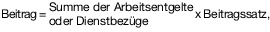
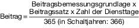

# Verordnung über die pauschale Berechnung und die Zahlung der Beiträge zur gesetzlichen Rentenversicherung für die Dauer eines auf Grund gesetzlicher Pflicht zu leistenden Wehr- und Zivildienstes (RVWZPauschBeitrV)

Ausfertigungsdatum
:   1998-12-21

Fundstelle
:   BGBl I: 1998, 3831

Zuletzt geändert durch
:   Art. 30 G v. 4.8.2019 I 1147

## Eingangsformel

Auf Grund des § 178 Abs. 1 des Sechsten Buches Sozialgesetzbuch -
Gesetzliche Rentenversicherung - (Artikel 1 des Gesetzes vom 18.
Dezember 1989, BGBl. I S. 2261, 1990 I S. 1337), der zuletzt durch
Artikel 40 der Verordnung vom 21. September 1997 (BGBl. I S. 2390)
geändert worden ist, verordnet das Bundesministerium für Arbeit und
Sozialordnung im Einvernehmen mit dem Bundesministerium der
Verteidigung, dem Bundesministerium für Familie, Senioren, Frauen und
Jugend und dem Bundesministerium der Finanzen:

## § 1 Geltungsbereich

Diese Verordnung findet Anwendung auf Personen, die auf Grund
gesetzlicher Pflicht Wehrdienst oder Zivildienst leisten
(Dienstleistende) oder sich in einem Wehrdienstverhältnis besonderer
Art nach § 6 des Einsatz-Weiterverwendungsgesetzes befinden und nach §
3 Satz 1 Nr. 2 oder 2a des Sechsten Buches Sozialgesetzbuch
versicherungspflichtig in der Rentenversicherung sind.

## § 2 Beitragsberechnung

(1) Die Beiträge für Dienstleistende werden kalenderjährlich
berechnet. Die Berechnungen werden getrennt für die jeweiligen Träger
der allgemeinen Rentenversicherung und die Deutsche Rentenversicherung
Knappschaft-Bahn-See als Träger der knappschaftlichen
Rentenversicherung vorgenommen.

(2) Die Beiträge werden wie folgt berechnet:

1.  für Dienstleistende, die Leistungen nach § 5 oder § 8 Absatz 1 Satz 1
    in Verbindung mit Anlage 1 des Unterhaltssicherungsgesetzes erhalten
    und deren beitragspflichtige Einnahme nach § 166 Absatz 1 Nummer 1a
    des Sechsten Buches Sozialgesetzbuch das Arbeitsentgelt ist, das
    dieser Leistung vor Abzug von Steuern und Beiträgen zugrunde liegt
    oder zugrunde läge, oder die Dienstbezüge auf Grund eines versicherten
    Wehrdienstverhältnisses besonderer Art nach § 6 des Einsatz-
    Weiterverwendungsgesetzes erhalten:

    

2.  für Dienstleistende, die Leistungen nach § 5 oder § 8 Absatz 1 Satz 1
    in Verbindung mit Anlage 1 des Unterhaltssicherungsgesetzes erhalten
    und deren beitragspflichtige Einnahme nach § 166 Absatz 1 Nummer 1 des
    Sechsten Buches Sozialgesetzbuch der dort festgesetzte Prozentsatz der
    Bezugsgröße ist:

        .

## § 3 Berechnungsgrundlagen

(1) Summe der Arbeitsentgelte (§ 2 Abs. 2 Nr. 1) sind im Fall einer
Verdienstausfallentschädigung (1. Alternative) die den Leistungen nach
§ 5 Absatz 1 des Unterhaltssicherungsgesetzes vor Abzug von Steuern
und Beitragsanteilen zugrunde liegenden Arbeitsentgelte bis zur
jeweiligen Beitragsbemessungsgrenze und im Fall von Dienstbezügen (2.
Alternative) die beitragspflichtigen Einnahmen nach § 166 Absatz 1
Nummer 1b des Sechsten Buches Sozialgesetzbuch.

(2) Beitragsbemessungsgrundlage (§ 2 Abs. 2 Nr. 2) sind die aus der
für das Kalenderjahr der Dienstleistung geltenden Bezugsgröße
abgeleiteten beitragspflichtigen Einnahmen nach § 166 Absatz 1 Nummer
1 und 1a des Sechsten Buches Sozialgesetzbuch. Solange
unterschiedliche Bezugsgrößen bestimmt sind, ist jeweils die
Bezugsgröße des Gebietes anzuwenden, in dem die in § 1 genannten
Personen ihren Dienst regelmäßig ableisten.

(3) Beitragssatz (§ 2 Abs. 2) ist der für die allgemeine
Rentenversicherung sowie der für die knappschaftliche
Rentenversicherung für den Zeitraum der Dienstleistung maßgebende
Vomhundertsatz.

(4) Diensttage (§ 2 Abs. 2 Nr. 2) sind die Tage des Wehr- oder
Zivildienstes, für die Beiträge zu zahlen sind.

## § 4 Zuständigkeit

Die Berechnung und die Zahlung der Beiträge nehmen vor für

1.  Wehrdienstleistende das Bundesamt für das Personalmanagement der
    Bundeswehr,

2.  Zivildienstleistende das Bundesamt für Familie und
    zivilgesellschaftliche Aufgaben.

## § 5 Berechnungsverfahren

(1) Die Beitragsberechnung wird mit den geleisteten Diensttagen eines
Kalenderjahres durchgeführt. Die Aufteilung der Diensttage auf die
Träger der Rentenversicherung erfolgt nach der Bereichsnummer in der
Versicherungsnummer.

(2) Solange nach den §§ 228a, 228b des Sechsten Buches
Sozialgesetzbuch unterschiedliche Bezugsgrößen gelten, sind die
Beiträge getrennt nach dem Geltungsbereich der jeweiligen Bezugsgröße
zu berechnen. Maßgebend sind die im Geltungsbereich der jeweiligen
Bezugsgröße geleisteten Diensttage. Die Aufteilung der Beiträge auf
die Träger der allgemeinen Rentenversicherung erfolgt nach dem Anteil
der auf die jeweilige Bereichsnummer entfallenden Diensttage. Ist der
für die Berechnung und Zahlung der Beiträge zuständigen Stelle eine
Aufteilung der Beiträge nach der jeweiligen Bezugsgröße für einzelne
Träger der Rentenversicherung möglich, findet Satz 3 keine Anwendung.

## § 6 Beitragszahlung

(1) Die Beiträge sind vom Bundesamt für das Personalmanagement der
Bundeswehr und vom Bundesamt für Familie und zivilgesellschaftliche
Aufgaben für das vergangene Kalenderjahr für die allgemeine
Rentenversicherung an

1.  die Träger der allgemeinen Rentenversicherung,

2.  die Deutsche Rentenversicherung Knappschaft-Bahn-See als Träger der
    knappschaftlichen Rentenversicherung

zu zahlen.

(2) Auf die Beiträge sind bis zum 15. des zweiten Monats eines jeden
Kalendervierteljahres Vorschüsse zu zahlen. Für die Berechnung der
Vorschüsse sind die Diensttage im vergangenen Kalendervierteljahr
zugrunde zu legen. Die Vorschüsse für die allgemeinen
Rentenversicherung werden nach dem Verhältnis der auf sie im
vergangenen Kalendervierteljahr entfallenden Diensttage verteilt.

(3) Nach Ablauf eines jeden Kalenderjahres werden die Beiträge für die
Diensttage des vorangegangenen Kalenderjahres errechnet und den
gezahlten Vorschüssen gegenübergestellt. Unterschiedsbeträge sind bis
zum 31. März eines jeden Jahres für das vergangene Kalenderjahr zu
zahlen oder zu erstatten. Nachträglich festgestellte Änderungen in der
Anzahl der Diensttage oder der Summe der Arbeitsentgelte werden mit
den Berechnungsgrößen des dazugehörigen Abrechnungsjahres bei der
nächsten Abrechnung berücksichtigt.

## § 7

(weggefallen)

## § 8 Inkrafttreten

Diese Verordnung tritt am 1. Januar 1999 in Kraft.

## Schlußformel

Der Bundesrat hat zugestimmt.

