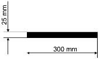
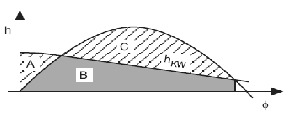
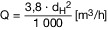
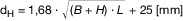
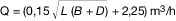
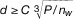

# Schiffssicherheitsverordnung (SchSV 1998)

Ausfertigungsdatum
:   1998-09-18

Fundstelle
:   BGBl I: 1998, 3013, 3023

Zuletzt geändert durch
:   Art. 2 V v. 3.3.2020 I 412

## § 1 Zielsetzung und Geltungsbereich

(1) Diese Verordnung dient der Sicherheit auf See einschließlich des
damit unmittelbar im Zusammenhang stehenden Arbeitsschutzes von
Beschäftigten auf Seeschiffen, des Umweltschutzes auf See und der
wirksamen Anwendung des Schiffssicherheitsgesetzes vom 9. September
1998 (BGBl. I S. 2860). Der Geltungs- und Anwendungsbereich nach den
§§ 1 und 2 des Schiffssicherheitsgesetzes findet entsprechende
Anwendung; dabei umfaßt die Seefahrt für Seeschiffe, die seewärts der
Grenze der Seefahrt im Sinne des § 1 der Flaggenrechtsverordnung vom
4\. Juli 1990 (BGBl. I S. 1389) eingesetzt werden, auch das Aufsuchen,
Benutzen und Verlassen der zugehörigen Lade-, Lösch-, Liege- und
Werftplätze binnenwärts dieser Grenze.

(2) Auf Schiffe unter einer ausländischen Flagge sind auch § 5 Abs. 5
und die dort genannten Regelungen sowie § 13 Abs. 5 anzuwenden.

## § 2 Verantwortlichkeit und Selbstkontrolle

(1) Wer ein Schiff zur Seefahrt einsetzt, hat dafür zu sorgen, daß im
Schiffsbetrieb auftretende Gefahrenquellen überprüft, im Betrieb
gewonnene Erkenntnisse sowie andere wichtige hierzu zur Verfügung
stehende Informationen und Unterlagen einschließlich der
Aufzeichnungen der mit der Bedienung des Schiffes beauftragten
Personen im Rahmen der Sicherheitsvorsorge ausgewertet und die zur
Gefahrvermeidung und -verminderung erforderlichen Maßnahmen getroffen
werden.

(2) Verantwortlicher im Sinne dieser Verordnung ist derjenige, der
nach Absatz 1 ein Schiff zur Seefahrt einsetzt, soweit nach den
Vorschriften dieser Verordnung nichts anderes bestimmt ist. § 9 des
Schiffssicherheitsgesetzes ist anzuwenden.

## § 3 Zusammenarbeit und maritime Sicherheitspartnerschaft

(1) In der Zusammenarbeit der zuständigen Behörden der
Bundesverkehrsverwaltung im Rahmen ihrer Möglichkeiten mit den nach §
3 des Schiffssicherheitsgesetzes Verpflichteten oder den für sie
Tätigen können, insbesondere in den Bereichen der §§ 2 und 7 dieser
Verordnung oder des § 12 des Schiffssicherheitsgesetzes,

1.  mit Unternehmen, Verbänden oder zuständigen Stellen in bezug auf
    bestimmte Produkte, Systeme, Verfahren, Konzepte, Entwicklungen,
    Erprobungen, Kontrollen oder Erfahrungen zur Verbesserung der
    Schiffssicherheit Absprachen getroffen und

2.  zur Förderung solcher Absprachen - auch unter Beteiligung geeigneter
    anderer Stellen - sachdienliche konkrete Modelle ausgearbeitet

werden. Soweit solche Absprachen oder Modelle die zur Verbesserung der
Schiffssicherheit erforderlichen beruflichen Fortbildungsmaßnahmen,
Unterweisungen oder Schulungen für Seeleute betreffen, können auch
Einrichtungen einbezogen werden, die hierfür geeignete Maßnahmen
anbieten.

(2) Die nach dieser Verordnung zuständigen Behörden berücksichtigen
möglichst, soweit dies der Sicherheit förderlich ist, die
Sicherheitskonzepte, Initiativen und Erklärungen, die ihnen bei der
Sicherheitsvorsorge nach § 3 des Schiffssicherheitsgesetzes und § 2
dieser Verordnung unterbreitet werden.

(3) Die Behörden der Bundesverkehrsverwaltung sind auch für folgendes
zuständig:

1.  Ist eine Neuregelung im Bereich der internationalen Regelungen zur
    Schiffssicherheit oder zur Verhütung der Umweltverschmutzung durch
    Schiffe beschlossen worden, aber noch nicht in Kraft getreten, so
    prüft und bescheinigt die Behörde, die für den Sachverhalt nach dem
    Seeaufgabengesetz grundsätzlich zuständig ist, bei Vorliegen der in
    der Neuregelung enthaltenen Voraussetzungen auf schriftlichen Antrag,
    daß ein bestimmtes darin vorgeschriebenes Baumuster, System,
    Verfahren, Konzept oder Verhalten unbeschadet der geltenden
    Sicherheitsvorschriften den Anforderungen der Neuregelung entspricht.

2.  Das Bundesamt für Seeschiffahrt und Hydrographie und die
    Berufsgenossenschaft Verkehrswirtschaft Post-Logistik
    Telekommunikation können nach Maßgabe ihres jeweiligen
    Zuständigkeitsbereichs auf Antrag Vermessungen von Schiffen, Teilen
    oder Typen und Serien von Schiffen, schiffsbezogene Baumusterprüfungen
    oder sonstige schiffsbezogene Prüfungen, Untersuchungen, Zulassungen
    oder Konformitätsbewertungen, auch soweit sie nicht vorgeschrieben
    sind, durchführen oder bescheinigen, wenn dies für die Anwendung von
    Rechtsvorschriften sachdienlich ist.

3.  Macht eine zuständige Behörde Auslegungen, allgemeine Ausnahmen und
    Befreiungen im Sinne des § 7, international beschlossene Empfehlungen
    im Sinne des § 12 des Schiffssicherheitsgesetzes oder international
    angenommene Standards im Sinne des § 9d des Seeaufgabengesetzes
    bekannt, so bezeichnet sie die zugehörigen Rechtsvorschriften.

4.  Das Bundesministerium für Verkehr und digitale Infrastruktur
    veröffentlicht im Januar jeden Jahres im Verkehrsblatt eine Liste der
    Fundstellen der neuen Bekanntmachungen der Muster von Zeugnissen und
    sonstigen Bescheinigungen nach Teil 1 Nummer 12, Teil 2 Nummer 2.9,
    Teil 3 Kapitel 12, Teil 5 Nummer 11, Teil 6 Kapitel 7 und Teil 7
    Nummer 9 der Anlage 1a und Abschnitt A Nummer 1 bis 3 der Anlage 2.

## § 4 Regeln der Technik und der seemännischen Praxis

(1) Als Regeln der Technik und der seemännischen Praxis sind
insbesondere die in Abschnitt E der Anlage zum
Schiffssicherheitsgesetz aufgeführten, in Deutschland als anwendbare
anerkannte Regeln der Technik oder der seemännischen Praxis
bekanntgemachten internationalen Schiffssicherheitsnormen zu beachten.

(2) (weggefallen)

## § 5 Internationaler schiffsbezogener Sicherheitsstandard

(1) Soweit internationale Regelungen, die in den Abschnitten A und C
der Anlage zum Schiffssicherheitsgesetz aufgeführt sind, auf ein
Schiff, das die Bundesflagge führt, anzuwenden sind, sind für dieses
Schiff die jeweils einschlägigen Vorschriften dieser Regelungen und
die in Abschnitt C der Anlage 1 enthaltenen Vorschriften einzuhalten.

(2) Soweit Vorschriften in Rechtsakten der Europäischen Gemeinschaften
oder Europäischen Union, die im Abschnitt D der Anlage zum
Schiffssicherheitsgesetz aufgeführt sind, auf ein Schiff, das die
Bundesflagge führt, anzuwenden sind, sind für dieses Schiff die
jeweils einschlägigen Vorschriften dieser Regelungen und die in
Abschnitt A der Anlage 1 enthaltenen Vorschriften einzuhalten.

(3) Ergänzend zu § 6 des Schiffssicherheitsgesetzes sind für ein
Schiff, das die Bundesflagge führt, die in Abschnitt B der Anlage 1
enthaltenen Vorschriften einzuhalten.

(4) Ein Schiff, das einer bestimmten Schiffskategorie angehört, muss,
wenn es in einer anderen Schiffskategorie eingesetzt werden soll, den
Anforderungen der neuen Schiffskategorie für Schiffe genügen, die zum
Zeitpunkt der Änderung der Schiffskategorie auf Kiel gelegt werden.

(5) Beim Betrieb eines Schiffes, das eine ausländische Flagge führt,
sind in den in Abschnitt D der Anlage 1 aufgeführten Fällen die dort
genannten besonderen Anforderungen einzuhalten.

## § 5a Internationaler schiffsbezogener Sicherheitsstandard in besonderen Fällen

(1) Soweit für ein Schiff, das § 5 Absatz 1 unterliegt, Ausnahmen
gewährt werden, weil es sich im Verlauf seiner Reise nicht weiter als
20 Seemeilen vom nächstgelegenen Land entfernt, müssen mindestens die
Anforderungen eingehalten werden, die das Schiff nach § 6 erfüllen
müsste.

(2) Ein Fahrgastschiff, das Absatz 1 unterliegt, muss mindestens die
Anforderungen einhalten, die ein Schiff in der Inlandfahrt erfüllen
muss.

## § 6 Schiffsbezogener Sicherheitsstandard in übrigen Fällen

(1) Soweit für ein Schiff, das die Bundesflagge führt, nicht die in §
5 Absatz 1 und 2 bezeichneten Anforderungen einzuhalten sind, sind die
Anforderungen nach Anlage 1a einzuhalten. Maßgeblich ist

1.  für ein Fahrgastschiff Anlage 1a Teil 1 in Verbindung mit Teil 7,

2.  für ein Binnenschiff im Verkehr durch die Kaiserbalje Anlage 1a Teil
    2,

3.  für ein Traditionsschiff Anlage 1a Teil 3,

4.  für ein Sportboot Anlage 1a Teil 4,

5.  für ein Fischereifahrzeug Anlage 1a Teil 5,

6.  für ein Frachtschiff Anlage 1a Teil 6 in Verbindung mit Teil 7,

soweit nicht in den nachfolgenden Vorschriften etwas anderes bestimmt
ist.

(2) Für ein Schiff, das einer bestimmten Schiffskategorie angehört,
müssen, wenn es in einer anderen Schiffskategorie eingesetzt werden
soll, die Anforderungen für Schiffe eingehalten werden, die zum
Zeitpunkt der Änderung der Schiffskategorie auf Kiel gelegt worden
sind, soweit nicht in den nachfolgenden Vorschriften etwas anderes
bestimmt ist.

## § 6a Dampfkessel

Dampfkesselanlagen an Bord von Seeschiffen unter deutscher Flagge sind
nach Maßgabe der Anlage 1a Teil 8 so auszulegen, zu bauen, auszurüsten
und zu betreiben, dass sie unter allen Betriebsbedingungen zuverlässig
arbeiten und zu keiner Zeit die Sicherheit des Schiffes und der an
Bord befindlichen Personen gefährden. Schiffszeugnisse und
-bescheinigungen nach § 9 Abs. 1 bis 4, hinsichtlich der Anlage 2 in
Verbindung mit deren Abschnitt A Nr. 1, 2, 13a, 21a, 21b, 21c, 22a und
22c, dürfen für Seeschiffe, die mit Dampfkesselanlagen ausgerüstet
sind, nur erteilt werden, wenn die Voraussetzungen des Satzes 1
erfüllt sind.

## § 6b Abwasserrückhalteanlagen

(1) In Anlage IV Regel 2 Abs. 1 des MARPOL-Übereinkommens nicht
genannte deutsche Schiffe, einschließlich Sportboote, oder solche
Schiffe unter der Flagge eines anderen Ostseeanrainers bei der Fahrt
in der Ostsee im Hoheitsgebiet oder in der ausschließlichen
Wirtschaftszone der Bundesrepublik Deutschland müssen, sofern sie über
eine Toilette verfügen, mit einer Abwasserrückhalteanlage ausgerüstet
sein. Anlage IV Regel 12 Abs. 1 des MARPOL-Übereinkommens gilt für
diese Schiffe entsprechend.

(2) Abwasserrückhalteanlagen sowie bord- und landseitige Anschlüsse
müssen die Anforderungen der von der Helsinki-Kommission am 21. März
2001 angenommenen Richtlinie, Anlage zu der Empfehlung 22/1 (VkBl.
2008 S. 122) berücksichtigen. Der Tank der Abwasserrückhalteanlage
muss von angemessener Größe sein. Bei einem Schiff mit mehreren
Toiletten genügt eine Abwasserrückhalteanlage für eine Toilette, wenn
sichergestellt ist, dass die übrigen Toiletten in einer Entfernung bis
zu 12 Seemeilen vom nächstgelegenen Land nicht benutzt werden.

(3) Absatz 1 gilt nicht für Schiffe,

1.  die vor dem 1. Januar 1980 gebaut worden sind,

2.  die vor dem 1. Januar 2003 gebaut worden sind und

    a)  eine Rumpflänge von weniger als 11,50 m oder eine Breite von weniger
        als 3,80 m aufweisen oder

    b)  denen das Bundesamt für Seeschifffahrt und Hydrographie eine
        Bescheinigung über die Befreiung von der Ausrüstungspflicht erteilt
        hat.

Die Bescheinigung nach Satz 1 Nr. 2 Buchstabe b wird für Schiffe
erteilt, bei denen die Ausrüstung mit einer Abwasserrückhalteanlage
aus anderen Gründen als in den Fällen des Satzes 1 Nr. 1 oder 2
Buchstabe a technisch unmöglich oder bezogen auf den Wert
wirtschaftlich unzumutbar ist und dieser Umstand durch ein Einzel-,
Gruppen- oder Modellgutachten eines öffentlich bestellten und
vereidigten Sachverständigen oder eines gemäß Norm EN 45013 von einer
akkreditierten Stelle zertifizierten Boots- und Yachtsachverständigen
nachgewiesen ist.

## § 7 Ausnahmen und Befreiungen

(1) Das Bundesamt für Seeschiffahrt und Hydrographie und die
Berufsgenossenschaft Verkehrswirtschaft Post-Logistik
Telekommunikation können im Rahmen ihrer Aufgaben nach dem
Seeaufgabengesetz

1.  nach Maßgabe der internationalen Regelungen im Sinne des
    Schiffssicherheitsgesetzes,

2.  in Anwendung des § 13 Abs. 6 oder des Abschnitts A.I. Nr. 6.1 der
    Anlage 1,

3.  nach Maßgabe der Anlage 1a

auf Antrag Ausnahmen von verbindlichen Pflichten oder Befreiungen
zulassen, soweit eine vergleichbare Sicherheit des Schiffes oder die
Abwehr von Gefahren und schädlichen Umwelteinwirkungen im Sinne des
Seeaufgabengesetzes auf andere Weise, auch durch geeignete
Nebenbestimmungen, gewährleistet ist. Dies kann insbesondere dann
erforderlich sein, wenn für ein seegängiges Wasserfahrzeug wegen
seiner geringen Größe oder besonderen Bauart die Anforderungen dieser
Verordnung nicht oder nur mit wirtschaftlich nicht vertretbaren Kosten
erfüllbar sind.

(2) Für Schiffe, die nach den Vorschriften der
Binnenschiffsuntersuchungsordnung vom 21. September 2018 (BGBl. I S.
1398) in der jeweils geltenden Fassung auf den Wasserstraßen der Zonen
1 und 2 nach Anhang I der Binnenschiffsuntersuchungsordnung am Verkehr
teilnehmen dürfen, treten im Verkehr auf diesen Wasserstraßen
hinsichtlich der Anforderungen an den Bau, die Ausrüstung, Vermessung,
den Freibord und die Besetzung der Fahrzeuge, die Eignung des
Unternehmers sowie die Befähigung der Besatzungsmitglieder
einschließlich des Schiffsführers die auf der Grundlage des
Binnenschifffahrtsaufgabengesetzes erlassenen Rechtsvorschriften an
die Stelle dieser Verordnung.

(3) Die in den internationalen Regelungen enthaltenen Vorschriften
über die Zulassung eines gleichwertigen Einsatzes für Einrichtungen,
Werkstoffe, Vorrichtungen, Geräte, Ausrüstungen oder sonstige
Vorkehrungen sind auf Schiffe, für die die internationalen Regelungen
keine Anwendung finden, entsprechend anzuwenden.

(4) Ein Seeschiff, für das die Befugnis zur Führung der Bundesflagge
nach § 10 des Flaggenrechtsgesetzes für die erste Überführungsreise in
einen anderen Hafen verliehen wurde, ist für die Zwecke dieser
Verordnung ausschließlich während dieser Reise einem Schiff unter
ausländischer Flagge gleichgestellt, sofern der Eigentümer nicht
widerspricht.

(5) Für Schiffe, deren Kiel vor dem 18. Juli 1994 gelegt wurde und
denen im Schiffsmeßbrief zusätzlich zu der nach dem Internationalen
Schiffsvermessungs-Übereinkommen von 1969 (BGBl. 1975 II S. 65)
ermittelten Bruttoraumzahl ein Bruttoraumgehalt in Registertonnen
bescheinigt wurde, gilt als Parameter für die Anwendung dieser
Verordnung der Bruttoraumgehalt anstelle der Bruttoraumzahl.

(6) (weggefallen)

## § 8 Funkstellen, Funktionsfähigkeit von Schiffsausrüstung

(1) (weggefallen)

(2) Schiffsausrüstung, die vor ihrer Verwendung an Bord von Schiffen,
die die Bundesflagge führen, von der zuständigen Stelle geprüft worden
ist, kann von dieser mit einer Kennzeichnung versehen werden, aus der
sich ergeben kann, bis zu welchem Zeitpunkt mit der erforderlichen
Funktionsfähigkeit, insbesondere Meß- und Anzeigegenauigkeit,
gerechnet werden kann, wenn an der Ausrüstung keine Veränderungen
stattfinden. Vor einem so bestimmten Zeitpunkt ist vom
Schiffseigentümer für verwendete zulassungspflichtige Ausrüstung
jeweils eine Wiederholungsprüfung durch einen von der zuständigen
Stelle anerkannten Betrieb und eine entsprechende Kennzeichnung zu
veranlassen.

(3) Fest an Bord solcher Schiffe aufgestellte Magnet-Regelkompasse und
Magnet-Steuerkompasse müssen vor Inbetriebnahme sowie danach
mindestens alle zwei Jahre durch eine vom Bundesamt für Seeschifffahrt
und Hydrographie auf Grund eines Sachkundenachweises oder von einem
Mitgliedstaat der Internationalen Seeschifffahrts-Organisation
anerkannte Person reguliert werden; der Nachweis der Regulierung ist
an Bord mitzuführen. Der Schiffsführer hat regelmäßig die Deviation zu
kontrollieren und die Eintragung über die Kontrollergebnisse der
vergangenen zwölf Monate mitzuführen.

## § 9 Schiffszeugnisse und -bescheinigungen, Schiffsbesichtigungen

(1) Die Besichtigung und Zeugniserteilung folgt den in der IMO-
Entschließung A.746(18) vom 4. November 1993 über ein harmonisiertes
System der Besichtigung und Zeugniserteilung (VkBl. 1998 S. 829)
festgelegten Verfahren und Leitlinien.

(2) Auf Besichtigungen von Schiffen zur Erteilung von Zeugnissen durch
befähigte Schiffsbesichtiger ist zu der in Abschnitt D Nr. 7 der
Anlage zum Schiffssicherheitsgesetz genannten Richtlinie 2009/15/EG in
der jeweils geltenden Fassung insbesondere Abschnitt B der Anlage 2 zu
dieser Verordnung anzuwenden.

(3) Die zuständigen Behörden erteilen auf Antrag

1.  für ein Schiff, auf das § 5 Absatz 1 bis 4 anzuwenden ist, die
    erforderlichen Zeugnisse und Bescheinigungen,

2.  für ein Schiff im Sinne des § 6 Absatz 1 die in der Anlage 1a
    bezeichneten Zeugnisse und Bescheinigungen,

wenn durch Besichtigung die Übereinstimmung mit den anwendbaren
Vorschriften dieser Verordnung oder der internationalen Regelungen im
Sinne des Schiffssicherheitsgesetzes festgestellt ist. Sind für ein
Schiff Schiffssicherheitszeugnisse für verschiedene Nutzungen erteilt
worden, hat der Schiffsführer zu Beginn einer Reise jede Änderung des
Nutzungszwecks im Schiffstagebuch einzutragen.

(4) Der Verantwortliche hat unter Antragstellung und auf eigene Kosten
sicherzustellen, daß ein Schiff im Sinne des Absatzes 3, das die
Bundesflagge führt und für das weder ein solches
Schiffssicherheitszeugnis noch ein entsprechendes nach internationalen
Regelungen an Bord mitzuführendes Bau- und Ausrüstungszeugnis oder
eine Bescheinigung nach Maßgabe des Absatzes 5 gültig ist, vor der
ersten Inbetriebnahme des Schiffes durch ihn oder auf seine
Veranlassung oder vor der ersten Fahrt nach Ungültigwerden eines
solchen Zeugnisses

1.  bei Bestehen einer Ausrüstungs- oder Zulassungspflicht für
    Navigations- oder Funkausrüstung an Bord dem Bundesamt für
    Seeschiffahrt oder Hydrographie zur Überprüfung dieser Ausrüstung
    sowie

2.  in jedem Fall der Berufsgenossenschaft Verkehrswirtschaft Post-
    Logistik Telekommunikation zur Überprüfung des sicheren Zustands des
    Schiffes und seiner Ausrüstung

vorgeführt wird. Er hat unverzüglich alle - auch betrieblichen -
Mängel zu beseitigen, bei denen eine dieser Behörden feststellt, daß
sie eine Gefahr für Schiffe, Schiffahrt oder Schiffahrtseinrichtungen,
Gesundheit, Küste oder die Umwelt darstellen.

(5) Für Binnenschiffe - ausgenommen Öl-, Gas- und
Chemikalientankschiffe in der Massengutschiffahrt sowie
Fahrgastschiffe mit nicht zur Besatzung zählenden Personen an Bord -
genügt hinsichtlich der baulichen Beschaffenheit und der Ausrüstung im
Bereich seewärts bis zur Verbindungslinie Schillighörn über das Haus
der Vogelschutzwarte der Insel Alte Mellum zum Kirchturm Cappel eine
gültige Bescheinigung der Generaldirektion Wasserstraßen und
Schifffahrt über die Einhaltung der Anforderungen des Teils 2 der
Anlage 1a.

(6) Die Gleichwertigkeit im Sinne der in § 5 Abs. 5 genannten
Anforderungen ist bei Schiffen, die Küstenschifffahrt betreiben oder
die auf Seeschifffahrtsstraßen oder im seewärts angrenzenden Bereich
des deutschen Küstenmeeres gewerblich eingesetzt sind, durch eine an
Bord mitzuführende Bescheinigung der Berufsgenossenschaft
Verkehrswirtschaft Post-Logistik Telekommunikation nachzuweisen. Für
Schiffe im Sinne des Satzes 1, die internationalen Regelungen
unterliegen, kann die Gleichwertigkeit auch durch geeignete, an Bord
mitgeführte Zeugnisse oder Bescheinigungen des jeweiligen
Flaggenstaates nachgewiesen werden.

(7) Die Vorführung und die Mängelbeseitigung im Sinne des Absatzes 4
sind unverzüglich vorzunehmen, wenn für ein zur Seefahrt eingesetztes
Schiff der Nachweis der Gültigkeit oder Gleichwertigkeit im Sinne der
Absätze 4 und 6 auf amtliche Aufforderungen nicht erbracht wird.

(8) Beabsichtigt die Berufsgenossenschaft Verkehrswirtschaft Post-
Logistik Telekommunikation, einen Verstoß gegen Anforderungen oder
Pflichten in Bezug auf die Sicherheit auf See im Rahmen der
Überwachung der Einhaltung der Vorschriften über die Organisation
eines sicheren Schiffsbetriebes, auch im Hinblick auf § 13 Abs. 2 des
Schiffssicherheitsgesetzes, zu berücksichtigen, so unterrichtet sie
hiervon umgehend die Verantwortlichen durch eine schriftliche
Abmahnung und gibt ihnen Gelegenheit zur Stellungnahme.

(9) Der Eigentümer eines Schiffes hat ungültige oder verlorene und
nach Neuausstellung wiedergefundene Schiffszeugnisse und
-bescheinigungen unverzüglich nachweislich zu vernichten, soweit die
ausstellende Behörde nicht etwas anderes anordnet. Der Eigentümer des
Schiffes kann abweichend von Satz 1 ein solches Zeugnis auch der
ausstellenden Behörde zurückgeben.

## § 10 Ausübung der Vollzugsaufgaben, Schiffsdaten

(1) Die für die Vollzugsaufgaben nach dem Seeaufgabengesetz und dem
Schiffssicherheitsgesetz zuständigen Behörden können Anordnungen
treffen und Ausnahmen und Befreiungen nach § 7 Abs. 1 mit Auflagen
verbinden.

(2) Die zuständigen Behörden des Bundes bedienen sich bei den
Vollzugsaufgaben nach Maßgabe der Vereinbarungen zwischen dem Bund und
den Küstenländern über die Ausübung der schiffahrtspolizeilichen
Vollzugsaufgaben der Wasserschutzpolizei der Küstenländer sowie nach
Maßgabe des § 3 Abs. 2 des Seeaufgabengesetzes der Bundespolizei und
der Zollverwaltung.

(3) Das Bundesamt für Seeschiffahrt und Hydrographie erhebt die für
die Ausführung des Schiffssicherheitsgesetzes und dieser Verordnung
erforderlichen Schiffsdaten.

## § 11 Auslaufen und Weiterfahrt von Schiffen, die die Bundesflagge führen

(1) Wenn

1.  ein zur Führung der Bundesflagge berechtigtes Schiff Anforderungen,
    die nach dem internationalen schiffsbezogenen Sicherheitsstandard, dem
    Schiffssicherheitsgesetz oder im Rahmen des Seeaufgabengesetzes
    vorgeschrieben sind, im wesentlichen nicht erfüllt und dies eine
    unmittelbare Gefahr für Schiffe, Schiffahrt oder
    Schiffahrtseinrichtungen, Gesundheit, Küste oder die Umwelt darstellt,
    oder

2.  für ein solches Schiff nicht die vorgeschriebenen gültigen Zeugnisse
    über die Erfüllung der genannten Anforderungen nachgewiesen werden
    können,

3.  oder ein solches Schiff, sofern es nach § 9 Abs. 4 vorgeführt werden
    muss, nicht vorgeführt worden ist,

verbietet die Berufsgenossenschaft Verkehrswirtschaft Post-Logistik
Telekommunikation sein Auslaufen, seine Weiterfahrt oder seinen
Betrieb oder gestattet diese nur unter Bedingungen oder Auflagen,
durch welche die gebotene Gefahrabwehr gewährleistet wird.

(2) Besteht der konkrete Verdacht, daß einer der in Absatz 1 genannten
Sachverhalte vorliegt, - insbesondere weil eine dort genannte
Anforderung nicht eingehalten ist, - so kann das Auslaufen oder die
Weiterfahrt für die Dauer der zur Gefahrverhütung erforderlichen
Sachverhaltsermittlung verhindert werden.

(3) Stellt eine Schiffahrtspolizeibehörde einen in Absatz 1 genannten
Sachverhalt fest, so kann sie bis zur Entscheidung der
Berufsgenossenschaft Verkehrswirtschaft Post-Logistik
Telekommunikation das Auslaufen oder die Weiterfahrt für einen zu
bestimmenden angemessenen Zeitraum verhindern.

## § 12 Überprüfung von Schiffen unter ausländischer Flagge (Hafenstaatkontrolle)

(1) Für die Hafenstaatkontrolle ist die Berufsgenossenschaft
Verkehrswirtschaft Post-Logistik Telekommunikation zuständig. Sehen
das Schiffssicherheitsgesetz oder die internationalen Regelungen ein
Verhindern des Auslaufens oder der Weiterfahrt von Schiffen unter
einer ausländischen Flagge vor, ist § 11 Abs. 3 entsprechend
anzuwenden.

(2) Soweit die Anforderungen und Pflichten der internationalen
Regelungen auf ein Schiff unter ausländischer Flagge keine Anwendung
finden, stellen die zuständigen Behörden sicher, daß dieses Schiff
nicht offensichtlich eine unmittelbare Gefahr für Schiffe, Schiffahrt
oder Schiffahrtseinrichtungen, Gesundheit, Küste oder die Umwelt
darstellt; sie lassen sich hierbei von Anlage 1 der Pariser
Vereinbarung vom 20. Juli 2000 über die Hafenstaatkontrolle (BGBl. II
S. 892) in der jeweils geltenden Fassung leiten.

(3) Bei der Anwendung des Artikels 16 Absatz 1 bis 4 sowie des
Artikels 21 der Richtlinie 2009/16/EG des Europäischen Parlaments und
des Rates vom 23. April 2009 über die Hafenstaatkontrolle (Neufassung)
(ABl. L 131 vom 28.5.2009, S. 57) in ihrer jeweils geltenden Fassung
hinsichtlich der Verweigerung des Zugangs zu einem Hafen steht in
Bezug auf Staaten, in denen das Schiff für mangelhaft befunden wurde,
ein Staat, dessen Seeschifffahrtsbehörde zu den Unterzeichnern der
Pariser Vereinbarung über die Hafenstaatkontrolle gehört, einem
Mitgliedstaat gleich.

(4) Die Berufsgenossenschaft Verkehrswirtschaft Post-Logistik
Telekommunikation arbeitet im Rahmen der Hafenstaatkontrolle
insbesondere eng mit den zuständigen Behörden der anderen
Mitgliedstaaten der Europäischen Union und der Pariser Vereinbarung
über die Hafenstaatenkontrolle zusammen und tauscht mit diesen die zur
Erfüllung ihrer Aufgaben nach den Artikeln 4 bis 30 der Richtlinie
2009/16/EG des Europäischen Parlaments und des Rates erforderlichen
Informationen aus. Dabei bedient sie sich der Verbindung mit dem auf
Grund der Pariser Vereinbarung über die Hafenstaatkontrolle
eingerichteten Informationssystem.

(5) Absatz 4 gilt für die Erfüllung der Aufgaben nach der Richtlinie
(EU) 2017/2110 des Europäischen Parlaments und des Rates vom 15.
November 2017 über ein System von Überprüfungen im Hinblick auf den
sicheren Betrieb von Ro-Ro-Fahrgastschiffen und Fahrgast-
Hochgeschwindigkeitsfahrzeugen im Linienverkehr und zur Änderung der
Richtlinie 2009/16/EG sowie zur Aufhebung der Richtlinie 1999/35/EG
des Rates (ABl. L 315 vom 30.11.2017, S. 61) in ihrer jeweils
geltenden Fassung entsprechend.

## § 13 Verhaltenspflichten

(1) Der Eigentümer eines Schiffes, das die Bundesflagge führt, hat
dafür zu sorgen, daß

1.  bei wesentlichen Veränderungen am Schiff oder seiner Ausrüstung, die
    den - auch im Bauzustand - zugelassenen Zustand und insbesondere
    offenkundig deren Wirksamkeit oder Betriebssicherheit beeinträchtigen,
    unverzüglich die sachgemäße Instandsetzung veranlaßt, zur Wahrung der
    Zulassung der beeinträchtigungsfreie zugelassene Zustand
    wiederhergestellt und die zuständige Behörde unverzüglich davon
    unterrichtet wird,

2.  auf der Brücke stets folgende Unterlagen vorhanden sind:

    a)  die für die jeweilige Seereise erforderlichen amtlichen Ausgaben von
        Seekarten und Seebüchern im Sinne von Abschnitt C.I.4 der Anlage 1;
        bei Sportbooten im Sinne der Sportbootführerscheinverordnung-See
        genügt es, wenn an Bord nichtamtliche Ausgaben mitgeführt werden,

    b)  die von der Berufsgenossenschaft Verkehrswirtschaft Post-Logistik
        Telekommunikation herausgegebenen amtlichen Ausgaben der
        Schiffssicherheitsvorschriften und des Schiffssicherheitshandbuchs,
        der Schautafeln mit der Darstellung von Manövrierinformationen und
        Lotsenversetzeinrichtungen sowie auf Fahrgastschiffen die Listen der
        Fahrtbeschränkungen; das gilt nicht für Schiffe in der Kleinen
        Hochseefischerei, in der Küstenfischerei und in der Wattfahrt, für
        Sportboote im Sinne der Sportbootführerscheinverordnung-See sowie für
        die in § 6 ausdrücklich genannten Schiffe, soweit in Anlage 1a nichts
        anderes bestimmt ist,

    c)  die vom Bundesamt für Seeschiffahrt und Hydrographie herausgegebenen
        Nachrichten für Seefahrer des laufenden und der zwei vorangegangenen
        Jahre bei Reiseantritt; das gilt nicht für Sportboote im Sinne der
        Sportbootführerscheinverordnung-See sowie für Schiffe in der
        Küstenfischerei und in der Wattfahrt,

    d)  auf Schiffen, die von den Anforderungen nach den Buchstaben b und c
        ausgenommen sind, die für die jeweiligen Schiffe im Verzeichnis des
        Bundesamtes für Seeschifffahrt und Hydrographie aufgeführten
        Veröffentlichungen,

3.  Seetagebücher mitgeführt und nach Maßgabe des Abschnittes B II Nr. 6
    der Anlage 1 aufbewahrt werden,

4.  in den Fällen des § 9 Absatz 3 Satz 1, Absatz 4 Satz 1 und Absatz 5
    ein gültiges Schiffssicherheitszeugnis, eine gültige Prüfbescheinigung
    oder eine gültige Bescheinigung nach § 9 Absatz 5 vorhanden ist.

(2) Der Schiffsführer eines Schiffes, das die Bundesflagge führt, hat
dafür zu sorgen, daß

1.  ein amtlich festgelegter Mindestfreibord des Schiffes nicht
    unterschritten wird: dies gilt nicht in einem Hafen zwischen der
    Eingangs- und Ausgangsabfertigung, soweit der Verschlußzustand des
    Schiffes dies zuläßt,

2.  das Schiff nur so beladen ist, daß die nach den Stabilitätsunterlagen
    erforderliche Mindeststabilität nicht unterschritten wird,

3.  Decksladungen so gestaut sind, daß Öffnungen im Bereich der Ladung,
    die als Zugang zu den Besatzungsunterkünften, dem Maschinenraum und
    allen sonstigen zum Betrieb des Schiffes erforderlichen Arbeitsräumen
    oder als Fluchtweg dienen, ordnungsgemäß geschlossen werden können,
    gegen das Eindringen von Wasser gesichert sind und zugänglich bleiben,

4.  auf Schiffen nach Kapitel V Regel 22 der Anlage zu dem Übereinkommen,
    das in Abschnitt A.I. der Anlage zum Schiffssicherheitsgesetz
    aufgeführt ist, die dort vorgeschriebenen Anforderungen an die Sicht
    eingehalten werden,

4a. auf Schiffen, die mit einem automatischen
    Schiffsidentifizierungssystem ausgerüstet sind, dieses entsprechend
    Regel V/19.2.4 Satz 2 der Anlage zum SOLAS-Übereinkommen, das in
    Abschnitt A.I der Anlage zum Schiffssicherheitsgesetz aufgeführt ist,
    zu jeder Zeit in Betrieb gehalten wird,

5.  auf einer Decksladung Laufplanken und Schutzgeländer oder Strecktaue
    als wirksame Schutzvorkehrung für die Besatzung angebracht sind, wenn
    auf oder unter Deck kein geeigneter Verkehrsgang vorhanden ist,

6.  auf Schiffen, denen ein Holzfreibord erteilt worden ist, zusätzlich zu
    den Erfordernissen nach den Nummern 3 und 5 auf jeder Seite der
    Decksladung bis zur Höhe von mindestens 1 m über der Ladung
    Schutzgeländer oder Strecktaue in senkrechtem Abstand von höchstens
    0,33 m angebracht sind,

7.  vorbehaltlich der für Binnenschiffe auf den Wasserstraßen der Zonen 1
    und 2 nach Anhang I der Binnenschiffsuntersuchungsordnung geltenden
    Sonderregelungen Ladeluken vor Antritt der Fahrt wetterdicht
    geschlossen werden und während der Fahrt verschlossen bleiben, soweit
    sie nicht bei ruhigem Wetter, insbesondere wegen Arbeiten unter Deck
    oder wegen der Art der Ladung, vorübergehend geöffnet werden,

8.  Getreide auf einem Schiff von mindestens 6,50 m Breite als
    Schüttgutladung nur befördert wird, wenn dafür eine Genehmigung nach
    Kapitel VI Regel 9 der Anlage zu dem Übereinkommen, das in Abschnitt
    A.I. der Anlage zum Schiffssicherheitsgesetz aufgeführt ist, vorliegt,

9.  ausreichende Vorkehrungen für den Wachdienst im Sinne der Regel VIII/2
    Abs. 2 der Anlage zum STCW-Übereinkommen getroffen werden,

10. die amtlich zulässige Anzahl von Personen, die von dem Schiff
    befördert werden dürfen, nicht überschritten wird,

11. die Seetagebücher mitgeführt werden und im Schiffstagebuch
    unverzüglich über alle Vorkommnisse an Bord durch geeignete
    Eintragungen berichtet wird, die für die Sicherheit in der Seefahrt
    einschließlich des Umweltschutzes auf See und des Arbeitsschutzes von
    besonderer Bedeutung sind,

12. das nach § 9 Abs. 3 vorgeschriebene Sicherheitszeugnis, die nach § 9
    Absatz 4 Satz 6 ausgestellte Prüfbescheinigung oder die nach § 9
    Absatz 5 ausgestellte Bescheinigung mitgeführt und auf Verlangen einer
    zuständigen Behörde vorgelegt wird und

13. auf Fahrzeugen, für die Schiffssicherheitszeugnisse für verschiedene
    Verwendungszwecke ausgestellt worden sind, zu Beginn einer jeden Reise
    jede Änderung des Nutzungszwecks des Fahrzeugs im Schiffstagebuch
    eingetragen wird.

(3) Der verantwortliche nautische Wachoffizier eines Schiffes, das die
Bundesflagge führt, hat

1.  dafür zu sorgen, daß das Ruder bei hoher Verkehrsdichte, bei
    verminderter Sicht oder wenn es die Bauart des Schiffes, dessen
    Beladung oder besondere Umstände erfordern, mit einem geeigneten
    Rudergänger besetzt ist und bei Benutzung der Selbststeueranlage
    sichergestellt ist, daß erforderlichenfalls sofort auf Handsteuerung
    unter seiner Aufsicht übergegangen werden kann und insbesondere bei
    der Fahrt im Revier sich ein Rudergänger in der Nähe des Ruders
    aufhält,

2.  dafür zu sorgen, daß der Ausguck bei der Fahrt im Revier sowie von der
    Zeit vom Sonnenuntergang bis Sonnenaufgang mit einer geeigneten Person
    besetzt ist,

3.  die Ausführung der Ruder- und Maschinenkommandos und des Ankermanövers
    zu überwachen,

4.  im Sinne der Regel Teil A Kapitel VIII/2 Nr. 49 Satz 3 des Anhangs der
    Anlage zum STCW-Übereinkommen den gesteuerten Kurs, die Position und
    die Geschwindigkeit des Schiffes in kurzen, der jeweiligen
    Verkehrssituation angepaßten Zeitabständen zu überprüfen und dabei die
    vorgeschriebenen und verfügbaren Navigationshilfen zu verwenden; dies
    gilt auch, wenn das Schiff unter Lotsenberatung steht.

(4) Der Leiter der Maschinenanlage eines Schiffes, das die
Bundesflagge führt, hat dafür zu sorgen, daß in Absprache mit dem
Schiffsführer ein sicherer technischer Wachdienst im Sinne der Regel
Teil A Kapitel VIII/3 Nr. 10 des Anhangs der Anlage zum STCW-
Übereinkommen besteht.

(4a) Bei einer Seefunkstelle auf einem Schiff, das die Bundesflagge
führt, darf mobilen Seefunkdienst oder mobilen Seefunkdienst über
Satelliten nur ausüben, wer einen für die Funkstelle ausreichenden
gültigen Befähigungsnachweis nach Anlage 3 besitzt. Ein
Befähigungsnachweis ist gültig und ausreichend, wenn er im Sinne der
Verordnung über Seefunkzeugnisse oder dieser Verordnung als
ausreichend ausgestellt oder anerkannt worden ist und fortbesteht. Bis
zum 31. Dezember 2002 gilt die Verordnung über Seefunkzeugnisse
entsprechend für Funkstellen auf Schiffen unter der Bundesflagge, die
nicht Kauffahrteischiffe sind. Der Deutsche Motoryachtverband und der
Deutsche Segler-Verband werden beauftragt, vom 1. Januar 2003 an nach
Maßgabe dieser Verordnung über Anträge auf Zulassung zur Prüfung zum
Erwerb von Funkbetriebszeugnissen für Seefunkstellen auf
Sportfahrzeugen zu entscheiden, die Prüfungen abzunehmen, bei Bestehen
der Prüfung die genannten Zeugnisse zu erteilen, in bestimmten Fällen
die genannten Zeugnisse zu entziehen, sowie die Kosten zu erheben.

(5) Die Beachtung von Anordnungen und Auflagen im Sinne des § 10 Abs.
1 sowie die Verhaltenspflichten nach Absatz 2, ausgenommen die Nummern
5, 6, 9, 10 und 11, gelten auch in bezug auf Schiffe unter einer
ausländischen Flagge nach Maßgabe des § 2 des
Schiffssicherheitsgesetzes.

(6) Die Berufsgenossenschaft Verkehrswirtschaft Post-Logistik
Telekommunikation kann von den Verhaltenspflichten in Absatz 2 Nr. 9
und Absatz 3 Nr. 1 und 2 bei Vorliegen eines wichtigen Grundes nach
Maßgabe des § 7 Abs. 1 Ausnahmen zulassen.

## § 14 Ordnungswidrigkeiten

(1) Ordnungswidrig im Sinne des § 15 Abs. 1 Nr. 2 des
Seeaufgabengesetzes handelt, wer vorsätzlich oder fahrlässig

1.  als Eigentümer

    a)  entgegen § 13 Abs. 1 Nr. 1 nicht dafür sorgt, daß unverzüglich die
        sachgemäße Instandsetzung veranlaßt wird,

    b)  entgegen § 13 Abs. 1 Nr. 2 nicht dafür sorgt, daß die dort
        vorgeschriebenen Unterlagen auf der Brücke vorhanden sind,

    c)  entgegen § 13 Abs. 1 Nr. 3 nicht dafür sorgt, daß Seetagebücher
        mitgeführt und aufbewahrt werden oder

    d)  entgegen § 13 Abs. 1 Nr. 4 nicht dafür sorgt, dass das
        Schiffssicherheitszeugnis, die Prüfbescheinigung oder die
        Bescheinigung nach § 9 Absatz 5 vorhanden ist,

1a. als Verantwortlicher im Sinne von § 2 Absatz 2

    a)  entgegen § 9 Abs. 4 Satz 1 nicht sichergestellt, dass ein Schiff
        vorgeführt wird, oder

    b)  entgegen § 9 Absatz 4 Satz 2 einen Mangel nicht, nicht richtig, nicht
        vollständig oder nicht rechtzeitig beseitigt,

2.  als Schiffsführer

    a)  entgegen § 13 Abs. 2 Nr. 1 nicht dafür sorgt, daß der Mindestfreibord
        des Schiffes nicht unterschritten wird,

    b)  entgegen § 13 Abs. 2 Nr. 2 nicht dafür sorgt, daß die erforderliche
        Mindeststabilität nicht unterschritten wird,

    c)  entgegen § 13 Abs. 2 Nr. 3 nicht dafür sorgt, daß Decksladungen in der
        dort genannten Weise gestaut sind,

    d)  entgegen § 13 Abs. 2 Nr. 4 nicht dafür sorgt, daß die Anforderungen an
        die Sicht eingehalten werden,

    e)  entgegen § 13 Absatz 2 Nummer 4a nicht dafür sorgt, dass das
        automatische Schiffsidentifizierungssystem zu jeder Zeit in Betrieb
        gehalten wird,

    f)  entgegen § 13 Abs. 2 Nr. 5 nicht dafür sorgt, daß auf Decksladungen
        Laufplanken und Schutzgeländer oder Strecktaue angebracht sind,

    g)  entgegen § 13 Abs. 2 Nr. 6 nicht dafür sorgt, daß auf Schiffen, denen
        ein Holzfreibord erteilt worden ist, die vorgeschriebenen
        Schutzgeländer oder Strecktaue ordnungsgemäß angebracht sind,

    h)  entgegen § 13 Abs. 2 Nr. 7 nicht dafür sorgt, daß Ladeluken
        wetterdicht geschlossen werden und verschlossen bleiben,

    i)  entgegen § 13 Abs. 2 Nr. 8 nicht dafür sorgt, daß Getreide als
        Schüttgutladung nur befördert wird, wenn die vorgeschriebene
        Genehmigung vorliegt,

    j)  entgegen § 13 Abs. 2 Nr. 9 nicht dafür sorgt, daß ausreichende
        Vorkehrungen für den Wachdienst getroffen werden,

    k)  entgegen § 13 Absatz 2 Nummer 10 nicht dafür sorgt, dass eine dort
        genannte Anzahl von Personen nicht überschritten wird,

    l)  entgegen § 13 Abs. 2 Nr. 11 nicht dafür sorgt, dass Seetagebücher
        mitgeführt oder die Vorkommnisse an Bord, die für die Sicherheit in
        der Seefahrt von Bedeutung sind, eingetragen werden,

    m)  entgegen § 13 Abs. 2 Nr. 12 nicht dafür sorgt, dass das
        Schiffssicherheitszeugnis, die Prüfbescheinigung oder die
        Bescheinigung nach § 9 Absatz 5 mitgeführt und vorgelegt wird oder

    n)  entgegen § 13 Abs. 2 Nr. 13 nicht dafür sorgt, dass zu Beginn der
        Reise im Schiffstagebuch jede Änderung des Nutzungszwecks des
        Fahrzeugs eingetragen wird.

3.  als nautischer Wachoffizier

    a)  entgegen § 13 Abs. 3 Nr. 1 nicht dafür sorgt, daß das Ruder besetzt
        ist,

    b)  entgegen § 13 Abs. 3 Nr. 2 nicht dafür sorgt, daß der Ausguck besetzt
        ist,

    c)  entgegen § 13 Abs. 3 Nr. 3 die Ausführung der Ruder- oder
        Maschinenkommandos oder des Ankermanövers nicht überwacht oder

    d)  entgegen § 13 Abs. 3 Nr. 4 den Kurs, die Position oder die
        Geschwindigkeit nicht überprüft oder eine Navigationshilfe nicht
        verwendet,

4.  entgegen § 13 Abs. 4 als Leiter der Maschinenanlage nicht dafür sorgt,
    daß ein sicherer technischer Wachdienst besteht,

5.  entgegen § 13 Abs. 4a Satz 1 bei einer Seefunkstelle ohne
    ausreichenden gültigen Befähigungsnachweis mobilen Seefunkdienst oder
    mobilen Seefunkdienst über Satellit betreibt oder

6.  einer vollziehbaren Anordnung oder Auflage nach § 10 Abs. 1
    zuwiderhandelt.

(2) Die Bestimmungen des Absatzes 1 Nummer 2 Buchstabe a bis d, h und
i sowie Nummer 6 gelten auch für Schiffe im Sinne des § 13 Abs. 5.

(3) Die Zuständigkeit für die Verfolgung und Ahndung von
Ordnungswidrigkeiten wird übertragen

1.  in den Fällen des Absatzes 1 Nummer 1 Buchstabe a und d, Nummer 1a, 2
    Buchstabe a, b, d, e, h, j, l, m und n sowie Nummer 3 und 4 auf die
    Berufsgenossenschaft Verkehrswirtschaft Post-Logistik
    Telekommunikation,

2.  in den Fällen des Absatzes 1 Nr. 6 sowie in den Fällen des § 15 Abs. 1
    Nr. 4 des Seeaufgabengesetzes auf diejenige Behörde, die die
    vollziehbare Auflage oder Anordnung getroffen hat,

3.  in den übrigen Fällen des Absatzes 1 auf die Generaldirektion
    Wasserstraßen und Schifffahrt.

## § 15 Übergangsregelung

Fahrzeuge, die am 13. März 2018 über ein Sicherheitszeugnis für
Ausbildungsfahrzeuge nach § 6 Absatz 1 Nummer 7 Buchstabe c in
Verbindung mit § 15 der Schiffssicherheitsverordnung in der Fassung
vom 29. März 2017 (BGBl. I S. 626) und § 52a Absatz 1 der
Schiffssicherheitsverordnung vom 8. Dezember 1986 in der Fassung der
Bekanntmachung vom 3. September 1997 (BGBl. I S. 2217), geändert durch
die Verordnung vom 19. Juni 1998 (BGBl. I S. 1431), verfügt haben,
erhalten auf Antrag bei Vorliegen der schiffssicherheitsrechtlichen
Voraussetzungen ein Sicherheitszeugnis nach § 14 der See-
Sportbootverordnung. Das Zeugnis kann nicht erneuert werden, wenn seit
dem Ablauf der Gültigkeit des letzten Zeugnisses mehr als fünf Jahre
vergangen sind.

## § 16 Anwendung weiterer Vorschriften, Zuständigkeit

(1) Die sich aus den internationalen Regelungen (§ 1 Abs. 2 des
Schiffssicherheitsgesetzes) ergebenden Pflichten, Anforderungen,
Befugnisse und Aufgaben gehen in ihrem Anwendungsbereich, soweit nicht
ausdrücklich anders bestimmt, den Pflichten, Anforderungen,
Befugnissen und Aufgaben einschließlich der Ausnahmen und Befreiungen
nach dieser Verordnung vor.

(2) Soweit diese Verordnung auf internationale Regelungen Bezug nimmt,
sind diese, wenn nicht ausdrücklich anders bestimmt, in der neuesten
Fassung heranzuziehen, die in der Anlage zum Schiffssicherheitsgesetz
genannt ist.

(3) Auf die Pflichten und Anforderungen nach dieser Verordnung, die
durch Personen, Organisationen oder Unternehmen zu erfüllen sind, ohne
daß hierfür bestimmte Personen, Organisationen oder Unternehmen
benannt werden, sind die in den §§ 7 bis 9 des
Schiffssicherheitsgesetzes enthaltenen einheitlichen Grundsätze
entsprechend anzuwenden. Im Sinne des § 2 Abs. 1 dieses Gesetzes
stehen Schiffen, die die Bundesflagge führen, soweit nicht anders
bestimmt, Schiffe gleich, die als Binnenschiffe in einem deutschen
Schiffsregister eingetragen sind.

(4) Die See-Sportbootverordnung vom 29. August 2002 (BGBl. I S. 3457)
bleibt unberührt.

(5) Nach dieser Verordnung zuständige Behörde ist, soweit nicht
ausdrücklich anders bestimmt, die jeweils nach dem Seeaufgabengesetz
zuständige Behörde oder Stelle.

## § 17 (Änderungs- und Aufhebungsvorschrift)

(zu § 5)

## Anlage 1 Besondere Regelungen bei internationalem schiffsbezogenen Sicherheitsstandard

(Fundstelle: BGBl. I 1998, 3030 - 3035,
bzgl. der einzelnen Änderungen vgl. Fußnote)

*
    **A.** Zu den Rechtsakten der Europäischen Gemeinschaften und der
        Europäischen Union in ihrer jeweils geltenden Fassung

    **A.I.** **Zur Richtlinie 96/98/EG des Rates über Schiffsausrüstung**

    1.  Zuständige Stellen

        Zuständige Stellen für die Durchführung der Aufgaben nach Artikel 10
        der Richtlinie sind die in § 3 der Schiffsausrüstungsverordnung
        bestimmten Stellen.

    2.  Ausstattung eines neuen Schiffes im Sinne des Artikels 2 Buchstabe l
        oder eines vorhandenen Schiffes im Sinne des Artikels 3 Abs. 1
        Buchstabe b der Richtlinie

    2.1 Die im Anhang A 1 der Richtlinie aufgeführte Ausrüstung darf bei
        sachgemäßer Aufstellung (Einbau), Instandhaltung und
        bestimmungsgemäßer Verwendung die Sicherheit und Gesundheit von
        Personen nicht gefährden und die Meeresumwelt nicht beeinträchtigen.

    2.2 Sie darf zur Ausstattung eines Schiffes nur verwendet werden, wenn sie

        a)  mit der Konformitätskennzeichnung nach Artikel 11 der Richtlinie
            versehen ist und ihr eine schriftliche EG-Konformitätserklärung nach
            Artikel 10 der Richtlinie beigefügt ist, wodurch der Hersteller oder
            sein in einem Mitgliedstaat der Europäischen Union oder einem anderen
            Vertragsstaat des Abkommens über den Europäischen Wirtschaftsraum
            niedergelassener Bevollmächtigter bestätigt, daß die Ausrüstung den
            Sicherheitsanforderungen der Nummer 2.1 sowie des Artikels 5 der
            Richtlinie entspricht und die vorgeschriebenen
            Konformitätsbewertungsverfahren eingehalten sind, oder

        b)  den Bestimmungen der Richtlinie aus anderen Gründen genügt.

    3.  Prüfnormen

        Für alle Gegenstände der Ausrüstung, für die in Anhang A.1 der
        Richtlinie sowohl IEC- als auch ETSI-Prüfnormen aufgeführt sind,
        gelten diese wahlweise. Der Hersteller oder sein in einem
        Mitgliedstaat der Europäischen Union oder einem anderen Vertragsstaat
        des Abkommens über den Europäischen Wirtschaftsraum niedergelassener
        Bevollmächtigter kann bestimmen, welche Prüfnormen angewandt werden
        sollen.

    4.  Funkfrequenzspektrum

        In den Fällen des Artikels 8 Abs. 4, Artikels 14 Abs. 1 Satz 2 und
        Artikels 15 Abs. 2 der Richtlinie bildet das Verlangen der Verwaltung,
        daß sich die Ausrüstung in bezug auf die Anforderungen betreffend das
        Funkfrequenzspektrum nicht nachteilig auswirkt, einen Teil des
        Genehmigungsverfahrens.

    5.  Ausstattung außerhalb der Gemeinschaft

        Wenn für ein Schiff Ausrüstung in einem Hafen außerhalb eines
        Mitgliedstaates der Europäischen Union ersetzt werden soll, ohne daß
        es aus Zeit- und Kostengründen mit Ausrüstung der EG-Baumusterprüfung
        ausgestattet werden kann, sind die Voraussetzungen und das Verfahren
        des Artikels 16 der Richtlinie anzuwenden.

    6.  Instandsetzungen

    6.1 Nach wesentlichen Instandsetzungsarbeiten, die eine nach der
        Richtlinie vorgeschriebene Ausrüstung betreffen, ist

        a)  die Überprüfung durch einen von der zuständigen Stelle anerkannten
            Betrieb,

        b)  bei Funkausrüstung eine außerordentliche Nachprüfung

        zu veranlassen. Ausnahmen sind bei wichtigem Grund nach Maßgabe des §
        7 Abs. 1 zulässig.

    6.2 In den Fällen der Nummer 6.1 Buchstabe a erteilt der Betrieb eine
        Prüfmarke im Sinne der Kennzeichnung nach § 8 Abs. 2 oder für
        Positionslaternen, Schallsignal- und Manövriersignalanlagen eine
        Bescheinigung, die an Bord mitzuführen ist.

    7.  Übergangsregelung

        Im Anhang A.1 der Richtlinie aufgeführte Ausrüstung, die vor dem 1.
        Januar 1999 nach den in der Schiffssicherheitsverordnung und der
        Telekommunikationszulassungsverordnung geregelten Verfahren der
        Baumusterzulassung hergestellt wurde, darf innerhalb von zwei Jahren
        nach diesem Zeitpunkt in Verkehr gebracht oder zur Ausstattung eines
        Schiffes verwendet werden.

    8.  Vorrangregelung

        Der in Artikel 3 Abs. 3 der Richtlinie vorgesehene Vorrang gilt
        entsprechend für die Vorschriften über Schiffsausrüstung im Rahmen
        dieser Verordnung.

    **A.II.** **Zur Richtlinie 2009/45/EG des Europäischen Parlaments und des Rates
        vom 6. Mai 2009 über Sicherheitsvorschriften und -normen für
        Fahrgastschiffe**

    1.  Wattfahrt

    1.1 Fahrgastschiffe in der Wattfahrt, die der Richtlinie 2009/45/EG
        unterliegen und deren Einsatz innerhalb der Klasse D auf Fahrten in
        diesem Gebiet beschränkt ist, dürfen wegen der besonderen Bedingungen
        ihres Fahrtgebietes die Anforderungen der Vorschriften mit
        gleichwertigem Ersatz erfüllen.

    1.2 Als gleichwertiger Ersatz gelten alle Einrichtungen, Werkstoffe,
        Vorrichtungen oder Geräte oder sonstige Vorkehrungen, wenn durch
        Erprobungen oder auf andere Weise anerkannt wurde, dass die
        betreffenden Einrichtungen, Werkstoffe, Vorrichtungen oder Geräte oder
        der betreffende Typ oder die betreffende Vorkehrung mindestens ebenso
        wirksam wie die in diesen Vorschriften vorgeschriebenen sind.

    1.3 Unbeschadet der Nummern 1.1 und 1.2 müssen neue Fahrgastschiffe in der
        Wattfahrt die Bestimmungen des Anhangs zu dieser Anlage erfüllen.

    2.  Karten der Seegebiete

        Das Bundesamt für Seeschifffahrt und Hydrographie stellt die
        Seegebiete für Inlandfahrten im Sinne des Artikels 2 Buchstabe p und
        des Artikels 4 der Richtlinie, in denen Fahrgastschiffe der Klassen B,
        C und D von Deutschland aus eingesetzt werden dürfen, jeweils
        kartographisch und in Koordinatenform dar und veröffentlicht diese
        Darstellungen im Internet. Es macht die Internet-Adresse in den
        Nachrichten für Seefahrer und dem Verkehrsblatt bekannt.

    3.  Lecksicherheit im Helgolandverkehr

        Die im Verkehr nach und von der Insel Helgoland eingesetzten
        Fahrgastschiffe müssen - vorbehaltlich des Verfahrens nach Artikel 9
        der Richtlinie - einen Unterteilungsfaktor
        F <- 0,5 aufweisen.

    **A.III.** **Zur Richtlinie 2003/25/EG des Europäischen Parlaments und des Rates
        über besondere Stabilitätsanforderungen für Ro-Ro-Fahrgastschiffe**

        Liste der Seegebiete

        Das Bundesamt für Seeschifffahrt und Hydrographie erstellt im Sinne
        des Artikels 5 der Richtlinie eine Liste der Seegebiete, die von Ro-
        Ro-Fahrgastschiffen im Linienverkehr von oder nach ihren Häfen
        durchfahren werden, und der entsprechenden Werte für die signifikanten
        Wellenhöhen in diesen Gebieten.

        Es veröffentlicht die Liste auf ihrer Internetseite und macht die
        Fundstelle in den Nachrichten für Seefahrer und im Verkehrsblatt
        bekannt.

    **A.III.a.** **Zur Richtlinie 98/41/EG des Rates über die Registrierung der an Bord
        bestimmter Schiffe befindlichen Personen**

    1.  Zuständige Stellen

    1.1 Die Deutsche Gesellschaft zur Rettung Schiffbrüchiger ist mit Ausnahme
        von Fällen einer komplexen Schadenslage im Sinne von § 1 Abs. 4 der
        Bund/Küstenländer-Vereinbarung über die Errichtung des
        Havariekommandos (VkBl. 2003 S. 31) zuständige Stelle im Sinne des
        Artikels 2, die für Such- und Rettungsmaßnahmen verantwortlich ist
        oder mit der Aufarbeitung eines Unfalls befasst wird. In Fällen einer
        komplexen Schadenslage ist zuständige Stelle im Sinne des Artikels 2
        das Havariekommando.

    1.2 Die Berufsgenossenschaft Verkehrswirtschaft Post-Logistik
        Telekommunikation ist zuständig für

        a)  die Entgegennahme der Benennungen von Fahrgastregisterführern nach
            Artikel 8 Absatz 1,

        b)  die Herabsetzung der in Artikel 5 genannten Grenze von 20 Seemeilen
            nach Artikel 9 Absatz 1,

        c)  die Erteilung von Ausnahmen und Befreiungen im Sinne des Artikels 6
            Absatz 3 und des Artikels 9 Absatz 2, 4 und 5 sowie

        d)  die Sicherstellung, dass Gesellschaften gemäß Artikel 10 Absatz 1 über
            Verfahren für die Datenregistrierung verfügen.

    2.  (weggefallen)

    **A.IV.** **Zur Richtlinie 2002/59/EG des Europäischen Parlaments und des Rates
        über die Einrichtung eines gemeinschaftlichen Überwachungs- und
        Informationssystems für den Schiffsverkehr**

    1.1 Fahrgastschiffe der Fahrgastschiffsklasse D im Sinne des Artikel 4
        Absatz 4 der Richtlinie 2009/45/EG des Europäischen Parlaments und des
        Rates vom 6. Mai 2009 über Sicherheitsvorschriften und -normen für
        Fahrgastschiffe (ABl. L 161 vom 25.6.2009, S. 1) sind von der
        Ausrüstungspflicht mit Schiffsdatenschreibern im Sinne des Artikels 10
        Abs. 1 in Verbindung mit Anhang II Abschnitt II der Richtlinie
        ausgenommen; es sei denn, in einer Richtlinie nach § 6 Abs. 1 wird
        etwas anderes bestimmt.

    1.2 Nummer 1.1 gilt für Fahrgastschiffe der Fahrgastschiffsklassen B und
        C, sofern diese mit Datenaufzeichnungsgeräten ausgerüstet sind, die
        mindestens die amtlich bekannt gemachten Leistungsanforderungen für
        Datenaufzeichnungsgeräte in der Inlandfahrt vom 9. April 2003 (VkBl.
        2003 S. 567) erfüllen, entsprechend.

*
    **B.** Ergänzende Anforderungen zu § 6 des Schiffssicherheitsgesetzes

    **B.I.** **Amtliche Vermessung**

    1.  Mitwirkung des Eigentümers

    1.1 Der Eigentümer des Schiffes hat den mit der Vermessung beauftragten
        Personen die Durchführung ihres Auftrages zu ermöglichen, die
        benötigten Hilfsmittel bereitzustellen, die benötigten Unterlagen
        vorzulegen und Auskünfte zu erteilen. Das Schiff ist, soweit für die
        Vermessung erforderlich, in leerem, von Ballast und Ladung freien
        Zustand, nötigenfalls auf Land oder im Dock, bereitzustellen.
        Schiffsbehälter und Laderäume müssen leer, gereinigt und gasfrei sein.
        Auf Verlangen ist eine amtliche Bescheinigung über die Gasfreiheit
        vorzulegen.

    1.2 Der Eigentümer ist verpflichtet, dem Bundesamt für Seeschiffahrt und
        Hydrographie zu einem Schiff, für das ein Meßbrief oder eine
        Meßbescheinigung ausgestellt worden ist, unverzüglich

        a)  jede Veränderung der Abmessungen, des Fassungsvermögens oder der
            Nutzung einzelner vermessener Räume, der zugelassenen Anzahl der
            Fahrgäste, des erteilten Freibords oder des zugelassenen Tiefgangs
            sowie

        b)  einen Wechsel der Flagge

        anzuzeigen.

    2.  Erneuerung von Schiffsmeßbriefen

        Hat das Bundesamt für Seeschiffahrt und Hydrographie vor Erteilung
        einer Genehmigung nach § 7 des Flaggenrechtsgesetzes einen
        Schiffsmeßbrief ausgestellt, so ist dieser innerhalb von drei Monaten,
        nachdem das Recht zur Führung der Bundesflagge wieder ausgeübt werden
        darf, zu erneuern, sofern er nicht durch eine wesentliche Veränderung
        im Sinne der Nummer 1.2 ungültig geworden ist.

    3.  Liegeplatz im Ausland

        Hält sich das Schiff im Ausland auf, so zieht das Bundesamt für
        Seeschiffahrt und Hydrographie eine andere geeignete Stelle im Ausland
        hinzu oder bedient sich der Hilfe des Germanischen Lloyds, wenn dies
        zur Kostenersparnis vertretbar ist.

    **B.II.** **Tagebücher**

    1.  Seetagebücher

    1.1 Seetagebücher sind das Schiffstagebuch und das Maschinentagebuch, bei
        Binnenschiffen wahlweise das Bordbuch und das Fahrtenbuch.

    1.2 Als Nebenbücher können geführt werden

        a)  als Bestandteil des Schiffstagebuchs das Brückenbuch,

        b)  als Bestandteil des Maschinentagebuchs das Peilbuch und das
            Manöverbuch.

    1.3 Die Seetagebücher sind an Bord mitzuführen. Eine Eintragungspflicht
        wird, wenn nicht ausdrücklich etwas anderes bestimmt ist, durch
        Eintragung in das Schiffstagebuch erfüllt.

    2.  Maschinentagebuch

    2.1 Für die Führung des Maschinentagebuchs ist neben dem Schiffsführer der
        Leiter der Maschinenanlage verantwortlich. Die Genannten können diese
        Aufgabe auf den wachhabenden nautischen oder technischen Offizier oder
        auf ein anderes geeignetes Besatzungsmitglied übertragen.

    2.2 Dem Maschinentagebuch ist eine Beschreibung der Maschinenanlage
        beizufügen. Sie ist nach jedem Umbau der Maschinenanlage, der
        Dampfkesselanlage oder wesentlicher Anlageteile zu berichtigen.

    2.3 Ein Maschinentagebuch braucht nicht geführt zu werden, wenn die
        Maschinenanlage des Schiffes nicht mit einem technischen
        Schiffsoffizier, der in dieser Eigenschaft angemustert worden ist,
        besetzt ist und keine Dampfkesselanlage im Sinne der Richtlinie für
        den Bau und die Ausrüstung von Schiffsdampfkesselanlagen unter
        deutscher Flagge vom 13. März 2002 (VkBl. 2002 S. 313, Anlagenband B
        8129), in der jeweils geltenden Fassung, betrieben wird.

    3.  Form der Bücher

    3.1 Seetagebücher sind auf ein Schiff auszustellen, dessen Name und
        Unterscheidungssignal in dem Buch bezeichnet werden.

    3.2 Das Schiffstagebuch und das Maschinentagebuch müssen für jeden
        Kalendertag in Spalten eingeteilte, mit fortlaufenden Seitenzahlen
        versehene Seiten und in ausreichender Anzahl Leerseiten enthalten. Die
        Spalten sollen mit einer Überschrift auch in englischer Sprache
        versehen sein.

    3.3 Maßnahmen und Tatsachen, die im Schiffsbetrieb, insbesondere bei
        Revierfahrten, häufig wiederkehren, können in Nebenbücher eingetragen
        werden. Im Schiffstagebuch und im Maschinentagebuch ist auf der ersten
        Seite einzutragen, welche Nebenbücher geführt werden.

    3.4 In Seetagebücher einzutragende Tatbestände können ganz oder teilweise
        mit anderen Datenträgern erfaßt werden. Die Datenträger bedürfen bei
        vorgeschriebenen Seetagebüchern zur Sicherstellung der
        Gleichwertigkeit mit Seetagebüchern der Zulassung durch das
        Bundesministerium für Verkehr und digitale Infrastruktur oder durch
        die von ihm bestimmte Stelle. Sie müssen die aufgezeichneten Daten,
        die für sich allein verständlich sein müssen, jederzeit lesbar
        wiedergeben können und ein nachträgliches Verändern oder Löschen der
        Aufzeichnungen erkennbar machen.

    4.  Eintragungen

    4.1 Die Seetagebücher sind in deutsche Sprache oder in der an Bord
        verwendeten Arbeitssprache zu führen. Nicht allgemein gebräuchliche
        Abkürzungen oder Symbole sind zu erklären.

    4.2 Die Eintragungen in die Seetagebücher sind nach der Bordzeit
        vorzunehmen.

    4.3 Das Radieren und Unkenntlichmachen von Eintragungen in Seetagebüchern,
        das Entfernen von Seiten aus diesen Büchern sowie die Veränderung
        automatischer Aufzeichnungen sind nicht zulässig. Wird eine Eintragung
        gestrichen, muß das Gestrichene lesbar bleiben. Streichungen oder
        Zusätze sind mit Datum und Unterschrift zu bescheinigen.

    4.4 Eintragungen in die Seetagebücher sind von den für die Eintragung
        Verantwortlichen zu unterschreiben. Eintragungen von Dritten auf Grund
        besonderer Rechtsvorschriften sind von diesen unter Angabe ihrer
        Befugnis zu unterschreiben.

    5.  Auswertung der Tagebücher

        Der Schiffseigentümer hat durch Aufzeichnung nachzuweisen, daß und
        wann er in regelmäßigen Abständen, - hinsichtlich der Eintragungen,
        die keine frühzeitigen Maßnahmen erforderlich machen, sofern nicht
        anders bestimmt mindestens alle zwölf Monate -, den vollständigen
        aktuellen Inhalt der Tagebücher zur Kenntnis genommen hat.

    6.  Aufbewahrung

        Seetagebücher sind, soweit nicht anders bestimmt, ab dem Tag der
        letzten Eintragung für die Dauer von drei Jahren aufzubewahren. Dies
        gilt auch bei einem Verkauf des Schiffes vor Ablauf dieser Frist.

    7.  Veröffentlichung der eintragungspflichtigen Vorgänge

        Das Bundesministerium für Verkehr und digitale Infrastruktur oder in
        seinem Auftrag die Berufsgenossenschaft Verkehrswirtschaft Post-
        Logistik Telekommunikation veröffentlicht im Verkehrsblatt eine Liste
        der Einzelvorgänge, die nach den internationalen Regelungen oder
        sonstigen Rechtsvorschriften ausdrücklich im Seetagebuch eingetragen
        werden müssen.

    8.  Sondervorschriften für nicht eintragungspflichtige Schiffe

        Auch auf Schiffen unter der Bundesflagge, die nicht im Schiffsregister
        eingetragen werden müssen, gelten für die Anwendung des § 6 Abs. 3 des
        Schiffssicherheitsgesetzes die Regeln guter Seemannschaft. Von den
        vorstehenden Bestimmungen dieses Abschnitts gelten nur die Nummern
        3\.1, 3.3 Satz 1 und Nummern 4 bis 6, und zwar mit folgenden Maßgaben:

    8.1 Ein auf den Namen des Schiffes ausgestellter Aufzeichnungsträger gilt
        als Schiffstagebuch, wenn der Schiffsführer ihn mit dem Wort "Logbuch-
        Aufzeichnungen" oder einer entsprechenden Benennung gekennzeichnet
        hat.

    8.2 Vorbehaltlich anderer besonderer Vorschriften genügt es, wenn Dritte
        den erforderlichen Inhalt zusammenhängend ohne weiteres dem an Bord
        mitgeführten Schiffstagebuch entnehmen können.

*
    **C.** Vorschriften neben den allgemein anerkannten völkerrechtlichen Regeln
        und Normen für Schiffe unter der Bundesflagge

    **C.I.** **SOLAS**

    **C.I.1.** **(Vgl. Kapitel II-1, II-2 und III der Anlage zu SOLAS)**

        Schiffe mit frühem Baujahr

    1.  Soweit nicht das SOLAS-Übereinkommen oder das Stockholm-Übereinkommen
        von 1996 (BGBl. 1997 II S. 540) oder diese Verordnung ausdrücklich
        Regelungen für den Umbau vorhandener Schiffe vorsehen, brauchen
        Schiffe, deren Kiel vor dem Inkrafttreten der 1981 beschlossenen
        Änderungen des Internationalen Übereinkommens von 1974 (1. September
        1984) gelegt worden ist oder die sich in einem entsprechenden
        Bauzustand befunden haben, nicht den Anforderungen der Kapitel II-1,
        II-2 und III der Anlage zum SOLAS-Übereinkommen zu entsprechen, wenn
        dies einen Umbau erfordern würde.

    2.  In diesem Fall müssen

        a)  Schiffe, deren Kiel in der Zeit vom 25. Mai 1980 bis zum 31. August
            1984 gelegt worden ist oder die sich in einem entsprechenden
            Bauzustand befunden haben, den Anforderungen entsprechen, die sich aus
            dem SOLAS-Übereinkommen sowie aus der Schiffssicherheitsverordnung in
            der Fassung der Bekanntmachung vom 15. August 1984 (BGBl. I S. 1089)
            ergeben;

        b)  Schiffe, deren Kiel vor dem 25. Mai 1980 gelegt worden ist oder die
            sich in einem entsprechenden Bauzustand befunden haben, den
            Anforderungen entsprechen, die sich aus dem Internationalen
            Übereinkommen von 1960 zum Schutz des menschlichen Lebens auf See -
            Anlage A zum Gesetz vom 6. Mai 1965 (BGBl. 1965 II S. 465), zuletzt
            geändert durch die Verordnung vom 12. Juli 1974 (BGBl. 1974 II S.
            1009), - sowie aus der Schiffssicherheitsverordnung vom 9. Oktober
            1972 (BGBl. I S. 1933), zuletzt geändert durch die Verordnung vom 8.
            November 1979 (BGBl. I S. 1912), ergeben.

    **C.I.2.** **(Vgl. Kapitel II-2 der Anlage zu SOLAS sowie den Internationalen
        Code für Brand-Sicherheitssysteme (FSS-Code))**

        Brandschutzausrüstung (vgl. Regel II-2/10.10.1)

        Jede persönliche Ausrüstung ist durch ein Brecheisen zu ergänzen. Für
        Notfälle ist sicherzustellen, dass mindestens eine tragbare
        elektrische Bohrmaschine (Mindestbohrdurchmesser in Stahl 10
        Millimeter) oder eine Winkelschleifmaschine (Trennscheibe) vorhanden
        ist. Das Anschlusskabel einer Bohrmaschine oder Winkelschleifmaschine
        muss mindestens 10 Meter lang sein.

    **C.I.3.** **(Vgl. Kapitel III, IV und V der Anlage zu SOLAS:
        Schiffsausrüstung)**

    1.  (weggefallen)

    1.1 (weggefallen)

    1.2 (weggefallen)

    1.3 (weggefallen)

    2.  Antragsprinzip

        Für Zulassungen, Genehmigungen, Prüfungen und Regulierungen ist ein
        Antrag erforderlich.

    3.  Rettungsmittel

    3.1 (Regel III/32.3.2) Frachtschiffe, die mit offenen Rettungsbooten
        ausgerüstet sind oder eine Ausrüstung nach Regel III/31.1.3 mitführen,
        müssen mindestens einen Überlebensanzug für jede an Bord befindliche
        Person mitführen. Frachtschiffe, die mit vollständig geschlossenen
        Rettungsbooten ausgerüstet sind, müssen für jedes an Bord befindliche
        Rettungsboot mindestens drei Überlebensanzüge mitführen.

    3.2 (Regel III/32.3.3) Frachtschiffe, die mit Rettungsflößen und
        Bereitschaftsbooten nach Regel III/31.1.3 ausgerüstet sind, müssen
        mindestens einen Überlebensanzug für jede an Bord befindliche Person
        mitführen. Dies gilt nicht für Frachtschiffe, die ständig in einem
        warmen Klima eingesetzt sind, in dem nach Auffassung der
        Berufsgenossenschaft Verkehrswirtschaft Post-Logistik
        Telekommunikation Überlebensanzüge unnötig sind.

    4.  Alarmanlagen

    4.1 (Regel III/6.4.2 in Verbindung mit Absatz 7.2.1 des LSA-Codes)
        Zusätzlich zu dem Signal zum Sammeln bei den Sammelplätzen muß mit dem
        Generalalarmsystem das Signal zum Verlassen des Schiffes, bestehend
        aus einem fortlaufend gegebenen kurzen und langen Ton, gegeben werden
        können.

    4.2 Schiffe, deren Kiel nach dem 1. Januar 1988 gelegt worden ist, müssen
        mit einer fest eingebauten Wachalarmanlage ausgerüstet sein.

    5.  Schiffsdatenschreiber

    5.1 (Regel V/18.8) Auf Schiffen eingebaute ausrüstungspflichtige und
        zulassungspflichtige Schiffsdatenschreiber-Systeme sind einschließlich
        sämtlicher Sensoren einer jährlichen Leistungsprüfung zu unterziehen.
        Die Prüfung ist von einer vom Bundesamt für Seeschifffahrt und
        Hydrographie anerkannten Prüf- oder Kundendiensteinrichtung
        durchführen zu lassen.

    5.2 Das Bundesamt für Seeschifffahrt und Hydrographie kann auf Antrag
        Prüfungen durch nicht zugelassene Stellen im Ausland anerkennen. Dem
        Antrag sind die von der Prüfstelle angefertigten Protokolle und
        Prüfbescheinigungen oder -zeugnisse beizufügen.

    **C.I.4.** **Zu Kapitel V der Anlage zu SOLAS**

    1.  Einzelheiten der Einhaltung für Schiffe mit einer Bruttoraumzahl unter
        150 BRZ

    1.1 Für Schiffe - ausgenommen Sportboote - mit einer Bruttoraumzahl unter
        150 gelten die Regeln V/15, 17, 18, 20 bis 26 der Anlage zum SOLAS-
        Übereinkommen in der jeweils gültigen Fassung, es sei denn, dass deren
        Anwendung in einer Richtlinie nach § 6 Abs. 1 dieser Verordnung oder
        in einem der in Abschnitt D der Anlage zum Schiffssicherheitsgesetz
        aufgeführten Rechtsakte der Europäischen Gemeinschaften oder der
        Europäischen Union ausgeschlossen oder beschränkt wird. Regel V/19
        gilt uneingeschränkt.

    1.2 Für Sportboote mit einer Bruttoraumzahl unter 150 gilt:

        Auf große Sportboote im Sinne des § 2 Nr. 2 der See-
        Sportbootverordnung vom 29. August 2002 (BGBl. I S. 3457) ist Regel
        V/18 nur anzuwenden, soweit ihre Anwendung in dieser Verordnung oder
        in einem der in Abschnitt D der Anlage zum Schiffssicherheitsgesetz
        aufgeführten Rechtsakte der Europäischen Gemeinschaften oder der
        Europäischen Union vorgesehen ist.

        Für kleine Sportboote im Sinne des § 2 Nr. 3 der See-
        Sportbootverordnung gilt dies für die Anwendung der Regeln V/17, 18
        und 19.

    2.  Anforderungen an die Navigationsausrüstung von Sportbooten

        Auf großen Sportbooten im Sinne des § 2 Nr. 2 der See-
        Sportbootverordnung vom 29. August 2002 (BGBl. I S. 3457) mit einer
        Bruttoraumzahl unter 150, die ausschließlich nicht gewerbsmäßig für
        Sport- oder Erholungszwecke genutzt werden, ist für die mitgeführte
        Navigationsausrüstung nach den Nummern 2.1.1, 2.1.4, 2.1.5 und 2.1.7
        der Regel V/19 der Anlage zum SOLAS-Übereinkommen die Regel V/18
        anzuwenden. Die Navigationsausrüstung nach Nummer 2.1.1 muss
        mindestens den Anforderungen an einen ordnungsgemäß kompensierten
        Kompass genügen, der nach dem Internationalen
        Rettungsmittel-(LSA)-Code (BAnz. Nr. 118a vom 1. Juli 1998) für
        Rettungs- und Bereitschaftsboote geeignet ist. Ist ein Sportboot mit
        einem Gerät des weltweiten Automatischen
        Schiffsidentifizierungssystems (AIS) ausgerüstet, obwohl es nicht der
        Ausrüstungspflicht nach Regel V/19 Abs. 2.4 der Anlage zum SOLAS-
        Übereinkommen unterliegt, muss das Gerät auf der Grundlage eines
        Konformitätsbewertungsverfahrens nach Maßgabe der Richtlinie
        2009/45/EG des Europäischen Parlaments und des Rates vom 6. Mai 2009
        über Sicherheitsvorschriften und -normen für Fahrgastschiffe (ABl. L
        161 vom 25.6.2009, S. 1) zugelassen sein oder über eine Zulassung des
        Bundesamtes für Seeschifffahrt und Hydrographie verfügen.
        Entsprechende Zulassungsvoraussetzungen werden vom Bundesamt für
        Seeschifffahrt und Hydrographie erlassen und im Verkehrsblatt bekannt
        gemacht.

    3.  Amtliche nautische Veröffentlichungen

        (Regel 2 Abs. 2, Regel 19 Abs. 2.1.4, Regel 27)

        Bei Schiffen, die nicht Sportboote im Sinne der
        Sportbootführerscheinverordnung-See sind, müssen hinsichtlich der
        Seekarten, Seebücher und anderen nautischen Veröffentlichungen jeweils
        die neuesten amtlichen Ausgaben des Bundesamtes für Seeschifffahrt und
        Hydrographie in digitaler oder gedruckter Form oder eine entsprechende
        Ausgabe eines hydrographischen Dienstes eines anderen Staates oder der
        Internationalen Seeschifffahrts-Organisation mitgeführt werden.
        Neueste Ausgaben der amtlichen Seekarten des Bundesamtes für
        Seeschifffahrt und Hydrographie sind die in dem in den Nachrichten für
        Seefahrer veröffentlichten Verzeichnis des Bundesamtes für
        Seeschifffahrt und Hydrographie aufgeführten digitalen und gedruckten
        Seekarten, für die in den Nachrichten für Seefahrer Berichtigungen
        veröffentlicht werden oder ein amtlicher digitaler Berichtigungsdienst
        besteht und die in dem Zeitpunkt, in dem sie in Verkehr gebracht
        werden, mittels eines Aufdrucks oder einer elektronischen Signatur als
        auf den neuesten Stand berichtigt ausgewiesen sind. Amtliche Seebücher
        des Bundesamtes für Seeschifffahrt und Hydrographie sind die in dem
        Verzeichnis des Bundesamtes für Seeschifffahrt und Hydrographie
        aufgeführten gedruckten und digitalen Bücher, für die in den
        Nachrichten für Seefahrer Berichtigungen veröffentlicht werden oder
        ein amtlicher digitaler Berichtigungsdienst besteht, wie Seehandbücher
        mit den Bestandteilen Revierfunkdienst und Naturverhältnisse,
        Leuchtfeuerverzeichnisse, das Handbuch Nautischer Funkdienst, die
        Gezeitentafeln, das Handbuch für Brücke und Kartenhaus, die IMO-
        Standardredewendungen, das International Aeronautical and Maritime
        Search and Rescue Manual (IAMSAR-Manual), Volume III, der Vessel
        Traffic Services Guide, das Handbuch Seeschifffahrtsstraßen-Ordnung
        und ferner sonstige vom Bundesministerium für Verkehr und digitale
        Infrastruktur als solche bestimmte Bücher.

    **C.I.5.** **Zu Kapitel VI der Anlage zu SOLAS**

        Güter in Containern, Landfahrzeugen und Ladungseinheiten dürfen zur
        Beförderung auf Seeschiffen im Geltungsbereich dieser Verordnung nur
        übergeben werden, wenn den Beförderungspapieren eine
        Ladungsbescheinigung beigefügt ist, in der neben den richtigen und
        vollständigen Angaben über Art, Gewicht und Eigenschaften der Ladung
        gemäß Regel 2 bescheinigt wird, daß die Ladung entsprechend den
        IMO/ILO/UN ECE-Richtlinie für das Packen von Beförderungseinheiten
        "(CTUs) (CTU-Packrichtlinien) (VkBl. 1999 S. 164 und Anlagenband B
        8087) gepackt und gesichert ist, und wenn die Ladungsbescheinigung dem
        Schiffsführer vor dem Auslaufen übergeben worden ist.

    **C.I.6.** **(Zu Kapitel IX der Anlage zu SOLAS)**

    1.  Internationale Richtlinien für die Verwaltung

        Die Verwaltung legt bei ihrer Tätigkeit im Sinne des Kapitels IX die
        durch Entschl. A.1071(28) der IMO beschlossenen Richtlinien (VkBl.
        2014 S. 468) zugrunde.

    2.  Durchführung der Prüfungen (Audits)

    2.1 Der Antragsteller kann eine Organisation, die nach der in Abschnitt D
        Nr. 7 der Anlage zum Schiffssicherheitsgesetz genannten Richtlinie
        2009/15/EG in Verbindung mit Verordnung (EG) Nr. 391/2009 anerkannt
        ist, mit der Durchführung der vorgeschriebenen Prüfungen beauftragen,
        wenn zwischen ihr und der Verwaltung ein Auftragsverhältnis geregelt
        ist. Die Organisation führt diese Prüfung nach Unterrichtung der
        Berufsgenossenschaft Verkehrswirtschaft Post-Logistik
        Telekommunikation eigenständig und in eigener Verantwortung durch.

    2.2 Die Prüfungen für die in Kapitel IX Regel 2.1 der Anlage zum SOLAS-
        Übereinkommen und Artikel 3 der Verordnung (EG) Nr. 336/2006 des Rates
        vom 15. Februar 2006 über Maßnahmen zur Organisation eines sicheren
        Schiffsbetriebs innerhalb der Gemeinschaft und zur Aufhebung der
        Verordnung (EG) Nr. 3051/95 des Rates (ABl. EU Nr. L 64 S. 1)
        genannten Schiffe sowie der dazugehörigen Unternehmen werden in
        Absprache mit der Berufsgenossenschaft Verkehrswirtschaft Post-
        Logistik Telekommunikation, die sich an ihnen beteiligen kann,
        durchgeführt.

    3.  Auftragsverhältnis mit der Berufsgenossenschaft für Transport und
        Verkehrswirtschaft

    3.1 Auf das Auftragsverhältnis sind die Vorschriften der in Nummer 2.1
        genannten Richtlinie und des Teils B der Anlage 2 über
        Auftragsverhältnisse bei der Schiffsbesichtigung entsprechend
        anzuwenden.

    3.2 Um das Auftragsverhältnis mit der Berufsgenossenschaft
        Verkehrswirtschaft Post-Logistik Telekommunikation zu regeln, muß die
        anerkannte Organisation auch folgende Sicherheitsvoraussetzungen
        erfüllen:

        a)  Sie entspricht den Richtlinien der Entschl. A.913(22) der IMO in der
            jeweils geltenden Fassung.

        b)  Sie unterhält im Gebiet der Bundesrepublik Deutschland eine örtliche
            Vertretung.

    4.  Besondere Anforderungen an Unternehmen, die Ro-Ro-Fahrgastschiffe oder
        Fahrgast-Hochgeschwindigkeitsfahrzeuge betreiben

        Die Anforderungen nach Kapitel IX der Anlage zu SOLAS umfassen auch
        die Anforderungen, denen die Unternehmen im Anwendungsbereich der
        Richtlinie (EU) 2017/2110 des Europäischen Parlaments und des Rates
        vom 15. November 2017 über ein System von Überprüfungen im Hinblick
        auf den sicheren Betrieb von Ro-Ro-Fahrgastschiffen und Fahrgast-
        Hochgeschwindigkeitsfahrzeugen im Linienverkehr und zur Änderung der
        Richtlinie 2009/16/EG sowie zur Aufhebung der Richtlinie 1999/35/EG
        des Rates (ABl. L 315 vom 30.11.2017, S. 61) in ihrer jeweiligen
        Fassung im Rahmen der Überprüfungen und Besichtigungen seitens des
        Aufnahmestaats auf Grund dieser Richtlinie zu genügen haben.

    **C.I.7.** **(Zu Kapitel XI-1 der Anlage zu SOLAS)**

        Schiffsidentifikationsnummer

        (Regel XI-1.3) Das Schiff erhält die Schiffsidentifikationsnummer im
        Zusammenhang mit der vom Bundesamt für Seeschiffahrt und Hydrographie
        vorgenommenen Erteilung der Vermessungsbescheinigungen.

    **C.II.** **Internationales Freibord-Übereinkommen von 1966**

        Schiffe mit frühem Baujahr

        Vorhandene Schiffe im Sinne des Artikels 2 Nr. 7 des Internationalen
        Freibordübereinkommens von 1966 (BGBl. 1969 II S. 249; 1977 II S. 164;
        1994 II S. 2457 sowie Anlageband zum BGBl. Teil II Nr. 44 vom 27.
        September 1994, S. 2) müssen, wenn sie die Anforderungen für neue
        Schiffe nicht voll erfüllen, den entsprechenden geringeren
        Anforderungen für neue Schiffe in der Auslandsfahrt nach Anhang I der
        Verordnung über den Freibord der Kauffahrteischiffe in der im
        Bundesgesetzblatt Teil III, Gliederungsnummer 9512-1, veröffentlichten
        bereinigten Fassung genügen. Bei größeren Umbauten, Instandsetzungen,
        Erneuerungen und Ergänzungen sind die Regeln der Anlage I des
        Übereinkommens von 1966 für das ganze Schiff zu erfüllen.

    **C.III.** **Kapitel VIII ("Wachdienst") der Anlage zum STCW-Übereinkommen**

        Durchführung von Erprobungen

        Die Berufsgenossenschaft Verkehrswirtschaft Post-Logistik
        Telekommunikation kann auf Antrag im Einzelfall Erprobungen im Sinne
        der Regel I/13 der Anlage zum STCW-Übereinkommen zulassen und nach
        positivem Abschluß der Erprobung die zum Betrieb erforderlichen
        Genehmigungen erteilen.

*
    **D.** **Besondere Anforderungen für den Betrieb von Schiffen unter
        ausländischer Flagge**

    **D.I.** **Anforderungen in Bezug auf Schiffe, die in einem deutschen
        Schiffsregister eingetragen sind**

    **1.** Allgemein anerkannte internationale Vorschriften

        Der Eigentümer eines in einem deutschen Schiffsregister eingetragenen
        Kauffahrteischiffes, der Deutscher mit Wohnsitz im Geltungsbereich des
        Grundgesetzes im Sinne des § 1 des Flaggenrechtsgesetzes ist, darf
        dieses Schiff in der Seefahrt unter ausländischer Flagge nur
        betreiben, wenn

        a)  der Flaggenstaat Vertragspartei der in Abschnitt A Ziffer I bis III
            und VI der Anlage zum Schiffssicherheitsgesetz in der jeweils
            geltenden Fassung aufgeführten im Völkerrecht allgemein anerkannten
            internationalen Übereinkommen ist und

        b)  das Schiff mit Wirkung mindestens für den Zeitraum dieses Betriebes
            von einer Klassifikationsgesellschaft besichtigt wird, die nach
            Maßgabe der Verordnung (EG) Nr. 391/2009 in der jeweils geltenden
            Fassung anerkannt ist.

    2.  Allgemein anerkannte internationale Verfahren der Seesicherheit

        Der Eigentümer eines in der Seefahrt unter ausländischer Flagge
        betriebenen Schiffes, das im deutschen Schiffsregister eingetragen
        ist, stellt sicher, dass der Bundesstelle für Seeunfalluntersuchung
        schaden- oder gefahrverursachende Vorkommnisse, die das Schiff
        betreffen, unverzüglich in gleichem Umfang und in gleicher Weise
        gemeldet werden, wie dies nach § 7 der Verordnung über die Sicherung
        der Seefahrt vom 27. Juli 1993 (BGBl. I S. 1417) in der jeweils
        geltenden Fassung für Schiffe unter der Bundesflagge vorgesehen ist.

    **D.II.** **Anforderungen in Bezug auf bestimmte im Linienverkehr betriebene Ro-
        Ro-Fahrgastschiffe und Fahrgast-Hochgeschwindigkeitsfahrzeuge**

        Für den Betrieb von Ro-Ro-Fahrgastschiffen und Fahrgast-
        Hochgeschwindigkeitsfahrzeugen, die im Linienverkehr von oder nach
        einem deutschen Hafen unter ausländischer Flagge eingesetzt werden,

        a)  muss der Betreiber gegenüber der Berufsgenossenschaft
            Verkehrswirtschaft Post-Logistik Telekommunikation unwiderruflich
            seine Einwilligung erklären, dass alle Mitgliedstaaten der
            Europäischen Union, die nach dem Gemeinschaftsrecht ein begründetes
            Interesse hieran haben, die Untersuchung eines Unfalls oder
            Vorkommnisses auf See gemäß dem IMO-Code für die Untersuchung von
            Unfällen und Vorkommnissen auf See leiten, an dieser in vollem Umfang
            teilnehmen oder hierbei mitarbeiten können und dass ihnen Zugang zu
            den aus dem Schiffsdatenschreiber ihrer an diesem Unfall oder
            Vorkommnis beteiligten Fahrgastschiffe oder Fahrzeuge gewonnenen Daten
            gewährt wird;

        b)  muss der Eigentümer die Anforderungen der Textziffer D.I.2
            entsprechend einhalten.

    **D.III.** **Anforderungen in Bezug auf Schiffe, die Küstenschifffahrt betreiben
        oder gewerblich eingesetzt sind**

    1.  Gleichwertiges Schutzniveau

    1.1 Soll ein Schiff Küstenschifffahrt im Sinne der Verordnung über die
        Küstenschifffahrt vom 5. Juli 2002 (BGBl. I S. 2555) betreiben oder
        ist es auf Seeschifffahrtsstraßen oder im seewärts angrenzenden
        Bereich des deutschen Küstenmeeres gewerblich eingesetzt, muss es
        vorbehaltlich des § 9 Abs. 6 grundsätzlich den Anforderungen im Sinne
        dieser Verordnung genügen, die für Schiffe gleicher Art und Verwendung
        für den Betrieb unter der Bundesflagge vorgesehen sind.

    1.2 Soweit nicht anders vorgesehen, genügen diese Schiffe den
        Anforderungen nach dieser Verordnung, wenn das geforderte
        Schutzniveau, insbesondere die Sicherheit und die Abwehr von Gefahren
        für das Wasser, auf gleichwertige Weise gewährleistet wird.

    1.3 Das Erfordernis eines gleichwertigen Schutzniveaus gilt auch im
        Verhältnis zu Schiffen unter der Flagge eines Mitgliedstaats der
        Europäischen Union, die auf der Grundlage der Verordnung EWG Nr.
        3577/92 des Rates vom 7. Dezember 1992 zur Anwendung des Grundsatzes
        des freien Dienstleistungsverkehrs auf den Seeverkehr in den
        Mitgliedstaaten (Seekabotage) (ABl. L 364 vom 12.12.1992, S. 7)
        Verkehrsdienstleistungen im Innergemeinschaftsverkehr erbringen.

    2.  Seesicherheits-Untersuchung

        Für den Betrieb von Schiffen in der deutschen Küstenschifffahrt sind
        die Anforderungen der Textziffer D.I.2 entsprechend einzuhalten.

    3.  Besatzung

        Schiffsführer von ausländischen Schiffen in der Küstenschifffahrt, die
        dem STCW-Übereinkommen nicht unterliegen, müssen Inhaber gültiger
        ausländischer Befähigungszeugnisse sein, die den Anforderungen
        entsprechen, die für das Führen von Schiffen gleicher Art und
        Verwendung für den Betrieb unter der Bundesflagge vorgesehen sind.

*
    **E.** Verweisung auf technische Regelwerke

        Soweit in oder auf Grund dieser Verordnung auf DIN-Normen Bezug
        genommen wird, sind diese im Beuth-Verlag GmbH, 10722 Berlin,
        erschienen. Sie sind beim Deutschen Patentamt archivmäßig gesichert
        niedergelegt.

(zu den §§ 6 und 6a)

## Anlage 1a Schiffsbezogener Sicherheitsstandard in den übrigen Fällen

(Fundstelle: BGBl. I 2018, 244 - 334;
bzgl. der einzelnen Änderungen vgl. Fußnote)

Inhaltsübersicht

*    *
    *   Teil 1

    *   Sicherheitsanforderungen für den Bau, die Ausrüstung und den Betrieb
        von Fahrgastschiffen

    *

*    *
    *   Teil 2

    *   Sicherheitsanforderungen für Binnenschiffe, die in dem Bereich nach §
        9 Absatz 5 verkehren

    *

*    *
    *   Teil 3

    *   Sicherheitsanforderungen an den Bau und die Ausrüstung von
        Traditionsschiffen

    *

*    *
    *   Teil 4

    *   Sicherheitsanforderungen an Sportboote

    *

*    *
    *   Teil 5

    *   Sicherheitsanforderungen an Fischereifahrzeuge mit einer Länge unter
        24 m

    *

*    *
    *   Teil 6

    *   Sicherheitsanforderungen an Frachtschiffe

    *

*    *
    *   Teil 7

    *   Anforderungen an den Freibord

    *

*    *
    *   Teil 8

    *   Sicherheitsanforderungen an Schiffsdampfkessel

    *

   Teil 1
Sicherheitsanforderungen für den Bau,
## die Ausrüstung und den Betrieb von Fahrgastschiffen

**1** Anwendungsbereich ****

1.1 Dieser Teil gilt für Fahrgastschiffe in der Inlandfahrt, die die
    Bundesflagge führen und die nicht der Richtlinie 2009/45/EG
    unterliegen, einschließlich der Bäderboote und Sportanglerfahrzeuge.
    Dies sind insbesondere

    a)  vorhandene Schiffe der Klassen A bis D im Sinne der Richtlinie
        2009/45/EG mit einer Länge von weniger als 24 m,

    b)  Schiffe, auf die wegen des verwendeten Werkstoffes die Richtlinie
        2009/45/EG keine Anwendung findet,

    c)  vor 1965 entworfene und hauptsächlich mit den Originalwerkstoffen
        gebaute historische Fahrgastschiffe im Original oder als
        Einzelnachbildung, soweit sie nicht den Anforderungen für
        Traditionsschiffe nach Teil 3 unterliegen.

1.2 Soweit nicht die Bestimmungen des Anhangs der Richtlinie 2009/45/EG
    anzuwenden sind, gilt dieser Teil ferner für

    a)  vorhandene Schiffe der Klassen C und D nach Artikel 6 Absatz 3
        Buchstabe c der Richtlinie 2009/45/EG,

    b)  neue Schiffe im Sinne der Richtlinie 2009/45/EG mit einer Länge von
        weniger als 24 m.

1.3 Dieser Teil gilt nicht für

    a)  Schiffe der Bundeswehr und der Deutschen Gesellschaft zur Rettung
        Schiffbrüchiger;

    b)  Binnenschiffe, mit einer technischen Zulassung für Wasserstraßen der
        Zonen 1 und 2 nach Anhang 1 der Binnenschiffsuntersuchungsordnung vom
        6\. Dezember 2008 (BGBl. I S. 2450) in der jeweils geltenden Fassung im
        Verkehr auf diesen Wasserstraßen;

    c)  Sportboote, sofern sie

        aa) nicht über eine Besatzung verfügen oder verfügen sollen und

        bb) zu gewerblichen Zwecken mehr als zwölf Fahrgäste befördern.

**2** Begriffsbestimmungen ****

    Im Sinne dieses Teils ist

2.1 **Fahrgastschiff:**                    ein Schiff, das mehr als 12
    Fahrgäste befördert oder das für die Beförderung von mehr als 12
    Fahrgästen zugelassen ist;

2.2 **Neues Fahrgastschiff:**                    ein Schiff, dessen Kiel
    am oder nach dem 1. Juli 1998 gelegt worden ist oder das sich zu dem
    genannten Zeitpunkt in einem entsprechenden Bauzustand befand; der
    Ausdruck „entsprechender Bauzustand“ bezeichnet den Zustand, der den
    Baubeginn eines bestimmten Schiffes oder Fahrzeuges erkennen lässt und
    in dem die Montage des Schiffes unter Verwendung von mindestens 50 t
    oder von 1 % des geschätzten Gesamtbedarfs an Baumaterial begonnen
    hat, je nachdem, welcher Wert kleiner ist;

2.3 **Vorhandenes Fahrgastschiff:**                    ein Schiff, das
    kein neues Schiff ist;

2.4 **Fahrgast:**                    jede Person mit Ausnahme

    a)  des Kapitäns und der Mitglieder der Schiffsbesatzung oder anderer
        Personen, die in irgendeiner Eigenschaft an Bord eines Schiffes für
        dessen Belange angestellt, beschäftigt oder sonst tätig sind, und

    b)  von Kindern unter einem Jahr;

2.5 **Inlandfahrt:**                    eine Fahrt in Seegebieten von
    einem deutschen Hafen zu demselben oder einem anderen deutschen Hafen;

2.6 **Richtlinie 2009/45/EG:**                    Richtlinie 2009/45/EG
    des Rates vom 6. Mai 2009 über Sicherheitsvorschriften und -normen für
    Fahrgastschiffe (Neufassung) (ABl. L 163 vom 25.6.2009, S. 1) in der
    jeweils geltenden Fassung;

2.7 **Schiffssicherheitsgesetz:**
    Schiffssicherheitsgesetz vom 9. September 1998 (BGBl. I S. 2860) in
    der jeweils geltenden Fassung;

2.8 **SOLAS-Übereinkommen:**                    Internationales
    Übereinkommen von 1974 zum Schutz des menschlichen Lebens auf See mit
    Protokollen von 1978 und 1988 (BGBl. 1979 II S. 141; 1980 II S. 525;
    1983 II S. 784; 1994 II S. 2458, Anlageband) in der jeweils geltenden
    Fassung;

2.9 **Freibord-Übereinkommen:**                    Internationales
    Freibord-Übereinkommen von 1966 mit Anlage und Protokoll von 1988 (LL
    66, BGBl. 1969 II S. 249; 1977 II S. 164; 1994 II S. 2457, Anlageband)
    in der jeweils geltenden Fassung;

2.10 **Code über Intaktstabilität:**                    Entschließung
    MSC.267(85) über den Internationalen Code über Intaktstabilität von
    2008 (VkBl. 2009, S. 724) in der jeweils geltenden Fassung;

2.11 **Bäderboot:**                    ein Fahrgastschiff, das vor dem 1.
    Januar 2000 als Bäderboot zugelassen war, das mehr als 12, aber nicht
    mehr als 50 Fahrgäste befördert oder für nicht mehr als 50 Fahrgäste
    zugelassen ist und im Bäderverkehr eingesetzt wird;

2.12 **Sportanglerfahrzeug:**                    ein Fahrgastschiff, das
    vor dem 1. Januar 2000 als Sportanglerfahrzeug zugelassen war, das
    mehr als 12, aber nicht mehr als 50 Fahrgäste befördert oder für nicht
    mehr als 50 Fahrgäste zugelassen ist und auf dem Angelsport gegen
    Entgelt ausgeübt wird;

2.13 **Sommermonate:**                    die Zeit vom 1. April bis 31.
    Oktober;

2.14 **Wattfahrt:**                    die Inlandfahrt auf den Watten der
    Nordsee, auf denen hoher Seegang ausgeschlossen ist; sie umfasst
    folgende Gebiete:

    a)  die Ems bis Borkum,

    b)  das Wattenmeer zwischen dem ostfriesischen Festland von Knock bis
        Schillighörn und den ostfriesischen Inseln,

    c)  die Jade bis zur Verbindungslinie Minsener Oog–Langwarden,

    d)  die Meldorfer Bucht und das Gebiet zwischen Büsum, Blauortsand,
        Tertiussand, Trischen und dem Hohen Ufer von Dieksand,

    e)  das Wattenmeer von St. Peter-Ording nach Friedrichskoog mit der
        Verbindungslinie Leuchtfeuer St. Peter-Ording und dem Blauortsand als
        seewärtige Begrenzung,

    f)  das Wattenmeer zwischen der Westküste Schleswig-Holsteins von
        Westerhever Sand bis zum Hindenburgdamm und den vorgelagerten Inseln,

    g)  das Wattenmeer zwischen dem Festland vom Hindenburgdamm bis zur
        dänischen Grenze;

2.15 **Berufsgenossenschaft:**                    die Dienststelle
    Schiffssicherheit bei der Berufsgenossenschaft Verkehrswirtschaft
    Post-Logistik Telekommunikation.

**3** Grundsätzliche Sicherheitsanforderungen ****

3.1 Die Richtlinie 2009/45/EG gilt für Fahrgastschiffe nach Regel 1.1
    dieses Teils entsprechend, soweit nicht in den folgenden Vorschriften
    etwas anderes bestimmt ist.

3.2 Vorbehaltlich der nachfolgenden Vorschriften müssen vorhandene
    Fahrgastschiffe der Klassen C und D mit Ausnahme von
    Sportanglerfahrzeugen und Bäderbooten in allem, was nicht unter die
    besonderen Anforderungen für die Klassen C und D nach der Richtlinie
    2009/45/EG fällt, die Anforderungen der Kapitel II-1 und II-2 der
    Anlage zum SOLAS-Übereinkommen erfüllen. Soweit darin ausdrücklich
    Regelungen für den Umbau vorhandener Schiffe vorgesehen sind, müssen
    abweichend von Satz 1 mindestens die Anforderungen der Kapitel II-1und
    II-2 der Anlage zum SOLAS-Übereinkommen in der in der nach Maßgabe der
    6\. SOLAS-Änderungsverordnung vom 20. September 1994 (BGBl. II S. 2458)
    geänderten Fassung eingehalten werden.

3.3 Dem Verantwortlichen im Sinne des § 2 Absatz 2 ist bei der Anwendung
    der in Betracht kommenden Bestimmungen dieses Teils freigestellt, im
    Rahmen seiner Verpflichtungen nach § 3 des Schiffssicherheitsgesetzes
    nachzuweisen, dass er den sicheren Betrieb des Schiffes hinsichtlich
    der dem Flaggenstaat überlassenen Anforderungen auch abweichend von
    diesem Teil in gleichwertiger Weise sicherstellt.

**4** Besichtigung und Zeugniserteilung ****

4.1 Die Berufsgenossenschaft erteilt ein Sicherheitszeugnis für
    Fahrgastschiffe, wenn eine Besichtigung die Übereinstimmung mit den
    anwendbaren Vorschriften dieses Teils ergeben hat. Das Zeugnis muss an
    Bord der Schiffe mitgeführt werden.

4.2 Für die zu erteilenden Schiffssicherheitszeugnisse gelten folgende
    Anforderungen:

    a)  das Fahrgastschiff muss nach Maßgabe des Artikels 12 der Richtlinie
        2009/45/EG besichtigt werden;

    b)  das Zeugnis trägt die Bezeichnung „Sicherheitszeugnis für
        Fahrgastschiffe“;

    c)  das Zeugnis muss den Anforderungen nach Artikel 13 der Richtlinie
        2009/45/EG entsprechen;

    d)  im Falle eines Bäderbootes wird das Zeugnis nur für die Sommermonate
        ausgestellt;

    e)  im Falle eines Bäderbootes oder eines Sportanglerfahrzeuges kann das
        Zeugnis nicht erneuert werden, wenn seit dem Ablauf der Gültigkeit des
        letzten Zeugnisses mehr als ein Jahr vergangen ist.

**5** Fahrterlaubnis in besonderen Fällen ****

5.1 Die Berufsgenossenschaft kann auf Antrag im Einzelfall für ein Schiff,
    für das ein Schiffssicherheitszeugnis für einen anderen Zweck als die
    Fahrgastschifffahrt ausgestellt ist, für eine Reise oder mehrere
    Reisen aus besonderem Anlass eine Fahrterlaubnis als Fahrgastschiff
    erteilen, soweit sichergestellt ist, dass die Sicherheit der Fahrgäste
    jederzeit gewährleistet ist. Es obliegt dem Antragsteller
    nachzuweisen, dass der sichere Betrieb des Schiffes auch abweichend
    von den Anforderungen dieses Teils in anderer Weise sichergestellt
    wird und das Sicherheitsniveau dieses Teils insgesamt nicht gesenkt
    wird.

5.2 In der Fahrterlaubnis sind unter Angabe des Zeitpunktes und der Dauer
    jeder einzelnen Reise mindestens die erforderliche zusätzliche
    Ausrüstung, insbesondere mit Rettungsmitteln, und die höchstzulässige
    Anzahl der Fahrgäste vorzuschreiben. Ferner kann die Fahrterlaubnis
    mit den für die Gewährleistung eines sicheren Schiffsbetriebes
    erforderlichen Nebenbestimmungen, im Falle von Auflagen auch
    nachträglich, verbunden werden.

**6** Fahrtbeschränkungen ****

6.1 Bäderboote dürfen nur während der Sommermonate fahren. Die Fahrt darf
    nicht länger als 2 Stunden dauern und der Abstand von der Küstenlinie
    bei mittlerem Hochwasser nicht mehr als 4 Seemeilen betragen. Die
    Berufsgenossenschaft kann für einzelne Schiffe in sinngemäßer
    Anwendung der Richtlinie 2009/45/EG andere Abstände von der
    Küstenlinie festlegen.

6.2 Sportanglerfahrzeuge dürfen einen Abstand von 10 Seemeilen von der
    Küstenlinie bei mittlerem Hochwasser nicht überschreiten.

6.3 Bäderboote und Sportanglerfahrzeuge dürfen nur zwischen Sonnenaufgang
    und Sonnenuntergang, in jedem Fall aber zwischen 8 und 17 Uhr, fahren.

6.4 Bäderboote und Sportanglerfahrzeuge dürfen die Fahrt nicht antreten

    a)  bei Sturm (8 Beaufort oder mehr) oder Sturmwarnung,

    b)  bei auflandigem Starkwind (6 und 7 Beaufort) oder

    c)  bei Nebel mit einer Sichtweite

        aa) von weniger als 500 m oder

        bb) zwischen 500 und 1 000 m, wenn kein auf der Grundlage der Richtlinie
            2014/90/EU des Europäischen Parlaments und des Rates vom 23. Juli 2014
            über Schiffsausrüstung und zur Aufhebung der Richtlinie 96/98/EG des
            Rates (ABl. L 257 vom 28.8.2014, S. 146) in der jeweils geltenden
            Fassung, zugelassenes und einwandfrei arbeitendes Radargerät vorhanden
            oder außer dem Schiffsführer keine weitere fachkundige Person zur
            Bedienung des Radargerätes an Bord ist.

    Bei ablandigem Starkwind darf der Bereich der windgeschützten Küste
    nicht verlassen werden. Bäderboote und Sportanglerfahrzeuge, die sich
    außerhalb der windgeschützten Küste aufhalten, müssen bei aufkommendem
    Starkwind oder bei Sturm- oder Starkwindwarnungen unverzüglich
    Landschutz aufsuchen, bei aufkommendem Sturm muss unverzüglich der
    nächste Hafen angelaufen werden.

6.5 Maßgeblich für die Entscheidung des Schiffsführers eines Bäderbootes
    oder eines Sportanglerfahrzeuges, eine geplante Fahrt zu unterlassen
    oder eine schon begonnene Fahrt entsprechend den Vorschriften dieses
    Teils zu ändern, sind die von einem amtlichen Wetterdienst
    herausgegebenen Starkwind- und Sturmwarnungen.

**7** Zulässige Fahrgastzahl ****

7.1 Die Berufsgenossenschaft setzt die höchstzulässige Anzahl der
    Fahrgäste fest, dabei sind insbesondere die nachgewiesenen
    Stabilitätswerte, Flucht- und Rettungswege und die Decksflächen der
    seefest eingedeckten Räume auf und unter Deck, die für die
    Unterbringung von Fahrgästen geeignet sind, zu berücksichtigen.

7.2 Bei Fahrzeugen in der Wattfahrt müssen für die Sommermonate auch die
    zur Unterbringung von Fahrgästen geeigneten freien Decksflächen
    berücksichtigt werden.

**8** Freibord ****

8.1 Für alle Fahrgastschiffe ist ein wirksamer wetterdichter
    Verschlusszustand Voraussetzung für die Erteilung des Freibordes.

8.2 Für vorhandene Fahrgastschiffe gilt Artikel 6 Absatz 2 Buchstabe b der
    Richtlinie 2009/45/EG entsprechend, soweit nicht nachfolgend geringere
    Anforderungen geregelt sind.

8.3 Für vorhandene Fahrgastschiffe der Klassen C und D und neue
    Fahrgastschiffe der Klassen C und D unter 24 m Länge gilt:

8.3.1 Mindestfreibord

    Die Mindestbughöhe kann um höchstens 50 % vermindert werden, wenn die
    Anforderungen der Intakt- und Leckstabilität eingehalten werden.

8.3.2 Lüfter

    Die Süllhöhe von Lüftern kann im Bereich 1 auf 760 mm und im Bereich 2
    auf 450 mm reduziert werden. Auf wetterdichte Verschlüsse für Lüfter
    kann verzichtet werden, wenn die nachfolgenden Anforderungen erfüllt
    werden und sich diese Lüfter nicht in einem Frontschott oder an der
    Seite von Aufbauten befinden. Die Mindest-Süllhöhen für Lüfter ohne
    Verschluss-Einrichtungen wie Maschinenraumzu- und Ablüfter sowie Zu-
    und Ablüfter für Notdieselräume können auf 2500 mm im Bereich 1 und
    900 mm im Bereich 2 reduziert werden.

8.3.3 Türen

    Die Süllhöhe von Türen, die zu Räumen mit zu schützenden Öffnungen in
    den Schiffskörper führen, kann im Bereich 1 auf 380 mm und im Bereich
    2 auf 100 mm reduziert werden.

8.3.4 Fenster

    Im Bereich des ersten Aufbaudecks können anstelle von Bullaugen im
    Sinne der Regel 23 Absatz 2 der Anlage 1 zum Freibord-Übereinkommen
    Fenster nach Maßgabe der Regel 23 Absatz 3 der Anlage 1 zum Freibord-
    Übereinkommen zugelassen werden, wenn für jedes dieser Fenster jeweils
    eine Seeschlagblende mit Befestigungsmaterial in der direkten Umgebung
    der Fenster vorgesehen ist. Sofern die Fenster aus
    Sicherheitsverbundglas bestehen, dessen Festigkeitswert der umgebenden
    Schiffsstruktur entspricht, kann auf Seeschlagblenden verzichtet
    werden. Fahrzeuge, deren Aufbauten oder Deckshäuser in die
    Pantokarenen eingerechnet sind, müssen auch in diesem Bereich wirksam
    wetterdicht verschlossen sein.

8.3.5 Fahrzeuge mit virtuellem Schottendeck und versenktem Salon dürfen
    ausschließlich in der Wattfahrt eingesetzt werden. Ein virtuelles
    Schottendeck ist ein gedachtes, aber nicht vorhandenes Deck, welches
    bei der Leckrechnung an Stelle eines tatsächlich vorhandenen
    Schottendecks angenommen und berücksichtigt wird. Ein versenkter Salon
    ist ein Fahrgastraum, der bei Fahrgastschiffen mit virtuellem
    Schottendeck im Bereich des tatsächlich fehlenden wasserdichten Decks
    angeordnet ist und bei dem sich die Begrenzung (Boden) des
    Fahrgastraums unterhalb sowie die obere Begrenzung (Decke) des
    Fahrgastraums oberhalb des virtuellen Schottendecks befindet.

8.3.6 Wasserpforten

    Der Wasserpfortenquerschnitt nach Regel 24 der Anlage 1 zum Freibord-
    Übereinkommen kann um höchstens 50 % vermindert werden.

8.4 Für Sportanglerfahrzeuge und Bäderboote kann die Berufsgenossenschaft
    weitergehende Ausnahmen zulassen.

**9** Unterteilung und Stabilität ****

9.1 Vorhandene Fahrgastschiffe der Klassen C und D und alle
    Fahrgastschiffe mit einer Länge von weniger als 24 m müssen
    vorbehaltlich der nachfolgenden Vorschriften hinsichtlich der
    Stabilität des unbeschädigten Schiffes die Anforderungen des Codes
    über die Intaktstabilität erfüllen.

9.2 Vorhandene genehmigte Stabilitätsunterlagen bleiben weiter gültig,
    soweit sich an den Voraussetzungen für ihre Genehmigung nichts
    geändert hat.

9.2.1 Wird eine Änderung des Leerschiffsgewichtes, des Längenschwerpunktes,
    oder des Höhenschwerpunktes festgestellt, müssen weiterhin mindestens
    die bis dahin für dieses Schiff geltenden Intakt- und
    Leckstabilitätskriterien eingehalten werden.

9.2.2 Werden Reparaturen, Änderungen oder Umbauten größerer Art vorgenommen,
    ist Artikel 6 Absatz 2 Buchstabe e der Richtlinie 2009/45/EG
    anzuwenden. Als solche gilt im Zusammenhang mit der Unterteilung und
    Stabilität jegliche Veränderung in der Bauart, die das Ausmaß der
    Unterteilung des Schiffes berührt oder die Hydrostatik des Schiffes
    beeinflusst.

9.3 Für vorhandene Fahrgastschiffe in der Wattfahrt gilt:

9.3.1 Bei flachgehenden, breiten Schiffen kann die Berufsgenossenschaft
    abweichend von Kapitel 2 Regel 2.2.3 des Codes über die
    Intaktstabilität eine Verminderung des Neigungswinkels, bei dem der
    größte aufrichtende Hebelarm auftritt, zulassen.

9.3.2 Die Nachrüstung eines Doppelbodens ist nicht erforderlich.

9.4 Für Fahrgastschiffe der Klassen C und D, die unter herabgesetzten
    Einsatz- und Wetterbedingungen fahren, kann die Berufsgenossenschaft
    beim Nachweis des Wetterkriteriums reduzierte Windlasten zulassen. Das
    Wetterkriterium muss nicht erfüllt werden, wenn

9.4.1 der Umfang der Hebelarmkurve mindestens 60° beträgt oder

9.4.2 der Stabilitätsumfang zwischen 50 und 60° liegt und der bei 30°
    Neigung erforderliche aufrichtende Hebelarm so vergrößert ist, dass
    für je 1° Stabilitätsumfang unter 60° zusätzlich 0,01 m zu dem
    erforderlichen Mindesthebelarm vorhanden ist.

9.5 Für vorhandene Ro-Ro-Fahrgastschiffe der Klassen C und D gelten die
    Bestimmungen der Regel 8 des Kapitels II-1 der Anlage zum SOLAS-
    Übereinkommen in der durch Entschließung MSC.12(56) geänderten Fassung
    nicht. Regel 8-2 des Kapitels II-1 der Anlage zum SOLAS-Übereinkommen
    in der durch Konferenzdokument vom 29. November 1995 (BGBl. 1995 II S.
    934) eingefügten Fassung ist nicht anzuwenden.

9.6 Bei Fahrzeugen mit hinten liegender Maschine kann ein bis zum
    Freiborddeck oder bis zu einer oberhalb der Tiefladelinie gelegenen
    wasserdichten Plattform reichendes Hinterpiekschott
    (Stopfbuchsenschott) das hintere Maschinenraumschott ersetzen.

9.7 Bei Bäderbooten und Sportanglerfahrzeugen sind der
    Berufsgenossenschaft die Stabilitätsunterlagen zur Prüfung vorzulegen.
    Hierzu gehören die Hebelarmkurven der statischen Stabilität für die
    wichtigsten Betriebszustände sowie die Auswertungsunterlagen des
    Krängungsversuches. Ein Nachweis der Schwimmfähigkeit im Leckfall ist
    nicht erforderlich.

**10** Maschinen und elektrische Anlagen ****

10.1 Verbindung zwischen Kommandobrücke und Maschinenraum

    Für die Übermittlung von Maschinenkommandos von der Brücke zu der
    Stelle im Maschinenraum, von der aus die Drehzahl und die
    Schubrichtung der Propeller gesteuert werden, muss mindestens ein
    Telegraph oder eine Kommunikationsanlage vorhanden sein. Die
    Kommunikationsanlage kann aus einem gespeisten Telefon oder einem
    Drahtlos-Telefon mit fest montierter Ladestation bestehen.

10.2 Ruderanlage

    Fahrgastschiffe müssen mit einer Hauptruderanlage und einer
    Hilfsruderanlage ausgerüstet sein, wobei die Hilfsruderanlage
    unabhängig vom Ruderschaftdurchmesser einen handhydraulischen Antrieb
    haben kann.

10.3 Hauptstromquellen

    Auf jedem Fahrgastschiff müssen zur Aufrechterhaltung der elektrischen
    Energieversorgung des Antriebes und der notwendigen Hilfseinrichtungen
    mindestens zwei Hauptgeneratoren vorhanden sein, wobei einer der
    Generatoren auch ein Wellengenerator oder eine am Antriebsmotor
    angehängte Lichtmaschine sein kann.

10.4 Notstromquellen

    Sofern die Notstromquelle eine Akkumulatorenbatterie ist, muss ein
    Betrieb aller Notverbraucher einschließlich der Notbeleuchtung von
    mindestens 6 Stunden sichergestellt sein.

**11** Brandschutz ****

    Für vorhandene Fahrgastschiffe der Klassen C und D, die ausschließlich
    Tagesfahrten durchführen, kann die Nachrüstung einer Feuerlöschanlage
    für Unterkunfts- und Wirtschaftsräume, Treppenschächte und Gänge in
    erleichterter Form durch eine nicht selbsttätig auslösende Anlage oder
    mobile Brandbekämpfungseinheiten, die strategisch günstig in
    Brandabschnitten platziert werden und aktiv durch die Besatzungen zum
    Einsatz kommen können, vorgenommen werden. Feuerlöschanlagen sind so
    auszulegen, dass eine gleichwertige Sicherheit gegenüber dem festen
    Einbau einer Sprinkleranlage erfüllt wird.

**12** Zeugnismuster ****

    Die Muster des Sicherheitszeugnisses für Fahrgastschiffe und der
    Fahrterlaubnis in besonderen Fällen werden nach dieser Verordnung im
    Verkehrsblatt bekannt gemacht.

Teil 2
Sicherheitsanforderungen für Binnenschiffe,
## die in dem Bereich nach § 9 Absatz 5 verkehren

1.  Binnenschiffe, die keine Fahrgäste und sonstige nicht zur Besatzung
    zählende Personen an Bord haben – ausgenommen Öl-, Gas- und
    Chemikalientankschiffe – dürfen das Gebiet seewärts der Grenzen der
    Binnenwasserstraßen Jade und Weser bis zur Verbindungslinie
    Schillighörn über das Haus der Vogelschutzwarte der Insel Alte Mellum
    zum Kirchturm Cappel nur mit einer gültigen
    Fahrtauglichkeitsbescheinigung nach § 6 oder § 7 der
    Binnenschiffsuntersuchungsordnung (BinSchUO), jeweils mit einem
    zusätzlichen Gemeinschaftszeugnis für Zone 2-See oder Zone 1,
    befahren.

2.  Sie müssen dabei zusätzlich folgende Anforderungen erfüllen:

2.1 Die Fahrten dürfen nur im Sommerhalbjahr und nur während des
    Zeitraumes in dem die Fahrrinne ausgetonnt ist, in der Zeit von
    Sonnenaufgang bis Sonnenuntergang, bei guter Sicht (mindestens 1 000
    m), ruhiger Wetterlage (höchstens Windstärke 5 Beaufort), ruhiger See
    (höchstens Seegang 3) und keiner Gewitterneigung unter Beachtung der
    Wettervorhersagen des Deutschen Wetterdienstes durchgeführt werden.

2.2 Die Fahrtdauer zwischen Häfen darf in der Regel 10 Stunden nicht
    überschreiten.

2.3 Das Fahrzeug ist mit einem zugelassenen aufblasbaren Rettungsfloß mit
    einer Kapazität für alle an Bord befindlichen Personen auszurüsten,
    für alle an Bord befindlichen Personen sind zugelassene Rettungswesten
    vorzusehen, die für die Küstenfahrt vorgeschriebenen, zugelassenen
    Schiffsnotsignale sind mitzuführen. Die Zulassung muss jeweils
    entsprechend der Richtlinie 2014/90/EU des Europäischen Parlaments und
    des Rates vom 23. Juli 2014 über Schiffsausrüstung und zur Aufhebung
    der Richtlinie 96/98/EG des Rates (ABl. L 257 vom 28.8.2014, S. 146)
    in der jeweils geltenden Fassung erfolgt sein.

2.4 Auf Binnenschiffen mit einer Länge bis 45 m muss zusätzlich ein vom
    Bundesamt für Seeschifffahrt und Hydrographie zugelassener und
    regulierter Kompass an Bord sein.

2.5 Die letzte Bodenbesichtigung darf nicht länger als 2 Jahre
    zurückliegen.

2.6 Binnenschiffe dürfen Containerladung nur dann in dem bezeichneten
    Gebiet transportieren, wenn sie Anhang II Kapitel 22 der BinSchUO
    erfüllen; unbeschadet dessen dürfen dabei nur gesicherte Container
    transportiert werden.

2.7 Die Erfüllung der vorgenannten Anforderungen ist durch eine
    zusätzliche Bescheinigung, die von der Generaldirektion Wasserstraßen
    und Schifffahrt ausgestellt wird, nachzuweisen.

2.8 Binnenschiffe können das bezeichnete Seegebiet mit Besatzungen nach
    den Bestimmungen der BinSchUO befahren, wenn der Schiffsführer das
    nach § 29 der Seeleute-Befähigungsverordnung für das Schiff
    erforderliche nautische Patent zum Kapitän besitzt.

2.9 Das Muster der Bescheinigung für Binnenschiffe nach § 9 Absatz 5
    dieser Verordnung wird nach dieser Verordnung im Verkehrsblatt bekannt
    gemacht.

Teil 3
Sicherheitsanforderungen an den
## Bau und die Ausrüstung von Traditionsschiffen

Kapitel 1
## Allgemeine Bestimmungen

**1.** Geltungsbereich ****

1.1 Dieser Teil gilt für Traditionsschiffe bis zu einer Länge von 55 m.

1.2 Für Traditionsschiffe von mehr als 55 m Länge gilt

    a)  Teil 1, wenn sie mehr als zwölf Fahrgäste befördern,

    b)  Teil 6, wenn sie nicht mehr als zwölf Fahrgäste befördern, und

    c)  jeweils Teil 7.

1.3 Dieser Teil gilt nicht für

    a)  Binnenschiffe mit einer technischen Zulassung für Wasserstraßen der
        Zonen 1 und 2 nach Anhang I der Binnenschiffsuntersuchungsordnung vom
        21\. September 2018 (BGBl. I S. 1398) in der jeweils geltenden Fassung
        im Verkehr auf diesen Wasserstraßen,

    b)  Sportboote im Sinne der See-Sportbootverordnung,

    c)  Fahrgastschiffe, für die die Richtlinie 2009/45/EG gilt.

**2.** Begriffsbestimmungen ****

2.1 Im Sinne dieses Teils ist

2.1.1 **Traditionsschiff:**                    Ein historisches
    Wasserfahrzeug, an dessen Präsentation in Fahrt ein öffentliches
    Interesse besteht;

2.1.2 **Historisches Wasserfahrzeug:**                    Ein hauptsächlich
    mit den Originalwerkstoffen gebautes Schiff, das aufgrund seiner
    Bauart, seiner Konstruktion, seines ehemaligen Nutzungszwecks und
    seiner Seltenheit erhaltenswert ist und das im Wesentlichen dem
    Originalzustand zum Zeitpunkt seines Baus oder zu einem späteren für
    das Schiff während seiner wirtschaftlichen Nutzungsperiode historisch
    bedeutsamen Bauzustand entspricht;

2.1.2.1 als historisches Wasserfahrzeug kann auch ein Schiff anerkannt werden,
    das die Anforderungen der Regel 2.1.2 nur deshalb nicht erfüllt, weil
    die Kombination von Rumpfform, Antrieb und Aufbauten nicht
    originalgetreu ist, aber dessen Gesamterscheinung einem Vorläufertyp
    entspricht, den es in dieser Bauweise nachweislich in der
    Vergangenheit gegeben hat **(Rückbau)**                   ;

2.1.2.2 einem historischen Wasserfahrzeug kann im Einzelfall ein Schiff
    gleichgestellt werden, als

    a)  Einzelnachbildung eines dokumentierten, individuellen historischen
        Vorbildes **(Nachbau)**                         , oder

    b)  Segelschiff von wenigstens 24 m Länge, das sich durch Größe, Takelage,
        komplexen Schiffsbetrieb sowie seine Besatzungsstärke in besonderer
        Weise für eine fundierte Ausbildung in traditioneller Seemannschaft
        eignet **(Segelschulungsschiff)**                         ;

2.1.3 **Neubau:**                    Ein Nachbau eines historischen
    Wasserfahrzeugs, dessen Kiel am oder nach dem 14. März 2018 gelegt
    wurde;

2.1.4 **Vorhandenes Traditionsschiff:**                    Ein
    Traditionsschiff, für das am 30. September 2012 oder am 14. März 2018
    ein Sicherheitszeugnis nach der Sicherheitsrichtlinie für
    Traditionsschiffe erteilt war;

2.1.5 **Länge:**                    Die Vermessungslänge nach Maßgabe des
    Artikels 2 Absatz 8 des Londoner Schiffsvermessungsübereinkommens oder
    für Traditionsschiffe mit weniger als 24 m Vermessungslänge die
    Rumpflänge L
    H                    nach DIN EN ISO 8666, Ausgabe Dezember 2016;

2.1.6 **Betreiber:**                    Der Eigentümer des Schiffes oder
    jede andere Organisation oder Person, die vom Eigentümer des Schiffes
    die Verantwortung für den Betrieb des Schiffes übernommen hat;

2.1.7 **Berufsgenossenschaft:**                    Die Dienststelle
    Schiffssicherheit bei der Berufsgenossenschaft Verkehrswirtschaft
    Post-Logistik Telekommunikation;

2.1.8 **Anerkannte Organisation:**                    Eine nach der
    Verordnung (EG) Nr. 391/2009 anerkannte Klassifikationsgesellschaft,
    mit der ein Auftragsverhältnis im Sinne des Artikels 5 Absatz 2 der
    Verordnung (EG) Nr. 391/2009 begründet worden ist;

2.1.9 **Anerkannter Schiffbaustandard:**                    die
    Klassifikationsregeln einer anerkannten Organisation;

2.1.10 **Stand der medizinischen Erkenntnisse:**                    Der nach
    § 108 Absatz 2 Satz 1 des Seearbeitsgesetzes im Verkehrsblatt oder im
    Bundesanzeiger jeweils zuletzt bekannt gemachte Stand der
    medizinischen Anforderungen in der Seeschifffahrt;

2.1.11 **IMO:**                    Die Internationale Seeschifffahrts-
    Organisation;

2.1.12 **Küstennahe Seegewässer:**                    die Gewässer im Sinne
    des § 1 Absatz 2 Satz 2 Sportseeschifferscheinverordnung.

2.2 Soweit dieser Teil auf bestimmte Vorschriften verweist, bedeutet

2.2.1 **Schiffssicherheitsgesetz:**
    Schiffssicherheitsgesetz vom 9. September 1998 (BGBl. I S. 2860), das
    durch Artikel 4 des Gesetzes vom 4. Juni 2013 (BGBl. I S. 1471)
    geändert worden ist, in der jeweils geltenden Fassung;

2.2.2 **Sportseeschifferscheinverordnung:**
    Sportseeschifferscheinverordnung vom 17. Dezember 1992 (BGBl. I S.
    2061), die zuletzt durch Artikel 4 Absatz 132 des Gesetzes vom 7.
    August 2013 (BGBl. I S. 3154) geändert worden ist, in der jeweils
    geltenden Fassung;

2.2.3 **SOLAS-Übereinkommen:**                    Internationales
    Übereinkommen von 1974 zum Schutz des menschlichen Lebens auf See
    (BGBl. 1979 II S. 141, 142), das zuletzt durch die Entschließungen
    MSC.269(85) vom 4. Dezember 2008 und MSC.282(86) vom 5. Juni 2009
    (BGBl. 2011 II S. 506, 507, 518) geändert worden ist, sowie Protokoll
    von 1988 zu dem Internationalen Übereinkommen von 1974 zum Schutz des
    menschlichen Lebens auf See (BGBl. 1994 II S. 2458, Anlageband), das
    zuletzt durch die Entschließung MSC.283(86) vom 5. Juni 2009 (BGBl.
    2011 II S. 506, 523) geändert worden ist, in der jeweils
    innerstaatlich geltenden Fassung;

2.2.4 **MARPOL-Übereinkommen:**                    Internationales
    Übereinkommen von 1973 zur Verhütung der Meeresverschmutzung durch
    Schiffe und Protokoll von 1978 zu diesem Übereinkommen (BGBl. 1982 II
    S. 2, 4, 24; 1996 II S. 399, Anlageband; 2003 II S. 130, 132, 136),
    zuletzt geändert durch die Entschließungen MEPC.200(62) und
    MEPC.201(62) vom 15. Juli 2011 (BGBl. 2012 II S. 1194, 1195, 1206), in
    der jeweils innerstaatlich geltenden Fassung;

2.2.5 **Londoner Schiffsvermessungsübereinkommen:**
    Internationales Schiffsvermessungs-Übereinkommen von 1969 vom 23. Juni
    1969 (BGBl. 1975 II S. 67);

2.2.6 **Binnenschiffsuntersuchungsordnung:**
    Binnenschiffsuntersuchungsordnung vom 21. September 2018 (BGBl. I S.
    1398) geändert worden ist, in der jeweils geltenden Fassung;

2.2.7 **Richtlinie 2009/15/EG:**                    Richtlinie 2009/15/EG
    des Europäischen Parlaments und des Rates vom 23. April 2009 über
    gemeinsame Vorschriften und Normen für Schiffsüberprüfungs- und
    -besichtigungsorganisationen und die einschlägigen Maßnahmen der
    Seebehörden (ABl. L 131 vom 28.5.2009, S. 47) in der jeweils geltenden
    und anzuwendenden Fassung;

2.2.8 **Richtlinie 2009/45/EG:**                    Richtlinie 2009/45/EG
    des Europäischen Parlaments und des Rates vom 6. Mai 2009 über
    Sicherheitsvorschriften und -normen für Fahrgastschiffe (Neufassung),
    (ABl. L 163 vom 25.6.2009, S. 1), die zuletzt durch die Richtlinie
    (EU) 2016/844 der Kommission vom 27. Mai 2016 (ABl. L 141 vom
    28\.5.2016, S. 51) geändert worden ist, in der jeweils geltenden
    Fassung;

2.2.9 **Internationaler Rettungsmittel-(LSA-)Code:**                    Der
    vom Schiffssicherheitsausschuss der IMO mit Entschließung MSC.48(66)
    angenommene Internationale Rettungsmittel-(LSA-)Code, angenommen am 4.
    Juni 1996 (BAnz. Nr. 118a vom 1. Juli 1998) in der jeweils geltenden
    Fassung;

2.2.10 **Internationaler Code für Brandsicherheitssysteme (FSS-Code):**
    Der vom Schiffssicherheitsausschuss der IMO mit Entschließung
    MSC.98(73) angenommene Internationale Code für
    Brandsicherheitssysteme, angenommen am 5. Dezember 2000 (VkBl. 2002 S.
    449, Anlageband B 8128) in der jeweils geltenden Fassung;

2.2.11 **Code über Intaktstabilität:**                    Die Entschließung
    MSC.267(85) über den Internationalen Code über Intaktstabilität von
    2008 (VkBl. 2009 S. 724) in der jeweils geltenden Fassung;

2.2.12 **SPS-Code:**                    Code über die Sicherheit von
    Spezialschiffen:

    a)  für Schiffe, die vor dem 1. Januar 2009 gebaut oder als Spezialschiffe
        zugelassen worden sind: Code über die Sicherheit von Spezialschiffen
        (Entschließung A.534(13)), angenommen am 17. November 1983 (VkBl. 1993
        S. 671), geändert durch MSC/Rundschreiben 739 vom 28. Juni 1996 (VkBl.
        1996 S. 636) in der jeweils geltenden Fassung;

    b)  für Schiffe, die am oder nach dem 1. Januar 2009 gebaut oder als
        Spezialschiffe zugelassen worden sind: Code über die Sicherheit von
        Spezialschiffen (Entschließung MSC.266(84)), angenommen am 13. Mai
        2008 (VkBl. 2009 S. 84), zuletzt geändert durch Rundschreiben
        (MSC.183(79), VkBl. 2009 S. 272) in der jeweils geltenden Fassung;

2.2.13 **Maritime-Medizin-Verordnung:**                    Verordnung über
    maritime medizinische Anforderungen auf Kauffahrteischiffen vom 14.
    August 2014 (BGBl. I S. 1383) in der jeweils geltenden Fassung;

2.2.14 **Betriebssicherheitsverordnung:**
    Betriebssicherheitsverordnung vom 3. Februar 2015 (BGBl. I S. 49) in
    der jeweils geltenden Fassung;

2.2.15 **Schiffsausrüstungsverordnung:**
    Schiffsausrüstungsverordnung vom 1. Oktober 2008 (BGBl. I S. 1913),
    die zuletzt durch Artikel 3 und 4 der Verordnung vom 23. Januar 2015
    (BGBl. I S. 78) geändert worden ist, in der jeweils geltenden Fassung;

2.2.16 **See-Umweltverhaltensverordnung:**                    Verordnung über
    das umweltgerechte Verhalten in der Seeschifffahrt vom 13. August 2014
    (BGBl. I S. 1371) in der jeweils geltenden Fassung;

2.2.17 **Sicherheitsrichtlinie für Traditionsschiffe:**
    Richtlinie nach § 6 Absatz 1 der Schiffssicherheitsverordnung über
    Sicherheitsanforderungen an Bau und Ausrüstung von Traditionsschiffen,
    die nicht internationalen Schiffssicherheitsregelungen einschließlich
    der Richtlinie 98/18/EG des Rates vom 17. März 1998 über
    Sicherheitsvorschriften und -normen für Fahrgastschiffe unterliegen
    (Sicherheitsrichtlinie für Traditionsschiffe) vom 3. Februar 2000
    (VkBl. 2000 Dokument Nr. B 8135), zuletzt geändert am 12. März 2003
    (VkBl. 2003 S. 205) in der bis zum 14. März 2018 geltenden Fassung.

2.3 DIN-, DIN EN- und DIN EN ISO-Normen, auf die in diesem Teil verwiesen
    wird, sind bei der Beuth-Verlag GmbH, Berlin, erschienen und beim
    Deutschen Patent- und Markenamt in München archivmäßig gesichert und
    hinterlegt.

**3.** Bau und Ausrüstung ****

3.1 Ein Traditionsschiff muss den technischen Anforderungen der Kapitel 1
    bis 6 entsprechen.

3.2 Kann im Einzelfall eine der Anforderungen nach Regel 3.1 nicht erfüllt
    werden, kann die Berufsgenossenschaft gleichwertige Einrichtungen,
    Hilfsmittel und Maßnahmen festlegen.

3.3 Bei denkmalgeschützten Schiffen und historischen Wasserfahrzeugen im
    Sinne der Regel 2.1.2 kann die Berufsgenossenschaft Ausnahmen von den
    technischen Anforderungen nach den Kapiteln 1 bis 6 zulassen.

3.4 Soweit die Kapitel 1 bis 6 keine besonderen Anforderungen an
    Bauausführungen, Anordnungen, Einrichtungen, Anlagen, Ausrüstung,
    Werkstoffe, deren Einbau und den Betrieb enthalten, sind die allgemein
    anerkannten Regeln der Technik einzuhalten.

3.5 Die nach Kapitel 1 bis 6 vorgeschriebene Ausrüstung muss nach der
    Schiffsausrüstungsverordnung zugelassen sein, wenn nicht in den
    nachfolgenden Regeln etwas anderes bestimmt ist. Ausrüstung, die nicht
    der Schiffsausrüstungsverordnung unterliegt, muss durch die
    Berufsgenossenschaft, das Bundesamt für Seeschifffahrt und
    Hydrographie (BSH) zugelassen sein oder den Anforderungen einer
    anerkannten Organisation genügen.

3.6 Vorgeschriebene Ausrüstung, die in einem anderen Mitgliedstaat der
    Europäischen Union oder der Türkei oder einem EFTA-Staat, der
    Vertragspartei des EWR-Abkommens ist, rechtmäßig hergestellt oder in
    Verkehr gebracht wurde, ist als gleichwertig anerkannt.

**4.** Meeresumweltschutz ****

    Die Bestimmungen des MARPOL-Übereinkommens und der See-
    Umweltverhaltensverordnung sind für Traditionsschiffe unmittelbar
    anzuwenden und im Zweifel vorrangig gegenüber den ergänzenden
    Bestimmungen des Kapitels 8.

**5.** Betriebsvorschriften ****

5.1 Der Betrieb eines Traditionsschiffes muss ideellen Zwecken,
    insbesondere der Vermittlung historischer Schiffsbetriebstechnik und
    traditioneller Seemannschaft dienen.

5.2 Eine erwerbswirtschaftliche Nutzung ist nicht zulässig. Entgelte
    dürfen nur erhoben werden, wenn sie ausschließlich für den Erhalt und
    Betrieb des Traditionsschiffes verwendet werden. Als Entgelt gelten
    auch mittelbare wirtschaftliche Vorteile, die durch den Betrieb des
    Traditionsschiffes erzielt werden. Anschaffungskosten für das
    Traditionsschiff dürfen nicht aus Einnahmen durch den Schiffsbetrieb
    erwirtschaftet werden. Ausgenommen sind als gemeinnützig anerkannte
    Körperschaften unter den Voraussetzungen, dass die Körperschaft nach
    ihrer Satzung durch den Schiffsbetrieb den wesentlichen Zweck, die
    maritimen Traditionen zu erhalten, selbst verfolgt, und dass das
    Traditionsschiff in uneingeschränktem Eigentum der Körperschaft steht.

5.3 Erträge dürfen nicht als Gewinn ausgeschüttet, im materiellen
    Interesse des Betreibers verwendet oder auf andere Weise dem ideellen
    Zweck entzogen werden.

5.4 Die Beförderung von Ladung mit einem Traditionsschiff zu
    Anschauungszwecken ist zulässig, sofern die Ladung gesichert ist sowie
    die Stabilität des Traditionsschiffes und die Sicherheit der an Bord
    befindlichen Personen gewährleistet sind.

5.5 Für die Organisation eines sicheren Schiffsbetriebs gilt Kapitel 7.

**6.** Verfahren ****

6.1 Die Berufsgenossenschaft erteilt auf Antrag ein Sicherheitszeugnis für
    Traditionsschiffe, wenn

    a)  das Schiff ein historisches Wasserfahrzeug ist,

    b)  an seiner Präsentation in Fahrt ein öffentliches Interesse besteht,

    c)  zu erwarten ist, dass der Betrieb nach dem nach Nummer 6.3 Buchstabe b
        vorzulegenden Nutzungskonzept und nach dem nach Nummer 6.3 Buchstabe c
        vorzulegenden Prüfbericht die in Regel 5 genannten Anforderungen
        erfüllt, und

    d)  die Besichtigung die Übereinstimmung mit den anwendbaren Vorschriften
        dieser Verordnung ergeben hat.

6.2 Wird ein Sicherheitszeugnis für Traditionsschiffe für einen Rückbau,
    einen Nachbau oder ein Segelschulungsschiff beantragt, gilt Regel 6.1
    mit der Maßgabe, dass die Berufsgenossenschaft nach pflichtgemäßem
    Ermessen entscheidet.

6.3 Dem Antrag sind beizufügen:

    a)  Angaben zur Schiffsgeschichte mit beweiskräftigen Belegen für die
        Authentizität und Identität des Schiffes, z. B. in Form von
        Fotografien, Zeichnungen oder sonstigen relevanten Materialien;

    b)  ein Nutzungskonzept, aus dem sich ergibt, in welcher Weise das Schiff
        zur Vermittlung historischer Schiffsbetriebstechnik und traditioneller
        Seemannschaft eingesetzt wird;

    c)  ein Prüfbericht eines Wirtschaftsprüfers oder Steuerberaters aus dem
        hervorgeht, dass die vorgesehene Mittelverwendung den Anforderungen
        der Regel 5 entspricht. Grundlage der Prüfung sind die letzten drei
        Wirtschaftsjahre vor der Antragstellung. Bei Erstanträgen ist das
        erwartete Ergebnis zum Ende der ersten drei Geschäftsjahre maßgeblich;

    d)  ein Gutachten eines Sachverständigen zum Nachweis der Voraussetzungen
        für die Anerkennung als historisches Wasserfahrzeug, wenn die nach
        Buchstabe a vorgelegten Unterlagen unzureichend sind oder ein
        Sicherheitszeugnis für Traditionsschiffe für einen Rückbau oder einen
        Nachbau beantragt wird.

    Bei Erneuerungsanträgen sind die Unterlagen nach Buchstabe a und d,
    die bereits vorgelegen haben, nicht erneut vorzulegen. Die
    Historizität des Traditionsschiffes ist nur erneut zu prüfen, soweit

    a)  neue Erkenntnisse zur Beurteilung der Historizität vorliegen oder

    b)  sich die tatsächlichen oder die rechtlichen Verhältnisse geändert
        haben.

**7.** Sachverständige ****

7.1 Sachverständige sind:

    a)  natürliche Personen oder Bedienstete öffentlich-rechtlicher
        Körperschaften, die nach den Bestimmungen dieses Teils durch die
        Berufsgenossenschaft anerkannt sind,

    b)  Bedienstete der Berufsgenossenschaft, sofern die Voraussetzungen für
        die Anerkennung als Sachverständige erfüllt sind, und

    c)  Bedienstete der Denkmalschutzbehörden der Länder, sofern die
        Voraussetzungen für die Anerkennung als Sachverständige erfüllt sind.

7.2 Als Sachverständiger kann anerkannt werden, wer persönlich und
    fachlich geeignet ist und die Gewähr bietet, dass er seine Tätigkeit
    als Gutachter unabhängig und frei von Weisungen ausübt.

7.3 Ein Bewerber um die Anerkennung als Sachverständiger

    a)  muss

        aa) über ein abgeschlossenes Hochschulstudium der
            Geschichtswissenschaften, vorzugsweise mit dem Schwerpunkt
            Technikgeschichte, und Forschungserfahrung in der deutschen und
            europäischen Schifffahrtsgeschichte verfügen, oder

        bb) in gleichwertiger Weise vertiefte, in qualifizierten Lehrgängen oder
            auf andere Weise erworbene Spezialkenntnisse und Erfahrungen
            nachweisen

        und

    b)  muss über die für die Aufgabenwahrnehmung notwendigen Rechts- und
        Verwaltungskenntnisse verfügen.

7.4 Die Anerkennung kann mit einem Vorbehalt des Widerrufes, einer
    Befristung, mit Bedingungen, Auflagen und dem Vorbehalt von Auflagen
    versehen werden. Sie kann insbesondere widerrufen werden, wenn der
    Sachverständige die Anforderungen nach Regel 7.2 nicht mehr erfüllt
    oder wiederholt Mängel bei der Prüftätigkeit festgestellt wurden.

7.5 Die Anerkennung ist zu versagen, wenn Tatsachen die Annahme
    rechtfertigen, dass die antragstellende Person die erforderliche
    Zuverlässigkeit nicht besitzt, insbesondere wenn sie keine
    Unabhängigkeit gewährleisten kann.

**8.** Besichtigung ****

8.1 Traditionsschiffe unterliegen den nachstehend bezeichneten
    Besichtigungen durch Besichtiger der Berufsgenossenschaft:

    a)  einer erstmaligen Besichtigung vor der Indienststellung des Schiffes
        als Traditionsschiff;

    b)  einer Zwischenbesichtigung zwischen dem zweiten und dritten Jahr vor
        dem Ablaufdatum des Sicherheitszeugnisses, wenn das Zeugnis für einen
        Zeitraum von mehr als drei Jahren ausgestellt ist;

    c)  einer Erneuerungsbesichtigung innerhalb von drei Monaten vor dem
        Ablaufdatum des Sicherheitszeugnisses.

8.2 Der Antragsteller kann mit der Besichtigung nach Regel 8.1 ganz oder
    teilweise auch eine anerkannte Organisation beauftragen. Die
    Besichtigung darf bei Antragsstellung nicht länger als drei Monate
    zurückliegen.

8.3 Die Berufsgenossenschaft kann unbeschadet des Verfahrens nach Regel
    8\.2 weitere Nachweise zur Erfüllung der Anforderungen dieser
    Verordnung verlangen und eigene Feststellungen treffen oder
    Besichtigungen durchführen.

8.4 Im Rahmen der erstmaligen Besichtigung und bei jeder
    Erneuerungsbesichtigung ist eine Überprüfung der Außenhaut und der
    Schiffsverbände auf dem Trockenen durchzuführen.

8.5 Die Takelage ist bei allen Besichtigungen nach Regel 8.1 auf
    ordnungsgemäßen Zustand und Funktion zu prüfen. Der Teil des
    hölzernen, durch das Deck geführten Mastes, der sich unter Deck
    befindet, ist bei jeder Erneuerungsbesichtigung zu prüfen. Dazu muss
    der Mast herausgezogen werden. Bei Masten, die zum Zeitpunkt der
    Erneuerungsbesichtigung nicht älter als zweieinhalb Jahre sind, kann
    die Berufsgenossenschaft auf das Herausziehen des Mastes verzichten.

8.6 Zur Berücksichtigung besonderer Umstände kann die Berufsgenossenschaft
    kürzere Fristen und weitere Zwischenprüfungen festlegen.

8.7 Nach einer Besichtigung dürfen an den baulichen Anordnungen, der
    Maschinenanlage, den Ausrüstungsgegenständen und den sonstigen
    Gegenständen, auf die sich die Besichtigung erstreckt hat, ohne
    Genehmigung der Berufsgenossenschaft keine Änderungen vorgenommen
    werden.

**9.** Geltungsdauer und Gültigkeit des Sicherheitszeugnisses ****

9.1 Das Sicherheitszeugnis für Traditionsschiffe wird für die Dauer von
    höchstens fünf Jahren erteilt. Die Laufzeit beginnt am letzten Tag der
    erstmaligen Besichtigung oder der Erneuerungsbesichtigung.

9.2 Über die Erteilung eines Zeugnisses nach Regel 9.1 kann vorläufig
    entschieden werden, wenn

    a)  zur Feststellung der Voraussetzungen voraussichtlich längere Zeit
        erforderlich ist,

    b)  nach Regel 8 fällige Besichtigungen abgeschlossen sind,

    c)  nach dem Ergebnis dieser Besichtigung die Voraussetzungen für die
        Erteilung mit hinreichender Wahrscheinlichkeit vorliegen und

    d)  der Antragsteller die Umstände, die einer abschließenden Entscheidung
        entgegenstehen, nicht zu vertreten hat.

    Die Gültigkeit eines Sicherheitszeugnisses nach Satz 1 darf sechs
    Monate nicht überschreiten.

9.3 Das Sicherheitszeugnis wird ungültig, wenn

    a)  die vorgeschriebenen Besichtigungen nicht innerhalb der in Regel 8.1,
        8\.4 und 8.6 festgelegten Zeitabschnitte abgeschlossen werden, oder

    b)  nach einer Besichtigung Veränderungen am Traditionsschiff, der
        Ausrüstung oder sonstigen Einrichtungen vorgenommen werden, die
        Gegenstand der Besichtigung waren.

9.4 Das Sicherheitszeugnis ruht, wenn das Traditionsschiff von einem
    Unfall betroffen ist oder ein Fehler entdeckt wird, der die Sicherheit
    des Traditionsschiffes oder die Leistungsfähigkeit oder
    Vollständigkeit seiner Rettungsmittel oder sonstigen Ausrüstungen
    beeinträchtigt. Die Berufsgenossenschaft entscheidet auf Antrag über
    das Wiederaufleben des Sicherheitszeugnisses.

**10.** Verantwortlichkeit und Verhaltenspflichten ****

10.1 Der Betreiber ist für die Einhaltung der Rechte und Pflichten nach
    dieser Verordnung verantwortlich. Dies gilt auch dann, wenn eine
    andere Organisation oder Person bestimmte Aufgaben und Pflichten im
    Auftrag des Betreibers erfüllt. § 9 des Schiffssicherheitsgesetzes
    bleibt unberührt.

10.2 Wird das Traditionsschiff von einem Unfall betroffen oder wird ein
    Fehler entdeckt, der die Sicherheit des Traditionsschiffes oder die
    Leistungsfähigkeit oder Vollständigkeit seiner Rettungsmittel oder
    sonstigen Ausrüstung beeinträchtigt, so hat der Schiffsführer oder
    Betreiber des Traditionsschiffes unverzüglich die Berufsgenossenschaft
    zu unterrichten und die Untersuchungen zu veranlassen, um
    festzustellen, ob eine Besichtigung erforderlich ist. Das
    Sicherheitszeugnis ruht, bis die Berufsgenossenschaft in Kenntnis
    gesetzt wurde und alle von der Berufsgenossenschaft angeordneten
    Maßnahmen zur Wiederherstellung eines sicheren Zustandes getroffen
    wurden.

**11.** Wartung und Instandhaltung ****

11.1 Der Zustand des Traditionsschiffes und seiner Ausrüstung muss so
    erhalten werden, dass er den Bestimmungen dieser Verordnung
    entspricht, damit sichergestellt wird, dass das Traditionsschiff in
    jeder Hinsicht stets ohne Gefahr für sich oder die an Bord
    befindlichen Personen in See gehen kann.

11.2 Die Erprobung und Wartung der nachfolgenden Anlagen und
    Ausrüstungsgegenstände ist in geeigneter Form aufzuzeichnen und zu
    belegen:

    a)  Die Ruderanlage ist in regelmäßigen Abständen auf ihren Zustand hin zu
        kontrollieren. Die Notsteuervorrichtung ist regelmäßig zu erproben.

    b)  Im Falle eines Segelschiffes ist der Zustand der Takelage,
        insbesondere Masten, Spieren, stehendes und laufendes Gut regelmäßig
        zu überprüfen.

    c)  Seeventile, Schraubenwellendurchführungen und Lenzeinrichtungen müssen
        regelmäßig überprüft werden.

    d)  Haupt- und Hilfsmaschinen sind nach Herstellerangaben zu warten und zu
        überholen.

11.3 Dampfkesselanlagen sind regelmäßig durch einen nach Teil 8 anerkannten
    Sachverständigen zu überprüfen. Der Sachverständige hat eine von ihm
    unterzeichnete Bescheinigung auszustellen und dem Betreiber zu
    übergeben, aus der das Datum der Prüfung ersichtlich ist. Der
    Betreiber hat der Berufsgenossenschaft hiervon eine Kopie zu
    übermitteln.

11.4 Flüssiggasanlagen und Gasmelder müssen

    a)  vor der ersten Inbetriebnahme,

    b)  vor der Wiederinbetriebnahme nach einer wesentlichen Änderung oder
        Instandsetzung und

    c)  in regelmäßigen Intervallen von zwei Jahren

    durch einen von der Berufsgenossenschaft anerkannten Sachverständigen
    geprüft werden. Regel 11.3 Satz 2 und 3 gilt entsprechend.

11.5 Aufblasbare Rettungsflöße müssen in Abständen von höchstens zwölf
    Monaten gewartet werden. Die Berufsgenossenschaft kann das
    Wartungsintervall auf 17 Monate verlängern, wenn das Traditionsschiff
    nicht ganzjährig betrieben wird und der Antragsteller nachweist, dass
    die Rettungsflöße in der übrigen Zeit frostfrei und trocken an Land
    gelagert werden.

11.6 Die medizinische Ausstattung nach Kapitel 9 ist unter Mitwirkung einer
    öffentlichen Apotheke regelmäßig zu kontrollieren und zu ergänzen.
    Eine Kontrolle muss mindestens alle zwölf Monate erfolgen. Über die
    Durchführung sind stets aktuelle Nachweise zu führen und mindestens
    fünf Jahre ab dem Tag der Ausstellung an Bord aufzubewahren.

**12.** Schiffsbesetzung ****

12.1 Der Betreiber hat das Traditionsschiff nach Maßgabe des § 11 der
    Sportseeschifferscheinverordnung zu besetzen. Er hat unbeschadet
    seiner Verpflichtung nach Satz 1 dafür zu sorgen, dass

    a)  das Traditionsschiff entsprechend dem nach Regel 12.3 ausgestellten
        Schiffsbesatzungszeugnis besetzt ist,

    b)  Anordnungen der Berufsgenossenschaft zur Einhaltung der
        Schiffsbesetzungsvorschriften befolgt werden und

    c)  das Schiffsbesatzungszeugnis an Bord mitgeführt wird.

12.2 Segelschulungsschiffe müssen nach Maßgabe des Kapitels 11 zusätzlich
    über ausreichend qualifizierte Besatzung verfügen, um eine fundierte
    Ausbildung in traditioneller Seemannschaft sicherzustellen.

12.3 Die Berufsgenossenschaft erteilt ein Schiffsbesatzungszeugnis, wenn
    die Voraussetzungen der Regeln 12.1 Satz 1 und 12.2 erfüllt sind. Das
    Schiffsbesatzungszeugnis wird für die Dauer von fünf Jahren erteilt.

12.4 Der Betreiber ist verpflichtet, Änderungen der für die Erteilung des
    Schiffsbesatzungszeugnisses maßgeblichen Voraussetzungen der
    Berufsgenossenschaft unverzüglich anzuzeigen und ein den geänderten
    Voraussetzungen entsprechendes Schiffsbesatzungszeugnis zu beantragen.

12.5 Als Besatzungsmitglied, das nach dem Schiffsbesatzungszeugnis zur
    sicheren Mindestbesatzung gehört, darf nur eingesetzt werden, wer für
    die von ihm zu verrichtende Tätigkeit auf See gesundheitlich tauglich
    ist. Gesundheitlich tauglich ist, wer nach seinem Gesundheitszustand
    für die Tätigkeit an Bord von Schiffen geeignet und hinreichend
    widerstandsfähig ist und den zur Erhaltung der Schiffssicherheit
    gestellten besonderen Anforderungen seines Dienstzweiges genügt.
    Abschnitt 2 und die Anlagen 1 und 2 der Maritime-Medizin-Verordnung
    gelten entsprechend.

12.6 Nach Maßgabe des Kapitels 9 müssen Besatzungsmitglieder durch die
    Teilnahme an Lehrgängen nach Kapitel 9 Regel 2.3 und 2.4 nachweisen,
    dass sie über Kenntnisse und praktische Fähigkeiten verfügen, die eine
    angemessene medizinische Behandlung und Versorgung an Bord
    gewährleisten.

**13.** Übergangsregelungen ****

13.1 Zeugnisse, Bescheinigungen und Prüflisten, die bis zum 14. März 2018
    ausgestellt worden sind, bleiben bis zum Ablauf ihrer Gültigkeit
    wirksam. Bis dahin sind die Anforderungen der Sicherheitsrichtlinie
    für Traditionsschiffe weiterhin einzuhalten.

13.2 Die Voraussetzungen der Regel 5.1 und der Regel 6.1 Buchstabe a und b
    gelten für vorhandene Traditionsschiffe als erfüllt. Der
    Bestandsschutz beschränkt sich auf die bisher zugelassenen Nutzungen.
    Er erlischt durch eine Nutzungsänderung oder in Fällen, in denen die
    Abmessungen des Traditionsschiffes wesentlich geändert wurden oder
    wesentliche Änderungen am äußeren Erscheinungsbild des
    Traditionsschiffes vorgenommen worden sind.

13.3 Traditionsschiffe, die nach dem 14. März 2018 erstmalig einen
    Erneuerungsantrag stellen, müssen die Anforderungen der Kapitel 2 bis
    11 hinsichtlich

    a)  der Ausrüstung und des Betriebssicherheitssystems innerhalb eines
        Jahres und

    b)  hinsichtlich der baulichen Anforderungen bis zur nächsten
        Zwischenbesichtigung

    erfüllen.

13.4 Die Anforderungen nach Kapitel 3 Regel 13.1 sind spätestens fünf Jahre
    nach dem 14. März 2018 zu erfüllen, soweit sie die Ausrüstung mit
    Pressluftatmern betreffen.

13.5 Die Anforderungen nach Regel 12.5, 12.6 und Kapitel 11 Regel 3 sind
    spätestens fünf Jahre nach dem 14. März 2018 zu erfüllen.

Kapitel 2
Bauweise der Traditionsschiffe –
## Unterteilung und Stabilität, Maschinen und elektrische Anlagen

Abschnitt 1
## Bauweise und Unterteilung

**1.** Allgemeines ****

    Traditionsschiffe müssen in ihrer Bauart und Festigkeit, sowie der
    Konstruktion der Maschinen und elektrischen Anlagen so beschaffen und
    ausgestattet sein und sich in einem solchen Erhaltungszustand
    befinden, dass sie den Beanspruchungen genügen, die der beabsichtigte
    Verwendungszweck erfordert.

**2.** Freibord ****

    Traditionsschiffe erhalten eine Freibordmarke nach Festsetzung des
    Mindestfreibords. Die Freibordmarke besteht aus dem Deckstrich und
    einem waagerechten Strich für den Freibord mit folgenden Maßen:
    
    Diese Freibordmarke ist mittschiffs an beiden Schiffsseiten
    anzubringen. Der Freibord ist anhand der Stabilitätsunterlagen zu
    bestimmen. Er darf jedoch nicht weniger als 5 v. H. der Schiffsbreite,
    und nicht weniger als 0,20 m betragen. Der Freibord wird in das
    Sicherheitszeugnis eingetragen.

**3.** Verschlusszustand ****

    Der Rumpf einschließlich Deck und Aufbau sowie alle anderen Teile
    müssen eine wasserdichte Einheit bilden. Alle Öffnungen innerhalb
    dieser Einheit müssen sofort verschließbar sein. Schwert- und
    Kielkästen dürfen nicht nach innen hin offen sein.

**4.** Süllhöhen ****

    Hauptniedergänge in Cockpits müssen, wenn sie unter die
    Hauptdecksebene reichen, bis zur Hauptdecksebene abgedichtet werden
    können. Deckshäuser und sonstige Einstiege oder Niedergänge sowie
    Luken auf der Hauptdecksebene müssen eine ausreichende Süllhöhe haben;
    dabei können auch Steckschotte zum Einsatz kommen.

**5.** Rumpfdurchbrüche ****

    Rumpfdurchbrüche unterhalb der Wasserlinie sind mit Seeverschlüssen
    oder Ventilen zu versehen. Dies gilt nicht für aus technischen oder
    nautischen Gründen erforderliche Durchbrüche, insbesondere für
    Loggewellen, Fahrtmessanlagen und Echolote; in diesen Fällen sind
    Vorrichtungen zum Schließen dieser Öffnungen vorzuhalten.
    Decksspeigatte müssen, wenn sie unter die Hauptdecksebene führen, mit
    Rückschlagventilen und sanitäre Ausgüsse darüber hinaus mit
    Absperrmöglichkeiten ausgestattet sein.

**6.** Wasserpforten ****

    Sofern das Traditionsschiff über ein geschlossenes Schanzkleid
    verfügt, sind Wasserpforten vorzusehen. Die Berechnung erfolgt nach
    den Vorschriften des Internationalen Freibord-Übereinkommens.

**7.** Reling oder Schanzkleid ****

    Die Reling oder das Schanzkleid müssen mindestens eine Höhe von 100 cm
    haben. Eine Reling muss mit mindestens zwei Durchzügen oder
    Längsträgern ausgestattet sein.

**8.** Wasserdichte Unterteilung ****

8.1 Traditionsschiffe müssen durch Schotten unterteilt werden, die bis zum
    Freiborddeck ausgeführt sein müssen.

8.2 Es soll mindestens ein Kollisionsschott zwischen 0,05 und 0,10 der
    Traditionsschiffslänge (Kapitel 1 Regel 2.1.5) gerechnet ab dem
    vorderen Lot vorhanden sein.

8.3 Für Traditionsschiffe ab einer Länge von 25 m ist außerdem ein
    Achterpiekschott erforderlich, welches sich in ausreichendem Abstand
    vor dem Ruderkoker befindet.

8.4 Neubauten müssen zusätzlich mit einem vorderen und achteren
    Maschinenraumschott ausgestattet sein. Bei Traditionsschiffen mit
    hinten liegender Maschine kann das Achterpiekschott das hintere
    Maschinenraumschott ersetzen.

8.5 Traditionsschiffe, die außerhalb küstennaher Seegewässer fahren,
    müssen durch wasserdichte Schotten so unterteilt sein, dass beim
    Volllaufen einer Abteilung das Freiborddeck nicht unter Wasser kommt.

8.6 Die Regel 8.3 gilt nicht für Traditionsschiffe, die ohne Schotten
    konstruiert worden sind, sofern keine wesentlichen Umbauten an ihnen
    vorgenommen wurden.

**9.** Schiffsverbände ****

9.1 Schiffsverbände müssen in Ausführung und Dimensionierung anerkanntem
    Schiffbaustandard unter Berücksichtigung der Historie entsprechen. Bei
    Reparaturen und Neubauten muss das verwendete Material dem allgemein
    anerkannten Stand der Technik entsprechen.

9.2 Dopplungen der Außenhaut sind nur nach dem anerkannten
    Schiffbaustandard zulässig.

**10.** Anker und Schleppleine ****

    Traditionsschiffe sind mit zwei Bugankern auszurüsten, wovon ein Anker
    als Reserveanker vorgesehen werden kann.

10.1 Für Traditionsschiffe bis 24 m ist das Mindestgewicht der Anker sowie
    Länge und Durchmesser der Ketten nach der folgenden Tabelle zu
    bestimmen:

    *        *   Länge (m)

        *   Stockloser Anker

        *   Steg-Ankerketten

    *        *   von

        *   bis

        *   Gewicht pro Anker (kg)

        *   Gesamtlänge (m)

        *   Durchmesser d
            1                              (mm)

    *        *   0

        *   *                              15

        *   50

        *   114

        *   13

    *        *   *                              15

        *   *                              20

        *   75

        *   136

        *   14

    *        *   *                              20

        *   *                              24

        *   100

        *   165

        *   16

    d
    1                    = Kettendurchmesser in Gütegrad K 1 (Normalgüte)

10.2 Für Traditionsschiffe ab 24 m ist das Gewicht der Anker sowie Länge
    und Durchmesser der Ketten nach der folgenden Tabelle anhand der
    Ausrüstungsleitzahl Z zu bestimmen, die wie folgt berechnet wird:

    Z = D
    2/3                    + 2hB + A
    Rigg                    + 0,1A

    *        *   D

        *   = Deplacement (t) bei Seewasser

    *        *   h

        *   = Höhe von der Wasserlinie bis zum obersten Deckshaus (Unterkante)

    *        *   B

        *   = Breite des Schiffes gemessen über die Außenspanten

    *        *   A
            Rigg

        *   = Windangriffsfläche des Riggs (m
            2                             )
            = durchschnittlicher Durchmesser x Länge der Masten + Durchmesser x
            totale Länge des stehenden Guts (gilt nur für Segelschiffe)

    *        *   A

        *   = Lateralfläche (seitliche Windangriffsfläche) des Traditionsschiffes
            über der Wasserlinie (m
            2                             )

    *        *   Ausrüstungsleitzahl Z

        *   Stockloser Anker

        *   Steg-Ankerketten

    *        *   von

        *   bis

        *   Gewicht pro
            Anker (kg)

        *   Gesamtlänge
            (m)

        *   Durchmesser (mm)

    *        *   d
            1

        *   d
            2

    *        *   0

        *   50

        *   100

        *   165

        *   12

        *   –

    *        *   50

        *   70

        *   120

        *   192,5

        *   12,5

        *   –

    *        *   70

        *   90

        *   180

        *   220

        *   14

        *   12,5

    *        *   90

        *   110

        *   240

        *   220

        *   16

        *   14

    *        *   110

        *   130

        *   300

        *   247,5

        *   17,5

        *   16

    *        *   130

        *   150

        *   360

        *   247,5

        *   19

        *   17,5

    *        *   150

        *   175

        *   420

        *   275

        *   20,5

        *   17,5

    *        *   175

        *   205

        *   480

        *   275

        *   22

        *   19

    *        *   205

        *   240

        *   570

        *   302,5

        *   24

        *   20,5

    *        *   240

        *   280

        *   660

        *   302,5

        *   26

        *   22

    *        *   280

        *   320

        *   780

        *   330

        *   28

        *   24

    *        *   320

        *   360

        *   900

        *   357,5

        *   30

        *   26

    *        *   360

        *   400

        *   1 020

        *   357,5

        *   32

        *   28

    *        *   400

        *   450

        *   1 140

        *   385

        *   34

        *   30

    d
    1                    = Kettendurchmesser in Gütegrad K 1 (Normalgüte)

    d
    2                    = Kettendurchmesser in Gütegrad K 2 (höherfeste
    Güte)

10.3 Bei folgenden Ankern kann das nach der Tabelle ermittelte Ankergewicht
    reduziert werden:

    *        *   Ankerbezeichnung

        *   Reduzierung

    *        *   Stockanker

        *   10 %

    *        *   Patent – Anker

        *   25 %

    *        *   Pflug (CQR) – Anker

        *   25 %

    Die in den Regeln 10.1 und 10.2 genannten Steg-Ankerketten können
    durch andere, hinsichtlich Masse und Mindestbruchkraft gleichwertige
    Ketten ersetzt werden. Traditionsschiffe bis 15 m können statt einer
    Kette eine Ankerleine mit der gleichen Bruchfestigkeit verwenden. Sie
    muss dann jedoch das 1,5-fache der angegebenen Kettenlänge betragen
    und einen ausreichenden Kettenvorlauf besitzen.

10.4 Traditionsschiffe sind mit einer Schleppleine auszurüsten.

**11.** Ruderanlage ****

    Traditionsschiffe, die mit einer kraftbetriebenen Hauptruderanlage
    ausgerüstet sind, müssen über eine Hilfsruderanlage verfügen. Die
    Hilfsruderanlage muss stark genug und in der Lage sein, das
    Traditionsschiff bei einer für die Steuerfähigkeit ausreichenden
    Geschwindigkeit steuern zu können; sie muss im Notfall schnell in
    Betrieb gesetzt werden können. Bei Rudern mit Kraftantrieb muss die
    Ruderlage am Hauptruderstand angezeigt werden. Bei Traditionsschiffen
    mit einer mechanischen Hauptruderanlage müssen eine Notpinne und die
    zu ihrer Bedienung erforderlichen Steuertaljen vorgehalten werden.

**12.** Takelage ****

    Das verwendete Material und die Materialstärken der Takelage (Masten,
    Spieren, stehendes und laufendes Gut) müssen anerkanntem
    Schiffbaustandard entsprechen. Wird die Takelage zu Umschlagzwecken
    genutzt, ist die maximal zulässige Tragfähigkeit zu ermitteln und zu
    berücksichtigen.

Abschnitt 2
## Stabilität

**13.** Stabilitätshandbuch ****

    Traditionsschiffe müssen ein Stabilitätshandbuch nach dem Code über
    Intaktstabilität haben.

13.1 Das Stabilitätshandbuch muss mindestens enthalten:

    a)  eine allgemeine Beschreibung des Traditionsschiffes,

    b)  eine Anleitung für den Gebrauch des Stabilitätshandbuchs,

    c)  Generalpläne, die Angaben über wasserdichte Abteilungen, Verschlüsse,
        Lüftungsöffnungen, Einströmwinkel, den festen Ballast und das Freibord
        enthalten,

    d)  bei Segelschiffen zusätzlich einen Segelplan,

    e)  hydrostatische Kurven oder Tabellen und Pantokarenen, die für freien
        Trimm berechnet sind, für die unter normalen Betriebsbedingungen zu
        erwartenden Bereiche von Verdrängung und Trimm,

    f)  einen Tankplan und eine Tabelle, in der alle Tanks verzeichnet sind,
        mit Volumen, Inhalt, Schwerpunkt und dem Moment freier Oberflächen,

    g)  eine Auswertung des durchgeführten Krängungsversuchs mit Ermittlung
        des Leerschiffsgewichts und den Gewichtsschwerpunkten (VCG, LCG, TCG),

    h)  Stabilitätsberechnungen für mindestens folgende Betriebszustände:

        aa) Schiff leer, betriebsklar,

        bb) Reiseanfang, Schiff voll ausgerüstet und besetzt, Tankfüllung 98 %,

        cc) Reiseende, Schiff wie oben, Tankfüllung 10 %,

        dd) weitere Ladefälle, sofern diese deutlich von den oben genannten
            abweichen,

    i)  bei Segelschiffen zusätzlich:

        aa) Fahren unter Standardbesegelung,

        bb) Fahren unter Sturmbesegelung,

        cc) Fahren vor Topp und Takel,

    j)  Anweisungen für den Kapitän.

13.2 Die vollständigen Stabilitätsunterlagen müssen durch eine anerkannte
    Organisation geprüft und mit einem Prüfvermerk versehen werden.

**14.** Stabilitätskriterien ****

    Bei der Beurteilung der Stabilität sind die Kriterien des Codes über
    Intaktstabilität einzuhalten, soweit nicht nachfolgend etwas anderes
    geregelt ist.

14.1 Für maschinengetriebene Traditionsschiffe gilt:

    a)  Die metazentrische Anfangshöhe muss mindestens 0,35 m betragen.

    b)  Der Neigungswinkel durch das Personenmoment darf 10° nicht
        überschreiten. Das Personenmoment ist durch zusammengedrängte Personen
        auf einer Schiffsseite (4 Personen je 80 kg/m²) für die an Bord
        befindlichen Personen zu berechnen.

    c)  Der Neigungswinkel im Drehkreis und unter Einwirkung des
        Personenmomentes darf 12° nicht überschreiten.

    d)  Der statische Neigungswinkel durch Winddruck darf 12° nicht
        überschreiten.

14.2 Für Segelschiffe gilt zusätzlich:

    a)  Die metazentrische Anfangshöhe muss mindestens 0,60 m betragen.

    b)  Der aufrichtende Hebelarm muss im Maximum der Hebelarmkurve mindestens
        0,30 m betragen.

    c)  Der statische Neigungswinkel unter Segeln darf 20° nicht
        überschreiten. Falls bei einem geringeren Winkel Seite Deck zu Wasser
        geht, darf dieser Winkel nicht überschritten werden. Ein Plan der
        Segelführung ist vorzulegen, der in Abhängigkeit von der Windstärke
        beschreibt, wie die Einhaltung dieses Kriteriums gesichert werden
        kann.

    d)  Bei gestrichenen Segeln muss ein seitlicher Winddruck entsprechend 12
        Beaufort ertragen werden können.

    e)  Verschließbare Öffnungen, durch die der Schiffskörper geflutet werden
        kann, dürfen nicht bei einem Krängungswinkel zu Wasser gehen, der
        kleiner ist als 35°.

    f)  Die Flächen B und C der Hebelarmkurve müssen bei der zu berechnenden
        Kurve der krängenden Hebelarme infolge seitlichen Winddrucks immer
        größer oder gleich der 1,4-fachen Fläche von A und B sein:

        
        h
        KW                          = Kurve der krängenden Hebelarme infolge
        seitlichen Winddrucks

Abschnitt 3
## Maschinenanlagen

**15.** Haupt- und Hilfsmaschinen ****

    Die folgenden Bestimmungen beziehen sich auf Verbrennungskraftanlagen.

**15.1** **Kühlwassersystem**

    Wassergekühlte Hauptantriebsmotoren sollen, wenn bauartbedingt
    zulässig, mit zwei Kühlwasserpumpen versehen sein, die zweite Pumpe
    kann auch eine kraftbetriebene Reservepumpe sein, die über eine
    Schlauchverbindung angeschlossen wird. Bei Kielrohrkühlung sind im
    Frischwasserkühlsystem Absperrschieber an der Innenseite der Bordwand
    vorzusehen.

**15.2** **Schmierölsystem**

    Hauptantriebsmotoren sollen mit umschaltbaren Schmieröl-Doppelfiltern
    ausgerüstet sein. Bei Motoren, deren Schmierölversorgung aus der
    Motorölwanne erfolgt, können auch Einfachfilter vorgesehen werden. Sie
    müssen dann mit einem dem Filter nachgeschalteten Druckalarm
    ausgerüstet sein. Für Hilfsmotoren genügen Einfachfilter mit
    nachgeschaltetem Druckalarm.

**15.3** **Brennstoffsystem**

15.3.1 Freistehende Brennstoffstanks müssen aus Stahlblech bestehen, sicher
    befestigt und in Leckölwannen aufgestellt sein, die durch
    Rohrleitungen mit Lecköltanks verbunden sein müssen.

15.3.2 Zur Brennstoffübernahme müssen fest verlegte Füllrohre vorhanden sein,
    die vom freien Deck von oben durch die Tankdecke bis zum Boden des
    Brennstofftanks führen. Für Brennstofftanks, die drucklos befüllt
    werden, kann auf Füllrohre bis zum Boden des Brennstofftanks
    verzichtet werden.

15.3.3 Austrittsleitungen müssen unmittelbar an den Brennstofftanks mit
    Schnellschlussventilen versehen sein, die von einer außerhalb des
    jeweiligen Raumes liegenden sicheren Stelle geschlossen werden können.
    Diese Stelle ist auffällig zu kennzeichnen. Dies gilt nicht für Tanks,
    die direkt am Motor angebaut sind.

15.3.4 Brennstofftanks müssen mit Luftrohren ausgestattet sein, die auf dem
    freien Deck enden, gegen Eindringen von Wasser oder Schmutz geschützt
    sind und insgesamt einen freien Mindestquerschnitt vom 1,25-fachen des
    freien Füllrohr-Querschnitts haben. Bei kleinen Tanks bis 50 l Inhalt
    reicht eine Luftausgleichsöffnung, die gegen Eindringen von Wasser
    oder Schmutz geschützt ist. Bei ausschließlich drucklos zu befüllenden
    Tanks reicht eine Luftausgleichsöffnung. Der Luftausgleich muss auch
    bei Krängung möglich sein.

15.3.5 Vorrichtungen zum Entwässern und vollständigen Entleeren von
    Brennstofftanks müssen mit selbstschließenden Absperrvorrichtungen
    versehen sein.

15.3.6 Brennstofftanks müssen mit einer geeigneten Peileinrichtung versehen
    sein. Peilgläser müssen gegen Beschädigungen geschützt sowie am
    unteren und oberen Ende mittels Selbstschlusseinrichtungen absperrbar
    sein. Das Material der Peilgläser muss bei normalen
    Umgebungstemperaturen formfest bleiben.

15.3.7 Brennstoffleitungen müssen aus Stahlrohren bestehen. Schlauchleitungen
    dürfen nur in begrenztem Umfang verwendet werden (bis 500 mm Länge)
    und müssen flammenbeständig und baumustergeprüft sein.

15.3.8 Brennstoffvorfilter sind als umschaltbare Doppelfilter mit
    Wasserabscheider auszuführen. Sind bauartbedingt Einfachfilter
    nachgeschaltet, muss deren Filterfeinheit gröber sein als die der
    umschaltbaren Vorfilter. Für nicht betriebsgewichtige Hilfsmaschinen
    genügen Einfachfilter. Filter dürfen nicht über Schwungrädern oder in
    der Nähe von Abgasleitungen angebracht sein.

**15.4** **Anlasssystem und Startvorrichtung**

15.4.1 Sind an Bord Hauptantriebs- und Hilfsdieselmotoren vorhanden und
    werden diese elektrisch gestartet, so muss die Kapazität der
    Starterbatterie ausreichend sein, um bei 20 °C mindestens sechs
    aufeinanderfolgende Starts des Hauptantriebsmotors zu gewährleisten.
    Traditionsschiffe müssen mindestens über eine Starterbatterie und eine
    Verbraucherbatterie verfügen. Die Schaltung soll möglichst so
    erfolgen, dass auch die Verbraucherbatterie zum Starten des Motors
    benutzt werden kann, umgekehrt jedoch die Starterbatterie nicht an den
    Verbraucherstromkreislauf angeschlossen werden kann.

15.4.2 Erfolgt der Anlassvorgang mit Druckluft, so sind zwei
    Anlassluftbehälter und zwei Anlassluftkompressoren vorzusehen. Davon
    kann einer ein handbedienbarer Kompressor sein.

**15.5** **Abgasleitungen**

    Bei einer nassen Abgasleitung muss sichergestellt sein, dass kein
    Seewasser in die Antriebsmotoren gelangen kann.

**15.6** **Seilzüge/Bowdenzüge**

    Seilzüge zur Betätigung von Hauptmotor, Wendegetriebe und
    Verstellpropeller sind so auszuführen, dass die Umlenkungen über
    Rollen von 80 mm Durchmesser erfolgen und die Seilaugen mit drei
    Seilklemmen zu sichern sind. Bowdenzüge sind als Gleit- und Kugelzüge
    auszuführen.

**15.7** **Überwachungseinrichtungen**

    Am Steuerstand müssen mindestens für Schmieröl und Kühlwasser
    Kontrollanzeigen sowie dazugehörige optische und akustische Alarme
    installiert sein oder wahrgenommen werden können. Auch der optische
    und akustische Signalgeber des Bilgenalarms muss am Steuerstand oder
    im Ruderhaus installiert sein oder wahrgenommen werden können.

**16.** Maschinenbauliche Einrichtungen ****

**16.1** **Lenzsystem und Bilgenalarme**

16.1.1 Traditionsschiffe müssen mit zwei Lenzpumpen ausgerüstet sein. Eine
    Lenzpumpe muss kraftbetrieben und kann an den Hauptantriebsmotor
    angehängt sein. Die zweite Lenzpumpe muss von der Hauptantriebsanlage
    unabhängig und kann eine Handlenzpumpe sein.

16.1.2 Auf Traditionsschiffen unter 15 m Länge ist eine Handlenzpumpe mit
    einem Fördervolumen von mindestens 5 m
    3                   /h ausreichend.

16.1.3 Die kraftbetriebenen Lenzpumpen und die Handlenzpumpen müssen aus
    allen Abteilungen des Traditionsschiffes – mit Ausnahme der Vorpiek –
    lenzen können.

16.1.4 Transportable motorbetriebene Lenzpumpen können die festeingebauten
    kraftbetriebenen Lenzpumpen und Handlenzpumpen nicht ersetzen.

16.1.5 Kraftbetriebene Lenzpumpen müssen folgendes Fördervolumen haben:

    *        *   Länge des Schiffes

        *   Mindest-Fördervolumen einer kraftbetriebenen Lenzpumpe

    *        *   > 15 m

        *   8 m
            3                             /h

    *        *   > 20 m

        *   12 m
            3                             /h

    *        *   > 40 m

        *   15 m
            3                             /h

16.1.6 In kombinierten Lenz-/Seewassersystemen sind nachstehende Armaturen
    (z. B. Rückschlagventile, Unterlaufhähne) einzubauen:

    a)  auf der Druckseite der Pumpe ein Rückschlagventil oder die
        Austrittsleitung im Bogen hochgeführt und der Austritt ausreichend
        hoch über der Wasserlinie endend,

    b)  auf der Saugseite der Pumpe zwei Rückschlagventile oder ein
        Unterlaufhahn und ein Rückschlagventil oder ein L-Hahn (kein T-Hahn)
        und ein Rückschlagventil.

16.1.7 Bei einem vom Seewassersystem getrennten Lenzsystem reicht auf der
    Saugseite ein Rückschlagventil aus; auf der Druckseite der Pumpen sind
    die Armaturen wie bei einem kombinierten Lenz-/Seewassersystem
    auszuführen.

16.1.8 In Lenz- und Seewassersystemen müssen fest verlegte Leitungen nach
    anerkanntem Schiffbaustandard verwendet werden.

16.1.9 Niveau-Bilgenalarme müssen in allen wasserdichten Abteilungen des
    Traditionsschiffes mit Ausnahme der Vorpiek vorhanden sein.

**16.2** **Belüftung von Maschinenräumen**

16.2.1 Maschinenräume müssen ausreichend be- und entlüftet werden können.

16.2.2 Lüfteröffnungen von Maschinenräumen sind mit von außen verschließbaren
    Brandklappen oder Seeschlagblenden zu versehen.

**17.** Wellenanlage, Ruderanlage, Propeller und Seeventile ****

    Wellenanlage, Ruderanlage, Propeller und Seeventile müssen anerkanntem
    Schiffbaustandard entsprechen.

**18.** Überwachungsbedürftige Anlagen ****

18.1 Für überwachungsbedürftige Anlagen gilt Abschnitt 3 sowie § 19 Absatz
    2 und 5 der Betriebssicherheitsverordnung entsprechend.

**18.2** **Dampfkesselanlagen**

    Dampfkesselanlagen, die nicht den Bestimmungen des Teils 8
    unterliegen, müssen grundsätzlich so gebaut und ausgerüstet sein, dass
    die Sicherheit des Schiffsbetriebs gewährleistet ist.

**18.3** **Druckbehälter**

18.3.1 Druckbehälter, die nicht der Richtlinie 2014/29/EU unterliegen, müssen
    so angeordnet und ausgeführt sein, dass sie den zu erwartenden
    mechanischen, thermischen und chemischen Beanspruchungen genügen.

18.3.2 Absperrbare Druckbehälter müssen mit einem absperrbaren Manometer mit
    einem Messbereich bis zum Prüfdruck sowie einer roten Marke für den
    zulässigen Betriebsdruck ausgerüstet sein.

18.3.3 Druckbehälter müssen mit einer nicht absperrbaren
    Sicherheitseinrichtung ausgerüstet sein, die ein Überschreiten des
    zulässigen Betriebsdrucks um mehr als 10 % verhindert.

18.3.4 Druckbehälter müssen so ausgeführt sein, dass sie gefahrlos drucklos
    gemacht und entleert werden können. Kann Kondenswasser entstehen, muss
    der Behälter mit einer Entwässerungsmöglichkeit versehen sein.

**18.4** **Flüssiggasanlagen**

    Flüssiggasanlagen müssen den allgemein anerkannten Regeln der Technik
    entsprechen. Die Übereinstimmung mit diesen Regeln ist durch einen
    anerkannten Sachverständigen (nach Kapitel 1 Regel 11.7) zu
    bescheinigen. In geschlossenen Räumen dürfen Flüssiggasanlagen nur
    betrieben werden, wenn sie mit geeigneten Warneinrichtungen für
    gesundheitsgefährdende Konzentrationen von Kohlenmonoxid sowie für
    explosionsfähige Gas-Luftgemische ausgestattet sind.

**18.5** **Öfen und Herde**

    Öfen und Herde müssen sicher befestigt und von Bauteilen so weit
    entfernt sein, dass keine Brandgefahr besteht. Fußböden und brennbare
    Bauteile in der Nähe müssen gegen Wärmeeinwirkung geschützt sein.
    Unter ölgefeuerten Öfen und Herden sind öldichte Wannen anzuordnen.
    Rauchrohre müssen mit Steigung auf kürzestem Weg ins Freie führen und
    so verlegt sein, dass der erforderliche Zug vorhanden ist.
    Begrenzungsklappen müssen so gebaut sein, dass mindestens ein Viertel
    des Abzugsquerschnitts frei bleibt. Räume, in denen ölbefeuerte,
    kohlebefeuerte oder gasbetriebene Öfen und Herde aufgestellt sind,
    müssen nicht absperrbare Lüftungsöffnungen haben, die eine
    ausreichende Luftzufuhr gewährleisten.

Abschnitt 4
## Elektrische Anlagen

**19.** Allgemeines ****

    Elektrische Anlagen dürfen nur als Niederspannungsanlagen, die den
    allgemein anerkannten Regeln der Technik entsprechen, ausgeführt
    werden.

**20.** Elektrische Betriebsmittel ****

    Kabel müssen schwer entflammbar, selbst verlöschend und
    widerstandsfähig gegen Wasser und Öl sein. Einzelkabel und -leitungen
    gelten als schwer entflammbar, wenn sie die Prüfanforderungen
    hinsichtlich der Flammausbreitung nach DIN EN 60332-1-1, Ausgabe Juni
    2005, erfüllen. Kabel- und Leitungsbündel gelten als
    bündelbrandsicher, wenn sie als Einzelkabel schwer entflammbar sind
    und, im Bündel verlegt, die Prüfanforderungen hinsichtlich der
    Flammausbreitung nach DIN EN 60332-1-3, Ausgabe Juni 2005, Kategorie
    A/F, erfüllen. Sofern die vorhandene Installation den allgemein
    anerkannten Regeln der Technik entspricht, müssen schwer entflammbare
    Kabel erst bei Neuinstallation verwendet werden.

**21.** Betriebsbedingungen ****

    Elektrische Einrichtungen müssen so gekapselt oder eingebaut sein,
    dass sie nicht durch Wasser, Feuchtigkeit, Brennstoff und Öle aller
    Art beschädigt werden können. Sie müssen geeignet sein für eine
    Umgebungstemperatur von bis zu 45 °C und einer Schlagseite bis zu 30°.

**22.** Systeme von Niederspannungsanlagen ****

    Folgende Verteilungssysteme sind zugelassen:

22.1 Für Gleichstrom und 1-Phasen-Wechselstrom:

    a)  2-Leiter, von denen der eine geerdet ist (L1/N/PE);

    b)  1-Leiter und Schiffskörperrückleitung, nur für örtlich begrenzte
        Anlagen (wie Startanlagen eines Verbrennungsmotors (L1/PEN);

    c)  2-Leiter isoliert vom Schiffskörper (L1/L2/PE).

22.2 Für Drehstrom (3-Phasen-Wechselstrom):

    a)  4-Leiter mit geerdetem Sternpunkt ohne Schiffskörperrückleitung
        (L1/L2/L3/N/PE) = (TN-S-Netz) oder (TT-Netz);

    b)  3-Leiter isoliert vom Schiffskörper (L1/L2/L3/PE) = (IT-Netz);

    c)  3-Leiter mit geerdetem Sternpunkt und Schiffskörperrückleitung, jedoch
        nicht für Endstromkreise (L1/L2/L3/PEN).

22.3 Die Berufsgenossenschaft kann die Verwendung anderer
    Verteilungssysteme zulassen.

**23.** Kabel und Leitungen ****

    Kabel und Leitungen dürfen nicht höher belastet und gesichert werden
    als nach der Leiterzahl und dem Leitungsquerschnitt zulässig. Der
    Schiffsrumpf darf nicht als Leiter benutzt werden.

**24.** Installation ****

24.1 Kabelführungen innerhalb von Raumisolierungen sind nur zulässig, wenn
    sie den anerkannten Regeln der Technik entsprechen. Kabel sind vor
    Wärmeeinwirkung und mechanischer Beschädigung zu schützen.

24.2 Bei Kabelbögen sind die zulässigen Biegeradien zu berücksichtigen.

24.3 Kabelbündel sollen nicht mehr als 6 Kabel in flacher Anordnung oder
    Gruppen von je drei Kabeln enthalten.

24.4 Die Kabelbahnen oder Kabelwege sollen aus korrosionsgeschützten,
    metallischen Werkstoffen hergestellt sein. Kabel und Leitungen müssen
    mit korrosionsgeschützten, schwer entflammbaren Schellen oder Bandagen
    befestigt werden. Ausgenommen sind Kabel, die in Rohren oder
    Kabelkanälen verlegt sind. Werden Kabel hängend mit Kunststoffschellen
    oder -bändern befestigt, so müssen in Maschinenräumen und in
    Fluchtwegen Metallbefestigungen in Abständen von nicht mehr als 1 m
    vorgenommen werden. Kabelführende metallische Rohre und Kabelkanäle
    müssen geerdet sein. Nichtmetallische Kabelrohre und -kanäle müssen
    schwer entflammbar sein.

24.5 Schott- und Decksdurchführungen müssen wasserdicht sein und der
    entsprechenden Brandklasse entsprechen.

24.6 Steckdosen und sonstige elektrische Betriebsmittel unter zu öffnenden
    Bullaugen und Fenstern sind nicht zugelassen.

**25.** Schalttafeln und -schränke ****

    Schalttafeln und -schränke müssen so beschaffen sein, dass sie das
    Auswechseln von Sicherungen und das Bedienen von
    Rückstelleinrichtungen von außen zulassen. Die Gehäuse müssen aus
    Metall oder einem schwer entflammbaren Werkstoff bestehen.

**26.** Sicherungen und Schalter ****

    Zum Abschalten der Bordnetzbatterien ist ein Hauptschalter vorzusehen.
    Jeder Generator ist gegen Kurzschluss und Überlast zu schützen. Alle
    Stromkreise müssen an der Hauptschalttafel spannungslos gemacht werden
    können. Betriebswichtige Verbraucher sind grundsätzlich einzeln
    abzusichern und einzeln zu schalten. Positionslaternen oder sonstige
    Navigationslichter müssen mindestens als getrennte Gruppe abgesichert
    und schaltbar sein. Verbraucher mit einem Nennstrom über 16 A müssen
    über einen getrennten Stromkreis eingespeist und abgesichert werden.

**27.** Mindestschutzarten ****

    Die Mindestschutzarten der elektrischen Geräte müssen der
    nachstehenden Tabelle entsprechen:

    *        *   Aufstellungsort

        *   Mindestschutzart

    *        *   Motoren-, Betriebs- und Kontrollräume

        *   IP 23

    *        *   Unter Deck, Wohnräume, Kajüten

        *   IP 20

    *        *   Kombüsen, sanitäre Räume

        *   IP 44

    *        *   Geschlossener Steuerstand

        *   IP 23

    *        *   Freies Deck, offene Steuerstände

        *   IP 55

    *        *   Geräte, die überflutet werden können

        *   IP 56

    *        *   Lüfterschächte zum offenen Deck

        *   IP 44

    *        *   Akkuräume, -schränke, -kästen

        *   IP 44

**28.** Akkumulatoren ****

    Akkumulatoren sind in gut be- und entlüfteten Kästen, Schränken oder
    Räumen aufzustellen, die der Wartung gut zugänglich sind. Sie müssen
    so beschaffen sein, dass ein Verrutschen und ein Auslaufen des
    Elektrolyts bis 40° Neigung verhindert wird. Bei Akkumulatoren mit
    einer Ladeleistung über 2 kW sind die Behälter oder Räume zum freien
    Deck hin zu be- und entlüften.

**29.** Motor- und Verbraucherbatterie ****

    Entsprechend der notwendigen Kapazitäten müssen mindestens eine Motor-
    und eine Verbraucherbatterie vorhanden sein.

**30.** Ersatzstromquelle ****

    Traditionsschiffe müssen mit einer Ersatzstromquelle ausgerüstet sein,
    die sich außerhalb des Maschinenraums befinden muss. Diese
    Ersatzstromquelle muss mindestens sechs Stunden lang den Betrieb der
    vorgeschriebenen Funkanlage sicherstellen können.

**31.** Hilfsbatterien ****

    Traditionsschiffe außerhalb küstennaher Seegewässer müssen zusätzlich
    mit mindestens einer Hilfsbatterie oder einer Ersatzstromquelle
    ausgestattet sein, die mindestens sechs Stunden lang die
    Navigationslichter und die Notbeleuchtung in Unterkünften und
    Maschinenraum mit Strom versorgt.

**32.** Prinzipschaltplan ****

    Für jedes Traditionsschiff muss bei der Berufsgenossenschaft ein
    Prinzipschaltplan der elektrischen Anlagen eingereicht werden, der die
    grundsätzlichen Schaltungen der Energieerzeugung, -speicherung und
    -verteilung zeigt, mit Leistungsangaben für Generatoren,
    Akkumulatoren, Verbraucher einschließlich deren Absicherung.

Kapitel 3
## Brandschutz

**1.** Begriffsbestimmungen ****

1.1 Die nachfolgenden Vorschriften verwenden die gleichen Begriffe, wie
    sie im SOLAS-Übereinkommen aufgeführt sind, jedoch mit folgenden
    Ausnahmen:

    a)  Räume, welche die Hauptantriebsanlage enthalten, sind als
        „Hauptmaschinenräume“ bezeichnet.

    b)  Alle anderen Räume, die maschinelle Anlagen enthalten, sind als
        „Hilfsmaschinenräume“ bezeichnet.

1.2 Sind Maschinenräume und Kesselräume nicht vollständig voneinander
    getrennt, so sind sie als zusammenhängender Maschinen- und Kesselraum
    anzusehen.

**2.** Bauausführung ****

2.1 **Allgemeines**

2.1.1 Bei der Anwendung der folgenden Regelungen sind die Erhaltung des
    historischen Charakters des Traditionsschiffes sowie die Bauart und
    besondere betriebliche Einrichtungen zu berücksichtigen.

2.1.2 Bei Neubauten gilt anstelle der Vorschriften dieses Kapitels das
    Kapitel 6 des SPS-Codes entsprechend.

2.1.3 Regel 2.1.2 gilt nicht für Traditionsschiffe, die aus Holz gebaut
    sind.

2.2 **Treppen**

    Treppen sollen unabhängig vom verwendeten Werkstoff eine
    Stahlunterkonstruktion besitzen. Treppen im Unterkunfts- und
    Wirtschaftsbereich, die durch mehrere Decks führen (Treppenhäuser),
    müssen eingeschachtet sein und in allen Decks mit selbst schließenden
    Türen versehen sein. Die Einschachtung soll aus Stahl bestehen;
    besteht sie aus Holz, muss sie soweit wie möglich von außen mit nicht
    brennbarem Material isoliert sein.

2.3 **Türen**

2.3.1 Türen, die zu Treppenhäusern führen oder die zu Treppen führende Gänge
    abschließen oder die sich in Gangschotten in mit nicht brennbaren
    Schotten unterteilten Unterkunfts- und Wirtschaftsbereichen befinden,
    müssen mindestens aus nicht brennbarem Werkstoff bestehen.

2.3.2 Türen zu Maschinenräumen müssen hinsichtlich Werkstoff und Dicke dem
    Schott entsprechen, in das sie eingebaut sind; sie müssen
    selbstschließend und ausreichend gasdicht sein.

2.3.3 Selbstschließende Türen dürfen nicht mit Feststellhaken versehen sein.
    Es können jedoch Feststelleinrichtungen mit einer betriebssicheren
    Fernauslösevorrichtung verwendet werden.

2.4 **Reparaturen, Änderungen und Umbauten**

2.4.1 Bei Reparaturen, Änderungen und Umbauten sind die brennbaren Flächen
    aller Schotte, Verkleidungen, Treppen, Unterkonstruktionen durch
    zugelassene Werkstoffe oder durch andere gleichwertige Maßnahmen nicht
    brennbar oder schwer entflammbar zu machen.

2.4.2 Bei Reparaturen, Änderungen und Umbauten dürfen nur schwer
    entflammbare und zugelassene Anstrichmittel und
    Beschichtungsmaterialien für freiliegende Innenflächen von
    Unterkunfts- und Wirtschaftsräumen, Kontrollstationen und
    Maschinenräumen verwendet werden. Dies gilt nicht für bewegliches
    Inventar. Es dürfen nur schwer entflammbare und zugelassene unterste
    Decksbeläge in den Unterkunfts- und Wirtschaftsräumen sowie
    Kontrollstationen eingebaut werden, wenn sich unter diesen Räumen
    andere begehbare Räume, Maschinen- oder Hilfsmaschinenräume befinden.

2.4.3 Bei Reparaturen, Änderungen und Umbauten dürfen nur zugelassene nicht
    brennbare Isolierungen verwendet werden. Schwer entflammbare
    Isolierungen können zugelassen werden, wenn der Isolierstoff mit nicht
    brennbaren Werkstoffen abgedeckt ist. Die Oberfläche der Isolierung in
    Maschinenräumen muss undurchlässig für Öl und Öldämpfe sein.

2.4.4 Bei Reparaturen, Änderungen und Umbauten dürfen nur zugelassene schwer
    entflammbare Furniere, Beschichtungsmaterialien und ähnliche Stoffe
    auf Schotten, Verkleidungen und Decken in Unterkunfts- und
    Wirtschaftsräumen sowie Kontrollstationen aufgebracht werden. Sie
    dürfen nicht dicker als 1,5 mm sein. Dies gilt nicht für bewegliches
    Inventar.

2.4.5 Bei Reparaturen, Änderungen und Umbauten müssen hinter Decken,
    Täfelungen oder Verkleidungen befindliche Hohlräume durch gut
    dichtende, nicht brennbare Luftzugssperren unterteilt sein, deren
    Abstand 14 m nicht überschreiten darf. In senkrechter Richtung müssen
    diese Hohlräume einschließlich derjenigen hinter den Wandverkleidungen
    der Treppen, Schächte usw. in Höhe jeden Decks geschlossen sein.

2.4.6 Bei Reparaturen, Änderungen und Umbauten müssen Schächte, insbesondere
    für elektrische Kabel, so gebaut werden, dass ein Brand nicht von
    einem Deck oder einer Abteilung auf außerhalb von diesen liegende
    Räume übergreifen kann.

2.5 **Heizkörper**

2.5.1 Über Öfen, Herden oder in deren unmittelbarer Nähe dürfen keine Haken
    oder andere Einrichtungen zum Aufhängen von Kleidungsstücken oder
    Ablegen von Gegenständen angebracht sein.

2.5.2 Die Nutzung von tragbaren Heizsystemen während der Fahrt ist nicht
    zulässig.

2.6 **Inventar**

2.6.1 Papierkörbe müssen aus nicht brennbarem Werkstoff bestehen und so
    gebaut sein, dass bei einer Brandentstehung eine Sauerstoffzufuhr in
    ausreichender Weise verhindert wird.

2.6.2 Schränke und andere Behälter für brennbare Reinigungsmittel,
    Betriebsmittel und Arbeitskleidung müssen nicht brennbar oder mit
    Stahlblech ausgeschlagen sein.

2.6.3 Sind Vorhänge, Gardinen und sonstige Textilien vorhanden, müssen sie
    mindestens aus schwer entflammbarem Werkstoff bestehen.

2.7 **Kochstellen**

    Der Bereich um und über Kochstellen muss gegen Flammen- und
    Wärmeeinwirkungen geschützt sein.

**3.** Maschinenräume ****

3.1 **Allgemeines**

    Maschinenräume müssen von allen Unterkunfts- und Wirtschaftsräumen
    sowie der Brücke getrennt sein. In Haupt- und Hilfsmaschinenräumen
    sind Decks und Decken, Quer- und Längsschotte, wenn sie aus brennbaren
    Werkstoffen bestehen, so zu isolieren und zu schützen, dass im
    Brandfall mindestens die Schutzwirkung eines schaumschichtbildenden
    Anstrichs erreicht wird. Bei Neubauten, Reparaturen und Umbauten sind
    im Bereich des Maschinenraumes zugelassene Werkstoffe zu verwenden,
    die nicht brennbar oder mindestens schwer entflammbar sind. Bei
    Verbrennungskraftmaschinen kann anstelle dieser Schutzmaßnahmen eine
    Einkapselung der Maschine, bestehend aus nicht brennbaren, isolierten
    oder isolierend wirkenden Platten vorgesehen sein.

3.2 **Feuerlöschanlagen**

    In Hauptmaschinenräumen, in denen sich Verbrennungskraftmaschinen
    befinden, muss eine fest eingebaute geeignete Feuerlöschanlage
    vorhanden sein. Eine fest eingebaute Feuerlöschanlage kann eines der
    folgenden Systeme sein:

    a)  ein fest eingebautes Gas- oder Schaum-Feuerlöschsystem, das den
        Vorschriften des Internationalen Codes für Brandsicherheitssysteme
        entspricht;

    b)  eine Aerosol-Anlage.

    Bei kleinen, unzugänglichen Maschinenräumen oder eingekapselten
    Verbrennungsmotoren muss ein Feuerlöschdurchlass in der Zugangstür
    oder ein oder mehrere Feuerlöschdurchlässe in der Umschottung mit
    daneben angeordneten tragbaren Feuerlöschern vorhanden sein. Die
    Anzahl der Feuerlöscher richtet sich nach der effektiven
    Gesamtleistung (Regel 3.3.1).

3.3 **Feuerlöscher**

3.3.1 In Maschinenräumen müssen mindestens folgende tragbare Schaum- oder
    Pulverlöscher vorhanden sein:

    *        *   Effektive Gesamtleistung

        *   Anzahl Feuerlöscher

    *        *   unter 100 kW

        *   1

    *        *   von 100 kW bis unter 500 kW

        *   2

    *        *   von 500 kW bis 1 000 kW

        *   3

    *        *   und je angefangene weitere 1 000 kW

        *   1 zusätzlicher Feuerlöscher

    Die Feuerlöscher sind so anzuordnen, dass man von jedem Punkt des
    Raumes auf einem Weg von nicht mehr als 10 m einen Feuerlöscher
    erreichen kann.

3.3.2 In Maschinenräumen, in denen sich Dampfturbinen oder Dampfmaschinen
    befinden, müssen mindestens zwei Feuerlöscher vorhanden sein, von
    denen mindestens einer ein Pulverlöscher mit 12 kg Inhalt sein muss.

3.3.3 In jedem Raum mit kohle- oder ölgefeuerten Kesseln oder
    Ölaufbereitungsanlagen muss mindestens ein fahrbarer Pulver- oder
    Schaumlöscher mit 50 l Inhalt vorhanden sein. Dieser Feuerlöscher muss
    mit einem Schlauch auf einer Trommel versehen sein, mit dem jeder Teil
    des Raums erreicht werden kann. Bei Heizkesseln mit weniger als 100 kW
    Leistung genügt ein Pulverlöscher mit 12 kg Inhalt. In der Nähe des
    Kesselbedienungsstands müssen mindestens zwei tragbare Schaum- oder
    Pulverlöscher vorhanden sein. An jedem Kesselbedienungsstand muss ein
    Behälter mit Sand oder einem anderen geeigneten Trockenstoff
    vorgehalten werden. Stattdessen kann auch ein zusätzlicher tragbarer
    Feuerlöscher vorgesehen sein.

3.3.4 Sind in Maschinenräumen Hilfskessel von untergeordneter Bedeutung oder
    Heizungskessel aufgestellt, so muss mindestens ein zusätzlicher
    tragbarer Feuerlöscher vorhanden sein.

3.4 **Öffnungen in Maschinenräumen**

3.4.1 Alle Öffnungen in Maschinenräumen und alle Öffnungen in Schornsteinen
    müssen mit geeigneten Verschlusseinrichtungen versehen sein.

3.4.2 Es müssen Einrichtungen vorhanden sein, die sich außerhalb der
    betreffenden Räume, für die sie vorgesehen sind, befinden und die
    Folgendes ermöglichen:

    a)  Das Öffnen und Schließen von Oberlichtern, das Schließen von Öffnungen
        in Schornsteinen und das Schließen von Lüfterbrandklappen,

    b)  das Schließen von Türen,

    c)  das Abstellen von Lüftern, Druck- und Saugzuggebläsen, Brennstoff-
        Förderpumpen und -tanks, Brennstoff-Betriebspumpen, Schmieröl-
        Betriebspumpen, Ölseparatoren, Ölfeuerungen und anderen, ähnlichen
        Pumpen.

3.4.3 Glasscheiben in Oberlichtern müssen wenigstens aus Drahtglas bestehen.
    Oberlichter für Maschinenräume dürfen entweder keine Glasscheiben
    enthalten oder müssen zusätzlich Stahlblenden haben.

3.4.4 In den Begrenzungen von Maschinenräumen dürfen keine Fenster eingebaut
    sein. Dies gilt nicht für Sichtfenster in Kontrollräumen, die
    innerhalb des Maschinenraumes angeordnet sind.

3.5 **Abgas- und Dampfsysteme**

    Bauteile von Abgas- und Dampfsystemen müssen vollständig isoliert
    sein; die Isolierung muss nicht brennbar sein. Im Bereich des Motors
    muss die Isolierung vollständig mit einer Stahlblechverkleidung
    versehen sein.

**4.** Vorkehrungen für Brennstoffe, Schmieröle und sonstige entzündbare
    Flüssigkeiten ****

4.1 **Feste Brennstoffe**

    Kohlebunker müssen Zugänge oder andere Öffnungen haben, über die die
    Wasserstrahlen aus der Wasser-Feuerlöschanlage in die Bunker
    eingeleitet werden können.

4.2 **Flüssige Brennstoffe**

4.2.1 **Flammpunkt**

    Es darf kein flüssiger Brennstoff mit einem Flammpunkt unter 43 °C
    verwendet werden. Benzin für den Betrieb von Außenbordmotoren darf nur
    in einem besonderen Raum, kleinem Store oder Verschlag auf dem freien
    Deck gelagert werden, die möglichst weit von den Unterkunfts- und
    Wirtschaftsräumen, den Kontrollstationen und Maschinenräumen entfernt
    und gut belüftet sind.

4.2.2 **Brennstoffsystem**

4.2.2.1 Alle Teile des Brennstoffsystems müssen so angeordnet und zugänglich
    sein, dass eine Sichtkontrolle auf Brennstoffleckagen leicht erfolgen
    kann.

4.2.2.2 Unter Stellen, bei denen betriebsmäßig mit Austreten von Brennstoff zu
    rechnen ist, insbesondere unter Brennstofffiltern, sind Leckwannen
    anzuordnen.

4.2.2.3 Durch geeignete Maßnahmen, wie Leitbleche, ist sicherzustellen, dass
    über- oder auslaufender Brennstoff nicht auf erhitzte Flächen gelangen
    kann.

4.2.2.4 Im Brennstoffsystem oder den Brennstofftanks darf kein Überdruck
    entstehen. Etwaige Überdruckventile und Luft- oder Überlaufleitungen
    dürfen Brennstoff nur an einem sicheren Ort austreten lassen.

4.2.3 Flüssiger Brennstoff darf nicht in Vorpiektanks gelagert werden.

4.3 **Schmieröle**

    Bei der Lagerung, Verteilung und Verwendung von Öl, das in
    Schmiersystemen verwendet wird, sind die Regelungen für flüssigen
    Brennstoff entsprechend anzuwenden. Durchflussschaugläser in
    Schmiersystemen müssen eine ausreichende Widerstandsfähigkeit gegen
    Feuer haben.

4.4 **Sonstige entzündbare Flüssigkeiten**

    Bei sonstigen entzündbaren Ölen und Flüssigkeiten sind in Abhängigkeit
    von ihrem Gefährdungspotential die Regeln für flüssige Brennstoffe
    anzuwenden.

**5.** Fluchtwege ****

5.1 **Begriffsbestimmungen**

    Fluchtwege können sein:

    a)  Treppen,

    b)  Leitern (nicht brennbarer Werkstoff),

    c)  Türen zu freien Decks,

    d)  Türen zu anderen Räumen, von denen aus das freie Deck sicher erreicht
        werden kann,

    e)  Schächte mit Steigeisen,

    f)  kleine Luken, Notausstiege oder schnell zu öffnende Fenster von
        Räumen, in denen sich normalerweise nur wenige Personen aufhalten.

    Aufzüge gelten nicht als Fluchtwege.

5.2 **Beschaffenheit**

5.2.1 Die lichte Weite der Schachtausgänge, kleinen Luken und Notausstiege
    soll möglichst 600 x 600 mm, sie muss jedoch mindestens 400 x 400 mm
    betragen.

5.2.2 Die Durchstiegsöffnungen von zu öffnenden Fenstern müssen mindestens
    folgende Abmessungen haben:

    *        *   Runde Fenster

        *   – 385 mm Durchmesser,

    *        *   rechteckige Fenster

        *   – 0,16 m
            2                              Fläche,

[^F799100_04_BJNR302300998BJNE002503124]
    wobei keine der Kantenlängen 350 mm unterschreiten darf.
    Nur mit einem Schlüssel zu öffnende Fenster gelten als Festfenster.

5.2.3 Türen, Luken, Klappen und sonstige Verschlüsse von Fluchtwegen müssen
    von beiden Seiten zu öffnen sein.

5.3 **Unterkunfts- und Wirtschaftsräume**

    In allen Decks, in denen sich Unterkunfts- und Wirtschaftsräume
    befinden, müssen mindestens zwei so weit wie möglich voneinander
    entfernt liegende Fluchtwege aus allen größeren Räumen oder
    Raumgruppen vorhanden sein. Tote Gänge dürfen nicht länger sein als 7
    m. Auf einen der Fluchtwege kann verzichtet werden, wenn die
    Beschaffenheit und Lage eines Raumes und die Anzahl der darin
    normalerweise befindlichen Personen dies gestattet.

5.4 **Kontroll- und Funkstationen**

5.4.1 Kontrollstationen (z. B. Brücke), ausgenommen kleine Räume, müssen
    ebenfalls zwei Fluchtwege haben, die möglichst weit auseinander
    liegen.

5.4.2 Hat eine Funkstation keinen unmittelbaren Zugang zum freien Deck, so
    muss sie zwei Ausgänge haben, von denen einer ein zu öffnendes
    Schiffsfenster sein kann.

5.5 **Hauptmaschinenräume**

5.5.1 Hauptmaschinenräume müssen wenigstens zwei soweit wie möglich
    voneinander entfernt liegende Fluchtwege haben. Sind diese Fluchtwege
    Leitern oder Leitergruppen, so muss wenigstens eine mit einem
    stählernen Schacht umkleidet und unmittelbar vom Flurboden aus oder
    über eine kurze Treppe durch eine selbst schließende stählerne Tür
    zugänglich sein.

5.5.2 Anstelle einer eingeschachteten Leiter kann auch ein Schacht mit
    Steigeisen vorgesehen sein, der am unteren Ende ebenfalls eine
    stählerne selbst schließende Tür hat. Die Fluchtwege müssen bis zu
    einer Stelle außerhalb des Maschinenraumes führen, von der aus das
    freie Deck sicher erreicht werden kann.

5.5.3 Bei kleinen Hauptmaschinenräumen und Hilfsmaschinenräumen kann unter
    Berücksichtigung der Beschaffenheit und Lage auf einen Fluchtweg
    verzichtet werden.

5.6 **Kennzeichnung**

    Die Fluchtwege sind, soweit erforderlich, zu kennzeichnen. Die
    Kennzeichnung soll, soweit nötig, die Fluchtrichtung angeben. Dies
    gilt auch für Fluchtwege wie Fenster, kleine Luken, Notausstiege und
    Schächte.

**6.** Lüftungssysteme ****

6.1 **Werkstoffe**

    Alle Teile der Lüftungssysteme müssen aus nicht brennbarem Werkstoff
    bestehen. Sind Lüftungskanäle aus brennbaren Werkstoffen gebaut, so
    müssen sie beiderseitig von Schottendurchführungen unterhalb von
    Deckdurchführungen und in brandgefährdeten Bereichen ausreichend
    isoliert sein. Bei Neubauten, Reparaturen oder Umbauten müssen nicht
    brennbare Werkstoffe verwendet werden.

6.2 **Hauptbrandabschnitte**

    Sind größere Traditionsschiffe in Hauptbrandabschnitte unterteilt, so
    müssen Lüftungskanäle, die durch Decks oder durch Schotte führen, die
    senkrechte Hauptbrandabschnitte abschließen, im Bereich der Decks oder
    Schotte mit Brandklappen ausgerüstet sein. Die Brandklappen können
    entfallen, sofern der Kanal nur auf einer Schottseite
    Lüftungsöffnungen aufweist und auf der anderen Seite dem Schott
    entsprechend isoliert ist. Brandklappen müssen von jeder Seite bedient
    werden können und anzeigen, ob sie geschlossen oder geöffnet sind. Die
    Bedienungseinrichtungen der Brandklappen müssen auffällig
    gekennzeichnet sein.

6.3 **Schott- und Decksdurchführungen**

    Führen die Lüftungskanäle mit einem freien Querschnitt von mehr als
    0,02 m
    2                    durch Schotte oder Decks und sind sie im Bereich
    der Durchbruchstelle nicht aus Stahl oder nur aus dünnem Blech, so
    müssen sie mit einem Stahlstutzen versehen oder mit einer
    Stahlblechmanschette umkleidet sein. Der Stutzen bzw. die Manschette
    muss mindestens 3 mm dick und mindestens 900 mm lang sein; bei
    Schotten muss die Länge des Stutzens bzw. der Manschette nach
    Möglichkeit in 450 mm auf jeder Seite des Schottes aufgeteilt sein.
    Bei isolierten Schotten oder Decks muss der Stutzen bzw. die
    Manschette ebenfalls eine Brandschutzisolierung erhalten, die der
    Isolierung des Schottes oder des Decks entspricht.

6.4 **Abzüge von Küchenherden**

    Die Abzüge der Küchenherde müssen aus Stahl gebaut sein, Vorrichtungen
    zum Abstellen des Ablüfters von der Küche aus haben, mit einem leicht
    herausnehmbaren Fettfilter ausgerüstet sein und eine Brandklappe
    haben, die am unteren Ende des Kanals angebracht ist.

6.5 **Abzüge und Lüftungskanäle in bestimmten Räumen**

6.5.1 Abzüge, die durch Unterkunftsräume oder Räume, die brennbare
    Werkstoffe enthalten, geführt sind, müssen mit einer Isolierung
    versehen sein.

6.5.2 Lüftungssysteme für Maschinenräume müssen von den Systemen für andere
    Räume betrieblich unabhängig und räumlich getrennt sein.

6.5.3 Lüftungskanäle für Hauptmaschinenräume oder Küchen dürfen nicht durch
    Unterkunftsräume, Wirtschaftsräume oder Kontrollstationen führen,
    sofern sie nicht aus Stahl bestehen, mit selbsttätigen Brandklappen an
    den Hauptmaschinenräumen und Küchen von den anderen Räumen trennenden
    Schotten ausgerüstet und auf einer Länge von mindestens 2 m auf jeder
    Seite der Schotte mit einer Isolierung versehen sind.

6.5.4 Lüftungskanäle für Unterkunftsräume, Wirtschaftsräume oder
    Kontrollstationen dürfen nicht durch Hauptmaschinenräume oder Küchen
    führen, sofern sie nicht Regel 6.5.3 entsprechen.

6.6 **Verschluss- und Abschaltvorrichtungen**

6.6.1 Die Hauptein- und -austrittsöffnungen aller Lüftungssysteme müssen von
    außerhalb der belüfteten Räume geschlossen werden können. Die
    Verschlussvorrichtungen müssen aus Stahl bestehen; Bedienungselemente
    müssen leicht zugänglich sowie gut sichtbar und dauerhaft
    gekennzeichnet sein und angeben, ob der Verschluss geöffnet oder
    geschlossen ist.

6.6.2 Lüfter mit Kraftantrieb müssen auch von einer leicht zugänglichen
    Stelle außerhalb der belüfteten Räume aus abgestellt werden können.

**7.** Räume mit besonderen Gefahren ****

7.1 Backskisten, Stores oder Verschläge für die Lagerung von entzündbaren
    Flüssigkeiten mit einem Flammpunkt unter 60 °C, Anstrichmittel,
    Acetylen- oder Sauerstoffflaschen dürfen nur auf dem freien Deck
    angeordnet und mit einer ausreichenden Lüftung im oberen und unteren
    Bereich versehen sein.

7.2 Räume, in denen leicht entzündbare Stoffe, entzündbare Flüssigkeiten
    mit einem Flammpunkt unter 60 °C, Anstrichmittel, Acetylen- oder
    Sauerstoffflaschen gelagert werden, dürfen nur oberhalb des obersten
    durchlaufenden Decks angeordnet sein und nur einen unmittelbaren
    Zugang vom freien Deck aus haben. Die Schotte und Decks angrenzender
    Räume müssen gasdicht gebaut sein. Die Räume müssen beleuchtet und mit
    einer ausreichenden Lüftung versehen sein, die von anderen
    Lüftungssystemen getrennt ist. Die Lüftung ist im Decken- und
    Bodenbereich vorzusehen. Die Ein- und Austrittsöffnungen der Lüfter
    sind in sicheren Bereichen anzuordnen und mit einem Schutz aus
    engmaschiger Drahtgaze auszustatten. Die elektrische Installation muss
    explosionsgeschützt sein.

**8.** Ehemalige Laderäume ****

8.1 Ehemalige Laderäume sind entsprechend ihrer jeweiligen Nutzung zu
    behandeln.

8.2 Laderäume, die nicht mehr als solche genutzt werden, jedoch für
    Ausstellungen, als Gesellschaftsräume oder andere ähnliche Zwecke
    verwendet werden, sind wie Unterkunftsräume zu behandeln.

**9.** Wasser-Feuerlöschanlage ****

9.1 **Feuerlöschpumpen**

9.1.1 Es muss wenigstens eine maschinell angetriebene, vom Hauptantrieb
    unabhängige Feuerlöschpumpe vorhanden sein.

9.1.2 Ist die Feuerlöschpumpe im Hauptmaschinenraum fest eingebaut, so muss
    eine weitere maschinell angetriebene Pumpe zur Lieferung von
    Löschwasser außerhalb dieses Raumes vorhanden sein
    („Notfeuerlöschpumpe“). Der Antrieb dieser Pumpe muss vom
    Hauptmaschinenraum unabhängig sein. Eine geeignete Tragkraftspritze
    kann hierfür verwendet werden.

9.1.3 Sanitär-, Ballast-, Lenz- oder allgemeine Betriebspumpen können als
    Feuerlöschpumpe verwendet werden. Pumpen, die ständig oder
    gelegentlich der Ölförderung dienen, gelten nicht als Feuerlöschpumpen
    und dürfen keine Verbindung zum Feuerlöschsystem haben.

9.1.4 Feuerlöschpumpen sind auf der Druckseite mit einem absperrbaren
    Rückschlagventil zu versehen.

9.2 **Volumendurchfluss**

9.2.1 Die Feuerlöschpumpe muss wenigstens einen Volumendurchfluss (Q) haben
    von

    
    d
    H                    = theoretischer Lenzleitungsdurchmesser in mm

    
    L  = Länge zwischen den Loten in m

    B  = Breite auf Spanten in m

    H  = Seitenhöhe bis Hauptdeck in m

    Der gesamte Volumendurchfluss braucht nicht größer als 60 m
    3                   /h zu sein, muss jedoch mindestens 10 m
    3                   /h betragen. Werden Feuerlöschpumpen mit
    unterschiedlichem Volumendurchfluss eingebaut, darf keine Pumpe
    weniger als 80 % des erforderlichen Gesamtvolumendurchflusses, geteilt
    durch die Anzahl der Pumpen, liefern.

9.2.2 Eine fest eingebaute Feuerlöschleitung muss einen inneren Durchmesser
    von wenigstens 80 % des theoretischen Lenzleitungsdurchmessers d
    H                    (siehe Regel 9.2.1) haben.

9.2.3 Wenn die kleinste Feuerlöschpumpe die nach Regel 9.2.1 ermittelte
    Wassermenge abgibt, muss bei Anschluss von zwei Strahlrohren an zwei
    beliebigen benachbarten Anschlussstutzen ein Mindestdruck von 0,27
    N/mm
    2                    (ca. 2,7 bar) am Anschlussstutzen gehalten
    werden.

9.3 **Anschlussstutzen und Feuerlöschschläuche**

9.3.1 Anzahl und Verteilung der Anschlussstutzen muss derart sein, dass jede
    normalerweise zugängliche Stelle des Traditionsschiffes mit einem
    Wasserstrahl unter Verwendung nur einer Schlauchlänge und mit einem
    zweiten Wasserstrahl unter Verwendung von zwei gekuppelten
    Schlauchlängen erreicht werden kann.

9.3.2 Anschlussstutzen sind mit einem Absperrventil und genormten Kupplungen
    (z. B. Storzkupplungen) zu versehen. Hitzeempfindliche Werkstoffe
    dürfen für Feuerlöschleitungen und Anschlussstutzen nicht verwendet
    werden. Für jeden Anschlussstutzen ist ein Feuerlöschschlauch mit
    Strahlrohr und Kupplungsschlüssel mitzuführen; ein Reserveschlauch ist
    zusätzlich vorzuhalten.

9.3.3 Die Feuerlöschschläuche dürfen eine Länge von 15 m und in
    Maschinenräumen von 10 m nicht überschreiten. Jeder Feuerlöschschlauch
    ist mit einem Strahlrohr und einem Kupplungsschlüssel (ausgenommen
    Schlauchhaspel) zu versehen und sichtbar in der Nähe der
    Anschlussstutzen aufzubewahren. Werden die Schläuche in Kästen oder
    Schränken aufbewahrt, so dürfen die Türen dazu nicht abschließbar und
    müssen auffällig gekennzeichnet sein.

9.3.4 Als Strahlrohre sind Mehrzweckstrahlrohre mit Voll-, Sprühstrahl,
    Mannschutzbrause und Absperrung und einem Mundstück von 9 mm
    Durchmesser zu verwenden. Es dürfen nur genormte Kupplungen (z. B.
    Storzkupplungen) für Schläuche und Strahlrohre verwendet werden.

9.3.5 In Hauptmaschinenräumen muss mindestens ein Anschlussstutzen
    vorgesehen sein. In kleinen Maschinenräumen kann dieser
    Anschlussstutzen entfallen.

9.3.6 Innerhalb des Unterkunfts- und Wirtschaftsbereichs sind die
    Feuerlöschschläuche mit den zugehörigen Strahlrohren an die
    vorgesehenen Anschlussstutzen ständig anzuschließen.

9.3.7 Traditionsschiffe mit einer Bruttoraumzahl von 500 und mehr müssen
    wenigstens einen internationalen Landanschluss, mit dem Löschwasser
    von außerhalb in das Löschsystem des Traditionsschiffes gespeist
    werden kann, mitführen. Es müssen Vorrichtungen vorhanden sein, damit
    dieser Anschluss auf jeder Seite des Traditionsschiffes verwendet
    werden kann.

**10.** Feuermeldeanlage und Generalalarmanlage ****

10.1 **Feuermeldeanlage**

10.1.1 Traditionsschiffe müssen mit einem fest eingebauten Feuermelde- und
    Anzeigesystem zugelassenen Typs ausgestattet sein, das dem
    Internationalen Code für Brandsicherheitssysteme (FSS Code)
    entspricht. Bei Traditionsschiffen bis 15 m Länge genügen Rauchmelder
    nach DIN 14676, Ausgabe September 2012. Stellt im Einzelfall der
    Einbau einer zugelassenen Brandmeldeanlage eine bezogen auf die
    Räumlichkeiten und die Besonderheiten der Stromversorgung unzumutbare
    Härte dar, kann die Berufsgenossenschaft auch alternative
    Brandmeldeanlagen zulassen, die für den Betrieb auf See geeignet sind.

10.1.2 Außer in Räumen mit beschränkter Höhe und wo ihre Verwendung besonders
    zweckmäßig ist, sind Anzeigesysteme, bei denen nur Wärmemelder
    verwendet werden, nicht gestattet. Die Anzahl der verwendeten Melder
    ist von der Raumgröße sowie der Anordnung brandgefährdeter
    Anlagenteile abhängig.

10.1.3 Die Feuermeldeanlage muss Unterkunfts-, Wirtschafts-, Kontroll- und
    Maschinenräume umfassen. In Räumen mit keinem oder nur geringem
    Brandrisiko, wie Leer- oder Sanitärräumen sind Feuermelder nicht
    erforderlich. Das Wirksamwerden eines selbsttätigen oder eines
    handbetätigten Feuermelders muss in der Kontrolltafel und den
    Anzeigegeräten ein optisches und akustisches Feueralarmsignal
    auslösen. Die Kontrolltafel muss sich auf der Kommandobrücke oder an
    anderer zentraler Stelle und im Hauptmaschinenraum befinden, soweit er
    ständig besetzt ist.

10.1.4 Sind Alarmsignale innerhalb von 2 min nicht beachtet worden, so muss
    selbsttätig ein akustischer Alarm in allen Unterkunftsräumen für die
    Besatzung, Wirtschaftsräumen, Kontrollstationen und Maschinenräumen
    ausgelöst werden. Dieses Alarmsystem braucht nicht Teil des
    Feueranzeigesystems zu sein.

10.2 **Generalalarmanlage**

    Auf Traditionsschiffen ab einer Länge von 30 m und auf
    Traditionsschiffen mit ständig besetztem Maschinenraum muss eine
    Generalalarmanlage installiert sein.

**11.** Feuerlöscher ****

11.1 **Zugelassene Löschmittel**

    Die Feuerlöscher müssen für die möglichen Brandklassen A, B oder C
    geeignet sein. Wasserlöscher dürfen nicht verwendet werden.
    Pulverlöscher und Kohlendioxydlöscher müssen mindestens je 6 kg
    Inhalt, und Schaumlöscher mindestens 12 l Inhalt haben.

11.2 **Reservefüllungen**

    Benutzte oder teilweise entleerte Feuerlöscher müssen unverzüglich
    nachgefüllt werden. Traditionsschiffe außerhalb der Fahrt in den
    küstennahen Seegewässern müssen folgende Ersatzfüllungen und
    Ersatztreibmittel mitführen:

    a)  50 % für die ersten 30 Feuerlöscher,

    b)  25 % für die verbleibenden Feuerlöscher,

    jedoch nicht mehr als 30 Reservefüllungen. Eine Anweisung für das
    Nachfüllen sowie eine erforderliche Spannvorrichtung und Werkzeuge
    müssen sich an Bord befinden. Zum Nachfüllen dürfen nur für den
    jeweiligen Feuerlöscher zugelassene Ersatzfüllungen verwendet werden.
    Für Feuerlöscher, die an Bord nicht nachgefüllt werden können, ist
    eine den Ersatzfüllungen entsprechende Anzahl von Reservelöschern
    mitzuführen.

11.3 **Aufstellung und Kennzeichnung**

    Feuerlöscher sollen an gut sichtbaren und schnell erreichbaren
    Stellen, die auffallend und dauerhaft gekennzeichnet sind,
    einsatzbereit untergebracht und so angeordnet sein, dass sie durch
    Witterungseinflüsse, Vibrationen oder andere äußere Einwirkungen in
    ihrer Funktionsfähigkeit nicht beeinträchtigt werden. Mindestens ein
    für einen bestimmten Raum vorgesehener Feuerlöscher muss in der Nähe
    des Zugangs zu diesem Raum angeordnet sein. Tragbare Feuerlöscher
    müssen plombiert sein.

11.4 **Prüfung**

    Feuerlöscher sind mindestens alle zwei Jahre von einem Beauftragten
    des Herstellers oder einem von der Verwaltung anerkannten
    Sachverständigen zu prüfen. Über die Prüfung ist eine Bescheinigung,
    aus der das Datum der Prüfung oder eine Prüfplakette, auf der das Jahr
    und der Monat der Prüfung ersichtlich ist, am Feuerlöscher
    anzubringen.

11.5 **Anzahl**

    Art und Anzahl der Feuerlöscher sind entsprechend nachfolgender
    Tabelle vorzusehen:

    *        *   Räume

        *   Feuerlöscher Art

        *   Anzahl

    *        *   Maschinen-, Kessel- und Heizräume

        *   s. Regel 3.3

        *   s. Regel 3.3

    *        *   Unterkunfts- und Wirtschaftsbereich

        *   ABC-Pulver
            Schaum

        *   min. 2

    *        *   Küche

        *   ABC-Pulver
            Öl- u. Fettbrandlöscher

        *   1

    *        *   Pantry mit Kocheinrichtungen

        *   ABC-Pulver
            Öl- u. Fettbrandlöscher

        *   1

    *        *   Raum mit Ölheizöfen

        *   ABC-Pulver
            Schaum
            BC-Pulver

        *   1

    *        *   Kontrollstation für elektrische Geräte

        *   ABC-Pulver
            Kohlendioxid

        *   1

    *        *   Kontrollstation für elektronische Geräte

        *   Kohlendioxid

        *   1

    *        *   Raum für entzündbare Stoffe und Flüssigkeiten sowie Farben

        *   ABC-Pulver
            Kohlendioxid

        *   1

    *        *   Raum, Store oder Verschlag für Acetylen und Sauerstoff

        *   ABC-Pulver
            Kohlendioxid

        *   1

    *        *   Raum mit Abfallverbrennungsanlage

        *   ABC-Pulver

        *   1

**12.** Besondere Vorschriften für Traditionsschiffe, die aus Holz gebaut sind
    ****

12.1 Neubauten müssen zusätzlich zu der nach Regel 3.2 vorgeschriebenen
    Feuerlöschanlage mindestens über eine weitere fest installierte
    Feuerlöschanlage im Unterkunfts- und Wirtschaftsbereich verfügen.

12.2 Für Traditionsschiffe, die unter die Regel 12.1 fallen und
    ausschließlich Tagesfahrten durchführen, kann die Ausrüstung mit einer
    nicht selbsttätig auslösenden Anlage oder mobilen
    Brandbekämpfungseinheiten, die strategisch günstig in Brandabschnitten
    platziert werden und aktiv durch die Besatzungen zum Einsatz kommen
    können, zugelassen werden.

12.3 Auf Traditionsschiffen, die aus Holz gebaut sind, muss im Unterkunfts-
    und Wirtschaftsbereich eine ausreichende Anzahl tragbarer
    Schaumlöscher vorhanden sein, die so anzuordnen sind, dass man von
    jedem Punkt des Bereiches auf einem Weg von nicht mehr als 10 m einen
    Feuerlöscher erreicht und dass in jedem solchen Bereich mindestens
    zwei derartige Feuerlöscher vorhanden sind.

**13.** Brandschutzausrüstung ****

13.1 Traditionsschiffe, die für den Einsatz außerhalb küstennaher
    Seegewässer bestimmt sind, müssen zwei Brandschutzausrüstungen nach
    Regel 13.2 mitführen. Für jede Brandschutzausrüstung muss eine Person
    an Bord sein, die eine qualifizierte Ausbildung für das Tragen von
    Pressluftatmern absolviert hat. Alle übrigen Traditionsschiffe ab
    einer Länge von 30 m müssen zwei Brandschutzausrüstungen nach Regel
    13\.2 mitführen, die anstatt mit Pressluftatmern mit Fluchtrettern
    ausgestattet sind. Die Aufbewahrungsorte sind so zu wählen, dass sie
    im Brandfall möglichst lange erreichbar sind.

13.2 Eine Brandschutzausrüstung besteht aus:

    a)  einem Hitzeschutzponcho,

    b)  einer Feuerwehrschutzanzugshose (flammenhemmend),

    c)  Stiefeln und Handschuhen aus einem elektrisch nicht leitenden
        Werkstoff,

    d)  einem festen Helm,

    e)  einer elektrischen Sicherheitslampe,

    f)  einer Axt mit hochspannungsisoliertem Griff,

    g)  einem Brecheisen,

    h)  einem Pressluftatmer, bei dem das Volumen der in den Druckflaschen
        enthaltenen Luft mindestens 1 200 l beträgt, und

    i)  einer feuerfesten Rettungsleine.

13.3 Die Ausrüstungen sind leicht zugänglich und einsatzbereit
    aufzubewahren. Die Stellen für die Aufbewahrung der
    Brandschutzausrüstungen sind dauerhaft und gut sichtbar zu
    kennzeichnen.

**14.** Sicherheitspläne und Verschlusspläne ****

14.1 Auf Traditionsschiffen sind zur Unterrichtung der verantwortlichen
    Personen an Bord ständig Sicherheitspläne entsprechend DIN ISO 17631,
    Ausgabe September 2007, offen auszuhängen.

14.2 Als Ergänzung zu dem Sicherheitsplan für den Brandschutz ist ein
    Verschlussplan aufzustellen, in dem die Verschlusselemente des
    Sicherheitsplans für den Brandschutz zusammengefasst sind. Ein
    Verschlussplan kann auch wie eine Checkliste aufgestellt sein.

14.3 Die Pläne müssen am zentralen Sammelplatz und auf der Brücke verfügbar
    sein für:

    a)  Wohnbereiche mit angrenzenden Räumen,

    b)  Maschinenbereich mit angrenzenden Räumen und

    c)  sonstige Räume.

**15.** Sicherheitsrolle ****

15.1 Eine Sicherheitsrolle ist an mehreren Stellen des Traditionsschiffes,
    insbesondere in den Räumen der Besatzung und auf der Brücke, deutlich
    sichtbar aufzuhängen.

15.2 Die Sicherheitsrolle muss für jede verantwortliche Person an Bord
    verständliche Anweisungen enthalten, die bei drohendem Untergang des
    Traditionsschiffes und im Brandfall zu befolgen sind. Sie muss
    mindestens Informationen enthalten über

    a)  die Art der Alarmierung im Notfall,

    b)  die Sammelplätze,

    c)  die im Notfall zu treffenden unerlässlichen Maßnahmen und

    d)  das Anlegen der Rettungswesten.

15.3 Ausgewählte Personen sind möglichst entsprechend ihrer Eignung
    einzuteilen als

    a)  Einsatzleiter,

    b)  Brandabwehrgruppe,

    c)  Verschluss/Rettungsgruppe.

    Die Anzahl der Gruppen hängt von der Traditionsschiffsgröße und der an
    Bord befindlichen geeigneten Personen ab. Die Personen der
    Verschlussgruppe können nach Herstellung des Verschlusszustands des
    Traditionsschiffes als Rettungsgruppe eingesetzt werden.

15.4 Die Zuweisung der Funktionen nach der Sicherheitsrolle und die
    Unterrichtung aller Personen sind in geeigneter Weise zu
    dokumentieren, insbesondere im Logbuch oder Tagebuch.

15.5 Die in der Sicherheitsrolle benannten Personen sollen ihrem
    vorgesehenen Einsatz entsprechend vom Schiffsführer oder einer von ihm
    benannten Person unterwiesen werden. Bei einer Übung müssen die
    benannten Personen nachweisen, dass sie die nach der Sicherheitsrolle
    ihnen übertragenen Aufgaben und Pflichten erfüllen können und mit den
    Sicherheits- und Brandschutzeinrichtungen sowie der
    Brandschutzausrüstung vertraut sind. Diese Übungen müssen regelmäßig
    durchgeführt und dokumentiert werden.

Kapitel 4
## Rettungsmittel

**1.** Allgemeines ****

    Abweichend vom Internationalen Rettungsmittel-(LSA-)Code können auch
    solche Rettungsmittel mitgeführt werden, die einer der nachfolgenden
    Normen entsprechen: DIN EN ISO 12402-2, Ausgabe Dezember 2006; DIN EN
    ISO 12402-3, Ausgabe Dezember 2006; DIN EN ISO 12402-4, Ausgabe
    Dezember 2006; DIN EN ISO 12402-5, Ausgabe Dezember 2006; DIN EN ISO
    12402-6, Ausgabe Dezember 2006.

**2.** Rettungsflöße ****

2.1 Traditionsschiffe müssen aufblasbare Rettungsflöße mit einem
    Gesamtfassungsvermögen aller an Bord befindlichen Personen mitführen.

2.2 Können Rettungsflöße nicht schnell zum Aussetzen von der einen Seite
    des Traditionsschiffes zur anderen befördert werden, so sind
    zusätzliche Rettungsflöße mitzuführen, so dass das vorhandene
    Gesamtfassungsvermögen ausreicht, um 200 v. H. aller an Bord
    befindlichen Personen aufzunehmen.

2.3 Die Rettungsflöße sind so zu lagern, dass sie frei aufschwimmen
    können. Zurrungen sind mit Wasserdruckauslösern zu versehen.

**3.** Bergung, Bereitschaftsboot ****

3.1 Traditionsschiffe müssen mit einer geeigneten Bergeeinrichtung (z. B.
    Bergebrook, Bergesegel oder Ähnliches) und einer geeigneten
    Außenbordleiter ausgerüstet sein.

3.2 Traditionsschiffe müssen über ein ausreichend motorisiertes
    Bereitschaftsboot verfügen, das schnell und einfach zu Wasser gelassen
    werden kann. Starre Boote müssen mit Auftriebskörpern versehen sein,
    so dass sie in vollgeschlagenem Zustand nicht sinken und auf ebenem
    Kiel schwimmen. Schlauchboote müssen in mehrere Kammern unterteilt
    sein, die unabhängig voneinander aufzublasen sind. Bei Verwendung von
    Außenbordmotoren müssen separate Tanks gezurrt werden. Bei
    Traditionsschiffen, die außerhalb küstennaher Seegewässer verkehren,
    muss das Bereitschaftsboot den Ausrüstungsvorschriften in Regel 5.1.2
    des Internationalen Rettungsmittel-(LSA-)Codes entsprechen. Es muss in
    der Lage sein, mindestens drei Personen sowie eine Person liegend bei
    einer Geschwindigkeit von mindestens 5 Knoten zu transportieren. Die
    Kraftstoffversorgung muss ausreichend sein, das Boot für mindestens
    drei Stunden unter den vorgenannten Bedingungen zu betreiben. Es muss
    ferner in der Lage sein, alle an Bord vorgesehenen Rettungsflöße auf
    Position zu halten.

3.3 Die Berufsgenossenschaft kann von der Pflicht zum Mitführen eines
    Bereitschaftsbootes befreien, wenn das Traditionsschiff aufgrund
    seiner baulichen Beschaffenheit und seiner Manövriereigenschaften
    geeignet ist, eine Person direkt aus dem Wasser zu bergen und die
    Rettung von der Brücke beobachtet werden kann.

3.4 Für das Bereitschaftsboot muss eine feste Aussetzvorrichtung vorhanden
    sein. Die Verwaltung kann von diesem Erfordernis befreien, wenn das
    Bereitschaftsboot von zwei Personen mit einfacher Handhabung zu Wasser
    gebracht werden kann.

**4.** Rettungsringe, Rettungsbojen ****

4.1 Es muss folgende Mindestanzahl an Rettungsringen vorhanden sein:

    *        *   Länge des Schiffes

        *   Zahl der Rettungsringe

    *        *   *                              15 m

        *   2

    *        *   *                              15 m*                              40 m

        *   4

    *        *   *                              40 m

        *   6

4.2 Eine Hälfte aller vorgeschriebenen Rettungsringe muss mit einem
    selbstzündenden Licht ausgestattet sein. Die andere Hälfte der
    vorgeschriebenen Rettungsringe muss mit einer 30 m langen
    schwimmfähigen Leine ausgestattet sein.

4.3 Rettungsringe sind so zu verteilen, dass sie auf beiden Seiten des
    Traditionsschiffes und soweit möglich auf allen offenen Decks entlang
    der Seite des Traditionsschiffes ohne weiteres verfügbar sind.
    Mindestens ein Rettungsring soll sich in der Nähe des Hecks befinden.

4.4 Rettungsringe sind so aufzubewahren, dass sie schnell losgeworfen
    werden können.

4.5 Traditionsschiffe sind mit einer Rettungsboje in der Nähe des
    Rudergängers klar für den sofortigen Gebrauch auszustatten;
    ausgerüstet mit Trillerpfeife, selbstzündendem Licht, Treibanker und
    einer Stange mit Flagge. Auf Traditionsschiffen mit einer mittschiffs
    angeordneten Brücke können Rettungsbojen in der Brückennock angeordnet
    werden. Auf Segelschulungsschiffen sind zwei Rettungsbojen vorzusehen.

**5.** Rettungswesten, Arbeitssicherheitswesten, Überlebens- und
    Wetterschutzanzüge, Wärmehilfsmittel ****

5.1 Für jede an Bord befindliche Person ist eine ohnmachtsichere
    Rettungsweste vorzusehen. Sofern Kinder mitfahren, muss für jedes Kind
    eine Kinderrettungsweste vorhanden sein.

5.2 Für mindestens 5 % aller an Bord befindlichen Personen sind zusätzlich
    Reserverettungswesten mitzuführen.

5.3 Die Rettungswesten müssen an Bord so verteilt sein, dass sie ohne
    weiteres zugänglich sind; ihr Aufbewahrungsort muss deutlich
    gekennzeichnet sein.

5.4 In den Wintermonaten (Oktober bis April) ist für jede Person ein
    Wärmeschutzhilfsmittel nach Abschnitt 2.5 des Internationalen
    Rettungsmittel-(LSA-)Codes mitzuführen. Für Traditionsschiffe, die für
    die Fahrt außerhalb küstennaher Seegewässer zugelassen sind, gilt Satz
    1 auch außerhalb der Wintermonate. Segelschulungsschiffe müssen
    mindestens zehn Überlebensanzüge nach Abschnitt 2.3 des
    Internationalen Rettungsmittel-(LSA-)Codes für Ausbildungszwecke an
    Bord mitführen.

5.5 Für die Besatzung des Bereitschaftsbootes sind Überlebens- oder
    Wetterschutzanzüge nach Abschnitt 2.3 oder 2.4 des Internationalen
    Rettungsmittel-(LSA-)Codes an Bord mitzuführen.

5.6 Für jedes Mitglied der Wache an Deck und für jede Person, die nicht
    zur Deckswache gehört und die Tätigkeiten ausübt, bei denen ein über
    Bord fallen nicht auszuschließen ist, ist eine aufblasbare
    Arbeitssicherheitsweste vorzusehen.

5.7 Für jede Person, die zur Besatzung eines Bereitschaftsbootes gehört,
    und deren Überlebensanzug nicht den Anforderungen der Ziffer 2.3.1.5
    des Internationalen Rettungsmittel-(LSA-)Codes entspricht, ist eine
    aufblasbare Arbeitssicherheitsweste vorzuhalten.

5.8 Für alle Personen, die im Mast, Rigg und im Vorgeschirr arbeiten, sind
    Sicherheitsgurte vorzusehen.

**6.** Notsignale ****

6.1 Traditionsschiffe müssen folgende Notsignale mitführen:

    a)  12 Fallschirm-Leuchtraketen,

    b)  4 rote Handfackeln,

    c)  2 orange Rauchsignale,

    d)  1 Rettungssignaltafel.

6.2 Traditionsschiffe, die außerhalb küstennaher Seegewässer fahren,
    müssen zusätzlich 12 Fallschirm-Leuchtraketen mitführen.

6.3 Die Notsignale müssen in wasserdichten Behältern verstaut sein. Der
    Aufbewahrungsort muss entsprechend gekennzeichnet sein.

Kapitel 5
## Funkausrüstung

1.  Für die Ausrüstung mit funktechnischen Rettungsmitteln und
    -vorrichtungen, den Funkverkehr sowie die Funkausrüstung sind die für
    Frachtschiffe geltenden Anforderungen der Kapitel III und IV der
    Anlage zum SOLAS-Übereinkommen einzuhalten.

2.  Vorhandene Ausrüstung mit funktechnischen Rettungsmitteln und
    -vorrichtungen sowie Funkausrüstung darf weiter verwendet werden, auch
    wenn sie der Schiffsausrüstungsverordnung nicht entspricht.

Kapitel 6
## Navigationsausrüstung

**1.** Allgemeines ****

1.1 Die allgemeinen Anforderungen des Kapitels V des SOLAS-Übereinkommens
    gelten unmittelbar mit Ausnahme der Regeln 15 und 17 bis 26.

1.2 Vorhandene Ausrüstung darf weiter verwendet werden, auch wenn sie der
    Schiffsausrüstungsverordnung nicht entspricht.

**2.** Navigationsausrüstung ****

2.1 Traditionsschiffe müssen folgende Ausrüstung mitführen:

    a)  einen ordnungsgemäß kompensierten Magnetkompass, dessen
        Deviationstabelle nicht älter als zwei Jahre ist,

    b)  eine Peilvorrichtung für terrestrische Ortsbestimmung,

    c)  amtliche Seekarten und nautische Veröffentlichungen für das zu
        befahrende Seegebiet,

    d)  einen GPS-Empfänger,

    e)  eine Echolotanlage,

    f)  ein Handlot,

    g)  ein Tagsignalscheinwerfer,

    h)  mehrere wasserdichte Taschenlampen,

    i)  Signalflaggen und Signalhandbuch,

    j)  ein Fernglas, das für den gehörigen Ausguck geeignet ist,

    k)  ein Barometer oder einen Barograph,

    l)  einen Radarreflektor für Traditionsschiffe, die aus Holz gebaut sind
        und deren Länge nicht mehr als 24 m beträgt.

2.2 Traditionsschiffe, die mehr als zwölf Personen befördern, müssen mit
    einem automatischen Schiffsidentifizierungssystem (AIS) der Klasse A
    ausgerüstet sein.

2.3 Das Nautische Jahrbuch und die IMO-Standard-Redewendungen müssen nicht
    mitgeführt werden.

Kapitel 7
## Organisation von Sicherheitsmaßnahmen

**1.** Betriebssicherheitssystem ****

    Auf einem Traditionsschiff muss ein dokumentiertes System für die
    Organisation von Sicherheitsmaßnahmen (Betriebssicherheitssystem)
    vorhanden sein. Das System ist auf Grundlage des von der
    Berufsgenossenschaft herausgegebenen Leitfadens für die Umsetzung von
    Betriebssicherheitssystemen an Bord von Traditionsschiffen (VkBl. 2016
    S. 533) zu erstellen.

**2.** Prüfung ****

2.1 Das Betriebssicherheitssystem ist bei der Berufsgenossenschaft zur
    Prüfung einzureichen.

2.2 Die Überprüfung der Maßnahmen zur Organisation eines sicheren
    Schiffsbetriebs erfolgt während der Erst-, Zwischen- und
    Erneuerungsbesichtigungen zum Sicherheitszeugnis für
    Traditionsschiffe.

2.3 Die erfolgreich durchgeführte Überprüfung der Maßnahmen zur
    Organisation eines sicheren Schiffsbetriebs wird mit dem Eintrag im
    Sicherheitszeugnis für Traditionsschiffe bestätigt.

**3.** Zeugnisse ****

    Der Betreiber kann bei der Verwaltung ein Zeugnis über die Erfüllung
    der einschlägigen Vorschriften (DOC) sowie ein Zeugnis über die
    Organisation von Sicherheitsmaßnahmen (SMC) beantragen. Die hierfür
    notwendigen Überprüfungen werden durch Auditoren der Verwaltung
    durchgeführt.

Kapitel 8
## Meeresumweltschutz

**1.** Abwassersammeltank ****

1.1 **Kapazität von Sammeltanks für Abwasser**

1.1.1 Das Volumen von Abwassersammeltanks muss der Kapazität zwischen zwei
    Abgabeterminen, mindestens aber der von zwei Tagen entsprechen.

1.1.2 Das Volumen der Sammeltanks für Abwasser berechnet sich nach folgender
    Formel:

    Vs  = Vpt · P · X

    Vs  = Volumen des Sammeltanks

    Vpt = 20 l pro Person und Tag

    P   = Anzahl der Personen an Bord

    X   = Angabe nach x Tagen (x = 1, 2, 3)

1.1.3 Bei Verwendung von Vakuum-WC-Anlagen kann der Wert Vpt 8 l pro Person
    und Tag zugrunde gelegt werden.

1.2 **Ausführung der Sammeltanks für Abwasser**

    Sammeltanks müssen aus Werkstoffen gebaut oder mit Werkstoffen
    verkleidet sein, die korrosionsbeständig gegen Abwasser sind. Der
    Sammeltank muss mit ausreichend großen Öffnungen für die Entleerung,
    Reinigung und Wartung sowie Einrichtungen zum Spülen ausgerüstet sein.
    Es ist eine geeignete Pumpe zur Abgabe des Abwassers an Auffanganlagen
    an Land und eine Abgabeleitung vorzusehen. Die Abgabekupplung sollte
    in einer Nische angeordnet sein. Anstelle des Abflussanschlusses nach
    Anlage IV Regel 11 des MARPOL-Übereinkommens kann sie mit einem
    anderen geeigneten Anschluss ausgestattet sein.

**2.** Einbau von Abwasserbehandlungs- und Abwasseraufbereitungsanlagen ****

    Sofern Abwasserbehandlungs- und Abwasseraufbereitungsanlagen an Bord
    eingebaut sind, müssen sie über eine Typenzulassung verfügen. Nach dem
    Einbau hat eine Besichtigung durch die Berufsgenossenschaft oder eine
    anerkannte Klassifikationsgesellschaft zu erfolgen. Auf Antrag werden
    entsprechende MARPOL-Zeugnisse ausgestellt.

Kapitel 9
## Medizinische Versorgung

**1.** Medizinische Ausstattung ****

1.1 Traditionsschiffe sind mit einer angemessenen medizinischen
    Ausstattung auszurüsten, die die Anforderungen des Schiffstyps, des
    Fahrtgebietes sowie die Art, die Dauer, das Ziel der Reise und die
    Anzahl der Personen an Bord berücksichtigt. Der Umfang und die
    Aufbewahrung der medizinischen Ausstattung richten sich nach dem Stand
    der medizinischen Erkenntnisse.

1.2 Die Berufsgenossenschaft kann auf Antrag im Einzelfall Ausnahmen von
    den Anforderungen des Standes der medizinischen Erkenntnisse
    bewilligen, soweit dies mit dem Stand der medizinischen Erkenntnisse
    vereinbar ist und die medizinische Behandlung und Versorgung der
    Personen an Bord nicht gefährdet wird.

**2.** Verantwortliche Personen ****

2.1 Der Betreiber hat dafür zu sorgen, dass auf jeder Reise mindestens
    eine für die Durchführung der medizinischen Betreuung verantwortliche
    Person an Bord ist.

2.2 Für Traditionsschiffe mit mehr als 80 Personen an Bord müssen
    mindestens zwei für die medizinische Betreuung verantwortliche
    Personen an Bord sein.

2.3 Die für die medizinische Betreuung verantwortlichen Personen müssen
    mindestens über die Kenntnisse und praktischen Fähigkeiten verfügen,
    die Gegenstand des medizinischen Wiederholungslehrgangs nach § 15
    Absatz 2 der Maritime-Medizin-Verordnung sind (kleiner Lehrgang).

2.4 Auf Traditionsschiffen, die außerhalb küstennaher Seegewässer fahren,
    muss wenigstens eine der für die medizinische Betreuung
    verantwortlichen Personen den Lehrgang nach § 15 Absatz 1 der
    Maritime-Medizin-Verordnung (großer Lehrgang), absolviert haben.

2.5 Die Kenntnisse und Fähigkeiten müssen in regelmäßigen Abständen,
    zumindest alle fünf Jahre, aufgefrischt werden.

2.6 Eine Approbation als Arzt ersetzt die Teilnahme am Lehrgang nach Regel
    2\.3 und 2.4. Eine Ausbildung als Rettungssanitäter, Rettungsassistent
    oder Notfallsanitäter ersetzt die Teilnahme am Lehrgang nach Regel
    2\.3.

Kapitel 10
## Registrierung der an Bord befindlichen Personen

1.  Alle Personen an Bord eines Traditionsschiffes sind vor dem Auslaufen
    aus einem Hafen zu zählen.

2.  Bei Traditionsschiffen, die eine Fahrt von mehr als 20 Seemeilen ab
    ihrem Ausgangspunkt unternehmen, sind zur leichteren Suche und Rettung
    sowie zur effizienten Organisation der weiteren Abwicklung nach einem
    Unfall folgende Angaben zu registrieren:

    a)  Familienname,

    b)  Vornamen oder deren Anfangsbuchstaben,

    c)  Geschlecht,

    d)  Altersgruppe (Erwachsener, Kind, Kleinkind), der die Person angehört,
        oder Alter oder Geburtsjahr,

    e)  Einzelheiten zu Personen, die im Notfall besondere Betreuung oder
        Hilfe benötigen (auf Wunsch).

3.  Diese Angaben sind vor der Abfahrt zu erheben und an eine geeignete
    Stelle an Land zu übermitteln, die für die Aufbewahrung und in einem
    Notfall oder zur Abwicklung nach einem Unfall für die Weiterleitung
    dieser Angaben verantwortlich ist. Die Daten dürfen nur zu den in
    Regel 4 genannten Zwecken verwendet werden.

4.  Der Eigentümer oder der Betreiber eines Traditionsschiffes hat dafür
    Sorge zu tragen, dass die Angaben in einem Notfall oder für die
    Abwicklung nach einem Unfall der Deutschen Gesellschaft zur Rettung
    Schiffbrüchiger oder in anderen SAR Bereichen den dort zuständigen
    Such- und Rettungsdiensten verfügbar gemacht werden.

5.  Sämtliche erhobenen und gespeicherten Daten sind zu löschen, sobald
    die jeweilige Fahrt beendet ist.

Kapitel 11
## Zusätzliche Anforderungen an Segelschulungsschiffe

**1.** Eignung als Segelschulungsschiff ****

    Die Betreiber eines Segelschulungsschiffes müssen zusätzlich zu den
    Anforderungen dieser Verordnung in schriftlicher Form nachweisen, dass
    sich die Art ihres Schiffes, sein Betrieb und seine Besatzung in
    besonderer Weise dazu eignet, eine fundierte Ausbildung in
    traditioneller Seemannschaft durchzuführen und nautisch-technische
    Grundkenntnisse zu vermitteln.

**2.** Trainingshandbuch ****

    Mit Antragstellung ist ein Trainingshandbuch bei der
    Berufsgenossenschaft zur Genehmigung einzureichen. Das Handbuch muss
    mindestens zu folgenden Bereichen Angaben enthalten:

    a)  Anzahl und Funktion der Personen, die die Ausbildung an Bord
        sicherstellen,

    b)  die Anforderungen an die Qualifikation dieser Personen,

    c)  Sicherheitseinweisung der Auszubildenden oder Trainees vor der
        Abfahrt,

    d)  Trainingsinhalt in den Bereichen Navigation, Seemannschaft, Technik
        und Sicherheit.

**3.** Sicherheitsausbildung ****

    Mindestens eine Person an Bord, die mit der Ausbildung der Trainees im
    Bereich Sicherheit befasst ist, muss über entsprechende Nachweise
    einer Ausbildung nach STCW 95 Regel A-VI/1, A-VI/2, A-VI/3 und
    A-VI/4-1 verfügen. Es ist zulässig, dass mehrere Personen über
    einzelne Nachweise verfügen, sofern alle hier aufgeführten
    Ausbildungen nachgewiesen werden.

Kapitel 12
## Muster der Zeugnisse

Die Muster eines Sicherheitszeugnisses für Traditionsschiffe, eines
vorläufigen Sicherheitszeugnisses für Traditionsschiffe und eines
Schiffsbesatzungszeugnisses für Traditionsschiffe werden nach dieser
Verordnung im Verkehrsblatt bekannt gemacht.

Teil 4
## Sicherheitsanforderungen an Sportboote

(Ohne Inhalt)

Teil 5
Sicherheitsanforderungen an
## Fischereifahrzeuge mit einer Länge unter 24 m

**1.** Anwendungsbereich ****

1.1 Dieser Teil gilt für Fischereifahrzeuge mit einer Länge unter 24 m,
    die die Bundesflagge führen.

1.2 Dieser Teil konkretisiert die Anforderungen an die Schiffssicherheit
    von Fischereifahrzeugen unter 24 m Länge im Sinne der §§ 3 und 7 bis 9
    des Schiffssicherheitsgesetzes und dient als Grundlage für
    Schiffssicherheitszeugnisse im Sinne des § 9 Absatz 3 Nummer 2 dieser
    Verordnung.

**2.** **Begriffsbestimmungen**

    Es werden die Begriffsbestimmungen des Übereinkommens von Kapstadt von
    2012 zur Durchführung des Torremolinos-Protokolls von 1993 zum
    Internationalen Übereinkommen von Torremolinos von 1977 über die
    Sicherheit von Fischereifahrzeugen (Kapstadt-Übereinkommen, BGBl. 2016
    II S. 175, 176) angewendet, sofern nicht nachfolgend etwas anderes
    bestimmt ist.

    Im Sinne dieses Teils bezeichnet der Ausdruck

    a)  Fischereifahrzeug: ein Fahrzeug, das für den Fang von Fischen oder
        anderen Lebewesen des Meeres oder für deren anderweitige Gewinnung und
        Verarbeitung verwendet wird,

    b)  gedecktes Fischereifahrzeug: ein Fischereifahrzeug mit einem
        durchgehenden wasserdichten Wetterdeck, das bei allen
        Beladungszuständen oberhalb der Wasserlinie liegt,

    c)  offenes oder teilgedecktes Fischereifahrzeug: ein Fischereifahrzeug,
        das kein gedecktes Fischereifahrzeug ist und bei dem überkommendes
        Wasser in die Bilge gelangen kann,

    d)  Berufsgenossenschaft: die Dienststelle Schiffssicherheit bei der
        Berufsgenossenschaft Verkehrswirtschaft Post-Logistik
        Telekommunikation.

2.1 **Fischereifahrzeug:**                    Ein Fahrzeug, das für den
    Fang von Fischen oder anderen Lebewesen des Meeres oder für deren
    anderweitige Gewinnung und Verarbeitung verwendet wird.

2.2 **Gedecktes Fischereifahrzeug:**                    Ein
    Fischereifahrzeug mit einem durchgehenden wasserdichten Wetterdeck,
    das bei allen Beladungszuständen oberhalb der Wasserlinie liegt.

2.3 **Offenes oder teilgedecktes Fischereifahrzeug:**
    Ein Fischereifahrzeug, das kein gedecktes Fischereifahrzeug ist und
    bei dem überkommendes Wasser in die Bilge gelangen kann.

2.4 **Berufsgenossenschaft:**                    Die Dienststelle
    Schiffssicherheit bei der Berufsgenossenschaft Verkehrswirtschaft
    Post-Logistik Telekommunikation.

**3.** Grundsatz ****

3.1 Soweit nicht in den folgenden Vorschriften etwas anderes bestimmt ist,
    gelten für Fahrzeuge nach Regel 1 unabhängig vom Kiellegungsdatum die
    Bestimmungen des Kapstadt-Übereinkommens, mit Ausnahme des Kapitels I
    Regeln 3(4), 4(2), 12, 13, 14 und Kapitel IX Regel 3(3) der Anlage.

3.2 Die vorgeschriebene Ausrüstung in den Bereichen Brandschutz,
    Rettungsmittel, Funk und Navigation muss nach der Richtlinie
    2014/90/EU des Europäischen Parlaments und des Rates vom 23. Juli 2014
    über Schiffsausrüstung und zur Aufhebung der Richtlinie 96/98/EG des
    Rates (Schiffsausrüstungsrichtlinie) (ABl. L 257 vom 28.8.2014, S.
    146) in der jeweils geltenden Fassung zugelassen sein, wenn nicht in
    den nachfolgenden Regeln etwas anderes bestimmt ist. Ausrüstung, die
    nicht der Richtlinie 2014/90/EU unterliegt, muss durch die
    Berufsgenossenschaft oder eine nach der Verordnung (EG) Nr. 391/2009
    anerkannte Organisation, mit der ein Auftragsverhältnis im Sinne des
    Artikels 5 Absatz 2 der Richtlinie 2009/15/EG des Europäischen
    Parlaments und des Rates vom 23. April 2009 über gemeinsame
    Vorschriften und Normen für Schiffsüberprüfungs- und
    -besichtigungsorganisationen und die einschlägigen Maßnahmen der
    Seebehörden (Neufassung) (ABl. L 131 vom 28.5.2009, S. 47), in der
    jeweils geltenden Fassung begründet worden ist, zugelassen sein.

3.3 Vorgeschriebene Ausrüstung, die in einem anderen Mitgliedsstaat der
    Europäischen Union oder der Türkei oder einem EFTA-Staat, der
    Vertragspartei des EWR-Abkommens ist, rechtmäßig hergestellt oder in
    Verkehr gebracht wurde, wird als gleichwertig anerkannt.

3.4 Auf Fischereifahrzeuge mit einer Bruttoraumzahl unter 150 finden die
    Regeln V/15, 17, 20 bis 26 der Anlage zum Internationalen
    Übereinkommen von 1974 zum Schutz des menschlichen Lebens auf See
    (SOLAS-Übereinkommen, BGBl. 1998 II S. 2579; 2001 II S. 58) keine
    Anwendung. Regel 18 ist nicht anwendbar auf Fahrzeuge mit einer Länge
    kleiner als 15 m.

**4.** Besichtigung und Zeugniserteilung ****

4.1 Fischereifahrzeuge müssen den Anforderungen dieses Teils entsprechen.
    Wenn die Besichtigung die Übereinstimmung mit den anwendbaren
    Vorschriften dieses Teils ergeben hat, erteilt die
    Berufsgenossenschaft ein Sicherheitszeugnis für Fischereifahrzeuge mit
    den erforderlichen Nebenbestimmungen für die Dauer von höchstens fünf
    Jahren, gerechnet von dem letzten Tag der Besichtigung.

4.2 Eine Zwischenbesichtigung ist zwischen dem zweiten und dem dritten
    Jahresdatum durchzuführen, wenn das Zeugnis für einen Zeitraum von
    mehr als drei Jahren ausgestellt ist.

4.3 Die Funkausrüstung nach Regel 10 unterliegt einer jährlichen
    Besichtigung.

**5.** Fahrtbeschränkungen ****

    Das Fischereifahrzeug muss eine für den beantragten Fahrtbereich
    ausreichende bauliche Beschaffenheit aufweisen und ordnungsgemäß
    ausgerüstet sein. Abhängig von der nachgewiesenen baulichen
    Beschaffenheit kann die Berufsgenossenschaft den Fahrtbereich
    beschränken.

**6.** Freibord, Unterteilung und Stabilität ****

6.1 Der Schiffstyp, der Werkstoff und die Festigkeit des Schiffskörpers
    müssen den Anforderungen des vorgesehenen Einsatzes und Fahrtgebietes
    genügen und den allgemein anerkannten Regeln der Schiffbautechnik
    entsprechen. Türen, Mannlöcher, Lüftungskanäle oder andere Öffnungen
    im Kollisionsschott unterhalb des Arbeitsdecks bedürfen der
    Genehmigung durch die Berufsgenossenschaft.

6.2 Lade-, Fischraum-, Ausrüstungs- und Einsteigluken auf dem Wetterdeck
    müssen eine Süllhöhe von mindestens 0,80 m haben. Bei Luken bis zu
    einem freien Querschnitt von 1,00 m x 1,00 m ist eine Süllhöhe von
    0,60 m ausreichend. Bei Ausrüstungsluken außerhalb des
    Verkehrsbereiches kann die Berufsgenossenschaft Abweichungen von
    dieser Süllhöhe genehmigen. Die Unterkanten der Lukensülle müssen
    abgerundet sein. Der Einbau von Glattdeckluken bedarf der Genehmigung
    der Berufsgenossenschaft.

6.3 Türen, die unmittelbar vom Wetterdeck in den Haupt- oder
    Hilfsmaschinenraum führen, sind unzulässig.

6.4 Abweichend von Kapitel III Regel 2 in Verbindung mit Regel 1 und 7 des
    Kapstadt-Übereinkommens können für gedeckte Fischereifahrzeuge
    folgende Stabilitätskriterien angewendet werden:

    *        *   Aufrichtender Hebelarm bei 30° Neigung

        *   *                              0,20 m

    *        *   Anfangsstabilität, korrigiert für freie Oberflächen (GM')

        *   *                              0,35 m

    *        *   Fläche unter der Hebelarmkurve bis 30° Neigung

        *   *                              0,055 m x Radiant

    *        *   Fläche unter der Hebelarmkurve bis 40° Neigung

        *   *                              0,090 m x Radiant

    *        *   Fläche unter der Hebelarmkurve zwischen 30 und 40° Neigung

        *   *                              0,030 m x Radiant

    *        *   Stabilitätsumfang

        *   *                              60°

    Die Hebelarmkurven sind mit einem um den Einfluss freier Oberflächen
    erhöhten Gewichtsschwerpunkt über dem Kiel (KG') zu berechnen und
    darzustellen. Bei Fischereifahrzeugen mit vollständigem Aufbau kann
    die Anfangsstabilität GM' kleiner sein als 0,35 m. Sie darf jedoch
    0,15 m nicht unterschreiten. Als wichtige Betriebszustände gelten:

    1.  Auslaufen zu den Fanggründen mit vollständiger Ausrüstung an
        Brennstoff, Vorräten, Eis, Fanggeräten usw.;

    2.  Verlassen der Fanggründe mit voller Fangladung und 50 v. H. an
        Vorräten, Brennstoff usw.;

    3.  Ankunft im Zielhafen mit voller Fangladung und 10 v. H. an Vorräten,
        Brennstoff usw. und

    4.  Ankunft im Zielhafen mit 20 v. H. der vollständigen Fangladung und 10
        v. H. an Vorräten, Brennstoff usw. (Fehlreise);

    5.  ungünstigere Betriebszustände, falls diese auftreten.

    Dabei sollen folgende Faktoren berücksichtigt werden:

    1.  Berücksichtigung des Gewichts der nassen Fischnetze, Taljen usw.;

    2.  Berücksichtigung des etwa zu erwartenden Eisansatzes;

    3.  homogene Verteilung des Fanges im Fischraum, sofern dies praktisch
        durchführbar ist;

    4.  Fang an Deck unter den oben genannten Betriebszuständen;

    5.  Wasserballast, falls Tanks hierfür vorgesehen sind;

    6.  Berücksichtigung des Einflusses freier Oberflächen von Flüssigkeiten
        und ggf. von Fisch.

6.5 Die Leerschiffsdaten als Grundlage der Stabilität des Fahrzeugs sind
    alle zehn Jahre durch einen Krängungsversuch zu überprüfen. Die
    Berufsgenossenschaft kann auf Antrag von dem Erfordernis der
    Durchführung eines erneuten Krängungsversuchs absehen, wenn

    a)  der letzte Krängungsversuch nicht länger als zehn Jahre zurückliegt
        und

    b)  der Antragssteller glaubhaft macht, dass seit dem letzten
        Krängungsversuch keine die Stabilität verändernden Maßnahmen am
        Fahrzeug vorgenommen wurden.

6.6 Für Fischereifahrzeuge, die mit doppeltem Fanggeschirr fischen, ist
    ein aufrichtender Hebelarm bei 30° Neigung von mindestens 0,25 m
    nachzuweisen, falls keine automatisch wirkenden Einrichtungen zum
    schnellen Lösen des verhakten Fanggeschirrs vorhanden sind.

6.7 Bei offenen oder teilgedeckten Fischereifahrzeugen beträgt der
    Mindest-Freibord 6 v. H. der Länge über alles oder 40 v. H. der
    Seitenhöhe, gemessen von der Oberkante der Sponung bis zur Oberkante
    des Dollbord an seiner niedrigsten Stelle über der Wasserlinie. Liegt
    die Oberkante einer Bünn oder die Unterkante einer anderen Öffnung im
    Schiffskörper, durch die Wasser in das Fahrzeug eindringen kann,
    tiefer über der Wasserlinie als die tiefste Stelle des Dollbords, ist
    die Seitenhöhe bis zur Oberkante des Sülls der Bünn oder bis zur
    Unterkante der tiefsten Öffnung zu messen.

6.8 Bei gedeckten Fischereifahrzeugen beträgt der Mindestfreibord
    grundsätzlich 5 v. H. der Schiffsbreite, jedoch mindestens 0,20 m;
    sofern für diese Schwimmlage eine ausreichende Schiffskörperfestigkeit
    sowie die Einhaltung der Stabilitätskriterien nach 6.4 nachgewiesen
    wurden. Machen die Stabilität oder die Festigkeit des Schiffskörpers
    oder andere Bedingungen einen größeren Freibord erforderlich, so ist
    dieser maßgeblich.

6.9 Der Mindestfreibord wird im Sicherheitszeugnis für Fischereifahrzeuge
    vermerkt. Er ist an beiden Fahrzeugseiten auf halber Schiffslänge
    durch eine Lademarke in Kontrastfarbe zum Rumpf zu markieren.

6.10 Die erforderlichen Mindestabmessungen für offene und teilgedeckte
    Fischereifahrzeuge betragen:

    *        *   Länge über alles

        *   3,60 m

    *        *   Breite

        *   1,60 m

    *        *   Seitenhöhe

        *   0,60 m

**7.** Maschinen und elektrische Anlagen ****

7.1 Eine fest installierte Verständigungseinrichtung zwischen
    Maschinenraum und Ruderhaus wird nicht gefordert.

7.2 Eingebaute Hauptantriebsmotoren müssen Dieselmotoren sein.
    Benzinmotoren sind nur als Außenbordmotoren zulässig.

7.3.1 Das Bilgesystem von gedeckten Fischereifahrzeugen ist so auszuführen,
    dass jede Sektion des Schiffes mit einem leicht zu reinigendem
    Lenzfilter ausgestattet ist.

7.3.2 Das Bilgesystem von ungedeckten Fischereifahrzeugen ist mit einer
    Handlenzpumpe auszurüsten.

7.3.3 Alle gedeckten Fahrzeuge sind mit einer Handlenzpumpe, sowie Fahrzeuge
    mit fest eingebautem Motor mit einer maschinell angetriebenen Pumpe
    auszurüsten. Das Lenzsystem ist so auszuführen, dass kein Seewasser in
    die Hauptbilge gelangen kann.

7.3.4 Fahrzeuge mit einer Länge unter 6 m müssen mit einer Handlenzpumpe mit
    einer Kapazität von mindestens 70 l/min ausgerüstet sein. Fahrzeuge
    mit einer Länge von über 6 m mit einer Handlenzpumpe mit einer
    Kapazität von 70 l/min sowie einer maschinell angetriebenen Pumpe von
    70 l/min.

7.4 Bei Fischereifahrzeugen mit 18 m Länge genügt ein am Hauptmotor
    angehängter Generator als Hauptstromquelle.

7.5 Die Vorrichtungen zum Betätigen von Absperreinrichtungen in
    Hauptseekühlwassereintrittsleitungen müssen oberhalb der Flurplatten
    angeordnet sein.

**8.** Brandschutz ****

8.1 Ein von der Berufsgenossenschaft genehmigter Brandschutz- und
    Sicherheitsplan muss in einem wasserdichten Behälter an Bord
    mitgeführt werden. Bei Fischereifahrzeugen mit einer Länge von weniger
    als 12 m kann die Berufsgenossenschaft auf der Grundlage einer
    Risikobewertung auf diesen Plan verzichten.

8.2 Auf der Grundlage einer Risikobewertung kann die Berufsgenossenschaft
    auf einen zweiten Fluchtweg verzichten. Bei Fischereifahrzeugen mit
    einer Länge von mehr als 12 m, deren Maschinenraum nur über eine
    Leiter zu erreichen ist, ist, sofern möglich, eine Mannschutzbrause am
    Fuß der Leiter vorzusehen.

8.3 Bei Fischereifahrzeugen von weniger als 12 m Länge mit zwei oder
    weniger Personen an Bord kann die Berufsgenossenschaft auf die
    Brandschutzausrüstungen verzichten. Bei gedeckten oder teilgedeckten
    Fischereifahrzeugen von weniger als 12 m Länge mit mehr als zwei
    Personen an Bord kann die Berufsgenossenschaft auf der Grundlage einer
    Risikobewertung die Anzahl der Brandschutzausrüstungen verringern.

8.4 Bei offenen und teilgedeckten Fischereifahrzeugen kann die
    Berufsgenossenschaft auf der Grundlage einer Risikobewertung nur einen
    zugelassenen Feuerlöscher von mindestens 6 kg Pulver oder 9 l Schaum
    zum Löschen eines Maschinenbrandes fordern.

8.5 Bei Fahrzeugen mit geschlossenem Maschinenraum ist eine
    Feuerlöschanlage erforderlich. Bei Maschinenräumen von weniger als 4 m
    3                    genügt ein zugelassener 5-kg-CO
    2                   -Feuerlöscher, der außerhalb des Maschinenraumes
    dauerhaft angebracht ist und von dem eine feste Löschmittelleitung zum
    Maschinenraum führt.

8.6 Auf Fischereifahrzeugen von mehr als 18 m Länge ist mindestens eine
    von der Hauptmaschine unabhängige Feuerlöschpumpe vorzusehen, die es
    erlaubt, einen Wasserstrahl mit einem Mindestdruck von 0,25 N/mm
    2                    und einem Volumendurchfluss von

    
    an jede Stelle des Fahrzeuges abzugeben.

8.7 Auf Feuermelde- und Feueranzeigesysteme bei Fischereifahrzeugen unter
    18 m Länge kann die Berufsgenossenschaft auf der Grundlage einer
    Risikobewertung verzichten.

**9.** Rettungsmittel ****

9.1 **Ausrüstungen mit Rettungsflößen**

9.1.1 Fischereifahrzeuge von bis zu 24 m Länge müssen mindestens ein
    Rettungsfloß mit einem Gesamtaufnahmevermögen für alle an Bord
    befindlichen Personen mitführen.

9.1.2 Für Fischereifahrzeuge mit einer Länge von bis zu 12 m können
    aufblasbare Rettungsflöße des Typs I, die nicht nach der Richtlinie
    2014/90/EU (Schiffsausrüstungsrichtlinie) zertifiziert sind, mit einem
    Gesamtfassungsvermögen für alle an Bord befindlichen Personen als
    gleichwertiger Ersatz akzeptiert werden. Diese Flöße müssen mindestens
    ein Gesamtaufnahmevermögen für vier Personen haben und sind jährlich
    durch eine zugelassene Wartungsstation nach dem Handbuch des
    Herstellers zu warten.

9.1.3 Die Aufstellung der Rettungsflöße darf die Sicht von der Brücke über
    den gesamten Horizont nicht behindern.

9.1.4 Fischereifahrzeuge, die unter sehr eingeschränkten
    Seegangsverhältnissen eingesetzt werden, können von der
    Ausrüstungspflicht mit Rettungsflößen befreit werden.

9.2 Die Anzahl der Rettungsringe darf abhängig von der Anzahl der Personen
    an Bord auf der Grundlage einer Risikobewertung verringert werden.

9.3 Für jede an Bord befindliche Person muss zusätzlich zur
    vorgeschriebenen Rettungsweste eine Arbeitssicherheitsweste mitgeführt
    werden.

9.4 Für offene und teilgedeckte Fischereifahrzeuge darf die
    Berufsgenossenschaft eine abweichende Sicherheitsausrüstung festlegen.

9.5 Auf die Mitführung eines Leinenwurfgerätes darf verzichtet werden.

**10.** Funkausrüstung ****

10.1.1 Alle Fischereifahrzeuge müssen folgende funktechnische Rettungsmittel
    führen:

    a)  UKW-Handsprechfunkgerät für die Verwendung im mobilen Seefunkdienst,

    b)  Satelliten-Seenotfunkbake (EPIRB) mit integriertem GPS-Empfänger.

    Für offene und teilgedeckte Fischereifahrzeuge kann die
    Berufsgenossenschaft eine von Satz 1 abweichende Ausrüstung
    genehmigen.

10.1.2 Fischereifahrzeuge ab einer Länge von 15 m müssen zusätzlich einen
    Radartransponder als funktechnisches Rettungsmittel mitführen.

10.2.1 Fischereifahrzeuge müssen ab einer Länge von 15 m mit einer GMDSS-UKW-
    Seefunkanlage nach der Richtlinie 2014/90/EU
    (Schiffsausrüstungsrichtlinie) ausgerüstet sein.

10.2.2 Fahrzeuge mit einer Länge zwischen 8 und 15 m müssen mindestens mit
    einer nach den Bestimmungen der Richtlinie 99/5/EG (RTTE-Richtlinie)
    in Verkehr gebrachten GMDSS-UKW-Seefunkanlage mit DSC-D ausgerüstet
    sein, die so ausgelegt ist, dass unter den in einem Notfall
    herrschenden Bedingungen alle betrieblichen Anforderungen des GMDSS
    erfüllt sind.

10.2.3 Bei Überschreitung des Bedeckungsbereiches von UKW-Küstenfunkstellen
    muss auf Fischereifahrzeugen eine GMDSS-Grenzwellenseefunkanlage mit
    DSC oder eine GMDSS-Satellitenfunkanlage mitgeführt werden.

**11.** Das Muster eines Sicherheitszeugnisses für Fischereifahrzeuge wird
    nach dieser Verordnung im Verkehrsblatt bekannt gemacht.

Teil 6
## Sicherheitsanforderungen an Frachtschiffe

Kapitel 1
## Allgemeine Bestimmungen

**1.** Anwendungsbereich ****

1.1 Dieser Teil gilt für:

    1.  Frachtschiffe in der Inlandfahrt, unabhängig von der Bruttoraumzahl;

    2.  Frachtschiffe in der Auslandfahrt, soweit das SOLAS-Übereinkommen
        keine Anwendung findet.

1.2 Dieser Teil gilt nicht für

    1.  Schiffe der Bundesmarine und der Deutschen Gesellschaft zur Rettung
        Schiffbrüchiger;

    2.  Binnenschiffe mit einer technischen Zulassung für Wasserstraßen der
        Zonen 1 und 2 nach Anhang 1 der Binnenschiffsuntersuchungsordnung vom
        21\. September 2018 (BGBl. I S. 1398) in der jeweils geltenden Fassung
        im Verkehr auf diesen Wasserstraßen;

    3.  Fischereifahrzeuge;

    4.  Sportboote im Sinne der See-Sportbootverordnung;

    5.  Kleinfahrzeuge, die nicht gewerbsmäßig und ausschließlich für Sport-
        oder Erholungszwecke verwendet werden;

    6.  Traditionsschiffe, die Teil 3 unterliegen;

    7.  Arbeitsboote bis zu einer Länge von 8 m.

**2.** Begriffsbestimmungen ****

2.1 Im Sinne dieses Teils ist

    1.  **Frachtschiff:**                          ein Schiff, das kein
        Fahrgastschiff ist;

    2.  **Kleinfahrzeug:**                          ein Frachtschiff bis zu
        einer Bruttoraumzahl von 100;

    3.  **Sonderfahrzeug:**                          ein Frachtschiff mit
        einer Bruttoraumzahl über 100 für einen besonderen Einsatzzweck,
        unterteilt in

        a)  **Schlepper:**                                ein Frachtschiff, das
            zum Ziehen und Schieben von Wasserfahrzeugen, schwimmenden
            Arbeitsgeräten und anderen schwimmenden Objekten gebaut und bestimmt
            ist;

        b)  **Behördenfahrzeug:**                                ein Frachtschiff,
            das zu hoheitlichen Zwecken eingesetzt ist und nicht Handelszwecken
            dient, insbesondere ein Dienstschiff im Sinne des § 3 Buchstabe c des
            Flaggenrechtsgesetzes;

        c)  **Wasserfahrzeug ohne eigenen Antrieb:**
            ein Frachtschiff, das gebaut ist, um von anderen Fahrzeugen gezogen
            oder geschoben zu werden, insbesondere Schuten oder Pontons;

        d)  **Schwimmendes Arbeitsgerät:**                                ein
            Frachtschiff, das so gebaut ist, dass es nur ein bestimmtes
            Arbeitsgerät aufnehmen kann und keine anderweitige Lademöglichkeit
            aufweist, insbesondere Bagger, Schwimmkrane, Rammen, Hebefahrzeuge,
            Bohr- und Hubinseln und Produktionsplattformen;

        e)  **Errichterschiff:**                                ein Frachtschiff,
            das zum Transport und zur Errichtung von Bauwerken auf See gebaut und
            bestimmt ist;

    4.  **Spezialschiff:**                          ein Frachtschiff mit
        mechanischem Antrieb, das aufgrund seiner Funktion mehr als zwölf
        Personen Spezialpersonal im Sinne des SPS-Codes befördert;

    5.  **Offshore-Versorger:**                          ein Frachtschiff, das
        hauptsächlich für die Beförderung von Vorräten, Material und
        Ausrüstung zu meerestechnischen Einrichtungen (Offshore-Anlagen)
        eingesetzt wird und das so entworfen ist, dass sich der Aufbau mit den
        Unterkünften und der Brücke im vorderen Bereich des Schiffes und ein
        dem Wetter ausgesetztes Ladedeck für die Handhabung oder Behandlung
        von Ladung auf See im hinteren Teil befinden;

    6.  **Offshore-Servicefahrzeug:**                          ein
        Frachtschiff oder ein Hochgeschwindigkeitsfahrzeug, das dazu
        eingesetzt wird, Offshore-Servicepersonal zu befördern, das nicht an
        Bord arbeitet, wobei die Zahl der Personen an Bord einschließlich der
        Besatzung nicht mehr als 60 und die Zahl der Fahrgäste, die nicht
        Offshore-Servicepersonal sind, nicht mehr als zwölf betragen darf;

    7.  **Offshore-Servicepersonal:**                          Personen, die
        bei Errichtung, Betrieb und Wartung von Offshore-Windparks und anderer
        Offshore-Bauwerke tätig sind;

    8.  **Sicherheitsschulung:**                          eine Schulung in
        Bezug auf Sicherheitsverfahren, die Bedienung der persönlichen
        Schutzausrüstung und der Schutzausrüstung eines Schiffes auf der
        Grundlage der Entschließung A.891(21) (VkBl. 2000 S. 129) der IMO-
        Vollversammlung;

    9.  **Seediensttauglichkeit:**                          die medizinische
        Tauglichkeit für den Decksdienst nach Maßgabe der Verordnung über
        maritime medizinische Anforderungen auf Kauffahrteischiffen vom 14.
        August 2014 (BGBl. I S. 1383) in der jeweils geltenden Fassung;

    10. **Hochgeschwindigkeitsfahrzeug:**                          ein
        Fahrzeug, das eine Höchstgeschwindigkeit in m pro Sekunde (m/s)
        erreicht, die gleich oder größer ist als:

        3,7*
        0,1667

        hierbei ist:

        *                          = Volumen der Verdrängung entsprechend der
        Konstruktionswasserlinie (m
        3                         ) mit Ausnahme von Fahrzeugen, deren Rumpf
        im Nicht-Verdrängerzustand durch aerodynamische Kräfte, die durch den
        Bodeneffekt erzeugt werden, vollständig über der Wasseroberfläche
        gehalten werden;

    11. **Bewegliche Offshore-Bohrplattform (MODU):**
        ein Fahrzeug, das für Bohrtätigkeiten zur Erforschung oder zum Abbau
        von Bodenschätzen unterhalb des Meeresbodens, wie z. B. flüssige oder
        gasförmige Kohlenwasserstoffe, Schwefel oder Salz geeignet ist;

    12. **Arbeitsboot:**                          ein offenes oder
        teilgedecktes Fahrzeug zum Transport-, Rettungs-, Berge- und
        Arbeitseinsatz und ähnlichen Einsatzzwecken in begrenztem Umfang und
        auf kurzen Strecken in Küstennähe oder als Beiboot zum Einsatz in
        Sichtweite des Mutterschiffs;

    13. **Küstennähe:**                          eine Entfernung von nicht
        mehr als 5 Seemeilen bei mittlerem Hochwasser von der Küstenlinie;

    14. **Inlandfahrt:**                          eine Fahrt in Seegebieten
        von einem deutschen Hafen zu demselben oder einem anderen deutschen
        Hafen;

    15. **Auslandfahrt:**                          die Fahrt von einem
        deutschen Hafen zu einem Hafen außerhalb Deutschlands oder umgekehrt;

    16. **Neues Schiff:**                          ein Schiff, dessen Kiel am
        oder nach dem 1. Oktober 2015 gelegt wurde oder das sich zu dem
        genannten Zeitpunkt in einem entsprechenden Bauzustand befand; der
        Ausdruck „entsprechender Bauzustand“ bezeichnet den Zustand,

        a)  der den Baubeginn eines bestimmten Schiffes oder Fahrzeugs erkennen
            lässt, und

        b)  in dem die Montage des Schiffes unter Verwendung von mindestens 50 t
            oder von 1 % des geschätzten Gesamtbedarfs an Baumaterial begonnen
            hat, je nachdem, welcher Wert kleiner ist;

    17. **Vorhandenes Schiff:**                          ein Schiff, das kein
        neues Schiff ist;

    18. **SOLAS-Übereinkommen:**                          Internationales
        Übereinkommen von 1974 zum Schutz des menschlichen Lebens auf See mit
        Protokollen von 1978 und 1988 (BGBl. 1979 II S. 141; 1980 II S. 525;
        1983 II S. 784; 1994 II S. 2458, Anlageband) in der jeweils geltenden
        Fassung;

    19. **Freibord-Übereinkommen:**                          Internationales
        Freibord-Übereinkommen von 1966 mit Anlage und Protokoll von 1988 (LL
        66, BGBl. 1969 II S. 249; 1977 II S. 164; 1994 II S. 2457, Anlageband)
        in der jeweils geltenden Fassung;

    20. **SPS-Code:**                          Code über die Sicherheit von
        Spezialschiffen

        a)  für Schiffe, die vor dem 1. Januar 2009 gebaut oder als Spezialschiffe
            zugelassen worden sind: Code über die Sicherheit von Spezialschiffen
            (Entschl. A.534(13)), angenommen am 17. November 1983 (VkBl. 1993 S.
            671), in der jeweils geltenden Fassung;

        b)  für Schiffe, die am oder nach dem 1. Januar 2009 gebaut oder als
            Spezialschiffe zugelassen worden sind: Code über die Sicherheit von
            Spezialschiffen (Entschl. MSC.266(84)), angenommen am 13. Mai 2008
            (VkBl. 2009 S. 84), in der jeweils geltenden Fassung;

    21. **MODU-Code:**                          Code für den Bau und die
        Ausrüstung beweglicher Offshore-Bohrplattformen

        a)  für Plattformen, deren Kiellegung vor dem 1. Januar 2012 erfolgt ist
            und die sich am 1. Januar 2012 nicht in einem entsprechenden
            Bauzustand befinden: Code für den Bau und die Ausrüstung beweglicher
            Offshore-Bohrplattformen (MODU-Code 89, Entschl. A.649(16), BAnz. 1997
            Nr. 121a) angenommen am 19. Oktober 1989, in der jeweils geltenden
            Fassung;

        b)  für Plattformen, deren Kiellegung am oder nach dem 1. Januar 2012
            erfolgt oder die sich zu diesem Zeitpunkt in einem entsprechenden
            Bauzustand befinden: Code für den Bau und die Ausrüstung beweglicher
            Offshore-Bohrplattformen (MODU-Code 2009, Entschl. A.1023(26)),
            angenommen am 2. Dezember 2009 (VkBl. 2011 S. 747, Sonderdruck B
            8150), in der jeweils geltenden Fassung;

    22. **HSC-Code:**                          Internationaler Code für die
        Sicherheit von Hochgeschwindigkeitsfahrzeugen

        a)  für Schiffe, die vor dem 1. Januar 2002 gebaut worden sind:
            Internationaler Code für Hochgeschwindigkeitsfahrzeuge (HSC-Code 1994,
            Entschl. MSC.36(63)), angenommen am 20. Mai 1994 (BAnz. Nr. 21a vom
            31\. Januar 1996), in der jeweils geltenden Fassung;

        b)  für Schiffe, die am oder nach dem 1. Januar 2002 gebaut worden sind:
            Internationaler Code für die Sicherheit von
            Hochgeschwindigkeitsfahrzeugen (HSC-Code 2000, Entschl. MSC.97(73)),
            angenommen am 5. Dezember 2000 (VkBl. 2002 S. 449), in der jeweils
            geltenden Fassung;

    23. **Code über Intaktstabilität:**                          Die
        Entschließung MSC.267(85) über den Internationalen Code über
        Intaktstabilität von 2008 (VkBl. 2009 S. 724) in der jeweils geltenden
        Fassung;

    24. **OSV-Richtlinie:**                          Richtlinie von 2006 für
        den Entwurf und den Bau von Offshore-Versorgern (MSC.235(82)),
        angenommen am 1. Dezember 2006 (VkBl. 2010 S. 451), in der jeweils
        geltenden Fassung;

    25. **Richtlinie 2009/15/EG:**                          Richtlinie
        2009/15/EG des Europäischen Parlaments und des Rates vom 23. April
        2009 über gemeinsame Vorschriften und Normen für Schiffsüberprüfungs-
        und -besichtigungsorganisationen und die einschlägigen Maßnahmen der
        Seebehörden (ABl. L 131 vom 28.5.2009, S. 47) in der jeweils geltenden
        Fassung;

    26. **Verordnung (EG) Nr. 391/2009:**                          Verordnung
        (EG) Nr. 391/2009 des Europäischen Parlaments und des Rates vom 23.
        April 2009 über gemeinsame Vorschriften und Normen für
        Schiffsüberprüfungs- und -besichtigungsorganisationen (ABl. L 131 vom
        28\.5.2009, S. 11) in der jeweils geltenden Fassung;

    27. **Richtlinie 2014/90/EU:**                          Richtlinie
        2014/90/EU des Europäischen Parlaments und des Rates vom 23. Juli 2014
        über Schiffsausrüstung und zur Aufhebung der Richtlinie 96/98/EG des
        Rates (Schiffsausrüstungsrichtlinie) (ABl. L 257 vom 28.8.2014, S.
        146) in der jeweils geltenden Fassung;

    28. **Berufsgenossenschaft:**                          Die Dienststelle
        Schiffssicherheit bei der Berufsgenossenschaft Verkehrswirtschaft
        Post-Logistik Telekommunikation;

    29. **Anerkannte Organisation:**                          Eine nach der
        Verordnung (EG) Nr. 391/2009 anerkannte Klassifikationsgesellschaft,
        mit der ein Auftragsverhältnis im Sinne des Artikels 5 Absatz 2 der
        Richtlinie 2009/15/EG begründet worden ist;

    30. **RO-Code:**                          Code für anerkannte
        Organisationen im Sinne des SOLAS-Übereinkommens Kapitel XI-1, Regel 1
        (MSC.349(92) und MEPC.237(65)), angenommen am 17. Mai 2013 (VkBl. 2014
        S. 942), in der jeweils geltenden Fassung;

2.2 Im Übrigen werden die im SOLAS-Übereinkommen festgelegten
    Begriffsbestimmungen angewendet.

2.3 DIN-, DIN EN- und DIN EN ISO-Normen, auf die in diesem Teil verwiesen
    wird, sind bei der Beuth-Verlag GmbH, Berlin und Köln, erschienen.

**3.** Sicherheitsanforderungen ****

3.1 Neue und vorhandene Frachtschiffe müssen den Anforderungen des
    Kapitels 2 dieses Teils entsprechen, sofern nicht nachfolgend etwas
    anderes geregelt ist.

3.2 Für neue und vorhandene Kleinfahrzeuge gelten die Anforderungen des
    Kapitels 2 nur, wenn nicht in Kapitel 3 etwas Abweichendes geregelt
    ist.

3.3 Für neue und vorhandene Sonderfahrzeuge sind ergänzend die
    Vorschriften des Kapitels 4 anzuwenden.

3.4 Für neue und vorhandene Arbeitsboote gelten die Vorschriften des
    Kapitels 5.

3.5 Für Errichterschiffe kann die Berufsgenossenschaft ergänzend die
    Vorschriften des SPS-Codes und des MODU-Codes heranziehen, soweit dies
    erforderlich ist, um den besonderen Anforderungen dieser Schiffe
    Rechnung zu tragen. Die Berufsgenossenschaft bestimmt im Einzelfall,
    welche Bestimmungen angewendet werden.

3.6 Für Spezialschiffe und für Offshore-Servicefahrzeuge, die keine
    Hochgeschwindigkeitsfahrzeuge sind, kann die Berufsgenossenschaft
    anstelle der Bestimmungen dieses Teils die Vorschriften des SPS-Codes
    heranziehen, soweit dies erforderlich ist, um den besonderen
    Anforderungen dieser Schiffe Rechnung zu tragen. Die
    Berufsgenossenschaft bestimmt im Einzelfall, welche Bestimmungen
    angewendet werden.

3.7 Für Offshore-Servicefahrzeuge, die nach ihrer Bauart
    Hochgeschwindigkeitsfahrzeuge sind, gelten die Anforderungen des
    Kapitels 6.

3.8 Für Offshore-Versorger sind die Bestimmungen der OSV-Richtlinie
    anzuwenden. Soweit nach der OSV-Richtlinie die Anforderungen der
    Berufsgenossenschaft einzuhalten sind, gelten die Vorschriften des
    Kapitels 2.

3.9 Für Hochgeschwindigkeitsfahrzeuge gelten die Anforderungen des HSC-
    Codes, soweit nicht Regel 3.7 Anwendung findet.

3.10 Für bewegliche Offshore-Bohrplattformen gelten die Anforderungen des
    MODU-Codes.

**4.** Besichtigung und Zeugniserteilung ****

4.1 Frachtschiffe sind nach Kapitel I Regel 8 bis 10 des SOLAS-
    Übereinkommens zu besichtigen. Für die Besichtigung von
    Hochgeschwindigkeitsfahrzeugen gilt Regel 1.5 des HSC-Codes.
    Bewegliche Offshore-Bohrplattformen unterliegen den Besichtigungen
    nach Regel 1.6 des MODU-Codes.

4.2 Arbeitsboote, mit Ausnahme von Beibooten, unterliegen

    a)  einer erstmaligen Besichtigung vor Indienststellung,

    b)  einer Zwischenbesichtigung zwischen dem zweiten und dritten Jahr vor
        dem Ablaufdatum des Sicherheitszeugnisses, wenn das Zeugnis für einen
        Zeitraum von mehr als drei Jahren ausgestellt ist, und

    c)  einer Erneuerungsbesichtigung innerhalb von drei Monaten vor dem
        Ablaufdatum der Gültigkeit des Sicherheitszeugnisses.

4.3 Beiboote und deren Aussetzvorrichtungen sind nach Kapitel III Regel 20
    des SOLAS-Übereinkommens zu prüfen.

4.4 Nach einer Besichtigung dürfen an der Konstruktion, den Einrichtungen,
    der Maschinenanlage, der Ausrüstung und den sonstigen Gegenständen,
    auf die sich die Besichtigung erstreckt hat, ohne Genehmigung der
    Berufsgenossenschaft keine Änderungen vorgenommen werden.

4.5 Wenn die Besichtigung die Übereinstimmung mit den anwendbaren
    Vorschriften dieses Teils ergeben hat, erteilt die
    Berufsgenossenschaft ein Bau- und Ausrüstungs-Sicherheitszeugnis und
    ein Funk-Sicherheitszeugnis. Kapitel I Regel 12, 14 und 16 des SOLAS-
    Übereinkommens gelten entsprechend.

4.6 Für Spezialschiffe und für Offshore-Servicefahrzeuge nach Regel 3.6
    erteilt die Berufsgenossenschaft anstelle des Bau- und Ausrüstungs-
    Sicherheitszeugnisses nach Regel 4.5 ein Sicherheitszeugnis für
    Spezialschiffe nach dem Muster der Anlage zum SPS-Code.

4.7 Für Offshore-Versorger erteilt die Berufsgenossenschaft zusätzlich zu
    dem Bau- und Ausrüstungs-Sicherheitszeugnis nach Regel 4.5 eine
    Übereinstimmungsbescheinigung nach dem Muster des Anhangs 2 der OSV-
    Richtlinie.

4.8 Für Offshore-Servicefahrzeuge nach Regel 3.7 erteilt die
    Berufsgenossenschaft anstelle des Bau- und Ausrüstungs-
    Sicherheitszeugnisses nach Regel 4.5 ein nationales Sicherheitszeugnis
    für Hochgeschwindigkeitsfahrzeuge und eine Erlaubnis zum Betrieb von
    Hochgeschwindigkeitsfahrzeugen.

4.9 Für Hochgeschwindigkeitsfahrzeuge erteilt die Berufsgenossenschaft
    anstelle des Bau- und Ausrüstungs-Sicherheitszeugnisses nach Regel 4.5
    ein Sicherheitszeugnis für Hochgeschwindigkeitsfahrzeuge nach Regel
    1\.8 des HSC-Codes und eine Genehmigung zum Betrieb von
    Hochgeschwindigkeitsfahrzeugen nach Regel 1.9 des HSC-Codes.

4.10 Für bewegliche Offshore-Bohrplattformen erteilt die
    Berufsgenossenschaft anstelle des Bau- und Ausrüstungs-
    Sicherheitszeugnisses nach Regel 4.5 ein Sicherheitszeugnis für
    bewegliche Offshore-Bohrplattformen nach Regel 1.6 des MODU-Codes.

4.11 Beiboote erhalten kein Sicherheitszeugnis.

4.12 Besichtigungs- und Zeugnispflichten aus anderen Rechtsvorschriften
    bleiben unberührt.

**5.** Nebenbestimmungen ****

5.1 Abhängig von der nachgewiesenen baulichen Beschaffenheit und der
    vorhandenen Ausrüstung kann die Berufsgenossenschaft den Fahrtbereich
    einschränken oder Auflagen erteilen, soweit dies zur Wahrung der
    Sicherheit des Schiffes erforderlich ist.

5.2 Zeugnisse und Bescheinigungen, die bis zum 30. September 2015 auf
    Grundlage der Schiffssicherheitsverordnung in der Fassung der
    Bekanntmachung vom 3. September 1997 (BGBl. I S. 2217), zuletzt
    geändert durch die Verordnung vom 19. Juni 1998 (BGBl. I S. 1431)
    erteilt worden sind, bleiben bis zum Ablauf ihrer Gültigkeit wirksam.

5.3 Für vorhandene Schiffe kann die Berufsgenossenschaft abweichend von
    Regel 3 Bestandsschutz gewähren, soweit diese Schiffe den bisher für
    sie geltenden Vorschriften und technischen Regeln entsprechen. Ein auf
    dieser Grundlage erteiltes Sicherheitszeugnis kann mit
    Nebenbestimmungen verbunden werden, wenn der Zweck dieses Teils es
    erforderlich macht.

Kapitel 2
## Frachtschiffe

**1.** Grundsätze ****

1.1 Die Kapitel II-1, II-2, III, IV, V, VI, VII und XI-1 der Anlage zum
    SOLAS-Übereinkommen und Abschnitt C. I (SOLAS) der Anlage 1 zu dieser
    Verordnung gelten für Frachtschiffe nach diesem Teil entsprechend,
    soweit nicht in den folgenden Vorschriften etwas anderes bestimmt ist.

1.2 Können die Anforderungen einer der nach Regel 1.1 anzuwendenden
    Vorschriften des SOLAS-Übereinkommens oder dieses Teils im Einzelfall
    nicht erfüllt werden, kann die Berufsgenossenschaft unter
    Berücksichtigung von Fahrtbereich, Schiffstyp und Schiffsgröße
    gleichwertige Einrichtungen, Hilfsmittel und Maßnahmen festlegen.

1.3 Auf Frachtschiffe mit einer Bruttoraumzahl unter 150 finden die Regeln
    V/15, 20 bis 26 der Anlage zum SOLAS-Übereinkommen keine Anwendung.

1.4 Bau und Instandhaltung des Schiffskörpers, der Haupt- und
    Hilfsmaschinen sowie der elektrischen und automatischen Anlagen müssen
    dem Standard entsprechen, den die Klassifikationsregeln einer
    anerkannten Organisation für den jeweiligen Schiffstyp vorschreiben,
    wenn nicht in den nachfolgenden Regeln etwas anderes bestimmt ist.

1.5[^F799100_05_BJNR302300998BJNE002503124]
 Die vorgeschriebene Ausrüstung in den Bereichen Brandschutz,
    Rettungsmittel, Funk und Navigation muss nach der Richtlinie
    2014/90/EU zugelassen sein, wenn nicht in den nachfolgenden Regeln
    etwas anderes bestimmt ist. Vorgeschriebene Ausrüstung sowie
    freiwillige und zusätzliche Ausrüstung nach SOLAS Kapitel V Regel
    18\.7, die nicht Artikel 3 der Richtlinie 2014/90/EU unterliegt, muss
    durch die Berufsgenossenschaft, das Bundesamt für Seeschifffahrt und
    Hydrographie (BSH) oder eine anerkannte Organisation zugelassen sein
    .

1.6 Vorgeschriebene Ausrüstung, die in einem anderen Mitgliedstaat der
    Europäischen Union oder der Türkei oder einem EFTA-Staat, der
    Vertragspartei des EWR-Abkommens ist, rechtmäßig hergestellt oder in
    Verkehr gebracht wurde, wird als gleichwertig anerkannt.

**2.** Maschinen und elektrische Anlagen ****

    Die Berufsgenossenschaft kann auf Antrag die Speisung der elektrischen
    oder elektrohydraulischen Hauptruderanlage durch einen von der
    Hauptschalttafel ausgehenden Stromkreis genehmigen, wenn nach Kapitel
    II-1 Regel 29 des SOLAS-Übereinkommens eine Hilfsruderanlage ohne
    Kraftantrieb ausreichend ist.

**3.** Brandschutz ****

3.1 Auf Frachtschiffen mit einer Bruttoraumzahl von weniger als 300, mit
    Ausnahme von Tankschiffen, darf die nach Regel II-2/10 SOLAS
    vorgeschriebene Feuerlöschpumpe an die Hauptantriebsmaschine angehängt
    werden, wenn die Wellenleitung leicht von der Hauptantriebsmaschine
    getrennt werden kann. Die Leistung dieser Pumpe und des dazugehörigen
    Leitungssystems muss so bemessen sein, dass mindestens ein kräftiger
    Wasserstrahl an jede Stelle des Schiffes gegeben werden kann.

3.2 Auf Frachtschiffen mit einer Bruttoraumzahl von weniger als 300 müssen
    so viele Feuerlöschanschlussstutzen vorhanden und so verteilt sein,
    dass mit einem von einer einzigen Schlauchlänge gespeisten
    Wasserstrahl jede Stelle des Schiffes erreicht werden kann. In
    Maschinenräumen ist kein Anschlussstutzen und kein internationaler
    Landanschluss nach SOLAS Regel II-2/10.2.1.7 erforderlich.

3.3 Jedes Frachtschiff mit einer Bruttoraumzahl von weniger als 500 muss
    mindestens je drei Feuerlöschschläuche, Mehrzweck-Strahlrohre und
    Kupplungsschlüssel mitführen. Die einzelne Schlauchlänge darf 15 m, in
    Maschinenräumen 10 m nicht überschreiten. Als Schlauch- und
    Strahlrohrkupplungen sind nur genormte 52-mm-Storz-Anschlüsse zu
    verwenden.

3.4 Auf Frachtschiffen mit einer Bruttoraumzahl von weniger als 300 müssen
    im Unterkunftsbereich mindestens drei tragbare 6-kg-Feuerlöscher für
    die Brandklassen ABC vorhanden sein.

3.5 In Maschinenräumen sind die tragbaren Schaumlösch-Einheiten nach Regel
    II-2/5.3.2.1 und 5.3.2.2 nicht erforderlich. Auf Frachtschiffen mit
    einer Bruttoraumzahl von weniger als 300 ist in Räumen mit
    Verbrennungskraftmaschinen ein Schaumfeuerlöscher von mindestens 45 l
    Inhalt oder ein anderes gleichwertiges Gerät nur bei einer
    Gesamtleistung von 746 kW oder mehr erforderlich; eine fest eingebaute
    Feuerlöschanlage ist nicht erforderlich.

3.6 Auf allen Frachtschiffen mit einer Bruttoraumzahl von mehr als 250,
    aber weniger als 500, müssen zwei Brandschutzausrüstungen mitgeführt
    werden. Es müssen Reserve-Druckluftflaschen mit einer Gesamtluftmenge
    von mindestens 3 200 l mitgeführt werden.

3.7 Auf Frachtschiffen mit einer Bruttoraumzahl von weniger als 250 ist
    ein Rauchmeldesystem für Gänge, Treppen und Fluchtwege, das Regel
    II-2/7.2.1 SOLAS entspricht, nicht erforderlich.

3.8 Die Abzüge der Küchenherde brauchen nicht Regel II-2/7 SOLAS zu
    entsprechen; sie müssen jedoch aus Stahl gebaut und gefährdete
    Bereiche müssen gegen Wärmeeinwirkung geschützt sein.

3.9 In Räumen, Verschlägen und Schränken für entzündbare Flüssigkeiten
    (einschließlich Farben) ist eine fest eingebaute Feuerlöscheinrichtung
    nicht erforderlich, wenn an den Zugängen ein tragbarer Feuerlöscher (6
    kg, Brandklasse ABC) angeordnet ist.

3.10 Die Flüssiggasanlage für Haushaltszwecke muss den Technischen Regeln
    der DVGW entsprechen.

**4.** Ausrüstung mit Rettungsmitteln ****

4.1 Frachtschiffe mit einer Bruttoraumzahl von weniger als 500 müssen
    folgende Rettungsmittel mitführen:

    a)  auf jeder Schiffsseite ein oder mehrere automatisch aufblasbare
        Rettungsflöße nach Absatz 4.2 des Internationalen
        Rettungsmittel-(LSA-)Codes für alle Personen an Bord in einer
        Aufstellung, dass sie frei aufschwimmen können,

    b)  zusätzlich auf einer Schiffsseite ein Bereitschaftsboot nach Absatz
        5\.1 des Internationalen Rettungsmittel-(LSA-)Codes unter einer
        Aussetzvorrichtung. Erfüllt das Bereitschaftsboot auch die
        Anforderungen an Rettungsboote nach Absatz 4.4 des Internationalen
        Rettungsmittel-(LSA-)Codes und ist das Fassungsvermögen ausreichend
        für alle Personen an Bord, können Rettungsflöße auf der Seite, auf der
        das Boot aufgestellt ist, entfallen; sofern die verbleibenden,
        vorgeschriebenen Rettungsflöße nicht schnell von der anderen
        Schiffsseite herüberbefördert werden können, müssen auch auf dieser
        Seite automatisch aufblasbare Rettungsflöße für alle Personen an Bord
        vorhanden sein.

4.2 Abweichend von Regel 4.1 Buchstabe a müssen Tankschiffe folgende
    Rettungsmittel mitführen:

    a)  an jeder Seite ein Motorrettungsboot nach Absatz 4.9 des
        Internationalen Rettungsmittel-(LSA-)Codes unter Aussetzvorrichtungen,
        deren Fassungsvermögen auf jeder Seite für alle an Bord befindlichen
        Personen ausreicht. Erfüllt eines dieser Rettungsboote auch die
        Anforderungen an ein Bereitschaftsboot nach Absatz 5.1 des
        Internationalen Rettungsmittel-(LSA-)Codes, kann auf das separate
        Bereitschaftsboot nach Absatz 1 Nummer 2 verzichtet werden,

    b)  ein oder mehrere automatisch aufblasbare Rettungsflöße mit einem
        Gesamtfassungsvermögen zur Aufnahme aller an Bord befindlichen
        Personen,

    c)  sofern die in Buchstabe b vorgeschriebenen Rettungsflöße nicht schnell
        von einer Seite des Schiffes auf die andere Seite befördert werden
        können, zusätzliche Rettungsflöße, damit das auf jeder Seite
        vorhandene Gesamtfassungsvermögen zur Aufnahme aller an Bord
        befindlichen Personen ausreicht.

4.3 Frachtschiffe im Sinne der Regeln 4.1 und 4.2 können anstelle der dort
    vorgeschriebenen Ausrüstung folgende Rettungsmittel mitführen:

    a)  ein vollständig geschlossenes Rettungsboot nach Absatz 4.6 des
        Internationalen Rettungsmittel-(LSA-)Codes mit einem
        Gesamtfassungsvermögen zur Aufnahme aller an Bord befindlichen
        Personen, das

        aa) so aufgestellt ist, dass es bemannt im freien Fall über das Heck
            ausgesetzt werden kann,

        bb) bei Tankschiffen auch die Anforderungen nach Absatz 4.9 des
            Internationalen Rettungsmittel-(LSA-)Codes erfüllt,

        cc) unter einer Aussetzvorrichtung zum kontrollierten Zuwasserlassen und
            Wiedereinsetzen in die Einbootungsposition versehen ist,

    b)  zusätzlich ein oder mehrere automatisch aufblasbare Rettungsflöße mit
        einem Gesamtfassungsvermögen zur Aufnahme aller an Bord befindlichen
        Personen,

    c)  sofern die in Buchstabe b vorgeschriebenen Rettungsflöße nicht schnell
        von einer Seite des Schiffes auf die andere Seite befördert werden
        können, müssen zusätzliche automatisch aufblasbare Rettungsflöße
        vorhanden sein, damit das auf jeder Seite vorhandene
        Gesamtfassungsvermögen zur Aufnahme aller an Bord befindlichen
        Personen ausreicht,

    d)  zusätzlich auf einer Schiffsseite ein Bereitschaftsboot nach Absatz
        5\.1 des Internationalen Rettungsmittel-(LSA-)Codes unter einer
        Aussetzvorrichtung.

4.4 Bei Schiffen im Sinne der Regeln 4.1 bis 4.3 müssen für jede Person an
    Bord eine Rettungsweste mit Leuchte, bei Schiffen von 50 m Länge oder
    mehr müssen außerdem sechs Rettungsringe, bei weniger als 50 m Länge
    mindestens vier Rettungsringe vorhanden sein; zwei Rettungsringe sind
    mit selbstzündenden Lichtern, zwei weitere mit je einer 30 m langen,
    schwimmfähigen Rettungsleine zu versehen.

4.5 Wenn sich das Deck, von dem aus die im Wasser befindlichen
    Rettungsflöße bei leichtestem Betriebszustand auf See bestiegen werden
    können, mehr als 4,50 m über der Wasseroberfläche befindet, sind
    anstelle der in den Absätzen 1 bis 3 vorgeschriebenen Rettungsflöße
    bemannt aussetzbare Rettungsflöße mit Aussetzvorrichtungen vorzusehen,
    die aber so aufzustellen sind, dass sie frei aufschwimmen und
    abgeworfen werden können.

4.6 Frachtschiffe mit einer Bruttoraumzahl von 250 und mehr, jedoch
    weniger als 500 in der Wattfahrt, müssen mit einem oder mehreren
    automatisch aufblasbaren Rettungsflößen mit einem
    Gesamtfassungsvermögen für alle Personen an Bord und einem
    Bereitschaftsboot unter Aussetzvorrichtung oder einem von der
    ehemaligen See-Berufsgenossenschaft zugelassenen motorisierten Boot
    ausgerüstet sein. Außerdem müssen mindestens vier Rettungsringe und
    für jede Person an Bord eine Rettungsweste mit Leuchte vorhanden sein;
    zwei Rettungsringe sind mit selbstzündenden Lichtern, die beiden
    anderen mit je einer 30 m langen, schwimmfähigen Rettungsleine zu
    versehen.

4.7 Frachtschiffe mit einer Bruttoraumzahl von weniger als 250 in der
    Wattfahrt müssen mit einem Bereitschaftsboot unter Aussetzvorrichtung
    ausgerüstet sein, das Platz für die Regelbesatzung bietet. Vorhandene
    motorisierte Boote mit einer Zulassung der ehemaligen See-
    Berufsgenossenschaft können weiter verwendet werden. Sollen weitere
    Personen befördert werden, ist zusätzlicher automatisch aufblasbarer
    Rettungsfloßraum mitzuführen. Außerdem müssen mindestens zwei
    Rettungsringe, einer davon mit selbstzündendem Licht, der andere mit
    einer 30 m langen, schwimmfähigen Rettungsleine, sowie für jede Person
    an Bord eine Rettungsweste mit Leuchte vorhanden sein.

4.8 Ein Leinenwurfgerät braucht nicht mitgeführt zu werden.

**5.** Unterteilung und Stabilität ****

5.1 Vorhandene genehmigte Stabilitätsunterlagen bleiben weiter gültig,
    soweit sich an den Voraussetzungen für deren Genehmigung nichts
    geändert hat.

5.2 Wird eine Änderung des Leerschiffsgewichtes, des Längenschwerpunktes
    oder des Höhenschwerpunktes festgestellt, müssen weiterhin mindestens
    die bis dahin für dieses Schiff geltenden Intakt- und
    Leckstabilitätskriterien eingehalten werden.

5.3 Werden Umbauten vorgenommen, die die Hydrostatik des Schiffes
    beeinflussen, sind neue Stabilitätsunterlagen auf der Basis neuer
    Leerschiffsdaten und der neuen Hydrostatik zu erstellen. Es sind die
    zum Zeitpunkt des Umbaus gültigen Intakt- und Leckstabilitätskriterien
    einzuhalten.

5.4 Werden für ein Schiff neue Stabilitätsunterlagen nach dem Code über
    die Intaktstabilität erstellt, darf der Krängungsversuch zur
    Ermittlung der Leerschiffsdaten nicht länger als fünf Jahre
    zurückliegen.

**6.** Beförderung von Ladung ****

6.1 Die Berufsgenossenschaft kann auf Antrag Schiffe, die nach diesem Teil
    dem Kapitel VI Regel 5.6 des SOLAS-Übereinkommens unterliegen, von der
    Ausrüstung mit einem Ladungssicherungshandbuch befreien.

6.2 Getreide darf als Schüttladung nur befördert werden, wenn eine
    Genehmigung nach Kapitel VI Regel 9 der Anlage zum SOLAS-Übereinkommen
    vorliegt und die Beladung den Getreideladeplänen entspricht oder die
    Beladung nach Abschnitt A 9 Regel 9.1.1 bis 9.1.5 des Internationalen
    Codes für die sichere Beförderung von Schüttgetreide (IMO Resolution
    MSC.23(59); VkBl. 1993 S. 835) erfolgt, wobei Regel 9.1.1 nicht für
    Schiffe gilt, deren Kiel vor dem 25. Mai 1980 gelegt wurde.

6.3 Die Genehmigung zur Beförderung von Getreide wird von der
    Berufsgenossenschaft erteilt, die auch für die Genehmigung der
    Nachweise nach Kapitel VI der Anlage zum SOLAS-Übereinkommen und
    insbesondere die Erteilung der Erlaubnis nach Abschnitt A 9 des
    Internationalen Codes für die sichere Beförderung von Schüttgetreide
    zuständig ist.

6.4 Die Unterlagen nach Nr. A 3.4 des Internationalen Codes für die
    sichere Beförderung von Schüttgetreide müssen an Bord mitgeführt
    werden und sind auf Verlangen der zuständigen Behörde im Ladehafen
    vorzulegen.

Kapitel 3
## Kleinfahrzeuge

**1.** Bauart und schiffbauliche Einrichtungen ****

1.1 Das Kleinfahrzeug muss eine Schiffslänge [L] von mindestens 8 m haben
    und darf höchstens eine Bruttoraumzahl von 100 aufweisen. Für
    Fahrzeuge mit einer Freibordlänge von weniger als 24 m ist die
    Schiffslänge [L] als Rumpflänge entsprechend der Längendefinition nach
    DIN EN-ISO 8666, Ausgabe April 2003, zu bestimmen. Die Freibordlänge
    ist nach dem Internationalen Freibord-Übereinkommen zu bestimmen. Die
    Rumpf- oder Freibordlänge [L] ist zur Bemessung von Bauteilen
    heranzuziehen und/oder wird für die Ausstellung von Zeugnissen, sofern
    erforderlich, verwendet.

1.2 Die Festigkeit des Schiffskörpers sowie der Schiffsverbände müssen dem
    vorhandenen Tiefgang und beantragten Fahrtbereich sowie den
    Anforderungen einer anerkannten Organisation entsprechen. Es muss ein
    Kollisionsschott vorhanden sein, das wasserdicht bis zum Hauptdeck
    (Schottendeck) ausgeführt ist. Dieses Schott muss in einem Abstand von
    mindestens 5 % der Schiffslänge und, sofern die Berufsgenossenschaft
    nichts anderes zulässt, von höchstens 8 % der Schiffslänge vom
    vorderen Lot angeordnet sein. Das Kollisionsschott darf höchstens
    durch eine Rohrleitung zum Lenzen und Fluten der Vorpiek durchbrochen
    werden und das Absperrventil muss von einer Stelle oberhalb des
    Hauptdecks (Schottendecks) bedient werden können. Im Kollisionsschott
    dürfen keine Türen, Mannlöcher, Zugangsöffnungen, Lüftungsschächte
    oder sonstige Öffnungen angeordnet sein. Soweit durchführbar und mit
    der Bauart und dem ordnungsgemäßen Betrieb des Schiffes vereinbar,
    sind weitere Schotte (z. B. Stopfbuchsenschott, vorderes und hinteres
    Maschinenraumbegrenzungsschott) und ein Doppelboden vorzusehen.

1.3 Der Verschlusszustand des Fahrzeuges muss dem beantragten Fahrtbereich
    entsprechen. Das Kleinfahrzeug muss vollkommen gedeckt sein.

**2.** Brandschutz ****

    Abweichend von Kapitel 2 Regel 3 gelten nachfolgende Regeln:

2.1 Wenn bei Unterkunftsräumen, die unter Deck liegen und die keinen
    direkten Zugang vom freien Deck haben, die Gefahr besteht, dass bei
    einem Brand der Fluchtweg durch die benachbarten Räume abgeschnitten
    wird, so muss ein Notausstieg vorgesehen werden. Die lichte Weite des
    Notausstiegs muss mindestens 400 mm x 400 mm betragen. Sie sollte
    jedoch möglichst 600 mm x 600 mm aufweisen.

2.2 Lüfter mit Kraftantrieb müssen von außen abgeschaltet werden können.

2.3 Öffnungen der Lüftungseinrichtungen für Unterkunfts- und
    Maschinenräume müssen von außen verschließbar sein.

2.4 Jeder Raum ist mit einem 6-kg-Feuerlöscher mit einem Löschmittel für
    die Brandklassen ABC auszurüsten. Bei mehreren miteinander verbundenen
    Räumen genügt ein Feuerlöscher. Im Ruderhaus, in der Plicht oder außen
    am Eingang zum Unterkunftsbereich ist ein weiterer 6-kg-Feuerlöscher
    der Brandklassen ABC vorzusehen. Für die Kochstelle ist ein
    festeingebauter 6-kg-Feuerlöscher der Brandklassen BC vorzusehen, der
    von außerhalb des Aufstellungsraumes auszulösen ist.

2.5 Die Kochnische oder die Küche ist mit nicht brennbaren Platten zu
    verkleiden.

2.6 Decksdurchführungen von Rauchrohren sind feuersicher auszuführen.
    Rauchhauben sind vorzusehen.

2.7 Es muss eine absperrbare Belüftung mit einem Mindestquerschnitt der
    Rauchrohre von 150 cm
    2                    für die Kombüse und die Wohnräume vorhanden sein.

2.8 Ölheizungen sind mit geeigneten Ölreglern auszurüsten, die
    längsschiffs einzubauen sind. Unterhalb von Ölbrenner u. ä. müssen
    Ölauffangwannen vorhanden sein. Für Öl-Heizungsanlagen, für
    Maschinenraumlüfter und für Brennstoff-Förderpumpen sind
    E-Notstoppeinrichtungen vorzusehen.

2.9 Wandungen der Maschinenräume müssen mit nicht brennbarem Material
    isoliert sein, dessen Oberfläche schwer entflammbar und gegen Ölnebel
    dicht ist. Stahlwandungen brauchen nur an angrenzenden Räumen isoliert
    zu sein, wobei die Mindestdicke des Isoliermaterials bei
    Stahlwandungen 30 mm und bei anderen Wandungen 50 mm bei jeweils einer
    Mindestrohdichte von 150 kg/m
    3                   , betragen muss. Maschinenraumoberlichter müssen
    mit Drahtglas versehen und von außen verschließbar sein. Die
    Maschinenraumtür muss hinreichend gasdicht und mit einem
    Selbstschließer ausgerüstet sein. Brennstoff- und Lenzleitungen
    einschließlich der Filter und Armaturen müssen aus Stahl gefertigt
    sein.

2.10 Brennstofftanks aus Aluminium sind bei Aufstellung im Maschinenraum
    nicht zulässig. Wenn der Brennstofftank außerhalb des Maschinenraumes
    und somit außerhalb des Aufstellungsbereiches von Verbrennungsmotoren
    aufgestellt ist, kann Aluminium unter der Voraussetzung akzeptiert
    werden, dass die Tankwand nicht unmittelbar an den Maschinenraum oder
    an den Maschinenraumfrontschott angrenzt. An den Brennstofftanks
    müssen von außerhalb des Maschinenraumes bedienbare und zugelassene
    Fernabsperreinrichtungen (Schnellschlussventile), vorhanden sein.
    Brennstofftanks müssen mit einem Füllstandsanzeiger ausgestattet sein.

2.11 Flexible Schlauchverbindungen im Brennstoff- und Seewassersystem
    dürfen nicht länger als 500 mm sein.

2.12 Abgasleitungen sind aus Stahl zu fertigen, zu isolieren und mit
    Stahlblech abzudecken.

2.13 Der Maschinenraum muss mit einer fest eingebauten Feuerlöschanlage (z.
    B. CO
    2                   , Pulver, FM 200) ausgestattet sein, die von Hand
    von außerhalb des Maschinenraumes ausgelöst werden kann. Bei
    Pulverlöschanlagen beträgt die erforderliche Pulvermenge 0,5 bis 1 kg
    pro m
    3                    leeren Raumes. Die Verteilung des Löschmittels
    muss durch Rohrleitungen und Pulverdüsen erfolgen, die insbesondere
    über den Antriebsaggregaten anzuordnen sind.

2.14 Alle Isoliermaterialien müssen nicht brennbar, alle
    Oberflächenmaterialien schwer entflammbar sein.

2.15 Alle Abfallbehälter müssen aus nicht brennbarem Werkstoff hergestellt
    sein und dürfen keine Öffnungen in Seitenwänden oder Böden haben.
    Papierkörbe müssen so gebaut sein, dass das Herausschlagen von Flammen
    verhindert wird.

2.16 Gardinen und Vorhänge müssen schwer entflammbar sein.

2.17 Die einzelne Schlauchlänge von Feuerlöschschläuchen darf 20 m, in
    Maschinenräumen 15 m nicht überschreiten.

2.18 Eine Brandschutzausrüstung muss nicht mitgeführt werden.

**3.** Rettungsmittel ****

    Abweichend von Kapitel 2 Regel 4 gelten nachfolgende Regeln:

3.1 Es müssen aufblasbare Rettungsflöße mit einem Gesamtfassungsvermögen
    zur Aufnahme aller an Bord befindlichen Personen mitgeführt werden.
    Die Flöße dürfen in geprüften Flachcontainern verpackt sein, wenn die
    Aufstellung runder Container aus örtlichen Gründen nicht möglich ist
    und die Berufsgenossenschaft im Einzelfall ausdrücklich zugestimmt
    hat. Die Flöße müssen an Bord so gelagert werden, dass sie frei
    aufschwimmen können. Zurrungen müssen mit Wasserdruckauslösern
    versehen sein.

3.2 Für jede Person muss eine Rettungsweste an Bord sein, außerdem für
    jedes Mitglied der Wache eine nach einer EU-Norm zugelassene
    aufblasbare Arbeitssicherheitsweste.

3.3 Für jedes Besatzungsmitglied muss ein Eintauch- oder Wetterschutzanzug
    an Bord sein.

3.4 Beim gewerblichen Einsatz in der Offshore-Industrie muss ein Eintauch-
    oder Wetterschutzanzug für jede Person, die zusätzlich zur Besatzung
    an Bord ist, vorgesehen werden.

3.5 Rettungsringe müssen nach folgenden Anforderungen an Bord mitgeführt
    werden:

    a)  Schiffslänge **bis**                          15 m: zwei
        Rettungsringe, davon einer mit selbstzündendem Nachtlicht, einer mit
        30 m langer schwimmfähiger Leine. Bei Ausbildungsfahrzeugen muss einer
        der Rettungsringe mit Treibanker, Flagge, Doppeltonpfeife und
        Farbbeutel versehen sein.

    b)  Schiffslänge **über**                          15 m: vier
        Rettungsringe, davon einer mit selbstzündendem Licht, einer mit 30 m
        langer schwimmfähiger Leine. Bei Ausbildungsfahrzeugen muss einer der
        Rettungsringe mit Treibanker, Flagge, Doppeltonpfeife und Farbbeutel
        versehen sein.

    Rettungsringe in Hufeisenform können verwendet werden.

3.6 Eine Leiter mit festen Holmen und festen Sprossen, die beim Einsatz
    heruntergeklappt von Deck bis mindestens 50 cm unter die
    Wasseroberfläche reicht und an Deck sicher zu befestigen ist, muss
    vorhanden sein.

**4.** Sonstige Ausrüstung ****

4.1 Die Ausrüstung mit einem NAVTEX-Empfänger ist nur erforderlich, wenn
    der UKW-Bedeckungsbereich deutscher Küstenfunkstellen verlassen wird.

4.2 Die Anbringung der Positionslaternen, der Schallsignalanlagen sowie
    die Aufstellung der Funkausrüstung, Kompasse und nautischen Geräte und
    Instrumente müssen vom Bundesamt für Seeschifffahrt und Hydrographie
    (BSH) geprüft und genehmigt sein. Es sind mitzuführen:

    1 Ankerausrüstung nach Bauvorschrift einer Klasse,

    1 Schleppleine von mindestens der fünffachen Schiffslänge,

    1 Sturmfock (nur Segelfahrzeug),

    1 Schneideapparat für stehendes Gut (nur Segelfahrzeug),

    1 Rettungssignaltafel,

    2 Eimer,

    1 Sicherheitsgurt für jede an Bord befindliche Person,

    1 Notruder oder eine Reservepinne.

**5.** Fahrtbereich ****

    Der Fahrtbereich wird entsprechend dem vorgesehenen Einsatz, soweit
    dies wegen der Besonderheiten des Fahrzeuges erforderlich ist, mit
    einer Wetterklausel und örtlich begrenzt, erteilt. Bei Fahrten darf
    ein Abstand von 10 Seemeilen von der Küstenlinie bei mittlerem
    Hochwasser nur dann überschritten werden, wenn durch eine anerkannte
    Organisation nachgewiesen wird, dass die Festigkeit des Schiffskörpers
    für eine entsprechend große Entfernung vom Land ausreicht. Für jeden
    Fahrgast muss ein Sitzplatz in seefest eingedeckten Räumen vorhanden
    sein.

**6.** Ausnahmen und Befreiungen ****

    Die Berufsgenossenschaft kann Ausnahmen zulassen, soweit eine
    vergleichbare Sicherheit des Fahrzeugs auf andere Weise gewährleistet
    ist. Insbesondere kann für ein Kleinfahrzeug, für das aufgrund seiner
    geringen Größe oder besonderen Bauart die Anforderungen dieses
    Kapitels nicht erfüllbar sind, im Einzelfall bestimmt werden, welche
    Anforderungen erfüllt werden müssen, damit die an Bord befindlichen
    Personen und andere Verkehrsteilnehmer nicht gefährdet werden.

**7.** Ergänzende Anforderungen ****

    Für Fahrzeuge, die nicht den Klassifikationsregeln einer anerkannten
    Organisation entsprechen, gilt:

**7.1** **Bauart und Bauweise**

    Ohne Inhalt.

**7.2** **Maschinenbauliche Einrichtungen**

7.2.1 Hauptantriebs- und Hilfsdieselmotoren

7.2.1.1 Hauptantriebsmotoren müssen Dieselmotoren sein. Benzinmotoren sind nur
    als Außenbordmotoren zulässig.

7.2.1.2 Hauptantriebsmotoren müssen mit einem Typenschild ausgerüstet sein.
    Auf dem Typenschild der Hauptantriebsmotoren sind nachstehende Angaben
    vorzusehen: Nennleistung als Dauerleistung und zugehörige
    Nenndrehzahl, Motornummer, Baujahr, Typenbezeichnung des Motors,
    Hersteller.

7.2.1.3 Die Hauptantriebsmotoren sind auf stählernen Motorpratzen zu lagern.
    Dieses gilt sowohl für die starre wie auch für die elastische
    Lagerung. Überlaminierte Fundamente im Bereich der Motorpratzen sind
    nicht zulässig.

7.2.1.4 Hauptantriebsmotoren müssen mit Einrichtungen versehen sein, die eine
    selbsttätige Abstellung des Hauptantriebsmotors bei Ausfall der
    Schmierölversorgung sicherstellen (Schmierölmangelsicherung). Die
    Einstellung der Druckgeber der Schmierölmangelsicherung muss
    nachstehender Tabelle entsprechen:

    *        *   Einstellung der Druckgeber

        *   Schaltdruck des Druckgebers

        *   zeitliche Verzögerung

    *        *   Alarm

        *   0,8 oder 0,9 bar

        *   keine bzw. 2 s

    *        *   Selbsttätige Abstellung

        *   0,6 bar

        *   keine bzw. 2 s

    Im Steuerhaus kann eine Abstellmöglichkeit der
    Schmierölmangelsicherung vorgesehen werden. Die Abstellung muss durch
    eine Warnleuchte im Steuerhaus optisch angezeigt sein.

7.2.1.5 Das Schmierölsystem der Hauptantriebsmotoren muss so ausgeführt sein,
    dass auch bei ungünstigsten Seegangsbedingungen die Ansaugöffnung der
    Saugleitung der Schmierölpumpe in das Schmieröl der Ölwanne eintaucht.

7.2.1.6 Für wassergekühlte Hauptantriebsmotoren müssen zwei Pumpen im
    Seekühlwassersystem vorhanden sein. Die zweite Pumpe kann auch eine
    kraftbetriebene Lenz- oder Deckwaschpumpe sein. Für wassergekühlte
    Hauptantriebsmotoren mit einer Leistung von 75 kW und mehr müssen zwei
    Pumpen im Frischkühlwassersystem vorhanden sein; es genügt eine Pumpe,
    wenn eine Notkühlung über eine Schlauchverbindung leicht hergestellt
    werden kann und eine Reservepumpe zur Verfügung steht. Bei einer
    Leistung bis 75 kW genügt eine Pumpe, wenn eine Notkühlung über eine
    Schlauchverbindung leicht hergestellt werden kann. Bei Kielrohrkühlung
    sind im Frischkühlwassersystem Absperrschieber an der Innenseite der
    Bordwand vorzusehen.

7.2.1.7 Werden auf Schiffen mit einer Bruttoraumzahl von 50 und mehr die
    Dieselmotoren elektrisch gestartet, so sind für Hauptantriebs- und
    Hilfsdieselmotoren getrennte Starterbatterien vorzusehen, die so zu
    schalten sind, dass jeweils der eine Motor auch mit der Batterie des
    anderen Motors gestartet werden kann. Starterbatterien für
    Dieselmotoren dürfen nicht als Batterien für das Bordnetz verwendet
    werden. Mit Rücksicht auf die mechanische und thermische Beanspruchung
    des Starters muss dabei die Kapazität der für eine bestimmte
    Startergröße verwendeten Batterie begrenzt werden. Bei Schiffen mit
    einer Bruttoraumzahl bis 50 in der Watt- und Küstenfahrt genügt eine
    Starterbatterie für Haupt- und Hilfsmotor. Eine weitere Batterie, die
    für die Versorgung des Bordnetzes vorgesehen ist, muss auch so
    geschaltet werden können, dass der Hauptantriebsmotor auch mithilfe
    dieser Batterie gestartet werden kann. Der Betrieb mit nur einer
    Batterie – sowohl zum Starten des Hauptmotors als auch zur Versorgung
    des Bordnetzes – ist nur dann zulässig, wenn eine
    Überwachungseinrichtung den Lade- und Kapazitätszustand der Batterie
    anzeigt.

7.2.1.8 Erfolgt der Anlassvorgang mit Druckluft, so sind für
    Hauptantriebsmotoren mit einer Leistung von 75 kW und mehr zwei
    Anlassluftbehälter und zwei Anlassluftkompressoren vorzusehen. Einer
    der Kompressoren kann an den Hauptmotor angehängt sein. Bei
    Wendegetriebeanlagen oder Verstellpropelleranlagen reicht ein
    Anlassluftbehälter.

7.2.1.9 Anlasseinrichtungen von nicht umsteuerbaren Hauptantriebsmotoren
    müssen so ausgeführt sein, dass sechs Anlassvorgänge nacheinander
    möglich sind.

7.2.1.10 Hauptantriebsmotoren müssen mit umschaltbaren Schmieröl-Doppelfiltern
    ausgerüstet sein. Bei Hauptantriebsmotoren bis zu einer Nennleistung
    von 150 kW, deren Schmierölversorgung aus der Motorölwanne erfolgt,
    können Einfachfilter vorgesehen werden, sofern sie mit einem dem
    Filter nachgeschalteten Druckalarm ausgerüstet sind und einen
    Filterwechsel während des Betriebes ermöglichen. Zu diesem Zweck ist
    eine Umgehung mit handbetätigten Absperrarmaturen vorzusehen.

7.2.1.11 Abgasleitungen von Dieselmotoren müssen vollständig asbestfrei
    isoliert sein. Die Isolierung der Abgasleitung im Bereich des
    Dieselmotors muss vollständig mit einer Stahlblechverkleidung versehen
    sein. Bei Dieselmotoren mit einer Nassabgasleitung ist an der höchsten
    Stelle der Abgasleitung eine Entlüftung oder eine gleichwertige
    Einrichtung vorzusehen, die sicherstellt, dass kein Seewasser in die
    Antriebsmotoren gelangt.

7.2.1.12 Die Belüftung des Maschinenraumes muss durch Maschinenraumlüfter
    erfolgen, wobei die erforderliche Zufuhr an Verbrennungsluft der
    Dieselmotoren und Heizungsanlagen sowie die Luft für die Wärmeabfuhr
    der vorstehenden Aggregate zu berücksichtigen ist. Die Mindest-
    Volumenströme sind für jeden wassergekühlten Hauptantriebs- und
    Hilfsdieselmotor nach der nachstehenden Tabelle einzeln zu ermitteln
    und zu addieren; Luft für Heizungsanlagen muss nicht zusätzlich
    ermittelt werden.

    *        *   Leistung eines
            Hauptantriebs/
            Hilfsdiesel-
            motors

        *   Volumenstrom
            an Luft

        *   Querschnitt
[^F799100_06_BJNR302300998BJNE002503124]
            der Zuluftleitung

        *   Leistung eines
            Hauptantriebs/
            Hilfsdiesel-
            motors

        *   Volumenstrom
            an Luft

        *   Querschnitt
            der Zuluftleitung

    *        *   kW

        *   m
            3                             /h

        *   m
            2

        *   kW

        *   m
            3                             /h

        *   m
            2

    *        *   10
            20
            30
            40
            50
            100
            150

        *   270
            540
            800
            1 080
            1 350
            2 700
            3 800

        *   0,02
            0,04
            0,06
            0,08
            0,10
            0,20
            0,26

        *   200
            250
            300
            350
            400
            450
            500

        *   4 800
            5 800
            6 600
            7 400
            8 100
            8 900
            9 600

        *   0,33
            0,40
            0,46
            0,52
            0,57
            0,62
            0,67

7.2.1.13 Werden Maschinenleistungen von mehr als 500 kW eingebaut, so ist die
    Maschinenraumlüftung nach DIN ISO 8861:1998-10 auszulegen. Können
    freie Ansaugquerschnitte nicht ausgeführt werden, müssen Drucklüfter
    mit den Volumenströmen nach der Tabelle der DIN ISO 8861:1998-10
    vorgesehen werden. Bei dem Einsatz von Drucklüftern können die freien
    Ansaugquerschnitte um 40 % gegenüber den Tabellenwerten vermindert
    werden.

7.2.1.14 Ausreichende Zu- und Abluftbedingungen müssen jederzeit sichergestellt
    sein. Die Öffnung der Zuluftleitung und die Fortluftöffnung sind so
    anzuordnen, dass eine gute Durchspülung des Raumes sichergestellt ist.
    Luftkurzschlüsse sind zu vermeiden. Es sind Fortluftöffnungen mit
    ausreichendem Querschnitt vorzusehen. Austrittsöffnungen von
    Lüfterkanälen in Maschinenräumen dürfen nicht so angeordnet sein, dass
    in die Kanäle eingedrungenes Seewasser auf elektrische Einrichtungen
    trifft. Bei luftgekühlten Hauptantriebsmotoren ist die Kühlluft direkt
    ins Freie abzuführen, oder es ist die errechnete Kühlluft den
    vorgenannten Werten zuzurechnen.

7.2.1.15 Zu- und Fortluftöffnungen des Maschinenraumes sind mit Brandklappen,
    die vom freien Deck zu betätigen sein müssen, verschließbar
    herzurichten. Sie sind möglichst hoch anzuordnen. Einrichtungen zur
    Herstellung des Verschlusszustandes, insbesondere Brandklappen, und
    Türen müssen so angeschlagen sein, dass man die Verschlüsse bzw.
    Arretierungen betätigen kann, ohne in den Bereich der zu
    verschließenden Querschnitte treten oder hineingreifen zu müssen.
    Verschlüsse und Arretierungen müssen ohne Werkzeug leicht und schnell
    lösbar sein. Die Halterung von Verschlussdeckeln auf Stiftschrauben
    ist unzulässig. Scharniere und Ausrüstung von Brandklappen müssen
    hinsichtlich Werkstoffpaarung und Lagerspiel seewasserbeständig,
    wartungsfrei und zugänglich sein.

7.2.2 **Lenzeinrichtungen**

7.2.2.1 Kleinfahrzeuge müssen mit zwei kraftbetriebenen Lenzpumpen ausgerüstet
    sein. Eine der kraftbetriebenen Lenzpumpen kann an den
    Hauptantriebsmotor angehängt sein.

7.2.2.2 Kleinfahrzeuge mit einer Bruttoraumzahl von 10 und mehr in der Watt-
    und Küstenfahrt müssen mit zwei Lenzpumpen ausgerüstet sein. Eine
    Lenzpumpe muss kraftbetrieben und kann an den Hauptantriebsmotor
    angehängt sein. Die zweite Lenzpumpe muss von der Hauptantriebsanlage
    unabhängig und kann eine fest eingebaute Handlenzpumpe sein.

7.2.2.3 Kleinfahrzeuge mit einer Bruttoraumzahl unter 10 müssen nur mit einer
    Handlenzpumpe mit einem Fördervolumen von mindestens 5 m
    3                   /h ausgerüstet sein.

7.2.2.4 Handlenzpumpen können im Maschinenraum oder an Deck aufgestellt sein.
    Die kraftbetriebenen Lenzpumpen und die Handlenzpumpen müssen aus
    allen Abteilungen des Schiffes – mit Ausnahme der Vorpiek – lenzen
    können. Die an den Hauptmotor angehängten Lenzpumpen müssen
    auskuppelbar sein.

7.2.2.5 Transportable elektrische Tauchpumpen und transportable Lenzpumpen mit
    Benzinmotor können die fest eingebauten kraftbetriebenen Lenzpumpen
    und Handlenzpumpen nicht ersetzen.

7.2.2.6 Das Mindest-Fördervolumen der kraftbetriebenen Lenzpumpen soll bei
    Schiffen mit einer Bruttoraumzahl von mehr als 50 12 m
    3                   /h und bei mehr als 10 8 m
    3                   /h sein.

7.2.2.7 In kombinierten Lenz-/Seewassersystemen sind als Sicherheit gegen das
    Eindringen von Seewasser Armaturen, insbesondere Rückschlagventile
    oder Unterlaufhähne,

    a)  auf der Druckseite der Pumpe:

        ein Rückschlagventil oder
        die Austrittsleitung im Bogen hochgeführt und der Austritt ausreichend
        hoch über der Wasserlinie endend

    b)  auf der Saugseite der Pumpe:

        zwei Rückschlagventile oder
        ein Unterlaufhahn und ein Rückschlagventil oder
        ein L-Hahn (kein T-Hahn) und ein Rückschlagventil

    vorzusehen.

7.2.2.8 Bei einem vom Seewassersystem getrennten Lenzsystem reicht auf der
    Saugseite ein Rückschlagventil aus; auf der Druckseite der Pumpen sind
    die Armaturen wie bei einem kombinierten Lenz- und Seewassersystem
    auszuführen. Schläuche in Lenz- und Seewassersystemen dürfen nur in
    begrenztem Umfange eingebaut sein. Die Schläuche müssen
    flammbeständig, von einer anerkannten Organisation baumustergeprüft
    und als solche gekennzeichnet sein. Die Schlauchverbindungen dürfen
    eine Länge von 500 mm nicht überschreiten.

7.2.2.9 Schiffe mit kraftbetriebenen Lenzpumpen sind mit einem Ölabscheidetopf
    (Lenzeinrichtung zur Öl-Wasser-Trennung), oder einer zugelassenen
    Ölfilteranlage (15-ppm-Anlage) auszurüsten. Zum Abpumpen des Restöles
    in der Bilge ist bei Einsatz eines Ölabscheidetopfes eine
    Handlenzpumpe vorzusehen.

7.2.2.10 Die Handräder zum Betätigen der Ventile in den Seekühlwasser-
    Eintrittsleitungen sind oberhalb der Flurplatten anzuordnen oder die
    Seeventile sind mit einer Fernbetätigung vom freien Deck aus zu
    versehen.

7.2.2.11 Es ist ein Bilgen-Niveaualarm in geschlossenen Maschinenräumen
    vorzusehen, der so verzögert sein muss, dass Schwankungen des
    Wasserstandes, die durch Schiffsbewegungen hervorgerufen werden, nicht
    zur Auslösung führen. Der elektrische Signalgeber (Hupe) ist außen auf
    dem oder am Steuerhaus anzubringen. Wenn ein Ausschalter des
    akustischen Signals vorgesehen wird, so muss bei ausgeschaltetem
    Signalgeber eine Warnlampe im Steuerhaus aufleuchten.

7.2.3 **Brennstoffsystem**

7.2.3.1 Brennstofftanks müssen aus Stahlblech bestehen. Zur
    Brennstoffübernahme müssen fest verlegte Füllrohre oder
    flammenbeständige Schläuche vorhanden sein, die vom freien Deck zum
    Brennstofftank führen. Die Füllstutzen für die Brennstofftanks sind so
    anzuordnen, dass eine Ölverschmutzung bei der Bebunkerung durch
    besondere Schutzvorkehrungen, insbesondere durch anlaminierte
    Leckwannen, ausgeschlossen ist.

7.2.3.2 Fernbetätigungen von Absperrventilen in Entnahmeleitungen von
    Brennstofftanks (Brennstoff-Fernabstellungen) müssen von außerhalb des
    Maschinenraumes erfolgen. Seilzüge für Brennstoff-Fernabstellungen
    müssen im Verkehrsbereich, insbesondere Treppen, durch Rohre oder
    Schutzbleche zur Vermeidung von Fehlauslösungen geschützt sein.

7.2.3.3 Luftrohre von Brennstofftanks müssen auf dem freien Deck enden, gegen
    Eindringen von Seewasser geschützt sein und insgesamt einen freien
    Mindestquerschnitt vom 1,25-fachen des freien Füllrohr-Querschnitts
    haben.

7.2.3.4 Brennstoffanzeiger an Tanks aus Glas, Plexiglas oder ähnlichem
    Material dürfen nicht verwendet werden. Hiervon sind Brennstofftanks
    bis 50 l Inhalt und Brennstofftanks in teilgedeckten Fahrzeugen
    ausgenommen. In diesem Falle müssen die Brennstoffstandanzeiger mit
    selbstschließenden Ventilen versehen sein. Die Schlauchverbindungen
    dürfen jeweils eine Länge von 500 mm nicht überschreiten.

7.2.3.5 Brennstoffleitungen müssen aus Stahlrohren in genormter Ausführung
    hergestellt sein. Schläuche dürfen nur in begrenztem Umfang im
    Brennstoffsystem eingebaut sein. Sie müssen flammenbeständig, von
    einer anerkannten Organisation baumustergeprüft und als solche
    gekennzeichnet sein.

7.2.3.6 An Verbrennungsmotoren müssen freiliegende Hochdruck-
    Brennstoffförderleitungen zwischen den Einspritzpumpen zu den
    Einspritzventilen durch ein Mantelrohrsystem geschützt sein.
    Austretender Leckagenbrennstoff ist in einem Sammler alarmüberwacht
    aufzufangen.

7.2.3.7 Bauteile in Brennstoffsystemen, insbesondere Gehäuse von
    Brennstofffiltern und Vorpumpenkolben, dürfen nicht aus Glas,
    Plexiglas oder ähnlichem Material bestehen.

7.2.3.8 Brennstofffilter sind als umschaltbare Doppelfilter auszuführen. Sie
    dürfen nicht über Schwungrädern von Haupt- und Hilfsdieselmotoren, die
    nur mit Schutzblechen abgedeckt sind, angeordnet sein.

7.2.4 **Steuerung der Antriebsanlage**

7.2.4.1 Seilzüge zur Betätigung von Hauptmotor, Wende-, Untersetzungsgetriebe
    und Verstellpropelleranlage sind so auszuführen, dass die Umlenkungen
    über Rollen von 80 mm Durchmesser erfolgen und die Seilaugen der
    Seilzüge mit drei Seilklemmen gesichert sind. Die Seilzüge müssen im
    Verkehrsbereich, insbesondere Treppen, durch Rohre oder Schutzbleche
    zur Vermeidung von Fehlbedienungen geschützt sein.

7.2.4.2 Bowdenzüge zur Betätigung von Hauptmotoren, Wende-,
    Untersetzungsgetrieben und Verstellpropelleranlagen sind als Gleit-
    und Kugelzüge auszuführen. Beim Einbau sind die Hinweise des
    Herstellers zu beachten; insbesondere sind die nachstehenden Punkte
    beim Einbau zu berücksichtigen:

    a)  es dürfen keine Querkräfte (quer zur Druck- bzw. Zugrichtung) an den
        Enden der Bowdenzüge auftreten; daher werden z. B. die
        Auslenkungswinkel eingeschränkt,

    b)  die Biegeradien sind mit ihrem Mindestmaß einzuhalten,

    c)  die Rohrschellen der Hersteller müssen verwendet werden und in
        Abständen gemäß Einbauanweisung vorgesehen werden,

    d)  bei Einsatz von Rohrverbindern sind ggf. Montagedorne zu verwenden,

    e)  einwandfreie Halterung im Bereich der Kugelgelenke.

7.2.4.3 Überwachungseinrichtungen am Steuerstand müssen mindestens für
    Schmieröl, Kühlwasser, Temperatur in der Abgassammelleitung des
    Hauptmotors für Motoren mit 250 kW und mehr, Anlassluft und Steuerluft
    vorhanden sein. Ferner muss ein Umdrehungs- und Drehrichtungsanzeiger
    für die Propellerwelle, bei Verstellpropelleranlagen zusätzlich eine
    Ist-Anzeige-Vorrichtung für die Flügelstellung, und ein Amperemeter
    für die Überwachung der Ladeeinrichtung der Batterien eingebaut sein.
    Es sind Alarme für zu niedrigen Schmieröldruck und zu hohe
    Kühlwassertemperatur vorzusehen.

7.2.5 **Propellerwellen und Getriebe**

7.2.5.1[^F799100_07_BJNR302300998BJNE002503124]
 Die Berechnung von Propellerwellen
    erfolgt nach der Formel

    
    *        *   d

        *   [mm]

        *   erforderlicher Durchmesser der Propellerwelle

    *        *   P

        *   [kW]

        *   Leistung des Hauptantriebsmotors

    *        *   n
            w

        *   [U/min]

        *   Wellendrehzahl (n
            w                              = n
            m                             /i)

    *        *   n
            m

        *   [U/min]

        *   Motordrehzahl

    *        *   i

        *
        *   Getriebeuntersetzung (z. B. i = 4 : 1, entspricht i = 4)

    *        *   C-Werte

        *   Aus nachstehender Tabelle:

    *        *
        *   C

    *        *   Vergütungsstähle

        *   C 35

        *   132

    *        *   DIN EN 10083-1:2006-10
            DIN EN 10083-2:2006-10

        *   C 45

        *   126

    *        *   Nicht rostende Stähle
            DIN EN 10083-1:2014

        *   X10CrNiTi 18 9

        *   131

    *        *   X10CrNiNb 18 9

        *   131

    *        *   X35CrMo 17

        *   117

    *        *   X22CrNi 17V

        *   116

    Ist der Werkstoff im Einzelnen nicht bekannt, ist

    für Vergütungsstähle C = 132

    für nicht rostende Stähle C = 131

    anzusetzen.

7.2.5.2 Bei Propellerwellen von elastisch gelagerten Hauptantriebsmotoren mit
    mehr als 40 kW ist eine zweifache Lagerung der Welle vorzusehen.
    Zwischen Motor/Getriebe und der Antriebswelle ist eine ausreichend
    bemessene biegeelastische Kupplung einzubauen.

7.2.5.3 Für die Auslegung und den Einbau der Getriebe sind folgende Grundsätze
    zu beachten:

    a)  Es ist die nicht überlastbare Motorleistung, z. B. Leistung B, DIN
        6271 oder ISO 3046/1 zugrunde zu legen.

    b)  Die Nennleistung des Getriebes ist ca. 25 % größer auszulegen als die
        Nennleistung des Antriebsmotors.

    c)  Beim Einbau des Getriebes ist auf den erforderlichen Freigang des
        Schalthebels für die störungsfreie Funktion der Schaltkupplung zu
        achten.

    d)  Bei Getrieben mit integriertem Drucklager ist die Aufnahme des
        Propellerschubes bei der maschinenbaulichen Fundamentierung besonders
        zu berücksichtigen.

**7.3** **Elektrische Einrichtungen**

7.3.1 Die elektrischen Einrichtungen müssen den allgemein anerkannten Regeln
    der Schiffselektrotechnik und -elektronik entsprechen. Sie sind so zu
    bemessen und auszuführen, dass sie unter den zu erwartenden
    Schräglagen, Temperaturen, Erschütterungen, Frequenz- und
    Spannungsabweichungen einwandfrei arbeiten. Alle elektrischen
    Einrichtungen müssen so gekapselt oder so eingebaut sein, dass sie
    nicht durch Wasser, Feuchtigkeit, Brennstoff und Öle aller Art
    beschädigt werden können.

7.3.2 Kleinfahrzeuge müssen mit zwei Generatoren ausgerüstet sein, von denen
    einer am Hauptantriebsmotor angehängt sein kann (Wellengenerator).
    Einer der beiden Generatoren muss von einem Hilfsdieselmotor
    angetrieben werden. Die Leistung des angehängten Generators muss das
    1,25-fache der Leistung des Bordnetzes betragen. Bei Kleinfahrzeugen
    mit einer Bruttoraumzahl bis 50 in der Watt- und Küstenfahrt genügt
    ein am Hauptmotor angehängter Generator.

7.3.3 Schalttafeln und elektrische Betriebsmittel, insbesondere Steckdosen
    und Stecker, müssen den anerkannten Regeln der Technik entsprechen.

7.3.4 Können die Freiräume auf kleinen Schiffen nicht eingehalten werden, so
    sind Schalttafeln und Schaltgeräte an gut zugänglichen Stellen
    anzubringen. Für gelegentliches Handhaben in Schalttafeln an einigen
    Bau- und Bedienelementen durch Druck- oder Drehknöpfe oder Kipphebel,
    insbesondere Sicherungen, Lampen, sind Schutzräume innerhalb der
    Schalttafel vorzusehen, um die Berührung von unter Spannung stehenden
    aktiven Teilen zu vermeiden. Auf Schiffen, die ohne
    maschinentechnische Schiffsoffiziere gefahren werden können, sollten
    nur Schalttafeln eingebaut werden, die das Auswechseln von
    Sicherungen, das Bedienen von Rückstelleinrichtungen von außen
    zulassen.

7.3.5 Isolierte Leitungen und Kabel sowie deren Verlegung müssen den
    Klassifikationsregeln einer anerkannten Organisation entsprechen.
    Kabel und Leitungen sollen möglichst so verlegt werden, dass sie
    zugänglich und auswechselbar sind. Kabelführungen innerhalb von
    Raumisolierungen sind unzulässig. Schott- und Deckdurchführungen
    müssen wasserdicht und feuerfest entsprechend den Anforderungen an
    diese Schotte und Decks ausgeführt sein.

7.3.6 Bei vertikalen Anordnungen und Schutzrohren und bei Leitungen mit
    kleinen Querschnitten sind Zugentlastungen vorzusehen oder durch
    Befestigung der Kabel sicherzustellen, dass die Zugbelastungen in
    zulässigen Grenzen bleiben.

7.3.7 Anschlussklemmen von Leitungen dürfen nur bestimmungsgemäß belegt
    werden. Im Regelfall dürfen nur zwei Adern pro Klemme angeschlossen
    werden.

7.3.8 Die Mindestschutzarten der elektrischen Geräte gemäß DIN EN 60529, VDE
    0470-1:2014-09 müssen der nachstehenden Tabelle entsprechen:

    a)
        *            *   Motorenräume, Betriebsräume

            *   IP 13

    b)
        *            *   Unter Deck, Wohnräume, Kajüten

            *   IP 20

    c)
        *            *   Geschlossener Steuerstand

            *   IP 23

    d)
        *            *   Freies Deck, offene Steuerstände

            *   IP 55

    e)
        *            *   Geräte, die überflutet werden können

            *   IP 56

    f)
        *            *   Lüfterschächte

            *   IP 44

    g)
        *            *   Akkuräume, -schränke, -kästen

            *   IP 44

7.3.9 Für alle elektrischen Systeme mit einer Spannung von 50 V und höher
    ist eine Schutzerdung vorzusehen. Berührbare, leitfähige Teile von
    Betriebsmitteln, die nicht aktive Teile sind, jedoch im Fehlerfall
    unter gefährlicher Berührungsspannung stehen können, sind mit dem
    Schiffskörper leitend zu verbinden.

7.3.10 Bei hölzernen Fahrzeugen und Schiffen, die aus elektrisch nicht
    leitendem Material gefertigt sind, sind im Fahrzeuginneren zugängliche
    Bolzen für die Erdung vorzusehen, die mit einem nicht einlaminierten
    Metallkiel oder einer Kupferplatte oder einem gleichwertigen Metall
    von mindestens 0,2 m
    2                    Größe verbunden sind. Erdleiter von elektrischen
    Verbrauchern, welche nicht schutzisoliert sind, sind an einer
    Erdungsplatte am Unterwasserschiff anzuschließen, sofern der
    Schiffsrumpf aus GFK oder Holz ist.

7.3.11 Die Zinkanoden am Unterwasserschiff sind so anzuordnen, dass diese
    nicht in Höhe der Propellerspitzen am Schiffsrumpf liegen.

7.3.12 Für den Landanschluss sind Anschlusskästen vorzusehen. Die Leitungen
    sind fest mit der Hauptschalttafel zu verbinden. Der schiffsseitige
    Anschluss ist über eine Steckverbindung herzustellen.

7.3.13 Akkumulatoren sind in gut be- und entlüfteten Kästen, Schränken oder
    Räumen aufzustellen, die der Wartung gut zugänglich sind.

Kapitel 4
## Sonderfahrzeuge

**1.** Bauart und Bauweise ****

1.1 Kapitel 2 Regel 1 Absatz 4 gilt nicht für Sonderfahrzeuge, die am 30.
    September 2015 über ein gültiges Bau- und
    Ausrüstungssicherheitszeugnis verfügt haben.

1.2 Fahrzeuge nach Absatz 1 müssen in ihrer Bauart und Festigkeit, sowie
    der Konstruktion der Maschinen und elektrischen Anlagen so beschaffen
    und ausgestattet sein und sich in einem solchen Erhaltungszustand
    befinden, dass sie den Beanspruchungen genügen, die der beabsichtigte
    Verwendungszweck erfordert. Bei Umbauten, die die Festigkeit des
    Schiffes beeinträchtigen können, ist die genügende Festigkeit des
    Schiffskörpers durch einen rechnerischen Nachweis zu belegen.

**2.** Schlepper ****

    Für Schlepper, die auch als Hafenassistenzschlepper eingesetzt werden,
    gilt:

2.1 Fahrstände auf der Brücke müssen so angeordnet und gestaltet sein,
    dass ein voller Überblick in jeder Manövriersituation durch den
    Schiffsführer gewährleistet ist. Die Sicht nach achtern von den
    Bedienständen für Hauptantriebsanlagen und Winden von der Brücke muss
    gewährleistet sein.

2.2 Die Brücke ist mit einem Tagsicht-Radargerät und einem zusätzlichen
    Monitor mit Tagsichteigenschaften auszurüsten, wobei der Monitor so
    anzuordnen ist, dass auch bei Rückwärtsfahrten das Radarbild in
    Fahrtrichtung zu beobachten ist.

2.3 Die in Augenhöhe vorhandenen Front-, Seiten- und Rückfenster des
    Ruderhauses müssen wegen der Blendfreiheit nach unten eingezogen sein.

2.4 Es müssen durch Elektromotoren angetriebene Scheibenwischer für alle
    in Augenhöhe vorhandenen Ruderhausfenster vorgesehen sein – mit
    Ausnahme von Fenstern in Türen und verschiebbaren Fenstern an den
    Seiten.

2.5 Seehafen-Assistenzschlepper müssen mit zwei Hauptantriebsanlagen
    ausgerüstet sein, die einschließlich der Propelleranlage voneinander
    unabhängig sind. Bei Ausfall einer der beiden Hauptantriebsanlagen
    muss die zweite ohne Einschränkung manövrierfähig bleiben. Sie sollen
    mit einem im vorderen Schiffsdrittel angeordneten Antrieb,
    insbesondere Voith-Schneider- oder Schottel-Antrieb, ausgerüstet sein.

2.6 Auf der Brücke müssen alle wichtigen Bedienungs- und
    Überwachungseinrichtungen für die Hauptantriebsanlagen, der
    dazugehörigen Aggregate sowie der sonstigen betriebswichtigen Anlagen
    installiert sein.

2.7 Für die Schleppwinden sind Fahrstände auf der Brücke und für
    Storewinden auf der Brücke und an Deck vorzusehen. Die Fahrstände sind
    mit Bedienungs- und Überwachungselementen auszurüsten.

2.8 Es müssen zwei unabhängig voneinander wirkende Vorrichtungen vorhanden
    sein, die das Slippen des Schlepphakens oder die Entriegelung der
    Schleppwinde ermöglichen. Eine dieser Vorrichtungen muss auch bei
    Betriebsstörungen funktionsfähig bleiben. Es sind Einrichtungen
    vorzusehen, um Schlepphaken und Winde von der Brücke und von Deck
    schnell auszulösen. Sind die Schlepper mit einem hydraulischen
    Schlepphaken ausgerüstet, genügt ein Auslösesystem. Auslöseelemente
    für den Schlepphaken müssen auf der Brücke und an Deck angeordnet
    sein.

2.9 Eine Einstiegspforte ist auf jeder Seite in der Verschanzung
    vorzusehen, damit bei „Mensch-über-Bord“ Hilfe geleistet werden kann.

**3.** Behördenfahrzeuge ****

    Für Behördenfahrzeuge kann die Berufsgenossenschaft Ausnahmen von den
    nach diesem Teil einzuhaltenden Anforderungen zulassen, soweit dies
    zur Erfüllung hoheitlicher Aufgaben geboten ist.

**4.** Wasserfahrzeuge ohne eigenen Antrieb ****

4.1 Wasserfahrzeuge ohne eigenen Antrieb mit einer ständigen Besatzung
    sind hinsichtlich der Vorschriften für Intakt- und Leckstabilität,
    Rettungsmittel wie Fahrzeuge mit Eigenantrieb zu behandeln.

4.2[^F799100_08_BJNR302300998BJNE002503124]
 Die GMDSS-Funkausrüstung kann durch ein Handfunksprechgerät mit DSC-
    Funktion
    ersetzt werden.

**5.** Schwimmende Arbeitsgeräte ****

    Bei schwimmenden Arbeitsgeräten bestimmt die Berufsgenossenschaft
    unter Berücksichtigung von Größe und Verwendungszweck, welche weiteren
    Anforderungen in Bezug auf Bauausführung, Ausrüstung und Betrieb zu
    erfüllen sind.

Kapitel 5
## Arbeitsboote

**1.** Allgemeine Bestimmungen ****

1.1 Für selbstständig von Land in Sichtweite der Küste eingesetzte
    Arbeitsboote über 8 m Länge gelten die Anforderungen des Kapitels 3
    entsprechend, soweit nicht nachfolgend etwas Abweichendes geregelt
    ist.

1.2 Die Schwimmfähigkeit des mit Wasser gefüllten Bootes muss durch
    Auftriebskörper sichergestellt sein. Der Restauftrieb [kN] des
    vollgeschlagenen unbemannten Bootes muss mindestens 0,3 x L
    B                    x B
    B                    x H
    B                    betragen. Dabei ist

    L
    B                    Länge des Bootes in m;

    B
    B                    Breite des Bootes in m;

    H
    B                    Seitenhöhe des Bootes in m.

1.3[^F799100_09_BJNR302300998BJNE002503124]
 Eine GMDSS-Funkausrüstung ist nicht erforderlich, sofern ein
    Handfunksprechgerät mit DSC-Funktion
    vorhanden ist.

1.4 Die Berufsgenossenschaft kann für ein Arbeitsboot, für das aufgrund
    seiner geringen Größe oder besonderen Bauart die Anforderungen der
    Anlage 2 nicht erfüllbar sind, im Einzelfall bestimmen, welche
    Anforderungen erfüllt werden müssen, damit die an Bord befindlichen
    Personen und andere Verkehrsteilnehmer nicht gefährdet werden.

1.5 Arbeitsboote, die nur als Beiboot in Sichtweite des Mutterschiffs zum
    Einsatz kommen, müssen mindestens die Anforderungen des Kapitels V des
    Internationalen Rettungsmittel-(LSA-)Codes für normale oder schnelle
    Bereitschaftsboote erfüllen.

**2.** Ergänzende Vorschriften ****

    Für Fahrzeuge, die nicht den Klassifikationsregeln einer anerkannten
    Organisation entsprechen, gilt:

**2.1** **Bauart und Bauweise**

2.1.1 Arbeitsboote müssen in ihrer Bauart und Festigkeit sowie der
    Konstruktion der Maschinen und elektrischen Anlagen so beschaffen und
    ausgestattet sein und sich in einem solchen Erhaltungszustand
    befinden, dass sie den Beanspruchungen genügen, die der beabsichtigte
    Verwendungszweck erfordert.

2.1.2 Aufblasbare Boote und starre aufblasbare Boote müssen mindestens der
    Norm DIN EN ISO 6185 Teil 4:2011-10 entsprechen.

2.1.3 Teilgedeckte Arbeitsboote müssen mit einem Kollisionsschott
    ausgerüstet sein. Bei Fahrzeugen mit einer Rumpflänge über 15 m muss
    das Kollisionsschott in einem Abstand von mindestens 0,035 x LH,
    höchstens jedoch 0,05 x LH hinter dem Vorsteven angebracht sein. Das
    Kollisionsschott ist bis zum freiliegenden Deck hoch zu führen und
    darf nicht mit Öffnungen versehen sein.

2.1.4 Bei teilgedeckten Fahrzeugen müssen der Rumpf einschließlich Deck und
    Aufbau sowie alle anderen Teile eine wasserdichte Einheit bilden.
    Hauptniedergänge in Cockpits müssen, wenn sie unter die
    Hauptdecksebene reichen, bis zur Hauptdecksebene abgedichtet werden
    können. Deckshäuser und sonstige Einstiege oder Niedergänge sowie
    Luken auf der Hauptdecksebene müssen eine Süllhöhe von mindestens 300
    mm haben. Direkte Zugänge vom Deck zum Maschinenraum müssen eine
    Süllhöhe von mindestens 460 mm haben.

2.1.5 Cockpits, Plichten und alle anderen Bereiche, die nicht wasserdicht
    verschlossen werden können, müssen selbstlenzend oder mit anderen
    Vorrichtungen ausgerüstet sein, die das Eindringen von Wasser in das
    Bootsinnere verhindern. Sofern das Fahrzeug über ein geschlossenes
    Schanzkleid verfügt, sind Wasserpforten vorzusehen. Die Berechnung
    erfolgt nach den Vorschriften des Internationalen Freibord-
    Übereinkommens.

2.1.6 Die Höhe der Schanzkleider oder Schutzgeländer muss mindestens 1 m
    über Deck betragen. Eine Reling muss mit mindestens zwei Durchzügen
    oder Längsträgern ausgestattet sein. Wird durch diese Höhe der normale
    Betrieb des Arbeitsbootes behindert, kann eine geringere Höhe
    zugelassen werden, sofern die Berufsgenossenschaft einen ausreichenden
    Schutz für gegeben hält. Die Genehmigung kann mit Nebenbestimmungen
    versehen werden.

2.1.7 Die Intaktstabilität muss den Anforderungen der DIN EN ISO
    12217-1:2002 genügen.

2.1.8 Der Mindestfreibord, gemessen von der Oberkante des Kiels bis zur
    Oberkante des Dollbords an seiner niedrigsten Stelle über der
    Wasserlinie, beträgt 6 % der Länge über alles oder 40 % der
    Seitenhöhe, je nachdem, welcher Wert größer ist, jedoch nicht mehr als
    800 mm. Liegt die Unterkante einer Öffnung im Schiffskörper, durch die
    Wasser in das Fahrzeug eindringen kann, tiefer über der Wasserlinie
    als die tiefste Stelle des Dollbords, ist die Seitenhöhe bis zur
    Unterkante der tiefsten Öffnung zu messen.

**2.2** **Maschinenbauliche Einrichtungen**

2.2.1 Hauptantriebs- und Hilfsdieselmotoren

2.2.1.1 Wassergekühlte Hauptantriebsmotoren sollen mit zwei Kühlwasserpumpen
    versehen sein, die zweite Pumpe kann auch eine kraftbetriebene
    Reservepumpe sein, die über eine Schlauchverbindung angeschlossen
    wird. Bei Kiehlrohrkühlung sind im Frischwasserkühlsystem
    Absperrschieber an der Innenseite der Bordwand vorzusehen.
    Luftgekühlte Motoren sind zulässig.

2.2.1.2 Für das Schmierölsystem genügt ein Einfachfilter. Eine
    Schmierölmangelsicherung für Hauptantriebsmotoren ist nicht
    erforderlich.

2.2.1.3 Werden die Hauptantriebsmotoren elektrisch gestartet, so muss die
    Kapazität der Starterbatterie ausreichend sein, um mindestens sechs
    aufeinanderfolgende Starts des Hauptantriebsmotors zu gewährleisten.
    Jedes Fahrzeug muss mindestens über eine Starterbatterie und eine
    Verbraucherbatterie verfügen. Die Schaltung hat so zu erfolgen, dass
    auch die Verbraucherbatterie zum Starten des Motors benutzt, umgekehrt
    jedoch die Starterbatterie nicht an den Verbraucherstromkreislauf
    angeschlossen werden kann.

2.2.1.4 Es muss für ausreichend Be- und Entlüftung des Maschinenraums gesorgt
    werden. Lüfteröffnungen von Maschinenräumen sind mit von außen
    verschließbaren Brandklappen zu versehen.

2.2.1.5 Im Maschinenraum muss ein Niveau-Bilgenalarm vorhanden sein.

2.2.1.6 Alle Teile des Brennstoffsystems müssen so angeordnet und zugänglich
    sein, dass eine Sichtkontrolle auf Brennstoffleckagen leicht erfolgen
    kann. Auf ein Mantelrohrsystem für frei liegende Hochdruck-
    Brennstoffleitungen zwischen Einspritzpumpen und -ventilen kann
    verzichtet werden. Brennstofffilter können als Einfachfilter
    ausgeführt sein.

2.2.1.7 Am Steuerstand müssen Kontrollanzeigen nach Vorgabe des
    Motorenherstellers, mindestens jedoch Anzeigen für Motordrehzahl,
    Schmieröldruck und -temperatur, Kühlwasser einschließlich der
    dazugehörigen optischen und akustischen Alarme, sowie der optische und
    akustische Signalgeber des Bilgenalarms installiert sein.

2.2.2 Lenzeinrichtungen

2.2.2.1 Alle Fahrzeuge müssen mit zwei Lenzpumpen ausgerüstet sein. Eine
    Lenzpumpe muss kraftbetrieben und kann an den Hauptantriebsmotor
    angehängt sein. Die zweite Lenzpumpe muss von der Hauptantriebsanlage
    unabhängig und kann eine Handlenzpumpe sein.

2.2.2.2 Bei einem vom Seewassersystem getrennten Lenzsystem reicht auf der
    Saugseite ein Rückschlagventil aus. Auf der Druckseite der Pumpen sind
    die Armaturen wie bei einem kombinierten Lenz-/Seewassersystem
    auszuführen.

**2.3** **Elektrische Einrichtungen**

2.3.1 Für die elektrische Energieversorgung genügt ein Wellengenerator.

2.3.2 Akkumulatoren sind in gut be- und entlüfteten Kästen, Schränken oder
    Räumen aufzustellen, die der Wartung gut zugänglich sind. Sie müssen
    so beschaffen sein, dass ein Verrutschen und ein Auslaufen des
    Elektrolyts bis 40° Neigung verhindert werden. Bei Akkumulatoren mit
    einer Ladeleistung über 2 kW sind die Behälter oder Räume zum freien
    Deck hin zu be- und entlüften.

2.3.3 Ein Anschlusskasten für den Landanschluss ist nicht erforderlich.

Kapitel 6
## Offshore-Servicefahrzeuge

1.  Offshore-Servicefahrzeuge müssen so gebaut und instand gehalten
    werden, dass sie hinsichtlich des Schiffskörpers, der Maschinen, der
    Hebezeuge sowie der elektrischen und der Steuer-, Regel- und
    Überwachungseinrichtungen den Vorschriften einer anerkannten
    Organisation entsprechen.

2.  Offshore-Servicefahrzeuge, die nach ihrer Bauart Fahrgast-
    Hochgeschwindigkeitsfahrzeuge sind, müssen den Anforderungen des
    Kapitels X des SOLAS-Übereinkommens und des HSC-Codes 2000
    entsprechen, soweit nicht nachfolgend etwas anderes geregelt ist.

3.  Offshore-Servicepersonal muss eine Sicherheitsschulung absolviert
    haben und nach seearbeitsrechtlichen Vorschriften seediensttauglich
    sein.

4.  Die Intaktstabilität muss den Intaktstabilitätsanforderungen des HSC-
    Codes 2000 in seiner jeweils geltenden Fassung für Frachtschiffe
    entsprechen.

5.  Die Unterteilung und Leckstabilität von Offshore-Servicefahrzeugen
    muss den Anforderungen des HSC-Codes 2000 für Frachtschiffe
    entsprechen. Regel 2.6.9 des HSC-Codes 2000 bezüglich der Ausdehnung
    von Bodenschäden in durch Aufschlitzen verwundbaren Bereichen finden
    für Offshore-Servicefahrzeuge mit einer Länge L von weniger als 45 m
    keine Anwendung. Für Fahrzeuge mit einer Länge bis 45 m gelten Regel
    2\.6.7 und 2.6.10 des HSC-Codes 2000 bezüglich der Lage der Verletzung
    an jeder beliebigen Stelle des Fahrzeugs nur im Bereich ein Drittel
    der Länge vom vorderen Lot. In den übrigen Bereichen der Länge dieser
    Fahrzeuge ist nur 1 Abteilungsstatus erforderlich.

6.  Für die Nutzung von Hebezeugen auf See sind die Anforderungen der
    anerkannten Organisation einzuhalten, deren Überwachung das Schiff
    nach Regel 1 unterliegt. Soweit nicht die Anforderungen der
    anerkannten Organisation etwas anderes regeln, gilt: Die
    Hebelarmkurven des Schiffes sind auf dem Wellenberg zu berechnen. Die
    Wellenlänge ist gleich der Schiffslänge anzunehmen und die Wellenhöhe
    ist mit L/20 anzusetzen. Die Differenz zwischen den Kurven der
    aufrichtenden und der krängenden Hebelarme durch die Last am Haken und
    bei seitlichem Winddruck von 300 N/m
    2                    muss mindestens 0,05 m betragen.

    Krängendes Moment durch Last am Haken: M
    k                    = P \* y \* cos (*                   )

    wobei:

    P: = Last am Haken und

    y: = Abstand des Aufhängepunktes der Last aus MS.

7.  Die Abschnitte C und D des Kapitels 7 des HSC-Codes 2000 finden keine
    Anwendung. Es gilt Kapitel II-2 Regel 17 des SOLAS-Übereinkommens.

8.  Für die Ausrüstung mit Rettungsmitteln gilt:

    a)  Regel 8.3.5.1 des HSC-Codes 2000 findet keine Anwendung.

    b)  Die Regeln 8.7.6 und 8.7.8 des HSC-Codes 2000 finden keine Anwendung.

    c)  Für die Instandhaltung der Läufer gilt Kapitel III Regel 20.4 des
        SOLAS-Übereinkommens.

    d)  Für alle Personen an Bord müssen Eintauchanzüge vorhanden sein.

    e)  Offene, beidseitig verwendbare Rettungsflöße nach Anlage 11 des HSC-
        Codes 2000 dürfen nicht eingesetzt werden.

9.[^F799100_10_BJNR302300998BJNE002503124]
  Die vorgeschriebene Ausrüstung in den Bereichen Brandschutz,
    Rettungsmittel, Funk und Navigation muss nach der Richtlinie
    2014/90/EU (Schiffsausrüstungsrichtlinie) zugelassen sein, wenn nicht
    in den nachfolgenden Regeln etwas anderes bestimmt ist. Die
    vorgeschriebene Ausrüstung sowie freiwillige und zusätzliche
    Ausrüstung nach SOLAS Kapitel V Regel 18.7, die nicht der Anlage I der
    Richtlinie 2014/90/EU unterliegt, muss durch die Berufsgenossenschaft,
    das Bundesamt für Seeschifffahrt und Hydrographie (BSH) oder eine
    anerkannte Organisation zugelassen sein.

10. Der Bereich, der beim Übersteigen von Offshore-Servicepersonal zum und
    vom Offshore-Bauwerk gegen dessen Bauteile gedrückt wird, muss so
    beschaffen und geschützt sein, dass die auftretenden Belastungen
    ertragen und Kontaktschäden vermieden werden. Es sind die
    Anforderungen der anerkannten Organisation einzuhalten, deren
    Überwachung das Schiff nach Regel 1 unterliegt.

Kapitel 7
## Zeugnismuster

Die Muster folgender Zeugnisse und Bescheinigungen werden nach dieser
Verordnung im Verkehrsblatt bekannt gemacht:

1.  Bau- und Ausrüstungs-Sicherheitszeugnis,

2.  Funk-Sicherheitszeugnis,

3.  Sicherheitszeugnis für Spezialschiffe,

4.  Übereinstimmungsbescheinigung nach OSV-Richtlinie,

5.  Sicherheitszeugnis für Hochgeschwindigkeitsfahrzeuge,

6.  Sicherheitszeugnis für bewegliche Offshore-Bohrplattformen.

Teil 7
## Anforderungen an den Freibord

**1.** Anwendungsbereich ****

1.1 Dieser Teil gilt für:

    1.  Frachtschiffe und Fahrgastschiffe in der Inlandfahrt unabhängig von
        der Länge;

    2.  Frachtschiffe und Fahrgastschiffe in der Auslandfahrt, soweit das
        Freibord-Übereinkommen keine Anwendung findet.

1.2 Dieser Teil gilt nicht für:

    1.  Schiffe der Bundesmarine und der Deutschen Gesellschaft zur Rettung
        Schiffbrüchiger;

    2.  Binnenschiffe mit einer technischen Zulassung für Wasserstraßen der
        Zonen 1 und 2 nach Anhang 1 der Binnenschiffsuntersuchungsordnung vom
        21\. September 2018 (BGBl. I S. 1398) in der jeweils geltenden Fassung
        im Verkehr auf diesen Wasserstraßen;

    3.  Sportboote im Sinne der See-Sportbootverordnung;

    4.  Kleinfahrzeuge, die nicht gewerbsmäßig und ausschließlich für Sport-
        oder Erholungszwecke verwendet werden;

    5.  Traditionsschiffe, die Teil 3 unterliegen;

    6.  Arbeitsboote bis zu einer Länge von 8 m;

    7.  Fischereifahrzeuge.

**2.** Begriffsbestimmungen ****

2.1 Im Sinne dieses Teils ist

    1.  **Fahrgastschiff:**                          ein Schiff, das mehr als
        zwölf Fahrgäste befördert oder das für die Beförderung von mehr als
        zwölf Fahrgästen zugelassen ist;

    2.  **Frachtschiff:**                          ein Schiff, das kein
        Fahrgastschiff ist;

    3.  **Hochgeschwindigkeitsfahrzeug:**                          ein
        Fahrzeug, das eine Höchstgeschwindigkeit in m/s erreicht, die gleich
        oder größer ist als

        3,7*
        0,1667

        hierbei ist:

        *                          = Volumen der Verdrängung entsprechend der
        Konstruktionswasserlinie (m
        3                         )

        mit Ausnahme von Fahrzeugen, deren Rumpf im Nicht-Verdrängerzustand
        durch aerodynamische Kräfte, die durch den Bodeneffekt erzeugt werden,
        vollständig über der Wasseroberfläche gehalten werden;

    4.  **Schwimmbagger:**                          ein bemanntes Schiff mit
        Eigenantrieb, das zum Laden von Baggergut auf See geeignet und mit
        Bodenklappen ausgestattet oder aufklappbar ist;

    5.  **Kleinfahrzeug:**                          ein Frachtschiff bis zu
        einer Bruttoraumzahl von 100;

    6.  **Arbeitsboot:**                          ein offenes oder
        teilgedecktes Fahrzeug zum Transport-, Rettungs-, Berge- und
        Arbeitseinsatz und ähnlichen Einsatzzwecken in begrenztem Umfang und
        auf kurzen Strecken in Küstennähe oder als Beiboot in Sichtweite des
        Mutterschiffs;

    7.  **Neues Schiff:**                          ein Schiff, dessen Kiel am
        oder nach dem 1. Oktober 2015 gelegt wurde oder das sich zu dem
        genannten Zeitpunkt in einem entsprechenden Bauzustand befand. Der
        Ausdruck „entsprechender Bauzustand“ bezeichnet den Zustand,

        a)  der den Baubeginn eines bestimmten Schiffes oder Fahrzeugs erkennen
            lässt und

        b)  in dem die Montage des Schiffes unter Verwendung von mindestens 50 t
            oder von 1 % des geschätzten Gesamtbedarfs an Baumaterial begonnen
            hat, je nachdem, welcher Wert kleiner ist;

    8.  **Vorhandenes Schiff:**                          ein Schiff, das kein
        neues Schiff ist;

    9.  **Inlandfahrt:**                          eine Fahrt in Seegebieten
        von einem deutschen Hafen zu demselben oder einem anderen deutschen
        Hafen;

    10. **Auslandfahrt:**                          die Fahrt in Seegebieten
        von einem deutschen Hafen zu einem Hafen außerhalb Deutschlands oder
        umgekehrt;

    11. **Küstennähe:**                          eine Entfernung von nicht
        mehr als 5 Seemeilen bei mittlerem Hochwasser von der Küstenlinie;

    12. **Freibord-Übereinkommen:**                          Internationales
        Freibord-Übereinkommen von 1966 mit Anlage und Protokoll von 1988 (LL
        66, BGBl. 1969 II S. 249; 1977 II S. 164; 1994 II S. 2457, Anlageband)
        in der jeweils geltenden Fassung;

    13. **Schwimmbaggerrichtlinie:**                          Richtlinie des
        Bundesministeriums für Verkehr und digitale Infrastruktur für die
        Erteilung verminderter Freiborde für Schwimmbagger DR-68 (VkBl. 2013
        S. 1198) in der jeweils geltenden Fassung;

    14. **Richtlinie 2009/45/EG:**                          Richtlinie
        2009/45/EG des Europäischen Parlaments und des Rates vom 6. Mai 2009
        über Sicherheitsvorschriften und -normen für Fahrgastschiffe
        (Neufassung) (ABl. L 163 vom 25.6.2009, S. 1) in der jeweils geltenden
        Fassung;

    15. **HSC-Code:**                          Internationaler Code für die
        Sicherheit von Hochgeschwindigkeitsfahrzeugen

        a)  für Schiffe, die vor dem 1. Januar 2002 gebaut worden sind:
            Internationaler Code für Hochgeschwindigkeitsfahrzeuge (HSC-Code 1994,
            Entschl. MSC.36(63)), angenommen am 20. Mai 1994 (BAnz. Nr. 21a vom
            31\. Januar 1996);

        b)  für Schiffe, die am oder nach dem 1. Januar 2002 gebaut worden sind:
            Internationaler Code für die Sicherheit von
            Hochgeschwindigkeitsfahrzeugen (HSC-Code 2000, Entschl. MSC.97(73)),
            angenommen am 5. Dezember 2000 (VkBl. 2002 S. 449);

    16. **See-Sportbootverordnung:**                          Verordnung über
        die Inbetriebnahme von Sportbooten und Wassermotorrädern sowie deren
        Vermietung und gewerbsmäßige Nutzung im Küstenbereich (See-
        Sportbootverordnung) vom 29. August 2002 (BGBl. I S. 3457) in der
        jeweils geltenden Fassung;

    17. **Berufsgenossenschaft:**                          Die Dienststelle
        Schiffssicherheit bei der Berufsgenossenschaft Verkehrswirtschaft
        Post-Logistik Telekommunikation;

    18. **Anerkannte Organisation:**                          Eine nach der
        Richtlinie 2009/15/EG des Europäischen Parlaments und des Rates vom
        23\. April 2009 über gemeinsame Vorschriften und Normen für
        Schiffsüberprüfungs- und -besichtigungsorganisationen und die
        einschlägigen Maßnahmen der Seebehörden (ABl. L 131 vom 28.5.2009, S.
        47), in der jeweils geltenden und anzuwendenden Fassung, anerkannte
        Klassifikationsgesellschaft, mit der ein Auftragsverhältnis im Sinne
        des Artikels 5 Absatz 2 der Richtlinie 2009/15/EG begründet worden
        ist.

2.2 Im Übrigen werden die im Freibord-Übereinkommen festgelegten
    Begriffsbestimmungen angewendet.

**3.** Anforderungen an den Freibord ****

3.1 Artikel 10 und die Anlagen I und II des Freibord-Übereinkommens gelten
    für Frachtschiffe und Fahrgastschiffe nach Regel 1.1 dieses Teils
    entsprechend, soweit nicht in den nachfolgenden Vorschriften etwas
    anderes bestimmt ist.

3.2 Für Schiffe mit einer Freibordlänge von weniger als 24 m gelten für
    Süllhöhen von Verschlüssen, die zu Räumen unterhalb des Wetterdecks
    (Freiborddecks) führen und für die Ausführung von Geländern, Fenstern,
    sülllosen Montageöffnungen und Glattdeckluken die Anforderungen des
    Anhangs zu diesem Teil.

3.3 Für Schiffe mit einer Freibordlänge von weniger als 18 m wird der
    Freibord auf Grundlage der Stabilitätsanforderungen ermittelt. Kapitel
    III der Anlage I des Freibord-Übereinkommens ist nicht anzuwenden.

3.4 Für Frachtschiffe in der Inlandfahrt kann die Mindestbughöhe um
    höchstens 50 % reduziert werden.

3.5 Für Hochgeschwindigkeitsfahrzeuge gelten abweichend von Regel 3.1 bis
    3\.3 die Anforderungen des HSC-Codes.

**4.** Besondere Regeln für Fahrgastschiffe ****

    Für Fahrgastschiffe in der Inlandfahrt gehen die Regelungen der
    Richtlinie 2009/45/EG und des Teils 1 entgegenstehenden Bestimmungen
    dieses Teils vor.

**5.** Mindestfreibord und Freibordmarke ****

5.1 Für alle Schiffe ist ein wirksamer wetterdichter Verschlusszustand
    Voraussetzung für die Erteilung des Freibordes. Der Verschlusszustand
    und die Übereinstimmung mit den Regeln dieses Teils sind in einem
    Verschlussplan zu dokumentieren.

5.2 Die Berufsgenossenschaft erteilt einen Mindestfreibord. Für Fahrzeuge,
    die ein Freibordzeugnis erhalten, erteilt die Berufsgenossenschaft
    eine Freibordmarke. Die Freibordmarke entspricht der Form im
    Nationalen Freibordzeugnis nach dem Muster entsprechend Regel 9 dieses
    Teils. Sie ist auf der halben Freibordlänge am Fahrzeug anzubringen.

5.3 Die Berufsgenossenschaft kann auf Antrag für Schwimmbagger und andere
    Frachtschiffe, die Baggergut befördern, einen Baggerfreibord unter den
    Voraussetzungen der Schwimmbaggerrichtlinie erteilen.

**6.** Befreiungen und gleichwertiger Ersatz ****

6.1 Die Berufsgenossenschaft kann ein Schiff, das neuartige Merkmale
    aufweist, von Bestimmungen dieses Teils befreien, deren Anwendung die
    Erprobung und Entwicklung dieser Neuerungen und ihren Einbau auf
    Schiffen ernstlich behindern könnte. Diese Schiffe müssen jedoch den
    Sicherheitsvorschriften entsprechen, die nach Ansicht der
    Berufsgenossenschaft im Hinblick auf den vorgesehenen Dienst des
    Schiffes angemessen sind und die Gesamtsicherheit des Schiffes
    gewährleisten.

6.2 Erachtet die Berufsgenossenschaft in Anbetracht der geringen Gefahr
    und der besonderen Bedingungen der Reise die Anwendung bestimmter
    Vorschriften dieses Teils für unzweckmäßig oder unnötig, so kann sie
    einzelne Schiffe, die sich im Verlauf ihrer Reise nicht weiter als 3
    Seemeilen vom nächstgelegenen Land entfernen, von der Befolgung dieser
    Vorschriften befreien.

6.3 Die Berufsgenossenschaft kann gestatten, dass auf einem Schiff andere
    Einrichtungen, Werkstoffe, Vorrichtungen oder Geräte eingebaut werden
    oder dass eine andere Vorkehrung getroffen wird, als in diesem Teil
    vorgeschrieben, wenn sie durch Erprobungen oder auf andere Weise davon
    überzeugt ist, dass die betreffenden Einrichtungen, Werkstoffe,
    Vorrichtungen oder Geräte oder die betreffende Vorkehrung mindestens
    ebenso wirksam sind, wie die in diesem Teil vorgeschriebenen.

**7.** Bestehende Rechte ****

7.1 Für vorhandene Schiffe kann die Berufsgenossenschaft abweichend von
    Regel 3 Bestandsschutz gewähren, soweit diese Schiffe den bisher für
    sie geltenden Vorschriften und technischen Regeln entsprechen. Ein auf
    dieser Grundlage erteiltes Freibordzeugnis kann mit Nebenbestimmungen
    verbunden werden, wenn der Zweck dieses Teils es erforderlich macht.

**8.** Besichtigung und Zeugniserteilung ****

8.1 Frachtschiffe und Fahrgastschiffe sind nach Artikel 14 des Freibord-
    Übereinkommens zu besichtigen.

8.2 Der Antragsteller kann mit der Besichtigung nach Regel 8.1 auch eine
    anerkannte Organisation beauftragen.

8.3 Nach einer Besichtigung dürfen an der Bauausführung, der Ausrüstung,
    der allgemeinen Anordnung, den Werkstoffen oder den Materialstärken,
    auf die sich die Besichtigung erstreckt hat, ohne Genehmigung der
    Berufsgenossenschaft keine Änderungen vorgenommen werden.

8.4 Wenn die Besichtigung die Übereinstimmung mit den anwendbaren
    Vorschriften dieses Teils ergeben hat, erteilt die
    Berufsgenossenschaft ein Nationales Freibordzeugnis nach dem Muster
    der Regel 9. Artikel 16 und 19 des Freibord-Übereinkommens gelten
    entsprechend.

8.5 Für Fahrzeuge mit einer Freibordlänge unter 18 m und für
    Hochgeschwindigkeitsfahrzeuge, die am oder nach dem 1. Januar 2002
    gebaut worden sind, wird kein Freibordzeugnis erteilt. Der Freibord
    ist in das Sicherheitszeugnis einzutragen.

8.6 Besichtigungs- und Zeugnispflichten aus anderen Rechtsvorschriften
    bleiben unberührt.

8.7 Zeugnisse und Bescheinigungen, die bis zum 30. September 2015 auf
    Grundlage der Schiffssicherheitsverordnung in der Fassung der
    Bekanntmachung vom 3. September 1997 (BGBl. I S. 2217), zuletzt
    geändert durch die Verordnung vom 19. Juni 1998 (BGBl. I S. 1431)
    erteilt worden sind, bleiben bis zum Ablauf ihrer Gültigkeit wirksam.

**9.** Zeugnismuster ****

    Das Muster des Nationalen Freibordzeugnisses wird nach dieser
    Verordnung im Verkehrsblatt bekannt gemacht.

**Anhang: Freibordanforderungen und Ausführungen von Verschlüssen
bezogen auf die Schiffslänge „L“**

*    *   Schiffsöffnung

    *   Schiffslänge:
        L < 12 m

    *   Schiffslänge:
        12 m*                        L < 18 m

    *   Schiffslänge:
        18 m*                        L < 24 m

*    *   Süllhöhen von wetterdichten Öffnungen, die zu Räumen unterhalb des
        Wetterdecks führen.

*    *[^F799100_11_BJNR302300998BJNE002503124]
   Bereich 1

    *   Bereich 1

    *[^F799100_12_BJNR302300998BJNE002503124]
   Bereich 2

    *   Bereich 1

    *   Bereich 2

*    *[^F799100_13_BJNR302300998BJNE002503124]
   Türen (Reg.
        12, 17, 18)

    *   300 mm

    *   400 mm

    *   230 mm

    *   500 mm

    *   300 mm

*    *   Luken (Reg.
        14-1)

    *   300 mm

    *   400 mm

    *   230 mm

    *   500 mm

    *   300 mm

*    *   Notausstiege

    *   300 mm

    *   400 mm

    *   230 mm

    *   500 mm

    *   300 mm

*    *   Luft- und Peilrohre (Reg.
        20)

    *   760 mm

    *   760 mm

    *   450 mm

    *   760 mm

    *   450 mm

*    *   verschließbare Lüfter (Reg.
        17, 18)

    *   760 mm

    *   800 mm

    *   550 mm

    *   850 mm

    *   650 mm

*    *   Lüfter die während des Betriebes nicht verschlossen werden dürfen
        (Maschinenraumlüfter, Reg.
        19(3))

    *   900 mm

    *   2 100 mm

    *   1 100 mm

    *   3 300 mm

    *   1 700 mm

*    *   Geländer (Reg.
        24, 25, 26, 27)

    *   Die Mindesthöhe der Geländer muss 1 000 mm betragen. Es müssen
        mindestens 3 Durchzüge vorhanden sein.

    *   Geländer müssen gemäß Freibordkonvention ausgeführt sein (z. B. DIN
        81 702).

*    *   Mindestfreibord

    *   Der Freibord muss mindestens 5 % der Schiffsbreite betragen, jedoch
        nicht weniger als 200 mm, sofern sich aus der Einhaltung der
        Stabilitätskriterien kein größerer Wert ergibt.

    *   Der Freibord ist gemäß der internationalen Freibordkonvention (ICLL
        1966/88) in der jeweils geltenden Fassung zu ermitteln.

*    *   Mindestbughöhe (Reg.
        39)

    *
    *   Die Mindestbughöhe ist gemäß den Anforderungen der internationalen
        Freibordkonvention (ICLL 1966/88) zu ermitteln. Im Bereich der
        nationalen Fahrt kann die erforderliche Bughöhe um maximal 50 %
        reduziert werden.

*    *   Fenster (Reg.
        23)

    *   Die Fenster müssen in metallischen Rahmen gefasst sein und die
        Fenstergläser müssen aus Sicherheitsglas bestehen
        (z. B. DIN ISO 3903, 21005). Fenster mit Gummi-Klemmprofilen sind
        nicht zulässig.

*    *   Bullaugen (Reg.
        23)

    *   Unterhalb des Freiborddecks dürfen lediglich Bullaugen mit einem
        maximalen Durchmesser von 250 mm angeordnet sein. Die Bullaugen müssen
        mit fest angebrachten Seeschlagblenden ausgerüstet sein. Der Abstand
        zur Wasserlinie darf in keinem Betriebszustand 300 mm unterschreiten.

    *   Für die Anordnungen und Ausführungen (z. B. DIN ISO 1751) der
        Bullaugen sind die Vorschriften der internationalen Freibordkonvention
        (ICLL 1966/88) in der jeweils geltenden Fassung zu beachten.

*    *   Sülllose Montageöffnungen und Glattdeckluken

    *   Sülllose Montageöffnungen und Glattdeckluken müssen wasserdicht
        verschlossen werden können (z. B. engstehend verschraubt,
        Bolzenabstand ca. 10 x Bolzendurchmesser). Die Luken und
        Montageöffnungen müssen die gleiche Festigkeit aufweisen wie die
        umgebende Schiffsstruktur. Die Wasserdichtigkeit der geschlossenen
        Luken muss nachgewiesen werden. Für den geöffneten Zustand ist eine
        Absturzsicherung vorzusehen (z. B. DIN 81 705). Die Luken sind auf See
        stets geschlossen zu halten und entsprechend zu beschriften.

*    *   Mannlöcher

    *   Mannlöcher müssen wasserdicht verschlossen werden können (z. B. DIN
        83 402/DIN 83 412, oder es muss der Nachweis eines gleichwertigen
        Sicherheitsstandes durch den Hersteller mit entsprechenden
        Zertifikaten vorliegen).

Teil 8
## Sicherheitsanforderungen an Schiffsdampfkessel

Kapitel 1
## Konstruktion und Fertigung von Schiffsdampfkesselanlagen

**1.** Allgemeines ****

    Schiffsdampfkesselanlagen mit Dampferzeugern oder Heißwassererzeugern
    sind, einschließlich der zugehörigen Peripherie, gemäß den
    Vorschriften einer durch Deutschland anerkannten
    Klassifikationsgesellschaft zu entwerfen, zu konstruieren,
    herzustellen und zu prüfen. Bezüglich der Ausrüstung der
    Schiffsdampfkesselanlagen gelten die Kapitel dieses Teils ergänzend zu
    den Vorschriften einer durch Deutschland anerkannten
    Klassifikationsgesellschaft.

**2.** Erstdruckprüfung von Großwasserraumkesseln ****

    Großwasserraumkessel sind bei der Erstdruckprüfung, abweichend von den
    Vorschriften einer durch Deutschland anerkannten
    Klassifikationsgesellschaft, einem so hohen Prüfdruck zu unterziehen,
    dass die zulässigen Spannungen für den inneren Überdruck und der
    zulässige äußere Überdruck für Zylinderschalen und Rohre bei keinem
    Bauteil überschritten und die zulässige Spannung bei innerem Überdruck
    oder der zulässige äußere Überdruck bei mindestens einem Bauteil
    näherungsweise erreicht wird. Die zulässigen Spannungen sind mit der
    Mindeststreckgrenze bei 20 °C und den folgenden Sicherheitsbeiwerten
    für den Prüfdruck zu berechnen:

    a)  Walz- und Schmiedestähle 1,05

    b)  Stahlguss 1,33

    c)  Gusseisen mit Kugelgraphit 2,2

    d)  Gusseisen mit Lamellengraphit 5,0 (nur bei Bauteilen ohne Ausschnitte)

    Bei der Berechnung gegen elastisches Einbeulen ist unabhängig vom
    Werkstoff ein Sicherheitsbeiwert beim Prüfzustand von 2,2 einzusetzen.
    Der Sicherheitsbeiwert gegen elastisches Einbeulen beim Prüfzustand
    darf auf 1,8 abgemindert werden, wenn die Verformung während der
    stufenweisen Erhöhung des Prüfdruckes beobachtet wird und die jeweils
    gemessene Unrundheit den Wert 3 % nicht überschreitet. Der
    rechnerische Nachweis ist unter Verwendung der ausgeführten Wandstärke
    im Rahmen der Vorprüfung zu erbringen. Es ist sicherzustellen, dass
    bei dem erhöhten Prüfdruck keine unzulässigen Undichtheiten auftreten.

Kapitel 2
## Ausrüstung für Anlagen mit Dampferzeugern

**1.** Geltungsbereich ****

    Dieses Kapitel gilt für die Ausrüstung von Schiffsdampfkesselanlagen
    mit Dampferzeugern. Dieses sind solche Anlagen, in denen Wasserdampf
    von höherem als dem atmosphärischen Druck zum Zwecke der Verwendung
    des Wasserdampfes außerhalb dieser Anlagen erzeugt wird. Für die
    Ausrüstung von Anlagen mit Heißwassererzeugern gilt Kapitel 3 –
    Ausrüstung für Anlagen mit Heißwassererzeugern. Bei Entnahme von
    Heißwasser aus Dampferzeugern gilt Kapitel 3 zusätzlich. Für die
    Aufstellung gilt Kapitel 4 – Aufstellung von
    Schiffsdampfkesselanlagen.

**2.** Begriffsbestimmungen ****

2.1 Durchlauf-Dampferzeuger ohne oder mit Abscheidebehälter sind
    Wasserrohr-Dampferzeuger, bei denen der Durchlauf des Wassers von der
    Speisepumpe bewirkt und das Wasser bei einmaligem Durchlauf ganz oder
    größtenteils verdampft wird.

2.2 Umlauf-Dampferzeuger sind Wasserrohr-Dampferzeuger, in denen das zu
    verdampfende Wasser aufgrund des Dichteunterschiedes zwischen Wasser
    und Wasser-Dampfgemisch (Naturumlauf) oder durch Pumpen (Zwangumlauf)
    umgewälzt wird.

2.3 Großwasserraum-Dampferzeuger sind Flammrohr-, Rauchrohr- oder
    Flammrohr-Rauchrohr-Dampferzeuger, bei denen flammen- oder
    rauchgasführende Rohre durch einen ganz oder teilweise mit dem zu
    verdampfenden Wasser gefüllten Raum geführt sind.

2.4 Abhitze-Dampferzeuger sind Dampferzeuger, in denen überschüssige Wärme
    ausgenutzt wird, die nicht zum Zwecke der Beheizung des Dampferzeugers
    erzeugt worden ist.

2.5 Überhitzer sind Bauteile, in denen Dampf über die zu dem jeweiligen
    Druck gehörende Sattdampftemperatur erhitzt wird. Zwischenüberhitzer
    sind Überhitzer, in denen teilweise entspannter Dampf erneut überhitzt
    wird.

2.6 Zulässiger Betriebsüberdruck ist der höchste Dampfüberdruck, mit dem
    der Dampferzeuger nach der Genehmigung betrieben werden darf. Dieser
    Druck ist im Dampfraum des Dampferzeugers gegebenenfalls vor Eintritt
    des Dampfes in den Überhitzer, bei Durchlauf-Dampferzeugern am
    Austritt aus dem Dampferzeuger, zu messen.

2.7[^F799100_14_BJNR302300998BJNE002503124]
 Wandungen von Dampferzeugern
[^F799100_15_BJNR302300998BJNE002503124]
    sind die Wandungen der Dampf- und der Wasserräume, die zwischen den
    Absperreinrichtungen des Dampferzeugers in den Eintritts-, Austritts-
    und Ablassleitungen liegen. Die Gehäuse von Absperreinrichtungen und
    Umwälzpumpen gehören zu den Wandungen
    .

2.8 Eine zulässige Dampferzeugung ist der höchste im Dauerbetrieb
    erzeugbare Dampfmassenstrom, mit dem der Dampferzeuger nach der
    Genehmigung bei vorgesehenem Dampfzustand betrieben werden darf.

2.9 Regler sind Einrichtungen, die den Angleich der zu regelnden Größe (z.
    B. Wasserstand, Druck, Temperatur) an einen vorgegebenen Sollwert
    bewirken.

2.10 Begrenzer sind Einrichtungen, die bei Über- oder Unterschreiten eines
    festgesetzten Grenzwertes die Beheizung des Dampferzeugers abschalten
    und verriegeln.

2.11 Für Fahrtüchtigkeit und Sicherheit des Schiffes erforderliche
    Dampferzeuger gewährleisten mittelbar oder unmittelbar Vortrieb und
    Manövrierfähigkeit des Schiffes. Für Fahrtüchtigkeit und Sicherheit
    nicht erforderliche Dampferzeuger dienen z. B. der Beheizung von
    Ladung, dem Betrieb von Küchen und Wäschereien oder der Beheizung und
    Klimatisierung von Wohnräumen.

2.12 Der höchste Feuerzug (HF) ist der Punkt auf der wasserberührten Seite
    der Heizfläche, der der Flammenstrahlung ausgesetzt ist oder der durch
    Gase, deren Temperatur bei höchster Dauerleistung 400 °C übersteigt,
    beheizt wird. Der höchste Feuerzug von Wasserrohrkesseln mit oberer
    Dampftrommel ist die Oberkante der höchstgelegenen Fallrohre. Die
    Bestimmungen über den höchsten Feuerzug finden keine Anwendung auf
    Steigrohre von Wasserrohrkesseln bis 102 mm äußeren Durchmesser,
    Durchlaufkessel, Überhitzer sowie Feuerzüge und abgasbeheizte
    Kesselteile, in denen eine Rauch- bzw. Abgastemperatur von 400 °C bei
    höchster Dauerleistung nicht überschritten wird.

**3.**[^F799100_16_BJNR302300998BJNE002503124]
 Speisepumpen ****

3.1 Dampfkesselanlagen mit Dampferzeugern, die für die Fahrtüchtigkeit und
    Sicherheit des Schiffes erforderlich sind, müssen mindestens zwei
    Speisepumpen haben.

3.2 In Schiffsdampfkesselanlagen, die nicht für die Fahrtüchtigkeit und
    Sicherheit des Schiffes erforderlich sind, genügt eine Speisepumpe.

3.3 Die Förderleistung einer Speisepumpe muss dem 1,25-fachen der
    zulässigen Dampferzeugung aller angeschlossenen Dampferzeuger der
    Anlage entsprechen. Für Dampfkesselanlagen mit ölgefeuerten und
    abgasbeheizten Dampferzeugern oder kombinierten
    ölgefeuerten/abgasbeheizten Dampferzeugern genügt als Förderleistung
    einer Speisepumpe das 1,0-fache der zulässigen Dampferzeugung aller
    Dampferzeuger der Anlage. Bei Durchlauf-Dampferzeugern genügt das
    1,0-fache der zulässigen Dampferzeugung als Förderleistung einer
    Speisepumpe. Wird Kesselwasser in größeren Mengen als 5 % der
    zulässigen Dampferzeugung dauernd abgeschieden, so ist die
    Förderleistung der Speisepumpe um den 5 % übersteigenden Betrag zu
    erhöhen.

3.4 Die Speisepumpe muss imstande sein, sowohl die unter Abschnitt 3.3
    geforderten Speisewassermengen beim zulässigen Betriebsüberdruck als
    auch die der zulässigen Dampferzeugung (siehe Abschnitt 2.8)
    entsprechende Speisewassermenge beim 1,1-fachen des zulässigen
    Betriebsüberdruckes in den Dampferzeuger zu fördern. Ist nachgewiesen,
    dass die Sicherheitseinrichtungen gegen Drucküberschreitung (siehe
    Abschnitt 13) in der Lage sind, den erzeugten Dampf bei einer
    geringeren Überschreitung des zulässigen Betriebsüberdruckes als 10 %
    abzuführen, so kann mit einem entsprechend niedrigeren Faktor als 1,1
    gerechnet werden.

3.5 Sind nach Abschnitt 3.1 mindestens zwei Speisepumpen erforderlich, so
    gilt folgendes:

3.5.1 Bei Ausfall der Speisepumpe mit der größten Förderleistung müssen die
    verbleibenden Speisepumpen den Forderungen der Abschnitte 3.3 und 3.4
    genügen.

3.5.2 Es müssen zwei voneinander unabhängige Energiequellen zur Verfügung
    stehen. Die Speisepumpen sind so an die Energiequellen anzuschließen,
    dass bei Ausfall einer Energiequelle die noch betriebsbereiten
    Speisepumpen den Forderungen der Abschnitte 3.3 und 3.4 genügen. Bei
    elektrischem Antrieb genügt eine auf die Sammelschienen umschaltbare
    Zuleitung je Antriebsvorrichtung der Speisepumpen. Dampfbetrieb aller
    Speisepumpen aus nur einem Dampfnetz ist zulässig.

3.6 Bei Dampferzeugern, die Dampf in ein geschlossenes Heizungs- und/oder
    Kühlsystem liefern und denen das Kondensat mit Pumpen wieder zugeführt
    wird, werden die Kondensatpumpen, sofern sie den Anforderungen an
    Speiseeinrichtungen entsprechen, den Speiseeinrichtungen zugerechnet.

3.7 Sind bei einer Speisepumpe die Saugseite und die Druckseite
    einschließlich der Absperrung für einen unterschiedlichen Druck
    ausgelegt oder befinden sich auf der Druckseite keine zwei
    Absperrarmaturen mit Zwischenentlüftung, so muss zwischen der
    saugseitigen und druckseitigen Absperrung der Speisepumpe ein
    Manometer und ein Entlastungsventil mit einer Nennweite*
    DN 25 angeschlossen sein. Beim Schließvorgang der saugseitigen
    Absperrarmatur muss der Druckverlauf innerhalb des Pumpenraumes für
    das Bedienungspersonal am Bedienungsort der saugseitigen
    Absperrarmatur eindeutig erkennbar sein. Ferner ist an der Stelle der
    saugseitigen Absperrarmaturen ein Schild, das auf mögliche Gefahren
    hinweist, anzubringen und eine Betriebsanweisung auszulegen, die die
    Bedienung des Saugschiebers eindeutig regelt.

3.8 Speisepumpen sind zu kennzeichnen mit:

3.8.1 Name und Firmensitz des Herstellers,

3.8.2 Förderstrom in kg/h oder in t/h,

3.8.3 zulässige Speisewassertemperatur in °C,

3.8.4 zugehörige Druckerhöhung in bar,

3.8.5 zulässiger Pumpenüberdruck in bar.

**4.** Umwälzpumpen ****

4.1 Zwangumlauf-Dampferzeuger, die für die Fahrtüchtigkeit und Sicherheit
    des Schiffes erforderlich sind, müssen mit mindestens zwei
    Umwälzpumpen ausgerüstet sein. Für mehrere Zwangumlauf-Dampferzeuger
    einer Dampfkesselanlage genügt eine gemeinsame Reserveumwälzpumpe,
    wenn sie auf jeden Dampferzeuger geschaltet werden kann.

4.2 Für Zwangumlauf-Dampferzeuger, die nicht für die Fahrtüchtigkeit und
    Sicherheit des Schiffes erforderlich sind, genügt eine Umwälzpumpe.

4.3 Bei Ausfall einer Umwälzpumpe und bei Unterschreitung der
    erforderlichen Mindestdurchflussmenge im Umwälzsystem muss eine
    Alarmierung erfolgen.

4.4 Für die Energiequellen und die Kennzeichnung der Umwälzpumpen gelten
    die Regeln 3.5.2 und 3.8 entsprechend.

4.5 Die Gehäuse der Umwälzpumpen sind aus zähen Werkstoffen zu fertigen.
    Die Verwendung von Grauguss ist nicht zulässig.

**5.** Speiseeinrichtungen ****

5.1 In jeder zum Dampferzeuger führenden Speiseleitung müssen eine
    Sicherung gegen ein Rückströmen und eine Absperreinrichtung eingebaut
    sein. Werden Absperreinrichtung und Sicherung gegen Rückströmen nicht
    in unmittelbarer Verbindung eingebaut, so muss für das
    dazwischenliegende Rohrleitungsstück die Möglichkeit einer
    Druckentlastung gegeben sein. Durchlauf-Dampferzeuger, bei denen bei
    Ausfall der Speisung die Beheizung selbsttätig abgeschaltet wird,
    benötigen keine Absperreinrichtung und keine Sicherung gegen
    Rückströmen, wenn die Speisepumpe auf nur einen Dampferzeuger wirkt.

5.2 Die Speiseleitung muss an den Dampferzeuger so angeschlossen werden,
    dass dieser sich bei undichter Rückströmsicherung nicht tiefer als 50
    mm über den höchsten Feuerzug (HF) entleeren kann. Diese Forderung ist
    nicht anzuwenden auf Dampferzeuger nach Abschnitt 7.5.

5.3 Speisepumpen müssen von gemeinschaftlichen Saug- oder Druckleitungen
    absperrbar sein.

**6.** Absperr- und Entleerungseinrichtungen ****

6.1[^F799100_17_BJNR302300998BJNE002503124]
 Jeder Dampferzeuger muss Einrichtungen haben, durch die er von allen
    angeschlossenen Leitungen abgesperrt werden kann. Die Einrichtungen
    sollen möglichst nahe am Dampferzeuger angebracht sein. Bei
    Dampfkesselanlagen, bei denen jeweils nur ein Dampferzeuger mit nur
    einer Turbine durch eine Rohrleitung verbunden ist (Blockschaltung),
    kann auf die Absperreinrichtung unmittelbar am Dampferzeuger
    verzichtet werden. Es genügen die zur Turbine gehörenden
    Absperreinrichtungen
    . Absperrschieber oder Gruppen von hintereinander geschalteten
    Absperrschiebern, in deren Gehäuse bzw. zwischen denen sich im
    geschlossenen Zustand Kondensat ansammeln kann, müssen gegen
    Überschreiten des zulässigen Druckes abgesichert sein.

6.2 Wenn mehrere Dampferzeuger mit unterschiedlichen, zulässigen
    Betriebsüberdrücken ihren Dampf in gemeinschaftliche Leitungen
    abgeben, muss sichergestellt sein, dass in keinem der Dampferzeuger
    sein zulässiger Betriebsüberdruck überschritten werden kann.

6.3 Dampferzeuger, bei Wasserrohr-Dampferzeugern mindestens Trommeln und
    Sammler, müssen mit Einrichtungen versehen sein, durch die sie
    entleert werden können. Die Entleerungseinrichtungen und deren Stutzen
    müssen gegen die Einwirkungen der Heizgase geschützt sein.
    Selbstschließende Abschlämmeinrichtungen müssen in der geschlossenen
    Stellung verriegelbar sein, sofern nicht eine weitere
    Absperreinrichtung in die Leitung eingebaut ist. Entleerungsleitungen
    müssen gefahrlos ausmünden.

6.4 Bleiben bei einer Dampfkesselanlage mit mehreren durch gemeinsame
    Leitungen verbundenen Dampferzeugern beim Befahren der Dampferzeuger
    die Absperreinrichtungen in den Dampf-, Speise- und
    Entleerungsleitungen mit diesen Leitungen unlösbar verbunden, so
    müssen zur Sicherung jeweils zwei in der geschlossenen Stellung
    verriegelbare und gegen unzulässige Betätigung absicherbare
    Absperreinrichtungen mit einer dazwischenliegenden
    Entlüftungseinrichtung eingebaut sein.

**7.** Niedrigster Wasserstand ****

7.1 Für jeden Dampferzeuger muss ein niedrigster Wasserstand festgelegt
    sein, der durch eine an der Kesselwandung angebrachte Strichmarke und
    die Buchstaben LW (Low Water) kenntlich gemacht ist.

7.2 Der niedrigste Wasserstand (LW) muss mindestens 150 mm über dem
    höchsten Feuerzug des Dampferzeugers festgesetzt sein.

7.3 Die vorgeschriebenen Mindestabstände für die Höhenlage des niedrigsten
    Wasserstandes müssen auch dann noch gewahrt sein, wenn sich der
    Schiffskörper um 4° nach jeder Seite neigt.

7.4 Bei Wasserrohr-Dampferzeugern muss der niedrigste Wasserstand (LW)
    mindestens 150 mm über den höchsten Anschlüssen der Fallrohre
    (Oberkanten) an den Kesseltrommeln festgesetzt sein.

7.5 Der Abschnitt 7.2 ist nicht anzuwenden bei:

7.5.1 Wasserrohr-Dampferzeugern mit Naturumlauf, deren beheizte Teile nur
    aus Rohren bis 102 mm äußerem Durchmesser und den sie verbindenden
    Sammlern bestehen, wobei in den beheizten Sammlern eine gleichmäßige
    Verteilung des Kesselwassers auf parallel geschaltete beheizte Rohre
    erfolgen muss,

7.5.2 beheizten Rohren von Zwangumlauf-Dampferzeugern, soweit die Rohre
    keinen größeren äußeren Durchmesser als 102 mm besitzen,

7.5.3 beheizten Rohren von Vorverdampfern und Überhitzern,

7.5.4 solchen Feuerzügen, in denen die Rauchgastemperatur 400 °C nicht
    übersteigt,

7.5.5 Durchlauf-Dampferzeuger.

**8.** Wasserstand- und Strömungsanzeigeeinrichtungen ****

8.1 Jeder Dampferzeuger mit eigenem Dampfraum ist mit zwei
    Wasserstandanzeigern auszurüsten, an denen der Wasserstand unmittelbar
    erkennbar ist. Die zusätzliche Anordnung von Fernwasserstandanzeigen
    oder indirekt anzeigenden Geräten ist zulässig. Die Lage des
    Wasserstands muss vom Bedienstand des Dampferzeugers aus erkennbar
    sein. Die Wasserstandanzeiger sind so anzuordnen, dass der Wasserstand
    auch bei den im Schiffsbetrieb vorkommenden Bewegungen und Schräglagen
    erkennbar bleibt.

8.2 Die Verbindungsrohre zwischen Dampferzeuger und Wasserstand-
    Anzeigeeinrichtungen müssen mindestens 20 mm lichte Weite haben.
    Werden Wasserstand-Anzeigeeinrichtungen über gemeinsame
    Verbindungsleitungen angeschlossen oder sind die wasserseitigen
    Verbindungsrohre länger als 1 000 mm, so müssen die wasserseitigen
    Verbindungsrohre mindestens 40 mm lichte Weite haben. Die
    dampfseitigen Verbindungsrohre müssen so ausgeführt sein, dass sich
    kein Kondensat ansammeln kann. Wasserseitige Verbindungsrohre dürfen
    kein Gefälle zur Wasserstand-Anzeigeeinrichtung haben.

8.3 Wasserstand- und Strömungsanzeigeeinrichtungen müssen vom
    Dampferzeuger absperrbar und ausblasbar sein. Bei Verwendung von
    Hähnen muss die Durchgangsrichtung zu erkennen sein.

8.4 Die untere Grenze des Anzeigebereiches eines direkt anzeigenden
    Wasserstandanzeigers muss mindestens 30 mm über dem höchsten Feuerzug
    (HF) und mindestens 30 mm unter dem niedrigsten Wasserstand (LW)
    festgelegt sein. Dabei darf der niedrigste Wasserstand nicht über der
    Mitte des Anzeigebereiches liegen.

8.5 An jedem Wasserstandanzeiger muss der niedrigste Wasserstand (LW)
    entsprechend der Höhe der Strichmarke nach Abschnitt 7.1 mit den
    Buchstaben LW dauerhaft und deutlich gekennzeichnet sein.

8.6 Zylindrische Wasserstandgläser sind nicht zulässig.

8.7 Die Ausblaseleitungen an Wasserstand-Anzeigeeinrichtungen müssen
    unfallsicher ausmünden. Der Ausblasvorgang muss eindeutig erkennbar
    sein.

8.8 Durchlauf-Dampferzeuger müssen anstelle der Wasserstand-
    Anzeigeeinrichtungen mit mindestens zwei voneinander unabhängigen
    Warnanlagen versehen sein, die auf beginnenden Wassermangel aufmerksam
    machen. Die Warnanlagen müssen getrennte Geber haben. Anstelle einer
    Warnanlage ist eine selbsttätig wirkende Einrichtung zur Unterbrechung
    der Beheizung zulässig. Die Bauart der Einrichtungen muss die
    Überprüfung ihrer Funktionsfähigkeit bei allen Betriebszuständen
    ermöglichen.

**9.** Druck- und Temperaturanzeigegeräte ****

9.1 Jeder Dampferzeuger muss mindestens ein Manometer mit unmittelbarer
    Verbindung zum Dampfraum haben. Die Verbindungsleitung muss mindestens
    8 mm lichte Weite haben, zum Ausblasen eingerichtet sein und ist so zu
    verlegen, dass das Manometer gegen Eindringen von Kondensat geschützt
    ist. Das Manometer muss gegen Hitze geschützt angebracht sein.

9.2 Zusätzlich ist an mindestens einer weiteren geeigneten Stelle eine
    Druckanzeige vorzusehen, deren Geber unabhängig von dem unter
    Abschnitt 9.1 genannten Manometer ist.

9.3 Der Dampfdruck muss vom Bedienstand des Dampferzeugers aus gut
    ablesbar und in bar angezeigt werden. Der Anzeigebereich des
    Manometers muss 50 % über dem zulässigen Betriebsüberdruck liegen.

9.4 Der zulässige Betriebsüberdruck ist am Manometer und am Anzeigegerät
    durch eine unveränderliche, gut sichtbare rote Strichmarke zu
    kennzeichnen.

9.5 An die Manometerverbindungsleitung zum Dampfraum muss ein
    Prüfmanometer anschließbar sein.

9.6 Hinter Überhitzern müssen Temperaturanzeigegeräte eingebaut sein. Sie
    müssen auch hinter den einzelnen Überhitzerstufen und vor und hinter
    Kühlern vorhanden sein, wenn dies für die Beurteilung des
    Zeitstandverhaltens der verwendeten Werkstoffe notwendig ist.

**10.** Anforderungen an Begrenzungseinrichtungen ****

10.1 Begrenzer müssen die Anforderungen der DIN EN 12952-11 bzw. DIN EN
    12953-9 erfüllen. Die Eignung für den Schiffseinsatz ist durch die
    Erfüllung der Prüfanforderungen einer anerkannten
    Klassifikationsgesellschaft nachzuweisen. Die Bauart der Begrenzer
    muss eine Funktionsprüfung jederzeit ermöglichen. Alarme und Begrenzer
    müssen voneinander und von den Regeleinrichtungen unabhängig
    arbeitende Geräte sein. Sicherheitsstromkreise und ggf. diesen
    zugeordnete Hilfsstromkreise müssen der DIN EN 50156-1 entsprechen.

**11.** Regelung der Wasserzufuhr und Sicherheitseinrichtung gegen
    Wassermangel ****

11.1 Dampferzeuger mit einem nach Abschnitt 7. festgesetzten niedrigsten
    Wasserstand müssen mit zwei Wasserstandbegrenzern ausgerüstet sein,
    die bei Unterschreitung des niedrigsten Wasserstandes die Beheizung
    abschalten und verriegeln.

11.2 Die Verbindungsleitungen außenliegender Wasserstandregler und
    Wasserstandbegrenzer müssen Abschnitt 8.2 entsprechen. Die
    Absperreinrichtungen in den Verbindungsleitungen von Begrenzern dürfen
    nur in der geöffneten Stellung einen Betrieb der Beheizung ermöglichen
    (Verblockung). Die Bauart der Einrichtungen muss ihre Funktionsprüfung
    bei allen Betriebszuständen ermöglichen. Bei Verwendung von
    Schwimmerwasserstandbegrenzern müssen das Speisewasser und das
    Kesselwasser den Anforderungen des Kapitels 6 für einen zulässigen
    Betriebsüberdruck*                    68 bar entsprechen.

11.3 Zwangsumlauf-Dampferzeuger müssen neben den Wasserstandbegrenzern nach
    Abschnitt 11.1 zusätzlich mit Geräten zur Strömungsüberwachung
    (Strömungsbegrenzer oder Temperaturbegrenzer) ausgerüstet sein, die
    bei unzulässiger Verminderung der Strömung die Beheizung abschalten
    und verriegeln.

11.4 Bei Durchlauf-Dampferzeugern müssen Speisewasser und Brennstoffzufuhr
    selbsttätig und im Verbund geregelt werden. Als Wassermangelsicherung
    sind anstelle der Wasserstandbegrenzer zwei andere
    Sicherheitseinrichtungen vorzusehen, die eine unzulässige Erwärmung
    der Kesselwandungen verhindern, insbesondere durch z. B.
    Temperaturbegrenzer.

11.5 Es ist eine selbsttätig wirkende Einrichtung vorzusehen, die bei
    Überschreiten eines vom Kesselhersteller anzugebenden und im
    Sichtbereich der Wasserstandanzeige liegenden höchsten Wasserstandes
    die weitere Einspeisung unterbricht. Die genannte Einrichtung braucht
    kein zusätzliches Gerät zu sein. Gleichzeitig muss die Beheizung
    abgeschaltet werden, wenn durch die unterbrochene Speisung
    Nachschaltheizflächen gefährdet sind.

**12.** Regelung der Temperatur und Sicherheitseinrichtung gegen
    Temperaturüberschreitung ****

12.1 Die Heißdampftemperatur muss selbsttätig geregelt werden, es sei denn,
    die Berechnungstemperatur der Kesselwandung liegt höher als die
    maximal erreichbare Temperatur.

12.2 Wenn ein Regler nach Abschnitt 12.1 erforderlich ist, muss zusätzlich
    ein Begrenzer vorhanden sein, der die Beheizung bei Überschreiten der
    zulässigen Temperatur abschaltet und verriegelt (Temperaturbegrenzer).
    Anstelle des Begrenzers genügt ein schreibendes Temperaturmessgerät,
    wenn alle heißdampfführenden Kesselteile mit Langzeitfestigkeitswerten
    berechnet worden sind.

**13.** Sicherheitseinrichtung gegen Drucküberschreitung ****

13.1 Sicherheitsventile

13.1.1 Jeder Dampfkessel muss mit mindestens zwei Sicherheitsventilen gegen
    Drucküberschreitung ausgerüstet sein.

13.1.2 Sicherheitsventile müssen so bemessen und eingestellt sein, dass der
    Massenstrom, der der zulässigen Dampferzeugung entspricht, abgeführt
    werden kann, ohne dass dabei der zulässige Betriebsüberdruck um mehr
    als 10 % überschritten wird. Bei mehreren Sicherheitsventilen muss der
    Gesamtquerschnitt aller Sicherheitsventile dieser Anforderung
    entsprechen. Mindestens ein Sicherheitsventil muss bei Überschreiten
    des zulässigen Betriebsüberdruckes ansprechen.

13.1.3 Die Sicherheitsventile müssen hinsichtlich Beschaffenheit und Einbau
    für den Schiffseinsatz geeignet sein. Die Eignung ist durch die
    Erfüllung der Prüfanforderungen einer anerkannten
    Klassifikationsgesellschaft nachzuweisen. Sicherheitseinrichtungen mit
    gewichtsbelasteten Sicherheitsventilen sind nicht zulässig.

13.1.4 Bei Durchlauf-Dampferzeugern sind die Sicherheitsventile am Kesselende
    anzubringen.

13.1.5 Bei allen nicht unter Abschnitt 13.1.4 fallenden Dampferzeugern sind
    die Sicherheitsventile am Sattdampfteil anzubringen.

13.1.6 Abweichend von Abschnitt 13.1.5 ist bei unabsperrbaren Überhitzern
    Folgendes zu beachten:

13.1.6.1 Sicherheitsventile für mindestens 25 % der erforderlichen Abblasemenge
    müssen am Überhitzeraustritt angebracht sein, sofern nicht eine
    Überschreitung der zulässigen Wandtemperatur des Überhitzers durch
    eine andere Einrichtung verhindert wird.

13.1.6.2 Sicherheitsventile für mindestens 25 % der erforderlichen Abblasemenge
    müssen am Sattdampfteil angebracht sein. Darauf kann verzichtet
    werden, wenn die Leistung der am Überhitzeraustritt angebrachten
    Sicherheitsventile der gesamten abzuführenden Dampfmenge entspricht
    und die Steuereinrichtung mindestens einen Impuls vom Sattdampfteil
    erhält.

13.1.7 Absperrbare Überhitzer müssen mit einem eigenen Sicherheitsventil am
    Überhitzeraustritt ausgerüstet sein. Das Sicherheitsventil ist für
    mindestens 25 % der erforderlichen Abblasemenge auszulegen. Sofern
    eine Überschreitung der zulässigen Wandtemperatur durch eine geeignete
    Einrichtung verhindert wird, genügt ein Sicherheitsventil, das
    Druckaufbau und Volumenänderung des Dampfes bei abgesperrtem
    Überhitzer zuverlässig abführen kann. Die Anforderung von Abschnitt
    13\.1.5 bleibt hiervon unberührt.

13.2 Druckregler und Druckbegrenzer gegen Drucküberschreitung

13.2.1 Der Dampfdruck jedes ölgefeuerten Dampferzeugers muss selbsttätig
    durch Beeinflussung der Wärmezufuhr geregelt werden.

13.2.2 Zusätzlich ist bei ölgefeuerten Dampferzeugern ein Druckbegrenzer
    vorzusehen, der beim Ansprechen die Ölfeuerung abschaltet und
    verriegelt.

13.2.3 Für Abhitzedampferzeuger siehe unter Abschnitt 17.1.

**14.** Überwachung des Speisewassers ****

14.1 Sofern die Möglichkeit eines den Dampferzeuger gefährdenden Einbruchs
    von Öl oder Fett in den Dampf- und Wasserkreislauf besteht, ist eine
    selbsttätige kontinuierliche Überwachung des Speisewassers
    erforderlich. Bei einem Zweikreissystem kann die
    Überwachungseinrichtung auf Öl- bzw. Fetteinbruch entfallen. Die
    Speisewasserüberwachung kann ersetzt werden durch die Überwachung
    ölverdächtigen Kondensats. Beim Ansprechen des Ölüberwachungsgerätes
    hat eine Alarmierung zu erfolgen. Die Speisung des Dampfkessels mit
    ölhaltigem Kondensat ist selbsttätig zu unterbinden.

14.2 Sofern die Möglichkeit eines den Dampferzeuger gefährdenden Einbruchs
    von sonstigen Fremdstoffen wie Säuren, Laugen, Seewasser usw. in den
    Dampf- und Wasserkreislauf besteht, ist eine selbsttätige
    kontinuierliche Überwachung des Speisewassers erforderlich. Die
    Überwachungseinrichtung muss bei Fremdstoffeinbruch eine Alarmierung
    auslösen. Bei einem Zweikreissystem kann die Überwachungseinrichtung
    auf Fremdstoffeinbruch entfallen.

**15.** Kennzeichnung ****

15.1 An jedem Dampferzeuger müssen auf einem Schild dauerhaft angegeben
    sein:

15.1.1 Name und Firmensitz des Herstellers,

15.1.2 zulässiger Betriebsüberdruck in bar,

15.1.3 zulässige Dampferzeugung in t/h bzw. kg/h,

15.1.4[^F799100_18_BJNR302300998BJNE002503124]
 Herstellnummer und Herstelljahr
    ,

15.1.5 die zulässige Heißdampftemperatur in °C, soweit der Dampferzeuger mit
    einem nicht absperrbaren Überhitzer versehen ist.

15.2 Das Schild muss dauerhaft am größten Kesselteil oder Kesselgerüst so
    befestigt sein, dass es auch nach der Ummantelung sichtbar bleibt.

15.3 Für vorgeschriebene Stempelungen müssen im Bereich des Schildes die
    erforderlichen Flächen vorhanden sein.

**16.** Reinigungs- und Besichtigungsöffnungen ****

16.1 Dampferzeuger sind mit Öffnungen zu versehen, durch die der Innenraum
    gereinigt und besichtigt werden kann. Kesselkörper mit einem lichten
    Durchmesser von mehr als 1 200 mm und solche von mehr als 800 mm
    Durchmesser und 2 000 mm Länge sind so einzurichten, dass sie befahren
    werden können. Einbauten müssen so gestaltet sein, dass sie die
    Besichtigung der Kesselwandungen nicht verhindern; sie müssen
    ausgebaut werden können. Die Feuerzüge müssen für die Besichtigung und
    Reinigung ausreichend zugänglich sein oder leicht zugänglich gemacht
    werden können.

16.2 Für die Größe der Öffnungen an wasser- oder dampfführenden Räumen von
    Dampfkesseln gilt Folgendes:

16.2.1 Mannlöcher sollen 320 x 420 mm weit oder 420 mm im lichten Durchmesser
    sein. Die Stutzen- oder Ringhöhe darf 300 mm, bei konischer Ausführung
    350 mm, nicht übersteigen. Die Öffnungen von Mannlöchern dürfen aus
    konstruktiven Gründen bis auf 300 x 400 mm lichte Weite oder 400 mm
    lichten Durchmesser ermäßigt werden. Für die Stutzen- oder Ringhöhe
    dürfen in diesen Fällen Höchstmaße von 150 mm, bei konischer
    Ausführung 175 mm, nicht überschritten werden.

16.2.2 Kopflöcher müssen mindestens 220 x 320 mm weit oder 320 mm im lichten
    Durchmesser sein. Die Stutzen- oder Ringhöhe darf 100 mm, bei
    konischer Ausführung 120 mm, nicht übersteigen.

16.2.3 Handlöcher müssen 100 x 150 mm weit oder 120 mm im lichten Durchmesser
    sein. Die Stutzen- oder Ringhöhe darf 65 mm, bei konischer Ausführung
    95 mm, nicht übersteigen.

16.3 Für die Größe der Öffnungen an nicht wasser- oder nicht dampfführenden
    Räumen von Dampfkesselanlagen, die befahren werden müssen, gilt
    Folgendes:

16.3.1 Einsteigöffnungen für das Befahren unter Verwendung von Hilfsgeräten
    und persönlicher Schutzausrüstung müssen mindestens einen lichten
    Durchmesser von 600 mm haben. Die Mindestabmessung der
    Einsteigöffnungen darf aus konstruktiven Gründen bis auf einen lichten
    Durchmesser von 500 mm ermäßigt werden. Für die Stutzen- und Ringhöhe
    darf in diesen Fällen das Höchstmaß von 250 mm nicht überschritten
    werden.

16.3.2 Befahröffnungen für das Befahren ohne Verwendung von Hilfsgeräten und
    persönlicher Schutzausrüstung müssen mindestens eine lichte Weite von
    320 x 420 mm haben. Die Mindestabmessung der Befahröffnungen darf aus
    konstruktiven Gründen bis auf 300 x 400 mm lichte Weite ermäßigt
    werden. Für die Stutzen- und Ringhöhe darf in diesen Fällen das
    Höchstmaß von 150 mm, bei konischer Ausführung 175 mm, nicht
    überschritten werden.

16.4 Verschlussdeckel und Bügel müssen aus zähem Werkstoff hergestellt
    sein. Sofern nicht Metalldichtungen verwendet werden, müssen die
    Verschlussdeckel so ausgeführt sein, dass die Dichtung nicht
    herausgedrückt werden kann. Bei Einsatz von Weichstoffdichtungen sowie
    kombinierten Weichstoff-Metall-Dichtungen muss das Verschlusssystem,
    bestehend aus Verschlussteilen und Dichtung, für den Verwendungszweck
    geeignet sein. Geprüfte Dichtungen dürfen auch in betriebsbewährte
    Verschlussteile eingesetzt werden.

16.5 Für Packungen und Dichtungen dürfen nur für den Verwendungszweck
    zugelassene Materialien verwendet werden.

**17.** Sonderbestimmungen ****

17.1 Abhitzedampferzeuger

17.1.1 Für Dampferzeuger, die mit Abhitze beheizt werden, deren Temperatur
    nicht höher als 400 °C ist, gelten nicht die Abschnitte 5.2, 7 und 11.

17.1.2 Der Dampfdruck jedes abgasbeheizten Dampferzeugers muss selbsttätig
    geregelt werden.

17.1.3 Für den Abhitzedampferzeuger ist ein Druckschalter vorzusehen, der
    rechtzeitig vor Erreichen des zulässigen Betriebsüberdruckes einen
    Alarm auslöst.

17.1.4 Für Dampferzeuger, die mit Abhitze beheizt werden, deren Temperatur
    höher als 400 °C ist, und die über einen niedrigsten Wasserstand
    verfügen, sind zwei Wasserstandsschalter vorzusehen, die bei
    Unterschreiten des festgesetzten niedrigsten Wasserstandes einen Alarm
    auslösen und zum Reduzieren der Leistung der Maschine, die den
    Abhitzedampferzeuger beheizt, auffordern. Bei Zwangsdurchlaufkesseln,
    die mit Abhitze beheizt werden, deren Temperatur höher als 400 °C ist,
    sind zwei Strömungsschalter vorzusehen, die bei einer Verminderung der
    Strömung unter das zulässige Maß einen Alarm auslösen und zum
    Reduzieren der Leistung der Maschine, die den Abhitzedampferzeuger
    beheizt, auffordern.

17.2 Dampferzeuger, bei denen der Wasserinhalt bis zum niedrigsten
    Wasserstand (LW) 150 l, der zulässige Betriebsüberdruck 10 bar und das
    Produkt aus Wasserinhalt in l und zulässigem Betriebsüberdruck in bar
    die Zahl 500 nicht überschreiten.

17.2.1 Eine zweite Speisepumpe (Abschnitt 3.1) ist nicht erforderlich.
    Mehrere dieser Dampferzeuger können mit einer gemeinsamen Speisepumpe
    betrieben werden.

17.2.2 Die zweite Wasserstand-Anzeigeeinrichtung (Abschnitt 8.1) bzw. die
    zweite Warneinrichtung bei Durchlauf-Dampferzeugern (Abschnitt 8.8)
    ist nicht erforderlich.

Kapitel 3
## Ausrüstung für Anlagen mit Heißwassererzeugern

**1.** Geltungsbereich ****

    Dieses Kapitel gilt für die Ausrüstung von Schiffsdampfkesselanlagen
    mit Heißwassererzeugern. Dieses sind solche Anlagen, in denen
    Heißwasser von einer höheren Temperatur als der dem atmosphärischen
    Druck entsprechenden Siedetemperatur zum Zwecke der Verwendung des
    Heißwassers außerhalb dieser Anlagen erzeugt wird. Für die Ausrüstung
    von Dampferzeugern gilt Kapitel 2 – Ausrüstung für Anlagen mit
    Dampferzeugern. Bei Entnahme von Dampf aus Heißwassererzeugern gilt
    Kapitel 2 zusätzlich. Für die Aufstellung gilt das Kapitel 4 –
    Aufstellung von Schiffsdampfkesselanlagen.

**2.** Begriffsbestimmungen ****

2.1 Dampfkesselanlagen mit Heißwassererzeugern werden im Folgenden
    Heißwassererzeugungsanlagen genannt.

2.2 Die Heißwassererzeugungsanlage umfasst Heißwassererzeuger,
    Druckausdehnungsgefäße, Druckhalteeinrichtungen, Hauptverteiler und
    -sammler, Vorwärmer (auch wenn sie nicht im Rauchgasstrom liegen),
    Mischeinrichtungen, Umwälzpumpen, einschließlich der diese Anlageteile
    verbindenden Rohrleitungen, und den an diesen und zwischen diesen
    Teilen angeordneten Armaturen. Alle vorstehend aufgeführten Teile
    gehören zur Heißwassererzeugungsanlage, auch wenn sie außerhalb des
    Kesselaufstellungsraumes liegen.

2.3 Zwangslauf-Heißwassererzeuger sind Heißwassererzeuger, bei denen der
    Wasserumlauf im Erhitzer bei Stillstand der Umwälzpumpen nicht
    ausreicht, um ein erhebliches Überschreiten der zulässigen
    Betriebstemperatur zu verhindern.

2.4 Ausdehnungstrommeln, Druckausdehnungsgefäße und Auffangbehälter sind
    Behälter, welche die temperaturbedingten Volumenänderungen des Wassers
    aufnehmen.

2.4.1 Ausdehnungstrommeln sind Bestandteil des Heißwassererzeugers und daher
    von diesem nicht absperrbar.

2.4.2 Druckausdehnungsgefäße sind vom Heißwassererzeuger absperrbar. In
    ihrem Innern herrscht während des Betriebes ein Druck, der mindestens
    dem der Heißwassertemperatur zugeordneten Sättigungsdruck entspricht.

2.4.3 Auffangbehälter sind vom Heißwassererzeuger absperrbar. Sie können
    drucklos oder mit geringerem Druck als dem der Heißwassertemperatur
    zugeordneten Sättigungsdruck betrieben werden. Liegt der
    Betriebsüberdruck über 1 bar und ist das Druckliterprodukt größer als
    2 000 bar l, sind sie wie Druckausdehnungsgefäße zu behandeln.

2.5 Druckhalteeinrichtung ist der Teil der Heißwassererzeugungsanlage, mit
    dem der erforderliche Druck erzeugt wird. Bei der Eigendruckhaltung
    entsteht der Druck im Dampf- und Wasserraum des Heißwassererzeugers
    oder Ausdehnungsgefäßes. Er entspricht dem der Vorlauftemperatur
    zugeordneten Sättigungsdruck. Bei der Fremddruckhaltung wird der
    erforderliche Druck unabhängig von der Temperatur des Heißwassers
    erzeugt.

2.6 Zulässiger Betriebsüberdruck ist der höchste Druck, mit dem der
    Heißwassererzeuger betrieben werden darf. Der zulässige
    Betriebsüberdruck wird am höchsten Punkt des Heißwassererzeugers
    gemessen. Bei Ermittlung des Produktes aus Wasserinhalt und zulässigem
    Betriebsüberdruck kann statt des zulässigen Betriebsüberdruckes der
    der zulässigen Vorlauftemperatur entsprechende Sättigungsdruck
    eingesetzt werden.

2.7 Zulässige Vorlauftemperatur ist die höchste Temperatur, mit der der
    Heißwassererzeuger betrieben werden darf. Die zulässige
    Vorlauftemperatur wird am Vorlaufabgang des Heißwassererzeugers
    gemessen.

2.8 Wandungen von Heißwassererzeugern sind die Wandungen der Dampf- und
    Wasserräume, die zwischen den Absperreinrichtungen des
    Heißwassererzeugers in den Eintritts-, Austritts-, Druckhalte-,
    Überström- und Ablassleitungen liegen. Die Gehäuse der
    Absperreinrichtungen gehören zu den Wandungen.

2.9 Zulässige Wärmeleistung ist die höchste im Dauerbetrieb erzeugbare
    Wärmeleistung, mit der der Heißwassererzeuger nach der Genehmigung
    oder der Bauartzulassung betrieben werden darf.

2.10 Für Fahrtüchtigkeit und Sicherheit des Schiffes erforderliche
    Heißwassererzeugungsanlagen gewährleisten mittelbar oder unmittelbar
    Vortrieb und Manövrierfähigkeit des Schiffes. Für Fahrtüchtigkeit und
    Sicherheit nicht erforderliche Heißwassererzeuger dienen z. B. der
    Beheizung von Ladung, dem Betrieb von Küchen und Wäschereien oder der
    Beheizung und Klimatisierung von Wohnräumen.

2.11 Regler sind Einrichtungen, die den Angleich der zu regelnden Größe,
    insbesondere Temperatur, Druck, Wasserstand, an einen vorgegebenen
    Sollwert bewirken.

2.12 Begrenzer sind Einrichtungen, die bei Über- oder Unterschreiten eines
    festgesetzten Grenzwertes die Beheizung des Heißwassererzeugers und
    ggf. die Umwälzpumpen abschalten und verriegeln.

2.13 Der höchste Feuerzug (HF) ist der Punkt auf der wasserberührten Seite
    der Heizfläche, die der Flammenstrahlung ausgesetzt ist oder die durch
    Gase, deren Temperatur bei höchster Dauerleistung 400 °C übersteigt,
    beheizt wird. Der höchste Feuerzug von Wasserrohrkesseln mit oberer
    Dampftrommel ist die Oberkante der höchstgelegenen Fallrohre. Die
    Bestimmungen über den höchsten Feuerzug finden keine Anwendung auf
    Steigrohre von Wasserrohrkesseln bis 102 mm äußeren Durchmesser,
    Zwangsdurchlauf-Heißwassererzeuger, Überhitzer sowie Feuerzüge und
    abgasbeheizte Kesselteile, in denen eine Rauch- bzw. Abgastemperatur
    von 400 °C bei höchster Dauerleistung nicht überschritten wird.

**3.** Allgemeine Anforderungen ****

3.1 Das erhitzte Wasser ist in einem geschlossenen Kreislauf zu verwenden.
    Falls eine Dampfentnahme vorgesehen ist, sind die notwendigen
    Sicherheitsmaßnahmen im Einzelfall mit dem Sachverständigen zu
    vereinbaren. Auch im Falle einer Dampfentnahme muss die Druckhaltung
    bei jedem Betriebszustand gewährleistet sein.

3.2 Werden mehrere Heißwassererzeuger mit unterschiedlichen zulässigen
    Betriebsüberdrücken und/oder zulässigen Vorlauftemperaturen in einer
    gemeinsamen Anlage zusammengeschaltet, so muss durch geeignete
    Maßnahmen sichergestellt sein, dass alle Heißwassererzeuger mit dem
    geringsten zulässigen Druck oder der geringsten zulässigen Temperatur
    betrieben werden.

3.3 Wasserrohrkessel mit hochliegender Ausdehnungstrommel dürfen nicht mit
    Naturumlauf über Sicherheitsvor- und Sicherheitsrücklaufleitungen
    verwendet werden, es sei denn, Rückströmen von Rücklaufwasser über die
    Sicherheitsrücklaufleitung in die Ausdehnungstrommel ist
    ausgeschlossen. Das Rückströmen darf weder durch
    Querschnittsverengungen noch durch mechanische Hilfsmittel, wie
    Sicherungen gegen Rückströmen, verhindert werden.

3.4 Werden Wärmeverbraucher höher als der betrieblich im
    Heißwassererzeuger einzuhaltende Wasserstand angeordnet, müssen durch
    geeignete Maßnahmen während des Betriebes Verdampfung und im Störfall
    gefährliche Zustände, die Rückwirkungen auf die Sicherheit der
    Dampfkesselanlage haben können, in diesem Netzteil verhindert werden,
    insbesondere durch Vorlauftemperaturregelung.

3.5 Es muss nachgewiesen sein, dass der Dampfdruck in der
    Ausdehnungstrommel dazu ausreicht, gefährliche Dampfbildung in der
    Heißwassererzeugungsanlage und im Netz zu vermeiden.

3.6 Schwerkraft-Heißwassererzeugungsanlagen sind für die Installation an
    Bord von Seeschiffen nicht zulässig.

**4.** Druckhalteeinrichtungen und Ausdehnungsraum ****

4.1 Druckhalteeinrichtungen müssen so beschaffen sein, dass eine
    sicherheitstechnisch bedenkliche Dampfentwicklung in der
    Heißwassererzeugungsanlage vermieden wird.

4.2 Jede Heißwassererzeugungsanlage muss einen ausreichenden
    Ausdehnungsraum haben, um die temperaturbedingten Änderungen im
    Wasservolumen der Heißwassererzeugungsanlage und der
    Wärmeverbraucheranlage aufnehmen zu können. Sofern nicht die
    Ausdehnungstrommel im Heißwassererzeuger als Ausdehnungsraum dient,
    muss ein besonderes Druckausdehnungsgefäß oder ein besonderer
    Auffangbehälter verwendet werden. Sie müssen einschließlich ihrer
    Anschlussleitungen gegen Einfrieren geschützt sein.

4.3[^F799100_19_BJNR302300998BJNE002503124]
 Sind bei Eigendruckhaltung Wärmeverbraucher so hoch angeordnet oder so
    beschaffen
    , dass durch ihren Betrieb gefährliche Rückwirkungen auf die
    Heißwassererzeugungsanlage nicht ausgeschlossen werden können, so sind
    die erforderlichen Maßnahmen, z. B. Ergänzung der
    Betriebsvorschriften, mit dem Sachverständigen zu vereinbaren.

4.4 Auffangbehälter – auch offene – sind für den auftretenden
    Betriebsüberdruck, mindestens jedoch für einen Überdruck von 2 bar, zu
    bemessen.

**5.** Speiseeinrichtungen, Speiseleitungen und Sicherungen gegen
    rückströmendes Speisewasser ****

5.1 Jede Heißwassererzeugungsanlage muss mit mindestens einer
    Speiseeinrichtung ausgerüstet sein.

5.2 Auf die Speiseeinrichtung kann verzichtet werden, wenn die
    Druckhaltepumpe den Anforderungen des Abschnitts 5.4 entspricht.

5.3 Handpumpen sind als Speiseeinrichtung im Fall 5.4 zulässig, wenn der
    zulässige Betriebsüberdruck des Heißwassererzeugers 10 bar nicht
    übersteigt und die Wärmeleistung nicht mehr als 500 kW beträgt.

5.4 Der Förderstrom der Speiseeinrichtung in kg/h muss mindestens das
    0,2-fache der der Wärmeleistung entsprechenden Dampferzeugung
    betragen.

5.5 Die Speiseeinrichtungen müssen imstande sein, die geforderte
    Speisewassermenge beim 1,1-fachen des zulässigen Betriebsüberdruckes
    in den Heißwassererzeuger zu fördern.

5.6 In jeder zum Heißwassererzeuger führenden Speiseleitung müssen eine
    Sicherung gegen Rückströmen und eine Absperreinrichtung eingebaut
    sein. Werden Absperreinrichtung und Sicherung gegen Rückströmen nicht
    in unmittelbarer Verbindung eingebaut, so muss für das dazwischen
    liegende Rohrleitungsstück die Möglichkeit einer Druckentlastung
    gegeben sein.

5.7 Die Speiseleitung muss an den Heißwassererzeuger, ausgenommen bei
    Zwangsdurchlauf-Heißwassererzeugern, so angeschlossen werden, dass
    dieser sich bei undichter Rückströmsicherung nicht tiefer als 50 mm
    über den höchsten Feuerzug (HF) entleeren kann.

5.8 Speiseeinrichtungen müssen von gemeinschaftlichen Saug- oder
    Druckleitungen absperrbar sein.

5.9 Sind bei einer Speisepumpe die Saugseite und die Druckseite
    einschließlich der Absperrung für einen unterschiedlichen Druck
    ausgelegt oder befinden sich auf der Druckseite keine zwei
    Absperrarmaturen mit Zwischenentlüftung, so muss zwischen der
    saugseitigen und druckseitigen Absperrung der Speisepumpe ein
    Manometer angeschlossen sein. Beim Schließvorgang der saugseitigen
    Absperrarmatur muss der Druckverlauf innerhalb des Pumpenraumes für
    das Bedienungspersonal am Bedienungsort der saugseitigen
    Absperrarmatur eindeutig erkennbar sein. Es muss zusätzlich zu dem
    Manometer ein Entlastungsventil mit einer Nennweite*
    DN 25 angeschlossen sein.

**6.** Umwälzpumpen ****

6.1 Heißwassererzeugungsanlagen müssen mit mindestens zwei Umwälzpumpen
    ausgerüstet sein. Für mehrere Heißwassererzeuger einer
    Heißwassererzeugungsanlage genügt eine gemeinsame Reserveumwälzpumpe,
    wenn sie auf jeden Heißwassererzeuger geschaltet werden kann.

6.2 Für nicht schiffsbetriebswichtige Heißwassererzeuger genügt eine
    Umwälzpumpe, wenn

    a)  bei Ausfall der Energiequelle für die Umwälzpumpe auch die Beheizung
        ausfällt und keine gefährlichen Betriebszustände eintreten können oder

    b)  der Heißwassererzeuger nur mit Gasen beheizt wird, deren Temperatur
        400 °C nicht übersteigt, oder

    c)  wenn die Brenner bei Verminderung der Strömung unter das vorgesehene
        Maß durch eine zuverlässige Einrichtung selbsttätig abgestellt werden,
        oder

    d)  mehrere Heißwassererzeuger einer Heißwassererzeugungsanlage eine oder
        mehrere gemeinsame Reserveumwälzpumpen haben. In diesem Falle muss
        jedoch bei Ausfall der für den Normalbetrieb vorgesehenen
        Antriebsquelle gewährleistet sein, dass durch eine zweite
        Antriebsquelle eine für die Kühlung der Heißwassererzeuger
        ausreichende Anzahl von Umwälzpumpen in Betrieb gehalten werden kann.

6.3 Bei Ausfall einer Umwälzpumpe und bei Unterschreiten der
    erforderlichen Mindestdurchflussmenge muss eine Alarmierung erfolgen.

6.4 Umwälzpumpen, die nicht absperrbar oder die für den Betrieb
    erforderlich sind, sind Teil des Heißwassererzeugers. Die Gehäuse der
    Umwälzpumpen sind aus zähen Werkstoffen zu fertigen. Die Verwendung
    von Grauguss ist nicht zulässig.

**7.** Absperr- und Entleerungseinrichtungen ****

7.1 Jeder Heißwassererzeuger muss Einrichtungen haben, durch die er von
    allen angeschlossenen Leitungen abgesperrt werden kann. Die
    Einrichtungen sollen möglichst nahe am Heißwassererzeuger angebracht
    sein.

7.2 Heißwassererzeuger, bei Wasserrohr-Heißwassererzeugern mindestens
    Trommeln und Sammler, müssen mit Einrichtungen versehen sein, durch
    die sie entleert werden können. Sofern Wasserrohr-Heißwassererzeuger
    über einen unteren Sammler entleert werden können, genügt eine
    Einrichtung an diesem Sammler. Die Entleerungseinrichtungen und deren
    Stutzen müssen gegen die Einwirkung der Heizgase geschützt sein.
    Selbstschließende Abschlämmeinrichtungen müssen in der geschlossenen
    Stellung verriegelbar sein, sofern nicht eine weitere
    Absperreinrichtung in die Leitung eingebaut ist. Entleerungsleitungen
    müssen gefahrlos ausmünden. Die Entleerungsleitungen, ggf. die
    Sammelleitung, müssen für jeden Heißwassererzeuger getrennt bis zum
    Entspannungsraum geführt werden.

7.3 Automatische Einrichtungen, durch die der Wasserstand unter LW
    abgesenkt werden könnte, dürfen nicht verwendet werden.

7.4 Bleiben bei einer Heißwassererzeugungsanlage mit mehreren durch
    gemeinsame Leitungen verbundenen Heißwassererzeugern beim Befahren der
    Heißwassererzeuger die Absperreinrichtungen in den Heißwasser- und
    Speiseleitungen mit diesen Leitungen unlösbar verbunden, so müssen zur
    Sicherung jeweils zwei in der geschlossenen Stellung verriegelbare und
    gegen unzulässige Betätigung absicherbare Absperreinrichtungen mit
    einer dazwischen liegenden Entlüftungseinrichtung eingebaut sein.

7.5 Die Ausblaseleitungen von Wasserstandanzeigeeinrichtungen,
    Wasserstandreglern, Wasserstandbegrenzern und Füllprobiereinrichtungen
    müssen unfallsicher ausmünden. Der Ausblasevorgang muss eindeutig
    erkennbar sein.

**8.** Niedrigster Wasserstand und Einführung der Vor- und Rücklaufleitung
    ****

8.1 Für jede Heißwassererzeugungsanlage, ausgenommen Anlagen mit
    Membranausdehnungsgefäß, muss ein niedrigster Wasserstand festgelegt
    sein, der am Heißwassererzeuger, Ausdehnungsgefäß oder Auffangbehälter
    durch eine an der Wandung angebrachte Strichmarke mit den Buchstaben
    LW (Low Water) kenntlich gemacht wird.

8.2 Der niedrigste Wasserstand (LW) muss bei Heißwassererzeugern
    mindestens 150 mm über dem höchsten Feuerzug (HF) festgesetzt sein.

8.3 Die vorgeschriebenen Mindestabstände für die Höhenlage der
    Wasserstandmarke müssen auch dann noch gewahrt sein, wenn sich der
    Schiffskörper um 4° nach jeder Seite neigt.

8.4 Der niedrigste Wasserstand (LW) in Druckausdehnungsgefäßen und
    Auffangbehältern muss mindestens 50 mm über der Mündung des
    Entnahmerohres, gemessen über dem höchsten Punkt, von dem aus eine
    Entnahme stattfinden kann, liegen.

8.5 Vorlaufleitungen im Inneren von Heißwassererzeugern, die mit einem
    Dampfraum betrieben werden, sind so einzurichten, dass sie mindestens
    50 mm über dem höchsten Feuerzug und mindestens 50 mm unter dem
    niedrigsten Wasserstand ausmünden. Bei waagerecht in den
    Heißwassererzeugern geführten Heißwasserleitungen sind die genannten
    Abstände vom höchsten und tiefsten Punkt der Einströmöffnung aus zu
    messen.

8.6 Bei Heißwassererzeugern, die ohne Dampfraum betrieben werden, muss die
    Vorlaufleitung von der höchsten Stelle des Heißwassererzeugers
    abgehen.

8.7 In die zum Heißwassererzeuger führende Heißwasserrücklaufleitung ist
    eine Rückströmsicherung, insbesondere ein Rückschlagventil oder eine
    Rückschlagklappe, einzubauen. Hiervon kann abgesehen werden, wenn die
    Rücklaufleitung mindestens 50 mm über dem höchsten Feuerzug mündet.

8.8 Bei Feuerzügen, in denen die Rauchgastemperatur bei größter
    Wärmeleistung 400 °C nicht übersteigt, entfallen die Festlegungen der
    Abschnitte 8.2, 8.5 und 8.7 bezüglich des Abstandes zwischen dem
    höchsten Feuerzug und dem niedrigsten Wasserstand.

**9.** Wasserstandanzeigeeinrichtungen und Strömungsbegrenzer ****

9.1 Jeder Heißwassererzeuger mit eigenem Dampfraum ist mit zwei
    Wasserstandanzeigern auszurüsten, an denen der Wasserstand unmittelbar
    erkennbar ist. Die zusätzliche Anordnung von Fernwasserstandanzeigen
    oder indirekt anzeigenden Geräten ist zulässig. Die Lage des
    Wasserstands muss vom Bedienstand des Dampferzeugers aus erkennbar
    sein. Die Wasserstandanzeiger sind so anzuordnen, dass der Wasserstand
    auch bei den im Schiffsbetrieb vorkommenden Bewegungen und Schräglagen
    erkennbar bleibt.

9.2 Jeder Heißwassererzeuger, der nicht mit einem Dampfraum betrieben
    wird, muss an oder in unmittelbarer Nähe seiner höchsten Stelle mit
    einer Füllprobiereinrichtung ausgerüstet sein. Zusätzlich muss eine
    Wasserstandanzeigeeinrichtung vorhanden sein. Bezüglich der
    Erkennbarkeit gilt Abschnitt 9.1.

9.3 Jedes Druckausdehnungsgefäß und jeder Auffangbehälter muss mit
    mindestens einer Wasserstandanzeigeeinrichtung versehen sein. Das
    Unterschreiten des im Betrieb einzuhaltenden Wasserstandes muss durch
    eine Alarmierung angezeigt werden.

9.4 Wasserstandanzeigeeinrichtungen müssen vom Heißwassererzeuger
    absperrbar und ausblasbar sein. Bei Verwendung von Hähnen muss die
    Durchgangsrichtung zu erkennen sein.

9.5 Die untere Grenze des Anzeigebereiches einer
    Wasserstandanzeigeeinrichtung muss mindestens 30 mm über dem höchsten
    Feuerzug (HF) und mindestens 30 mm unter dem niedrigsten Wasserstand
    (LW) festgelegt sein. Dabei darf der niedrigste Wasserstand nicht über
    der Mitte des Anzeigebereiches liegen.

9.6 An jeder Wasserstandanzeigeeinrichtung muss der niedrigste Wasserstand
    (LW) entsprechend der Höhe der Strichmarke nach Abschnitt 8.1 mit den
    Buchstaben LW dauerhaft und deutlich gekennzeichnet sein.

9.7 Zylindrische Wasserstandgläser sind nicht zulässig.

9.8 An Zwangsdurchlauf-Heißwassererzeugern muss anstelle der
    Wasserstandanzeigeeinrichtungen ein Strömungsbegrenzer vorhanden sein.
    Zusätzlich ist eine Füllprobiereinrichtung an der höchsten Stelle des
    Heißwassererzeugers vorzusehen.

9.9 Die Verbindungsrohre zwischen Heißwassererzeuger und
    Wasserstandanzeigeeinrichtungen müssen mindestens 20 mm lichte Weite
    haben. Werden Wasserstandanzeigeeinrichtungen über gemeinsame
    Verbindungsleitungen angeschlossen oder sind die wasserseitigen
    Verbindungsrohre länger als 750 mm, so müssen die wasserseitigen
    Verbindungsrohre mindestens 40 mm lichte Weite haben. Dampfführende
    Verbindungsrohre müssen so ausgeführt sein, dass sich kein Kondensat
    ansammeln kann. Wasserseitige Verbindungsrohre dürfen kein Gefälle zu
    Wasserstandanzeigeeinrichtungen haben. Wasserstandanzeigeeinrichtungen
    müssen entweder am Heißwassererzeuger oder am Vorlauf angeordnet sein.

**10.** Druck- und Temperaturanzeigegeräte ****

10.1 Jeder Heißwassererzeuger muss mindestens ein Manometer mit
    unmittelbarer Verbindung zum Dampf- oder Wasserraum haben. Die
    Verbindungsleitung muss mindestens 8 mm lichte Weite haben, zum
    Ausblasen eingerichtet sein und ist so zu verlegen, dass das Manometer
    gegen das Eindringen von Wasser geschützt ist.

10.2 Zusätzlich ist an mindestens einer weiteren geeigneten Stelle eine
    Druckanzeige vorzusehen, deren Geber unabhängig von dem unter 10.1
    genannten Manometer ist.

10.3 Das Manometer muss den Überdruck in bar anzeigen. Der Anzeigebereich
    muss den Prüfdruck mit erfassen. Der zulässige Betriebsüberdruck ist
    am Manometer und am Anzeigegerät durch eine unveränderliche, gut
    sichtbare rote Strichmarke zu kennzeichnen. Das Manometer muss gegen
    Hitze geschützt angebracht sein. Der Dampfdruck muss vom Bedienstand
    des Heißwassererzeugers aus gut ablesbar sein.

10.4 An der Manometerverbindungsleitung muss ein Prüfmanometer anschließbar
    sein.

10.5 In die Vor- und in die Rücklaufleitung eines jeden Heißwassererzeugers
    ist je eine Temperaturanzeigeeinrichtung so einzubauen, dass sie die
    tatsächliche Aus- und Eintrittstemperatur erfasst. Außerdem ist in
    jede von einem Druckausdehnungsgefäß abgehende Vorlaufleitung oder in
    eine ggf. vorhandene Sammelvorlaufleitung je eine weitere
    Temperaturanzeigeeinrichtung einzubauen. Die zulässige Temperatur ist
    auf den Anzeigegeräten zu kennzeichnen. Falls dem Vorlaufwasser
    Rücklaufwasser beigemischt wird, ist nach der Mischstelle eine
    Temperaturanzeigeeinrichtung vorzusehen. In die zu einem
    Druckausdehnungsgefäß führende Sicherheitsleitung ist ein Thermometer
    einzubauen, wenn die Temperatur im Druckausdehnungsgefäß einen
    festgelegten Wert, der niedriger ist als der Wert der zulässigen
    Vorlauftemperatur, nicht übersteigen darf. Sofern der
    heißwassererzeugende Teil mit der Ausdehnungstrommel über eine oder
    mehrere Leitungen so verbunden ist, dass ein ausreichender
    Wasserumlauf nicht stattfinden kann, muss die zulässige
    Vorlauftemperatur im heißwassererzeugenden Teil nahe seiner höchsten
    Stelle gemessen werden.

**11.** Anforderungen an Begrenzungseinrichtungen ****

    Begrenzer müssen die Anforderungen der DIN EN 12952-11 oder DIN EN
    12953-9 erfüllen. Die Eignung für den Schiffseinsatz ist durch die
    Erfüllung der Prüfanforderungen einer anerkannten
    Klassifikationsgesellschaft nachzuweisen. Die Bauart der Begrenzer
    muss eine Funktionsprüfung jederzeit ermöglichen. Alarme und Begrenzer
    müssen voneinander und von den Regeleinrichtungen unabhängig
    arbeitende Geräte sein. Sicherheitsstromkreise und ggf. diesen
    zugeordnete Hilfsstromkreise müssen der DIN EN 50156-1 entsprechen.

**12.** Regelung der Wasserzufuhr und Sicherheitseinrichtung gegen
    Wassermangel und zu hohen Wasserstand ****

12.1 Wenn wegen der Änderung des Wasservolumens der Anlage ein zeitweises
    Ablassen oder Einspeisen von Wasser notwendig ist, muss der
    Wasserstand durch einen zuverlässigen Regler geregelt werden
    (Wasserstandregler).

12.2 Wenn wegen der Änderung des Wasservolumens der Anlage ein zeitweises
    Ablassen oder Einspeisen von Wasser notwendig ist, muss bei Über- oder
    Unterschreiten des betrieblich einzuhaltenden Wasserstandbereiches
    eine Alarmierung erfolgen.

12.3 Die Verbindungsleitungen außenliegender Wasserstandregler und
    Wasserstandbegrenzer müssen dem Abschnitt 9.9 entsprechen.
    Absperreinrichtungen in den Verbindungsleitungen von Begrenzern dürfen
    nur in der geöffneten Stellung einen Betrieb der Beheizung ermöglichen
    (Verblockung). Die Bauart der Einrichtungen muss ihre
    Funktionsprüfungen bei allen Betriebszuständen ermöglichen. Ein
    gemeinsamer Anschluss mit Wasserstandanzeigeeinrichtungen ist
    zulässig, wenn die Verbindung den Anforderungen für den gemeinsamen
    Anschluss von zwei Wasserstandanzeigeeinrichtungen entspricht. Das
    Unterbrechen (Verblocken) der Beheizung durch das Betätigen der
    Absperrvorrichtungen in den Verbindungsleitungen darf durch ein
    Zeitglied um längstens 5 min verzögert werden. Bei Zwangsdurchlauf-
    Heißwassererzeugern sind die Wasserstandbegrenzer durch die
    Einrichtungen nach Abschnitt 9.8 zu ersetzen.

12.4 Bei Heißwassererzeugern mit Dampfraum ohne Ausdehnungstrommel müssen
    zwei zuverlässige Sicherheitseinrichtungen vorhanden sein, die
    spätestens bei Unterschreiten des festgelegten niedrigsten
    Wasserstandes die Beheizung und die Umwälzpumpen abschalten und
    verriegeln (Wasserstandbegrenzer).

12.5 Bei Heißwassererzeugern mit Dampfraum in der Ausdehnungstrommel müssen
    zwei zuverlässige Sicherheitseinrichtungen vorhanden sein, die
    spätestens bei Unterschreiten des festgelegten niedrigsten
    Wasserstandes die Beheizung und die Umwälzpumpen abschalten und
    verriegeln (Wasserstandbegrenzer). Ist nur eine Verbindungsleitung zur
    Ausdehnungstrommel vorhanden, so ist eine weitere zuverlässige
    Sicherheitseinrichtung so anzuordnen, dass sie spätestens beim
    Absinken des Wasserstandes auf 100 mm über dem höchsten Feuerzug (HF)
    anspricht.

12.6 Bei Heißwassererzeugern ohne Dampfraum mit Druckausdehnungsgefäß
    (Eigendruckhaltung) müssen am Druckausdehnungsgefäß zwei zuverlässige
    Sicherheitseinrichtungen vorhanden sein, die spätestens bei
    Unterschreiten des festgelegten niedrigsten Wasserstandes die
    Beheizung und die Umwälzpumpen abschalten und verriegeln
    (Wasserstandbegrenzer).

12.7 Bei Heißwassererzeugern mit Fremddruckhaltung ist an den
    Heißwassererzeugern, den Ausdehnungsgefäßen und an drucklos oder mit
    Überdruck betriebenen Auffangbehältern, aus denen die
    Druckhalteeinrichtungen das notwendige Wasser zum Nachspeisen bzw. zur
    Druckhaltung entnehmen, jeweils eine zuverlässige
    Sicherheitseinrichtung vorzusehen, die bei Unterschreiten eines
    festgelegten niedrigsten Wasserstandes die Beheizung und die
    Umwälzpumpen abschaltet und verriegelt (Wasserstandbegrenzer). Bei
    Membran-Ausdehnungsgefäßen kann auf den Einbau eines
    Wasserstandbegrenzers und der nach Abschnitt 9.1 geforderten
    Wasserstandanzeigeeinrichtung verzichtet werden, wenn ein
    Mindestdruckbegrenzer am Membran-Ausdehnungsgefäß oder ein
    Mindestdruckbegrenzer nach Abschnitt 14.3.1 so eingestellt werden
    kann, dass dieser bei Unterschreiten des niedrigsten Wasserstandes im
    Membran-Ausdehnungsgefäß anspricht. Außerdem muss eine Prüfmöglichkeit
    vorhanden sein, mit der die bestimmungsgemäße Gasfüllung im Membran-
    Ausdehnungsgefäß überprüft werden kann.

12.8 Bei Heißwassererzeugern mit Naturumlauf, bei denen – bei Abstellen
    oder Ausfall der Umwälzpumpe und voller Beheizung – durch
    Sicherheitstemperaturbegrenzer und durch Wasserstandbegrenzer die
    Beheizung nicht so rechtzeitig abgeschaltet wird, dass ein
    unzulässiges Ausdampfen verhindert werden kann, ist ein
    Wasserstandbegrenzer durch einen Strömungsbegrenzer zu ersetzen.

12.9 Bei Zwangslauf-Heißwassererzeugern muss ein Wasserstandbegrenzer durch
    eine zuverlässige Sicherheitseinrichtung ersetzt werden, die die
    Beheizung bei Verringerung der Wasserströmung unter einen
    festzulegenden Mindestwert abschaltet und verriegelt.

12.10 Bei Überschreiten eines anlagenbezogenen festzulegenden höchsten
    Wasserstandes muss bei Anlagen mit selbsttätiger Wasserstandregelung
    die Beheizung abgeschaltet und verriegelt, außerdem auch die Speisung
    abgeschaltet werden. Diese Einrichtung braucht kein zusätzliches Gerät
    zu sein.

**13.** Regelung der Temperatur und Sicherheitseinrichtungen gegen
    Temperaturüberschreitung ****

13.1 Die Vorlauftemperatur muss an jedem Heißwassererzeuger selbsttätig
    durch Beeinflussung der Beheizung geregelt werden. Bei Anlagen, bei
    denen die Vorlauftemperatur gleich der dem Betriebsdruck zugeordneten
    Sattdampftemperatur des Heißwassererzeugers ist, kann statt der
    Temperatur der Dampfdruck selbsttätig geregelt werden. Kann der
    Temperaturregler durch einen Druckregler ersetzt werden, so können die
    beiden Temperaturbegrenzer durch einen Druckbegrenzer ersetzt werden.

13.2 Jeder Heißwassererzeuger muss mit mindestens einer
    Sicherheitseinrichtung gegen Temperaturüberschreitung ausgerüstet
    sein.

13.3 Der Einbauort der Fühler für die Sicherheitseinrichtungen gegen
    Temperaturüberschreitungen ist so zu wählen, dass die höchste
    Temperatur im Wärmeerzeuger bei allen Betriebsverhältnissen, auch bei
    Ausfall der Umwälzpumpen, sicher erfasst wird.

13.4 Es ist sicherzustellen, dass die Temperatur des jedem
    Heißwassererzeuger zugeführten Rücklaufwassers einen jeweils
    anlagebezogenen festzulegenden zulässigen Wert nicht unterschreitet.

13.5 Sofern das Beimischen von Rücklaufwasser niedriger Temperatur zum
    Vorlaufwasser zu gefährlichen Betriebszuständen führen kann, sind die
    dafür erforderlichen Sicherheitsmaßnahmen, z. B. Ergänzung der
    Betriebsvorschriften, mit dem Sachverständigen zu vereinbaren.

**14.** Sicherheitseinrichtungen gegen Drucküber- und Druckunterschreitung
    ****

14.1[^F799100_20_BJNR302300998BJNE002503124]
 Sicherheitsventile

14.1.1 Jeder Heißwassererzeuger muss mit mindestens zwei Sicherheitsventilen
    gegen Drucküberschreitung ausgerüstet sein.

14.1.2 Die Sicherheitsventile müssen hinsichtlich Beschaffenheit und Einbau
    für den Schiffseinsatz geeignet sein. Die Eignung ist durch die
    Erfüllung der Prüfanforderungen einer anerkannten
    Klassifikationsgesellschaft nachzuweisen. Sicherheitseinrichtungen mit
    gewichtsbelasteten Sicherheitsventilen sind nicht zulässig.

14.1.3 Die Sicherheitsventile sind am höchsten Punkt bzw. in seiner
    unmittelbaren Nähe oder in unmittelbarer Nähe des Heißwassererzeugers
    an der Vorlaufleitung anzubringen.

14.1.4 Bei Zwangsdurchlauf-Heißwassererzeugern sind die Sicherheitsventile in
    unmittelbarer Nähe des Anschlusses der Vorlaufleitung an den
    Wärmeerzeuger anzuordnen.

14.1.5 Bei der Bemessung der Sicherheitsventile ist auch bei betriebsmäßig
    unter Wasserdruck stehenden Ventilen Dampfausströmung bei dem
    Sattdampfzustand anzunehmen, der der Einstellung des
    Sicherheitsventils entspricht. Die Sicherheitsventile müssen so
    bemessen sein, dass der der zulässigen Wärmeleistung entsprechende
    Dampfstrom abgeführt werden kann, ohne dass dabei der zulässige
    Betriebsüberdruck des Heißwassererzeugers um mehr als 10 %
    überschritten wird.

14.1.6 Jedes hochliegende Druckausdehnungsgefäß, das mit Dampfraum betrieben
    wird, muss zusätzlich mit einem Sicherheitsventil ausgerüstet sein,
    das so eingestellt ist, dass es früher als die Sicherheitsventile des
    Heißwassererzeugers abbläst. Für seine Größenbemessung genügt es, die
    Leistung des größten aller angeschlossenen Heißwassererzeuger
    einzusetzen, wenn das Druckausdehnungsgefäß für den Druck gebaut ist,
    der in ihm bei der zulässigen Vorlauftemperatur entstehen kann. Bei
    der Größenbemessung sind ggf. Zusatzheizungen und Fremddampfzufuhr zu
    berücksichtigen.

14.1.7 Jeder geschlossene Auffangbehälter muss mit mindestens einem
    Sicherheitsventil ausgerüstet sein. Die Sicherheitseinrichtung muss so
    bemessen sein, dass der zulässige Betriebsüberdruck bei keinem
    Betriebszustand überschritten wird. Bei der Größenbemessung sind alle
    Mengen, die in den Behälter einströmen, und ggf. vorhandene
    Zusatzheizungen und Fremddampfzufuhr zu berücksichtigen.

14.2 Druckbegrenzer gegen Drucküberschreitung

14.2.1 Bei Anlagen mit Eigendruckhaltung muss unabhängig von Abschnitt 14.1
    ein Druckbegrenzer vorhanden sein, der rechtzeitig vor Überschreiten
    des zulässigen Betriebsüberdruckes die Beheizung abschaltet und
    verriegelt.

14.2.2 Bei Anlagen mit Fremddruckhaltung müssen an jedem Heißwassererzeuger
    zwei Sicherheitseinrichtungen vorhanden sein, die bei Überschreiten
    des zulässigen Betriebsüberdruckes die Beheizung abschalten und
    verriegeln (Druckbegrenzer). Es genügt an jedem Heißwassererzeuger ein
    Druckbegrenzer, wenn die Anlage, insbesondere beim Vorlaufverteiler,
    mit einem weiteren Druckbegrenzer ausgerüstet ist. Es ist
    anlagenbezogen festzulegen, ob hierbei außer der Beheizung auch die
    Umwälzpumpen abzuschalten sind.

14.3 Druckbegrenzer gegen Druckunterschreitung in Anlagen mit
    Fremddruckhaltung

14.3.1 Es müssen zwei zuverlässige Sicherheitseinrichtungen vorhanden sein,
    die bei Unterschreiten eines anlagebezogenen festzulegenden
    Mindestüberdruckes die Beheizung und die Umwälzpumpen
    (Netzumwälzpumpen, Beimischpumpen, Rücklaufanhebepumpen usw.)
    abschalten und verriegeln (Mindestdruckbegrenzer).

14.3.2 Bei Verwendung von Überströmventilen muss beim Ansprechen eines der
    Mindestdruckbegrenzer nach Abschnitt 14.3.1 durch eine zusätzliche
    Einrichtung die Überströmleitung selbsttätig geschlossen werden.

**15.** Überwachung des Kreislaufwassers ****

15.1 Sofern die Möglichkeit eines den Heißwassererzeuger gefährdenden
    Einbruchs von Fremdstoffen in den Wasserkreislauf, insbesondere Öl,
    Fett, Laugen, Seewasser besteht, ist eine selbsttätige Überwachung der
    Beschaffenheit des Rücklaufwassers erforderlich. Die Beheizung und die
    Umwälzpumpen müssen in diesen Fällen spätestens dann abgeschaltet und
    verriegelt werden, wenn die zulässigen Grenzwerte überschritten
    werden.

**16.** Kennzeichnung ****

16.1 An jedem Heißwassererzeuger müssen auf einem Schild dauerhaft
    angegeben sein:

16.1.1 Name und Firmensitz des Herstellers,

16.1.2 zulässiger Betriebsüberdruck in bar,

16.1.3 zulässige Vorlauftemperatur in °C,

16.1.4 zulässige Wärmeleistung in kW oder MW,

16.1.5[^F799100_21_BJNR302300998BJNE002503124]
 Herstellnummer und Herstelljahr
    .

16.2 An jedem Ausdehnungsgefäß müssen auf einem Schild dauerhaft angegeben
    sein:

16.2.1 Name und Firmensitz des Herstellers,

16.2.2 zulässiger Betriebsüberdruck in bar,

16.2.3 zulässige Vorlauftemperatur in °C,

16.2.4 Volumen in m
    3                    oder l,

16.2.5 Herstellnummer und Herstelljahr.

16.3 Die Schilder müssen dauerhaft so befestigt sein, dass sie auch nach
    der Ummantelung sichtbar bleiben.

16.4 Für vorgeschriebene Stempelungen müssen im Bereich des Schildes die
    erforderlichen Flächen vorhanden sein.

**17.** Reinigungs- und Besichtigungsöffnungen ****

17.1 Heißwassererzeuger sind mit Öffnungen zu versehen, durch die der
    Innenraum gereinigt und besichtigt werden kann. Kesselkörper mit einem
    lichten Durchmesser von mehr als 1 200 mm und solche von mehr als 800
    mm Durchmesser und 2 000 mm Länge sind so einzurichten, dass sie
    befahren werden können. Einbauten müssen so gestaltet werden, dass sie
    die Besichtigung der Kesselwandungen nicht verhindern; sie müssen
    ausgebaut werden können. Die Feuerzüge müssen zur Besichtigung und
    Reinigung ausreichend zugänglich sein oder leicht zugänglich gemacht
    werden können.

17.2 Für die Größe der Öffnungen an wasser- oder dampfführenden Räumen von
    Heißwassererzeugern gilt Folgendes:

17.2.1 Mannlöcher sollen 320 x 420 mm weit oder 420 mm im lichten Durchmesser
    sein. Die Stutzen- oder Ringhöhe darf 300 mm, bei konischer Ausführung
    350 mm nicht übersteigen. Die Öffnungen von Mannlöchern dürfen aus
    konstruktiven Gründen bis auf 300 x 400 mm lichte Weite oder 400 mm
    lichten Durchmesser ermäßigt werden. Für die Stutzen- oder Ringhöhe
    dürfen in diesen Fällen Höchstmaße von 150 mm, bei konischer
    Ausführung 175 mm nicht überschritten werden.

17.2.2 Kopflöcher müssen mindestens 220 x 320 mm weit oder 320 mm im lichten
    Durchmesser sein. Die Stutzen- oder Ringhöhe darf 100 mm, bei
    konischer Ausführung 120 mm nicht übersteigen.

17.2.3 Handlöcher müssen 100 x 150 mm weit oder 120 mm im lichten Durchmesser
    sein. Die Stutzen- oder Ringhöhe darf 65 mm, bei konischer Ausführung
    95 mm nicht übersteigen.

17.3 Für die Größe der Öffnungen an nicht wasser- oder nicht dampfführenden
    Räumen von Heißwassererzeugungsanlagen, die befahren werden müssen,
    gilt Folgendes:

17.3.1 Einsteigöffnungen für das Befahren unter Verwendung von Hilfsgeräten
    und persönlicher Schutzausrüstung müssen mindestens einen lichten
    Durchmesser von 600 mm haben. Die Mindestabmessung der
    Einsteigöffnungen darf aus konstruktiven Gründen bis auf einen lichten
    Durchmesser von 500 mm ermäßigt werden. Für die Stutzart- oder
    Ringhöhe darf in diesen Fällen das Höchstmaß von 250 mm nicht
    überschritten werden.

17.3.2 Befahröffnungen für das Befahren ohne Verwendung von Hilfsgeräten und
    persönlicher Schutzausrüstung müssen mindestens eine lichte Weite von
    320 x 420 mm haben. Die Mindestabmessung der Befahröffnungen darf aus
    konstruktiven Gründen bis auf 300 x 400 mm lichte Weite ermäßigt
    werden. Für die Stutzen- oder Ringhöhe darf in diesen Fällen das
    Höchstmaß von 150 mm, bei konischer Ausführung 175 mm, nicht
    überschritten werden.

17.4 Verschlussdeckel und Bügel müssen aus zähem Werkstoff hergestellt
    sein. Sofern nicht Metalldichtungen verwendet sind, müssen die
    Verschlussdeckel so ausgeführt sein, dass die Dichtung nicht
    herausgedrückt werden kann. Bei Einsatz von Weichstoffdichtungen sowie
    kombinierten Weichstoff-Metall-Dichtungen muss das Verschlusssystem,
    bestehend aus Verschlussteilen und Dichtung, für den Verwendungszweck
    geeignet sein. Geprüfte Dichtungen dürfen auch in betriebsbewährte
    Verschlussteile eingesetzt werden.

17.5 Für Packungen und Dichtungen dürfen nur für den Verwendungszweck
    zugelassene Materialien verwendet werden.

**18.** Parallelbetrieb ****

18.1 Parallelbetrieb von höchstens zwei Heißwassererzeugern mit Dampfraum
    ohne Ausdehnungstrommel ist zulässig, wenn in beiden parallel
    betriebenen Heißwassererzeugern stets zugeordnete Druck- und
    Temperaturverhältnisse herrschen. Unzulässige Abweichungen,
    insbesondere durch Ausfall einer Beheizung, müssen zum Ausschalten und
    Verriegeln beider Beheizungen führen. Einzelheiten sind mit dem
    Sachverständigen zu vereinbaren.

18.2 Parallelbetrieb von Heißwassererzeugern mit Dampfraum in der
    Ausdehnungstrommel ist nicht zulässig.

18.3 Parallelbetrieb von Heißwassererzeugern ohne Dampfraum mit eigenen
    Druckausdehnungsgefäßen (Eigendruckhaltung) ist nicht zulässig. Bei
    Parallelbetrieb auf ein gemeinsames Druckausdehnungsgefäß muss
    sichergestellt sein, dass bei einer Regel- oder Störabschaltung oder
    bei Nichterreichen der vorgesehenen Vorlauftemperatur eines einzelnen
    Heißwassererzeugers ein unzulässiges Absinken des Dampfdruckes im
    Druckausdehnungsgefäß nicht eintritt. Bei Temperaturabweichungen, die
    eine Gefährdung des Heißwassererzeugers oder der
    Heißwassererzeugungsanlage zur Folge haben, müssen die Beheizung und
    die Wasserzufuhr dieses Heißwassererzeugers selbsttätig abgesperrt und
    verriegelt werden.

18.4 Heißwassererzeuger mit Fremddruckhaltung dürfen parallel betrieben
    werden.

18.5 Zweikreiskessel ohne Verbindung der Primärteile dürfen parallel
    betrieben werden. Dabei gelten für den Parallelbetrieb der
    Heißwasserseite die Festlegungen für die jeweiligen Schaltungen
    sinngemäß.

**19.** Sonderbestimmungen ****

19.1 Erfolgt der Anschluss einer Ausdehnungstrommel so, dass ein
    ausreichender natürlicher Wasserumlauf gegeben ist, der es ermöglicht,
    die Druck- und Temperaturabsicherung allein am Dampfraum der
    Ausdehnungstrommel vorzunehmen, dann können die erforderlichen
    Ausrüstungsteile an der Ausdehnungstrommel angebracht werden.

19.2 Bei Heißwassererzeugung in Zweikreiskesseln gelten für den
    Dampferzeuger (Primärteil), soweit zutreffend, die Festlegungen in
    Kapitel 2. Für den Heißwasserteil sind die Anforderungen dieses
    Kapitels zu beachten. Bei Parallelbetrieb von Zweikreiskesseln im
    Primärteil sind die Anforderungen im Einzelfall mit dem
    Sachverständigen zu vereinbaren.

19.3 Gusseisen mit Lamellengraphit darf nicht verwendet werden für
    Absperr-, Rückschlag- und Mischeinrichtungen in heißwasserführenden
    Leitungen über NW 50 und für Sicherheitsventile, die am Wasserraum von
    Heißwassererzeugern angebracht werden.

19.4 Die Gehäuse von Druckhaltepumpen und Umwälzpumpen dürfen bis zu einem
    zulässigen Betriebsüberdruck des Heißwassererzeugers von 10 bar oder
    bis zu einer zulässigen Vorlauftemperatur von 183 °C und bis zu einem
    größten Anschlussdurchmesser von 200 mm am Saugstutzen aus Gusseisen
    mit einer Mindestgüte GG 20 hergestellt sein. Außerhalb dieser Grenzen
    sind ausreichend zähe Werkstoffe zu verwenden.

19.5 Bei Druckausdehnungsgefäßen und Auffangbehältern kann als
    Berechnungstemperatur die tatsächlich auftretende Betriebstemperatur
    eingesetzt werden. In Zweifelsfällen, die insbesondere bei
    tiefliegenden, mit Gaspolster belasteten Druckausdehnungsgefäßen
    auftreten können, muss nachgewiesen werden, dass die für das Gefäß
    zulässige Temperatur nicht überschritten werden kann.

19.6 Heißwassererzeuger mit elektrischer Widerstandsheizung

19.6.1 Abweichend von Abschnitt 5.7 muss das Speisewasser so eingeführt
    werden, dass sich der Heißwassererzeuger bei undichter
    Rückströmsicherung über die Speiseleitung nicht tiefer als bis zum
    Scheitel des Tauchheizkörpers entleeren kann.

19.6.2 Sofern die zulässige Wärmeleistung nicht mehr als 100 kW beträgt,
    dürfen abweichend von Abschnitt 8.5 die Vorlaufleitungen mindestens 30
    mm über dem Scheitel der Tauchheizkörper und mindestens 30 mm unter
    dem niedrigsten Wasserstand ausmünden.

19.6.3 Abweichend von Abschnitt 8.7 genügt es, wenn die Rücklaufleitungen
    mindestens 30 mm über dem Scheitel der Tauchheizkörper einmünden.

19.6.4 Abweichend von Abschnitt 8.2 braucht der Abstand zwischen dem
    festgesetzten niedrigsten Wasserstand (LW) und dem höchsten Punkt der
    Tauchheizkörper nur 60 mm zu betragen.

19.6.5 Abweichend von Abschnitt 9.5 muss die Höhenlage des Wasserstandglases
    so gewählt sein, dass der höchste Punkt der Tauchheizkörper mindestens
    15 mm unterhalb der unteren Anzeigegrenze des Wasserstandglases liegt.

Kapitel 4
## Aufstellung von Schiffsdampfkesselanlagen

**1.** Geltungsbereich ****

    Dieses Kapitel gilt für die Aufstellung von Schiffsdampfkesselanlagen,
    bestehend aus Dampferzeuger und Heißwassererzeuger.

**2.** Allgemeine Anforderungen ****

2.1 Anforderungen an die Aufstellung

2.1.1 Dampfkesselanlagen müssen so aufgestellt sein, dass sie in allen
    Teilen sachgemäß und unfallsicher bedient, gewartet, instand gesetzt
    und überwacht werden können und in demselben Raum tätige Personen
    nicht mehr als unvermeidbar gefährdet werden.

2.1.2 Dampf- und Heißwassererzeuger müssen unter Berücksichtigung der durch
    die Bewegungen des Schiffes im Seegang auftretenden zusätzlichen
    Belastungen sicher aufgestellt und befestigt werden. Die Fundamente
    müssen von allen Seiten zugänglich gemacht werden können. Die durch
    Lagerungs- und Befestigungselemente eingeleiteten Kräfte dürfen in den
    Kesselwandungen keine unzulässigen Spannungen hervorrufen. Die
    Wärmedehnung der Dampf- und Heißwassererzeuger darf durch Lagerungs-
    und Befestigungselemente sowie durch die angeschlossenen Rohrleitungen
    nicht unzulässig behindert werden.

2.1.3 Armaturen der Dampf- und Heißwassererzeuger und der Dampfkesselanlage
    mit den an ihnen angebrachten Sicherheits- oder
    Entspannungseinrichtungen müssen so eingebaut werden, dass diese
    gefahrlos abblasen bzw. gefahrlos betätigt werden können. Aus
    Sicherheitseinrichtungen gegen Drucküberschreitung, Abschäum-,
    Abschlämm-, Entleerungs- und sonstigen Einrichtungen betriebsmäßig
    ausströmende Medien sind gefahrlos abzuführen.

2.2 Freiräume für Bedienung und Wartung

2.2.1 Bereiche, die zur Bedienung und Wartung der Dampfkesselanlage begangen
    werden müssen, müssen eine freie Höhe von mindestens 2 m und eine
    freie Breite von mindestens 1 m haben. Die freie Breite kann durch
    einzelne Kesselarmaturen bis auf 0,8 m eingeengt werden.

2.2.2 In den übrigen Bereichen genügt eine Durchgangsbreite von 0,6 m.

2.2.3 Bei zylindrischen Kesselkörpern, die senkrecht angeordnet sind, kann
    die Durchgangsbreite an einer Seite auf 0,3 m verringert werden.

2.2.4 Die lichte Höhe über dem Kessel muss mindestens 0,75 m betragen.

2.2.5 Sämtliche Reinigungs- und Besichtigungsöffnungen müssen leicht
    zugänglich sein.

Kapitel 5
## Ölfeuerungsanlagen für Schiffsdampfkessel

**1.** Geltungsbereich ****

    Dieses Kapitel gilt für Ölfeuerungsanlagen an Schiffsdampfkesseln.

**2.** Begriffsbestimmungen ****

2.1 Ölfeuerungsanlage

    Unter Ölfeuerungsanlage sind die gesamten Einrichtungen für die
    Verfeuerung flüssiger Brennstoffe zu verstehen, einschließlich der
    Einrichtungen zur Lagerung, Aufbereitung und Zuleitung der flüssigen
    Brennstoffe, der Verbrennungsluftversorgung, der Rauchgasabführung und
    aller zugehörigen Regel-, Steuer- und Überwachungseinrichtungen.

2.2 Ölbrenner

2.2.1 Automatische Brenner

    Dies sind Brenner, die mit selbsttätig wirkenden Zünd-,
    Flammenüberwachungs- und Steuereinrichtungen ausgerüstet sind. Das
    Zünden, die Flammenüberwachung sowie das Ein- und Ausschalten des
    Brenners erfolgen ohne Einwirkung durch das Bedienungspersonal. Die
    Feuerungswärmeleistung der Brenner kann während des Betriebes
    selbsttätig geregelt oder von Hand gesteuert werden.

2.2.2 Teilautomatische Brenner

    Dies sind Brenner, die sich von automatischen Brennern dadurch
    unterscheiden, dass die Inbetriebnahme der Brenner von Hand durch das
    Bedienungspersonal eingeleitet wird und dass nach einer betrieblichen
    Brennerabschaltung keine automatische Wiederinbetriebnahme erfolgt.

2.3 Brenner als Baueinheit

    Brenner, die für sich als Einzelbrenner funktionsfähig sind und alle
    für den Betrieb erforderlichen Einrichtungen wie Ölzerstäubungs-,
    Luftmisch- und Regelteil, einschließlich Öldruckpumpe bei
    Öldruckzerstäubern, Verbrennungsluftgebläse sowie Feuerungsautomat,
    Flammenwächter, Zündeinrichtung und die erforderlichen Armaturen für
    Regelung und Sicherheitsabsperrung des Brenners umfassen.

2.4 Brennerentleerung

    Abhängig von Bauart und Anordnung kann es erforderlich sein,
    Ölbrennerlanzen selbsttätig zu entleeren. Dies kann z. B. erfolgen

2.4.1 durch Ausblasen des Brennstoffrestes hinter den
    Sicherheitsabsperreinrichtungen in den Feuerraum, z. B. durch Dampf
    oder Pressluft

2.4.2 oder Absaugen des Brennstoffrestes hinter den
    Sicherheitsabsperreinrichtungen mit Hilfe einer Rücksaugeinrichtung.

2.5 Sicherheitsabsperreinrichtung

    Einrichtung zur selbsttätigen Absperrung des Brennstoffstromes.

2.6 Schnellschlussvorrichtung

    Sicherheitsabsperreinrichtung, die innerhalb einer Sekunde schließt.

2.7 Sicherheitszeit

    Die Sicherheitszeit beginnt beim Start des Brenners mit dem Eintritt
    des Brennstoffs in den Feuerraum und während des Betriebes mit dem
    Erlöschen der Flamme. Die Sicherheitszeit endet mit der Einleitung des
    Schließvorgangs der Schnellschlussvorrichtung.

2.8 Feuerungswärmeleistung

    Die Feuerungswärmeleistung ist die Wärmeleistung, die im Dampfkessel
    vom zugeführten Brennstoffmassenstrom freigesetzt wird.

2.9 Maximale Feuerungswärmeleistung

    Die maximale Feuerungswärmeleistung ist die größte
    Feuerungswärmeleistung einschließlich der benötigten Regelreserve, mit
    der der Dampfkessel sicher betrieben werden kann.

2.10 Maximale Feuerungswärmeleistung des Brenners

    Maximale Feuerungswärmeleistung, mit der der Brenner betrieben werden
    darf.

2.11 Startleistung

    Feuerungswärmeleistung des Hauptbrenners beim Anfahren.

2.12 Flammenwächter

    Einrichtungen, die dem Steuergerät das Vorhandensein oder das
    Ausbleiben bzw. Abreißen der Flamme melden. Sie bestehen im
    allgemeinen aus Fühler (ggf. mit Verstärker) und Schaltgerät.

**3.** Ölfeuerungsanlagen ****

3.1 Allgemeines

3.1.1 Die Ölfeuerungen müssen mit automatischen oder teilautomatischen
    Brennern ausgestattet sein. Die Feuerungswärmeleistung muss
    selbsttätig geregelt werden und ist so zu begrenzen, dass die maximale
    Feuerungswärmeleistung nicht überschritten wird.

3.1.2 Die Feuerungen müssen für die jeweiligen Schiffsdampfkessel geeignet
    sein. Als geeignet gelten:

3.1.2.1 Brenner, die den Anforderungen dieses Teils entsprechen und einer
    Prüfung nach Abschnitt 4 unterzogen worden sind;

3.1.2.2 Brenner, die als Einzelbrenner je Feuerraum eingesetzt sind und
    entweder der EN 267 oder einer gleichwertigen Norm entsprechen,
    baumustergeprüft und zugelassen sind. Die Baumusterprüfung muss die
    sicherheitstechnischen Auswirkungen emissionsmindernder Maßnahmen
    berücksichtigen. Die Brenner müssen die Anforderungen der Abschnitte
    3\.6.6 und 5 erfüllen;

3.1.2.3 Feuerungen mit mehreren Brennern an einem Feuerraum, die nach den
    Anforderungen dieses Teils erstellt und insbesondere auf Erfüllung der
    Forderungen nach den Abschnitten 3.6 und 3.7 durch den
    Sachverständigen geprüft worden sind.

3.1.3 An Brennern, die betriebsmäßig oder ohne Zuhilfenahme von Werkzeug
    ausgewechselt, ausgefahren oder ausgeschwenkt werden können, ist eine
    Verriegelung anzuordnen, die beim Auswechseln, Ausfahren oder
    Ausschwenken das Absperren der Ölzufuhr und des Zerstäubermediums
    sicherstellt.

3.2 Steuer- und Überwachungsgeräte, Flammenwächter

3.2.1 Die Eignung der sicherheitstechnisch erforderlichen Steuerungs- und
    Überwachungsgeräte muss nachgewiesen sein. Der Nachweis erfolgt bei
    Feuerungsautomaten durch Typprüfung nach den einschlägigen Normen, bei
    Geräten der Flammenüberwachung durch Typprüfung nach den einschlägigen
    Normen oder durch Einzelprüfung.

3.2.2 Für Feuerungen für Schiffsdampfkessel ist der Nachweis über die
    Zuverlässigkeit unter Berücksichtigung der besonderen
    Betriebsverhältnisse zu erbringen. Die schiffsspezifischen
    Anforderungen sind zu berücksichtigen.

3.2.3 Einzelbauteile von Steuerungen, die sicherheitstechnische Funktionen
    ausüben, müssen den Anforderungen nach DIN EN 50156 entsprechen.

3.3 Sicherheitszeiten

3.3.1 Es muss sichergestellt sein, dass die Sicherheitszeit für die
    Hauptflamme durch Einwirkung der Zündeinrichtung nicht verlängert
    wird.

3.3.2 Die Geräte für die Flammenüberwachung müssen für alle Brennerbauarten
    beim Anlauf bzw. beim Erlöschen der Flamme in Betrieb die in
    nachfolgender Tafel genannten Sicherheitszeiten einhalten.

    Zulässige Sicherheitszeiten

    *        *   Öldurchsatz [kg/h]

        *   größte Sicherheitszeit [s]

    *        *   beim Anlauf

        *   im Betrieb

    *        *   bis 30

        *   10

        *   10

    *        *   über 30

        *   5

        *   1

3.3.3 Beim Zünden ist die Startleistung des Hauptbrenners so zu begrenzen,
    dass innerhalb der Sicherheitszeit beim Anlauf keine unzulässig hohen
    Druckstöße im Feuerraum auftreten können. Dies kann z. B. durch
    Begrenzen der beim Zünden eingebrachten Energiemenge erreicht werden.

3.4 Flammenüberwachung

3.4.1 An einem Dampfkessel muss jeder Brenner mit einem Gerät zur
    Flammenüberwachung (Flammenwächter) ausgerüstet sein.

3.4.2 Flammenwächter müssen sich während des Betriebes selbst überwachen.
    Die Selbstüberwachung muss nachgewiesen sein. Der Nachweis der
    selbstüberwachenden Ausführung gilt durch die Typprüfung nach DIN EN
    50156 als erbracht. Bei Feuerungen mit nur einem Brenner kann auch
    durch besondere Maßnahmen für eine erhöhte Betriebssicherheit gesorgt
    sein (z. B. periodische Prüfung, doppelte Flammenwächter mit
    Valenzüberwachung, Prüfung in einem Zeitraum*                    24 h
    gegen Vortäuschen einer Flamme beim Brennerstart). Die Flammenwächter
    müssen so angeordnet und ausgeführt sein, dass eine Überprüfung
    jederzeit leicht möglich ist. Sie müssen ohne Eingriff in die
    elektrische Steuerung auf ihre Wirksamkeit geprüft werden können. In
    der Betriebsanweisung ist anzugeben, auf welche Weise die Prüfung
    durchgeführt werden kann.

3.5 Ein- und Abschaltfolge

    Bei der Inbetriebnahme der Feuerung und bei ihrer Außerbetriebnahme
    muss für die erforderlichen sicherheitstechnischen Funktionen die
    richtige Reihenfolge eingehalten werden. Bei Brennern, die nach einer
    Abschaltung ausgeblasen werden, muss die sichere Zündung des
    ausgeblasenen Brennstoffrestes sichergestellt sein. Nach einer
    Störabschaltung der Gesamtfeuerungsanlage ist das Ausblasen nach
    Durchlüftung der Feuerzüge in jedem Fall mit Unterstützung der
    Zündeinrichtung vorzunehmen.

3.6 Sicherheitsabsperreinrichtungen

3.6.1 Die Brennstoffzuleitung muss unmittelbar vor jedem Brenner (ggf. vor
    dem Düsenaustritt) oder jeder Brennergruppe mit zwei hintereinander
    geschalteten Sicherheitsabsperreinrichtungen ausgerüstet sein. Eine
    der Sicherheitsabsperreinrichtungen muss eine
    Schnellschlussvorrichtung sein. Zum Schließen der
    Sicherheitsabsperreinrichtungen muss eine ausreichende, ständig
    verfügbare Hilfsenergie vorhanden sein.
    Sicherheitsabsperreinrichtungen müssen zuverlässig die
    Brennstoffzufuhr zum Brenner absperren. Die Zuverlässigkeit der
    Sicherheitsabsperreinrichtungen ist nachzuweisen. Der Nachweis ist im
    Regelfall durch eine Bauteilprüfung nach EN 264 zu erbringen. Die
    Eignung der Sicherheitsabsperreinrichtungen für den Schiffseinsatz ist
    durch die Erfüllung der Prüfanforderungen einer anerkannten
    Klassifikationsgesellschaft nachzuweisen. Eine Überprüfung der
    Dichtheit jeder einzelnen Sicherheitsabsperreinrichtung muss im
    eingebauten Zustand möglich sein.

3.6.2 In die Brennstoffzuleitungen sind Vorrichtungen einzubauen, durch die
    Verunreinigungen im Brennstoff beseitigt werden, welche die Funktion
    der Sicherheitsabsperreinrichtungen beeinträchtigen können. Die
    Maschenweite der Schmutzfänger sollte 0,5 mm nicht überschreiten.

3.6.3 Im Rücklauf der Brenner, sofern vorhanden, sind zwei hintereinander
    geschaltete Sicherheitsabsperreinrichtungen vorzusehen. Eine der
    Sicherheitsabsperreinrichtungen muss eine Schnellschlussvorrichtung
    sein. Kann der Überdruck in der Rücklaufleitung bei abgeschaltetem
    Brenner 1 bar nicht überschreiten, so genügt eine
    Sicherheitsabsperreinrichtung als Schnellschlussvorrichtung in der
    Rücklaufleitung. Sicherheitsabsperreinrichtungen im Rücklauf sind
    nicht erforderlich, wenn bei abgeschaltetem Brenner die
    Rücklaufleitung drucklos ist und kein Brennstoff zurückfließen kann.

3.6.4 Die Sicherheitsabsperreinrichtungen im Vor- und Rücklauf sind so zu
    verriegeln, dass bei geöffnetem Vorlauf der Rücklauf nicht geschlossen
    ist. Dies kann z. B. erreicht werden

3.6.4.1 durch eine mechanische Verbindung von in Vor- und Rücklauf
    angeordneten Sicherheitsabsperreinrichtungen über eine gemeinsame
    Betätigung,

3.6.4.2 oder durch elektrische oder pneumatische Verriegelung der
    Sicherheitsabsperreinrichtungen im Vor- und Rücklauf.

3.6.5 Bei Brennern mit Düsenabsperrventil kann das Düsenabsperrventil je
    eine der Sicherheitsabsperreinrichtungen im Vorlauf sowie im Rücklauf
    ersetzen, wenn das Düsenabsperrventil als
    Sicherheitsabsperreinrichtung nach Abschnitt 3.6.1 ausgeführt ist. Bei
    einem Brenner mit Düsenabsperrventil müssen während der
    Durchlüftungszeit die Sicherheitsabsperreinrichtungen im Vor- und
    Rücklauf geschlossen sein. Nach erfolgter Durchlüftung und Rückstellen
    der Regeleinrichtung in die Startstellung genügt für die Dauer der
    nachfolgenden Brennstoffumspülung von maximal 45 s das
    Düsenabsperrventil als ausreichende Absperreinrichtung, um die
    Brennstoffumspülung im Düsenkopf zu ermöglichen. Hierbei müssen der
    Zündluftstrom sichergestellt und die Zündeinrichtung in Betrieb sein.
    Es muss sichergestellt sein, dass das Düsenabsperrventil durch den
    Rücklaufdruck nicht geöffnet werden kann. Brenner mit
    Düsenabsperrventil dürfen nur verwendet werden, wenn an einem
    Feuerraum nur ein Brenner eingesetzt wird, es sei denn, es ist
    sichergestellt, dass die Brenner nur im Parallelbetrieb betrieben
    werden können.

3.6.6 Die Sicherheitsabsperreinrichtungen sind so anzusteuern, dass sie die
    Brennstoffzufuhr zum Feuerraum beim Anfahren nicht freigeben und
    während des Betriebes unterbrechen:

3.6.6.1 beim Unterschreiten des erforderlichen Zerstäubungsmitteldruckes (bei
    Dampf- und Druckluftzerstäubern), beim Unterschreiten des zum
    Zerstäuben erforderlichen Brennstoffdruckes bei Druckzerstäubern, beim
    Überschreiten des maximalen Brennstoffrücklaufdruckes bei
    Rücklaufzerstäubern, bei ungenügender Drehzahl des Zerstäuberbechers
    bei Rotationszerstäubern. Bei nicht lösbarer Kupplung des
    Zerstäuberbechers mit dem Gebläse genügt die Überwachung des
    Luftdruckes des Gebläses;

3.6.6.2 beim Ausfall der Steuerenergie;

3.6.6.3 beim Ausfall der Verbrennungsluft;

3.6.6.4 bei nicht hinreichend freiem Abgasweg oder beim Ausfall des
    Saugzuggebläses;

3.6.6.5 beim Überschreiten des zulässigen Verhältnisses der
    Rauchgasrezirkulationsmenge/Brennerleistung;

3.6.6.6 beim Ansprechen des Flammenwächters infolge Nichtentstehens oder
    Erlöschens der Flamme;

3.6.6.7 beim Ausschwenken oder Ausfahren von Brennern (auch Brennerlanzen),
    die ohne Zuhilfenahme von Werkzeugen ausgeschwenkt oder ausgefahren
    werden können;

3.6.6.8 beim Ansprechen von Begrenzern (z. B. für Wasserstand, Temperatur und
    Druck);

3.6.6.9 bei Not-Aus Betätigung. Darüber hinaus darf die Brennstoffzufuhr beim
    Anfahren erst freigegeben werden, wenn

3.6.6.10 die Zündeinrichtung wirksam ist;

3.6.6.11 die erforderliche Mindest-Vorwärmung gegeben ist.

    Die Brenner dürfen, sobald die Ursachen nach den Abschnitten 3.6.6.1
    bis 3.6.6.5 sowie 3.6.6.10 und 3.6.6.11 nicht mehr vorhanden sind,
    selbsttätig unter Einhaltung des Anlaufprogrammes wieder anlaufen,
    wenn dies für die Anlage zulässig ist. Bei Ursachen nach den
    Abschnitten 3.6.6.6 bis 3.6.6.9 darf ein Wiederanlaufen nur nach
    Entriegelung von Hand möglich sein. Treten bei Anlagen mit mehreren
    Brennern die unter den Abschnitten 3.6.6.1, 3.6.6.2, 3.6.6.3, 3.6.6.5
    und 3.6.6.6 aufgeführten Ursachen nur an einem Brenner bzw. einer
    Brennergruppe auf, so genügt es, wenn die Brennstoffzufuhr zum
    jeweiligen Brenner bzw. zur Brennergruppe beim Anfahren nicht
    freigegeben und während des Betriebes unterbrochen wird. Dies gilt
    auch für Abschnitt 3.6.6.7, wenn gefährliches Austreten von Flammen
    und Rauchgasen nicht zu befürchten ist.

3.7 Ausrüstung in der Luftzufuhr

3.7.1 Brennstoffmenge und Verbrennungsluftstrom müssen in zwangsläufiger,
    gegenseitiger Abhängigkeit verhältnisgleich gesteuert oder geregelt
    sein.

3.7.2 Absperrvorrichtungen in der Luftleitung zum Brenner müssen gegen
    unbeabsichtigtes Verstellen gesichert sein.

3.7.3 Mehrere Brenner mit gemeinsamen Gebläsen müssen mit je einem Messgerät
    für Druck oder Menge in der Luftzuleitung ausgerüstet sein.

3.7.4 Bei Dampfkesseln mit mehreren Brennern, denen die Verbrennungsluft
    durch ein gemeinsames Regelorgan zugeführt wird, muss jeder Brenner
    mit einer Absperrvorrichtung (z. B. Klappe) ausgerüstet sein. Diese
    Absperrvorrichtung muss bei Ausfall der Brennstoffzufuhr zum Brenner
    die Luftzufuhr, bis auf eine Mindestöffnung, selbsttätig absperren,
    damit auch bei Ausfall und Abschaltung eines Brenners oder einer
    Brennergruppe die ausreichende Luftversorgung für die noch in Betrieb
    befindlichen Brenner gesichert ist. Die Stellung der
    Absperrvorrichtung muss erkennbar sein.

3.8 Durchlüftung der Rauchgaszüge

3.8.1 Der Feuerraum und die Rauchgaswege müssen konstruktiv so gestaltet
    sein, dass eine wirksame Durchlüftung sichergestellt ist.

3.8.2 Vor jeder Inbetriebnahme der Feuerung müssen die Rauchgaszüge des
    Schiffsdampfkessels ausreichend durchlüftet werden. Die
    Betriebsanleitung des Kesselherstellers ist zu beachten.

3.9 Zündung

3.9.1 Jeder überwachte Brenner ist mit einer Zündeinrichtung auszurüsten.
    Als Zündeinrichtungen sind zulässig:

3.9.1.1 elektrische und

3.9.1.2 öl-elektrische Einrichtungen.

3.9.2 Der Zündvorgang des ersten Brenners ist nach beendeter Durchlüftung
    innerhalb von 10 min einzuleiten. Die Zündeinrichtung muss den Brenner
    innerhalb der Sicherheitszeit zünden.

3.9.3 Die Zündeinrichtung muss entweder in die Überwachung der Hauptflamme
    einbezogen oder unabhängig von der Hauptflamme überwacht werden.

3.9.4 Bei öl-elektrischen Zündeinrichtungen mit einer Leistung*
    50 kW ist eine Überwachung der Zündflamme nicht erforderlich, wenn die
    Zeit zwischen der Brennstoffzufuhr zum Zündbrenner und der Zündung des
    Brenners nicht mehr als 5 s beträgt. Außerdem muss sichergestellt
    sein, dass beim Nichtzünden des Brenners die Brennstoffzufuhr zum
    Brenner und die Brennstoffzufuhr zum Zündbrenner innerhalb der
    Sicherheitszeit des Brenners abgesperrt werden.

3.10 Elektrische Ausrüstung der Feuerungsanlage

3.10.1 Die elektrische Ausrüstung von Feuerungsanlagen ist unter Beachtung
    der DIN EN 50156 auszuführen.

3.10.2 Die Unterbrechung einer Leitung muss eine Schaltung zur sicheren Seite
    hin bewirken. Dies gilt sinngemäß auch für nicht elektrisch betriebene
    Sicherheitseinrichtungen.

3.11 Sonstige Ausrüstung der Feuerungsanlage

3.11.1 An geeigneten Stellen des Schiffsdampfkessels oder des Brenners müssen
    Schauöffnungen angebracht sein, durch welche die Zünd- und die
    Hauptflamme beobachtet werden können.

**4.** Brenner-Einzelprüfung ****

    Die Brenner-Einzelprüfung wird wie folgt durchgeführt:

4.1 Feststellen der geforderten Ausrüstungsteile.

4.2 Funktionsprüfung aller sicherheitstechnisch erforderlichen
    Ausrüstungsteile.

4.3 Prüfen der Brennersteuerung nach DIN EN 50156. Diese Prüfung entfällt
    für Teile, die bereits nach EN 230 geprüft und zugelassen sind.

4.4 Feststellen der größten und kleinsten Leistung des Brenners.

4.5 Feststellen der Stabilität der Flamme beim Start des Brenners, bei
    größter und kleinster Leistung des Brenners und bei Änderung der
    Leistung unter Berücksichtigung des zugehörigen Feuerraumdruckes.
    Hierbei dürfen keine unzulässigen Druckschwankungen auftreten.

4.6 Nachweis der Einhaltung der erforderlichen Durchlüftung der
    Rauchgaszüge und der Sicherheitszeiten.

4.7 Nachweis der verbrennungstechnischen Kennwerte wie CO
    2                   -, eventuell O
    2                   -, CO-Volumengehalt, Rußzahl und Ölderivate bei
    kleinster, mittlerer und größter Leistung.

**5.** Ausrüstung für Ölfeuerungsanlagen an Schiffsdampfkesseln ****

5.1 Handbedienbare Not-Absperreinrichtung der Brennstoffzufuhr

    Unmittelbar vor jedem Brenner, mindestens vor jeder Brennergruppe,
    muss eine handbedienbare Not-Absperreinrichtung angeordnet sein. Als
    handbedienbare Not-Absperreinrichtung gilt z. B.:

5.1.1 ein Absperrhahn,

5.1.2 ein Absperrventil, sofern mit höchstens zwei Drehungen des Handrades
    der Öffnungsquerschnitt vollkommen geschlossen wird oder

5.1.3 eine Sicherheitsabsperreinrichtung nach Abschnitt 3.6.1, wenn diese
    zusätzlich von Hand vor Ort bedienbar ist.

5.2 Brennstoff-Vorwärmung

5.2.1 Temperaturkontrolle der Vorwärmung

5.2.2 Bei vorzuwärmendem Brennstoff muss die Brennstofftemperatur
    selbsttätig geregelt werden (Temperaturregler). Eine selbsttätige
    Regelung ist nicht erforderlich bei Wärmequellen, die eine unzulässige
    Erwärmung des Brennstoffes ausschließen. Hinter jeder Vorwärmung ist
    eine Temperaturanzeige erforderlich.

5.2.3 Zusätzlich zu der Regeleinrichtung muss eine Warneinrichtung vorhanden
    sein, die bei einem Über- oder Unterschreiten der zulässigen
    Brennstofftemperatur einen Alarm (Dauersignal) auslöst. Auf eine
    Warneinrichtung für das Überschreiten der zulässigen
    Brennstofftemperatur kann verzichtet werden, wenn vom Heizmedium her
    eine unzulässige Erwärmung des Brennstoffes ausgeschlossen ist.

5.3 Notbetrieb

    Ein Notbetrieb, bei dem Funktionen von sicherheitstechnischen
    Einrichtungen überbrückt werden können, ist nur unter folgenden
    Bedingungen statthaft:

5.3.1 Die Umstellung auf den Notbetrieb darf nur unter Verwendung eines
    Schlüsselschalters möglich sein.

5.3.2 Für die Zeitdauer des Notbetriebes müssen die außer Betrieb
    befindlichen sicherheitstechnischen Funktionen durch ständige
    unmittelbare fachkundige Beaufsichtigung ersetzt werden.

5.3.3 Bei Anlagen mit nur einem Brenner je Feuerraum müssen folgende
    sicherheitstechnischen Funktionen erhalten bleiben:

    a)  die Flammenüberwachung,

    b)  der erforderliche Begrenzer des Wasser- und des Dampfsystems durch
        Wasserstandbegrenzer,

    c)  die Offenhaltung des Rauchgasweges.

    Davon abweichende Bedingungen sind im Einzelfall mit dem
    Sachverständigen festzulegen.

5.3.4 An Anlagen mit mehreren überwachten Brennern in einem Feuerraum sind
    keine über Abschnitt 5.3.1 und 5.3.2 hinausgehenden Maßnahmen
    erforderlich, solange noch andere überwachte Brenner in Betrieb sind
    und stabile Verbrennungsverhältnisse vorhanden sind.

Anhang
## zu Kapitel 5

Erläuterungen ****

**1.** **Anforderungen nach Abschnitt 3.6.6.3 beim Ausfall der
    Verbrennungsluft**

    Die Anforderungen beim Ausfall der Verbrennungsluft gelten als
    erfüllt, wenn das Verbrennungsluftgebläse wie folgt überwacht wird:

    Abfrage des Leistungsschalters und eines der nachfolgenden Kriterien:

1.1 Drehzahl des Verbrennungsluftgebläses,

1.2 Druck hinter dem Gebläse,

1.3 Differenzdruck am Gebläse,

1.4 Verbrennungsluftstrom, z. B. über ein Windfahnenrelais,

1.5 Leistungsaufnahme des Gebläsemotors bei direktem Antrieb.

    Auf eine Abfrage des Leistungsschalters kann verzichtet werden, wenn
    eines der Kriterien nach Abschnitt 1.1 bis 1.5 fehlersicher nach DIN
    EN 50156 oder wenn zwei unterschiedliche Kriterien nach Abschnitt 1.1
    bis 1.5 verarbeitet werden.

**2.** **Anforderungen nach Abschnitt 3.6.6.4 bei nicht hinreichend freiem
    Abgasweg oder beim Ausfall des Saugzuggebläses**

    Die Anforderungen für den Rauchgasweg sind erfüllt, wenn die
    Überwachung der Klappenstellung fehlersicher nach DIN EN 50156
    ausgeführt ist oder beim Anfahren der Brenner die Stellung der Klappen
    abgefragt wird und eine fehlersichere Feuerraumdrucküberwachung nach
    DIN EN 50156 ausgeführt ist. Die Überwachung des Ausfalls des
    Saugzuggebläses ist gewährleistet, wenn der Leistungsschalter und
    eines der nachfolgenden Kriterien abgefragt werden:

2.1 Drehzahl des Saugzuggebläses,

2.2 Druck vor dem Gebläse,

2.3 Differenzdruck am Gebläse,

2.4 Feuerraumdruck,

2.5 Leistungsaufnahme des Gebläsemotors bei direktem Antrieb.

    Auf eine Abfrage des Leistungsschalters kann verzichtet werden, wenn
    eines der Kriterien nach Abschnitt 2.1 bis 2.5 fehlersicher nach DIN
    EN 50156 oder wenn zwei unterschiedliche Kriterien nach Abschnitt 2.1
    bis 2.5 verarbeitet werden.

Kapitel 6
## Anforderungen an die Qualität von Speise- und Kesselwasser

**1.** Geltungsbereich ****

    Die nachfolgenden Anforderungen gelten für die Beschaffenheit des
    Speise- und Kesselwassers von Schiffsdampfkesseln und für das
    Kreislauf- und Ergänzungswasser von Heißwassererzeugern.

**2.** Begriffsbestimmungen ****

2.1[^F799100_22_BJNR302300998BJNE002503124]
 Salzfreies Speisewasser ist Wasser mit einem Elektrolytgehalt
    entsprechend einer Leitfähigkeit*                    0,2 μS/cm,
    gemessen hinter starksaurem Probenahme-Kationenaustauscher
    , und einer Kieselsäurekonzentration*                    0,02 mg/l.

2.2 Salzarmes Speisewasser ist Wasser mit einem Elektrolytgehalt
    entsprechend einer Leitfähigkeit*                    50 μS/cm,
    gemessen ohne starksauren Probenahme-Kationenaustauscher.

2.3 Salzhaltiges Speisewasser ist Wasser mit einem Elektrolytgehalt
    entsprechend einer Leitfähigkeit*                    50 μS/cm,
    gemessen ohne starksauren Probenahme-Kationenaustauscher.

2.4[^F799100_23_BJNR302300998BJNE002503124]
 Konditionierung im Sinne dieser Anforderungen ist die Verbesserung
    bestimmter Qualitätsmerkmale des Speisewassers und Kesselwassers durch
    Anwendung von Konditionierungsmitteln
    , nach deren Art zwischen drei Fahrweisen unterschieden wird.

2.4.1 Konditionierung mit Alkalisierungsmitteln (alkalische Fahrweise) ist
    der Betrieb mit Speisewasser und Kesselwasser, deren pH-Wert durch
    Alkalisierungsmittel angehoben ist.

2.4.2 Konditionierung mit Oxidationsmitteln (neutrale Fahrweise) ist der
    Betrieb mit neutralem salzfreiem Speisewasser, dem als
    Oxidationsmittel Sauerstoff oder Wasserstoffperoxid zugegeben wird.

2.4.3 Konditionierung mit Alkalisierungs- und Oxidationsmitteln (kombinierte
    Fahrweise) ist der Betrieb mit salzfreiem Speisewasser, dessen pH-Wert
    mit Ammoniak angehoben und dem zusätzlich Sauerstoff zudosiert wird.

2.5 Kreislaufwasser ist Wasser, das in einer Heißwasseranlage zwischen dem
    Heißwassererzeuger und den Wärmeverbrauchern umgewälzt wird.

2.5.1 Salzarmes Kreislaufwasser ist Wasser mit einem Elektrolytgehalt
    entsprechend einer direkt gemessenen Leitfähigkeit*
    100 μS/cm.

2.5.2 Salzhaltiges Kreislaufwasser ist Wasser mit einem Elektrolytgehalt
    entsprechend einer direkt gemessenen Leitfähigkeit*
    100 μS/cm.

2.6 Füll- und Ergänzungswasser ist das für die Erstbefüllung oder zum
    Ersatz von Verlusten zugeführte Wasser.

**3.** Anforderungen an die Wasserqualität von Dampferzeugern ****

3.1 Anforderungen an Speise- und Kesselwasser müssen bestimmte
    Anforderungen erfüllen, um Dampferzeuger schadensfrei und sicher
    betreiben zu können. Diese Anforderungen werden in der Regel von den
    Einflussfaktoren Bauart, Betriebsüberdruck und Betriebsbedingungen des
    Dampferzeugers bestimmt. Unter Berücksichtigung dieser Faktoren sind
    in den Tafeln 1 bis 5b die Anforderungen an das Speise- und
    Kesselwasser festgelegt. Dabei wird unterschieden, ob für die Speisung
    des Dampferzeugers salzfreies, salzarmes oder salzhaltiges
    Speisewasser verwendet wird. Salzfreies Speisewasser ist erforderlich
    für den Betrieb von Durchlauf-Dampferzeugern und von Einspritzkühlern
    zur Dampftemperaturregelung (Tafel 1). Abweichungen sind zulässig bei
    Durchlauf-Dampferzeugern für die Erzeugung und Verwendung von Dampf
    mit hohem Wasseranteil, der Salzanreicherung oder -abscheidung
    weitgehend ausschließt, wie z. B. bei Dampfflutanlagen. Für Umlauf-
    Dampferzeuger mit*                    68 bar zulässigem
    Betriebsüberdruck sollte die Anwendung salzfreien Speisewassers
    ebenfalls die Regel sein (Tafel 2 und 3). Salzarmes oder salzhaltiges
    Speisewasser kann bei Großwasserraum-Dampferzeugern sowie bei Umlauf-
    Dampferzeugern bis 87 bar zulässigen Betriebsüberdruck verwendet
    werden (Tafel 4, 5a und 5b). In allen Fällen gilt, dass Speise- und
    Kesselwasser klar, farblos und frei von suspendierten Stoffen sein
    sollen. Zur Verhinderung von Korrosion ist eine Konditionierung des
    Speise- und Kesselwassers notwendig. Sie kann bei Durchlauf-, Umlauf-
    und Großwasserraum-Dampferzeugern mit Alkalisierungsmitteln
    (alkalische Fahrweise), bei Durchlauf-Dampferzeugern alternativ auch
    mit Oxidationsmitteln (neutrale Fahrweise) oder mit Ammoniak und
    Sauerstoff (kombinierte Fahrweise) erfolgen. Die Anforderungen an
    Speise- und Kesselwasser gelten für den Dauerbetrieb mit den in den
    Tafeln 1, 2 und 4 angegebenen Grenzwerten für kurzzeitig zulässige
    Abweichungen bei Anfahrvorgängen.

3.2 Anforderungen an das Speisewasser für Einspritzkühler zur
    Dampftemperaturregelung

    Das Einspritzwasser zur Dampftemperaturregelung soll die gleichen
    Reinheitsanforderungen wie das Speisewasser für Durchlaufkessel (Tafel
    1) erfüllen. Wo Einspritzwasser dieser Qualität nicht verfügbar ist,
    beispielsweise in Anlagen, die nicht mit salzfreiem Zusatzspeisewasser
    betrieben werden, muss Dampfkondensat verwendet werden. Unter diesen
    Voraussetzungen nicht vermeidbare Salzablagerungen im Überhitzer sind
    durch Spülen zu entfernen.

**4.** Anforderungen an die Wasserqualität von Heißwassererzeugern ****

4.1 Anforderungen an das Kreislaufwasser

    Das Kreislaufwasser muss bestimmte Anforderungen erfüllen, um
    Heißwassererzeuger sicher betreiben zu können. Diese Anforderungen
    werden beeinflusst durch Bauart des Heißwassererzeugers, die Qualität
    des Füll- und Ergänzungswassers und die Betriebsbedingungen. Das
    Kreislaufwasser soll von Erdalkalien freigehalten werden (Richtwert*
    0,02 mmol/l) und klar sowie frei von suspendierten Stoffen sein.
    Heißwassersysteme werden mit salzarmem oder salzhaltigem
    Kreislaufwasser betrieben. Langjährige Betriebserfahrungen haben
    gezeigt, dass die Betriebsweise mit salzarmem Wasser Vorteile bietet,
    da mögliche Probleme durch sauerstoffbedingte Korrosion verringert
    werden. Daher kann bei Betrieb mit salzarmem Kreislaufwasser die
    Konditionierung vereinfacht und auf den Einsatz von
    Sauerstoffbindemitteln verzichtet werden. Für das Kreislaufwasser
    gelten die in der Tafel 6 genannten Richtwerte.

4.2 Anforderungen an das Füll- und Ergänzungswasser

    Die Füll- und Ergänzungswasser sollen so aufbereitet sein, dass sie
    frei von Erdalkalien (Härte) sind. Dies ist ggf. durch geeignete
    Maßnahmen sicherzustellen.

**5.** Überwachung der Wasserqualität ****

    Die Einhaltung der in diesem Teil gestellten Anforderungen ist nach
    innerbetrieblicher Anweisung zu überwachen. Dies geschieht entweder
    kontinuierlich und registrierend oder diskontinuierlich (siehe Spalte
    „Überwachung“ in den Tafeln 1 bis 6). Diskontinuierliche Messungen
    sind in regelmäßigen Zeitabständen gemäß Betriebsanweisung
    durchzuführen.

    Die Ergebnisse sind schriftlich festzuhalten.

**Tafel 1**[^F799100_25_BJNR302300998BJNE002503124]
 Anforderungen an salzfreies
    Speisewasser für Durchlauf-Dampferzeuger

*    *
    *   Einheit

    *   Richtwert

    *   Grenzwert
        für kurzzeitig
        zulässige
        Abweichungen

    *   Überwachung

    *   Bemerkungen

*    *   **Konditionierung mit flüchtigen Alkalisierungsmitteln**

    *
    *
    *
    *
    *   Bei den Leitfähigkeitsgrenzwerten für kurzzeitig zulässige
        Abweichungen wird vorausgesetzt, dass die Leitfähigkeitserhöhung durch
        Kohlensäure verursacht wird.
        Nach kurzer Betriebszeit muss eine fallende Tendenz der
        Leitfähigkeitswerte eintreten.

*    *   Leitfähigkeit bei 25 °C hinter starksaurem Kationenaustauscher

    *   μS/cm

    *   < 0,2

    *   < 5,0

    *   kontinuierlich, registrierend

*    *   pH-Wert bei 25 °C

    *   –

    *   > 9,0

    *   > 6,5

    *   registrierend, ggf. über Hilfsgrößen

*    *   Sauerstoff (O
        2                       )

    *   mg/l

    *   < 0,10

    *   < 0,30

    *   diskontinuierlich

*    *   **Konditionierung mit Oxidationsmitteln**

    *
    *
    *
    *

*    *   Leitfähigkeit bei 25 °C ohne starksauren
        Kationenaustauscher

    *   μS/cm

    *   < 0,25

    *   < 1,0

    *   kontinuierlich, registrierend

*    *   Leitfähigkeit bei 25 °C hinter starksaurem Kationenaustauscher

    *   μS/cm

    *   < 0,2

    *   < 1,0

    *   kontinuierlich, registrierend

*    *   pH-Wert bei 25 °C

    *   –

    *   7,0 bis 8,0

    *   > 6,5

    *   durch Messung beider Leitfähigkeiten erfüllt

*    *   Sauerstoff (O
        2                       )

    *   mg/l

    *   0,05 bis 0,25

    *   > 0,05 bis
        < 0,50

    *   kontinuierlich, registrierend

*    *   **Konditionierung mit Ammoniak und Sauerstoff**

    *
    *
    *
    *

*    *   Leitfähigkeit bei 25 °C hinter starksaurem Kationenaustauscher

    *   μS/cm

    *   < 0,2

    *   < 1,0

    *   kontinuierlich, registrierend

*    *   pH-Wert bei 25 °C

    *   –

    *   8,0 bis 9,0

    *   > 6,5

    *   über direkt
        gemessene Leitfähigkeit

*    *   Sauerstoff (O
        2                       )

    *   mg/l

    *   0,03 bis 0,15

    *   > 0,03 bis
        < 0,5

    *   kontinuierlich, registrierend

**Tafel 2** Anforderungen an salzfreies
    Speisewasser für Umlauf- und Großwasserraum-Dampferzeuger

*    *
    *   Einheit

    *   Richtwert

    *   Grenzwert
        für kurzzeitig
        zulässige
        Abweichungen

    *   Überwachung

    *   Bemerkungen

*    *   Leitfähigkeit bei 25 °C hinter starksaurem Kationenaustauscher

    *   µS/cm

    *   < 0,2

    *   < 5,0

    *   kontinuierlich, registrierend (nicht erforderlich bei Großwasserraum-
        kesseln)

    *   siehe Bemerkungen in Tafel 1

*    *   pH-Wert bei 25 °C

    *   –

    *   > 9,0

    *   > 6,5

    *   registrierend, ggf. über Hilfsgrößen

    *   Bis zur Abzweigung für das Einspritzwasser für Dampfkühler nur
        flüchtige Alkalisierungsmittel

*    *   Sauerstoff (O
        2                       )

    *   mg/l

    *   < 0,10

    *   < 0,30

    *   diskontinuierlich

**Tafel 3** Anforderungen an das Kesselwasser von Umlauf- und Großwasserraum-
    Dampferzeugern bei salzfreiem
    Speisewasser

*    *
    *   Einheit

    *   Richtwert

    *   Überwachung

    *   Bemerkungen

*    *   * *68 bar:*
        Leitfähigkeit bei 25 °C ohne starksaure Probenahme-
        Kationenaustauscher

    *   µS/cm

    *   < 50

    *   kontinuierlich

    *[^F799100_26_BJNR302300998BJNE002503124]
   Bei kombinierter Anwendung fester und flüchtiger Alkalisierungsmittel
[^F799100_27_BJNR302300998BJNE002503124]
        ,

*    *   Leitfähigkeit bei 25 °C hinter starksaurem Probenahme-
        Kationenaustauscher

    *   µS/cm

    *   < 150

    *   diskontinuierlich

*    *   pH-Wert bei 25 °C

    *   –

    *   9,5 bis 10,5

    *   diskontinuierlich, ggf. über Hilfs-
        größen

*    *   * *68 bar:*
        Leitfähigkeit bei 25 °C hinter starksaurem Probenahme-
        Kationenaustauscher

    *   µS/cm

    *   < 50

    *   kontinuierlich

*    *   pH-Wert bis 25 °C
        *                        68 bis 136 bar
        *                        136 bar

    *   –
        –

    *   9,8 bis 10,2
        9,3 bis 9,7

    *   diskontinuierlich, ggf. über Hilfs-
        größen

    *

*    *
    *

**Tafel 4** Anforderungen an salzarmes und salzhaltiges
    Speisewasser für Umlauf- und Großwasserraum-Dampferzeuger

*    *
    *   Zulässiger
        Betriebs-
        überdruck
        in bar

    *   Einheit

    *   Richtwert

    *   Grenzwert
        für kurzzeitig
        zulässige
        Abweichungen

    *   Überwachung

    *   Bemerkungen

*    *   pH-Wert
        bei 25 °C

    *
    *   –

    *   > 9,0

    *   > 8,0

    *   diskontinuierlich, ggf. über Hilfsgrößen

    *

*    *   Summe
        Erdalkalien
        (Ca
        2+                        + Mg
        2+                       )

    *   *                        68
        > 68 bis*                        87

    *   mmol/l
        mmol/l

    *   < 0,010
        < 0,005

    *   < 0,050
        < 0,010

    *   diskontinuierlich
        diskontinuierlich

    *

*    *   Sauerstoff (O
        2                       )

    *
    *   mg/l

    *   < 0,02

    *   anfahrbedingte Über-
        schreitungen zulässig

    *   diskontinuierlich, ggf. über Hilfsparameter

    *   Durch thermische Entgasung, ggf. durch Sauer-
        stoffbindemittel sicherzustellen

**Tafel 5a** Anforderungen an das Kesselwasser für Großraum-Dampferzeuger bei
    salzarmem und bei salzhaltigem
    Speisewasser

*    *   Zulässiger
        Betriebs-
        überdruck
        in bar

    *   Richtwert

    *   Überwachung

    *   Bemerkungen

*    *   Leitfähigkeit bei
        25 °C
        in µS/cm

    *   pH-Wert bei 25 °C

*    *   salzarmes Speise-
        wasser

    *   salzhaltiges Speise-
        wasser

*    *   *                        22
        > 22

    *   < 8 000
        < 4 000

    *   10,5 bis 11,5
[^F799100_28_BJNR302300998BJNE002503124]
        10,0 bis 11,0

    *   10,5 bis 12,0
        10,0 bis 11,8

    *   diskontinuierlich, ggf. über Hilfs-
        größen

    *

*    *

**Tafel 5b** Anforderungen an das Kesselwasser für Umlauf-Dampferzeuger bei
    salzarmem und bei salzhaltigem
    Speisewasser

*    *   Zulässiger
        Betriebsüberdruck
        in bar

    *   Richtwert

    *   Überwachung

*    *   Leitfähigkeit bei 25 °C
        in µS/cm

    *   pH-Wert bei 25 °C

*    *   > 22
        > 44
        > 68

    *   *                        22
        *                        44
        *                        68
[^F799100_29_BJNR302300998BJNE002503124]
        *                        87

    *   < 8 000
        < 4 000
        < 2 000
        <   300

    *   10,5 bis 12,0
        10,0 bis 11,8
        10,0 bis 11,0
        9,5 bis 10,5

    *   diskontinuierlich,
        ggf. über Hilfsgrößen

*    *

**Tafel 6**[^F799100_30_BJNR302300998BJNE002503124]
 Anforderungen an das Kreislaufwasser

*    *
    *   Einheit

    *   salzarm

    *   salzhaltig

*    *   el. Leitfähigkeit bei 25 °C

    *   μS/cm

    *   *                        30

    *   > 30 – 100

    *   > 100 – 1 500

*    *[^F799100_31_BJNR302300998BJNE002503124]
   pH-Wert bei 25 °C

    *   –

    *[^F799100_32_BJNR302300998BJNE002503124]
   9,0 – 10,0

    *   9,0 – 10,5
        5

    *   9,0 – 10,5

*    *   Sauerstoff (O
[^F799100_33_BJNR302300998BJNE002503124]
        2                       )

    *   mg/l

    *   < 0,1

    *   < 0,05

    *   < 0,02

Anhang
## zu Kapitel 6

## Erläuterungen

**1.** Allgemeines ****

    Der in Dampfkesselanlagen überwiegend verwendete Werkstoff ist Stahl.
    Er wird von Wasser und Dampf angegriffen. Unter geeigneten Bedingungen
    führt der Angriff jedoch zu einer mit dem Stahluntergrund verwachsenen
    Schutzschicht, die den weiteren Zutritt des Wassers oder Dampfes zur
    Stahloberfläche behindert und damit eine Selbsthemmung des
    Korrosionsvorganges bewirkt. Magnetit- bzw. Hämatitschutzschichten
    sowie vergleichbare Schutzschichten auf anderen metallischen
    Werkstoffen sind unerlässlich zur Vermeidung von Korrosion.
    Korrosionsprodukte verschlechtern die Beschaffenheit von Speise- oder
    Kesselwasser, weil sie Ablagerungen bilden.

    Ablagerungen können als Folge der Kristallisation gelöster Stoffe aus
    übersättigter Lösung oder durch Abscheidung suspendierter Stoffe
    entstehen.

    Unter Ablagerungen bestimmter Morphologie können im Wasser gelöste
    Elektrolyte in Abhängigkeit von der thermischen Belastung so weit
    aufkonzentriert werden, dass eine korrosive Schädigung des
    Rohrwerkstoffes erfolgt.

    Suspendierte Feststoffe sowie emulgierte oder gelöste organische
    Substanzen fördern, vor allem im alkalischen Bereich, die
    Schaumneigung von Kesselwasser und tragen zur Verunreinigung des
    Sattdampfes bei, die ihrerseits Ablagerungen bzw. Versalzungen in
    Überhitzern nach sich zieht.

    Organische Substanzen stellen Stoffgemische dar, die bezüglich ihrer
    Zusammensetzung und ihres Verhaltens unter den Betriebsbedingungen
    eines Dampfkessels nicht überschaubar sind. Sofern sie im Kessel zu
    sauren Zersetzungsprodukten aufgespalten werden, ist bei ungenügender
    Alkalisierung des Kesselwassers Korrosion im Dampferzeuger zu
    erwarten. Öl kann allein oder gemeinsam mit suspendierten Stoffen – z.
    B. Korrosionsprodukten, ungelösten Erdalkaliverbindungen –
    Abscheidungen bilden, die Schäden am Dampferzeuger begünstigen.

    Mit dem Dampf sind gasförmige Stoffe flüchtig. Außerdem sind im Wasser
    gelöste Stoffe zu einem gewissen Betrag in Dampf löslich. Die
    Löslichkeit ist druck- und temperaturabhängig. Im Sattdampf gelöste
    Stoffe können ebenfalls in Abhängigkeit von Druck und Temperatur im
    Überhitzer ausgeschieden werden und Ablagerungen bilden sowie in
    Gegenwart von Feuchtigkeit Korrosion verursachen.

    Bei Umlauf- und Großwasserraumkesseln verbleiben, vom dampflöslichen
    Anteil abgesehen, alle mit dem Speisewasser eingebrachten Stoffe im
    Kessel und reichern sich dort an. Zwischen Speisewasser- und
    Kesselwasserqualität besteht demnach eine direkte Beziehung. Die
    Stoffanreicherung im Kesselwasser (Eindickung) führt insbesondere beim
    Betrieb mit salzhaltigem Speisewasser zu hohen Konzentrationen, die
    jedoch über die Absalzung beeinflussbar sind. Die Inhaltsstoffe des
    Kesselwassers haben – unter gleichzeitiger Betrachtung des Überhitzers
    – Einfluss auf Korrosionsvorgänge und auf die Bildung von
    Ablagerungen. Da die Löslichkeit bestimmter Salze (Sulfate, Phosphate)
    mit steigender Temperatur abnimmt und damit Ausscheidungen aus
    übersättigter Lösung begünstigt werden, muss die Anreicherung von
    Salzen im Kesselwasser druckstufenabhängig in Grenzen gehalten werden.

    Für die Entfernung gelösten Sauerstoffes ist die thermische
    Druckentgasung des Speisewassers die Regel.

**2.** Behandlung von Speise- und Kesselwasser ****

    Zur Verbesserung der Speise- und Kesselwasserqualität ist eine
    chemische Konditionierung erforderlich. Hierbei müssen Bedingungen
    eingehalten werden, unter denen Korrosion bereits in denjenigen
    Systemen weitgehend unterbunden wird, die dem Dampferzeuger
    vorgeschaltet sind. Die Konditionierung muss unter Beachtung der
    nachfolgenden Hinweise demnach so erfolgen, z. B. durch
    Chemikaliendosierung vor Niederdruckvorwärmern, dass der Gehalt an
    Korrosionsprodukten im Speisewasser vor Kesseleintritt so gering wie
    möglich ist.

    Bei allen in Frage kommenden Fahrweisen ist die Einhaltung des in den
    Tafeln angegebenen pH-Bereiches im Speise- bzw. Kesselwasser
    notwendig. Die obere Begrenzung des pH-Wertes kann zusätzlich durch
    Anlagenteile bestimmt werden, die außerhalb des Gültigkeitsbereiches
    dieses Kapitels liegen und die aus anderen metallischen Werkstoffen
    als Stahl, z. B. aus Kupfer- oder Aluminiumwerkstoffen, gefertigt
    sind.

**2.1** **Konditionierung mit Alkalisierungsmitteln (alkalische Fahrweise)**

2.1.1 Betrieb mit salzfreiem Speisewasser

    Der pH-Wert im Speisewasser soll > 9 sein. Er darf bei
    Durchlaufkesseln nur mit flüchtigen Alkalisierungsmitteln, z. B. mit
    Ammoniak, eingestellt werden, die gleichzeitig eine Alkalisierung des
    Kondensates bewirken.

    Im Speisewasser von Umlaufkesseln ist ebenfalls ein pH-Wert > 9
    einzustellen; der pH-Wert des Kesselwassers soll druckstufenabhängig
    bei 10,0 ± 0,2 bzw. 9,5 ± 0,2 liegen. Diese Bedingung ist durch
    Einstellung des pH-Wertes > 9 mit flüchtigen Alkalisierungsmitteln im
    Speisewasser jedoch nicht erreichbar, sondern sie kann nur durch
    zusätzliche Dosierung fester Alkalisierungsmittel – z. B.
    Natriumhydroxid, Trinatriumphosphat – in das Speisewasser hinter der
    Abnahme des Einspritzwassers für Dampfkühler oder in das Kesselwasser
    erfüllt werden. Die kombinierte Anwendung flüchtiger und fester
    Alkalisierungsmittel ist das empfohlene Konditionierungsverfahren für
    Speise- und Kesselwasser von Umlauf- und Großwasserraumkesseln. Wegen
    unvermeidbarer Anreicherungsvorgänge bei Großwasserraumkesseln kann
    bei Dosierung von Natrium- oder Kaliumhydroxid infolge hoher lokaler
    Laugekonzentration Spannungsrisskorrosion auftreten. Deshalb wird als
    festes Alkalisierungsmittel für Großwasserraumkessel
    Trinatriumphosphat empfohlen. Die pH-Wert-Grenzen können allein durch
    entsprechende Dosierung gehalten werden, ohne dass die Absalzrate
    beeinflusst wird. Die Anwendung fester Alkalisierungsmittel erlaubt
    erhöhte Leitfähigkeit des Kesselwassers. Bei Erhaltung extrem
    niedriger Kesselwasser-Leitfähigkeiten ist die Konditionierung
    ausschließlich mit flüchtigen Alkalisierungsmitteln möglich, obwohl
    die angegebenen pH-Werte im Kesselwasser dann nicht erreicht werden.

2.1.2 Betrieb mit salzhaltigem Speisewasser

    Der für das Speisewasser erforderliche pH-Wert > 9 muss, wenn er nicht
    bereits vom Zusatzwasser her vorgegeben ist, durch Dosierung von
    Alkalisierungsmitteln eingestellt werden. Im Allgemeinen sind hierzu
    feste Alkalisierungsmittel notwendig; sofern der Verwendungszweck des
    Dampfes es zulässt, werden im Hinblick auf eine Alkalisierung im
    Kondensatbereich zusätzlich flüchtige Alkalisierungsmittel, z. B.
    Ammoniak, empfohlen.

    Im Kesselwasser ist eine Mindestalkalität entsprechend einem pH-Wert
    9,5 einzuhalten, die über die Speisewasser-Alkalität beeinflussbar
    ist. Andererseits darf zwecks Verhütung von Laugeanreicherung und
    Schutzschichtzerstörung sowie Unterdrückung des Kesselwasserschäumens
    ein maximaler pH-Wert nicht überschritten werden. Die zulässige
    Höchstgrenze ist umso niedriger anzusetzen, je höher der
    Betriebsüberdruck ist. Bewirkt das durch Zersetzung von
    Hydrogencarbonaten aus enthärtetem oder teilentsalztem Zusatzwasser
    entstehende Natriumhydroxid eine unzulässig hohe
    Kesselwasseralkalität, so ist die Einhaltung bzw. das Unterschreiten
    der oberen pH-Wert-Begrenzung durch Absetzen von Kesselwasser
    sicherzustellen.

    Durch lokal unvermeidbare Anreicherungsvorgänge in Großwasserraum-
    Dampferzeugern kann bei Verwendung salzarmen Speisewassers durch eine
    zu hohe Konzentration an Natriumhydroxid im Kesselwasser, bevorzugt im
    Einwalzbereich von Rauchrohren, alkaliinduzierte
    Spannungsrisskorrosion auftreten. Um dieser Gefahr entgegenzuwirken,
    ist die genannte Mindestkonzentration an Phosphat im Kesselwasser
    einzuhalten und der zulässige pH-Bereich eingeschränkt.

**2.2** **Konditionierung mit Oxidationsmitteln (neutrale Fahrweise)**

    Die Konditionierung mit Sauerstoff oder Wasserstoffperoxid ist bei
    Durchlaufkesseln in Verbindung mit dem für diese Kesselbauart
    erforderlichen salzfreien Speisewasser anwendbar. Die Dosierung von
    Oxidationsmitteln ermöglicht unter diesen Voraussetzungen den Verzicht
    auf eine Alkalisierung des Speisewassers.

    Der pH-Wert des Speisewassers soll*                    6,5 sein. Diese
    Bedingung ist erfüllt, wenn die Leitfähigkeit des Speisewassers vor
    und hinter Probenahme-Kationenaustauscher gleich ist und derjenigen
    von salzfreiem Speisewasser entspricht. Die Dosierung des
    Oxidationsmittels muss so erfolgen, dass bei Sauerstoffkonzentrationen
    zwischen 0,050 und 0,25 mg/l die Korrosionsproduktkonzentration im
    Speisewasser vor Kesseleintritt das Minimum erreicht.

**2.3** **Konditionierung mit Alkalisierungs- und Oxidationsmitteln
    (kombinierte Fahrweise)**

    Die kombinierte Dosierung von Ammoniak und Sauerstoff als
    Konditionierungsmittel ist bei Durchlaufkesseln in Verbindung mit dem
    für diese Kesselbauart erforderlichen salzfreien Speisewasser
    anwendbar. Bei gleichwertigem Korrosionsschutz für Stahl wie bei
    alternativen Fahrweisen bietet die kombinierte Konditionierung
    verbesserten Korrosionsschutz für Kupferwerkstoffe in Anlagenteilen
    außerhalb des Dampferzeugers.

    Die Einstellung des pH-Wertes zwischen 8,0 und 9,0 im Speisewasser mit
    Ammoniak gewährleistet noch keinen hinreichenden Korrosionsschutz für
    Stahl. Deshalb wird die Sauerstoffkonzentration zwischen 0,03 und 0,15
    mg/l so bemessen, dass die Korrosionsproduktkonzentration im
    Speisewasser vor Kesseleintritt das Minimum erreicht.

Kapitel 7
## Ausrüstung von Ölschlammverbrennungsanlagen an Dampfkesselanlagen

**1.** Allgemeines ****

    Dieses Kapitel beschreibt die zusätzlichen Anforderungen an
    Ölschlammverbrennungsanlagen, die über die für Schiffsdampfkessel
    genannten Anforderungen der Kapitel 2 bis 6 hinaus gelten. Als
    Ölschlammverbrennungsanlagen an Schiffsdampfkesseln im Sinne dieses
    Kapitels gelten Anlagen, die zur Verbrennung von Ölschlamm dienen, der
    an Bord eines Seeschiffes anfällt. Sie gelten nicht für die
    Verbrennung von Klärschlamm und hausmüllartigen Abfällen. Nicht zur
    Verbrennung gelangen dürfen Brennstoffe oder deren Gemische, die einen
    Flammpunkt unter 60 °C aufweisen.

**2.** Begriffsbestimmung ****

**2.1** **Ölschlamm**

2.1.1 Ölschlamm gemäß dieses Kapitels sind Abfälle mineralischer Öle, wie
    sie an Bord von Seeschiffen aus dem Schiffsbetrieb anfallen. Sie
    bestehen im Wesentlichen aus:

2.1.1.1 Ölschlamm aus Brennstoff- und Schmierölseparatoren,

2.1.1.2 Motorenablassöl (Altöl),

2.1.1.3 Lecköl,

2.1.1.4 Restöl aus Bilgenwasserentölern.

2.1.2 Der an Bord anfallende unaufbereitete Ölschlamm beträgt
    erfahrungsgemäß 1,5 bis 2,5 % der verbrauchten Brennstoffmenge.

**2.2** **Ölschlammverbrennungsanlagen**

2.2.1 Unter Ölschlammverbrennungsanlagen sind Ölfeuerungsanlagen zu
    verstehen, die auch zur Verbrennung von Ölschlamm geeignet sind.

2.2.2 Die Ölschlammverbrennungsanlage besteht aus:

2.2.2.1 Ölschlammtank,

2.2.2.2 Ölschlammaufbereitungsanlage,

2.2.2.3 Ölbrenner,

2.2.2.4 Dampfkessel.

**3.** Ölschlammtanks ****

**3.1**[^F799100_34_BJNR302300998BJNE002503124]
 Für die Lagerung sind ausreichend groß bemessene Ölschlammtanks
    vorzusehen
    . Bei der Bestimmung der Tankgröße sind insbesondere zu
    berücksichtigen:

3.1.1 Maschinenleistung,

3.1.2 Verbrennungsmöglichkeiten,

3.1.3 Gesamtinhalt aller Brennstofftanks.

3.2 Ölschlammtanks müssen geeignete Einrichtungen zur Entwässerung haben.

**4.** Ölschlammaufbereitungsanlagen ****

**4.1** **Allgemeines**

    Der Ölschlamm muss so aufbereitet werden, dass er brennbar und
    pumpfähig wird. Hierzu müssen mindestens folgende Einrichtungen
    vorhanden sein:

4.1.1 Ölschlammaufbereitungstank (Tank zum Mischen von Ölrückständen mit
    Brennstoff),

4.1.2 Ölschlammvorwärmeinrichtung,

4.1.3 Homogenisiereinrichtung,

4.1.4 Wassergehaltsmesseinrichtung,

4.1.5 Ölschlammfilter.

**4.2** **Ölschlammaufbereitungstank**

4.2.1 Der Aufbereitungstank muss zusätzlich zu dem Ölschlammtank vorhanden
    sein.

4.2.2 Es sind geeignete Entwässerungseinrichtungen zur Erlangung von
    brennfähigem Ölschlamm vorzusehen.

4.2.3 Zur eventuellen Verbesserung der Brennfähigkeit und des Heizwertes ist
    ein Brennstoffanschluss vorzusehen.

**4.3** **Ölschlammvorwärmung**

    Für die Ölschlammvorwärmung gilt Kapitel 5 Abschnitt 5.2 sinngemäß.

**4.4** **Homogenisiereinrichtung**

4.4.1 Die Homogenisiereinrichtung muss sicherstellen, dass der gesamte
    Inhalt des Ölschlammaufbereitungstanks zu einem homogenen und
    brennfähigen Gemisch aufbereitet wird.

4.4.2 Diese Einrichtung darf erst nach ausreichender Entwässerung des
    Ölschlamms in Betrieb gesetzt werden.

**4.5** **Wassergehaltsmesseinrichtung**

    Eine Einrichtung zur kontinuierlichen Anzeige und Überwachung des
    Wassergehaltes im Ölschlamm ist vorzusehen.

**4.6** **Ölschlammfilter**

    In der Brennerversorgungsleitung ist ein Doppelfilter mit
    Differenzdruckanzeige vorzusehen.

**5.** Ölbrenner ****

**5.1** Der Ölbrenner muss in Aufbau und Ausrüstung den Anforderungen des
    Kapitels 5 entsprechen.

**5.2** Der Ölbrenner muss geeignet sein, Ölschlamm sicher zu verbrennen.
    Hierzu ist der Ölbrenner einer Einzelprüfung durch den
    Sachverständigen zu unterziehen.

**5.3** Der Ölbrenner sollte für folgende Mindestdurchsätze ausgelegt sein:

    *        *   Leistung des Hauptantriebsmotors (kW)

        *   Mindestdurchsatz (l/h)

    *        *   > 3 000 –  6 000

        *   100

    *        *   > 6 000 – 10 000

        *   150

    *        *   > 10 000

        *   200

**6.** Dampfkessel ****

**6.1** **Kesselauslegung**

    Der Dampfkessel muss für die Verbrennung von Ölschlamm geeignet sein.
    Hierfür sind insbesondere folgende Punkte zu beachten:

6.1.1 Der Feuerraum muss in Volumen und Länge ausreichend bemessen sein, um
    einwandfreien Ausbrand sicherzustellen.

6.1.2 Die dem Feuerraum nachgeschalteten Rauchgaszüge müssen unter
    Berücksichtigung des erhöhten Feststoffanteiles im Rauchgas so
    ausgeführt sein, dass unzulässig hohe Asche-Ablagerungen vermieden
    werden.

6.1.3 An den Rauchgaszügen muss eine ausreichende Anzahl von Reinigungs- und
    Inspektionsöffnungen vorhanden sein.

6.1.4 Für die Heizflächenreinigung sind wirkungsvolle Einrichtungen
    vorzusehen. Die Ausbringung der Ablagerungen muss einfach zu handhaben
    sein.

**6.2** **Ausrüstung**

6.2.1 An einer geeigneten Stelle des Dampfkessels muss eine Schauöffnung zur
    Beobachtung der Flamme vorhanden sein.

6.2.2 Am Rauchgasabzug müssen eine Einrichtung zur Rauchgasbeobachtung sowie
    eine Temperaturanzeige vorhanden sein.

**7.** Zusätzliche Anforderungen ****

    Über die in Kapitel 5 genannten Punkte hinaus gelten folgende
    Anforderungen:

**7.1** Die selbsttätigen Sicherheitsabsperreinrichtungen sind so anzusteuern,
    dass sie die Ölschlammzufuhr zum Feuerraum beim Anfahren nicht
    freigeben und während des Betriebes unterbrechen:

7.1.1 bei Überschreiten und Unterschreiten des zulässigen Wassergehaltes im
    Ölschlamm,

7.1.2 bei Unterschreiten eines Mindestdruckes hinter dem Ölschlammfilter,

7.1.3 bei Überschreiten einer anlagenbezogenen maximalen Rauchgastemperatur
    am Kesselende,

7.1.4 bei Überschreiten eines anlagenbezogenen maximalen Feuerraumdruckes.
    Eine Abschaltverzögerung von maximal 5 s ist zulässig.

    Eine Wiederinbetriebnahme der Ölschlammverbrennung darf nur nach
    Eingreifen von Hand möglich sein.

    Bei Ursachen nach den Abschnitten 7.1.3 und 7.1.4 muss die gesamte
    Ölzufuhr zum Feuerraum unterbrochen und gegen selbsttätiges
    Wiederanlaufen verriegelt werden.

**7.2** Die Zuverlässigkeit der Einrichtungen gemäß der Abschnitte 7.1.1 bis
    7\.1.4 ist dem Sachverständigen nachzuweisen.

[^F799100_04_BJNR302300998BJNE002503124]:     Es wird auf folgende DIN ISO-Normen verwiesen:               DIN ISO
    1751, Ausgabe Dezember 2015: Schiffbau und Meerestechnik; Runde
    Schiffsfenster.               DIN ISO 3903, Ausgabe Dezember 2015:
    Schiffbau und Meerestechnik; Rechteckige Schiffsfenster.
    Die Zulassung erfolgt nach den im Seeaufgabengesetz zugewiesenen
    Zuständigkeiten.
[^F799100_05_BJNR302300998BJNE002503124]:     Bei der Berechnung des Querschnitts ist eine Ansauggeschwindigkeit von
    4 m/s zugrunde gelegt.
[^F799100_06_BJNR302300998BJNE002503124]:     Propellerwellen, die von Hand oder automatisch mit Fett geschmiert
    werden. Der Wirkungsgrad des Hauptgetriebes wird mit 0,97 angesetzt.
[^F799100_07_BJNR302300998BJNE002503124]:     Das Gerät muss den Vorgaben der europäischen Richtlinien über die
    Bereitstellung auf dem Markt und die Inbetriebnahme von Funkanlagen
    (z. B. Richtlinie 1999/5/EG und 2014/53/EU) entsprechen.
[^F799100_08_BJNR302300998BJNE002503124]:     Das Gerät muss den Vorgaben der europäischen Richtlinien über die
    Bereitstellung auf dem Markt und die Inbetriebnahme von Funkanlagen
    (z. B. Richtlinie 1999/5/EG und 2014/53/EU) entsprechen.
[^F799100_09_BJNR302300998BJNE002503124]:     Die Zulassung erfolgt nach den im Seeaufgabengesetz zugewiesenen
    Zuständigkeiten.
[^F799100_10_BJNR302300998BJNE002503124]:     Bereich 1: Auf dem Wetterdeck (Freiborddeck) und auf dem 1. Aufbaudeck
    bis zu einem Abstand von 25 % der Schiffslänge vom vorderen Lot.
[^F799100_11_BJNR302300998BJNE002503124]:     Bereich 2: Auf dem 1. Aufbaudeck (mindestens 1 800 mm über Bereich 1)
    und auf dem 2. Aufbaudeck bis zu einem Abstand von 25 % der
    Schiffslänge vom vorderen Lot.
[^F799100_12_BJNR302300998BJNE002503124]:     Reg.: Entsprechende Regel des Internationalen Freibord-Übereinkommens.
[^F799100_13_BJNR302300998BJNE002503124]:     Dazu gehören auch die Wandungen nicht absperrbarer Vorverdampfer.
[^F799100_14_BJNR302300998BJNE002503124]:     Umwälzpumpen, die saug- und druckseitig vom Dampfkessel und/oder
    Überhitzer absperrbar sind und die nicht betriebsmäßig, d. h. nicht
    zur Aufrechterhaltung des normalen Kesselbetriebes benötigt werden,
    sind nicht als Kesselteil (Kesselwandung), sondern als Teil der
    Dampfkesselanlage anzusehen.
[^F799100_15_BJNR302300998BJNE002503124]:     Hierunter werden auch Dampfstrahlpumpen (Injektoren) verstanden.
[^F799100_16_BJNR302300998BJNE002503124]:     In diesem Falle gilt die Rohrleitung als Teil des Dampferzeugers.
    Wasserdruckprüfungen müssen durchgeführt werden können.
[^F799100_17_BJNR302300998BJNE002503124]:     Das Jahr, in dem die erste Wasserdruckprüfung durchgeführt worden ist.
[^F799100_18_BJNR302300998BJNE002503124]:     Entsprechende Angaben sind vom Antragsteller zu machen.
[^F799100_19_BJNR302300998BJNE002503124]:     Hinsichtlich der Zu- und Abführungsleitungen ist die DIN EN 12952,
    Teil 3 oder die DIN EN 12953, Teil 10 zu beachten.
[^F799100_20_BJNR302300998BJNE002503124]:     Das Jahr, in dem die erste Wasserdruckprüfung durchgeführt worden ist.
[^F799100_21_BJNR302300998BJNE002503124]:     Diese Begriffsbestimmung setzt voraus, dass keine freien Basen, z. B.
    Natriumhydroxid, als Verunreinigung vorhanden sind.
[^F799100_22_BJNR302300998BJNE002503124]:     Falls Hydrazin zur Anwendung gelangt, sind die
    berufsgenossenschaftlichen Merkblätter „Hydrazin“ (ZH 1/127) und
    „Grundsätze für die Anerkennung von geschlossenen Umfüll- und
    Dosieranlagen für wässrige Lösungen von Hydrazin“ (ZH 1/109) zu
    beachten.
[^F799100_23_BJNR302300998BJNE002503124]:     Begriffsbestimmungen für salzfreies, salzarmes und salzhaltiges
    Speisewasser siehe Abschnitte 2.1, 2.2 und 2.3.
[^F799100_25_BJNR302300998BJNE002503124]:     Alternativ ist die Anwendung ausschließlich flüchtiger
    Alkalisierungsmittel möglich, wenn die Speisewasserrichtwerte nach
    Tafel 2 sowie eine Kesselwasserleitfähigkeit < 3 µS/cm hinter dem
    Kationenaustauscher eingehalten wird.
[^F799100_26_BJNR302300998BJNE002503124]:     Bei Großwasserraum-Dampferzeugern wird von Natrium- oder
    Kaliumhydroxid als festem Alkalisierungsmittel abgeraten und statt
    dessen Trinatriumphosphat empfohlen.
[^F799100_27_BJNR302300998BJNE002503124]: [^F799100_28_BJNR302300998BJNE002503124]:     Bei salzarmem Speisewasser ist eine Phosphatkonzentration von 7,5 bis
    15 mg/l PO             4             , in der Regel durch
    Trinariumphosphat, einzustellen. Wenn der Mindest-pH-Wert dadurch
    nicht erreicht wird, soll zusätzlich Natronlauge dosiert werden.
    Nur salzarmes Speisewasser zugelassen.
[^F799100_29_BJNR302300998BJNE002503124]:     Gemessen am Eintritt des Heißwassererzeugers.
[^F799100_30_BJNR302300998BJNE002503124]:     Sollen die Bestimmungen der Trinkwasserverordnung eingehalten werden,
    darf ein pH-Wert von 9,5 nicht überschritten werden. Die
    Verträglichkeit der Pumpen- und Armaturenwerkstoffe mit dem
    Kreislaufwasser ist zu beachten.
[^F799100_31_BJNR302300998BJNE002503124]:     Zur Einstellung des pH-Wertes ist bei Großwasserraumkesseln in erster
    Linie Trinatriumphosphat zu verwenden und Natronlauge nur dann
    einzusetzen, wenn der angestrebte pH-Wert mit Trinatriumphosphat nicht
    zu erreichen ist.
[^F799100_32_BJNR302300998BJNE002503124]:     Im Dauerbetrieb stellen sich normalerweise deutlich niedrigere Werte
    ein.
[^F799100_33_BJNR302300998BJNE002503124]:     Auslegung gemäß den Anforderungen „Meeresumwelt-Schutzmaßnahmen der BG
    Verkehr“. Zu beziehen bei der Dienststelle Schiffssicherheit,
    Brandstwiete 1, 20457 Hamburg.
[^F799100_34_BJNR302300998BJNE002503124]: 
(zu § 9)

## Anlage 2 Schiffszeugnisse und -bescheinigungen, Schiffsbesichtigungen

(Fundstelle: BGBl. I 1998, 3036 - 3039;
bzgl. der einzelnen Änderungen vgl. Fußnote)

*
    **A.** Schiffszeugnisse und -bescheinigungen

    **1.** **Ausstellung oder Verlängerung der Geltungsdauer**

        Von der Bundesverkehrsverwaltung werden auf Antrag für Schiffe, die
        die Bundesflagge führen, die folgenden Schiffszeugnisse und
        Bescheinigungen, einzelne Bescheinigungen auch für Schiffe, die eine
        ausländische Flagge führen, ausgestellt oder in ihrer Geltungsdauer
        verlängert:

*    *   **Zeugnisse/Bescheinigungen**

    *   ausstellende
        **Stelle**

*    *   (I). Zeugnisse/Bescheinigungen im Rahmen von SOLAS

*    *   (1.)

    *   Sicherheitszeugnis für Fahrgastschiffe nach SOLAS Regel I/12

    *   BG Verkehr

*    *   (2.)

    *   Bau-Sicherheitszeugnis für Frachtschiffe nach SOLAS Regel I/12

    *   BG Verkehr

*    *   (3.)

    *   Ausrüstungs-Sicherheitszeugnis für Frachtschiffe nach SOLAS Regel I/12

    *   BG Verkehr

*    *   (4.)

    *   Funk-Sicherheitszeugnis für Frachtschiffe nach SOLAS Regel I/12

    *   BG Verkehr

*    *   (5.)

    *   Ausnahmezeugnis (SOLAS) nach SOLAS Regel I/12

    *   BG Verkehr

*    *   (6.)

    *   Bescheinigung nach SOLAS Regel II-2/19.4

    *   BG Verkehr

*    *   (7.)

    *   Dokument über die für einen sicheren Schiffsbetrieb erforderliche
        Mindestbesatzung nach SOLAS Regel V/14.2

    *   BG Verkehr

*    *   (8.)

    *   Genehmigung für Getreidetransporte nach SOLAS Regel VI/9 in Verbindung
        mit dem Internationalen Getreide-Code

    *   BG Verkehr

*    *   (9.)

    *   Internationales Zeugnis über die Eignung zur Beförderung gefährlicher
        Chemikalien als Massengut (IBC) nach SOLAS Regel VII/10 in Verbindung
        mit I/12

    *   BG Verkehr

*    *   (10.)

    *   Internationales Zeugnis über die Eignung zur Beförderung verflüssigter
        Gase als Massengut (IGC) nach SOLAS Regel VII/13 in Verbindung mit
        Regel I/12

    *   BG Verkehr

*    *   (11.)

    *
        (a) Dokument über die Erfüllung der einschlägigen Vorschriften (DOC) nach
            den SOLAS Regeln IX/4.1 und 4.2 (Internationales
            Schiffssicherheitsmanagement - ISM)

    *   BG Verkehr

*    *
        (b) Vorläufiges Dokument über die Erfüllung der einschlägigen Vorschriften

    *   BG Verkehr

*    *   (12.)

    *
        (a) Zeugnis über die Organisation von Sicherheitsmaßnahmen (SMC) nach
            SOLAS Regel IX/4.3 in Verbindung mit Regel I/12 (ISM)

    *   BG Verkehr

*    *
        (b) Vorläufiges Zeugnis über die Organisation von Sicherheitsmaßnahmen

    *   BG Verkehr

*    *   (13.)

    *
        (a) Sicherheitszeugnis für Hochgeschwindigkeitsfahrzeuge nach SOLAS Regel
            X/3

    *   BG Verkehr

*    *
        (b) Bescheinigung über die Erlaubnis zum Betrieb von
            Hochgeschwindigkeitsfahrzeugen nach Abschnitt 1.9 des
            Hochgeschwindigkeits(HSC)-Codes in Verbindung mit SOLAS Regel X/3

    *   BG Verkehr

*    *   (13a.)

    *   Internationales Zeugnis über die Gefahrenabwehr an Bord eines Schiffes
        nach Teil A Abschnitt 19.2 des ISPS-Codes

    *   BSH

*    *   (II). Zeugnisse/Bescheinigungen nach MARPOL 1973/78, soweit
        international in Kraft

*    *   (14.)

    *   Internationales Zeugnis über die Verhütung der Ölverschmutzung nach
        MARPOL Anlage I Regel 6

    *   BG Verkehr

*    *   (15.)

    *   Internationales Zeugnis über die Verhütung der Verschmutzung bei der
        Beförderung schädlicher flüssiger Stoffe als Massengut nach MARPOL
        Anlage II Regel 9

    *   BG Verkehr

*    *   (15a.)

    *   Bescheinigung über eine dreiseitige Vereinbarung nach MARPOL Anlage II
        Regel 6 Absatz 4

    *   BG Verkehr

*    *   (16.)

    *   Zeugnis über die Eignung zur Beförderung gefährlicher Chemikalien als
        Massengut nach MARPOL Anlage II Regel 11 in Verbindung mit Nummer
        1\.6.4 des in Nummer II.2 der Anlage zum Schiffssicherheitsgesetz
        genannten BCH-Codes

    *   BG Verkehr

*    *   (17.)

    *   Internationales Zeugnis über die Verhütung der Luftverunreinigung
        durch Schiffe (IAPP-Zeugnis) nach MARPOL Anlage VI Regeln 6 und 8

    *   BG Verkehr

*    *   (17a.)

    *   Internationales Zeugnis über die Energieeffizienz (IEE-Zeugnis) nach
        MARPOL Anlage VI Regel 6 und 8

    *   BG Verkehr

*    *   (18.)

    *   Internationales Motorenzeugnis über die Verhütung der
        Luftverunreinigung (EIAPP-Zeugnis) nach Kapitel 2 der Technischen
        Vorschrift über die Kontrolle der Stickstoffoxid-Emissionen aus
        Schiffsdieselmotoren in Verbindung mit MARPOL Anlage VI Regel 13

    *   BG Verkehr

*    *   (III). Zeugnisse nach dem Internationalen Freibord-Übereinkommen von
        1966

*    *   (19.)

    *   Internationales Freibordzeugnis nach den Artikeln 3 und 16 Abs. 1 des
        Übereinkommens

    *   BG Verkehr

*    *   (20.)

    *   Internationales Freibord-Ausnahmezeugnis nach den Artikeln 3 und 16
        Abs. 2 des Übereinkommens

    *   BG Verkehr

*    *   (IV). Bescheinigung nach dem Internationalen Schiffsvermessungs-
        Übereinkommen von 1969

*    *   (21.)

    *   Internationaler Schiffsmeßbrief (1969) nach Artikel 7 des
        Übereinkommens

    *   BSH

*    *   (V). Bescheinigung nach der Richtlinie 97/70/EG des Rates vom 11.
        Dezember 1997 über eine harmonisierte Sicherheitsregelung für
        Fischereifahrzeuge von 24 Meter Länge und mehr (ABl. EG Nr. L 34 S. 1)

*    *   (22.)

    *   Konformitätszeugnis, Ausrüstungsverzeichnis und Ausnahmezeugnis nach
        Artikel 6 der Richtlinie

    *   BG Verkehr, BSH

*    *   (VI). Zeugnisse und Bescheinigungen nach der Richtlinie 2009/45/EG des
        Europäischen Parlaments und des Rates vom 6. Mai 2009 über
        Sicherheitsvorschriften und -normen für Fahrgastschiffe (ABl. L 161
        vom 25.6..2009, S. 1)

*    *   (23.)

    *
        a)  Sicherheitszeugnis für Fahrgastschiffe nach Artikel 13 Absatz 1 und 2
            der Richtlinie

    *   BG Verkehr

*    *
        b)  Sicherheitszeugnis und Erlaubnisschein für
            Hochgeschwindigkeitsfahrzeuge nach Artikel 13 Absatz 3 der Richtlinie

    *   BG Verkehr

*    *
        c)  Bau- und Ausrüstungszeugnis für Fahrzeuge mit dynamischem Auftrieb
            sowie Erlaubnisschein zum Betrieb von Fahrzeugen mit dynamischem
            Auftrieb nach Artikel 13 Absatz 3 der Richtlinie

    *   BG Verkehr

*    *   (VII). Sonstige Zeugnisse und Bescheinigungen

*    *   (24.)

    *
        a)  Schiffssicherheitszeugnis nach § 9 Abs. 3

    *   BG Verkehr

*    *
        b)  Bescheinigung nach § 9 Abs. 5

    *   Generaldirektion Wasserstraßen und Schifffahrt

*    *
        c)  Prüfbescheinigung nach § 9 Abs. 4

    *   BSH, BG Verkehr

*    *
        d)  Bescheinigung nach § 9 Abs. 6 Satz 1

    *   BG Verkehr

*    *   (25.)

    *
        a)  Bescheinigung der amtlichen Vermessung (Meßbrief)

    *   BSH

*    *
        b)  Meßbescheinigung (auf sechs Monate befristet)

    *   BSH

*    *   (26.)

    *   Internationales Zeugnis über die Verhütung der Verschmutzung durch
        Abwasser (1973) nach MARPOL Anlage IV Regeln 4 bis 7

    *   BG Verkehr

*    *   (27.)

    *   Zeugnis über die Eignung zur Beförderung verflüssigter Gase als
        Massengut in Verbindung mit Nummer 1.6.4 des GC-Codes

    *   BG Verkehr

*    *   (27.) a)

    *   Internationales Zeugnis über ein Bewuchsschutzsystem (IAFS-Zeugnis)
        nach

        aa) Artikel 6 der Verordnung (EG) Nr. 782/2003 des Europäischen
            Parlamentsund des Rates vom 14. April 2003 über das Verbot
            zinnorganischer Verbindungen auf Schiffen (ABl. L 115 vom 9.5.2003, S.
            1),

        bb) Anlage 4 Regel 2 des AFS-Übereinkommens (BGBl. 2008 II S. 520)
            einschließlich Spezifikation des Bewuchsschutzsystems

    *   BG Verkehr

*    *   (27.) b)

    *   Internationales Zeugnis über die Ballastwasser-Behandlung nach der
        Anlage Regel E-2 des Ballastwasser-Übereinkommens

    *   BG Verkehr

*    *   (28.)

    *   Vorbehaltlich Nummer (22.) sonstige Zeugnisse und Bescheinigungen nach
        der Schiffssicherheitsverordnung in einer Fassung vor dem 1. Oktober
        1998 sowie Verlängerungen von Zeugnissen und Bescheinigungen, die auf
        Grund von inzwischen außer Kraft getretenen Vorschriften erteilt
        wurden

    *   BSH, BG Verkehr.

*
    **2.** **Harmonisiertes System der Besichtigung und Zeugniserteilung**

        Abschnitt B Ziffer VII der Anlage zum Schiffssicherheitsgesetz wird
        auf Antrag auf das Schiffssicherheitszeugnis nach § 9 Abs. 3
        entsprechend angewendet.

    **3.** **Muster der Zeugnisse**

        Die zuständige Behörde bestimmt mit Zustimmung des Bundesministeriums
        für Verkehr und digitale Infrastruktur die Muster der genannten
        Zeugnisse und sonstiger Bescheinigungen, soweit sie nicht anderweitig
        verbindlich festgelegt sind, und macht sie im Verkehrsblatt bekannt.

    **4.** **Eintragungen**

    4.1 Reicht bei einem Frachtschiff die Festigkeit des Schiffskörpers nur
        für einen begrenzten Fahrtbereich aus, so ist dies in einem mit dem
        Sicherheitszeugnis zu verbindenden Anhang einzutragen.

    4.2 Auflagen bei der Anwendung des § 7 oder § 9 werden in einen mit dem
        entsprechenden Zeugnis zu verbindenden Anhang eingetragen.

    4.3 Die einschlägigen Vorschriften über die Erteilung der Zeugnisse gelten
        entsprechend für Eintragungen in die Zeugnisse.

    **5.** Auf Probefahrten in den inneren deutschen Gewässern und im deutschen
        Küstenmeer oder von einem deutschen Hafen zu einem anderen deutschen
        Hafen können erforderliche Zeugnisse durch eine
        Probefahrtbescheinigung der Berufsgenossenschaft Verkehrswirtschaft
        Post-Logistik Telekommunikation ersetzt werden. Diese bestimmt mit
        Zustimmung des Bundesministeriums für Verkehr und digitale
        Infrastruktur die Sicherheitsanforderungen für Probefahrten nach Satz
        1, soweit sie nicht anderweitig verbindlich festgelegt sind, und macht
        sie im Verkehrsblatt bekannt.

    **6.** **Ersatzausfertigung**

        Ist ein Zeugnis oder eine Bescheinigung unbrauchbar geworden oder wird
        glaubhaft gemacht, daß sie verlorengegangen sind, stellt die
        zuständige Behörde eine Ersatzausfertigung aus, die als solche zu
        bezeichnen ist.

    **7.** **Rückgabe von Bescheinigungen**

        Der Eigentümer eines Schiffes hat ungültige oder verlorene und nach
        Neuausstellung wiedergefundene Schiffszeugnisse und -bescheinigungen
        unverzüglich an die Ausstellungsbehörde zurückzugeben.

    **8.** **Versicherung an Eides Statt**

        Die zuständige Behörde ist befugt, für die Glaubhaftmachung von
        Angaben zum Zeugnis oder zur Bescheinigung oder zu deren Verlust eine
        Versicherung an Eides Statt zu verlangen und abzunehmen.

    **B.** Zur Zeugniserteilung für Schiffe, die die Bundesflagge führen,
        erforderliche Besichtigungen von Schiffen (zu § 9 Abs. 2)

    **1.** **Zuständige Behörde**

    1.1 Die für Besichtigungen von Schiffen zuständige Verwaltungsbehörde ist
        die Berufsgenossenschaft Verkehrswirtschaft Post-Logistik
        Telekommunikation.

    1.2 Die für die Überprüfung (Prüfung vor Verwendung an Bord und
        Erstbesichtigung, Wiederholungsprüfungen, Stichprüfungen) zulassungs-
        oder genehmigungspflichtiger Navigations- und Funkausrüstung auf
        Schiffen zuständige Verwaltungsbehörde ist vorbehaltlich des § 7 Abs.
        2 dieser Verordnung das Bundesamt für Seeschiffahrt und Hydrographie.
        Abschnitt A.I. Nr. 1.2 der Anlage 1 findet entsprechende Anwendung.

    1.3 Für die Aufgaben, die der Bundesrepublik Deutschland nach Maßgabe der
        Richtlinie 2009/15/EG und Verordnung (EG) Nr.391/2009 obliegen, ist
        das Bundesministerium für Verkehr und digitale Infrastruktur
        zuständig, soweit in Nummer 3.2 nichts anderes bestimmt ist.

    1.4 (weggefallen)

    **2.** **Harmonisiertes System**

        Soweit Zeugnisse nach dem Harmonisierten System auszustellen sind,
        sind die Vorschriften für dieses System auch auf die hierfür
        erforderlichen Besichtigungen anzuwenden.

    **3.** **Anerkannte Klassifikationsgesellschaften**

    3.1 Der Antragsteller kann eine anerkannte Klassifikationsgesellschaft,
        mit der ein Auftragsverhältnis im Sinne des Artikels 5 Absatz 2 der
        Richtlinie 2009/15/EG begründet worden ist, mit der Durchführung der
        Besichtigungen beauftragen, die für die Erteilung der in Abschnitt A.
        Nr. 1. (1) bis (5), (9) und (10), (13), (14) bis (20), (22), (26) und
        (27)a) dieser Anlage genannten Zeugnisse erforderlich sind. Anerkannte
        Klassifikationsgesellschaften sind die anerkannten Organisationen im
        Sinne des Artikels 2 Buchstabe g der Richtlinie 2009/15/EG Soweit für
        die Erteilung der in Satz 1 genannten Zeugnisse erforderlich, können
        sich die Besichtigungen auch auf Ausrüstungsgegenstände erstrecken,
        die keiner besonderen Zulassung unterliegen. Die anerkannte
        Klassifikationsgesellschaft führt die genannten Besichtigungen
        eigenständig und in eigener Verantwortung durch.

    3.2 Für das Auftragsverhältnis mit einer anerkannten
        Klassifikationsgesellschaft gilt Folgendes:

        a)  Die Berufsgenossenschaft Verkehrswirtschaft Post-Logistik
            Telekommunikation und das Bundesamt für Seeschifffahrt und
            Hydrographie schließen jeweils für ihren Zuständigkeitsbereich nach
            Maßgabe der §§ 1, 5 und 6 des Seeaufgabengesetzes in Verbindung mit
            Abschnitt A dieser Anlage mit der anerkannten
            Klassifikationsgesellschaft eine schriftliche Vereinbarung, die die
            Aufgabenwahrnehmung im Rahmen des Auftragsverhältnisses regelt. Diese
            Vereinbarung unterliegt deutschem Recht. Die Vereinbarung kann
            zusätzlich in englischer Sprache geschlossen werden; die Fassung in
            deutscher Sprache ist maßgebend.

        b)  Die Wahrnehmung der von der anerkannten Klassifikationsgesellschaft im
            Rahmen des Auftragsverhältnisses übernommenen Aufgaben wird
            regelmäßig, mindestens alle zwei Jahre, von der Berufsgenossenschaft
            Verkehrswirtschaft Post-Logistik Telekommunikation oder dem Bundesamt
            für Seeschifffahrt und Hydrographie überwacht. Für die der
            Berufsgenossenschaft Verkehrswirtschaft Post-Logistik
            Telekommunikation dadurch entstehenden Kosten gilt § 6 Abs. 5 Satz 1
            des Seeaufgabengesetzes.

        c)  Die Berufsgenossenschaft Verkehrswirtschaft Post-Logistik
            Telekommunikation kann sich jederzeit - auch ohne vorherige Anmeldung
            - vergewissern, daß die anerkannte Klassifikationsgesellschaft die im
            Anhang I der Verordnung (EG) Nr. 391/2009 vorgeschriebenen
            Anforderungen erfüllt.

        d)  Die nach § 1 Nr. 12 des Seeaufgabengesetzes und insbesondere für eine
            Schiffsbestandsdatei erforderlichen Schiffsdaten sowie die in Artikel
            10 Absatz 4 der Verordnung (EG) Nr. 391/2009 genannten sachdienlichen
            Angaben über den Klassenwechsel oder die Ausklassifizierung von
            Schiffen sind dem nach § 5 Abs. 1 Nr. 4a des Seeaufgabengesetzes
            zuständigen Bundesamt für Seeschiffahrt und Hydrographie zu
            übermitteln.

        e)  Die anerkannte Klassifikationsgesellschaft muß als
            Sicherheitsvoraussetzung für die Schiffsbesichtigungen nach diesem
            Abschnitt im Gebiet der Bundesrepublik Deutschland eine örtliche
            Vertretung unterhalten.

        f)  Geschäftliche Verbindungen zu einem Schiffseigner im Sinne von
            Abschnitt A Nr. 6 des Anhangs der Richtlinie sind nicht die mit der
            privatrechtlichen Tätigkeit der Klassifikationsgesellschaft im Rahmen
            der Klassifikation von Schiffen normalerweise verbundenen
            Rechtsbeziehungen.

    3.3 Die Begründung eines Auftragsverhältnisses im Sinne des Artikels 5
        Absatz 2 der Richtlinie 2009/15/EG mit Klassifikationsgesellschaften,
        die ihre Niederlassung im Sinne des Artikels 2 Buchstabe j der
        Verordnung (EG) Nr. 391/2009 nicht im Gebiet der Mitgliedstaaten der
        Europäischen Union haben, bedarf der Zustimmung des Bundesministeriums
        für Verkehr und digitale Infrastruktur. Die Zustimmung kann davon
        abhängig gemacht werden, daß der Staat, in dem die Gesellschaft ihre
        Niederlassung hat, auf der Grundlage der Gegenseitigkeit auch die in
        der Europäischen Union niedergelassenen anerkannten
        Klassifikationsgesellschaften anerkennt und deren Tätigkeit ohne
        Diskriminierung zuläßt.

    3.4 Die anerkannte Klassifikationsgesellschaft hat die
        Schiffsbesichtigungen nach diesem Abschnitt gemäß den in den
        internationalen Übereinkommen und dieser Verordnung sowie unter
        Beachtung der Richtlinie für den Bau und die Ausrüstung von
        Schiffsdampfkesselanlagen auf Seeschiffen unter deutscher Flagge
        (VkBl. 2002 S. 313, Anlagenband B 8129) in der jeweiligen Fassung
        sowie der zur Auslegung dieser Vorschriften im Verkehrsblatt oder
        durch Rundschreiben gegenüber der Klassifikationsgesellschaft
        bekanntgemachten einschlägigen Richtlinien der Berufsgenossenschaft
        Verkehrswirtschaft Post-Logistik Telekommunikation durchzuführen.

    3.5 Für die Erteilung der in Nummer 3.1 genannten Zeugnisse durch die
        Berufsgenossenschaft Verkehrswirtschaft Post-Logistik
        Telekommunikation gilt der Nachweis, daß die hierfür festgelegten
        Besichtigungsanforderungen erfüllt sind, als erbracht, wenn die
        anerkannte Klassifikationsgesellschaft die Besichtigung nach Maßgabe
        dieser Verordnung durchgeführt hat und der Berufsgenossenschaft
        Verkehrswirtschaft Post-Logistik Telekommunikation bestätigt, daß die
        Anforderungen erfüllt werden.

    3.6 Hat die Berufsgenossenschaft Verkehrswirtschaft Post-Logistik
        Telekommunikation triftige Gründe für die Annahme, daß die
        Besichtigungen von einer anerkannten Klassifikationsgesellschaft nicht
        den Vorschriften entsprechend durchgeführt werden, so kann sie für die
        Erteilung der in Nummer 3.1 genannten Zeugnisse weitere Nachweise für
        die Erfüllung der entsprechenden Besichtigungsanforderungen verlangen
        und eigene Besichtigungen durchführen.

    3.7 Das Bundesministerium für Verkehr und digitale Infrastruktur kann aus
        Gründen einer ernsthaften Gefährdung von Sicherheit und Umwelt
        vorläufig anordnen, dass Besichtigungsergebnisse einer anerkannten
        Klassifikationsgesellschaft nicht der Erteilung der in Nummer 3.1
        genannten Zeugnisse zugrunde gelegt werden können. Die Entscheidung
        wird der zuständigen Behörde, der betroffenen
        Klassifikationsgesellschaft, der Europäischen Kommission und den
        übrigen Mitgliedstaaten, sowie den betroffenen Schiffseigentümern
        mitgeteilt. Im Falle der Entziehung der Anerkennung durch die
        Kommission nach Artikel 7 der Verordnung (EG) Nr. 391/2009 gilt das
        Auftragsverhältnis mit dem Tage, an dem die Entziehung wirksam ist,
        als beendet.

    3.8 Beantragt der Antragsteller Besichtigungen unmittelbar durch die
        Berufsgenossenschaft Verkehrswirtschaft Post-Logistik
        Telekommunikation, so werden diese unbeschadet der Richtlinie
        2009/15/EG im Rahmen des deutschen Rechts und insbesondere des § 6
        Abs. 1 des Seeaufgabengesetzes durchgeführt.

    4.  Besichtigungen nach Anlage 4 des AFS-Übereinkommens

        a)  Ein Bewuchsschutzsystem, das bei einer Besichtigung nach Anlage 4
            Regel 1 des AFS-Übereinkommens überprüft wird und ein Biozid-Produkt
            im Sinne der Verordnung (EU) Nr. 528/2012 des Europäischen Parlaments
            und des Rates vom 22. Mai 2012 über die Bereitstellung auf dem Markt
            und die Verwendung von Biozidprodukten (ABl. L 167 vom 27.6.2012, S.
            1) ist, entspricht dem Übereinkommen, wenn es nach Maßgabe des
            Artikels 17 Absatz 1 der Verordnung (EU) Nr. 528/2012 oder nach § 28
            Absatz 8 bis 10 des Chemikaliengesetzes ordnungsgemäß auf dem Markt
            bereitgestellt oder verwendet wird. Darüber hat sich die
            Berufsgenossenschaft Verkehrswirtschaft Post-Logistik
            Telekommunikation zu vergewissern. Zur Beschleunigung des Verfahrens
            kann der Antragsteller, um die Voraussetzungen in Satz 1 zu belegen,
            eines der folgenden Dokumente in Kopie vorlegen:

            aa) Bescheid der zuständigen Behörde über eine

                –   Zulassung im Sinne von Artikel 17 Absatz 1 der Verordnung (EU) Nr.
                    528/2012,

                –   Erteilung der Registriernummer nach § 3 Absatz 2 Satz 4 der Biozid-
                    Meldeverordnung vom 14. Juni 2011 (BGBl. I S. 1085) in der jeweils
                    geltenden Fassung,

            bb) Auszug aus dem Elektronischen Verzeichnis

                –   nach Artikel 67 Absatz 2 der Verordnung (EU) Nr. 528/2012 oder

                –   nach § 4 der Biozid-Meldeverordnung mit den zur Identifizierung des
                    Bewuchsschutzsystems erforderlichen Angaben.

        b)  Unterliegt ein Bewuchsschutzsystem nicht den in Satz 1 genannten
            Vorschriften, wird es durch die Berufsgenossenschaft
            Verkehrswirtschaft Post-Logistik Telekommunikation oder durch die von
            ihr beauftragte Stelle nach Maßgabe der Richtlinien für die
            Besichtigungen von Bewuchsschutzsystemen an Schiffen und für die
            Erteilung von Zeugnissen über solche Besichtigungen (VkBl. 2007 S.
            657) überprüft. Dabei sind Bescheinigungen anerkannter
            Klassifikationsgesellschaften über das Nichtvorhandensein
            zinnorganischer Verbindungen (TBT-frei-Bescheinigung) anzuerkennen.

    **5.** **Anerkennung bei ausländischen Bescheinigungen**

        Die zuständige Behörde erkennt im Einzelfall oder allgemein eine von
        der zuständigen Behörde eines anderen Mitgliedstaates der Europäischen
        Union bescheinigte Prüfung, Untersuchung oder Erprobung an, soweit
        nachweislich gleichwertige Anforderungen erfüllt sind. Sie kann eine
        solche Anerkennung vornehmen, wenn es sich um Bescheinigungen eines
        sonstigen Staates handelt. Die Anforderungen sind gleichwertig, wenn
        das geforderte Schutzniveau im Hinblick auf die Eignung für den
        Schiffsbetrieb und die sichere Funktion an Bord sowie die Gesundheit
        gleichermaßen dauerhaft erreicht wird.

(zu § 13 Abs. 4a)

## Anlage 3 Befähigungsnachweise für den mobilen Seefunkdienst und den mobilen Seefunkdienst über Satelliten

Fundstelle: BGBl. I 2001, 2281 - 2284;
bzgl. der einzelnen Änderungen vgl. Fußnote

*
    A.  Arten der Befähigungsnachweise, Erwerb, Gültigkeitsdauer, Umtausch

    1.  Arten der Befähigungsnachweise

    1.1 Von der Bundesverkehrsverwaltung werden folgende Funkzeugnisse sowie
        Gültigkeits- und Anerkennungsvermerke (Befähigungsnachweise)
        ausgestellt oder in ihrer Geltungsdauer verlängert:

        a)  für die Ausübung des Seefunkdienstes bei Seefunkstellen auf Schiffen,
            die am Weltweiten Seenot- und Sicherheitsfunksystem (Global Maritime
            Distress and Safety System (GMDSS)) teilnehmen,

            aa) Allgemeines Betriebszeugnis für Funker (General Operator's Certificate
                (GOC)),

            bb) Beschränkt Gültiges Betriebszeugnis für Funker (Restricted Operator's
                Certificate (ROC)),

            cc) UKW-Betriebszeugnis für Funker (UBZ);

        b)  für die Ausübung des Seefunkdienstes bei Seefunkstellen auf Schiffen,
            die nicht dem Kapitel IV des SOLAS-Übereinkommens unterliegen und die
            am Weltweiten Seenot- und Sicherheitsfunksystem (Global Maritime
            Distress and Safety System (GMDSS)) teilnehmen,

            aa) Allgemeines Funkbetriebszeugnis (Long Range Certificate (LRC)),

            bb) Beschränkt Gültiges Funkbetriebszeugnis (Short Range Certificate
                (SRC));

        c)  Anerkennungsvermerk für Inhaber von Funkzeugnissen ausländischer
            Verwaltungen;

        d)  Gültigkeitsvermerk zu Seefunkzeugnissen gemäß dem STCW-Übereinkommen.

    1.2 (weggefallen)

    2.  Befähigung zur Ausübung des Seefunkdienstes

    2.1 Nach der Art der zu bedienenden Seefunkstelle richtet sich, welcher
        der in Nummer 1 aufgeführten Befähigungsnachweise für die Ausübung des
        Seefunkdienstes bei dieser Seefunkstelle ausreicht.

    2.2 Das Allgemeine Betriebszeugnis für Funker (GOC) berechtigt zur
        uneingeschränkten Ausübung des Seefunkdienstes bei Sprech-
        Seefunkstellen, Schiffs-Erdfunkstellen sowie allen Funkeinrichtungen
        des GMDSS.

    2.3 Das Beschränkt Gültige Betriebszeugnis für Funker (ROC) berechtigt zur
        Ausübung des Seefunkdienstes bei Sprech-Seefunkstellen für UKW und
        Funkeinrichtungen des GMDSS für UKW.

    2.4 Das UKW-Betriebszeugnis für Funker (UBZ) berechtigt zur Ausübung des
        Seefunkdienstes bei Sprech-Seefunkstellen für UKW und
        Funkeinrichtungen des GMDSS für UKW in den deutschen Seegebieten.

    2.5 Das Allgemeine Funkbetriebszeugnis (LRC) berechtigt zur
        uneingeschränkten Ausübung des Seefunkdienstes bei Sprech-
        Seefunkstellen, Schiffs-Erdfunkstellen und Funkeinrichtungen des GMDSS
        auf Sportfahrzeugen sowie auf Schiffen, für die dies in einer
        Rechtsnorm oder in einer Richtlinie im Sinne von § 6 vorgesehen ist.

    2.6 Das Beschränkt Gültige Funkbetriebszeugnis (SRC) berechtigt zur
        Ausübung des Seefunkdienstes bei Sprech-Seefunkstellen für UKW und
        Funkeinrichtungen des GMDSS für UKW auf Sportfahrzeugen sowie auf
        Schiffen, für die dies in einer Rechtsnorm oder in einer Richtlinie im
        Sinne von § 6 vorgesehen ist.

    2.7 Für das Bedienen von Satelliten-Seenotfunkbaken (Sat-EPIRB),
        Radartranspondern für Suche und Rettung, Satelliten-Funkanlagen, die
        ausschließlich der allgemeinen Kommunikation dienen, sowie
        Funkempfangseinrichtungen für den ausschließlichen Empfang
        seefahrtsbezogener Informationen ist der Besitz eines
        Seefunkzeugnisses nicht erforderlich.

    3.  Voraussetzungen für den Erwerb eines Seefunkzeugnisses

    3.1 Der Bewerber erhält ein Seefunkzeugnis, wenn er hierfür das
        erforderliche Alter erreicht hat und die Anforderungen hinsichtlich
        Ausbildung und Befähigungsbewertung erfüllt. Das Alterserfordernis ist
        erfüllt

        a)  bei Seefunkzeugnissen nach Nummer 1.1 Buchstabe b Doppelbuchstabe bb,
            wenn er das 15. Lebensjahr vollendet hat,

        b)  bei Seefunkzeugnissen nach Nummer 1.1 Buchstabe a Doppelbuchstabe aa
            bis cc und Buchstabe b Doppelbuchstabe aa, wenn er das 18. Lebensjahr
            vollendet hat.

    3.2 Der Bewerber um ein Seefunkzeugnis erfüllt die Anforderungen
        hinsichtlich Ausbildung und Befähigungsbewertung

        a)  bei Seefunkzeugnissen nach Nummer 1.1 Buchstabe a, wenn die
            Voraussetzungen und Prüfungsanforderungen nach § 2 des
            Seeaufgabengesetzes in der Fassung der Bekanntmachung vom 18.
            September 1998 (BGBl. I S. 2986) in der jeweils geltenden Fassung und
            nach dieser Anlage erfüllt sind,

        b)  bei Seefunkzeugnissen nach Nummer 1.1 Buchstabe b, wenn die
            Voraussetzungen und Prüfungsanforderungen nach dieser Anlage erfüllt
            sind.

    4.  Gültigkeitsdauer der Befähigungsnachweise

    4.1 Seefunkzeugnisse nach Nummer 1.1 Buchstabe a werden unbefristet
        erteilt. Mit Erteilung des Seefunkzeugnisses wird die Befähigung zur
        Ausübung des Seefunkdienstes durch einen Gültigkeitsvermerk zum
        Seefunkzeugnis für die Dauer von fünf Jahren bestätigt.

    4.2 Der Gültigkeitsvermerk nach Nummer 1.1 Buchstabe d wird vom Bundesamt
        für Seeschifffahrt und Hydrographie für jeweils fünf Jahre verlängert,
        wenn eine der folgenden Voraussetzungen vorliegt:

        a)  der Zeugnisinhaber hat den Seefunkdienst auf einem
            funkausrüstungspflichtigen Seeschiff mindestens ein Jahr während der
            letzten fünf Jahre wahrgenommen,

        b)  der Zeugnisinhaber hat Tätigkeiten ausgeübt, die vom Bundesministerium
            für Verkehr und digitale Infrastruktur oder der von ihm bestimmten
            Stelle als geeignet anerkannt werden, um den Fortbestand der
            Befähigung zu erhalten,

        c)  der Zeugnisinhaber hat eine vereinfachte Prüfung beim Bundesamt für
            Seeschifffahrt und Hydrographie oder einer von diesem benannten Stelle
            erfolgreich abgelegt,

        d)  der Zeugnisinhaber hat innerhalb von 24 Monaten vor der Antragstellung
            auf Verlängerung der Gültigkeitsdauer erfolgreich an einem
            Wiederholungslehrgang bei einer zuständigen Ausbildungsstätte der
            Länder, der Bundeswehr oder der Bundespolizei im Sinne des Abschnitts
            C Nr. 4.1 dieser Anlage teilgenommen.

        Der Verlängerung des Gültigkeitsvermerks steht die Eintragung eines
        Funktionsvermerks im Zusammenhang mit einem Gültigkeitsvermerk
        (Endorsement) gleich, aus der hervorgeht, dass eine der
        Voraussetzungen nach Buchstabe a bis d erfüllt ist.

    4.3 Seefunkzeugnisse nach Nummer 1.1 Buchstabe b sind unbefristet gültig.

    4.4 Seefunkzeugnisse, die vor dem Inkrafttreten dieser Bestimmungen
        ausgestellt und nicht widerrufen wurden, sind nach Maßgabe ihres
        Inhalts gültig.

    5.  Umtausch

        Das Bundesamt für Seeschifffahrt und Hydrographie kann auf Antrag
        folgende gültige Seefunkzeugnisse umtauschen:

*    *   a)

    *   Allgemeines Betriebszeugnis für Funker (ABZ)

    *   in

    *   Allgemeines Betriebszeugnis für Funker (General Operator's Certificate
        (GOC)),

*    *   b)

    *   Beschränkt Gültiges Betriebszeugnis für Funker I (BZ I)

    *   in

    *   Beschränkt Gültiges Betriebszeugnis für Funker (Restricted Operator's
        Certificate (ROC)),

*    *   c)

    *   Beschränkt Gültiges Betriebszeugnis für Funker II (BZ II)

    *   in

    *   UKW-Betriebszeugnis für Funker (UBZ).

*
    6.  Zeugnismuster

        Das Bundesamt für Seeschifffahrt und Hydrographie bestimmt mit
        Zustimmung des Bundesministeriums für Verkehr und digitale
        Infrastruktur die Muster der genannten Zeugnisse und sonstiger
        Bescheinigungen, soweit sie nicht anderweitig verbindlich festgelegt
        sind, und macht sie im Verkehrsblatt bekannt.

*
    B.  Prüfungsordnung, Durchführung der Prüfung

    1.  Erwerb von Funkbetriebszeugnissen LRC und SRC

    1.1 Prüfungszuständigkeiten

    1.1.1 Für die Zulassung zur Prüfung und die Erteilung des Allgemeinen
        Funkbetriebszeugnisses (Long Range Certificate (LRC)) und des
        Beschränkt Gültigen Funkbetriebszeugnisses (Short Range Certificate
        (SRC)) richten die nach § 13 Abs. 4a beauftragten Verbände eine
        Zentrale Verwaltungsstelle ein, welche die Zulassungsvoraussetzungen
        prüft, den Erfordernissen entsprechend die Prüfungstermine und
        Prüfungsorte festlegt, das Bestehen der Prüfung feststellt und die
        entsprechenden Funkzeugnisse ausstellt. § 3 Abs. 2 Satz 2 der
        Sportseeschifferscheinverordnung in der Fassung der Bekanntmachung vom
        3\. März 1998 (BGBl. I S 394), zuletzt geändert durch Artikel 6 der
        Verordnung vom 28. Juni 2006 (BGBl. I S. 1417), findet entsprechende
        Anwendung.

    1.1.2 Die Zentrale Verwaltungsstelle bedient sich bei der Zulassung zur
        Prüfung und deren Durchführung sowie der Erteilung der Funkzeugnisse
        einschließlich der Erhebung und Einziehung der Kosten der
        Prüfungsausschüsse nach Nummer 1.1.3.

    1.1.3 Für die in Nummer 1.1.2 genannten Zwecke werden von den beauftragten
        Verbänden Prüfungsausschüsse eingerichtet. Ein Prüfungsausschuss
        besteht aus einem Leiter, der vom Bundesamt für Seeschifffahrt und
        Hydrographie mit Zustimmung des Bundesministeriums für Verkehr und
        digitale Infrastruktur bestellt wird, und seinem Stellvertreter.

    1.1.4 Das Bundesministerium für Verkehr und digitale Infrastruktur bestimmt
        im Einvernehmen mit den beauftragten Verbänden den Sitz der
        Prüfungsausschüsse.

    1.1.5 Die Prüfungen zum Funkzeugnis werden von Prüfungskommissionen
        abgenommen, die vom Leiter des Prüfungsausschusses eingesetzt werden
        und aus einem Vorsitzenden und zwei Beisitzern bestehen. Die
        Mitglieder der Prüfungskommissionen werden vom Bundesamt für
        Seeschifffahrt und Hydrographie auf Vorschlag der beauftragten
        Verbände bestellt. Nach Anhörung der beauftragten Verbände kann das
        Bundesamt für Seeschifffahrt und Hydrographie die Bestellung der
        Mitglieder der Prüfungskommissionen widerrufen oder zurücknehmen. Die
        Mitglieder der Prüfungskommissionen müssen mindestens Inhaber des
        Allgemeinen Funkbetriebszeugnisses (LRC) sein.

    1.1.6 Der Bewerber hat seine Anmeldung schriftlich an einen
        Prüfungsausschuss zu richten. Der Anmeldung ist ein aktuelles Passbild
        beizufügen. Die Anmeldung zu einer Prüfung kann auch als
        Gruppenanmeldung erfolgen.

    1.1.7 Der Bewerber wird zur Prüfung zugelassen, wenn die nach diesem
        Abschnitt erforderlichen Unterlagen vorliegen und der Eingang der
        Prüfungsgebühren nachgewiesen ist. Die Zulassung zur Prüfung darf
        frühestens drei Monate vor Erreichen des Mindestalters nach Abschnitt
        A Nr. 3.1 Buchstabe a erfolgen.

    1.2 Durchführung der Prüfung

    1.2.1 Der Leiter des Prüfungsausschusses oder sein Stellvertreter bestimmt
        den Prüfungstermin sowie den Prüfungsort. Über den Prüfungsverlauf ist
        eine Niederschrift aufzunehmen.

    1.2.2 Der Bewerber muss sich auf Verlangen vor Beginn der Prüfung durch
        Vorlage des gültigen Personalausweises oder Reisepasses ausweisen.

    1.2.3 Tritt der Bewerber während der Prüfung aus anderen als zwingenden
        gesundheitlichen Gründen zurück, so gilt die Prüfung als nicht
        bestanden.

    1.2.4 Unerlaubte Hilfsmittel, wie z. B. Bücher, Taschenrechner u. a., oder
        fremde Hilfe dürfen bei der Prüfung nicht benutzt werden. Bei einem
        Täuschungsversuch gilt die Prüfung als nicht bestanden; das gilt auch
        für bereits erfolgreich durchgeführte Prüfungsteile. Der Vorsitzende
        hat vor Beginn der Prüfung die Bewerber über die Folgen eines
        Täuschungsversuchs zu informieren.

    1.2.5 Die Prüfungskommission entscheidet über das Ergebnis der Prüfung. Die
        Prüfung ist bestanden, wenn der Bewerber in allen Prüfungsteilen
        Fertigkeiten und Kenntnisse nachgewiesen hat, die im Falle der
        Funkzeugnisse nach Abschnitt A Nr. 1.1 Buchstabe a und b nach Maßgabe
        der im Verkehrsblatt des Bundesministeriums für Verkehr und digitale
        Infrastruktur veröffentlichten Prüfungsrichtlinien ausreichend sind.
        Zum Bestehen ist eine einstimmige Entscheidung erforderlich.

    1.3 Wiederholungsprüfung

    1.3.1 Hat der Bewerber die Prüfung nicht bestanden, so kann er die Prüfung
        wiederholen. Nochmals zu prüfen sind die Prüfungsteile, in denen der
        Bewerber nicht bestanden hat. Die Wiederholungsprüfung kann frühestens
        sieben Tage und spätestens sechs Monate nach dem Zeitpunkt der nicht
        bestandenen Prüfung stattfinden.

    1.3.2 Für die Wiederholungsprüfung gelten die Regelungen nach Nummer 1.2
        entsprechend.

    2.  Ergänzungsprüfungen

    2.1 Inhaber eines UKW-Betriebszeugnisses für Funker (UBZ) oder eines
        Beschränkt Gültigen Betriebszeugnisses für Funker II (UKW-
        Betriebszeugnis II) können durch eine Ergänzungsprüfung das Beschränkt
        Gültige Betriebszeugnis für Funker (ROC) oder das Beschränkt Gültige
        Funkbetriebszeugnis (SRC) erwerben.

    2.2 Inhaber eines UKW-Sprechfunkzeugnisses für den Binnenschifffahrtsfunk
        (UBI) können durch eine Ergänzungsprüfung das Beschränkt Gültige
        Funkbetriebszeugnis (SRC) erwerben.

    2.3 Die Ergänzungsprüfungen können in Verbindung mit einer Prüfung nach
        Nummer 1.2 abgelegt werden. Hat der Bewerber die Ergänzungsprüfung
        nicht bestanden, so kann er sie erneut ablegen. Nummer 1.3 gilt
        entsprechend.

    3.  Vereinfachte Prüfung

        Inhaber von Seefunkzeugnissen, deren Gültigkeitsvermerk abgelaufen
        ist, können sich einer vereinfachten Prüfung unterziehen. Die Nummern
        1\.2 und 1.3 gelten entsprechend.

    4.  Anpassungsprüfung
        Inhaber von ausländischen Befähigungsnachweisen, bei denen der Erwerb
        der Befähigungsnachweise nicht der Maßgabe der Vollzugsordnung für den
        Funkdienst entspricht, können sich zum Erwerb eines deutschen
        Funkbetriebszeugnisses einer Anpassungsprüfung unterziehen, die aus
        einem theoretischen und einem praktischen Teil besteht. Der Inhalt der
        Anpassungsprüfung wird in der im Verkehrsblatt des Bundesministeriums
        für Verkehr und digitale Infrastruktur veröffentlichten
        Prüfungsrichtlinie bekannt gegeben. Die Nummern 1.1, 1.2 und 1.3
        gelten entsprechend.

*
    C.  Erteilung, Anerkennung und Ersatzausfertigung von
        Befähigungsnachweisen

    1.  Erteilungsstellen

    1.1 Für die Erteilung von Befähigungsnachweisen ist, soweit in Nummer 1.2
        nichts anderes vorgesehen ist, das Bundesamt für Seeschifffahrt und
        Hydrographie zuständig. Die Zuständigkeit der Behörden, die für die
        Überprüfung im Sinne des § 2 des Seeaufgabengesetzes in der Fassung
        der Bekanntmachung vom 18. September 1998 (BGBl. I S. 2986) in der
        jeweils geltenden Fassung zuständig sind, zur Eintragung von Vermerken
        über die Funktion als Funker bleibt unberührt.

    1.2 Für die Erteilung von Seefunkzeugnissen nach Abschnitt A Nr. 1.1
        Buchstabe b sind die Prüfungsstellen nach Abschnitt B Nr. 1.1
        zuständig. Die in diesem Abschnitt genannten Verbände werden
        beauftragt, festzustellen, ob der Bewerber für ein Seefunkzeugnis die
        Voraussetzungen des Erwerbs erfüllt hat, das Seefunkzeugnis
        auszustellen und dem Bewerber auszuhändigen.

    2.  Anerkennung von Seefunkzeugnissen ausländischer Verwaltungen

    2.1 Befähigungsnachweise zur Ausübung des Seefunkdienstes bei
        Seefunkstellen auf Schiffen, die dem SOLAS-Übereinkommen unterliegen
        Das Bundesamt für Seeschifffahrt und Hydrographie erteilt im Original
        vorgelegten gültigen Befähigungsnachweisen eines Vertragsstaates des
        STCW-Übereinkommens einen Anerkennungsvermerk, wenn diesem Staat vom
        Schiffssicherheitsausschuss der Internationalen Seeschifffahrts-
        Organisation die uneingeschränkte Anwendung des STCW-Übereinkommens
        bestätigt wurde und der Befähigungsnachweis der im STCW-Übereinkommen
        vorgeschriebenen Form entspricht.

    2.2 Befähigungsnachweise zur Ausübung des Seefunkdienstes bei
        Seefunkstellen auf Schiffen, die nicht dem SOLAS-Übereinkommen
        unterliegen

    2.2.1 Befähigungsnachweise eines Vertragsstaates der Konstitution und
        Konvention der Internationalen Fernmeldeunion (BGBl. 1996 II S. 1306)
        in der jeweils geltenden Fassung bedürfen keiner Anerkennung, wenn das
        Bundesministerium für Verkehr und digitale Infrastruktur festgestellt
        hat, dass die Befähigungsnachweise nach Maßgabe der Vollzugsordnung
        für den Funkdienst erworben worden sind. Eine Liste mit den als
        gleichwertig festgestellten ausländischen Befähigungszeugnissen wird
        durch das Bundesministerium für Verkehr und digitale Infrastruktur
        (B.1.1.1) im Verkehrsblatt bekannt gegeben. Entspricht der Erwerb der
        Befähigungsnachweise nicht der Maßgabe der Vollzugsordnung für den
        Funkdienst und hält sich der Inhaber länger als ein Jahr dauerhaft im
        Geltungsbereich dieser Verordnung auf, hat er durch das Ablegen einer
        Prüfung nach Abschnitt B Nummer 4 (Anpassungsprüfung) seine Befähigung
        nachzuweisen.

    2.2.2 Befähigungsnachweise eines Vertragsstaates des STCW-Übereinkommens
        bedürfen keiner Anerkennung, wenn diesem Staat vom
        Schiffssicherheitsausschuss der Internationalen Seeschifffahrts-
        Organisation die uneingeschränkte Anwendung des STCW-Übereinkommens
        bestätigt worden ist und der Befähigungsnachweis der im STCW-
        Übereinkommen vorgeschriebenen Form entspricht. Eines
        Gültigkeitsvermerks im Sinne des STCW-Übereinkommens bedarf es nicht.

    2.2.3 Befähigungsnachweise eines Vertragsstaates des STCW-Übereinkommens
        bedürfen keiner Anerkennung, auch wenn diesem vom
        Schiffssicherheitsausschuss der Internationalen Seeschifffahrts-
        Organisation die uneingeschränkte Anwendung des STCW-Übereinkommens
        nicht bestätigt wurde, aber der Befähigungsnachweis der im STCW-
        Übereinkommen vorgeschriebenen Form entspricht und der Inhaber sich
        nicht länger als ein Jahr dauerhaft im Geltungsbereich dieser
        Verordnung aufhält. Abschnitt C.2.2.1 Satz 3 und Abschnitt C.2.2.2
        Satz 2 gelten entsprechend.

    3.  Ersatzausfertigung

        Für einen verlorenen gültigen Befähigungsnachweis fertigt die Stelle,
        die die Urschrift ausgestellt hat, auf Antrag eine Zweitschrift.
        Gleiches gilt, wenn das Dokument unbrauchbar geworden ist. In diesem
        Fall ist die Urschrift vor der Ausfertigung der Zweitschrift
        zurückzugeben. Dem Antrag für die Ausfertigung einer Zweitschrift ist
        ein Passbild aus neuerer Zeit beizufügen.

    4.  Anerkennung von Prüfungen an Ausbildungsstätten der Bundesländer, der
        Bundeswehr und der Bundespolizei

    4.1 Die Verwaltungsvereinbarungen über die Anerkennung von Prüfungen

        a)  an Ausbildungsstätten der Bundesländer und

        b)  an Ausbildungsstätten der Bundeswehr oder der Bundespolizei

        bleiben unberührt.

    5.  Anerkennung von Prüfungen im Fach Gerätekunde

        Für eine Prüfung im Fach Gerätekunde, die der Bewerber von dem
        Inkrafttreten dieser Regelung abgelegt hat, bleibt die Anerkennung
        einer Ausbildungsstätte, die nicht Ausbildungsstätte der Länder ist,
        unberührt.

    D.  Entzug von Funkzeugnissen

    1.  Soweit nicht anderweitig geregelt, können Funkzeugnisse nach dieser
        Verordnung entzogen werden, wenn die Voraussetzungen für die Erteilung
        ganz oder teilweise nicht mehr vorliegen oder der Inhaber in
        gefährdender Weise gegen Vorschriften des Seefunkdienstes verstoßen
        hat.

    2.  Für den Entzug zuständig ist

        a)  bei den in Abschnitt A Nr. 1.1 Buchstabe a genannten Funkzeugnissen
            das Bundesamt für Seeschifffahrt und Hydrographie,

        b)  bei den in Abschnitt A Nr. 1.1 Buchstabe b genannten Funkzeugnissen
            die Zentrale Verwaltungsstelle im Sinne von Abschnitt B Nr. 1.

    3.  Der Inhaber hat das Funkbetriebszeugnis bei der nach Nummer 2
        zuständigen Stelle abzuliefern.

## Anhang zu Anlage 1

(Fundstelle: BGBl. I 2018, 239 - 243)

**1.** Anwendungsbereich ****

    (1) Dieser Anhang gilt für neue Fahrgastschiffe in der Wattfahrt
    unabhängig von der Länge und von der Bruttoraumzahl.

    (2) Für Fahrgastschiffe nach Absatz 1 gelten die Vorschriften der
    Richtlinie 2009/45/EG des Europäischen Parlaments und des Rates vom 6.
    Mai 2009 über Sicherheitsvorschriften und -normen für Fahrgastschiffe
    (Neufassung) (ABl. L 163 vom 25.6.2009, S. 1), die durch die
    Richtlinie (EU) 2016/844 (ABl. L 141 vom 28.5.2016, S. 51) geändert
    worden ist, in der jeweils geltenden Fassung, soweit nicht in diesem
    Anhang etwas Abweichendes vorgesehen ist.

**2.** Begriffsbestimmungen ****

    (1) Im Sinne dieses Anhangs ist

    1.  **Neues Fahrgastschiff:**                          ein Schiff, dessen
        Kiel am oder nach dem 1. Juli 1998 gelegt worden ist oder das sich zu
        dem genannten Zeitpunkt in einem entsprechenden Bauzustand befand; der
        Ausdruck „entsprechender Bauzustand“ bezeichnet den Zustand, der den
        Baubeginn eines bestimmten Schiffes oder Fahrzeuges erkennen lässt und
        in dem die Montage des Schiffes unter Verwendung von mindestens 50 t
        oder von 1 % des geschätzten Gesamtbedarfs an Baumaterial begonnen
        hat, je nachdem, welcher Wert kleiner ist;

    2.  **Inlandfahrt:**                          eine Fahrt in Seegebieten
        von einem deutschen Hafen zu demselben oder einem anderen deutschen
        Hafen;

    3.  **Wattfahrt:**                          die Inlandfahrt auf den Watten
        der Nordsee, auf denen hoher Seegang ausgeschlossen ist; sie umfasst
        folgende Gebiete:

        1.  die Ems bis Borkum,

        2.  das Wattenmeer zwischen dem ostfriesischen Festland von Knock bis
            Schillighörn und den ostfriesischen Inseln,

        3.  die Jade bis zur Verbindungslinie Minsener Oog – Langwarden,

        4.  die Meldorfer Bucht und das Gebiet zwischen Büsum, Blauortsand,
            Tertiussand, Trischen und dem Hohen Ufer von Dieksand,

        5.  das Wattenmeer von St. Peter Ording nach Friedrichskoog mit der
            Verbindungslinie Leuchtfeuer St. Peter Ording und dem Blauortsand als
            seewärtige Begrenzung,

        6.  das Wattenmeer zwischen der Westküste Schleswig-Holsteins von
            Westerhever Sand bis zum Hindenburgdamm und den vorgelagerten Inseln,

        7.  das Wattenmeer zwischen dem Festland von Hindenburgdamm bis zur
            deutschen Grenze;

    4.  **Sommermonate:**                          die Zeit vom 1. April bis
        31\. Oktober.

    (2) Ferner sind die in der Richtlinie 2009/45/EG festgelegten
    Begriffsbestimmungen anzuwenden.

**3.** Besichtigung und Zeugniserteilung ****

    (1) Fahrgastschiffe in der Wattfahrt werden nach Maßgabe der
    Anforderungen der Richtlinie 2009/45/EG besichtigt.

    (2) Fahrgastschiffe in der Wattfahrt erhalten Zeugnisse nach Maßgabe
    der Richtlinie 2009/45/EG unter Darstellung des besonderen
    Sicherheitsstandards im Anhang des Zeugnisses einschließlich des
    begrenzten Fahrtbereichs.

**4.** Sicherheitsstandard ****

    (1) Dieser Anhang definiert einen besonderen Sicherheitsstandard,
    dessen Regelungen aufeinander abgestimmt sind. Daher kann der
    besondere Sicherheitsstandard nur gewährt werden, wenn die Regeln des
    Anhangs vollständig angewendet werden.

    (2) Der Aufbau des Anhangs folgt in der Nummerierung dem Anhang I der
    Richtlinie des Rates 2009/45/EG.

    **Zu Anhang I** **Sicherheitsanforderungen**

    **Zu Kapitel II-1** **Bauart der Schiffe**

    **Zu Teil B** **Stabilität unbeschädigter Schiffe, Unterteilung und Leckstabilität**

    **Zu 1** **Bestimmung der Stabilität des unbeschädigten Schiffes**
        Für Fahrgastschiffe ab einer Länge von 15 m gilt:

        Es müssen in allen in Frage kommenden Beladungszuständen nach Maßgabe
        des Buchstaben c folgenden Stabilitätskriterien nach gebührender
        Korrektur des Einflusses freier Oberflächen in Bezug auf Flüssigkeiten
        in Tanks gemäß den Annahmen des Absatzes 3.3 der Entschließung
        A.749(18) in der geänderten Fassung oder gleichwertigen Annahmen
        entsprechen.

        1.  Statische Kriterien

            a)  Die Fläche unter der Hebelarmkurve bis 15° darf nicht kleiner sein als
                0,070 mrad, wenn der maximale Hebelarm bei 15° liegt, und die Fläche
                darf nicht kleiner sein als 0,055 mrad bis 30°, wenn der maximale
                Hebelarm bei 30° oder einem größeren Winkel liegt. Liegt der maximale
                Hebelarm zwischen 15° und 30°, so ist die geforderte Fläche A*
                max                                      in mrad bis zum Winkel bei
                dem der maximale Hebelarm auftritt nach folgender Formel durch lineare
                Interpolation zu ermitteln:

                *                    *   A*
                        max                                                = 0,055 + 0,001
                        (30°*
[^F799100_02_BJNR302300998BJNE002400124]
                        max
                        )

            b)  Die Fläche unter der Hebelarmkurve zwischen den Winkeln 30° und 40°
                oder zwischen 30° und*
[^F799100_03_BJNR302300998BJNE002400124]
                f
                darf nicht kleiner sein als 0,030 mrad.

            c)  Bei einem Winkel von 30° muss der Hebelarm mindestens 0,20 m groß
                sein.

            d)  Der maximale Hebelarm darf nicht bei einem Winkel auftreten, der
                kleiner als 15° ist.

            e)  Der anfängliche Wert der Stabilität (G´M) unter Berücksichtigung der
                freien Flüssigkeitsoberflächen darf nicht kleiner sein als 0,15 m.

            f)  Unter Einfluss des maximalen Fahrgastmomentes darf das Schiff nicht
                mehr als 10° krängen. Das maximale Fahrgastmoment muss nicht
                notwendigerweise mit der maximalen Anzahl an Fahrgästen auftreten.

                Die Verteilung der auf einer Seite zusammendrängenden Fahrgäste ist
                mit 4 Personen/m
                2                                      anzunehmen.

                Das Gewicht eines Fahrgastes ist mit 0,075 t anzunehmen und das
                Handgepäck pro Fahrgast ist mit 0,005 t anzusetzen.

            g)  Bei der Fahrt im Drehkreis und unter Einwirkung des unter Buchstabe f
                berechneten Fahrgastmomentes darf das Schiff nicht mehr als 12°
                krängen. Das Zentrifugalmoment im Drehkreis ist nach folgender Formel
                zu berechnen:

                M
                DR                                      = 0,02 (V
                0
                2                                     /L
                WL                                     ) \* D \* (KG‘ – T/2)

                *                    *   mit

                    *   M
                        DR

                    *   krängendes Zentrifugalmoment im Drehkreis [tm]

                *                    *
                    *   V
                        0

                    *   Dienstgeschwindigkeit [m/s]

                *                    *
                    *   D

                    *   Deplacement [t]

                *                    *
                    *   KG‘

                    *   Höhenschwerpunkt über Basis unter Berücksichtigung der freien
                        Flüssigkeitsoberflächen [m]

                *                    *
                    *   L
                        WL

                    *   Länge in der Wasserlinie [m]

                *                    *
                    *   T

                    *   Tiefgang auf halber Schiffslänge [m]

        2.  Windkriterium

            a)  Unter einem seitlichen Winddruck von 0,08 t/m
                2                                      darf der Neigungswinkel des
                Schiffes nicht überschritten werden, bei dem der Restfreibord bis zum
                Schottendeck auf der eintauchenden Seite kleiner als 10 % des
                vorhandenen Freibords in der aufrechten Lage wird. Dieser Winkel darf
                nicht größer als 12° werden.

            b)  Der statische Neigungswinkel infolge seitlichen Winddruckes ergibt
                sich aus dem Schnittpunkt der Kurve des aufrichtenden mit der Kurve
                des krängenden Hebelarmes. Das krängende Moment aufgrund von
                Seitenwind ist nach der folgenden Formel zu berechnen:

                h
                KW                                      = 0,08 \* A/D \* (l
                w                                      + T/2) \* cos (*
                )

                *                    *   mit

                    *   h
                        KW

                    *   krängender Hebelarm infolge seitlichen Winddruckes bei einem
                        Neigungswinkel*                                                [m]

                *                    *
                    *   A

                    *   Überwasserlateralfläche [m
                        2                                               ]

                *                    *
                    *   D

                    *   Deplacement [t]

                *                    *
                    *   l
                        w

                    *   Abstand des Schwerpunktes der Fläche A von der Basis [m]

                *                    *
                    *   T

                    *   Tiefgang auf halber Schiffslänge [m]

                *                    *
                    *   *

                    *   jeweiliger Neigungswinkel [°]

            c)  Für Schiffe über 12 m Breite ist nachzuweisen, dass bei dynamischer
                Einwirkung des Winddruckes rechteckige Fenster oder andere
                ungeschützte Öffnungen nicht eintauchen.

        3.  Die folgenden Beladungszustände sind in Bezug auf Stabilität zu
            berechnen:

            a)  Schiff in Ballastfahrt ohne Passagiere mit vollen Vorräten (Abfahrt)

            b)  Schiff in Ballastfahrt ohne Passagiere mit 10 % der Vorräte (Ankunft)

            c)  Schiff mit der maximalen Anzahl an Passagieren und vollen Vorräten
                (Abfahrt)

            d)  Schiff mit der maximalen Anzahl an Passagieren und 10 % der Vorräte
                (Ankunft)

            Die Hebelarmkurven sind mit freiem Trimm und freier Tiefertauchung zu
            berechnen.

            Das Gewicht eines Fahrgastes ist mit 0,075 t anzunehmen, und das
            Handgepäck pro Fahrgast ist mit 0,005 t anzusetzen. Bei Schiffen im
            Fährverkehr ist außerdem pro Person mit 0,020 t Gepäck zu rechnen.

    **Zu 2** **Wasserdichte Unterteilung**

    **Zu 3** **Flutbare Länge**

    **Zu 4** **Zulässige Länge der Abteilungen**

    **Zu 5** **Flutbarkeit**

        Wird die Regel 8.4.5 (verringerte Schadensausdehnung) angewendet, kann
        für den betreffenden Bereich des Schiffes der nächsthöhere
        Abteilungsfaktor für die Berechnung der Schottenkurve angewendet
        werden. Grundlage ist der nach Regel 6 erforderliche Abteilungsfaktor.

    **Zu 7** **Sondervorschriften für die Unterteilung von Schiffen**

        Wird die Regel 8.4.5 (verringerte Schadensausdehnung) angewendet, kann
        für den betreffenden Bereich des Schiffes der nächsthöhere
        Abteilungsfaktor für die Berechnung der Schottenkurve angewendet
        werden. Grundlage ist der nach Regel 6 erforderliche Abteilungsfaktor.

    Zu 7.3: Eine Berechnung der Schottenkurve unter Inanspruchnahme von Nischen
        ist nicht zulässig.

    **Zu 8** **Stabilität beschädigter Schiffe**

    Zu 8.2.3.3: Bei Anwendung der Regel 8.4.5 (verringerte Schadensausdehnung) ist der
        Winddruck nach folgender Formel zu ermitteln:

        GZ (Meter) = (Krängungsmoment/Verdrängung) + 0,10

        Der aufrichtende Hebelarm darf bei Anwendung der Regel 8.4.5 nicht
        weniger als 0,15 m betragen.

        Zusätzlich gelten folgende Regeln:

    Zu 8.4.5: Die Ausdehnung des Schadens kann für einen Teilbereich der
        Schiffslänge oder über die ganze Schiffslänge abweichend von den
        Absätzen .4.2 und .4.3 bei Anordnung eines Doppelbodens in den
        genannten Teilbereichen oder über die gesamte Schiffslänge mit einer
        Mindesthöhe von 0,60 m, getrennt nach Boden und Seiten, wie folgt
        angenommen werden:

        1.  In den Schiffsseiten

            a)  Querausdehnung (gemessen in Höhe der obersten Schottenladelinie von
                Mallkante Außenhaut rechtwinklig zur Mittellinie): eine Entfernung von
                1,00 m;

            b)  Senkrechte Ausdehnung: von der Grundlinie aufwärts unbegrenzt.

        2.  Im Schiffsboden

            a)  Querausdehnung (gemessen in Höhe der obersten Schottenladelinie von
                Mallkante Außenhaut rechtwinklig zur Mittellinie): eine Entfernung von
                einem Fünftel der Breite des Schiffes, mindestens aber 3,00 m;

            b)  Senkrechte Ausdehnung: von der Grundlinie aufwärts bis 0,60 m Höhe.

    Zu 8.4.6: Für den Fall, dass die Ausdehnung des Schadens nach Regel 8.4.5
        bemessen wird, gilt für den Bereich des Schiffes, in dem Regel 8.4.5
        angewendet wird, mindestens der Zwei-Abteilungsstatus. Die unter
        Kapitel II-1 Teil A Absatz 1.8 definierte Tauchgrenze muss mindestens
        100 mm unterhalb Oberkante Schottendeck an der Seite des Schiffes
        verlaufen.

    Zu 8.4.7: Gesellschaftsräume unter dem Schottendeck, welche den Anforderungen
        der Regel 8.4.5 entsprechen, müssen mindestens zwei Fluchtwege haben,
        von denen mindestens einer nicht durch wasserdichte Türen führt. Die
        Fluchtwege müssen an gegenüberliegenden Enden des Raumes angeordnet
        sein. Die maximale Entfernung zu einem der Fluchtwege darf 8 m nicht
        überschreiten. Eine wasserdichte Tür, welche einen der Fluchtwege
        bildet, muss mindestens 0,90 m breit sein. Die Breite der Treppen muss
        den Anforderungen von Regel II-2/B/6.1.5b genügen, wobei die
        geforderte Gesamtbreite gleichmäßig auf die im Raum vorhandenen
        Treppen aufzuteilen ist.

    Zu 8.4.8: Für den Fall, dass die Ausdehnung des Schadens nach Regel 8.4.5
        bemessen wird, darf die Anzahl der Fahrgäste, die in Salons im Bereich
        der Anwendung der verringerten Schadensausdehnung unter dem
        Schottendeck befördert werden, nicht mehr als 500 Personen betragen.

    **Zu 10** **Doppelböden**

        Zusätzlich gelten folgende Regeln:

    Zu 10.9: Fahrgastschiffe mit weniger als 50 m Länge und einem
        Unterteilungsfaktor von 1,0 sind von dem Einbau eines Doppelbodens
        befreit, wenn die Berechnung der Endschwimmlage in jedem Leckfall
        mindestens eine Tauchgrenze von 114 mm (1,5 x 76 mm) nachweist.
        Fahrgastschiffe mit einem Unterteilungsfaktor von höchstens 0,5 sind
        von dem Einbau eines Doppelbodens befreit.

    Zu 10.10: Fahrgastschiffe mit einer Länge von 50 m oder mehr müssen mit einem
        Doppelboden versehen sein, wenn der Abteilungsfaktor größer als 0,5
        ist. Der Doppelboden muss sich bei Schiffen mit achtern angeordnetem
        Maschinenraum mindestens vom Maschinenraumfrontschott bis an das
        Vorpiekschott erstrecken oder möglichst nahe herangeführt werden.

    Zu 10.11: Wird die Regel 8.4.5 vollständig oder teilweise angewendet, ist für
        diese Bereiche ein Doppelboden vorzusehen.

    **Zu 13** **Öffnungen in wasserdichten Schotten**

    Zu 13.5.4: Zusätzlich gilt folgende Regel:

        Bei Anwendung der Regel 8.4.5 gilt: Die Anordnung der wasserdichten
        Türen und ihrer Steuerungen muss derart sein, dass der Betrieb der
        wasserdichten Türen außerhalb des beschädigten Bereichs des Schiffes
        nicht beeinträchtigt wird, wenn das Schiff eine Beschädigung innerhalb
        des Leckbereichs von 1,00 m von Mallkante Außenhaut erleidet, wobei
        dieser Abstand in Höhe der obersten Schottenladelinie rechtwinklig zu
        Mittelschiffsebene gemessen wird.

    Zu 13.7.1.2.2: Zusätzlich gilt folgende Regel:

        Bei Anwendung der Regel 8.4.5 gilt: Die Tür muss sich oberhalb des
        Doppelbodens und außerhalb des Leckbereichs von 1,00 m befinden.

    Zu 13.9.3: Zusätzlich gelten folgende Regeln:

        Sind zwei benachbarte wasserdichte Abteilungen durch eine wasserdichte
        Tür in einem wasserdichten Schott begehbar und dient diese
        wasserdichte Tür als Sekundär-Fluchtweg aus einem Salon oder sonstigen
        für Fahrgäste vorgesehenen Räumen, so wird das Offenbleiben als
        unbedingt notwendig angesehen. Eine solche wasserdichte Tür muss in
        den Stabilitätsunterlagen des Schiffes deutlich angegeben sein und
        muss jederzeit geschlossen werden können. Die Abteilungslängen dürfen
        für die Abteilungen, die an diese wasserdichte Tür angrenzen, die
        maximalen flutbaren Längen nach den Regeln 2 bis 5 unter Verwendung
        eines kleineren als in Regel 6 erforderlichen Abteilungsfaktors nicht
        überschreiten.

    **Zu 17-1** **Wasserdichtigkeit von Ro-Ro-Deck (Schottendeck) bis zu den unten
        liegenden Räumen**

    Zu 17-1.1.1: Zusätzlich gilt folgende Regel:

        Absatz .1.1 findet auf Ro-Ro-Fahrgastschiffe keine Anwendung, wenn die
        Höhe des Ro-Ro-Decks oberhalb der Wasserlinie mit den Niedergängen in
        das Schiff nicht niedriger als 3,00 m ist.

    **Zu Teil C** **Maschinenanlagen**

    **Zu 3** **Lenzpumpenanlagen**

    Zu 3.2.9: Zusätzlich gilt folgende Regel:

        Bei Anwendung der Regel B/8.4.5 gilt: Wenn das Rohr in irgendeinem
        Teil des Schiffes näher als 1,00 m, gemessen in Höhe der obersten
        Schottenladelinie rechtwinklig zur Mittelschiffebene, an der
        Schiffsseite oder in einem Rohrtunnel verlegt ist, muss es in der
        Abteilung, in der sich der Lenzsauger befindet, mit einem
        Rückschlagventil versehen sein.

    Zu 3.2.10: Zusätzlich gilt folgende Regel:

        Bei Anwendung der Regel B/8.4.5 gilt: Außerdem darf die Beschädigung
        einer Pumpe oder ihres Anschlussrohrs zur Hauptlenzleitung, wenn sich
        beide in geringerem Abstand als 1,00 m von der Außenhaut befinden, das
        Lenzsystem nicht außer Betrieb setzen.

    **Zu Teil D** **Elektrische Anlagen**

    **Zu 3** **Notstromquelle**

    Zu 3.1: Zusätzlich gilt folgende Regel:

        Die Unterbringung der unabhängigen Notstromquelle mit einer
        Notschalttafel ist unterhalb des Schottendecks möglich, wenn eine
        zweite redundante Notstromtafel vorhanden ist. Beide Notschalttafeln
        sind in getrennten Abteilungen hinsichtlich Brandschutz und
        Leckstabilität unterzubringen.

    **Zu Kapitel II-2** **Brandschutz, Feueranzeige und Feuerlöschung**

    **Zu Teil B** **Brandschutzmaßnahmen**

    **Zu 6** **Fluchtwege**

        Gesellschaftsräume unter dem Schottendeck, welche den Anforderungen
        der Regel II-1/B/8.4.5 entsprechen, müssen mindestens zwei Fluchtwege
        haben, von denen mindestens einer nicht durch wasserdichte Türen
        führt. Die Fluchtwege müssen an gegenüberliegenden Enden des Raumes
        angeordnet sein. Die maximale Entfernung zu einem der Fluchtwege darf
        8 m nicht überschreiten. Eine wasserdichte Tür, welche einen der
        Fluchtwege bildet, muss mindestens 0,90 m breit sein. Die Breite der
        Treppe muss den Anforderungen von Regel 6.1.5.a genügen, wobei die
        geforderte Gesamtbreite gleichmäßig auf die im Raum vorhandenen
        Treppen aufzuteilen ist.

    Zu 6.1.1: Zusätzlich gilt folgende Regel:

        Werden für die Beurteilung von Treppen, Leitern, Flure und Türen
        Annahmen für die Unwirksamkeit durch Beschädigung bei Kollision
        getroffen, so wird die Schadensausdehnung mit 1,00 m (gemessen in Höhe
        der obersten Schottenladelinie von Mallkante Außenhaut rechtwinklig
        zur Mittellinie) angenommen, sofern sich der betrachtete Punkt
        mindestens 0,60 m über Basis befindet.

    Zu 6.1.5: Diese Regel gilt ohne 6.1.5a für Schiffe ab einer Länge von 24 m mit
        folgendem Zusatz:

        Abhängig von der Anordnung der Einbootungsstationen, der Anzahl der
        Decks, der Anordnung der Feuerzonen, der Lage und Anzahl der
        Fluchtwege sowie dem Evakuierungskonzept auf Basis der MSC-
        Rundschreiben 1166 (Richtlinien für eine vereinfachte
        Evakuierungsanalyse für Hochgeschwindigkeits-Fahrgastschiffe) und 1238
        (Richtlinien für Evakuierungsanalysen für neue und vorhandene
        Fahrgastschiffe) (VkBl. 2011 S. 711) kann auf einen entsprechend den
        Absätzen 6.1.1 und 6.1.2 geforderten Treppenschacht verzichtet werden.

        Zu 6.1.5.6
    und 6.1.5.6.a: Zusätzlich gilt folgende Regel:

        Die Treppenvorflächen auf jeder Decksebene müssen eine Grundfläche von
        mindestens 2 m
        2                          haben und müssen, wenn sie für mehr als 80
        Personen vorgesehen sind, für jeweils weitere 40 Personen 1 m
        2                          größer sein, brauchen jedoch insgesamt
        nicht größer als 10 m
        2                          zu sein, mit Ausnahme derjenigen
        Treppenvorflächen, bei denen ein unmittelbarer Zugang von
        Gesellschaftsräumen zum Treppenschacht besteht.

    **Zu 6-1** **Fluchtwege auf Ro-Ro-Fahrgastschiffen**

    Zu 6-1.3: Die Evakuierungsuntersuchung ist in Anlehnung an die vorläufigen
        Richtlinien für Evakuierungsanalysen für Hochgeschwindigkeits-
        Fahrgastschiffe (MSC Circ. 1001), in der jeweils geltenden Fassung,
        mit einer Evakuierungszeit von maximal 30 min durchzuführen.

[^F799100_02_BJNR302300998BJNE002400124]:     *             max              ist der Winkel bei dem die
    Hebelarmkurve das Maximum erreicht.
[^F799100_03_BJNR302300998BJNE002400124]:     *             f              ist der Winkel bei dem die erste
    ungeschützte Öffnung zu Wasser kommt.

