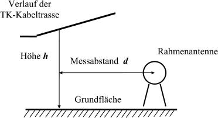
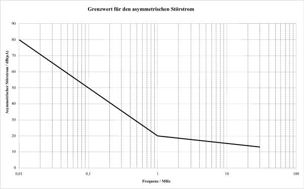
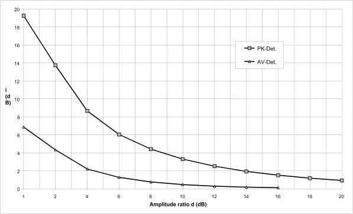

# Verordnung zum Schutz von öffentlichen Telekommunikationsnetzen und Sende- und Empfangsfunkanlagen, die in definierten Frequenzbereichen zu Sicherheitszwecken betrieben werden (SchuTSEV)

Ausfertigungsdatum
:   2009-05-13

Fundstelle
:   BGBl I: 2009, 1060

[^f771926_01_BJNR106000009]:     Die Verpflichtungen aus der Richtlinie 98/34/EG des Europäischen
    Parlaments und des Rates vom 22. Juni 1998 über ein
    Informationsverfahren auf dem Gebiet der Normen und technischen
    Vorschriften und der Vorschriften für die Dienste der
    Informationsgesellschaft (ABl. EG Nr. L 204 S. 37), zuletzt geändert
    durch die Richtlinie 2006/96/EG des Rates vom 20. November 2006 (ABl.
    EU Nr. L 363 S. 81), sind beachtet worden.

## Eingangsformel

Auf Grund des § 6 Abs. 3 des Gesetzes über die elektromagnetische
Verträglichkeit von Betriebsmitteln vom 26. Februar 2008 (BGBl. I S.
220) verordnet die Bundesregierung:

## § 1 Anwendungsbereich

Diese Verordnung regelt die Durchführung besonderer Maßnahmen der
Bundesnetzagentur für Elektrizität, Gas, Telekommunikation, Post und
Eisenbahnen (Bundesnetzagentur) zum Schutz von

1.  Sende- und Empfangsfunkanlagen, die in definierten Frequenzbereichen
    zu Sicherheitszwecken betrieben werden, und

2.  öffentlichen Telekommunikationsnetzen

vor elektromagnetischen Störungen.

## § 2 Begriffsbestimmungen

Im Sinne dieser Verordnung

1.  ist „Betreiber“ diejenige natürliche oder juristische Person, die die
    rechtliche und tatsächliche Kontrolle über eine
    Telekommunikationsanlage oder ein Telekommunikationsnetz hat;

2.  ist „öffentliches Telekommunikationsnetz“ ein Telekommunikationsnetz
    im Sinne von § 3 Nr. 27 des Telekommunikationsgesetzes, das zur
    Bereitstellung von öffentlich zugänglichen Telekommunikationsdiensten
    im Sinne von § 3 Nr. 24 des Telekommunikationsgesetzes genutzt wird;

3.  sind „Störaussendungen“ von einem leitungsgeführten elektrischen
    Nutzsignal verursachte elektromagnetische Energieanteile, die den
    Leiter durch Induktion, Influenz oder Strahlungskopplung unerwünscht
    verlassen und den Funkverkehr störend beeinträchtigen können.

## § 3 Schutz von zu Sicherheitszwecken betriebenen Sende- und Empfangsfunkanlagen

(1) Störaussendungen aus leitergebundenen Telekommunikationsanlagen
und -netzen dürfen in den zu schützenden Frequenzbereichen nach Anlage
1 die Grenzwerte der Störfeldstärke nach Anlage 2 nicht überschreiten.
Die Störfeldstärken werden nach der Messvorschrift nach Anlage 3
ermittelt.

(2) Die Bundesnetzagentur kann

1.  die Einhaltung der Anforderungen nach Absatz 1 überprüfen;

2.  zum Zwecke der Überprüfung besondere Maßnahmen gegenüber dem Betreiber
    einer Telekommunikationsanlage oder eines Telekommunikationsnetzes
    anordnen und insbesondere verlangen, dass der Betreiber Testsignale
    einspeist;

3.  den Betreiber auffordern, in einer angemessenen Frist dafür zu sorgen,
    dass seine leitergebundene Telekommunikationsanlage oder sein
    leitergebundenes Telekommunikationsnetz die Anforderungen nach Absatz
    1 einhält;

4.  besondere Maßnahmen mit räumlichen, zeitlichen und sachlichen
    Festlegungen für das Betreiben der leitergebundenen
    Telekommunikationsanlage oder des leitergebundenen
    Telekommunikationsnetzes anordnen;

5.  den Betrieb der leitergebundenen Telekommunikationsanlage oder des
    leitergebundenen Telekommunikationsnetzes ganz oder teilweise
    untersagen.

(3) Unbeschadet der Anforderungen nach Absatz 1 kann die
Bundesnetzagentur im Falle von Sende- und Empfangsfunkanlagen, für die
aus Gründen der öffentlichen Sicherheit ein besonderer Schutz
notwendig ist, im Benehmen mit den für die jeweiligen Sende- und
Empfangsfunkanlagen zuständigen Bundesbehörden messtechnische
Untersuchungen durchführen.

## § 4 Schutz öffentlicher Telekommunikationsnetze

Im Falle von elektromagnetischen Störungen öffentlicher
Telekommunikationsnetze durch leitergebundene
Telekommunikationsanlagen und -netze kann die Bundesnetzagentur für
die störenden Anlagen und Netze die Einhaltung der Grenzwerte für die
Störfeldstärke nach Anlage 2 anordnen. § 3 Abs. 1 Satz 2 gilt
entsprechend.

## § 5 Schutz von Flugfunk-Frequenzen

(1) Leitergebundene Übertragungen analoger Signale (Rundfunksignale)
sind in den Frequenzbereichen

1.  von 112 Megahertz bis 125 Megahertz spätestens zum 31. März 2009 und

2.  von 125 Megahertz bis 137 Megahertz spätestens zum 31. Dezember 2010

einzustellen.

(2) Eine Übertragung digitaler Signale ist in diesen Frequenzbereichen
zulässig, wenn die entsprechenden leitergebundenen Übertragungsnetze
bis zum Endgerät des Nutzers die Grenzwerte für Störfeldstärke nach
Anlage 2 einhalten. Der Betreiber ist verpflichtet, die Überprüfung
des leitergebundenen Übertragungsnetzes nachzuweisen, zu dokumentieren
und entsprechende Unterlagen auf Verlangen der Bundesnetzagentur
vorzulegen.

(3) Die Bundesnetzagentur kann die Einhaltung der Verpflichtungen nach
den Absätzen 1 und 2 überprüfen und im Wege des Verwaltungszwangs
durchsetzen.

(4) Stellt die Bundesnetzagentur durch Messungen fest, dass die
leitungsgebundenen Übertragungsnetze die Voraussetzungen des Absatzes
2 einhalten, kann sie im Einvernehmen mit dem Bundesamt für
Informationsmanagement und Informationstechnik der Bundeswehr die
Grenzwertverschärfung nach Anlage 2 Nr. 7 aufheben.

## § 6 Inkrafttreten

Diese Verordnung tritt am Tag nach der Verkündung in Kraft.

(zu § 3 Abs. 1)

## Anlage 1 Nach § 3 bundesweit besonders zu schützende Frequenzbereiche

(Fundstelle: BGBl. I 2009, 1062)

*    *   Frequenzbereich in MHz

    *   Zu schützende Anwendung

*    *   2,850

    *   –

    *   3,155

    *   Flugfunk

*    *   3,400

    *   –

    *   3,500

    *   Flugfunk

*    *   3,800

    *   –

    *   3,950

    *   Flugfunk

*    *   4,650

    *   –

    *   4,850

    *   Flugfunk

*    *   5,450

    *   –

    *   5,730

    *   Flugfunk

*    *   6,525

    *   –

    *   6,765

    *   Flugfunk

*    *   8,815

    *   –

    *   9,040

    *   Flugfunk

*    *   10,005

    *   –

    *   10,100

    *   Flugfunk

*    *   11,175

    *   –

    *   11,400

    *   Flugfunk

*    *   13,200

    *   –

    *   13,360

    *   Flugfunk

*    *   15,010

    *   –

    *   15,100

    *   Flugfunk

*    *   17,900

    *   –

    *   18,030

    *   Flugfunk

*    *   21,924

    *   –

    *   22,000

    *   Flugfunk

*    *   23,200

    *   –

    *   23,350

    *   Flugfunk

*    *   30,350

    *   –

    *   30,750

    *   MIL

*    *   34,350

    *   –

    *   35,810

    *   BOS

*    *   38,450

    *   –

    *   39,850

    *   BOS

*    *   43,300

    *   –

    *   45,250

    *   MIL

*    *   46,000

    *   –

    *   47,000

    *   MIL

*    *   74,205

    *   –

    *   77,485

    *   BOS, Flugnavigationsfunk

*    *   84,005

    *   –

    *   87,265

    *   BOS

*    *   108,000

    *   –

    *   137,000

    *   Flugfunk, Flugnavigationsfunk

*    *   138,000

    *   –

    *   144,000

    *   Flugfunk

*    *   165,200

    *   –

    *   165,700

    *   BOS

*    *   167,550

    *   –

    *   169,390

    *   BOS

*    *   169,800

    *   –

    *   170,300

    *   BOS

*    *   172,150

    *   –

    *   173,990

    *   BOS

*    *   240,250

    *   –

    *   270,25

    *   Flugfunk

*    *   275,250

    *   –

    *   285,25

    *   Flugfunk

*    *   290,250

    *   –

    *   301,25

    *   Flugfunk

*    *   306,250

    *   –

    *   318,25

    *   Flugfunk

*    *   328,250

    *   –

    *   345,25

    *   Flugnavigationsfunk, Flugfunk

*    *   355,250

    *   –

    *   399,90

    *   BOS, Flugfunk

*    *   443,59375

    *   –

    *   444,96875

    *   BOS

*    *   448,59375

    *   –

    *   449,96875

    *   BOS

(zu § 3 Abs. 1)

## Anlage 2 Grenzwerte der Störfeldstärke von leitergebundenen Telekommunikationsanlagen und -netzen

(Fundstelle: BGBl. I 2009, 1063)

*    *   Frequenz
        im Bereich

    *   Grenzwert der Störfeldstärke
        (Spitzenwert der
        elektrischen Feldstärke
        in 3 m Abstand in dB[*                     V/m])

    *   Messbandbreite

*    *   1.

    *   9 bis

    *   150 kHz

    *   40 – 20 x log
        10                      (f/MHz)

    *   200 Hz

*    *   2.

    *   *                     150 bis

    *   1 000 kHz

    *   40 – 20 x log
        10                      (f/MHz)

    *   9 kHz

*    *   3.

    *   *                      1 bis

    *   30 MHz

    *   40 – 8,8 x log
        10                      (f/MHz)

    *   9 kHz

*    *   4.

    *   *                      30 bis

    *   108 MHz

    *[^f771926_02_BJNR106000009BJNE001100000]
   27

    *   120 kHz

*    *   5.

    *   *                     108 bis

    *   144 MHz

    *[^f771926_03_BJNR106000009BJNE001100000]
   18
        (27)
        1                     )

    *   120 kHz

*    *   6.

    *   *                     144 bis

    *   230 MHz

    *   27
        1                     )

    *   120 kHz

*    *   7.

    *   *                     230 bis

    *   400 MHz

    *   18
        2                     ) (27)
        1                     )

    *   120 kHz

*    *   8.

    *   *                     400 bis

    *   1 000 MHz

    *   27
        1                     )

    *   120 kHz

*    *   9.

    *   *                      1 bis

    *   3 GHz

    *[^f771926_04_BJNR106000009BJNE001100000]
   40

    *   1 MHz

    Dies entspricht einer äquivalenten Strahlungsleistung von 20 dB(pW).
[^f771926_02_BJNR106000009BJNE001100000]: [^f771926_03_BJNR106000009BJNE001100000]:     **             V/m).
    Dies entspricht einer äquivalenten Strahlungsleistung von 33 dB(pW).
[^f771926_04_BJNR106000009BJNE001100000]: 
(zu § 3 Abs. 1)

## Anlage 3 Messvorschrift für Störaussendungen aus leitungsgebundenen Telekommunikationsanlagen und -netzen im Frequenzbereich von 9 kHz bis 3 GHz

**Inhalt**

*    *   **1**

    *   **Allgemeine Einführung**

*    *
    *   1.1

    *   Geltungsbereich

*    *
    *   1.2

    *   Frequenzbereich

*    *
    *   1.3

    *   Messverfahren

*    *
    *   1.4

    *   Grenzwerte

*    *   **2**

    *   **Begriffe und Abkürzungen**

*    *   **3**

    *   **Übersicht über die Messverfahren**

*    *
    *   3.1

    *   Vorgehen bei der Bearbeitung von Störungsmeldungen

*    *
    *   3.2

    *   Vorgehen bei der Überprüfung von TK-Anlagen und -Netzen auf Einhaltung
        der Anforderungen nach dieser Verordnung

*    *   **4**

    *   **Grundsätze zur Vorbereitung und Durchführung der Messungen**

*    *
    *   4.1

    *   Allgemeines

*    *
    *   4.2

    *   Betriebsparameter des TK-Netzes

*    *
    *   4.3

    *   Wahl der Messorte

*    *
    *   4.3.1

    *   Bearbeitung von Störungsmeldungen

*    *
    *   4.3.2

    *   Überprüfung von TK-Anlagen und -Netzen

*    *
    *   4.4

    *   Messentfernung

*    *
    *   4.4.1

    *   Überprüfung von TK-Anlagen und -Netzen

*    *
    *   4.4.1.1

    *   Abtragen der Messentfernung bei Messungen im Innenbereich

*    *
    *   4.4.1.2

    *   Abtragen der Messentfernung bei Messungen im Außenbereich

*    *
    *   4.4.2

    *   Bearbeitung von Störungsmeldungen

*    *
    *   4.5

    *   Grenzwerte für die zulässige Störaussendung aus TK-Anlagen und -Netzen

*    *   **5**

    *   **Messungen im Frequenzbereich von 9 kHz bis 30 MHz**

*    *
    *   5.1

    *   Messgeräte

*    *
    *   5.2

    *   Messverfahren

*    *
    *   5.2.1

    *   Grundsätze

*    *
    *   5.2.1.1

    *   Messung in 3 m Messentfernung (Normentfernung)

*    *
    *   5.2.1.2

    *   Messung in kleinerer Messentfernung als 3 m

*    *
    *   5.2.1.3

    *   Messung in größerer Messentfernung als 3 m

*    *
    *   5.3

    *   Messung der elektrischen Störfeldstärke

*    *
    *   5.4

    *   Messung des asymmetrischen Störstroms

*    *   **6**

    *   **Messungen im Frequenzbereich von 30 bis 3 000 MHz**

*    *
    *   6.1

    *   Messgeräte

*    *
    *   6.2

    *   Messverfahren

*    *
    *   6.2.1

    *   Grundsätze

*    *
    *   6.2.1.1

    *   Messung in 3 m Messentfernung (Normentfernung)

*    *
    *   6.2.1.2

    *   Messung in kleinerer Messentfernung als 3 m

*    *
    *   6.2.1.3

    *   Messung in größerer Messentfernung als 3 m

*    *
    *   6.3

    *   Bestimmung der elektrischen Feldstärke

*    *   **7**

    *   **Messung der Störstrahlungsleistung im Frequenzbereich von 30 bis 3
        000 MHz**

*    *
    *   7.1

    *   Messgeräte

*    *
    *   7.2

    *   Messentfernung

*    *
    *   7.3

    *   Standort der Messantenne

*    *
    *   7.4

    *   Standort der Substitutionsantenne

*    *
    *   7.5

    *   Messverfahren

*    *
    *   7.5.1

    *   Pegel der unerwünschten gestrahlten Aussendung

*    *
    *   7.5.2

    *   Substitutionsmessung

*    *
    *   7.5.3

    *   Berechnung der Störleistung

*    *   **8**

    *   **Hilfsträgerverfahren**

*    *
    *   8.1

    *   Pegelbestimmung und Einstellungen

*    *
    *   8.2

    *   Bestimmung der Störfeldstärke

*    *   **9**

    *   **Aufbereitung der Messergebnisse und Vergleich mit dem Grenzwert**

*    *
    *   9.1

    *   Korrekturen der Messergebnisse bei Messung mit dem Quasispitzenwert-
        Detektor

*    *
    *   9.2

    *   Korrekturen der Messergebnisse bei Messung mit Spitzenwert-Detektor

*    *
    *   9.3

    *   Behandlung der Messunsicherheit

*    *
    *   9.4

    *   Vergleich mit dem Grenzwert

*    *   **Anhang 1**

    *   **Festlegungen zur Messung der gemäß dieser Verordnung geltenden
        Grenzwerte für leitergebundene Telekommunikationsanlagen und -netze**

*    *   **Anhang 1a**

    *   **Grenzwert für den Störstrom**

*    *   **Anhang 2**

    *   Korrektur des vom Quasispitzenwert-Detektor angezeigten Pegelwerts bei
        geringen Abständen von
        (S+N)/N ****

*    *   **Anhang 3**

    *   **Bestimmung der Messunsicherheit**

*    *
    *   A.3.1

    *   Messunsicherheit bei Feldstärkemessungen

*    *
    *   A.3.2

    *   Messunsicherheit bei geringem Abstand (
        S+N                       )/
        N

*    *
    *   A.3.3

    *   Messunsicherheit bei Messung der Störstrahlungsleistung

*    *   **Anhang 4**

    *   Korrektur des vom Spitzenwert- oder Mittelwert-Detektor angezeigten
        Pegelwerts bei geringen Abständen von
        (S+N)/N ****

*    *
    *   A.4.1

    *   Problembeschreibung

*    *
    *   A.4.2

    *   Messverfahren

*    *
    *   A.4.2.1

    *   Übersicht

*    *
    *   A.4.2.2

    *   Messverfahren für Störaussendungen unter Berücksichtigung der
        vorhandenen schmalbandigen Umgebungsfeldstärken

*    *
    *   A.4.2.3

    *   Messverfahren für die Störaussendung des Messobjekts unter
        Berücksichtigung der vorhandenen breitbandigen Umgebungsfeldstärken

*    *
    *   A.4.3

    *   Korrektur des Messergebnisses bei Überlagerung

*    *   **Anhang 5**

    *   **Anforderungen an einen aktiven Dipol für die Messung der
        elektrischen Feldstärke im Frequenzbereich bis 30 MHz**

**1** **Allgemeine Einführung**

**1.1** **Geltungsbereich**

    Diese Messvorschrift enthält Verfahren für die Messung von
    Störaussendungen aus Telekommunikationsanlagen (TK-Anlagen) und
    -Netzen an deren Aufstell- und Betriebsort. Gegenstand der Messungen
    sind die Störaussendungen im Bereich des Funkfrequenzspektrums, die
    durch die Nutzung von Frequenzen für die Informationsübertragung in
    und längs von Leitern verursacht werden.

    Diese Messvorschrift beschreibt zusätzlich Hilfsverfahren zur
    Ermittlung der Störaussendung, wenn die digitalen Signale auf direktem
    Wege nicht messbar sind.

    Zu den betreffenden Netzen gehören z. B. Weitbereichs-Datennetze
    (WAN), lokale Datennetze (LAN) und Kabelfernsehnetze sowie
    Technologien für den Zugangsbereich unter Nutzung von
    Energieversorgungs- und Telefonnetzen.

    Zu den Funkanwendungen, die durch Störaussendungen beeinträchtigt
    werden können, gehören u. a. Sende- und Empfangseinrichtungen mobiler
    Funkdienste, Hör- und Fernsehrundfunkempfänger, Empfangseinrichtungen
    fester Funkdienste sowie der Flugfunk- und Flugnavigationsfunkdienst.

    Der Schutz vor Störaussendungen aus TK-Netzen wird insbesondere in der
    ITU-R RR S15.12 gefordert. Darüber hinaus ist er nach Artikel 4 Absatz
    2 der Richtlinie 2004/108/EG des Europäischen Parlaments und des Rates
    vom 15. Dezember 2004 (ABl. EG Nr. L 390 S. 24) (EMV-Richtlinie)
    vorgesehen.

    Diese Messvorschrift trifft keine Regelungen zur Messung von
    Aussendungen elektrischer oder elektronischer Geräte, die im Rahmen
    von Konformitätsprüfungen nach dem Gesetz über die elektromagnetische
    Verträglichkeit von Betriebsmitteln (EMVG) oder dem Gesetz über
    Funkanlagen und Telekommunikationsendeinrichtungen (FTEG) zur
    Anwendung kommen.

**1.2** **Frequenzbereich**

    Diese Messvorschrift gilt für den Frequenzbereich von 9 kHz bis 3 GHz.

**1.3** **Messverfahren**

    Diese Messvorschrift beschreibt das Verfahren zur Messung der von TK-
    Anlagen und -Netzen ausgehenden und mit den leitungsgeführten
    Nutzsignalen einhergehenden Störaussendungen.

**1.4** **Grenzwerte**

    Die Grenzwerte ergeben sich aus Anlage 2 zu dieser Verordnung.

**2** **Begriffe und Abkürzungen**

    Im Rahmen dieser Vorschrift gelten folgende Definitionen:

    **Antennenbezugspunkt:**                    Geometrischer Mittelpunkt
    der Antenne oder der Bezugspunkt, auf den im
    Antennenkalibrierverfahren Bezug genommen wird.

    **Aussendung:**                    Erscheinung, bei der
    elektromagnetische Energie aus einer Quelle austritt
    (IEC – IEV 161-01-08)                   .

    **Detektor-Bewertungsfaktor:**                    Unterschied zwischen
    der Anzeige des Quasispitzenwert-Detektors
    (QP-Detektor)                    und der Anzeige des Spitzenwert-
    Detektors (PK-Detektor) für ein bestimmtes Signal.

    **Elektromagnetische Störgröße:**
    Elektromagnetische Erscheinung, die die Funktion eines Geräts, einer
    Ausrüstung oder eines Systems beeinträchtigen oder lebende oder tote
    Materie ungünstig beeinflussen kann (IEC – IEV 161-01-05).

    **Funk(frequenz)störgröße:**                    Elektromagnetische
    Störgröße mit Anteilen im Funkfrequenzbereich
    (IEC – IEV 161-01-13)                   .

    **Hilfsträger:**                    Schmalbandiges Signal, das in
    definierter Relation zu dem zu bewertenden Digitalsignal steht.

    **Messbandbreite:**                    Die jeweils am Messempfänger
    verwendete Bandbreite (gem. EN 55016-1-1).

    **Mindestversorgung:**                    In der Regel ist die
    Mindestversorgung im Sinne der vorliegenden Messvorschrift am Ort der
    Messungen immer dann gegeben, wenn dort die erforderliche Mindest-
    Nutzfeldstärke für den jeweiligen Funkdienst bzw. die jeweilige
    Funkanwendung nachweisbar ist.

    **Normentfernung:**                    Abstand (Messentfernung)
    zwischen dem Bezugspunkt der Messantenne und dem nächstgelegenen Teil
    des TK-Netzes. Die Normentfernung beträgt 3 m.

    **Nutzsignal:**                    Das Nutzsignal umfasst das für die
    Kommunikation in und längs von Leitern erforderliche Frequenzspektrum.

    **Störfeldstärke:**                    Feldstärke, die an einer
    bestimmten Stelle durch eine elektromagnetische Störgröße erzeugt und
    unter festgelegten Bedingungen gemessen wird (IEC – IEV 161-04-02).

    Anmerkung: **
    Im Sinne dieser Messvorschrift werden nur die Komponenten der
    leitungsgeführten Nutzsignale als Störgrößen betrachtet, die
    Störaussendungen in Form von Feldern in der Umgebung oder auch fernab
    von Leitern erzeugen können.

    **Telekommunikationsanlage:**                    Technische
    Einrichtungen oder Systeme, die als Nachrichten identifizierbare
    elektromagnetische oder optische Signale senden, übertragen,
    vermitteln, empfangen, steuern oder kontrollieren können.

    **Telekommunikationsnetz:**                    Gesamtheit der
    technischen Einrichtungen (Übertragungswege, Vermittlungseinrichtungen
    und sonstige Einrichtungen, die zur Gewährleistung eines
    ordnungsgemäßen Betriebs des Telekommunikationsnetzes unerlässlich
    sind), an die über Abschlusseinrichtungen Endeinrichtungen
    angeschlossen werden.

    Anmerkung: **
    Zur Vereinfachung wird in der Messvorschrift nachfolgend teilweise nur
    vom TK-Netz gesprochen, die Aussagen gelten jedoch gleichermaßen für
    TK-Anlagen.

    **Unerwünschte Aussendung:**                    Signal, das den
    Empfang eines Nutzsignals beeinträchtigen kann
    (IEC – IEV 161-01-03)                   .

    **Störaussendung:**                    Durch leitungsgeführtes
    elektrisches Nutzsignal verursachter elektromagnetischer
    Energieanteil, der den Leiter unerwünscht verlässt und durch
    Induktion, Influenz oder Strahlungskopplung den Funkverkehr störend
    beeinträchtigen kann.

**3** **Übersicht über die Messverfahren**

**3.1** **Vorgehen bei der Bearbeitung von Störungsmeldungen**

**3.2** **Vorgehen bei der Überprüfung von TK-Anlagen und -Netzen auf
    Einhaltung der Anforderungen nach dieser Verordnung**

**4** **Grundsätze zur Vorbereitung und Durchführung der Messungen**

**4.1** **Allgemeines**

    Das Erfragen sämtlicher technischer Informationen, die zum umfassenden
    Verständnis der Betriebsparameter und der Topologie des zu messenden
    TK-Netzes erforderlich sind, ist unumgänglich. Der Betreiber des TK-
    Netzes sollte beispielsweise Angaben der EMV-relevanten
    Spezifikationen sowie der Parameter der Kabel und Verbindungshardware
    zur Verfügung stellen. Die Angaben sollten in jedem Fall durch die
    nachfolgend beschriebene Voruntersuchung überprüft werden, um
    auszuschließen, dass unerwünschte Aussendungen aus dem TK-Netz
    gemessen werden, die den Regelungen des EMVG oder FTEG für die
    Konformitätsprüfung von Geräten unterliegen oder möglicherweise aus
    einem anderen als dem untersuchten TK-Netz stammen.

**4.2** **Betriebsparameter des TK-Netzes**

    Grundlegende Betriebsparameter, die zur Durchführung der Messungen
    bekannt sein müssen, sind: die spektrale Amplitudenverteilung und die
    Frequenzmerkmale der leitungsgeführten Nutzsignale sowie die
    Betriebsart(en) im TK-Netz, die auf einigen oder allen der zu
    überprüfenden Frequenzen die höchsten Störsignalpegel verursachen.

    Möglicherweise muss auch festgestellt werden, ob durch eine dynamische
    Leistungsregelung Schwankungen in der spektralen Amplitudenverteilung
    auftreten und die Merkmale des Frequenzspektrums in Abhängigkeit von
    der gegebenen Datenübertragungsgeschwindigkeit variieren können.

    Die Betriebsparameter lassen sich messtechnisch am sichersten bei
    einem hohen Störabstand zwischen Summensignal und Rauschen (Verhältnis
    von (
    S+N                   ) zu
    N                   ) mit Hilfe einer am Anfang (oder Ende) der
    betreffenden TK-Leitung aufgesetzten Stromzange und einem automatisch
    abstimmbaren Messempfänger mit Panorama-Anzeige zur Überwachung des
    leitungsgeführten Stroms bestimmen. Um die notwendigen Eingriffe am
    Netz vornehmen zu können, ist in der Regel die Zusammenarbeit mit dem
    Netzbetreiber erforderlich.

    Im Rahmen einer Voruntersuchung ist zu klären, ob die nachweisbaren
    Störaussendungen im Sinne der Begriffsbestimmung nach Abschnitt 2
    dieser Messvorschrift oder sonstige unerwünschte Aussendungen aus
    angeschlossenen elektronischen Geräten sind, die dem leitungsgeführten
    Nutzsignal nicht zugeordnet werden können. Die im Frequenzspektrum des
    leitungsgeführten Nutzsignals nachweisbaren Störaussendungen
    unterliegen den Bestimmungen dieser Verordnung, wenn sie nicht als
    sonstige unerwünschte Aussendungen identifizierbar sind.

    Für beide Messanlässe (siehe Abschnitte 4.3.1 und 4.3.2) ist ein
    tragbarer Empfänger mit einer Signalpegelanzeige oder ein anderes
    praktisches Verfolgungsverfahren erforderlich, um feststellen und
    aufzeichnen zu können, wo die Pegel der abgestrahlten Störaussendung
    am höchsten sind.

**4.3** **Wahl der Messorte**

    Die Wahl der Messorte hängt vom Anlass der Messung ab. Als Anlässe für
    Messungen kommen die Bearbeitung von Störungsmeldungen (siehe
    Abschnitt 3.1) oder die Überprüfung (siehe Abschnitt 3.2) von TK-
    Anlagen und -Netzen auf Einhaltung der Bestimmungen nach dieser
    Verordnung infrage.

**4.3.1** **Bearbeitung von Störungsmeldungen**

    Bei der Bearbeitung von Störungen sollte der erste Messort an dem Teil
    der Übertragungsleitung (im Innen- oder Außenbereich) liegen, der der
    gestörten Funkempfangseinrichtung und/oder Antenne der Störsenke am
    nächsten liegt.

**4.3.2** **Überprüfung von TK-Anlagen und -Netzen**

    Bei der Überprüfung von TK-Anlagen oder -Netzen hängt es von deren
    Topologie ab, wo die ersten Messungen vorzunehmen sind. Der (Die)
    Messort(e) sollte(n) da liegen, wo erfahrungsgemäß mit den höchsten
    Störaussendungen zu rechnen ist. Bei den meisten interaktiven Systemen
    wird dies z. B. an den Enden der Übertragungsleitung, am Ort ggf.
    eingesetzter Zwischenverstärker oder an Stoß- oder Leckstellen im
    Übertragungsweg sein.

    Zur Bestimmung der charakteristischen Signalform ist die Messung des
    Nutzsignals bei geeignetem Störabstand notwendig. Um einen solchen
    „Fingerabdruck“ des Signals zu erhalten, eignet sich die Messung des
    leitungsgeführten Stroms an einer zugänglichen Stelle (vgl. Abschnitt
    4\.2).

**4.4** **Messentfernung**

**4.4.1** **Überprüfung von TK-Anlagen und -Netzen**

    Für Messungen im Innen- und Außenbereich beträgt die Messentfernung
    d ****                    = 3 m (Normentfernung). Diese Entfernung ist
    der Abstand zwischen dem Bezugspunkt der Messantenne und dem
    nächstgelegenen Teil des TK-Netzes. Überprüfungen von TK-Anlagen und
    -Netzen werden in der Regel vor dem Gebäude im Außenbereich
    durchgeführt. In speziellen Fällen (z. B. Hochhäuser) kann aber davon
    abgewichen werden.

**4.4.1.1** **Abtragen der Messentfernung bei Messungen im Innenbereich**

    Wenn der zu untersuchende Teil des TK-Netzes nicht zugänglich ist,
    sich in oder hinter einer Wand oder in einem Kabelkanal oder Ähnlichem
    befindet, so ist die Messentfernung
    d ****                    im rechten Winkel von der Vorderkante der
    Wand oder des Kabelkanals abzutragen.

    Wenn in Gebäuden ein freier Abstand zwischen TK-Netz und Messantenne
    von 3 m aus Platzgründen nicht zur Verfügung steht, kann die o. g.
    Messentfernung bis auf 1 m reduziert werden. Hierbei sind die
    Festlegungen der Abschnitte 5.2.1.2 und 6.2.1.2 dieser Messvorschrift
    zu beachten.

**4.4.1.2** **Abtragen der Messentfernung bei Messungen im Außenbereich**

    Wird außerhalb von Gebäuden oder ähnlicher Aufbauten gemessen, die
    Einrichtungen oder Kabel von TK-Netzen enthalten, so ist die
    Messentfernung
    d ****                    im rechten Winkel von der Außenwand des
    Gebäudes oder des betreffenden Aufbaus abzutragen.

    Verläuft der zu messende Teil des TK-Netzes unterirdisch, so ist die
    Messentfernung
    d ****                    im rechten Winkel von der senkrechten
    Projektion des TK-Netzes auf die Bodenoberfläche abzutragen.

    Verläuft der zu messende Teil des TK-Netzes oberhalb der Messantenne,
    so ist die Messentfernung
    d ****                    im rechten Winkel von der senkrechten
    Projektion des TK-Netzes auf die Grundfläche abzutragen. Das Prinzip
    ist in Bild 1 dargestellt.

    

    *        *
        *   **Bild 1:**

        *   **Abtragen des Messabstands d** **von der senkrechten Projektion des
            Verlaufs der TK-Kabeltrasse auf die Grundfläche**

    Wenn die Aufstellung der Messantenne in 3 m Messentfernung aufgrund
    der örtlichen Gegebenheiten außerhalb von Gebäuden nicht möglich ist,
    ist für Messungen im Frequenzbereich bis 30 MHz das in Abschnitt
    5\.2.1.3 genannte Messverfahren anzuwenden.

    Wenn die zu messende TK-Kabeltrasse deutlich über der für die Messung
    verfügbaren Höhe des Antennenmasts liegt (z. B. in mehr als 10 m Höhe
    über der Grundfläche), ist für Messungen im Frequenzbereich bis 30 MHz
    das in Abschnitt 5.2.1.3 genannte Messverfahren anzuwenden und bei
    Messungen ab 30 MHz die Störstrahlungsleistung nach Abschnitt 7 zu
    messen.

**4.4.2** **Bearbeitung von Störungsmeldungen**

    Zur Ermittlung der Störquelle werden keine spezifischen
    Messentfernungen festgelegt. Ist die Störquelle eingegrenzt, so werden
    die nachfolgenden Untersuchungen am betreffenden Teil der TK-Anlage
    oder des TK-Netzes nach den in Abschnitt 4.4.1 und dessen
    Unterabschnitten ausgeführten Grundsätzen durchgeführt. Abweichungen
    von diesen Grundsätzen sind nach Erfordernis und aufgrund des Anlasses
    zulässig.

**4.5** **Grenzwerte für die zulässige Störaussendung aus TK-Anlagen und
    -Netzen**

    Die Grenzwerte für den jeweiligen Frequenzteilbereich sind in Anlage 2
    aufgeführt.

    Es ist zu beachten, dass es sich bei den in Anlage 2 angegebenen
    Feldstärkegrenzwerten um Spitzenwerte-Grenzwerte handelt. Um die bei
    praktischen Messungen mit dem Spitzenwert-Detektor auftretende
    Unsicherheit zu minimieren, wird für die Messungen jedoch ein
    Quasispitzenwert-Detektor verwendet.

    Um einen direkten Vergleich zwischen gemessenen Quasispitzenwert-
    Pegeln und Spitzenwert-Grenzwerten vornehmen zu können, müssen die
    Messergebnisse mit Hilfe eines QP-Bewertungsfaktors korrigiert werden,
    der zum gemessenen Quasispitzenwert-Pegel addiert werden muss. Dieser
    Bewertungsfaktor ist von der Bandbreite des Messempfängers und der
    Signalmuster im zu überprüfenden TK-Netz abhängig.

    Sofern der QP-Bewertungsfaktor nicht schon bekannt ist und mit dem
    Betreiber des TK-Netzes abgestimmt wurde, muss er in der Phase der
    Voruntersuchungen ermittelt werden. Dies geschieht am einfachsten und
    genauesten mit Hilfe einer Stromzange, mit der das TK-Netz an einem
    Punkt mit einem reinen Nutzsignal und einem Störabstand zwischen
    Summensignal und Rauschen von mindestens 20 dB gemessen wird.

    Im Frequenzbereich 30 MHz bis 1 000 MHz kann der QP-Bewertungsfaktor
    auch ermittelt werden, indem die Antenne in unmittelbare Nähe der
    Strahlungsquelle gebracht wird.

    Im Frequenzbereich 1 000 MHz bis 3 000 MHz brauchen die Messwerte
    nicht korrigiert werden, da hier ohnehin ein Spitzenwert-Detektor
    verwendet wird.

**5** **Messungen im Frequenzbereich von 9 kHz bis 30 MHz**

**5.1** **Messgeräte**

    Folgende Messgeräte (nach EN 55016-1-1, EN 55016-1-2 und EN 55016-1-4)
    sind erforderlich:

    –   ein kalibriertes Messsystem, bestehend aus einem Funkstörmessempfänger
        und dazugehörender Rahmenantenne zur Messung der magnetischen
        Feldkomponente und Stativ, bzw.

    –   ein kalibriertes Messsystem, bestehend aus einem Funkstörmessempfänger
        und dazugehörender Stromzange zur Messung von hochfrequenten Strömen
        auf Leitungen.

    Im Frequenzbereich von 9 kHz bis 150 kHz ist eine Messbandbreite von
    200 Hz sowie ein Quasispitzenwert-Detektor zu verwenden.

    Im Frequenzbereich von 150 kHz bis 30 MHz ist eine Messbandbreite von
    9 kHz sowie ein Quasispitzenwert-Detektor zu verwenden.

    Im Bedarfsfall können auch Spezialgeräte wie abgestimmte
    Rahmenantennen oder Antennen für das elektrische Feld verwendet
    werden. Für ggf. notwendig werdende Messungen der elektrischen
    Feldstärke ist ein aktiver Dipol nach den Angaben in Anhang 5 oder ein
    vergleichbarer Dipol zu verwenden.

    Um zu verhindern, dass die Messung durch Erdschleifen beeinflusst
    wird, ist nach Möglichkeit eine getrennte Stromversorgung (z. B. aus
    Batterien) des Messempfängers und der Rahmenantenne, ohne Erdung,
    insbesondere bei Messungen in Gebäuden, zu empfehlen.

**5.2** **Messverfahren**

**5.2.1** **Grundsätze**

    Gemäß Festlegung in Anhang 1 wird die gemessene magnetische Feldstärke
    über den Feldwellenwiderstand von 377 Ohm in eine elektrische
    Feldstärke umgerechnet.

    Achtung: **
    Diese Umrechnung wird von einer Reihe von Messgeräten ggf. schon
    automatisch vorgenommen!

    Es muss darauf geachtet werden, dass das TK-System mit den normalen
    maximalen Signalpegeln und ggf. in der Betriebsart betrieben wird, in
    der zuvor die höchsten Störfeldstärkepegel festgestellt wurden.
    Handelt es sich um ein interaktives System, so ist es besonders
    wichtig, den Rückkanal (upstream) auf das Vorhandensein von Signalen
    zu überprüfen, falls diese im gleichen Frequenzbereich wie die
    gemeldete Störung liegen.

    Werden Messungen nur auf einer Frequenz oder in einem schmalen
    Frequenzbereich durchgeführt (z. B. bei der Störungsbearbeitung), so
    sollte die Antenne so ausgerichtet werden, dass eine maximale Kopplung
    zum überprüften TK-Netz besteht.

    Wenn Messungen auf vielen Frequenzen oder in einem durchzustimmenden
    Frequenzbereich notwendig sind, sollten separate Messdurchgänge
    durchgeführt werden, bei denen die Antenne jeweils in einer der drei
    orthogonalen Richtungen X, Y und Z ausgerichtet ist. Die Daten der
    einzelnen Messdurchgänge müssen gespeichert werden und für jede
    Frequenz muss die effektive Feldstärke                     (
    E
    eff                       ) ****                    nach Gleichung
    (5.1) errechnet werden.

    Am einfachsten geschieht dies durch Übertragung der Daten in ein
    Tabellenkalkulationsblatt und anschließende automatisierte Berechnung
    von
    E
    eff                       . ****

    Zur Reduzierung der Messzeit wird empfohlen, die Durchstimmung des zu
    untersuchenden Frequenzbereichs zunächst unter Nutzung des
    Spitzenwert-Detektors auszuführen und die gefundenen Maximalwerte der
    Störfeldstärken danach mit dem Quasispitzenwert-Detektor nachzumessen.

    Die Messentfernung
    d ****                    entspricht bei der Rahmenantenne dem Abstand
    zwischen deren geometrischem Mittelpunkt und dem TK-Netz und beim
    aktiven Dipol dem Abstand zwischen TK-Netz und dem Bezugspunkt der
    Antenne.

    Messungen im Frequenzbereich unterhalb von 30 MHz werden bei der
    Überprüfung von TK-Anlagen und -Netzen in der Regel vor dem Gebäude im
    Außenbereich durchgeführt. Hier kann die Messentfernung so gewählt
    werden, dass sie entweder der Normentfernung von 3 m entspricht oder
    größer als diese ist. In speziellen Fällen (z. B. Hochhäuser) kann
    aber davon abgewichen werden.

**5.2.1.1** **Messung in 3 m Messentfernung (Normentfernung)**

    Die Rahmenantenne ist auf einem Stativ in 1 m Höhe zur
    Rahmenunterkante an dem Ort aufzustellen, an dem zuvor die höchste
    Störfeldstärke gemessen wurde. Hierbei ist der vorgeschriebene
    Messabstand zum TK-Netz einzuhalten.

    Nach Einstellung des Messempfängers auf die jeweilige Frequenz und die
    erforderliche Detektorart ist die Rahmenantenne entweder so
    auszurichten, dass der höchste Anzeigewert für das Signal des TK-
    Netzes erreicht wird, oder es ist in den orthogonalen Richtungen X,Y
    und Z zu messen und effektive Feldstärke nachträglich zu berechnen.

    Das Messen magnetischer Felder, die von TK-Netzen im Frequenzbereich
    bis 30 MHz erzeugt werden, kann durch das Vorhandensein zahlreicher
    Nutzaussendungen von Funkdiensten mit hohen Pegeln erschwert werden.
    Damit das Hintergrundrauschen und eventuelle Fremdsignale den in
    Anhang 1 genannten Grenzwert nicht überschreiten, müssen in den Lücken
    zwischen den Funkaussendungen Frequenzbereiche mit geringen
    Feldstärken gefunden werden. Bei der Suche dieser „ruhigen“
    Frequenzbereiche sollte die Position der Antenne nicht verändert und
    das TK-Netz am besten abgeschaltet werden.

    Ist die Abschaltung des Netzes nicht möglich, stehen folgende
    Möglichkeiten zur Verfügung:

    –   Ausrichtung der Rahmenantenne so, dass eine minimale Kopplung zur
        Aussendung des Netzes besteht, und Überprüfung, ob das
        Hintergrundrauschen sowie eventuelle Fremdsignale unter dem in Anlage
        2 genannten Grenzwert liegen.

    –   Ausrichtung der Rahmenantenne so, dass maximale Kopplung besteht;
        anschließend Erhöhung der Messentfernung und Überprüfung, ob sich die
        gemessene Feldstärke entsprechend verringert.

    Wie viele ruhige Frequenzen oder Frequenzbereiche benötigt werden,
    hängt davon ab, ob allgemeine Überprüfungsmessungen durchgeführt
    werden sollen oder ob eine mit weniger Aufwand verbundene
    Störungsmeldung zu bearbeiten ist. Bei allgemeinen
    Überprüfungsmessungen sollte die Zahl der ruhigen Frequenzbereiche so
    groß wie möglich sein. Diese sollten in möglichst gleichmäßigen
    Abständen über das gesamte Nutzsignalspektrum des betreffenden TK-
    Dienstes verteilt sein. Ein Diagramm mit der Spektrumsbelegung über
    den gesamten zu untersuchenden Frequenzbereich ermöglicht es, die für
    eine anschließende Analyse geeigneten ruhigen Frequenzen rasch
    ausfindig zu machen. Die Durchstimmung im Frequenzbereich kann mit
    einem Spitzenwert-Detektor in Schritten von jeweils der halben
    Messbandbreite ausgeführt werden.

    Für die Bearbeitung von Störungsmeldungen dürften einige ruhige
    Frequenzen um die gestörte Frequenz genügen. Diese können manuell
    eingestellt und gemessen werden.

    In beiden Fällen werden die gefundenen ruhigen Frequenzen bzw. der
    Frequenzbereich für die Messung der Störaussendung genutzt. Die
    Person, die den Empfänger bedient, sollte den Pegel des
    Hintergrundrauschens für jede dieser Frequenzen subjektiv beurteilen.
    Anschließend ist der höchste Pegel der Störfeldstärke (in dB(*
    V/m)) aufzuzeichnen, der unter Verwendung der Messbandbreite und des
    genannten Detektors über eine Zeitspanne von 15 s gemessen wurde.
    Einzeln auftretende Kurzzeitspitzen sollten hierbei unbeachtet
    bleiben.

    Die Messungen sind dann auf jeder der gefundenen ruhigen Frequenzen
    nach dem oben beschriebenen Verfahren zu wiederholen, wenn das TK-Netz
    in Betrieb ist. Die Messergebnisse sind zu dokumentieren. Die
    Differenz zwischen den Messwerten bei normal betriebenem und bei
    abgeschaltetem TK-Netz ist zu bestimmen.

    Wenn der Pegel der Fremdsignale dennoch über dem Grenzwert liegt, kann
    zur Bestätigung der ermittelten Differenz eine Stromzange verwendet
    werden. (Über dieses Testverfahren wird noch beraten.)

**5.2.1.2** **Messung in kleinerer Messentfernung als 3 m**

    Bei Messungen in weniger als 3 m Messentfernung wird der Abstand zum
    TK-Netz von der äußeren Umgrenzung der Rahmenantenne bestimmt.

    Wenn die Einhaltung des Messabstands von 3 m z. B. wegen der örtlichen
    Gegebenheiten innerhalb eines Gebäudes nicht möglich ist, kann auch in
    geringerem Abstand gemessen werden, der jedoch 1 m nicht
    unterschreiten darf. In diesem Fall ist das gleiche Verfahren
    anzuwenden wie bei Messungen in 3 m Entfernung; das Messergebnis wird
    dann aber unter Anwendung des Umrechnungsfaktors nach Gleichung (5.2)
    korrigiert:

    Hierbei sind:

        –
        E
    Mess****: Messwert in dB(*                         V/m)

        –
        E
    Stör****: korrigierter Messwert in dB(*                         V/m)

        –
        d
    Mess****: aktuelle Messentfernung in m

        –
        d
    Norm****: Normentfernung (3 m)

**5.2.1.3** **Messung in größerer Messentfernung als 3 m**

    Muss aufgrund der örtlichen Bedingungen eine Messentfernung von mehr
    als 3 m gewählt werden, so sind zunächst zwei Messorte zu bestimmen,
    die auf der im rechten Winkel zur TK-Kabeltrasse liegenden Messachse
    liegen. Als Orientierung gilt, dass der Abstand zwischen beiden
    Messorten möglichst groß sein sollte. Der Messwert ist nach dem in
    Abschnitt 5.2.1 beschriebenen Verfahren zu ermitteln. Entscheidend
    sind die örtlichen Bedingungen und die Messbarkeit der Störfeldstärke.

    Die Messwerte (in dB(*                   V/m)) sind über dem
    Logarithmus der Entfernung in einem Diagramm aufzutragen. Die
    geradlinige Verbindung der Messwerte beschreibt dann den
    Feldstärkeabfall in Richtung der Messachse. Ist der Feldstärkeabfall
    nicht bestimmbar, sind weitere Messpunkte zu wählen. Der
    Feldstärkepegel in der Normentfernung ist anhand der eingezeichneten
    Verbindungsgeraden aus dem Diagramm zu entnehmen (grafische
    Ermittlung).

**5.3** **Messung der elektrischen Störfeldstärke**

    Die elektrische Feldstärke wird nur bei der Bearbeitung von
    Störungsmeldungen gemessen, wenn angenommen werden muss, dass die
    Störaussendung ein vorwiegend elektrisches Feld ist. Dies könnte dann
    der Fall sein, wenn der Grenzwert der magnetischen Feldstärke zwar
    nicht überschritten wird, die Störung einer mit einer Antenne für das
    elektrische Feld arbeitenden Funkempfangseinrichtung aber dennoch
    auftritt.

    Das Messverfahren entspricht dem Vorgehen bei der Messung der
    magnetischen Störfeldstärke. Die erforderliche Antenne ist in Anhang 5
    beschrieben.

**5.4** **Messung des asymmetrischen Störstroms**

    Nur für den Fall, dass aufgrund von hohen Umgebungsfeldstärken der
    Nachweis der Einhaltung der Grenzwerte für die Störfeldstärke
    praktisch nicht möglich ist, kann stattdessen u. a. mit Hilfe einer
    Stromzange der Störstrom auf der Leitung gemessen werden.

    Der entsprechende Grenzwert ist aus der Darstellung in Anhang 1a
    ersichtlich.

**6** **Messungen im Frequenzbereich von 30 bis 3 000 MHz**

**6.1** **Messgeräte**

    Folgende Messgeräte (nach EN 55016-1-1 und EN 55016-1-4) sind
    erforderlich:

    ein kalibriertes Messsystem, bestehend aus einem Funkstörmessempfänger
    und einem dazugehörenden Breitbanddipol oder einer dazugehörenden
    logarithmisch-periodischen Antenne zur Messung der elektrischen
    Feldkomponente und Mast.

    Anmerkung: **
    Messergebnisse, die mit Hilfe des hier beschriebenen kalibrierten
    Messsystems erhalten wurden, bedürfen im Hinblick auf ggf. bei der
    Messung herrschende Nahfeldverhältnisse
    keiner **
    nachträglichen Korrektur!

    Die Anforderungen an die Funkstörmessempfänger und Antennen sind in EN
    55016-1-1 und
    EN 55016-1-4                    beschrieben.

    Im Frequenzbereich von 30 bis 1 000 MHz ist eine Messbandbreite von
    120 kHz sowie ein Quasispitzenwert-Detektor zu verwenden. Im
    Frequenzbereich von 1 000 bis 3 000 MHz ist eine Messbandbreite von 1
    MHz und ein Spitzenwert-Detektor zu verwenden.

**6.2** **Messverfahren**

**6.2.1** **Grundsätze**

    Es muss darauf geachtet werden, dass das TK-System mit den normalen
    maximalen Signalpegeln und ggf. in der Betriebsart betrieben wird, in
    der zuvor die höchsten Störfeldstärkepegel festgestellt wurden.
    Handelt es sich um ein interaktives System, so ist es besonders
    wichtig, den Rückkanal (upstream) auf das Vorhandensein von Signalen
    zu überprüfen, falls diese im gleichen Frequenzbereich wie die
    gemeldete Störung liegen.

    Zur Reduzierung der Messzeit wird empfohlen, die Durchstimmung des zu
    untersuchenden Frequenzbereichs zunächst unter Nutzung des
    Spitzenwert-Detektors auszuführen und die gefundenen Maximalwerte der
    Störfeldstärken danach mit dem Quasispitzenwert-Detektor nachzumessen.

    Die Messentfernung
    d ****                    entspricht beim Breitbanddipol dem Abstand
    zwischen TK-Netz und dem Balun und bei der logarithmisch-periodischen
    Antenne dem Abstand zwischen TK-Netz und dem Bezugspunkt der Antenne.

    Messungen im Frequenzbereich oberhalb von 30 MHz werden bei der
    Überprüfung von TK-Anlagen und -Netzen in der Regel vor dem Gebäude im
    Außenbereich durchgeführt. Hier kann die Messentfernung so gewählt
    werden, dass sie entweder der Normentfernung von 3 m entspricht oder
    größer als diese ist. In speziellen Fällen (z. B. Hochhäuser) kann
    aber davon abgewichen werden.

**6.2.1.1** **Messung in 3 m Messentfernung (Normentfernung)**

    Die Normentfernung beträgt 3 m. Die Messantenne ist am festgelegten
    Messort in Richtung, Höhe und Polarisation (horizontal und vertikal)
    so zu verändern, dass die maximale Störfeldstärke gemessen wird.

    Befinden sich Antenne und TK-Netz auf gleicher Bezugsebene, so ist zur
    Bestimmung der maximalen Feldstärke ein Höhenscan der Antenne von 1 m
    bis 4 m durchzuführen. Beim Höhenscan muss der Abstand zwischen der
    Antenne und störenden Objekten (wie z. B. Wände, Decken, metallische
    Strukturen, usw.) mindestens 0,5 m betragen. Der Höhenscan kann durch
    die örtlichen Bedingungen begrenzt werden (vgl. Bild 2: Höhenscan der
    Antenne).

    
    **Bild 2: Höhenscan der Antenne**

    Befindet sich der Antennenträger *nicht*                    auf der
    gleichen Bezugsebene wie die Leitung, z. B. bei einer Messung im
    Freien, so ist ein in Relation zur Höhe des Objekts vergleichbarer
    Scan durchzuführen.

**6.2.1.2** **Messung in kleinerer Messentfernung als 3 m**

    Wenn bei der Bearbeitung von Störungsmeldungen oder aber in speziellen
    Überprüfungsfällen (z. B. Hochhäuser) Messungen zur Ermittlung der
    Störquelle im Innenbereich notwendig sind und ein Messabstand von 3 m
    wegen der örtlichen Gegebenheiten nicht eingehalten werden kann, kann
    auch in geringerem Abstand gemessen werden, der jedoch 1 m nicht
    unterschreiten darf. Als Messabstand gilt die Entfernung zwischen der
    Leitung und dem Bezugspunkt der verwendeten Antenne. Für die Messung
    ist die Antenne unter Verzicht auf einen Höhenscan auf maximale
    Kopplung zur Störquelle auszurichten. Das Messergebnis muss dann unter
    Anwendung des Umrechnungsfaktors nach Gleichung (6.1) korrigiert
    werden:

    Hierbei sind:

        –
        E
    Mess****: Messwert in dB(*                         V/m)

        –
        E
    Stör****: korrigierter Messwert in dB(*                         V/m)

        –
        d
    Mess****: aktuelle Messentfernung in m

        –
        d
    Norm****: Normentfernung (3 m)

    Anmerkung: **
    Messergebnisse, die mit Hilfe des kalibrierten Messsystems (vgl.
    Abschnitt 6.1) erhalten wurden, bedürfen in Bezug auf ggf. bei der
    Messung herrschende Nahfeldverhältnisse
    keiner **
    nachträglichen Korrektur!

**6.2.1.3** **Messung in größerer Messentfernung als 3 m**

    Muss aufgrund der örtlichen Bedingungen eine Messentfernung von mehr
    als 3 m gewählt werden, so wird anstelle der elektrischen
    Störfeldstärke die Störstrahlungsleistung nach dem in Abschnitt 7
    festgelegten Substitutionsverfahren ermittelt.

**6.3** **Bestimmung der elektrischen Feldstärke**

    Die elektrische Störfeldstärke wird bestimmt, indem die Anzeige des
    Messempfängers bis zu ca. 15 s beobachtet und dann der Maximalwert der
    Anzeige aufgezeichnet wird. Einzeln auftretende Kurzzeitspitzen
    sollten hierbei unbeachtet bleiben.

    Wenn das verwendete Messsystem nur Messergebnisse in Form von HF-
    Spannungspegeln liefert, kann der Störfeldstärkepegel mit Hilfe von
    Gleichung (6.2) aus dem gemessenen HF-Spannungspegel am
    Antennenanschluss des Messempfängers berechnet werden:

    *        *   E
            Stör                                =
            u
            E                                  + a
            K                                  + K ****

        *   (6.2)

    *        *
        *

   Hierbei sind:

        –
        E
    Stör****: der errechnete Störfeldstärkepegel in dB(*
        V/m)

        –
        u
    E****: der gemessene Spannungspegel in dB(*                         V) am
        Antenneneingang des Messempfängers (an 50 Ohm)

        –
        a
    K****: die Dämpfung des Messkabels in dB

        –
    K****:[^f771926_05_BJNR106000009BJNE001200000]
 Antennenfaktor
        der Messantenne in dB

    Anmerkung: **
    Unabhängig von der tatsächlich verwendeten Messentfernung ist für die
    Berechnung des Störfeldstärkepegels in jedem Fall der zur Messantenne
    gehörende Antennenfaktor (Freiraum, nach Hersteller- oder
    Kalibrierangaben) zu verwenden!

**7** **Messung der Störstrahlungsleistung im Frequenzbereich von 30 bis 3
    000 MHz**

**7.1** **Messgeräte**

    Die Anforderungen an die zur Messung der Störstrahlungsleistung
    genutzten Funkstörmessempfänger, die Messbandbreiten, Detektoren und
    Antennen sind in EN 55016-1-1 und EN 55016-1-4 beschrieben.

**7.2** **Messentfernung**

    Die Messung des elektrischen Felds aus TK-Netzen ist durch Reflexionen
    an Grenzflächen und in der Umgebung vorhandener parasitärer Elemente
    mit Unsicherheiten behaftet. Weitere Unsicherheiten können sich durch
    Messungen im Nahfeld ergeben. Ein Teil der resultierenden
    Unsicherheiten lässt sich ausschließen, indem unter gleichen
    Umfeldbedingungen mit Hilfe einer Substitutionsantenne die
    Störstrahlungsleistung der Störquelle bestimmt wird.

    Zur Messung der Störstrahlungsleistung muss eine Messentfernung
    ausgewählt werden, die im Fernfeld der Störstrahlungsquelle liegt.
    Diese Bedingung wird vollständig erfüllt, wenn, für dipolartige
    Strahler, die erforderliche Messentfernung nach Gleichung (7.1)
    berechnet und verwendet wird:

    *        *   **d*** **4·*** ****

        *   (7.1)

    *        *
        *

   oder wenn die Messentfernung
    d *****                    30 m ist. (Für einen großen Teil praktisch
    auftretender Fälle ist bereits die Erfüllung der Bedingung
    d ******                    ausreichend.)

**7.3** **Standort der Messantenne**

    Die Messung der Störstrahlungsleistung *muss*                    nach
    Abschnitt 7.2 im Fernfeld erfolgen. Unter Beachtung dieser Bedingung
    wird zur Messung der Störaussendungen eines TK-Netzes (und der dann
    von der Substitutionsantenne nachzubildenden äquivalenten Aussendung)
    der Ort gewählt, an dem zuvor nach Abschnitt 4.3 die höchste
    Störfeldstärke festgestellt wurde.

**7.4** **Standort der Substitutionsantenne**

    Die Substitutionsantenne ist in 1 m Abstand vor der Hauswand des
    Gebäudes, in dem das TK-Netz untergebracht ist, aufzustellen.

    Der Aufstellort sollte so ausgewählt werden, dass die gedachte Linie
    zwischen der Substitutionsantenne und Messantenne im rechten Winkel
    zur Richtung des Kabels des TK-Netzes oder zur Hauswand des Gebäudes
    verläuft, in dem sich das TK-Netz befindet.

**7.5** **Messverfahren**

**7.5.1** **Pegel der unerwünschten gestrahlten Aussendung**

    Die Messantenne ist am gemäß Absatz 7.3 (Standort der Messantenne)
    gewählten Messort in Richtung, Höhe und Polarisation so zu verändern,
    dass der maximale Pegel der unerwünschten gestrahlten Aussendung des
    TK-Netzes gemessen wird. Die Position der Messantenne wird nach der
    Ermittlung der maximalen Störfeldstärke nicht mehr verändert.

    Hinweis: **
    Auf eine Substitutionsmessung kann verzichtet werden, wenn die nach
    Abschnitt 6 unter Fernfeldbedingungen gemessene Störfeldstärke nach
    Umrechnung auf die Normentfernung von 3 m mit Hilfe von Gleichung
    (5.2) um mehr als 20 dB über dem zutreffenden Grenzwert liegt.

**7.5.2** **Substitutionsmessung**

    Beim Betreiben der Substitutionsantenne darf die verwendete Frequenz
    nicht bereits durch terrestrische Funkdienste oder Funkanwendungen
    belegt sein.

    Bei der Überprüfung von TK-Anlagen und -Netzen sind entsprechende ISM-
    Frequenzen oder die von der BNetzA im Rahmen der Frequenzzuteilung für
    diese Zwecke vorgesehenen Funkfrequenzen zu nutzen.

    Bei Messungen im Rahmen der Bearbeitung von Funkstörungen sollte nach
    Lokalisierung der Störquelle und Aufzeichnung des Anzeigewerts des
    Messempfängers dafür Sorge getragen werden, dass der betreffende Teil
    des TK-Netzes abgeschaltet oder der verursachende TK-Dienst
    vorübergehend außer Betrieb genommen wird und die gestörte
    Funkfrequenz nicht belegt ist. Wenn dies nicht möglich ist, sollte die
    zum Betreiben der Substitutionsantenne verwendete Frequenz um den
    kleinstmöglichen Betrag so verändert werden, dass die
    Störaussendung(en) aus dem TK-Netz ausgeblendet und/oder Aussendungen
    auf lokal bereits terrestrisch belegten Funkfrequenzen vermieden
    werden.

    Die Substitutionsantenne wird am ausgewählten Standort (siehe
    Abschnitt 7.4) aufgestellt und durch einen unmodulierten Messsender
    gespeist.

    Hinweis: **
    Im Frequenzbereich unter 150 MHz wird als Substitutionsantenne ein
    Breitbanddipol verwendet. Bei höheren Frequenzen wird ein abgestimmter
    Halbwellendipol verwendet. Zur besseren Anpassung ist ein
    Dämpfungsglied mit 10 dB Dämpfung an den Fußpunkt der
    Substitutionsantenne zu schalten. Um Ausstrahlungen über die
    Antennenleitung zu verhindern, müssen jeweils drei Ferritringe im
    Abstand von 30 bis 50 cm auf die Antennenleitung geklemmt werden.

    Die mit fest eingestellter Messsenderleistung versorgte
    Substitutionsantenne ist nun in der Aufbauhöhe (1 m bis 4 m), dem
    Abstand zum Gebäude und der Polarisationsebenenausrichtung so zu
    verändern, dass am Messempfänger der maximale Anzeigewert abzulesen
    ist. Dann wird der HF-Pegel des Messsenders so eingestellt, dass am
    Messempfänger der gleiche Anzeigewert erreicht wird, wie er vorher
    auch vom Signal des TK-Netzes erzeugt wurde.

**7.5.3** **Berechnung der Störleistung**

    Der effektive Störstrahlungsleistungspegel wird nach Gleichung (7.2)
    errechnet:

    *        *   p
            U                                  = u
            S                                  – a
            S                                  – a
            c                                  – c
            r                                  + G
            D **+ 4 dB**

        *   (7.2)

    Hierbei sind:

        –
        p
    U****: der errechnete Störstrahlungsleistungspegel in dB(pW)

        –
        u
    S****: der Spannungspegel am Messsenderausgang in dB(*
        V) an 50 Ohm

        –
        a
    S****: die Dämpfung des Dämpfungsglieds am Fußpunkt der Antenne in dB

        –
        a
    c****: die Dämpfung des Verbindungskabels zwischen Messsender und
        Substitutionsantenne in dB

        –
        c
    r****: der Umrechnungsfaktor zur Umrechnung des Leistungspegels am Fußpunkt
        eines abgestimmten Halbwellendipols (der Substitutionsantenne) auf die
        der effektiven Störstrahlungsleistung entsprechenden Leistung:

        *            *   c
                r **= 10 log**                                        Z
                Fp **dB**                                       (*
                ) ****

            *   (7.3)

        *            *
            *

   Für eine Fußpunktimpedanz von
        Z
        Fp ****                          = 50 Ohm ergibt sich ein
        Umrechnungsfaktor von
        c
        r ****                          = 17 dB. Die Verluste des Baluns
        werden als vernachlässigbar klein angesehen

        –
        G
    D****: der Gewinn der Substitutionsantenne bezogen auf einen abgestimmten
        Halbwellendipol

    – **4 dB**: ein Korrekturwert zur Berücksichtigung von Reflexionen von der Wand,
        vor der gemessen wird

**8** **Hilfsträgerverfahren**

    Das Hilfsträgerverfahren wird angewendet, wenn eine direkte Messung
    von Störaussendungen durch breitbandige digitale Signale nicht möglich
    ist (z. B. bei Suchfahrten nach Leckstellen oder Ermittlung von
    Summenstörfeldstärken). Grund hierfür ist, dass im Falle von
    breitbandigen Störsignalen eine Störabstandsverringerung und damit ein
    Empfindlichkeitsverlust im Messempfänger eintritt. Die notwendige
    Erhöhung der Messdynamik kann mit Hilfe von schmalbandigen
    Hilfsträgern erreicht werden.

**8.1** **Pegelbestimmung und Einstellungen**

    Für eine Bewertung der Störaussendungen von breitbandigen digitalen
    Signalen sind bei Verwendung des Hilfsträgerverfahrens zunächst die
    gegenseitigen Pegelverhältnisse zu bestimmen.

    Hierzu ist zunächst der am Einspeiseort des Hilfsträgers vorgefundene
    Pegel des breitbandigen digitalen Nutzsignals mit der für den
    betreffenden Frequenzbereich definierten Bandbreite (siehe Anlage 2)
    zu ermitteln. Zweckmäßigerweise kommt hierbei der für den betreffenden
    Frequenzbereich vorgeschriebene Detektor (QP-Detektor im
    Frequenzbereich bis 1 GHz bzw. Spitzenwertdetektor im Frequenzbereich
    größer 1 GHz) zum Einsatz.

    Anschließend ist zu prüfen, ob ggf. bereits ein Hilfsträger vorhanden
    ist oder andere schmalbandige Referenzsignale als Hilfsträger
    verwendet werden können. Ist dies nicht der Fall, ist im nächsten
    Schritt ein unmodulierter sinusförmiger Hilfsträger, möglichst in die
    Lücke zwischen den digitalen Signalen (um diese nicht zu stören)
    derart einzuspeisen, dass der Pegel dieses Signals, gemessen mit einer
    Messbandbreite von 200 Hz, dem Messwert des zuvor gemessenen
    Digitalsignals entspricht.

    Anmerkung: **
    Falls es die praktischen Verhältnisse erfordern, kann der Hilfsträger
    auch mit einem im Vergleich zum Pegel des digitalen Nutzsignals
    erhöhten Pegel eingespeist werden. Wichtig ist nur, dass hierbei
    systemeigene Beschränkungen gebührend Rechnung getragen wird. Bei der
    anschließenden Ermittlung der Störfeldstärke des Hilfsträgers, ist der
    erhaltene Messwert dann aber entsprechend zu korrigieren.

    In jedem Fall sollte die Verwendung zusätzlich eingespeister
    Hilfsträger mit den jeweiligen Netzbetreibern vor Ort abgestimmt
    werden.

**8.2** **Bestimmung der Störfeldstärke**

    Wurden die Pegel des Hilfsträgers und des breitbandigen digitalen
    Signals wie in Abschnitt 8.1 beschrieben vor der Messung entsprechend
    bestimmt bzw. miteinander in Einklang gebracht, so bilden die
    Messergebnisse aus den Hilfsträgermessungen an den betreffenden
    Messorten die dort herrschende elektrische Feldstärke entweder direkt
    ab oder liefern die Pegel der Spannung am Antenneneingang des
    Messempfängers. Wenn der Hilfsträger am Einspeisepunkt in das
    betreffende Netz im Vergleich zum digitalen Nutzsignal mit einem um x
    dB erhöhten Pegel aufgeprägt wird, so muss diese Pegeldifferenz von
    den erhaltenen Messwerten entsprechend abgezogen werden, um
    letztendlich die mit der Nutzsignalübertragung einhergehenden
    Störfeldstärkepegel am Messort zu erhalten. Die allgemeine
    Vorgehensweise zur Ermittlung der Feldstärken wie sie in den
    Abschnitten 5 und 6 beschrieben sind, bleiben davon unberührt und sind
    entsprechend auch hier anzuwenden.

**9** **Aufbereitung der Messergebnisse und Vergleich mit dem Grenzwert**

**9.1** **Korrekturen der Messergebnisse bei Messung mit dem Quasispitzenwert-
    Detektor**

    Bei Verwendung des Quasispitzenwert-Detektors muss der gemessene Pegel
    zusätzlich durch Addieren des QP-Bewertungsfaktors korrigiert werden.

    Beträgt der Abstand (
    S+N                   )
    /N                    mehr als 20 dB, so ist keine weitere Korrektur
    der erzielten Messergebnisse erforderlich. Beträgt der Abstand (
    S+N                   )
    /N                    weniger als 20 dB und wird **N**
    durch Rauschen dominiert, so kann das Messergebnis ggf. durch* **U**
    (siehe Anhang 2) korrigiert werden.

    Hinweis: **
    Der Abstand
    (S+N)/N
    muss größer als 2 dB sein.

    Wenn der Abstand
    (S+N)/N
    weniger als 20 dB beträgt und nicht gemäß Anhang 2 berichtigt wird,
    muss die in Anhang 3, Tabelle 2, aufgeführte höhere Messunsicherheit
    berücksichtigt werden.

**9.2** **Korrekturen der Messergebnisse bei Messung mit Spitzenwert-
    Detektor**

    Beträgt der Abstand (
    S+N                   )
    /N                    mehr als 20 dB, so ist keine weitere Korrektur
    der erzielten Messergebnisse erforderlich. Wenn der Abstand (
    S+N                   )
    /N                    weniger als 20 dB beträgt und **N**
    von Aussendungen aus der Umgebung dominiert wird, kann das
    Messergebnis durch die in Anhang 4 beschriebenen Verfahren korrigiert
    werden.

**9.3** **Behandlung der Messunsicherheit**

    Im Überprüfungsfall wird die halbe Messunsicherheit vom Messwert
    subtrahiert und der resultierende Wert anschließend mit dem Grenzwert
    verglichen.

    Im Störungsfall wird die Messunsicherheit im Messergebnis nicht
    berücksichtigt.

    Die Messunsicherheit ist im Messprotokoll auszuweisen.

**9.4** **Vergleich mit dem Grenzwert**

    Die aus den Messungen ermittelten und nach den Festlegungen in den
    Abschnitten 8.1 und 8.2 korrigierten Untersuchungsergebnisse sind
    abschließend mit den jeweils zutreffenden Grenzwerten für die
    zulässige Störaussendung zu vergleichen.

Anhang 1
Festlegungen zur Messung der gemäß dieser Verordnung
## geltenden Grenzwerte für leitergebundene Telekommunikationsanlagen
und -netze

Die Grenzwerte der Störfeldstärke und der entsprechenden
Störstrahlungsleistung im Frequenzbereich von 30 bis 3 000 MHz
repräsentieren das gleiche Störpotential, wenn die Störstrahlung durch
eine punktförmige Strahlungsquelle in einer Entfernung von 3 m erzeugt
wird.

Referenzverfahren ist das Messverfahren für die
Störstrahlungsleistung.

Die Grenzwerte sind als elektrische Feldstärke ausgewiesen. Im
Frequenzbereich unter 30 MHz gelten diese Grenzwerte, formal über den
Feldwellenwiderstand von 377 Ohm umgerechnet, auch für die nach
Abschnitt 5 gemessene magnetische Feldstärke.

Bei Messungen in 3 m Messentfernung außerhalb von Gebäuden ist der
Messwert um den Korrekturfaktor **K**              der Tabelle A.1 zu
verändern.

Bei Messungen innerhalb von Gebäuden ist der Messwert, unabhängig von
der gewählten Messentfernung, immer um den Korrekturfaktor **K**
der Tabelle A.1 zu verändern.

Tabelle A.1
## Korrekturfaktoren Freiraum-Freifeld

*    *   Frequenzbereich
        (in MHz)

    *   Korrekturfaktor außerhalb des Gebäudes
        (bei 3 m Messentfernung)

    *   Korrekturfaktor
        innerhalb des Gebäudes

*    *   **K**                      in dB
        (vertikale Polarisation)

    *   **K**                      in dB
        (horizontale Polarisation)

    *   **K**                      in dB

*    *   30–40

    *   – 3

    *   + 2

    *   – 3

*    *   40–50

    *   – 3

    *   *                      0

    *   – 3

*    *   50–80

    *   – 3

    *   – 2

    *   – 3

*    *   größer als 80
        bis 3 000

    *   – 3

    *   – 3

    *   – 3

[^f771926_06_BJNR106000009BJNE001200000]
Diese Korrekturwerte **K**              berücksichtigen den
Unterschied zwischen Freiraumfeldstärke und Freifeld-Feldstärke

Für den Vergleich der Messergebnisse mit den in Anlage 2 dieser
Verordnung aufgeführten Grenzwerten gilt folgende Gleichung:

*    *   E
        korr                          = E
        Stör **+ K**

    *   (A.1)

*    *
    *

   Hierbei sind:

    – E
Stör**:** der gemessene Störfeldstärkepegel in dB(*                   V/m)

    – E
korr**:** der korrigierte Störfeldstärkepegel in dB(*                   V/m),
    der mit dem zutreffenden Grenzwert verglichen wird

Anhang              1a
## Grenzwert für den Störstrom

Für den Fall, dass aufgrund von hohen Umgebungsfeldstärken der
Nachweis der Einhaltung der in Anlage 2 genannten Grenzwerte dieser
Verordnung praktisch nicht möglich ist, kann der Grenzwert für den
zulässigen asymmetrischen Störstrom als „sekundärer“ Grenzwert
herangezogen werden.

Anhang              2
Korrektur des vom Quasispitzenwert-Detektor
angezeigten Pegelwerts bei geringen Abständen von
## (S+N)/N

*Erläuterung:*

*    *   20\*log ((S+N)/N) entspricht (
        S+N                       )-
        N                       :

    *   Störabstand zwischen Summensignal (S+N) und Rauschen (N); in (dB)

*    *   20\*log ((S+N)/S) entspricht (
        S+N                       )-
        S                       :

    *   Störabstand zwischen Summensignal (S+N) und Signal (S); (dB)

*    *   *                         U                       :

    *   Signalüberhöhung aufgrund der Signalüberlagerung; in (dB)

*Vorzunehmende Korrektur:*

U
mess                = U
Anzeige                –*               U

Anhang              3
## Bestimmung der Messunsicherheit

A.3.1**** Messunsicherheit bei Feldstärkemessungen ****

    Die Beiträge der einzelnen Komponenten des Messsystems zur Gesamt-
    Messunsicherheit können Tabelle A.3.1 entnommen werden. Sie wurden
    nach den in EN 55016-4-2 beschriebenen Grundsätzen ermittelt.

    *        *   **Tabelle A.3.1**
            **Einflussgrößen bei der Bestimmung Messunsicherheit**
            **bei Feldstärkemessungen im Frequenzbereich bis 1 000 MHz**
            (für den Frequenzbereich von 1 GHz bis 3 GHz
            wird eine Messunsicherheit von 8 dB zugrunde gelegt)

    *        *   Einflussgrößen (dB)

        *   Messung der
            magnetischen Feldstärke

        *   Messung der elektrischen Feldstärke

    *        *   *                              30 MHz

        *   *                              30 MHz

        *   30 – 300 MHz

        *   *                              300 –
            1 000 MHz

    *        *   Empfängeranzeige

        *   0,1

        *   0,1

        *   0,1

        *   0,1

    *        *   Dämpfung:
            Antenne – Empfänger

        *   0,1

        *   0,1

        *   0,2

        *   0,2

    *        *   Antennenfaktor

        *   1,0

        *   1,0

        *   2,0

        *   2,0

    *        *   **Empfänger**

        *

    *        *   Sinusspannung

        *   1,0

        *   1,0

        *   1,0

        *   1,0

    *        *   Anzeige der
            Impulsamplitude

        *   1,5

        *   1,5

        *   1,5

        *   1,5

    *        *   Anzeige der
            Impulsfolgefrequenz

        *   1,5

        *   1,5

        *   1,5

        *   1,5

    *        *   Anpassung zur
            Antenne

        *   –

        *   –

        *   0,7

        *   0,7

    *        *   **Antenne**

        *

    *        *   Antennenfaktor
            Frequenzinterpolation

        *   –

        *   –

        *   0,5

        *   0,3

    *        *   Abweichungen durch
            Höhenabhängigkeit

        *   –

        *   –

        *   1,0

        *   0,3

    *        *   Abweichung durch
            Richtwirkung

        *   –

        *   –

        *   0

        *   1,0

    *        *   Ort des
            Phasenzentrums

        *   –

        *   –

        *   0

        *   1,0

    *        *   Kreuzpolarisation/
            Antennensymmetrie

        *   –

        *   –

        *   0,9

        *   0,9

    *        *   **Standort**

        *

    *        *   Wiederholbarkeit
            am Standort

        *   2,0

        *   2,0

        *   3,0

        *   3,0

    *        *   Schutzabstand

        *   0,3

        *   0,3

        *   0,3

        *   0,3

    *        *   Umgebung

        *   3,0

        *   3,0

        *   5,0

        *   5,0

    *        *   Gesamt (dB)

        *   5,1

        *   5,1

        *   7,7

        *   7,8

A.3.2******** Messunsicherheit bei geringem Abstand
    (S+N)/N ****

    Wenn aufgrund des geringen Störabstands zwischen Summensignal und
    Rauschen (
    S+N                   )/
    N                    die Messunsicherheit des Quasispitzenwert-
    Detektors von ca. 3 dB zu berücksichtigen ist, und die Korrekturwerte
    aus Anhang 2 nicht zur Anwendung kamen, ergibt sich stattdessen
    folgende Bilanz:

    *        *   **Tabelle A.3.2**
            Beitrag des Quasispitzenwert-Detektors bei geringem Abstand
            (S+N)/N ****

    *        *   Einflussgrößen (dB)

        *   Messung der
            magnetischen Feldstärke

        *   Messung der elektrischen Feldstärke

    *        *   *                              30 MHz

        *   *                              30 MHz

        *   30 – 300 MHz

        *   *                              300 –
            1 000 MHz

    *        *   Quasispitzenwert-
            Detektor

        *   3,0

        *   3,0

        *   3,0

        *   3,0

    *        *   Gesamt (dB)

        *   6,2

        *   6,2

        *   8,4

        *   8,5

A.3.3**** Messunsicherheit bei Messung der Störstrahlungsleistung ****

    Bei einem Abstand (
    S+N                   )
    /N                    von 20 dB gilt eine Messunsicherheit von 8 dB
    und bei einem Abstand (
    S+N                   )
    /N                    von mehr als 6 dB eine Messunsicherheit von 9
    dB.

Anhang              4
Korrektur des vom Spitzenwert- oder Mittelwert-Detektor
angezeigten Pegelwerts bei geringen Abständen von
## (S+N)/N

### (nach Grundsätzen gemäß EN 55016-2-3)

Messung der Störaussendung
## unter Berücksichtigung der vorhandenen Umgebungsfeldstärken

A.4.1**** Problembeschreibung ****

    Bei Messungen am Aufstell- und Betriebsort von TK-Anlagen entsprechen
    die Umgebungsfeldstärken häufig nicht den in Absatz 5.4 der EN
    55016-1-4 gegebenen Empfehlungen für die Funkfrequenzumgebung auf
    Messplätzen.

    Die Störaussendung liegt oft innerhalb der Frequenzbereiche der
    Umgebungsfeldstärken und kann aufgrund des unzureichenden
    Frequenzabstands zwischen Störaussendung und Umgebungsfeldstärke oder
    aufgrund von Überlagerung nicht mit einem Funkstörmessempfänger
    gemessen werden, der den Anforderungen aus EN 55016-1-1 entspricht.
    Der Messempfänger ist in solchen Fällen u. U. nicht in der Lage,
    zwischen Störaussendungen aus der TK-Anlage (dem TK-Netz) und
    Umgebungsfeldstärken zu unterscheiden.

    Nachstehend wird ein modifiziertes Messverfahren beschrieben, das auch
    unter hoher Umgebungsbelastung die Unterscheidung zwischen
    Störaussendungen aus TK-Anlagen und -Netzen und den vorhandenen
    Umgebungsfeldstärken ermöglicht.

A.4.2**** Messverfahren ****

**A.4.2.1** **Übersicht**

    Folgende Kombinationen aus Störaussendung und Umgebungsfeldstärken
    können auftreten:

    *        *   **Tabelle A.4.1**
            **Kombinationen von Störaussendung**
            **und Umgebungsfeldstärken**

    *        *   Störaussendung des
            Messobjekts

        *   Umgebungsfeldstärken

    *        *   Schmalband

        *   Schmalband

    *        *   Breitband

    *        *   Breitband

        *   Schmalband

    *        *   Breitband

    Bei der Messung Störaussendungen sind zwei Probleme zu lösen:

    –   erstens sind die Störaussendungen des Messobjekts aus der
        Umgebungsfeldstärke zu identifizieren und

    –   zweitens ist zwischen schmalbandiger und breitbandiger Aussendung zu
        unterscheiden.

    Moderne Messempfänger und Spektrumanalysatoren bieten hierzu
    verschiedene Messbandbreiten und Arten von Detektoren. Diese können
    zur Analyse des Spektrums des Summensignals, zur Unterscheidung
    zwischen den Spektren der Störaussendung und den Umgebungsfeldstärken,
    zur Unterscheidung zwischen schmalbandigen und breitbandigen
    Aussendungen und zur Messung (oder in schwierigen Fällen zumindest zur
    Abschätzung) der Störaussendung eingesetzt werden.

**A.4.2.2** **Messverfahren für Störaussendungen unter Berücksichtigung der
    vorhandenen schmalbandigen Umgebungsfeldstärken**

    Je nach Art der Störaussendung des Messobjekts beruht die Messung auf:

    –   der Analyse des Spektrums des Summensignals mit einer Bandbreite, die
        schmaler ist als die in EN 55016-1-1 vorgegebene Bandbreite des
        Messempfängers,

    –   der Festlegung einer geeigneten Messbandbreite für die Identifizierung
        einer schmalbandigen Störaussendung in der Nähe der
        Umgebungsfeldstärken,

    –   dem Einsatz des Spitzenwert-Detektors (PK-Detektor, wenn die Störung
        amplituden- oder pulsmoduliert ist) oder des Mittelwert-Detektors (AV-
        Detektor),

    –   der Erhöhung des Störabstands S/N im Falle einer schmalbandigen
        Störaussendung innerhalb einer relativ breitbandigen
        Umgebungsfeldstärke bei einer schmaleren Messbandbreite und

    –   der Berücksichtigung der Überlagerung aus Störaussendung und
        Umgebungsfeldstärke, falls eine Trennung nicht möglich ist.

**A.4.2.3** **Messverfahren für die Störaussendung des Messobjekts unter
    Berücksichtigung der vorhandenen breitbandigen Umgebungsfeldstärken**

    Das Messverfahren beruht in diesem Fall auf:

    –   der Analyse des Spektrums des Summensignals mit einer Bandbreite, die
        der des Messempfängers nach EN 55016-1-1 entspricht,

    –   der Messung mit einer schmalen Bandbreite (bei schmalbandiger
        Störaussendung erhöht eine schmale Bandbreite den Störabstand S/N),

    –   dem Einsatz des Mittelwert-Detektors für die schmalbandige
        Störaussendung und

    –   der Berücksichtigung der Überlagerung der Störaussendung und der
        Umgebungsfeldstärke, falls eine Trennung nicht möglich ist.

**A.4.3** **Korrektur des Messergebnisses bei Überlagerung**

    Bei einer Überlagerung von Störaussendungen mit Signalen aus der
    Umgebung kommt es im Empfangskanal des Funkstörmessempfängers zur
    Überlagerung beider Signale, die zu einer Überhöhung der
    Messwertanzeige führt. Diese Überhöhung kann wie folgt ermittelt
    werden:

    1.  Der Pegel der Umgebungsfeldstärke
        E
        a ****                          in dB(*                         V/m)
        ist durch Abschalten der Störquelle zu messen.

    2.  Der Pegel der resultierenden Feldstärke
        E
        r ****                          in dB(*                         V/m)
        (Messwertanzeige) ist durch Anschalten der Störquelle zu messen.

    3.  Das Amplitudenverhältnis **d**                          zwischen den
        ermittelten Pegeln ist zu berechnen:

        *            *   d =
                E
                r                                      –
                E
                a ****

            *   (A.4.1)

    Das Amplitudenverhältnis **d**                    repräsentiert die
    durch die Überlagerung der Signale resultierende Überhöhung der
    Messwertanzeige.

    Die überhöhte Messwertanzeige wird korrigiert, indem der mit Hilfe des
    im Bild A.4.1 dargestellten Diagramms grafisch ermittelte
    Korrekturwert **i**                    von der Messwertanzeige
    E
    r ****                    abgezogen wird:

    *        *   E
            i                                =
            E
            r                                  – i ****

        *   (A.4.2)

    Der so korrigierte Pegelwert der Messwertanzeige ist als Messergebnis
    im Messprotokoll festzuhalten.

    *        *   **Bild A.4.1**
            **Bestimmung der Amplitude des Störsignals**
            mittels des Amplitudenverhältnisses
            d **und des Faktors**
            i ****

    
    *Legende:*

    *        *   PK-Det.:

        *   Spitzenwert-Detektor

    *        *   AV-Det.:

        *   Mittelwert-Detektor

    *        *   Amplitude ratio:

        *   Amplitudenverhältnis

Anhang              5
Anforderungen an einen aktiven Dipol
## für die Messung der elektrischen Feldstärke im Frequenzbereich bis
30 MHz

Aktive Dipolantenne im Frequenzbereich 9 kHz – 30 MHz

*    *   Symmetrie des Dipols:

    *   *                        1 dB

*    *   Antennenfaktor:

    *   *                        20 dB/m

*    *   Ausgangsimpedanz:

    *   50 Ohm

    Antennenfaktor nach Hersteller- oder Kalibrierangaben (, falls
    verfügbar, für die Normentfernung).
[^f771926_05_BJNR106000009BJNE001200000]:     Messung auf dem Messplatz mit ideal leitender Bezugsfläche
    (Groundplane).
[^f771926_06_BJNR106000009BJNE001200000]: 
