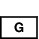
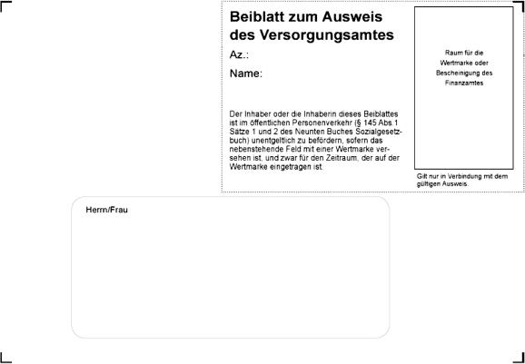
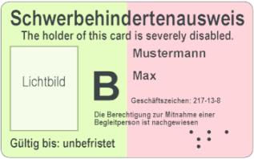
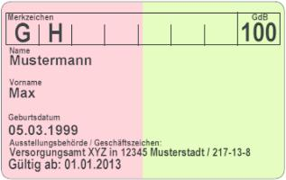

# Schwerbehindertenausweisverordnung (SchwbAwV)

Ausfertigungsdatum
:   1981-05-15

Fundstelle
:   BGBl I: 1981, 431

Neugefasst durch
:   Bek. vom 25.7.1991 I 1739;

Zuletzt geändert durch
:   Art. 1 V v. 7.6.2012 I 1275

## Erster Abschnitt - Ausweis für schwerbehinderte Menschen

### § 1 Gestaltung des Ausweises

(1) Der Ausweis im Sinne des § 69 Abs. 5 des Neunten Buches
Sozialgesetzbuch über die Eigenschaft als schwerbehinderter Mensch,
den Grad der Behinderung und weitere gesundheitliche Merkmale, die
Voraussetzung für die Inanspruchnahme von Rechten und
Nachteilsausgleichen nach dem Neunten Buch Sozialgesetzbuch oder nach
anderen Vorschriften sind, wird nach dem in der Anlage zu dieser
Verordnung abgedruckten Muster 1 ausgestellt. Der Ausweis ist mit
einem fälschungssicheren Aufdruck in der Grundfarbe grün versehen.

(2) Der Ausweis für schwerbehinderte Menschen, die das Recht auf
unentgeltliche Beförderung im öffentlichen Personenverkehr in Anspruch
nehmen können, ist durch einen halbseitigen orangefarbenen
Flächenaufdruck gekennzeichnet.

(3) Der Ausweis für schwerbehinderte Menschen, die zu einer der in §
151 Abs. 1 Satz 1 Nr. 2 Buchstabe a des Neunten Buches
Sozialgesetzbuch genannten Gruppen gehören, ist nach § 2 zu
kennzeichnen.

(4) Der Ausweis für schwerbehinderte Menschen mit weiteren
gesundheitlichen Merkmalen im Sinne des Absatzes 1 ist durch
Merkzeichen nach § 3 zu kennzeichnen.

(5) Ab dem 1. Januar 2013 kann der Ausweis nach den Absätzen 1 bis 4
auch als Identifikationskarte nach dem in der Anlage zu dieser
Verordnung abgedruckten Muster 5 ausgestellt werden. Ab dem 1. Januar
2015 ist der Ausweis nur noch in dieser Form auszustellen.

### § 2 Zugehörigkeit zu Sondergruppen

(1) Im Ausweis ist die Bezeichnung "Kriegsbeschädigt" einzutragen,
wenn der schwerbehinderte Mensch wegen eines Grades der
Schädigungsfolgen von mindestens 50 Anspruch auf Versorgung nach dem
Bundesversorgungsgesetz hat.

(2) Im Ausweis sind folgende Merkzeichen einzutragen:
1\.
VB

*
    *   wenn der schwerbehinderte Mensch wegen eines Grades der
        Schädigungsfolgen von mindestens 50 Anspruch auf Versorgung nach
        anderen Bundesgesetzen in entsprechender Anwendung der Vorschriften
        des Bundesversorgungsgesetzes hat oder wenn der Grad der
        Schädigungsfolgen wegen des Zusammentreffens mehrerer Ansprüche auf
        Versorgung nach dem Bundesversorgungsgesetz, nach Bundesgesetzen in
        entsprechender Anwendung der Vorschriften des
        Bundesversorgungsgesetzes oder nach dem Bundesentschädigungsgesetz in
        seiner Gesamtheit mindestens 50 beträgt und nicht bereits die
        Bezeichnung nach Absatz 1 oder ein Merkzeichen nach Nummer 2
        einzutragen ist,

2\.
EB

*
    *   wenn der schwerbehinderte Mensch wegen eines Grades der
        Schädigungsfolgen von mindestens 50 Entschädigung nach § 28 des
        Bundesentschädigungsgesetzes erhält.

Beim Zusammentreffen der Voraussetzungen für die Eintragung der
Bezeichnung nach Absatz 1 und des Merkzeichens nach Satz 1 Nr. 2 ist
die Bezeichnung "Kriegsbeschädigt" einzutragen, es sei denn, der
schwerbehinderte Mensch beantragt die Eintragung des Merkzeichens
"EB".

### § 3 Weitere Merkzeichen

(1) Im Ausweis sind auf der Rückseite folgende Merkzeichen
einzutragen:
1\.
aG

*
    *   wenn der schwerbehinderte Mensch außergewöhnlich gehbehindert im Sinne
        des § 6 Abs. 1 Nr. 14 des Straßenverkehrsgesetzes oder entsprechender
        straßenverkehrsrechtlicher Vorschriften ist,

2\.
H

*
    *   wenn der schwerbehinderte Mensch hilflos im Sinne des § 33b des
        Einkommensteuergesetzes oder entsprechender Vorschriften ist,

3\.
BI

*
    *   wenn der schwerbehinderte Mensch blind im Sinne des § 72 Abs. 5 des
        Zwölften Buches Sozialgesetzbuch oder entsprechender Vorschriften ist,

4\.
GI

*
    *   wenn der schwerbehinderte Mensch gehörlos im Sinne des § 145 des
        Neunten Buches Sozialgesetzbuch ist,

5\.
RF

*
    *   wenn der schwerbehinderte Mensch die landesrechtlich festgelegten
        gesundheitlichen Voraussetzungen für die Befreiung von der
        Rundfunkgebührenpflicht erfüllt,

6\.
1\. Kl.

*
    *   wenn der schwerbehinderte Mensch die im Verkehr mit Eisenbahnen
        tariflich festgelegten gesundheitlichen Voraussetzungen für die
        Benutzung der 1. Wagenklasse mit Fahrausweis der 2. Wagenklasse
        erfüllt,

7.    
  wenn der schwerbehinderte Mensch in seiner Bewegungsfähigkeit im
    Straßenverkehr erheblich beeinträchtigt im Sinne des § 146 Absatz 1
    Satz 1 des Neunten Buches Sozialgesetzbuch oder entsprechender
    Vorschriften ist.

(2) Ist der schwerbehinderte Mensch zur Mitnahme einer Begleitperson
im Sinne des § 146 Absatz 2 des Neunten Buches Sozialgesetzbuch
berechtigt, sind auf der Vorderseite des Ausweises das Merkzeichen „B“
und der Satz „Die Berechtigung zur Mitnahme einer Begleitperson ist
nachgewiesen“ einzutragen.

### § 3a Beiblatt

(1) Zum Ausweis für schwerbehinderte Menschen, die das Recht auf
unentgeltliche Beförderung im öffentlichen Personenverkehr in Anspruch
nehmen können, ist auf Antrag ein Beiblatt nach dem in der Anlage zu
dieser Verordnung abgedruckten Muster 2 in der Grundfarbe weiß
auszustellen. Das Beiblatt ist Bestandteil des Ausweises und nur
zusammen mit dem Ausweis gültig.

(2) Schwerbehinderte Menschen, die das Recht auf unentgeltliche
Beförderung in Anspruch nehmen wollen, erhalten auf Antrag ein
Beiblatt, das mit einer Wertmarke nach dem in der Anlage zu dieser
Verordnung abgedruckten Muster 3 versehen ist. Die Wertmarke enthält
ein bundeseinheitliches Hologramm. Auf die Wertmarke werden
eingetragen das Jahr und der Monat, von dem an die Wertmarke gültig
ist, sowie das Jahr und der Monat, in dem ihre Gültigkeit abläuft.
Sofern in Fällen des § 145 Abs. 1 Satz 3 des Neunten Buches
Sozialgesetzbuch der Antragsteller zum Gültigkeitsbeginn keine Angaben
macht, wird der auf den Eingang des Antrages und die Entrichtung der
Eigenbeteiligung folgende Monat auf der Wertmarke eingetragen.
Spätestens mit Ablauf der Gültigkeitsdauer der Wertmarke wird das
Beiblatt ungültig.

(3) Schwerbehinderte Menschen, die an Stelle der unentgeltlichen
Beförderung die Kraftfahrzeugsteuerermäßigung in Anspruch nehmen
wollen, erhalten auf Antrag ein Beiblatt ohne Wertmarke. Bei
Einräumung der Kraftfahrzeugsteuerermäßigung wird das Beiblatt mit
einem Vermerk des zuständigen Finanzamtes versehen. Die
Gültigkeitsdauer des Beiblattes entspricht der des Ausweises.

(4) Schwerbehinderte Menschen, die zunächst die
Kraftfahrzeugsteuerermäßigung in Anspruch genommen haben und statt
dessen die unentgeltliche Beförderung in Anspruch nehmen wollen, haben
das Beiblatt (Absatz 3) nach Löschung des Vermerks durch das Finanzamt
bei Stellung des Antrags auf ein Beiblatt mit Wertmarke (Absatz 2)
zurückzugeben. Entsprechendes gilt, wenn schwerbehinderte Menschen vor
Ablauf der Gültigkeitsdauer der Wertmarke an Stelle der
unentgeltlichen Beförderung die Kraftfahrzeugsteuerermäßigung in
Anspruch nehmen wollen. In diesem Fall ist das Datum der Rückgabe
(Eingang beim Versorgungsamt) auf das Beiblatt nach Absatz 3
einzutragen.

(5) (weggefallen)

### § 4 Sonstige Eintragungen

(1) Die Eintragung von Sondervermerken zum Nachweis von weiteren
Voraussetzungen für die Inanspruchnahme von Rechten und
Nachteilsausgleichen, die schwerbehinderten Menschen nach
landesrechtlichen Vorschriften zustehen, ist zulässig.

(2) Die Eintragung von Merkzeichen oder sonstigen Vermerken, die in
dieser Verordnung (§§ 2, 3, 4 Abs. 1 und § 5 Abs. 3) nicht vorgesehen
sind, ist unzulässig.

### § 5 Lichtbild

(1) Der Ausweis ist mit einem Bild des schwerbehinderten Menschen zu
versehen, wenn dieser das
10\. Lebensjahr              vollendet hat. Hierzu hat der
schwerbehinderte Mensch ein Passbild beizubringen.

(2) Bei schwerbehinderten Menschen, die das Haus nicht oder nur mit
Hilfe eines Krankenwagens verlassen können, ist der Ausweis auf Antrag
ohne Lichtbild auszustellen.

(3) In Ausweisen ohne Lichtbild ist in dem für das Lichtbild
vorgesehenen Raum der Vermerk "Ohne Lichtbild gültig" einzutragen.

### § 6 Gültigkeitsdauer

(1) Auf der Rückseite des Ausweises ist als Beginn der Gültigkeit des
Ausweises einzutragen:

1.  in den Fällen des § 69 Abs. 1 und 4 des Neunten Buches
    Sozialgesetzbuch der Tag des Eingangs des Antrags auf Feststellung
    nach diesen Vorschriften,

2.  in den Fällen des § 69 Abs. 2 des Neunten Buches Sozialgesetzbuch der
    Tag des Eingangs des Antrags auf Ausstellung des Ausweises nach § 69
    Abs. 5 des Neunten Buches Sozialgesetzbuch.

(2) Die Gültigkeit des Ausweises ist für die Dauer von längstens 5
Jahren vom Monat der Ausstellung an zu befristen. In den Fällen, in
denen eine Neufeststellung wegen einer wesentlichen Änderung in den
gesundheitlichen Verhältnissen, die für die Feststellung maßgebend
gewesen sind, nicht zu erwarten ist, kann der Ausweis unbefristet
ausgestellt werden.

(3) Für schwerbehinderte Menschen unter 10 Jahren ist die
Gültigkeitsdauer des Ausweises bis längstens zum Ende des
Kalendermonats zu befristen, in dem das 10. Lebensjahr vollendet wird.

(4) Für schwerbehinderte Menschen im Alter zwischen 10 und 15 Jahren
ist die Gültigkeitsdauer des Ausweises bis längstens zum Ende des
Kalendermonats zu befristen, in dem das 20. Lebensjahr vollendet wird.

(5) Bei nichtdeutschen schwerbehinderten Menschen, deren
Aufenthaltstitel, Aufenthaltsgestattung oder Arbeitserlaubnis
befristet ist, ist die Gültigkeitsdauer des Ausweises längstens bis
zum Ablauf des Monats der Frist zu befristen.

(6) (weggefallen)

(7) Der Kalendermonat und das Kalenderjahr, bis zu deren Ende der
Ausweis gültig sein soll, sind auf der Vorderseite des Ausweises
einzutragen.

### § 7 Verwaltungsverfahren

Für die Ausstellung und Einziehung des Ausweises sind die für die
Kriegsopferversorgung maßgebenden Verwaltungsverfahrensvorschriften
entsprechend anzuwenden, soweit sich aus § 69 Abs. 5 des Neunten
Buches Sozialgesetzbuch nichts Abweichendes ergibt.

## Zweiter Abschnitt - Ausweis für sonstige Personen zur unentgeltlichen Beförderung im öffentlichen Personenverkehr

### § 8 Ausweis für sonstige freifahrtberechtigte Personen

(1) Der Ausweis für Personen im Sinne des Artikels 2 Abs. 1 des
Gesetzes über die unentgeltliche Beförderung Schwerbehinderter im
öffentlichen Personenverkehr vom 9. Juli 1979 (BGBl. I S. 989), soweit
sie nicht schwerbehinderte Menschen im Sinne des § 2 Abs. 2 des
Neunten Buches Sozialgesetzbuch sind, wird nach dem in der Anlage zu
dieser Verordnung abgedruckten Muster 4 ausgestellt. Der Ausweis ist
mit einem fälschungssicheren Aufdruck in der Grundfarbe grün versehen
und durch einen halbseitigen orangefarbenen Flächenaufdruck
gekennzeichnet. Zusammen mit dem Ausweis ist ein Beiblatt
auszustellen, das mit einer Wertmarke nach dem in der Anlage zu dieser
Verordnung abgedruckten Muster 3 versehen ist.

(2) Für die Ausstellung des Ausweises nach Absatz 1 gelten die
Vorschriften des § 1 Absatz 3 und 5, § 2, § 3 Absatz 1 Nummer 6 und
Absatz 2, § 4 Absatz 2, § 5 und § 6 Absatz 2, 3, 4 und 7 sowie des § 7
entsprechend, soweit sich aus Artikel 2 Abs. 2 und 3 des Gesetzes über
die unentgeltliche Beförderung Schwerbehinderter im öffentlichen
Personenverkehr nichts Besonderes ergibt.

## Dritter Abschnitt - Übergangsregelung

### § 9 Übergangsregelung

Bis zum 31. Dezember 2014 ausgestellte Ausweise, die keine
Identifikationskarten nach § 1 Absatz 5 sind, bleiben bis zum Ablauf
ihrer Gültigkeitsdauer gültig, es sei denn, sie sind einzuziehen. Sie
können gegen eine Identifikationskarte umgetauscht werden.
Ausgestellte Beiblätter bleiben bis zum Ablauf ihrer Gültigkeit
gültig.

### Muster 1

(Fundstelle: BGBl I 1991, 1743;
bzgl. der einzelnen Änderungen vgl. Fußnote)
(Vorderseite) (nicht darstellbares Ausweisformular)
(Rückseite) (nicht darstellbares Ausweisformular)
Der Ausweis ist amtlicher Nachweis für die Eigenschaft als
schwerbehinderter Mensch, den Grad der Behinderung, die auf ihm
eingetragenen weiteren gesundheitlichen Merkmale und die Zugehörigkeit
zu Sondergruppen. Er dient dem Nachweis für die Inanspruchnahme von
Rechten und Nachteilsausgleichen, die schwerbehinderten Menschen nach
dem Neunten Buch Sozialgesetzbuch oder nach anderen Vorschriften
zustehen.
Änderungen in den für die Eintragungen maßgebenden Verhältnissen sind
der ausstellenden Behörde unverzüglich mitzuteilen. Nach Aufforderung
ist der Ausweis, der Eigentum der ausstellenden Behörde bleibt, zum
Zwecke der Berichtigung oder Einziehung vorzulegen. Die mißbräuchliche
Verwendung ist strafbar.

### Muster 2

(Fundstelle: BGBl. I 2012, 1276)

## **Beiblatt zum Ausweis des Versorgungsamtes**

### Muster 3

(Inhalt: nicht darstellbares Muster,
Fundstelle: BGBl I 1991, 1744)

### Muster 4

(Fundstelle: BGBl I 1991, 1745;
bzgl. der einzelnen Änderungen vgl. Fußnote)
(Vorderseite) (nicht darstellbares Ausweisformular)
(Rückseite)
Der Ausweis ist amtlicher Nachweis für die Zugehörigkeit des
Ausweisinhabers oder der Ausweisinhaberin zu den freifahrtberechtigten
Personen im Sinne des Artikels 2 Abs. 1 des Gesetzes über die
unentgeltliche Beförderung Schwerbehinderter im öffentlichen
Personenverkehr vom 9. Juli 1979 (BGBl. I S. 989).
Gegen Vorzeigen dieses Ausweises und des mit einer Wertmarke
versehenen Beiblattes ist der Ausweisinhaber oder die Ausweisinhaberin
im Nahverkehr im Sinne des § 147 abs. 1 des Neunten Buches
Sozialgesetzbuch unentgeltlich zu befördern.
Das gleiche gilt im Nah- und Fernverkehr im Sinne des § 147 des
Neunten Buches Sozialgesetzbuch für die Beförderung

1.  einer Begleitperson des Ausweisinhabers oder der Ausweisinhaberin,
    wenn dieser infolge einer Behinderung in seiner Bewegungsfähigkeit im
    Straßenverkehr erheblich beeinträchtigt und infolgedessen auf eine
    ständige Begleitung angewiesen ist, sofern dies im Ausweis mit dem
    Merkzeichen
    B eingetragen ist, und

2.  des Handgepäcks, eines mitgeführten Krankenfahrstuhls, soweit die
    Beschaffenheit des Verkehrsmittels dies zuläßt, sonstiger
    orthopädischer Hilfsmittel und eines Führhundes.

Änderungen in den für die Eintragungen maßgebenden Verhältnissen sind
der ausstellenden Behörde unverzüglich mitzuteilen. Nach Aufforderung
ist der Ausweis, der Eigentum der ausstellenden Behörde bleibt, zum
Zwecke der Berichtigung oder Einziehung vorzulegen. Die mißbräuchliche
Verwendung ist strafbar.

### Muster 5

(Fundstelle: BGBl. I 2012, 1277)

**Schwerbehindertenausweis nach § 1 Absatz 5**
## **(Vorder- und Rückseite)**

Spezifikationen:

*    *   Größe

    *   85,60 mm x 53,98 mm (ID-1) entsprechend ISO/IEC 7810

*    *   Beschaffenheit

    *   entsprechend ISO/IEC 7810

*    *   Farben

    *   grün: RAL 120 80 30 P
        orange: RAL 040 80 20 P

*    *   Schrift

    *   schwarz
        Schriftart: arial narrow bold
        Schriftgröße: 21 Punkt/12 Punkt/8 Punkt

*    *   taktile Erkennbarkeit

    *   Buchstabenfolge sch-b-a entsprechend ISO/IEC 7811-9. Wird auf Ausweise
        mit dem Merkzeichen „Bl“ aufgebracht.

Die Farbtöne sind dem Farbregister RAL Design System, herausgegeben
von RAL Farben gGmbH, Siegburger Str. 39, 53757 St. Augustin, zu
entnehmen.

Die ISO-Normen sind zu beziehen beim Beuth-Verlag, 10772 Berlin.

