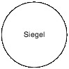

# Verordnung über die Aus- und Fortbildung der Seelotsen (SeeLAuFV)

Ausfertigungsdatum
:   2014-02-25

Fundstelle
:   BGBl I: 2014, 234

Geändert durch
:   Art. 71 V v. 2.6.2016 I 1257

## Erster Abschnitt - Ausbildung

### § 1 Durchführung der Ausbildung

Die Ausbildung der Seelotsenanwärter obliegt der Lotsenbrüderschaft
des Seelotsreviers, für das die Anwärter ausgewählt worden sind. Die
Aufsichtsbehörde überwacht die Ausbildung.

### § 2 Ziel und Dauer der Ausbildung

(1) Die Ausbildung soll den Seelotsenanwärtern die theoretischen und
praktischen Kenntnisse und Fertigkeiten vermitteln, die erforderlich
sind, um Schiffsführungen als Seelotse sicher beraten zu können.

(2) Erforderlich sind die für eine sichere Lotsung notwendigen
Kenntnisse über

1.  das Lotsrevier mit seinen Besonderheiten und Schwierigkeiten, unter
    Berücksichtigung der Sicherheit des Verkehrs, des maritimen
    Umweltschutzes und der Schiffssicherheit,

2.  die Handhabung des Lotsdienstes und die Durchführung der Lotsberatung
    in dem Revier,

3.  die Verwaltung der Bundeswasserstraßen und die Aufgaben des Bundes auf
    dem Gebiet der Schifffahrt,

4.  die verkehrlichen Grundregeln, die Maritime Verkehrssicherung,
    Maßnahmen bei Seeunfällen sowie weitere für das Lotswesen und die
    Schifffahrt geltende Bestimmungen und Bekanntmachungen,

5.  die Nutzung technischer Hilfsmittel für Navigation und
    Nachrichtenübermittlung und

6.  die nächstgelegenen Reviere und Seegebiete.

(3) Die Dauer der Ausbildung beträgt acht Monate. Unterbrechungen
durch Krankheit von insgesamt zwölf Tagen Dauer können auf die
Ausbildungszeit angerechnet werden, wenn der Ältermann gegenüber der
Aufsichtsbehörde schriftlich bestätigt, dass dadurch die Erreichung
des Ausbildungszieles nicht gefährdet wird.

### § 3 Theoretische Ausbildung

(1) Für die theoretische Ausbildung sind wöchentlich mindestens drei
Stunden vorzusehen.

(2) Der Ältermann der Lotsenbrüderschaft kann mit Zustimmung der
Aufsichtsbehörde unter Berücksichtigung der örtlichen Besonderheiten
und der jeweiligen Vorkenntnisse des Seelotsenanwärters im Einzelfall
abweichende Regelungen zulassen.

### § 4 Praktische Ausbildung

(1) Die praktische Ausbildung umfasst:

1.  angeleitetes Mitfahren in dem Seelotsrevier sowie bei
    Distanzlotsungen,

2.  Mitfahrten im praktischen Dienst auf Lotsenversetz- und
    Zubringerfahrzeugen,

3.  Mitfahrten auf Schleppfahrzeugen,

4.  Simulationsübungen,

5.  Wachdienst in der Lotsenwache unter Aufsicht des Wachlotsen,

6.  Einsatz bei den Verkehrseinrichtungen des Reviers einschließlich der
    Radarberatung.

(2) Durch das angeleitete Mitfahren während der Lotsungen in dem
Revier sind den Seelotsenanwärtern alle notwendigen Kenntnisse und
Fertigkeiten zu vermitteln. Die praktische Ausbildung umfasst ferner
die Zusammenarbeit und den Informationsaustausch mit dem Brückenteam
unter Normal- und Notfallbedingungen bei Berücksichtigung von
Hindernissen psychologischer, sprachlicher, physiologischer und
kultureller Art. Zum selbstständigen Lotsen oder zur Ausübung einer
anderen selbstständigen Tätigkeit mit eigener Verantwortung dürfen die
Seelotsenanwärter nicht herangezogen werden.

(3) Die Simulationsübungen müssen revierbezogene Manövrierkenntnisse
und das Verhalten in Notfällen vermitteln. Dazu gehören

1.  das Verhalten von Schiffen in Flachwasser und beengten
    Revierverhältnissen,

2.  das Verhältnis Schiff zu Revier,

3.  die Interaktion mit anderen Schiffen im Revier,

4.  die räumliche Vorstellung,

5.  die sichere Geschwindigkeit im Revier,

6.  die Ausbildung am Radar und an integrierten Navigationssystemen sowie

7.  Übungen mit unterschiedlichen Antriebskonzepten.

Als Simulationsübungen gelten nur Schulungen an von der
Aufsichtsbehörde anerkannten Schiffsführungs- und Radarsimulatoren.

(4) Der Ältermann der Lotsenbrüderschaft kann mit Zustimmung der
Aufsichtsbehörde unter Berücksichtigung der örtlichen Besonderheiten
und der jeweiligen Vorkenntnisse des Seelotsenanwärters im Einzelfall
abweichende Regelungen zulassen.

### § 5 Ausbildungsnachweise

(1) Die Seelotsenanwärter haben über den Verlauf der theoretischen und
praktischen Ausbildung ein Ausbildungsbuch zu führen, aus dem der
Ablauf und die Inhalte der Ausbildung ersichtlich sein müssen. Die
Eintragungen der Seelotsenanwärter sind von den ausbildenden Stellen
und Personen am Ende eines jeden Ausbildungsabschnittes durch
Unterschrift zu bestätigen. Nach Beendigung der Ausbildung ist das
Ausbildungsbuch bei der Lotsenbrüderschaft abzugeben.

(2) Über die jeweiligen Mitfahrten sind Einzelbewertungsnachweise nach
Anlage 1 durch die anleitenden Seelotsen zu erstellen. Abschließend
ist eine Gesamtbewertung nach Anlage 2 durch die Lotsenbrüderschaft zu
erstellen. Grundlage der Gesamtbewertung sind
die Einzelbewertungsnachweise              und das Ausbildungsbuch.

### § 6 Verkürzung der Ausbildungszeit

Das Bundesministerium für Verkehr und digitale Infrastruktur kann in
besonderen Ausnahmefällen die Ausbildungszeit verkürzen. Ein solcher
Ausnahmefall liegt insbesondere vor, wenn ein erfahrener Seelotse
unter Verzicht auf die Rechte aus seiner Bestallung die Zulassung als
Anwärter in einem anderen Revier beantragt.

### § 7 Prüfungsverfahren

(1) Nach Abschluss der Ausbildung meldet die Lotsenbrüderschaft den
jeweiligen Seelotsenanwärter bei der Aufsichtsbehörde zur Prüfung an.

(2) Voraussetzungen für die Zulassung zur Prüfung sind:

1.  die Vorlage eines lückenlos geführten Ausbildungsbuches,

2.  eine mindestens mit „ausreichend“ benotete Gesamtbewertung nach Anlage
    2\.

(3) Bei einer mit „mangelhaft“ benoteten Gesamtbewertung kann die
Lotsenbrüderschaft mit Zustimmung der Aufsichtsbehörde die
Ausbildungszeit einmalig um zwei Monate verlängern, um die Zulassung
zur Prüfung nach Absatz 2 zu ermöglichen.

(4) Erfüllt der Seelotsenanwärter, auch unter Berücksichtigung einer
Verlängerung der Ausbildungszeit nach Absatz 3, die Voraussetzungen
für die Zulassung zur Prüfung nicht, ist das Ausbildungsverhältnis
beendet.

(5) Die Aufsichtsbehörde setzt den Prüfungstermin fest, unterrichtet
die Seelotsenanwärter darüber unter Hinweis auf ihre Rechte und
Pflichten im Rahmen der Prüfung und beruft den Prüfungsausschuss ein.
Der Prüfungsausschuss wird von einem Vertreter der Aufsichtsbehörde,
der mindestens dem gehobenen nicht-technischen Verwaltungsdienst
angehören und Erfahrungen im Fachgebiet Lotswesen aufweisen muss,
geleitet. Dieser benennt als weitere Mitglieder des
Prüfungsausschusses den Ältermann der jeweiligen Brüderschaft, einen
Ausbilder des Lotsreviers – bei der Lotsenbrüderschaft Elbe zwei
Ausbilder – sowie zwei revier- und sachkundige Vertreter der
zuständigen Schifffahrtspolizeibehörde.

(6) Erscheint der Seelotsenanwärter nicht zum Prüfungstermin, setzt
ihm der Prüfungsausschuss eine angemessene Frist für den Nachweis,
dass er an der Teilnahme durch Krankheit oder einen anderen, von ihm
nicht zu vertretenden, wichtigen Grund gehindert war. Der Nachweis ist
gegenüber der Aufsichtsbehörde zu erbringen. Wird der verlangte
Nachweis erbracht, ist ein erneuter Prüfungstermin festzusetzen.
Anderenfalls stellt die Aufsichtsbehörde nach Ablauf der Frist das
Nichtbestehen der Prüfung fest.

### § 8 Prüfungsinhalte

Die Prüfung ist mündlich vor dem Prüfungsausschuss und erstreckt sich
auf folgende Gebiete:

1.  Grenzen, Kurse, Distanzen, Seezeichen, Landmarken und Sprechfunkkanäle
    des Lotsreviers und der nächstgelegenen Lotsreviere sowie deren
    Ansteuerung,

2.  meteorologische, morphologische und hydrodynamische Verhältnisse des
    Reviers,

3.  Liegestellen und Reeden sowie Hafenliegeplätze,

4.  Notliegeplätze,

5.  Vessel Traffic Service (VTS) und Konzepte zur Verkehrssicherheit an
    Nord- und Ostsee,

6.  verkehrsrechtliche und schifffahrtspolizeiliche Bestimmungen auf dem
    Revier unter besonderer Berücksichtigung der von Schiffen ausgehenden
    möglichen Gefährdungen für die Meeresumwelt und die Schiffssicherheit,

7.  Handhabung und Auswertung technisch-nautischer Hilfsmittel im Revier,

8.  Schiffsmanöver mit allen im Revier verkehrenden Typen von Schiffen bei
    allen Witterungs- und Strömungsverhältnissen unter Beachtung der
    sicheren revierspezifischen Geschwindigkeit, auch mit
    Schlepperassistenz und in Notfallsituationen,

9.  Organisation und Rechtsgrundlagen des Seelotswesens,

10. Aufbau, Organisation und Aufgaben der Wasserstraßen- und
    Schifffahrtsverwaltung des Bundes sowie weiterer relevanter Behörden.

Die Prüfung erfolgt entweder einzeln oder bei mehreren Prüflingen als
Gruppenprüfung mit höchstens sechs Prüflingen. Die Prüfungsdauer soll
für jeden Prüfling mindestens vierzig Minuten betragen.

### § 9 Prüfungsentscheidung

(1) Die Prüfung ist bestanden, wenn der Prüfungsausschuss feststellt,
dass der Seelotsenanwärter nach dem Gesamteindruck der Prüfung die
Gewähr dafür bietet, die einem Lotsen übertragenen Aufgaben sicher
wahrzunehmen. Die Entscheidung des Prüfungsausschusses erfolgt in
nicht öffentlicher Beratung mit Stimmenmehrheit. Bei Stimmengleichheit
entscheidet die Stimme des Leiters des Prüfungsausschusses. Die
Bekanntgabe der Prüfungsentscheidung erfolgt für jeden Prüfling
einzeln und ist auf Verlangen zu begründen. Im Falle des
Nichtbestehens sind dem Prüfling die Gründe der Prüfungsentscheidung
mitzuteilen und die Rechtsbehelfsbelehrung zu eröffnen.

(2) Über jede Prüfung ist eine Niederschrift zu erstellen, die von
allen Prüfern auf Richtigkeit zu überprüfen und zu unterzeichnen ist.
Die Niederschrift muss den wesentlichen Prüfungsablauf, die
Prüfungsthemen und eine Feststellung, ob eine Begründung der
Prüfungsentscheidung erfolgt ist, erkennen lassen.

(3) Das Gesamtergebnis der Prüfung ist nur mit „Bestanden“ oder „Nicht
bestanden“ zu bewerten.

### § 10 Wiederholung der Prüfung

Besteht ein Seelotsenanwärter die Prüfung nicht, so hat der
Prüfungsausschuss darüber zu beschließen, welcher Teil der
theoretischen Ausbildung nachzuholen und wann die Prüfung zu
wiederholen ist. Die Ausbildung kann um bis zu zwei weitere Monate
verlängert werden. Die Prüfung kann einmal wiederholt werden. Eine
weitere Wiederholung der Prüfung und eine weitere Zulassung als
Seelotsenanwärter für ein anderes Seelotsrevier sind nur in besonderen
Ausnahmefällen mit Genehmigung des Bundesministeriums für Verkehr und
digitale Infrastruktur zulässig. Besteht der Seelotsenanwärter die
Wiederholungsprüfung nicht, ist das Ausbildungsverhältnis beendet.

### § 11 Prüfungszeugnis

Jedem Seelotsenanwärter, der die Prüfung bestanden hat, ist ein von
dem Leiter des Prüfungsausschusses ausgefertigtes Prüfungszeugnis nach
dem Muster der Anlage 3 auszuhändigen.

## Zweiter Abschnitt - Fortbildung

### § 12 Fortbildungsverpflichtung

(1) Jeder Seelotse ist verpflichtet, seine für die Lotstätigkeit
notwendigen Kenntnisse in regelmäßigen Abständen zu vertiefen und zu
ergänzen.

(2) Die Fortbildung erfolgt durch theoretische Kurse und praktische
Übungen an Schiffsführungs- und Radarsimulatoren anhand eines in
Modulen aufgegliederten Fortbildungsrahmenplans nach Anlage 4. Der
Fortbildungsrahmenplan legt die Fortbildungsinhalte, Zeitdauer und
Wiederholungsfrist der Module fest.

(3) Als Simulationsübungen gelten nur Schulungen an von der
Aufsichtsbehörde anerkannten Schiffsführungs- und Radarsimulatoren.

### § 13 Fortbildungsplan

Die Umsetzung des Fortbildungsrahmenplans erfolgt unter
Berücksichtigung der revierbezogenen Besonderheiten durch einen von
den Lotsenbrüderschaften zu erstellenden Fortbildungsplan. Der
Fortbildungsplan ist auf Verlangen der Aufsichtsbehörde anzupassen,
insbesondere bei technischen oder wissenschaftlichen Entwicklungen auf
dem Gebiet der Schifffahrtskunde.

### § 14 Nachweis

Jeder Seelotse hat seine Teilnahme an den in den jeweiligen
Fortbildungsplänen der Lotsenbrüderschaften vorgesehenen Kursen
gegenüber der Lotsenbrüderschaft nachzuweisen. Die Lotsenbrüderschaft
ist auf Verlangen der Aufsichtsbehörde zur Auskunft über die Teilnahme
der jeweiligen Seelotsen an den Fortbildungsmaßnahmen und zur Vorlage
der Nachweise verpflichtet.

## Dritter Abschnitt - Seelotsenausweise

### § 15 Seelotsenanwärterausweis und Seelotsenausweis

(1) Die zuständige Aufsichtsbehörde stellt für die Seelotsenanwärter
des Reviers einen Seelotsenanwärterausweis und für die Seelotsen einen
Seelotsenausweis nach den Mustern der Anlage 5 aus. Die
Seelotsenanwärterausweise sind bei der Bestallung in Seelotsenausweise
umzutauschen. Die Teilnehmer einer lotsenspezifischen Grundausbildung
erhalten einen Ausweis nach dem Muster der Anlage 5 mit dem Zusatz
„Grundausbildung“.

(2) Die Seelotsenanwärter und die Seelotsen haben den Ausweis während
der Bordlotsung mitzuführen und auf Verlangen der Schiffsführung
jederzeit vorzulegen.

### Anlage 1 (zu § 5 Absatz 2)

(Fundstelle: BGBl. I 2014, 237)

## Einzelbewertungsnachweis für Seelotsenanwärter

*    *   Schiffsname:

    *   . . . . . . . . . . . . . . . . . . . . . . . . . . . . .

    *   Datum: . . . . . . . . . . . . . . . . . . . . . .

*    *   Anleitender Lotse:

    *   . . . . . . . . . . . . . . . . . . . . . . . . . . . . .

    *

*    *   Seelotsenanwärter:

    *   . . . . . . . . . . . . . . . . . . . . . . . . . . . . .

    *

   Bitte folgende Beurteilungsskala verwenden:

*    *   1 (sehr gut)

    *
    *   2 (gut)

    *
    *   3 (befriedigend)

    *
    *   4 (ausreichend)

    *
    *   5 (mangelhaft)

*    *   Bei einem mit „5“ beurteilten Punkt ist der gesamte
        Einzelbewertungsnachweis mangelhaft.

*    *
    *
    *
    *

*    *   1.

    *   Fahrweise

    *
        *            *

    *   Zu beurteilen sind:

*    *
    *   –

    *   Revierkenntnisse

*    *
    *   –

    *   Einhaltung der für das jeweilige Fahrzeug relevanten Bezugslinie
        (Radarlinie, Tonnenstrich)

*    *
    *   –

    *   Rechtzeitige und korrekte Anpassung der Geschwindigkeit

*    *
    *   –

    *   Rechtzeitige und korrekte Durchführung der Kursänderungen

*    *
    *   –

    *   Durchführung von Anker- und Anlegemanövern

*    *
    *
    *
    *
    *

*    *   2.

    *   Verkehrsverhalten

    *
        *            *

    *   Zu beurteilen sind:

*    *
    *   –

    *   Rücksichtnahme auf andere Verkehrsteilnehmer

*    *
    *   –

    *   Rücksichtnahme beim Passieren

*    *
    *   –

    *   Korrekte Durchführung von Überholmanövern

*    *
    *   –

    *   Erkennen und Reagieren auf sich anbahnende Verkehrssituationen

*    *
    *   –

    *   Einhaltung der empfohlenen Geschwindigkeiten

*    *
    *
    *
    *
    *

*    *   3.

    *   Reiseplanung

    *
        *            *

    *   Zu beurteilen sind:

*    *
    *   –

    *   Reiseplanung von Orderschiffen

*    *
    *   –

    *   Kenntnisse über den Tidefahrplan (sofern erforderlich)

*    *
    *   –

    *   Kenntnisse der aktuellen Tidesituation zu jedem Zeitpunkt der Reise

*    *
    *   –

    *   Vorbereitung des Lotsentransfers

*    *
    *   –

    *   Vorbereiten eventueller Anker- und Anlegemanöver

*    *
    *
    *
    *
    *

*    *   4.

    *   Kommunikation

    *
        *            *

    *   Zu beurteilen sind:

*    *
    *   –

    *   Einhaltung der Meldepunkte

*    *
    *   –

    *   Kenntnisse und Einhaltung der jeweiligen Hörbereitschaft auf UKW-
        Kanälen

*    *
    *   –

    *   Klarheit der Absprachen

*    *
    *   –

    *   Beherrschung der Reviersprache

*    *
    *   –

    *   Klarheit der Artikulation

*    *
    *   –

    *   Erfüllung der Aufgaben innerhalb des Bridgeteams
        (Informationsaustausch)

*    *
    *
    *
    *
    *

*    *   5.

    *   Bemerkungen: . . . . . . . . . . . . . . . . . . . . . . . . . . . . .
        . . . . . . . . . . . . . . . . . . . . . . .

*    *
    *   . . . . . . . . . . . . . . . . . . . . . . . . . . . . . . . . . . .
        . . . . . . . . . . . . . . . . . . . . . . .

. . . . . . . . . . . . . . . . . . . . . . . . . . . . . . . . . .
Unterschrift des anleitenden Lotsen

### Anlage 2 (zu § 5 Absatz 2)

(Fundstelle: BGBl. I 2014, 238)

## Gesamtbewertung

Für den Seelotsenanwärter wird durch die ausbildende
Lotsenbrüderschaft eine Gesamtbewertung erstellt, deren Grundlage die
Einzelbewertungsnachweise nach Anlage 1 und das Ausbildungsbuch sind.

Für die Zulassung zur Prüfung gemäß § 7 Absatz 2 dieser Verordnung
sind zwölf Einzelbewertungsnachweise nach Anlage 1 mit mindestens der
Note „ausreichend“ vorzulegen, ansonsten ist die Gesamtbewertung
„mangelhaft“.

1.  Personalien

    *        *   Name, Vorname des Seelotsenanwärters

        *   Zeitraum der Ausbildung

    *        *   . . . . . . . . . . . . . . . . . . . . . . . . . . . . . .

        *   von . . . . . . . . . . . . . . .  bis . . . . . . . . . . . . . . .

    *        *   Name, Vorname des Ausbilders der Lotsenbrüderschaft

        *   Name, Vorname des Ältermannes der Lotsenbrüderschaft

    *        *   . . . . . . . . . . . . . . . . . . . . . . . . . . . . . .

        *   . . . . . . . . . . . . . . . . . . . . . . . . . . . . . .

*    *
    *
    *
    *
    *
    *
    *
    *

*    *   2. Ausbildungsbuch, lückenlos geführt:

    *   ja

    *
        *            *

    *   nein

    *
        *            *

    *
    *
    *

*    *
    *
    *
    *
    *
    *
    *
    *

*    *   3. Anzahl Einzelbewertungsnachweise:

    *   mindestens ausreichend

    *
        *            *

    *   mangelhaft

    *
        *            *

    *

*    *
    *
    *
    *
    *
    *
    *
    *

*    *   4. Gesamtbewertung:

    *   mindestens ausreichend

    *
        *            *

    *   mangelhaft

    *
        *            *

    *

*    *   . . . . . . . . . . . . . . . . . . . . . . . . . .

    *
    *   . . . . . . . . . . . . . . . . . . . . . . . . . .

    *
    *   . . . . . . . . . . . . . . . . . . . . . . . . . .

*    *   Ort, Datum

    *
    *   Ausbilder

    *
    *   Ältermann

*    *
    *
    *
    *
    *

*    *   Zur Kenntnis genommen:

    *
    *   . . . . . . . . . . . . . . . . . . . . . . . . . . .
        Seelotsenanwärter

*    *
    *
    *
    *
    *

*    *
    *
    *
    *
    *

*    *
    *
    *
    *
    *

*    *
    *
    *
    *
    *        

### Anlage 3 (zu § 11)

   (Fundstelle: BGBl. I 2014, 239)

Generaldirektion Wasserstraßen und Schifffahrt
Außenstelle Nord

Generaldirektion Wasserstraßen und Schifffahrt
Außenstelle Nordwest

Prüfungszeugnis

über die Befähigung zum Seelotsen

Der Lotsenanwärter

Name . . . . . . . . . . . . . . . . . . . . . . . . . . . . . . . . .
. . . . . . . . . . . . . . . . . . . . . . . . . . . . . . . . . . .
. . . . . .

geboren am . . . . . . . . . . . . . . . . . . . . . in . . . . . . .
. . . . . . . . . . . . . . . . . . . . . . . . . . . . . . . . . .

hat die Prüfung zum Seelotsen für das Seelotsrevier

. . . . . . . . . . . . . . . . . . . . . . . . . . . . . . . . . . .
. . . . . . . . . . . . . . . . . . . . . . . . . . . . . . . . . . .
. . . . . . . . .

bestanden.

Ort, Datum . . . . . . . . . . . . . . . . . . .

. . . . . . . . . . . . . . . . . . . . . . . . . . . . . . . . . . .
. .

Der Leiter des Prüfungsausschusses

(zu § 12 Absatz 2)

### Anlage 4 Fortbildungsrahmenplan

(Fundstelle: BGBl. I 2014, 240 – 244)

*    *   Kurs/Modul

    *   Lernziele

    *   Beschreibung/Inhalte

    *   Dauer/
        Wiederholungsfrist

    *   Bemerkungen

*    *   Kommunikation und Zusammenwirken mit den
        örtlichen Behörden

    *   Mit diesen Veranstaltungen sollen die Grundsätze der Arbeit von
        Verkehrszentralen dargelegt, die Kommunikation und die Grundlagen für
        das Zusammenwirken der beteiligten Parteien an Land und an Bord in
        einem Revier in verschiedenen Situationen behandelt und trainiert
        werden, mit dem Ziel einer Weiterentwicklung und Optimierung und als
        Reaktion auf im Revier beobachtete Fehlentwicklungen und durch die BSU
        festgestellte Handlungserfordernisse.

    *
    *
    *
    *
    *   Bezug:
        5\.5.2, 5.5.3 und 5.5.8 IMO-Resolution
        A.960(23)
        Umsetzung durch Vorlesung mit Unterstützung von Simulation
        (Radarsimulation) zur Sicherstellung einer eindeutigen Kommunikation
        im Zusammenwirken von Lotsen und nautischen Bediensteten der
        Verkehrszentralen
        Einbeziehung von Vertretern der zuständigen Wasser- und
        Schifffahrtsverwaltung, z. B. Havariekommando, und anderer Behörden
        und Institutionen

*    *   a)

    *   VTS-Lehrgänge
        (siehe
        Spezifizierung)

    *   a)

    *   VTS Lehrgänge

    *   a)

    *   3 Tage/
        5 Jahre

*    *   –

    *   Dienste eines VTS/rechtliche Grundlagen
        (National und International)/VV-WSV 2408,

*    *   –

    *   Wirkung und Abgrenzung der Dienste,

*    *   –

    *   Praktische Übungen zur Radarberatung von Land,

*    *   –

    *   Training der Kommunikation,

*    *   –

    *   Datensicherung;

*    *   b)

    *   Unfallmanagementlehrgänge (siehe
        Spezifizierung)

    *   b)

    *   Unfallmanagementlehrgänge

    *   b)

    *   2 Tage/
        5 Jahre

*    *   –

    *   Analyse verschiedener möglicher Gefahrenlagen,

*    *   –

    *   Darstellung von Notfallplänen,

*    *   –

    *   Aufgabenteilung,

*    *   –

    *   Kommunikationswege und Durchführung der Kommunikation,

*    *   –

    *   Zuweisung der Führung einer Gefahrenlage
        „on-scene-commander“,

*    *   –

    *   Fallstudien;

*    *   c)

    *   Vermittlung von einschlägigen Themen zum Lotswesen
        betreffend
        Gesetze und Rechtsvorschriften in dem jeweiligen
        Lotsrevier

    *   c)

    *   Vermittlung einschlägiger Gesetze und Rechtsvorschriften und weiterer
        Themen aus gegebener Veranlassung; Vermittlung von aktuellen
        Entwicklungen für einen ordnungsgemäßen Betriebsablauf in dem
        jeweiligen Lotsrevier.

    *   c)

    *   1 Tag/
        5 Jahre

    *

*    *   Bridge Resource Management (BRM)

    *   Diese Veranstaltung soll der effektiven Vorbereitung und Nutzung des
        Brückenwachdienstes unter Berücksichtigung der Brückenbesetzung und
        Brückenausstattung dienen.
        Im Mittelpunkt stehen die Rolle des Lotsen innerhalb des Brückenteams
        und das Verhältnis Kapitän/Lotse.

    *   –

    *   Vermittlung von Gruppenführungstechniken,

    *   5 Tage/
        5 Jahre

    *   Bezug:
        5\.5.4 IMO-Resolution A.960(23) unter Einbeziehung von 5.5.1 (Abhaltung
        des Kurses in Englisch)
        Umsetzung durch Vorlesung mit Unterstützung von Simulation

*    *   –

    *   Schulung des Teamverhaltens,

*    *   –

    *   Erfassung von Situationen und der gegebenen Ressourcen,

*    *   –

    *   Beziehung und Informationsaustausch Kapitän/Lotse und mit anderen
        Mitgliedern des Teams,

*    *   –

    *   Delegieren und Aufgabenverteilung,

*    *   –

    *   Schulung des Entscheidungsverhaltens,

*    *   –

    *   Fallstudien und Simulation von Situationen unter verschiedenen
        Bedingungen (Normal- und Notfallbedingungen),

*    *   –

    *   Kommunikationstechniken,

*    *   –

    *   Fehlerkettenanalyse,

*    *   –

    *   Einfluss von Stress und Übermüdung (fatigue).

*    *   Ausbildung
        an modernen
        technischen
        Navigationseinrichtungen

    *   Schulung der Handhabung neuer Entwicklungen bei Technischen
        Navigationseinrichtungen, insbesondere Radar, ECDIS, AIS, integrierte
        Navigationssysteme und weiterer neuer Geräte. Insbesondere soll ihre
        Nutzbarkeit auf dem Lotsrevier dargestellt werden.

    *   –

    *   Fortbildung am Radargerät/angemessene Handhabung und Nutzung im
        jeweiligen Lotsrevier/Berücksichtigung von neuen Entwicklungen;
        Erörterung der Fehler und Grenzen von Radargeräten unter
        Berücksichtigung der neuen Entwicklungen und Erfahrungen im Revier,

    *   3 bis
        5 Tage/
        5 Jahre

    *   Bezug:
        5\.5.5 und 5.5.7 IMO-
        Resolution                        A.960(23)
        Umsetzung durch Vorlesung mit Unterstützung von Simulation
        (Radarsimulator und andere auf die Zielsetzung zugeschnittene
        Simulatoren)

*    *   –

    *   Praktisches Training: Fahren mit Radar in verschiedenen Situationen im
        Lotsrevier (z. B. bei schlechter Sicht),

*    *   –

    *   Schulung in der Handhabung neuer Systeme, z. B. ECDIS, AIS,
        integrierte Navigationssysteme unter Berücksichtigung der Grenzen und
        Fehler.

*    *   Shiphandling
        an Simulatoren

    *   Training von ausgewählten Manöversituationen, entsprechend der sich im
        jeweiligen Revier entwickelnden Erfordernisse zur Fortentwicklung von
        Praxiswissen und zur Festigung von Routinen.

    *   –

    *   Training des Manövrierens ausgewählter Fahrzeuge in ausgewählten
        Revierabschnitten unter Berücksichtigung von unterschiedlichen
        Bedingungen,

    *   3 Tage/
        3 Jahre

    *   Bezug:
        5\.5.5 und 5.5.6 unter Berücksichtigung von 5.5.7 IMO-Resolution
        A.960(23)
        Umsetzung mit Unterstützung von Simulation (möglich in digitalen „Full
        mission Simulatoren“ und/oder in bemannten Schiffsmodellen je nach den
        revierbezogenen zu trainierenden Inhalten)

*    *   –

    *   Training von zu erwartenden hydrodynamischen Effekten in bestimmten
        Revierabschnitten und in bestimmten Situationen (z. B. Banking, ship
        to ship interaction usw.),

*    *   –

    *   Training der Handhabung von Schiffen mit und ohne Schlepperassistenz,

*    *   –

    *   Nutzung des Ankers,

*    *   –

    *   Wirkung von Manövrierhilfen und verschiedenen Antrieben,

*    *   –

    *   Training der Handhabung von neuen zu erwartenden Schiffen,

*    *   –

    *   Training von Grenzsituationen und Notfallsituationen.

*    *   Fortbildung
        in Bezug auf
        revierspezifische
        Veränderungen

    *   Training von ausgewählten Manöversituationen.

    *   Training des Verhaltens in neu gestalteten Fahrwassern/Hafenanlagen.

    *   nach
        Bedarf

    *   Bezug:
        5\.5 IMO-Resolution
        A.960(23)

*    *   Eigenschutz,
        Überleben im Seenotfall,
        Erste-Hilfe-Maßnahmen

    *   Training in der Handhabung von gegebenen Mitteln zum Eigenschutz.

    *   –

    *   Überlebensanzüge,

    *   5 Tage/
        5 Jahre

    *   Bezug:
        5\.9, 5.5.10 und 5.5.11 IMO-Resolution
        A.960(23) (der Lehrgang sollte STCW-konform sein)

*    *   –

    *   Handhabung von Arbeitswesten,

*    *   –

    *   Bergung von Personen aus dem Wasser,

*    *   –

    *   Erste Hilfe/Wiederbelebung bis zum Eintreffen des Notarztes.

## **Spezifizierung zum Kurs/Modul VTS-Lehrgang**

*    *   Inhalte

    *   Rechtliche Grundlagen

*    *   International

    *   National

*    *   Aufgaben der WSV

    *   6.1.3 IMO-Resolution
        A.960(23)

    *

*    *   –

    *   Eigentümer der Bundeswasserstraßen

    *   Artikel 87 und 89 Grundgesetz

*    *   –

    *   Verwaltung durch eigene Behörden

    *

*    *   –

    *   Gefahrenabwehr für die Gewährleistung der Sicherheit und Leichtigkeit
        des Schiffsverkehrs

    *   §§ 1 und 3 SeeAufgG

*    *   –

    *   Schifffahrtspolizei

    *   § 55 SeeSchStrO

*    *   –

    *   Strompolizei

    *   §§ 24 und 28 WaStrG

*    *   Sicherheitskonzept Deutsche Küste

    *
    *

*    *   –

    *   Hintergrund

    *
    *

*    *   –

    *   Module

    *
    *

*    *   –

    *   Lotswesen

    *
    *

*    *   Modul „Maritime Verkehrssicherung“

    *   IMO-Resolution A.875(20)
        Kapitel V Regel 12 SOLAS
        „Verkehrssicherungsdienste“,
        Artikel 9 Nummer 3 EU-
        Richtlinie 2002/59/EG

    *   § 2 Nummer 22, 27 und § 55 SeeSchStrO
        VV-WSV 2408
        VV-GDWS

*    *   –

    *   Begriff

*    *   –

    *   Aufgaben

*    *   –

    *   Dienste:

*    *
    *   –

    *   Verkehrsinformationsdienst

*    *
    *   –

    *   Verkehrsunterstützungsdienst

*    *
    *   –

    *   Verkehrsregelungsdienst

*    *   Verkehrsunterstützung durch Radarberatung der Seelotsen

    *
    *   SeeLG
        Allgemeine Lotsverordnung
        Revierlotsverordnungen der GDWS
        Verwaltungsanordnung über die Nutzung von Radaranlagen

*    *   –

    *   Aufgaben bei der Radarberatung von Land

    *

*    *   –

    *   Abgrenzung der Tätigkeit und Zusammenarbeit von Lotsen und
        Bundesbediensteten

    *

*    *   –

    *   Praktische Übungen, einschließlich Kommunikation mit dem Schiff

    *

*    *   Datensicherung des UKW-Funkverkehrs durch die Vkz

    *
    *   § 11 VV-WSV 2408

## **Spezifizierung zum Kurs/Modul Unfallmanagement**

*    *   Inhalte

    *   Rechtliche Grundlagen

*    *   International

    *   National

*    *   Begriffsbestimmung

    *   Anlage 2 Punkt 7 IMO-Resolution A.960(23)

    *   § 1 Absatz 2 SUG
        § 3 Absatz 2, § 28 VV-WSV 2408
        § 26 SeeLG

*    *   –

    *   Unfall/Störung/besonderes Ereignis

*    *
    *   –

    *   Beispiele

*    *   –

    *   Meldeverpflichtung

*    *   Aufgaben betroffener Stellen

    *
    *   § 1 Absatz 2, §§ 3, 3a bis 3c SeeAufgG
        §§ 2, 28 VV-WSV 2408
        § 6 Vereinbarung über die Errichtung des Havariekommandos
        Vereinbarung über die Ausübung schifffahrtspolizeilicher
        Vollzugsaufgaben
        Vereinbarung über die Zusammenarbeit bei Schiffsunfällen
        (Schleppereinsatz)

*    *   –

    *   GDWS WSÄ/Vkz

    *

*    *   –

    *   Havariekommando (HK)

    *

*    *   –

    *   WSP

    *

*    *   –

    *   Schlepperreedereien

    *

*    *   –

    *   BSU

    *

*    *   Alarm- und Meldepläne der involvierten Stellen

    *
    *   Meldepläne der WSÄ
        Meldepläne des HK

*    *   Aufgabenverteilung und -abgrenzung bei verschiedenen Szenarien

    *
    *   § 1 Absatz 4, § 9 Vereinbarung über die Errichtung des
        Havariekommandos

*    *   –

    *   Maßnahmen der WSÄ/Vkz (Einleitung der Sofortmaßnahmen)

    *

*    *   –

    *   Aufgaben und Kommunikation des Lotsen bei Unfall/Störung mit der
        Vkz/Havariestab und der Schiffsführung

    *

*    *   –

    *   Weitere Abarbeitung des Unfalls/Störung unterhalb der Schwelle einer
        komplexen Schadenslage durch WSÄ/Vkz

    *

*    *   –

    *   Übernahme der Gesamtleitung bei Vorliegen einer komplexen Schadenslage
        durch HK

    *

*    *
    *   –

    *   Definition komplexe Schadenslage

    *

*    *
    *   –

    *   Wann kann HK Gesamtleitung übernehmen?

    *

*    *   –

    *   Zuweisung der Aufgabe eines „on scene commanders“

    *

*    *   –

    *   Zuweisung eines Notliegeplatzes

    *

*    *   Fallbeispiele

    *

   (zu § 15 Absatz 1)

### Anlage 5 Muster der Seelotsenausweise

(Fundstelle: BGBl. I 2014, 245 – 246)

