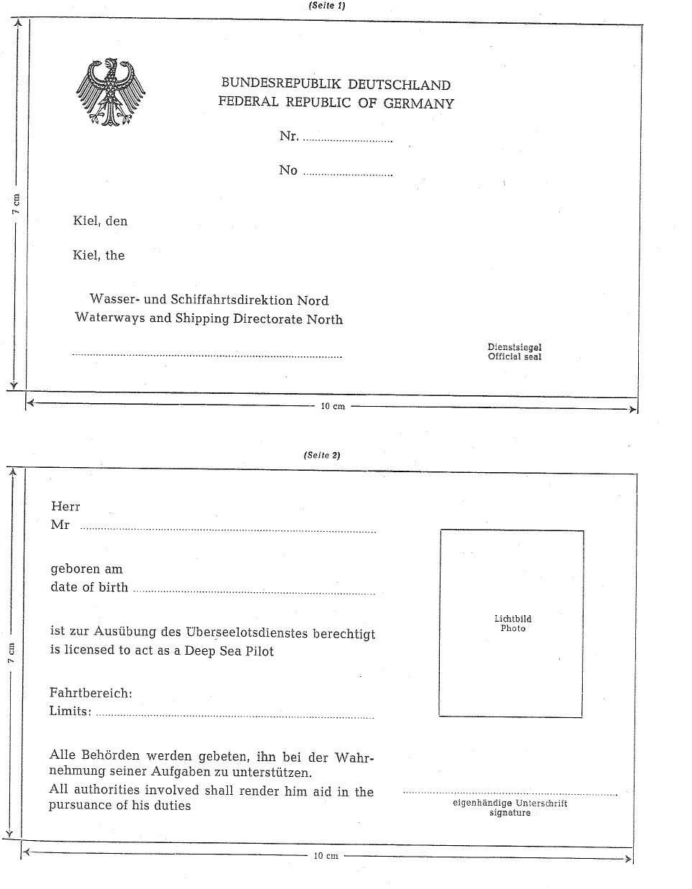
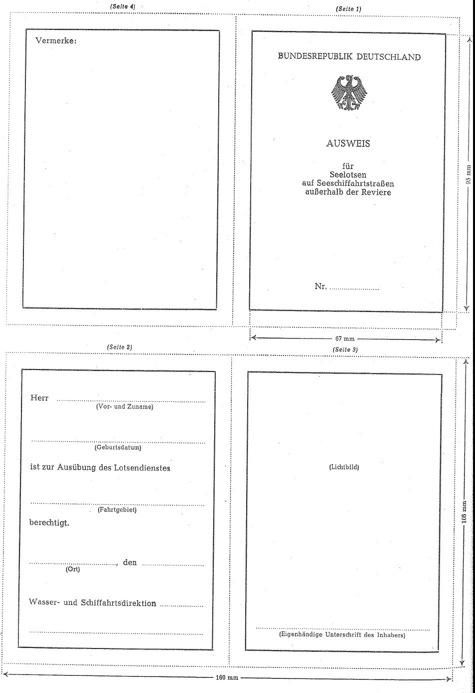

# Verordnung über das Seelotswesen außerhalb der Reviere (SeelotRevierV 1978)

Ausfertigungsdatum
:   1978-08-25

Fundstelle
:   BGBl I: 1978, 1515

Zuletzt geändert durch
:   Art. 67 V v. 2.6.2016 I 1257

## Eingangsformel

Auf Grund des § 50 Abs. 2, der §§ 53 und 58 Abs. 1 Nr. 1 und 3 des
Gesetzes über das Seelotswesen in der im Bundesgesetzblatt Teil III,
Gliederungsnummer 9515-1, veröffentlichten bereinigten Fassung,
zuletzt geändert durch Artikel 2 des Gesetzes vom 10. Mai 1978 (BGBl.
I S. 613), wird verordnet:

## § 1

(1) Bewerber um eine Erlaubnis zur gewerbsmäßigen Ausübung der
Tätigkeit eines Seelotsen über See (Überseelotse) oder auf einer
Seeschiffahrtstraße, die nicht zu den Revieren gehört, müssen die
Voraussetzungen des §
12 Abs. 2              des Gesetzes über das Seelotswesen erfüllen.

(2) Für die nachstehend aufgeführten Fahrtgebiete reichen folgende
Anforderungen an den Grad des Befähigungszeugnisses aus:

1.  für die Fahrt über die Watten zwischen Ems, Jade, Weser und Elbe,
    zwischen Varel und Wilhelmshaven, sowie auf den Zufahrten zu den
    Ostfriesischen Inseln mit Ausnahme von Borkum und zu den Häfen der
    ostfriesischen Küste das Befähigungszeugnis AKü oder BKü;

2.  für die Fahrt auf der Lesum, Hunte, Oste, Schwinge, Este, Lühe, Stör,
    Krückau, Pinnau, Hever, Eider, zwischen der schleswig-holsteinischen
    Westküste und Helgoland, auf der Schlei, dem Fehmarnsund sowie auf den
    Zufahrten zu den Häfen Heiligenhafen, Orth/Fehmarn,
    Burgstaaken/Fehmarn und Neustadt das Befähigungszeugnis AK oder BK.

(3) In besonderen Fällen kann die Aufsichtsbehörde zeitlich begrenzte
Ausnahmen von den Bestimmungen der Absätze 1 und 2 zulassen.

## § 2

(1) Bewerber müssen die erforderlichen Kenntnisse der Fahrtstrecken
oder Seegebiete, für die sie eine Erlaubnis beantragen, in einer
mündlichen Prüfung vor der Aufsichtsbehörde nachweisen. Die Prüfung
wird von einem Prüfungsausschuß abgenommen, der aus drei Mitgliedern
besteht.

(2) Die Bewerber haben dem Prüfungsausschuß nachzuweisen, daß sie
sowohl die erforderlichen theoretischen Kenntnisse als auch
ausreichende praktische Erfahrungen auf den Fahrtstrecken oder in den
Seegebieten besitzen, auf denen sie ihr Gewerbe ausüben wollen.

(3) Zum Nachweis der theoretischen Kenntnisse erstreckt sich die
Prüfung auf folgende Gegenstände, sofern sie für die jeweilige
Fahrtstrecke oder das jeweilige Seegebiet in Betracht kommen:

1.  Organisation des Lotswesens außerhalb der Reviere,
    Lotsenversetzpositionen, Grenzen der nationalen Seelotsreviere und
    Nachrichtenverbindungen der Seelotsen;

2.  verkehrs- und schiffahrtsrechtliche Vorschriften;

3.  Schiffahrtswege und Verkehrstrennungsgebiete;

4.  Betonnung und Befeuerung einschließlich Schall- und Funksignale;

5.  Kurse und Distanzen;

6.  örtliche Wassertiefen, Besonderheiten wie Hindernisse, Ankerplätze und
    Küstengestalt;

7.  Stromverhältnisse und Gezeiten;

8.  meteorologische Verhältnisse einschließlich Wind- und Sturmwarndienst;

9.  nautische Nachrichten- und Warndienste;

10. funktechnische Hilfsmittel für Navigation und Nachrichtenübermittlung,
    insbesondere Radar und Sprechfunk;

11. Such- und Rettungswesen;

12. Gesundheitsvorschriften.

(4) Bewerber um eine Erlaubnis als Überseelotse haben zum Nachweis
ihrer Kenntnisse in der Prüfung außerdem ein Brückenbuch sowie eine
Teilnahmebescheinigung an einem Schiffsführungs- und Radarsimulator-
Lehrgang vorzulegen. Das Brückenbuch ist ein nautisches Merkbuch, das
als Loseblattsammlung im Format DIN A 4 zu führen ist. Es soll neben
Angaben zu den Prüfungsgegenständen insbesondere folgende
Informationen enthalten:

1.  wichtige Seekartenausschnitte;

2.  wichtige Nachrichten für Seefahrer;

3.  IMCO                   -Seefahrt-Standardvokabular.

Die Teilnahme an einem Schiffsführungs- und Radarsimulator-Lehrgang
soll nicht länger als 12 Monate zurückliegen; sie ist nicht
erforderlich, wenn der Bewerber gleichwertige Berufserfahrungen
nachweist.

## § 3

(1) Das Ergebnis der Prüfung ist mit "bestanden" oder "nicht
bestanden" zu bewerten. Es ist dem Bewerber im Anschluß an die
Beratung bekanntzugeben. Über jede Prüfung ist eine Niederschrift zu
fertigen.

(2) Besteht ein Bewerber die Prüfung nicht, so kann diese einmal
wiederholt werden, und zwar frühestens nach Ablauf eines Monats.

## § 4

(1) Nach bestandener Prüfung ist dem Bewerber eine Erlaubnis zu
erteilen. Die Erlaubnis kann mit Auflagen verbunden werden, durch die
sichergestellt wird, daß der Seelotse die Voraussetzungen für die
Erteilung einer Erlaubnis einhält, insbesondere dafür sorgt, daß er
seine für die Lotstätigkeit erforderlichen Kenntnisse auf dem
laufenden hält. Außerdem ist ihm ein Lotsenausweis nach dem Muster der
Anlage 1 oder 2 auszuhändigen.

(2) Der Lotsenausweis ist der Schiffsführung auf Verlangen jederzeit
vorzulegen.

## § 5

Entgelte für Leistungen der Seelotsen außerhalb der Reviere bedürfen
der Genehmigung des Bundesministeriums für Verkehr und digitale
Infrastruktur. Die Genehmigung kann mit Auflagen verbunden und mit
einem Vorbehalt des Widerrufs erteilt werden.

## § 6

(1) Aufsichtsbehörde für Überseelotsen und für Seelotsen auf
Seeschifffahrtsstraßen außerhalb der Reviere ist die Generaldirektion
Wasserstraßen und Schifffahrt.

(2)

## § 7

Vor dem Inkrafttreten dieser Verordnung erteilte Erlaubnisse zur
gewerbsmäßigen Ausübung der Tätigkeit eines Seelotsen außerhalb der
Reviere sowie vorher ausgestellte Ausweise für Überseelotsen bleiben
gültig. Ein Umtausch der Ausweise ist möglich.

## § 8

Diese Verordnung gilt nach § 14 des Dritten Überleitungsgesetzes in
Verbindung mit §
61              des Gesetzes über das Seelotswesen auch im Land
Berlin.

## § 9

Diese Verordnung tritt am 1. September 1978 in Kraft.

## Schlußformel

Der Bundesminister für Verkehr

(zu § 4 Abs. 1)

## Anlage 1 Ausweis für Überseelotsen

(Fundstelle: BGBl. I 1978, 1517)

(zu § 4 Abs. 1)

## Anlage 2 Ausweis für Seelotsen auf Seeschiffahrtstraßen außerhalb der Reviere

(Fundstelle: BGBl. I 1978, 1518)

