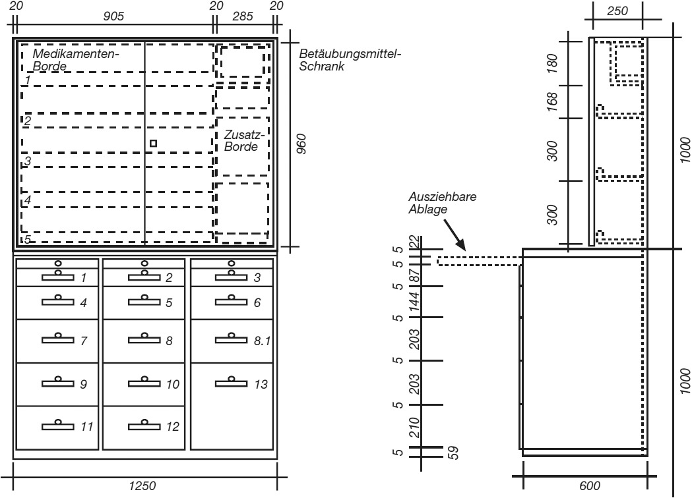

# Verordnung über die Unterkünfte und Freizeiteinrichtungen der Besatzungsmitglieder an Bord von Kauffahrteischiffen (SeeUnterkunftsV 2019)

Ausfertigungsdatum
:   2019-10-17

Fundstelle
:   BGBl I: 2019, 1453

Stand: Ersetzt V 9513-38-3 v. 25.7.2013 BAnz AT 30.07.2013 V1 (SeeUnterkunftsV)

## Eingangsformel

Das Bundesministerium für Arbeit und Soziales verordnet auf Grund des
§ 96 des Seearbeitsgesetzes, der durch Artikel 8 Nummer 8 des Gesetzes
vom 25. November 2015 (BGBl. I S. 2095) geändert worden ist, im
Einvernehmen mit dem Bundesministerium für Verkehr und digitale
Infrastruktur, dem Bundesministerium für Gesundheit und dem
Bundesministerium für Ernährung und Landwirtschaft:

## Abschnitt 1 - Allgemeine Vorschriften

### § 1 Geltungsbereich

Diese Verordnung gilt für die Unterkünfte, die Freizeiteinrichtungen
und die medizinischen Räumlichkeiten für Besatzungsmitglieder auf
Kauffahrteischiffen, die

1.  die Bundesflagge führen und

2.  nach dem 1. November 2019 auf Kiel gelegt worden sind.

### § 2 Begriffsbestimmungen

(1) Zu den Unterkünften und Freizeiteinrichtungen im Sinne dieser
Verordnung gehören

1.  die folgenden Unterkunftsräume:

    a)  Schlaf- und Wohnräume,

    b)  Messen, Pantries und sonstige Aufenthaltsräume,

    c)  Freizeiträume,

    d)  Büroräume,

    e)  Küchen,

    f)  Umkleideräume,

    g)  Toiletten und Waschräume einschließlich der Räume und Einrichtungen
        zum Waschen, Trocknen und Bügeln der Wäsche (sanitäre Einrichtungen),

    h)  medizinische Räumlichkeiten,

    i)  Gänge in den Bereichen des Schiffs, die der Unterbringung der
        Besatzungsmitglieder dienen (Verkehrsgänge),

2.  Freizeitbereiche an Deck,

3.  Vorratsräume und Kühlräume,

4.  Einrichtungen zur Trinkwasserversorgung.

(2) Ein Fahrgastschiff ist ein Schiff, das für die Beförderung von
mehr als zwölf Fahrgästen zugelassen ist.

(3) Spezialschiffe sind Schiffe im Sinne des IMO-Codes über die
Sicherheit von Spezialschiffen (VkBl. 2009 S. 84), die für die
Beförderung von mehr als zwölf Personen Spezialpersonal vorgesehen
sind.

(4) Fischereifahrzeuge sind Schiffe, die zur gewerblichen Fischerei
verwendet werden oder verwendet werden sollen und mit einem
durchgehenden wasserdichten Wetterdeck, das bei allen
Beladungszuständen oberhalb der Wasserlinie liegt, ausgestattet sind.

(5) Berufsgenossenschaft im Sinne dieser Verordnung ist die
Berufsgenossenschaft Verkehrswirtschaft Post-Logistik
Telekommunikation.

(6) „Länge“ eines Schiffs ist der größere der beiden folgenden Werte:

1.  96 Prozent der Gesamtlänge, gemessen in einer Wasserlinie in Höhe von
    85 Prozent der geringsten Seitenhöhe oberhalb der Oberkante des Kiels,
    oder

2.  die Länge von der Vorkante des Vorstevens bis zur Drehachse des
    Ruderschafts in dieser Wasserlinie.

Bei Schiffen mit Kielfall hat die Wasserlinie, in der diese Länge
gemessen wird, parallel zur Konstruktionswasserlinie zu verlaufen.

### § 3 Allgemeine Anforderungen an Unterkünfte und Freizeiteinrichtungen

Der Reeder hat dafür zu sorgen, dass die Unterkünfte und
Freizeiteinrichtungen

1.  an Bord vorhanden sind und instand gehalten werden,

2.  frei von Gegenständen sind, die nicht persönliches Eigentum der
    Besatzungsmitglieder sind und nicht der Unterbringung,
    Freizeitgestaltung, Sicherheit oder Rettung der Besatzungsmitglieder
    dienen,

3.  dem zum jeweiligen Zeitpunkt der Kiellegung eines Schiffs geltenden
    Stand der Technik entsprechen, und

4.  für eine menschenwürdige und gesundheitsgerechte Unterbringung oder
    Verpflegung der Besatzungsmitglieder, soweit dafür vorgesehen,
    geeignet sind.

### § 4 Bekanntmachung

Auf jedem Schiff ist den Besatzungsmitgliedern der Wortlaut dieser
Verordnung in der im Borddienst gebräuchlichen Sprache zugänglich zu
machen.

## Abschnitt 2 - Genehmigungen, Ausnahmen

### § 5 Genehmigung vor Bau, wesentlicher Änderung oder Flaggenwechsel eines Schiffs

(1) Wer den Bau eines Schiffs in Auftrag gibt, hat vor Beginn des Baus
der Berufsgenossenschaft alle erforderlichen Pläne und Unterlagen der
Unterkünfte und Freizeiteinrichtungen vorzulegen und die Zustimmung
der Berufsgenossenschaft hierzu einzuholen. Aus den Plänen und
Unterlagen müssen erkennbar sein

1.  die vorgesehene Zahl der Besatzungsmitglieder,

2.  das voraussichtliche Fahrtgebiet,

3.  die Lage der Unterkünfte und Freizeiteinrichtungen an Bord,

4.  die vorgesehene Verwendung jeden Raumes an Bord,

5.  die Anordnung der Einrichtungsgegenstände in Wohn- und Schlafräumen,

6.  die Art und Anordnung der Versorgungsanlagen für Belüftung,
    Beleuchtung, Heizung, Klima und Trinkwasser.

Die Sätze 1 und 2 gelten entsprechend, wenn die Unterkünfte und
Freizeiteinrichtungen eines Schiffs wesentlich geändert werden sollen
oder wenn ein Schiff von einer ausländischen Flagge zur Bundesflagge
wechselt.

(2) Bei der Bauausführung darf von den vorgelegten Plänen nur dann
abgewichen werden, wenn die Berufsgenossenschaft der Abweichung
zugestimmt hat.

### § 6 Ausnahmen

(1) Die Berufsgenossenschaft kann für Schiffe, auf denen die
Interessen von Besatzungsmitgliedern mit unterschiedlichen religiösen
und sozialen Gebräuchen zu berücksichtigen sind, zur Vermeidung von
Diskriminierung Ausnahmen von den Vorschriften dieser Verordnung
zulassen, soweit die dadurch entstehenden Verhältnisse im Ganzen nicht
ungünstiger sind als die Verhältnisse, die sich aus der Anwendung
dieser Verordnung ergeben würden.

(2) Auf Schiffe mit einer Bruttoraumzahl von weniger als 200, die
keine Fischereifahrzeuge sind, sind die Anforderungen an die folgenden
Ausstattungsmerkmale nicht anzuwenden:

1.  Klimaanlage (§ 11 Absatz 3),

2.  Bodenflächen (§ 16 Absatz 1, 3, 4 und 5),

3.  eigenes Waschbecken (§ 20 Absatz 2),

4.  Einrichtungen zur Wäschepflege (§ 26).

(3) Auf Fischereifahrzeuge mit einer Länge von weniger als 24 Metern
sind die Anforderungen an die folgenden Ausstattungsmerkmale nicht
anzuwenden:

1.  Klimaanlage (§ 11 Absatz 3),

2.  Zugang zu den Schlafräumen (§ 15 Absatz 5),

3.  Bodenflächen (§ 16 Absatz 1, 5 und 8),

4.  Ausstattung von Messen (§ 19 Absatz 5 Nummer 1 und 2),

5.  Anzahl und Anordnung der sanitären Einrichtungen (§ 20 Absatz 1, 2 und
    4),

6.  Büroräume (§ 25),

7.  Vorrichtungen zum Bügeln (§ 26 Absatz 1 Nummer 3),

8.  Aufbewahrung von Koffern und sperrigen Gegenständen (§ 27 Absatz 2),

9.  Freizeitbereiche und Freizeiträume (§ 28).

## Abschnitt 3 - Anforderungen an Bau, Ausrüstung und Instandhaltung der Unterkunftsräume und Freizeiteinrichtungen

### Unterabschnitt 1 - Wände, Decken, Fußböden, Isolierung, Schutzvorrichtungen

#### § 7 Wände, Decken, Fußböden

(1) In allen Unterkunftsräumen ist eine angemessene Deckenhöhe
einzuhalten. Die lichte Höhe muss in allen Unterkunftsräumen, in denen
volle Bewegungsfreiheit erforderlich ist, mindestens 203 Zentimeter
betragen. Die Berufsgenossenschaft kann eine geringere
Mindestdeckenhöhe zulassen, wenn dadurch die Gesundheit und das
Wohlbefinden der Besatzungsmitglieder nicht beeinträchtigt werden.

(2) Außenwände und Wände der folgenden Räume müssen aus Stahl oder
einem gleichwertigen Werkstoff hergestellt sein und wasser- und
gasdicht sein:

1.  Laderäume,

2.  Maschinenräume,

3.  Vorratsräume,

4.  Kühlräume,

5.  Räume zum Trocknen von Wäsche,

6.  Küchen und

7.  gemeinschaftlich genutzte Toiletten und Waschräume in Richtung der
    Schlafräume.

Die Innenwände und Decken der Unterkunftsräume, mit Ausnahme der
Küchen und Toiletten, müssen verkleidet sein.

(3) Offene Decks über den Unterkunftsräumen sind mit einem Belag aus
Holz oder einem gleichwertigen Stoff und, soweit die Unterkunftsräume
zum dauernden Aufenthalt von Besatzungsmitgliedern bestimmt sind, auch
mit einer Trittschallisolierung zu versehen.

(4) Fußböden, Wände und Decken der Unterkunftsräume dürfen keine
scharfen Kanten haben. Sie müssen so beschaffen sein, dass sie leicht
gereinigt werden können. Die Fußböden müssen rutschfest und
feuchtigkeitsundurchlässig sein. Wasser muss abfließen können. Die
Oberfläche der Wände und Decken muss hell und wasserfest beschaffen
sein.

(5) Die Übergänge zwischen Fußbodenbelägen aus Verbundwerkstoffen und
Wänden müssen so mit Profilen versehen sein, dass Fugen möglichst
vermieden werden.

#### § 8 Isolierung

(1) Die Unterkunftsräume müssen gegen Kälte und Hitze, die von außen
oder aus Nachbarräumen einwirken, wirksam isoliert sein. Die
Isolierung muss zweckmäßig sein und gewährleisten, dass Kondenswasser
abfließen kann.

(2) Technische Einrichtungen, die die Temperatur in den
Unterkunftsräumen beeinflussen können, müssen isoliert sein.

#### § 9 Schutzvorrichtungen gegen Ungeziefer

(1) Unterkunftsräume, Vorratsräume und Kühlräume sind gegen das
Eindringen und das Einnisten von Ungeziefer zu schützen.

(2) Auf Schiffen, die in Fahrtgebieten eingesetzt sind oder Häfen
anlaufen, in denen Insekten Tropenkrankheiten übertragen können,

1.  ist vor Fenstern, Lüftungsöffnungen und Außentüren ein geeigneter
    Insektenschutz anzubringen und

2.  sind vor den Luftansaugöffnungen von raumlufttechnischen Anlagen
    widerstandsfähige Insektenfilter anzubringen.

Bei Klimaanlagen kann auf zusätzlichen Insektenschutz verzichtet
werden, wenn sie mit einem Reservemotor ausgestattet sind.

### Unterabschnitt 2 - Beleuchtung, Lüftung, Klimatisierung, Heizung, Leitungen

#### § 10 Beleuchtung

(1) Schlafräume, Wohnräume, Messen und sonstige Aufenthaltsräume
müssen durch Tageslicht angemessen erhellt sein; dies gilt nicht auf

1.  Fahrgastschiffen,

2.  Spezialschiffen, sowie

3.  Fischereifahrzeugen mit einer Länge von weniger als 24 Metern,

wenn diese Räume ausnahmsweise unter der Ladelinie untergebracht
werden dürfen.

(2) In den Unterkunftsräumen, Vorratsräumen und Kühlräumen müssen
elektrische Anlagen vorhanden sein, mit denen die Räume ausreichend
beleuchtet werden. In den Unterkunftsräumen müssen Tische und
Schreibpulte zum Lesen und Schreiben ausreichend beleuchtet werden
können. Jede Koje muss am Kopfende mit einer Lampe versehen sein, die
ein zum Lesen ausreichendes Licht abgibt.

(3) Die Unterkunftsräume müssen, wenn nicht zwei voneinander
unabhängige Stromquellen vorhanden sind, mit einer elektrischen
Notbeleuchtungsanlage versehen sein.

(4) Wenn auf einem Fischereifahrzeug in den Messen, Gängen oder
sonstigen Räumen, die als Notausgang verwendet werden, keine
Notbeleuchtung vorhanden ist, ist in solchen Räumen eine ständige
Nachtbeleuchtung vorzusehen.

#### § 11 Luftreinhaltung, raumlufttechnische Anlagen

(1) Unterkunftsräume sind so anzuordnen und auszustatten, dass sie
gegen Luftverunreinigung aus anderen Schiffsteilen, insbesondere gegen
Maschinenabgase, sowie gegen Abluft aus Tanks, Küchen, medizinischen
Räumlichkeiten und sanitären Einrichtungen, geschützt sind.

(2) Unterkunftsräume sind mit raumlufttechnischen Anlagen,
insbesondere Klimaanlagen oder mechanischen Lüftungsanlagen,
auszustatten. Die raumlufttechnischen Anlagen sind jederzeit
betriebsbereit zu halten und bei Aufenthalt von Besatzungsmitgliedern
an Bord zu betreiben.

(3) Auf allen Schiffen, mit Ausnahme derer, die Gebiete befahren, in
denen dies auf Grund des gemäßigten Klimas nicht erforderlich ist,
sind die Unterkunftsräume, die Brücke sowie der Raum, in dem sich der
zentrale Maschinenleitstand befindet, mit Klimaanlagen auszurüsten.

(4) Raumlufttechnische Anlagen müssen so beschaffen sein, dass

1.  sie eine im Vergleich zu den Außenluftbedingungen der Gesundheit
    zuträglichere Luftbeschaffenheit sowie eine ausreichende
    Lufterneuerung in den Unterkunftsräumen gewährleistet,

2.  sie den Besonderheiten des Schiffsbetriebes auf See Rechnung tragen
    und keine übermäßigen Geräusche, Vibrationen oder Zugluft verursachen
    und

3.  sie leicht gesäubert und desinfiziert werden können, um
    Beeinträchtigungen der Gesundheit und des Wohlbefindens der
    Besatzungsmitglieder zu verhindern.

(5) Bei einem Ausfall der raumlufttechnischen Anlage müssen die
Unterkunftsräume zusätzlich auf andere Weise belüftet werden können.

(6) Durch Reinigung und Wartung der raumlufttechnischen Anlagen hat
der Reeder sicherzustellen, dass gesundheitliche Beeinträchtigungen
der Besatzungsmitglieder durch diese Anlagen vermieden werden.

#### § 12 Heizungsanlage

(1) Die Unterkunftsräume müssen mit einer Heizungsanlage ausgestattet
sein, die eine der Gesundheit zuträgliche Temperatur unter den Wetter-
und Klimabedingungen, denen das Schiff auf der Fahrt ausgesetzt sein
wird, gewährleistet; davon ausgenommen sind Schiffe, die
ausschließlich in den Tropen verkehren. Die Heizungsanlage ist in
Betrieb zu halten, wenn sich Besatzungsmitglieder an Bord aufhalten
und die Witterung es erfordert.

(2) Die Wärmeversorgung innerhalb der Unterkunftsräume darf nur mit
Warmwasser, Warmluft oder Elektrizität erfolgen.

(3) Heizkörper und sonstige Heizgeräte müssen so aufgestellt und
abgeschirmt sein, dass die Gefahr eines Brandes oder eine Gefährdung
oder Belästigung der Besatzungsmitglieder vermieden werden.

#### § 13 Leitungen

Leitungen mit gesundheitsgefährlichen Gasen oder Flüssigkeiten oder
Leitungen, die unter einem so hohen inneren Überdruck stehen, dass sie
bei einem Undichtwerden Leben oder Gesundheit der Besatzungsmitglieder
gefährden können, dürfen nicht in Unterkunftsräumen, ausgenommen in
Küchen, verlegt sein.

### Unterabschnitt 3 - Lärm und Vibrationen

#### § 14 Verhütung von Lärm und Vibrationen

(1) Unterkunftsräume und Freizeitbereiche an Deck dürfen keinen
Lärmbelastungen oder Vibrationen ausgesetzt sein, die der Gesundheit
oder dem Wohlbefinden der Besatzungsmitglieder nicht zuträglich sind.

(2) Unterkunftsräume und Freizeitbereiche an Deck sind in möglichst
großer Entfernung von dem Maschinenraum, dem Rudermaschinenraum, den
Ladewinden, den Heizungsanlagen, den raumlufttechnischen Anlagen und
anderen lärmerzeugenden Maschinen und Anlagen anzuordnen.

(3) Bei Bau und Verkleidung der Wände, Decken und Fußböden in den
Lärmquellen aufweisenden Räumen sowie von selbstschließenden
schalldichten Türen in Maschinenräumen sind Schallabdichtungen und
andere geeignete schallschluckende Materialien zu verwenden.

### Unterabschnitt 4 - Schlafräume, Bodenflächen, Kojen, Ausstattung

#### § 15 Schlafräume

(1) Für die Besatzungsmitglieder sind Schlafräume vorzusehen, wenn die
Betriebsumstände eine Übernachtung an Bord erforderlich machen.

(2) Für jedes Besatzungsmitglied ist ein eigener Schlafraum
vorzusehen. Abweichend von Satz 1 dürfen Schlafräume, getrennt nach
Männern und Frauen,

1.  auf Schiffen mit einer Bruttoraumzahl von weniger als 3 000 und auf
    Spezialschiffen mit bis zu zwei Besatzungsmitgliedern belegt werden,

2.  auf Fahrgastschiffen mit bis zu vier Besatzungsmitgliedern belegt
    werden, jedoch nicht mit mehr als zwei Offizieren,

3.  auf Fischereifahrzeugen mit einer Länge von weniger als 24 Metern mit
    bis zu sechs Besatzungsmitgliedern belegt werden, jedoch, soweit
    möglich, nicht mit mehr als einem Offizier,

4.  auf Fischereifahrzeugen mit einer Länge von 24 Metern oder mehr mit
    bis zu vier Besatzungsmitgliedern belegt werden, jedoch nicht mit mehr
    als einem Offizier,

5.  mit zwei Auszubildenden belegt werden, wenn Auszubildende an Bord
    ausgebildet werden und die Schlafräume mit einem eigenen Bad und einer
    eigenen Toilette ausgestattet sind.

Die Regelungen zu den Mindestbodenflächen in § 16 Absatz 4 Nummer 1
gelten entsprechend. Die Berufsgenossenschaft kann im Einzelfall
Ausnahmen von den Anforderungen nach Nummer 4 zulassen, wenn auf Grund
der Größe, der Art oder des beabsichtigten Einsatzzwecks des
Fischereifahrzeuges die Belegung mit nicht mehr als einem Offizier
nicht umsetzbar ist. Auf Fischereifahrzeugen ist in jedem Schlafraum
die Höchstzahl der Besatzungsmitglieder, die darin untergebracht
werden dürfen, an leicht sichtbarer Stelle dauerhaft und leserlich
anzugeben.

(3) Schlafräume sind nach Möglichkeit mit eigenem Bad und eigener
Toilette auszustatten. § 20 Absatz 5 und 6 bleibt unberührt.

(4) Die Schlafräume sind über der Ladelinie mittschiffs oder achtern
anzuordnen. Ist in Einzelfällen eine Anordnung nach Satz 1 auf Grund
der Größe, des Schiffstyps oder der beabsichtigten Einsatzart des
Schiffs nicht möglich, so können Schlafräume auch im Vorschiff, jedoch
keinesfalls vor dem Kollisionsschott angeordnet werden. Die
Berufsgenossenschaft kann für Fahrgastschiffe, für Spezialschiffe und
für Fischereifahrzeuge mit einer Länge von weniger als 24 Metern
zulassen, dass die Schlafräume unterhalb der Ladelinie angeordnet
werden, wenn Vorkehrungen für ausreichende Beleuchtung und Lüftung
getroffen sind und mindestens ein durch Tageslicht erhellter
Aufenthaltsraum vorhanden ist. Im Falle des Satzes 3 dürfen Räume
nicht unmittelbar unterhalb der für Arbeiten genutzten Gänge
angeordnet sein.

(5) Die Schlafräume müssen von Verkehrsgängen aus betreten werden
können, die innerhalb der Wohnbereiche liegen. Zwischen den
Schlafräumen und den anderen Räumen müssen allgemeine Verkehrsgänge
oder Schleusen liegen. Von Satz 2 darf abgewichen werden, um Bäder und
Toiletten einzurichten, die jeweils von zwei Schlafräumen aus
gemeinsam genutzt werden können.

(6) Soweit möglich, sind die Besatzungsmitglieder so auf die
Schlafräume zu verteilen, dass die Wachen getrennt sind und die im
Tagesdienst tätigen Besatzungsmitglieder ihren Schlafraum nicht mit
Wachgängern teilen müssen.

(7) Soweit möglich, ist bei der Gestaltung von Schlafräumen die
Mitnahme von Partnern der Besatzungsmitglieder zu berücksichtigen.

#### § 16 Bodenflächen

(1) In Schlafräumen mit Einzelkojen darf die Bodenfläche nicht
geringer sein als

1.  4,5 Quadratmeter auf Schiffen mit einer Bruttoraumzahl von weniger als
    3 000,

2.  5,5 Quadratmeter auf Schiffen mit einer Bruttoraumzahl von 3 000 oder
    mehr, aber mit einer Bruttoraumzahl von weniger als 10 000,

3.  7 Quadratmeter auf Schiffen mit einer Bruttoraumzahl von 10 000 oder
    mehr.

Abweichend von Satz 1 darf auf Fischereifahrzeugen die Bodenfläche je
Besatzungsmitglied in Schlafräumen, ausschließlich der von Kojen,
Spinden, Kommoden und Sitzgelegenheiten eingenommenen Fläche, nicht
geringer sein als 2,5 Quadratmeter.

(2) Abweichend von Absatz 1 kann die Berufsgenossenschaft im
Einzelfall für Schiffe mit einer Bruttoraumzahl von weniger als 3 000,
für Fahrgastschiffe und für Spezialschiffe eine geringere Mindestgröße
der Bodenflächen zulassen, um jedem Besatzungsmitglied einen eigenen
Schlafraum zu ermöglichen, wenn dadurch die Gesundheit und das
Wohlbefinden der Besatzungsmitglieder nicht beeinträchtigt werden.

(3) Auf Schiffen mit einer Bruttoraumzahl von weniger als 3 000, die
keine Fahrgastschiffe oder Spezialschiffe sind, darf die Bodenfläche
von Schlafräumen, die nach § 15 Absatz 2 Satz 2 Nummer 1 mit zwei
Besatzungsmitgliedern belegt sind, nicht geringer als 7 Quadratmeter
sein.

(4) Auf Fahrgastschiffen und Spezialschiffen darf die Bodenfläche in
Schlafräumen für Besatzungsmitglieder, die nicht die Aufgaben von
Offizieren ausführen, nicht geringer sein als

1.  7,5 Quadratmeter in Räumen mit zwei Besatzungsmitgliedern,

2.  11,5 Quadratmeter in Räumen mit drei Besatzungsmitgliedern und

3.  14,5 Quadratmeter in Räumen mit vier Besatzungsmitgliedern.

(5) Die Bodenfläche der Schlafräume von Besatzungsmitgliedern, die die
Aufgaben von Offizieren ausführen und denen neben dem Schlafraum kein
gesonderter Wohnraum oder anderer Raum zur Verfügung steht, darf nicht
geringer sein als

1.  7,5 Quadratmeter auf Schiffen mit einer Bruttoraumzahl von weniger als
    3 000,

2.  8,5 Quadratmeter auf Schiffen mit einer Bruttoraumzahl von 3 000 oder
    mehr, aber weniger als 10 000 und

3.  10 Quadratmeter auf Schiffen mit einer Bruttoraumzahl von 10 000 oder
    mehr.

Abweichend von Satz 1 darf auf Fischereifahrzeugen die Bodenfläche der
Schlafräume von Besatzungsmitgliedern, die die Aufgaben von Offizieren
ausführen und denen neben dem Schlafraum kein gesonderter Wohnraum
oder anderer Raum zur Verfügung steht, nicht geringer sein als 6,5
Quadratmeter.

(6) Auf Fahrgastschiffen und Spezialschiffen darf die Bodenfläche der
Schlafräume

1.  von Besatzungsmitgliedern, die die Aufgaben von Offizieren auf
    Betriebsebene ausführen, nicht geringer als 7,5 Quadratmeter sein,

2.  von Besatzungsmitgliedern, die die Aufgaben von Offizieren auf
    Führungsebene ausführen, nicht geringer als 8,5 Quadratmeter sein,

wenn diesen Besatzungsmitgliedern neben dem Schlafraum kein
gesonderter Wohnraum oder anderer Raum zur Verfügung steht.

(7) Die von den Kojen, Spinden, Kommoden und Sitzgelegenheiten
eingenommene Fläche ist in die Berechnung der Bodenfläche
einzubeziehen. Auszunehmen sind jedoch kleine oder unregelmäßige
Flächen, die den Bewegungsraum nicht wirksam vergrößern und die nicht
als Stellraum verwendet werden können.

(8) Dem Kapitän, dem Leiter der Maschinenanlage und dem Ersten
Offizier muss zusätzlich zu ihrem jeweiligen Schlafraum ein mit diesem
Schlafraum unmittelbar in Verbindung stehender Wohnraum, Tagesraum
oder ein gleichwertiger zusätzlicher Raum zur Verfügung stehen. Die
Berufsgenossenschaft kann im Einzelfall für Schiffe mit einer
Bruttoraumzahl von weniger als 3 000 Ausnahmen von Satz 1 zulassen.

#### § 17 Kojen und sonstige Schlafraumausstattungen

(1) Im Schlafraum ist jedem Besatzungsmitglied eine Einzelkoje zur
Verfügung zu stellen, die seiner Körpergröße entspricht. Die Innenmaße
einer Koje müssen mindestens 200 Zentimeter mal 80 Zentimeter
betragen. Auf Fischereifahrzeugen müssen die Innenmaße abweichend von
Satz 2 mindestens 198 Zentimeter mal 80 Zentimeter betragen.

(2) Kojen müssen so gesichert sein, dass die Besatzungsmitglieder bei
Seegang nicht herausfallen können. Kojen dürfen nicht so nebeneinander
aufgestellt sein, dass eine Koje überstiegen werden muss, um zur
Nachbarkoje zu gelangen. Ausnahmen von Satz 2 sind zulässig, wenn ein
Besatzungsmitglied von seinem Partner oder seiner Partnerin auf der
Reise begleitet wird.

(3) Jede Koje ist mit einem Lattenrost, einer Matratze aus geeignetem
Material, einer Decke und einem Kissen auszustatten.

(4) Übereinander dürfen nicht mehr als zwei Kojen aufgestellt sein. Wo
sich über einer Koje ein Fenster befindet, dürfen Kojen der
Schiffswand entlang nicht übereinander aufgestellt werden. Die untere
von zwei übereinanderliegenden Kojen ist mindestens 30 Zentimeter über
dem Boden und die obere ist etwa in der Mitte zwischen dem Boden der
unteren Koje und der Unterseite der Decke anzubringen. Bei
übereinander aufgestellten Kojen ist unter der Matratze der oberen
Koje eine staubdichte Abdeckung anzubringen.

(5) Den Besatzungsmitgliedern sind 14täglich frische Bettwäsche von
angemessener Qualität sowie wöchentlich mindestens zwei frische
Handtücher zur Verfügung zu stellen. Bei einem Wechsel des Benutzers
der Koje ist diese einschließlich der Matratze, der Decke und des
Kissens gründlich zu reinigen.

(6) Jeder Schlafraum ist für jedes Besatzungsmitglied auszustatten mit

1.  einem Kleiderspind von ausreichender Größe, mindestens 475 Liter
    Rauminhalt, und

2.  einer Kommode oder einem entsprechenden Behältnis von mindestens 56
    Liter Rauminhalt.

Ist die Kommode in den Kleiderspind integriert, so muss das gemeinsame
Mindestvolumen des Kleiderspinds 500 Liter Rauminhalt betragen. Der
Spind ist mit einem Fach und einer Verschlussvorrichtung zu versehen,
um die Privatsphäre zu gewährleisten. Für Schiffe mit einer
Bruttoraumzahl von weniger als 200 und für Fischereifahrzeuge kann die
Berufsgenossenschaft im Einzelfall Ausnahmen von den Anforderungen der
Sätze 1 bis 3 zulassen, wenn diese Anforderungen baulich nicht
umsetzbar sind und das Besatzungsmitglied auf andere Art und Weise die
Möglichkeit hat, für die Dauer der Reise seine persönlichen
Gegenstände und Kleidungsstücke angemessen zu verstauen.

(7) Jeder Schlafraum ist auszustatten mit

1.  einem kleinen Schrank für den Toilettenartikelbedarf der
    Besatzungsmitglieder,

2.  einem fest angebrachten, aufklappbaren oder ausziehbaren Tisch oder
    Pult,

3.  einem Spiegel,

4.  einer Steckdose,

5.  einem Anschluss an eine Gemeinschaftsantenne,

6.  einem Bücherbrett,

7.  Kleiderhaken und

8.  den erforderlichen Sitzgelegenheiten.

Die Fenster der Schlafräume sind mit Vorhängen auszustatten.

(8) Die Einrichtungsgegenstände dürfen keine scharfen Kanten haben.
Sie müssen, mit Ausnahme der gepolsterten Teile, aus einem festen,
glatten und gegen Korrosion geschützten Werkstoff bestehen.

### Unterabschnitt 5 - Küchen, Vorratsräume, Kühlräume und Messen

#### § 18 Küchen, Vorratsräume und Kühlräume

(1) Es sind Küchen vorzusehen, wenn die Betriebsumstände eine
Zubereitung von Speisen an Bord erforderlich machen. Die Küchen müssen
insbesondere ausgestattet sein mit

1.  Kochgeräten,

2.  einem Doppelspülbecken, einem Handwaschbecken und einer Einrichtung
    mit Einmalhandtüchern,

3.  einem Anschluss für kaltes und warmes Trinkwasser,

4.  den für die Unterbringung der beweglichen Kochgeräte und des
    Essgeschirrs erforderlichen Schränken, Regalen und Geschirrgestellen
    aus einem geeigneten, nicht rostenden Werkstoff,

5.  einer Abluftanlage und

6.  zwei Fußbodenabflüssen einschließlich einer Vorrichtung zur
    Verhinderung des Rückflusses.

(2) Es müssen zum Lagern der Lebensmittel Vorratsräume sowie Kühlräume
vorhanden sein. Abweichend von Satz 1 können auf kleineren Schiffen,
auf denen Kühlräume nur mit unangemessenem Aufwand eingerichtet werden
können, anstelle der Kühlräume Kühlschränke aufgestellt werden. Die
Vorratsräume müssen trocken gehalten und gut belüftet sein. In den
Vorratsräumen und Kühlräumen sowie in Kühlschränken muss die für das
Lagergut erforderliche Temperatur herrschen. Die Vorräte sind nach den
unterschiedlichen Temperaturerfordernissen gesondert zu lagern.
Kühlräume müssen von innen zu öffnen sein, auch wenn sie von außen
verschlossen sind, und mit einer Alarmvorrichtung ausgestattet sein.

(3) Abweichend von Absatz 1 kann die Berufsgenossenschaft auf den
folgenden Schiffen im Einzelfall anstelle einer Küche eine
Kochgelegenheit zulassen, wenn die Anforderungen nach Absatz 1 baulich
nicht umsetzbar sind und die Besatzungsmitglieder auf andere Art und
Weise die Möglichkeit haben, für die Dauer der Reise unter Einhaltung
der lebensmittelrechtlichen Vorschriften Speisen und Getränke
zuzubereiten:

1.  auf Schiffen mit einer Bruttoraumzahl von bis zu 200, die keine
    Fischereifahrzeuge sind, und

2.  auf Fischereifahrzeugen mit einer Länge von weniger als 24 Metern.

#### § 19 Messen, Pantries und Ausstattungen

(1) Es sind Messen vorzusehen, wenn die Betriebsumstände
Aufenthaltsräume erforderlich machen, in denen die
Besatzungsmitglieder ihre Mahlzeiten einnehmen können. Soweit es die
Größe des Schiffs zulässt, sind getrennte Messen für den Kapitän und
die Offiziere einerseits sowie für die übrigen Besatzungsmitglieder
andererseits einzurichten. Dabei sind die besonderen kulturellen,
religiösen und sozialen Bedürfnisse der Besatzungsmitglieder zu
berücksichtigen.

(2) Messen sind getrennt von den Schlafräumen und möglichst in der
Nähe zur Küche anzuordnen. Messen dürfen keinesfalls vor dem
Kollisionsschott angeordnet werden. Die Berufsgenossenschaft kann im
Einzelfall für Schiffe mit einer Bruttoraumzahl von weniger als 3 000
Ausnahmen von Satz 1 zulassen.

(3) Die Bodenfläche einer Messe muss mindestens 1,5 Quadratmeter für
jeden vorgesehenen Sitzplatz betragen. Eine Messe muss für die Anzahl
von Besatzungsmitgliedern ausreichen, die sie üblicherweise
gleichzeitig benutzen. Auf Fischereifahrzeugen muss die Bodenfläche
einer Messe abweichend von Satz 1 eine Mindestfläche von 1,0
Quadratmeter für jeden vorgesehenen Sitzplatz betragen.

(4) Messen müssen so eingerichtet sein, dass die Besatzungsmitglieder
darin ihre Mahlzeiten bequem einnehmen können. Insbesondere müssen
Sitzgelegenheiten mit Rückenlehnen und Tische in einer Anzahl
vorhanden sein, die der Zahl der Besatzungsmitglieder entspricht, die
üblicherweise gleichzeitig die Messe benutzen. Die Oberflächen der
Tische und Sitzgelegenheiten müssen aus feuchtigkeitsfesten
Werkstoffen hergestellt sein.

(5) Folgende Einrichtungen müssen in einer Messe oder von einer Messe
aus erreichbar vorgesehen sein:

1.  ein Doppelspülbecken mit einem Anschluss für kaltes und warmes
    Trinkwasser,

2.  ein Spender für Einmalhandtücher,

3.  ein Kühlschrank, der leicht zugänglich ist und dessen Fassungsvermögen
    für die Bedürfnisse der Besatzungsmitglieder, die die Messen besuchen,
    ausreicht,

4.  Einrichtungen zur Zubereitung kalter und heißer Getränke,

5.  Einrichtungen zum Aufbewahren des Geschirrs.

Diese Einrichtungen müssen jederzeit zugänglich sein. Sie sollen nach
Möglichkeit in einer Pantry zusammengefasst sein.

(6) Den Besatzungsmitgliedern ist geeignetes Essgeschirr und Besteck
zur Verfügung zu stellen. Teller, Gläser und andere Messeutensilien
müssen aus leicht zu säuberndem Material bestehen.

### Unterabschnitt 6 - Sanitäre Einrichtungen

#### § 20 Anzahl und Anordnung der sanitären Einrichtungen

(1) Für die Besatzungsmitglieder sind sanitäre Einrichtungen, getrennt
nach Männern und Frauen vorzusehen.

(2) Ausgenommen auf Fahrgastschiffen muss jeder Schlafraum mit einem
eigenen Waschbecken ausgestattet sein. Dies gilt nicht für Schlafräume
mit einem eigenen Bad, in dem ein Waschbecken vorhanden ist.

(3) Steht Besatzungsmitgliedern kein eigenes Bad zur Verfügung, kann
jeweils für höchstens vier männliche oder vier weibliche
Besatzungsmitglieder ein Waschbecken und eine Dusche zur gemeinsamen
Nutzung vorgesehen werden. Satz 1 gilt entsprechend für die gemeinsame
Nutzung einer Toilette. Die Toiletten müssen in der Nähe von Schlaf-
und Waschräumen angeordnet sein. Sie dürfen nur über allgemeine
Verkehrsgänge oder von den Waschräumen aus zugänglich sein. Satz 3
gilt nicht für eine Toilette, die zwischen zwei Schlafräumen mit einer
Gesamtbelegschaft von höchstens vier Besatzungsmitgliedern angeordnet
ist.

(4) Zusätzlich zu den Toiletten nach Absatz 3 ist jeweils mindestens
eine Toilette vorzusehen

1.  nahe der Brücke, dem Maschinenraum oder dem Maschinenleitstand sowie

2.  für das Bedienungs- und Verpflegungspersonal in der Nähe seiner
    Arbeitsplätze.

Die Berufsgenossenschaft kann im Einzelfall für Schiffe mit einer
Bruttoraumzahl von weniger als 3 000 Ausnahmen von Satz 1 zulassen.

(5) Auf Schiffen mit einer Bruttoraumzahl von 5 000 oder mehr ist für
jeden Offizier ein an seinen Schlafraum angrenzender Raum mit einer
Dusche, einem Waschbecken und einer Toilette vorzusehen. Das
Waschbecken kann auch im Schlafraum eingebaut sein.

(6) Auf Schiffen mit einer Bruttoraumzahl von 10 000 oder mehr,
ausgenommen auf Fahrgastschiffen, ist für je zwei
Besatzungsmitglieder, ausgenommen Offiziere, neben ihren Schlafräumen
ein benachbarter Raum mit einer Dusche, einem Waschbecken und einer
Toilette vorzusehen.

(7) Für Fahrgastschiffe, die normalerweise zu Reisen mit einer
Fahrtdauer von höchstens vier Stunden eingesetzt werden, kann die
Berufsgenossenschaft Sonderregelungen oder eine Herabsetzung der sich
aus den Absätzen 1 bis 5 ergebenden Anzahl der sanitären Einrichtungen
genehmigen.

#### § 21 Ausstattung und Gestaltung der sanitären Einrichtungen

(1) An allen Waschstellen muss fließendes warmes und kaltes
Trinkwasser vorhanden sein.

(2) Waschbecken, Duschen und Badewannen müssen aus leicht zu
reinigenden und dauerhaften Werkstoffen hergestellt sein.

(3) Räume mit sanitären Einrichtungen, mit Ausnahme der Schlafräume
mit Waschbecken, haben folgenden Anforderungen zu entsprechen:

1.  die Räume müssen über eine Ablufteinrichtung ins Freie verfügen,

2.  die Fußböden müssen aus einem dauerhaften Werkstoff hergestellt und
    leicht zu reinigen sein, feuchtigkeitsfest sein und mit einem
    angemessenen Abfluss versehen sein,

3.  in Toiletten müssen vorhanden sein:

    a)  ein Handwaschbecken sowie

    b)  eine hygienisch einwandfreie Vorrichtung zum Händetrocknen;

    jede Toilette muss mit einer starken und jederzeit verwendungsbereiten
    Wasserspülung oder einer anderen Spülung wie einer Luftspülung
    versehen und einzeln bedienbar sein; die Toilettensitze müssen aus
    einem nicht saugfähigen Werkstoff hergestellt und leicht zu reinigen
    sein; Handtücher, Seife und Toilettenpapier hat der Reeder allen
    Besatzungsmitgliedern zur Verfügung zu stellen,

4.  befinden sich im gleichen Raum mehrere Toiletten, so müssen sie zum
    Schutz der Privatsphäre der Nutzer durch Wände ausreichend voneinander
    abgeschirmt sein,

5.  die Abflussrohre müssen so eingerichtet sein, dass sie nicht leicht
    verstopfen, dass sie leicht gereinigt werden können und dass auch bei
    tiefen Außentemperaturen ein ungehindertes Abfließen der Abwässer
    sichergestellt ist; die Abflussrohre dürfen nicht entlang der Decke
    von Messen, Schlaf- und Vorratsräumen sowie Küchen und Pantries
    verlaufen; sie dürfen nicht in der Nähe von Ansaugöffnungen der
    Trinkwasseraufbereitungsanlage ins Freie münden.

### Unterabschnitt 7 - Medizinische Räumlichkeiten

#### § 22 Behandlungsraum

(1) Über einen von anderen Unterkunftsräumen getrennten Raum für die
medizinische Behandlung von Personen an Bord (Behandlungsraum) müssen
verfügen:

1.  Schiffe in der weltweiten Fahrt,

2.  Schiffe mit 15 oder mehr Personen an Bord mit einer Reisedauer von
    mehr als drei Tagen,

3.  Fahrgastschiffe in der weltweiten Fahrt sowie in dem in § 46 Absatz 1
    des Seearbeitsgesetzes bezeichneten Gebiet (Europäische Fahrt),

4.  Fischereifahrzeuge in der Großen Hochseefischerei.

(2) Der Behandlungsraum darf nur für die Zwecke der medizinischen
Betreuung der Personen an Bord verwendet werden, muss leicht
zugänglich sein und dem Stand der Technik für Behandlungsräume
entsprechen. Der Behandlungsraum muss mit Kommunikationseinrichtungen
versehen sein, die eine direkte funk- oder satellitenfunkärztliche
Beratung während der medizinischen Betreuung ermöglichen. Neben der
Eingangstür ist ein Reserveschlüssel für die Eingangstür in einem
verglasten Kasten aufzubewahren.

(3) Auf Schiffen in der weltweiten Fahrt und in der Europäischen Fahrt
sowie auf Fischereifahrzeugen in der Großen Hochseefischerei und in
der Kleinen Hochseefischerei ist ein Apothekenschrank für die
Unterbringung der medizinischen Ausstattung nach Maßgabe der Anlage
fest zu installieren. Soweit auf den in Satz 1 bezeichneten Schiffen
nach Absatz 1 ein Behandlungsraum vorgeschrieben ist, ist der
Apothekenschrank in diesem Raum aufzustellen.

(4) Wird nach § 23 Absatz 6 auf einen Krankenraum verzichtet, so muss
der Behandlungsraum zur kurzzeitigen Unterbringung und Pflege einer
erkrankten oder verletzten Person geeignet sein. Insbesondere muss die
Untersuchungsliege dreiseitig mit mindestens 1 Meter freiem
Bewegungsraum zugänglich und mit einer Sicherheitsvorrichtung gegen
Herausfallen versehen sein. Eine Toilette für den ausschließlichen
Gebrauch durch erkrankte oder verletzte Personen ist im
Behandlungsraum oder in unmittelbarer Nähe vorzusehen.

(5) Auf Fischereifahrzeugen, die über keinen Behandlungsraum verfügen,
ist einem erkrankten oder verletzten Besatzungsmitglied ein Schlafraum
oder ein gleichwertiger Unterkunftsraum zur Verfügung zu stellen.

#### § 23 Krankenraum

(1) Die in § 22 Absatz 1 bezeichneten Schiffe müssen zusätzlich zu dem
Behandlungsraum über mindestens einen von anderen Unterkunftsräumen
getrennten Raum zur Pflege erkrankter oder verletzter Personen an Bord
verfügen (Krankenraum). Abweichend von Satz 1 müssen Fahrgastschiffe
in der Europäischen Fahrt nur bei Reisen, die länger als zwölf Stunden
dauern, einen Krankenraum haben.

(2) Als Krankenraum darf kein Innenraum verwendet werden. Der Raum
muss leicht zugänglich sein und bei Bedarf sofort zur Verfügung
stehen. Der Zugang muss so breit sein, dass eine erkrankte oder
verletzte Person auf einer Krankentrage hineingetragen werden kann.
Neben der Eingangstür ist ein Reserveschlüssel für die Eingangstür in
einem verglasten Kasten aufzubewahren.

(3) Der Krankenraum muss mit einer für die erkrankte oder verletzte
Person leicht erreichbaren Rufanlage oder einem Telefon mit Verbindung
zur Brücke und zum Betriebsgang außerhalb des Krankenraumes
ausgestattet sein.

(4) Der Krankenraum muss leicht zu reinigen und zu desinfizieren sein.
Er ist mit einer Ablufteinrichtung, einer Dusche oder einer Badewanne,
einem Handwaschbecken sowie einem separaten Toilettenraum mit
Desinfektionsmittelwandspender auszustatten. Die Wasserarmaturen
dürfen nicht selbstschließend sein. Der Toilettenraum muss unmittelbar
vom Krankenraum aus zugänglich sein und über eine Rufanlage oder ein
Telefon nach Absatz 3 verfügen.

(5) Der Krankenraum muss auf Schiffen mit bis zu 30 Personen mit
mindestens einem Bett, auf Schiffen mit mehr als 30 Personen mit
mindestens zwei Betten ausgestattet sein. Die Betten sollen in ihrer
Ausstattung Krankenhausbetten entsprechen. Sie müssen mit einer
Sicherheitsvorrichtung gegen Herausfallen versehen sein. Mindestens
ein Bett je Raum muss dreiseitig mit mindestens 1 Meter freiem
Bewegungsraum zugänglich sein.

(6) Auf einen Krankenraum kann verzichtet werden, wenn für jede Person
ein eigener Schlafraum mit einer abgeteilten Sanitärzelle mit
Waschbecken, Dusche oder Badewanne und Toilette sowie mit einer
Rufanlage oder einem Telefon nach Absatz 3 vorhanden ist.

#### § 24 Eingriffsraum

Schiffe, die nach Maßgabe der Schiffsbesetzungsverordnung mit einem
Schiffsarzt zu besetzen sind, müssen neben dem Behandlungsraum und dem
Krankenraum über einen besonderen Eingriffsraum von mindestens 10
Quadratmetern Bodenfläche verfügen. Der Eingriffsraum muss
bestimmungsgemäß ausgestattet sein und dem Stand der Technik
entsprechen.

### Unterabschnitt 8 - Büroräume

#### § 25 Büroräume

Auf Schiffen müssen von anderen Unterkunftsräumen getrennte Büroräume
oder ein gemeinsames Schiffsbüro für den Decksdienst und den
Maschinendienst vorhanden sein. Die Berufsgenossenschaft kann im
Einzelfall für Schiffe mit einer Bruttoraumzahl von weniger als 3 000
Ausnahmen von Satz 1 zulassen.

### Unterabschnitt 9 - Sonstige Einrichtungen und Freizeitbereiche

#### § 26 Einrichtungen zur Wäschepflege

(1) Folgende Einrichtungen zur Wäschepflege müssen für
Besatzungsmitglieder vorhanden sein, soweit die Betriebsumstände dies
erfordern:

1.  Waschmaschinen,

2.  Wäschetrockner oder ein gesonderter Raum zum Trocknen von Wäsche mit
    angemessener Lüftung und Heizung sowie angemessenen
    Aufhängevorrichtungen sowie

3.  Bügeleisen und Bügelbretter oder gleichwertige Vorrichtungen.

(2) Auf Fischereifahrzeugen mit einer Länge von 45 Metern oder mehr
sind die Einrichtungen für die Wäschepflege in einem gesonderten Raum
mit angemessener Lüftung und Heizung vorzusehen.

#### § 27 Einrichtungen zur Aufbewahrung von Kleidung und persönlichen Gegenständen, Umkleideeinrichtungen

(1) Außerhalb der Schlafräume muss ein gut belüfteter Raum mit
verschließbaren Einrichtungen für das Aufbewahren von persönlicher
Schutzausrüstung vorhanden sein.

(2) Es muss ein Raum zur Aufbewahrung von Koffern und ähnlichen
sperrigen Gegenständen der Besatzungsmitglieder vorhanden sein.

(3) Auf Schiffen mit einer Bruttoraumzahl von 3 000 oder mehr müssen
für die Besatzungsmitglieder zusätzlich zu den Schlafräumen und den
sanitären Einrichtungen leicht zugängliche Umkleideeinrichtungen
vorhanden sein, die mit Einzelspinden sowie mit Waschbecken und
Duschen ausgestattet sind.

#### § 28 Freizeitbereiche und Freizeiträume

(1) Für Besatzungsmitglieder sind ein oder mehrere Freizeitbereiche an
Deck vorzusehen. Die Freizeitbereiche müssen so gelegen oder
abgeschirmt sein, dass die erholungssuchenden Besatzungsmitglieder
möglichst gegen Wind, Spritzwasser, Abgase und Abluft von
Absauganlagen geschützt sind.

(2) Für Besatzungsmitglieder sind Freizeiträume sowie Möglichkeiten
zur Freizeitgestaltung kostenlos zur Verfügung zu stellen. Soweit
möglich, sind folgende Einrichtungen und Leistungen an Bord
bereitzustellen:

1.  Raucherraum,

2.  Empfang von Fernseh- und Rundfunkprogrammen,

3.  Vorführung von Filmen; der Bestand an Filmen sollte für die Dauer der
    Reise ausreichend sein und regelmäßig ausgetauscht werden,

4.  Sportgeräte einschließlich Fitnessgeräten, Tischspielen und
    Decksspielen,

5.  Bibliothek mit berufsbildenden und anderen Büchern; der Bestand an
    Büchern sollte für die Dauer der Reise ausreichend sein und in
    angemessenen Zeitabständen ausgetauscht werden,

6.  Gelegenheit für handwerkliche Betätigung zur Entspannung während der
    Freizeit,

7.  elektronische Geräte, insbesondere Radio, Fernseher, Videorecorder,
    DVD oder CD-Spieler, Personalcomputer und Software sowie
    Kassettenrekorder oder -spieler,

8.  Schiffsbar oder Kiosk, soweit dies nicht mit nationalen, religiösen
    oder sozialen Gebräuchen im Widerspruch steht.

(3) Auf Schiffen mit einer Bruttoraumzahl von 10 000 oder mehr ist ein
Schwimmbecken, eine Sauna oder ein Hobbyraum vorzusehen.

(4) Auf Schiffen, die regelmäßig in den Tropen oder in Gebieten mit
ähnlichen klimatischen Verhältnissen fahren, sind für UV-Strahlen
undurchlässige Sonnenschutzeinrichtungen über den Freizeitbereichen an
Deck, insbesondere Sonnensegel oder Sonnendächer, vorzusehen.

(5) Messen dürfen auch als Freizeiträume genutzt werden, wenn sie
entsprechend ausgestattet sind.

## Abschnitt 4 - Ordnungswidrigkeiten

### § 29 Ordnungswidrigkeiten

Ordnungswidrig im Sinne des § 145 Absatz 1 Nummer 18 des
Seearbeitsgesetzes handelt, wer vorsätzlich oder fahrlässig

1.  entgegen § 5 Absatz 1 Satz 1 eine Zustimmung nicht, nicht richtig oder
    nicht rechtzeitig einholt oder

2.  entgegen § 5 Absatz 2 bei der Bauausführung von den Plänen abweicht.

## Abschnitt 5 - Übergangs- und Schlussvorschriften

### § 30 Übergangsvorschriften

(1) Abweichend von § 1 sind auf Schiffe, die vor dem 1. August 2013
auf Kiel gelegt worden sind, die folgenden Rechtsvorschriften
anzuwenden:

1.  § 3 mit der Maßgabe, dass an die Stelle des Standes der Technik die
    allgemein anerkannten Regeln der Technik treten, sowie §§ 5, 17 Absatz
    4 und § 28 Absatz 2,

2.  die zum jeweiligen Zeitpunkt der Kiellegung geltenden
    Rechtsvorschriften zu Unterkünften, Freizeiteinrichtungen und
    medizinischen Räumlichkeiten.

(2) Auf Schiffen, die zwischen dem 1. August 2013 und dem 1. November
2019 auf Kiel gelegt worden und keine Fischereifahrzeuge mit einer
Länge von weniger als 24 Metern sind, sind die Regelungen der
Seeunterkunftsverordnung vom 25. Juli 2013 (BAnz AT 30.07.2013 V1)
anzuwenden.

(3) Ein Schiff, das von einer ausländischen Flagge zur Bundesflagge
wechselt, muss,

1.  wenn es vor dem 1. August 2013 auf Kiel gelegt worden ist und kein
    Fischereifahrzeug ist, den folgenden Anforderungen entsprechen:

    a)  den Anforderungen des Übereinkommens Nummer 92 der Internationalen
        Arbeitsorganisation über die Quartierräume der Besatzung an Bord von
        Schiffen (Neufassung vom Jahre 1949) vom 18. Juni 1949 (BGBl. 1974 II
        S. 841, 842),

    b)  den Anforderungen des Übereinkommens Nummer 133 der Internationalen
        Arbeitsorganisation über die Quartierräume der Besatzung an Bord von
        Schiffen (zusätzliche Bestimmungen) vom 30. Oktober 1970 (BGBl. 1974
        II S. 862, 863) und

    c)  den Anforderungen der §§ 22 bis 24,

2.  wenn es vor dem 1. August 2013 auf Kiel gelegt worden ist und ein
    Fischereifahrzeug ist, den folgenden Anforderungen entsprechen:

    a)  den Anforderungen des Übereinkommens Nummer 126 der Internationalen
        Arbeitsorganisation über die Quartierräume auf Fischereifahrzeugen vom
        21\. Juni 1966 (BGBl. 1974 II S. 881, 882) und

    b)  den Anforderungen der §§ 22 bis 24,

3.  wenn es nach dem 31. Juli 2013 auf Kiel gelegt wird, den Anforderungen
    dieser Verordnung entsprechen.

### § 31 Inkrafttreten, Außerkrafttreten

Diese Verordnung tritt am 1. November 2019 in Kraft. Gleichzeitig
tritt die See-Unterkunftsverordnung vom 25. Juli 2013 (BAnz AT
30\.07.2013 V1) außer Kraft.

(zu § 22 Absatz 3)

### Anlage 1 Apothekenschrank für die Aufbewahrung der medizinischen Ausstattung an Bord

(Fundstelle: BGBl. I 2019, 1463)

**Erläuterungen:**

Aufbau des Apothekenschrankes

Der Schrank muss aus einem Oberteil und einem Unterteil von jeweils
1 000 mm Höhe bestehen. Differenzen zur jeweils vorhandenen Deckenhöhe
sind durch Füllstücke auszugleichen.

Das Oberteil muss 250 mm tief sein und fünf Medikamentenborde
enthalten. Es muss durch zwei Türen, Falttüren oder Rolltüren
abschließbar sein. Die Medikamentenborde sollen den in Landapotheken-
Einrichtungen bewährten, in der Aufteilung variablen Medikamenten-
Borden entsprechen.

Das Unterteil muss 600 mm tief sein. Es muss 14 Schubfächer enthalten,
die einzeln abschließbar sind, ansonsten muss eine verschließbare Tür
wie im Oberteil vorhanden sein.

Das Unterteil muss eine ausziehbare Arbeitsplatte enthalten, auf der
gegebenenfalls die Aufstellung über die geordnete Unterbringung der
Ausstattung in den Schubfächern angebracht ist. Hier ist ebenfalls
eine Information über die Erreichbarkeit des Funkärztlichen
Beratungsdienstes Cuxhaven anzubringen (Telefon/Telefax/E-Mail). Diese
Informationen können alternativ auch auf der Innenseite der
Schranktüren angebracht sein.

