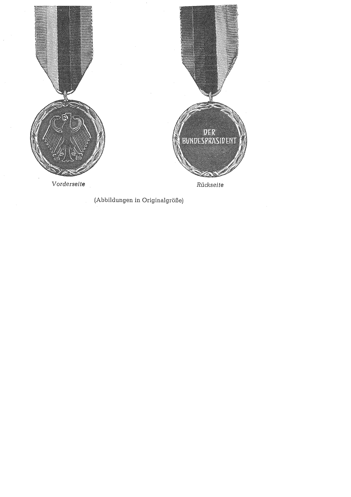

# Erlaß über die Stiftung der Silbermedaille für den Behindertensport (SiMedErl)

Ausfertigungsdatum
:   1978-04-13

Fundstelle
:   BGBl I: 1978, 589

## Eingangsformel

In dem Wunsche, den Behindertensport als ein wichtiges Mittel zur
Rehabilitation behinderter Menschen hervorzuheben, stifte ich auf
Grund des § 3 Abs. 1 des Gesetzes über Titel, Orden und Ehrenzeichen
in der im Bundesgesetzblatt Teil III, Gliederungsnummer 1132-1,
veröffentlichten bereinigten Fassung, zuletzt geändert durch Artikel
33 des Gesetzes vom 2. März 1974 (BGBl. I S. 469), die

*   **Silbermedaille für den Behindertensport.**

## Art I

Die Silbermedaille für den Behindertensport ist ein Ehrenzeichen. Sie
wird an Behinderte verliehen, die durch besondere sportliche
Leistungen in hervorragender Weise die Fähigkeit bewiesen haben, ihre
Behinderung zu meistern und dadurch anderen ein Beispiel zu geben.

## Art II

Das Ehrenzeichen ist eine Medaille aus Silber, die auf der Vorderseite
den Bundesadler und auf der Rückseite die Aufschrift "Der
Bundespräsident" sowie das Verleihungsdatum trägt. Die Medaille ist
von einem silbernen Lorbeerkranz umgeben. Das Ehrenzeichen wird an
einem Band mit den olympischen Farben getragen. Eine Abbildung des im
Bundesministerium des Innern verwahrten amtlichen Musters wird als
Anlage veröffentlicht.

## Art III

Der Ausgezeichnete erhält eine Verleihungsurkunde. Das Ehrenzeichen
geht in das Eigentum des Ausgezeichneten über.

## Art IV

Vorschläge zur Verleihung des Ehrenzeichens können die Sportverbände
dem Chef des Bundespräsidialamtes oder dem Bundesminister des Innern
unterbreiten.

## Art V

Die Ausführungsbestimmungen erläßt der Bundesminister des Innern.

## Schlußformel

Der Bundespräsident
Der Bundeskanzler
Der Bundesminister des Innern

## Anlage

(Fundstelle: BGBl. I 1978, 589)

