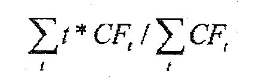
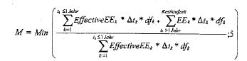
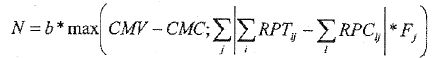
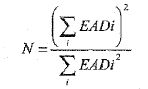
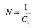
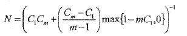
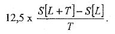
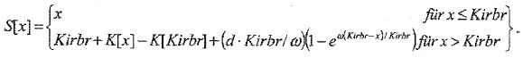
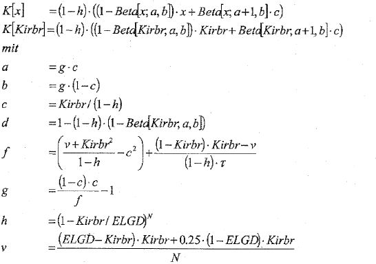
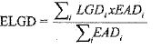

# Verordnung über die angemessene Eigenmittelausstattung von Instituten, Institutsgruppen und Finanzholding-Gruppen (SolvV)

Ausfertigungsdatum
:   2006-12-14

Fundstelle
:   BGBl I: 2006, 2926

Zuletzt geändert durch
:   Art. 1 V v. 19.12.2012 I 2796

Diese Verordnung dient der weiteren Umsetzung der Richtlinie
2006/48/EG des Europäischen Parlaments und des Rates vom 14. Juni 2006
über die Aufnahme und Ausübung der Tätigkeit der Kreditinstitute
(Neufassung) (ABl. EU Nr. L 177 S. 1) und der Richtlinie 2006/49/EG
des Europäischen Parlaments und des Rates vom 14. Juni 2006 über die
angemessene Eigenkapitalausstattung von Wertpapierfirmen und
Kreditinstituten (Neufassung) (ABl. EU Nr. L 177 S. 201).

## Eingangsformel

Das Bundesministerium der Finanzen verordnet

–   auf Grund des § 1a Abs. 9 Satz 1 und 3 des Kreditwesengesetzes, der
    durch Artikel 1 Nr. 3 des Gesetzes vom 17. November 2006 (BGBl. I S.
    2606) eingefügt worden ist,

–   auf Grund des § 10 Abs. 1 Satz 9 und 11, auch in Verbindung mit Abs.
    1e Satz 2, des Kreditwesengesetzes, § 10 Abs. 1 neu gefasst und § 10
    Abs. 1e eingefügt durch Artikel 1 Nr. 12 Buchstabe b und f des
    Gesetzes vom 17. November 2006 (BGBl. I S. 2606),

–   auf Grund des § 10 Abs. 9 Satz 6 des Kreditwesengesetzes, der durch
    Artikel 1 Nr. 12 Buchstabe u Doppelbuchstabe bb des Gesetzes vom 17.
    November 2006 (BGBl. I S. 2606) eingefügt worden ist, und

–   auf Grund des § 10a Abs. 9 Satz 1 und 3, auch in Verbindung mit § 26a
    Abs. 1 Satz 3, des Kreditwesengesetzes, § 10a Abs. 9 neu gefasst und §
    26a eingefügt durch Artikel 1 Nr. 13 und 35 des Gesetzes vom 17.
    November 2006 (BGBl. I S. 2606)

jeweils im Benehmen mit der Deutschen Bundesbank und nach Anhörung der
Spitzenverbände der Institute:

## Teil 1 - Allgemeine Vorschriften

### § 1 Anwendungsbereich

Diese Verordnung ist anzuwenden auf

1.  Kreditinstitute, die Bankgeschäfte im Sinne des § 1 Absatz 1 Satz 2
    des Kreditwesengesetzes betreiben, und

2.  Finanzdienstleistungsinstitute, die

    a)  Eigenhandel betreiben oder

    b)  als Anlagevermittler, Abschlussvermittler oder
        Finanzportfolioverwalter befugt sind, sich Eigentum oder Besitz an
        Geldern von Kunden oder Wertpapieren von Kunden zu verschaffen, oder
        auf eigene Rechnung mit Finanzinstrumenten handeln.

3.  (weggefallen)

Die §§ 298 bis 307 gelten nicht für Nichthandelsbuchinstitute.

### § 2 Angemessenheit der Eigenmittel eines Instituts

(1) Ein Institut verfügt über angemessene Eigenmittel, wenn es täglich
zum Geschäftsschluss sowohl die Eigenkapitalanforderungen für
Adressrisiken und das operationelle Risiko nach Absatz 2 als auch die
Eigenmittelanforderungen für Marktrisiken nach Absatz 3 erfüllt. Für
den Geschäftsschluss gilt § 1 Abs. 1 der Großkredit- und
Millionenkreditverordnung vom 14. Dezember 2006 (BGBl. I S. 3065).

(2) Die Eigenkapitalanforderungen für Adressrisiken und das
operationelle Risiko werden erfüllt, wenn der Gesamtanrechnungsbetrag
für Adressrisiken und der nach den §§ 269 bis 293 ermittelte
Anrechnungsbetrag für das operationelle Risiko insgesamt das
modifizierte verfügbare Eigenkapital eines Instituts nicht
überschreiten.

(3) Die Eigenmittelanforderungen für Marktrisiken werden erfüllt, wenn
die Summe der Anrechnungsbeträge für die Marktrisikopositionen und, im
Falle des § 308 Abs. 2 und 3 Satz 1 der Anrechnungsbeträge für die
Optionsgeschäfte eines Instituts, die Summe aus dem um die
Eigenkapitalanforderungen für Adressrisiken und das operationelle
Risiko verringerten modifizierten verfügbaren Eigenkapital des
Instituts und den verfügbaren Drittrangmitteln täglich bei
Geschäftsschluss nicht überschreiten. Die Marktrisikopositionen nach
Satz 1 werden gebildet durch die

1.  Fremdwährungsrisikopositionen nach § 4 Abs. 3,

2.  Rohwarenrisikopositionen nach § 4 Abs. 5,

3.  Handelsbuch-Risikopositionen nach § 4 Abs. 6 und

4.  anderen Marktrisikopositionen nach § 4 Abs. 7.

Bei Instituten, die nach § 313 eigene Risikomodelle verwenden, werden
die Marktrisikopositionen aus den in Satz 2 Nr. 1 bis 4 genannten
Positionen gebildet, deren risikomäßige Zusammenhänge das Institut in
seinem eigenen Risikomodell berücksichtigt. Dabei ist eine teilweise
Zusammenfassung der Positionen nach Satz 2 Nr. 1 bis 4 zulässig.

(4) Abweichend von Absatz 1 muss ein Finanzdienstleistungsinstitut,
das nicht auf eigene Rechnung mit Finanzinstrumenten handelt, täglich
zum Geschäftsschluss über angemessene Eigenmittel nach Maßgabe der
Sätze 2 und 3 verfügen. Ist die verwaltungskostenbasierte
Eigenmittelanforderung nach § 10 Absatz 9 Satz 1 und 2 des
Kreditwesengesetzes höher als die Summe aus Gesamtanrechnungsbetrag
für Adressrisiken und Eigenmittelanforderungen für Marktrisiken,
verfügt das Institut über angemessene Eigenmittel, wenn die
verwaltungskostenbasierte Eigenmittelanforderung nach § 10 Absatz 9
Satz 1 und 2 des Kreditwesengesetzes die Summe aus dem modifizierten
verfügbaren Eigenkapital und den verfügbaren Drittrangmitteln nicht
übersteigt. Ist die verwaltungskostenbasierte Eigenmittelanforderung
nach § 10 Absatz 9 Satz 1 und 2 des Kreditwesengesetzes kleiner oder
gleich der Summe aus Gesamtanrechnungsbetrag für Adressrisiken und
Eigenmittelanforderungen für Marktrisiken, verfügt das Institut über
angemessene Eigenmittel, wenn sowohl die Eigenkapitalanforderungen für
Adressrisiken nach Absatz 2 als auch die Eigenmittelanforderungen für
Marktrisiken nach Absatz 3 erfüllt werden, wobei abweichend von den §§
269 bis 293 der Anrechnungsbetrag für das operationelle Risiko Null
beträgt. § 10 Abs. 9 Satz 3 bis 5 des Kreditwesengesetzes gilt
entsprechend.

(5) Die Größenverhältnisse nach den Absätzen 2 bis 4 sind täglich zum
Geschäftsschluss zu ermitteln. Ein Institut darf von der
geschäftstäglichen Ermittlung absehen, wenn es durch geeignete interne
Maßnahmen sicherstellt, dass den Anforderungen nach den Absätzen 2 bis
4 entsprochen wird und die Gesamtkennziffer nach Absatz 6 Satz 2 einen
Wert von 8,4 Prozent nicht unterschreitet.

(6) Die Institute haben zum Ende eines jeden Kalendervierteljahres
eine Gesamtkennziffer zu ermitteln. Die Gesamtkennziffer gibt das
prozentuale Verhältnis zwischen den anrechenbaren Eigenmitteln nach
Satz 3 als Zähler und der mit 12,5 multiplizierten Summe aus dem
Gesamtanrechnungsbetrag für Adressrisiken, dem Anrechnungsbetrag für
das operationelle Risiko und der Summe der Anrechnungsbeträge für
Marktrisikopositionen einschließlich der Optionsgeschäfte als Nenner
an; Finanzdienstleistungsinstitute, auf die Absatz 4 Anwendung findet,
haben als Nenner das 12,5-fache des höheren der Beträge nach Absatz 4
Satz 2 oder 3 zu verwenden. Anrechenbare Eigenmittel sind das
modifizierte verfügbare Eigenkapital und die zur Unterlegung der
Anrechnungsbeträge für die Marktrisikopositionen und die
Optionsgeschäfte genutzten Drittrangmittel, wobei die Nutzung der
Drittrangmittel auf fünf Siebtel der Anrechnungsbeträge für die
Marktrisikopositionen und die Optionsgeschäfte beschränkt ist. Für
Wohnungsunternehmen mit Spareinrichtung gilt Satz 1 mit der Maßgabe,
dass die Gesamtkennziffer zum Ende eines jeden Kalenderjahres zu
ermitteln ist.

### § 3 Angemessenheit der zusammengefassten Eigenmittel

(1) Die Anforderungen nach § 2 Abs. 2 bis 4 und 6 gelten entsprechend
für Institutsgruppen und Finanzholding-Gruppen für die
Größenverhältnisse

1.  des zusammengefassten modifizierten verfügbaren Eigenkapitals und des
    Anrechnungsbetrags für das operationelle Risiko nach den §§ 269 bis
    293 und des Gesamtanrechnungsbetrags für Adressrisiken nach § 8, ohne
    die in den Abzug nach § 10a Abs. 6 Satz 3 Nr. 1 und 2 des
    Kreditwesengesetzes einbezogenen Positionen,

2.  des um die Eigenkapitalanforderungen für Adressrisiken und das
    operationelle Risiko verringerten modifizierten verfügbaren
    Eigenkapitals der Institutsgruppe oder Finanzholding-Gruppe zuzüglich
    der verfügbaren Drittrangmittel und der Anrechnungsbeträge für die
    Marktrisikopositionen und im Falle des § 308 Abs. 2 und 3 Satz 1 der
    Anrechnungsbeträge für die Optionsgeschäfte aller gruppenangehörigen
    Unternehmen und

3.  der insgesamt anrechenbaren Eigenmittel und der mit 12,5
    multiplizierten Summe aus dem Gesamtanrechnungsbetrag für
    Adressrisiken, dem Anrechnungsbetrag für das operationelle Risiko und
    der Summe der Anrechnungsbeträge für Marktrisikopositionen
    einschließlich der Optionsgeschäfte.

§ 2 Abs. 5 gilt entsprechend für Institutsgruppen und Finanzholding-
Gruppen.

(2) Ist ein Institut einer Institutsgruppe oder Finanzholding-Gruppe
Handelsbuchinstitut, unterliegt die Institutsgruppe oder
Finanzholding-Gruppe den Vorschriften der §§ 298 bis 307 über
Handelsbuch-Risikopositionen. Gruppenangehörige
Nichthandelsbuchinstitute dürfen die Anrechnungsbeträge für ihre
Positionen des Handelsbuchs nach den §§ 8 bis 268 ermitteln.

(3) Bei der Berechnung der Anforderungen für die Größenverhältnisse
nach Absatz 1 Satz 1 Nr. 2 und 3 darf auf die Anrechnungsbeträge für
die Marktrisikopositionen und Optionsgeschäfte der nachgeordneten
Unternehmen mit Sitz im Ausland abgestellt werden, die nach der in dem
jeweiligen Sitzstaat geltenden Marktrisikoregelung zu den Stichtagen
nach § 6 Abs. 1 ermittelt werden, wenn die im jeweiligen Sitzstaat
geltende Marktrisikoregelung

1.  in Staaten des Europäischen Wirtschaftsraums derjenigen der Richtlinie
    2006/49/EG des Europäischen Parlaments und des Rates vom 14. Juni 2006
    über die angemessene Eigenkapitalausstattung von Wertpapierfirmen und
    Kreditinstituten (Neufassung) (ABl. L 177 vom 30.6.2006, S. 201) in
    der jeweils geltenden Fassung oder

2.  in Drittstaaten derjenigen dieser Verordnung

gleichwertig ist.

### § 4 Anrechnungspflichtige Positionen, Schuldnergesamtheit

(1) Ein Institut hat als anrechnungspflichtige Positionen seine
Adressrisikopositionen, Fremdwährungsrisikopositionen,
Rohwarenrisikopositionen, andere Marktrisikopositionen und, wenn es
Handelsbuchinstitut ist, Handelsbuch-Risikopositionen zu bestimmen.
Wertpapierhandelsunternehmen in der Rechtsform des Einzelkaufmanns
oder der Personenhandelsgesellschaft haben auch die auf eigene
Rechnung des Inhabers oder der persönlich haftenden Gesellschafter
abgeschlossenen Geschäfte in die Bestimmung der anrechnungspflichtigen
Positionen einzubeziehen.

(2) Adressrisikopositionen werden durch solche Positionen gebildet,
die

1.  einem Adressenausfallrisiko unterliegen, das nicht durch eine
    Handelsbuch-Risikoposition eines Handelsbuchinstituts nach Absatz 6
    Satz 1 erfasst wird,

2.  als Sachanlagen einem Wertverschlechterungsrisiko unterliegen,

3.  bei einem IRBA-Institut Veritätsrisikopositionen nach § 71 Abs. 2
    begründen oder

4.  einem Abwicklungsrisiko unterliegen,

soweit sie nicht nach § 10 Abs. 6 Satz 1 des Kreditwesengesetzes vom
haftenden Eigenkapital abgezogen oder in vollem Umfang mit haftendem
Eigenkapital unterlegt werden. Adressenausfallrisiko ist das Risiko,
dass eine natürliche oder juristische Person oder eine
Personenhandelsgesellschaft, gegenüber der das Institut einen
bedingten oder unbedingten Anspruch hat, nicht oder nicht fristgerecht
leistet oder das Institut gegenüber einer Person oder
Personenhandelsgesellschaft aufgrund der Nichtleistung eines Dritten
zu leisten verpflichtet ist, sowie das finanzielle Risiko des
Instituts in Bezug auf Beteiligungen. Die Institute stellen sicher,
dass die für Zwecke dieser Verordnung gespeicherten personenbezogenen
Daten spätestens nach Ablauf des vierten Kalenderjahres nach
Beendigung und Abwicklung des Schuldverhältnisses mit dem Schuldner
des Instituts oder nach dem Scheitern der Begründung des
Schuldverhältnisses vollständig gelöscht oder anonymisiert werden.
Abwicklungsrisiko ist das für ein nach Ablauf des
Erfüllungszeitpunktes beiderseitig nicht erfülltes Geschäft bestehende
Risiko einer Wertveränderung des Geschäftsgegenstands. Die
Adressrisikopositionen sind nach dem Verfahren zur Ermittlung des
Gesamtanrechnungsbetrags für Adressrisiken nach § 8 zu
berücksichtigen.

(3) Fremdwährungsrisikopositionen sind Ansprüche oder Verpflichtungen
einschließlich Beteiligungen in fremder Währung und in Gold sowie
Kassenbestände in fremder Währung und Bestände in Gold. Aus den
Fremdwährungsrisikopositionen ist nach den §§ 294 und 295 die
Währungsgesamtposition zu bilden und hierfür der Anrechnungsbetrag zu
ermitteln. Gold- und Sortenbestände im Gesamtwert von bis zu 128 000
Euro müssen nicht in die Währungsgesamtposition einbezogen werden.
Wird die Grenze nach Satz 3 überschritten, sind die Gold- und
Sortenbestände in voller Höhe in die Währungsgesamtposition
einzubeziehen.

(4) Fremdwährungsrisikopositionen, die nach § 10 Abs. 2a Satz 2 oder
Abs. 6 des Kreditwesengesetzes vom Kern- bzw. haftenden Eigenkapital
abgezogen oder die in vollem Umfang mit haftendem Eigenkapital
unterlegt werden, sowie Beteiligungen einschließlich Anteilen an
verbundenen Unternehmen in fremder Währung, die zu Anschaffungskursen
bewertet werden (strukturelle Währungspositionen), dürfen auf Antrag
des Instituts mit Zustimmung der Bundesanstalt für
Finanzdienstleistungsaufsicht (Bundesanstalt) bei der Ermittlung der
Währungsgesamtposition nach Absatz 3 Satz 2 außer Ansatz bleiben. Die
Zustimmung gilt als erteilt, wenn das Institut mit seinem Antrag nach
Satz 1 die jeweiligen Posten der Bundesanstalt mitteilt und diese
nicht innerhalb von drei Monaten widerspricht. Änderungen der nicht zu
berücksichtigenden Posten sind der Bundesanstalt mitzuteilen. Die Höhe
der nicht in Ansatz gebrachten Posten ist auf den Meldungen Nr. 30 und
63 nach § 6 Abs. 1 Satz 1 und 2 zu vermerken.

(5) Rohwarenrisikopositionen sind Ansprüche oder Verpflichtungen in
Bezug auf Waren sowie Warenbestände. Aus den Rohwarenrisikopositionen
ist nach den §§ 296 und 297 die Rohwarenposition zu bilden und hierfür
der Anrechnungsbetrag zu ermitteln. Silber- und Platinbestände im
Gesamtwert von bis zu 26 000 Euro müssen nicht in die Rohwarenposition
einbezogen werden. Wird die Grenze nach Satz 3 überschritten, sind
Silber- und Platinbestände in voller Höhe in die Rohwarenposition
einzubeziehen.

(6) Handelsbuch-Risikopositionen sind die zins- und
aktienkursbezogenen Risikopositionen des Handelsbuches eines
Handelsbuchinstituts. Der Anrechnungsbetrag für Handelsbuch-
Risikopositionen ist nach den §§ 298 bis 307 aus der Summe der
Teilanrechnungsbeträge für die allgemeinen und für die besonderen
Kursrisiken zu ermitteln.

(7) Andere Marktrisikopositionen sind vertragliche Ansprüche und
Verpflichtungen, die für die eine Vertragspartei einen finanziellen
Vermögenswert und für die andere Vertragspartei eine finanzielle
Verbindlichkeit schaffen und die nicht nach den Absätzen 2 bis 6 zu
erfassen sind. Der Anrechnungsbetrag für andere Marktrisikopositionen
ist nach § 312 zu ermitteln.

(8) Zwei oder mehr natürliche oder juristische Personen oder
Personenhandelsgesellschaften sind in der Regel eine
Schuldnergesamtheit, wenn sie untereinander unter Berücksichtigung
ihrer rechtlichen und tatsächlichen Verhältnisse so verbunden sind,
dass die Zahlungsschwierigkeiten einer der Personen zu Schwierigkeiten
bei den anderen führen würden, Zahlungsverpflichtungen aus
Kreditgewährung gegenüber dem Institut vollständig zu erfüllen. Kann
eine der Personen nach Satz 1 unmittelbar oder mittelbar
beherrschenden Einfluss auf eine oder mehrere andere Personen ausüben,
darf das Institut nur in begründeten Fällen von der Bildung einer
Schuldnergesamtheit nach Satz 1 absehen.

### § 5 Auf fremde Währung lautende Positionen

(1) Eine auf eine fremde Währung lautende Position ist zu dem von der
Europäischen Zentralbank am Meldestichtag festgestellten und von der
Deutschen Bundesbank veröffentlichten Referenzkurs (Euro-Referenzkurs)
in Euro umzurechnen. Statt des Euro-Referenzkurses am Meldestichtag
darf für Beteiligungen, einschließlich der Anteile an verbundenen
Unternehmen, die nach § 4 Abs. 4 Satz 1 und 2 nicht als Bestandteil
seiner Währungsgesamtposition behandelt werden, der zum Zeitpunkt
ihrer Erstverbuchung maßgebliche Devisenkurs angewendet werden. Bei
der Umrechnung von Währungen, für die kein Euro-Referenzkurs
veröffentlicht wird, sind die Mittelkurse aus feststellbaren An- und
Verkaufskursen des Stichtages zugrunde zu legen.

(2) Absatz 1 gilt nicht für Institute, die eigene Risikomodelle nach
den §§ 313 bis 318 verwenden und die dort verwendeten internen
Fremdwährungsumrechnungskurse konsistent auf alle auf fremde Währung
lautende Positionen anwenden.

### § 6 Meldungen zur Eigenmittelausstattung

(1) Institute haben der Deutschen Bundesbank zu den Anforderungen nach
§ 2 Abs. 2 bis 4 und 6 nach dem Stand zum Meldestichtag Ende eines
Kalendervierteljahres Meldungen mit den Formularen nach Anlage 3
Nummer 1 bis 33, 68 und 69 jeweils bis zum 15. Geschäftstag des auf
den Meldestichtag folgenden Monats einzureichen; auf Antrag des
Instituts kann die Bundesanstalt die Frist verlängern. Übergeordnete
Institute haben der Deutschen Bundesbank zu den Anforderungen nach § 3
nach dem Stand zum Meldestichtag Ende eines Kalendervierteljahres
Meldungen mit den Formularen nach Anlage 3 Nummer 34 bis 67, 70 und 71
jeweils bis zum letzten Geschäftstag des auf den Meldestichtag
folgenden Monats einzureichen; auf Antrag des Instituts kann die
Bundesanstalt die Frist verlängern. Für Wohnungsunternehmen mit
Spareinrichtung gilt Satz 1 mit der Maßgabe, dass die Meldungen nur
einmal jährlich nach dem Stand zum Meldestichtag Ende eines
Kalenderjahres und nur mit dem Formular nach Anlage 3 Nr. 1 spätestens
bis zum letzten Geschäftstag des auf den Meldestichtag folgenden
Kalendervierteljahres einzureichen sind.

(2) Die Meldungen nach Absatz 1 sind im papierlosen Verfahren
einzureichen. Die Deutsche Bundesbank veröffentlicht im Internet die
für die elektronische Dateneinreichung zu verwendenden Satzformate und
den Einreichungsweg. Sie leitet die Meldungen an die Bundesanstalt
weiter. Institute haben die Meldungen nach Anlage 3 Nummer 1 bis 33,
68 und 69, übergeordnete Institute zusätzlich die Meldungen nach
Anlage 3 Nummer 34 bis 67, 70 und 71 für das laufende Kalenderjahr und
die zwei vorangegangenen Kalenderjahre aufzubewahren. Institute müssen
die Marktpreisdaten für die Angaben nach Anlage 3 für den letzten
Meldestichtag, die Meldestichtage der vergangenen 24 Monate sowie für
den laufenden Meldezeitraum vorhalten und der Bundesanstalt oder der
Deutschen Bundesbank auf Verlangen zur Verfügung stellen. Sofern die
Gesamtkennziffer nach § 2 Abs. 6 Satz 2 den Wert von 8,4 Prozent
unterschreitet, haben die Institute die jeweiligen Marktdaten sowie
die Berechnungen nach dieser Verordnung zusätzlich für die letzten 30
Handelstage vorzuhalten. Sowohl die Bundesanstalt als auch die
Deutsche Bundesbank können verlangen, dass die Angaben nach Satz 5 und
6 spätestens nach 15 Geschäftstagen eingereicht werden.

### § 7 Anzeigen bei Nichteinhaltung der Eigenmittelanforderungen

(1) Institute müssen

1.  die Nichteinhaltung der Eigenkapitalanforderungen nach § 2 Abs. 2 und

2.  die Nichteinhaltung der Eigenmittelanforderungen nach § 2 Abs. 3

zwischen den Meldestichtagen der Bundesanstalt und der Deutschen
Bundesbank unverzüglich schriftlich anzeigen. In der Anzeige nach Satz
1 ist jeweils der Betrag anzugeben, um den die
Eigenkapitalanforderungen beziehungsweise Eigenmittelanforderungen
nicht eingehalten werden.

(2) Finanzdienstleistungsinstitute, die nicht auf eigene Rechnung mit
Finanzinstrumenten handeln, müssen die Nichterfüllung der Anforderung
nach § 2 Abs. 4 zwischen den Meldestichtagen der Bundesanstalt und der
Deutschen Bundesbank unverzüglich schriftlich anzeigen. Absatz 1 Satz
2 gilt entsprechend.

(3) Die Anzeigepflichten nach Absatz 1 gelten entsprechend für
übergeordnete Unternehmen einer Institutsgruppe oder Finanzholding-
Gruppe.

## Teil 2 - Adressrisiken

### § 8 Ermittlung des Gesamtanrechnungsbetrags für Adressrisiken

(1) Der Gesamtanrechnungsbetrag für Adressrisiken wird ermittelt,
indem aus der Gesamtheit der Adressrisikopositionen mit Ausnahme der
Abwicklungsrisikopositionen die Adressenausfallrisikopositionen
bestimmt und diese entweder nach dem Kreditrisiko-Standardansatz (KSA)
oder dem auf internen Ratings basierenden Ansatz (IRBA) berücksichtigt
werden. Nur ein IRBA-Institut darf Adressenausfallrisikopositionen
nach dem IRBA berücksichtigen. Ein Institut, das kein IRBA-Institut
ist, hat sämtliche Adressenausfallrisikopositionen nach dem KSA zu
berücksichtigen.

(2) Der Gesamtanrechnungsbetrag für Adressrisiken ist die mit 0,08
multiplizierte Summe aus

1.  den für alle

    a)  KSA-Positionen nach § 24 Satz 1 und

    b)  IRBA-Positionen nach § 71 Abs. 1,

    die keine Verbriefungspositionen sind, ermittelten risikogewichteten
    KSA-Positionswerten beziehungsweise risikogewichteten IRBA-
    Positionswerten und

2.  den nach den §§ 225 bis 268 ermittelten risikogewichteten
    Positionswerten für Verbriefungspositionen.

Der Gesamtanrechnungsbetrag für Adressrisiken erhöht sich um den
Gesamtanrechnungsbetrag für Abwicklungsrisiken nach § 16.

### Kapitel 1 - Risikopositionen

#### § 9 Adressenausfallrisikopositionen

(1) Adressenausfallrisikopositionen setzen sich aus den

1.  bilanziellen Adressenausfallrisikopositionen nach § 10,

2.  derivativen Adressenausfallrisikopositionen nach § 11,

3.  außerbilanziellen Adressenausfallrisikopositionen nach § 13 sowie

4.  Vorleistungsrisikopositionen nach § 14

zusammen; das gilt auch, wenn sie nach Absatz 2 als effektiv verbrieft
gelten. Aus einem Geschäft können mehrere
Adressenausfallrisikopositionen entstehen. Im Rahmen von
Pensionsgeschäften übertragene oder im Rahmen von Darlehensgeschäften
verliehene Wertpapiere oder Waren sind unabhängig von deren
Bilanzierung dem Pensions- oder Darlehensgeber zuzurechnen. Für eine
Credit Linked Note, bei der das Institut Sicherungsgeber ist, sind
sowohl die Adressenausfallrisikoposition gegenüber dem Emittenten der
Credit Linked Note als auch die Adressenausfallrisikoposition in Bezug
auf das Referenzaktivum oder das Referenzportfolio zu berücksichtigen.

(2) Als effektiv verbrieft gilt jede Adressenausfallrisikoposition,
die zu einem durch eine solche Verbriefungstransaktion verbrieften
Portfolio nach § 1b Absatz 6 des Kreditwesengesetzes gehört, für die
das Institut nach § 1b Absatz 7 des Kreditwesengesetzes als Originator
gilt und für die es die Mindestanforderungen an den wesentlichen und
wirksamen Risikotransfer nach § 232 erfüllt. Handelt es sich bei der
Verbriefungstransaktion nach Satz 1 um eine Verbriefungstransaktion,
zu der ein vom Originator zu berücksichtigender Investorenanteil aus
Verbriefungstransaktionen gehört, gelten dem gewidmeten Portfolio
zuzuordnende Adressenausfallrisikopositionen als effektiv verbrieft,
soweit sie

1.  als revolvierende Adressenausfallrisikopositionen in der KSA-
    Bemessungsgrundlage nach § 248 oder in der IRBA-Bemessungsgrundlage
    nach § 262 Satz 2 des vom Originator zu berücksichtigenden
    Investorenanteils aus Verbriefungstransaktionen berücksichtigt sind
    oder

2.  nicht in der Bemessungsgrundlage des vom Originator zu
    berücksichtigenden Investorenanteils aus Verbriefungstransaktionen
    berücksichtigt sind und Zahlungsansprüche begründen, die denen aus
    Adressenausfallrisikopositionen nach Nummer 1 nachgeordnet sind.

(3) Wenn ein Institut mehrere Verbriefungspositionen an derselben
Verbriefungstransaktion hält und vertraglich sichergestellt ist, dass
nicht mehr als eine dieser Verbriefungspositionen dieselben Verluste
aus dem durch diese Verbriefungstransaktion verbrieften Portfolio
erleiden kann, darf das Institut, soweit sich diese
Verbriefungspositionen überschneiden und das Institut für eine dieser
Verbriefungspositionen eine Handelsbuch-Risikoposition und für eine
andere dieser Verbriefungspositionen eine
Adressenausfallrisikoposition bilden muss, von der Berücksichtigung
als Adressenausfallrisikoposition absehen, wenn im Falle einer
Berücksichtigung als Handelsbuch-Risikoposition die Summe aus dem
Gesamtanrechnungsbetrag für Adressrisiken einerseits und der Summe der
Anrechnungsbeträge für die Marktrisikopositionen und, im Falle des §
308 Absatz 2 und 3, der Anrechnungsbeträge für die Optionsgeschäfte
des Instituts andererseits höher ist als im Falle einer
Berücksichtigung als Adressenausfallrisikoposition.

#### § 10 Bilanzielle Adressenausfallrisikopositionen

Zu den bilanziellen Adressenausfallrisikopositionen gehören

1.  Bilanzaktiva im Sinne von § 19 Abs. 1 Satz 2 Nr. 1 bis 9 des
    Kreditwesengesetzes mit Ausnahme der beim Pensionsnehmer bzw.
    Darlehensnehmer bilanzierten Wertpapiere oder Waren im Falle von sich
    darauf beziehenden Pensions- und Darlehensgeschäften,

2.  Sachanlagen und sonstige Vermögensgegenstände,

3.  aktivische Rechnungsabgrenzungsposten, wenn sie nicht Ausgleichsposten
    für Verbindlichkeiten sind, die unter Nennwert ausgegeben wurden und
    zum Nennwert passiviert sind, und

4.  bei Wohnungsunternehmen mit Spareinrichtung die Positionen des
    Umlaufvermögens der zum Verkauf bestimmten Grundstücke und anderer
    Vorräte, mit Ausnahme der unfertigen Leistungen aus noch nicht mit den
    Mietern abgerechneten Betriebskosten.

#### § 11 Derivative Adressenausfallrisikopositionen

(1) Derivative Adressenausfallrisikopositionen sind

1.  Derivate nach § 19 Abs. 1a des Kreditwesengesetzes mit Ausnahme von

    a)  denjenigen derivativen Instrumenten für den Transfer von
        Kreditrisiken, bei denen das Institut Gewährleistungsgeber ist und
        dieses derivative Instrument als außerbilanzielle
        Adressenausfallrisikoposition berücksichtigen muss, oder bei denen das
        Institut Sicherungsnehmer ist, und dieses derivative Instrument als
        berücksichtigungsfähige Gewährleistung bei der Ermittlung des
        risikogewichteten Positionswerts einer anderen
        Adressenausfallrisikoposition berücksichtigt sowie

    b)  Stillhalterverpflichtungen aus Optionen,

    die nicht in einer Novationsposition aus einem
    berücksichtigungsfähigen Schuldumwandlungsvertrag nach Absatz 2
    aufgegangen sind, und

2.  eine Novationsposition aus einem berücksichtigungsfähigen
    Schuldumwandlungsvertrag nach Absatz 2.

Abweichend von Satz 1 Nummer 1 Buchstabe a zweite Alternative darf ein
Institut alle dort genannten Derivate des Handelsbuchs einheitlich und
alle dort genannten Derivate des Anlagebuchs einheitlich als
derivative Adressenausfallrisikopositionen berücksichtigen.

(2) Eine Novationsposition aus einem berücksichtigungsfähigen
Schuldumwandlungsvertrag ist jeder Anspruch oder jede Verpflichtung,
der oder die sich in Bezug auf eine gemäß den §§ 206 und 207
berücksichtigungsfähige Aufrechnungsvereinbarung über Derivate aus
einem einheitlichen Schuldverhältnis ergibt. Ein
Schuldumwandlungsvertrag ist jeder Änderungs-, Aufrechnungs- oder
Schuldumschaffungsvertrag, durch den das aufgrund eines Derivats
bestehende Schuldverhältnis unmittelbar in der Weise umgestaltet wird,
dass die sich aus ihm ergebenden Ansprüche und Verpflichtungen ganz
oder teilweise erlöschen.

(3) Eine Adressenausfallrisikoposition mit langer Abwicklungsfrist ist
eine derivative Adressenausfallrisikoposition nach Absatz 1, die durch
ein Geschäft gebildet wird, bei dem

1.  sich ein Kontrahent dazu verpflichtet hat, ein Wertpapier, eine Ware
    oder einen Betrag in Fremdwährung gegen Barzahlung, andere
    Finanzinstrumente oder andere Waren zu liefern oder abzunehmen, und

2.  die Anzahl der Tage vom Geschäftsabschluss bis zum vertraglich
    festgelegten Lieferzeitpunkt oder Abwicklungszeitpunkt größer ist als
    das Minimum aus fünf Geschäftstagen und der für diese Art von
    Geschäften marktüblichen Anzahl von Geschäftstagen.

#### § 12 Aufrechnungspositionen

(1) Eine Aufrechnungsposition aus Derivaten ist die Position, die aus
allen Ansprüchen und Verpflichtungen aus Derivaten gebildet wird, die
von einer zu berücksichtigenden Aufrechnungsvereinbarung über Derivate
nach § 207 erfasst werden.

(2) Eine Aufrechnungsposition aus Geldforderungen und -schulden ist
die Position, die aus allen Geldforderungen und -schulden gebildet
wird, die von einer zu berücksichtigenden Aufrechnungsvereinbarung
über Geldforderungen und -schulden nach § 208 erfasst werden.

(3) Eine Aufrechnungsposition aus nichtderivativen Geschäften mit
Sicherheitennachschüssen ist die Position, die aus

1.  allen verliehenen, verkauften oder überlassenen Wertpapieren und Waren
    sowie verliehenen oder überlassenen Geldbeträgen und

2.  allen entliehenen, gekauften oder erhaltenen Wertpapieren und Waren
    sowie entliehenen oder erhaltenen Geldbeträgen

besteht, die von einer zu berücksichtigenden Aufrechnungsvereinbarung
über nichtderivative Geschäfte mit Sicherheitennachschüssen nach § 209
erfasst werden.

(4) Eine produktübergreifende Aufrechnungsposition ist die Position,
die aus allen Ansprüchen und Verpflichtungen gebildet wird, die von
einer berücksichtigungsfähigen produktübergreifenden
Aufrechnungsvereinbarung nach § 210 erfasst werden und die darüber
hinaus alle finanziellen Sicherheiten umfasst, die das Institut im
Zusammenhang mit dieser Aufrechnungsvereinbarung gestellt oder, soweit
sie nach § 154 Abs. 1 Satz 1 Nr. 1 berücksichtigungsfähig sind,
erhalten hat.

(5) Für Adressenausfallrisikopositionen, die in zu berücksichtigende
Aufrechnungspositionen einbezogen sind, sind keine gesonderten
risikogewichteten Positionswerte zu berücksichtigen.

#### § 13 Außerbilanzielle Adressenausfallrisikopositionen

(1) Zu den außerbilanziellen Adressenausfallrisikopositionen gehören

1.  außerbilanzielle Geschäfte im Sinne von § 19 Abs. 1 Satz 3 des
    Kreditwesengesetzes,

2.  Credit Default Swaps, die in als Credit Linked Note ausgestalteten
    Kreditderivaten, die zugleich bilanzielle
    Adressenausfallrisikopositionen darstellen, eingebettet sind,

3.  Terminkäufe und Stillhalterverpflichtungen aus Verkaufsoptionen, wenn
    der Geschäftsgegenstand unter der Annahme tatsächlicher Lieferung oder
    Abnahme des Geschäftsgegenstandes eine bilanzielle
    Adressenausfallrisikoposition nach § 10 begründen würde,

4.  unbezahlte Anteile von teileingezahlten Wertpapieren,

5.  Eröffnung und Bestätigung von Dokumentenakkreditiven, die durch
    Warenpapiere besichert werden, und

6.  im Falle eines IRBA-Instituts, nicht unter Nummer 3 fallende Derivate
    nach § 19 Abs. 1a des Kreditwesengesetzes auf solche Beteiligungen,
    die weder nach § 70 Satz 1 Nr. 2, 8 oder 9 noch nach § 338 Abs. 4 von
    der Anwendung des IRBA ausgenommen sind,

einschließlich der Adressenausfallrisikopositionen aus Verbriefungs-
Liquiditätsfazilitäten nach § 1b Absatz 3 Satz 3 des
Kreditwesengesetzes und vom Originator zu berücksichtigenden
Investorenanteilen aus Verbriefungstransaktionen nach § 245 Abs. 2.

(2) Geschäfte, die nach § 11 derivative
Adressenausfallrisikopositionen sind und zu den außerbilanziellen
Adressenausfallrisikopositionen nach Absatz 1 Nr. 1 bis 6 gehören,
bilden sowohl eine derivative Adressenausfallrisikoposition als auch
eine außerbilanzielle Adressenausfallrisikoposition.

#### § 14 Vorleistungsrisikopositionen

(1) Eine Vorleistungsrisikoposition ist jeder Anspruch aus einem
Geschäft,

1.  bei dem es

    a)  für Wertpapiere, Fremdwährungen oder Waren bezahlt hat und diese
        bisher noch nicht erhalten hat, oder

    b)  Wertpapiere, Fremdwährungen oder Waren geliefert hat und für diese
        noch nicht bezahlt worden ist,

2.  bei dem mehr als ein Geschäftstag seit Zahlung oder Lieferung durch
    das Institut vergangen ist, wenn es sich um ein grenzüberschreitendes
    Geschäft handelt, und

3.  wenn nach § 10 Abs. 6a Nr. 4 des Kreditwesengesetzes kein Abzug vom
    Kern- und Ergänzungskapital vorgenommen werden muss.

(2) Durch systemweite Ausfälle von Abwicklungs- oder
Verrechnungssystemen entstandene Vorleistungen können auf Antrag mit
Zustimmung der Bundesanstalt bis zur Wiederherstellung der
Funktionsfähigkeit der Systeme unberücksichtigt bleiben.

#### § 15 Abwicklungsrisikopositionen

(1) Eine Abwicklungsrisikoposition ist jeder Liefer- oder
Abnahmeanspruch auf Wertpapiere, Fremdwährungen oder Waren aus einem
Geschäft, das kein Pensions-, Darlehens- oder vergleichbares Geschäft
über Wertpapiere oder Waren ist, wenn der Liefer- oder Abnahmeanspruch
nach Ablauf des für dieses Geschäft vereinbarten Liefer- oder
Abnahmezeitpunktes beidseitig noch nicht erfüllt worden ist.

(2) Durch systemweite Ausfälle von Abwicklungs- und
Verrechnungssystemen entstandene Abwicklungsrisikopositionen können
auf Antrag mit Zustimmung der Bundesanstalt bis zur Wiederherstellung
der Funktionsfähigkeit der Systeme unberücksichtigt bleiben.

#### § 16 Gesamtanrechnungsbetrag für Abwicklungsrisiken

Der Gesamtanrechnungsbetrag für Abwicklungsrisiken ist die Summe der
Anrechnungsbeträge für sämtliche Abwicklungsrisikopositionen. Diese
ermitteln sich aus den zugunsten des Instituts bestehenden
Unterschiedsbeträgen zwischen dem jeweils vereinbarten
Abrechnungspreis und dem aktuellen Marktwert der zugrunde liegenden
Wertpapiere, Fremdwährungen oder Waren, die mit

1.  8 Prozent ab dem 5. bis einschließlich dem 15. Geschäftstag,

2.  50 Prozent ab dem 16. bis einschließlich dem 30. Geschäftstag,

3.  75 Prozent ab dem 31. bis einschließlich dem 45. Geschäftstag und

4.  100 Prozent ab dem 46. Geschäftstag

nach dem vereinbarten Abrechnungstermin zu multiplizieren sind.

### Kapitel 2 - Bemessungsgrundlage für derivative Adressenausfallrisikopositionen und Adressenausfallrisikopositionen aus nichtderivativen Geschäften mit Sicherheitennachschüssen sowie aus sonstigen Pensions-, Darlehens- oder vergleichbaren Geschäften über Wertpapiere oder Waren

#### § 17 Bemessungsgrundlage für derivative Adressenausfallrisikopositionen und Adressenausfallrisikopositionen aus nichtderivativen Geschäften mit Sicherheitennachschüssen sowie aus sonstigen Pensions-, Darlehens- oder vergleichbaren Geschäften über Wertpapiere oder Waren

(1) Die Bemessungsgrundlage einer derivativen
Adressenausfallrisikoposition berechnet sich nach einheitlicher und
dauerhafter Wahl des Instituts nach

1.  der Internen Modelle Methode (IMM) nach § 223 vorbehaltlich der
    Zustimmung durch die Bundesanstalt,

2.  der Standardmethode (SM) nach § 218 oder

3.  der Marktbewertungsmethode nach § 18.

Die einheitliche und dauerhafte Wahl kann für einzelne
gruppenangehörige Unternehmen unterschiedlich getroffen werden. Für
eine Adressenausfallrisikoposition mit langer Abwicklungsfrist nach §
11 Abs. 3 darf das Institut abweichend von der nach Satz 1 getroffenen
Wahl eine der anderen Methoden nach Satz 1 verwenden. Ein Institut,
das die SM oder die IMM zur Ermittlung von Nettobemessungsgrundlagen
nach § 211 oder die IMM zur Ermittlung von Nettobemessungsgrundlagen
nach § 217 für produktübergreifende Aufrechnungsvereinbarungen mit
Einbeziehung von Derivaten nach § 210 Abs. 1 Satz 2 nutzt, muss die
jeweilige Methode auch für die Ermittlung aller Bemessungsgrundlagen
für nicht in solche Aufrechnungspositionen einbezogene derivative
Adressenausfallrisikopositionen nutzen. Ausgenommen hiervon sind
Positionen nach § 220 Abs. 4 bzw. § 222 Abs. 3 und 4. Ein
Nichthandelsbuchinstitut darf die Bemessungsgrundlage für derivative
Adressenausfallrisikopositionen abweichend von Satz 1 und
vorbehaltlich Satz 7 nach einheitlicher Wahl anhand des
laufzeitbewerteten Wiedereindeckungsaufwands nach § 23 ermitteln
(Laufzeitmethode), wenn der Wiedereindeckungsaufwand nicht auf
Änderungen der Preise von Aktien, Waren, anderen Edelmetallen als Gold
oder sonstigen nicht zins-, währungs- oder goldpreisbezogenen
Geschäften beruht. Bei Anwendung der Laufzeitmethode darf die Wahl für
bestimmte und eindeutig abgegrenzte Teilbereiche unterschiedlich
ausfallen. Die Festlegung von Teilbereichen kann nach verschiedenen
Finanzinstrumenten oder nach unterschiedlichen organisatorisch
festgelegten Bereichen des Instituts erfolgen. Das Institut darf
jederzeit von der Laufzeitmethode zu den in Satz 1 genannten Methoden,
im Falle der IMM vorbehaltlich der Zustimmung durch die Bundesanstalt,
übergehen.

(2) Die Bemessungsgrundlage für Adressenausfallrisikopositionen aus
nichtderivativen Geschäften mit Sicherheitennachschüssen sowie aus
sonstigen Pensions-, Darlehens- oder vergleichbaren Geschäften über
Wertpapiere oder Waren kann vorbehaltlich § 222 Abs. 3 und 4 nach
einheitlicher und dauerhafter Wahl des Instituts und vorbehaltlich der
Zustimmung durch die Bundesanstalt nach der IMM nach § 223 berechnet
werden. Ein Institut, das die IMM für die Ermittlung von
Nettobemessungsgrundlagen nach § 215 oder § 217 nutzt, muss die IMM
auch für die Ermittlung aller Bemessungsgrundlagen für
Adressenausfallrisikopositionen aus nichtderivativen Geschäften mit
Sicherheitennachschüssen sowie aus sonstigen Pensions-, Darlehens-
oder vergleichbaren Geschäften über Wertpapiere oder Waren nutzen.

(3) Nichtderivative Geschäfte mit Sicherheitennachschüssen sind
Geschäfte, bei denen

1.  die durch die Geschäfte gebildeten Adressenausfallrisikopositionen
    keine derivativen Adressenausfallrisikopositionen nach § 11 Abs. 1
    sind,

2.  die Adressenausfallrisikopositionen oder Veritätsrisikopositionen nach
    § 71 Abs. 2, die durch diese Geschäfte gebildet werden, durch
    Sicherheiten besichert sind und

3.  dem Institut vertraglich das Recht eingeräumt ist, bei entsprechenden
    Marktwertänderungen der Geschäfte Sicherheitennachschüsse
    einzufordern.

#### § 18 Marktbewerteter Wiedereindeckungsaufwand

Der marktbewertete Wiedereindeckungsaufwand ist

1.  der gegenwärtige potenzielle Wiedereindeckungsaufwand nach § 19
    zuzüglich

2.  der künftig zu erwartenden Erhöhung des gegenwärtigen potenziellen
    Wiedereindeckungsaufwands nach § 20, wenn es sich nicht um einen
    währungsgleichen Zinsswap ohne Festzinsteil handelt.

#### § 19 Gegenwärtiger potenzieller Wiedereindeckungsaufwand

Der gegenwärtige potenzielle Wiedereindeckungsaufwand ist der höhere
Wert aus Null und dem aktuellen Marktwert des Derivates.

#### § 20 Künftig zu erwartende Erhöhung des gegenwärtigen potenziellen Wiedereindeckungsaufwands

(1) Die künftig zu erwartende Erhöhung des gegenwärtigen potenziellen
Wiedereindeckungsaufwands ist das Produkt aus dem marktbewerteten
Anspruch aus dem Derivat nach § 21 und der sich in Abhängigkeit von
der maßgeblichen Laufzeit des Geschäfts nach § 22 ergebenden
Volatilitätsrate nach Tabelle 1 der Anlage 1. Falls der
Wiedereindeckungsaufwand für das Geschäft auf der Volatilität von
Preisen mehrerer Kategorien beruht, ist das Geschäft der Kategorie mit
der höchsten nach Tabelle 1 der Anlage 1 anzusetzenden
Volatilitätsrate zuzuordnen.

(2) Für jede derivative Adressenausfallrisikoposition, die durch ein
als Total Return Swap oder Credit Default Swap ausgestaltetes
Kreditderivat begründet wird, ist die künftig zu erwartende Erhöhung
des gegenwärtigen potenziellen Wiedereindeckungsaufwands das Produkt
aus dem Nominalbetrag dieses Kreditderivats und

1.  0 Prozent, wenn das Kreditderivat als Credit Default Swap ausgestaltet
    ist, das Institut Gewährleistungsgeber aus dem Kreditderivat ist und –
    auch bei Ausfall des Sicherungsnehmers aus dem Kreditderivat – nur
    Leistungen an den Sicherungsnehmer zu bewirken hat, wenn die
    Referenzeinheit ausgefallen ist;

2.  5 Prozent, wenn die Referenzverbindlichkeit des Kreditderivats als
    Handelsbuch-Risikoposition des Instituts ein Wertpapier mit hoher
    Anlagequalität nach § 303 Abs. 3 Satz 2 wäre;

3.  sonst 10 Prozent.

Für ein Kreditderivat, das in Anspruch genommen werden kann, sobald
für eine Mehrheit bestimmter Adressen (Korb) zum n-ten Mal ein
Kreditereignis eingetreten ist und dies den Vertrag beendet, beträgt
der in Satz 1 zu verwendende Prozentsatz,

1.  10 Prozent, wenn der Korb mindestens n Referenzverbindlichkeiten
    enthält, die als Handelsbuch-Risikopositionen des Instituts keine
    Wertpapiere mit hoher Anlagequalität wären,

2.  sonst 5 Prozent.

Die künftig zu erwartende Erhöhung des gegenwärtigen potenziellen
Wiedereindeckungsaufwands bei Credit Default Swaps, bei denen das
Institut Gewährleistungsgeber ist und die nicht unter Satz 1 Nummer 1
fallen, ist auf den noch ausstehenden Betrag der Prämienzahlungen
begrenzt.

#### § 21 Marktbewerteter Anspruch aus einem Derivat

Der marktbewertete Anspruch aus einem Derivat ist bei

1.  Swapgeschäften und für sie übernommenen Gewährleistungen der effektive
    Kapitalbetrag oder, wenn es keinen effektiven Kapitalbetrag gibt, der
    aktuelle Marktwert des Geschäftsgegenstands,

2.  als Festgeschäft und Optionsrecht ausgestalteten Termingeschäften und
    für sie übernommenen Gewährleistungen der unter der Annahme
    tatsächlicher Lieferung oder Abnahme des Geschäftsgegenstandes
    bestehende, zum aktuellen Marktkurs umgerechnete Anspruch des
    Instituts auf Lieferung oder Abnahme des Geschäftsgegenstands.

#### § 22 Für den Wiedereindeckungsaufwand maßgebliche Laufzeit

Die für den Wiedereindeckungsaufwand maßgebliche Laufzeit eines
Geschäfts ist für jedes Geschäft, das eine derivative
Adressenausfallrisikoposition begründet,

1.  die Laufzeit des Geschäftsgegenstands bei Derivaten über
    Geschäftsgegenstände, die eine bestimmte Laufzeit aufweisen,

2.  bei Derivaten auf variabel verzinsliche Wertpapiere und bei
    währungsgleichen Zinsswaps ohne Festzinsteil, die bis zum
    nächstfolgenden Zinsanpassungstermin verbleibende Zeitspanne,

3.  sonst die Laufzeit des Derivats.

#### § 23 Laufzeitbewerteter Wiedereindeckungsaufwand

Der laufzeitbewertete Wiedereindeckungsaufwand für eine derivative
Adressenausfallrisikoposition ist das Produkt aus dem marktbewerteten
Anspruch aus dem Derivat und der sich in Abhängigkeit von der
maßgeblichen Laufzeit des Geschäfts ergebenden Volatilitätsrate nach
Tabelle 2 der Anlage 1.

### Kapitel 3 - Kreditrisiko-Standardansatz

#### § 24 Ermittlung der risikogewichteten KSA-Positionswerte

Zur Ermittlung der risikogewichteten KSA-Positionswerte muss ein
Institut sämtliche nach dem KSA zu berücksichtigenden
Adressenausfallrisikopositionen nach § 9 und Aufrechnungspositionen
nach § 12 (KSA-Positionen) den KSA-Forderungsklassen zuordnen. Für
jede KSA-Position, die keine KSA-Verbriefungsposition ist, ist ihr
risikogewichteter KSA-Positionswert als das Produkt aus ihrem KSA-
Risikogewicht nach den §§ 26 bis 40 und ihrem KSA-Positionswert nach
den §§ 48 bis 51 zu bestimmen. Für jede KSA-Verbriefungsposition ist
ihr risikogewichteter KSA-Positionswert nach § 240 zu ermitteln.
Abweichend von Satz 2 ist für eine Vorleistungsrisikoposition, die aus
einem dem Anlagebuch zugeordneten Geschäft resultiert, solange die
Gegenleistung fünf Geschäftstage nach deren Fälligkeit noch nicht
wirksam erbracht worden ist, ihr risikogewichteter KSA-Positionswert
als das Produkt aus einem KSA-Risikogewicht von 1 250 Prozent und
ihrem KSA-Positionswert nach den §§ 48 bis 51 zu bestimmen.

#### § 25 Zuordnung von KSA-Positionen zu KSA-Forderungsklassen

(1) Jede KSA-Position ist einer der folgenden KSA-Forderungsklassen
zuzuordnen:

1.  Zentralregierungen,

2.  Regionalregierungen und örtliche Gebietskörperschaften,

3.  sonstige öffentliche Stellen,

4.  multilaterale Entwicklungsbanken,

5.  internationale Organisationen,

6.  Institute,

7.  von Kreditinstituten emittierte gedeckte Schuldverschreibungen,

8.  Unternehmen,

9.  Mengengeschäft,

10. durch Immobilien besicherte Positionen,

11. Investmentanteile,

12. Beteiligungen,

13. Verbriefungen,

14. sonstige Positionen,

15. überfällige Positionen.

Außerbilanzielle Adressenausfallrisikopositionen sind der KSA-
Forderungsklasse ihres Geschäftsgegenstands und nicht derjenigen der
Vertragspartei zuzuordnen.

(2) Der KSA-Forderungsklasse Zentralregierungen ist eine KSA-Position
zuzuordnen, deren Erfüllung von

1.  der Bundesrepublik Deutschland, der Deutschen Bundesbank oder einem
    rechtlich unselbständigen Sondervermögen der Bundesrepublik
    Deutschland,

2.  einer ausländischen Zentralregierung oder Zentralnotenbank oder

3.  der Europäischen Zentralbank

geschuldet wird.

(3) Der KSA-Forderungsklasse Regionalregierungen und örtliche
Gebietskörperschaften ist eine KSA-Position zuzuordnen, deren
Erfüllung von

1.  einem Land,

2.  einer inländischen Gemeinde,

3.  einem inländischen Gemeindeverband,

4.  einem rechtlich unselbständigen Sondervermögen einer der unter Nummer
    1 bis 3 genannten Gebietskörperschaften,

5.  einer ausländischen Regionalregierung oder örtlichen
    Gebietskörperschaft oder

6.  einer Kirche oder Religionsgesellschaft, die in der Rechtsform einer
    Körperschaft des öffentlichen Rechts verfasst ist und aufgrund des
    Artikels 140 des Grundgesetzes in Verbindung mit Artikel 137 Abs. 6
    der Weimarer Reichsverfassung vom 11. August 1919 (RGBl. S. 1383)
    Steuern erhebt oder am Steueraufkommen der steuererhebenden
    kirchlichen Körperschaften teilhat,

geschuldet wird.

(4) Der KSA-Forderungsklasse sonstige öffentliche Stellen ist eine
KSA-Position zuzuordnen, deren Erfüllung von einer
Verwaltungseinrichtung oder einem Unternehmen ohne Erwerbscharakter,
einschließlich Einrichtungen des öffentlichen Bereichs nach § 1 Abs.
30 des Kreditwesengesetzes geschuldet wird.

(5) Der KSA-Forderungsklasse multilaterale Entwicklungsbanken ist eine
KSA-Position zuzuordnen, deren Erfüllung von einer multilateralen
Entwicklungsbank nach § 1 Abs. 27 des Kreditwesengesetzes geschuldet
wird.

(6) Der KSA-Forderungsklasse internationale Organisationen ist eine
KSA-Position zuzuordnen, deren Erfüllung von einer internationalen
Organisation nach § 1 Abs. 28 des Kreditwesengesetzes geschuldet wird.

(7) Der KSA-Forderungsklasse Institute ist eine KSA-Position
zuzuordnen, deren Erfüllung von

1.  einem Institut, auf das diese Verordnung Anwendung findet oder fände,
    wäre es nicht nach § 2a des Kreditwesengesetzes von der Anwendung des
    § 10 des Kreditwesengesetzes freigestellt,

2.  einem Institut im Sinne des Artikels 3 Abs. 1 Buchstabe c der
    Richtlinie 2006/49/EG mit Sitz in einem anderen Staat des Europäischen
    Wirtschaftsraums, das auf Grundlage der Richtlinie 2006/48/EG des
    Europäischen Parlaments und des Rates vom 14. Juni 2006 über die
    Aufnahme und Ausübung der Tätigkeit der Kreditinstitute (Neufassung)
    (ABl. L 177 vom 30.6.2006, S. 1) in der jeweils geltenden Fassung oder
    der Richtlinie 2006/49/EG beaufsichtigt wird,

3.  einem Kreditinstitut im Sinne des Artikels 4 Abs. 1 der Richtlinie
    2006/48/EG mit Sitz in einem Drittstaat, das in diesem Drittstaat
    zugelassen ist und einem Aufsichtssystem unterliegt, das materiell
    demjenigen des Kreditwesengesetzes gleichwertig ist,

4.  einem Finanzinstitut im Sinne des Artikels 4 Abs. 5 der Richtlinie
    2006/48/EG mit Sitz im Ausland, das von der für die Beaufsichtigung
    von Kreditinstituten zuständigen Behörde seines Sitzlandes zugelassen
    ist und einem Aufsichtssystem unterliegt, das materiell demjenigen des
    Kreditwesengesetzes gleichwertig ist,

5.  einem anerkannten Wertpapierhandelsunternehmen aus einem Drittstaat,

6.  einem zentralen Kontrahenten mit Sitz im Ausland oder

7.  einer Wertpapier- oder Terminbörse

geschuldet wird.

(8) Der KSA-Forderungsklasse von Kreditinstituten emittierte gedeckte
Schuldverschreibungen dürfen gedeckte Schuldverschreibungen nach § 20a
des Kreditwesengesetzes zugeordnet werden. Dieser KSA-Forderungsklasse
dürfen auch Ansprüche gegen die Pfandbriefbank nach § 4 Absatz 3 des
Pfandbriefgesetzes zugeordnet werden, soweit diese Ansprüche aus
Derivategeschäften begründet werden, die zur Deckung von Pfandbriefen
nach § 1 Absatz 1 Satz 2 Nummer 1 bis 4 des Pfandbriefgesetzes
verwendet werden.

(9) Der KSA-Forderungsklasse Unternehmen ist eine KSA-Position
zuzuordnen, deren Erfüllung von einem Unternehmen, einer anderen
natürlichen oder juristischen Person oder Gemeinschaft natürlicher
Personen geschuldet wird und die keiner anderen KSA-Forderungsklasse
zuzuordnen ist.

(10) Der KSA-Forderungsklasse Mengengeschäft darf eine KSA-Position
zugeordnet werden, die kein Wertpapier ist und die die folgenden
Bedingungen erfüllt:

1.  Sie wird von einer natürlichen Person, einer Gemeinschaft natürlicher
    Personen oder einem kleinen oder mittleren Unternehmen geschuldet,

2.  ist Teil einer erheblichen Zahl von KSA-Positionen mit ähnlichen
    Eigenschaften, so dass das mit ihr verbundene Risiko durch
    Diversifizierungseffekte wesentlich verringert wird und

3.  der Betrag, den ihr Schuldner und die mit diesem Schuldner eine
    Schuldnergesamtheit nach § 4 Abs. 8 bildenden natürlichen oder
    juristischen Personen oder Personenhandelsgesellschaften dem Institut
    und der Institutsgruppe oder Finanzholding-Gruppe, der das Institut
    angehört, insgesamt schuldet, übersteigt nach Kenntnis des Instituts 1
    Million Euro nicht; das Institut muss alle angemessenen Schritte
    unternehmen, um hierüber Kenntnis zu erlangen.

Bei der Ermittlung der Grenze nach Satz 1 Nummer 3 dürfen Beträge
unberücksichtigt bleiben, die nach Absatz 11 der KSA-Forderungsklasse
durch Immobilien besicherte Positionen aufgrund einer Besicherung
durch an Wohnimmobilien bestehenden Grundpfandrechten oder Eigentum
zugeordnet worden sind.

(11) Der KSA-Forderungsklasse durch Immobilien besicherte Positionen
darf eine KSA-Position nur soweit zugeordnet werden, wie sie nach Satz
4 durch Grundpfandrechte oder Eigentum an Immobilien besichert ist,
die nach Satz 3 für diese KSA-Position berücksichtigungsfähig sind.
Der nach Satz 4 durch Immobilien besicherte Betrag einer KSA-Position
darf ganz oder teilweise als KSA-Position der KSA-Forderungsklasse
durch Immobilien besicherte Positionen zugeordnet werden; bei nur
teilweiser Zuordnung ist der übrige Teil der KSA-Position als separate
KSA-Position einer der anderen KSA-Forderungsklassen zuzuordnen, für
die die Zuordnungsvoraussetzungen erfüllt sind. Ein als Sicherheit für
eine KSA-Position zur Verfügung stehendes Grundpfandrecht oder
Eigentum an einer Immobilie ist für diese KSA-Position
berücksichtigungsfähig, wenn die Anerkennungsvoraussetzungen nach Satz
9 erfüllt sind und

1.  das Grundpfandrecht an einer vom Eigentümer gegenwärtig oder künftig
    selbst bewohnten oder zu Wohnzwecken vermieteten Wohnimmobilie
    besteht,

2.  das Grundpfandrecht an einer Gewerbeimmobilie besteht oder

3.  das Eigentum an einer Immobilie besteht, die Leasinggegenstand des
    Geschäfts ist, das die KSA-Position begründet, und für die das
    Institut Leasinggeber ist und Eigentümer bleibt, bis der Leasingnehmer
    seine Kaufoption ausübt.

Eine KSA-Position ist in Höhe des Betrags durch Grundpfandrechte oder
Eigentum an Immobilien besichert, den das Institut von dem als
Sicherheit für die KSA-Position zur Verfügung stehenden Anspruch aus
einem für diese KSA-Position berücksichtigungsfähigen Grundpfandrecht
oder Eigentum an Immobilien dieser KSA-Position zugeordnet hat,
höchstens jedoch in Höhe des nach Satz 5 berücksichtigungsfähigen
Werts der Immobilien abzüglich etwaiger vorrangiger Ansprüche Dritter
auf Verwertungserlöse aus der Immobilie sowie anteilig gemindert um
etwaige gleichrangige Ansprüche Dritter auf Verwertungserlöse aus der
Immobilie. Der berücksichtigungsfähige Wert einer Immobilie bestimmt
sich bei Wohnimmobilien durch einen nach Satz 6 oder nach Satz 7
berücksichtigungsfähigen Beleihungswert der Immobilie und bei
Gewerbeimmobilien als das Niedrigere des Marktwerts der Immobilie und
eines nach Satz 6 oder nach Satz 7 berücksichtigungsfähigen
Beleihungswerts der Immobilie. Ein berücksichtigungsfähiger
Beleihungswert ist

1.  ein Beleihungswert, der nach § 16 Absatz 2 Satz 1 bis 3 des
    Pfandbriefgesetzes in Verbindung mit der
    Beleihungswertermittlungsverordnung vom 12. Mai 2006 (BGBl. I S. 1175)
    in der jeweils geltenden Fassung ermittelt wurde,

2.  ein Beleihungswert, der nach den Vorschriften für die
    Beleihungswertermittlung nach § 7 Absatz 7 des Gesetzes über
    Bausparkassen unter Beachtung einer von der Bundesanstalt genehmigten
    Bestimmung nach § 5 Absatz 2 Nummer 3 des Gesetzes über Bausparkassen
    ermittelt wurde, sowie

3.  ein anders ermittelter nachhaltig erzielbarer Wert, der den
    Anforderungen des § 16 Absatz 2 Satz 1 bis 3 des Pfandbriefgesetzes
    genügt.

Falls die Immobilie in einem anderen Staat des Europäischen
Wirtschaftsraums belegen ist, ist ein auf Grundlage der in diesem
Staat gültigen Grundsätze ermittelter Beleihungswert ebenfalls
berücksichtigungsfähig, für Gewerbeimmobilien jedoch nur, wenn der
betreffende Staat vergleichbar strenge Grundsätze zur Bestimmung eines
Beleihungswerts in gesetzlicher Form oder in seinen bankaufsichtlichen
Regelungen festgelegt hat. Abweichend von Satz 1 dürfen nach
einheitlicher Wahl des Instituts auch sämtliche KSA-Positionen, für
die die Voraussetzungen für die Anwendung des § 35 Absatz 1 Satz 1
Nummer 4 erfüllt sind, insgesamt der KSA-Forderungsklasse durch
Immobilien besicherte Positionen zugeordnet werden; Satz 2 ist für
diese KSA-Positionen nicht anzuwenden. Grundpfandrechte oder Eigentum
an Immobilien werden für die Zuordnung zur KSA-Forderungsklasse durch
Immobilien besicherte Positionen nur dann anerkannt, wenn

1.  der Wert der Immobilie nicht erheblich von der Bonität des Schuldners
    der Position abhängig ist,

2.  die Anforderungen nach § 20a Absatz 4 bis 8 des Kreditwesengesetzes
    und nach § 172 von dem Institut eingehalten werden, wobei für diesen
    Zweck ein nach Satz 6 Nummer 2 oder 3 oder nach Satz 7
    berücksichtigungsfähiger Beleihungswert einem Beleihungswert nach § 16
    Absatz 2 Satz 1 bis 3 des Pfandbriefgesetzes gleichsteht, und

3.  das Grundpfandrecht oder Eigentum sämtliche der vom Schuldner aus der
    grundpfandrechtlich beziehungsweise durch Eigentum besicherten KSA-
    Position geschuldeten Zahlungsverpflichtungen absichert.

(12) Der KSA-Forderungsklasse Investmentanteile ist eine KSA-Position
zuzuordnen, die durch einen Investmentanteil begründet wird. Ein
Investmentanteil im Sinne des Satzes 1 ist ein Anteil an einem
Investmentvermögen, der:

1.  einen anteiligen Anspruch auf den nach Abzug von Krediten und anderen
    Verbindlichkeiten, die aus dem Investmentvermögen erfüllt werden
    müssen, noch verbleibenden Wert des Investmentvermögens verkörpert,
    der bei Vorhandensein weiterer Inhaber von Anteilen an diesem
    Investmentvermögen mit deren Ansprüchen gleichrangig ist, und

2.  dem Inhaber des Anteils das Recht einräumt, zumindest zu bestimmten
    Zeitpunkten den in Nummer 1 genannten Anspruch durch Rückgabe seines
    Anteils fällig zu stellen und aus dem Investmentvermögen befriedigt zu
    bekommen, ohne dass dies die Fälligstellung der entsprechenden
    Ansprüche anderer Inhaber von Anteilen an diesem Investmentvermögen
    auslöst.

Wenn die Möglichkeit nach Satz 2 Nummer 2, den Anspruch nach Satz 2
Nummer 1 fällig zu stellen, nur soweit besteht, wie der danach noch
verbleibende Wert des Investmentvermögens einen bestimmten Betrag
nicht unterschreitet, und für den Inhaber des Anteils auch keine
Möglichkeit besteht, bei Unterschreitung dieses Betrags eine zeitnahe
Auflösung des Investmentvermögens durch anteilige Ausschüttung an die
Inhaber der Anteile zu bewirken, gilt der Anteil in Höhe dieses
Betrags, höchstens aber in Höhe des insgesamt investierten Betrags,
nicht als Investmentanteil, sondern als nachrangiger Residualanspruch
auf das Investmentvermögen.

(13) Der KSA-Forderungsklasse Beteiligungen ist eine KSA-Position
zuzuordnen, die

1.  keine durch einen Zahlungsanspruch gebildete Adressrisikoposition ist
    und einen nachrangigen Residualanspruch auf das Vermögen oder das
    Einkommen eines Emittenten verkörpert, oder

2.  eine durch einen Zahlungsanspruch gebildete Adressrisikoposition ist,
    die aufgrund ihrer rechtlichen Gestaltung oder aufgrund tatsächlicher
    Umstände zu einer vergleichbaren ökonomischen Substanz wie eine
    Risikoposition nach Nummer 1 führt.

Ein Institut darf Beteiligungen an Anbietern von Nebendienstleistungen
abweichend von Satz 1 der KSA-Forderungsklasse sonstige Positionen
zuordnen.

(14) Der KSA-Forderungsklasse Verbriefungen ist jede KSA-
Verbriefungsposition nach § 227 Abs. 3 zuzuordnen.

(15) Der KSA-Forderungsklasse sonstige Positionen sind die folgenden
KSA-Positionen zuzuordnen:

1.  Sachanlagen,

2.  aktivische Rechnungsabgrenzungsposten, für die das Institut keinen
    Schuldner ermitteln kann,

3.  im Einzug befindliche Werte, für die entsprechende Zahlungen bereits
    bevorschusst wurden,

4.  Barrengold,

5.  Kreditderivate, bei denen das Institut Sicherungsgeber ist und die in
    Anspruch genommen werden können, sobald für einen Korb zum n-ten Mal
    ein Kreditereignis eingetreten ist und dies den Vertrag beendet, wenn
    sämtliche der im Korb enthaltenen Adressen als
    Adressenausfallrisikopositionen des Instituts KSA-Positionen wären,

6.  die Restwerte von Leasinggegenständen, die bei der Vertragsgestaltung
    für das Ende der Laufzeit des Leasingvertrags unterstellt worden sind,
    soweit nicht

    a)  für den Restwert ein Betrag festgelegt ist, zu dessen Zahlung der
        Leasingnehmer verpflichtet ist oder verpflichtet werden kann, oder

    b)  der Restwert durch eine dem Leasingnehmer einen Anreiz zur Ausübung
        bietende Kaufoption abgedeckt wird,

    c)  (weggefallen)

7.  Beteiligungen an Anbietern von Nebendienstleistungen, die vom Institut
    nicht der KSA-Forderungsklasse Beteiligungen zugeordnet werden, und

8.  der Kassenbestand und gleichwertige Positionen.

(16) Der KSA-Forderungsklasse überfällige Positionen ist jede KSA-
Position zuzuordnen, wenn der zugrunde liegende Zahlungsanspruch mehr
als 90 aufeinander folgende Kalendertage mit einem Betrag von 100 Euro
oder mehr überfällig ist. Für die Zuordnung einer KSA-Position zu
dieser KSA-Forderungsklasse darf ein Institut anstelle von Satz 1 die
Regelungen nach § 125 verwenden. Die Sätze 1 und 2 gelten nicht für
KSA-Verbriefungspositionen.

#### Abschnitt 1 - KSA-Risikogewichte

##### § 26 KSA-Risikogewicht für Zentralregierungen

Das KSA-Risikogewicht für eine KSA-Position der KSA-Forderungsklasse
Zentralregierungen ist wie folgt zu bestimmen:

1.  Ist, unbeschadet der Nummern 2 bis 4, eine maßgebliche
    Bonitätsbeurteilung nach § 43 einer vom Institut benannten
    Ratingagentur oder Exportversicherungsagentur nach § 41 vorhanden und
    sind die Verwendungsvoraussetzungen zur Nutzung von
    Bonitätsbeurteilungen und Länderklassifizierungen für aufsichtliche
    Zwecke nach § 42 erfüllt, ermittelt sich das KSA-Risikogewicht,

    a)  wenn die maßgebliche Bonitätsbeurteilung diejenige einer Ratingagentur
        ist, in Abhängigkeit von der Bonitätsstufe, zu der die
        Bonitätsbeurteilungskategorie der benannten Ratingagentur aufsichtlich
        zugeordnet ist, nach Tabelle 3 der Anlage 1;

    b)  wenn die maßgebliche Bonitätsbeurteilung eine Länderklassifizierung
        einer Exportversicherungsagentur ist, in Abhängigkeit von den in der
        Vereinbarung der Organisation für wirtschaftliche Zusammenarbeit und
        Entwicklung über Leitlinien für öffentlich unterstützte Exportkredite
        (siehe Scheibe/Moltrecht/Kuhn, Garantien und Bürgschaften,
        Ausfuhrgewährleistungen des Bundes und Rechtsverfolgung im Ausland, 2.
        Auflage, 2006; OECD-Vereinbarung) genannten Mindestprämienkategorien
        für Exportversicherungen nach Tabelle 4 der Anlage 1.

2.  Wird ihre Erfüllung von

    a)  der Bundesrepublik Deutschland, einem rechtlich unselbständigen
        Sondervermögen der Bundesrepublik Deutschland, der Deutschen
        Bundesbank oder

    b)  von einer Zentralregierung oder einer Zentralnotenbank eines anderen
        Staates des Europäischen Wirtschaftsraums

    geschuldet und ist sie in der Landeswährung des Staates geschuldet und
    refinanziert, darf ein KSA-Risikogewicht von 0 Prozent verwendet
    werden.

3.  Wird die Erfüllung der KSA-Position von der Europäischen Zentralbank
    geschuldet, beträgt das KSA-Risikogewicht 0 Prozent.

4.  Wird die Erfüllung der KSA-Position von einer Zentralregierung eines
    Drittstaates geschuldet, dessen Aufsichtssystem dem des
    Kreditwesengesetzes materiell gleichwertig ist, und ist sie in der
    Landeswährung dieses Drittstaates geschuldet und refinanziert, darf
    das Risikogewicht übernommen werden, das in diesem Drittstaat für die
    betreffende Position zur Anwendung kommt.

5.  Sonst beträgt das KSA-Risikogewicht 100 Prozent.

##### § 27 KSA-Risikogewicht für Regionalregierungen und örtliche Gebietskörperschaften

Das KSA-Risikogewicht für eine KSA-Position der KSA-Forderungsklasse
Regionalregierungen und örtliche Gebietskörperschaften ist wie folgt
zu bestimmen:

1.  Wird ihre Erfüllung von

    a)  einem Land, einem rechtlich unselbständigen Sondervermögen eines
        Landes, einer inländischen Gemeinde, einem inländischen
        Gemeindeverband oder

    b)  einer Regionalregierung oder örtlichen Gebietskörperschaft in einem
        anderen Staat des Europäischen Wirtschaftsraums, für die aufgrund von
        Steuererhebungsrechten und der Existenz spezifischer institutioneller
        Vorkehrungen zur Reduzierung des Ausfallrisikos kein Risikounterschied
        zu Risikopositionen gegenüber der Zentralregierung dieses Staates
        besteht,

    geschuldet, erhält sie das KSA-Risikogewicht der Zentralregierung nach
    § 26, zu deren Hoheitsgebiet der Schuldner der Position gehört.

2.  Wird ihre Erfüllung von einer Regionalregierung oder örtlichen
    Gebietskörperschaft in einem Drittstaat geschuldet, dessen
    Aufsichtssystem dem des Kreditwesengesetzes materiell gleichwertig
    ist, und wird die KSA-Position in diesem Drittstaat wie eine Forderung
    gegenüber der Zentralregierung behandelt, darf für sie das
    Risikogewicht übernommen werden, das in diesem Drittstaat zur
    Anwendung kommt.

3.  Wird ihre Erfüllung von einer Regionalregierung oder örtlichen
    Gebietskörperschaft in einem Staat des Europäischen Wirtschaftsraums
    geschuldet und ist sie in der Landeswährung dieser Regionalregierung
    oder örtlichen Gebietskörperschaft geschuldet und refinanziert, darf
    ein KSA-Risikogewicht von 20 Prozent verwendet werden.

4.  Sonst erfolgt die Risikogewichtung nach den Regeln für Institute nach
    § 31; § 31 Nr. 4 findet keine Anwendung.

##### § 28 KSA-Risikogewicht für sonstige öffentliche Stellen

Das KSA-Risikogewicht für eine KSA-Position der KSA-Forderungsklasse
sonstige öffentliche Stellen ist wie folgt zu bestimmen:

1.  Handelt es sich um eine KSA-Position, deren Erfüllung von einer
    Einrichtung des öffentlichen Bereichs nach § 1 Absatz 30 des
    Kreditwesengesetzes oder einer selbst verwalteten Einrichtung des
    öffentlichen Rechts, die einer öffentlichen Beaufsichtigung
    unterliegt, geschuldet wird, die auch von der Bundesrepublik
    Deutschland getragen wird und für die Erfüllung deren
    Zahlungsverpflichtungen die Bundesrepublik Deutschland eine der
    ausdrücklichen Garantie gleichstehende Haftung übernommen hat oder die
    als ein rechtlich selbständiges Förderinstitut in der Rechtsform einer
    bundesunmittelbaren Anstalt besteht, erhält diese das KSA-
    Risikogewicht nach § 26 wie die Bundesrepublik Deutschland.

2.  Handelt es sich um eine KSA-Position, deren Erfüllung

    a)  von einer inländischen juristischen Person des öffentlichen Rechts,
        die keine Erwerbszwecke verfolgt und die von der Bundesrepublik
        Deutschland, einem Land, einer inländischen Gemeinde, einem
        inländischen Gemeindeverband getragen wird oder

    b)  von einem inländischen Unternehmen ohne Erwerbscharakter, das im
        vollen Besitz einer oder mehrerer der in Buchstabe a genannten
        Gebietskörperschaften steht,

    geschuldet wird, erfolgt die Risikogewichtung nach den Regeln für
    Institute nach § 31; § 31 Nr. 4 findet keine Anwendung.

3.  Handelt es sich um eine KSA-Position,

    a)  deren Erfüllung von einer Einrichtung des öffentlichen Bereichs mit
        Sitz in einem Staat des Europäischen Wirtschaftsraums oder mit Sitz in
        einem Drittstaat, dessen Aufsichtssystem dem des Kreditwesengesetzes
        materiell gleichwertig ist, geschuldet wird und

    b)  die in diesem Staat wie eine Position gegenüber Instituten oder der
        Zentralregierung dieses Staates behandelt wird,

    darf das Risikogewicht übernommen werden, das in diesem Staat zur
    Anwendung kommt.

4.  Sonst beträgt das KSA-Risikogewicht 100 Prozent.

##### § 29 KSA-Risikogewicht für multilaterale Entwicklungsbanken

Das KSA-Risikogewicht für eine KSA-Position der KSA-Forderungsklasse
multilaterale Entwicklungsbanken ist wie folgt zu bestimmen:

1.  Wird ihre Erfüllung von einer der in § 1 Abs. 27 Nr. 1 bis 12, 16 und
    17 des Kreditwesengesetzes genannten Entwicklungsbanken geschuldet,
    beträgt das KSA-Risikogewicht 0 Prozent.

2.  Für noch nicht voll eingezahlte Kapitalanteile an der multilateralen
    Entwicklungsbank nach § 1 Abs. 27 Nr. 12 des Kreditwesengesetzes
    beträgt das KSA-Risikogewicht 20 Prozent.

3.  Liegt unbeschadet der Nummern 1 und 2 eine maßgebliche
    Bonitätsbeurteilung nach § 43 einer vom Institut benannten
    Ratingagentur nach § 41 vor und sind die Verwendungsvoraussetzungen
    zur Nutzung von Bonitätsbeurteilungen für aufsichtliche Zwecke nach §
    42 erfüllt, ermittelt sich das KSA-Risikogewicht in Abhängigkeit von
    der Bonitätsstufe, zu der die Bonitätsbeurteilungskategorie der
    benannten Ratingagentur aufsichtlich zugeordnet ist, nach Tabelle 5
    der Anlage 1.

4.  Sonst beträgt das KSA-Risikogewicht 50 Prozent.

##### § 30 KSA-Risikogewicht für internationale Organisationen

Das KSA-Risikogewicht für eine KSA-Position der KSA-Forderungsklasse
internationale Organisationen beträgt 0 Prozent.

##### § 31 KSA-Risikogewicht für Institute

Das KSA-Risikogewicht für eine KSA-Position der KSA-Forderungsklasse
Institute ist wie folgt zu bestimmen:

1.  Handelt es sich um eine KSA-Position, deren Erfüllung von einem
    solchen nicht wettbewerblich tätigen Förderinstitut mit Sitz in
    Deutschland geschuldet wird, das ausschließlich von einer oder
    mehreren der in § 27 Nr. 1 Buchstabe a genannten Gebietskörperschaften
    getragen wird und dessen von ihm geschuldete Zahlungsverpflichtungen
    über eine der ausdrücklichen Garantie gleichstehende Haftungserklärung
    eines oder mehrerer seiner Träger verfügen, erhält diese das KSA-
    Risikogewicht ihrer Träger.

2.  Liegt für die Zentralregierung des Sitzstaates des Instituts eine
    maßgebliche Bonitätsbeurteilung nach § 43 einer vom Institut benannten
    Ratingagentur oder Exportversicherungsagentur nach § 41 vor und sind
    die Verwendungsvoraussetzungen zur Nutzung von Bonitätsbeurteilungen
    und Länderklassifizierungen für aufsichtliche Zwecke nach § 42
    erfüllt, ermittelt sich das KSA-Risikogewicht vorbehaltlich der
    Nummern 3 bis 5,

    a)  wenn die maßgebliche Bonitätsbeurteilung diejenige einer Ratingagentur
        ist, in Abhängigkeit von der Bonitätsbeurteilung der Zentralregierung
        des Sitzstaates und der Bonitätsstufe, zu der die
        Bonitätsbeurteilungskategorie der benannten Ratingagentur aufsichtlich
        zugeordnet ist, nach Tabelle 6 der Anlage 1;

    b)  wenn die maßgebliche Bonitätsbeurteilung eine Länderklassifizierung
        einer Exportversicherungsagentur ist, in Abhängigkeit von der
        Länderklassifizierung der Zentralregierung des Sitzstaates und den in
        der OECD-Vereinbarung genannten Mindestprämienkategorien für
        Exportversicherungen nach Tabelle 6 der Anlage 1.

3.  Handelt es sich um eine KSA-Position, die bei einem Institut den
    Eigenmitteln zugerechnet wird, beträgt das KSA-Risikogewicht 100
    Prozent.

4.  Handelt es sich um eine KSA-Position, die eine Restlaufzeit von nicht
    mehr als drei Monaten aufweist und die in der Landeswährung des
    Schuldners geschuldet und refinanziert ist, darf vorbehaltlich der
    Nummern 3 und 5 das um eine Stufe erhöhte KSA-Risikogewicht nach § 26
    Nr. 2 oder § 26 Nr. 4 für die Zentralregierung des Sitzlandes des
    Schuldners verwendet werden.

5.  Handelt es sich um eine KSA-Position, die eine Ursprungslaufzeit von
    nicht mehr als drei Monaten aufweist, beträgt das KSA-Risikogewicht 20
    Prozent.

6.  Sonst beträgt das KSA-Risikogewicht 100 Prozent.

##### § 32 KSA-Risikogewicht für von Kreditinstituten emittierte gedeckte Schuldverschreibungen

Das KSA-Risikogewicht für eine KSA-Position der KSA-Forderungsklasse
von Kreditinstituten emittierte gedeckte Schuldverschreibungen ist in
Abhängigkeit von dem nach § 31 Nr. 2 oder 6 bestimmten KSA-
Risikogewicht für Positionen, die vom emittierenden Kreditinstitut
geschuldet werden, nach Tabelle 7 der Anlage 1 zu bestimmen.

##### § 33 KSA-Risikogewicht für Unternehmen

Das KSA-Risikogewicht für eine KSA-Position der KSA-Forderungsklasse
Unternehmen ist wie folgt zu bestimmen:

1.  Liegt eine maßgebliche Bonitätsbeurteilung nach § 43 einer vom
    Institut benannten Ratingagentur nach § 41 vor und sind die
    Verwendungsvoraussetzungen zur Nutzung von Bonitätsbeurteilungen für
    aufsichtliche Zwecke nach § 42 erfüllt, ermittelt sich das KSA-
    Risikogewicht in Abhängigkeit von der Bonitätsstufe, zu der die
    Bonitätsbeurteilungskategorie der benannten Ratingagentur aufsichtlich
    zugeordnet ist,

    a)  für KSA-Positionen, für die eine maßgebliche Bonitätsbeurteilung für
        kurzfristige Risikopositionen vorliegt, nach Tabelle 8 der Anlage 1,

    b)  sonst nach Tabelle 9 der Anlage 1.

2.  Sonst ist das KSA-Riskogewicht das Höhere von 100 Prozent und dem KSA-
    Risikogewicht nach § 26 für die Zentralregierung des Sitzstaates des
    Schuldners.

##### § 34 KSA-Risikogewicht für das Mengengeschäft

Das KSA-Risikogewicht für eine KSA-Position der KSA-Forderungsklasse
Mengengeschäft beträgt 75 Prozent.

##### § 35 KSA-Risikogewicht für durch Immobilien besicherte Positionen

(1) Das KSA-Risikogewicht für eine KSA-Position der KSA-
Forderungsklasse durch Immobilien besicherte Positionen beträgt

1.  35 Prozent, soweit diese vollständig durch nach § 25 Absatz 11 Satz 3
    Nummer 1 berücksichtigungsfähige Grundpfandrechte an Wohnimmobilien
    oder nach § 25 Absatz 11 Satz 3 Nummer 3 berücksichtigungsfähiges
    Eigentum an Wohnimmobilien besichert ist und wenn die in Absatz 2
    genannten Voraussetzungen erfüllt sind,

2.  50 Prozent, soweit diese vollständig durch entweder nach § 25 Absatz
    11 Satz 3 Nummer 2 berücksichtigungsfähige Grundpfandrechte an
    Gewerbeimmobilien im Inland oder auf dem Gebiet eines anderen Staates
    des Europäischen Wirtschaftsraums, der das Wahlrecht nach Anhang VI
    Teil 1 Nummer 51 der Richtlinie 2006/48/EG in Anspruch genommen hat,
    oder durch nach § 25 Absatz 11 Satz 3 Nummer 3
    berücksichtigungsfähiges Eigentum an Gewerbeimmobilien im Inland oder
    auf dem Gebiet eines anderen Staates des Europäischen
    Wirtschaftsraums, der das Wahlrecht nach Anhang VI Teil 1 Nummer 53
    der Richtlinie 2006/48/EG in Anspruch genommen hat, besichert ist und
    die in Absatz 3 genannten Voraussetzungen erfüllt sind,

3.  100 Prozent, soweit die KSA-Position oder ein Teil der KSA-Position
    nicht die Voraussetzungen für ein Risikogewicht nach Nummer 1 oder
    Nummer 2 erfüllt,

4.  nach einheitlicher Wahl des Instituts für sämtliche der nachfolgenden
    Kredite der Bausparkassen an Bausparer 50 Prozent:

    a)  Bauspardarlehen aus Zuteilungen, einschließlich der Ausleihungen nach
        Nummer 1, und

    b)  Darlehen aus Vor- und Zwischenfinanzierung von Leistungen der
        Bausparkassen auf Bausparverträge ihrer Bausparer,

    wenn mindestens 60 Prozent dieser Darlehen unter Einhaltung der
    Beleihungsgrenzen nach § 7 Abs. 1 Satz 3 des Gesetzes über
    Bausparkassen durch nach § 25 Absatz 11 Satz 3 berücksichtigungsfähige
    Grundpfandrechte besichert sind.

Als vollständig durch Grundpfandrechte oder Eigentum an Immobilien
besichert gilt eine KSA-Position, deren KSA-Bemessungsgrundlage nach §
49 Absatz 2 die folgenden Grenzen nicht übersteigt:

1.  im Falle eines Grundpfandrechts oder Eigentums an einer Wohnimmobilie
    den anrechnungsfähigen Beleihungswert der Immobilie und

2.  im Falle eines Grundpfandrechts oder Eigentums an einer
    Gewerbeimmobilie,

    a)  sofern ein nach § 25 Absatz 11 Satz 6 oder 7 berücksichtigungsfähiger
        Beleihungswert der Immobilie vorliegt, das Niedrigere des
        anrechnungsfähigen Beleihungswerts der Immobilie und des
        anrechnungsfähigen Marktwerts der Immobilie,

    b)  sonst den anrechnungsfähigen Marktwert der Immobilie.

Der anrechnungsfähige Beleihungswert einer Immobilie beträgt 60
Prozent eines nach § 25 Absatz 11 Satz 6 oder 7
berücksichtigungsfähigen Beleihungswerts der Immobilie, abzüglich
etwaiger vorrangiger Ansprüche Dritter auf Verwertungserlöse aus der
Immobilie sowie anteilig gemindert um etwaige gleichrangige Ansprüche
Dritter auf Verwertungserlöse aus der Immobilie. Falls eine
Wohnimmobilie in einem anderen Staat des Europäischen Wirtschaftsraums
belegen ist, bestimmt sich der anrechnungsfähige Beleihungswert der
Immobilie anhand der von den zuständigen Aufsichtsbehörden in diesem
Staat festgesetzten Höchstgrenze für eine vollständige Besicherung mit
Wohneigentum, abzüglich etwaiger vorrangiger Ansprüche Dritter auf
Verwertungserlöse aus der Immobilie sowie anteilig gemindert um
etwaige gleichrangige Ansprüche Dritter auf Verwertungserlöse aus der
Immobilie. Der anrechnungsfähige Marktwert einer Immobilie beträgt 50
Prozent des Marktwerts der Immobilie, abzüglich etwaiger vorrangiger
Ansprüche Dritter auf Verwertungserlöse aus der Immobilie sowie
anteilig gemindert um etwaige gleichrangige Ansprüche Dritter auf
Verwertungserlöse aus der Immobilie. Wird das Wahlrecht nach Absatz 1
Satz 1 Nummer 4 ausgeübt, ist die weitere Berücksichtigung von
Sicherungsinstrumenten nach § 154 Abs. 1 für die KSA-Positionen, auf
die sich das Wahlrecht erstreckt, ausgeschlossen. Für Zwecke dieser
Verordnung stehen landwirtschaftlich genutzte Grundstücke gemäß § 22
der Beleihungswertermittlungsverordnung Gewerbeimmobilien gleich.

(2) Für nicht im Inland belegene Immobilien ist Voraussetzung für die
Anwendung von Absatz 1 Satz 1 Nummer 1 und 4, dass die
Zahlungsfähigkeit des Schuldners

a)  nicht erheblich von der wirtschaftlichen Entwicklung der verpfändeten
    Immobilie oder dem Projekt abhängig ist, zu dem diese Immobilie
    gehört, insbesondere von Zahlungsströmen, die von der Immobilie
    erzeugt werden, und

b)  von seiner Fähigkeit abhängt, die Zahlungsverpflichtung aus anderen
    Quellen zu bedienen.

Falls die zuständigen Behörden in einem Staat des Europäischen
Wirtschaftsraums für ihr Hoheitsgebiet die Einhaltung der
Voraussetzungen nach Anhang VI Teil 1 Nr. 49 der Richtlinie 2006/48/EG
festgestellt haben, gilt die Anforderung nach Satz 1 für in diesem
Staat belegene Immobilien als erfüllt. Für die Anwendung von Absatz 1
Satz 1 Nummer 4 gelten die Anforderungen nach Satz 1 nur für die
Darlehen, die unter Einhaltung der Beleihungsgrenzen nach § 7 Absatz 1
Satz 3 des Gesetzes über Bausparkassen grundpfandrechtlich besichert
sind.

(3) Voraussetzungen für die Anwendung von Absatz 1 Satz 1 Nr. 2 sind,
dass

*   die Zahlungsfähigkeit des Schuldners

    a)  nicht erheblich von der wirtschaftlichen Entwicklung der verpfändeten
        Immobilie oder dem Projekt abhängig ist, zu dem diese Immobilie
        gehört, insbesondere von Zahlungsströmen, die von der Immobilie
        erzeugt werden, und

    b)  von seiner Fähigkeit abhängt, die Zahlungsverpflichtung aus anderen
        Quellen zu bedienen.

Die Anforderung aus Satz 1 gilt für im Inland belegene
Gewerbeimmobilien als erfüllt, wenn die Bundesanstalt wenigstens
jährlich bekannt gibt, dass die Höchstverlustraten für
Adressenausfallrisikopositionen, die durch Grundpfandrechte oder
Eigentum an im Inland belegenen Gewerbeimmobilien besichert sind,
nicht überschritten wurden. Satz 2 gilt für in einem anderen Staat des
Europäischen Wirtschaftsraums, der das Wahlrecht nach Anhang VI Teil 1
Nr. 58 der Richtlinie 2006/48/EG ausübt, belegene Gewerbeimmobilien
entsprechend.

(4) Die Bundesanstalt gibt durch Veröffentlichung im Internet bekannt,
dass die Höchstverlustraten nach Absatz 3 Satz 2 nicht überschritten
wurden, wenn sie festgestellt hat, dass im verstrichenen Kalenderjahr
die Summe der Verluste, die auf diejenigen
Adressenausfallrisikopositionen von Instituten, Institutsgruppen und
Finanzholding-Gruppen entfallen,

1.  die durch Grundpfandrechte oder Eigentum auf das Niedrigere von 60
    Prozent eines nach § 25 Absatz 11 Satz 6 berücksichtigungsfähigen
    Beleihungswerts und 50 Prozent des Marktwerts der im Inland belegenen
    Gewerbeimmobilien besichert sind, 0,3 Prozent und

2.  die durch Grundpfandrechte oder Eigentum an im Inland belegenen
    Gewerbeimmobilien besichert sind, 0,5 Prozent

der Summe der Positionswerte sämtlicher
Adressenausfallrisikopositionen von Instituten, Institutsgruppen und
Finanzholding-Gruppen, die durch Grundpfandrechte oder Eigentum an im
Inland belegenen Gewerbeimmobilien besichert sind, nicht überschritten
hat. Institute, Institutsgruppen und Finanzholding-Gruppen haben der
Bundesanstalt jährlich die für diese Feststellung notwendigen Angaben
einzureichen.

##### § 36 KSA-Risikogewicht für Investmentanteile

(1) Das KSA-Risikogewicht für eine KSA-Position der KSA-
Forderungsklasse Investmentanteile ist wie folgt zu bestimmen:

1.  Liegt für den Investmentanteil eine maßgebliche Bonitätsbeurteilung
    nach § 43 einer vom Institut benannten Ratingagentur nach § 41 vor und
    sind die Verwendungsvoraussetzungen zur Nutzung von
    Bonitätsbeurteilungen für aufsichtliche Zwecke nach § 42 erfüllt,
    ermittelt sich das KSA-Risikogewicht in Abhängigkeit von der
    Bonitätsstufe, zu der die Bonitätsbeurteilungskategorie der benannten
    Ratingagentur aufsichtlich zugeordnet ist, nach Tabelle 9 der Anlage
    1\.

2.  Wenn die in Absatz 2 genannten Voraussetzungen erfüllt sind, darf das
    Institut für diese Investmentanteile,

    a)  falls dem Institut die tatsächliche Zusammensetzung des
        Investmentvermögens bekannt ist, nach Maßgabe der §§ 24 bis 54 ein
        betragsgewichtetes durchschnittliches KSA-Risikogewicht auf der Basis
        der tatsächlichen Zusammensetzung des Investmentvermögens bestimmen,
        oder

    b)  falls dem Institut die tatsächliche Zusammensetzung des
        Investmentvermögens nicht bekannt ist, nach Maßgabe der §§ 24 bis 54
        ein betragsgewichtetes durchschnittliches KSA-Risikogewicht so
        ermitteln, als würde das Investmentvermögen jeweils bis zu der im
        Verkaufsprospekt des Investmentvermögens oder einem gleichwertigen
        Dokument vorgegebenen Obergrenze in absteigender Reihenfolge in
        diejenigen Vermögensgegenstände mit dem jeweils höchsten KSA-
        Risikogewicht investieren, bis der maximale Investitionsgrad erreicht
        ist.

3.  Sonst beträgt das KSA-Risikogewicht 100 Prozent.

(2) Voraussetzungen für die Anwendung der in Absatz 1 Nr. 2 genannten
Verfahren sind:

1.  Die Investmentanteile werden von einem Unternehmen ausgegeben, das

    a)  in einem Staat des Europäischen Wirtschaftsraums beaufsichtigt wird
        oder

    b)  in einem Drittstaat einem Aufsichtssystem unterliegt, für das die
        Bundesanstalt oder die zuständige Aufsichtsbehörde eines anderen
        Staates des Europäischen Wirtschaftsraums bestätigt, dass dieses einer
        Aufsicht nach den Vorgaben des Rechts der Europäischen Union
        gleichwertig ist und dass die Zusammenarbeit zwischen der
        Bundesanstalt und der zuständigen Aufsichtsbehörde dieses Drittstaates
        hinreichend gesichert ist.

2.  Der Verkaufsprospekt für die Investmentanteile oder ein gleichwertiges
    Dokument beinhaltet

    a)  alle Kategorien von Vermögensgegenständen, in die das
        Investmentvermögen investiert werden darf und,

    b)  falls Obergrenzen für die Investition in bestimmte Kategorien von
        Vermögensgegenständen bestehen, die relativen Obergrenzen und die
        Methodik, um diese zu bestimmen.

3.  Für das Investmentvermögen wird mindestens jährlich ein Bericht
    erstellt, der die Vermögensgegenstände und Verbindlichkeiten, den
    Nettoertrag und die Geschäftstätigkeit während der Berichtsperiode
    darstellt.

(3) Unter der Voraussetzung, dass die Richtigkeit der Ermittlung und
die Weitergabe an das Institut in angemessener Weise sichergestellt
werden, können Institute für die Ermittlung des KSA-Risikogewichts
nach Absatz 1 Nr. 2 auf Dritte zurückgreifen. Ein Wirtschaftsprüfer
muss spätestens drei Monate nach Ablauf des Geschäftsjahres des
Investmentvermögens die Richtigkeit der Berechnung nach Satz 1
bestätigen.

(4) Die Bundesanstalt kann für Investmentanteile, die mit besonders
hohen Risiken verbunden sind, ein KSA-Risikogewicht von 150 Prozent
oder höher festlegen.

##### § 37 KSA-Risikogewicht für Beteiligungen

Das KSA-Risikogewicht für eine KSA-Position der KSA-Forderungsklasse
Beteiligungen beträgt 100 Prozent.

##### § 38 KSA-Risikogewicht für sonstige Positionen

(1) Das KSA-Risikogewicht für eine KSA-Position der KSA-
Forderungsklasse sonstige Positionen beträgt 0 Prozent für Barrengold
im Besitz des Instituts, für Zertifikate, die anteilmäßiges Eigentum
an Barrengold verkörpern, soweit ihnen entsprechende
Goldverbindlichkeiten gegenüberstehen, sowie für den Kassenbestand und
gleichwertige Positionen.

(2) Abweichend von Absatz 1 beträgt das KSA-Risikogewicht 20 Prozent
für im Einzug befindliche Werte, für die entsprechende Zahlungen
bereits bevorschusst wurden.

(3) Abweichend von Absatz 1 beträgt das KSA-Risikogewicht 100 Prozent
für

1.  Sachanlagen,

2.  aktivische Rechnungsabgrenzungsposten, für die das Institut keinen
    Schuldner ermitteln kann,

3.  einen nach § 25 Abs. 15 Nr. 6 zu berücksichtigenden Restwert eines
    Leasinggegenstands und

4.  Beteiligungen an Anbietern von Nebendienstleistungen, die vom Institut
    nicht der KSA-Forderungsklasse Beteiligungen zugeordnet werden.

(4) Abweichend von Absatz 1 gilt für ein Kreditderivat nach § 25 Abs.
15 Nr. 5:

1.  Liegt für die KSA-Position eine maßgebliche Bonitätsbeurteilung nach §
    237 einer vom Institut benannten Ratingagentur nach § 235 vor und sind
    die Verwendungsvoraussetzungen zur Nutzung von Bonitätsbeurteilungen
    für aufsichtliche Zwecke gemäß § 236 erfüllt, ermittelt sich das KSA-
    Risikogewicht in Abhängigkeit von der Bonitätsstufe, zu der die
    Bonitätsbeurteilungskategorie der maßgeblichen Bonitätsbeurteilung
    aufsichtlich zugeordnet ist, nach Tabelle 11 der Anlage 1.

2.  Sonst ist das KSA-Risikogewicht als Summe der KSA-Risikogewichte
    sämtlicher Adressen, welche in dem Korb des Kreditderivats enthalten
    sind, bis zu einer Höchstgrenze von 1 250 Prozent zu ermitteln, wobei
    bei der Addition die KSA-Risikogewichte der n-1 Adressen mit den
    niedrigsten risikogewichteten KSA-Positionswerten auszunehmen sind.

##### § 39 KSA-Risikogewicht für überfällige Positionen

Das KSA-Risikogewicht für eine KSA-Position der KSA-Forderungsklasse
überfällige Positionen beträgt 150 Prozent. Betragen die
Einzelwertberichtigungen für diese Position mindestens 25 Prozent des
unbesicherten Teils der KSA-Bemessungsgrundlage nach § 49 Abs. 2
dieser Position, beträgt das KSA-Risikogewicht 100 Prozent. War die
Position vor Überfälligkeit der KSA-Forderungsklasse durch Immobilien
besicherte Positionen zuzuordnen und hatte

1.  ein KSA-Risikogewicht von 35 Prozent, so beträgt das KSA-Risikogewicht
    bei Überfälligkeit

    a)  50 Prozent, wenn die Einzelwertberichtigungen für diese Position
        mindestens 25 Prozent der KSA-Bemessungsgrundlage nach § 49 Abs. 2
        dieser Position betragen,

    b)  sonst 100 Prozent,

2.  ein KSA-Risikogewicht von 50 Prozent, so beträgt das KSA-Risikogewicht
    bei Überfälligkeit 100 Prozent.

##### § 40 Berücksichtigung von Gewährleistungen, Lebensversicherungen und finanziellen Sicherheiten mit ihrem KSA-Risikogewicht

(1) Der an das KSA-Risikogewicht von Gewährleistungen,
Lebensversicherungen und nach der einfachen Methode für finanzielle
Sicherheiten zu berücksichtigenden finanziellen Sicherheiten
angepasste risikogewichtete KSA-Positionswert einer KSA-Position ist,
vorbehaltlich § 241 Abs. 2, für jede KSA-Position, der wenigstens ein
Betrag einer berücksichtigungsfähigen Gewährleistung nach § 162, einer
berücksichtigungsfähigen Lebensversicherung nach § 170 oder des
Marktwerts einer berücksichtigungsfähigen finanziellen Sicherheit nach
§ 154 Abs. 1 Satz 1 Nr. 1, die nach der Entscheidung des Instituts
nach § 180 nach der einfachen Methode für finanzielle Sicherheiten zu
berücksichtigen ist, zugeordnet ist, die Summe aus

1.  der Summe der Produkte aus dem nach den Absätzen 2 bis 4 bestimmten
    besicherten Teilpositionswert für jede der berücksichtigungsfähigen
    Gewährleistungen, von der ein Betrag dieser KSA-Position zugeordnet
    ist, und dem nach Satz 2 bestimmten KSA-Risikogewicht des
    Gewährleistungsgebers dieser Gewährleistung,

2.  der Summe der Produkte aus dem nach den Absätzen 2 bis 4 bestimmten
    besicherten Teilpositionswert für jede der nach der einfachen Methode
    für finanzielle Sicherheiten zu berücksichtigenden finanziellen
    Sicherheiten, von deren Marktwert ein Betrag dieser KSA-Position
    zugeordnet ist, und dem nach Satz 3 bestimmten KSA-Risikogewicht
    dieser finanziellen Sicherheit,

3.  der Summe der Produkte aus dem nach den Absätzen 2 bis 4 bestimmten
    besicherten Teilpositionswert für jede der nach § 170
    berücksichtigungsfähigen Lebensversicherungen, von der ein Betrag
    dieser KSA-Position zugeordnet ist, und dem nach Tabelle 11a der
    Anlage 1 bestimmten KSA-Risikogewicht für den Rückkaufswert dieser
    Lebensversicherung und

4.  dem Produkt aus dem nach den Absätzen 2 bis 4 bestimmten unbesicherten
    Teilpositionswert und dem KSA-Risikogewicht für diese KSA-Position.

Das KSA-Risikogewicht des Gewährleistungsgebers ist dasjenige KSA-
Risikogewicht, das einer KSA-Position, deren Erfüllung von diesem
Gewährleistungsgeber geschuldet wird, zuzuordnen wäre. Das KSA-
Risikogewicht einer finanziellen Sicherheit ist dasjenige KSA-
Risikogewicht, das einer KSA-Position, die von dieser finanziellen
Sicherheit gebildet wird, unter Berücksichtigung von § 185 zuzuordnen
wäre.

(2) Um die besicherten Teilpositionswerte und den unbesicherten
Teilpositionswert einer KSA-Position für Absatz 1 Satz 1 zu bestimmen,
ist zunächst als nichtsubstituierte Bemessungsgrundlage der KSA-
Position,

1.  im Falle einer berücksichtigungsfähigen Gewährleistung oder
    berücksichtigungsfähigen Lebensversicherung, wenn das Institut für die
    Berücksichtigung von finanziellen Sicherheiten die umfassende Methode
    nach § 180 gewählt hat und wenn der KSA-Position wenigstens eine nach
    der umfassenden Methode für finanzielle Sicherheiten zu
    berücksichtigende finanzielle Sicherheit zugeordnet ist, die KSA-
    Bemessungsgrundlage unter Berücksichtigung von finanziellen
    Sicherheiten nach § 49 Abs. 1 Satz 1 Nr. 2,

2.  sonst die KSA-Bemessungsgrundlage ohne finanzielle Sicherheiten nach §
    49 Abs. 2

zu bestimmen.

(3) Von der nichtsubstituierten Bemessungsgrundlage der KSA-Position
ist ein Betrag

1.  für jede der KSA-Position zugeordnete berücksichtigungsfähige
    Gewährleistung in Höhe des dieser Position zugeordneten
    inkongruenzenbereinigten Betrags der Gewährleistung nach § 204,

2.  für jeden Teil des der KSA-Position zugeordneten Marktwerts einer nach
    der einfachen Methode für finanzielle Sicherheiten zu
    berücksichtigenden finanziellen Sicherheit in Höhe des Teils des der
    KSA-Position zugeordneten Marktwertes dieser finanziellen Sicherheit,
    und

3.  für jede der KSA-Position zugeordnete berücksichtigungsfähige
    Lebensversicherung in Höhe des dieser Position zugeordneten
    berücksichtigungsfähigen Betrags der Lebensversicherung nach § 170
    Satz 2,

abzuspalten und als substituierte Bemessungsgrundlage der KSA-Position
für die Gewährleistung, Lebensversicherung bzw. die nach der einfachen
Methode für finanzielle Sicherheiten zu berücksichtigende finanzielle
Sicherheit zu erfassen. Der Wert der Gewährleistung, der Rückkaufswert
der Lebensversicherung oder der Marktwert der nach der einfachen
Methode für finanzielle Sicherheiten zu berücksichtigenden
finanziellen Sicherheit ist um den der KSA-Position zugeordneten Teil
zu verringern. Die Differenz aus der nichtsubstituierten
Bemessungsgrundlage und der für eine Gewährleistung,
Lebensversicherung oder finanzielle Sicherheit substituierten
Bemessungsgrundlage der KSA-Position ist für die Berücksichtigung
weiterer Gewährleistungen, Lebensversicherungen oder finanzieller
Sicherheiten nach Satz 1 als nichtsubstituierte Bemessungsgrundlage
der KSA-Position zu verwenden.

(4) Der besicherte Teilpositionswert einer KSA-Position nach Absatz 1
Satz 1 Nummer 1, 2 und 3 ist für jede nach Absatz 3 berücksichtigte
Gewährleistung, Lebensversicherung bzw. finanzielle Sicherheit das
Produkt aus der substituierten Bemessungsgrundlage dieser KSA-Position
für diese Gewährleistung, Lebensversicherung bzw. finanzielle
Sicherheit und dem KSA-Konversionsfaktor dieser KSA-Position nach §
50\. Der unbesicherte Teilpositionswert einer KSA-Position nach Absatz
1 Satz 1 Nummer 4 ist das Produkt aus der nach Berücksichtigung
sämtlicher Gewährleistungen, Lebensversicherungen und finanzieller
Sicherheiten, die dieser KSA-Position zugeordnet sind, verbleibenden
nichtsubstituierten Bemessungsgrundlage dieser KSA-Position und dem
KSA-Konversionsfaktor für diese KSA-Position nach § 50.

#### Abschnitt 2 - Verwendung von externen Bonitätsbeurteilungen und Länderklassifizierungen

##### § 41 Benennung anerkannter Ratingagenturen und Exportversicherungsagenturen

(1) Ein Institut darf für eine KSA-Position, die zu einer
bonitätsbeurteilungsbezogenen Forderungskategorie nach Tabelle 12 der
Anlage 1 gehört, das KSA-Risikogewicht nur dann anhand einer
Bonitätsbeurteilung einer Ratingagentur bestimmen, wenn die
Bundesanstalt diese Ratingagentur für Risikogewichtungszwecke nach den
§§ 52 und 53 anerkannt hat und das Institut diese Ratingagentur für
die betreffende bonitätsbeurteilungsbezogene Forderungskategorie
gegenüber der Bundesanstalt benannt hat. Ein Institut darf für eine
bonitätsbeurteilungsbezogene Forderungskategorie eine oder mehrere für
Risikogewichtungszwecke anerkannte Ratingagenturen benennen. Die
Benennung darf für die einzelnen bonitätsbeurteilungsbezogenen
Forderungskategorien unterschiedlich sein.

(2) Ein Institut darf für eine KSA-Position der
bonitätsbeurteilungsbezogenen Forderungskategorie Staaten nach Tabelle
12 der Anlage 1 das KSA-Risikogewicht anhand einer
Länderklassifizierung einer Exportversicherungsagentur nur dann
bestimmen, wenn das Institut für die bonitätsbeurteilungsbezogene
Forderungskategorie Staaten wenigstens eine Exportversicherungsagentur
gegenüber der Bundesanstalt benannt hat. Das Institut darf für die
bonitätsbeurteilungsbezogene Forderungskategorie Staaten eine oder
mehrere Exportversicherungsagenturen gegenüber der Bundesanstalt
unabhängig davon benennen, ob es für diese Forderungskategorie eine
oder mehrere anerkannte Ratingagenturen benannt hat.

(3) Ein Institut kann seine Benennung einer anerkannten Ratingagentur
oder Exportversicherungsagentur nur mit Zustimmung der Bundesanstalt
zurücknehmen. Das Institut hat seinen Antrag auf Zustimmung zur
Rücknahme der Benennung zu begründen. Die Bundesanstalt kann die
Zustimmung nur verweigern, wenn konkrete Anhaltspunkte dafür
vorliegen, dass durch die Rücknahme der Benennung eine Verminderung
der Eigenkapitalanforderungen beabsichtigt ist.

##### § 42 Verwendung von Bonitätsbeurteilungen und Länderklassifizierungen

(1) Ein Institut, das für eine bonitätsbeurteilungsbezogene
Forderungskategorie nach Tabelle 12 der Anlage 1 eine Ratingagentur
benannt hat, muss deren Bonitätsbeurteilungen dauerhaft und
einheitlich für sämtliche KSA-Positionen dieser Kategorie, für die
eine maßgebliche Bonitätsbeurteilung einer vom Institut benannten
Ratingagentur vorhanden ist, anwenden.

(2) Absatz 1 gilt entsprechend für Länderklassifizierungen von
Exportversicherungsagenturen.

##### § 43 Maßgebliche Bonitätsbeurteilung

Die maßgebliche Bonitätsbeurteilung einer KSA-Position ist nach § 44
zu ermitteln. Für eine KSA-Position der KSA-Forderungsklasse Institute
nach § 25 Abs. 1 Satz 1 Nr. 6 ist die maßgebliche Bonitätsbeurteilung
die entsprechend § 44 Satz 1, 3 und 4 zu bestimmende
Schuldnerbonitätsbeurteilung der Zentralregierung des Staates, in dem
der Schuldner dieser KSA-Position seinen Sitz hat. Eine
Schuldnerbonitätsbeurteilung ist eine Bonitätsbeurteilung, die eine
allgemeine, nicht auf bestimmte Vermögensgegenstände bezogene Aussage
über die Bonität des Schuldners trifft. Zur Ermittlung der
maßgeblichen Bonitätsbeurteilung stehen nach § 47 verwendungsfähige
Länderklassifizierungen der vom Institut benannten
Exportversicherungsagenturen den Schuldnerbonitätsbeurteilungen
gleich.

##### § 44 Maßgebliche Bonitätsbeurteilung einer beurteilten KSA-Position

Das Institut hat sämtliche nach § 46 verwendungsfähigen
Bonitätsbeurteilungen der von ihm benannten Ratingagenturen zu
ermitteln, die sich auf eine KSA-Position beziehen. Liegen keine
verwendungsfähigen Bonitätsbeurteilungen vor, gilt die KSA-Position
als unbeurteilt und das Verfahren nach § 45 zur Bestimmung der
maßgeblichen Bonitätsbeurteilung einer unbeurteilten KSA-Position ist
anzuwenden. Liegt nur eine einzige verwendungsfähige
Bonitätsbeurteilung vor, so ist diese für die Bestimmung des KSA-
Risikogewichts maßgeblich. Liegen mehrere verwendungsfähige
Bonitätsbeurteilungen vor, sind diejenigen maßgeblich, die
entsprechend der aufsichtlichen Zuordnung der jeweiligen
Bonitätsbeurteilungskategorien zu Bonitätsstufen zu den beiden
niedrigsten KSA-Risikogewichten führen; unterscheiden sich die beiden
niedrigsten KSA-Risikogewichte, ist die Bonitätsbeurteilung
maßgeblich, die zum höheren KSA-Risikogewicht führt.

##### § 45 Maßgebliche Bonitätsbeurteilung einer unbeurteilten KSA-Position

(1) Existiert für unbeurteilte KSA-Positionen der KSA-Forderungsklasse
Unternehmen nach § 25 Abs. 1 Satz 1 Nr. 8 wenigstens eine nach § 46
verwendungsfähige kurzfristige Bonitätsbeurteilung einer vom Institut
benannten Ratingagentur mit einer aufsichtlichen Zuordnung nach § 54
zu einer Bonitätsstufe von 4 bis 6, die

1.  sich auf andere Vermögensgegenstände bezieht, deren Erfüllung von
    demselben Schuldner geschuldet wird wie die KSA-Position, oder

2.  eine Schuldnerbonitätsbeurteilung bezogen auf den Schuldner, der die
    Erfüllung der KSA-Position schuldet, ist,

so ist diese Bonitätsbeurteilung maßgeblich.

(2) Für unbeurteilte KSA-Positionen, mit Ausnahme jener, für die nach
Absatz 1 eine maßgebliche kurzfristige Bonitätsbeurteilung ermittelt
werden kann, hat das Institut die maßgebliche Bonitätsbeurteilung
anhand von Vergleichsforderungen zu ermitteln. Vergleichsforderungen
sind unbesicherte Forderungen, deren Erfüllung von demselben Schuldner
geschuldet wird wie die KSA-Position, und für die wenigstens eine nach
§ 46 verwendungsfähige Bonitätsbeurteilung einer vom Institut
benannten Ratingagentur vorliegt. Für jede Vergleichsforderung, für
die mehr als eine Bonitätsbeurteilung durch vom Institut benannte
Ratingagenturen vorhanden ist, ist § 44 Satz 4 entsprechend
anzuwenden. Die daraus nach der aufsichtlichen Zuordnung
resultierenden Risikogewichte sind die fiktiven KSA-Risikogewichte für
die Vergleichsforderungen. Diese fiktiven KSA-Risikogewichte sind mit
dem KSA-Risikogewicht zu vergleichen, das der KSA-Position ohne
Verwendung einer Bonitätsbeurteilung zuzuordnen wäre. Die maßgebliche
Bonitätsbeurteilung der unbeurteilten KSA-Position ist wie folgt zu
ermitteln:

1.  Ist bei Betrachtung aller Vergleichsforderungen, die der KSA-Position
    im Rang nicht nachgehen, eines der fiktiven KSA-Risikogewichte höher
    als das KSA-Risikogewicht ohne Verwendung einer Bonitätsbeurteilung,
    ist die diesem höheren fiktiven KSA-Risikogewicht zugrunde liegende
    Bonitätsbeurteilung maßgeblich.

2.  Sonst darf aus allen Vergleichsforderungen, die der KSA-Position im
    Rang gleichstehen, die maßgebliche Bonitätsbeurteilung entsprechend §
    44 Satz 3 und 4 bestimmt werden.

Sind keine der KSA-Position im Rang gleichstehende
Vergleichsforderungen vorhanden, darf die maßgebliche
Bonitätsbeurteilung nach Satz 6 Nr. 2 aus im Rang nachgehenden
Vergleichsforderungen abgeleitet werden.

(3) Liegen keine Vergleichsforderungen nach Absatz 2 vor, hat das
Institut sämtliche nach § 46 verwendungsfähigen
Schuldnerbonitätsbeurteilungen der von ihm benannten Ratingagenturen
zu ermitteln. Für die ermittelten Schuldnerbonitätsbeurteilungen ist
jeweils ein fiktives KSA-Risikogewicht, sowie für die KSA-Position das
KSA-Risikogewicht ohne Verwendung einer Bonitätsbeurteilung, zu
ermitteln. Absatz 2 Satz 5 und 6 sind entsprechend anzuwenden. Dabei
dürfen Schuldnerbonitätsbeurteilungen, für die das fiktive KSA-
Risikogewicht niedriger ist, als das KSA-Risikogewicht der KSA-
Position ohne Verwendung einer Bonitätsbeurteilung, nur berücksichtigt
werden, wenn die KSA-Position in jeder Hinsicht wenigstens
gleichrangig zu erstrangigen unbesicherten Forderungen desselben
Schuldners ist. Bestehen keine Schuldnerbonitätsbeurteilungen, liegt
keine maßgebliche Bonitätsbeurteilung vor.

##### § 46 Verwendungsfähige Bonitätsbeurteilungen

Eine Bonitätsbeurteilung, die von einer vom Institut benannten
anerkannten Ratingagentur vergeben wurde, ist nur dann
verwendungsfähig, wenn sie:

1.  vom Schuldner in Auftrag gegeben (beauftragt) ist,

2.  alle Beträge, insbesondere Nominalbetrag und Zinsen, die dem Institut
    aus der Position geschuldet werden, berücksichtigt,

3.  keine kurzfristige Bonitätsbeurteilung ist, es sei denn, die KSA-
    Position ist der Forderungsklasse Unternehmen nach § 25 Abs. 9
    zuzuordnen, und

4.  im Falle des § 45 Abs. 2 und 3 bei einer KSA-Position, die nicht in
    der nationalen Währung des Schuldners der KSA-Position denominiert
    ist, die Bonitätsbeurteilung sich nicht auf eine Forderung bezieht,
    die in der nationalen Währung des Schuldners denominiert ist.

Abweichend von Satz 1 Nr. 1 sind mit Zustimmung der Bundesanstalt auch
nicht vom Schuldner in Auftrag gegebene (unbeauftragte)
Bonitätsbeurteilungen verwendungsfähig. Die Zustimmung kann
insbesondere verweigert werden, wenn die beauftragten und
unbeauftragten Bonitätsbeurteilungen der Ratingagentur qualitativ
nicht gleichwertig sind oder die Ratingagentur die unbeauftragten
Bonitätsbeurteilungen dazu benutzt, Druck auf den Beurteilten
auszuüben, einen Auftrag für eine Bonitätsbeurteilung oder für andere
Dienstleistungen zu erteilen. Soll die Bonitätsbeurteilung für eine
Verbriefungsposition verwendet werden, gilt § 237 Abs. 2.

##### § 47 Verwendungsfähige Länderklassifizierungen von Exportversicherungsagenturen

Für eine KSA-Position der bonitätsbeurteilungsbezogenen
Forderungskategorie Staaten nach Tabelle 12 der Anlage 1 ist eine
verwendungsfähige Länderklassifizierung einer
Exportversicherungsagentur jede

1.  als Mindest-Exportversicherungsprämie ausgedrückte
    Konsensländerklassifizierung der Exportversicherungsagenturen, die an
    der OECD-Vereinbarung teilnehmen, oder

2.  Länderklassifizierung einer Exportversicherungsagentur, die die in der
    OECD-Vereinbarung niedergelegte Methodik zur Länderklassifizierung
    anwendet, ihre Länderklassifizierungen veröffentlicht und den Mindest-
    Exportversicherungsprämien nach dieser Methodik zuordnet.

#### Abschnitt 3 - KSA-Positionswert

##### § 48 KSA-Positionswert

Der KSA-Positionswert einer KSA-Position ist das Produkt aus ihrer
KSA-Bemessungsgrundlage nach § 49 Abs. 1 und ihrem KSA-
Konversionsfaktor nach § 50.

##### § 49 KSA-Bemessungsgrundlage

(1) Die KSA-Bemessungsgrundlage ist für eine KSA-Position,

1.  wenn ihr kein Betrag des Marktwerts einer mit ihrem
    schwankungsbereinigten Wert für finanzielle Sicherheiten nach der
    umfassenden Methode für finanzielle Sicherheiten zu berücksichtigenden
    finanziellen Sicherheit zugeordnet ist, die KSA-Bemessungsgrundlage
    ohne finanzielle Sicherheiten nach Absatz 2,

2.  sonst die nach Absatz 3 zu bestimmende KSA-Bemessungsgrundlage unter
    Berücksichtigung von finanziellen Sicherheiten.

(2) Die KSA-Bemessungsgrundlage ohne finanzielle Sicherheiten für eine
KSA-Position ist

1.  bei einer bilanziellen Adressenausfallrisikoposition

    a)  ihr Buchwert zuzüglich der als haftendes Eigenkapital nach § 10 Abs.
        2b Satz 1 Nr. 1 des Kreditwesengesetzes anerkannten, den einzelnen
        Bilanzaktiva zuzuordnenden freien Vorsorgereserven nach § 340f des
        Handelsgesetzbuchs abzüglich der passiven Rechnungsabgrenzungsposten
        aus Gebührenabgrenzung und für das Abgeld auf Darlehen,

    b)  soweit von dem Wahlrecht nach § 17 Abs. 2 Satz 1 Gebrauch gemacht
        wird, ihre in § 17 Abs. 2 Satz 1 festgelegte Bemessungsgrundlage,

    c)  die aufgrund eines Leasingvertrags entstanden und kein nach § 25 Abs.
        15 Nr. 6 zu berücksichtigender Restwert eines Leasinggegenstands ist,
        der Barwert der Mindestleasingzahlungen, bestehend aus einerseits
        allen Zahlungen, zu denen der Leasingnehmer während der Laufzeit des
        Leasingvertrags noch verpflichtet ist oder verpflichtet werden kann,
        einschließlich eines Betrags für den Restwert des Leasinggegenstands,
        zu dessen Zahlung der Leasingnehmer verpflichtet ist oder verpflichtet
        werden kann, und andererseits jeder dem Leasingnehmer einen Anreiz zur
        Ausübung bietenden Kaufoption,

    d)  bei einem nach § 25 Abs. 15 Nr. 6 zu berücksichtigenden Restwert eines
        Leasinggegenstands, der Barwert des bei der Vertragsgestaltung für das
        Ende der Laufzeit des Leasingvertrags unterstellten Restwerts,
        abzüglich des Barwerts von nach Buchstabe b berücksichtigter
        Kaufoptionen,

2.  bei einer außerbilanziellen Adressenausfallrisikoposition

    a)  der Buchwert der Ansprüche und Eventualansprüche, die diese KSA-
        Position bilden,

    b)  soweit von dem Wahlrecht nach § 17 Abs. 2 Satz 1 Gebrauch gemacht
        wird, ihre in § 17 Abs. 2 Satz 1 festgelegte Bemessungsgrundlage,

3.  bei einer derivativen Adressenausfallrisikoposition ihre
    Bemessungsgrundlage nach § 17,

4.  bei einer Vorleistungsrisikoposition nach § 14 Abs. 1, die aus einem
    dem Anlagebuch zugeordneten Geschäft resultiert, solange die
    Gegenleistung fünf Geschäftstage nach deren Fälligkeit noch nicht
    wirksam erbracht worden ist, der Betrag des übertragenen Werts
    zuzüglich etwaiger Wiederbeschaffungskosten, bei anderen
    Vorleistungsrisikopositionen nach § 14 Absatz 1 der Wert des Anspruchs
    des Instituts aus dem Geschäft, durch das die
    Vorleistungsrisikoposition gebildet wird,

5.  bei einer Aufrechnungsposition

    a)  aus Derivaten ihre Nettobemessungsgrundlage nach § 211,

    b)  aus Geldforderungen und -schulden ihre Nettobemessungsgrundlage nach §
        212,

    c)  aus nichtderivativen Geschäften mit Sicherheitennachschüssen ihre
        Nettobemessungsgrundlage nach § 215,

6.  bei einer produktübergreifenden Aufrechnungsposition ihre
    Nettobemessungsgrundlage nach § 217,

7.  bei einer KSA-Position, die durch ein mit einem Unternehmen in dessen
    Eigenschaft als zentraler Kontrahent nach § 1 Abs. 31 des
    Kreditwesengesetzes geschlossenes Geschäft oder eine hierfür gestellte
    Sicherheit gebildet wird, Null.

Bei einer KSA-Position, die durch das Stellen von Sicherheiten für
eine Verpflichtung des Instituts aus Geschäften, die für das Institut
derivative Adressenausfallrisikopositionen oder eine
Aufrechnungsposition aus Derivaten begründen, gebildet wird, gilt §
100 Abs. 11 und 12 entsprechend. Bei einer KSA-Position, die durch
eine Adressenausfallrisikoposition in Bezug auf das Referenzaktivum
oder das Referenzportfolio einer Credit Linked Note gebildet wird,
darf die Bemessungsgrundlage um 8 Prozent des risikogewichteten
Positionswerts für die Adressenausfallrisikoposition in Bezug auf den
Emittenten der Credit Linked Note reduziert werden.

(3) Hat ein Institut die umfassende Methode für finanzielle
Sicherheiten nach § 180 gewählt und der KSA-Position wenigstens eine
berücksichtigungsfähige finanzielle Sicherheit zugeordnet, ist die
KSA-Bemessungsgrundlage ohne finanzielle Sicherheiten nach Absatz 2 um
das Produkt aus dem Wertschwankungsfaktor für diese KSA-Position nach
§ 188 und der KSA-Bemessungsgrundlage ohne finanzielle Sicherheiten zu
erhöhen. Für eine solche KSA-Position ist die KSA-Bemessungsgrundlage
unter Berücksichtigung von finanziellen Sicherheiten das Maximum aus
Null und der Differenz aus der nach Satz 1 erhöhten KSA-
Bemessungsgrundlage ohne finanzielle Sicherheiten und der Summe der
nach Satz 3 bestimmten besicherten Teilbemessungsgrundlagen. Von der
nach Satz 1 erhöhten KSA-Bemessungsgrundlage ohne finanzielle
Sicherheiten ist für jeden Teil des dieser KSA-Position zugeordneten
Marktwertes einer mit ihrem schwankungsbereinigten Wert für
finanzielle Sicherheiten nach § 187 zu berücksichtigenden finanziellen
Sicherheit ein Betrag in Höhe des Produkts aus

1.  dem schwankungsbereinigten Wert für finanzielle Sicherheiten für den
    der KSA-Position zugeordneten Teil des Marktwertes der finanziellen
    Sicherheit und

2.  dem Laufzeitanpassungsfaktor nach § 186 für die finanzielle Sicherheit
    in Bezug auf die KSA-Position

als besicherte Teilbemessungsgrundlage abzuspalten. Der Marktwert der
finanziellen Sicherheit ist um den nach Satz 3 der KSA-Position
zugeordneten Teil zu verringern.

##### § 50 KSA-Konversionsfaktor

(1) Der KSA-Konversionsfaktor beträgt für

1.  den nicht in Anspruch genommenen Teil unmittelbar kündbarer
    Kreditlinien nach § 51 0 Prozent,

2.  den nicht in Anspruch genommenen Teil nicht unmittelbar kündbarer
    Kreditlinien mit einer Ursprungslaufzeit von höchstens einem Jahr 20
    Prozent,

3.  den nicht in Anspruch genommenen Teil nicht unmittelbar kündbarer
    Kreditlinien mit einer Ursprungslaufzeit von mehr als einem Jahr 50
    Prozent,

4.  Dokumentenakkreditive,

    a)  die durch Warenpapiere besichert sind, 20 Prozent,

    b)  sonst 50 Prozent,

5.  Geschäfte im Sinne von § 19 Abs. 1 Satz 3 Nr. 4 des
    Kreditwesengesetzes 50 Prozent,

6.  unwiderrufliche Kreditsicherungsgarantien

    a)  100 Prozent, wenn sie den Charakter eines Kreditsubstituts haben,

    b)  sonst 50 Prozent,

7.  Verpflichtungen aus einer Note Issuance Facility oder einer Revolving
    Underwriting Facility 50 Prozent,

8.  in jedem anderen Fall 100 Prozent.

Wenn eine außerbilanzielle Adressenausfallrisikoposition in einer noch
nicht in Anspruch genommenen Verpflichtung besteht, eine weitere
Adressenausfallrisikoposition zu begründen, ist der niedrigere der
beiden KSA-Konversionsfaktoren anzuwenden.

(2) Auf Adressenausfallrisikopositionen, die KSA-
Verbriefungspositionen nach § 227 Abs. 3 sind, finden die KSA-
Konversionsfaktoren nach § 239 Abs. 2 oder 3 Anwendung.

##### § 51 Unmittelbar kündbare Kreditlinie

Für die Bestimmung des KSA-Konversionsfaktors gilt eine Kreditlinie
als unmittelbar kündbar, wenn das Institut ein fristloses und
unbedingtes Kündigungsrecht hat oder eine Bonitätsverschlechterung des
Schuldners unmittelbar den Wegfall der eingeräumten Kreditlinie
bewirkt. Für eine Kreditlinie, die eine der KSA-Forderungsklasse
Mengengeschäft zugeordnete KSA-Position bildet, steht einer
Einschränkung des Kündigungsrechts eines Instituts infolge zwingender
verbraucherschützender Rechtsvorschriften einer Behandlung des
Kündigungsrechts als fristlos und unbedingt nicht entgegen. Das
Institut muss die finanzielle Situation des Schuldners aktiv
überwachen und über ein internes Steuerungs- und Überwachungssystem
verfügen, um Bonitätsverschlechterungen des Schuldners unverzüglich zu
erkennen.

#### Abschnitt 4 - Anerkennung von Ratingagenturen und Zuordnung von Bonitätsbeurteilungskategorien zu Bonitätsstufen

##### § 52 Anerkennung von Ratingagenturen

(1) Eine Ratingagentur wird für Risikogewichtungszwecke von der
Bundesanstalt nur dann anerkannt, wenn die Methodik zur
Bonitätsbeurteilung Objektivität, Unabhängigkeit, laufende Überprüfung
und Transparenz gewährleistet sowie die mit der Methodik erstellten
Bonitätsbeurteilungen Zuverlässigkeit und Transparenz gewährleisten.
In Bezug auf die Methodik muss die Ratingagentur insbesondere die in §
53 Satz 1 Nr. 1 bis 6 genannten Anerkennungsvoraussetzungen erfüllen,
in Bezug auf die Bonitätsbeurteilungen insbesondere die in § 53 Satz 1
Nr. 7 und 8 genannten Anerkennungsvoraussetzungen. Bei der Prüfung zur
Beurteilung der Erfüllung der Anerkennungskriterien arbeiten die
Bundesanstalt und die Deutsche Bundesbank zusammen. Wenn eine
Ratingagentur von den zuständigen Behörden eines Staates des
Europäischen Wirtschaftsraums für Risikogewichtungszwecke anerkannt
wurde, kann die Bundesanstalt diese Ratingagentur ebenfalls für
Risikogewichtungszwecke anerkennen, ohne ein eigenes
Anerkennungsverfahren durchzuführen, wenn das von der zuständigen
Behörde durchgeführte Anerkennungsverfahren demjenigen der
Bundesanstalt gleichwertig ist. Wenn die Ratingagentur als
Ratingagentur nach der Verordnung (EG) Nr. 1060/2009 des Europäischen
Parlaments und des Rates vom 16. September 2009 über Ratingagenturen
(ABl. L 302 vom 17.11.2009, S. 1, L 350 vom 29.12.2009, S. 59)
registriert worden ist, gelten die Anforderungen nach Satz 1 soweit
als erfüllt, wie diese die Objektivität, Unabhängigkeit, laufende
Überprüfung und Transparenz der Methodik zur Bonitätsbeurteilung
betreffen.

(2) Die Anerkennung als Ratingagentur für Risikogewichtungszwecke
erfolgt nur auf Antrag des Unternehmens, das als Ratingagentur für
Risikogewichtungszwecke anerkannt werden soll. Dem Antrag ist die
Erklärung eines Spitzenverbandes der Kreditwirtschaft, dass wenigstens
eines der Mitgliedsinstitute des Spitzenverbandes, oder eines
Instituts im Anwendungsbereich des § 1, dass das Institut dieses
Unternehmen für Zwecke der Risikogewichtung nutzen möchte, beizufügen.
Wird die Erklärung nach Satz 2 von einem Spitzenverband der
Kreditwirtschaft abgegeben, muss diese die Namen der
Mitgliedsinstitute des Spitzenverbandes enthalten, die das Unternehmen
für Zwecke der Risikogewichtung nutzen möchten, sowie die Angabe
derjenigen bonitätsbeurteilungsbezogenen Forderungskategorien nach
Tabelle 12 der Anlage 1, für die das Unternehmen genutzt werden soll.
Wird die Erklärung nach Satz 2 von einem Institut im Anwendungsbereich
des § 1 abgegeben, so muss diese diejenigen
bonitätsbeurteilungsbezogenen Forderungskategorien nach Tabelle 12 der
Anlage 1 angeben, für die es dieses Unternehmen unter der Bedingung
seiner Anerkennung als Ratingagentur für Risikogewichtungszwecke durch
die Bundesanstalt benennt. Der Antrag hat die Angabe der
Marktsegmente, auf die sich der Antrag erstreckt, zu enthalten.
Marktsegmente sind

1.  Forderungen an öffentliche Stellen,

2.  strukturierte Finanzierungen, einschließlich Verbriefungstranchen im
    Sinne des § 1b Absatz 2 des Kreditwesengesetzes sowie
    Investmentanteilen im Sinne des § 25 Abs. 12,

3.  andere Forderungen.

Die Bundesanstalt kann die Einreichung weiterer für das
Anerkennungsverfahren erforderlicher Angaben verlangen.

##### § 53 Voraussetzungen für die Anerkennung von Ratingagenturen

Voraussetzungen für die Anerkennung von Ratingagenturen sind:

1.  Die Methodik zur Vergabe von Bonitätsbeurteilungen muss sorgfältig,
    systematisch und stetig sein sowie einem Validierungsverfahren
    unterliegen, das auf historischen Erfahrungswerten beruht.

2.  Die Methodik muss frei von äußeren politischen Einflüssen oder Zwängen
    sein und darf keinerlei wirtschaftlichem Druck ausgesetzt sein, der
    die Bonitätsbeurteilung beeinflussen könnte.

3.  Die Unabhängigkeit der Methodik der Ratingagentur muss unter
    besonderer Berücksichtigung

    a)  der Eigentumsverhältnisse und Organisationsstruktur,

    b)  der finanziellen Mittel,

    c)  der Personalausstattung und fachlichen Kompetenz der Mitarbeiter und

    d)  der Unternehmensführung

    der Ratingagentur gewährleistet sein.

4.  Die Ratingagentur muss ihre Bonitätsbeurteilungen laufend überprüfen
    und bei Veränderungen der finanziellen Situation des Beurteilten
    anpassen; solche Überprüfungen müssen nach jedem Ereignis, das einen
    signifikanten Einfluss auf die Bonität des Beurteilten haben könnte,
    mindestens jedoch einmal im Jahr, stattfinden.

5.  Vor einer Anerkennung muss die Ratingagentur nachweisen, dass für
    jedes Marktsegment eine den folgenden Standards entsprechende
    Beurteilungsmethodik etabliert ist:

    a)  Ein Verfahren zum Rückvergleich muss seit mindestens einem Jahr
        durchgeführt werden.

    b)  Die Regelmäßigkeit des Überprüfungsprozesses der Ratingagentur muss
        nachgewiesen werden.

    c)  Die Ratingagentur erteilt der Bundesanstalt auf Verlangen Auskunft
        über das Ausmaß der Kontakte der Ratingagentur zur Geschäftsleitung
        der Firmen, für die sie eine Bonitätsbeurteilung abgibt.

6.  Die Grundsätze der Methodik, welche die Ratingagentur bei der
    Erstellung ihrer Bonitätsbeurteilungen verwendet, müssen in einer Art
    und Weise öffentlich zugänglich sein, dass alle potenziellen Nutzer
    deren Angemessenheit beurteilen können.

7.  Die Bonitätsbeurteilungen der Ratingagentur müssen am Markt als
    glaubwürdig und verlässlich angesehen und verbreitet sein; Kriterien
    hierfür sind insbesondere:

    a)  der Marktanteil der Ratingagentur,

    b)  die Herkunft und der Umfang der Einkünfte sowie die
        Vermögensverhältnisse der Ratingagentur,

    c)  der Einfluss der Bonitätsbeurteilungen auf die Preisbildung im Markt
        und

    d)  die Nutzung der Bonitätsbeurteilungen für die Ausgabe von
        Schuldverschreibungen und/oder die Bewertung von Kreditrisiken durch
        mindestens zwei Institute.

8.  Die Bonitätsbeurteilungen müssen allen in- und ausländischen
    Instituten, die ein berechtigtes Interesse daran haben, zu gleichen
    Bedingungen zugänglich sein.

Die Ratingagentur muss die Bundesanstalt umgehend über wesentliche
Änderungen der von ihr angewandten Methodik zur Vergabe von
Bonitätsbeurteilungen unterrichten.

##### § 54 Zuordnung von Bonitätsbeurteilungskategorien zu Bonitätsstufen

(1) Die Bundesanstalt ordnet jede Bonitätsbeurteilungskategorie, die
von einer für Risikogewichtungszwecke anerkannten Ratingagentur
verwendet wird, einer Bonitätsstufe zu. Dabei wendet die Bundesanstalt
die in den Absätzen 3 bis 6 aufgeführten Grundsätze an. Die
Bundesanstalt veröffentlicht die Zuordnungen nach Satz 1 im Internet.

(2) Wenn von den zuständigen Behörden eines Staates des Europäischen
Wirtschaftsraums für eine Ratingagentur ein Zuordnungsverfahren
durchgeführt wurde, kann die Bundesanstalt diese Zuordnungen ebenfalls
für Risikogewichtungszwecke anerkennen, ohne ein eigenes
Zuordnungsverfahren durchzuführen.

(3) Um zwischen den relativen Risikounterschieden, die durch die
verschiedenen Bonitätsbeurteilungskategorien zum Ausdruck kommen, zu
differenzieren, hat die Bundesanstalt

1.  quantitative Faktoren, wie die langfristige Ausfallrate aller
    Verbindlichkeiten, die von einer Ratingagentur derselben
    Bonitätsbeurteilungskategorie zugeordnet wurden, und

2.  qualitative Faktoren, wie die Gesamtheit der Schuldner, die von der
    Ratingagentur eingestuft werden, die Bandbreite der
    Bonitätsbeurteilungskategorien, die die Ratingagentur vergibt, die
    Bedeutung jeder Bonitätsbeurteilung und die Ausfalldefinition der
    Ratingagentur,

zu berücksichtigen.

(4) Die Bundesanstalt hat die realisierten Ausfallraten für jede
Bonitätsbeurteilungskategorie einer bestimmten Ratingagentur erst
untereinander zu vergleichen und dann mit einem Vergleichsmaßstab in
Bezug zu setzen. Der Vergleichsmaßstab basiert auf realisierten
Ausfallraten, die bei anderen Ratingagenturen im Hinblick auf eine
Gesamtheit von Schuldnern aufgetreten sind, die in gleichem Maße mit
Adressenausfallrisiken behaftet sind.

(5) Stellt die Bundesanstalt fest, dass die realisierten Ausfallraten
für die Bonitätsbeurteilungskategorie einer bestimmten Ratingagentur
wesentlich und systematisch höher sind als diejenigen des
Vergleichsmaßstabes, hat sie die Bonitätsbeurteilungskategorie der
Ratingagentur einer höheren Bonitätsstufe zuzuweisen.

(6) Wenn die Bundesanstalt die Bonitätsstufe, der eine bestimmte
Bonitätsbeurteilungskategorie einer Ratingagentur zugeordnet wurde,
nach Absatz 5 erhöht hat, kann sie über eine Wiederherstellung der
ursprünglichen Stufe entscheiden, nachdem die Ratingagentur den
Nachweis erbracht hat, dass die realisierten Ausfallraten für ihre
Bonitätsbeurteilungskategorie nicht länger wesentlich und systematisch
höher sind als diejenigen des Vergleichsmaßstabes.

### Kapitel 4 - Auf internen Ratings basierender Ansatz (IRBA)

#### Abschnitt 1 - Grundlagen des IRBA

##### § 55 Struktur des IRBA

(1) Bei Zugrundelegung des auf internen Ratings basierenden Ansatzes
(IRBA) werden für die Ermittlung von risikogewichteten Positionswerten
von Adressenausfallrisikopositionen zu verwendende Schätzungen von
Risikoparametern mit Hilfe von Ratingsystemen intern bestimmt. Die
Nutzung des IRBA bedarf der Zulassung durch die Bundesanstalt nach den
§§ 58 bis 70.

(2) Die IRBA-Positionen nach § 71 sind den IRBA-Forderungsklassen nach
den §§ 73 bis 83 zuzuordnen. Zudem ist für jede IRBA-Position, die
keine IRBA-Verbriefungsposition nach § 227 Abs. 4 ist, das IRBA-
Risikogewicht nach den §§ 85 bis 98 und der IRBA-Positionswert nach
den §§ 99 bis 103 zu bestimmen. Zur Bestimmung des IRBA-Risikogewichts
sind die prognostizierte Ausfallwahrscheinlichkeit nach den §§ 88 bis
91, die prognostizierte Verlustquote bei Ausfall nach den §§ 92 bis 94
sowie der IRBA-Restlaufzeitkorrekturfaktor nach den §§ 95 und 96 zu
ermitteln. Zur Bestimmung des IRBA-Positionswertes sind die IRBA-
Bemessungsgrundlage nach § 100 und der IRBA-Konversionsfaktor nach §
101 zu ermitteln. Aus der Forderungsklassenzuordnung, dem IRBA-
Risikogewicht und dem IRBA-Positionswert ergibt sich nach § 84 der
risikogewichtete IRBA-Positionswert. Ferner ist für jede IRBA-Position
der erwartete Verlustbetrag nach § 104 zu ermitteln.

(3) Für jede IRBA-Verbriefungsposition nach § 227 Abs. 4 ist ihr
risikogewichteter IRBA-Positionswert nach § 253 zu bestimmen. Für
diejenigen IRBA-Verbriefungspositionen nach § 255, für die das IRBA-
Risikogewicht 1.250 Prozent beträgt, muss das Institut nach seiner
Entscheidung nach § 266 für § 10 Abs. 6a Nr. 3 des Kreditwesengesetzes
den Abzugsbetrag für IRBA-Verbriefungspositionen nach § 265 bestimmen.

#### Abschnitt 2 - Nutzung des IRBA

##### Unterabschnitt 1 - Nutzungsvoraussetzungen

###### § 56 Nutzungsvoraussetzungen für den IRBA

(1) Die Berücksichtigung von Adressrisikopositionen nach dem IRBA für
die Ermittlung des Gesamtanrechnungsbetrags für Adressrisiken nach § 8
und der erwarteten Verlustbeträge für IRBA-Positionen nach § 104 setzt
voraus, dass das Institut

1.  eine IRBA-Zulassung der Bundesanstalt nach § 58 erhalten hat,

2.  für jedes für den IRBA zu verwendende Ratingsystem die Positionen des
    Neugeschäfts nach § 68 Abs. 1 und des zu berücksichtigenden
    Bestandsgeschäfts nach § 68 Abs. 4, die in den Anwendungsbereich
    dieses Ratingsystems nach § 108 fallen, vollständig erfasst hat,

3.  die Mindestanforderungen an die Nutzung des IRBA nach den §§ 106 bis
    153 einhält,

4.  die Offenlegungsanforderungen nach § 26a des Kreditwesengesetzes und
    nach den §§ 319 bis 337 einhält und

5.  den durch die IRBA-Zulassung genehmigten Umsetzungsplan einhält;
    insbesondere ist das Erreichen des aufsichtlichen Referenzpunkts nach
    § 65 nach spätestens 2,5 Jahren und der Austrittsschwelle nach § 66
    nach spätestens 5 Jahren nachzuweisen sowie die fortwährende
    Einhaltung einer einmal erreichten Schwelle sicherzustellen.

Bis zur erstmaligen Nutzung eines Ratingsystems für den IRBA für die
bei der Ermittlung des Gesamtanrechnungsbetrags für Adressrisiken und
der erwarteten Verlustbeträge für IRBA-Positionen zu verwendenden
Schätzungen von Risikoparametern muss ein Institut über die
historischen Daten über den nach den Mindestanforderungen an den IRBA
erforderlichen Beobachtungszeitraum verfügen, die Aussagekraft der
Schätzungen für einen angemessenen Zeitraum durch Vergleich mit den
historischen Daten plausibilisiert haben, mindestens einmal die sich
damit ergebenden risikogewichteten IRBA-Positionswerte und erwarteten
Verlustbeträge für IRBA-Positionen berechnet haben und die
Erfahrungsanforderungen nach § 63 Abs. 1 erfüllen. Ein Institut darf
ein Ratingsystem oder Beteiligungsrisikomodell erst dann für die
Ermittlung des Gesamtanrechnungsbetrags für Adressrisiken verwenden,
wenn dessen Verwendung für den IRBA nach bestandener Eignungsprüfung
nach § 62 durch die Bundesanstalt in der IRBA-Zulassung festgelegt
ist.

(2) Erbringt das Institut nicht die Nachweise nach § 56 Abs. 1 Satz 1
Nr. 5 oder stellt die Bundesanstalt im Rahmen einer Eignungsprüfung
nach § 62 Satz 2 oder auf andere Weise fest, dass das Institut seinen
durch die IRBA-Zulassung genehmigten Umsetzungsplan oder einen Plan
nach § 67 Abs. 4 Satz 2 nicht einhält, kann die Bundesanstalt dem
Institut aufgeben,

1.  diesen Umstand unter Verwendung des Offenlegungsmediums nach § 320
    offen zu legen,

2.  einen angepassten Umsetzungsplan zur Genehmigung vorzulegen,

3.  für Geschäftsbereiche, für die die Risikopositionen noch nicht nach §
    67 Abs. 2 im Zähler für einen Abdeckungsgrad berücksichtigt werden
    dürfen, einen durch die Bundesanstalt festzulegenden Aufschlag auf
    diese risikogewichteten Positionswerte vorzuhalten oder

4.  für Geschäftsbereiche, für die die Risikopositionen bereits nach § 67
    Abs. 2 im Zähler für einen Abdeckungsgrad berücksichtigt werden
    dürfen, jeweils den höchsten der risikogewichteten Positionswerte zu
    verwenden, die sich für die jeweilige Risikoposition,

    a)  falls sie nicht zu einer Art von Risikopositionen zählt, die unter §
        59 Abs. 1 Satz 2 Nr. 1 Buchstabe b fällt, als risikogewichteter IRBA-
        Positionswert und als risikogewichteter KSA-Positionswert ergeben, und

    b)  falls sie zu einer Art von Risikopositionen zählt, die unter § 59 Abs.
        1 Satz 2 Nr. 1 Buchstabe b fällt, als risikogewichteter IRBA-
        Positionswert bei Verwendung eigener Schätzungen von prognostizierter
        Verlustquote bei Ausfall und prognostiziertem Konversionsfaktor, als
        risikogewichteter IRBA-Positionswert bei Verwendung der aufsichtlichen
        Verlustquote bei Ausfall und des aufsichtlichen Konversionsfaktors und
        als risikogewichteter KSA-Positionswert ergeben.

(3) Das Institut muss mit Erteilung der IRBA-Zulassung für jedes
Ratingsystem, dessen Verwendung für den IRBA in der IRBA-Zulassung
festgelegt ist, sämtliche Adressrisikopositionen aus Geschäften, die
zum Neugeschäft nach § 68 Abs. 1 oder zum zu berücksichtigenden
Bestandsgeschäft nach § 68 Abs. 4 des den Anwendungsbereich des
Ratingsystems bildenden Geschäftsbereichs zählen, einheitlich und
dauerhaft mit diesem Ratingsystem erfassen sowie den
Gesamtanrechnungsbetrag für Adressrisiken und die erwarteten
Verlustbeträge so ermitteln, wie dies die dem Institut erteilte IRBA-
Zulassung für jede Art von IRBA-Positionen festlegt. Nur bei Vorliegen
wesentlicher Gründe und nur nach vorheriger Zustimmung der
Bundesanstalt ist es zulässig,

1.  für unter § 59 Abs. 1 Satz 2 Nr. 1 Buchstabe b fallende Arten von
    IRBA-Positionen nicht mehr die eigenen Schätzungen von
    prognostizierten Verlustquoten bei Ausfall und prognostizierten
    Konversionsfaktoren zu verwenden,

2.  für unter § 59 Abs. 1 Satz 2 Nr. 1 Buchstabe c fallende Arten von
    IRBA-Positionen das IRBA-Risikogewicht auf andere Weise zu ermitteln,
    als in der dem Institut erteilten IRBA-Zulassung festgelegt,

3.  für IRBA-Positionen zum KSA überzugehen.

Eine Zustimmung nach Satz 2 ist vom Institut unter Angabe der Gründe
bei der Bundesanstalt zu beantragen.

###### § 57 Verwendung des IRBA durch Institutsgruppen oder Finanzholding-Gruppen

(1) Für die Ermittlung risikogewichteter Positionswerte für
Adressenausfallrisikopositionen nach dem IRBA durch eine
Institutsgruppe oder Finanzholding-Gruppe zum Nachweis der
angemessenen zusammengefassten Eigenmittelausstattung nach § 10 Abs. 1
Satz 1 des Kreditwesengesetzes gelten die entsprechenden Regelungen
für Institute mit der Maßgabe, dass

1.  ein IRBA-Zulassungsantrag durch das übergeordnete Unternehmen für den
    Zweck des Nachweises der angemessenen zusammengefassten
    Eigenmittelausstattung zu stellen ist,

2.  die Anmeldung der Ratingsysteme und Beteiligungsrisikomodelle zur
    Eignungsprüfung durch das übergeordnete Unternehmen einzureichen ist
    und

3.  sich der genehmigungsfähige Umsetzungsplan auf sämtliche
    gruppenangehörigen Unternehmen zu erstrecken hat.

(2) Ein Institut, das gruppenangehöriges Unternehmen ist, kann für die
Zwecke des Nachweises der angemessenen Eigenmittelausstattung nach §
10 Abs. 1 Satz 1 des Kreditwesengesetzes einen IRBA-Zulassungsantrag
unabhängig von einem IRBA-Zulassungsantrag der Institutsgruppe oder
Finanzholding-Gruppe, der es angehört, stellen.

##### Unterabschnitt 2 - Zulassung zum IRBA

###### § 58 IRBA-Zulassung

(1) Die Bundesanstalt erteilt eine IRBA-Zulassung auf Antrag, wenn das
Institut die Eintrittsschwelle nach § 64 erreicht. Die IRBA-Zulassung
kann Nebenbestimmungen enthalten, insbesondere Auflagen, Informationen
und Nachweise beizubringen oder festgestellte Mängel in Bezug auf die
Einhaltung der Nutzungsvoraussetzungen für den IRBA abzustellen. Die
Bundesanstalt kann eine bereits erteilte Genehmigung zur Verwendung
des IRBA für eine bestimmte Art von Risikopositionen oder die
Verwendung eigener Schätzungen von prognostizierten Verlustquoten bei
Ausfall und prognostizierten Konversionsfaktoren für unter § 59 Abs. 1
Satz 2 Nr. 1 Buchstabe b fallende Arten von IRBA-Positionen oder die
IRBA-Zulassung für das Institut oder die Institutsgruppe oder
Finanzholding-Gruppe als Ganzes widerrufen, wenn das Institut die
Nutzungsvoraussetzungen für den IRBA nach § 56 nicht einhält. Die
Bundesanstalt kann von dem Widerruf der IRBA-Zulassung absehen, wenn
das Institut

1.  einen plausiblen Plan vorlegt, wie es zeitnah die Anforderungen wieder
    einhalten wird, und diesen Plan fristgemäß umsetzt, oder

2.  nachweist, dass die Auswirkungen der Nichteinhaltung unwesentlich
    sind.

(2) Das Institut hat der Bundesanstalt jedes Ratingsystem und jedes
Beteiligungsrisikomodell, das es für den IRBA verwenden will, zur
Eignungsprüfung anzumelden.

(3) Nachdem die Verwendung eines Ratingsystems oder
Beteiligungsrisikomodells für den IRBA in der IRBA-Zulassung des
Instituts festgelegt worden ist, prüft die Bundesanstalt das
Fortbestehen der Eignung nach § 61 in Nachschauprüfungen, die sie in
Zusammenarbeit mit der Deutschen Bundesbank auf der Grundlage einer
Prüfung nach § 44 Absatz 1 Satz 2 des Kreditwesengesetzes durchführt.
Bei Erweiterungen oder wesentlichen Änderungen ist das geänderte
Ratingsystem oder Beteiligungsrisikomodell erneut der Bundesanstalt
zur Eignungsprüfung anzumelden; eine Verwendung für den IRBA ist erst
zulässig, wenn dies nach bestandener Eignungsprüfung nach § 62 durch
die Bundesanstalt in der IRBA-Zulassung festgelegt ist. Bedeutende und
unbedeutende Änderungen erfordern keine erneute Eignungsprüfung, sind
aber der Bundesanstalt und der Deutschen Bundesbank schriftlich
anzuzeigen. Bedeutende Änderungen sind vor Verwendung des geänderten
Ratingsystems oder Beteiligungsrisikomodells für den IRBA mit der
Bundesanstalt abzustimmen.

###### § 59 IRBA-Zulassungsantrag

(1) Dem Antrag auf IRBA-Zulassung nach § 58 Abs. 1 Satz 1 ist ein
genehmigungsfähiger Umsetzungsplan beizufügen. Genehmigungsfähig ist
ein Umsetzungsplan, der

1.  darlegt,

    a)  für welche Arten von Risikopositionen das Institut den KSA und für
        welche es den IRBA verwenden will,

    b)  für welche Arten von Risikopositionen der IRBA-Forderungsklassen
        Zentralregierungen, Institute oder Unternehmen, die nicht aus
        angekauften Forderungen resultieren, keine IRBA-
        Spezialfinanzierungspositionen nach § 81 sind, für die sich das
        Institut für die Verwendung des einfachen IRBA-Risikogewichts nach §
        97 entschieden hat, und keine Adressrisikopositionen sind, die als
        KSA-Position der KSA-Forderungsklasse von Kreditinstituten emittierte
        gedeckte Schuldverschreibungen zuzuordnen wären und für die das
        Institut nach einheitlicher Wahl die aufsichtliche Verlustquote bei
        Ausfall verwenden will, das Institut die Verwendung eigener
        Schätzungen von prognostizierten Verlustquoten bei Ausfall und
        prognostizierten Konversionsfaktoren anstrebt,

    c)  wie es den risikogewichteten IRBA-Positionswert für die Arten von
        Risikopositionen ermitteln will, für die es nach Buchstabe a den IRBA
        verwenden will und die nicht unter Buchstabe b fallen;

2.  plausibel darlegt, dass das Institut ab Erreichen der
    Eintrittsschwelle innerhalb von 2,5 Jahren den aufsichtlichen
    Referenzpunkt nach § 65 und längstens innerhalb von 5 Jahren die
    Austrittsschwelle nach § 66 erreichen wird,

3.  die Zeitpunkte angibt, zu denen das Institut die für den IRBA zu
    verwendenden Ratingsysteme und Beteiligungsrisikomodelle als
    maßgebliches Instrument zur Risikomessung und -steuerung nach § 63
    Abs. 2 verwenden will, für die Eignungsprüfung nach § 62 bereit zu
    sein beabsichtigt, und

4.  den Zeitpunkt angibt, ab wann es diese Ratingsysteme und
    Beteiligungsrisikomodelle für den IRBA einsetzen will und hierfür die
    noch nicht zum Zeitpunkt der Eignungsprüfung nachgewiesene Einhaltung
    von Nutzungsvoraussetzungen für den IRBA nach § 56 sicherstellen wird,
    insbesondere die Anforderungen nach § 56 Abs. 1 Satz 1 Nr. 2 und 3,
    die Einsatzfähigkeit des Meldewesens sowie den Abschluss der
    Vorbereitungen für Validierung und Stresstests.

(2) Die Bundesanstalt leitet bei Vorliegen eines genehmigungsfähigen
Umsetzungsplans nach Absatz 1 einen bei ihr gestellten Antrag eines
Instituts, das Tochterunternehmen eines EU-Mutterinstituts oder einer
EU-Mutterfinanzholding-Gesellschaft mit Sitz in einem anderen
Mitgliedsstaat ist, der für die Aufsicht über dieses EU-Mutterinstitut
oder diese EU-Mutterfinanzholding-Gesellschaft auf konsolidierter
Basis zuständigen Stelle weiter.

###### Titel 1 - Definition und Eignung von Ratingsystemen und Beteiligungsrisikomodellen

###### § 60 Definition von Ratingsystemen und Beteiligungsrisikomodellen im IRBA

(1) Ein Ratingsystem ist die Gesamtheit aller Methoden,
Verfahrensabläufe, Steuerungs- und Überwachungsprozeduren und
Datenerfassungs- und Datenverarbeitungssysteme, die die Einschätzung
von Adressrisiken, die Zuordnung von IRBA-Positionen zu Ratingstufen
oder Risikopools (Rating) und  die Quantifizierung von Ausfall- und
Verlustschätzungen für eine bestimmte Art von IRBA-Positionen
unterstützen.

(2) Ein Beteiligungsrisikomodell ist die Gesamtheit aller Methoden,
Verfahrensabläufe, Steuerungs- und Überwachungsprozeduren und
Datenerfassungs- und Datenverarbeitungssysteme, die verwendet werden,
um für ein Portfolio von  Beteiligungspositionen die Einschätzung der
Risiken aus Beteiligungen und die Quantifizierung dieser Risiken durch
den maximal möglichen Verlust zu bestimmen, der als das Quantil zum
Wahrscheinlichkeitsniveau von 99 Prozent der Verteilung der Differenz
zwischen den Quartalserträgen und einem geeigneten, über einen
langfristigen Beobachtungszeitraum berechneten risikofreien Zinssatz
abgeleitet wird.

###### § 61 Eignung von Ratingsystemen und Beteiligungsrisikomodellen

Geeignet zur Verwendung für den IRBA sind Ratingsysteme und
Beteiligungsrisikomodelle, die den Anforderungen dieser Verordnung,
insbesondere den Nutzungsvoraussetzungen nach § 56 genügen.

###### § 62 Eignungsprüfung

Eignungsprüfungen führt die Bundesanstalt in Zusammenarbeit mit der
Deutschen Bundesbank auf der Grundlage einer Prüfung nach § 44 Abs. 1
Satz 2 des Kreditwesengesetzes für die nach § 58 Abs. 2 zur
Eignungsprüfung angemeldeten Ratingsysteme oder
Beteiligungsrisikomodelle durch, wenn das Institut mit den
angemeldeten und den Ratingsystemen, die das Institut bereits nach §
56 Abs. 1 Satz 3 für den IRBA verwenden darf, die Eintrittsschwelle
erreichen würde oder wenn das Institut die Eintrittsschwelle bereits
erreicht hat, wenn für jedes der zur Eignungsprüfung angemeldeten
Ratingsysteme und Beteiligungsrisikomodelle wenigstens die
Verwendungsanforderungen nach § 63 Abs. 2 erfüllt sind und, im Falle
eines Ratingsystems, die Erfahrungsanforderungen nach § 63 Abs. 1 in
einem Umfang erfüllt sind, der bis zum beabsichtigten Zeitpunkt der
Nutzung des Ratingsystems die vollständige Erfüllung der
Erfahrungsanforderungen ermöglicht, wenn das Neugeschäft nach § 68
Abs. 1 sowie mindestens einen signifikanten Teil des zu
berücksichtigenden Bestandsgeschäfts nach § 68 Abs. 4 erfasst ist,
sowie wenn es glaubhaft machen kann, dass es zu dem laut
Umsetzungsplan angestrebten Zeitpunkt der Verwendung für den IRBA die
für das Ratingsystem oder Beteiligungsrisikomodell einzuhaltenden
Nutzungsvoraussetzungen für den IRBA einhalten wird. Im Rahmen einer
nach Zulassung zum IRBA vorgenommenen Eignungsprüfung beurteilt die
Bundesanstalt auch, ob das Institut den genehmigten Umsetzungsplan
einhält.

###### § 63 Verwendungs- und Erfahrungsanforderungen für Ratingsysteme und Beteiligungsrisikomodelle

(1) Für einen bestimmten Geschäftsbereich, der den Anwendungsbereich
eines für die Ermittlung der risikogewichteten IRBA-Positionswerte
nach § 99 und der erwarteten Verlustbeträge nach § 104 zu verwendenden
Ratingsystems bildet, erfüllt ein Institut die
Erfahrungsanforderungen, wenn es

1.  wenigstens drei Jahre lang ein Ratingsystem, das während dieser Zeit
    im Wesentlichen den Anforderungen dieser Verordnung, insbesondere den
    Mindestanforderungen an die Nutzung des IRBA entsprochen hat, für die
    wesentlichen Risikomess- und -steuerungsprozesse verwendet hat, und

2.  für den Fall, dass die IRBA-Positionen dieses Geschäftsbereichs zu den
    IRBA-Forderungsklassen Zentralregierungen, Institute oder Unternehmen
    gehören und nicht durch angekaufte Forderungen gebildet werden, die
    die Voraussetzungen nach § 84 Abs. 3 Satz 2 erfüllen, und das Institut
    für diesen Geschäftsbereich eigene Schätzungen von Verlustquoten bei
    Ausfall und IRBA-Konversionsfaktoren verwenden will, wenigstens drei
    Jahre lang selbstgeschätzte Verlustquoten bei Ausfall und IRBA-
    Konversionsfaktoren in einer Weise ermittelt und verwendet hat, die im
    Wesentlichen den Mindestanforderungen an die Verwendung eigener
    Schätzungen dieser Risikoparameter entsprochen hat.

(2) Für einen bestimmten Geschäftsbereich, der den Anwendungsbereich
eines für die Ermittlung der risikogewichteten IRBA-Positionswerte
nach § 99 und der erwarteten Verlustbeträge nach § 104 zu verwendenden
Ratingsystems oder Beteiligungsrisikomodells bildet, erfüllt ein
Institut die Verwendungsanforderungen für das Ratingsystem oder
Beteiligungsrisikomodell, wenn es dieses Ratingsystem oder
Beteiligungsrisikomodell zum Zeitpunkt der Eignungsprüfung über einen
angemessenen Zeitraum als maßgebliches Instrument zur Messung und
Steuerung seiner Adressrisiken verwendet hat und sich auf dieser
Grundlage überzeugt hat, dass das für die Ermittlung der
risikogewichteten IRBA-Positionswerte und der erwarteten
Verlustbeträge zu verwendende Ratingsystem oder
Beteiligungsrisikomodell für seine Einsatzzwecke konkret geeignet ist.

###### Titel 2 - Anwendbarkeit des IRBA

###### § 64 Eintrittsschwelle

Die Eintrittsschwelle für den IRBA wird erreicht, wenn sowohl der
Abdeckungsgrad für IRBA-Positionswerte nach § 67 Abs. 3 Satz 1 als
auch der Abdeckungsgrad für risikogewichtete IRBA-Positionswerte nach
§ 67 Abs. 3 Satz 2 mit geeigneten Ratingsystemen und
Beteiligungsrisikomodellen jeweils mindestens 50 Prozent beträgt.

###### § 65 Aufsichtlicher Referenzpunkt

Der aufsichtliche Referenzpunkt wird erreicht, wenn der Abdeckungsgrad
für IRBA-Positionswerte nach § 67 Abs. 3 Satz 1 und der Abdeckungsgrad
für risikogewichtete IRBA-Positionswerte nach § 67 Abs. 3 Satz 2 mit
geeigneten Ratingsystemen und Beteiligungsrisikomodellen jeweils
mindestens 80 Prozent beträgt. Bis zur Feststellung der Bundesanstalt,
dass ein Institut den aufsichtlichen Referenzpunkt erreicht hat, muss
es imstande sein, für sämtliche Adressrisikopositionen mit Ausnahme
der Abwicklungsrisikopositionen den risikogewichteten KSA-
Positionswert zu ermitteln. Hat ein Institut bereits eine IRBA-
Zulassung auf Grundlage eines Umsetzungsplans erhalten, nach dem
sämtliche Arten von Risikopositionen des Instituts nicht unter § 59
Abs. 1 Satz 2 Nr. 1 Buchstabe b fallen, und hat das Institut auf
Grundlage dieses Umsetzungsplans bereits die Austrittsschwelle
erreicht, dann muss das Institut bei einem nachfolgenden
Umsetzungsplan, nach dem bestimmte Arten von Risikopositionen des
Instituts unter § 59 Abs. 1 Satz 2 Nr. 1 Buchstabe b fallen, die
Anforderung nach Satz 2 für seine IRBA-Positionen nicht einhalten,
wenn es stattdessen für seine IRBA-Positionen imstande ist, bis zur
Feststellung der Bundesanstalt, dass das Institut den aufsichtlichen
Referenzpunkt erreicht hat, die risikogewichteten IRBA-Positionswerte
unter der Annahme zu ermitteln, dass sämtliche IRBA-Positionen des
Instituts nicht unter § 59 Abs. 1 Satz 2 Nr. 1 Buchstabe b fallen.

###### § 66 Austrittsschwelle

Die Austrittsschwelle beendet die Umsetzungsphase und wird erreicht,
wenn der Abdeckungsgrad für IRBA-Positionswerte nach § 67 Abs. 3 Satz
1 und der Abdeckungsgrad für risikogewichtete IRBA-Positionswerte nach
§ 67 Abs. 3 Satz 2 mit geeigneten Ratingsystemen jeweils mindestens 92
Prozent beträgt. Die Bundesanstalt kann diesen Wert für ein Institut
auf Antrag absenken, wenn das Institut wichtige Gründe geltend macht.

###### § 67 Abdeckungsgrad

(1) Im Nenner für einen Abdeckungsgrad sind sämtliche IRBA-Positionen
und KSA-Positionen zu berücksichtigen, die zur Grundgesamtheit für den
Abdeckungsgrad gehören.

(2) Im Zähler für einen Abdeckungsgrad dürfen sämtliche nach Absatz 5
Nummer 3 in der Grundgesamtheit für den Abdeckungsgrad
berücksichtigten IRBA-Positionen sowie,

1.  falls es keine Arten von Risikopositionen des Instituts gibt, für die
    das Institut die Verwendung eigener Schätzungen von prognostizierten
    Verlustquoten bei Ausfall oder prognostizierten Konversionsfaktoren
    anstrebt und dies nach § 59 Absatz 1 Satz 2 Nummer 1 Buchstabe b im
    Umsetzungsplan des Instituts gesondert mitgeteilt werden muss,
    sämtliche Risikopositionen berücksichtigt werden, die mit nach § 61
    geeigneten Ratingsystemen oder Beteiligungsrisikomodellen erfasst
    worden sind und für die sämtliche Risikoparameter geschätzt werden,
    die zur Ermittlung des risikogewichteten IRBA-Positionswertes der
    jeweiligen Risikoposition mindestens selbst geschätzt werden müssen;

2.  falls es Arten von Risikopositionen gibt, für die das Institut die
    Verwendung eigener Schätzungen von prognostizierten Verlustquoten bei
    Ausfall oder prognostizierten Konversionsfaktoren anstrebt und dies
    nach § 59 Absatz 1 Satz 2 Nummer 1 Buchstabe b im Umsetzungsplan des
    Instituts gesondert mitgeteilt werden muss, sämtliche Risikopositionen
    berücksichtigt werden, die

    a)  zu den Arten von Risikopositionen gehören, für die im Umsetzungsplan
        des Instituts eine gesonderte Mitteilung nach § 59 Absatz 1 Satz 2
        Nummer 1 Buchstabe b über das Anstreben der Verwendung eigener
        Schätzungen jenseits der Ausfallwahrscheinlichkeit erfolgen muss, und
        mit Ratingsystemen erfasst worden sind, die nach § 61 sowohl zur
        Schätzung der prognostizierten Ausfallwahrscheinlichkeit als auch zur
        Schätzung der prognostizierten Verlustquote bei Ausfall und, soweit
        anwendbar, des prognostizierten Konversionsfaktors geeignet sind, oder

    b)  nicht zu den Arten von Risikopositionen gehören, für die im
        Umsetzungsplan des Instituts eine gesonderte Mitteilung nach § 59
        Absatz 1 Satz 2 Nummer 1 Buchstabe b über das Anstreben der Verwendung
        eigener Schätzungen jenseits der Ausfallwahrscheinlichkeit erfolgen
        muss, und mit nach § 61 geeigneten Ratingsystemen oder
        Beteiligungsrisikomodellen erfasst worden sind und für die sämtliche
        Risikoparameter geschätzt werden, die zur Ermittlung des
        risikogewichteten IRBA-Positionswerts der jeweiligen Risikoposition
        mindestens selbst geschätzt werden müssen.

Die Berücksichtigung nach Satz 1 ist nur zulässig, soweit die
Risikopositionen zur Grundgesamtheit für den Abdeckungsgrad gehören.
Die Entscheidung, für welche Geschäftsbereiche nach § 108 Satz 1 die
Risikopositionen bei Vorliegen der Voraussetzungen nach Satz 1 im
Zähler berücksichtigt werden sollen, obliegt dem Institut und muss
einheitlich für alle Risikopositionen, die zum Neugeschäft oder zu
berücksichtigenden Bestandsgeschäft eines Geschäftbereichs gehören,
ausgeübt und im Umsetzungsplan durch die Angaben nach § 59 Abs. 1 Satz
2 Nr. 1 dargelegt werden. IRBA-Positionen des zu berücksichtigenden
Bestandsgeschäfts nach § 68 Abs. 4 eines Geschäftsbereichs dürfen im
Zähler für einen Abdeckungsgrad erst dann berücksichtigt werden, wenn
sämtliche dieser IRBA-Positionen nach Satz 1 bis 3 im Zähler für
diesen Abdeckungsgrad berücksichtigt werden dürfen.

(3) Der Abdeckungsgrad für IRBA-Positionswerte ist das Verhältnis aus

1.  der Summe der IRBA-Positionswerte für sämtliche IRBA-Positionen, die
    nach Absatz 2 im Zähler für den Abdeckungsgrad berücksichtigt werden
    dürfen, jedoch für IRBA-Positionen nach Absatz 5 Nummer 3, deren
    Risikogewicht nach dem aufsichtlichen Formel-Ansatz nach § 258
    ermittelt wird, nur in Höhe des nach Satz 4 berücksichtigungsfähigen
    Prozentsatzes des IRBA-Positionswerts, und

2.  der Summe der KSA-Positionswerte für sämtliche KSA-Positionen und der
    IRBA-Positionswerte für sämtliche IRBA-Positionen, die im Nenner für
    den Abdeckungsgrad zu berücksichtigen sind.

Der Abdeckungsgrad für risikogewichtete IRBA-Positionswerte ist das
Verhältnis aus

1.  der Summe der risikogewichteten IRBA-Positionswerte für sämtliche
    IRBA-Positionen, die nach Absatz 2 im Zähler für den Abdeckungsgrad
    berücksichtigt werden dürfen, jedoch für IRBA-Positionen nach Absatz 5
    Nummer 3, deren Risikogewicht nach dem aufsichtlichen Formel-Ansatz
    nach § 258 ermittelt wird, nur in Höhe des nach Satz 5
    berücksichtigungsfähigen Prozentsatzes des risikogewichteten IRBA-
    Positionswerts, soweit diese risikogewichteten IRBA-Positionswerte im
    Gesamtanrechnungsbetrag für Adressrisiken berücksichtigt oder bei der
    Ermittlung des modifizierten verfügbaren Eigenkapitals nach § 10
    Absatz 1d des Kreditwesengesetzes in Abzug gebracht worden sind, und

2.  der Summe der risikogewichteten KSA-Positionswerte für sämtliche KSA-
    Positionen und der risikogewichteten IRBA-Positionswerte für sämtliche
    IRBA-Positionen, die im Nenner für den Abdeckungsgrad zu
    berücksichtigen sind, soweit diese risikogewichteten Positionswerte im
    Gesamtanrechnungsbetrag für Adressrisiken berücksichtigt oder bei der
    Ermittlung des modifizierten verfügbaren Eigenkapitals nach § 10
    Absatz 1d des Kreditwesengesetzes in Abzug gebracht worden sind.

Zur Bestimmung des Abdeckungsgrads sind die Positionswerte und
risikogewichteten Positionswerte nach dem zu dem betreffenden
Zeitpunkt für jede der Risikopositionen laut Umsetzungsplan
vorgesehenen oder durch die IRBA-Zulassung bereits festgelegten
Verfahren zu ermitteln. Der berücksichtigungsfähige Prozentsatz des
IRBA-Positionswerts einer IRBA-Verbriefungsposition, deren IRBA-
Risikogewicht nach dem aufsichtlichen Formel-Ansatz nach § 258
ermittelt wird, bestimmt sich als das Verhältnis der Summe der IRBA-
Positionswerte derjenigen Adressenausfallrisikopositionen des
verbrieften Portfolios, die das Institut mit einem nach § 56 Absatz 1
Satz 3 für den IRBA verwendbaren Ratingsystem erfasst hat, zur Summe
der Positionswerte sämtlicher Adressenausfallrisikopositionen des
verbrieften Portfolios. Der berücksichtigungsfähige Prozentsatz des
risikogewichteten IRBA-Positionswerts einer IRBA-Verbriefungsposition,
deren IRBA-Risikogewicht nach dem aufsichtlichen Formel-Ansatz nach §
258 ermittelt wird, bestimmt sich als das Verhältnis der Summe der
risikogewichteten IRBA-Positionswerte für diejenigen
Adressenausfallrisikopositionen des verbrieften Portfolios, die das
Institut mit einem nach § 56 Absatz 1 Satz 3 für den IRBA verwendbaren
Ratingsystem erfasst hat, zur Summe der risikogewichteten
Positionswerte für sämtliche Adressenausfallrisikopositionen des
verbrieften Portfolios.

(4) In der Grundgesamtheit für den Abdeckungsgrad sind alle KSA-
Positionen und IRBA-Positionen zu berücksichtigen, außer denjenigen,
die

1.  nach der Entscheidung des Instituts nach § 70 ohne zeitliche
    Beschränkung von der Anwendung des IRBA ausgenommen sind,

2.  sonstige kreditunabhängige Aktiva nach § 82 sind,

3.  Beteiligungspositionen nach § 78 sind,

4.  Verbriefungspositionen nach § 1b Absatz 3 des Kreditwesengesetzes
    sind,

5.  Risikopositionen sind, die durch ein Geschäft eines
    Investmentvermögens, an dem ein Investmentanteil im Sinne des § 25
    Absatz 12 besteht, gebildet worden sind,

6.  Risikopositionen von gruppenangehörigen Unternehmen nach § 10a Abs. 1
    Satz 1 des Kreditwesengesetzes sind, die nicht übergeordnetes
    Unternehmen nach § 10a Abs. 1 Satz 1 des Kreditwesengesetzes sind, für
    deren Nichtberücksichtigung in der Grundgesamtheit die Bundesanstalt
    das Vorliegen vom Institut dargelegter wichtiger Gründe festgestellt
    hat, die bereits vor Inkrafttreten dieser Verordnung bestanden haben,
    oder

7.  zu einer übergangsweise ausnahmefähigen Art von Adressrisikopositionen
    gehören.

Nach Nummer 7 übergangsweise ausnahmefähig ist eine Art von
Adressrisikopositionen, für deren Nichtberücksichtigung in der
Grundgesamtheit für den Abdeckungsgrad die Bundesanstalt das Vorliegen
vom Institut dargelegter wichtiger Gründe festgestellt und einen vom
Institut vorgelegten Plan genehmigt hat, dessen Umsetzung über einen
angemessenen Zeitraum zum Wegfall der Gründe für die
Nichtberücksichtigung dieser Art von Adressrisikopositionen in der
Grundgesamtheit führt. Ein wichtiger Grund nach Satz 2 liegt
insbesondere dann vor, wenn die Adressrisikopositionen durch die
Geschäfte eines Geschäftsbereichs nach § 108 Satz 1 begründet worden
sind, der zum Zeitpunkt des Vorlegens des Umsetzungsplans nach § 59
Abs. 1 Satz 1 zur Genehmigung noch nicht zu den Geschäftsbereichen des
Instituts gehörte, und diese Adressrisikopositionen nicht in den
Anwendungsbereich eines Ratingsystems oder Beteiligungsrisikomodells
fallen, das das Institut bereits für den IRBA verwenden darf oder nach
seinem genehmigten Umsetzungsplan für den IRBA zu verwenden
beabsichtigt.

(5) Ein Institut darf unter Einhaltung der Anforderungen nach Absatz 3
Satz 3 zusätzlich die folgenden IRBA-Positionen in der Grundgesamtheit
für den Abdeckungsgrad berücksichtigen:

1.  Modellgesteuerte IRBA-Beteiligungsportfolien, die mittels eines
    Beteiligungsrisikomodells erfasst worden sind, das das Institut nach §
    56 Abs. 1 Satz 3 für den IRBA verwenden darf,

2.  IRBA-Beteiligungspositionen, die zu einem unter Berücksichtigung der
    Ausfallwahrscheinlichkeit gesteuerten Beteiligungsportfolio gehören
    und mit einem Ratingsystem erfasst worden sind, das das Institut nach
    § 56 Abs. 1 Satz 3 für den IRBA verwenden darf,

3.  der IRBA-Forderungsklasse Verbriefungen zuzuordnende IRBA-Positionen,
    deren IRBA-Verbriefungsrisikogewicht nach dem aufsichtlichen Formel-
    Ansatz nach § 258 ermittelt wird oder deren IRBA-
    Verbriefungsrisikogewicht nach § 259 Abs. 1 Satz 2 unter Zugrundelegen
    einer nach einem internen Einstufungsverfahren bestimmten
    Bonitätsbeurteilung ermittelt wird,

4.  durch ein Geschäft eines Investmentvermögens, an dem ein
    Investmentanteil im Sinne des § 25 Absatz 12 besteht, gebildete
    Risikopositionen, die nach § 83 Abs. 4 Satz 1 als IRBA-Positionen
    berücksichtigt worden sind.

(6) Ein Institut darf in der Grundgesamtheit für den Abdeckungsgrad
und im Zähler und Nenner für einen Abdeckungsgrad alle
Adressenausfallrisikopositionen nach § 10c Abs. 3 des
Kreditwesengesetzes berücksichtigen, die es nach § 70 Satz 1 Nr. 6 von
der Anwendung des IRBA ausnimmt und nach dem KSA behandelt, wenn das
Institut unter Verwendung nach § 61 geeigneter Ratingsysteme, deren
Eignung durch eine Eignungsprüfung nach § 62 bestätigt worden ist, für
diese Adressenausfallrisikopositionen IRBA-Risikogewichte oder
risikogewichtete IRBA-Positionswerte so ermittelt, als wären die
Adressenausfallrisikopositionen IRBA-Positionen. Das Institut darf für
die Berücksichtigung der Adressenausfallrisikopositionen nach Satz 1
im Zähler und im Nenner für den Abdeckungsgrad die IRBA-Risikogewichte
und risikogewichteten IRBA-Positionswerte nach Satz 1 statt der KSA-
Risikogewichte oder risikogewichteten KSA-Positionswerte verwenden.

###### § 68 Neugeschäft, ausnahmefähiges Bestandsgeschäft, zu berücksichtigendes Bestandsgeschäft

(1) Zum Neugeschäft für einen Geschäftsbereich, der kein auslaufender
Geschäftsbereich nach § 69 ist und nach § 108 den Anwendungsbereich
eines laut Umsetzungsplan für den IRBA zu verwendenden Ratingsystems
bildet, gehören die Geschäfte, die ab Beginn der Verwendung dieses
Ratingsystems als maßgebliches Instrument zur Messung und Steuerung
von Adressrisiken zur Erfüllung der Verwendungsanforderungen nach § 63
Abs. 2 begründet werden.

(2) Zum Bestandsgeschäft für einen Geschäftsbereich, der kein
auslaufender Geschäftsbereich nach § 69 ist und nach § 108 den
Anwendungsbereich eines laut Umsetzungsplan für den IRBA zu
verwendenden Ratingsystems bildet, gehören die Geschäfte, die in den
Anwendungsbereich des Ratingsystems fallen und nicht zum Neugeschäft
zählen.

(3) Ausnahmefähiges Bestandsgeschäft ist das Bestandsgeschäft für
einen nicht auslaufenden Geschäftsbereich, wenn

1.  das Institut die Entscheidung getroffen hat, das gesamte
    Bestandsgeschäft des Geschäftsbereichs gegenwärtig nicht mit dem für
    diesen Geschäftsbereich für den IRBA zu verwendenden Ratingsystem zu
    erfassen, und

2.  das Institut zugleich nachweisen kann, dass die Erfassung mit dem für
    diesen Geschäftsbereich für den IRBA zu verwendenden Ratingsystem
    derzeit einen unverhältnismäßig hohen Aufwand im Vergleich zu dem von
    dem Institut für die Erfassung von vergleichbarem Bestandsgeschäft mit
    einem Ratingsystem üblicherweise betriebenen Aufwand darstellen würde.

(4) Zu berücksichtigendes Bestandsgeschäft ist das Bestandsgeschäft,
das kein ausnahmefähiges Bestandsgeschäft ist.

###### § 69 Auslaufende Geschäftsbereiche

Ein auslaufender Geschäftsbereich eines Instituts ist ein
Geschäftsbereich nach § 108 Satz 1, in dem es weder neue
Adressrisikopositionen durch den Abschluss neuer Geschäfte eingeht
noch einzugehen beabsichtigt.

###### § 70 Zeitlich unbeschränkte Ausnahme von der Anwendung des IRBA

Ein Institut darf auch nach Beendigung der Umsetzungsphase nach § 66
zusätzlich zu den Adressrisikopositionen, die zur Grundgesamtheit für
den Abdeckungsgrad gehören und nicht im Zähler für den Abdeckungsgrad
berücksichtigt sind, folgende Adressenausfallrisikopositionen ohne
zeitliche Beschränkung von der Anwendung des IRBA ausnehmen und nach
dem KSA behandeln:

1.  Adressenausfallrisikopositionen, deren Erfüllung geschuldet wird

    a)  von der Bundesrepublik Deutschland, einem Land, einem rechtlich
        unselbständigen Sondervermögen der Bundesrepublik Deutschland oder
        eines Landes, einer inländischen Gemeinde, einem inländischen
        Gemeindeverband oder einer Verwaltungseinrichtung, die ausschließlich
        der Bundesrepublik Deutschland, ihren Ländern oder Gemeinden oder
        Gemeindeverbänden untersteht und deren Aufgaben wahrnimmt,

    b)  von einem ausschließlich von einer oder mehreren der in Buchstabe a
        genannten Gebietskörperschaften getragenen nicht wettbewerblich
        tätigen Förderinstitut mit Sitz in Deutschland, für dessen von ihm
        geschuldete Zahlungsverpflichtungen eine der ausdrücklichen
        Gewährleistung gleichstehende Haftungserklärung eines oder mehrerer
        ihrer Träger besteht oder die als ein rechtlich selbständiges
        Förderinstitut in der Rechtsform einer bundesunmittelbaren Anstalt
        besteht,

    c)  von einem anderen Staat des Europäischen Wirtschaftsraums,

    d)  von einer nicht unter Buchstabe c fallenden Gebietskörperschaft oder
        einer Verwaltungseinrichtung eines anderen Staates des Europäischen
        Wirtschaftsraums, und sich das Risiko von Forderungen gegenüber dem
        Schuldner aufgrund spezieller öffentlicher Regelungen nicht von dem
        Risiko von Forderungen gegenüber diesem Staat unterscheidet,

    sofern das KSA-Risikogewicht nach § 26 Nummer 1 oder Nummer 2 für
    entsprechende KSA-Positionen, deren Erfüllung im Falle der Buchstaben
    a und b von der Bundesrepublik Deutschland und im Falle der Buchstaben
    c und d von dem anderen Staat des Europäischen Wirtschaftsraums
    geschuldet wird, 0 Prozent beträgt,

2.  Beteiligungspositionen, wenn eine Forderung gegenüber demjenigen, an
    dem die Beteiligung besteht, ein KSA-Risikogewicht von 0 Prozent
    erhalten würde,

3.  Adressenausfallrisikopositionen, die der IRBA-Forderungsklasse
    Zentralregierungen zuzuordnen wären, wenn

    a)  die Anzahl wesentlicher Schuldner für sämtliche dieser
        Adressenausfallrisikopositionen gering ist und

    b)  es für das Institut eine übermäßige Belastung darstellen würde, ein
        für diese Schuldner geeignetes Ratingsystem einzuführen,

4.  Adressenausfallrisikopositionen gegenüber Körperschaften des
    öffentlichen Rechts nach § 25 Abs. 3 Nr. 6,

5.  Adressenausfallrisikopositionen, die der IRBA-Forderungsklasse
    Institute zuzuordnen wären, wenn

    a)  die Anzahl wesentlicher Schuldner für sämtliche dieser
        Adressenausfallrisikopositionen gering ist und

    b)  es für das Institut eine übermäßige Belastung darstellen würde, ein
        für diese Schuldner geeignetes Ratingsystem einzuführen,

6.  Adressenausfallrisikopositionen nach § 10c Abs. 3 des
    Kreditwesengesetzes,

7.  Positionen, die zu einem auslaufenden Geschäftsbereich des Instituts
    oder zum ausnahmefähigen Bestandsgeschäft eines nicht auslaufenden
    Geschäftsbereichs des Instituts gehören,

8.  Beteiligungspositionen, die im Rahmen eines gesetzlich geregelten
    Programms für die besondere Förderung bestimmter Wirtschaftszweige
    eingegangen wurden, das einer staatlichen Überwachung und
    Anlagebeschränkungen unterliegt, wenn die Summe ihrer Buchwerte 10
    Prozent des haftenden Eigenkapitals des Instituts nicht übersteigt,

9.  Beteiligungspositionen, einschließlich der nach § 83 Absatz 2 und 4
    Satz 2 Nummer 1 oder Satz 5 als andere IRBA-Beteiligungspositionen
    eingestuften Teile von Investmentanteilen, wenn die Summe ihrer
    Buchwerte, ausgenommen der Beteiligungspositionen nach Nummer 8, im
    Durchschnitt über den vergangenen Einjahreszeitraum betrachtet,

    a)  5 Prozent des Betrags des modifizierten verfügbaren Eigenkapitals des
        Instituts ohne den Abzug nach § 10 Abs. 6a Nr. 2 des
        Kreditwesengesetzes nicht übersteigt, wenn sich die
        Beteiligungspositionen auf weniger als zehn Beteiligungen an
        unterschiedlichen Unternehmen beziehen,

    b)  sonst 10 Prozent des Betrags des modifizierten verfügbaren
        Eigenkapitals des Instituts ohne den Abzug nach § 10 Abs. 6a Nr. 2 des
        Kreditwesengesetzes nicht übersteigt,

10. Positionen, die durch einen der in § 164 Abs. 3 Satz 1 Nr. 2 Buchstabe
    a oder b genannten Garantiegeber gewährleistet oder rückgewährleistet
    sind, wenn diese Garantie die Voraussetzungen nach § 164 Abs. 3 Satz 2
    Nr. 1 oder 2 erfüllt, und

11. Adressenausfallrisikopositionen mit langer Abwicklungsfrist nach § 11
    Abs. 3.

Für die Berechnung der in Satz 1 Nr. 8 und 9 genannten Summen dürfen
Institute entsprechend § 103 saldierende Effekte nach Art der Bildung
von IRBA-Nettobeteiligungspositionen berücksichtigen. Die
Voraussetzungen nach Satz 1 Nr. 3 Buchstabe a und b gelten als
erfüllt, wenn die Anzahl aller Schuldner des Instituts, für die die
Adressrisikopositionen der IRBA-Forderungsklasse Zentralregierungen
zuzuordnen wären, insgesamt nicht größer als 40 ist. Die
Voraussetzungen nach Satz 1 Nr. 5 Buchstabe a und b gelten als
erfüllt, wenn die Anzahl aller Schuldner des Instituts, für die die
Adressrisikopositionen der IRBA-Forderungsklasse Institute zuzuordnen
wären, ohne die Schuldner der Adressenausfallrisikopositionen nach
Nummer 6, insgesamt nicht größer als 40 ist.

#### Abschnitt 3 - Risikogewichtete IRBA-Positionswerte

##### § 71 IRBA-Positionen

(1) Zu den IRBA-Positionen gehören Adressenausfallrisikopositionen
nach § 9, Aufrechnungspositionen nach § 12 und
Veritätsrisikopositionen nach Absatz 2, wenn die IRBA-Zulassung
festlegt, dass für Positionen dieser Art der IRBA zu verwenden ist
(IRBA-Positionen). Durch den Ankauf von Forderungen gebildete
Adressenausfallrisikopositionen, für die nicht die Anforderungen nach
den §§ 142 bis 146 erfüllt sind, bilden stets KSA-Positionen; eine
Veritätsrisikoposition ist in diesem Fall nicht zu berücksichtigen.

(2) Veritätsrisiko ist das hinsichtlich des Bestands und der
Realisierbarkeit einer angekauften Forderung bestehende Risiko, dass
der Schuldner der angekauften Forderung nicht verpflichtet ist, in
vollem Umfang zu leisten. Für jede durch Ankauf von Forderungen
gebildete Adressenausfallrisikoposition ist zusätzlich eine
Veritätsrisikoposition zu bilden, wenn das Institut nicht gegenüber
der Bundesanstalt nachweisen kann, dass für diese angekaufte Forderung
das Veritätsrisiko unwesentlich ist. Eine Veritätsrisikoposition wird,
unabhängig von der Möglichkeit des Rückgriffs auf den
Forderungsverkäufer, gebildet durch

1.  jede angekaufte Forderung und

2.  jeden nicht in Anspruch genommenen Teil einer revolvierenden
    Ankaufszusage des Instituts für Forderungen.

(3) Hat das Institut sowohl hinsichtlich des Adressenausfallrisikos
als auch hinsichtlich des Veritätsrisikos einer angekauften Forderung
die Möglichkeit des vollständigen Rückgriffs gegenüber dem
Forderungsverkäufer, darf es die IRBA-Position wie eine
Adressenausfallrisikoposition behandeln, die vom Forderungsverkäufer
geschuldet wird und die mit den Ansprüchen aus der Forderung besichert
ist, als ob die Forderung an das Institut sicherungsweise abgetreten
wäre. Eine Veritätsrisikoposition ist in diesem Fall nicht zu
berücksichtigen.

(4) Sobald ein Institut eine IRBA-Zulassung hat, muss es für sämtliche
Investmentanteile im Sinne des § 25 Absatz 12 die Zuordnung zu
Forderungsklassen nach § 83 durchführen, und es muss für sämtliche
Beteiligungspositionen nach § 78, soweit diese nicht nach § 70 Satz 1
Nr. 2, 8 oder 9 ohne zeitliche Beschränkung oder nach § 338 Abs. 4
übergangsweise von der Anwendung des IRBA ausgenommen werden können,
sowie für sämtliche der IRBA-Forderungsklasse sonstige
kreditunabhängige Aktiva zuzuordnende Adressrisikopositionen den IRBA
verwenden.

(5) Adressenausfallrisikopositionen und Aufrechnungspositionen, die
nicht nach Absatz 1 bis 4 IRBA-Positionen sind, sind als KSA-
Positionen nach § 24 Satz 1 zu berücksichtigen.

##### § 72 Ermittlung der risikogewichteten IRBA-Positionswerte

Für jede IRBA-Position ist nach Zuordnung zu einer der IRBA-
Forderungsklassen nach § 73 der risikogewichtete IRBA-Positionswert zu
ermitteln. Für jede IRBA-Position, die keine IRBA-Verbriefungsposition
nach § 227 Abs. 4 ist, ist ihr risikogewichteter IRBA-Positionswert
nach § 84 zu ermitteln. Für jede IRBA-Verbriefungsposition ist ihr
risikogewichteter IRBA-Positionswert nach § 253 zu ermitteln.

##### Unterabschnitt 1 - IRBA-Forderungsklassen

###### § 73 Zuordnung einer IRBA-Position zu einer IRBA-Forderungsklasse

Jede IRBA-Position ist einer der folgenden IRBA-Forderungsklassen
zuzuordnen:

1.  Zentralregierungen,

2.  Institute,

3.  Mengengeschäft,

4.  Beteiligungen,

5.  Verbriefungen,

6.  Unternehmen oder

7.  sonstige kreditunabhängige Aktiva.

Die IRBA-Positionen in der IRBA-Forderungsklasse Mengengeschäft sind
darüber hinaus in eine der drei Unterklassen nach § 77 einzuordnen.
Bei der Zuordnung von Investmentanteilen im Sinne des § 25 Absatz 12
zu den IRBA-Forderungsklassen ist § 83 zu berücksichtigen. Die vom
Institut für die Zuordnungen verwendete Methodik muss sachgerecht und
im Zeitablauf konsistent sein. Unabhängig von der Zuordnung der durch
den Ankauf von Forderungen gebildeten Adressenausfallrisikoposition
ist die zugehörige Veritätsrisikoposition immer der Forderungsklasse
Unternehmen zuzuordnen. Eine von einem geschriebenen Kreditderivat,
das in Anspruch genommen werden kann, sobald für einen Korb zum n-ten
Mal ein Kreditereignis eingetreten ist und dies den Vertrag beendet,
gebildete IRBA-Position ist der Forderungsklasse Zentralregierungen
zuzuordnen, wenn sämtliche der im Korb enthaltenen Adressen als IRBA-
Positionen des Instituts der Forderungsklasse Zentralregierungen
zuzuordnen wären; sie ist der Forderungsklasse Institute zuzuordnen,
wenn sämtliche der im Korb enthaltenen Adressen als IRBA-Positionen
des Instituts der Forderungsklasse Institute zuzuordnen wären; in
allen anderen Fällen ist sie der Forderungsklasse Unternehmen
zuzuordnen.

###### § 74 IRBA-Forderungsklasse Zentralregierungen

Der IRBA-Forderungsklasse Zentralregierungen nach § 73 Satz 1 Nr. 1
ist eine IRBA-Position zuzuordnen, deren Erfüllung von

1.  Zentralregierungen oder Zentralnotenbanken,

2.  Regionalregierungen, örtlichen Gebietskörperschaften oder
    Einrichtungen des öffentlichen Bereichs, die nach § 27 Nr. 1 als
    Schuldner einer KSA-Position das KSA-Risikogewicht für
    Zentralregierungen oder nach § 28 Nr. 1 dasselbe KSA-Risikogewicht wie
    die Bundesrepublik Deutschland erhalten oder die in einem Drittstaat
    als Forderungen gegenüber Zentralregierungen behandelt werden und nach
    § 27 Nr. 2 oder nach § 28 Nr. 3 das in diesem Drittstaat zur Anwendung
    kommende Risikogewicht erhalten, oder

3.  internationalen Organisationen und multilateralen Entwicklungsbanken,
    die als Schuldner einer KSA-Position das KSA-Risikogewicht 0 Prozent
    nach § 29 Nr. 1 erhalten,

geschuldet wird.

###### § 75 IRBA-Forderungsklasse Institute

Der IRBA-Forderungsklasse Institute nach § 73 Satz 1 Nr. 2 ist eine
IRBA-Position zuzuordnen, deren Erfüllung von

1.  einem Institut

    a)  im Sinne des § 1 Abs. 1b des Kreditwesengesetzes, auf das die
        Anforderungen über die Angemessenheit der Eigenmittel nach § 10 Abs. 1
        Satz 1 des Kreditwesengesetzes Anwendung finden oder das nach § 2a des
        Kreditwesengesetzes von der Anwendung des § 10 des Kreditwesengesetzes
        freigestellt ist, oder

    b)  im Sinne des Artikels 3 Abs. 1 Buchstabe c der Richtlinie 2006/49/EG
        mit Sitz in einem anderen Staat des Europäischen Wirtschaftsraums, das
        auf Grundlage der Richtlinie 2006/48/EG oder 2006/49/EG beaufsichtigt
        wird,

2.  einem Kreditinstitut im Sinne des Artikels 4 Abs. 1 der Richtlinie
    2006/48/EG mit Sitz in einem Drittstaat, das in diesem Drittstaat
    zugelassen ist und einem Aufsichtssystem unterliegt, das materiell
    demjenigen des Kreditwesengesetzes gleichwertig ist,

3.  einem anerkannten Wertpapierhandelsunternehmen aus Drittstaaten,

4.  einem Unternehmen mit Sitz im Ausland in seiner Eigenschaft als
    zentralem Kontrahenten im Sinne des § 1 Abs. 31 des
    Kreditwesengesetzes,

5.  einer anderen Regionalregierung oder örtlichen Gebietskörperschaft als
    den unter § 74 Nr. 2 genannten,

6.  einer multilateralen Entwicklungsbank, die als Schuldner einer KSA-
    Position nicht das KSA-Risikogewicht von 0 Prozent nach § 29 Nr. 1
    erhält, oder

7.  einer sonstigen öffentlichen Stelle, die als Schuldner einer KSA-
    Position das KSA-Risikogewicht für Institute nach § 28 Nr. 2 und 3
    erhält, oder

8.  einer Wertpapier- oder Terminbörse

geschuldet wird.

###### § 76 IRBA-Forderungsklasse Mengengeschäft

(1) Der IRBA Forderungsklasse Mengengeschäft nach § 73 Satz 1 Nr. 3
ist eine IRBA-Position zurechenbar, wenn alle der folgenden
Bedingungen erfüllt sind:

1.  Ihre Erfüllung wird von einer natürlichen Person oder einer
    Gemeinschaft natürlicher Personen oder einem kleinen oder mittleren
    Unternehmen geschuldet.

2.  Wenn der Schuldner weder eine natürliche Person noch eine Gemeinschaft
    natürlicher Personen ist, übersteigt nach Kenntnis des Instituts der
    Betrag, den ihr Schuldner und die mit diesem Schuldner eine
    Schuldnergesamtheit nach § 4 Abs. 8 bildenden Unternehmen dem Institut
    und der Institutsgruppe oder Finanzholding-Gruppe, der das Institut
    angehört, insgesamt ohne Berücksichtigung der Beträge in Bezug auf mit
    Wohnimmobilien besicherten Adressenausfallrisikopositionen schuldet,
    nicht 1 Million Euro.

3.  Sie wird vom Institut in seiner Risikosteuerung im Zeitablauf
    konsistent und in ähnlicher Weise wie vergleichbare Positionen
    behandelt.

4.  Sie wird vom Institut nicht genauso individuell gesteuert wie IRBA-
    Positionen der IRBA-Forderungsklasse Unternehmen.

5.  Sie ist Teil einer erheblichen Anzahl ähnlich gesteuerter
    Risikopositionen.

Das Institut muss angemessene Schritte unternommen haben, um die in
Satz 1 Nr. 2 geforderte Kenntnis zu erlangen.

(2) Der IRBA-Forderungsklasse Mengengeschäft sind sämtliche durch den
Ankauf von Forderungen gebildeten Adressenausfallrisikopositionen
zuzuordnen, die die Anforderungen für die Nutzung nach den §§ 142 bis
146 und zusätzlich die Kriterien für die Zuordnung zum Mengengeschäft
nach Absatz 1 erfüllen.

###### § 77 Unterklassen des Mengengeschäfts

(1) Innerhalb der IRBA-Forderungsklasse Mengengeschäft ist zwischen
den Unterklassen

1.  qualifizierte revolvierende,

2.  grundpfandrechtlich besicherte und

3.  sonstige

IRBA-Positionen des Mengengeschäfts zu unterscheiden.

(2) Eine IRBA-Position im Sinne von § 76 darf der Unterklasse nach
Absatz 1 Nr. 1 zugeordnet werden, wenn sie die folgenden Bedingungen
erfüllt:

1.  Sie wurde einer oder mehreren natürlichen Personen gewährt.

2.  Sie ist revolvierend in dem Sinne, dass die Kreditinanspruchnahmen und
    Rückzahlungen innerhalb einer vom Institut aufgestellten Begrenzung
    schwanken dürfen.

3.  Sie ist unbesichert.

4.  Sie ist für den innerhalb der Begrenzung nach Nummer 2 nicht in
    Anspruch genommenen Teil in dem nach den besonderen
    verbraucherschützenden Rechtsvorschriften zulässigen Umfang jederzeit
    fristlos und unbedingt kündbar.

5.  Die durch dieselbe Person insgesamt mögliche Inanspruchnahme aus IRBA-
    Positionen dieser Unterklasse übersteigt nicht 100.000 Euro.

6.  Das Institut kann, insbesondere im Bereich niedriger
    Ausfallwahrscheinlichkeiten, nachweisen, dass die Schwankungsbreite
    der Verlustraten in dieser Unterklasse im Verhältnis zur
    Durchschnittshöhe der Verlustraten gering ist.

7.  Die Bundesanstalt stimmt zu, dass die Behandlung der IRBA-Position als
    qualifizierte revolvierende IRBA-Position des Mengengeschäfts mit den
    zugrunde liegenden Risikocharakteristika dieser Unterklasse vereinbar
    ist.

Satz 1 Nr. 3 gilt nicht für eine besicherte Kreditfazilität in
Verbindung mit einem Gehaltskonto.

(3) Eine IRBA-Position im Sinne von § 76 ist der Unterklasse nach
Absatz 1 Nr. 2 zuzuordnen, wenn sie durch ein Grundpfandrecht auf
Wohnimmobilien oder Gewerbeimmobilien besichert ist und das Institut
dieses Grundpfandrecht bei seiner internen Risikomessung
berücksichtigt.

(4) Eine IRBA-Position im Sinne von § 76, die nicht unter die
Bestimmungen der Absätze 2 und 3 fällt, ist der Unterklasse nach
Absatz 1 Nr. 3 zuzuordnen.

###### § 78 IRBA-Forderungsklasse Beteiligungen

(1) Der IRBA-Forderungsklasse Beteiligungen nach § 73 Nr. 4 ist eine
IRBA-Position zuzuordnen, die eine Bestandsposition in einer
Beteiligung, eine bestandserhöhende oder eine bestandsverringernde
Beteiligungsposition ist (IRBA-Beteiligungsposition). Eine
Beteiligungsposition ist jede IRBA-Position, die

1.  keine durch einen Zahlungsanspruch gebildete Adressrisikoposition ist
    und einen nachrangigen Residualanspruch auf das Vermögen oder das
    Einkommen eines Emittenten verkörpert oder

2.  eine durch einen Zahlungsanspruch gebildete Adressrisikoposition ist,
    die aufgrund ihrer rechtlichen Gestaltung oder aufgrund tatsächlicher
    Umstände zu einer vergleichbaren ökonomischen Substanz wie eine
    Risikoposition nach Nummer 1 führt.

(2) Bei der Zuordnung ist festzustellen, ob die IRBA-Position

1.  zu einem Beteiligungsportfolio gehört, in dem das Institut das Risiko
    jeder Beteiligungsposition intern einheitlich

    a)  unter Berücksichtigung der Ausfallwahrscheinlichkeit für das
        Unternehmen, an dem die Beteiligung besteht, steuert und für diese
        Beteiligungen ein durch die Bundesanstalt in seiner Eignung
        bestätigtes Ratingsystem anwendet
        (ausfallwahrscheinlichkeitsgesteuertes IRBA-Beteiligungsportfolio)
        oder

    b)  unter Verwendung eines Beteiligungsrisikomodells steuert, dessen
        Eignung zur Ermittlung der risikogewichteten IRBA-Positionswerte durch
        die Bundesanstalt bestätigt wurde (modellgesteuertes IRBA-
        Beteiligungsportfolio), oder

2.  mit dem einfachen Risikogewicht nach § 98 bewertet wird.

Stuft ein Institut seine IRBA-Beteiligungspositionen nicht einheitlich
ein, muss das Institut dafür der Bundesanstalt nachweisen, dass die
Einstufung konsistent vorgenommen wird und nicht der Vermeidung von
Eigenkapitalanforderungen zu dienen bestimmt ist. Bei den mit dem
einfachen Risikogewicht bewerteten IRBA-Beteiligungspositionen ist zu
unterscheiden zwischen

1.  Beteiligungspositionen, die sich auf an einer Börse gehandelte
    Beteiligungen beziehen,

2.  Beteiligungspositionen, die sich auf nicht an einer Börse gehandelte
    Beteiligungen beziehen und zu einem hinreichend diversifizierten
    Beteiligungsportfolio gehören, und

3.  anderen Beteiligungspositionen.

(3) Ein Institut darf Beteiligungen an Anbietern von
Nebendienstleistungen abweichend von Absatz 1 Satz 1 der IRBA-
Forderungsklasse sonstige kreditunabhängige Aktiva zuordnen.

###### § 79 IRBA-Forderungsklasse Verbriefungen

Der IRBA-Forderungsklasse Verbriefungen nach § 73 Nr. 5 ist jede IRBA-
Verbriefungsposition nach § 227 Abs. 4 zuzuordnen.

###### § 80 IRBA-Forderungsklasse Unternehmen

Der IRBA-Forderungsklasse Unternehmen nach § 73 Nr. 6 sind alle IRBA-
Positionen zuzuordnen, die keiner der IRBA-Forderungsklassen
Zentralregierungen, Institute, Mengengeschäft, Beteiligungen oder
Verbriefungen zugeordnet werden können und die keine sonstigen
kreditunabhängigen Aktiva im Sinne des § 82 sind.

###### § 81 Spezialfinanzierungen

Eine IRBA-Spezialfinanzierungsposition ist eine IRBA-Position in der
IRBA-Forderungsklasse Unternehmen,

1.  deren Erfüllung in der Regel von einem Unternehmen geschuldet wird,
    dessen besonderer Zweck die Finanzierung oder das Betreiben eines
    Objekts ist,

2.  bei dem aufgrund der Vertragsgestaltung dem kreditgewährenden Institut
    in erheblichem Maße die Kontrolle über die finanzierten oder
    betriebenen Objekte und die von diesen erzeugten Zahlungsströmen
    ermöglicht wird und

3.  deren Rückzahlung vorrangig durch das von dem finanzierten oder
    betriebenen Objekt erzeugte Einkommen und weniger durch das
    eigenständige Leistungsvermögen eines auf breiterer Basis agierenden
    wirtschaftlichen Unternehmens gewährleistet ist.

###### § 82 Forderungsklasse sonstige kreditunabhängige Aktiva

Der IRBA-Forderungsklasse sonstige kreditunabhängige Aktiva nach § 73
Nr. 7 sind zuzuordnen:

1.  Beteiligungen an Anbietern von Nebendienstleistungen, die vom Institut
    nicht der IRBA-Forderungsklasse Beteiligungen zugeordnet werden,

2.  Restwerte von Leasinggegenständen, die bei der Vertragsgestaltung für
    das Ende der Laufzeit des Leasingvertrags unterstellt worden sind,
    soweit nicht

    a)  für den Restwert ein Betrag festgelegt ist, zu dessen Zahlung der
        Leasingnehmer verpflichtet ist oder verpflichtet werden kann,

    b)  der Restwert durch eine dem Leasingnehmer einen Anreiz zur Ausübung
        bietende Kaufoption abgedeckt wird,

    c)  (weggefallen)

3.  Sachanlagen,

4.  aktivische Rechnungsabgrenzungsposten und sonstige Aktiva, für die das
    Institut keinen Kontrahenten ermitteln kann, und

5.  Kassenbestand und gleichwertige Positionen.

###### § 83 Zuordnung von Investmentanteilen zu Forderungsklassen

(1) Für die Zuordnung von Investmentanteilen im Sinne des § 25 Absatz
12 zu Forderungsklassen bestimmen sich die dem Investmentvermögen
zugrunde liegenden Geschäfte, soweit Investmentanteile an einem oder
mehreren anderen Investmentvermögen gehalten werden, als die
Geschäfte, die den anderen Investmentvermögen zugrunde liegen.

(2) Hält ein Institut einen Investmentanteil im Sinne des § 25 Absatz
12, muss es denjenigen Teil, für den es die dem Investmentvermögen
zugrunde liegenden Geschäfte nicht kennt und nicht nach Absatz 3
Annahmen über diese Geschäfte anhand des Mandats des
Investmentvermögens treffen darf, als mit dem einfachen Risikogewicht
nach § 98 berücksichtigte andere IRBA-Beteiligungsposition nach § 78
Abs. 2 Satz 3 Nr. 3 einstufen.

(3) Ein Institut darf anhand des Mandats des Investmentvermögens
Annahmen über die einem Investmentvermögen zugrunde liegenden
Geschäfte, die ihm nicht bekannt sind, treffen, wenn das
Investmentvermögen die Voraussetzungen des § 36 Abs. 2 erfüllt. Die
Annahmen über die Zusammensetzung der Geschäfte sind in dem durch das
Mandat gesetzten Rahmen so zu treffen, dass sich bei Einstufung der
durch die Geschäfte gebildeten Adressrisikopositionen nach Absatz 4
Satz 2 Nr. 1 und 2 die größtmögliche Summe der risikogewichteten
Positionswerte ergibt. Der durch das Mandat gesetzte Rahmen bestimmt
sich durch das Dokument nach § 36 Abs. 2 Nr. 2.

(4) Wird eine Adressrisikoposition durch ein Geschäft gebildet, das
einem Investmentvermögen zugrunde liegt, das die in § 36 Abs. 2
genannten Voraussetzungen erfüllt, ist das zugrunde liegende Geschäft
dem Institut bekannt oder könnte es ihm nach vernünftigem Ermessen
bekannt sein oder kann das Institut ohne übermäßige Belastung von dem
zugrunde liegenden Geschäft Kenntnis erlangen und den
risikogewichteten IRBA-Positionswert und den erwarteten Verlustbetrag
wie für eine IRBA-Position berechnen, und wäre eine durch ein gleiches
eigenes Geschäft des Instituts gebildete Adressrisikoposition nach §
71 Abs. 1 eine IRBA-Position, dann ist die Adressrisikoposition als
IRBA-Position zu berücksichtigen. Jede andere Adressrisikoposition,
die durch ein dem Institut bekanntes oder nach Absatz 3 nach dem
Mandat angenommenes Geschäft oder durch ein Geschäft gebildet wird,
von dem das Institut nach vernünftigem Ermessen und ohne übermäßige
Belastung Kenntnis erlangen und den risikogewichteten IRBA-
Positionswert und den erwarteten Verlustbetrag wie für eine IRBA-
Position berechnen kann, muss das Institut,

1.  wenn sie eine Beteiligungsposition ist, als IRBA-Beteiligungsposition
    einstufen, die mit dem einfachen IRBA-Risikogewicht nach § 98
    berücksichtigt wird, und in die in § 78 Abs. 2 Satz 3 genannten
    Kategorien einordnen,

2.  sonst in die dem Geschäft entsprechende KSA-Forderungsklasse
    einstufen.

Für eine nach Satz 2 Nummer 2 in eine KSA-Forderungsklasse
einzustufende Adressrisikoposition bestimmt sich das KSA-
Risikogewicht, sofern dieses durch Einstufung in eine Bonitätsstufe zu
ermitteln ist und dieser Bonitätsstufe nicht das höchste KSA-
Risikogewicht für die betreffende KSA-Forderungsklasse zugeordnet ist,
als das 1,1fache des nach den §§ 24 bis 40 für die
Adressrisikoposition vorgegebenen KSA-Risikogewichts, beträgt jedoch
mindestens 5 Prozent. Sofern das KSA-Risikogewicht für eine nach Satz
2 Nummer 2 in eine KSA-Forderungsklasse einzustufende
Adressrisikoposition nicht durch Einstufung in eine Bonitätsstufe zu
ermitteln ist oder der Bonitätsstufe das höchste KSA-Risikogewicht für
die betreffende KSA-Forderungsklasse zugeordnet ist, bestimmt sich das
KSA-Risikogewicht als das 2fache des nach den §§ 24 bis 40 für die
Adressrisikoposition vorgegebenen KSA-Risikogewichts, beträgt jedoch
höchstens 1 250 Prozent. Soweit das Institut für Satz 2
Beteiligungspositionen nicht nach den in § 78 Abs. 2 Satz 3 genannten
Kategorien unterscheiden kann, muss es diese als andere
Beteiligungspositionen nach § 78 Abs. 2 Satz 3 Nr. 3 einstufen.

(5) Wenn die Richtigkeit der Ermittlung und die Weitergabe an das
Institut in angemessener Weise sichergestellt ist, darf das Institut
für die Ermittlung der nach Absatz 3 nach dem Mandat des
Investmentvermögens angenommenen Geschäfte und für die Ermittlung der
risikogewichteten Positionswerte oder ihres Durchschnitts nach Absatz
4 Satz 1 und 2 auf Dritte zurückgreifen; die Richtigkeit der
Berechnung muss spätestens drei Monate nach Ablauf des Geschäftsjahres
des Investmentvermögens durch einen Wirtschaftsprüfer bestätigt sein.

(6) Mit Einstufung einer Risikoposition in eine KSA- oder IRBA-
Forderungsklasse unterliegt diese unter Berücksichtigung abweichender
Vorgaben in Absatz 2 bis 5 sämtlichen für die jeweilige
Forderungsklasse zutreffenden Vorgaben dieser Verordnung.

##### Unterabschnitt 2 - Ermittlung der risikogewichteten IRBA-Positionswerte

###### § 84 Übersicht über die risikogewichteten IRBA-Positionswerte

(1) Der risikogewichtete IRBA-Positionswert für eine IRBA-Position ist
das Produkt aus ihrem IRBA-Risikogewicht nach § 85 und ihrem IRBA-
Positionswert nach § 99. Soweit eine IRBA-Position durch eine nach §
162 berücksichtigungsfähige Gewährleistung abgesichert ist und das
Institut Adressrisikopositionen gegenüber dem Gewährleistungsgeber
nach dem KSA behandeln darf, darf das Institut für den mit dieser
Gewährleistung abgesicherten Teil der IRBA-Position als
risikogewichteten IRBA-Positionswert den risikogewichteten KSA-
Positionswert verwenden, der sich ergäbe, wenn der mit dieser
Gewährleistung abgesicherte Teil der Adressrisikoposition eine KSA-
Position wäre und das Institut die Gewährleistung für diese KSA-
Position berücksichtigen würde.

(2) Für eine IRBA-Position in der IRBA-Forderungsklasse
Mengengeschäft, die durch eine angekaufte Forderung gebildet wird, die
zu einem hybriden Pool angekaufter und als
Adressenausfallrisikopositionen der IRBA-Forderungsklasse
Mengengeschäft zuzuordnender Forderungen gehört, für den das Institut
nicht in der Lage ist, qualifizierte revolvierende oder
grundpfandrechtlich besicherte Forderungen von den anderen zu
unterscheiden, ist der risikogewichtete IRBA-Positionswert das Produkt
aus IRBA-Positionswert und dem höchsten IRBA-Risikogewicht, das sich
für diese IRBA-Position für eine der im Pool möglicherweise
vorhandenen Unterklassen der IRBA-Forderungsklasse Mengengeschäft nach
§ 77 ergibt.

(3) Die Ermittlung der Risikoparameter für eine IRBA-
Veritätsrisikoposition, für die die durch die angekaufte Forderung
gebildete Adressenausfallrisikoposition der IRBA-Forderungsklasse
Mengengeschäft zugeordnet ist, darf nach den für das Mengengeschäft
geltenden Mindestanforderungen für die Nutzung des IRBA erfolgen.
Gleiches gilt für die Ermittlung der Risikoparameter für durch den
Ankauf von Forderungen gebildete und nicht der IRBA-Forderungsklasse
Mengengeschäft zugeordnete Adressenausfallrisikopositionen und
Veritätsrisikopositionen, wenn das Institut darlegen kann, dass für
diese angekauften Forderungen die Einhaltung der Mindestanforderungen
an die Nutzung des IRBA für die Forderungsklasse Unternehmen eine
übermäßige Belastung darstellt und jedes der folgenden Kriterien
erfüllt ist:

1.  Das Institut hat die Forderungen von einer nicht verbundenen dritten
    Partei gekauft und gegenüber den Schuldnern der angekauften
    Forderungen bestehen keine KSA-Positionen oder IRBA-Positionen, die
    direkt oder indirekt durch das Institut selbst begründet worden sind.

2.  Die Forderungen müssen im Rahmen eines zu marktüblichen Konditionen
    geschlossenen Geschäfts zwischen Forderungsverkäufer und Schuldner
    entstanden sein. Gegenläufige firmeninterne Kontoforderungen und
    Forderungen auf Verrechnungskonten zwischen Firmen, die in
    wechselseitigen Kauf- und Verkaufsbeziehungen stehen, erfüllen das
    Kriterium nach Satz 1 nicht.

3.  Das ankaufende Institut hat einen Anspruch auf alle Erlöse aus den
    angekauften Forderungen oder einen gleichrangigen Anspruch auf diese
    Erlöse.

4.  Das Portfolio der angekauften Forderungen ist hinreichend
    diversifiziert.

(4) Der risikogewichtete IRBA-Positionswert für eine IRBA-Position in
einem Beteiligungsportfolio,

1.  das nach § 78 Abs. 2 Satz 1 Nr. 1 Buchstabe a unter Berücksichtigung
    der Ausfallwahrscheinlichkeit gesteuert wird, ist das Minimum

    a)  der 12,5-fachen Differenz zwischen IRBA-Positionswert und erwartetem
        Verlustbetrag nach § 104 und

    b)  des Produkts aus IRBA-Risikogewicht und IRBA-Positionswert für diese
        IRBA-Position,

2.  das nach § 78 Abs. 2 Satz 1 Nr. 1 Buchstabe b modellgesteuert ist, ist
    das Maximum

    a)  des Produkts aus dem IRBA-Risikogewicht und dem IRBA-Positionswert für
        diese IRBA-Position und

    b)  der Summe der risikogewichteten IRBA-Positionswerte, die sich für
        sämtliche zugehörigen Beteiligungspositionen bei Anwendung der
        Verfahren für unter Berücksichtigung der Ausfallwahrscheinlichkeit
        gesteuerte IRBA-Beteiligungsportfolien ergeben, zuzüglich der mit 12,5
        multiplizierten erwarteten Verlustbeträge nach § 104 für diese
        Beteiligungspositionen; bei der Ermittlung der IRBA-Positionswerte und
        der erwarteten Verlustbeträge ist eine prognostizierte
        Ausfallwahrscheinlichkeit nach § 88 Abs. 4 Satz 2 und eine
        prognostizierte Verlustquote nach § 93 Abs. 2 Satz 1 bzw. Satz 2
        zugrunde zu legen,

3.  das die Voraussetzungen der Nummern 1 und 2 nicht erfüllt, ist das
    Produkt aus IRBA-Positionswert und einfachem IRBA-Risikogewicht für
    Beteiligungen nach § 98 für diese IRBA-Position.

(5) (weggefallen)

(6) Für eine IRBA-Position, die von einem geschriebenen Kreditderivat
gebildet wird, das in Anspruch genommen werden kann, sobald für einen
Korb zum n-ten Mal ein Kreditereignis eingetreten ist und dies den
Vertrag beendet, ist der risikogewichtete IRBA-Positionswert,

1.  wenn ihr IRBA-Risikogewicht nach § 85 Abs. 6 Satz 1 Nr. 1 bestimmt
    wird, das Maximum von Null und der Differenz aus

    a)  dem Produkt aus IRBA-Risikogewicht und IRBA-Positionswert dieser IRBA-
        Position und

    b)  dem 12,5-fachen der im Jahresabschluss oder Zwischenabschluss
        berücksichtigten Beträge für eingetretene oder potenzielle
        Wertminderungen infolge des adressrisikobezogenen Verlustrisikos, die
        für diese IRBA-Position gebildet wurden,

2.  wenn ihr IRBA-Risikogewicht nach § 85 Abs. 6 Satz 1 Nr. 2 bestimmt
    wird, das Minimum

    a)  der 12,5-fachen Differenz zwischen IRBA-Positionswert und erwartetem
        Verlustbetrag nach § 104 dieser IRBA-Position und

    b)  des Produkts aus IRBA-Risikogewicht und IRBA-Positionswert für diese
        IRBA-Position.

##### Unterabschnitt 3 - Ermittlung des IRBA-Risikogewichts

###### § 85 Ermittlung des IRBA-Risikogewichts

(1) Das IRBA-Risikogewicht für eine IRBA-Position ist ihr
ausfallwahrscheinlichkeitsbasiertes IRBA-Risikogewicht nach § 86.

(2) Für IRBA-Spezialfinanzierungspositionen, für die das Institut
nicht die an selbstgeschätzte Ausfallwahrscheinlichkeiten gestellten
Anforderungen nach den §§ 129 und 130 erfüllt, ist das einfache IRBA-
Risikogewicht für Spezialfinanzierungen nach § 97 heranzuziehen.

(3) Für IRBA-Beteiligungspositionen,

1.  die Teil eines modellgesteuerten IRBA-Beteiligungsportfolios sind,
    beträgt das IRBA-Risikogewicht 100 Prozent,

2.  die Teil eines unter Berücksichtigung der Ausfallwahrscheinlichkeit
    gesteuerten IRBA-Beteiligungsportfolios sind, ist das IRBA-
    Risikogewicht das ausfallwahrscheinlichkeitsbasierte Risikogewicht
    nach § 86; für Beteiligungen, für die das Institut nicht über
    hinreichende Informationen verfügt, um die Ausfalldefinition nach §
    125 anzuwenden, beträgt das IRBA-Risikogewicht das 1,5-fache des
    ausfallwahrscheinlichkeitsbasierten IRBA-Risikogewichts,

3.  die nicht die Voraussetzungen der Nummern 1 und 2 erfüllen, ist das
    einfache IRBA-Risikogewicht für Beteiligungen nach § 98 maßgeblich.

(4) Das IRBA-Risikogewicht für eine IRBA-Position der Forderungsklasse
sonstige kreditunabhängige Aktiva nach § 82 beträgt für den
Kassenbestand und gleichwertige Positionen 0 Prozent, sonst 100
Prozent.

(5) Das IRBA-Risikogewicht für eine nach § 100 Abs. 8 abgespaltene
IRBA-Position beträgt 50 Prozent.

(6) Das IRBA-Risikogewicht für eine IRBA-Position, die von einem
geschriebenen Kreditderivat gebildet wird, das in Anspruch genommen
werden kann, sobald für einen Korb zum n-ten Mal ein Kreditereignis
eingetreten ist und dies den Vertrag beendet, ist,

1.  wenn für diese IRBA-Position eine maßgebliche Bonitätsbeurteilung nach
    § 237 einer vom Institut benannten Ratingagentur nach § 235 vorliegt
    und das Institut hierfür die Verwendungsvoraussetzungen nach § 236
    einhält, ihr ratingbasiertes IRBA-Verbriefungsrisikogewicht nach §
    257,

2.  sonst das Minimum aus 1 250 Prozent und der Differenz aus

    a)  der Summe der ausfallwahrscheinlichkeitsbasierten IRBA-Risikogewichte
        für sämtliche der im Korb enthaltenen Adressen und

    b)  der Summe der ausfallwahrscheinlichkeitsbasierten IRBA-Risikogewichte
        für diejenigen im Korb enthaltenen n-1 Adressen, für die sich der
        niedrigste risikogewichtete IRBA-Positionswert ergibt.

Ist nicht für sämtliche der im Korb enthaltenen Adressen ein
ausfallwahrscheinlichkeitsbasiertes IRBA-Risikogewicht bestimmbar, so
ist für diejenigen im Korb enthaltenen Adressen, für die ein solches
nicht bestimmbar ist, ein Risikogewicht von 1 250 Prozent anzusetzen.

(7) Für Vorleistungsrisikopositionen, deren IRBA-Positionswert einen
unwesentlichen Betrag darstellt, darf das Institut von der Ermittlung
des IRBA-Risikogewichts nach Absatz 1 bis 6 absehen und stattdessen
ein IRBA-Risikogewicht von 100 Prozent verwenden. Nach für alle
Vorleistungsrisikopositionen einheitlicher Wahl darf das Institut von
der Ermittlung des IRBA-Risikogewichts für
Vorleistungsrisikopositionen nach Absatz 1 bis 6 absehen und entweder
für jede dieser IRBA-Positionen das KSA-Risikogewicht verwenden, das
die Vorleistungsrisikoposition als KSA-Position erhalten würde, oder
für alle derartige IRBA-Positionen einheitlich ein Risikogewicht von
100 Prozent verwenden. Abweichend von den Absätzen 1 bis 6 ist auf
Vorleistungsrisikopositionen, die aus einem dem Anlagebuch
zugeordneten Geschäft resultieren, solange die Gegenleistung fünf
Geschäftstage nach deren Fälligkeit noch nicht wirksam erbracht worden
ist, ein IRBA-Risikogewicht von 1 250 Prozent anzuwenden.

###### Titel 1 - Ermittlung des ausfallwahrscheinlichkeitsbasierten IRBA-Risikogewichts

###### § 86 Ausfallwahrscheinlichkeitsbasiertes IRBA-Risikogewicht

(1) Das ausfallwahrscheinlichkeitsbasierte IRBA-Risikogewicht für eine
IRBA-Position, für die kein Ausfall des Schuldners als eingetreten
gilt, ist,

1.  wenn die prognostizierte Ausfallwahrscheinlichkeit für diese IRBA-
    Position 0 Prozent beträgt, Null,

2.  sonst das Produkt aus dem 12,5-fachen des aufsichtlichen
    Skalierungsfaktors nach Absatz 4 und

    a)  der Differenz zwischen bedingter Ausfallwahrscheinlichkeit nach § 87
        und prognostizierter Ausfallwahrscheinlichkeit,

    b)  der prognostizierten Verlustquote bei Ausfall nach § 92 und,

    c)  wenn die IRBA-Position nicht der IRBA-Forderungsklasse Mengengeschäft
        zugeordnet ist, dem IRBA-Restlaufzeitkorrekturfaktor nach § 95 für
        diese IRBA-Position.

Berücksichtigt das Institut die Besicherung einer IRBA-Position durch
eine Garantie oder ein Kreditderivat bei der Ermittlung der
prognostizierten Ausfallwahrscheinlichkeit nach § 88 Abs. 2 Satz 2
oder der Verlustquote bei Ausfall nach § 92 Abs. 2 Satz 2, dann
bestimmt sich das ausfallwahrscheinlichkeitsbasierte IRBA-
Risikogewicht für diese IRBA-Position als das Höhere des unter
Berücksichtigung dieser Garantie oder dieses Kreditderivats nach Satz
1 ermittelten ausfallwahrscheinlichkeitsbasierten IRBA-Risikogewichts
und desjenigen ausfallwahrscheinlichkeitsbasierten IRBA-
Risikogewichts, das sich nach Satz 1 ohne Berücksichtigung dieser
Garantie oder dieses Kreditderivats unter der Annahme ergibt, dass die
Erfüllung einer vergleichbaren IRBA-Position unmittelbar von dem
Gewährleistungsgeber geschuldet würde.

(2) Das ausfallwahrscheinlichkeitsbasierte IRBA-Risikogewicht für eine
IRBA-Position, für die ein Ausfall des Schuldners als eingetreten
gilt, ist,

1.  wenn das Institut für diese IRBA-Position keine selbstgeschätzte
    Verlustquote bei Ausfall verwenden darf, Null,

2.  wenn das Institut für diese IRBA-Position eine selbstgeschätzte
    Verlustquote bei Ausfall verwenden muss, das Maximum aus

    a)  Null und

    b)  der 12,5-fachen Differenz zwischen der prognostizierten Verlustquote
        bei Ausfall und der entsprechend der Definition in § 132 Abs. 9
        ermittelten besten Schätzung der unter den gegenwärtigen ökonomischen
        Umständen zu erwartenden Verlustrate für diese IRBA-Position.

(3) Wenn eine IRBA-Position, die die Anforderungen nach § 166 Nr. 2
erfüllt, durch Garantien oder Kreditderivate abgesichert wird, für die
die Anforderungen nach § 163 Abs. 4 und 5 und § 166 Nr. 1 und 3 bis 9
erfüllt sind, und für diese IRBA-Position kein Ausfall des Schuldners
als eingetreten gilt, darf diese IRBA-Position als IRBA-Position mit
besonderer Berücksichtigung von Gewährleistungen behandelt und das
ausfallwahrscheinlichkeitsbasierte IRBA-Risikogewicht berechnet werden
als das Produkt aus dem 12,5-fachen des aufsichtlichen
Skalierungsfaktors nach Absatz 4 und

1.  der Differenz zwischen bedingter Ausfallwahrscheinlichkeit nach § 87
    und prognostizierter Ausfallwahrscheinlichkeit des Schuldners,

2.  der prognostizierten Verlustquote bei Ausfall für eine vergleichbare
    direkte IRBA-Position gegenüber dem Gewährleistungsgeber nach Satz 2,

3.  dem IRBA-Restlaufzeitkorrekturfaktor nach § 95 für diese IRBA-Position
    und

4.  der Summe aus 0,15 und dem 160-fachen der prognostizierten
    Ausfallwahrscheinlichkeit des Gewährleistungsgebers.

Eine mit einer IRBA-Position nach Satz 1 vergleichbare direkte IRBA-
Position gegenüber dem Gewährleistungsgeber wird

1.  durch die als nicht abgesichert betrachtete Forderung gegenüber dem
    Schuldner gebildet, wenn die zur Verfügung stehenden Informationen und
    die Struktur der Gewährleistung Anhaltspunkte dafür bieten, dass bei
    einem Ausfall von sowohl Schuldner als auch Gewährleistungsgeber
    während der Laufzeit der abgesicherten Forderung die Höhe des
    wiedererlangten Betrags von der Finanzlage des Schuldners abhängen
    würde, und

2.  durch eine vergleichbare nicht abgesicherte Forderung gegenüber dem
    Gewährleistungsgeber gebildet, wenn die zur Verfügung stehenden
    Informationen und die Struktur der Gewährleistung Anhaltspunkte dafür
    bieten, dass bei einem Ausfall von sowohl Schuldner als auch
    Gewährleistungsgeber während der Laufzeit der abgesicherten Forderung
    die Höhe des wiedererlangten Betrags von der Finanzlage des
    Gewährleistungsgebers abhängen würde.

(4) Der aufsichtliche Skalierungsfaktor beträgt 1,06.

###### Titel 2 - Ermittlung der bedingten Ausfallwahrscheinlichkeit

###### § 87 Bedingte Ausfallwahrscheinlichkeit

Die bedingte Ausfallwahrscheinlichkeit ist für eine IRBA-Position nach
der Formel 1 der Anlage 2 zu ermitteln.

###### § 88 Prognostizierte Ausfallwahrscheinlichkeit

(1) Die prognostizierte Ausfallwahrscheinlichkeit für eine IRBA-
Position ist die nach den Bestimmungen in den §§ 129 bis 131

1.  für die Ratingstufe des Ratingsystems, der der Schuldner der IRBA-
    Position zugeordnet wurde, oder

2.  für den Risikopool des Ratingsystems, dem die IRBA-Position in der
    IRBA-Forderungsklasse Mengengeschäft zugeordnet wurde,

zu schätzende Ausfallwahrscheinlichkeit. Falls die IRBA-Position eine
Vorleistungsrisikoposition ist und gegenüber dem Kontrahenten keine
andere Adressrisikoposition aus einem dem Anlagebuch zugeordneten
Geschäft besteht, darf das Institut für die Zuordnung des Kontrahenten
zu einer Ratingstufe nach Satz 1 Nr. 1 oder der IRBA-Position zu einem
Risikopool nach Satz 1 Nr. 2 eine externe Bonitätsbeurteilung zugrunde
legen.

(2) Wird eine IRBA-Position, für die das Institut die aufsichtliche
Verlustquote bei Ausfall nach § 93 verwenden muss, durch eine für
solche IRBA-Positionen berücksichtigungsfähige Gewährleistung
abgesichert und wird diese Gewährleistung nicht durch Inanspruchnahme
des ausfallwahrscheinlichkeitsbasierten IRBA-Risikogewichts für IRBA-
Positionen mit besonderer Berücksichtigung von Gewährleistungen nach §
86 Abs. 3 berücksichtigt, darf bei Einhaltung der Mindestanforderungen
für Gewährleistungen nach § 177 und der Mindestanforderungen für
Kreditderivate nach § 178 für den durch diese Gewährleistung
besicherten Teil der IRBA-Bemessungsgrundlage die
Ausfallwahrscheinlichkeit verwendet werden, die der Ratingstufe des
Gewährleistungsgebers oder, sofern angemessener, die einer Ratingstufe
zwischen der des Kreditnehmers und der des Gewährleistungsgebers
zuzuordnen ist. Für eine IRBA-Position, für die das Institut nach § 92
Abs. 1 die Verlustquote bei Ausfall selbst schätzen muss, darf es eine
Besicherung durch Garantien oder Kreditderivate bei der Schätzung der
Ausfallwahrscheinlichkeit unter Einhaltung der Vorgaben des § 92 Abs.
2 Satz 2 berücksichtigen.

(3) Ist das Institut in Bezug auf durch angekaufte Forderungen
gebildete IRBA-Positionen zu einer die Anforderungen nach den §§ 129
bis 131 erfüllenden Schätzung der prognostizierten
Ausfallwahrscheinlichkeit nicht in der Lage und darf das Institut für
diese IRBA-Position keine selbstgeschätzte Verlustquote bei Ausfall
verwenden oder kann es bei Verwendung der selbstgeschätzten
Verlustquote bei Ausfall die Zuverlässigkeit der Zerlegung der
Schätzung der erwarteten Verlustrate in Ausfallwahrscheinlichkeit und
Verlustquote bei Ausfall nicht nachweisen, ist die prognostizierte
Ausfallwahrscheinlichkeit der Quotient aus der entsprechend der
Definition in § 127 geschätzten erwarteten Verlustrate und der
prognostizierten Verlustquote bei Ausfall nach § 92 für diese IRBA-
Position.

(4) Die prognostizierte Ausfallwahrscheinlichkeit muss einen
Mindestwert von 0,03 Prozent haben. Der Mindestwert beträgt für eine
IRBA-Position in der IRBA-Forderungsklasse Beteiligungen aus

1.  einer an einer Börse gehandelten Beteiligung,

    a)  bei der die Investition des Instituts im Rahmen einer langfristigen
        Kundenbeziehung mit dem Emittenten dieser Beteiligung erfolgt, 0,09
        Prozent,

    b)  sonst, auch im Falle einer bestandsverringernden Beteiligungsposition,
        0,4 Prozent,

2.  einer nicht an einer Börse gehandelten Beteiligung, bei der

    a)  die Erträge aus der Investition auf regelmäßigen, periodisch
        erfolgenden Zahlungsströmen basieren, die nicht aus
        Veräußerungsgewinnen abgeleitet sind, 0,09 Prozent,

    b)  sonst, auch im Falle einer bestandsverringernden Beteiligungsposition,
        1,25 Prozent.

Für eine IRBA-Position in der IRBA-Forderungsklasse Zentralregierungen
beträgt der Mindestwert 0 Prozent. Wenn für eine IRBA-Position der
Ausfall des Schuldners eingetreten ist, beträgt die prognostizierte
Ausfallwahrscheinlichkeit 100 Prozent.

###### § 89 Ermittlung der Korrelation mit dem ökonomischen Faktor

(1) Die Korrelation mit dem ökonomischen Faktor für IRBA-Positionen in
den IRBA-Forderungsklassen Zentralregierungen, Institute, Unternehmen,
unter Berücksichtigung der Ausfallwahrscheinlichkeit gesteuerte
Beteiligungen und sonstiges Mengengeschäft ist die nach § 90 in
Verbindung mit der Formel 2 der Anlage 2 ermittelte Korrelation. Die
Korrelation nach Satz 1 darf um den nach § 91 zu ermittelnden Abschlag
verringert werden, wenn die IRBA-Position von einem kleinen oder
mittleren Unternehmen nach § 91 Abs. 1 geschuldet wird und diese IRBA-
Position

1.  der IRBA-Forderungsklasse Unternehmen zugeordnet ist oder

2.  eine der IRBA-Forderungsklasse Mengengeschäft zugeordnete IRBA-
    Position mit besonderer Berücksichtigung von Gewährleistungen nach §
    86 Abs. 3 ist.

(2) Die Korrelation mit dem ökonomischen Faktor für eine IRBA-Position
der IRBA-Forderungsklasse Mengengeschäft beträgt,

1.  wenn sie grundpfandrechtlich besichert ist, konstant 0,15, und,

2.  wenn sie eine qualifizierte revolvierende IRBA-Position ist, konstant
    0,04.

###### § 90 Aufsichtliche Parameter für die Ermittlung der Korrelationen

(1) Für IRBA-Positionen der IRBA-Forderungsklassen Zentralregierungen,
Institute oder Unternehmen, IRBA-Positionen mit besonderer
Berücksichtigung von Gewährleistungen der IRBA-Forderungsklasse
Mengengeschäft sowie unter Berücksichtigung der
Ausfallwahrscheinlichkeit gesteuerte Beteiligungspositionen sind bei
der Berechnung nach der Formel 2 der Anlage 2 folgende aufsichtliche
Parameter zugrunde zu legen:

1.  Die minimale Korrelation R (tief)min gleich 0,12,

2.  die maximale Korrelation R (tief)max gleich 0,24 und

3.  der Anstiegskoeffizient K gleich 50.

(2) Für IRBA-Positionen der IRBA-Forderungsklasse Mengengeschäft, die
zum sonstigen Mengengeschäft zählen und die keine IRBA-Positionen mit
besonderer Berücksichtigung von Gewährleistungen sind, sind bei der
Berechnung nach der Formel 2 der Anlage 2 folgende aufsichtliche
Parameter zugrunde zu legen:

1.  Die minimale Korrelation R (tief)min gleich 0,03,

2.  die maximale Korrelation R (tief)max gleich 0,16 und

3.  der Anstiegskoeffizient K gleich 35.

###### § 91 Korrelationsabschlag für kleine oder mittlere Unternehmen

(1) Für Unternehmen, bei denen der Größenindikator nach Absatz 2 den
Betrag von 50 Millionen Euro nicht überschreitet, berechnet sich der
bei der Ermittlung der Korrelation vorzunehmende Abschlag für IRBA-
Positionen, die der IRBA-Forderungsklasse Unternehmen zugeordnet sind
oder die der IRBA-Forderungsklasse Mengengeschäft zugeordnete IRBA-
Positionen mit besonderer Berücksichtigung von Gewährleistungen sind,
nach der Formel 3 der Anlage 2.

(2) Der Größenindikator ist der Jahresumsatz des Unternehmens, wenn
dieser ein aussagekräftiger Indikator für die Unternehmensgröße ist.
Ist der Jahresumsatz kein aussagekräftiger Indikator für die
Unternehmensgröße, darf die Bilanzsumme herangezogen werden, solange
die Bundesanstalt diesem Verfahren nicht widerspricht. Im Falle eines
zu einer Unternehmensgruppe gehörenden Unternehmens ist als
Größenindikator der konsolidierte Jahresumsatz bzw. die konsolidierte
Bilanzsumme der Unternehmensgruppe maßgeblich.

(3) Im Falle einer IRBA-Position, die durch angekaufte Forderungen
gebildet wird, kann der Größenindikator auch als nach IRBA-
Risikopositionen gewichteter Durchschnitt der Größenindikatoren für
sämtliche Unternehmen, die Schuldner der angekauften Forderungen des
Pools sind, ermittelt werden.

###### Titel 3 - Ermittlung der prognostizierten Verlustquote bei Ausfall

###### § 92 Prognostizierte Verlustquote bei Ausfall

(1) Ein Institut muss für eine IRBA-Position die nach den §§ 132 bis
134 selbstgeschätzte prognostizierte Verlustquote bei Ausfall
verwenden, falls die Position

1.  einer der IRBA-Forderungsklassen Zentralregierungen, Institute oder
    Unternehmen zugeordnet ist, für die nicht das einfache IRBA-
    Risikogewicht für Spezialfinanzierungen nach § 97 verwendet wird, und
    die IRBA-Position von einem Ratingsystem erfasst wird, welches das
    Institut nach seiner IRBA-Zulassung für die Ermittlung der
    selbstgeschätzten Verlustquote bei Ausfall verwenden muss,

2.  der IRBA-Forderungsklasse Mengengeschäft zugeordnet ist oder

3.  durch angekaufte Forderungen gebildet wird und das Institut in der
    Lage ist, die entsprechend der Definition in § 127 selbstgeschätzte
    erwartete Verlustrate für diese IRBA-Position in die selbstgeschätzte
    Ausfallwahrscheinlichkeit und die selbstgeschätzte Verlustquote bei
    Ausfall für diese IRBA-Position in zuverlässiger Weise zu zerlegen.

Für jede andere IRBA-Position darf das Institut keine
selbstgeschätzte, sondern muss als prognostizierte Verlustquote bei
Ausfall die aufsichtliche Verlustquote bei Ausfall nach § 93 oder, bei
Berücksichtigung von Garantien oder Kreditderivaten nach Absatz 2 Satz
1, die sich nach Absatz 2 Satz 1 ergebende Verlustquote bei Ausfall
verwenden, wenn keine berücksichtigungsfähigen Sicherheiten vorhanden
sind oder die IRBA-Position eine unter Berücksichtigung der
Ausfallwahrscheinlichkeit gesteuerte IRBA-Beteiligungsposition ist,
sonst die aufsichtliche Verlustquote bei Ausfall unter
Berücksichtigung von Sicherheiten nach § 94.

(2) Wird eine IRBA-Position, für die das Institut die aufsichtliche
Verlustquote bei Ausfall verwenden muss, durch eine nachrangige
Forderung gebildet und ist diese IRBA-Position durch nicht nachrangige
Garantien oder Kreditderivate besichert, darf das Institut dies durch
Verwendung der aufsichtlichen Verlustquote bei Ausfall für nicht
nachrangige Forderungen nach § 93 Abs. 1 berücksichtigen. Ist eine
IRBA-Position, für die das Institut die prognostizierte Verlustquote
bei Ausfall selbst schätzen muss, durch Garantien oder Kreditderivate
besichert und werden die Mindestanforderungen für die Einschätzung der
Auswirkung von Garantien und Kreditderivaten nach den §§ 138 bis 141
eingehalten, darf das Institut dies bei der Schätzung der
prognostizierten Verlustquote bei Ausfall nach Absatz 1 sowie der
Ausfallwahrscheinlichkeit nach § 88 berücksichtigen, soweit es
Gewährleistungen nicht durch Inanspruchnahme des
ausfallwahrscheinlichkeitsbasierten IRBA-Risikogewichts für IRBA-
Positionen mit besonderer Berücksichtigung von Gewährleistungen nach §
86 Abs. 3 berücksichtigt.

(3) Vorleistungsrisikopositionen, für die ein Institut nach Absatz 1
Satz 1 die Verlustquote bei Ausfall selbst schätzen muss, darf das
Institut nach für alle derartigen Vorleistungsrisikopositionen
einheitlicher Wahl als IRBA-Positionen behandeln, für die es nach
Absatz 1 Satz 2 die aufsichtliche Verlustquote bei Ausfall verwenden
muss.

###### § 93 Aufsichtliche Verlustquote bei Ausfall

(1) Für eine IRBA-Position in den IRBA-Forderungsklassen
Zentralregierungen, Institute oder Unternehmen beträgt die
aufsichtliche Verlustquote bei Ausfall und vor Berücksichtigung von
Sicherheiten,

1.  wenn die mit der IRBA-Position verbundenen Ansprüche oder
    Eventualansprüche nachrangig sind,

    a)  wenn die IRBA-Position durch eine nachrangige angekaufte Forderung
        gebildet wird und keine IRBA-Veritätsrisikoposition ist und das
        Institut nicht zu einer die Anforderungen nach den §§ 129 bis 131
        erfüllenden Schätzung der prognostizierten Ausfallwahrscheinlichkeit
        in der Lage ist, 100 Prozent,

    b)  sonst 75 Prozent,

2.  wenn sie eine IRBA-Veritätsrisikoposition ist, 75 Prozent,

3.  wenn sie als KSA-Position der KSA-Forderungsklasse von
    Kreditinstituten emittierte gedeckte Schuldverschreibungen zuzuordnen
    wäre, 11,25 Prozent,

4.  wenn sie eine Vorleistungsrisikoposition nach § 92 Abs. 3 ist, 45
    Prozent,

5.  in jedem anderen Fall 45 Prozent.

(2) Für eine IRBA-Beteiligungsposition, die sich auf nicht an einer
Börse gehandelte Beteiligungen bezieht und zu einem hinreichend
diversifizierten Beteiligungsportfolio gehört, beträgt die
aufsichtliche Verlustquote bei Ausfall 65 Prozent. Für alle anderen
IRBA-Beteiligungspositionen beträgt die aufsichtliche Verlustquote bei
Ausfall 90 Prozent.

###### § 94 Berücksichtigung vorhandener Sicherheiten in der aufsichtlichen Verlustquote bei Ausfall

(1) Die aufsichtliche Verlustquote bei Ausfall unter Berücksichtigung
vorhandener Sicherheiten für eine IRBA-Position ist die Summe der
gewichteten Verlustquoten bei Ausfall für jede vorhandene Kategorie
von Sicherheiten, zuzüglich der gewichteten Verlustquote bei Ausfall
für den unbesicherten Teil der IRBA-Position. Auf die nach § 100 Abs.
8 abgespaltenen und mit dem alternativen Risikogewicht für
grundpfandrechtliche Besicherung nach § 85 Abs. 5 berücksichtigten
Positionen sowie den entsprechenden Wert des Grundpfandrechts finden
Satz 1 sowie die Absätze 2 bis 8 keine Anwendung.

(2) Sämtliche der IRBA-Position zugeordneten Sicherheiten sind einer
der folgenden Kategorien zuzuordnen:

1.  Finanzielle Sicherheiten nach § 154 Abs. 1 Satz 1 Nr. 1,

2.  sicherungshalber abgetretene Forderungen nach § 160,

3.  grundpfandrechtliche Besicherung nach § 159, wenn nicht das
    alternative Risikogewicht für grundpfandrechtliche Besicherung
    verwendet wird,

4.  sonstige IRBA-Sachsicherheiten nach § 161.

(3) Die aufsichtliche Verlustquote bei Ausfall beträgt für die
Kategorie

1.  finanzielle Sicherheiten 0 Prozent,

2.  sicherungshalber abgetretene Forderungen,

    a)  wenn die zu der IRBA-Position gehörenden Ansprüche oder
        Eventualansprüche nachrangig sind, 65 Prozent,

    b)  sonst 35 Prozent;

3.  grundpfandrechtliche Besicherung,

    a)  wenn die zu der IRBA-Position gehörenden Ansprüche oder
        Eventualansprüche nachrangig sind, 65 Prozent,

    b)  sonst 35 Prozent;

4.  sonstige Sachsicherheiten,

    a)  wenn die zu der IRBA-Position gehörenden Ansprüche oder
        Eventualansprüche nachrangig sind, 70 Prozent,

    b)  sonst 40 Prozent.

Für den unbesicherten Teil ist die aufsichtliche Verlustquote bei
Ausfall für die IRBA-Position nach § 93 oder, bei Berücksichtigung von
Garantien oder Kreditderivaten nach § 92 Abs. 2 Satz 1, die sich nach
§ 92 Abs. 2 Satz 1 ergebende Verlustquote bei Ausfall anzuwenden.

(4) Die Gewichtung der Verlustquoten bei Ausfall nach Absatz 1 ergibt
sich als Quotient der jeweiligen Teilbemessungsgrundlage und der IRBA-
Bemessungsgrundlage der IRBA-Position.

(5) Sind finanzielle Sicherheiten vorhanden, ist für die Zwecke der
Berechnung nach Absatz 6 die IRBA-Bemessungsgrundlage nach § 100 der
IRBA-Position um das Produkt aus dem Wertschwankungsfaktor nach § 188
und der IRBA-Bemessungsgrundlage zu erhöhen. Für jede der für die
IRBA-Position zu berücksichtigenden Sicherheitenkategorien ist die
Teilbemessungsgrundlage nach Absatz 6 und 7 zu ermitteln. Jeder
Teilbemessungsgrundlage sind sämtliche Sicherheiten der jeweiligen
Kategorie zuzuordnen. Der verbleibende Rest bildet die
Teilbemessungsgrundlage des unbesicherten Teils der IRBA-Position.

(6) Für die Kategorie finanzielle Sicherheiten bestimmt sich die
Teilbemessungsgrundlage als das Minimum

1.  der IRBA-Bemessungsgrundlage bei Vorhandensein finanzieller
    Sicherheiten nach Absatz 5 Satz 1 und

2.  der über die einzelnen finanziellen Sicherheiten gebildeten Summe der
    Produkte aus dem schwankungsbereinigten Wert für finanzielle
    Sicherheiten nach § 187 und dem Laufzeitanpassungsfaktor nach § 186
    für die jeweilige finanzielle Sicherheit in Bezug auf die IRBA-
    Position.

(7) Die Teilbemessungsgrundlagen für die Sicherheiten der Kategorien
sicherungshalber abgetretene Forderungen, grundpfandrechtliche
Besicherung und sonstige IRBA-Sachsicherheiten bestimmen sich als die
Quotienten aus

1.  der Summe der der IRBA-Position zugeordneten Werte von Sicherheiten
    der jeweiligen Kategorie und

2.  des für die Kategorie erforderlichen als Dezimalzahl ausgedrückten
    Überdeckungsgrads nach Satz 2.

Der erforderliche Überdeckungsgrad beträgt für

1.  sicherungshalber abgetretene Forderungen 125 Prozent,

2.  grundpfandrechtliche Besicherung 140 Prozent,

3.  sonstige IRBA-Sachsicherheiten 140 Prozent.

(8) Sicherheiten der Kategorien grundpfandrechtliche Besicherung oder
sonstige IRBA-Sachsicherheiten dürfen nur dann berücksichtigt werden,
wenn der Quotient aus

1.  der Summe der der IRBA-Position zugeordneten Werte von Sicherheiten
    der jeweiligen Kategorie und

2.  der Teilbemessungsgrundlage nach Absatz 7 Satz 1 für diese Kategorie

die erforderliche Mindestabdeckung in Höhe von 30 Prozent nicht
unterschreitet.

###### Titel 4 - Ermittlung des IRBA-Restlaufzeitkorrekturfaktors

###### § 95 IRBA-Restlaufzeitkorrekturfaktor

Der IRBA-Restlaufzeitkorrekturfaktor für eine IRBA-Position, die einer
der IRBA-Forderungsklassen Zentralregierungen, Institute oder
Unternehmen zugeordnet ist, die eine der IRBA-Forderungsklasse
Mengengeschäft zugeordnete IRBA-Position mit besonderer
Berücksichtigung von Gewährleistungen ist oder die eine unter
Berücksichtigung der Ausfallwahrscheinlichkeit gesteuerte IRBA-
Beteiligungsposition ist, ist nach der Formel 4 der Anlage 2 zu
ermitteln.

###### § 96 Maßgebliche Restlaufzeit

(1) Die maßgebliche Restlaufzeit für eine IRBA-Position, für die das
Institut die aufsichtliche Verlustquote bei Ausfall verwenden muss,
sowie für IRBA-Veritätsrisikopositionen, für die das Institut die
selbstgeschätzte Verlustquote bei Ausfall oder den selbstgeschätzten
IRBA-Konversionsfaktor verwenden muss, beträgt

1.  im Falle einer unter Berücksichtigung der Ausfallwahrscheinlichkeit
    gesteuerten IRBA-Beteiligungsposition fünf Jahre,

2.  im Falle einer IRBA-Position, die durch Pensions-, Darlehens- sowie
    vergleichbare Geschäfte über Waren oder Wertpapiere gebildet wird, 0,5
    Jahre,

3.  im Falle einer IRBA-Veritätsrisikoposition ein Jahr und

4.  für alle anderen IRBA-Positionen 2,5 Jahre.

(2) Die maßgebliche Restlaufzeit für eine IRBA-Position der IRBA-
Forderungsklassen Zentralregierungen, Institute oder Unternehmen, die
keine IRBA-Veritätsrisikoposition ist und für die das Institut die
selbstgeschätzte Verlustquote bei Ausfall oder den selbstgeschätzten
IRBA-Konversionsfaktor verwenden muss, ist mit maximal fünf Jahren zu
berücksichtigen und in Jahren angegeben wie folgt zu berechnen:

1.  Für eine IRBA-Position mit festgelegtem Zins- und Tilgungsplan ergibt
    sich die maßgebliche Restlaufzeit, die mit mindestens einem Jahr zu
    berücksichtigen ist, aus der Formel 5 der Anlage 2.

2.  Für eine IRBA-Aufrechnungsposition aus Derivaten ist das Maximum aus
    einem Jahr und dem mit den Nominalbeträgen der Einzelgeschäfte
    gewichteten Durchschnitt der vertraglichen Restlaufzeiten der
    Ansprüche und Verpflichtungen aus der Position maßgeblich.

3.  Für eine nicht unter Nummer 2 fallende IRBA-Aufrechnungsposition ist
    das Maximum aus der nach den Sätzen 2 und 3 für die
    Aufrechnungsposition zu berücksichtigenden Mindestlaufzeit und dem mit
    den Nominalbeträgen der Einzelgeschäfte gewichteten Durchschnitt der
    vertraglichen Restlaufzeiten der zugehörigen Ansprüche und
    Verpflichtungen maßgeblich. Die zu berücksichtigende Mindestlaufzeit
    beträgt zehn Kalendertage für Aufrechnungspositionen aus vollständig
    oder nahezu vollständig besicherten derivativen
    Adressenausfallrisikopositionen oder vollständig oder nahezu
    vollständig besicherten Adressenausfallrisikopositionen aus
    nichtderivativen Geschäften mit Sicherheitennachschüssen über
    Wertpapiere, die keine Pensions-, Darlehens- sowie vergleichbare
    Geschäfte sind. Für Aufrechnungspositionen aus Pensions-, Darlehens-
    sowie vergleichbaren Geschäften über Waren oder Wertpapiere beträgt
    die zu berücksichtigende Mindestlaufzeit fünf Kalendertage.

4.  Für angekaufte Forderungen, für die selbstgeschätzte
    Ausfallwahrscheinlichkeiten verwendet werden müssen, ist das Maximum
    aus 90 Kalendertagen und dem Durchschnitt der mit dem jeweiligen IRBA-
    Positionswert gewichteten vertraglichen Restlaufzeiten der angekauften
    Forderungen maßgeblich. Derselbe Wert ist auch für den nicht in
    Anspruch genommenen Teil einer revolvierenden Ankaufszusage zu
    verwenden, wenn das ankaufende Institut durch wirksame Vereinbarungen,
    vorzeitige Beendigungsklauseln oder andere Merkmale der revolvierenden
    Ankaufszusage über die gesamte Laufzeit gegen wesentliche
    Qualitätsverschlechterungen der zukünftig anzukaufenden Forderungen
    abgesichert ist. Fehlen solche wirksamen Absicherungen, so ist die
    maßgebliche Restlaufzeit für den nicht in Anspruch genommenen Teil der
    revolvierenden Ankaufszusage das Maximum aus 90 Kalendertagen und der
    Summe aus der Restlaufzeit dieser Ankaufszusage und der Zeitspanne vom
    Auslaufen der Ankaufszusage bis zum spätestmöglichen Fälligkeitsdatum
    einer potenziell im Rahmen der Ankaufszusage anzukaufenden Forderung.

5.  Für IRBA-Positionen, die die Voraussetzungen der Sätze 2 und 3
    erfüllen, nicht unter die Nummern 6 bis 8 fallen und zu einer der
    folgenden Kategorien gehören:

    a)  Pensions- und ähnliche Geschäfte,

    b)  Darlehensgeschäfte über Waren und Wertpapiere,

    c)  vollständig oder nahezu vollständig besicherte nichtderivative
        Geschäfte mit Sicherheitennachschüssen über Wertpapiere, die keine
        Pensions-, Darlehens- oder vergleichbaren Geschäfte sind,

    d)  vollständig oder nahezu vollständig besicherte Derivate,

    e)  kurzfristige, leicht liquidierbare Handelsfinanzierungen, Ein- und
        Ausfuhrakkreditive entsprechend ihrer Restlaufzeit,

    f)  aus der Abwicklung von Wertpapierkäufen oder -verkäufen resultierende
        Forderungen innerhalb der üblichen Lieferzeit (zwei Geschäftstage),

    g)  Forderungen, die aus der Abwicklung des elektronischen
        Zahlungsverkehrs, einschließlich Überziehungen aus fehlgeschlagenen
        Überweisungen entstehen, wenn diese Überziehungen nicht über eine
        kurze, fest vereinbarte Anzahl von Geschäftstagen hinaus bestehen,

    h)  Forderungen aus der Fremdwährungsverrechnung gegenüber Banken,

    i)  kurzfristige Darlehen und Einlagen,

    ist das Maximum aus einem Tag und der vertraglichen Restlaufzeit der
    Ansprüche oder Eventualansprüche maßgeblich. Für die in Satz 1 unter
    Buchstabe a bis d aufgeführten Transaktionen muss die zugehörige
    Dokumentation die Anforderung täglicher Neubewertung und täglicher
    Sicherheitennachschüsse enthalten sowie weitere Regelungen, die eine
    umgehende Veräußerung oder ein Aufrechnen von Sicherheiten im Falle
    des Ausfalls des Kontrahenten oder nicht erfolgter Nachschusszahlungen
    vorsehen. Die in Satz 1 Buchstabe e bis i aufgeführten Transaktionen
    dürfen nicht Teil der laufenden Finanzierung des Schuldners durch das
    Institut sein und die Restlaufzeiten der gegenüber dem Schuldner
    bestehenden Ansprüche und Eventualansprüche müssen geringer als ein
    Jahr sein.

6.  Für IRBA-Positionen, deren Bemessungsgrundlage das Institut nach § 17
    Abs. 1 Satz 1 Nr. 1 ermittelt und bei denen die Laufzeit des
    Kontraktes, der von den in einer berücksichtigungsfähigen
    Aufrechnungsposition enthaltenen Kontrakte die längste Laufzeit hat,
    länger als ein Jahr ist, ergibt sich die maßgebliche Restlaufzeit aus
    der Formel 6 der Anlage 2. Unbeschadet Satz 1 darf ein Institut, das
    ein internes Modell zur Berechnung einseitiger Kreditwertanpassung
    verwendet, mit Zustimmung der Bundesanstalt die durch dieses interne
    Modell geschätzte effektive Kreditdauer als maßgebliche Restlaufzeit
    ansetzen.

7.  Für IRBA-Positionen mit besonderer Berücksichtigung von
    Gewährleistungen nach § 86 Abs. 3 beträgt die maßgebliche Restlaufzeit
    mindestens ein Jahr.

8.  Die maßgebliche Restlaufzeit für eine IRBA-Position, deren Erfüllung
    von einem Unternehmen geschuldet wird, dessen Jahresumsatz und dessen
    Bilanzsumme jeweils 500 Millionen Euro nicht überschreiten und das
    seinen Sitz in einem Staat des Europäischen Wirtschaftsraums hat, ist
    nicht nach Nummer 1 bis 7 und 9, sondern nach Absatz 1 zu bestimmen.
    Für ein vorrangig in Immobilien investierendes Unternehmen, das seinen
    Sitz in einem Staat des Europäischen Wirtschaftsraums hat, gilt 1
    Milliarde Euro als für die Bilanzsumme relevanter Betrag nach Satz 1.
    Im Falle eines zu einer Unternehmensgruppe gehörenden Unternehmens
    sind hierfür der konsolidierte Jahresumsatz und die konsolidierte
    Bilanzsumme der Unternehmensgruppe maßgeblich.

9.  In allen anderen Fällen ist das Maximum aus einem Jahr und der maximal
    verbleibenden Zeit maßgeblich, die dem Schuldner zur vollständigen
    Erfüllung sämtlicher mit der IRBA-Position verbundenen Ansprüche oder
    Eventualansprüche eingeräumt worden ist.

###### Titel 5 - Einfaches IRBA-Risikogewicht für Spezialfinanzierungen

###### § 97 Einfaches IRBA-Risikogewicht für Spezialfinanzierungen

(1) Eine IRBA-Spezialfinanzierungsposition, für die das Institut nicht
nachweisen kann, dass die selbstgeschätzte Ausfallwahrscheinlichkeit
für diese IRBA-Position den Anforderungen entsprechend der Definition
in § 129 entspricht, erhält ein einfaches IRBA-Risikogewicht für
Spezialfinanzierungen, das anhand der Tabelle 14 der Anlage 1 in
Abhängigkeit von der Restlaufzeit und der Risikogewichtsklasse der
IRBA-Position zu ermitteln ist.

(2) Eine IRBA-Spezialfinanzierungsposition nach Absatz 1, für die nach
der Ausfalldefinition nach § 125 kein Ausfall des Schuldners als
eingetreten gilt, ist unter Berücksichtigung der folgenden Kriterien
entsprechend der Zuordnung zu einer der Ratingstufen nach § 110 Abs. 8
einer der vier Risikogewichtsklassen für Spezialfinanzierungen stark,
gut, befriedigend und schwach zuzuordnen:

1.  Finanzielle Stärke,

2.  politische und rechtliche Rahmenbedingungen,

3.  Charakteristika des Geschäfts und des Objekts,

4.  Stärke des Kostenträgers und des die Objektrealisierung betreibenden
    Unternehmens unter Berücksichtigung etwaiger zur Erfüllung der
    Verpflichtungen verfügbarer Nettozahlungsströme aus für das Objekt
    relevanten Partnerschaften des Unternehmens mit der öffentlichen Hand,

5.  Gesamtheit der Absicherungsmaßnahmen.

Eine IRBA-Spezialfinanzierungsposition nach Absatz 1, für die nach der
Ausfalldefinition nach § 125 ein Ausfall des Schuldners als
eingetreten gilt, ist der Risikogewichtsklasse ausgefallen zuzuordnen.
Die Bundesanstalt veröffentlicht im Internet Leitlinien für die
Zuordnung von IRBA-Spezialfinanzierungspositionen zu den
Risikogewichtsklassen für Spezialfinanzierungen nach Satz 1.

###### Titel 6 - Einfaches IRBA-Risikogewicht für Beteiligungen

###### § 98 Einfaches IRBA-Risikogewicht für Beteiligungen

Das einfache IRBA-Risikogewicht für eine IRBA-Position in der IRBA-
Forderungsklasse Beteiligungen, die weder zu einem modellgesteuerten
noch zu einem unter Berücksichtigung der Ausfallwahrscheinlichkeit
gesteuerten IRBA-Beteiligungsportfolio gehört, beträgt,

1.  falls die Beteiligungsposition in Bezug auf eine nicht an einer Börse
    gehandelte Beteiligung besteht, die zu einem hinreichend
    diversifizierten Beteiligungsportfolio gehört, 190 Prozent,

2.  falls die Beteiligungsposition in Bezug auf eine an einer Börse
    gehandelte Beteiligung besteht, 290 Prozent,

3.  sonst 370 Prozent.

Wenn eine nach Satz 1 zu berücksichtigende IRBA-Beteiligungsposition
durch eine berücksichtigungsfähige Garantie oder ein
berücksichtigungsfähiges Kreditderivat abgesichert ist, kann unter
Einhaltung der Mindestanforderungen für Gewährleistungen nach § 177
der durch diese Garantie oder dieses Kreditderivat abgesicherte Teil
mit dem IRBA-Risikogewicht des Gewährleistungsgebers berücksichtigt
werden. Das IRBA-Risikogewicht des Gewährleistungsgebers ist dasjenige
ausfallwahrscheinlichkeitsbasierte IRBA-Risikogewicht, das für den
Eventualanspruch aus der Gewährleistung, dessen Erfüllung von diesem
Gewährleistungsgeber geschuldet wird, als IRBA-Position zu bestimmen
wäre.

##### Unterabschnitt 4 - Bestimmung des IRBA-Positionswertes

###### § 99 IRBA-Positionswert

Der IRBA-Positionswert ist der erwartete Betrag, der infolge eines
Schuldnerausfalls, eines Veritätsrisikos, einer Wertverschlechterung
bei Sachanlagen oder eines Kontrahentenrisikos einem Verlustrisiko
ausgesetzt ist. Der IRBA-Positionswert für eine IRBA-Position ist das
Produkt aus dem IRBA-Konversionsfaktor nach § 101 und der IRBA-
Bemessungsgrundlage nach § 100.

###### § 100 IRBA-Bemessungsgrundlage

(1) Die IRBA-Bemessungsgrundlage für eine IRBA-Position bei einer
bilanziellen Adressenausfallrisikoposition ist

1.  der in Anspruch genommene Betrag, mindestens aber die Summe des
    Betrags, um den das haftende Eigenkapital verringert würde, wenn die
    Position vollständig abgeschrieben würde, und der im Jahresabschluss
    oder Zwischenabschluss berücksichtigten Beträge für eingetretene oder
    potenzielle Wertminderungen infolge des adressrisikobezogenen
    Verlustrisikos,

2.  ihr Buchwert, falls sie der IRBA-Forderungsklasse Beteiligungen
    zuzuordnen ist und weder eine IRBA-Nettobeteiligungsposition nach §
    102 ist noch zu einem modellgesteuerten IRBA-Beteiligungsportfolio
    nach § 78 Abs. 2 Satz 1 Nr. 1 Buchstabe b gehört,

3.  bei einer angekauften Forderung

    a)  für die resultierende IRBA-Veritätsrisikoposition, der ausstehende
        Betrag,

    b)  für die resultierende IRBA-Adressenausfallrisikoposition, die IRBA-
        Bemessungsgrundlage nach Buchstabe a, abzüglich 8 Prozent des Produkts
        aus der IRBA-Bemessungsgrundlage nach Buchstabe a und dem
        ausfallwahrscheinlichkeitsbasierten IRBA-Risikogewicht, das sich bei
        Verwendung der für diese IRBA-Veritätsrisikoposition ermittelten
        prognostizierten Verlustquote bei Ausfall ohne Berücksichtigung von
        Sicherheiten ergibt,

4.  falls sie der IRBA-Forderungsklasse sonstige kreditunabhängige Aktiva
    zuzuordnen ist und kein nach § 82 Nr. 2 zu berücksichtigender
    Leasinggegenstand ist, ihr Buchwert.

5.  soweit das Wahlrecht nach § 17 Abs. 2 Satz 1 genutzt wird, ihre in §
    17 Abs. 2 Satz 1 festgelegte Bemessungsgrundlage.

(2) Die IRBA-Bemessungsgrundlage für eine IRBA-Position bei einer
außerbilanziellen Adressenausfallrisikoposition ist

1.  der Buchwert der Ansprüche und Eventualansprüche, die diese IRBA-
    Position bilden, bei bedingten Lieferansprüchen oder Abnahmeansprüchen
    auf Beteiligungen die entsprechend des Deltaäquivalents für den
    Bedingungseintritt angerechnete Bemessungsgrundlage nach Absatz 1 Nr.
    2 für die Beteiligungen, für die das Institut unter der Annahme
    tatsächlicher Erfüllung einen Anspruch auf Lieferung oder Abnahme hat,

2.  falls sie eine Verpflichtung aus einer Note Issuance Facility oder
    einer Revolving Underwriting Facility ist oder durch den nicht in
    Anspruch genommenen Teil einer Kreditlinie oder einer revolvierenden
    Ankaufszusage für Forderungen gebildet wird, der zugesagte und nicht
    in Anspruch genommene Betrag,

3.  soweit das Wahlrecht nach § 17 Abs. 2 Satz 1 genutzt wird, ihre in §
    17 Abs. 2 Satz 1 festgelegte Bemessungsgrundlage.

(3) Die IRBA-Bemessungsgrundlage für eine IRBA-Position bei einer
derivativen Adressenausfallrisikoposition ist ihre Bemessungsgrundlage
nach § 17.

(4) Die IRBA-Bemessungsgrundlage für eine Vorleistungsrisikoposition
nach § 14 Abs. 1 ist der Wert des Anspruchs des Instituts aus dem
Geschäft, durch das die Vorleistungsrisikoposition gebildet wird.
Abweichend von Satz 1 ist die IRBA-Bemessungsgrundlage für eine
Vorleistungsrisikoposition, die aus einem dem Anlagebuch zugeordneten
Geschäft resultiert, solange die Gegenleistung fünf Geschäftstage nach
deren Fälligkeit noch nicht wirksam erbracht worden ist, der Betrag
des übertragenen Werts zuzüglich etwaiger Wiederbeschaffungskosten.

(5) Die IRBA-Bemessungsgrundlage bei einer Aufrechnungsposition

1.  aus Derivaten ist ihre Nettobemessungsgrundlage für Derivate nach §
    211,

2.  aus Geldforderungen und -schulden ist ihre Nettobemessungsgrundlage
    für Geldforderungen und -schulden nach § 212,

3.  aus nichtderivativen Geschäften mit Sicherheitennachschüssen ist ihre
    Nettobemessungsgrundlage für nichtderivative Geschäfte mit
    Sicherheitennachschüssen nach § 215.

Für eine produktübergreifende Aufrechnungsposition ist die IRBA-
Bemessungsgrundlage ihre Nettobemessungsgrundlage nach § 217.

(6) Die IRBA-Bemessungsgrundlage für eine IRBA-Position bei einer
IRBA-Nettobeteiligungsposition nach § 102 ist ihre IRBA-
Nettobeteiligungsbemessungsgrundlage nach § 103.

(7) Die IRBA-Bemessungsgrundlage für eine IRBA-Position bei einem
modellgesteuerten IRBA-Beteiligungsportfolio ist das 12,5-fache des
für die Gesamtheit der zu diesem Beteiligungsportfolio gehörenden
Positionen maximal möglichen Portfolioverlusts, der mit dem für dieses
Portfolio zu verwendenden Beteiligungsrisikomodell als das Quantil zum
Wahrscheinlichkeitsniveau von 99 Prozent der Verteilung der Differenz
zwischen den Quartalserträgen und einem geeigneten, über einen
langfristigen Beobachtungszeitraum berechneten risikofreien Zinssatz
abgeleitet wird.

(8) Hat sich ein Institut für eine grundpfandrechtlich besicherte
IRBA-Position, für die es aufsichtliche Verlustquoten bei Ausfall
verwenden muss, nach § 159 Abs. 2 für die Verwendung des alternativen
Risikogewichts für grundpfandrechtliche Besicherung entschieden, hat
es den Teil des für die IRBA-Position nach Absatz 1 zu bestimmenden
Betrags, der, wenn die Immobilie

1.  eine im Inland belegene Wohnimmobilie ist, 60 Prozent des
    Beleihungswerts nach § 16 Absatz 2 Satz 1 bis 3 des Pfandbriefgesetzes
    in Verbindung mit der Beleihungswertermittlungsverordnung oder eines
    anders ermittelten nachhaltig erzielbaren Wertes, der den
    Anforderungen des § 16 Absatz 2 Satz 1 bis 3 des Pfandbriefgesetzes
    genügt,

2.  eine im Inland belegene Gewerbeimmobilie ist, das niedrigere von 50
    Prozent des Marktwerts und 60 Prozent des Beleihungswerts nach § 16
    Absatz 2 Satz 1 bis 3 des Pfandbriefgesetzes in Verbindung mit der
    Beleihungswertermittlungsverordnung oder eines anders ermittelten
    nachhaltig erzielbaren Wertes, der den Anforderungen nach § 16 Absatz
    2 Satz 1 bis 3 des Pfandbriefgesetzes genügt,

3.  eine in einem anderen Staat des Europäischen Wirtschaftsraums belegene
    Wohn- oder Gewerbeimmobilie nach § 159 Absatz 2 Satz 1 Nummer 3 ist,
    den für Institute mit Sitz in diesem Staat für das alternative
    Risikogewicht für grundpfandrechtliche Besicherungen in Umsetzung von
    Anhang VIII Teil 3 Nummer 73 der Richtlinie 2006/48/EG
    berücksichtigungsfähigen Wert

der Immobilie nicht übersteigt, von der IRBA-Bemessungsgrundlage der
IRBA-Position abzuspalten und den abgespaltenen Betrag als separate
IRBA-Position mit diesem abgespaltenen Betrag als IRBA-
Bemessungsgrundlage zu berücksichtigen.

(9) Die IRBA-Bemessungsgrundlage für eine IRBA-Position, die aufgrund
eines Leasingvertrags entstanden ist, ist

1.  falls sie der IRBA-Forderungsklasse sonstige kreditunabhängige Aktiva
    zugeordnet ist und durch einen nach § 82 Nr. 2 zu berücksichtigenden
    Restwert eines Leasinggegenstands gebildet wird, der Barwert des bei
    der Vertragsgestaltung für das Ende der Laufzeit des Leasingvertrags
    unterstellten Restwertes, abzüglich des Barwertes nach Nummer 2
    Buchstabe b berücksichtigter Kaufoptionen,

2.  sonst der Barwert der Mindestleasingzahlungen, bestehend aus

    a)  allen Zahlungen, zu denen der Leasingnehmer während der Laufzeit des
        Leasingvertrags noch verpflichtet ist oder verpflichtet werden kann,
        einschließlich eines Betrags für den Restwert des Leasinggegenstands,
        zu dessen Zahlung der Leasingnehmer verpflichtet ist oder verpflichtet
        werden kann, und

    b)  jeder Kaufoption, die dem Leasingnehmer einen Anreiz zur Ausübung
        bietet.

(10) Die IRBA-Bemessungsgrundlage für eine IRBA-Position, die durch
ein mit einem Unternehmen in dessen Eigenschaft als zentralem
Kontrahenten nach § 1 Abs. 31 des Kreditwesengesetzes geschlossenes
Geschäft oder eine hierfür gestellte Sicherheit gebildet wird, ist
Null.

(11) Für eine IRBA-Position, die durch das Stellen von Sicherheiten
für eine Verpflichtung des Instituts aus einem Geschäft, das für das
Institut eine derivative Adressenausfallrisikoposition begründet,
gebildet wird, darf die IRBA-Bemessungsgrundlage nach Satz 3 bestimmt
werden, wenn die Voraussetzungen nach Satz 2 erfüllt sind. Die
Inanspruchnahme des Wahlrechts nach Satz 1 setzt voraus, dass

1.  das Institut die IRBA-Bemessungsgrundlage für die derivative
    Adressenausfallrisikoposition mit der Marktbewertungsmethode
    ermittelt,

2.  der bei der Ermittlung des gegenwärtigen potenziellen
    Wiedereindeckungsaufwands nach § 19 verwendete aktuelle Marktwert des
    Derivates negativ ist und

3.  die Bedingungen gemäß § 206 Abs. 2 Nr. 3 bis 5 hinsichtlich des
    einbezogenen Geschäfts und der gestellten Sicherheiten erfüllt sind.

Bei Inanspruchnahme des Wahlrechts nach Satz 1 bestimmt sich die IRBA-
Bemessungsgrundlage für die durch die Sicherheitenbestellung
begründete Adressenausfallrisikoposition, indem die IRBA-
Bemessungsgrundlage, die sich bei Nichtinanspruchnahme des Wahlrechts
nach Satz 1 ergäbe, mit dem Wertschwankungsfaktor für
Adressenausfallrisikopositionen nach § 188 multipliziert und hiervon
der Absolutbetrag des aktuellen Marktwertes nach Satz 2 abgezogen
wird. Soweit der Absolutbetrag des negativen aktuellen Marktwertes
eines Derivats nach Satz 3 abgezogen wird, darf er nicht anderweitig
anrechnungsmindernd berücksichtigt werden.

(12) Für eine IRBA-Position, die durch das Stellen von Sicherheiten
für eine Verpflichtung des Instituts aus Geschäften, die für das
Institut eine Aufrechnungsposition aus Derivaten begründen, gebildet
wird, darf die IRBA-Bemessungsgrundlage nach Satz 3 bestimmt werden,
wenn die Voraussetzungen nach Satz 2 erfüllt sind. Die Inanspruchnahme
des Wahlrechts nach Satz 1 setzt voraus, dass

1.  das Institut die IRBA-Bemessungsgrundlage für die Aufrechnungsposition
    aus Derivaten mit der Marktbewertungsmethode ermittelt,

2.  der bei der Ermittlung der Nettobemessungsgrundlage für Derivate nach
    § 211 Abs. 2 Satz 1 bestimmte Unterschiedsbetrag der positiven und
    negativen Marktwerte der in die Aufrechnungsvereinbarung einbezogenen
    Geschäfte negativ ist und

3.  die Bedingungen gemäß § 206 Abs. 2 Nr. 3 bis 5 hinsichtlich der
    einbezogenen Geschäfte und der gestellten Sicherheiten erfüllt sind.

Bei Inanspruchnahme des Wahlrechts nach Satz 1 bestimmt sich die IRBA-
Bemessungsgrundlage für die durch die Sicherheitenbestellung
begründete Adressenausfallrisikoposition, indem die IRBA-
Bemessungsgrundlage, die sich bei Nichtinanspruchnahme des Wahlrechts
nach Satz 1 ergäbe, mit dem Wertschwankungsfaktor für
Adressenausfallrisikopositionen nach § 188 multipliziert und hiervon
der Absolutbetrag des Unterschiedsbetrags der positiven und negativen
Marktwerte der in die Aufrechnungsvereinbarung einbezogenen Geschäfte
nach Satz 2 abgezogen wird. Soweit der Absolutbetrag des
Unterschiedsbetrags der positiven und negativen Marktwerte der in die
Aufrechnungsvereinbarung einbezogenen Geschäfte nach Satz 3 abgezogen
wird, darf er nicht anderweitig anrechnungsmindernd berücksichtigt
werden.

(13) Bei einer IRBA-Position, die durch eine
Adressenausfallrisikoposition in Bezug auf das Referenzaktivum oder
das Referenzportfolio einer Credit Linked Note gebildet wird, darf die
Bemessungsgrundlage um 8 Prozent des risikogewichteten Positionswerts
für die Adressenausfallrisikoposition in Bezug auf den Emittenten der
Credit Linked Note reduziert werden.

###### § 101 Ermittlung des IRBA-Konversionsfaktors

(1) Das Institut muss für IRBA-Positionen, deren aufsichtlicher IRBA-
Konversionsfaktor nach Absatz 2 kleiner als 100 Prozent ist und die

1.  einer der IRBA-Forderungsklassen Zentralregierungen, Institute oder
    Unternehmen zuzuordnen sind und die in den Anwendungsbereich eines
    Ratingsystems fallen, welches das Institut nach seiner IRBA-Zulassung
    für die Ermittlung des selbstgeschätzten IRBA-Konversionsfaktors
    verwenden muss, oder

2.  der IRBA-Forderungsklasse Mengengeschäft zuzuordnen sind,

den selbstgeschätzten IRBA-Konversionsfaktor nach den Bestimmungen der
§§ 135 bis 137 verwenden. Für jede andere IRBA-Position darf das
Institut keinen selbstgeschätzten, sondern muss den aufsichtlichen
IRBA-Konversionsfaktor verwenden.

(2) Der aufsichtliche IRBA-Konversionsfaktor beträgt

1.  für den nicht in Anspruch genommenen Teil einer durch das Institut
    eingeräumten Kreditlinie

    a)  0 Prozent, wenn das Institut die Kreditlinie unverbindlich eingeräumt
        hat oder das Institut ein fristloses und unbedingtes Kündigungsrecht
        hat oder eine Bonitätsverschlechterung des Schuldners unmittelbar den
        Wegfall der eingeräumten Kreditlinie bewirkt, und wenn das Institut
        die finanzielle Situation des Schuldners aktiv überwacht und die
        internen Steuerungs- und Überwachungssysteme das Institut in die Lage
        versetzen, eine Bonitätsverschlechterung des Schuldners unmittelbar zu
        erkennen,

    b)  sonst 75 Prozent,

2.  für die Eröffnung oder Bestätigung eines Dokumentenakkreditivs

    a)  20 Prozent, wenn es kurzfristig oder mit Warenpapieren besichert ist,

    b)  sonst 50 Prozent,

3.  für Verpflichtungen aus einer Note Issuance Facility oder einer
    Revolving Underwriting Facility 75 Prozent,

4.  für angekaufte Forderungen

    a)  0 Prozent für den nicht in Anspruch genommenen Teil einer
        revolvierenden Ankaufszusage, wenn diese unmittelbar kündbar
        entsprechend § 51 ist,

    b)  75 Prozent für den nicht in Anspruch genommenen Teil einer
        revolvierenden Ankaufszusage, wenn für diese nicht die Anforderungen
        nach Buchstabe a erfüllt sind,

    c)  sonst 100 Prozent,

5.  für ein Geschäft im Sinne von § 19 Abs. 1 Satz 3 Nr. 4 des
    Kreditwesengesetzes 50 Prozent,

6.  für eine unwiderrufliche Kreditsicherungsgarantie

    a)  100 Prozent, wenn sie den Charakter eines Kreditsubstituts hat,

    b)  sonst 50 Prozent,

7.  und in jedem anderen Fall 100 Prozent.

(3) Besteht eine Verpflichtung darin, eine weitere Verpflichtung
einzugehen, so ist der niedrigere der für jede dieser Verpflichtungen
geltenden Konversionsfaktoren zu verwenden.

###### § 102 IRBA-Nettobeteiligungsposition und Beteiligungsanteile

(1) Eine IRBA-Nettobeteiligungsposition darf nach Entscheidung des
Instituts aus nach Ausstattungsmerkmalen identischen
bestandserhöhenden IRBA-Beteiligungspositionen und IRBA-
Bestandspositionen in Beteiligungen an demselben Unternehmen
einerseits und berücksichtigungsfähigen bestandsverringernden IRBA-
Beteiligungspositionen andererseits gebildet werden.
Berücksichtigungsfähig sind solche bestandsverringernden IRBA-
Beteiligungspositionen, die

1.  sich auf dasselbe Unternehmen beziehen und ebenfalls identische
    Ausstattungsmerkmale aufweisen,

2.  vom Institut ausdrücklich zur Absicherung der bestandserhöhenden
    Beteiligungspositionen und Bestandspositionen verwendet werden, und

3.  wenn sie keine Kassa-Positionen sind, eine vertragliche Restlaufzeit
    von mindestens einem Jahr haben.

(2) Der Beteiligungsanteil einer zu einer IRBA-
Nettobeteiligungsposition gehörenden IRBA-Beteiligungsposition ist als
der in Prozentsätzen ausgedrückte anteilige nachgeordnete
Residualanspruch auf das Vermögen oder das Einkommen des Unternehmens,
an dem die Beteiligung besteht, zu ermitteln. Der anteilige
nachgeordnete Residualanspruch bestimmt sich

1.  für Bestandspositionen aus der bestehenden anteiligen Beteiligung,

2.  für bestandserhöhende Beteiligungspositionen aus der zu erhaltenden
    anteiligen Beteiligung, bei bedingten Lieferansprüchen entsprechend
    des Deltaäquivalents für den Bedingungseintritt,

3.  für bestandsverringernde Beteiligungspositionen aus der zu liefernden
    anteiligen Beteiligung, bei bedingten Abnahmeansprüchen entsprechend
    des Deltaäquivalents für den Bedingungseintritt.

###### § 103 IRBA-Nettobeteiligungsbemessungsgrundlage

(1) Die IRBA-Nettobeteiligungsbemessungsgrundlage ist für eine IRBA-
Nettobeteiligungsposition, bei der die Summe der Beteiligungsanteile
der Bestandspositionen nicht kleiner ist als die Summe der
Beteiligungsanteile der bestandsverringernden Beteiligungspositionen,
wie folgt zu bestimmen. Die Differenz zwischen der Summe der
Beteiligungsanteile der Bestandspositionen und der Summe der
Beteiligungsanteile der bestandsverringernden Beteiligungspositionen
ist mit der durchschnittlichen IRBA-Bemessungsgrundlage für
Bestandspositionen zu multiplizieren und um die Summe der IRBA-
Bemessungsgrundlagen für die bestandserhöhenden Positionen zu erhöhen.
Die durchschnittliche IRBA-Bemessungsgrundlage für Bestandspositionen
ergibt sich als die über sämtliche Bestandspositionen gebildete Summe
der gewichteten IRBA-Bemessungsgrundlagen für die jeweiligen
Bestandspositionen. Die gewichtete IRBA-Bemessungsgrundlage ist die
mit dem Quotienten aus dem jeweiligen Beteiligungsanteil und der Summe
sämtlicher Beteiligungsanteile der Bestandspositionen multiplizierte
IRBA-Bemessungsgrundlage für die jeweilige Bestandsposition.

(2) Für jede andere IRBA-Nettobeteiligungsposition ist die IRBA-
Nettobeteiligungsbemessungsgrundlage die Summe der
Teilbemessungsgrundlagen, die sich für die zu dieser IRBA-
Nettobeteiligungsposition gehörenden Beteiligungspositionen nach dem
folgenden Verfahren ergeben:

1.  Bestandspositionen sind vollständig gegen bestandsverringernde
    Beteiligungspositionen aufzurechnen, indem nacheinander für sämtliche
    Bestandspositionen die noch nicht verrechneten Beteiligungsanteile
    einer Bestandsposition und einer bestandsverringernden
    Beteiligungsposition um jeweils dieselbe Anzahl Beteiligungsanteile
    vermindert werden.

2.  Bestandserhöhende Beteiligungspositionen sind gegen
    bestandsverringernde Beteiligungspositionen mit mindestens gleicher
    vertraglicher Restlaufzeit aufzurechnen, indem die noch nicht
    verrechneten Beteiligungsanteile einer bestandserhöhenden
    Beteiligungsposition und einer bestandsverringernden
    Beteiligungsposition mit mindestens gleicher vertraglicher
    Restlaufzeit um jeweils dieselbe Anzahl Beteiligungsanteile vermindert
    werden.

3.  Die Teilbemessungsgrundlage für eine Beteiligungsposition, für die
    sämtliche Beteiligungsanteile verrechnet wurden, ist Null; für jede
    andere Beteiligungsposition bestimmt sich die Teilbemessungsgrundlage
    als das Produkt aus der IRBA-Bemessungsgrundlage für diese
    Beteiligungsposition und dem Quotienten aus der Anzahl der nicht
    verrechneten Beteiligungsanteile und der ursprünglichen Anzahl der
    Beteiligungsanteile für diese Beteiligungsposition.

#### Abschnitt 4 - Wertberichtigungsvergleich und erwarteter Verlustbetrag

##### § 104 Erwarteter Verlustbetrag

(1) Für jede IRBA-Position, die keine IRBA-Verbriefungsposition nach §
227 Abs. 4 ist und deren IRBA-Risikogewicht nicht nach § 85 Abs. 6
Satz 1 Nr. 1 bestimmt wird, ist zum Zweck des
Wertberichtigungsvergleichs nach § 105 und zur Ermittlung des
berücksichtigungsfähigen Wertberichtigungsüberschusses nach § 10 Abs.
2b Satz 1 Nr. 9 des Kreditwesengesetzes oder des
Wertberichtigungsfehlbetrags nach § 10 Abs. 6a Nr. 1 des
Kreditwesengesetzes der erwartete Verlustbetrag zu bestimmen. Der
erwartete Verlustbetrag ist das Produkt aus erwarteter Verlustrate und
IRBA-Positionswert.

(2) Die erwartete Verlustrate für eine IRBA-Position ist das Produkt
aus prognostizierter Ausfallwahrscheinlichkeit und prognostizierter
Verlustquote bei Ausfall für diese IRBA-Position. Für eine IRBA-
Position, deren IRBA-Risikogewicht nach § 85 Abs. 6 Satz 1 Nr. 2 zu
bestimmen ist, ist die erwartete Verlustrate die Differenz aus

1.  der Summe der erwarteten Verlustraten sämtlicher derjenigen im Korb
    enthaltenen Adressen, für die nicht das IRBA-Risikogewicht nach § 85
    Abs. 6 Satz 1 Nr. 2 anzusetzen ist, und

2.  der Summe der erwarteten Verlustraten für die n-1 Adressen unter
    sämtlichen derjenigen im Korb enthaltenen Adressen, für die nicht das
    IRBA-Risikogewicht nach § 85 Abs. 6 Satz 1 Nr. 2 anzusetzen ist, für
    die sich der niedrigste erwartete Verlustbetrag ergibt.

(3) Muss das Institut für eine IRBA-Position in den Forderungsklassen
Zentralregierungen, Institute, Unternehmen oder Mengengeschäft die
selbstgeschätzte Verlustquote bei Ausfall verwenden und ist für diese
IRBA-Position ein Ausfall des Schuldners eingetreten, ist die
erwartete Verlustrate die entsprechend der Definition in § 132 Abs. 9
ermittelte beste Schätzung der unter den gegenwärtigen ökonomischen
Umständen zu erwartenden Verluste für diese IRBA-Position.

(4) Die erwartete Verlustrate für eine IRBA-
Spezialfinanzierungsposition, für die das einfache IRBA-Risikogewicht
für Spezialfinanzierungen verwendet wird, ist anhand Tabelle 15 der
Anlage 1 in Abhängigkeit von der Restlaufzeit der IRBA-
Spezialfinanzierungsposition und ihrer Risikogewichtsklasse zu
ermitteln.

(5) Die erwartete Verlustrate für eine IRBA-Position in der
Forderungsklasse Beteiligungen ist

1.  das Produkt aus prognostizierter Ausfallwahrscheinlichkeit und
    prognostizierter Verlustquote bei Ausfall für diese IRBA-Position,
    wenn sie zu einem unter Berücksichtigung der Ausfallwahrscheinlichkeit
    gesteuerten IRBA-Beteiligungsportfolio gehört,

2.  Null, wenn sie ein modellgesteuertes IRBA-Beteiligungsportfolio ist,

3.  0,8 Prozent, wenn die Beteiligungsposition

    a)  in Bezug auf eine an einer Börse gehandelte Beteiligung besteht oder

    b)  in Bezug auf eine nicht an einer Börse gehandelte Beteiligung besteht
        und zu einem hinreichend diversifizierten Beteiligungsportfolio
        gehört,

und

4.  2,4 Prozent in jedem anderen Fall.

(6) Die erwartete Verlustrate für eine IRBA-Position in der
Forderungsklasse sonstige kreditunabhängige Aktiva beträgt 0 Prozent.

(7) Die erwartete Verlustrate für eine IRBA-Position, für die das
ausfallwahrscheinlichkeitsbasierte IRBA-Risikogewicht nach § 86 Abs. 3
bestimmt wird, beträgt 0 Prozent.

(8) Die erwartete Verlustrate für einen mit einer Gewährleistung
abgesicherten Teil einer Adressrisikoposition, für den das Institut
den risikogewichteten IRBA-Positionswert nach § 84 Abs. 1 Satz 2
bestimmt, beträgt 0 Prozent.

(9) Wenn ein Handelsbuchinstitut für eine dem Handelsbuch zugeordnete
IRBA-Position, die eine Vorleistungsrisikoposition nach § 14 Abs. 1,
eine nicht mit einem zentralen Kontrahenten gehandelte derivative
Adressenausfallrisikoposition nach § 11, eine nichtderivative
Adressenausfallrisikoposition mit Sicherheitennachschüssen nach § 17
Abs. 3 oder eine Aufrechnungsposition nach § 12 ist, gegenüber der
Bundesanstalt nachweist, dass es das Adressenausfallrisiko des
Kontrahenten durch angemessene Anpassung der Bewertung in der IRBA-
Bemessungsgrundlage dieser IRBA-Position nach § 100 berücksichtigt
hat, darf es mit Zustimmung der Bundesanstalt für diese IRBA-Position
eine erwartete Verlustrate von 0 Prozent verwenden.

##### § 105 Wertberichtigungsvergleich

Ein IRBA-Institut muss die Differenz zwischen der Summe der erwarteten
Verlustbeträge für alle IRBA-Positionen der Forderungsklassen
Zentralregierungen, Institute, Unternehmen und Mengengeschäft und den
im Jahresabschluss oder Zwischenabschluss berücksichtigten Beträgen
für eingetretene oder potenzielle Wertminderungen infolge des
adressrisikobezogenen Verlustrisikos, die für diese IRBA-Positionen
gebildet wurden, ermitteln. Abschläge auf bei Ankauf bereits
ausgefallene bilanzielle Forderungen werden den Beträgen für
Wertminderungen nach Satz 1 zugerechnet. Soweit Beträge für
Wertminderungen nach Satz 1 zu den Eigenmitteln des Instituts zählen
oder solchen Adressenausfallrisikopositionen zurechenbar sind, die als
effektiv verbriefte Adressenausfallrisikopositionen nach § 9 Abs. 2
gelten oder für die das IRBA-Risikogewicht nach § 85 Abs. 6 Satz 1 Nr.
1 bestimmt wird, dürfen sie nicht bei der Berechnung nach Satz 1
berücksichtigt werden. Hat ein Institut für eine IRBA-Position, für
die es nach § 104 Abs. 9 eine erwartete Verlustrate von 0 Prozent
verwenden darf, Beträge für eine eingetretene oder potenzielle
Verschlechterung der Bonität des Kontrahenten gebildet, dann darf es
diese nicht bei den Beträgen nach Satz 1 berücksichtigen.

#### Abschnitt 5 - Mindestanforderungen an die Nutzung des IRBA

##### § 106 Mindestanforderungen an die Nutzung des IRBA

Die Risikosteuerungs- und Risikoeinstufungssysteme des Instituts
müssen solide sein und ihre Einführung muss Systemintegrität
gewährleisten. Insbesondere muss das Institut die folgenden
Anforderungen erfüllen, wobei es die §§ 107 bis 153 einzuhalten hat:

1.  Die Ratingsysteme des Instituts gewährleisten eine aussagekräftige
    Beurteilung von schuldnerspezifischen und geschäftsspezifischen
    Merkmalen, eine aussagekräftige Risikodifferenzierung sowie genaue und
    konsistente quantitative Schätzungen des Adressrisikos.

2.  Die internen Risikoeinstufungen und Ausfall- und Verlustschätzungen,
    die bei der Ermittlung der Angemessenheit der Eigenmittel nach § 2
    verwendet werden, sowie die zugehörigen Systeme und Prozessabläufe
    sind wesentlicher Bestandteil des Risikomanagement- und
    Entscheidungsfindungsprozesses sowie der Kreditgenehmigung, der
    internen Kapitalallokation und der Unternehmenssteuerung des
    Instituts.

3.  Das Institut besitzt eine Adressrisikoüberwachungseinheit, die für die
    Ratingsysteme verantwortlich ist und die bei der Erfüllung ihrer
    Aufgaben unabhängig und frei von unangemessener Einflussnahme ist.

4.  Das Institut erhebt und speichert alle Daten, die für eine wirksame
    Unterstützung seines Adressrisikomess- und -steuerungsprozesses
    erforderlich sind.

5.  Das Institut muss seine Ratingsysteme und das dem Aufbau der
    Ratingsysteme zugrunde liegende Prinzip dokumentieren und seine
    Ratingsysteme validieren.

Sofern der IRBA innerhalb einer Institutsgruppe oder Finanzholding-
Gruppe auf einheitlicher Basis angewendet wird, gelten die
Anforderungen der §§ 107 bis 153, vorbehaltlich der Zustimmung der
Bundesanstalt, als durch das Institut erfüllt, wenn diese
Anforderungen durch das Institut im Zusammenwirken mit anderen
gruppenangehörigen Unternehmen erfüllt werden.

##### Unterabschnitt 1 - Ratingsysteme

###### § 107 Ratingsysteme

(1) Nutzt das Institut mehrere Ratingsysteme, muss die Zuordnung eines
Schuldners oder eines Geschäfts zu einem der Ratingsysteme das Risiko
angemessen widerspiegeln; dies ist zu dokumentieren.

(2) Die Zuordnungskriterien und -verfahren sind in regelmäßigen
Abständen zu überprüfen, um festzustellen, ob sie für das aktuelle
Portfolio und die aktuellen äußeren Bedingungen weiterhin geeignet
sind.

###### § 108 Anwendungsbereich eines Ratingsystems

Ein Geschäftsbereich im Sinne dieser Verordnung besteht aus
Geschäften, die dieselbe Art von Adressrisikopositionen begründen. Der
Anwendungsbereich eines Ratingsystems wird durch denjenigen
Geschäftsbereich gebildet, durch dessen Geschäfte die von diesem
Ratingsystem erfassbare Art von Adressrisikopositionen begründet
werden. Ein Geschäftsbereich darf auf ein einzelnes gruppenangehöriges
Unternehmen beschränkt werden, wenn dieselbe Art von
Adressrisikopositionen in verschiedenen gruppenangehörigen Unternehmen
unterschiedlich gesteuert wird.

###### Titel 1 - Aufbau von Ratingsystemen

###### § 109 Unmittelbare Schätzung von Risikoparametern

Soweit ein Institut unmittelbar für einzelne Schuldner oder IRBA-
Positionen geschätzte Risikoparameter verwendet, dürfen diese als
Schätzungen des Risikoparameters für Ratingstufen auf einer
kontinuierlichen Risikoeinstufungsskala betrachtet werden.

###### § 110 Anforderungen für die Forderungsklassen Zentralregierungen, Institute oder Unternehmen und bestimmte IRBA-Beteiligungspositionen

(1) Ein Ratingsystem für IRBA-Positionen in den IRBA-Forderungsklassen
Zentralregierungen, Institute oder Unternehmen und für unter
Berücksichtigung der Ausfallwahrscheinlichkeit gesteuerte IRBA-
Beteiligungspositionen muss schuldnerspezifische sowie
geschäftsspezifische Risikomerkmale berücksichtigen.

(2) Ein Ratingsystem muss eine Risikoeinstufungsskala für Schuldner
haben, die ausschließlich die Quantifizierung des Risikos des Ausfalls
nach § 125 von Schuldnern widerspiegelt. Die Skala muss mindestens
sieben Ratingstufen für nicht ausgefallene Schuldner und mindestens
eine Ratingstufe für ausgefallene Schuldner haben.

(3) Jede Ratingstufe für Schuldner bezeichnet eine Risikokategorie
innerhalb der Risikoeinstufungsskala für Schuldner eines
Ratingsystems, der Schuldner auf Basis einer spezifizierten und
abgegrenzten Menge von Risikoeinstufungsmerkmalen zugeordnet werden,
von denen Schätzungen der Ausfallwahrscheinlichkeit abgeleitet werden.
Das Institut muss die Beziehung zwischen Ratingstufen für Schuldner im
Hinblick auf das Niveau des Ausfallrisikos, das jede Ratingstufe
impliziert, und auf die Kriterien dokumentieren, die zur Abgrenzung
dieses Niveaus des Ausfallrisikos verwendet werden.

(4) Ein Institut mit Geschäftsbereichen, die in einem bestimmten
Marktsegment und einem bestimmten Ausfallrisikointervall konzentriert
sind, muss innerhalb dieses Intervalls genügend Ratingstufen für
Schuldner haben, um übermäßige Konzentrationen von Schuldnern in einer
einzelnen Ratingstufe zu vermeiden. Bei erheblichen Konzentrationen
innerhalb einer einzelnen Ratingstufe muss anhand empirischer Belege
nachgewiesen werden, dass

1.  die Ratingstufe für Schuldner ein angemessen schmales Intervall der
    Ausfallwahrscheinlichkeit umfasst und

2.  das durch jeden Schuldner in dieser Ratingstufe dargestellte
    Ausfallrisiko in dieses Intervall fällt.

(5) Um die Voraussetzungen für die Erlaubnis der Bundesanstalt zur
Verwendung eigener Schätzungen für Verlustquoten bei Ausfall für die
Ermittlung der Angemessenheit der Eigenmittel zu erfüllen, muss ein
Ratingsystem eine eigenständige Risikoeinstufungsskala für Geschäfte
enthalten, die ausschließlich solche geschäftsspezifischen Merkmale
widerspiegelt, die zu Verlustquoten bei Ausfall in Beziehung stehen.

(6) Jede Ratingstufe für Geschäfte bezeichnet eine Risikokategorie
innerhalb einer Risikoeinstufungsskala für Geschäfte eines
Ratingsystems, der Geschäfte auf Basis einer spezifizierten und
abgegrenzten Menge von Risikoeinstufungsmerkmalen zugeordnet werden,
von denen eigene Schätzungen der Verlustquoten bei Ausfall abgeleitet
werden. Die Definition einer Ratingstufe muss sowohl eine Beschreibung
enthalten, unter welchen Umständen IRBA-Positionen dieser Ratingstufe
zugeordnet werden, als auch eine Beschreibung der Kriterien zur
Abgrenzung des Risikoniveaus zwischen den Ratingstufen.

(7) Bei erheblichen Konzentrationen innerhalb einer einzelnen
Ratingstufe für Geschäfte muss anhand empirischer Belege nachgewiesen
werden, dass

1.  die Ratingstufe für Geschäfte einen angemessen schmalen Bereich von
    Verlustquoten bei Ausfall umfasst und

2.  das durch jedes Geschäft in dieser Ratingstufe dargestellte Risiko in
    diesen Bereich fällt.

(8) Ein Institut, das das Verfahren zur Ermittlung des einfachen IRBA-
Risikogewichts für Spezialfinanzierungen verwendet, um IRBA-Positionen
aus Spezialfinanzierungen Risikogewichte zuzuordnen, ist von der
Verpflichtung ausgenommen, eine Risikoeinstufungsskala für Schuldner
zu haben, die ausschließlich die Quantifizierung des Risikos des
Ausfalls nach § 125 von Schuldnern widerspiegelt. Abweichend von
Absatz 5 muss dieses Institut für solche IRBA-Positionen mindestens
vier Ratingstufen für nicht ausgefallene und mindestens eine
Ratingstufe für ausgefallene Schuldner haben.

###### § 111 Anforderungen für die Forderungsklasse Mengengeschäft

(1) Die Ratingsysteme für IRBA-Positionen in der IRBA-Forderungsklasse
Mengengeschäft müssen sowohl das schuldnerspezifische als auch das
geschäftsspezifische Risiko widerspiegeln und alle relevanten
schuldner- und geschäftsspezifischen Merkmale erfassen.

(2) Der Grad der Risikodifferenzierung muss sicherstellen, dass die
Anzahl der IRBA-Positionen in einer bestimmten Ratingstufe bzw. einem
bestimmten Risikopool ausreicht, um eine aussagekräftige
Quantifizierung und Validierung der Verlustmerkmale auf Ebene der
Ratingstufe oder des Risikopools zu ermöglichen. Die Verteilung von
Geschäften und Schuldnern über Ratingstufen bzw. Risikopools muss so
erfolgen, dass übermäßige Konzentrationen vermieden werden.

(3) Das Institut muss nachweisen, dass das Verfahren zur Zuordnung von
IRBA-Positionen zu Ratingstufen oder Risikopools eine aussagekräftige
Risikodifferenzierung gewährleistet, eine Gruppierung von hinreichend
homogenen IRBA-Positionen sicherstellt und korrekte und konsistente
Schätzungen von Verlustmerkmalen auf Ebene der Ratingstufe oder des
Risikopools ermöglicht. Für angekaufte Forderungen muss diese
Gruppierung die Abschlussusancen des Forderungsverkäufers und die
Heterogenität der Kunden des Forderungsverkäufers widerspiegeln.

(4) Das Institut muss die folgenden Risikotreiber bei der Zuordnung
von IRBA-Positionen zu Ratingstufen oder Risikopools berücksichtigen:

1.  Schuldnerspezifische Risikomerkmale,

2.  geschäftsspezifische Risikomerkmale, einschließlich Produkt- und
    Sicherheitenarten, wobei das Institut ausdrücklich Festlegungen für
    die Berücksichtigung von Fällen treffen muss, in denen dieselbe
    Sicherheit zur Besicherung mehrerer IRBA-Positionen zur Verfügung
    steht, und

3.  Zahlungsverzug, es sei denn, das Institut weist der Bundesanstalt
    gegenüber nach, dass für die IRBA-Position der Zahlungsverzug kein
    wesentlicher Risikotreiber ist.

Die vom Institut zu treffenden Festlegungen nach Satz 1 Nr. 2 müssen
gewährleisten, dass Sicherheiten nicht mehrfach angerechnet werden.

###### Titel 2 - Zuordnung zu Ratingstufen oder Risikopools

###### § 112 Zuordnung zu Ratingstufen oder Risikopools

(1) Das Institut muss spezifische Definitionen, Verfahren und Merkmale
für die Zuordnung von IRBA-Positionen zu den Ratingstufen oder
Risikopools innerhalb eines Ratingsystems haben, die jede der
folgenden Voraussetzungen erfüllen:

1.  Die Definitionen und Merkmale für Ratingstufen oder Risikopools müssen
    ausreichend detailliert sein, um denjenigen, die mit der Zuordnung von
    Risikoeinstufungen beauftragt sind, zu ermöglichen, Schuldner oder
    Geschäfte, die vergleichbare Risiken darstellen, konsistent gleichen
    Ratingstufen oder Risikopools zuzuordnen. Diese Konsistenz muss über
    Geschäftszweige, Organisationseinheiten und geographische Standorte
    hinweg gewährleistet sein.

2.  Die Dokumentation des Risikoeinstufungsverfahrens muss es
    sachverständigen Dritten erlauben, die Zuordnungen von IRBA-Positionen
    zu Ratingstufen oder Risikopools nachzuvollziehen und zu replizieren
    und die Angemessenheit der Zuordnungen zu einer Ratingstufe oder einem
    Risikopool zu beurteilen.

3.  Die Zuordnungskriterien müssen im Einklang mit den internen
    Kreditgewährungsstandards des Instituts und seinen Verfahrensweisen
    für die Behandlung von Problemschuldnern und problembehafteten
    Geschäften stehen.

(2) Das Institut muss bei der Zuordnung von Schuldnern und Geschäften
zu Ratingstufen oder Risikopools alle relevanten Informationen
berücksichtigen. Die Informationen müssen aktuell sein und müssen es
dem Institut ermöglichen, das künftige Leistungsverhalten für die
IRBA-Position zu prognostizieren. Je weniger Informationen das
Institut hat, desto konservativer müssen seine Zuordnungen von IRBA-
Positionen zu Ratingstufen für Schuldner und für Geschäfte oder zu
Risikopools sein. Wenn das Institut eine externe Risikoeinstufung als
einen primären bestimmenden Faktor für die interne Zuordnung zu einer
Ratingstufe oder einem Risikopool verwendet, muss es sicherstellen,
dass es auch andere relevante Informationen berücksichtigt.

###### Titel 3 - Zuordnung von IRBA-Positionen

###### § 113 Anforderungen für die Forderungsklassen Zentralregierungen, Institute oder Unternehmen und bestimmte IRBA-Beteiligungspositionen

(1) Jeder Schuldner für IRBA-Positionen in den IRBA-Forderungsklassen
Zentralregierungen, Institute oder Unternehmen und für unter
Berücksichtigung der Ausfallwahrscheinlichkeit gesteuerte IRBA-
Beteiligungspositionen muss im Rahmen des Kreditprüfungsprozesses
einer Ratingstufe für Schuldner zugeordnet werden.

(2) Im Falle eines Instituts, das eigene Schätzungen für Verlustquoten
bei Ausfall oder für IRBA-Konversionsfaktoren für IRBA-Positionen
verwenden darf, die den IRBA-Forderungsklassen Zentralregierungen,
Institute oder Unternehmen zugeordnet sind, muss jede dieser IRBA-
Positionen im Rahmen des Kreditprüfungsprozesses außerdem einer
Ratingstufe für Geschäfte zugeordnet werden.

(3) Ein Institut, das die aufsichtlichen Risikokategorien für
Spezialfinanzierungen verwendet, muss jede der IRBA-Positionen aus
Spezialfinanzierungen einer der Ratingstufen nach § 110 Abs. 8 Satz 2
zuordnen.

(4) Für jede natürliche oder juristische Person sowie
Personengesellschaft, gegenüber der für das Institut IRBA-Positionen
bestehen, muss eine separate Risikoeinstufung erfolgen. Das Institut
hat gegenüber der Bundesanstalt nachzuweisen, dass es geeignete
Verfahrensweisen zur Behandlung von Kunden, die Einzelschuldner sind,
und von Schuldnergesamtheiten nach § 4 Abs. 8 hat.

(5) Unterschiedliche IRBA-Positionen gegenüber demselben Schuldner
müssen derselben Ratingstufe für Schuldner zugeordnet werden,
ungeachtet jeglicher Unterschiede in der Art jedes konkreten
Geschäfts. Etwas anderes gilt, wenn

1.  ein Risiko durch Transfers aus einem Staat in einen anderen Staat
    besteht, wobei die Zuordnung des Schuldners zu mehreren Ratingstufen
    für unterschiedliche IRBA-Positionen davon beeinflusst wird, ob die
    IRBA-Positionen in einheimischer oder in ausländischer Währung
    denominiert sind,

2.  sich die Berücksichtigung von Garantien für die Erfüllung einer IRBA-
    Position durch eine Anpassung der Zuordnung zu einer Ratingstufe für
    Schuldner widerspiegeln darf, oder

3.  das Bankgeheimnis oder gesetzliche Regelungen den Austausch von
    Schuldnerdaten verbieten.

###### § 114 Anforderungen für die Forderungsklasse Mengengeschäft

Jede IRBA-Position in der IRBA-Forderungsklasse Mengengeschäft muss im
Rahmen des Kreditprüfungsprozesses einer Ratingstufe oder einem
Risikopool zugeordnet werden.

###### § 115 Anpassungen

Bei der Zuordnung zu Ratingstufen oder Risikopools muss das Institut

1.  die Fallgestaltungen, in denen durch individuelle
    Ermessensentscheidungen Eingabewerte für das Zuordnungsverfahren oder
    Ergebnisse des Zuordnungsverfahrens aufgehoben oder abgeändert werden
    dürfen,

2.  die für die Genehmigung dieser Anpassungen verantwortlichen
    Mitarbeiter und

3.  die tatsächlich vorgenommenen Anpassungen sowie die hierfür
    verantwortlichen Mitarbeiter

dokumentieren. Das Institut muss das tatsächliche Zahlungsverhalten
für IRBA-Positionen analysieren, deren Zuordnungen geändert wurden.
Die Analyse muss auch eine Einschätzung des Leistungsverhaltens
derjenigen IRBA-Positionen einschließen, deren Risikoeinstufung durch
dieselbe Person abgeändert wurde, wobei jeder der für Abänderungen
verantwortlichen Mitarbeiter zu berücksichtigen ist.

###### Titel 4 - Integrität des Zuordnungsprozesses

###### § 116 Anforderungen für die Forderungsklassen Zentralregierungen, Institute, Unternehmen und bestimmte IRBA-Beteiligungspositionen

(1) Für IRBA-Positionen in den IRBA-Forderungsklassen
Zentralregierungen, Institute und Unternehmen sowie für unter
Berücksichtigung der Ausfallwahrscheinlichkeit gesteuerte IRBA-
Beteiligungspositionen müssen die Zuordnungen sowie die regelmäßigen
Überprüfungen von Zuordnungen von einer unabhängigen Stelle ausgeführt
oder genehmigt werden. Diese unabhängige Stelle darf aus
Entscheidungen über die Kreditgewährung keine unmittelbaren Vorteile
erzielen.

(2) Das Institut muss die Zuordnungen mindestens jährlich überprüfen
und anpassen, wenn das Ergebnis der Überprüfung nicht das Beibehalten
der bisherigen Zuordnung rechtfertigt. Schuldner mit hohem Risiko und
problembehaftete IRBA-Positionen müssen häufiger überprüft werden. Das
Institut muss eine neue Zuordnung durchführen, sobald eine wesentliche
Information über den Schuldner oder die IRBA-Position verfügbar wird.

(3) Das Institut muss über ein wirksames Verfahren verfügen, um
relevante Informationen

1.  über schuldnerspezifische Merkmale, die Einfluss auf
    Ausfallwahrscheinlichkeiten haben, und

2.  über geschäftsspezifische Merkmale, die Einfluss auf Verlustquoten bei
    Ausfall und IRBA-Konversionsfaktoren haben,

neu zu gewinnen und um Informationen nach Nummer 1 und 2 aktuell zu
halten.

###### § 117 Anforderungen für die Forderungsklasse Mengengeschäft

Das Institut muss für IRBA-Positionen in der IRBA-Forderungsklasse
Mengengeschäft mindestens jährlich bei Ratingzuordnung mittels
Ratingstufen die Zuordnungen der Schuldner und der Geschäfte
aktualisieren oder bei Ratingzuordnung mittels Risikopools die
Verlustmerkmale und den Verzugsstatus jedes Risikopools überprüfen. Um
sicherzustellen, dass die IRBA-Positionen weiterhin dem richtigen
Risikopool zugeordnet sind, muss das Institut außerdem mindestens
jährlich anhand einer repräsentativen Stichprobe den Status der
einzelnen IRBA-Positionen innerhalb jedes Risikopools überprüfen oder
vergleichbar wirksame Maßnahmen ergreifen.

###### Titel 5 - Verwendung von mathematisch-statistischen Verfahren in Ratingsystemen

###### § 118 Verwendung von mathematisch-statistischen Verfahren in Ratingsystemen

Wenn das Institut statistische Modelle oder andere algorithmische
Verfahren einsetzt, um IRBA-Positionen zu Ratingstufen für Schuldner
oder für Geschäfte oder zu Risikopools zuzuordnen, dann sind folgende
Vorgaben einzuhalten:

1.  Das Institut muss der Bundesanstalt gegenüber nachweisen, dass das
    Modell eine gute Vorhersagekraft besitzt und dass die
    risikogewichteten IRBA-Positionswerte und die erwarteten
    Verlustbeträge durch die Verwendung des Modells nicht verzerrt werden.
    Die Eingangsvariablen des Modells müssen eine angemessene und
    leistungsfähige Grundlage für die resultierenden Prognosen darstellen.
    Das Modell darf keine wesentlichen systematischen Fehler beinhalten.

2.  Das Institut muss über ein Verfahren verfügen, um Dateneingaben in das
    Modell zu überprüfen. Das Verfahren muss eine Beurteilung der
    Genauigkeit, der Vollständigkeit und der Zweckdienlichkeit der Daten
    umfassen.

3.  Das Institut muss nachweisen, dass die zur Entwicklung des Modells
    verwendeten Daten für die Gesamtheit der gegenwärtigen Schuldner oder
    IRBA-Positionen des Instituts repräsentativ sind.

4.  Das Institut muss über einen regelmäßigen Turnus zur Modellvalidierung
    verfügen, der die Überwachung der Leistungsfähigkeit und Stabilität
    des Modells, eine Überprüfung der Modellspezifikation und die
    Überprüfung der Modellergebnisse anhand der realisierten Ergebnisse
    einschließt.

5.  Das Institut muss das statistische Modell durch individuelle
    Beurteilungen und Kontrollen ergänzen, um die modellbasierten
    Zuordnungen zu überprüfen und um sicherzustellen, dass das Modell in
    angemessener Weise genutzt wird. Die Überprüfungsverfahren müssen
    darauf gerichtet sein, die mit Modellschwächen verbundenen Fehler
    aufzudecken und zu begrenzen. Individuelle Beurteilungen müssen alle
    relevanten Informationen berücksichtigen, die nicht vom Modell erfasst
    werden. Das Institut muss festlegen und dokumentieren, wie
    individuelle Beurteilung und Modellergebnisse miteinander zu
    kombinieren sind.

###### Titel 6 - Dokumentation von Ratingsystemen

###### § 119 Dokumentation von Ratingsystemen

(1) Das Institut muss den Aufbau des Ratingsystems und die
Einzelheiten seiner Funktionsweise dokumentieren. Die Dokumentation
muss darüber Aufschluss geben, inwieweit die Mindestanforderungen für
die Anwendung des IRBA und die Eignungsanforderungen für Ratingsysteme
erfüllt sind und muss Ausführungen insbesondere zu

1.  der Portfolioabgrenzung,

2.  den Risikoeinstufungsmerkmalen,

3.  den Verantwortlichkeiten derjenigen Stellen, welche die
    Risikoeinstufung der Schuldner und IRBA-Positionen durchführen,

4.  den Abständen, in denen Überprüfungen von Zuordnungen erfolgen, und

5.  der Beaufsichtigung des Risikoeinstufungsprozesses durch die
    Geschäftsleitung

beinhalten.

(2) Das Institut muss das Prinzip für die Auswahl der
Risikoeinstufungsmerkmale und Analysen, die diese Auswahl stützen,
dokumentieren. Das Institut muss alle größeren Veränderungen im
Risikoeinstufungsprozess dokumentieren. Diese Dokumentationen müssen
die Identifizierung der Änderungen ermöglichen, die seit der letzten
Überprüfung durch die Bundesanstalt am Risikoeinstufungsprozess
vorgenommen wurden. Außerdem muss die Organisation der Zuordnung der
Risikoeinstufungen einschließlich des Prozesses zur Zuordnung von
Risikoeinstufungen und der zugehörigen internen Steuerungs- und
Überwachungsstruktur dokumentiert werden.

(3) Das Institut muss die intern verwendeten spezifischen Definitionen
für Ausfall und Verlust dokumentieren und die Konsistenz zu den in
dieser Verordnung festgesetzten Definitionen nachweisen.

(4) Wenn das Institut im Rahmen des Risikoeinstufungsverfahrens
statistische Modelle benutzt, muss es deren zugrunde liegende Methodik
dokumentieren. Diese Dokumentationen müssen im Wesentlichen

1.  eine detaillierte Darlegung der Theorie, der Annahmen sowie der
    mathematischen und empirischen Basis für die Zuordnung von
    Schätzwerten zu Ratingstufen, zu einzelnen Schuldnern, zu IRBA-
    Positionen oder zu Risikopools sowie der zur Modellschätzung
    verwendeten Datenquellen geben,

2.  ein fundiert statistisches Verfahren zur Validierung des Modells
    festsetzen, einschließlich Tests der Leistungsfähigkeit außerhalb des
    Beobachtungszeitraums und außerhalb der Entwicklungsstichprobe, und

3.  alle Umstände aufzeigen, unter denen das Modell unzureichend
    funktioniert.

(5) Die Verwendung eines von einem externen Anbieter bezogenen
Modells, das proprietäre Technologie enthält, rechtfertigt keine
Ausnahme von den Dokumentationsanforderungen oder von irgendeiner der
anderen der Anforderungen an Ratingsysteme. Das Institut bleibt für
die Erfüllung dieser Anforderungen verantwortlich.

###### Titel 7 - Erhebung und Verwendung von Daten

###### § 120 Anforderungen für alle IRBA-Positionen

Das Institut muss die für die Offenlegung nach den §§ 319 bis 337
erforderlichen Daten über Aspekte seiner internen Risikoeinstufungen
erheben und speichern.

###### § 121 Anforderungen für die Forderungsklassen Zentralregierungen, Institute, Unternehmen und bestimmte IRBA-Beteiligungspositionen

(1) Das Institut muss für IRBA-Positionen in den IRBA-
Forderungsklassen Zentralregierungen, Institute und Unternehmen sowie
für unter Berücksichtigung der Ausfallwahrscheinlichkeit gesteuerte
IRBA-Beteiligungspositionen folgende Informationen erheben und
speichern:

1.  die vollständigen Historien der Risikoeinstufungen für Schuldner und
    anerkannte Garantiegeber,

2.  die Zeitpunkte, zu denen die Risikoeinstufungen zugewiesen wurden,

3.  die Schlüsseldaten und die Methodik, die zur Ableitung der
    Risikoeinstufung verwendet wurden,

4.  die Identität der für die Zuordnung der Risikoeinstufung
    verantwortlichen Person,

5.  die Identität der Schuldner und IRBA-Positionen, die im Sinne von §
    125 ausgefallen sind,

6.  die Zeitpunkte und die Umstände solcher Ausfälle,

7.  Daten über die mit den Ratingstufen verbundenen
    Ausfallwahrscheinlichkeiten und realisierten Ausfallraten und über
    Migrationen der Schuldner und IRBA-Positionen zwischen den
    verschiedenen Risikoeinstufungen.

Ein Institut, das für IRBA-Positionen keine eigenen Schätzungen für
Verlustquoten bei Ausfall oder keine eigenen Schätzungen für IRBA-
Konversionsfaktoren verwendet, muss Daten über Vergleiche der
realisierten Verlustquoten bei Ausfall mit den aufsichtlich
vorgegebenen Verlustquoten bei Ausfall und über Vergleiche der
realisierten IRBA-Konversionsfaktoren mit den aufsichtlich
vorgegebenen IRBA-Konversionsfaktoren erheben und speichern.

(2) Ein Institut, das für IRBA-Positionen in den IRBA-
Forderungsklassen Zentralregierungen, Institute oder Unternehmen
eigene Schätzungen für Verlustquoten bei Ausfall oder IRBA-
Konversionsfaktoren verwendet, muss für solche IRBA-Positionen
folgende Informationen erheben und speichern:

1.  vollständige Historien der Daten über die Risikoeinstufungen von
    Geschäften und über die Schätzungen der Verlustquoten bei Ausfall und
    IRBA-Konversionsfaktoren, die jeder Risikoeinstufungsskala zugeordnet
    sind,

2.  die Zeitpunkte, zu denen die Risikoeinstufungen zugewiesen wurden und
    an denen die Schätzungen erfolgten,

3.  die Schlüsseldaten und die Methodik, die zur Ableitung der
    Risikoeinstufungen für Geschäfte und der Schätzungen für Verlustquoten
    bei Ausfall und für IRBA-Konversionsfaktoren verwendet wurden,

4.  die Identität der Person, die die Risikoeinstufung des Geschäfts
    zugeordnet hat, und der Person, welche die Schätzungen der
    Verlustquote bei Ausfall und des IRBA-Konversionsfaktors erstellt hat,

5.  Daten über die geschätzten und die realisierten Verlustquoten bei
    Ausfall und IRBA-Konversionsfaktoren, die mit jeder im Sinne von § 125
    ausgefallenen IRBA-Position verbunden sind,

6.  Daten über die Verlustquote bei Ausfall einer IRBA-Position vor und
    nach der Berücksichtigung der Auswirkungen einer Garantie oder eines
    Kreditderivates, wenn das Institut die adressrisikomindernden
    Auswirkungen von Garantien oder Kreditderivaten bei der Verlustquote
    bei Ausfall berücksichtigt, und

7.  Daten über die Verlustkomponenten für jede ausgefallene IRBA-Position.

###### § 122 Anforderungen für die Forderungsklasse Mengengeschäft

Das Institut muss für IRBA-Positionen in der IRBA-Forderungsklasse
Mengengeschäft folgende Informationen erheben und speichern:

1.  Daten, die während des Prozesses der Zuordnung von IRBA-Positionen zu
    Ratingstufen oder zu Risikopools verwendet wurden,

2.  Daten über die geschätzten Ausfallwahrscheinlichkeiten, geschätzten
    Verlustquoten bei Ausfall und geschätzten IRBA-Konversionsfaktoren,
    die den Ratingstufen oder Risikopools aus IRBA-Positionen zugeordnet
    wurden,

3.  die Identität der Schuldner und IRBA-Positionen, die ausgefallen im
    Sinne von § 125 sind,

4.  für jede ausgefallene IRBA-Position die Daten über diejenigen
    Ratingstufen oder Risikopools, denen die IRBA-Position in dem Jahr vor
    dem Ausfall zugeordnet war, und über die realisierte Verlustquote bei
    Ausfall und den IRBA-Konversionsfaktor, und

5.  Daten über Verlustraten für IRBA-Positionen, die der Unterklasse
    qualifizierte revolvierende IRBA-Positionen des Mengengeschäfts
    zugeordnet sind.

###### Titel 8 - Verwendung von Stresstests bei der Einschätzung der Angemessenheit der Kapitalausstattung

###### § 123 Verwendung von Stresstests bei der Einschätzung der Angemessenheit der Kapitalausstattung

(1) Das Institut muss solide Prozesse für Stresstests etabliert haben,
die es bei der Einschätzung der Angemessenheit seiner
Kapitalausstattung verwendet. Stresstests müssen die Identifizierung
möglicher Ereignisse oder künftiger Veränderungen in den ökonomischen
Bedingungen einschließen, die nachteilige Auswirkungen auf die
Adressrisikopositionen des Instituts haben könnten, sowie eine
Einschätzung der Fähigkeit des Instituts einschließen, solchen
Veränderungen standzuhalten.

(2) Das Institut muss regelmäßig einen Adressrisiko-Stresstest
durchführen, um die Auswirkung besonderer Bedingungen auf die Höhe der
Eigenkapitalanforderungen für Adressrisiken zu beurteilen. Der zu
verwendende Stresstest muss ein durch das Institut ausgewählter Test
sein, vorbehaltlich dessen Genehmigung durch die Bundesanstalt. Der zu
verwendende Test muss aussagekräftig und angemessen konservativ sein,
wobei mindestens die Auswirkungen von Szenarien einer milden Rezession
zu berücksichtigen sind. Das Institut muss die Migrationen in seinen
Risikoeinstufungen unter den Szenarien des Stresstests beurteilen. Die
den Stresstests unterzogenen Portfolien müssen die überwiegende
Mehrheit der gesamten IRBA-Positionen des Instituts enthalten.

(3) Wenn das Institut das ausfallwahrscheinlichkeitsbasierte IRBA-
Risikogewicht für eine IRBA-Position nach § 86 Abs. 3 bestimmt, muss
es im Rahmen seiner Stresstests die Auswirkungen einer
Bonitätsverschlechterung von Gewährleistungsgebern betrachten. Dies
gilt insbesondere für solche Bonitätsverschlechterungen, die dazu
führen, dass die Voraussetzungen nach § 163 Absatz 5 Nummer 3 nicht
mehr erfüllt werden.

##### Unterabschnitt 2 - Risikoquantifizierung

###### § 124 Vorgaben zur Schätzung der Risikoparameter

Bei der Schätzung der Risikoparameter, die den Ratingstufen oder
Risikopools durch das Institut zuzuordnen sind, gelten die §§ 125 bis
146\.

###### Titel 1 - Begriffsbestimmungen

###### § 125 Ausfall

(1) Ein Ausfall ist für einen bestimmten Schuldner als eingetreten zu
betrachten, wenn eines oder beide der folgenden Ereignisse eingetreten
ist:

1.  Das Institut ist aufgrund konkreter Anhaltspunkte der Ansicht, dass es
    unwahrscheinlich ist, dass der Schuldner ohne Rückgriff des Instituts
    auf Maßnahmen wie die Verwertung von gegebenenfalls vorhandenen
    Sicherheiten vollständig seine Zahlungsverpflichtungen aus
    Kreditgewährung gegenüber dem Institut oder irgendeinem
    gruppenangehörigen Unternehmen der Institutsgruppe oder Finanzholding-
    Gruppe, der das Institut angehört, erfüllt.

2.  Der Schuldner ist mit einem wesentlichen Teil seiner Gesamtschuld aus
    Kreditgewährung gegenüber dem Institut oder gegenüber einem
    gruppenangehörigen Unternehmen der Institutsgruppe oder Finanzholding-
    Gruppe, der das Institut angehört, über mehr als 90 aufeinander
    folgende Kalendertage überfällig.

Ein Schuldner ist gegenüber dem Institut oder gegenüber einem
gruppenangehörigen Unternehmen überfällig nach Satz 1 Nr. 2, wenn für
diesen Schuldner die gegenwärtig bestehende Gesamtschuld den
gegenwärtig mitgeteilten Gesamtrahmen um mehr als 2,5 Prozent,
mindestens jedoch um 100 Euro überschreitet. Die gegenwärtig
bestehende Gesamtschuld bestimmt sich als die Summe der gegenwärtig
von diesem Schuldner im Rahmen sämtlicher bestehender
Rechtsverhältnisse dem Institut bzw. dem gruppenangehörigen
Unternehmen geschuldeten Beträge. Der gegenwärtige Gesamtrahmen
bestimmt sich als die Summe der dem Schuldner im Rahmen dieser
Rechtsverhältnisse gegenwärtig durch Kreditgewährung zur Verfügung
gestellten und mitgeteilten Beträge, unabhängig von deren
gegenwärtiger Inanspruchnahme. Die Tage der Überfälligkeit nach Satz 1
Nr. 2 zählen für Überziehungen ab dem Zeitpunkt, an dem der Schuldner
ein ihm mitgeteiltes Limit überschritten hat, ihm ein kleineres Limit
als die aktuellen Außenstände mitgeteilt wurde oder er ohne Zustimmung
Kredit in Anspruch genommen hat und der zugrunde liegende Betrag
wesentlich ist. Ein mitgeteiltes Limit ist ein Limit, das dem
Schuldner bekannt gegeben wurde. Für Kreditkartenforderungen zählen
die Überziehungstage ab dem frühesten Fälligkeitstag. Im Falle von
IRBA-Positionen der IRBA-Forderungsklasse Mengengeschäft darf das
Institut diese Definition von Ausfall auf Ebene einzelner
Rechtsverhältnisse, die diesen IRBA-Positionen zugrunde liegen,
anwenden. In jedem der in den Sätzen 5 bis 8 benannten Fälle muss die
in Satz 2 genannte Schwelle überschritten sein.

(2) Zu den Ereignissen, die als Hinweise auf die Unwahrscheinlichkeit
der Erfüllung von Zahlungsverpflichtungen im Sinne von Absatz 1 Satz 1
Nr. 1 anzusehen sind, gehören:

1.  Das Institut nimmt eine Wertberichtigung vor, die sich aus einer
    deutlichen Verschlechterung der Kreditqualität gegenüber dem Zeitpunkt
    ergibt, zu dem das Institut die IRBA-Position eingegangen ist.

2.  Das Institut verkauft die Verpflichtung aus Kreditgewährung mit einem
    erheblichen in Beziehung mit der Kreditgewährung stehenden
    wirtschaftlichen Verlust.

3.  Das Institut willigt in eine Sanierungsumschuldung der Verpflichtung
    aus Kreditgewährung ein, wenn dies voraussichtlich zu einer durch
    erheblichen Erlass oder durch Aufschub hinsichtlich des Hauptbetrags,
    der Zinsen oder, soweit relevant, der Entgelte verursachten
    verminderten finanziellen Verpflichtung führt. Dies umfasst im Falle
    von Beteiligungspositionen, deren Risikogewicht mittels
    Ausfallwahrscheinlichkeit und Verlustquote bei Ausfall ermittelt wird,
    auch die Sanierungsumschuldung der Beteiligung selbst. Eine
    Sanierungsumschuldung liegt dann vor, wenn das Institut nach seinen
    allgemeinen Standards zur Kreditgewährung nicht zur Fortführung des
    die Verpflichtung begründenden Rechtsverhältnisses in seiner
    ursprünglichen Form bereit gewesen wäre.

4.  Das Institut hat die Insolvenz des Schuldners beantragt oder eine
    ähnliche Maßnahme in Bezug auf eine Verpflichtung des Schuldners
    gegenüber dem Institut selbst oder irgendeinem gruppenangehörigen
    Unternehmen der Institutsgruppe oder Finanzholding-Gruppe, der das
    Institut angehört, aus Kreditgewährung ergriffen.

5.  Der Schuldner hat das Insolvenzverfahren beantragt oder über das
    Vermögen des Schuldners wurde das Insolvenzverfahren eröffnet oder es
    wurde eine vergleichbare Schutzmaßnahme ergriffen, wenn hierdurch die
    Rückzahlung einer Verpflichtung aus Kreditgewährung gegenüber dem
    Institut selbst oder irgendeinem gruppenangehörigen Unternehmen der
    Institutsgruppe oder Finanzholding-Gruppe, der das Institut angehört,
    verhindert oder verzögert würde.

(3) Ein Institut, das externe Daten verwendet, die nicht selbst mit
der Ausfalldefinition im Einklang stehen, hat gegenüber der
Bundesanstalt nachzuweisen, dass geeignete Anpassungen vorgenommen
worden sind, um eine weitgehende Äquivalenz zur Ausfalldefinition zu
erreichen.

(4) Trifft nach Einschätzung des Instituts auf eine vorher
ausgefallene IRBA-Position keines der den Ausfall auslösenden
Kriterien mehr zu, muss das Institut die Risikoeinstufung für den
Schuldner oder das Geschäft so durchführen, als handele es sich um
eine nicht ausgefallene IRBA-Position. Bei erneut ausgelöster
Ausfalldefinition gilt ein zweiter Ausfall als eingetreten.

(5) Bei IRBA-Positionen in der IRBA-Forderungsklasse Mengengeschäft
und Adressenausfallrisikopositionen gegenüber Einrichtungen des
öffentlichen Bereichs nach § 25 Abs. 4 darf für IRBA-Positionen
gegenüber Gegenparteien, die in anderen Staaten des Europäischen
Wirtschaftsraums ansässig sind, die dort von den zuständigen Behörden
festgelegte Anzahl von Tagen der Überfälligkeit für das
Ausfallkriterium nach Absatz 1 Satz 1 Nr. 2 angewandt werden.

###### § 126 Verlust

Unter Verlust ist ökonomischer Verlust zu verstehen, einschließlich
erheblicher Diskontierungseffekte sowie erheblicher direkter und
indirekter Kosten, die mit der Rückerlangung außenstehender Beträge
für das Geschäft verbunden sind.

###### § 127 Selbstgeschätzte erwartete Verlustrate

Die selbstgeschätzte erwartete Verlustrate für eine IRBA-Position ist
als Schätzung des zu erwartenden Verhältnisses des Betrags, dessen
Verlust innerhalb des Zeitraums von einem Jahr infolge eines möglichen
Ausfalls einer Gegenpartei oder infolge von Veritätsrisiken zu
erwarten ist, zu dem zum Zeitpunkt des Ausfalls ausstehenden Betrag zu
ermitteln. Hierbei sind die Definition für Ausfall nach § 125 sowie
für Verlust nach § 126 zugrunde zu legen und die Mindestanforderungen
für die Ratingsysteme, die Risikoquantifizierung und die Validierung
von eigenen Schätzungen einzuhalten. Bei unmittelbarer Zuordnung der
selbstgeschätzten erwarteten Verlustrate zu dieser IRBA-Position gilt
§ 109.

###### Titel 2 - Übergreifende Anforderungen für Schätzungen

###### § 128 Übergreifende Anforderungen für alle Schätzungen

(1) Eigene Schätzungen der Risikoparameter Ausfallwahrscheinlichkeit,
Verlustquote bei Ausfall, IRBA-Konversionsfaktor und erwartete
Verlustrate müssen alle relevanten Daten, Informationen und Methoden
berücksichtigen. Die Schätzungen müssen unter Verwendung sowohl
historischer Erfahrungen als auch empirischer Belege abgeleitet werden
und dürfen nicht nur auf wertenden Überlegungen basieren. Die
Schätzungen müssen plausibel sein und müssen auf den wesentlichen
Treibern für die jeweiligen Risikoparameter basieren. Je weniger Daten
das Institut hat, desto konservativer soll seine Schätzung sein.

(2) Das Institut muss in der Lage sein, eine Aufschlüsselung seiner
Erfahrung mit Verlusten hinsichtlich Ausfallhäufigkeit, Verlustquote
bei Ausfall und IRBA-Konversionsfaktor oder, soweit Schätzungen für
die erwartete Verlustrate verwendet werden, hinsichtlich des Verlusts
vorzulegen, wobei die Aufschlüsselung nach den Faktoren erfolgen muss,
die das Institut als Treiber des jeweiligen Risikoparameters ansieht.
Das Institut muss nachweisen, dass seine Schätzungen repräsentativ für
seine Langzeiterfahrung sind.

(3) Jede Änderung der Kreditvergabepraxis oder im Prozess der
Verwertung von Sicherheiten während der Beobachtungszeiträume nach §
130 Abs. 8, § 131 Abs. 5, §§ 133, 134 Abs. 4, §§ 136 und 137 Abs. 2
sind zu berücksichtigen. Für seine Schätzungen muss ein Institut die
Auswirkungen technologischer Fortschritte, neue Daten sowie andere
Informationen berücksichtigen, sobald diese verfügbar werden. Das
Institut muss seine Schätzungen überprüfen, sobald eine neue
Information verfügbar ist, mindestens jedoch jährlich.

(4) Die Grundgesamtheit von Adressrisikopositionen, die in den zur
Schätzung verwendeten Daten repräsentiert ist, die
Kreditgewährungsstandards zu dem Zeitpunkt der Datenerhebung sowie
andere relevante Merkmale müssen mit denen der aktuellen IRBA-
Positionen und Kreditgewährungsstandards des Instituts vergleichbar
sein. Das Institut muss nachweisen, dass die den Daten zugrunde
liegenden ökonomischen Gegebenheiten oder Marktgegebenheiten zu den
gegenwärtigen und den vorhersehbaren Gegebenheiten passen. Die Anzahl
der Adressrisikopositionen in der Stichprobe und die Länge der durch
die Datenerhebung abgedeckten Zeitspanne müssen so ausreichend
bemessen sein, dass das Institut Vertrauen in die Genauigkeit und
Robustheit der Schätzungen haben kann.

(5) Für angekaufte Forderungen müssen die Schätzungen alle für das
ankaufende Institut hinsichtlich der Qualität der zugrunde liegenden
Forderungen verfügbaren relevanten Informationen widerspiegeln,
einschließlich der vom Verkäufer, vom ankaufenden Institut oder von
externen Quellen bereitgestellten Daten für ähnliche Pools von
angekauften Forderungen. Das ankaufende Institut muss alle vom
Verkäufer stammenden Daten, auf die es angewiesen ist, evaluieren.

(6) Das Institut muss bei seinen Schätzungen eine Sicherheitsspanne
vorsehen, die in Beziehung zu dem erwarteten Bereich für Schätzfehler
steht. Wenn die Qualität der Methoden oder die Qualität oder Quantität
der Daten weniger zufrieden stellend ist und der erwartete
Fehlerbereich größer ist, muss die Sicherheitsspanne größer sein.

(7) Falls das Institut für die Berechnung der Risikogewichte und für
interne Zwecke unterschiedliche Schätzungen verwendet, ist dies zu
dokumentieren und die Angemessenheit der Schätzungen und ihrer
Verwendung gegenüber der Bundesanstalt nachzuweisen.

(8) Wenn das Institut gegenüber der Bundesanstalt nachweisen kann,
dass für Daten, die vor Inkrafttreten dieser Verordnung erhoben
wurden, geeignete Anpassungen vorgenommen wurden, um weitgehende
Äquivalenz zu den Definitionen für Ausfall nach § 125 oder Verlust
nach § 126 zu erreichen, darf das Institut diese mit Zustimmung der
Bundesanstalt auch bei nicht vollständiger Einhaltung der
Datenstandards nach den §§ 125 und 126 nutzen.

(9) Wenn das Institut Daten verwendet, die institutsübergreifend in
einen Pool eingebracht worden sind, muss es nachweisen, dass

1.  die Ratingsysteme und die Kriterien zur Risikoeinstufung der anderen
    an dem Pool beteiligten Institute seinen eigenen ähnlich sind,

2.  die Gesamtheit der in den Pool eingebrachten Daten repräsentativ für
    das Portfolio ist, für das die zusammengelegten Daten verwendet
    werden, und

3.  die eingebrachten Daten im Zeitablauf konsistent vom Institut für
    seine ständigen Schätzungen verwendet werden.

(10) Verwendet das Institut Daten, die institutsübergreifend in einen
Pool eingebracht worden sind, bleibt es weiterhin für die Integrität
seiner Ratingsysteme verantwortlich. Das Institut muss gegenüber der
Bundesanstalt nachweisen, dass es über hinreichendes institutsinternes
Verständnis seiner Ratingsysteme verfügt, einschließlich der
effektiven Fähigkeit, den Prozess der Risikoeinstufung zu überwachen
und zu überprüfen.

###### Titel 3 - Spezifische Anforderungen für die Schätzung der Ausfallwahrscheinlichkeit

###### § 129 Anforderungen für alle IRBA-Positionen

Die prognostizierte Ausfallwahrscheinlichkeit für eine IRBA-Position
ist als Schätzung der Wahrscheinlichkeit des Ausfalls einer
Gegenpartei innerhalb des Zeitraums von einem Jahr zu ermitteln.
Hierbei ist die Definition für Ausfall nach § 125 zugrunde zu legen.
Im Falle von unmittelbar für einzelne Schuldner von IRBA-Positionen
geschätzten Ausfallwahrscheinlichkeiten gilt § 109. Die
Jahresausfallrate für eine Gesamtheit von Schuldnern ist das
Verhältnis der Anzahl der innerhalb eines Jahres aufgetretenen
Ausfälle von Schuldnern zur Gesamtzahl der Schuldner.

###### § 130 Anforderungen für die Forderungsklassen Zentralregierungen, Institute, Unternehmen und bestimmte IRBA-Beteiligungspositionen

(1) Das Institut muss für IRBA-Positionen in den IRBA-
Forderungsklassen Zentralregierungen, Institute und Unternehmen sowie
für unter Berücksichtigung der Ausfallwahrscheinlichkeit gesteuerte
IRBA-Beteiligungspositionen die Ausfallwahrscheinlichkeit je
Ratingstufe für Schuldner aus dem Langzeitdurchschnitt der
realisierten Jahresausfallraten nach § 129 Satz 4 schätzen.

(2) Für angekaufte Forderungen, die als
Adressenausfallrisikopositionen nicht der IRBA-Forderungsklasse
Mengengeschäft zuzuordnen sind, kann das Institut die erwartete
Verlustrate je Ratingstufe für Schuldner aus dem Langzeitdurchschnitt
der realisierten Jahresverlustraten schätzen.

(3) Wenn das Institut für angekaufte Forderungen, die als
Adressenausfallrisikopositionen nicht der IRBA-Forderungsklasse
Mengengeschäft zuzuordnen sind, die auf dem Langzeitdurchschnitt
basierenden Schätzungen für Ausfallwahrscheinlichkeiten oder für
Verlustquoten bei Ausfall aus einer Schätzung der erwarteten
Verlustrate und einer geeigneten Schätzung der Verlustquote bei
Ausfall oder der Ausfallwahrscheinlichkeit ableitet, muss das
Verfahren zur Schätzung der Gesamtverluste die in den
Mindestanforderungen für den IRBA enthaltenen allgemeinen
Anforderungen für die Schätzung von Ausfallwahrscheinlichkeit und
Verlustquote bei Ausfall erfüllen. Das Ergebnis muss konsistent zum
Begriff der Verlustquote bei Ausfall nach § 132 Abs. 2 sein.

(4) Das Institut darf Verfahren zur Schätzung von
Ausfallwahrscheinlichkeiten nur zusammen mit unterstützenden Analysen
verwenden. Das Institut muss den Einfluss wertender Überlegungen bei
der Zusammenführung der Ergebnisse verschiedener Verfahren und bei
Anpassungen, die aufgrund von Beschränkungen von Verfahren und
eingeschränkten Informationen vorgenommen werden, berücksichtigen.

(5) Soweit das Institut für die Schätzung von
Ausfallwahrscheinlichkeiten Daten über die interne Erfahrung mit
Ausfällen zugrunde legt, muss es in seinen Analysen nach Absatz 4
nachweisen, dass die Schätzungen die Vertragsabschlussstandards und
jegliche Unterschiede zwischen dem Ratingsystem, das die Daten erzeugt
hat, und dem derzeitigen Ratingsystem widerspiegeln. Wenn sich die
Vertragsabschlussstandards oder die Ratingsysteme verändert haben,
muss das Institut in seinen Schätzungen der Ausfallwahrscheinlichkeit
eine größere Sicherheitsspanne beifügen.

(6) Soweit das Institut seine internen Ratingstufen zunächst der von
einer Ratingagentur oder einer vergleichbaren Organisation verwendeten
Risikoeinstufungsskala zuordnet oder sie auf diese abbildet, um dann
die für die Ratingstufen dieser externen Organisation beobachteten
Ausfallraten den internen Ratingstufen des Instituts zuzuordnen, sind
die folgenden Bedingungen einzuhalten:

1.  Die Zuordnung bzw. Abbildung der Ratingstufen muss auf einem Vergleich
    der institutsinternen Risikoeinstufungsmerkmale mit den von der
    externen Organisation verwendeten Merkmalen sowie auf einem Vergleich
    der internen und externen Risikoeinstufungen für jeden sowohl durch
    das Institut als auch durch die Ratingagentur beurteilten Schuldner
    beruhen.

2.  Die Abbildungsmethode und die zugrunde liegenden Daten dürfen keine
    systematischen Fehler oder Inkonsistenzen aufweisen.

3.  Die Merkmale der externen Organisation, die den zur Quantifizierung
    verwendeten Daten zugrunde liegen, müssen ausschließlich auf das
    Ausfallrisiko bezogen sein und dürfen keine geschäftspezifischen
    Merkmale widerspiegeln.

4.  Die Analyse des Instituts muss einen Vergleich der von der externen
    Organisation verwendeten Ausfalldefinition mit der institutsinternen
    Umsetzung der Ausfalldefinition nach § 125 einschließen.

5.  Das Institut muss die Grundlage für die Zuordnung dokumentieren.

(7) Soweit das Institut statistische Ausfallprognosemodelle verwendet,
darf es Ausfallwahrscheinlichkeiten als einfachen Durchschnitt der
Ausfallwahrscheinlichkeitsschätzungen für die einzelnen Schuldner in
einer bestimmten Ratingstufe schätzen; § 118 gilt entsprechend.

(8) Unabhängig davon, ob das Institut externe, interne oder auf einem
Datenpool basierende Datenquellen beziehungsweise eine Kombination
dieser drei Arten von Datenquellen für seine Schätzung der
Ausfallwahrscheinlichkeit verwendet, muss für Risikopositionen, für
die das Institut eigene Schätzungen der Verlustquote bei Ausfall
verwenden muss, die Länge des verwendeten zugrunde liegenden
historischen Beobachtungszeitraums für mindestens eine Datenquelle
mindestens fünf Jahre betragen. Für Risikopositionen, für die das
Institut keine eigenen Schätzungen der Verlustquote bei Ausfall
verwenden darf, beträgt der in Satz 1 benannte Beobachtungszeitraum
zum Zeitpunkt der erstmaligen Nutzung eines Ratingsystems zur
Ermittlung von Schätzungen der Ausfallwahrscheinlichkeit für den IRBA
zwei Jahre und verlängert sich ab diesem Zeitpunkt nach jeweils einem
Jahr um ein weiteres Jahr, bis er die Länge von fünf Jahren erreicht
hat. Wenn der für irgendeine der Datenquellen verfügbare
Beobachtungszeitraum eine längere Zeitspanne umfasst und diese Daten
relevant sind, ist diese längere Zeitspanne zu verwenden. Dieser
Absatz gilt auch für die Ermittlung der Risikogewichte für
Beteiligungspositionen mittels Ausfallwahrscheinlichkeit und
Verlustquote bei Ausfall.

###### § 131 Anforderungen für die Forderungsklasse Mengengeschäft

(1) Das Institut muss für IRBA-Positionen in der IRBA-Forderungsklasse
Mengengeschäft die Ausfallwahrscheinlichkeit je Ratingstufe für
Schuldner oder Risikopool basierend auf dem Langzeitdurchschnitt der
realisierten Jahresausfallraten nach § 129 Satz 4 schätzen.

(2) Schätzungen der Ausfallwahrscheinlichkeit dürfen für IRBA-
Positionen in der IRBA-Forderungsklasse Mengengeschäft abweichend von
Absatz 1 auch aus realisierten Verlusten und geeigneten Schätzungen
der Verlustquoten bei Ausfall abgeleitet werden.

(3) Das Institut muss die internen Daten für die Zuordnung von IRBA-
Positionen zu Ratingstufen oder Risikopools als die primäre
Informationsquelle für das Schätzen der Risikoparameter verwenden. Das
Institut darf für die Quantifizierung der Schätzungen der
Risikoparameter externe Daten, einschließlich aus einem Datenpool
stammender Daten, oder statistische Modelle verwenden, vorausgesetzt,
es kann einen engen Zusammenhang nachweisen

1.  zwischen dem Verfahren des Instituts zur Zuordnung von IRBA-Positionen
    zu Ratingstufen oder Risikopools und dem von der externen Datenquelle
    angewandten Verfahren und

2.  zwischen dem internen Risikoprofil des Instituts und der
    Zusammensetzung der externen Daten.

Für angekaufte Forderungen, die als Adressenausfallrisikoposition der
IRBA-Forderungsklasse Mengengeschäft zuzuordnen sind, darf das
Institut externe und interne Referenzdaten verwenden. Das Institut
muss alle relevanten Datenquellen für Vergleichszwecke nutzen.

(4) Falls das Institut für IRBA-Positionen in der IRBA-
Forderungsklasse Mengengeschäft Langzeitdurchschnittsschätzungen für
Ausfallwahrscheinlichkeit und Verlustquote bei Ausfall aus einer
Schätzung des Gesamtverlusts und einer geeigneten Schätzung der
Verlustquote bei Ausfall bzw. der Ausfallwahrscheinlichkeit ableitet,
muss das Verfahren zur Schätzung des Gesamtverlusts die allgemeinen
Anforderungen an die Schätzung der Ausfallwahrscheinlichkeit und der
Verlustquote bei Ausfall, wie in diesem Abschnitt festgelegt,
erfüllen, und das Ergebnis muss zu dem Begriff der Verlustquote bei
Ausfall nach § 132 Abs. 2 konsistent sein.

(5) Unabhängig davon, ob das Institut externe, interne oder auf einem
Datenpool basierende Datenquellen beziehungsweise eine Kombination
dieser drei Arten von Datenquellen für seine Schätzung der
Ausfallwahrscheinlichkeit verwendet, muss für IRBA-Positionen in der
IRBA-Forderungsklasse Mengengeschäft zum Zeitpunkt der erstmaligen
Nutzung eines Ratingsystems zur Ermittlung solcher Schätzungen für den
IRBA die Länge des verwendeten zugrunde liegenden historischen
Beobachtungszeitraums für mindestens eine Datenquelle mindestens zwei
Jahre betragen. Ab dem in Satz 1 benannten Zeitpunkt verlängert sich
der in Satz 1 benannte Zeitraum nach jeweils einem Jahr um ein
weiteres Jahr, bis er die Länge von fünf Jahren erreicht hat. Wenn der
für irgendeine der Datenquellen verfügbare Beobachtungszeitraum eine
längere Zeitspanne umfasst und diese Daten relevant sind, ist diese
längere Zeitspanne zu verwenden. Das Institut braucht historischen
Daten nicht das gleiche Gewicht beizumessen, wenn es nachweist, dass
die aktuelleren Daten eine bessere Prognosekraft für
Ausfallwahrscheinlichkeiten besitzen.

(6) Das Institut muss erwartete Schwankungen von Risikoparametern über
die Laufzeit von IRBA-Positionen identifizieren und analysieren.

###### Titel 4 - Spezifische Anforderungen für eigene Schätzungen der Verlustquote bei Ausfall

###### § 132 Anforderungen für alle IRBA-Positionen

(1) Die Verlustquote bei Ausfall für eine IRBA-Position ist als zu
erwartendes Verhältnis des Verlusts infolge des Ausfalls einer
Gegenpartei zu dem Betrag, der zum Zeitpunkt des Ausfalls aussteht, zu
schätzen. Dabei sind die Definitionen für Ausfall sowie für Verlust
zugrunde zu legen und die Anforderungen für die Ratingsysteme, die
Risikoquantifizierung und die Validierung von eigenen Schätzungen
einzuhalten. Im Falle von unmittelbar für einzelne IRBA-Positionen
geschätzten Verlustquoten bei Ausfall gilt § 109.

(2) Das Institut muss die Verlustquote bei Ausfall je Ratingstufe für
Geschäfte oder Risikopool auf Grundlage der je Ratingstufe oder
Risikopool bei Verwendung aller beobachteten Ausfälle innerhalb der
Datenquellen durchschnittlich realisierten Verlustquote bei Ausfall
schätzen.

(3) Das Institut muss Schätzungen der Verlustquote bei Ausfall
verwenden, die für einen wirtschaftlichen Abschwung angemessen sind,
wenn diese Schätzungen konservativer sind als die für den
Langzeitdurchschnitt. Soweit erwartet wird, dass ein Ratingsystem im
Zeitablauf konstante realisierte Verlustquoten bei Ausfall je
Ratingstufe oder Risikopool liefert, muss das Institut Anpassungen
seiner Schätzungen für die Risikoparameter je Ratingstufe oder
Risikopool vornehmen, um die Eigenkapitalauswirkung eines
wirtschaftlichen Abschwungs zu begrenzen.

(4) Das Institut muss das Ausmaß jeglicher Abhängigkeit zwischen dem
Risiko des Schuldners und dem Risiko der Sicherheit oder des
Sicherheitengebers berücksichtigen. Fälle signifikanter Abhängigkeit
müssen in konservativer Weise behandelt werden.

(5) Währungsinkongruenzen zwischen der zugrunde liegenden
Verpflichtung und der Sicherheit müssen bei der Schätzung der
Verlustquote bei Ausfall durch das Institut konservativ behandelt
werden.

(6) Soweit Schätzungen der Verlustquote bei Ausfall das Vorhandensein
von Sicherheiten berücksichtigen, dürfen diese Schätzungen nicht
ausschließlich auf dem geschätzten Marktwert der Sicherheiten
basieren. Schätzungen der Verlustquote bei Ausfall müssen die
Auswirkungen einer potenziellen Unfähigkeit des Instituts
berücksichtigen, schnell Kontrolle über seine Sicherheiten zu erlangen
und diese zu liquidieren.

(7) Soweit das Institut in seinen Schätzungen der Verlustquote bei
Ausfall das Vorhandensein von Sicherheiten berücksichtigt, muss es
interne Anforderungen für das Sicherheitenmanagement, den rechtlichen
Bestand der Sicherheiten und das Risikomanagement aufstellen, die im
Allgemeinen mit den Mindestanforderungen für die Berücksichtigung
einer Sicherheit nach den §§ 172 bis 176 und nach § 20a Abs. 4 und 6
bis 8 des Kreditwesengesetzes übereinstimmen.

(8) Soweit ein Institut eine Sicherheit bei der Bestimmung des
Positionswertes nach der IMM nach § 17 Abs. 1 Satz 1 Nr. 1 oder der SM
nach § 17 Abs. 1 Satz 1 Nr. 2 berücksichtigt, dürfen aus dieser
Sicherheit erwartete Erlöse nicht bei den Schätzungen der
Verlustquoten bei Ausfall berücksichtigt werden.

(9) Als Verlustquote bei Ausfall für nach § 125 ausgefallene IRBA-
Positionen muss das Institut die Summe aus seiner besten Schätzung der
unter den gegenwärtigen ökonomischen Umständen und dem gegenwärtigen
Status der IRBA-Position zu erwartenden Verlustrate und der Schätzung
der Erhöhung der Verlustrate, die infolge zusätzlicher unerwarteter
Verluste während des Zeitraums zwischen dem Ausfallzeitpunkt und dem
Zeitpunkt des endgültigen Abschlusses der Abwicklung möglich ist,
verwenden.

(10) Soweit unbezahlte Entgelte für verspätete Zahlungen im
Jahresabschluss des Instituts kapitalisiert wurden, müssen sie der
Messung des Instituts für den Positionswert der IRBA-Position und den
Verlust hinzugerechnet werden.

###### § 133 Anforderungen für die Forderungsklassen Zentralregierungen, Institute oder Unternehmen

Schätzungen der Verlustquote bei Ausfall für IRBA-Positionen in den
IRBA-Forderungsklassen Zentralregierungen, Institute und Unternehmen
müssen zum Zeitpunkt der erstmaligen Nutzung eines Ratingsystems zur
Ermittlung solcher Schätzungen für den IRBA auf Daten über einen
Zeitraum von mindestens fünf Jahren für mindestens eine Datenquelle
basieren. Ab dem in Satz 1 benannten Zeitpunkt verlängert sich der in
Satz 1 benannte Zeitraum nach jeweils einem Jahr um ein weiteres Jahr,
bis er die Länge von sieben Jahren erreicht hat. Wenn der
Beobachtungszeitraum, der für irgendeine der Datenquellen verfügbar
ist, eine längere Zeitspanne umfasst und diese Daten relevant sind,
ist diese längere Zeitspanne zu verwenden.

###### § 134 Anforderungen für die Forderungsklasse Mengengeschäft

(1) Abweichend von § 132 Abs. 2 dürfen Schätzungen der Verlustquote
bei Ausfall für IRBA-Positionen in der IRBA-Forderungsklasse
Mengengeschäft aus den realisierten Verlusten und geeigneten
Schätzungen für Ausfallwahrscheinlichkeiten abgeleitet werden.

(2) Abweichend von § 135 Abs. 5 darf das Institut für IRBA-Positionen
in der IRBA-Forderungsklasse Mengengeschäft künftige Inanspruchnahmen
entweder in seinen Schätzungen der IRBA-Konversionsfaktoren oder in
seinen Schätzungen der Verlustquote bei Ausfall berücksichtigen.

(3) Für angekaufte Forderungen, die als Adressenausfallrisikoposition
der IRBA-Forderungsklasse Mengengeschäft zuzuordnen sind, darf das
Institut zur Schätzung der Verlustquote bei Ausfall sowohl externe als
auch interne Referenzdaten verwenden.

(4) Schätzungen der Verlustquote bei Ausfall für IRBA-Positionen in
der IRBA-Forderungsklasse Mengengeschäft müssen zum Zeitpunkt der
erstmaligen Nutzung eines Ratingsystems zur Ermittlung solcher
Schätzungen für den IRBA auf Daten über einen Zeitraum von mindestens
zwei Jahren basieren. Ab dem in Satz 1 benannten Zeitpunkt verlängert
sich der in Satz 1 benannte Zeitraum nach jeweils einem Jahr um ein
weiteres Jahr, bis er die Länge von fünf Jahren erreicht hat.
Ungeachtet § 132 Abs. 2 braucht das Institut historischen Daten nicht
das gleiche Gewicht beizumessen, wenn es nachweisen kann, dass die
aktuelleren Daten eine bessere Prognosekraft für Verlustraten
besitzen.

(5) Verwertungserlöse aus einer Sicherheit für einen Kreditrahmen in
Verbindung mit einem Gehaltskonto, der als IRBA-Position der
Unterklasse qualifizierte revolvierende IRBA-Positionen des
Mengengeschäfts nach § 77 Abs. 1 Nr. 1 zugeordnet ist, dürfen bei der
Schätzung der Verlustquote bei Ausfall für diese IRBA-Position nicht
berücksichtigt werden.

###### Titel 5 - Spezielle Anforderungen für eigene Schätzungen des IRBA-Konversionsfaktors

###### § 135 Anforderungen für alle IRBA-Positionen

(1) Der selbstgeschätzte IRBA-Konversionsfaktor für IRBA-Positionen
nach § 101 Abs. 2 Nr. 1 bis 4 ist als Verhältnis der Schätzung
desjenigen gegenwärtig nicht in Anspruch genommenen Betrags aus einer
Zusage, der zum Zeitpunkt eines möglichen Ausfalls der Gegenpartei in
Anspruch genommen und noch ausstehend sein wird, zum gegenwärtig
insgesamt nicht in Anspruch genommenen Betrag aus dieser Zusage zu
bestimmen.

(2) Der selbstgeschätzte IRBA-Konversionsfaktor für IRBA-Positionen
nach § 101 Abs. 2 Nr. 5 und 6 Buchstabe b ist entsprechend Absatz 1 zu
bestimmen.

(3) Das Institut muss einen IRBA-Konversionsfaktor nach Absatz 1 oder
2 je Ratingstufe für Geschäfte oder Risikopool auf Grundlage des bei
Verwendung aller beobachteten Ausfälle innerhalb der Datenquellen
durchschnittlich realisierten Konversionsfaktors schätzen.

(4) Das Institut muss eine Schätzung für einen IRBA-Konversionsfaktor
nach Absatz 1 oder 2 verwenden, die für einen wirtschaftlichen
Abschwung angemessen ist, wenn diese Schätzung konservativer ist als
die für den Langzeitdurchschnitt. Soweit erwartet wird, dass ein
Ratingsystem im Zeitablauf konstante realisierte Konversionsfaktoren
je Ratingstufe oder Risikopool liefert, muss das Institut Anpassungen
seiner Schätzungen für die Risikoparameter je Ratingstufe oder
Risikopool vornehmen, um die Eigenkapitalauswirkung eines
wirtschaftlichen Abschwungs zu begrenzen.

(5) Die Schätzung des Instituts für einen IRBA-Konversionsfaktor nach
Absatz 1 oder 2 muss die Möglichkeit zusätzlicher Inanspruchnahmen
durch den Schuldner sowohl bis zu dem Zeitpunkt als auch nach dem
Zeitpunkt, an dem ein Ausfallereignis ausgelöst wird, widerspiegeln.

(6) Die Schätzung für einen IRBA-Konversionsfaktor nach Absatz 1 oder
2 muss eine größere Sicherheitsspanne einschließen, wenn eine stärkere
positive Korrelation zwischen der Ausfallhäufigkeit und der Größe des
IRBA-Konversionsfaktors zu erwarten ist.

(7) Das Institut muss beim Schätzen eines IRBA-Konversionsfaktors nach
Absatz 1 oder 2 die speziellen Verfahrensweisen und Strategien, die es
hinsichtlich der Überwachung der Konten und der Zahlungsabwicklung
anwendet, berücksichtigen. Das Institut muss außerdem seine Fähigkeit
und Bereitschaft berücksichtigen, weitere Inanspruchnahmen in
Situationen, in denen kein Ausfall nach § 125 vorliegt, wie bei
Vertragsverletzungen oder anderen technischen Ausfallereignissen, zu
verhindern.

(8) Das Institut muss zur Schätzung eines IRBA-Konversionsfaktors nach
Absatz 1 oder 2 angemessene Systeme und Verfahren zur Überwachung der
den Geschäften zuzuordnenden Beträge, der aktuellen Außenstände im
Vergleich zu den eingeräumten Linien und der Veränderungen in den
Außenständen pro Schuldner und pro Ratingstufe eingerichtet haben. Das
Institut muss in der Lage sein, die Salden für Außenstände auf
täglicher Basis zu überwachen.

(9) Wenn das Institut für die Berechnung der risikogewichteten
Positionswerte und für interne Zwecke unterschiedliche Schätzungen
eines IRBA-Konversionsfaktors nach Absatz 1 oder 2 verwendet, muss
dies dokumentiert und gegenüber der Bundesanstalt die Angemessenheit
der Schätzungen und ihrer Verwendung nachgewiesen werden.

###### § 136 Anforderungen für die Forderungsklassen Zentralregierungen, Institute oder Unternehmen

Die Schätzung eines IRBA-Konversionsfaktors nach § 135 Abs. 1 oder 2
für IRBA-Positionen in den IRBA-Forderungsklassen Zentralregierungen,
Institute und Unternehmen muss zum Zeitpunkt der erstmaligen Nutzung
eines Ratingsystems zur Ermittlung solcher Schätzungen für den IRBA
auf Daten über einen Zeitraum von mindestens fünf Jahren für
mindestens eine Datenquelle basieren. Ab dem in Satz 1 benannten
Zeitpunkt verlängert sich der in Satz 1 benannte Zeitraum nach jeweils
einem Jahr um ein weiteres Jahr, bis er die Länge von sieben Jahren
erreicht hat. Wenn der Beobachtungszeitraum, der für irgendeine der
Datenquellen verfügbar ist, eine längere Zeitspanne umfasst und diese
Daten relevant sind, ist diese längere Zeitspanne zu verwenden.

###### § 137 Anforderungen für die Forderungsklasse Mengengeschäft

(1) Abweichend von § 135 Abs. 5 darf das Institut für IRBA-Positionen
in der IRBA-Forderungsklasse Mengengeschäft künftige Inanspruchnahmen
entweder in seiner Schätzung des IRBA-Konversionsfaktors oder in
seiner Schätzung der Verlustquote bei Ausfall berücksichtigen.

(2) Die Schätzung eines IRBA-Konversionsfaktors nach § 135 Abs. 1 oder
2 für IRBA-Positionen in der IRBA-Forderungsklasse Mengengeschäft muss
zum Zeitpunkt der erstmaligen Nutzung eines Ratingsystems zur
Ermittlung solcher Schätzungen für den IRBA auf Daten über einen
Zeitraum von mindestens zwei Jahren basieren. Ab dem in Satz 1
benannten Zeitpunkt verlängert sich der in Satz 1 benannte Zeitraum
nach jeweils einem Jahr um ein weiteres Jahr, bis er die Länge von
fünf Jahren erreicht hat. Ungeachtet § 135 Abs. 3 braucht das Institut
historischen Daten nicht das gleiche Gewicht beizumessen, wenn es
nachweisen kann, dass die aktuelleren Daten eine bessere Prognosekraft
für Inanspruchnahmen besitzen.

###### Titel 6 - Mindestanforderungen für die Einschätzung der Auswirkungen von Garantien und Kreditderivaten

###### § 138 Anforderungen für IRBA-Positionen, für die selbstgeschätzte Verlustquoten bei Ausfall verwendet werden

(1) Sind IRBA-Positionen in den IRBA-Forderungsklassen
Zentralregierungen, Institute und Unternehmen, für die
selbstgeschätzte Verlustquoten bei Ausfall verwendet werden, oder
IRBA-Positionen in der IRBA-Forderungsklasse Mengengeschäft durch
Garantien oder Kreditderivate von solchen Gewährleistungsgebern
besichert, für die von diesen geschuldete Adressrisikopositionen den
IRBA-Forderungsklassen Zentralregierungen oder Institute zuzuordnen
wären oder die Unternehmen sind, für die die Anforderungen nach § 163
Absatz 1 Nummer 8 erfüllt sind, und darf das Institut von diesen
Gewährleistungsgebern geschuldete Adressrisikopositionen als KSA-
Positionen behandeln, so finden die §§ 139 bis 141 in Bezug auf diese
Garantien bzw. Kreditderivate keine Anwendung. In diesem Fall müssen
die Garantien oder Kreditderivate die Anforderungen an die
Berücksichtigungsfähigkeit nach den §§ 162 bis 165, 167 und 168 und
die Mindestanforderungen nach den §§ 172, 177 und 178 erfüllen. Für
IRBA-Positionen, die nicht der IRBA-Forderungsklasse Mengengeschäft
zugeordnet sind, müssen Garantien und Kreditderivate zusätzlich die
Anforderungen an die Berücksichtigungsfähigkeit bei
Laufzeitunterschreitung nach § 184 erfüllen, und der
berücksichtigungsfähige Betrag muss sich bestimmen als das Produkt aus

1.  dem Teil des Betrags der Garantie oder des Kreditderivates, der dieser
    IRBA-Position zugeordnet ist, und

2.  dem Laufzeitanpassungsfaktor nach § 186 für diese Garantie oder dieses
    Kreditderivat in Bezug auf diese IRBA-Position.

(2) Bei Garantien oder Kreditderivaten für IRBA-Positionen, die der
IRBA-Forderungsklasse Mengengeschäft zugeordnet sind, gelten die §§
139 bis 141 auch für die Zuordnung von IRBA-Positionen zu Ratingstufen
oder Risikopools und für die Schätzung der Ausfallwahrscheinlichkeit.

###### § 139 Berücksichtigungsfähige Garantiegeber und Garantien

(1) Das Institut muss klar spezifizierte Kriterien für die Arten von
Garantiegebern haben, die es für die Berechnung der risikogewichteten
IRBA-Positionswerte anerkennt.

(2) Für anerkannte Garantiegeber gelten dieselben Regeln für die
Zuordnung zu Ratingstufen oder Risikopools, die Zuordnung von IRBA-
Positionen und die Integrität der Zuordnung, die in den §§ 112 bis 117
für Schuldner festgelegt sind.

(3) Die Garantieverpflichtung

1.  muss in schriftlicher Form erfolgen,

2.  darf seitens des Garantiegebers nicht kündbar sein,

3.  muss so lange wirksam sein, bis die Schuld in den Grenzen des Betrags
    und der Laufzeit der Garantie vollständig erfüllt ist, und

4.  muss gegenüber dem Garantiegeber in der Rechtsordnung rechtlich
    durchsetzbar sein, in der der Garantiegeber über der Vollstreckung
    zugängliche Vermögenswerte verfügt.

Garantien, die Bedingungen enthalten, die den Garantiegeber von der
Leistungpflicht befreien, können nur mit Zustimmung der Bundesanstalt
anerkannt werden. Das Institut muss nachweisen, dass die
Zuordnungskriterien jede mögliche Reduzierung des risikomindernden
Effekts angemessen berücksichtigen.

###### § 140 Anpassungskriterien

(1) Das Institut muss über klar spezifizierte Kriterien für die
Anpassung von Ratingstufen, von Risikopools oder von Schätzungen der
Verlustquote bei Ausfall sowie, im Fall von IRBA-Positionen der IRBA-
Forderungsklasse Mengengeschäft und nach den Anforderungen für das
Mengengeschäft behandelbare angekaufte Forderungen, für die Anpassung
des Verfahrens zur Zuordnung von IRBA-Positionen zu Ratingstufen oder
Risikopools verfügen, um die Auswirkung von Garantien bei der
Berechnung der risikogewichteten IRBA-Positionswerte berücksichtigen
zu können. Diese Kriterien müssen den Mindestanforderungen für die
Zuordnung zu Ratingstufen oder Risikopools, die Zuordnung von IRBA-
Positionen und die Integrität der Zuordnung nach den §§ 112 bis 117
entsprechen.

(2) Die Kriterien nach Absatz 1 müssen plausibel sein und der
Intuition entsprechen. Sie müssen

1.  die Fähigkeit und Bereitschaft des Garantiegebers, seine
    Verpflichtungen aus der Garantie zu erfüllen,

2.  die wahrscheinlichen Zeitpunkte der Zahlungen des Garantiegebers,

3.  den Grad der Korrelation der Fähigkeit des Garantiegebers, seine
    Verpflichtungen aus der Garantie zu erfüllen, mit der
    Rückzahlungsfähigkeit des Schuldners und

4.  das verbleibende Restrisiko gegenüber dem Schuldner

berücksichtigen.

###### § 141 Kreditderivate

(1) Die Mindestanforderungen für Garantien nach § 139 gelten auch für
auf einzelne Adressen bezogene Kreditderivate. Hinsichtlich einer
Inkongruenz zwischen der zugrunde liegenden Verpflichtung und der
Referenzverbindlichkeit des Kreditderivats oder der Verpflichtung, die
zur Bestimmung des Eintritts des Kreditereignisses dient, gelten die
Anforderungen für Positionen, für die ein Kreditderivat
berücksichtigungsfähig ist, nach § 167. Für IRBA-Positionen der IRBA-
Forderungsklasse Mengengeschäft und nach den für das Mengengeschäft
geltenden Anforderungen für die Risikoparameterschätzung behandelbare
angekaufte Forderungen gelten die Anforderungen für Positionen, für
die ein Kreditderivat berücksichtigungsfähig ist, nach § 167 für das
Verfahren der Zuordnung von IRBA-Positionen zu Ratingstufen oder
Risikopools.

(2) Die Kriterien müssen die Auszahlungsstruktur des Kreditderivats
berücksichtigen und deren Auswirkung auf die Höhe der zurückerlangten
Beträge und deren zeitliches Eintreten konservativ einschätzen. Das
Institut muss das Ausmaß, in dem andere Arten von Restrisiken
verbleiben, berücksichtigen.

###### Titel 7 - Mindestanforderungen für angekaufte Forderungen

###### § 142 Rechtssicherheit

Sofern ein Institut Forderungen ankauft, muss die Struktur des
Geschäfts sicherstellen, dass das Institut unter allen vorhersehbaren
Umständen rechtlich und tatsächlich über die Erlöse aus den
Forderungen verfügen kann. Sofern der Schuldner Zahlungen direkt an
den Verkäufer oder Forderungsverwalter leistet, muss sich das Institut
regelmäßig davon überzeugen, dass die Zahlungen vollständig und nach
der vertraglichen Vereinbarung weitergeleitet werden.
Forderungsverwalter ist ein Unternehmen, das einen Pool angekaufter
Forderungen oder die zugrunde liegenden IRBA-Positionen aus
Kreditgewährung auf täglicher Basis verwaltet. Das Institut muss alle
rechtlich möglichen Vorkehrungen dafür treffen, dass die Erlöse aus
den Forderungen nicht der Insolvenz oder anderen rechtlichen
Beschränkungen unterliegen, die zu einer wesentlichen Verzögerung der
Fähigkeit des Kreditgebers führen können, die Forderungen einzuziehen
oder abzutreten oder die Kontrolle über die Zahlungseingänge zu
behalten.

###### § 143 Überwachungssysteme

Das Institut muss sowohl die Qualität der angekauften Forderungen als
auch die finanzielle Situation des Verkäufers und des
Forderungsverwalters überwachen. Insbesondere gilt:

1.  Das Institut muss die wechselseitige Abhängigkeit zwischen der
    Qualität der angekauften Forderungen und der finanziellen Situation
    sowohl des Verkäufers als auch des Forderungsverwalters einschätzen
    und über interne Grundsätze und Verfahren verfügen, die einen
    angemessenen Schutz vor Rückwirkungen bieten, die durch diese
    wechselseitige Abhängigkeit entstehen können, einschließlich der
    Zuordnung jedes Verkäufers und Forderungsverwalters zu internen
    Ratingstufen.

2.  Das Institut muss eindeutige und wirksame Grundsätze und Verfahren
    haben, um die Berücksichtigungsfähigkeit der Verkäufer und
    Forderungsverwalter beurteilen zu können. Das Institut oder ein von
    ihm Beauftragter müssen die Verkäufer und Forderungsverwalter
    regelmäßig überprüfen, um sich von der Richtigkeit der Berichte des
    Verkäufers bzw. Forderungsverwalters zu überzeugen, Betrugsfälle
    aufzudecken und operationelle Schwächen offenzulegen, und die Qualität
    der Kreditgewährungsgrundsätze des Verkäufers und die
    Forderungseinzugsgrundsätze und -verfahren des Forderungsverwalters zu
    überprüfen. Die Feststellungen dieser Überprüfungen sind zu
    dokumentieren.

3.  Das Institut muss die Eigenschaften der Pools von angekauften
    Forderungen beurteilen, insbesondere hinsichtlich übermäßig hoher
    Vorschüsse, der Historie von Zahlungsrückständen des Verkäufers,
    problembehafteter Forderungen und Zugeständnissen bezüglich
    problembehafteter Forderungen, Zahlungsbedingungen und möglicher
    Gegenkonten.

4.  Das Institut muss über wirksame Grundsätze und Verfahren zur
    Überwachung von Konzentrationen in Positionen gegenüber einzelnen
    Schuldnern auf aggregierter Basis, sowohl innerhalb der Pools der
    angekauften Forderungen als auch poolübergreifend, verfügen.

5.  Das Institut muss sicherstellen, dass es vom Forderungsverwalter
    zeitnahe und ausreichend detaillierte Berichte über Fälligkeiten,
    einschließlich Überfälligkeiten, der Forderungen und darüber,
    inwieweit sich für die Forderungen das Veritätsrisiko realisiert hat,
    erhält, um die Übereinstimmung mit den Auswahlkriterien und den
    Vorauszahlungsgrundsätzen des Instituts für angekaufte Forderungen
    sicherzustellen und um ein wirksames Mittel bereitzustellen, mit dem
    die Verkaufskonditionen des Verkäufers sowie dessen Konditionen in
    Bezug auf das Veritätsrisiko überwacht und bestätigt werden.

###### § 144 Bearbeitungssysteme

Das Institut muss über Systeme und Verfahren verfügen, um
Verschlechterungen der finanziellen Situation des Verkäufers sowie der
Qualität der angekauften Forderungen frühzeitig zu erkennen und
begegnen zu können. Insbesondere muss das Institut über eindeutige und
wirksame Grundsätze, Verfahren und Informationssysteme verfügen, um
Vertragsverletzungen feststellen zu können, und über eindeutige und
wirksame Grundsätze und Verfahren verfügen, um gegebenenfalls
rechtliche Schritte zu veranlassen und problembehaftete angekaufte
Forderungen angemessen zu behandeln.

###### § 145 Systeme zur Überwachung von Sicherheiten, Kreditverfügbarkeit und Zahlungen

Das Institut muss über eindeutige und wirksame Grundsätze und
Verfahren verfügen, die die Überwachung angekaufter Forderungen,
Kreditverfügbarkeit und Zahlungen regeln. Insbesondere müssen
schriftlich niedergelegte interne Grundsätze alle wesentlichen
Elemente des Forderungsankaufsprogramms spezifizieren, einschließlich
Vorschussraten, zulässiger Sicherheiten, erforderlicher Dokumentation,
Konzentrationslimite und Verfahren für die Behandlung von
Zahlungseingängen. Diese Elemente müssen alle wesentlichen Faktoren,
einschließlich der finanziellen Verhältnisse des Verkäufers und des
Forderungsverwalters, Risikokonzentrationen und der absehbaren
Entwicklung der Qualität der angekauften Forderungen sowie des
Kundenstammes des Verkäufers, berücksichtigen. Die internen Systeme
müssen sicherstellen, dass Geldmittel nur gegen genau bestimmte
unterstützende Sicherheiten und unter genauer Dokumentation
vorgeschossen werden.

###### § 146 Übereinstimmung mit den institutsinternen Grundsätzen und Verfahren

Das Institut muss ein wirksames internes Verfahren zur Überprüfung der
Einhaltung aller internen Richtlinien und Arbeitsabläufe haben. Dieses
Verfahren muss regelmäßige Revisionen aller kritischen Phasen des
Forderungsankaufprogramms des Instituts einschließen. Das Verfahren
muss eine Überprüfung der Funktionstrennung zwischen der Beurteilung
des Verkäufers und des Forderungsverwalters auf der einen und der
Beurteilung des Schuldners auf der anderen Seite beinhalten. Weiterhin
muss es eine Überprüfung der Funktionstrennung zwischen der
Beurteilung des Verkäufers und des Forderungsverwalters auf der einen
und der Prüfung beim Verkäufer und beim Forderungsverwalter auf der
anderen Seite beinhalten. Das Verfahren muss außerdem Bewertungen der
Abläufe der für die Abwicklung zuständigen Organisationseinheiten
beinhalten, insbesondere in Bezug auf Qualifikation, Erfahrung und
Anzahl der eingesetzten Mitarbeiter, und die unterstützenden
maschinellen Systeme.

##### Unterabschnitt 3 - Validierung eigener Schätzungen

###### § 147 Validierung eigener Schätzungen

(1) Das Institut muss robuste Systeme zur Validierung der Genauigkeit
und Konsistenz von Ratingsystemen und Verfahren zur Risikoeinstufung
sowie zur Schätzung aller relevanten Risikoparameter eingerichtet
haben. Das Institut muss gegenüber der Bundesanstalt nachweisen, dass
der interne Validierungsprozess das Institut in die Lage versetzt, die
Leistungsfähigkeit der internen Risikoeinstufungs- und
Risikoschätzsysteme konsistent und aussagekräftig einzuschätzen.

(2) Das Institut muss für jede Ratingstufe regelmäßig die realisierten
Ausfallraten mit den geschätzten Ausfallwahrscheinlichkeiten
vergleichen und, falls die realisierten Ausfallraten außerhalb des für
die jeweilige Ratingstufe erwarteten Intervalls liegen, die Gründe für
diese Abweichungen besonders analysieren. Falls das Institut eigene
Schätzungen für Verlustquoten bei Ausfall oder IRBA-
Konversionsfaktoren verwendet, muss es außerdem entsprechende Analysen
für diese Schätzungen vornehmen. Derartige Vergleiche müssen
historische Daten verwenden, die einen möglichst langen Zeitraum
abdecken. Das Institut muss die bei diesen Vergleichen verwendeten
Methoden und Daten dokumentieren. Diese Analyse und Dokumentation muss
mindestens jährlich aktualisiert werden.

(3) Das Institut muss ferner weitere quantitative Methoden für die
Validierung verwenden und Vergleiche mit relevanten externen
Datenquellen durchführen. Die Analyse muss auf Daten basieren, die für
das Portfolio des Instituts geeignet sind, regelmäßig aktualisiert
werden und einen relevanten Beobachtungszeitraum abdecken. Die
internen Einschätzungen des Instituts hinsichtlich der
Leistungsfähigkeit seiner Ratingsysteme müssen auf einem möglichst
langen Zeitraum basieren.

(4) Die für die quantitative Validierung verwendeten Methoden und
Daten müssen im Zeitablauf konsistent sein. Änderungen der Methoden
und Daten, einschließlich der Datenquellen und der abgedeckten
Zeiträume, für die Schätzung und für die Validierung sind zu
dokumentieren.

(5) Das Institut muss solide interne Standards für Situationen haben,
in denen Abweichungen der realisierten Jahresausfallraten nach § 129
Satz 4, der realisierten Verlustquoten bei Ausfall, der realisierten
IRBA-Konversionsfaktoren oder, soweit Schätzungen für die erwartete
Verlustrate verwendet werden, der realisierten Gesamtverluste von den
Erwartungen so signifikant werden, dass die Validität der Schätzungen
in Frage gestellt ist. Diese Standards müssen Konjunkturzyklen und
ähnliche systematische Schwankungen der Ausfallbeobachtungen beachten.
Wenn die realisierten Werte beständig höher sind als die erwarteten
Werte, muss das Institut seine Schätzungen nach oben korrigieren, um
seine Erfahrungen hinsichtlich Ausfall und Verlust widerzuspiegeln.

##### Unterabschnitt 4 - Berechnung der risikogewichteten IRBA-Positionswerte für modellgesteuerte IRBA-Beteiligungsportfolien

###### § 148 Risikoquantifizierung

Das Institut muss für die Ermittlung der risikogewichteten IRBA-
Positionswerte für modellgesteuerte IRBA-Beteiligungsportfolien die
folgenden Standards einhalten:

1.  Die Schätzung des möglichen Verlusts muss auch bei ungünstigen
    Marktbewegungen, die für das langfristige Risikoprofil der
    spezifischen Beteiligungspositionen des Instituts relevant sind,
    Bestand haben. Die Daten, die verwendet werden, um die
    Ertragsverteilungen zu repräsentieren, müssen auf dem längsten
    Stichprobenzeitraum basieren, für den Daten verfügbar sind und für den
    die Abbildung des Risikoprofils der spezifischen
    Beteiligungspositionen des Instituts aussagekräftig ist. Die
    verwendeten Daten müssen eine konservative, statistisch verlässliche
    und robuste Verlustschätzung erlauben, die nicht allein auf
    subjektiven oder wertenden Überlegungen beruht. Das Institut muss
    gegenüber der Bundesanstalt nachweisen, dass der unterstellte Schock
    eine konservative Schätzung der potenziellen Verluste über einen
    relevanten langfristigen Markt- oder Konjunkturzyklus liefert. Das
    Institut muss die empirische Analyse der verfügbaren Daten mit
    Anpassungen kombinieren, die auf einer solchen Auswahl von Faktoren
    beruhen, mit der Modellergebnisse erzielt werden, die angemessen
    realistisch und hinreichend konservativ sind. Bei der Entwicklung von
    Beteiligungsrisikomodellen zur Schätzung von potenziellen
    Quartalsverlusten darf das Institut Quartalsdaten verwenden oder Daten
    mit einem kürzeren Zeithorizont in ein Quartalsäquivalent
    konvertieren, indem es hierfür eine analytisch angemessene Methode
    verwendet, die durch empirische Belege und gut entwickelte und
    dokumentierte theoretische Überlegungen und Analysen gestützt wird.
    Ein solcher Ansatz muss konservativ und konsistent über die Zeit
    angewandt werden. Außerdem muss das Institut dort, wo relevante Daten
    nur begrenzt verfügbar sind, angemessene Sicherheitsspannen beifügen.

2.  Die verwendeten Beteiligungsrisikomodelle müssen in der Lage sein,
    jedes der materiellen Risiken, denen die Beteiligungserträge
    ausgesetzt sind, einschließlich der Risikopositionen des
    Beteiligungsportfolios des Instituts sowohl gegenüber dem allgemeinem
    Marktrisiko als auch gegenüber dem spezifischen Risiko, angemessen
    abzubilden. Die Beteiligungsrisikomodelle müssen in angemessener Weise
    die historischen Preisschwankungen der Beteiligungen erklären, sowohl
    die Größe als auch Veränderungen in der Zusammensetzung von
    potenziellen Konzentrationen erfassen und auch bei ungünstigen
    Marktbedingungen Bestand haben. Die Grundgesamtheit der in den zur
    Schätzung verwendeten Daten repräsentierten Risikopositionen muss eng
    mit den Beteiligungspositionen des Instituts abgestimmt oder zumindest
    mit diesen vergleichbar sein.

3.  Das Beteiligungsrisikomodell muss für das Risikoprofil und die
    Komplexität des Beteiligungsportfolios des Instituts angemessen sein.
    Wenn das Institut wesentliche Bestände in Beteiligungen hat, deren
    Wertentwicklung von Natur aus in hohem Maße nichtlinear ist, müssen
    die Beteiligungsrisikomodelle dafür ausgelegt sein, die mit diesen
    Instrumenten verbundenen Risiken angemessen abzubilden.

4.  Die Zuordnung einzelner Positionen zu Vergleichswerten, Marktindizes
    und Risikofaktoren muss plausibel, anschaulich und konzeptionell
    solide sein.

5.  Das Institut muss durch empirische Analysen die Angemessenheit seiner
    Auswahl der Risikofaktoren nachweisen, einschließlich ihrer Fähigkeit,
    sowohl das allgemeine als auch das spezifische Risiko abzudecken.

6.  Die Schätzungen der Ertragsvolatilität von Beteiligungspositionen
    müssen alle relevanten und verfügbaren Daten, Informationen und
    Methoden einbeziehen. Es müssen unabhängig überprüfte interne Daten
    oder Daten von externen Quellen, einschließlich aus einem Datenpool
    stammender Daten, verwendet werden.

7.  Das Institut muss ein strenges und umfassendes Programm für
    Stresstests eingerichtet haben.

###### § 149 Risikosteuerungsprozess und -regelungen

Hinsichtlich der Entwicklung und der Verwendung von
Beteiligungsrisikomodellen für Zwecke der Kapitalanforderungen muss
das Institut interne Richtlinien, Prozesse und Regelungen einführen,
die die Eignung des verwendeten Beteiligungsrisikomodells und seiner
Entwicklung sicherstellen. Diese Richtlinien, Prozesse und Regelungen
müssen Folgendes einschließen:

1.  Die vollständige Einbindung des Beteiligungsrisikomodells in die
    gesamten Managementinformationssysteme des Instituts und in das
    Management des Beteiligungsportfolios des Anlagebuchs.
    Beteiligungsrisikomodelle müssen vollständig in die Risikomanagement-
    Infrastruktur des Instituts eingebunden sein, falls sie insbesondere
    verwendet werden für die Messung und Einschätzung der Wertentwicklung
    des Beteiligungsportfolios, einschließlich des risikoadjustierten
    Leistungsverhaltens, für die Zuordnung des ökonomischen Kapitals zu
    Beteiligungspositionen und für die Beurteilung der globalen
    Angemessenheit der Eigenkapitalausstattung und die Beurteilung des
    Investment-Management-Prozesses.

2.  Es müssen Managementsysteme, -verfahren und
    Überwachungsfunktionseinheiten vorhanden sein, die eine periodische
    und unabhängige Überprüfung aller Bestandteile des internen
    Modellierungsprozesses, einschließlich der Genehmigung von
    Modellrevisionen, der Überprüfung der Dateneingaben in das
    Beteiligungsrisikomodell sowie die Überprüfung der Modellergebnisse,
    einschließlich der direkten Nachprüfung der Risikoberechnungen,
    sicherstellen. Diese Überprüfungen müssen die Genauigkeit, die
    Vollständigkeit und die Angemessenheit der Modelleingaben und
    -ergebnisse einschätzen und sich sowohl auf das Feststellen und
    Begrenzen möglicher Fehler konzentrieren, die mit bekannten
    Modellschwächen verbunden sind, als auch auf die Identifizierung noch
    unbekannter Modellschwächen. Solche Überprüfungen können durch eine
    unabhängige interne Organisationseinheit oder durch einen unabhängigen
    externen Dritten durchgeführt werden.

3.  Angemessene Systeme und Verfahren zur Überwachung von Anlagelimiten
    und Risikopositionen für Beteiligungspositionen.

4.  Die für die Entwicklung und Anwendung des Beteiligungsrisikomodells
    verantwortlichen Organisationseinheiten müssen funktionell von den
    Einheiten unabhängig sein, die für das Management der einzelnen
    Anlagen verantwortlich sind.

5.  Die für den Modellierungsprozess Verantwortlichen müssen angemessen
    qualifiziert sein. Die Geschäftsleitung muss der Funktionseinheit für
    die Modellierung hinreichend ausgebildete und kompetente Mitarbeiter
    zuordnen.

###### § 150 Validierung und Dokumentation

(1) Das Institut muss ein robustes System zur Validierung der
Genauigkeit und Konsistenz seiner Beteiligungsrisikomodelle und der
Modellierungsprozesse eingeführt haben. Alle wesentlichen Elemente der
Beteiligungsrisikomodelle und des Modellierungsprozesses sowie die
Validierung müssen dokumentiert werden.

(2) Das Institut muss den internen Validierungsprozess nutzen, um das
Leistungsverhalten seiner Beteiligungsrisikomodelle und Prozesse auf
konsistente und aussagekräftige Weise einzuschätzen.

(3) Die für die quantitative Validierung verwendeten Methoden und
Daten müssen über den Zeitablauf konsistent sein. Änderungen der
Methoden und Daten, sowohl hinsichtlich Datenquellen als auch
hinsichtlich abgedeckter Zeiträume, für die Schätzung und für die
Validierung sind zu dokumentieren.

(4) Das Institut muss regelmäßig die jeweils aktuellen Erträge aus
Beteiligungen, ermittelt unter Verwendung realisierter und
unrealisierter Gewinne und Verluste, mit den Modellschätzungen
vergleichen. Für derartige Vergleiche müssen historische Daten
verwendet werden, die sich über einen möglichst langen Zeitraum
erstrecken. Die Methoden und Daten, die für diese Vergleiche
herangezogen werden, müssen in aussagefähiger Weise von dem Institut
dokumentiert werden. Diese Analyse und Dokumentation ist mindestens
jährlich zu aktualisieren.

(5) Das Institut muss weitere quantitative Validierungsmethoden
einsetzen sowie Vergleiche mit externen Datenquellen durchführen. Die
Analyse muss auf für das Portfolio geeigneten Daten basieren,
regelmäßig aktualisiert werden und einen relevanten
Beobachtungszeitraum abdecken. Die internen Einschätzungen des
Instituts hinsichtlich der Leistungsfähigkeit seiner
Beteiligungsrisikomodelle müssen auf einem möglichst langen Zeitraum
beruhen.

(6) Das Institut muss solide interne Standards für Situationen haben,
in denen ein Vergleich der tatsächlichen Erträge aus Beteiligungen mit
den Modellschätzungen die Gültigkeit der Schätzungen oder des
Beteiligungsrisikomodells selbst in Frage stellt. Diese Standards
müssen Konjunkturzyklen und ähnliche systematische Schwankungen der
Erträge aus Beteiligungen berücksichtigen. Alle Anpassungen, die in
Reaktion auf Modellüberprüfungen an Beteiligungsrisikomodellen
vorgenommen wurden, müssen dokumentiert werden und mit den Standards
des Instituts zur Überprüfung von Beteiligungsrisikomodellen im
Einklang stehen.

(7) Das Beteiligungsrisikomodell und der Modellierungsprozess müssen
dokumentiert werden, einschließlich der Verantwortlichkeiten der
Stellen, die in die Modellierung und die Modellbestätigungs- und
Modellüberprüfungsprozesse eingebunden sind.

##### Unterabschnitt 5 - Unternehmensführung und -aufsicht

###### § 151 Unternehmensführung

(1) Alle wesentlichen Aspekte der Risikoeinstufungs- und
Schätzprozesse müssen von der Geschäftsleitung des Instituts oder
einem von ihr ernannten Gremium und von der oberen Leitungsebene des
Instituts bestätigt werden. Diese müssen der Bundesanstalt nachweisen
können, dass sie selbst über ein grundlegendes Verständnis der
Ratingsysteme des Instituts und über ein genaues Verständnis der
zugehörigen Berichte an die Geschäftsführung verfügen.

(2) Die obere Leitungsebene muss die Geschäftsleitung oder ein von
dieser ernanntes Gremium über solche wesentlichen Änderungen oder
Ausnahmen von den festgelegten Grundsätzen informieren, die einen
erheblichen Einfluss auf die Abläufe und Ergebnisse der
institutsinternen Ratingsysteme haben.

(3) Die obere Leitungsebene muss fortlaufend sicherstellen, dass die
Ratingsysteme ordnungsgemäß arbeiten. Die obere Leitungsebene muss
regelmäßig durch die Adressrisikoüberwachungseinheiten über die
Durchführung des Risikoeinstufungsprozesses, über
verbesserungsbedürftige Bereiche und den Status der Maßnahmen zur
Verbesserung vorher erkannter Unzulänglichkeiten informiert werden.
Sie muss der Bundesanstalt nachweisen können, dass sie selbst über ein
umfassendes Verständnis des Aufbaus und der Funktionsweise der
Ratingsysteme verfügt.

(4) Auf Risikoeinstufungen basierende interne Analysen des
Adressrisikoprofils des Instituts müssen ein wesentlicher Bestandteil
der Berichterstattung gegenüber der oberen Leitungsebene und der
Geschäftsführung sein. Die Berichte müssen mindestens die
Risikoprofile je Ratingstufe, die Migrationen zwischen den
Ratingstufen, die Schätzungen der relevanten Parameter je Ratingstufe
und einen Vergleich der realisierten Ausfallraten, der Verlustquoten
bei Ausfall und der IRBA-Konversionsfaktoren mit den Erwartungen sowie
Ergebnisse der Stresstests beinhalten. Die Häufigkeit der
Berichterstattung muss von der Bedeutung und der Art der Information
und der Hierarchiestufe des Empfängers abhängen.

###### § 152 Adressrisikoüberwachung

(1) Die Adressrisikoüberwachungseinheit muss von den Mitarbeitern und
Funktionseinheiten unabhängig sein, die für das Eingehen oder
Verlängern von IRBA-Positionen verantwortlich sind, und unmittelbar
der oberen Leitungsebene unterstellt sein. Die Einheit muss für die
Ausgestaltung und die Auswahl, die Einführung, die laufende
Überwachung sowie das Leistungsverhalten der Ratingsysteme
verantwortlich sein. Sie muss regelmäßig Berichte über die Ergebnisse
der Ratingsysteme erstellen und diese analysieren.

(2) Die Verantwortungsbereiche einer Adressrisikoüberwachungseinheit
beinhalten insbesondere:

1.  das Untersuchen und Überwachen von Ratingstufen und Risikopools,

2.  das Erzeugen und Analysieren von zusammenfassenden Berichten aus den
    Ratingsystemen des Instituts,

3.  die Einführung von Verfahren, die die konsistente Anwendung der
    Definitionen der Ratingstufen und Risikopools über
    Organisationseinheiten und geographischen Gebiete hinweg
    sicherstellen,

4.  die Überwachung und Dokumentation aller Änderungen am Prozess der
    Zuordnung von Schuldnern und IRBA-Positionen zu Ratingstufen und
    Risikopools, einschließlich der Gründe für die Änderungen,

5.  die fortlaufende Überwachung der Ratingkriterien zum Zwecke einer
    Einschätzung, ob die Prognosekraft in Bezug auf das Risiko
    weiterbesteht; Dokumentation und Archivierung von Änderungen am
    Prozess der Zuordnung von Schuldnern und IRBA-Positionen zu
    Ratingstufen und Risikopools, an den Ratingkriterien oder an einzelnen
    Ratingparametern,

6.  die Teilnahme an der Ausgestaltung oder der Auswahl, der Einführung
    und der Validierung der im Prozess der Zuordnung von Schuldnern und
    IRBA-Positionen zu Ratingstufen und Risikopools verwendeten Modelle,

7.  die Aufsicht und Überwachung der im Prozess der Zuordnung von
    Schuldnern und IRBA-Positionen zu Ratingstufen und Risikopools
    verwendeten Modelle und

8.  die laufende Überprüfung und Abänderungen von im Prozess der Zuordnung
    von Schuldnern und IRBA-Positionen zu Ratingstufen und Risikopools
    verwendeten Modellen.

(3) Abweichend von Absatz 2 darf ein Institut, das in einem Pool
zusammengefasste Daten nach § 128 Abs. 9 und 10 verwendet, folgende
Aufgaben auf Dritte übertragen:

1.  das Erzeugen von Informationen, die für das Testen und Überwachen von
    Ratingstufen und Risikopools relevant sind,

2.  das Erzeugen von zusammenfassenden Berichten aus den Ratingsystemen
    des Instituts,

3.  das Erzeugen von Informationen, die für die Überprüfung der
    Risikoeinstufungsmerkmale relevant sind, um zu bewerten, ob diese
    weiterhin Prognosekraft für das Risiko besitzen,

4.  die Dokumentation von Änderungen am Prozess der Zuordnung von
    Schuldnern und IRBA-Positionen zu Ratingstufen und Risikopools,
    Ratingmerkmalen oder einzelnen Ratingparametern und

5.  das Erzeugen von Informationen, die für die laufende Überprüfung und
    für Abänderungen von im Prozess der Zuordnung von Schuldnern und IRBA-
    Positionen zu Ratingstufen und Risikopools verwendeten Modellen
    relevant sind.

Ein Institut, das solche Aufgaben auf Dritte überträgt, muss
sicherstellen, dass die Bundesanstalt oder die in ihrem Auftrag
handelnde Deutsche Bundesbank Zugang zu allen relevanten Informationen
des Dritten hat, die für die Prüfung der Einhaltung dieser
Mindestanforderungen erforderlich sind, und dass die Bundesanstalt
Vor-Ort-Prüfungen im selben Ausmaß wie innerhalb des Instituts
durchführen kann.

###### § 153 Interne Revision

Die interne Revision oder eine andere vergleichbar unabhängige
Revisionseinheit muss mindestens jährlich die Ratingsysteme des
Instituts und ihre Abläufe, einschließlich der Abläufe in der
Kreditabteilung und bei der Schätzung von Ausfallwahrscheinlichkeiten,
Verlustquoten bei Ausfall, erwarteten Verlustraten und IRBA-
Konversionsfaktoren überprüfen. Die Überprüfung muss die Einhaltung
aller anwendbaren Mindestanforderungen einschließen.

### Kapitel 5 - Kreditrisikominderungstechniken

#### Abschnitt 1 - Sicherungsinstrumente

##### § 154 Berücksichtigungsfähige Sicherungsinstrumente

(1) Erfüllt ein Institut die Mindestanforderungen an
Kreditrisikominderungstechniken, darf es bei der Ermittlung der
risikogewichteten Positionswerte

1.  berücksichtigungsfähige finanzielle Sicherheiten nach den §§ 155 bis
    157,

2.  berücksichtigungsfähige Gewährleistungen nach § 162 sowie

3.  sonstige berücksichtigungsfähige IRBA-Sicherheiten nach den §§ 158 bis
    161

als Sicherungsinstrumente risikomindernd in Anrechnung bringen.
Berücksichtigungsfähige Sicherungsinstrumente müssen rechtlich wirksam
und rechtlich durchsetzbar sein. Institute, die
berücksichtigungsfähige Sicherungsinstrumente risikomindernd in
Anrechnung bringen, haben die Offenlegungsanforderungen des § 336
einzuhalten.

(2) Wird ein Teil des Adressenausfallrisikos aus einer
Adressenausfallrisikoposition durch eines oder mehrere
Sicherungsinstrumente, die zueinander oder im Verhältnis zu dem nicht
besicherten Teil des Risikos als Folge der vertraglichen Ausgestaltung
in einem Rangverhältnis stehen, übertragen, ist jede der hierdurch
begründeten Risikopositionen, nämlich der nicht besicherte Teil und
die durch die Sicherungsinstrumente geschaffenen Teile, wie eine
Verbriefungsposition zu behandeln. Satz 1 gilt entsprechend für den
Sicherungsgeber in Bezug auf die von ihm durch die Teilbesicherung
übernommene Adressenausfallrisikoposition. Materialitätsschwellen für
Verluste, unterhalb derer kein Anspruch auf Leistung aus dem
Sicherungsinstrument besteht, werden mit zurückbehaltenen
Erstverlustpositionen gleichgesetzt und als Risikotransfer in Tranchen
betrachtet.

##### Unterabschnitt 1 - Berücksichtigungsfähige Sicherheiten

###### Titel 1 - Finanzielle Sicherheiten

###### § 155 Allgemein berücksichtigungsfähige finanzielle Sicherheiten

(1) Allgemein berücksichtigungsfähige finanzielle Sicherheiten sind

1.  Bareinlagen beim sicherungsnehmenden Institut,

2.  Einlagenzertifikate oder ähnliche Papiere, die vom sicherungsnehmenden
    Institut ausgegeben wurden und bei ihm hinterlegt sind,

3.  Schuldverschreibungen einer Zentralregierung oder einer
    Zentralnotenbank, für die eine Bonitätsbeurteilung einer anerkannten
    Ratingagentur mit einer Bonitätsstufe von 1 bis 4 oder eine
    verwendungsfähige Länderklassifizierung einer
    Exportversicherungsagentur mit einer Mindestprämienkategorie von 0 bis
    4 in Verbindung mit Tabelle 4 in Anhang I vorliegt,

4.  Schuldverschreibungen einer Regionalregierung oder örtlichen
    Gebietskörperschaft, deren unbesicherte Zahlungsverpflichtungen, wären
    sie KSA-Positionen des sicherungsnehmenden Instituts, in ihrem
    Sitzstaat das KSA-Risikogewicht der Zentralregierung ihres Sitzstaats
    erhalten, wenn für diese Schuldverschreibungen eine
    Bonitätsbeurteilung einer anerkannten Ratingagentur mit einer
    Bonitätsstufe von 1 bis 4 oder eine verwendungsfähige
    Länderklassifizierung einer Exportversicherungsagentur mit einer
    Mindestprämienkategorie von 0 bis 4 in Verbindung mit Tabelle 4 in
    Anhang I vorliegt,

5.  Schuldverschreibungen einer Einrichtung des öffentlichen Bereichs in
    einem Staat des Europäischen Wirtschaftsraums, deren unbesicherte
    Zahlungsverpflichtungen, wären sie KSA-Positionen des
    sicherungsnehmenden Instituts, in ihrem Sitzstaat das KSA-
    Risikogewicht der Zentralregierung ihres Sitzstaats erhalten, wenn für
    diese Schuldverschreibungen eine Bonitätsbeurteilung einer anerkannten
    Ratingagentur mit einer Bonitätsstufe von 1 bis 4 oder eine
    verwendungsfähige Länderklassifizierung einer
    Exportversicherungsagentur mit einer Mindestprämienkategorie von 0 bis
    4 in Verbindung mit Tabelle 4 in Anhang I vorliegt,

6.  Schuldverschreibungen multilateraler Entwicklungsbanken oder
    internationaler Organisationen, deren unbesicherte
    Zahlungsverpflichtungen mit einem KSA-Risikogewicht von 0 Prozent zu
    berücksichtigen sind,

7.  Schuldverschreibungen einer Regionalregierung oder einer örtlichen
    Gebietskörperschaft, die nicht unter Nummer 4 fallen, wenn die
    Schuldverschreibung über eine Bonitätsbeurteilung einer anerkannten
    Ratingagentur verfügt, die nach § 29 Nr. 3 als KSA-Position zu einer
    Bonitätsstufe von 1 bis 3 führt,

8.  Schuldverschreibungen eines Unternehmens, dessen unbesicherte
    Zahlungsverpflichtungen als KSA-Positionen der KSA-Forderungsklasse
    Institute zuzuweisen wären, wenn die Schuldverschreibung über eine
    Bonitätsbeurteilung einer anerkannten Ratingagentur verfügt, die nach
    § 29 Nr. 3 zu einer Bonitätsstufe von 1 bis 3 führt,

9.  Schuldverschreibungen eines Unternehmens, dessen unbesicherte
    Zahlungsverpflichtungen als KSA-Positionen der KSA-Forderungsklasse
    Institute zuzuweisen wären, wenn die Schuldverschreibungen nicht über
    eine Bonitätsbeurteilung einer anerkannten Ratingagentur verfügen,
    wenn

    a)  diese Schuldverschreibungen an einer Wertpapier- oder Terminbörse
        gehandelt werden,

    b)  diese Schuldverschreibungen eine nichtnachrangig zu bedienende
        Zahlungsverpflichtung des Emittenten verkörpern,

    c)  keine andere diesen Schuldverschreibungen im Rang nicht nachgehende
        Schuldverschreibung desselben Emittenten über eine Bonitätsbeurteilung
        einer anerkannten Ratingagentur verfügt, die nach § 29 Nr. 3 mit einer
        Bonitätsstufe von 4 bis 6 verbunden ist,

    d)  dem sicherungsnehmenden Institut keine Anhaltspunkte dafür vorliegen,
        dass diese Schuldverschreibungen von einer anerkannten Ratingagentur
        eine Bonitätsbeurteilung erhalten würden, die nach § 29 Nr. 3 mit
        einer Bonitätsstufe von 4 bis 6 verbunden wäre, und

    e)  das sicherungsnehmende Institut nachweist, dass für diese
        Schuldverschreibungen ein für den Zweck der Besicherung hinreichend
        liquider Markt existiert,

10. Schuldverschreibungen einer Einrichtung des öffentlichen Bereichs,
    deren unbesicherte Zahlungsverpflichtungen wie von Instituten
    geschuldete unbesicherte Zahlungsverpflichtungen behandelt werden
    dürfen, die über eine Bonitätsbeurteilung einer anerkannten
    Ratingagentur verfügen, die nach § 29 Nr. 3 zu einer Bonitätsstufe von
    1 bis 3 führt,

11. Schuldverschreibungen einer multilateralen Entwicklungsbank, deren
    unbesicherte Zahlungsverpflichtungen nicht mit einem KSA-Risikogewicht
    von 0 Prozent zu berücksichtigen sind, die über eine
    Bonitätsbeurteilung einer anerkannten Ratingagentur verfügen, die als
    KSA-Position zu einer Bonitätsstufe von 1 bis 3 führen würde,

12. Schuldverschreibungen eines Unternehmens, die über eine
    Bonitätsbeurteilung einer anerkannten Ratingagentur verfügen, die als
    KSA-Position zu einer Bonitätsstufe von 1 bis 3 führen würde,

13. Schuldverschreibungen von Unternehmen, deren unbesicherte
    Zahlungsverpflichtungen als KSA-Positionen einer der KSA-
    Forderungsklassen Unternehmen oder Institute zuzuweisen wären, die
    über eine kurzfristige Bonitätsbeurteilung einer anerkannten
    Ratingagentur verfügen, die nach § 33 Nr. 1 Buchstabe a einer
    Bonitätsstufe von 1 bis 3 zuzuordnen ist,

14. Aktien und nach Entscheidung des Inhabers durch Lieferung von Aktien
    erfüllbare Wandelanleihen, wenn diese Aktien in einen gängigen
    Aktienindex einer Wertpapier- oder Terminbörse einbezogen sind,

15. Barrengold im Besitz des sicherungsnehmenden Instituts sowie jedes
    beim sicherungsnehmenden Institut hinterlegte Zertifikat, das
    anteilmäßiges Eigentum an Barrengold verkörpert,

16. Investmentanteile im Sinne des § 25 Absatz 12,

    a)  für die geschäftstäglich Rücknahmepreise veröffentlicht werden und

    b)  deren zugrunde liegendes Investmentvermögen nur aus solchen
        Vermögensgegenständen bestehen darf, die als finanzielle Sicherheit
        nach Nummer 1 bis 15 berücksichtigungsfähig wären oder die als
        Derivate zur Absicherung dieser als finanzielle Sicherheiten
        berücksichtigungsfähigen Vermögensgegenstände dienen,

wenn das sicherungsnehmende Institut für diese finanziellen
Sicherheiten die allgemeinen Anforderungen an die Verwendung von
Kreditrisikominderungstechniken nach § 172 und die
Mindestanforderungen an berücksichtigungsfähige finanzielle
Sicherheiten nach § 173 erfüllt. Für die Zwecke dieses Kapitels
erfolgt keine Benennung anerkannter Ratingagenturen oder
Exportversicherungsagenturen durch das Institut nach § 41. Für die
Ermittlung der Anerkennung einer finanziellen Sicherheit nach Satz 1
darf nur eine solche Bonitätsbeurteilung verwendet werden, welche die
Anforderungen an verwendungsfähige Bonitätsbeurteilungen nach § 46
Satz 1 Nr. 1 bis 4 erfüllt. Sofern für finanzielle Sicherheiten nach
Satz 1 Nr. 3 bis 5 von keiner anerkannten Ratingagentur eine auf die
Schuldverschreibung bezogene Bonitätsbeurteilung vorhanden ist, darf
auf die Schuldnerbonitätsbeurteilung des Schuldners der finanziellen
Sicherheit zurückgegriffen werden. Als Bareinlage beim
sicherungsnehmenden Institut nach Satz 1 Nr. 1 darf auch der ihm
zugeflossene Erlös aus seiner Emission einer Credit Linked Note
berücksichtigt werden, wenn der in der Credit Linked Note eingebettete
Credit Default Swap isoliert als Gewährleistung berücksichtigungsfähig
wäre, wobei für diesen Zweck unterstellt werden darf, dass dieser
eingebettete Credit Default Swap von einem berücksichtigungsfähigen
Gewährleistungsgeber abgegeben wurde. Für die Ermittlung des Betrags
der Credit Linked Note gilt § 205 Satz 1 Nr. 3 entsprechend.

(2) Von einem Investmentanteil im Sinne des § 25 Absatz 12, für den
die Anforderung nach Absatz 1 Satz 1 Nummer 16 Buchstabe b nicht
erfüllt ist, darf ein Anteil abgespalten und wie ein separater
Investmentanteil berücksichtigt werden, für den diese Anforderung
erfüllt ist. Der dabei nicht berücksichtigungsfähige Teil des
Investmentvermögens bestimmt sich als der Betrag des
Investmentvermögens, der nach dem Mandat für das Investmentvermögen
maximal in solche Vermögensgegenstände investiert werden darf, die
nicht zu den in Absatz 1 Satz 1 Nummer 16 Buchstabe b genannten
Vermögensgegenständen gehören, zuzüglich des Fehlbetrags aus nicht
berücksichtigungsfähigen Vermögensgegenständen. Falls die Summe der
Werte aller nicht berücksichtigungsfähigen Vermögensgegenstände, in
die das Investmentvermögen investiert ist, negativ ist, bestimmt sich
der Fehlbetrag aus nicht berücksichtigungsfähigen
Vermögensgegenständen als Absolutbetrag dieser Summe; anderenfalls ist
der Fehlbetrag aus nicht berücksichtigungsfähigen
Vermögensgegenständen gleich Null. Eine Prüfung, ob die Summe der
Werte aller nicht berücksichtigungsfähigen Vermögensgegenstände
negativ ist, ist nur in den Fällen erforderlich, in denen ein nicht
berücksichtigungsfähiger Vermögensgegenstand, zum Beispiel infolge von
Verbindlichkeiten oder Eventualverbindlichkeiten, die durch das
Eigentum an diesem Vermögensgegenstand begründet sind, einen negativen
Wert aufweisen kann.

###### § 156 Nur mit ihrem schwankungsbereinigten Wert berücksichtigungsfähige finanzielle Sicherheiten

Wendet ein Institut die umfassende Methode für finanzielle
Sicherheiten nach § 180 an, sind mit ihrem schwankungsbereinigten Wert
über die in § 155 genannten finanziellen Sicherheiten hinaus
berücksichtigungsfähig:

1.  Aktien und nach Entscheidung des Inhabers durch Lieferung von Aktien
    erfüllbare Wandelanleihen, wenn diese Aktien an einer Wertpapier- oder
    Terminbörse gehandelt werden,

2.  Investmentanteile im Sinne des § 25 Absatz 12,

    a)  für die geschäftstäglich Rücknahmepreise veröffentlicht werden und

    b)  deren zugrunde liegendes Investmentvermögen nur aus den in Nummer 1
        sowie den in § 155 Absatz 1 Satz 1 Nummer 16 Buchstabe b genannten
        Vermögensgegenständen bestehen darf,

wenn das sicherungsnehmende Institut für diese finanziellen
Sicherheiten die allgemeinen Anforderungen an die Verwendung von
Kreditrisikominderungstechniken nach § 172 und die
Mindestanforderungen an berücksichtigungsfähige finanzielle
Sicherheiten nach § 173 erfüllt. Von einem Investmentanteil im Sinne
des § 25 Absatz 12, für den die Anforderung nach Satz 1 Nummer 2
Buchstabe b nicht erfüllt ist, darf ein Anteil abgespalten und wie ein
separater Investmentanteil berücksichtigt werden, für den diese
Anforderung erfüllt ist. Der dabei nicht berücksichtigungsfähige Teil
des Investmentvermögens bestimmt sich als der Betrag des
Investmentvermögens, der nach dem Mandat für das Investmentvermögen
maximal in solche Vermögensgegenstände investiert werden darf, die
nicht zu den in Satz 1 Nummer 2 Buchstabe b genannten
Vermögensgegenständen gehören, zuzüglich des Fehlbetrags aus nicht
berücksichtigungsfähigen Vermögensgegenständen. Falls die Summe der
Werte aller nicht berücksichtigungsfähigen Vermögensgegenstände, in
die das Investmentvermögen investiert ist, negativ ist, bestimmt sich
der Fehlbetrag aus nicht berücksichtigungsfähigen
Vermögensgegenständen als Absolutbetrag dieser Summe; anderenfalls ist
der Fehlbetrag aus nicht berücksichtigungsfähigen
Vermögensgegenständen gleich Null. Eine Prüfung, ob die Summe der
Werte aller nicht berücksichtigungsfähigen Vermögensgegenstände
negativ ist, ist nur in den Fällen erforderlich, in denen ein nicht
berücksichtigungsfähiger Vermögensgegenstand, zum Beispiel infolge von
Verbindlichkeiten oder Eventualverbindlichkeiten, die durch das
Eigentum an diesem Vermögensgegenstand begründet sind, einen negativen
Wert aufweisen kann.

###### § 157 Berücksichtigungsfähige Handelsbuchsicherheiten

Für Adressenausfallrisikopositionen aus Pensions-, Darlehens- sowie
vergleichbaren Geschäften über Wertpapiere oder Waren, die ein
Handelsbuchinstitut seinem Handelsbuch zuordnet, darf das
Handelsbuchinstitut, das die umfassende Methode für finanzielle
Sicherheiten anwendet, Finanzinstrumente und Waren, die nach § 1a Abs.
1 des Kreditwesengesetzes dem Handelsbuch zurechenbar sind, als
Handelsbuchsicherheiten berücksichtigen, wenn diese Finanzinstrumente
oder Waren mindestens eine dieser Adressenausfallrisikopositionen des
Instituts besichern und nicht bereits zu den allgemein
berücksichtigungsfähigen finanziellen Sicherheiten oder zu den nur mit
ihrem schwankungsbereinigten Wert berücksichtigungsfähigen
finanziellen Sicherheiten zählen. Für derivative
Adressenausfallrisikopositionen, die ein Handelsbuchinstitut seinem
Handelsbuch zuordnet, gilt Satz 1 mit der Maßgabe entsprechend, dass
für diese Adressenausfallrisikopositionen nur Waren, die nach § 1a
Abs. 1 des Kreditwesengesetzes dem Handelsbuch zurechenbar sind, als
Handelsbuchsicherheit berücksichtigt werden dürfen.

###### Titel 2 - Sonstige berücksichtigungsfähige IRBA-Sicherheiten

###### § 158 Sonstige berücksichtigungsfähige IRBA-Sicherheit

Eine sonstige berücksichtigungsfähige IRBA-Sicherheit ist

1.  jede berücksichtigungsfähige grundpfandrechtliche IRBA-Sicherheit nach
    § 159,

2.  jede berücksichtigungsfähige IRBA-Sicherungsabtretung von Forderungen
    nach § 160 sowie

3.  jede berücksichtigungsfähige sonstige IRBA-Sachsicherheit nach § 161.

Diese dürfen für IRBA-Positionen der IRBA-Forderungsklassen
Zentralregierungen, Institute und Unternehmen, für die das Institut
die aufsichtliche Verlustquote bei Ausfall verwenden muss,
anrechnungsmindernd berücksichtigt werden.

###### § 159 Grundpfandrechtliche IRBA-Sicherheit

(1) Als Sicherheit berücksichtigungsfähig ist ein Grundpfandrecht

1.  auf eine Wohnimmobilie, die vom Eigentümer gegenwärtig oder künftig
    selbst bewohnt oder zu Wohnzwecken vermietet wird, wenn für dieses
    Grundpfandrecht die Anforderungen nach § 25 Absatz 11 Satz 9 und § 35
    Absatz 2 Satz 1 eingehalten sind; falls die zuständigen Behörden in
    einem Staat des Europäischen Wirtschaftsraums das Wahlrecht nach
    Anhang VIII Teil 1 Nr. 16 der Richtlinie 2006/48/EG ausüben, gilt die
    Anforderung aus § 35 Abs. 2 Satz 1 Nr. 4 für in diesem Staat belegene
    Immobilien als erfüllt,

2.  auf eine Gewerbeimmobilie, wenn für dieses Grundpfandrecht die
    Anforderungen nach § 25 Absatz 11 Satz 9 und § 35 Absatz 3 Satz 1
    eingehalten sind; falls die zuständigen Behörden in einem Staat des
    Europäischen Wirtschaftsraums das Wahlrecht nach Anhang VIII Teil 1
    Nr. 17 der Richtlinie 2006/48/EG ausüben und wenigstens jährlich
    bekannt geben, dass die Höchstverlustraten für Grundpfandrechte auf
    Gewerbeimmobilien in diesem Staat eingehalten werden, gilt die
    Anforderung aus § 35 Abs. 3 Satz 1 Nr. 2 für in diesem Staat belegene
    Immobilien als erfüllt; für im Inland belegene Gewerbeimmobilien gilt
    § 35 Abs. 4 entsprechend.

Erfüllt das Institut die Mindestanforderungen nach § 176 für die
Behandlung von Leasingforderungen als durch den Leasinggegenstand
besichert, darf es zu den Grundpfandrechten unter den Voraussetzungen
des Satzes 1 auch das Eigentum an der Immobilie zählen, die
Leasinggegenstand des Geschäfts ist, das die IRBA-Position begründet.

(2) Ein Institut kann für eine grundpfandrechtlich besicherte IRBA-
Position, für die es aufsichtliche Verlustquoten bei Ausfall verwenden
muss, das alternative Risikogewicht für grundpfandrechtliche
Besicherung nach § 85 Abs. 5 für die nach § 100 Abs. 8 abgespaltene
IRBA-Position berücksichtigen, wenn das Grundpfandrecht

1.  an einer im Inland belegenen Wohnimmobilie besteht und im
    verstrichenen Kalenderjahr im Geltungsbereich des Kreditwesengesetzes
    die Summe der Verluste, die auf diejenigen
    Adressenausfallrisikopositionen von Instituten im Sinne des § 1
    entfallen,

    a)  die durch Grundpfandrechte auf das niedrigere von 60 Prozent des
        Beleihungswertes nach § 16 Abs. 2 Satz 1 bis 3 des Pfandbriefgesetzes
        in Verbindung mit der Beleihungswertermittlungsverordnung vom 12. Mai
        2006 (BGBl. I S. 1175) oder eines anders ermittelten nachhaltig
        erzielbaren Wertes, der den Anforderungen nach § 16 Abs. 2 Satz 1 bis
        3 des Pfandbriefgesetzes genügt, und 50 Prozent des Marktwertes der im
        Inland belegenen Wohnimmobilien besichert sind, 0,3 Prozent und

    b)  die durch Grundpfandrechte auf im Inland belegene Wohnimmobilien
        besichert sind, 0,5 Prozent

    der Summe der Positionswerte sämtlicher
    Adressenausfallrisikopositionen von Instituten im Sinne des § 1, die
    durch Grundpfandrechte auf im Inland belegene Wohnimmobilien besichert
    sind, nicht überstiegen hat,

2.  an einer im Inland belegenen Gewerbeimmobilie besteht und die
    Höchstverlustraten für Grundpfandrechte auf im Inland belegene
    Gewerbeimmobilien nach § 35 Abs. 4 Satz 1 nicht überschritten sind,
    oder

3.  an einer in einem anderen Staat des Europäischen Wirtschaftsraums
    belegenen Wohn- oder Gewerbeimmobilie besteht, sofern dieser Staat das
    Wahlrecht nach Anhang VIII Teil 3 Nummer 73 der Richtlinie 2006/48/EG
    ausgeübt hat und Institute mit Sitz in diesem Staat für eine mit dem
    Grundpfandrecht an dieser Immobilie besicherte IRBA-Position das
    alternative Risikogewicht für grundpfandrechtliche Besicherungen
    anwenden dürfen.

§ 35 Abs. 4 Satz 2 gilt entsprechend.

###### § 160 Berücksichtigungsfähige IRBA-Sicherungsabtretung von Forderungen

Als IRBA-Sicherungsabtretung berücksichtigungsfähig sind dem
sicherungsnehmenden Institut sicherungshalber abgetretene oder
verpfändete Forderungen, wenn

1.  die sicherungshalber abgetretenen oder verpfändeten Forderungen aus

    a)  Lieferung und Leistung oder

    b)  Geschäften, deren Ursprungslaufzeit ein Jahr nicht überschreitet,

    entstanden sind,

2.  die Erfüllung der sicherungshalber abgetretenen oder verpfändeten
    Forderungen nicht von Beschäftigten des Kreditnehmers oder einer
    Person geschuldet wird, die mit dem Kreditnehmer eine
    Schuldnergesamtheit nach § 4 Abs. 8 bildet, und

3.  die sicherungshalber abgetretenen oder verpfändeten Forderungen nicht
    durch die IRBA-Position selbst abgesichert werden, für die sie als
    IRBA-Sicherungsabtretung von Forderungen berücksichtigt werden sollen,

wenn das sicherungsnehmende Institut für diese Sicherungsabtretung und
soweit es in Bezug auf die sicherungshalber abgetretenen oder
verpfändeten Forderungen die allgemeinen Anforderungen an die
Verwendung von Kreditrisikominderungstechniken nach § 172 und die
Mindestanforderungen an IRBA-Sicherungsabtretungen von Forderungen
nach § 174 erfüllt.

###### § 161 Berücksichtigungsfähige sonstige IRBA-Sachsicherheit

Als sonstige IRBA-Sachsicherheit berücksichtigungsfähig ist eine
dinglich bevorrechtigte Rechtsstellung des sicherungsnehmenden
Instituts an einer Sache, wenn

1.  für die Sache ein liquider Markt existiert, der eine schnelle und
    wirtschaftliche Veräußerung ermöglicht,

2.  für die Sache anerkannte und öffentlich verfügbare Marktpreise
    existieren und

3.  das Institut darstellen kann, dass der beim Verkauf der Sicherheit
    erzielte Nettopreis nicht wesentlich von dem jeweils angesetzten
    Sicherheitenwert abweicht, und

wenn das sicherungsnehmende Institut die allgemeinen Anforderungen an
die Verwendung von Kreditrisikominderungstechniken nach § 172 und die
Mindestanforderungen an die Berücksichtigung sonstiger IRBA-
Sachsicherheiten nach § 175 erfüllt. Erfüllt das Institut die
Mindestanforderungen nach § 176 für die Behandlung von
Leasingforderungen als durch den Leasinggegenstand besichert, darf es
zu den sonstigen IRBA-Sachsicherheiten im Sinne des Satzes 1 auch das
Eigentum an der Sache zählen, die Leasinggegenstand des Geschäfts ist,
das die IRBA-Position begründet.

##### Unterabschnitt 2 - Berücksichtigungsfähige Gewährleistungen

###### § 162 Berücksichtigungsfähige Gewährleistung

Eine Gewährleistung ist berücksichtigungsfähig, wenn

1.  sie für das sicherungsnehmende Institut vorbehaltlich § 177 Abs. 2
    einen unmittelbaren Anspruch gegen den Gewährleistungsgeber begründet,

2.  ihre Reichweite eindeutig bestimmt und unveränderbar ist,

3.  für sie keine Vertragsbedingung gilt, über deren Eintritt das Institut
    keine direkte Kontrolle hat und die

    a)  dem Gewährleistungsgeber ein rückwirkendes, einseitiges
        Kündigungsrecht einräumt,

    b)  die effektiven Kosten der Gewährleistung für das sicherungsnehmende
        Institut infolge der Verschlechterung der Bonität der gewährleisteten
        Position erhöht,

    c)  dem Gewährleistungsgeber auf andere Weise ermöglicht, die Restlaufzeit
        der Gewährleistung einseitig zu verkürzen, oder

    d)  den Gewährleistungsgeber nicht verpflichtet, bei Eintritt des
        Gewährleistungsfalls zeitnah an das sicherungsnehmende Institut zu
        leisten; insbesondere muss der Gewährleistungsfall so gestaltet sein,
        dass das Institut den Gewährleistungsgeber in Anspruch nehmen kann,
        sobald der Schuldner der gewährleisteten Position auf eine fällige
        Forderung nicht leistet,

4.  sie von einem berücksichtigungsfähigen Gewährleistungsgeber abgegeben
    wurde,

5.  sie die Anforderungen an als Gewährleistung

    a)  berücksichtigungsfähige Garantien oder

    b)  berücksichtigungsfähige Kreditderivate

    erfüllt,

und das sicherungsnehmende Institut für die Gewährleistung die
allgemeinen Anforderungen an die Verwendung von
Kreditrisikominderungstechniken nach § 172, die Mindestanforderungen
an Gewährleistungen nach § 177 und, sofern die Gewährleistung ein
Kreditderivat ist, die Mindestanforderungen an Kreditderivate nach §
178 einhält. Als Gewährleistung sind auch sonstige Ansprüche nach den
§§ 169 und 171 berücksichtigungsfähig, wenn das sicherungsnehmende
Institut die allgemeinen Anforderungen an die Verwendung von
Kreditrisikominderungstechniken nach § 172 erfüllt.

###### § 163 Berücksichtigungsfähiger Gewährleistungsgeber

(1) Als Gewährleistungsgeber sind berücksichtigungsfähig:

1.  Zentralregierungen und Zentralnotenbanken,

2.  Regionalregierungen und örtliche Gebietskörperschaften,

3.  multilaterale Entwicklungsbanken,

4.  Einrichtungen des öffentlichen Bereichs in einem Staat des
    Europäischen Wirtschaftsraums, deren unbesicherte
    Zahlungsverpflichtungen in ihrem Sitzstaat das KSA-Risikogewicht der
    Zentralregierung ihres Sitzstaats erhalten,

5.  internationale Organisationen, deren unbesicherte
    Zahlungsverpflichtungen das KSA-Risikogewicht 0 Prozent erhalten,

6.  Einrichtungen des öffentlichen Bereichs, deren unbesicherte
    Zahlungsverpflichtungen in ihrem Sitzstaat das KSA-Risikogewicht
    erhalten, das von Instituten geschuldete unbesicherte
    Zahlungsverpflichtungen in diesem Staat erhalten,

7.  Unternehmen, deren unbesicherte Zahlungsverpflichtungen als KSA-
    Positionen der KSA-Forderungsklasse Institute zuzuweisen wären,

8.  andere Unternehmen, einschließlich Unternehmen, die mit dem
    sicherungsnehmenden Institut eine Schuldnergesamtheit nach § 4 Abs. 8
    bilden, die

    a)  über eine Schuldnerbonitätsbeurteilung einer anerkannten Ratingagentur
        verfügen, die mit einer Bonitätsstufe von 1 oder 2 für langfristige
        Bonitätsbeurteilungen von Unternehmen verbunden ist, oder

    b)  über keine Schuldnerbonitätsbeurteilung einer anerkannten
        Ratingagentur verfügen, und die Gewährleistung für eine IRBA-Position
        berücksichtigt werden soll, wenn das sicherungsnehmende Institut den
        Gewährleistungsgeber einer Ratingstufe oder einem Risikopool eines
        geeigneten Ratingsystems zugewiesen hat und die
        Ausfallwahrscheinlichkeit für diese Ratingstufe oder diesen Risikopool
        nicht höher ist als diejenige, die für Bonitätsbeurteilungen gilt, die
        mit einer Bonitätsstufe von 1 oder 2 für langfristige
        Bonitätsbeurteilungen von Unternehmen verbunden sind.

(2) Wenn eine Gewährleistung für eine IRBA-Veritätsrisikoposition
berücksichtigt werden soll, ist zusätzlich zu den in Absatz 1
Genannten der Forderungsverkäufer als Gewährleistungsgeber
berücksichtigungsfähig, wenn er

a)  über eine Schuldnerbonitätsbeurteilung einer anerkannten Ratingagentur
    verfügt, die mit einer Bonitätsstufe von 1 bis 3 für langfristige
    Bonitätsbeurteilungen von Unternehmen verbunden ist, oder

b)  über keine Schuldnerbonitätsbeurteilung einer anerkannten
    Ratingagentur verfügt, wenn das sicherungsnehmende Institut den
    Gewährleistungsgeber einer Ratingstufe oder einem Risikopool eines
    geeigneten Ratingsystems zugewiesen hat und die
    Ausfallwahrscheinlichkeit für diese Ratingstufe oder diesen Risikopool
    nicht höher ist als diejenige, die für Bonitätsbeurteilungen gilt, die
    mit einer Bonitätsstufe von 1 bis 3 für langfristige
    Bonitätsbeurteilungen von Unternehmen verbunden sind.

(3) Wenn eine Gewährleistung für eine IRBA-Position berücksichtigt
werden soll, muss das sicherungsnehmende Institut den
Gewährleistungsgeber einer Ratingstufe oder einem Risikopool eines
geeigneten Ratingsystems zuweisen. Satz 1 gilt nicht für IRBA-
Positionen, die durch Gewährleistungen von Gewährleistungsgebern
besichert sind, bei denen das Institut von diesen
Gewährleistungsgebern geschuldete Adressenausfallrisikopositionen als
KSA-Positionen behandeln muss.

(4) Für IRBA-Positionen mit besonderer Berücksichtigung von
Gewährleistungen nach § 86 Abs. 3 sind als Gewährleistungsgeber nur
berücksichtigungsfähig:

1.  Gewährleistungsgeber nach Absatz 1 Nr. 7,

2.  Versicherungsunternehmen im Sinne von Artikel 2 Abs. 2 der Richtlinie
    2002/87/EG des Europäischen Parlaments und des Rates vom 16. Dezember
    2002 über die zusätzliche Beaufsichtigung der Kreditinstitute,
    Versicherungsunternehmen und Wertpapierfirmen eines Finanzkonglomerats
    und zur Änderung der Richtlinien 73/239/EWG, 79/267/EWG, 92/49/EWG,
    92/96/EWG, 93/6/EWG und 93/22/EWG des Rates und der Richtlinien
    98/78/EG und 2000/12/EG des Europäischen Parlaments und des Rates
    (ABl. L 35 vom 11.2.2003, S. 1) in der jeweils geltenden Fassung,

3.  Rückversicherungsunternehmen im Sinne von Artikel 2 Abs. 6 der
    Richtlinie 2002/87/EG und

4.  Exportversicherungsagenturen, wenn diese für die
    Gewährleistungsverpflichtung nicht über eine Rückgewährleistung eines
    Rückgewährleistungsgebers nach § 164 Abs. 3 Nr. 2 verfügen.

(5) Die in Absatz 4 aufgeführten Gewährleistungsgeber sind für die
Zwecke des § 86 Abs. 3 berücksichtigungsfähig, wenn

1.  der Gewährleistungsgeber über Sachkenntnis im Stellen von
    Gewährleistungen verfügt,

2.  der Gewährleistungsgeber

    a)  einem Aufsichtssystem unterliegt, das materiell demjenigen des
        Kreditwesengesetzes gleichwertig ist, oder

    b)  zum Zeitpunkt der Vergabe der Gewährleistung über eine
        Schuldnerbonitätsbeurteilung nach § 45 Abs. 1 Nr. 2 einer anerkannten
        Ratingagentur verfügte, die mit einer der Bonitätsstufen von 1 bis 3
        für langfristige Bonitätsbeurteilungen von Unternehmen verbunden ist,

3.  die Ausfallwahrscheinlichkeit für die Ratingstufe des geeigneten
    Ratingsystems, der das sicherungsnehmende Institut dem
    Gewährleistungsgeber zugewiesen hat,

    a)  mindestens einmal seit Begründung der Gewährleistung nicht höher als
        die Ausfallwahrscheinlichkeit war, die für eine
        Schuldnerbonitätsbeurteilung einer anerkannten Ratingagentur gilt, die
        einer Bonitätsstufe von 2 für langfristige Bonitätsbeurteilungen von
        Unternehmen zugewiesen ist, und

    b)  aktuell nicht höher als die Ausfallwahrscheinlichkeit ist, die für
        eine Schuldnerbonitätsbeurteilung einer anerkannten Ratingagentur
        gilt, die einer Bonitätsstufe von 3 für langfristige
        Bonitätsbeurteilungen von Unternehmen zugewiesen ist.

(6) (weggefallen)

###### Titel 1 - Garantien und Kreditderivate

###### § 164 Als Gewährleistung berücksichtigungsfähige Garantie

(1) Eine Garantie ist als Gewährleistung berücksichtigungsfähig, wenn

1.  das sicherungsnehmende Institut bei Eintritt des Garantiefalls
    berechtigt ist, zeitnah vom Garantiegeber die Zahlung sämtlicher aus
    der garantierten Position geschuldeten Beträge zu verlangen, ohne
    zuvor gegen den Schuldner der Position einen Beitreibungsversuch
    unternommen haben zu müssen, und

2.  sie eine ausdrücklich dokumentierte Verpflichtung des Garantiegebers
    begründet.

(2) Für eine Garantie, die eine durch Grundpfandrechte auf
Wohnimmobilien besicherte Adressenausfallrisikoposition garantiert,
gelten die Anforderungen nach Absatz 1 Nr. 1 und nach § 162 Satz 1 Nr.
3 Buchstabe d als erfüllt, wenn die Zahlung spätestens 24 Monate nach
Eintritt des Garantiefalls verlangt werden kann.

(3) Die Anforderungen nach Absatz 1 Nr. 1 und nach § 162 Satz 1 Nr. 3
Buchstabe d gelten für eine Garantie als erfüllt, die

1.  im Rahmen einer Kreditgarantiegemeinschaft oder von einer
    Bürgschaftsbank abgegeben wurde, oder

2.  von

    a)  einer Zentralregierung oder Zentralnotenbank,

    b)  einer Regionalregierung oder örtlichen Gebietskörperschaft, deren
        unbesicherte Zahlungsverpflichtungen in ihrem Sitzstaat das KSA-
        Risikogewicht der Zentralregierung ihres Sitzstaats erhalten,

    c)  einer Einrichtung des öffentlichen Bereichs in einem Staat des
        Europäischen Wirtschaftsraums, deren unbesicherte
        Zahlungsverpflichtungen in ihrem Sitzstaat das KSA-Risikogewicht der
        Zentralregierung ihres Sitzstaats erhalten,

    d)  einer multilateralen Entwicklungsbank oder internationalen
        Organisation, deren unbesicherte Zahlungsverpflichtungen das KSA-
        Risikogewicht 0 Prozent erhalten, oder

    e)  einer Einrichtung des öffentlichen Bereichs, deren unbesicherte
        Zahlungsverpflichtungen in ihrem Sitzstaat das KSA-Risikogewicht
        erhalten, das von Instituten geschuldete unbesicherte
        Zahlungsverpflichtungen in diesem Staat erhalten,

    als Gewährleistung oder Rückgewährleistung abgegeben wurde.

Dies gilt jedoch nur unter der Voraussetzung, dass

1.  das sicherungsnehmende Institut berechtigt ist, bei Eintritt des
    Garantiefalls vom Garantiegeber zeitnah eine vorläufige Zahlung zu
    verlangen, die so bemessen ist, dass sie eine belastbare Schätzung des
    wirtschaftlichen Verlusts aus der garantierten Position abdeckt,
    einschließlich des Verlusts aus der Nichtzahlung von Zinsen oder
    sonstiger vom Schuldner der garantierten Position geschuldeter
    Zahlungen, oder

2.  das sicherungsnehmende Institut nachweist, dass die Garantie aus
    anderen Gründen sämtliche aus der garantierten Position geschuldete
    Zahlungen effektiv absichert, einschließlich geschuldeter Zinsen und
    sonstiger geschuldeter Zahlungen.

###### § 165 Als Gewährleistung berücksichtigungsfähiges Kreditderivat

Ein als Credit Default Swap, Total Return Swap oder Credit Linked Note
ausgestaltetes Kreditderivat oder aus solchen Kreditderivaten
zusammengesetztes Instrument ist als Gewährleistung
berücksichtigungsfähig,

1.  wenn jedes der Ereignisse nach Buchstabe a bis e, sofern das Ereignis
    für den Schuldner eintreten kann, für das Kreditderivat vertraglich
    als Kreditereignis vereinbart ist und eine Inanspruchnahme des
    Gewährleistungsgebers bei Eintritt irgendeines der als Kreditereignis
    vereinbarten Ereignisse möglich ist, wobei als Ereignis zählt, wenn:

    a)  nach Ablauf einer Karenzzeit, die nicht länger als die Karenzzeit der
        gewährleisteten Position sein darf, der Schuldner der gewährleisteten
        Position die fälligen Zahlungen nicht geleistet hat,

    b)  über das Vermögen des Schuldners der gewährleisteten Position ein
        Insolvenzverfahren eröffnet wurde,

    c)  der Schuldner der gewährleisteten Position zahlungsunfähig ist oder
        seinen Schuldendienst allgemein eingestellt hat,

    d)  der Schuldner der gewährleisteten Position schriftlich sein Unvermögen
        erklärt hat, seinen Schuldendienst allgemein zu erbringen,

    e)  den Buchstaben a bis d vergleichbare Ereignisse eingetreten sind,

    und

2.  wenn eindeutig festgelegt ist, wer für die Feststellung des Eintritts
    des Kreditereignisses zuständig ist, diese Feststellung nicht
    ausschließlich in die Zuständigkeit des Gewährleistungsgebers fällt
    und das sicherungsnehmende Institut berechtigt ist, dem
    Gewährleistungsgeber den Eintritt eines Kreditereignisses für ein
    Kreditderivat anzuzeigen.

###### § 166 Als Gewährleistung berücksichtigungsfähige Garantien und Kreditderivate für die Behandlung gemäß § 86 Abs. 3

Das ausfallwahrscheinlichkeitsbasierte Risikogewicht für IRBA-
Positionen, die durch Garantien oder Kreditderivate abgesichert
werden, kann nach § 86 Abs. 3 berechnet werden, wenn die folgenden
Voraussetzungen erfüllt werden:

1.  Die Gewährleistung erfüllt die Anforderungen nach § 162 Satz 1 Nummer
    1 bis 4, den §§ 164, 165, 167, 177 und 178. § 164 Abs. 3 findet keine
    Anwendung.

2.  Die abgesicherte IRBA-Position

    a)  ist der IRBA-Forderungsklasse Unternehmen zuzuordnen, besteht jedoch
        nicht gegenüber einem Versicherungsunternehmen im Sinne von Artikel 2
        Abs. 2 der Richtlinie 2002/87/EG oder einem
        Rückversicherungsunternehmen im Sinne von Artikel 2 Nr. 6 der
        Richtlinie 2002/87/EG, oder

    b)  besteht gegenüber einer Regionalregierung oder örtlichen
        Gebietskörperschaft, die nach § 75 Nr. 5 der IRBA-Forderungsklasse
        Institute zuzuordnen ist oder gegenüber einer sonstigen öffentlichen
        Stelle, die nach § 75 Nr. 7 der IRBA-Forderungsklasse Institute
        zuzuordnen ist, oder

    c)  besteht gegenüber einem kleinen oder mittleren Unternehmen und ist
        nach § 76 der IRBA-Forderungsklasse Mengengeschäft zugeordnet.

3.  Weder Schuldner noch, wenn sich die Gewährleistung auf die Absicherung
    von Veritätsrisiken erstreckt, Verkäufer der gewährleisteten Position
    bilden mit dem Gewährleistungsgeber eine Schuldnergesamtheit nach § 4
    Abs. 8.

4.  Die Gewährleistung besteht in Form

    a)  einer Garantie oder eines Kreditderivats, die sich auf eine einzelne
        Adresse bezieht, oder

    b)  eines Kreditderivats, das in Anspruch genommen werden kann, sobald für
        einen Korb zum n-ten Mal ein Kreditereignis eingetreten ist und dies
        den Vertrag beendet.

5.  Das IRBA-Risikogewicht der IRBA-Position vor Anwendung von § 86 Abs. 3
    berücksichtigt keine Auswirkungen der zu berücksichtigenden
    Gewährleistung.

6.  Die Gewährleistung sichert sämtliche Arten von aus der gewährleisteten
    Position aufgrund des Eintritts der vertraglich vereinbarten
    Kreditereignisse bestehenden Verlustrisiken des sicherungsnehmenden
    Instituts ab.

7.  Sieht die Gewährleistung bei Eintritt des Gewährleistungsfalls die
    Leistung der Ausgleichszahlung des Gewährleistungsgebers an das
    sicherungsnehmende Institut nur gegen Übertragung einer lieferbaren
    Verbindlichkeit des Schuldners der gewährleisteten Position vom
    sicherungsnehmenden Institut an den Gewährleistungsgeber vor, so muss
    vereinbart sein, dass das sicherungsnehmende Institut seine
    Übertragungsverpflichtung durch Übertragung einer
    Darlehensverbindlichkeit, einer Schuldverschreibung oder einer
    Eventualverbindlichkeit des Schuldners der gewährleisteten Position
    wirksam erfüllen kann. Hat das sicherungsnehmende Institut die
    Absicht, anstelle der gewährleisteten Position eine andere
    Verbindlichkeit des Schuldners der gewährleisteten Position zu
    liefern, so muss es sicherstellen, dass es für den Erwerb der zwecks
    Erfüllung der Übertragungsverpflichtung zu liefernden Verbindlichkeit
    Zugang zu einem liquiden Markt für lieferbare Verbindlichkeiten des
    Schuldners der gewährleisteten Position hat.

8.  Sämtliche der die Gewährleistung betreffenden Vereinbarungen zwischen
    dem Gewährleistungsgeber und dem sicherungsnehmenden Institut müssen
    rechtswirksam und in Schriftform vorliegen.

9.  Das sicherungsnehmende Institut muss über interne Prozesse verfügen,
    mit denen es eine übermäßige Korrelation der Bonität des
    Gewährleistungsgebers mit der des Schuldners der gewährleisteten
    Position erkennen kann, die über die gemeinsame Abhängigkeit vom
    systematischen Risikofaktor hinaus auf eine Abhängigkeit ihrer
    Bonitäten von weiteren gemeinsamen Faktoren zurückzuführen ist.

###### § 167 Position, für die ein Kreditderivat berücksichtigungsfähig ist

(1) Ein als Gewährleistung berücksichtigungsfähiges Kreditderivat darf
nur für eine Position zur Absicherung herangezogen werden, die

1.  entweder die Referenzverbindlichkeit des Kreditderivats ist oder für
    die Feststellung des Eintritts des Kreditereignisses heranzuziehen ist
    oder

2.  in Bezug auf die unter Nummer 1 genannte Verbindlichkeit

    a)  dieser im Rang nicht nachgeht,

    b)  von derselben Person geschuldet wird und

    c)  mit dieser durch rechtswirksame wechselseitige Verzugsklauseln oder
        wechselseitige Vorfälligkeitsklauseln verbunden ist.

(2) Für ein Kreditderivat ist die Referenzverbindlichkeit die
Verbindlichkeit, die für die Bestimmung der Höhe des Barausgleichs
herangezogen wird oder die in dem Kreditderivat als lieferbare
Verbindlichkeit bezeichnete Verpflichtung.

(3) Ist der Gewährleistungsgeber des Kreditderivats nur gegen
Übertragung der gewährleisteten Position zu leisten verpflichtet, darf
eine hierfür etwaig notwendige Zustimmung des Schuldners der Position
nach den Vertragsbedingungen nicht unbegründet verweigert werden.

(4) Vereinnahmt das sicherungsnehmende Institut Nettozahlungen aus
einem Total Return Swap als Ertrag, so muss die Wertverschlechterung
der besicherten Position bilanziell erfasst werden.

(5) Darf das Kreditderivat in Anspruch genommen werden, sobald für
einen Korb zum n-ten Mal ein Kreditereignis eingetreten ist und
beendet dies den Vertrag, müssen die Anforderungen der Absätze 3 und 4
für jede der im Korb enthaltenen Positionen erfüllt werden.

###### § 168 Position, für die ein nth-to-default-Kreditderivat berücksichtigungsfähig ist

Für ein Kreditderivat, das in Anspruch genommen werden kann, sobald
für einen Korb zum n-ten Mal ein Kreditereignis eingetreten ist und
dies den Vertrag beendet (nth-to-default-Kreditderivat), gilt der Teil
einer Position als besichert, dessen Bemessungsgrundlage nicht größer
als der Betrag der Gewährleistung nach § 205 aus diesem Kreditderivat
ist und für den,

1.  wenn n gleich Eins ist, sich vor Besicherung der niedrigste
    risikogewichtete Positionswert ergibt,

2.  wenn n größer als Eins ist, sich vor Besicherung der n.-niedrigste
    risikogewichtete Positionswert ergibt, wenn entweder

    a)  das sicherungsnehmende Institut auch gegen den Eintritt der ersten n-1
        Kreditereignisse durch berücksichtigungsfähige Kreditderivate
        abgesichert ist oder

    b)  die ersten n-1 Kreditereignisse bereits eingetreten sind.

###### Titel 2 - Als Gewährleistung berücksichtigungsfähige sonstige Ansprüche sowie Lebensversicherungen

###### § 169 Bareinlage bei einem Drittinstitut

Eine nicht insolvenzfest verwahrte Bareinlage bei einem Drittinstitut
oder ein nicht insolvenzfest bei einem Drittinstitut verwahrtes
Einlagenzertifikat oder ähnliches Papier des sicherungsnehmenden
Instituts darf wie eine Gewährleistung des Drittinstituts
berücksichtigt werden, wenn

1.  die Forderung des Kreditnehmers gegenüber dem Drittinstitut offen an
    das sicherungsnehmende Institut verpfändet oder sicherungshalber
    abgetreten worden ist,

2.  die Verpfändung oder Sicherungsabtretung unbedingt und unwiderruflich
    ist,

3.  das Drittinstitut über die Verpfändung oder Sicherungsabtretung
    informiert worden ist und

4.  das Drittinstitut aufgrund dieser Mitteilung Zahlungen nur an das
    sicherungsnehmende Institut oder mit dessen vorheriger Zustimmung an
    andere vornehmen darf.

###### § 170 Lebensversicherung

Eine Lebensversicherung darf für KSA-Positionen durch Anpassung des
KSA-Risikogewichts nach § 40 und für IRBA-Positionen wie eine sonstige
Sachsicherheit berücksichtigt werden, wenn

1.  dem sicherungsnehmenden Institut der Anspruch aus der
    Lebensversicherung offen verpfändet oder sicherungshalber abgetreten
    worden und die Verpfändung oder Abtretung in allen Rechtsordnungen,
    die zum Zeitpunkt des die abgesicherte Position begründenden
    Vertragsabschlusses relevant sind, rechtswirksam und durchsetzbar ist,

2.  der Versicherer von der Verpfändung oder Sicherungsabtretung des
    Anspruchs aus der Lebensversicherung in Kenntnis gesetzt worden ist
    und nach Bekanntgabe der Verpfändung oder Sicherungsabtretung nicht
    mehr berechtigt ist, Auszahlungen auf die Lebensversicherung ohne die
    vorherige Zustimmung des sicherungsnehmenden Instituts zu leisten,

3.  der Versicherer Anforderungen unterliegt, die zur Umsetzung der
    Richtlinie 2002/83/EG des Europäischen Parlaments und des Rates vom 5.
    November 2002 über Lebensversicherungen (ABl. L 345 vom 19.12.2002, S.
    1) und der Richtlinie 2001/17/EG des Europäischen Parlaments und des
    Rates vom 19. März 2001 über die Sanierung und Liquidation von
    Versicherungsunternehmen (ABl. L 110 vom 20.4.2001, S. 28) in der
    jeweils geltenden Fassung erlassen worden sind, oder der Versicherer
    der Aufsicht durch eine zuständige Behörde eines Drittstaats
    unterliegt, der Aufsichts- und Regulierungsvorschriften anwendet, die
    mindestens den in der Europäischen Union angewendeten Vorschriften
    entsprechen,

4.  für die Lebensversicherung vom Versicherer ein betragsmäßig nicht
    reduzierbarer Rückkaufswert verbindlich mitgeteilt worden ist, der auf
    Verlangen zeitnah auszuzahlen ist,

5.  die Auszahlung des Rückkaufswerts nicht ohne die Zustimmung des
    sicherungsnehmenden Instituts verlangt werden kann und das
    sicherungsnehmende Institut berechtigt ist, bei Eintritt eines
    Ausfallereignisses für den Schuldner einer Position, für die die
    Lebensversicherung berücksichtigt wird, den der Lebensversicherung
    zugrunde liegenden Versicherungsvertrag zu kündigen und den
    Rückkaufswert der Lebensversicherung zu realisieren,

6.  das sicherungsnehmende Institut informiert werden wird, sobald der
    Versicherungsnehmer unter dem Versicherungsvertrag fällige Beträge
    nicht leistet, und

7.  die Lebensversicherung entweder bis zum Ende der Laufzeit der
    abzusichernden Position als Absicherung zur Verfügung steht, oder,
    soweit dies nicht möglich ist, weil das Versicherungsverhältnis
    bereits vor Ablauf der Laufzeit der abzusichernden Position endet, das
    Institut sichergestellt hat, dass der aus dem Versicherungsvertrag zu
    leistende Betrag bis zum Ende der Laufzeit der abzusichernden Position
    als Sicherheit zur Verfügung steht.

Der berücksichtigungsfähige Betrag der Lebensversicherung bestimmt
sich wie der inkongruenzbereinigte Betrag für eine Gewährleistung nach
§ 204, wobei als Betrag der Gewährleistung der Rückkaufswert für diese
Lebensversicherung und als Restlaufzeit die Restlaufzeit der
abzusichernden Position zu verwenden ist.

###### § 171 Schuldverschreibungen, die auf Verlangen vom emittierenden Drittinstitut zurückerworben werden müssen

Schuldverschreibungen, deren Erfüllung von anderen Unternehmen, deren
unbesicherte Zahlungsverpflichtungen als KSA-Positionen der KSA-
Forderungsklasse Institute zuzuweisen wären, geschuldet wird, die
keine allgemein berücksichtigungsfähigen finanziellen Sicherheiten
sind und die auf Verlangen des Inhabers vom Emittenten zurückerworben
werden müssen, dürfen wie eine Gewährleistung durch den Emittenten
berücksichtigt werden.

###### § 171a Zahlungszusagen für den Restwert von Leasinggegenständen

Ist ein Dritter, der nicht der Leasingnehmer ist, zur Zahlung eines
Betrags für den Restwert eines Leasinggegenstands verpflichtet oder
kann er zur Zahlung verpflichtet werden und erfüllt die jeweilige
Verpflichtung die Anforderungen an eine berücksichtigungsfähige
Gewährleistung nach § 162, wobei abweichend eine Beschränkung des
Gewährleistungsfalls auf das Ablaufen des Leasingvertrags zulässig
ist, darf diese Verpflichtung wie eine Garantie für die durch den
Restwert des Leasinggegenstands gebildete Adressrisikoposition
berücksichtigt werden.

#### Abschnitt 2 - Mindestanforderungen an Kreditrisikominderungstechniken

##### § 172 Allgemeine Anforderungen an die Verwendung von Kreditrisikominderungstechniken

(1) Ein Institut muss der Bundesanstalt nachweisen können, dass es
über angemessene Risikosteuerungsprozesse zur Kontrolle der mit der
Verwendung von Kreditrisikominderungstechniken verbundenen Risiken
verfügt.

(2) Ein Institut muss auch für Positionen, für die es
Kreditrisikominderungstechniken anrechnungserleichternd
berücksichtigt, eine vollständige Kreditrisikobeurteilung der
besicherten Position durchführen und imstande sein, dies der
Bundesanstalt nachzuweisen. Im Falle von Pensions-, Darlehens- sowie
vergleichbarer Geschäfte über Wertpapiere oder Waren muss diese
Kreditrisikobeurteilung den saldierten Wert der Positionen betreffen.

(3) Ein Institut hat die rechtliche Wirksamkeit und Durchsetzbarkeit
nach § 154 Abs. 1 Satz 2 festzustellen und diese durch anlassbezogene
Überprüfung fortwährend sicherzustellen.

##### § 173 Mindestanforderungen an berücksichtigungsfähige finanzielle Sicherheiten

(1) Um allgemein berücksichtigungsfähige finanzielle Sicherheiten oder
nur mit ihrem schwankungsbereinigten Wert berücksichtigungsfähige
finanzielle Sicherheiten berücksichtigen zu dürfen, muss ein Institut
die Anforderungen an geringe Korrelation nach Absatz 2, an
Rechtssicherheit nach Absatz 3 und an operationelle Ausgestaltung nach
den Absätzen 4 bis 8 erfüllen.

(2) Die Bonität des Schuldners der besicherten Position darf mit dem
Wert der diese Position besichernden finanziellen Sicherheit nicht
wesentlich positiv korreliert sein. Wertpapiere, die vom Schuldner der
Position oder einer Person, die mit ihm eine Schuldnergesamtheit nach
§ 4 Abs. 8 bildet, emittiert wurden, dürfen nicht als finanzielle
Sicherheit berücksichtigt werden, es sei denn, das Wertpapier

1.  dient als Sicherheit im Rahmen eines Pensions-, Darlehens- sowie
    vergleichbaren Geschäfts und

2.  ist eine von einem Kreditinstitut emittierte gedeckte
    Schuldverschreibung nach § 25 Abs. 8.

(3) Ein Institut muss für eine Sicherungsvereinbarung sämtliche
vertraglichen und statutarischen Voraussetzungen für deren rechtliche
Durchsetzbarkeit und alle notwendigen Schritte zur Sicherstellung
ihrer rechtlichen Durchsetzbarkeit erfüllen.

(4) Die Sicherungsvereinbarung muss angemessen dokumentiert sein, und
für die zeitnahe Verwertung der finanziellen Sicherheit müssen klare
und belastbare Vorkehrungen getroffen sein.

(5) Ein Institut muss Vorkehrungen für die Steuerung der aus der
Überlassung von finanziellen Sicherheiten entstehenden Risiken
getroffen haben, einschließlich

1.  des Risikos gescheiterter oder verminderter Besicherung,

2.  Bewertungsrisiken,

3.  Risiken aus der Beendigung von Besicherungen und

4.  Konzentrationsrisiken aus der Verwendung von Besicherungen oder in
    Zusammenhang mit dem Gesamtrisikoprofil des Instituts.

(6) Ein Institut muss über Arbeitsanweisungen und dokumentierte
Verfahren zur Entscheidung über Art und Umfang akzeptierter
Besicherungen verfügen.

(7) Ein Institut muss hereingenommene finanzielle Sicherheiten
zumindest halbjährlich, spätestens jedoch, sobald das Institut Grund
zu der Annahme hat, dass der Marktwert der finanziellen Sicherheit
wesentlich gesunken ist, zu Marktwerten bewerten.

(8) Wenn die finanzielle Sicherheit bei einem Dritten hinterlegt ist,
muss ein Institut angemessene Maßnahmen ergriffen haben, um
sicherzustellen, dass der Dritte die finanzielle Sicherheit dem
rechtlichen Zugriff seiner Gläubiger entzogen hat.

##### § 174 Mindestanforderungen an die Berücksichtigung von IRBA-Sicherungsabtretungen von Forderungen

(1) Für die Berücksichtigung von IRBA-Sicherungsabtretungen von
Forderungen müssen die Anforderungen an Rechtssicherheit nach Absatz 2
und an die Risikosteuerung nach Absatz 3 erfüllt sein.

(2) Die Anforderungen an die Rechtssicherheit umfassen:

1.  Die Sicherungsvereinbarung muss sicherstellen, dass das
    sicherungsnehmende Institut einen Anspruch auf die Zahlungsströme aus
    den sicherungshalber abgetretenen oder verpfändeten Forderungen hat.

2.  Das Institut muss alle Schritte unternommen haben, um alle notwendigen
    Voraussetzungen für die rechtliche Durchsetzbarkeit seines
    Sicherungsanspruchs zu erfüllen; aufgrund der Sicherungsvereinbarung
    muss dem sicherungsnehmenden Institut an den sicherungshalber
    abgetretenen oder verpfändeten Forderungen sowohl im Falle der
    Insolvenz des Zedenten oder Verpfänders als auch bei
    Einzelzwangsvollstreckung in die sicherungshalber abgetretenen oder
    verpfändeten Forderungen ein Vorrecht gegenüber allen anderen
    Gläubigern des Zedenten oder Verpfänders zustehen, das nur für solche
    Ansprüche anderer Gläubiger beschränkt sein darf, deren Vorrang
    unmittelbar gesetzlich begründet ist.

3.  Die Sicherungsvereinbarung muss angemessen dokumentiert sein, und für
    die zeitnahe Verwertung der sicherungshalber abgetretenen oder
    verpfändeten Forderungen müssen klare und belastbare Vorkehrungen
    getroffen sein; das Institut muss Vorkehrungen getroffen haben, die
    sicherstellen, dass sämtliche rechtlichen Voraussetzungen erfüllt
    sind, um für die sicherungshalber abgetretenen oder verpfändeten
    Forderungen den Sicherungsfall wirksam zu erklären und sie zeitnah zu
    verwerten; der Sicherungsfall muss so vereinbart sein, dass das
    sicherungsnehmende Institut bei Ausfall oder finanziellen
    Schwierigkeiten des Kreditnehmers berechtigt ist, die sicherungshalber
    abgetretenen oder verpfändeten Forderungen zu veräußern, ohne hierfür
    die Ermächtigung des Zedenten oder die Zustimmung eines Schuldners der
    abgetretenen oder verpfändeten Forderungen zu benötigen.

(3) Die Anforderungen an die Risikosteuerung umfassen:

1.  Das Institut muss angemessene Verfahren für die Bestimmung des mit den
    sicherungshalber abgetretenen oder verpfändeten Forderungen
    verbundenen Kreditrisikos anwenden; diese müssen zumindest eine
    Analyse des Geschäftsbetriebs und der Branche des Zedenten oder
    Verpfänders sowie der Art von Schuldnern der sicherungshalber
    abgetretenen oder verpfändeten Forderungen umfassen oder, wenn ein
    Institut die Bestimmung des mit den sicherungshalber abgetretenen oder
    verpfändeten Forderungen verbundenen Kreditrisikos durch den Zedenten
    oder Verpfänder vornehmen lässt, dessen Kreditgewährungspraxis
    untersuchen und deren Zuverlässigkeit und Glaubwürdigkeit bestätigen.

2.  Das Ausmaß der Überdeckung des Werts der sicherungshalber abgetretenen
    oder verpfändeten Forderungen über die IRBA-Bemessungsgrundlage der
    besicherten IRBA-Position muss alle wesentlichen Faktoren
    berücksichtigen, einschließlich der Kosten der Einziehung der
    Forderungen, Konzentrationen in den Forderungen, sowie des
    potenziellen Konzentrationsrisikos aus berücksichtigten Besicherungen,
    die nicht von der allgemeinen Kreditrisikobeurteilung und -steuerung
    des Instituts erfasst werden; das sicherungsnehmende Institut muss die
    sicherungshalber abgetretenen oder verpfändeten Forderungen
    fortwährend angemessen überwachen, insbesondere im Hinblick auf die
    Einhaltung von Kreditbedingungen und sonstigen rechtlichen Auflagen.

3.  Die zur Besicherung einer IRBA-Position sicherungshalber abgetretenen
    oder verpfändeten Forderungen müssen hinreichend diversifiziert sein
    und ihre Bonität darf entweder nicht mit der Bonität des Kreditnehmers
    wesentlich positiv korreliert sein oder die daraus resultierenden
    Risiken müssen bei der Bemessung der erforderlichen Überdeckung
    berücksichtigt werden.

4.  Ein sicherungsnehmendes Institut muss dokumentierte Arbeitsanweisungen
    für die Einziehung sicherungshalber abgetretener oder verpfändeter
    Forderungen in wirtschaftlichen Notlagen des Zedenten oder Verpfänders
    haben; die für die ordnungsgemäße Einziehung der sicherungshalber
    abgetretenen oder verpfändeten Forderungen erforderlichen
    Einrichtungen müssen beim Institut vorgehalten werden, auch wenn das
    Institut grundsätzlich die Einziehung durch den Zedenten oder
    Verpfänder vornehmen lässt.

##### § 175 Mindestanforderungen an die Berücksichtigung sonstiger IRBA-Sachsicherheiten

Für die Berücksichtigung sonstiger IRBA-Sachsicherheiten müssen
folgende Anforderungen erfüllt sein:

1.  Die Sicherungsabrede muss dem sicherungsnehmenden Institut
    ermöglichen, den Wert der Sachsicherheit zeitnah zu realisieren.

2.  Der Vorrang des durch die Sicherungsabrede vermittelten dinglichen
    Sicherungsanspruchs des sicherungsnehmenden Instituts an der
    verpfändeten oder sicherungsübereigneten Sachsicherheit sowohl im
    Falle der Insolvenz des Kreditnehmers als auch bei
    Einzelzwangsvollstreckung in die verpfändete oder
    sicherungsübereignete Sachsicherheit darf nur für solche Ansprüche
    anderer Gläubiger beschränkt sein, deren Vorrang sich unmittelbar aus
    dem Gesetz ergibt.

3.  Der Wert der Sachsicherheit muss in regelmäßigen Abständen, mindestens
    jedoch jährlich, überwacht werden; die Überwachung muss häufiger
    vorgenommen werden, wenn der Markt für die Sachsicherheit wesentlichen
    Änderungen unterliegt.

4.  Die Sicherungsabrede muss eine genaue Beschreibung der Sachsicherheit,
    die sie hinreichend bestimmt, enthalten, sowie den Anspruch des
    sicherungsnehmenden Instituts vorsehen, die für eine Bewertung der
    Sachsicherheit erforderlichen Unterlagen und Informationen verlangen
    zu dürfen.

5.  Ein Institut muss über eine dokumentierte Geschäftspraxis über die
    Arten von Sachsicherheiten, die akzeptiert werden, sowie über den
    Umfang akzeptierter Sachsicherheiten im Verhältnis zu der IRBA-
    Bemessungsgrundlage von Positionen, für die Sachsicherheiten
    berücksichtigt werden, verfügen.

6.  Das Verfahren zur Bestimmung der angemessenen Sicherheitenhöhe im
    Verhältnis zum Kreditbetrag muss eindeutig und überprüfbar in internen
    Kreditgrundsätzen und Verfahren dokumentiert sein; dabei sollen die
    Kreditgrundsätze des Instituts unter Berücksichtigung der jeweiligen
    Geschäftsstruktur das angemessene Verhältnis der Sicherheiten zu den
    jeweiligen Forderungen, die Möglichkeit einer zeitnahen Verwertung der
    Sicherheiten, die Fähigkeit, einen objektiven Preis oder Marktwert zu
    bestimmen, die Häufigkeit der jeweiligen Wertermittlung einschließlich
    Bewertungen und Schätzungen durch einen Sachverständigen und die
    Wertschwankungen oder aussagekräftige Bestimmungsgrößen für
    Wertschwankungen der Sicherheiten beinhalten.

7.  Sowohl bei der Erstbewertung als auch bei Neubewertungen soll jegliche
    Wertminderung oder Veralterung der Sicherheit berücksichtigt werden;
    dies gilt insbesondere für Sicherheiten, deren Markt starken
    Schwankungen unterworfen ist.

8.  Das Institut muss berechtigt sein, die Sicherheit vor Ort zu
    besichtigen; die Grundsätze und Verfahren des Instituts sollen die
    Hinweise zur Ausübung dieses Rechts einbeziehen.

9.  Das Institut muss Vorkehrungen zur Überwachung getroffen haben, dass
    eine berücksichtigte Sachsicherheit angemessen gegen Schäden
    versichert ist.

##### § 176 Mindestanforderungen für die Behandlung von Leasingforderungen als durch den Leasinggegenstand besichert

Um eine Leasingforderung als durch den Leasinggegenstand besichert
berücksichtigen zu dürfen, müssen folgende Anforderungen erfüllt sein:

1.  Wenn der Leasinggegenstand eine Immobilie ist, müssen die
    Anforderungen nach § 20a Abs. 4 bis 8 des Kreditwesengesetzes erfüllt
    sein.

2.  Wenn der Leasinggegenstand eine sonstige IRBA-Sachsicherheit ist,
    müssen die Mindestanforderungen an die Berücksichtigung sonstiger
    IRBA-Sachsicherheiten nach § 175 erfüllt sein.

3.  Das Risikomess- und -steuerungsverfahren des leasinggebenden Instituts
    muss den Standort des Leasinggegenstands, seine Nutzung, sein Alter
    und seine vorgesehene Nutzungsdauer einbeziehen.

4.  Die Leasingvereinbarung muss für das leasinggebende Institut Eigentum
    an dem Leasinggegenstand begründen und es berechtigen, seine
    Eigentumsrechte an dem Leasinggegenstand zeitnah auszuüben.

##### § 177 Mindestanforderungen für Gewährleistungen

(1) Das Institut muss in der Lage sein nachzuweisen, dass es Verfahren
zur Steuerung potenzieller Konzentrationen von Risiken aus der
Berücksichtigung von Gewährleistungen anwendet. Das Institut muss
darlegen können, wie seine Praxis der Berücksichtigung von
Gewährleistungen mit der Steuerung seines Gesamtrisikoprofils
verbunden ist.

(2) Eine Position, die durch eine Gewährleistung besichert ist, deren
Gewährleistungsgeber seinerseits für die abgegebene Gewährleistung
über eine Rückgewährleistung eines Rückgewährleistungsgebers nach §
164 Abs. 3 Nr. 2 verfügt, darf als vom Rückgewährleistungsgeber
gewährleistet behandelt werden, wenn

1.  die Rückgewährleistung sämtliche Zahlungsansprüche aus der
    gewährleisteten Position abdeckt,

2.  die Gewährleistung und die Rückgewährleistung sämtliche Anforderungen
    der Absätze 1 bis 3 und des § 162 Satz 1 Nr. 1 bis 3, der §§ 163 und
    164 erfüllen, mit der Ausnahme, dass die Rückgewährleistung für das
    sicherungsnehmende Institut keinen unmittelbaren Anspruch gegen den
    Rückgewährleistungsgeber begründen muss,

3.  die Bundesanstalt keine Anhaltspunkte dafür hat, dass die Besicherung
    nicht belastbar ist, und

4.  Erfahrungen keinen Anlass zu der Vermutung geben, dass die Besicherung
    durch die Rückgewährleistung für das sicherungsnehmende Institut nicht
    mindestens gleichwertig zu einem unmittelbaren Anspruch gegen den
    Rückgewährleistungsgeber ist.

(3) Absatz 2 gilt entsprechend für andere als die in § 164 Abs. 3
genannten Rückgewährleistungsgeber, wenn die
Rückgewährleistungsverpflichtung dieser Rückgewährleistungsgeber
ihrerseits über eine Gewährleistung eines Rückgewährleistungsgebers
gemäß § 164 Abs. 3 Nr. 2 verfügt.

##### § 178 Mindestanforderungen für Kreditderivate

Um ein Kreditderivat, das einen Barausgleich vorsieht, berücksichtigen
zu dürfen, muss das sicherungsnehmende Institut ein Verfahren für die
zuverlässige Verlustschätzung aus einem Kreditereignis anwenden. Das
Institut muss innerhalb einer bestimmten Zeitspanne nach dem
Kreditereignis Schätzwerte für die gewährleistete Position einholen.

#### Abschnitt 3 - Berechnung der Kreditrisikominderungseffekte

##### § 179 Durch ein Sicherungsinstrument besicherte Position

Eine Adressenausfallrisikoposition gilt als durch ein
berücksichtigungsfähiges Sicherungsinstrument besichert, soweit das
Sicherungsinstrument

1.  bei teilweiser oder vollständiger Nichterfüllung der Verpflichtungen
    aus der Position vertragsgemäß verwertet oder in Anspruch genommen
    werden darf und

2.  nicht bereits anderweitig als Sicherungsinstrument berücksichtigt
    wird.

##### § 180 Methodenwahl für finanzielle Sicherheiten

(1) Ein Institut, das

1.  berücksichtigungsfähige finanzielle Sicherheiten oder

2.  berücksichtigungsfähige Aufrechnungsvereinbarungen über

    a)  wechselseitige Geldforderungen und -schulden nach § 208 oder

    b)  nichtderivative Geschäfte mit Sicherheitennachschüssen nach § 209

berücksichtigt, kann vorbehaltlich Satz 2 finanzielle Sicherheiten
entweder allgemein mit ihrem KSA-Risikogewicht (einfache Methode für
finanzielle Sicherheiten) oder mit ihrem schwankungsbereinigten Wert
(umfassende Methode für finanzielle Sicherheiten) berücksichtigen. Für
die Gesamtheit der Adressenausfallrisikopositionen, die ein
Handelsbuchinstitut seinem Handelsbuch zuordnet, und die Gesamtheit
der IRBA-Positionen kann nur die umfassende Methode für finanzielle
Sicherheiten gewählt werden. Für die Gesamtheit der nicht durch Satz 2
erfassten Adressenausfallrisikopositionen darf ein Institut nur
dauerhaft die umfassende Methode für finanzielle Sicherheiten wählen.
Im Einzelfall darf ein Institut abweichend von Satz 3 für einzelne
Arten von Adressrisikopositionen, die nach der Entscheidung des
Instituts übergangsweise oder nach § 70 ohne zeitliche Beschränkung
von der Anwendung des IRBA ausgenommen sind, die einfache Methode für
finanzielle Sicherheiten anwenden, sofern es gegenüber der
Bundesanstalt nachweist, dass die ausnahmsweise Verwendung beider
Methoden nicht selektiv genutzt wird, um die Eigenkapitalanforderungen
für Adressrisiken zu verringern, und auch nicht zur Umgehung
bankaufsichtlicher Anforderungen führt.

(2) Hat ein Institut nach Absatz 1 die einfache Methode für
finanzielle Sicherheiten gewählt, kann es für die Gesamtheit seiner
KSA-Positionen als finanzielle Sicherheiten nur allgemein
berücksichtigungsfähige finanzielle Sicherheiten berücksichtigen.
Weiterhin sind in einem solchen Fall Adressenausfallrisikopositionen,
die von Aufrechungsvereinbarungen über

1.  wechselseitige Geldforderungen und -schulden, wenn nicht sämtliche in
    die Aufrechnungsvereinbarung einbezogenen Geldforderungen und
    -schulden in der Aufrechnungswährung denominiert sind, oder

2.  nichtderivative Geschäfte mit Sicherheitennachschüssen

erfasst werden, jeweils als separate KSA-Positionen zu
berücksichtigen.

(3) Hat ein Institut nach Absatz 1 die Berücksichtigung von
finanziellen Sicherheiten für KSA-Positionen nach der umfassenden
Methode für finanzielle Sicherheiten gewählt, kann es für die
Gesamtheit seiner Adressenausfallrisikopositionen

1.  als finanzielle Sicherheiten allgemein berücksichtigungsfähige
    finanzielle Sicherheiten und nur mit ihrem schwankungsbereinigten Wert
    berücksichtigungsfähige finanzielle Sicherheiten und

2.  als Aufrechnungspositionen solche aus Geldforderungen und -schulden
    und solche aus nichtderivativen Geschäften mit
    Sicherheitennachschüssen

berücksichtigen.

(4) Wendet ein Handelsbuchinstitut nach Absatz 1 Satz 2 die umfassende
Methode für finanzielle Sicherheiten an, darf es für die Gesamtheit
seiner Adressenausfallrisikopositionen, die es seinem Handelsbuch
zuordnet, zusätzlich berücksichtigungsfähige Handelsbuchsicherheiten
nach § 157 berücksichtigen.

##### § 181 Institutsinterne Sicherungsgeschäfte

Sichert ein Institut eine Adressenausfallrisikoposition des
Anlagebuchs mit einem in seinem Handelsbuch verbuchten Kreditderivat
ab, muss das auf das Handelsbuch übertragene Kreditrisiko zunächst auf
einen oder mehrere Dritte übertragen werden, bevor eine Anerkennung
der Besicherungswirkung erreicht wird. Ist das Kreditrisiko aus dem
Handelsbuch an berücksichtigungsfähige Gewährleistungsgeber
übertragen, kann die Besicherung für die Adressenausfallrisikoposition
des Anlagebuchs als Gewährleistung berücksichtigt werden.

##### § 182 Für Absicherungszwecke zu berücksichtigende Restlaufzeit von Adressenausfallrisikopositionen und Sicherungsinstrumenten

(1) Die für Absicherungszwecke zu berücksichtigende Restlaufzeit ist
für jede Adressenausfallrisikoposition der Zeitraum, nach dessen
Ablauf ein Kreditnehmer seine Verpflichtungen spätestens erfüllt haben
muss, begrenzt auf fünf Jahre.

(2) Die für Absicherungszwecke zu berücksichtigende Restlaufzeit ist
für jedes Sicherungsinstrument der Zeitraum bis zum frühestmöglichen
Termin der Beendigung oder Kündigung des Sicherungsinstruments. Hat
der Sicherungsgeber eine Kündigungsmöglichkeit, so entspricht die
Laufzeit der Absicherung dem Zeitraum bis zum frühestmöglichen
Kündigungstermin. Hat der Sicherungsnehmer eine Kündigungsmöglichkeit
und bieten die vertraglichen Konditionen bei Abschluss des
Sicherungsinstruments dem Sicherungsnehmer einen Anreiz, das
Sicherungsinstrument vor Ablauf seiner vertraglichen Laufzeit zu
kündigen, so wird der Zeitraum bis zum frühestmöglichen
Kündigungstermin als Restlaufzeit des Sicherungsinstruments
angenommen. Andere Kündigungsmöglichkeiten des Sicherungsnehmers
bewirken keine Verkürzung der Restlaufzeit eines
Sicherungsinstruments. Kann ein Kreditderivat vor Ablauf des
Karenzzeitraums enden, der zur Feststellung eines Ausfalls wegen
Zahlungsverzugs bei der gewährleisteten Position verstrichen sein
muss, so ist die Restlaufzeit dieses Sicherungsinstruments um diesen
Karenzzeitraum zu vermindern.

##### § 183 Für ein Sicherungsinstrument laufzeitgeeignete Position

Eine für ein Sicherungsinstrument laufzeitgeeignete Position ist

1.  jede durch das Sicherungsinstrument besicherte
    Adressenausfallrisikoposition, die keine kurzfristige IRBA-Position
    ist, für die eine Untergrenze für die effektive Restlaufzeit von einem
    Tag nach § 96 Abs. 2 Nr. 5 gilt, wenn das Sicherungsinstrument ein bei
    Laufzeitunterschreitung berücksichtigungsfähiges Sicherungsinstrument
    nach § 184 ist,

2.  sonst nur eine solche Adressenausfallrisikoposition, deren für
    Absicherungszwecke zu berücksichtigende Restlaufzeit nicht länger als
    die des Sicherungsinstruments ist.

##### § 184 Bei Laufzeitunterschreitung berücksichtigungsfähiges Sicherungsinstrument

Ein bei Laufzeitunterschreitung berücksichtigungsfähiges
Sicherungsinstrument ist jedes Sicherungsinstrument, das

1.  weder eine sonstige IRBA-Sicherheit nach § 158,

2.  noch eine nach der einfachen Methode für finanzielle Sicherheiten zu
    berücksichtigende finanzielle Sicherheit nach § 155

ist, wenn seine Ursprungslaufzeit mindestens ein Jahr und seine für
Absicherungszwecke zu berücksichtigende Restlaufzeit nach § 182 Absatz
2 mindestens drei Monate beträgt.

##### Unterabschnitt 1 - Einfache Methode für finanzielle Sicherheiten

###### § 185 Besicherungswirkung der einfachen Methode

(1) Bei der einfachen Methode für finanzielle Sicherheiten wird einer
Adressenausfallrisikoposition, soweit diese durch eine allgemein
berücksichtigungsfähige finanzielle Sicherheit besichert ist, das KSA-
Risikogewicht dieser finanziellen Sicherheit zugeordnet, wenn die
Besicherung für die gesamte Restlaufzeit der KSA-Position zur
Verfügung steht. Die finanzielle Sicherheit ist mit ihrem Marktwert zu
berücksichtigen, der entsprechend § 173 Abs. 7 anzupassen ist.

(2) Das Risikogewicht des besicherten Teils beträgt vorbehaltlich der
Absätze 3 bis 5 mindestens 20 Prozent. Der nicht besicherte Teil der
KSA-Position erhält das KSA-Risikogewicht, das für eine entsprechende
unbesicherte KSA-Position anzusetzen ist.

(3) Pensions-, Darlehens- sowie vergleichbare Geschäfte über
Wertpapiere erhalten das KSA-Risikogewicht 0 Prozent, wenn für sie
sämtliche der folgenden Bedingungen erfüllt sind:

1.  Sowohl die Position als auch die Sicherheit sind Barmittel oder solche
    Schuldverschreibungen nach § 155 Absatz 1 Satz 1 Nr. 3 bis 6 für die,
    wären sie unbesicherte KSA-Positionen des sicherungsnehmenden
    Instituts, ein KSA-Risikogewicht von 0 Prozent gelten würde.

2.  Position und Sicherheit lauten auf dieselbe Währung.

3.  Die Ursprungslaufzeit der Transaktion beträgt nicht mehr als einen
    Geschäftstag, oder sowohl die Position als auch die Sicherheit werden
    täglich zu Marktpreisen bewertet und unterliegen täglichen
    Nachschussverpflichtungen.

4.  Kommt der Kontrahent einer sich aus einer Neubewertung ergebenden
    Nachschusspflicht nicht innerhalb von vier Geschäftstagen nach, so
    muss die Sicherheit spätestens am Ende des vierten Geschäftstages
    veräußerbar sein.

5.  Das Geschäft wird über ein für diese Art von Geschäft bewährtes
    Abrechnungssystem abgewickelt.

6.  Das Geschäft wird auf der Grundlage von Standardrahmenverträgen
    durchgeführt.

7.  Nach den Vertragsbedingungen ist das Geschäft fristlos kündbar, wenn
    der Kontrahent seiner Verpflichtung zur Einlieferung von Barmitteln
    oder Wertpapieren oder zur Leistung von Nachschusszahlungen nicht
    nachkommt oder in anderer Weise ausfällt.

8.  Der Kontrahent ist ein wesentlicher Marktteilnehmer; wesentliche
    Marktteilnehmer sind

    a)  Emittenten von Schuldverschreibungen nach § 155 Absatz 1 Satz 1 Nr. 3
        bis 6, für deren unbesicherte Zahlungsverpflichtungen ein KSA-
        Risikogewicht von 0 Prozent gilt,

    b)  Unternehmen, deren unbesicherte Zahlungsverpflichtungen als KSA-
        Positionen der KSA-Forderungsklasse Institute zuzuweisen wären,

    c)  sonstige Finanzunternehmen und Versicherungsgesellschaften, deren
        unbesicherte Zahlungsverpflichtungen ein KSA-Risikogewicht von
        höchstens 20 Prozent erhalten,

    d)  beaufsichtigte Kapitalanlagegesellschaften oder beaufsichtigte
        ausländische Investmentgesellschaften, die aufsichtlichen
        Eigenkapitalanforderungen oder Verschuldungsbeschränkungen
        unterliegen, und

    e)  beaufsichtigte Pensionskassen.

Das KSA-Risikogewicht für Pensions-, Darlehens- sowie vergleichbare
Geschäfte über Wertpapiere, die sämtliche Bedingungen nach Satz 1 mit
Ausnahme von Nummer 8 erfüllen, beträgt 10 Prozent. Wird Satz 1 von
einer zuständigen Behörde eines anderen Staates für Pensions-,
Darlehens- sowie vergleichbare Geschäfte über Wertpapiere, die von der
Zentralregierung oder Zentralnotenbank dieses Staates emittiert
wurden, angewandt, dürfen Institute diese Behandlung für Pensions-,
Darlehens- sowie vergleichbare Geschäfte über diese Wertpapiere
übernehmen.

(4) Täglich zu Marktwerten bewertete derivative
Adressenausfallrisikopositionen, die nicht durch an einer Wertpapier-
oder Terminbörse gehandelte Derivate begründet werden, erhalten,
soweit sie durch Bargeld oder bargeldähnliche Instrumente besichert
sind, ein Risikogewicht von 0 Prozent, wenn die Verpflichtungen aus
dem Derivat in der Währung dieser finanziellen Sicherheit zu erfüllen
sind. Soweit die in Satz 1 genannten Geschäfte durch
Schuldverschreibungen von solchen Emittenten nach § 155 Absatz 1 Satz
1 Nr. 3 bis 6 besichert sind, für deren unbesicherte
Zahlungsverpflichtungen ein KSA-Risikogewicht von 0 Prozent gilt,
erhalten die besicherten Teile der Adressensausfallrisikoposition in
Höhe der Besicherung ein KSA-Risikogewicht von 10 Prozent.

(5) Adressenausfallrisikopositionen dürfen mit einem KSA-Risikogewicht
von 0 Prozent berücksichtigt werden, wenn Position und finanzielle
Sicherheit auf dieselbe Währung lauten und soweit eine der folgenden
Voraussetzungen erfüllt ist:

1.  Die Sicherheit ist eine finanzielle Sicherheit nach § 155 Absatz 1
    Satz 1 Nr. 1 oder 2, oder

2.  die Sicherheit ist eine Schuldverschreibung eines der in Absatz 4 Satz
    2 bezeichneten Emittenten und wird zu nicht mehr als 80 Prozent ihres
    Marktwerts als finanzielle Sicherheit berücksichtigt.

##### Unterabschnitt 2 - Umfassende Methode für finanzielle Sicherheiten

###### Titel 1 - Anrechnungsverfahren

###### § 186 Laufzeitanpassungsfaktor für ein Sicherungsinstrument

Der Laufzeitanpassungsfaktor für ein Sicherungsinstrument ist in Bezug
auf eine abzusichernde Position

1.  Eins, wenn die nach § 182 Absatz 2 für Absicherungszwecke zu
    berücksichtigende Restlaufzeit des Sicherungsinstruments mindestens so
    lang ist wie die nach § 182 Absatz 1 für Absicherungszwecke zu
    berücksichtigende Restlaufzeit der abzusichernden Position,

2.  sonst der Quotient aus der um 0,25 Jahre verminderten nach § 182
    Absatz 2 für Absicherungszwecke zu berücksichtigenden Restlaufzeit des
    Sicherungsinstruments TP als Zähler und der um 0,25 Jahre verminderten
    nach § 182 Absatz 1 für Absicherungszwecke zu berücksichtigenden
    Restlaufzeit der abzusichernden Position TS als Nenner:
    (TP-0,25)/(TS-0,25).

###### § 187 Schwankungsbereinigter Wert für finanzielle Sicherheiten

Der schwankungsbereinigte Wert für finanzielle Sicherheiten ist das
Produkt aus dem Marktwert der finanziellen Sicherheit und der
Differenz aus Eins und der Summe aus Wertschwankungsfaktor nach § 188
und Währungsschwankungsfaktor nach § 189 für diese finanzielle
Sicherheit (CVA = C x [1-(HC+HFX)]).

###### § 188 Wertschwankungsfaktor für finanzielle Sicherheiten und Adressenausfallrisikopositionen

Der Wertschwankungsfaktor für eine finanzielle Sicherheit HC oder der
Wertschwankungsfaktor für eine Adressenausfallrisikoposition HE ist
das Produkt aus

1.  dem aufsichtlich vorgegebenen Wertschwankungsfaktor nach § 192 oder

2.  dem vom Institut selbstgeschätzten Schwankungsfaktor nach § 196

und dem Anpassungsfaktor für nichttägliche Neubewertungen nach § 194.
Der Wertschwankungsfaktor HE für

1.  zu berücksichtigende Aufrechnungspositionen und

2.  derivative Adressenausfallrisikopositionen

ist Null.

###### § 189 Währungsschwankungsfaktor für finanzielle Sicherheiten und Gewährleistungen

Der Währungsschwankungsfaktor HFX für eine berücksichtigungsfähige
finanzielle Sicherheit oder berücksichtigungsfähige Gewährleistung,
deren Währung nicht mit der Währung der besicherten
Adressenausfallrisikoposition übereinstimmt, ist das Produkt aus
entweder dem aufsichtlich vorgegebenen Währungsschwankungsfaktor nach
§ 195 oder dem vom Institut selbstgeschätzten Schwankungsfaktor nach §
196 für die Währung der finanziellen Sicherheit oder Gewährleistung
und dem Anpassungsfaktor für nichttägliche Neubewertungen nach § 194.

###### § 190 Entscheidung für die Verwendung selbstgeschätzter Schwankungsfaktoren

(1) Ein Institut kann vorbehaltlich Absatz 2 einheitlich und dauerhaft
die Verwendung selbstgeschätzter Schwankungsfaktoren wählen, wenn es
über geeignete Verfahren nach § 198

1.  zur Schätzung von Wertschwankungsfaktoren

    a)  für alle Adressenausfallrisikopositionen,

    b)  für alle finanziellen Sicherheiten und

    c)  für jede Wertpapierart nach § 216 Abs. 3 für sämtliche
        Aufrechnungspositionen aus nichtderivativen Geschäften mit
        Sicherheitennachschüssen, für die es keine modellbasierten
        Schwankungszuschläge verwenden muss,

    sowie

2.  zur Schätzung von Währungsschwankungsfaktoren

    a)  für alle finanziellen Sicherheiten, deren Währung nicht mit der
        Währung der besicherten Adressenausfallrisikoposition übereinstimmt,

    b)  für jede Gewährleistung, deren Währung nicht mit der Währung der
        besicherten Adressenausfallrisikoposition übereinstimmt, und

    c)  für Nettobeträge von Währungen im Falle von
        Währungsinkongruenzzuschlägen nach § 214 für eine Aufrechnungsposition
        aus Geldforderungen und -schulden oder für eine solche
        Aufrechnungsposition aus nichtderivativen Geschäften mit
        Sicherheitennachschüssen, für die das Institut keine modellbasierten
        Schwankungszuschläge verwenden muss,

verfügt.

(2) Von der einheitlichen Verwendung selbstgeschätzter
Schwankungsfaktoren darf ein unwesentlicher Teil der Gesamtheit der in
Absatz 1 genannten Positionen ausgenommen werden.

###### § 191 Ausnahmeregelung für Pensions-, Darlehens- oder vergleichbare Geschäfte über Wertpapiere

Wenn die in § 185 Abs. 3 genannten Bedingungen erfüllt sind, dürfen
Institute, unabhängig davon, ob sie vorgegebene oder selbstgeschätzte
Wertschwankungsfaktoren verwenden, bei Pensions-, Darlehens- sowie
vergleichbaren Geschäften über Wertpapiere anstelle der nach § 188
ermittelten Wertschwankungsfaktoren einen Schwankungsfaktor von 0
Prozent ansetzen. Satz 1 gilt nicht für Aufrechnungspositionen aus
nichtderivativen Geschäften mit Sicherheitennachschüssen, für die
modellbasierte Schwankungszuschläge nach § 203 verwendet werden.

###### Titel 2 - Aufsichtlich vorgegebene Wertschwankungsfaktoren

###### § 192 Vorgegebener Wertschwankungsfaktor

(1) Der vorgegebene Wertschwankungsfaktor ist für

1.  eine Adressenausfallrisikoposition,

2.  eine berücksichtigungsfähige finanzielle Sicherheit oder

3.  jede Wertpapierart nach § 216 Abs. 3 für zu berücksichtigende
    Aufrechnungspositionen aus nichtderivativen Geschäften mit
    Sicherheitennachschüssen

für eine zugrunde zu legende Liquidationsdauer von zehn Geschäftstagen
nach § 193 Abs. 2 Satz 2 der sich nach der Tabelle 16 der Anlage 1
ergebende Wertschwankungsfaktor. Ist nach § 193 Abs. 2 Satz 1 eine
Liquidationsdauer von fünf Geschäftstagen zugrunde zu legen, ist zur
Ermittlung des vorgegebenen Wertschwankungsfaktors der
Wertschwankungsfaktor nach Satz 1 durch die Quadratwurzel aus Zwei zu
dividieren. Für eine zugrunde zu legende Liquidationsdauer von 20
Geschäftstagen nach § 193 Abs. 1 ist zur Ermittlung des vorgegebenen
Wertschwankungsfaktors der Wertschwankungsfaktor nach Satz 1 mit der
Quadratwurzel aus Zwei zu multiplizieren. Die in Tabelle 16 der Anlage
1 genannten Bonitätsstufen beziehen sich auf die für die Zwecke der §§
26 bis 39 vorgenommene aufsichtliche Zuordnung von
Bonitätsbeurteilungskategorien zu Bonitätsstufen.

(2) Für finanzielle Sicherheiten nach § 155 Absatz 1 Satz 1 Nummer 9
ist für die Bestimmung des Wertschwankungsfaktors eine Bonitätsstufe
von 2 anzunehmen.

(3) Für Investmentanteile im Sinne des § 25 Absatz 12, die als
finanzielle Sicherheit allgemein oder nur mit ihrem
schwankungsbereinigten Wert berücksichtigungsfähig wären, ist der
vorgegebene Wertschwankungsfaktor, falls die tatsächliche
Zusammensetzung des zugrunde liegenden Investmentvermögens

1.  bekannt ist, der betragsgewichtete Durchschnitt derjenigen
    Wertschwankungsfaktoren, die auf die Vermögensgegenstände anzuwenden
    wären, in die das Investmentvermögen investiert ist, oder

2.  nicht bekannt ist, der höchste derjenigen Wertschwankungsfaktoren, die
    auf die Vermögensgegenstände anzuwenden wären, in die das
    Investmentvermögen investiert werden darf.

(4) In allen anderen Fällen, einschließlich von

1.  Wertpapieren oder Waren, die im Rahmen von Pensions-, Darlehens- sowie
    vergleichbaren Geschäften verkauft oder verliehen werden und die keine
    berücksichtigungsfähigen finanziellen Sicherheiten sind, und

2.  berücksichtigungsfähigen Handelsbuchsicherheiten,

ist der vorgegebene Wertschwankungsfaktor derselbe, wie derjenige für
Aktien, die nicht in einen gängigen Aktienindex einbezogen sind, aber
an einer Wertpapier- oder Terminbörse gehandelt werden.

###### § 193 Zugrunde zu legende Liquidationsdauer

(1) Die zugrunde zu legende Liquidationsdauer für eine besicherte
Adressenausfallrisikoposition beträgt, vorbehaltlich Absatz 2, 20
Geschäftstage.

(2) Wird die besicherte Adressenausfallrisikoposition durch ein
Pensions-, Darlehens- oder vergleichbares Geschäft über Wertpapiere
begründet, für das Sicherheitennachschüsse verlangt werden können,
beträgt die zugrunde zu legende Liquidationsdauer fünf Geschäftstage.
Wird die besicherte Adressenausfallrisikoposition durch eine andere
Kapitalmarkttransaktion begründet, für die Sicherheitennachschüsse
verlangt werden können, beträgt die zugrunde zu legende
Liquidationsdauer zehn Geschäftstage.

###### § 194 Anpassungsfaktor für nichttägliche Neubewertung

(1) Der Anpassungsfaktor für nichttägliche Neubewertung für

1.  eine Adressenausfallrisikoposition,

2.  eine berücksichtigungsfähige finanzielle Sicherheit oder

3.  eine Wertpapierart für eine Aufrechnungsposition aus nichtderivativen
    Geschäften mit Sicherheitennachschüssen

ist die Quadratwurzel aus dem Quotienten aus der Summe des um einen
Geschäftstag verminderten Neubewertungsabstands nach Absatz 2 und der
zugrunde zu legenden Liquidationsdauer nach § 193 als Zähler und der
zugrunde zu legenden Liquidationsdauer als Nenner.

(2) Der Neubewertungsabstand ist die Anzahl von Geschäftstagen, die
für eine Neubewertung für jede Position nach Absatz 1 Nr. 1 bis 3 seit
dem Tag der vorhergehenden Neubewertung vergangen ist.

###### § 195 Vorgegebener Währungsschwankungsfaktor

Der aufsichtlich vorgegebene Währungsschwankungsfaktor ist für die
Währung

1.  einer berücksichtigungsfähigen finanziellen Sicherheit,

2.  einer berücksichtigungsfähigen Gewährleistung oder

3.  des Nettobetrags einer Währung im Falle von
    Währungsinkongruenzzuschlägen nach § 214 einer zu berücksichtigenden
    Aufrechnungsposition aus Geldforderungen und -schulden oder aus
    nichtderivativen Geschäften mit Sicherheitennachschüssen

für eine nach § 193 zugrunde zu legende Liquidationsdauer von zehn
Geschäftstagen 8 Prozent, von fünf Geschäftstagen der Quotient aus 8
Prozent und der Quadratwurzel aus Zwei, und von 20 Geschäftstagen das
Produkt aus 8 Prozent und der Quadratwurzel aus Zwei.

###### Titel 3 - Selbstgeschätzte Schwankungsfaktoren

###### § 196 Selbstgeschätzter Schwankungsfaktor

Der selbstgeschätzte Schwankungsfaktor ist für jeden selbstgeschätzten
Währungsschwankungsfaktor oder selbstgeschätzten Wertschwankungsfaktor
das Produkt aus

1.  dem vom Institut mit einem für die Schätzung von Schwankungsfaktoren
    geeigneten Verfahren geschätzten Schwankungsfaktor und

2.  dem Anpassungsfaktor für selbstgeschätzte Schwankungsfaktoren an die
    verwendete Liquidationsdauer nach § 197.

###### § 197 Anpassungsfaktor für selbstgeschätzte Schwankungsfaktoren an die verwendete Liquidationsdauer

Der Anpassungsfaktor für selbstgeschätzte Schwankungsfaktoren an die
verwendete Liquidationsdauer ist,

1.  wenn die zugrunde zu legende Liquidationsdauer TM größer als die vom
    Institut in seiner internen Risikosteuerung genutzte Liquidationsdauer
    ist, die Quadratwurzel aus dem Quotienten aus zugrunde zu legender
    Liquidationsdauer als Zähler und der für die Schätzung herangezogenen
    Liquidationsdauer als Nenner,

2.  sonst die Quadratwurzel aus dem Quotienten aus der vom Institut in
    seiner internen Risikosteuerung genutzten Liquidationsdauer als Zähler
    und der für die Schätzung herangezogenen Liquidationsdauer als Nenner.

###### § 198 Geeignetes Verfahren für die Schätzung von Schwankungsfaktoren

(1) Ein für die Schätzung von Schwankungsfaktoren geeignetes Verfahren
muss die in den Absätzen 2 bis 8 festgelegten Mindestanforderungen
erfüllen. Korrelationen zwischen der unbesicherten Position, der
finanziellen Sicherheit und/oder den Wechselkursen dürfen bei der
Schätzung der Schwankungsfaktoren nicht berücksichtigt werden.

(2) Bei Schuldverschreibungen, die nach der Beurteilung einer
anerkannten Ratingagentur Investmentqualität haben, können Institute
die Schwankungsfaktoren für jede Wertpapierkategorie ermitteln. Bei
der Abgrenzung der Wertpapierkategorien haben Institute der Art des
Emittenten, der Bonitätsbeurteilung der Wertpapiere, ihrer
Restlaufzeit und ihrer modifizierten Duration Rechnung zu tragen. Die
Schätzung der Schwankungsfaktoren muss für die Wertpapiere, die das
Institut einer Kategorie zuordnet, repräsentativ sein.

(3) Für Schuldverschreibungen, die nach der Beurteilung einer
anerkannten Ratingagentur keine Investmentqualität haben und für
berücksichtigungsfähige finanzielle Sicherheiten, die keine
Schuldverschreibungen nach Absatz 2 sind, sind die Schwankungsfaktoren
jeweils einzeln zu ermitteln.

(4) Für die Ermittlung der Schwankungsfaktoren ist ein einseitiges
Prognoseintervall mit einem Wahrscheinlichkeitsniveau in Höhe von 99
Prozent und ein effektiver historischer Beobachtungszeitraum von
mindestens einem Jahr zugrunde zu legen. Verwenden Institute
Gewichtungsschemata oder andere Methoden, muss der effektive
Beobachtungszeitraum mindestens ein Jahr betragen; der effektive
Beobachtungszeitraum beträgt mindestens ein Jahr, wenn der gewichtete
Durchschnitt der Zeitabstände der Beobachtungen vom Bezugspunkt einen
Wert von sechs Monaten nicht unterschreitet. Die Bundesanstalt kann im
Einzelfall einen kürzeren Beobachtungszeitraum festlegen, wenn dies
aufgrund einer signifikanten Zunahme der Kursvolatilität
gerechtfertigt ist.

(4a) Die Institute müssen in der Lage sein, festzustellen, ob die
verwendeten Daten zu einer Unterschätzung der Schwankungsfaktoren
führen. Falls die verwendeten Daten zu einer Unterschätzung der
Schwankungsfaktoren führen, müssen Stressszenarien verwendet werden.

(5) Die zur Schätzung verwendeten Daten und darauf aufbauend die
selbst geschätzten Schwankungsfaktoren müssen bei wesentlichen
Änderungen der Marktwerte, mindestens jedoch vierteljährlich,
aktualisiert werden.

(6) Die Schätzungen der Schwankungsfaktoren müssen in das tägliche
Risikomess- und -steuerungsverfahren, einschließlich des internen
Limitsystems, einbezogen werden.

(7) Das Institut muss die Einhaltung seiner dokumentierten Verfahren
und Kontrollen hinsichtlich der selbstgeschätzten Schwankungsfaktoren
und hinsichtlich deren Einbeziehung in sein Risikomess- und
-steuerungsverfahren sicherstellen und zuverlässig überwachen.

(8) Die Verfahren des Instituts zur Ermittlung der selbstgeschätzten
Schwankungsfaktoren müssen regelmäßig von der internen Revision
geprüft werden. Mindestens jährlich sind von der internen Revision
jedenfalls folgende Punkte zu überprüfen:

1.  die Einbeziehung der selbstgeschätzten Schwankungsfaktoren in die
    tägliche Risikomessung und -steuerung,

2.  die Validierung wesentlicher Änderungen im Schätzverfahren,

3.  die Sicherstellung der Konsistenz, Aktualität, Zuverlässigkeit und
    Unabhängigkeit der Datenquellen, die für die Schätzung verwendet
    werden, sowie

4.  die Richtigkeit und Angemessenheit der Volatilitätsannahmen.

###### Titel 4 - Modellbasierte Schwankungszuschläge

###### § 199 Entscheidung für die Verwendung modellbasierter Schwankungszuschläge

(1) Ein Institut kann zur Ermittlung von Schwankungszuschlägen für
Aufrechnungspositionen aus nichtderivativen Geschäften mit
Sicherheitennachschüssen modellbasierte Schwankungszuschläge nach §
203 verwenden, wenn es über ein geeignetes Modell zur Ermittlung von
Schwankungszuschlägen nach § 200 verfügt. Wählt das Institut die
Verwendung modellbasierter Schwankungszuschläge, hat diese Wahl
einheitlich und dauerhaft zu erfolgen.

(2) Von der einheitlichen Verwendung modellbasierter
Schwankungszuschläge dürfen unwesentliche Teile der Gesamtheit der
Aufrechnungspositionen aus nichtderivativen Geschäften mit
Sicherheitennachschüssen ausgenommen werden. Für diese unwesentlichen
Teile kann das Institut nach Maßgabe des § 190 Abs. 2 selbstgeschätzte
Schwankungsfaktoren oder aufsichtlich vorgegebene Wert- und
Währungsschwankungsfaktoren verwenden.

(3) Ein Institut, das zur Ermittlung von Schwankungszuschlägen ein
geeignetes Modell nach § 200 verwendet, darf nur bei Vorliegen
wesentlicher Gründe und nur nach Zustimmung der Bundesanstalt zur
Verwendung selbstgeschätzter Schwankungsfaktoren oder aufsichtlich
vorgegebener Wert- und Währungsschwankungsfaktoren wechseln. Die
Zustimmung zum beabsichtigten Wechsel ist vom Institut unter Angabe
der Gründe bei der Bundesanstalt zu beantragen.

###### § 200 Geeignetes Modell zur Ermittlung modellbasierter Schwankungszuschläge

(1) Ein in seiner Eignung bestätigtes eigenes Risikomodell im Sinne
von § 313 Abs. 1 Satz 1, dessen Anwendungsbereich zumindest die durch
ein Modell zur Ermittlung von Schwankungszuschlägen zu erfassenden
Risikofaktoren abdeckt, ist zur Ermittlung modellbasierter
Schwankungszuschläge geeignet, wenn ein Institut die Geschäfte, für
die es das eigene Risikomodell zur Ermittlung von Schwankungsfaktoren
verwendet, bei der Beurteilung der Prognosegüte nach § 318 des
Risikomodells berücksichtigt.

(2) Verfügt ein Institut nicht über ein in seiner Eignung bestätigtes
eigenes Risikomodell im Sinne von § 313 Abs. 1 Satz 1, darf es nach
vorheriger schriftlicher Eignungsbestätigung durch die Bundesanstalt
zur Ermittlung modellbasierter Schwankungszuschläge ein Modell nutzen,
das die Mindestanforderungen nach den §§ 201 und 202 erfüllt. Die
Bundesanstalt bestätigt auf Antrag des Instituts und auf der Grundlage
einer Prüfung nach § 44 Abs. 1 Satz 2 des Kreditwesengesetzes die
Eignung für ein solches Modell. Hält ein in seiner Eignung bestätigtes
Modell die Mindestanforderungen nach den §§ 201 und 202 nicht mehr
ein, kann die Bundesanstalt die Eignungsbestätigung widerrufen.

###### § 201 Qualitative Mindestanforderungen für ein geeignetes Modell zur Ermittlung von Schwankungszuschlägen

Das System, mit dem das Institut die Risiken aus den unter eine
Aufrechnungsvereinbarung über nichtderivative Geschäfte mit
Sicherheitennachschüssen fallende Geschäfte steuert, muss sorgfältig
konzipiert und in die internen Prozesse integriert sein. Insbesondere
muss es die folgenden Bedingungen erfüllen:

1.  Das interne Risikomessmodell zur Ermittlung der potenziellen
    Preisvolatilität ist in das tägliche Risikomanagement eingebettet und
    dient als Grundlage für die Meldung von Risiken an die Leitungsebene
    des Instituts.

2.  Das Institut verfügt über eine Risikoüberwachungsabteilung, die von
    den Handelsabteilungen unabhängig ist und der Leitungsebene
    unmittelbar Bericht erstattet; diese Abteilung muss für die Gestaltung
    und Umsetzung des Risikomanagements des Instituts zuständig sein; sie
    erstellt und analysiert täglich Berichte über die Ergebnisse des
    Risikomessmodells und über die Maßnahmen, die im Hinblick auf
    Positionslimitierungen getroffen werden sollten.

3.  Die von der Risikoüberwachungsabteilung erstellten täglichen Berichte
    werden von einer Managementebene geprüft, die über ausreichende
    Befugnisse verfügt, um eine Verringerung einzelner Risikopositionen
    und des gesamten Risikos anzuordnen.

4.  Das Institut beschäftigt in seiner Risikoüberwachungsabteilung eine
    ausreichende Zahl qualifizierter, in der Anwendung komplexer Modelle
    geschulter Mitarbeiter.

5.  Das Institut hat Verfahren eingerichtet, um die Einhaltung der
    schriftlich niedergelegten internen Grundsätze für das
    Risikomesssystem und die dazugehörigen Kontrollen zu gewährleisten.

6.  Die Modelle des Instituts haben in der Vergangenheit eine ausreichend
    präzise Risikomessung gewährleistet, was durch Rückvergleich der durch
    die Modelle prognostizierten mit den tatsächlich eingetretenen
    Wertveränderungen anhand der Daten mindestens eines Jahres
    nachgewiesen werden kann.

7.  Das Institut führt im Rahmen eines Stresstest-Programms regelmäßig
    Tests durch, deren Ergebnisse von der Leitungsebene geprüft und in den
    von ihm festgelegten Grundsätzen und Grenzwerten berücksichtigt
    werden.

8.  Das Institut unterzieht sein Risikomesssystem im Rahmen der
    Innenrevision einer unabhängigen Prüfung, die sowohl die Tätigkeiten
    der Risikoüberwachungsabteilung als auch der Handelsabteilungen
    umfasst.

9.  Das Institut unterzieht sein Risikomanagement mindestens einmal
    jährlich einer Prüfung.

10. Die Modelle des Instituts müssen die Anforderungen nach § 224 Abs. 6
    und § 317 Abs. 4 erfüllen.

###### § 202 Quantitative Mindestanforderungen für ein geeignetes Modell zur Ermittlung von Schwankungszuschlägen

Für die Ermittlung des potenziellen Risikobetrags gelten folgende
quantitative Mindestanforderungen:

1.  Die Berechnung des potenziellen Risikobetrags muss mindestens einmal
    täglich erfolgen.

2.  Bei der Ermittlung des potenziellen Risikobetrags ist

    a)  ein einseitiges Prognoseintervall mit einem Wahrscheinlichkeitsniveau
        in Höhe von 99 Prozent,

    b)  eine Liquidationsdauer von fünf Tagen bei Pensions-, Darlehens- sowie
        vergleichbaren Geschäften über Wertpapiere, sonst von zehn Tagen und

    c)  ein effektiver historischer Beobachtungszeitraum von mindestens einem
        Jahr

    zugrunde zu legen.

3.  Die verwendeten empirischen Daten sind regelmäßig, mindestens aber
    vierteljährlich, bei Bedarf jedoch unverzüglich, zu aktualisieren.

Die Bundesanstalt kann einen kürzeren historischen
Beobachtungszeitraum festschreiben, wenn sie dies aufgrund einer
signifikanten Zunahme der Kursvolatilität für gerechtfertigt hält.

###### § 203 Modellbasierter Schwankungszuschlag

Der modellbasierte Schwankungszuschlag ist der Schätzwert für den
potenziellen Risikobetrag des vorangegangenen Geschäftstages.

##### Unterabschnitt 3 - Anrechnungsverfahren für Gewährleistungen

###### § 204 Inkongruenzenbereinigter Betrag einer Gewährleistung

Der einer Position zugeordnete inkongruenzenbereinigte Betrag einer
Gewährleistung ist für jede berücksichtigungsfähige Gewährleistung das
Produkt aus

1.  dem dieser Position zugeordneten Teil des Betrags dieser
    Gewährleistung nach § 205,

2.  dem Laufzeitanpassungsfaktor für diese Gewährleistung in Bezug auf
    diese Position nach § 186, und

3.  wenn für diese Gewährleistung eine Währungsinkongruenz in Bezug auf
    diese Position besteht, der Differenz aus Eins und dem
    Währungsschwankungsfaktor nach § 189.

###### § 205 Betrag einer berücksichtigungsfähigen Gewährleistung

Der Betrag einer berücksichtigungsfähigen Gewährleistung ist, wenn sie

1.  im Höchstbetrag begrenzt ist, der Höchstbetrag,

2.  eine Garantie ist, die nicht sämtliche vom Kreditnehmer aus der
    garantierten Position geschuldeten Zahlungen abdeckt, der um den Wert
    der nicht abgedeckten Zahlungen verminderte Betrag oder Höchstbetrag
    der Garantie,

3.  ein Kreditderivat ist, das als Kreditereignis nicht den Fall
    einschließt, dass der Kreditnehmer seine Zahlungsverpflichtungen aus
    der Position, für die das Kreditderivat berücksichtigt werden soll,
    unter Verzicht oder Stundung von Kapital, Zinsen oder Gebühren
    zulasten des sicherungsnehmenden Instituts restrukturiert und eine
    solche Restrukturierung beim sicherungsnehmenden Institut eine
    Minderung des bilanziellen Eigenkapitals oder eine Aufwandsbuchung
    auslöste,

    a)  wenn die Summe der Bemessungsgrundlagen sämtlicher Positionen, für die
        das Kreditderivat berücksichtigt werden soll, nicht geringer als der
        bei Eintritt eines Kreditereignisses zu zahlende Betrag ist, 60
        Prozent dieses Betrags,

    b)  sonst 60 Prozent der Summe der Bemessungsgrundlagen sämtlicher
        Positionen, für die das Kreditderivat berücksichtigt werden soll,

4.  eine wie eine berücksichtigungsfähige sonstige Gewährleistung zu
    berücksichtigende Bareinlage bei einem Drittinstitut oder ein bei
    einem Drittinstitut verwahrtes Einlagenzertifikat des
    sicherungsnehmenden Instituts nach § 169 ist, der Nominalbetrag der
    Bareinlage oder des Einlagenzertifikats,

5.  eine wie eine berücksichtigungsfähige sonstige Gewährleistung zu
    berücksichtigende Schuldverschreibung nach § 171 ist, die auf
    Verlangen durch den Emittenten zurückerworben wird,

    a)  der Nominalbetrag, wenn die Schuldverschreibung zu diesem
        zurückerworben werden müsste, oder

    b)  der Betrag mit dem sie als allgemein berücksichtigungsfähige
        finanzielle Sicherheit nach § 155 Absatz 1 Satz 1 Nummer 9 zu
        berücksichtigen wäre, wenn die Schuldverschreibung zum Marktwert
        zurückerworben werden müsste.

In allen anderen Fällen ist der bei Eintritt des Gewährleistungsfalls
an das sicherungsnehmende Institut zu zahlende Betrag maßgeblich.

#### Abschnitt 4 - Aufrechnungsvereinbarungen

##### Unterabschnitt 1 - Berücksichtigungsfähige Aufrechnungsvereinbarungen

###### § 206 Berücksichtigungsfähige Aufrechnungsvereinbarungen

(1) Berücksichtigungsfähige Aufrechnungsvereinbarungen sind die
Anforderungen nach Absatz 2 erfüllende Aufrechnungsvereinbarungen über
Derivate nach § 207, Aufrechnungsvereinbarungen über Geldforderungen
und Geldschulden nach § 208, Aufrechnungsvereinbarungen über
nichtderivative Geschäfte mit Sicherheitennachschüssen nach § 209
sowie produktübergreifende Aufrechnungsvereinbarungen nach § 210.

(2) Eine berücksichtigungsfähige Aufrechnungsvereinbarung liegt nur
dann vor, wenn sie

1.  eine zweiseitige Aufrechnungsvereinbarung ist, die ein Institut mit
    seinem Vertragspartner in Bezug auf die in sie einbezogenen Geschäfte
    geschlossen hat,

2.  im Inland oder international gebräuchlich ist oder von einem
    Spitzenverband der Institute zur Verwendung empfohlen wurde,

3.  sicherstellt, dass im Falle der Eröffnung des Insolvenzverfahrens aus
    sämtlichen der von der Aufrechnungsvereinbarung erfassten Ansprüche
    und Verpflichtungen nur ein einziger Saldobetrag von der einen an die
    andere Vertragspartei geschuldet wird,

4.  dem Institut das Recht gibt, alle einbezogenen Geschäfte durch
    einseitige Erklärung einheitlich mit der Wirkung nach Nummer 3 zu
    beenden, wenn der Vertragspartner die ihm aus einem einzelnen Geschäft
    obliegende Leistung nicht erbringt, und

5.  keine Bestimmung enthält, wonach eine weiterbestehende Vertragspartei
    die Möglichkeit hat, nur begrenzte oder keine Zahlungen an die
    Insolvenzmasse zu leisten, wenn der Insolvenzschuldner eine
    einheitliche Forderung hat.

(3) Für die Berücksichtigungsfähigkeit nach Absatz 2 muss das Institut
über die erforderlichen Belege verfügen, mit denen es den Abschluss
der Aufrechnungsvereinbarung und die Einbeziehung der auf ihrer
Grundlage abgeschlossenen Geschäfte in diese im Streitfall beweisen
kann und sich von der Rechtswirksamkeit der Vereinbarung und der
Einbeziehung der davon erfassten Geschäfte auf der Grundlage eines
geeigneten Rechtsgutachtens überzeugt haben, das von einer
sachkundigen und, soweit eine ausländische Rechtsordnung berührt ist,
von einer sachkundigen und unabhängigen Stelle erstellt wurde. Die
Rechtswirksamkeit ist laufend im Hinblick auf mögliche Änderungen der
einschlägigen Rechtsvorschriften zu überprüfen. Die Auswirkungen
berücksichtigungsfähiger Aufrechnungsvereinbarungen sind sowohl in die
Messung und Steuerung des Gesamtkreditrisikos jedes einzelnen
Vertragspartners als auch in die Kreditrisikomessung und -steuerung
des Instituts insgesamt einzubeziehen. Institute, die
berücksichtigungsfähige Aufrechnungsvereinbarungen risikomindernd in
Anrechnung bringen, haben die Offenlegungsanforderungen des § 336
einzuhalten.

(4) Die Bundesanstalt kann den Instituten untersagen, eine
Aufrechnungsvereinbarung zu berücksichtigen, wenn die Anforderungen
nach Absatz 2 oder 3 oder nach den §§ 207 bis 210 nicht erfüllt sind
oder begründete Zweifel an der Rechtswirksamkeit der zweiseitigen
Aufrechnungsvereinbarung bestehen.

###### § 207 Berücksichtigungsfähige Aufrechnungsvereinbarung über Derivate

(1) Eine berücksichtigungsfähige Aufrechnungsvereinbarung über
Derivate ist jede zweiseitige Aufrechnungsvereinbarung für Derivate
zwischen einem Institut und seinem Vertragspartner, wenn die von
dieser Aufrechnungsvereinbarung erfassten derivativen
Adressenausfallrisikopositionen, wären sie Positionen beim
aufrechnenden Institut, entweder ausschließlich als KSA-Positionen
oder ausschließlich als IRBA-Positionen angerechnet würden.

(2) Ein Institut hat seine Absicht, die Nettobemessungsgrundlage für
Derivate nach § 211 unter Berücksichtigung einer bestimmten Art von
Aufrechungsvereinbarung zu ermitteln, der Bundesanstalt und der
Deutschen Bundesbank unter Bezeichnung der Aufrechnungsvereinbarung
und des Rechtsgutachtens nach § 206 Abs. 3 Satz 1 einschließlich
vorhandener Aktualisierungen in papierhafter und in elektronisch
lesbarer Form anzuzeigen; nachfolgende Aktualisierungen darf ein
Institut auch allein in elektronisch lesbarer Form anzeigen. Der
Bundesanstalt ist eine Abschrift der Aufrechnungsvereinbarung
unmittelbar oder über einen Spitzenverband der Institute zu
übermitteln. Ist die in Satz 2 genannte Aufrechnungsvereinbarung nicht
in deutscher Sprache abgefasst, ist auf Verlangen der Bundesanstalt
eine von einem öffentlich bestellten Übersetzer angefertigte
Übersetzung einzureichen. § 23 des Verwaltungsverfahrensgesetzes
bleibt unberührt. Das Rechtsgutachten nach § 206 Abs. 3 Satz 1 hat das
Institut der Bundesanstalt auf deren Verlangen vorzulegen.

###### § 208 Berücksichtigungsfähige Aufrechnungsvereinbarung über wechselseitige Geldforderungen und -schulden

(1) Eine berücksichtigungsfähige Aufrechnungsvereinbarung über
wechselseitige Geldforderungen und -schulden ist jede zweiseitige
Aufrechnungsvereinbarung, in die ausschließlich aus der Hingabe von
Geld entstandene und in Geld zu erfüllende gegenseitige Ansprüche und
Verpflichtungen zwischen den Vertragsparteien einbezogen sind.

(2) Ein Institut hat seine Absicht, die Nettobemessungsgrundlage für
Geldforderungen und -schulden nach § 212 unter Berücksichtigung einer
bestimmten Art von Aufrechungsvereinbarung zu ermitteln, der
Bundesanstalt und der Deutschen Bundesbank unter Bezeichnung der
Aufrechnungsvereinbarung und des Rechtsgutachtens nach § 206 Abs. 3
Satz 1 einschließlich vorhandener Aktualisierungen in papierhafter und
in elektronisch lesbarer Form anzuzeigen; nachfolgende
Aktualisierungen darf ein Institut auch allein in elektronisch
lesbarer Form anzeigen. Der Bundesanstalt ist eine Abschrift der
Aufrechnungsvereinbarung und des Rechtsgutachtens nach § 206 Abs. 3
Satz 1 einschließlich vorhandener Aktualisierungen unmittelbar oder
über einen Spitzenverband der Institute zu übermitteln. Sind die in
Satz 2 genannten Unterlagen nicht in deutscher Sprache abgefasst, ist
auf Verlangen der Bundesanstalt eine von einem öffentlich bestellten
Übersetzer angefertigte Übersetzung einzureichen. § 23 des
Verwaltungsverfahrensgesetzes bleibt unberührt.

(3) Eine Aufrechnungsvereinbarung über wechselseitige Geldforderungen
und -schulden ist nur dann berücksichtigungsfähig, wenn das Institut

1.  während der gesamten Laufzeit der erhaltenen Geldbeträge
    uneingeschränkt über diese verfügen kann und sie ihm während der
    Laufzeit nicht einseitig durch den Vertragspartner wieder entzogen
    werden können,

2.  das Adressenausfallrisiko, das ihm aus den hingegebenen Geldbeträgen
    erwächst, jederzeit auf Nettobasis bestimmen kann und

3.  es die Geldbeträge, die in der Aufrechnungsvereinbarung erfasst
    werden, jederzeit identifizieren kann.

###### § 209 Berücksichtigungsfähige Aufrechnungsvereinbarung über nichtderivative Geschäfte mit Sicherheitennachschüssen

(1) Eine berücksichtigungsfähige Aufrechnungsvereinbarung über
nichtderivative Geschäfte mit Sicherheitennachschüssen ist jede
zweiseitige Aufrechnungsvereinbarung, wenn sie

1.  entweder ausschließlich nichtderivative Geschäfte mit
    Sicherheitennachschüssen, die Pensions-, Darlehens- sowie
    vergleichbare Geschäfte über Wertpapiere oder Waren sind, einbezieht
    oder ausschließlich nichtderivative Geschäfte mit
    Sicherheitennachschüssen einbezieht, die keine Pensions-, Darlehens-
    sowie vergleichbare Geschäfte über Wertpapiere oder Waren sind, und

2.  das Institut berechtigt, regelmäßig Sicherheitennachschüsse von der
    anderen Vertragspartei zu fordern, sobald der Wert der einbezogenen
    Ansprüche des Instituts gegenüber der anderen Vertragspartei und der
    durch das Institut gestellten Sicherheiten den Wert der einbezogenen
    Verpflichtungen des Instituts gegenüber der anderen Vertragspartei und
    der von der anderen Vertragspartei erhaltenen Sicherheiten übersteigt
    und das Institut das Recht hat, Sicherheiten, die es im Rahmen
    nichtderivativer Geschäfte mit Sicherheitennachschüssen gestellt hat,
    vom Vertragspartner zurückzufordern, wenn und soweit der Wert der
    bestellten Sicherheiten den Wert der besicherten Verbindlichkeiten aus
    den nichtderivativen Geschäften mit Sicherheitennachschüssen einen in
    der Aufrechnungsvereinbarung festgelegten Betrag übersteigt.

(2) Erfasst eine Aufrechnungsvereinbarung sowohl dem Handelsbuch als
auch dem Anlagebuch des Instituts zugerechnete nichtderivative
Geschäfte mit Sicherheitennachschüssen, darf das Institut diese
Aufrechnungsvereinbarung nur dann als Ganzes für die Ermittlung der
Nettobemessungsgrundlage für nichtderivative Geschäfte mit
Sicherheitennachschüssen nach § 215 berücksichtigen, wenn dabei
ausschließlich berücksichtigungsfähige finanzielle Sicherheiten nach §
155 berücksichtigt werden. Sonst darf das Institut die
Aufrechnungsvereinbarung nur berücksichtigen, wenn es diese
Aufrechnungsvereinbarung auf die dem Handelsbuch und die dem
Anlagebuch zugeordneten nichtderivativen Geschäfte mit
Sicherheitennachschüssen aufspaltet.

(3) Beabsichtigt ein Institut, die Nettobemessungsgrundlage für
nichtderivative Geschäfte mit Sicherheitennachschüssen nach § 215
unter Berücksichtigung einer bestimmten Art von
Aufrechungsvereinbarung zu ermitteln, gilt § 207 Abs. 2 entsprechend.

###### § 210 Berücksichtigungsfähige produktübergreifende Aufrechnungsvereinbarung

(1) Eine produktübergreifende Aufrechnungsvereinbarung ohne
Einbeziehung von Derivaten ist jede zweiseitige
Aufrechnungsvereinbarung zwischen einem Institut und seinem
Vertragspartner, die Ansprüche und Verpflichtungen aus
nichtderivativen Geschäften mit Sicherheitennachschüssen oder
sonstigen Pensions-, Darlehens- sowie vergleichbaren Geschäften über
Wertpapiere oder Waren erfasst und nicht unter § 209 Abs. 1 Satz 1 Nr.
1 fällt. Eine produktübergreifende Aufrechnungsvereinbarung mit
Einbeziehung von Derivaten ist jede zweiseitige
Aufrechnungsvereinbarung zwischen einem Institut und seinem
Vertragspartner, die sowohl Ansprüche und Verpflichtungen aus
Derivaten als auch Ansprüche und Verpflichtungen aus nichtderivativen
Geschäften mit Sicherheitennachschüssen sowie sonstigen Pensions-,
Darlehens- sowie vergleichbaren Geschäften über Wertpapiere oder Waren
erfasst. Ansprüche und Verpflichtungen können auch Saldobeträge nach §
206 Abs. 2 Nr. 3 aus Aufrechnungsvereinbarungen nach den §§ 207 und
209 sein.

(2) Für Zwecke der Anerkennung einer ermäßigten Anrechnung über eine
produktübergreifende Aufrechnungsvereinbarung ist das Rechtsgutachten
nach § 206 Abs. 3 Satz 1 stets von einer sachkundigen und unabhängigen
Stelle zu erstellen. Beabsichtigt ein Institut, die
Nettobemessungsgrundlage für produktübergreifende
Aufrechnungspositionen nach § 217 unter Berücksichtigung einer
bestimmten Art von Aufrechungsvereinbarung zu ermitteln, gilt § 208
Abs. 2 entsprechend.

##### Unterabschnitt 2 - Nettobemessungsgrundlagen für Aufrechnungsvereinbarungen

###### § 211 Nettobemessungsgrundlage für Derivate

(1) Die Nettobemessungsgrundlage für Derivate für jede
Aufrechnungsposition aus Derivaten kann nach einheitlicher und
dauerhafter Wahl des Instituts

1.  nach der SM nach § 218,

2.  vorbehaltlich der Zustimmung durch die Bundesanstalt nach der IMM nach
    § 223,

3.  nach Absatz 2, wenn die erfassten Derivate nach der
    Marktbewertungsmethode berücksichtigt werden, oder

4.  nach Absatz 3, wenn die erfassten Derivate nach der Laufzeitmethode
    berücksichtigt werden,

ermittelt werden. Die einheitliche und dauerhafte Wahl kann für
einzelne gruppenangehörige Unternehmen unterschiedlich getroffen
werden. Bei Ansprüchen und Verpflichtungen aus Geschäften, die in eine
Aufrechnungsposition aus Devisenderivaten einbezogen sind, ist die
Aufrechnungsposition aus Devisenderivaten wie ein einzelnes Geschäft
zu berücksichtigen. Eine Aufrechnungsposition aus Devisenderivaten
ergibt sich aus der Verrechnung von gegenläufigen Verpflichtungen mit
Ansprüchen aus Devisentermingeschäften und vergleichbaren Geschäften,

1.  die in dieselbe berücksichtigungsfähige Aufrechnungsvereinbarung über
    Derivate einbezogen sind,

2.  die in derselben Währung und zum selben Wertstellungstag erfüllt sind
    und

3.  bei denen der Nennwert dem bestehenden Zahlungsanspruch entspricht.

Vorbehaltlich des § 220 Abs. 4 und des § 222 Abs. 3 und 4 muss ein
Institut, das die IMM für Nettobemessungsgrundlagen nach § 217 für
produktübergreifende Aufrechnungspositionen mit Einbeziehung von
Derivaten nach § 210 Abs. 1 Satz 2 oder die SM oder IMM für die
Ermittlung von Bemessungsgrundlagen für derivative
Adressenausfallrisikopositionen nach § 17 nutzt, die jeweilige Methode
auch zur Ermittlung aller Nettobemessungsgrundlagen für Derivate
nutzen.

(2) Wenn die von einer zu berücksichtigenden Aufrechnungsposition aus
Derivaten erfassten derivativen Adressenausfallrisikopositionen mit
dem marktbewerteten Wiedereindeckungsaufwand nach § 18 berücksichtigt
werden, ist die Nettobemessungsgrundlage für Derivate für jede
Aufrechnungsposition aus Derivaten die Summe aus dem
Unterschiedsbetrag der positiven und negativen Marktwerte der in die
Aufrechnungsvereinbarung einbezogenen Geschäfte, im Falle eines
negativen Unterschiedsbetrags Null, und dem Zuschlag Z. Dabei dürfen
negative Marktwerte aus Stillhalterpositionen, die nach § 11 keine
derivativen Adressenausfallrisikopositionen darstellen, aber in die
der Aufrechnungsposition für Derivate zugrunde liegende
Aufrechnungsvereinbarung einbezogen sind, mit berücksichtigt werden. Z
wird nach der Formel 7 der Anlage 2 bestimmt. Die Marktwerte sind
geschäftstäglich zu ermitteln.

(3) Wenn die von einer zu berücksichtigenden Aufrechnungsposition aus
Derivaten erfassten derivativen Adressenausfallrisikopositionen mit
dem laufzeitbewerteten Wiedereindeckungsaufwand nach § 23
berücksichtigt werden, ist die Nettobemessungsgrundlage für Derivate
für jede Aufrechnungsposition aus Derivaten die Summe der Produkte aus
dem marktbewerteten Anspruch aus dem Derivat nach § 21 und der sich
aus Tabelle 17 der Anlage 1 ergebenden Volatilitätsrate entsprechend
der maßgeblichen Laufzeit des Geschäfts nach § 22 für sämtliche von
der Aufrechnungsposition erfassten derivativen
Adressenausfallrisikopositionen. Die Marktwerte sind geschäftstäglich
zu ermitteln.

###### § 212 Nettobemessungsgrundlage für Geldforderungen und -schulden

Die Nettobemessungsgrundlage für Geldforderungen und -schulden einer
zu berücksichtigenden Aufrechnungsposition aus Geldforderungen und
-schulden ist die Summe aus der laufzeitbereinigten
Nettobemessungsgrundlage nach § 213 und dem
Währungsinkongruenzzuschlag nach § 214 für diese Aufrechnungsposition.

###### § 213 Laufzeitbereinigte Nettobemessungsgrundlage für eine Aufrechnungsposition

(1) Für jede Aufrechnungsposition aus Geldforderungen und -schulden
und jede Aufrechnungsposition aus nichtderivativen Geschäften mit
Sicherheitennachschüssen ist die laufzeitbereinigte
Nettobemessungsgrundlage für die Aufrechnungsposition wie folgt zu
ermitteln. Zunächst sind alle Ansprüche und Verpflichtungen aus der
Aufrechnungsposition mit gleichem Fälligkeitsdatum zu
Teilgesamtpositionen zusammenzufassen. Für jede dieser
Teilgesamtpositionen ist aus der Differenz der Summen der
Einzelbemessungsgrundlagen für die Ansprüche und die Verpflichtungen
ihre Nettobemessungsgrundlage zu bilden. Das Verfahren zur Ermittlung
der Einzelbemessungsgrundlagen richtet sich danach, ob es sich bei den
Ansprüchen, wären sie nicht von der Aufrechnungsvereinbarung erfasst,
um KSA-Positionen oder IRBA-Positionen handeln würde.

(2) Jede Teilgesamtposition mit positiver Nettobemessungsgrundlage
bildet eine zu besichernde Position in Höhe ihrer
Nettobemessungsgrundlage. Jede Teilgesamtposition mit negativer
Nettobemessungsgrundlage bildet eine Sicherungsposition in Höhe des
Absolutbetrags ihrer Nettobemessungsgrundlage. Wenn für eine zu
besichernde Position eine Sicherungsposition mit späterem
Fälligkeitsdatum vorhanden ist, sind die zu besichernde Position und
die Sicherungsposition zu einer neuen zu besichernden Position
zusammenzufassen. Die Nettobemessungsgrundlage der neuen zu
besichernden Position wird ermittelt, indem die
Nettobemessungsgrundlage der Sicherungsposition bis maximal zur Höhe
der Nettobemessungsgrundlage der ursprünglichen zu besichernden
Position von der Nettobemessungsgrundlage der ursprünglichen zu
besichernden Position abgezogen wird. Soweit die
Nettobemessungsgrundlage der Sicherungsposition die
Nettobemessungsgrundlage der ursprünglichen zu besichernden Position
übersteigt, ist zudem eine noch verbleibende Sicherungsposition zu
bilden. Die Nettobemessungsgrundlage dieser noch verbleibenden
Sicherungsposition ist die Differenz zwischen der
Nettobemessungsgrundlage der ursprünglichen Sicherungsposition und der
Nettobemessungsgrundlage der ursprünglichen zu besichernden Position.
Die Nettobemessungsgrundlage der noch verbleibenden
Sicherungspositionen ist um den Betrag der Verpflichtungen zu
verringern, die, würden sie als Sicherungsinstrument zur Verfügung
stehen, keine bei Laufzeitunterschreitung berücksichtigungsfähigen
Sicherungsinstrumente nach § 184 wären. Anschließend ist, solange für
eine Sicherungsposition mit einer von null verschiedenen
Nettobemessungsgrundlage eine zu besichernde Position mit positiver
Nettobemessungsgrundlage und späterem Fälligkeitsdatum vorhanden ist,
eine neue zu besichernde Position zu bilden. Die
Nettobemessungsgrundlage der neuen zu besichernden Position wird
ermittelt, indem das Produkt aus der Nettobemessungsgrundlage der
Sicherungsposition und dem Laufzeitanpassungsfaktor, der sich nach §
186 für die Sicherungsposition in Bezug auf die betreffende
abzusichernde Position ergibt, bis maximal zur Höhe der
Nettobemessungsgrundlage der ursprünglichen zu besichernden Position
von der Nettobemessungsgrundlage der ursprünglichen zu besichernden
Position abgezogen wird. Soweit das Produkt aus der
Nettobemessungsgrundlage der Sicherungsposition und dem
Laufzeitanpassungsfaktor nach § 186 die Nettobemessungsgrundlage der
ursprünglichen zu besichernden Position übersteigt, ist zudem eine
noch verbleibende Sicherungsposition zu bilden. Die
Nettobemessungsgrundlage dieser noch verbleibenden Sicherungsposition
wird bestimmt, indem die Nettobemessungsgrundlage der ursprünglichen
Sicherungsposition, soweit sie in die Ermittlung der
Nettobemessungsgrundlage der neuen zu besichernden Position nach Satz
9 eingegangen ist, von der Nettobemessungsgrundlage der ursprünglichen
Sicherungsposition abgezogen wird. Die laufzeitbereinigte
Nettobemessungsgrundlage für die Aufrechnungsposition ist die Summe
der Nettobemessungsgrundlagen der verbleibenden zu besichernden
Positionen mit positiver Nettobemessungsgrundlage.

###### § 214 Währungsinkongruenzzuschlag für eine Aufrechnungsposition

(1) Für eine Aufrechnungsposition aus Geldforderungen und -schulden
oder aus nichtderivativen Geschäften mit Sicherheitennachschüssen ist
für den Nettobetrag jeder Währung, die nicht die Aufrechnungswährung
ist, nach Absatz 3 ein Zuschlag zu ermitteln. Die Summe der Zuschläge
ergibt den Währungsinkongruenzzuschlag.

(2) Der Absolutbetrag der Differenz zwischen

1.  den in einer Währung zu erfüllenden Geldforderungen und -schulden im
    Falle einer Aufrechnungsposition aus Geldforderungen und -schulden
    oder

2.  den Marktwerten sämtlicher auf eine Währung lautenden überlassenen und
    erhaltenen Wertpapiere zuzüglich der in dieser Währung überlassenen
    und erhaltenen Geldbeträge im Falle einer Aufrechnungsposition aus
    nichtderivativen Geschäften mit Sicherheitennachschüssen

ist umgerechnet in die Währung der Rechnungslegung der Nettobetrag für
diese Währung.

(3) Das Produkt aus dem Nettobetrag und dem Währungsschwankungsfaktor
nach § 189 für diese Währung ergibt den Zuschlag für diese Währung.

(4) Aufrechnungswährung ist die in einer zu berücksichtigenden
Aufrechnungsvereinbarung festgelegte Währung, in der die bei
Aufrechnung entstehende Nettoforderung oder -verbindlichkeit zu
erfüllen ist.

###### § 215 Nettobemessungsgrundlage für nichtderivative Geschäfte mit Sicherheitennachschüssen

(1) Wenn ein Institut weder die Ermittlung modellbasierter
Schwankungszuschläge für Aufrechnungspositionen aus nichtderivativen
Geschäften mit Sicherheitennachschüssen gewählt hat noch das Wahlrecht
nach Absatz 4 nutzt, ist die Nettobemessungsgrundlage für
nichtderivative Geschäfte mit Sicherheitennachschüssen die Summe aus
der laufzeitbereinigten Nettobemessungsgrundlage, dem
Währungsinkongruenzzuschlag und dem Wertschwankungszuschlag für jede
der Wertpapierarten dieser Aufrechnungsposition, wenn diese Summe
positiv ist, sonst Null.

(2) Wenn ein Institut die Ermittlung modellbasierter
Schwankungszuschläge für Aufrechnungspositionen aus nichtderivativen
Geschäften mit Sicherheitennachschüssen gewählt hat, ist die
Nettobemessungsgrundlage die Summe aus der laufzeitbereinigten
Nettobemessungsgrundlage und dem modellbasierten Schwankungszuschlag
für diese Aufrechnungsposition, wenn diese Summe positiv ist, sonst
Null.

(3) Sind Aufrechnungspositionen nach § 199 Abs. 2 wegen
Unwesentlichkeit von der Anwendung modellbasierter
Schwankungszuschläge ausgenommen worden, ist deren
Nettobemessungsgrundlage nach Absatz 1 zu ermitteln.

(4) Vorbehaltlich der Zustimmung durch die Bundesanstalt darf ein
Institut nach dauerhafter und einheitlicher Wahl die
Nettobemessungsgrundlage für Aufrechnungspositionen über
nichtderivative Geschäfte mit Sicherheitennachschüssen nach der IMM
ermitteln. Die einheitliche und dauerhafte Wahl kann für einzelne
gruppenangehörige Unternehmen unterschiedlich getroffen werden.
Vorbehaltlich des § 220 Abs. 4 und des § 222 Abs. 3 und 4 muss ein
Institut, das die IMM nach § 17 für die Ermittlung von
Bemessungsgrundlagen für nichtderivative Geschäfte mit
Sicherheitennachschüssen, für sonstige Pensions-, Darlehens- sowie
vergleichbare Geschäfte über Wertpapiere oder Waren oder für
Nettobemessungsgrundlagen nach § 217 nutzt, die IMM auch zur
Ermittlung aller Nettobemessungsgrundlagen für nichtderivative
Geschäfte mit Sicherheitennachschüssen nutzen.

(5) Für die Ermittlung der Nettobemessungsgrundlage nach den Absätzen
1, 2 und 4 dürfen zusätzlich zu den nach den §§ 155 und 156
berücksichtigungsfähigen finanziellen Sicherheiten auch
berücksichtigungsfähige Handelsbuchsicherheiten nach § 157
berücksichtigt werden, wenn sich die Aufrechnungsvereinbarung
ausschließlich auf Geschäfte bezieht, die dem Handelsbuch eines
Handelsbuchinstituts zuzurechnen sind.

###### § 216 Wertschwankungszuschlag für die Wertpapiere einer Aufrechnungsposition

(1) Der Wertschwankungszuschlag für Wertpapiere einer
Aufrechnungsposition aus nichtderivativen Geschäften mit
Sicherheitennachschüssen ist die Summe der Produkte aus
Wertschwankungsfaktor und Nettomarktwert für jede der Wertpapierarten
dieser Aufrechnungsposition. Dabei ist der Nettomarktwert für eine
Wertpapierart der in die Währung der Rechnungslegung umgerechnete
Absolutbetrag der Differenz aus der Summe der Marktwerte der
überlassenen und der Summe der Marktwerte der erhaltenen Wertpapiere
dieser Art.

(2) Der Wertschwankungsfaktor für Wertpapiere ist für eine
Aufrechnungsposition aus nichtderivativen Geschäften mit
Sicherheitennachschüssen

1.  der aufsichtlich vorgegebene Wertschwankungsfaktor nach § 192 für
    diese Wertpapierart, wenn ein Institut nicht die Verwendung
    selbstgeschätzter Schwankungsfaktoren gewählt hat oder diese
    Aufrechnungsposition zum unwesentlichen Teil der Gesamtheit der
    Positionen gehört, für die das Institut selbstgeschätzte
    Schwankungsfaktoren verwendet,

2.  sonst der selbstgeschätzte Schwankungsfaktor für die zu dieser
    Wertpapierart gehörenden Wertpapiere der Aufrechnungsposition.

(3) Wertpapierart bezeichnet diejenigen Wertpapiere,

1.  deren Erfüllung von derselben natürlichen oder juristischen Person
    geschuldet werden,

2.  deren Laufzeit am selben Tag beginnt und am selben Tag endet,

3.  die dieselben vertraglich oder gesetzlich geregelten
    Ausstattungsmerkmale haben und

4.  die entweder sämtlich zu Pensions-, Darlehens- sowie vergleichbaren
    Geschäften über Wertpapiere oder sämtlich nicht zu solchen Geschäften
    gehören oder

5.  bei Verwendung selbstgeschätzter Schwankungsfaktoren dieselbe vom
    Institut in seiner internen Risikosteuerung genutzte Liquidationsdauer
    nach § 197 haben.

###### § 217 Nettobemessungsgrundlage für produktübergreifende Aufrechnungspositionen

Sobald ein Institut eine produktübergreifende Aufrechnungsposition in
Ansatz bringt, ist deren Nettobemessungsgrundlage nach Zustimmung der
Bundesanstalt nach der IMM zu ermitteln.

###### § 218 Nettobemessungsgrundlage nach der SM

(1) Die Nettobemessungsgrundlage ist separat für jede
Aufrechnungsposition nach der Formel 8 der Anlage 2 zu bestimmen.
Dabei bildet jede derivative Adressenausfallrisikoposition, die nicht
mit anderen Adressenausfallrisikopositionen einschließlich gestellter
oder hereingenommener finanzieller Sicherheiten in eine
Aufrechnungsposition einbezogen ist, für sich genommen eine
Aufrechnungsposition. Die Bemessungsgrundlage für diese
Adressenausfallrisikoposition ist ihre Nettobemessungsgrundlage nach
der SM. Die Einbeziehung von gestellten Sicherheiten ist nur zulässig,
wenn die Besicherungsvereinbarung die Mindestanforderungen nach § 206
Abs. 2 Nr. 3 bis 5 hinsichtlich der einbezogenen Geschäfte und
gestellten Sicherheiten erfüllt. Hereingenommene finanzielle
Sicherheiten dürfen nur dann in die Berechnung einbezogen werden, wenn
sie berücksichtigungsfähig sind. Nach der SM berücksichtigte
hereingenommene finanzielle Sicherheiten dürfen nicht anderweitig
anrechnungsmindernd berücksichtigt werden.

(2) Die derivativen Adressenausfallrisikopositionen sind nach Maßgabe
des § 219 in SM-Risikopositionen aufzuspalten. Diese SM-
Risikopositionen sind eindeutig den Risikokategorien nach Spalte 1 der
Tabelle 26 der Anlage 1 zuzuordnen. Dabei sind gestellte und
hereingenommene finanzielle Sicherheiten ebenfalls als SM-
Risikopositionen den Risikokategorien zuzuordnen.
Stillhalterpositionen, die nach § 11 keine derivativen
Adressenausfallrisikopositionen darstellen, aber in die der
Aufrechnungsposition für Derivate zugrunde liegende
Aufrechnungsvereinbarung einbezogen sind, können ebenfalls
berücksichtigt werden.

(3) Für jede SM-Risikoposition ist der maßgebliche Betrag nach § 220
zu ermitteln. Stellt der maßgebliche Betrag einer Risikoposition einen
Liefer- oder Zahlungsanspruch für das Institut dar, so trägt er ein
positives Vorzeichen, stellt er eine Liefer- oder
Zahlungsverpflichtung dar, trägt er ein negatives.

(4) Erhaltene finanzielle Sicherheiten sind mit einem positiven,
gestellte finanzielle Sicherheiten mit einem negativen Vorzeichen zu
berücksichtigen.

(5) Die SM-Risikopositionen jeweils einer Aufrechnungsposition sind
mit ihren maßgeblichen Beträgen zu Absicherungsgruppen nach § 221
zusammenzufassen.

###### § 219 Aufspaltung in SM-Risikopositionen

(1) SM-Risikopositionen sind die den derivativen
Adressenausfallrisikopositionen zugrunde liegenden
Geschäftsgegenstände (Basiswertkomponenten) und/oder die mit
derivativen Adressenausfallrisikopositionen verbundenen Zahlungsströme
(Finanzierungskomponenten). Zinsbezogene Basiswertkomponenten und
Finanzierungskomponenten sind SM-Zinsrisikopositionen.

(2) Ein Institut darf SM-Zinsrisikopositionen in
Finanzierungskomponenten mit weniger als einem Jahr Restlaufzeit
unberücksichtigt lassen.

(3) Lautet eine SM-Zinsrisikoposition auf eine Fremdwährung, wird eine
zusätzliche SM-Risikoposition in dieser Fremdwährung erfasst.

(4) Erhaltene finanzielle Sicherheiten werden als SM-Risikopositionen
berücksichtigt, die einen sofort fälligen Liefer- bzw.
Zahlungsanspruch gegenüber dem Vertragspartner darstellt. Gestellte
finanzielle Sicherheiten werden als eine SM-Risikoposition
berücksichtigt, die eine sofort fällige Liefer- oder
Zahlungsverpflichtung gegenüber dem Vertragspartner darstellt.

###### § 220 Maßgebliche Beträge der SM-Risikopositionen

(1) Bei SM-Risikopositionen in derivativen
Adressenausfallrisikopositionen mit linearem Risikoprofil sind für
nicht zinsbezogene Basiswertkomponenten die aktuellen Marktwerte der
zugrunde liegenden Geschäftsgegenstände maßgeblich. Bei SM-
Zinsrisikopositionen sind vorbehaltlich Absatz 2 die aktuellen
Marktwerte bzw. Gegenwartswerte der zugrunde liegenden
Geschäftsgegenstände bzw. Zahlungsströme multipliziert mit der jeweils
dazugehörigen modifizierten Duration maßgeblich. Bei SM-
Risikopositionen in derivativen Adressenausfallrisikopositionen mit
nicht linearem Risikoprofil sind die in Satz 1 und 2 genannten Beträge
deltagewichtet zu berücksichtigen.

(2) Bei SM-Risikopositionen in Basiswertkomponenten aus Credit Default
Swaps ist der Nominalbetrag der Verbindlichkeit der Referenzeinheit
multipliziert mit der Restlaufzeit in Jahren des Credit Default Swaps
maßgeblich.

(3) Bei SM-Risikopositionen in finanzielle Sicherheiten gilt Absatz 1
entsprechend.

(4) Wenn das Institut für einzelne SM-Risikopositionen den Deltafaktor
und/oder die modifizierte Duration nicht bestimmen kann, so legt die
Bundesanstalt den maßgeblichen Betrag und den Risikofaktor nach Spalte
2 der Tabelle 26 der Anlage 1 für die betreffenden SM-Risikopositionen
fest oder fordert das Institut auf, die Bemessungsgrundlage für die
derivative Adressenausfallrisikoposition nach der
Marktbewertungsmethode zu bestimmen. Diese SM-Risikopositionen dürfen
nicht in berücksichtigungsfähige Aufrechnungsvereinbarungen einbezogen
werden.

###### § 221 Zuordnung der SM-Risikopositionen zu Absicherungsgruppen

(1) Jede SM-Risikoposition bildet eine eigenständige
Absicherungsgruppe, soweit sie nicht nach Maßgabe der Absätze 2 bis 5
mit anderen SM-Risikopositionen zu einer Absicherungsgruppe
zusammenzufassen ist.

(2) Die der Risikokategorie 1 nach Tabelle 26 der Anlage 1
zugeordneten SM-Zinsrisikopositionen sind nach Laufzeit und der Art
ihres zugrunde liegenden Referenzzinssatzes einem der sechs Fälle nach
Tabelle 27 der Anlage 1 zuzuordnen. Die SM-Zinsrisikopositionen
jeweils einer der Fälle der Tabelle 27 der Anlage 1 bilden eine
Absicherungsgruppe, soweit sie auf dieselbe Währung lauten.

(3) Für jeden Referenzschuldner einer Basiswertkomponente aus einem
Credit Default Swap ist eine eigene Absicherungsgruppe zu bilden. Nth-
to-default-Credit Default Swaps sind hierbei wie folgt zu behandeln:

1.  Die Höhe der Risikoposition aus einer Basiswertkomponente in einem
    Korb, der einem nth-to-default-Credit Default Swap zugrunde liegt,
    ergibt sich aus dem Nominalbetrag der Verbindlichkeit der
    Referenzeinheit, multipliziert mit der modifizierten Duration des nth-
    to-default-Credit Default Swaps bezogen auf die Veränderung des
    Kreditspreads der Referenzeinheit.

2.  Für jede Basiswertkomponente in einem Korb, der einem gegebenen nth-
    to-default-Credit Default Swap zugrunde liegt, muss eine eigene
    Absicherungsgruppe gebildet werden. Risikopositionen aus verschiedenen
    nth-to-default-Credit Default Swaps dürfen nicht in derselben
    Absicherungsgruppe zusammengefasst werden.

3.  Für jede Absicherungsgruppe, die für eine Basiswertkomponente eines
    nth-to-default-Credit Default Swaps gebildet wird, gilt bei
    Basiswertkomponenten, die von einer anerkannten Ratingagentur ein
    Rating entsprechend der Bonitätsstufen 1 bis 3 erhalten haben, ein
    Risikofaktor von 0,3 und bei anderen Basiswertkomponenten ein
    Risikofaktor von 0,6.

(4) Für jeden Schuldner einer SM-Zinsrisikoposition, deren besonderes
Kursrisiko nach § 303 mit einem Anrechnungssatz von mehr als 1,6
Prozent zu berücksichtigen wäre, ist eine eigene Absicherungsgruppe zu
bilden. Der separaten Absicherungsgruppe nach Satz 1 sind abweichend
von Absatz 3 auch SM-Risikopositionen in Basiswertkomponenten aus
Credit Default Swaps zuzuordnen, wenn deren Referenzschuldner mit dem
Schuldner nach Satz 1 identisch ist.

(5) Andere SM-Risikopositionen als SM-Zinsrisikopositionen dürfen nur
derselben Absicherungsgruppe zugeordnet werden, wenn ihnen gleiche
Finanzinstrumente, Waren oder Edelmetalle zugrunde liegen. Davon
abweichend können

1.  SM-Risikopositionen in Aktien desselben Emittenten,

2.  SM-Risikopositionen in Lieferansprüchen oder -verpflichtungen für
    elektrischen Strom, wenn diese innerhalb derselben 24-Stunden-Periode
    bezogen auf denselben Spitzen- oder Normallastzeitraum bestehen,

3.  SM-Risikopositionen in Rohwaren, die sich auf dieselbe Rohware
    beziehen, sowie

4.  SM-Risikopositionen in Edelmetallen, die sich auf dasselbe Edelmetall
    beziehen,

jeweils in einer Absicherungsgruppe zusammengefasst werden. Indizes
dürfen nicht mit den darin enthaltenen Finanzinstrumenten, Waren oder
Edelmetallen zu einer Absicherungsgruppe zusammengefasst werden,
sondern sind jeweils einer eigenen Absicherungsgruppe zuzuordnen.

###### § 222 Anwendung der IMM

(1) Ein Institut darf die IMM nur nach Zustimmung durch die
Bundesanstalt anwenden. Die Zustimmung kann nur dann erteilt werden,
wenn die Bundesanstalt auf der Grundlage einer Prüfung nach § 44 Abs.
1 Satz 2 des Kreditwesengesetzes die Einhaltung der
Mindestanforderungen nach § 224 durch das Institut festgestellt hat.
Die Bundesanstalt kann zum Zweck der teilweisen Nutzung der IMM nach
Absatz 3 und 4 eine entsprechend eingeschränkte Zustimmung erteilen.
Ein Institut hat die IMM nach Maßgabe der Zustimmung der Bundesanstalt
dauerhaft anzuwenden. Wesentliche Änderungen und Erweiterungen der IMM
bedürfen einer erneuten Zustimmung. Bedeutende und unbedeutende
Änderungen erfordern keine erneute Eignungsprüfung, sind aber der
Bundesanstalt und der Deutschen Bundesbank schriftlich anzuzeigen;
bedeutende Änderungen sind vor Verwendung der geänderten IMM mit der
Bundesanstalt abzustimmen.

(2) Hält ein Institut die Voraussetzungen nach § 224 nicht mehr ein,
so hat es die Bundesanstalt und die Deutsche Bundesbank umgehend zu
informieren und

1.  einen plausiblen Plan vorzulegen, wie es zeitnah die Anforderungen
    wieder einhalten wird, und diesen Plan fristgemäß umzusetzen oder

2.  nachzuweisen, dass die Auswirkungen der Nichteinhaltung unwesentlich
    sind.

Andernfalls kann die Bundesanstalt die Zustimmung zur Anwendung
widerrufen.

(3) Adressenausfallrisikopositionen und Aufrechnungspositionen, die
bezogen auf ihre Bemessungsgrundlagen oder Nettobemessungsgrundlagen
von untergeordneter Bedeutung sind, darf ein Institut dauerhaft von
der Einbeziehung in die IMM ausnehmen.

(4) Das Institut darf die Bemessungs- oder Nettobemessungsgrundlagen
von Positionen in zeitlich gestaffelten Schritten nur aufgrund eines
entsprechenden Planes und mit Zustimmung der Bundesanstalt in die IMM
einbeziehen. Die Bundesanstalt erteilt die Zustimmung nur, wenn
bereits bei Erstanwendung der IMM ein wesentlicher Teil der in Satz 1
genannten Positionen einbezogen wird und die übrigen Positionen
vorbehaltlich Absatz 1 innerhalb eines angemessenen Zeitraums nach der
IMM erfasst werden.

(5) Ein Institut, das zur Ermittlung von Bemessungsgrundlagen oder
Nettobemessungsgrundlagen von Aufrechnungspositionen die IMM
verwendet, darf für diese Positionen nur bei Vorliegen wesentlicher
Gründe und nur nach Zustimmung der Bundesanstalt zu einem anderen
Ansatz wechseln. Die Zustimmung zum beabsichtigten Wechsel ist vom
Institut unter Angabe der Gründe bei der Bundesanstalt zu beantragen.

###### § 223 Nettobemessungsgrundlage nach der IMM

(1) Für Zwecke der IMM bildet jede Adressenausfallrisikoposition, die
nicht in eine berücksichtigungsfähige Aufrechnungsposition einbezogen
ist, eine eigene Aufrechnungsposition. Die Bemessungsgrundlage für
diese Adressenausfallrisikoposition ist ihre Nettobemessungsgrundlage
nach der IMM.

(2) Nettobemessungsgrundlage nach der IMM ist der nach Absatz 6
gewichtete Durchschnitt der effektiven Erwartungswerte der Verteilung
der positiven Marktwerte multipliziert mit einem nach Absatz 7 zu
bestimmenden Faktor. Abweichend hiervon kann ein Institut mit
Zustimmung der Bundesanstalt Berechnungen vornehmen, die zu höheren
Nettobemessungsgrundlagen führen.

(3) Die Nettobemessungsgrundlage ist separat für jede
Aufrechnungsposition zu ermitteln. Hierzu ist ein Modell zu verwenden,
das die Verteilung zukünftiger positiver Marktwerte der
Aufrechnungsposition als Folge von Änderungen von Marktpreisen
schätzt. Wenn die simulierten negativen Marktwerte der einzelnen
Aufrechnungspositionen bei der Ermittlung der Verteilung der positiven
Marktwerte gleich Null gesetzt werden, können alle
Aufrechnungspositionen mit einer einzigen Gegenpartei als eine einzige
Aufrechnungsposition behandelt werden.

(4) Über die als Teil von nichtderivativen Geschäften mit
Sicherheitennachschüssen hereingenommenen und gestellten finanziellen
Sicherheiten hinaus darf das Modell auch die Marktwerte von weiteren
im Zusammenhang mit der Aufrechnungsposition gestellten und
berücksichtigungsfähigen hereingenommenen finanziellen Sicherheiten
berücksichtigen. Die Einbeziehung von gestellten Sicherheiten nach
Satz 1 ist nur zulässig, wenn die Besicherungsvereinbarung die
Mindestanforderungen nach § 206 Abs. 2 Nr. 3 bis 5 hinsichtlich der
einbezogenen Geschäfte und gestellten Sicherheiten erfüllt. Nach der
IMM berücksichtigte hereingenommene finanzielle Sicherheiten dürfen
nicht anderweitig anrechnungsmindernd berücksichtigt werden.
Stillhalterverpflichtungen aus Optionen, die nach § 11 Abs. 1 Nr. 1
Buchstabe b keine derivativen Adressenausfallrisikopositionen
darstellen, aber in die der Aufrechnungsposition für Derivate zugrunde
liegende Aufrechnungsvereinbarung einbezogen sind, dürfen ebenfalls
berücksichtigt werden. Soweit die in die IMM einbezogenen Geschäfte
Sicherheitennachschüssen unterliegen und das Modell des Instituts
diese abbilden kann, sind neben den zukünftigen Marktwertveränderungen
auch die zukünftigen Nachschüsse gestellter und hereingenommener
Sicherheiten abzubilden. Kann das Modell diese nicht abbilden, so hat
das Institut entweder diese unberücksichtigt zu lassen oder die
Sicherheitennachschussschwelle zuzüglich eines Zuschlagsbetrags als
Nettobemessungsgrundlage zu berücksichtigen. Dieser Zuschlagsbetrag
ist, ausgehend von einem aktuellen positiven Marktwert von Null, der
erwartete Anstieg des positiven Marktwertes der
Aufrechnungsvereinbarung während des Zeitraums zwischen dem letzten
Sicherheitennachschuss und dem Zeitpunkt, zu dem die mit dem
Vertragspartner bestehenden Geschäfte nach dessen Ausfall beendet und
glattgestellt sein würden. Dabei gilt für diesen Zeitraum eine
Untergrenze von fünf Tagen für Aufrechnungspositionen, die nur aus
nichtderivativen Geschäften mit täglichen Sicherheitennachschüssen und
Neubewertungen bestehen, und von zehn Tagen für alle übrigen
Aufrechnungspositionen.

(5) Für die Ermittlung der effektiven Erwartungswerte der Verteilung
der positiven Marktwerte hat das Institut zunächst eine Reihe
aufeinander folgender Stützzeitpunkte

1.  während des am Tage der Ermittlung der Nettobemessungsgrundlage
    beginnenden Jahres oder,

2.  wenn die Restlaufzeit aller Geschäfte der Aufrechnungsposition kürzer
    als ein Jahr ist, während des am Tage der Ermittlung beginnenden und
    am Fälligkeitstag des Geschäfts mit der längsten Restlaufzeit endenden
    Zeitraums

festzulegen. Der Beginn und das Ende des Zeitraums müssen jeweils
einen der Stützzeitpunkte darstellen und die weiteren Stützzeitpunkte
hat das Institut so festzulegen, dass sie die zeitliche Abfolge von
Zahlungen und Fälligkeiten der in die IMM einbezogenen Geschäfte
angemessen berücksichtigen und dass sie der Erheblichkeit und
Zusammensetzung der Aufrechnungspositionen entsprechen. Für jeden
dieser Stützzeitpunkte ist der effektive Erwartungswert der Verteilung
der positiven Marktwerte zu ermitteln. Der effektive Erwartungswert
der Verteilung der positiven Marktwerte am Tage der Ermittlung der
Nettobemessungsgrundlage ist der aktuelle positive Marktwert. Für
jeden darauf folgenden Stützzeitpunkt ist der effektive Erwartungswert
der Verteilung der positiven Marktwerte entweder der jeweilige
Erwartungswert der Verteilung der positiven Marktwerte zu diesem
Stützzeitpunkt oder, wenn dieser größer ist, der effektive
Erwartungswert der Verteilung der positiven Marktwerte des unmittelbar
vorangehenden Stützzeitpunktes.

(6) Der gewichtete Durchschnitt der effektiven Erwartungswerte der
Verteilung der positiven Marktwerte wird ermittelt, indem jeder
effektive Erwartungswert der Verteilung der positiven Marktwerte mit
der Zeitdauer zwischen dem Zeitpunkt, für den dieser effektive
Erwartungswert der Verteilung der positiven Marktwerte ermittelt
wurde, und dem unmittelbar vorangehenden Zeitpunkt in der Reihe
gewichtet wird. Der effektive Erwartungswert der Verteilung der
positiven Marktwerte am Tage der Ermittlung der
Nettobemessungsgrundlage geht mit einem Tag in die Gewichtung ein.

(7) Der gewichtete Durchschnitt der effektiven Erwartungswerte der
Verteilung der positiven Marktwerte ist vorbehaltlich Satz 2 mit dem
Faktor 1,4 zu multiplizieren. Abweichend von Satz 1 kann ein Institut
nach Zustimmung durch die Bundesanstalt für diesen Faktor, unter
Beachtung einer Untergrenze von 1,2, eine eigene Schätzung vornehmen.
Der Faktor ist von dem Institut zu schätzen, indem es das interne
Kapital für das Adressenausfallrisiko der Aufrechnungspositionen,
beruhend auf einer vollständigen Simulation über alle Kontrahenten
hinweg, dividiert durch das auf Grundlage des gewichteten
Durchschnitts der Erwartungswerte der Verteilung der positiven
Marktwerte ermittelte interne Kapital. Im Nenner dieser Division ist
der gewichtete Durchschnitt der Erwartungswerte der Verteilung der
positiven Marktwerte so zu verwenden, als ob es sich um einen
feststehenden Forderungsbetrag handelt. Das Institut muss nachweisen,
dass sein internes Kapital im Zähler der Gleichung wesentliche Quellen
stochastischer Abhängigkeit der Marktwertverteilungen einzelner
Geschäfte, finanzielle Sicherheiten oder Absicherungsgruppen sowie die
Granularität der Absicherungsgruppen erfasst. Wenn dabei die
Marktwertverteilung von Adressenausfallrisiken abhängt, muss bei der
Wahl von Volatilitäten und Korrelationen der Marktpreise in der
gleichzeitigen Simulation von Markt- und Adressenausfallrisiken ein
möglicher Anstieg der Volatilitäten und Korrelationen für den Fall
eines wirtschaftlichen Abschwungs berücksichtigt werden. Das Institut
muss bei der Ermittlung von Zähler und Nenner der Division mit Blick
auf die Modellierung, Parameterwahl und Zusammensetzung der
Aufrechnungspositionen konsistent vorgehen. Das Verfahren muss auf der
internen Kapitalallokation basieren, angemessen dokumentiert sein und
validiert werden. Dabei dürfen Personen, die direkt in den
Entwicklungsprozess des internen Modells eingebunden sind, nicht in
maßgeblicher Stellung in die Validierung einbezogen sein. Das Institut
muss seine Schätzung zumindest vierteljährlich überprüfen. Die
Überprüfungshäufigkeit ist angemessen zu erhöhen, wenn sich die
Zusammensetzung der Aufrechnungspositionen im Zeitablauf verändert.
Das Institut hat eine Einschätzung des Modellrisikos vorzunehmen.

###### § 224 Mindestanforderungen an die Nutzung der IMM

(1) Das Institut hat vor der Nutzung der IMM nachzuweisen, dass es zur
Berechnung der Verteilungen zukünftiger positiver Marktwerte, auf die
sich die Berechnung nach der IMM stützt, seit mindestens einem Jahr
vor der Genehmigung der Bundesanstalt ein den Mindestanforderungen im
Wesentlichen entsprechendes Modell verwendet. Diese Anforderung gilt
auch als erfüllt, wenn das Institut zur Messung des Kreditrisikos aus
denjenigen Arten von Risikopositionen, für die das Institut die IMM
anwenden möchte, andere Maßgrößen verwendet hat, die auf einer anhand
desselben Modells ermittelten Verteilung der Wiederbeschaffungswerte
beruhen.

(2) Bei dem für die IMM verwendeten Modell müssen zur Berechnung der
aktuellen Marktwerte aktuelle Marktdaten verwendet werden. Werden zur
Schätzung von Volatilität und Korrelationen historische Daten
herangezogen, so müssen diese einen Zeitraum von mindestens drei
Jahren umfassen und quartalsweise oder, sollten die Marktverhältnisse
dies erfordern, häufiger aktualisiert werden. Soweit das Modell auf
Marktdaten beruht, die als Ersatz für nicht vorhandene historische
Daten eingesetzt werden, müssen interne Vorschriften regeln, welche
Marktdaten als geeignet angesehen werden. Außerdem muss das Institut
empirisch nachweisen, dass diese Marktdaten eine konservative
Abbildung des zugrunde liegenden Risikos unter widrigen
Marktbedingungen gewährleisten.

(3) Das zur Ermittlung der Verteilungen zukünftiger positiver
Marktwerte verwendete interne Modell muss ein wesentlicher Bestandteil
des Entscheidungsfindungsprozesses der Kreditvergabe, des
Kreditrisikomanagements, der internen Kapitalallokation und der
Unternehmenssteuerung des Instituts sein. Das Institut muss zumindest
die Erwartungswerte der Verteilungen zukünftiger positiver Marktwerte
sowie seine aktuellen positiven Marktwerte aus Derivaten sowie
nichtderivativen Geschäften mit Sicherheitennachschüssen messen und
steuern. Die Messung der aktuellen positiven Marktwerte hat sowohl
unter Einbeziehung als auch unter Ausschluss der hereingenommenen
Sicherheiten zu erfolgen. Ein Institut darf im Falle von
nichtderivativen Geschäften mit Sicherheitennachschüssen sowie von
sonstigen Pensions-, Darlehens- oder vergleichbaren Geschäften über
Wertpapiere oder Waren von der Messung unter Ausschluss der
hereingenommenen Sicherheiten absehen.

(4) § 317 Absatz 4 Satz 1 und 3 bis 5 gilt entsprechend.

(5) Die Prognosegüte der Verteilungen zukünftiger positiver Marktwerte
ist in regelmäßigen Abständen für eine Reihe repräsentativer
Aufrechnungsvereinbarungen anhand eines statischen Rückvergleichs zu
überprüfen. Wenn der Rückvergleich zeigt, dass das für die IMM
verwendete Modell nicht ausreichend genau ist, kann die Bundesanstalt
die Zustimmung zur Anwendung widerrufen.

(6) Jede Forderung muss für die Laufzeit sämtlicher Kontrakte einer
Aufrechnungsposition überwacht werden. Das Institut muss über
Verfahren zur Ermittlung und Kontrolle der Risiken für den Fall
verfügen, dass die Forderung gegenüber dem Kontrahenten über den
Einjahreshorizont hinausgeht. Die prognostizierte Erhöhung der
Forderung muss in das institutsinterne Modell zur Bestimmung der
internen Kapitalallokation einfließen.

(7) Das Institut muss über Stresstest-Verfahren verfügen, um die
Angemessenheit der internen Kapitalallokation für das Kreditrisiko aus
Derivaten sowie aus nichtderivativen Geschäften mit
Sicherheitennachschüssen zu bewerten. Dazu muss das Institut die
Erwartungswerte der Verteilungen zukünftiger Marktwerte durch
gleichzeitige Variation von Markt- und Kreditrisikofaktoren strengen
und routinemäßigen Stresstests unterziehen.

(8) Das Institut muss Forderungen, die mit einem erheblichen
allgemeinen Korrelationsrisiko verbunden sind, angemessen
berücksichtigen. Das allgemeine Korrelationsrisiko ist die Korrelation
zwischen der Ausfallwahrscheinlichkeit von Vertragspartner und
Risikofaktoren des allgemeinen Marktrisikos.

(9) Das Institut muss über Verfahren verfügen, mit denen spezielle
Korrelationsrisiken für die Dauer der Laufzeit des Geschäfts überwacht
werden können. Ein spezielles Korrelationsrisiko besteht, wenn
aufgrund der Art der mit einem bestimmten Vertragspartner bestehenden
Geschäfte eine positive Korrelation zwischen der
Ausfallwahrscheinlichkeit dieses Vertragspartners und dem künftigen
Wiederbeschaffungswert der mit dem Vertragspartner bestehenden
Geschäfte besteht.

(10) Die Einhaltung der Anforderungen nach den Absätzen 2 bis 9 ist
regelmäßig, zumindest aber einmal jährlich, durch die interne Revision
zu prüfen.

### Kapitel 6 - Verbriefungen

#### Abschnitt 1 - Anwendungsbereich der Verbriefungsregelungen, Begriffsdefinitionen

##### § 225 Adressaten

(1) Ein Institut, das Originator, Investor oder Sponsor einer
Verbriefungstransaktion ist, hat für die Gesamtheit seiner
Verbriefungspositionen risikogewichtete Positionswerte zu ermitteln.
Abweichend von Satz 1 braucht für Verbriefungspositionen, die das
Institut bei der Ermittlung des verfügbaren modifizierten
Eigenkapitals nach § 10 Abs. 6a Nr. 3 des Kreditwesengesetzes in Abzug
bringt, kein risikogewichteter Positionswert ermittelt zu werden. Ein
Institut, das Originator einer Verbriefungstransaktion ist, braucht
für die zu dieser Verbriefungstransaktion gehörenden
Verbriefungspositionen keinen risikogewichteten Positionswert zu
berücksichtigen, wenn es aus dieser Verbriefungstransaktion keine
Anrechnungserleichterung in Anspruch nimmt.

(2) Ein Institut hat für jede nach Absatz 1 von ihm berücksichtigte
Verbriefungstransaktion die Offenlegungsbestimmungen nach § 334
einzuhalten.

##### § 226 Verbriefungstransaktion

(1) (weggefallen)

(2) Eine Verbriefungstransaktion mit Forderungsübertragung ist durch
die rechtliche Übertragung eines verbrieften Portfolios von einem
Originator bestimmt.

(3) Eine Verbriefungstransaktion ohne Forderungsübertragung ist durch
die Übertragung des Adressenausfallrisikos aus einem verbrieften
Portfolio durch den Einsatz von Garantien, Kreditderivaten oder
berücksichtigungsfähigen finanziellen Sicherheiten von einem
Originator bestimmt, ohne dadurch das verbriefte Portfolio rechtlich
zu übertragen.

(4) Für ein Institut ist eine KSA-Verbriefungstransaktion jede
Verbriefungstransaktion, deren verbrieftes Portfolio gemessen an den
Bemessungsgrundlagen überwiegend aus Adressenausfallrisikopositionen
besteht, die, wenn das Institut für die Verbriefungstransaktion

1.  als Originator gilt, KSA-Positionen sind, oder

2.  als Sponsor oder Investor gilt, als Adressenausfallrisikopositionen
    des Instituts keine nach Satz 2 IRBA-fähigen Positionen wären.

IRBA-fähig im Sinne des Satzes 1 Nummer 2 sind solche Positionen, die
als Adressenausfallrisikopositionen des Instituts IRBA-Positionen
wären, oder, sofern das Institut bei Einstufung als IRBA-
Verbriefungstransaktion das interne Einstufungsverfahren nach § 259
anwenden muss, derselben IRBA-Forderungsklasse zuzuordnen wären, wie
Adressenausfallrisikopositionen des Instituts, die IRBA-Positionen
sind.

(5) Für ein Institut ist eine IRBA-Verbriefungstransaktion jede
Verbriefungstransaktion, die keine KSA-Verbriefungstransaktion ist und
für die es als Originator, Sponsor oder Investor gilt.

##### § 227 KSA- und IRBA-Verbriefungspositionen

(1) Ein Institut, das Verbriefungspositionen vollständig oder nicht
nachrangig anteilig gewährleistet oder absichert, muss die durch diese
Gewährleistung oder Absicherung begründete Risikoposition so
berücksichtigen, als hielte es die gewährleistete oder abgesicherte
Verbriefungsposition unmittelbar.

(2) (weggefallen)

(3) Eine KSA-Verbriefungsposition ist jede Verbriefungsposition, die
Anteil an einer zu einer KSA-Verbriefungstransaktion gehörenden
Verbriefungstranche ist.

(4) Eine IRBA-Verbriefungsposition ist jede Verbriefungsposition, die
Anteil an einer zu einer IRBA-Verbriefungstransaktion gehörenden
Verbriefungstranche ist.

(5) Eine teilbesicherte KSA-Verbriefungsposition ist jede KSA-
Verbriefungsposition mit Ausnahme von Verbriefungspositionen nach § 1b
Absatz 3 Satz 2 Nummer 3 des Kreditwesengesetzes, der eine
berücksichtigungsfähige Gewährleistung nach § 162 oder eine
berücksichtigungsfähige finanzielle Sicherheit nach § 154 Abs. 1 Satz
1 Nr. 1 zugeordnet ist und für die nach Berücksichtigung der ihr
zugeordneten Gewährleistungen und nach der einfachen Methode für
finanzielle Sicherheiten zu berücksichtigenden finanziellen
Sicherheiten nach § 241 ein unbesicherter Teilpositionswert nach § 40
Abs. 4 Satz 2 verbleibt.

(6) Eine teilbesicherte IRBA-Verbriefungsposition ist jede IRBA-
Verbriefungsposition mit Ausnahme von Verbriefungspositionen nach § 1b
Absatz 3 Satz 2 Nummer 3 des Kreditwesengesetzes, die durch eine
berücksichtigungsfähige Gewährleistung oder durch eine mit ihrem
schwankungsbereinigten Wert für finanzielle Sicherheiten nach § 187 zu
berücksichtigende finanzielle Sicherheit nach § 154 Abs. 1 Satz 1 Nr.
1 besichert ist und für die nach Berücksichtigung der ihr zugeordneten
Gewährleistungen und mit ihrem schwankungsbereinigten Wert für
finanzielle Sicherheiten zu berücksichtigenden finanziellen
Sicherheiten ein unbesicherter Teilpositionswert nach § 254 Abs. 5
Satz 2 verbleibt.

##### § 228 Verbrieftes Portfolio

(1) (weggefallen)

(2) Ein Institut darf bei Anwendung eines der Verfahren nach § 243
Abs. 2 bis 4 oder § 260 abweichend von Absatz 1 nach für eine
Verbriefungstransaktion einheitlicher und dauerhafter Entscheidung
diejenigen im verbrieften Portfolio enthaltenen
Adressenausfallrisikopositionen unberücksichtigt lassen, die durch die
in Absatz 3 genannten Hilfsgeschäfte zu dieser Verbriefungstransaktion
begründet wurden.

(3) Hilfsgeschäfte im Sinne von Absatz 2 sind:

1.  Alternativanlagen, wenn die hieraus resultierenden Zahlungsansprüche
    nicht nachrangig sind und entweder die Verbriefungsposition Teil einer
    Verbriefungstransaktion ist, zu der für mindestens eine
    Verbriefungstranche eine Bonitätsbeurteilung nach den §§ 235 bis 237
    vorliegt oder vertraglich die Einhaltung der folgenden Bedingungen
    sichergestellt ist:

    a)  Die als Alternativanlagen begründeten Zahlungsansprüche dürfen nur
        gegenüber solchen Adressen bestehen, deren unbesicherte
        Zahlungsverpflichtungen als KSA-Positionen einer der KSA-
        Forderungsklassen Zentralregierungen, Institute oder Unternehmen
        zuzuordnen wären.

    b)  Im Falle einer KSA-Verbriefungstransaktion muss für die Adresse, die
        die Erfüllung des als Alternativanlage begründeten Zahlungsanspruchs
        schuldet, eine maßgebliche Schuldnerbonitätsbeurteilung nach § 45 Abs.
        1 Nr. 2 einer anerkannten Ratingagentur vorliegen; diese
        Schuldnerbonitätsbeurteilung muss aufsichtlich einer der
        Bonitätsstufen 1 bis 2 nach § 26 Nr. 1 Buchstabe a im Falle der
        Zuordnung zur KSA-Forderungklasse Zentralregierungen, nach § 29 Nr. 3
        im Falle der Zuordnung zur KSA-Forderungsklasse Institute oder nach §
        33 Nr. 1 Buchstabe b im Falle der Zuordnung zur KSA-Forderungsklasse
        Unternehmen zugewiesen sein.

    c)  Im Falle einer IRBA-Verbriefungstransaktion muss entweder eine
        Schuldnerbonitätsbeurteilung nach § 45 Abs. 1 Nr. 2 einer anerkannten
        Ratingagentur vorliegen, die den Anforderungen nach Buchstabe b
        entspricht, oder die vom Institut ermittelte prognostizierte
        Ausfallwahrscheinlichkeit nach § 88 ist nicht höher, als die höchste
        Einjahresausfallwahrscheinlichkeit einer
        Bonitätsbeurteilungskategorie, welche die Anforderungen nach Buchstabe
        b für maßgebliche Schuldnerbonitätsbeurteilungen erfüllt;

2.  derivative Adressenausfallrisikopositionen nach § 1b Absatz 3 Satz 2
    Nummer 1 des Kreditwesengesetzes, solange für keine der
    Vertragsparteien dieser Derivate ein Anspruch auf Ausgleich des
    marktbewerteten Anspruchs nach § 21 aus dem Derivat oder eine
    Aufrechnungslage über einen solchen Anspruch entstanden ist, und der
    Emittent der Verbriefungsposition diese derivativen
    Adressenausfallrisikopositionen oder
    Kontrahentenausfallrisikopositionen aus Derivaten nur gegenüber
    solchen Adressen begründen darf, für die im Falle einer KSA-
    Verbriefungstransaktion die Anforderungen nach Nummer 1 Buchstabe a
    und b bzw. im Falle einer IRBA-Verbriefungstransaktion die
    Anforderungen nach Nummer 1 Buchstabe a und c erfüllt sind.

(4) Ein Institut darf abweichend von Absatz 1 bei Anwendung eines der
Verfahren nach § 243 Abs. 2 bis 4 oder § 260 diejenigen im verbrieften
Portfolio enthaltenen Adressenausfallrisikopositionen unberücksichtigt
lassen, für die vertraglich sichergestellt ist, dass sich ihr
Adressenausfallrisiko nicht mehr zulasten dieser Verbriefungsposition
realisieren kann.

(5) Ein Institut braucht abweichend von Absatz 1 bei Anwendung des §
249 Abs. 1 und 3 Satz 1 oder des § 263 Abs. 1 zur Bestimmung des
maximalen risikogewichteten Positionswertes für die Ermittlung der
risikogewichteten Positionswerte und erwarteten Verlustbeträge die im
verbrieften Portfolio enthaltenen Adressenausfallrisikopositionen im
Sinne des Absatzes 3 Nr. 1 für sämtliche zu einer
Verbriefungstransaktion gehörenden Verbriefungspositionen nur nach
Maßgabe von Satz 2 zu berücksichtigen. Die im verbrieften Portfolio
enthaltenen Adressenausfallrisikopositionen im Sinne des Absatzes 3
Nr. 1 sind für die Ermittlung

1.  risikogewichteter Positionswerte nach Satz 1 mit dem Produkt aus ihrem
    Positionswert und dem durchschnittlichen Risikogewicht bzw.

2.  erwarteter Verlustbeträge nach Satz 1 mit dem Produkt aus ihrem
    Positionswert und der durchschnittlichen erwarteten Verlustrate

derjenigen Adressenausfallrisikopositionen des verbrieften Portfolios
zu berücksichtigen, die weder Alternativanlagen im Sinne des Absatzes
3 Nr. 1 noch nach Absatz 6 ausgenommene Hilfsgeschäfte im Sinne des
Absatzes 3 Nr. 2 sind.

(6) Ein Institut darf abweichend von Absatz 1 die im verbrieften
Portfolio enthaltenen Adressenausfallrisikopositionen im Sinne von
Absatz 3 Nr. 2 für sämtliche zu einer Verbriefungstransaktion
gehörenden Verbriefungspositionen in folgenden Fällen unberücksichtigt
lassen:

1.  bei der Ermittlung der risikogewichteten Positionswerte und erwarteten
    Verlustbeträge, wenn das Institut die Regelungen des § 249 Abs. 1 und
    3 oder des § 263 Abs. 1 zur Bestimmung des maximalen risikogewichteten
    Positionswertes anwendet;

2.  bei der Bestimmung des IRBA-Verbriefungsrisikogewichts nach § 258 für
    eine nach der aufsichtlichen Formel berücksichtigte IRBA-
    Verbriefungsposition.

##### § 229 (weggefallen)

##### § 230 Verbriefungs-Liquiditätsfazilität

(1) (weggefallen)

(2) Eine Verbriefungs-Liquiditätsfazilität gilt als qualifiziert, wenn

1.  die Umstände, unter denen sie in Anspruch genommen werden darf, in der
    zugrunde liegenden Dokumentation konkret bestimmt sind,

2.  sie nicht in Anspruch genommen werden kann, um zum Zeitpunkt der
    Inanspruchnahme bereits realisierte Adressenausfallrisiken zu
    finanzieren, insbesondere zur Finanzierung notleidender Forderungen
    oder für den Ankauf von Forderungen über deren Marktwert,

3.  sie nicht zur laufenden oder regelmäßigen Finanzierung des verbrieften
    Portfolios genutzt wird,

4.  die Rückzahlung aus ihr in Anspruch genommener Beträge keinen anderen
    Ansprüchen im Rang nachgeht als denjenigen aus Verbriefungspositionen
    nach § 1b Absatz 3 Satz 2 Nummer 1 des Kreditwesengesetzes, laufenden
    Gebühren, oder vergleichbaren Ansprüchen und für ihre Rückzahlung
    weder ein Forderungsverzicht noch eine Stundung ausgesprochen werden
    kann,

5.  sie nicht mehr in Anspruch genommen werden kann, nachdem die ihr im
    Rang nachgehenden Kreditverbesserungen erschöpft sind und

6.  sich ihr verfügbarer Betrag automatisch um den Betrag der nach der
    Transaktion als ausgefallen geltenden Adressenausfallrisikopositionen
    verringert, mindestens jedoch um den Betrag derjenigen
    Adressenausfallrisikopositionen des verbrieften Portfolios, die seit
    mehr als 90 Kalendertagen überfällig sind, oder sie, wenn das
    verbriefte Portfolio Adressenausfallrisikopositionen enthält, für die
    Bonitätsbeurteilungen anerkannter Ratingagenturen vorhanden sind, eine
    Klausel enthält, die automatisch die Möglichkeit ihrer Inanspruchnahme
    beendet, sobald die durchschnittliche Kreditqualität des verbrieften
    Portfolios unter Investmentqualität sinkt.

##### § 231 Sonstige Begriffsbestimmungen für Verbriefungen

(1) (weggefallen)

(2) Eine Verbriefungszweckgesellschaft ist ein Unternehmen, dessen
unbesicherte Zahlungsverpflichtungen als KSA-Position nicht der KSA-
Forderungsklasse Institute zuzuordnen wären und das zu dem
ausschließlichen Zweck der Durchführung einer oder mehrerer
Verbriefungstransaktionen mit der Absicht errichtet wurde, die
Verpflichtungen der Verbriefungszweckgesellschaft von denen des
Originators zu isolieren und deren Anteilseigner das Recht haben, die
mit ihrem Anteil an der Verbriefungszweckgesellschaft verbundenen
Rechte uneingeschränkt zu verpfänden oder auszutauschen. Die
Aktivitäten der Verbriefungszweckgesellschaft sind auf die Tätigkeiten
begrenzt, die zur Erreichung des Zwecks erforderlich sind.

#### Abschnitt 2 - Anforderungen an Institute, die als Originator oder Sponsor von Verbriefungstransaktionen gelten

##### § 232 Mindestanforderungen an einen wesentlichen und wirksamen Risikotransfer

(1) Ein Institut, das als Originator einer Verbriefungstransaktion
gilt, kann aus dieser nur dann eine Anrechnungserleichterung ableiten,
wenn durch die Verbriefungstransaktion ein wirksamer Risikotransfer
bewirkt wird und

1.  das Institut sämtliche von ihm in dieser Verbriefungstransaktion
    gehaltenen Verbriefungspositionen bei der Ermittlung des
    Gesamtanrechnungsbetrags für Adressrisiken mit einem Risikogewicht von
    1 250 Prozent oder nach § 265 als abzuziehende Verbriefungspositionen
    im Abzugsbetrag für Verbriefungspositionen berücksichtigt oder

2.  der Risikotransfer als wesentlicher Risikotransfer im Sinne des
    Absatzes 2 anzusehen ist.

(2) Ein wesentlicher Risikotransfer gilt in der Regel als bewirkt,
wenn

1.  der Anteil der Summe der risikogewichteten Positionswerte für die vom
    Institut gehaltenen Verbriefungspositionen der maßgeblichen mezzaninen
    Verbriefungstranchen an der Summe der risikogewichteten Positionswerte
    für sämtliche zu dieser Verbriefungstransaktion gehörenden
    maßgeblichen mezzaninen Verbriefungstranchen nicht größer als 50
    Prozent ist oder

2.  der Originator bei einer Verbriefungstransaktion ohne maßgebliche
    mezzanine Verbriefungstranchen gemessen am Positionswert nicht mehr
    als 20 Prozent der Erstverlustposition dieser Verbriefungstransaktion
    hält und nachweisen kann, dass der Positionswert der
    Erstverlustposition eine begründete Schätzung des für die verbrieften
    Positionen zu erwartenden Verlustes substanziell übersteigt.

Die Bundesanstalt kann trotz Vorliegens der Voraussetzungen des Satzes
1 im Einzelfall feststellen, dass die beim Originator mit der
Verbriefungstransaktion einhergehende mögliche Geltendmachung von
Anrechnungserleichterungen tatsächlich nicht durch einen wesentlichen
Risikotransfer an Dritte begründet ist, und dem Originator aus diesem
Grund die Geltendmachung von Anrechnungserleichterungen versagen. Die
maßgeblichen mezzaninen Verbriefungstranchen einer
Verbriefungstransaktion sind diejenigen in das folgende Intervall
fallenden Verbriefungstranchen, deren Verbriefungsrisikogewicht
kleiner als 1 250 Prozent ist; das Intervall beginnt mit derjenigen
Verbriefungstranche, die das Risiko erster Verluste trägt, und endet
genau eine Verbriefungstranche unterhalb derjenigen
Verbriefungstranche,

1.  die die höchstrangige Verbriefungstranche dieser
    Verbriefungstransaktion ist, oder

2.  für die eine maßgebliche Bonitätsbeurteilung einer anerkannten
    Ratingagentur vorliegt, die aufsichtlich

    a)  der Bonitätsstufe 1 bei einer KSA-Verbriefungstransaktion oder

    b)  der Bonitätsstufe 1 oder 2 bei einer IRBA-Verbriefungstransaktion

    zugeordnet ist.

Als Erstverlustposition im Sinne des Satzes 1 Nummer 2 gilt jede
Verbriefungstranche, auf die ein Verbriefungsrisikogewicht von 1 250
Prozent anzuwenden ist oder die im Abzugsbetrag für
Verbriefungspositionen nach § 265 berücksichtigt werden kann.

(2a) Das Institut kann auch in anderen als den in Absatz 2 Satz 1
genannten Fällen der Bundesanstalt nachweisen, dass ein wesentlicher
Risikotransfer vorliegt. Hierzu muss das Institut Verfahren und
Prozesse implementiert haben, die sicherstellen, dass die
Anrechnungserleichterung, die das Institut als Originator mit einer
Verbriefungstransaktion zu erreichen beabsichtigt, durch eine
angemessene Übertragung von Adressenausfallrisiken an Dritte begründet
ist. Der Nachweis setzt insbesondere voraus, dass die Übertragung von
Adressenausfallrisiken an Dritte auch für das interne Risikomanagement
und die interne Kapitalallokation des Instituts berücksichtigt wird.

(3) Ein Institut, das als Originator einer Verbriefungstransaktion mit
Forderungsübertragung gilt, darf die im verbrieften Portfolio
enthaltenen Adressenausfallrisikopositionen bei der Ermittlung des
Gesamtanrechnungsbetrags für Adressrisiken und des erwarteten
Verlustbetrags nach § 104 unberücksichtigt lassen, wenn ein
wesentlicher Risikotransfer nach Absatz 2 gegeben ist und die
folgenden Mindestanforderungen an einen wirksamen Risikotransfer
erfüllt sind:

1.  Die Dokumentation der Verbriefungstransaktion spiegelt die
    wirtschaftliche Substanz der Transaktion wider.

2.  Die vom Institut in das verbriefte Portfolio übertragenen
    Adressenausfallrisikopositionen sind dem Zugriff des Instituts und
    seiner Gläubiger auch im Falle der Insolvenz des Instituts oder im
    Falle von Einzelzwangsvollstreckung entzogen, was durch ein
    qualifiziertes Rechtsgutachten zu belegen ist.

3.  Die emittierten Wertpapiere stellen keine Zahlungsverpflichtungen des
    Instituts dar.

4.  Die vom Institut in das verbriefte Portfolio übertragenen
    Adressenausfallrisikopositionen werden rechtlich auf eine
    Verbriefungszweckgesellschaft oder ein anderes Unternehmen übertragen.

5.  Das Institut hat auf die in das verbriefte Portfolio übertragenen
    Adressenausfallrisikopositionen keinen tatsächlichen oder indirekten
    Einfluss mehr; ein tatsächlicher Einfluss ist insbesondere gegeben,
    wenn das Institut berechtigt ist, übertragene
    Adressenausfallrisikopositionen von deren Erwerber zurückzukaufen, um
    damit verbundene Gewinne zu realisieren, oder wenn es verpflichtet
    ist, übertragenes Risiko zurückzunehmen.

6.  Ein dem Institut vertraglich eingeräumtes Recht,
    Verbriefungspositionen oder ein verbrieftes Portfolio vorzeitig
    zurückzukaufen oder zu tilgen, sobald die ausstehenden
    Adressenausfallrisikopositionen des verbrieften Portfolios unter einen
    bestimmten Betrag absinken (Rückführungsoption), steht einem wirksamen
    Risikotransfer nur dann nicht entgegen, wenn die Rückführungsoption
    ausschließlich im Ermessen des Instituts und nur dann ausgeübt werden
    kann, wenn der Betrag des verbrieften Portfolios 10 Prozent seines
    ursprünglichen Betrags nicht übersteigt; die Rückführungsoption darf
    weder dazu dienen, die Zuweisung von Verlusten an
    Verbriefungspositionen zu vermeiden, noch dazu dienen,
    Kreditverbesserungen zur Verfügung zu stellen.

7.  Die Dokumentation der Verbriefungstransaktion beinhaltet, abgesehen
    vom Fall einer bonitätsbezogenen Klausel zum vorzeitigen
    Tilgungsbeginn, keine Klausel, die das Institut bei einer
    Verschlechterung der Kreditqualität des verbrieften Portfolios
    verpflichtet, Verbriefungspositionen aufzuwerten, insbesondere durch
    Veränderung des dem verbrieften Portfolio zugrunde liegenden
    Adressenausfallrisikos oder durch Zahlung eines höheren Zinses an die
    Halter von Verbriefungspositionen infolge der Verschlechterung der
    Kreditqualität des verbrieften Portfolios.

(4) Ein Institut, das als Originator einer Verbriefungstransaktion
ohne Forderungsübertragung gilt, darf für die im verbrieften Portfolio
enthaltenen Adressenausfallrisikopositionen risikogewichtete KSA-
Positionswerte oder risikogewichtete IRBA-Positionswerte und erwartete
Verlustbeträge nach Satz 2 ermitteln, wenn ein wesentlicher
Risikotransfer nach Absatz 2 bewirkt ist und die folgenden
Mindestanforderungen an einen wirksamen Risikotransfer erfüllt sind:

1.  Die Dokumentation der Verbriefungstransaktion spiegelt die
    wirtschaftliche Substanz der Transaktion wider.

2.  Die zur Übertragung des Adressenausfallrisikos eingesetzten
    Sicherungsinstrumente sind für die im verbrieften Portfolio
    enthaltenen Adressenausfallrisikopositionen berücksichtigungsfähig und
    das Institut erfüllt für diese Sicherungsinstrumente die maßgeblichen
    Mindestanforderungen der §§ 172 und 173, 177 und 178; dabei zählen
    abweichend von § 163 Verbriefungszweckgesellschaften in keinem Fall zu
    den berücksichtigungsfähigen Gewährleistungsgebern.

3.  Die zur Übertragung des Adressenausfallrisikos eingesetzten
    Instrumente dürfen keine Bedingungen enthalten, die

    a)  wesentliche Materialitätsschwellen vorsehen, unterhalb derer das
        Sicherungsinstrument bei Eintritt eines wirtschaftlichen
        Ausfallereignisses bei den im verbrieften Portfolio enthaltenen
        Adressenausfallrisikopositionen nicht in Anspruch genommen werden
        kann,

    b)  abgesehen vom Fall einer bonitätsbezogenen Klausel für den vorzeitigen
        Tilgungsbeginn, als Folge einer Verschlechterung der Kreditqualität
        der Adressenausfallrisikopositionen des verbrieften Portfolios die
        Beendigung der Besicherung erlauben oder auslösen,

    c)  das Institut verpflichten, Verbriefungspositionen aufzuwerten,
        insbesondere durch Veränderung des zugrunde liegenden
        Adressenausfallrisikos, oder

    d)  als Folge einer Verschlechterung der Kreditqualität des verbrieften
        Portfolios die Kosten des Instituts für die Besicherung oder den an
        die Halter von Verbriefungspositionen zu zahlenden Zins erhöhen.

4.  Es liegt ein qualifiziertes Rechtsgutachten vor, in dem die rechtliche
    Durchsetzbarkeit der Sicherungsinstrumente in allen relevanten
    Rechtsordnungen festgestellt wird.

Für die Ermittlung des risikogewichteten KSA-Positionswertes oder des
risikogewichteten IRBA-Positionswertes sowie des erwarteten
Verlustbetrags nach § 104 für die im verbrieften Portfolio enthaltenen
Adressenausfallrisikopositionen hat das Institut die Gesamtheit seiner
im verbrieften Portfolio enthaltenen Adressenausfallrisikopositionen
durch die Gesamtheit der aus diesem verbrieften Portfolio erzeugten
Verbriefungstranchen zu ersetzen; jede dieser Verbriefungstranchen
bildet eine Verbriefungsposition des Instituts, für die es nach den §§
238 bis 268 risikogewichtete Positionswerte unter Berücksichtigung der
für die Verbriefungstranchen bestehenden Sicherungsinstrumente zu
ermitteln hat. Eine Laufzeitunterdeckung der Besicherung ist dabei
nach § 233 zu berücksichtigen.

(5) Wenn ein Institut, das als Originator für eine
Verbriefungstransaktion gilt, durch diese Verbriefungstransaktion
keinen wesentlichen oder wirksamen Risikotransfer bewirkt, braucht es
für die von ihm gehaltenen Verbriefungspositionen dieser
Verbriefungstransaktion keine risikogewichteten Positionswerte zu
berücksichtigen.

##### § 233 Berücksichtigung einer Laufzeitunterdeckung der Besicherung beim Originator

(1) Ein Institut, das als Originator einer Verbriefungstransaktion
ohne Forderungsübertragung gilt, für die eine Laufzeitunterdeckung der
Besicherung vorliegt, hat jede der Verbriefungspositionen dieser
Verbriefungstransaktion mit ihrem nach der Formel 9 der Anlage 2
ermittelten an Laufzeitunterdeckung angepassten risikogewichteten
Positionswert RW\* zu berücksichtigen. Eine Laufzeitunterdeckung der
Besicherung liegt vor, wenn die kürzeste vertragliche Restlaufzeit
eines der Sicherungsinstrumente, durch welche die Tranchierung bewirkt
wird, kürzer als die längste vertragliche Restlaufzeit einer im
verbrieften Portfolio aktuell oder potenziell enthaltenen
Adressenausfallrisikoposition ist. Die vertragliche Restlaufzeit des
Sicherungsinstruments ist nach § 182 Abs. 2 zu bestimmen. Die für
Absicherungszwecke zu berücksichtigende Restlaufzeit der im
verbrieften Portfolio aktuell oder potenziell enthaltenen
Adressenausfallrisikopositionen ist die in Jahren ausgedrückte längste
Restlaufzeit einer im verbrieften Portfolio aktuell oder potenziell
enthaltenen Position, begrenzt auf fünf Jahre.

(2) Absatz 1 ist nicht auf diejenigen Verbriefungspositionen des
Instituts aus einer Verbriefungstransaktion ohne
Forderungsübertragung, für die es als Originator gilt und eine
Laufzeitunterdeckung der Besicherung besteht, anzuwenden, soweit diese
unbesichert sind und deren Risikogewicht 1.250 Prozent beträgt. Diese
Verbriefungspositionen sind mit ihrem nach den §§ 238 bis 268
ermittelten risikogewichteten Positionswert oder als abzuziehende
Verbriefungspositionen nach § 265 zu berücksichtigen.

##### § 234 Verbot der impliziten Unterstützung von Verbriefungstransaktionen

(1) Ein Institut, das als Originator einer Verbriefungstransaktion
gilt, aus der es eine Anrechnungserleichterung ableitet oder einmal
abgeleitet hat, oder das als Sponsor einer Verbriefungstransaktion
gilt, darf dieser keine implizite Unterstützung gewähren.

(2) Implizite Unterstützung ist jede Maßnahme, zu der das Institut
nicht vertraglich verpflichtet ist und die bei dem Institut zu einer
Erhöhung des Risikos oder Übernahme von Verlusten aus den
Adressenausfallrisikopositionen des verbrieften Portfolios führt und
die das Institut nicht zu marktmäßigen Konditionen vornimmt.

(3) Ein Institut, das für eine Verbriefungstransaktion als Originator
gilt und diese implizit unterstützt, hat die
Adressenausfallrisikopositionen des verbrieften Portfolios bei der
Ermittlung des Gesamtanrechnungsbetrags für Adressrisiken so zu
berücksichtigen, als stünden die Adressenausfallrisikopositionen des
durch diese Verbriefungstransaktion verbrieften Portfolios im Risiko
des Instituts, sowie offen zu legen, dass es als Originator eine
seiner Verbriefungstransaktionen implizit unterstützt hat und daher
die Adressenausfallrisikopositionen des durch diese
Verbriefungstransaktion verbrieften Portfolios vollständig bei der
Ermittlung seines Gesamtanrechnungsbetrags für Adressrisiken
berücksichtigen muss. Für die von dem Institut in der betreffenden
Verbriefungstransaktion gehaltenen Verbriefungspositionen ist eine
Ermittlung risikogewichteter Positionswerte nicht erforderlich.

(4) Absatz 3 gilt entsprechend für ein Institut, das als Sponsor einer
Verbriefungstransaktion gilt und dieser implizite Unterstützung
leistet.

#### Abschnitt 3 - Nutzung von Bonitätsbeurteilungen für Verbriefungen

##### § 235 Benennung von Ratingagenturen für Verbriefungen

Ein Institut, das für Verbriefungspositionen aus
Verbriefungstransaktionen Verbriefungsrisikogewichte nach § 242 oder §
257 verwenden möchte, hat gegenüber der Bundesanstalt mindestens eine
für Verbriefungen aufsichtlich anerkannte Ratingagentur zu benennen.
Die Bundesanstalt erkennt nur solche Ratingagenturen nach § 52 für
Verbriefungen aufsichtlich an, die für am Kapitalmarkt platzierte
Verbriefungstransaktionen von den Marktteilnehmern anerkannt werden.

##### § 236 Anforderungen an die Verwendung von Bonitätsbeurteilungen für Verbriefungen

Maßgebliche Bonitätsbeurteilungen benannter Ratingagenturen sind
einheitlich zu verwenden. Für Verbriefungspositionen aus derselben
Verbriefungstransaktion dürfen die von mehreren benannten
Ratingagenturen vorliegenden Bonitätsbeurteilungen nicht selektiv
verwendet werden, auch dann nicht, wenn nicht für jede dieser
Verbriefungspositionen eine Bonitätsbeurteilung einer benannten
Ratingagentur vorliegt.

##### § 237 Für Verbriefungen maßgebliche Bonitätsbeurteilung

(1) Die für eine Verbriefungstranche maßgebliche Bonitätsbeurteilung
ist nach § 44 aus denjenigen für Verbriefungen nach Absatz 2
verwendungsfähigen Bonitätsbeurteilungen benannter Ratingagenturen zu
bestimmen, die keine Schuldnerbonitätsbeurteilungen nach § 45 Abs. 1
Nr. 2 sind. Abweichend von § 44 Satz 4 darf für die Bestimmung der
maßgeblichen Bonitätsbeurteilung der Referenzverbriefungstranche für
eine nach § 256 mit einer abgeleiteten Bonitätsbeurteilung zu
berücksichtigende IRBA-Verbriefungsposition auf diejenige nach Absatz
2 für Verbriefungen verwendungsfähige Bonitätsbeurteilung einer
benannten Ratingagentur abgestellt werden, deren
Bonitätsbeurteilungskategorie aufsichtlich der niedrigsten der
Bonitätsstufen nach § 257 Abs. 2 zugeordnet ist. Liegt für eine
Verbriefungstranche nur eine verwendungsfähige Bonitätsbeurteilung
einer benannten Ratingagentur vor, gilt diese Bonitätsbeurteilung
abweichend von § 44 Satz 3 nur dann als maßgeblich, wenn diese
Ratingagentur vom Institut zuvor als führende Ratingagentur für diese
Verbriefungstransaktion bestimmt wurde.

(2) Eine für Verbriefungen verwendungsfähige Bonitätsbeurteilung ist
jede Bonitätsbeurteilung einer für Verbriefungen aufsichtlich
anerkannten Ratingagentur, die

1.  keine unbeauftragte Bonitätsbeurteilung ist oder, falls die
    Bonitätsbeurteilung unbeauftragt ist, die Bundesanstalt einer
    Verwendung zustimmt; § 46 Satz 3 gilt entsprechend;

2.  eine Bonitätsbeurteilung über sämtliche Arten von Zahlungen trifft,
    die dem Institut aus ihrem Anteil an der mit dieser
    Bonitätsbeurteilung versehenen Verbriefungstranche zustehen,

3.  als öffentlich verfügbar gilt; als öffentlich verfügbar gilt eine
    Bonitätsbeurteilung nur dann, wenn sie zumindest mit einer Erklärung
    dazu, wie die Entwicklung der Werthaltigkeit der
    Adressenausfallrisikopositionen des verbrieften Portfolios die
    Bonitätsbeurteilung beeinflusst, in einem öffentlich zugänglichen
    Medium abrufbar ist und von dieser Ratingagentur für die
    Migrationsmatrix von Bonitätsbeurteilungen dieser Art in der
    Grundgesamtheit erfasst ist, und

4.  weder ganz noch teilweise auf einer von dem Institut selbst zur
    Verfügung gestellten unbaren Unterstützung insbesondere in Form einer
    Verbriefungs-Liquiditätsfazilität oder sonstigen Gewährleistung
    basiert.

Eine Bonitätsbeurteilung nach Satz 1, die zusätzlich zum verbrieften
Portfolio vorhandene Sicherungsinstrumente berücksichtigt, ist dann
verwendungsfähig, wenn es sich ausschließlich um solche
Sicherungsinstrumente handelt, die dem Emittenten der
Verbriefungstranche direkt zur Verfügung gestellt wurden und die für
den Emittenten der Verbriefungstranche, wäre er Institut im
Anwendungsbereich des § 1, nach § 154 Abs. 1 berücksichtigungsfähig
wären. Werden die Sicherungsinstrumente direkt für eine
Verbriefungstranche zur Verfügung gestellt, ist die
Bonitätsbeurteilung nicht verwendungsfähig; die Regelungen der §§ 154
bis 224 zur anrechnungsmindernden Berücksichtigung von
Sicherungsinstrumenten bleiben unberührt.

#### Abschnitt 4 - Anrechnung von KSA-Verbriefungstransaktionen

##### § 238 KSA-Bemessungsgrundlage einer KSA-Verbriefungsposition

(1) Die KSA-Bemessungsgrundlage einer KSA-Verbriefungsposition
entspricht ihrer KSA-Bemessungsgrundlage ohne finanzielle Sicherheiten
nach § 49 Abs. 2.

(2) Abweichend von Absatz 1 entspricht die KSA-Bemessungsgrundlage
einer KSA-Verbriefungsposition, die durch eine mit ihrem
schwankungsbereinigten Wert für finanzielle Sicherheiten zu
berücksichtigende finanzielle Sicherheit besichert ist, der KSA-
Bemessungsgrundlage unter Berücksichtigung von finanziellen
Sicherheiten nach § 49 Abs. 3. Sofern das Institut als Originator der
KSA-Verbriefungstransaktion gilt, zu der die KSA-Verbriefungsposition
gehört, und es sich bei der finanziellen Sicherheit um dasjenige
Sicherungsinstrument handelt, durch das die Verbriefungstranche, an
der die KSA-Verbriefungsposition einen Anteil hat, erzeugt wird und
eine Laufzeitunterdeckung der Besicherung nach § 233 Abs. 1 Satz 2
vorliegt, gilt Satz 1 mit der Maßgabe, dass bei der Bestimmung der
KSA-Bemessungsgrundlage nach § 49 Abs. 3 Satz 3 Nr. 2 ein
Laufzeitanpassungsfaktor von Eins verwendet wird. Eine in Bezug auf
diese finanziellen Sicherheiten bestehende Laufzeitunterdeckung der
Besicherung ist nach § 233 Abs. 1 Satz 1 zu berücksichtigen.

(3) Die KSA-Bemessungsgrundlage einer KSA-Verbriefungsposition, bei
der es sich um einen vom Originator zu berücksichtigenden
Investorenanteil aus Verbriefungstransaktionen handelt, ist nach § 248
zu ermitteln. Die Absätze 1 und 2 finden keine Anwendung.

##### § 239 KSA-Positionswert einer KSA-Verbriefungsposition

(1) Der KSA-Positionswert einer KSA-Verbriefungsposition ist das
Produkt aus ihrer KSA-Bemessungsgrundlage und ihrem KSA-
Konversionsfaktor nach Absatz 2.

(2) Der KSA-Konversionsfaktor einer KSA-Verbriefungsposition beträgt

1.  0 Prozent für den nicht in Anspruch genommenen Teil einer
    qualifizierten Verbriefungs-Liquiditätsfazilität, die

    a)  (weggefallen)

    b)  dem Institut ein jederzeit fristloses und unbedingtes Kündigungsrecht
        gewährt und bei der die Rückzahlung aus ihr in Anspruch genommener
        Beträge vorrangig zu allen anderen Ansprüchen auf die Zahlungsströme
        der durch sie finanzierten Vermögensgegenstände ist,

2.  50 Prozent für den nicht in Anspruch genommenen Teil einer
    qualifizierten Verbriefungs-Liquiditätsfazilität ohne maßgebliche
    Bonitätsbeurteilung sowie

3.  100 Prozent für alle anderen KSA-Verbriefungspositionen.

(3) Der KSA-Konversionsfaktor einer KSA-Verbriefungsposition, bei der
es sich um einen vom Originator zu berücksichtigenden Investorenanteil
aus Verbriefungstransaktionen handelt, ist nach § 247 zu bestimmen.

##### § 240 Risikogewichteter KSA-Positionswert einer KSA-Verbriefungsposition

(1) Der risikogewichtete KSA-Positionswert einer KSA-
Verbriefungsposition ist als das Produkt aus ihrem KSA-Positionswert
und ihrem KSA-Verbriefungsrisikogewicht zu ermitteln. Der
risikogewichtete KSA-Positionswert eines vom Originator zu
berücksichtigenden Investorenanteils aus Verbriefungstransaktionen ist
abweichend von Satz 1 nach § 246 zu ermitteln.

(2) Ist eine KSA-Verbriefungsposition durch berücksichtigungsfähige
Gewährleistungen oder durch vom Institut nach der einfachen Methode
berücksichtigte finanzielle Sicherheiten besichert, ist der
risikogewichtete KSA-Positionswert nach § 241 anzupassen. Satz 1 gilt
nicht für eine Verbriefungsposition, bei der es sich um einen vom
Originator zu berücksichtigenden Investorenanteil aus
Verbriefungstransaktionen handelt.

(3) Wenn ein Institut mehrere KSA-Verbriefungspositionen an derselben
KSA-Verbriefungstransaktion hält, für die vertraglich sichergestellt
ist, dass nicht mehr als eine dieser KSA-Verbriefungspositionen
dieselben Verluste aus dem durch diese KSA-Verbriefungstransaktion
verbrieften Portfolio erleiden kann, sind die KSA-
Verbriefungspositionen, soweit sie sich überschneiden, bei der
Ermittlung des risikogewichteten KSA-Positionswertes nur mit
derjenigen KSA-Verbriefungsposition zu berücksichtigen, die den
höchsten risikogewichteten KSA-Positionswert aufweist. Satz 1 gilt
entsprechend, wenn eine oder mehrere der sich überschneidenden
Verbriefungspositionen IRBA-Verbriefungspositionen sind.

##### § 241 Berücksichtigung von Gewährleistungen und finanziellen Sicherheiten mit ihrem KSA-Risikogewicht

(1) Für eine KSA-Verbriefungsposition, die durch eine
berücksichtigungsfähige Gewährleistung oder eine nach der einfachen
Methode berücksichtigungsfähige finanzielle Sicherheit besichert ist,
ist ein an KSA-Risikogewichte von Gewährleistungen und nach der
einfachen Methode zu berücksichtigenden finanziellen Sicherheiten
angepasster risikogewichteter KSA-Positionswert zu ermitteln. Die
Ermittlung erfolgt entsprechend § 40.

(2) Sofern das Institut als Originator der KSA-Verbriefungstransaktion
gilt, zu der die KSA-Verbriefungsposition gehört, und es sich bei der
Gewährleistung um dasjenige Sicherungsinstrument handelt, durch das
die Verbriefungstranche, an der die KSA-Verbriefungsposition einen
Anteil hat, erzeugt wird, und in Bezug auf die Gewährleistung eine
Laufzeitunterdeckung der Besicherung nach § 233 Abs. 1 Satz 1
vorliegt, gilt Absatz 1 mit der Maßgabe, dass bei der Bestimmung des
angepassten Betrags der Gewährleistung nach § 40 Abs. 3 Satz 1 Nr. 1
ein Laufzeitanpassungsfaktor von Eins verwendet wird. Die in Bezug auf
diese Gewährleistung bestehende Laufzeitunterdeckung der Besicherung
ist nach § 233 Abs. 1 Satz 1 zu berücksichtigen.

##### Unterabschnitt 1 - KSA-Verbriefungsrisikogewicht von KSA-Verbriefungspositionen

###### § 242 KSA-Verbriefungsrisikogewicht für beurteilte KSA-Verbriefungspositionen

Das KSA-Verbriefungsrisikogewicht einer KSA-Verbriefungsposition, für
die eine maßgebliche Bonitätsbeurteilung vorliegt, ergibt sich in
Abhängigkeit von der Bonitätsstufe, der die
Bonitätsbeurteilungskategorie der maßgeblichen Bonitätsbeurteilung
aufsichtlich zugewiesen ist, nach Tabelle 11 der Anlage 1.

###### § 243 KSA-Verbriefungsrisikogewicht für unbeurteilte KSA-Verbriefungspositionen

(1) Das KSA-Verbriefungsrisikogewicht für eine KSA-
Verbriefungsposition, für die keine maßgebliche Bonitätsbeurteilung
vorhanden ist (unbeurteilte KSA-Verbriefungsposition), beträgt 1 250
Prozent.

(2) Abweichend von Absatz 1 darf für eine unbeurteilte KSA-
Verbriefungsposition als KSA-Verbriefungsrisikogewicht das Produkt aus
dem KSA-Durchschnittsrisikogewicht des verbrieften Portfolios dieser
KSA-Verbriefungstransaktion nach Satz 2 und der
Risikokonzentrationsrate nach Satz 3 zugrunde gelegt werden, wenn das
Institut Zugang zu ausreichend aktuellen Informationen über die
Zusammensetzung des der Verbriefungstransaktion zugrunde liegenden
verbrieften Portfolios hat und dadurch in die Lage versetzt ist, das
KSA-Durchschnittsrisikogewicht des verbrieften Portfolios der KSA-
Verbriefungstransaktion zu ermitteln. Das KSA-
Durchschnittsrisikogewicht des verbrieften Portfolios einer KSA-
Verbriefungstransaktion ist das als Prozentsatz ausgedrückte
Verhältnis der Summe der risikogewichteten KSA-Positionswerte zur
Summe der KSA-Positionswerte für die Gesamtheit der im verbrieften
Portfolio dieser KSA-Verbriefungstransaktion enthaltenen
Adressenausfallrisikopositionen, wären diese KSA-Positionen des
Instituts. Die Risikokonzentrationsrate ist das Verhältnis der Summe
der Nominalwerte aller Verbriefungstranchen zur Summe der Nominalwerte
aller gleichrangigen und nachrangigen Verbriefungstranchen
einschließlich der Verbriefungstranche, in der die KSA-
Verbriefungsposition gehalten wird. Ist das nach Satz 1 für eine
unbeurteilte KSA-Verbriefungsposition zugrunde zu legende
Risikogewicht niedriger als das KSA-Verbriefungsrisikogewicht für eine
dieser KSA-Verbriefungsposition im Rang vorgehende Verbriefungstranche
derselben Verbriefungstransaktion, für die eine maßgebliche
Bonitätsbeurteilung vorliegt, ist das KSA-Verbriefungsrisikogewicht
dieser Verbriefungstranche zugrunde zu legen. Das nach Satz 1 zugrunde
zu legende KSA-Verbriefungsrisikogewicht ist auf 1 250 Prozent
begrenzt.

(3) Auf eine unbeurteilte KSA-Verbriefungsposition aus einem ABCP-
Programm, die

1.  Teil einer Verbriefungstranche ist, die wirtschaftlich eine
    Zweitverlustposition oder weniger riskante Position einnimmt und
    dieser Verbriefungstranche Positionen in wesentlichem Umfang
    nachgeordnet sind,

2.  eine Kreditqualität aufweist, die mindestens der Kreditqualität einer
    Verbriefungsposition entspricht, für die eine maßgebliche
    Bonitätsbeurteilung vorliegt, die aufsichtlich der Bonitätsstufe 3
    oder einer niedrigeren Bonitätsstufe zugeordnet ist und

3.  von einem Institut, das nicht gleichzeitig einen Anteil an der
    Erstverlustposition hält, gehalten wird,

darf abweichend von Absatz 1 das höchste KSA-Risikogewicht angewendet
werden, das für eine im verbrieften Portfolio enthaltene
Adressenausfallrisikoposition als KSA-Position anzuwenden wäre,
mindestens jedoch ein Risikogewicht von 100 Prozent. Als
Erstverlustposition nach Satz 1 Nr. 3 gilt jede Verbriefungstranche,
auf die ein KSA-Verbriefungsrisikogewicht von 1 250 Prozent anzuwenden
ist oder die im Abzugsbetrag für KSA-Verbriefungspositionen nach § 267
berücksichtigt wird.

(4) Auf eine unbeurteilte KSA-Verbriefungsposition, die von einer
qualifizierten Verbriefungs-Liquiditätsfazilität gebildet wird, darf
das höchste KSA-Risikogewicht angewendet werden, das auf eine im
verbrieften Portfolio enthaltene Adressenausfallrisikoposition als
KSA-Position anzuwenden wäre.

(5) Ist die Bonitätsbeurteilung, die für eine von einem
Geldmarktpapier aus einem ABCP-Programm gebildete KSA-
Verbriefungsposition vorliegt, allein deswegen nicht verwendungsfähig,
weil die Anforderung des § 237 Absatz 2 Satz 1 Nummer 4 nicht erfüllt
und damit die KSA-Verbriefungsposition als unbeurteilt zu behandeln
ist, darf das Institut mit vorheriger Zustimmung der Bundesanstalt
abweichend von Absatz 1 und vorbehaltlich des Satzes 2 dieser KSA-
Verbriefungsposition das KSA-Verbriefungsrisikogewicht einer von ihm
für dieses ABCP-Programm gestellten Verbriefungs-Liquiditätsfazilität
zuordnen. Dies setzt voraus, dass die Verbriefungs-
Liquiditätsfazilität und die Geldmarktpapiere gleichrangig sind, so
dass sie sich überschneidende Positionen nach § 240 Absatz 3 bilden,
und dass die im Rahmen des ABCP-Programms begebenen Geldmarktpapiere
zu 100 Prozent von Verbriefungs-Liquiditätsfazilitäten gedeckt sind.

###### § 244 KSA-Verbriefungsrisikogewicht für teilbesicherte KSA-Verbriefungspositionen

(1) Das KSA-Verbriefungsrisikogewicht für den unbesicherten Teil einer
teilbesicherten KSA-Verbriefungsposition ist nach den §§ 242 und 243
zu bestimmen, wenn der Anspruch des sicherungsnehmenden Instituts in
Bezug auf den unbesicherten Teilpositionswert nach § 40 Abs. 4 Satz 2
seinem Sicherungsanspruch in Bezug auf die der KSA-
Verbriefungsposition zugeordneten berücksichtigungsfähigen
Gewährleistungen oder finanziellen Sicherheiten im Rang nicht
nachgeht.

(2) Geht der Anspruch des Instituts in Bezug auf den unbesicherten
Teilpositionswert seinem Sicherungsanspruch in Bezug auf die in Absatz
1 genannten Sicherheiten im Rang nach, ist das KSA-
Verbriefungsrisikogewicht für den unbesicherten Teil der
teilbesicherten KSA-Verbriefungsposition wie folgt zu bestimmen:

1.  Falls für die nachrangige KSA-Verbriefungsposition, die durch den im
    Rang nachgehenden Anspruch des Instituts in Bezug auf den
    unbesicherten Teilpositionswert nach § 40 Abs. 4 Satz 2 gebildet wird,
    eine maßgebliche Bonitätsbeurteilung vorliegt, ist ihr KSA-
    Verbriefungsrisikogewicht nach § 242 zu ermitteln.

2.  Falls für die nachrangige KSA-Verbriefungsposition nach Nummer 1 keine
    maßgebliche Bonitätsbeurteilung vorliegt und das Institut Zugang zu
    ausreichend aktuellen Informationen über die Zusammensetzung des durch
    diese KSA-Verbriefungstransaktion verbrieften Portfolios hat und
    dadurch in die Lage versetzt ist, das KSA-Durchschnittsrisikogewicht
    des verbrieften Portfolios dieser KSA-Verbriefungstransaktion zu
    ermitteln, darf ihr KSA-Verbriefungsrisikogewicht nach § 243 Abs. 2
    ermittelt werden; für die Bestimmung der Risikokonzentrationsrate ist
    dabei die Summe aus den Teilbemessungsgrundlagen nach § 49 Abs. 3 Satz
    3 und den nach § 40 Abs. 3 Satz 1 substituierten
    Teilbemessungsgrundlagen der KSA-Verbriefungsposition, an der die
    nachrangige KSA-Verbriefungsposition nach Nummer 1 besteht, als der
    dieser nachrangigen KSA-Verbriefungsposition im Rang vorgehend zu
    berücksichtigen.

(3) In allen anderen als den in den Absätzen 1 und 2 genannten Fällen
beträgt das KSA-Verbriefungsrisikogewicht für den unbesicherten Teil
einer teilbesicherten KSA-Verbriefungsposition 1.250 Prozent.

##### Unterabschnitt 2 - Besondere Regelungen für Originatoren von KSA-Verbriefungstransaktionen, zu denen ein vom Originator zu berücksichtigender Investorenanteil aus Verbriefungstransaktionen gehört

###### § 245 Ermittlung risikogewichteter KSA-Positionswerte für von Originatoren zu berücksichtigende Investorenanteile aus Verbriefungstransaktionen

(1) Ein Institut, das als Originator einer KSA-Verbriefungstransaktion
gilt, deren verbrieftes Portfolio revolvierende
Adressenausfallrisikopositionen enthält, hat für die KSA-
Verbriefungsposition, die für diese KSA-Verbriefungstransaktion von
dem durch den Originator zu berücksichtigenden Investorenanteil aus
Verbriefungstransaktionen gebildet wird, einen risikogewichteten KSA-
Positionswert zu berücksichtigen, wenn

1.  die KSA-Verbriefungstransaktion eine bonitätsbezogene Klausel für
    einen vorzeitigen Tilgungsbeginn beinhaltet und

2.  die nach dem Zeitpunkt des Eintritts der Klausel begründeten
    Adressenausfallrisikopositionen, welche aus zu diesem Zeitpunkt zum
    der Verbriefungstransaktion gewidmeten Portfolio nach § 248 Satz 2
    gehörenden revolvierenden Adressenausfallrisikopositionen stammen,
    nicht stets oder nicht vollumfänglich zum verbrieften Portfolio dieser
    Verbriefungstransaktion gehören.

(2) Der vom Originator für eine Verbriefungstransaktion nach Absatz 1
zu berücksichtigende Investorenanteil aus Verbriefungstransaktionen
entspricht dem KSA-Positionswert der anteiligen Inanspruchnahmen
revolvierender Adressenausfallrisikopositionen, deren Zahlungsströme
für die Bedienung der Ansprüche der Inhaber von Verbriefungspositionen
in dieser Verbriefungstransaktion verwendet werden.

(3) Revolvierende Adressenausfallrisikopositionen liegen vor, wenn ihr
Schuldner berechtigt ist, den in Anspruch genommenen Betrag innerhalb
eines vereinbarten Gesamtrahmens frei zu variieren. Zu den
revolvierenden Adressenausfallrisikopositionen gehören sowohl die
unter einem solchen Gesamtrahmen begründeten bilanziellen
Adressenausfallrisikopositionen, als auch die außerbilanziellen
Adressenausfallrisikoposition des nicht ausgeschöpften Teils des
Gesamtrahmens.

(4) Eine bonitätsbezogene Klausel für den vorzeitigen Tilgungsbeginn
ist jede Klausel, die bewirkt, dass bei Eintritt eines definierten, an
die Qualität des verbrieften Portfolios oder an die Bonität des
Originators geknüpften Ereignisses mit der Tilgung der
Verbriefungspositionen von Investoren vor dem vertraglich geplanten
Laufzeitende der emittierten Wertpapiere begonnen wird.

###### § 246 Risikogewichteter KSA-Positionswert eines vom Originator zu berücksichtigenden Investorenanteils aus Verbriefungstransaktionen

(1) Der nach § 245 Abs. 1 für einen vom Originator zu
berücksichtigenden Investorenanteil aus Verbriefungstransaktionen zu
ermittelnde risikogewichtete KSA-Positionswert ist das Produkt aus
seiner KSA-Bemessungsgrundlage nach § 248, seinem KSA-
Konversionsfaktor nach § 247 und dem durchschnittlichen KSA-
Risikogewicht des revolvierenden verbrieften Portfolios nach Absatz 2.

(2) Das durchschnittliche KSA-Risikogewicht des revolvierenden
verbrieften Portfolios nach Absatz 1 ist das als Prozentsatz
ausgedrückte Verhältnis der Summe der risikogewichteten KSA-
Positionswerte nach § 24 Satz 2 und 3 oder risikogewichteten IRBA-
Positionswerte nach § 72 Satz 2 und 3 und dem 12,5-fachen der
erwarteten Verlustbeträge nach § 104 für sämtliche revolvierenden
Adressenausfallrisikopositionen des verbrieften Portfolios dieser
Verbriefungstransaktion zur Summe der KSA-Bemessungsgrundlagen nach §
49 oder IRBA-Bemessungsgrundlagen nach § 100 für sämtliche
revolvierenden Adressenausfallrisikopositionen des verbrieften
Portfolios dieser Verbriefungstransaktion.

###### § 247 KSA-Konversionsfaktoren für vom Originator zu berücksichtigende Investorenanteile aus Verbriefungstransaktionen

(1) Der auf einen vom Originator zu berücksichtigenden
Investorenanteil aus Verbriefungstransaktionen anzuwendende KSA-
Konversionsfaktor ist von der Art der verbrieften revolvierenden
Adressenausfallrisikopositionen und davon abhängig, ob die vertraglich
bei Eintritt der bonitätsbezogenen Klausel für den vorzeitigen
Tilgungsbeginn vorgesehene Tilgung als kontrolliert oder
unkontrolliert gilt. Eine vorzeitige Tilgung gilt als kontrolliert,
wenn

1.  das Institut durch einen geeigneten Kapital- und Liquiditätsplan
    sicherstellt, dass es im Falle eines vorzeitigen Tilgungsbeginns über
    ausreichendes modifiziertes verfügbares Eigenkapital und ausreichende
    Zahlungsmittel verfügt, um die ab dem Zeitpunkt des vorzeitigen
    Tilgungsbeginns unter der Annahme einer konstanten Rate der
    Inanspruchnahme verbriefter revolvierender
    Adressenausfallrisikopositionen begründeten bilanziellen
    Adressenausfallrisikopositionen finanzieren und hierfür aufsichtliche
    Eigenkapitalanforderungen erfüllen zu können,

2.  Zins- und Kapitalzahlungen, Ausgaben, Verluste und Verwertungserlöse
    während der Laufzeit der Transaktion zwischen Originator und Investor
    entsprechend ihrer zu wenigstens einem festgelegten Referenztermin
    jeden Monats bestimmten Anteile an den ausstehenden verbrieften
    Forderungen aufgeteilt werden,

3.  der Zeitraum, über den sich die vorzeitige Tilgung erstrecken wird, so
    bemessen ist, dass für mindestens 90 Prozent der zu Beginn der
    vorzeitigen Tilgungsphase ausstehenden Forderungsbeträge erwartet
    werden kann, dass sie entweder zurückgezahlt sein oder für die
    Verbriefungstransaktion als ausgefallen gelten werden, und

4.  die vorzeitige Tilgung planmäßig nicht schneller als eine lineare
    Tilgung über den nach Nummer 3 bemessenen Zeitraum erfolgen wird.

Sonst gilt eine vorzeitige Tilgung als unkontrolliert.

(2) Solange das Ereignis, das den vorzeitigen Tilgungsbeginn auslöst,
noch nicht eingetreten ist, beträgt der KSA-Konversionsfaktor bei als
kontrolliert geltender vorzeitiger Beendigung 90 Prozent und bei als
unkontrolliert geltender vorzeitiger Beendigung 100 Prozent.

(3) Sobald das den vorzeitigen Tilgungsbeginn auslösende Ereignis
eingetreten ist, ist stets ein KSA-Konversionsfaktor von 100 Prozent
anzusetzen.

(4) Abweichend von Absatz 2 darf auf eine KSA-Verbriefungsposition,
die von dem vom Originator zu berücksichtigenden Investorenanteil an
einer solchen KSA-Verbriefungstransaktion begründet wird, deren
verbrieftes Portfolio ausschließlich solche revolvierenden
Adressenausfallrisikopositionen enthält, die aus unmittelbar kündbaren
Kreditlinien des Mengengeschäfts stammen, und bei der die
bonitätsbezogene Klausel für den vorzeitigen Tilgungsbeginn nur
dadurch ausgelöst werden kann, dass die Höhe der Nettozinsmarge auf
ein bestimmtes Niveau absinkt, der nach Tabelle 28 der Anlage 1
maßgebliche KSA-Konversionsfaktor angewandt werden. Eine unmittelbar
kündbare Kreditlinie des Mengengeschäfts ist jede Kreditlinie, die als
Adressenausfallrisikoposition der KSA-Forderungsklasse Mengengeschäft
zugewiesen werden könnte und dem Institut ein jederzeit fristloses und
unbedingtes Kündigungsrecht gewährt. Entsprechendes gilt für KSA-
Verbriefungstransaktionen, bei denen kein Rückbehalt von
Nettozinsmarge vorgesehen ist, mit der Maßgabe, dass als Niveau für
den Rückbehalt eine Nettozinsmarge angenommen wird, die 450
Basispunkte über derjenigen Nettozinsmarge liegt, bei welcher die
vorzeitige Tilgung ausgelöst wird. Die Nettozinsmarge ist der
Überschuss der Zins- und Gebühreneinnahmen aus einer
Verbriefungstransaktion abzüglich der Aufwendungen und Kosten.

(5) Ein Institut kann bei der Bundesanstalt beantragen, für eine KSA-
Verbriefungsposition, die den Anforderungen nach Absatz 4 entspricht,
bei der die bonitätsbezogene Klausel für den vorzeitigen
Tilgungsbeginn sich aber nicht aus der Höhe der Nettozinsmarge
herleitet, sondern durch einen anderen quantitativen Wert ausgelöst
wird, auch diesen anderen quantitativen Wert im Sinne von Absatz 4 zu
verwenden. Das Institut hat in seinem Antrag darzulegen, dass die in
Absatz 4 genannten Voraussetzungen erfüllt sind, wie ein anderer
tauglicher, die vorzeitige Tilgung auslösender quantitativer Wert
definiert werden soll und inwieweit dieser in seiner ökonomischen
Wirkungsweise einer bonitätsbezogenen Klausel nach Absatz 4
entspricht. Die Bundesanstalt entscheidet über den Antrag nach
erfolgter Information an und gegebenenfalls notwendiger Konsultation
mit den zuständigen Behörden aller anderen Mitgliedstaaten der
Europäischen Union.

###### § 248 KSA-Bemessungsgrundlage eines vom Originator zu berücksichtigenden Investorenanteils aus Verbriefungstransaktionen

Die KSA-Bemessungsgrundlage für eine KSA-Verbriefungsposition, die ein
vom Originator zu berücksichtigender Investorenanteil aus
Verbriefungstransaktionen ist, ist das Produkt aus

1.  dem Verteilungsschlüssel nach Satz 3,

2.  der Revolvierungsrate des dieser Verbriefungstransaktion gewidmeten
    Portfolios nach Satz 4 und

3.  dem KSA-Positionswert sämtlicher zu dem dieser Verbriefungstransaktion
    gewidmeten Portfolio gehörenden Adressenausfallrisikopositionen, die
    bilanzielle Adressenausfallrisikopositionen sind.

Das einer Verbriefungstransaktion gewidmete Portfolio ist die
Gesamtheit derjenigen Adressenausfallrisikopositionen, deren
Zahlungsströme vollständig oder quotal dazu vertraglich verwandt
werden, die Zahlungen an die Halter von Verbriefungstranchen dieser
Verbriefungstransaktion zu bestimmen. Der Verteilungsschlüssel ist das
nach der Dokumentation der Verbriefungstransaktion festgelegte
Verhältnis, in dem Zahlungsströme aus den zu dem dieser
Verbriefungstransaktion gewidmeten Portfolio gehörenden
Adressenausfallrisikopositionen als an die Halter von
Verbriefungstranchen dieser Verbriefungstransaktion zu leisten
betrachtet werden; ist ein solches Verhältnis vertraglich nicht
festgelegt, so ist der Verteilungsschlüssel das Verhältnis aus

1.  der Summe der KSA-Bemessungsgrundlagen sämtlicher Verbriefungstranchen
    dieser Verbriefungstransaktion und

2.  dem KSA-Positionswert sämtlicher zu dem dieser Verbriefungstransaktion
    gewidmeten Portfolio gehörenden Adressenausfallrisikopositionen, die
    bilanzielle Adressenausfallrisikopositionen sind.

Die Revolvierungsrate des einer Verbriefungstransaktion gewidmeten
Portfolios ist das Verhältnis aus

1.  der Summe der KSA-Positionswerte sämtlicher zu dem dieser
    Verbriefungstransaktion gewidmeten Portfolio gehörenden
    Adressenausfallrisikopositionen, die revolvierende bilanzielle
    Adressenausfallrisikopositionen sind, und

2.  der Summe der KSA-Positionswerte sämtlicher zu dem dieser
    Verbriefungstransaktion gewidmeten Portfolio gehörenden bilanziellen
    Adressenausfallrisikopositionen.

##### Unterabschnitt 3 - Obergrenzen für die Anrechnung von KSA-Verbriefungstransaktionen

###### § 249 Maximaler risikogewichteter KSA-Positionswert einer KSA-Verbriefungstransaktion

(1) Institute, die für eine KSA-Verbriefungstransaktion als
Originatoren oder Sponsoren gelten, dürfen vorbehaltlich Satz 2 die
Summe der risikogewichteten KSA-Positionswerte für sämtliche zu
derselben KSA-Verbriefungstransaktion gehörenden KSA-
Verbriefungspositionen nach Maßgabe der Absätze 2 und 3 auf die Summe
der risikogewichteten Positionswerte und des 12,5-fachen der
erwarteten Verlustbeträge für sämtliche
Adressenausfallrisikopositionen des verbrieften Portfolios begrenzen.
Auf Institute, die für eine KSA-Verbriefungstransaktion als Originator
gelten und zu der eine KSA-Verbriefungsposition gehört, die von dem
vom Originator zu berücksichtigenden Investorenanteil aus
Verbriefungstransaktionen gebildet wird, findet § 250 Anwendung.

(2) Der von einem Originator für sämtliche KSA-Verbriefungspositionen
nach § 1b Absatz 3 Satz 1 und 2 Nummer 1 und 2 des Kreditwesengesetzes
aus derselben KSA-Verbriefungstransaktion insgesamt anzusetzende
risikogewichtete KSA-Positionswert darf auf die Summe aus den
risikogewichteten KSA-Positionswerten nach § 24 Satz 2 und 3 aller
KSA-Positionen nach § 24 Satz 1 des verbrieften Portfolios und den
risikogewichteten IRBA-Positionswerten nach § 72 Satz 2 und 3 und den
12,5-fachen erwarteten Verlustbeträgen nach § 104 aller IRBA-
Positionen des verbrieften Portfolios abzüglich des 12,5-fachen
Abzugsbetrags nach § 267 für KSA-Verbriefungspositionen, soweit er auf
die zu dieser KSA-Verbriefungstransaktion gehörenden KSA-
Verbriefungspositionen entfällt, begrenzt werden. Dabei ist auf im
verbrieften Portfolio enthaltene Adressenausfallrisikopositionen, die
als Adressenausfallrisikopositionen des Instituts der KSA-
Forderungsklasse überfällige Positionen nach § 25 Abs. 16 zuzuordnen
wären, stets ein KSA-Risikogewicht von 150 Prozent anzuwenden.

(3) Für ein Institut, das als Sponsor einer KSA-
Verbriefungstransaktion gilt, gilt Absatz 1 entsprechend. Hält ein
Sponsor die für die Ermittlung risikogewichteter IRBA-Positionswerte
und erwarteter Verlustbeträge für die IRBA-fähigen Forderungen des
verbrieften Portfolios maßgeblichen Mindestanforderungen an die
Nutzung des IRBA nach den §§ 106 bis 153 nicht ein, finden die Absätze
1 und 2 keine Anwendung.

###### § 250 Maximaler risikogewichteter KSA-Positionswert für Originatoren von KSA-Verbriefungstransaktionen, zu denen ein vom Originator zu berücksichtigender Investorenanteil aus Verbriefungstransaktionen gehört

(1) Ein Institut, das als Originator einer KSA-Verbriefungstransaktion
gilt, zu der ein vom Originator zu berücksichtigender Investorenanteil
aus Verbriefungstransaktionen gehört, darf den für die Gesamtheit der
zu dieser KSA-Verbriefungstransaktion gehörenden KSA-
Verbriefungspositionen ermittelten risikogewichteten KSA-Positionswert
auf den höheren der beiden folgenden Beträge begrenzen:

1.  Summe der risikogewichteten KSA-Positionswerte für die vom Originator
    aus der Verbriefungstransaktion gehaltenen KSA-Verbriefungspositionen,
    die kein vom Originator zu berücksichtigender Investorenanteil aus
    Verbriefungstransaktionen sind, zuzüglich des 12,5-fachen
    Abzugsbetrags für KSA-Verbriefungspositionen nach § 267, soweit er auf
    die zu dieser KSA-Verbriefungstransaktion gehörenden KSA-
    Verbriefungspositionen entfällt, oder

2.  risikogewichteter KSA-Positionswert für den vom Originator zu
    berücksichtigenden Investorenanteil aus Verbriefungstransaktionen, der
    sich bei Anwendung eines KSA-Konversionsfaktors von 100 Prozent
    ergibt.

(2) Die nach § 10 Abs. 3a Satz 4 des Kreditwesengesetzes nicht zu den
Rücklagen nach § 10 Abs. 3a Satz 1 des Kreditwesengesetzes zählenden
Nettogewinne aus der Kapitalisierung der künftigen Erträge der
Adressenausfallrisikopositionen des verbrieften Portfolios sind für
die Vergleichsrechnung nach Absatz 1 unberücksichtigt zu lassen.

#### Abschnitt 5 - Anrechnung von IRBA-Verbriefungstransaktionen

##### § 251 Bemessungsgrundlage einer IRBA-Verbriefungsposition

(1) Die Bemessungsgrundlage einer IRBA-Verbriefungsposition entspricht
der IRBA-Bemessungsgrundlage nach § 100.

(2) Abweichend von Absatz 1 entspricht die Bemessungsgrundlage einer
IRBA-Verbriefungsposition, die durch eine mit ihrem
schwankungsbereinigten Wert für finanzielle Sicherheiten nach § 187 zu
berücksichtigende finanzielle Sicherheit nach § 154 Abs. 1 Satz 1 Nr.
1 besichert ist, der positiven Differenz aus den folgenden Beträgen:

1.  Produkt aus ihrer IRBA-Bemessungsgrundlage nach Absatz 1 und dem um
    Eins erhöhten als Dezimalzahl ausgedrückten Wertschwankungsfaktor nach
    § 188 für die IRBA-Position, die von dieser IRBA-Verbriefungsposition
    gebildet wird, und

2.  Summe der nach Satz 2 bestimmten besicherten Teilbemessungsgrundlagen.

Von der nach Satz 1 Nr. 1 erhöhten IRBA-Bemessungsgrundlage dieser
IRBA-Verbriefungsposition ist für jeden Teil des ihr zugeordneten
Marktwertes einer mit ihrem schwankungsbereinigten Wert für
finanzielle Sicherheiten zu berücksichtigenden finanziellen Sicherheit
ein Betrag in Höhe des Produkts aus

1.  dem schwankungsbereinigten Wert für finanzielle Sicherheiten für den
    dieser IRBA-Verbriefungsposition zugeordneten Teil des Marktwertes der
    finanziellen Sicherheit und

2.  dem Laufzeitanpassungsfaktor nach § 186 für die finanzielle Sicherheit
    in Bezug auf diese IRBA-Verbriefungsposition

als besicherte Teilbemessungsgrundlage abzuspalten. Der Marktwert der
finanziellen Sicherheit ist um den nach Satz 2 Nr. 1 dieser IRBA-
Verbriefungsposition zugeordneten Teil zu verringern.

(3) Sofern das Institut als Originator der IRBA-
Verbriefungstransaktion, zu der diese IRBA-Verbriefungsposition
gehört, gilt und es sich bei der finanziellen Sicherheit um dasjenige
Sicherungsinstrument handelt, durch das die Verbriefungstranche, an
der die IRBA-Verbriefungsposition einen Anteil hat, erzeugt wird, und
eine Laufzeitunterdeckung der Besicherung nach § 233 Abs. 1 vorliegt,
gilt Absatz 2 mit der Maßgabe, dass bei der Bestimmung der IRBA-
Bemessungsgrundlage nach Absatz 2 Satz 2 Nr. 2 ein
Laufzeitanpassungsfaktor von Eins verwendet wird. Eine in Bezug auf
diese finanzielle Sicherheit bestehende Laufzeitunterdeckung der
Besicherung ist nach § 233 Abs. 1 Satz 1 zu berücksichtigen.

(4) Die IRBA-Bemessungsgrundlage einer IRBA-Verbriefungsposition, bei
der es sich um einen vom Originator zu berücksichtigenden
Investorenanteil aus Verbriefungstransaktionen handelt, ist nach § 262
Satz 2 zu ermitteln. Die Absätze 1 und 2 finden keine Anwendung.

##### § 252 IRBA-Positionswert einer IRBA-Verbriefungsposition

(1) Der IRBA-Positionswert einer IRBA-Verbriefungsposition ist das
Produkt aus ihrer IRBA-Bemessungsgrundlage und ihrem IRBA-
Konversionsfaktor nach Absatz 2.

(2) Der IRBA-Konversionsfaktor einer IRBA-Verbriefungsposition beträgt

1.  0 Prozent für den nicht in Anspruch genommenen Teil einer
    qualifizierten Verbriefungs-Liquiditätsfazilität, die dem Institut ein
    jederzeit fristloses und unbedingtes Kündigungsrecht gewährt und bei
    der die Rückzahlung aus ihr in Anspruch genommener Beträge vorrangig
    zu allen anderen Ansprüchen auf die Zahlungsströme der durch sie
    finanzierten Vermögensgegenstände ist,

2.  100 Prozent für alle anderen IRBA-Verbriefungspositionen.

(3) Der IRBA-Konversionsfaktor einer IRBA-Verbriefungsposition, bei
der es sich um einen vom Originator zu berücksichtigenden
Investorenanteil aus Verbriefungstransaktionen handelt, ist
entsprechend § 247 zu bestimmen.

##### § 253 Risikogewichteter IRBA-Positionswert einer IRBA-Verbriefungsposition

(1) Der risikogewichtete IRBA-Positionswert einer IRBA-
Verbriefungsposition ist als das Produkt aus ihrem IRBA-Positionswert
und ihrem IRBA-Verbriefungsrisikogewicht zu ermitteln.

(2) Sind einer IRBA-Verbriefungsposition Sicherungsinstrumente in Form
von berücksichtigungsfähigen Gewährleistungen nach § 162 zugeordnet,
ist der risikogewichtete IRBA-Positionswert nach § 254 anzupassen.
Satz 1 gilt nicht für eine IRBA-Verbriefungsposition, bei der es sich
um einen vom Originator zu berücksichtigenden Investorenanteil aus
Verbriefungstransaktionen handelt.

(3) Von dem risikogewichteten IRBA-Positionswert einer IRBA-
Verbriefungsposition darf der 12,5-fache Betrag der für diese IRBA-
Verbriefungsposition gebildeten Wertberichtigungen bis auf Null in
Abzug gebracht werden, soweit diese Wertberichtigungen nicht zum
haftenden Eigenkapital des Instituts nach § 10 Abs. 2 Satz 2 des
Kreditwesengesetzes zählen.

(4) Für eine IRBA-Verbriefungsposition, deren IRBA-
Verbriefungsrisikogewicht 1 250 Prozent beträgt und die zu einer IRBA-
Verbriefungstransaktion gehört, für die das Institut als Originator
gilt, dürfen für die im verbrieften Portfolio enthaltenen
Adressenausfallrisikopositionen gebildete Wertberichtigungen, soweit
sie nicht zum haftenden Eigenkapital des Instituts nach § 10 Abs. 2
Satz 2 des Kreditwesengesetzes zählen, bei Anwendung des Absatzes 3
wie eine für diese IRBA-Verbriefungsposition gebildete
Wertberichtigung berücksichtigt werden.

(5) Wenn ein Institut mehrere IRBA-Verbriefungspositionen an derselben
IRBA-Verbriefungstransaktion hält, für die vertraglich sichergestellt
ist, dass nicht mehr als eine dieser IRBA-Verbriefungspositionen
dieselben Verluste aus dem durch diese IRBA-Verbriefungstransaktion
verbrieften Portfolio erleiden kann, wird von diesen IRBA-
Verbriefungspositionen, soweit sie sich überschneiden, bei der
Ermittlung des risikogewichteten Positionswertes nur diejenige IRBA-
Verbriefungsposition berücksichtigt, die den höchsten
risikogewichteten IRBA-Positionswert aufweist. Satz 1 gilt
entsprechend, wenn eine oder mehrere der sich überschneidenden
Verbriefungspositionen KSA-Verbriefungspositionen sind.

##### § 254 Berücksichtigung von Gewährleistungen mit ihrem IRBA-Risikogewicht

(1) Für eine IRBA-Verbriefungsposition, die durch eine
berücksichtigungsfähige Gewährleistung besichert ist und bei der es
sich nicht um einen vom Originator zu berücksichtigenden
Investorenanteil aus Verbriefungstransaktionen handelt, ist ein an
IRBA-Risikogewichte von Gewährleistungen angepasster risikogewichteter
IRBA-Positionswert zu ermitteln. Der an IRBA-Risikogewichte von
Gewährleistungen angepasste risikogewichtete IRBA-Positionswert ergibt
sich aus der Addition der beiden folgenden Teilbeträge:

1.  Summe der Produkte aus dem nach den Absätzen 3 bis 5 bestimmten
    besicherten Teilpositionswert für jede Gewährleistung nach Satz 1 und
    dem IRBA- Risikogewicht des Gewährleistungsgebers nach Satz 3 und

2.  Produkt aus dem nach den Absätzen 3 bis 5 bestimmten unbesicherten
    Teilpositionswert und dem IRBA-Verbriefungsrisikogewicht für
    teilbesicherte IRBA-Verbriefungspositionen nach § 261.

Das IRBA-Risikogewicht des Gewährleistungsgebers ist dasjenige
ausfallwahrscheinlichkeitsbasierte IRBA-Risikogewicht, das für den
Eventualanspruch aus der Gewährleistung, dessen Erfüllung von diesem
Gewährleistungsgeber geschuldet wird, als IRBA-Position zu bestimmen
wäre.

(2) Sofern das Institut als Originator der IRBA-
Verbriefungstransaktion gilt, zu der die IRBA-Verbriefungsposition
gehört, und es sich bei der Gewährleistung um dasjenige
Sicherungsinstrument handelt, durch das die Verbriefungstranche, an
der die IRBA-Verbriefungsposition einen Anteil hat, erzeugt wird, und
in Bezug auf die Gewährleistung eine Laufzeitunterdeckung der
Besicherung nach § 233 Abs. 1 Satz 2 vorliegt, gilt Absatz 1 mit der
Maßgabe, dass bei der Bestimmung des angepassten Betrags der
Gewährleistung nach § 204 ein Laufzeitanpassungsfaktor von Eins
verwendet wird. Die in Bezug auf diese Gewährleistung bestehende
Laufzeitunterdeckung der Besicherung ist nach § 233 Abs. 1 Satz 1 zu
berücksichtigen.

(3) Zur Ermittlung der besicherten Teilpositionswerte und des
unbesicherten Teilpositionswertes einer IRBA-Verbriefungsposition nach
Absatz 1 Satz 2 ist zunächst die nichtsubstituierte
Bemessungsgrundlage der IRBA-Verbriefungsposition zu bestimmen. Die
nichtsubstituierte Bemessungsgrundlage entspricht der IRBA-
Bemessungsgrundlage der IRBA-Verbriefungsposition unter
Berücksichtigung von finanziellen Sicherheiten nach § 251 Abs. 2, wenn
der IRBA-Verbriefungsposition eine mit ihrem schwankungsbereinigten
Wert für finanzielle Sicherheiten nach § 187 zu berücksichtigende
finanzielle Sicherheit nach § 154 Abs. 1 Satz 1 Nr. 1 zugeordnet ist,
anderenfalls ihrer IRBA-Bemessungsgrundlage nach § 251 Abs. 1.

(4) Von der nichtsubstituierten Bemessungsgrundlage nach Absatz 3 ist
für jeden Teil des dieser IRBA-Verbriefungsposition zugeordneten
Betrags einer berücksichtigungsfähigen Gewährleistung der
inkongruenzenbereinigte Betrag der Gewährleistung nach § 204
abzuspalten und als substituierte Bemessungsgrundlage der IRBA-
Verbriefungsposition für diese Gewährleistung zu erfassen. Der Wert
der Gewährleistung ist um den der IRBA-Verbriefungsposition
zugeordneten Teil zu verringern. Die Differenz aus der
nichtsubstituierten Bemessungsgrundlage und der für eine
Gewährleistung substituierten Bemessungsgrundlage der IRBA-
Verbriefungsposition ist für die Berücksichtigung weiterer
Gewährleistungen nach Satz 1 als nichtsubstituierte
Bemessungsgrundlage der IRBA-Verbriefungsposition zu setzen.

(5) Der besicherte Teilpositionswert einer IRBA-Verbriefungsposition
nach Absatz 2 ist für jede nach Absatz 4 berücksichtigte
Gewährleistung das Produkt aus der substituierten Bemessungsgrundlage
dieser IRBA-Verbriefungsposition für diese Gewährleistung und dem
IRBA-Konversionsfaktor dieser IRBA-Verbriefungsposition. Der
unbesicherte Teilpositionswert einer IRBA-Verbriefungsposition nach
Absatz 1 ist das Produkt aus der nichtsubstituierten
Bemessungsgrundlage dieser IRBA-Verbriefungsposition, die nach
Berücksichtigung sämtlicher Gewährleistungen, die dieser IRBA-
Verbriefungsposition zugeordnet sind, verbleibt, und dem IRBA-
Konversionsfaktor für diese IRBA-Verbriefungsposition.

##### Unterabschnitt 1 - IRBA-Verbriefungsrisikogewicht von IRBA-Verbriefungspositionen

###### § 255 Verfahren zur Bestimmung des IRBA-Verbriefungsrisikogewichts

(1) Zur Bestimmung des IRBA-Verbriefungsrisikogewichts einer IRBA-
Verbriefungsposition kommen folgende Verfahren zur Anwendung:

1.  ratingbasierter Ansatz nach § 257, wenn für eine IRBA-
    Verbriefungsposition eine Bonitätsbeurteilung einer nach § 235
    benannten Ratingagentur oder eine abgeleitete Bonitätsbeurteilung nach
    § 256 vorliegt,

2.  aufsichtliche Formel-Ansatz nach § 258 oder

3.  internes Einstufungsverfahren nach § 259.

IRBA-Verbriefungspositionen, auf die keines der Verfahren der Nummern
1 bis 3 Anwendung findet und die nicht nach § 260 oder § 261
berücksichtigt werden, sind mit einem IRBA-Verbriefungsrisikogewicht
von 1 250 Prozent zu berücksichtigen. Das IRBA-
Verbriefungsrisikogewicht einer IRBA-Verbriefungsposition, die ein vom
Originator zu berücksichtigender Investorenanteil aus
Verbriefungstransaktionen ist, ist nach § 262 zu bestimmen.

(2) Abweichend von Absatz 1 Satz 2 darf ein Institut auf eine in den
Anwendungsbereich eines für die Zulassung vorgesehenen internen
Einstufungsverfahrens fallende unbeurteilte IRBA-Verbriefungsposition,
die kein forderungsgedecktes Geldmarktpapier ist und die gegenüber
einem ABCP-Programm besteht, als IRBA-Verbriefungsrisikogewicht das
Verbriefungsrisikogewicht nach § 243 Abs. 2 oder 3 anwenden. Ein
Institut darf von der Ausnahme nach Satz 1 nur Gebrauch machen, soweit
die Summe aller nach Satz 1 ermittelten IRBA-Positionswerte im
Verhältnis zur Summe der Positionswerte sämtlicher IRBA-
Verbriefungspositionen nach Einschätzung der Bundesanstalt
unwesentlich ist, insbesondere 10 Prozent der aggregierten IRBA-
Positionswerte aller unter Anwendung des § 259 zu berücksichtigenden
IRBA-Verbriefungspositionen dieses Instituts nicht überschreitet.

(3) Ist die Bonitätsbeurteilung, die für eine von einem
Geldmarktpapier aus einem ABCP-Programm gebildete IRBA-
Verbriefungsposition vorliegt, allein deswegen nicht verwendungsfähig,
weil die Anforderung des § 237 Absatz 2 Satz 1 Nummer 4 nicht erfüllt
und damit die IRBA-Verbriefungsposition als unbeurteilt zu behandeln
ist, darf das Institut mit vorheriger Zustimmung der Bundesanstalt
abweichend von Absatz 1 und vorbehaltlich des Satzes 2 dieser IRBA-
Verbriefungsposition das IRBA-Verbriefungsrisikogewicht einer von ihm
für dieses ABCP-Programm gestellten Verbriefungs-Liquiditätsfazilität
zuordnen. Dies setzt voraus, dass die Verbriefungs-
Liquiditätsfazilität und die Geldmarktpapiere gleichrangig sind, so
dass sie sich überschneidende Positionen nach § 253 Absatz 5 bilden,
und dass die im Rahmen des ABCP-Programms begebenen Geldmarktpapiere
zu 100 Prozent von Verbriefungs-Liquiditätsfazilitäten gedeckt sind.

###### § 256 Abgeleitete Bonitätsbeurteilung

(1) Ein Institut hat für eine IRBA-Verbriefungsposition, die Anteil an
einer Verbriefungstranche hat, für die keine maßgebliche
Bonitätsbeurteilung nach den §§ 235 bis 237 vorliegt (unbeurteilte
IRBA-Verbriefungsposition), die für eine Referenz-Verbriefungsposition
vorliegende maßgebliche Bonitätsbeurteilung als abgeleitete
Bonitätsbeurteilung zu verwenden. Als Referenz-Verbriefungsposition
gilt jede der zu derselben IRBA-Verbriefungstransaktion gehörenden
Verbriefungstranchen, die der Verbriefungstranche, an der die
unbeurteilte IRBA-Verbriefungsposition einen Anteil hat, in jeder
Beziehung im Rang nachgeht und deren Restlaufzeit nicht kürzer als die
der Verbriefungstranche ist, an der die unbeurteilte IRBA-
Verbriefungsposition einen Anteil hat. Als abgeleitete
Bonitätsbeurteilung gilt diejenige Bonitätsbeurteilung, die von einer
nach § 235 benannten Ratingagentur für die höchstrangige der Referenz-
Verbriefungspositionen vorliegt. Liegen für diese Referenz-
Verbriefungsposition mehrere Bonitätsbeurteilungen benannter
Ratingagenturen vor, ist von ihnen diejenige maßgeblich, die
aufsichtlich der niedrigsten Bonitätsstufe nach § 257 zugewiesen ist.

(2) Auf eine IRBA-Verbriefungsposition im Sinne von § 259 Abs. 1 Satz
1, für die sowohl eine abgeleitete Bonitätsbeurteilung nach Absatz 1
als auch eine nach einem internen Einstufungsverfahren nach § 259
bestimmte Bonitätsbeurteilung vorliegt, darf die nach dem internen
Einstufungsverfahren bestimmte Bonitätsbeurteilung angewendet werden.

###### § 257 Ratingbasierter Ansatz

(1) Der ratingbasierte Ansatz ist auf IRBA-Verbriefungspositionen
anzuwenden, für die eine Bonitätsbeurteilung einer nach § 235
benannten Ratingagentur oder eine abgeleitete Bonitätsbeurteilung nach
§ 256 vorliegt.

(2) Bei Anwendung des ratingbasierten Ansatzes ist für eine IRBA-
Verbriefungsposition das IRBA-Verbriefungsrisikogewicht in
Abhängigkeit von der Bonitätsstufe, der die
Bonitätsbeurteilungskategorie der maßgeblichen Bonitätsbeurteilung
aufsichtlich zugeordnet ist, und der Kategorie, der die IRBA-
Verbriefungsposition nach Absatz 3 zuzuordnen ist, nach Tabelle 18 der
Anlage 1 zu bestimmen. Ist das nach Satz 1 bestimmte IRBA-
Verbriefungsrisikogewicht kleiner als 1 250 Prozent, ist dieses mit
dem aufsichtlichen Skalierungsfaktor nach § 86 Abs. 4 zu
multiplizieren.

(3) Jede IRBA-Verbriefungsposition nach Absatz 1, die keine
Wiederverbriefungsposition ist und

1.  zu einer Verbriefungstransaktion gehört, deren verbrieftes Portfolio
    weniger als sechs effektive Adressenausfallrisikopositionen nach Satz
    3 enthält, ist der Kategorie „nicht-granular“ zuzuordnen,

2.  zu einer Verbriefungstransaktion gehört, deren verbrieftes Portfolio
    mindestens sechs effektive Adressenausfallrisikopositionen nach Satz 3
    enthält, und die Anteil an einer höchstrangigen Verbriefungstranche
    nach Absatz 4 hat, ist der Kategorie „granular und höchstrangig“
    zuzuordnen,

3.  zu einer Verbriefungstransaktion gehört, deren verbrieftes Portfolio
    mindestens sechs effektive Adressenausfallrisikopositionen nach Satz 3
    enthält, und die keinen Anteil an einer höchstrangigen
    Verbriefungstranche nach Absatz 4 hat, ist der Kategorie „granular und
    nicht-höchstrangig“ zuzuordnen.

Jede IRBA-Verbriefungsposition nach Absatz 1, die eine
Wiederverbriefungsposition ist, ist der Kategorie „höchstrangig und
Portfolio enthält keine Wiederverbriefungsposition“ zuzuordnen, wenn
sie zu einer Wiederverbriefung gehört, deren verbrieftes Portfolio
keine Wiederverbriefungsposition enthält und sie Anteil an einer
höchstrangigen Verbriefungstranche nach Absatz 4 hat; anderenfalls ist
sie der Kategorie „nicht höchstrangig oder Portfolio enthält
Wiederverbriefungsposition“ zuzuordnen. Um die Anzahl der effektiven
Forderungen eines verbrieften Portfolios zu bestimmen, sind sämtliche
im verbrieften Portfolio enthaltenen Forderungen, deren Erfüllung von
zu einer Schuldnergesamtheit nach § 4 Absatz 8 gehörenden Personen
oder Personenhandelsgesellschaften geschuldet wird, zusammenzufassen.
Die Anzahl N der effektiven Adressenausfallrisikopositionen eines
verbrieften Portfolios ist nach Entscheidung des Instituts alternativ
nach Formel 10 oder Formel 11 der Anlage 2 zu bestimmen.

(4) Eine höchstrangige Verbriefungstranche ist eine
Verbriefungstranche, deren Haltern keine anderen Ansprüche als solche
aus laufenden Zahlungen für Marktwertabsicherungsgeschäfte des
verbrieften Portfolios, Gebühren und vergleichbare Zahlungen im Rang
vorgehen.

(5) (weggefallen)

###### § 258 Aufsichtlicher Formel-Ansatz

(1) Ein Institut darf den aufsichtlichen Formel-Ansatz auf jede IRBA-
Verbriefungsposition anwenden, die keine IRBA-Verbriefungsposition
ist, auf die nach § 257 Absatz 1 der ratingbasierte Ansatz oder nach §
259 das interne Einstufungsverfahren anzuwenden ist. Ein Institut, das
weder als Originator noch als Sponsor für eine IRBA-
Verbriefungstransaktion gilt, darf den aufsichtlichen Formel-Ansatz
nur auf eine IRBA-Verbriefungsposition anwenden, für welche die
Bundesanstalt der Verwendung des nach der aufsichtlichen Formel
ermittelten IRBA-Verbriefungsrisikogewichts nicht widersprochen hat.
Voraussetzung hierfür ist, dass das Institut Zugang zu ausreichend
aktuellen Informationen über die Zusammensetzung des der
Verbriefungstransaktion zugrunde liegenden verbrieften Portfolios hat.

(2) Bei Anwendung des aufsichtlichen Formel-Ansatzes ist das IRBA-
Verbriefungsrisikogewicht das höhere der beiden folgenden
Risikogewichte:

1.  für IRBA-Verbriefungspositionen, die Wiederverbriefungspositionen
    sind, 20 Prozent, sonst 7 Prozent;

2.  das nach Formel 13 der Anlage 2 ermittelte Risikogewicht.

(3) Wenn der Anteil C1 nach § 257 Absatz 3 Satz 4 in Verbindung mit
Formel 11 der Anlage 2 der Bemessungsgrundlage der im verbrieften
Portfolio enthaltenen Adressenausfallrisikoposition mit der größten
Bemessungsgrundlage an der Summe der Bemessungsgrundlagen sämtlicher
im verbrieften Portfolio enthaltener Adressenausfallrisikopositionen 3
Prozent nicht übersteigt, darf vorbehaltlich des Satzes 2 für die
Bestimmung des Risikogewichts nach Absatz 2 Nr. 2 in Verbindung mit
Formel 13 der Anlage 2

1.  die volumengewichtete Verlustquote bei Ausfall ELGD abweichend zu
    Formel 13 der Anlage 2 Satz 5 Nr. 6 mit 50 Prozent und

2.  die Anzahl N der effektiven Adressenausfallrisikopositionen des
    verbrieften Portfolios abweichend zu der Berechnungsvorgabe für Formel
    13 der Anlage 2 nach Entscheidung des Instituts alternativ nach Formel
    11 oder Formel 12 der Anlage 2 bestimmt werden.

Die Erleichterung des Satzes 1 Nummer 1 gilt nicht für
Wiederverbriefungspositionen.

(4) Wenn in dem verbrieften Portfolio der IRBA-
Verbriefungstransaktion, zu der die nach der aufsichtlichen Formel zu
berücksichtigende IRBA-Verbriefungsposition gehört, weit überwiegend
solche Adressenausfallrisikopositionen enthalten sind, die als
Adressenausfallrisikopositionen des Instituts der IRBA-
Forderungsklasse Mengengeschäft zuzuordnen wären, dürfen für die
Bestimmung des Risikogewichts nach Absatz 2 Nr. 2 in Verbindung mit
Formel 13 der Anlage 2 für h und v jeweils Werte von Null verwendet
werden.

###### § 259 Internes Einstufungsverfahren

(1) Ein Institut hat bei Vorliegen der Voraussetzungen nach den
Absätzen 2 bis 5 auf eine unbeurteilte IRBA-Verbriefungsposition, die
kein forderungsgedecktes Geldmarktpapier ist und die gegenüber einem
ABCP-Programm besteht, eine nach einem internen Verfahren bestimmte
Bonitätsbeurteilung anzuwenden (internes Einstufungsverfahren), wenn

1.  diese IRBA-Verbriefungsposition in den nach Absatz 5 durch das
    Institut bestimmten Anwendungsbereich des internen
    Einstufungsverfahrens fällt und

2.  die nach dem internen Einstufungsverfahren für die IRBA-
    Verbriefungsposition bestimmte Bonitätsbeurteilung zum Zeitpunkt ihrer
    Begründung oder zum Zeitpunkt ihrer erstmaligen Erfassung durch dieses
    interne Einstufungsverfahren einer Stufe dieses internen
    Einstufungssystems zugewiesen wurde, die einer
    Bonitätsbeurteilungskategorie einer benannten Ratingagentur zugeordnet
    ist, die aufsichtlich einer der Bonitätsstufen 1 bis 8 nach § 257
    zugewiesen ist.

Die Ermittlung des IRBA-Verbriefungsrisikogewichts einer IRBA-
Verbriefungsposition nach Satz 1 erfolgt nach Maßgabe des § 257, wobei
die nach dem internen Einstufungsverfahren bestimmte
Bonitätsbeurteilung zugrunde zu legen ist. Ist die nach dem internen
Einstufungsverfahren ermittelte Bonitätsbeurteilung schlechter als
eine solche nach Satz 1 Nr. 2, darf der risikogewichtete IRBA-
Positionswert der Verbriefungsposition bei Vorliegen der
entsprechenden Voraussetzungen nach dem aufsichtlichen Formel-Ansatz
nach § 258 ermittelt werden. Bei der Ermittlung nach Satz 3 darf die
Eigenkapitalanforderung KIRB nach Formel 13 in Anlage 2 auf Basis der
im Rahmen des internen Einstufungsverfahrens gewonnenen Daten bestimmt
werden.

(2) Ein Institut darf ein internes Einstufungsverfahren nach Absatz 1
nur verwenden, wenn

1.  es hierfür eine Zulassung der Bundesanstalt erhalten hat,

2.  die Mindestanforderungen an die Verwendung interner
    Einstufungsverfahren für IRBA-Verbriefungspositionen nach Absatz 3
    einhält und

3.  das interne Einstufungsverfahren für eine IRBA-Verbriefungsposition
    gegenüber einem solchen ABCP-Programm verwendet wird, für das die
    Anforderungen an für interne Einstufungsverfahren geeignete ABCP-
    Programme nach Absatz 4 erfüllt sind.

Eine Zulassung nach Satz 1 Nr. 1 erteilt die Bundesanstalt auf Antrag
für jedes interne Einstufungsverfahren, für das nach Eignungsprüfung
die Einhaltung der Mindestanforderungen an die Verwendung interner
Einstufungsverfahren festgestellt wurde. Eignungsprüfungen ordnet die
Bundesanstalt auf der Grundlage von § 44 Abs. 1 Satz 2 des
Kreditwesengesetzes für jedes der internen Einstufungsverfahren an,
die das Institut zur Eignungsprüfung angemeldet hat. Die Bundesanstalt
kann eine Zulassung nach Satz 1 Nr. 1 widerrufen, wenn das interne
Einstufungsverfahren die Mindestanforderungen an die Verwendung
interner Einstufungsverfahren nicht mehr einhält. Ein Institut, das
zur Ermittlung des IRBA-Verbriefungsrisikogewichts von IRBA-
Verbriefungspositionen ein internes Einstufungsverfahren verwendet,
darf nur bei Vorliegen wesentlicher Gründe und nur nach Zustimmung der
Bundesanstalt zu einem der Ansätze nach § 258 oder § 260 wechseln. Die
Zustimmung zum beabsichtigten Wechsel ist vom Institut unter Angabe
der Gründe bei der Bundesanstalt zu beantragen.

(3) Ein Institut hält für ein internes Einstufungsverfahren die
Mindestanforderungen an die Verwendung interner Einstufungsverfahren
ein, wenn

1.  das Institut nachweisen kann, dass sein internes Einstufungsverfahren
    auf einem öffentlich verfügbaren Einstufungsverfahren zumindest einer
    anerkannten Ratingagentur für solche Wertpapiere aufbaut, die durch
    Adressenausfallrisikopositionen von der Art der verbrieften
    Adressenausfallrisikopositionen gedeckt sind; auch ein nur dem
    Institut offen gelegtes Einstufungsverfahren darf als öffentlich
    verfügbar angesehen werden, wenn es sich um das Einstufungsverfahren
    derjenigen Ratingagentur handelt, welche die für die von diesem ABCP-
    Programm emittierten Geldmarktpapiere maßgebliche Bonitätsbeurteilung
    vergeben hat, dieses wegen der Besonderheiten des ABCP-Programms, des
    verbrieften Portfolios oder der IRBA-Verbriefungsposition eine
    belastbarere interne Einstufung erlaubt, und solange die Bundesanstalt
    dieser Vorgehensweise nicht widersprochen hat;

2.  quantitative Elemente, insbesondere Stressfaktoren, die das Institut
    für die Zuordnung der IRBA-Verbriefungsposition zu einer mit einer
    bestimmten Bonitätsbeurteilungskategorie verbundenen Stufe des
    internen Einstufungsverfahrens verwendet, nicht weniger konservativ
    sind, als die von der Ratingagentur nach ihrem Einstufungsverfahren
    zugrunde gelegten quantitativen Elemente, zu einer deren
    Bonitätsbeurteilungskategorien die anhand des internen
    Einstufungsverfahrens bestimmte Stufe der IRBA-Verbriefungsposition
    zugeordnet ist;

3.  das Institut bei der Entwicklung seines internen Einstufungsverfahrens
    die von denjenigen anerkannten Ratingagenturen, von denen eine
    Bonitätsbeurteilung für die im Rahmen des ABCP-Programms emittierten
    Geldmarktpapiere vorliegt, veröffentlichten Verfahren zur Einstufung
    von solchen Anteilen an Verbriefungstranchen berücksichtigt, durch
    welche dieselbe Art von Adressenausfallrisikopositionen verbrieft
    wird, wie die im verbrieften Portfolio dieser IRBA-
    Verbriefungstransaktion enthaltenen; die Art und Weise der
    Berücksichtigung und der Grund einer Nichtberücksichtigung sind zu
    dokumentieren und regelmäßig zu überprüfen;

4.  das interne Einstufungsverfahren Risikoabstufungen vorsieht, die eine
    eindeutige Zuordnung der internen Einstufungen zu den Einstufungen
    derjenigen Ratingagenturen erlauben, deren Verfahren zur Einstufung
    von Anteilen an Verbriefungstranchen zu Bonitätsbeurteilungskategorien
    für das interne Einstufungsverfahren des Instituts maßgeblich sind;
    das Verfahren zur Zuordnung dieser Einstufungen ist zu dokumentieren;

5.  das interne Einstufungsverfahren wesentlicher Bestandteil der
    Risikosteuerungsprozesse des Instituts ist, einschließlich seiner
    Kreditvergabepolitik, seines Management- und Informationssystems und
    seiner internen Kapitalallokation;

6.  das interne Einstufungsverfahren und die danach vorgenommenen internen
    Einstufungen von IRBA-Verbriefungspositionen regelmäßig durch
    qualifizierte interne oder externe Stellen überprüft werden; die
    Überprüfung und ihr Ergebnis sind zu dokumentieren; qualifizierte
    interne Stellen sind die interne Revision oder der
    Risikomanagementbereich des Instituts, wenn sie aufbau- und
    ablauforganisatorisch sowohl von derjenigen Stelle des Instituts, die
    für das Geschäft mit ABCP-Programmen zuständig ist, als auch von
    denjenigen Stellen des Instituts unabhängig sind, die das Geschäft mit
    den Verkäufern der durch die Verbriefungstransaktion verbrieften
    Adressenausfallrisikopositionen und mit den Schuldnern der verbrieften
    Adressenausfallrisikopositionen betreuen; qualifizierte externe
    Stellen sind externe Wirtschaftsprüfer oder Ratingagenturen; interne
    und externe Stellen müssen über zur Überprüfung von internen
    Einstufungsverfahren hinreichende Fachkenntnisse verfügen;

7.  das Institut die für seine interne Einstufung der IRBA-
    Verbriefungsposition zugrunde gelegten Annahmen und die interne
    Einstufung mit der Bonitätsentwicklung des verbrieften Portfolios und
    der IRBA-Verbriefungsposition vergleicht, um die Belastbarkeit seines
    internen Einstufungsverfahrens beurteilen zu können; ergibt dieser
    Vergleich, dass die für die interne Einstufung zugrunde gelegten
    Annahmen oder die internen Einstufungen regelmäßig von der
    beobachteten Bonitätsentwicklung des verbrieften Portfolios oder der
    IRBA-Verbriefungsposition abweichen, ist das interne
    Einstufungsverfahren zu korrigieren.

(4) Die Anforderungen an für interne Einstufungsverfahren geeignete
ABCP-Programme sind für jedes ABCP-Programm erfüllt, wenn sämtliche
der folgenden Bedingungen eingehalten sind:

1.  Für die im Rahmen des ABCP-Programms emittierten Geldmarktpapiere
    liegt eine für Verbriefungen verwendungsfähige Bonitätsbeurteilung
    nach § 237 Abs. 2 Satz 1 Nummer 1 bis 3 vor.

2.  Das ABCP-Programm verfügt über Kreditvergabe- und Anlagerichtlinien,
    die den Verwalter des ABCP-Programms verpflichten,

    a)  bei der Entscheidung über den Ankauf von zu verbriefenden Forderungen
        die Eigenschaften der anzukaufenden Forderungen, die Ausgestaltung und
        Werthaltigkeit der dem ABCP-Programm bereitgestellten Verbriefungs-
        Liquiditätsfazilitäten und Kreditverbesserungen, die vertragliche
        Zuweisung der Verlustrisiken aus den zu verbriefenden Forderungen
        sowie die rechtliche und wirtschaftliche Abschirmung der zu
        verbriefenden Forderungen vom Forderungsverkäufer zu prüfen, und

    b)  eine Kreditwürdigkeitsprüfung des Forderungsverkäufers vorzunehmen,
        die eine Analyse der vergangenen und künftig zu erwartenden
        finanziellen Verfassung, die aktuelle und künftig zu erwartende
        Marktstellung im Wettbewerb, den aktuellen Verschuldungsgrad, die
        aktuelle und künftig zu erwartende Liquidität und
        Schuldendienstfähigkeit, die Prüfung des Vorhandenseins und die Stufe
        externer Bonitätsbeurteilungen und der vom Forderungsverkäufer
        angewandten Kreditvergabekriterien, Forderungsverwaltungsfähigkeit und
        Einzugsverfahren umfasst.

3.  Das ABCP-Programm verfügt über festgelegte Kriterien für den Ankauf
    von zu verbriefenden Forderungen, die insbesondere den Ankauf
    wesentlich überfälliger oder ausgefallener Forderungen ausschließen,
    Konzentrationen von durch einen Schuldner zu erfüllenden Forderungen
    und regionale Konzentrationen, und die Restlaufzeit der anzukaufenden
    Forderungen begrenzen.

4.  Für das ABCP-Programm sind Richtlinien und Prozesse für den Einzug
    angekaufter Forderungen vorgesehen, welche die operativen
    Möglichkeiten und die Bonität des Forderungsverwalters berücksichtigen
    und die das vom Forderungsverkäufer oder -verwalter ausgehende Risiko
    für die Einbringlichkeit der angekauften Forderungen verringern,
    insbesondere anhand von durch Bonitätsveränderungen des
    Forderungsverkäufers oder -verwalters auszulösende
    Vertragsgestaltungen, die die Vermengung von dem ABCP-Programm
    zustehenden Zahlungsmitteln mit Zahlungsmitteln des
    Forderungsverkäufers oder -verwalters ausschließen.

5.  Der Verwalter des ABCP-Programms ist verpflichtet, bei der Bewertung
    eines anzukaufenden Forderungsportfolios sämtliche Risikofaktoren,
    insbesondere das Adressenausfallrisiko und Veritätsrisiko der
    anzukaufenden Forderungen, zu berücksichtigen.

6.  Wenn die im Rahmen des Forderungsankaufs vom Forderungsverkäufer
    bereitzustellenden Kreditverbesserungen ausschließlich anhand des
    Adressenausfallrisikos der anzukaufenden Forderungen bemessen werden,
    ist der Verwalter des ABCP-Programms verpflichtet für das ABCP-
    Programm eine gesonderte Rücklage für die Veritätsrisiken der
    angekauften Forderungen zu bilden, wenn für die Art der angekauften
    Forderungen Veritätsrisiken nicht unwesentlich sind.

7.  Der Verwalter des ABCP-Programms ist verpflichtet, für die Bemessung
    der für das ABCP-Programm notwendigen Kreditverbesserungen eine
    mehrjährige Datenhistorie zu überprüfen, einschließlich Daten über
    Verluste, Überfälligkeiten, Veritätsrisikorealisationen und
    Umschlagshäufigkeit der zu verbriefenden Forderungen.

8.  Für das ABCP-Programm sind in den Rahmenvereinbarungen zum Ankauf von
    Forderungen Vertragsgestaltungen, einschließlich vorzeitiger
    Beendigungsklauseln, vorgesehen, die das Risiko der
    Bonitätsverschlechterung der zu verbriefenden Forderungen verringern.

(5) Der durch das Institut zu bestimmende Anwendungsbereich eines
internen Einstufungsverfahrens wird durch die nach ihren
Risikoeigenschaften, insbesondere der Art der einer IRBA-
Verbriefungsposition zugrunde liegenden verbrieften
Adressenausfallrisikopositionen, den Ausstattungsmerkmalen der IRBA-
Verbriefungsposition, IRBA-Verbriefungstransaktion oder des ABCP-
Programms oder dem verfügbaren Datenumfang, von diesem internen
Einstufungsverfahren erfassbare Art von IRBA-Verbriefungspositionen
gebildet.

###### § 260 Nach der Rückfalllösung für qualifizierte Verbriefungs-Liquiditätsfazilitäten ermitteltes IRBA-Verbriefungsrisikogewicht

Auf eine unbeurteilte IRBA-Verbriefungsposition,

1.  die von dem nicht in Anspruch genommenen Teil einer qualifizierten
    Verbriefungs-Liquiditätsfazilität gebildet wird,

2.  für die keine abgeleitete Bonitätsbeurteilung nach § 256 vorliegt,

3.  auf die nicht das IRBA-Verbriefungsrisikogewicht nach § 259 Abs. 1
    Anwendung findet und

4.  auf die ein Institut nicht den aufsichtlichen Formel-Ansatz nach § 258
    anwenden kann,

darf ein Institut auf Antrag mit Zustimmung der Bundesanstalt
vorübergehend als IRBA-Verbriefungsrisikogewicht das höchste der auf
eine der im verbrieften Portfolio dieser Verbriefungstransaktion
enthaltenen Adressenausfallrisikopositionen anzuwendenden KSA-
Risikogewichte anwenden. Institute, die von Satz 1 Gebrauch machen,
haben mit Anzeige zum Meldestichtag per Ende eines
Kalendervierteljahres die IRBA-Verbriefungspositionen zu bezeichnen,
für die sie das IRBA-Verbriefungsrisikogewicht nach Satz 1 anwenden.
In dieser Anzeige sind

1.  die Art der jeweiligen IRBA-Verbriefungsposition,

2.  die jeweils zugehörigen IRBA-Verbriefungstransaktionen,

3.  der Grund, warum das IRBA-Verbriefungsrisikogewicht der jeweiligen
    IRBA-Verbriefungsposition nicht nach § 258 oder § 259 bestimmt werden
    kann,

4.  die Restlaufzeit der jeweiligen IRBA-Verbriefungsposition sowie

5.  der Zeitpunkt, bis zu dem das Institut das IRBA-
    Verbriefungsrisikogewicht für die jeweilige IRBA-Verbriefungsposition
    nach den §§ 257, 258 oder 259 zu bestimmen imstande zu sein
    beabsichtigt,

anzugeben.

###### § 261 IRBA-Verbriefungsrisikogewicht für teilbesicherte IRBA-Verbriefungspositionen

(1) Das IRBA-Verbriefungsrisikogewicht für den unbesicherten Teil
einer teilbesicherten IRBA-Verbriefungsposition ist nach dem
maßgeblichen der in § 255 Satz 1 bezeichneten Verfahren zu bestimmen,
wenn der Anspruch des sicherungsnehmenden Instituts in Bezug auf den
unbesicherten Teilpositionswert nach § 254 Abs. 5 Satz 2 seinem
Sicherungsanspruch in Bezug auf die der IRBA-Verbriefungsposition
zugeordneten berücksichtigungsfähigen Gewährleistungen oder mit ihrem
schwankungsbereinigten Wert für finanzielle Sicherheiten zu
berücksichtigenden finanziellen Sicherheiten vertraglich im Rang nicht
nachgeht.

(2) Geht der Anspruch des Instituts in Bezug auf den unbesicherten
Teilpositionswert seinem Sicherungsanspruch in Bezug auf die in Absatz
1 genannten Sicherheiten im Rang nach, ist das IRBA-
Verbriefungsrisikogewicht für den unbesicherten Teil der
teilbesicherten IRBA-Verbriefungsposition wie folgt zu bestimmen:

1.  Falls für die nachrangige IRBA-Verbriefungsposition, die durch den im
    Rang nachgehenden Anspruch des Instituts in Bezug auf den
    unbesicherten Teilpositionswert gebildet wird, eine maßgebliche
    Bonitätsbeurteilung nach den §§ 235 bis 237 oder eine abgeleitete
    Bonitätsbeurteilung nach § 256 vorliegt, ist ihr IRBA-
    Verbriefungsrisikogewicht nach dem ratingbasierten Ansatz nach § 257
    zu ermitteln.

2.  Falls die nachrangige IRBA-Verbriefungsposition nach Nummer 1 von dem
    Institut nach dem aufsichtlichen Formel-Ansatz berücksichtigt wird,
    ist ihr IRBA-Verbriefungsrisikogewicht nach § 258 Abs. 2 zu ermitteln.
    Dabei ist als Wert von T nach Formel 13 der Anlage 2 die Differenz aus
    der Besicherungsrate für finanzielle Sicherheiten e\* und der
    Besicherungsrate für Gewährleistungen g anzusetzen; die
    Besicherungsrate für finanzielle Sicherheiten e\* ist das als
    Dezimalzahl ausgedrückte Verhältnis aus der IRBA-Bemessungsgrundlage
    unter Berücksichtigung von finanziellen Sicherheiten nach § 251 Abs. 2
    für die IRBA-Verbriefungsposition und dem Produkt aus dem Wert nach
    Formel 13 der Anlage 2 Satz 5 Nummer 1 Buchstabe b und dem Anteil der
    IRBA-Verbriefungsposition an der Verbriefungstranche; die
    Besicherungsrate für Gewährleistungen g ist das als Dezimalzahl
    ausgedrückte Verhältnis aus der Summe der für sämtliche der IRBA-
    Verbriefungspositionen zugeordneten Gewährleistungen nach § 254 Abs. 4
    Satz 1 bestimmten substituierten Bemessungsgrundlagen und dem Produkt
    aus dem Wert nach Formel 13 der Anlage 2 Satz 5 Nr. 1 Buchstabe b und
    dem Anteil der IRBA-Verbriefungsposition an der Verbriefungstranche;
    der Anteil einer IRBA-Verbriefungsposition an einer
    Verbriefungstranche ist das Verhältnis der IRBA-Bemessungsgrundlage
    vor finanziellen Sicherheiten der IRBA-Verbriefungsposition zur IRBA-
    Bemessungsgrundlage vor finanziellen Sicherheiten der
    Verbriefungstranche nach Formel 13 der Anlage 2 Satz 5 Nr. 7, an der
    diese IRBA-Verbriefungsposition einen Anteil hat.

(3) In allen anderen als den in den Absätzen 1 und 2 genannten Fällen
beträgt das IRBA-Verbriefungsrisikogewicht für den unbesicherten Teil
einer teilbesicherten IRBA-Verbriefungsposition 1 250 Prozent.

##### Unterabschnitt 2 - Besondere Regelungen für Originatoren von IRBA-Verbriefungstransaktionen, zu denen ein vom Originator zu berücksichtigender Investorenanteil aus Verbriefungstransaktionen gehört

###### § 262 Ermittlung risikogewichteter IRBA-Positionswerte für von Originatoren zu berücksichtigende Investorenanteile aus Verbriefungstransaktionen

Ein Institut, das als Originator einer IRBA-Verbriefungstransaktion
gilt, deren verbrieftes Portfolio revolvierende
Adressenausfallrisikopositionen enthält und die eine bonitätsabhängige
Klausel für den vorzeitigen Tilgungsbeginn vorsieht, hat für die IRBA-
Verbriefungsposition, die für diese IRBA-Verbriefungstransaktion von
dem durch den Originator zu berücksichtigenden Investorenanteil aus
Verbriefungstransaktionen gebildet wird, einen risikogewichteten IRBA-
Positionswert zu berücksichtigen. Für die Ermittlung des
risikogewichteten IRBA-Positionswertes gelten die §§ 245 bis 248 mit
folgenden Maßgaben:

1.  In den §§ 245 bis 248 tritt jeweils anstelle der KSA-
    Verbriefungstransaktion die IRBA-Verbriefungstransaktion, anstelle der
    KSA-Verbriefungsposition die IRBA-Verbriefungsposition, anstelle des
    KSA-Positionswertes der IRBA-Positionswert, anstelle des
    durchschnittlichen KSA-Risikogewichts des revolvierenden verbrieften
    Portfolios das durchschnittliche IRBA-Risikogewicht des revolvierenden
    verbrieften Portfolios, sowie anstelle der KSA-Bemessungsgrundlage die
    IRBA-Bemessungsgrundlage.

2.  Die IRBA-Bemessungsgrundlage nach § 248 Satz 1 ist um das Produkt

    a)  aus dem Verteilungsschlüssel nach § 248 Satz 3 und

    b)  der Summe der IRBA-Positionswerte sämtlicher zu dem dieser
        Verbriefungstransaktion gewidmeten Portfolio nach § 248 Satz 2
        gehörenden außerbilanziellen Adressenausfallrisikopositionen, die
        revolvierende Adressenausfallrisikopositionen sind,

    zu erhöhen.

##### Unterabschnitt 3 - Obergrenzen für die Anrechnung von IRBA-Verbriefungstransaktionen

###### § 263 Maximaler risikogewichteter IRBA-Positionswert einer IRBA-Verbriefungstransaktion

(1) Der von einem Institut für sämtliche der zu derselben IRBA-
Verbriefungstransaktion gehörenden IRBA-Verbriefungspositionen
insgesamt anzusetzende risikogewichtete IRBA-Positionswert darf
vorbehaltlich Satz 3 auf die Summe aus den risikogewichteten KSA-
Positionswerten nach § 24 Satz 2 und 3 aller KSA-Positionen nach § 24
Satz 1 des verbrieften Portfolios und den risikogewichteten IRBA-
Positionswerten nach § 72 Satz 2 und 3 und den 12,5-fachen erwarteten
Verlustbeträgen nach § 104 aller IRBA-Positionen des verbrieften
Portfolios abzüglich des 12,5-fachen Abzugsbetrags nach § 268 für
IRBA-Verbriefungspositionen, soweit er nach § 268 Abs. 2 auf die zu
dieser IRBA-Verbriefungstransaktion gehörenden IRBA-
Verbriefungspositionen entfällt, begrenzt werden. Dabei ist auf im
verbrieften Portfolio enthaltene Adressenausfallrisikopositionen, die
als Adressenausfallrisikopositionen des Instituts der KSA-
Forderungsklasse überfällige Positionen nach § 25 Abs. 16 zuzuordnen
wären, stets ein KSA-Risikogewicht von 150 Prozent anzuwenden. Auf
Institute, die für eine IRBA-Verbriefungstransaktion als Originator
gelten und zu der eine IRBA-Verbriefungsposition gehört, die von dem
vom Originator zu berücksichtigenden Investorenanteil aus
Verbriefungstransaktionen gebildet wird, findet § 264 Anwendung.

(2) Absatz 1 findet auf IRBA-Verbriefungstransaktionen, für die ein
Institut als Sponsor oder Investor gilt und bei der es für die
Ermittlung risikogewichteter IRBA-Positionswerte und erwarteter
Verlustbeträge für die IRBA-fähigen Forderungen des verbrieften
Portfolios die Mindestanforderungen an die Nutzung des IRBA nach den
§§ 106 bis 153 nicht erfüllt, keine Anwendung.

###### § 264 Maximaler risikogewichteter IRBA-Positionswert für Originatoren von IRBA-Verbriefungstransaktionen, zu denen ein vom Originator zu berücksichtigender Investorenanteil aus Verbriefungstransaktionen gehört

(1) Ein Institut, das als Originator einer IRBA-
Verbriefungstransaktion gilt, zu der ein vom Originator zu
berücksichtigender Investorenanteil aus Verbriefungstransaktionen
gehört, darf den für die Gesamtheit der zu dieser IRBA-
Verbriefungstransaktion gehörenden IRBA-Verbriefungspositionen
ermittelten risikogewichteten IRBA-Positionswert auf den höheren der
beiden folgenden Beträge begrenzen:

1.  Summe der risikogewichteten IRBA-Positionswerte für die vom Originator
    aus der Verbriefungstransaktion gehaltenen IRBA-
    Verbriefungspositionen, die kein vom Originator zu berücksichtigender
    Investorenanteil aus Verbriefungstransaktionen sind, zuzüglich des
    12,5-fachen Abzugsbetrags für IRBA-Verbriefungspositionen nach § 268
    Abs. 1, soweit er nach § 268 Abs. 2 auf die zu dieser IRBA-
    Verbriefungstransaktion gehörenden IRBA-Verbriefungspositionen
    entfällt, oder

2.  risikogewichteter IRBA-Positionswert für den vom Originator zu
    berücksichtigenden Investorenanteil aus Verbriefungstransaktionen, der
    sich bei Anwendung eines IRBA-Konversionsfaktors von 100 Prozent
    ergibt.

(2) Die nach § 10 Abs. 3a Satz 4 des Kreditwesengesetzes nicht zu den
Rücklagen nach § 10 Abs. 2a Satz 1 des Kreditwesengesetzes zählenden
Nettogewinne aus der Kapitalisierung der künftigen Erträge der
Forderungen des verbrieften Portfolios sind für die Vergleichsrechnung
nach Absatz 1 unberücksichtigt zu lassen.

#### Abschnitt 6 - Abzugsbeträge für Verbriefungspositionen

##### § 265 Abzugsbetrag für Verbriefungspositionen

Eine Verbriefungsposition gilt als zu ihrem vollen Betrag mit
Eigenmitteln zu unterlegen, soweit auf sie ein KSA- beziehungsweise
IRBA-Risikogewicht von 1 250 Prozent Anwendung findet. Der
Abzugsbetrag für Verbriefungspositionen des Anlagebuchs, für die ein
Institut den Abzug nach § 10 Absatz 6a Nummer 3 des
Kreditwesengesetzes gewählt hat, ist die Summe aus dem Abzugsbetrag
für KSA-Verbriefungspositionen nach § 267 und dem Abzugsbetrag für
IRBA-Verbriefungspositionen nach § 268 Absatz 1.

##### § 266 Berücksichtigung von Verbriefungspositionen durch Kapitalabzug

(1) Eine KSA-Verbriefungsposition bzw. eine IRBA-Verbriefungsposition,
deren KSA-Verbriefungsrisikogewicht bzw. IRBA-
Verbriefungsrisikogewicht 1 250 Prozent beträgt, darf bei der
Ermittlung des Gesamtanrechnungsbetrags für Adressrisiken nach § 8
unberücksichtigt bleiben und stattdessen bei der Ermittlung des
modifizierten verfügbaren Eigenkapitals nach § 10 Abs. 1d des
Kreditwesengesetzes in Abzug gebracht werden.

(2) Eine nach dem aufsichtlichen Formel-Ansatz berücksichtigte IRBA-
Verbriefungsposition, die Anteil an einer Verbriefungstranche ist, für
die der Wert von L nach Formel 13 der Anlage 2 kleiner als der Wert
von KIRBR nach Formel 13 der Anlage 2 und der Wert der Summe aus L und
T nach Formel 13 der Anlage 2 größer als der Wert von KIRBR ist, ist
entweder bei der Ermittlung des Gesamtanrechnungsbetrags für
Adressrisiken zu berücksichtigen oder nach dem in Absatz 3
beschriebenen Verfahren in eine abzuziehende Verbriefungsteilposition
und eine nach dem aufsichtlichen Formel-Ansatz zu berücksichtigende
Verbriefungsteilposition aufzuspalten. Die abzuziehende
Verbriefungsteilposition ist bei der Ermittlung des
Gesamtanrechnungsbetrags für Adressrisiken nicht zu berücksichtigen
und stattdessen als Abzugsbetrag bei der Ermittlung des modifizierten
verfügbaren Eigenkapitals nach § 10 Abs. 1d des Kreditwesengesetzes zu
behandeln. Die nach dem aufsichtlichen Formel-Ansatz zu
berücksichtigende Verbriefungsteilposition ist in die Ermittlung des
Gesamtanrechnungsbetrags für Adressrisiken einzubeziehen.

(3) Die Aufspaltung der IRBA-Verbriefungsposition nach Absatz 2 Satz 1
ist wie folgt vorzunehmen:

1.  Für die aufzuspaltende IRBA-Verbriefungsposition ist ihr Anteil an der
    aufzuspaltenden Verbriefungstranche zu ermitteln. Dieser ist das
    Verhältnis aus der IRBA-Bemessungsgrundlage nach § 100 für die IRBA-
    Position nach § 71, die von dieser IRBA-Verbriefungsposition gebildet
    wird, und der nach Maßgabe des Satzes 5 Nr. 7 der Formel 13 der Anlage
    2 zu bestimmenden IRBA-Bemessungsgrundlage der aufzuspaltenden
    Verbriefungstranche.

2.  Die aufzuspaltende Verbriefungstranche ist

    a)  in eine abzuziehende Verbriefungsteiltranche 1 mit dem Wert von L 1
        als dem Wert von L für die aufzuspaltende Verbriefungstranche, und dem
        Wert von T 1 als Differenz der Werte von KIRBR und L, und

    b)  in eine nach dem aufsichtlichen Formel-Ansatz zu berücksichtigende
        Verbriefungsteiltranche 2 mit dem Wert von L 2 als dem Wert von KIRB
        und dem Wert von T 2 als der Differenz aus dem Wert von T für die
        aufzuspaltende Verbriefungstranche und der Differenz der Werte von
        KIRBR und L

    aufzuspalten.

3.  Für die nach Absatz 2 Satz 1 bestimmte abzuziehende
    Verbriefungsteilposition ist als IRBA-Bemessungsgrundlage für die
    IRBA-Position, die von dieser Verbriefungsteilposition gebildet wird,
    das Produkt aus

    a)  dem nach Nummer 1 ermittelten Anteil der aufzuspaltenden IRBA-
        Verbriefungsposition an der aufzuspaltenden Verbriefungstranche und

    b)  dem nach Nummer 2 Buchstabe a ermittelten Wert von T 1 multipliziert
        mit der Summe der Bemessungsgrundlagen der im verbrieften Portfolio
        enthaltenen Adressenausfallrisikopositionen

    zugrunde zu legen, um bei der Ermittlung des Abzugsbetrags für IRBA-
    Verbriefungspositionen nach § 268 Abs. 1 den IRBA-Positionswert nach §
    252 der abzuziehenden Verbriefungsteilposition zu bestimmen.

4.  Für die nach Absatz 2 Satz 1 bestimmte nach dem aufsichtlichen Formel-
    Ansatz zu berücksichtigende Verbriefungsteilposition ist das IRBA-
    Verbriefungsrisikogewicht zu bestimmen, das sich nach § 258 für diese
    Verbriefungsteilposition ergibt, wenn als Wert von L der nach Nummer 2
    Buchstabe b ermittelte Wert von L 2 und als Wert von T der nach Nummer
    2 Buchstabe b ermittelte Wert von T 2 verwendet wird.

##### § 267 Abzugsbetrag für KSA-Verbriefungspositionen

Der Abzugsbetrag für KSA-Verbriefungspositionen ist die Summe der KSA-
Positionswerte derjenigen KSA-Verbriefungspositionen, die nach § 266
Abs. 1 als Abzugsbetrag bei der Ermittlung des modifizierten
verfügbaren Eigenkapitals berücksichtigt werden.

##### § 268 Abzugsbetrag für IRBA-Verbriefungspositionen

(1) Der Abzugsbetrag für IRBA-Verbriefungspositionen ist die Summe der
nach Absatz 2 ermittelten Abzugsbeträge für die IRBA-
Verbriefungspositionen und abzuziehenden Verbriefungsteilpositionen,
die nach § 266 Abs. 1 und 2 bei der Ermittlung des modifizierten
verfügbaren Eigenkapitals in Abzug gebracht werden.

(2) Der Abzugsbetrag für eine IRBA-Verbriefungsposition und eine
abzuziehende Verbriefungsteilposition ist

1.  entweder ihr IRBA-Positionswert, oder

2.  die positive Differenz zwischen ihrem IRBA-Positionswert und

    a)  entweder den bei dem Institut für diese IRBA-Verbriefungsposition
        gebildeten Wertberichtigungen, soweit diese Wertberichtigungen nicht
        zum haftenden Eigenkapital des Instituts nach § 10 Abs. 2b Satz 1 Nr.
        9 des Kreditwesengesetzes zählen,

    b)  oder, wenn das Institut für die IRBA-Verbriefungstransaktion, zu der
        diese IRBA-Verbriefungsposition gehört, als Originator gilt, den bei
        dem Institut für die in dem durch diese IRBA-Verbriefungstransaktion
        verbrieften Portfolio enthaltenen Adressenausfallrisikopositionen
        gebildeten Wertberichtigungen, soweit diese Wertberichtigungen nicht
        zum haftenden Eigenkapital des Instituts nach § 10 Abs. 2b Satz 1 Nr.
        9 des Kreditwesengesetzes zählen und nicht nach § 253 Abs. 4
        berücksichtigt wurden.

## Teil 3 - Operationelles Risiko

### Kapitel 1 - Allgemeine Vorschriften

#### § 269 Ansätze zur Bestimmung des Anrechnungsbetrags für das operationelle Risiko

(1) Operationelles Risiko ist die Gefahr von Verlusten, die infolge
der Unangemessenheit oder des Versagens von internen Verfahren und
Systemen, Menschen oder infolge externer Ereignisse eintreten. Diese
Definition schließt Rechtsrisiken ein.

(2) Zur Ermittlung des Anrechnungsbetrags für das operationelle Risiko
darf ein Institut einen Basisindikatoransatz, einen Standardansatz
oder einen fortgeschrittenen Messansatz verwenden. Für
Institutsgruppen und Finanzholding-Gruppen gilt dies entsprechend,
wenn nichts anderes bestimmt ist.

(3) Finanzdienstleistungsinstitute, die auf eigene Rechnung mit
Finanzinstrumenten handeln, sowie Wertpapierhandelsbanken dürfen
alternativ zu den in Absatz 2 genannten Ansätzen den Anrechnungsbetrag
für das operationelle Risiko nach dem Verfahren zur Ermittlung der
verwaltungskostenbasierten Eigenmittelanforderung nach § 10 Abs. 9
Satz 1 bis 2 des Kreditwesengesetzes berechnen, wenn sie:

1.  für eigene Rechnung handeln, allein um Kundenaufträge zu erfüllen oder
    auszuführen oder um Zutritt zu einem Clearing- und Abwicklungssystem
    oder einer Wertpapier- oder Terminbörse im Sinne des § 1 Absatz 3e des
    Kreditwesengesetzes zu erlangen, um kommissionsweise tätig zu sein
    oder Kundenaufträge auszuführen, oder

2.  keine Kundengelder oder Wertpapiere halten, nur Handel auf eigene
    Rechnung betreiben, keine externen Kunden haben und ihre Geschäfte
    unter der Verantwortung eines zentralen Kontrahenten nach § 1 Abs. 31
    des Kreditwesengesetzes ausführen und abwickeln lassen, wobei
    letzterer die Garantie dafür übernimmt.

§ 10 Abs. 9 Satz 3 bis 5 des Kreditwesengesetzes gilt entsprechend.

(4) Der für die Ermittlung des Anrechnungsbetrags für das
operationelle Risiko gewählte Ansatz soll in Bezug auf den Umfang und
die Komplexität der Geschäftstätigkeiten angemessen sein.

(5) Ein Institut, das zur Ermittlung des Anrechnungsbetrags für das
operationelle Risiko einen Standardansatz oder einen fortgeschrittenen
Messansatz verwendet, darf nur bei Vorliegen wesentlicher Gründe und
nur nach Zustimmung der Bundesanstalt zu einem einfacheren Ansatz
wechseln. Die Zustimmung zum beabsichtigten Wechsel ist vom Institut
unter Angabe der Gründe bei der Bundesanstalt zu beantragen.

### Kapitel 2 - Basisindikatoransatz

#### § 270 Berechnung des Anrechnungsbetrags

(1) Der Anrechnungsbetrag für das operationelle Risiko beträgt 15
Prozent des Dreijahresdurchschnitts des relevanten Indikators.

(2) Der Dreijahresdurchschnitt des relevanten Indikators ist anhand
der letzten drei Jahreswerte zum Ende des Geschäftsjahres des
Instituts zu bestimmen. Wenn keine durch Abschlussprüfer geprüften
Werte vorliegen, können auch institutsinterne Schätzungen dieser Werte
verwendet werden.

(3) Bei der Bestimmung des Dreijahresdurchschnitts des relevanten
Indikators sind nur Jahreswerte mit positivem Wert zu berücksichtigen.
Der Dreijahresdurchschnitt des relevanten Indikators berechnet sich
als Summe der positiven Jahreswerte geteilt durch die Anzahl der
positiven Jahreswerte.

#### § 271 Definition des relevanten Indikators

(1) Der relevante Indikator ist auf Grundlage folgender Posten nach
der Kreditinstituts-Rechnungslegungsverordnung durch die Institute zu
ermitteln, wobei Erträge zu addieren und Aufwendungen abzuziehen sind:

1.  Zinserträge,

2.  Zinsaufwendungen,

3.  laufende Erträge aus Aktien und anderen nicht festverzinslichen
    Wertpapieren,

4.  Provisionserträge,

5.  Provisionsaufwendungen,

6.  Nettoertrag bzw. Nettoaufwand des Handelsbestands und

7.  sonstige betriebliche Erträge (einschließlich Leasing-Ergebnis).

(2) Realisierte Verluste aus der Veräußerung von Positionen, die nicht
dem Handelsbuch zuzurechnen sind, dürfen den relevanten Indikator
nicht vermindern. Folgende Positionen können bei der Bestimmung des
relevanten Indikators unberücksichtigt bleiben, auch wenn diese in den
Posten nach Absatz 1 enthalten sind:

1.  außerordentliche oder unregelmäßige Erträge,

2.  realisierte Gewinne aus der Veräußerung von Positionen, die nicht im
    Handelsbuch enthalten sind, und

3.  Erträge aus Versicherungsgeschäften.

Dies ist angemessen zu dokumentieren.

(3) Wenn Neubewertungen von Handelsbuchpositionen in der Gewinn- und
Verlustrechnung ergebniswirksam verbucht werden, sollen sie in die
Berechnung einbezogen werden.

(4) Aufwendungen für ausgelagerte Tätigkeiten dürfen den relevanten
Indikator nur dann vermindern, wenn diese Aufwendungen an nach § 10a
des Kreditwesengesetzes gruppenangehörige Unternehmen oder an
Unternehmen, die einer vergleichbaren Aufsicht unterliegen, geleistet
werden. Dies gilt auch dann, wenn diese in den Posten nach Absatz 1
enthalten sind.

(5) Bei Instituten, die ihren Jahresabschluss mit befreiender Wirkung
nach einem anderen Rechnungslegungsstandard erstellen, ist der
relevante Indikator so zu berechnen, dass der Definition in Absatz 1
entsprochen wird. Die Absätze 2 bis 4 sind entsprechend anzuwenden.
Gleiches gilt für die konsolidierte Berechnung.

(5a) Der für die Berechnung des Anrechnungsbetrags für das
operationelle Risiko zugrunde liegende Konsolidierungskreis kann bei
Institutsgruppen und Finanzholding-Gruppen dem verwendeten
Rechnungslegungsstandard entsprechen und insofern vom Kreis der nach §
10a des Kreditwesengesetzes zusammenzufassenden gruppenangehörigen
Unternehmen abweichen, wenn plausibel dargelegt werden kann, dass dies
die Höhe des relevanten Indikators nicht wesentlich reduziert.

(6) Wohnungsunternehmen mit Spareinrichtung können bei der Berechnung
des relevanten Indikators ausschließlich die jeweiligen Positionen der
Spareinrichtung berücksichtigen. Die Ableitung der Erträge und
Aufwendungen der Spareinrichtung aus dem Rechnungswesen ist angemessen
zu dokumentieren.

### Kapitel 3 - Standardansatz

#### § 272 Anwendung des Standardansatzes

(1) Beabsichtigt ein Institut, für die Berechnung des
Anrechnungsbetrags für das operationelle Risiko einen Standardansatz
zu nutzen, hat es dies der Bundesanstalt und der Deutschen Bundesbank
schriftlich und unter Angabe des beabsichtigten Zeitpunktes der
Anwendung anzuzeigen.

(2) Die Anzeige muss die Erklärung enthalten, dass das Institut die
für den Standardansatz qualifizierenden Anforderungen nach den §§ 275
und 276 erfüllt. Hiervon muss sich das Institut mittels einer
institutsinternen Überprüfung überzeugt haben und deren Ergebnisse
dokumentiert vorhalten.

(3) Die Bundesanstalt kann die Nutzung des Standardansatzes
untersagen, wenn das Institut die für den Standardansatz
qualifizierenden Anforderungen nicht einhält.

#### § 273 Berechnung des Anrechnungsbetrags

(1) Im Standardansatz muss ein Institut seine Geschäftstätigkeiten und
den relevanten Indikator nach Maßgabe des § 275 den in Absatz 4
genannten acht regulatorischen Geschäftsfeldern zuordnen. Hinsichtlich
der Ermittlung des relevanten Indikators findet § 271 entsprechende
Anwendung. Maßgeblich für die Berechnung sind die letzten drei
Geschäftsjahreswerte. Wenn keine durch Abschlussprüfer geprüften Werte
vorliegen, können auch institutsinterne Schätzungen dieser Werte
verwendet werden.

(2) Der Teilanrechnungsbetrag je Geschäftsfeld für ein Jahr ergibt
sich aus der Gewichtung des dem betreffenden Geschäftsfeld
zugeordneten relevanten Indikators mit einem dem Geschäftsfeld
zugeordneten Prozentsatz (Betafaktor) nach Absatz 4.

(3) Der Anrechnungsbetrag für das operationelle Risiko ist der
Durchschnitt der für jedes der letzten drei Geschäftsjahre ermittelten
Summe der Teilanrechnungsbeträge der einzelnen Geschäftsfelder. In
jedem Geschäftsjahr kann ein negativer Teilanrechnungsbetrag für ein
Geschäftsfeld, der aus einem negativen Wert für den Indikator
resultiert, mit positiven Teilanrechnungsbeträgen der übrigen
Geschäftsfelder verrechnet werden. Ist die Summe der
Teilanrechnungsbeträge aller Geschäftsfelder in einem Geschäftsjahr
negativ, so ist dieser Wert für die Berechnung des Anrechnungsbetrags
durch Null zu ersetzen.

(4) Den nachstehend genannten regulatorischen Geschäftsfeldern sind
folgende Betafaktoren zugeordnet:

*    *   1.

    *   Unternehmensfinanzierung und -beratung

    *   18 Prozent,

*    *   2.

    *   Handel

    *   18 Prozent,

*    *   3.

    *   Zahlungsverkehr und Abwicklung

    *   18 Prozent,

*    *   4.

    *   Depot- und Treuhandgeschäft

    *   15 Prozent,

*    *   5.

    *   Firmenkundengeschäft

    *   15 Prozent,

*    *   6.

    *   Privatkundengeschäft

    *   12 Prozent,

*    *   7.

    *   Vermögensverwaltung

    *   12 Prozent,

*    *   8.

    *   Wertpapierprovisionsgeschäft

    *   12 Prozent.

#### § 274 Verwendung eines alternativen Indikators

(1) Für die Berechnung der Teilanrechnungsbeträge in den
regulatorischen Geschäftsfeldern Firmenkundengeschäft und
Privatkundengeschäft kann ein Institut im Standardansatz auf Antrag
und nach vorheriger Zustimmung der Bundesanstalt anstelle des
relevanten Indikators im Sinne des § 273 Abs. 1 Satz 2 einen
alternativen Indikator nach Absatz 2 nutzen, wenn

1.  das Institut überwiegend Geschäfte betreibt, die dem
    Privatkundengeschäft oder Firmenkundengeschäft zuzuordnen sind,

2.  mindestens 90 Prozent des relevanten Indikators aus diesen
    regulatorischen Geschäftsfeldern stammen,

3.  ein wesentlicher Teil der Geschäftstätigkeit im Privatkundengeschäft
    oder Firmenkundengeschäft aus Krediten mit einer hohen
    Ausfallwahrscheinlichkeit besteht und

4.  der alternative Indikator besser geeignet ist als der relevante
    Indikator, um das operationelle Risiko zu beurteilen.

(2) Der alternative Indikator ist das nominale Kreditvolumen nach
Absatz 3 multipliziert mit dem Faktor 0,035.

(3) Das nominale Kreditvolumen im Privatkundengeschäft und
Firmenkundengeschäft entspricht der gesamten Kreditinanspruchnahme in
den jeweiligen Kreditportfolien. Im Firmenkundengeschäft sind die im
Anlagebuch gehaltenen Wertpapiere einzubeziehen.

#### § 275 Geschäftsfeldzuordnung

Ein Institut, welches den Standardansatz verwendet, muss
institutsspezifische Grundsätze und Kriterien entwickeln, um seine
Geschäftstätigkeiten und den relevanten Indikator den in § 273 Abs. 4
genannten und in Anlage 1, Tabelle 29 bestimmten regulatorischen
Geschäftsfeldern zuzuordnen. Diese Grundsätze und Kriterien sind zu
dokumentieren, regelmäßig zu überprüfen und hinsichtlich neuer oder
geänderter Geschäftstätigkeiten anzupassen. Die Grundsätze und
Kriterien müssen den folgenden Anforderungen genügen:

1.  jede Geschäftstätigkeit ist genau einem regulatorischen Geschäftsfeld
    zuzuordnen,

2.  unterstützende Tätigkeiten, die nicht unmittelbar einem
    regulatorischen Geschäftsfeld zugeordnet werden können, sind dem
    regulatorischen Geschäftsfeld zuzuordnen, welches sie unterstützen.
    Sofern eine Tätigkeit mehrere Geschäftstätigkeiten unterstützt, die
    unterschiedlichen regulatorischen Geschäftsfeldern zuzuordnen sind,
    ist ein objektives Kriterium für die Zuordnung dieser Tätigkeit zu
    verwenden,

3.  Geschäftstätigkeiten einschließlich der sie unterstützenden
    Tätigkeiten, die keinem regulatorischen Geschäftsfeld zugeordnet
    werden können, sind im vollen Umfang einem regulatorischen
    Geschäftsfeld mit dem höchsten Betafaktor nach § 273 Abs. 4
    zuzuordnen,

4.  bei der Zuordnung des relevanten Indikators auf die regulatorischen
    Geschäftsfelder können interne Verfahren zur Verrechnung des
    relevanten Indikators berücksichtigt werden, wenn diese sachlich
    begründet sind, und Aufwendungen, die innerhalb eines Geschäftsfeldes
    entstehen, welche jedoch ein anderes Geschäftsfeld betreffen, können
    diesem Geschäftsfeld zugewiesen werden,

5.  die Kriterien zur Zuordnung der Geschäftstätigkeiten auf die
    regulatorischen Geschäftsfelder müssen widerspruchsfrei zu den im
    Kredit- und Marktrisikobereich verwendeten sein,

6.  die höhere Managementebene, insbesondere die für die institutsinternen
    Geschäftsfelder Verantwortlichen, ist unbeschadet der
    Gesamtverantwortung der Geschäftsleiter für die Grundsätze zur
    Zuordnung der Geschäftstätigkeiten und des relevanten Indikators
    verantwortlich, und

7.  der Zuordnungsprozess muss durch interne oder externe Prüfer geprüft
    werden.

#### § 276 Qualitative Anforderungen

(1) Ein Institut, welches den Standardansatz verwendet, muss über ein
angemessenes und dokumentiertes System zur Identifizierung,
Beurteilung, Überwachung, Berichterstattung und Steuerung seiner
operationellen Risiken mit klar definierten Verantwortlichkeiten
verfügen. Das Institut muss relevante Daten zu operationellen Risiken,
einschließlich wesentlicher Verluste, sammeln. Dieses System muss
regelmäßig durch die interne Revision oder externe Prüfer geprüft
werden.

(2) Die Ergebnisse des Systems zur Beurteilung der operationellen
Risiken müssen ein wesentlicher Bestandteil der Überwachung,
Berichterstattung und Steuerung des operationellen Risikos des
Instituts sein.

(3) Das System zur Beurteilung der operationellen Risiken muss eng in
die Risikomanagementprozesse des Instituts eingebunden sein.

(4) Das Institut muss über ein angemessenes Berichtswesen verfügen,
das den verantwortlichen Stellen im Institut aussagekräftige
Informationen über die operationellen Risiken zur Verfügung stellt.
Das Institut muss Entscheidungskompetenzen und -wege festlegen, um
angemessen auf diese Informationen zu reagieren.

#### § 277 Kombination mit dem Basisindikatoransatz

(1) Eine Kombination des Standardansatzes mit dem Basisindikatoransatz
ist außer in den Fällen des Absatzes 2 ausgeschlossen.

(2) In begründeten Ausnahmefällen kann die Bundesanstalt auf Antrag
die teilweise Anwendung des Standardansatzes zusammen mit dem
Basisindikatoransatz übergangsweise zulassen. Voraussetzung für eine
solche übergangsweise Zulassung ist die Verpflichtung des betreffenden
Instituts, in absehbarer Zeit den Standardansatz zur Bestimmung des
gesamten Anrechnungsbetrags für das operationelle Risiko anzuwenden.

### Kapitel 4 - Fortgeschrittene Messansätze

#### Abschnitt 1 - Allgemeine Vorschriften

##### § 278 Begriffsbestimmung

(1) Ein Institut darf einen fortgeschrittenen Messansatz zur
Bestimmung des Anrechnungsbetrags für das operationelle Risiko nur
nach Zulassung durch die Bundesanstalt anwenden.

(2) Ein fortgeschrittener Messansatz ist nur dann als geeignet
anzusehen, wenn die Anforderungen nach den §§ 279 bis 292 eingehalten
werden. Die Einhaltung der Zulassungsanforderungen ist darzulegen und
wird vor Zulassung im Regelfall auf der Grundlage einer von der
Bundesanstalt in Zusammenarbeit mit der Deutschen Bundesbank
durchgeführten Zulassungsprüfung nach § 44 Abs. 1 Satz 2 des
Kreditwesengesetzes und nach Zulassung im Rahmen von
Nachschauprüfungen überprüft. Wesentliche Änderungen und Erweiterungen
des fortgeschrittenen Messansatzes bedürfen einer erneuten Zulassung
nach Absatz 1. Bedeutende und unbedeutende Änderungen erfordern keine
erneute Eignungsprüfung, sind aber der Bundesanstalt und der Deutschen
Bundesbank schriftlich anzuzeigen; bedeutende Änderungen sind vor
Verwendung des geänderten fortgeschrittenen Messansatzes mit der
Bundesanstalt abzustimmen.

(3) Wenn innerhalb einer Instituts- oder Finanzholding-Gruppe ein
fortgeschrittener Messansatz verwendet wird, können die Anforderungen
nach den §§ 279 bis 292 von den gruppenangehörigen Instituten
gemeinsam erfüllt werden.

(4) Wenn eine Instituts- oder Finanzholding-Gruppe einen gemeinsamen
fortgeschrittenen Ansatz zur Ermittlung des Anrechnungsbetrags für das
operationelle Risiko für die Gruppe und für die Ermittlung der
Anrechnungsbeträge für das operationelle Risiko für die
gruppenangehörigen Institute verwenden möchte, muss der
Zulassungsantrag der Gruppe zusätzlich folgende Angaben umfassen:

1.  eine Beschreibung des Verfahrens, mit dem Teile des für die Instituts-
    oder Finanzholding-Gruppe berechneten Anrechnungsbetrags für das
    operationelle Risiko den verschiedenen rechtlichen Einheiten der
    Gruppe zugeordnet werden, und

2.  eine Beschreibung, ob und wie Diversifikationseffekte im
    Risikomesssystem berücksichtigt werden.

(5) Eine teilweise Anwendung eines fortgeschrittenen Messansatzes in
Kombination mit dem Basisindikatoransatz oder Standardansatz ist nur
nach Zulassung durch die Bundesanstalt nach § 293 zulässig.

#### Abschnitt 2 - Qualitative Anforderungen

##### § 279 Risikomanagementsystem und Rahmenwerk

(1) Das Institut muss ein integriertes System zur Identifizierung,
Messung, Überwachung, Berichterstattung und Steuerung seines
operationellen Risikos eingeführt haben.

(2) Die Geschäftsleiter müssen ein Rahmenwerk in Kraft gesetzt haben,
welches die Grundsätze der Identifizierung, Messung, Überwachung,
Berichterstattung und Steuerung des operationellen Risikos enthält und
die diesbezüglichen Verantwortlichkeiten klar zuordnet.

##### § 280 Risikomanagementeinheit und Ressourcen

(1) Das Institut muss über eine unabhängige zentrale Einheit für das
Management operationeller Risiken verfügen. Diese Einheit ist für die
Entwicklung der Strategien, Grundsätze und Verfahren der
Identifizierung, Messung, Überwachung, Berichterstattung des
operationellen Risikos sowie für die Entwicklung von Verfahren zur
Steuerung des operationellen Risikos einschließlich erforderlicher
Anpassungen verantwortlich und sorgt für deren Umsetzung und
Anwendung. Sofern Teile dieser Aufgaben von dezentralen Stellen
wahrgenommen werden, ist sicherzustellen, dass diese die Vorgaben der
zentralen Einheit beachten.

(2) Das Institut muss in der zentralen Einheit für das Management der
operationellen Risiken, in den wesentlichen institutsinternen
Geschäftsfeldern und in der internen Revision über ausreichende
Ressourcen verfügen, um seinen fortgeschrittenen Messansatz zu
verwenden.

##### § 281 Integration des Risikomesssystems und Berichtswesen

(1) Das Risikomesssystem für operationelle Risiken muss in die
laufenden Risikomanagementprozesse des Instituts integriert sein.

(2) Das Institut soll über Methoden zur Allokation von Kapital für
operationelle Risiken auf die bedeutenden institutsinternen
Geschäftsfelder und zur Schaffung von Anreizen zur Verbesserung des
Managements operationeller Risiken im gesamten Institut verfügen. Das
System zur Messung des operationellen Risikos soll die Allokation von
ökonomischem Kapital zu den institutsinternen Geschäftsfeldern
unterstützen.

(3) Das Institut muss über ein angemessenes Berichtswesen verfügen,
mit dem die verantwortlichen Stellen im Institut regelmäßig über das
bestehende operationelle Risiko sowie über wesentliche operationelle
Verlustereignisse informiert werden. Das Institut muss
Entscheidungskompetenzen und -wege festlegen, um angemessen auf diese
Informationen zu reagieren.

##### § 282 Dokumentation und Einhaltung des Risikomanagementsystems

(1) Das System zum Management operationeller Risiken muss angemessen
dokumentiert sein.

(2) Das Institut muss über Verfahren verfügen, um die Einhaltung des
dokumentierten Systems zum Management operationeller Risiken
sicherzustellen. Dazu gehören auch Grundsätze zum Umgang mit Verstößen
gegen bankinterne Regelungen.

##### § 283 Prüfung

(1) Die interne Revision oder externe Prüfer müssen die Prozesse zum
Management und das System zur Messung operationeller Risiken
regelmäßig überprüfen. Diese Prüfungen müssen sowohl die
diesbezüglichen Aktivitäten der einzelnen institutsinternen
Geschäftseinheiten als auch die der unabhängigen Einheit für das
Management operationeller Risiken umfassen.

(2) Die Institute müssen sicherstellen, dass die Datenflüsse und
Prozesse des Messsystems operationeller Risiken für interne und
externe Überprüfungen zeitnah zugänglich sind.

#### Abschnitt 3 - Anforderungen an die Bestimmung des Anrechnungsbetrags für das operationelle Risiko

##### Unterabschnitt 1 - Modellrahmen

###### § 284 Güte des Messsystems

(1) Fortgeschrittene Messansätze müssen interne Schadensdaten, externe
Daten, Szenario-Analysen sowie institutsspezifische Geschäftsumfeld-
und interne Kontrollfaktoren zur Berechnung des Anrechnungsbetrags für
das operationelle Risiko verwenden. Ein Institut muss diese vier
Elemente in seinem fortgeschrittenen Messansatz angemessen kombinieren
und dies dokumentieren. Insbesondere ist sicherzustellen, dass bei der
Kombination dieser Elemente Mehrfachzählungen von qualitativen
Beurteilungen oder Risikominderungen vermieden werden.

(2) Der mit einem fortgeschrittenen Messansatz ermittelte
Anrechnungsbetrag für das operationelle Risiko muss den erwarteten und
unerwarteten Verlust umfassen. Sofern das Institut den erwarteten
Verlust angemessen bestimmt und nachweist, dass es einen Teil des
erwarteten Verlustes in seinen internen Geschäftspraktiken angemessen
berücksichtigt, wird die Bundesanstalt die Reduktion des
Anrechnungsbetrags für das operationelle Risiko um diesen Teil des
erwarteten Verlustes zulassen.

(3) Der fortgeschrittene Messansatz muss die Haupttreiber des
operationellen Risikos, welche die Form der Ränder der
Verlustverteilungen beeinflussen, erfassen. Der Anrechnungsbetrag für
das operationelle Risiko muss insbesondere potenziell schwerwiegende
Verlustereignisse am Rande der Verlustverteilung abdecken und
hinsichtlich seiner Solidität mit einem 99,9-prozentigen
Konfidenzniveau bei einer einjährigen Halteperiode vergleichbar sein.

(4) Das Institut muss angemessene Verfahren bei der Entwicklung eines
Modells zur Messung seiner operationellen Risiken und zur Überprüfung
dieses Modells anwenden. Die Überprüfungsprozesse, -verfahren und
-ergebnisse sind zu dokumentieren.

###### § 285 Korrelationen

Einzeln ermittelte Risikomessgrößen für operationelle Risiken dürfen
bei der Berechnung des Anrechnungsbetrags für das operationelle Risiko
addiert werden. Werden dagegen bei der Berechnung des
Anrechnungsbetrags Korrelationen zwischen einzeln ermittelten
Risikomessgrößen berücksichtigt, müssen folgende Anforderungen erfüllt
sein:

1.  Sämtliche Korrelationsannahmen bei der Bestimmung des
    Anrechnungsbetrags für das operationelle Risiko müssen plausibel sein
    und begründet werden.

2.  Die Systeme zur Bestimmung der Korrelationen müssen zuverlässig sein
    sowie Unsicherheiten berücksichtigen.

3.  Das Institut muss seine Korrelationsannahmen mit quantitativen und
    qualitativen Verfahren überprüfen und bei Bedarf anpassen.

##### Unterabschnitt 2 - Daten

###### § 286 Interne Schadensdaten

(1) Bei der Bestimmung des Anrechnungsbetrags für das operationelle
Risiko muss ein Institut Daten über intern aufgetretene Verluste
verwenden, die sich fortlaufend mindestens über die letzten fünf Jahre
erstrecken. Bei der erstmaligen Zulassung eines fortgeschrittenen
Messansatzes ist eine Schadensdatenhistorie von drei Jahren, gerechnet
ab Anwendung des fortgeschrittenen Messansatzes zur Bestimmung des
Anrechnungsbetrags für das operationelle Risiko, zulässig.

(2) Die internen Schadensdaten müssen so umfassend sein, dass sie alle
wesentlichen Tätigkeiten und operationellen Risiken institutsweit
erfassen. Das Institut muss darlegen können, dass nicht erfasste
Tätigkeiten und Gefährdungen, sowohl einzeln als auch kombiniert
betrachtet, keinen wesentlichen Einfluss auf die Gesamtrisikomessung
haben.

(3) Das Institut muss für die Erfassung von Verlusten in der
Schadensdatensammlung geeignete Mindestschwellen definieren.

(4) Für jedes erfasste Verlustereignis sind zumindest zu sammeln:

1.  die Schadenshöhe eines eingetretenen Schadens sowie die Art und Höhe
    von Rückzahlungen und Verlustminderungen,

2.  die Geschäftsbereiche, in denen der Schaden eingetreten ist und die
    von dem Risikoereignis getroffen werden,

3.  eine Beschreibung der Ursache beziehungsweise Treiber und

4.  das Eintritts- und das Feststellungsdatum des Verlustereignisses.

(5) Die fortlaufende Relevanz der verwendeten Schadensdaten ist durch
klare interne Regelungen und dokumentierte Verfahren sicherzustellen.
Alle Änderungen und Anpassungen der Schadensdaten sind nachvollziehbar
zu dokumentieren. Die Zuständigkeiten für diese Anpassungen,
insbesondere wer in welchen Situationen und in welchem Ausmaß dazu
berechtigt ist, sind klar zu regeln.

###### § 287 Zuordnung interner Schadensdaten

(1) Die internen Schadensdaten müssen den regulatorischen
Geschäftsfeldern nach § 273 Abs. 4 sowie den regulatorischen
Verlustereigniskategorien nach Absatz 3 zugeordnet und die so
gegliederten Daten der Bundesanstalt auf Anfrage zur Verfügung
gestellt werden können. Interne Schadensdaten, die das gesamte
Institut betreffen, können im Falle außergewöhnlicher Sachverhalte dem
in Anlage 1 Tabelle 29a bestimmten regulatorischen Geschäftsfeld
„Gesamtinstitut“ zugeordnet werden. Das Institut muss über
dokumentierte und objektive Kriterien verfügen, nach denen die
Schadensdaten den regulatorischen Geschäftsfeldern und
Verlustereigniskategorien zugeordnet werden.

(2) Das Institut muss für die Zuordnung von folgenden Schadensdaten
besondere Kriterien entwickeln:

1.  Ereignisse in zentralen Bereichen,

2.  Tätigkeiten, die mehr als ein Geschäftsfeld betreffen, und

3.  miteinander verbundene Verlustereignisse, einschließlich zeitlich
    aufeinander folgender Verlustereignisse.

(3) Folgende Verlustereigniskategorien, nach der Begriffsbestimmung in
Anlage 1 Tabelle 30, sind für die Zuordnung nach Absatz 1 zu
verwenden:

1.  interner Betrug,

2.  externer Betrug,

3.  Beschäftigungspraxis und Arbeitsplatzsicherheit,

4.  Kunden, Produkte und Geschäftsgepflogenheiten,

5.  Sachschäden,

6.  Geschäftsunterbrechungen und Systemausfälle und

7.  Ausführung, Lieferung und Prozessmanagement.

###### § 288 Verluste im Kreditrisikobereich

Durch operationelles Risiko verursachte Verluste im Zusammenhang mit
dem Kreditrisiko müssen identifiziert, in einer Verlustdatenbank als
operationelle Risiken erfasst und dort besonders gekennzeichnet
werden. Solche Verluste werden nicht zur Bestimmung des
Anrechnungsbetrags für das operationelle Risiko herangezogen.

###### § 289 Externe Daten

(1) Bei der Bestimmung des Anrechnungsbetrags für das operationelle
Risiko müssen relevante externe Daten verwendet werden. Dabei dürfen
nur Daten verwendet werden, die nicht personenbezogen oder, soweit
personenbezogen, anonymisiert sind.

(2) Ein Institut muss in einem systematischen Prozess solche
Situationen bestimmen, in denen externe Daten genutzt werden, sowie
Methoden festlegen, wie diese Daten in das Messsystem einbezogen
werden. Die Bedingungen und Verfahren zur Nutzung externer Daten
müssen dokumentiert, bei Bedarf angepasst und regelmäßig von einer
unabhängigen Stelle überprüft werden.

##### Unterabschnitt 3 - Szenario-Analysen, Geschäftsumfeld und internes Kontrollsystem

###### § 290 Szenario-Analysen

Bei der Bestimmung des Anrechnungsbetrags für das operationelle Risiko
müssen Szenario-Analysen verwendet werden, die auf Expertenmeinungen
und externen Daten basieren, um Gefährdungen durch schwerwiegende
Risikoereignisse zu beurteilen. Im Zeitablauf muss das Institut die
Ergebnisse dieser Szenario-Analysen überprüfen und diese im Hinblick
auf aktuelle Verlusterfahrungen anpassen, um ihre Plausibilität
sicherzustellen.

###### § 291 Geschäftsumfeld und internes Kontrollsystem

Das Messsystem für operationelle Risiken muss die wesentlichen
Faktoren des Geschäftsumfeldes und des internen Kontrollsystems
einbeziehen, welche das operationelle Risiko beeinflussen. Folgende
Anforderungen müssen erfüllt werden:

1.  die ausgewählten Faktoren müssen bedeutende Risikotreiber sein, deren
    Auswahl durch Erfahrungen und Einbeziehung der Expertise der
    betroffenen internen Geschäftsfelder begründet sein muss,

2.  die Sensitivität der Risikoschätzungen gegenüber Veränderungen der
    Faktoren und die relative Gewichtung dieser Faktoren müssen
    hinreichend begründet sein, insbesondere müssen Risikoänderungen
    aufgrund von Veränderungen des internen Kontrollsystems, aufgrund
    geänderter Komplexität der Tätigkeiten oder aufgrund eines veränderten
    Geschäftsumfangs berücksichtigt werden,

3.  im Zeitablauf müssen die Auswahl und Anwendung der internen Kontroll-
    und Geschäftsumfeldfaktoren sowie deren Einfluss auf das Messsystem
    durch empirische Verfahren, insbesondere durch Vergleich mit internen
    Verlustdaten sowie relevanten externen Daten, überprüft und bei Bedarf
    angepasst werden und

4.  die Auswahl und Anwendung der internen Kontroll- und
    Geschäftsumfeldfaktoren müssen dokumentiert und durch eine unabhängige
    Stelle überprüft werden.

##### Unterabschnitt 4 - Instrumente zur Risikoverlagerung

###### § 292 Versicherungen und andere Instrumente zur Risikoverlagerung

(1) Bei der Bestimmung des Anrechnungsbetrags für das operationelle
Risiko dürfen Versicherungen und andere Instrumente zur
Risikoverlagerung berücksichtigt werden. Durch die Berücksichtigung
von Instrumenten zur Risikoverlagerung darf sich der Anrechnungsbetrag
für das operationelle Risiko maximal um 20 Prozent gegenüber seiner
Höhe ohne die Berücksichtigung von Instrumenten zur Risikoverlagerung
reduzieren.

(2) Versicherungen können nur berücksichtigt werden, wenn sämtliche
nachfolgenden Anforderungen erfüllt sind:

1.  der Versicherer besitzt die Zulassung zum Versicherungs- bzw.
    Rückversicherungsgeschäft,

2.  der Versicherer verfügt über eine angemessene Bonität,

3.  der Versicherungsvertrag besitzt bei Abschluss eine Laufzeit von
    mindestens einem Jahr,

4.  wenn eine Kündigungsfrist im Versicherungsvertrag vorgesehen ist,
    beträgt diese mindestens 90 Kalendertage,

5.  der Versicherungsvertrag beinhaltet keine Ausschlussklauseln oder
    Einschränkungen des Versicherungsschutzes im Falle aufsichtlicher
    Maßnahmen,

6.  der Versicherungsvertrag beinhaltet keine Ausschlussklauseln oder
    Einschränkungen des Versicherungsschutzes, die bei Insolvenz des
    Instituts eine Erstattung verhindern,

7.  der Versicherungsschutz wird nachvollziehbar und konsistent zur
    Verlustwahrscheinlichkeit und -höhe, die der Ermittlung des
    Anrechnungsbetrags für das operationelle Risiko zugrunde liegen,
    berücksichtigt,

8.  die Versicherung wurde von einer nicht in die Kapitalkonsolidierung
    einbezogenen Gesellschaft gewährt oder das versicherte Risiko wurde an
    eine unabhängige dritte Stelle, die die an die Anerkennung von
    Versicherungen bestehenden Anforderungen erfüllt, durch
    Rückversicherung oder andere Maßnahmen übertragen und

9.  die Verfahren zur Berücksichtigung von Versicherungen sind hinreichend
    begründet und dokumentiert.

Von der Anforderung in Satz 1 Nr. 6 ausgenommen sind Ereignisse, die
nach Eröffnung des Insolvenzverfahrens oder des Liquidationsverfahrens
eingetreten sind. Versicherungen nach Satz 1 dürfen keine Erstattung
von Bußgeldern und sonstigen Strafen vorsehen, die aufgrund eines
bankaufsichtlichen Eingreifens vom Institut zu leisten sind.

(3) Bei der Berücksichtigung von Versicherungen sind für
Versicherungsverträge mit Kündigungsfristen oder Restlaufzeiten von
weniger als einem Jahr und für die Zahlungsunsicherheit sowie
Inkongruenzen in der Deckung der Versicherungsverträge geeignete
Abschläge vorzunehmen. Versicherungsverträge mit einer Restlaufzeit
von weniger als 90 Tagen dürfen nicht mehr risikomindernd
berücksichtigt werden.

(4) Die Berücksichtigung anderer Instrumente zur Risikoverlagerung ist
zulässig, wenn das Institut nachweisen kann, dass diese zu einer
erkennbaren und verlässlichen Minderung des operationellen Risikos
führen.

#### Abschnitt 4 - Teilweise Anwendung

##### § 293 Kombination mit dem Basisindikator- oder Standardansatz

(1) Ein Institut kann auf Antrag mit Zustimmung der Bundesanstalt
einen fortgeschrittenen Messansatz für einen Teil seiner
Organisationseinheiten und für den anderen Teil den Basisindikator-
oder den Standardansatz zur Berechnung des Anrechnungsbetrags für das
operationelle Risiko verwenden (teilweise Anwendung).

(2) Die Organisationseinheiten, deren Anrechnungsbetrag für das
operationelle Risiko mit dem Basisindikator- oder Standardansatz
bestimmt wird, sind nach der internen Organisationsstruktur des
Instituts, den regulatorischen Geschäftsfeldern oder rechtlichen
Einheiten abzugrenzen von den Organisationseinheiten, deren
Anrechnungsbetrag für das operationelle Risiko mit einem
fortgeschrittenen Messansatz bestimmt wird.

(3) Für die Zulassung einer teilweisen Anwendung müssen folgende
Voraussetzungen erfüllt sein:

1.  alle operationellen Risiken des Instituts werden mit dem nach der
    teilweisen Anwendung bestimmten Anrechnungsbetrag für das
    operationelle Risiko erfasst und

2.  die Anforderungen an den fortgeschrittenen Messansatz und den
    Standardansatz sind für diejenigen Organisationseinheiten erfüllt,
    deren Anrechnungsbetrag für das operationelle Risiko mit dem
    entsprechenden Ansatz bestimmt wird.

(4) Das Institut muss im Zulassungsantrag darlegen, dass es bereits
bei der erstmaligen Anwendung des fortgeschrittenen Messansatzes mit
diesem einen signifikanten Teil seines operationellen Risikos erfasst.
Ebenso muss im Zulassungsantrag ein Zeitplan enthalten sein, der
dokumentiert, dass das Institut spätestens fünf Jahre nach Zulassung
den fortgeschrittenen Messansatz zur Bestimmung des Anrechnungsbetrags
für das operationelle Risiko für den größten Teil seiner
Geschäftstätigkeit verwenden wird. Ein Umsetzungsplan für die weitere
Einführung des fortgeschrittenen Messansatzes nach Zulassung ist mit
der Bundesanstalt abzustimmen. Ein unwesentlicher Teil der
Geschäftstätigkeit kann von der Einführung eines fortgeschrittenen
Messansatzes ausgenommen bleiben. Ein Anrechnungsbetrag für das
operationelle Risiko ist für diesen Teil der Geschäftstätigkeit in
Abstimmung mit der Bundesanstalt entweder durch ein angemessenes
Verfahren im Rahmen des fortgeschrittenen Messansatzes oder mit dem
Basisindikator- oder Standardansatz zu bestimmen.

(5) In begründeten Einzelfällen kann die Bundesanstalt ein Institut
auf Antrag von der Anwendung des Absatzes 4 befreien. Die Befreiung
kann bei dauerhaftem Wegfall der Gründe widerrufen werden.

(6) Das Institut kann mit Zustimmung der Bundesanstalt neue
Organisationseinheiten in den fortgeschrittenen Messansatz
einbeziehen. Unvorhergesehene Änderungen des Abdeckungsgrades,
insbesondere durch Zusammenschlüsse oder Abspaltungen von
Geschäftsfeldern, in denen der fortgeschrittene Messansatz bereits
angewandt wird, sind der Bundesanstalt, unter Einreichung eines neuen
Zeitplans, mitzuteilen.

## Teil 4 - Marktrisikopositionen

### Kapitel 1 - Währungsgesamtposition

#### § 294 Ermittlung und Anrechnung der Währungsgesamtposition

(1) Die Währungsgesamtposition ist täglich bei Geschäftsschluss aus
den in die Währung der Rechnungslegung umgerechneten
Unterschiedsbeträgen zwischen den Aktiv- und den Passivpositionen
getrennt für jede fremde Währung (offene Einzelwährungspositionen) und
für Gold (offene Goldposition) zu ermitteln. Aktiv- und
Passivpositionen in Gold sind nach der Notierung desjenigen Marktes,
der im Hinblick auf das Umsatzvolumen als repräsentativ anzusehen ist,
in die Währung der Rechnungslegung umzurechnen. Institute haben zu
dokumentieren, welche Märkte sie als repräsentativ ansehen und die
hierfür wesentlichen Entscheidungsgründe.

(2) Die offenen Einzelwährungspositionen sind getrennt für Beträge mit
aktivischer und Beträge mit passivischer Ausrichtung zusammenzufassen.
Der betragsmäßig größere der beiden Beträge (Nettowährungsposition)
bildet zusammen mit dem Betrag der offenen Goldposition die
Währungsgesamtposition des Instituts.

(3) Wenn die Währungsgesamtposition 2 Prozent oder die größere der
beiden getrennt zu bestimmenden Summen aller in die Währung der
Rechnungslegung umgerechneten Aktiv- und Passivpositionen in allen
fremden Währungen 100 Prozent der Eigenmittel übersteigt, ist die
Währungsgesamtposition für die Ermittlung des Anrechnungsbetrags mit 8
Prozent zu gewichten.

(4) Bei der Ermittlung des Anrechnungsbetrags für die
Währungsgesamtposition darf das Institut nach einheitlicher und
dauerhafter Wahl gegenläufig ausgerichtete und nach Umrechnung in die
Währung der Rechnungslegung betragsmäßig gleiche Positionen
(ausgeglichene Währungsposition) in nachweislich eng verbundenen
Währungen bei der Ermittlung der offenen Einzelwährungspositionen nach
Absatz 1 unberücksichtigt lassen und statt dessen 50 Prozent des
Betrags der ausgeglichenen Währungsposition der Nettowährungsposition
nach Absatz 2 hinzufügen. Für die Ermittlung des Anrechnungsbetrags
ist die Währungsgesamtposition mit 8 Prozent zu gewichten. Absatz 3
findet keine Anwendung. Das Institut hat bei erstmaliger
Inanspruchnahme des Wahlrechts die durchgeführte statistische
Untersuchung der Bundesanstalt und der Deutschen Bundesbank
vorzulegen. Die Bundesanstalt kann die Inanspruchnahme des Wahlrechts
untersagen, wenn die Untersuchung nach Satz 4 nicht sachgerecht
erfolgte. Davon ist insbesondere dann auszugehen, wenn die in Absatz 5
genannten Parameter nicht beachtet wurden.

(5) Fremde Währungen gelten als nachweislich eng verbunden, wenn bei
Zugrundelegen der täglichen Wechselkurse für die letzten drei Jahre
eine Wahrscheinlichkeit von mindestens 99 Prozent oder für die letzten
fünf Jahre eine Wahrscheinlichkeit von mindestens 95 Prozent besteht,
dass aus ausgeglichenen Einzelwährungspositionen in diesen Währungen
über die nächsten zehn Arbeitstage kein Verlust entsteht, der 4
Prozent des Wertes der ausgeglichenen Währungsposition überschreitet.

(6) Investmentanteile im Sinne des § 25 Absatz 12 sind bei den Aktiv-
und Passivpositionen nach § 295 Abs. 1 und 2 entsprechend ihrer
tatsächlichen Währungszusammensetzung anteilig zu berücksichtigen.
Unter der Voraussetzung, dass die Richtigkeit der Ermittlung und die
Weitergabe an das Institut in angemessener Weise sichergestellt
werden, kann das Institut für die Ermittlung der
Währungszusammensetzung des Investmentvermögens auf Dritte
zurückgreifen. Ermittelt das Institut die Währungszusammensetzung des
Investmentvermögens nicht selbst, muss ein Wirtschaftsprüfer
spätestens drei Monate nach Ablauf des Geschäftsjahres des
Investmentvermögens die Richtigkeit der Berechnung nach Satz 2
bestätigen. Ist die tatsächliche Währungszusammensetzung des
Investmentvermögens dem Institut nicht bekannt, ist davon auszugehen,
dass das Investmentvermögen bis zu der im Verkaufsprospekt oder einem
gleichwertigen Dokument genannten Höchstgrenze in Fremdwährungen
investiert wurde. Falls bei Investmentanteilen, die Handelsbuch-
Risikopositionen sind, eine Hebelwirkung zulässig ist, ist beim
Vorgehen nach Satz 4 die Position in den Investmentanteilen um den im
Verkaufsprospekt oder einem gleichwertigen Dokument genannten maximal
zulässigen Hebel zu erhöhen. Die nach den Sätzen 4 und 5 ermittelte
als gehalten unterstellte Fremdwährungsposition ist bei der Ermittlung
der Währungsgesamtposition wie eine gesonderte Währung, der Anrechnung
von Gold entsprechend, zu behandeln. Sofern die Ausrichtung der
Anlagen des Investmentvermögens bekannt ist, gilt abweichend von Satz
6, dass die Währungsposition des betreffenden Investmentvermögens
entsprechend ihrer Ausrichtung nach Absatz 2 zur Summe der offenen
Einzelwährungspositionen mit aktivischer Ausrichtung oder zur Summe
der offenen Einzelwährungspositionen mit passivischer Ausrichtung
hinzugerechnet werden darf. Eine Aufrechnung derartiger Positionen vor
der Berechnung ist nicht zulässig. Verwendet ein Institut ein in
seiner Eignung bestätigtes eigenes Risikomodell im Sinne von § 313
Abs. 1 Satz 1, dessen Anwendungsbereich zumindest Fremdwährungsrisiken
erfasst, sind Investmentanteile nach Maßgabe der §§ 313 bis 318
entsprechend ihrer tatsächlichen Zusammensetzung zu berücksichtigen.
Die Sätze 2 und 3 gelten entsprechend. Falls dem Institut die
tatsächliche Währungszusammensetzung des Investmentvermögens, an dem
es mittels des Investmentanteils beteiligt ist, nicht bekannt ist,
sind die aus dem Investmentanteil entstandenen
Fremdwährungsrisikopositionen aus dem eigenen Risikomodell auszunehmen
und bei der Ermittlung des Anrechnungsbetrags für die
Währungsgesamtposition nach den Sätzen 4 bis 8 zu berücksichtigen.

#### § 295 Aktiv- und Passivpositionen

(1) Aktivpositionen sind

1.  unter Aktiva der Bilanz auszuweisende Vermögensgegenstände
    einschließlich zeitanteiliger Erträge, selbst wenn diese noch nicht
    den zugehörigen bilanziellen Posten zugeordnet worden sind und die
    Vermögensgegenstände nicht von den Aktivpositionen Nummer 4 oder 5
    erfasst sind,

2.  Ansprüche auf die Zahlung von Kapitalbeträgen aus Finanz-Swaps,
    Liefer- und Zahlungsansprüche aus Kassageschäften und sonstigen
    Derivaten ohne Optionsrechte nach Nummer 4 und 5, wenn die Ansprüche
    nicht in der Aktivposition Nummer 1 erfasst sind,

3.  Eventualansprüche auf Rückgabe von in Pension gegebenen Gegenständen
    der Aktivposition Nummer 1,

4.  dem Institut im Falle der Ausübung eigener oder fremder Optionsrechte
    zustehende Liefer- oder Zahlungsansprüche aus Devisen- oder
    Goldoptionen nach den Regeln von § 308,

5.  nicht unter Nummer 4 erfasste eigene Optionsrechte,

6.  unwiderrufliche Garantien und Gewährleistungen und vergleichbare
    Instrumente, die mit Sicherheit in Anspruch genommen werden, soweit
    ihre Inanspruchnahme zu einer Zunahme der Aktivpositionen Nummer 1 bis
    5 führen wird.

Erwartete Einnahmen, die nicht zeitanteilige Erträge sind, dürfen,
soweit sie nachweislich durch eine oder mehrere der Passivpositionen
nach Absatz 2 Satz 1 Nr. 1 bis 5 gesichert sind, nach einheitlicher
und dauerhafter Wahl des Instituts den Aktivpositionen zugerechnet
werden.

(2) Passivpositionen sind

1.  unter Passiva der Bilanz auszuweisende Schulden einschließlich
    zeitanteiliger Aufwendungen, selbst wenn diese noch nicht den
    zugehörigen bilanziellen Posten zugeordnet worden sind,

2.  Verpflichtungen zur Zahlung von Kapitalbeträgen aus Finanz-Swaps,
    Liefer- und Zahlungsverpflichtungen aus Kassageschäften und sonstigen
    Derivaten ohne Optionsrechte nach Nummer 4 und 5, wenn die
    Verpflichtungen nicht in der Passivposition Nummer 1 erfasst sind,

3.  Eventualverbindlichkeiten auf Rückgabe von in Pension genommenen
    Gegenständen der Aktivposition Nummer 1,

4.  vom Institut im Falle der Ausübung eigener oder fremder Optionsrechte
    zu erfüllende Liefer- oder Zahlungsverpflichtungen aus Devisen- oder
    Goldoptionen nach den Regeln von § 308,

5.  nicht unter Nummer 4 erfasste fremde Optionsrechte,

6.  unwiderrufliche Garantien und Gewährleistungen und vergleichbare
    Instrumente, die mit Sicherheit in Anspruch genommen werden, soweit
    ihre Inanspruchnahme zu einer Zunahme der Passivpositionen Nummer 1
    bis 5 führen wird.

Erwartete Ausgaben, die nicht zeitanteilige Aufwendungen sind, dürfen,
soweit sie nachweislich durch eine oder mehrere Aktivpositionen nach
Absatz 1 Satz 1 Nr. 1 bis 5 gesichert sind, nach einheitlicher und
dauerhafter Wahl des Instituts den Passivpositionen zugerechnet
werden.

(3) Die Aktiv- und Passivpositionen nach Absatz 1 und 2 Nr. 1, 3 und 6
sind in Höhe ihrer Buchwerte, die Aktiv- und Passivpositionen nach
Absatz 1 und 2 Nr. 5 in Höhe ihrer Marktwerte, die übrigen Aktiv- und
Passivpositionen mit ihren Nominalbeträgen zu berücksichtigen. Die
unter den Aktiv- und Passivpositionen nach Absatz 1 und 2 Nr. 2 zu
berücksichtigenden Liefer- und Zahlungsverpflichtungen aus Devisen-
und Goldtermingeschäften können nach einheitlicher und dauerhafter
Wahl des Instituts mit ihren Gegenwartswerten berücksichtigt werden.
Unabhängig von der Art ihres Bilanzausweises sind die gebildeten
Einzelwertberichtigungen zu Aktivpositionen von diesen abzuziehen.

(4) Aktiv- oder Passivpositionen in Verrechnungseinheiten, deren Kurs
aus den Kursen anderer Währungen rechnerisch bestimmt wird, dürfen
nach einheitlicher und dauerhafter Wahl des Instituts wie eine fremde
Währung behandelt oder in die ihrer Kursfeststellung zugrunde
liegenden Währungen aufgeschlüsselt werden.

(5) Die Berechnung des Zinsabgrenzungsbetrags kann bei den Aktiv- und
Passivpositionen nach einem vereinfachten Verfahren erfolgen. Danach
darf ein Institut den Betrag der zuletzt vorgenommenen Zinsabgrenzung
heranziehen. Dieser Betrag ist mittels linearer Extrapolation
fortzuschreiben, wobei der regelmäßige von dem Institut gewählte
Berechnungszeitraum für die Zinsabgrenzung zugrunde zu legen ist.
Nimmt ein Institut das Verfahren nach Satz 1 in Anspruch, ist dies bei
erstmaliger Anwendung der Bundesanstalt und der Deutschen Bundesbank
anzuzeigen.

### Kapitel 2 - Rohwarenposition

#### § 296 Ermittlung und Anrechnung der Rohwarenposition

(1) Die Rohwarenposition ist täglich bei Geschäftsschluss aus den
Unterschiedsbeträgen aus den mit den Kassamarktpreisen der Rohwaren
bewerteten und in die Währung der Rechnungslegung umgerechneten Aktiv-
und Passivpositionen (offene Rohwareneinzelpositionen) getrennt für
jede Rohware festzustellen. Die Ermittlung des Anrechnungsbetrags hat
nach Absatz 5 oder nach § 297 zu erfolgen.

(2) Auf Antrag des Instituts können bei der Ermittlung der
Rohwarenposition Rohwarenbestände und deren Sicherungsgeschäfte, die
infolge fest getroffener Vereinbarungen über die Abnahme oder
Lieferung der jeweiligen Rohware zum Zeitpunkt der Erfüllung
geschlossene Positionen während der gesamten Geschäftsdauer begründen,
nach einheitlicher und dauerhafter Wahl eines Instituts und mit
Zustimmung der Bundesanstalt unberücksichtigt bleiben. Die Zustimmung
gilt als erteilt, wenn das Institut die Positionen formlos beantragt
und die Bundesanstalt nicht innerhalb von drei Monaten nach Eingang
des Antrags widerspricht. Der Antrag muss Geschäftsart und Rohware
bezeichnen. Der Antrag ist jährlich zum Jahresende für das folgende
Jahr bei der Bundesanstalt einzureichen und kann über die regionalen
Prüfungsverbände eingehen. Beabsichtigt ein Institut,

1.  den Umfang der vom Institut in dem letzten turnusmäßigen Antrag
    mitgeteilten geschlossenen Rohwarenposition um 20 Prozent oder mehr zu
    erhöhen und dadurch 1 Prozent des durchschnittlichen Geschäftsvolumens
    des vergangenen Jahres zu überschreiten oder

2.  ein Deckungsgeschäft erst nach Ablauf eines Monats abzuschließen,

ist dies unverzüglich bei der Bundesanstalt zu beantragen.

(3) Aktivpositionen sind

1.  unter Aktiva der Bilanz auszuweisende Rohwarenbestände,

2.  Lieferansprüche aus Kassageschäften und Derivaten ohne Optionsrechte
    nach Nummer 3,

3.  dem Institut im Falle der Ausübung eigener oder fremder Optionsrechte
    zustehende Lieferansprüche nach den Regeln von § 308,

4.  Eventualansprüche auf Rückgabe von in Pension gegebenen Gegenständen
    der Aktivposition Nummer 1.

(4) Passivpositionen sind

1.  Lieferverpflichtungen aus Kassageschäften und Derivaten ohne
    Optionsrechte nach Nummer 2,

2.  vom Institut im Falle der Ausübung eigener oder fremder Optionsrechte
    zu erfüllende Lieferverpflichtungen nach den Regeln von § 308,

3.  Eventualverbindlichkeiten auf Rückgabe von in Pension genommenen
    Gegenständen der Aktivposition nach Absatz 3 Nr. 1.

(5) Zur Ermittlung des Anrechnungsbetrags sind die offenen
Rohwareneinzelpositionen ungeachtet ihrer aktivischen oder
passivischen Ausrichtung zusammenzufassen und mit 15 Prozent zu
gewichten. Die Beträge der Aktiv- und Passivpositionen sind ungeachtet
ihrer aktivischen oder passivischen Ausrichtung zusammenzufassen und
in Höhe von 3 Prozent der Summe nach Satz 1 hinzuzurechnen.

#### § 297 Zeitfächermethode

(1) Ein Institut darf nach dauerhafter Wahl den Anrechnungsbetrag für
die Rohwarenposition aus den Teilanrechnungsbeträgen für die offenen
Rohwareneinzelpositionen mit Hilfe eines für jede Rohware getrennt
aufzustellenden, zeitlich gegliederten Risiko-Erfassungssystems für
die in Tabelle 20 der Anlage 1 genannten sieben aufeinander folgenden
Anrechnungsbereichen (Zeitfächer) bestimmen.

(2) Zur Ermittlung der Teilanrechnungsbeträge für die offenen
Rohwareneinzelpositionen sind die Aktiv- und Passivpositionen
entsprechend ihrer Fälligkeit den Anrechnungsbereichen des Risiko-
Erfassungssystems zuzuordnen und in jedem Anrechnungsbereich die
einander betragsmäßig entsprechenden, gegenläufig ausgerichteten
Positionen (ausgeglichene Bereichspositionen) sowie die verbleibenden
Unterschiedsbeträge zwischen den Aktiv- und den Passivpositionen
(offene Bereichspositionen) zu bestimmen. Die ausgeglichenen
Bereichspositionen sind mit 3 Prozent zu gewichten und zum
Teilanrechnungsbetrag zusammenzufassen. Abweichend von Satz 2 beträgt
der Gewichtungssatz für ausgeglichene Bereichspositionen in gleichen
Rohwaren 0 Prozent, wenn die zugrunde liegenden Geschäfte den gleichen
Fälligkeitstermin haben oder diese innerhalb des gleichen
Zehntageszeitraums fällig sind und auf Märkten mit täglichen
Lieferterminen gehandelt werden.

(3) Die offene Bereichsposition eines jeden Anrechnungsbereichs ist,
beginnend mit dem ersten in Absatz 1 in Verbindung mit Tabelle 20 der
Anlage 1 aufgeführten Anrechnungsbereich, mit der offenen
Bereichsposition des jeweils nächstfolgenden Anrechnungsbereichs
zusammenzufassen und die aus dieser Zusammenfassung sich ergebenden,
dem nächstfolgenden Anrechnungsbereich zuzuordnenden ausgeglichenen
und offenen Bereichspositionen zu ermitteln. Jede der in die
Zusammenfassung eingehenden offenen Bereichspositionen ist mit 0,6
Prozent je Anrechnungsbereich zu gewichten und dem
Teilanrechnungsbetrag nach Absatz 2 Satz 2 hinzuzurechnen. Die sich
aus der Zusammenfassung ergebenden ausgeglichenen Bereichspositionen
sind mit 3 Prozent zu gewichten und dem Teilanrechnungsbetrag nach
Absatz 2 Satz 2 hinzuzurechnen. Die verbleibende offene
Bereichsposition ist mit 15 Prozent zu gewichten und dem
Teilanrechnungsbetrag nach Absatz 2 Satz 2 hinzuzurechnen.

### Kapitel 3 - Handelsbuch-Risikopositionen

#### § 298 Handelsbuch-Risikopositionen

(1) Handelsbuch-Risikopositionen sind Nettopositionen aus

1.  zinsbezogenen Finanzinstrumenten nach § 1a Abs. 3 des
    Kreditwesengesetzes (Zinsnettopositionen) und

2.  aktienkursbezogenen Finanzinstrumenten nach § 1a Abs. 3 des
    Kreditwesengesetzes (Aktiennettopositionen).

(2) Bei der Ermittlung der Nettopositionen im Sinne des Absatzes 1
sind die vom Institut übernommenen Garantien und Gewährleistungen zur
Übernahme von zins- oder aktienkursbezogenen Wertpapieren in
Abhängigkeit vom zeitlichen, in Arbeitstagen bemessenen Abstand vom
Datum der verbindlichen Abgabe der Garantie- oder
Gewährleistungserklärung in Höhe der in Tabelle 21 der Anlage 1
aufgeführten Prozentsätze zu berücksichtigen, es sei denn, die
Wertpapiere werden dem Bestand des Instituts zugerechnet. Von Dritten
übernommene Garantien und Gewährleistungen zur Übernahme zins- oder
aktienkursbezogener Wertpapiere des Instituts sind bestandsvermindernd
zu berücksichtigen.

(3) Im Rahmen von Pensionsgeschäften übertragene oder im Rahmen von
Darlehensgeschäften verliehene Wertpapiere, die in die Nettopositionen
nach Absatz 1 einzubeziehen sind, sind dem Pensionsgeber oder dem
Darlehensgeber zuzurechnen.

(4) Wenn ein Institut mehrere Verbriefungspositionen an derselben
Verbriefungstransaktion hält und vertraglich sichergestellt ist, dass
nicht mehr als eine dieser Verbriefungspositionen dieselben Verluste
aus dem durch diese Verbriefungstransaktion verbrieften Portfolio
erleiden kann, darf das Institut, soweit sich diese
Verbriefungspositionen überschneiden und das Institut für eine dieser
Verbriefungspositionen eine Handelsbuch-Risikoposition und für eine
andere dieser Verbriefungspositionen eine
Adressenausfallrisikoposition bilden muss, von der Berücksichtigung
als Handelsbuch-Risikoposition absehen, wenn im Falle einer
Berücksichtigung als Handelsbuch-Risikoposition die Summe aus dem
Gesamtanrechnungsbetrag für Adressrisiken einerseits und der Summe der
Anrechnungsbeträge für die Marktrisikopositionen und, im Falle des §
308 Absatz 2 und 3, der Anrechnungsbeträge für die Optionsgeschäfte
des Instituts andererseits nicht höher ist als im Falle einer
Berücksichtigung als Adressenausfallrisikoposition.

#### § 299 Nettopositionen

(1) Nettopositionen sind die Unterschiedsbeträge aus

1.  Beständen an gleichen Wertpapieren, Lieferansprüchen und
    Lieferverpflichtungen aus Kassageschäften und Derivaten, die die
    gleichen Wertpapiere zum Geschäftsgegenstand haben oder sich
    vertraglich auf die gleichen Wertpapiere beziehen, und

2.  einander weitgehend entsprechenden, gegenläufig ausgerichteten
    Derivaten, soweit sie der Zinsnettoposition und derselben
    Instrumentenkategorie Wertpapiertermingeschäfte, Zinsterminkontrakte,
    Zinsausgleichsvereinbarungen, Swaps oder Devisentermingeschäfte
    angehören.

Geschäfte, die sich auf einen Index beziehen, und Forderungen des
Handelsbuchs werden wie Wertpapiere behandelt.

(2) Bei der Ermittlung der Nettopositionen sind die Derivate
entsprechend ihrer zinsmäßigen Wirkung unter Beachtung der mit ihnen
verbundenen Zahlungsströme in Komponenten aufzuspalten und in Höhe
ihrer maßgeblichen Beträge zu berücksichtigen. Die nicht auf
Wertpapiere bezogenen Komponenten der Derivate nach Absatz 1 Satz 1
Nr. 1 (Finanzierungskomponenten) sind nach der Aufspaltung in die
Berechnung der Nettoposition nach Absatz 1 Satz 1 Nr. 2 einzubeziehen.
Soweit nicht anders geregelt, ist der maßgebliche Betrag bei einer
Nettoposition nach Absatz 1 Satz 1 Nummer 1 der aktuelle Marktpreis
des Wertpapiers, bei einer Nettoposition nach Absatz 1 Satz 1 Nummer 2
der Gegenwartswert, jeweils in die Währung der Rechnungslegung
umgerechnet. Optionsgeschäfte sind nach den Regeln von § 308 zu
berücksichtigen.

(3) Wertpapiere sind als gleich anzusehen, wenn sie

1.  von demselben Emittenten ausgegeben wurden,

2.  auf dieselbe Währung lauten und auf demselben nationalen Markt
    gehandelt werden,

3.  im Falle der Einbeziehung in die Zinsnettoposition in ihrem
    Rückzahlungsprofil übereinstimmen,

4.  im Falle der Einbeziehung in die Aktiennettoposition dem Inhaber
    hinsichtlich des Stimmrechtes dieselbe Stellung verleihen und

5.  im Falle der Insolvenz des Emittenten denselben Rang einnehmen.

(4) Positionen aus Derivaten sind als einander weitgehend entsprechend
anzusehen, wenn

1.  sie denselben Nominalwert haben und auf dieselbe Währung lauten,

2.  im Falle der Einbeziehung in die Zinsnettoposition sich ihre nach
    ihrem Coupon oder demselben variablen Referenzzinssatz bemessene
    Nominalverzinsung um nicht mehr als 0,15 Prozentpunkte unterscheidet
    und

3.  sich die Restlaufzeit oder restliche Zinsbindungsfrist um nicht mehr
    als die in Tabelle 22 der Anlage 1 festgelegten Zeitspannen
    unterscheidet.

(5) Sofern ein Kreditderivat als Credit Default Swap oder als Credit
Linked Note ausgestaltet ist, ist der maßgebliche Betrag der
Nominalwert des Kreditderivatekontrakts. Abweichend von Satz 1 darf
das Institut als Sicherungsgeber nach einheitlicher Wahl ein
Kreditderivat mit dem um die Wertänderung des Kreditderivats seit
Geschäftsabschluss erhöhten Nominalbetrag als maßgeblichen Betrag
berücksichtigen. Dabei trägt eine Wertverringerung aus Sicht des
Sicherungsgebers ein negatives Vorzeichen. Sofern einem Kreditderivat
ausschließlich eine Referenzverbindlichkeit zugrunde liegt, sind die
Positionen für diejenige Partei, die das Kreditrisiko übernimmt
(Sicherungsgeber) bei der Berechnung der Teilanrechnungsbeträge für
das allgemeine und besondere Kursrisiko wie folgt zu bestimmen:

1.  Ein Credit Default Swap erzeugt eine synthetische aktivisch
    ausgerichtete Position in einer Referenzverbindlichkeit, deren
    besonderes Kursrisiko zu erfassen ist; fallen künftige Prämien- oder
    Zinszahlungen an, sind diese Zahlungsströme als aktivisch
    ausgerichtete Positionen in Form von Finanzierungskomponenten mit dem
    entsprechenden Festzinssatz oder variablen Zinssatz für das allgemeine
    Kursrisiko abzubilden.

2.  Eine Credit Linked Note ist in eine aktivisch ausgerichtete Position
    einer Anleihe bezogen auf den Emittenten der Credit Linked Note, deren
    allgemeines und besonderes Kursrisiko zu erfassen ist, sowie eine
    synthetische aktivisch ausgerichtete Position in einer
    Referenzverbindlichkeit, deren besonderes Kursrisiko zu erfassen ist,
    zu zerlegen.

(6) Besichert ein Kreditderivat anteilig einen Korb von
Referenzverbindlichkeiten, sind für die besonderen Kursrisiken aus den
Referenzverbindlichkeiten jeweils entsprechend der Anteile
synthetische aktivisch ausgerichtete Positionen bezogen auf jede
einzelne Referenzverbindlichkeit zu berücksichtigen. Die Anteile
ergeben sich aus dem Verhältnis der im Korb enthaltenen
Referenzverbindlichkeiten zum Nominalwert des gesamten Korbes. Kann
mehr als eine Referenzverbindlichkeit ausgewählt werden, bestimmt die
Verbindlichkeit mit dem höchsten Risikogewicht das besondere
Kursrisiko. Die anderen nach Absatz 5 zu berücksichtigenden Positionen
bleiben unberührt.

(7) Für ein nth-to-default-Kreditderivat nach § 168 muss das Institut
als Sicherungsgeber je eine aktivisch ausgerichtete Position in Höhe
des Nominalwerts bezogen auf eine Verbindlichkeit gegenüber einem
jeden zu dem Korb gehörenden Referenzschuldner berücksichtigen,
abzüglich der n-1 Verbindlichkeiten gegenüber Referenzschuldnern mit
dem niedrigsten Teilanrechnungsbetrag, deren besondere Kursrisiken zu
erfassen sind. Ist der auf diese Weise ermittelte
Teilanrechnungsbetrag für das besondere Kursrisiko höher als die
maximale vereinbarte Ausgleichszahlung, kann die maximale vereinbarte
Ausgleichszahlung als Teilanrechnungsbetrag für das besondere
Kursrisiko verwendet werden. Die anderen nach Absatz 5 Satz 4 zu
berücksichtigenden Positionen bleiben unberührt. Sofern für ein nth-
to-default-Kreditderivat, wenn es eine Verbriefungsposition des
Anlagebuchs wäre, eine maßgebliche Bonitätsbeurteilung nach § 237
Absatz 1 vorläge, muss das Institut das nth-to-default-Kreditderivat
mit 8 Prozent des Produktes aus dem Nominalwert und

1.  dem KSA-Verbriefungsrisikogewicht nach den §§ 242 bis 244, wenn es
    eine KSA-Verbriefungsposition wäre, oder

2.  dem IRBA-Verbriefungsrisikogewicht nach den §§ 255 bis 261, wenn es
    eine IRBA-Verbriefungsposition wäre,

berücksichtigen. Für die Beurteilung, ob ein nth-to-default-
Kreditderivat nach Satz 4 wie eine KSA-Verbriefungstransaktion oder
wie eine IRBA-Verbriefungstransaktion einzustufen ist, tritt für die
entsprechende Anwendung des Kriteriums nach § 226 Absatz 4 der Korb
von Referenzverbindlichkeiten an die Stelle des verbrieften
Portfolios.

(8) Ein Kreditderivat nach Absatz 5 Satz 4, Absatz 6 oder 7, das über
eine externe Bonitätsbeurteilung verfügt und die Bedingungen für ein
Wertpapier mit hoher Anlagequalität nach § 303 Abs. 3 Satz 2 erfüllt,
kann für die Bestimmung des Teilanrechnungsbetrags für das besondere
Kursrisiko anstelle der synthetisch aktivisch ausgerichteten
Positionen bezogen auf Verbindlichkeiten der jeweiligen
Referenzeinheiten eine einzige aktivisch ausgerichtete Position, die
die externe Bonitätsbeurteilung des Kreditderivats widerspiegelt,
ausweisen.

(9) Für die Partei, die das Kreditrisiko überträgt (Sicherungsnehmer),
werden Positionen spiegelbildlich zu denen des Sicherungsgebers
erzeugt, mit Ausnahme der Credit Linked Note, deren passivisch
ausgerichtete Position bezogen auf den Emittenten der Credit Linked
Note nicht im besonderen Kursrisiko zu erfassen ist. Abweichend von
Satz 1 darf das Institut als Sicherungsnehmer nach einheitlicher Wahl
ein Kreditderivat mit dem um die Wertänderung des Kreditderivats seit
Geschäftsabschluss geminderten Nominalbetrag als maßgeblichen Betrag
berücksichtigen. Dabei trägt eine Wertverringerung aus Sicht des
Sicherungsnehmers ein negatives Vorzeichen. Existiert zu einem
bestimmten Zeitpunkt ein Kündigungsrecht in Verbindung mit einer
Kostenanstiegsklausel, so wird dieser Zeitpunkt als die Fälligkeit der
Sicherung angesehen. Erlangt ein Kreditinstitut eine Kreditabsicherung
für mehrere zugrunde liegende Risikopositionen in der Weise, dass der
erste bei den zugrunde liegenden Risikopositionen auftretende Ausfall
die Zahlung auslöst und dieses Kreditereignis auch den Kontrakt
beendet (first-to-default-Kreditderivat), so darf das Institut
abweichend von Satz 1 von der Berücksichtigung derjenigen
Zinsnettoposition absehen, die nach Maßgabe des § 303 Absatz 2 bis 4
mit dem geringsten Gewichtungssatz in die Ermittlung des
Teilanrechnungsbetrags für das besondere Kursrisiko Zinsnettoposition
eingeht. Für die Nettopositionen, die nach § 303 Absatz 2 Nummer 1 bis
3 nicht nach § 303 Absatz 1 zu berücksichtigen sind, gilt für die
Zwecke der Bestimmung nach Satz 5 ein Gewichtungssatz von 0. Löst der
n-te Ausfall unter den Risikopositionen die Zahlung im Rahmen der
Kreditabsicherung aus, ist es dem Sicherungsnehmer nur dann gestattet,
von der Berücksichtigung einer Zinsnettoposition abzusehen, wenn auch
für die Ausfälle 1 bis n-1 eine Kreditabsicherung erlangt wurde oder
wenn n-1 Ausfälle bereits eingetreten sind. In diesen Fällen ist das
in Satz 5 dargelegte Verfahren für first-to-default-Kreditderivate
unter entsprechender Anpassung an nth-to-default-Kreditderivate
anzuwenden.

(10) Für gegenläufig ausgerichtete Positionen in Kreditderivaten gilt
Absatz 3 entsprechend.

(11) Maßgebliche Laufzeit für eine synthetische aktivisch
ausgerichtete Position nach Absatz 5 Satz 4 sowie Absatz 6 und Absatz
7, jeweils mit Ausnahme der dort geregelten Total Return Swaps, ist
die Laufzeit des Kreditderivats, das diese Position erzeugt.

#### § 300 Allgemeines Kursrisiko Zinsnettoposition

(1) Zur Ermittlung des Teilanrechnungsbetrags für das allgemeine
Kursrisiko sind die Zinsnettopositionen nach der Jahresbandmethode
entsprechend ihrer restlichen Zinsbindungsfrist in Höhe ihrer
maßgeblichen Beträge getrennt nach Währungen unter Berücksichtigung
ihrer Zinsbindungsrichtung und ihrer Nominalverzinsung in zeitlich
bestimmte Laufzeitbänder einzustellen und zu gewichten.

(2) Ein Institut darf nach einheitlicher und dauerhafter Wahl, die für
bestimmte eindeutig abgrenzbare Teilbereiche erfolgen muss, statt der
Jahresbandmethode die Durationmethode verwenden.

#### § 301 Jahresbandmethode

(1) Bei der Jahresbandmethode umfassen die Laufzeitbänder für
Nettopositionen mit einer Nominalverzinsung von weniger als 3 Prozent
(Zinsbereich A) die in Spalte A der Tabelle 23 der Anlage 1
aufgeführten Zeitspannen. Bei einer Nominalverzinsung von 3 Prozent
und mehr (Zinsbereich B) umfassen die Laufzeitbänder die in Spalte B
der Tabelle 23 der Anlage 1 aufgeführten Zeitspannen. Den
Laufzeitbändern, die ab dem jeweiligen Berechnungstag bemessen werden,
sind die in Spalte C der Tabelle 23 der Anlage 1 aufgeführten
Gewichtungssätze zugeordnet. Von den Laufzeitbändern werden verbunden:

1.  die ersten vier Laufzeitbänder zur kurzfristigen Laufzeitzone,

2.  die folgenden drei Laufzeitbänder zur mittelfristigen Laufzeitzone,

3.  die übrigen Laufzeitbänder zur langfristigen Laufzeitzone.

(2) Nach der Einstellung und Gewichtung der Zinsnettopositionen in die
Laufzeitbänder nach § 300 Abs. 1 sind die gewichteten
Zinsnettopositionen beider Zinsbereiche für jedes Laufzeitband
getrennt nach ihrer Zinsbindungsrichtung zusammenzufassen.

(3) Für jedes Laufzeitband sind die sich betragsmäßig entsprechenden
Summen der gewichteten Nettopositionen mit gegenläufigen
Zinsbindungsrichtungen (ausgeglichene Bandpositionen) sowie die
verbleibenden Unterschiedsbeträge (offene Bandpositionen) zu
ermitteln.

(4) Die ausgeglichenen Bandpositionen sind zur Gesamtsumme der
ausgeglichenen Bandpositionen zusammenzufassen. Für jede Laufzeitzone
sind die der Zone zugehörigen offenen Bandpositionen getrennt nach
ihrer Zinsbindungsrichtung zusammenzufassen.

(5) Für jede Laufzeitzone sind die sich betragsmäßig entsprechenden
Summen der nach Absatz 4 Satz 2 zusammengefassten offenen
Bandpositionen mit gegenläufigen Zinsbindungsrichtungen (ausgeglichene
Zonenpositionen) sowie die verbleibenden Unterschiedsbeträge (offene
Zonenpositionen) zu errechnen. Die offenen Zonenpositionen aller
Laufzeitzonen sind unter Berücksichtigung ihrer Zinsbindungsrichtung
jeweils einzeln zur Ermittlung der ausgeglichenen Zonensaldopositionen
und der offenen Zonensaldoposition miteinander zu verrechnen und die
verbleibende offene Zonensaldoposition zu ermitteln. Hierbei ist die
offene Zonenposition der kurzfristigen Zone mit der offenen
Zonenposition der mittelfristigen Zone, die verbleibende offene
Zonenposition der mittelfristigen Zone mit der offenen Zonenposition
der langfristigen Zone und die verbleibende offene Zonenposition der
langfristigen Zone mit der verbleibenden offenen Zonenposition der
kurzfristigen Zone zu verrechnen.

(6) Der Teilanrechnungsbetrag für das allgemeine Kursrisiko ist zu
ermitteln als Summe aus der

1.  mit 10 Prozent gewichteten Gesamtsumme der ausgeglichenen
    Bandpositionen,

2.  mit 40 Prozent gewichteten ausgeglichenen Zonenposition der
    kurzfristigen Zone,

3.  mit 30 Prozent gewichteten ausgeglichenen Zonenposition der
    mittelfristigen Zone,

4.  mit 30 Prozent gewichteten ausgeglichenen Zonenposition der
    langfristigen Zone,

5.  mit 40 Prozent gewichteten ausgeglichenen Zonensaldoposition zwischen
    der kurzfristigen und der mittelfristigen Zone,

6.  mit 40 Prozent gewichteten ausgeglichenen Zonensaldoposition zwischen
    der verbleibenden offenen Zonenposition der mittelfristigen Zone und
    der offenen Zonenposition der langfristigen Zone,

7.  mit 150 Prozent gewichteten ausgeglichenen Zonensaldoposition zwischen
    den verbleibenden offenen Zonenpositionen der kurzfristigen und der
    langfristigen Zone,

8.  verbleibenden offenen Zonensaldoposition.

#### § 302 Durationmethode

(1) Bei der Durationmethode sind die Zinsnettopositionen entsprechend
ihrer Duration in die Laufzeitbänder einzustellen, die die in Tabelle
24 der Anlage 1 aufgeführten, ab dem jeweiligen Berechnungstag
bemessenen Zeitspannen umfassen. § 301 Abs. 1 Satz 4 gilt
entsprechend.

(2) Zur Ermittlung der Gewichtungssätze sind die in Tabelle 24 der
Anlage 1 aufgeführten anzunehmenden Renditeänderungen mit der für jede
Nettoposition festzustellenden finanzmathematischen Kennzahl der
modifizierten Duration zu multiplizieren.

(3) § 301 Abs. 2 bis 5 und 6 Nr. 2 bis 8 gilt entsprechend. Die
Gesamtsumme der ausgeglichenen Bandpositionen ist mit 5 Prozent zu
gewichten.

#### § 303 Besonderes Kursrisiko Zinsnettoposition

(1) Für den Teilanrechnungsbetrag für das besondere Kursrisiko sind
vorbehaltlich des Absatzes 2 sämtliche Zinsnettopositionen zu
berücksichtigen. Die Bemessungsgrundlage, mit der eine
Zinsnettoposition anzusetzen ist, ist ihr maßgeblicher Betrag nach §
299 Absatz 2 Satz 3 oder nach § 299 Absatz 5 Satz 1 oder 2, sofern
nicht die Absätze 2a bis 5a etwas anderes bestimmen. Die
Zinsnettoposition ist mit ihrer mit 8 Prozent gewichteten
Bemessungsgrundlage, aber mit nicht mehr als dem höchstmöglichen
Verlust, den das Institut aus einer kreditrisikobezogenen Wertänderung
der Zinsnettoposition erleiden kann, zu berücksichtigen
(Berücksichtigungsbetrag der Zinsnettoposition). Für eine passivisch
ausgerichtete Zinsnettoposition kann der höchstmögliche Verlust nach
Satz 3 als die Wertänderung berechnet werden, die sich ergeben würde,
wenn die zugrunde liegenden Referenzverbindlichkeiten vollständig
ausfallrisikofrei würden. Der Berücksichtigungsbetrag einer
Zinsposition trägt sowohl im Falle einer aktivisch ausgerichteten
Zinsnettoposition als auch im Falle einer passivisch ausgerichteten
Zinsnettoposition ein positives Vorzeichen. Die Gesamtheit der
Zinsnettopositionen, die dem Handel in bestimmten
Verbriefungsprodukten oder auch der Absicherung gegen mögliche
Wertänderungen solcher Verbriefungsprodukte dienen (Correlation
Trading Portfolio, im Weiteren: CTP), geht mit dem Betrag nach Absatz
5b in den Teilanrechnungsbetrag für das besondere Kursrisiko
Zinsnettoposition ein. Die Gesamtheit der Zinsnettopositionen, die das
Institut nicht dem CTP zurechnet, geht mit der Summe der
Berücksichtigungsbeträge dieser Zinsnettopositionen in den
Teilanrechnungsbetrag für das besondere Kursrisiko Zinsnettoposition
ein. Der Teilanrechnungsbetrag für das besondere Kursrisiko ist die
Summe des Betrags nach Satz 6 und des Betrags nach Satz 7.

(2) Nicht nach Absatz 1 zu berücksichtigen sind:

1.  Nettopositionen aus Komponenten nach § 299 Abs. 2 Satz 1 und 2, bei
    denen in Bezug auf den zugrunde liegenden Gegenstand kein
    emittentenbezogenes Risiko besteht,

2.  passivische Zinspositionen von Termingeldern und eigenen
    Schuldverschreibungen sowie

3.  Verbriefungspositionen, die als dem Anlagebuch zugeordnete
    Adressrisikoposition des Instituts nach § 265 als zu ihrem vollen
    Betrag mit Eigenmitteln zu unterlegen gelten, soweit das Institut für
    sie den Abzug nach § 10 Absatz 6a Nummer 3 des Kreditwesengesetzes
    gewählt hat; der Abzugsbetrag für Verbriefungspositionen, die als dem
    Anlagebuch zugeordnete Adressrisikoposition des Instituts KSA-
    Positionen bilden würden, ist in analoger Anwendung von § 267 zu
    bestimmen; der Abzugsbetrag für Verbriefungspositionen, die als dem
    Anlagebuch zugeordnete Adressrisikoposition des Instituts IRBA-
    Positionen bilden würden oder die das Institut nach Absatz 5a Satz 4
    berücksichtigt, ist in entsprechender Anwendung von § 268 zu
    bestimmen.

(2a) Zinsnettopositionen nach § 299 Absatz 1 Satz 1 Nummer 1 sind mit
0 Prozent zu gewichten, wenn ihnen Wertpapiere zugrunde liegen, deren
Erfüllung von Zentralregierungen, internationalen Organisationen,
multilateralen Entwicklungsbanken, sonstigen öffentlichen Stellen,
wenn diese auch von der Bundesrepublik Deutschland getragen werden und
für die Erfüllung deren Zahlungsverpflichtungen die Bundesrepublik
Deutschland eine der ausdrücklichen Garantie gleichstehende Haftung
übernommen hat, oder die als ein rechtlich selbstständiges
Förderinstitut in der Rechtsform einer bundesunmittelbaren Anstalt
besteht, oder Regionalregierungen oder örtlichen Gebietskörperschaften
eines Staates des Europäischen Wirtschaftsraums geschuldet oder
ausdrücklich gewährleistet wird, wenn für diese Wertpapiere eine
Bonitätsbeurteilung einer anerkannten Ratingagentur verfügbar ist und
diese der Bonitätsstufe 1 zugeordnet wird oder diese Wertpapiere als
KSA-Positionen ein KSA-Risikogewicht von 0 Prozent erhalten würden.

(3) Bei der Zusammenfassung nach Absatz 1 ist für eine
Zinsnettoposition in einem Wertpapier mit hoher Anlagequalität, die
keine Verbriefungsposition ist, der maßgebliche Betrag entsprechend
der Restlaufzeit des Wertpapiers zu gewichten. Wertpapiere mit hoher
Anlagequalität sind:

1.  Wertpapiere, für die eine Bonitätsbeurteilung einer anerkannten
    Ratingagentur verfügbar ist, die der Bonitätsstufe 1, 2 oder 3
    zugeordnet wird, soweit diese der Nettoposition zugrunde liegenden
    Wertpapiere nicht nach Absatz 2a zu berücksichtigen sind,

2.  Wertpapiere, denen eine nach den Regelungen der §§ 55 bis 153
    bestimmte prognostizierte Ausfallwahrscheinlichkeit zugeordnet wird,
    die nicht höher ist als die prognostizierte Ausfallwahrscheinlichkeit
    der unter Nummer 1 genannten Wertpapiere,

3.  Wertpapiere, für die keine Bonitätsbeurteilung einer anerkannten
    Ratingagentur verfügbar ist und die folgende Bedingungen erfüllen:

    a)  sie werden auf mindestens einem geregelten Markt im Sinne des Artikels
        4 Abs. 14 der Richtlinie 2004/39/EG des Europäischen Parlaments und
        des Rates vom 21. April 2004 über Märkte für Finanzinstrumente, zur
        Änderung der Richtlinien 85/611/EWG und 93/6/EWG des Rates und der
        Richtlinie 2000/12/EG des Europäischen Parlaments und des Rates und
        zur Aufhebung der Richtlinie 93/22/EWG des Rates (ABl. L 145 vom
        30\.4.2004, S. 1, L 45 vom 16.2.2005, S. 18) in der jeweils geltenden
        Fassung in einem Staat des Europäischen Wirtschaftsraums oder an einer
        Wertpapier- oder Terminbörse eines Drittstaates gehandelt, und

    b)  sie werden von dem Institut nach eigenen allgemeinen, auf dauerhafte
        Verwendung angelegten Kriterien, die der Bundesanstalt auf Verlangen
        offenzulegen sind, als hinreichend liquide angesehen und mit einem
        Adressenausfallrisiko eingestuft, das mit dem von unter Nummer 1
        genannten Wertpapieren vergleichbar oder niedriger ist; die erstmalige
        Verwendung institutseigener Kriterien ist der Bundesanstalt und der
        Deutschen Bundesbank anzuzeigen,

4.  Wertpapiere, die von Instituten, die den Kapitalanforderungen von
    Artikel 75 der Richtlinie 2006/48/EG unterliegen, emittiert wurden und
    von dem Institut nach eigenen allgemeinen, auf dauerhafte Verwendung
    angelegten Kriterien, die der Bundesanstalt auf Verlangen offenzulegen
    sind, als hinreichend liquide angesehen und mit einem
    Adressenausfallrisiko eingestuft werden, das mit dem von unter Nummer
    1 genannten Wertpapieren vergleichbar oder niedriger ist; die
    erstmalige Verwendung institutseigener Kriterien ist der Bundesanstalt
    und der Deutschen Bundesbank anzuzeigen, und

5.  Wertpapiere, die von Instituten emittiert wurden, die einem
    Aufsichtssystem unterliegen, das materiell dem des Kreditwesengesetzes
    gleichwertig ist und von dem Institut mit einem Adressenausfallrisiko
    eingestuft werden, das dem der Bonitätsstufe 1 oder 2 entspricht.

Die Gewichtungssätze betragen für Aktiva mit hoher Anlagequalität mit
einer Restlaufzeit von

*    *   1.

    *   bis zu sechs Monaten

    *   3,125 Prozent,

*    *   2.

    *   über sechs Monaten bis zu zwei Jahren

    *   12,500 Prozent,

*    *   3.

    *   mehr als zwei Jahren

    *   20,000 Prozent.

Für Wertpapiere der Nummern 1 bis 5, die die Voraussetzungen für die
Zuordnung zur KSA-Forderungklasse von Kreditinstituten emittierte
gedeckte Schuldverschreibungen erfüllen würden und denen als KSA-
Positionen ein Risikogewicht von 10 Prozent zuzuordnen wäre, bestimmt
sich der Gewichtungssatz als das Minimum von 10 Prozent und dem
Gewichtungssatz nach Satz 3.

(4) Für eine Zinsnettoposition ist der maßgebliche Betrag mit 150
Prozent zu gewichten, wenn das zugrunde liegende Wertpapier

1.  von einer Zentralregierung, einer internationalen Organisation, einer
    multilateralen Entwicklungsbank oder einer Regionalregierung oder
    örtlichen Gebietskörperschaft eines Staates des Europäischen
    Wirtschaftsraums oder von einem Institut oder von einer wie ein
    Institut behandelten Einrichtung des öffentlichen Bereichs geschuldet
    oder ausdrücklich gewährleistet wird und für dieses Wertpapier eine
    Bonitätsbeurteilung einer anerkannten Ratingagentur verfügbar ist, die
    der Bonitätsstufe 6 zugeordnet wird;

2.  von einem Unternehmen geschuldet oder ausdrücklich gewährleistet wird
    und für dieses Wertpapier eine Bonitätsbeurteilung einer anerkannten
    Ratingagentur verfügbar ist, die der Bonitätsstufe 5 oder 6 zugeordnet
    wird;

3.  von einer der in Nummer 1 genannten Institutionen geschuldet oder
    gewährleistet wird und für dieses Wertpapier keine Bonitätsbeurteilung
    einer anerkannten Ratingagentur verfügbar ist, dem Wertpapier aber
    eine nach den Regelungen der §§ 55 bis 153 bestimmte prognostizierte
    Ausfallwahrscheinlichkeit zugeordnet wird, die der Bonitätsstufe 6
    entspricht;

4.  von einem Unternehmen geschuldet oder ausdrücklich gewährleistet wird
    und für dieses Wertpapier keine Bonitätsbeurteilung einer anerkannten
    Ratingagentur verfügbar ist, dem Wertpapier aber eine nach den
    Regelungen der §§ 55 bis 153 bestimmte prognostizierte
    Ausfallwahrscheinlichkeit zugeordnet wird, die der Bonitätsstufe 5
    oder 6 entspricht.

(5) Eine Verbriefungsposition, die als dem Anlagebuch zuzurechnende
Adressrisikoposition des Instituts eine KSA-Position bilden würde,
muss das Institut mit dem Produkt aus dem KSA-
Verbriefungsrisikogewicht nach den §§ 242 bis 244 und ihrem
maßgeblichen Betrag nach § 299 Absatz 2 Satz 3 berücksichtigen.
Abweichend von Satz 1 darf das Institut unter den Voraussetzungen des
Absatzes 5a Satz 4 die Verbriefungsposition mit einem IRBA-
Verbriefungsrisikogewicht nach § 258 berücksichtigen.

(5a) Eine Verbriefungsposition, die als dem Anlagebuch zuzurechnende
Adressrisikoposition des Instituts eine IRBA-Verbriefungsposition
bilden würde, muss das Institut mit dem Produkt aus dem IRBA-
Verbriefungsrisikogewicht nach den §§ 255 bis 261 und ihrem
maßgeblichen Betrag nach § 299 Absatz 2 Satz 3 berücksichtigen. Soweit
das Institut nicht als Originator der Verbriefungstransaktion gilt,
darf das Institut dazu den aufsichtlichen Formel-Ansatz nur dann
anwenden, wenn die Bundesanstalt dem nicht widersprochen hat. Die
Bundesanstalt entscheidet, ob sie einer Anwendung des aufsichtlichen
Formel-Ansatzes widerspricht, nach den gleichen Maßstäben, die sie
nach § 258 Absatz 1 Satz 2 für tatsächlich dem Anlagebuch zugeordnete
Verbriefungspositionen anlegt. Ein Institut darf ferner eine
Verbriefungsposition so berücksichtigen, als ob es sich bei ihr um
eine nach dem aufsichtlichen Formel-Ansatz zu berücksichtigende IRBA-
Verbriefungsposition handeln würde, soweit es

1.  für sämtliche Risikopositionen eines verbrieften Portfolios die
    Voraussetzungen für die Verwendung eines Modells für das zusätzliche
    Ausfall- und Migrationsrisiko nach den §§ 318a bis 318d erfüllt,

2.  auf der Grundlage des Ansatzes nach Nummer 1 im Ergebnis die
    quantitativen Anforderungen des IRBA für die Risikopositionen des
    verbrieften Portfolios in Bezug auf

    a)  die Schätzwerte für eine unbedingte Ausfallwahrscheinlichkeit nach den
        §§ 128 bis 131,

    b)  die Schätzwerte für eine prognostizierte Verlustquote nach den §§ 132
        bis 134 und

    c)  die Schätzung eines IRBA-Konversionsfaktors nach den §§ 135 bis 137,
        soweit einschlägig,

    einhält und

3.  sich die Einhaltung der Anforderungen der Nummern 1 und 2 von der
    Bundesanstalt hat bestätigen lassen.

(5b) Ein Institut darf die Gesamtheit der Zinsnettopositionen des CTP
mit dem höheren der beiden folgenden Beträge berücksichtigen:

1.  für die aktivisch ausgerichteten Zinsnettopositionen des CTP die Summe
    ihrer Berücksichtigungsbeträge;

2.  für die passivisch ausgerichteten Zinsnettopositionen des CTP die
    Summe ihrer Berücksichtigungsbeträge.

(5c) Ein Institut darf eine Verbriefungsposition nur dann dem CTP
zuordnen, wenn die Verbriefungsposition sämtliche der folgenden
Voraussetzungen erfüllt:

1.  die Verbriefungsposition ist weder eine Wiederverbriefungsposition
    noch eine Option auf eine Verbriefungsposition noch ein anders
    geartetes Derivat auf eine Verbriefungstranche, das keine anteilige
    Aufteilung der Erlöse aus der Verbriefungstranche vorsieht;

2.  das verbriefte Portfolio besteht ausschließlich aus Risikopositionen,
    deren Erfüllung jeweils von genau einem Schuldner geschuldet wird und
    für die ein Markt vorhanden ist, der für das Institut sowohl im Kauf
    als auch im Verkauf liquide ist (beidseitig liquider Markt).

Die Anforderung aus Nummer 2 gilt insbesondere dann als erfüllt, wenn
das verbriefte Portfolio einen Index bildet, für den ein aktiver
Handel stattfindet. Das Bestehen eines beidseitig liquiden Marktes ist
anzunehmen, wenn unabhängige ernsthafte Verkaufs- und Kaufangebote
existieren, so dass innerhalb eines Tages ein Preis bestimmt werden
kann, der sich angemessen eng auf den letzten tatsächlichen
Verkaufspreis oder in Wettbewerb stehende ernsthafte Kauf- und
Verkaufsangebote bezieht, und zu einem solchen Preis in relativ kurzer
Zeit üblicherweise tatsächlich ein Geschäft abgeschlossen werden kann.

(5d) Ein Institut darf eine Verbriefungsposition nicht dem CTP
zuordnen, wenn das verbriefte Portfolio mindestens eine Risikoposition
enthält,

1.  die als dem Anlagebuch zugeordnete Adressrisikoposition des Instituts
    eine KSA-Position bilden würde, die einer der KSA-Forderungsklassen
    nach § 25 Absatz 1 Satz 1 Nummer 9 oder 10 zuzuordnen wäre, oder

2.  deren Erfüllung von einer Zweckgesellschaft geschuldet wird.

(5e) Für nth-to-default-Kreditderivate nach § 168 gelten die
Vorschriften der Absätze 5c und 5d entsprechend.

(5f) Ein Institut darf eine Position, die weder eine
Verbriefungsposition ist noch ein nth-to-default-Kreditderivat ist,
nur dann dem CTP zuordnen, wenn für die Position sämtliche der
folgenden Voraussetzungen erfüllt sind:

1.  die Position dient der gegebenenfalls auch teilweisen Absicherung
    einer oder mehrerer Positionen des CTP;

2.  für die Position ist ein beidseitig liquider Markt vorhanden.

(5g) Für eine Verbriefungsposition, die als dem Anlagebuch zugeordnete
Adressrisikoposition des Instituts eine IRBA-Verbriefungsposition
bilden würde und die dann nach dem aufsichtlichen Formel-Ansatz zu
berücksichtigen wäre oder die das Institut nach Absatz 5a Satz 4
berücksichtigt, gilt § 266 Absatz 2 und 3 entsprechend in Bezug auf
eine Zuordnung eines Teils der Verbriefungsposition zu den nicht zu
berücksichtigenden Verbriefungspositionen nach Absatz 2 Nummer 3 und
die Berücksichtigung des anderen Teils der Verbriefungsposition nach
Absatz 5a oder 5b.

(5h) Sofern eine Verbriefungszweckgesellschaft durch ein Geschäft mit
dem Institut eine Position eingegangen ist und hierdurch aus dem
Handelsbuch des Instituts diese Position abgegangen ist oder in dem
Handelsbuch des Instituts eine gegenläufige Position zu bilden war,
darf das Institut keiner Verbriefungstransaktion, die die
Verbriefungszweckgesellschaft durchführt, implizite Unterstützung
leisten. Ein Institut, das eine solche Verbriefungstransaktion
gleichwohl implizit unterstützt, hat das verbriefte Portfolio für die
Feststellung der Einhaltung der Eigenmittelanforderungen für
Marktrisiken nach § 2 Absatz 3 Satz 1 so zu berücksichtigen, als
stünden die Positionen des durch diese Verbriefungstransaktion
verbrieften Portfolios im Risiko des Instituts. Es muss zudem
offenlegen, dass es eine Verbriefungstransaktion implizit unterstützt
hat und daher die Positionen des durch diese Verbriefungstransaktion
verbrieften Portfolios vollständig für die Feststellung der Einhaltung
der Eigenmittelanforderungen für Marktrisiken nach § 2 Absatz 3 Satz 1
berücksichtigen muss. § 234 Absatz 3 Satz 2 gilt entsprechend.

(6) Sind Zinsnettopositionen durch ein Kreditderivat besichert, gilt:

1.  ein Abschlag von 80 Prozent auf den Berücksichtigungsbetrag für das
    besondere Kursrisiko wird auf die Position angewandt, die den höheren
    Berücksichtigungsbetrag aufweist, wenn

    a)  die Anforderungen an die Wirksamkeit des Risikotransfers erfüllt sind,

    b)  eine exakte Übereinstimmung zwischen der Referenzverbindlichkeit und
        der zu besichernden Position besteht,

    c)  Kreditderivat und zu besichernde Position auf dieselbe Währung lauten,

    d)  Kreditderivat und zu besichernde Position identische
        Fälligkeitstermine haben und

    e)  Hauptmerkmale des Kreditderivatekontrakts nicht dazu führen, dass die
        Kursbewegung des Kreditderivats wesentlich von den Kursbewegungen der
        zu besichernden Position abweicht;

    der Berücksichtigungsbetrag für das besondere Kursrisiko für die
    gegenläufig ausgerichtete Position ist Null;

2.  nur diejenige Position, die den höheren Berücksichtigungsbetrag für
    das besondere Kursrisiko aufweist, ist zu berücksichtigen, falls

    a)  die Position mit einem Total Return Swap besichert ist, für den
        Referenzverbindlichkeit und zu besichernde Position nicht exakt
        übereinstimmen, jedoch die Referenzverbindlichkeit gegenüber der zu
        besichernden Position nicht vorrangig ist und die zu besichernde
        Position und die Referenzverbindlichkeit denselben Schuldner und
        rechtlich durchsetzbare wechselseitige Verzugsklauseln beziehungsweise
        wechselseitige Vorfälligkeitsklauseln haben,

    b)  es sich um Positionen nach Nummer 1 oder gegenläufig ausgerichtete
        Positionen in Kreditderivate nach § 299 Abs. 10 Satz 1 handelt, außer
        dass eine Währungsinkongruenz oder eine Laufzeitinkongruenz zwischen
        dem Kreditderivat und der zu besichernden Position besteht;
        Währungsrisiken, die aus der Währungsinkongruenz zwischen
        Kreditderivat und der zu besichernden Position resultieren, sind bei
        der Ermittlung der Währungsgesamtposition zu berücksichtigen;

    c)  die in Nummer 1 genannten Voraussetzungen erfüllt sind, außer dass
        Referenzverbindlichkeit und zu besichernde Position nicht exakt
        übereinstimmen, die zu besichernde Position aber zu den in der
        Kreditderivate-Dokumentation aufgeführten lieferbaren
        Verbindlichkeiten gehört;

3.  in allen anderen Fällen sind sowohl die Zinsnettopositionen als auch
    das Kreditderivat bei der Ermittlung des Teilanrechnungsbetrags für
    das besondere Kursrisiko zu berücksichtigen.

#### § 304 Allgemeines Kursrisiko Aktiennettoposition

Der Unterschiedsbetrag zwischen den entsprechend ihrer aktivischen
oder passivischen Ausrichtung in Höhe ihrer maßgeblichen Beträge
zusammengefassten Aktiennettopositionen ist getrennt für jeden
nationalen Aktienmarkt in Höhe von 8 Prozent als Teilanrechnungsbetrag
für das allgemeine Kursrisiko zu berücksichtigen. Nicht zu
berücksichtigen sind im Bestand gehaltene eigene Aktien des Instituts.

#### § 305 Besonderes Kursrisiko Aktiennettoposition

Zur Ermittlung des Teilanrechnungsbetrags für das besondere Kursrisiko
sind die Aktiennettopositionen unabhängig von ihren
bestandsvermehrenden oder bestandsvermindernden Ausrichtungen in Höhe
ihrer maßgeblichen Beträge zusammenzufassen und mit 8 Prozent zu
gewichten. Nicht zu berücksichtigen sind:

1.  Nettopositionen aus börsengehandelten Terminkontrakten auf einen
    gängigen Aktienindex und

2.  Aktien nach § 304 Satz 2.

#### § 306 Aktienindexpositionen

Zur Ermittlung der Aktiennettopositionen dürfen nach einheitlicher und
dauerhafter Wahl des Instituts Nettopositionen aus
Aktienindexgeschäften nach Maßgabe der jeweils gültigen
Indexzusammensetzung in Nettopositionen in den dem Aktienindex
zugrunde liegenden einzelnen Aktien vollständig aufgeschlüsselt
werden. Das Wahlrecht nach Satz 1 kann für jeden Aktienindex gesondert
ausgeübt werden.

#### § 307 Investmentanteile

(1) Die Summe der Teilanrechnungsbeträge für das allgemeine und das
besondere Kursrisiko für einen Investmentanteil im Sinne des § 25
Absatz 12 beträgt 32 Prozent des für die Position maßgeblichen Betrags
nach § 299 Abs. 2 Satz 3. Verwendet das Institut das Verfahren nach §
294 Abs. 6 Satz 6, beträgt die Kapitalanforderung für das allgemeine
und das besondere Kursrisiko sowie das Fremdwährungsrisiko zusammen
nicht mehr als 40 Prozent des für die Position maßgeblichen Betrags.
Falls die nachfolgend in Absatz 3 genannten Anwendungsvoraussetzungen
erfüllt sind, können die Teilanrechnungsbeträge für das allgemeine und
das besondere Kursrisiko für Investmentanteile im Sinne des § 25
Absatz 12 nach den Verfahren in den Absätzen 4 bis 6 ermittelt werden,
wobei gilt, dass die Summe der so ermittelten Teilanrechnungsbeträgen
den in Satz 1 genannten Betrag nicht überschreiten darf.

(2) Die Bildung von Nettopositionen zwischen den
Vermögensgegenständen, die dem Investmentanteil zugrunde liegen, und
anderen Positionen des Instituts ist ausgeschlossen, wenn nicht
ausdrücklich etwas anderes bestimmt ist.

(3) Voraussetzungen für die Anwendung der in den Absätzen 4 bis 6
genannten Verfahren sind:

1.  die Investmentanteile werden von einem Unternehmen ausgegeben, das in
    einem Staat des Europäischen Wirtschaftsraums beaufsichtigt wird,

2.  der Verkaufsprospekt des Investmentvermögens oder ein gleichwertiges
    Dokument beinhaltet

    a)  alle Kategorien von Vermögensgegenständen, in die das
        Investmentvermögen investiert werden darf,

    b)  falls Obergrenzen für Investitionen in bestimmte Kategorien von
        Vermögensgegenständen bestehen, die relativen Obergrenzen und die
        Methodik um diese zu bestimmen,

    c)  falls Hebelwirkung zulässig ist, den maximal zulässigen Hebel,

    d)  falls Investitionen in Derivate, die keinen täglichen
        Einschusspflichten unterworfen sind und deren Erfüllung von einer
        Wertpapier- oder Terminbörse weder geschuldet noch gewährleistet wird,
        oder Pensionsgeschäfte zulässig sind, eine Beschreibung des Verfahrens
        zur Begrenzung von daraus entstehenden Kontrahentenausfallrisiken,

3.  für das Investmentvermögen, an dem die Position einen Anteil
    verkörpert, wird mindestens ein Halbjahres- und ein Jahresbericht
    erstellt, aus dem die Vermögensgegenstände und Verbindlichkeiten, der
    Nettoertrag und die Geschäftstätigkeiten während der Berichtsperiode
    hervorgehen,

4.  die Investmentanteile sind auf Verlangen des Anteilsbesitzers aus dem
    Investmentvermögen börsentäglich rückzahlbar,

5.  das Investmentvermögen muss vom Vermögen der Investmentgesellschaft
    getrennt sein und

6.  das investierende Institut stellt eine angemessene Risikobewertung des
    Investmentvermögens sicher.

Absatz 1 kann auf von einem Unternehmen, das nicht unter Satz 1 Nr. 1
fällt, herausgegebene Investmentanteile im Sinne des § 25 Absatz 12
angewendet werden, wenn die Anforderungen nach Satz 1 Nr. 2 bis 6
erfüllt sind und die Bundesanstalt ihre Zustimmung erteilt hat.

(4) Falls dem Institut täglich die tatsächliche Zusammensetzung des
Investmentvermögens, an dem es mittels des Investmentanteils beteiligt
ist, bekannt ist, kann es die Teilanrechnungsbeträge für das
allgemeine und das besondere Kursrisiko für diese Investmentanteile
nach Maßgabe der §§ 298 bis 306 und der §§ 308 bis 312 oder, wenn die
Zustimmung der Bundesanstalt nach § 313 Abs. 1 Satz 1 dazu vorliegt,
nach Maßgabe der §§ 313 bis 318e auf der Basis der tatsächlichen
Zusammensetzung des Investmentvermögens bestimmen. Hierbei werden die
Positionen in dem Investmentanteil behandelt wie Positionen in den dem
Investmentvermögen zugrunde liegenden Vermögensgegenständen. Die
Bildung von Nettopositionen zwischen den Vermögensgegenständen, die
dem Investmentanteil zugrunde liegen, und anderen Positionen des
Instituts ist zulässig, unter der Voraussetzung, dass das Institut
eine ausreichende Anzahl von Investmentanteilen hält, um eine
Einlösung im Austausch für die zugrunde liegenden Vermögensgegenstände
zu gewährleisten.

(5) Unter den Voraussetzungen, dass

1.  es der im Verkaufsprospekt oder gleichwertigem Dokument beschriebene
    Zweck des Investmentvermögens ist, die Zusammensetzung und die
    Kursentwicklung eines extern generierten Index oder bestimmten Korbes
    von Aktien oder Schuldverschreibungen abzubilden, und

2.  der Korrelationskoeffizient zwischen den täglichen Preisänderungen
    einerseits des Investmentanteils und andererseits des Index oder
    Korbes von Aktien oder Schuldverschreibungen, den der Investmentanteil
    abbilden soll, über einen Zeitraum von wenigstens sechs Monaten
    mindestens 0,9 beträgt,

können die Teilanrechnungsbeträge für das allgemeine und das besondere
Kursrisiko des Investmentanteils nach Maßgabe der §§ 298 bis 306 und
der §§ 308 bis 312 oder, wenn die Zustimmung der Bundesanstalt nach §
313 Abs. 1 Satz 1 dazu vorliegt, nach Maßgabe der §§ 313 bis 318e auf
der Basis der Zusammensetzung des extern generierten Index oder
bestimmten Korbes von Aktien oder Schuldverschreibungen, dessen
Zusammensetzung und Wertentwicklung der Investmentanteil abbilden
soll, bestimmt werden.

(6) Falls dem Institut die tatsächliche Zusammensetzung des
Investmentvermögens, an dem es mittels des Investmentanteils beteiligt
ist, nicht täglich bekannt ist, kann es die Anrechnungsbeträge für
diesen Investmentanteil nach Maßgabe der §§ 298 bis 306 und der §§ 308
bis 312 entsprechend folgender Regelungen bestimmen:

1.  es wird unterstellt, dass das Investmentvermögen in einem ersten
    Schritt zunächst bis zu der im Verkaufsprospekt oder einem
    gleichwertigen Dokument bezeichneten Höchstgrenze in diejenigen
    Vermögensgegenstände investiert, welche die höchste Summe aus
    Teilanrechnungsbetrag für das allgemeine Kursrisiko und
    Teilanrechnungsbetrag für das besondere Kursrisiko aufweisen;
    anschließend ist dieser Schritt in absteigender Reihenfolge der Summe
    der Teilanrechnungsbeträge zu wiederholen, bis der maximale
    Investitionsgrad des Investmentvermögens erreicht ist; hierbei werden
    die Positionen in dem Investmentanteil behandelt, als seien sie
    Positionen in den als vom Investmentvermögen gehalten unterstellten
    Vermögensgegenständen;

2.  falls Hebelwirkung zulässig ist, sind beim Vorgehen unter Nummer 1 die
    als gehalten unterstellten Positionen um den im Verkaufsprospekt oder
    einem gleichwertigen Dokument genannten maximal zulässigen Hebel zu
    erhöhen.

(7) Unter der Voraussetzung, dass die Richtigkeit der Ermittlung und
die Weitergabe an das Institut in angemessener Weise sichergestellt
werden, können Institute für die Ermittlung der Anrechnungsbeträge
nach den Absätzen 4 bis 6 auf Dritte zurückgreifen. Ein
Wirtschaftsprüfer muss spätestens drei Monate nach Ablauf des
Geschäftsjahres des Investmentvermögens die Richtigkeit der Berechnung
nach Satz 1 bestätigen.

### Kapitel 4 - Optionsposition

#### § 308 Berücksichtigung von Optionsgeschäften

(1) Bei der Währungsgesamtposition, der Rohwarenposition, den
Handelsbuch-Risikopositionen und den anderen Marktrisikopositionen
sind die dem Institut aus den einzubeziehenden Optionsgeschäften
zustehenden Liefer- oder Zahlungsansprüche und die von ihm zu
erfüllenden Liefer- oder Zahlungsverpflichtungen unter der Annahme
tatsächlicher Lieferung oder Abnahme des Geschäftsgegenstands in Höhe
ihres Deltaäquivalents zu berücksichtigen.

(2) Ein Handelsbuchinstitut hat zu den Anrechnungsbeträgen für die
Währungsgesamtposition, die Rohwarenposition, den
Teilanrechnungsbeträgen für das allgemeine Kursrisiko aus Handelsbuch-
Risikoposition sowie den Anrechnungsbetrag für andere
Marktrisikopositionen zusätzliche Anrechnungsbeträge für das
Gammafaktorrisiko und das Vegafaktorrisiko nach den §§ 309 und 310
hinzuzufügen (Delta-Plus-Methode).

(3) Auf Antrag mit vorheriger Zustimmung der Bundesanstalt darf ein
Handelsbuchinstitut nach einheitlicher und dauerhafter Wahl den auf
die Optionsgeschäfte entfallenden Anrechnungsbetrag nach den Regeln
von § 311 ermitteln (Szenario-Matrix-Methode). In den Fällen des Satz
1 sind die Optionsgeschäfte bei der Ermittlung der Anrechnungsbeträge
für die Währungsgesamtposition, die Rohwarenposition und die anderen
Marktrisikopositionen sowie der Teilanrechnungsbeträge für das
allgemeine Kursrisiko aus Handelsbuch-Risikopositionen nicht zu
berücksichtigen. Das Institut darf bei der Ermittlung des
Anrechnungsbetrags für die Optionsgeschäfte zusätzlich die durch die
Optionsgeschäfte nachweislich gesicherten anderen Aktiv- und
Passivposten oder Nettopositionen berücksichtigen, die in die
Währungsgesamtposition, die Rohwarenposition, die anderen
Marktrisikopositionen oder die Handelsbuch-Risikopositionen
einzubeziehen sind. In den Fällen des Satzes 3 können sie bei der
Ermittlung der Anrechnungsbeträge für die Währungsgesamtposition, die
Rohwarenposition, die anderen Marktrisikopositionen sowie der
Teilanrechnungsbeträge für das allgemeine Kursrisiko aus Handelsbuch-
Risikopositionen unberücksichtigt bleiben. Das Wahlrecht kann für
bestimmte und abgegrenzte Teilbereiche ausgeübt werden. Die
Bundesanstalt kann von einem Institut, das die Delta-Plus-Methode
anwendet, die Umstellung auf die Szenario-Matrix-Methode für einige
oder alle Arten von Optionsgeschäften innerhalb einer angemessenen
Übergangsfrist verlangen, wenn dies nach Art, Umfang oder Struktur
dieser Optionsgeschäfte zur adäquaten Erfassung und
Eigenmittelunterlegung der mit diesen Geschäften verbundenen Risiken
geboten erscheint.

(4) Das Deltaäquivalent eines Anspruchs oder einer Verpflichtung oder
einer Aktiv- oder Passivkomponente ist durch die Multiplikation des
zugehörigen Nominalbetrags mit dem für die Option ermittelten
Deltafaktor zu bestimmen. Der Deltafaktor eines Optionsgeschäfts
besteht in dem Verhältnis der Veränderung des Optionspreises zu einer
als nur geringfügig angenommenen Veränderung des Preises des
Optionsgegenstands. Der Gammafaktor eines Optionsgeschäfts besteht in
dem Verhältnis der Veränderung des Deltafaktors bei einer als nur
geringfügig angenommenen Veränderung des Preises des
Optionsgegenstands; ein negativer Gammafaktor bezeichnet hierbei den
Gammafaktor eines fremden Optionsrechtes. Der Vegafaktor eines
Optionsgeschäfts besteht in dem Verhältnis der Veränderung des
Optionspreises zu einer angenommenen geringfügigen Veränderung der
Volatilität, wobei ein negativer Vegafaktor den Vegafaktor eines
fremden Optionsrechtes bezeichnet. Die Volatilität bezeichnet die
Veränderlichkeit des Preises des Optionsgegenstands.

(5) Bei der Ermittlung der in Absatz 4 Satz 2 bis 4 genannten
Sensitivitätsfaktoren und der Volatilität sowie bei der Anwendung der
Szenario-Matrix-Methode sind vom Institut für gleichartige
Optionsgeschäfte einheitlich unter Beachtung der Marktusancen nach
wissenschaftlichen Verfahren geeignete EDV-gestützte
Optionspreismodelle zu verwenden. § 317 Abs. 3 Satz 1 und 2 gilt
entsprechend. Die in Satz 1 genannten Verfahren und
Optionspreismodelle sind der Bundesanstalt darzustellen. Die
Bundesanstalt kann einem Institut die Verwendung eines ungeeigneten
Optionspreismodells untersagen und die Verwendung eines geeigneten
Optionspreismodells verlangen, wenn dies nach Art, Umfang oder
Struktur der Optionsgeschäfte des Instituts zur adäquaten Erfassung
und Eigenmittelunterlegung der mit diesen Geschäften verbundenen
Risiken geboten erscheint.

#### § 309 Anrechnungsbetrag für das Gammafaktorrisiko

(1) Ist das Optionsgeschäft auf die Lieferung oder Abnahme von Aktien,
anderen Anteilspapieren, Aktienindizes, Fremdwährungen oder Gold
gerichtet, ist das Gammafaktorrisiko für eine Einheit des
Optionsgegenstandes durch Multiplikation der Hälfte des Gammafaktors
des Optionsgeschäftes mit dem Quadrat des mit 8 Prozent gewichteten,
in der Währung der Rechnungslegung ausgedrückten Marktwertes einer
Einheit des Optionsgegenstands zu bestimmen.

(2) Ist das Optionsgeschäft auf die Lieferung oder Abnahme von
Rohwaren gerichtet oder bezieht sich auf andere Marktrisikopositionen,
ist das Gammafaktorrisiko für eine Einheit des Optionsgegenstands
durch Multiplikation der Hälfte des Gammafaktors des Optionsgeschäfts
mit dem Quadrat des mit 15 Prozent gewichteten, in der Währung der
Rechnungslegung ausgedrückten Marktwertes einer Einheit des
Optionsgegenstands zu bestimmen.

(3) Ist das Optionsgeschäft auf die Lieferung oder Abnahme eines
Schuldtitels gerichtet, ist das Gammafaktorrisiko durch Multiplikation
der Hälfte des Gammafaktors des Optionsgeschäfts mit dem Quadrat des
mit dem zugehörigen Gewichtungssatz aus § 301 Abs. 1 Satz 3 in
Verbindung mit Tabelle 23 der Anlage 1 gewichteten, in der Währung der
Rechnungslegung ausgedrückten Marktwertes des Schuldtitels zu
bestimmen. Bei Anwendung der Durationmethode nach § 300 Abs. 2 ist der
nach § 302 Abs. 2 errechnete Gewichtungssatz zu verwenden.

(4) Ist das Optionsgeschäft auf die Lieferung oder Abnahme eines
anderen als in Absatz 3 genannten zinsbezogenen Finanzinstruments
gerichtet, ist das Gammafaktorrisiko durch Multiplikation der Hälfte
des Gammafaktors des Optionsgeschäfts mit dem Quadrat des gewichteten,
in der Währung der Rechnungslegung ausgedrückten Marktwertes des
Optionsgegenstands zu bestimmen. Zur Bestimmung des in Satz 1
anzuwendenden Gewichtungssatzes sind die in § 302 Abs. 2 in Verbindung
mit Tabelle 24 der Anlage 1 aufgeführten Renditeänderungen zugrunde zu
legen.

(5) Gammafaktorrisiken für Optionsgeschäfte, die auf die Lieferung
oder Abnahme von Aktien, anderen Anteilspapieren oder Aktienindizes
gerichtet sind, sind zusammenzufassen, wenn die Aktien, anderen
Anteilspapiere oder Aktienindizes auf jeweils einem nationalen Markt
gehandelt werden. Gammafaktorrisiken für Optionsgeschäfte, die auf die
Lieferung oder Abnahme von Fremdwährungen und Gold gerichtet sind,
sind für alle auf dieselben Fremdwährungspaare oder auf dieselben
Währungs-/Goldpaare bezogenen Optionsgeschäfte zusammenzufassen.
Gammafaktorrisiken für Optionsgeschäfte, die auf die Lieferung oder
Abnahme von Rohwaren gerichtet sind, oder für Geschäfte in anderen
Marktrisikopositionen, sind für alle auf dieselben Rohwaren bezogenen
Optionsgeschäfte oder Geschäfte in anderen Marktrisikopositionen
zusammenzufassen. Wendet ein Institut die Jahresbandmethode an, sind
Gammafaktorrisiken für auf Schuldtitel oder andere Zinsinstrumente
bezogene Optionsgeschäfte für alle in § 301 Abs. 1 in Verbindung mit
Tabelle 23 der Anlage 1 bezeichneten Laufzeitenbänder getrennt
zusammenzufassen. Wendet ein Institut die Durationmethode an, sind die
Gammafaktorrisiken nach Satz 3 für alle nach § 302 Abs. 1 in
Verbindung mit Tabelle 24 der Anlage 1 ermittelten Laufzeitbänder
getrennt zusammenzufassen.

(6) Der Anrechnungsbetrag für das Gammafaktorrisiko ergibt sich als
der Absolutwert der Summe aller nach den Absätzen 1 bis 4 ermittelten
und nach Absatz 5 zusammengefassten Gammafaktorrisiken, die ein
negatives Vorzeichen aufweisen.

#### § 310 Anrechnungsbetrag für das Vegafaktorrisiko

Das Vegafaktorrisiko ist für jedes Optionsgeschäft unter
Zugrundelegung des Vegafaktors des Optionsgeschäfts für eine relative
Veränderung der aktuellen Volatilität in Höhe von 25 Prozent, in der
Währung der Rechnungslegung ausgedrückt, zu bestimmen. Die
Vegafaktorrisiken sind nach den Regeln von § 309 Abs. 5 für auf
gleichartige Optionsgegenstände lautende Optionsgeschäfte
zusammenzufassen. Der Anrechnungsbetrag für das Vegafaktorrisiko ist
als der Absolutbetrag der nach Satz 2 zusammengefassten
Vegafaktorrisiken zu ermitteln.

#### § 311 Szenario-Matrix-Methode

(1) Bei der Anwendung der Szenario-Matrix-Methode sind auf
gleichartige Optionsgegenstände lautende Optionsgeschäfte nach Maßgabe
von § 309 Abs. 5 zu Optionsgeschäftsklassen zusammenzufassen. Das
Institut darf nach einheitlicher und dauerhafter Wahl die
Optionsgeschäftsklassen für die Zusammenfassung von Schuldtiteln und
anderen Zinsinstrumenten unter Zugrundelegung der in den in § 301 Abs.
1 in Verbindung mit Tabelle 23 der Anlage 1 bezeichneten und der nach
§ 302 Abs. 1 in Verbindung mit Tabelle 24 der Anlage 1 ermittelten
Laufzeitbänder selbst bestimmen, wobei eine Aufteilung in mindestens
sechs Optionsgeschäftsklassen zu erfolgen hat und nicht mehr als drei
der in den in § 301 Abs. 1 in Verbindung mit Tabelle 23 der Anlage 1
und der in § 302 Abs. 1 in Verbindung mit Tabelle 24 der Anlage 1
ermittelten Laufzeitbänder zu einer Optionsgeschäftsklasse
zusammengefasst werden dürfen.

(2) Der Anrechnungsbetrag für eine Optionsgeschäftsklasse ist über
eine Neubewertung aller in die Zusammenfassung eingehenden
Optionsgeschäfte und ihrer nach § 308 Abs. 3 Satz 3 zusätzlich
berücksichtigten Sicherungsgegenstände für verschiedene Kombinationen
gleichzeitiger Veränderungen des Preises des Optionsgegenstands und
der Volatilität und der Bestimmung des Unterschieds zum Preis der
Option bei unverändertem Preis des Optionsgegenstands und Volatilität
zu ermitteln. Dabei ist

1.  eine relative Zunahme und eine relative Abnahme der Volatilität in
    Höhe von jeweils 25 Prozent des jeweils aktuellen Niveaus der
    Volatilität und

2.  eine relative Zunahme und eine relative Abnahme des Preises des
    Optionsgegenstands für

    a)  auf Fremdwährung, Gold, Aktien, Aktienindizes lautende
        Optionsgegenstände und vergleichbare Optionsgegenstände in Höhe von 8
        Prozent,

    b)  auf Rohwaren und andere Marktrisiken lautende Optionsgegenstände in
        Höhe von 15 Prozent,

    c)  auf zinsbezogene Finanzinstrumente lautende Optionsgegenstände in Höhe
        der höchsten nach Tabelle 24 der Anlage 1 anzunehmenden
        Renditeänderung für den Laufzeitbereich, dem die entsprechende Klasse
        zuzuordnen ist,

zugrunde zu legen. Für die Veränderung des Preises des
Optionsgegenstands nach Satz 2 Nr. 2 sind mindestens sechs gleich
große Intervalle zu verwenden. Der Anrechnungsbetrag für die
Optionsgeschäftsklasse ist als der Absolutbetrag des sich aus der
Ermittlung nach Satz 2 für alle Kombinationen ergebenden größten
Verlusts zu ermitteln. Zur Bestimmung des Anrechnungsbetrags für alle
Optionsgeschäfte sind die Anrechnungsbeträge für die einzelnen
Optionsgeschäftsklassen zusammenzufassen.

### Kapitel 5 - Andere Marktrisikopositionen

#### § 312 Ermittlung und Anrechnung der anderen Marktrisikopositionen

(1) Für die Ermittlung der Anrechnungsbeträge aus anderen
Marktrisikopositionen sind alle zum Geschäftsschluss des aktuellen
Handelstags im Bestand des Instituts befindlichen Kontrakte, die sich
auf gleichartige Basiswerte beziehen, jeweils zu einem
Marktrisikoportfolio (aktuelles Marktrisikoportfolio)
zusammenzufassen. In ein Marktrisikoportfolio dürfen nach
einheitlicher und dauerhafter Wahl eines Instituts und mit vorheriger
Zustimmung der Bundesanstalt einzelne Kontrakte eines anderen
Marktrisikoportfolios verschoben werden, wenn ein nachweisbarer
Sicherungszusammenhang mit Kontrakten in diesem Markrisikoportfolio in
Bezug auf die für dieses Marktrisikoportfolio relevanten Marktrisiken
besteht. Die Zustimmung gilt als erteilt, wenn das Institut die
Zusammenführung formlos beantragt und die Bundesanstalt nicht
innerhalb von drei Monaten nach Eingang des Antrags widerspricht. Der
Antrag muss Geschäftsart und -umfang in den betroffenen
Marktrisikopositionen sowie Nachweise zum Sicherungszusammenhang
enthalten. Der Antrag ist jährlich per Meldestichtag 31. Dezember für
das folgende Jahr und bei geplanten oder tatsächlichen Abweichungen
bei der Bundesanstalt einzureichen.

(2) Zur Ermittlung des Marktwertes des aktuellen Marktrisikoportfolios
sind die Basiswerte aller Kontrakte eines aktuellen
Markrisikoportfolios, bei Optionen das Deltaäquivalent, so zu
zerlegen, dass keiner der dabei entstehenden Basiswerte echter Teil
eines der anderen entstehenden Basiswerte ist. Für jeden
Einzelbasiswert ist der vorzeichenbehaftete Unterschiedsbetrag aus
Ansprüchen und Verpflichtungen (Nettoposition) zu bestimmen. Für jeden
Handelstag des basiswertspezifischen Beobachtungszeitraums ist der für
diesen Tag ermittelte durchschnittliche Marktpreis einer Einheit des
Einzelbasiswertes mit dem Absolutbetrag der Nettoposition dieses
Einzelbasiswertes zu multiplizieren (Tagesmarktwert der
Nettoposition). Der Marktwert des aktuellen Marktrisikoportfolios an
einem Handelstag ist die Summe der Absolutbeträge der Marktwerte der
Nettopositionen. Die Marktwertänderung des aktuellen
Marktrisikoportfolios für einen Handelstag ist der Unterschiedsbetrag
zwischen den Marktwerten dieses Marktrisikoportfolios an diesem und am
vorhergehenden Handelstag. Die kumulierte Marktwertänderung für einen
Handelstag ist der Absolutbetrag der Summe der Marktwertänderungen für
diesen und die vorhergehenden neun Handelstage, wenn jeder dieser
Handelstage im Beobachtungszeitraum liegt, anderenfalls Null. Für auf
fremde Währung lautende Kontrakte gilt § 5 entsprechend.

(3) Die Bundesanstalt gibt die anzuwendenden basiswertspezifischen
Beobachtungszeiträume laufend bekannt. Steht für eine Position keine
ausreichende Preishistorie zur Verfügung, sind die theoretischen
Preise des Instruments zu bestimmen.

(4) Der Anrechnungsbetrag für jedes aktuelle Marktrisikoportfolio
ergibt sich als Summe aus der mit dem Faktor 7,5 multiplizierten
Standardabweichung der Marktwertänderungen dieses
Marktrisikoportfolios über alle Handelstage des basiswertspezifischen
Beobachtungszeitraums einschließlich des aktuellen Handelstags, und
der größten kumulierten Marktwertänderung für einen Handelstag im
Beobachtungszeitraum. Zur Schätzung der Standardabweichung ist die
Momenten-Methode zu verwenden. Der Gesamtanrechnungsbetrag für andere
Marktrisikopositionen ist die Summe der Anrechnungsbeträge der
aktuellen Marktrisikoportfolien.

(5) Die Angemessenheit der Bestimmung der theoretischen Marktwerte von
Positionen nach Absatz 3 Satz 2 ist durch täglichen Rückvergleich der
geschätzten mit den tatsächlichen Wertveränderungen nachweislich zu
überprüfen. Der Marktwert jedes Marktrisikoportfolios ist für die zum
Geschäftsschluss des Vortags im Bestand des Instituts befindlichen
Kontrakte anhand der zum Geschäftsschluss des aktuellen Handelstags
ermittelten Marktpreise für eine Einheit des jeweiligen Basiswertes
nach dem Verfahren nach Absatz 2 zu bestimmen und die Differenz zu dem
am Vortag ermittelten Marktwert dieses Marktrisikoportfolios
(Wertänderung) festzustellen. Ist diese Wertänderung negativ und
übersteigt der Absolutbetrag dieser Wertänderung den durch
Quadratwurzel aus Zehn dividierten Anrechnungsbetrag des Vortags, sind
die Bundesanstalt und die Deutsche Bundesbank über diese Ausnahme,
ihre Größe und den Grund ihres Entstehens unverzüglich zu
unterrichten.

(6) Portfolioadäquate Krisenszenarien sind regelmäßig, mindestens
monatlich, durchzuführen. Das Institut hat nachweislich und in
angemessener Weise die Ergebnisse der Krisenszenarien in das System
der risikobegrenzenden Limite einzubeziehen.

### Kapitel 6 - Eigene Risikomodelle

#### § 313 Verwendung von Risikomodellen

(1) Für die Ermittlung der Anrechnungsbeträge oder
Teilanrechnungsbeträge für die Marktrisikopositionen nach § 2 Abs. 3
darf ein Institut mit Zustimmung der Bundesanstalt geeignete eigene
Risikomodelle verwenden. Das Institut darf mit Zustimmung der
Bundesanstalt die Verwendung geeigneter Risikomodelle auf die
Ermittlung einzelner oder mehrerer Anrechnungsbeträge oder
Teilanrechnungsbeträge beschränken. Die Bundesanstalt kann im
Einzelfall die Verwendung eigener Risikomodelle nach Satz 1 nach
zeitlichen, örtlichen oder sachlichen Kriterien einschränken. Ein
Institut darf für eine Zinsrisikoposition nur dann ein geeignetes
eigenes Risikomodell zur Ermittlung des Teilanrechnungsbetrags für das
besondere Kursrisiko Zinsnettoposition verwenden, wenn das Institut
über einen eigenen Ansatz für das zusätzliche Ausfall- und
Migrationsrisiko verfügt, für das es in Bezug auf die
Zinsrisikoposition die Voraussetzungen der §§ 318a bis 318d erfüllt.
Ungeachtet der Unterlegung von Verbriefungspositionen oder nth-to-
default-Kreditderivaten nach § 303 für den Teilanrechnungsbetrag für
das besondere Kursrisiko Zinsnettoposition darf das Institut eine
solche Position in sein eigenes Risikomodell für die Ermittlung des
Teilanrechnungsbetrags für das besondere Kursrisiko Zinsnettoposition
einbeziehen, sofern das Risikomodell diese Position in geeigneter
Weise abbildet.

(2) Risikomodelle sind zeitbezogene stochastische Darstellungen der
Veränderungen von Marktkursen, -preisen oder -zinssätzen und ihren
Auswirkungen auf den Marktwert einzelner Finanzinstrumente oder
Gruppen von Finanzinstrumenten auf der Basis der Empfindlichkeit
dieser Finanzinstrumente oder Finanzinstrumentsgruppen gegenüber
Veränderungen der für sie maßgeblichen risikobestimmenden Faktoren.
Risikomodelle beinhalten mathematisch-statistische Strukturen und
Verteilungen zur Ermittlung risikobeschreibender Kennzahlen,
insbesondere des Ausmaßes und Zusammenhangs von Kurs-, Preis- und
Zinssatzschwankungen (Volatilität und Korrelation) sowie der
Empfindlichkeit der Finanzinstrumente und Finanzinstrumentsgruppen,
die durch angemessene EDV-gestützte Verfahren, insbesondere
Zeitreihenanalysen, ermittelt werden.

(3) Risikomodelle sind nur dann als geeignet anzusehen, wenn bei der
Ermittlung der risikobeschreibenden Kennzahlen die quantitativen
Vorgaben nach § 315 zugrunde gelegt, mindestens die Risikofaktoren
nach § 316 erfasst, die qualitativen Anforderungen nach § 317
eingehalten werden und das Risikomodell eine befriedigende
Prognosegüte aufweist. Ein eigenes Risikomodell ist für die Ermittlung
eines Teilanrechnungsbetrags für das besondere Kursrisiko nur dann als
geeignet anzusehen, wenn das Institut für das eigene Risikomodell über
die Voraussetzungen nach Satz 1 hinaus die Voraussetzungen nach § 317a
erfüllt. Die Einhaltung der Eignungserfordernisse nach den Sätzen 1
und 2, ferner im Falle eines eigenen Ansatzes für das zusätzliche
Ausfall- und Migrationsrisiko die Einhaltung der Voraussetzungen nach
den §§ 318a bis 318d sowie im Falle eines eigenen Ansatzes zur
Berücksichtigung aller Wertänderungsrisiken aus dem CTP die Einhaltung
der Voraussetzung nach § 318e, wird von der Bundesanstalt auf
Grundlage einer von ihr in Zusammenarbeit mit der Deutschen Bundesbank
durchgeführten Prüfung nach § 44 Absatz 1 Satz 2 des
Kreditwesengesetzes bestätigt. Die Überprüfungen können nach erteilter
Eignungsbestätigung durch Nachschauprüfungen wiederholt werden.
Wesentliche Änderungen und Erweiterungen des Risikomodells, des
eigenen Ansatzes für das zusätzliche Ausfall- und Migrationsrisiko und
des eigenen Ansatzes zur Berücksichtigung aller Wertänderungsrisiken
aus dem CTP bedürfen einer erneuten Zustimmung gemäß Absatz 1.
Bedeutende und unbedeutende Änderungen erfordern keine erneute
Eignungsprüfung, sind aber der Bundesanstalt und der Deutschen
Bundesbank schriftlich anzuzeigen; bedeutende Änderungen sind vor
Verwendung des geänderten Risikomodells, des geänderten eigenen
Ansatzes für das zusätzliche Ausfall- und Migrationsrisiko und des
geänderten eigenen Ansatzes zur Berücksichtigung aller
Wertänderungsrisiken aus dem CTP mit der Bundesanstalt abzustimmen.

(4) Ein Institut, das nach erteilter Zustimmung der Bundesanstalt
eigene Risikomodelle verwendet, darf die Anrechnungsbeträge oder
Teilanrechnungsbeträge für die Marktrisikopositionen nur bei Vorliegen
wesentlicher Gründe und nur nach Zustimmung der Bundesanstalt wieder
nach den §§ 294 bis 312 ermitteln. Die Zustimmung ist vom Institut
unter Angabe der Gründe bei der Bundesanstalt zu beantragen.

#### § 314 Bestimmung der Anrechnungsbeträge

(1) Soweit ein Institut einen Anrechnungsbetrag oder
Teilanrechnungsbetrag für die Marktrisikopositionen nach § 2 Absatz 3
nach einem eigenen Risikomodell ermittelt, ist vorbehaltlich des
Absatzes 1a der maßgebliche Anrechnungsbetrag oder
Teilanrechnungsbetrag als Summe aus

1.  dem größeren der folgenden Beträge:

    a)  dem potenziellen Risikobetrag für die zum Geschäftsschluss des Vortags
        im Bestand des Instituts befindlichen Finanzinstrumente oder
        Finanzinstrumentsgruppen oder

    b)  dem Durchschnitt der potenziellen Risikobeträge für die zum jeweiligen
        Geschäftsschluss der vorangegangenen 60 Arbeitstage im Bestand des
        Instituts befindlichen Finanzinstrumente oder
        Finanzinstrumentsgruppen, gewichtet mit einem von der Bundesanstalt
        festzulegenden Faktor,

2.  und dem größeren der folgenden Beträge:

    a)  dem zuletzt berechneten potenziellen Krisen-Risikobetrag für die im
        Bestand des Instituts befindlichen Finanzinstrumente oder
        Finanzinstrumentsgruppen oder

    b)  dem Durchschnitt der potenziellen Krisen-Risikobeträge zum jeweiligen
        Geschäftsschluss über die vorangegangenen 60 Arbeitstage für die im
        Bestand des Instituts befindlichen Finanzinstrumente oder
        Finanzinstrumentsgruppen, gewichtet mit dem von der Bundesanstalt
        festzulegenden Faktor nach Nummer 1 Buchstabe b,

zu bestimmen. Soweit ein Institut nach § 313 Absatz 1 Satz 2
Marktrisikopositionen nicht nach Satz 1 berücksichtigt, sind diese
nach den Vorschriften der §§ 294 bis 311 für die Anrechnungsbeträge
oder auch Teilanrechnungsbeträge zu berücksichtigen.

(1a) Soweit ein Institut den Teilanrechnungsbetrag für das besondere
Kursrisiko aus Zinsrisikopositionen nach einem eigenen Risikomodell
ermittelt, ist der Summe nach Absatz 1 Satz 1 die Summe der folgenden
Beträge hinzuzuaddieren:

1.  die Summe der mit 8 Prozent gewichteten aktivisch oder passivisch
    ausgerichteten nach § 303 Absatz 5 und 5a zu berücksichtigenden
    Verbriefungspositionen und

2.  der größere der folgenden Beträge:

    a)  der nach den §§ 318a bis 318d zuletzt ermittelte Betrag für das
        zusätzliche Ausfall- und Migrationsrisiko,

    b)  der zwölfwöchige Durchschnitt der nach den §§ 318a bis 318d
        ermittelten Beträge für das zusätzliche Ausfall- und Migrationsrisiko,

3.  der Betrag nach § 303 Absatz 5b.

Ein Institut, das die Voraussetzungen nach § 318e erfüllt, darf
vorbehaltlich des Satzes 3 den Betrag nach Satz 1 Nummer 3 ersetzen
durch den größeren der folgenden Beträge:

a)  den nach § 318e zuletzt ermittelten Betrag für das CTP,

b)  den zwölfwöchigen Durchschnitt der nach § 318e zuletzt ermittelten
    Beträge für das CTP.

Soweit die Ergebnisse von Krisenszenarien nach § 318e Absatz 5 Satz 4
darauf hinweisen, dass der Betrag nach Satz 2 in wesentlichem Maße dem
Risiko nicht gerecht wird, kann die Bundesanstalt festlegen, dass das
Institut das CTP mit einem höheren Betrag als nach Satz 2
berücksichtigen muss. Wenn der Betrag nach Satz 2 kleiner ist als 8
Prozent des Betrags, der sich bei einer Berücksichtigung der
Gesamtheit der in den Betrag für das CTP nach § 318e einbezogenen
Positionen nach § 303 Absatz 5b ergeben würde, dann hat das Institut
den Betrag nach Satz 2 durch 8 Prozent des Betrags zu ersetzen, der
sich für diese Gesamtheit nach § 303 Absatz 5b ergeben würde.

(2) (weggefallen)

(3) Der nach Absatz 1 Satz 1 Nummer 1 Buchstabe b anzuwendende
Gewichtungsfaktor beträgt mindestens 3. Die Bundesanstalt kann
bestimmen, dass im Einzelfall ein höherer Faktor anzuwenden ist. Sie
legt die Höhe des Faktors unter Berücksichtigung der qualitativen
Anforderungen nach § 316 Abs. 1, den §§ 317, 317a und 318 Abs. 2 und
der Prognosegüte des Risikomodells nach § 318 Abs. 1 fest.

(4) § 303 Absatz 5h gilt entsprechend. § 303 Absatz 5h Satz 2 gilt
dabei mit der Maßgabe, dass das Institut Verbriefungspositionen aus
der implizit unterstützten Verbriefungstransaktion, die es in den
potenziellen Risikobetrag und den potenziellen Krisen-Risikobetrag
oder zusätzlich in den nach § 318e ermittelten Betrag für das CTP
einbezieht, weiterhin in diese Beträge einbeziehen darf. Soweit ein
Institut die Option nach Satz 2 nutzt, muss es aber für die Positionen
des verbrieften Portfolios separat einen Anrechnungsbetrag ermitteln,
den es zu der Summe der Anrechnungsbeträge für die
Marktrisikopositionen nach § 2 Absatz 3 Satz 1 addiert und in dieser
Weise zusätzlich für die Feststellung der Einhaltung der
Eigenmittelanforderungen für Marktrisiken nach § 2 Absatz 3 Satz 1
berücksichtigt.

#### § 315 Quantitative Vorgaben

(1) Bei der Ermittlung der potenziellen Risikobeträge und potenziellen
Krisen-Risikobeträge ist

1.  anzunehmen, dass die zum Geschäftsschluss im Bestand befindlichen
    Finanzinstrumente oder Finanzinstrumentsgruppen weitere zehn
    Arbeitstage im Bestand gehalten werden (Haltedauer), und

2.  ein einseitiges Prognoseintervall mit einem Wahrscheinlichkeitsniveau
    in Höhe von 99 Prozent zugrunde zu legen.

Abweichend von Satz 1 Nummer 1 darf ein Institut eine Haltedauer von
weniger als zehn Tagen für die Ermittlung der potenziellen
Risikobeträge und potenziellen Krisen-Risikobeträge annehmen, sofern
es die für die angenommene Haltedauer ermittelten Risikobeträge mit
einem angemessenen Verfahren auf eine Haltedauer von zehn Tagen
skaliert. Eine Skalierung, bei der ein Risikobetrag mit der
Quadratwurzel des Quotienten aus 10 und der angenommenen Haltedauer
multipliziert wird, ist grundsätzlich zulässig. Das Institut muss
jedoch die Angemessenheit seiner Skalierungsmethode regelmäßig
überprüfen und den Schätzfehler quantifizieren. Die Ergebnisse dieser
Analysen sind nachvollziehbar zu dokumentieren. Bei einer anderen
Skalierung als nach Satz 3 gelten die Sätze 4 und 5 entsprechend.

(2) Bei der Ermittlung der potenziellen Risikobeträge ist ein
effektiver historischer Beobachtungszeitraum von mindestens einem Jahr
zugrunde zu legen. Die Bundesanstalt kann auf Antrag einen kürzeren
Beobachtungszeitraum zulassen, wenn der auf diese Weise ermittelte
potenzielle Risikobetrag den nach Satz 1 ermittelten potenziellen
Risikobetrag übersteigt. Der Antrag nach Satz 2 kann sich auch auf
einen generellen Mechanismus beziehen, der die Kriterien für einen
Wechsel der Beobachtungsperiode abschließend festlegt.

(3) Bei der Ermittlung der potenziellen Krisen-Risikobeträge ist ein
Beobachtungszeitraum zu verwenden, während dem Veränderungen von
Marktkursen, -preisen oder -zinssätzen eingetreten sind, die bezogen
auf die Gesamtheit der gegenwärtig im potenziellen Risikobetrag
berücksichtigten Marktrisikopositionen eine krisenhafte
Marktentwicklung bedeutet hätten. Als Beobachtungszeitraum muss ein
ununterbrochener Zwölfmonatszeitraum gewählt werden. Das Institut muss
die Wahl der Beobachtungsperiode mindestens jährlich überprüfen und
die Gründe für die Wahl der Beobachtungsperiode zeitnah dokumentieren.

(4) Die Berechnung des potenziellen Krisen-Risikobetrags ist
mindestens wöchentlich durchzuführen.

#### § 316 Zu erfassende Risikofaktoren

(1) Bei der Bestimmung der potenziellen Risikobeträge und der
potenziellen Krisen-Risikobeträge sind alle nicht nur unerheblichen
Marktrisikofaktoren in einer dem Umfang und der Struktur des Geschäfts
des Instituts angemessenen Weise zu berücksichtigen. Soweit ein
Institut einen Bewertungsparameter für die Ermittlung des Marktwerts
eines Finanzinstruments mittels Bewertungsmodell berücksichtigt,
diesen Bewertungsparameter aber in seinem eigenen Risikomodell nicht
als Marktrisikofaktor auf die zu diesem Finanzinstrument zu bildenden
Marktrisikopositionen anwendet, hat es die Gründe für diese
Entscheidung zu dokumentieren. Sofern die Stochastik eines
Risikofaktors nicht unmittelbar, sondern nur mittelbar auf Basis der
Stochastik eines anderen oder mehrerer anderer Risikofaktoren in das
Risikomodell einfließt, muss das Institut nach Maßgabe der Gesamtheit
der Geschäfte, die es in das eigene Risikomodell einbezieht, die
Vertretbarkeit der Vergröberung nach Maßgabe der verfügbaren
Marktkurse, -preise und -zinssätze empirisch belegen.

(2) Die den einbezogenen Optionsgeschäften und anderen Geschäften
eigentümlichen, mit den Kurs-, Preis- oder Zinssatzschwankungen nicht
in linearem Zusammenhang stehenden Risiken sind in angemessener Weise
zu berücksichtigen. Darüber hinaus sind Korrelationsrisiken und
Basisrisiken, insbesondere Unterschiede in der Entwicklung von Kassa-
und Terminkursen von Finanzinstrumenten mit identischen
Referenzwerten, in angemessener Weise zu berücksichtigen.

(3) Zinsstrukturrisiken entstehen durch die nicht gleichförmige
Entwicklung kurzfristiger und langfristiger Zinssätze. Bei der
Bestimmung der Zinsstrukturrisiken ist eine dem Umfang und der
Struktur des Geschäfts des Instituts angemessene Anzahl und Verteilung
von zeitmäßig bestimmten Zinsrisikozonen zu unterscheiden. Die Anzahl
der Zinsrisikozonen muss in den entwickelten Märkten mindestens sechs
betragen. Spreadrisiken im Sinne der nicht gleichförmigen Entwicklung
der Zinssätze verschiedener Klassen von auf die gleiche Währung
lautenden zinsbezogenen Finanzinstrumenten sind ebenfalls in
angemessener Weise zu berücksichtigen, unabhängig von der Zuordnung
zum allgemeinen oder besonderen Kursrisiko.

(4) und (5) (weggefallen)

#### § 317 Qualitative Anforderungen

(1) Die Arbeits- und Ablauforganisation des Instituts ist so zu
gestalten, dass ein angemessenes zeitnahes, quantitatives und
qualitatives Risikomanagement und -controlling gewährleistet ist. Dies
ist angemessen zu dokumentieren.

(2) Die Aufgabe der Erstellung, Pflege und Weiterentwicklung der
Risikomodelle, der täglichen Ermittlung, Analyse und Kommentierung der
potenziellen Risikobeträge sowie der Erfüllung der Anforderungen nach
den Absätzen 3 bis 5 sowie nach § 318 Abs. 1 ist einer vom Handel
organisatorisch unabhängigen Stelle innerhalb des Instituts zu
übertragen. Diese Organisationseinheit veranlasst ebenfalls die
erstmalige und laufende Validierung. Die Unabhängigkeit ist bis auf
die Ebene der Geschäftsleitung des Instituts sicherzustellen.

(3) Die mathematisch-statistischen Verfahren zur Ermittlung der
potenziellen Risikobeträge sind angemessen zu dokumentieren. Sie
müssen mit den für die tatsächliche Risikosteuerung verwendeten
Verfahren übereinstimmen. Zulässig sind nur Abweichungen von den in §
315 vorgeschriebenen quantitativen Vorgaben.

(4) Das Institut muss über geeignete Verfahren zur Validierung des
Risikomodells verfügen. Insbesondere muss das Institut für die
Validierung seines Risikomodells die Ergebnisse des täglichen
Vergleichs nach § 318 Absatz 1 Satz 1 heranziehen. Personen, die
direkt in den Entwicklungsprozess des Risikomodells eingebunden sind,
dürfen nicht in maßgeblicher Stellung in die Validierung einbezogen
sein. Die Validierung und die Überprüfung der Angemessenheit muss bei
der Entwicklung des Risikomodells, in regelmäßigen zeitlichen
Abständen und bei jeder wesentlichen Änderung erfolgen, wenn diese
dazu führen könnte, dass das Risikomodell nicht mehr angemessen ist.
Validierung und Überprüfung der Angemessenheit sind angemessen zu
dokumentieren und das Risikomodell ist bei Bedarf anzupassen.

(5) In dem Umfang und der Struktur des Geschäfts des Instituts
angemessenen regelmäßigen zeitlichen Abständen, mindestens jedoch
monatlich, sind mögliche außergewöhnlich große Wertverluste der in die
modellmäßige Berechnung einbezogenen einzelnen Finanzinstrumente oder
Finanzinstrumentsgruppen, die aufgrund von ungewöhnlich großen oder
geringen Änderungen der wertbestimmenden Marktparameter und ihrer
Zusammenhänge entstehen können, zu ermitteln (Krisenszenarien). Die
Krisenszenarien sollen die Eigenarten der in die modellmäßige
Berechnung einbezogenen Finanzinstrumentsgruppen angemessen
berücksichtigen und die Zeitdauer widerspiegeln, die zur Absicherung
und Steuerung von Risiken benötigt wird. Die Ermittlung der
Wertverluste nach Satz 1 ist sowohl für die Gesamtheit als auch für
vom Institut in angemessener Weise festgelegte Klassen von einzelnen
Finanzinstrumenten und Finanzinstrumentsgruppen durchzuführen. Die
Ergebnisse der Krisenszenarien sind der Beurteilung der Angemessenheit
der Limite nach Absatz 6 zugrunde zu legen.

(5a) Das Institut muss für von ihm zu wählende mögliche
außergewöhnlich große Wertverluste der in die modellmäßige Berechnung
einbezogenen Finanzinstrumentsgruppen Änderungen der wertbestimmenden
Marktparameter identifizieren, die für die betreffende
Finanzinstrumentsgruppe zu dem gewählten Wertverlust führen
(umgekehrte Krisenszenarien).

(6) Die vom Institut einzurichtenden, quantitativ zu bemessenden
Obergrenzen (Limite) sind nachweislich in angemessener Weise von den
modellmäßig ermittelten potenziellen Risikobeträgen abhängig zu
machen.

(7) (weggefallen)

(8) Die für die Zeitreihenanalysen verwendeten empirischen Daten der
Entwicklung von Preisen, Kursen und Zinssätzen sowie deren
Zusammenhänge sind regelmäßig, mindestens aber monatlich, bei Bedarf
jedoch unverzüglich, zu aktualisieren.

(9) Die Einhaltung der Anforderungen nach den Absätzen 1 bis 8 sowie
nach § 318 Abs. 1 ist regelmäßig, mindestens aber einmal jährlich, von
der Innenrevision zu überprüfen.

(10) Die Geschäftsleitung hat sicherzustellen, dass sie von der in
Absatz 2 genannten Stelle direkt über die Ergebnisse der Überprüfung
der Angemessenheit der Risikomodellgrößen und -verfahren nach Absatz
4, die Ergebnisse der Krisenszenarien nach Absatz 5 sowie über die
Prüfungsergebnisse nach Absatz 9 nachweislich informiert wird. Sie hat
diese Informationen in angemessener Weise bei der Festlegung des
Geschäftsverhaltens des Instituts zu berücksichtigen.

#### § 317a Zusätzliche Anforderungen – Besonderes Kursrisiko

(1) Ein eigenes Risikomodell für die Ermittlung eines
Teilanrechnungsbetrags für das besondere Kursrisiko muss

1.  statistisch die im Zeitablauf eingetretenen Wertänderungen der
    Gesamtheit der im Zeitablauf jeweils im potenziellen Risikobetrag
    berücksichtigten Marktrisikopositionen erklären,

2.  das Ausmaß von Risikokonzentrationen sowie Änderungen bei der
    Zusammensetzung der jeweils im potenziellen Risikobetrag
    berücksichtigten Marktrisikopositionen angemessen abbilden,

3.  sich auch in einem krisenhaften Marktumfeld bewähren,

4.  durch Rückvergleiche angemessen validiert sein; soweit das Institut
    diese Rückvergleiche mit Genehmigung der Bundesanstalt auf Basis von
    relevanten Unter-Portfolien durchführen darf, muss es diese Unter-
    Portfolien nach einheitlichen Kriterien auswählen,

5.  emittentenspezifische und emissionsspezifische Basisrisiken angemessen
    abbilden; das Institut muss insbesondere darlegen, dass das eigene
    Risikomodell wesentliche Unterschiede zwischen ähnlichen, aber nicht
    identischen Marktrisikopositionen für die Risikoquantifizierung
    angemessen transparent macht, und

6.  Ereignisrisiken angemessen abbilden; für Zinsrisikopositionen brauchen
    Ereignisrisiken nicht abgebildet werden, soweit diese bereits im
    eigenen Ansatz für das zusätzliche Ausfall- und Migrationsrisiko nach
    den §§ 318a bis 318d berücksichtigt sind.

(2) Das eigene Risikomodell muss die speziellen Risiken aus
Marktrisikopositionen, zu denen es nur einen eingeschränkt liquiden
Markt gibt oder auch für die nur eine geringe Preistransparenz
besteht, unter Zugrundelegung realistischer Marktszenarien in
konservativer Weise berücksichtigen. Ein Institut darf in seinem
Risikomodell Vergröberungen nur vornehmen, soweit dies aufgrund
mangelnder Verfügbarkeit geeigneter Marktkurse, -preise oder
-zinssätze erforderlich ist oder die verfügbaren Marktkurse, -preise
und -zinssätze keine angemessene Berücksichtigung der Risiken aus den
betreffenden Marktrisikopositionen erlauben. Soweit ein Institut in
seinem Risikomodell Vergröberungen vornimmt, muss das Risikomodell die
Risiken in konservativer Weise abbilden.

(3) Das Institut muss sich Fortschritte und Marktstandards
hinsichtlich der Risikomodellierung für sein eigenes Risikomodell
zunutze machen.

#### § 318 Prognosegüte

(1) Die Prognosegüte eines Risikomodells ist mittels eines täglichen
Vergleichs des anhand des Risikomodells auf der Basis einer Haltedauer
von einem Arbeitstag ermittelten potenziellen Risikobetrags mit der
Wertveränderung der in die modellmäßige Berechnung einbezogenen
einzelnen Finanzinstrumente oder Finanzinstrumentsgruppen zu
ermitteln. Die zum Geschäftsschluss des Vortags im Bestand des
Instituts befindlichen Finanzinstrumente oder Finanzinstrumentsgruppen
sind mit den jeweiligen Marktpreisen zum Geschäftsschluss neu zu
bewerten. Ist das Ergebnis geringer als das Bewertungsergebnis des
Vortags, und übersteigt der Betrag der Differenz den modellmäßig
ermittelten potenziellen Risikobetrag, sind die Bundesanstalt und die
Deutsche Bundesbank über diese Ausnahme, ihre Größe und den Grund
ihres Entstehens unverzüglich zu unterrichten. Satz 3 gilt
entsprechend, wenn die relativ zum Vortag ermittelte tatsächliche
Wertveränderung der in die modellmäßige Berechnung einbezogenen
Portfolien negativ ist und der Betrag dieser tatsächlichen
Wertänderung den modellmäßig ermittelten potenziellen Risikobetrag
übersteigt. Die tatsächliche Wertänderung ist dabei ohne Gebühren,
Provisionen und den Saldo aus Zinserträgen und Zinsaufwendungen zu
ermitteln, soweit sie auf Risikopositionen entfallen, die das Institut
nach seinem eigenen Risikomodell berücksichtigt.

(2) Für die jeweils zurückliegenden 250 Arbeitstage muss das Institut
die Anzahl der Ausnahmen nach Absatz 1 Satz 3 und nach Absatz 1 Satz 4
getrennt ermitteln. Zur Bemessung des Faktors nach § 314 Absatz 3 Satz
2 legt die Bundesanstalt entsprechend der Tabelle 25 der Anlage 1 die
größere der nach Absatz 1 Satz 3 oder nach Absatz 1 Satz 4 ermittelte
Zahl der Ausnahmen zugrunde. Die Bundesanstalt kann bei der Bemessung
des Faktors einzelne Ausnahmen unberücksichtigt lassen, wenn das
Institut nachweist, dass die Ausnahme nicht auf eine mangelhafte
Prognosegüte des Risikomodells zurückzuführen ist.

#### § 318a Zusätzliches Ausfall- und Migrationsrisiko

(1) Für die Zinsrisikopositionen, die ein Institut mit einem eigenen
Risikomodell für die Ermittlung eines Teilanrechnungsbetrags für das
besondere Kursrisiko berücksichtigt, bildet ein eigener Ansatz für das
zusätzliche Ausfall- und Migrationsrisiko das Ausfall- und
Migrationsrisiko soweit ab, wie es nicht schon in dem potenziellen
Risikobetrag nach § 314 Absatz 1 Satz 1 Nummer 1 abgebildet ist. Ein
Institut darf in seinem Ansatz auch solche Ausfall- und
Migrationsrisiken abbilden, die in seinem eigenen Risikomodell
ebenfalls berücksichtigt sind.

(2) Das Institut muss nachweisen, dass sein Ansatz nach Absatz 1 die
folgenden Anforderungen erfüllt:

1.  der Ansatz gewährleistet eine aussagekräftige Risikodifferenzierung
    sowie genaue und konsistente quantitative Schätzungen des zusätzlichen
    Ausfall- und Migrationsrisikos,

2.  die mit dem Ansatz ermittelten potenziellen Verluste spielen eine
    wesentliche Rolle für die interne Risikosteuerung des Instituts und

3.  die Marktdaten und Positionsdaten, die in den Ansatz eingehen,
    unterliegen einer angemessenen Qualitätssicherung.

Der Ansatz muss geeignet sein, die Liquidität der Positionen,
Konzentrationen im Portfolio, die Wirksamkeit von Absicherungen und in
den Positionen enthaltene Optionalitäten widerzuspiegeln. Die Vorgaben
nach § 317a Absatz 1 Nummer 3 und 5 gelten für den Ansatz nach Absatz
1 entsprechend.

(3) Das Institut muss in seinem Ansatz nach Absatz 1 sämtliche
Zinsrisikopositionen berücksichtigen, für die der
Teilanrechnungsbetrag für das besondere Kursrisiko nach einem eigenen
Risikomodell nach § 313 Absatz 1 zu ermitteln ist. Es darf in diesem
Ansatz jedoch keine Verbriefungspositionen oder nth-to-default-
Kreditderivate berücksichtigen. Das Institut darf in diesem Ansatz
eine Aktienrisikoposition dann berücksichtigen, wenn die betreffende
Aktie börsennotiert ist und die Berücksichtigung der
Aktienrisikoposition in diesem Ansatz den Risikomess- und
-managementmethoden des Instituts folgt. Der Ansatz muss Korrelationen
zwischen Ausfall- und Migrationsereignissen erfassen.

(4) Der Ansatz nach Absatz 1 ist angemessen zu dokumentieren, so dass
die Korrelations- und weiteren Annahmen für die Bundesanstalt und die
Deutsche Bundesbank nachvollziehbar sind.

(5) Die Berechnungen nach dem Ansatz nach Absatz 1 sind mindestens
wöchentlich zu aktualisieren.

(6) Wenn ein Institut einen Ansatz nach Absatz 1 verwendet, der die in
dieser Verordnung enthaltenen Anforderungen nicht vollständig erfüllt,
aber im Einklang mit den institutsinternen Risikoberechnungsmethoden
steht, darf es seinen Ansatz gleichwohl für die Ermittlung des
Teilanrechnungsbetrags für das besondere Kursrisiko Zinsnettoposition
verwenden, wenn es nachweist, dass der Betrag, den das Institut nach
seinem Ansatz anstelle des Betrags nach § 314 Absatz 1a Satz 1 Nummer
2 berücksichtigt, mindestens so hoch ist wie der Betrag, den das
Institut bei vollständiger Einhaltung der Anforderungen dieser
Verordnung nach § 314 Absatz 1a Satz 1 Nummer 2 berücksichtigen
müsste. Zur Überprüfung der Einhaltung der vorgenannten Voraussetzung
hat das Institut die Bundesanstalt und die Deutsche Bundesbank
jährlich über die Anpassungen an seinem Ansatz zu unterrichten.

(7) § 317 Absatz 1, 2, 4 Satz 1, 3 und 4, Absatz 5 und 8 bis 10 gilt
entsprechend. § 317 Absatz 2 gilt dabei mit der Maßgabe, dass die vom
Handel organisatorisch unabhängige Stelle die Ermittlung, Analyse und
Kommentierung der Beträge für das zusätzliche Ausfall- und
Migrationsrisiko lediglich wöchentlich vornehmen muss und dass die
Anforderungen nach den Absätzen 4 und 6, § 317 Absatz 4 und 5 sowie §
318d Absatz 2 ebenfalls von einer vom Handel organisatorisch
unabhängigen Stelle zu erfüllen sind. § 317 Absatz 9 gilt mit der
Maßgabe, dass die Einhaltung der Anforderungen nach § 317 Absatz 1 und
2 sowie 4 bis 8 und die Anforderungen nach den Absätzen 4 und 6 sowie
§ 318d durch die Innenrevision zu überprüfen sind.

#### § 318b Zusätzliches Ausfall- und Migrationsrisiko – Parameter

(1) Bei Ermittlung der potenziellen Verluste aufgrund von Ausfällen
und aufgrund von Ratingmigrationen nach Maßgabe interner Ratings oder
externer Bonitätsbeurteilungen (zusätzliches Ausfall- und
Migrationsrisiko) sind

1.  ein einseitiges Prognoseintervall mit einem Wahrscheinlichkeitsniveau
    in Höhe von 99,9 Prozent und

2.  ein konstantes Risikoniveau über einen einjährigen Prognosehorizont

basierend auf durch tatsächliche Beobachtungen gewonnenen aktuellen
Daten anzunehmen.

(2) Der zugrunde liegende Ansatz muss emittentenspezifische
Konzentrationen sowie Konzentrationen, die in einem krisenhaften
Marktumfeld innerhalb und zwischen Produktgruppen auftreten können,
angemessen abbilden. Korrelationsannahmen müssen aus durch
tatsächliche Beobachtungen gewonnenen Daten abgeleitet werden.

(3) Für Handelsbuch-Risikopositionen, die während des
Umschichtungshorizonts nach den Absätzen 4 und 5 einem Ausfall oder
einer Ratingmigration unterliegen, ist die Annahme zu treffen, dass
sie zum Ende des Umschichtungshorizonts durch andere Handelsbuch-
Risikopositionen ersetzt werden, so dass die Risikostruktur der
Gesamtheit der Handelsbuch-Risikopositionen, die nach dem Ansatz nach
§ 318a Absatz 1 berücksichtigt werden, wieder ihrer anfänglichen
Risikostruktur entspricht. Das Institut darf auch die Annahme treffen,
dass es bei den Handelsbuch-Risikopositionen, die es nach diesem
Ansatz berücksichtigt, über einen Zeitraum von einem Jahr keinerlei
Zu- oder Abgänge vornimmt.

(4) Der Umschichtungshorizont ist anhand der Zeitspanne festzusetzen,
die benötigt wird, um eine Handelsbuch-Risikoposition in einem
krisenhaften Marktumfeld zu verkaufen oder gegen alle wesentlichen
Preisrisiken abzusichern. Dabei ist die Höhe der Position zu beachten.
Der Umschichtungshorizont muss sowohl systemische als auch
institutsbezogene Krisensituationen widerspiegeln, unter konservativen
Annahmen ermittelt werden und ist so zu bemessen, dass der Verkaufs-
oder Absicherungsprozess der Handelsbuch-Risikoposition den Preis, zu
dem der Verkauf oder das Absicherungsgeschäft stattfindet, nicht
wesentlich beeinflusst. Dabei ist mindestens eine Zeitspanne von drei
Monaten anzusetzen.

(5) Die Festlegung eines geeigneten Umschichtungshorizonts für eine
nach dem Ansatz nach § 318a Absatz 1 berücksichtigte Handelsbuch-
Risikoposition muss die institutsinterne Arbeits- und
Ablauforganisation im Hinblick auf Bewertungsanpassungen und
Management von zeitweise nicht liquiden Handelsbuch-Risikoposition
einbeziehen. Bei Bildung von Positionsgruppen ist die Liquidierbarkeit
der einzelnen Handelsbuch-Risikoposition im Rahmen der Festlegung des
Umschichtungshorizonts angemessen zu berücksichtigen. Mit steigender
Risikokonzentration ist der Umschichtungshorizont entsprechend nach
oben anzupassen. Der Umschichtungshorizont für ein Portfolio, das das
Institut zum Zweck der Verbriefung aufbaut, muss die Zeitspanne
widerspiegeln, um ein Portfolio aufzubauen sowie zu verkaufen, zu
verbriefen oder die wesentlichen Risikofaktoren in einem krisenhaften
Marktumfeld abzusichern.

(6) § 316 Absatz 2 gilt für die dort aufgeführten Instrumente sowie
für strukturierte Kreditderivate entsprechend. Bei der Bewertung und
Schätzung von Preisrisiken für die genannten Finanzinstrumente muss
das Institut das Ausmaß des zugrunde liegenden Modellrisikos
angemessen beachten.

#### § 318c Zusätzliches Ausfall- und Migrationsrisiko – Absicherungsgeschäfte

(1) Soweit ein Institut über aktivisch und passivisch ausgerichtete
Handelsbuch-Risikopositionen in dem gleichen Finanzinstrument verfügt,
braucht das Institut nur die Nettoposition berücksichtigen. Soweit ein
Institut in seinem Handelsbuch über aktivisch und passivisch
ausgerichtete Handelsbuch-Risikopositionen aus unterschiedlichen
Finanzinstrumenten verfügt, darf das Institut Absicherungs- oder auch
Diversifikationseffekte aus diesen Finanzinstrumenten nur dann für den
Betrag berücksichtigen, den es mit seinem Ansatz ermittelt, wenn es
den einzelnen Finanzinstrumenten explizit eigene Risikopositionen
zuordnet und diese für seinen Ansatz berücksichtigt. Das Institut muss
sowohl die Auswirkung wesentlicher Risiken, die im Zeitraum zwischen
der Fälligkeit des Absicherungsgeschäfts und dem Ende des
Umschichtungshorizonts auftreten, als auch wesentliche Basisrisiken
berücksichtigen. Ein Institut darf ein Absicherungsgeschäft nur
insoweit anrechnungsmindernd berücksichtigen, wie die Absicherung auch
dann noch fortbesteht, wenn der Schuldner einem Kreditereignis oder
einem anderen schwerwiegenden seine Bonität oder auch seinen
Fortbestand als rechtliche Einheit betreffenden Ereignis unterliegt.

(2) Ein Institut darf für Handelsbuch-Risikopositionen, für die es
eine dynamische Absicherungsstrategie einsetzt, mögliche künftige
Absicherungsgeschäfte während des Umschichtungshorizonts nur dann
anrechnungsmindernd berücksichtigen, wenn es für seinen Ansatz
einheitliche Annahmen über die zugrunde gelegten künftigen
Absicherungsgeschäfte für die Gesamtheit der einschlägigen
Handelsbuch-Risikopositionen trifft, die Einbeziehung der zugrunde
gelegten künftigen Absicherungsgeschäfte zu einer besseren
Risikomessung führt und die Märkte für die zur Absicherung verwendeten
Instrumente liquide genug sind, um die Durchführbarkeit der zugrunde
gelegten künftigen Absicherungsgeschäfte auch in Krisenperioden zu
gewährleisten. Verbleibende Risiken im Rahmen dynamischer
Absicherungsstrategien müssen bei der Quantifizierung des zusätzlichen
Ausfall- und Migrationsrisikos berücksichtigt werden.

#### § 318d Zusätzliches Ausfall- und Migrationsrisiko – Validierung

(1) Das Institut muss über geeignete Verfahren zur Validierung des
Ansatzes nach § 318a Absatz 1 verfügen. Insbesondere muss es

1.  Korrelationsannahmen einschließlich der Auswahl und Gewichtung der
    systematischen Risikofaktoren sowie verwendete Bewertungsmodelle
    validieren;

2.  verschiedene Arten von Stresstests durchführen, um eine angemessene
    Modellgüte mit Blick auf mögliche Risikokonzentrationen
    sicherzustellen; diese Tests dürfen nicht nur tatsächlich eingetretene
    Ereignisse berücksichtigen;

3.  geeignete Methoden der quantitativen Validierung, einschließlich der
    Verwendung geeigneter interner Vergleichsmaßstäbe, verwenden.

(2) Der Ansatz nach § 318a Absatz 1 muss mit den Methoden des
institutsinternen Risikomanagements im Einklang stehen.

#### § 318e Berücksichtigung aller Wertänderungsrisiken beim Correlation Trading

(1) Ein Institut, das für eine Zinsnettoposition ein geeignetes
eigenes Risikomodell zur Ermittlung des Teilanrechnungsbetrags für das
besondere Kursrisiko Zinsnettoposition verwendet, darf mit Genehmigung
der Bundesanstalt für diese Position zusätzlich einen eigenen Ansatz
zur Berücksichtigung seiner Wertänderungsrisiken aus dem CTP
verwenden.

(2) Das Institut muss in seinem Ansatz nach Absatz 1 alle
Wertänderungsrisiken auf Basis eines Wahrscheinlichkeitsniveaus von
99,9 Prozent über einen einjährigen Prognosehorizont erfassen. Dabei
ist ein konstantes Risikoniveau anzunehmen, erforderlichenfalls
angepasst, um die Auswirkungen von Liquidität, Konzentrationen,
Absicherungsgeschäften und Optionalität widerzuspiegeln. Die Vorgaben
nach § 316 Absatz 1 und 2 und nach § 317a Absatz 1 Nummer 1 und 6
gelten für den Ansatz nach Absatz 1 entsprechend.

(3) Insbesondere müssen die folgenden Kriterien adäquat erfasst
werden:

1.  das Risiko des mehrfachen Eintritts von Ausfallereignissen in
    tranchierten Instrumenten, einschließlich deren Reihenfolge,

2.  das Kreditspread-Risiko, einschließlich Gamma- und Cross-Gamma-
    Effekten,

3.  die Volatilität impliziter Korrelationen, einschließlich
    stochastischer Abhängigkeiten zwischen Kreditspreads und
    Korrelationen,

4.  Basisrisiken, insbesondere bezüglich

    a)  der Bewertung eines Indexes und der Bewertung seiner Bestandteile und

    b)  der impliziten Korrelation eines Indexes und der impliziten
        Korrelation nichtstandardisierter Portfolien,

5.  die Volatilität der prognostizierten Verlustquote, sofern diese einen
    Einfluss auf die Tranchenpreise hat, und

6.  soweit dynamische Absicherungsgeschäfte mit dem Ansatz nach Absatz 1
    anrechnungsmindernd berücksichtigt werden, die Risiken aus
    unvollständiger Absicherung und die potenziellen Aufwendungen zur
    Nachadjustierung solcher Absicherungsgeschäfte.

(4) Für diese Zwecke muss das Institut

1.  über angemessene Marktdaten verfügen, um sicherzustellen, dass es die
    typischen Risiken dieser Risikopositionen in seinem internen Ansatz im
    Einklang mit den Anforderungen nach den Absätzen 1 bis 3 erfasst,

2.  durch Rückvergleich oder andere geeignete Methoden zeigen, dass seine
    Risikomessung die historische Wertentwicklung dieser Produkte
    angemessen erklärt, und

3.  sicherstellen, dass es die Positionen, für die es die Erlaubnis zur
    Einbeziehung in den Betrag nach Absatz 1 hat, von solchen, für die es
    keine Genehmigung hat, abgrenzen kann.

(5) Für die Gesamtheit der in den Ansatz nach Absatz 1 einbezogenen
Handelsbuch-Risikopositionen muss das Institut laufend spezielle,
vorgegebene Krisen-Szenarien unterstellen. Diese müssen die
Auswirkungen von in Krisensituationen veränderten Ausfallraten,
Verlustquoten bei Ausfall, Kreditspreads und Korrelationen auf die
Handelsergebnisse aus der Gesamtheit der in den Ansatz nach Absatz 1
einbezogenen Handelsbuch-Risikopositionen beinhalten. Das Institut
muss die Krisen-Szenarien mindestens wöchentlich berechnen und die
Ergebnisse, einschließlich Vergleichen mit dem zugehörigen Betrag nach
§ 314 Absatz 1a Satz 2, mindestens vierteljährlich an die
Bundesanstalt und die Deutsche Bundesbank übermitteln. Wenn die
Ergebnisse von Krisen-Szenarien darauf hinweisen, dass der Betrag nach
§ 314 Absatz 1a Satz 2 in wesentlichem Maße dem Risiko nicht gerecht
wird, dann muss das Institut dies der Bundesanstalt und der Deutschen
Bundesbank unverzüglich mitteilen.

(6) Das Institut muss den Betrag nach § 314 Absatz 1a Satz 2
mindestens wöchentlich berechnen.

(7) § 318a Absatz 7 gilt entsprechend.

## Teil 5 - Offenlegung

### Kapitel 1 - Allgemeine Vorschriften zum Anwendungsbereich, zum Offenlegungsmedium und zum Offenlegungsintervall

#### § 319 Anwendungsbereich Offenlegung

(1) Die Offenlegungsvorschriften dieses Teils sind auf Institute im
Anwendungsbereich des § 1, Institutsgruppen im Sinne des § 10a Abs. 1
Satz 1 und Abs. 2 Satz 1 des Kreditwesengesetzes und Finanzholding-
Gruppen im Sinne des § 10a Abs. 3 Satz 1 und 2 des Kreditwesengesetzes
anzuwenden.

(2) Bei einer Institutsgruppe oder Finanzholding-Gruppe sind die
Offenlegungsbestimmungen nur von dem übergeordneten Unternehmen der
Gruppe anzuwenden. Die Angaben erfolgen in diesem Fall gruppenbezogen.

(3) Institute im Sinne des § 53 des Kreditwesengesetzes und
Tochterunternehmen eines Instituts oder einer Finanzholding-
Gesellschaft mit Sitz in einem anderen Staat des Europäischen
Wirtschaftsraums sowie im Sinne des § 53d des Kreditwesengesetzes
brauchen die Offenlegungsbestimmungen dieses Teils nicht anzuwenden,
wenn im Rahmen einer gruppenbezogenen Berichterstattung Informationen
offengelegt werden, die den Offenlegungsvorschriften dieses Teils
gleichwertig sind.

(4) Die Offenlegungsvorschriften dieses Teils finden auf
Wohnungsunternehmen mit Spareinrichtung keine Anwendung.

#### § 320 Offenlegungsmedium

(1) Die Offenlegungspflichtigen haben die nach diesem Teil unter
Wahrung des Wesentlichkeits-, Schutz- und Vertraulichkeitsgrundsatzes
des § 26a des Kreditwesengesetzes offenzulegenden Informationen auf
deren eigener Internetseite oder in einem anderen geeigneten Medium zu
veröffentlichen. Wenn die Informationen bereits im Rahmen anderer
rechtlicher Publizitätspflichten pflichtgemäß oder freiwillig
offengelegt wurden, kann unter Verweis auf die anderen
Offenlegungsmedien die Veröffentlichung in den in Satz 1 genannten
Medien unterbleiben. Das Offenlegungsmedium ist stetig zu nutzen.

(2) Die Tatsache der Veröffentlichung ist zusammen mit einem Hinweis
auf das Offenlegungsmedium im Bundesanzeiger bekannt zu machen. Die
Bundesanstalt und die Deutsche Bundesbank sind über diese
Bekanntmachung zu unterrichten. Eine Übermittlung der offenzulegenden
Informationen erfolgt nur auf schriftliches Verlangen der
Bundesanstalt.

#### § 321 Offenlegungsintervall

(1) Die Offenlegung nach diesem Teil hat jährlich zu erfolgen. Die
Bundesanstalt kann in Einzelfällen häufigere Offenlegungen anordnen,
insbesondere wenn dies aufgrund des Umfangs und der Struktur der
Geschäfte sowie der Marktaktivität des Instituts angemessen ist.

(2) Die Offenlegung soll nach Maßgabe der Verfügbarkeit der Daten und
der externen Rechnungslegung zeitnah erfolgen.

### Kapitel 2 - Allgemeine inhaltliche Anforderungen der Offenlegung

#### § 322 Risikomanagementbeschreibung in Bezug auf einzelne Risiken

Institute haben zu jedem einzelnen Risikobereich, einschließlich
Adressenausfallrisiko, Marktrisiko, operationelles Risiko und
Zinsänderungsrisiko des Anlagebuchs, im Hinblick auf Ziele und
Grundsätze des Risikomanagements zu beschreiben:

1.  Strategien und Prozesse;

2.  Struktur und Organisation der Risikosteuerung;

3.  Art und Umfang der Risikoberichte und/oder des
    Managementinformationssystems;

4.  Grundzüge der Absicherung oder Minderung von Risiken sowie die
    Strategien und Prozesse zur Überwachung der laufenden Wirksamkeit der
    zur Risikoabsicherung und -minderung getroffenen Maßnahmen.

#### § 323 Angaben zum Anwendungsbereich dieser Verordnung

(1) In qualitativer Hinsicht sind offenzulegen:

1.  Der Name des in der Gruppenhierarchie zuoberst stehenden Unternehmens,
    auf das diese Verordnung anzuwenden ist;

2.  ein Überblick über die grundlegenden Unterschiede zwischen der
    handelsrechtlichen Konsolidierung und der Zusammenfassung nach § 10a
    des Kreditwesengesetzes, mit einer kurzen Beschreibung derjenigen
    Unternehmen innerhalb der Gruppe, die

    a)  vollkonsolidiert werden,

    b)  quotal konsolidiert werden,

    c)  der Abzugsmethode unterliegen und

    d)  weder konsolidiert noch abgezogen werden;

3.  alle Einschränkungen oder andere bedeutende Hindernisse für die
    Übertragung von Finanzmitteln oder haftendem Eigenkapital innerhalb
    der Gruppe,

4.  bei Inanspruchnahme der in § 2a des Kreditwesengesetzes genannten
    Ausnahmen für gruppenangehörige Institute, eine Darstellung, inwieweit
    die in § 2a des Kreditwesengesetzes genannten Bedingungen erfüllt
    werden.

(2) In quantitativer Hinsicht ist der Gesamtbetrag der
Kapitalunterdeckung aller Tochtergesellschaften, die nicht in die
Zusammenfassung nach § 10a des Kreditwesengesetzes einbezogen sind,
sondern deren Beteiligung vom haftenden Eigenkapital abgezogen wurde,
offenzulegen; diese Tochtergesellschaften sind namentlich aufzuführen.

#### § 324 Eigenmittelstruktur

(1) In qualitativer Hinsicht sind zusammenfassende Angaben zu den
Bedingungen und Konditionen der wichtigsten Merkmale sämtlicher
Eigenmittelinstrumente offenzulegen. Gesondert zu berichten ist dabei
über sonstiges Kapital nach § 10 Absatz 4 des Kreditwesengesetzes,
insbesondere über Kapital, für das ein Tilgungsanreiz vereinbart ist.

(2) In quantitativer Hinsicht sind gesondert offenzulegen:

1.  der Gesamtbetrag des Kernkapitals nach § 10 Absatz 2a des
    Kreditwesengesetzes und dessen Zusammensetzung, getrennt nach den
    einzelnen Eigenkapitalbestandteilen und Abzugspositionen; dazu gehört
    auch das sonstige Kapital nach § 10 Absatz 4 des Kreditwesengesetzes,
    darunter insbesondere Kapital, für das ein Tilgungsanreiz vereinbart
    ist,

2.  die Summe aus Ergänzungskapital nach § 10 Abs. 2b des
    Kreditwesengesetzes und Drittrangmitteln nach § 10 Abs. 2c des
    Kreditwesengesetzes,

3.  die Summe der Kapitalabzugspositionen nach § 10 Abs. 6 und 6a des
    Kreditwesengesetzes, mit gesondertem Ausweis der Abzugsbeträge nach §
    10 Abs. 6a Nr. 1 und 2 des Kreditwesengesetzes, und

4.  der Gesamtbetrag des modifizierten verfügbaren Eigenkapitals nach § 10
    Abs. 1d des Kreditwesengesetzes und der anrechenbaren Drittrangmittel
    nach § 10 Abs. 2c des Kreditwesengesetzes.

#### § 325 Angemessenheit der Eigenmittelausstattung

(1) In qualitativer Hinsicht ist eine Zusammenfassung des Ansatzes,
nach dem das Institut die Angemessenheit seines internen Kapitals zur
Unterlegung der aktuellen und zukünftigen Aktivitäten beurteilt,
offenzulegen.

(2) In quantitativer Hinsicht sind offenzulegen:

1.  im KSA die Eigenkapitalanforderung aus dem Adressenausfallrisiko des
    Anlagebuchs, gegliedert nach den KSA-Forderungsklassen;

2.  im IRBA die Eigenkapitalanforderung aus dem Adressenausfallrisiko des
    Anlagebuchs, gegliedert nach den IRBA-Forderungsklassen; die
    Eigenkapitalanforderung aus der IRBA-Forderungsklasse Beteiligungen
    gegliedert nach den Anrechnungsverfahren, im einfachen
    Risikogewichtungsansatz weiter gegliedert nach börsennotierten
    Beteiligungen, nicht börsennotierten, aber hinreichend
    diversifizierten Beteiligungen und sonstigen Beteiligungen, sowie
    gesondert Angabe der Eigenkapitalanforderung für Beteiligungen, die
    dauerhaft oder befristet von der Anwendung des IRBA ausgenommen sind;

3.  für das Handelsbuch die Eigenmittelanforderung insgesamt für
    Marktrisikopositionen im Standardansatz oder im
    Modellierungsverfahren;

4.  die Eigenkapitalanforderung für das operationelle Risiko im
    Basisindikatoransatz, im Standardansatz oder im fortgeschrittenen
    Messansatz;

5.  die Eigenmittelanforderung insgesamt sowie deren Verhältnis zum
    Kernkapital als Kernkapitalquote und die Gesamtkennziffer nach § 2
    Absatz 6 Satz 2; ferner die Kernkapitalquote und die Gesamtkennziffer
    nach § 2 Absatz 6 Satz 2 der signifikanten
    Institutstochtergesellschaften auf Einzelebene oder
    unterkonsolidierter Ebene.

#### § 326 Offenlegungsanforderungen zu derivativen Adressenausfallrisikopositionen und Aufrechnungspositionen

(1) In qualitativer Hinsicht sind offenzulegen:

1.  eine Beschreibung der Methode, nach der die interne Kapitalallokation
    und die Obergrenzen für Kredite an Kontrahenten zugeteilt werden;

2.  eine Beschreibung der Verfahren zur Hereinnahme von Sicherheiten und
    zur Bildung von Kreditrisikovorsorge;

3.  eine Beschreibung der Vorschriften über die Behandlung von
    Korrelationen von Markt- und Kontrahentenrisiken;

4.  eine Beschreibung der Auswirkung des Sicherheitsbetrags, den das
    Kreditinstitut bei einer Herabstufung des Ratings zur Verfügung
    stellen müsste.

(2) In quantitativer Hinsicht sind offenzulegen:

1.  für Kontrakte die Summe der positiven Wiederbeschaffungswerte vor
    Ausübung von Aufrechnungsmöglichkeiten und vor Anrechnung von
    Sicherheiten, Aufteilung dieser Beträge auf die Kontraktarten Zins,
    Währung, Aktien, Kreditderivate, Waren und Sonstige,
    Aufrechnungsmöglichkeiten, anrechenbare Sicherheiten, positive
    Wiederbeschaffungswerte nach Aufrechnung und Sicherheiten;

2.  für Kontrakte der Betrag des anzurechnenden Kontrahentenausfallrisikos
    nach der jeweils angewendeten Methode;

3.  für Absicherungsgeschäfte mit Kreditderivaten der Nominalwert der
    Absicherung;

4.  für das Kreditderivatgeschäft eine Aufgliederung des Nominalwertes in
    Geschäfte für das eigene Kreditportefeuille und solche aus
    Vermittlertätigkeit, weiter aufgegliedert nach der Art der
    Kreditderivate und nach der eigenen Käufer- oder Verkäuferposition;

5.  der Faktor nach § 223 Abs. 6 für den Fall, dass dem Kreditinstitut von
    den zuständigen Behörden die Erlaubnis zur Schätzung dieses Faktors
    erteilt worden ist.

#### § 327 Adressenausfallrisiko: Allgemeine Ausweispflichten für alle Institute

(1) In qualitativer Hinsicht sind über die allgemeine
Offenlegungspflicht hinaus offenzulegen:

1.  die für die Zwecke der Rechnungslegung verwendete Definition von „in
    Verzug“ und „notleidend“ und

2.  eine Beschreibung der angewendeten Verfahren bei der Bildung der
    Risikovorsorge.

Die Offenlegung ergänzender Angaben nach Satz 1 kann unterbleiben,
wenn dies im Rahmen anderer gesetzlicher Offenlegungspflichten
erfolgt.

(2) In quantitativer Hinsicht sind offenzulegen:

1.  der Gesamtbetrag der Forderungen ohne Berücksichtigung von
    Kreditrisikominderungstechniken, jeweils aufgeschlüsselt nach den
    verschiedenen Forderungsarten; weichen die Beträge am
    Offenlegungsstichtag wesentlich von den Durchschnittsbeträgen ab, so
    sind auch die Durchschnittsbeträge offenzulegen;

2.  die Verteilung der Forderungen auf bedeutende Regionen, jeweils
    aufgegliedert nach wesentlichen Forderungsarten;

3.  die Verteilung der Forderungen auf Branchen oder Schuldnergruppen,
    jeweils aufgegliedert nach Forderungsarten;

4.  eine Gliederung der verschiedenen Forderungsarten nach den
    vertraglichen Restlaufzeiten;

5.  eine Gliederung der notleidenden und der in Verzug geratenen
    Forderungen nach wesentlichen Branchen oder Schuldnergruppen sowie
    gesondert nach bedeutenden Regionen, jeweils mit ihren

    a)  zuzuordnenden Beständen an Einzel- und Pauschalwertberichtigungen und
        Rückstellungen sowie

    b)  im Falle der Aufgliederung nach wesentlichen Branchen oder
        Schuldnergruppen auch den zuzuordnenden Aufwendungen für Einzel- und
        Pauschalwertberichtigungen, für Rückstellungen und für
        Direktabschreibungen sowie den zuzuordnenden Eingängen auf
        abgeschriebene Forderungen im Berichtszeitraum;

6.  jeweils gesondert die Veränderungen der Einzelwertberichtigungen, der
    Pauschalwertberichtigungen und der Rückstellungen im Kreditgeschäft
    unter Angabe des Anfangsbestands, der Fortschreibungen in der
    Berichtsperiode, der Auflösungen, des Verbrauchs, der
    wechselkursbedingten und sonstigen Veränderungen sowie des Endbestands
    der Berichtsperiode.

#### § 328 Adressenausfallrisiko: Offenlegung bei KSA-Forderungsklassen

(1) In qualitativer Hinsicht sind offenzulegen:

1.  die Namen der nominierten Ratingagenturen und gegebenenfalls der
    herangezogenen Exportversicherungsagenturen sowie eine Begründung für
    etwaige Änderungen des Kreises der nominierten Agenturen;

2.  die KSA-Forderungsklassen, für die Ratingagenturen jeweils nominiert
    sind;

3.  eine Beschreibung des Prozesses zur Übertragung von
    Bonitätsbeurteilungen von Emissionen auf Forderungen.

(2) In quantitativer Hinsicht ist die jeweilige Summe der
Positionswerte vor und nach Anwendung von
Kreditrisikominderungstechniken, die nach den §§ 26 bis 40 und der
aufsichtsrechtlichen Zuordnung von Bonitätsbeurteilungen zu
Bonitätsstufen einer bestimmten Bonitätsstufe zugeordnet sind oder von
den Eigenmitteln abgezogen wurden, offenzulegen.

#### § 329 Adressenausfallrisiko: Weitere Offenlegungsanforderungen

(1) Institute, die ihre risikogewichteten Positionswerte für IRBA-
Positionen, für die das einfache Risikogewicht für
Spezialfinanzierungen verwendet werden muss, berechnen, haben die
Positionswerte offenzulegen, die jeweils den nach § 97 Abs. 1
ermittelten Risikogewichtskategorien zugeordnet sind.

(2) Institute, die zur Ermittlung von risikogewichteten
Positionswerten für IRBA-Beteiligungspositionen das einfache IRBA-
Risikogewicht für Beteiligungen verwenden, haben die Positionswerte
offenzulegen, die jeweils den einfachen IRBA-Risikogewichtskategorien
nach § 98 zugeordnet sind.

#### § 330 Offenlegungsanforderungen zum Marktrisiko

(1) Für diejenigen Marktrisikopositionen nach § 2 Absatz 3 Satz 2, die
ein Institut nach den Verfahren der §§ 294 bis 312 berücksichtigt,
muss das Institut die nach diesen Verfahren ermittelten
Anrechnungsbeträge und Teilanrechnungsbeträge offenlegen.

(1a) In Bezug auf die Zinsnettopositionen des CTP, die das Institut
nicht nach einem eigenen Ansatz zur Berücksichtigung seiner
Wertänderungsrisiken aus dem CTP nach § 318e berücksichtigt, muss das
Institut den Betrag nach § 303 Absatz 5b offenlegen. In Bezug auf
sämtliche Verbriefungspositionen und nth-to-default-Kreditderivate,
die ein Institut nicht dem CTP zuordnet, muss das Institut den Betrag
offenlegen, der auf diese Positionen als Teil des Betrags nach § 303
Absatz 1 Satz 7 entfällt.

(2) Bei Verwendung eines eigenen Risikomodells nach § 313 sind in
qualitativer Hinsicht offenzulegen:

1.  für jedes nach diesem Risikomodell berücksichtigte Unter-Portfolio:

    a)  die Eigenschaften des verwendeten Risikomodells,

    b)  bei Verwendung eines eigenen Ansatzes für das zusätzliche Ausfall- und
        Migrationsrisiko gemäß den §§ 318a bis 318d und bei Verwendung eines
        eigenen Ansatzes zur Berücksichtigung aller Wertänderungsrisiken aus
        dem CTP nach § 318e jeweils die verwendeten Methoden und die nach dem
        jeweiligen Ansatz berücksichtigten Risiken, einschließlich einer
        Beschreibung der Vorgehensweise des Instituts bei der Bestimmung der
        Umschichtungshorizonte, ferner seiner Methodik, mit der es die
        Einhaltung der Anforderungen des § 318a Absatz 2 Satz 1 und des § 318e
        Absatz 2 Satz 1 in Verbindung mit § 318a Absatz 2 Satz 1
        gewährleistet, sowie seiner Verfahren zur Validierung des jeweiligen
        Ansatzes,

    c)  eine Beschreibung der verwendeten Krisenszenarien,

    d)  eine Beschreibung der Verfahren zur Validierung des Risikomodells;

2.  inwieweit die Bundesanstalt dem Institut genehmigt hat,
    Anrechnungsbeträge oder Teilanrechnungsbeträge nach seinem eigenen
    Risikomodell und gegebenenfalls nach dem eigenen Ansatz für das
    zusätzliche Ausfall- und Migrationsrisiko gemäß den §§ 318a bis 318d
    und dem eigenen Ansatz zur Berücksichtigung aller Wertänderungsrisiken
    aus dem CTP nach § 318e zu ermitteln;

3.  eine Beschreibung über das Ausmaß und die Methodik der Erfüllung der
    Anforderungen des § 1a Absatz 8 des Kreditwesengesetzes.

(3) Bei Verwendung eines eigenen Risikomodells nach § 313 sind in
quantitativer Hinsicht offenzulegen:

1.  der höchste, der niedrigste und der letzte potenzielle Risikobetrag
    und potenzielle Krisen-Risikobetrag mit einer Haltedauer von einem
    Arbeitstag im Bezugszeitraum der Offenlegung sowie der Durchschnitt
    dieser potenziellen Risikobeträge und potenziellen Krisen-
    Risikobeträge über diesen Zeitraum;

2.  ein Vergleich der täglich jeweils zum Geschäftsschluss ermittelten
    potenziellen Risikobeträge mit einer Haltedauer von einem Arbeitstag
    mit den tageweisen, jeweils zum Geschäftsschluss nach § 318 Absatz 1
    Satz 2 ermittelten Wertänderungen des Portfolios, einschließlich einer
    Auswertung aller wesentlicher Überschreitungen eines solchen
    potenziellen Risikobetrags durch eine solche Wertänderung eines
    Portfolios während des Bezugszeitraums der Offenlegung.

(4) Soweit ein Institut für Zinsnettopositionen ein eigenes
Risikomodell zur Ermittlung des Teilanrechnungsbetrags für das
besondere Kursrisiko Zinsnettoposition verwendet, sind der höchste,
der niedrigste und der letzte Betrag für das zusätzliche Ausfall- und
Migrationsrisiko sowie der Durchschnitt dieser Beträge über den
Bezugszeitraum offenzulegen. Weiterhin sind für jedes in den eigenen
Ansatz für das zusätzliche Ausfall- und Migrationsrisiko einbezogene
Unter-Portfolio der Betrag für das zusätzliche Ausfall- und
Migrationsrisiko und der durchschnittliche gewichtete
Umschichtungshorizont offenzulegen.

(5) Sofern der Betrag zur Berücksichtigung der Wertänderungsrisiken
aus dem CTP mittels eigenem Ansatz nach § 318e ermittelt wird, sind
zusätzlich der höchste, der niedrigste und der letzte dieser Beträge
sowie der Durchschnitt dieser Beträge über diesen Zeitraum
offenzulegen. Absatz 4 Satz 2 gilt entsprechend.

#### § 331 Offenlegungsanforderungen zum operationellen Risiko

(1) Das Verfahren zur Bestimmung des bankaufsichtlichen
Anrechnungsbetrags für das operationelle Risiko ist offenzulegen.

(2) Institute, die den fortgeschrittenen Messansatz anwenden, haben
dieses Verfahren und die darin berücksichtigten internen und externen
Faktoren zu erläutern. Im Falle der teilweisen Anwendung verschiedener
Verfahren sind die jeweiligen Anwendungsbereiche offenzulegen.

#### § 332 Offenlegungsanforderungen für Beteiligungen im Anlagebuch

Im Bezug auf die Beteiligungen im Anlagebuch sind offenzulegen:

1.  in qualitativer Hinsicht eine Differenzierung zwischen Positionen
    anhand der mit ihnen verfolgten Zielsetzung, einschließlich solchen
    mit einer Gewinnerzielungsabsicht und solchen, die aus strategischen
    Gründen eingegangen wurden, sowie ein Überblick über die verwendeten
    Bewertungs- und Rechnungslegungsgrundsätze. Hierzu gehören die der
    Bewertung zugrunde liegenden Annahmen und Methoden sowie wesentliche
    Änderungen dieser Methoden;

2.  in quantitativer Hinsicht

    a)  der in der Bilanz ausgewiesene Wert und der beizulegende Zeitwert
        einer Beteiligung; für gehandelte Wertpapiere ein Vergleich zu dem
        notierten Börsenwert, wenn sich dieser wesentlich vom beizulegenden
        Zeitwert unterscheidet;

    b)  Art, Natur und Betrag der Beteiligungspositionen, aufgegliedert nach
        börsengehandelten Positionen, nicht an einer Börse gehandelten
        Beteiligungen in unter bankaufsichtlichen Gesichtspunkten hinreichend
        diversifizierten Portfolien, und anderen Beteiligungspositionen;

    c)  die kumulierten realisierten Gewinne oder Verluste aus Verkäufen und
        Abwicklungen im Berichtszeitraum;

    d)  die gesamten unrealisierten Neubewertungsgewinne oder -verluste sowie
        die latenten Neubewertungsgewinne oder -verluste und die davon im
        Kern- oder Ergänzungskapital berücksichtigten Beträge.

#### § 333 Offenlegung des Zinsänderungsrisikos im Anlagebuch

(1) In qualitativer Hinsicht sind die Art des Zinsänderungsrisikos im
Anlagebuch sowie die dazugehörenden Schlüsselannahmen, einschließlich
der Annahmen betreffend vorzeitiger Kreditrückzahlungen und das
Verhalten von Anlegern bei unbefristeten Einlagen, sowie die
Häufigkeit der Messung des Zinsänderungsrisikos im Anlagebuch
offenzulegen.

(2) In quantitativer Hinsicht sind nach Maßgabe der Methode der
Unternehmensleitung zur Messung des Zinsänderungsrisikos im Anlagebuch
der Zuwachs oder der Rückgang der Erträge oder des ökonomischen Wertes
oder einer anderen relevanten Bezugsgröße im Falle eines Zinsschocks,
gegebenenfalls aufgeteilt nach Währungen, offenzulegen.

#### § 334 Offenlegungsanforderungen bei Verbriefungen

(1) Institute haben in qualitativer Hinsicht folgende Angaben
offenzulegen, wobei die Angaben für Verbriefungspositionen des
Handelsbuchs und des Anlagebuchs jeweils getrennt erfolgen sollen:

1.  eine Erläuterung der Ziele des Instituts in Verbindung mit den
    Verbriefungsaktivitäten;

2.  die Art der nicht adressenausfall- oder marktbezogenen Risiken
    einschließlich des Liquiditätsrisikos in Verbindung mit den
    Verbriefungsaktivitäten;

3.  für zurückbehaltene und übernommene Wiederverbriefungspositionen die
    Art der Risiken bezüglich der Rangigkeit der der Wiederverbriefung
    zugrunde liegenden primären Verbriefungspositionen, sowie auch bezogen
    auf die diesen primären Verbriefungspositionen zugrunde liegenden
    Vermögensgegenstände;

4.  die verschiedenen vom Institut übernommenen Funktionen im
    Verbriefungsprozess;

5.  Angaben zu dem jeweiligen Umfang der Aktivitäten des Instituts in den
    einzelnen Funktionen;

6.  eine Darstellung der Prozesse zur Beobachtung von Veränderungen des
    Adressenausfallrisikos und des Marktrisikos der
    Verbriefungspositionen, insbesondere wie die Entwicklung der
    verbrieften Forderungen die Werthaltigkeit der Verbriefungspositionen
    beeinflusst, sowie eine Darstellung, wie sich diese Prozesse bei
    Wiederverbriefungen davon unterscheiden;

7.  eine Darstellung der Grundsätze für die Nutzung von
    Absicherungsgeschäften zur Risikominderung zurückbehaltener
    Wiederverbriefungs- und anderer Verbriefungspositionen, einschließlich
    einer nach Art der Risikopositionen gegliederten Aufstellung der
    wesentlichen Gegenparteien;

8.  eine Darstellung der Verfahren, die das Institut zur Bestimmung der
    risikogewichteten Verbriefungspositionswerte für die von ihm zu
    berücksichtigenden Verbriefungspositionen verwendet, einschließlich
    der Arten der Verbriefungspositionen innerhalb des jeweils
    angewendeten Verfahrens;

9.  eine Beschreibung der Arten von Verbriefungszweckgesellschaften, die
    das Institut als Sponsor benutzt, um Positionen Dritter zu verbriefen,
    einschließlich einer Darstellung, ob, in welcher Form und in welchem
    Umfang das Institut Adressrisikopositionen, getrennt nach bilanziellen
    und außerbilanziellen Adressrisikopositionen, gegenüber solchen
    Zweckgesellschaften hat; darüber hinaus eine Liste der Unternehmen,
    die es verwaltet oder berät und die in Verbriefungspositionen solcher
    Verbriefungstransaktionen investieren, für die das Institut als
    Originator oder Sponsor gilt;

10. eine Zusammenfassung der institutseigenen Bilanzierungs- und
    Bewertungsmethoden für Verbriefungen, insbesondere,

    a)  ob die Verbriefungstransaktionen als Verkäufe oder als
        Refinanzierungen behandelt werden,

    b)  die Vereinnahmung von Verkaufsgewinnen,

    c)  die Methoden, Grundannahmen sowie Daten- und Parametergrundlagen bei
        der Bewertung von Verbriefungspositionen und wie sich diese im
        Vergleich zur Vorperiode verändert haben,

    d)  die Behandlung von Verbriefungstransaktionen ohne
        Forderungsübertragung,

    e)  die Bewertungsmethoden für zur Verbriefung vorgesehene
        Vermögensgegenstände und Angaben darüber, ob sie dem Handelsbuch oder
        dem Anlagebuch zuzurechnen sind,

    f)  die Grundsätze zur bilanziellen Berücksichtigung von Verpflichtungen,
        für verbriefte Forderungen finanzielle Unterstützung bereitzustellen;

11. die Namen der bei Verbriefungen eingesetzten Ratingagenturen und die
    Arten der Verbriefungspositionen, für die die jeweilige Ratingagentur
    verwendet wurde;

12. eine Darstellung der verwendeten internen Einstufungsverfahren nach §
    259 einschließlich

    a)  der Struktur der internen Einstufungsprozesse sowie der jeweiligen
        Beziehungen zwischen den internen Einstufungen einerseits und den
        externen Bonitätsbeurteilungen anerkannter Ratingagenturen, auf denen
        ein internes Einstufungsverfahren aufbaut, andererseits,

    b)  der Nutzung von internen Einstufungsverfahren für andere Zwecke als
        der Ermittlung der Eigenkapitalanforderungen nach diesem Verfahren,

    c)  der für einen internen Einstufungsprozess eingesetzten
        Kontrollmechanismen, insbesondere einer Erörterung der Unabhängigkeit
        und des Verantwortungsbereichs der mit Kontrollfunktionen eingesetzten
        internen oder externen Stellen sowie der von diesen verwendeten
        Überprüfungsverfahren, und

    d)  der Forderungsarten, auf die ein internes Einstufungsverfahren
        angewendet wird, sowie der Stressfaktoren je Forderungsart, die für
        die Ermittlung der relevanten Verlustpuffer bei der Zuordnung zu
        Bonitätsstufen verwendet werden, sowie

13. eine Erläuterung der im Berichtszeitraum aufgetretenen wesentlichen
    Veränderungen der quantitativen Informationen, die nach den Absätzen 2
    bis 4 offengelegt wurden.

(2) Institute haben in quantitativer Hinsicht unterteilt nach
Handelsbuch und Anlagebuch, jeweils gegliedert nach der Art der
verbrieften Forderungen, folgende Angaben offenzulegen:

1.  die Summe der ausstehenden, vom Institut verbrieften
    Forderungsbeträge, unterteilt nach Verbriefungstransaktionen mit und
    ohne Forderungsübertragung, sowie Verbriefungstransaktionen, bei denen
    das Institut nur als Sponsor agiert;

2.  die Summe der einbehaltenen oder erworbenen bilanziellen
    Verbriefungspositionen einerseits und der außerbilanziellen
    Verbriefungspositionen andererseits;

3.  die Summe der zur Verbriefung vorgesehenen Vermögensgegenstände;

4.  für Verbriefungstransaktionen nach den §§ 245 und 262, für die das
    Institut als Originator gilt und zu denen ein vom Originator zu
    berücksichtigender Investorenanteil aus Verbriefungstransaktionen
    gehört, die Adressenausfallrisikopositionen aus in Anspruch genommenen
    Beträgen des Gesamtrahmens, gegliedert nach dem zurückbehaltenen
    Anteil des Originators und dem Investorenanteil, sowie die
    Kapitalanforderungen für den in Anspruch und den nicht in Anspruch
    genommenen Betrag des Gesamtrahmens, gegliedert nach dem
    zurückbehaltenen Anteil des Originators und dem Investorenanteil;

5.  die Summe der bei der Ermittlung des modifizierten verfügbaren
    Eigenkapitals nach § 10 Absatz 1d des Kreditwesengesetzes
    abzuziehenden oder mit einem Verbriefungsrisikogewicht von 1 250
    Prozent zu berücksichtigenden Verbriefungspositionen;

6.  eine Zusammenfassung der Verbriefungsaktivitäten in der
    Berichtsperiode, einschließlich des Betrags der effektiv verbrieften
    Forderungen, sowie die aus dem Verkauf der verbrieften Forderungen
    realisierten Gewinne oder Verluste.

(3) Institute haben in quantitativer Hinsicht, unterteilt nach
Handelsbuch und Anlagebuch, auch folgende Angaben offenzulegen:

1.  die Summe der einbehaltenen oder erworbenen Verbriefungspositionen und
    die daraus resultierenden Eigenkapitalanforderungen, gegliedert nach
    Wiederverbriefungs- und anderen Verbriefungspositionen sowie für jeden
    zur Ermittlung der Eigenkapitalanforderungen verwendeten Ansatz weiter
    untergliedert in eine aussagekräftige Zahl von Bändern an
    Verbriefungsrisikogewichten, wobei für die Verbriefungspositionen des
    Handelsbuchs jeweils das Verbriefungsrisikogewicht zugrunde zu legen
    ist, das nach § 303 Absatz 5 oder 5a für sie als dem Anlagebuch
    zugeordnete Adressrisikoposition zu verwenden wäre und

2.  die Summe der einbehaltenen oder erworbenen
    Wiederverbriefungspositionen vor und nach Anrechnung von
    Absicherungsgeschäften oder Versicherungen und der Umfang der
    Absicherung durch Garantiegeber, gegliedert nach Bonitätskategorie
    oder Name der Garantiegeber.

(4) Institute haben in quantitativer Hinsicht auch folgende Angaben
offenzulegen:

1.  für vom Institut verbriefte Forderungen, die das Institut, wären sie
    nicht verbrieft, dem Anlagebuch zuzurechnen hätte und für die das
    Institut als Originator gilt, die Summe der notleidenden und in Verzug
    geratenen Forderungen und die vom Institut in der Berichtsperiode
    hierzu erfassten Verluste gegliedert nach Art der verbrieften
    Forderungen sowie

2.  für Handelsbuch-Risikopositionen, die das Institut verbrieft hat und
    die es gleichwohl als Handelsbuch-Risikopositionen für die Bemessung
    der Eigenmittelanforderung berücksichtigt, eine Aufgliederung danach,
    ob sie Teil von Verbriefungstransaktionen mit oder ohne
    Forderungsübertragung sind und nach Art der verbrieften Forderungen.

### Kapitel 3 - Qualifizierende Anforderungen bei der Nutzung besonderer Instrumente oder Methoden

#### § 335 Adressenausfallrisiko: Offenlegung bei Forderungsklassen, für die der IRBA verwendet wird

(1) Institute, die risikogewichtete Positionswerte nach dem IRBA
ermitteln, haben in qualitativer Hinsicht folgende Informationen
offenzulegen:

1.  die im Rahmen des IRBA durch die Bundesanstalt zugelassenen Verfahren
    oder genehmigten Übergangsregelungen;

2.  eine Darstellung und Erläuterung

    a)  der Struktur des internen Ratingsystems und der Beziehung zwischen der
        internen Zuordnung von Positionen oder Schuldnern zu Ratingklassen
        oder Risikopools und externen Bonitätsbeurteilungen,

    b)  der Nutzung der internen Schätzungen zu anderen Zwecken als der
        Ermittlung der risikogewichteten Positionswerte nach dem IRBA,

    c)  des Prozesses der Steuerung und Anerkennung von
        Kreditrisikominderungstechniken sowie

    d)  der Kontrollmechanismen für das Ratingsystem, einschließlich der
        Erörterung der Unabhängigkeit, der Verantwortlichkeitsstrukturen und
        der Überprüfung des Ratingsystems;

3.  eine Beschreibung des internen Prozesses zur Zuordnung von Positionen
    oder Schuldnern zu Ratingklassen oder Risikopools, getrennt für
    folgende Forderungsklassen:

    a)  Zentralregierungen,

    b)  Institute,

    c)  Unternehmen, Klein- und mittelständischen Unternehmen,
        Spezialfinanzierungen und angekauften Forderungen, die als
        Unternehmensforderungen behandelt werden,

    d)  Mengengeschäft, jeweils für grundpfandrechtlich besicherte IRBA-
        Positionen des Mengengeschäfts, qualifizierte revolvierende IRBA-
        Positionen des Mengengeschäfts, und sonstige IRBA-Positionen des
        Mengengeschäfts sowie

    e)  Beteiligungspositionen.

(2) Institute, die risikogewichtete Positionswerte nach dem IRBA
ermitteln, haben in quantitativer Hinsicht folgende Informationen
offenzulegen:

1.  die Summe der Positionswerte für jede der in Absatz 1 Nr. 3
    aufgeführten IRBA-Forderungsklassen. Positionen, die den
    Forderungsklassen nach Absatz 1 Nr. 3 Buchstabe a, b und c zugeordnet
    sind und für die das Institut eigene Schätzungen der Verlustquoten bei
    Ausfall oder der IRBA-Konversionsfaktoren für die Ermittlung der
    risikogewichteten IRBA-Positionswerte verwendet, sind getrennt von den
    Positionen auszuweisen, für die die Institute solche Verfahren nicht
    anwenden;

2.  für jede der Forderungsklassen nach Absatz 1 Nr. 3 Buchstabe a, b, c
    und e jeweils für eine hinreichende Anzahl von Ratingstufen für
    Schuldner (einschließlich „Ausfall“), die eine aussagekräftige
    Differenzierung des Kreditrisikos ermöglicht, jeweils:

    a)  der Gesamtbetrag der Positionswerte, in den Forderungsklassen nach
        Absatz 1 Nr. 3 Buchstabe a, b und c als Summe der ausstehenden
        Kreditbeträge und der Positionswerte von nicht in Anspruch genommenen
        Kreditzusagen, in der Forderungsklasse nach Absatz 1 Nr. 3 Buchstabe e
        als ausstehende Beträge,

    b)  von Instituten, die ihre eigenen Schätzungen für die Verlustquote bei
        Ausfall für die Ermittlung der risikogewichteten IRBA-Positionswerte
        verwenden, der mit den Positionswerten gewichtete Durchschnitt der
        Verlustquote bei Ausfall in Prozent,

    c)  das mit den Positionswerten gewichtete Durchschnittsrisikogewicht
        sowie

    d)  von Instituten, die ihre eigenen Schätzungen der IRBA-
        Konversionsfaktoren zur Ermittlung der risikogewichteten IRBA-
        Positionswerte verwenden, der Gesamtbetrag der nicht in Anspruch
        genommenen Kreditzusagen und der durchschnittliche Positionswert für
        jede Forderungsklasse;

3.  für jedes der in Absatz 1 Nr. 3 Buchstabe d genannten Teilportfolien
    des Mengengeschäfts entweder die Offenlegungsanforderungen nach Nummer
    2 oder eine Analyse der Forderungen bezüglich einer hinreichenden
    Anzahl von erwarteten Verlustraten, die eine aussagekräftige
    Differenzierung des Kreditrisikos ermöglicht;

4.  tatsächliche Verluste in Form von Direktabschreibungen und
    Wertberichtigungen im vorhergehenden Berichtszeitraum für jede
    Forderungsklasse, beim Mengengeschäft für jedes der in Absatz 1 Nr. 3
    Buchstabe d genannten Teilportfolien und wie sich diese von den
    vorangegangenen Erfahrungswerten abheben;

5.  eine Beschreibung derjenigen Faktoren, die die Verlusthistorie im
    Berichtszeitraum beeinflusst haben, ob beispielsweise das Institut
    eine höhere als die durchschnittliche Ausfallrate oder höhere als
    durchschnittliche Verlustquoten bei Ausfall hatte;

6.  die Schätzungen des Instituts in einer Gegenüberstellung zu den
    tatsächlich eingetretenen Ergebnissen über einen längeren Zeitraum.
    Hierzu gehören mindestens Informationen über die Verlustschätzungen im
    Vergleich zu den tatsächlich eingetretenen Verlusten für jede
    Forderungsklasse. Der betrachtete Zeitraum sollte hinreichend lang
    sein, um eine aussagekräftige Beurteilung der Leistungsfähigkeit des
    Prozesses zur Zuordnung von Positionen oder Schuldnern zu
    Ratingklassen oder Risikopools für jede Forderungsklasse zu
    ermöglichen. Wenn dies zweckdienlich ist, haben Institute dies weiter
    zu untergliedern und eine Analyse der realisierten Ausfallraten sowie,
    soweit das Institut eigene Schätzungen der Verlustquoten bei Ausfall
    verwendet, der realisierten Verlustquoten bei Ausfall und/oder im
    Vergleich zu den jeweiligen Schätzwerten, die nach Nummer 2
    offenzulegen sind, anzugeben.

#### § 336 Kreditrisikominderungstechniken: Offenlegung für KSA- und IRBA-Positionen

(1) Institute, die Kreditrisikominderungstechniken für die Ermittlung
des Gesamtanrechnungsbetrags für Adressrisiken berücksichtigen, haben
in qualitativer Hinsicht die folgenden Informationen offenzulegen:

1.  die Strategie und die Verfahren sowie den Umfang, in dem ein Institut
    von bilanziellen und außerbilanziellen Aufrechnungsvereinbarungen
    Gebrauch macht;

2.  die Strategie und die Verfahren zur Bewertung und Verwaltung von
    Sicherheiten;

3.  eine Beschreibung der Hauptarten der Sicherheiten, die von dem
    Institut hereingenommen werden;

4.  die Haupttypen von Garantiegebern und Gegenparteien bei
    Kreditderivaten und ihre Bonität;

5.  Informationen über eingegangene (Markt- oder
    Kredit-)Risikokonzentrationen innerhalb der erhaltenen
    Kreditrisikominderungen.

(2) Institute, die Kreditrisikominderungstechniken für die Ermittlung
des Gesamtanrechnungsbetrags für Adressrisiken berücksichtigen, haben
in quantitativer Hinsicht, soweit anwendbar, nach dem Gebrauch von
bilanziellen und außerbilanziellen Aufrechnungsvereinbarungen, die
folgenden Informationen offenzulegen:

1.  für Institute, die den KSA anwenden, oder IRBA-Institute sind, die in
    Bezug auf die jeweiligen IRBA-Forderungsklassen keine eigenen
    Schätzungen der Verlustquote bei Ausfall oder des IRBA-
    Konversionsfaktors verwenden, gesondert für jede einzelne KSA- oder
    IRBA-Forderungsklasse die Summe der besicherten Positionswerte, die
    gebildet werden durch

    a)  berücksichtigungsfähige finanzielle Sicherheiten nach § 154 Absatz 1
        Satz 1 Nummer 1 nach Anwendung von Wertschwankungsfaktoren,

    b)  berücksichtigungsfähige Gewährleistungen nach § 154 Absatz 1 Satz 1
        Nummer 2 sowie Lebensversicherungen nach § 170;

    c)  sonstige berücksichtigungsfähige
        IRBA-Sicherheiten                          nach § 154 Absatz 1 Satz 1
        Nummer 3.

2.  für IRBA-Institute, die eigene Schätzungen der Verlustquote bei
    Ausfall oder des IRBA-Konversionsfaktors verwenden, gesondert für jede
    einzelne IRBA-Forderungsklasse die Summe der besicherten
    Positionswerte, insbesondere diejenigen, die gebildet werden durch
    Garantien oder Kreditderivate.

Für IRBA-Beteiligungspositionen ist dies getrennt für alle drei der in
§ 78 Absatz 2 aufgeführten Ansätze offenzulegen.

#### § 337 Instrumente zur Verlagerung operationeller Risiken

Institute, die fortgeschrittene Messansätze zur Berechnung des
Anrechnungsbetrags für das operationelle Risiko verwenden, haben eine
Beschreibung der Nutzung von Versicherungen und anderen Instrumenten
zur Risikoverlagerung zum Zwecke der Verringerung des operationellen
Risikos offenzulegen.

## Teil 6 - Übergangs- und Schlussbestimmungen

### § 338 Übergangsbestimmungen für die Parameterschätzung

(1) Bei Antragstellung auf Zulassung zum IRBA vor dem 1. Januar 2010
reduziert sich der Zeitraum für Erfahrungen mit Ratingsystemen nach §
63 Abs. 1 Nr. 1 bis zum 31. Dezember 2009 auf ein Jahr und der
Zeitraum für Erfahrungen mit Schätzungen von Verlustquoten bei Ausfall
und IRBA-Konversionsfaktoren außerhalb des Mengengeschäfts nach § 63
Abs. 1 Nr. 2 bis zum 31. Dezember 2008 auf zwei Jahre.

(2) Bis zum 31. Dezember 2012 darf der Durchschnitt der mit dem
jeweiligen IRBA-Positionswert gewichteten selbstgeschätzten
Verlustquoten bei Ausfall aller durch Grundpfandrechte auf
Wohnimmobilien besicherten IRBA-Positionen der Forderungsklasse
Mengengeschäft ohne Garantie einer Zentralregierung nicht geringer als
10 Prozent sein.

(3) Bis zum 31. Dezember 2012 darf als aufsichtliche Verlustquote bei
Ausfall

1.  für die durch Sicherheiten der Kategorie Grundpfandrechtliche
    Besicherung vollständig besicherte Teilbemessungsgrundlage, wenn die
    zu der IRBA-Position gehörenden Ansprüche oder Eventualansprüche nicht
    nachrangig sind, abweichend von § 94 Abs. 3 Satz 1 Nr. 3 Buchstabe b
    ein Wert von 30 Prozent,

2.  für vorrangige IRBA-Positionen, die durch Gewerbeimmobilien-Leasing
    gebildet werden, ein Wert von 30 Prozent,

3.  für vorrangige IRBA-Positionen, die durch Investitionsgüter-Leasing
    gebildet werden, ein Wert von 35 Prozent

verwendet werden.

(4) Bis zum 31. Dezember 2017 darf ein IRBA-Institut
Beteiligungspositionen, die bereits vor dem 1. Januar 2008 gehalten
werden, zusätzlich zu den Beteiligungspositionen nach § 70 Satz 1 Nr.
8 und 9 von der Anwendung des IRBA ausnehmen. Die nach Satz 1
ausgenommene Position bemisst sich nach der Anzahl der bereits vor dem
1\. Januar 2008 gehaltenen Anteile und jeder weiteren unmittelbar aus
diesem Besitz resultierenden Zunahme, solange diese nicht den
Beteiligungsanteil nach § 102 Abs. 2 an diesem Unternehmen erhöht.
Satz 1 gilt nicht

1.  für den über die bisherige Beteiligungsquote hinausgehenden Anteil,
    wenn sich durch einen Anteilserwerb die Beteiligungsquote an einem
    bestimmten Unternehmen erhöht,

2.  für Beteiligungen, die zwar am 31. Dezember 2007 gehalten wurden,
    danach jedoch verkauft und anschließend wieder zurückgekauft wurden.

Die Eigenkapitalanforderungen für die nach Satz 1 von der Anwendung
des IRBA ausgenommenen Beteiligungspositionen werden nach den §§ 24
bis 54 ermittelt.

(5) Eigene Schätzungen der Verlustquote bei Ausfall und der IRBA-
Konversionsfaktoren für IRBA-Positionen der IRBA-Forderungsklassen
Zentralregierungen, Institute und Unternehmen sowie fortgeschrittene
Messansätze zur Ermittlung des Anrechnungsbetrags für das
operationelle Risiko dürfen erst ab dem 1. Januar 2008 verwendet
werden.

(6) Bis zum 31. Dezember 2011 darf ein Institut bei der Zuordnung von
KSA-Positionen, die ursprünglich der KSA-Forderungsklasse Unternehmen,
sonstige öffentliche Stellen oder Mengengeschäft zugeordnet waren,
gegenüber Schuldnern mit Sitz in einem Land, welches das Wahlrecht
nach Artikel 154 Abs. 1 der Richtlinie 2006/48/EG ausübt, zur KSA-
Forderungsklasse überfällige Positionen anstelle der in § 25 Abs. 16
Satz 1 genannten Frist von 90 Kalendertagen auf die von den
zuständigen Behörden vorgegebene Frist abstellen. Bis zum 31. Dezember
2011 darf ein Institut der IRBA-Forderungsklasse Unternehmen
zuzuordnende IRBA-Positionen gegenüber Schuldnern mit Sitz in einem
Land, welches das Wahlrecht nach Artikel 154 Abs. 7 der Richtlinie
2006/48/EG ausübt, bei der Definition des Ausfalls anstelle der in §
125 Abs. 1 Satz 1 Nr. 2 genannten Frist von 90 Kalendertagen auf die
von den zuständigen Behörden vorgegebene Frist abstellen.

### § 339 Übergangsbestimmungen für die Eigenmittelausstattung und -berechnung

(1) Ein Institut, das den Gesamtanrechnungsbetrag für Adressrisiken
vollständig oder teilweise nach dem IRBA ermittelt hat, hat
sicherzustellen, dass seine Eigenmittelausstattung im ersten, zweiten,
dritten, vierten, fünften, sechsten und siebten Zwölfmonatszeitraum
nach dem 31. Dezember 2006 zu keiner Zeit die in den Absätzen 3 bis 5b
genannten Beträge unterschreitet.

(2) Ein Institut, das den Anrechnungsbetrag für das operationelle
Risiko mit Hilfe fortgeschrittener Messansätze ermittelt hat, hat
sicherzustellen, dass seine Eigenmittelausstattung im zweiten,
dritten, vierten, fünften, sechsten und siebten Zwölfmonatszeitraum
nach dem 31. Dezember 2006 zu keiner Zeit die in den Absätzen 4 bis 5b
genannten Beträge unterschreitet.

(3) In dem ersten Zwölfmonatszeitraum nach Absatz 1 entspricht die
Mindesteigenmittelausstattung 95 Prozent des Betrags, den das Institut
nach § 2 des Grundsatzes I der Grundsätze über die Eigenmittel und die
Liquidität der Kreditinstitute in der Fassung der Bekanntmachung vom
29\. Oktober 1997 (BAnz. S. 13 555), zuletzt geändert nach Maßgabe der
Bekanntmachung vom 20. Juli 2000 (BAnz. S. 17 077), (Grundsatz I) in
diesem Zeitraum insgesamt als Mindesteigenmittel vorhalten müsste.

(4) In dem zweiten Zwölfmonatszeitraum nach den Absätzen 1 und 2
entspricht die Mindesteigenmittelausstattung 90 Prozent des Betrags,
den das Institut nach § 2 des Grundsatzes I in diesem Zeitraum
insgesamt als Mindesteigenmittel vorhalten müsste.

(5) In dem dritten Zwölfmonatszeitraum nach den Absätzen 1 und 2
entspricht diese Mindesteigenmittelausstattung 80 Prozent des Betrags,
den das Institut nach § 2 des Grundsatzes I in diesem Zeitraum
insgesamt als Mindesteigenmittel vorhalten müsste.

(5a) In dem vierten, fünften, sechsten und siebten Zwölfmonatszeitraum
nach den Absätzen 1 und 2 entspricht die Mindesteigenmittelausstattung
in Bezug auf den jeweiligen Zwölfmonatszeitraum für ein Institut, dem
bis zum 31. Dezember 2009 eine Zulassung zum IRBA nach § 58 Absatz 1
oder zum fortgeschrittenen Messansatz nach § 278 Absatz 1 erteilt
worden ist, 80 Prozent des Betrags, den das Institut nach § 2 des
Grundsatzes I im jeweiligen Zwölfmonatszeitraum insgesamt als
Mindesteigenmittel vorhalten müsste.

(5b) In dem vierten, fünften, sechsten und siebten Zwölfmonatszeitraum
nach den Absätzen 1 und 2 entspricht die Mindesteigenmittelausstattung
in Bezug auf den jeweiligen Zwölfmonatszeitraum für ein Institut, dem
eine Zulassung zum IRBA nach § 58 Absatz 1 oder zum fortgeschrittenen
Messansatz nach § 278 Absatz 1 erstmals nach dem 31. Dezember 2009
erteilt worden ist und das zuvor weder eine Zulassung zum IRBA noch
eine Zulassung zum fortgeschrittenen Messansatz hatte,

1.  80 Prozent des Betrags, den das Institut nach § 2 des Grundsatzes I im
    jeweiligen Zwölfmonatszeitraum insgesamt als Mindesteigenmittel
    vorhalten müsste, oder

2.  vorbehaltlich der vorherigen Zustimmung der Bundesanstalt, 80 Prozent
    der Summe der Beträge, die das Institut nach der vor dem 1. Januar
    2011 geltenden Fassung dieser Verordnung für

    a)  Adressrisikopositionen nach dem Kreditrisiko-Standardansatz und den
        Abwicklungsrisikopositionen nach den §§ 15 und 16,

    b)  das operationelle Risiko nach dem Basisindikator- oder dem
        Standardansatz und

    c)  Marktrisikopositionen nach den §§ 294 bis 318

    im jeweiligen Zwölfmonatszeitraum insgesamt als Mindesteigenmittel
    vorhalten müsste.

(6) Bei den Berechnungen nach den Absätzen 3 bis 5b ist das
modifizierte verfügbare Eigenkapital ohne die in § 10 Abs. 2b Satz 1
Nr. 9 und § 10 Abs. 6a Nr. 1 und 2 des Kreditwesengesetzes
anzurechnenden Beträge zu berücksichtigen.

(7) Bis zum 31. Dezember 2011 dürfen Finanzdienstleistungsinstitute
und Wertpapierhandelsbanken, die nicht unter den Anwendungsbereich des
§ 269 Abs. 3 fallen, nach Zustimmung der Bundesanstalt den
Anrechnungsbetrag für das operationelle Risiko alternativ zu den in §
269 Abs. 2 genannten Ansätzen berechnen, wenn ihre tägliche
Handelsbuchposition 50 Millionen Euro zu keiner Zeit übersteigt und
die durchschnittliche Zahl der Arbeitnehmer, die mit
Geschäftstätigkeiten im Zusammenhang mit dem Eigenhandel befasst sind,
während des Geschäftsjahres nicht über 100 liegt. Die
Eigenkapitalanforderung für das operationelle Risiko ist in diesem
Fall mindestens der niedrigere Wert

1.  des Anrechnungsbetrags für das operationelle Risiko nach § 269 Abs. 2
    und

2.  von 12/88 des höheren Wertes

    a)  der Summe der Eigenkapitalanforderungen nach § 2 Abs. 1 Satz 1 ohne
        den Anrechnungsbetrag für das operationelle Risiko und

    b)  des Betrags der verwaltungskostenbasierten Eigenmittelanforderungen
        nach § 10 Abs. 9 Satz 1 und 2 des Kreditwesengesetzes; § 10 Abs. 9
        Satz 3 bis 5 des Kreditwesengesetzes gilt entsprechend.

Bei Anwendung von Satz 2 Nr. 2 ist der ermittelte Wert zumindest
jährlich in angemessenen Stufen an den Anrechnungsbetrag nach § 269
Abs. 2 bis § 293 heranzuführen. Die Anwendung der Sätze 1 bis 3 darf
nicht zu einer Verringerung des Gesamtumfangs der
Eigenkapitalanforderungen bei dem betreffenden Institut im Vergleich
zu den Anforderungen am 31. Dezember 2006 führen, es sei denn, eine
derartige Verringerung ist durch eine Verringerung des
Geschäftsvolumens des Instituts gerechtfertigt.

(8) Finanzdienstleistungsinstitute und Wertpapierhandelsbanken, die
den Anrechnungsbetrag für das operationelle Risiko mit dem
Standardansatz ermitteln, dürfen bis zum 31. Dezember 2012 für das
regulatorische Geschäftsfeld Handel einen Betafaktor von 15 Prozent
verwenden, wenn mindestens 50 Prozent des nach § 273 Abs. 1 bestimmten
relevanten Indikators dem Geschäftsfeld Handel zuzuordnen sind.

(9) (weggefallen)

(10) (weggefallen)

(11) Bis zum 31. Dezember 2012 darf ein Institut bei der Berechnung
der risikogewichteten KSA-Positionswerte für
Immobilienleasinggeschäfte mit im Inland belegenen Büroräumen oder
sonstigen gewerblichen Räumen ein Risikogewicht von 50 Prozent
ansetzen, wenn die in § 25 Absatz 11 Satz 9 Nummer 1 und 2 sowie in §
35 Absatz 3 Satz 1 genannten Voraussetzungen erfüllt werden.

(12) Bis zum 31. Dezember 2010 kann die Bundesanstalt bei der
Bestimmung des besicherten Teils eines überfälligen Darlehens nach den
§§ 24 bis 54 andere Sicherheiten als die nach den §§ 154 bis 224
zulässigen anerkennen.

(13) Bis zum 31. Dezember 2015 darf ein Institut ein KSA-Risikogewicht
von 0 Prozent im Sinne des § 26 Nr. 2 Buchstabe b berücksichtigen,
wenn die Erfüllung von einer Zentralregierung oder Zentralnotenbank
eines anderen Staates des Europäischen Wirtschaftsraums geschuldet und
die Erfüllung in einer Landeswährung eines Staates des Europäischen
Wirtschaftsraums geschuldet und refinanziert wird.

(14) (weggefallen)

(15) (weggefallen)

(16) Bis zum 31. Dezember 2011 darf ein Institut für Investmentanteile
nach § 294 Abs. 6 Satz 1 bis 8 auf die anteilige Berücksichtigung
entsprechend der tatsächlichen Währungszusammensetzung verzichten,
wenn der Anteil der auf Fremdwährung oder Gold lautenden Bestandteile
des Sondervermögens nicht mehr als 10 Prozent des Wertes des
Sondervermögens beträgt.

(17) Die Anforderung des § 164 Abs. 1 Nr. 1 gilt nicht für eine bis
zum 31. Dezember 2006 von einem Unternehmen, dessen unbesicherte
Zahlungsverpflichtungen als KSA-Position der KSA-Forderungsklasse
Institute zuzuweisen wäre, als Gewährleistung oder Rückgewährleistung
abgegebene Garantie. Für Institute, welche die Regelung nach Absatz 9
anwenden, verlängert sich die Frist abweichend von Satz 1 bis zum 31.
Dezember 2007.

(18) Die in § 25 Absatz 11 Satz 9 Nummer 2 genannte Voraussetzung des
§ 20a Abs. 6 des Kreditwesengesetzes gilt nicht für eine bis zum 31.
Dezember 2006 eingegangene KSA-Position, soweit diese vollständig
durch Grundpfandrechte an Wohnimmobilien besichert ist. Für Institute,
welche die Regelung nach Absatz 9 anwenden, verlängert sich die Frist
abweichend von Satz 1 bis zum 31. Dezember 2007.

(19) Bis zum 31. Dezember 2012 darf ein Institut die KSA-
Bemessungsgrundlage für eine der KSA-Forderungsklasse sonstige
Positionen zugeordnete KSA-Position, die aufgrund eines
Leasingvertrags entstanden ist und durch einen nach § 25 Abs. 15 Nr. 6
zu berücksichtigenden Restwert eines Leasinggegenstands gebildet wird,
nach für alle derartige KSA-Positionen einheitlicher Wahl nicht nach §
49 Abs. 2 Satz 1 Nr. 1 Buchstabe d, sondern als den durch die
nächstliegende Anzahl von vollen Jahren der verbleibenden
Leasingdauer, mindestens 1, geteilten Buchwert des Restwerts des
Leasinggegenstands ermitteln. Bis zum 31. Dezember 2012 darf ein IRBA-
Institut die Bemessungsgrundlage für eine der Forderungsklasse
sonstige kreditunabhängige Aktiva zugeordnete IRBA-Position, die
aufgrund eines Leasingvertrags entstanden ist und durch einen nach §
82 Nr. 2 zu berücksichtigenden Restwert eines Leasinggegenstands
gebildet wird, nach für alle derartige IRBA-Positionen einheitlicher
Wahl nicht nach § 100 Abs. 9 Nr. 1, sondern als den durch die
nächstliegende Anzahl von vollen Jahren der verbleibenden
Leasingdauer, mindestens 1, geteilten Buchwert des Restwerts des
Leasinggegenstands ermitteln.

(20) Die Offenlegungsvorschriften der §§ 319 bis 337 sind erstmals
anzuwenden, sobald das Institut wenigstens einen risikogewichteten
Positionswert nach dem Kreditrisiko-Standardansatz oder nach dem auf
internen Ratings basierenden Ansatz bestimmt.

(21) § 271 Abs. 1 Nr. 6 in der Fassung des
Bilanzrechtsmodernisierungsgesetzes vom 25. Mai 2009 (BGBl. I S. 1102)
ist erstmals auf Jahresabschlüsse für Geschäftsjahre anzuwenden, die
nach dem 31. Dezember 2009 beginnen.

(22) Die Anforderung nach § 237 Absatz 2 Satz 1 Nummer 3, dass eine in
einem öffentlich zugänglichen Medium abrufbare Erklärung der
Ratingagentur vorliegen muss, wie die Entwicklung der Werthaltigkeit
der Adressenausfallrisikopositionen des verbrieften Portfolios die
Bonitätsbeurteilung beeinflusst, ist

1.  nur anzuwenden auf Verbriefungstransaktionen, die ab dem 31. Dezember
    2010 erstmals durchgeführt werden, und

2.  ab dem 1. Januar 2015 auch anzuwenden auf vor dem 31. Dezember 2010
    begonnene Verbriefungstransaktionen, bei denen nach dem 31. Dezember
    2014 zugrunde liegende Forderungen neu hinzugefügt oder ersetzt
    werden.

(23) Bis zum 31. Dezember 2015 darf ein Institut für die Gesamtheit
seiner vor dem 31. Dezember 2010 begründeten Verbriefungspositionen
die IRBA-Fähigkeit weiter nach § 226 Absatz 4 Satz 2 in der vor dem
31\. Dezember 2010 geltenden Fassung dieser Verordnung bestimmen.

(24) Bis zum 31. Dezember 2013 darf ein Institut abweichend von § 303
Absatz 1 Satz 7 in der ab dem 31. Dezember 2011 geltenden Fassung den
Teilanrechnungsbetrag auch für Verbriefungspositionen, die nicht dem
CTP zuzurechnen sind, analog zu § 303 Absatz 5b ermitteln. Der nach
Satz 1 ermittelte Betrag ersetzt in der Summenbildung nach § 303
Absatz 1 Satz 7 die Summe der Berücksichtigungsbeträge der
Verbriefungspositionen, die nicht dem CTP zuzurechnen sind. Unabhängig
davon, ob ein Institut das Wahlrecht nach Satz 1 nutzt, muss es die
Verbriefungspositionen, die nicht dem CTP zuzurechnen sind, nach der
Art ihrer Referenzverbindlichkeiten gruppieren und der Deutschen
Bundesbank für jede Gruppe die Summe der Berücksichtigungsbeträge über
alle Verbriefungspositionen melden, die der Gruppe zugerechnet sind.

### § 340 Inkrafttreten

Diese Verordnung tritt am 1. Januar 2007 in Kraft.

### Anlage 1

(Fundstelle: BGBl. I 2006, Anlageband zu Nr. 61, S. 1 - 11;
bzgl. der einzelnen Änderungen vgl. Fußnote)

Tabellen
Tabelle 1
(zu § 20 Abs. 1)
## Volatilitätsrate Erhöhung Wiedereindeckungsaufwand

*    *   Restlaufzeit

    *   Zinsbezogene
        Geschäfte

    *   Währungskurs-
        und goldpreis
        bezogene Geschäfte

    *   Aktienkurs-
        bezogene Geschäfte

    *   Edelmetallpreis-
        bezogene Geschäfte
        (ohne Gold)

    *   Rohwarenpreis-
        bezogene und
        sonstige Geschäfte

*    *   bis 1 Jahr

    *   0,0 %

    *   1,0 %

    *   6,0 %

    *   7,0 %

    *   10,0 %

*    *   über 1 Jahr bis 5 Jahre

    *   0,5 %

    *   5,0 %

    *   8,0 %

    *   7,0 %

    *   12,0 %

*    *   über 5 Jahre

    *   1,5 %

    *   7,5 %

    *   10,0 %

    *   8,0 %

    *   15,0 %

Tabelle 2
(zu § 23)
## Volatilitätsrate laufzeitbewerteter Wiedereindeckungsaufwand

*    *   Laufzeit

    *   Ausschließlich zinsbezogene
        Geschäfte (Restlaufzeit)

    *   Währungskurs- und goldpreisbezogene
        Geschäfte (Ursprungslaufzeit)

*    *   bis 1 Jahr

    *   0,5 %

    *   2,0 %

*    *   über 1 Jahr bis 2 Jahre

    *   1,0 %

    *   5,0 %

*    *   Zusätzliche Berücksichtigung
        eines jeden weiteren Jahres

    *   1,0 %

    *   3,0 %

Tabelle 3
(zu § 26 Nr. 1 Buchstabe a)
## KSA-Risikogewicht Zentralregierungen nach Bonitätsstufen

*    *   Bonitätsstufe

    *   1

    *   2

    *   3

    *   4

    *   5

    *   6

*    *   KSA-Risikogewicht

    *   0 %

    *   20 %

    *   50 %

    *   100 %

    *   100 %

    *   150 %

Tabelle 4
(zu § 26 Nr.1 Buchstabe b)
KSA-Risikogewicht Zentralregierungen nach Mindestprämienkategorien
## für Exportversicherungen (MPE)

*    *   MPE

    *   0

    *   1

    *   2

    *   3

    *   4

    *   5

    *   6

    *   7

*    *   KSA-Risikogewicht

    *   0 %

    *   0 %

    *   20 %

    *   50 %

    *   100 %

    *   100 %

    *   100 %

    *   150%

Tabelle 5
(zu § 29 Nr. 3)
## KSA-Risikogewicht multilaterale Entwicklungsbanken nach
Bonitätsstufen

*    *   Bonitätsstufe

    *   1

    *   2

    *   3

    *   4

    *   5

    *   6

*    *   KSA-Risikogewicht

    *   20 %

    *   50 %

    *   50 %

    *   100 %

    *   100 %

    *   150 %

Tabelle 6
(zu § 31 Nr. 2)
## Institute in Abhängigkeit von Zentralregierung Sitzstaat

*    *   Bonitätsstufe der Zentralregierung

    *   1

    *   2

    *   3

    *   4

    *   5

    *   6

*    *   MPE der Zentralregierung

    *   0 oder 1

    *   2

    *   3

    *   4

    *   5 oder 6

    *   7

*    *   KSA-Risikogewicht

    *   20 %

    *   50 %

    *   100 %

    *   100 %

    *   100 %

    *   150 %

Tabelle 7
(zu § 32)
## KSA-Risikogewicht gedeckter Schuldverschreibungen

*    *   KSA-Risikogewicht für vom emittierenden Kreditinstitut geschuldete
        Positionen

    *   20 %

    *   50 %

    *   100 %

    *   150 %

*    *   KSA-Risikogewicht der gedeckten Schuldverschreibung

    *   10 %

    *   20 %

    *   50 %

    *   100 %

Tabelle 8
(zu § 33 Nr. 1 Buchstabe a)
## KSA-Risikogewicht Unternehmen kurzfristige Bonitätsbeurteilung

*    *   Bonitätsstufe

    *   1

    *   2

    *   3

    *   4

    *   5

    *   6

*    *   KSA-Risikogewicht

    *   20 %

    *   50 %

    *   100 %

    *   150 %

    *   150 %

    *   150 %

Tabelle 9
(zu § 33 Nr. 1 Buchstabe b, § 36 Abs. 1 Nr. 1)
KSA-Risikogewicht Unternehmen nicht kurzfristige Bonitätsbeurteilung;
## KSA-Risikogewicht Investmentanteile

*    *   Bonitätsstufe

    *   1

    *   2

    *   3

    *   4

    *   5

    *   6

*    *   KSA-Risikogewicht

    *   20 %

    *   50 %

    *   100 %

    *   100 %

    *   150 %

    *   150 %

(Tabelle 10 weggefallen)

Tabelle 11
(zu § 38 Absatz 4 Nummer 1, § 242)
## KSA-Verbriefungsrisikogewicht

*    *   Bonitätsstufe

    *   1

    *   2

    *   3

    *   4

    *   Rest

*    *
    *
    *
    *
    *   (nur für nicht kurz-fristige
        Bonitätsbeurteilungen)

    *

*    *   KSA-Verbriefungsrisikogewicht
        (keine Wiederverbriefungspositionen)

    *   20 %

    *   50 %

    *   100 %

    *   350 %

    *   1 250 %

*    *   KSA-Verbriefungsrisikogewicht
        (Wiederverbriefungspositionen)

    *   40 %

    *   100 %

    *   225 %

    *   650 %

    *   1 250 %

Tabelle 11a
(zu § 40 Abs. 1 Satz 1 Nr. 3)
## KSA-Risikogewicht für den Rückkaufswert von Lebensversicherungen

*    *   KSA-Risikogewicht für nicht nachrangige unbesicherte
        Adressenausfallrisikopositionen gegenüber dem Versicherer

    *   20%

    *   50 %

    *   100 %

    *   150 %

*    *   KSA-Risikogewicht für den Rückkaufswert der Lebensversicherung

    *   20 %

    *   35 %

    *   70 %

    *   150 %

Tabelle 12
(zu § 41 Abs. 1 und 2, §§ 42 und 47)
Nominierung von Ratingagenturen je
## bonitätsbeurteilungsbezogene Forderungskategorien

*    *   Bonitätsbeurteilungsbezogene
        Forderungskategorie

    *   Arten von Positionen

*    *   Staaten

    *   KSA-Positionen, die der KSA-Forderungsklasse Zentralregierungen nach §
        25 Abs. 2 zuzuordnen sind,

*    *   KSA-Positionen, die der KSA-Forderungsklasse Regionalregierungen und
        örtliche Gebietskörperschaften § 25 Abs. 3 zuzuordnen sind,

*    *   KSA-Positionen, die der KSA-Forderungsklasse sonstige öffentliche
        Stellen nach § 25 Abs. 4 zuzuordnen sind, deren KSA-Risikogewicht
        entweder dasjenige nach § 28 Nr. 1 oder dasjenige nach § 28 Nr. 2 ist,

*    *   KSA-Positionen, die der KSA-Forderungsklasse Institute nach § 25 Abs.
        7 zuzuordnen sind, sowie

*    *   KSA-Positionen, die der KSA-Forderungsklasse von Kreditinstituten
        emittierte gedeckte Schuldverschreibungen nach § 25 Abs. 8 zuzuordnen
        sind;

*    *   Banken

    *   KSA-Positionen, die der KSA-Forderungsklasse multilaterale
        Entwicklungsbanken nach § 25 Abs. 5 zuzuordnen sind, deren KSA-
        Risikogewicht sich nach § 29 Nr. 3 bestimmt;

*    *   Unternehmen

    *   KSA-Positionen, die der KSA-Forderungsklasse Unternehmen nach § 25
        Abs. 9 zuzuordnen sind;

*    *   Investmentanteile

    *   KSA-Positionen, die der KSA-Forderungsklasse Investmentanteile nach §
        25 Abs. 12 zuzuordnen sind;

*    *   Verbriefungen

    *   IRBA-Positionen nach § 85 Abs. 6 Satz 1 Nr. 1

*    *   KSA-Verbriefungspositionen nach § 227 Abs. 3, sowie

*    *   IRBA-Verbriefungspositionen nach § 227 Abs. 4.

Tabelle 13
## (weggefallen)

Tabelle 14
(zu § 97 Abs. 1)
## einfaches IRBA-Risikogewicht für Spezialfinanzierungen

*    *   Restlaufzeit

    *   Risikogewichtsklasse

*    *   Stark

    *   Gut

    *   Befriedigend

    *   Schwach

    *   Ausgefallen

*    *   weniger als 2,5 Jahre

    *   50 %

    *   70 %

    *   115 %

    *   250 %

    *   0 %

*    *   2,5 Jahre oder mehr

    *   70 %

    *   90 %

    *   115 %

    *   250 %

    *   0 %

Tabelle 15
(zu § 104 Abs. 4)
## erwartete Verlustrate IRBA-Spezialfinanzierungen

*    *   Restlaufzeit

    *   Risikogewichtsklasse

*    *   Stark

    *   Gut

    *   Befriedigend

    *   Schwach

    *   Ausgefallen

*    *   weniger als 2,5 Jahre

    *   0 %

    *   0,4 %

    *   2,8 %

    *   8 %

    *   50 %

*    *   2,5 Jahre oder mehr

    *   0,4 %

    *   0,8 %

    *   2,8 %

    *   8 %

    *   50 %

Tabelle 16
(zu § 192 Abs. 1)
## Wertschwankungsfaktoren

*    *   Eigenschaft des Bezugsgegenstands für die Ermittlung
        vorgegebener Wertschwankungsfaktoren

    *   Vorgegebener Wertschwankungsfaktor

*    *   Schuldverschreibung

*    *   Bonitätsbeurteilung

    *   Restlaufzeit

    *   Erfüllung geschuldet von Emittenten nach

*    *
    *   Bonitätsstufe

    *   § 155 Satz 1 Nr. 3 bis 6

    *   § 155 Satz 1 Nr. 7 bis 13

*    *
    *   1

    *   bis ein Jahr

    *   0,5 %

    *   1 %

*    *
    *   1

    *   ein Jahr bis fünf Jahre

    *   2 %

    *   4 %

*    *
    *   1

    *   mehr als fünf Jahre

    *   4 %

    *   8 %

*    *
    *   2 oder 3

    *   bis ein Jahr

    *   1 %

    *   2 %

*    *
    *   2 oder 3

    *   ein Jahr bis fünf Jahre

    *   3 %

    *   6 %

*    *
    *   2 oder 3

    *   mehr als fünf Jahre

    *   6 %

    *   12 %

*    *
    *   4

    *   alle

    *   15 %

    *   nicht berücksichtigungsfähig

*    *   Aktie

*    *   in gängigen Aktienindex einer Wertpapier- oder Terminbörse einbezogen

    *   15 %

*    *   an einer Wertpapier- oder Terminbörse gehandelt

    *   25 %

*    *   Bargeld

    *   0 %

*    *   Gold

    *   15 %

Tabelle 17
(zu § 211 Abs. 3 Satz 1)
## Volatilitätsrate

*    *   Laufzeit

    *   Ausschließlich zinsbezogene
        Geschäfte (Restlaufzeit)

    *   Währungskurs- und
        goldpreisbezogene Geschäfte (Ursprungslaufzeit)

*    *   bis 1 Jahr

    *   0, 35 %

    *   1,50 %

*    *   über 1 Jahr bis 2 Jahre

    *   0, 75 %

    *   3,75 %

*    *   zusätzliche Berücksichtigung eines jeden weiteren Jahres

    *   0, 75 %

    *   2,25 %

Tabelle 18
(zu § 257 Absatz 2 Satz 1)
## IRBA-Verbriefungsrisikogewicht

*    *   Bonitätsstufe

    *   Zu verwendendes Risikogewicht

*    *   Bonitätsbeurteilung

    *   IRBA-Verbriefungsposition ist

*    *   langfristig

    *   kurzfristig

    *   keine Wiederverbriefungsposition

    *   Wiederverbriefungsposition

*    *   „granular und höchstrangig“

    *   „granular und nicht höchstrangig“

    *   „nicht-granular“

    *   „höchstrangig und Portfolio enthält keine Wiederverbriefungsposition“

    *   „nicht höchstrangig oder Portfolio enthält Wiederverbriefungsposition“

*    *   1

    *   1

    *   7 %

    *   12 %

    *   20 %

    *   20 %

    *   30 %

*    *   2

    *
    *   8 %

    *   15 %

    *   25 %

    *   25 %

    *   40 %

*    *   3

    *
    *   10 %

    *   18 %

    *   35 %

    *   35 %

    *   50 %

*    *   4

    *   2

    *   12 %

    *   20 %

    *   40 %

    *   65 %

*    *   5

    *
    *   20 %

    *   35 %

    *   60 %

    *   100 %

*    *   6

    *
    *   35 %

    *   50 %

    *   100 %

    *   150 %

*    *   7

    *   3

    *   60 %

    *   75 %

    *   150 %

    *   225 %

*    *   8

    *
    *   100 %

    *   200 %

    *   350 %

*    *   9

    *
    *   250 %

    *   300 %

    *   500 %

*    *   10

    *
    *   425 %

    *   500 %

    *   650 %

*    *   11

    *
    *   650 %

    *   750 %

    *   850 %

*    *   übrige

    *   1 250 %

(Tabelle 19 weggefallen)

Tabelle 20
(zu § 297 Abs. 1 und 3 Satz 1)
## Zeitfächer Rohwarenpositionen

*    *   Anrechnungsbereich

*    *   Bis zu einem Monat

*    *   über einem Monat bis zu drei Monaten

*    *   über drei Monaten bis zu sechs Monaten

*    *   über sechs Monaten bis zu einem Jahr

*    *   über einem Jahr bis zu zwei Jahren

*    *   über zwei Jahren bis zu drei Jahren

*    *   über drei Jahren

Tabelle 21
(zu § 298 Abs. 2 Satz 1)
## Nettopositionen übernommener Garantien und Gewährleistungen

*    *   seit verbindlicher Abgabe der Garantie- oder Gewährleistungserklärung
        vergangene Arbeitstage

    *   Prozentsatz

*    *   Null

    *   0 %

*    *   Ein

    *   10 %

*    *   Zwei

    *   25 %

*    *   Drei

    *   25 %

*    *   Vier

    *   50 %

*    *   Fünf

    *   75 %

*    *   Sechs und mehr

    *   100 %

Tabelle 22
(Zu § 299 Abs. 4 Nr. 3)
## Einander entsprechende Positionen aus derivativen Geschäften

*    *   Länge der restlichen Zinsbindungsfrist oder Restlaufzeit

    *   Zeitspannen

*    *   unter einem Monat

    *   Selber Kalendertag

*    *   Ein Monat bis ein Jahr

    *   7 Kalendertage

*    *   mehr als ein Jahr

    *   30 Kalendertage

Tabelle 23
(zu § 301 Abs. 1, § 309 Abs. 3 Satz 1 und Abs. 5 Satz 4, § 311 Abs. 1
Satz 2)
## Zeitspannen Jahresbandmethode

*    *   Spalte A

    *   Spalte B

    *   Spalte C

*    *   Zeitspanne im Zinsbereich A

    *   Zeitspanne im Zinsbereich B

    *   %-Gewichtungssatz

*    *   bis zu einem Monat

    *   bis zu einem Monat

    *   0,00

*    *   über einem bis zu drei Monaten

    *   Über einem bis zu drei Monaten

    *   0,20

*    *   über drei bis zu sechs Monaten

    *   Über drei bis zu sechs Monaten

    *   0,40

*    *   über sechs Monate bis zu einem Jahr

    *   Über sechs Monaten bis zu einem Jahr

    *   0,70

*    *   über einem bis zu 1,9 Jahren

    *   Über einem bis zu 2 Jahren

    *   1,25

*    *   über 1,9 bis zu 2,8 Jahren

    *   Über 2 bis zu 3 Jahren

    *   1,75

*    *   über 2,8 bis zu 3,6 Jahren

    *   Über 3 bis zu 4 Jahren

    *   2,25

*    *   über 3,6 bis zu 4,3 Jahren

    *   über 4 bis zu 5 Jahren

    *   2,75

*    *   über 4,3 bis zu 5,7 Jahren

    *   über 5 bis zu 7 Jahren

    *   3,25

*    *   über 5,7 bis zu 7,3 Jahren

    *   über 7 bis zu 10 Jahren

    *   3,75

*    *   über 7,3 bis zu 9,3 Jahren

    *   über 10 bis zu 15 Jahren

    *   4,50

*    *   über 9,3 bis zu 10,6 Jahren

    *   über 15 bis zu 20 Jahren

    *   5,25

*    *   über 10,6 bis zu 12,0 Jahren

    *   über 20 Jahren

    *   6,00

*    *   über 12,0 bis zu 20,0 Jahren

    *
    *   8,00

*    *   über 20,0 Jahren

    *
    *   12,50

Tabelle 24
(zu § 302 Abs. 1 Satz 1 und Abs. 2, § 309 Abs. 4 Satz 2 und Abs. 5
Satz 5,
§ 311 Abs. 1 Satz 2 und Abs. 2 Satz 2 Nr. 2 Buchstabe c)
## Zeitspannen Durationsmethode

*    *   Zeitspanne

    *   anzunehmende Renditeänderung
        in Prozent-Punkten

*    *   bis zu einem Monat

    *   1,00

*    *   über einem bis zu drei Monaten

    *   1,00

*    *   über drei bis zu sechs Monaten

    *   1,00

*    *   über sechs Monate bis zu einem Jahr

    *   1,00

*    *   über einem Jahr bis zu 1,9 Jahren

    *   0,90

*    *   über 1,9 bis zu 2,8 Jahren

    *   0,80

*    *   über 2,8 bis zu 3,6 Jahren

    *   0,75

*    *   über 3,6 bis zu 4,3 Jahren

    *   0,75

*    *   über 4,3 bis zu 5,7 Jahren

    *   0,70

*    *   über 5,7 bis zu 7,3 Jahren

    *   0,65

*    *   über 7,3 bis zu 9,3 Jahren

    *   0,60

*    *   über 9,3 bis zu 10,6 Jahren

    *   0,60

*    *   über 10,6 bis zu 12,0 Jahren

    *   0,60

*    *   über 12,0 bis zu 20,0 Jahren

    *   0,60

*    *   über 20,0 Jahren

    *   0,60

Tabelle 25
(zu § 318 Absatz 2 Satz 2)
## Zahl der Ausnahmen zur Bestimmung der Prognosegüte

*    *   Anzahl der Ausnahmen

    *   Erhöhung des Faktors um

*    *   weniger als 5

    *   0,00

*    *   5

    *   0,40

*    *   6

    *   0,50

*    *   7

    *   0,65

*    *   8

    *   0,75

*    *   9

    *   0,85

*    *   10 und mehr

    *   1,00

Tabelle 26
(zu § 218 Abs. 2 Satz 2, § 220 Abs. 4, § 221 Abs. 2 Satz 1)
## Risikokategorien SM-Risikopositionen

*    *   Risikokategorie

    *   Risikofaktor

*    *   1.

    *   SM-Zinsrisikopositionen aus Bareinlagen, die als finanzielle
        Sicherheit gestellt wurden, aus Finanzierungskomponenten sowie aus
        zugrunde liegenden Geschäftsgegenständen, deren besonderes Kursrisiko
        nach § 303 mit einem Anrechnungssatz von höchstens 1,6 % zu
        berücksichtigen wäre und die nicht der Risikokategorie 2 zuzuordnen
        sind.

    *   0,2 %

*    *   2.

    *   SM-Zinsrisikopositionen aus Basiswertkomponenten von Credit Default
        Swaps, soweit bezogen auf dessen Referenzeinheit nach § 303 ein
        Anrechnungssatz für besonderes Kursrisiko von höchstens 1,6 %
        anwendbar wäre.

    *   0,3 %

*    *   3.

    *   SM-Zinsrisikopositionen in Basiswertkomponenten, soweit für deren
        besonderes Kursrisiko nach § 303 ein Anrechnungssatz von mehr als 1,6
        % anwendbar wäre.

    *   0,6 %

*    *   4.

    *   SM-Fremdwährungsrisikopositionen

    *   2,5 %

*    *   5.

    *   SM-Risikopositionen aus elektrischem Strom

    *   4,0 %

*    *   6.

    *   SM-Goldrisikopositionen

    *   7,0 %

*    *   7.

    *   SM-Aktienrisikopositionen

    *   7,0 %

*    *   8.

    *   SM-Edelmetallrisikopositionen, die nicht in die Risikokategorie 6
        fallen

    *   8,5 %

*    *   9.

    *   SM-Rohwarenrisikopositionen, die nicht in eine Risikokategorie 5 oder
        8 fallen

    *   10,0 %

*    *   10.

    *   SM-Risikopositionen in Basiswertkomponenten, die nicht einer der
        Risikokategorien 1 bis 9 zugeordnet werden können

    *   10,0 %

Tabelle 27
(zu § 221 Abs. 2)
## Absicherungsgruppe Zinsrisikopositionen

*    *
    *   Referenzzinssatz einer Staatsanleihe

    *   Sonstiger Referenzzinssatz

*    *   Laufzeit

    *   <= 1 Jahr

    *   <= 1 Jahr

*    *   Laufzeit

    *   > 1 Jahr, aber <= 5 Jahre

    *   > 1 Jahr, aber <= 5 Jahre

*    *   Laufzeit

    *   > 5 Jahre

    *   > 5 Jahre

Tabelle 28
(zu § 247 Abs. 4 Satz 1 und § 262 Satz 2)
Konversionsfaktoren für vom Originator zu berücksichtigende
Investorenanteile aus
## Verbriefungstransaktionen

*    *   3-Monats-Durchschnitt der Nettozinsmarge in % des
        Rückbehaltungspunktes für die Nettozinsmarge

    *   Konversionsfaktor für

*    *   Verbriefungstransaktionen mit vorzeitiger Tilgungsmöglichkeit,
        die als

*    *   kontrolliert gilt

    *   unkontrolliert gilt

*    *   133,33 % und mehr

    *   0 %

    *   0 %

*    *   100 % bis unter 133,33 %

    *   1 %

    *   5 %

*    *   75 % bis unter 100 %

    *   2 %

    *   15 %

*    *   50 % bis unter 75 %

    *   10 %

    *   50 %

*    *   25 % bis unter 50 %

    *   20 %

    *   100 %

*    *   Unter 25 %

    *   40 %

    *   100 %

Tabelle 29
(zu § 275)
## Regulatorische Geschäftsfelder

*    *   Geschäftsfeld

    *   Tätigkeiten

*    *   Unternehmensfinanzierung und -beratung (Corporate Finance)

    *   Emission und/oder Platzierung von Finanzinstrumenten mit fester
        Übernahmeverpflichtung,
        Dienstleistungen im Zusammenhang mit dem Emissionsgeschäft,
        Anlageberatung,
        Beratung von Unternehmen bezüglich Kapitalstruktur,
        Geschäftsstrategie und damit verbundenen Fragen sowie Beratungs- und
        sonstige Dienstleistungen im Zusammenhang mit Fusionen und Übernahmen,
        Investment Research und Finanzanalyse sowie andere Arten von
        allgemeinen Empfehlungen zu Transaktionen mit Finanzinstrumenten.

*    *   Handel (Trading und Sales)

    *   Eigenhandel,
        Geldhandel,
        Entgegennahme und Weiterleitung von Aufträgen im Zusammenhang mit
        Finanzinstrumenten,
        Auftragsausführung,
        Platzierung von Finanzinstrumenten ohne feste Übernahmeverpflichtung
        und
        Betrieb von multilateralen Handelsplattformen (Multilateral Trading
        Facilities).
        (Entsprechende Geschäfte mit Retailkunden sind dem Geschäftsfeld
        Wertpapierprovisionsgeschäft zuzuordnen.)

*    *   Wertpapierprovisionsgeschäft (Retail Brokerage)
        Geschäfte mit Retailkunden, hierzu zählen Geschäfte mit natürlichen
        Personen oder kleinen und mittleren Unternehmen, die in analoger
        Anwendung der Kriterien des § 25 Abs. 10 SolvV als Mengengeschäft
        einzustufen sind.

    *   Anlageberatung,
        Entgegennahme und Weiterleitung von Aufträgen im Zusammenhang mit
        Finanzinstrumenten,
        Auftragsausführung und
        Platzierung von Finanzinstrumenten ohne feste Übernahmeverpflichtung.

*    *   Firmenkundengeschäft (Commercial Banking)

    *   Hereinnahme von Einlagen und sonstigen rückzahlbaren Geldern,
        Kreditgewährung,
        Leasing,
        Bürgschaften und Garantien.
        (Entsprechende Geschäfte mit Retailkunden sind dem Geschäftsfeld
        Privatkundengeschäft zuzuordnen.)

*    *   Privatkundengeschäft (Retail Banking)
        Geschäfte mit Retailkunden, hierzu zählen Geschäfte mit natürlichen
        Personen oder kleinen und mittleren Unternehmen, die in analoger
        Anwendung der Kriterien des § 25 Abs. 10 SolvV als Mengengeschäft
        einzustufen sind.

    *   Hereinnahme von Einlagen und sonstigen rückzahlbaren Geldern,
        Kreditgewährung,
        Leasing,
        Bürgschaften und Garantien.

*    *   Zahlungsverkehr und Abwicklung (Payment and Settlement)

    *   Geldtransferdienstleistungen,
        Ausgabe und Verwaltung von Zahlungsmitteln.

*    *   Depot- und Treuhandgeschäfte (Agency Services)

    *   Verwahrung und Verwaltung von Finanzinstrumenten für Rechnung von
        Kunden,
        Depotgeschäft und verbundene Dienstleistungen (z.B. Cash Management
        und Sicherheitenverwaltung).

*    *   Vermögensverwaltung (Asset Management)

    *   Finanzportfolioverwaltung,
[^bjnr292600006bjne034300000_1_BJNR292600006BJNE034302360]
        OGAW
        -Verwaltung und
        sonstige Arten der Vermögensverwaltung

*    *

   Tabelle 29a
(zu § 287 Abs. 1 Satz 2)
## Regulatorische Geschäftsfelder

*    *   Geschäftsfeld

    *   Tätigkeiten

*    *   Gesamtinstitut
        (Corporate Items)

    *   Angelegenheiten, die aufgrund außergewöhnlicher Sachverhalte das ganze
        Institut und nicht nur einzelne der in Tabelle 29 genannten
        Geschäftsfelder betreffen.

Tabelle 30
(zu § 287 Abs. 3)
## Verlustereigniskategorien

*    *   Ereigniskategorie

    *   Begriffsbestimmungen

*    *   Interner Betrug

    *   Verluste aufgrund von Handlungen mit betrügerischer Absicht,
        Veruntreuung von Eigentum, Verstoß gegen oder Umgehung von
        Verwaltungs-, Rechts- oder internen Vorschriften, mit Ausnahme von
        Verlusten aufgrund von Diskriminierung auch aufgrund von sozialer und
        kultureller Verschiedenheit, wenn mindestens eine interne Partei
        beteiligt ist.

*    *   Externer Betrug

    *   Verluste aufgrund von Handlungen mit betrügerischer Absicht,
        Veruntreuung von Eigentum, Verstoß gegen oder Umgehung von
        Rechtsvorschriften durch einen Dritten.

*    *   Beschäftigungspraxis und Arbeitsplatzsicherheit

    *   Verlust aufgrund von Handlungen, die gegen Beschäftigungs-,
        Gesundheitsschutz- oder Sicherheitsvorschriften bzw. -abkommen
        verstoßen, Verluste aufgrund von Schadenersatzzahlungen wegen
        Körperverletzung, Verluste aufgrund von Diskriminierung auch aufgrund
        von sozialer und kultureller Verschiedenheit.

*    *   Kunden, Produkte und Geschäftsgepflogenheiten

    *   Verluste aufgrund einer unbeabsichtigten oder fahrlässigen
        Nichterfüllung geschäftlicher Verpflichtungen gegenüber bestimmten
        Kunden (einschließlich treuhänderischer und auf Angemessenheit
        beruhender Verpflichtungen), Verluste aufgrund der Art oder Struktur
        eines Produkts.

*    *   Sachschäden

    *   Verluste aufgrund von Beschädigungen oder des Verlustes von
        Sachvermögen durch Naturkatastrophen oder andere Ereignisse.

*    *   Geschäftsunterbrechungen und Systemausfälle

    *   Verluste aufgrund von Geschäftsunterbrechungen oder Systemausfällen.

*    *   Ausführung, Lieferung und Prozessmanagement

    *   Verluste aufgrund von Fehlern bei der Geschäftsabwicklung oder im
        Prozessmanagement, Verluste aus Beziehungen zu Geschäftspartnern,
        Lieferanten und Anbietern.

    Organismen für gemeinsame Anlagen in Wertpapieren
[^bjnr292600006bjne034300000_1_BJNR292600006BJNE034302360]: 

### Anlage 2

(Fundstelle: BGBl. I 2006, Anlageband zu Nr. 61, S. 12 - 16;
bzgl. der einzelnen Änderungen vgl. Fußnote)

Formeln und Erläuterungen
Formel 1
(zu § 87)
## Bedingte Ausfallwahrscheinlichkeit IRBA-Position

N[(1 -
R             )
-0.5              \*
N
-1              (
PD             ) + (R/(1 -
R             ))
0\.5              \*
N
-1              (0.999)]
Dabei bezeichnet

*    *   PD

    *   die prognostizierte Ausfallwahrscheinlichkeit (§ 88),

*    *
    *

*    *   R

    *   die Korrelation mit dem ökonomischen Faktor für diese IRBA-Position (§
        89).

*    *
    *

*    *   N(
        x                       )

    *   bezeichnet die kumulative Verteilungsfunktion einer
        standardnormalverteilten Zufallsvariablen (d.h. die
        Wahrscheinlichkeit, dass eine normalverteilte Zufallsvariable mit
        einem Erwartungswert von Null und einer Standardabweichung von Eins
        kleiner oder gleich
        x                        ist),

*    *
    *

*    *   N
        -1                       (z)

    *   die inverse kumulative Verteilungsfunktion einer
        standardnormalverteilten Zufallsvariablen (d.h. den Wert von x, so
        dass N(
        x                       ) =
        z                        ist).

Formel 2
(zu § 89 Abs. 1 Satz 1 und § 90)
## Korrelation mit dem ökonomischen Faktor für IRBA-Positionen

R
min              \* (1 - e
(-K \* PD)             )/(1 -
e
(-K)             ) + R
max              \* [1 -(1 - e
(-K \* PD)             )/(1 - e
(-K)             )]

Dabei bezeichnet

*    *   PD

    *   die prognostizierte Ausfallwahrscheinlichkeit für diese IRBA-Position,

*    *
    *

*    *   e
        x

    *   die Exponentialfunktion mit der Euler´schen Zahl
        e                      als Basis

*    *
    *

*    *   R
        min

    *   die minimale Korrelation,

*    *
    *

*    *   R
        max

    *   die maximale Korrelation und

*    *
    *

*    *   K

    *   den Anstiegskoeffizienten.

Formel 3
(zu § 91 Abs. 1)
## Korrelationsabschlag für KMU

0\.04 \* (1 - ((max(
S             ;
5             ) - 5)/ 45))

Dabei bezeichnet

*    *   S

    *   den Wert des in Millionen Euro ausgedrückten Größenindikators,

*    *
    *

*    *   max(x; y)

    *   den höheren Wert von x und y.

Formel 4
(zu § 95)
## IRBA-Restlaufzeitkorrekturfaktor

(1 - 1.5 \*
b             )
-1              \* (1 + (
M              - 2.5) \*
b             )

Dabei bezeichnet

*    *   b

    *   den ausfallwahrscheinlichkeitsabhängigen Restlaufzeitkoeffizienten.

*    *
    *

*    *   M

    *   für eine als besonders gewährleistet berücksichtigte IRBA-Position das
        Maximum aus einem Jahr und der maßgeblichen Restlaufzeit nach § 96,
        für jede andere IRBA-Position die maßgebliche Restlaufzeit nach § 96
        für diese IRBA-Position.

Der ausfallwahrscheinlichkeitsabhängige Restlaufzeitkoeffizient b ist
nach der Formel
b = (0.11852 - 0.05478 \* ln(PD))
2
zu ermitteln.
Dabei bezeichnet

*    *   ln(
        x                     )

    *   den natürlichen Logarithmus von
        x                     ,

*    *
    *

*    *   PD

    *   bezeichnet für eine als besonders gewährleistet berücksichtigte IRBA-
        Position das Minimum aus der prognostizierten
        Ausfallwahrscheinlichkeit des Schuldners und der prognostizierten
        Ausfallwahrscheinlichkeit des Gewährleistungsgebers, für jede andere
        IRBA-Position die prognostizierte Ausfallwahrscheinlichkeit für diese
        IRBA-Position.

Formel 5
(zu § 96 Abs. 2 Nr. 1)
## Restlaufzeit für eine IRBA-Position mit festgelegtem Zins- und
Tilgungsplan

Dabei bezeichnet man

*    *   t

    *   einen bestimmten Zeitabschnitt,

*    *
    *

*    *   CF
        t

    *   die Zahlungen (Tilgungen, Zinszahlungen und Entgelte), die
        vertragsgemäß durch den Schuldner im Zeitabschnitt
        t                      zu leisten sind.

Formel 6
(zu § 96 Abs. 2 Nr. 6 Satz 1)
## Restlaufzeit für eine IRBA-Position mit Positionswert nach IMM

Dabei bezeichnet man

*    *   M

    *   die maßgebliche Restlaufzeit

*    *
    *

*    *   Dfk

    *   den risikofreien Abzinsungsfaktor für den künftigen Zeitraum t
        k                     ,

*    *
    *

*    *   t
        k

    *   den künftigen Zeitraum nach § 223 Abs. 6 Satz 1,

*    *
    *

*    *   t
        k

    *   t
        k                      - t
        k-1                     ,

*    *
    *

*    *   EE

    *   den Erwartungswert der Verteilung der positiven Marktwerte,

*    *
    *

*    *   EffectiveEE

    *   den effektiven Erwartungswert der Verteilung der positiven Marktwerte
        nach § 223 Abs. 5 Satz 4 und 5

Formel 7
(zu § 211 Abs. 2 Satz 3)
## Zuschlag bei der Ermittlung der Derivate-Nettobemessungsgrundlage

Z = 0,4 \* S + 0,6 \* V \* S

Dabei bezeichnet

*    *   S

    *   die Summe der künftig zu erwartenden Erhöhungen der potenziellen
        Wiedereindeckungsaufwendungen (§ 20) der einbezogenen Geschäfte.

*    *
    *

*    *   V

    *   das Verhältnis zwischen dem gegenwärtigen potenziellen
        Wiedereindeckungsaufwand (§ 19), der bei unterstelltem Ausfall des
        Vertragspartners in Höhe des Unterschiedsbetrages der positiven und
        negativen Marktwerte der einbezogenen Geschäfte entstehen würde, und
        der Summe der in getrennter Betrachtungen für die einbezogenen
        Geschäfte einzeln ermittelten gegenwärtigen potenziellen
        Wiedereindeckungsaufwände (§ 19).

Formel 8
(zu § 218 Abs. 1 Satz 1)
## Nettobemessungsgrundlage nach der SM

Dabei bezeichnet

*    *   N

    *   die Nettobemessungsgrundlage einer Aufrechnungsposition,

*    *
    *

*    *   CMV

    *   die Summe der aktuellen Marktwerte der derivativen
        Adressenausfallrisikopositionen innerhalb der Aufrechnungsposition,

*    *
    *

*    *   CMC

    *   die Summe der aktuellen Marktwerte der gestellten und hereingenommenen
        finanziellen Sicherheiten innerhalb der Aufrechnungsposition,

*    *
    *

*    *   RPT
        ij

    *   die SM-Risikoposition i aus derivativen
        Adressenausfallrisikopositionen die der Absicherungsgruppe j
        zugeordnet sind,

*    *
    *

*    *   RPC
        Ij

    *   die SM-Risikoposition I aus gestellten sowie hereingenommenen
        finanziellen Sicherheiten, die der Absicherungsgruppe j zugeordnet
        sind,

*    *
    *

*    *   F
        j

    *   den Risikofaktor, der aufgrund der Kategorie nach Spalte 1 der Tabelle
        26 der Anlage 1 den in der Absicherungsgruppe j enthaltenen SM-
        Risikopositionen nach Spalte 2 der Tabelle 26 der Anlage 1 zuzuordnen
        ist

*    *
    *

*    *   b

    *   den Wert von 1,4

Formel 9
(zu § 233 Abs. 1 Satz 1)
## Risikogewichteter Positionswert für Verbriefungstransaktionen mit
Laufzeitunterdeckung

RW\* = [RW(SP) x (t-t\*)/(T-t\*)]+ [RW(Ass) x (T-t)/(T-t\*)].

Dabei bezeichnet

*    *   RW(Ass)

    *   der risikogewichtete Positionswert, der sich als Produkt aus der
        Bemessungsgrundlage der Verbriefungsposition und dem
        betragsgewichteten Durchschnittsrisikogewicht der im verbrieften
        Portfolio enthaltenen Positionen ergibt; dieses betragsgewichtete
        Durchschnittsrisikogewicht ist der Quotient aus der Summe der
        risikogewichteten Positionswerte und der Summe der
        Bemessungsgrundlagen für die im verbrieften Portfolio enthaltenen
        Positionen;

*    *
    *

*    *   RW(SP)

    *   der risikogewichtete Positionswert, der sich für die
        Verbriefungsposition ohne Laufzeitunterdeckung ergäbe;

*    *
    *

*    *   T

    *   die in Jahren ausgedrückte längste Restlaufzeit einer im verbrieften
        Portfolio aktuell oder potenziell enthaltenen Position, begrenzt auf
        fünf Jahre;

*    *
    *

*    *   t

    *   die in Jahren ausgedrückte Restlaufzeit des für die
        Verbriefungsposition die Tranchierung bewirkenden
        Sicherungsinstruments;

*    *
    *

*    *   t\*

    *   den Wert 0,25.

Formel 10
(zu § 257 Abs. 3 Satz 4)
## Anzahl der effektiven Adressenausfallrisikopositionen eines
verbrieften Portfolios - Alternative 1

EAD
i              bezeichnet die Summe der Positionswerte der
Adressenausfallrisikopositionen, deren Erfüllung von Schuldner
i              geschuldet wird.

Formel 11
(zu § 257 Abs. 3 Satz 4, § 258 Abs. 3)
## Anzahl der effektiven Adressenausfallrisikopositionen eines
verbrieften Portfolios - Alternative 2

C1 bezeichnet den Anteil der Bemessungsgrundlage der im verbrieften
Portfolio enthaltenen Adressenausfallrisikoposition mit der größten
Bemessungsgrundlage an der Summe der Bemessungsgrundlagen sämtlicher
im verbrieften Portfolio enthaltener Adressenausfallrisikopositionen.

Formel 12
(zu § 258 Abs. 3 Nr. 2)
## Anzahl der effektiven Adressenausfallrisikopositionen eines
verbrieften Portfolios - Alternative 3

Cm bezeichnet das Verhältnis aus der Summe der Bemessungsgrundlagen
für die
m              Adressenausfallrisikopositionen des verbrieften
Portfolios mit den größten Bemessungsgrundlagen zur Summe der
Bemessungsgrundlagen für sämtliche im verbrieften Portfolio
enthaltenen Adressenausfallrisikopositionen; den Wert von
m              kann das Institut aus der Menge der natürlichen Zahlen
größer Eins bestimmen; der Ausdruck “max{a, b}” bezeichnet den höheren
Wert von a und b.

Formel 13
(zu § 258 Abs. 2 Nr. 2 sowie Abs. 3 und 4, § 259 Abs. 1 Satz 3,
§ 261 Abs. 2 Nr. 2, § 266 Abs. 2 Satz 1 und Abs. 3 Nr. 2)
## Risikogewicht Verbriefungstranche mit Anteil IRBA-
Verbriefungsposition

Das Risikogewicht nach § 258 Abs. 2 Nr. 2 für eine
Verbriefungstranche, an der eine IRBA-Verbriefungsposition einen
Anteil hat, ist bestimmt durch den Ausdruck

Der Wert S[x] der aufsichtlichen Formel Funktion S für einen Wert x
ist definiert als:

Dabei gilt, vorbehaltlich § 258 Abs. 4 für die Parameter h und v

und dabei bezeichnet

*    *   τ

    *   den Wert 1000

*    *
    *

*    *   ω

    *   den Wert 20.

Der Ausdruck “Beta[x; a, b]” bezeichnet die an Punkt x ausgewertete
kumulative Betaverteilung mit den Parametern a und b; für “Beta[x; a,
b]” ist ein Wert von Null zu verwenden, sofern der Wert von N gleich
Eins und der Wert von ELGD gleich Eins ist.
Die Variablen T, L, KIRBR und, vorbehaltlich § 258 Abs. 3, die
Variablen N und ELGD sind wie folgt zu bestimmen:

1.  Die Dicke T der Verbriefungstranche, an der die nach der
    aufsichtlichen Formel zu berücksichtigende IRBA-Verbriefungsposition
    einen Anteil hat, ist das als Dezimalzahl ausgedrückte Verhältnis aus

    a)  der nach Nummer 7 zu bestimmenden Bemessungsgrundlage dieser
        Verbriefungstranche und

    b)  der Summe der Bemessungsgrundlagen der im verbrieften Portfolio dieser
        Verbriefungstransaktion enthaltenen Forderungen.

2.  Der Verlustpuffer L für die Verbriefungstranche, an der die nach der
    aufsichtlichen Formel zu berücksichtigende IRBA-Verbriefungsposition
    einen Anteil hat, ist das als Dezimalzahl ausgedrückte Verhältnis aus

    a)  der Summe der nach Nummer 7 zu bestimmenden Bemessungsgrundlagen
        derjenigen Verbriefungstranchen dieser Verbriefungstransaktion, die
        der Verbriefungstranche, an der die nach der aufsichtlichen Formel zu
        berücksichtigende IRBA-Verbriefungsposition einen Anteil hat, im Rang
        nachgehen, und

    b)  der Summe der Bemessungsgrundlagen der im verbrieften Portfolio dieser
        Verbriefungstransaktion enthaltenen Forderungen;

*   die nach § 10 Abs. 3a Satz 4 des Kreditwesengesetzes nicht zu den
    Rücklagen nach § 10 Abs. 2a Satz 1 des Kreditwesengesetzes zählenden
    Nettogewinne aus der Kapitalisierung der künftigen Erträge der
    Forderungen des verbrieften Portfolios sind bei der Ermittlung nach
    Buchstabe a unberücksichtigt zu lassen.

3.  Die Eigenkapitalanforderungsrate KIRBR für das verbriefte Portfolio
    ist das als Dezimalzahl ausgedrückte Verhältnis aus

    a)  der Eigenkapitalanforderung KIRB nach Nummer 4 und

    b)  der Summe der Bemessungsgrundlagen der im verbrieften Portfolio dieser
        Verbriefungstransaktion enthaltenen Forderungen.

4.  Die Eigenkapitalanforderung KIRB für das verbriefte Portfolio ist das
    Produkt aus 0,08 und der Summe aus

    a)  der Summe der risikogewichteten IRBA-Positionswerte nach § 84 und dem
        12,5fachen der erwarteten Verlustbeträge nach § 104 für sämtliche
        derjenigen Forderungen des verbrieften Portfolios, die als
        Adressenausfallrisikopositionen des Instituts IRBA-Positionen nach §
        71 wären, und

    b)  der Summe der risikogewichteten KSA-Positionswerte nach § 24 Satz 2
        für sämtliche derjenigen Forderungen des verbrieften Portfolios, die
        als Adressenausfallrisikopositionen des Instituts solche KSA-
        Positionen nach § 24 Satz 1 wären.

5.  Die Anzahl N der effektiven Adressenausfallrisikopositionen eines
    verbrieften Portfolios ist, vorbehaltlich § 258 Abs. 3 Nr. 2, nach §
    257 Absatz 3 Satz 4 zu bestimmen. Bei Wiederverbriefungen ist die
    Zusammenfassung nach § 257 Absatz 3 Satz 3 auf Ebene der im
    verbrieften Portfolio enthaltenen Verbriefungspositionen vorzunehmen
    und nicht auf die den Verbriefungspositionen zugrunde liegenden
    verbrieften Portfolien durchzuschauen.

6.  Die volumengewichtete Verlustquote bei Ausfall ELGD ist, vorbehaltlich
    § 258 Abs. 3 Nr. 1, als
        zu bestimmen; dabei bezeichnet LGDi die durchschnittliche
    prognostizierte Verlustquote bei Ausfall nach § 92, die für die
    Gesamtheit der im verbrieften Portfolio enthaltenen Forderungen, deren
    Erfüllung von Schuldner i geschuldet wird, bestimmt wird; für die
    Ermittlung der durchschnittlichen prognostizierten Verlustquote bei
    Ausfall für sämtliche von einem Schuldner geschuldete Forderungen des
    verbrieften Portfolios sind die Bemessungsgrundlagen dieser
    Forderungen als Gewichte zu verwenden; EADi bezeichnet die Summe der
    Positionswerte der Forderungen, deren Erfüllung von Schuldner i
    geschuldet wird; für die Bestimmung von LGDi und EADi sind diejenigen
    Forderungen des verbrieften Portfolios, deren Erfüllung von zu einer
    Schuldnergesamtheit gehörenden Adressen geschuldet wird,
    zusammenzufassen; bei Wiederverbriefungen ist für die Bestimmung der
    volumengewichteten Verlustquote bei Ausfall ein Wert der
    prognostizierten Verlustquote bei Ausfall von 100 Prozent zu
    verwenden; sofern das verbriefte Portfolio solche Forderungen enthält,
    die als Adressenausfallrisikopositionen des Instituts solche KSA-
    Positionen wären, die nach der Entscheidung des Instituts
    übergangsweise oder nach § 70 dauerhaft von der Anwendung des IRBA
    ausgenommen sind, ist für diese Forderungen für die Bestimmung der
    volumengewichteten Verlustquote bei Ausfall ein Wert der
    prognostizierten Verlustquote bei Ausfall von 100 Prozent zu
    verwenden; sofern das Adressenausfallrisiko und das Veritätsrisiko der
    Forderungen des verbrieften Portfolios gleichzeitig bei Anwendung der
    aufsichtlichen Formel abgebildet werden, ist für die Bestimmung der
    volumengewichteten Verlustquote bei Ausfall als prognostizierte
    Verlustquote bei Ausfall der gewichtete Durchschnitt aus der für diese
    Forderung als IRBA-Position für Adressenausfallrisiken
    prognostizierten Verlustquote bei Ausfall nach § 92 und einer
    Verlustquote bei Ausfall von 75 Prozent für Veritätsrisiken nach § 93
    Abs. 1 Satz 4 zu verwenden; dabei ist als Gewicht der risikogewichtete
    IRBA-Positionswert dieser Forderung als IRBA-Position für
    Adressenausfallrisiken einerseits und für Veritätsrisiken andererseits
    zu verwenden.

7.  Die Bemessungsgrundlage einer Verbriefungstranche, an der eine
    Verbriefungsposition einen Anteil hat, ist diejenige
    Bemessungsgrundlage, die sich für diese Verbriefungsposition ergäbe,
    wenn sie einen vollständigen Anteil an dieser Verbriefungstranche
    hätte.

### Anlage 3 (zu § 6)

(Fundstelle: BGBl. I 2011, Anlageband zu Nr. 54, S. 1 - 217)

