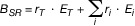
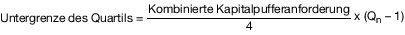
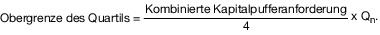

# Verordnung zur angemessenen Eigenmittelausstattung von Instituten, Institutsgruppen, Finanzholding-Gruppen und gemischten Finanzholding-Gruppen (SolvV 2014)

Ausfertigungsdatum
:   2013-12-06

Fundstelle
:   BGBl I: 2013, 4168

Stand: Ersetzt V 7610-2-29 v. 14.12.2006 I 2926;
Zuletzt geändert durch
:   Art. 1 V v. 19.2.2019 I 122

Änderung durch
:   Art. 1 V v. 20.9.2021 I 4306 (Nr. 67) textlich nachgewiesen, dokumentarisch noch nicht abschließend bearbeitet

    Diese Verordnung dient der Umsetzung der Richtlinie 2013/36/EU des
    Europäischen Parlaments und des Rates vom 26. Juni 2013 über den
    Zugang zur Tätigkeit von Kreditinstituten und die Beaufsichtigung von
    Kreditinstituten und Wertpapierfirmen, zur Änderung der Richtlinie
    2002/87/EG und zur Aufhebung der Richtlinien 2006/48/EG und 2006/49/EG
    (ABl. L 176 vom 27.6.2013, S. 338) sowie der Anpassung des
    Aufsichtsrechts an die Verordnung (EU) Nr. 575/2013 des Europäischen
    Parlaments und des Rates vom 26. Juni 2013 über Aufsichtsanforderungen
    an Kreditinstitute und Wertpapierfirmen und zur Änderung der
    Verordnung (EU) Nr. 646/2012 (ABl. L 176 vom 27.6.2013, S. 1).
[^F783290_01_BJNR416800013]: 

## Eingangsformel

Auf Grund des § 10 Absatz 1 Satz 1 und 3 des Kreditwesengesetzes, der
durch Artikel 1 Nummer 21 des Gesetzes vom 28. August 2013 (BGBl. I S.
3395) neu gefasst worden ist, sowie auf Grund des § 10a Absatz 7 Satz
1 und 3 des Kreditwesengesetzes, der durch Artikel 1 Nummer 22 des
Gesetzes vom 28. August 2013 (BGBl. I S. 3395) neu gefasst worden ist,
jeweils im Benehmen mit der Deutschen Bundesbank und nach Anhörung der
Spitzenverbände der Institute verordnet das Bundesministerium der
Finanzen:

## Teil 1 - Allgemeine Vorschriften

### § 1 Anwendungsbereich

(1) Die §§ 3 bis 23 dieser Verordnung sind ergänzend zu den Artikeln
92 bis 386 der Verordnung (EU) Nr. 575/2013 des Europäischen
Parlaments und des Rates vom 26. Juni 2013 über Aufsichtsanforderungen
an Kreditinstitute und zur Änderung der Verordnung (EU) Nr. 648/2012
(ABl. L 176 vom 27.6.2013, S. 1; L 208 vom 2.8.2013, S. 68; L 321 vom
30\.11.2013, S. 6; L 193 vom 21.7.2015, S. 166; L 20 vom 25.1.2017, S.
3; L 13 vom 17.1.2020, S. 58; L 335 vom 13.10.2020, S. 20; L 405 vom
2\.12.2020, S. 79), die zuletzt durch die Verordnung (EU) 2020/873
(ABl. L 204 vom 26.6.2020, S. 4) geändert worden ist, von denjenigen
Instituten und Gruppen anzuwenden, die sich nach der Verordnung (EU)
Nr. 575/2013 oder nach dem Kreditwesengesetz an die Vorgaben dieser
Artikel halten müssen.

(2) Die §§ 24 bis 31 dieser Verordnung sind ergänzend zu den Artikeln
25 bis 91 der Verordnung (EU) Nr. 575/2013 von denjenigen Instituten
und Gruppen anzuwenden, die sich nach der Verordnung (EU) Nr. 575/2013
oder nach dem Kreditwesengesetz an die Vorgaben dieser Artikel halten
müssen. Dies gilt nicht für Kreditinstitute, die gemäß Artikel 6
Absatz 4 der Verordnung (EU) Nr. 1024/2013 des Rates vom 15. Oktober
2013 zur Übertragung besonderer Aufgaben im Zusammenhang mit der
Aufsicht über Kreditinstitute auf die Europäische Zentralbank (ABl. L
287 vom 29.10.2013, S. 63, L 218 vom 19.8.2015, S. 82) sowie gemäß
Teil IV und Artikel 147 Absatz 1 der Verordnung (EU) Nr. 468/2014 der
Europäischen Zentralbank vom 16. April 2014 zur Einrichtung eines
Rahmenwerks für die Zusammenarbeit zwischen der Europäischen
Zentralbank und den nationalen zuständigen Behörden und den nationalen
benannten Behörden innerhalb des einheitlichen Aufsichtsmechanismus
(SSM-Rahmenverordnung) (ABl. L 141 vom 14.5.2014, S. 1) als bedeutend
eingestuft werden.

(3) § 32 dieser Verordnung ist ergänzend zu den Artikeln 11 bis 91 der
Verordnung (EU) Nr. 575/2013 von denjenigen Instituten und Gruppen
anzuwenden, die sich nach der Verordnung (EU) Nr. 575/2013 oder nach
dem Kreditwesengesetz an die Vorgaben dieser Artikel halten müssen.

(4) Die §§ 33 bis 37 dieser Verordnung sind ergänzend zu den §§ 10c
bis 10i des Kreditwesengesetzes von denjenigen Instituten und Gruppen
anzuwenden, die sich an die Vorgaben dieser Vorschriften halten
müssen.

### § 2 Anträge und Anzeigen

(1) Anträge, über die nach der Verordnung (EU) Nr. 575/2013 die
Bundesanstalt für Finanzdienstleistungsaufsicht (Bundesanstalt) als
zuständige Behörde zu entscheiden hat, sind vorbehaltlich abweichender
Bestimmungen in schriftlicher Form bei der Bundesanstalt zu stellen.

(2) Anzeigen nach der Verordnung (EU) Nr. 575/2013, für die die
Bundesanstalt die zuständige Behörde ist, sind bei der Bundesanstalt
und in Kopie bei der Deutschen Bundesbank einzureichen.

(3) Meldungen, die aufgrund regelmäßiger Berichtspflichten nach der
Verordnung (EU) Nr. 575/2013 gegenüber der Bundesanstalt als
zuständige Behörde erfolgen müssen, sind über die Deutsche Bundesbank
einzureichen.

## Teil 2 - Nähere Bestimmungen zu den Eigenmittelanforderungen für Institute und Gruppen

### Kapitel 1 - Interne Ansätze

#### Abschnitt 1 - Allgemeine Bestimmungen

##### § 3 Prüfungen bei Verwendung eines erlaubnispflichtigen Ansatzes zur Ermittlung der Mindesteigenmittelanforderungen

(1) Hat die Bundesanstalt einem Institut die Erlaubnis zur Verwendung
eines Ansatzes zur Ermittlung der Mindesteigenmittelanforderungen
erteilt, dessen Verwendung nach den Artikeln 92 bis 386 der Verordnung
(EU) Nr. 575/2013 einer Erlaubnis der zuständigen Behörde bedarf
(erlaubnispflichtiger Ansatz zur Ermittlung der
Mindesteigenmittelanforderungen), muss sie regelmäßig überprüfen, ob
die Anforderungen für diesen Ansatz nach dieser Verordnung und nach
der Verordnung (EU) Nr. 575/2013 erfüllt sind. Die Überprüfung findet
mindestens alle drei Jahre statt. Daneben prüft die Bundesanstalt im
Rahmen von Nachschauprüfungen, ob festgestellte Mängel abgestellt und
Auflagen erfüllt sind.

(2) Die Bundesanstalt kann die Eignungsprüfung für die Erlaubnis zur
Verwendung eines Ansatzes sowie die regelmäßige Überprüfung und die
Nachschauprüfungen auf der Grundlage einer Prüfung nach § 44 Absatz 1
Satz 2 des Kreditwesengesetzes durchführen. Die Prüfung nach § 44
Absatz 1 Satz 2 des Kreditwesengesetzes führt in der Regel die
Deutsche Bundesbank durch.

(3) Bei der Überprüfung berücksichtigt die Bundesanstalt insbesondere
Veränderungen der Geschäftstätigkeit des Instituts sowie die Anwendung
dieses erlaubnispflichtigen Ansatzes zur Ermittlung der
Mindesteigenmittelanforderungen auf neue Produkte. Zusätzlich
überprüft sie, ob das Institut für diesen Ansatz ausgereifte und
aktuelle Techniken und Praktiken anwendet.

(4) Bei der Überprüfung berücksichtigt die Bundesanstalt die Analysen
und Benchmarks der Europäischen Bankenaufsichtsbehörde.

##### § 4 Maßnahmen bei Mängeln bei der Risikoerfassung oder der Nichteinhaltung der Anforderungen bei Verwendung eines erlaubnispflichtigen Ansatzes zur Ermittlung der Mindesteigenmittelanforderungen

(1) Sofern die Bundesanstalt feststellt, dass die Ausgestaltung eines
erlaubnispflichtigen Ansatzes zur Ermittlung der
Mindesteigenmittelanforderungen durch das Institut erhebliche Mängel
bei der Erfassung des Risikos aufweist, sorgt die Bundesanstalt dafür,
dass diese Mängel beseitigt werden, oder sie ergreift angemessene
Maßnahmen, die geeignet sind, um die aus den Mängeln resultierenden
Folgen abzuschwächen. Geeignete Maßnahmen sind insbesondere die
Festsetzung höherer Multiplikationsfaktoren oder zusätzlicher
Eigenmittelanforderungen.

(2) Deutet bei einem von der Bundesanstalt erlaubten internen Modell
für Marktrisiken das zahlreiche Auftreten von in Artikel 366 der
Verordnung (EU) Nr. 575/2013 genannten Überschreitungen darauf hin,
dass das Modell nicht oder nicht mehr präzise genug ist, widerruft die
Bundesanstalt die Erlaubnis zur Verwendung dieses internen Modells für
Marktrisiken oder ordnet angemessene Maßnahmen an, die gewährleisten,
dass das Modell umgehend verbessert wird.

(3) Wenn ein Institut nicht mehr sämtliche Anforderungen für einen
erlaubnispflichtigen Ansatz zur Ermittlung der
Mindesteigenmittelanforderungen nach dieser Verordnung und nach der
Verordnung (EU) Nr. 575/2013 erfüllt, verlangt die Bundesanstalt

1.  vom Institut einen Plan, wie und in welchem Zeitraum eine zeitnahe
    Rückkehr zur Regelkonformität gewährleistet werden soll, oder

2.  dass das Institut in einer die Bundesanstalt zufriedenstellenden Weise
    nachweist, dass die Auswirkungen des Nichteinhaltens der Anforderungen
    unwesentlich sind, sofern das nach der Verordnung (EU) Nr. 575/2013
    für diesen Ansatz zulässig ist.

Sind die Eigenmittelanforderungen im Falle des Satzes 1 wahrscheinlich
unzureichend, ordnet die Bundesanstalt, soweit angemessen, zusätzliche
Eigenmittelanforderungen an.

(4) Erscheint es nach Einschätzung der Bundesanstalt unwahrscheinlich,
dass ein vom Institut vorgelegter Plan nach Absatz 3 Satz 1 Nummer 1
zur vollständigen Wiedereinhaltung der Anforderungen führt oder der
vom Institut vorgesehene Umsetzungszeitraum unangemessen lang ist,
verlangt die Bundesanstalt eine Nachbesserung des Plans.

(5) Erscheint es nach Einschätzung der Bundesanstalt unwahrscheinlich,
dass das Institut die Anforderungen innerhalb einer angemessenen Frist
wieder einhalten wird, und hat das Institut, sofern das nach der
Verordnung (EU) Nr. 575/2013 für diesen Ansatz zulässig ist, auch
keinen zufriedenstellenden Nachweis der Unwesentlichkeit der
Auswirkungen des Nichteinhaltens der Anforderungen nach Absatz 3 Satz
1 Nummer 2 erbracht, muss die Bundesanstalt die Erlaubnis zur
Verwendung des Ansatzes durch das Institut

1.  insgesamt widerrufen oder

2.  auf solche Bereiche beschränken, in denen die Einhaltung der
    Anforderungen gegeben ist oder innerhalb einer angemessenen Frist
    erreicht werden kann, sofern dies innerhalb der von der Bundesanstalt
    festgelegten Grenzen für die Nichtanwendung dieses Ansatzes möglich
    ist.

Insbesondere für risikogewichtete Positionsbeträge nach dem auf
internen Beurteilungen beruhenden Ansatz (IRB-Ansatz) im Sinne von
Artikel 107 Absatz 1 der Verordnung (EU) Nr. 575/2013 kann die
Bundesanstalt separat für einzelne Arten von Kreditrisikopositionen
die Zustimmung nach Artikel 143 Absatz 2 der Verordnung (EU) Nr.
575/2013 zur Verwendung des IRB-Ansatzes oder zur Verwendung eigener
Schätzungen von Verlustausfallquoten (Loss Given Defaults – LGDs) im
Sinne von Artikel 4 Absatz 1 Nummer 55 der Verordnung (EU) Nr.
575/2013 oder Konversionsfaktoren für diese Art von
Kreditrisikopositionen widerrufen.

##### § 5 Berechnungen und Meldungen für das aufsichtliche Benchmarking bei der Anwendung interner Ansätze

(1) Ein Institut, das seine Eigenmittelanforderungen anhand interner
Ansätze ermittelt, hat die Eigenmittelanforderungen einmal jährlich
für diejenigen seiner Risikopositionen oder Positionen zu berechnen
und zu melden, die in den diese internen Ansätze betreffenden
Referenzportfolios der Bundesanstalt oder der Europäischen
Bankenaufsichtsbehörde enthalten sind. Diese Berechnungs- und
Meldepflicht gilt nicht, soweit die Eigenmittelanforderungen mit dem
fortgeschrittenen Messansatz nach Artikel 312 Absatz 2 Satz 1 der
Verordnung (EU) Nr. 575/2013 berechnet werden.

(2) Die Berechnungen und Meldungen nach Absatz 1 müssen nach dem Stand
zum Ende des Kalenderjahres und für jeden vom Institut verwendeten
internen Ansatz getrennt erfolgen. Die Ergebnisse dieser Berechnungen
sind mit einer Erläuterung der bei der Ermittlung der Ergebnisse
angewandten Methoden jeweils bis zum
30\. Geschäftstag              nach Ablauf eines Kalenderjahres
getrennt für Referenzportfolios der Bundesanstalt und der Europäischen
Bankenaufsichtsbehörde bei der Deutschen Bundesbank sowie bei der
Europäischen Bankenaufsichtsbehörde zu melden. Hierbei sind die
technischen Durchführungsstandards nach Artikel 78 Absatz 8 der
Richtlinie 2013/36/EU des Europäischen Parlaments und des Rates vom
26\. Juni 2013 über den Zugang zur Tätigkeit von Kreditinstituten und
die Beaufsichtigung von Kreditinstituten und Wertpapierfirmen, zur
Änderung der Richtlinie 2002/87/EG und zur Aufhebung der Richtlinien
2006/48/EG und 2006/49/EG (ABl. L 176 vom 27.6.2013, S. 338) zu
berücksichtigen.

(3) Die Bundesanstalt kann von Absatz 1 Satz 1 und Absatz 2 Satz 1
abweichende Berechnungstermine oder von Absatz 2 Satz 2 abweichende
Meldefristen bestimmen.

##### § 6 Aufsichtliches Benchmarking interner Ansätze

(1) Die Bundesanstalt erstellt eigene Referenzportfolios
ausschließlich in Abstimmung mit der Europäischen
Bankenaufsichtsbehörde.

(2) Die Bundesanstalt verwendet die von den Instituten nach § 5
gemeldeten Informationen, um die Spanne der risikogewichteten
Positionsbeträge und der Eigenmittelanforderungen für diejenigen
Risikopositionen oder Positionen eines Referenzportfolios zu
überwachen, die sich aus den internen Ansätzen der meldepflichtigen
Institute ergeben.

(3) Die Bundesanstalt bewertet mindestens jährlich die Qualität dieser
internen Ansätze und konzentriert sich dabei insbesondere auf

1.  die internen Ansätze, die erhebliche Unterschiede in Bezug auf die
    Eigenmittelanforderungen für dieselbe Risikoposition oder Position
    aufweisen,

2.  die internen Ansätze, die eine besonders hohe oder niedrige Vielfalt
    aufweisen, sowie

3.  auf Fälle einer signifikanten und systematischen Unterschätzung der
    Eigenmittelanforderungen.

(4) Ergeben die Überwachung nach Absatz 2 und die Bewertung nach
Absatz 3, dass die Ergebnisse interner Ansätze bestimmter Institute
erheblich von den Ergebnissen der Mehrheit der Institute abweichen
oder dass nur wenige Gemeinsamkeiten bei den internen Ansätzen
bestehen, so dass sich eine weite Spanne an Ergebnissen ergibt,
untersucht die Bundesanstalt die Gründe hierfür. Wenn klar
festgestellt werden kann, dass der interne Ansatz eines Instituts zu
einer Unterschätzung der Eigenmittelanforderungen führt, die nicht auf
Unterschiede bei den zugrundeliegenden Risiken der Risikopositionen
oder Positionen zurückgeführt werden kann, ergreift die Bundesanstalt
angemessene Abhilfemaßnahmen. Bei ihrer Entscheidung über die
Angemessenheit von Abhilfemaßnahmen sind die Ziele, die mit der
Verwendung interner Ansätze verfolgt werden, zu berücksichtigen und
ist sicherzustellen, dass die Abhilfemaßnahmen

1.  nicht zu Standardisierungen oder bevorzugten Methoden führen,

2.  keine falschen Anreize schaffen und

3.  kein Herdenverhalten verursachen.

#### Abschnitt 2 - Ergänzende Regelungen zum IRB-Ansatz

##### § 7 IRB-Ansatz-Eignungsprüfungen für interne Ratingsysteme und Beteiligungsrisikomodelle

(1) Die Bundesanstalt entscheidet über die Erlaubnis zur Verwendung
des IRB-Ansatzes nach Artikel 143 Absatz 2 sowie über die nach Artikel
143 Absatz 3 der Verordnung (EU) Nr. 575/2013 erlaubnispflichtigen
Veränderungen (IRB-Ansatz-Eignungsprüfung) auf der Grundlage einer
Prüfung gemäß § 44 Absatz 1 Satz 2 des Kreditwesengesetzes. Die
Prüfung gemäß § 44 Absatz 1 Satz 2 des Kreditwesengesetzes führt in
der Regel die Deutsche Bundesbank durch. IRB-Ansatz-Eignungsprüfungen
führt die Bundesanstalt erst dann durch, wenn das Institut

1.  mit den Ratingsystemen, die zur IRB-Ansatz-Eignungsprüfung angemeldet
    sind, und den Ratingsystemen, die das Institut bereits für den IRB-
    Ansatz verwenden darf, insgesamt die IRB-Ansatz-Eintrittsschwelle nach
    § 10 Absatz 1 erreicht oder überschreitet,

2.  für jedes der zur IRB-Ansatz-Eignungsprüfung angemeldeten
    Ratingsysteme und Beteiligungsrisikomodelle die
    Verwendungsanforderungen nach Artikel 144 Absatz 1 Buchstabe f der
    Verordnung (EU) Nr. 575/2013 erfüllt hat und, im Falle eines
    Ratingsystems, die Erfahrungsanforderungen nach Artikel 145 der
    Verordnung (EU) Nr. 575/2013 in einem Umfang erfüllt hat, der die
    vollständige Erfüllung der Erfahrungsanforderungen bis zum
    beabsichtigten Zeitpunkt der Nutzung des Ratingsystems ermöglicht,

3.  für jedes der zur IRB-Ansatz-Eignungsprüfung angemeldeten
    Ratingsysteme und Beteiligungsrisikomodelle das Neugeschäft nach § 14
    Absatz 1 Satz 2 Nummer 1 sowie mindestens einen signifikanten Teil des
    zu berücksichtigenden Bestandsgeschäfts nach § 14 Absatz 2 mit diesem
    Ratingsystem oder Beteiligungsrisikomodell erfasst hat, und

4.  glaubhaft machen kann, dass es zu dem laut Umsetzungsplan angestrebten
    Zeitpunkt der Verwendung für den IRB-Ansatz die für das Ratingsystem
    oder Beteiligungsrisikomodell einzuhaltenden Nutzungsvoraussetzungen
    für den IRB-Ansatz einhalten wird.

(2) Im Rahmen einer IRB-Ansatz-Eignungsprüfung, die nach bereits
erteilter Erlaubnis des Instituts zum IRB-Ansatz durchgeführt wird,
beurteilt die Bundesanstalt auch, ob das Institut den bei der
Erlaubnis zum IRB-Ansatz genehmigten Umsetzungsplan einhält.

(3) Bei bedeutenden Änderungen von Ratingsystemen oder
Beteiligungsrisikomodellen muss ein Institut vor Verwendung des
geänderten Ratingsystems oder Beteiligungsrisikomodells für den IRB-
Ansatz mit der Bundesanstalt abstimmen, ob die Bundesanstalt die
Einschätzung des Instituts teilt, dass es sich nicht um eine
wesentliche Änderung handelt, die nach Artikel 143 Absatz 3 Buchstabe
b der Verordnung (EU) Nr. 575/2013 einer Erlaubnis der Bundesanstalt
bedarf.

##### § 8 Zeitraum für die Umsetzung des IRB-Ansatzes

(1) Der nach Artikel 148 Absatz 2 der Verordnung (EU) Nr. 575/2013 von
der Bundesanstalt festzulegende maximal zulässige Zeitraum, in dem der
IRB-Ansatz umzusetzen ist, beträgt stets fünf Jahre. Er beginnt,
sobald die Bundesanstalt die Verwendung des IRB-Ansatzes durch das
Institut erlaubt hat (IRB-Ansatz-Zulassung).

(2) Der Zeitraum, in dem die Fähigkeit zur Ermittlung der
Eigenmittelanforderungen unter Verwendung des
Kreditrisikostandardansatzes (KSA) nach Artikel 148 Absatz 4 der
Verordnung (EU) Nr. 575/2013 beizubehalten ist, beginnt mit der IRB-
Ansatz-Zulassung und endet mit Erreichen des aufsichtlichen
Referenzpunkts nach § 10 Absatz 2 für die Umsetzung des IRB-Ansatzes.

(3) Hat ein Institut bereits eine IRB-Ansatz-Zulassung auf der
Grundlage eines Umsetzungsplans erhalten, nach dem es für sämtliche
Kreditrisikopositionen, für die das Institut den IRB-Ansatz verwendet
(IRB-Ansatz-Positionen), die nicht der Forderungsklasse Mengengeschäft
nach Artikel 147 Absatz 2 Buchstabe d der Verordnung (EU) Nr. 575/2013
zugeordnet sind, keine eigenen Schätzungen der LGD oder des
Konversionsfaktors verwendet, und hat das Institut auf der Grundlage
dieses Umsetzungsplans bereits die IRB-Ansatz-Austrittsschwelle nach §
10 Absatz 3 erreicht, dann gilt auch bei einem nachfolgenden
Umsetzungsplan, nach dem das Institut für solche IRB-Ansatz-Positionen
eigene Schätzungen der LGD oder des Konversionsfaktors verwendet, der
in Absatz 2 genannte Zeitraum als bereits beendet.

##### § 9 Anforderungen an die Umsetzung des IRB-Ansatzes

(1) Bei der Umsetzung des IRB-Ansatzes muss ein Institut die
Anforderungen der Absätze 2 bis 4 erfüllen; diese Anforderungen bilden
die nach Artikel 148 Absatz 3 Satz 1 der Verordnung (EU) Nr. 575/2013
zu konkretisierenden Anforderungen.

(2) Für die Kreditrisikopositionen des Instituts muss

1.  zum Zeitpunkt der IRB-Ansatz-Zulassung bereits die IRB-Ansatz-
    Eintrittsschwelle erreicht sein,

2.  spätestens nach zweieinhalb Jahren der aufsichtliche Referenzpunkt für
    die Umsetzung des IRB-Ansatzes erreicht sein,

3.  bis zum Ende des maximal zulässigen Zeitraums für die Umsetzung des
    IRB-Ansatzes die IRB-Ansatz-Austrittsschwelle erreicht sein.

(3) Einmal erreichte Schwellen müssen weiter eingehalten werden.

(4) Hat das Institut bereits eine IRB-Ansatz-Zulassung auf der
Grundlage eines Umsetzungsplans erhalten, nach dem es für IRB-Ansatz-
Positionen, die nicht der Forderungsklasse Mengengeschäft nach Artikel
147 Absatz 2 Buchstabe d der Verordnung (EU) Nr. 575/2013 zugeordnet
sind, keine eigenen Schätzungen der LGD oder des Konversionsfaktors
verwendet, und hat das Institut auf Grundlage dieses Umsetzungsplans
bereits die IRB-Ansatz-Austrittsschwelle erreicht, dann muss das
Institut bei einem nachfolgenden Umsetzungsplan, nach dem es für
derartige IRB-Ansatz-Positionen eigene Schätzungen der LGD oder des
Konversionsfaktors verwendet, bis zur Feststellung der Bundesanstalt,
dass der aufsichtliche Referenzpunkt erreicht worden ist,
sicherstellen, dass es die Positionsbeträge im IRB-Ansatz
(risikogewichtete IRB-Ansatz-Positionsbeträge) für diese IRB-Ansatz-
Positionen ermitteln kann, ohne eigene Schätzungen der LGD oder des
Konversionsfaktors zu verwenden.

##### § 10 IRB-Ansatz-Schwellen; aufsichtlicher Referenzpunkt

(1) Die IRB-Ansatz-Eintrittsschwelle ist erreicht, wenn für die
Kreditrisikopositionen des Instituts sowohl der Abdeckungsgrad für
IRB-Ansatz-Positionswerte als auch der Abdeckungsgrad für
risikogewichtete IRB-Ansatz-Positionsbeträge mit geeigneten
Ratingsystemen und Beteiligungsrisikomodellen jeweils mindestens 50
Prozent beträgt.

(2) Der aufsichtliche Referenzpunkt ist erreicht, wenn der
Abdeckungsgrad für IRB-Ansatz-Positionswerte und der Abdeckungsgrad
für risikogewichtete IRB-Ansatz-Positionsbeträge mit geeigneten
Ratingsystemen und Beteiligungsrisikomodellen jeweils mindestens 80
Prozent beträgt.

(3) Die IRB-Ansatz-Austrittsschwelle ist erreicht, wenn der
Abdeckungsgrad für IRB-Ansatz-Positionswerte nach § 11 Absatz 1 und
der Abdeckungsgrad für risikogewichtete IRB-Ansatz-Positionsbeträge
nach § 11 Absatz 2 mit geeigneten Ratingsystemen jeweils mindestens 92
Prozent beträgt. Die Bundesanstalt kann den Prozentsatz für die IRB-
Ansatz-Austrittsschwelle für ein Institut auf Antrag absenken, wenn
das Institut dafür wichtige Gründe dargelegt hat.

##### § 11 Berechnung des Abdeckungsgrads

(1) Der Abdeckungsgrad für IRB-Ansatz-Positionswerte ist der Quotient
aus

1.  der Summe der IRB-Ansatz-Positionswerte für sämtliche IRB-Ansatz-
    Positionen, die nach § 12 im Zähler für den Abdeckungsgrad
    berücksichtigt werden dürfen, jedoch für IRB-Ansatz-Positionen nach §
    13 Absatz 4 Nummer 2 Buchstabe a nur in Höhe des nach Absatz 4
    berücksichtigungsfähigen Prozentsatzes des IRB-Ansatz-Positionswerts,
    und

2.  der Summe der KSA-Positionswerte für sämtliche KSA-Positionen und der
    IRB-Ansatz-Positionswerte für sämtliche IRB-Ansatz-Positionen, die
    nach § 13 jeweils im Nenner für den Abdeckungsgrad zu berücksichtigen
    sind.

(2) Der Abdeckungsgrad für risikogewichtete IRB-Ansatz-
Positionsbeträge ist der Quotient aus

1.  der Summe der risikogewichteten IRB-Ansatz-Positionsbeträge für
    sämtliche IRB-Ansatz-Positionen, die nach § 12 im Zähler für den
    Abdeckungsgrad berücksichtigt werden dürfen, jedoch für IRB-Ansatz-
    Positionen nach § 13 Absatz 4 Nummer 2 Buchstabe a nur in Höhe des
    nach Absatz 5 berücksichtigungsfähigen Prozentsatzes des
    risikogewichteten IRB-Ansatz-Positionsbetrags, soweit diese
    risikogewichteten IRB-Ansatz-Positionsbeträge bei der Ermittlung des
    Gesamtrisikopositionsbetrags nach Artikel 92 Absatz 3 der Verordnung
    (EU) Nr. 575/2013 berücksichtigt oder bei der Ermittlung des harten
    Kernkapitals nach Artikel 36 Absatz 1 Buchstabe k dieser EU-Verordnung
    in Abzug gebracht worden sind, und

2.  der Summe der risikogewichteten KSA-Positionsbeträge für sämtliche
    KSA-Positionen und der risikogewichteten IRB-Ansatz-Positionsbeträge
    für sämtliche IRB-Ansatz-Positionen, die nach § 13 jeweils im Nenner
    für den Abdeckungsgrad zu berücksichtigen sind, soweit diese
    risikogewichteten Positionsbeträge bei der Ermittlung des
    Gesamtrisikopositionsbetrags nach Artikel 92 Absatz 3 der Verordnung
    (EU) Nr. 575/2013 berücksichtigt oder bei der Ermittlung des harten
    Kernkapitals nach Artikel 36 Absatz 1 Buchstabe k dieser EU-Verordnung
    in Abzug gebracht worden sind.

(3) Zur Bestimmung der Abdeckungsgrade nach den Absätzen 1 und 2 sind
die Positionswerte und die risikogewichteten Positionsbeträge nach dem
Verfahren zu ermitteln, das zu dem betreffenden Zeitpunkt für jede der
Risikopositionen laut Umsetzungsplan vorgesehen oder durch die IRB-
Ansatz-Zulassung bereits festgelegt ist.

(4) Der berücksichtigungsfähige Prozentsatz des IRB-Ansatz-
Positionswerts einer IRB-Ansatz-Position nach § 13 Absatz 4 Nummer 2
Buchstabe a ist der Quotient aus

1.  der Summe der IRB-Ansatz-Positionswerte für diejenigen
    Kreditrisikopositionen des verbrieften Portfolios, die das Institut
    mit einem Ratingsystem erfasst hat, das das Institut mit Zustimmung
    der Bundesanstalt nach Artikel 143 Absatz 2 der Verordnung (EU) Nr.
    575/2013 für den IRB-Ansatz verwenden darf, und

2.  der Summe der Positionswerte für sämtliche Kreditrisikopositionen des
    verbrieften Portfolios.

(5) Der berücksichtigungsfähige Prozentsatz des risikogewichteten IRB-
Ansatz-Positionsbetrags einer IRB-Ansatz-Position nach § 13 Absatz 4
Nummer 2 Buchstabe a ist der Quotient aus

1.  der Summe der risikogewichteten IRB-Ansatz-Positionsbeträge für
    diejenigen Kreditrisikopositionen des verbrieften Portfolios, die das
    Institut mit einem Ratingsystem erfasst hat, das das Institut mit
    Zustimmung der Bundesanstalt nach Artikel 143 Absatz 2 der Verordnung
    (EU) Nr. 575/2013 für den IRB-Ansatz verwenden darf, und

2.  der Summe der risikogewichteten Positionsbeträge für sämtliche
    Kreditrisikopositionen des verbrieften Portfolios.

##### § 12 Im Zähler für den Abdeckungsgrad zu berücksichtigende IRB-Ansatz-Positionen

(1) Wenn das Institut für relevante Arten von Risikopositionen die
Verwendung eigener Schätzungen der LGD oder des Konversionsfaktors
anstrebt, bestimmen sich die im Zähler zu berücksichtigenden IRB-
Ansatz-Positionen nach Absatz 2 Nummer 2, anderenfalls nach Absatz 2
Nummer 1. Nach Satz 1 relevante Arten von Risikopositionen sind
sämtliche IRB-Ansatz-Positionen, die der IRB-Ansatz-Forderungsklasse
Zentralregierungen, Institute oder Unternehmen nach Artikel 147 Absatz
2 Buchstabe b, c und d der Verordnung (EU) Nr. 575/2013 zugeordnet
sind, mit Ausnahme von

1.  Risikopositionen, die aus angekauften Forderungen resultieren,

2.  Spezialfinanzierungspositionen nach Artikel 147 Absatz 8 der
    Verordnung (EU) Nr. 575/2013, hinsichtlich derer sich das Institut für
    die Verwendung der Risikogewichtskategorien nach Artikel 153 Absatz 5
    dieser EU-Verordnung entschieden hat, und

3.  Risikopositionen, die bei Anwendung des Standardansatzes für
    Kreditrisiken der Forderungsklasse gedeckte Schuldverschreibungen nach
    Artikel 112 Buchstabe l der Verordnung (EU) Nr. 575/2013 zuzuordnen
    wären und für die das Institut nach einheitlicher Wahl für alle
    derartigen IRB-Ansatz-Positionen nicht beabsichtigt, eigene
    Schätzungen von LGD und Konversionsfaktor zu verwenden.

(2) Im Zähler für einen Abdeckungsgrad dürfen,

1.  falls das Institut für keine der nach Absatz 1 Satz 2 relevanten Arten
    von Risikopositionen die Verwendung eigener Schätzungen der LGD oder
    des Konversionsfaktors anstrebt, sämtliche zur Grundgesamtheit für den
    Abdeckungsgrad gehörende Risikopositionen berücksichtigt werden, die
    mit Ratingsystemen oder Beteiligungsrisikomodellen erfasst worden
    sind, die das Institut mit Zustimmung der Bundesanstalt nach Artikel
    143 Absatz 2 der Verordnung (EU) Nr. 575/2013 für den IRB-Ansatz
    verwenden darf, und für die sämtliche Risikoparameter geschätzt
    werden, die zur Ermittlung des risikogewichteten IRB-Ansatz-
    Positionsbetrags der jeweiligen Risikoposition mindestens selbst
    geschätzt werden müssen;

2.  falls es nach Absatz 1 Satz 2 relevante Arten von Risikopositionen
    gibt, für die das Institut die Verwendung eigener Schätzungen der LGD
    oder des Konversionsfaktors anstrebt, sämtliche zur Grundgesamtheit
    für den Abdeckungsgrad gehörenden Risikopositionen berücksichtigt
    werden, die,

    a)  sofern sie zu den nach Absatz 1 Satz 2 relevanten Arten von
        Risikopositionen gehören, mit Ratingsystemen erfasst worden sind, die
        das Institut mit Zustimmung der Bundesanstalt nach Artikel 143 Absatz
        2 der Verordnung (EU) Nr. 575/2013 für den IRB-Ansatz verwenden darf
        und die sowohl zur Schätzung der PD im Sinne von Artikel 4 Absatz 1
        Nummer 54 der Verordnung (EU) Nr. 575/2013 als auch zur Schätzung der
        LGD und, soweit anwendbar, des Konversionsfaktors geeignet sind, oder

    b)  sofern sie nicht zu den nach Absatz 1 Satz 2 relevanten Arten von
        Risikopositionen gehören, mit Ratingsystemen oder
        Beteiligungsrisikomodellen erfasst worden sind, die das Institut mit
        Zustimmung der Bundesanstalt nach Artikel 143 Absatz 2 der Verordnung
        (EU) Nr. 575/2013 für den IRB-Ansatz verwenden darf, und für die
        sämtliche Risikoparameter geschätzt werden, die zur Ermittlung des
        risikogewichteten IRB-Ansatz-Positionsbetrags der jeweiligen
        Risikoposition mindestens selbst geschätzt werden müssen.

(3) Die Entscheidung, für welche Geschäftsbereiche nach Artikel 142
Absatz 1 Nummer 3 der Verordnung (EU) Nr. 575/2013 die
Risikopositionen bei Vorliegen der Voraussetzungen nach Absatz 2 im
Zähler berücksichtigt werden sollen, liegt beim Institut. Sie muss
einheitlich für alle Risikopositionen, die zum Neugeschäft oder zum zu
berücksichtigenden Bestandsgeschäft eines Geschäftsbereichs gehören,
ausgeübt und im Umsetzungsplan dargelegt werden. IRB-Ansatz-Positionen
des zu berücksichtigenden Bestandsgeschäfts eines Geschäftsbereichs
dürfen im Zähler für einen Abdeckungsgrad erst dann berücksichtigt
werden, wenn sämtliche dieser IRB-Ansatz-Positionen nach Absatz 2 im
Zähler für diesen Abdeckungsgrad berücksichtigt werden dürfen.

##### § 13 Im Nenner für den Abdeckungsgrad zu berücksichtigende Positionen; Grundgesamtheit für den Abdeckungsgrad

(1) Im Nenner für einen Abdeckungsgrad sind sämtliche IRB-Ansatz-
Positionen und KSA-Positionen zu berücksichtigen, die zur
Grundgesamtheit für den Abdeckungsgrad gehören.

(2) Zur Grundgesamtheit für den Abdeckungsgrad gehören sämtliche KSA-
Positionen und IRB-Ansatz-Positionen, mit Ausnahme von

1.  Beteiligungspositionen nach Artikel 147 Absatz 2 Buchstabe e der
    Verordnung (EU) Nr. 575/2013,

2.  Verbriefungspositionen nach Artikel 4 Absatz 1 Nummer 62 der
    Verordnung (EU) Nr. 575/2013,

3.  sonstigen kreditunabhängigen Aktiva nach Artikel 147 Absatz 2
    Buchstabe g der Verordnung (EU) Nr. 575/2013,

4.  Risikopositionen in der Form eines Anteils an einem Organismus für
    gemeinsame Anlagen (OGA) im Sinne des Artikels 4 Absatz 1 Nummer 7 der
    Verordnung (EU) Nr. 575/2013,

5.  Risikopositionen, die nach der Entscheidung des Instituts nach Artikel
    150 der Verordnung (EU) Nr. 575/2013 ohne zeitliche Beschränkung von
    der Anwendung des IRB-Ansatzes ausgenommen sind,

6.  Risikopositionen eines gruppenangehörigen Unternehmens, das nicht das
    zuständige Institut für die Einhaltung der Eigenmittelanforderungen
    auf zusammengefasster Basis der Gruppe nach Artikel 11 Absatz 1 oder 2
    der Verordnung (EU) Nr. 575/2013 ist, und für die die Bundesanstalt
    festgestellt hat, dass bereits vor Inkrafttreten dieser Verordnung vom
    Institut dargelegte wichtige Gründe bestanden haben, diese
    Risikopositionen nicht zu berücksichtigen,

7.  Risikopositionen, die zu einer übergangsweise ausnahmefähigen Art von
    Kreditrisikopositionen gehören, oder

8.  Risikopositionen, für die nach Artikel 107 Absatz 2 Satz 1 der
    Verordnung (EU) Nr. 575/2013 zur Berechnung der risikogewichteten
    Positionsbeträge die Behandlung gemäß Kapitel 6 Abschnitt 9 anzuwenden
    ist.

(3) Nach Absatz 2 Satz 1 Nummer 7 übergangsweise ausnahmefähig ist
eine Art von Kreditrisikopositionen nach Artikel 142 Absatz 1 Nummer 2
der Verordnung (EU) Nr. 575/2013, wenn die Bundesanstalt

1.  festgestellt hat, dass vom Institut dargelegte wichtige Gründe
    vorliegen, diese Art von Kreditrisikopositionen in der Grundgesamtheit
    für den Abdeckungsgrad nicht zu berücksichtigen,

2.  einem vom Institut vorgelegten Plan zugestimmt hat, dessen Umsetzung
    über einen angemessenen Zeitraum zum Wegfall der Gründe für die
    Nichtberücksichtigung dieser Art von Kreditrisikopositionen nach
    Nummer 1 führt.

Ein wichtiger Grund nach Satz 1 Nummer 1 liegt insbesondere dann vor,
wenn die Kreditrisikopositionen

1.  durch die Geschäfte eines Geschäftsbereichs nach Artikel 142 Absatz 1
    Nummer 3 der Verordnung (EU) Nr. 575/2013 begründet worden sind, der
    zu dem Zeitpunkt, an dem das Institut der Bundesanstalt seinen
    Umsetzungsplan für den IRB-Ansatz vorgelegt hat, noch nicht zu den
    Geschäftsbereichen des Instituts gehörte, und

2.  nicht in den Anwendungsbereich eines Ratingsystems oder
    Beteiligungsrisikomodells fallen, das das Institut bereits mit
    Zustimmung der Bundesanstalt nach Artikel 143 Absatz 2 der Verordnung
    (EU) Nr. 575/2013 für den IRB-Ansatz verwenden darf oder nach seinem
    von der Bundesanstalt genehmigten Umsetzungsplan für den IRB-Ansatz zu
    verwenden beabsichtigt.

(4) Ein Institut darf unter Einhaltung der Anforderungen nach § 11
Absatz 3 zusätzlich die folgenden IRB-Ansatz-Positionen in der
Grundgesamtheit für den Abdeckungsgrad berücksichtigen:

1.  IRB-Ansatz-Positionen, die der Forderungsklasse Beteiligungen nach
    Artikel 147 Absatz 2 Buchstabe e der Verordnung (EU) Nr. 575/2013
    zuzuordnen sind und mittels eines Ratingsystems oder
    Beteiligungsrisikomodells, das das Institut mit Zustimmung der
    Bundesanstalt nach Artikel 143 Absatz 2 der Verordnung (EU) Nr.
    575/2013 für den IRB-Ansatz verwenden darf, erfasst worden sind,

2.  Verbriefungspositionen nach Artikel 2 Nummer 19 der Verordnung (EU)
    2017/2402 des Europäischen Parlaments und des Rates vom 12. Dezember
    2017 zur Festlegung eines allgemeinen Rahmens für Verbriefungen und
    zur Schaffung eines spezifischen Rahmens für einfache, transparente
    und standardisierte Verbriefung und zur Änderung der Richtlinien
    2009/65/EG, 2009/138/EG, 2011/61/EU und der Verordnungen (EG) Nr.
    1060/2009 und (EU) Nr. 648/2012 (ABl. L 347 vom 28.12.2017, S. 35),
    für die das Institut

    a)  SEC-IRBA nach Artikel 259 der Verordnung (EU) Nr. 575/2013 verwendet
        und dafür Kreditrisikopositionen des verbrieften Portfolios mit einem
        Ratingsystem erfasst hat, das das Institut mit Zustimmung der
        Bundesanstalt nach Artikel 143 Absatz 2 der Verordnung (EU) Nr.
        575/2013 für den IRB-Ansatz verwenden darf, oder

    b)  mit Zustimmung der Bundesanstalt ein internes Einstufungsverfahren
        nach Artikel 265 der Verordnung (EU) Nr. 575/2013 verwendet,

3.  Risikopositionen in der Form eines Anteils an einem OGA im Sinne des
    Artikels 152 der Verordnung (EU) Nr. 575/2013, die das Institut nach
    Artikel 152 Absatz 1 Satz 1 dieser EU-Verordnung unter Verwendung der
    Methoden für den IRB-Ansatz berücksichtigt hat,

4.  Risikopositionen, die das Institut nach Artikel 150 Absatz 1
    Buchstaben d bis j oder nach Artikel 500a Absatz 3 der Verordnung (EU)
    Nr. 575/2013 von der Anwendung des IRB-Ansatzes ausgenommen hat und
    unter Verwendung des KSA bei der Ermittlung des
    Gesamtrisikopositionsbetrags nach Artikel 92 Absatz 3 der Verordnung
    (EU) Nr. 575/2013 berücksichtigt, sofern das Institut

    a)  diese Risikopositionen unter Verwendung von Ratingsystemen oder
        Beteiligungsrisikomodellen erfasst hat, die es mit Zustimmung der
        Bundesanstalt nach Artikel 143 Absatz 2 der Verordnung (EU) Nr.
        575/2013 für den IRB-Ansatz verwenden darf, und

    b)  für diese Risikopositionen IRB-Ansatz-Risikogewichte und
        risikogewichtete IRB-Ansatz-Positionsbeträge so ermittelt hat, als
        wären die Kreditrisikopositionen IRB-Ansatz-Positionen.

(5) Für Risikopositionen nach Absatz 4 Nummer 4 muss das Institut die
so ermittelten IRB-Ansatz-Risikogewichte und risikogewichteten IRB-
Ansatz-Positionsbeträge statt der KSA-Risikogewichte oder
risikogewichteten KSA-Positionsbeträge für die Berücksichtigung der
betreffenden Kreditrisikopositionen im Zähler und im Nenner für einen
Abdeckungsgrad berücksichtigen.

##### § 14 Auslaufender Geschäftsbereich; Neugeschäft; zu berücksichtigendes Bestandsgeschäft

(1) Ein auslaufender Geschäftsbereich ist ein Geschäftsbereich nach
Artikel 142 Absatz 1 Nummer 3 der Verordnung (EU) Nr. 575/2013, in dem
das Institut weder neue Kreditrisikopositionen durch den Abschluss
neuer Geschäfte eingeht noch einzugehen beabsichtigt. Für einen
Geschäftsbereich, der kein auslaufender Geschäftsbereich ist und auf
dessen Risikopositionen sich der Anwendungsbereich nach Artikel 143
Absatz 3 Satz 2 der Verordnung (EU) Nr. 575/2013 eines laut
Umsetzungsplan des Instituts für den IRB-Ansatz zu verwendenden
Ratingsystems erstreckt, besteht

1.  das Neugeschäft aus den Geschäften, die ab der Verwendung dieses
    Ratingsystems zur Erfüllung der Überprüfungsanforderungen nach Artikel
    144 Absatz 1 Buchstabe f der Verordnung (EU) Nr. 575/2013 begründet
    werden, und

2.  das Bestandsgeschäft aus den Geschäften, die in den Anwendungsbereich
    des Ratingsystems fallen und nicht zum Neugeschäft zählen.

(2) Zu berücksichtigendes Bestandsgeschäft ist das Bestandsgeschäft
eines nicht auslaufenden Geschäftsbereichs, das kein ausnahmefähiges
Bestandsgeschäft ist. Ausnahmefähiges Bestandsgeschäft ist das
Bestandsgeschäft eines nicht auslaufenden Geschäftsbereichs, für den
das Institut

1.  gegenüber der Bundesanstalt nachgewiesen hat, dass die Erfassung mit
    dem für diesen Geschäftsbereich für den IRB-Ansatz zu verwendenden
    Ratingsystem derzeit einen unverhältnismäßig hohen Aufwand im
    Vergleich zu dem Aufwand darstellen würde, der vom Institut für die
    Erfassung von vergleichbarem Bestandsgeschäft mit einem Ratingsystem
    üblicherweise betrieben wird, und

2.  darauf basierend entschieden hat, das gesamte Bestandsgeschäft
    gegenwärtig nicht mit dem für diesen Geschäftsbereich für den IRB-
    Ansatz zu verwendenden Ratingsystem zu erfassen.

##### § 15 Dauerhafte Ausnahme von der Anwendung des IRB-Ansatzes für steuererhebende Kirchen und Religionsgesellschaften

Wenn es sich bei den Schuldnern um inländische Kirchen oder
Religionsgesellschaften handelt, die in der Rechtsform einer
Körperschaft des öffentlichen Rechts verfasst sind und die aufgrund
des Artikels 140 des Grundgesetzes in Verbindung mit Artikel 137
Absatz 6 der Weimarer Reichsverfassung vom 11. August 1919 (RGBl. S.
1383) Steuern erheben oder am Steueraufkommen der steuererhebenden
kirchlichen Körperschaften teilhaben, dann gelten für die dauerhafte
Anwendung des KSA nach Artikel 150 Absatz 1 Buchstabe a der Verordnung
(EU) Nr. 575/2013 die Voraussetzungen einer geringen Anzahl
wesentlicher Schuldner und eines unverhältnismäßig großen Aufwands für
die Einführung eines Ratingsystems ohne weiteren Nachweis als erfüllt.

##### § 16 Erheblichkeitsschwelle für den 90-Tage-Verzug

(1) Für die Zwecke der Bestimmung der Wesentlichkeit einer
überfälligen Verbindlichkeit nach Artikel 178 Absatz 1 Buchstabe b der
Verordnung (EU) Nr. 575/2013 wird die einheitliche
Erheblichkeitsschwelle für Risikopositionen aus dem Mengengeschäft im
Sinne von Artikel 1 Absatz 1 Unterabsatz 1 der Delegierten Verordnung
(EU) 2018/171 der Kommission vom 19. Oktober 2017 zur Ergänzung der
Verordnung (EU) Nr. 575/2013 des Europäischen Parlaments und des Rates
durch technische Regulierungsstandards bezüglich der
Erheblichkeitsschwelle für überfällige Verbindlichkeiten (ABl. L 32
vom 6.2.2018, S. 1) nach Maßgabe der Absätze 2 und 3 und die
einheitliche Erheblichkeitsschwelle für nicht dem Mengengeschäft
zuzuordnende Risikopositionen im Sinne von Artikel 2 Absatz 1 der
Delegierten Verordnung (EU) 2018/171 nach Maßgabe der Absätze 4 und 5
festgelegt.

(2) Die absolute Komponente der Erheblichkeitsschwelle im Sinne von
Artikel 1 Absatz 2 Unterabsatz 2 der Delegierten Verordnung (EU)
2018/171 wird nach der Maßgabe festgelegt, dass für
Kreditrisikopositionen, die der Risikopositionsklasse Risikopositionen
aus dem Mengengeschäft nach Artikel 112 Buchstabe h oder Artikel 147
Absatz 2 Buchstabe d der Verordnung (EU) Nr. 575/2013 zugeordnet
werden, der zu verwendende Höchstbetrag für die Summe aller
überfälligen Verbindlichkeiten eines Schuldners 100 Euro beträgt.
Dieser Höchstbetrag gilt auch für Risikopositionen aus dem
Mengengeschäft, wenn ein Institut gemäß Artikel 178 Absatz 1
Unterabsatz 2 der Verordnung (EU) Nr. 575/2013 die Ausfalldefinition
auf einzelne Kreditfazilitäten und nicht auf die gesamten
Verbindlichkeiten eines Kreditnehmers anwendet.

(3) Die relative Komponente der Erheblichkeitsschwelle im Sinne von
Artikel 1 Absatz 2 Unterabsatz 3 der Delegierten Verordnung (EU)
2018/171 wird nach der Maßgabe festgelegt, dass für
Kreditrisikopositionen, die der Risikopositionsklasse Risikopositionen
aus dem Mengengeschäft nach Artikel 112 Buchstabe h oder Artikel 147
Absatz 2 Buchstabe d der Verordnung (EU) Nr. 575/2013 zugeordnet
werden, der zu verwendende Prozentsatz 1 Prozent beträgt. Dieser
Prozentsatz ist auch für Risikopositionen aus dem Mengengeschäft zu
verwenden, wenn ein Institut gemäß Artikel 178 Absatz 1 Unterabsatz 2
der Verordnung (EU) Nr. 575/2013 die Ausfalldefinition auf einzelne
Kreditfazilitäten und nicht auf die gesamten Verbindlichkeiten eines
Kreditnehmers anwendet.

(4) Die absolute Komponente der Erheblichkeitsschwelle im Sinne von
Artikel 2 Absatz 2 in Verbindung mit Artikel 1 Absatz 2 Unterabsatz 2
der Delegierten Verordnung (EU) 2018/171 wird nach der Maßgabe
festgelegt, dass für Kreditrisikopositionen, die nicht unter die
Absätze 2 und 3 fallen und keine Beteiligungsrisikopositionen nach
Artikel 112 Buchstabe p oder Artikel 147 Absatz 2 Buchstabe e der
Verordnung (EU) Nr. 575/2013 sind, der zu verwendende Höchstbetrag für
die Summe aller überfälligen Verbindlichkeiten eines Schuldners 500
Euro beträgt.

(5) Die relative Komponente der Erheblichkeitsschwelle im Sinne von
Artikel 2 Absatz 2 in Verbindung mit Artikel 1 Absatz 2 Unterabsatz 3
der Delegierten Verordnung (EU) 2018/171 wird nach der Maßgabe
festgelegt, dass für Kreditrisikopositionen, die nicht unter die
Absätze 2 und 3 fallen und keine Beteiligungsrisikopositionen nach
Artikel 112 Buchstabe p oder Artikel 147 Absatz 2 Buchstabe e der
Verordnung (EU) Nr. 575/2013 sind, der zu verwendende Prozentsatz 1
Prozent beträgt.

##### § 17 Berücksichtigungsfähige Arten von Beteiligungen für die Ausnahme von der Anwendung des IRB-Ansatzes bis 31. Dezember 2017

Für die übergangsweise Ausnahme bis 31. Dezember 2017 von der
Anwendung des IRB-Ansatzes nach den Vorschriften des Artikels 495 der
Verordnung (EU) Nr. 575/2013 darf ein Institut nach Maßgabe der
Bundesanstalt sämtliche Arten von Beteiligungspositionen
berücksichtigen, die es nicht bereits nach Artikel 150 Absatz 1
Buchstaben g und h der Verordnung (EU) Nr. 575/2013 von der Anwendung
des IRB-Ansatzes ausnehmen darf.

#### Abschnitt 3 - Ergänzende Regelungen zur IMM

##### § 18 IMM-Eignungsprüfung

(1) Die Bundesanstalt entscheidet über die nach Artikel 283 Absatz 1
der Verordnung (EU) Nr. 575/2013 erforderliche Erlaubnis zur
Verwendung der auf einem internen Modell beruhenden Methode (IMM-
Eignungsprüfung) auf der Grundlage einer Prüfung nach § 44 Absatz 1
Satz 2 des Kreditwesengesetzes. Die Prüfung nach § 44 Absatz 1 Satz 2
des Kreditwesengesetzes führt in der Regel die Deutsche Bundesbank
durch.

(2) Wesentliche Änderungen und Erweiterungen
der              der auf einem internen Modell beruhenden Methode
(IMM) bedürfen einer erneuten Erlaubnis. Absatz 1 gilt entsprechend.
Im Einzelfall kann die Bundesanstalt einer Änderung oder Erweiterung
nach Satz 1 ohne vorherige IMM-Eignungsprüfung zustimmen, sofern die
Änderung oder Erweiterung nach Einschätzung der Bundesanstalt in
Abstimmung mit der Deutschen Bundesbank auch ohne IMM-Eignungsprüfung
angemessen beurteilt werden kann. Bedeutende und unbedeutende
Änderungen erfordern keine erneute IMM-Eignungsprüfung, sind aber der
Bundesanstalt und der Deutschen Bundesbank schriftlich anzuzeigen;
bedeutende Änderungen sind vor Verwendung der geänderten IMM mit der
Bundesanstalt abzustimmen.

#### Abschnitt 4 - Ergänzende Regelungen zu internen Einstufungsverfahren

##### § 19 Eignungsprüfungen für interne Einstufungsverfahren

(1) Eine Erlaubnis zur Anwendung eines internen Einstufungsverfahrens
nach Artikel 265 Absatz 2 der Verordnung (EU) Nr. 575/2013 erteilt die
Bundesanstalt für jedes interne Einstufungsverfahren, das nach einer
Eignungsprüfung die Erlaubnisvoraussetzungen nach Artikel 265 Absatz 2
dieser EU-Verordnung erfüllt und sämtliche in seinen Anwendungsbereich
fallende Verbriefungspositionen vollständig erfasst. Institute haben
vor der Erteilung einer Erlaubnis darzulegen, dass sie über
hinreichende Erfahrungen mit solchen internen Verfahren verfügen, die
den Anforderungen des Artikels 265 Absatz 2 der Verordnung (EU) Nr.
575/2013 im Wesentlichen entsprochen haben und deren Anwendungsbereich
im Wesentlichen dem des internen Einstufungsverfahrens entspricht, für
das eine Erlaubnis beantragt wurde.

(2) Eignungsprüfungen ordnet die Bundesanstalt auf der Grundlage von §
44 Absatz 1 Satz 2 des Kreditwesengesetzes für jedes interne
Einstufungsverfahren an,

1.  das ein Institut zur Eignungsprüfung angemeldet hat, und

2.  das ein Institut zum Zeitpunkt der Eignungsprüfung über einen
    angemessenen Zeitraum als maßgebliches Instrument zur Messung und
    Steuerung der wesentlichen Verbriefungspositionen verwendet hat, die
    in den Anwendungsbereich des internen Einstufungsverfahren fallen, und
    von dem das Institut danach überzeugt ist, dass es für seine
    Einsatzzwecke geeignet ist.

Die Prüfung nach § 44 Absatz 1 Satz 2 des Kreditwesengesetzes führt in
der Regel die Deutsche Bundesbank durch.

(3) Der durch das Institut zu bestimmende Anwendungsbereich eines
internen Einstufungsverfahrens wird durch die nach ihren
Risikoeigenschaften, insbesondere der Art der einer
Verbriefungsposition zugrundeliegenden verbrieften
Kreditrisikopositionen, den Ausstattungsmerkmalen der
Verbriefungsposition, Verbriefungstransaktion oder eines
Verbriefungsprogramms, in dessen Rahmen fortlaufend Wertpapiere
überwiegend in der Form von Geldmarktpapieren mit einer
Ursprungslaufzeit von längstens einem Jahr begeben werden (ABCP-
Programm) oder dem verfügbaren Datenumfang, von diesem internen
Einstufungsverfahren erfassbare Art von Verbriefungspositionen
gebildet.

#### Abschnitt 5 - Ergänzende Regelungen zu operationellen Risiken

##### § 20 AMA-Eignungsprüfung

(1) Die Bundesanstalt entscheidet über die nach Artikel 312 Absatz 2
Satz 1 der Verordnung (EU) Nr. 575/2013 erforderliche Erlaubnis zur
Verwendung eines fortgeschrittenen Messansatzes (AMA-Eignungsprüfung)
auf der Grundlage einer Prüfung nach § 44 Absatz 1 Satz 2 des
Kreditwesengesetzes. Die Prüfung gemäß § 44 Absatz 1 Satz 2 des
Kreditwesengesetzes führt in der Regel die Deutsche Bundesbank durch.

(2) Bei einer erneuten Genehmigung aufgrund wesentlicher Änderungen
und Erweiterungen des fortgeschrittenen Messansatzes nach Artikel 312
Absatz 2 Satz 2 der Verordnung (EU) Nr. 575/2013 gilt Absatz 1
entsprechend. Im Einzelfall kann die Bundesanstalt einer Änderung oder
Erweiterung nach Satz 1 ohne vorherige AMA-Eignungsprüfung zustimmen,
sofern die Änderung oder Erweiterung nach Einschätzung der
Bundesanstalt in Abstimmung mit der Deutschen Bundesbank auch ohne
AMA-Eignungsprüfung angemessen beurteilt werden kann. Bedeutende und
unbedeutende Änderungen erfordern keine erneute AMA-Eignungsprüfung,
sind aber der Bundesanstalt und der Deutschen Bundesbank schriftlich
anzuzeigen. Bedeutende Änderungen sind vor Verwendung des geänderten
fortgeschrittenen Messansatzes mit der Bundesanstalt abzustimmen.

#### Abschnitt 6 - Ergänzende Regelungen zu internen Modellen für Marktrisiken

##### § 21 Interne Modelle-Eignungsprüfung

(1) Die Bundesanstalt entscheidet über die nach Artikel 363 Absatz 1
der Verordnung (EU) Nr. 575/2013 erforderliche Erlaubnis zur
Verwendung interner Modelle (Interne Modelle-Eignungsprüfung) auf der
Grundlage einer Prüfung nach § 44 Absatz 1 Satz 2 des
Kreditwesengesetzes. Die Prüfung gemäß § 44 Absatz 1 Satz 2 des
Kreditwesengesetzes führt in der Regel die Deutsche Bundesbank durch.

(2) Für eine erneute, erweiterte oder zusätzliche Erlaubnis aufgrund
wesentlicher Änderungen oder Erweiterungen interner Modelle,
insbesondere der Hinzunahme zusätzlicher Risikokategorien, nach
Artikel 363 Absatz 2 der Verordnung (EU) Nr. 575/2013 gilt Absatz 1
grundsätzlich entsprechend. Im Einzelfall kann die Bundesanstalt einer
Änderung oder Erweiterung nach Satz 1 ohne vorherige Interne Modelle-
Eignungsprüfung zustimmen, sofern die zu beurteilende Änderung oder
Erweiterung nach Einschätzung der Bundesanstalt in Abstimmung mit der
Deutschen Bundesbank auch ohne Interne Modelle-Eignungsprüfung
angemessen beurteilt werden kann. Bedeutende und unbedeutende
Änderungen erfordern keine erneute Interne Modelle-Eignungsprüfung,
sind aber der Bundesanstalt und der Deutschen Bundesbank schriftlich
anzuzeigen. Bedeutende Änderungen sind vor Verwendung des geänderten
internen Modells mit der Bundesanstalt abzustimmen.

(3) Ein Institut, das nach erteilter Erlaubnis der Bundesanstalt
interne Modelle verwendet, darf die Eigenmittelanforderungen für die
Risikokategorien nach Artikel 363 Absatz 1 der Verordnung (EU) Nr.
575/2013 nur bei Vorliegen wesentlicher Gründe und nur nach erneuter
Erlaubnis der Bundesanstalt nach den Artikeln 326 bis 361 der
Verordnung (EU) Nr. 575/2013 ermitteln. Die Erlaubnis ist vom Institut
unter Angabe der Gründe bei der Bundesanstalt zu beantragen.

### Kapitel 2 - Vorgaben für die Bemessung des Beleihungswerts

#### § 22 Vorgaben für die Bemessung des Beleihungswerts von Immobilien

Wenn ein Institut für eine Immobilie einen Beleihungswert nach Artikel
4 Absatz 1 Nummer 74 der Verordnung (EU) Nr. 575/2013 für Zwecke der
Artikel 92 bis 386 der Verordnung (EU) Nr. 575/2013 verwenden will,
die dafür strenge Vorgaben in Rechts- oder Verwaltungsvorschriften der
Mitgliedstaaten für die Bemessung des Beleihungswerts erfordert, muss
der Beleihungswert

1.  nach § 16 Absatz 2 Satz 1 bis 3 des Pfandbriefgesetzes in Verbindung
    mit der Beleihungswertermittlungsverordnung vom 12. Mai 2006 (BGBl. I
    S. 1175) in der jeweils geltenden Fassung ermittelt worden sein,

2.  nach den Vorschriften für die Beleihungswertermittlung nach § 7 Absatz
    7 des Gesetzes über Bausparkassen unter Beachtung einer von der
    Bundesanstalt genehmigten Bestimmung nach § 5 Absatz 2 Nummer 3 des
    Gesetzes über Bausparkassen ermittelt worden sein,

3.  sich auf eine Immobilie in einem anderen Staat des Europäischen
    Wirtschaftsraums beziehen und auf Grundlage von in diesem Staat
    gültigen strengen Vorgaben in Rechts- oder Verwaltungsvorschriften
    ermittelt worden sein, die die Bundesanstalt als mit der
    Beleihungswertermittlungsverordnung gleichwertig anerkannt hat,

4.  ein anders ermittelter nachhaltig erzielbarer Wert sein, der den
    Anforderungen des § 16 Absatz 2 Satz 1 bis 3 des Pfandbriefgesetzes
    genügt.

### Kapitel 3 - Nähere Bestimmungen zu den Übergangsvorschriften für die Eigenmittelanforderungen

#### § 23 Prozentsätze für die Kapitalquoten

Abweichend von Artikel 92 Absatz 1 Buchstabe a und b der Verordnung
(EU) Nr. 575/2013 haben die Institute in dem Zeitraum vom 1. Januar
2014 bis 31. Dezember 2014 eine harte Kernkapitalquote von mindestens
4 Prozent und eine Kernkapitalquote von mindestens 5,5 Prozent
vorzuhalten.

## Teil 3 - Nähere Bestimmungen zur Ermittlung der Eigenmittel

### Kapitel 1 - Nähere Bestimmungen zu den Übergangsvorschriften für die Ermittlung der Eigenmittel

#### § 24 Prozentsätze für die Berücksichtigung von in der Bilanz ausgewiesenen nicht realisierten Verlusten aus Vermögensgegenständen oder Verbindlichkeiten, die zum beizulegenden Zeitwert bewertet werden

Abweichend von Artikel 35 der Verordnung (EU) Nr. 575/2013 haben die
Institute bei der Berechnung des harten Kernkapitals im Zeitraum vom
1\. Januar 2014 bis zum 31. Dezember 2017 folgende Prozentsätze der in
ihrer Bilanz veröffentlichten nicht realisierten Verluste aus
Vermögensgegenständen oder Verbindlichkeiten, die zum beizulegenden
Zeitwert bewertet werden, abzuziehen:

1.  20 Prozent im Zeitraum vom 1. Januar 2014 bis 31. Dezember 2014;

2.  40 Prozent im Zeitraum vom 1. Januar 2015 bis 31. Dezember 2015;

3.  60 Prozent im Zeitraum vom 1. Januar 2016 bis 31. Dezember 2016;

4.  80 Prozent im Zeitraum vom 1. Januar 2017 bis 31. Dezember 2017.

#### § 25 Prozentsätze für die Berücksichtigung von in der Bilanz ausgewiesenen nicht realisierten Gewinnen aus Vermögensgegenständen oder Verbindlichkeiten, die zum beizulegenden Zeitwert bewertet werden

Abweichend von Artikel 35 der Verordnung (EU) Nr. 575/2013 dürfen die
Institute bei der Berechnung des harten Kernkapitals im Zeitraum vom
1\. Januar 2015 bis zum 31. Dezember 2017 folgende Prozentsätze der in
ihrer Bilanz veröffentlichten nicht realisierten Gewinne aus
Vermögensgegenständen oder Verbindlichkeiten, die zum beizulegenden
Zeitwert bewertet werden, nicht anrechnen:

1.  60 Prozent im Zeitraum vom 1. Januar 2015 bis 31. Dezember 2015;

2.  40 Prozent im Zeitraum vom 1. Januar 2016 bis 31. Dezember 2016;

3.  20 Prozent im Zeitraum vom 1. Januar 2017 bis 31. Dezember 2017.

#### § 26 Prozentsätze für die Abzüge vom harten Kernkapital, zusätzlichen Kernkapital und Ergänzungskapital

(1) Für die Zwecke der Übergangsvorschriften nach Artikel 468 Absatz
4, Artikel 469 Absatz 1 Buchstabe a und c, Artikel 474 Buchstabe a und
Artikel 476 Buchstabe a der Verordnung (EU) Nr. 575/2013 gelten die
folgenden Prozentsätze:

1.  20 Prozent im Zeitraum vom 1. Januar 2014 bis 31. Dezember 2014;

2.  40 Prozent im Zeitraum vom 1. Januar 2015 bis 31. Dezember 2015;

3.  60 Prozent im Zeitraum vom 1. Januar 2016 bis 31. Dezember 2016;

4.  80 Prozent im Zeitraum vom 1. Januar 2017 bis 31. Dezember 2017.

(2) Die in Absatz 1 genannten Prozentsätze gelten im jeweiligen
Zeitraum entsprechend für

1.  die Abzüge nach Artikel 36 Absatz 1 Buchstabe a
    bis h                    der Verordnung (EU) Nr. 575/2013 mit Ausnahme
    des Abzugs latenter Steuern, die von der künftigen Rentabilität
    abhängig sind und aus zeitlichen Differenzen resultieren,

2.  den nach Artikel 48 der Verordnung (EU) Nr. 575/2013 vorgeschriebenen
    Abzug des aggregierten Betrags latenter Steuern, die von der künftigen
    Rentabilität abhängig sind und aus zeitlichen Differenzen resultieren,

3.  den nach Artikel 48 der Verordnung (EU) Nr. 575/2013 vorgeschriebenen
    Abzug der Posten nach Artikel 36 Absatz 1 Buchstabe i der Verordnung
    (EU) Nr. 575/2013,

4.  jeden vorgeschriebenen Abzug nach Artikel 56 Buchstabe b bis d der
    Verordnung (EU) Nr. 575/2013 und

5.  jeden vorgeschriebenen Abzug nach Artikel 66 Buchstabe b bis d der
    Verordnung (EU) Nr. 575/2013.

(3) Abweichend von den in Absatz 1 genannten Prozentsätzen gelten für
die in Artikel 36 Absatz 1 Buchstabe c der Verordnung (EU) Nr.
575/2013 genannten Posten, die vor dem 1. Januar 2014 bestanden, für
die Zwecke des Artikels 469 Absatz 1 Buchstabe c der Verordnung (EU)
Nr. 575/2013 folgende Prozentsätze:

1.  0 Prozent im Zeitraum vom 1. Januar 2014 bis 31. Dezember 2014;

2.  10 Prozent im Zeitraum vom 1. Januar 2015 bis 31. Dezember 2015;

3.  20 Prozent im Zeitraum vom 1. Januar 2016 bis 31. Dezember 2016;

4.  30 Prozent im Zeitraum vom 1. Januar 2017 bis 31. Dezember 2017;

5.  40 Prozent im Zeitraum vom 1. Januar 2018 bis 31. Dezember 2018;

6.  50 Prozent im Zeitraum vom 1. Januar 2019 bis 31. Dezember 2019;

7.  60 Prozent im Zeitraum vom 1. Januar 2020 bis 31. Dezember 2020;

8.  70 Prozent im Zeitraum vom 1. Januar 2021 bis 31. Dezember 2021;

9.  80 Prozent im Zeitraum vom 1. Januar 2022 bis 31. Dezember 2022;

10. 90 Prozent im Zeitraum vom 1. Januar 2023 bis 31. Dezember 2023.

#### § 27 Prozentsätze für die Anerkennung von nicht als Minderheitenbeteiligungen geltenden Instrumenten und Positionen im konsolidierten harten Kernkapital

(1) Abweichend von Teil 2 Titel III der Verordnung (EU) Nr. 575/2013
können Instrumente und Posten, die nach § 10a Absatz 6 Satz 1 und 2
und Absatz 7 Satz 1 des Kreditwesengesetzes in der bis zum 31.
Dezember 2013 geltenden Fassung zu den konsolidierten Rücklagen
gerechnet worden wären und aus einem der in Artikel 479 Absatz 1
Buchstabe a bis d der Verordnung (EU) Nr. 575/2013 aufgeführten Gründe
nicht länger als konsolidiertes hartes Kernkapital anerkennungsfähig
sind, zu den folgenden Prozentsätzen weiterhin zum konsolidierten
harten Kernkapital gerechnet werden:

1.  80 Prozent im Zeitraum vom 1. Januar 2014 bis 31. Dezember 2014;

2.  60 Prozent im Zeitraum vom 1. Januar 2015 bis 31. Dezember 2015;

3.  40 Prozent im Zeitraum vom 1. Januar 2016 bis 31. Dezember 2016;

4.  20 Prozent im Zeitraum vom 1. Januar 2017 bis 31. Dezember 2017.

(2) Abweichend von Absatz 1 dürfen Instrumente und Posten, die nach §
10a Absatz 6 Satz 10 des Kreditwesengesetzes in der bis zum 31.
Dezember 2013 geltenden Fassung zu den konsolidierten Rücklagen
gerechnet worden wären und aus einem der in Artikel 479 Absatz 1
Buchstabe a bis d der Verordnung (EU) Nr. 575/2013 aufgeführten Gründe
nicht länger als konsolidiertes hartes Kernkapital anerkennungsfähig
sind, bei der Anwendung der Regelungen von Teil 2 Titel III der
Verordnung (EU) Nr. 575/2013 im Zeitraum vom 1. Januar 2014 bis 31.
Dezember 2017 nicht mehr zum konsolidierten harten Kernkapital
gerechnet werden.

#### § 28 Faktoren für die Anerkennung von Minderheitsbeteiligungen und qualifiziertem zusätzlichem Kernkapital sowie Ergänzungskapital

Abweichend von Artikel 84 Absatz 1 Buchstabe b, Artikel 85 Absatz 1
Buchstabe b und Artikel 87 Absatz 1 Buchstabe b der Verordnung (EU)
Nr. 575/2013 sind die dort genannten Prozentsätze im Zeitraum vom 1.
Januar 2014 bis 31. Dezember 2017 mit folgenden Faktoren zu
multiplizieren:

1.  dem Faktor 0,2 im Zeitraum vom 1. Januar 2014 bis 31. Dezember 2014;

2.  dem Faktor 0,4 im Zeitraum vom 1. Januar 2015 bis 31. Dezember 2015;

3.  dem Faktor 0,6 im Zeitraum vom 1. Januar 2016 bis 31. Dezember 2016;

4.  dem Faktor 0,8 im Zeitraum vom 1. Januar 2017 bis 31. Dezember 2017.

#### § 29 Prozentsätze für Abzüge nach den Artikeln 32 bis 36, 56 und 66 der Verordnung (EU) Nr. 575/2013

(1) Abweichend von den Artikeln 32 bis 36, 56 und 66 der Verordnung
(EU) Nr. 575/2013 gelten im Zeitraum vom 1. Januar 2014 bis 31.
Dezember 2017 für die in Artikel 481 Absatz 1 der Verordnung (EU) Nr.
575/2013 von den Instituten geforderten Anpassungen für Abzüge, die
gemäß § 10 Absatz 2a Satz 2, Absatz 6 Satz 1 und 2 sowie Absatz 6a
Nummer 1, 2 und 4 des Kreditwesengesetzes in der bis zum 31. Dezember
2013 geltenden Fassung vorgeschrieben sind, folgende Prozentsätze:

1.  80 Prozent im Zeitraum vom 1. Januar 2014 bis 31. Dezember 2014;

2.  60 Prozent im Zeitraum vom 1. Januar 2015 bis 31. Dezember 2015;

3.  40 Prozent im Zeitraum vom 1. Januar 2016 bis 31. Dezember 2016 und

4.  20 Prozent im Zeitraum vom 1. Januar 2017 bis 31. Dezember 2017.

(2) Bei Anwendung der Regelungen der Artikel 32 bis 36, 56 und 66 der
Verordnung (EU) Nr. 575/2013 gilt im Zeitraum vom 1. Januar 2014 bis
31\. Dezember 2017 für die nach § 10a Absatz 6 Satz 9 des
Kreditwesengesetzes in der bis zum 31. Dezember 2013 geltenden Fassung
von den Instituten geforderte Anpassung ein Prozentsatz von 0 Prozent.

(3) Der Unterschiedsbetrag, der nach § 2 Absatz 1 der
Konzernabschlussüberleitungsverordnung in der bis zum 31. Dezember
2013 geltenden Fassung im Ergänzungskapital berücksichtigungsfähig
ist, kann im Zeitraum vom 1. Januar 2014 bis 31. Dezember 2017
multipliziert mit den folgenden Prozentsätzen weiterhin dem
Ergänzungskapital zugerechnet werden:

1.  80 Prozent im Zeitraum vom 1. Januar 2014 bis 31. Dezember 2014;

2.  60 Prozent im Zeitraum vom 1. Januar 2015 bis 31. Dezember 2015;

3.  40 Prozent im Zeitraum vom 1. Januar 2016 bis 31. Dezember 2016 und

4.  20 Prozent im Zeitraum vom 1. Januar 2017 bis 31. Dezember 2017.

#### § 30 Prozentsatz für die Anpassung nach Artikel 36 Absatz 1 Buchstabe i und Artikel 49 Absatz 1 und 3 der Verordnung (EU) Nr. 575/2013

Abweichend von Artikel 36 Absatz 1 Buchstabe i
und Artikel 49              Absatz 1 und 3 der Verordnung (EU) Nr.
575/2013 gilt für die in Artikel 481 Absatz 2 der Verordnung (EU) Nr.
575/2013 genannte Ausnahme vom Abzug im Zeitraum vom 1. Januar 2014
bis 31. Dezember 2014 ein Prozentsatz von 50 Prozent.

#### § 31 Prozentsätze für die Begrenzung der unter Bestandsschutz fallenden Instrumente des harten Kernkapitals, zusätzlichen Kernkapitals und Ergänzungskapitals nach Artikel 484 Absatz 3 bis 5 der Verordnung (EU) Nr. 575/2013

Für die Anwendung des Artikels 484 Absatz 3 bis 5 der Verordnung (EU)
Nr. 575/2013 gelten im Zeitraum vom 1. Januar 2014 bis 31. Dezember
2021 für die Anerkennung der unter Bestandsschutz fallenden
Instrumente und Posten des harten Kernkapitals, des zusätzlichen
Kernkapitals und des Ergänzungskapitals folgende Prozentsätze:

1.  80 Prozent im Zeitraum vom 1. Januar 2014 bis 31. Dezember 2014;

2.  70 Prozent im Zeitraum vom 1. Januar 2015 bis 31. Dezember 2015;

3.  60 Prozent im Zeitraum vom 1. Januar 2016 bis 31. Dezember 2016;

4.  50 Prozent im Zeitraum vom 1. Januar 2017 bis 31. Dezember 2017;

5.  40 Prozent im Zeitraum vom 1. Januar 2018 bis 31. Dezember 2018;

6.  30 Prozent im Zeitraum vom 1. Januar 2019 bis 31. Dezember 2019;

7.  20 Prozent im Zeitraum vom 1. Januar 2020 bis 31. Dezember 2020;

8.  10 Prozent im Zeitraum vom 1. Januar 2021 bis 31. Dezember 2021.

### Kapitel 2 - Behandlung der nach der Äquivalenzmethode bewerteten Beteiligungen bei Gruppen

#### § 32 Behandlung der nach der Äquivalenzmethode bewerteten Beteiligungen bei Anwendung des Verfahrens nach § 10a Absatz 5 des Kreditwesengesetzes

(1) Beteiligungen an Instituten, Finanzunternehmen oder Anbietern von
Nebendienstleistungen, die nach der Äquivalenzmethode gemäß IAS 28.13
in der jeweils geltenden Fassung der Verordnung (EG) Nr. 1725/2003 der
Kommission vom 29. September 2003 betreffend die Übernahme bestimmter
internationaler Rechnungslegungsstandards in Übereinstimmung mit der
Verordnung (EG) Nr. 1606/2002 des Europäischen Parlaments und des
Rates (ABl. L 261 vom 13.10.2003, S. 1) bewertet werden, können,
vorbehaltlich der Anwendung des § 10a Absatz 4 des
Kreditwesengesetzes, mit ihrem anteiligen bilanziellen Eigenkapital
aus dem Abschluss, differenziert nach Eigenkapitalbestandteilen, in
die Zusammenfassung nach § 10a Absatz 5 des Kreditwesengesetzes
einbezogen werden. Der nach der Äquivalenzmethode ermittelte
fortgeführte Buchwert der Beteiligung ist vom harten Kernkapital der
Gruppe abzuziehen, wobei der darin enthaltene Firmenwert in der
Abzugsposition nach Artikel 36 Absatz 1 Buchstabe b der Verordnung
(EU) Nr. 575/2013 zu erfassen ist.

(2) Absatz 1 gilt entsprechend bei Verwendung eines Abschlusses, der
nicht nach Maßgabe der Rechnungslegungsstandards, die nach den
Artikeln 2, 3 und 6 der Verordnung (EG) Nr. 1606/2002 des Europäischen
Parlaments und des Rates vom 19. Juli 2002 betreffend die Anwendung
internationaler Rechnungslegungsstandards (ABl. L 243 vom 11.9.2002,
S. 1) übernommen wurden, aufgestellt wurde.

## Teil 4 - Nähere Bestimmungen zu den Kapitalpuffern

### Kapitel 1 - Antizyklischer Kapitalpuffer

#### § 33 Festlegung der Quote für den inländischen antizyklischen Kapitalpuffer

(1) Zur Festlegung der Quote für den inländischen antizyklischen
Kapitalpuffer gemäß § 10d des Kreditwesengesetzes ermittelt die
Bundesanstalt quartalsweise einen Puffer-Richtwert. Dieser spiegelt in
aussagekräftiger Form den Kreditzyklus und die durch ein übermäßiges
Kreditwachstum bedingten Risiken im Inland wider und trägt den
spezifischen volkswirtschaftlichen Gegebenheiten im Geltungsbereich
des Kreditwesengesetzes Rechnung. Der Puffer-Richtwert basiert auf der
Abweichung des Verhältnisses der im Inland gewährten Kredite zum
Bruttoinlandsprodukt (Kredite-BIP-Verhältnis) vom langfristigen Trend.
Bei der Festlegung des Puffer-Richtwerts berücksichtigt die
Bundesanstalt:

1.  einen Indikator für das Kreditwachstum im Inland und insbesondere
    einen Indikator, der Veränderungen des Kredite-BIP-Verhältnisses
    widerspiegelt;

2.  etwaige Empfehlungen zur Messung und Berechnung der Abweichung des
    Kredite-BIP-Verhältnisses vom langfristigen Trend sowie zur Ermittlung
    der Puffer-Richtwerte des Europäischen Ausschusses für Systemrisiken
    nach Artikel 16 der Verordnung (EU) Nr. 1092/2010 des Europäischen
    Parlaments und des Rates vom 24. November 2010 über die Finanzaufsicht
    der Europäischen Union auf Makroebene und zur Errichtung eines
    Europäischen Ausschusses für Systemrisiken (ABl. L 331 vom 15.12.2010,
    S. 1) in der jeweils geltenden Fassung.

(2) Bei der Festlegung und Bewertung der Quote für den antizyklischen
Kapitalpuffer berücksichtigt die Bundesanstalt darüber hinaus alle
etwaigen Empfehlungen, die der Europäische Ausschuss für Systemrisiken
gemäß Artikel 135 Absatz 1 der Richtlinie 2013/36/EU des Europäischen
Parlaments und des Rates vom 26. Juni 2013 über den Zugang zur
Tätigkeit von Kreditinstituten und die Beaufsichtigung von
Kreditinstituten und Wertpapierfirmen, zur Änderung der Richtlinie
2002/87/EG und zur Aufhebung der Richtlinien 2006/48/EG und 2006/49/EG
(ABl. L 176 vom 27.6.2013, S. 338) abgibt.

#### § 34 Veröffentlichung der Quote

In den Fällen des § 10d Absatz 3 und 4 des Kreditwesengesetzes
veröffentlicht die Bundesanstalt die für das jeweilige Quartal
festgelegte Quote für den inländischen antizyklischen Kapitalpuffer
auf ihrer Internetseite. Zusätzlich werden mindestens noch die
folgenden weiteren Angaben veröffentlicht:

1.  das maßgebliche Kredite-BIP-Verhältnis und dessen Abweichung vom
    langfristigen Trend,

2.  der Puffer-Richtwert nach § 33 Absatz 1,

3.  eine Begründung für die Quote für den inländischen antizyklischen
    Kapitalpuffer,

4.  bei einer Erhöhung der Quote für den inländischen antizyklischen
    Kapitalpuffer das Datum, ab dem die Institute diese höhere Quote zur
    Berechnung ihres institutsspezifischen antizyklischen Kapitalpuffers
    verwenden müssen,

5.  in den Fällen, in denen das Datum nach Nummer 4 weniger als zwölf
    Monate nach dem Datum der Veröffentlichung dieser Erhöhung der Quote
    für den inländischen antizyklischen Kapitalpuffer nach Satz 1 liegt,
    die außergewöhnlichen Umstände, die eine kürzere Frist für die
    Anwendung rechtfertigen,

6.  bei einer Herabsetzung der Quote für den inländischen antizyklischen
    Kapitalpuffer der Zeitraum, in dem keine Erhöhung der Quote für den
    inländischen antizyklischen Kapitalpuffer zu erwarten ist, und eine
    Begründung hierfür.

#### § 35 Zusätzliche Veröffentlichungen für Quoten in Drittstaaten

Die Bundesanstalt veröffentlicht zusätzlich zu den Angaben, die nach §
10d Absatz 9 des Kreditwesengesetzes zu veröffentlichen sind, im Falle
des § 10d Absatz 6 des Kreditwesengesetzes eine Begründung für die
Anerkennung der von einem Drittstaat festgelegten Quote für den
antizyklischen Kapitalpuffer und in den Fällen des § 10d Absatz 7 und
8 des Kreditwesengesetzes eine Begründung für die Festlegung der Quote
für den antizyklischen Kapitalpuffer.

#### § 36 Maßgebliche Risikopositionen

(1) Zu den maßgeblichen Risikopositionen im Sinne von § 10d Absatz 2
des Kreditwesengesetzes zählt jede Risikoposition, die keiner der
Forderungsklassen des Artikels 112 Buchstabe a bis f der Verordnung
(EU) Nr. 575/2013 angehört und für die eine der nachfolgenden
Bedingungen erfüllt ist:

1.  sie unterliegt den Eigenmittelanforderungen für Kreditrisiken gemäß
    den Artikeln 107 bis 311 der Verordnung (EU) Nr. 575/2013,

2.  wird die Risikoposition im Handelsbuch geführt, sind die
    Eigenmittelanforderungen für spezifische Risiken gemäß den Artikeln
    326 bis 350 oder für zusätzliche Ausfall- und Migrationsrisiken gemäß
    den Artikeln 362 bis 377 der Verordnung (EU) Nr. 575/2013 anzuwenden,

3.  handelt es sich bei der Risikoposition um eine Verbriefung, so sind
    die Eigenmittelanforderungen gemäß den Artikeln 242 bis 270 der
    Verordnung (EU) Nr. 575/2013 anzuwenden.

(2) Für die Zwecke der in § 10d Absatz 2 des Kreditwesengesetzes
vorgeschriebenen Berechnung

1.  ist die geänderte Quote für den antizyklischen Kapitalpuffer für einen
    Staat des Europäischen Wirtschaftsraums im Falle ihrer Erhöhung ab dem
    Datum anzuwenden, das in den nach § 34 oder nach § 10d Absatz 9 des
    Kreditwesengesetzes veröffentlichten Informationen angegeben ist;

2.  ist eine geänderte Quote für den antizyklischen Kapitalpuffer für
    einen Drittstaat im Falle ihrer Erhöhung vorbehaltlich Nummer 3 ab dem
    Tag anzuwenden, der zwölf Monate nach dem Datum liegt, an dem die
    zuständige Behörde in dem Drittstaat eine Änderung der Quote für den
    antizyklischen Kapitalpuffer bekannt gegeben hat, unabhängig davon, ob
    diese Behörde von den Instituten mit Sitz in dem betreffenden
    Drittstaat verlangt, diese Änderung innerhalb einer kürzeren Frist
    anzuwenden;

3.  ist die jeweilige Quote für den antizyklischen Kapitalpuffer in
    Fällen, in denen die Bundesanstalt die Quote für den antizyklischen
    Kapitalpuffer für einen Drittstaat festlegt oder die für einen
    Drittstaat geltende Quote für den antizyklischen Kapitalpuffer
    anerkennt und die Festlegung oder Anerkennung zu einer Erhöhung der
    bisher jeweils geltenden Quote führt, ab dem Datum anzuwenden, das in
    den gemäß § 10d Absatz 9 des Kreditwesengesetzes veröffentlichten
    Informationen angegeben ist;

4.  gilt eine Quote für den antizyklischen Kapitalpuffer bei einer
    Herabsetzung der Quote ab der Entscheidung über die Herabsetzung der
    Quote.

Für die Zwecke des Satzes 1 Nummer 2 gilt eine Änderung der Quote für
den antizyklischen Kapitalpuffer für einen Drittstaat ab dem Datum als
bekannt gegeben, an dem sie von der zuständigen Behörde in diesem
Drittstaat nach den dort geltenden einzelstaatlichen Vorschriften
veröffentlicht wird.

(3) Die Belegenheit eines wesentlichen Kreditengagements nach § 10d
Absatz 2 des Kreditwesengesetzes bestimmt das Institut unter
Berücksichtigung etwaiger Rechtsakte, die von der Europäischen
Kommission hierzu auf der Grundlage der Verordnung (EU) Nr. 1093/2010
des Europäischen Parlaments und des Rates vom 24. November 2010 zur
Errichtung einer Europäischen Aufsichtsbehörde (Europäische
Bankenaufsichtsbehörde), zur Änderung des Beschlusses Nr. 716/2009/EG
und zur Aufhebung des Beschlusses 2009/78/EG der Kommission (ABl. L
331 vom 15.12.2010, S. 12) in der jeweils geltenden Fassung erlassen
wurden.

### Kapitel 2 - Kapitalpuffer für systemische Risiken

#### § 36a Berechnung des Kapitalpuffers für systemische Risiken

(1) Der Kapitalpuffer für systemische Risiken nach § 10e Absatz 1 des
Kreditwesengesetzes kann für folgende Risikopositionen angeordnet
werden:

1.  alle im Inland belegenen Risikopositionen;

2.  alle im Inland belegenen branchenspezifischen Risikopositionen

    a)  des Mengengeschäfts gegenüber natürlichen Personen, die durch
        Grundpfandrechte auf Wohnimmobilien besichert sind;

    b)  gegenüber juristischen Personen, die durch Grundpfandrechte auf
        gewerbliche Immobilien besichert sind;

    c)  gegenüber juristischen Personen mit Ausnahme der in Buchstabe b
        genannten Risikopositionen;

    d)  gegenüber natürlichen Personen mit Ausnahme der in Buchstabe a
        genannten Risikopositionen;

3.  alle in anderen Staaten des Europäischen Wirtschaftsraums belegenen
    Risikopositionen, für die § 10e Absatz 2 Satz 5 und Absatz 5 des
    Kreditwesengesetzes gilt;

4.  branchenspezifische Risikopositionen nach Nummer 2, die sich in
    anderen Staaten des Europäischen Wirtschaftsraums befinden, jedoch
    lediglich um die Anerkennung eines von einem anderen Staat des
    Europäischen Wirtschaftsraums angeordneten Kapitalpuffers für
    systemische Risiken nach § 10e Absatz 8 des Kreditwesengesetzes zu
    ermöglichen;

5.  in Drittstaaten belegene Risikopositionen oder

6.  Teilgruppen einer der in Nummer 2 genannten Kategorien von
    Risikopositionen.

(2) Die Institute berechnen den Kapitalpuffer für systemische Risiken
nach § 10e Absatz 1 des Kreditwesengesetzes wie folgt:

Dabei steht

1.  B
    SR                    für den Kapitalpuffer für systemische Risiken,

2.  r
    T                    für die Pufferquote, die für den
    Gesamtrisikobetrag des Instituts gilt,

3.  E
    T                    für den gemäß Artikel 92 Absatz 3 der Verordnung
    (EU) Nr. 575/2013 berechneten Gesamtrisikobetrag eines Instituts,

4.  i                    für den Index, der eine der Teilgruppen von
    Risikopositionen nach Absatz 1 anzeigt,

5.  r
    i                    für die Pufferquote, die für den
    Gesamtrisikobetrag der Teilgruppe der Risikopositionen
    i                    gilt, und

6.  E
    i                    für den Risikobetrag eines Instituts für die
    Teilgruppe der Risikopositionen
    i                   , der gemäß Artikel 92 Absatz 3 der Verordnung
    (EU) Nr. 575/2013 berechnet wurde.

### Kapitel 3 - Kombinierte Kapitalpufferanforderung

#### § 37 Maximal ausschüttungsfähiger Betrag

(1) Der maximal ausschüttungsfähige Betrag im Sinne des § 10i Absatz 3
des Kreditwesengesetzes errechnet sich durch Multiplikation des nach
Absatz 2 berechneten Betrags mit dem gemäß Absatz 3 festgelegten
Faktor. Er reduziert sich durch jede nach § 10i Absatz 3 Satz 3 Nummer
1 bis 3 des Kreditwesengesetzes durchgeführte Maßnahme.

(2) Der zu multiplizierende Betrag ergibt sich aus

1.  den Zwischengewinnen, die nicht im harten Kernkapital gemäß Artikel 26
    Absatz 2 der Verordnung (EU) Nr. 575/2013 enthalten sind, abzüglich
    etwaiger Gewinnausschüttungen oder Zahlungen infolge einer Maßnahme
    gemäß § 10i Absatz 3 Satz 3 Nummer 1 bis 3 des Kreditwesengesetzes,

2.  zuzüglich der Gewinne zum Jahresende, die nicht im harten Kernkapital
    gemäß Artikel 26 Absatz 2 der Verordnung (EU) Nr. 575/2013 enthalten
    sind, abzüglich etwaiger Gewinnausschüttungen oder Zahlungen infolge
    einer Maßnahme gemäß § 10i Absatz 3 Satz 3 Nummer 1 bis 3 des
    Kreditwesengesetzes,

3.  abzüglich der Beträge, die in Form von Steuern zu zahlen wären, wenn
    die unter den Nummern 1 und 2 aufgeführten Gewinne einbehalten würden.

(3) Liegt das von dem Institut vorgehaltene und nicht zur Einhaltung
der Eigenmittelanforderungen nach Artikel 92 Absatz 1 Buchstabe a, b
und c der Verordnung (EU) Nr. 575/2013, der zusätzlichen
Eigenmittelanforderungen zur Abdeckung anderer Risiken als des Risikos
einer übermäßigen Verschuldung nach § 6c des Kreditwesengesetzes und
der erhöhten Eigenmittelanforderungen nach § 10 Absatz 3 und 4 des
Kreditwesengesetzes verwendete harte Kernkapital, ausgedrückt als
Prozentsatz des Gesamtrisikobetrags im Sinne von Artikel 92 Absatz 3
der Verordnung (EU) Nr. 575/2013, innerhalb des

1.  ersten (das heißt des untersten) Quartils der kombinierten
    Kapitalpufferanforderung, so beträgt der Faktor 0;

2.  zweiten Quartils der kombinierten Kapitalpufferanforderung, so beträgt
    der Faktor 0,2;

3.  dritten Quartils der kombinierten Kapitalpufferanforderung, so beträgt
    der Faktor 0,4;

4.  obersten Quartils der kombinierten Kapitalpufferanforderung, so
    beträgt der Faktor 0,6.

(4) Die Ober- und Untergrenzen für jedes Quartil der kombinierten
Kapitalpufferanforderung werden wie folgt berechnet:
„Q
n             “ steht für die Ordinalzahl des betreffenden Quartils.

## Teil 5 - Übergangs- und Schlussbestimmungen

### § 38 Übergangsvorschriften

(1) § 22 Nummer 4 ist ab dem Tag, ab dem der Technische
Regulierungsstandard nach Artikel 124 Absatz 4 Buchstabe a der
Verordnung (EU) Nr. 575/2013 anzuwenden ist, nicht mehr anzuwenden.
Das Bundesministerium der Finanzen macht den Zeitpunkt, zu dem die
Durchführungsstandards nach Artikel 124 Absatz 4 Buchstabe a der
Verordnung (EU) Nr. 575/2013 anwendbar sind, im Bundesgesetzblatt
bekannt.

(2) Eine nach Artikel 329 Absatz 1 Satz 4, Artikel 352 Absatz 1 Satz 3
oder Artikel 358 Absatz 3 Satz 4 der Verordnung (EU) Nr. 575/2013
erforderliche Genehmigung der Bundesanstalt dafür, dass ein Institut
den Delta-Faktor für eine Option oder einen Optionsschein selbst
berechnet, gilt bis zum 31. Dezember 2015 als erteilt, wenn das
Institut

1.  der Bundesanstalt und der Deutschen Bundesbank bis zum 31. Januar 2014
    anzeigt, dass es auf dem Stand vom 31. Dezember 2012 das
    Optionspreismodell für die Berechnung der Eigenmittelanforderungen
    benutzt hat, für das mit erster Anwendung der Verordnung (EU) Nr.
    575/2013 eine Genehmigung der Bundesanstalt erforderlich wäre, und

2.  das Institut der Anzeige nach Nummer 1 eine Stellungnahme seines
    Abschlussprüfers beifügt, wonach auf dem Stand vom 31. Dezember 2012
    kein Anlass bestand, an der angemessenen Ermittlung der Delta-Faktoren
    zu zweifeln.

(3) Bis zum Ablauf des 30. Dezember 2020 können Institute die
Erheblichkeitsschwelle für den 90-Tage-Verzug auch nach § 16 in der
Fassung vom 6. Dezember 2013 anwenden.

### § 39 Inkrafttreten, Außerkrafttreten

Diese Verordnung tritt am 1. Januar 2014 in Kraft. Gleichzeitig tritt
die Solvabilitätsverordnung vom 14. Dezember 2006 (BGBl. I S. 2926),
die zuletzt durch Artikel 6 der Verordnung vom 20. September 2013
(BGBl. I S. 3672) geändert worden ist, außer Kraft. § 1 Absatz 2 Satz
2 ist ab dem 1. Oktober 2016 anzuwenden.

