# Zweite Verordnung zum Sprengstoffgesetz (SprengV 2)

Ausfertigungsdatum
:   1977-11-23

Fundstelle
:   BGBl I: 1977, 2189

Neugefasst durch
:   Bek. v. 10.9.2002 I 3543;

Zuletzt geändert durch
:   Art. 111 G v. 29.3.2017 I 626

## § 1 Anwendungsbereich

(1) Die Verordnung gilt für die Aufbewahrung von
explosionsgefährlichen Stoffen (Explosivstoffe und sonstige
explosionsgefährliche Stoffe).

(2) Die Verordnung gilt nicht für explosionsgefährliche Stoffe

1.  auf Straßen-, Schienen-, Wasser- und Luftfahrzeugen während der
    Beförderung,

2.  auf den in Nummer 1 genannten Fahrzeugen, soweit die Stoffe zu Zwecken
    des Fahrzeugbetriebes aufbewahrt werden,

3.  die sich im Arbeitsgang befinden,

4.  die in der für den Fortgang der Arbeiten erforderlichen Menge
    bereitgehalten werden,

5.  die als Fertig- oder Zwischenprodukte kurzzeitig abgestellt werden.

## § 2 Allgemeine Anforderungen

(1) Explosionsgefährliche Stoffe sind nach den Vorschriften des
Anhangs dieser Verordnung und im Übrigen nach dem Stand der Technik,
den sonstigen gesicherten wissenschaftlichen Erkenntnissen sowie den
allgemein anerkannten Regeln der Sicherheitstechnik aufzubewahren.

(2) Von den nach § 6 Absatz 4 des Sprengstoffgesetzes bekannt
gemachten Regeln und Erkenntnissen kann abgewichen werden, wenn durch
andere Maßnahmen zumindest in vergleichbarer Weise der Schutz von
Leben, Gesundheit und Sachgütern Beschäftigter und Dritter
gewährleistet ist. Dies ist der zuständigen Behörde auf Verlangen
nachzuweisen.

## § 3 Ausnahmen

Die zuständige Behörde kann auf schriftlichen oder elektronischen
Antrag Ausnahmen von den Vorschriften des Anhangs zu dieser Verordnung
zulassen, wenn

1.  eine andere, ebenso wirksame Maßnahme getroffen wird oder

2.  die Durchführung der Vorschrift im Einzelfall zu einer
    unverhältnismäßigen Härte führen würde und die Abweichung mit dem
    Schutz der Arbeitnehmer und Dritter sowie mit den Belangen der
    öffentlichen Sicherheit vereinbar ist.

## § 4 Lager- und Verträglichkeitsgruppenzuordnung

(1) Wer explosionsgefährliche Stoffe, die in der vorgesehenen
Verpackung von der Bundesanstalt für Materialforschung und -prüfung
(Bundesanstalt) noch keiner Lagergruppe zugeordnet sind, gewerbsmäßig
herstellt, in den Geltungsbereich des Gesetzes verbringt oder einführt
und selbst aufbewahren oder einem anderen überlassen will, hat die
Stoffe und die Art der Verpackung der Bundesanstalt anzuzeigen. Die
Anzeige muss Angaben enthalten über

1.  die Bezeichnung der Stoffe,

2.  die chemische Zusammensetzung und die physikalischen Eigenschaften der
    Stoffe,

3.  die Beschaffenheit (Material, Form) der Verpackungen, die Bruttomasse
    und das Volumen der Packstücke sowie die Masse der Stoffe.

(2) (weggefallen)

(3) Die Bundesanstalt ordnet die angezeigten explosionsgefährlichen
Stoffe in der vorgesehenen Verpackung nach den Nummern 2.1.2 bis 2.1.5
oder 3.1.1.1 bis 3.1.1.3 des Anhangs zu dieser Verordnung der
maßgebenden Lagergruppe und die Explosivstoffe der Lagergruppen 1.1
bis 1.4 nach Nummer 2.7 Abs. 1 in Verbindung mit Anlage 5 des Anhangs
der zutreffenden Verträglichkeitsgruppe zu. Sie teilt die Zuordnung
dem Anzeigenden mit. Sie führt eine Liste der Zuordnungen nach Satz 1,
die folgende Angaben enthalten soll:

1.  die Bezeichnung des Stoffes oder Gegenstandes,

2.  die dem Produkt zugeordnete Lager- und Verträglichkeitsgruppe,

3.  die sicherheitsrelevanten Verpackungsmerkmale und

4.  erforderlichenfalls besondere Sicherheitshinweise.

Die Liste ist bei der Bundesanstalt während der Dienststunden
auszulegen. Auf Verlangen eines Dritten ist diesem gegen
Kostenerstattung eine Abschrift oder Vervielfältigung zu überlassen.

(4) Soweit es sich um explosionsgefährliche Stoffe handelt, die
ausschließlich für eine militärische Verwendung bestimmt sind, tritt
in den Fällen der Absätze 1 und 3 an die Stelle der Bundesanstalt die
zuständige Stelle der Bundeswehr.

(5) Wer explosionsgefährliche Stoffe aufbewahrt, hat hierbei die von
der Bundesanstalt oder von der zuständigen Stelle der Bundeswehr
bestimmte Lager- und Verträglichkeitsgruppe zugrunde zu legen.

## § 5 Bauartzulassung

(1) Der Antrag auf Erteilung der Bauartzulassung für Bauteile oder
Systeme eines Lagers, insbesondere für Schranklager, ist bei der nach
§ 17 Abs. 4 des Gesetzes zuständigen Behörde (Zulassungsbehörde) zu
stellen. Dem Antrag sind die für die Prüfung erforderlichen
Zeichnungen und Beschreibungen über die Bauart und die Betriebsweise
sowie etwa erforderliche Berechnungen beizufügen.

(2) Die Zulassungsbehörde kann verlangen, dass ihr oder der von ihr
bestimmten Stelle ein Baumuster zu überlassen ist.

(3) Die Zulassungsbehörde kann vor der Entscheidung über den Antrag
verlangen, dass ein Gutachten einer von ihr zu bestimmenden
sachverständigen Stelle vorgelegt wird.

(4) Die Zulassungsbehörde erteilt dem Antragsteller einen
Zulassungsbescheid. Dieser muss folgende Angaben enthalten:

1.  Name und Anschrift des Antragstellers,

2.  Art und Modellbezeichnung des Bauteils oder des Systems,

3.  die wesentlichen Merkmale des Bauteils oder des Systems,

4.  Art und Form des Zulassungszeichens,

5.  die inhaltlichen Beschränkungen und die Nebenbestimmungen der
    Zulassung.

(5) Der Inhaber der Zulassung hat dauerhaft und deutlich sichtbar auf
jedem nachgebauten Stück das Zulassungszeichen anzubringen.

## § 6 Freistellung vom Genehmigungsvorbehalt

Kleine Mengen von explosionsgefährlichen Stoffen nach Nummer 4 des
Anhangs dürfen ohne Genehmigung nach § 17 des Gesetzes aufbewahrt
werden. Die Erlaubnisvorbehalte nach den §§ 7 und 27 des Gesetzes
bleiben unberührt.

## § 7 Ordnungswidrigkeiten

Ordnungswidrig im Sinne des § 41 Abs. 1 Nr. 16 des Sprengstoffgesetzes
handelt, wer vorsätzlich oder fahrlässig entgegen § 5 Abs. 5 das
Zulassungszeichen nicht oder nicht in der vorgeschriebenen Weise
anbringt.

## § 8 (weggefallen)

-

## § 9 (Berlin-Klausel)

-

## § 10 (Inkrafttreten, Außerkrafttreten von Rechtsvorschriften)

-

## Anhang Zu § 2 der Zweiten Verordnung zum Sprengstoffgesetz (2. SprengV)

(Fundstelle des Originaltextes: BGBl. I 2002, 3546 - 3554;
bzgl. der einzelnen Änderungen vgl. Fußnote)

Inhaltsübersicht

*
    1   **Begriffsbestimmungen**

    1.1 Explosivstoffe

    1.2 Sonstige explosionsgefährliche Stoffe

    1.3 Durchsatz

    1.4 Flugfeuer

    1.5 Lagerbereich

    1.6 Nettoexplosivstoffmasse (NEM)

    1.7 Nettomasse

    1.8 Ortsfeste Lager

    1.9 Ortsbewegliche Lager

    1.10 Schutzabstände

    1.11 Sicherheitsabstände

    1.12 Sprengstücke

    1.13 Verkehrswege

    1.14 Wohnbereich

    1.15 Wurfstücke

    1.16 Zündstoffe

    2   **Aufbewahrung von Explosivstoffen in einem Lager**

    2.1 Allgemeines

    2.1.1 Lagergruppen

    2.1.2 Lagergruppe 1.1

    2.1.3 Lagergruppe 1.2

    2.1.4 Lagergruppe 1.3

    2.1.5 Lagergruppe 1.4

    2.2 Allgemeine Anforderungen

    2.2.1 Lage zu Zugängen

    2.2.2 Schutz- und Sicherheitsabstände

    2.2.3 Brandschutz

    2.2.4 Schutz vor elektrischer Energie

    2.2.5 Schutz vor Diebstahl und Einwirkung von außen

    2.2.6 Schutz vor Wasser und unbefugtem Zugang

    2.2.7 Sonstige Vorschriften

    2.3 Nicht betretbare Lager

    2.3.1 Allgemeines

    2.3.2 Bauart von Schranklagern

    2.4 Betretbare Lager

    2.4.1 Allgemeines

    2.4.2 Erdüberschüttete Lager

    2.4.3 Freistehende Lager

    2.5 Aufbewahrung in ortsfesten Lagern

    2.5.1 Allgemeines

    2.5.2 Bauweise und Einrichtung

    2.5.3 Betriebsvorschriften

    2.6 Aufbewahrung in ortsbeweglichen Lagern

    2.6.1 Allgemeines

    2.6.2 Bauweise und Einrichtung

    2.6.3 Betriebsvorschriften

    2.7 Zusammenlagerung

    2.8 Fundmunition und sprengkräftige Kriegswaffen

    3   **Aufbewahrung sonstiger explosionsgefährlicher Stoffe in einem
        Lager**

    3.1 Allgemeines

    3.1.1 Lagergruppen

    3.1.1.1 Lagergruppe I

    3.1.1.2 Lagergruppe II

    3.1.1.3 Lagergruppe III

    3.1.2 Lagergruppenzuordnung

    3.2 Allgemeine Anforderungen

    3.2.1 Lage zu Zugängen

    3.2.2 Schutz- und Sicherheitsabstände

    3.2.3 Brandschutz

    3.3 Aufbewahrung in ortsfesten Lagern

    3.3.1 Bauweise und Einrichtung

    3.3.2 Betriebsvorschriften

    3.4 Zusammenlagerung

    4   **Aufbewahrung von Explosivstoffen sowie von sonstigen
        explosionsgefährlichen Stoffen außerhalb eines Lagers (kleine
        Mengen)**

    4.1 Allgemeines

    4.2 Anforderungen an die Aufbewahrung von Explosivstoffen

    4.3 Anforderungen an die Aufbewahrung von sonstigen explosionsgefährlichen
        Stoffen

Anlagenverzeichnis

*
    *
        Anlage 1 Schutzabstände für Lager mit Explosivstoffen der Lagergruppen 1.1 bis
            1\.4

        Anlage 2 Sicherheitsabstände für Lager mit Explosivstoffen der Lagergruppen 1.1
            bis 1.4

        Anlage 3 Schutzabstände für Lager mit sonstigen explosionsgefährlichen Stoffen
            der Lagergruppen I bis III

        Anlage 4 Sicherheitsabstände für Lager mit sonstigen explosionsgefährlichen
            Stoffen der Lagergruppen I bis III

        Anlage 5 Verträglichkeitsgruppen

        Anlage 6 Aufbewahrung kleiner Mengen im gewerblichen Bereich

        Anlage 7 Aufbewahrung kleiner Mengen im nicht gewerblichen Bereich

*
    1   **Begriffsbestimmungen**

    1.1 Explosivstoffe

        sind Sprengstoffe, Treibstoffe (Treibladungspulver, Treibladungen,
        Raketentreibstoffe), pyrotechnische Munition, pyrotechnische
        Gegenstände, Zündmittel, pyrotechnische Sätze und die zu deren
        Herstellung bestimmten explosionsgefährlichen Stoffe sowie die nach §
        1 Abs. 2 SprengG gleichgestellten Stoffe und Gegenstände.

    1.2 Sonstige explosionsgefährliche Stoffe

        sind explosionsgefährliche Stoffe, die nicht Explosivstoffe sind.

    1.3 Durchsatz

        ist der bei einem Brandversuch zum Zwecke der Zuordnung zu
        Lagergruppen ermittelte Quotient aus der Nettomasse des eingesetzten
        Stoffes (kg) und der gemessenen Brenndauer (min). Für die
        Lagergruppenzuordnung der sonstigen explosionsgefährlichen Stoffe wird
        das Abbrandverhalten eines Stoffes in seiner Verpackung, bezogen auf
        eine Nettomasse von 10 000 kg, durch den korrigierten Stoffdurchsatz
        A(tief)k (kg/min) charakterisiert. In ihm sind das Maß der
        Vollständigkeit und Gleichmäßigkeit des Abbrandes sowie das
        Wärmestrahlungsvermögen (Emissivität) der Flammen berücksichtigt.

    1.4 Flugfeuer

        sind brennende umherfliegende Teile aus einem Brand- oder
        Explosionsherd.

    1.5 Lagerbereich

        ist die zur Lagerung explosionsgefährlicher Stoffe festgelegte Fläche.

    1.6 Nettoexplosivstoffmasse                          (NEM)

        Masse der Explosivstoffe (einschließlich der Phlegmatisierungsmittel)
        ohne deren Umhüllung und Verpackung.

    1.7 Nettomasse

        Masse der sonstigen explosionsgefährlichen Stoffe (einschließlich der
        Phlegmatisierungsmittel) ohne deren Umhüllung und Verpackung.

    1.8 Ortsfeste Lager

        sind betretbare und nichtbetretbare Lager, die mit dem Erdboden fest
        verbunden sind oder länger als sechs Monate an demselben Ort
        verbleiben.

    1.9 Ortsbewegliche Lager

        sind Lager, die mit dem Erdboden nicht fest verbunden sind und nicht
        länger als sechs Monate an demselben Ort verbleiben.

    1.10 Schutzabstände                          (Fernbereich)

        sind die zur Allgemeinheit oder Nachbarschaft einzuhaltenden Abstände.

    1.11 Sicherheitsabstände                          (Nahbereich)

        sind die innerhalb eines Betriebes einzuhaltenden Abstände.

    1.12 Sprengstücke

        sind Teile explodierter Gegenstände nach Nummer 1.1.

    1.13 Verkehrswege

        sind Straßen, Schienen- und Schifffahrtswege, die uneingeschränkt dem
        öffentlichen Verkehr zugänglich sind, ausgenommen solche mit geringer
        Verkehrsdichte.

    1.14 Wohnbereich

        ist der nicht mit dem Betrieb in Zusammenhang stehende Bereich
        bewohnter Gebäude. Gebäude und Anlagen mit Räumen, die nicht nur zum
        vorübergehenden Aufenthalt von Personen bestimmt und geeignet sind,
        stehen bewohnten Gebäuden gleich.

    1.15 Wurfstücke

        sind Teile des Lagers, seiner Einrichtungen oder der Verpackung, die
        bei einer Explosion entstehen und fortgeschleudert werden.

    1.16 Zündstoffe

        Stoffe, die bei Auslösung einer chemischen Reaktion schon in kleinen
        Massen detonieren.

    2   **Aufbewahrung von Explosivstoffen in einem Lager**

    2.1 Allgemeines

        (1) Die Anforderungen der Nummer 2 gelten für Explosivstoffe.

        (2) Explosivstoffe dürfen im Freien und auf Fahrzeugen nicht
        aufbewahrt werden.

    2.1.1 Lagergruppen

        Die Explosivstoffe werden in vier Lagergruppen eingeteilt. Aus der
        Lagergruppe ergeben sich Sicherheitsanforderungen insbesondere
        hinsichtlich der Schutz- und Sicherheitsabstände. Maßgebend für die
        Einteilung sind die Eigenschaften der Explosivstoffe, insbesondere ihr
        Verhalten in der Verpackung bei einem Brand, einer Deflagration oder
        Detonation und die sich daraus ergebenden Gefahren. Bei
        Explosivstoffen der Lagergruppen 1.1 bis 1.3 wird die Schwere der
        Schäden und der Schadensbereich durch die Nettoexplosivstoffmasse
        bestimmt.

    2.1.2 Lagergruppe 1.1

        Die Explosivstoffe dieser Gruppe können in der Masse explodieren. Die
        Umgebung ist durch Druckwirkung (Stoßwellen), durch Flammen und durch
        Spreng- und Wurfstücke gefährdet. Bei starkmanteligen Gegenständen
        tritt eine zusätzliche Gefährdung durch schwere Sprengstücke ein.
        Explosivstoffe, die nach gefahrgutrechtlichen Vorschriften der
        Unterklasse 1.5 zugeordnet sind, sind als Explosivstoffe der
        Lagergruppe 1.1 zu behandeln.

    2.1.3 Lagergruppe 1.2

        Die Explosivstoffe dieser Gruppe explodieren nicht in der Masse.
        Gegenstände explodieren bei einem Brand zunächst einzeln. Im Verlauf
        des Brandes nimmt die Zahl der gleichzeitig explodierenden Gegenstände
        zu. Die Druckwirkung (Stoßwellen) der Explosionen ist auf die
        unmittelbare Umgebung beschränkt; an Bauwerken der Umgebung entstehen
        keine oder nur geringe Schäden. Die weitere Umgebung ist durch leichte
        Sprengstücke und durch Flugfeuer gefährdet. Fortgeschleuderte
        Gegenstände können beim Aufschlag explodieren und so Brände und
        Explosionen übertragen. Bei starkmanteligen Gegenständen tritt eine
        zusätzliche Gefährdung durch schwere Sprengstücke ein. Explosivstoffe,
        die nach gefahrgutrechtlichen Vorschriften der Unterklasse 1.6
        zugeordnet sind, sind als Explosivstoffe der Lagergruppe 1.2 zu
        behandeln.

    2.1.4 Lagergruppe 1.3

        Die Explosivstoffe dieser Gruppe explodieren nicht in der Masse. Sie
        brennen sehr heftig und unter starker Wärmeentwicklung ab, der Brand
        breitet sich rasch aus. Die Umgebung ist hauptsächlich durch Flammen,
        Wärmestrahlung und Flugfeuer gefährdet. Gegenstände können vereinzelt
        explodieren, einzelne brennende Packstücke und Gegenstände können
        fortgeschleudert werden. Die Gefährdung der Umgebung durch
        Sprengstücke ist gering. Die Bauten in der Umgebung sind im
        Allgemeinen durch Druckwirkung (Stoßwellen) nicht gefährdet.

    2.1.5 Lagergruppe 1.4

        Die Explosivstoffe dieser Gruppe stellen keine bedeutsame Gefahr dar.
        Sie brennen ab, einzelne Gegenstände können auch explodieren. Die
        Auswirkungen sind weitgehend auf das Packstück beschränkt.
        Sprengstücke gefährlicher Größe und Flugweite entstehen nicht. Ein
        Brand ruft keine Explosion des gesamten Inhalts einer Packung hervor.

    2.2 Allgemeine Anforderungen

    2.2.1 Lage zu Zugängen

        Explosivstoffe dürfen nicht unmittelbar an Zugängen zu Arbeitsstätten
        aufbewahrt werden. Dies gilt nicht, wenn der Schutz der Benutzer der
        Zugänge auf andere Weise gegeben ist.

    2.2.2 Schutz- und Sicherheitsabstände

        (1) Lager müssen von Wohnbereichen und von Verkehrswegen mindestens
        die in Anlage 1 genannten Schutzabstände sowie von anderen
        schutzbedürftigen Betriebsgebäuden und -anlagen und von anderen Lagern
        für Explosivstoffe mindestens die in Anlage 2 genannten
        Sicherheitsabstände haben.

        (2) Bei der Berechnung der Schutz- und Sicherheitsabstände wird die
        Nettoexplosivstoffmasse zugrunde gelegt.

        (3) Sind die an einem Ort gelagerten Explosivstoffe in Teilmengen
        unterteilt und ist durch diese Unterteilung eine gleichzeitige
        Deflagration oder Detonation anderer Teilmengen ausgeschlossen, so ist
        für die Ermittlung der Abstände nach Absatz 1 die Teilmenge zugrunde
        zu legen, die den größten Abstand erfordert.

        (4) Werden Explosivstoffe mehrerer Lagergruppen zusammen gelagert, so
        ist die Summe der Nettoexplosivstoffmassen der Stoffe und Gegenstände
        aller Lagergruppen zugrunde zu legen und für die Ermittlung der
        Abstände nach Absatz 1 die Berechnungsformel für diejenige Lagergruppe
        anzuwenden, die den größten Abstand zu den gefährdeten Objekten
        erfordert. Nettoexplosivstoffmassen der Lagergruppe 1.4 bleiben
        hierbei unberücksichtigt, es sei denn, dass eine wesentliche
        Gefahrenerhöhung eintreten kann.

    2.2.3 Brandschutz

        (1) Explosivstoffe müssen so aufbewahrt werden, dass deren Temperatur
        75 Grad C nicht überschreiten kann.

        (2) Im Abstand bis zu 25 m von den Explosivstoffen
        (Brandschutzbereich) dürfen leicht entzündliche und brennbare
        Materialien nicht gelagert werden. In diesem Bereich darf nicht
        geraucht sowie offenes Licht oder offenes Feuer nicht verwendet
        werden.

        (3) Der Brandschutzbereich muss gekennzeichnet sein, wenn die
        örtlichen oder betrieblichen Gegebenheiten dies erfordern.

        (4) Der Brandschutzbereich kann verkleinert werden, soweit der
        Brandschutz auf gleich wirksame Weise erreicht wird.

    2.2.4 Schutz vor elektrischer Energie

        Elektrisch auslösbare Gegenstände dürfen nicht in Bereichen aufbewahrt
        werden, in denen elektromagnetische Felder (z.B. durch Ströme
        elektrischer Anlagen, Hochfrequenzenergie) in gefährlicher Weise auf
        sie einwirken können.

    2.2.5 Schutz vor Diebstahl und Einwirkung von außen

        (1) Lager sind so zu errichten, dass Explosivstoffe gegen Diebstahl
        gesichert sind. Die Schutzmaßnahmen müssen der möglichen Gefährdung
        der öffentlichen Sicherheit, die durch die missbräuchliche Verwendung
        der Explosivstoffe bewirkt werden kann, entsprechen.

        (2) Lager für Zündmittel und gleichwertig zu schützende Explosivstoffe
        müssen hinsichtlich Bauweise und Betrieb mindestens folgenden
        Anforderungen genügen:

        -   Lager dürfen keine Fenster haben.

        -   Lager müssen Türen haben, die gegen die Anwendung von Gewalt sowie von
            Schweiß- und Schneidwerkzeugen und sonstigen Werkzeugen ausreichend
            widerstandsfähig sind.

        -   Decken (Dächer), Wände und Fußböden der Lager müssen ausreichend
            widerstandsfähig sein.

        -   Die nach dem Sprengstoffgesetz verantwortlichen Personen haben
            Maßnahmen zu treffen, dass die Lager zuverlässig verschlossen, nicht
            mehr Schlüsselsätze als für einen ordnungsgemäßen Betrieb erforderlich
            vorhanden, die Schlüssel zum Lager ordnungsgemäß aufbewahrt und
            Unbefugten nicht zugänglich sind sowie ein geeignetes Kontrollsystem
            vorhanden ist, um unbefugte Entnahme zu verhindern.

        (3) Lager für Sprengstoffe und gleichwertig zu schützende
        Explosivstoffe müssen hinsichtlich Bauweise und Betrieb mindestens
        folgenden Anforderungen genügen:

        -   Lager dürfen keine Fenster haben.

        -   Lager müssen Türen haben, die ausreichend Schutz gegen die Anwendung
            von Einbruchwerkzeugen bieten.

        -   Decken (Dächer), Wände und Fußböden der Lager müssen ausreichend
            widerstandsfähig sein.

        -   Die nach dem Sprengstoffgesetz verantwortlichen Personen haben
            Maßnahmen zu treffen, dass die Lager zuverlässig verschlossen, nicht
            mehr Schlüsselsätze als für einen ordnungsgemäßen Betrieb erforderlich
            vorhanden, die Schlüssel zum Lager ordnungsgemäß aufbewahrt und
            Unbefugten nicht zugänglich sind sowie ein geeignetes Kontrollsystem
            vorhanden ist, um unbefugte Entnahme zu verhindern.

        (4) Lager für alle übrigen Explosivstoffe müssen hinsichtlich Bauweise
        und Betrieb mindestens folgenden Anforderungen genügen:

        -   Lager dürfen keine Fenster haben. Dies gilt nicht bei der Aufbewahrung
            von nicht sprengkräftigen Gegenständen der Lagergruppe 1.4 und
            pyrotechnischen Gegenständen der Kategorien 1 und 2, die der
            Lagergruppe 1.3 angehören.

        -   Es sind Maßnahmen zu treffen, dass die Lager zuverlässig verschlossen
            und die Schlüssel Unbefugten nicht zugänglich sind.

        (5) Schutzmaßnahmen nach den Absätzen 2 bis 4 können teilweise
        entfallen, soweit ein gleichwertiger Schutz durch den Einbau von
        Gefahrenmeldeanlagen oder durch Bewachung gewährleistet ist.

        (6) Werkzeuge oder Geräte, die Diebstahls- oder Einbruchshandlungen
        ermöglichen oder unterstützen können, sind außerhalb der
        Betriebszeiten in geeigneter Weise unter Verschluss zu halten.

    2.2.6 Schutz vor Wasser und unbefugtem Zugang

        (1) Lager sind gegen das Eindringen von Grund- und Niederschlagswasser
        sowie gegen Überschwemmung zu schützen.

        (2) Lager sind einzufrieden, wenn die örtlichen oder betrieblichen
        Gegebenheiten dies erfordern.

    2.2.7 Sonstige Vorschriften

        (1) Packstücke oder sonstige Behältnisse mit Explosivstoffen sind

        -   so zu stellen, festzulegen und zu stapeln, dass sie von sich aus ihre
            Lage nicht verändern können,

        -   so zu stapeln, dass eine sichere Handhabung möglich ist und dass sie
            durch ihr Gewicht nicht in einer die Sicherheit gefährdenden Weise
            verformt werden können.

        (2) Explosivstoffe, die unbrauchbar sind oder deren Verwendung nicht
        mehr zulässig ist, sind gesondert und nach Arten getrennt
        aufzubewahren; sie sind baldmöglichst zu entsorgen.

    2.3 Nicht betretbare Lager

    2.3.1 Allgemeines

        (1) Die Lager müssen aus nicht brennbaren Baustoffen errichtet werden.
        Sie müssen mit einer mindestens 0,1 m starken Betonsohle fest
        verbunden und entweder mit einer Erdüberschüttung von mindestens 0,6 m
        (bei Schranklagern 1,0 m) versehen oder in gewachsenen Fels oder
        standfesten Boden eingebaut sein.

        (2) Die Lagerbelegung darf höchstens 1 000 kg NEM betragen. Die
        Innenabmessungen müssen ausreichen, um das Lagergut ohne Gefahr
        handhaben zu können.

        (3) Werden im Lager auch Zündmittel gelagert, muss für diese ein Fach
        vorhanden sein, das durch eine Trennwand abgeteilt ist und über eine
        eigene Schließvorrichtung verfügt. Die Abtrennung muss so beschaffen
        sein, dass die Übertragung einer Detonation der Zündmittel auf die
        anderen Explosivstoffe verhindert wird.

        (4) In dem Fach nach Absatz 3 darf die Nettoexplosivstoffmasse aller
        Zündmittel höchstens 4 kg betragen. Die Nettoexplosivstoffmasse des
        einzelnen Zündmittels darf
        5 g                          nicht übersteigen.

    2.3.2 Bauart von Schranklagern

        Für Schranklager, die entsprechend § 17 Abs. 4 des Sprengstoffgesetzes
        ihrer Bauart nach zugelassen werden sollen, gelten die Anforderungen
        der Nummer 2.3.1 Abs. 2, 3 und 4 entsprechend. Vorgefertigte
        Schranklager müssen eine ausreichend feste und widerstandsfähige
        Außenwandung haben.

    2.4 Betretbare Lager

    2.4.1 Allgemeines

        (1) Lagergebäude dürfen nur eingeschossig ausgeführt werden.

        (2) Lagergebäude müssen in feuerbeständiger Bauart errichtet werden.

        (3) Lagergebäude für Explosivstoffe der Lagergruppe 1.1 müssen bei
        einer Lagerbelegung von mehr als 1 000 kg NEM entweder mit einer
        Erdüberschüttung von mindestens 0,6 m versehen oder in gewachsenen
        Fels oder standfesten Boden eingebaut sein. Bei einer Lagerbelegung
        bis 1 000 kg NEM genügt die Umwallung des Lagergebäudes.

        (4) Türen müssen nach außen aufschlagen.

        (5) Die Innenabmessungen müssen ausreichen, um das Lagergut ohne
        Gefahr handhaben zu können. Die Höhe des Lagerraumes muss mindestens 2
        m betragen.

        (6) Werden im Lager auch Zündmittel gelagert, muss für diese ein
        abgetrennter Raum (Fach, Nische, Kammer) mit eigener Schließung
        vorhanden sein. Die Abtrennung muss so beschaffen sein, dass die
        Übertragung einer Detonation der Zündmittel auf die anderen
        Explosivstoffe verhindert wird.

        (7) In einem Fach oder einer Nische nach Absatz 6 darf die
        Nettoexplosivstoffmasse aller Zündmittel höchstens 10 kg betragen. Für
        mehr als 10 kg ist eine besondere Kammer erforderlich. Die
        Nettoexplosivstoffmasse des einzelnen Zündmittels darf 5 g nicht
        übersteigen.

    2.4.2 Erdüberschüttete Lager

        (1) Die Erdüberschüttung muss allseitig, bis auf den Zugang,
        mindestens 0,6 m betragen.

        (2) Bei erdüberschütteten Lagern in Ausblasebauart sind gegen
        gefährliche Wirkungen in Ausblaserichtung erforderlichenfalls
        Schutzmaßnahmen zu treffen.

        (3) Die Decke darf keine Stahl- oder Stahlbetonträger enthalten.

        (4) Bei Lagern mit schwer zerlegbarer Decke muss die Decke mit den
        Wänden fest verankert sein.

    2.4.3 Freistehende Lager

        (1) Lager, die weder erdüberschüttet noch umwallt sind (freistehende
        Lager), müssen ausreichend widerstandsfähige Decken (Dächer) und Wände
        haben, wenn die aufbewahrten Explosivstoffe durch Wurf- oder
        Sprengstücke gefährdet werden können.

        (2) Freistehende Lager aus leichten Baustoffen dürfen nur dort
        errichtet werden, wo eine gefährliche Einwirkung von außen nicht zu
        erwarten ist.

    2.5 Aufbewahrung in ortsfesten Lagern

    2.5.1 Allgemeines

        Nummer 2.2 findet für die Lagergruppen 1.1 bis 1.4, die Nummern 2.3
        und 2.4 finden nur für die Lagergruppen 1.1 bis 1.3 und für Zündmittel
        der Lagergruppe 1.4 Anwendung.

    2.5.2 Bauweise und Einrichtung

        (1) Der Fußboden muss - soweit erforderlich - elektrostatisch
        leitfähig sein sowie eine dichte, ebene und trittsichere Oberfläche
        haben und sich leicht reinigen lassen. Im Fußboden dürfen sich Kanäle
        nur dann befinden, wenn sichergestellt ist, dass sich dort keine
        Explosivstoffe und keine anderen gefährlichen Materialien ablagern
        können.

        (2) Elektrische Anlagen und Betriebsmittel müssen den Bestimmungen für
        elektrische Anlagen in explosivstoffgefährdeten Betriebsstätten
        entsprechen.

        (3) Die Oberflächentemperatur von Heizflächen und Heizleitungen im
        Lagerraum darf
        120 Grad C nicht überschreiten und muss im Übrigen so geregelt werden,
        dass die Explosivstoffe keine Temperaturen annehmen, die zu einer
        gefährlichen Reaktion führen können.

        (4) Lager müssen gegen die Gefahren durch atmosphärische Entladungen
        geschützt sein. Ist dies durch ihre natürliche Lage oder eine
        ausreichende Erdüberschüttung nicht erfüllt, muss eine
        Blitzschutzanlage vorhanden sein.

        (5) Lager müssen eine ausreichende Lüftung haben.

        (6) Auf der Außenseite der Innentür oder, sofern nur eine Tür
        vorhanden ist, auf deren Innenseite sind deutlich lesbare und
        dauerhafte Aufschriften anzubringen, aus denen die Lagergruppen, die
        Verträglichkeitsgruppen und die maximal zulässigen
        Nettoexplosivstoffmassen der zu lagernden Explosivstoffe hervorgehen.

    2.5.3 Betriebsvorschriften

        (1) Lager müssen in gutem baulichen Zustand erhalten werden.
        Einrichtungen sind ordnungsgemäß zu betreiben und instandzuhalten. In
        den Lagerräumen und innerhalb der Einfriedung ist auf Ordnung und
        Reinlichkeit zu achten.

        (2) Explosivstoffe dürfen auf und unmittelbar an Heizflächen oder
        Heizleitungen nicht abgestellt werden.

        (3) Im Lager dürfen nur Geräte und Werkzeuge aufbewahrt und verwendet
        werden, die für die Aufbewahrung oder Verwendung der gelagerten
        Explosivstoffe notwendig sind und die nicht zu einer Gefahrenerhöhung
        führen können.

        (4) Explosivstoffe dürfen nur in der Versandverpackung aufbewahrt
        werden; hiervon darf aus betrieblichen Gründen abgewichen werden, wenn
        die Behältnisse so verschlossen und beschaffen sind, dass der Inhalt
        nicht beeinträchtigt wird und Explosivstoffe nicht nach außen gelangen
        können.

        (5) Lager dürfen nur von nach dem Sprengstoffgesetz verantwortlichen
        Personen oder nur unter deren Aufsicht und im Übrigen nur nach deren
        Weisung betreten werden.

        (6) In Lagern dürfen nur die zu deren Betrieb notwendigen Arbeiten
        vorgenommen werden; dazu gehören auch das Entnehmen von Proben und das
        Kennzeichnen.

        (7) Feuer- oder Heißarbeiten dürfen nur ausgeführt werden, wenn alle
        Explosivstoffe entfernt, das Lager gesäubert und eine schriftliche
        Erlaubnis der nach dem Sprengstoffgesetz verantwortlichen Person
        erteilt worden ist. Die Arbeiten dürfen nur unter fachkundiger
        Aufsicht durchgeführt werden.

        (8) Bestehen Gefahren einer äußeren Einwirkung auf die Explosivstoffe
        (z.B. bei Brand, Gewitter), so müssen Beschäftigte und Dritte
        unverzüglich den Gefahrenbereich verlassen oder in Deckung gehen.
        Soweit möglich, muss der Gefahrenbereich abgesperrt werden. Andere
        Beschäftigte und Dritte müssen vor der Gefahr gewarnt werden.

        (9) Elektrische Anlagen, Gefahrenmeldeanlagen und Blitzschutzanlagen
        sind vor Inbetriebnahme des Lagers sowie jährlich mindestens einmal
        auf ihren ordnungsmäßigen Zustand zu prüfen. Über das Ergebnis der
        Prüfung ist eine Bescheinigung zu erteilen. Die Bescheinigung ist
        aufzubewahren.

    2.6 Aufbewahrung in ortsbeweglichen Lagern

    2.6.1 Allgemeines

        Nummer 2.2 findet für die Lagergruppen 1.1 bis 1.4, die Nummern 2.3
        und 2.4 finden nur für die Lagergruppen 1.1 bis 1.3 und für Zündmittel
        der Lagergruppe 1.4 sinngemäß Anwendung.

    2.6.2 Bauweise und Einrichtung

        (1) Nummer 2.5.2 Abs. 2, 3 und 6 findet Anwendung.

        (2) Nummer 2.5.2 Abs. 4 findet Anwendung. Dies gilt nicht für
        Stahlschränke.

    2.6.3 Betriebsvorschriften

        (1) Nummer 2.5.3 Abs. 1 bis 5 und 9 findet Anwendung.

        (2) Im Lager und in dessen unmittelbarer Umgebung dürfen nur die zum
        Betrieb des Lagers notwendigen Arbeiten vorgenommen werden. Darüber
        hinaus ist hier ein Aufenthalt nicht gestattet.

        (3) Mit Ausnahme der für die Aufbewahrung notwendigen Arbeiten dürfen
        im Abstand von 25 m von Explosivstoffen nur solche Arbeiten ausgeführt
        werden, die keine Gefährdung hervorrufen. Dies hat die nach dem
        Sprengstoffgesetz verantwortliche Person vorher festzustellen. Feuer
        oder Heißarbeiten dürfen unabhängig davon erst dann ausgeführt werden,
        wenn alle Explosivstoffe entfernt sind, das Lager gesäubert und eine
        schriftliche Erlaubnis der nach dem Sprengstoffgesetz verantwortlichen
        Person erteilt worden ist. Feuer- oder Heißarbeiten dürfen nur unter
        fachkundiger Aufsicht durchgeführt werden.

        (4) Bei Gefahr (z.B. Brand, Gewitter) müssen Beschäftigte und Dritte
        unverzüglich den Gefahrenbereich verlassen oder in Deckung gehen.
        Soweit möglich, muss der Gefahrenbereich abgesperrt werden. Andere
        Beschäftigte und Dritte müssen vor der Gefahr gewarnt werden.

    2.7 Zusammenlagerung

        (1) Explosivstoffe werden hinsichtlich ihrer Verträglichkeit bei der
        Zusammenlagerung in Verträglichkeitsgruppen nach Anlage 5 eingeteilt.

        (2) Explosivstoffe dürfen gemäß nachfolgender Tabelle zusammen in
        einem Raum gelagert werden:

        *            *   Verträglichkeitsgruppe

            *   A

            *   B

            *   C

            *   D

            *   E

            *   F

            *   G

            *   H

            *   J

            *   L

            *   N

            *   S

        *            *   A

            *   x

            *
            *
            *
            *
            *
            *
            *
            *
            *
            *
            *

        *            *   B

            *
            *   x

            *
            *
            *
            *
            *
            *
            *
            *
            *
            *   x

        *            *   C

            *
            *
            *   x

            *   x

            *   x

            *
            *   x

            *
            *
            *
            *   a) b)

            *   x

        *            *   D

            *
            *
            *   x

            *   x

            *   x

            *
            *   x

            *
            *
            *
            *   a) b)

            *   x

        *            *   E

            *
            *
            *   x

            *   x

            *   x

            *
            *   x

            *
            *
            *
            *   a) b)

            *   x

        *            *   F

            *
            *
            *
            *
            *
            *   x

            *
            *
            *
            *
            *
            *   x

        *            *   G

            *
            *
            *   x

            *   x

            *   x

            *
            *   x

            *
            *
            *
            *
            *   x

        *            *   H

            *
            *
            *
            *
            *
            *
            *
            *   x

            *
            *
            *
            *   x

        *            *   J

            *
            *
            *
            *
            *
            *
            *
            *
            *   x

            *
            *
            *   x

        *            *   L

            *
            *
            *
            *
            *
            *
            *
            *
            *
            *   c)

            *
            *

        *            *   N

            *
            *
            *   a) b)

            *   a) b)

            *   a) b)

            *
            *
            *
            *
            *
            *   a)

            *   x

        *            *   S

            *
            *   x

            *   x

            *   x

            *   x

            *   x

            *   x

            *   x

            *   x

            *
            *   x

            *   x

        Es bedeutet:

        1.  mit „X“ gekennzeichnete Kombinationen: Eine Zusammenlagerung ist
            zulässig;

        2.  mit „a)“ gekennzeichnete Kombinationen: Verschiedene Arten von
            Gegenständen, die nach gefahrgutrechtlichen Vorschriften der
            Klassifizierung 1.6N entsprechen, dürfen nur als Gegenstände der
            Lagergruppen 1.2 zusammen gelagert werden, wenn durch Prüfungen oder
            Analogieschluss nachgewiesen ist, dass keine zusätzliche
            Detonationsgefahr durch Übertragung zwischen den Gegenständen besteht;
            andernfalls sind sie als Gegenstände der Lagergruppe 1.1 zu behandeln;

        3.  mit „b)“ gekennzeichnete Kombinationen: Wenn Gegenstände der
            Verträglichkeitsgruppe N mit Stoffen oder Gegenständen der
            Verträglichkeitsgruppen C, D oder E zusammen gelagert werden, sind die
            Gegenstände der Verträglichkeitsgruppe N so zu behandeln, als hätten
            sie die Eigenschaften der Verträglichkeitsgruppe D;

        4.  mit „c)“ gekennzeichnete Kombinationen: Explosivstoffe der
            Verträglichkeitsgruppe L dürfen mit Packstücken mit gleichartigen
            Explosivstoffen dieser Verträglichkeitsgruppe zusammen gelagert
            werden.

        (3) Explosivstoffe dürfen nicht mit anderen Materialien zusammen
        gelagert werden, die zu einer Gefahrenerhöhung beitragen.

    2.8 Fundmunition und sprengkräftige Kriegswaffen

        Die Nummern 2.1 bis 2.7 sind auch auf Fundmunition und sprengkräftige
        Kriegswaffen anzuwenden.

    3   **Aufbewahrung sonstiger explosionsgefährlicher Stoffe in einem
        Lager**

    3.1 Allgemeines

        (1) Die Anforderungen der Nummer 3 gelten für explosionsgefährliche
        Stoffe, die keine Explosivstoffe sind und die nicht in der Masse
        explodieren können. Sie werden nachfolgend als Stoffe bezeichnet.

        (2) Nummer 3, ausgenommen Nummer 3.2.2, gilt auch für
        explosionsgefährliche Stoffe, die keine Explosivstoffe sind, die aber
        in der Masse explodieren können (Lagergruppe 1.1). Für diese
        Stoffgruppe gelten zusätzlich die Nummern 2.2.2 und 2.2.6.

        (3) Stoffe können in Lagergebäuden oder in Lagerräumen ein- oder
        mehrgeschossiger Gebäude aufbewahrt werden. Im Freien dürfen nur
        solche Stoffe aufbewahrt werden, für die dies bei der
        Lagergruppenzuordnung unter Berücksichtigung der thermischen
        Stabilität des Stoffes und der Art der Verpackung nicht ausgeschlossen
        wird.

    3.1.1 Lagergruppen

        Die Stoffe werden in Lagergruppen eingeteilt. Maßgebend für die
        Einteilung sind die Eigenschaften der Stoffe, insbesondere ihr
        Verhalten beim Abbrand in der Verpackung, und die sich daraus
        ergebenden Gefahren. Aus der Lagergruppe leiten sich die
        Sicherheitsanforderungen insbesondere hinsichtlich der Schutz- und
        Sicherheitsabstände ab.

    3.1.1.1 Lagergruppe I

        (1) Die Stoffe dieser Gruppe brennen sehr heftig unter starker
        Wärmeentwicklung ab. Der Brand breitet sich rasch aus. Die Packstücke
        können auch vereinzelt mit geringer Druckwirkung explodieren; dabei
        kann sich der gesamte Inhalt eines Packstücks umsetzen. Packstücke
        können fortgeschleudert werden. Die Gefährdung der Umgebung durch
        Wurfstücke ist gering. Die Gebäude in der Umgebung sind im Allgemeinen
        durch Druckwirkung nicht gefährdet.

        (2) Die Lagergruppe wird in Ia und Ib unterteilt. Die Lagergruppe Ia
        umfasst die Stoffe mit einem korrigierten Stoffdurchsatz
        A(tief)k größer oder gleich 300 kg/min, die Lagergruppe Ib die Stoffe
        mit einem
        A(tief)k-Wert größer oder gleich 140 kg/min, jedoch kleiner 300
        kg/min.

    3.1.1.2 Lagergruppe II

        (1) Die Stoffe dieser Gruppe brennen heftig unter starker
        Wärmeentwicklung ab. Der Brand breitet sich rasch aus. Die Packstücke
        können auch vereinzelt mit geringer Druckwirkung explodieren; dabei
        setzt sich jedoch nicht der gesamte Inhalt des Packstücks um. Die
        Umgebung ist hauptsächlich durch Flammen und Wärmestrahlung gefährdet.
        Gebäude in der Umgebung sind durch Druckwirkung nicht gefährdet.

        (2) Die Lagergruppe II umfasst die Stoffe mit einem
        A(tief)k-Wert größer oder gleich 60 kg/min, jedoch kleiner 140 kg/min.

    3.1.1.3 Lagergruppe III

        (1) Die Stoffe dieser Lagergruppe brennen ab, wobei
        Abbrandgeschwindigkeit und Auswirkungen des Brandes denen brennbarer
        Stoffe vergleichbar sind.

        (2) Die Lagergruppe III umfasst die Stoffe mit einem
        A(tief)k-Wert kleiner 60 kg/min.

    3.1.2 Lagergruppenzuordnung

        (1) Die Lagergruppenzuordnung ergibt sich aus dem korrigierten
        Stoffdurchsatz
        A(tief)k.

        (2) Der Stoffdurchsatz nach Absatz 1 wird durch Versuche ermittelt. Er
        kann auch auf Grund vorliegender Erfahrungen mit vergleichbaren
        Stoffen festgelegt werden.

        (3) Bei Stoffen der Lagergruppe Ia ist der
        A(tief)k-Wert Bestandteil der Lagergruppenbezeichnung.

    3.2 Allgemeine Anforderungen

    3.2.1 Lage zu Zugängen

        Stoffe dürfen nicht unmittelbar an Zugängen zu Arbeitsstätten
        aufbewahrt werden. Dies gilt nicht, wenn der Schutz der Benutzer der
        Zugänge auf andere Weise gegeben ist.

    3.2.2 Schutz- und Sicherheitsabstände

        (1) Lager müssen von Wohnbereichen und von Verkehrswegen mindestens
        die in Anlage 3 genannten Schutzabstände sowie von schutzbedürftigen
        Betriebsgebäuden und -anlagen und von Lagern für explosionsgefährliche
        Stoffe mindestens die in Anlage 4 genannten Sicherheitsabstände haben.

        (2) Bei der Ermittlung der Abstände ist die Nettomasse der Stoffe
        zugrunde zu legen.

        (3) Sind die an einem Ort gelagerten Stoffe in Teilmengen unterteilt
        und ist durch diese Unterteilung ein gleichzeitiger Abbrand anderer
        Teilmengen ausgeschlossen, so ist für die Ermittlung der Abstände nach
        Absatz 1 die Teilmenge zugrunde zu legen, die den größten Abstand
        erfordert.

        (4) Werden Stoffe mehrerer Lagergruppen zusammen gelagert, so ist die
        Summe der Nettomassen der Stoffe aller Lagergruppen maßgebend und für
        die Ermittlung der Abstände nach Absatz 1 diejenige Lagergruppe
        zugrunde zu legen, die den größten Abstand zu den gefährdeten Objekten
        erfordert. Nettomassen der Lagergruppe III bleiben hierbei
        unberücksichtigt, es sei denn, dass eine wesentliche Gefahrenerhöhung
        eintreten kann.

    3.2.3 Brandschutz

        (1) Im Abstand bis zu 25 m von den gelagerten Stoffen ist ein
        Brandschutzbereich festzulegen, der gekennzeichnet sein muss, wenn die
        örtlichen oder betrieblichen Gegebenheiten dies erfordern.

        (2) Der Brandschutzbereich kann verkleinert werden, soweit der
        Brandschutz auf gleich wirksame Weise erreicht wird.

        (3) Geeignete Einrichtungen zur Brandbekämpfung müssen vorhanden und
        jederzeit erreichbar sein.

    3.3 Aufbewahrung in ortsfesten Lagern

    3.3.1 Bauweise und Einrichtung

        (1) Die Lagergebäude oder die Lagerräume in ein- oder mehrgeschossigen
        Gebäuden müssen aus nicht brennbaren Baustoffen errichtet werden. Dies
        gilt nicht für Dachkonstruktionen, Türen, Fenster sowie
        Entlastungsflächen in leichter Bauweise.

        (2) Der Fußboden muss - soweit erforderlich - elektrostatisch
        leitfähig sein, eine dichte, ebene und trittsichere Oberfläche haben
        und sich leicht reinigen lassen. Im Fußboden dürfen sich Kanäle nur
        dann befinden, wenn sichergestellt ist, dass sich dort keine Stoffe
        und keine anderen gefährlichen Materialien ablagern können.

        (3) Elektrische Anlagen und Betriebsmittel müssen den Bestimmungen für
        elektrische Anlagen in explosivstoffgefährdeten Betriebsstätten
        entsprechen.

        (4) Lager müssen so beschaffen sein, dass die Stoffe keine
        Temperaturen annehmen, die zu gefährlichen Reaktionen führen können.

        (5) Lager müssen gegen die Gefahren durch atmosphärische Entladungen
        geschützt sein.

        (6) Im Lagerbereich sind deutlich lesbare und dauerhafte Aufschriften
        anzubringen, aus denen die Lagergruppen und die maximal zulässigen
        Nettomassen der zu lagernden Stoffe hervorgehen.

        (7) Bei der Aufbewahrung im Freien sind die Packstücke oder sonstigen
        Behältnisse vor Witterungseinflüssen, die zu einer Gefahrenerhöhung
        führen können, zu schützen. Die Absätze 2, 3, 5 und 6 gelten
        sinngemäß.

        (8) Lager im Freien sind einzufrieden, wenn die örtlichen oder
        betrieblichen Gegebenheiten dies erfordern.

    3.3.2 Betriebsvorschriften

        (1) Lager müssen in gutem baulichen Zustand erhalten werden. Die
        Einrichtungen sind ordnungsgemäß zu betreiben und instand zu halten.
        In den Lagerräumen ist auf Ordnung und Reinlichkeit zu achten.

        (2) Stoffe dürfen nur in der Versandverpackung aufbewahrt werden.
        Hiervon darf aus betrieblichen Gründen abgewichen werden, wenn

        -   die Behältnisse so beschaffen und verschlossen sind, dass der Inhalt
            nicht beeinträchtigt wird und Stoffe nicht nach außen gelangen können,
            und

        -   die Stoffe auch in diesen Behältnissen einer Lagergruppe zugeordnet
            sind.

        (3) Packstücke oder sonstige Behältnisse sind so zu stellen oder zu
        stapeln, dass

        -   sie von sich aus ihre Lage nicht verändern können,

        -   sie durch ihr Gewicht nicht in einer die Sicherheit gefährdenden Weise
            verformt werden,

        -   ihre sichere Handhabung möglich ist und

        -   die zur Aufrechterhaltung der Sicherheit der Stoffe erforderlichen
            Maßnahmen getroffen werden können.

        (4) Im Lagerbereich dürfen nur Geräte und Werkzeuge verwendet werden,
        die für die Aufbewahrung oder Verwendung der gelagerten Stoffe
        notwendig sind und die nicht zu einer Gefahrenerhöhung führen können.

        (5) Lager dürfen nur von den dazu befugten Personen betreten werden.

        (6) In Lagern dürfen nur die zu deren Betrieb notwendigen Arbeiten
        vorgenommen werden; dazu gehören auch das Entnehmen von Proben und das
        Kennzeichnen.

        (7) Feuer- oder Heißarbeiten dürfen nur ausgeführt werden, wenn alle
        Stoffe aus dem Lagerbereich, mindestens jedoch aus der durch Wärme
        oder Funken gefährdeten Umgebung des Arbeitsbereiches entfernt worden
        sind, dieser gesäubert und eine schriftliche Erlaubnis durch die
        verantwortliche Person erteilt worden ist. Die Arbeiten dürfen nur
        unter fachkundiger Aufsicht durchgeführt werden.

        (8) Bestehen Gefahren einer äußeren Einwirkung auf die Stoffe (z.B.
        bei Brand), dürfen sich Personen im Lager nicht aufhalten. Dies gilt
        nicht für Personen, die im Gefahrenfall zur Gefahrenabwehr eingesetzt
        werden. Beschäftigte und Dritte müssen unverzüglich den
        Gefahrenbereich verlassen. Soweit möglich, muss der Gefahrenbereich
        abgesperrt werden. Andere Beschäftigte und Dritte müssen vor der
        Gefahr gewarnt werden.

        (9) Die elektrischen Anlagen sind vor der Inbetriebnahme sowie
        jährlich mindestens einmal auf ihren ordnungsmäßigen Zustand zu
        prüfen. Die Blitzschutzanlagen sind mindestens alle drei Jahre zu
        prüfen.

        (10) Stoffe dürfen auf und unmittelbar an Heizflächen oder
        Heizleitungen nicht abgestellt werden.

        (11) Darf die Lagertemperatur einen bestimmten Grenzwert nicht über-
        oder unterschreiten (höchstzulässige oder niedrigste
        Aufbewahrungstemperatur), ist sie - soweit notwendig - zu überwachen.

        (12) Stoffe, die eine um mehr als
        10 Grad C höhere Temperatur als die höchstzulässige
        Aufbewahrungstemperatur aufweisen, dürfen nicht eingelagert werden.

        (13) Im Brandschutzbereich darf nicht geraucht sowie offenes Licht
        oder offenes Feuer nicht verwendet werden. In unmittelbarer Nähe des
        Lagerbereiches dürfen leichtentzündliche oder brennbare Materialien
        nicht vorhanden sein.

        (14) Bei Stoffen, die sich während der Lagerung unter Gefahrenerhöhung
        entmischen können, ist durch geeignete Maßnahmen eine ausreichende
        Phlegmatisierung sicherzustellen.

        (15) Muss während der Lagerung mit einer gefährlichen Verringerung der
        Stabilität der Stoffe gerechnet werden, ist eine Höchstlagerdauer
        festzulegen. Diese darf nicht überschritten werden.

        (16) Stoffe, die in einen irreversiblen Zustand geraten sind, der zu
        einer gefährlichen Reaktion führen kann, oder andere nicht mehr
        verwendbare Stoffe sind gesondert und nach Arten getrennt
        aufzubewahren; sie sind baldmöglichst zu entsorgen.

    3.4 Zusammenlagerung

        Stoffe dürfen nicht mit Explosivstoffen zusammen gelagert werden.
        Verschiedene Stoffe dürfen miteinander oder mit anderen Materialien
        nur zusammen gelagert werden, soweit hierdurch eine wesentliche
        Gefahrenerhöhung nicht eintreten kann.

    4   **Aufbewahrung von Explosivstoffen und sonstigen
        explosionsgefährlichen Stoffen außerhalb eines genehmigten Lagers
        (kleine Mengen)**

    4.1 Allgemeines

        (1) Explosivstoffe und sonstige explosionsgefährliche Stoffe dürfen bis zu
            den in den Anlagen 6 und 7 festgelegten Nettoexplosivstoffmassen oder
            Nettomassen (kleine Mengen) unter Beachtung der folgenden
            Anforderungen außerhalb eines genehmigten Lagers aufbewahrt werden.
            Die höchstzulässige Masse kann auf mehrere Räume gleicher Art verteilt
            werden, sie darf jedoch nur einmal in Anspruch genommen werden.

        (2) Die Regelung der kleinen Mengen ist nicht anzuwenden auf das
            Aufbewahren von Explosivstoffen und Stoffen mehrerer Zeilen der
            Tabellen der Anlagen 6 und 7. Dies gilt nicht in den Fällen der Nummer
            4\.2 Abs. 1.

        (3) Für die Aufbewahrung kleiner Mengen gelten die Anlagen 1 bis 4 nicht.

    4.2 Anforderungen an die Aufbewahrung von Explosivstoffen

        (1) Sollen Explosivstoffe und sonstige explosionsgefährliche Stoffe,
        die in verschiedenen Zeilen der Tabellen der Anlage 6 oder Anlage 7
        aufgeführt sind, gemeinsam in einem Raum aufbewahrt werden, so gilt
        als maximal zulässige Gesamtbelegung für diesen Raum die jeweils
        kleinste maximal zulässige Nettoexplosivstoffmasse oder Nettomasse der
        betreffenden Zeilen. Abweichend von Satz 1 dürfen die Sprengstoffe und
        Sprengschnüre, die in Zeile 1 der Tabellen der Anlage 6 oder Anlage 7
        aufgeführt sind, gemeinsam mit den Zündmitteln, die in Zeile 8 der
        Tabellen aufgeführt sind, bis zu den dort jeweils aufgeführten maximal
        zulässigen Nettoexplosivstoffmassen aufbewahrt werden, wenn die
        Zündmittel in Behältnissen aufbewahrt werden, die die Übertragung
        einer Detonation von den Zündmitteln auf die Explosivstoffe
        verhindern.

        (2) Sind in einem Gebäude mehrere Aufbewahrungsorte gleicher Art
        vorhanden oder wird das Gebäude von mehreren Unternehmen gleichzeitig
        genutzt, findet Nummer 4.1 Absatz 1 Satz 2 zweiter Halbsatz keine
        Anwendung für pyrotechnische Gegenstände der Lagergruppe 1.4 in der
        Anlage 6, wenn die Aufbewahrungsorte in verschiedenen Brandabschnitten
        liegen. Für pyrotechnische Gegenstände der Kategorie 2 der Lagergruppe
        1\.4 in der Anlage 6 gilt dies nur für den Zeitraum Oktober bis
        einschließlich März.

        (3) Sollen Explosivstoffe und sonstige explosionsgefährliche Stoffe
        ortsbeweglich aufbewahrt werden, ist die Aufstellung mit der für den
        Brandschutz zuständigen Stelle abzustimmen.

        (4) Explosivstoffe dürfen nur in geeigneten Räumen aufbewahrt werden.

        (5) Es sind die jeweils erforderlichen Maßnahmen zu treffen, um
        Diebstahl und unbefugte Entnahme von Explosivstoffen zu verhindern.

        (6) Nummer 2.7 findet entsprechende Anwendung.

        (7) Explosivstoffe, die zum Sprengen bestimmt sind, dürfen höchstens
        eine Woche aufbewahrt werden.

        (8) Im Gefahrenfall ist den Personen, die zur Gefahrenabwehr
        eingreifen, der Aufbewahrungsort bekannt zu geben.

        (9) Explosivstoffe müssen so aufbewahrt werden, dass deren Temperatur
        75 Grad C nicht überschreiten kann.

        (10) Im Aufbewahrungsraum darf nicht geraucht sowie offenes Licht oder
        offenes Feuer nicht verwendet werden. In unmittelbarer Nähe der
        Explosivstoffe dürfen leicht entzündliche oder brennbare Materialien
        nicht gelagert werden. Geeignete Einrichtungen zur Brandbekämpfung
        müssen vorhanden und jederzeit erreichbar sein.

        (11) Explosivstoffe dürfen nur in der Versandverpackung oder in der
        kleinsten Verpackungseinheit aufbewahrt werden. Bei angebrochenen
        Packstücken sind Maßnahmen zu treffen, dass der Inhalt nicht
        beeinträchtigt wird und die Explosivstoffe nicht nach außen gelangen
        können.

        (12) Explosivstoffe dürfen in einem Behältnis nur getrennt von
        Gegenständen mit Zündstoff aufbewahrt werden. Die Abtrennung muss so
        beschaffen sein, dass die Übertragung einer Detonation auf die anderen
        Explosivstoffe verhindert wird.

        (13) Behältnisse sind vor gefährlichen Einwirkungen von außen zu
        schützen. Sie müssen so aufbewahrt werden, dass im Explosionsfall die
        Wirkung gefährlicher Spreng- und Wurfstücke auf die unmittelbare
        Umgebung beschränkt bleibt.

        (14) Behältnisse müssen außen mit dem Gefahrenpiktogramm „GHS01“ nach
        Artikel 19 i. V. m. Anhang V Nummer 1.1 der Verordnung (EG) Nr.
        1272/2008 vom 16. Dezember 2008 jeweils in der aktuellen Fassung
        gekennzeichnet sein. Bis zum 31. Mai 2015 kann das Behältnis
        stattdessen mit dem Gefahrensymbol „E“ nach Anhang II der Richtlinie
        67/548/EWG vom 27. Juni 1967 jeweils in der aktuellen Fassung
        gekennzeichnet sein. Das Gefahrenpiktogramm beziehungsweise
        Gefahrensymbol muss dauerhaft und sichtbar sein.

    4.3 Anforderungen an die Aufbewahrung von sonstigen explosionsgefährlichen
        Stoffen

        (1) Stoffe dürfen nur in geeigneten Räumen aufbewahrt werden.

        (2) Es sind die jeweils erforderlichen Maßnahmen zu treffen, um
        unbefugte Entnahme von Stoffen zu verhindern.

        (3) Nummer 3.4 findet entsprechende Anwendung.

        (4) Werden Stoffe verschiedener Lagergruppen (vgl. Nummer 3.1.1) in
        einem Aufbewahrungsraum zusammen gelagert, so gilt als maximal
        zulässige Gesamtbelegung für diesen Raum die nach den Anlagen 6 und 7
        maximal zulässige Nettomasse der Lagergruppe mit dem höchsten
        Gefahrengrad.

        (5) Im Gefahrenfall ist den Personen, die zur Gefahrenabwehr
        eingreifen, der Aufbewahrungsort bekanntzugeben.

        (6) Stoffe müssen so aufbewahrt werden, dass die zulässige
        Lagertemperatur nicht überschritten wird.

        (7) Im Aufbewahrungsraum darf nicht geraucht sowie offenes Licht oder
        offenes Feuer nicht verwendet werden. In unmittelbarer Nähe der Stoffe
        dürfen leicht entzündliche oder brennbare Materialien nicht gelagert
        werden. Geeignete Einrichtungen zur Brandbekämpfung müssen vorhanden
        und jederzeit erreichbar sein.

        (8) Stoffe dürfen nur in der Versandverpackung oder in der kleinsten
        Verpackungseinheit aufbewahrt werden. Bei angebrochenen Packstücken
        sind Maßnahmen zu treffen, dass der Inhalt nicht beeinträchtigt wird
        und die Stoffe nicht nach außen gelangen können.

## Anlage 1 zum Anhang Schutzabstände nach Nummer 2.2.2 des Anhangs für Lager mit Explosivstoffen der Lagergruppen 1.1 bis 1.4

(Fundstelle des Originaltextes: BGBl. I 2002, 3555;
bzgl. der einzelnen Änderungen vgl. Fußnote)

*
    1   **Allgemeines**

        (1) Die Schutzabstände der Lager zu Objekten, in denen dauernd oder
        häufig Menschenansammlungen stattfinden oder zu Objekten von
        besonderer Bedeutung oder Bauart sind gegenüber den Abständen der
        Nummer 2 zu vergrößern.

        (2) Bei an Böschungen errichteten Lagern können die Schutzabstände in
        den Richtungen, in denen mit geringeren Druckwirkungen (Stoßwellen) zu
        rechnen ist, verringert werden. Ist in einer Richtung mit erhöhten
        Wirkungen zu rechnen, ist der Schutzabstand in dieser Richtung zu
        vergrößern.

    2   **Schutzabstände für Lager mit Explosivstoffen der einzelnen
        Lagergruppen**

    2.1 Lagergruppe 1.1

        (1) Für Lager mit Explosivstoffen der Lagergruppe 1.1 muss ein
        Schutzabstand eingehalten werden. Der Schutzabstand wird berechnet

        1.  zu Wohnbereichen nach der Formel

            E = 22 x M
            1/3                               \*);

            besteht eine zusätzliche Gefährdung durch schwere Sprengstücke, ist
            jedoch ein Mindestabstand von 275 m einzuhalten;

        2.  zu Verkehrswegen nach der Formel

            E = 15 x M
            1/3                               \*);

            besteht eine zusätzliche Gefährdung durch schwere Sprengstücke, ist
            jedoch ein Mindestabstand von 180 m einzuhalten.

        (2) Bei günstigen örtlichen Verhältnissen können bei Stoffen der
        Lagergruppe 1.1 bei einer Lagerbelegung bis zu 4 000 kg NEM die in
        Absatz 1 angegebenen Abstände um 20 Prozent verringert werden.

    2.2 Lagergruppe 1.2

        Für Lager mit Explosivstoffen der Lagergruppe 1.2 muss ein
        Schutzabstand eingehalten werden. Der Schutzabstand wird berechnet:

        1.  zu Wohnbereichen

            a)  nach der Formel

                E = 58 x M
                1/6                                     \*);

                es ist jedoch ein Mindestabstand von 90 m einzuhalten;

            b)  nach der Formel

                E = 76 x M
                1/6                                     \*)

                bei starkmanteligen Gegenständen, durch die eine zusätzliche
                Gefährdung durch schwere Sprengstücke gegeben ist; es ist jedoch ein
                Mindestabstand von 135 m einzuhalten;

        2.  zu Verkehrswegen

            a)  nach der Formel

                E = 39 x M
                1/6                                     \*);

                es ist jedoch ein Mindestabstand von 60 m einzuhalten;

            b)  nach der Formel

                E = 51 x M
                1/6                                     \*)

                bei starkmanteligen Gegenständen, durch die eine zusätzliche
                Gefährdung durch schwere Sprengstücke gegeben ist; es ist jedoch ein
                Mindestabstand von 90 m einzuhalten.

    2.3 Lagergruppe 1.3

        (1) Für Lager mit Explosivstoffen der Lagergruppe 1.3 muss ein
        Schutzabstand eingehalten werden. Der Schutzabstand berechnet sich

        1.  zu Wohnbereichen nach der Formel

            E = 6,4 x M
            1/3                               \*);

            es ist jedoch ein Mindestabstand von 60 m einzuhalten;

        2.  zu Verkehrswegen nach der Formel

            E = 4,3 x M
            1/3                               \*);

            es ist jedoch ein Mindestabstand von 40 m einzuhalten.

        (2) Bei einer Lagerbelegung bis 100 kg NEM ist ein Schutzabstand nicht
        erforderlich. Durch bauliche Maßnahmen muss jedoch sichergestellt
        sein, dass keine Wirkung nach außen oder nur in ungefährlicher
        Richtung auftritt.

        (3) Werden besondere Schutzmaßnahmen getroffen, kann bei einer
        Lagerbelegung über 100 kg NEM der Schutzabstand in der geschützten
        Wirkungsrichtung teilweise oder ganz entfallen. Das Gleiche gilt,
        sofern das Brandverhalten der verpackten Explosivstoffe dies
        rechtfertigt.

        (4) Werden Explosivstoffe der Lagergruppe 1.3 so gelagert, dass bei
        einer Entzündung mit einer Explosion zu rechnen ist, so gelten für
        diese Lager die Schutzabstände der Lagergruppe 1.1.

    2.4 Lagergruppe 1.4

        (1) Für Lager mit Explosivstoffen der Lagergruppe 1.4 ist bei einer
        Lagerbelegung bis 100 kg NEM ein Schutzabstand nicht erforderlich.

        (2) Bei einer Lagerbelegung über 100 kg NEM muss ein Schutzabstand zu
        Wohnbereichen und zu Verkehrswegen von mindestens 25 m eingehalten
        werden.

        (3) Werden besondere Schutzmaßnahmen getroffen, kann bei einer
        Lagerbelegung über 100 kg NEM der Schutzabstand in der geschützten
        Wirkungsrichtung teilweise oder ganz entfallen.

-----

\*) E = Abstand in Meter

*   M = Nettoexplosivstoffmasse in Kilogramm.

## Anlage 2 zum Anhang Sicherheitsabstände nach Nummer 2.2.2 des Anhangs für Lager mit Explosivstoffen der Lagergruppen 1.1 bis 1.4

Fundstelle des Originaltextes: BGBl. I 2002, 3556 - 3563;
bzgl. der einzelnen Änderungen vgl. Fußnote)

*
    1   **Allgemeines**

    1.1 Jedes Lager stellt sowohl ein gefährdendes Objekt (Donator) als auch
        ein gefährdetes Objekt (Akzeptor) dar.

    1.2 Die Sicherheitsabstände für Lager mit Explosivstoffen der Lagergruppen
        1\.1 und 1.3 sind nach der Formel

        *
            *   E = k X M(hoch)1/3\*)

        zu berechnen, soweit nicht Mindestabstände festgelegt sind.

    1.3 Für Lager mit Explosivstoffen der Lagergruppen 1.2 und 1.4 sind
        Mindestabstände festgelegt.

    1.4 Der Abstand zwischen zwei Lagern muss sowohl vom Donator als auch vom
        Akzeptor berechnet werden; für den Sicherheitsabstand ist der jeweils
        größere Wert maßgebend.

    1.5 Bei der Festlegung der Wirkungsrichtung an den Ausblaseseiten ist der
        in der nachstehenden Abbildung schraffierte Bereich (Öffnungswinkel
        60 Grad) zu berücksichtigen.

(Inhalt: nicht darstellbare Abbildung,
Fundstelle: BGBl. I 2002, 3556)
-----

\*) E = Abstand in Meter.

*   k = Konstante, die von den Lagergruppen sowie der Bauart und den
    Schutzeinrichtungen des Donators und des Akzeptors abhängig ist.

*   M = Nettoexplosivstoffmasse in Kilogramm.

1.6 Werden Explosivstoffe der Lagergruppe 1.3 so gelagert, dass bei einer
    Entzündung mit einer Explosion zu rechnen ist, so gelten für diese
    Lager die Sicherheitsabstände der Lagergruppe 1.1.

2   **Sicherheitsabstände für Lager in Betrieben, in denen Explosivstoffe
    hergestellt, verarbeitet, bearbeitet, wiedergewonnen oder vernichtet
    werden**

2.1 In Abhängigkeit von ihrer Bauart sind für Lager mit Explosivstoffen

    -   der Lagergruppen 1.1 und 1.3 die k-Faktoren oder die Mindestabstände
        in den Tabellen 1 und 2 sowie 5,

    -   der Lagergruppen 1.2 und 1.4 die Sicherheitsabstände in den Tabellen 3
        und 4 sowie 6

    aufgeführt. Bei den Tabellen ist jeweils die Spalte mit dem Symbol zu
    verwenden, das den Verhältnissen in Wirkungsrichtung entspricht.

2.2 Für Lager mit Explosivstoffen der Lagergruppe 1.1 müssen die Abstände
    vergrößert werden, wenn durch die Bauart oder die Lage des Gebäudes
    (Donator) eine gerichtete Wirkung (Fokussierung) zu erwarten ist.

2.3 Für Lager mit Explosivstoffen der Lagergruppen 1.1 bis 1.3 kann der
    Abstand verringert werden oder entfallen, wenn es sich um kleine
    Nettoexplosivstoffmassen handelt oder durch die Art der Explosivstoffe
    oder durch bauliche Maßnahmen gewährleistet ist, dass eine gefährliche
    Wirkung in bestimmter Richtung nicht auftreten kann.

2.4 Plätze sind Gebäuden in leichter Bauart gleichzustellen. Auch die
    Gebäude des ungefährlichen Betriebsteils sind als Akzeptor zu
    betrachten.

2.5 Gebäude mit Explosivstoffen ohne ständige Arbeitsplätze werden wie
    Gebäude der Spalten A 5 bis A 8 der Tabellen 1 bis 5 behandelt.

3   **Sicherheitsabstände bei sonstigen Lagern**

    Für Lager mit Explosivstoffen der Lagergruppen 1.1 bis 1.4 sind in der
    Regel die k-Faktoren bzw. die Mindestabstände in Abhängigkeit von der
    Bauart entsprechend Tabelle 7 heranzuziehen.

(Fundstelle: BGBl. I 2010, 1681)

Tabelle 1
Sicherheitsabstände für Lager mit Explosivstoffen der Lagergruppe 1.1
nach Anlage 2 Nummer 2
## **— k-Faktoren und Mindestabstände —**

*    *   Explosivstoffe, die bei einer Explosion
        **keine schweren**                        Sprengstücke bilden

    *   Gefährlicher Betriebsteil

    *   Ungefährlicher
        Betriebsteil

*    *   In Einwirkungsrichtung

*    *   Gebäude und Plätze mit
        Explosivstoffen
        (ausgenommen Lager)

    *   Lager mit Explosivstoffen

    *   sonstige Gebäude

*    *   erdüberdeckt

    *   mit Wall\*)
        oder schweren Wänden
        und schwerer Dachausführung

    *   mit Wall\*)
        oder schweren Wänden
        und leichter Dachausführung

    *   ohne Wall\*)

    *   erdüberdeckt

    *   mit Wall\*)
        oder schweren Wänden
        und schwerer Dachausführung

    *   mit Wall\*)
        oder schweren Wänden
        und leichter Dachausführung

    *   ohne Wall\*)

    *   Gebäude, die der
        Herstellung dienen

    *   sonstige Gebäude

*    *   Gefährdetes Objekt
        (Akzeptor A)
        Gefährdendes Objekt
        (Donator D)

*    *   A 1

    *   A 2

    *   A 3

    *   A 4

    *   A 5

    *   A 6

    *   A 7

    *   A 8

    *   A 9

    *   A 10

    *   A 11

*    *        
    *        
    *        
    *        
    *        
    *        
    *        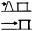
    *        
    *        
    *        
    *        

*    *   In Wirkungsrichtung

    *   erdüberdeckt

    *   D 1

    *        
    *   2,5

    *   3,0

    *   3,5

    *   4,0

    *   0,8

    *   2,5

    *   3,0

    *   4,0

    *   4,0

    *   8,0
[^F774705_57_BJNR021890977BJNE001404377]
        (30 m)

    *   8,0
        (30 m)\*\*)

*    *[^F774705_56_BJNR021890977BJNE001404377]
   mit Wall
        ,
        schwere Dachausführung

    *   D 2

    *        
    *   2,5

    *   4,0

    *   6,0

    *   6,0

    *   0,8

    *   2,5

    *   4,0

    *   6,0

    *[^F774705_59_BJNR021890977BJNE001404377]
   4,0

    *   8,0
        (30 m)\*\*)

    *   8,0
        (30 m)\*\*)

*    *   mit Wall\*),
        leichte Dachausführung

    *   D 3

    *        
    *   2,5

    *   3,0

    *   3,5

    *   5,0

    *   0,8

    *   2,5

    *   3,0

    *   5,0

    *   4,0
        2                       )

    *   8,0
        (30 m)\*\*)

    *   8,0
        (30 m)\*\*)

*    *   ohne Wall\*)

    *   D 4

    *        
    *   2,5

    *   4,5

    *   6,0

    *[^F774705_58_BJNR021890977BJNE001404377]
   8,0

    *   0,8

    *   2,5

    *   4,0

    *   8,0
        1                       )

    *   6,0
        (30 m)\*\*)

    *   8,0
        1                       )
        (30 m)\*\*)

    *   8,0
        1                       )
        (30 m)\*\*)

*    *   Bemerkungen:

    *   Bei Lagermengen von mehr als 1 000 kg NEM muss das Lager mit einer
        Erdüberschüttung versehen oder in gewachsenen Fels oder standfesten
        Boden eingebaut sein.

*    *
    *   Bei Lagermengen bis 1 000 kg NEM genügt die Umwallung des Lagers (vgl.
        Nr. 2.4.1 Abs. 3).

(Fundstelle: BGBl. I 2010, 1682)

Tabelle 2
**Sicherheitsabstände für Lager mit Explosivstoffen der Lagergruppe
1\.1 nach Anlage 2 Nummer 2**
## **— k-Faktoren und Mindestabstände —**

*    *   Explosivstoffe, die bei einer Explosion
        **schwere**                        Sprengstücke bilden

    *   Gefährlicher Betriebsteil

    *   Ungefährlicher
        Betriebsteil

*    *   In Einwirkungsrichtung

*    *   Gebäude und Plätze mit
        Explosivstoffen
        (ausgenommen Lager)

    *   Lager mit Explosivstoffen

    *   sonstige Gebäude

*    *   erdüberdeckt

    *   mit Wall\*)
        oder schweren Wänden
        und schwerer Dachausführung

    *   mit Wall\*)
        oder schweren Wänden
        und leichter Dachausführung

    *   ohne Wall\*)

    *   erdüberdeckt

    *   mit Wall\*)
        oder schweren Wänden
        und schwerer Dachausführung

    *   mit Wall\*)
        oder schweren Wänden
        und leichter Dachausführung

    *   ohne Wall\*)

    *   Gebäude, die der
        Herstellung dienen

    *   sonstige Gebäude

*    *   Gefährdetes Objekt
        (Akzeptor A)
        Gefährdendes Objekt
        (Donator D)

*    *   A 1

    *   A 2

    *   A 3

    *   A 4

    *   A 5

    *   A 6

    *   A 7

    *   A 8

    *   A 9

    *   A 10

    *   A 11

*    *        
    *        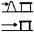
    *        
    *        
    *        
    *        
    *        
    *        
    *        
    *        
    *        

*    *   In Wirkungsrichtung

    *   erdüberdeckt

    *   D 1

    *        
    *   2,5

    *   3,0

    *   3,5

    *   4,0

    *   0,8

    *   2,5

    *   3,0

    *   4,0

    *   8,0
        (40 m)\*\*)

    *   8,0
[^F774705_61_BJNR021890977BJNE001404377]
        (40 m)

    *   8,0
        (150 m)\*\*)

*    *[^F774705_60_BJNR021890977BJNE001404377]
   mit Wall
        ,
        schwere Dachausführung

    *   D 2

    *        
    *   2,5

    *   4,0

    *   6,0

    *   6,0

    *   0,8

    *   3,0

    *   4,0

    *   6,0
        1                       )

    *[^F774705_62_BJNR021890977BJNE001404377]
   8,0
        (40 m)\*\*)

    *   8,0
        1                       )
        (40 m)\*\*)

    *   8,0
        (150 m)\*\*)

*    *   mit Wall\*),
        leichte Dachausführung

    *   D 3

    *        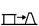
    *   2,5

    *   4,0

    *   6,0
        1                       )

    *   8,0
        1                       )

    *   0,8

    *   3,0

    *   6,0
        1                       )

    *   8,0
        1                       )

    *   8,0
        1                       )
        (40 m)\*\*)

    *   8,0
        1                       )
        (40 m)\*\*)

    *   8,0
        (150 m)\*\*)

*    *   ohne Wall\*)

    *   D 4

    *        
    *   2,5

    *   6,0

    *   8,0
        1                       )

    *   8,0
        1                       )
        (180 m)

    *   0,8

    *   4,5

    *   8,0
        1                       )

    *   8,0
        1                       )
        (180 m)\*\*)

    *   8,0
        1                       )
        (180 m)\*\*)

    *   8,0
        1                       )
        (180 m)\*\*)

    *   8,0
        (275 m)\*\*)

[^F774705_63_BJNR021890977BJNE001404377]

*    *   Bemerkungen:

    *   Bei Lagermengen von mehr als 1 000 kg NEM muss das Lager mit einer
        Erdüberschüttung versehen oder in gewachsenen Fels oder standfesten
        Boden eingebaut sein.

*    *
    *   Bei Lagermengen bis 1 000 kg NEM genügt die Umwallung des Lagers (vgl.
        Nr. 2.4.1 Abs. 3).

(BGBl. I 2010, 1683)
Tabelle 3
**Sicherheitsabstände für Lager mit Explosivstoffen der Lagergruppe
1\.2 nach Anlage 2 Nummer 2**
## **— Mindestabstände —**

*    *   Explosivstoffe, die bei einer Explosion
        **keine schweren**                        Sprengstücke bilden

    *   Gefährlicher Betriebsteil

    *   Ungefährlicher
        Betriebsteil

*    *   In Einwirkungsrichtung

*    *   Gebäude und Plätze mit
        Explosivstoffen
        (ausgenommen Lager)

    *   Lager mit Explosivstoffen

    *   sonstige Gebäude

*    *   erdüberdeckt

    *   mit Wall\*)
        oder schweren Wänden
        und schwerer Dachausführung

    *   mit Wall\*)
        oder schweren Wänden
        und leichter Dachausführung

    *   ohne Wall\*)

    *   erdüberdeckt

    *   mit Wall\*)
        oder schweren Wänden
        und schwerer Dachausführung

    *   mit Wall\*)
        oder schweren Wänden
        und leichter Dachausführung

    *   ohne Wall\*)

    *   Gebäude, die der
        Herstellung dienen

    *   sonstige Gebäude

*    *   Gefährdetes Objekt
        (Akzeptor A)
        Gefährdendes Objekt
        (Donator D)

*    *   A 1

    *   A 2

    *   A 3

    *   A 4

    *   A 5

    *   A 6

    *   A 7

    *   A 8

    *   A 9

    *   A 10

    *   A 11

*    *        
    *        
    *        
    *        
    *        
    *        
    *        
    *        
    *        
    *        
    *        

*    *   In Wirkungsrichtung

    *   erdüberdeckt

    *   D 1

    *        
    *[^F774705_65_BJNR021890977BJNE001404377]
   (-)
[^F774705_66_BJNR021890977BJNE001404377]
        25 m

    *   (-)\*\*)
        25 m
        1                       )

    *   (-)\*\*)
        25 m
        1                       )

    *   (-)\*\*)
        25 m
        1                       )

    *   (-)\*\*)
        25 m
        1                       )

    *   (-)\*\*)
        25 m
        1                       )

    *   (-)\*\*)
        25 m
        1                       )

    *   (-)\*\*)
        25 m
        1                       )

    *   25 m

    *   40 m

    *   60 m

*    *[^F774705_64_BJNR021890977BJNE001404377]
   mit Wall
        ,
        schwere Dachausführung

    *   D 2

    *        
    *   (-)\*\*)
        25 m
        1                       )

    *   15 m
        25 m
        1                       )

    *   15 m
        25 m
        1                       )

    *   15 m
        25 m
        1                       )

    *   (-)\*\*)
        25 m
        1                       )

    *   10 m
        25 m
        1                       )

    *   15 m
        25 m
        1                       )

    *   15 m
        25 m
        1                       )

    *   25 m

    *   40 m

    *   60 m

*    *   mit Wall\*),
        leichte Dachausführung

    *   D 3

    *        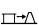
    *   (-)\*\*)
        25 m
        1                       )

    *   25 m

    *   60 m

    *   75 m

    *   (-)\*\*)
        25 m
        1                       )

    *   10 m
        25 m
        1                       )

    *   60 m

    *   75 m

    *   75 m

    *   75 m

    *   90 m

*    *   ohne Wall\*)

    *   D 4

    *        
    *   (-)\*\*)
        25 m
        1                       )

    *   25 m

    *   75 m

    *   90 m

    *   (-)\*\*)
        25 m
        1                       )

    *   25 m

    *   75 m

    *   90 m

    *   90 m

    *   90 m

    *   90 m

(Fundstelle: BGBl. I 2010, 1684)

Tabelle 4
**Sicherheitsabstände für Lager mit Explosivstoffen der Lagergruppe
1\.2 nach Anlage 2 Nummer 2**
## **— Mindestabstände —**

*    *   Explosivstoffe, die bei einer Explosion
        **schwere**                        Sprengstücke bilden

    *   Gefährlicher Betriebsteil

    *   Ungefährlicher
        Betriebsteil

*    *   In Einwirkungsrichtung

*    *   Gebäude und Plätze mit
        Explosivstoffen
        (ausgenommen Lager)

    *   Lager mit Explosivstoffen

    *   sonstige Gebäude

*    *   erdüberdeckt

    *   mit Wall\*)
        oder schweren Wänden
        und schwerer Dachausführung

    *   mit Wall\*)
        oder schweren Wänden
        und leichter Dachausführung

    *   ohne Wall\*)

    *   erdüberdeckt

    *   mit Wall\*)
        oder schweren Wänden
        und schwerer Dachausführung

    *   mit Wall\*)
        oder schweren Wänden
        und leichter Dachausführung

    *   ohne Wall\*)

    *   Gebäude, die der
        Herstellung dienen

    *   sonstige Gebäude

*    *   Gefährdetes Objekt
        (Akzeptor A)
        Gefährdendes Objekt
        (Donator D)

*    *   A 1

    *   A 2

    *   A 3

    *   A 4

    *   A 5

    *   A 6

    *   A 7

    *   A 8

    *   A 9

    *   A 10

    *   A 11

*    *        
    *        
    *        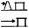
    *        
    *        
    *        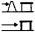
    *        
    *        
    *        
    *        
    *        

*    *   In Wirkungsrichtung

    *   erdüberdeckt

    *   D 1

    *        
    *[^F774705_68_BJNR021890977BJNE001404377]
   (-)
[^F774705_69_BJNR021890977BJNE001404377]
        25 m

    *   (-)\*\*)
        25 m
        1                       )

    *   (-)\*\*)
        25 m
        1                       )

    *   (-)\*\*)
        25 m
        1                       )

    *   (-)\*\*)
        25 m
        1                       )

    *   (-)\*\*)
        25 m
        1                       )

    *   (-)\*\*)
        25 m
        1                       )

    *   (-)\*\*)
        25 m
        1                       )

    *   40 m

    *   60 m

    *   75 m

*    *[^F774705_67_BJNR021890977BJNE001404377]
   mit Wall
        ,
        schwere Dachausführung

    *   D 2

    *        
    *   (-)\*\*)
        25 m
        1                       )

    *   15 m
        25 m
        1                       )

    *   40 m

    *   40 m

    *   (-)\*\*)
        25 m
        1                       )

    *   10 m
        25 m
        1                       )

    *   25 m

    *   25 m

    *   60 m

    *   75 m

    *   100 m

*    *   mit Wall\*),
        leichte Dachausführung

    *   D 3

    *        
    *   (-)\*\*)
        25 m
        1                       )

    *   25 m

    *   100 m

    *   135 m

    *   (-)\*\*)
        25 m
        1                       )

    *   10 m
        25 m
        1                       )

    *   100 m

    *   135 m

    *   135 m

    *   135 m

    *   135 m

*    *   ohne Wall\*)

    *   D 4

    *        
    *   (-)\*\*)
        25 m
        1                       )

    *   25 m

    *   135 m

    *   135 m

    *   (-)\*\*)
        25 m
        1                       )

    *   25 m

    *   135 m

    *   135 m

    *   135 m

    *   135 m

    *   135 m

(Fundstelle: BGBl. I 2010, 1685)

Tabelle 5
**Sicherheitsabstände für Lager mit Explosivstoffen der Lagergruppe
1\.3 nach Anlage 2 Nummer 2**
## **— k-Faktoren und Mindestabstände —**

*    *
    *   Gefährlicher Betriebsteil

    *   Ungefährlicher
        Betriebsteil

*    *   In Einwirkungsrichtung

*    *   Gebäude und Plätze mit
        Explosivstoffen
        (ausgenommen Lager)

    *   Lager mit Explosivstoffen

    *   sonstige Gebäude

*    *   erdüberdeckt

    *   öffnungslose Brandwand

    *   Wand Feuerwider-
        standsklasse F 30
        mit Wall\*)

    *   Wand Feuerwider-
        standsklasse F 30 ohne
        Wall\*) oder Ausblaseseite
        mit oder ohne Wall\*)

    *   erdüberdeckt

    *   öffnungslose Brandwand

    *   Wand Feuerwider-
        standsklasse F 30
        mit Wall\*)

    *   Wand Feuerwider-
        standsklasse F 30 ohne
        Wall\*) oder Ausblaseseite
        mit oder ohne Wall\*)

    *   Gebäude, die der
        Herstellung dienen

    *   sonstige Gebäude

*    *   Gefährdetes Objekt
        (Akzeptor A)
        Gefährdendes Objekt
        (Donator D)

*    *   A 1

    *   A 2

    *   A 3

    *   A 4

    *   A 5

    *   A 6

    *   A 7

    *   A 8

    *   A 9

    *   A 10

    *   A 11

*    *        
    *        
    *        
    *        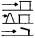
    *        
    *        
    *        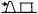
    *        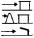
    *        
    *        
    *        

*    *   In Wirkungsrichtung

    *   erdüberdeckt

    *   D 1

    *        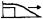
    *   (-)

    *   (10 m)

    *   1,0
        (10 m)

    *   1,25
        (15 m)

    *   (-)

    *   (-)

    *   (-)

    *   1,25
        (15 m)

    *   1,4
        (15 m)

    *   1,4
        (40 m)

    *   1,4
        (60 m)

*    *   öffnungslose Brandwand

    *   D 2

    *        
    *   (10 m)

    *   1,0
        (10 m)

    *   1,25
        (15 m)

    *   1,4
        (15 m)

    *   (-)

    *   (-)

    *   1,25
        (10 m)

    *   1,4
        (15 m)

    *   1,7
        (15 m)

    *   1,7
        (40 m)

    *   1,7
        (60 m)

*    *[^F774705_70_BJNR021890977BJNE001404377]
   Wand Feuerwiderstandsklasse F 30 mit Wall

    *   D 3

    *        
    *   1,0
        (10 m)

    *   1,25
        (15 m)

    *   1,4
        (20 m)

    *   1,7
        (25 m)

    *   (-)

    *   (-)

    *   1,4
        (15 m)

    *   1,4
        (20 m)

    *   2,5
        (30 m)

    *   4,3
        (40 m)

    *   4,3
        (40 m)

*    *   Wand Feuerwiderstandsklasse F 30 ohne Wall\*) oder ungeschützt bzw.
        Ausblaseseite, aber mit Wall\*)

    *   D 4

    *        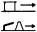
    *   1,4
        (15 m)

    *   1,4
        (15 m)

    *   1,7
        (20 m)

    *   2,0
        (25 m)

    *   (-)

    *   1,25
        (10 m)

    *   1,4
        (20 m)

    *   1,7
        (20 m)

    *   3,2
        (40 m)

    *   4,3
        (60 m)

    *   4,3
        (60 m)

*    *   ungeschützt bzw. Ausblaseseite ohne Wall\*)

    *   D 5

    *        
    *   1,4
        (15 m)

    *   1,7
        (20 m)

    *   2,0
        (25 m)

    *[^F774705_71_BJNR021890977BJNE001404377]
   3,2
        (40 m)

    *   (-)

    *   1,4
        (20 m)

    *   1,4
        (25 m)

    *   3,2
        1                       )
        (40 m)

    *   4,3
        1                       )
        (60 m)

    *   4,3
        1                       )
        (60 m)

    *   6,4
        (60 m)

*    *   Bemerkungen:

    *   a)

    *   Das Dach muss der gleichen Feuerwiderstandsklasse entsprechen wie die
        Wände. Dies gilt nicht für Gebäude mit Ausblaseseite, wenn das Dach
        als zusätzliche Entlastungsfläche dient.

*    *
    *   b)

    *   Für Donatoren, in denen nach Art der Lagerbedingungen bei einer
        Entzündung der Explosivstoffe mit einer Explosion zu rechnen ist, sind
        die Abstände der Tabelle 1 einzuhalten.

*    *
    *   c)

    *   Die Tabelle gilt für Mengen größer 10 kg; für kleinere Mengen ist der
        Abstand nach der Beziehung 0,1 × Menge [kg] × Mindestabstand [m] zu
        rechnen.

(Fundstelle: BGBl. I 2002, 3562;
bzgl. der einzelnen Änderungen vgl. Fußnote)

**Tabelle 6**
**Sicherheitsabstände für Lager mit Explosivstoffen der Lagergruppe
1\.4 nach Anlage 2 Nummer 2**
Abstand der Gebäude untereinander mindestens 10 m.
Ist durch bauliche Maßnahmen, mindestens durch eine Brandwand,
gewährleistet, dass keine gefährliche Wirkung auf benachbarte Gebäude
auftritt, kann der Abstand verringert werden oder er kann entfallen.

(Fundstelle: BGBl. I 2010, 1686)

Tabelle 7
**Sicherheitsabstände für Lager mit Explosivstoffen der Lagergruppe
1\.1 bis 1.4 nach Anlage 2 Nummer 3**
## **— k-Faktoren und Mindestabstände —**

*    *   Lagergruppe

    *   Gefährdetes Objekt
        (Akzeptor A)
        Gefährdendes Objekt
        (Donator D)

    *   Lager mit Explosivstoffen

    *   Schutzbedürftige
        Betriebsgebäude und
[^F774705_74_BJNR021890977BJNE001404377]
        -anlagen

*    *   In Einwirkungsrichtung
        ungeschützt

    *   In Einwirkungsrichtung
        erdüberdeckt

*    *   A 1

    *   A 2

    *   A 3

*    *        
    *        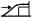
    *        

*    *   1.1

    *   D 1

    *   In Wirkungsrichtung ungeschützt

    *        
    *[^F774705_75_BJNR021890977BJNE001404377]
   8,0
[^F774705_76_BJNR021890977BJNE001404377]
[^F774705_72_BJNR021890977BJNE001404377]
        (180 m)

    *   0,8

    *   8,0
        3                       )
        (180 m)\*)

*    *   D 2

    *   In Wirkungsrichtung erdüberdeckt

    *        
    *   4,0

    *   0,8

    *   4,0
        4                       )

*    *   1.2

    *   D 1

    *   In Wirkungsrichtung ungeschützt

    *        
    *[^F774705_77_BJNR021890977BJNE001404377]
   (90 m)
        \*)

    *   (25 m)\*)

    *   (90 m)
        4                       )\*)

*    *   D 2

    *   In Wirkungsrichtung erdüberdeckt

    *        
    *[^F774705_78_BJNR021890977BJNE001404377]
   (-)
[^F774705_73_BJNR021890977BJNE001404377]

    *   (-)
        5                       )\*\*)

    *   (25 m)\*)

*    *   1.3

    *   D 1

    *   In Wirkungsrichtung ungeschützt bzw. Ausblaseseite

    *        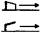
    *   3,2
        2                       )
        (40 m)\*)

    *   (-)
        5                       )\*\*)

    *   4,3
        2                       )
        (60 m)\*)

*    *   D 2

    *   In Wirkungsrichtung ungeschützt,
        Wand jedoch mindestens Feuerwiderstandsklasse F 30

    *        
    *   1,7
        (20 m)\*)

    *   (-)
        5                       )\*\*)

    *   3,2
        (40 m)\*)

*    *   D 3

    *   In Wirkungsrichtung erdüberdeckt

    *        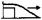
    *   25 m

    *   (-)\*\*)

    *   1,4
        (25 m)\*)

*    *   1.4

    *   Abstand der Gebäude untereinander mindestens 10 m.
        Ist durch bauliche Maßnahmen, mindestens durch eine Brandwand,
        gewährleistet, dass keine gefährliche Wirkung auf benachbarte Gebäude
        auftritt, kann der Abstand verringert werden oder er kann entfallen.

    oder gleichwertige(r) Schutzeinrichtung, eine Brandwand gilt nicht als
    gleichwertig
[^F774705_56_BJNR021890977BJNE001404377]:     = Mindestabstände
[^F774705_57_BJNR021890977BJNE001404377]:     Nur zulässig bei besonders günstigen örtlichen oder betrieblichen
    Verhältnissen.
[^F774705_58_BJNR021890977BJNE001404377]:     Ist der Donator ein Lager, gelten die k-Faktoren der Spalte A 4.
[^F774705_59_BJNR021890977BJNE001404377]:     oder gleichwertige(r) Schutzeinrichtung, eine Brandwand gilt nicht als
    gleichwertig
[^F774705_60_BJNR021890977BJNE001404377]:     = Mindestabstände
[^F774705_61_BJNR021890977BJNE001404377]:     Nur zulässig bei besonders günstigen örtlichen oder betrieblichen
    Verhältnissen.
[^F774705_62_BJNR021890977BJNE001404377]:     Ist der Donator ein Lager, gelten die k-Faktoren der Spalte A 4.
[^F774705_63_BJNR021890977BJNE001404377]:     oder gleichwertige(r) Schutzeinrichtung, eine Brandwand gilt nicht als
    gleichwertig
[^F774705_64_BJNR021890977BJNE001404377]:     = keine Abstandsregelung
[^F774705_65_BJNR021890977BJNE001404377]:     Dieser Abstand gilt bei Gegenständen mit Eigenantrieb, z. B. Raketen.
[^F774705_66_BJNR021890977BJNE001404377]:     oder gleichwertige(r) Schutzeinrichtung, eine Brandwand gilt nicht als
    gleichwertig
[^F774705_67_BJNR021890977BJNE001404377]:     = keine Abstandsregelung
[^F774705_68_BJNR021890977BJNE001404377]:     Dieser Abstand gilt bei Gegenständen mit Eigenantrieb, z. B. Raketen.
[^F774705_69_BJNR021890977BJNE001404377]:     oder gleichwertige(r) Schutzeinrichtung; (-) = keine Abstandsregelung;
    ( ) = Mindestabstand
[^F774705_70_BJNR021890977BJNE001404377]:     Nur zulässig bei besonders günstigen örtlichen oder betrieblichen
    Verhältnissen.
[^F774705_71_BJNR021890977BJNE001404377]:     = Mindestabstand
[^F774705_72_BJNR021890977BJNE001404377]:     = keine Abstandsregelung
[^F774705_73_BJNR021890977BJNE001404377]:     z. B. Gebäude mit ständigen Arbeitsplätzen bzw., die dem ständigen
    Aufenthalt von Menschen dienen; Gebäude, Anlagen oder Einrichtungen,
    die bei Beschädigung eine Gefährdung bedeuten (z. B. Gasbehälter,
    bestimmte Versorgungseinrichtungen).
[^F774705_74_BJNR021890977BJNE001404377]:     Bei Vorhandensein ständiger Arbeitsplätze im Akzeptor ist der
    Mindestabstand einzuhalten.
[^F774705_75_BJNR021890977BJNE001404377]:     Bei zusätzlicher Gefährdung durch schwere Spreng- oder Wurfstücke
    sowie bei wesentlicher Gefahrenerhöhung infolge Beschädigung
    (Sekundärwirkung) ist der Mindestabstand einzuhalten.
[^F774705_76_BJNR021890977BJNE001404377]:     Bei zusätzlicher Gefährdung durch schwere Spreng- oder Wurfstücke ist
    der doppelte k-Faktor einzusetzen bzw. der Mindestabstand um 50
    Prozent zu erhöhen.
[^F774705_77_BJNR021890977BJNE001404377]:     Bei Lagerung von Gegenständen mit Eigenantrieb ist ein Mindestabstand
    von 25 m einzuhalten.
[^F774705_78_BJNR021890977BJNE001404377]: 

## Anlage 3 zum Anhang Schutzabstände nach Nummer 3.2.2 des Anhangs für Lager mit sonstigen explosionsgefährlichen Stoffen der Lagergruppen I bis III

(Fundstelle des Originaltextes: BGBl. I 2002, 3564;
bzgl. der einzelnen Änderungen vgl. Fußnote)

1   **Lagergruppe Ia**

    (1) Bei der Aufbewahrung von Stoffen dieser Lagergruppe ist bei einer
    Nettomasse bis einschließlich 100 kg ein Schutzabstand nicht
    erforderlich. Es muss jedoch sichergestellt sein, dass eine Wirkung
    nicht nach außen oder nur in ungefährlicher Richtung auftreten kann.

    (2) Bei einer Belegung von mehr als 100 kg Nettomasse wird der
    Schutzabstand zu Wohnbereichen nach der Formel
    E=0,185 x A(tief)k(hoch)1/2 x M(hoch)1/3 1) berechnet, wobei jedoch
    ein Mindestabstand von 30 m einzuhalten ist.

    (3) Bei einer Belegung von mehr als 100 kg Nettomasse wird der
    Schutzabstand zu Verkehrswegen nach der Formel
    E=0,124 x A(tief)k(hoch)1/2 x M(hoch)1/3 1) berechnet, wobei jedoch
    ein Mindestabstand von 25 m einzuhalten ist.

    (4) Werden Schutzmaßnahmen getroffen, können die Schutzabstände in den
    geschützten Wirkungsrichtungen teilweise oder ganz entfallen.

    (5) Ist in einer Richtung mit einer erhöhten Wirkung zu rechnen, so
    sind die Schutzabstände in dieser Richtung zu vergrößern.

2   **Lagergruppe Ib**

    (1) Bei der Aufbewahrung von Stoffen dieser Lagergruppe ist bei einer
    Nettomasse bis einschließlich 200 kg ein Schutzabstand nicht
    erforderlich. Es muss jedoch sichergestellt sein, dass eine Wirkung
    nicht nach außen oder nur in ungefährlicher Richtung auftreten kann.

    (2) Bei einer Belegung von mehr als 200 kg Nettomasse, jedoch von
    höchstens 10 000 kg Nettomasse, wird der Schutzabstand zu
    Wohnbereichen nach der Formel
    E = 11,0 x M(hoch)1/5 2) berechnet, wobei jedoch ein Mindestabstand
    von 30 m einzuhalten ist.

    (3) Bei einer Belegung von mehr als 10 000 kg Nettomasse wird der
    Schutzabstand zu Wohnbereichen nach der Formel
    E = 3,2 x M(hoch)1/3 2) berechnet.

    (4) Bei einer Belegung von mehr als 200 kg Nettomasse, jedoch von
    höchstens 10 000 kg Nettomasse, wird der Schutzabstand zu
    Verkehrswegen nach der Formel
    E = 7,3 x M(hoch)1/5 2) berechnet, wobei jedoch ein Mindestabstand von
    25 m einzuhalten ist.

    (5) Bei einer Belegung von mehr als 10 000 kg Nettomasse wird der
    Schutzabstand zu Verkehrswegen nach der Formel
    E = 2,1 x M(hoch)1/3 2) berechnet.

    (6) Werden Schutzmaßnahmen getroffen, können die Schutzabstände in den
    geschützten Wirkungsrichtungen teilweise oder ganz entfallen.

    (7) Ist in einer Richtung mit einer erhöhten Wirkung zu rechnen, so
    sind die Schutzabstände in dieser Richtung zu vergrößern.

3   **Lagergruppe II**

    (1) Bei der Aufbewahrung von Stoffen dieser Lagergruppe ist bei einer
    Nettomasse bis einschließlich 200 kg ein Schutzabstand nicht
    erforderlich. Es muss jedoch sichergestellt sein, dass eine Wirkung
    nicht nach außen oder nur in ungefährlicher Richtung auftreten kann.

    (2) Bei einer Belegung von mehr als 200 kg Nettomasse, jedoch von
    höchstens 10 000 kg Nettomasse, wird der Schutzabstand zu
    Wohnbereichen nach der Formel
    E = 7,5 x M(hoch)1/5 2) berechnet, wobei jedoch ein Mindestabstand von
    25 m einzuhalten ist.

    (3) Bei einer Belegung von mehr als 10 000 kg Nettomasse wird der
    Schutzabstand zu Wohnbereichen nach der Formel
    E = 2,2 x M(hoch)1/3 2) berechnet.

    (4) Bei einer Belegung von mehr als 200 kg Nettomasse, jedoch von
    höchstens 10 000 kg Nettomasse, wird der Schutzabstand zu
    Verkehrswegen nach der Formel
    E = 5,1 x M(hoch)1/5 2) berechnet, wobei jedoch ein Mindestabstand von
    25 m einzuhalten ist.

    (5) Bei einer Belegung von mehr als 10 000 kg Nettomasse wird der
    Schutzabstand zu Verkehrswegen nach der Formal
    E = 1,5 x M(hoch)1/3 2) berechnet.

    (6) Werden Schutzmaßnahmen getroffen, können die Schutzabstände in den
    geschützten Wirkungsrichtungen teilweise oder ganz entfallen.

4   **Lagergruppe III**

    (1) Bei der Aufbewahrung von Stoffen dieser Lagergruppe ist bei einer
    Nettomasse bis einschließlich 200 kg ein Schutzabstand nicht
    erforderlich. Es muss jedoch sichergestellt sein, dass eine Wirkung
    nicht nach außen oder nur in ungefährlicher Richtung auftreten kann.

    (2) Bei einer Belegung von mehr als 200 kg Nettomasse muss zu
    Wohnbereichen ein Schutzabstand von mindestens 25 m eingehalten
    werden.

    (3) Bei einer Belegung von mehr als 200 kg Nettomasse muss zu
    Verkehrswegen ein Schutzabstand von mindestens 16 m eingehalten
    werden.

    (4) Werden Schutzmaßnahmen getroffen, können die Schutzabstände in den
    geschützten Wirkungsrichtungen teilweise oder ganz entfallen.

-----

1)  E = Abstand in m,
    A(tief)k = korrigierter Stoffdurchsatz in kg/min, M = Nettomasse in
    kg.

2)  E = Abstand in m, M = Nettomasse in kg.

## Anlage 4 zum Anhang Sicherheitsabstände nach Nummer 3.2.2 des Anhangs für Lager mit sonstigen explosionsgefährlichen Stoffen der Lagergruppen I bis III

(Fundstelle des Originaltextes: BGBl. I 2002, 3565;
bzgl. der einzelnen Änderungen vgl. Fußnote)

*   1 **Lagergruppe Ia**

    (1) Bei der Aufbewahrung von Stoffen dieser Lagergruppe ist bei einer
    Nettomasse bis einschließlich 100 kg ein Sicherheitsabstand nicht
    erforderlich.

    (2) Bei einer Belegung von mehr als 100 kg Nettomasse wird der
    Sicherheitsabstand zu Betriebsgebäuden oder -anlagen nach der Formel
    E = 0,092 x A(tief)k(hoch)1/2 x M(hoch)1/3 1) berechnet, wobei jedoch
    ein Mindestabstand von 25 m einzuhalten ist.

    (3) Bei einer Belegung von mehr als 100 kg Nettomasse wird der
    Sicherheitsabstand zu anderen Lagern mit explosionsgefährlichen
    Stoffen nach der Formel
    E = 0,115 x A(tief)k(hoch)1/2 x M(hoch)1/3 1) berechnet, wobei jedoch
    ein Mindestabstand von 10 m einzuhalten ist.

    (4) Werden Schutzmaßnahmen an den Betriebsgebäuden oder -anlagen oder
    an den Lagern getroffen, kann der Sicherheitsabstand in der
    geschützten Richtung teilweise oder ganz entfallen.

    (5) Ist in einer Richtung mit einer erhöhten Wirkung zu rechnen oder
    sind die Betriebsgebäude oder -anlagen in der Umgebung eines Lagers
    besonders schutzbedürftig, so sind die Sicherheitsabstände in dieser
    Richtung zu vergrößern.

    2 **Lagergruppe Ib**

    (1) Bei der Aufbewahrung von Stoffen dieser Lagergruppe ist bei einer
    Nettomasse bis einschließlich 200 kg ein Sicherheitsabstand nicht
    erforderlich.

    (2) Bei einer Belegung von mehr als 200 kg Nettomasse, jedoch von
    höchstens 10 000 kg Nettomasse, wird der Sicherheitsabstand zu
    Betriebsgebäuden oder -anlagen nach der Formel
    E = 5,5 x M(hoch)1/5 1) berechnet, wobei jedoch ein Mindestabstand von
    25 m einzuhalten ist.

    (3) Bei einer Belegung von mehr als 10 000 kg Nettomasse wird der
    Sicherheitsabstand zu Betriebsgebäuden oder -anlagen nach der Formel
    E = 1,6 x M(hoch)1/3 1) berechnet.

    (4) Bei einer Belegung von mehr als 200 kg Nettomasse wird der
    Sicherheitsabstand zu anderen Lagern mit explosionsgefährlichen
    Stoffen nach der Formel
    E = 1,6 x M(hoch)1/3 2) berechnet, wobei jedoch ein Mindestabstand von
    10 m einzuhalten ist.

    (5) Werden Schutzmaßnahmen an den Betriebsgebäuden oder -anlagen oder
    an den Lagern getroffen, kann der Sicherheitsabstand in der
    geschützten Richtung teilweise oder ganz entfallen.

    (6) Ist in einer Richtung mit einer erhöhten Wirkung zu rechnen oder
    sind die Betriebsgebäude oder -anlagen in der Umgebung eines Lagers
    besonders schutzbedürftig, so sind die Sicherheitsabstände in dieser
    Richtung zu vergrößern.

    3 **Lagergruppe II**

    (1) Bei der Aufbewahrung von Stoffen dieser Lagergruppe ist bei einer
    Nettomasse bis einschließlich 200 kg ein Sicherheitsabstand nicht
    erforderlich.

    (2) Bei einer Belegung von mehr als 200 kg Nettomasse wird der
    Sicherheitsabstand zu Betriebsgebäuden und -anlagen nach der Formel
    E = 1,1 x M(hoch)1/3 2) berechnet, wobei jedoch ein Mindestabstand von
    25 m einzuhalten ist.

    (3) Bei einer Belegung von mehr als 200 kg Nettomasse wird der
    Sicherheitsabstand zu anderen Lagern mit explosionsgefährlichen
    Stoffen nach der Formel
    E = 1,1 x M(hoch)1/3 2) berechnet, wobei jedoch ein Mindestabstand von
    10 m einzuhalten ist.

    (4) Werden Schutzmaßnahmen an den Betriebsgebäuden oder -anlagen oder
    an den Lagern getroffen, kann der Sicherheitsabstand in der
    geschützten Richtung teilweise oder ganz entfallen.

    (5) Ist in einer Richtung mit einer erhöhten Wirkung zu rechnen oder
    sind die Betriebsgebäude oder -anlagen in der Umgebung eines Lagers
    besonders schutzbedürftig, so sind die Sicherheitsabstände in dieser
    Richtung zu vergrößern.

    4 **Lagergruppe III**

    (1) Bei der Aufbewahrung von Stoffen dieser Lagergruppe ist bei einer
    Nettomasse bis einschließlich 200 kg ein Sicherheitsabstand nicht
    erforderlich.

    (2) Bei einer Belegung von mehr als 200 kg Nettomasse muss zu
    Betriebsgebäuden und -anlagen ein Sicherheitsabstand von mindestens 10
    m eingehalten werden.

    (3) Bei einer Belegung von mehr als 200 kg Nettomasse muss zu anderen
    Lagern mit explosionsgefährlichen Stoffen ein Sicherheitsabstand von
    mindestens 10 m eingehalten werden.

    (4) Werden Schutzmaßnahmen an den Betriebsgebäuden oder -anlagen oder
    an den Lagern getroffen, kann der Sicherheitsabstand in der
    geschützten Richtung teilweise oder ganz entfallen.

-----

1)  E = Abstand in m,
    A(tief)k = korrigierter Stoffdurchsatz in kg/min, M = Nettomasse in
    kg.

2)  E = Abstand in m, M = Nettomasse in kg.

## Anlage 5 zum Anhang Verträglichkeitsgruppen nach Nummer 2.7 des Anhangs

(Fundstelle: BGBl. I 2010, 1688)

*    *   Verträglichkeits-
        gruppe

    *   Beschreibung

*    *   A

    *   Zündstoff.

*    *   B

    *   Zündmittel mit weniger als zwei wirksamen Sicherungseinrichtungen.
        Eingeschlossen sind Gegenstände wie z. B. Sprengkapseln,
        Zündeinrichtungen für Sprengungen und Anzündhütchen, selbst wenn diese
        keinen Zündstoff enthalten.

*    *   C

    *   Treibstoff oder anderer deflagrierender Explosivstoff oder Gegenstand
        mit solchem Explosivstoff.

*    *   D

    *   Detonierender Explosivstoff oder Schwarzpulver oder Gegenstand mit
        detonierendem Explosivstoff, jeweils ohne Zündmittel oder mit
        Zündmittel mit zwei wirksamen Sicherungsvorrichtungen und ohne
        treibende Ladung oder mit Zündmittel mit mindestens zwei wirksamen
        Sicherungseinrichtungen.

*    *   E

    *   Gegenstand mit detonierendem Explosivstoff ohne Zündmittel oder mit
        Zündmittel mit zwei Sicherungsvorrichtungen, mit treibender Ladung
        (andere als solche, die aus entzündbarer Flüssigkeit oder entzündbarem
        Gel oder Hypergolen bestehen).

*    *   F

    *   Gegenstand mit detonierendem Explosivstoff mit seinem eigenen
        Zündmittel, mit treibender Ladung (andere als solche, die aus
        entzündbarer Flüssigkeit oder entzündbarem Gel oder Hypergolen
        bestehen) oder ohne treibende Ladung.

*    *   G

    *   Pyrotechnischer Satz oder pyrotechnischer Gegenstand.

*    *   H

    *   Gegenstand, der sowohl Explosivstoff als auch weißen Phosphor enthält.

*    *   J

    *   Gegenstand, der sowohl Explosivstoff als auch entzündbare Flüssigkeit
        oder entzündbares Gel enthält.

*    *   L

    *   Explosivstoff oder Gegenstand mit Explosivstoff, der ein besonderes
        Risiko darstellt (z. B. wegen seiner Aktivierung bei Zutritt von
        Wasser oder wegen der Anwesenheit von Hypergolen, Phosphiden oder
        eines pyrophoren Stoffes) und eine Trennung jeder einzelnen Art
        erfordert.

*    *   N

    *   Gegenstand, der nur extrem unempfindliche detonierende Stoffe enthält.

*    *[^F774705_11_BJNR021890977BJNE001704377]
   S

    *   Explosivstoff so verpackt oder gestaltet, dass jede durch eine nicht
        beabsichtigte Reaktion auftretende Wirkung auf das Versandstück
        beschränkt bleibt, außer wenn das Versandstück durch Brand beschädigt
        wird. In diesem Fall müssen die Luftstoß- und die Splitterwirkung auf
        ein solches Maß beschränkt bleiben, dass Feuerbekämpfungs- oder andere
        Notmaßnahmen in der unmittelbaren Nähe des Versandstückes weder
        eingeschränkt noch verhindert werden.

    Die Zuordnung zur Verträglichkeitsgruppe S setzt die Zuordnung zur
    Lagergruppe 1.4 voraus.
[^F774705_11_BJNR021890977BJNE001704377]: 

## Anlage 6 zum Anhang Aufbewahrung kleiner Mengen im gewerblichen Bereich nach Nummer 4 des Anhangs Maximal zulässige Nettoexplosivstoffmassen/Nettomassen in kg

(Fundstelle: BGBl. I 2010, 1688 — 1689)

*    *
    *   Aufbe-
        wahrungsort
        Lager-
        gruppe

    *   Arbeitsraum

    *   Verkaufsraum

    *   Gebäude mit Wohnraum

    *   Gebäude ohne Wohnraum

    *   Außerhalb eines Gebäudes/ortsbewegliche Aufbewahrung

*    *   Lagerraum

    *   Lagerraum

    *   Lagerraum mit mindestens der Feuerwiderstandsklasse F30/T30

    *   z. B. Container

*    *
    *   1

    *   2

    *   3

    *   4

    *   5

    *   6

    *   7

*    *
    *   **Lagergruppe 1.1**

    *
    *
    *
    *
    *
    *

*    *   1

    *   Sprengstoffe, Sprengschnüre

    *[^F774705_21_BJNR021890977BJNE001805377]
   n. z.

    *   n. z.

    *   1

    *   5

    *   5

    *   25

*    *   2

    *[^F774705_23_BJNR021890977BJNE001805377]
   Schwarzpulver, Treibladungspulver, Treibladungen, pyrotechnische Sätze
        der Kategorie
        S2

    *   n. z.

    *   n. z.

    *   3

    *   25

    *   25

    *   25

*    *   3

    *   Zündmittel

    *   n. z.

    *   n. z.

    *   0,1

    *   1

    *   1

    *   1

*    *   4

    *   Pyrotechnische Gegenstände der Kategorien
[^F774705_27_BJNR021890977BJNE001805377]
        3,
[^F774705_28_BJNR021890977BJNE001805377]
        4,
[^F774705_30_BJNR021890977BJNE001805377]
        T2,
[^F774705_32_BJNR021890977BJNE001805377]
        und P2

    *   n. z.

    *   n. z.

    *   5

    *   5

    *   5

    *   5

*    *
    *   **Lagergruppe 1.2**

    *
    *
    *
    *
    *
    *

*    *   5

    *   Pyrotechnische Gegenstände der Kategorien
        3,
        4,
        T2,
        und P2

    *   n. z.

    *   n. z.

    *   5

    *   15

    *   25

    *   25

*    *
    *   **Lagergruppe 1.3**

    *
    *
    *
    *
    *
    *

*    *   6

    *   Treibladungspulver, Treibladungen, pyrotechnische Sätze der Kategorien
        S1 und S2

    *   n. z.

    *   n. z.

    *   10

    *   25

    *   25

    *   25

*    *   7

    *   Pyrotechnische Gegenstände der Kategorien
[^F774705_26_BJNR021890977BJNE001805377]
        2,
        3,
        4,
[^F774705_29_BJNR021890977BJNE001805377]
        T1,
        T2,
[^F774705_31_BJNR021890977BJNE001805377]
        P1
        und P2
[^F774705_24_BJNR021890977BJNE001805377]
        sowie pyrotechnische Munition der Klassen
        PM I und PM II

    *   5

    *   5

    *   15

    *   50

    *   50

    *   50

*    *
    *   **Lagergruppe 1.4**

    *
    *
    *
    *
    *
    *

*    *   8

    *   Zündmittel

    *   n. z.

    *   n. z.

    *   0,2

    *   2

    *   2

    *   2

*    *   9

    *   Pyrotechnische Gegenstände aller Kategorien
        \*), a) bis h), 1)                     , pyrotechnische Sätze S1 und
        S2 sowie pyrotechnische Munition der Klassen
        PM I und PM II; davon höchstens 20% ohne Verpackung nach § 21 Abs. 4
        der 1. SprengV

    *   70

    *   70

    *   100

    *   100

    *   350

    *   350

*    *   10

    *[^F774705_33_BJNR021890977BJNE001805377]
   Pyrotechnische Gegenstände der Klasse T1
        und der Kategorie
        P1 für den Einbau in Fahrzeugen

    *   10

    *   10

    *   10

    *   10

    *   100

    *   100

*    *   11

    *   Lagergruppe Ia

    *   n. z.

    *   n. z.

    *   10

    *   25

    *   100

    *   100

*    *   12

    *   Lagergruppe Ib

    *   20

    *   n. z.

    *   10

    *   25

    *   200

    *   200

*    *   13

    *   Lagergruppen II und III

    *   60

    *   20

    *   75

    *   150

    *   200

    *   200

[^F774705_22_BJNR021890977BJNE001805377]
[^F774705_25_BJNR021890977BJNE001805377]
    nicht zulässige Aufbewahrung.
[^F774705_21_BJNR021890977BJNE001805377]:     Pyrotechnische Gegenstände der Zeile 10 sind ausgenommen.
[^F774705_22_BJNR021890977BJNE001805377]:     Zuordnung zu Kategorien entsprechend § 6 Absatz 6 der Ersten
    Verordnung zum Sprengstoffgesetz.
[^F774705_23_BJNR021890977BJNE001805377]:     Zuordnung zu Klassen entsprechend § 11 Absatz 5 der
    Beschussverordnung.
[^F774705_24_BJNR021890977BJNE001805377]:     Der Kategorie 1 ist die Klasse I nach § 6 Absatz 4 der Ersten
    Verordnung zum Sprengstoffgesetz in der bis zum 30. September 2009
    geltenden Fassung gleichzusetzen.
[^F774705_25_BJNR021890977BJNE001805377]:     Der Kategorie 2 ist die Klasse II nach § 6 Absatz 4 der Ersten
    Verordnung zum Sprengstoffgesetz in der bis zum 30. September 2009
    geltenden Fassung gleichzusetzen.
[^F774705_26_BJNR021890977BJNE001805377]:     Der Kategorie 3 ist die Klasse III nach § 6 Absatz 4 der Ersten
    Verordnung zum Sprengstoffgesetz in der bis zum 30. September 2009
    geltenden Fassung gleichzusetzen.
[^F774705_27_BJNR021890977BJNE001805377]:     Der Kategorie 4 ist die Klasse IV nach § 6 Absatz 4 der Ersten
    Verordnung zum Sprengstoffgesetz in der bis zum 30. September 2009
    geltenden Fassung gleichzusetzen.
[^F774705_28_BJNR021890977BJNE001805377]: [^F774705_29_BJNR021890977BJNE001805377]:     Der Kategorie T1 ist der Teil - Bühnen- und Theaterfeuerwerk - der
    Unterklasse T             1              nach § 6 Absatz 4 der Ersten
    Verordnung zum Sprengstoffgesetz in der bis zum 30. September 2009
    geltenden Fassung gleichzusetzen.
[^F774705_30_BJNR021890977BJNE001805377]:     Der Kategorie T2 ist der Teil - Bühnen- und Theaterfeuerwerk - der
    Unterklasse T             2              nach § 6 Absatz 4 der Ersten
    Verordnung zum Sprengstoffgesetz in der bis zum 30. September 2009
    geltenden Fassung gleichzusetzen.
[^F774705_31_BJNR021890977BJNE001805377]:     Der Kategorie P1 ist der Teil der Unterklasse T             1
    nach § 6 Absatz 4 der Ersten Verordnung zum Sprengstoffgesetz in der
    bis zum 30. September 2009 geltenden Fassung gleichzusetzen, der nicht
    Bühnen- und Theaterfeuerwerk ist.
[^F774705_32_BJNR021890977BJNE001805377]:     Der Kategorie P2 ist der Teil der Unterklasse T             2
    nach § 6 Absatz 4 der Ersten Verordnung zum Sprengstoffgesetz in der
    bis zum 30. September 2009 geltenden Fassung gleichzusetzen, der nicht
    Bühnen- und Theaterfeuerwerk ist.
[^F774705_33_BJNR021890977BJNE001805377]:     Klasse T             1              nach § 6 Absatz 4 der Ersten
    Verordnung zum Sprengstoffgesetz in der bis zum 30. September 2009
    geltenden Fassung.

## Anlage 7 zum Anhang Aufbewahrung kleiner Mengen im nicht gewerblichen Bereich nach Nummer 4 des Anhangs Maximal zulässige Nettoexplosivstoffmassen/Nettomassen in kg

(Fundstelle: BGBl. I 2010, 1690)

*    *
    *   Aufbe-
        wahrungsort
        Lager-
        gruppe

    *   Gebäude mit Wohnraum

    *   Gebäude ohne Wohnraum

*    *   Bewohnter Raum

    *   Nicht bewohnter Raum

*    *
    *   1

    *   2

    *   3

    *   4

*    *
    *   **Lagergruppe 1.1**

    *
    *
    *

*    *   1

    *   Sprengstoffe, Sprengschnüre

    *[^F774705_41_BJNR021890977BJNE001904377]
   n. z.

    *   n. z.

    *   5

*    *   2

    *[^F774705_43_BJNR021890977BJNE001904377]
   Schwarzpulver, Treibladungspulver, Treibladungen, pyrotechnische Sätze
        der Kategorie
        S2

    *   n. z.

    *   1

    *   3

*    *   3

    *   Zündmittel

    *   n. z.

    *   0,1

    *   1

*    *   4

    *   Pyrotechnische Gegenstände der Kategorien
[^F774705_47_BJNR021890977BJNE001904377]
        3,
[^F774705_48_BJNR021890977BJNE001904377]
        4,
[^F774705_50_BJNR021890977BJNE001904377]
        T2,
[^F774705_52_BJNR021890977BJNE001904377]
        und P2

    *   n. z.

    *   1

    *   1

*    *
    *   **Lagergruppe 1.2**

    *
    *
    *

*    *   5

    *   pyrotechnische Gegenstände der Kategorien
        3,
        4,
        T2,
        und P2

    *   n. z.

    *   2

    *   5

*    *
    *   **Lagergruppe 1.3**

    *
    *
    *

*    *   6

    *   Treibladungspulver, Treibladungen, pyrotechnische Sätze der Kategorien
        S1 und S2

    *   n. z.

    *   3

    *   5

*    *   7

    *   Pyrotechnische Gegenstände der Kategorien
[^F774705_46_BJNR021890977BJNE001904377]
        2,
        3,
        4,
[^F774705_49_BJNR021890977BJNE001904377]
        T1,
        T2,
[^F774705_51_BJNR021890977BJNE001904377]
        P1,
        und P2
[^F774705_44_BJNR021890977BJNE001904377]
        sowie pyrotechnische Munition der Klassen
        PM I und PM II

    *   n. z.

    *   3

    *   5

*    *
    *   **Lagergruppe 1.4**

    *
    *
    *

*    *   8

    *   Zündmittel

    *   n. z.

    *   0,1

    *   1

*    *   9

    *   Pyrotechnische Gegenstände aller Kategorien
        \*), a) bis h), 1)                     , pyrotechnische Sätze S1 und
        S2 sowie pyrotechnische Munition der Klassen
        PM I und PM II; davon höchstens 20% ohne Verpackung nach § 21 Abs. 4
        der 1. SprengV

    *   n. z.
[^F774705_55_BJNR021890977BJNE001904377]

    *   10

    *   15

*    *   10

    *[^F774705_53_BJNR021890977BJNE001904377]
   Pyrotechnische Gegenstände der Klasse T1
        und der Kategorie
        P1 für den Einbau in Fahrzeugen

    *   n. z.

    *   1

    *   1

*    *   11

    *   Lagergruppe Ia

    *   n. z.

    *   3

    *   5

*    *   12

    *   Lagergruppe Ib

    *   n. z.

    *   3

    *   10

*    *   13

    *   Lagergruppen II und III

    *   n. z.

    *   5

    *   20

[^F774705_54_BJNR021890977BJNE001904377]
[^F774705_45_BJNR021890977BJNE001904377]
    nicht zulässige Aufbewahrung.
[^F774705_41_BJNR021890977BJNE001904377]:     Pyrotechnische Gegenstände der Zeile 10 sind ausgenommen.
[^F774705_54_BJNR021890977BJNE001904377]:     Pyrotechnische Gegenstände der Kategorie 1 und 2 und pyrotechnische
    Munition der Klasse PM I dürfen bis zu 1 kg aufbewahrt werden.
[^F774705_55_BJNR021890977BJNE001904377]:     Zuordnung zu Kategorien entsprechend § 6 Absatz 6 der Ersten
    Verordnung zum Sprengstoffgesetz.
[^F774705_43_BJNR021890977BJNE001904377]:     Zuordnung zu Klassen entsprechend § 11 Absatz 5 der
    Beschussverordnung.
[^F774705_44_BJNR021890977BJNE001904377]:     Der Kategorie 1 ist die Klasse I nach § 6 Absatz 4 der Ersten
    Verordnung zum Sprengstoffgesetz in der bis zum 30. September 2009
    geltenden Fassung gleichzusetzen.
[^F774705_45_BJNR021890977BJNE001904377]:     Der Kategorie 2 ist die Klasse II nach § 6 Absatz 4 der Ersten
    Verordnung zum Sprengstoffgesetz in der bis zum 30. September 2009
    geltenden Fassung gleichzusetzen.
[^F774705_46_BJNR021890977BJNE001904377]:     Der Kategorie 3 ist die Klasse III nach § 6 Absatz 4 der Ersten
    Verordnung zum Sprengstoffgesetz in der bis zum 30. September 2009
    geltenden Fassung gleichzusetzen.
[^F774705_47_BJNR021890977BJNE001904377]:     Der Kategorie 4 ist die Klasse IV nach § 6 Absatz 4 der Ersten
    Verordnung zum Sprengstoffgesetz in der bis zum 30. September 2009
    geltenden Fassung gleichzusetzen.
[^F774705_48_BJNR021890977BJNE001904377]: [^F774705_49_BJNR021890977BJNE001904377]:     Der Kategorie T1 ist der Teil - Bühnen- und Theaterfeuerwerk - der
    Unterklasse T             1              nach § 6 Absatz 4 der Ersten
    Verordnung zum Sprengstoffgesetz in der bis zum 30. September 2009
    geltenden Fassung gleichzusetzen.
[^F774705_50_BJNR021890977BJNE001904377]:     Der Kategorie T2 ist der Teil - Bühnen- und Theaterfeuerwerk - der
    Unterklasse T             2              nach § 6 Absatz 4 der Ersten
    Verordnung zum Sprengstoffgesetz in der bis zum 30. September 2009
    geltenden Fassung gleichzusetzen.
[^F774705_51_BJNR021890977BJNE001904377]:     Der Kategorie P1 ist der Teil der Unterklasse T             1
    nach § 6 Absatz 4 der Ersten Verordnung zum Sprengstoffgesetz in der
    bis zum 30. September 2009 geltenden Fassung gleichzusetzen, der nicht
    Bühnen- und Theaterfeuerwerk ist.
[^F774705_52_BJNR021890977BJNE001904377]:     Der Kategorie P2 ist der Teil der Unterklasse T             2
    nach § 6 Absatz 4 der Ersten Verordnung zum Sprengstoffgesetz in der
    bis zum 30. September 2009 geltenden Fassung gleichzusetzen, der nicht
    Bühnen- und Theaterfeuerwerk ist.
[^F774705_53_BJNR021890977BJNE001904377]:     Klasse T             1              nach § 6 Absatz 4 der Ersten
    Verordnung zum Sprengstoffgesetz in der bis zum 30. September 2009
    geltenden Fassung.

