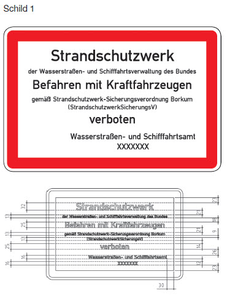

# Bekanntmachung der Verordnung über die Sicherung von Strandschutzwerken auf der Nordseeinsel Borkum (StrandschutzwerkSicherungsV)

Ausfertigungsdatum
:   2016-06-06

Fundstelle
:   VkBl: 2016, 438

Geändert durch
:   Art. 1 V v. 2.9.2019 VkBl. 628

## Eingangsformel

Die Generaldirektion Wasserstraßen und Schifffahrt verordnet

-   auf Grund des § 27 Absatz 1 des Bundeswasserstraßengesetzes in der
    Fassung der Bekanntmachung vom 23. Mai 2007 (BGBl. I S. 962; BGBl.
    2008 I S. 1980), § 27 Absatz 1 geändert durch Artikel 522 Nummer 2 der
    Verordnung vom 31. August 2015 (BGBl. S. 1474), in Verbindung mit § 1
    der Verordnung über die Übertragung der Ermächtigung zum Erlass von
    Strompolizeiverordnungen nach dem Bundeswasserstraßengesetz vom 15.
    April 1969 (BGBl. II S. 853), der durch Artikel 21 der Verordnung vom
    02\. Juni 2016 geändert worden ist und

-   auf Grund des § 46 Satz 1 Nummer 3 des Bundeswasserstraßengesetzes in
    der Fassung der Bekanntmachung vom 23. Mai 2007 (BGBl. I S. 962; BGBl.
    2008 I S. 1980), § 46 Satz 1 Nummer 3 geändert durch Artikel 522
    Nummer 7 der Verordnung vom 31. August 2015 (BGBl. S. 1474), in
    Verbindung mit § 1 der Verordnung zur Übertragung der Ermächtigung zum
    Erlass von Rechtsverordnungen nach dem Bundeswasserstraßengesetz über
    die Regelung, Beschränkung oder Untersagung des Gemeingebrauchs vom
    21\. September 1971 (BGBl. I S. 1617), der zuletzt durch Artikel 24 der
    Verordnung vom 02. Juni 2016 geändert worden ist:

## § 1 Befahrensverbot

(1) Das Befahren der als Promenadenweg ausgebauten Berme auf der
Uferschutzmauer der Insel Borkum vom nördlichen Anfang (Buhne 1) bis
einschließlich Buhne 28 und des anschließenden Asphaltdeckwerkes bis
zum südlichen Ende (Buhne 35) sowie der dazugehörigen Buhnen mit
Kraftfahrzeugen einschließlich Krafträdern, Kleinkrafträdern und
Mobilitätshilfen ist verboten.

(2) Das Befahrensverbot ist durch das Schild 1 der Anlage zu dieser
Verordnung, durch Zäune oder durch Schranken kenntlich gemacht.

## § 2 Ausnahmen

(1) Ausnahmen von dem Verbot des § 1 Absatz 1 können durch
Einzelgenehmigung zugelassen werden.

(2) Eine Einzelgenehmigung wird dem Antragsteller unter dem Vorbehalt
des Widerrufs schriftlich erteilt. Die Genehmigung kann mit
Nebenbestimmungen versehen werden. Der Inhaber der Genehmigung hat den
Genehmigungsbescheid mitzuführen und auf Verlangen den mit
strompolizeilichen Vollzugsaufgaben beauftragten Bediensteten der
Wasserstraßen- und Schifffahrtsverwaltung des Bundes zwecks
Überprüfung auszuhändigen.

(3) In dringenden Fällen kann die Einzelgenehmigung mündlich erteilt
werden.

## § 3 Befreiungen

Von dem Befahrensverbot des § 1 Absatz 1 sind die Bediensteten oder
Beauftragten der Wasserstraßen- und Schifffahrtsverwaltung des Bundes,
anderer Behörden, der Einrichtungen des Rettungs- und des
Feuerwehrdienstes sowie sonstiger Hilfsorganisationen befreit, soweit
das Befahren zur Erfüllung der dienstlichen Aufgaben erforderlich ist.

## § 4 Zuständigkeit

Ausnahmegenehmigungen nach § 2 erlässt das örtlich zuständige
Wasserstraßen- und Schifffahrtsamt.

## § 5 Ordnungswidrigkeiten

Ordnungswidrig im Sinne des § 50 Absatz 1 Nummer 2 des
Bundeswasserstraßengesetzes handelt, wer vorsätzlich oder fahrlässig

1.  entgegen § 1 Absatz 1 die Berme, das Asphaltdeckwerk oder eine Buhne
    befährt,

2.  einer vollziehbaren Auflage nach § 2 Absatz 2 Satz 2 zuwiderhandelt
    oder

3.  entgegen § 2 Absatz 2 Satz 3 den Genehmigungsbescheid nicht mitführt
    oder nicht oder nicht rechtzeitig aushändigt.

## § 6 Übergangsbestimmungen

Schilder, die am 30. Juni 2016 aufgestellt sind, gelten neben den nach
dieser Verordnung aufgestellten Schildern bis zum 31. Dezember 2021
fort. Im Umfang der sich aus den fortgeltenden Schildern ergebenden
Verbote oder Berechtigungen ist die Verordnung über die Sicherung von
Strandschutzwerken auf der Nordseeinsel Borkum vom 22. Februar 1973
(VkBl. 1973, 218) weiter anzuwenden.

## § 7 Inkrafttreten, Außerkrafttreten

(1) Diese Verordnung tritt am Tage nach der Verkündung in Kraft.

(2) Gleichzeitig tritt die Verordnung über die Sicherung von
Strandschutzwerken auf der Nordseeinsel Borkum vom 22. Februar 1973
(VkBl. 1973, 218) außer Kraft.

(zu § 1 Absatz 2)

## Anlage Schild zur Kennzeichnung der Verbote

(Fundstelle: VkBl. 2016, 439)

