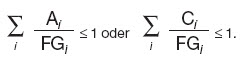
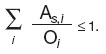

# Verordnung über den Schutz vor Schäden durch ionisierende Strahlen (StrlSchV 2001)

Ausfertigungsdatum
:   2001-07-20

Fundstelle
:   BGBl I: 2001, 1714 (2002 I 1459)

Zuletzt geändert nach maßgabe des art. 10 durch
:   Art. 6 G v. 27.1.2017 I 114, 1222

Stand: Bek. v. 16.6.2017 I 1676 ist berücksichtigt

## Teil 1 - Allgemeine Vorschriften

### § 1 Zweckbestimmung

Zweck dieser Verordnung ist es, zum Schutz des Menschen und der Umwelt
vor der schädlichen Wirkung ionisierender Strahlung Grundsätze und
Anforderungen für Vorsorge- und Schutzmaßnahmen zu regeln, die bei der
Nutzung und Einwirkung radioaktiver Stoffe und ionisierender Strahlung
zivilisatorischen und natürlichen Ursprungs Anwendung finden.

### § 2 Anwendungsbereich

(1) Diese Verordnung trifft Regelungen für

1.  folgende Tätigkeiten:

    a)  den Umgang mit

        aa) künstlich erzeugten radioaktiven Stoffen,

        bb) natürlich vorkommenden radioaktiven Stoffen, wenn dieser Umgang
            aufgrund ihrer Radioaktivität, ihrer Nutzung als Kernbrennstoff oder
            zur Erzeugung von Kernbrennstoff erfolgt,

    b)  den Erwerb der in Buchstabe a genannten radioaktiven Stoffe, deren
        Abgabe an andere, deren Beförderung sowie deren grenzüberschreitende
        Verbringung,

    c)  die Verwahrung von Kernbrennstoffen nach § 5 des Atomgesetzes, die
        Aufbewahrung von Kernbrennstoffen nach § 6 des Atomgesetzes, die
        Errichtung, den Betrieb, die sonstige Innehabung, die Stilllegung, den
        sicheren Einschluss einer Anlage sowie den Abbau einer Anlage oder von
        Anlagenteilen nach § 7 des Atomgesetzes, die Bearbeitung, Verarbeitung
        und sonstige Verwendung von Kernbrennstoffen nach § 9 des
        Atomgesetzes, die Errichtung und den Betrieb von Anlagen des Bundes
        zur Sicherstellung und zur Endlagerung radioaktiver Abfälle,

    d)  die Errichtung und den Betrieb von Anlagen zur Erzeugung ionisierender
        Strahlen mit einer Teilchen- oder Photonengrenzenergie von mindestens
        5 Kiloelektronvolt und

    e)  den Zusatz von radioaktiven Stoffen bei der Herstellung von
        Konsumgütern, von Arzneimitteln im Sinne des Arzneimittelgesetzes, von
        Pflanzenschutzmitteln im Sinne des Pflanzenschutzgesetzes, von
        Schädlingsbekämpfungsmitteln und von Stoffen nach § 1 Nr. 1 bis 5 des
        Düngemittelgesetzes sowie die Aktivierung der vorgenannten Produkte,

2.  Arbeiten, durch die Personen natürlichen Strahlungsquellen so
    ausgesetzt werden können, dass die Strahlenexpositionen aus der Sicht
    des Strahlenschutzes nicht außer Acht gelassen werden dürfen.

(2) Diese Verordnung trifft keine Regelung für

1.  die Sanierung von Hinterlassenschaften früherer Tätigkeiten und
    Arbeiten, mit Ausnahme der Regelungen in § 118,

2.  die Stilllegung und Sanierung der Betriebsanlagen und Betriebsstätten
    des Uranerzbergbaus, mit Ausnahme der Regelungen in § 118,

3.  die Errichtung und den Betrieb von Röntgeneinrichtungen und
    Störstrahlern nach der Röntgenverordnung,

4.  die Strahlenexposition durch Radon in Wohnungen einschließlich der
    dazugehörenden Gebäudeteile und

5.  die Strahlenexposition durch im menschlichen Körper natürlicherweise
    enthaltene Radionuklide, durch kosmische Strahlung in Bodennähe und
    durch Radionuklide, die in der nicht durch Eingriffe beeinträchtigten
    Erdrinde vorhanden sind.

### § 3 Begriffsbestimmungen

(1) Für die Systematik und Anwendung dieser Verordnung wird zwischen
Tätigkeiten und Arbeiten unterschieden.

1.  Tätigkeiten sind:

    a)  der Betrieb von Anlagen zur Erzeugung von ionisierenden Strahlen,

    b)  der Zusatz von radioaktiven Stoffen bei der Herstellung bestimmter
        Produkte oder die Aktivierung dieser Produkte,

    c)  sonstige Handlungen, die die Strahlenexposition oder Kontamination
        erhöhen können,

        aa) weil sie mit künstlich erzeugten radioaktiven Stoffen erfolgen oder

        bb) weil sie mit natürlich vorkommenden radioaktiven Stoffen erfolgen, und
            diese Handlungen aufgrund der Radioaktivität dieser Stoffe oder zur
            Nutzung dieser Stoffe als Kernbrennstoff oder zur Erzeugung von
            Kernbrennstoff durchgeführt werden,

2.  Arbeiten sind:

    Handlungen, die, ohne Tätigkeit zu sein, bei natürlich vorkommender
    Radioaktivität die Strahlenexposition oder Kontamination erhöhen
    können

    a)  im Zusammenhang mit der Aufsuchung, Gewinnung, Erzeugung, Lagerung,
        Bearbeitung, Verarbeitung und sonstigen Verwendung von Materialien,

    b)  soweit sie mit Materialien erfolgen, die bei betrieblichen Abläufen
        anfallen, soweit diese Handlungen nicht bereits unter Buchstabe a
        fallen,

    c)  im Zusammenhang mit der Verwertung oder Beseitigung von Materialien,
        die durch Handlungen nach Buchstabe a oder b anfallen,

    d)  durch dabei einwirkende natürliche terrestrische Strahlungsquellen,
        insbesondere von Radon-222 und Radonzerfallsprodukten, soweit diese
        Handlungen nicht bereits unter Buchstaben a bis c fallen und nicht zu
        einem unter Buchstabe a genannten Zweck erfolgen, oder

    e)  im Zusammenhang mit der Berufsausübung des fliegenden Personals in
        Flugzeugen.

    Nicht als Arbeiten im Sinne dieser Verordnung gelten die
    landwirtschaftliche, forstwirtschaftliche oder bautechnische
    Bearbeitung der Erdoberfläche, soweit diese Handlungen nicht zum
    Zwecke der Entfernung von Verunreinigungen nach § 101 erfolgen.

(2) Im Sinne dieser Verordnung sind im Übrigen:

1.  Abfälle:

    a)  radioaktive Abfälle:

        Radioaktive Stoffe im Sinne des § 2 Abs. 1 des Atomgesetzes, die nach
        § 9a des Atomgesetzes geordnet beseitigt werden müssen, ausgenommen
        Ableitungen im Sinne des § 47;

    b)  Behandlung radioaktiver Abfälle:

        Verarbeitung von radioaktiven Abfällen zu Abfallprodukten (z.B. durch
        Verfestigen, Einbinden, Vergießen oder Trocknen);

    c)  Abfallgebinde:

        Einheit aus Abfallprodukt, auch mit Verpackung, und Abfallbehälter;

    d)  Abfallprodukt:

        verarbeiteter radioaktiver Abfall ohne Verpackung und Abfallbehälter;

2.  Ableitung:

    Abgabe flüssiger, aerosolgebundener oder gasförmiger radioaktiver
    Stoffe aus Anlagen und Einrichtungen auf hierfür vorgesehenen Wegen;

3.  Aktivität, spezifische:

    Verhältnis der Aktivität eines Radionuklids zur Masse des Materials,
    in dem das Radionuklid verteilt ist. Bei festen radioaktiven Stoffen
    ist die Bezugsmasse für die Bestimmung der spezifischen Aktivität die
    Masse des Körpers oder Gegenstandes, mit dem die Radioaktivität bei
    vorgesehener Anwendung untrennbar verbunden ist. Bei gasförmigen
    radioaktiven Stoffen ist die Bezugsmasse die Masse des Gases oder
    Gasgemisches;

4.  Aktivitätskonzentration:

    Verhältnis der Aktivität eines Radionuklids zum Volumen des Materials,
    in dem das Radionuklid verteilt ist;

5.  Anlagen:

    Anlagen im Sinne dieser Verordnung sind Anlagen im Sinne der §§ 7 und
    9a Abs. 3 Satz 1 Halbsatz 2 des Atomgesetzes sowie Anlagen zur
    Erzeugung ionisierender Strahlen im Sinne des § 11 Abs. 1 Nr. 2 des
    Atomgesetzes, die geeignet sind, Photonen oder Teilchenstrahlung
    gewollt oder ungewollt zu erzeugen (insbesondere
    Elektronenbeschleuniger, Ionenbeschleuniger, Plasmaanlagen);

6.  Bestrahlungsvorrichtung:

    Gerät mit Abschirmung, das umschlossene radioaktive Stoffe enthält
    oder Bestandteil von Anlagen zur Spaltung von Kernbrennstoffen ist und
    das zeitweise durch Öffnen der Abschirmung oder Ausfahren dieser
    radioaktiven Stoffe ionisierende Strahlung aussendet,

    a)  die im Zusammenhang mit der Anwendung am Menschen oder am Tier in der
        Tierheilkunde verwendet wird oder

    b)  mit der zu anderen Zwecken eine Wirkung in den zu bestrahlenden
        Objekten hervorgerufen werden soll und bei dem die Aktivität 2 x 10
        13 Becquerel überschreitet;

7.  Betriebsgelände:

    Grundstück, auf dem sich Anlagen oder Einrichtungen befinden und zu
    dem der Zugang oder auf dem die Aufenthaltsdauer von Personen durch
    den Strahlenschutzverantwortlichen beschränkt werden können;

8.  Dekontamination:

    Beseitigung oder Verminderung einer Kontamination;

9.  Dosis:

    a)  Äquivalentdosis:

        Produkt aus der Energiedosis (absorbierte Dosis) im ICRU-
        Weichteilgewebe und dem Qualitätsfaktor der Veröffentlichung Nr. 51
        der International Commission on Radiation Units and Measurements (ICRU
        report 51, ICRU Publications, 7910 Woodmont Avenue, Suite 800,
        Bethesda, Maryland 20814, U.S.A.). Beim Vorliegen mehrerer
        Strahlungsarten und -energien ist die gesamte Äquivalentdosis die
        Summe ihrer ermittelten Einzelbeiträge;

    b)  effektive Dosis:

        Summe der gewichteten Organdosen in den in Anlage VI Teil C
        angegebenen Geweben oder Organen des Körpers durch äußere oder innere
        Strahlenexposition;

    c)  Körperdosis:

        Sammelbegriff für Organdosis und effektive Dosis. Die Körperdosis für
        einen Bezugszeitraum (z.B. Kalenderjahr, Monat) ist die Summe aus der
        durch äußere Strahlenexposition während dieses Bezugszeitraums
        erhaltenen Dosis und der Folgedosis, die durch eine während dieses
        Bezugszeitraums stattfindende Aktivitätszufuhr bedingt ist;

    d)  Organdosis:

        Produkt aus der mittleren Energiedosis in einem Organ, Gewebe oder
        Körperteil und dem Strahlungs-Wichtungsfaktor nach Anlage VI Teil C.
        Beim Vorliegen mehrerer Strahlungsarten und -energien ist die
        Organdosis die Summe der nach Anlage VI Teil B ermittelten
        Einzelbeiträge durch äußere oder innere Strahlenexposition;

    e)  Ortsdosis:

        Äquivalentdosis, gemessen mit den in Anlage VI Teil A angegebenen
        Messgrößen an einem bestimmten Ort;

    f)  Ortsdosisleistung:

        In einem bestimmten Zeitintervall erzeugte Ortsdosis, dividiert durch
        die Länge des Zeitintervalls;

    g)  Personendosis:

        Äquivalentdosis, gemessen mit den in Anlage VI Teil A angegebenen
        Messgrößen an einer für die Strahlenexposition repräsentativen Stelle
        der Körperoberfläche;

10. Einrichtungen:

    Gebäude, Gebäudeteile oder einzelne Räume, in denen nach den §§ 5, 6
    oder 9 des Atomgesetzes oder nach § 7 dieser Verordnung mit
    radioaktiven Stoffen umgegangen oder nach § 11 Abs. 2 eine Anlage zur
    Erzeugung ionisierender Strahlung betrieben wird;

11. Einwirkungsstelle, ungünstigste:

    Stelle in der Umgebung einer Anlage oder Einrichtung, bei der aufgrund
    der Verteilung der abgeleiteten radioaktiven Stoffe in der Umwelt
    unter Berücksichtigung realer Nutzungsmöglichkeiten durch Aufenthalt
    oder durch Verzehr dort erzeugter Lebensmittel die höchste
    Strahlenexposition der Referenzperson zu erwarten ist;

12. Einzelpersonen der Bevölkerung:

    Mitglieder der allgemeinen Bevölkerung, die weder beruflich
    strahlenexponierte Personen sind noch medizinisch oder als helfende
    Person exponiert sind;

13. Expositionspfad:

    Weg der radioaktiven Stoffe von der Ableitung aus einer Anlage oder
    Einrichtung über einen Ausbreitungs- oder Transportvorgang bis zu
    einer Strahlenexposition des Menschen;

14. Forschung, medizinische:

    Anwendung radioaktiver Stoffe oder ionisierender Strahlung am
    Menschen, soweit sie der Fortentwicklung der Heilkunde oder der
    medizinischen Wissenschaft und nicht in erster Linie der Untersuchung
    oder Behandlung des einzelnen Patienten dient;

15. Freigabe:

    Verwaltungsakt, der die Entlassung radioaktiver Stoffe sowie
    beweglicher Gegenstände, von Gebäuden, Bodenflächen, Anlagen oder
    Anlagenteilen, die aktiviert oder mit radioaktiven Stoffen
    kontaminiert sind und die aus Tätigkeiten nach § 2 Abs. 1 Nr. 1
    Buchstabe a, c oder d stammen, aus dem Regelungsbereich

    a)  des Atomgesetzes und

    b)  darauf beruhender Rechtsverordnungen sowie verwaltungsbehördlicher
        Entscheidungen

    zur Verwendung, Verwertung, Beseitigung, Innehabung oder zu deren
    Weitergabe an Dritte als nicht radioaktive Stoffe bewirkt;

16. Freigrenzen:

    Werte der Aktivität und spezifischen Aktivität radioaktiver Stoffe
    nach Anlage III Tabelle 1 Spalte 2 und 3, bei deren Überschreitung
    Tätigkeiten mit diesen radioaktiven Stoffen der Überwachung nach
    dieser Verordnung unterliegen;

17. Indikation, rechtfertigende:

    Entscheidung eines Arztes mit der erforderlichen Fachkunde im
    Strahlenschutz, dass und in welcher Weise radioaktive Stoffe oder
    ionisierende Strahlung am Menschen in der Heilkunde oder Zahnheilkunde
    angewendet werden;

18. Konsumgüter:

    Für den Endverbraucher bestimmte Bedarfsgegenstände im Sinne des
    Lebensmittel- und Futtermittelgesetzbuches sowie Güter und Gegenstände
    des täglichen Gebrauchs zur Verwendung im häuslichen und beruflichen
    Bereich, ausgenommen Baustoffe und bauartzugelassene Vorrichtungen, in
    die sonstige radioaktive Stoffe nach § 2 Abs. 1 des Atomgesetzes
    eingefügt sind;

19. Kontamination:

    Verunreinigung mit radioaktiven Stoffen

    a)  Oberflächenkontamination:

        Verunreinigung einer Oberfläche mit radioaktiven Stoffen, die die
        nicht festhaftende, die festhaftende und die über die Oberfläche
        eingedrungene Aktivität umfasst. Die Einheit der Messgröße der
        Oberflächenkontamination ist die flächenbezogene Aktivität in
        Becquerel pro Quadratzentimeter;

    b)  Oberflächenkontamination, nicht festhaftende:

        Verunreinigung einer Oberfläche mit radioaktiven Stoffen, bei denen
        eine Weiterverbreitung der radioaktiven Stoffe nicht ausgeschlossen
        werden kann;

20. Materialien:

    Stoffe, die natürlich vorkommende Radionuklide enthalten oder mit
    solchen Stoffen kontaminiert sind. Dabei bleiben für diese
    Begriffsbestimmung natürliche und künstliche Radionuklide, die
    Gegenstand von Tätigkeiten sind oder waren, oder aus Ereignissen nach
    § 51 Abs. 1 Satz 1 stammen, unberücksichtigt. Ebenso bleiben
    Kontaminationen in der Umwelt aufgrund von Kernwaffenversuchen und
    kerntechnischen Unfällen außerhalb des Geltungsbereiches dieser
    Verordnung unberücksichtigt;

21. Medizinphysik-Experte:

    In medizinischer Physik besonders ausgebildeter Diplom-Physiker mit
    der erforderlichen Fachkunde im Strahlenschutz oder eine inhaltlich
    gleichwertig ausgebildete sonstige Person mit Hochschul- oder
    Fachhochschulabschluss und mit der erforderlichen Fachkunde im
    Strahlenschutz;

22. Notstandssituation, radiologische:

    Situation im Sinne des Artikels 2 der Richtlinie 89/618/EURATOM vom
    27\. November 1989 (Richtlinie des Rates vom 27. November 1989 über die
    Unterrichtung der Bevölkerung über die bei einer radiologischen
    Notstandssituation geltenden Verhaltensmaßregeln und zu ergreifenden
    Gesundheitsschutzmaßnahmen; ABl. EG Nr. L 357 S. 31), die auf den
    Bevölkerungsgrenzwert von 5 Millisievert im Kalenderjahr der
    Richtlinie 80/836/EURATOM vom 15. Juli 1980 (Richtlinie des Rates vom
    15\. Juli 1980 zur Änderung der Richtlinien, mit denen die Grundnormen
    für den Gesundheitsschutz der Bevölkerung und der Arbeitskräfte gegen
    die Gefahren ionisierender Strahlungen festgelegt wurden; ABl. EG Nr.
    L 246 S. 1) verweist;

23. Person, beruflich strahlenexponierte:

    Beruflich strahlenexponierte Person im Sinne dieser Verordnung ist

    a)  im Bereich der Tätigkeiten diejenige der Kategorie A oder B des § 54,
        und

    b)  im Bereich der Arbeiten diejenige, für die die Abschätzung nach § 95
        Abs. 1 ergeben hat, dass die effektive Dosis im Kalenderjahr 6
        Millisievert überschreiten kann, oder für die die Ermittlung nach §
        103 Abs. 1 ergeben hat, dass die effektive Dosis im Kalenderjahr 1
        Millisievert überschreiten kann;

24. Person, helfende:

    Eine einwilligungsfähige oder mit Einwilligung ihres gesetzlichen
    Vertreters handelnde Person, die außerhalb ihrer beruflichen Tätigkeit
    freiwillig Personen unterstützt oder betreut, an denen in Ausübung der
    Heilkunde oder Zahnheilkunde oder im Rahmen der medizinischen
    Forschung radioaktive Stoffe oder ionisierende Strahlung angewandt
    werden;

24a. Proband, gesunder:

    Person, an der zum Zweck der medizinischen Forschung ein radioaktiver
    Stoff oder ionisierende Strahlung angewendet wird und bei der in Bezug
    auf ein Forschungsvorhaben, das nach § 23 genehmigungsbedürftig ist,
    keine Krankheit, deren Erforschung Gegenstand des Vorhabens ist, oder
    kein entsprechender Krankheitsverdacht vorliegt;

25. Referenzperson:

    Normperson, von der bei der Ermittlung der Strahlenexposition nach §
    47 ausgegangen wird. Die Annahmen zur Ermittlung der
    Strahlenexposition dieser Normperson (Lebensgewohnheiten und übrige
    Annahmen für die Dosisberechnung) sind in Anlage VII festgelegt;

26. Referenzwerte, diagnostische:

    a)  Dosiswerte bei medizinischer Anwendung ionisierender Strahlung oder

    b)  empfohlene Aktivitätswerte bei medizinischer Anwendung radioaktiver
        Arzneimittel,

    für typische Untersuchungen, bezogen auf Standardphantome oder auf
    Patientengruppen mit Standardmaßen, für einzelne Gerätekategorien;

27. Rückstände:

    Materialien, die in den in Anlage XII Teil A genannten industriellen
    und bergbaulichen Prozessen anfallen und die dort genannten
    Voraussetzungen erfüllen;

28. Störfall:

    Ereignisablauf, bei dessen Eintreten der Betrieb der Anlage oder die
    Tätigkeit aus sicherheitstechnischen Gründen nicht fortgeführt werden
    kann und für den die Anlage auszulegen ist oder für den bei der
    Tätigkeit vorsorglich Schutzvorkehrungen vorzusehen sind;

29. Stoffe, offene und umschlossene radioaktive:

    a)  Stoffe, offene radioaktive:

        Alle radioaktiven Stoffe mit Ausnahme der umschlossenen radioaktiven
        Stoffe;

        b)

    Stoffe, umschlossene radioaktive:

    aa) Radioaktive Stoffe, die ständig von einer allseitig dichten, festen,
        inaktiven Hülle umschlossen oder in festen inaktiven Stoffen ständig
        so eingebettet sind, dass bei üblicher betriebsmäßiger Beanspruchung
        ein Austritt radioaktiver Stoffe mit Sicherheit verhindert wird; eine
        Abmessung muss mindestens 0,2 cm betragen;

    bb) Strahlenquellen, hochradioaktive:

        Radioaktive Stoffe nach Doppelbuchstabe aa, deren Aktivität den Werten
        der Anlage III Tabelle 1 Spalte 3a entspricht oder diese
        überschreitet, ausgenommen Brennelemente und verfestigte
        hochradioaktive Spaltproduktlösungen aus der Aufarbeitung von
        Kernbrennstoffen; ständig dichte und feste Transport- oder
        Lagerbehälter mit radioaktiven Stoffen sind keine hochradioaktiven
        Strahlenquellen;

30. Strahlenexposition:

    Einwirkung ionisierender Strahlung auf den menschlichen Körper.
    Ganzkörperexposition ist die Einwirkung ionisierender Strahlung auf
    den ganzen Körper, Teilkörperexposition ist die Einwirkung
    ionisierender Strahlung auf einzelne Organe, Gewebe oder Körperteile.
    Äußere Strahlenexposition ist die Einwirkung durch Strahlungsquellen
    außerhalb des Körpers, innere Strahlenexposition ist die Einwirkung
    durch Strahlungsquellen innerhalb des Körpers;

31. Strahlenexposition, berufliche:

    Die Strahlenexposition einer Person, die

    a)  zum Ausübenden einer Tätigkeit nach § 2 Abs. 1 Nr. 1 oder einer Arbeit
        nach § 2 Abs. 1 Nr. 2 in einem Beschäftigungs- oder
        Ausbildungsverhältnis steht oder diese Tätigkeit oder Arbeit selbst
        ausübt,

    b)  eine Aufgabe nach § 19 oder § 20 des Atomgesetzes oder nach § 66
        dieser Verordnung wahrnimmt, oder

    c)  im Rahmen des § 15 oder § 95 dieser Verordnung in fremden Anlagen,
        Einrichtungen oder Betriebsstätten beschäftigt ist, dort eine Aufgabe
        nach § 15 selbst wahrnimmt oder nach § 95 eine Arbeit selbst ausübt.

    Eine nicht mit der Berufsausübung zusammenhängende Strahlenexposition
    bleibt dabei unberücksichtigt;

32. Strahlenexposition, medizinische:

    a)  Exposition einer Person im Rahmen ihrer Untersuchung oder Behandlung
        in der Heilkunde oder Zahnheilkunde (Patient),

    b)  Exposition einer Person, an der mit ihrer Einwilligung oder mit
        Einwilligung ihres gesetzlichen Vertreters radioaktive Stoffe oder
        ionisierende Strahlung in der medizinischen Forschung angewendet
        werden (Proband);

33. Strahlenschutzbereiche:

    Überwachungsbereich, Kontrollbereich und Sperrbereich als Teil des
    Kontrollbereichs;

33a. Tierbegleitperson:

    Eine einwilligungsfähige Person, die das 18. Lebensjahr vollendet hat
    und die außerhalb ihrer beruflichen Tätigkeit freiwillig ein Tier
    begleitet, an dem in Ausübung der Tierheilkunde radioaktive Stoffe
    oder ionisierende Strahlung angewendet werden;

34. Umgang mit radioaktiven Stoffen:

    Gewinnung, Erzeugung, Lagerung, Bearbeitung, Verarbeitung, sonstige
    Verwendung und Beseitigung von radioaktiven Stoffen im Sinne des § 2
    des Atomgesetzes, soweit es sich nicht um Arbeiten handelt, sowie der
    Betrieb von Bestrahlungsvorrichtungen; als Umgang gilt auch die
    Aufsuchung, Gewinnung und Aufbereitung von radioaktiven Bodenschätzen
    im Sinne des Bundesberggesetzes;

35. Unfall:

    Ereignisablauf, der für eine oder mehrere Personen eine effektive
    Dosis von mehr als 50 Millisievert zur Folge haben kann;

36. Verbringung:

    a)  Einfuhr in den Geltungsbereich dieser Verordnung aus einem Staat, der
        nicht Mitgliedstaat der Europäischen Gemeinschaften ist,

    b)  Ausfuhr aus dem Geltungsbereich dieser Verordnung in einen Staat, der
        nicht Mitgliedstaat der Europäischen Gemeinschaften ist, oder

    c)  grenzüberschreitender Warenverkehr aus einem Mitgliedstaat der
        Europäischen Gemeinschaften in den Geltungsbereich dieser Verordnung
        oder in einen Mitgliedstaat der Europäischen Gemeinschaften aus dem
        Geltungsbereich dieser Verordnung;

37. Vorsorge, arbeitsmedizinische:

    Ärztliche Untersuchung, gesundheitliche Beurteilung und Beratung einer
    beruflich strahlenexponierten Person durch einen Arzt nach § 64 Abs. 1
    Satz 1.

38. Zusatz radioaktiver Stoffe:

    Zweckgerichteter Zusatz von Radionukliden zu Stoffen zur Erzeugung
    besonderer Eigenschaften, wenn

    a)  der Zusatz künstlich erzeugter Radionuklide zu Stoffen dazu führt,
        dass die spezifische Aktivität im Produkt 500 Mikrobecquerel je Gramm
        überschreitet, oder

    b)  der Zusatz natürlich vorkommender Radionuklide dazu führt, dass deren
        spezifische Aktivität im Produkt ein Fünftel der Freigrenzen der
        Anlage III Tabelle 1 Spalte 3 überschreitet.

    Es ist unerheblich, ob der Zusatz aufgrund der Radioaktivität oder
    aufgrund anderer Eigenschaften erfolgt.

## Teil 2 - Schutz von Mensch und Umwelt vor radioaktiven Stoffen oder ionisierender Strahlung aus der zielgerichteten Nutzung bei Tätigkeiten

### Kapitel 1 - Strahlenschutzgrundsätze, Grundpflichten und allgemeine Grenzwerte

#### § 4 Rechtfertigung

(1) Neue Arten von Tätigkeiten, die unter § 2 Abs. 1 Nr. 1 fallen
würden, mit denen Strahlenexpositionen oder Kontaminationen von Mensch
und Umwelt verbunden sein können, müssen unter Abwägung ihres
wirtschaftlichen, sozialen oder sonstigen Nutzens gegenüber der
möglicherweise von ihnen ausgehenden gesundheitlichen Beeinträchtigung
gerechtfertigt sein. Die Rechtfertigung bestehender Arten von
Tätigkeiten kann überprüft werden, sobald wesentliche neue
Erkenntnisse über den Nutzen oder die Auswirkungen der Tätigkeit
vorliegen.

(2) Medizinische Strahlenexpositionen im Rahmen der Heilkunde,
Zahnheilkunde oder der medizinischen Forschung müssen einen
hinreichenden Nutzen erbringen, wobei ihr Gesamtpotenzial an
diagnostischem oder therapeutischem Nutzen, einschließlich des
unmittelbaren gesundheitlichen Nutzens für den Einzelnen und des
Nutzens für die Gesellschaft, abzuwägen ist gegenüber der von der
Strahlenexposition möglicherweise verursachten Schädigung des
Einzelnen.

(3) Die in Anlage XVI genannten Tätigkeitsarten sind nicht
gerechtfertigt.

#### § 5 Dosisbegrenzung

Wer eine Tätigkeit nach § 2 Abs. 1 Nr. 1 Buchstabe a bis d plant,
ausübt oder ausüben lässt, ist verpflichtet dafür zu sorgen, dass die
Dosisgrenzwerte der §§ 46, 47, 55, 56 und 58 nicht überschritten
werden. Die Grenzwerte der effektiven Dosis im Kalenderjahr betragen
nach § 46 Abs. 1 für den Schutz von Einzelpersonen der Bevölkerung 1
Millisievert und nach § 55 Abs. 1 Satz 1 für den Schutz beruflich
strahlenexponierter Personen bei deren Berufsausübung 20 Millisievert.

#### § 6 Vermeidung unnötiger Strahlenexposition und Dosisreduzierung

(1) Wer eine Tätigkeit nach § 2 Abs. 1 Nr. 1 plant oder ausübt, ist
verpflichtet, jede unnötige Strahlenexposition oder Kontamination von
Mensch und Umwelt zu vermeiden.

(2) Wer eine Tätigkeit nach § 2 Abs. 1 Nr. 1 plant oder ausübt, ist
verpflichtet, jede Strahlenexposition oder Kontamination von Mensch
und Umwelt unter Beachtung des Standes von Wissenschaft und Technik
und unter Berücksichtigung aller Umstände des Einzelfalls auch
unterhalb der Grenzwerte so gering wie möglich zu halten.

### Kapitel 2 - Genehmigungen, Zulassungen, Freigabe

#### Abschnitt 1 - Umgang mit radioaktiven Stoffen

##### § 7 Genehmigungsbedürftiger Umgang mit radioaktiven Stoffen

(1) Wer mit sonstigen radioaktiven Stoffen nach § 2 Abs. 1 des
Atomgesetzes oder mit Kernbrennstoffen nach § 2 Abs. 3 des
Atomgesetzes umgeht, bedarf der Genehmigung. Einer Genehmigung bedarf
ferner, wer von dem in der Genehmigungsurkunde festgelegten Umgang
wesentlich abweicht.

(2) Eine Genehmigung nach den §§ 6, 7 oder 9 des Atomgesetzes oder
nach § 11 Abs. 2 dieser Verordnung oder ein Planfeststellungsbeschluss
nach § 9b des Atomgesetzes kann sich auch auf einen nach Absatz 1
genehmigungsbedürftigen Umgang erstrecken; soweit eine solche
Erstreckung erfolgt, ist eine Genehmigung nach Absatz 1 nicht
erforderlich.

(3) Eine Genehmigung nach Absatz 1 ist nicht erforderlich bei dem
Aufsuchen, Gewinnen oder Aufbereiten von radioaktiven Bodenschätzen,
wenn hierauf die Vorschriften des Bundesberggesetzes Anwendung finden.

##### § 8 Genehmigungsfreier Umgang; genehmigungsfreier Besitz von Kernbrennstoffen

(1) Eine Genehmigung nach § 7 Abs. 1 ist in den in Anlage I Teil A und
B genannten Fällen nicht erforderlich. Bei der Prüfung der
Voraussetzungen nach Anlage I Teil B Nr. 1 oder 2 bleiben die
Aktivitäten radioaktiver Stoffe der in Anlage I Teil A oder Teil B Nr.
3 bis 7 genannten Art außer Betracht. Satz 1 gilt nicht für
hochradioaktive Strahlenquellen.

(2) Bei einem nach § 7 Abs. 1 genehmigten Umgang ist zusätzlich ein
genehmigungsfreier Umgang nach Absatz 1 für die radioaktiven Stoffe,
die in der Genehmigung aufgeführt sind, auch unterhalb der Freigrenzen
der Anlage III Tabelle 1 Spalte 2 und 3 nicht zulässig. Satz 1 gilt
nicht, wenn in einem einzelnen Betrieb oder selbständigen
Zweigbetrieb, bei Nichtgewerbetreibenden am Ort der Tätigkeit des
Genehmigungsinhabers, mit radioaktiven Stoffen in mehreren, räumlich
voneinander getrennten Gebäuden, Gebäudeteilen, Anlagen oder
Einrichtungen umgegangen wird und ausreichend sichergestellt ist, dass
die radioaktiven Stoffe aus den einzelnen Gebäuden, Gebäudeteilen,
Anlagen oder Einrichtungen nicht zusammenwirken können.

(3) Auf denjenigen, der

1.  mit Kernbrennstoffen

    a)  nach Absatz 1 in Verbindung mit Anlage I Teil B Nr. 1 oder 2 ohne
        Genehmigung oder

    b)  aufgrund einer Genehmigung nach § 7 Abs. 1

    umgehen darf oder

2.  Kernbrennstoffe

    a)  aufgrund von § 17 ohne Genehmigung oder

    b)  aufgrund einer Genehmigung nach § 16 Abs. 1

    befördern darf,

sind die Vorschriften des § 5 Abs. 2 bis 4 des Atomgesetzes nicht
anzuwenden. Die Herausgabe von Kernbrennstoffen aus der staatlichen
Verwahrung nach § 5 Abs. 1 des Atomgesetzes oder aus der genehmigten
Aufbewahrung nach § 6 des Atomgesetzes oder § 7 dieser Verordnung ist
auch zulässig, wenn der Empfänger nach Satz 1 zum Besitz der
Kernbrennstoffe berechtigt ist oder wenn diese Kernbrennstoffe zum
Zweck der Ausfuhr befördert werden sollen.

##### § 9 Genehmigungsvoraussetzungen für den Umgang mit radioaktiven Stoffen

(1) Die Genehmigung nach § 7 Abs. 1 ist zu erteilen, wenn

1.  keine Tatsachen vorliegen, aus denen sich Bedenken gegen die
    Zuverlässigkeit des Antragstellers, seines gesetzlichen Vertreters
    oder, bei juristischen Personen oder nicht rechtsfähigen
    Personenvereinigungen, der nach Gesetz, Satzung oder
    Gesellschaftsvertrag zur Vertretung oder Geschäftsführung Berechtigten
    ergeben, und, falls ein Strahlenschutzbeauftragter nicht notwendig
    ist, der Antragsteller die erforderliche Fachkunde im Strahlenschutz
    besitzt,

2.  keine Tatsachen vorliegen, aus denen sich Bedenken gegen die
    Zuverlässigkeit der Strahlenschutzbeauftragten ergeben, und sie die
    erforderliche Fachkunde im Strahlenschutz besitzen,

3.  die für eine sichere Ausführung des Umgangs notwendige Anzahl von
    Strahlenschutzbeauftragten vorhanden ist und ihnen die für die
    Erfüllung ihrer Aufgaben erforderlichen Befugnisse eingeräumt sind,

4.  gewährleistet ist, dass die bei dem Umgang sonst tätigen Personen die
    notwendigen Kenntnisse über die mögliche Strahlengefährdung und die
    anzuwendenden Schutzmaßnahmen besitzen,

5.  gewährleistet ist, dass bei dem Umgang die Ausrüstungen vorhanden und
    die Maßnahmen getroffen sind, die nach dem Stand von Wissenschaft und
    Technik erforderlich sind, damit die Schutzvorschriften eingehalten
    werden,

6.  keine Tatsachen vorliegen, aus denen sich Bedenken ergeben, dass das
    für eine sichere Ausführung des Umgangs notwendige Personal nicht
    vorhanden ist,

7.  die erforderliche Vorsorge für die Erfüllung gesetzlicher
    Schadensersatzverpflichtungen getroffen ist,

8.  der erforderliche Schutz gegen Störmaßnahmen oder sonstige
    Einwirkungen Dritter gewährleistet ist,

9.  überwiegende öffentliche Interessen, insbesondere im Hinblick auf die
    Umweltauswirkungen, dem Umgang nicht entgegenstehen und

10. § 4 Abs. 3 dem beabsichtigten Umgang nicht entgegensteht.

(2) Für eine Genehmigung nach § 7 Abs. 1 in Verbindung mit § 77 Satz 1
Halbsatz 2 für die anderweitige Beseitigung oder nach § 7 Abs. 1 in
Verbindung mit § 77 Satz 2 Halbsatz 2 für die anderweitige
Zwischenlagerung radioaktiver Abfälle gelten die Voraussetzungen nach
Absatz 1 entsprechend. Diese Genehmigung darf nur erteilt werden, wenn
ein Bedürfnis für die anderweitige Beseitigung oder Zwischenlagerung
besteht.

(3) Für eine Genehmigung zum Umgang im Zusammenhang mit der Anwendung
am Menschen muss zusätzlich zu den Voraussetzungen nach Absatz 1 der
Antragsteller oder der von ihm schriftlich bestellte
Strahlenschutzbeauftragte als Arzt oder Zahnarzt approbiert oder ihm
die vorübergehende Ausübung des ärztlichen oder zahnärztlichen Berufs
erlaubt sein, und

1.  für Behandlungen in erforderlicher Anzahl Medizinphysik-Experten als
    weitere Strahlenschutzbeauftragte bestellt sein oder

2.  für nuklearmedizinische Untersuchungen oder Standardbehandlungen
    gewährleistet sein, dass ein Medizinphysik-Experte, insbesondere zur
    Optimierung und Qualitätssicherung bei der Anwendung radioaktiver
    Stoffe, verfügbar ist.

(4) Für eine Genehmigung zum Umgang im Zusammenhang mit der Anwendung
am Tier in der Tierheilkunde muss zusätzlich zu den in Absatz 1
genannten Voraussetzungen der Antragsteller oder der von ihm
schriftlich bestellte Strahlenschutzbeauftragte zur Ausübung des
tierärztlichen oder ärztlichen Berufs berechtigt sein.

(5) Die Anforderungen an die Beschaffenheit von
Bestrahlungsvorrichtungen und von radioaktiven Stoffen, die
Medizinprodukte oder Zubehör im Sinne des Medizinproduktegesetzes
sind, richten sich nach den jeweils geltenden Anforderungen des
Medizinproduktegesetzes.

(6) Dem Genehmigungsantrag sind insbesondere die Unterlagen nach
Anlage II Teil A beizufügen.

##### § 10 Befreiung von der Pflicht zur Deckungsvorsorge

(1) Keiner Deckungsvorsorge nach § 6 Abs. 2 Satz 1 Nr. 3, § 9 Abs. 2
Satz 1 Nr. 4 des Atomgesetzes und § 9 Abs. 1 Nr. 7 dieser Verordnung
bedarf es, wenn die Gesamtaktivität der radioaktiven Stoffe, mit denen
in dem einzelnen Betrieb oder selbständigen Zweigbetrieb, bei
Nichtgewerbetreibenden am Ort der Tätigkeit des Antragstellers,
umgegangen wird, das
10(hoch)6fache der Freigrenzen der Anlage III Tabelle 1 Spalte 2 und
bei angereichertem Uran die Masse an Uran-235 den Wert von 350 Gramm
nicht überschreitet und ausreichend sichergestellt ist, dass die
sonstigen radioaktiven Stoffe aus den einzelnen Gebäuden,
Gebäudeteilen, Anlagen oder Einrichtungen nicht zusammenwirken können.

(2) Keiner Deckungsvorsorge nach § 9 Abs. 1 Nr. 7 bedarf es ferner,
wenn in dem einzelnen Betrieb oder selbständigen Zweigbetrieb, bei
Nichtgewerbetreibenden am Ort der Tätigkeit des Antragstellers, mit
sonstigen radioaktiven Stoffen in mehreren räumlich voneinander
getrennten Gebäuden, Gebäudeteilen, Anlagen oder Einrichtungen
umgegangen wird, die Aktivität der sonstigen radioaktiven Stoffe in
den einzelnen Gebäuden, Gebäudeteilen, Anlagen oder Einrichtungen das
10(hoch)6fache der Freigrenzen der Anlage III Tabelle 1 Spalte 2 nicht
überschreitet und ausreichend sichergestellt ist, dass die sonstigen
radioaktiven Stoffe aus den einzelnen Gebäuden, Gebäudeteilen, Anlagen
oder Einrichtungen nicht zusammenwirken können.

(3) Bei Anwendung des Absatzes 1 oder 2 darf der Anteil an offenen
radioaktiven Stoffen das
10(hoch)5fache der Freigrenzen der Anlage III Tabelle 1 Spalte 2 nicht
überschreiten.

(4) Die Absätze 1 und 2 gelten nicht für hochradioaktive
Strahlenquellen.

#### Abschnitt 2 - Anlagen zur Erzeugung ionisierender Strahlen

##### § 11 Genehmigungsbedürftige Errichtung und genehmigungsbedürftiger Betrieb von Anlagen zur Erzeugung ionisierender Strahlen

(1) Wer eine Anlage zur Erzeugung ionisierender Strahlen der folgenden
Art errichtet, bedarf der Genehmigung:

1.  Beschleuniger- oder Plasmaanlage, in der je Sekunde mehr als 10
    12 Neutronen erzeugt werden können,

2.  Elektronenbeschleuniger mit einer Endenergie der Elektronen von mehr
    als zehn Megaelektronvolt, sofern die mittlere Strahlleistung 1
    Kilowatt übersteigen kann,

3.  Elektronenbeschleuniger mit einer Endenergie der Elektronen von mehr
    als 150 Megaelektronvolt,

4.  Ionenbeschleuniger mit einer Endenergie der Ionen von mehr als zehn
    Megaelektronvolt je Nukleon, sofern die mittlere Strahlleistung 50
    Watt übersteigen kann,

5.  Ionenbeschleuniger mit einer Endenergie der Ionen von mehr als 150
    Megaelektronvolt je Nukleon.

(2) Wer eine Anlage zur Erzeugung ionisierender Strahlen betreibt oder
die Anlage oder ihren Betrieb wesentlich verändert, bedarf der
Genehmigung.

(3) Einer Genehmigung nach Absatz 2 bedarf auch, wer ionisierende
Strahlung aus einer Bestrahlungsvorrichtung, die Bestandteil einer
nach § 7 des Atomgesetzes genehmigten Anlage zur Spaltung von
Kernbrennstoffen ist, in der Heilkunde, Zahnheilkunde oder
Tierheilkunde anwendet.

##### § 12 Anzeigebedürftiger Betrieb von Anlagen zur Erzeugung ionisierender Strahlen

(1) Abweichend von § 11 Absatz 2 hat eine Person, die beabsichtigt,
eine Anlage der folgenden Art zu betreiben oder eine solche Anlage
oder ihren Betrieb wesentlich zu verändern, der zuständigen Behörde
die beabsichtigte Inbetriebnahme oder wesentliche Änderung vorher
schriftlich anzuzeigen:

1.  eine Plasmaanlage, bei deren Betrieb die Ortsdosisleistung von 10
    Mikrosievert durch Stunde im Abstand von 0,1 Metern von den Wandungen
    des Bereichs, der aus elektrotechnischen Gründen während des Betriebs
    unzugänglich ist, nicht überschritten wird, oder

2.  einen Ionenbeschleuniger, bei dessen Betrieb die Ortsdosisleistung von
    10 Mikrosievert durch Stunde im Abstand von 0,1 Metern von der
    berührbaren Oberfläche nicht überschritten wird.

(2) Der zuständigen Behörde ist auf Verlangen nachzuweisen, dass

1.  die für eine sichere Ausführung des Betriebs notwendige Anzahl von
    Strahlenschutzbeauftragten vorhanden ist und ihnen die für die
    Erfüllung ihrer Aufgaben erforderlichen Befugnisse eingeräumt sind,

2.  jeder Strahlenschutzbeauftragte oder, falls ein
    Strahlenschutzbeauftragter nicht notwendig ist, die nach Absatz 1 zur
    Anzeige verpflichtete Person, ihr gesetzlicher Vertreter oder, bei
    juristischen Personen, Vereinen oder Gesellschaften ohne
    Rechtspersönlichkeit, die nach Gesetz, Satzung oder Vertrag zur
    Vertretung oder Geschäftsführung berechtigte Person die erforderliche
    Fachkunde im Strahlenschutz besitzt.

(3) Die zuständige Behörde kann den nach Absatz 1 angezeigten Betrieb
untersagen, wenn

1.  eine der in Absatz 2 genannten Voraussetzungen nicht oder nicht mehr
    erfüllt ist oder

2.  die nach Absatz 1 zur Anzeige verpflichtete Person, ihr gesetzlicher
    Vertreter oder, bei juristischen Personen, Vereinen oder
    Gesellschaften ohne Rechtspersönlichkeit, die nach Gesetz, Satzung
    oder Vertrag zur Vertretung oder Geschäftsführung berechtigte Person
    oder der für die Leitung oder Beaufsichtigung des Betriebs bestellte
    Strahlenschutzbeauftragte nicht zuverlässig ist.

##### § 12a Genehmigungs- und anzeigefreier Betrieb von Anlagen zur Erzeugung ionisierender Strahlen

Wer eine Anlage der in Anlage I Teil C genannten Art betreibt, bedarf
weder einer Genehmigung nach § 11 Absatz 2, noch hat er eine Anzeige
nach § 12 Absatz 1 zu erstatten.

##### § 13 Genehmigungsvoraussetzungen für die Errichtung von Anlagen zur Erzeugung ionisierender Strahlen

Die Genehmigung nach § 11 Abs. 1 für die Errichtung einer Anlage zur
Erzeugung ionisierender Strahlen ist zu erteilen, wenn

1.  keine Tatsachen vorliegen, aus denen sich Bedenken gegen die
    Zuverlässigkeit des Antragstellers, seines gesetzlichen Vertreters
    oder, bei juristischen Personen oder nicht rechtsfähigen
    Personenvereinigungen, der nach Gesetz, Satzung oder
    Gesellschaftsvertrag zur Vertretung oder Geschäftsführung Berechtigten
    ergeben und, falls ein Strahlenschutzbeauftragter nicht notwendig ist,
    der Antragsteller die erforderliche Fachkunde im Strahlenschutz
    besitzt,

2.  gewährleistet ist, dass für die Errichtung der Anlage ein
    Strahlenschutzbeauftragter bestellt wird, der die erforderliche
    Fachkunde im Strahlenschutz besitzt und der die Anlage entsprechend
    der Genehmigung errichten oder errichten lassen kann; es dürfen keine
    Tatsachen vorliegen, aus denen sich Bedenken gegen die Zuverlässigkeit
    des Strahlenschutzbeauftragten ergeben,

3.  gewährleistet ist, dass in den allgemein zugänglichen Bereichen
    außerhalb des Betriebsgeländes die Strahlenexposition von Personen bei
    dauerndem Aufenthalt infolge des Betriebs der Anlage die für
    Einzelpersonen der Bevölkerung zugelassenen Grenzwerte nicht
    überschreitet, wobei die Ableitung radioaktiver Stoffe mit Luft und
    Wasser und die austretende und gestreute Strahlung zu berücksichtigen
    sind,

4.  die Vorschriften über den Schutz der Umwelt bei dem beabsichtigten
    Betrieb der Anlage sowie bei Störfällen eingehalten werden können,

5.  der erforderliche Schutz gegen Störmaßnahmen oder sonstige
    Einwirkungen Dritter gewährleistet ist,

6.  überwiegende öffentliche Interessen, insbesondere im Hinblick auf die
    Umweltauswirkungen, dem beabsichtigten Betrieb der Anlage nicht
    entgegenstehen und

7.  § 4 Abs. 3 der beabsichtigten Errichtung nicht entgegensteht.

##### § 14 Genehmigungsvoraussetzungen für den Betrieb von Anlagen zur Erzeugung ionisierender Strahlen

(1) Die Genehmigung nach § 11 Abs. 2 ist zu erteilen, wenn

1.  keine Tatsachen vorliegen, aus denen sich Bedenken gegen die
    Zuverlässigkeit des Antragstellers, seines gesetzlichen Vertreters
    oder, bei juristischen Personen oder nicht rechtsfähigen
    Personenvereinigungen, der nach Gesetz, Satzung oder
    Gesellschaftsvertrag zur Vertretung oder Geschäftsführung Berechtigten
    ergeben und, falls ein Strahlenschutzbeauftragter nicht notwendig ist,
    der Antragsteller die erforderliche Fachkunde im Strahlenschutz
    besitzt,

2.  keine Tatsachen vorliegen, aus denen sich Bedenken gegen die
    Zuverlässigkeit der Strahlenschutzbeauftragten ergeben, und sie die
    erforderliche Fachkunde im Strahlenschutz besitzen,

3.  die für eine sichere Ausführung des Betriebs notwendige Anzahl von
    Strahlenschutzbeauftragten vorhanden ist und ihnen die für die
    Erfüllung ihrer Aufgaben erforderlichen Befugnisse eingeräumt sind,

4.  gewährleistet ist, dass die bei dem Betrieb sonst tätigen Personen die
    notwendigen Kenntnisse über die mögliche Strahlengefährdung und die
    anzuwendenden Schutzmaßnahmen besitzen,

5.  gewährleistet ist, dass bei dem Betrieb die Ausrüstungen vorhanden und
    die Maßnahmen getroffen sind, die nach dem Stand von Wissenschaft und
    Technik erforderlich sind, damit die Schutzvorschriften eingehalten
    werden,

6.  keine Tatsachen vorliegen, aus denen sich Bedenken ergeben, dass das
    für eine sichere Ausführung des Betriebes notwendige Personal nicht
    vorhanden ist,

7.  die erforderliche Vorsorge für die Erfüllung gesetzlicher
    Schadensersatzverpflichtungen getroffen ist,

8.  der erforderliche Schutz gegen Störmaßnahmen oder sonstige
    Einwirkungen Dritter gewährleistet ist, soweit die Errichtung der
    Anlage der Genehmigung nach § 11 Abs. 1 bedarf,

9.  überwiegende öffentliche Interessen, insbesondere im Hinblick auf die
    Umweltauswirkungen, dem beabsichtigten Betrieb der Anlage nicht
    entgegenstehen und

10. § 4 Abs. 3 dem beabsichtigten Betrieb nicht entgegensteht.

Es gilt § 9 Abs. 5 entsprechend.

(2) Für eine Genehmigung zum Betrieb einer Anlage zur Erzeugung
ionisierender Strahlen im Zusammenhang mit der Anwendung am Menschen
müssen zusätzlich zu Absatz 1 folgende Voraussetzungen erfüllt sein:

1.  Der Antragsteller oder der von ihm schriftlich bestellte
    Strahlenschutzbeauftragte ist als Arzt oder Zahnarzt approbiert oder
    ihm ist die vorübergehende Ausübung des ärztlichen oder zahnärztlichen
    Berufs erlaubt, und

2.  ein Medizinphysik-Experte ist als weiterer Strahlenschutzbeauftragter
    bestellt.

(3) Für eine Genehmigung zum Betrieb einer Anlage zur Erzeugung
ionisierender Strahlen im Zusammenhang mit der Anwendung am Tier in
der Tierheilkunde muss zusätzlich zu den in Absatz 1 genannten
Voraussetzungen der Antragsteller oder der von ihm schriftlich
bestellte Strahlenschutzbeauftragte zur Ausübung des tierärztlichen
oder ärztlichen Berufs berechtigt sein.

(4) Dem Genehmigungsantrag sind insbesondere die Unterlagen nach
Anlage II Teil B beizufügen.

(5) Lässt sich erst während eines Probebetriebs beurteilen, ob die
Voraussetzungen des Absatzes 1 Nr. 5 vorliegen, kann die zuständige
Behörde die Genehmigung nach § 11 Abs. 2 befristet erteilen. Der
Betreiber hat zu gewährleisten, dass die Vorschriften über die
Dosisgrenzwerte, über die Sperrbereiche, Kontrollbereiche sowie zur
Begrenzung der Ableitung radioaktiver Stoffe während des Probebetriebs
eingehalten werden.

#### Abschnitt 3 - Beschäftigung in fremden Anlagen oder Einrichtungen

##### § 15 Genehmigungsbedürftige Beschäftigung in fremden Anlagen oder Einrichtungen

(1) Wer in fremden Anlagen oder Einrichtungen unter seiner Aufsicht
stehende Personen beschäftigt oder Aufgaben selbst wahrnimmt und dies
bei diesen Personen oder bei sich selbst im Kalenderjahr zu einer
effektiven Dosis von mehr als 1 Millisievert führen kann, bedarf der
Genehmigung.

(2) Bei Beschäftigungen nach Absatz 1 in Anlagen oder Einrichtungen,
in denen mit radioaktiven Stoffen umgegangen wird, ist § 9 Abs. 1 Nr.
1 bis 5, bei Beschäftigungen nach Absatz 1 im Zusammenhang mit dem
Betrieb von Anlagen zur Erzeugung ionisierender Strahlen ist § 14 Abs.
1 Nr. 1 bis 5 entsprechend anzuwenden.

(3) Bei Beschäftigungen nach Absatz 1 ist den Anordnungen des
Strahlenschutzverantwortlichen und der Strahlenschutzbeauftragten der
Anlage oder Einrichtung, die diese in Erfüllung ihrer Pflichten nach §
33 treffen, Folge zu leisten. Der Inhaber einer Genehmigung nach
Absatz 1 hat dafür zu sorgen, dass die unter seiner Aufsicht
beschäftigten Personen die Anordnungen der
Strahlenschutzverantwortlichen und Strahlenschutzbeauftragten der
Anlagen oder Einrichtungen befolgen.

#### Abschnitt 4 - Beförderung radioaktiver Stoffe

##### § 16 Genehmigungsbedürftige Beförderung

(1) Wer sonstige radioaktive Stoffe nach § 2 Absatz 1 des Atomgesetzes
oder Kernbrennstoffe nach § 2 Absatz 3 des Atomgesetzes auf
öffentlichen oder der Öffentlichkeit zugänglichen Verkehrswegen
befördert, bedarf der Genehmigung. Die Genehmigung kann dem Absender
oder Beförderer im Sinne der Vorschriften über die Beförderung
gefährlicher Güter, dem Abgebenden oder demjenigen erteilt werden, der
es übernimmt, die Versendung oder Beförderung zu besorgen. Sie ist für
den einzelnen Beförderungsvorgang zu erteilen, kann jedoch einem
Antragsteller allgemein für längstens drei Jahre erteilt werden,
soweit die in § 1 Nummer 2 bis 4 des Atomgesetzes bezeichneten Zwecke
dem nicht entgegenstehen. Die Genehmigung erstreckt sich auch auf die
Teilstrecken eines Beförderungsvorgangs, der nicht auf öffentlichen
oder der Öffentlichkeit zugänglichen Verkehrswegen stattfindet, soweit
für diese Teilstrecken keine Genehmigung zum Umgang mit radioaktiven
Stoffen vorliegt.

(2) Eine Genehmigung nach § 4 Abs. 1 des Atomgesetzes kann sich auch
auf eine genehmigungsbedürftige Beförderung radioaktiver Stoffe nach
Absatz 1 erstrecken, soweit es sich um denselben Beförderungsvorgang
handelt; soweit eine solche Erstreckung erfolgt, ist eine Genehmigung
nach Absatz 1 nicht erforderlich.

(3) (weggefallen)

(4) Bei der Beförderung ist eine Ausfertigung oder eine amtlich
beglaubigte Abschrift des Genehmigungsbescheids mitzuführen. Die
Ausfertigung oder Abschrift des Genehmigungsbescheids ist der für die
Aufsicht zuständigen Behörde oder den von ihr Beauftragten auf
Verlangen vorzuzeigen.

(5) Die Bestimmungen des Genehmigungsbescheids sind bei der Ausführung
der Beförderung auch vom Beförderer, der nicht selbst Inhaber der
Genehmigung ist, zu beachten.

(6) Die für die jeweiligen Verkehrsträger geltenden Rechtsvorschriften
über die Beförderung gefährlicher Güter bleiben unberührt.

##### § 17 Genehmigungsfreie Beförderung

(1) Keiner Genehmigung nach § 4 Absatz 1 des Atomgesetzes oder § 16
Absatz 1 dieser Verordnung bedarf, wer folgende Stoffe befördert:

1.  Stoffe der in Anlage I Teil B genannten Art oder Stoffe, die von der
    Anwendung der Vorschriften für die Beförderung gefährlicher Güter
    befreit sind,

2.  sonstige radioaktive Stoffe nach § 2 Absatz 1 des Atomgesetzes oder
    Kernbrennstoffe nach § 2 Absatz 3 des Atomgesetzes

    a)  unter den Voraussetzungen für freigestellte Versandstücke nach den
        Vorschriften für die Beförderung gefährlicher Güter,

    b)  nach der Gefahrgutverordnung See oder

    c)  mit Luftfahrzeugen und der hierfür erforderlichen Erlaubnis nach § 27
        des Luftverkehrsgesetzes.

Satz 1 gilt nicht für die Beförderung von Großquellen im Sinne des §
23d Satz 3 des Atomgesetzes.

(1a) (weggefallen)

(2) (weggefallen)

(3) Wer radioaktive Erzeugnisse oder Abfälle, die Kernmaterialien im
Sinne der Anlage I Abs. 1 Nr. 5 zum Atomgesetz sind, befördert, ohne
hierfür der Genehmigung nach § 16 Abs. 1 zu bedürfen, darf, falls er
nicht selbst den Nachweis der erforderlichen Vorsorge für die
Erfüllung gesetzlicher Schadensersatzverpflichtungen nach § 4b Abs. 1
des Atomgesetzes zu erbringen hat, die Kernmaterialien zur Beförderung
oder Weiterbeförderung nur dann übernehmen, wenn ihm gleichzeitig eine
Bescheinigung der zuständigen Behörde darüber vorgelegt wird, dass
sich die Vorsorge der Person, die ihm die Kernmaterialien übergibt,
auch auf die Erfüllung gesetzlicher Schadensersatzverpflichtungen im
Zusammenhang mit der Beförderung oder Weiterbeförderung erstreckt.

##### § 18 Genehmigungsvoraussetzungen für die Beförderung

(1) Die Genehmigung nach § 16 Abs. 1 ist zu erteilen, wenn

1.  keine Tatsachen vorliegen, aus denen sich Bedenken gegen die
    Zuverlässigkeit des Abgebenden, des Absenders, des Beförderers und der
    die Versendung und Beförderung besorgenden Personen, ihrer
    gesetzlichen Vertreter oder, bei juristischen Personen oder nicht
    rechtsfähigen Personenvereinigungen, der nach Gesetz, Satzung oder
    Gesellschaftsvertrag zur Vertretung oder Geschäftsführung Berechtigten
    ergeben,

2.  gewährleistet ist, dass die Beförderung durch Personen ausgeführt
    wird, die die für die beabsichtigte Art der Beförderung notwendigen
    Kenntnisse über die mögliche Strahlengefährdung und die anzuwendenden
    Schutzmaßnahmen besitzen,

3.  gewährleistet ist, dass die radioaktiven Stoffe unter Beachtung der
    für den jeweiligen Verkehrsträger geltenden Rechtsvorschriften über
    die Beförderung gefährlicher Güter befördert werden oder, soweit
    solche Vorschriften fehlen, auf andere Weise die nach dem Stand von
    Wissenschaft und Technik erforderliche Vorsorge gegen Schäden durch
    die Beförderung der radioaktiven Stoffe getroffen ist,

4.  bei der Beförderung von sonstigen radioaktiven Stoffen nach § 2 Abs. 1
    des Atomgesetzes, deren Aktivität je Versandstück das 10
    9fache der Freigrenzen der Anlage III Tabelle 1 Spalte 2 oder 10
    15 Becquerel überschreitet, oder von Kernbrennstoffen nach § 2 Abs. 3
    des Atomgesetzes, deren Aktivität je Versandstück das 10
    5fache der Freigrenzen der Anlage III Tabelle 1 Spalte 2 oder 10
    15 Becquerel überschreitet, die erforderliche Vorsorge für die
    Erfüllung gesetzlicher Schadenersatzverpflichtungen getroffen ist,

5.  der erforderliche Schutz gegen Störmaßnahmen oder sonstige Einwirkung
    Dritter gewährleistet ist,

6.  gewährleistet ist, dass bei der Beförderung von sonstigen radioaktiven
    Stoffen nach § 2 Abs. 1 des Atomgesetzes oder von Kernbrennstoffen
    nach § 2 Abs. 3 des Atomgesetzes mit einer Aktivität von mehr als dem
    10
    10fachen der Freigrenzen der Anlage III Tabelle 1 Spalte 2 unter
    entsprechender Anwendung des § 53 mit einer dort genannten Institution
    die Vereinbarungen geschlossen sind, die die Institution bei Unfällen
    oder Störfällen zur Schadensbekämpfung verpflichten, und

7.  überwiegende öffentliche Interessen der Wahl der Art, der Zeit und des
    Weges der Beförderung nicht entgegenstehen.

(2) Sofern eine Haftung nach dem Pariser Übereinkommen in Verbindung
mit § 25 des Atomgesetzes in Betracht kommt, tritt für Kernmaterialien
anstelle der Regelung des Absatz 1 Nr. 4 die Regelung der Anlage 2 zum
Atomgesetz.

#### Abschnitt 5 - Grenzüberschreitende Verbringung radioaktiver Stoffe

##### § 19 Genehmigungsbedürftige grenzüberschreitende Verbringung

(1) Einer Genehmigung bedarf, wer hochradioaktive Strahlenquellen
nicht lediglich vorübergehend zur eigenen Nutzung im Rahmen eines
genehmigten Umgangs aus einem Staat, der nicht Mitgliedstaat der
Europäischen Union ist, in den Geltungsbereich dieser Verordnung
verbringt, wenn

1.  deren Aktivität jeweils das 100-Fache des Wertes der Anlage III
    Tabelle 1 Spalte 3a beträgt oder überschreitet,

2.  sie ebenso wie ihre Schutzbehälter oder Aufbewahrungsbehältnisse keine
    Kennzeichnung nach § 68 Absatz 1a aufweisen oder

3.  ihnen keine Dokumentation nach § 69 Absatz 2 Satz 4 beigefügt ist.

(2) Einer Genehmigung bedarf, wer folgende radioaktive Stoffe nicht
lediglich vorübergehend zur eigenen Nutzung im Rahmen eines
genehmigten Umgangs aus dem Geltungsbereich dieser Verordnung in einen
Staat verbringt, der nicht Mitgliedstaat der Europäischen Union ist:

1.  hochradioaktive Strahlenquellen,

    a)  deren Aktivität jeweils das 100-Fache des Wertes der Anlage III
        Tabelle 1 Spalte 3a beträgt oder überschreitet,

    b)  die ebenso wie ihre Schutzbehälter oder Aufbewahrungsbehältnisse keine
        Kennzeichnung nach § 68 Absatz 1a aufweisen oder

    c)  denen keine Dokumentation nach § 69 Absatz 2 Satz 4 beigefügt ist,

oder

2.  sonstige radioaktive Stoffe nach § 2 Absatz 1 des Atomgesetzes oder
    Kernbrennstoffe nach § 2 Absatz 3 des Atomgesetzes, deren Aktivität je
    Versandstück das 10
    8-Fache der Freigrenzen der Anlage III Tabelle 1 Spalte 2 beträgt oder
    überschreitet.

(3) Eine Genehmigung nach § 3 Absatz 1 des Atomgesetzes kann sich auch
auf eine genehmigungsbedürftige Verbringung nach Absatz 1 oder Absatz
2 erstrecken. Soweit dies der Fall ist, ist eine Genehmigung nach
Absatz 1 oder Absatz 2 nicht erforderlich.

##### § 20 Anzeigebedürftige grenzüberschreitende Verbringung

(1) Wer sonstige radioaktive Stoffe nach § 2 Absatz 1 des Atomgesetzes
oder Kernbrennstoffe nach § 2 Absatz 3 des Atomgesetzes

1.  aus einem Staat, der nicht Mitgliedstaat der Europäischen Union ist,
    in den Geltungsbereich dieser Verordnung oder

2.  aus dem Geltungsbereich dieser Verordnung in einen Staat, der nicht
    Mitgliedstaat der Europäischen Union ist,

verbringt und keiner Genehmigung nach § 19 Absatz 1 oder Absatz 2
dieser Verordnung bedarf, hat die Verbringung der nach § 22 Absatz 1
des Atomgesetzes zuständigen Behörde anzuzeigen. Die Anzeige ist bei
der nach Satz 1 zuständigen Behörde oder spätestens im Zusammenhang
mit der Zollabfertigung bei der für die Überwachung nach § 22 Absatz 2
des Atomgesetzes zuständigen Behörde oder der von ihr benannten Stelle
abzugeben. Für die Anzeige ist das Formular zu verwenden, das die nach
§ 22 Absatz 1 des Atomgesetzes zuständige Behörde bestimmt hat.

(2) Bei einer Verbringung in den Geltungsbereich dieser Verordnung hat
der Verbringende Vorsorge zu treffen, dass die zu verbringenden
radioaktiven Stoffe nach der Verbringung erstmals nur von Personen
erworben werden, die eine nach den §§ 6, 7 oder § 9 des Atomgesetzes
oder nach § 7 Absatz 1 oder § 11 Absatz 2 dieser Verordnung
erforderliche Genehmigung besitzen.

(3) Wer Kernbrennstoffe nach § 2 Absatz 1 des Atomgesetzes in Form von

1.  bis zu 1 Kilogramm Uran, das auf 10 Prozent oder mehr, jedoch weniger
    als 20 Prozent an Uran-235 angereichert ist, oder

2.  weniger als 10 Kilogramm Uran, das auf weniger als 10 Prozent an
    Uran-235 angereichert ist,

aus einem Staat, der nicht Mitgliedstaat der Europäischen Union ist,
in den Geltungsbereich dieser Verordnung verbringt, hat abweichend von
§ 3 Absatz 1 des Atomgesetzes eine Anzeige nach Absatz 1 zu erstatten.

##### § 21 Ausnahmen; andere Vorschriften über die grenzüberschreitende Verbringung

(1) Keiner Genehmigung nach § 3 Absatz 1 des Atomgesetzes oder § 19
dieser Verordnung bedarf und keine Anzeige nach § 20 dieser Verordnung
hat zu erstatten, wer

1.  einen der in Anlage I Teil B Nummer 1 bis 6 genannten Stoffe
    verbringt,

2.  sonstige radioaktive Stoffe nach § 2 Absatz 1 des Atomgesetzes oder
    Kernbrennstoffe nach § 2 Absatz 3 des Atomgesetzes zollamtlich
    überwacht durch den Geltungsbereich dieser Verordnung verbringt,

3.  Stoffe im Sinne der Nummer 2 zur eigenen Nutzung im Rahmen eines
    genehmigten Umgangs vorübergehend grenzüberschreitend verbringt,
    sofern es sich nicht um hochradioaktive Strahlenquellen handelt, oder

4.  nach § 108 dieser Verordnung Konsumgüter verbringt.

(2) Die §§ 19 und 20 dieser Verordnung gelten nicht für die
Verbringung durch die Bundeswehr.

(3) Andere Vorschriften über die Verbringung bleiben unberührt.

(4) Die Regelungen der Verordnung (Euratom) Nr. 1493/93 des Rates vom
8\. Juni 1993 über die Verbringung radioaktiver Stoffe zwischen den
Mitgliedstaaten (ABl. L 148 vom 19.6.1993, S. 1) in der jeweils
geltenden Fassung und der Atomrechtlichen Abfallverbringungsverordnung
vom 30. April 2009 (BGBl. I S. 1000) in der jeweils geltenden Fassung
bleiben unberührt.

##### § 22 Genehmigungsvoraussetzungen für die grenzüberschreitende Verbringung

(1) Die Genehmigung nach § 19 Absatz 1 ist zu erteilen, wenn

1.  keine Tatsachen vorliegen, aus denen sich Bedenken gegen die
    Zuverlässigkeit des Verbringers, seines gesetzlichen Vertreters oder,
    bei juristischen Personen oder nicht rechtsfähigen
    Personenvereinigungen, der nach Gesetz, Satzung oder
    Gesellschaftsvertrag zur Vertretung oder Geschäftsführung Berechtigten
    ergeben und

2.  der Verbringer Vorsorge getroffen hat, dass die radioaktiven Stoffe
    nach der Verbringung erstmals nur von Personen erworben werden, die
    die für den Umgang erforderliche Genehmigung besitzen.

Für hochradioaktive Strahlenquellen darf die Genehmigung nach Satz 1
nur erteilt werden, wenn gewährleistet ist, dass

1.  sie und ihr Schutzbehälter oder Aufbewahrungsbehältnis eine
    Kennzeichnung nach § 68 Abs. 1a aufweisen und

2.  die schriftlichen Unterlagen nach § 69 Abs. 2 Satz 4 beigefügt sind.

(2) Die Genehmigung nach § 19 Absatz 2 ist zu erteilen, wenn

1.  keine Tatsachen vorliegen, aus denen sich Bedenken gegen die
    Zuverlässigkeit des Verbringers, seines gesetzlichen Vertreters oder,
    bei juristischen Personen oder nicht rechtsfähigen
    Personenvereinigungen, der nach Gesetz, Satzung oder
    Gesellschaftsvertrag zur Vertretung oder Geschäftsführung Berechtigten
    ergeben und

2.  gewährleistet ist, dass die zu verbringenden radioaktiven Stoffe nicht
    in einer Weise verwendet werden, die die innere oder äußere Sicherheit
    der Bundesrepublik Deutschland oder die Erfüllung ihrer
    internationalen Verpflichtungen auf dem Gebiet der Kernenergie und des
    Strahlenschutzes gefährden.

Absatz 1 Satz 2 gilt entsprechend.

#### Abschnitt 6 - Medizinische Forschung

##### § 23 Genehmigungsbedürftige Anwendung radioaktiver Stoffe oder ionisierender Strahlung am Menschen in der medizinischen Forschung

(1) Wer zum Zweck der medizinischen Forschung radioaktive Stoffe oder
ionisierende Strahlung am Menschen anwendet, bedarf der Genehmigung.

(2) Für die Erteilung der Genehmigung ist das Bundesamt für
Strahlenschutz zuständig.

##### § 24 Genehmigungsvoraussetzungen für die Anwendung radioaktiver Stoffe oder ionisierender Strahlung am Menschen in der medizinischen Forschung

(1) Die Genehmigung nach § 23 Absatz 1 darf nur erteilt werden, wenn

1.  für das beantragte Forschungsvorhaben ein zwingendes Bedürfnis
    besteht, weil die bisherigen Forschungsergebnisse und die
    medizinischen Erkenntnisse nicht ausreichen,

2.  die Anwendung eines radioaktiven Stoffes oder ionisierender Strahlung
    nicht durch eine Untersuchungs- oder Behandlungsart ersetzt werden
    kann, die keine Strahlenexposition verursacht,

3.  die strahlenbedingten Risiken, die mit der Anwendung für den Probanden
    verbunden sind, gemessen an der voraussichtlichen Bedeutung der
    Ergebnisse für die Fortentwicklung der Heilkunde oder der
    medizinischen Wissenschaft, ärztlich gerechtfertigt sind,

4.  die für die medizinische Forschung vorgesehenen radioaktiven Stoffe
    oder Anwendungsarten ionisierender Strahlung dem Zweck der Forschung
    entsprechen und nicht durch andere radioaktive Stoffe oder
    Anwendungsarten ionisierender Strahlung ersetzt werden können, die zu
    einer geringeren Strahlenexposition für den Probanden führen,

5.  die bei der Anwendung radioaktiver Stoffe oder ionisierender Strahlung
    auftretende Strahlenexposition und die Aktivität der anzuwendenden
    radioaktiven Stoffe nach dem Stand von Wissenschaft und Technik nicht
    weiter herabgesetzt werden können, ohne den Zweck des
    Forschungsvorhabens zu gefährden,

6.  die Körperdosis des Probanden abgeschätzt worden ist,

7.  die Anzahl der Probanden auf das notwendige Maß beschränkt wird,

8.  die Stellungnahme einer Ethikkommission nach § 92 zu dem beantragten
    Forschungsvorhaben vorliegt,

9.  sichergestellt ist, dass

    a)  die Anwendung von einem Arzt geleitet wird, der eine mindestens
        zweijährige Erfahrung in der Anwendung radioaktiver Stoffe oder
        ionisierender Strahlung am Menschen nachweisen kann, die erforderliche
        Fachkunde im Strahlenschutz besitzt und während der Anwendung ständig
        erreichbar ist, und

    b)  bei der Planung und bei der Anwendung ein Medizinphysik-Experte
        hinzugezogen wird,

10. die erforderliche Vorsorge für die Erfüllung gesetzlicher
    Schadensersatzverpflichtungen getroffen ist und

11. eine Genehmigung nach § 7 Absatz 1 in Verbindung mit § 9 Absatz 1 und
    3 oder nach § 11 Absatz 2 oder Absatz 3 in Verbindung mit § 14 Absatz
    1 und 2 vorliegt.

(2) Bei einem Forschungsvorhaben, das die Prüfung von Sicherheit oder
Wirksamkeit eines Verfahrens zur Behandlung kranker Menschen zum
Gegenstand hat, kann die zuständige Behörde abweichend von Absatz 1
eine Genehmigung nach § 23 Absatz 1 auch dann erteilen, wenn der
Antragsteller

1.  nachvollziehbar darlegt, dass

    a)  die Anwendung radioaktiver Stoffe oder ionisierender Strahlung selbst
        nicht Gegenstand des Forschungsvorhabens ist,

    b)  die Art der Anwendung radioaktiver Stoffe oder ionisierender Strahlung
        anerkannten Standardverfahren der Heilkunde am Menschen entspricht,

    c)  Art und Häufigkeit der Anwendung radioaktiver Stoffe oder
        ionisierender Strahlung dem Zweck des Forschungsvorhabens entsprechen
        und

    d)  gewährleistet ist, dass ausschließlich einwilligungsfähige Personen,
        die das 18. Lebensjahr vollendet haben, in das Forschungsvorhaben
        eingeschlossen werden, bei denen eine Krankheit vorliegt, deren
        Behandlung im Rahmen des Forschungsvorhabens geprüft wird, sowie

2.  die zustimmende Stellungnahme einer Ethikkommission nach § 92 vorlegt.

(3) Die durch das Forschungsvorhaben bedingte effektive Dosis darf für
gesunde Probanden den Grenzwert von 20 Millisievert nicht
überschreiten.

(4) Sieht der Antrag die Anwendung radioaktiver Stoffe oder
ionisierender Strahlung an mehreren Einrichtungen vor (Multi-Center-
Studie), kann die Genehmigungsbehörde eine alle Einrichtungen
umfassende Genehmigung erteilen, wenn dies der sachgerechten
Durchführung der Studie dient. Im Fall einer Genehmigung nach Satz 1
in Verbindung mit Absatz 1 ist für jede beteiligte Einrichtung
nachzuweisen, dass die Voraussetzungen nach Absatz 1 Nummer 9 und 11
vorliegen.

#### Abschnitt 7 - Bauartzulassung

##### § 25 Verfahren der Bauartzulassung

(1) Die Bauart von Geräten und anderen Vorrichtungen, in die sonstige
radioaktive Stoffe nach § 2 Abs. 1 des Atomgesetzes eingefügt sind,
sowie von Anlagen zur Erzeugung ionisierender Strahlen
(bauartzugelassene Vorrichtungen) kann auf Antrag des Herstellers oder
Verbringers der Vorrichtung zugelassen werden, wenn die
Voraussetzungen nach Anlage V erfüllt sind. Die Zulassungsbehörde kann
im Einzelfall Abweichungen von den Voraussetzungen der Anlage V Teil A
Nr. 1 Buchstabe a, Nr. 3 oder 4 zulassen. Satz 1 findet auf Geräte
oder andere Vorrichtungen, in die hochradioaktive Strahlenquellen
eingefügt sind, keine Anwendung.

(2) Die Zulassungsbehörde hat vor ihrer Entscheidung die Bundesanstalt
für Materialforschung und -prüfung zu Fragen der Dichtheit, der
Werkstoffauswahl und der Konstruktion der Geräte oder Vorrichtungen
sowie der Qualitätssicherung zu beteiligen. Der Antragsteller hat der
Zulassungsbehörde auf Verlangen die zur Prüfung erforderlichen
Baumuster zu überlassen.

(3) Die Bauartzulassung ist zu versagen, wenn

1.  Gründe vorliegen, die gegen einen genehmigungsfreien Umgang sprechen,

2.  Tatsachen vorliegen, aus denen sich gegen die Zuverlässigkeit des
    Herstellers oder des für die Leitung der Herstellung Verantwortlichen
    oder gegen die für die Herstellung erforderliche technische Erfahrung
    dieses Verantwortlichen oder gegen die Zuverlässigkeit desjenigen, der
    eine Vorrichtung in den Geltungsbereich dieser Verordnung verbringt,
    Bedenken ergeben,

3.  überwiegende öffentliche Interessen der Bauartzulassung entgegenstehen
    oder

4.  § 4 Abs. 3 der Bauartzulassung entgegensteht.

(4) Die Bauartzulassung ist auf höchstens zehn Jahre zu befristen. Die
Frist kann auf Antrag verlängert werden.

(5) Eine bauartzugelassene Vorrichtung, die vor Ablauf der
Zulassungsfrist in Verkehr gebracht worden ist, darf nach Maßgabe des
§ 8 Abs. 1 oder des § 12a genehmigungs- und anzeigefrei weiter
betrieben werden, es sei denn, die Zulassungsbehörde hat nach § 26
Abs. 2 bekannt gemacht, dass ein ausreichender Schutz gegen
Strahlenschäden nicht gewährleistet ist und diese Vorrichtung nicht
weiter betrieben werden darf.

(6) Absatz 1 Satz 1 gilt nicht für Vorrichtungen, die Medizinprodukte
oder Zubehör im Sinne des Medizinproduktegesetzes sind.

(7) Für die Erteilung der Bauartzulassung ist das Bundesamt für
Strahlenschutz zuständig.

##### § 26 Zulassungsschein und Bekanntmachung der Bauart

(1) Wird die Bauart nach § 25 Abs. 1 zugelassen, so hat die
Zulassungsbehörde einen Zulassungsschein zu erteilen. In diesen sind
aufzunehmen

1.  die für den Strahlenschutz wesentlichen Merkmale der Vorrichtung,

2.  der zugelassene Gebrauch der Vorrichtung,

3.  inhaltliche Beschränkungen, Auflagen für den Inhaber der Vorrichtung
    und Befristungen,

4.  das Bauartzeichen und die Angaben, mit denen die Vorrichtung zu
    versehen ist,

5.  ein Hinweis auf die Pflichten des Inhabers der Vorrichtung nach § 27
    Abs. 2 bis 6 und

6.  bei einer Vorrichtung, die radioaktive Stoffe enthält, Anforderungen
    an die Rückführung der Vorrichtung an den Zulassungsinhaber oder an
    die Entsorgung der Vorrichtung.

(2) Den wesentlichen Inhalt der Bauartzulassung, ihre Änderung, ihre
Rücknahme, ihr Widerruf, die Verlängerung der Zulassungsfrist und die
Erklärung, dass eine bauartzugelassene Vorrichtung nicht weiter
betrieben werden darf, hat die Zulassungsbehörde im Bundesanzeiger
bekannt zu machen.

##### § 27 Pflichten des Inhabers einer Bauartzulassung und des Inhabers einer bauartzugelassenen Vorrichtung

(1) Der Zulassungsinhaber hat

1.  vor einer Abgabe der gefertigten bauartzugelassenen Vorrichtungen eine
    Qualitätskontrolle durchzuführen, um sicherzustellen, dass diese den
    für den Strahlenschutz wesentlichen Merkmalen der Bauartzulassung
    entsprechen und mit dem Bauartzeichen und weiteren von der
    Zulassungsbehörde zu bestimmenden Angaben versehen werden,

2.  die Qualitätskontrolle durch einen von der Zulassungsbehörde zu
    bestimmenden Sachverständigen überwachen zu lassen,

3.  dem Erwerber einer bauartzugelassenen Vorrichtung mit dieser einen
    Abdruck des Zulassungsscheins auszuhändigen, auf dem das Ergebnis und,
    soweit Dichtheitsprüfungen nach Absatz 6 erforderlich sind, das Datum
    der Qualitätskontrolle nach Nummer 1 bestätigt ist,

4.  dem Erwerber einer bauartzugelassenen Vorrichtung mit dieser eine
    Betriebsanleitung auszuhändigen, in der insbesondere auf die dem
    Strahlenschutz dienenden Maßnahmen hingewiesen ist und

5.  sicherzustellen, dass eine bauartzugelassene Vorrichtung, die
    radioaktive Stoffe enthält, nach Beendigung der Nutzung wieder
    zurückgenommen werden kann.

(2) Der Inhaber einer bauartzugelassenen Vorrichtung hat einen Abdruck
des Zulassungsscheins nach Absatz 1 Nr. 3 und die Prüfbefunde nach
Absatz 6 Satz 1 bei der Vorrichtung bereitzuhalten. Im Falle der
Weitergabe der bauartzugelassenen Vorrichtung gilt Absatz 1 Nr. 3 und
4 entsprechend.

(3) An der bauartzugelassenen Vorrichtung dürfen keine Änderungen
vorgenommen werden, die für den Strahlenschutz wesentliche Merkmale
betreffen.

(4) Eine bauartzugelassene Vorrichtung, die infolge Abnutzung,
Beschädigung oder Zerstörung den Vorschriften dieser Verordnung oder
den in dem Zulassungsschein bezeichneten, für den Strahlenschutz
wesentlichen Merkmalen nicht mehr entspricht, darf nicht mehr
verwendet werden. Der Inhaber der Vorrichtung hat unverzüglich die
notwendigen Schutzmaßnahmen zu treffen, um Strahlenschäden zu
vermeiden.

(5) Ist die Rücknahme, der Widerruf einer Bauartzulassung oder die
Erklärung, dass eine bauartzugelassene Vorrichtung nicht weiter
betrieben werden darf, bekannt gemacht, so hat der Inhaber davon
betroffene Vorrichtungen unverzüglich stillzulegen und die notwendigen
Schutzmaßnahmen zu treffen, um Strahlenschäden zu vermeiden.

(6) Der Inhaber einer bauartzugelassenen Vorrichtung, die radioaktive
Stoffe enthält, hat diese alle zehn Jahre durch einen nach § 66 Abs. 1
Satz 1 bestimmten Sachverständigen auf Dichtheit prüfen zu lassen.
Stichtag ist der im Abdruck des Zulassungsscheins vermerkte Tag der
Qualitätskontrolle. Die Zulassungsbehörde kann im Zulassungsschein von
den Sätzen 1 und 2 abweichende Regelungen zur Dichtheitsprüfung
treffen.

(7) Der Inhaber einer bauartzugelassenen Vorrichtung, die radioaktive
Stoffe enthält, hat diese nach Beendigung der Nutzung unverzüglich an
den Zulassungsinhaber zurückzugeben. Ist dies nicht oder nur mit
unverhältnismäßig hohem Aufwand möglich, so ist sie an eine
Landessammelstelle oder an eine von der zuständigen Behörde bestimmte
Stelle abzugeben.

#### Abschnitt 8 - Ausnahmen

##### § 28 Ausnahmen von dem Erfordernis der Genehmigung und der Anzeige

Wer als Arbeitnehmer oder anderweitig unter der Aufsicht stehend im
Rahmen einer nach dem Atomgesetz oder dieser Verordnung genehmigungs-
oder anzeigebedürftigen Tätigkeit beschäftigt wird, bedarf weder einer
Genehmigung nach den §§ 3, 4, 6, 7 oder 9 des Atomgesetzes oder nach
den §§ 7, 11, 15, 16, 19, 23 oder 106 dieser Verordnung noch eines
Planfeststellungsbeschlusses nach § 9b des Atomgesetzes und ist von
der Anzeigepflicht nach § 12 oder § 20 dieser Verordnung befreit. Wer
als Dritter nach § 9a Abs. 3 Satz 3 des Atomgesetzes tätig wird,
bedarf keiner Genehmigung nach § 15 dieser Verordnung. Satz 1 ist
nicht auf Heimarbeiter oder auf Hausgewerbetreibende im Sinne des
Heimarbeitsgesetzes anzuwenden.

#### Abschnitt 9 - Freigabe

##### § 29 Voraussetzungen für die Freigabe

(1) Der Inhaber einer Genehmigung nach den §§ 6, 7 oder 9 des
Atomgesetzes, eines Planfeststellungsbeschlusses nach § 9b des
Atomgesetzes oder einer Genehmigung nach § 7 oder § 11 Abs. 2 dieser
Verordnung darf radioaktive Stoffe sowie bewegliche Gegenstände,
Gebäude, Bodenflächen, Anlagen oder Anlagenteile, die aktiviert oder
kontaminiert sind und die aus Tätigkeiten nach § 2 Abs. 1 Nr. 1
Buchstabe a, c oder d stammen, als nicht radioaktive Stoffe nur
verwenden, verwerten, beseitigen, innehaben oder an einen Dritten
weitergeben, wenn die zuständige Behörde die Freigabe nach Absatz 2
erteilt hat und nach Absatz 3 die Übereinstimmung mit den im
Freigabebescheid festgelegten Anforderungen festgestellt ist. § 44
Absatz 3 und § 47 bleiben unberührt.

(2) Die zuständige Behörde erteilt auf Antrag des Inhabers einer
Genehmigung nach den §§ 6, 7 oder 9 des Atomgesetzes, eines
Planfeststellungsbeschlusses nach § 9b des Atomgesetzes oder einer
Genehmigung nach § 7 oder § 11 Abs. 2 dieser Verordnung schriftlich
die Freigabe, wenn für Einzelpersonen der Bevölkerung nur eine
effektive Dosis im Bereich von 10 Mikrosievert im Kalenderjahr
auftreten kann. Die zuständige Behörde kann davon ausgehen, dass dies
erfüllt ist, wenn

1.  für eine uneingeschränkte Freigabe von

    a)  Stoffen die Einhaltung der in Anlage III Tabelle 1 Spalte 5 oder
        Tabelle 3 genannten Freigabewerte sowie der in Anlage IV Teil A Nummer
        1 und Teil B genannten Festlegungen und, sofern eine feste Oberfläche
        vorhanden ist, die Einhaltung der Werte der Oberflächenkontamination
        der Anlage III Tabelle 1 Spalte 4,

    b)  Bauschutt und Bodenaushub bei einer zu erwartenden Masse von mehr als
        1 000 Tonnen im Kalenderjahr die Einhaltung der in Anlage III Tabelle
        1 Spalte 6 genannten Freigabewerte und die Einhaltung der in Anlage IV
        Teil A Nummer 1, Teil B und F genannten Festlegungen,

    c)  Bodenflächen die Einhaltung der in Anlage III Tabelle 1 Spalte 7
        genannten Freigabewerte und die Einhaltung der in Anlage IV Teil A
        Nummer 1, Teil B und E genannten Festlegungen,

    d)  Gebäuden zur Wieder- und Weiterverwendung die Einhaltung der in Anlage
        III Tabelle 1 Spalte 8 genannten Freigabewerte sowie die Einhaltung
        der in Anlage IV Teil A Nummer 1, Teil B und D genannten Festlegungen,

2.  für eine Freigabe von

    a)  festen Stoffen zur Beseitigung auf Deponien bei einer zu erwartenden
        Masse von

        aa) bis zu 100 Tonnen im Kalenderjahr die Einhaltung der in Anlage III
            Tabelle 1 Spalte 9a oder

        bb) mehr als 100 Tonnen bis zu 1 000 Tonnen im Kalenderjahr die Einhaltung
            der in Anlage III Tabelle 1 Spalte 9c

        genannten Freigabewerte sowie der in Anlage IV Teil A Nummer 1 und
        Teil C genannten Festlegungen und, sofern eine feste Oberfläche
        vorhanden ist, die Einhaltung der Werte der Oberflächenkontamination
        der Anlage III Tabelle 1 Spalte 4,

    b)  Stoffen zur Beseitigung in einer Verbrennungsanlage bei einer zu
        erwartenden Masse von

        aa) bis zu 100 Tonnen im Kalenderjahr die Einhaltung der in Anlage III
            Tabelle 1 Spalte 9b oder

        bb) mehr als 100 Tonnen bis zu 1 000 Tonnen im Kalenderjahr die Einhaltung
            der in Anlage III Tabelle 1 Spalte 9d

        genannten Freigabewerte sowie der in Anlage IV Teil A Nummer 1 und
        Teil C genannten Festlegungen und, sofern eine feste Oberfläche
        vorhanden ist, die Einhaltung der Werte der Oberflächenkontamination
        der Anlage III Tabelle 1 Spalte 4,

    c)  Gebäuden zum Abriss die Einhaltung der in Anlage III Tabelle 1 Spalte
        10 genannten Freigabewerte sowie die Einhaltung der in Anlage IV Teil
        A Nr. 1 und Teil D genannten Festlegungen,

    d)  Metallschrott zur Rezyklierung die Einhaltung der in der Anlage III
        Tabelle 1 Spalte 10a genannten Freigabewerte sowie der in Anlage IV
        Teil A Nr. 1 und Teil G genannten Festlegungen und, sofern eine feste
        Oberfläche vorhanden ist, die Einhaltung der Werte der
        Oberflächenkontamination der Anlage III Tabelle 1 Spalte 4

nachgewiesen ist, sofern der zuständigen Behörde keine Anhaltspunkte
vorliegen, dass in den Fällen der Nummer 2 Buchstabe a und b am
Standort der Entsorgungsanlage für Einzelpersonen der Bevölkerung eine
effektive Dosis im Bereich von 10 Mikrosievert im Kalenderjahr
überschritten wird. Soweit die nach Satz 2 erforderlichen Festlegungen
der Anlage IV im Einzelfall nicht vorliegen, für einzelne Radionuklide
keine Freigabewerte festgelegt sind oder es sich um andere als die in
Anlage IV Teil B Satz 2 Nummer 3 genannten flüssigen Stoffe handelt,
kann für Stoffe, die die Freigrenzen der Anlage III Tabelle 1 Spalte 3
nicht überschreiten, der Nachweis, dass für Einzelpersonen der
Bevölkerung nur eine effektive Dosis im Bereich von 10 Mikrosievert im
Kalenderjahr auftreten kann, unter Berücksichtigung der Festlegungen
der Anlage IV Teil A Nr. 2 auch auf andere Weise geführt werden. Die
Voraussetzungen für die Freigabe dürfen nicht zielgerichtet durch
Vermischen oder Verdünnen herbeigeführt, veranlasst oder ermöglicht
werden. Die zuständige Behörde kann in den Fällen des Satzes 2 Nummer
2 Buchstabe a, b und d auf den Nachweis darüber verzichten, dass die
Werte der Oberflächenkontamination der Anlage III Tabelle 1 Spalte 4
eingehalten werden, wenn auszuschließen ist, dass Personen durch die
freizugebenden Stoffe kontaminiert werden können. Die nach Satz 2
zuständige Behörde stellt im Fall einer beabsichtigten Freigabe zur
Beseitigung von Massen von mehr als 10 Tonnen im Kalenderjahr zur
Gewährleistung des Dosiskriteriums nach Satz 1 am Standort der
Beseitigungsanlage das Einvernehmen mit der für den Vollzug dieser
Verordnung zuständigen obersten Landesbehörde her, in deren
Zuständigkeitsbereich die freizugebenden Massen beseitigt werden
sollen. Ist auf Grund einer Abschätzung nicht auszuschließen, dass mit
der beabsichtigten Freigabe das Dosiskriterium nach Satz 1 nicht mehr
erfüllt werden kann, teilt die für den Vollzug dieser Verordnung
zuständige oberste Landesbehörde, in deren Zuständigkeitsbereich die
freizugebenden Massen beseitigt werden sollen, das fehlende
Einvernehmen der für die beabsichtigte Freigabe zuständigen Behörde
innerhalb einer Frist von 30 Kalendertagen mit.

(3) Für jede Masse oder Teilmasse, die aufgrund des Bescheides nach
Absatz 2 als nicht radioaktiver Stoff verwendet, verwertet, beseitigt,
innegehabt oder an Dritte weitergegeben werden soll, ist zuvor die
Übereinstimmung mit den im Bescheid festgelegten Anforderungen
festzustellen. Hierzu erforderliche Freimessungen und deren Ergebnisse
sind zu dokumentieren.

(4) Die zuständige Behörde kann in einer Genehmigung nach den §§ 6, 7
oder 9 des Atomgesetzes, eines Planfeststellungsbeschlusses nach § 9b
des Atomgesetzes oder einer Genehmigung nach § 7 Abs. 1 oder § 11 Abs.
2 dieser Verordnung oder in einem gesonderten Bescheid das Verfahren
zur Erfüllung der Anforderungen nach Absatz 2 Satz 2 und 3 sowie zur
Feststellung nach Absatz 3 festlegen.

(5) In den Fällen des Absatz 2 Satz 2 Nr. 2 Buchstabe a, b und d
dürfen ergänzend zu Absatz 2 Satz 2 oder 3 keine Bedenken gegen die
abfallrechtliche Zulässigkeit des vorgesehenen Verwertungs- oder
Beseitigungsweges und seine Einhaltung bestehen. Der zuständigen
Behörde ist vor Erteilung der Freigabe eine Erklärung des
Antragstellers über den Verbleib des künftigen Abfalls und eine
Annahmeerklärung des Betreibers der Verwertungs- und
Beseitigungsanlage oder eine anderweitige Vereinbarung zwischen dem
Antragsteller und dem Betreiber der Verwertungs- und
Beseitigungsanlage vorzulegen. Der Antragsteller hat der für die
Verwertungs- und Beseitigungsanlage nach dem
Kreislaufwirtschaftsgesetz zuständigen Behörde gleichzeitig eine Kopie
der Annahmeerklärung oder der Vereinbarung nach Satz 2 zuzuleiten und
dies der zuständigen Behörde nachzuweisen. Die für die Verwertungs-
und Beseitigungsanlage nach dem Kreislaufwirtschaftsgesetz zuständige
Behörde kann von der zuständigen Behörde innerhalb einer Frist von 30
Kalendertagen nach Zugang der Kopie verlangen, dass Einvernehmen
hinsichtlich der Anforderungen an den Verwertungs- oder
Beseitigungsweg hergestellt wird. Die Bestimmungen des
Kreislaufwirtschaftsgesetzes sowie die aufgrund dieses Gesetzes
erlassenen Bestimmungen zur Führung von Nachweisen über die
ordnungsgemäße Entsorgung von Abfällen bleiben unberührt.

(6) Auf Antrag kann von der zuständigen Behörde zu einzelnen Fragen,
von denen die Erteilung der Freigabe abhängig ist, festgestellt
werden, ob bestimmte Voraussetzungen des Absatzes 2 vorliegen. Diese
Feststellung ist dem Freigabeverfahren zugrunde zu legen. Die
Genehmigung nach den §§ 6, 7 und 9 des Atomgesetzes oder ein
Planfeststellungsbeschluss nach § 9b des Atomgesetzes oder die
Genehmigung nach § 7 oder § 11 Abs. 2 dieser Verordnung kann mit einer
Feststellung nach Satz 1 versehen werden. Eine Freigabe ersetzt keine
Genehmigung zur Stilllegung nach § 7 Abs. 3 des Atomgesetzes.

(7) Ist kein Genehmigungsinhaber vorhanden, kann eine Freigabe auch
von Amts wegen erfolgen, wenn für Einzelpersonen der Bevölkerung nur
eine effektive Dosis im Bereich von 10 Mikrosievert im Kalenderjahr
auftreten kann. Für Anlagen des Bundes zur Sicherstellung und zur
Endlagerung radioaktiver Abfälle nach dem Atomgesetz kann über die
Freigabe die nach § 23d Satz 1 Nummer 2 des Atomgesetzes zuständige
Überwachungsbehörde entscheiden.

### Kapitel 3 - Anforderungen bei der Nutzung radioaktiver Stoffe und ionisierender Strahlung

#### Abschnitt 1 - Fachkunde im Strahlenschutz

##### § 30 Erforderliche Fachkunde und Kenntnisse im Strahlenschutz

(1) Die erforderliche Fachkunde im Strahlenschutz nach den §§ 9, 12,
13, 14, 15, 24, 31, 64 oder 82 wird in der Regel durch eine für den
jeweiligen Anwendungsbereich geeignete Ausbildung, praktische
Erfahrung und die erfolgreiche Teilnahme an von der zuständigen Stelle
anerkannten Kursen erworben. Die Ausbildung ist durch Zeugnisse, die
praktische Erfahrung durch Nachweise und die erfolgreiche
Kursteilnahme durch eine Bescheinigung zu belegen. Der Erwerb der
Fachkunde wird von der zuständigen Stelle geprüft und bescheinigt. Die
Kursteilnahme darf nicht länger als fünf Jahre zurückliegen. Für
Medizinisch-technische Radiologieassistentinnen und Medizinisch-
technische Radiologieassistenten gilt der Nachweis nach Satz 1 mit der
Erlaubnis nach § 1 Nr. 2 des Gesetzes über technische Assistenten in
der Medizin für die vorbehaltenen Tätigkeiten nach § 9 Abs. 1 Nr. 2
dieses Gesetzes als erbracht.

(2) Die Fachkunde im Strahlenschutz muss mindestens alle fünf Jahre
durch eine erfolgreiche Teilnahme an einem von der zuständigen Stelle
anerkannten Kurs oder anderen von der zuständigen Stelle als geeignet
anerkannten Fortbildungsmaßnahmen aktualisiert werden. Abweichend
hiervon kann die Fachkunde im Strahlenschutz im Einzelfall auf andere
geeignete Weise aktualisiert und die Aktualisierung der zuständigen
Behörde nachgewiesen werden. Der Nachweis über die Aktualisierung der
Fachkunde nach Satz 1 ist der zuständigen Stelle auf Anforderung
vorzulegen. Die zuständige Stelle kann eine Bescheinigung über die
Fachkunde oder über die Kenntnisse entziehen oder deren Fortgeltung
mit Auflagen versehen, wenn der Nachweis über Fortbildungsmaßnahmen
nicht oder nicht vollständig vorgelegt wird oder eine Überprüfung nach
Satz 5 ergibt, dass die Fachkunde oder die Kenntnisse im
Strahlenschutz nicht oder nicht im erforderlichen Umfang vorhanden
sind. Bestehen begründete Zweifel an der erforderlichen Fachkunde,
kann die zuständige Behörde eine Überprüfung der Fachkunde
veranlassen.

(3) Kurse nach Absatz 1 Satz 1, Absatz 2 und 4 Satz 2 können von der
für die Kursstätte zuständigen Stelle nur anerkannt werden, wenn die
Kursinhalte geeignet sind, das für den jeweiligen Anwendungsbereich
erforderliche Wissen im Strahlenschutz zu vermitteln und die
Qualifikation des Lehrpersonals und die Ausstattung der Kursstätte
eine ordnungsgemäße Wissensvermittlung gewährleisten.

(4) Die erforderlichen Kenntnisse im Strahlenschutz werden in der
Regel durch eine für das jeweilige Anwendungsgebiet geeignete
Einweisung und praktische Erfahrung erworben. Für Personen nach § 82
Abs. 1 Nr. 2 und Abs. 2 Nr. 4 und § 92b Absatz 1 Nummer 2 und Absatz 2
Nummer 3 gilt Absatz 1 Satz 2 bis 4 und Absatz 2 entsprechend. Für die
in Satz 2 genannten Personen gelten abweichend von Absatz 1 Satz 3 die
Kenntnisse mit dem erfolgreichen Abschluss eines anerkannten Kurses
als geprüft und bescheinigt, wenn die zuständige Behörde auf Antrag
eines Kursveranstalters zuvor festgestellt hat, dass die
erforderlichen Kenntnisse im Strahlenschutz mit dem Bestehen der
Abschlussprüfung dieses Kurses erworben werden. Absatz 3 gilt
entsprechend.

#### Abschnitt 2 - Betriebliche Organisation des Strahlenschutzes

##### § 31 Strahlenschutzverantwortliche und Strahlenschutzbeauftragte

(1) Strahlenschutzverantwortlicher ist, wer einer Genehmigung nach den
§§ 6, 7 oder 9 des Atomgesetzes oder nach den §§ 7, 11 oder 15 dieser
Verordnung oder wer der Planfeststellung nach § 9b des Atomgesetzes
bedarf oder wer eine Tätigkeit nach § 5 des Atomgesetzes ausübt oder
wer eine Anzeige nach § 12 Abs. 1 Satz 1 dieser Verordnung zu
erstatten hat oder wer aufgrund des § 7 Abs. 3 dieser Verordnung
keiner Genehmigung nach § 7 Abs. 1 bedarf. Handelt es sich bei dem
Strahlenschutzverantwortlichen um eine juristische Person oder um eine
teilrechtsfähige Personengesellschaft, werden die Aufgaben des
Strahlenschutzverantwortlichen von der durch Gesetz, Satzung oder
Vertrag zur Vertretung berechtigten Person wahrgenommen. Besteht das
vertretungsberechtigte Organ aus mehreren Mitgliedern oder sind bei
nicht rechtsfähigen Personenvereinigungen mehrere
vertretungsberechtigte Personen vorhanden, so ist der zuständigen
Behörde mitzuteilen, welche dieser Personen die Aufgaben des
Strahlenschutzverantwortlichen wahrnimmt. Die Gesamtverantwortung
aller Organmitglieder oder Mitglieder der Personenvereinigung bleibt
hiervon unberührt.

(2) Soweit dies für die Gewährleistung des Strahlenschutzes bei der
Tätigkeit notwendig ist, hat der Strahlenschutzverantwortliche für die
Leitung oder Beaufsichtigung dieser Tätigkeiten die erforderliche
Anzahl von Strahlenschutzbeauftragten schriftlich zu bestellen. Bei
der Bestellung eines Strahlenschutzbeauftragten sind dessen Aufgaben,
dessen innerbetrieblicher Entscheidungsbereich, und die zur
Wahrnehmung seiner Aufgaben erforderlichen Befugnisse schriftlich
festzulegen. Der Strahlenschutzverantwortliche bleibt auch dann für
die Einhaltung der Anforderungen der Teile 2 und 5 dieser Verordnung
verantwortlich, wenn er Strahlenschutzbeauftragte bestellt hat.

(3) Es dürfen nur Personen zu Strahlenschutzbeauftragten bestellt
werden, bei denen keine Tatsachen vorliegen, aus denen sich gegen ihre
Zuverlässigkeit Bedenken ergeben, und die die erforderliche Fachkunde
im Strahlenschutz besitzen.

(4) Die Bestellung des Strahlenschutzbeauftragten mit Angabe der
Aufgaben und Befugnisse, Änderungen der Aufgaben und Befugnisse sowie
das Ausscheiden des Strahlenschutzbeauftragten aus seiner Funktion
sind der zuständigen Behörde unverzüglich mitzuteilen. Der Mitteilung
der Bestellung ist die Bescheinigung über die erforderliche Fachkunde
im Strahlenschutz nach § 30 Abs. 1 beizufügen. Dem
Strahlenschutzbeauftragten und dem Betriebs- oder Personalrat ist eine
Abschrift der Mitteilung zu übermitteln.

(5) Sind für das Aufsuchen, das Gewinnen oder das Aufbereiten
radioaktiver Bodenschätze Strahlenschutzbeauftragte zu bestellen, so
müssen sie als verantwortliche Personen zur Leitung oder
Beaufsichtigung des Betriebes oder eines Betriebsteiles nach § 58 Abs.
1 Nr. 2 des Bundesberggesetzes bestellt sein, wenn auf diese
Tätigkeiten die Vorschriften des Bundesberggesetzes Anwendung finden.

##### § 32 Stellung des Strahlenschutzverantwortlichen und des Strahlenschutzbeauftragten

(1) Dem Strahlenschutzbeauftragten obliegen die ihm durch diese
Verordnung auferlegten Pflichten nur im Rahmen seiner Befugnisse.
Ergibt sich, dass der Strahlenschutzbeauftragte infolge unzureichender
Befugnisse, unzureichender Fachkunde im Strahlenschutz oder fehlender
Zuverlässigkeit oder aus anderen Gründen seine Pflichten nur
unzureichend erfüllen kann, kann die zuständige Behörde gegenüber dem
Strahlenschutzverantwortlichen die Feststellung treffen, dass dieser
Strahlenschutzbeauftragte nicht als Strahlenschutzbeauftragter im
Sinne dieser Verordnung anzusehen ist.

(2) Dem Strahlenschutzverantwortlichen sind unverzüglich alle Mängel
mitzuteilen, die den Strahlenschutz beeinträchtigen. Kann sich der
Strahlenschutzbeauftragte über eine von ihm vorgeschlagene Behebung
von aufgetretenen Mängeln mit dem Strahlenschutzverantwortlichen nicht
einigen, so hat dieser dem Strahlenschutzbeauftragten die Ablehnung
des Vorschlages schriftlich mitzuteilen und zu begründen und dem
Betriebsrat oder dem Personalrat und der zuständigen Behörde je eine
Abschrift zu übersenden.

(3) Die Strahlenschutzbeauftragten sind über alle Verwaltungsakte und
Maßnahmen, die ihre Aufgaben oder Befugnisse betreffen, unverzüglich
zu unterrichten.

(4) Der Strahlenschutzverantwortliche und der
Strahlenschutzbeauftragte haben bei der Wahrnehmung ihrer Aufgaben mit
dem Betriebsrat oder dem Personalrat und den Fachkräften für
Arbeitssicherheit zusammenzuarbeiten und sie über wichtige
Angelegenheiten des Strahlenschutzes zu unterrichten. Der
Strahlenschutzbeauftragte hat den Betriebsrat oder Personalrat auf
dessen Verlangen in Angelegenheiten des Strahlenschutzes zu beraten.

(5) Der Strahlenschutzbeauftragte darf bei der Erfüllung seiner
Pflichten nicht behindert und wegen deren Erfüllung nicht
benachteiligt werden.

##### § 33 Pflichten des Strahlenschutzverantwortlichen und des Strahlenschutzbeauftragten

(1) Der Strahlenschutzverantwortliche hat unter Beachtung des Standes
von Wissenschaft und Technik zum Schutz des Menschen und der Umwelt
vor den schädlichen Wirkungen ionisierender Strahlung durch geeignete
Schutzmaßnahmen, insbesondere durch Bereitstellung geeigneter Räume,
Ausrüstungen und Geräte, durch geeignete Regelung des Betriebsablaufs
und durch Bereitstellung ausreichenden und geeigneten Personals dafür
zu sorgen, dass

1.  die folgenden Vorschriften eingehalten werden:

    a)  Teil 2 Kapitel 2: Genehmigungen, Zulassungen, Freigabe, Abschnitt 9:
        Freigabe

        § 29 Abs. 1 Satz 1,

    b)  Teil 2 Kapitel 3: Anforderung bei der Nutzung radioaktiver Stoffe und
        ionisierender Strahlung

        aa) Abschnitt 2: Betriebliche Organisation des Strahlenschutzes

            § 31 Abs. 2 Satz 2, Abs. 3 und 4, § 32 Abs. 2 und 3, § 34 Satz 1,

        bb) Abschnitt 3: Schutz von Personen in Strahlenschutzbereichen;
            physikalische Strahlenschutzkontrolle

            § 40 Abs. 2 Satz 2,

        cc) Abschnitt 4: Schutz von Bevölkerung und Umwelt bei
            Strahlenexpositionen aus Tätigkeiten

            § 47 Abs. 1 Satz 1 in Verbindung mit § 5,

        dd) Abschnitt 5: Schutz vor sicherheitstechnisch bedeutsamen Ereignissen

            § 49 Abs. 1 Satz 1 und Abs. 2, § 50 Abs. 1 Satz 1, Abs. 2 und 3, §§
            52, 53 Abs. 1, 4 und 5,

        ee) Abschnitt 6: Begrenzung der Strahlenexposition bei der Berufsausübung

            § 58 Abs. 5,

        ff) Abschnitt 7: Arbeitsmedizinische Vorsorge beruflich
            strahlenexponierter Personen

            § 61 Abs. 3 Satz 2,

        gg) Abschnitt 8: Sonstige Anforderungen

            § 69a,

    c)  Teil 2 Kapitel 4: Besondere Anforderungen bei der medizinischen
        Anwendung radioaktiver Stoffe und ionisierender Strahlung, Abschnitt
        1: Heilkunde und Zahnheilkunde

        § 81 Abs. 7, § 83 Abs. 4 Satz 1,

2.  die in den folgenden Teilen, Kapiteln und Abschnitten vorgesehenen
    Schutzvorschriften eingehalten werden:

    a)  Teil 2 Kapitel 2: Genehmigungen, Zulassungen, Freigabe, Abschnitt 9:
        Freigabe

        § 29 Abs. 2 Satz 4,

    b)  Teil 2 Kapitel 3: Anforderungen bei der Nutzung radioaktiver Stoffe
        und ionisierender Strahlung

        aa) Abschnitt 2: Betriebliche Organisation des Strahlenschutzes

            § 35,

        bb) Abschnitt 3: Schutz von Personen in Strahlenschutzbereichen;
            physikalische Strahlenschutzkontrolle

            aaa) § 36 Abs. 1 Satz 1, Abs. 2 Satz 1 und 2 und Abs. 4 Satz 1, § 37 Abs. 1
                Satz 1 und Abs. 2, §§ 38, 39, 40 Abs. 1 Satz 1 und 2 und Abs. 2 Satz
                1, Abs. 3 und 4, § 41 Absatz 1 Satz 1, Absatz 2 und 3 Satz 1 bis 4,
                Absatz 4 Satz 1, Absatz 5, 6 und 9, § 42 Abs. 1, 2 Satz 2 und Abs. 3,
                §§ 43, 44 Absatz 1 Satz 1 bis 3, Absatz 2 Satz 1, Absatz 3 Satz 1 bis
                3, Absatz 4 und 5, § 45 Abs. 1 und 3,

            bbb) § 42 Abs. 2 Satz 1,

        cc) Abschnitt 4: Schutz von Bevölkerung und Umwelt bei
            Strahlenexpositionen aus Tätigkeiten

            aaa) § 46 Abs. 1 bis 3, § 47 Abs. 1 Satz 1 jeweils in Verbindung mit § 5,

            bbb) § 47 Abs. 1 Satz 2, § 48 Abs. 1 Nr. 1,

            ccc) § 48 Abs. 1 Nr. 2,

        dd) Abschnitt 5: Schutz vor sicherheitstechnisch bedeutsamen Ereignissen

            §§ 51 Abs. 1 Satz 1 und 2, 53 Abs. 2,

        ee) Abschnitt 6: Begrenzung der Strahlenexposition bei der Berufsausübung

            aaa) §§ 55, 56 Satz 1, § 58 Abs. 1 Satz 2 jeweils in Verbindung mit § 5,

            bbb) § 57 Satz 1, § 58 Absatz 2 bis 5, § 59 Absatz 2 und 3,

        ff) Abschnitt 7: Arbeitsmedizinische Vorsorge beruflich
            strahlenexponierter Personen

            § 60 Absatz 1, 2 und 5, § 63 Abs. 1,

        gg) Abschnitt 8: Sonstige Anforderungen

            aaa) §§ 65, 66 Abs. 2 Satz 1, Abs. 5 und 6 Satz 1 und 2, §§ 67, 68 Abs. 1,
                1a, 3 bis 6, § 69 Abs. 1 bis 3 und 5, § 70 Absatz 1 Satz 1 Nummer 2
                und Satz 4, Absatz 2 Satz 1 und 2, Absatz 3, 4 und 6,

            bbb) § 66 Abs. 6 Satz 3, § 68 Absatz 1b, § 70 Abs. 1 Satz 1 Nr. 1 und 3 und
                Satz 3, § 71 Abs. 1 Satz 2 und 4,

        hh) Abschnitt 9: Radioaktive Abfälle

            § 72 Satz 1 und 3, § 73 Abs. 1, 2 Satz 1, Abs. 3 und 4, § 74 Abs. 2
            und 3, § 75 Abs. 1 bis 3, § 76 Abs. 1 bis 5, § 78 Satz 1, § 79 Satz 1,

    c)  Teil 2 Kapitel 4: Medizinische Strahlenanwendungen

        aa) Abschnitt 1: Besondere Anforderungen bei der medizinischen Anwendung
            radioaktiver Stoffe und ionisierender Strahlung

            § 80 Abs. 1 Satz 1, Abs. 2 und 3, § 81 Abs. 1 Satz 1 und 2, Abs. 2
            Satz 1 und 2, Abs. 3, Abs. 5 Satz 1 und 2 und Abs. 6 Satz 1, §§ 82, 83
            Absatz 4 Satz 2 bis 4, Absatz 5 Satz 1, Absatz 6 und 7, §§ 84, 85 Abs.
            1 bis 3 Satz 1, Abs. 4 Satz 1 und Abs. 6 Satz 1 und 3, § 86,

        bb) Abschnitt 2: Medizinische Forschung

            § 87 Abs. 1 Satz 2 und Abs. 3 bis 7, § 88 Abs. 1, 2 Satz 1 und Abs. 3
            und 4, § 89,

    d)  Teil 2 Kapitel 5: Anwendung radioaktiver Stoffe oder ionisierender
        Strahlung in der Tierheilkunde

        §§ 92a, 92b Absatz 1 und 2,

    e)  Teil 5 Kapitel 1: Berücksichtigung von Strahlenexpositionen

        § 111 und

3.  die erforderlichen Maßnahmen gegen ein unbeabsichtigtes Kritischwerden
    von Kernbrennstoffen getroffen werden.

(2) Der Strahlenschutzbeauftragte hat dafür zu sorgen, dass

1.
    a)  im Rahmen seiner Aufgaben und Befugnisse die in Absatz 1 Nr. 2
        aufgeführten Schutzvorschriften und,

    b)  soweit ihm deren Durchführung und Erfüllung nach § 31 Abs. 2
        übertragen worden sind, die Bestimmungen des Bescheides über die
        Genehmigung oder allgemeine Zulassung und die von der zuständigen
        Behörde erlassenen Anordnungen und Auflagen

    eingehalten werden und

2.  der Strahlenschutzverantwortliche nach § 32 Abs. 2 Satz 1 oder § 113
    Abs. 2 Satz 3 unterrichtet wird.

(3) Der Strahlenschutzverantwortliche und der
Strahlenschutzbeauftragte haben dafür zu sorgen, dass bei Gefahr für
Mensch und Umwelt unverzüglich geeignete Maßnahmen zur Abwendung
dieser Gefahr getroffen werden.

##### § 34 Strahlenschutzanweisung

Es ist eine Strahlenschutzanweisung zu erlassen, in der die in dem
Betrieb zu beachtenden Strahlenschutzmaßnahmen aufzuführen sind. Zu
diesen Maßnahmen gehören in der Regel

1.  die Aufstellung eines Planes für die Organisation des
    Strahlenschutzes, erforderlichenfalls mit der Bestimmung, dass ein
    oder mehrere Strahlenschutzbeauftragte bei der genehmigten Tätigkeit
    ständig anwesend oder sofort erreichbar sein müssen,

2.  die Regelung des für den Strahlenschutz wesentlichen Betriebsablaufs,

3.  die für die Ermittlung der Körperdosis vorgesehenen Messungen und
    Maßnahmen entsprechend den Expositionsbedingungen,

4.  die Führung eines Betriebsbuchs, in das die für den Strahlenschutz
    wesentlichen Betriebsvorgänge einzutragen sind,

5.  die regelmäßige Funktionsprüfung und Wartung von
    Bestrahlungsvorrichtungen, Anlagen zur Erzeugung ionisierender
    Strahlen, Ausrüstung und Geräten, die für den Strahlenschutz
    wesentlich sind, sowie die Führung von Aufzeichnungen über die
    Funktionsprüfungen und über die Wartungen,

6.  die Aufstellung eines Planes für regelmäßige Alarmübungen sowie für
    den Einsatz bei Unfällen und Störfällen, erforderlichenfalls mit
    Regelungen für den Brandschutz und die Vorbereitung der
    Schadensbekämpfung nach § 53, und

7.  die Regelung des Schutzes gegen Störmaßnahmen oder sonstige
    Einwirkungen Dritter, gegen das Abhandenkommen von radioaktiven
    Stoffen oder gegen das unerlaubte Inbetriebsetzen einer
    Bestrahlungsvorrichtung oder einer Anlage zur Erzeugung ionisierender
    Strahlen.

Die Strahlenschutzanweisung kann Bestandteil sonstiger erforderlicher
Betriebsanweisungen nach arbeitsschutz-, immissionsschutz- oder
gefahrstoffrechtlichen Vorschriften sein.

##### § 35 Auslegung oder Aushang der Verordnung

Ein Abdruck dieser Verordnung ist in Betrieben oder selbständigen
Zweigbetrieben, bei Nichtgewerbetreibenden an dem Ort der Tätigkeit,
zur Einsicht ständig verfügbar zu halten, wenn regelmäßig mindestens
eine Person beschäftigt oder unter der Aufsicht eines anderen tätig
ist.

#### Abschnitt 3 - Schutz von Personen in Strahlenschutzbereichen; physikalische Strahlenschutzkontrolle

##### § 36 Strahlenschutzbereiche

(1) Bei genehmigungs- und anzeigebedürftigen Tätigkeiten nach § 2 Abs.
1 Nr. 1 Buchstabe a, c oder d sind Strahlenschutzbereiche nach Maßgabe
des Satzes 2 einzurichten. Je nach Höhe der Strahlenexposition wird
zwischen Überwachungsbereichen, Kontrollbereichen und Sperrbereichen,
letztere als Teile der Kontrollbereiche, unterschieden; dabei sind
äußere und innere Strahlenexposition zu berücksichtigen:

1.  Überwachungsbereiche sind nicht zum Kontrollbereich gehörende
    betriebliche Bereiche, in denen Personen im Kalenderjahr eine
    effektive Dosis von mehr als 1 Millisievert oder höhere Organdosen als
    15 Millisievert für die Augenlinse oder 50 Millisievert für die Haut,
    die Hände, die Unterarme, die Füße und Knöchel erhalten können,

2.  Kontrollbereiche sind Bereiche, in denen Personen im Kalenderjahr eine
    effektive Dosis von mehr als 6 Millisievert oder höhere Organdosen als
    45 Millisievert für die Augenlinse oder 150 Millisievert für die Haut,
    die Hände, die Unterarme, die Füße und Knöchel erhalten können,

3.  Sperrbereiche sind Bereiche des Kontrollbereiches, in denen die
    Ortsdosisleistung höher als 3 Millisievert durch Stunde sein kann.

Maßgebend bei der Festlegung der Grenze von Kontrollbereich oder
Überwachungsbereich ist eine Aufenthaltszeit von 40 Stunden je Woche
und 50 Wochen im Kalenderjahr, soweit keine anderen begründeten
Angaben über die Aufenthaltszeit vorliegen.

(2) Kontrollbereiche und Sperrbereiche sind abzugrenzen und deutlich
sichtbar und dauerhaft zusätzlich zur Kennzeichnung nach § 68 Abs. 1
Satz 1 Nr. 3 mit dem Zusatz "KONTROLLBEREICH" oder "SPERRBEREICH -
KEIN ZUTRITT -" zu kennzeichnen. Sperrbereiche sind darüber hinaus so
abzusichern, dass Personen, auch mit einzelnen Körperteilen, nicht
unkontrolliert hineingelangen können. Die Behörde kann Ausnahmen von
den Sätzen 1 und 2 gestatten, wenn dadurch Einzelne oder die
Allgemeinheit nicht gefährdet werden.

(3) Die zuständige Behörde kann bestimmen, dass weitere Bereiche als
Strahlenschutzbereiche zu behandeln sind, wenn dies zum Schutz
Einzelner oder der Allgemeinheit erforderlich ist. Beim Betrieb von
Anlagen zur Erzeugung ionisierender Strahlung oder
Bestrahlungsvorrichtungen kann die zuständige Behörde zulassen, dass
Bereiche nur während der Einschaltzeit dieser Anlagen oder
Vorrichtungen als Kontrollbereiche oder Sperrbereiche gelten.

(4) Bei ortsveränderlichem Umgang mit radioaktiven Stoffen und beim
Betrieb von ortsveränderlichen Anlagen zur Erzeugung ionisierender
Strahlen oder Bestrahlungsvorrichtungen ist ein nach Absatz 1 Satz 2
Nr. 2 einzurichtender Kontrollbereich so abzugrenzen und zu
kennzeichnen, dass unbeteiligte Personen diesen nicht unbeabsichtigt
betreten können. Kann ausgeschlossen werden, dass unbeteiligte
Personen den Kontrollbereich unbeabsichtigt betreten können, ist die
Abgrenzung nicht erforderlich.

##### § 37 Zutritt zu Strahlenschutzbereichen

(1) Personen darf der Zutritt

1.  zu Überwachungsbereichen nur erlaubt werden, wenn

    a)  sie darin eine dem Betrieb dienende Aufgabe wahrnehmen,

    b)  ihr Aufenthalt in diesem Bereich als Patient, Proband, helfende Person
        oder Tierbegleitperson erforderlich ist,

    c)  bei Auszubildenden oder Studierenden dies zur Erreichung ihres
        Ausbildungszieles erforderlich ist oder

    d)  sie Besucher sind,

2.  zu Kontrollbereichen nur erlaubt werden, wenn

    a)  sie zur Durchführung oder Aufrechterhaltung der darin vorgesehenen
        Betriebsvorgänge tätig werden müssen,

    b)  ihr Aufenthalt in diesem Bereich als Patient, Proband, helfende Person
        oder Tierbegleitperson erforderlich ist und eine zur Ausübung des
        ärztlichen, zahnärztlichen oder tierärztlichen Berufs berechtigte
        Person, die die erforderliche Fachkunde im Strahlenschutz besitzt,
        zugestimmt hat,

    c)  bei Auszubildenden oder Studierenden dies zur Erreichung ihres
        Ausbildungszieles erforderlich ist oder

    d)  bei schwangeren Frauen der fachkundige Strahlenschutzverantwortliche
        oder der Strahlenschutzbeauftragte dies gestattet und durch geeignete
        Überwachungsmaßnahmen sicherstellt, dass der besondere Dosisgrenzwert
        nach § 55 Abs. 4 Satz 2 eingehalten und dies dokumentiert wird,

3.  zu Sperrbereichen nur erlaubt werden, wenn

    a)  sie zur Durchführung der im Sperrbereich vorgesehenen Betriebsvorgänge
        oder aus zwingenden Gründen tätig werden müssen und sie unter der
        Kontrolle eines Strahlenschutzbeauftragten oder einer von ihm
        beauftragten Person, die die erforderliche Fachkunde im Strahlenschutz
        besitzt, stehen oder

    b)  ihr Aufenthalt in diesem Bereich als Patient, Proband oder helfende
        Person erforderlich ist und eine zur Ausübung des ärztlichen oder
        zahnärztlichen Berufs berechtigte Person, die die erforderliche
        Fachkunde im Strahlenschutz besitzt, schriftlich zugestimmt hat.

Die zuständige Behörde kann gestatten, dass der fachkundige
Strahlenschutzverantwortliche oder der zuständige
Strahlenschutzbeauftragte auch anderen Personen den Zutritt zu
Strahlenschutzbereichen erlaubt. Betretungsrechte aufgrund anderer
gesetzlicher Regelungen bleiben unberührt.

(2) Einer schwangeren Frau darf der Zutritt

1.  zu Sperrbereichen nicht gestattet werden, sofern nicht ihr Aufenthalt
    als Patientin erforderlich ist,

2.  zu Kontrollbereichen abweichend von Absatz 1 Satz 1 Nummer 2 Buchstabe
    b als helfende Person nur gestattet werden, wenn zwingende Gründe dies
    erfordern,

3.  zu Kontrollbereichen abweichend von Absatz 1 Satz 1 Nummer 2 Buchstabe
    b nicht als Tierbegleitperson gestattet werden.

Abweichend von Absatz 1 Satz 1 Nummer 2 Buchstabe b darf einer
stillenden Frau kein Zutritt als Tierbegleitperson zu
Kontrollbereichen gestattet werden, in denen mit offenen radioaktiven
Stoffen umgegangen wird.

##### § 38 Unterweisung

(1) Personen, denen nach § 37 Abs. 1 Satz 1 Nr. 2 Buchstabe a oder c
oder Nr. 3 Buchstabe a der Zutritt zu Kontrollbereichen gestattet
wird, sind vor dem erstmaligen Zutritt über die Arbeitsmethoden, die
möglichen Gefahren, die anzuwendenden Sicherheits- und Schutzmaßnahmen
und den für ihre Beschäftigung oder ihre Anwesenheit wesentlichen
Inhalt dieser Verordnung, der Genehmigung, der Strahlenschutzanweisung
und über die zum Zweck der Überwachung von Dosisgrenzwerten und der
Beachtung der Strahlenschutzgrundsätze erfolgende Verarbeitung und
Nutzung personenbezogener Daten zu unterweisen. Satz 1 gilt auch für
Personen, die außerhalb des Kontrollbereiches mit radioaktiven Stoffen
umgehen oder ionisierende Strahlung anwenden, soweit diese Tätigkeit
der Genehmigung bedarf. Die Unterweisung ist mindestens einmal im Jahr
durchzuführen. Diese Unterweisung kann Bestandteil sonstiger
erforderlicher Unterweisungen nach immissionsschutz- oder
arbeitsschutzrechtlichen Vorschriften sein.

(2) Andere Personen, denen der Zutritt zu Kontrollbereichen gestattet
wird, sind vorher über die möglichen Gefahren und ihre Vermeidung zu
unterweisen.

(3) Frauen sind im Rahmen der Unterweisungen nach Absatz 1 oder 2
darauf hinzuweisen, dass eine Schwangerschaft im Hinblick auf die
Risiken einer Strahlenexposition für das ungeborene Kind so früh wie
möglich mitzuteilen ist. Für den Fall einer Kontamination der Mutter
ist darauf hinzuweisen, dass der Säugling beim Stillen radioaktive
Stoffe inkorporieren könnte.

(4) Über den Inhalt und den Zeitpunkt der Unterweisungen nach Absatz 1
oder 2 sind Aufzeichnungen zu führen, die von der unterwiesenen Person
zu unterzeichnen sind. Die Aufzeichnungen sind in den Fällen des
Absatzes 1 fünf Jahre, in denen des Absatzes 2 ein Jahr lang nach der
Unterweisung aufzubewahren und der zuständigen Behörde auf Verlangen
vorzulegen.

##### § 39 Messtechnische Überwachung in Strahlenschutzbereichen

In Strahlenschutzbereichen ist in dem für die Ermittlung der
Strahlenexposition erforderlichen Umfang jeweils einzeln oder in
Kombination

1.  die Ortsdosis oder die Ortsdosisleistung oder

2.  die Konzentration radioaktiver Stoffe in der Luft oder

3.  die Kontamination des Arbeitsplatzes

zu messen.

##### § 40 Zu überwachende Personen

(1) An Personen, die sich im Kontrollbereich aufhalten, ist die
Körperdosis zu ermitteln. Die Ermittlungsergebnisse müssen spätestens
neun Monate nach Aufenthalt im Kontrollbereich vorliegen. Ist beim
Aufenthalt im Kontrollbereich sichergestellt, dass im Kalenderjahr
eine effektive Dosis von 1 Millisievert oder höhere Organdosen als ein
Zehntel der Organdosisgrenzwerte des § 55 Abs. 2 nicht erreicht werden
können, so kann die zuständige Behörde Ausnahmen von Satz 1 zulassen.

(2) Wer einer Genehmigung nach § 15 Abs. 1 bedarf, hat dafür zu
sorgen, dass die unter seiner Aufsicht stehenden Personen in
Kontrollbereichen nur beschäftigt werden, wenn jede einzelne beruflich
strahlenexponierte Person im Besitz eines vollständig geführten, bei
der zuständigen Behörde registrierten Strahlenpasses ist. Wenn er
selbst in Kontrollbereichen tätig wird, gilt Satz 1 entsprechend. Die
zuständige Behörde kann Aufzeichnungen über die Strahlenexposition,
die außerhalb des Geltungsbereiches dieser Verordnung ausgestellt
worden sind, als ausreichend im Sinne von Satz 1 anerkennen, wenn
diese dem Strahlenpass entsprechen. Die Bundesregierung erlässt mit
Zustimmung des Bundesrates allgemeine Verwaltungsvorschriften über
Inhalt, Form, Führung und Registrierung des Strahlenpasses.

(3) Beruflich strahlenexponierten Personen nach Absatz 2 Satz 1 darf
eine Beschäftigung im Kontrollbereich nur erlaubt werden, wenn diese
den Strahlenpass nach Absatz 2 Satz 1 vorlegen und ein Dosimeter nach
§ 41 Abs. 3 Satz 1 tragen.

(4) Wer einer Genehmigung nach den §§ 6, 7 oder 9 des Atomgesetzes
oder nach § 7 oder § 11 Abs. 2 dieser Verordnung oder eines
Planfeststellungsbeschlusses nach § 9b des Atomgesetzes bedarf, hat
jeder unter seiner Aufsicht stehenden beruflich strahlenexponierten
Person auf deren Verlangen die im Beschäftigungsverhältnis erhaltene
berufliche Strahlenexposition schriftlich mitzuteilen, sofern nicht
bereits aufgrund einer Genehmigung nach § 15 Abs. 1 dieser Verordnung
ein Strahlenpass nach Absatz 2 Satz 1 geführt wird.

(5) Die zuständige Behörde kann anordnen, dass nicht beruflich
strahlenexponierte Personen, die sich in Bereichen aufhalten oder
aufgehalten haben, in denen Tätigkeiten nach § 2 Abs. 1 Nr. 1 dieser
Verordnung ausgeübt werden, durch geeignete Messungen feststellen
lassen, ob sie radioaktive Stoffe inkorporiert haben. Sie kann
anordnen, dass bei Personen, die sich im Überwachungsbereich
aufhalten, die Körperdosis ermittelt wird.

##### § 41 Ermittlung der Körperdosis

(1) Zur Ermittlung der Körperdosis wird die Personendosis gemessen.
Die zuständige Behörde kann aufgrund der Expositionsbedingungen
bestimmen, dass zur Ermittlung der Körperdosis zusätzlich oder -
abweichend von Satz 1 - allein

1.  die Ortsdosis, die Ortsdosisleistung, die Konzentration radioaktiver
    Stoffe in der Luft oder die Kontamination des Arbeitsplatzes gemessen
    wird,

2.  die Körperaktivität oder die Aktivität der Ausscheidungen gemessen
    wird oder

3.  weitere Eigenschaften der Strahlungsquelle oder des Strahlungsfeldes
    festgestellt werden.

Die zuständige Behörde kann bei unterbliebener oder fehlerhafter
Messung eine Ersatzdosis festlegen. Die zuständige Behörde bestimmt
Messstellen für Messungen nach Satz 1 und für Messungen nach Satz 2
Nr. 2.

(2) Wenn aufgrund der Feststellungen nach Absatz 1 der Verdacht
besteht, dass die Dosisgrenzwerte des § 55 überschritten werden, so
ist die Körperdosis unter Berücksichtigung der Expositionsbedingungen
zu ermitteln.

(3) Die Personendosis ist zu messen mit

1.  einem Dosimeter, das bei einer nach Absatz 1 Satz 4 bestimmten
    Messstelle anzufordern ist oder

2.  einem Dosimeter, dessen Messwert in der Einrichtung der zu
    überwachenden Person ausgewertet wird und dessen Verwendung nach
    Zustimmung einer nach Absatz 1 Satz 4 bestimmten Messstelle von der
    zuständigen Behörde gestattet wurde.

Die Dosimeter sind an einer für die Strahlenexposition als
repräsentativ geltenden Stelle der Körperoberfläche, in der Regel an
der Vorderseite des Rumpfes, zu tragen. Die Anzeige dieses Dosimeters
ist als Maß für die effektive Dosis zu werten, sofern die Körperdosis
für einzelne Körperteile, Organe oder Gewebe nicht genauer ermittelt
worden ist. Ist vorauszusehen, dass im Kalenderjahr die Organdosis für
die Hände, die Unterarme, die Füße und Knöchel oder die Haut größer
ist als 150 Millisievert oder die Organdosis der Augenlinse größer ist
als 45 Millisievert, so ist die Personendosis durch weitere Dosimeter
auch an diesen Körperteilen festzustellen. Die zuständige Behörde kann
anordnen, dass die Personendosis nach einem anderen geeigneten oder
nach zwei voneinander unabhängigen Verfahren gemessen wird.

(4) Die Dosimeter nach Absatz 3 Satz 1 und 4 sind der Messstelle
jeweils nach Ablauf eines Monats unverzüglich einzureichen oder es
sind im Fall des Absatzes 3 Satz 1 Nummer 2 deren Messwerte der
Messstelle zur Prüfung und Feststellung bereitzustellen; hierbei sind
die jeweiligen Personendaten (Familienname, Vornamen, Geburtsdatum und
-ort, Geschlecht), bei Strahlenpassinhabern nach § 40 Abs. 2 Satz 1
und 2 die Registriernummer des Strahlenpasses sowie die
Beschäftigungsmerkmale und die Expositionsverhältnisse mitzuteilen.
Die zuständige Behörde kann gestatten, dass Dosimeter in Zeitabständen
bis zu drei Monaten der Messstelle einzureichen sind.

(5) Der zu überwachenden Person ist auf ihr Verlangen ein Dosimeter
zur Verfügung zu stellen, mit dem die Personendosis jederzeit
festgestellt werden kann. Sobald eine Frau ihren Arbeitgeber darüber
informiert hat, dass sie schwanger ist, ist ihre berufliche
Strahlenexposition arbeitswöchentlich zu ermitteln und ihr
mitzuteilen.

(6) Die Messung der Körperaktivität oder der Aktivität der
Ausscheidungen ist bei einer nach Absatz 1 Satz 4 bestimmten
Messstelle durchzuführen. Der Messstelle sind die jeweiligen
Personendaten (Familienname, Vornamen, Geburtsdatum und -ort,
Geschlecht), bei Strahlenpassinhabern nach § 40 Abs. 2 Satz 1 und 2
die Registriernummer des Strahlenpasses sowie die
Beschäftigungsmerkmale und die Inkorporationsverhältnisse mitzuteilen.

(7) Die Messstelle nach Absatz 3 Satz 1 hat Personendosimeter
bereitzustellen oder im Fall des Absatzes 3 Satz 1 Nummer 2 der
Verwendung zuzustimmen; sie hat die Personendosis festzustellen, die
Ergebnisse aufzuzeichnen und sie der Person, die die Messung
veranlasst hat, schriftlich mitzuteilen. Die Messstelle nach Absatz 6
Satz 1 hat die Körperaktivität oder die Aktivität der Ausscheidungen
und die jeweilige Körperdosis festzustellen, die Ergebnisse
aufzuzeichnen und demjenigen, der die Messung veranlasst hat,
schriftlich mitzuteilen. Die Messstellen haben ihre Aufzeichnungen
fünf Jahre lang nach der jeweiligen Feststellung aufzubewahren. Sie
haben auf Anforderung die Ergebnisse ihrer Feststellungen
einschließlich der Angaben nach Absatz 4 Satz 1 oder Absatz 6 Satz 2
der zuständigen Behörde mitzuteilen.

(8) Die Messstellen nach Absatz 3 Satz 1 und Absatz 6 Satz 1 nehmen an
Maßnahmen zur Qualitätssicherung teil, die für Messungen nach Absatz 3
Satz 1 und 4 von der Physikalisch-Technischen Bundesanstalt und für
Messungen nach Absatz 6 Satz 1 von dem Bundesamt für Strahlenschutz
durchgeführt werden.

(9) Die Qualität der Messungen nach Absatz 3 Satz 1 Nummer 2 ist durch
regelmäßige interne Prüfungen sicherzustellen. Die Ergebnisse der
Prüfungen sind der zuständigen Behörde auf Verlangen mitzuteilen.

##### § 42 Aufzeichnungs- und Mitteilungspflicht

(1) Die Ergebnisse der Messungen und Ermittlungen nach den §§ 40 und
41 sind unverzüglich aufzuzeichnen. Die Aufzeichnungen sind so lange
aufzubewahren, bis die überwachte Person das 75. Lebensjahr vollendet
hat oder vollendet hätte, mindestens jedoch 30 Jahre nach Beendigung
der jeweiligen Beschäftigung. Sie sind spätestens 100 Jahre nach der
Geburt der betroffenen Person zu löschen. Sie sind auf Verlangen der
zuständigen Behörde vorzulegen oder bei einer von dieser zu
bestimmenden Stelle zu hinterlegen. Bei einem Wechsel des
Beschäftigungsverhältnisses sind die Ermittlungsergebnisse dem neuen
Arbeitgeber auf Verlangen mitzuteilen, falls weiterhin eine
Beschäftigung als beruflich strahlenexponierte Person ausgeübt wird.
Aufzeichnungen, die infolge Beendigung der Beschäftigung als beruflich
strahlenexponierte Person nicht mehr benötigt werden, sind der nach
Landesrecht zuständigen Stelle zu übergeben. § 85 Abs. 1 Satz 4 gilt
entsprechend.

(2) Überschreitungen der Grenzwerte der Körperdosis nach § 55 Abs. 1
Satz 1, Abs. 2 und 3 Satz 1, Abs. 4 und Strahlenexpositionen nach § 58
Abs. 1 Satz 2 sind der zuständigen Behörde unter Angabe der Gründe,
der betroffenen Personen und der ermittelten Körperdosen unverzüglich
mitzuteilen. Den betroffenen Personen ist unverzüglich die Körperdosis
mitzuteilen.

(3) Bei Überschreitungen der Werte der Oberflächenkontamination nach §
44 Abs. 2 Nr. 3 gelten die Absätze 1 und 2 entsprechend.

##### § 43 Schutzvorkehrungen

(1) Der Schutz beruflich strahlenexponierter Personen vor äußerer und
innerer Strahlenexposition ist vorrangig durch bauliche und technische
Vorrichtungen oder durch geeignete Arbeitsverfahren sicherzustellen.

(2) Sobald eine Frau ihren Arbeitgeber darüber informiert hat, dass
sie schwanger ist oder stillt, sind ihre Arbeitsbedingungen so zu
gestalten, dass eine innere berufliche Strahlenexposition
ausgeschlossen ist.

(3) Bei Personen, die mit offenen radioaktiven Stoffen umgehen, deren
Aktivität die Freigrenzen der Anlage III Tabelle 1 Spalte 2 und 3
überschreitet, ist sicherzustellen, dass sie die erforderliche
Schutzkleidung tragen und die erforderlichen Schutzausrüstungen
verwenden. Ihnen ist ein Verhalten zu untersagen, bei dem sie oder
andere Personen von dem Umgang herrührende radioaktive Stoffe in den
Körper aufnehmen können, insbesondere durch Essen, Trinken, Rauchen,
durch die Verwendung von Gesundheitspflegemitteln oder kosmetischen
Mitteln. Dies gilt auch für Personen, die sich in Bereichen aufhalten,
in denen mit offenen radioaktiven Stoffen umgegangen wird, deren
Aktivität die Freigrenzen der Anlage III Tabelle 1 Spalte 2 und 3
überschreitet. Offene radioaktive Stoffe dürfen an Arbeitsplätzen nur
so lange und in solchen Aktivitäten vorhanden sein, wie das
Arbeitsverfahren es erfordert.

##### § 44 Kontamination und Dekontamination

(1) Beim Vorhandensein offener radioaktiver Stoffe ist in
Strahlenschutzbereichen, soweit es zum Schutz der sich darin
aufhaltenden Personen oder der dort befindlichen Sachgüter
erforderlich ist, festzustellen, ob Kontaminationen durch diese Stoffe
vorliegen. An Personen, die Kontrollbereiche verlassen, in denen
offene radioaktive Stoffe vorhanden sind, ist zu prüfen, ob diese
kontaminiert sind. Wird hierbei eine Kontamination festgestellt, so
sind unverzüglich Maßnahmen zu treffen, die geeignet sind, weitere
Strahlenexpositionen und eine Weiterverbreitung radioaktiver Stoffe zu
verhindern. Die zuständige Behörde kann festlegen, dass eine Prüfung
nach Satz 2 auch beim Verlassen des Überwachungsbereiches
durchzuführen ist.

(2) Zur Verhinderung der Weiterverbreitung radioaktiver Stoffe oder
ihrer Aufnahme in den Körper sind unverzüglich Maßnahmen zu treffen,
wenn

1.  auf Verkehrsflächen, an Arbeitsplätzen oder an der Kleidung in
    Kontrollbereichen festgestellt wird, dass die nicht festhaftende
    Oberflächenkontamination das 100fache der Werte der Anlage III Tabelle
    1 Spalte 4 überschreitet oder

2.  auf Verkehrsflächen, an Arbeitsplätzen oder an der Kleidung in
    Überwachungsbereichen festgestellt wird, dass die nicht festhaftende
    Oberflächenkontamination das Zehnfache der Werte der Anlage III
    Tabelle 1 Spalte 4 überschreitet oder

3.  außerhalb eines Strahlenschutzbereiches auf dem Betriebsgelände die
    Oberflächenkontamination von Bodenflächen, Gebäuden und beweglichen
    Gegenständen, insbesondere Kleidung, die Werte der Anlage III Tabelle
    1 Spalte 4 überschreitet.

Satz 1 gilt nicht für die Gegenstände, die als gefährliche Güter nach
§ 2 des Gefahrgutbeförderungsgesetzes befördert oder nach § 69 dieser
Verordnung abgegeben werden.

(3) Sollen bewegliche Gegenstände, insbesondere Werkzeuge, Messgeräte,
Messvorrichtungen, sonstige Apparate, Anlagenteile oder
Kleidungsstücke, aus Kontrollbereichen zum Zweck der Handhabung,
Nutzung oder sonstigen Verwendung mit dem Ziel einer Wiederverwendung
oder Reparatur außerhalb von Strahlenschutzbereichen herausgebracht
werden, ist zu prüfen, ob sie aktiviert sind. Sollen bewegliche
Gegenstände im Sinne des Satzes 1 zu den dort genannten Zwecken und
Zielen aus Kontrollbereichen herausgebracht werden, in denen offene
radioaktive Stoffe vorhanden sind, ist darüber hinaus zu prüfen, ob
diese Gegenstände kontaminiert sind. In Satz 1 genannte Gegenstände
dürfen nicht aus dem Kontrollbereich herausgebracht werden, wenn

1.  im Fall ihrer Aktivierung die Werte der Anlage III Tabelle 1 Spalte 5
    überschritten sind oder

2.  im Fall ihrer Kontamination die Werte der Anlage III Tabelle 1 Spalte
    4 oder Spalte 5 überschritten sind.

Die zuständige Behörde kann festlegen, dass die Sätze 1 bis 3 auch auf
Überwachungsbereiche anzuwenden sind. Die Sätze 1 bis 3 gelten nicht
für die Gegenstände, die als gefährliche Güter nach § 2 des
Gefahrgutbeförderungsgesetzes befördert oder nach § 69 dieser
Verordnung abgegeben werden. § 29 findet keine Anwendung.

(4) Mit einer Dekontamination dürfen nur Personen betraut werden, die
die dafür erforderlichen Kenntnisse besitzen.

(5) Können die in Absatz 2 Satz 1 Nr. 1 oder Nr. 2 genannten Werte der
Oberflächenkontamination nicht eingehalten werden, so sind die in
solchen Arbeitsbereichen beschäftigten Personen durch besondere
Maßnahmen zu schützen.

##### § 45 Beschäftigungsverbote und Beschäftigungsbeschränkungen

(1) Es ist dafür zu sorgen, dass Personen unter 18 Jahren nicht mit
offenen radioaktiven Stoffen oberhalb der Freigrenzen der Anlage III
Tabelle 1 Spalte 2 und 3 umgehen.

(2) Die zuständige Behörde kann Ausnahmen von Absatz 1 für
Auszubildende und Studierende im Alter zwischen 16 und 18 Jahren
gestatten, soweit dies zur Erreichung ihrer Ausbildungsziele
erforderlich ist und eine ständige Aufsicht und Anleitung durch eine
Person, die die erforderliche Fachkunde im Strahlenschutz besitzt,
gewährleistet wird.

(3) Es ist dafür zur sorgen, dass Schüler beim genehmigungsbedürftigen
Umgang mit radioaktiven Stoffen nur in Anwesenheit und unter der
Aufsicht des zuständigen Strahlenschutzbeauftragten mitwirken.

#### Abschnitt 4 - Schutz von Bevölkerung und Umwelt bei Strahlenexpositionen aus Tätigkeiten

##### § 46 Begrenzung der Strahlenexposition der Bevölkerung

(1) Für Einzelpersonen der Bevölkerung beträgt der Grenzwert der
effektiven Dosis durch Strahlenexpositionen aus Tätigkeiten nach § 2
Abs. 1 Nr. 1 ein Millisievert im Kalenderjahr.

(2) Unbeschadet des Absatzes 1 beträgt der Grenzwert der Organdosis
für die Augenlinse 15 Millisievert im Kalenderjahr und der Grenzwert
der Organdosis für die Haut 50 Millisievert im Kalenderjahr.

(3) Bei Anlagen oder Einrichtungen gilt außerhalb des Betriebsgeländes
der Grenzwert für die effektive Dosis nach Absatz 1 für die Summe der
Strahlenexposition aus Direktstrahlung und der Strahlenexposition aus
Ableitungen. Die für die Strahlenexposition aus Direktstrahlung
maßgebenden Aufenthaltszeiten richten sich nach den räumlichen
Gegebenheiten der Anlage oder Einrichtung oder des Standortes; liegen
keine begründeten Angaben für die Aufenthaltszeiten vor, ist
Daueraufenthalt anzunehmen.

##### § 47 Begrenzung der Ableitung radioaktiver Stoffe

(1) Für die Planung, die Errichtung, den Betrieb, die Stilllegung, den
sicheren Einschluss und den Abbau von Anlagen oder Einrichtungen
gelten folgende Grenzwerte der durch Ableitungen radioaktiver Stoffe
mit Luft oder Wasser aus diesen Anlagen oder Einrichtungen jeweils
bedingten Strahlenexposition von Einzelpersonen der Bevölkerung im
Kalenderjahr:

*    *   1.

    *   Effektive Dosis

    *   0,3 Millisievert

*    *   2.

    *   Organdosis für Keimdrüsen,
        Gebärmutter, Knochenmark (rot)

    *   0,3 Millisievert

*    *   3.

    *   Organdosis für Dickdarm, Lunge,
        Magen, Blase, Brust, Leber,
        Speiseröhre, Schilddrüse, andere
        Organe oder Gewebe gemäß Anlage VI
        Teil C Nr. 2 Fußnote 1, soweit nicht
        unter Nr. 2 genannt

    *   0,9 Millisievert

*    *   4.

    *   Organdosis für Knochenoberfläche, Haut

    *   1,8 Millisievert.

Es ist dafür zu sorgen, dass radioaktive Stoffe nicht unkontrolliert
in die Umwelt abgeleitet werden.

(2) Bei der Planung von Anlagen oder Einrichtungen ist die
Strahlenexposition nach Absatz 1 für eine Referenzperson an den
ungünstigsten Einwirkungsstellen unter Berücksichtigung der in Anlage
VII Teil A bis C genannten Expositionspfade, Lebensgewohnheiten der
Referenzperson und übrigen Annahmen zu ermitteln; dabei sind die
mittleren Verzehrsraten der Anlage VII Teil B Tabelle 1 multipliziert
mit den Faktoren der Spalte 8 zu verwenden. Die Bundesregierung
erlässt mit Zustimmung des Bundesrates allgemeine
Verwaltungsvorschriften über die zu treffenden weiteren Annahmen. Die
zuständige Behörde kann davon ausgehen, dass die Grenzwerte des
Absatzes 1 eingehalten sind, wenn dies unter Zugrundelegung der
allgemeinen Verwaltungsvorschriften nachgewiesen wird.

(3) Für den Betrieb, die Stilllegung, den sicheren Einschluss und den
Abbau von Anlagen oder Einrichtungen legt die zuständige Behörde die
zulässigen Ableitungen radioaktiver Stoffe mit Luft und Wasser durch
Begrenzung der Aktivitätskonzentrationen oder Aktivitätsmengen fest.
Der Nachweis der Einhaltung der Grenzwerte des Absatzes 1 gilt als
erbracht, wenn diese Begrenzungen nicht überschritten werden.

(4) Bei Anlagen oder Einrichtungen, die keiner Genehmigung nach §§ 6,
7 oder 9 des Atomgesetzes und keines Planfeststellungsbeschlusses nach
§ 9b des Atomgesetzes bedürfen, kann die zuständige Behörde von der
Festlegung von Aktivitätsmengen und Aktivitätskonzentrationen absehen
und den Nachweis nach Absatz 2 zur Einhaltung der in Absatz 1
genannten Grenzwerte als erbracht ansehen, sofern die nach Anlage VII
Teil D zulässigen Aktivitätskonzentrationen für Ableitungen
radioaktiver Stoffe mit Luft oder Wasser aus Strahlenschutzbereichen
im Jahresdurchschnitt nicht überschritten werden. Soweit die
zuständige Behörde nichts anderes festlegt, sind die zulässigen
Aktivitätskonzentrationen an der Grenze eines Strahlenschutzbereiches
einzuhalten. Satz 1 findet keine Anwendung, wenn der zuständigen
Behörde Anhaltspunkte vorliegen, dass die in Absatz 1 genannten
Grenzwerte an einem Standort durch Ableitungen aus Anlagen oder
Einrichtungen oder früheren Tätigkeiten überschritten werden können.

(5) Sofern Ableitungen aus dem Betrieb anderer Anlagen oder
Einrichtungen oder früheren Tätigkeiten im Geltungsbereich dieser
Verordnung an diesen oder anderen Standorten zur Strahlenexposition an
den in Absatz 2 Satz 1 bezeichneten Einwirkungsstellen beitragen, hat
die zuständige Behörde darauf hinzuwirken, dass die in Absatz 1
genannten Werte insgesamt nicht überschritten werden. Die für die
Berücksichtigung anderer Anlagen und Einrichtungen zu treffenden
Annahmen werden in die allgemeinen Verwaltungsvorschriften nach Absatz
2 aufgenommen.

##### § 48 Emissions- und Immissionsüberwachung

(1) Es ist dafür zu sorgen, dass Ableitungen aus Anlagen oder
Einrichtungen

1.  überwacht und

2.  nach Art und Aktivität spezifiziert der zuständigen Behörde mindestens
    jährlich mitgeteilt werden. Die zuständige Behörde kann im Einzelfall
    von der Mitteilungspflicht ganz oder teilweise befreien, wenn sie
    sonst hinreichend abschätzen kann, dass die Grenzwerte des § 47 Abs. 1
    Satz 1 durch die Ableitung nicht überschritten werden.

(2) Die zuständige Behörde kann anordnen, dass bei dem Betrieb von
Anlagen oder Einrichtungen die Aktivität von Proben aus der Umgebung
sowie die Ortsdosen nach einem festzulegenden Plan durch Messung
bestimmt werden und dass die Messergebnisse aufzuzeichnen, der
zuständigen Behörde auf Verlangen vorzulegen und der Öffentlichkeit
zugänglich zu machen sind. Die zuständige Behörde kann die Stelle
bestimmen, die die Messungen vorzunehmen hat.

(3) Die zuständige Behörde kann anordnen, dass bei Anlagen oder
Einrichtungen, die einer Genehmigung nach §§ 6, 7 oder 9 des
Atomgesetzes oder eines Planfeststellungsbeschlusses nach § 9b des
Atomgesetzes bedürfen, für die Ermittlung der Strahlenexposition durch
Ableitungen, ergänzend zu den Angaben nach Absatz 1, die für die
meteorologischen und hydrologischen Ausbreitungsverhältnisse
erforderlichen Daten zu ermitteln und der zuständigen Behörde
mindestens jährlich mitzuteilen sind.

(4) Zur Sicherstellung eines bundeseinheitlichen Qualitätsstandards
bei der Emissions- und Immissionsüberwachung führen die in Anlage XIV
genannten Verwaltungsbehörden des Bundes als Leitstellen
Vergleichsmessungen und Vergleichsanalysen durch. Die Leitstellen
haben ferner die Aufgabe, Probenahme-, Analyse- und Messverfahren zu
entwickeln und festzulegen sowie die Daten der Emissions- und
Immissionsüberwachung zusammenzufassen, aufzubereiten und zu
dokumentieren. Die Physikalisch-Technische Bundesanstalt stellt
Radioaktivitätsstandards für Vergleichsmessungen bereit.

#### Abschnitt 5 - Schutz vor sicherheitstechnisch bedeutsamen Ereignissen

##### § 49 Sicherheitstechnische Auslegung für den Betrieb von Kernkraftwerken, für die standortnahe Aufbewahrung bestrahlter Brennelemente und für Anlagen des Bundes zur Sicherstellung und zur Endlagerung radioaktiver Abfälle

(1) Bei der Planung baulicher oder sonstiger technischer
Schutzmaßnahmen gegen Störfälle in oder an einem Kernkraftwerk, das
der Erzeugung von Elektrizität dient, darf bis zur Stilllegung nach §
7 Abs. 3 des Atomgesetzes unbeschadet der Forderungen des § 6 in der
Umgebung der Anlage im ungünstigsten Störfall durch Freisetzung
radioaktiver Stoffe in die Umgebung höchstens

1.  eine effektive Dosis von 50 Millisievert,

2.  eine Organdosis der Schilddrüse und der Augenlinse von jeweils 150
    Millisievert,

3.  eine Organdosis der Haut, der Hände, der Unterarme, der Füße und
    Knöchel von jeweils 500 Millisievert,

4.  eine Organdosis der Keimdrüsen, der Gebärmutter und des Knochenmarks
    (rot) von jeweils 50 Millisievert,

5.  eine Organdosis der Knochenoberfläche von 300 Millisievert,

6.  eine Organdosis des Dickdarms, der Lunge, des Magens, der Blase, der
    Brust, der Leber, der Speiseröhre, der anderen Organe oder Gewebe
    gemäß Anlage VI Teil C Nr. 2 Fußnote 1, soweit nicht unter Nummer 4
    genannt, von jeweils 150 Millisievert

zugrunde gelegt werden. Maßgebend für eine ausreichende Vorsorge gegen
Störfälle nach Satz 1 ist der Stand von Wissenschaft und Technik. Die
Genehmigungsbehörde kann diese Vorsorge insbesondere dann als
getroffen ansehen, wenn der Antragsteller bei der Auslegung der Anlage
die Störfälle zugrunde gelegt hat, die nach den veröffentlichten
Sicherheitskriterien und Leitlinien für Kernkraftwerke die Auslegung
eines Kernkraftwerkes bestimmen müssen.

(2) Absatz 1 Satz 1 und 2 gilt auch für die Aufbewahrung bestrahlter
Kernbrennstoffe nach § 6 des Atomgesetzes an den jeweiligen Standorten
der nach § 7 des Atomgesetzes genehmigten Kernkraftwerke sowie für
Anlagen des Bundes zur Sicherstellung und zur Endlagerung radioaktiver
Abfälle.

(3) Die Absätze 1 und 2 gelten nicht für Güter, die als gefährliche
Güter nach § 2 des Gefahrgutbeförderungsgesetzes befördert werden.

##### § 50 Begrenzung der Strahlenexposition als Folge von Störfällen bei sonstigen Anlagen und Einrichtungen und bei Stilllegungen

(1) Bei der Planung von anderen als in § 49 genannten Anlagen nach § 7
Abs. 1 des Atomgesetzes sind bauliche oder technische Schutzmaßnahmen
unter Berücksichtigung des potenziellen Schadensausmaßes zu treffen,
um die Strahlenexposition bei Störfällen durch die Freisetzung
radioaktiver Stoffe in die Umgebung zu begrenzen. Die
Genehmigungsbehörde legt Art und Umfang der Schutzmaßnahmen unter
Berücksichtigung des Einzelfalls, insbesondere des
Gefährdungspotenzials der Anlage und der Wahrscheinlichkeit des
Eintritts eines Störfalls, fest.

(2) Absatz 1 gilt auch für die Stilllegung, den sicheren Einschluss
der endgültig stillgelegten Anlagen und den Abbau der Anlagen oder von
Anlagenteilen nach § 7 Abs. 3 Satz 1 des Atomgesetzes.

(3) Für die übrigen Tätigkeiten nach § 6 Abs. 1 und § 9 Abs. 1 des
Atomgesetzes gilt Absatz 1 entsprechend. Satz 1 gilt auch für Abbau-
und Stilllegungsmaßnahmen im Rahmen von Tätigkeiten nach § 6 Abs. 1
und § 9 Abs. 1 des Atomgesetzes. Satz 1 gilt ferner für Tätigkeiten
nach § 7 dieser Verordnung, bei denen mit mehr als dem
10(hoch)7fachen der Freigrenzen der Anlage III Tabelle 1 Spalte 2 als
offener radioaktiver Stoff oder mit mehr als dem
10(hoch)10fachen der Freigrenzen der Anlage III Tabelle 1 Spalte 2 als
umschlossener radioaktiver Stoff umgegangen wird, sofern nicht einem
einzelnen Betrieb oder selbständigen Zweigbetrieb, bei
Nichtgewerbetreibenden am Ort der Tätigkeit des Genehmigungsinhabers,
mit diesen radioaktiven Stoffen in mehreren, räumlich voneinander
getrennten Gebäuden, Gebäudeteilen, Anlagen oder Einrichtungen
umgegangen wird und ausreichend sichergestellt ist, dass die
radioaktiven Stoffe aus den einzelnen Gebäuden, Gebäudeteilen, Anlagen
oder Einrichtungen nicht zusammenwirken können.

(4) Die Bundesregierung erlässt mit Zustimmung des Bundesrates
allgemeine Verwaltungsvorschriften, in denen unter Berücksichtigung
der Eintrittswahrscheinlichkeit des Schadensausmaßes und des
Vielfachen der Freigrenzen für offene und umschlossene radioaktive
Stoffe bei Tätigkeiten nach § 7 Abs. 1 dieser Verordnung Schutzziele
zur Störfallvorsorge nach den Absätzen 1 bis 3 festgelegt werden.

(5) Die Absätze 1 bis 3 gelten nicht für Güter, die als gefährliche
Güter nach § 2 des Gefahrgutbeförderungsgesetzes befördert werden.

##### § 51 Maßnahmen bei sicherheitstechnisch bedeutsamen Ereignissen

(1) Bei radiologischen Notstandssituationen, Unfällen und Störfällen
sind unverzüglich alle notwendigen Maßnahmen einzuleiten, damit die
Gefahren für Mensch und Umwelt auf ein Mindestmaß beschränkt werden.
Der Eintritt einer radiologischen Notstandssituation, eines Unfalls,
eines Störfalls oder eines sonstigen sicherheitstechnisch bedeutsamen
Ereignisses ist der atomrechtlichen Aufsichtsbehörde und, falls dies
erforderlich ist, auch der für die öffentliche Sicherheit oder Ordnung
zuständigen Behörde sowie den für den Katastrophenschutz zuständigen
Behörden unverzüglich mitzuteilen.

(2) Die zuständigen Behörden unterrichten in radiologischen
Notstandssituationen unverzüglich die möglicherweise betroffene
Bevölkerung und geben Hinweise über Verhaltensmaßnahmen,
einschließlich genauer Hinweise für zu ergreifende
Gesundheitsschutzmaßnahmen. Die Information an die Bevölkerung enthält
die in Anlage XIII Teil A aufgeführten Angaben.

##### § 52 Vorbereitung der Brandbekämpfung

Zur Vorbereitung der Brandbekämpfung sind mit den nach Landesrecht
zuständigen Behörden die erforderlichen Maßnahmen zu planen. Hierbei
ist insbesondere festzulegen, an welchen Orten die Feuerwehr (in
untertägigen Betrieben: Grubenwehr) im Einsatzfall

1.  ohne besonderen Schutz vor den Gefahren radioaktiver Stoffe tätig
    werden kann (Gefahrengruppe I),

2.  nur unter Verwendung einer Sonderausrüstung tätig werden kann
    (Gefahrengruppe II) und

3.  nur mit einer Sonderausrüstung und unter Hinzuziehung eines
    Sachverständigen, der die während des Einsatzes entstehende
    Strahlengefährdung und die anzuwendenden Schutzmaßnahmen beurteilen
    kann, tätig werden kann (Gefahrengruppe III).

Die betroffenen Bereiche sind jeweils am Zugang deutlich sichtbar und
dauerhaft mit dem Zeichen "Gefahrengruppe I", "Gefahrengruppe II" oder
"Gefahrengruppe III" zu kennzeichnen.

##### § 53 Vorbereitung der Schadensbekämpfung bei sicherheitstechnisch bedeutsamen Ereignissen

(1) Zur Eindämmung und Beseitigung der durch Unfälle oder Störfälle
auf dem Betriebsgelände entstandenen Gefahren sind das hierzu
erforderliche, geschulte Personal und die erforderlichen Hilfsmittel
vorzuhalten. Deren Einsatzfähigkeit ist der zuständigen Behörde
nachzuweisen. Dies kann auch dadurch geschehen, dass ein Anspruch auf
Einsatz einer für die Erfüllung dieser Aufgaben geeigneten Institution
nachgewiesen wird.

(2) Den für die öffentliche Sicherheit oder Ordnung sowie den für den
Katastrophenschutz zuständigen Behörden, den Feuerwehren sowie den
öffentlichen und privaten Hilfsorganisationen sind die für die
Beseitigung einer radiologischen Notstandssituation, eines Unfalls
oder Störfalls notwendigen Informationen und die erforderliche
Beratung zu geben. Das Gleiche gilt für die Planung der Beseitigung
der Folgen einer radiologischen Notstandssituation, eines Unfalls oder
eines Störfalls. Darüber hinaus ist den zuständigen Behörden, den
Feuerwehren und den Hilfsorganisationen jede Information und Beratung
zu geben, die für die Aus- und Fortbildung von Einsatzkräften sowie
die Unterrichtung im Einsatz hinsichtlich der auftretenden
Gesundheitsrisiken und der erforderlichen Schutzmaßnahmen notwendig
sind.

(3) Die zuständigen Behörden, Feuerwehren und Hilfsorganisationen
unterrichten die Personen, die im Falle einer radiologischen
Notstandssituation bei Rettungsmaßnahmen eingesetzt werden können,
über die gesundheitlichen Risiken eines solchen Einsatzes und
relevante Vorsichtsmaßnahmen. Die entsprechenden Informationen tragen
den verschiedenen Arten von radiologischen Notstandssituationen
Rechnung und werden regelmäßig auf den neuesten Stand gebracht. Die
Informationen werden, sobald eine Notstandssituation eintritt, den
Umständen der konkreten Situation entsprechend, ergänzt.

(4) Die Absätze 1 und 2 sind nicht auf den Umgang mit radioaktiven
Stoffen anzuwenden, deren Aktivitäten die Freigrenzen der Anlage III
Tabelle 1 Spalte 2 um nicht mehr überschreiten als das

1.  10(hoch)7fache, wenn es sich um offene radioaktive Stoffe handelt,

2.  10(hoch)10fache, wenn es sich um umschlossene radioaktive Stoffe
    handelt.

Das Gleiche gilt für Anlagen zur Erzeugung ionisierender Strahlen,
falls deren Errichtung keiner Genehmigung nach § 11 Abs. 1 bedarf. Die
Sätze 1 und 2 sind auch anzuwenden, wenn in dem einzelnen Betrieb oder
selbständigen Zweigbetrieb, bei Nichtgewerbetreibenden am Ort der
Tätigkeit des Antragstellers, mit radioaktiven Stoffen in mehreren
räumlich voneinander getrennten Gebäuden, Gebäudeteilen, Anlagen oder
Einrichtungen umgegangen wird, die Aktivität der radioaktiven Stoffe
in den einzelnen Gebäuden, Gebäudeteilen, Anlagen oder Einrichtungen
die Werte des Satzes 1 nicht überschreitet und ausreichend
sichergestellt ist, dass die radioaktiven Stoffe aus den einzelnen
Gebäuden, Gebäudeteilen, Anlagen oder Einrichtungen nicht
zusammenwirken können.

(5) Soweit die für die öffentliche Sicherheit oder Ordnung bzw. die
für den Katastrophenschutz zuständigen Behörden besondere Schutzpläne
für den Fall einer radiologischen Notstandssituation aufgestellt
haben, ist die Bevölkerung, die bei einer radiologischen
Notstandssituation betroffen sein könnte, in geeigneter Weise und
unaufgefordert mindestens alle fünf Jahre über die
Sicherheitsmaßnahmen und das richtige Verhalten bei solchen
Ereignissen zu informieren. Entsprechende Informationen sind jedermann
zugänglich zu machen. Die Informationen müssen die in Anlage XIII Teil
B aufgeführten Angaben enthalten und bei Veränderungen, die
Auswirkungen auf die Sicherheit oder den Schutz der Bevölkerung haben,
auf den neuesten Stand gebracht werden. Soweit die Informationen zum
Schutze der Öffentlichkeit bestimmt sind, sind sie mit den für die
öffentliche Sicherheit oder Ordnung zuständigen Behörden sowie den für
den Katastrophenschutz zuständigen Behörden abzustimmen. Die Art und
Weise, in der die Informationen zu geben, zu wiederholen und auf den
neuesten Stand zu bringen sind, ist mit den für den Katastrophenschutz
zuständigen Behörden abzustimmen.

#### Abschnitt 6 - Begrenzung der Strahlenexposition bei der Berufsausübung

##### § 54 Kategorien beruflich strahlenexponierter Personen

Personen, die einer beruflichen Strahlenexposition durch Tätigkeiten
nach § 2 Abs. 1 Nr. 1 ausgesetzt sind, sind zum Zwecke der Kontrolle
und arbeitsmedizinischen Vorsorge folgenden Kategorien zugeordnet:

1.  Beruflich strahlenexponierte Personen der Kategorie A:

    Personen, die einer beruflichen Strahlenexposition ausgesetzt sind,
    die im Kalenderjahr zu einer effektiven Dosis von mehr als 6
    Millisievert oder einer höheren Organdosis als 45 Millisievert für die
    Augenlinse oder einer höheren Organdosis als 150 Millisievert für die
    Haut, die Hände, die Unterarme, die Füße oder Knöchel führen kann.

2.  Beruflich strahlenexponierte Personen der Kategorie B:

    Personen, die einer beruflichen Strahlenexposition ausgesetzt sind,
    die im Kalenderjahr zu einer effektiven Dosis von mehr als 1
    Millisievert oder einer höheren Organdosis als 15 Millisievert für die
    Augenlinse oder einer höheren Organdosis als 50 Millisievert für die
    Haut, die Hände, die Unterarme, die Füße oder Knöchel führen kann,
    ohne in die Kategorie A zu fallen.

##### § 55 Schutz bei beruflicher Strahlenexposition

(1) Für beruflich strahlenexponierte Personen beträgt der Grenzwert
der effektiven Dosis 20 Millisievert im Kalenderjahr. § 58 bleibt
unberührt. Die zuständige Behörde kann im Einzelfall für ein einzelnes
Jahr eine effektive Dosis von 50 Millisievert zulassen, wobei für fünf
aufeinander folgende Jahre 100 Millisievert nicht überschritten werden
dürfen.

(2) Der Grenzwert der Organdosis beträgt für beruflich
strahlenexponierte Personen:

1.  für die Augenlinse 150 Millisievert,

2.  für die Haut, die Hände, die Unterarme, die Füße und Knöchel jeweils
    500 Millisievert,

3.  für die Keimdrüsen, die Gebärmutter und das Knochenmark (rot) jeweils
    50 Millisievert,

4.  für die Schilddrüse und die Knochenoberfläche jeweils 300
    Millisievert,

5.  für den Dickdarm, die Lunge, den Magen, die Blase, die Brust, die
    Leber, die Speiseröhre, andere Organe oder Gewebe gemäß Anlage VI Teil
    C Nr. 2 Fußnote 1, soweit nicht unter Nummer 3 genannt, jeweils 150
    Millisievert

im Kalenderjahr.

(3) Für Personen unter 18 Jahren beträgt der Grenzwert der effektiven
Dosis 1 Millisievert im Kalenderjahr. Der Grenzwert der Organdosis
beträgt für die Augenlinse 15 Millisievert, für die Haut, die Hände,
die Unterarme, die Füße und Knöchel jeweils 50 Millisievert im
Kalenderjahr. Abweichend von den Sätzen 1 und 2 kann die zuständige
Behörde für Auszubildende und Studierende im Alter zwischen 16 und 18
Jahren einen Grenzwert von 6 Millisievert für die effektive Dosis, 45
Millisievert für die Organdosis der Augenlinse und jeweils 150
Millisievert für die Organdosis der Haut, der Hände, der Unterarme,
der Füße und Knöchel im Kalenderjahr festlegen, wenn dies zur
Erreichung des Ausbildungszieles notwendig ist.

(4) Bei gebärfähigen Frauen beträgt der Grenzwert für die über einen
Monat kumulierte Dosis an der Gebärmutter 2 Millisievert. Für ein
ungeborenes Kind, das aufgrund der Beschäftigung der Mutter einer
Strahlenexposition ausgesetzt ist, beträgt der Grenzwert der Dosis aus
äußerer und innerer Strahlenexposition vom Zeitpunkt der Mitteilung
über die Schwangerschaft bis zu deren Ende 1 Millisievert.

##### § 56 Berufslebensdosis

Der Grenzwert für die Summe der in allen Kalenderjahren ermittelten
effektiven Dosen beruflich strahlenexponierter Personen beträgt 400
Millisievert. Die zuständige Behörde kann im Benehmen mit einem Arzt
nach § 64 Abs. 1 Satz 1 eine weitere berufliche Strahlenexposition
zulassen, wenn diese nicht mehr als 10 Millisievert effektive Dosis im
Kalenderjahr beträgt und die beruflich strahlenexponierte Person
einwilligt. Die Einwilligung ist schriftlich zu erteilen.

##### § 57 Dosisbegrenzung bei Überschreitung

Wurde unter Verstoß gegen § 55 Abs. 1 oder 2 ein Grenzwert im
Kalenderjahr überschritten, so ist eine Weiterbeschäftigung als
beruflich strahlenexponierte Person nur zulässig, wenn die
Expositionen in den folgenden vier Kalenderjahren unter
Berücksichtigung der erfolgten Grenzwertüberschreitung so begrenzt
werden, dass die Summe der Dosen das Fünffache des jeweiligen
Grenzwertes nicht überschreitet. Ist die Überschreitung eines
Grenzwertes so hoch, dass bei Anwendung von Satz 1 die bisherige
Beschäftigung nicht fortgesetzt werden kann, kann die zuständige
Behörde im Benehmen mit einem Arzt nach § 64 Abs. 1 Satz 1 Ausnahmen
von Satz 1 zulassen.

##### § 58 Besonders zugelassene Strahlenexpositionen

(1) Unter außergewöhnlichen, im Einzelfall zu beurteilenden Umständen
kann die zuständige Behörde zur Durchführung notwendiger spezifischer
Arbeitsvorgänge Strahlenexpositionen abweichend von § 55 Abs. 1, 2 und
4 Satz 1 zulassen. Für diese besonders zugelassene Strahlenexposition
beträgt der Grenzwert der effektiven Dosis 100 Millisievert, der
Grenzwert der Organdosis für die Augenlinse 300 Millisievert, der
Grenzwert der Organdosis für die Haut, die Hände, die Unterarme, die
Füße und Knöchel jeweils 1 Sievert für eine Person im Berufsleben.

(2) Einer Strahlenexposition nach Absatz 1 dürfen nur Freiwillige, die
beruflich strahlenexponierte Personen der Kategorie A sind, ausgesetzt
werden, ausgenommen schwangere Frauen und, wenn die Möglichkeit einer
Kontamination nicht ausgeschlossen werden kann, stillende Frauen.

(3) Eine Strahlenexposition nach Absatz 1 ist im Voraus zu
rechtfertigen. Die Personen nach Absatz 2 sind über das mit der
Strahlenexposition verbundene Strahlenrisiko aufzuklären. Der
Betriebsrat oder der Personalrat, die Fachkräfte für
Arbeitssicherheit, der Arzt nach § 64 Abs. 1 Satz 1 oder die
Betriebsärzte, soweit sie nicht Ärzte nach § 64 Abs. 1 Satz 1 sind,
sind zu beteiligen.

(4) Die Körperdosis durch eine Strahlenexposition nach Absatz 1 ist
unter Berücksichtigung der Expositionsbedingungen zu ermitteln. Sie
ist in den Aufzeichnungen nach §§ 42 und 64 Abs. 3 getrennt von den
übrigen Ergebnissen der Messungen und Ermittlungen der Körperdosis
einzutragen. Die Strahlenexposition nach Absatz 1 ist bei der Summe
der in allen Kalenderjahren ermittelten effektiven Dosen nach § 56 zu
berücksichtigen.

(5) Wurden bei einer Strahlenexposition nach Absatz 1 die Grenzwerte
des § 55 Abs. 1 oder 2 überschritten, so ist diese Überschreitung
allein kein Grund, die Person ohne ihr Einverständnis von ihrer
bisherigen Beschäftigung auszuschließen.

##### § 59 Strahlenexposition bei Personengefährdung und Hilfeleistung

(1) Bei Maßnahmen zur Abwehr von Gefahren für Personen ist
anzustreben, dass eine effektive Dosis von mehr als 100 Millisievert
nur einmal im Kalenderjahr und eine effektive Dosis von mehr als 250
Millisievert nur einmal im Leben auftritt.

(2) Die Rettungsmaßnahmen dürfen nur von Freiwilligen über 18 Jahren
ausgeführt werden, die zuvor über die Gefahren dieser Maßnahmen
unterrichtet worden sind. Es ist dafür zu sorgen, dass schwangere
Frauen nicht bei Rettungsmaßnahmen eingesetzt werden.

(3) Die Körperdosis einer bei Rettungsmaßnahmen eingesetzten Person
durch eine Strahlenexposition bei den Rettungsmaßnahmen ist unter
Berücksichtigung der Expositionsbedingungen zu ermitteln. Die
Rettungsmaßnahme und die ermittelte Körperdosis der bei der
Rettungsmaßnahme eingesetzten Personen sind der zuständigen Behörde
unverzüglich mitzuteilen. Die Strahlenexposition nach Satz 1 ist bei
der Summe der in allen Kalenderjahren ermittelten effektiven Dosen
nach § 56 zu berücksichtigen. § 58 Abs. 4 Satz 2 und Abs. 5 gilt
entsprechend.

#### Abschnitt 7 - Arbeitsmedizinische Vorsorge beruflich strahlenexponierter Personen

##### § 60 Erfordernis der arbeitsmedizinischen Vorsorge

(1) Eine beruflich strahlenexponierte Person der Kategorie A darf im
Kontrollbereich Aufgaben nur wahrnehmen, wenn sie innerhalb eines
Jahres vor Beginn der Aufgabenwahrnehmung von einem Arzt nach § 64
Abs. 1 Satz 1 untersucht worden ist und dem
Strahlenschutzverantwortlichen eine von diesem Arzt ausgestellte
Bescheinigung vorliegt, nach der der Aufgabenwahrnehmung keine
gesundheitlichen Bedenken entgegenstehen.

(2) Eine beruflich strahlenexponierte Person der Kategorie A darf in
der in Absatz 1 bezeichneten Weise nach Ablauf eines Jahres seit der
letzten Beurteilung oder Untersuchung nur Aufgaben weiter wahrnehmen,
wenn sie von einem Arzt nach § 64 Abs. 1 Satz 1 erneut beurteilt oder
untersucht worden ist und dem Strahlenschutzverantwortlichen eine von
diesem Arzt ausgestellte Bescheinigung vorliegt, dass gegen die
Aufgabenwahrnehmung keine gesundheitlichen Bedenken bestehen. Wurde in
einem Jahr eine Beurteilung ohne Untersuchung durchgeführt, so ist die
Person im folgenden Jahr zu untersuchen.

(3) Die zuständige Behörde kann auf Vorschlag des Arztes nach § 64
Abs. 1 Satz 1 die in Absatz 2 genannte Frist abkürzen, wenn die
Arbeitsbedingungen oder der Gesundheitszustand der beruflich
strahlenexponierten Person dies erfordern.

(4) Die zuständige Behörde kann in entsprechender Anwendung der
Absätze 1 und 2 für eine beruflich strahlenexponierte Person der
Kategorie B Maßnahmen der arbeitsmedizinischen Vorsorge anordnen.

(5) Nach Beendigung der Aufgabenwahrnehmung ist dafür zu sorgen, dass
die arbeitsmedizinische Vorsorge mit Einwilligung der betroffenen
Person so lange fortgesetzt wird, wie es der Arzt nach § 64 Absatz 1
Satz 1 zum Schutz der beruflich strahlenexponierten Person für
erforderlich erachtet (nachgehende Untersuchung). Satz 1 gilt auch im
Fall der besonderen arbeitsmedizinischen Vorsorge nach § 63 Absatz 1.
Die Verpflichtung zum Angebot nachgehender Untersuchungen besteht
nicht mehr, wenn der zuständige gesetzliche Unfallversicherungsträger
die nachgehende Untersuchung mit Einwilligung der betroffenen Person
nach Beendigung des Beschäftigungsverhältnisses veranlasst.
Voraussetzung hierfür ist, dass dem Unfallversicherungsträger die
erforderlichen Unterlagen in Kopie überlassen werden; hierauf ist der
Betroffene vor Abgabe der Einwilligung schriftlich hinzuweisen.

##### § 61 Ärztliche Bescheinigung

(1) Der Arzt nach § 64 Abs. 1 Satz 1 muss zur Erteilung der ärztlichen
Bescheinigung die bei der arbeitsmedizinischen Vorsorge von anderen
Ärzten nach § 64 Abs. 1 Satz 1 angelegten Gesundheitsakten anfordern,
soweit diese für die Beurteilung erforderlich sind, sowie die bisher
erteilten ärztlichen Bescheinigungen, die behördlichen Entscheidungen
nach § 62 und die diesen zugrunde liegenden Gutachten. Die
angeforderten Unterlagen sind dem Arzt nach § 64 Abs. 1 Satz 1
unverzüglich zu übergeben. Die ärztliche Bescheinigung ist auf dem
Formblatt nach Anlage VIII zu erteilen.

(2) Der Arzt nach § 64 Abs. 1 Satz 1 kann die Erteilung der ärztlichen
Bescheinigung davon abhängig machen, dass ihm

1.  die Art der Aufgaben der beruflich strahlenexponierten Person und die
    mit diesen Aufgaben verbundenen Arbeitsbedingungen,

2.  jeder Wechsel der Art der Aufgaben und der mit diesen verbundenen
    Arbeitsbedingungen,

3.  die Ergebnisse der physikalischen Strahlenschutzkontrolle nach § 42
    und

4.  der Inhalt der letzten ärztlichen Bescheinigung

schriftlich mitgeteilt werden. Die Person, die der
arbeitsmedizinischen Vorsorge unterliegt, kann eine Abschrift dieser
Mitteilungen verlangen.

(3) Der Arzt nach § 64 Abs. 1 Satz 1 hat die ärztliche Bescheinigung
dem Strahlenschutzverantwortlichen, der beruflich strahlenexponierten
Person und, soweit gesundheitliche Bedenken bestehen, auch der
zuständigen Behörde unverzüglich zu übersenden. Während der Dauer der
Wahrnehmung von Aufgaben als beruflich strahlenexponierte Person ist
die ärztliche Bescheinigung aufzubewahren und auf Verlangen der
zuständigen Behörde vorzulegen. Die Übersendung an die beruflich
strahlenexponierte Person kann durch Eintragung des Inhalts der
Bescheinigung in den Strahlenpass ersetzt werden.

(4) Die ärztliche Bescheinigung kann durch die Entscheidung der
zuständigen Behörde nach § 62 ersetzt werden.

##### § 62 Behördliche Entscheidung

(1) Hält der Strahlenschutzverantwortliche oder die beruflich
strahlenexponierte Person die vom Arzt nach § 64 Abs. 1 Satz 1 in der
Bescheinigung nach § 61 getroffene Beurteilung für unzutreffend, so
kann die Entscheidung der zuständigen Behörde beantragt werden.

(2) Die zuständige Behörde kann vor ihrer Entscheidung das Gutachten
eines Arztes einholen, der über die für die arbeitsmedizinische
Vorsorge beruflich strahlenexponierter Personen erforderliche
Fachkunde im Strahlenschutz verfügt. Die Kosten des ärztlichen
Gutachtens sind vom Strahlenschutzverantwortlichen zu tragen.

##### § 63 Besondere arbeitsmedizinische Vorsorge

(1) Ist nicht auszuschließen, dass eine Person durch eine
Strahlenexposition nach § 58 oder § 59 oder aufgrund anderer
außergewöhnlicher Umstände Strahlenexpositionen erhalten hat, die im
Kalenderjahr die effektive Dosis von 50 Millisievert oder die
Organdosis von 150 Millisievert für die Augenlinse oder von 500
Millisievert für die Haut, die Hände, die Unterarme, die Füße oder
Knöchel überschreiten, ist dafür zu sorgen, dass sie unverzüglich
einem Arzt nach § 64 Abs. 1 Satz 1 vorgestellt wird.

(2) Ist nach dem Ergebnis der besonderen arbeitsmedizinischen Vorsorge
nach Absatz 1 zu besorgen, dass diese Person an ihrer Gesundheit
gefährdet wird, wenn sie erneut eine Aufgabe als beruflich
strahlenexponierte Person wahrnimmt oder fortsetzt, so kann die
zuständige Behörde anordnen, dass sie diese Aufgabe nicht oder nur
unter Beschränkungen ausüben darf. § 62 Absatz 2 gilt entsprechend.

(3) (weggefallen)

(4) (weggefallen)

##### § 64 Ermächtigte Ärzte

(1) Die zuständige Behörde ermächtigt Ärzte zur Durchführung der
arbeitsmedizinischen Vorsorge nach den §§ 60, 61 und 63. Die
Ermächtigung darf nur einem Arzt erteilt werden, der die für die
arbeitsmedizinische Vorsorge beruflich strahlenexponierter Personen
erforderliche Fachkunde im Strahlenschutz nachweist.

(2) Der Arzt nach Absatz 1 Satz 1 hat die Aufgabe, die
Erstuntersuchungen, die erneuten Beurteilungen oder Untersuchungen und
die besondere arbeitsmedizinische Vorsorge nach § 63 durchzuführen
sowie die Maßnahmen vorzuschlagen, die bei erhöhter Strahlenexposition
zur Vorbeugung vor gesundheitlichen Schäden und zu ihrer Abwehr
erforderlich sind. Personen, die an Arbeitsplätzen beschäftigt sind,
an denen die Augenlinse besonders belastet wird, sind daraufhin zu
untersuchen, ob sich eine Katarakt gebildet hat.

(3) Der Arzt nach Absatz 1 Satz 1 ist verpflichtet, für jede beruflich
strahlenexponierte Person, die der arbeitsmedizinischen Vorsorge
unterliegt, eine Gesundheitsakte nach Maßgabe des Satzes 2 zu führen.
Diese Gesundheitsakte hat Angaben über die Arbeitsbedingungen, die
Ergebnisse der arbeitsmedizinischen Vorsorge nach § 60 Abs. 1 oder 2,
die ärztliche Bescheinigung nach § 61 Abs. 1 Satz 3, die Ergebnisse
der besonderen arbeitsmedizinischen Vorsorge nach § 63 Abs. 2 und
Maßnahmen nach § 60 Abs. 3 oder § 62 Abs. 1 Halbsatz 2 oder Gutachten
nach § 62 Abs. 2 Satz 1 sowie die durch die Wahrnehmung von Aufgaben
als beruflich strahlenexponierte Person erhaltene Körperdosis zu
enthalten. Die Gesundheitsakte ist so lange aufzubewahren, bis die
Person das 75. Lebensjahr vollendet hat oder vollendet hätte,
mindestens jedoch 30 Jahre nach Beendigung der Wahrnehmung von
Aufgaben als beruflich strahlenexponierte Person. Sie ist spätestens
100 Jahre nach der Geburt der überwachten Person zu vernichten.

(4) Der Arzt nach Absatz 1 Satz 1 ist verpflichtet, die
Gesundheitsakte auf Verlangen der zuständigen Behörde einer von dieser
benannten Stelle zur Einsicht vorzulegen und bei Beendigung der
Ermächtigung zu übergeben. Dabei ist die ärztliche Schweigepflicht zu
wahren.

(5) Der Arzt nach Absatz 1 Satz 1 hat der untersuchten Person auf ihr
Verlangen Einsicht in ihre Gesundheitsakte zu gewähren.

#### Abschnitt 8 - Sonstige Anforderungen

##### § 65 Lagerung und Sicherung radioaktiver Stoffe

(1) Radioaktive Stoffe, deren Aktivität die Freigrenzen der Anlage III
Tabelle 1 Spalte 2 und 3 überschreitet, sind,

1.  solange sie nicht bearbeitet, verarbeitet oder sonst verwendet werden,
    in geschützten Räumen oder Schutzbehältern zu lagern und

2.  gegen Abhandenkommen und den Zugriff durch unbefugte Personen zu
    sichern.

(2) Kernbrennstoffe müssen so gelagert werden, dass während der
Lagerung kein kritischer Zustand entstehen kann.

(3) Radioaktive Stoffe, die Sicherheitsmaßnahmen aufgrund
internationaler Verpflichtungen unterliegen, sind so zu lagern, dass
die Durchführung der Sicherheitsmaßnahmen nicht beeinträchtigt wird.

##### § 66 Wartung, Überprüfung und Dichtheitsprüfung

(1) Die zuständige Behörde bestimmt Sachverständige für Aufgaben nach
Absatz 2 Satz 1, für Aufgaben nach Absatz 4 und für Aufgaben nach
Absatz 5. Die zuständige Behörde kann Anforderungen an einen
Sachverständigen nach Satz 1 hinsichtlich seiner Ausbildung,
Berufserfahrung, Eignung, Einweisung in die Sachverständigentätigkeit,
seines Umfangs an Prüftätigkeit und seiner sonstigen Voraussetzungen
und Pflichten, insbesondere seiner messtechnischen Ausstattung, sowie
seiner Zuverlässigkeit und Unparteilichkeit festlegen.

(2) Anlagen zur Erzeugung ionisierender Strahlen und
Bestrahlungsvorrichtungen sowie Geräte für die Gammaradiographie sind
jährlich mindestens einmal zu warten und zwischen den Wartungen durch
einen nach Absatz 1 bestimmten Sachverständigen auf
sicherheitstechnische Funktion, Sicherheit und Strahlenschutz zu
überprüfen. Satz 1 gilt nicht für die in § 12 Abs. 1 und § 12a
genannten Anlagen.

(3) Die zuständige Behörde kann bei

1.  Bestrahlungsvorrichtungen, die bei der Ausübung der Heilkunde oder
    Zahnheilkunde am Menschen verwendet werden und deren Aktivität 10
    14Becquerel nicht überschreitet,

2.  Bestrahlungsvorrichtungen, die zur Blut- oder zur Produktbestrahlung
    verwendet werden und deren Aktivität 10
    14Becquerel nicht überschreitet, und

3.  Geräten für die Gammaradiographie

die Frist für die Überprüfung nach Absatz 2 Satz 1 bis auf drei Jahre
verlängern.

(4) Die zuständige Behörde kann bestimmen, dass die Unversehrtheit und
Dichtheit der Umhüllung bei umschlossenen radioaktiven Stoffen, deren
Aktivität die Freigrenzen der Anlage III Tabelle 1 Spalte 2
überschreitet, in geeigneter Weise zu prüfen und die Prüfung in
bestimmten Zeitabständen zu wiederholen ist. Bei hochradioaktiven
Strahlenquellen hat die Prüfung mindestens einmal jährlich zu
erfolgen, sofern die zuständige Behörde nicht einen anderen Zeitraum
bestimmt. Sie kann festlegen, dass die Prüfung durch einen nach Absatz
1 bestimmten Sachverständigen durchzuführen ist. Die Sätze 1 und 2
finden keine Anwendung auf umschlossene radioaktive Stoffe, die als
radioaktive Abfälle abgeliefert wurden.

(5) Wenn die Umhüllung umschlossener radioaktiver Stoffe oder die
Vorrichtung, in die sie eingefügt sind, mechanisch beschädigt oder
korrodiert ist, ist vor der Weiterverwendung zu veranlassen, dass die
Umhüllung des umschlossenen radioaktiven Stoffes durch einen nach
Absatz 1 bestimmten Sachverständigen auf Dichtheit geprüft wird.

(6) Die Prüfbefunde nach Absatz 2 sind der zuständigen Behörde
vorzulegen. Die Prüfbefunde nach Absatz 4 oder 5 sind der zuständigen
Behörde auf Verlangen vorzulegen. Festgestellte Undichtheiten und
Mängel an der Unversehrtheit sind der zuständigen Behörde unverzüglich
mitzuteilen.

##### § 67 Strahlungsmessgeräte

(1) Messgeräte für Photonenstrahlung der in § 1 Absatz 1 Nummer 13 der
Mess- und Eichverordnung bezeichneten Art müssen dem Mess- und
Eichgesetz entsprechen, wenn sie für nachfolgende Zwecke verwendet
werden:

1.  für die physikalische Strahlenschutzkontrolle mittels Messung

    a)  der Personendosis nach § 41 Absatz 1 Satz 1, Absatz 3 Satz 5 oder
        Absatz 5 Satz 1 oder

    b)  der Ortsdosis oder Ortsdosisleistung nach § 41 Absatz 1 Satz 2 Nummer
        1 oder

2.  für Messungen zur Abgrenzung von Strahlenschutzbereichen oder zur
    Festlegung von Aufenthaltszeiten von Personen in
    Strahlenschutzbereichen.

Zur Messung der Personendosis, der Ortsdosis, der Ortsdosisleistung,
der Oberflächenkontamination, der Aktivität von Luft und Wasser und
bei einer Freimessung nach § 29 Absatz 3 aufgrund der Vorschriften
dieser Verordnung sind, sofern nicht nach Satz 1 Nummer 1 Messgeräte
nach dem Mess- und Eichgesetz vorgeschrieben sind, andere geeignete
Strahlungsmessgeräte zu verwenden. Es ist dafür zu sorgen, dass die
Strahlungsmessgeräte nach den Sätzen 1 und 2

1.  den Anforderungen des Messzwecks genügen,

2.  in ausreichender Zahl vorhanden sind und

3.  regelmäßig auf ihre Funktionstüchtigkeit geprüft und gewartet werden.

(2) Der Zeitpunkt und das Ergebnis der Funktionsprüfung und Wartung
nach Absatz 1 Satz 3 Nummer 3 sind aufzuzeichnen. Die Aufzeichnungen
sind zehn Jahre ab dem Zeitpunkt der Funktionsprüfung oder Wartung
aufzubewahren und auf Verlangen der zuständigen Behörde vorzulegen
oder bei einer von ihr zu bestimmenden Stelle zu hinterlegen.

(3) Strahlungsmessgeräte, die dazu bestimmt sind, fortlaufend zu
messen, um bei Unfällen oder Störfällen vor Gefahren für Mensch und
Umwelt zu warnen, müssen so beschaffen sein, dass ihr Versagen durch
ein deutlich wahrnehmbares Signal angezeigt wird, sofern nicht zwei
oder mehrere voneinander unabhängige Messvorrichtungen dem gleichen
Messzweck dienen.

(4) Die Anzeige der Geräte zur Überwachung der Ortsdosis oder
Ortsdosisleistung in Sperrbereichen muss auch außerhalb dieser
Bereiche wahrnehmbar sein.

##### § 68 Kennzeichnungspflicht

(1) Mit Strahlenzeichen nach Anlage IX in ausreichender Anzahl sind
deutlich sichtbar und dauerhaft zu kennzeichnen:

1.  Räume, Geräte, Vorrichtungen, Schutzbehälter, Aufbewahrungsbehältnisse
    und Umhüllungen für radioaktive Stoffe, mit denen nur aufgrund einer
    Genehmigung nach den §§ 6, 7 oder 9 des Atomgesetzes oder der
    Planfeststellung nach § 9b des Atomgesetzes oder einer Genehmigung
    nach § 7 Abs. 1 dieser Verordnung umgegangen werden darf,

2.  Anlagen zur Erzeugung ionisierender Strahlen,

3.  Kontrollbereiche und Sperrbereiche,

4.  Bereiche, in denen die Kontamination die in § 44 Abs. 2 genannten
    Werte überschreitet,

5.  bauartzugelassene Vorrichtungen nach § 25 Abs. 1.

Die Kennzeichnung muss die Worte "VORSICHT - STRAHLUNG", "RADIOAKTIV",
"KERNBRENNSTOFFE" oder "KONTAMINATION" enthalten, soweit dies nach
Größe und Beschaffenheit des zu kennzeichnenden Gegenstandes möglich
ist.

(1a) Zusätzlich zu der Kennzeichnung nach Absatz 1 Satz 1 sind

1.  hochradioaktive Strahlenquellen bei der Herstellung, soweit technisch
    möglich, und

2.  deren Schutzbehälter oder Aufbewahrungsbehältnisse

mit einer unverwechselbaren Identifizierungsnummer sichtbar und
dauerhaft zu kennzeichnen. Ist die zusätzliche Kennzeichnung der
Strahlenquelle nach Satz 1 Nr. 1 nicht möglich oder werden
wiederverwendbare Schutzbehälter oder Aufbewahrungsbehältnisse
verwendet, so sind diese neben der Kennzeichnung nach Absatz 1 Satz 1
zusätzlich mit der Angabe "hochradioaktive Strahlenquelle" zu
versehen.

(1b) Aufgebrachte Identifizierungsnummern nach Absatz 1a sind dem
Bundesamt für Strahlenschutz binnen Monatsfrist mitzuteilen.

(2) Absatz 1 gilt nicht für Behältnisse oder Geräte, die innerhalb
eines Kontrollbereiches in abgesonderten Bereichen verwendet werden,
solange die mit dieser Verwendung betraute Person in dem abgesonderten
Bereich anwesend ist oder solche Bereiche gegen unbeabsichtigten
Zutritt gesichert sind. Satz 1 gilt nicht für Behältnisse oder Geräte,
die hochradioaktive Strahlenquellen enthalten.

(3) Schutzbehälter und Aufbewahrungsbehältnisse, die gemäß Absatz 1
gekennzeichnet sind, dürfen nur zur Aufbewahrung von radioaktiven
Stoffen verwendet werden.

(4) Kennzeichnungen nach Absatz 1 sind nach einer Freigabe gemäß § 29
oder nach einem Herausbringen aus Strahlenschutzbereichen gemäß § 44
Abs. 3 zu entfernen.

(5) Alle Vorratsbehälter, die radioaktive Stoffe in offener Form von
mehr als dem
10(hoch)4fachen der Werte der Anlage III Tabelle 1 Spalte 2 enthalten,
müssen so gekennzeichnet sein, dass folgende Einzelheiten feststellbar
sind:

1.  Radionuklid,

2.  chemische Verbindung,

3.  Tag der Abfüllung,

4.  Aktivität am Tag der Abfüllung oder an einem daneben besonders zu
    bezeichnenden Stichtag und

5.  Strahlenschutzverantwortlicher zum Zeitpunkt der Abfüllung.

Kennnummern, Zeichen und sonstige Abkürzungen dürfen dabei nur
verwendet werden, wenn diese allgemein bekannt oder ohne weiteres aus
der Buchführung nach § 70 Abs. 1 Satz 1 Nr. 2 zu entnehmen sind. Die
Sätze 1 und 2 sind auch auf Vorrichtungen anzuwenden, die radioaktive
Stoffe in umschlossener oder festhaftend in offener Form von mehr als
dem
10(hoch)5fachen der Werte der Anlage III Tabelle 1 Spalte 2 enthalten.

(6) Bauartzugelassene Vorrichtungen, in die sonstige radioaktive
Stoffe nach § 2 Abs. 1 des Atomgesetzes eingefügt sind, sind neben der
Kennzeichnung nach Absatz 1 Nr. 5 so zu kennzeichnen, dass die
enthaltenen Radionuklide und deren Aktivität zum Zeitpunkt der
Herstellung ersichtlich sind, soweit dies nach Größe und
Beschaffenheit der Vorrichtung möglich ist.

##### § 69 Abgabe radioaktiver Stoffe

(1) Stoffe, mit denen nur aufgrund einer Genehmigung nach den §§ 6, 7
oder 9 des Atomgesetzes oder nach § 7 Abs. 1 oder § 11 Abs. 2 dieser
Verordnung umgegangen werden darf, dürfen im Geltungsbereich des
Atomgesetzes nur an Personen abgegeben werden, die die erforderliche
Genehmigung besitzen.

(2) Wer umschlossene radioaktive Stoffe an einen anderen zur weiteren
Verwendung abgibt, hat dem Erwerber zu bescheinigen, dass die
Umhüllung dicht und kontaminationsfrei ist. Die Bescheinigung muss die
die Prüfung ausführende Stelle sowie Datum, Art und Ergebnis der
Prüfung enthalten. Satz 1 findet keine Anwendung, wenn der abzugebende
radioaktive Stoff nicht weiter als umschlossener radioaktiver Stoff
verwendet werden soll. Hochradioaktive Strahlenquellen dürfen nur
abgegeben werden, wenn ihnen eine Dokumentation des Herstellers
beigefügt ist, die

1.  die Identifizierungsnummer,

2.  Angaben über die Art und die Aktivität der Strahlenquelle und

3.  Fotografien oder technische Zeichnungen

    a)  des Typs der Strahlenquelle,

    b)  eines typischen Schutzbehälters oder Aufbewahrungsbehältnisses und

    c)  eines typischen Transportbehälters

enthält.

(3) Wer radioaktive Stoffe zur Beförderung oder Weiterbeförderung auf
öffentlichen oder der Öffentlichkeit zugänglichen Verkehrswegen
abgibt, hat unbeschadet des § 75 dafür zu sorgen, dass sie durch
Personen befördert werden, die nach § 4 des Atomgesetzes oder nach §
16 oder § 17 dieser Verordnung berechtigt sind, die Stoffe zu
befördern. Wer die Stoffe zur Beförderung abgibt, hat ferner dafür zu
sorgen, dass sie bei der Übergabe unter Beachtung der für die
jeweilige Beförderungsart geltenden Rechtsvorschriften verpackt sind.
Fehlen solche Rechtsvorschriften, sind die Stoffe gemäß den
Anforderungen, die sich nach dem Stand von Wissenschaft und Technik
für die beabsichtigte Art der Beförderung ergeben, zu verpacken. Zur
Weiterbeförderung dürfen die Stoffe nur abgegeben werden, wenn die
Verpackung unversehrt ist.

(4) Wer radioaktive Stoffe befördert, hat dafür zu sorgen, dass diese
Stoffe nur an den Empfänger oder an eine von diesem zum Empfang
berechtigte Person übergeben werden. Bis zu der Übergabe hat er für
den erforderlichen Schutz gegen Abhandenkommen, Störmaßnahmen oder
sonstige Einwirkung Dritter zu sorgen.

(5) Hochradioaktive Strahlenquellen, mit denen nicht mehr umgegangen
wird oder umgegangen werden soll, sind nach Beendigung des Gebrauchs
an den Hersteller, den Verbringer oder einen anderen
Genehmigungsinhaber abzugeben oder als radioaktiver Abfall abzuliefern
oder zwischenzulagern.

##### § 69a Rücknahme hochradioaktiver Strahlenquellen

Wer hochradioaktive Strahlenquellen hergestellt oder nach § 3 Abs. 2
Nr. 36 verbracht hat, hat diese zurückzunehmen oder sicherzustellen,
dass sie von Dritten zurückgenommen werden können.

##### § 70 Buchführung und Mitteilung

(1) Wer mit radioaktiven Stoffen umgeht, hat

1.  der zuständigen Behörde Gewinnung, Erzeugung, Erwerb, Abgabe und den
    sonstigen Verbleib von radioaktiven Stoffen innerhalb eines Monats
    unter Angabe von Art und Aktivität mitzuteilen,

2.  über Gewinnung, Erzeugung, Erwerb, Abgabe und den sonstigen Verbleib
    von radioaktiven Stoffen unter Angabe von Art und Aktivität Buch zu
    führen und

3.  der zuständigen Behörde den Bestand an radioaktiven Stoffen mit
    Halbwertszeiten von mehr als 100 Tagen am Ende jedes Kalenderjahres
    innerhalb eines Monats mitzuteilen.

Satz 1 gilt nicht für Tätigkeiten, die nach § 8 Abs. 1 keiner
Genehmigung bedürfen. Für hochradioaktive Strahlenquellen sind
zusätzlich zu den Angaben nach Satz 1 dem Register über
hochradioaktive Strahlenquellen beim Bundesamt für Strahlenschutz in
gesicherter elektronischer Form

1.  mit dem vollständig ausgefüllten Standarderfassungsblatt nach Anlage
    XV Erwerb und Abgabe sowie Änderungen der nach dieser Anlage erfassten
    Angaben unverzüglich und

2.  mit einem aktualisierten Standarderfassungsblatt nach Anlage XV unter
    der dortigen Nummer 6 das Datum der Prüfung nach § 66 Abs. 4 Satz 2
    binnen Monatsfrist

mitzuteilen. Die zuständige Behörde ist über die Mitteilung nach Satz
3 unverzüglich zu informieren.

(2) Die Masse der Stoffe, für die eine wirksame Feststellung nach § 29
Abs. 3 Satz 1 getroffen wurde, ist unter Angabe der jeweiligen
Freigabeart gemäß § 29 Abs. 2 Satz 2 Nr. 1 oder 2 oder Satz 3 und im
Fall des § 29 Abs. 2 Satz 2 Nr. 2 unter Angabe des tatsächlichen
Verbleibs der zuständigen Behörde jährlich mitzuteilen.

(3) Über die Stoffe, für die eine wirksame Feststellung nach § 29 Abs.
3 Satz 1 getroffen wurde, ist Buch zu führen. Dabei sind die
getroffenen Festlegungen nach den Anlagen III und IV anzugeben,
insbesondere die spezifische Aktivität, die Masse, die Radionuklide,
das Freimessverfahren, die Mittelungsmasse, die Mittelungsfläche und
der Zeitpunkt der Feststellung.

(4) Der Mitteilung nach Absatz 1 Satz 1 Nr. 1 über den Erwerb
umschlossener radioaktiver Stoffe ist die Bescheinigung nach § 69 Abs.
2 beizufügen.

(5) Die zuständige Behörde kann im Einzelfall von der Buchführungs-
und Mitteilungspflicht ganz oder teilweise befreien, wenn dadurch eine
Gefährdung von Mensch und Umwelt nicht eintreten kann und es sich
nicht um Mitteilungs- oder Buchführungspflichten nach Absatz 1 Satz 3
oder Absatz 2 oder Absatz 3 handelt.

(5a) Die zuständige Behörde prüft binnen Monatsfrist die nach Absatz 1
Satz 3 übermittelten Daten auf Vollständigkeit und Übereinstimmung mit
der erteilten Genehmigung nach § 9 des Atomgesetzes oder § 7 dieser
Verordnung und kennzeichnet sie bei positiver Feststellung als geprüft
und richtig.

(6) Die Unterlagen nach Absatz 1 Satz 1 Nr. 2 und Absatz 3 Satz 1 sind
30 Jahre ab dem Zeitpunkt der Gewinnung, der Erzeugung, des Erwerbs,
der Abgabe, des sonstigen Verbleibs oder der Feststellung
aufzubewahren und auf Verlangen der zuständigen Behörde bei dieser zu
hinterlegen. Im Falle einer Beendigung der Tätigkeit vor Ablauf der
Aufbewahrungsfrist nach Satz 1 sind die Unterlagen unverzüglich einer
von der zuständigen Behörde bestimmten Stelle zu übergeben.

##### § 70a Register über hochradioaktive Strahlenquellen

(1) Die Angaben nach § 12d Abs. 2 des Atomgesetzes werden mittels des
Standarderfassungsblatts der Anlage XV in gesicherter elektronischer
Form an das Register gemeldet.

(2) Dem Register nach § 12d des Atomgesetzes übermittelt das Bundesamt
für Wirtschaft und Ausfuhrkontrolle unverzüglich die Angaben über
erteilte Genehmigungen nach § 3 Abs. 1 des Atomgesetzes oder § 19 Abs.
1 Satz 1 dieser Verordnung für die grenzüberschreitende Verbringung
einer hochradioaktiven Strahlenquelle aus einem Staat, der nicht
Mitgliedstaat der Europäischen Gemeinschaften ist, in den
Geltungsbereich der Strahlenschutzverordnung, insbesondere die Angaben
der Nummern 1, 2, 5 und 7 des Standarderfassungsblatts der Anlage XV.
Dem Register nach § 12d des Atomgesetzes werden die Angaben nach

1.  § 70 Abs. 1 Satz 3 oder § 71 Abs. 1 Satz 2 und 5 durch den
    Strahlenschutzverantwortlichen oder den Strahlenschutzbeauftragten und

2.  die Angaben nach § 71 Abs. 1 Satz 4 und Abs. 2 Satz 3 durch die
    zuständige Behörde

übermittelt. Die zuständige Behörde ist über die Mitteilung nach Satz
1 unverzüglich zu informieren. Sie kann von ihr angeforderte
Aufzeichnungen des Strahlenschutzverantwortlichen oder des
Strahlenschutzbeauftragten über hochradioaktive Strahlenquellen an das
Register weiterleiten.

(3) Auf Antrag unterrichtet das Bundesamt für Strahlenschutz den
Strahlenschutzverantwortlichen nach Absatz 2 Satz 2 Nr. 1 über die sie
betreffenden Daten.

(4) Das Bundesamt für Strahlenschutz fasst die übermittelten Daten im
Register zusammen. Das Bundesamt für Strahlenschutz unterrichtet
unverzüglich

1.  das für die kerntechnische Sicherheit und den Strahlenschutz
    zuständige Bundesministerium und das Bundeskriminalamt über den
    Eingang einer Mitteilung über Fund, Verlust oder Diebstahl einer
    hochradioaktiven Strahlenquelle,

2.  die zuständige Behörde, wenn Daten nicht vollständig sind oder eine
    hochradioaktive Strahlenquelle gefunden wurde.

(5) Das Bundesamt für Strahlenschutz bestimmt das Datenformat und das
Verfahren zur Übermittlung.

##### § 71 Abhandenkommen, Fund, Erlangung der tatsächlichen Gewalt

(1) Der bisherige Inhaber der tatsächlichen Gewalt über radioaktive
Stoffe, deren Aktivität die Freigrenzen der Anlage III Tabelle 1
Spalte 2 und 3 überschreitet, hat der atomrechtlichen Aufsichtsbehörde
oder der für die öffentliche Sicherheit oder Ordnung zuständigen
Behörde das Abhandenkommen dieser Stoffe unverzüglich mitzuteilen.
Zusätzlich zur Mitteilung nach Satz 1 ist das Abhandenkommen einer
hochradioaktiven Strahlenquelle unverzüglich dem Register über
hochradioaktive Strahlenquellen beim Bundesamt für Strahlenschutz in
elektronischer Form mit dem Standarderfassungsblatt der Anlage XV
unter Nummer 10 mitzuteilen. Die zuständige Behörde ist über die
Mitteilung nach Satz 2 unverzüglich zu informieren. Satz 2 gilt auch
bei Wiederauffinden einer hochradioaktiven Strahlenquelle. Der Inhaber
einer Genehmigung nach den §§ 6, 7 oder § 9 des Atomgesetzes, eines
Planfeststellungsbeschlusses nach § 9b des Atomgesetzes oder einer
Genehmigung nach § 7 oder § 11 Absatz 2 dieser Verordnung hat über
Satz 1 hinaus auch das Abhandenkommen radioaktiver Stoffe, die im
Rahmen der Genehmigung angefallen sind oder mit denen auf Grund einer
Genehmigung umgegangen wird, den in Satz 1 genannten Behörden
mitzuteilen, wenn die Aktivität der abhandengekommenen Stoffe die
Werte der Anlage III Tabelle 1 Spalte 2 und 5 überschreitet. Die in
Satz 1 genannten Behörden unterrichten sich jeweils wechselseitig
unverzüglich über die von ihnen entgegengenommene Mitteilung.

(2) Wer

1.  radioaktive Stoffe findet oder

2.  ohne seinen Willen die tatsächliche Gewalt über radioaktive Stoffe
    erlangt oder

3.  die tatsächliche Gewalt über radioaktive Stoffe erlangt hat, ohne zu
    wissen, dass diese Stoffe radioaktiv sind,

hat dies der atomrechtlichen Aufsichtsbehörde oder der für die
öffentliche Sicherheit oder Ordnung zuständigen Behörde unverzüglich
mitzuteilen, sobald er von der Radioaktivität dieser Stoffe Kenntnis
erlangt. Satz 1 gilt nicht, wenn die Aktivität der radioaktiven Stoffe
die Werte der Anlage III Tabelle 1 Spalte 2 oder 3 nicht
überschreitet. Die zuständige Behörde teilt den Fund einer
hochradioaktiven Strahlenquelle unter Bezugnahme der Nummer 10 des
Standarderfassungsblatts der Anlage XV dem Register über
hochradioaktive Strahlenquellen beim Bundesamt für Strahlenschutz in
elektronischer Form unverzüglich, spätestens an dem auf die
Kenntnisnahme folgenden zweiten Werktag mit. Die in Satz 1 genannten
Behörden unterrichten sich jeweils wechselseitig unverzüglich über die
von ihnen entgegengenommene Mitteilung.

(3) Absatz 2 gilt auch für den, der als Inhaber einer
Wasserversorgungsanlage oder einer Abwasseranlage die tatsächliche
Gewalt über Wasser erlangt, das radioaktive Stoffe enthält, wenn die
Aktivitätskonzentration radioaktiver Stoffe im Kubikmeter Wasser von

1.  Wasserversorgungsanlagen das Dreifache oder

2.  Abwasseranlagen das 60fache

der Werte der Anlage VII Teil D Nr. 2 übersteigt.

(4) Einer Genehmigung nach den §§ 4, 6 oder 9 des Atomgesetzes oder
nach § 7 Abs. 1 oder § 16 Abs. 1 dieser Verordnung bedarf nicht, wer
in den Fällen des Absatzes 2 oder 3 nach unverzüglicher Mitteilung die
radioaktiven Stoffe bis zur Entscheidung der zuständigen Behörde oder
auf deren Anordnung lagert oder aus zwingenden Gründen zum Schutz von
Leben und Gesundheit befördert oder handhabt.

#### Abschnitt 9 - Radioaktive Abfälle

##### § 72 Planung für Anfall und Verbleib radioaktiver Abfälle

Wer eine Tätigkeit nach § 2 Abs. 1 Nr. 1 Buchstabe a, c oder d plant
oder ausübt, hat

1.  den erwarteten jährlichen Anfall von radioaktiven Abfällen für die
    Dauer der Betriebszeit abzuschätzen und der Behörde unter Angabe des
    geplanten Verbleibs der radioaktiven Abfälle mitzuteilen und

2.  den Verbleib radioaktiver Abfälle nachzuweisen und hierzu

    a)  den erwarteten Anfall an radioaktiven Abfällen für das nächste Jahr
        erstmals ab Betriebsbeginn, danach ab Stichtag abzuschätzen und dabei
        Angaben über den Verbleib zu machen und

    b)  den Anfall radioaktiver Abfälle seit dem letzten Stichtag und den
        Bestand zum Stichtag anzugeben.

Die Angaben nach Satz 1 Nr. 2 sind jeweils zum Stichtag 31. Dezember
fortzuschreiben und bis zum darauf folgenden 31. März der zuständigen
Behörde vorzulegen. Sie sind unverzüglich fortzuschreiben und der
zuständigen Behörde vorzulegen, falls sich wesentliche Änderungen
ergeben. Die Sätze 1 bis 3 gelten nicht für bestrahlte Brennelemente
und für radioaktive Abfälle, die nach § 76 Abs. 4 an
Landessammelstellen abzuliefern sind, soweit sie unbehandelt sind.
Abweichend von Satz 4 gelten die Sätze 1 bis 3 entsprechend für
denjenigen, der radioaktive Abfälle im Sinne des Satzes 4 von
Abfallverursachern übernimmt und hierdurch selbst
ablieferungspflichtig wird.

##### § 73 Erfassung

(1) Wer eine Tätigkeit nach § 2 Abs. 1 Nr. 1 Buchstabe a, c oder d
ausübt, hat die radioaktiven Abfälle nach Anlage X Teil A und B zu
erfassen und bei Änderungen die Erfassung zu aktualisieren. Besitzt
ein anderer als der nach § 9a Abs. 1 des Atomgesetzes Verpflichtete
die Abfälle, so hat der Besitzer bei Änderungen der erfassten Angaben
diese Änderungen nach Anlage X Teil A und B zu erfassen und die
erfassten Angaben dem nach § 9a Absatz 1 des Atomgesetzes, auch in
Verbindung mit § 2 Absatz 2 des Entsorgungsübergangsgesetzes, zur
Entsorgung Verpflichteten bereitzustellen.

(2) Die erfassten Angaben sind in einem von dem nach § 9a Abs. 1 des
Atomgesetzes Verpflichteten einzurichtenden elektronischen
Buchführungssystem so aufzuzeichnen, dass auf Anfrage der zuständigen
Behörde die erfassten Angaben unverzüglich bereitgestellt werden
können. Das Buchführungssystem bedarf der Zustimmung der zuständigen
Behörde.

(3) Die Angaben im Buchführungssystem nach Absatz 2 sind zu
aktualisieren und nach Ablieferung der jeweiligen radioaktiven Abfälle
an die Landessammelstelle oder an eine Anlage des Bundes zur
Sicherstellung und zur Endlagerung radioaktiver Abfälle für mindestens
ein Jahr bereitzuhalten.

(4) § 72 Satz 4 und 5 gilt entsprechend.

##### § 74 Behandlung und Verpackung

(1) Die zuständige Behörde oder eine von ihr bestimmte Stelle kann die
Art der Behandlung und Verpackung radioaktiver Abfälle vor deren
Ablieferung anordnen und einen Nachweis über die Einhaltung dieser
Anordnung verlangen. Der Dritte nach § 9a Absatz 3 Satz 2 zweiter
Halbsatz des Atomgesetzes legt alle sicherheitstechnischen
Anforderungen an Abfallgebinde, die für die Endlagerung bestimmt sind,
sowie die Vorgaben für die Behandlung der darin enthaltenen Abfälle
fest und stellt die Endlagerfähigkeit der nach diesen Anforderungen
und Vorgaben hergestellten Abfallgebinde fest.

(2) Bei der Behandlung und Verpackung radioaktiver Abfälle zur
Herstellung endlagerfähiger Abfallgebinde sind Verfahren anzuwenden,
deren Anwendung der Dritte nach § 9a Absatz 3 Satz 2 zweiter Halbsatz
des Atomgesetzes zugestimmt hat. Sofern nach § 76 Abs. 4 an
Landessammelstellen abgelieferte radioaktive Abfälle nach Absatz 1
Satz 2 behandelt und verpackt wurden, trägt der Bund die Kosten, die
sich aus einer nachträglichen Änderung der Anforderungen und Vorgaben
ergeben. § 72 Satz 4 und 5 gilt entsprechend.

(3) Abfallbehälter oder sonstige Einheiten sind mit einer
Kennzeichnung nach Anlage X Teil B zu versehen. § 72 Satz 4 und 5 gilt
entsprechend.

(4) Anforderungen auf der Grundlage des Gefahrgutbeförderungsgesetzes
bleiben unberührt.

##### § 75 Pflichten bei der Abgabe radioaktiver Abfälle

(1) Wer radioaktive Abfälle abgibt, hat vorher eine schriftliche
Erklärung des Empfängers über dessen Annahmebereitschaft einzuholen.
Er hat dem Empfänger dabei die Angaben nach § 73 Abs. 1 zu überlassen.

(2) Wer radioaktive Abfälle zur Beförderung abgibt, hat dies der für
ihn zuständigen Behörde mindestens fünf Arbeitstage vor Beginn der
Beförderung mitzuteilen. In die Mitteilung sind die Angaben nach
Anlage X Teil C aufzunehmen. Ein Abdruck der Mitteilung ist
gleichzeitig dem Empfänger zuzusenden. Kann der Beförderungstermin in
der Meldung nicht verbindlich genannt werden, ist dieser mindestens
zwei Arbeitstage vor dem Beginn der Beförderung entsprechend der Sätze
1 und 2 nachzumelden. Die Sätze 1 und 2 gelten entsprechend auch für
den Empfänger, falls die für ihn zuständige Behörde mit der für den
Abgebenden zuständigen Behörde nicht identisch ist.

(3) Der Empfänger hat

1.  unverzüglich den nach Absatz 2 erhaltenen Abdruck der Mitteilung nach
    Anlage X Teil C auf Unstimmigkeiten zwischen den Angaben und dem
    beförderten Gut zu prüfen und Unstimmigkeiten der für ihn zuständigen
    Behörde mitzuteilen,

2.  den Abgebenden unverzüglich schriftlich über die Annahme der
    radioaktiven Abfälle zu unterrichten und

3.  die Angaben nach § 75 Abs. 1 in sein Buchführungssystem zu übernehmen.

(4) Mitteilungen nach Absatz 2 sind bei einer Verbringung nach § 5
Abs. 2 der Atomrechtlichen Abfallverbringungsverordnung nicht
erforderlich.

(5) § 72 Satz 4 und 5 gilt entsprechend.

##### § 76 Ablieferung

(1) Radioaktive Abfälle sind an eine Anlage des Bundes zur
Sicherstellung und zur Endlagerung radioaktiver Abfälle abzuliefern,
wenn sie

1.  bei der staatlichen Verwahrung von Kernbrennstoffen nach § 5 des
    Atomgesetzes,

2.  bei der Aufbewahrung nach § 6 des Atomgesetzes,

3.  in den nach § 7 des Atomgesetzes genehmigungsbedürftigen Anlagen oder

4.  bei Tätigkeiten nach § 9 des Atomgesetzes oder

5.  bei Tätigkeiten, die nur aufgrund von § 2 Abs. 3 des Atomgesetzes
    nicht dem § 9 des Atomgesetzes unterfallen,

entstanden sind.

(2) Absatz 1 findet auch Anwendung auf radioaktive Abfälle aus einem
Umgang nach § 7 Abs. 1, wenn dieser im Zusammenhang mit einer der
Tätigkeiten nach Absatz 1 erfolgt oder wenn sich gemäß § 7 Abs. 2 eine
nach dem Atomgesetz erteilte Genehmigung auch auf einen Umgang nach §
7 Abs. 1 erstreckt.

(3) Andere radioaktive Abfälle dürfen an eine Anlage des Bundes zur
Sicherstellung und zur Endlagerung radioaktiver Abfälle nur
abgeliefert werden, wenn die für den Abfallerzeuger zuständige
Landesbehörde dies zugelassen hat. Im Fall der Zulassung entfällt die
Ablieferungspflicht nach Absatz 4.

(4) Radioaktive Abfälle sind an eine Landessammelstelle abzuliefern,
wenn sie

1.  aus einem Umgang nach § 7 Abs. 1 oder

2.  aus einem genehmigungsbedürftigen Betrieb von Anlagen zur Erzeugung
    ionisierender Strahlen

stammen, es sei denn, diese Abfälle sind nach Absatz 1 Nr. 5 an eine
Anlage des Bundes zur Sicherstellung und zur Endlagerung radioaktiver
Abfälle abzuliefern.

(5) Die in den Absätzen 1 und 2 genannten radioaktiven Abfälle dürfen
an eine Landessammelstelle nur abgeliefert werden, wenn die für den
Abfallerzeuger zuständige Landesbehörde dies zugelassen hat. Im Fall
der Zulassung entfällt die Ablieferungspflicht nach Absatz 1 oder 2.

(6) Die Landessammelstelle führt die bei ihr zwischengelagerten
radioaktiven Abfälle grundsätzlich an eine Anlage des Bundes zur
Sicherstellung und zur Endlagerung radioaktiver Abfälle ab.

##### § 77 Ausnahmen von der Ablieferungspflicht

Die Ablieferungspflicht nach § 76 bezieht sich nicht auf radioaktive
Abfälle, soweit deren anderweitige Beseitigung oder Abgabe im
Einzelfall oder für einzelne Abfallarten im Einvernehmen mit der für
den Empfänger der radioaktiven Abfälle zuständigen Behörde angeordnet
oder genehmigt worden ist. Sie ruht, solange über einen Antrag auf
Freigabe nach § 29 noch nicht entschieden oder eine anderweitige
Zwischenlagerung der radioaktiven Abfälle angeordnet oder genehmigt
ist.

##### § 78 Zwischenlagerung

Bis zur Inbetriebnahme von Anlagen des Bundes zur Sicherstellung und
zur Endlagerung radioaktiver Abfälle sind die nach § 76 Abs. 1 oder 2
abzuliefernden radioaktiven Abfälle vom Ablieferungspflichtigen
zwischenzulagern; die zwischengelagerten radioaktiven Abfälle werden
nach Inbetriebnahme dieser Anlagen von deren Betreiber abgerufen. Die
Zwischenlagerung kann auch von mehreren Ablieferungspflichtigen
gemeinsam oder durch Dritte erfolgen. § 2 des
Entsorgungsübergangsgesetzes bleibt unberührt.

##### § 79 Umgehungsverbot

Niemand darf sich den Pflichten aus den §§ 72 bis 78 dadurch
entziehen, dass er radioaktive Abfälle aus genehmigungsbedürftigen
Tätigkeiten nach § 2 Abs. 1 Nr. 1 ohne Genehmigung unter
Inanspruchnahme der Regelung des § 8 Abs. 1 durch Verdünnung oder
Aufteilung in Freigrenzenmengen beseitigt, beseitigen lässt oder deren
Beseitigung ermöglicht. § 29 Abs. 2 Satz 4 bleibt unberührt.

### Kapitel 4 - Besondere Anforderungen bei der medizinischen Anwendung radioaktiver Stoffe und ionisierender Strahlung

#### Abschnitt 1 - Heilkunde und Zahnheilkunde

##### § 80 Rechtfertigende Indikation

(1) Radioaktive Stoffe oder ionisierende Strahlung dürfen unmittelbar
am Menschen in Ausübung der Heilkunde oder Zahnheilkunde nur
angewendet werden, wenn eine Person nach § 82 Abs. 1 Nr. 1 hierfür die
rechtfertigende Indikation gestellt hat. Die rechtfertigende
Indikation erfordert die Feststellung, dass der gesundheitliche Nutzen
einer Anwendung am Menschen gegenüber dem Strahlenrisiko überwiegt.
Andere Verfahren mit vergleichbarem gesundheitlichem Nutzen, die mit
keiner oder einer geringeren Strahlenexposition verbunden sind, sind
bei der Abwägung zu berücksichtigen. Eine rechtfertigende Indikation
nach Satz 1 ist auch dann zu stellen, wenn eine Anforderung eines
überweisenden Arztes vorliegt. § 23 bleibt unberührt.

(2) Der die rechtfertigende Indikation stellende Arzt hat vor der
Anwendung, erforderlichenfalls in Zusammenarbeit mit einem
überweisenden Arzt, die verfügbaren Informationen über bisherige
medizinische Erkenntnisse heranzuziehen, um jede unnötige
Strahlenexposition zu vermeiden. Patienten sind über frühere
medizinische Anwendungen von radioaktiven Stoffen oder ionisierender
Strahlung, die für die vorgesehene Anwendung von Bedeutung sind, zu
befragen.

(3) Vor einer Anwendung radioaktiver Stoffe oder ionisierender
Strahlung hat der anwendende Arzt gebärfähige Frauen,
erforderlichenfalls in Zusammenarbeit mit einem überweisenden Arzt, zu
befragen, ob eine Schwangerschaft besteht oder bestehen könnte oder ob
sie stillen. Bei bestehender oder nicht auszuschließender
Schwangerschaft ist die Dringlichkeit der Anwendung besonders zu
prüfen. Bei Anwendung offener radioaktiver Stoffe gilt Satz 2
entsprechend für stillende Frauen.

##### § 81 Beschränkung der Strahlenexposition

(1) Die durch ärztliche Untersuchungen bedingte Strahlenexposition ist
so weit einzuschränken, wie dies mit den Erfordernissen der
medizinischen Wissenschaft zu vereinbaren ist. Ist bei Frauen trotz
bestehender oder nicht auszuschließender Schwangerschaft die Anwendung
radioaktiver Stoffe oder ionisierender Strahlung geboten, sind alle
Möglichkeiten zur Herabsetzung der Strahlenexposition der Schwangeren
und insbesondere des ungeborenen Kindes auszuschöpfen. Bei Anwendung
offener radioaktiver Stoffe gilt Satz 2 entsprechend für stillende
Frauen.

(2) Bei der Untersuchung von Menschen sind diagnostische Referenzwerte
zugrunde zu legen. Eine Überschreitung der diagnostischen
Referenzwerte ist schriftlich zu begründen. Das Bundesamt für
Strahlenschutz erstellt und veröffentlicht die diagnostischen
Referenzwerte.

(3) Vor der Anwendung radioaktiver Stoffe oder ionisierender Strahlung
zur Behandlung am Menschen muss von einem Arzt nach § 82 Abs. 1 Nr. 1
und einem Medizinphysik-Experten ein auf den Patienten bezogener
Bestrahlungsplan schriftlich festgelegt werden. Die Dosis im
Zielvolumen ist bei jeder zu behandelnden Person nach den
Erfordernissen der medizinischen Wissenschaft individuell festzulegen;
die Dosis außerhalb des Zielvolumens ist so niedrig zu halten, wie
dies unter Berücksichtigung des Behandlungszwecks möglich ist.

(4) Die Vorschriften über Dosisgrenzwerte und über die physikalische
Strahlenschutzkontrolle nach den §§ 40 bis 44 gelten nicht für
Personen, an denen in Ausübung der Heilkunde oder Zahnheilkunde
radioaktive Stoffe oder ionisierende Strahlung angewendet werden.

(5) Helfende Personen sind über die möglichen Gefahren der
Strahlenexposition vor dem Betreten des Kontrollbereichs zu
unterrichten. Es sind Maßnahmen zu ergreifen, um ihre
Strahlenexposition zu beschränken. Absatz 4, § 40 Abs. 1 Satz 1 und §
42 Abs. 1 Satz 1 gelten entsprechend für helfende Personen.

(6) Dem Patienten oder der helfenden Person sind nach der Untersuchung
oder Behandlung mit radioaktiven Stoffen geeignete schriftliche
Hinweise auszuhändigen, wie die Strahlenexposition oder Kontamination
der Angehörigen, Dritter und der Umwelt möglichst gering gehalten oder
vermieden werden kann, soweit dies aus Gründen des Strahlenschutzes
erforderlich ist. Satz 1 findet keine Anwendung, wenn eine solche
Strahlenexposition oder Kontamination ausgeschlossen werden kann oder
der Patient weiter stationär behandelt wird.

(7) Es ist dafür zu sorgen, dass für die ausschließliche Anwendung
radioaktiver Stoffe oder ionisierender Strahlung am Menschen bestimmte
Anlagen zur Erzeugung ionisierender Strahlen,
Bestrahlungsvorrichtungen oder sonstige Geräte oder Ausrüstungen nur
in dem Umfang vorhanden sind, wie sie für die ordnungsgemäße
Durchführung medizinischer Anwendungen erforderlich sind.

##### § 82 Anwendung radioaktiver Stoffe oder ionisierender Strahlung am Menschen

(1) In der Heilkunde oder Zahnheilkunde dürfen radioaktive Stoffe oder
ionisierende Strahlung am Menschen nur angewendet werden von

1.  Personen, die als Ärzte oder Zahnärzte approbiert sind oder denen die
    Ausübung des ärztlichen Berufs erlaubt ist und die die erforderliche
    Fachkunde im Strahlenschutz besitzen,

2.  Personen, die als Ärzte oder Zahnärzte approbiert sind oder denen die
    Ausübung des ärztlichen oder zahnärztlichen Berufs erlaubt ist und die
    nicht die erforderliche Fachkunde im Strahlenschutz besitzen, wenn sie
    auf ihrem speziellen Arbeitsgebiet über die für den Umgang mit
    radioaktiven Stoffen und die Anwendung ionisierender Strahlung
    erforderlichen Kenntnisse im Strahlenschutz verfügen und unter
    ständiger Aufsicht und Verantwortung einer der unter Nummer 1
    genannten Personen tätig sind.

(2) Die technische Mitwirkung bei der Anwendung radioaktiver Stoffe
oder ionisierender Strahlung am Menschen in der Heilkunde oder
Zahnheilkunde ist neben den Personen nach Absatz 1 ausschließlich

1.  Personen mit einer Erlaubnis nach § 1 Absatz 1 Nummer 2 des MTA-
    Gesetzes vom 2. August 1993 (BGBl. I S. 1402), das zuletzt durch
    Artikel 23 des Gesetzes vom 2. Dezember 2007 (BGBl. I S. 2686)
    geändert worden ist,

2.  Personen mit einer staatlich geregelten, staatlich anerkannten oder
    staatlich überwachten erfolgreich abgeschlossenen Ausbildung, wenn die
    technische Mitwirkung Gegenstand ihrer Ausbildung und Prüfung war und
    sie die erforderliche Fachkunde im Strahlenschutz besitzen,

3.  Personen, die sich in einer die erforderlichen Voraussetzungen zur
    technischen Mitwirkung vermittelnden beruflichen Ausbildung befinden,
    wenn sie unter ständiger Aufsicht und Verantwortung einer Person nach
    Absatz 1 Nr. 1 Arbeiten ausführen, die ihnen im Rahmen ihrer
    Ausbildung übertragen sind, und sie die erforderlichen Kenntnisse im
    Strahlenschutz besitzen,

4.  Personen mit einer erfolgreich abgeschlossenen sonstigen medizinischen
    Ausbildung, wenn sie unter ständiger Aufsicht und Verantwortung einer
    Person nach Absatz 1 Nr. 1 tätig sind und die erforderlichen
    Kenntnisse im Strahlenschutz besitzen,

5.  Medizinphysik-Experten, wenn sie unter ständiger Aufsicht und
    Verantwortung einer Person nach Absatz 1 Nummer 1 tätig sind,

erlaubt.

(3) Für häufig vorgenommene Untersuchungen und Behandlungen sind
schriftliche Arbeitsanweisungen zu erstellen. Diese sind zur
jederzeitigen Einsicht durch die bei diesen Untersuchungen und
Behandlungen tätigen Personen bereitzuhalten und auf Anforderung der
zuständigen Behörde zu übersenden.

(4) Für Behandlungen mit radioaktiven Stoffen oder ionisierender
Strahlung ist ein Medizinphysik-Experte zu enger Mitarbeit
hinzuzuziehen. Bei nuklearmedizinischen Untersuchungen oder bei
Standardbehandlungen mit radioaktiven Stoffen muss ein Medizinphysik-
Experte, insbesondere zur Optimierung und Qualitätssicherung bei der
Anwendung radioaktiver Stoffe, verfügbar sein.

##### § 83 Qualitätssicherung bei der medizinischen Strahlenanwendung

(1) Zur Qualitätssicherung der medizinischen Strahlenanwendung
bestimmt die zuständige Behörde ärztliche Stellen. Den von den
ärztlichen Stellen durchzuführenden Prüfungen zur Qualitätssicherung
der medizinischen Strahlenanwendung unterliegen die
Genehmigungsinhaber nach den §§ 7 und 11 für die Anwendungen
radioaktiver Stoffe oder ionisierender Strahlung am Menschen. Die
zuständige Behörde legt fest, in welcher Weise die ärztlichen Stellen
die Prüfungen durchführen, mit denen sichergestellt wird, dass bei der
Anwendung radioaktiver Stoffe oder ionisierender Strahlung am Menschen
die Erfordernisse der medizinischen Wissenschaft beachtet werden und
die angewendeten Verfahren und eingesetzten Anlagen zur Erzeugung
ionisierender Strahlen, Bestrahlungsvorrichtungen, sonstige Geräte
oder Ausrüstungen den nach dem Stand von Wissenschaft und Technik
jeweils notwendigen Qualitätsstandards entsprechen, um dessen
Strahlenexposition so gering wie möglich zu halten. Die ärztlichen
Stellen haben der zuständigen Behörde

a)  die Ergebnisse der Prüfungen nach Satz 3,

b)  die beständige, ungerechtfertigte Überschreitung der bei der
    Untersuchung zu Grunde zu legenden diagnostischen Referenzwerte nach §
    81 Abs. 2 Satz 1 und

c)  eine Nichtbeachtung der Optimierungsvorschläge nach Absatz 2

mitzuteilen. Die ärztliche Stelle darf die Ergebnisse der Prüfungen
nach Satz 3, ausgenommen die personenbezogenen Daten der untersuchten
oder behandelten Personen, an die Stelle weitergeben, die für die
Qualitätsprüfung nach dem Neunten Abschnitt des Vierten Kapitels des
Fünften Buches Sozialgesetzbuch zuständig ist.

(2) Die ärztliche Stelle hat im Rahmen ihrer Befugnisse nach Absatz 1
die Aufgabe, dem Strahlenschutzverantwortlichen Möglichkeiten zur
Optimierung der medizinischen Strahlenanwendung vorzuschlagen und
nachzuprüfen, ob und wie weit die Vorschläge umgesetzt werden.

(3) Eine ärztliche Stelle unterliegt im Hinblick auf patientenbezogene
Daten der ärztlichen Schweigepflicht.

(4) Die genehmigungsbedürftige Tätigkeit nach § 7 Abs. 1 in Verbindung
mit § 9 Abs. 1 und 3 oder § 11 Abs. 2 in Verbindung mit § 14 Abs. 1
und 2 ist bei einer von der zuständigen Behörde bestimmten ärztlichen
Stelle anzumelden. Ein Abdruck der Anmeldung ist der zuständigen
Behörde zu übersenden. Der ärztlichen Stelle sind auf Verlangen die
Unterlagen vorzulegen, die diese zur Erfüllung ihrer Aufgaben nach den
Absätzen 1 und 2 benötigt, insbesondere Angaben zu der verabreichten
Aktivität und Dosis, den Anlagen zur Erzeugung ionisierender Strahlen,
den Bestrahlungsvorrichtungen oder sonstigen verwendeten Geräten oder
Ausrüstungen und Angaben zur Anwendung des § 80. Der ärztlichen Stelle
ist auf Verlangen die schriftliche Begründung der Überschreitung der
diagnostischen Referenzwerte nach § 81 Abs. 2 Satz 2 vorzulegen.

(5) Bei Anlagen zur Erzeugung ionisierender Strahlen,
Bestrahlungsvorrichtungen und sonstigen Geräten einschließlich der
Vorrichtungen zur Befundung, die bei der Anwendung radioaktiver Stoffe
oder ionisierender Strahlen zur Untersuchung oder Behandlung am
Menschen verwendet werden, ist vor der Inbetriebnahme sicherzustellen,
dass die für die Anwendung erforderliche Qualität erreicht wird. Zu
diesem Zweck hat der Betreiber dafür zu sorgen, dass die Hersteller
oder Lieferanten der einzelnen Komponenten eine Abnahmeprüfung
durchführen, durch die dies festgestellt wird. Anlagen zur Erzeugung
ionisierender Strahlen zur Behandlung von Menschen sind vom Betreiber
zusätzlich zu den Abnahmeprüfungen nach Satz 2 einer Prüfung zu
unterziehen, die alle eingebundenen Systeme zur Lokalisation,
Therapieplanung und Positionierung umfasst. Bei der Abnahmeprüfung
sind die Bezugswerte für die betriebsinterne Qualitätssicherung nach
Absatz 6 zu bestimmen.

(6) Die bei der Anwendung radioaktiver Stoffe oder ionisierender
Strahlen zur Untersuchung oder Behandlung von Menschen verwendeten
Anlagen und Geräte sowie die Vorrichtungen zur Befundung sind
unbeschadet der Anforderungen des § 66 regelmäßig betriebsintern zur
Qualitätssicherung zu überprüfen.

(7) Umfang und Zeitpunkt der Prüfungen nach den Absätzen 5 und 6 sind
aufzuzeichnen. Die Aufzeichnungen zu den Prüfungen nach Absatz 5 sind
für die Dauer des Betriebes aufzubewahren, mindestens jedoch zwei
Jahre, gerechnet von dem Abschluss der nächsten vollständigen
Abnahmeprüfung. Die Aufzeichnungen zu den Prüfungen nach Absatz 6 sind
zehn Jahre aufzubewahren. Die Aufzeichnungen nach den Sätzen 2 und 3
sind der zuständigen Behörde auf Verlangen vorzulegen.

##### § 84 Bestrahlungsräume

Anlagen zur Erzeugung ionisierender Strahlen sowie
Bestrahlungsvorrichtungen, deren Aktivität
5 x 10(hoch)10 Becquerel überschreitet, dürfen in Ausübung der
Heilkunde oder Zahnheilkunde nur in allseitig umschlossenen Räumen
(Bestrahlungsräumen) betrieben werden. Diese müssen so bemessen sein,
dass die erforderlichen Verrichtungen ohne Behinderung vorgenommen
werden können. Die Bedienungsvorrichtungen, die die Strahlung
freigeben, müssen sich in einem Nebenraum außerhalb des
Kontrollbereiches befinden. In dem Bestrahlungsraum muss sich
mindestens ein Notschalter befinden, mit dem die Anlage abgeschaltet,
der Strahlerkopf der Bestrahlungsvorrichtung geschlossen oder der
radioaktive Stoff in die Abschirmung eingefahren werden kann. Es muss
eine geeignete Ausstattung zur Überwachung des Patienten im
Bestrahlungsraum vorhanden sein.

##### § 85 Aufzeichnungspflichten

(1) Es ist dafür zu sorgen, dass über die Befragung nach § 80 Abs. 2
Satz 2 und Abs. 3 Satz 1, die Untersuchung und die Behandlung von
Patienten Aufzeichnungen nach Maßgabe der Sätze 2 und 3 angefertigt
werden. Die Aufzeichnungen müssen enthalten:

1.  das Ergebnis der Befragung,

2.  den Zeitpunkt, die Art und den Zweck der Untersuchung oder Behandlung,
    die dem Patienten verabreichten radioaktiven Stoffe nach Art,
    chemischer Zusammensetzung, Applikationsform, Aktivität,

3.  Angaben zur rechtfertigenden Indikation nach § 80 Abs. 1 Satz 1,

4.  die Begründung nach § 81 Abs. 2 Satz 2,

4a. bei einer Untersuchung zusätzlich den erhobenen Befund,

5.  bei der Behandlung zusätzlich die Körperdosis und den Bestrahlungsplan
    nach § 81 Abs. 3 Satz 1,

6.  bei der Behandlung mit Bestrahlungsvorrichtungen oder Anlagen zur
    Erzeugung ionisierender Strahlen zusätzlich das Bestrahlungsprotokoll.

Die Aufzeichnungen sind gegen unbefugten Zugriff und unbefugte
Änderungen zu sichern. Aufzeichnungen, die unter Einsatz von
Datenverarbeitungsanlagen angefertigt werden, müssen innerhalb der
Aufbewahrungsfrist nach Absatz 3 in angemessener Zeit lesbar gemacht
werden können.

(2) Der untersuchten oder behandelten Person ist auf ihr Verlangen
eine Abschrift der Aufzeichnung nach Absatz 1 Satz 1 auszuhändigen.

(3) Die Aufzeichnungen über die Untersuchung sind zehn Jahre lang,
über die Behandlung 30 Jahre lang nach der letzten Untersuchung oder
Behandlung aufzubewahren. Die zuständige Behörde kann verlangen, dass
im Falle der Praxisaufgabe oder sonstiger Einstellung der Tätigkeit
die Aufzeichnungen bei einer von ihr bestimmten Stelle zu hinterlegen
sind; dabei ist die ärztliche Schweigepflicht zu wahren.

(4) Wer eine Person mit radioaktiven Stoffen oder ionisierender
Strahlung untersucht oder behandelt hat, hat demjenigen, der später
eine solche Untersuchung oder Behandlung vornimmt, auf dessen
Verlangen Auskunft über die Aufzeichnungen nach Absatz 1 zu erteilen
und die sich hierauf beziehenden Unterlagen vorübergehend zu
überlassen. Werden die Unterlagen von einer anderen Person aufbewahrt,
so hat diese dem Auskunftsberechtigten die Unterlagen vorübergehend zu
überlassen.

(5) Das Bundesamt für Strahlenschutz ermittelt regelmäßig die
medizinische Strahlenexposition der Bevölkerung und ausgewählter
Bevölkerungsgruppen.

(6) Es ist ein aktuelles Verzeichnis der Bestrahlungsvorrichtungen,
der Anlagen zur Erzeugung ionisierender Strahlen oder der sonstigen
Geräte oder Ausrüstungen zu führen. Das Bestandsverzeichnis nach § 8
der Verordnung über das Errichten, Betreiben und Anwenden von
Medizinprodukten kann hierfür herangezogen werden. Das
Bestandsverzeichnis ist der zuständigen Behörde auf Verlangen
vorzulegen.

##### § 86 Anwendungen am Menschen außerhalb der Heilkunde oder Zahnheilkunde

Für Anwendungen radioaktiver Stoffe oder ionisierender Strahlung am
Menschen, die durch andere gesetzliche Regelungen vorgesehen oder
zugelassen sind, gelten die §§ 80 bis 85 entsprechend.

#### Abschnitt 2 - Medizinische Forschung

##### § 87 Besondere Schutz- und Aufklärungspflichten

(1) Die Anwendung von radioaktiven Stoffen oder ionisierender
Strahlung am Menschen in der medizinischen Forschung ist nur mit
dessen persönlicher Einwilligung zulässig. Der Inhaber der Genehmigung
nach § 23 hat eine schriftliche Erklärung des Probanden darüber
einzuholen, dass der Proband mit

1.  der Anwendung radioaktiver Stoffe oder ionisierender Strahlung an
    seiner Person und

2.  den Untersuchungen, die vor, während und nach der Anwendung zur
    Kontrolle und zur Erhaltung seiner Gesundheit erforderlich sind,

einverstanden ist. Die Erklärung ist nur wirksam, wenn der Proband
geschäftsfähig und in der Lage ist, das Risiko der Anwendung der
radioaktiven Stoffe oder ionisierenden Strahlung für sich einzusehen
und seinen Willen hiernach zu bestimmen. Diese Erklärung und alle im
Zusammenhang mit der Anwendung stehenden Einwilligungen können
jederzeit vom Probanden formlos widerrufen werden.

(2) Die Anwendung ist ferner nur zulässig, wenn der Proband zuvor eine
weitere schriftliche Erklärung darüber abgegeben hat, dass er mit

1.  der Mitteilung seiner Teilnahme an dem Forschungsvorhaben und

2.  der unwiderruflichen Mitteilung der durch die Anwendung erhaltenen
    Strahlenexpositionen an die zuständige Behörde

einverstanden ist.

(3) Vor Abgabe der Einwilligungen ist der Proband durch den das
Forschungsvorhaben leitenden oder einen von diesem beauftragten Arzt
über Art, Bedeutung, Tragweite und Risiken der Anwendung der
radioaktiven Stoffe oder ionisierenden Strahlung und über die
Möglichkeit des Widerrufs aufzuklären. Der Proband ist zu befragen, ob
an ihm bereits radioaktive Stoffe oder ionisierende Strahlung zum
Zweck der Untersuchung, Behandlung oder außerhalb der Heilkunde oder
Zahnheilkunde angewandt worden sind. Über die Aufklärung und die
Befragung des Probanden sind Aufzeichnungen anzufertigen.

(4) Der Proband ist vor Beginn der Anwendung radioaktiver Stoffe oder
ionisierender Strahlung ärztlich zu untersuchen. Die Aktivität der
radioaktiven Stoffe ist vor deren Anwendung zu bestimmen. Die
Körperdosis ist durch geeignete Verfahren zu überwachen. Der Zeitpunkt
der Anwendung, die Ergebnisse der Überwachungsmaßnahmen und die
Befunde sind aufzuzeichnen.

(5) Die Erklärungen nach Absatz 1 Satz 2 und Absatz 2 und die
Aufzeichnungen nach Absatz 3 Satz 3 und Absatz 4 Satz 4 sind 30 Jahre
lang nach deren Abgabe oder dem Zeitpunkt der Anwendung aufzubewahren
und auf Verlangen der zuständigen Behörde vorzulegen. Für die
Aufzeichnungen gilt § 85 Abs. 1 Satz 2 bis 4, Abs. 2, Abs. 3 Satz 2
und Abs. 4 entsprechend.

(6) Die Anwendung von radioaktiven Stoffen oder ionisierender
Strahlung am Menschen in der medizinischen Forschung darf nur von
einer Person nach § 82 Abs. 1 vorgenommen werden.

(7) § 81 Absatz 5 und 6 sowie die §§ 83, 84 und 85 Abs. 5 und 6 gelten
entsprechend.

##### § 88 Anwendungsverbote und Anwendungsbeschränkungen für einzelne Personengruppen

(1) An schwangeren Frauen dürfen radioaktive Stoffe oder ionisierende
Strahlung in der medizinischen Forschung nicht angewendet werden. An
stillenden Frauen dürfen radioaktive Stoffe in der medizinischen
Forschung nicht angewendet werden. An Personen, die auf gerichtliche
oder behördliche Anordnung verwahrt werden, dürfen radioaktive Stoffe
oder ionisierende Strahlung in der medizinischen Forschung nicht
angewendet werden.

(2) Von der Anwendung ausgeschlossen sind gesunde Probanden, bei denen
in den vergangenen zehn Jahren radioaktive Stoffe oder ionisierende
Strahlung zu Forschungs- oder Behandlungszwecken angewendet worden
sind, wenn durch die erneute Anwendung in der medizinischen Forschung
eine effektive Dosis von mehr als 10 Millisievert zu erwarten ist. §
24 Absatz 3 bleibt unberührt.

(3) Die Anwendung radioaktiver Stoffe oder ionisierender Strahlung an
gesunden Probanden, die das 50. Lebensjahr nicht vollendet haben, ist
nur zulässig, wenn dies ärztlich gerechtfertigt und zur Erreichung des
Forschungszieles besonders notwendig ist.

(4) An geschäftsunfähigen und beschränkt geschäftsfähigen Probanden
ist die Anwendung radioaktiver Stoffe oder ionisierender Strahlung nur
zulässig, wenn

1.  das Forschungsziel anders nicht erreicht werden kann,

2.  die Anwendung an Probanden erfolgt, bei denen in Bezug auf das
    genehmigungsbedürftige Forschungsvorhaben eine Krankheit oder ein
    entsprechender Krankheitsverdacht vorliegt, und die Anwendung geeignet
    ist, diese Krankheit zu erkennen, das Leben der betroffenen Person zu
    retten, ihre Gesundheit wiederherzustellen oder ihr Leiden zu lindern,
    und

3.  der gesetzliche Vertreter oder der Betreuer seine Einwilligung
    abgegeben hat, nachdem er von dem das Forschungsvorhaben leitenden
    Arzt über Wesen, Bedeutung, Tragweite und Risiken aufgeklärt worden
    ist. Ist der geschäftsunfähige oder beschränkt geschäftsfähige Proband
    in der Lage, Wesen, Bedeutung und Tragweite der Anwendung einzusehen
    und seinen Willen hiernach zu bestimmen, ist zusätzlich dessen
    persönliche Einwilligung erforderlich.

Für die Erklärungen nach Satz 1 Nr. 3 gilt § 87 Abs. 1 bis 3
entsprechend.

##### § 89 Mitteilungs- und Berichtspflichten

(1) Der zuständigen Aufsichtsbehörde und der Genehmigungsbehörde sind
unverzüglich mitzuteilen:

1.  jede Überschreitung der Dosisgrenzwerte nach § 24 Absatz 3 und § 88
    Absatz 2 Satz 1 unter Angabe der näheren Umstände und

2.  die Beendigung der Anwendung radioaktiver Stoffe oder ionisierender
    Strahlung für die Durchführung des Forschungsvorhabens.

(2) Der zuständigen Aufsichtsbehörde und der Genehmigungsbehörde ist
nach Beendigung der Anwendung je ein Abschlussbericht vorzulegen, aus
dem die im Einzelfall ermittelte Körperdosis oder die zur Berechnung
der Körperdosis relevanten Daten hervorgehen.

##### § 90 Schutzanordnung

Ist zu besorgen, dass ein Proband aufgrund einer Überschreitung der
genehmigten Dosiswerte für die Anwendung radioaktiver Stoffe oder
ionisierender Strahlung in der medizinischen Forschung an der
Gesundheit geschädigt wird, so ordnet die zuständige Behörde an, dass
er durch einen Arzt nach § 64 Abs. 1 Satz 1 untersucht wird.

##### § 91 Deckungsvorsorge im Falle klinischer Prüfungen

Die Vorsorge zur Erfüllung gesetzlicher Schadensersatzverpflichtungen
ist für einen Zeitraum von zehn Jahren nach Beendigung des
Forschungsvorhabens zu treffen. Die Regelungen des § 24 Absatz 1
Nummer 10 dieser Verordnung gelten nicht, soweit die Vorgaben der
Atomrechtlichen Deckungsvorsorge-Verordnung durch die Vorsorge zur
Erfüllung gesetzlicher Schadensersatzverpflichtungen nach den
entsprechenden Vorschriften des Arzneimittelgesetzes oder des
Medizinproduktegesetzes dem Grund und der Höhe nach erfüllt sind. Im
Fall einer Genehmigung nach § 24 Absatz 2 bedarf es keiner
Deckungsvorsorge, die über die Probandenversicherung nach dem
Arzneimittelgesetz oder nach dem Medizinproduktegesetz hinausgeht.

##### § 92 Ethikkommission

Eine im Geltungsbereich dieser Verordnung tätige Ethikkommission muss
unabhängig, interdisziplinär besetzt und bei der zuständigen
Bundesoberbehörde registriert sein. Ihre Aufgabe ist es, das
beantragte Forschungsvorhaben nach ethischen und rechtlichen
Gesichtspunkten mit mindestens fünf Mitgliedern mündlich zu beraten
und innerhalb von längstens 60 Tagen nach Eingang der erforderlichen
Unterlagen eine schriftliche Stellungnahme abzugeben, insbesondere
dazu, ob für das beantragte Vorhaben ein zwingendes Bedürfnis im Sinne
des § 24 Absatz 1 Nummer 1 besteht. Bei multizentrischen Studien
genügt die Stellungnahme einer Ethikkommission. Eine Registrierung
erfolgt nur, wenn in einer veröffentlichten Verfahrensordnung die
Mitglieder, die aus medizinischen Sachverständigen und
nichtmedizinischen Mitgliedern bestehen und die erforderliche
Fachkompetenz aufweisen, das Verfahren und die Anschrift der
Ethikkommission aufgeführt sind. Veränderungen der Zusammensetzung der
Kommission, des Verfahrens oder der übrigen Festlegungen der
Verfahrensordnung sind der für die Registrierung zuständigen Behörde
unverzüglich mitzuteilen.

### Kapitel 5 - Anwendung radioaktiver Stoffe oder ionisierender Strahlung in der Tierheilkunde

#### § 92a Beschränkung der Strahlenexposition bei Tierbegleitpersonen

Tierbegleitpersonen sind vor dem Betreten des Kontrollbereichs über
die möglichen Gefahren der Strahlenexposition zu unterrichten. Es sind
Maßnahmen zu ergreifen, um ihre Strahlenexposition zu beschränken. Die
Vorschriften über Dosisgrenzwerte und über die physikalische
Strahlenschutzkontrolle nach den §§ 40 bis 44, mit Ausnahme von § 40
Absatz 1 Satz 1 und § 42 Absatz 1 Satz 1, gelten nicht für
Tierbegleitpersonen.

#### § 92b Berechtigte Personen in der Tierheilkunde

(1) Radioaktive Stoffe oder ionisierende Strahlung dürfen in der
Tierheilkunde nur angewendet werden von

1.  Personen, die zur Ausübung des tierärztlichen, ärztlichen oder
    zahnärztlichen Berufs berechtigt sind und die erforderliche Fachkunde
    im Strahlenschutz besitzen,

2.  Personen, die zur Ausübung des tierärztlichen, ärztlichen oder
    zahnärztlichen Berufs berechtigt sind und die nicht die erforderliche
    Fachkunde im Strahlenschutz besitzen, wenn sie auf ihrem speziellen
    Arbeitsgebiet über die für die Anwendung erforderlichen Kenntnisse im
    Strahlenschutz verfügen und unter ständiger Aufsicht und Verantwortung
    einer der unter Nummer 1 genannten Personen tätig sind.

(2) Neben den in Absatz 1 genannten Personen dürfen ausschließlich die
folgenden Personen bei der Anwendung radioaktiver Stoffe oder
ionisierender Strahlung in der Tierheilkunde technisch mitwirken:

1.  Personen mit einer Erlaubnis nach § 1 Absatz 1 Nummer 2 des MTA-
    Gesetzes vom 2. August 1993 (BGBl. I S. 1402), das zuletzt durch
    Artikel 23 des Gesetzes vom 2. Dezember 2007 (BGBl. I S. 2686)
    geändert worden ist,

2.  Personen mit einer staatlich geregelten, staatlich anerkannten oder
    staatlich überwachten erfolgreich abgeschlossenen Ausbildung, wenn die
    technische Mitwirkung Gegenstand ihrer Ausbildung und Prüfung war und
    sie die erforderliche Fachkunde im Strahlenschutz besitzen,

3.  Personen, die über die erforderlichen Kenntnisse im Strahlenschutz
    verfügen, wenn sie unter ständiger Aufsicht und Verantwortung einer
    Person nach Absatz 1 Nummer 1 tätig sind,

4.  Medizinphysik-Experten, wenn sie unter ständiger Aufsicht und
    Verantwortung einer Person nach Absatz 1 Nummer 1 tätig sind.

(3) Bei der Anwendung von radioaktiven Stoffen oder ionisierender
Strahlung am Tier bleiben tierschutzrechtliche Vorschriften unberührt.

## Teil 3 - Schutz von Mensch und Umwelt vor natürlichen Strahlungsquellen bei Arbeiten

### Kapitel 1 - Grundpflichten

#### § 93 Dosisbegrenzung

Wer in eigener Verantwortung eine Arbeit der in Kapitel 2 oder Kapitel
4 genannten Art ausübt oder ausüben lässt, hat dafür zu sorgen, dass
die Dosisgrenzwerte in den Kapiteln 2 und 4 nicht überschritten
werden.

#### § 94 Dosisreduzierung

Wer in eigener Verantwortung eine Arbeit der in den Kapiteln 2 bis 4
genannten Art plant, ausübt oder ausüben lässt, hat geeignete
Maßnahmen zu treffen, um unter Berücksichtigung aller Umstände des
Einzelfalls die Strahlenexposition so gering wie möglich zu halten.

### Kapitel 2 - Anforderungen bei terrestrischer Strahlung an Arbeitsplätzen

#### § 95 Natürlich vorkommende radioaktive Stoffe an Arbeitsplätzen

(1) Wer in seiner Betriebsstätte eine Arbeit ausübt oder ausüben
lässt, die einem der in Anlage XI genannten Arbeitsfelder zuzuordnen
ist, hat je nach Zugehörigkeit des Arbeitsfeldes zu Teil A oder B der
Anlage XI innerhalb von sechs Monaten nach Beginn der Arbeiten eine
auf den Arbeitsplatz bezogene Abschätzung der Radon-222-Exposition,
der potenziellen Alphaenergie-Exposition oder der Körperdosis
durchzuführen. Die Abschätzung ist unverzüglich zu wiederholen, wenn
der Arbeitsplatz so verändert wird, dass eine höhere
Strahlenexposition auftreten kann. Satz 1 gilt auch für denjenigen,
der in einer fremden Betriebsstätte in eigener Verantwortung Arbeiten
nach Satz 1 ausübt oder unter seiner Aufsicht stehende Personen
Arbeiten ausüben lässt. In diesem Fall hat der nach Satz 1
Verpflichtete ihm vorliegende Abschätzungen für den Arbeitsplatz
bereitzustellen.

(2) Der nach Absatz 1 Verpflichtete hat der zuständigen Behörde
innerhalb von drei Monaten nach Durchführung der Abschätzung nach
Absatz 1 Anzeige gemäß Satz 2 zu erstatten, wenn die Abschätzung nach
Absatz 1 ergibt, dass die effektive Dosis 6 Millisievert im
Kalenderjahr überschreiten kann. Aus der Anzeige müssen die konkrete
Art der Arbeit, das betreffende Arbeitsfeld oder die betreffenden
Arbeitsfelder, die Anzahl der betroffenen Personen, die eine effektive
Dosis von mehr als 6 Millisievert im Kalenderjahr erhalten können, die
nach Absatz 10 Satz 1 vorgesehene Ermittlung und die nach § 94
vorgesehenen Maßnahmen hervorgehen. Bei Radonexpositionen ist Absatz
13 zu beachten.

(3) Der nach Absatz 1 Satz 3 Verpflichtete hat dafür zu sorgen, dass
er selbst und die unter seiner Aufsicht stehenden Personen in fremden
Betriebsstätten anzeigebedürftige Arbeiten nur ausüben, wenn jede
Person im Besitz eines vollständig geführten, bei der zuständigen
Behörde registrierten Strahlenpasses ist.

(4) Für Personen, die anzeigebedürftige Arbeiten ausüben, beträgt der
Grenzwert der effektiven Dosis 20 Millisievert im Kalenderjahr. Der
Grenzwert der Organdosis beträgt für die Augenlinse 150 Millisievert,
für die Haut, die Hände, die Unterarme, die Füße und Knöchel jeweils
500 Millisievert.

(5) Der Grenzwert für die Summe der in allen Kalenderjahren
ermittelten effektiven Dosen beruflich strahlenexponierter Personen
beträgt 400 Millisievert. Die zuständige Behörde kann im Benehmen mit
einem Arzt nach § 64 Abs. 1 Satz 1 eine weitere berufliche
Strahlenexposition zulassen, wenn diese nicht mehr als 10 Millisievert
effektive Dosis im Kalenderjahr beträgt und die beruflich
strahlenexponierte Person einwilligt. Die Einwilligung ist schriftlich
zu erteilen.

(6) Wurde unter Verstoß gegen Absatz 4 Satz 1 oder 2 ein Grenzwert im
Kalenderjahr überschritten, so ist eine Weiterbeschäftigung als
beruflich strahlenexponierte Person nur zulässig, wenn die
Expositionen in den folgenden vier Kalenderjahren unter
Berücksichtigung der erfolgten Grenzwertüberschreitung so begrenzt
werden, dass die Summe der Dosen das Fünffache des jeweiligen
Grenzwertes nicht überschreitet. Ist die Überschreitung eines
Grenzwertes so hoch, dass bei Anwendung von Satz 1 die bisherige
Beschäftigung nicht fortgesetzt werden kann, kann die Behörde im
Benehmen mit einem Arzt nach § 64 Abs. 1 Satz 1 Ausnahmen von Satz 1
zulassen.

(7) Für Personen unter 18 Jahren beträgt der Grenzwert der effektiven
Dosis 6 Millisievert im Kalenderjahr. Der Grenzwert der Organdosis
beträgt für die Augenlinse 50 Millisievert, für die Haut, die Hände,
die Unterarme, die Füße und Knöchel jeweils 150 Millisievert im
Kalenderjahr.

(8) Für ein ungeborenes Kind, das aufgrund der Beschäftigung seiner
Mutter einer Strahlenexposition ausgesetzt ist, beträgt der Grenzwert
für die Summe der Dosis aus äußerer und innerer Strahlenexposition vom
Zeitpunkt der Mitteilung über die Schwangerschaft bis zu deren Ende 1
Millisievert.

(9) Sobald eine Frau, die eine anzeigebedürftige Arbeit nach Anlage XI
Teil B ausübt, den nach Absatz 1 Verpflichteten darüber informiert
hat, dass sie schwanger ist oder stillt, hat er ihre
Arbeitsbedingungen so zu gestalten, dass eine innere berufliche
Strahlenexposition ausgeschlossen ist.

(10) Für Personen, die anzeigebedürftige Arbeiten ausüben, hat der
nach Absatz 1 Verpflichtete die Radon-222-Exposition oder potenzielle
Alphaenergie-Exposition und die Körperdosis auf geeignete Weise durch
Messung der Ortsdosis, der Ortsdosisleistung, der Konzentration
radioaktiver Stoffe oder Gase in der Luft, der Kontamination des
Arbeitsplatzes, der Personendosis, der Körperaktivität oder der
Aktivität der Ausscheidung nach Maßgabe des Satzes 3 zu ermitteln. Die
Radon-222-Exposition und die potenzielle Alphaenergie-Exposition
können auch durch direkte Messung ermittelt werden. Die
Ermittlungsergebnisse müssen spätestens neun Monate nach erfolgter
Strahlenexposition der die anzeigebedürftige Arbeit ausführenden
Person vorliegen. Für die Messungen kann die zuständige Behörde die
anzuwendenden Messmethoden und Messverfahren festlegen und für
Messungen Messstellen bestimmen. § 41 Abs. 8 gilt entsprechend. Die
zuständige Behörde kann bei unterbliebener oder fehlerhafter
Ermittlung eine Ersatzdosis festlegen.

(11) Der nach Absatz 1 Verpflichtete darf Personen, die
anzeigebedürftige Arbeiten ausüben, eine Beschäftigung oder
Weiterbeschäftigung nur erlauben, wenn sie innerhalb des jeweiligen
Kalenderjahrs von einem Arzt nach § 64 Abs. 1 Satz 1 untersucht worden
sind und dem nach Absatz 1 Verpflichteten eine von diesem Arzt
ausgestellte Bescheinigung vorliegt, nach der der Beschäftigung keine
gesundheitlichen Bedenken entgegenstehen. Satz 1 gilt entsprechend für
Personen, die in eigener Verantwortung in eigener oder in einer
anderen Betriebsstätte Arbeiten ausüben. § 60 Abs. 3 und die §§ 61 und
62 gelten entsprechend. Die in entsprechender Anwendung des § 61 Abs.
1 Satz 1 angeforderten Unterlagen sind dem Arzt nach § 64 Abs. 1 Satz
1 unverzüglich zu übergeben. Der Arzt hat die ärztliche Bescheinigung
dem Verpflichteten nach Absatz 1 Satz 1, der beruflich
strahlenexponierten Person und, soweit gesundheitliche Bedenken
bestehen, auch der zuständigen Behörde unverzüglich zu übersenden.

(12) Bei einer Arbeit nach Absatz 1, die zu einer effektiven Dosis von
weniger als 6 Millisievert im Kalenderjahr führt, kann die Pflicht
nach § 94 auch dadurch erfüllt werden, dass Strahlenschutzmaßnahmen
auf der Grundlage von Vorschriften des allgemeinen Arbeitsschutzes
Anwendung finden. Die zuständige Behörde kann entsprechende Nachweise
verlangen.

(13) Für die Umrechnung der Radon-222-Exposition in die effektive
Dosis kann davon ausgegangen werden, dass eine Radon-222-Exposition
von 0,32 Megabecquerel je Kubikmeter mal Stunde einer effektiven Dosis
von 1 Millisievert entspricht. Bei deutlichen Abweichungen des
Gleichgewichtsfaktors zwischen Radon-222 und seinen kurzlebigen
Zerfallsprodukten vom zugrunde gelegten Wert von 0,4 kann die
zuständige Behörde abweichende Umrechnungsfaktoren festlegen. Für die
Umrechnung der potenziellen Alphaenergie-Exposition in die effektive
Dosis gilt, dass eine potenzielle Alphaenergie-Exposition von 0,71
Millijoule je Kubikmeter mal Stunde einer effektiven Dosis von 1
Millisievert entspricht.

#### § 96 Dokumentation und weitere Schutzmaßnahmen

(1) Wer in eigener Verantwortung eine anzeigebedürftige Arbeit nach §
95 Abs. 2 ausübt oder ausüben lässt, hat die Ergebnisse der
Ermittlungen nach § 95 Absatz 10 Satz 1 oder die Ersatzdosis nach § 95
Absatz 10 Satz 6 unverzüglich aufzuzeichnen. Die Radon-222-Exposition
und die potenzielle Alphaenergie-Exposition sind gemäß den Vorgaben
des § 95 Absatz 13 in einen Wert der effektiven Dosis umzurechnen.

(2) Der nach Absatz 1 Verpflichtete hat

1.  die Aufzeichnungen nach Absatz 1

    a)  so lange aufzubewahren, bis die überwachte Person das 75. Lebensjahr
        vollendet hat oder vollendet hätte, mindestens jedoch 30 Jahre nach
        Beendigung der jeweiligen Beschäftigung,

    b)  spätestens 100 Jahre nach der Geburt der betroffenen Person zu
        löschen,

    c)  auf Verlangen der überwachten Person oder der zuständigen Behörde
        vorzulegen oder bei einer von dieser Behörde zu bestimmenden Stelle zu
        hinterlegen,

    d)  bei einem Wechsel des Beschäftigungsverhältnisses dem neuen
        Arbeitgeber auf Verlangen mitzuteilen, falls weiterhin eine
        Beschäftigung als beruflich strahlenexponierte Person ausgeübt wird,

2.  Überschreitungen der Grenzwerte der Körperdosis nach § 95 Abs. 4 Satz
    1 oder 2, Abs. 5 Satz 1, Abs. 7 und 8 der zuständigen Behörde unter
    Angabe der Gründe, der betroffenen Personen und der ermittelten
    Körperdosen unverzüglich mitzuteilen,

3.  den betroffenen Personen im Fall der Nummer 2 die Körperdosis
    unverzüglich mitzuteilen.

(3) Der nach Absatz 1 Verpflichtete hat die nach Absatz 1 Satz 2
umgerechnete oder nach § 95 Abs. 10 Satz 1 ermittelte Körperdosis und
die in § 112 Abs. 1 Nr. 2 und 3 genannten Angaben der zuständigen
Behörde oder einer von ihr bestimmten Stelle zur Weiterleitung an das
Strahlenschutzregister binnen Monatsfrist nach der Aufzeichnung zu
übermitteln. Das Bundesamt für Strahlenschutz bestimmt das Format und
das Verfahren der Übermittlung. Auskünfte aus dem
Strahlenschutzregister werden dem nach Absatz 1 Verpflichteten
erteilt, soweit es für die Wahrnehmung seiner Aufgaben erforderlich
ist. § 112 Abs. 4 Satz 1 Nr. 1 und 3 und Satz 2 findet Anwendung.

(4) Soweit die Expositionsbedingungen es erfordern, ordnet die
zuständige Behörde bei anzeigebedürftigen Arbeiten geeignete Maßnahmen
entsprechend den §§ 30, 34 bis 39, 43 bis 45, 47 Abs. 3 Satz 1, § 48
Abs. 2, § 67 sowie § 68 Abs. 1 Satz 1 Nr. 3 und 4 an. Sie kann auch
anordnen, auf welche Weise die bei anzeigebedürftigen Arbeiten
anfallenden Materialien zu entsorgen sind.

(5) Treten in anderen als den in Anlage XI Teil B genannten
Arbeitsfeldern Expositionen auf, die denen der in Anlage XI Teil B
genannten Arbeitsfeldern entsprechen, kann die zuständige Behörde in
entsprechender Anwendung der Absätze 1 bis 4 und des § 95 die
erforderlichen Anordnungen treffen.

### Kapitel 3 - Schutz der Bevölkerung bei natürlich vorkommenden radioaktiven Stoffen

#### § 97 Überwachungsbedürftige Rückstände; unzulässige Verbringung

(1) Wer in eigener Verantwortung Arbeiten ausübt oder ausüben lässt,
bei denen überwachungsbedürftige Rückstände anfallen, durch deren
Verwertung oder Beseitigung für Einzelpersonen der Bevölkerung der
Richtwert der effektiven Dosis von 1 Millisievert im Kalenderjahr
überschritten werden kann, hat Maßnahmen zum Schutz der Bevölkerung zu
ergreifen. Satz 1 gilt entsprechend für denjenigen, der
überwachungsbedürftige Rückstände, die im Ausland angefallen und ins
Inland verbracht worden sind, verwertet oder zur Verwertung annimmt.

(2) Überwachungsbedürftig sind die Rückstände gemäß Anlage XII Teil A,
es sei denn, es ist sichergestellt, dass bei ihrer Beseitigung oder
Verwertung die Überwachungsgrenzen in Anlage XII Teil B und die dort
genannten Beseitigungs- oder Verwertungswege eingehalten werden.
Anfallende Rückstände dürfen vor der beabsichtigten Beseitigung oder
Verwertung nicht mit anderen Materialien vermischt oder verdünnt
werden, um die Überwachungsgrenzen der Anlage XII Teil B einzuhalten.
Satz 2 gilt auch für im Ausland angefallene und zur Verwertung ins
Inland verbrachte Rückstände.

(3) Die zuständige Behörde kann verlangen, dass für die in Anlage XII
Teil A genannten Rückstände die Einhaltung der Überwachungsgrenzen der
Anlage XII Teil B nachgewiesen wird. Sie kann hierfür technische
Verfahren, geeignete Messverfahren und sonstige Anforderungen,
insbesondere solche zur Ermittlung repräsentativer Messwerte der
spezifischen Aktivität, festlegen.

(4) Der Verpflichtete nach Absatz 1 hat Rückstände gemäß Anlage XII
Teil A vor ihrer Beseitigung oder Verwertung gegen Abhandenkommen und
vor dem Zugriff durch Unbefugte zu sichern. Sie dürfen an andere
Personen nur zum Zwecke der Beseitigung oder Verwertung abgegeben
werden.

(5) Die grenzüberschreitende Verbringung von Rückständen ins Inland
zur Beseitigung ist verboten.

#### § 98 Entlassung von Rückständen aus der Überwachung

(1) Die zuständige Behörde entlässt auf Antrag überwachungsbedürftige
Rückstände zum Zwecke einer bestimmten Verwertung oder Beseitigung
durch schriftlichen Bescheid aus der Überwachung, wenn aufgrund der
Umstände des Einzelfalls und der getroffenen Schutzmaßnahmen der
erforderliche Schutz der Bevölkerung vor Strahlenexpositionen
sichergestellt ist. Maßstab hierfür ist, dass als Richtwert
hinsichtlich der durch die Beseitigung oder Verwertung bedingten
Strahlenexposition von Einzelpersonen der Bevölkerung eine effektive
Dosis von 1 Millisievert im Kalenderjahr auch ohne weitere Maßnahmen
nicht überschritten wird. Eine abfallrechtliche Verwertung oder
Beseitigung ohne Entlassung aus der Überwachung ist nicht zulässig.

(1a) Absatz 1 gilt entsprechend für die Verbringung von im Ausland
angefallenen überwachungsbedürftigen Rückständen. Wer im Ausland
angefallene Rückstände ins Inland verbringt, muss zuvor gegenüber der
zuständigen Behörde nachweisen, dass die Überwachungsgrenzen der
Anlage XII Teil B eingehalten werden oder dass die Voraussetzungen der
Entlassung aus der Überwachung zum Zwecke einer bestimmten Verwertung
vorliegen.

(2) Der Nachweis nach Absatz 1 Satz 1 und 2 ist unter Anwendung der in
Anlage XII Teil D genannten Grundsätze zu erbringen. Die bei der
Beseitigung oder Verwertung tätig werdenden Arbeitnehmer gelten dabei
als Einzelpersonen der Bevölkerung. Sollen die Rückstände gemeinsam
mit anderen Rückständen oder mit Abfällen deponiert werden, so kann
die zuständige Behörde davon ausgehen, dass die Voraussetzungen des
Absatzes 1 vorliegen, wenn die in Anlage XII Teil C genannten
Anforderungen erfüllt sind.

(3) Eine Entlassung kann nur erfolgen, wenn keine Bedenken gegen die
abfallrechtliche Zulässigkeit des vorgesehenen Verwertungs- oder
Beseitigungsweges und seine Einhaltung bestehen. Der zuständigen
Behörde ist vor Erteilung des Bescheides nach Absatz 1 eine Erklärung
des Antragstellers über den Verbleib des künftigen Abfalls und eine
Annahmeerklärung des Verwerters oder Beseitigers vorzulegen. Der
Antragsteller hat der für die Verwertungs- und Beseitigungsanlage nach
dem Kreislaufwirtschaftsgesetz zuständigen Behörde gleichzeitig eine
Kopie der Annahmeerklärung zuzuleiten und dies der zuständigen Behörde
nachzuweisen. Diese Behörde kann von der zuständigen Behörde innerhalb
einer Frist von 30 Kalendertagen nach Zugang der Kopie verlangen, dass
Einvernehmen hinsichtlich der Anforderungen an den Verwertungs- oder
Beseitigungsweg hergestellt wird. Die Bestimmungen des
Kreislaufwirtschaftsgesetzes sowie der aufgrund dieses Gesetzes
erlassenen Bestimmungen zur Führung von Nachweisen über die
ordnungsgemäße Entsorgung von Abfällen bleiben unberührt.

#### § 99 In der Überwachung verbleibende Rückstände

Der nach § 97 Abs. 1 Satz 1 Verpflichtete hat der zuständigen Behörde
innerhalb eines Monats Art, Masse und spezifische Aktivität der
überwachungsbedürftigen Rückstände sowie eine geplante Beseitigung
oder Verwertung dieser Rückstände oder die Abgabe zu diesem Zweck
anzuzeigen, wenn wegen der Art und spezifischen Aktivität der
Rückstände eine Entlassung aus der Überwachung gemäß § 98 Abs. 1 Satz
1 nicht möglich ist. Die zuständige Behörde kann anordnen, dass
Schutzmaßnahmen zu treffen sind und auf welche Weise die Rückstände zu
beseitigen sind.

#### § 100 Mitteilungspflicht, Rückstandskonzept, Rückstandsbilanz

(1) Wer in seiner Betriebsstätte Arbeiten ausübt oder ausüben lässt,
bei denen jährlich mehr als insgesamt 2000 Tonnen an Rückständen im
Sinne der Anlage XII Teil A anfallen, verwertet oder beseitigt werden,
hat dies der zuständigen Behörde und der nach dem
Kreislaufwirtschaftsgesetz zuständigen Behörde zu Beginn jedes
Kalenderjahrs mitzuteilen. Satz 1 gilt entsprechend für denjenigen,
der überwachungsbedürftige Rückstände, die im Ausland angefallen und
ins Inland verbracht worden sind, verwertet oder zur Verwertung
annimmt.

(2) Der nach Absatz 1 Verpflichtete, hat ein Konzept über die
Verwertung und Beseitigung dieser Rückstände (Rückstandskonzept) nach
Maßgabe von Satz 3 und Absatz 3 Satz 1 zu erstellen und der
zuständigen Behörde auf Verlangen vorzulegen. Das Rückstandskonzept
dient als internes Planungsinstrument. Es hat zu enthalten:

1.  Angaben über Art, Masse, spezifische Aktivität und Verbleib der
    Rückstände, einschließlich Schätzungen der in den nächsten fünf Jahren
    anfallenden Rückstände,

2.  Darstellung der getroffenen und für die nächsten fünf Jahre geplanten
    Beseitigungs- oder Verwertungsmaßnahmen.

(3) Das Rückstandskonzept ist erstmalig bis zum 1. April 2003 für die
nächsten fünf Jahre zu erstellen. Es ist alle fünf Jahre
fortzuschreiben. Die zuständige Behörde kann die Vorlage zu einem
früheren Zeitpunkt verlangen. Sie kann verlangen, dass Form und Inhalt
bestimmten Anforderungen genügen.

(4) Der nach Absatz 1 Verpflichtete hat jährlich, erstmalig zum 1.
April 2004, jeweils für das vorhergehende Jahr eine Bilanz über Art,
Masse, spezifische Aktivität und Verbleib der verwerteten und
beseitigten Rückstände (Rückstandsbilanz) zu erstellen und der
zuständigen Behörde auf Verlangen vorzulegen. Absatz 3 Satz 3 gilt
entsprechend. Entsprechende Nachweise nach § 21 des
Kreislaufwirtschaftsgesetzes können ergänzend vorgelegt werden.

#### § 101 Entfernung von radioaktiven Verunreinigungen von Grundstücken

(1) Wer Arbeiten im Sinne des § 97 Abs. 1 Satz 1 oder Satz 2 beendet,
hat Verunreinigungen durch überwachungsbedürftige Rückstände vor
Nutzung des Grundstücks durch Dritte, spätestens jedoch fünf Jahre
nach Beendigung der Nutzung, so zu entfernen, dass die Rückstände
keine Einschränkung der Nutzung begründen. Maßstab für eine
Grundstücksnutzung ohne Einschränkungen ist, dass im Hinblick auf die
Strahlenexposition von Einzelpersonen der Bevölkerung durch die nicht
entfernten Rückstände als Richtwert eine effektive Dosis von 1
Millisievert im Kalenderjahr eingehalten wird.

(2) Der nach Absatz 1 Verpflichtete hat der zuständigen Behörde den
Abschluss der Entfernung der Verunreinigungen unter Beifügung
geeigneter Nachweise innerhalb von drei Monaten anzuzeigen. Der
Nachweis nach Satz 1 ist unter Anwendung der in Anlage XII Teil D Nr.
4 genannten Grundsätze zu erbringen. Die Behörde kann verlangen, dass
der Verbleib der entfernten Verunreinigungen nachgewiesen wird.

(3) Die zuständige Behörde kann im Einzelfall ganz oder teilweise von
der Pflicht nach Absatz 1 befreien, wenn Umstände vorliegen oder
Schutzmaßnahmen getroffen werden, die eine Strahlenexposition von mehr
als 1 Millisievert effektive Dosis im Kalenderjahr für Einzelpersonen
der Bevölkerung auch ohne Entfernung der Verunreinigungen verhindern.
Sie kann die Durchführung der Pflicht nach Absatz 1 auch zu einem
späteren Zeitpunkt gestatten, wenn auf dem Grundstück weiterhin
Arbeiten nach § 97 Abs. 1 ausgeübt werden sollen.

#### § 102 Überwachung sonstiger Materialien

Kann durch Arbeiten mit Materialien, die im Inland oder im Ausland
angefallen und die keine Rückstände im Sinne der Anlage XII Teil A
sind oder durch die Ausübung von Arbeiten, bei denen solche
Materialien anfallen, die Strahlenexposition von Einzelpersonen der
Bevölkerung so erheblich erhöht werden, dass Strahlenschutzmaßnahmen
notwendig sind, trifft die zuständige Behörde die erforderlichen
Anordnungen. Sie kann insbesondere anordnen,

1.  dass bestimmte Schutzmaßnahmen zu ergreifen sind,

2.  dass die Materialien bei einer von ihr zu bestimmenden Stelle
    aufzubewahren oder zu verwahren sind,

3.  dass und in welcher Weise die Materialien zu beseitigen sind oder

4.  dass derjenige, der Materialien angenommen hat, die im Ausland
    angefallen und ins Inland verbracht worden sind, diese an den
    ursprünglichen Besitzer im Versandstaat zurückführt.

### Kapitel 4 - Kosmische Strahlung

#### § 103 Schutz des fliegenden Personals vor Expositionen durch kosmische Strahlung

(1) Wer Flugzeuge, die in der deutschen Luftfahrzeugrolle nach § 3 des
Luftverkehrsgesetzes in der Fassung der Bekanntmachung vom 27. März
1999 (BGBl. I S. 550) in der jeweils geltenden Fassung eingetragen
sind, gewerblich oder im Rahmen eines wirtschaftlichen Unternehmens
betreibt, oder wer als Unternehmer mit Sitz im Geltungsbereich dieser
Verordnung Flugzeuge betreibt, die in einem anderen Land registriert
sind und Personal, das in einem Beschäftigungsverhältnis gemäß dem
deutschen Arbeitsrecht steht, einsetzt, hat die effektive Dosis, die
das fliegende Personal durch kosmische Strahlung während des Fluges
einschließlich der Beförderungszeit nach § 4 Abs. 1 Satz 1 der Zweiten
Durchführungsverordnung zur Betriebsordnung für Luftfahrtgerät vom 12.
November 1974 (BGBl. I S. 3181), die zuletzt durch die Verordnung vom
6\. Januar 1999 (BAnz. S. 497) geändert worden ist, in der jeweils
geltenden Fassung erhält, nach Maßgabe des Satzes 2 zu ermitteln,
soweit die effektive Dosis durch kosmische Strahlung 1 Millisievert im
Kalenderjahr überschreiten kann. Die Ermittlungsergebnisse müssen
spätestens sechs Monate nach dem Einsatz vorliegen. Die Sätze 1 und 2
gelten auch für Flugzeuge, die im Geschäftsbereich des
Bundesministeriums der Verteidigung betrieben werden.

(2) Für das fliegende Personal beträgt der Grenzwert der effektiven
Dosis durch kosmische Strahlung 20 Millisievert im Kalenderjahr. Der
Pflicht zur Dosisreduzierung nach § 94 kann insbesondere bei der
Aufstellung der Arbeitspläne und bei der Festlegung der Flugrouten und
-profile Rechnung getragen werden.

(3) Der Grenzwert für die Summe der in allen Kalenderjahren
ermittelten effektiven Dosen beruflich strahlenexponierter Personen
beträgt 400 Millisievert. Die zuständige Behörde kann im Benehmen mit
einem Arzt nach § 64 Abs. 1 Satz 1 eine weitere berufliche
Strahlenexposition zulassen, wenn diese nicht mehr als 10 Millisievert
effektive Dosis im Kalenderjahr beträgt und die beruflich
strahlenexponierte Person einwilligt. Die Einwilligung ist schriftlich
zu erteilen.

(4) Wurde unter Verstoß gegen Absatz 2 Satz 1 der Grenzwert der
effektiven Dosis im Kalenderjahr überschritten, so ist eine
Weiterbeschäftigung als beruflich strahlenexponierte Person nur
zulässig, wenn die Expositionen in den folgenden vier Kalenderjahren
unter Berücksichtigung der erfolgten Grenzwertüberschreitung so
begrenzt werden, dass die Summe der Dosen das Fünffache des
Grenzwertes nicht überschreitet. Ist die Überschreitung eines
Grenzwertes so hoch, dass bei Anwendung von Satz 1 die bisherige
Beschäftigung nicht fortgesetzt werden kann, kann die zuständige
Behörde im Benehmen mit einem Arzt nach § 64 Abs. 1 Satz 1 Ausnahmen
von Satz 1 zulassen.

(5) Für ein ungeborenes Kind, das aufgrund der Beschäftigung seiner
Mutter einer Strahlenexposition ausgesetzt ist, beträgt der Grenzwert
der Dosis aus äußerer Strahlenexposition vom Zeitpunkt der Mitteilung
über die Schwangerschaft bis zu deren Ende 1 Millisievert.

(6) Der nach Absatz 1 Verpflichtete hat das fliegende Personal
mindestens einmal im Kalenderjahr über die gesundheitlichen
Auswirkungen der kosmischen Strahlung und über die zum Zweck der
Überwachung von Dosisgrenzwerten und der Beachtung der
Strahlenschutzgrundsätze erfolgende Verarbeitung und Nutzung
personenbezogener Daten zu unterrichten; hierbei sind Frauen darüber
zu unterrichten, dass eine Schwangerschaft im Hinblick auf die Risiken
einer Strahlenexposition für das ungeborene Kind so früh wie möglich
mitzuteilen ist. Die Unterrichtung kann Bestandteil erforderlicher
Unterweisungen nach anderen Vorschriften sein. Der nach Absatz 1
Verpflichtete hat über den Inhalt und Zeitpunkt der Unterrichtung
Aufzeichnungen zu führen, die von der unterrichteten Person zu
unterzeichnen sind. Er hat die Aufzeichnungen fünf Jahre lang nach der
Unterrichtung aufzubewahren und der zuständigen Behörde auf Verlangen
vorzulegen.

(7) Der nach Absatz 1 Verpflichtete hat

1.  die Ergebnisse der Dosisermittlung nach Absatz 1 unverzüglich
    aufzuzeichnen,

2.  die Aufzeichnungen nach Nummer 1

    a)  so lange aufzubewahren, bis die überwachte Person das 75. Lebensjahr
        vollendet hat oder vollendet hätte, mindestens jedoch 30 Jahre nach
        Beendigung der jeweiligen Beschäftigung,

    b)  spätestens 95 Jahre nach der Geburt der betroffenen Person zu löschen,

    c)  auf Verlangen der überwachten Person oder der zuständigen Behörde
        vorzulegen oder bei einer von dieser Behörde zu bestimmenden Stelle zu
        hinterlegen,

    d)  bei einem Wechsel des Beschäftigungsverhältnisses dem neuen
        Arbeitgeber auf Verlangen zur Kenntnis zu geben, falls weiterhin eine
        Beschäftigung als beruflich strahlenexponierte Person ausgeübt wird,

3.  Überschreitungen des Grenzwertes der effektiven Dosis nach Absatz 2
    Satz 1 der zuständigen Behörde unter Angabe der Gründe, der
    betroffenen Personen und der ermittelten Dosen unverzüglich
    mitzuteilen,

4.  den betroffenen Personen im Fall der Nummer 3 die effektive Dosis
    unverzüglich mitzuteilen.

(8) Der nach Absatz 1 Verpflichtete hat die ermittelte effektive Dosis
und die in § 112 Abs. 1 Nr. 2 und 3 genannten Angaben dem Luftfahrt-
Bundesamt oder einer vom Luftfahrt-Bundesamt bestimmten Stelle zur
Weiterleitung an das Strahlenschutzregister mindestens halbjährlich zu
übermitteln. Auskünfte aus dem Strahlenschutzregister werden dem nach
Absatz 1 Verpflichteten erteilt, soweit es für die Wahrnehmung seiner
Aufgaben erforderlich ist. § 112 Abs. 4 Satz 1 Nr. 1 und 3 und Satz 2
findet Anwendung.

(9) Der nach Absatz 1 Verpflichtete darf Personen, bei denen die
Ermittlung nach Absatz 1 ergeben hat, dass eine effektive Dosis von
mehr als 6 Millisievert im Kalenderjahr überschritten werden kann,
eine Beschäftigung oder Weiterbeschäftigung nur erlauben, wenn sie
innerhalb des jeweiligen Kalenderjahrs von einem Arzt nach § 64 Abs. 1
Satz 1 untersucht worden sind und dem gemäß Absatz 1 Verpflichteten
eine von diesem Arzt ausgestellte Bescheinigung vorliegt, nach der der
Beschäftigung keine gesundheitlichen Bedenken entgegenstehen. Die in
entsprechender Anwendung des § 61 Abs. 1 Satz 1 angeforderten
Unterlagen sind dem Arzt nach § 64 Abs. 1 Satz 1 unverzüglich zu
übergeben. Der Arzt hat die ärztliche Bescheinigung dem Verpflichteten
nach Absatz 1 Satz 1, der beruflich strahlenexponierten Person und,
soweit gesundheitliche Bedenken bestehen, auch der zuständigen Behörde
unverzüglich zu übersenden. Die Untersuchung kann im Rahmen der
fliegerärztlichen Untersuchung erfolgen.

### Kapitel 5 - Betriebsorganisation

#### § 104 Mitteilungspflichten zur Betriebsorganisation

Besteht bei juristischen Personen das vertretungsberechtigte Organ aus
mehreren Mitgliedern oder sind bei teilrechtsfähigen
Personengesellschaften oder nicht rechtsfähigen Personenvereinigungen
mehrere vertretungsberechtigte Personen vorhanden, so ist der
zuständigen Behörde mitzuteilen, wer von ihnen die Verpflichtungen
nach diesem Teil der Verordnung wahrnimmt. Die Gesamtverantwortung
aller Organmitglieder oder vertretungsberechtigter Mitglieder der
Personenvereinigung bleibt davon unberührt.

## Teil 4 - Schutz des Verbrauchers beim Zusatz radioaktiver Stoffe zu Produkten

### § 105 Unzulässiger Zusatz von radioaktiven Stoffen und unzulässige Aktivierung

Der Zusatz von radioaktiven Stoffen bei der Herstellung von

1.  Spielwaren,

2.  Schmuck,

3.  Lebensmitteln, einschließlich Trinkwasser und Lebensmittel-
    Zusatzstoffen, im Sinne des Lebensmittel- und
    Futtermittelgesetzbuches,

4.  Futtermitteln im Sinne des Lebensmittel- und Futtermittelgesetzbuches,

5.  Erzeugnissen im Sinne von § 2 Nummer 1 des Tabakerzeugnisgesetzes,

6.  Gasglühstrümpfen, soweit diese nicht zur Beleuchtung öffentlicher
    Straßen verwendet werden sollen,

7.  Blitzschutzsystemen oder

8.  Glaswaren, soweit ein Kontakt des Produkts mit Lebensmitteln nicht
    ausgeschlossen werden kann,

und die grenzüberschreitende Verbringung derartiger Waren nach § 108
sowie das Inverkehrbringen derartiger Waren sind unzulässig. Satz 1
gilt entsprechend für die Aktivierung derartiger Waren, wenn dies zu
einer spezifischen Aktivität im Produkt von mehr als 500
Mikrobecquerel je Gramm führt oder wenn bei Schmuck die Werte nach
Anlage III Tabelle 1 Spalte 5 überschritten werden. Satz 1 gilt nicht
für den Zusatz von Radionukliden, für die in Anlage III Tabelle 1
keine Freigrenzen festgelegt sind. Im Übrigen bleiben die
Rechtsvorschriften für Lebensmittel, Trinkwasser, kosmetische Mittel,
Futtermittel und sonstige Bedarfsgegenstände unberührt.

### § 106 Genehmigungsbedürftiger Zusatz von radioaktiven Stoffen und genehmigungsbedürftige Aktivierung

(1) Wer bei der Herstellung von Konsumgütern, von Arzneimitteln im
Sinne des Arzneimittelgesetzes, von Pflanzenschutzmitteln im Sinne des
Pflanzenschutzgesetzes, von Schädlingsbekämpfungsmitteln und von
Stoffen nach § 1 Nr. 1 bis 5 des Düngemittelgesetzes, die im
Geltungsbereich dieser Verordnung erworben oder an andere abgegeben
werden sollen, radioaktive Stoffe zusetzt, bedarf der Genehmigung.
Satz 1 gilt entsprechend für die Aktivierung der dort genannten
Produkte. § 105 bleibt unberührt.

(2) Eine Genehmigung nach Absatz 1 ersetzt keine Genehmigung nach § 7
Abs. 1 oder § 11 Abs. 2.

(3) Eine Genehmigung nach Absatz 1 ist nicht erforderlich für den
Zusatz von

1.  aus der Luft gewonnenen Edelgasen, wenn das Isotopenverhältnis im
    Zusatz demjenigen in der Luft entspricht, oder

2.  Radionukliden, für die in Anlage III Tabelle 1 keine Freigrenzen
    festgelegt sind.

### § 107 Genehmigungsvoraussetzungen für den Zusatz von radioaktiven Stoffen und die Aktivierung

(1) Die Genehmigung nach § 106 für den Zusatz radioaktiver Stoffe bei
der Herstellung von Konsumgütern ist zu erteilen, wenn

1.  die Aktivität der zugesetzten radioaktiven Stoffe nach dem Stand der
    Technik so gering wie möglich ist und

    a)  wenn in dem Konsumgut die Werte der Anlage III Tabelle 1 Spalte 2
        nicht überschritten wird und, falls die spezifische Aktivität der
        zugesetzten künstlichen radioaktiven Stoffe in dem Konsumgut die Werte
        der Anlage III Tabelle 1 Spalte 5 oder die spezifische Aktivität der
        zugesetzten natürlichen radioaktiven Stoffe in dem Konsumgut 0,5
        Becquerel je Gramm überschreitet, gewährleistet ist, dass in einem
        Rücknahmekonzept dargelegt ist, dass das Konsumgut nach Gebrauch
        kostenlos dem Antragsteller oder einer von ihm benannten Stelle
        zurückgegeben werden kann oder

    b)  nachgewiesen wird, dass für Einzelpersonen der Bevölkerung nur eine
        effektive Dosis im Bereich von 10 Mikrosievert im Kalenderjahr
        auftreten kann,

2.  das Material, das die radioaktiven Stoffe enthält, berührungssicher
    abgedeckt ist oder der radioaktive Stoff fest in das Konsumgut
    eingebettet ist und die Ortsdosisleistung im Abstand von 0,1 Metern
    von der berührbaren Oberfläche des Konsumgutes 1 Mikrosievert durch
    Stunde unter normalen Nutzungsbedingungen nicht überschreitet,

3.  gewährleistet ist, dass dem Konsumgut eine Information beigefügt wird,
    die

    a)  den radioaktiven Zusatz erläutert,

    b)  den bestimmungsgemäßen Gebrauch beschreibt und

    c)  im Fall der Nummer 1 Buchstabe a Halbsatz 2 auf die
        Rückführungspflicht nach § 110 Satz 2 und die zur Rücknahme
        verpflichtete Stelle hinweist,

    falls die spezifische Aktivität der zugesetzten künstlichen
    radioaktiven Stoffe in dem Konsumgut die Werte der Anlage III Tabelle
    1 Spalte 5 oder die spezifische Aktivität der zugesetzten natürlichen
    radioaktiven Stoffe in dem Konsumgut 0,5 Becquerel je Gramm
    überschreitet,

4.  es sich bei dem Zusatz um sonstige radioaktive Stoffe nach § 2 Abs. 1
    des Atomgesetzes handelt,

5.  beim Zusetzen die Voraussetzungen des § 9 Abs. 1 Nr. 1 bis 9 erfüllt
    sind und

6.  § 4 Abs. 3 dem Zusetzen nicht entgegensteht.

Für Genehmigungsverfahren nach Satz 1 gilt für das Radionuklid H-3
abweichend von Anlage III Tabelle 1 Spalte 5 der Wert der spezifischen
Aktivität von 100 Becquerel pro Gramm.

(2) Die zuständige Behörde kann bei Konsumgütern, die überwiegend im
beruflichen, nicht häuslichen Bereich genutzt werden, Abweichungen von
Absatz 1 Nr. 1 Buchstabe a und Nr. 2 gestatten, sofern das Zehnfache
der Freigrenze in einem einzelnen Konsumgut nicht überschritten wird.

(3) Die Genehmigung nach § 106 ist bei der Herstellung von
Arzneimitteln im Sinne des Arzneimittelgesetzes, von
Pflanzenschutzmitteln im Sinne des Pflanzenschutzgesetzes, von
Schädlingsbekämpfungsmitteln und von Stoffen nach § 1 Nr. 1 bis 5 des
Düngemittelgesetzes zu erteilen, wenn

1.  es sich bei dem Zusatz um sonstige radioaktive Stoffe nach § 2 Abs. 1
    des Atomgesetzes handelt,

2.  beim Zusetzen die Voraussetzungen des § 9 Abs. 1 Nr. 1 bis 9 erfüllt
    sind.

(4) Die Absätze 1 bis 3 gelten entsprechend für die Aktivierung mit
der Maßgabe, dass anstelle der Genehmigungsvoraussetzungen des § 9 die
des § 14 Nr. 1 bis 9 treten.

(5) Dem Genehmigungsantrag sind die Unterlagen, die Anlage II Teil A
entsprechen, beizufügen.

### § 108 Genehmigungsbedürftige grenzüberschreitende Verbringung von Konsumgütern

Wer Konsumgüter, denen radioaktive Stoffe zugesetzt oder die aktiviert
worden sind,

1.  in den Geltungsbereich dieser Verordnung oder

2.  aus dem Geltungsbereich dieser Verordnung in einen Staat, der nicht
    Mitgliedstaat der Europäischen Gemeinschaften ist,

verbringt, bedarf der Genehmigung. Satz 1 gilt nicht für

1.  die Verbringung von Waren im Reiseverkehr, die weder zum Handel noch
    zur gewerblichen Verwendung bestimmt sind,

2.  die zollamtlich überwachte Durchfuhr,

3.  Konsumgüter, deren Herstellung nach § 106 in Verbindung mit § 107 Abs.
    1 Nr. 1 Buchstabe b genehmigt ist,

4.  Produkte, in die Konsumgüter eingebaut sind, deren Herstellung nach §
    106 oder deren Verbringung nach Satz 1 genehmigt ist.

§ 106 Abs. 3 gilt entsprechend.

### § 109 Genehmigungsvoraussetzungen für die grenzüberschreitende Verbringung von Konsumgütern

Die Genehmigung nach § 108 ist zu erteilen, wenn die Voraussetzung des
§ 22 Abs. 1 Nr. 1 erfüllt ist. Bei Verbringung in den Geltungsbereich
dieser Verordnung müssen zusätzlich die Voraussetzungen des § 107
Absatz 1 Satz 1 Nummer 1 bis 4 und 6 und Satz 2 erfüllt sein. § 107
Abs. 2 und § 110 Satz 1 gelten entsprechend, dabei tritt der
Verbringer an die Stelle des Herstellers im Sinne des § 110 Satz 1.

### § 110 Rückführung von Konsumgütern

Wer als Hersteller eines Konsumgutes einer Genehmigung nach § 106 in
Verbindung mit § 107 Abs. 1 Nr. 1 Buchstabe a Halbsatz 2 bedarf, hat
sicherzustellen, dass das Konsumgut kostenlos zurückgenommen werden
kann. Der Letztverbraucher hat nach Beendigung des Gebrauchs das
Konsumgut unverzüglich an die, in der Information nach § 107 Abs. 1
Nr. 3 angegebene Stelle zurückzugeben.

## Teil 5 - Gemeinsame Vorschriften

### Kapitel 1 - Berücksichtigung von Strahlenexpositionen

#### § 111 Festlegungen zur Ermittlung der Strahlenexposition; Duldungspflicht

(1) Bei der Ermittlung der Körperdosis durch Tätigkeiten nach § 2 Abs.
1 Nr. 1 sind die medizinische Strahlenexposition, die
Strahlenexposition als helfende Person oder Tierbegleitperson, die
natürliche Strahlenexposition und die Strahlenexposition nach § 86
nicht zu berücksichtigen. Berufliche Strahlenexpositionen aus dem
Anwendungsbereich der Röntgenverordnung sowie berufliche
Strahlenexpositionen, die außerhalb des räumlichen Geltungsbereiches
dieser Verordnung erfolgen, sind zu berücksichtigen.

(2) Bei der Ermittlung der Körperdosis durch Arbeiten nach § 2 Abs. 1
Nr. 2 sind die medizinische Strahlenexposition, die Strahlenexposition
als helfende Person oder Tierbegleitperson und die Strahlenexposition
nach § 86 nicht zu berücksichtigen. Die natürliche Strahlenexposition
ist zu berücksichtigen, soweit sie nach § 95 Abs. 10 und § 103 Abs. 1
zu ermitteln ist. Berufliche Strahlenexpositionen, die außerhalb des
räumlichen Geltungsbereiches dieser Verordnung erfolgen, sind
ebenfalls zu berücksichtigen.

(3) Sind für eine Person sowohl die Körperdosis durch Tätigkeiten nach
§ 2 Abs. 1 Nr. 1 als auch die Körperdosis durch Arbeiten nach § 2 Abs.
1 Nr. 2 zu ermitteln, so sind die effektiven Dosen und die jeweiligen
Organdosen zu addieren. Für den Nachweis, dass die für die Tätigkeit
oder für die Arbeit jeweils geltenden Grenzwerte nicht überschritten
wurden, ist der addierte Wert entscheidend.

(4) Personen,

1.  an denen nach § 40 Abs. 1 Satz 1, § 41 Abs. 1 Satz 1 oder 2, Abs. 2, 3
    Satz 1, Abs. 6 Satz 1, § 58 Abs. 4 Satz 1 oder § 59 Abs. 3 Satz 1 die
    Körperdosis oder nach § 95 Abs. 10 Satz 1 oder § 103 Abs. 1 die Dosis
    zu ermitteln ist oder

2.  an denen nach § 44 Abs. 1 Satz 1 oder 2 Kontaminationen festzustellen
    sind oder

3.  die nach § 60 Abs. 1 oder 2, § 95 Abs. 11 oder § 103 Abs. 9 der
    arbeitsmedizinischen Vorsorge unterliegen oder

4.  die nach § 63 Abs. 1 der besonderen arbeitsmedizinischen Vorsorge
    unterliegen,

haben die erforderlichen Messungen, Feststellungen und ärztlichen
Untersuchungen zu dulden. Satz 1 gilt auch für Personen, für die die
zuständige Behörde nach § 60 Abs. 4, § 96 Abs. 4 und 5 oder § 113 Abs.
4 Messungen oder ärztliche Untersuchungen angeordnet hat. Bei einer
Überschreitung von Grenzwerten oder auf Verlangen ist diesen Personen
Auskunft über das Ergebnis der Ermittlungen oder Feststellungen zu
geben.

#### § 112 Strahlenschutzregister

(1) In das Strahlenschutzregister nach § 12c des Atomgesetzes werden
eingetragen:

1.  die im Rahmen der beruflichen Strahlenexposition nach § 41 Abs. 7 Satz
    1 oder 2, § 58 Abs. 4, § 59 Abs. 3, § 95 Abs. 10 und § 103 Abs. 1
    ermittelten Dosiswerte sowie dazugehörige Feststellungen der
    zuständigen Behörde,

2.  Angaben über registrierte Strahlenpässe nach § 40 Abs. 2 Satz 1 oder §
    95 Abs. 3 und

3.  die jeweiligen Personendaten (Familienname, Vornamen, Geburtsdatum und
    -ort, Geschlecht), Beschäftigungsmerkmale und Expositionsverhältnisse
    sowie die Anschrift des Strahlenschutzverantwortlichen nach § 31 Abs.
    1 oder des Verpflichteten nach § 95 Abs. 1 oder § 103 Abs. 1.

(2) Dem Strahlenschutzregister übermitteln jeweils die Daten nach
Absatz 1

1.  die Messstellen nach § 41 Abs. 3 Satz 1 oder Abs. 6 Satz 1 binnen
    Monatsfrist,

2.  die zuständige Behörde oder die von ihr bestimmte Stelle nach § 96
    Abs. 3 Satz 1 binnen Monatsfrist,

3.  das Luftfahrt-Bundesamt oder die von ihm bestimmte Stelle nach § 103
    Abs. 8 Satz 1 mindestens halbjährlich und

4.  die zuständige Behörde hinsichtlich ihrer Feststellungen sowie der
    Angaben über registrierte Strahlenpässe unverzüglich,

soweit neue oder geänderte Daten vorliegen. Die zuständige Behörde
kann anordnen, dass eine Messstelle bei ihr aufgezeichnete Ergebnisse
zu einer früher erhaltenen Körperdosis an das Strahlenschutzregister
übermittelt; sie kann von ihr angeforderte Aufzeichnungen des
Strahlenschutzverantwortlichen oder des Strahlenschutzbeauftragten
oder des nach § 95 Abs. 1 oder § 103 Abs. 1 Verpflichteten über
Ergebnisse von Messungen und Ermittlungen zur Körperdosis an das
Strahlenschutzregister weiterleiten.

(3) Das Bundesamt für Strahlenschutz fasst die übermittelten Daten im
Strahlenschutzregister personenbezogen zusammen, wertet sie aus und
unterrichtet die zuständige Behörde, wenn es dies im Hinblick auf die
Ergebnisse der Auswertung für erforderlich hält.

(4) Auskünfte aus dem Strahlenschutzregister werden erteilt, soweit
dies für die Wahrnehmung der Aufgaben des Empfängers erforderlich ist:

1.  einem Strahlenschutzverantwortlichen über bei ihm tätige Personen
    betreffende Daten auf Antrag,

2.  einem Träger der gesetzlichen Unfallversicherung über bei ihm
    versicherte Personen betreffende Daten auf Antrag,

3.  einer zuständigen Behörde, einer Messstelle oder einer von der
    zuständigen Behörde bestimmten Stelle auf Anfrage; die zuständige
    Behörde kann Auskünfte aus dem Strahlenschutzregister an den
    Strahlenschutzverantwortlichen über bei ihm tätige Personen
    betreffende Daten, an dessen Strahlenschutzbeauftragten sowie an den
    zuständigen Arzt nach § 64 Abs. 1 Satz 1 weitergeben, soweit dies zur
    Wahrnehmung ihrer Aufgaben erforderlich ist.

Dem Betroffenen werden Auskünfte aus dem Strahlenschutzregister über
die zu seiner Person gespeicherten Daten auf Antrag erteilt.

(5) Hochschulen, anderen Einrichtungen, die wissenschaftliche
Forschung betreiben, und öffentlichen Stellen dürfen auf Antrag
Auskünfte erteilt werden, soweit dies für die Durchführung bestimmter
wissenschaftlicher Forschungsarbeiten im Bereich des Strahlenschutzes
erforderlich ist und § 12c Abs. 3 des Atomgesetzes nicht
entgegensteht. Wird eine Auskunft über personenbezogene Daten
beantragt, so ist eine schriftliche Einwilligung des Betroffenen
beizufügen. Soll die Auskunft ohne Einwilligung des Betroffenen
erfolgen, sind die für die Prüfung der Voraussetzungen nach § 12c Abs.
3 Satz 2 des Atomgesetzes erforderlichen Angaben zu machen; zu § 12c
Abs. 3 Satz 3 des Atomgesetzes ist glaubhaft zu machen, dass der Zweck
der wissenschaftlichen Forschung bei Verwendung anonymisierter Daten
nicht mit vertretbarem Aufwand erreicht werden kann. Personenbezogene
Daten dürfen nur für die Forschungsarbeit verwendet werden, für die
sie übermittelt worden sind; die Verwendung für andere
Forschungsarbeiten oder die Weitergabe richtet sich nach den Sätzen 2
und 3 und bedarf der Zustimmung des Bundesamtes für Strahlenschutz.

(6) Die im Strahlenschutzregister gespeicherten personenbezogenen
Daten sind 100 Jahre nach der Geburt der betroffenen Person zu
löschen.

(7) Die Messstellen, die zuständigen Behörden oder die von ihnen
bestimmten Stellen beginnen mit der Übermittlung zu dem Zeitpunkt, den
das Bundesamt für Strahlenschutz bestimmt. Das Bundesamt für
Strahlenschutz bestimmt das Datenformat und das Verfahren der
Übermittlung.

### Kapitel 2 - Befugnisse der Behörde

#### § 113 Anordnung von Maßnahmen

(1) Die zuständige Behörde kann diejenigen Maßnahmen anordnen, die zur
Durchführung der §§ 4, 5, 6, 30 bis 88 erforderlich sind. Sie kann
auch erforderliche Maßnahmen zur Durchführung der §§ 93 bis 104
anordnen. Soweit die Maßnahmen nicht die Beseitigung einer Gefahr für
Leben, Gesundheit oder bedeutende Umweltgüter bezwecken, ist für die
Ausführung eine Frist zu setzen.

(2) Die Anordnung ist bei Maßnahmen zur Durchführung von Vorschriften
des Teils 2 an den Strahlenschutzverantwortlichen nach § 31 zu
richten. Sie kann in dringenden Fällen auch an den
Strahlenschutzbeauftragten gerichtet werden. Dieser hat den
Strahlenschutzverantwortlichen unverzüglich zu unterrichten. Bei
Maßnahmen zur Durchführung von Vorschriften des Teils 3 ist die
Anordnung an den Verpflichteten nach § 95 Abs. 1, § 97 Abs. 1, § 100
Abs. 1 oder § 103 Abs. 1 zu richten.

(3) Beim ortsveränderlichen Umgang mit radioaktiven Stoffen oder beim
Betrieb von ortsveränderlichen Anlagen zur Erzeugung ionisierender
Strahlen kann die Anordnung auch an denjenigen gerichtet werden, in
dessen Verfügungsbereich der Umgang oder Betrieb stattfindet. Dieser
hat die erforderlichen Maßnahmen zu treffen und den von ihm für
Tätigkeiten nach Satz 1 beauftragten Strahlenschutzverantwortlichen
auf die Einhaltung der Maßnahmen hinzuweisen.

(4) Ist zu besorgen, dass bei Personen, die sich in Bereichen
aufhalten oder aufgehalten haben, in denen Tätigkeiten nach § 2 Abs. 1
Nr. 1 oder Arbeiten nach § 2 Abs. 1 Nr. 2 in Verbindung mit § 95 Abs.
2 ausgeübt werden, die Grenzwerte des § 55 Abs. 1 bis 4 oder des § 95
Abs. 4, 7 oder 8 überschritten sind, kann die zuständige Behörde
anordnen, dass sich diese Personen von einem Arzt nach § 64 Abs. 1
Satz 1 untersuchen lassen.

#### § 114 Behördliche Ausnahmen von Strahlenschutzvorschriften

Die zuständige Behörde kann im Einzelfall gestatten, dass von den
Vorschriften der §§ 34 bis 92, 95 bis 104 mit Ausnahme der
Dosisgrenzwerteregelungen abgewichen wird, wenn

1.  ein Gerät, eine Anlage, eine sonstige Vorrichtung, eine Tätigkeit oder
    eine Arbeit erprobt werden soll oder die Einhaltung der Anforderungen
    einen unverhältnismäßig großen Aufwand erfordern würde, sofern in
    beiden Fällen die Sicherheit des Gerätes, der Anlage, der sonstigen
    Vorrichtung oder der Tätigkeit oder der Arbeit sowie der
    Strahlenschutz auf andere Weise gewährleistet sind oder

2.  die Sicherheit des Gerätes, der Anlage, der sonstigen Vorrichtung,
    einer Tätigkeit oder einer Arbeit durch die Abweichung nicht
    beeinträchtigt werden und der Strahlenschutz gewährleistet ist.

### Kapitel 3 - Formvorschriften

#### § 115 Elektronische Kommunikation

(1) Aufzeichnungs-, Buchführungs- und Aufbewahrungspflichten nach
dieser Verordnung können elektronisch erfüllt werden. Im Rahmen einer
Genehmigung nach den §§ 3, 4, 6, 7 oder § 9 des Atomgesetzes oder
eines Planfeststellungsbeschlusses nach § 9b des Atomgesetzes gilt
dies nur, wenn die zuständige Behörde der elektronischen Aufzeichnung,
Buchführung oder Aufbewahrung schriftlich oder in elektronischer Form
zugestimmt hat.

(2) Mitteilungs-, Melde- oder Anzeigepflichten können in
elektronischer Form erfüllt werden, wenn der Empfänger hierfür einen
Zugang eröffnet und das Verfahren und die für die Datenübertragung
notwendigen Anforderungen bestimmt. Dabei müssen dem jeweiligen Stand
der Technik entsprechende Maßnahmen zur Sicherstellung von Datenschutz
und Datensicherheit getroffen werden, die insbesondere die
Vertraulichkeit und Unversehrtheit der Daten gewährleisten; bei der
Nutzung allgemein zugänglicher Netze sind Verschlüsselungsverfahren
anzuwenden. Ist ein übermitteltes elektronisches Dokument für den
Empfänger nicht zur Bearbeitung geeignet, teilt er dies dem Absender
unter Angabe der für den Empfang geltenden technischen
Rahmenbedingungen unverzüglich mit.

(3) Abweichend von § 17 Absatz 1 Satz 1 erster Halbsatz des
Atomgesetzes kann eine Genehmigung oder allgemeine Zulassung nach
dieser Verordnung auch in elektronischer Form erteilt werden. In
diesem Fall ist das elektronische Dokument mit einer dauerhaft
überprüfbaren Signatur nach § 37 Absatz 4 des
Verwaltungsverfahrensgesetzes zu versehen.

### Kapitel 4 - Ordnungswidrigkeiten

#### § 116 Ordnungswidrigkeiten

(1) Ordnungswidrig im Sinne des § 46 Abs. 1 Nr. 4 des Atomgesetzes
handelt, wer vorsätzlich oder fahrlässig

1.  ohne Genehmigung nach

    a)  § 7 Abs. 1 mit sonstigen radioaktiven Stoffen oder mit
        Kernbrennstoffen umgeht,

    b)  § 11 Abs. 1 eine dort bezeichnete Anlage errichtet,

    c)  § 11 Abs. 2 eine Anlage zur Erzeugung ionisierender Strahlen betreibt
        oder die Anlage oder ihren Betrieb verändert,

    d)  § 15 Abs. 1 in einer fremden Anlage oder Einrichtung eine unter seiner
        Aufsicht stehende Person beschäftigt oder eine Aufgabe selbst
        wahrnimmt,

    e)  § 16 Abs. 1 sonstige radioaktive Stoffe oder Kernbrennstoffe
        befördert,

    f)  § 19 Absatz 1 oder Absatz 2 sonstige radioaktive Stoffe oder
        Kernbrennstoffe verbringt,

    g)  § 23 Abs. 1 radioaktive Stoffe oder ionisierende Strahlung zum Zwecke
        der medizinischen Forschung am Menschen anwendet,

    h)  § 106 Abs. 1 Satz 1, auch in Verbindung mit Satz 2, radioaktive Stoffe
        zusetzt oder dort genannte Produkte aktiviert oder

    i)  § 108 Satz 1 dort genannte Konsumgüter in den Geltungsbereich dieser
        Verordnung oder aus dem Geltungsbereich dieser Verordnung in einen
        Staat, der nicht Mitgliedstaat der Europäischen Gemeinschaften ist,
        verbringt,

1a. entgegen § 12 Absatz 1 oder § 20 Absatz 1 Satz 1 oder Absatz 3 eine
    Anzeige nicht, nicht richtig, nicht vollständig, nicht in der
    vorgeschriebenen Weise oder nicht rechtzeitig erstattet,

1b. entgegen § 12 Absatz 2 einen Nachweis nicht oder nicht rechtzeitig
    führt,

1c. entgegen § 20 Absatz 2 die Vorsorge nicht oder nicht ausreichend
    trifft,

2.  entgegen § 17 Abs. 3 Kernmaterialien übernimmt,

3.  einer vollziehbaren Auflage nach § 26 Abs. 1 Satz 2 Nr. 3
    zuwiderhandelt,

4.  entgegen § 27 Abs. 1 Nr. 1 oder 2 eine Qualitätskontrolle nicht oder
    nicht rechtzeitig durchführt oder nicht überwachen lässt,

5.  entgegen § 27 Abs. 1 Nr. 3 oder 4, jeweils auch in Verbindung mit
    Absatz 2 Satz 2, einen Abdruck des Zulassungsscheines oder eine
    Betriebsanleitung nicht oder nicht rechtzeitig aushändigt,

6.  entgegen § 27 Abs. 2 Satz 1 einen Abdruck des Zulassungsscheins oder
    einen Prüfbefund nicht bereithält,

7.  entgegen § 27 Abs. 3 eine Änderung vornimmt,

8.  entgegen § 27 Abs. 4 eine Vorrichtung verwendet oder eine
    Schutzmaßnahme nicht oder nicht rechtzeitig trifft,

9.  entgegen § 27 Abs. 5 eine Vorrichtung nicht oder nicht rechtzeitig
    stilllegt oder eine Schutzmaßnahme nicht oder nicht rechtzeitig
    trifft,

10. entgegen § 27 Abs. 6 Satz 1 eine Vorrichtung nicht oder nicht
    rechtzeitig prüfen lässt,

11. entgegen § 27 Abs. 7 eine Vorrichtung nicht oder nicht rechtzeitig
    zurückgibt oder nicht oder nicht rechtzeitig abgibt,

12. einer vollziehbaren Anordnung nach § 40 Abs. 5 oder § 113 Abs. 4
    zuwiderhandelt,

12a. entgegen § 51 Absatz 1 Satz 2 eine Mitteilung nicht, nicht richtig,
    nicht vollständig oder nicht rechtzeitig macht,

12b. entgegen § 59 Absatz 3 Satz 2 eine Mitteilung nicht, nicht richtig,
    nicht vollständig oder nicht rechtzeitig macht,

13. entgegen § 69 Abs. 3 Satz 1 nicht dafür sorgt, dass radioaktive Stoffe
    durch dort genannte Personen befördert werden,

14. entgegen § 69 Abs. 4 nicht dafür sorgt, dass radioaktive Stoffe an den
    Empfänger oder eine berechtigte Person übergeben werden,

15. entgegen § 93 nicht dafür sorgt, dass ein in § 95 Abs. 4 Satz 1 oder
    2, Abs. 5 Satz 1, Abs. 7 oder 8 genannter Dosisgrenzwert nicht
    überschritten wird,

16. entgegen § 93 nicht dafür sorgt, dass ein in § 103 Abs. 2 Satz 1, Abs.
    3 Satz 1 oder Abs. 5 genannter Dosisgrenzwert nicht überschritten
    wird,

17. entgegen § 95 Abs. 1 Satz 1, auch in Verbindung mit Satz 3, § 95 Abs.
    1 Satz 2 oder Abs. 10 Satz 1 eine Abschätzung nicht, nicht richtig
    oder nicht rechtzeitig durchführt oder nicht oder nicht rechtzeitig
    wiederholt oder die Radon-222-Exposition, die potenzielle
    Alphaenergie-Exposition oder die Körperdosis nicht, nicht richtig oder
    nicht rechtzeitig ermittelt,

18. entgegen § 95 Abs. 2 Satz 1 eine Anzeige nicht, nicht richtig, nicht
    vollständig oder nicht rechtzeitig erstattet,

19. entgegen § 95 Abs. 3 nicht dafür sorgt, dass eine Person eine Arbeit
    nur ausübt, wenn sie im Besitz eines dort genannten Strahlenpasses
    ist,

20. entgegen § 95 Abs. 9 die Arbeitsbedingungen nicht, nicht richtig oder
    nicht rechtzeitig gestaltet,

21. entgegen § 95 Abs. 11 Satz 1 eine Beschäftigung oder
    Weiterbeschäftigung erlaubt,

22. entgegen § 95 Abs. 11 Satz 4 eine ärztliche Bescheinigung nicht oder
    nicht rechtzeitig übergibt,

23. entgegen § 96 Abs. 1 Satz 1 ein Ergebnis der Ermittlungen nicht, nicht
    richtig oder nicht rechtzeitig aufzeichnet,

24. entgegen § 96 Abs. 2 Nr. 1 Buchstabe a eine Aufzeichnung nicht, nicht
    vollständig oder nicht für die vorgeschriebene Dauer aufbewahrt,

25. entgegen § 96 Abs. 2 Nr. 1 Buchstabe b eine Aufzeichnung nicht oder
    nicht rechtzeitig löscht,

26. entgegen § 96 Abs. 2 Nr. 1 Buchstabe c eine Aufzeichnung nicht oder
    nicht rechtzeitig vorlegt oder nicht oder nicht rechtzeitig
    hinterlegt,

27. entgegen § 96 Abs. 2 Nr. 2 oder § 100 Abs. 1 eine Mitteilung nicht,
    nicht richtig, nicht vollständig oder nicht rechtzeitig macht,

28. entgegen § 96 Abs. 3 Satz 1 eine ermittelte Dosis nicht, nicht richtig
    oder nicht rechtzeitig übermittelt,

29. einer vollziehbaren Anordnung nach § 96 Abs. 4 oder 5, § 97 Abs. 3
    Satz 1, § 99 Satz 2, § 101 Abs. 2 Satz 3 oder § 102 zuwiderhandelt,

30. entgegen § 97 Abs. 2 Satz 2 Materialien vermischt oder verdünnt,

31. entgegen § 97 Abs. 4 Satz 1 oder 2 Rückstände nicht sichert oder
    abgibt,

31a. entgegen § 97 Absatz 5 Rückstände ins Inland verbringt,

32. entgegen § 98 Abs. 1 Satz 3 überwachungsbedürftige Rückstände
    verwertet oder beseitigt,

33. entgegen § 99 Satz 1 oder § 101 Abs. 2 Satz 1 eine Anzeige nicht,
    nicht richtig, nicht vollständig oder nicht rechtzeitig erstattet,

34. entgegen § 100 Abs. 2 Satz 1, Abs. 3 Satz 2 oder Abs. 4 Satz 1 ein
    Rückstandskonzept oder eine Rückstandsbilanz nicht, nicht richtig,
    nicht vollständig oder nicht rechtzeitig erstellt, nicht oder nicht
    rechtzeitig fortschreibt oder nicht oder nicht rechtzeitig vorlegt,

35. entgegen § 101 Abs. 1 Satz 1 eine Verunreinigung nicht, nicht in der
    vorgeschriebenen Weise oder nicht rechtzeitig entfernt,

36. entgegen § 103 Abs. 1 Satz 1 die dort genannte effektive Dosis nicht,
    nicht richtig oder nicht rechtzeitig ermittelt,

37. entgegen § 103 Abs. 6 Satz 1 das fliegende Personal nicht, nicht
    richtig oder nicht rechtzeitig unterrichtet,

38. entgegen § 103 Abs. 6 Satz 3 oder 4 eine Aufzeichnung nicht, nicht
    richtig oder nicht vollständig führt, nicht oder nicht mindestens fünf
    Jahre aufbewahrt oder nicht oder nicht rechtzeitig vorlegt,

39. entgegen § 103 Abs. 7 Nr. 1 die Ergebnisse der Dosisermittlung nicht,
    nicht richtig oder nicht rechtzeitig aufzeichnet,

40. entgegen § 103 Abs. 7 Nr. 2 Buchstabe a eine Aufzeichnung nicht, nicht
    vollständig oder nicht für die vorgeschriebene Dauer aufbewahrt,

41. entgegen § 103 Abs. 7 Nr. 2 Buchstabe b eine Aufzeichnung nicht oder
    nicht rechtzeitig löscht,

42. entgegen § 103 Abs. 7 Nr. 2 Buchstabe c eine Aufzeichnung nicht oder
    nicht rechtzeitig vorlegt oder nicht oder nicht rechtzeitig
    hinterlegt,

43. entgegen § 103 Abs. 7 Nr. 3 eine Mitteilung nicht, nicht richtig,
    nicht vollständig oder nicht rechtzeitig macht,

44. entgegen § 103 Abs. 8 Satz 1 die ermittelte Dosis nicht, nicht richtig
    oder nicht rechtzeitig übermittelt,

45. entgegen § 103 Abs. 9 Satz 1 eine Beschäftigung oder
    Weiterbeschäftigung erlaubt,

46. entgegen § 103 Abs. 9 Satz 3 eine ärztliche Bescheinigung nicht oder
    nicht rechtzeitig übersendet,

47. entgegen § 105 Satz 1, auch in Verbindung mit Satz 2, radioaktive
    Stoffe zusetzt oder eine Ware verbringt, in den Verkehr bringt oder
    aktiviert oder

48. entgegen § 111 Abs. 4 Satz 1 eine Messung, eine Feststellung oder eine
    ärztliche Untersuchung nicht duldet.

(2) Ordnungswidrig im Sinne des § 46 Abs. 1 Nr. 4 des Atomgesetzes
handelt, wer als Strahlenschutzverantwortlicher vorsätzlich oder
fahrlässig

1.  einer vollziehbaren Anordnung nach § 12 Absatz 3 oder § 74 Abs. 1 Satz
    1 zuwiderhandelt,

1a. entgegen § 31 Abs. 2 Satz 1 die erforderliche Anzahl von
    Strahlenschutzbeauftragten nicht oder nicht in der vorgeschriebenen
    Weise bestellt,

2.  entgegen § 31 Abs. 4 Satz 1 eine Mitteilung nicht, nicht richtig,
    nicht vollständig oder nicht rechtzeitig macht,

3.  entgegen § 33 Abs. 1 Nr. 1 Buchstabe a, b Doppelbuchstabe aa, dd, ff
    oder gg oder Buchstabe c nicht dafür sorgt, dass eine Vorschrift des §
    29 Abs. 1 Satz 1, § 31 Abs. 2 Satz 2 oder Abs. 3, § 32 Abs. 3, § 34
    Satz 1, § 49 Abs. 1 Satz 1 oder Abs. 2, § 50 Abs. 1 Satz 1, Abs. 2
    oder 3, des § 61 Abs. 3 Satz 2, § 69a oder des § 83 Abs. 4 Satz 1
    eingehalten wird oder

4.  entgegen § 33 Abs. 1 Nr. 1 Buchstabe b Doppelbuchstabe cc in
    Verbindung mit § 5 Satz 1 nicht dafür sorgt, dass ein in § 47 Abs. 1
    Satz 1 genannter Dosisgrenzwert für die Planung oder die Errichtung
    einer Anlage oder Einrichtung nicht überschritten wird,

5.  entgegen § 33 Abs. 1 Nr. 3 nicht dafür sorgt, dass die erforderlichen
    Maßnahmen gegen ein unbeabsichtigtes Kritischwerden von Kernbrennstoff
    getroffen werden.

(3) Ordnungswidrig im Sinne des § 46 Abs. 1 Nr. 4 des Atomgesetzes
handelt, wer als Strahlenschutzverantwortlicher oder
Strahlenschutzbeauftragter vorsätzlich oder fahrlässig

1.  entgegen § 33 Abs. 1 Nr. 2 Buchstabe a, b Doppelbuchstabe aa, bb
    Dreifachbuchstabe aaa, Doppelbuchstabe cc Dreifachbuchstabe bbb,
    Doppelbuchstabe ee Dreifachbuchstabe bbb, Doppelbuchstabe ff, gg
    Dreifachbuchstabe aaa, Doppelbuchstabe hh, Buchstabe c oder d oder
    Abs. 2 Nr. 1 Buchstabe a nicht dafür sorgt, dass eine Vorschrift des §
    29 Abs. 2 Satz 4, § 35, § 36 Abs. 1 Satz 1, Abs. 2 Satz 1 oder 2 oder
    Abs. 4 Satz 1, § 37 Abs. 1 Satz 1 oder Abs. 2, § 38 Abs. 1 Satz 1 bis
    3, Abs. 2 bis 4, § 39, § 40 Abs. 1 Satz 1, Abs. 2 Satz 1, Abs. 3 oder
    4, § 41 Absatz 1 Satz 1 oder Satz 2, Absatz 2, Absatz 3 Satz 1 bis 4,
    Absatz 4 Satz 1, Absatz 5, 6 oder Absatz 9 Satz 1 oder Satz 2, § 42
    Abs. 1 Satz 1 bis 6, § 43, § 44 Absatz 1 Satz 1 bis 3, Absatz 2 Satz
    1, Absatz 3 Satz 3, Abs. 4 oder 5, § 45 Abs. 1 oder 3, § 48 Abs. 1 Nr.
    1 Satz 1, § 57 Satz 1, § 58 Abs. 4, § 59 Absatz 2 Satz 1 oder Absatz 3
    Satz 1 oder Satz 3, § 60 Abs. 1 oder 2, § 65, § 66 Abs. 2 Satz 1, Abs.
    5 oder Abs. 6 Satz 1 oder 2, § 67, § 68 Absatz 1, 1a Satz 1 oder Satz
    2 oder Abs. 3 bis 6, § 69 Abs. 1, 2 Satz 1 oder 4 oder Abs. 5, § 70
    Absatz 1 Satz 1 Nummer 2 oder Satz 4, Absatz 2 Satz 1 oder Satz 2,
    Absatz 3, 4 oder Absatz 6, § 72 Satz 1 oder 3, § 73 Abs. 1, 2 Satz 1,
    Abs. 3 oder 4, § 74 Abs. 2 oder 3, § 75 Abs. 1 bis 3, § 79 Satz 1, §
    80 Abs. 1 Satz 1, Abs. 2 Satz 2 oder Abs. 3 Satz 1, § 81 Abs. 1 Satz 1
    oder 2, Abs. 2 Satz 1 oder 2, Abs. 3, Abs. 5 Satz 1 oder 2 oder Abs. 6
    Satz 1, § 82 Absatz 1, 2 oder Absatz 3, § 83 Absatz 4 Satz 2 bis 4,
    Absatz 5 Satz 1, Absatz 6 oder Absatz 7 Satz 1 bis 4, § 84, § 85 Abs.
    1, 2 oder 3 Satz 1, Abs. 4 Satz 1 oder Abs. 6 Satz 1 oder 3, § 87 Abs.
    1 Satz 2 oder Abs. 3 bis 7, § 88 Absatz 1, 2 Satz 1 oder Absatz 3 oder
    Absatz 4, § 89 Absatz 2, § 92a Satz 2 oder § 92b Absatz 1 oder Absatz
    2 eingehalten wird,

2.  entgegen § 33 Abs. 1 Nr. 2 Buchstabe b Doppelbuchstabe bb
    Dreifachbuchstabe bbb, Doppelbuchstabe cc Dreifachbuchstabe ccc,
    Doppelbuchstabe gg Dreifachbuchstabe bbb, Buchstabe c Doppelbuchstabe
    bb oder Abs. 2 Nr. 1 Buchstabe a nicht dafür sorgt, dass eine
    Mitteilung nach § 42 Abs. 2 Satz 1, § 48 Abs. 1 Satz 1 Nr. 2, § 66
    Abs. 6 Satz 3, § 70 Abs. 1 Satz 1 Nr. 1 oder 3 oder Satz 3 oder § 89
    Absatz 1 Nummer 1 oder Nummer 2 gemacht wird oder

3.  entgegen § 33 Abs. 1 Nr. 2 Buchstabe b Doppelbuchstabe cc
    Dreifachbuchstabe aaa, Doppelbuchstabe ee Dreifachbuchstabe aaa oder
    Abs. 2 Nr. 1 Buchstabe a, jeweils in Verbindung mit § 5 Satz 1, nicht
    dafür sorgt, dass ein in § 46 Abs. 1 oder 2, § 55 Abs. 1 Satz 1, Abs.
    2, 3 oder 4, § 56 Satz 1 oder § 58 Abs. 1 Satz 2 genannter
    Dosisgrenzwert oder ein in § 47 Abs. 1 Satz 1 genannter Dosisgrenzwert
    für den Betrieb einer Anlage oder Einrichtung nicht überschritten
    wird.

(4) Ordnungswidrig im Sinne des § 46 Abs. 1 Nr. 4 des Atomgesetzes
handelt, wer als Strahlenschutzbeauftragter vorsätzlich oder
fahrlässig entgegen § 113 Abs. 2 Satz 3 den
Strahlenschutzverantwortlichen nicht oder nicht rechtzeitig
unterrichtet.

(5) Ordnungswidrig im Sinne des § 46 Abs. 1 Nr. 4 des Atomgesetzes
handelt, wer als Arzt nach § 64 Abs. 1 Satz 1 vorsätzlich oder
fahrlässig

1.  entgegen § 61 Abs. 1 Satz 2 eine angeforderte Unterlage nicht oder
    nicht rechtzeitig übergibt,

2.  entgegen § 61 Abs. 3 Satz 1 eine ärztliche Bescheinigung nicht oder
    nicht rechtzeitig übersendet,

3.  entgegen § 64 Abs. 3 Satz 1, 3 oder 4 eine Gesundheitsakte nicht,
    nicht richtig oder nicht vollständig führt, nicht oder nicht für die
    vorgeschriebene Dauer aufbewahrt oder nicht oder nicht rechtzeitig
    vernichtet,

4.  entgegen § 64 Abs. 4 Satz 1 eine Gesundheitsakte nicht oder nicht
    rechtzeitig vorlegt oder nicht oder nicht rechtzeitig übergibt oder

5.  entgegen § 64 Abs. 5 Einsicht in die Gesundheitsakte nicht oder nicht
    rechtzeitig gewährt.

(6) Die Zuständigkeit für die Verfolgung und Ahndung von
Ordnungswidrigkeiten nach Absatz 1 Nr. 16 und Nr. 36 bis 46 wird auf
das Luftfahrt-Bundesamt übertragen.

### Kapitel 5 - Schlussvorschriften

#### § 117 Übergangsvorschriften

(1) Eine vor dem 1. August 2001 für die Beförderung oder die
grenzüberschreitende Verbringung sonstiger radioaktiver Stoffe
erteilte Genehmigung gilt als Genehmigung nach § 16 oder § 19 mit
allen Nebenbestimmungen fort. Eine vor dem 1. August 2001 für den
Umgang mit sonstigen radioaktiven Stoffen, für die Errichtung oder den
Betrieb von Anlagen zur Erzeugung ionisierender Strahlen erteilte
Genehmigung gilt als Genehmigung nach § 7, § 11 Abs. 1 oder Abs. 2 mit
allen Nebenbestimmungen mit der Maßgabe fort, dass die Grenzwerte der
§§ 46 und 55 nicht überschritten werden. Sind bei diesen Genehmigungen
zur Begrenzung von Ableitungen radioaktiver Stoffe mit Luft und Wasser
aus Strahlenschutzbereichen die Aktivitätskonzentrationen nach § 46
Abs. 3 oder 4 der Strahlenschutzverordnung vom 30. Juni 1989
maßgebend, treten bis zum 1. August 2003 an deren Stelle die Werte der
Anlage VII Teil D. Hat die zuständige Behörde nach § 46 Abs. 5 der
Strahlenschutzverordnung in der Fassung vom 30. Juni 1989 höhere
Aktivitätskonzentrationen oder -abgaben zugelassen und wurde innerhalb
von drei Monaten ab dem Inkrafttreten dieser Verordnung ein Antrag auf
Neufestsetzung der Werte gestellt, so gelten diese
Aktivitätskonzentrationen oder -abgaben bis zur Bestandskraft der
Entscheidung weiter. Wird kein Antrag nach Satz 4 gestellt, gelten
nach Ablauf von drei Monaten ab dem Inkrafttreten dieser Verordnung
statt der zugelassenen höheren Werte die Werte der Anlage VII Teil D.
Hat die zuständige Behörde nach § 46 Abs. 5 der
Strahlenschutzverordnung in der Fassung vom 30. Juni 1989 niedrigere
Aktivitätskonzentrationen oder -abgaben vorgeschrieben, gelten diese
niedrigeren Festsetzungen fort.

(2) Tätigkeiten, die nach § 4 Abs. 1 in Verbindung mit Anlage II Nr. 1
oder § 17 Abs. 1 der Strahlenschutzverordnung vom 30. Juni 1989
angezeigt wurden und nach dem 1. August 2001 einer Genehmigung nach §
7 Abs. 1 oder § 11 Abs. 2 bedürfen, dürfen fortgesetzt werden, wenn
der Antrag auf Genehmigung bis zum 1. August 2003 gestellt wurde.

(3) Genehmigungen nach § 3 oder § 5 der Röntgenverordnung vom 8.
Januar 1987 für Anlagen zur Erzeugung ionisierender Strahlen, die nach
dem 1. August 2001 in den Anwendungsbereich dieser Verordnung fallen,
gelten als Genehmigungen nach § 11 Abs. 2 fort. Tätigkeiten, die nach
§ 4 Abs. 1 der Röntgenverordnung vom 8. Januar 1987 angezeigt wurden
und die nach dem 1. August 2001 in den Anwendungsbereich dieser
Verordnung fallen, dürfen fortgesetzt werden, wenn der Antrag auf
Genehmigung bis zum 1. August 2003 gestellt wurde. Absatz 1 gilt
entsprechend.

(3a) (weggefallen)

(3b) (weggefallen)

(3c) (weggefallen)

(4) Eine Freigabe nach § 29, bei der die bis einschließlich 31.
Oktober 2011 geltenden Werte der Anlage III Tabelle 1 Spalten 5, 6
oder Spalte 9 zugrunde gelegt wurden, gilt mit der Maßgabe fort, dass
ab dem 1. Dezember 2013 die Werte der Anlage III Tabelle 1 Spalten 5,
6, 9a, 9b, 9c oder Spalte 9d eingehalten werden müssen. Satz 1 gilt
auch für Freigaben, die nach § 117 Absatz 10 seit dem 1. August 2001
fortgelten.

(5) Ergebnisse nach § 41 Absatz 7 Satz 2, die vor dem 1. November 2011
aufgezeichnet worden sind, sind nach der jeweiligen Feststellung 30
Jahre lang aufzubewahren.

(6) Die Herstellung von Konsumgütern, die nach § 4 Abs. 4 Nr. 2
Buchstabe b, c, d der Strahlenschutzverordnung vom 30. Juni 1989
genehmigungsfrei war und die einer Genehmigung nach § 106 bedarf, darf
bis zur Entscheidung über den Antrag vorläufig fortgesetzt werden,
wenn der Antrag auf Genehmigung bis zum 1. November 2001 gestellt
wurde. Die Verwendung, Lagerung und Beseitigung von Konsumgütern im
Sinne des Satzes 1 und von Konsumgütern, die vor dem 1. August 2001
genehmigungsfrei hergestellt wurden, bedarf weiterhin keiner
Genehmigung. Genehmigungen nach § 3 der Strahlenschutzverordnung vom
30\. Juni 1989 zur Herstellung von Konsumgütern gelten vorläufig fort.
Eine solche Genehmigung erlischt am 1. November 2001, es sei denn,

1.  vor diesem Zeitpunkt wird eine Genehmigung nach § 106 beantragt; die
    vorläufig fortgeltende Genehmigung gilt dann auch nach diesem
    Zeitpunkt fort und erlischt, wenn über den Antrag entschieden worden
    ist, oder

2.  die vorläufig fortgeltende Genehmigung ist befristet; die Genehmigung
    erlischt dann zu dem festgelegten früheren Zeitpunkt.

Genehmigungen nach § 3 der Strahlenschutzverordnung vom 30. Juni 1989
für den Zusatz von radioaktiven Stoffen bei der Herstellung von
Arzneimitteln im Sinne des Arzneimittelgesetzes gelten mit allen
Nebenbestimmungen fort. Die Sätze 1 bis 4 gelten entsprechend im Fall
der Aktivierung. Sonstige Produkte, die den Anforderungen der Anlage
III Teil A Nr. 5, 6 oder 7 der Strahlenschutzverordnung vom 30. Juni
1989 entsprechen und vor dem 1. August 2001 erworben worden sind,
können weiter genehmigungs- und anzeigefrei verwendet, gelagert oder
beseitigt werden.

(7) Eine vor dem 1. August 2001 erteilte Zulassung der Bauart von
Vorrichtungen, die radioaktive Stoffe enthalten, gilt bis zum Ablauf
der im Zulassungsschein genannten Frist fort. Für die Verwendung und
Lagerung von Vorrichtungen, die radioaktive Stoffe enthalten und für
die vor dem 1. August 2001 eine Bauartzulassung erteilt worden ist,
gelten die Regelungen des § 4 Abs. 1, 2 Satz 2 und 5 in Verbindung mit
Anlage II Nr. 2 oder 3 und Anlage III Teil B Nr. 4, § 29 Abs. 1 Satz
1, §§ 34 und 78 Abs. 1 Nr. 1 der Strahlenschutzverordnung vom 30. Juni
1989 und nach dem Auslaufen dieser Bauartzulassung auch § 23 Abs. 2
Satz 3 der Strahlenschutzverordnung vom 30. Juni 1989 fort; § 31 Abs.
1 Satz 2 bis 4, Abs. 2 bis 5, §§ 32, 33 und 35 dieser Verordnung
gelten entsprechend. Vorrichtungen, deren Bauartzulassung vor dem 1.
August 2001 ausgelaufen war und die nach Maßgabe des § 23 Abs. 2 Satz
3 in Verbindung mit § 4 der Strahlenschutzverordnung vom 30. Juni 1989
weiterbetrieben wurden, dürfen weiter genehmigungsfrei betrieben
werden. Die Sätze 1 und 2 gelten entsprechend auch für
Ionisationsrauchmelder, für die nach Anlage III Teil B Nr. 4 der
Strahlenschutzverordnung vom 30. Juni 1989 die Anzeige durch den
Hersteller oder die Vertriebsfirma erfolgte.

(8) Eine vor dem 19. August 2005 erteilte Zulassung der Bauart nach §
25 Abs. 1 von Geräten und anderen Vorrichtungen, die hochradioaktive
Strahlenquellen enthalten, gilt bis zum Ablauf der im Zulassungsschein
genannten Frist fort.

(9) § 27 Abs. 6 gilt nicht für Vorrichtungen, deren Bauart nach § 22
in Verbindung mit Anlage VI Nr. 6 der Strahlenschutzverordnung vom 30.
Juni 1989 zugelassen ist, und nicht für Vorrichtungen, deren Bauart
nach § 22 in Verbindung mit Anlage VI Nr. 1 bis 5 der
Strahlenschutzverordnung vom 30. Juni 1989 zugelassen ist, wenn die
eingefügte Aktivität das Zehnfache der Freigrenzen der Anlage III
Tabelle 1 Spalte 2 nicht überschreitet.

(10) Regelungen für die Entlassung radioaktiver Stoffe sowie von
beweglichen Gegenständen, Gebäuden, Bodenflächen, Anlagen oder
Anlagenteilen, die aktiviert oder mit radioaktiven Stoffen
kontaminiert sind und aus Tätigkeiten nach § 2 Nr. 1 Buchstabe a, c
und d stammen, die in vor dem 1. August 2001 erteilten Genehmigungen
oder anderen verwaltungsbehördlichen Entscheidungen enthalten sind,
gelten als Freigaben vorläufig fort. Eine solche Freigabe erlischt am
1\. August 2004, es sei denn

1.  vor diesem Zeitpunkt wird eine Freigabe im Sinne des § 29 beantragt;
    die vorläufig fortgeltende Freigabe gilt dann auch nach diesem
    Zeitpunkt fort und erlischt, wenn die Entscheidung über den Antrag
    unanfechtbar geworden ist, oder

2.  die der vorläufig fortgeltenden Freigabe zugrunde liegende Genehmigung
    oder verwaltungsbehördliche Entscheidung ist befristet; die Freigabe
    erlischt dann zu dem in der Genehmigung oder verwaltungsbehördlichen
    Entscheidung festgelegten früheren Zeitpunkt.

Freigaberegelungen in Genehmigungen nach den §§ 6, 7 Abs. 3 oder § 9
des Atomgesetzes sowie nach § 3 der Strahlenschutzverordnung vom 30.
Juni 1989, die die Stilllegung von Anlagen und Einrichtungen zum
Gegenstand haben, gelten unbegrenzt fort.

(11) Bei vor dem 1. August 2001 bestellten Strahlenschutzbeauftragten
gilt die erforderliche Fachkunde im Strahlenschutz im Sinne des § 30
Abs. 1 als erworben und bescheinigt. Eine vor dem 1. August 2001
erfolgte Bestellung zum Strahlenschutzbeauftragten gilt fort, sofern
die Aktualisierung der Fachkunde entsprechend § 30 Abs. 2 bei
Bestellung vor 1976 bis zum 1. August 2003, bei Bestellung zwischen
1976 bis 1989 bis zum 1. August 2004, bei Bestellung nach 1989 bis zum
1\. August 2006 nachgewiesen wird. Eine vor dem 1. August 2001 erteilte
Fachkundebescheinigung gilt fort, sofern die Aktualisierung der
Fachkunde bei Erwerb der Fachkunde vor 1976 bis zum 1. August 2003,
bei Erwerb zwischen 1976 bis 1989 bis zum 1. August 2004, bei Erwerb
nach 1989 bis zum 1. August 2006 nachgewiesen wird. Die Sätze 1 bis 3
gelten entsprechend für die Ärzte nach § 64 Abs. 1 Satz 1, für
Strahlenschutzverantwortliche, die die erforderliche Fachkunde im
Strahlenschutz besitzen und die keine Strahlenschutzbeauftragten
bestellt haben, und für Personen, die die Fachkunde vor dem 1. August
2001 erworben haben, aber nicht als Strahlenschutzbeauftragte bestellt
sind.

(12) Bei vor dem 1. Juli 2002 tätigen Personen im Sinne des § 82 Abs.
1 Nr. 2 und Abs. 2 Nr. 4 gelten die Kenntnisse als nach § 30 Abs. 4
Satz 2 erworben fort, nach dem 1. Juli 2004 jedoch nur, wenn die nach
§ 30 Abs. 1 zuständige Stelle ihnen den Besitz der erforderlichen
Kenntnisse bescheinigt hat.

(13) Die Zuständigkeit nach Landesrecht für Messstellen nach § 63 Abs.
3 Satz 1 der Strahlenschutzverordnung vom 30. Juni 1989 gilt als
Bestimmung im Sinne des § 41 Abs. 1 Satz 4 fort. Die Bestimmung von
Messstellen nach § 63 Abs. 6 Satz 1 der Strahlenschutzverordnung vom
30\. Juni 1989 gilt als Bestimmung im Sinne des § 41 Abs. 1 Satz 4
fort.

(14) In vor dem 1. August 2001 begonnenen Genehmigungsverfahren für
die Aufbewahrung bestrahlter Kernbrennstoffe nach § 6 des Atomgesetzes
an den jeweiligen Standorten der nach § 7 des Atomgesetzes genehmigten
Kernkraftwerken oder vor dem 1. August 2001 begonnenen
Planfeststellungsverfahren für die Errichtung und den Betrieb von
Anlagen zur Sicherstellung und zur Endlagerung radioaktiver Abfälle,
bei denen ein Erörterungstermin stattgefunden hat, kann der
Antragsteller den Nachweis der Einhaltung der Grenzwerte des § 47 Abs.
1 dadurch erbringen, dass er unter Zugrundelegung der allgemeinen
Verwaltungsvorschrift zu § 45 Strahlenschutzverordnung: "Ermittlung
der Strahlenexposition durch die Ableitung radioaktiver Stoffe aus
kerntechnischen Anlagen oder Einrichtungen vom 21. Februar 1990"
(BAnz. Nr. 64a vom 31. März 1990) die Einhaltung des Dosisgrenzwertes
des § 47 Abs. 1 Nr. 1 dieser Verordnung und der
Teilkörperdosisgrenzwerte des § 45 Abs. 1 der Strahlenschutzverordnung
vom 30. Juni 1989 mit den Organen der Anlage X Tabelle X2 unter
Beachtung der Anlage X Tabelle X1 Fußnote 1 und der Anlage X Tabelle
X2 und mit den Annahmen zur Ermittlung der Strahlenexposition aus
Anlage XI der Strahlenschutzverordnung vom 30. Juni 1989 und den
Dosisfaktoren aus der im Bundesanzeiger Nr. 185a vom 30. September
1989 bekannt gegebenen Zusammenstellung nachweist. Für die Berechnung
von Dosiswerten aus äußerer Strahlenexposition sind die Werte und
Beziehungen in Anhang II der Richtlinie 96/29/EURATOM des Rates vom
13\. Mai 1996 zur Festlegung der grundlegenden Sicherheitsnormen für
den Schutz der Gesundheit der Arbeitskräfte und der Bevölkerung gegen
die Gefahren durch ionisierende Strahlung (ABl. EG Nr. L 159 S. 1)
maßgebend. Für andere als in Satz 1 genannte Verfahren sind für die
Ermittlung der Strahlenexposition aus Ableitungen bis zum Ablauf eines
Jahres nach Inkrafttreten der allgemeinen Verwaltungsvorschriften zu §
47 Abs. 2 Satz 2 die in den Sätzen 1 und 2 genannten Dosisgrenzwerte
und Berechnungsverfahren maßgebend.

(15) In vor dem 1. August 2001 begonnenen Genehmigungsverfahren für
die Aufbewahrung bestrahlter Kernbrennstoffe nach § 6 des Atomgesetzes
an den jeweiligen Standorten der nach § 7 des Atomgesetzes genehmigten
Kernkraftwerken oder vor Inkrafttreten dieser Verordnung begonnenen
Planfeststellungsverfahren für die Errichtung und den Betrieb von
Anlagen zur Sicherstellung und zur Endlagerung radioaktiver Abfälle,
bei denen ein Erörterungstermin stattgefunden hat, kann der
Antragsteller den Nachweis einer ausreichenden Vorsorge gegen
Störfälle nach § 49 Abs. 2 dadurch erbringen, dass er die Einhaltung
des Dosiswertes des § 49 Abs. 1 Nr. 1 dieser Verordnung und der
Teilkörperdosiswerte des § 28 Abs. 3 mit den Organen der Anlage X
Tabelle X2 unter Beachtung der Anlage X Tabelle X1 Fußnote 1 und der
Anlage X Tabelle X2 der Strahlenschutzverordnung vom 30. Juni 1989 und
den Dosisfaktoren aus der im Bundesanzeiger Nr. 185a vom 30. September
1989 bekannt gegebenen Zusammenstellung nachweist. Für die Berechnung
von Dosiswerten aus äußerer Strahlenexposition sind die Werte und
Beziehungen in Anhang II der Richtlinie 96/29/EURATOM des Rates vom
13\. Mai 1996 zur Festlegung der grundlegenden Sicherheitsnormen für
den Schutz der Gesundheit der Arbeitskräfte und der Bevölkerung gegen
die Gefahren durch ionisierende Strahlung (ABl. EG Nr. L 159 S. 1)
maßgebend. Den vorstehend genannten Nachweisen können für Anlagen zur
Sicherstellung und zur Endlagerung radioaktiver Abfälle die
Berechnungsgrundlagen der Neufassung des Kapitels 4 "Berechnung der
Strahlenexposition" der Störfallberechnungsgrundlagen für die
Leitlinien zur Beurteilung der Auslegung von Kernkraftwerken mit DWR
gemäß § 28 Abs. 3 der Strahlenschutzverordnung in der Fassung der
Bekanntmachung im Bundesanzeiger Nr. 222a vom 26. November 1994
zugrunde gelegt werden. Für die Aufbewahrung bestrahlter
Kernbrennstoffe nach § 6 des Atomgesetzes an den jeweiligen Standorten
der nach § 7 des Atomgesetzes genehmigten Kernkraftwerken können den
Nachweisen bis zur Veröffentlichung gesonderter Anforderungen für
diese Tätigkeiten durch das für die kerntechnische Sicherheit und den
Strahlenschutz zuständige Bundesministerium im Bundesanzeiger die in
Satz 3 genannten Berechnungsgrundlagen zugrunde gelegt werden.

(16) Bis zum Inkrafttreten allgemeiner Verwaltungsvorschriften zur
Störfallvorsorge nach § 50 Abs. 4 ist bei der Planung der in § 50 Abs.
1 bis 3 genannten Anlagen und Einrichtungen die Störfallexposition so
zu begrenzen, dass die durch Freisetzung radioaktiver Stoffe in die
Umgebung verursachte effektive Dosis von 50 Millisievert nicht
überschritten wird.

(17) Hochradioaktive Strahlenquellen, die vor dem 31. Dezember 2005 in
Verkehr gebracht wurden, bedürfen keiner Kennzeichnung nach § 68 Abs.
1a Satz 1. Sie dürfen bis zum 30. Dezember 2007 ohne die in § 69 Abs.
2 Satz 4 vorgesehene Dokumentation des Herstellers abgegeben werden.
Ab dem 31. Dezember 2007 dürfen sie abweichend von § 69 Abs. 2 Satz 4
nur abgegeben werden, wenn ihnen geeignete schriftliche Unterlagen zur
Identifizierung der Strahlenquelle und ihrer Art beigefügt sind.

(18) Ermächtigungen von Ärzten im Sinne des § 71 Abs. 1 Satz 1 der
Strahlenschutzverordnung vom 30. Juni 1989 gelten als Ermächtigungen
nach § 64 Abs. 1 Satz 1 fort.

(19) Bestimmungen von Sachverständigen nach § 76 Abs. 1 Satz 1 der
Strahlenschutzverordnung vom 30. Juni 1989 und Bestimmungen von
Sachverständigen nach § 18 der Röntgenverordnung vom 8. Januar 1987
für Röntgeneinrichtungen und Störstrahler im Energiebereich größer ein
Megaelektronvolt gelten als Bestimmungen nach § 66 Abs. 1 Satz 1 fort.

(20) Die Fortsetzung von Arbeiten nach § 95 Abs. 2, die vor dem 1.
August 2001 begonnen wurden, ist bis zum 1. August 2003 der
zuständigen Behörde anzuzeigen. Genehmigungen nach § 3 der
Strahlenschutzverordnung vom 30. Juni 1989 zum Umgang mit radioaktiven
Stoffen, der nach § 95 Abs. 2 Satz 1 eine anzeigebedürftige Arbeit
ist, gelten als Anzeige nach § 95 Abs. 2 fort, sofern nicht eine
Genehmigung nach § 106 erforderlich ist. Im Rahmen solcher
Genehmigungen erteilte Nebenbestimmungen gelten als Anordnungen nach §
96 Abs. 4 fort.

(21) Die in Anlage VI Teil A Nr. 1 und 2 aufgeführten Messgrößen sind
spätestens bis zum 1. August 2011 bei Messungen der Personendosis,
Ortsdosis und Ortsdosisleistung nach § 67 zu verwenden. Unberührt
hiervon ist bei Messungen der Ortsdosis oder Ortsdosisleistung unter
Verwendung anderer als der in Anlage VI Teil A Nr. 2 genannten
Messgrößen eine Umrechnung auf die Messgrößen nach Anlage VI Teil A
Nr. 2 durchzuführen, wenn diese Messungen dem Nachweis dienen, dass
die Grenzwerte der Körperdosis nach den §§ 46, 47, 55 und 58 nicht
überschritten werden.

(22) Bis zum 1. August 2001 ermittelte Werte der Körperdosis oder der
Personendosis gelten als Werte der Körperdosis nach Anlage VI Teil B
oder der Personendosis nach Anlage VI Teil A Nr. 1 fort.

(23) Vor dem 1. April 1977 beschaffte Geräte, keramische Gegenstände,
Porzellanwaren, Glaswaren oder elektronische Bauteile, mit denen nach
§ 11 der Ersten Strahlenschutzverordnung vom 15. Oktober 1965 ohne
Genehmigung umgegangen werden durfte, dürfen weiter genehmigungsfrei
verwendet und beseitigt werden, wenn diese Gegenstände im Zeitpunkt
der Beschaffung den Vorschriften des § 11 der Ersten
Strahlenschutzverordnung vom 15. Oktober 1965 entsprochen haben.

(24) Keramische Gegenstände oder Porzellanwaren, die vor dem 1. Juni
1981 verwendet wurden und deren uranhaltige Glasur der Anlage III Teil
A Nr. 6 der Strahlenschutzverordnung vom 30. Juni 1989 entspricht,
können weiter genehmigungsfrei verwendet und beseitigt werden.

#### § 118 Abgrenzung zu anderen Vorschriften, Sanierung von Hinterlassenschaften

(1) Auf dem in Artikel 3 des Einigungsvertrages vom 6. September 1990
(BGBl. 1990 II S. 8851) genannten Gebiet gelten für die Sanierung von
Hinterlassenschaften früherer Tätigkeiten und Arbeiten sowie die
Stilllegung und Sanierung der Betriebsanlagen und Betriebsstätten des
Uranerzbergbaus nach Artikel 9 Abs. 2 in Verbindung mit Anlage II
Kapitel XII Abschnitt III Nr. 2 und 3 des Einigungsvertrages die
folgenden Regelungen fort:

1.  Verordnung über die Gewährleistung von Atomsicherheit und
    Strahlenschutz vom 11. Oktober 1984 (GBl. I Nr. 30 S. 341) nebst
    Durchführungsbestimmung zur Verordnung über die Gewährleistung von
    Atomsicherheit und Strahlenschutz vom 11. Oktober 1984 (GBl. I Nr. 30
    S. 348; Ber. GBl. I 1987 Nr. 18 S. 196) und

2.  Anordnung zur Gewährleistung des Strahlenschutzes bei Halden und
    industriellen Absetzanlagen und bei der Verwendung darin abgelagerter
    Materialien vom 17. November 1980 (GBl. I Nr. 34 S. 347).

Im Übrigen treten an die Stelle der in den Nummern 1 und 2 genannten
Regelungen die Bestimmungen dieser Verordnung. Erlaubnisse, die auf
Grund der in den Nummern 1 und 2 genannten Regelungen nach
Inkrafttreten des Einigungsvertrages erteilt wurden bzw. vor diesem
Zeitpunkt erteilt wurden, aber noch fortgelten, und die sich auf eines
der in Anlage XI dieser Verordnung genannten Arbeitsfelder beziehen,
gelten als Anzeige nach § 95 Abs. 2 Satz 1.

(2) Für den beruflichen Strahlenschutz der Beschäftigten bei der
Stilllegung und Sanierung der Betriebsanlagen und Betriebsstätten des
Uranerzbergbaus finden die Regelungen der §§ 5, 6, 15, 30, 34 bis 45,
54 bis 64, 67 und 68, der §§ 111 bis 115 sowie die darauf bezogenen
Regelungen des § 116 Abs. 1 Nr. 1 Buchstabe d, Nr. 12 und 44, Abs. 2
Nr. 4 und 5 und Abs. 3 bis 5 Anwendung; sofern die Beschäftigten nicht
nur einer äußeren Strahlenexposition ausgesetzt sind, darf die
Beschäftigung im Kontrollbereich im Sinne von § 40 Abs. 3 nur erlaubt
werden, wenn auch die innere Exposition ermittelt wird. Bei Anwendung
der in Satz 1 genannten Regelungen steht der Betriebsleiter nach § 3
Abs. 1 der Verordnung über die Gewährleistung von Atomsicherheit und
Strahlenschutz vom 11. Oktober 1984 dem Strahlenschutzverantwortlichen
nach den §§ 31 bis 33 gleich. Der verantwortliche Mitarbeiter nach § 3
Abs. 3 der Verordnung über die Gewährleistung von Atomsicherheit und
Strahlenschutz vom 11. Oktober 1984 und der Kontrollbeauftragte nach §
7 Abs. 2 der Verordnung über die Gewährleistung von Atomsicherheit und
Strahlenschutz vom 11. Oktober 1984 stehen dem
Strahlenschutzbeauftragten nach den §§ 31 bis 33 gleich. Die
Betriebsanlagen und Betriebsstätten des Uranerzbergbaus stehen Anlagen
und Einrichtungen nach § 15 dieser Verordnung gleich. Die
entsprechenden Bestimmungen der in Absatz 1 Nr. 1 und 2 genannten
Regelungen des beruflichen Strahlenschutzes treten außer Kraft.

(3) Für die Emissions- und Immissionsüberwachung bei der Stilllegung
und Sanierung der Betriebsanlagen und Betriebsstätten des
Uranerzbergbaus findet § 48 Abs. 1, 2 und 4 entsprechende Anwendung.

(4) Für den beruflichen Strahlenschutz der Beschäftigten finden bei
der Sanierung von Hinterlassenschaften früherer Tätigkeiten und
Arbeiten auf dem in Artikel 3 des Einigungsvertrages genannten Gebiet
die Regelungen des Teils 3 Kapitel 1 und 2 mit Ausnahme des § 95 Abs.
2 Satz 3 und 4, Abs. 4 Satz 3 und 4, § 96 Abs. 1 Satz 2, Abs. 3 Satz 1
erste Alternative entsprechende Anwendung. Die Radon-222-Exposition
ist in einen Wert der effektiven Dosis umzurechnen. Einer Anzeige nach
§ 95 Abs. 2 Satz 1 bedarf es nicht, wenn die Sanierung aufgrund einer
Erlaubnis nach den in Absatz 1 Nr. 1 und 2 genannten Regelungen
erfolgt. Satz 1 gilt auch für die Sanierung von Hinterlassenschaften
früherer Tätigkeiten und Arbeiten im sonstigen Geltungsbereich dieser
Verordnung.

(5) Abweichend von Absatz 1 finden die Vorschriften des Teils 3
Kapitel 3 entsprechende Anwendung, wenn Rückstände im Sinne der Anlage
XII Teil A oder sonstige Materialien im Sinne des § 102 aus
Hinterlassenschaften früherer Tätigkeiten und Arbeiten oder aus der
Stilllegung und Sanierung der Betriebsanlagen und Betriebsstätten des
Uranerzbergbaus vom verunreinigten Grundstück, auch zum Zweck der
Sanierung des Grundstücks, entfernt werden, es sei denn, die
Rückstände oder Materialien werden bei der Sanierung anderer
Hinterlassenschaften verwendet. Dies gilt auch für Rückstände aus der
Sanierung früherer Tätigkeiten und Arbeiten, die im sonstigen
Anwendungsbereich dieser Verordnung anfallen.

(6) (weggefallen)

(zu §§ 8, 12, 17, 21)

#### Anlage I Genehmigungsfreie Tätigkeiten

(Fundstelle: BGBl. I 2001, 1766;
bzgl. der einzelnen Änderungen vgl. Fußnote)

**Teil A:**
Genehmigungsfrei nach § 8 Abs. 1 ist die Anwendung von Stoffen am
Menschen, wenn die spezifische Aktivität der Stoffe 500 Mikrobecquerel
je Gramm nicht überschreitet.

**Teil B:**
Genehmigungsfrei nach § 8 Abs. 1, § 17 Abs. 1 oder § 21 ist

1.  der Umgang mit Stoffen, deren Aktivität die Freigrenzen der Anlage III
    Tabelle 1 Spalte 2 nicht überschreitet,

2.  der Umgang mit Stoffen, deren spezifische Aktivität die Freigrenzen
    der Anlage III Tabelle 1 Spalte 3 nicht überschreitet,

3.  die Verwendung, Lagerung und Beseitigung von Arzneimitteln, die nach §
    2 Absatz 1 Satz 2 der Verordnung über radioaktive Arzneimittel oder
    mit ionisierenden Strahlen behandelte Arzneimittel (AMRadV) in Verkehr
    gebracht worden sind,

4.  die Verwendung von Vorrichtungen, deren Bauart nach § 25 in Verbindung
    mit Anlage V Teil A zugelassen ist, ausgenommen Ein-, Ausbau oder
    Wartung dieser Vorrichtungen,

5.  die Lagerung von Vorrichtungen, deren Bauart nach § 25 in Verbindung
    mit Anlage V Teil A zugelassen ist, sofern die Gesamtaktivität der
    radioaktiven Stoffe das Tausendfache der Freigrenzen der Anlage III
    Tabelle 1 Spalte 2 nicht überschreitet,

6.  die Gewinnung, Verwendung und Lagerung von aus der Luft gewonnenen
    Edelgasen, wenn das Isotopenverhältnis im Gas demjenigen in der Luft
    entspricht oder

7.  die Verwendung und Lagerung von Konsumgütern, von Arzneimitteln im
    Sinne des Arzneimittelgesetzes, von Pflanzenschutzmitteln im Sinne des
    Pflanzenschutzgesetzes, von Schädlingsbekämpfungsmitteln und von
    Stoffen nach § 1 Nr. 1 bis 5 des Düngemittelgesetzes, deren
    Herstellung nach § 106 oder deren Verbringung nach § 108 genehmigt ist
    oder deren Herstellung keiner Genehmigung nach § 106 Abs. 3 oder deren
    Verbringung keiner Genehmigung nach § 108 Satz 2 oder 3 bedarf; § 95
    in Verbindung mit Anlage XI Teil B bleibt unberührt.

**Teil C:**
Genehmigungs- und anzeigefrei nach § 12a ist der Betrieb von Anlagen,
deren

1.  Bauart nach § 25 in Verbindung mit Anlage V Teil B zugelassen ist oder

2.  Potenzialdifferenz nicht mehr als 30 Kilovolt beträgt und bei denen
    unter normalen Betriebsbedingungen die Ortsdosisleistung in 0,1 Meter
    Abstand von der berührbaren Oberfläche 1 Mikrosievert durch Stunde
    nicht überschreitet.

(zu §§ 9, 14, 107)

#### Anlage II Erforderliche Unterlagen zur Prüfung von Genehmigungsanträgen

Fundstelle des Originaltextes: BGBl. I 2001, 1767

**Teil A:** Antragsunterlagen zu Genehmigungen nach §§ 7 und 106

1.  Zur Prüfung der Genehmigungsvoraussetzungen erforderliche Pläne,
    Zeichnungen und Beschreibungen,

2.  Angaben, die es ermöglichen zu prüfen, ob die Voraussetzungen des § 9
    Abs. 1 Nr. 3, 5, 8 und 9 erfüllt sind,

3.  Angaben, die es ermöglichen, die Zuverlässigkeit und die erforderliche
    Fachkunde im Strahlenschutz der Strahlenschutzverantwortlichen und der
    Strahlenschutzbeauftragten zu prüfen,

4.  Nachweis über die Vorsorge für die Erfüllung gesetzlicher
    Schadensersatzverpflichtungen,

5.  im Zusammenhang mit der Anwendung am Menschen Angaben, die es
    ermöglichen zu prüfen, ob die Voraussetzungen des § 9 Abs. 3 erfüllt
    sind,

6.  im Zusammenhang mit der Anwendung am Tier Angaben, die es ermöglichen
    zu prüfen, ob die Voraussetzungen des § 9 Abs. 4 erfüllt sind und

7.  im Zusammenhang mit der Verwendung von radioaktiven Stoffen in
    Bestrahlungsvorrichtungen in der Medizin im Sinne des
    Medizinproduktegesetzes Angaben zur Zweckbestimmung der
    Bestrahlungsvorrichtung, die es ermöglichen zu prüfen, ob das
    Medizinprodukt für die vorgesehene Anwendung geeignet ist.

**Teil B:** Antragsunterlagen zu Genehmigungen nach § 11 Abs. 2

1.  Ein Sicherheitsbericht, der die Anlage und ihren Betrieb beschreibt
    und mit Hilfe von Lageplänen und Übersichtszeichnungen darstellt,
    sowie die mit der Anlage und dem Betrieb verbundenen Auswirkungen und
    Gefahren beschreibt und die nach § 14 Abs. 1 Nr. 5 vorzusehenden
    Ausrüstungen und Maßnahmen darlegt,

2.  ergänzende Pläne, Zeichnungen und Beschreibungen der Anlage und ihrer
    Teile,

3.  Angaben, die es ermöglichen zu prüfen, ob die Voraussetzungen des § 14
    Abs. 1 Nr. 3, 8 und 9 erfüllt sind,

4.  Angaben, die es ermöglichen, die Zuverlässigkeit und die erforderliche
    Fachkunde im Strahlenschutz der Strahlenschutzverantwortlichen und der
    Strahlenschutzbeauftragten zu prüfen,

5.  Nachweis über die Vorsorge für die Erfüllung gesetzlicher
    Schadensersatzverpflichtungen,

6.  im Zusammenhang mit der Anwendung am Menschen Angaben, die die Prüfung
    ermöglichen, ob die Voraussetzungen des § 14 Abs. 2 erfüllt sind,

7.  im Zusammenhang mit der Anwendung am Tier in der Tierheilkunde
    Angaben, die die Prüfung ermöglichen, ob die Voraussetzungen des § 14
    Abs. 3 erfüllt sind und

8.  im Zusammenhang mit dem Betrieb von Anlagen zur Erzeugung
    ionisierender Strahlen in der Medizin im Sinne des
    Medizinproduktegesetzes Angaben zur Zweckbestimmung der Anlage, die es
    ermöglichen zu prüfen, ob das Medizinprodukt für die vorgesehene
    Anwendung geeignet ist.

(zu §§ 3, 8, 10, 18, 20, 29, 43, 44, 45, 50, 53, 65, 66, 68, 70, 71,
105, 106, 107, 117)

#### Anlage III Freigrenzen, Freigabewerte für verschiedene Freigabearten, Werte der Oberflächenkontamination, Liste der Radionuklide im radioaktiven Gleichgewicht

(Fundstelle: BGBl. I 2001, 1768 - 1801;
bzgl. der einzelnen Änderungen vgl. Fußnote)

**Tabelle 1:**
Freigrenzen, Freigabewerte für verschiedene Freigabeverfahren, Werte
der Oberflächenkontamination
## ****

*    *   Erläuterung zur Spalte 1:

    *   Radionuklide mit der Kennzeichnung:

        a)  "+", "++" oder "sec" sind Mutternuklide im Gleichgewicht mit den in
            Tabelle 2 angegebenen Tochternukliden; die Strahlenexpositionen durch
            diese Tochternuklide sind bei den Freigrenzen, Freigabewerten oder
            Werten der Oberflächenkontamination bereits berücksichtigt,

        b)  "\*)" sind als natürlich vorkommende Radionuklide nicht beschränkt,

        c)  "*\*)"

            *
                *   Uran in der chemischen Form
                    UO
                    3, UF
                    4, UCI
                    4und sechswertige Uranverbindungen,

        d)  "*\*\*)"

            *
                *   Uran in allen nicht unter \*\*) genannten Verbindungen.

*    *   Erläuterung zu Spalte 2 und 3:

    *   Bei mehreren Radionukliden ist die Summe der Verhältniszahlen aus der
        vorhandenen Aktivität (A
        i) oder spezifischen Aktivität (C
        i) und den jeweiligen Freigrenzen FG
        i der einzelnen Radionuklide gemäß Spalte 2 oder 3 zu berechnen
        (Summenformel), wobei i das jeweilige Radionuklid ist. Diese Summe
        darf den Wert 1 nicht überschreiten:

        *            *                

   Radionuklide brauchen bei der Summenbildung nicht berücksichtigt zu
        werden, wenn der Anteil der unberücksichtigten Nuklide an der
        Gesamtsumme der zugeordneten Verhältniszahlen A
        i/FG
        i oder C
        i/FG
        i den relativen Fehler der Gesamtsumme von 10% nicht überschreitet.
        Soweit in den Spalten 2 oder 3 für Radionuklide keine Freigrenzen
        angegeben sind, sind diese im Einzelfall zu berechnen. Anderenfalls
        können folgende Werte der Freigrenzen zugrunde gelegt werden:

        a)  für Alphastrahler oder Radionuklide, die durch Spontanspaltung
            zerfallen: 10
            3 Bq und 1 Bq/g,

        b)  für Beta- und Gammastrahler, soweit sie nicht unter Buchstabe c
            genannt: 10
            5 Bq und 10
            2 Bq/g,

        c)  für Elektroneneinfangstrahler und Betastrahler mit einer maximalen
            Betagrenzenergie von 0,2 Megaelektronvolt: 10
            8Bq und 10
            5 Bq/g.

*    *   Erläuterung zur Spalte 3a:

    *   Die Werte der Spalte 3a sind diejenigen Aktivitätswerte, bei deren
        Einhaltung oder Überschreitung ein umschlossener radioaktiver Stoff
        eine hochradioaktive Strahlenquelle (HRQ) im Sinne des § 3 Absatz 2
        Nummer 29 Buchstabe b Doppelbuchstabe bb ist. Der HRQ-Wert ist 1/100
        des A
        1-Wertes des Abschnitts 2.2.7.2.2.1 der Anlage zur Bekanntmachung der
        Neufassung der Anlagen A und B zu dem Europäischen Übereinkommen über
        die internationale Beförderung gefährlicher Güter auf der Straße (ADR)
        vom 25. November 2010 (BGBl. II S. 1412 – Anlageband). Soweit in
        Spalte 3a für ein Radionuklid kein Wert angegeben ist, ist ein
        Hundertstel des A
        1-Wertes zugrunde zu legen.

*    *   Erläuterung zur Spalte 4:

    *   Bei Messungen nach § 44 darf die Mittelungsfläche bis zu 300 cm
        2 betragen.
        Bei mehreren Radionukliden ist die Summe der Verhältniszahlen aus der
        vorhandenen Aktivität je Flächeneinheit (A
        s,i) und den jeweiligen Werten der Oberflächenkontamination (O
        i) der einzelnen Radionuklide gemäß Tabelle 1 Spalte 4 zu berechnen
        (Summenformel), wobei i das jeweilige Radionuklid ist. Diese Summe
        darf den Wert 1 nicht überschreiten:

        *            *                

   Radionuklide brauchen bei der Summenbildung nicht berücksichtigt zu
        werden, wenn der Anteil der unberücksichtigten Nuklide an der
        Gesamtsumme der zugeordneten Verhältniszahlen A
        s,i/O
        i den relativen Fehler der Gesamtsumme von 10% nicht überschreitet.
        Bei der Bestimmung der Oberflächenkontamination für Verkehrsflächen
        oder Arbeitsplätze nach § 44 Abs. 2 Nr. 1 und 2 ist die festhaftende
        Oberflächenaktivität und die über die Oberfläche eingedrungene
        Aktivität nicht einzubeziehen, sofern sichergestellt ist, dass durch
        diesen Aktivitätsanteil keine Gefährdung durch Weiterverbreitung oder
        Inkorporation möglich ist.
        Soweit für Radionuklide keine maximal zulässigen
        Oberflächenkontaminationswerte angegeben sind, sind diese im
        Einzelfall zu berechnen. Anderenfalls können folgende Werte der
        Oberflächenkontamination zugrunde gelegt werden:

        a)  für Alphastrahler oder Radionuklide, die durch Spontanspaltung
            zerfallen: 0,1 Bq/cm
            2,

        b)  für Beta- und Gammastrahler, soweit sie nicht unter Buchstabe c
            genannt: 1 Bq/cm
            2,

        c)  für Elektroneneinfangstrahler und Betastrahler mit einer maximalen
            Betagrenzenergie von 0,2 Megaelektronvolt: 100 Bg/cm
            2\.

*    *   Erläuterung zur Spalte 5:

    *   Bei Messungen nach § 44 gilt für die zugrunde zu legende
        Mittelungsmasse M: 3 kg ≤ M ≤ 300 kg. Bei einer Masse < 3 kg ist bei
        Messungen nach § 44 die spezifische Aktivität nicht gesondert zu
        bestimmen. Beträgt die im Kalenderjahr zu erwartende Masse weniger als
        100 Tonnen, können bei denjenigen Radionukliden, bei denen die
        Freigabewerte der Spalte 5 mit einer hochgestellten Eins
        gekennzeichnet sind, die Freigabewerte der Tabelle 3 anstatt der
        Freigabewerte der Tabelle 1 Spalte 5 einer Freigabe zugrunde gelegt
        werden.

*    *   Erläuterung zu den Spalten 6 und 9a bis 9d:

    *   Die Angabe „t/a” wird als Abkürzung für „Tonnen im Kalenderjahr”
        verwendet.

*    *   Erläuterung zu Spalte 8 und 10:

    *   Die Werte der Oberflächenkontamination berücksichtigen die in die
        oberste Schicht des Bodens oder des Gebäudes eingedrungene Aktivität;
        es handelt sich um auf die Oberfläche projizierte Aktivitätswerte.

*    *   Erläuterungen zu den Spalten 5 bis 10a finden sich in § 29 und Anlage
        IV.

**Tabelle 1**
**Freigrenzen, Oberflächenkontaminationswerte und Freigabewerte**
##

*    *
    *
    *
    *
    *   Freigabe

    *

*    *   Radionuklid

    *   Freigrenze

    *
    *
    *   uneingeschränkte Freigabe von

    *   Freigabe von

    *   Halbwertszeit

*    *
    *   Aktivität
        in Bq

    *   spezifische Aktivität
        in Bq/g

    *   Aktivität
        HRQ/1/
        100 A
        1
        in Bq

    *   Oberflä-
        chenkonta-
        mination
        in Bq/cm
        2

    *   festen und flüssigen Stoffen
        in Bq/g

    *   Bauschutt, Bodenaushub von mehr als
        1 000 t/a
        in Bq/g

    *   Bodenflächen
        in Bq/g

    *   Gebäuden zur
        Wieder-, Weiterver-wendung
        in Bq/cm
        2

    *   festen
        Stoffen bis zu 100 t/a zur Beseitigung auf Deponien
        in Bq/g

    *   festen und flüssigen Stoffen
        bis zu
        100 t/a zur Beseitigung
        in Verbrennungsanl. in Bq/g

    *   festen
        Stoffen bis zu 1 000 t/a zur Beseitigung auf Deponien
        in Bq/g

    *   festen und flüssigen Stoffen bis zu 1 000 t/a zur Beseitigung in
        Verbrennungsanl. in Bq/g

    *   Gebäuden zum Abriss in Bq/cm
        2

    *   Metallschrott zur Rezyklierung
        in Bq/g

    *
    *

*    *   1

    *   2

    *   3

    *   3a

    *   4

    *   5

    *   6

    *   7

    *   8

    *   9a

    *   9b

    *   9c

    *   9d

    *   10

    *   10a

    *   11

*    *   H-3

    *   1 E+9

    *   1 E+6

    *   4 E+11

    *   1 E+2

    *   1 E+3

    *
    *   6 E+1

    *   3

    *   1 E+3

    *   6 E+4

    *   1 E+6

    *   6 E+3

    *   1 E+6

    *   4 E+3

    *   1 E+3

    *   12,3

    *   a

*    *   Be-7

    *   1 E+7

    *   1 E+3

    *   2 E+11

    *   1 E+2

    *   3 E+1

    *
    *   3 E+1

    *   2

    *   8 E+1

    *   3 E+2

    *   4 E+2

    *   9 E+1

    *   4 E+1

    *   6 E+2

    *   3 E+2

    *   53,3

    *   d

*    *   Be-10

    *   1 E+6

    *   1 E+4

    *
    *
    *
    *
    *
    *
    *
    *
    *
    *
    *
    *
    *
    *   1,6E+6

    *   a

*    *   C-11

    *   1 E+6

    *   1 E+1

    *
    *
    *
    *
    *
    *
    *
    *
    *
    *
    *
    *
    *
    *   20,4

    *   m

*    *   C-11
        Monoxid,
        Dioxid

    *   1 E+9

    *   1 E+1

    *
    *
    *
    *
    *
    *
    *
    *
    *
    *
    *
    *
    *
    *   20,4

    *   m

*    *   C-14

    *   1 E+7

    *   1 E+4

    *   4 E+11

    *   1 E+2

    *   8 E+1

    *
    *   1 E+1

    *   4 E-2

    *   1 E+3

    *   4 E+3

    *   1 E+4

    *   4 E+2

    *   1 E+4

    *   6 E+3

    *   8 E+1

    *   5,7E+3

    *   a

*    *   C-14
        Monoxid

    *   1 E+11

    *   1 E+8

    *
    *
    *
    *
    *
    *
    *
    *
    *
    *
    *
    *
    *
    *   5,7E+3

    *   a

*    *   C-14
        Dioxid

    *   1 E+11

    *   1 E+7

    *
    *
    *
    *
    *
    *
    *
    *
    *
    *
    *
    *
    *
    *   5,7E+3

    *   a

*    *   N-13

    *   1 E+9

    *   1 E+2

    *
    *
    *
    *
    *
    *
    *
    *
    *
    *
    *
    *
    *
    *   < 10

    *   m

*    *   O-15

    *   1 E+9

    *   1 E+2

    *
    *
    *
    *
    *
    *
    *
    *
    *
    *
    *
    *
    *
    *   < 10

    *   m

*    *   F-18

    *   1 E+6

    *   1 E+1

    *
    *   1

    *   1 E+1

    *
    *
    *
    *   1

    *
    *
    *
    *
    *   2 E+4

    *   1 E+1

    *   109,7

    *   m

*    *   Ne-19

    *   1 E+9

    *   1 E+2

    *
    *
    *
    *
    *
    *
    *
    *
    *
    *
    *
    *
    *
    *   < 10

    *   m

*    *   Na-22

    *   1 E+6

    *   1 E+1

    *   5 E+9

    *   1

    *   1 E-1

    *
    *   1 E-1

    *   4 E-3

    *   4 E-1

    *   7

    *   9

    *   2

    *   2

    *   4

    *   1 E-1

    *   2,6

    *   a

*    *   Na-24

    *   1 E+5

    *   1 E+1

    *   2 E+9

    *   1

    *   1 E+1

    *
    *
    *
    *   1

    *
    *
    *
    *
    *   7 E+2

    *   1 E+1

    *   15,0

    *   h

*    *   Mg-28+

    *   1 E+5

    *   1 E+1

    *
    *
    *
    *
    *
    *
    *
    *
    *
    *
    *
    *
    *
    *   20,9

    *   h

*    *   Al-26

    *   1 E+5

    *   1 E+1

    *
    *
    *
    *
    *
    *
    *
    *
    *
    *
    *
    *
    *
    *   7,2E+5

    *   a

*    *   Si-31

    *   1 E+6

    *   1 E+3

    *   6 E+9

    *   1 E+2

    *   1 E+3

    *
    *
    *
    *   1 E+2

    *
    *
    *
    *
    *   2 E+7

    *   1 E+3

    *   2,6

    *   h

*    *   Si-32

    *   1 E+6

    *   1 E+3

    *   4 E+11

    *
    *   4 E+2

    *
    *
    *
    *
    *   1 E+3

    *   1 E+3

    *   4 E+2

    *   9 E+2

    *
    *
    *   101,0

    *   a

*    *   P-32

    *   1 E+5

    *   1 E+3

    *   5 E+9

    *   1 E+2

    *   2 E+1

    *
    *   2 E+1

    *   2 E-2

    *   1 E+2

    *   1 E+3

    *   1 E+3

    *   1 E+3

    *   1 E+3

    *   4 E+5

    *   2 E+1

    *   14,3

    *   d

*    *   P-33

    *   1 E+8

    *   1 E+5

    *   4 E+11

    *   1 E+2

    *   2 E+2

    *
    *   2 E+2

    *   8 E-2

    *   1 E+3

    *   1 E+5

    *   1 E+5

    *   2 E+4

    *   1 E+5

    *   6 E+5

    *   2 E+2

    *   25,3

    *   d

*    *   S-35

    *   1 E+8

    *   1 E+5

    *   4 E+11

    *   1 E+2

    *   6 E+1

    *
    *   5 E+2

    *   1 E-2

    *   1 E+3

    *   5 E+3

    *   2 E+4

    *   5 E+2

    *   2 E+3

    *   2 E+5

    *   6 E+2

    *   87,5

    *   d

*    *   S-35
        organisch

    *   1 E+8

    *   1 E+5

    *
    *
    *
    *
    *
    *
    *
    *
    *
    *
    *
    *
    *
    *   87,5

    *   d

*    *   S-35
        Gas

    *   1 E+9

    *   1 E+6

    *
    *
    *
    *
    *
    *
    *
    *
    *
    *
    *
    *
    *
    *   87,5

    *   d

*    *   Cl-36

    *   1 E+6

    *   1 E+4

    *   1 E+11

    *   1 E+2

    *   3 E-1

    *   1)

    *   3 E-1

    *
    *   3 E+1

    *   3

    *   3

    *   3 E-1

    *   3 E-1

    *   3 E+1

    *   1 E+1

    *   3,0E+5

    *   a

*    *   Cl-38

    *   1 E+5

    *   1 E+1

    *   2 E+9

    *   1

    *   1 E+1

    *
    *   2 E-1

    *
    *   1

    *
    *
    *
    *
    *   4 E+4

    *   1 E+1

    *   37,2

    *   m

*    *   Cl-39

    *   1 E+5

    *   1 E+1

    *
    *
    *
    *
    *
    *
    *
    *
    *
    *
    *
    *
    *
    *   56,0

    *   m

*    *   Ar-37

    *   1 E+8

    *   1 E+6

    *   4 E+11

    *
    *
    *
    *
    *
    *
    *
    *
    *
    *
    *
    *
    *   35,0

    *   d

*    *   Ar-39

    *   1 E+4

    *   1 E+7

    *
    *
    *
    *
    *
    *
    *
    *
    *
    *
    *
    *
    *
    *   269,0

    *   a

*    *   Ar-41

    *   1 E+9

    *   1 E+2

    *   3 E+9

    *
    *
    *
    *
    *
    *
    *
    *
    *
    *
    *
    *
    *   1,8

    *   h

*    *   K-40\*)

    *   1 E+6

    *   1 E+2

    *   9 E+9

    *   1 E+1

    *
    *
    *   8 E-1

    *
    *   6

    *
    *
    *
    *
    *   2 E+1

    *
    *   1,3E+9

    *   a

*    *   K-42

    *   1 E+6

    *   1 E+2

    *   2 E+9

    *   1 E+1

    *   1 E+2

    *
    *   8 E-1

    *
    *   1 E+1

    *
    *
    *
    *
    *   1 E+4

    *   1 E+2

    *   12,4

    *   h

*    *   K-43

    *   1 E+6

    *   1 E+1

    *   7 E+9

    *   1

    *   1 E+1

    *
    *   2 E-1

    *
    *   1

    *
    *
    *
    *
    *   2 E+3

    *   1 E+1

    *   22,2

    *   h

*    *   K-44

    *   1 E+5

    *   1 E+1

    *
    *
    *
    *
    *
    *
    *
    *
    *
    *
    *
    *
    *
    *   22,2

    *   m

*    *   K-45

    *   1 E+5

    *   1 E+1

    *
    *
    *
    *
    *
    *
    *
    *
    *
    *
    *
    *
    *
    *   17,8

    *   m

*    *   Ca-41

    *   1 E+7

    *   1 E+5

    *
    *
    *   2 E+1

    *
    *
    *
    *
    *   2 E+2

    *   1 E+3

    *   2 E+1

    *   1 E+2

    *
    *
    *   1,0E+5

    *   a

*    *   Ca-45

    *   1 E+7

    *   1 E+4

    *   4 E+11

    *   1 E+2

    *   7 E+1

    *
    *   4 E+2

    *   4 E-2

    *   1 E+3

    *   5 E+3

    *   1 E+4

    *   5 E+2

    *   4 E+3

    *   6 E+4

    *   6 E+2

    *   163,0

    *   d

*    *   Ca-47

    *
    *
    *
    *
    *
    *
    *   2 E-1

    *
    *   1

    *
    *
    *
    *
    *   4 E+2

    *
    *   4,5

    *   d

*    *   Ca-47+

    *   1 E+6

    *   1 E+1

    *   3 E+10

    *   1

    *   1 E+1

    *
    *
    *
    *
    *
    *
    *
    *
    *
    *   1 E+1

    *   4,5

    *   d

*    *   Sc-43

    *   1 E+6

    *   1 E+1

    *
    *
    *
    *
    *
    *
    *
    *
    *
    *
    *
    *
    *
    *   3,9

    *   h

*    *   Sc-44

    *   1 E+5

    *   1 E+1

    *
    *
    *
    *
    *
    *
    *
    *
    *
    *
    *
    *
    *
    *   2,4

    *   d

*    *   Sc-44m

    *   1 E+7

    *   1 E+2

    *
    *
    *
    *
    *
    *
    *
    *
    *
    *
    *
    *
    *
    *   3,9

    *   h

*    *   Sc-46

    *   1 E+6

    *   1 E+1

    *   5 E+9

    *   1

    *   3 E-1

    *
    *   1 E-1

    *   4 E-2

    *   1

    *   8

    *   9

    *   2

    *   2

    *   1 E+1

    *   3 E-1

    *   83,8

    *   d

*    *   Sc-47

    *   1 E+6

    *   1 E+2

    *   1 E+11

    *   1 E+1

    *   1 E+2

    *
    *   3

    *
    *   1 E+1

    *
    *
    *
    *
    *   6 E+3

    *   1 E+2

    *   3,4

    *   d

*    *   Sc-48

    *   1 E+5

    *   1 E+1

    *   3 E+9

    *   1

    *   1 E+1

    *
    *   7 E-2

    *
    *   1

    *
    *
    *
    *
    *   3 E+2

    *   1 E+1

    *   43,7

    *   h

*    *   Sc-49

    *   1 E+5

    *   1 E+3

    *
    *
    *
    *
    *
    *
    *
    *
    *
    *
    *
    *
    *
    *   57,2

    *   m

*    *   Ti-44+

    *   1 E+5

    *   1 E+1

    *
    *
    *
    *
    *
    *
    *
    *
    *
    *
    *
    *
    *
    *   47,3

    *   a

*    *   Ti-45

    *   1 E+6

    *   1 E+1

    *
    *
    *
    *
    *
    *
    *
    *
    *
    *
    *
    *
    *
    *   3,1

    *   h

*    *   V-47

    *   1 E+5

    *   1 E+1

    *
    *
    *
    *
    *
    *
    *
    *
    *
    *
    *
    *
    *
    *   32,6

    *   m

*    *   V-48

    *   1 E+5

    *   1 E+1

    *   4 E+9

    *   1

    *   1

    *
    *   8 E-2

    *   3 E-2

    *   1

    *   6

    *   7

    *   2

    *   2

    *   4 E+1

    *   1

    *   16,0

    *   d

*    *   V-49

    *   1 E+7

    *   1 E+4

    *
    *
    *
    *
    *
    *
    *
    *
    *
    *
    *
    *
    *
    *   330,0

    *   d

*    *   Cr-48

    *   1 E+6

    *   1 E+2

    *
    *
    *
    *
    *
    *
    *
    *
    *
    *
    *
    *
    *
    *   21,6

    *   h

*    *   Cr-49

    *   1 E+6

    *   1 E+1

    *
    *
    *
    *
    *
    *
    *
    *
    *
    *
    *
    *
    *
    *   42,0

    *   m

*    *   Cr-51

    *   1 E+7

    *   1 E+3

    *   3 E+11

    *   1 E+2

    *   1 E+2

    *
    *   8

    *   3

    *   1 E+2

    *   5 E+2

    *   9 E+2

    *   1 E+2

    *   1 E+2

    *   2 E+3

    *   1 E+3

    *   27,7

    *   d

*    *   Mn-51

    *   1 E+5

    *   1 E+1

    *
    *   1

    *   1 E+1

    *
    *   2 E-1

    *
    *   1

    *
    *
    *
    *
    *   5 E+4

    *   1 E+1

    *   46,2

    *   m

*    *   Mn-52

    *   1 E+5

    *   1 E+1

    *   3 E+9

    *   1

    *   1 E+1

    *
    *   6 E-2

    *
    *   1

    *
    *
    *
    *
    *   9 E+1

    *   1 E+1

    *   5,6

    *   d

*    *   Mn-52m

    *   1 E+5

    *   1 E+1

    *
    *   1

    *   1 E+1

    *
    *   9 E-2

    *
    *   1

    *
    *
    *
    *
    *   5 E+4

    *   1 E+1

    *   21,0

    *   m

*    *   Mn-53

    *   1 E+9

    *   1 E+4

    *
    *   1 E+2

    *   6 E+1

    *   1)

    *   6 E+1

    *   3

    *   1 E+3

    *   6 E+2

    *   4 E+3

    *   6 E+1

    *   4 E+2

    *   2 E+4

    *   1 E+4

    *   3,7E+6

    *   a

*    *   Mn-54

    *   1 E+6

    *   1 E+1

    *   1 E+10

    *   1

    *   4 E-1

    *
    *   3 E-1

    *   9 E-2

    *   1

    *   1 E+1

    *   1 E+1

    *   6

    *   6

    *   1 E+1

    *   2

    *   312,2

    *   d

*    *   Mn-56

    *   1 E+5

    *   1 E+1

    *   3 E+9

    *   1

    *   1 E+1

    *
    *   1 E-1

    *
    *   1

    *
    *
    *
    *
    *   9 E+3

    *   1 E+1

    *   2,6

    *   h

*    *   Fe-52

    *   1 E+6

    *   1 E+1

    *   3 E+9

    *   1 E+2

    *   1 E+1

    *
    *   7 E-2

    *
    *   1

    *
    *
    *
    *
    *   2 E+3

    *   1 E+1

    *   8,3

    *   h

*    *   Fe-55

    *   1 E+6

    *   1 E+4

    *   4 E+11

    *   1 E+2

    *   2 E+2

    *
    *   2 E+2

    *   6

    *   1 E+3

    *   1 E+4

    *   1 E+4

    *   7 E+3

    *   1 E+4

    *   2 E+4

    *   1 E+4

    *   2,7

    *   a

*    *   Fe-59

    *   1 E+6

    *   1 E+1

    *   9 E+9

    *   1

    *   1

    *
    *   2 E-1

    *   6 E-2

    *   1

    *   1 E+1

    *   1 E+1

    *   4

    *   4

    *   3 E+1

    *   1 E+1

    *   45,1

    *   d

*    *   Fe-60+

    *   1 E+5

    *   1 E+2

    *
    *
    *
    *
    *
    *
    *
    *
    *
    *
    *
    *
    *
    *   1,0E+5

    *   a

*    *   Co-55

    *   1 E+6

    *   1 E+1

    *   5 E+9

    *   1

    *   1 E+1

    *
    *   1 E-1

    *
    *   1

    *
    *
    *
    *
    *   1 E+3

    *   1 E+1

    *   17,5

    *   h

*    *   Co-56

    *   1 E+5

    *   1 E+1

    *
    *   1

    *   2 E-1

    *
    *   6 E-2

    *   2 E-2

    *   1

    *   4

    *   5

    *   1

    *   1

    *   6

    *   0,4

    *   78,8

    *   d

*    *   Co-57

    *   1 E+6

    *   1 E+2

    *   1 E+11

    *   1 E+1

    *   2 E+1

    *
    *   3

    *   8 E-1

    *   1 E+1

    *   1 E+2

    *   1 E+2

    *   5 E+1

    *   5 E+1

    *   1 E+2

    *   2 E+1

    *   271,3

    *   d

*    *   Co-58

    *   1 E+6

    *   1 E+1

    *   1 E+10

    *   1

    *   9 E-1

    *
    *   2 E-1

    *   8 E-2

    *   1

    *   1 E+1

    *   1 E+1

    *   5

    *   5

    *   3 E+1

    *   1

    *   70,8

    *   d

*    *   Co-58m

    *   1 E+7

    *   1 E+4

    *   4 E+11

    *   1 E+2

    *   1 E+4

    *
    *   1 E+4

    *
    *   1 E+3

    *
    *
    *
    *
    *   1 E+9

    *   1 E+4

    *   8,9

    *   h

*    *   Co-60

    *   1 E+5

    *   1 E+1

    *   4 E+9

    *   1

    *   1 E-1

    *
    *   9 E-2

    *   3 E-2

    *   4 E-1

    *   6

    *   7

    *   2

    *   2

    *   3

    *   0,6

    *   5,3

    *   a

*    *   Co-60m

    *   1 E+6

    *   1 E+3

    *
    *   1 E+2

    *   1 E+3

    *
    *   6 E+1

    *
    *   1 E+3

    *
    *
    *
    *
    *   7 E+7

    *   1 E+3

    *   10,5

    *   m

*    *   Co-61

    *   1 E+6

    *   1 E+2

    *
    *   1 E+1

    *   1 E+2

    *
    *   4

    *
    *   1 E+1

    *
    *
    *
    *
    *   5 E+5

    *   1 E+2

    *   1,7

    *   h

*    *   Co-62m

    *   1 E+5

    *   1 E+1

    *
    *   1

    *   1 E+1

    *
    *   8 E-2

    *
    *   1

    *
    *
    *
    *
    *   7 E+4

    *   1 E+1

    *   14,0

    *   m

*    *   Ni-56

    *   1 E+6

    *   1 E+1

    *
    *
    *
    *
    *
    *
    *
    *
    *
    *
    *
    *
    *
    *   6,1

    *   d

*    *   Ni-57

    *   1 E+6

    *   1 E+1

    *
    *
    *
    *
    *
    *
    *
    *
    *
    *
    *
    *
    *
    *   3,6E+1

    *   h

*    *   Ni-59

    *   1 E+8

    *   1 E+4

    *
    *   1 E+2

    *   3 E+2

    *   1)

    *   3 E+2

    *   8

    *   1 E+3

    *   3 E+3

    *   1 E+4

    *   3 E+2

    *   3 E+3

    *   9 E+4

    *   1 E+4

    *   7,5E+4

    *   a

*    *   Ni-63

    *   1 E+8

    *   1 E+5

    *   4 E+11

    *   1 E+2

    *   3 E+2

    *
    *   3 E+2

    *   3

    *   1 E+3

    *   1 E+4

    *   6 E+4

    *   1 E+3

    *   6 E+3

    *   4 E+4

    *   1 E+4

    *   100,0

    *   a

*    *   Ni-65

    *   1 E+6

    *   1 E+1

    *   4 E+9

    *   1 E+1

    *   1 E+1

    *
    *   4 E-1

    *
    *   1 E+1

    *
    *
    *
    *
    *   3 E+4

    *   1 E+1

    *   2,5

    *   h

*    *   Ni-66

    *   1 E+7

    *   1 E+4

    *
    *
    *
    *
    *
    *
    *
    *
    *
    *
    *
    *
    *
    *   54,6

    *   h

*    *   Cu-60

    *   1 E+5

    *   1 E+1

    *
    *
    *
    *
    *
    *
    *
    *
    *
    *
    *
    *
    *
    *   23,0

    *   m

*    *   Cu-61

    *   1 E+6

    *   1 E+1

    *
    *
    *
    *
    *
    *
    *
    *
    *
    *
    *
    *
    *
    *   3,4

    *   h

*    *   Cu-64

    *   1 E+6

    *   1 E+2

    *   6 E+10

    *   1 E+1

    *   1 E+2

    *
    *   1

    *
    *   1 E+1

    *
    *
    *
    *
    *   2 E+4

    *   1 E+2

    *   12,7

    *   h

*    *   Cu-67

    *   1 E+6

    *   1 E+2

    *
    *
    *
    *
    *
    *
    *
    *
    *
    *
    *
    *
    *
    *   61,9

    *   h

*    *   Zn-62

    *   1 E+6

    *   1 E+2

    *
    *
    *
    *
    *
    *
    *
    *
    *
    *
    *
    *
    *
    *   9,1

    *   h

*    *   Zn-63

    *   1 E+5

    *   1 E+1

    *
    *
    *
    *
    *
    *
    *
    *
    *
    *
    *
    *
    *
    *   38,1

    *   m

*    *   Zn-65

    *   1 E+6

    *   1 E+1

    *   2 E+10

    *   1

    *   5 E-1

    *
    *   4 E-1

    *   1 E-2

    *   2

    *   1 E+1

    *   1 E+1

    *   8

    *   3

    *   2 E+1

    *   5 E-1

    *   244,0

    *   d

*    *   Zn-69

    *   1 E+6

    *   1 E+4

    *   3 E+10

    *   1 E+2

    *   1 E+4

    *
    *   1 E+4

    *
    *   1 E+2

    *
    *
    *
    *
    *   7 E+9

    *   1 E+4

    *   56,0

    *   m

*    *   Zn-69m

    *
    *
    *
    *
    *
    *
    *   6 E-1

    *
    *   1 E+1

    *
    *
    *
    *
    *   7 E+3

    *
    *   13,8

    *   h

*    *   Zn-69m+

    *   1 E+6

    *   1 E+2

    *   3 E+10

    *   1 E+1

    *   1 E+2

    *
    *
    *
    *
    *
    *
    *
    *
    *   7 E+3

    *   1 E+2

    *   13,8

    *   h

*    *   Zn-71m

    *   1 E+6

    *   1 E+1

    *
    *
    *
    *
    *
    *
    *
    *
    *
    *
    *
    *
    *
    *   3,9

    *   h

*    *   Zn-72

    *   1 E+6

    *   1 E+2

    *
    *
    *
    *
    *
    *
    *
    *
    *
    *
    *
    *
    *
    *   46,5

    *   h

*    *   Ga-65

    *   1 E+5

    *   1 E+1

    *
    *
    *
    *
    *
    *
    *
    *
    *
    *
    *
    *
    *
    *   15,0

    *   m

*    *   Ga-66

    *   1 E+5

    *   1 E+1

    *
    *
    *
    *
    *
    *
    *
    *
    *
    *
    *
    *
    *
    *   9,4

    *   h

*    *   Ga-67

    *   1 E+6

    *   1 E+2

    *
    *
    *
    *
    *
    *
    *
    *
    *
    *
    *
    *
    *
    *   78,3

    *   h

*    *   Ga-68

    *   1 E+5

    *   1 E+1

    *
    *
    *
    *
    *
    *
    *
    *
    *
    *
    *
    *
    *
    *   68,3

    *   m

*    *   Ga-70

    *   1 E+6

    *   1 E+3

    *
    *
    *
    *
    *
    *
    *
    *
    *
    *
    *
    *
    *
    *   21,2

    *   m

*    *   Ga-72

    *   1 E+5

    *   1 E+1

    *   4 E+9

    *   1

    *   1 E+1

    *
    *   8 E-2

    *
    *   1

    *
    *
    *
    *
    *   1 E+3

    *   1 E+1

    *   14,1

    *   h

*    *   Ga-73

    *   1 E+6

    *   1 E+2

    *
    *
    *
    *
    *
    *
    *
    *
    *
    *
    *
    *
    *
    *   4,9

    *   h

*    *   Ge-66

    *   1 E+6

    *   1 E+1

    *
    *
    *
    *
    *
    *
    *
    *
    *
    *
    *
    *
    *
    *   2,3

    *   h

*    *   Ge-67

    *   1 E+5

    *   1 E+1

    *
    *
    *
    *
    *
    *
    *
    *
    *
    *
    *
    *
    *
    *   18,7

    *   m

*    *   Ge-68+

    *   1 E+5

    *   1 E+1

    *
    *
    *
    *
    *
    *
    *
    *
    *
    *
    *
    *
    *
    *   270,8

    *   d

*    *   Ge-69

    *   1 E+6

    *   1 E+1

    *
    *
    *
    *
    *
    *
    *
    *
    *
    *
    *
    *
    *
    *   39,0

    *   h

*    *   Ge-71

    *   1 E+8

    *   1 E+4

    *   4 E+11

    *   1 E+2

    *   4 E+3

    *
    *   4 E+3

    *   5 E+1

    *   1 E+3

    *   1 E+4

    *   1 E+4

    *   1 E+4

    *   1 E+4

    *   9 E+7

    *   4 E+3

    *   11,2

    *   d

*    *   Ge-75

    *   1 E+6

    *   1 E+3

    *
    *
    *
    *
    *
    *
    *
    *
    *
    *
    *
    *
    *
    *   83,0

    *   m

*    *   Ge-77

    *   1 E+5

    *   1 E+1

    *
    *
    *
    *
    *
    *
    *
    *
    *
    *
    *
    *
    *
    *   11,3

    *   h

*    *   Ge-78

    *   1 E+6

    *   1 E+2

    *
    *
    *
    *
    *
    *
    *
    *
    *
    *
    *
    *
    *
    *   88,0

    *   m

*    *   As-69

    *   1 E+5

    *   1 E+1

    *
    *
    *
    *
    *
    *
    *
    *
    *
    *
    *
    *
    *
    *   15,1

    *   m

*    *   As-70

    *   1 E+5

    *   1 E+1

    *
    *
    *
    *
    *
    *
    *
    *
    *
    *
    *
    *
    *
    *   53,0

    *   m

*    *   As-71

    *   1 E+6

    *   1 E+1

    *
    *
    *
    *
    *
    *
    *
    *
    *
    *
    *
    *
    *
    *   64,0

    *   h

*    *   As-72

    *   1 E+5

    *   1 E+1

    *
    *
    *
    *
    *
    *
    *
    *
    *
    *
    *
    *
    *
    *   26,0

    *   h

*    *   As-73

    *   1 E+7

    *   1 E+3

    *   4 E+11

    *   1 E+2

    *   1 E+2

    *
    *   1 E+2

    *   4 E+1

    *   4 E+2

    *   1 E+3

    *   1 E+3

    *   1 E+3

    *   1 E+3

    *   2 E+4

    *   1 E+2

    *   80,3

    *   d

*    *   As-74

    *   1 E+6

    *   1 E+1

    *   1 E+10

    *   1

    *   3

    *   1)

    *   3 E-1

    *   1 E-1

    *   1

    *   1 E+1

    *   1 E+1

    *   7

    *   3

    *   1 E+2

    *   1 E+1

    *   17,8

    *   d

*    *   As-76

    *   1 E+5

    *   1 E+2

    *   3 E+9

    *   1 E+1

    *   1 E+2

    *
    *   5 E-1

    *
    *   1 E+1

    *
    *
    *
    *
    *   4 E+3

    *   1 E+2

    *   26,4

    *   h

*    *   As-77

    *   1 E+6

    *   1 E+3

    *   2 E+11

    *   1 E+2

    *   1 E+3

    *
    *   3 E+1

    *
    *   1 E+2

    *
    *
    *
    *
    *   1 E+5

    *   1 E+3

    *   38,8

    *   h

*    *   As-78

    *   1 E+5

    *   1 E+1

    *
    *
    *
    *
    *
    *
    *
    *
    *
    *
    *
    *
    *
    *   1,5

    *   h

*    *   Se-70

    *   1 E+6

    *   1 E+1

    *
    *
    *
    *
    *
    *
    *
    *
    *
    *
    *
    *
    *
    *   41,1

    *   m

*    *   Se-73

    *   1 E+6

    *   1 E+1

    *
    *
    *
    *
    *
    *
    *
    *
    *
    *
    *
    *
    *
    *   7,1

    *   h

*    *   Se-73m

    *   1 E+6

    *   1 E+2

    *
    *
    *
    *
    *
    *
    *
    *
    *
    *
    *
    *
    *
    *   39,0

    *   m

*    *   Se-75

    *   1 E+6

    *   1 E+2

    *   3 E+10

    *   1 E+1

    *   3

    *
    *   7 E-1

    *   4 E-3

    *   5

    *   4 E+1

    *   7 E+1

    *   1 E+1

    *   7

    *   5 E+1

    *   3

    *   120,0

    *   d

*    *   Se-79

    *   1 E+7

    *   1 E+4

    *
    *
    *
    *
    *
    *
    *
    *
    *
    *
    *
    *
    *
    *   6,5E+4

    *   a

*    *   Se-81

    *   1 E+6

    *   1 E+3

    *
    *
    *
    *
    *
    *
    *
    *
    *
    *
    *
    *
    *
    *   18,0

    *   m

*    *   Se-81m

    *   1 E+7

    *   1 E+3

    *
    *
    *
    *
    *
    *
    *
    *
    *
    *
    *
    *
    *
    *   57,3

    *   m

*    *   Se-83

    *   1 E+5

    *   1 E+1

    *
    *
    *
    *
    *
    *
    *
    *
    *
    *
    *
    *
    *
    *   22,4

    *   m

*    *   Br-74

    *   1 E+5

    *   1 E+1

    *
    *
    *
    *
    *
    *
    *
    *
    *
    *
    *
    *
    *
    *   25,3

    *   m

*    *   Br-74m

    *   1 E+5

    *   1 E+1

    *
    *
    *
    *
    *
    *
    *
    *
    *
    *
    *
    *
    *
    *   41,5

    *   m

*    *   Br-75

    *   1 E+6

    *   1 E+1

    *
    *
    *
    *
    *
    *
    *
    *
    *
    *
    *
    *
    *
    *   1,6

    *   h

*    *   Br-76

    *   1 E+5

    *   1 E+1

    *
    *
    *
    *
    *
    *
    *
    *
    *
    *
    *
    *
    *
    *   16,0

    *   h

*    *   Br-77

    *   1 E+6

    *   1 E+2

    *
    *
    *
    *
    *
    *
    *
    *
    *
    *
    *
    *
    *
    *   57,0

    *   h

*    *   Br-80

    *   1 E+5

    *   1 E+2

    *
    *
    *
    *
    *
    *
    *
    *
    *
    *
    *
    *
    *
    *   17,6

    *   m

*    *   Br-80m

    *   1 E+7

    *   1 E+3

    *
    *
    *
    *
    *
    *
    *
    *
    *
    *
    *
    *
    *
    *   4,4

    *   h

*    *   Br-82

    *   1 E+6

    *   1 E+1

    *   4 E+9

    *   1

    *   1 E+1

    *
    *   1 E+1

    *
    *   1

    *
    *
    *
    *
    *   4 E+2

    *   1 E+1

    *   35,3

    *   h

*    *   Br-83

    *   1 E+6

    *   1 E+3

    *
    *
    *
    *
    *
    *
    *
    *
    *
    *
    *
    *
    *
    *   2,4

    *   h

*    *   Br-84

    *   1 E+5

    *   1 E+1

    *
    *
    *
    *
    *
    *
    *
    *
    *
    *
    *
    *
    *
    *   31,8

    *   m

*    *   Kr-74

    *   1 E+9

    *   1 E+2

    *
    *
    *
    *
    *
    *
    *
    *
    *
    *
    *
    *
    *
    *   11,5

    *   m

*    *   Kr-76

    *   1 E+9

    *   1 E+2

    *
    *
    *
    *
    *
    *
    *
    *
    *
    *
    *
    *
    *
    *   14,6

    *   h

*    *   Kr-77

    *   1 E+9

    *   1 E+2

    *
    *
    *
    *
    *
    *
    *
    *
    *
    *
    *
    *
    *
    *   1,2

    *   h

*    *   Kr-79

    *   1 E+5

    *   1 E+3

    *
    *
    *
    *
    *
    *
    *
    *
    *
    *
    *
    *
    *
    *   34,9

    *   h

*    *   Kr-81

    *   1 E+7

    *   1 E+4

    *   4 E+11

    *
    *
    *
    *
    *
    *
    *
    *
    *
    *
    *
    *
    *   2,1E+5

    *   a

*    *   Kr-81m

    *   1 E+10

    *   1 E+3

    *
    *
    *
    *
    *
    *
    *
    *
    *
    *
    *
    *
    *
    *   1,3E+1

    *   s

*    *   Kr-83m

    *   1 E+12

    *   1 E+5

    *
    *
    *
    *
    *
    *
    *
    *
    *
    *
    *
    *
    *
    *   1,8

    *   h

*    *   Kr-85

    *   1 E+4

    *   1 E+5

    *   1 E+11

    *
    *
    *
    *
    *
    *
    *
    *
    *
    *
    *
    *
    *   10,8

    *   a

*    *   Kr-85m

    *   1 E+10

    *   1 E+3

    *   8 E+10

    *
    *
    *
    *
    *
    *
    *
    *
    *
    *
    *
    *
    *   4,5

    *   h

*    *   Kr-87

    *   1 E+9

    *   1 E+2

    *   2 E+9

    *
    *
    *
    *
    *
    *
    *
    *
    *
    *
    *
    *
    *   76,3

    *   m

*    *   Kr-88

    *   1 E+9

    *   1 E+2

    *
    *
    *
    *
    *
    *
    *
    *
    *
    *
    *
    *
    *
    *   2,8

    *   h

*    *   Rb-79

    *   1 E+5

    *   1 E+1

    *
    *
    *
    *
    *
    *
    *
    *
    *
    *
    *
    *
    *
    *   23,0

    *   m

*    *   Rb-81

    *   1 E+6

    *   1 E+1

    *
    *
    *
    *
    *
    *
    *
    *
    *
    *
    *
    *
    *
    *   4,6

    *   h

*    *   Rb-81m

    *   1 E+7

    *   1 E+3

    *
    *
    *
    *
    *
    *
    *
    *
    *
    *
    *
    *
    *
    *   30,3

    *   m

*    *   Rb-82m

    *   1 E+6

    *   1 E+1

    *
    *
    *
    *
    *
    *
    *
    *
    *
    *
    *
    *
    *
    *   6,3

    *   h

*    *   Rb-83+

    *   1 E+6

    *   1 E+2

    *
    *
    *
    *
    *
    *
    *
    *
    *
    *
    *
    *
    *
    *   86,2

    *   d

*    *   Rb-84

    *   1 E+6

    *   1 E+1

    *
    *
    *
    *
    *
    *
    *
    *
    *
    *
    *
    *
    *
    *   32,8

    *   d

*    *   Rb-86

    *   1 E+5

    *   1 E+2

    *   5 E+9

    *   1 E+1

    *   2 E+1

    *
    *   2

    *   5 E-2

    *   1 E+1

    *   1 E+2

    *   1 E+2

    *   6 E+1

    *   6 E+1

    *   1 E+3

    *   2 E+1

    *   18,7

    *   d

*    *   Rb-87\*)

    *   1 E+7

    *   1 E+4

    *
    *
    *
    *
    *
    *
    *
    *
    *
    *
    *
    *
    *
    *   4,8E+10

    *   a

*    *   Rb-88

    *   1 E+5

    *   1 E+1

    *
    *
    *
    *
    *
    *
    *
    *
    *
    *
    *
    *
    *
    *   17,8

    *   m

*    *   Rb-89

    *   1 E+5

    *   1 E+1

    *
    *
    *
    *
    *
    *
    *
    *
    *
    *
    *
    *
    *
    *   15,2

    *   m

*    *   Sr-80

    *   1 E+7

    *   1 E+3

    *
    *
    *
    *
    *
    *
    *
    *
    *
    *
    *
    *
    *
    *   1,8

    *   h

*    *   Sr-81

    *   1 E+5

    *   1 E+1

    *
    *
    *
    *
    *
    *
    *
    *
    *
    *
    *
    *
    *
    *   22,2

    *   m

*    *   Sr-82+

    *   1 E+5

    *   1 E+1

    *
    *
    *
    *
    *
    *
    *
    *
    *
    *
    *
    *
    *
    *   25,5

    *   d

*    *   Sr-83

    *   1 E+6

    *   1 E+1

    *
    *
    *
    *
    *
    *
    *
    *
    *
    *
    *
    *
    *
    *   32,4

    *   h

*    *   Sr-85

    *   1 E+6

    *   1 E+2

    *   2 E+10

    *   1

    *   1

    *
    *   4 E-1

    *   1 E-1

    *   6

    *   3 E+1

    *   4 E+1

    *   9

    *   9

    *   5 E+1

    *   1

    *   64,9

    *   d

*    *   Sr-85m

    *   1 E+7

    *   1 E+2

    *   5 E+10

    *   1 E+1

    *   1 E+2

    *
    *   1

    *
    *   1 E+1

    *
    *
    *
    *
    *   2 E+5

    *   1 E+2

    *   67,7

    *   m

*    *   Sr-87m

    *   1 E+6

    *   1 E+2

    *   3 E+10

    *   1 E+1

    *   1 E+2

    *
    *   7 E-1

    *
    *   1 E+1

    *
    *
    *
    *
    *   5 E+4

    *   1 E+2

    *   2,8

    *   h

*    *   Sr-89

    *   1 E+6

    *   1 E+3

    *
    *   1 E+2

    *   2 E+1

    *
    *   2 E+1

    *   3 E-2

    *   1 E+1

    *   1 E+3

    *   1 E+3

    *   1 E+3

    *   1 E+3

    *   7 E+4

    *   2 E+1

    *   50,5

    *   d

*    *   Sr-90+

    *   1 E+4

    *   1 E+2

    *   3 E+9

    *   1

    *   6 E-1

    *   1)

    *   6 E-1

    *   2 E-3

    *   3 E+1

    *   6

    *   4 E+1

    *   6 E-1

    *   4

    *   3 E+1

    *   9

    *   28,5

    *   a

*    *   Sr-91

    *   1 E+5

    *   1 E+1

    *   3 E+9

    *   1

    *   1 E+1

    *
    *   3 E-1

    *
    *   1 E+1

    *
    *
    *
    *
    *   6 E+3

    *   1 E+1

    *   9,5

    *   h

*    *   Sr-92

    *   1 E+6

    *   1 E+1

    *   1 E+10

    *   1

    *   1 E+1

    *
    *   2 E-1

    *
    *   1

    *
    *
    *
    *
    *   1 E+4

    *   1 E+1

    *   2,7

    *   h

*    *   Y-86

    *   1 E+5

    *   1 E+1

    *
    *
    *
    *
    *
    *
    *
    *
    *
    *
    *
    *
    *
    *   14,7

    *   h

*    *   Y-86m

    *   1 E+7

    *   1 E+2

    *
    *
    *
    *
    *
    *
    *
    *
    *
    *
    *
    *
    *
    *   48,0

    *   m

*    *   Y-87+

    *   1 E+6

    *   1 E+1

    *
    *
    *
    *
    *
    *
    *
    *
    *
    *
    *
    *
    *
    *   80,3

    *   h

*    *   Y-88

    *   1 E+6

    *   1 E+1

    *
    *
    *
    *
    *
    *
    *
    *
    *
    *
    *
    *
    *
    *   106,6

    *   d

*    *   Y-90

    *   1 E+5

    *   1 E+3

    *   3 E+9

    *   1 E+2

    *   1 E+3

    *
    *   6 E+2

    *
    *   1 E+2

    *
    *
    *
    *
    *   2 E+6

    *   1 E+3

    *   64,1

    *   h

*    *   Y-91

    *   1 E+6

    *   1 E+3

    *   6 E+9

    *   1 E+2

    *   2 E+1

    *
    *   2 E+1

    *   5

    *   1 E+2

    *   1 E+3

    *   1 E+3

    *   1 E+3

    *   1 E+3

    *   5 E+4

    *   3 E+1

    *   58,5

    *   d

*    *   Y-91m

    *   1 E+6

    *   1 E+2

    *   2 E+10

    *   1

    *   1 E+2

    *
    *   4 E-1

    *
    *   1 E+1

    *
    *
    *
    *
    *   9 E+4

    *   1 E+2

    *   49,7

    *   m

*    *   Y-92

    *   1 E+5

    *   1 E+2

    *
    *   1 E+1

    *   1 E+2

    *
    *   9 E-1

    *
    *   1 E+1

    *
    *
    *
    *
    *   5 E+4

    *   1 E+2

    *   3,5

    *   h

*    *   Y-93

    *   1 E+5

    *   1 E+2

    *
    *   1 E+1

    *   1 E+2

    *
    *   3

    *
    *   1 E+1

    *
    *
    *
    *
    *   4 E+4

    *   1 E+2

    *   10,1

    *   h

*    *   Y-94

    *   1 E+5

    *   1 E+1

    *
    *
    *
    *
    *
    *
    *
    *
    *
    *
    *
    *
    *
    *   18,7

    *   m

*    *   Y-95

    *   1 E+5

    *   1 E+1

    *
    *
    *
    *
    *
    *
    *
    *
    *
    *
    *
    *
    *
    *   10,3

    *   m

*    *   Zr-86

    *   1 E+7

    *   1 E+2

    *
    *
    *
    *
    *
    *
    *
    *
    *
    *
    *
    *
    *
    *   16,5

    *   h

*    *   Zr-88

    *   1 E+6

    *   1 E+2

    *
    *
    *
    *
    *
    *
    *
    *
    *
    *
    *
    *
    *
    *   83,4

    *   d

*    *   Zr-89

    *   1 E+6

    *   1 E+1

    *
    *
    *
    *
    *
    *
    *
    *
    *
    *
    *
    *
    *
    *   78,4

    *   h

*    *   Zr-93

    *
    *
    *
    *   1 E+2

    *   1 E+1

    *
    *   1 E+1

    *   2 E+1

    *   1 E+2

    *   8 E+2

    *   8 E+3

    *   8 E+1

    *   8 E+2

    *   3 E+3

    *   1 E+1

    *   1,5E+6

    *   a

*    *   Zr-93+

    *   1 E+7

    *   1 E+3

    *
    *   1 E+2

    *   1 E+1

    *
    *
    *
    *
    *   8 E+2

    *   1 E+3

    *   8 E+1

    *   8 E+2

    *
    *   1 E+1

    *   1,5E+6

    *   a

*    *   Zr-95

    *   1 E+6

    *   1 E+1

    *   2 E+10

    *   1

    *   5 E-1

    *
    *   9 E-2

    *   1 E-1

    *   1

    *   1 E+1

    *   1 E+1

    *   4

    *   4

    *   2 E+1

    *   6 E-1

    *   64,0

    *   d

*    *   Zr-97

    *
    *
    *
    *
    *
    *
    *   1 E-1

    *
    *   1

    *
    *
    *
    *
    *   1 E+3

    *
    *   16,8

    *   h

*    *   Zr-97+

    *   1 E+5

    *   1 E+1

    *   4 E+9

    *   1

    *   1 E+1

    *
    *
    *
    *
    *
    *
    *
    *
    *
    *   1 E+1

    *   16,8

    *   h

*    *   Nb-88

    *   1 E+5

    *   1 E+1

    *
    *
    *
    *
    *
    *
    *
    *
    *
    *
    *
    *
    *
    *   14,3

    *   m

*    *   Nb-89

    *   1 E+5

    *   1 E+1

    *
    *
    *
    *
    *
    *
    *
    *
    *
    *
    *
    *
    *
    *   2,0

    *   h

*    *   Nb-90

    *   1 E+5

    *   1 E+1

    *
    *
    *
    *
    *
    *
    *
    *
    *
    *
    *
    *
    *
    *   14,6

    *   h

*    *   Nb-93m

    *   1 E+7

    *   1 E+4

    *   4 E+11

    *   1 E+2

    *   4 E+2

    *
    *   4 E+2

    *   4

    *   5 E+2

    *   1 E+4

    *   1 E+4

    *   4 E+3

    *   1 E+4

    *   4 E+4

    *   4 E+2

    *   16,1

    *   a

*    *   Nb-94

    *   1 E+6

    *   1 E+1

    *   7 E+9

    *   1

    *   2 E-1

    *
    *   1 E-1

    *   5 E-2

    *   5 E-1

    *   1 E+1

    *   1 E+1

    *   3

    *   3

    *   4

    *   4 E-1

    *   2,0E+4

    *   a

*    *   Nb-95

    *   1 E+6

    *   1 E+1

    *   1 E+10

    *   1

    *   2

    *
    *   3 E-1

    *   1 E-1

    *   1

    *   1 E+1

    *   1 E+1

    *   6

    *   6

    *   6 E+1

    *   1 E+1

    *   35,0

    *   d

*    *   Nb-97

    *   1 E+6

    *   1 E+1

    *   9 E+9

    *   1

    *   1 E+1

    *
    *   3 E-1

    *
    *   1 E+1

    *
    *
    *
    *
    *   5 E+4

    *   1 E+1

    *   74,0

    *   m

*    *   Nb-98

    *   1 E+5

    *   1 E+1

    *
    *   1

    *   1 E+1

    *
    *   9 E-2

    *
    *   1

    *
    *
    *
    *
    *   2 E+4

    *   1 E+1

    *   51,0

    *   m

*    *   Mo-90

    *   1 E+6

    *   1 E+1

    *
    *   1

    *   1 E+1

    *
    *   3 E-1

    *
    *   1

    *
    *
    *
    *
    *   9 E+3

    *   1 E+1

    *   5,7

    *   h

*    *   Mo-93

    *   1 E+8

    *   1 E+3

    *   4 E+11

    *   1 E+2

    *   4

    *   1)

    *   4

    *   2 E-1

    *   8 E+1

    *   4 E+1

    *   3 E+2

    *   4

    *   3 E+1

    *   2 E+3

    *   2 E+2

    *   3,5E+3

    *   a

*    *   Mo-99

    *   1 E+6

    *   1 E+2

    *   1 E+10

    *   1 E+1

    *   1 E+2

    *
    *   2

    *
    *   1 E+1

    *
    *
    *
    *
    *   4 E+3

    *   1 E+2

    *   66,0

    *   h

*    *   Mo-101

    *   1 E+6

    *   1 E+1

    *
    *
    *
    *
    *   2 E-2

    *
    *   1

    *
    *
    *
    *
    *   2 E+4

    *
    *   14,6

    *   m

*    *   Mo-101+

    *
    *
    *
    *   1

    *   1 E+1

    *
    *
    *
    *
    *
    *
    *
    *
    *
    *   1 E+1

    *   14,6

    *   m

*    *   Tc-93

    *   1 E+6

    *   1 E+1

    *
    *
    *
    *
    *
    *
    *
    *
    *
    *
    *
    *
    *
    *   2,7

    *   h

*    *   Tc-93m

    *   1 E+6

    *   1 E+1

    *
    *
    *
    *
    *
    *
    *
    *
    *
    *
    *
    *
    *
    *   43,5

    *   m

*    *   Tc-94

    *   1 E+6

    *   1 E+1

    *
    *
    *
    *
    *
    *
    *
    *
    *
    *
    *
    *
    *
    *   4,9

    *   h

*    *   Tc-94m

    *   1 E+5

    *   1 E+1

    *
    *
    *
    *
    *
    *
    *
    *
    *
    *
    *
    *
    *
    *   53,0

    *   m

*    *   Tc-95

    *   1 E+6

    *   1 E+1

    *
    *
    *
    *
    *
    *
    *
    *
    *
    *
    *
    *
    *
    *   20,0

    *   h

*    *   Tc-95m+

    *   1 E+6

    *   1 E+1

    *
    *
    *
    *
    *
    *
    *
    *
    *
    *
    *
    *
    *
    *   60,0

    *   d

*    *   Tc-96

    *   1 E+6

    *   1 E+1

    *   4 E+9

    *   1

    *   1 E+1

    *
    *   9 E-2

    *
    *   1

    *
    *
    *
    *
    *   2 E+2

    *   1 E+1

    *   4,3

    *   d

*    *   Tc-96m

    *   1 E+7

    *   1 E+3

    *   4 E+9

    *   1 E+2

    *   1 E+3

    *
    *   5

    *
    *   1 E+2

    *
    *
    *
    *
    *   1 E+6

    *   1 E+3

    *   52,0

    *   m

*    *   Tc-97

    *   1 E+8

    *   1 E+3

    *
    *   1 E+2

    *   6

    *   1)

    *   6

    *   8 E-2

    *   8 E+1

    *   7 E+1

    *   6 E+1

    *   7

    *   6

    *   7 E+2

    *   4 E+2

    *   4,0E+6

    *   a

*    *   Tc-97m

    *   1 E+7

    *   1 E+3

    *   4 E+11

    *   1 E+2

    *   8 E+1

    *
    *   9

    *   1 E-2

    *   1 E+2

    *   1 E+3

    *   1 E+3

    *   2 E+2

    *   3 E+2

    *   5 E+2

    *   1 E+3

    *   92,2

    *   d

*    *   Tc-99

    *   1 E+7

    *   1 E+4

    *   4 E+11

    *   1 E+2

    *   6 E-1

    *   1)

    *   6 E-1

    *
    *   7 E+1

    *   7

    *   6

    *   7 E-1

    *   6 E-1

    *   7 E+1

    *   4 E+1

    *   2,1E+5

    *   a

*    *   Tc-99m

    *   1 E+7

    *   1 E+2

    *   1 E+11

    *   1 E+1

    *   1 E+2

    *
    *   2

    *
    *   1 E+1

    *
    *
    *
    *
    *   7 E+4

    *   1 E+2

    *   6,0

    *   h

*    *   Tc-101

    *   1 E+6

    *   1 E+2

    *
    *
    *
    *
    *
    *
    *
    *
    *
    *
    *
    *
    *
    *   14,2

    *   m

*    *   Tc-104

    *   1 E+5

    *   1 E+1

    *
    *
    *
    *
    *
    *
    *
    *
    *
    *
    *
    *
    *
    *   18,2

    *   m

*    *   Ru-94

    *   1 E+6

    *   1 E+2

    *
    *
    *
    *
    *
    *
    *
    *
    *
    *
    *
    *
    *
    *   51,8

    *   m

*    *   Ru-97

    *   1 E+7

    *   1 E+2

    *   5 E+10

    *   1 E+1

    *   1 E+2

    *
    *   1

    *
    *   1 E+1

    *
    *
    *
    *
    *   3 E+3

    *   1 E+2

    *   2,9

    *   d

*    *   Ru-103+

    *   1 E+6

    *   1 E+2

    *   2 E+10

    *   1 E+1

    *   4

    *
    *   4

    *   2 E-1

    *   1 E+1

    *   3 E+1

    *   5 E+1

    *   1 E+1

    *   1 E+1

    *   9 E+1

    *   4 E+1

    *   39,3

    *   d

*    *   Ru-105

    *   1 E+6

    *   1 E+1

    *   1 E+10

    *   1

    *   1 E+1

    *
    *   3 E-1

    *
    *   1

    *
    *
    *
    *
    *   1 E+4

    *   1 E+1

    *   4,4

    *   h

*    *   Ru-106+

    *   1 E+5

    *   1 E+2

    *   2 E+9

    *   1 E+1

    *   1

    *
    *   1

    *   3 E-1

    *   6

    *   7 E+1

    *   1 E+2

    *   2 E+1

    *   2 E+1

    *   5 E+1

    *   1

    *   373,6

    *   d

*    *   Rh-99

    *   1 E+6

    *   1 E+1

    *
    *
    *
    *
    *
    *
    *
    *
    *
    *
    *
    *
    *
    *   4,7

    *   h

*    *   Rh-99m

    *   1 E+6

    *   1 E+1

    *
    *
    *
    *
    *
    *
    *
    *
    *
    *
    *
    *
    *
    *   16,0

    *   d

*    *   Rh-100

    *   1 E+6

    *   1 E+1

    *
    *
    *
    *
    *
    *
    *
    *
    *
    *
    *
    *
    *
    *   20,8

    *   h

*    *   Rh-101

    *   1 E+7

    *   1 E+2

    *
    *
    *
    *
    *
    *
    *
    *
    *
    *
    *
    *
    *
    *   3,3

    *   a

*    *   Rh-101m

    *   1 E+7

    *   1 E+2

    *
    *
    *
    *
    *
    *
    *
    *
    *
    *
    *
    *
    *
    *   4,4

    *   d

*    *   Rh-102

    *   1 E+6

    *   1 E+1

    *
    *
    *
    *
    *
    *
    *
    *
    *
    *
    *
    *
    *
    *   206,0

    *   d

*    *   Rh-102m

    *   1 E+6

    *   1 E+2

    *
    *
    *
    *
    *
    *
    *
    *
    *
    *
    *
    *
    *
    *   2,9

    *   a

*    *   Rh-103m

    *   1 E+8

    *   1 E+4

    *   4 E+11

    *   1 E+2

    *   1 E+4

    *
    *   7 E+3

    *
    *   1 E+3

    *
    *
    *
    *
    *   1 E+9

    *   1 E+4

    *   56,1

    *   m

*    *   Rh-105

    *   1 E+7

    *   1 E+2

    *   1 E+11

    *   1 E+1

    *   1 E+2

    *
    *   3

    *
    *   1 E+1

    *
    *
    *
    *
    *   2 E+4

    *   1 E+2

    *   35,5

    *   h

*    *   Rh-106m

    *   1 E+5

    *   1 E+1

    *
    *
    *
    *
    *
    *
    *
    *
    *
    *
    *
    *
    *
    *   2,2

    *   h

*    *   Rh-107

    *   1 E+6

    *   1 E+2

    *
    *
    *
    *
    *
    *
    *
    *
    *
    *
    *
    *
    *
    *   21,7

    *   m

*    *   Pd-100

    *   1 E+7

    *   1 E+2

    *
    *
    *
    *
    *
    *
    *
    *
    *
    *
    *
    *
    *
    *   3,7

    *   d

*    *   Pd-101

    *   1 E+6

    *   1 E+2

    *
    *
    *
    *
    *
    *
    *
    *
    *
    *
    *
    *
    *
    *   8,5

    *   h

*    *   Pd-103+

    *   1 E+8

    *   1 E+3

    *   4 E+11

    *   1 E+2

    *   3 E+2

    *
    *   3 E+2

    *   2 E+1

    *   1 E+2

    *   1 E+3

    *   1 E+3

    *   1 E+3

    *   1 E+3

    *   2 E+5

    *   3 E+2

    *   17,0

    *   d

*    *   Pd-107

    *   1 E+8

    *   1 E+5

    *
    *
    *
    *
    *
    *
    *
    *
    *
    *
    *
    *
    *
    *   6,5E+6

    *   a

*    *   Pd-109

    *   1 E+6

    *   1 E+3

    *   2 E+10

    *   1 E+2

    *   1 E+3

    *
    *   3 E+2

    *
    *   1 E+2

    *
    *
    *
    *
    *   5 E+6

    *   1 E+3

    *   13,4

    *   h

*    *   Ag-102

    *   1 E+5

    *   1 E+1

    *
    *
    *
    *
    *
    *
    *
    *
    *
    *
    *
    *
    *
    *   13,0

    *   m

*    *   Ag-103

    *   1 E+6

    *   1 E+1

    *
    *
    *
    *
    *
    *
    *
    *
    *
    *
    *
    *
    *
    *   1,1

    *   h

*    *   Ag-104

    *   1 E+6

    *   1 E+1

    *
    *
    *
    *
    *
    *
    *
    *
    *
    *
    *
    *
    *
    *   69,2

    *   m

*    *   Ag-104m

    *   1 E+6

    *   1 E+1

    *
    *
    *
    *
    *
    *
    *
    *
    *
    *
    *
    *
    *
    *   33,5

    *   m

*    *   Ag-105

    *   1 E+6

    *   1 E+2

    *   2 E+10

    *   1

    *   4

    *
    *   5 E-1

    *   1 E-1

    *   1 E+1

    *   3 E+1

    *   4 E+1

    *   9

    *   4

    *   9 E+1

    *   4 E+1

    *   41,3

    *   d

*    *   Ag-106

    *   1 E+6

    *   1 E+1

    *
    *
    *
    *
    *
    *
    *
    *
    *
    *
    *
    *
    *
    *   24,0

    *   m

*    *   Ag-106m

    *   1 E+6

    *   1 E+1

    *
    *
    *
    *
    *
    *
    *
    *
    *
    *
    *
    *
    *
    *   8,3

    *   d

*    *   Ag-108m+

    *   1 E+6

    *   1 E+1

    *   7 E+9

    *   1

    *   2 E-1

    *
    *   1 E-1

    *   7 E-3

    *   5 E-1

    *   9

    *   1 E+1

    *   1

    *   1

    *   4

    *   8 E-1

    *   127,0

    *   a

*    *   Ag-110m

    *   1 E+6

    *   1 E+1

    *   4 E+9

    *   1

    *
    *
    *   8 E-2

    *
    *   5 E-1

    *
    *
    *
    *
    *   4

    *
    *   249,9

    *   d

*    *   Ag-110m+

    *
    *
    *
    *   1

    *   1 E-1

    *
    *   8 E-2

    *   7 E-3

    *   5 E-1

    *   6

    *   6

    *   2

    *   6 E-1

    *   4

    *   5 E-1

    *   249,9

    *   d

*    *   Ag-111

    *   1 E+6

    *   1 E+3

    *
    *   1 E+2

    *   4 E+1

    *
    *   9

    *   4 E-1

    *   1 E+2

    *   7 E+2

    *   1 E+3

    *   2 E+2

    *   2 E+2

    *   9 E+3

    *   4 E+1

    *   7,5

    *   d

*    *   Ag-112

    *   1 E+5

    *   1 E+1

    *
    *
    *
    *
    *
    *
    *
    *
    *
    *
    *
    *
    *
    *   3,1

    *   h

*    *   Ag-115

    *   1 E+5

    *   1 E+1

    *
    *
    *
    *
    *
    *
    *
    *
    *
    *
    *
    *
    *
    *   20,0

    *   m

*    *   Cd-104

    *   1 E+7

    *   1 E+2

    *
    *
    *
    *
    *
    *
    *
    *
    *
    *
    *
    *
    *
    *   57,7

    *   m

*    *   Cd-107

    *   1 E+7

    *   1 E+3

    *
    *
    *
    *
    *
    *
    *
    *
    *
    *
    *
    *
    *
    *   6,5

    *   h

*    *   Cd-109+

    *   1 E+6

    *   1 E+4

    *   3 E+11

    *   1 E+2

    *   2 E+1

    *
    *   2 E+1

    *   3 E-2

    *   4 E+1

    *   8 E+2

    *   4 E+3

    *   8 E+1

    *   4 E+2

    *   4 E+3

    *   2 E+1

    *   453,0

    *   d

*    *   Cd-113\*)

    *   1 E+6

    *   1 E+3

    *
    *
    *
    *
    *
    *
    *
    *
    *
    *
    *
    *
    *
    *   9,0E+15

    *   a

*    *   Cd-113m

    *   1 E+6

    *   1 E+3

    *
    *
    *
    *
    *
    *
    *
    *
    *
    *
    *
    *
    *
    *   14,6

    *   a

*    *   Cd-115

    *   1 E+6

    *   1 E+2

    *   3 E+10

    *   1 E+1

    *   1 E+2

    *
    *   6 E-1

    *
    *   1 E+1

    *
    *
    *
    *
    *   2 E+3

    *   1 E+2

    *   53,4

    *   h

*    *   Cd-115m

    *   1 E+6

    *   1 E+3

    *   5 E+9

    *
    *
    *
    *   1 E+1

    *   4 E-2

    *   1 E+2

    *   7 E+2

    *   7 E+2

    *   2 E+2

    *   7 E+1

    *   2 E+3

    *
    *   44,8

    *   d

*    *   Cd-115m+

    *
    *
    *
    *   1 E+2

    *   2 E+1

    *
    *
    *
    *
    *   7 E+2

    *   7 E+2

    *   2 E+2

    *   7 E+1

    *
    *   2 E+1

    *   44,8

    *   d

*    *   Cd-117

    *   1 E+6

    *   1 E+1

    *
    *
    *
    *
    *
    *
    *
    *
    *
    *
    *
    *
    *
    *   2,4

    *   h

*    *   Cd-117m

    *   1 E+6

    *   1 E+1

    *
    *
    *
    *
    *
    *
    *
    *
    *
    *
    *
    *
    *
    *   3,3

    *   h

*    *   In-109

    *   1 E+6

    *   1 E+1

    *
    *
    *
    *
    *
    *
    *
    *
    *
    *
    *
    *
    *
    *   4,2

    *   h

*    *   In-110

    *   1 E+5

    *   1 E+1

    *
    *
    *
    *
    *
    *
    *
    *
    *
    *
    *
    *
    *
    *   69,1

    *   m

*    *   In-111

    *   1 E+6

    *   1 E+2

    *   3 E+10

    *   1 E+1

    *   1 E+2

    *
    *   7 E-1

    *
    *   1 E+1

    *
    *
    *
    *
    *   2 E+3

    *   1 E+2

    *   2,8

    *   d

*    *   In-112

    *   1 E+6

    *   1 E+2

    *
    *
    *
    *
    *
    *
    *
    *
    *
    *
    *
    *
    *
    *   14,4

    *   m

*    *   In-113m

    *   1 E+6

    *   1 E+2

    *   4 E+10

    *   1 E+1

    *   1 E+2

    *
    *   9 E-1

    *
    *   1 E+1

    *
    *
    *
    *
    *   1 E+5

    *   1 E+2

    *   99,5

    *   m

*    *   In-114

    *   1 E+5

    *   1 E+3

    *
    *
    *
    *
    *
    *
    *
    *
    *
    *
    *
    *
    *
    *   < 10

    *   m

*    *   In-114m+

    *   1 E+6

    *   1 E+2

    *   1 E+11

    *   1 E+1

    *   1 E+1

    *
    *   2

    *   3 E-2

    *   1 E+1

    *   1 E+2

    *   1 E+2

    *   4 E+1

    *   2 E+1

    *   3 E+2

    *   1 E+1

    *   49,5

    *   d

*    *   In-115\*)

    *   1 E+6

    *   1 E+2

    *
    *
    *
    *
    *
    *
    *
    *
    *
    *
    *
    *
    *
    *   4,0E+14

    *   a

*    *   In-115m

    *   1 E+6

    *   1 E+2

    *   7 E+10

    *   1 E+1

    *   1 E+2

    *
    *   2

    *
    *   1 E+1

    *
    *
    *
    *
    *   6 E+4

    *   1 E+2

    *   4,5

    *   h

*    *   In-116m

    *   1 E+5

    *   1 E+1

    *
    *
    *
    *
    *
    *
    *
    *
    *
    *
    *
    *
    *
    *   54,0

    *   m

*    *   In-117

    *   1 E+6

    *   1 E+1

    *
    *
    *
    *
    *
    *
    *
    *
    *
    *
    *
    *
    *
    *   43,1

    *   m

*    *   In-117m

    *   1 E+6

    *   1 E+2

    *
    *
    *
    *
    *
    *
    *
    *
    *
    *
    *
    *
    *
    *   1,9

    *   h

*    *   In-119m

    *   1 E+5

    *   1 E+2

    *
    *
    *
    *
    *
    *
    *
    *
    *
    *
    *
    *
    *
    *   18,0

    *   m

*    *   Sn-110

    *   1 E+7

    *   1 E+2

    *
    *
    *
    *
    *
    *
    *
    *
    *
    *
    *
    *
    *
    *   4,0

    *   h

*    *   Sn-111

    *   1 E+6

    *   1 E+2

    *
    *
    *
    *
    *
    *
    *
    *
    *
    *
    *
    *
    *
    *   35,3

    *   m

*    *   Sn-113

    *   1 E+7

    *   1 E+3

    *   4 E+10

    *   1 E+1

    *
    *
    *   9 E-1

    *
    *   7

    *
    *
    *
    *
    *   7 E+1

    *
    *   115,1

    *   d

*    *   Sn-113+

    *
    *
    *
    *   1 E+1

    *   2

    *
    *   9 E-1

    *   1 E-1

    *   7

    *   6 E+1

    *   8 E+1

    *   2 E+1

    *   8

    *   7 E+1

    *   2

    *   115,1

    *   d

*    *   Sn-117m

    *   1 E+6

    *   1 E+2

    *
    *
    *
    *
    *
    *
    *
    *
    *
    *
    *
    *
    *
    *   13,6

    *   d

*    *   Sn-119m

    *   1 E+7

    *   1 E+3

    *
    *
    *
    *
    *
    *
    *
    *
    *
    *
    *
    *
    *
    *   293,0

    *   d

*    *   Sn-121

    *   1 E+7

    *   1 E+5

    *
    *
    *
    *
    *
    *
    *
    *
    *
    *
    *
    *
    *
    *   27,0

    *   h

*    *   Sn-121m+

    *   1 E+7

    *   1 E+3

    *
    *
    *
    *
    *
    *
    *
    *
    *
    *
    *
    *
    *
    *   50,0

    *   a

*    *   Sn-123

    *   1 E+6

    *   1 E+3

    *
    *
    *
    *
    *
    *
    *
    *
    *
    *
    *
    *
    *
    *   129,2

    *   d

*    *   Sn-123m

    *   1 E+6

    *   1 E+2

    *
    *
    *
    *
    *
    *
    *
    *
    *
    *
    *
    *
    *
    *   40,1

    *   m

*    *   Sn-125

    *   1 E+5

    *   1 E+2

    *   4 E+9

    *   1 E+1

    *   8

    *   1)

    *   7 E-1

    *   2 E-1

    *   1 E+1

    *   6 E+1

    *   6 E+1

    *   2 E+1

    *   8

    *   6 E+2

    *   2 E+1

    *   9,6

    *   d

*    *   Sn-126+

    *   1 E+5

    *   1 E+1

    *
    *
    *
    *
    *
    *
    *
    *
    *
    *
    *
    *
    *
    *   1,0E+5

    *   a

*    *   Sn-127

    *   1 E+6

    *   1 E+1

    *
    *
    *
    *
    *
    *
    *
    *
    *
    *
    *
    *
    *
    *   2,1

    *   h

*    *   Sn-128

    *   1 E+6

    *   1 E+1

    *
    *
    *
    *
    *
    *
    *
    *
    *
    *
    *
    *
    *
    *   59,1

    *   m

*    *   Sb-115

    *   1 E+6

    *   1 E+1

    *
    *
    *
    *
    *
    *
    *
    *
    *
    *
    *
    *
    *
    *   32,1

    *   m

*    *   Sb-116

    *   1 E+6

    *   1 E+1

    *
    *
    *
    *
    *
    *
    *
    *
    *
    *
    *
    *
    *
    *   16,0

    *   m

*    *   Sb-116m

    *   1 E+5

    *   1 E+1

    *
    *
    *
    *
    *
    *
    *
    *
    *
    *
    *
    *
    *
    *   60,0

    *   m

*    *   Sb-117

    *   1 E+7

    *   1 E+2

    *
    *
    *
    *
    *
    *
    *
    *
    *
    *
    *
    *
    *
    *   2,8

    *   h

*    *   Sb-118m

    *   1 E+6

    *   1 E+1

    *
    *
    *
    *
    *
    *
    *
    *
    *
    *
    *
    *
    *
    *   5,0

    *   h

*    *   Sb-119

    *   1 E+7

    *   1 E+3

    *
    *
    *
    *
    *
    *
    *
    *
    *
    *
    *
    *
    *
    *   38,5

    *   h

*    *   Sb-120m

    *   1 E+6

    *   1 E+1

    *
    *
    *
    *
    *
    *
    *
    *
    *
    *
    *
    *
    *
    *   5,8

    *   d

*    *   Sb-122

    *   1 E+4

    *   1 E+2

    *   4 E+9

    *   1 E+1

    *   1 E+2

    *
    *   5 E-1

    *
    *   1 E+1

    *
    *
    *
    *
    *   1 E+3

    *   1 E+2

    *   2,7

    *   d

*    *   Sb-124

    *   1 E+6

    *   1 E+1

    *   6 E+9

    *   1

    *   5 E-1

    *
    *   5 E-1

    *   4 E-2

    *   1

    *   9

    *   9

    *   3

    *   9 E-1

    *   2 E+1

    *   5 E-1

    *   60,3

    *   d

*    *   Sb-125+

    *   1 E+6

    *   1 E+2

    *   2 E+10

    *   1 E+1

    *   8 E-1

    *
    *   5 E-1

    *   8 E-2

    *   2

    *   4 E+1

    *   4 E+1

    *   1 E+1

    *   4

    *   2 E+1

    *   3

    *   2,8

    *   a

*    *   Sb-126

    *   1 E+5

    *   1 E+1

    *
    *
    *
    *
    *
    *
    *
    *
    *
    *
    *
    *
    *
    *   12,4

    *   d

*    *   Sb-126m

    *   1 E+5

    *   1 E+1

    *
    *
    *
    *
    *
    *
    *
    *
    *
    *
    *
    *
    *
    *   19,0

    *   m

*    *   Sb-127

    *   1 E+6

    *   1 E+1

    *
    *
    *
    *
    *
    *
    *
    *
    *
    *
    *
    *
    *
    *   3,9

    *   d

*    *   Sb-128m

    *   1 E+5

    *   1 E+1

    *
    *
    *
    *
    *
    *
    *
    *
    *
    *
    *
    *
    *
    *   9,0

    *   h

*    *   Sb-129

    *   1 E+6

    *   1 E+1

    *
    *
    *
    *
    *
    *
    *
    *
    *
    *
    *
    *
    *
    *   4,3

    *   h

*    *   Sb-130

    *   1 E+5

    *   1 E+1

    *
    *
    *
    *
    *
    *
    *
    *
    *
    *
    *
    *
    *
    *   40,0

    *   m

*    *   Sb-131

    *   1 E+6

    *   1 E+1

    *
    *
    *
    *
    *
    *
    *
    *
    *
    *
    *
    *
    *
    *   23,0

    *   m

*    *   Te-116

    *   1 E+7

    *   1 E+2

    *
    *
    *
    *
    *
    *
    *
    *
    *
    *
    *
    *
    *
    *   2,5

    *   h

*    *   Te-121

    *   1 E+6

    *   1 E+1

    *
    *
    *
    *
    *
    *
    *
    *
    *
    *
    *
    *
    *
    *   16,8

    *   d

*    *   Te-121m

    *   1 E+6

    *   1 E+2

    *
    *
    *
    *
    *
    *
    *
    *
    *
    *
    *
    *
    *
    *   154,0

    *   d

*    *   Te-123\*)

    *   1 E+6

    *   1 E+3

    *
    *
    *
    *
    *
    *
    *
    *
    *
    *
    *
    *
    *
    *   1,2E+13

    *   a

*    *   Te-123m

    *   1 E+7

    *   1 E+2

    *   8 E+10

    *   1 E+1

    *   1 E+1

    *
    *   2

    *   7 E-3

    *   1 E+1

    *   1 E+2

    *   1 E+2

    *   4 E+1

    *   3 E+1

    *   2 E+2

    *   1 E+1

    *   119,7

    *   d

*    *   Te-125m

    *   1 E+7

    *   1 E+3

    *   2 E+11

    *   1 E+2

    *   6 E+1

    *
    *   6 E+1

    *   2 E-2

    *   1 E+2

    *   1 E+3

    *   1 E+3

    *   5 E+2

    *   1 E+3

    *   2 E+4

    *   6 E+1

    *   57,4

    *   d

*    *   Te-127

    *   1 E+6

    *   1 E+3

    *   2 E+11

    *   1 E+2

    *   1 E+3

    *
    *   5 E+1

    *
    *   1 E+2

    *
    *
    *
    *
    *   9 E+5

    *   1 E+3

    *   9,4

    *   h

*    *   Te-127m+

    *   1 E+7

    *   1 E+3

    *   2 E+11

    *   1 E+2

    *   2 E+1

    *
    *   3 E+1

    *
    *   1 E+2

    *   3 E+2

    *   1 E+3

    *   3 E+1

    *   3 E+2

    *   3 E+3

    *   5 E+1

    *   109,0

    *   d

*    *   Te-129

    *   1 E+6

    *   1 E+2

    *   7 E+9

    *   1 E+1

    *   1 E+2

    *
    *   4

    *
    *   1 E+2

    *
    *
    *
    *
    *   7 E+5

    *   1 E+2

    *   69,6

    *   m

*    *   Te-129m+

    *   1 E+6

    *   1 E+3

    *   8 E+9

    *   1 E+1

    *   2 E+1

    *
    *   3

    *   2

    *   1 E+1

    *   2 E+2

    *   3 E+2

    *   7 E+1

    *   3 E+1

    *   8 E+2

    *   2 E+1

    *   33,6

    *   d

*    *   Te-131

    *   1 E+5

    *   1 E+2

    *
    *   1 E+1

    *   1 E+2

    *
    *   6 E-1

    *
    *   1 E+1

    *
    *
    *
    *
    *   3 E+5

    *   1 E+2

    *   25,0

    *   m

*    *   Te-131m

    *   1 E+6

    *   1 E+1

    *   7 E+9

    *
    *
    *
    *   2 E-1

    *
    *   1

    *
    *
    *
    *
    *   1 E+3

    *
    *   30,0

    *   h

*    *   Te-131m+

    *
    *
    *
    *   1

    *   1 E+1

    *
    *
    *
    *
    *
    *
    *
    *
    *
    *   1 E+1

    *   30,0

    *   h

*    *   Te-132

    *   1 E+7

    *   1 E+2

    *   5 E+9

    *   1

    *   1 E+2

    *
    *   9 E-2

    *
    *   1

    *
    *
    *
    *
    *   2 E+2

    *   1 E+2

    *   76,3

    *   h

*    *   Te-133

    *   1 E+5

    *   1 E+1

    *
    *   1

    *   1 E+1

    *
    *   2 E-1

    *
    *   1

    *
    *
    *
    *
    *   2 E+5

    *   1 E+1

    *   12,5

    *   m

*    *   Te-133m

    *   1 E+5

    *   1 E+1

    *
    *
    *
    *
    *   9 E-2

    *
    *   1

    *
    *
    *
    *
    *   2 E+4

    *
    *   55,4

    *   m

*    *   Te-133m+

    *
    *
    *
    *   1

    *   1 E+1

    *
    *
    *
    *
    *
    *
    *
    *
    *
    *   1 E+1

    *   55,4

    *   m

*    *   Te-134

    *   1 E+6

    *   1 E+1

    *
    *   1

    *   1 E+1

    *
    *   3 E-1

    *
    *   1

    *
    *
    *
    *
    *   7 E+4

    *   1 E+1

    *   41,8

    *   m

*    *   I-120

    *   1 E+5

    *   1 E+1

    *
    *
    *
    *
    *
    *
    *
    *
    *
    *
    *
    *
    *
    *   1,4

    *   h

*    *   I-120m

    *   1 E+5

    *   1 E+1

    *
    *
    *
    *
    *
    *
    *
    *
    *
    *
    *
    *
    *
    *   53,0

    *   m

*    *   I-121

    *   1 E+6

    *   1 E+2

    *
    *
    *
    *
    *
    *
    *
    *
    *
    *
    *
    *
    *
    *   2,1

    *   h

*    *   I-123

    *   1 E+7

    *   1 E+2

    *   6 E+10

    *   1 E+1

    *   1 E+2

    *
    *   2

    *
    *   1 E+1

    *
    *
    *
    *
    *   3 E+4

    *   1 E+2

    *   13,2

    *   h

*    *   I-124

    *   1 E+6

    *   1 E+1

    *
    *
    *
    *
    *
    *
    *   1 E+1

    *
    *
    *
    *
    *
    *
    *   4,2

    *   d

*    *   I-125

    *   1 E+6

    *   1 E+3

    *   2 E+11

    *   1 E+1

    *   3

    *
    *   3

    *   9 E-2

    *   1 E+1

    *   8 E+2

    *   1 E+3

    *   8 E+1

    *   1 E+2

    *   1 E+4

    *   3

    *   59,4

    *   d

*    *   I-126

    *   1 E+6

    *   1 E+2

    *   2 E+10

    *   1 E+1

    *   2

    *
    *   5 E-1

    *   2 E-1

    *   1 E+1

    *   4 E+1

    *   5 E+1

    *   1 E+1

    *   5

    *   3 E+2

    *   2

    *   13,0

    *   d

*    *   I-128

    *   1 E+5

    *   1 E+2

    *
    *
    *
    *
    *
    *
    *
    *
    *
    *
    *
    *
    *
    *   25,0

    *   m

*    *   I-129

    *   1 E+5

    *   1 E+2

    *
    *   1

    *   6 E-2

    *   1)

    *   6 E-2

    *
    *   8

    *   6 E-1

    *   6 E-1

    *   6 E-2

    *   6 E-2

    *   8

    *   4 E-1

    *   1,6E+7

    *   a

*    *   I-130

    *   1 E+6

    *   1 E+1

    *
    *   1

    *   1 E+1

    *
    *   1 E+1

    *
    *   1

    *
    *
    *
    *
    *   2 E+3

    *   1 E+1

    *   12,4

    *   h

*    *   I-131

    *   1 E+6

    *   1 E+2

    *   3 E+10

    *   1 E+1

    *   2

    *
    *   6 E-1

    *   2 E-1

    *   1 E+1

    *   5 E+1

    *   7 E+1

    *   2 E+1

    *   9

    *   6 E+2

    *   2

    *   8,0

    *   d

*    *   I-132

    *   1 E+5

    *   1 E+1

    *   4 E+9

    *   1

    *   1 E+1

    *
    *   1 E-1

    *
    *   1

    *
    *
    *
    *
    *   8 E+3

    *   1 E+1

    *   2,3

    *   h

*    *   I-132m

    *   1 E+6

    *   1 E+2

    *
    *
    *
    *
    *
    *
    *
    *
    *
    *
    *
    *
    *
    *   83,6

    *   m

*    *   I-133

    *   1 E+6

    *   1 E+1

    *   7 E+9

    *
    *
    *
    *   4 E-1

    *
    *   1 E+1

    *
    *
    *
    *
    *   3 E+3

    *
    *   20,8

    *   h

*    *   I-133+

    *
    *
    *
    *   1 E+1

    *   1 E+1

    *
    *
    *
    *
    *
    *
    *
    *
    *
    *   1 E+1

    *   20,8

    *   h

*    *   I-134

    *   1 E+5

    *   1 E+1

    *   3 E+9

    *   1

    *   1 E+1

    *
    *   8 E-2

    *
    *   1

    *
    *
    *
    *
    *   2 E+4

    *   1 E+1

    *   52,0

    *   m

*    *   I-135

    *
    *
    *
    *
    *
    *
    *   1 E-1

    *
    *   1

    *
    *
    *
    *
    *   4 E+3

    *
    *   6,6

    *   h

*    *   I-135+

    *   1 E+6

    *   1 E+1

    *   6 E+9

    *   1

    *   1 E+1

    *
    *
    *
    *
    *
    *
    *
    *
    *
    *   1 E+1

    *   6,6

    *   h

*    *   Xe-120

    *   1 E+9

    *   1 E+2

    *
    *
    *
    *
    *
    *
    *
    *
    *
    *
    *
    *
    *
    *   40,0

    *   m

*    *   Xe-121

    *   1 E+9

    *   1 E+2

    *
    *
    *
    *
    *
    *
    *
    *
    *
    *
    *
    *
    *
    *   38,8

    *   m

*    *   Xe-122+

    *   1 E+9

    *   1 E+2

    *
    *
    *
    *
    *
    *
    *
    *
    *
    *
    *
    *
    *
    *   20,1

    *   h

*    *   Xe-123

    *   1 E+9

    *   1 E+2

    *
    *
    *
    *
    *
    *
    *
    *
    *
    *
    *
    *
    *
    *   2,1

    *   h

*    *   Xe-125

    *   1 E+9

    *   1 E+3

    *
    *
    *
    *
    *
    *
    *
    *
    *
    *
    *
    *
    *
    *   16,8

    *   h

*    *   Xe-127

    *   1 E+5

    *   1 E+3

    *
    *
    *
    *
    *
    *
    *
    *
    *
    *
    *
    *
    *
    *   36,4

    *   d

*    *   Xe-129m

    *   1 E+4

    *   1 E+3

    *
    *
    *
    *
    *
    *
    *
    *
    *
    *
    *
    *
    *
    *   8,9

    *   d

*    *   Xe-131m

    *   1 E+4

    *   1 E+4

    *   4 E+11

    *
    *
    *
    *
    *
    *
    *
    *
    *
    *
    *
    *
    *   11,9

    *   d

*    *   Xe-133

    *   1 E+4

    *   1 E+3

    *   2 E+11

    *
    *
    *
    *
    *
    *
    *
    *
    *
    *
    *
    *
    *   5,3

    *   d

*    *   Xe-133m

    *   1 E+4

    *   1 E+3

    *
    *
    *
    *
    *
    *
    *
    *
    *
    *
    *
    *
    *
    *   2,2

    *   d

*    *   Xe-135

    *   1 E+10

    *   1 E+3

    *   3 E+10

    *
    *
    *
    *
    *
    *
    *
    *
    *
    *
    *
    *
    *   9,1

    *   h

*    *   Xe-135m

    *   1 E+9

    *   1 E+2

    *
    *
    *
    *
    *
    *
    *
    *
    *
    *
    *
    *
    *
    *   15,3

    *   m

*    *   Xe-138

    *   1 E+9

    *   1 E+2

    *
    *
    *
    *
    *
    *
    *
    *
    *
    *
    *
    *
    *
    *   14,1

    *   m

*    *   Cs-125

    *   1 E+4

    *   1 E+1

    *
    *
    *
    *
    *
    *
    *
    *
    *
    *
    *
    *
    *
    *   45,0

    *   m

*    *   Cs-127

    *   1 E+5

    *   1 E+2

    *
    *
    *
    *
    *
    *
    *
    *
    *
    *
    *
    *
    *
    *   6,3

    *   h

*    *   Cs-129

    *   1 E+5

    *   1 E+2

    *   4 E+10

    *   1 E+1

    *   1 E+2

    *
    *   9 E-1

    *
    *   1 E+1

    *
    *
    *
    *
    *   5 E+3

    *   1 E+2

    *   32,1

    *   h

*    *   Cs-130

    *   1 E+6

    *   1 E+2

    *
    *
    *
    *
    *
    *
    *
    *
    *
    *
    *
    *
    *
    *   29,2

    *   m

*    *   Cs-131

    *   1 E+6

    *   1 E+3

    *   3 E+11

    *   1 E+2

    *   9 E+2

    *
    *   2 E+2

    *   3 E+1

    *   1 E+2

    *   1 E+3

    *   1 E+3

    *   1 E+3

    *   1 E+3

    *   2 E+5

    *   9 E+2

    *   10,0

    *   d

*    *   Cs-132

    *   1 E+5

    *   1 E+1

    *   1 E+10

    *   1

    *   1 E+1

    *
    *   3 E-1

    *
    *   1 E+1

    *
    *
    *
    *
    *   4 E+2

    *   1 E+1

    *   6,5

    *   d

*    *   Cs-134

    *   1 E+4

    *   1 E+1

    *
    *   1

    *   2 E-1

    *
    *   1 E-1

    *   5 E-2

    *   6 E-1

    *   1 E+1

    *   1 E+1

    *   3

    *   1

    *   5

    *   2 E-1

    *   2,1

    *   a

*    *   Cs-134m

    *   1 E+5

    *   1 E+3

    *   4 E+11

    *   1 E+2

    *   1 E+3

    *
    *   2 E+1

    *
    *   1 E+2

    *
    *
    *
    *
    *   1 E+6

    *   1 E+3

    *   2,9

    *   h

*    *   Cs-135

    *   1 E+7

    *   1 E+4

    *   4 E+11

    *   1 E+2

    *   2 E+1

    *
    *   2 E+1

    *   4 E-1

    *   1 E+2

    *   3 E+2

    *   3 E+3

    *   3 E+1

    *   3 E+2

    *   9 E+3

    *   2 E+1

    *   2,0E+6

    *   a

*    *   Cs-136

    *   1 E+5

    *   1 E+1

    *
    *   1

    *   1

    *   1)

    *   1 E-1

    *   4 E-2

    *   1

    *   9

    *   9

    *   3

    *   1

    *   6 E+1

    *   1 E+1

    *   13,2

    *   d

*    *   Cs-137+

    *   1 E+4

    *   1 E+1

    *   2 E+10

    *   1

    *   5 E-1

    *
    *   4 E-1

    *   6 E-2

    *   2

    *   1 E+1

    *   1 E+1

    *   8

    *   3

    *   1 E+1

    *   6 E-1

    *   30,2

    *   a

*    *   Cs-138

    *   1 E+4

    *   1 E+1

    *
    *   1

    *   1 E+1

    *
    *   9 E-2

    *
    *   1

    *
    *
    *
    *
    *   3 E+4

    *   1 E+1

    *   32,2

    *   m

*    *   Ba-126

    *   1 E+7

    *   1 E+2

    *
    *
    *
    *
    *
    *
    *
    *
    *
    *
    *
    *
    *
    *   100,0

    *   m

*    *   Ba-128

    *   1 E+7

    *   1 E+2

    *
    *
    *
    *
    *
    *
    *
    *
    *
    *
    *
    *
    *
    *   2,4

    *   d

*    *   Ba-131+

    *   1 E+6

    *   1 E+2

    *   2 E+10

    *   1 E+1

    *   1 E+1

    *   1)

    *   5 E-1

    *   2 E-1

    *   1 E+1

    *   4 E+1

    *   6 E+1

    *   1 E+1

    *   1 E+1

    *   3 E+2

    *   9 E+1

    *   11,5

    *   d

*    *   Ba-131m

    *   1 E+7

    *   1 E+2

    *
    *
    *
    *
    *
    *
    *
    *
    *
    *
    *
    *
    *
    *   14,5

    *   m

*    *   Ba-133

    *   1 E+6

    *   1 E+2

    *
    *   1

    *   1

    *
    *
    *
    *
    *   4 E+1

    *   8 E+1

    *   1 E+1

    *   1 E+1

    *
    *   2

    *   10,5

    *   a

*    *   Ba-133m

    *   1 E+6

    *   1 E+2

    *
    *
    *
    *
    *
    *
    *
    *
    *
    *
    *
    *
    *
    *   38,9

    *   h

*    *   Ba-135m

    *   1 E+6

    *   1 E+2

    *
    *
    *
    *
    *
    *
    *
    *
    *
    *
    *
    *
    *
    *   28,7

    *   h

*    *   Ba-137m

    *   1 E+6

    *   1 E+1

    *
    *
    *
    *
    *
    *
    *
    *
    *
    *
    *
    *
    *
    *   2,6

    *   m

*    *   Ba-139

    *   1 E+5

    *   1 E+2

    *
    *
    *
    *
    *
    *
    *
    *
    *
    *
    *
    *
    *
    *   83,1

    *   m

*    *   Ba-140+

    *   1 E+5

    *   1 E+1

    *   5 E+9

    *   1

    *   2

    *
    *   8 E-2

    *   3 E-2

    *   1

    *   1 E+1

    *   1 E+1

    *   3

    *   3

    *   5 E+1

    *   1 E+1

    *   12,8

    *   d

*    *   Ba-141

    *   1 E+5

    *   1 E+1

    *
    *
    *
    *
    *
    *
    *
    *
    *
    *
    *
    *
    *
    *   18,3

    *   m

*    *   Ba-142

    *   1 E+6

    *   1 E+1

    *
    *
    *
    *
    *
    *
    *
    *
    *
    *
    *
    *
    *
    *   10,7

    *   m

*    *   La-131

    *   1 E+6

    *   1 E+1

    *
    *
    *
    *
    *
    *
    *
    *
    *
    *
    *
    *
    *
    *   59,0

    *   m

*    *   La-132

    *   1 E+6

    *   1 E+1

    *
    *
    *
    *
    *
    *
    *
    *
    *
    *
    *
    *
    *
    *   4,8

    *   h

*    *   La-135

    *   1 E+7

    *   1 E+3

    *
    *
    *
    *
    *
    *
    *
    *
    *
    *
    *
    *
    *
    *   19,4

    *   h

*    *   La-137

    *   1 E+7

    *   1 E+3

    *
    *
    *
    *
    *
    *
    *
    *
    *
    *
    *
    *
    *
    *   6,0E+4

    *   a

*    *   La-138\*)

    *   1 E+7

    *   1 E+1

    *
    *
    *
    *
    *
    *
    *
    *
    *
    *
    *
    *
    *
    *   1,0E+11

    *   a

*    *   La-140

    *   1 E+5

    *   1 E+1

    *   4 E+9

    *   1

    *   1 E+1

    *
    *   1 E-1

    *
    *   1

    *
    *
    *
    *
    *   4 E+2

    *   1 E+1

    *   40,3

    *   h

*    *   La-141

    *   1 E+5

    *   1 E+2

    *
    *
    *
    *
    *
    *
    *
    *
    *
    *
    *
    *
    *
    *   3,9

    *   h

*    *   La-142

    *   1 E+5

    *   1 E+1

    *
    *
    *
    *
    *
    *
    *
    *
    *
    *
    *
    *
    *
    *   92,5

    *   m

*    *   La-143

    *   1 E+5

    *   1 E+2

    *
    *
    *
    *
    *
    *
    *
    *
    *
    *
    *
    *
    *
    *   14,2

    *   m

*    *   Ce-134

    *   1 E+7

    *   1 E+3

    *
    *
    *
    *
    *
    *
    *
    *
    *
    *
    *
    *
    *
    *   75,9

    *   h

*    *   Ce-135

    *   1 E+6

    *   1 E+1

    *
    *
    *
    *
    *
    *
    *
    *
    *
    *
    *
    *
    *
    *   17,8

    *   h

*    *   Ce-137

    *   1 E+7

    *   1 E+3

    *
    *
    *
    *
    *
    *
    *
    *
    *
    *
    *
    *
    *
    *   9,0

    *   h

*    *   Ce-137m

    *   1 E+6

    *   1 E+3

    *
    *
    *
    *
    *
    *
    *
    *
    *
    *
    *
    *
    *
    *   34,4

    *   h

*    *   Ce-139

    *   1 E+6

    *   1 E+2

    *   7 E+10

    *   1 E+1

    *   9

    *
    *   2

    *   7 E-1

    *   1 E+1

    *   1 E+2

    *   1 E+2

    *   4 E+1

    *   4 E+1

    *   1 E+2

    *   9

    *   137,6

    *   d

*    *   Ce-141

    *   1 E+7

    *   1 E+2

    *   2 E+11

    *   1 E+1

    *   7 E+1

    *
    *   4

    *   1

    *   1 E+1

    *   1 E+2

    *   1 E+2

    *   8 E+1

    *   8 E+1

    *   1 E+3

    *   7 E+1

    *   32,5

    *   d

*    *   Ce-143

    *   1 E+6

    *   1 E+2

    *   9 E+9

    *   1 E+1

    *   1 E+2

    *
    *   9 E-1

    *
    *   1 E+1

    *
    *
    *
    *
    *   5 E+3

    *   1 E+2

    *   33,0

    *   h

*    *   Ce-144+

    *   1 E+5

    *   1 E+2

    *   2 E+9

    *   1 E+2

    *   9

    *
    *   5

    *   4 E-1

    *   3 E+1

    *   1 E+2

    *   1 E+2

    *   1 E+2

    *   1 E+2

    *   2 E+2

    *   1 E+1

    *   284,8

    *   d

*    *   Pr-136

    *   1 E+5

    *   1 E+1

    *
    *
    *
    *
    *
    *
    *
    *
    *
    *
    *
    *
    *
    *   13,1

    *   m

*    *   Pr-137

    *   1 E+6

    *   1 E+2

    *
    *
    *
    *
    *
    *
    *
    *
    *
    *
    *
    *
    *
    *   76,6

    *   m

*    *   Pr-138m

    *   1 E+6

    *   1 E+1

    *
    *
    *
    *
    *
    *
    *
    *
    *
    *
    *
    *
    *
    *   2,0

    *   h

*    *   Pr-139

    *   1 E+7

    *   1 E+2

    *
    *
    *
    *
    *
    *
    *
    *
    *
    *
    *
    *
    *
    *   4,5

    *   h

*    *   Pr-142

    *   1 E+5

    *   1 E+2

    *   4 E+9

    *   1 E+1

    *   1 E+2

    *
    *   4

    *
    *   1 E+2

    *
    *
    *
    *
    *   4 E+4

    *   1 E+2

    *   19,1

    *   h

*    *   Pr-142m

    *   1 E+9

    *   1 E+7

    *
    *
    *
    *
    *
    *
    *
    *
    *
    *
    *
    *
    *
    *   14,6

    *   m

*    *   Pr-143

    *   1 E+6

    *   1 E+4

    *   3 E+10

    *   1 E+2

    *   4 E+1

    *
    *   4 E+1

    *   2 E+1

    *   1 E+2

    *   1 E+4

    *   1 E+4

    *   1 E+4

    *   1 E+4

    *   6 E+5

    *   4 E+1

    *   13,6

    *   d

*    *   Pr-144

    *   1 E+5

    *   1 E+2

    *
    *
    *
    *
    *
    *
    *
    *
    *
    *
    *
    *
    *
    *   17,3

    *   m

*    *   Pr-145

    *   1 E+5

    *   1 E+3

    *
    *
    *
    *
    *
    *
    *
    *
    *
    *
    *
    *
    *
    *   6,0

    *   h

*    *   Pr-147

    *   1 E+5

    *   1 E+1

    *
    *
    *
    *
    *
    *
    *
    *
    *
    *
    *
    *
    *
    *   13,6

    *   m

*    *   Nd-136

    *   1 E+6

    *   1 E+2

    *
    *
    *
    *
    *
    *
    *
    *
    *
    *
    *
    *
    *
    *   50,7

    *   m

*    *   Nd-138

    *   1 E+7

    *   1 E+3

    *
    *
    *
    *
    *
    *
    *
    *
    *
    *
    *
    *
    *
    *   5,1

    *   h

*    *   Nd-139

    *   1 E+6

    *   1 E+2

    *
    *
    *
    *
    *
    *
    *
    *
    *
    *
    *
    *
    *
    *   29,7

    *   m

*    *   Nd-139m

    *   1 E+6

    *   1 E+1

    *
    *
    *
    *
    *
    *
    *
    *
    *
    *
    *
    *
    *
    *   5,5

    *   h

*    *   Nd-141

    *   1 E+7

    *   1 E+2

    *
    *
    *
    *
    *
    *
    *
    *
    *
    *
    *
    *
    *
    *   2,5

    *   h

*    *   Nd-147

    *   1 E+6

    *   1 E+2

    *   6 E+10

    *   1 E+1

    *   5 E+1

    *
    *   2

    *   7 E-1

    *   1 E+1

    *   1 E+2

    *   1 E+2

    *   5 E+1

    *   5 E+1

    *   1 E+3

    *   5 E+1

    *   11

    *   d

*    *   Nd-149

    *   1 E+6

    *   1 E+2

    *   6 E+9

    *   1 E+1

    *   1 E+2

    *
    *   7 E-1

    *
    *   1 E+1

    *
    *
    *
    *
    *   7 E+4

    *   1 E+2

    *   1,7

    *   h

*    *   Nd-151

    *   1 E+5

    *   1 E+1

    *
    *
    *
    *
    *
    *
    *
    *
    *
    *
    *
    *
    *
    *   12,4

    *   m

*    *   Pm-141

    *   1 E+5

    *   1 E+1

    *
    *
    *
    *
    *
    *
    *
    *
    *
    *
    *
    *
    *
    *   20,9

    *   m

*    *   Pm-143

    *   1 E+6

    *   1 E+2

    *
    *
    *
    *
    *
    *
    *
    *
    *
    *
    *
    *
    *
    *   265,0

    *   d

*    *   Pm-144

    *   1 E+6

    *   1 E+1

    *
    *
    *
    *
    *
    *
    *
    *
    *
    *
    *
    *
    *
    *   1,0

    *   a

*    *   Pm-145

    *   1 E+7

    *   1 E+3

    *
    *
    *
    *
    *
    *
    *
    *
    *
    *
    *
    *
    *
    *   17,7

    *   a

*    *   Pm-146

    *   1 E+6

    *   1 E+1

    *
    *
    *
    *
    *
    *
    *
    *
    *
    *
    *
    *
    *
    *   5,5

    *   a

*    *   Pm-147

    *   1 E+7

    *   1 E+4

    *   4 E+11

    *   1 E+2

    *   2 E+2

    *
    *   2 E+2

    *   2 E+1

    *   1 E+3

    *   1 E+4

    *   1 E+4

    *   1 E+4

    *   1 E+4

    *   2 E+4

    *   6 E+3

    *   2,6

    *   a

*    *   Pm-148

    *   1 E+5

    *   1 E+1

    *
    *
    *
    *
    *
    *
    *
    *
    *
    *
    *
    *
    *
    *   5,4

    *   d

*    *   Pm-148m+

    *   1 E+6

    *   1 E+1

    *
    *
    *
    *
    *
    *
    *
    *
    *
    *
    *
    *
    *
    *   41,3

    *   d

*    *   Pm-149

    *   1 E+6

    *   1 E+3

    *   2 E+10

    *   1 E+2

    *   1 E+3

    *
    *   2 E+1

    *
    *   1 E+2

    *
    *
    *
    *
    *   7 E+4

    *   1 E+3

    *   53,1

    *   h

*    *   Pm-150

    *   1 E+5

    *   1 E+1

    *
    *
    *
    *
    *
    *
    *
    *
    *
    *
    *
    *
    *
    *   2,7

    *   h

*    *   Pm-151

    *   1 E+6

    *   1 E+2

    *
    *
    *
    *
    *
    *
    *
    *
    *
    *
    *
    *
    *
    *   28,0

    *   h

*    *   Sm-141

    *   1 E+5

    *   1 E+1

    *
    *
    *
    *
    *
    *
    *
    *
    *
    *
    *
    *
    *
    *   10,2

    *   m

*    *   Sm-141m

    *   1 E+6

    *   1 E+1

    *
    *
    *
    *
    *
    *
    *
    *
    *
    *
    *
    *
    *
    *   22,6

    *   m

*    *   Sm-142

    *   1 E+7

    *   1 E+2

    *
    *
    *
    *
    *
    *
    *
    *
    *
    *
    *
    *
    *
    *   72,4

    *   m

*    *   Sm-145

    *   1 E+7

    *   1 E+2

    *
    *
    *
    *
    *
    *
    *
    *
    *
    *
    *
    *
    *
    *   340,0

    *   d

*    *   Sm-146

    *   1 E+5

    *   1 E+1

    *
    *
    *
    *
    *
    *
    *
    *
    *
    *
    *
    *
    *
    *   1,0E+8

    *   a

*    *   Sm-147\*)

    *   1 E+4

    *   1 E+1

    *
    *
    *
    *
    *
    *
    *
    *
    *
    *
    *
    *
    *
    *   1,1E+11

    *   a

*    *   Sm-151

    *   1 E+8

    *   1 E+4

    *   4 E+11

    *   1 E+2

    *   5 E+2

    *
    *   5 E+2

    *   4 E+1

    *   1 E+3

    *   1 E+4

    *   1 E+4

    *   1 E+4

    *   1 E+4

    *   3 E+4

    *   7 E+3

    *   93,0

    *   a

*    *   Sm-153

    *   1 E+6

    *   1 E+2

    *   9 E+10

    *   1 E+1

    *   1 E+2

    *
    *   1 E+1

    *
    *   1 E+2

    *
    *
    *
    *
    *   4 E+4

    *   1 E+2

    *   46,8

    *   h

*    *   Sm-155

    *   1 E+6

    *   1 E+2

    *
    *
    *
    *
    *
    *
    *
    *
    *
    *
    *
    *
    *
    *   22,4

    *   m

*    *   Sm-156

    *   1 E+6

    *   1 E+2

    *
    *
    *
    *
    *
    *
    *
    *
    *
    *
    *
    *
    *
    *   9,4

    *   h

*    *   Eu-145

    *   1 E+6

    *   1 E+1

    *
    *
    *
    *
    *
    *
    *
    *
    *
    *
    *
    *
    *
    *   5,9

    *   d

*    *   Eu-146

    *   1 E+6

    *   1 E+1

    *
    *
    *
    *
    *
    *
    *
    *
    *
    *
    *
    *
    *
    *   4,5

    *   d

*    *   Eu-147

    *   1 E+6

    *   1 E+2

    *
    *
    *
    *
    *
    *
    *
    *
    *
    *
    *
    *
    *
    *   24,6

    *   d

*    *   Eu-148

    *   1 E+6

    *   1 E+1

    *
    *
    *
    *
    *
    *
    *
    *
    *
    *
    *
    *
    *
    *   55,6

    *   d

*    *   Eu-149

    *   1 E+7

    *   1 E+2

    *
    *
    *
    *
    *
    *
    *
    *
    *
    *
    *
    *
    *
    *   93,1

    *   d

*    *   Eu-150

    *   1 E+6

    *   1 E+1

    *
    *
    *
    *
    *
    *
    *
    *
    *
    *
    *
    *
    *
    *   35,8

    *   a

*    *   Eu-152

    *   1 E+6

    *   1 E+2

    *   1 E+10

    *   1

    *   2 E-1

    *
    *   2 E-1

    *   7 E-2

    *   8 E-1

    *   1 E+1

    *   1 E+1

    *   4

    *   4

    *   6

    *   5 E-1

    *   13,3

    *   a

*    *   Eu-152m

    *   1 E+6

    *   1 E+2

    *   8 E+9

    *   1 E+1

    *   1 E+2

    *
    *   7 E-1

    *
    *   1 E+1

    *
    *
    *
    *
    *   1 E+4

    *   1 E+2

    *   9,3

    *   h

*    *   Eu-154

    *   1 E+6

    *   1 E+1

    *   9 E+9

    *   1

    *   2 E-1

    *
    *   2 E-1

    *   6 E-2

    *   7 E-1

    *   1 E+1

    *   1 E+1

    *   4

    *   4

    *   6

    *   5 E-1

    *   8,8

    *   a

*    *   Eu-155

    *   1 E+7

    *   1 E+2

    *   2 E+11

    *   1 E+1

    *   3 E+1

    *
    *   8

    *   2

    *   2 E+1

    *   1 E+2

    *   1 E+2

    *   1 E+2

    *   1 E+2

    *   3 E+2

    *   3 E+1

    *   4,8

    *   a

*    *   Eu-156

    *   1 E+6

    *   1 E+1

    *
    *
    *
    *
    *
    *
    *
    *
    *
    *
    *
    *
    *
    *   15,2

    *   d

*    *   Eu-157

    *   1 E+6

    *   1 E+2

    *
    *
    *
    *
    *
    *
    *
    *
    *
    *
    *
    *
    *
    *   15,2

    *   h

*    *   Eu-158

    *   1 E+5

    *   1 E+1

    *
    *
    *
    *
    *
    *
    *
    *
    *
    *
    *
    *
    *
    *   46,0

    *   m

*    *   Gd-145

    *   1 E+5

    *   1 E+1

    *
    *
    *
    *
    *
    *
    *
    *
    *
    *
    *
    *
    *
    *   23,9

    *   m

*    *   Gd-146+

    *   1 E+6

    *   1 E+1

    *
    *
    *
    *
    *
    *
    *
    *
    *
    *
    *
    *
    *
    *   48,3

    *   d

*    *   Gd-147

    *   1 E+6

    *   1 E+1

    *
    *
    *
    *
    *
    *
    *
    *
    *
    *
    *
    *
    *
    *   38,1

    *   h

*    *   Gd-148

    *   1 E+4

    *   1 E+1

    *
    *
    *
    *
    *
    *
    *
    *
    *
    *
    *
    *
    *
    *   90,0

    *   a

*    *   Gd-149

    *   1 E+6

    *   1 E+2

    *
    *
    *
    *
    *
    *
    *
    *
    *
    *
    *
    *
    *
    *   9,5

    *   d

*    *   Gd-151

    *   1 E+7

    *   1 E+2

    *
    *
    *
    *
    *
    *
    *
    *
    *
    *
    *
    *
    *
    *   120,0

    *   d

*    *   Gd-152\*)

    *   1 E+4

    *   1 E+1

    *
    *
    *
    *
    *
    *
    *
    *
    *
    *
    *
    *
    *
    *   1,1E+14

    *   a

*    *   Gd-153

    *   1 E+7

    *   1 E+2

    *   1 E+11

    *   1 E+1

    *   2 E+1

    *
    *   6

    *   1

    *   1 E+1

    *   1 E+2

    *   1 E+2

    *   1 E+2

    *   1 E+2

    *   3 E+2

    *   2 E+1

    *   239,5

    *   d

*    *   Gd-159

    *   1 E+6

    *   1 E+3

    *   3 E+10

    *   1 E+2

    *   1 E+3

    *
    *   7

    *
    *   1 E+2

    *
    *
    *
    *
    *   7 E+4

    *   1 E+3

    *   18,5

    *   h

*    *   Tb-147

    *   1 E+6

    *   1 E+1

    *
    *
    *
    *
    *
    *
    *
    *
    *
    *
    *
    *
    *
    *   1,7

    *   h

*    *   Tb-149

    *   1 E+6

    *   1 E+1

    *
    *
    *
    *
    *
    *
    *
    *
    *
    *
    *
    *
    *
    *   4,1

    *   h

*    *   Tb-150

    *   1 E+6

    *   1 E+1

    *
    *
    *
    *
    *
    *
    *
    *
    *
    *
    *
    *
    *
    *   3,7

    *   h

*    *   Tb-151

    *   1 E+6

    *   1 E+1

    *
    *
    *
    *
    *
    *
    *
    *
    *
    *
    *
    *
    *
    *   17,6

    *   h

*    *   Tb-153

    *   1 E+7

    *   1 E+2

    *
    *
    *
    *
    *
    *
    *
    *
    *
    *
    *
    *
    *
    *   2,3

    *   d

*    *   Tb-154

    *   1 E+6

    *   1 E+1

    *
    *
    *
    *
    *
    *
    *
    *
    *
    *
    *
    *
    *
    *   21,0

    *   h

*    *   Tb-155

    *   1 E+7

    *   1 E+2

    *
    *
    *
    *
    *
    *
    *
    *
    *
    *
    *
    *
    *
    *   5,3

    *   d

*    *   Tb-156

    *   1 E+6

    *   1 E+1

    *
    *
    *
    *
    *
    *
    *
    *
    *
    *
    *
    *
    *
    *   5,4

    *   d

*    *   Tb-156m

    *   1 E+7

    *   1 E+3

    *
    *
    *
    *
    *
    *
    *
    *
    *
    *
    *
    *
    *
    *   5,4

    *   h

*    *   Tb-157

    *   1 E+7

    *   1 E+4

    *
    *
    *
    *
    *
    *
    *
    *
    *
    *
    *
    *
    *
    *   99,0

    *   a

*    *   Tb-158

    *   1 E+6

    *   1 E+1

    *
    *
    *
    *
    *
    *
    *
    *
    *
    *
    *
    *
    *
    *   150,0

    *   a

*    *   Tb-160

    *   1 E+6

    *   1 E+1

    *   1 E+10

    *   1

    *   6 E-1

    *
    *   2 E-1

    *   7 E-2

    *   1

    *   1 E+1

    *   1 E+1

    *   4

    *   4

    *   2 E+1

    *   6 E-1

    *   72,1

    *   d

*    *   Tb-161

    *   1 E+6

    *   1 E+3

    *
    *
    *
    *
    *
    *
    *
    *
    *
    *
    *
    *
    *
    *   6,9

    *   d

*    *   Dy-155

    *   1 E+6

    *   1 E+1

    *
    *
    *
    *
    *
    *
    *
    *
    *
    *
    *
    *
    *
    *   10,0

    *   h

*    *   Dy-157

    *   1 E+6

    *   1 E+2

    *
    *
    *
    *
    *
    *
    *
    *
    *
    *
    *
    *
    *
    *   8,1

    *   h

*    *   Dy-159

    *   1 E+7

    *   1 E+3

    *
    *
    *
    *
    *
    *
    *
    *
    *
    *
    *
    *
    *
    *   144,4

    *   d

*    *   Dy-165

    *   1 E+6

    *   1 E+3

    *   9 E+9

    *   1 E+2

    *   1 E+3

    *
    *   1 E+1

    *
    *   1 E+2

    *
    *
    *
    *
    *   9 E+5

    *   1 E+3

    *   2,4

    *   h

*    *   Dy-166

    *   1 E+6

    *   1 E+3

    *   9 E+9

    *
    *
    *
    *   5

    *
    *   1 E+1

    *
    *
    *
    *
    *   1 E+4

    *
    *   81,5

    *   h

*    *   Dy-166+

    *
    *
    *
    *   1 E+1

    *   1 E+3

    *
    *
    *
    *
    *
    *
    *
    *
    *
    *   1 E+3

    *   81,5

    *   h

*    *   Ho-155

    *   1 E+6

    *   1 E+2

    *
    *
    *
    *
    *
    *
    *
    *
    *
    *
    *
    *
    *
    *   48,0

    *   m

*    *   Ho-157

    *   1 E+6

    *   1 E+2

    *
    *
    *
    *
    *
    *
    *
    *
    *
    *
    *
    *
    *
    *   12,6

    *   m

*    *   Ho-159

    *   1 E+6

    *   1 E+2

    *
    *
    *
    *
    *
    *
    *
    *
    *
    *
    *
    *
    *
    *   33,0

    *   m

*    *   Ho-161

    *   1 E+7

    *   1 E+2

    *
    *
    *
    *
    *
    *
    *
    *
    *
    *
    *
    *
    *
    *   2,5

    *   h

*    *   Ho-162

    *   1 E+7

    *   1 E+2

    *
    *
    *
    *
    *
    *
    *
    *
    *
    *
    *
    *
    *
    *   15,0

    *   m

*    *   Ho-162m

    *   1 E+6

    *   1 E+1

    *
    *
    *
    *
    *
    *
    *
    *
    *
    *
    *
    *
    *
    *   68,0

    *   m

*    *   Ho-164

    *   1 E+6

    *   1 E+3

    *
    *
    *
    *
    *
    *
    *
    *
    *
    *
    *
    *
    *
    *   29,0

    *   m

*    *   Ho-164m

    *   1 E+7

    *   1 E+3

    *
    *
    *
    *
    *
    *
    *
    *
    *
    *
    *
    *
    *
    *   37,0

    *   m

*    *   Ho-166

    *   1 E+5

    *   1 E+3

    *   4 E+9

    *   1 E+2

    *   1 E+3

    *
    *   1 E+1

    *
    *   1 E+2

    *
    *
    *
    *
    *   7 E+4

    *   1 E+3

    *   26,8

    *   h

*    *   Ho-166m

    *   1 E+6

    *   1 E+1

    *
    *
    *
    *
    *
    *
    *
    *
    *
    *
    *
    *
    *
    *   1,2E+3

    *   a

*    *   Ho-167

    *   1 E+6

    *   1 E+2

    *
    *
    *
    *
    *
    *
    *
    *
    *
    *
    *
    *
    *
    *   3,1

    *   h

*    *   Er-161

    *   1 E+6

    *   1 E+1

    *
    *
    *
    *
    *
    *
    *
    *
    *
    *
    *
    *
    *
    *   3,2

    *   h

*    *   Er-165

    *   1 E+7

    *   1 E+3

    *
    *
    *
    *
    *
    *
    *
    *
    *
    *
    *
    *
    *
    *   10,3

    *   h

*    *   Er-169

    *   1 E+7

    *   1 E+4

    *   4 E+11

    *   1 E+2

    *   1 E+2

    *
    *   1 E+2

    *   5 E+1

    *   1 E+3

    *   1 E+4

    *   1 E+4

    *   1 E+4

    *   1 E+4

    *   2 E+6

    *   1 E+2

    *   9,4

    *   d

*    *   Er-171

    *   1 E+6

    *   1 E+2

    *   8 E+9

    *   1 E+1

    *   1 E+2

    *
    *   7 E-1

    *
    *   1 E+1

    *
    *
    *
    *
    *   2 E+4

    *   1 E+2

    *   7,5

    *   h

*    *   Er-172

    *   1 E+6

    *   1 E+2

    *
    *
    *
    *
    *
    *
    *
    *
    *
    *
    *
    *
    *
    *   49,0

    *   h

*    *   Tm-162

    *   1 E+6

    *   1 E+1

    *
    *
    *
    *
    *
    *
    *
    *
    *
    *
    *
    *
    *
    *   21,6

    *   m

*    *   Tm-166

    *   1 E+6

    *   1 E+1

    *
    *
    *
    *
    *
    *
    *
    *
    *
    *
    *
    *
    *
    *   7,7

    *   h

*    *   Tm-167

    *   1 E+6

    *   1 E+2

    *
    *
    *
    *
    *
    *
    *
    *
    *
    *
    *
    *
    *
    *   9,3

    *   d

*    *   Tm-170

    *   1 E+6

    *   1 E+3

    *   3 E+10

    *   1 E+2

    *   4 E+1

    *
    *   4 E+1

    *   6

    *   1 E+2

    *   1 E+3

    *   1 E+3

    *   1 E+3

    *   1 E+3

    *   9 E+3

    *   7 E+1

    *   128,6

    *   d

*    *   Tm-171

    *   1 E+8

    *   1 E+4

    *   4 E+11

    *   1 E+2

    *   5 E+2

    *
    *   5 E+2

    *   6 E+1

    *   1 E+3

    *   1 E+4

    *   1 E+4

    *   1 E+4

    *   1 E+4

    *   6 E+4

    *   7 E+2

    *   1,9

    *   a

*    *   Tm-172

    *   1 E+6

    *   1 E+2

    *
    *
    *
    *
    *
    *
    *
    *
    *
    *
    *
    *
    *
    *   63,6

    *   h

*    *   Tm-173

    *   1 E+6

    *   1 E+2

    *
    *
    *
    *
    *
    *
    *
    *
    *
    *
    *
    *
    *
    *   8,2

    *   h

*    *   Tm-175

    *   1 E+6

    *   1 E+1

    *
    *
    *
    *
    *
    *
    *
    *
    *
    *
    *
    *
    *
    *   15,2

    *   m

*    *   Yb-162

    *   1 E+7

    *   1 E+2

    *
    *
    *
    *
    *
    *
    *
    *
    *
    *
    *
    *
    *
    *   18,9

    *   m

*    *   Yb-166

    *   1 E+7

    *   1 E+2

    *
    *
    *
    *
    *
    *
    *
    *
    *
    *
    *
    *
    *
    *   56,7

    *   h

*    *   Yb-167

    *   1 E+6

    *   1 E+2

    *
    *
    *
    *
    *
    *
    *
    *
    *
    *
    *
    *
    *
    *   17,7

    *   m

*    *   Yb-169

    *   1 E+7

    *   1 E+2

    *
    *
    *
    *
    *
    *
    *
    *
    *
    *
    *
    *
    *
    *   32,0

    *   d

*    *   Yb-175

    *   1 E+7

    *   1 E+3

    *   3 E+11

    *   1 E+2

    *   1 E+3

    *
    *   6

    *
    *   1 E+2

    *
    *
    *
    *
    *   1 E+4

    *   1 E+3

    *   4,2

    *   d

*    *   Yb-177

    *   1 E+6

    *   1 E+2

    *
    *
    *
    *
    *
    *
    *
    *
    *
    *
    *
    *
    *
    *   1,9

    *   h

*    *   Yb-178

    *   1 E+6

    *   1 E+3

    *
    *
    *
    *
    *
    *
    *
    *
    *
    *
    *
    *
    *
    *   74,0

    *   m

*    *   Lu-169

    *   1 E+6

    *   1 E+1

    *
    *
    *
    *
    *
    *
    *
    *
    *
    *
    *
    *
    *
    *   1,4

    *   d

*    *   Lu-170

    *   1 E+6

    *   1 E+1

    *
    *
    *
    *
    *
    *
    *
    *
    *
    *
    *
    *
    *
    *   2,0

    *   d

*    *   Lu-171

    *   1 E+6

    *   1 E+1

    *
    *
    *
    *
    *
    *
    *
    *
    *
    *
    *
    *
    *
    *   8,2

    *   d

*    *   Lu-172

    *   1 E+6

    *   1 E+1

    *
    *
    *
    *
    *
    *
    *
    *
    *
    *
    *
    *
    *
    *   6,7

    *   d

*    *   Lu-173

    *   1 E+7

    *   1 E+2

    *
    *
    *
    *
    *
    *
    *
    *
    *
    *
    *
    *
    *
    *   1,4

    *   a

*    *   Lu-174

    *   1 E+7

    *   1 E+2

    *
    *
    *
    *
    *
    *
    *
    *
    *
    *
    *
    *
    *
    *   3,3

    *   a

*    *   Lu-174m

    *   1 E+7

    *   1 E+2

    *
    *
    *
    *
    *
    *
    *
    *
    *
    *
    *
    *
    *
    *   142,0

    *   d

*    *   Lu-176\*)

    *   1 E+6

    *   1 E+2

    *
    *
    *
    *
    *
    *
    *
    *
    *
    *
    *
    *
    *
    *   3,6E+10

    *   a

*    *   Lu-176m

    *   1 E+6

    *   1 E+3

    *
    *
    *
    *
    *
    *
    *
    *
    *
    *
    *
    *
    *
    *   3,7

    *   h

*    *   Lu-177

    *   1 E+7

    *   1 E+3

    *   3 E+11

    *   1 E+2

    *   1 E+3

    *
    *   9

    *
    *   1 E+2

    *
    *
    *
    *
    *   1 E+4

    *   1 E+3

    *   6,7

    *   d

*    *   Lu-177m

    *   1 E+6

    *   1 E+1

    *
    *
    *
    *
    *
    *
    *
    *
    *
    *
    *
    *
    *
    *   160,1

    *   d

*    *   Lu-178

    *   1 E+5

    *   1 E+2

    *
    *
    *
    *
    *
    *
    *
    *
    *
    *
    *
    *
    *
    *   28,4

    *   m

*    *   Lu-178m

    *   1 E+5

    *   1 E+1

    *
    *
    *
    *
    *
    *
    *
    *
    *
    *
    *
    *
    *
    *   22,7

    *   m

*    *   Lu-179

    *   1 E+6

    *   1 E+3

    *
    *
    *
    *
    *
    *
    *
    *
    *
    *
    *
    *
    *
    *   4,6

    *   h

*    *   Hf-170

    *   1 E+6

    *   1 E+2

    *
    *
    *
    *
    *
    *
    *
    *
    *
    *
    *
    *
    *
    *   16,0

    *   h

*    *   Hf-172+

    *   1 E+6

    *   1 E+1

    *
    *
    *
    *
    *
    *
    *
    *
    *
    *
    *
    *
    *
    *   1,9

    *   a

*    *   Hf-173

    *   1 E+6

    *   1 E+2

    *
    *
    *
    *
    *
    *
    *
    *
    *
    *
    *
    *
    *
    *   23,6

    *   h

*    *   Hf-175

    *   1 E+6

    *   1 E+2

    *
    *
    *
    *
    *
    *
    *
    *
    *
    *
    *
    *
    *
    *   70,0

    *   d

*    *   Hf-177m

    *   1 E+5

    *   1 E+1

    *
    *
    *
    *
    *
    *
    *
    *
    *
    *
    *
    *
    *
    *   51,0

    *   m

*    *   Hf-178m

    *   1 E+6

    *   1 E+1

    *
    *
    *
    *
    *
    *
    *
    *
    *
    *
    *
    *
    *
    *   31,0

    *   a

*    *   Hf-179m

    *   1 E+6

    *   1 E+1

    *
    *
    *
    *
    *
    *
    *
    *
    *
    *
    *
    *
    *
    *   25,0

    *   d

*    *   Hf-180m

    *   1 E+6

    *   1 E+1

    *
    *
    *
    *
    *
    *
    *
    *
    *
    *
    *
    *
    *
    *   5,5

    *   h

*    *   Hf-181

    *   1 E+6

    *   1 E+1

    *   2 E+10

    *   1

    *   4

    *
    *   4 E-1

    *   2 E-1

    *   9

    *   1 E+1

    *   1 E+1

    *   9

    *   9

    *   8 E+1

    *   1 E+1

    *   42,4

    *   d

*    *   Hf-182

    *   1 E+6

    *   1 E+2

    *
    *
    *
    *
    *
    *
    *
    *
    *
    *
    *
    *
    *
    *   9,0E+6

    *   a

*    *   Hf-182m

    *   1 E+6

    *   1 E+1

    *
    *
    *
    *
    *
    *
    *
    *
    *
    *
    *
    *
    *
    *   61,5

    *   m

*    *   Hf-183

    *   1 E+6

    *   1 E+1

    *
    *
    *
    *
    *
    *
    *
    *
    *
    *
    *
    *
    *
    *   64,0

    *   m

*    *   Hf-184

    *   1 E+6

    *   1 E+2

    *
    *
    *
    *
    *
    *
    *
    *
    *
    *
    *
    *
    *
    *   4,1

    *   h

*    *   Ta-172

    *   1 E+6

    *   1 E+1

    *
    *
    *
    *
    *
    *
    *
    *
    *
    *
    *
    *
    *
    *   37,0

    *   m

*    *   Ta-173

    *   1 E+6

    *   1 E+1

    *
    *
    *
    *
    *
    *
    *
    *
    *
    *
    *
    *
    *
    *   3,6

    *   h

*    *   Ta-174

    *   1 E+6

    *   1 E+1

    *
    *
    *
    *
    *
    *
    *
    *
    *
    *
    *
    *
    *
    *   1,0

    *   h

*    *   Ta-175

    *   1 E+6

    *   1 E+1

    *
    *
    *
    *
    *
    *
    *
    *
    *
    *
    *
    *
    *
    *   10,5

    *   h

*    *   Ta-176

    *   1 E+6

    *   1 E+1

    *
    *
    *
    *
    *
    *
    *
    *
    *
    *
    *
    *
    *
    *   8,1

    *   h

*    *   Ta-177

    *   1 E+7

    *   1 E+2

    *
    *
    *
    *
    *
    *
    *
    *
    *
    *
    *
    *
    *
    *   56,6

    *   h

*    *   Ta-178

    *   1 E+6

    *   1 E+1

    *
    *
    *
    *
    *
    *
    *
    *
    *
    *
    *
    *
    *
    *   2,5

    *   h

*    *   Ta-179

    *   1 E+7

    *   1 E+3

    *
    *
    *
    *
    *
    *
    *
    *
    *
    *
    *
    *
    *
    *   665,0

    *   d

*    *   Ta-180\*)

    *   1 E+6

    *   1 E+1

    *
    *
    *
    *
    *
    *
    *
    *
    *
    *
    *
    *
    *
    *   > E+13

    *   a

*    *   Ta-180m

    *   1 E+7

    *   1 E+3

    *
    *
    *
    *
    *
    *
    *
    *
    *
    *
    *
    *
    *
    *   8,2

    *   h

*    *   Ta-182

    *   1 E+4

    *   1 E+1

    *   9 E+9

    *   1

    *   5 E-1

    *
    *   2 E-1

    *   6 E-2

    *   1

    *   1 E+1

    *   1 E+1

    *   4

    *   4

    *   1 E+1

    *   5 E-1

    *   114,4

    *   d

*    *   Ta-182m

    *   1 E+6

    *   1 E+2

    *
    *
    *
    *
    *
    *
    *
    *
    *
    *
    *
    *
    *
    *   16,0

    *   m

*    *   Ta-183

    *   1 E+6

    *   1 E+2

    *
    *
    *
    *
    *
    *
    *
    *
    *
    *
    *
    *
    *
    *   5,0

    *   d

*    *   Ta-184

    *   1 E+6

    *   1 E+1

    *
    *
    *
    *
    *
    *
    *
    *
    *
    *
    *
    *
    *
    *   8,7

    *   h

*    *   Ta-185

    *   1 E+5

    *   1 E+2

    *
    *
    *
    *
    *
    *
    *
    *
    *
    *
    *
    *
    *
    *   49,0

    *   m

*    *   Ta-186

    *   1 E+5

    *   1 E+1

    *
    *
    *
    *
    *
    *
    *
    *
    *
    *
    *
    *
    *
    *   10,5

    *   m

*    *   W-176

    *   1 E+6

    *   1 E+2

    *
    *
    *
    *
    *
    *
    *
    *
    *
    *
    *
    *
    *
    *   2,5

    *   h

*    *   W-177

    *   1 E+6

    *   1 E+1

    *
    *
    *
    *
    *
    *
    *
    *
    *
    *
    *
    *
    *
    *   2,3

    *   h

*    *   W-178+

    *   1 E+6

    *   1 E+1

    *
    *
    *
    *
    *
    *
    *
    *
    *
    *
    *
    *
    *
    *   22,0

    *   d

*    *   W-179

    *   1 E+7

    *   1 E+2

    *
    *
    *
    *
    *
    *
    *
    *
    *
    *
    *
    *
    *
    *   38,0

    *   m

*    *   W-181

    *   1 E+7

    *   1 E+3

    *   3 E+11

    *   1 E+2

    *   6 E+1

    *
    *   2 E+1

    *   4

    *   5 E+1

    *   1 E+3

    *   1 E+3

    *   4 E+2

    *   4 E+2

    *   2 E+3

    *   6 E+1

    *   121,2

    *   d

*    *   W-185

    *   1 E+7

    *   1 E+4

    *   4 E+11

    *   1 E+2

    *   1 E+2

    *
    *   1 E+2

    *   3

    *   8 E+2

    *   1 E+4

    *   1 E+4

    *   3 E+3

    *   1 E+4

    *   4 E+5

    *   7 E+2

    *   75,1

    *   d

*    *   W-187

    *   1 E+6

    *   1 E+2

    *   2 E+10

    *   1 E+1

    *   1 E+2

    *
    *   5 E-1

    *
    *   1 E+1

    *
    *
    *
    *
    *   4 E+3

    *   1 E+2

    *   23,8

    *   h

*    *   W-188+

    *   1 E+5

    *   1 E+2

    *
    *
    *
    *
    *
    *
    *
    *
    *
    *
    *
    *
    *
    *   69,0

    *   d

*    *   Re-177

    *   1 E+6

    *   1 E+1

    *
    *
    *
    *
    *
    *
    *
    *
    *
    *
    *
    *
    *
    *   14,0

    *   m

*    *   Re-178

    *   1 E+6

    *   1 E+1

    *
    *
    *
    *
    *
    *
    *
    *
    *
    *
    *
    *
    *
    *   13,2

    *   m

*    *   Re-181

    *   1 E+6

    *   1 E+1

    *
    *
    *
    *
    *
    *
    *
    *
    *
    *
    *
    *
    *
    *   20,0

    *   h

*    *   Re-182

    *   1 E+6

    *   1 E+1

    *
    *
    *
    *
    *
    *
    *
    *
    *
    *
    *
    *
    *
    *   64,0

    *   h

*    *   Re-184

    *   1 E+6

    *   1 E+1

    *
    *
    *
    *
    *
    *
    *
    *
    *
    *
    *
    *
    *
    *   38,0

    *   d

*    *   Re-184m

    *   1 E+6

    *   1 E+2

    *
    *
    *
    *
    *
    *
    *
    *
    *
    *
    *
    *
    *
    *   165,0

    *   d

*    *   Re-186

    *   1 E+6

    *   1 E+3

    *   2 E+10

    *   1 E+2

    *   1 E+3

    *
    *   2 E+1

    *
    *   1 E+2

    *
    *
    *
    *
    *   4 E+4

    *   1 E+3

    *   90,6

    *   h

*    *   Re-186m

    *   1 E+7

    *   1 E+3

    *
    *
    *
    *
    *
    *
    *
    *
    *
    *
    *
    *
    *
    *   2,0E+5

    *   a

*    *   Re-187\*)

    *   1 E+9

    *   1 E+6

    *
    *
    *
    *
    *
    *
    *
    *
    *
    *
    *
    *
    *
    *   5,0E+10

    *   a

*    *   Re-188

    *   1 E+5

    *   1 E+2

    *   4 E+9

    *   1 E+1

    *   1 E+2

    *
    *   4

    *
    *   1 E+2

    *
    *
    *
    *
    *   5 E+4

    *   1 E+2

    *   17,0

    *   h

*    *   Re-188m

    *   1 E+7

    *   1 E+2

    *
    *
    *
    *
    *
    *
    *
    *
    *
    *
    *
    *
    *
    *   18,6

    *   m

*    *   Re-189+

    *   1 E+6

    *   1 E+2

    *
    *
    *
    *
    *
    *
    *
    *
    *
    *
    *
    *
    *
    *   24,3

    *   h

*    *   Os-180

    *   1 E+7

    *   1 E+2

    *
    *
    *
    *
    *
    *
    *
    *
    *
    *
    *
    *
    *
    *   21,7

    *   m

*    *   Os-181

    *   1 E+6

    *   1 E+1

    *
    *
    *
    *
    *
    *
    *
    *
    *
    *
    *
    *
    *
    *   1,8

    *   h

*    *   Os-182

    *   1 E+6

    *   1 E+2

    *
    *
    *
    *
    *
    *
    *
    *
    *
    *
    *
    *
    *
    *   22,1

    *   h

*    *   Os-185

    *   1 E+6

    *   1 E+1

    *   1 E+10

    *   1

    *   5 E-1

    *
    *   3 E-1

    *   1 E-1

    *   3

    *   1 E+1

    *   1 E+1

    *   7

    *   7

    *   3 E+1

    *   5 E-1

    *   94,0

    *   d

*    *   Os-189m

    *   1 E+7

    *   1 E+4

    *
    *
    *
    *
    *
    *
    *
    *
    *
    *
    *
    *
    *
    *   6,0

    *   h

*    *   Os-191

    *   1 E+7

    *   1 E+2

    *   1 E+11

    *   1 E+1

    *   9 E+1

    *
    *   7

    *   2

    *   1 E+1

    *   1 E+2

    *   1 E+2

    *   1 E+2

    *   1 E+2

    *   3 E+3

    *   9 E+1

    *   15,4

    *   d

*    *   Os-191m

    *   1 E+7

    *   1 E+3

    *   4 E+11

    *   1 E+2

    *   1 E+3

    *
    *   2 E+2

    *
    *   1 E+3

    *
    *
    *
    *
    *   2 E+6

    *   1 E+3

    *   13,1

    *   h

*    *   Os-193

    *   1 E+6

    *   1 E+2

    *   2 E+10

    *   1 E+1

    *   1 E+2

    *
    *   4

    *
    *   1 E+2

    *
    *
    *
    *
    *   3 E+4

    *   1 E+2

    *   30,0

    *   h

*    *   Os-194+

    *   1 E+5

    *   1 E+2

    *
    *
    *
    *
    *
    *
    *
    *
    *
    *
    *
    *
    *
    *   6,0

    *   a

*    *   Ir-182

    *   1 E+5

    *   1 E+1

    *
    *
    *
    *
    *
    *
    *
    *
    *
    *
    *
    *
    *
    *   15,0

    *   m

*    *   Ir-184

    *   1 E+6

    *   1 E+1

    *
    *
    *
    *
    *
    *
    *
    *
    *
    *
    *
    *
    *
    *   3,0

    *   h

*    *   Ir-185

    *   1 E+6

    *   1 E+1

    *
    *
    *
    *
    *
    *
    *
    *
    *
    *
    *
    *
    *
    *   14,0

    *   h

*    *   Ir-186

    *   1 E+6

    *   1 E+1

    *
    *
    *
    *
    *
    *
    *
    *
    *
    *
    *
    *
    *
    *   15,8

    *   h

*    *   Ir-187

    *   1 E+6

    *   1 E+2

    *
    *
    *
    *
    *
    *
    *
    *
    *
    *
    *
    *
    *
    *   10,5

    *   h

*    *   Ir-188

    *   1 E+6

    *   1 E+1

    *
    *
    *
    *
    *
    *
    *
    *
    *
    *
    *
    *
    *
    *   41,5

    *   h

*    *   Ir-189+

    *   1 E+7

    *   1 E+2

    *
    *
    *
    *
    *
    *
    *
    *
    *
    *
    *
    *
    *
    *   13,3

    *   d

*    *   Ir-190+

    *   1 E+6

    *   1 E+1

    *   7 E+9

    *   1

    *   2

    *
    *   8 E-2

    *   6 E-2

    *   1

    *   6

    *   8

    *   2

    *   2

    *   5 E+1

    *   1 E+1

    *   11,8

    *   d

*    *   Ir-192

    *   1 E+4

    *   1 E+1

    *   1 E+10

    *   1

    *   1

    *
    *   3 E-1

    *   1 E-1

    *   1

    *   1 E+1

    *   1 E+1

    *   6

    *   6

    *   3 E+1

    *   2

    *   74,0

    *   d

*    *   Ir-192m

    *   1 E+7

    *   1 E+2

    *
    *
    *
    *
    *
    *
    *
    *
    *
    *
    *
    *
    *
    *   241,0

    *   a

*    *   Ir-193m

    *   1 E+7

    *   1 E+4

    *
    *
    *
    *
    *
    *
    *
    *
    *
    *
    *
    *
    *
    *   10,6

    *   d

*    *   Ir-194

    *   1 E+5

    *   1 E+2

    *   3 E+9

    *   1 E+1

    *   2

    *   1)

    *   2

    *
    *   1 E+1

    *   6

    *   1 E+1

    *   2

    *   2

    *   2 E+4

    *   1 E+2

    *   171,0

    *   d

*    *   Ir-194m

    *   1 E+6

    *   1 E+1

    *
    *
    *
    *
    *
    *
    *
    *
    *
    *
    *
    *
    *
    *   19,2

    *   h

*    *   Ir-195

    *   1 E+6

    *   1 E+2

    *
    *
    *
    *
    *
    *
    *
    *
    *
    *
    *
    *
    *
    *   2,5

    *   h

*    *   Ir-195m

    *   1 E+6

    *   1 E+2

    *
    *
    *
    *
    *
    *
    *
    *
    *
    *
    *
    *
    *
    *   3,8

    *   h

*    *   Pt-186

    *   1 E+6

    *   1 E+1

    *
    *
    *
    *
    *
    *
    *
    *
    *
    *
    *
    *
    *
    *   2,0

    *   h

*    *   Pt-188+

    *   1 E+6

    *   1 E+1

    *
    *
    *
    *
    *
    *
    *
    *
    *
    *
    *
    *
    *
    *   10,2

    *   d

*    *   Pt-189

    *   1 E+6

    *   1 E+2

    *
    *
    *
    *
    *
    *
    *
    *
    *
    *
    *
    *
    *
    *   11,0

    *   h

*    *   Pt-191

    *   1 E+6

    *   1 E+2

    *   4 E+10

    *   1 E+1

    *   1 E+2

    *
    *   1

    *
    *   1 E+1

    *
    *
    *
    *
    *   3 E+3

    *   1 E+2

    *   2,8

    *   d

*    *   Pt-193

    *   1 E+7

    *   1 E+4

    *   4 E+11

    *
    *
    *
    *
    *
    *
    *
    *
    *
    *
    *
    *
    *   50,0

    *   a

*    *   Pt-193m

    *   1 E+7

    *   1 E+3

    *   4 E+11

    *   1 E+2

    *   1 E+3

    *
    *   7 E+1

    *
    *   1 E+2

    *
    *
    *
    *
    *   1 E+5

    *   1 E+3

    *   4,3

    *   d

*    *   Pt-195m

    *   1 E+6

    *   1 E+2

    *
    *
    *
    *
    *
    *
    *
    *
    *
    *
    *
    *
    *
    *   4,0

    *   d

*    *   Pt-197

    *   1 E+6

    *   1 E+3

    *   2 E+11

    *   1 E+2

    *   1 E+3

    *
    *   2 E+1

    *
    *   1 E+2

    *
    *
    *
    *
    *   2 E+5

    *   1 E+3

    *   18,3

    *   h

*    *   Pt-197m

    *   1 E+6

    *   1 E+2

    *   1 E+11

    *   1 E+1

    *   1 E+2

    *
    *   4

    *
    *   1 E+1

    *
    *
    *
    *
    *   5 E+5

    *   1 E+2

    *   94,4

    *   m

*    *   Pt-199

    *   1 E+6

    *   1 E+2

    *
    *
    *
    *
    *
    *
    *
    *
    *
    *
    *
    *
    *
    *   30,8

    *   m

*    *   Pt-200

    *   1 E+6

    *   1 E+2

    *
    *
    *
    *
    *
    *
    *
    *
    *
    *
    *
    *
    *
    *   12,5

    *   h

*    *   Au-193

    *   1 E+7

    *   1 E+2

    *
    *
    *
    *
    *
    *
    *
    *
    *
    *
    *
    *
    *
    *   17,7

    *   h

*    *   Au-194

    *   1 E+6

    *   1 E+1

    *
    *
    *
    *
    *
    *
    *
    *
    *
    *
    *
    *
    *
    *   39,5

    *   h

*    *   Au-195

    *   1 E+7

    *   1 E+2

    *
    *
    *
    *
    *
    *
    *
    *
    *
    *
    *
    *
    *
    *   183,0

    *   d

*    *   Au-198

    *   1 E+6

    *   1 E+2

    *   1 E+10

    *   1 E+1

    *   1 E+2

    *
    *   6 E-1

    *
    *   1 E+1

    *
    *
    *
    *
    *   2 E+3

    *   1 E+2

    *   2,7

    *   d

*    *   Au-198m

    *   1 E+6

    *   1 E+1

    *
    *
    *
    *
    *
    *
    *
    *
    *
    *
    *
    *
    *
    *   2,3

    *   d

*    *   Au-199

    *   1 E+6

    *   1 E+2

    *   1 E+11

    *   1 E+1

    *   1 E+2

    *
    *   6 E-1

    *
    *   1 E+1

    *
    *
    *
    *
    *   9 E+3

    *   1 E+2

    *   3,1

    *   d

*    *   Au-200

    *   1 E+5

    *   1 E+2

    *
    *
    *
    *
    *
    *
    *
    *
    *
    *
    *
    *
    *
    *   48,4

    *   m

*    *   Au-200m

    *   1 E+6

    *   1 E+1

    *
    *
    *
    *
    *
    *
    *
    *
    *
    *
    *
    *
    *
    *   18,7

    *   h

*    *   Au-201

    *   1 E+6

    *   1 E+2

    *
    *
    *
    *
    *
    *
    *
    *
    *
    *
    *
    *
    *
    *   26,4

    *   m

*    *   Hg-193

    *   1 E+6

    *   1 E+2

    *
    *
    *
    *
    *
    *
    *
    *
    *
    *
    *
    *
    *
    *   3,5

    *   h

*    *   Hg-193m

    *   1 E+6

    *   1 E+1

    *
    *
    *
    *
    *
    *
    *
    *
    *
    *
    *
    *
    *
    *   11,1

    *   h

*    *   Hg-194+

    *   1 E+6

    *   1 E+1

    *
    *
    *
    *
    *
    *
    *
    *
    *
    *
    *
    *
    *
    *   367,0

    *   a

*    *   Hg-195

    *   1 E+6

    *   1 E+2

    *
    *
    *
    *
    *
    *
    *
    *
    *
    *
    *
    *
    *
    *   9,5

    *   h

*    *   Hg-195m+

    *   1 E+6

    *   1 E+2

    *
    *
    *
    *
    *
    *
    *
    *
    *
    *
    *
    *
    *
    *   40,0

    *   h

*    *   Hg-197

    *   1 E+7

    *   1 E+2

    *   2 E+11

    *   1 E+1

    *   1 E+2

    *
    *   9

    *
    *   1 E+2

    *
    *
    *
    *
    *   3 E+4

    *   1 E+2

    *   64,1

    *   h

*    *   Hg-197m

    *   1 E+6

    *   1 E+2

    *   1 E+11

    *   1 E+1

    *   1 E+2

    *
    *   4

    *
    *   1 E+1

    *
    *
    *
    *
    *   3 E+4

    *   1 E+2

    *   23,8

    *   h

*    *   Hg-203

    *   1 E+5

    *   1 E+2

    *   5 E+10

    *   1 E+1

    *   1 E+1

    *   1)

    *   1

    *
    *   1 E+1

    *   7 E+1

    *   1 E+2

    *   2 E+1

    *   1 E+1

    *   2 E+2

    *
    *   46,6

    *   d

*    *   Tl-194

    *   1 E+6

    *   1 E+1

    *
    *
    *
    *
    *
    *
    *
    *
    *
    *
    *
    *
    *
    *   33,0

    *   m

*    *   Tl-194m

    *   1 E+6

    *   1 E+1

    *
    *
    *
    *
    *
    *
    *
    *
    *
    *
    *
    *
    *
    *   32,8

    *   m

*    *   Tl-195

    *   1 E+6

    *   1 E+1

    *
    *
    *
    *
    *
    *
    *
    *
    *
    *
    *
    *
    *
    *   1,1

    *   h

*    *   Tl-197

    *   1 E+6

    *   1 E+2

    *
    *
    *
    *
    *
    *
    *
    *
    *
    *
    *
    *
    *
    *   2,8

    *   h

*    *   Tl-198

    *   1 E+6

    *   1 E+1

    *
    *
    *
    *
    *
    *
    *
    *
    *
    *
    *
    *
    *
    *   5,3

    *   h

*    *   Tl-198m

    *   1 E+6

    *   1 E+1

    *
    *
    *
    *
    *
    *
    *
    *
    *
    *
    *
    *
    *
    *   1,9

    *   h

*    *   Tl-199

    *   1 E+6

    *   1 E+2

    *
    *
    *
    *
    *
    *
    *
    *
    *
    *
    *
    *
    *
    *   7,4

    *   h

*    *   Tl-200

    *   1 E+6

    *   1 E+1

    *   9 E+9

    *   1

    *   1 E+1

    *
    *   2 E-1

    *
    *   1

    *
    *
    *
    *
    *   1 E+3

    *   1 E+1

    *   26,1

    *   h

*    *   Tl-201

    *   1 E+6

    *   1 E+2

    *   1 E+11

    *   1 E+1

    *   1 E+2

    *
    *   6

    *
    *   1 E+1

    *
    *
    *
    *
    *   1 E+4

    *   1 E+2

    *   73,1

    *   h

*    *   Tl-202

    *   1 E+6

    *   1 E+2

    *   2 E+10

    *   1 E+1

    *   7

    *   1)

    *   5 E-1

    *   2 E-1

    *   1 E+1

    *   4 E+1

    *   6 E+1

    *   1 E+1

    *   7

    *   3 E+2

    *   1 E+2

    *   12,2

    *   d

*    *   Tl-204

    *   1 E+4

    *   1 E+4

    *   1 E+11

    *   1 E+2

    *   4 E+1

    *
    *   4 E+1

    *   4 E-2

    *   1 E+2

    *   9 E+2

    *   9 E+3

    *   9 E+1

    *   9 E+2

    *   3 E+3

    *   3 E+2

    *   3,8

    *   a

*    *   Pb-195m

    *   1 E+6

    *   1 E+1

    *
    *
    *
    *
    *
    *
    *
    *
    *
    *
    *
    *
    *
    *   15,7

    *   m

*    *   Pb-198

    *   1 E+6

    *   1 E+2

    *
    *
    *
    *
    *
    *
    *
    *
    *
    *
    *
    *
    *
    *   2,4

    *   h

*    *   Pb-199

    *   1 E+6

    *   1 E+1

    *
    *
    *
    *
    *
    *
    *
    *
    *
    *
    *
    *
    *
    *   1,5

    *   h

*    *   Pb-200

    *   1 E+6

    *   1 E+2

    *
    *
    *
    *
    *
    *
    *
    *
    *
    *
    *
    *
    *
    *   21,5

    *   h

*    *   Pb-201

    *   1 E+6

    *   1 E+1

    *
    *
    *
    *
    *
    *
    *
    *
    *
    *
    *
    *
    *
    *   9,4

    *   h

*    *   Pb-202

    *   1 E+6

    *   1 E+3

    *
    *
    *
    *
    *
    *
    *
    *
    *
    *
    *
    *
    *
    *   3,0E+5

    *   a

*    *   Pb-202m

    *   1 E+6

    *   1 E+1

    *
    *
    *
    *
    *
    *
    *
    *
    *
    *
    *
    *
    *
    *   3,6

    *   h

*    *   Pb-203

    *   1 E+6

    *   1 E+2

    *   4 E+10

    *   1 E+1

    *   1 E+2

    *
    *   9 E-1

    *
    *   1 E+1

    *
    *
    *
    *
    *   3 E+3

    *   1 E+2

    *   51,9

    *   h

*    *   Pb-205

    *   1 E+7

    *   1 E+4

    *
    *
    *
    *
    *
    *
    *
    *
    *
    *
    *
    *
    *
    *   1,5E+7

    *   a

*    *   Pb-209

    *   1 E+6

    *   1 E+5

    *
    *
    *
    *
    *
    *
    *
    *
    *
    *
    *
    *
    *
    *   3,3

    *   h

*    *   Pb-210+

    *
    *
    *
    *   1

    *   3 E-2

    *
    *   3 E-2

    *
    *   1

    *   3 E+1

    *   8 E+1

    *   3

    *   8

    *   1

    *   6 E-2

    *   22,3

    *   a

*    *   Pb-210++

    *   1 E+4

    *   1 E+1

    *   1 E+10

    *   1

    *   2 E-2

    *
    *
    *
    *
    *   1 E+1

    *   1 E+1

    *   3

    *   8

    *
    *   6 E-2

    *   22,3

    *   a

*    *   Pb-211

    *   1 E+6

    *   1 E+2

    *
    *
    *
    *
    *
    *
    *
    *
    *
    *
    *
    *
    *
    *   36,1

    *   m

*    *   Pb-212

    *   1 E+7

    *   1 E+2

    *
    *   1

    *   1 E+1

    *
    *   1 E-1

    *
    *   1

    *
    *
    *
    *
    *   2 E+3

    *   1 E+1

    *   10,6

    *   h

*    *   Pb-212+

    *   1 E+5

    *   1 E+1

    *   7 E+9

    *   1

    *
    *
    *
    *
    *
    *
    *
    *
    *
    *
    *
    *   10,6

    *   h

*    *   Pb-214

    *   1 E+6

    *   1 E+2

    *
    *
    *
    *
    *
    *
    *
    *
    *
    *
    *
    *
    *
    *   26,8

    *   m

*    *   Bi-200

    *   1 E+6

    *   1 E+1

    *
    *
    *
    *
    *
    *
    *
    *
    *
    *
    *
    *
    *
    *   36,4

    *   m

*    *   Bi-201

    *   1 E+6

    *   1 E+1

    *
    *
    *
    *
    *
    *
    *
    *
    *
    *
    *
    *
    *
    *   1,8

    *   h

*    *   Bi-202

    *   1 E+6

    *   1 E+1

    *
    *
    *
    *
    *
    *
    *
    *
    *
    *
    *
    *
    *
    *   1,7

    *   h

*    *   Bi-203

    *   1 E+6

    *   1 E+1

    *
    *
    *
    *
    *
    *
    *
    *
    *
    *
    *
    *
    *
    *   11,8

    *   h

*    *   Bi-205

    *   1 E+6

    *   1 E+1

    *
    *
    *
    *
    *
    *
    *
    *
    *
    *
    *
    *
    *
    *   15,3

    *   d

*    *   Bi-206

    *   1 E+5

    *   1 E+1

    *   3 E+9

    *   1

    *   1 E+1

    *
    *   7 E-2

    *
    *   1

    *
    *
    *
    *
    *   9 E+1

    *   1 E+1

    *   6,2

    *   d

*    *   Bi-207

    *   1 E+6

    *   1 E+1

    *   7 E+9

    *   1

    *   2 E-1

    *
    *   2 E-1

    *   5 E-2

    *   5 E-1

    *   1 E+1

    *   1 E+1

    *   3

    *   1

    *   5

    *   6 E-1

    *   31,6

    *   a

*    *   Bi-210

    *   1 E+6

    *   1 E+3

    *   1 E+10

    *   1 E+2

    *   1 E+3

    *
    *   9

    *
    *   3 E+1

    *
    *
    *
    *
    *   1 E+4

    *   1 E+3

    *   5,0

    *   d

*    *   Bi-210m

    *   1 E+5

    *   1 E+1

    *   6 E+9

    *
    *
    *
    *
    *
    *
    *
    *
    *
    *
    *
    *
    *   3,0E+6

    *   a

*    *   Bi-212

    *
    *
    *
    *
    *
    *
    *   2 E-1

    *
    *   1

    *
    *
    *
    *
    *   3 E+4

    *
    *   60,6

    *   m

*    *   Bi-212+

    *   1 E+5

    *   1 E+1

    *   7 E+9

    *   1

    *   1 E+1

    *
    *
    *
    *
    *
    *
    *
    *
    *
    *   1 E+1

    *   60,6

    *   m

*    *   Bi-213

    *   1 E+6

    *   1 E+2

    *
    *
    *
    *
    *
    *
    *
    *
    *
    *
    *
    *
    *
    *   45,6

    *   m

*    *   Bi-214

    *   1 E+5

    *   1 E+1

    *
    *
    *
    *
    *
    *
    *
    *
    *
    *
    *
    *
    *
    *   19,9

    *   m

*    *   Po-203

    *   1 E+6

    *   1 E+1

    *
    *   1

    *   1 E+1

    *
    *   1 E-1

    *
    *   1

    *
    *
    *
    *
    *   4 E+4

    *   1 E+1

    *   36,0

    *   m

*    *   Po-205

    *   1 E+6

    *   1 E+1

    *
    *   1

    *   1 E+1

    *
    *   1 E-1

    *
    *   1

    *
    *
    *
    *
    *   1 E+4

    *   1 E+1

    *   1,8

    *   h

*    *   Po-206

    *   1 E+6

    *   1 E+1

    *
    *
    *
    *
    *
    *
    *
    *
    *
    *
    *
    *
    *
    *   8,8

    *   d

*    *   Po-207

    *   1 E+6

    *   1 E+1

    *
    *   1

    *   1 E+1

    *
    *   2 E-1

    *
    *   1

    *
    *
    *
    *
    *   5 E+3

    *   1 E+1

    *   5,8

    *   h

*    *   Po-208

    *   1 E+4

    *   1 E+1

    *
    *
    *
    *
    *
    *
    *
    *
    *
    *
    *
    *
    *
    *   2,9

    *   a

*    *   Po-209

    *   1 E+4

    *   1 E+1

    *
    *
    *
    *
    *
    *
    *
    *
    *
    *
    *
    *
    *
    *   102,0

    *   a

*    *   Po-210

    *   1 E+4

    *   1 E+1

    *   4 E+11

    *   1

    *   4 E-2

    *
    *   4 E-2

    *
    *   1

    *   1 E+1

    *   1 E+1

    *   3

    *   1 E+1

    *   7

    *   1

    *   138,4

    *   d

*    *   At-207

    *   1 E+6

    *   1 E+1

    *
    *
    *
    *
    *
    *
    *
    *
    *
    *
    *
    *
    *
    *   1,8

    *   h

*    *   At-211

    *   1 E+7

    *   1 E+3

    *   2 E+11

    *   1 E+1

    *   1 E+3

    *
    *   1 E+1

    *
    *   8

    *
    *
    *
    *
    *   3 E+5

    *   1 E+3

    *   7,2

    *   h

*    *   Rn-220+

    *   1 E+7

    *   1 E+4

    *
    *
    *
    *
    *
    *
    *
    *
    *
    *
    *
    *
    *
    *   < 10

    *   m

*    *   Rn-222+

    *   1 E+8

    *   1 E+1

    *   3 E+9

    *
    *
    *
    *
    *
    *
    *
    *
    *
    *
    *
    *
    *   3,8

    *   d

*    *   Fr-222

    *   1 E+5

    *   1 E+3

    *
    *
    *
    *
    *
    *
    *
    *
    *
    *
    *
    *
    *
    *   14,4

    *   m

*    *   Fr-223

    *   1 E+6

    *   1 E+2

    *
    *
    *
    *
    *
    *
    *
    *
    *
    *
    *
    *
    *
    *   21,8

    *   m

*    *   Ra-223+

    *   1 E+5

    *   1 E+2

    *   4 E+9

    *   1

    *   5 E-1

    *
    *   4 E-1

    *   1 E-2

    *   1

    *   3 E+1

    *   6 E+1

    *   1 E+1

    *   2 E+1

    *   3 E+2

    *   5 E-1

    *   11,4

    *   d

*    *   Ra-224

    *
    *
    *
    *
    *
    *
    *   1 E-1

    *
    *   1

    *
    *
    *
    *
    *   3 E+2

    *
    *   3,7

    *   d

*    *   Ra-224+

    *   1 E+5

    *   1 E+1

    *   4 E+9

    *   1

    *   1 E+1

    *
    *
    *
    *
    *
    *
    *
    *
    *
    *   1 E+1

    *   3,7

    *   d

*    *   Ra-225

    *   1 E+5

    *   1 E+2

    *   2 E+9

    *   1 E-1

    *   2 E-1

    *
    *   2 E-1

    *
    *   1 E-1

    *   5 E+1

    *   9 E+1

    *   1 E+1

    *   3 E+1

    *   8 E+1

    *   4 E-1

    *   14,8

    *   d

*    *   Ra-226+

    *
    *
    *
    *   1

    *   3 E-2

    *
    *   3 E-2

    *
    *   5 E-1

    *   4 E-1

    *   5

    *   4 E-2

    *   5 E-1

    *   9 E-1

    *   4 E-1

    *   1,6E+3

    *   a

*    *   Ra-226++

    *   1 E+4

    *   1 E+1

    *   2 E+9

    *   1

    *   1 E-2

    *
    *
    *
    *
    *   4 E-1

    *   5

    *   4 E-2

    *   5 E-1

    *
    *   5 E-2

    *   1,6E+3

    *   a

*    *   Ra-227

    *   1 E+6

    *   1 E+2

    *
    *   1 E+1

    *   1 E+2

    *
    *   1

    *
    *   1 E+1

    *
    *
    *
    *
    *   3 E+5

    *   1 E+2

    *   42,2

    *   m

*    *   Ra-228+

    *   1 E+5

    *   1 E+1

    *   6 E+9

    *   1

    *   7 E-2

    *
    *   1 E-1

    *
    *   4 E-1

    *   5

    *   8

    *   2

    *   2

    *   4

    *   7 E-1

    *   5,8

    *   a

*    *   Ac-224

    *   1 E+6

    *   1 E+2

    *
    *
    *
    *
    *
    *
    *
    *
    *
    *
    *
    *
    *
    *   2,9

    *   h

*    *   Ac-225+

    *   1 E+4

    *   1 E+1

    *
    *
    *
    *
    *
    *
    *
    *
    *
    *
    *
    *
    *
    *   10,0

    *   d

*    *   Ac-226

    *   1 E+5

    *   1 E+2

    *
    *
    *
    *
    *
    *
    *
    *
    *
    *
    *
    *
    *
    *   29,0

    *   h

*    *   Ac-227+

    *   1 E+3

    *   1 E-1

    *
    *   1

    *   1 E-1

    *
    *
    *
    *
    *   1 E-1

    *   1 E-1

    *   1 E-1

    *   1 E-1

    *
    *
    *   21,8

    *   a

*    *   Ac-227++

    *
    *
    *
    *   1

    *   7 E-3

    *
    *
    *
    *
    *   6 E-1

    *   1

    *   2 E-1

    *   4 E-1

    *
    *   3 E-2

    *   21,8

    *   a

*    *   Ac-228

    *   1 E+6

    *   1 E+1

    *   6 E+9

    *   1

    *   1 E+1

    *
    *   2 E-1

    *
    *   1

    *
    *
    *
    *
    *   7 E+3

    *   1 E+1

    *   6,1

    *   h

*    *   Th-226

    *
    *
    *
    *
    *
    *
    *   3 E+1

    *
    *   1 E+2

    *
    *
    *
    *
    *   1 E+7

    *
    *   31,0

    *   m

*    *   Th-226+

    *   1 E+7

    *   1 E+3

    *
    *   1 E+1

    *   1 E+3

    *
    *
    *
    *
    *
    *
    *
    *
    *
    *   1 E+3

    *   31,0

    *   m

*    *   Th-227

    *   1 E+4

    *   1 E+1

    *   1 E+11

    *   1 E-1

    *   2 E-1

    *
    *   2 E-1

    *
    *   1 E-1

    *   1 E+1

    *   1 E+1

    *   7

    *   1 E+1

    *   6 E+1

    *   3 E-1

    *   18,7

    *   d

*    *   Th-228+

    *   1 E+4

    *   1

    *   5 E+9

    *   1 E-1

    *   1 E-1

    *
    *   7 E-2

    *
    *   1 E-1

    *   1

    *   1

    *   1

    *   1

    *   3

    *   4 E-1

    *   1,9

    *   a

*    *   Th-229+

    *   1 E+3

    *   1

    *   5 E+10

    *   1 E-1

    *   2 E-2

    *
    *   2 E-2

    *
    *   1 E-1

    *   1

    *   1

    *   1

    *   1

    *   9 E-1

    *   1 E-1

    *   7,9E+3

    *   a

*    *   Th-230

    *   1 E+4

    *   1

    *   1 E+11

    *   1 E-1

    *   5 E-2

    *
    *   5 E-2

    *
    *   1 E-1

    *   5 E-1

    *   1

    *   5 E-2

    *   3 E-1

    *   3

    *   3 E-1

    *   7,5E+4

    *   a

*    *   Th-231

    *   1 E+7

    *   1 E+3

    *   4 E+11

    *   1 E+2

    *   1 E+3

    *
    *   4 E+1

    *
    *   1 E+2

    *
    *
    *
    *
    *   3 E+5

    *   1 E+3

    *   25,5

    *   h

*    *   Th-232

    *   1 E+4

    *   1 E+1

    *
    *   1 E-1

    *   3 E-2

    *
    *   3 E-2

    *
    *   1 E-1

    *   7 E-1

    *   5

    *   7 E-2

    *   7 E-1

    *   1

    *   3 E-1

    *   1,4E+10

    *   a

*    *   Th-232sec

    *   1 E+3

    *   1

    *
    *   1 E-1

    *   2 E-2

    *
    *
    *
    *
    *   7 E-1

    *   1

    *   7 E-2

    *   7 E-1

    *
    *   1 E-1

    *   1,4E+10

    *   a

*    *   Th-234+

    *   1 E+5

    *   1 E+3

    *   3 E+9

    *   1 E+2

    *   1 E+1

    *
    *   1 E+1

    *
    *   1 E+2

    *   9 E+2

    *   1 E+3

    *   3 E+2

    *   3 E+2

    *   4 E+3

    *   1 E+1

    *   24,1

    *   d

*    *   Pa-227

    *   1 E+6

    *   1 E+3

    *
    *
    *
    *
    *
    *
    *
    *
    *
    *
    *
    *
    *
    *   38,3

    *   m

*    *   Pa-228

    *   1 E+6

    *   1 E+1

    *
    *
    *
    *
    *
    *
    *
    *
    *
    *
    *
    *
    *
    *   22,0

    *   h

*    *   Pa-230

    *   1 E+6

    *   1 E+1

    *   2 E+10

    *   1

    *   6

    *
    *   4 E-1

    *   1 E-1

    *   1 E+1

    *   1 E+1

    *   1 E+1

    *   8

    *   8

    *   2 E+2

    *   1 E+1

    *   17,4

    *   d

*    *   Pa-231

    *   1 E+3

    *   1

    *   4 E+10

    *   1 E-2

    *   7 E-3

    *
    *   4 E-3

    *
    *   1 E-2

    *   1 E-1

    *   1

    *   1 E-2

    *   1 E-1

    *   1 E-1

    *   2 E-1

    *   3,3E+4

    *   a

*    *   Pa-232

    *   1 E+6

    *   1 E+1

    *
    *
    *
    *
    *
    *
    *
    *
    *
    *
    *
    *
    *
    *   1,3

    *   d

*    *   Pa-233

    *   1 E+7

    *   1 E+2

    *   5 E+10

    *   1 E+1

    *   2 E+1

    *
    *   1

    *   4 E-1

    *   1 E+1

    *   8 E+1

    *   1 E+2

    *   2 E+1

    *   2 E+1

    *   4 E+2

    *   6 E+1

    *   27,0

    *   d

*    *   Pa-234

    *   1 E+6

    *   1 E+1

    *
    *
    *
    *
    *
    *
    *
    *
    *
    *
    *
    *
    *
    *   6,7

    *   h

*    *   U-230+ (M)\*\*)

    *   1 E+5

    *   1 E+1

    *   4 E+11

    *   1 E-1

    *   3 E-1

    *
    *   2 E-1

    *
    *   1 E-1

    *   1 E+1

    *   1 E+1

    *   9

    *   1 E+1

    *   8 E+1

    *   9 E-1

    *   20,8

    *   d

*    *   U-230+ (S)\*\*\*)

    *   1 E+5

    *   1 E+1

    *   3 E+11

    *   1 E-1

    *   3 E-1

    *
    *   2 E-1

    *
    *   1 E-1

    *   1 E+1

    *   1 E+1

    *   9

    *   1 E+1

    *   8 E+1

    *   9 E-1

    *   20,8

    *   d

*    *   U-231

    *   1 E+7

    *   1 E+2

    *
    *   1 E+1

    *   1 E+2

    *
    *   6

    *
    *   1 E+1

    *
    *
    *
    *
    *   1 E+4

    *   1 E+2

    *   4,2

    *   d

*    *   U-232 (M)\*\*)

    *   1 E+4

    *   1 E+1

    *   4 E+11

    *   1 E-1

    *   6 E-2

    *
    *   5 E-2

    *
    *   1 E-1

    *   4

    *   6

    *   5 E-1

    *   2

    *   1

    *   8 E-1

    *   68,9

    *   a

*    *   U-232 (S)\*\*\*)

    *   1 E+4

    *   1 E+1

    *   1 E+11

    *   1 E-1

    *   6 E-2

    *
    *   5 E-2

    *
    *   1 E-1

    *   4

    *   6

    *   5 E-1

    *   2

    *   1

    *   8 E-1

    *   68,9

    *   a

*    *   U-232+

    *   1 E+3

    *   1

    *
    *   1 E-1

    *   4 E-2

    *
    *
    *
    *
    *   1

    *   1

    *   5 E-1

    *   1

    *
    *   3 E-1

    *   68,9

    *   a

*    *   U-233

    *   1 E+4

    *   1 E+1

    *   4 E+11

    *   1

    *   4 E-1

    *
    *   3 E-1

    *
    *   1

    *   5

    *   1 E+1

    *   5 E-1

    *   4

    *   1 E+1

    *   3

    *   1,6E+5

    *   a

*    *   U-234

    *   1 E+4

    *   1 E+1

    *   4 E+11

    *   1

    *   5 E-1

    *
    *   4 E-1

    *
    *   1

    *   6

    *   1 E+1

    *   6 E-1

    *   2

    *   1 E+1

    *   2

    *   2,5E+5

    *   a

*    *   U-235+

    *   1 E+4

    *   1 E+1

    *
    *   1

    *   3 E-1

    *   1)

    *   3 E-1

    *
    *   1

    *   3

    *   4

    *   3 E-1

    *   4 E-1

    *   1 E+1

    *   8 E-1

    *   7,0E+8

    *   a

*    *   U-236

    *   1 E+4

    *   1 E+1

    *   4 E+11

    *   1

    *   5 E-1

    *
    *   4 E-1

    *
    *   2

    *   6

    *   1 E+1

    *   6 E-1

    *   6

    *   1 E+1

    *   3

    *   2,3E+7

    *   a

*    *   U-237

    *   1 E+6

    *   1 E+2

    *
    *   1 E+1

    *   1 E+2

    *
    *   3

    *
    *   1 E+1

    *
    *
    *
    *
    *   3 E+3

    *   1 E+2

    *   6,8

    *   d

*    *   U-238+

    *   1 E+4

    *   1 E+1

    *
    *   1

    *   6 E-1

    *
    *   4 E-1

    *
    *   2

    *   6

    *   1 E+1

    *   6 E-1

    *   5

    *   1 E+1

    *   2

    *   4,4E+9

    *   a

*    *   U-238sec

    *   1 E+3

    *   1

    *
    *   1

    *   9 E-3

    *
    *
    *
    *
    *   3 E-1

    *   1

    *   3 E-2

    *   3 E-1

    *
    *   4 E-2

    *   4,4E+9

    *   a

*    *   U-239

    *   1 E+6

    *   1 E+2

    *
    *   1 E+2

    *   1 E+2

    *
    *   9

    *
    *   1 E+2

    *
    *
    *
    *
    *   4 E+6

    *   1 E+2

    *   23,5

    *   m

*    *   U-240

    *   1 E+7

    *   1 E+3

    *
    *   1 E+1

    *   1 E+3

    *
    *   7 E-1

    *
    *   1 E+1

    *
    *
    *
    *
    *   9 E+3

    *   1 E+3

    *   14,1

    *   h

*    *   U-240+

    *   1 E+6

    *   1 E+1

    *
    *
    *
    *
    *   7 E-1

    *
    *
    *
    *
    *
    *
    *
    *
    *   14,1

    *   h

*    *   Np-232

    *   1 E+6

    *   1 E+1

    *
    *
    *
    *
    *
    *
    *
    *
    *
    *
    *
    *
    *
    *   14,7

    *   m

*    *   Np-233

    *   1 E+7

    *   1 E+2

    *
    *
    *
    *
    *
    *
    *
    *
    *
    *
    *
    *
    *
    *   36,2

    *   m

*    *   Np-234

    *   1 E+6

    *   1 E+1

    *
    *
    *
    *
    *
    *
    *
    *
    *
    *
    *
    *
    *
    *   4,4

    *   d

*    *   Np-235

    *   1 E+7

    *   1 E+3

    *
    *
    *
    *
    *
    *
    *
    *
    *
    *
    *
    *
    *
    *   396,2

    *   d

*    *   Np-236

    *   1 E+7

    *   1 E+3

    *
    *
    *
    *
    *
    *
    *
    *
    *
    *
    *
    *
    *
    *   22,5

    *   h

*    *   Np-236m

    *   1 E+5

    *   1 E+2

    *
    *
    *
    *
    *
    *
    *
    *
    *
    *
    *
    *
    *
    *   1,2E+5

    *   a

*    *   Np-237+

    *   1 E+3

    *   1

    *   2 E+11

    *   1 E-1

    *   9 E-2

    *
    *   1 E-1

    *
    *   1 E-1

    *   1

    *   1

    *   1 E-1

    *   1

    *   5

    *   6 E-1

    *   2,1E+6

    *   a

*    *   Np-238

    *   1 E+6

    *   1 E+2

    *
    *
    *
    *
    *
    *
    *
    *
    *
    *
    *
    *
    *
    *   2,1

    *   d

*    *   Np-239

    *   1 E+7

    *   1 E+2

    *   7 E+10

    *   1 E+1

    *   1 E+2

    *
    *   2

    *
    *   1 E+1

    *
    *
    *
    *
    *   6 E+3

    *   1 E+2

    *   2,4

    *   d

*    *   Np-240

    *   1 E+6

    *   1 E+2

    *
    *   1

    *   1 E+1

    *
    *   2 E-1

    *
    *   1

    *
    *
    *
    *
    *   4 E+4

    *   1 E+1

    *   65,0

    *   m

*    *   Pu-234

    *   1 E+7

    *   1 E+2

    *
    *   1 E+1

    *   1 E+2

    *
    *   4

    *
    *   1 E+1

    *
    *
    *
    *
    *   8 E+4

    *   1 E+2

    *   8,8

    *   h

*    *   Pu-235

    *   1 E+7

    *   1 E+2

    *
    *   1 E+1

    *   1 E+2

    *
    *   3

    *
    *   1 E+1

    *
    *
    *
    *
    *   1 E+6

    *   1 E+2

    *   25,3

    *   m

*    *   Pu-236

    *   1 E+4

    *   1 E+1

    *   3 E+11

    *   1 E-1

    *   1 E-1

    *
    *   2 E-1

    *   1 E-1

    *   1 E-1

    *   1 E+1

    *   1 E+1

    *   6

    *   1 E+1

    *   7

    *   7 E-1

    *   2,9

    *   a

*    *   Pu-237

    *   1 E+7

    *   1 E+3

    *   2 E+11

    *   1 E+2

    *   1 E+2

    *   1)

    *   9

    *   2

    *   1 E+2

    *   5 E+2

    *   1 E+3

    *   1 E+2

    *   1 E+2

    *   2 E+3

    *   5 E+2

    *   45,3

    *   d

*    *   Pu-238

    *   1 E+4

    *   1

    *   1 E+11

    *   1 E-1

    *   4 E-2

    *
    *   8 E-2

    *   6 E-2

    *   1 E-1

    *   1

    *   1

    *   1

    *   1

    *   3

    *   3 E-1

    *   87,7

    *   a

*    *   Pu-239

    *   1 E+4

    *   1

    *   1 E+11

    *   1 E-1

    *   4 E-2

    *
    *   8 E-2

    *   4 E-2

    *   1 E-1

    *   1

    *   1

    *   5 E-1

    *   1

    *   2

    *   2 E-1

    *   2,4E+4

    *   a

*    *   Pu-240

    *   1 E+3

    *   1

    *   1 E+11

    *   1 E-1

    *   4 E-2

    *
    *   8 E-2

    *   4 E-2

    *   1 E-1

    *   1

    *   1

    *   6 E-1

    *   1

    *   2

    *   2 E-1

    *   6,6E+3

    *   a

*    *   Pu-241

    *   1 E+5

    *   1 E+2

    *   4 E+11

    *   1 E+1

    *   2

    *
    *   2

    *   4

    *   1 E+1

    *   1 E+2

    *   1 E+2

    *   4 E+1

    *   1 E+2

    *   9 E+1

    *   1 E+1

    *   14,4

    *   a

*    *   Pu-242

    *   1 E+4

    *   1

    *   1 E+11

    *   1 E-1

    *   4 E-2

    *
    *   4 E-2

    *   4 E-2

    *   1 E-1

    *   1

    *   1

    *   5 E-1

    *   1

    *   2

    *   3 E-1

    *   3,8E+5

    *   a

*    *   Pu-243

    *   1 E+7

    *   1 E+3

    *
    *   1 E+2

    *   1 E+3

    *
    *   2 E+1

    *
    *   1 E+2

    *
    *
    *
    *
    *   7 E+5

    *   1 E+3

    *   5,0

    *   h

*    *   Pu-244+

    *   1 E+4

    *   1

    *   4 E+9

    *   1 E-1

    *   4 E-2

    *
    *   4 E-2

    *   4 E-2

    *   1 E-1

    *   1

    *   1

    *   3 E-1

    *   1

    *   3

    *   3 E-1

    *   8,3E+7

    *   a

*    *   Pu-245

    *   1 E+6

    *   1 E+2

    *
    *
    *
    *
    *
    *
    *
    *
    *
    *
    *
    *
    *
    *   10,5

    *   h

*    *   Pu-246

    *   1 E+6

    *   1 E+2

    *
    *
    *
    *
    *
    *
    *
    *
    *
    *
    *
    *
    *
    *   10,9

    *   d

*    *   Am-237

    *   1 E+6

    *   1 E+2

    *
    *
    *
    *
    *
    *
    *
    *
    *
    *
    *
    *
    *
    *   73,0

    *   m

*    *   Am-238

    *   1 E+6

    *   1 E+1

    *
    *
    *
    *
    *
    *
    *
    *
    *
    *
    *
    *
    *
    *   1,6

    *   h

*    *   Am-239

    *   1 E+6

    *   1 E+2

    *
    *
    *
    *
    *
    *
    *
    *
    *
    *
    *
    *
    *
    *   11,9

    *   h

*    *   Am-240

    *   1 E+6

    *   1 E+1

    *
    *
    *
    *
    *
    *
    *
    *
    *
    *
    *
    *
    *
    *   50,8

    *   h

*    *   Am-241

    *   1 E+4

    *   1

    *   1 E+11

    *   1 E-1

    *   5 E-2

    *
    *   5 E-2

    *   6 E-2

    *   1 E-1

    *   1

    *   1

    *   1

    *   1

    *   3

    *   3 E-1

    *   432,6

    *   a

*    *   Am-242

    *   1 E+6

    *   1 E+3

    *
    *   1 E+2

    *   1 E+3

    *
    *   3 E+1

    *
    *   1 E+2

    *
    *
    *
    *
    *   3 E+5

    *   1 E+3

    *   16,0

    *   h

*    *   Am-242m+

    *   1 E+4

    *   1

    *   1 E+11

    *   1 E-1

    *   5 E-2

    *
    *   9 E-2

    *   7 E-2

    *   1 E-1

    *   1

    *   1

    *   1

    *   1

    *   3

    *   3 E-1

    *   141,0

    *   a

*    *   Am-243+

    *   1 E+3

    *   1

    *   5 E+10

    *   1 E-1

    *   5 E-2

    *
    *   9 E-2

    *   5 E-2

    *   1 E-1

    *   1

    *   1

    *   9 E-1

    *   1

    *   3

    *   3 E-1

    *   7,4E+3

    *   a

*    *   Am-244

    *   1 E+6

    *   1 E+1

    *
    *
    *
    *
    *
    *
    *
    *
    *
    *
    *
    *
    *
    *   10,1

    *   h

*    *   Am-244m

    *   1 E+7

    *   1 E+4

    *
    *
    *
    *
    *
    *
    *
    *
    *
    *
    *
    *
    *
    *   26,0

    *   m

*    *   Am-245

    *   1 E+6

    *   1 E+3

    *
    *
    *
    *
    *
    *
    *
    *
    *
    *
    *
    *
    *
    *   2,1

    *   h

*    *   Am-246

    *   1 E+5

    *   1 E+1

    *
    *
    *
    *
    *
    *
    *
    *
    *
    *
    *
    *
    *
    *   39,0

    *   m

*    *   Am-246m

    *   1 E+6

    *   1 E+1

    *
    *
    *
    *
    *
    *
    *
    *
    *
    *
    *
    *
    *
    *   25,0

    *   m

*    *   Cm-238

    *   1 E+7

    *   1 E+2

    *
    *
    *
    *
    *
    *
    *
    *
    *
    *
    *
    *
    *
    *   2,4

    *   h

*    *   Cm-240

    *   1 E+5

    *   1 E+2

    *
    *
    *
    *
    *
    *
    *
    *
    *
    *
    *
    *
    *
    *   27,0

    *   d

*    *   Cm-241

    *   1 E+6

    *   1 E+2

    *
    *
    *
    *
    *
    *
    *
    *
    *
    *
    *
    *
    *
    *   32,8

    *   d

*    *   Cm-242

    *   1 E+5

    *   1 E+2

    *   4 E+11

    *   1

    *   8 E-1

    *
    *   7 E-1

    *   4 E-1

    *   1

    *   8 E+1

    *   1 E+2

    *   2 E+1

    *   5 E+1

    *   4 E+1

    *   5

    *   162,8

    *   d

*    *   Cm-243

    *   1 E+4

    *   1

    *   9 E+10

    *   1 E-1

    *   7 E-2

    *
    *   1 E-1

    *   7 E-2

    *   1 E-1

    *   1

    *   1

    *   1

    *   1

    *   4

    *   4 E-1

    *   29,1

    *   a

*    *   Cm-244

    *   1 E+4

    *   1 E+1

    *   2 E+11

    *   1 E-1

    *   8 E-2

    *
    *   8 E-2

    *   8 E-2

    *   1 E-1

    *   1 E+1

    *   1 E+1

    *   5

    *   1 E+1

    *   5

    *   5 E-1

    *   18,1

    *   a

*    *   Cm-245

    *   1 E+3

    *   1

    *   9 E+10

    *   1 E-1

    *   4 E-2

    *
    *   4 E-2

    *   5 E-2

    *   1 E-1

    *   1

    *   1

    *   6 E-1

    *   1

    *   2

    *   3 E-1

    *   8,5E+3

    *   a

*    *   Cm-246

    *   1 E+3

    *   1

    *   9 E+10

    *   1 E-1

    *   5 E-2

    *
    *   5 E-2

    *   5 E-2

    *   1 E-1

    *   1

    *   1

    *   1

    *   1

    *   3

    *   3 E-1

    *   4,7E+3

    *   a

*    *   Cm-247+

    *   1 E+4

    *   1

    *   3 E+10

    *   1 E-1

    *   5 E-2

    *
    *   1 E-1

    *   4 E-2

    *   1 E-1

    *   1

    *   1

    *   3 E-1

    *   1

    *   3

    *   3 E-1

    *   1,6E+7

    *   a

*    *   Cm-248

    *   1 E+3

    *   1

    *   2 E+8

    *   1 E-2

    *   1 E-2

    *
    *   3 E-2

    *   1 E-2

    *   1 E-1

    *   1

    *   1

    *   2 E-1

    *   1

    *   1

    *   8 E-2

    *   3,4E+5

    *   a

*    *   Cm-249

    *   1 E+6

    *   1 E+3

    *
    *
    *
    *
    *
    *
    *
    *
    *
    *
    *
    *
    *
    *   64,2

    *   m

*    *   Cm-250

    *   1 E+3

    *   1 E-1

    *
    *
    *
    *
    *
    *
    *
    *
    *
    *
    *
    *
    *
    *   1,1 E+4

    *   a

*    *   Bk-245

    *   1 E+6

    *   1 E+2

    *
    *
    *
    *
    *
    *
    *
    *
    *
    *
    *
    *
    *
    *   4,9

    *   d

*    *   Bk-246

    *   1 E+6

    *   1 E+1

    *
    *
    *
    *
    *
    *
    *
    *
    *
    *
    *
    *
    *
    *   1,8

    *   d

*    *   Bk-247

    *   1 E+4

    *   1

    *
    *
    *
    *
    *
    *
    *
    *
    *
    *
    *
    *
    *
    *   1,4E+3

    *   a

*    *   Bk-249

    *   1 E+6

    *   1 E+3

    *   4 E+11

    *   1 E+1

    *   3 E+1

    *
    *   2 E+1

    *
    *   8 E+1

    *   9 E+2

    *   1 E+3

    *   3 E+2

    *   7 E+2

    *   1 E+3

    *   2 E+2

    *   320,0

    *   d

*    *   Bk-250

    *   1 E+6

    *   1 E+1

    *
    *
    *
    *
    *
    *
    *
    *
    *
    *
    *
    *
    *
    *   3,2

    *   h

*    *   Cf-244

    *   1 E+7

    *   1 E+4

    *
    *
    *
    *
    *
    *
    *
    *
    *
    *
    *
    *
    *
    *   19,7

    *   m

*    *   Cf-246

    *   1 E+6

    *   1 E+3

    *
    *   1 E+1

    *   1 E+3

    *
    *
    *
    *   1 E+1

    *
    *
    *
    *
    *   4 E+4

    *   1 E+3

    *   35,7

    *   h

*    *   Cf-248

    *   1 E+4

    *   1 E+1

    *   4 E+11

    *   1

    *   5 E-1

    *
    *   4 E-1

    *
    *   1

    *   1 E+1

    *   1 E+1

    *   1 E+1

    *   1 E+1

    *   2 E+1

    *   3

    *   333,5

    *   d

*    *   Cf-249

    *   1 E+3

    *   1

    *   3 E+10

    *   1 E-1

    *   7 E-2

    *
    *   6 E-2

    *
    *   1 E-1

    *   1

    *   1

    *   1

    *   1

    *   2

    *   4 E-1

    *   350,6

    *   a

*    *   Cf-250

    *   1 E+4

    *   1 E+1

    *   2 E+11

    *   1 E-1

    *   1 E-1

    *
    *   1 E-1

    *
    *   1 E-1

    *   1 E+1

    *   1 E+1

    *   4

    *   8

    *   4

    *   9 E-1

    *   13,1

    *   a

*    *   Cf-251

    *   1 E+3

    *   1

    *   7 E+10

    *   1 E-1

    *   7 E-2

    *
    *   5 E-2

    *
    *   1 E-1

    *   1

    *   1

    *   1

    *   1

    *   2

    *   4 E-1

    *   898,0

    *   a

*    *   Cf-252

    *   1 E+4

    *   1 E+1

    *   5 E+8

    *   1 E-1

    *   2 E-2

    *
    *   2 E-1

    *
    *   1 E-1

    *   1 E+1

    *   1 E+1

    *   7

    *   1 E+1

    *   7

    *   1

    *   2,6

    *   a

*    *   Cf-253+

    *   1 E+5

    *   1 E+2

    *   4 E+11

    *   1

    *   4

    *
    *   1 E-1

    *
    *   9

    *   1 E+2

    *   1 E+2

    *   7 E+1

    *   1 E+2

    *   1 E+3

    *   4 E+1

    *   17,8

    *   d

*    *   Cf-254

    *   1 E+3

    *   1

    *   1 E+7

    *   1 E-1

    *   1 E-1

    *
    *   1 E-1

    *
    *   1 E-1

    *   1

    *   1

    *   1

    *   1

    *   1 E+1

    *   7 E-1

    *   60,5

    *   d

*    *   Es-250

    *   1 E+6

    *   1 E+2

    *
    *
    *
    *
    *
    *
    *
    *
    *
    *
    *
    *
    *
    *   8,6

    *   h

*    *   Es-251

    *   1 E+7

    *   1 E+2

    *
    *
    *
    *
    *
    *
    *
    *
    *
    *
    *
    *
    *
    *   33,0

    *   h

*    *   Es-253

    *   1 E+5

    *   1 E+2

    *
    *   1

    *   2

    *
    *   1

    *
    *   1

    *   1 E+2

    *   1 E+2

    *   5 E+1

    *   1 E+2

    *   4 E+2

    *   8

    *   20,4

    *   d

*    *   Es-254+

    *   1 E+4

    *   1 E+1

    *
    *   1

    *   4 E-1

    *
    *   3 E-1

    *
    *   1

    *   1 E+1

    *   1 E+1

    *   4

    *   5

    *   1 E+1

    *   3

    *   275,7

    *   d

*    *   Es-254m

    *
    *
    *
    *
    *
    *
    *   4 E-1

    *
    *   2

    *
    *
    *
    *
    *   2 E+3

    *
    *   39,3

    *   h

*    *   Es-254m+

    *   1 E+6

    *   1 E+2

    *
    *   1

    *   4

    *
    *
    *
    *
    *
    *
    *
    *
    *
    *   1 E+2

    *   39,3

    *   h

*    *   Fm-252

    *   1 E+6

    *   1 E+3

    *
    *
    *
    *
    *
    *
    *
    *
    *
    *
    *
    *
    *
    *   25,4

    *   h

*    *   Fm-253

    *   1 E+6

    *   1 E+2

    *
    *
    *
    *
    *
    *
    *
    *
    *
    *
    *
    *
    *
    *   3,0

    *   d

*    *   Fm-254

    *   1 E+7

    *   1 E+4

    *
    *   1 E+2

    *   1 E+4

    *
    *   3 E+1

    *
    *   1 E+2

    *
    *
    *
    *
    *   2 E+6

    *   1 E+4

    *   3,2

    *   h

*    *   Fm-255

    *   1 E+6

    *   1 E+3

    *
    *   1 E+1

    *   1 E+3

    *
    *   1 E+1

    *
    *   1 E+1

    *
    *
    *
    *
    *   9 E+4

    *   1 E+4

    *   20,1

    *   h

*    *   Fm-257

    *   1 E+5

    *   1 E+1

    *
    *
    *
    *
    *
    *
    *
    *
    *
    *
    *
    *
    *
    *   100,5

    *   d

*    *   Md-257

    *   1 E+7

    *   1 E+2

    *
    *
    *
    *
    *
    *
    *
    *
    *
    *
    *
    *
    *
    *   5

    *   h

*    *   Md-258

    *   1 E+5

    *   1 E+2

    *
    *
    *
    *
    *
    *
    *
    *
    *
    *
    *
    *
    *
    *   56

    *   d

Tabelle 2
Liste der Radionuklide der Tabelle 1 im radioaktiven
**Gleichgewicht mit den angegebenen Tochternukliden**
##

*    *   Mutternuklid

    *   Tochternuklid

*    *   Mg-28+

    *   Al-28

*    *   Ca-47+

    *   Sc-47

*    *   Ti-44+

    *   Sc-44

*    *   Fe-60+

    *   Co-60m

*    *   Zn-69m+

    *   Zn-69

*    *   Ge-68+

    *   Ga-68

*    *   Rb-83+

    *   Kr-83m

*    *   Sr-82+

    *   Rb-82

*    *   Sr-90+

    *   Y-90

*    *   Y-87+

    *   Sr-87m

*    *   Zr-93+

    *   Nb-93m

*    *   Zr-97+

    *   Nb-97, Nb-97m

*    *   Mo-101+

    *   Tc-100

*    *   Tc-95m+

    *   Tc-95

*    *   Ru-103+

    *   Rh-102m

*    *   Ru-106+

    *   Rh-106

*    *   Pd-103+

    *   Rh-106

*    *   Ag-108m+

    *   Ag-108

*    *   Ag-110m+

    *   Ag-110

*    *   Cd-109+

    *   Ag-109m

*    *   Cd-115m+

    *   In-115m

*    *   In-114m+

    *   In-114

*    *   Sn-113+

    *   In-113m

*    *   Sn-121m+

    *   Sn-121

*    *   Sn-126+

    *   Sb-126m

*    *   Sb-125+

    *   Te-125m

*    *   Te-127m+

    *   Te-127

*    *   Te-129m+

    *   Te-129

*    *   Te-131m+

    *   Te-131

*    *   Te-133m+

    *   Te-133

*    *   I-133+

    *   Xe-133, Xe-133m

*    *   I-135+

    *   Xe-135, Xe-135m

*    *   Xe-122+

    *   I-122

*    *   Cs-137+

    *   Ba-137m

*    *   Ba-131+

    *   Cs-131

*    *   Ba-140+

    *   La-140

*    *   Ce-144+

    *   Pr-144, Pr-144m

*    *   Pm-148m+

    *   Pm-148

*    *   Gd-146+

    *   Eu-146

*    *   Dy-166+

    *   Ho-166

*    *   Hf-172+

    *   Lu-172

*    *   W-178+

    *   Ta-178

*    *   W-188+

    *   Re-188

*    *   Re-189+

    *   Os-189m

*    *   Os-194+

    *   Ir-194

*    *   Ir-189

    *   Os-189m

*    *   Ir-190+

    *   Os-190m

*    *   Pt-188+

    *   Ir-188

*    *   Hg-194+

    *   Au-194

*    *   Hg-195m+

    *   Hg-195

*    *   Pb-210+

    *   Bi-210

*    *   Pb-210++

    *   Bi-210, Po-210

*    *   Pb-212+

    *   Bi-212, Tl-208, Po-212

*    *   Bi-212+

    *   Tl-208, Po-212

*    *   Rn-220+

    *   Po-216

*    *   Rn-222+

    *   Po-218, Pb-214, Bi-214, Po-214

*    *   Ra-223+

    *   Rn-219, Po-215, Pb-211, Bi-211, Tl-207, Po-211

*    *   Ra-224+

    *   Rn-220, Po-216, Pb-212, Bi-212, Tl-208, Po-212

*    *   Ra-226+

    *   Rn-222, Po-218, Pb-214, Bi-214, Po-214

*    *   Ra-226++

    *   Rn-222, Po-218, Pb-214, Bi-214, Pb-210, Bi-210, Po-210, Po-214

*    *   Ra-228+

    *   Ac-228

*    *   Ac-225+

    *   Fr-221, At-217, Bi-213, Po-213, Tl-209, Pb-209

*    *   Ac-227+

    *   Fr-223

*    *   Ac-227++

    *   Fr-223, Th-227, Ra-223, Rn-219, Po-215, Pb-211, Bi-211, Tl-207, Po-211

*    *   Th-226+

    *   Ra-222, Rn-218, Po-214

*    *   Th-228+

    *   Ra-224, Rn-220, Po-216, Pb-212, Bi-212, Tl-208, Po-212

*    *   Th-229+

    *   Ra-225, Ac-225, Fr-221, At-217, Bi-213, Tl-209, Po-213, Pb-209

*    *   Th-232sec

    *   Ra-228, Ac-228, Th-228, Ra-224, Rn-220, Po-216, Pb-212, Bi-212,
        Tl-208, Po-212

*    *   Th-234+

    *   Pa-234m, Pa-234

*    *   U-230+

    *   Th-226, Ra-222, Rn-218, Po-214

*    *   U-232+

    *   Th-228, Ra-224, Rn-220, Po-216, Pb-212, Bi-212, Tl-208, Po-212

*    *   U-235+

    *   Th-231

*    *   U-238+

    *   Th-234, Pa-234m, Pa-234

*    *   U-238sec

    *   Th-234, Pa-234m, U-234, Th-230, Ra-226, Rn-222, Po-218, Pb-214,
        Bi-214, Pb-210, Bi-210, Po-210, Po-214

*    *   U-240+

    *   Np-240, Np-240m

*    *   Np-237+

    *   Pa-233

*    *   Pu-244+

    *   U-240, Np-240m, Np-240

*    *   Am-242m+

    *   Np-238, Am-242

*    *   Am-243+

    *   Np-239

*    *   Cm-247+

    *   Pu-243

*    *   Cf-253+

    *   Cm-249

*    *   Es-254+

    *   Bk-250

*    *   Es-254m+

    *   Bk-250, Fm-254

**Tabelle 3**
Freigabe ausgewählter Radionuklide
## **für freizugebende Massen bis zu 100 Tonnen im Kalenderjahr**

Beträgt die im Kalenderjahr zu erwartende Masse bis zu 100 Tonnen,
können bei den Radionukliden der Spalte 1 der nachfolgenden Tabelle
anstatt der Freigabewerte der Tabelle 1 Spalte 5 dieser Verordnung die
Freigabewerte der Spalte 2 dieser Tabelle für die uneingeschränkte
Freigabe zugrunde gelegt werden:

*    *   Radionuklid

    *   Uneingeschränkte Freigabe von
        festen und flüssigen Stoffen mit einer zu erwartenden freizugebenden
        Masse im Kalenderjahr von
        bis zu 100 t/a
        in Bq/g

*    *   1

    *   2

*    *   Cl-36

    *   3

*    *   Mn-53

    *   6 E+2

*    *   Ni-59

    *   3 E+3

*    *   As-74

    *   1 E+1

*    *   Sr-90+

    *   6

*    *   Mo-93

    *   4 E+1

*    *   Tc-97

    *   6 E+1

*    *   Tc-99

    *   6

*    *   Sn-125

    *   6 E+1

*    *   I-129

    *   6 E-1

*    *   Cs-136

    *   9

*    *   Ba-131+

    *   4 E+1

*    *   Ir-194

    *   6

*    *   Hg-203

    *   7 E+1

*    *   Tl-202

    *   4 E+1

*    *   U-235+

    *   3

*    *   Pu-237

    *   5 E+2

(zu § 29)

#### Anlage IV Festlegungen zur Freigabe

(Fundstelle: BGBl. I 2001, 1802 - 1803;
bzgl. der einzelnen Änderungen vgl. Fußnote)

**Teil A:** Allgemeines

1.  Soweit in den folgenden Teilen B bis G nichts anderes bestimmt ist,
    gilt Folgendes:

    a)  Das Verfahren zum Nachweis der Einhaltung der Freigabewerte richtet
        sich nach der Art und Beschaffenheit der Stoffe.

    b)  Der Nachweis der Einhaltung der jeweiligen Freigabewerte und, sofern
        eine feste Oberfläche vorhanden ist, an der eine Kontaminationsmessung
        möglich ist, die Einhaltung der Oberflächenkontaminationswerte, sind
        anhand von Messungen zu erbringen; im Einzelfall können von der
        zuständigen Behörde auch andere Nachweisverfahren zugelassen werden.

    c)  Die zugrunde zu legende Mittelungsmasse für die Ermittlung der
        spezifischen Aktivität darf 300 kg nicht wesentlich überschreiten.

    d)  Die Mittelungsfläche für die Oberflächenkontamination darf bis zu 1
        000
        qcm betragen.

    e)  Bei mehreren Radionukliden ist die Summe der Verhältniszahlen C
        i /R
        i aus der freizugebenden spezifischen Aktivität (C
        i) und den jeweiligen Freigabewerten (R
        i) der einzelnen Radionuklide gemäß Anlage III Tabelle 1 Spalte 5, 6,
        7, 9a, 9b, 9c, 9d oder Spalte 10a zu berechnen (Summenformel), wobei i
        das jeweilige Radionuklid ist. Diese Summe darf den Wert 1 nicht
        überschreiten:

        Bei mehreren Radionukliden ist die Summe der Verhältniszahlen A
        s,i /O
        i aus der vorhandenen Aktivität je Flächeneinheit (A
        s,i) und den jeweiligen Werten der Oberflächenkontamination (O
        i) der einzelnen Radionuklide gemäß Anlage III Tabelle 1 Spalte 4, 8
        oder Spalte 10 zu berechnen (Summenformel):

        Nuklide brauchen bei der Summenbildung nicht berücksichtigt zu werden,
        wenn der Anteil der unberücksichtigten Nuklide an der Gesamtsumme der
        zugeordneten Verhältniszahlen C
        i /R
        i oder A
        s,i /O
        i den relativen Fehler der Gesamtsumme von 10 Prozent nicht
        überschreitet.

    f)  Sind in den Stoffen Radionuklide im radioaktiven Gleichgewicht
        vorhanden, bleiben die in der Anlage III Tabelle 2 aufgeführten
        Tochternuklide in den Summenformeln nach Buchstabe e unberücksichtigt.

    g)  Soweit in Anlage III Tabelle 1 Spalte 5, 6, 8, 9a, 9b, 9c, 9d, 10 oder
        Spalte 10a für Radionuklide keine Freigabewerte angegeben sind, sind
        diese im Einzelfall zu berechnen. Bei Radionukliden, deren
        Halbwertszeit kleiner als 7 Tage ist, oder bei kleinen Massen können
        die entsprechenden Freigrenzen der Anlage III Tabelle 1 Spalte 3 als
        Freigabewerte der Spalten 5, 9a oder Spalte 9b zugrunde gelegt werden.

2.  Soweit der Nachweis, dass für Einzelpersonen der Bevölkerung nur eine
    effektive Dosis im Bereich von 10 Mikrosievert im Kalenderjahr
    auftreten kann, im Einzelfall geführt wird, sind die Annahmen der
    Anlage VII Teil B und C, insbesondere die Festlegungen der Anlage VII
    Teil B Tabelle 1 Spalte 1 bis 7, zugrunde zu legen, sofern die
    Expositionspfade nach Anlage VII Teil A für den Einzelfall nach § 29
    Abs. 2 Satz 3 von Bedeutung sind. Der Freigabe flüssiger Stoffe im
    Einzelfall gemäß § 29 Absatz 2 Satz 3 sind, soweit sie abgeleitet
    werden könnten, höchstens die Werte der Anlage VII Teil D Tabelle 4
    Spalte 3 zugrunde zu legen. Bei einer Freigabe von Bodenflächen dürfen
    nur solche Expositionspfade unberücksichtigt bleiben, die auf Grund
    der vorhandenen Standorteigenschaften, insbesondere der geografischen
    Lage und der geogenen Verhältnisse, ausgeschlossen sind.

**Teil B:** Uneingeschränkte Freigabe
Eine uneingeschränkte Freigabe bedarf keiner Festlegungen hinsichtlich
der künftigen Nutzung, Verwendung, Verwertung, Wiederverwertung,
Beseitigung oder dem endgültigen Verbleib der Stoffe, für die eine
wirksame Feststellung nach § 29 Abs. 3 getroffen wurde. Die Werte der
Anlage III Tabelle 1 Spalte 5 gelten für

1.  feste Stoffe,

2.  Bauschutt und Bodenaushub, wenn die freizugebende Masse nicht mehr als
    1 000 Tonnen im Kalenderjahr beträgt, und

3.  Öle und ölhaltige Flüssigkeiten, organische Lösungs- und Kühlmittel.

**Teil C:** Freigabe zur Beseitigung

1.  Eine Freigabe zur Beseitigung setzt voraus, dass die Stoffe, für die
    eine wirksame Feststellung nach § 29 Abs. 3 getroffen wurde, auf einer
    Deponie abgelagert oder eingebaut oder in einer Verbrennungsanlage
    beseitigt werden. Eine Verwertung oder Wiederverwendung außerhalb
    einer Deponie oder Verbrennungsanlage sowie der Wiedereintritt der
    Stoffe in den Wirtschaftskreislauf muss ausgeschlossen sein.

2.  Die Werte der Anlage III Tabelle 1 Spalte 9a bis 9d gelten nicht für
    Bauschutt und Bodenaushub, wenn die freizugebende Masse mehr als 1 000
    Tonnen im Kalenderjahr betragen kann.

3.  Als Deponien für die Beseitigung freigegebener Stoffe sind nur solche
    Entsorgungsanlagen geeignet, die mindestens den Anforderungen der
    Deponieklassen nach § 2 Nummer 7 bis 10 der Deponieverordnung vom 27.
    April 2009 (BGBl. I S. 900), die zuletzt durch Artikel 5 Absatz 11 der
    Verordnung vom 26. November 2010 (BGBl. I S. 1643) geändert worden
    ist, entsprechen und eine Jahreskapazität von mindestens 10 000 Tonnen
    im Kalenderjahr (Mg/a) oder 7 600 Kubikmeter im Kalenderjahr (m³/a)
    für die eingelagerte Menge von Abfällen, gemittelt über die letzten
    drei Jahre, aufweisen.

4.  Sollen in einem Kalenderjahr mehr als 1 000 Tonnen freigegeben und
    über eine Entsorgungsanlage beseitigt werden, ist abweichend von
    Nummer 2 und Teil A Nummer 1 Buchstabe e Satz 1 bei mehreren
    Radionukliden die Summe der Verhältniszahlen C
    i /R
    i aus der freizugebenden spezifischen Aktivität (C
    i) und den jeweiligen Freigabewerten (R
    i) der einzelnen Radionuklide i gemäß Anlage III Tabelle 1 Spalte 9c
    oder Spalte 9d, multipliziert mit einem Tausendstel der freizugebenden
    Masse, zu berechnen. Diese Summe darf den Wert 1 nicht überschreiten:

    Sollen in einem Kalenderjahr sowohl Massen mit Radionukliden unter der
    Maßgabe der Spalte 9a als auch der Spalte 9c zur Beseitigung auf einer
    Deponie freigegeben werden, ist abweichend von Teil A Nummer 1
    Buchstabe e Satz 1 bei mehreren Radionukliden die Summe der Produkte
    der Verhältniszahlen C
    i /R
    i aus der freizugebenden spezifischen Aktivität (C
    i) und den jeweiligen Freigabewerten (R
    i) der einzelnen Radionuklide i nach Anlage III Tabelle 1 Spalte 9a,
    multipliziert mit einem Hundertstel der freizugebenden Masse und dem
    Produkt der Verhältniszahlen C
    i /R
    i aus der freizugebenden spezifischen Aktivität (C
    i) und den jeweiligen Freigabewerten (R
    i) der einzelnen Radionuklide nach Anlage III Tabelle 1 Spalte 9c,
    multipliziert mit einem Tausendstel der freizugebenden Masse, zu
    berechnen. Diese Summe darf den Wert 1 nicht überschreiten:

    Für eine Freigabe zur Beseitigung in einer Verbrennungsanlage nach der
    Maßgabe der Spalte 9b oder Spalte 9d gelten die Sätze 3 und 4
    entsprechend, d. h. für die Summe gilt:

    Dabei ist

        C
    i   mittlere spezifische Aktivität des im laufenden Kalenderjahr
        freigegebenen und freizugebenden Radionuklids i in Bq/g und C
        i < R
        i

    m   Masse der im laufenden Kalenderjahr freigegebenen und freizugebenden
        Stoffe in Tonnen

        R
    i   Freigabewert nach Anlage III Tabelle 1 Spalte 9a, 9b, 9c oder Spalte
        9d für das jeweilige Radionuklid i in Bq/g.

**Teil D:** Freigabe von Gebäuden

1.  Der Begriff Gebäude umfasst einzelne Gebäude, Räume, Raumteile sowie
    Bauteile.

2.  Die Freimessung eines Gebäudes soll grundsätzlich an der stehenden
    Struktur erfolgen. Die Messungen können anhand eines geeigneten
    Stichprobenverfahrens durchgeführt werden.

3.  Die zugrunde zu legende Mittelungsfläche darf bis zu 1
    qm betragen.

4.  Ist eine spätere Wieder- oder Weiterverwendung des Gebäudes nicht
    auszuschließen, dürfen die Oberflächenkontaminationswerte die Werte
    der Anlage III Tabelle 1 Spalte 8 nicht überschreiten.

5.  Soll das Gebäude nach der Freimessung abgerissen werden, dürfen die
    Oberflächenkontaminationswerte die Werte der Anlage III Tabelle 1
    Spalte 10 nicht überschreiten. In begründeten Fällen kann die
    zuständige Behörde größere Mittelungsflächen als 1
    qm zulassen.

6.  Nach der Freigabe eines Gebäudes insbesondere durch Abriss anfallender
    Bauschutt bedarf keiner gesonderten Freigabe.

7.  Bei volumengetragener Aktivität durch Aktivierung finden die Teile B,
    C oder F Anwendung.

**Teil E:** Freigabe von Bodenflächen

1.  Bei Anwendung flächenbezogener Freigabewerte darf die Mittelungsfläche
    für die Oberflächenkontamination bis zu 100 Quadratmeter betragen.
    Alternativ darf bei Anwendung massenbezogener Freigabewerte die
    zugrunde zu legende Mittelungsmasse für die Ermittlung der
    spezifischen Aktivität bis zu einer Tonne betragen.

2.  Es sind nur die Kontaminationen zu berücksichtigen, die durch die
    Anlagen oder Einrichtungen auf dem Betriebsgelände verursacht worden
    sind.

3.  Soweit in Anlage III Tabelle 1 Spalte 7 keine Freigabewerte angegeben
    sind, ist der Nachweis, dass für Einzelpersonen der Bevölkerung eine
    nur geringfügige Dosis zu erwarten ist, im Einzelfall zu führen. Dabei
    sind die Nutzungen der freizugebenden Bodenflächen nach den jeweiligen
    Standortgegebenheiten und die dabei relevanten Expositionspfade zu
    berücksichtigen.

4.  Der Nachweis nach Nummer 3 ist auf der Grundlage von Messungen durch
    Dosisberechnungen zu erbringen.

5.  Die Freigabewerte der Anlage III Tabelle 1 Spalte 7 können in
    flächenbezogene Freigabewerte gemäß folgender Beziehung umgerechnet
    werden:

    O(tief)i = R(tief)i x p x d.

    Dabei ist:

    *
        *
            O(tief)i der Freigabewert für Bodenflächen für das jeweilige Radionuklid i in
                Bq/qcm,

            R(tief)i der Freigabewert für Bodenflächen für das jeweilige Radionuklid i in
                Bq/g gemäß Anlage III Tabelle 1 Spalte 7,

            p   die mittlere Bodendichte in g/cm3 in der Tiefe d und

            d   die mittlere Eindringtiefe in cm.

**Teil F:** Freigabe von Bauschutt und Bodenaushub

1.  Die Werte der Anlage III Tabelle 1 Spalte 6 gelten für Bauschutt und
    Bodenaushub, der bei laufenden Betriebsarbeiten anfällt oder nach
    Abriss von Gebäuden oder Anlagenteilen, sofern die Voraussetzungen
    einer Freimessung an der stehenden Struktur nach Teil D nicht erfüllt
    sind.

2.  Bei einer Freimessung von Bauschutt und Bodenaushub darf die
    Mittelungsmasse bis zu 1 Tonne betragen. In begründeten Fällen kann
    die zuständige Behörde höhere Mittelungsmassen zulassen.

**Teil G:** Freigabe von Metallschrott zur Rezyklierung

1.  Eine Freigabe von Metallschrott zur Rezyklierung setzt voraus, dass
    der Metallschrott, für den eine wirksame Feststellung nach § 29 Absatz
    3 getroffen wurde, eingeschmolzen wird.

2.  Die Werte der Anlage III Tabelle 1 Spalte 10a gelten nicht für
    Verbundstoffe aus metallischen und nichtmetallischen Komponenten.

3.  Es sind nur solche Schmelzbetriebe geeignet, bei denen ein
    Mischungsverhältnis von 1:10 von freigegebenem Metallschrott zu
    anderen Metallen gewährleistet werden kann oder die einen Durchsatz
    von mindestens 40 000 Tonnen im Kalenderjahr aufweisen.

(zu § 25)

#### Anlage V Voraussetzungen für die Bauartzulassung von Vorrichtungen

(Fundstelle: BGBl. I 2001, 1804;
bzgl. der einzelnen Änderungen vgl. Fußnote)

*
    **Teil A:** Geräte und andere Vorrichtungen, in die radioaktive Stoffe eingefügt
        sind

1.  Es dürfen nur sonstige radioaktive Stoffe nach § 2 Abs. 1 des
    Atomgesetzes eingefügt werden, die

    a)  umschlossen und

    b)  berührungssicher abgedeckt

    sind.

2.  Die Ortsdosisleistung im Abstand von 0,1 Meter von der berührbaren
    Oberfläche der Vorrichtung darf 1 Mikrosievert durch Stunde bei
    normalen Betriebsbedingungen nicht überschreiten.

3.  Die Vorrichtung ist so auszulegen, dass ein sicherer Einschluss der
    radioaktiven Stoffe bei bestimmungsgemäßem Betrieb innerhalb der
    beabsichtigten Nutzungsdauer gewährleistet ist und außer der
    Abnahmeprüfung durch den Hersteller und einer gegebenenfalls
    durchzuführenden Dichtheitsprüfung nach § 27 Abs. 6 keine weiteren
    Dichtheitsprüfungen an den in die Vorrichtung eingefügten radioaktiven
    Stoffen erforderlich sind.

4.  Die Aktivität der in die Vorrichtung eingefügten radioaktiven Stoffe
    darf das Zehnfache der Freigrenzen der Anlage III Tabelle 1 Spalte 2
    nicht überschreiten.

5.  Es muss ein angemessenes Qualitätssicherungsprogramm vorhanden sein,
    das auf internationalen oder nationalen Normen basiert.

*
    **Teil B:** Anlagen zur Erzeugung ionisierender Strahlen

Die Ortsdosisleistung im Abstand von 0,1 Meter von der berührbaren
Oberfläche der Vorrichtung darf 1 Mikrosievert durch Stunde bei
normalen Betriebsbedingungen nicht überschreiten.

*
    **Teil C:** Antragsunterlagen für die Bauartzulassung nach § 25

1.  Für die Bauartprüfung erforderliche Zeichnungen,

2.  Beschreibungen der Bauart, der Betriebsweise und des Verwendungszwecks
    und erforderlichenfalls Hinweise zur Art der wiederkehrenden
    Dichtheitsprüfung nach § 27 Abs. 6,

3.  Angaben zur Qualitätssicherung und

4.  Angaben zur Rückführung der Vorrichtung, die radioaktive Stoffe
    enthält, an den Zulassungsinhaber oder zur Entsorgung solcher
    Vorrichtung.

(zu §§ 3, 47, 49, 55, 95, 117)

#### Anlage VI Dosimetrische Größen, Gewebe- und Strahlungs-Wichtungsfaktoren

Fundstelle des Originaltextes: BGBl. I 2001, 1805 - 1807

*
    **Teil A:** Messgrößen für äußere Strahlung

Messgrößen für äußere Strahlung sind

1.  für die Personendosimetrie die Tiefen-Personendosis
    H(tief)p(10) und die Oberflächen-Personendosis
    H(tief)p(0,07).

    Die Tiefen-Personendosis
    H(tief)p(10) ist die Äquivalentdosis in 10 Millimeter Tiefe im Körper
    an der Tragestelle des Personendosimeters. Die Oberflächen-
    Personendosis
    H(tief)p(0,07) ist die Äquivalentdosis in 0,07 Millimeter Tiefe im
    Körper an der Tragestelle des Personendosimeters;

2.  für die Ortsdosimetrie die Umgebungs-Äquivalentdosis H\*(10) und die
    Richtungs-Äquivalentdosis H'(0,07,
    Omega).

    Die Umgebungs-Äquivalentdosis H\*(10) am interessierenden Punkt im
    tatsächlichen Strahlungsfeld ist die Äquivalentdosis, die im
    zugehörigen ausgerichteten und aufgeweiteten Strahlungsfeld in 10
    Millimeter Tiefe auf dem der Einfallsrichtung der Strahlung
    entgegengesetzt orientierten Radius der ICRU-Kugel erzeugt würde. Die
    Richtungs-Äquivalentdosis H'(0,07,
    Omega) am interessierenden Punkt im tatsächlichen Strahlungsfeld ist
    die Äquivalentdosis, die im zugehörigen aufgeweiteten Strahlungsfeld
    in 0,07 Millimeter Tiefe auf einem in festgelegter Richtung
    Omega orientierten Radius der ICRU-Kugel erzeugt würde.

Dabei ist

-   ein aufgeweitetes Strahlungsfeld ein idealisiertes Strahlungsfeld, in
    dem die Teilchenflussdichte und die Energie- und Richtungsverteilung
    der Strahlung an allen Punkten eines ausreichend großen Volumens die
    gleichen Werte aufweisen wie das tatsächliche Strahlungsfeld am
    interessierenden Punkt,

-   ein aufgeweitetes und ausgerichtetes Feld ein idealisiertes
    Strahlungsfeld, das aufgeweitet und in dem die Strahlung zusätzlich in
    eine Richtung ausgerichtet ist,

-   die ICRU-Kugel ein kugelförmiges Phantom von 30 Zentimeter Durchmesser
    aus ICRU-Weichteilgewebe (gewebeäquivalentes Material der Dichte 1
    g/cm3, Zusammensetzung: 76,2% Sauerstoff, 11,1% Kohlenstoff, 10,1%
    Wasserstoff, 2,6% Stickstoff).

Die Einheit der Äquivalentdosis ist das Sievert (Einheitenzeichen Sv).

*
    **Teil B:** Berechnung der Körperdosis

1.  Berechnung der Organdosis
    H(tief)T

    Die Organdosis
    H(tief)T,R ist das Produkt aus der über das Gewebe oder Organ T
    gemittelten Energiedosis, der Organ-Energiedosis
    D(tief)T,R, die durch die Strahlung R erzeugt wird, und dem
    Strahlungs-Wichtungsfaktor
    W(tief)R nach Teil C Nummer 1:

H(tief)T,R = W(tief)R x D(tief)T,R.

*   Besteht die Strahlung aus Arten und Energien mit unterschiedlichen
    Werten von
    W(tief)R, so werden die einzelnen Beiträge addiert. Für die gesamte
    Organdosis
    H(tief)T gilt dann:

H(tief)T = Summe W(tief)R D(tief)T,R.
R

*   Die Einheit der Organdosis ist das Sievert (Einheitenzeichen Sv).

    Soweit in den §§ 36, 46, 47, 49, 54, 55 und 58 Werte oder Grenzwerte
    für die Organdosis der Haut festgelegt sind, beziehen sie sich auf die
    lokale Hautdosis. Die lokale Hautdosis ist das Produkt der gemittelten
    Energiedosis der Haut in 0,07 mm Gewebetiefe mit dem Strahlungs-
    Wichtungsfaktor nach Teil C. Die Mittelungsfläche beträgt 1
    qcm, unabhängig von der exponierten Hautfläche.

2.  Berechnung der effektiven Dosis E

    Die effektive Dosis E ist die Summe der Organdosen
    H(tief)T, jeweils multipliziert mit dem zugehörigen Gewebe-
    Wichtungsfaktor
    W(tief)T nach Teil C Nummer 2. Dabei ist über alle in Teil C Nummer 2
    aufgeführten Organe und Gewebe zu summieren.

E = Summe W(tief)T H(tief)T = Summe W(tief)T Summe W(tief)R
D(tief)T,R.
T                         T              R

*   Die Einheit der effektiven Dosis ist das Sievert (Einheitenzeichen
    Sv).

    Bei der Ermittlung der effektiven Dosis ist die Energiedosis der Haut
    in 0,07 Millimeter Gewebetiefe über die ganze Haut zu mitteln.

3.  Berechnung der Strahlenexposition durch Inkorporation oder Submersion

    Bei der Berechnung der Strahlenexposition durch Inkorporation oder
    Submersion sind die Dosiskoeffizienten aus der Zusammenstellung im
    Bundesanzeiger Nr. 160a und b vom 28. August 2001 Teil II oder III
    heranzuziehen, soweit die zuständige Behörde nichts anderes festlegt.

4.  Berechnung der äußeren Strahlenexposition des ungeborenen Kindes

    Bei äußerer Strahlenexposition gilt die Organdosis der Gebärmutter der
    Mutter als Äquivalentdosis des ungeborenen Kindes.

5.  Berechnung der inneren Strahlenexposition des ungeborenen Kindes

    Bei innerer Strahlenexposition gilt die effektive Folgedosis der
    schwangeren Frau, die durch die Aktivitätszufuhr bedingt ist, als
    Dosis des ungeborenen Kindes, soweit die zuständige Behörde nichts
    anderes festlegt.

*
    **Teil C:** Werte des Strahlungs-Wichtungsfaktors und des Gewebe-Wichtungsfaktors

1.  Strahlungs-Wichtungsfaktor
    W(tief)R

    Die Werte des Strahlungs-Wichtungsfaktor
    W(tief)R richten sich nach Art und Qualität des äußeren
    Strahlungsfeldes oder nach Art und Qualität der von einem
    inkorporierten Radionuklid emittierten Strahlung.

*    *   Art und Energiebereich

    *   Strahlungs-Wichtungsfaktor W(tief)R

*    *   Photonen, alle Energien

    *   1

*    *   Elektronen und Myonen, alle Energien

    *   1

*    *   Neutronen, Energie

    *   < 10 keV

    *   5

*    *
    *   10 keV bis 100 keV

    *   10

*    *
    *   > 100 keV bis 2 MeV

    *   20

*    *
    *   > 2 MeV bis 20 MeV

    *   10

*    *
    *   > 20 MeV

    *   5

*    *   Protonen, außer Rückstoßprotonen, Energie > 2 MeV

    *   5

*    *   Alphateilchen, Spaltfragmente, schwere Kerne

    *   20

*   Für die Berechnung von Organdosen und der effektiven Dosis für
    Neutronenstrahlung wird die stetige Funktion

    *
        *   W(tief)R = 5 + 17e(hoch)-(In(2E(tief)n))(hoch)2/6

    benutzt, wobei
    E(tief)n der Zahlenwert der Neutronenenergie in MeV ist.

    Für die nicht in der Tabelle enthaltenen Strahlungsarten und Energien
    kann
    W(tief)R dem mittleren Qualitätsfaktor
    Q- in einer Tiefe von 10 mm in einer ICRU-Kugel gleichgesetzt werden.

2.  Gewebe-Wichtungsfaktor
    W(tief)T

*    *   Gewebe oder Organe

    *   Gewebe-Gewichtungsfaktoren W(tief)T

*    *   Keimdrüsen

    *   0,20

*    *   Knochenmark (rot)

    *   0,12

*    *   Dickdarm

    *   0,12

*    *   Lunge

    *   0,12

*    *   Magen

    *   0,12

*    *   Blase

    *   0,05

*    *   Brust

    *   0,05

*    *   Leber

    *   0,05

*    *   Speiseröhre

    *   0,05

*    *   Schilddrüse

    *   0,05

*    *   Haut

    *   0,01

*    *   Knochenoberfläche

    *   0,01

*    *[^BJNR171410001BJNE012400305_001]
   Andere Organe oder Gewebe
[^BJNR171410001BJNE012400305_002]
        ,

    *   0,05

*
    **Teil D:** Berechnung der Organ-Folgedosis und der effektiven Folgedosis

1.  Berechnung der Organ-Folgedosis
    H(tief)T(Tau)

    Die Organ-Folgedosis
    H(tief)T(Tau) ist das Zeitintegral der Organ-Dosisleistung im Gewebe
    oder Organ T, die eine Person infolge einer Inkorporation radioaktiver
    Stoffe erhält:

t(tief)O+Tau
H(tief)T(Tau) = ... H(tief)T(t)dt
t(tief)O

*   für eine Inkorporation zum Zeitpunkt
    t(tief)O mit

    *
        *
            *
                H(tief)T(t) mittlere Organ-Dosisleistung im Gewebe oder Organ T zum Zeitpunkt t

                Tau Zeitraum, angegeben in Jahren, über den die Integration erfolgt.

                    Wird kein Wert für
                    Tau angegeben, ist für Erwachsene ein Zeitraum von 50 Jahren und für
                    Kinder der Zeitraum vom jeweiligen Alter bis zum Alter von 70 Jahren
                    zu Grunde zu legen.

                    Die Einheit der Organ-Folgedosis ist das Sievert (Einheitenzeichen
                    Sv).

2.  Berechnung der effektiven Folgedosis
    E(tief)(Tau)

    Die effektive Folgedosis
    E(tief)(Tau) ist die Summe der Organ-Folgedosen
    H(tief)T(Tau), jeweils multipliziert mit dem zugehörigen Gewebe-
    Wichtungsfaktor
    W(tief)T nach Teil C Nummer 2. Dabei ist über alle in Teil C Nummer 2
    aufgeführten Organe und Gewebe zu summieren.

E(Tau) = Summe W(tief)T H(tief)T(Tau)
T

*   Die Einheit der effektiven Folgedosis ist das Sievert
    (Einheitenzeichen Sv).

    H(tief)T(Tau) und Tau siehe Nummer 1.

    Für Berechnungszwecke setzen sich andere Organe oder Gewebe wie folgt
    zusammen: Nebennieren, Gehirn, Dünndarm, Niere, Muskel,
    Bauchspeicheldrüse, Milz, Thymusdrüse und Gebärmutter.
[^BJNR171410001BJNE012400305_001]:     In den außergewöhnlichen Fällen, in denen ein einziges der anderen
    Organe oder Gewebe eine Äquivalentdosis erhält, die über der höchsten
    Dosis in einem der 12 Organe oder Gewebe liegt, für die ein
    Wichtungsfaktor angegeben ist, sollte ein Wichtungsfaktor von 0,025
    für dieses Organ oder Gewebe und ein Wichtungsfaktor von 0,025 für die
    mittlere Organdosis der restlichen Organe oder Gewebe gesetzt werden.
[^BJNR171410001BJNE012400305_002]: 
(zu §§ 29 und 47)

#### Anlage VII Annahmen bei der Ermittlung der Strahlenexposition

(Fundstelle: BGBl. I 2001, 1808 - 1825;
bzgl. der einzelnen Änderungen vgl. Fußnote)

*
    **Teil A:** Expositionspfade

1.  Bei Ableitung mit Luft:

    1.1 Exposition durch Betastrahlung innerhalb der Abluftfahne

    1.2 Exposition durch Gammastrahlung aus der Abluftfahne

    1.3 Exposition durch Gammastrahlung der am Boden abgelagerten radioaktiven
        Stoffe

    1.4 Exposition durch Aufnahme radioaktiver Stoffe mit der Nahrung
        (Ingestion) auf dem Weg

        *
            1.4.1 Luft - Pflanze

            1.4.2 Luft - Futterpflanze - Kuh - Milch

            1.4.3 Luft - Futterpflanze - Tier - Fleisch

            1.4.4 Luft - Muttermilch

            1.4.5 Luft - Nahrung - Muttermilch

    1.5 Exposition durch Aufnahme radioaktiver Stoffe mit der Atemluft
        (Inhalation).

2.  Bei Ableitung mit Wasser:

    2.1 Exposition durch Aufenthalt auf Sediment

    2.2 Exposition durch Aufnahme radioaktiver Stoffe mit der Nahrung
        (Ingestion) auf dem Weg

        *
            2.2.1 Trinkwasser

            2.2.2 Wasser - Fisch

            2.2.3 Viehtränke - Kuh - Milch

            2.2.4 Viehtränke - Tier - Fleisch

            2.2.5 Beregnung - Futterpflanze - Kuh - Milch

            2.2.6 Beregnung - Futterpflanze - Tier - Fleisch

            2.2.7 Beregnung - Pflanze

            2.2.8 Muttermilch infolge der Aufnahme radioaktiver Stoffe durch die Mutter
                über die oben genannten Ingestionspfade.

Expositionspfade bleiben unberücksichtigt oder zusätzliche
Expositionspfade sind zu berücksichtigen, wenn dies aufgrund der
örtlichen Besonderheiten des Standortes oder aufgrund der Art der
Anlage oder Einrichtung begründet ist.

*
    **Teil B:** Lebensgewohnheiten

*    *   **Tabelle 1**

*    *   mittlere Verzehrsraten der Referenzperson in kg/a

    *

*    *   1

    *   2

    *   3

    *   4

    *   5

    *   6

    *   7

    *   8

*    *   Altersgruppe

    *   <= 1 Jahr

    *   > 1 - <= 2 Jahre

    *   > 2 - <= 7 Jahre

    *   > 7 - <= 12 Jahre

    *   > 12 - <= 17 Jahre

    *   > 17 Jahre

    *

*    *   Lebensmittel

    *
    *
    *
    *
    *
    *
    *

*    *   Trinkwasser

    *   55 3)

    *   100

    *   100

    *   150

    *   200

    *   350

    *   2

*    *   Muttermilch, Milchfertigprodukte mit Trinkwasser

    *   200 3, 4)

    *   -

    *   -

    *   -

    *   -

    *   -

    *   1,6

*    *   Milch, Milchprodukte

    *   45

    *   160

    *   160

    *   170

    *   170

    *   130

    *   3

*    *   Fisch 5)

    *   0,5

    *   3

    *   3

    *   4,5

    *   5

    *   7,5

    *   5

*    *   Fleisch, Wurst, Eier

    *   5

    *   13

    *   50

    *   65

    *   80

    *   90

    *   2

*    *
        3)  Mengenangabe in (l/a)
            Zur jährlichen Trinkwassermenge des Säuglings von 55 l/a kommen, 160
            l/a, wenn angenommen wird, dass der Säugling nicht gestillt wird,
            sondern nur Milchfertigprodukte erhält, die überregional erzeugt
            werden und als nicht kontaminiert anzusetzen sind. Dabei wird
            angenommen, dass 0,2 kg Konzentrat (entspricht 1 l Milch) in 0,8 l
            Wasser aufgelöst werden.

        4)  Je nach Nuklidzusammensetzung ist die ungünstigste Ernährungsvariante
            zugrunde zu legen.

        5)  Der Anteil von Süßwasserfisch am Gesamtfischverzehr beträgt im Mittel
            ca. 17% und ist den regionalen Besonderheiten anzupassen.

*    *   mittlere Verzehrsraten der Referenzperson in kg/a

    *

*    *   Getreide, Getreideprodukte

    *   12

    *   30

    *   80

    *   95

    *   110

    *   110

    *   2

*    *   einheimisches Frischobst, Obstprodukte, Säfte

    *   25

    *   45

    *   65

    *   65

    *   60

    *   35

    *   3

*    *   Kartoffeln, Wurzelgemüse, Säfte

    *   30

    *   40

    *   45

    *   55

    *   55

    *   55

    *   3

*    *   Blattgemüse

    *   3

    *   6

    *   7

    *   9

    *   11

    *   13

    *   3

*    *   Gemüse, Gemüseprodukte, Säfte

    *   5

    *   17

    *   30

    *   35

    *   35

    *   40

    *   3

*    *

*    *   **Tabelle 2**

    *

*    *   Altersgruppe

    *   <= 1 Jahr

    *   > 1 - <= 2 Jahre

    *   > 2 - <= 7 Jahre

    *   > 7 - <= 12 Jahre

    *   > 12 - <= 17 Jahre

    *   > 17 Jahre

*    *   Atemrate in cbm/Jahr

    *   1 100

    *   1 900

    *   3 200

    *   5 640

    *   7 300

    *   8 100

*    *

*    *   **Tabelle 3**

*    *   Aufenthaltszeiten

    *   Dauer

*    *   Expositionspfade

        a)  Betastrahlung innerhalb der Abluftfahne

    *   1 Jahr

*    *
        b)  Gammastrahlung aus der Abluftfahne

    *   1 Jahr

*    *
        c)  Gammastrahlung der am Boden abgelagerten radioaktiven Stoffe

    *   1 Jahr

*    *
        d)  Inhalation radioaktiver Stoffe

    *   1 Jahr

*    *
        e)  Aufenthalt auf Sediment

    *   1 000 Stunden

*
    **Teil C:** Übrige Annahmen

1.  Zur Ermittlung der Strahlenexposition sind die Dosiskoeffizienten aus
    der Zusammenstellung im Bundesanzeiger Nr. 160a und b vom 28. August
    2001 Teil I, II, IV und V zu verwenden.

2.  Zur Ermittlung der Strahlenexposition ist von Modellen auszugehen, die
    einen Gleichgewichtszustand beschreiben. Die erwarteten Schwankungen
    radioaktiver Ableitungen sind dabei durch geeignete Wahl der
    Berechnungsparameter zu berücksichtigen.

3.  Bei Ableitungen mit Luft sind der Ausbreitungsrechnung das Gauß-Modell
    und eine langjährige Wetterstatistik zugrunde zu legen. Im Einzelfall
    kann die zuständige Behörde zur Berücksichtigung von Besonderheiten
    des Standorts oder der Anlage oder Einrichtung die Anwendung anderer
    Verfahren anordnen oder zulassen. Bei Ableitungen mit Wasser sind der
    Berechnung langjährige Mittelwerte der Wasserführung des Vorfluters
    zugrunde zu legen.

4.  Die Festlegung von Parameterwerten ist in Verbindung mit den
    Berechnungsmodellen so zu treffen, dass bei dem Gesamtergebnis eine
    Unterschätzung der Strahlenexposition nicht zu erwarten ist. Sind zur
    Ermittlung der Strahlenexposition Parameter zu berücksichtigen, deren
    Zahlenwerte einer Schwankungsbreite unterliegen, dürfen nur in
    begründeten Ausnahmefällen Extremwerte der Einzelparameter gewählt
    werden.

*
    **Teil D:** Maximal zulässige Aktivitätskonzentration aus Strahlenschutzbereichen

Bei mehreren Radionukliden ist die Summe der Verhältniszahlen aus der
mittleren, jährlichen Konzentration der Radionuklide in Luft bzw. in
Wasser in
Bq/cbm (C-(tief)i,a) und dem jeweiligen berechneten, mittleren,
jährlichen Konzentrationswert des jeweiligen Radionuklids
(C(tief)i) der Tabelle 4 oder 5 zu bestimmen (Summenformel), wobei i
das jeweilige Radionuklid ist. Diese Summe darf den Wert 1 nicht
überschreiten:
-
C(tief)i,a
Summe ----------- <= 1.
i        C(tief)iTochternuklide sind zu berücksichtigen.

1.  Maximal zulässige Aktivitätskonzentration in der Luft aus
    Strahlenschutzbereichen

    1.1 Inhalation

        Die Aktivität des Radionuklids i im Jahresdurchschnitt im Kubikmeter
        Luft darf

        *
            1.1.1 für Fortluftströme Q
                <= 10(hoch)4 cbm h(hoch)-1 nicht höher sein als das Zehnfache der
                jeweiligen Werte der Tabelle 4 Spalte 2 oder Tabelle 6 Spalte 2 oder

            1.1.2 für Fortluftströme
                10(hoch)4 cbm h(hoch)-1
                < Q <= 10(hoch)5 cbm h(hoch)-1 nicht höher sein als die jeweiligen
                Werte der Spalte 2 der Tabellen 4 oder 6;

    1.2 Submersion

        Die Aktivität des Radionuklids i im Jahresdurchschnitt im Kubikmeter
        Luft darf

        *
            1.2.1 für Fortluftströme Q
                <= 10(hoch)4 cbm h(hoch)-1 nicht höher sein als das Zehnfache der
                Werte der Tabelle 5 Spalte 2 oder

            1.2.2 für Fortluftströme
                10(hoch)4 cbm h(hoch)-1
                < Q <= 10(hoch)5 cbm h(hoch)-1 nicht höher sein als die Werte der
                Tabelle 5 Spalte 2.

2.  Maximal zulässige Aktivitätskonzentration im Wasser, das aus
    Strahlenschutzbereichen in Abwasserkanäle eingeleitet wird

    2.1 Ingestion

        Die Aktivität des Radionuklids i im Jahresdurchschnitt im Kubikmeter
        Wasser darf

        *
            2.1.1 für Abwassermengen
                <= 10(hoch)5 cbm a(hoch)-1 nicht höher sein als das Zehnfache der
                jeweiligen Werte der Tabelle 4 Spalte 3 oder Tabelle 6 Spalte 4 oder

            2.1.2 für Abwassermengen
                > 10(hoch)5 cbm a(hoch)-1 nicht höher sein als die jeweiligen Werte
                der Tabelle 4 Spalte 3 oder Tabelle 6 Spalte 4.

*    *   Tabelle 4
        Aktivitätskonzentration C(tief)i aus Strahlenschutzbereichen
        (zu Anlage VII Teil D Nr. 1.1 und 2)

*    *   Radionuklid

    *   C(tief)i

*    *   A = Aerosol (Luft)
        E = elementar (Luft)
        O = organisch

    *   in der Luft
        in Bq/cbm

    *   im Wasser
        in Bq/cbm

*    *   \*P

*    *   1

    *   2

    *   3

*    *   H-3

    *   A

    *   1 E+2

    *   1 E+7

*    *   H-3

    *   O

    *
    *   7 E+6

*    *   Be-7

    *   A

    *   6 E+2

    *   5 E+6

*    *   Be-10

    *   A

    *   1

    *   6 E+4

*    *   C-11

    *   A

    *   6 E+2

    *   3 E+6

*    *   C-14

    *   A

    *   6

    *   6 E+5

*    *   F-18

    *   A

    *   5 E+2

    *   2 E+6

*    *   Na-22

    *   A

    *   1

    *   4 E+4

*    *   Na-24

    *   A

    *   9 E+1

    *   3 E+5

*    *   Mg-28

    *   A

    *   2 E+1

    *   7 E+4

*    *   Al-26

    *   A

    *   5 E-1

    *   1 E+4

*    *   Si-31

    *   A

    *   3 E+2

    *   5 E+5

*    *   Si-32

    *   A

    *   3 E-1

    *   1 E+5

*    *   P-32

    *   A

    *   1

    *   3 E+4

*    *   P-33

    *   A

    *   2 E+1

    *   3 E+5

*    *   S-35

    *   A

    *   2 E+1

    *   7 E+5

*    *   S-35

    *   O

    *
    *   1 E+5

*    *   Cl-36

    *   A

    *   1 E-1

    *   1 E+4

*    *   Cl-38

    *   A

    *   5 E+2

    *   6 E+5

*    *   Cl-39

    *   A

    *   6 E+2

    *   9 E+5

*    *   K-42

    *   A

    *   2 E+2

    *   2 E+5

*    *   K-43

    *   A

    *   2 E+2

    *   4 E+5

*    *   K-44

    *   A

    *   1 E+3

    *   9 E+5

*    *   K-45

    *   A

    *   2 E+3

    *   1 E+6

*    *   Ca-41

    *   A

    *   3

    *   3 E+5

*    *   Ca-45

    *   A

    *   2

    *   8 E+4

*    *   Ca-47

    *   A

    *   2 E+1

    *   7 E+4

*    *   Sc-43

    *   A

    *   2 E+2

    *   5 E+5

*    *   Sc-44

    *   A

    *   1 E+2

    *   3 E+5

*    *   Sc-44m

    *   A

    *   2 E+1

    *   4 E+4

*    *   Sc-46

    *   A

    *   5

    *   8 E+4

*    *   Sc-47

    *   A

    *   4 E+1

    *   1 E+5

*    *   Sc-48

    *   A

    *   3 E+1

    *   7 E+4

*    *   Sc-49

    *   A

    *   7 E+2

    *   9 E+5

*    *   Ti-44

    *   A

    *   3 E-1

    *   2 E+4

*    *   Ti-45

    *   A

    *   3 E+2

    *   6 E+5

*    *   V-47

    *   A

    *   8 E+2

    *   1 E+6

*    *   V-48

    *   A

    *   1 E+1

    *   6 E+4

*    *   V-49

    *   A

    *   8 E+2

    *   2 E+6

*    *   Cr-48

    *   A

    *   1 E+2

    *   6 E+5

*    *   Cr-49

    *   A

    *   8 E+2

    *   1 E+6

*    *   Cr-51

    *   A

    *   8 E+2

    *   3 E+6

*    *   Mn-51

    *   A

    *   6 E+2

    *   8 E+5

*    *   Mn-52

    *   A

    *   2 E+1

    *   7 E+4

*    *   Mn-52m

    *   A

    *   8 E+2

    *   1 E+6

*    *   Mn-53

    *   A

    *   2 E+2

    *   2 E+6

*    *   Mn-54

    *   A

    *   2 E+1

    *   2 E+5

*    *   Mn-56

    *   A

    *   2 E+2

    *   3 E+5

*    *   Fe-52

    *   A

    *   4 E+1

    *   7 E+4

*    *   Fe-55

    *   A

    *   2 E+1

    *   1 E+5

*    *   Fe-59

    *   A

    *   8

    *   2 E+4

*    *   Fe-60

    *   A

    *   1 E-1

    *   1 E+3

*    *   Co-55

    *   A

    *   5 E+1

    *   2 E+5

*    *   Co-56

    *   A

    *   5

    *   4 E+4

*    *   Co-57

    *   A

    *   3 E+1

    *   3 E+5

*    *   Co-58

    *   A

    *   2 E+1

    *   1 E+5

*    *   Co-58m

    *   A

    *   2 E+3

    *   4 E+6

*    *   Co-60

    *   A

    *   1

    *   2 E+4

*    *   Co-60m

    *   A

    *   2 E+4

    *   4 E+7

*    *   Co-61

    *   A

    *   6 E+2

    *   1 E+6

*    *   Co-62m

    *   A

    *   1 E+3

    *   1 E+6

*    *   Ni-56

    *   A

    *   3 E+1

    *   2 E+5

*    *   Ni-57

    *   A

    *   5 E+1

    *   1 E+5

*    *   Ni-59

    *   A

    *   8 E+1

    *   1 E+6

*    *   Ni-63

    *   A

    *   3 E+1

    *   6 E+5

*    *   Ni-65

    *   A

    *   3 E+2

    *   4 E+5

*    *   Ni-66

    *   A

    *   2 E+1

    *   3 E+4

*    *   Cu-60

    *   A

    *   7 E+2

    *   1 E+6

*    *   Cu-61

    *   A

    *   4 E+2

    *   1 E+6

*    *   Cu-64

    *   A

    *   3 E+2

    *   2 E+6

*    *   Cu-67

    *   A

    *   5 E+1

    *   4 E+5

*    *   Zn-62

    *   A

    *   5 E+1

    *   2 E+5

*    *   Zn-63

    *   A

    *   7 E+2

    *   1 E+6

*    *   Zn-65

    *   A

    *   3

    *   3 E+4

*    *   Zn-69

    *   A

    *   1 E+3

    *   3 E+6

*    *   Zn-69m

    *   A

    *   9 E+1

    *   7 E+5

*    *   Zn-71m

    *   A

    *   2 E+2

    *   6 E+5

*    *   Zn-72

    *   A

    *   2 E+1

    *   1 E+5

*    *   Ga-65

    *   A

    *   1 E+3

    *   2 E+6

*    *   Ga-66

    *   A

    *   5 E+1

    *   7 E+4

*    *   Ga-67

    *   A

    *   1 E+2

    *   5 E+5

*    *   Ga-68

    *   A

    *   5 E+2

    *   7 E+5

*    *   Ga-70

    *   A

    *   2 E+3

    *   2 E+6

*    *   Ga-72

    *   A

    *   5 E+1

    *   9 E+4

*    *   Ga-73

    *   A

    *   2 E+2

    *   3 E+5

*    *   Ge-66

    *   A

    *   3 E+2

    *   1 E+6

*    *   Ge-67

    *   A

    *   1 E+3

    *   1 E+6

*    *   Ge-68

    *   A

    *   3

    *   7 E+4

*    *   Ge-69

    *   A

    *   1 E+2

    *   4 E+5

*    *   Ge-71

    *   A

    *   2 E+3

    *   7 E+6

*    *   Ge-75

    *   A

    *   8 E+2

    *   2 E+6

*    *   Ge-77

    *   A

    *   9 E+1

    *   3 E+5

*    *   Ge-78

    *   A

    *   3 E+2

    *   7 E+5

*    *   As-69

    *   A

    *   1 E+3

    *   1 E+6

*    *   As-70

    *   A

    *   4 E+2

    *   7 E+5

*    *   As-71

    *   A

    *   8 E+1

    *   3 E+5

*    *   As-72

    *   A

    *   3 E+1

    *   8 E+4

*    *   As-73

    *   A

    *   3 E+1

    *   3 E+5

*    *   As-74

    *   A

    *   2 E+1

    *   9 E+4

*    *   As-76

    *   A

    *   3 E+1

    *   9 E+4

*    *   As-77

    *   A

    *   8 E+1

    *   3 E+5

*    *   As-78

    *   A

    *   3 E+2

    *   4 E+5

*    *   Se-70

    *   A

    *   3 E+2

    *   9 E+5

*    *   Se-73

    *   A

    *   1 E+2

    *   6 E+5

*    *   Se-73m

    *   A

    *   1 E+3

    *   3 E+6

*    *   Se-75

    *   A

    *   2

    *   4 E+4

*    *   Se-79

    *   A

    *   4 E-2

    *   5 E+3

*    *   Se-81

    *   A

    *   2 E+3

    *   3 E+6

*    *   Se-81m

    *   A

    *   6 E+2

    *   2 E+6

*    *   Se-83

    *   A

    *   8 E+2

    *   2 E+6

*    *   Br-74

    *   A

    *   6 E+2

    *   1 E+6

*    *   Br-74m

    *   A

    *   4 E+2

    *   6 E+5

*    *   Br-75

    *   A

    *   5 E+2

    *   1 E+6

*    *   Br-76

    *   A

    *   7 E+1

    *   2 E+5

*    *   Br-77

    *   A

    *   3 E+2

    *   1 E+6

*    *   Br-80

    *   A

    *   2 E+3

    *   2 E+6

*    *   Br-80m

    *   A

    *   4 E+2

    *   6 E+5

*    *   Br-82

    *   A

    *   5 E+1

    *   1 E+5

*    *   Br-83

    *   A

    *   7 E+2

    *   2 E+6

*    *   Br-84

    *   A

    *   7 E+2

    *   9 E+5

*    *   Rb-79

    *   A

    *   1 E+3

    *   2 E+6

*    *   Rb-81

    *   A

    *   6 E+2

    *   2 E+6

*    *   Rb-81m

    *   A

    *   3 E+3

    *   8 E+6

*    *   Rb-82m

    *   A

    *   2 E+2

    *   1 E+6

*    *   Rb-83

    *   A

    *   2 E+1

    *   8 E+4

*    *   Rb-84

    *   A

    *   2 E+1

    *   4 E+4

*    *   Rb-86

    *   A

    *   1 E+1

    *   3 E+4

*    *   Rb-87

    *   A

    *   8 E-1

    *   6 E+4

*    *   Rb-88

    *   A

    *   1 E+3

    *   8 E+5

*    *   Rb-89

    *   A

    *   2 E+3

    *   2 E+6

*    *   Sr-80

    *   A

    *   2 E+2

    *   2 E+5

*    *   Sr-81

    *   A

    *   7 E+2

    *   1 E+6

*    *   Sr-82

    *   A

    *   3

    *   1 E+4

*    *   Sr-83

    *   A

    *   8 E+1

    *   3 E+5

*    *   Sr-85

    *   A

    *   4 E+1

    *   1 E+5

*    *   Sr-85m

    *   A

    *   6 E+3

    *   2 E+7

*    *   Sr-87m

    *   A

    *   1 E+3

    *   4 E+6

*    *   Sr-89

    *   A

    *   4

    *   3 E+4

*    *   Sr-90

    *   A

    *   1 E-1

    *   4 E+3

*    *   Sr-91

    *   A

    *   6 E+1

    *   2 E+5

*    *   Sr-92

    *   A

    *   1 E+2

    *   3 E+5

*    *   Y-86

    *   A

    *   5 E+1

    *   1 E+5

*    *   Y-86m

    *   A

    *   9 E+2

    *   2 E+6

*    *   Y-87

    *   A

    *   7 E+1

    *   2 E+5

*    *   Y-88

    *   A

    *   8

    *   1 E+5

*    *   Y-90

    *   A

    *   2 E+1

    *   3 E+4

*    *   Y-90m

    *   A

    *   3 E+2

    *   5 E+5

*    *   Y-91

    *   A

    *   4

    *   3 E+4

*    *   Y-91m

    *   A

    *   3 E+3

    *   1 E+7

*    *   Y-92

    *   A

    *   1 E+2

    *   2 E+5

*    *   Y-93

    *   A

    *   5 E+1

    *   6 E+4

*    *   Y-94

    *   A

    *   8 E+2

    *   9 E+5

*    *   Y-95

    *   A

    *   2 E+3

    *   2 E+6

*    *   Zr-86

    *   A

    *   6 E+1

    *   1 E+5

*    *   Zr-88

    *   A

    *   1 E+1

    *   3 E+5

*    *   Zr-89

    *   A

    *   5 E+1

    *   1 E+5

*    *   Zr-93

    *   A

    *   1

    *   4 E+5

*    *   Zr-95

    *   A

    *   6

    *   1 E+5

*    *   Zr-97

    *   A

    *   3 E+1

    *   4 E+4

*    *   Nb-88

    *   A

    *   9 E+2

    *   1 E+6

*    *   Nb-89

    *   A

    *   2 E+2

    *   3 E+5

*    *   Nb-90

    *   A

    *   4 E+1

    *   8 E+4

*    *   Nb-93m

    *   A

    *   2 E+1

    *   6 E+5

*    *   Nb-94

    *   A

    *   8 E-1

    *   6 E+4

*    *   Nb-95

    *   A

    *   2 E+1

    *   2 E+5

*    *   Nb-95m

    *   A

    *   4 E+1

    *   1 E+5

*    *   Nb-96

    *   A

    *   4 E+1

    *   1 E+5

*    *   Nb-97

    *   A

    *   6 E+2

    *   1 E+6

*    *   Nb-98m

    *   A

    *   4 E+2

    *   7 E+5

*    *   Mo-90

    *   A

    *   8 E+1

    *   5 E+5

*    *   Mo-93

    *   A

    *   2 E+1

    *   1 E+5

*    *   Mo-93m

    *   A

    *   2 E+2

    *   1 E+6

*    *   Mo-99

    *   A

    *   3 E+1

    *   2 E+5

*    *   Mo-101

    *   A

    *   1 E+3

    *   2 E+6

*    *   Tc-93

    *   A

    *   7 E+2

    *   3 E+6

*    *   Tc-93m

    *   A

    *   1 E+3

    *   4 E+6

*    *   Tc-94

    *   A

    *   2 E+2

    *   7 E+5

*    *   Tc-94m

    *   A

    *   5 E+2

    *   7 E+5

*    *   Tc-95

    *   A

    *   2 E+2

    *   9 E+5

*    *   Tc-95m

    *   A

    *   3 E+1

    *   2 E+5

*    *   Tc-96

    *   A

    *   4 E+1

    *   1 E+5

*    *   Tc-96m

    *   A

    *   4 E+3

    *   9 E+6

*    *   Tc-97m

    *   A

    *   8

    *   1 E+5

*    *   Tc-97

    *   A

    *   2 E+1

    *   9 E+5

*    *   Tc-98

    *   A

    *   8 E-1

    *   4 E+4

*    *   Tc-99

    *   A

    *   3

    *   9 E+4

*    *   Tc-99m

    *   A

    *   2 E+3

    *   4 E+6

*    *   Tc-101

    *   A

    *   2 E+3

    *   4 E+6

*    *   Tc-104

    *   A

    *   8 E+2

    *   9 E+5

*    *   Ru-94

    *   A

    *   5 E+2

    *   1 E+6

*    *   Ru-97

    *   A

    *   3 E+2

    *   7 E+5

*    *   Ru-103

    *   A

    *   1 E+1

    *   1 E+5

*    *   Ru-105

    *   A

    *   2 E+2

    *   3 E+5

*    *   Ru-106

    *   A

    *   6 E-1

    *   1 E+4

*    *   Rh-99

    *   A

    *   4 E+1

    *   2 E+5

*    *   Rh-99m

    *   A

    *   6 E+2

    *   2 E+6

*    *   Rh-100

    *   A

    *   7 E+1

    *   2 E+5

*    *   Rh-101

    *   A

    *   7

    *   2 E+5

*    *   Rh-101m

    *   A

    *   1 E+2

    *   5 E+5

*    *   Rh-102

    *   A

    *   2

    *   5 E+4

*    *   Rh-102m

    *   A

    *   5

    *   7 E+4

*    *   Rh-103m

    *   A

    *   1 E+4

    *   2 E+7

*    *   Rh-105

    *   A

    *   9 E+1

    *   2 E+5

*    *   Rh-106m

    *   A

    *   2 E+2

    *   6 E+5

*    *   Rh-107

    *   A

    *   2 E+3

    *   3 E+6

*    *   Pd-100

    *   A

    *   4 E+1

    *   1 E+5

*    *   Pd-101

    *   A

    *   4 E+2

    *   1 E+6

*    *   Pd-103

    *   A

    *   8 E+1

    *   4 E+5

*    *   Pd-107

    *   A

    *   6 E+1

    *   2 E+6

*    *   Pd-109

    *   A

    *   8 E+1

    *   1 E+5

*    *   Ag-102

    *   A

    *   1 E+3

    *   2 E+6

*    *   Ag-103

    *   A

    *   1 E+3

    *   2 E+6

*    *   Ag-104

    *   A

    *   7 E+2

    *   2 E+6

*    *   Ag-104m

    *   A

    *   9 E+2

    *   2 E+6

*    *   Ag-105

    *   A

    *   1 E+1

    *   2 E+5

*    *   Ag-106

    *   A

    *   2 E+3

    *   2 E+6

*    *   Ag-106m

    *   A

    *   9

    *   9 E+4

*    *   Ag-108m

    *   A

    *   4 E-1

    *   4 E+4

*    *   Ag-110m

    *   A

    *   1

    *   4 E+4

*    *   Ag-111

    *   A

    *   3

    *   6 E+4

*    *   Ag-112

    *   A

    *   1 E+2

    *   2 E+5

*    *   Ag-115

    *   A

    *   9 E+2

    *   1 E+6

*    *   Cd-104

    *   A

    *   7 E+2

    *   2 E+6

*    *   Cd-107

    *   A

    *   4 E+2

    *   1 E+6

*    *   Cd-109

    *   A

    *   4

    *   4 E+4

*    *   Cd-113

    *   A

    *   1 E-1

    *   9 E+3

*    *   Cd-113m

    *   A

    *   2 E-1

    *   7 E+3

*    *   Cd-115

    *   A

    *   3 E+1

    *   6 E+4

*    *   Cd-115m

    *   A

    *   5

    *   2 E+4

*    *   Cd-117

    *   A

    *   2 E+2

    *   3 E+5

*    *   Cd-117m

    *   A

    *   1 E+2

    *   3 E+5

*    *   In-109

    *   A

    *   6 E+2

    *   2 E+6

*    *   In-110

    *   A

    *   2 E+2

    *   6 E+5

*    *   In-111

    *   A

    *   1 E+2

    *   4 E+5

*    *   In-112

    *   A

    *   4 E+3

    *   7 E+6

*    *   In-113m

    *   A

    *   1 E+3

    *   3 E+6

*    *   In-114m

    *   A

    *   2

    *   2 E+4

*    *   In-115m

    *   A

    *   5 E+2

    *   9 E+5

*    *   In-116m

    *   A

    *   6 E+2

    *   2 E+6

*    *   In-117

    *   A

    *   1 E+3

    *   3 E+6

*    *   In-117m

    *   A

    *   4 E+2

    *   6 E+5

*    *   In-119m

    *   A

    *   1 E+3

    *   2 E+6

*    *   Sn-110

    *   A

    *   1 E+2

    *   3 E+5

*    *   Sn-111

    *   A

    *   2 E+3

    *   4 E+6

*    *   Sn-113

    *   A

    *   1 E+1

    *   1 E+5

*    *   Sn-117m

    *   A

    *   1 E+1

    *   1 E+5

*    *   Sn-119m

    *   A

    *   2 E+1

    *   2 E+5

*    *   Sn-121

    *   A

    *   1 E+2

    *   3 E+5

*    *   Sn-121m

    *   A

    *   4

    *   2 E+5

*    *   Sn-123

    *   A

    *   3

    *   4 E+4

*    *   Sn-123m

    *   A

    *   1 E+3

    *   2 E+6

*    *   Sn-125

    *   A

    *   1 E+1

    *   3 E+4

*    *   Sn-126

    *   A

    *   1

    *   2 E+4

*    *   Sn-127

    *   A

    *   2 E+2

    *   4 E+5

*    *   Sn-128

    *   A

    *   3 E+2

    *   6 E+5

*    *   Sb-115

    *   A

    *   2 E+3

    *   4 E+6

*    *   Sb-116

    *   A

    *   2 E+3

    *   3 E+6

*    *   Sb-116m

    *   A

    *   5 E+2

    *   2 E+6

*    *   Sb-117

    *   A

    *   2 E+3

    *   6 E+6

*    *   Sb-118m

    *   A

    *   2 E+2

    *   7 E+5

*    *   Sb-119

    *   A

    *   5 E+2

    *   1 E+6

*    *   Sb-120

    *   A

    *   3 E+1

    *   1 E+5

*    *   Sb-122

    *   A

    *   3 E+1

    *   5 E+4

*    *   Sb-124

    *   A

    *   4

    *   4 E+4

*    *   Sb-124m

    *   A

    *   5 E+3

    *   1 E+7

*    *   Sb-125

    *   A

    *   3

    *   8 E+4

*    *   Sb-126

    *   A

    *   4 E-1

    *   4 E+4

*    *   Sb-126m

    *   A

    *   1 E+3

    *   2 E+6

*    *   Sb-127

    *   A

    *   2 E+1

    *   5 E+4

*    *   Sb-128

    *   A

    *   6 E+1

    *   1 E+5

*    *   Sb-129

    *   A

    *   1 E+2

    *   2 E+5

*    *   Sb-130

    *   A

    *   5 E+2

    *   1 E+6

*    *   Sb-131

    *   A

    *   6 E+2

    *   8 E+5

*    *   Te-116

    *   A

    *   2 E+2

    *   6 E+5

*    *   Te-121

    *   A

    *   7 E+1

    *   3 E+5

*    *   Te-121m

    *   A

    *   4

    *   3 E+4

*    *   Te-123

    *   A

    *   7 E-2

    *   3 E+4

*    *   Te-123m

    *   A

    *   6

    *   5 E+4

*    *   Te-125m

    *   A

    *   8

    *   7 E+4

*    *   Te-127

    *   A

    *   2 E+2

    *   6 E+5

*    *   Te-127m

    *   A

    *   2

    *   2 E+4

*    *   Te-129

    *   A

    *   7 E+2

    *   1 E+6

*    *   Te-129m

    *   A

    *   4

    *   2 E+4

*    *   Te-131

    *   A

    *   8 E+2

    *   1 E+6

*    *   Te-131m

    *   A

    *   2 E+1

    *   4 E+4

*    *   Te-132

    *   A

    *   9

    *   2 E+4

*    *   Te-133

    *   A

    *   8 E+2

    *   1 E+6

*    *   Te-133m

    *   A

    *   2 E+2

    *   3 E+5

*    *   Te-134

    *   A

    *   4 E+2

    *   8 E+5

*    *   I-120

    *   E

    *   5 E+1

    *   2 E+5

*    *   I-120m

    *   E

    *   1 E+2

    *   4 E+5

*    *   I-121

    *   E

    *   2 E+2

    *   1 E+6

*    *   I-123

    *   E

    *   7 E+1

    *   4 E+5

*    *   I-124

    *   E

    *   1

    *   7 E+3

*    *   I-125

    *   E

    *   5 E-1

    *   2 E+4

*    *   I-126

    *   E

    *   3 E-1

    *   4 E+3

*    *   I-128

    *   E

    *   4 E+2

    *   2 E+6

*    *   I-129

    *   E

    *   3 E-2

    *   4 E+3

*    *   I-130

    *   E

    *   8

    *   4 E+4

*    *   I-131

    *   E

    *   5 E-1

    *   5 E+3

*    *   I-132

    *   E

    *   5 E+1

    *   3 E+5

*    *   I-132m

    *   E

    *   5 E+1

    *   4 E+5

*    *   I-133

    *   E

    *   3

    *   2 E+4

*    *   I-134

    *   E

    *   2 E+2

    *   8 E+5

*    *   I-135

    *   E

    *   1 E+1

    *   9 E+4

*    *   Cs-125

    *   A

    *   1 E+3

    *   2 E+6

*    *   Cs-127

    *   A

    *   7 E+2

    *   5 E+6

*    *   Cs-129

    *   A

    *   3 E+2

    *   2 E+6

*    *   Cs-130

    *   A

    *   2 E+3

    *   3 E+6

*    *   Cs-131

    *   A

    *   6 E+2

    *   2 E+6

*    *   Cs-132

    *   A

    *   1 E+2

    *   3 E+5

*    *   Cs-134

    *   A

    *   2

    *   2 E+4

*    *   Cs-134m

    *   A

    *   6 E+2

    *   4 E+6

*    *   Cs-135

    *   A

    *   4

    *   2 E+5

*    *   Cs-135m

    *   A

    *   2 E+3

    *   7 E+6

*    *   Cs-136

    *   A

    *   1 E+1

    *   6 E+4

*    *   Cs-137

    *   A

    *   9 E-1

    *   3 E+4

*    *   Cs-138

    *   A

    *   6 E+2

    *   8 E+5

*    *   Ba-126

    *   A

    *   2 E+2

    *   3 E+5

*    *   Ba-128

    *   A

    *   2 E+1

    *   4 E+4

*    *   Ba-131

    *   A

    *   4 E+1

    *   2 E+5

*    *   Ba-131m

    *   A

    *   4 E+3

    *   2 E+7

*    *   Ba-133

    *   A

    *   4

    *   4 E+4

*    *   Ba-133m

    *   A

    *   7 E+1

    *   2 E+5

*    *   Ba-135m

    *   A

    *   8 E+1

    *   3 E+5

*    *   Ba-139

    *   A

    *   4 E+2

    *   6 E+5

*    *   Ba-140

    *   A

    *   6

    *   3 E+4

*    *   Ba-141

    *   A

    *   8 E+2

    *   1 E+6

*    *   Ba-142

    *   A

    *   1 E+3

    *   3 E+6

*    *   La-131

    *   A

    *   1 E+3

    *   3 E+6

*    *   La-132

    *   A

    *   1 E+2

    *   2 E+5

*    *   La-135

    *   A

    *   2 E+3

    *   3 E+6

*    *   La-137

    *   A

    *   4

    *   8 E+5

*    *   La-138

    *   A

    *   2 E-1

    *   1 E+4

*    *   La-140

    *   A

    *   3 E+1

    *   4 E+4

*    *   La-141

    *   A

    *   2 E+2

    *   2 E+5

*    *   La-142

    *   A

    *   3 E+2

    *   5 E+5

*    *   La-143

    *   A

    *   1 E+3

    *   1 E+6

*    *   Ce-134

    *   A

    *   2 E+1

    *   3 E+4

*    *   Ce-135

    *   A

    *   6 E+1

    *   1 E+5

*    *   Ce-137

    *   A

    *   2 E+3

    *   3 E+6

*    *   Ce-137m

    *   A

    *   7 E+1

    *   1 E+5

*    *   Ce-139

    *   A

    *   2 E+1

    *   3 E+5

*    *   Ce-141

    *   A

    *   9

    *   1 E+5

*    *   Ce-143

    *   A

    *   4 E+1

    *   7 E+4

*    *   Ce-144

    *   A

    *   6 E-1

    *   1 E+4

*    *   Pr-136

    *   A

    *   2 E+3

    *   2 E+6

*    *   Pr-137

    *   A

    *   1 E+3

    *   2 E+6

*    *   Pr-138m

    *   A

    *   3 E+2

    *   9 E+5

*    *   Pr-139

    *   A

    *   1 E+3

    *   3 E+6

*    *   Pr-142

    *   A

    *   4 E+1

    *   6 E+4

*    *   Pr-142m

    *   A

    *   3 E+3

    *   4 E+6

*    *   Pr-143

    *   A

    *   1 E+1

    *   6 E+4

*    *   Pr-144

    *   A

    *   1 E+3

    *   1 E+6

*    *   Pr-145

    *   A

    *   1 E+2

    *   2 E+5

*    *   Pr-147

    *   A

    *   1 E+3

    *   2 E+6

*    *   Nd-136

    *   A

    *   5 E+2

    *   9 E+5

*    *   Nd-138

    *   A

    *   9 E+1

    *   1 E+5

*    *   Nd-139

    *   A

    *   2 E+3

    *   4 E+6

*    *   Nd-139m

    *   A

    *   2 E+2

    *   4 E+5

*    *   Nd-141

    *   A

    *   5 E+3

    *   1 E+7

*    *   Nd-147

    *   A

    *   1 E+1

    *   7 E+4

*    *   Nd-149

    *   A

    *   3 E+2

    *   6 E+5

*    *   Nd-151

    *   A

    *   2 E+3

    *   3 E+6

*    *   Pm-141

    *   A

    *   2 E+3

    *   2 E+6

*    *   Pm-143

    *   A

    *   2 E+1

    *   5 E+5

*    *   Pm-144

    *   A

    *   4

    *   1 E+5

*    *   Pm-145

    *   A

    *   1 E+1

    *   6 E+5

*    *   Pm-146

    *   A

    *   2

    *   9 E+4

*    *   Pm-147

    *   A

    *   7

    *   3 E+5

*    *   Pm-148

    *   A

    *   1 E+1

    *   3 E+4

*    *   Pm-148m

    *   A

    *   6

    *   6 E+4

*    *   Pm-149

    *   A

    *   4 E+1

    *   7 E+4

*    *   Pm-150

    *   A

    *   2 E+2

    *   3 E+5

*    *   Pm-151

    *   A

    *   6 E+1

    *   1 E+5

*    *   Sm-141

    *   A

    *   2 E+3

    *   2 E+6

*    *   Sm-141m

    *   A

    *   8 E+2

    *   1 E+6

*    *   Sm-142

    *   A

    *   3 E+2

    *   4 E+5

*    *   Sm-145

    *   A

    *   2 E+1

    *   4 E+5

*    *   Sm-146

    *   A

    *   3 E-3

    *   6 E+2

*    *   Sm-151

    *   A

    *   9

    *   6 E+5

*    *   Sm-153

    *   A

    *   5 E+1

    *   1 E+5

*    *   Sm-155

    *   A

    *   2 E+3

    *   3 E+6

*    *   Sm-156

    *   A

    *   1 E+2

    *   3 E+5

*    *   Eu-145

    *   A

    *   5 E+1

    *   2 E+5

*    *   Eu-146

    *   A

    *   4 E+1

    *   1 E+5

*    *   Eu-147

    *   A

    *   3 E+1

    *   2 E+5

*    *   Eu-148

    *   A

    *   1 E+1

    *   1 E+5

*    *   Eu-149

    *   A

    *   1 E+2

    *   9 E+5

*    *   Eu-150

    *   A

    *   7 E-1

    *   3 E+4

*    *   Eu-152

    *   A

    *   9 E-1

    *   5 E+4

*    *   Eu-152m

    *   A

    *   1 E+2

    *   2 E+5

*    *   Eu-154

    *   A

    *   7 E-1

    *   4 E+4

*    *   Eu-155

    *   A

    *   5

    *   2 E+5

*    *   Eu-156

    *   A

    *   1 E+1

    *   4 E+4

*    *   Eu-157

    *   A

    *   8 E+1

    *   1 E+5

*    *   Eu-158

    *   A

    *   5 E+2

    *   8 E+5

*    *   Gd-145

    *   A

    *   1 E+3

    *   2 E+6

*    *   Gd-146

    *   A

    *   5

    *   9 E+4

*    *   Gd-147

    *   A

    *   7 E+1

    *   2 E+5

*    *   Gd-148

    *   A

    *   1 E-3

    *   5 E+2

*    *   Gd-149

    *   A

    *   4 E+1

    *   2 E+5

*    *   Gd-151

    *   A

    *   3 E+1

    *   4 E+5

*    *   Gd-153

    *   A

    *   1 E+1

    *   3 E+5

*    *   Gd-159

    *   A

    *   1 E+2

    *   2 E+5

*    *   Tb-147

    *   A

    *   3 E+2

    *   6 E+5

*    *   Tb-149

    *   A

    *   7

    *   4 E+5

*    *   Tb-150

    *   A

    *   2 E+2

    *   4 E+5

*    *   Tb-151

    *   A

    *   1 E+2

    *   3 E+5

*    *   Tb-153

    *   A

    *   1 E+2

    *   4 E+5

*    *   Tb-154

    *   A

    *   8 E+1

    *   2 E+5

*    *   Tb-155

    *   A

    *   2 E+2

    *   5 E+5

*    *   Tb-156

    *   A

    *   3 E+1

    *   1 E+5

*    *   Tb-156m

    *   A

    *   2 E+2

    *   6 E+5

*    *   Tb-157

    *   A

    *   3 E+1

    *   2 E+6

*    *   Tb-158

    *   A

    *   8 E-1

    *   4 E+4

*    *   Tb-160

    *   A

    *   5

    *   6 E+4

*    *   Tb-161

    *   A

    *   3 E+1

    *   1 E+5

*    *   Dy-155

    *   A

    *   4 E+2

    *   9 E+5

*    *   Dy-157

    *   A

    *   8 E+2

    *   2 E+6

*    *   Dy-159

    *   A

    *   9 E+1

    *   9 E+5

*    *   Dy-165

    *   A

    *   5 E+2

    *   7 E+5

*    *   Dy-166

    *   A

    *   2 E+1

    *   5 E+4

*    *   Ho-155

    *   A

    *   1 E+3

    *   2 E+6

*    *   Ho-157

    *   A

    *   6 E+3

    *   2 E+7

*    *   Ho-159

    *   A

    *   5 E+3

    *   1 E+7

*    *   Ho-161

    *   A

    *   4 E+3

    *   6 E+6

*    *   Ho-162

    *   A

    *   1 E+4

    *   3 E+7

*    *   Ho-162m

    *   A

    *   1 E+3

    *   4 E+6

*    *   Ho-164

    *   A

    *   4 E+3

    *   7 E+6

*    *   Ho-164m

    *   A

    *   3 E+3

    *   4 E+6

*    *   Ho-166

    *   A

    *   4 E+1

    *   6 E+4

*    *   Ho-166m

    *   A

    *   3 E-1

    *   2 E+4

*    *   Ho-167

    *   A

    *   4 E+2

    *   1 E+6

*    *   Er-161

    *   A

    *   5 E+2

    *   1 E+6

*    *   Er-165

    *   A

    *   3 E+3

    *   5 E+6

*    *   Er-169

    *   A

    *   3 E+1

    *   2 E+5

*    *   Er-171

    *   A

    *   1 E+2

    *   2 E+5

*    *   Er-172

    *   A

    *   3 E+1

    *   9 E+4

*    *   Tm-162

    *   A

    *   2 E+3

    *   3 E+6

*    *   Tm-166

    *   A

    *   2 E+2

    *   4 E+5

*    *   Tm-167

    *   A

    *   3 E+1

    *   2 E+5

*    *   Tm-170

    *   A

    *   5

    *   6 E+4

*    *   Tm-171

    *   A

    *   3 E+1

    *   6 E+5

*    *   Tm-172

    *   A

    *   3 E+1

    *   5 E+4

*    *   Tm-173

    *   A

    *   2 E+2

    *   3 E+5

*    *   Tm-175

    *   A

    *   1 E+3

    *   3 E+6

*    *   Yb-162

    *   A

    *   2 E+3

    *   4 E+6

*    *   Yb-166

    *   A

    *   4 E+1

    *   1 E+5

*    *   Yb-167

    *   A

    *   5 E+3

    *   1 E+7

*    *   Yb-169

    *   A

    *   1 E+1

    *   1 E+5

*    *   Yb-175

    *   A

    *   4 E+1

    *   2 E+5

*    *   Yb-177

    *   A

    *   4 E+2

    *   9 E+5

*    *   Yb-178

    *   A

    *   4 E+2

    *   6 E+5

*    *   Lu-169

    *   A

    *   8 E+1

    *   3 E+5

*    *   Lu-170

    *   A

    *   4 E+1

    *   1 E+5

*    *   Lu-171

    *   A

    *   4 E+1

    *   2 E+5

*    *   Lu-172

    *   A

    *   2 E+1

    *   9 E+4

*    *   Lu-173

    *   A

    *   1 E+1

    *   3 E+5

*    *   Lu-174

    *   A

    *   8

    *   3 E+5

*    *   Lu-174m

    *   A

    *   8

    *   1 E+5

*    *   Lu-176m

    *   A

    *   3 E+2

    *   4 E+5

*    *   Lu-177

    *   A

    *   3 E+1

    *   1 E+5

*    *   Lu-177m

    *   A

    *   2

    *   5 E+4

*    *   Lu-178

    *   A

    *   1 E+3

    *   2 E+6

*    *   Lu-178m

    *   A

    *   8 E+2

    *   2 E+6

*    *   Lu-179

    *   A

    *   2 E+2

    *   4 E+5

*    *   Hf-170

    *   A

    *   9 E+1

    *   2 E+5

*    *   Hf-172

    *   A

    *   1

    *   5 E+4

*    *   Hf-173

    *   A

    *   2 E+2

    *   5 E+5

*    *   Hf-175

    *   A

    *   3 E+1

    *   2 E+5

*    *   Hf-177m

    *   A

    *   3 E+2

    *   1 E+6

*    *   Hf-178m

    *   A

    *   1 E-1

    *   1 E+4

*    *   Hf-179m

    *   A

    *   9

    *   7 E+4

*    *   Hf-180m

    *   A

    *   2 E+2

    *   6 E+5

*    *   Hf-181

    *   A

    *   7

    *   7 E+4

*    *   Hf-182

    *   A

    *   1 E-1

    *   2 E+4

*    *   Hf-182m

    *   A

    *   7 E+2

    *   2 E+6

*    *   Hf-183

    *   A

    *   5 E+2

    *   1 E+6

*    *   Hf-184

    *   A

    *   9 E+1

    *   2 E+5

*    *   Ta-172

    *   A

    *   8 E+2

    *   2 E+6

*    *   Ta-173

    *   A

    *   2 E+2

    *   4 E+5

*    *   Ta-174

    *   A

    *   7 E+2

    *   1 E+6

*    *   Ta-175

    *   A

    *   2 E+2

    *   6 E+5

*    *   Ta-176

    *   A

    *   1 E+2

    *   4 E+5

*    *   Ta-177

    *   A

    *   3 E+2

    *   9 E+5

*    *   Ta-178

    *   A

    *   4 E+2

    *   1 E+6

*    *   Ta-179

    *   A

    *   6 E+1

    *   1 E+6

*    *   Ta-180m

    *   A

    *   7 E+2

    *   2 E+6

*    *   Ta-182

    *   A

    *   3

    *   6 E+4

*    *   Ta-182m

    *   A

    *   1 E+3

    *   6 E+6

*    *   Ta-183

    *   A

    *   2 E+1

    *   6 E+4

*    *   Ta-184

    *   A

    *   7 E+1

    *   2 E+6

*    *   Ta-185

    *   A

    *   6 E+2

    *   1 E+6

*    *   Ta-186

    *   A

    *   1 E+3

    *   2 E+6

*    *   W-176

    *   A

    *   6 E+2

    *   1 E+6

*    *   W-177

    *   A

    *   1 E+3

    *   2 E+6

*    *   W-178

    *   A

    *   3 E+2

    *   5 E+5

*    *   W-179

    *   A

    *   2 E+4

    *   3 E+7

*    *   W-181

    *   A

    *   4 E+2

    *   1 E+6

*    *   W-185

    *   A

    *   6 E+1

    *   2 E+5

*    *   W-187

    *   A

    *   1 E+2

    *   2 E+5

*    *   W-188

    *   A

    *   3 E+1

    *   4 E+4

*    *   Re-177

    *   A

    *   2 E+3

    *   4 E+6

*    *   Re-178

    *   A

    *   2 E+3

    *   3 E+6

*    *   Re-181

    *   A

    *   1 E+2

    *   2 E+5

*    *   Re-182

    *   A

    *   2 E+1

    *   6 E+4

*    *   Re-184

    *   A

    *   2 E+1

    *   1 E+5

*    *   Re-184m

    *   A

    *   5

    *   5 E+4

*    *   Re-186

    *   A

    *   3 E+1

    *   5 E+4

*    *   Re-186m

    *   A

    *   1

    *   3 E+4

*    *   Re-187

    *   A

    *   7 E+2

    *   1 E+7

*    *   Re-188

    *   A

    *   4 E+1

    *   5 E+4

*    *   Re-188m

    *   A

    *   2 E+3

    *   2 E+6

*    *   Re-189

    *   A

    *   6 E+1

    *   9 E+4

*    *   Os-180

    *   A

    *   2 E+3

    *   6 E+6

*    *   Os-181

    *   A

    *   4 E+2

    *   1 E+6

*    *   Os-182

    *   A

    *   8 E+1

    *   2 E+5

*    *   Os-185

    *   A

    *   2 E+1

    *   2 E+5

*    *   Os-189m

    *   A

    *   4 E+3

    *   4 E+6

*    *   Os-191

    *   A

    *   2 E+1

    *   1 E+5

*    *   Os-191m

    *   A

    *   2 E+2

    *   8 E+5

*    *   Os-193

    *   A

    *   6 E+1

    *   1 E+5

*    *   Os-194

    *   A

    *   4 E-1

    *   3 E+4

*    *   Ir-182

    *   A

    *   1 E+3

    *   2 E+6

*    *   Ir-184

    *   A

    *   2 E+2

    *   6 E+5

*    *   Ir-185

    *   A

    *   2 E+2

    *   4 E+5

*    *   Ir-186

    *   A

    *   9 E+1

    *   2 E+5

*    *   Ir-187

    *   A

    *   4 E+2

    *   8 E+5

*    *   Ir-188

    *   A

    *   7 E+1

    *   2 E+5

*    *   Ir-189

    *   A

    *   6 E+1

    *   4 E+5

*    *   Ir-190

    *   A

    *   1 E+1

    *   9 E+4

*    *   Ir-190m

    *   A

    *   3 E+2

    *   9 E+5

*    *   Ir-192

    *   A

    *   5

    *   7 E+4

*    *   Ir-192m

    *   A

    *   9 E-1

    *   7 E+4

*    *   Ir-193m

    *   A

    *   3 E+1

    *   3 E+5

*    *   Ir-194

    *   A

    *   4 E+1

    *   6 E+4

*    *   Ir-194m

    *   A

    *   3

    *   5 E+4

*    *   Ir-195

    *   A

    *   4 E+2

    *   7 E+5

*    *   Ir-195m

    *   A

    *   2 E+2

    *   4 E+5

*    *   Pt-186

    *   A

    *   7 E+2

    *   1 E+6

*    *   Pt-188

    *   A

    *   6 E+1

    *   1 E+5

*    *   Pt-189

    *   A

    *   5 E+2

    *   8 E+5

*    *   Pt-191

    *   A

    *   2 E+2

    *   3 E+5

*    *   Pt-193

    *   A

    *   2 E+1

    *   2 E+6

*    *   Pt-193m

    *   A

    *   1 E+2

    *   2 E+5

*    *   Pt-195m

    *   A

    *   9 E+1

    *   1 E+5

*    *   Pt-197

    *   A

    *   2 E+2

    *   2 E+5

*    *   Pt-197m

    *   A

    *   9 E+2

    *   9 E+5

*    *   Pt-199

    *   A

    *   2 E+3

    *   2 E+6

*    *   Pt-200

    *   A

    *   9 E+1

    *   6 E+4

*    *   Au-193

    *   A

    *   3 E+2

    *   7 E+5

*    *   Au-194

    *   A

    *   1 E+2

    *   3 E+5

*    *   Au-195

    *   A

    *   2 E+1

    *   4 E+5

*    *   Au-198

    *   A

    *   4 E+1

    *   9 E+4

*    *   Au-198m

    *   A

    *   2 E+1

    *   7 E+4

*    *   Au-199

    *   A

    *   4 E+1

    *   2 E+5

*    *   Au-200

    *   A

    *   8 E+2

    *   1 E+6

*    *   Au-200m

    *   A

    *   4 E+1

    *   1 E+5

*    *   Au-201

    *   A

    *   2 E+3

    *   3 E+6

*    *   Hg-193

    *   A

    *   4 E+2

    *   3 E+6

*    *   Hg-193

    *   O

    *   9 E+2

    *   1 E+6

*    *   Hg-193m

    *   A

    *   1 E+2

    *   3 E+5

*    *   Hg-193m

    *   O

    *   2 E+2

    *   8 E+5

*    *   Hg-194

    *   A

    *   1

    *   1 E+5

*    *   Hg-194

    *   O

    *   4 E-1

    *   7 E+3

*    *   Hg-195

    *   A

    *   4 E+2

    *   9 E+5

*    *   Hg-195

    *   O

    *   9 E+2

    *   3 E+6

*    *   Hg-195m

    *   A

    *   6 E+1

    *   2 E+5

*    *   Hg-195m

    *   O

    *   2 E+2

    *   4 E+5

*    *   Hg-197

    *   A

    *   1 E+2

    *   4 E+5

*    *   Hg-197

    *   O

    *   4 E+2

    *   9 E+5

*    *   Hg-197m

    *   A

    *   6 E+1

    *   2 E+5

*    *   Hg-197m

    *   O

    *   2 E+2

    *   6 E+5

*    *   Hg-199m

    *   A

    *   9 E+2

    *   2 E+6

*    *   Hg-199m

    *   O

    *   2 E+3

    *   3 E+6

*    *   Hg-203

    *   A

    *   1 E+1

    *   2 E+5

*    *   Hg-203

    *   O

    *   1 E+1

    *   6 E+4

*    *   Tl-194

    *   A

    *   5 E+3

    *   1 E+7

*    *   Tl-194m

    *   A

    *   1 E+3

    *   2 E+6

*    *   Tl-195

    *   A

    *   2 E+3

    *   4 E+6

*    *   Tl-197

    *   A

    *   2 E+3

    *   4 E+6

*    *   Tl-198

    *   A

    *   4 E+2

    *   2 E+6

*    *   Tl-198m

    *   A

    *   6 E+2

    *   2 E+6

*    *   Tl-199

    *   A

    *   1 E+3

    *   4 E+6

*    *   Tl-200

    *   A

    *   2 E+2

    *   7 E+5

*    *   Tl-201

    *   A

    *   5 E+2

    *   1 E+6

*    *   Tl-202

    *   A

    *   1 E+2

    *   3 E+5

*    *   Tl-204

    *   A

    *   1 E+1

    *   7 E+4

*    *   Pb-195m

    *   A

    *   1 E+3

    *   3 E+6

*    *   Pb-198

    *   A

    *   4 E+2

    *   2 E+6

*    *   Pb-199

    *   A

    *   7 E+2

    *   3 E+6

*    *   Pb-200

    *   A

    *   9 E+1

    *   4 E+5

*    *   Pb-201

    *   A

    *   2 E+2

    *   9 E+5

*    *   Pb-202

    *   A

    *   2

    *   3 E+4

*    *   Pb-202m

    *   A

    *   3 E+2

    *   1 E+6

*    *   Pb-203

    *   A

    *   1 E+2

    *   6 E+5

*    *   Pb-205

    *   A

    *   4 E+1

    *   4 E+5

*    *   Pb-209

    *   A

    *   5 E+2

    *   2 E+6

*    *   Pb-210

    *   A

    *   7 E-3

    *   1 E+2

*    *   Pb-211

    *   A

    *   3

    *   3 E+5

*    *   Pb-212

    *   A

    *   2 E-1

    *   6 E+3

*    *   Pb-214

    *   A

    *   2

    *   3 E+5

*    *   Bi-200

    *   A

    *   8 E+2

    *   2 E+6

*    *   Bi-201

    *   A

    *   4 E+2

    *   9 E+5

*    *   Bi-202

    *   A

    *   5 E+2

    *   1 E+6

*    *   Bi-203

    *   A

    *   1 E+2

    *   3 E+5

*    *   Bi-205

    *   A

    *   3 E+1

    *   1 E+5

*    *   Bi-206

    *   A

    *   2 E+1

    *   6 E+4

*    *   Bi-207

    *   A

    *   1

    *   9 E+4

*    *   Bi-210

    *   A

    *   4 E-1

    *   6 E+4

*    *   Bi-210m

    *   A

    *   1 E-2

    *   4 E+3

*    *   Bi-212

    *   A

    *   1

    *   3 E+5

*    *   Bi-213

    *   A

    *   1

    *   4 E+5

*    *   Bi-214

    *   A

    *   2

    *   6 E+5

*    *   Po-203

    *   A

    *   7 E+2

    *   3 E+6

*    *   Po-205

    *   A

    *   4 E+2

    *   3 E+6

*    *   Po-207

    *   A

    *   3 E+2

    *   2 E+6

*    *   Po-210

    *   A

    *   8 E-3

    *   3 E+1

*    *   At-207

    *   A

    *   1 E+1

    *   4 E+5

*    *   At-211

    *   A

    *   3 E-1

    *   7 E+3

*    *   Fr-222

    *   A

    *   3

    *   1 E+5

*    *   Fr-223

    *   A

    *   2 E+1

    *   3 E+4

*    *   Ra-223

    *   A

    *   4 E-3

    *   2 E+2

*    *   Ra-224

    *   A

    *   1 E-2

    *   3 E+2

*    *   Ra-225

    *   A

    *   4 E-3

    *   1 E+2

*    *   Ra-226

    *   A

    *   4 E-3

    *   2 E+2

*    *   Ra-227

    *   A

    *   8 E+1

    *   8 E+5

*    *   Ra-228

    *   A

    *   2 E-3

    *   3 E+1

*    *   Ac-224

    *   A

    *   3 E-1

    *   9 E+4

*    *   Ac-225

    *   A

    *   4 E-3

    *   2 E+3

*    *   Ac-226

    *   A

    *   3 E-2

    *   6 E+3

*    *   Ac-227

    *   A

    *   7 E-5

    *   3 E+1

*    *   Ac-228

    *   A

    *   9 E-1

    *   1 E+5

*    *   Th-226

    *   A

    *   5 E-1

    *   2 E+5

*    *   Th-227

    *   A

    *   3 E-3

    *   3 E+1

*    *   Th-228

    *   A

    *   9 E-4

    *   2 E+2

*    *   Th-229

    *   A

    *   2 E-4

    *   8 E+1

*    *   Th-230

    *   A

    *   4 E-4

    *   2 E+2

*    *   Th-231

    *   A

    *   9 E+1

    *   2 E+5

*    *   Th-232

    *   A

    *   3 E-4

    *   2 E+2

*    *   Th-234

    *   A

    *   5

    *   2 E+4

*    *   Pa-227

    *   A

    *   5 E-1

    *   2 E+5

*    *   Pa-228

    *   A

    *   5 E-1

    *   7 E+4

*    *   Pa-230

    *   A

    *   4 E-2

    *   3 E+4

*    *   Pa-231

    *   A

    *   3 E-4

    *   7 E+1

*    *   Pa-232

    *   A

    *   4

    *   1 E+5

*    *   Pa-233

    *   A

    *   8

    *   9 E+4

*    *   Pa-234

    *   A

    *   8 E+1

    *   2 E+5

*    *   U-230

    *   A

    *   2 E-3

    *   1 E+3

*    *   U-231

    *   A

    *   8 E+1

    *   3 E+5

*    *   U-232

    *   A

    *   1 E-3

    *   4 E+2

*    *   U-233

    *   A

    *   4 E-3

    *   2 E+3

*    *   U-234

    *   A

    *   4 E-3

    *   2 E+3

*    *   U-235

    *   A

    *   4 E-3

    *   3 E+3

*    *   U-236

    *   A

    *   4 E-3

    *   3 E+3

*    *   U-237

    *   A

    *   2 E+1

    *   1 E+5

*    *   U-238

    *   A

    *   5 E-3

    *   3 E+3

*    *   U-239

    *   A

    *   1 E+3

    *   3 E+6

*    *   U-240

    *   A

    *   5 E+1

    *   7 E+4

*    *   Np-232

    *   A

    *   3 E+2

    *   1 E+7

*    *   Np-233

    *   A

    *   1 E+4

    *   4 E+7

*    *   Np-234

    *   A

    *   5 E+1

    *   1 E+5

*    *   Np-235

    *   A

    *   5 E+1

    *   1 E+6

*    *   Np-236

    *   A

    *   5 E-3

    *   5 E+3

*    *   Np-237

    *   A

    *   7 E-4

    *   4 E+2

*    *   Np-238

    *   A

    *   1 E+1

    *   9 E+4

*    *   Np-239

    *   A

    *   3 E+1

    *   1 E+5

*    *   Np-240

    *   A

    *   3 E+2

    *   1 E+6

*    *   Pu-234

    *   A

    *   1

    *   4 E+5

*    *   Pu-235

    *   A

    *   2 E+4

    *   4 E+7

*    *   Pu-236

    *   A

    *   9 E-4

    *   4 E+2

*    *   Pu-237

    *   A

    *   9 E+1

    *   8 E+5

*    *   Pu-238

    *   A

    *   3 E-4

    *   2 E+2

*    *   Pu-239

    *   A

    *   3 E-4

    *   2 E+2

*    *   Pu-240

    *   A

    *   3 E-4

    *   2 E+2

*    *   Pu-241

    *   A

    *   2 E-2

    *   2 E+4

*    *   Pu-242

    *   A

    *   3 E-4

    *   2 E+2

*    *   Pu-243

    *   A

    *   4 E+2

    *   9 E+5

*    *   Pu-244

    *   A

    *   3 E-4

    *   2 E+2

*    *   Pu-245

    *   A

    *   6 E+1

    *   1 E+5

*    *   Pu-246

    *   A

    *   4

    *   3 E+4

*    *   Am-237

    *   A

    *   1 E+3

    *   5 E+6

*    *   Am-238

    *   A

    *   2 E+2

    *   4 E+6

*    *   Am-239

    *   A

    *   1 E+2

    *   3 E+5

*    *   Am-240

    *   A

    *   7 E+1

    *   2 E+5

*    *   Am-241

    *   A

    *   4 E-4

    *   2 E+2

*    *   Am-242

    *   A

    *   2

    *   2 E+5

*    *   Am-242m

    *   A

    *   4 E-4

    *   3 E+2

*    *   Am-243

    *   A

    *   4 E-4

    *   3 E+2

*    *   Am-244

    *   A

    *   1 E+1

    *   2 E+5

*    *   Am-244m

    *   A

    *   2 E+2

    *   2 E+6

*    *   Am-245

    *   A

    *   6 E+2

    *   1 E+6

*    *   Am-246

    *   A

    *   4 E+2

    *   1 E+6

*    *   Am-246m

    *   A

    *   1 E+3

    *   2 E+6

*    *   Cm-238

    *   A

    *   7

    *   1 E+6

*    *   Cm-240

    *   A

    *   1 E-2

    *   4 E+3

*    *   Cm-241

    *   A

    *   9 E-1

    *   8 E+4

*    *   Cm-242

    *   A

    *   6 E-3

    *   2 E+3

*    *   Cm-243

    *   A

    *   5 E-4

    *   3 E+2

*    *   Cm-244

    *   A

    *   6 E-4

    *   3 E+2

*    *   Cm-245

    *   A

    *   4 E-4

    *   2 E+2

*    *   Cm-246

    *   A

    *   4 E-4

    *   2 E+2

*    *   Cm-247

    *   A

    *   4 E-4

    *   3 E+2

*    *   Cm-248

    *   A

    *   1 E-4

    *   6 E+1

*    *   Cm-249

    *   A

    *   9 E+2

    *   2 E+6

*    *   Cm-250

    *   A

    *   2 E-5

    *   1 E+1

*    *   Bk-245

    *   A

    *   2 E+1

    *   1 E+5

*    *   Bk-246

    *   A

    *   9 E+1

    *   2 E+5

*    *   Bk-247

    *   A

    *   5 E-4

    *   1 E+2

*    *   Bk-249

    *   A

    *   2 E-1

    *   4 E+4

*    *   Bk-250

    *   A

    *   4 E+1

    *   6 E+5

*    *   Cf-244

    *   A

    *   3

    *   9 E+5

*    *   Cf-246

    *   A

    *   7 E-2

    *   2 E+4

*    *   Cf-248

    *   A

    *   4 E-3

    *   6 E+2

*    *   Cf-249

    *   A

    *   5 E-4

    *   1 E+2

*    *   Cf-250

    *   A

    *   1 E-3

    *   2 E+2

*    *   Cf-251

    *   A

    *   5 E-4

    *   1 E+2

*    *   Cf-252

    *   A

    *   2 E-3

    *   2 E+2

*    *   Cf-253

    *   A

    *   2 E-2

    *   9 E+3

*    *   Cf-254

    *   A

    *   8 E-4

    *   8 E+1

*    *   Es-250

    *   A

    *   6 E+1

    *   4 E+6

*    *   Es-251

    *   A

    *   2 E+1

    *   5 E+5

*    *   Es-253

    *   A

    *   1 E-2

    *   5 E+3

*    *   Es-254

    *   A

    *   4 E-3

    *   6 E+2

*    *   Es-254m

    *   A

    *   7 E-2

    *   2 E+4

*    *   Fm-252

    *   A

    *   1 E-1

    *   2 E+4

*    *   Fm-253

    *   A

    *   8 E-2

    *   4 E+4

*    *   Fm-254

    *   A

    *   5 E-1

    *   2 E+5

*    *   Fm-255

    *   A

    *   1 E-1

    *   3 E+4

*    *   Fm-257

    *   A

    *   5 E-3

    *   9 E+2

*    *   Md-257

    *   A

    *   1

    *   3 E+5

*    *   Md-258

    *   A

    *   6 E-3

    *   1 E+3

*    *   \*PE

Tabelle 5
## Aktivitätskonzentration C(tief)i aus Strahlenschutzbereichen (zu
Anlage VII Teil D Nr. 1.2)

*    *   Radionuklid

    *   C(tief)i in der Luft in Bq/cbm

*    *   1

    *   2

*    *   C-11

    *   3 E+3

*    *   N-13

    *   2 E+3

*    *   O-15

    *   1 E+3

*    *   Ar-37

    *   2 E+8

*    *   Ar-39

    *   6 E+3

*    *   Ar-41

    *   2 E+2

*    *   Kr-74

    *   2 E+2

*    *   Kr-76

    *   5 E+2

*    *   Kr-77

    *   2 E+2

*    *   Kr-79

    *   9 E+2

*    *   Kr-81m

    *   5 E+6

*    *   Kr-81

    *   4 E+4

*    *   Kr-83m

    *   4 E+6

*    *   Kr-85

    *   4 E+3

*    *   Kr-85m

    *   1 E+3

*    *   Kr-87

    *   2 E+2

*    *   Kr-88

    *   1 E+2

*    *   Xe-120

    *   6 E+2

*    *   Xe-121

    *   1 E+2

*    *   Xe-122

    *   3 E+3

*    *   Xe-123

    *   3 E+2

*    *   Xe-125

    *   9 E+2

*    *   Xe-127

    *   9 E+2

*    *   Xe-129m

    *   1 E+4

*    *   Xe-131m

    *   2 E+4

*    *   Xe-133

    *   7 E+3

*    *   Xe-133m

    *   7 E+3

*    *   Xe-135m

    *   5 E+2

*    *   Xe-135

    *   9 E+2

*    *   Xe-138

    *   2 E+2

Tabelle 6
## Aktivitätskonzentration C(tief)i aus Strahlenschutzbereichen (zu
Anlage VII Teil D Nr. 1.1 und 2)

*    *   Radionuklidgemisch

    *   C(tief)i in der Luft in Bq/cbm

    *
    *   Radionuklidgemisch

    *   C(tief)i im Wasser in Bq/cbm

*    *   1

    *   2

    *   3

    *   4

*    *   Beliebiges Gemisch

    *   1 E-5

    *
    *   Beliebiges Gemisch

    *   1 E+1

*    *   Beliebiges Gemisch, wenn Ac-227 und Cm-250 unberücksichtigt bleiben
        können

    *   1 E-4

    *   Beliebiges Gemisch, wenn Po-210, Ra-228, Ac-227, Cm-250
        unberücksichtigt bleiben können

    *   5 E+l

*    *   Beliebiges Gemisch, wenn Ac-227, Th-229, Th-230, Th-232, Pa-231,
        Pu-238, Pu-239, Pu-240, Pu-242, Pu-244, Am-241, Am-242m, Am-243,
        Cm-245, Cm-246, Cm-247, Cm-248, Cm-250 unberücksichtigt bleiben können

    *   5 E-4

    *   Beliebiges Gemisch, wenn Po-210, Ra-228, Ac-227, Th-229, Pa-231,
        Cm-248, Cm-250, Bk-247, Cf-249, Cf-251, Cf-254 unberücksichtigt
        bleiben können

    *   1 E+2

*    *   Beliebiges Gemisch, wenn Ac-227, Th-228, Th-229, Th-230, Th-232,
        Pa-231, U-232, Np-237, Pu-236, Pu-238, Pu-239, Pu-240, Pu-242, Pu-244,
        Am-241, Am-242m, Am-243, Cm-243, Cm-244, Cm-245, Cm-246, Cm-247,
        Cm-248, Cm-250, Bk-247, Cf-249, Cf-251, Cf-254 unberücksichtigt
        bleiben können

    *   1 E-3

    *   Beliebiges Gemisch, wenn Sm-146, Gd-148, Pb-210, Po-210, Ra-223,
        Ra-224, Ra-225, Ra-226, Ra-228, Ac-227, Th-228, Th-229, Th-230,
        Th-232, Pa-231, U-232, Np-237, Pu-236, Pu-238, Pu-239, Pu-240, Pu-242,
        Pu-244, Am-241, Am-242m, Am-243, Cm-243, Cm-244, Cm-245, Cm-246,
        Cm-247, Cm-248, Cm-250, Bk-247, Cf-248, Cf-249, Cf-250, Cf-251,
        Cf-252, Cf-254, Es-254, Fm-257 unberücksichtigt bleiben können

    *   1 E+3

(zu §§ 61, 62, 63)

#### Anlage VIII Ärztliche Bescheinigung nach §§ 60, 61 StrlSchV

(Fundstelle: BGBl. I 2001, 1826;
bzgl. der einzelnen Änderungen vgl. Fußnote)
---------------------------------
Strahlenschutzverantwortlicher           I Personalnummer
I
(Unternehmen, Dienststelle usw.)         I I I I I I I I I I I I I I I
I I
I-------------------------------I
I gegebenenfalls Registrier-Nr. I
I des Strahlenpasses            I
I I I I I I I I I I I I I I I I I
---------------------------------
Name    .......................
Vorname .......................
geb. am .......................
Straße  .......................
Wohnort .......................
( ) männlich  ( ) weiblich
wurde von mir
am ................ untersucht.
**Beurteilung**
----------------------------------------------------------------------
--
Es bestehen derzeit gegen eine Beschäftigung im Bereich ionisierender
Strahlung
I        keine gesundheitlichen Bedenken                             (
)
II       gesundheitliche Bedenken gegen
Tätigkeit, bei der die Gefahr der Inkorporation
oder Kontamination besteht                                  ( )
(z.B. Umgang mit offenen radioaktiven Stoffen)
Tätigkeit im Kontrollbereich, bei der die Gefahr
der Bestrahlung von außen besteht                           ( )
(z.B. Umgang mit umschlossenen radioaktiven Stoffen,
Photonenstrahlung, Neutronenstrahlung, Elektronenstrahlung)
Hinweis: Die Beurteilung umfasst nicht sonstige arbeitsmedizinische
Vorsorgeuntersuchungen nach anderen Rechtsvorschriften.
Hält der Strahlenschutzverantwortliche oder die beruflich
strahlenexponierte Person die vom Arzt nach § 64 Abs. 1
Satz 1 in der Bescheinigung nach § 61 getroffene Beurteilung
für unzutreffend, so kann die Entscheidung der zuständigen
Behörde beantragt werden. (§ 62 Abs. 1)
----------------------------------------------------------------------
--
Bemerkungen:
Nächste Beurteilung oder Untersuchung:
----------------------------------------------------------------------
--
Ort, Datum           Unterschrift         Stempel mit Anschrift des
Arztes nach § 64 Abs. 1 Satz 1

(zu § 68)

#### Anlage IX Strahlenzeichen

Fundstelle des Originaltextes: BGBl. I 2001, 1827

*    *        

*    *   Kennzeichen: schwarz
        Untergrund: gelb

(zu §§ 72 bis 79)

#### Anlage X Radioaktive Abfälle: Benennung, Buchführung, Transportmeldung

(Fundstelle des Originaltextes: BGBl. I 2001, 1828 - 1831;
bzgl. der einzelnen Änderungen vgl. Fußnote)

*    *   **Teil A:** Benennung radioaktiver Abfälle

*    *   Die Benennung radioaktiver Abfälle erfolgt gemäß den folgenden
        codierten Angaben zu Verarbeitungszustand, Bezeichnung und Behandlung

*    *   Verarbeitungszustand

    *   Bezeichnung

    *   Behandlung

*    *   Code

    *   Code

    *   Code

*    *   1. Verarbeitungszustand

*    *   Code

    *   Verarbeitungszustand

*    *   R

    *   Rohabfall

*    *   Z

    *   Zwischenprodukt

*    *   K

    *   Konditionierter Abfall (Abfallgebinde)

*    *   2. Bezeichnung des Abfalls

*    *   Code

    *   Bezeichnung

    *   Code

    *   Bezeichnung

    *   Code

    *   Bezeichnung

*    *   A

    *   Feste Abfälle anorganisch

    *   B

    *   Feste Abfälle organisch

    *   C

    *   Flüssige Abfälle anorganisch

*    *   AA

    *   Metalle

    *   BA

    *   Leicht brennbare Stoffe

    *   CA

    *   Chemieabwässer

*    *   AAA

    *   Ferritische Metalle

    *   BAA

    *   Papier

    *   CAA

    *   Betriebsabwässer

*    *   AAB

    *   Austenitische Metalle

    *   BAB

    *   Textilien

    *   CAB

    *   Prozessabwässer

*    *   AAC

    *   Buntmetalle

    *   BAC

    *   Holz

    *   CAC

    *   Dekontaminationsabwässer

*    *   AAD

    *   Schwermetalle

    *   BAD

    *   Putzwolle

    *   CAD

    *   Laborabwässer

*    *   AAE

    *   Leichtmetalle

    *   BAE

    *   Zellstoff

    *   CAE

    *   Verdampferkonzentrat

*    *   AAF

    *   Stahl verzinkt

    *   BAF

    *   Folie

    *   CAF

    *   Schweres Wasser (D(tief)2O)

*    *   AAG

    *   kontaminierte Anlagenteile

    *   BAG

    *   Polyethylen

    *   CAG

    *   Säure

*    *   AAH

    *   Hülsen und Strukturteile

    *
    *
    *   CAH

    *   Lauge

*    *
    *
    *   BB

    *   Schwer brennbare Stoffe

    *
    *

*    *   AB

    *   Nichtmetalle

    *   BBA

    *   Kunststoffe (ohne PVC)

    *   CB

    *   Schlämme/Suspensionen

*    *   ABA

    *   Bauschutt

    *   BBB

    *   PVC

    *   CBA

    *   Abschlämmungen

*    *   ABB

    *   Kies, Sand

    *   BBC

    *   Gummi

    *   CBB

    *   Ionenaustauscher-/-harz-Suspension

*    *   ABC

    *   Erdreich

    *   BBD

    *   Aktivkohle

    *   CBC

    *   Fällschlämme

*    *   ABD

    *   Glas

    *   BBE

    *   Ionenaustauscherharze

    *   CBD

    *   Sumpfschlämme

*    *   ABE

    *   Keramik

    *   BBF

    *   Lacke, Farben

    *   CBE

    *   Dekanterrückstand

*    *   ABF

    *   Isolationsmaterial

    *   BBG

    *   Chemikalien

    *   CBF

    *   Feedklärschlämme

*    *   ABG

    *   Kabel

    *   BBH

    *   Kehricht

    *
    *

*    *   ABH

    *   Glaswolle

    *
    *
    *   CC

    *   Biologische Abwässer

*    *   ABI

    *   Graphit

    *   BC

    *   Filter

    *   CCA

    *   Medizinische Abwässer

*    *   ABJ

    *   Asbest, Asbestzement

    *   BCA

    *   Laborfilter

    *   CCB

    *   Pharma-Abwässer

*    *   ABK

    *   Chemikalien

    *   BCB

    *   Luftfilterelemente

    *   CCC

    *   Fäkal-Abwässer

*    *
    *
    *   BCC

    *   Boxenfilter

    *
    *

*    *   AC

    *   Filter

    *
    *
    *   CD

    *   Spaltproduktkonzentrate

*    *   ACA

    *   Laborfilter

    *   BD

    *   Biologische Abfälle

    *
    *

*    *   ACB

    *   Luftfilterelemente

    *   BDA

    *   Kadaver

    *
    *

*    *   ACC

    *   Boxenfilter

    *   BDB

    *   Medizinische Abfälle

    *
    *

*    *   ACD

    *   Filterkerzen

    *
    *
    *
    *
    *

*    *
    *
    *   BZ

    *   Unsortierter Abfall

    *
    *

*    *   AD

    *   Filterhilfsmittel

    *
    *
    *
    *
    *

*    *   ADA

    *   Ionenaustauscher

    *
    *
    *
    *
    *

*    *   ADB

    *   Kieselgur

    *
    *
    *
    *
    *

*    *   ADC

    *   Silikagel

    *
    *
    *
    *
    *

*    *   ADD

    *   Molekularsieb

    *
    *
    *
    *
    *

*    *   Code

    *   Bezeichnung

    *   Code

    *   Bezeichnung

    *
    *

*    *   AE

    *   Sonstige

    *   D

    *   Flüssige Abfälle organisch

    *
    *

*    *   AEA

    *   Asche

    *   DA

    *   Öle

    *
    *

*    *   AEB

    *   Schlacke

    *   DAA

    *   Schmieröle

    *
    *

*    *   AEC

    *   Filterstaub, Flugasche

    *   DAB

    *   Hydrauliköle

    *
    *

*    *   AED

    *   Salze

    *   DAC

    *   Transformatoröle

    *
    *

*    *   AF

    *   Kernbrennstoffe

    *
    *
    *
    *
    *

*    *   AFA

    *   Kernbrennstoffe unbestrahlt

    *   DB

    *   Lösungsmittel

    *
    *

*    *   AFB

    *   Kernbrennstoffe bestrahlt

    *   DBA

    *   Alkane

    *
    *

*    *   AFC

    *   Wiederaufgearbeitetes Uran

    *   DBB

    *   TBP

    *
    *

*    *   AFD

    *   Wiederaufgearbeitetes Plutonium

    *   DBC

    *   Szintillationslösung

    *
    *

*    *   AZ

    *   Unsortierter Abfall

    *   DBD

    *   Markierte Flüssigkeiten

    *
    *

*    *
    *
    *   DBE

    *   Kerosin

    *
    *

*    *
    *
    *   DBF

    *   Alkohole

    *
    *

*    *
    *
    *   DBG

    *   Aromatische Kohlenwasserstoffe

    *
    *

*    *
    *
    *   DBH

    *   Halogenierte Kohlenwasserstoffe

    *
    *

*    *
    *
    *
    *
    *
    *
    *

*    *
    *
    *   DC

    *   Emulsionen

    *
    *

*    *
    *
    *
    *
    *
    *
    *

*    *
    *
    *   E

    *   Gasförmige Abfälle

    *
    *

*    *
    *
    *
    *
    *
    *
    *

*    *
    *
    *   F

    *   Mischabfälle (A-D)

    *
    *

*    *
    *
    *   FA

    *   Ionenaustauscher/Filterhilfsmittel, Salze

    *
    *

*    *
    *
    *   FB

    *   Ionenaustauscher/ Filterhilfsmittel, Salze, feste Abfälle

    *
    *

*    *
    *
    *
    *
    *
    *
    *

*    *
    *
    *   G

    *   Strahlungsquellen

    *
    *

*    *
    *
    *   GA

    *   Neutronenquellen

    *
    *

*    *
    *
    *   GB

    *   Gammaquellen

    *
    *

*    *
    *
    *   GC

    *   Prüfstrahler

    *
    *

*    *
    *
    *   GD

    *   Diverse Quellen

    *
    *

*    *   3. Behandlung des Abfalls

*    *   Ein Abfall liegt entweder als unbehandelter Abfall (Rohabfall) vor
        oder als Zwischen- oder Endprodukt einer vorausgegangenen
        verfahrenstechnischen Behandlung.

*    *   Code

    *   Behandlung

*    *   000

    *   unbehandelt

*    *   001

    *   Sortieren

*    *   002

    *   Dekontaminieren

*    *   003

    *   Zerkleinern

*    *   004

    *   Vorpressen

*    *   005

    *   Verbrennen

*    *   006

    *   Pyrolysieren

*    *   007

    *   Verdampfen/Destillieren/Rektifizieren

*    *   008

    *   Dekantieren

*    *   009

    *   Filtrieren

*    *   010

    *   Schmelzen

*    *   011

    *   formstabil Kompaktieren

*    *   012

    *   Zementieren

*    *   013

    *   Bituminieren

*    *   014

    *   Verglasen

*    *   015

    *   Trocknen

*    *   016

    *   Kompaktieren und Zementieren

*    *   017

    *   Kompaktieren und Trocknen

*    *   018

    *   Verbrennen und Kompaktieren

*    *   019

    *   Verbrennen und Kompaktieren und Zementieren

*    *   020

    *   Entwässern

*    *   021

    *   Verfahren ohne physikalische oder chemische Veränderung

*    *   022

    *   Sonstiges

Anzugeben ist das für den physikalisch/chemischen Zustand des zu
benennenden Abfalls relevante Verfahren bzw. die Kombination von
Verfahren, soweit nicht schon bei dem bereits erfassten Vorgänger
angegeben.

**Teil B:** Buchführung über radioaktive Abfälle

1.  Kennung

    Jeder angefallene radioaktive Abfall, der als deklarierbare Einheit
    gekennzeichnet werden kann und keiner betrieblichen Änderung mehr
    unterworfen wird, ist zu erfassen und in der Dokumentation mit einer
    eindeutigen Kennung je Behälter oder Einheit zu versehen. Die Kennung
    hat durch folgende Buchstaben- und Zahlenkombination zu erfolgen:

    *
        *
            *
                *   AA/BBB/CCCC/D/EEEFFF

    Die beiden ersten Stellen (AA) sind Buchstaben und bezeichnen in
    codierter Form den Erfasser der Daten, die Stellen drei bis fünf (BBB)
    sind ebenfalls Buchstaben und stehen für die Kennbuchstabenkombination
    des Ablieferungspflichtigen/Abführungspflichtigen (nachfolgend kurz
    als Verursacher bezeichnet) des Abfalls, die Stellen sechs bis neun
    sind Ziffern (CCCC) und bezeichnen das Jahr, in dem der Abfall erfasst
    ist, die zehnte Stelle (D) bezeichnet den Verarbeitungszustand (siehe
    Teil A Nr. 1), die Stellen elf bis dreizehn (EEE) können für
    verursacherinterne Codierungen verwendet werden und die Stellen
    vierzehn bis sechzehn (FFF) stehen für eine laufende Nummer (bei
    Bedarf können EEEFFF zu einer laufenden Nummer zusammengezogen
    werden).

    Für die Erfassung durch den Verursacher ist der Buchstabe E zu
    verwenden. Buchstaben für andere Erfasser werden auf Anfrage vom
    Dritten nach § 9a Absatz 3 Satz 2 zweiter Halbsatz des Atomgesetzes
    festgelegt. Vom Dritten nach § 9a Absatz 3 Satz 2 zweiter Halbsatz des
    Atomgesetzes wird auch die Kennbuchstabenkombination BBB festgelegt.

    *
        *
            *
                Beispiel 1: E 1)/KKW 2)/1993 3)/R 4)/000001 5)

                    1)  E Steht für die Erfassung durch den Verursacher.

                    2)  KKW steht für das Kernkraftwerk als Verursacher (alternativ XXX für
                        die Kennbuchstabenkombination eines anderen Verursachers).

                    3)  1993 steht für das Jahr der Erfassung.

                    4)  R steht für den Verarbeitungszustand (siehe Teil A Nr. 1).

                    5)  000001 steht für die laufende Nummer innerhalb des Jahres.

2.  Kennzeichnung von Abfallgebinden

    Die Kennung einer Einheit in der Dokumentation ist in der Regel mit
    der Kennzeichnung des Abfallgebindes nicht identisch. Die
    Kennzeichnung der Abfallgebinde, die an eine Anlage des Bundes zur
    Sicherstellung und zur Endlagerung radioaktiver Abfälle abzuliefern
    sind, erfolgt nach folgendem einheitlichen System 6):

    die Kennbuchstabenkombination des Verursachers gemäß Festlegung durch
    das Dritten nach § 9a Absatz 3 Satz 2 zweiter Halbsatz des
    Atomgesetzes,

    laufende Nummer (siebenstellig).

    *
        *
            *
                Beispiel 2: KKW 1)/0000001 2)

                    1)  KKW steht für das Kernkraftwerk als Verursacher (alternativ XXX für
                        die Kennbuchstabenkombination eines anderen Verursachers).

                    2)  0000001 steht für die laufende Nummer.

3.  Kennzeichnung von Behältern

    Behälter, die zur Sammlung oder zum Transport von radioaktiven
    Abfällen vorgesehen sind, müssen mit einer unverwechselbaren und
    dauerhaften Identnummer versehen sein.

4.  Angaben

    Ist in der nachfolgenden Tabelle ein Kreuz eingetragen, so ist die
    Angabe für die jeweils vorliegende Abfallart, soweit zutreffend, zu
    erfassen. Für bestrahlte Kernbrennstoffe entsprechend Ziffer 1 treffen
    nur die Angaben von Nummer 2 bis Nummer 18 zu.

*    *   Nummer

    *   Angabe je Behälter oder Einheit

    *   Verarbeitungszustand des Abfalls nach Anlage X Teil A

*    *
    *
    *   R

    *   Z

    *   K

*    *   1

    *   Kennung

    *   x

    *   x

    *   x

*    *   2

    *   Herkunft (Anlage/Betriebsteil/System/Sonstiges)

    *   x

    *
    *

*    *   3

    *   Benennung nach Anlage X Teil A

    *   x

    *   x

    *   x

*    *   4

    *   Datum des Anfalls

    *   x

    *   x

    *   x

*    *   5

    *   Abfallmasse in kg

    *   x

    *   x

    *   x

*    *   6

    *   Gebindemasse in kg

    *
    *   x

    *   x

*    *   7

    *   Gebindevolumen in cbm

    *
    *   x

    *   x

*    *   8

    *   Behältertyp

    *   x

    *   x

    *   x

*    *   9

    *   Behälterkennzeichnung

    *   x

    *   x

    *   x

*    *   10

    *   Ortsdosisleistung
        in
        mSv/h

    *   Oberfläche

    *   x

    *   x

    *   x

*    *   11

    *   1 m Abstand

    *   x

    *   x

    *   x

*    *   12

    *   Datum der Messung der Ortsdosisleistung

    *   x

    *   x

    *   x

*    *   13

    *   Gesamtaktivität

    *   Beta/Gamma-
        Strahler in Bq

    *   x

    *   x

    *   x

*    *   14

    *   Alpha-
        Strahler in Bq

    *   x

    *   x

    *   x

*    *   15

    *   Kernbrennstoff in g

    *   x

    *   x

    *   x

*    *   16.1

    *   Aktivität zu berücksichtigender Radionuklide in Bq 7)

    *   Nr. 1

    *   x

    *   x

    *   x

*    *   16.2

    *   Nr. 2

    *   x

    *   x

    *   x

*    *   16.n

    *   Nr. n

    *   x

    *   x

    *   x

*    *   17

    *   Bezugsdatum der Aktivitätsangabe

    *   x

    *   x

    *   x

*    *   18

    *   Art der Aktivitätsbestimmung 8)

    *   x

    *   x

    *   x

*    *   19

    *   Rückstellprobe Nr.

    *   x

    *   x

    *   x

*    *   20

    *   Datum der Ausbuchung

    *   x

    *   x

    *   x

*    *   21

    *   Referenz der Ausbuchung

    *   x

    *   x

    *   x

*    *   22

    *   Abfallprodukt 9)

    *
    *
    *   x

*    *   23.1

    *   Stoffliche Zusammensetzung 10)
        in kg

    *   Nr. 1

    *
    *
    *   x

*    *   23.2

    *   Nr. 2

    *
    *
    *   x

*    *   23.n

    *   Nr. n

    *
    *
    *   x

*    *   24.1

    *   Kennung des verarbeiteten Rohabfalls oder Zwischenprodukts 9, 11)

    *   Nr. 1

    *
    *   x

    *   x

*    *   24.2

    *   Nr. 2

    *
    *   x

    *   x

*    *   24.n

    *   Nr. n

    *
    *   x

    *   x

*    *   25

    *   Klassifizierung des Behälters 9)

    *
    *
    *   x

*    *   26

    *   Dichtheit der Verpackung 9)

    *
    *
    *   x

*    *   27

    *   Ausgeführtes Behandlungsverfahren

    *
    *   x

    *   x

*    *   28

    *   Datum der Ausführung

    *
    *   x

    *   x

*    *   29

    *   Ort der Ausführung

    *
    *   x

    *   x

*    *   30

    *   Ausführender

    *
    *   x

    *   x

*    *   31

    *   Produktkontrolle
        für die
        Endlagerung

    *   Datum der Kontrolle

    *
    *
    *   (x)

*    *   32

    *   Referenz

    *
    *
    *   (x)

*    *   33

    *   Zwischenlagerort

    *
    *   x

    *   x

    *   x

*    *   34

    *   Datum der Einlagerung

    *
    *   x

    *   x

    *   x

*    *
        (x) Im Falle der Zwischenlagerung nur dann, wenn durch die
            Zwischenlagergenehmigung gefordert.

*    *   ----------

*    *
        6)  Abfallgebinde, die aus der Wiederaufarbeitung von ausgedienten
            Brennelementen aus Kernkraftwerken der Bundesrepublik Deutschland in
            Anlagen des Auslandes stammen, können von dieser Kennzeichnung
            abweichen.

        7)  Spezifikation der jeweils annehmenden Anlage (Konditionierungsstätte,
            Zwischenlager, Landessammelstelle, Endlager).

        8)  Sofern die Art der Aktivitätsbestimmung nicht unter Nr. 16.1 - 16.n
            nuklidbezogen angegeben: M = Messung, B = Berechnung, A = Abschätzung.

        9)  Endlagergerechte Bezeichnung oder Klassifizierung gemäß Festlegung
            durch den Dritten nach § 9a Absatz 3 Satz 2 zweiter Halbsatz des
            Atomgesetzes.

        10) Vorbehaltlich der Festlegungen und Randbedingungen des
            Planfeststellungsbeschlusses für das vorgesehene Bundesendlager.

        11) Anzugeben sind die Kennungen der zum Zwischenprodukt verarbeiteten
            Rohabfälle bzw. die Kennungen der zum Abfallprodukt verarbeiteten
            Zwischenprodukte.

*
    **Teil C:** Transportmeldung an die atomrechtliche Aufsichtsbehörde vor der
        Beförderung radioaktiver Abfälle

Die Transportmeldung an die atomrechtliche Aufsichtsbehörde vor der
Beförderung radioaktiver Abfälle zu § 75 Abs. 2 hat folgende Angaben
zu enthalten:

1.  Datum, Ausgangsort und Zielort des Transportes,

2.  Eigentümer der zu transportierenden Abfälle,

3.  Abgeber der zu transportierenden Abfälle gemäß § 69 Abs. 3,

4.  Absender der zu transportierenden Abfälle nach den Vorschriften für
    die Beförderung gefährlicher Güter,

5.  Beförderer/Frachtführer sowie Nummer und Ausstellungsdatum der
    Beförderungsgenehmigung,

6.  Empfänger sowie Nummer und Ausstellungsdatum der Genehmigungen nach §§
    6, 7 oder 9 des Atomgesetzes oder §§ 7 oder 11 Abs. 2 dieser
    Verordnung,

7.  Annahmezusage des Empfängers,

8.  Art und Anzahl der zu transportierenden Behälter/Verpackungen,

9.  Art, Masse oder Volumen und Gesamtaktivität der sonstigen radioaktiven
    Stoffe sowie Gesamtmasse der Kernbrennstoffe nach § 2 Abs. 1 Satz 2
    des Atomgesetzes.

(zu §§ 93, 95, 96)

#### Anlage XI Arbeitsfelder, bei denen erheblich erhöhte Expositionen durch natürliche terrestrische Strahlungsquellen auftreten können

(Fundstelle: BGBl. I 2001, 1832;
bzgl. der einzelnen Änderungen vgl. Fußnote)

*
    **Teil A:** Arbeitsfelder mit erhöhten Radon-222-Expositionen

Arbeiten in

1.  untertägigen Bergwerken, Schächten und Höhlen, einschließlich
    Besucherbergwerken,

2.  Radon-Heilbäder und -Heilstollen,

3.  Anlagen der Wassergewinnung, -aufbereitung und -verteilung.

*
    **Teil B:** Arbeitsfelder mit erhöhten Expositionen durch Uran und Thorium und
        deren Zerfallsprodukte

1.  Schleifen von und Wechselstromschweißen mit thorierten
    Schweißelektroden,

2.  Handhabung und Lagerung thorierter Gasglühstrümpfe,

3.  Verwendung von Thorium oder Uran in der natürlichen
    Isotopenzusammensetzung einschließlich der daraus jeweils
    hervorgehenden Tochternuklide, sofern vorhanden, zu chemisch-
    analytischen oder chemisch-präparativen Zwecken.

4.  Handhabung, insbesondere Montage, Demontage, Bearbeiten und
    Untersuchen von Produkten aus thorierten Legierungen,

5.  Gewinnung, Verwendung und Verarbeitung von Pyrochlorerzen,

6.  Verwendung und Verarbeitung von Schlacke aus der Verhüttung von
    Kupferschiefererzen.

(zu §§ 97 bis 102)

#### Anlage XII Verwertung und Beseitigung überwachungsbedürftiger Rückstände

(Fundstelle: BGBl. I 2001, 1833 - 1834;
bzgl. der einzelnen Änderungen vgl. Fußnote)

*
    **Teil A:** Liste der zu berücksichtigenden Rückstände

1.  Schlämme und Ablagerungen aus der Gewinnung, Verarbeitung und
    Aufbereitung von Erdöl und Erdgas;

2.  Nicht aufbereitete Phosphogipse, Schlämme aus deren Aufbereitung sowie
    Stäube und Schlacken aus der Verarbeitung von Rohphosphat
    (Phosphorit);

3.
    a)  Nebengestein, Schlämme, Sande, Schlacken und Stäube

        -   aus der Gewinnung und Aufbereitung von Bauxit, Columbit, Pyrochlor,
            Mikrolyth, Euxenit, Kupferschiefer-, Zinn-, Seltene-Erden- und
            Uranerzen

        -   aus der Weiterverarbeitung von Konzentraten und Rückständen, die bei
            der Gewinnung und Aufbereitung dieser Erze und Mineralien anfallen,
            sowie

    b)  den o.g. Erzen entsprechende Mineralien, die bei der Gewinnung und
        Aufbereitung anderer Rohstoffe anfallen;

4.  Stäube und Schlämme aus der Rauchgasreinigung bei der Primärverhüttung
    in der Roheisen- und Nichteisenmetallurgie.

Rückstände im Sinne des § 97 sind auch

a)  Materialien nach den Nummern 1ff., wenn das Anfallen dieser
    Materialien zweckgerichtet herbeigeführt wird,

b)  Formstücke aus den in Nummern 1ff. genannten Materialien sowie

c)  ausgehobener oder abgetragener Boden und Bauschutt aus dem Abbruch von
    Gebäuden oder sonstigen baulichen Anlagen, wenn diese Rückstände nach
    den Nummern 1ff. enthalten und gemäß § 101 nach der Beendigung von
    Arbeiten oder gemäß § 118 Abs. 5 von Grundstücken entfernt werden.

Keine Rückstände im Sinne des § 97 sind Materialien nach den Nummern 1
bis 4,

a)  deren spezifische Aktivität für jedes Radionuklid der Nuklidketten
    U-238sec und Th-232sec unter 0,2 Becquerel durch Gramm (Bq/g) liegt,
    oder

b)  die in dort genannte technologische Prozesse als Rohstoffe eingebracht
    werden.

Die bei den Nuklidketten U-238sec 12) und Th-232sec sowie beim
Pb-210++ zu betrachtenden Tochternuklide sind in Anlage III Tabelle 2
aufgelistet.

*
    **Teil B:** Überwachungsgrenzen für Rückstände nach Teil A

1.  Bei der Verwertung oder Beseitigung von Rückständen gilt für
    repräsentativ ermittelte Werte
    C(tief)U238max und
    C(tief)Th232max der größten spezifischen Aktivitäten der Radionuklide
    der Nuklidketten U-238sec und Th-232sec in Becquerel durch Gramm
    (Bq/g) die nachfolgende Summenformel:

    C(tief)U238max + C(tief)Th232max <= C

    mit der Überwachungsgrenze C = 1 Bq/g.

2.  Abweichend von Nummer 1 gilt C = 0,5 Bq/g, wenn

    a)  im Einzugsbereich eines nutzbaren Grundwasserleiters im Kalenderjahr
        mehr als 5 000 Tonnen Rückstände deponiert werden oder

    b)  Baustoffen

        aa) bei der Verwertung im Hausbau mehr als 20 Prozent Rückstände oder

        bb) bei der Verwertung im Straßen-, Wege-, Landschafts- oder Wasserbau im
            Bereich von Sport- und Spielplätzen oder in sonstigen Bereichen mehr
            als 50 Prozent Rückstände

        zugesetzt werden.

    Satz 1 gilt nicht für die Verwertung von Schlacken im Straßen-, Wege-,
    Landschafts- oder Wasserbau in sonstigen Bereichen.

3.  Abweichend von Nummer 1 gilt C = 5 Bq/g bei der untertägigen
    Verwertung oder Deponierung von Rückständen.

4.  Ist die größte spezifische Aktivität der Radionuklide des Pb-210++
    gegenüber der größten spezifischen Aktivität der übrigen Radionuklide
    der U-238sec-Nuklidkette um einen Faktor A größer 5 erhöht, gilt
    abweichend von Nummer 1 bis 3 die nachfolgende Summenformel:

    R x C(tief)U238max + C(tief)Th232max <= C.

    Der Faktor R nimmt bei der übertägigen Verwertung oder Beseitigung den
    Wert 0,5 an. Für die untertägige Verwertung oder Beseitigung ist der
    Faktor R aus der folgenden Tabelle zu entnehmen.

*    *   Faktor A

    *   Faktor R

*    *   5 < A <= 10

    *   0,3

*    *   10 < A <= 20

    *   0,2

*    *   20 < A

    *   0,1

*    *   12) Expositionen durch Radionuklide der U-235-Zerfallsreihe sind dabei
        berücksichtigt und müssen nicht gesondert betrachtet werden.

5.  Abweichend von Nummer 1 und 2 gelten die Bedingungen

    C(tief)U238max <= 0,2 Bq/g und C(tief)Th232max <= 0,2 Bq/g,

    wenn bei der Deponierung oder Verwertung im Straßen-, Wege- oder
    Landschaftsbau, auch im Bereich von Sport- und Spielplätzen, im
    Einzugsbereich eines nutzbaren Grundwasserleiters eine Fläche von mehr
    als 1 Hektar mit Nebengestein belegt wird.

    Liegt die spezifische Aktivität für jedes Radionuklid einer der
    Nuklidketten U-238sec oder Th-232sec unter 0,2 Becquerel durch Gramm
    (Bq/g), bleibt die jeweilige Nuklidkette unberücksichtigt.

*
    **Teil C:** Voraussetzungen für die Entlassung aus der Überwachung bei gemeinsamer
        Deponierung von überwachungsbedürftigen Rückständen mit anderen
        Rückständen und Abfällen (§ 98 Abs. 2)

Bei Entscheidungen nach § 98 Abs. 2 über die Entlassung von
Rückständen aus der Überwachung zum Zwecke einer gemeinsamen
Deponierung mit anderen Rückständen und Abfällen kann die zuständige
Behörde unter den folgenden Voraussetzungen davon ausgehen, dass
Strahlenexpositionen, die infolge dieser gemeinsamen Deponierung
auftreten können, auch ohne weitere Maßnahmen für Einzelpersonen der
Bevölkerung eine effektive Dosis von 1 Millisievert im Kalenderjahr
nicht überschreiten werden:

1.  Für die Mittelwerte
    C(hoch)M(tief)U238max und
    C(hoch)M(tief)Th232max der spezifischen Aktivitäten der Radionuklide
    der Nuklidketten U-238sec und Th-232sec in Becquerel durch Gramm
    (Bq/g) gilt nachfolgende Summenformel:

    C(hoch)M(tief)U238max + C(hoch)M(tief)Th232max <= C(hoch)M.

    Die Mittelwerte
    C(hoch)M(tief)U238max und C(hoch)M(tief)Th232max der spezifischen
    Aktivitäten dürfen als Gesamtaktivität der innerhalb von 12 Monaten
    auf der Deponie beseitigten überwachungsbedürftigen Rückstände nach
    Teil A und B dieser Anlage geteilt durch die Gesamtmasse aller
    innerhalb dieses Zeitraums auf der Deponie beseitigten Rückstände und
    Abfälle bestimmt werden. Bei der Ermittlung der Gesamtaktivität ist
    jeweils die größte Aktivität der Radionuklide der Nuklidketten
    U-238sec und Th-232sec zugrunde zu legen.
    C(hoch)M nimmt folgende Werte an:

*    *   C(hoch)M = 0,05 Bq/g

    *   für Deponien mit einer Fläche von mehr als 15 Hektar,

*    *   C(hoch)M = 0,1 Bq/g

    *   für Deponien mit einer Fläche bis zu 15 Hektar,

*    *   C(hoch)M = 1 Bq/g

    *   unabhängig von der Deponiefläche für Deponien, bei denen auf Grund der
        spezifischen Standortbedingungen Grundwasserbelastungen ausgeschlossen
        werden können, und

*    *   C(hoch)M = 5 Bq/g

    *   bei der untertägigen Beseitigung.

*   Dabei darf die spezifische Aktivität keines Radionuklids der
    Nuklidketten U-238sec und Th-232sec 10 Becquerel durch Gramm (Bq/g)
    bzw. bei der Deponierung auf Deponien für besonders
    überwachungsbedürftige Abfälle 50 Becquerel durch Gramm (Bq/g)
    überschreiten.

2.  Ist in einer Rückstandscharge die größte spezifische Aktivität der
    Radionuklide des Pb-210++ gegenüber der spezifischen Aktivität der
    übrigen Radionuklide der U-238sec-Nuklidkette um einen Faktor A größer
    5 erhöht, darf bei der Ermittlung der Gesamtaktivität entsprechend
    Nummer 1 die Aktivität der Radionuklide der Nuklidkette U-238sec für
    diese Charge mit einem Faktor R multipliziert werden. Bei der
    Beseitigung auf Deponien nimmt der Faktor R den Wert 0,3 an. Bei der
    untertägigen Beseitigung ist der Faktor R aus der Tabelle im Teil B
    Nummer 4 dieser Anlage zu entnehmen.

    Liegt die spezifische Aktivität für jedes Radionuklid einer der
    Nuklidketten U-238sec oder T-232sec in einzelnen Rückstandschargen
    unter 0,2 Becquerel durch Gramm (Bq/g), bleibt die jeweilige
    Nuklidkette für diese Charge bei der Berechnung der Gesamtaktivität
    gemäß Nummer 1 unberücksichtigt.

*
    **Teil D:** Grundsätze für die Ermittlung von Strahlenexpositionen bei Rückständen
        nach Teil A

1.  Bei der Ermittlung der Strahlenexposition von Einzelpersonen der
    Bevölkerung sind realistische Expositionspfade und Expositionsannahmen
    zu verwenden. Soweit dabei die Expositionspfade nach Anlage VII Teil A
    Berücksichtigung finden, sind die Annahmen der Anlage VII Teil B
    Tabelle 1 Spalte 1 bis 7 und Tabelle 2 zugrunde zu legen.

2.  Im Falle der Verwertung von Rückständen sind bei der Ermittlung der
    Strahlenexposition von Einzelpersonen der Bevölkerung alle
    Expositionen einzubeziehen, die auf dem vorgesehenen Verwertungsweg,
    insbesondere durch das Herstellen und Inverkehrbringen von
    Erzeugnissen und durch die Beseitigung dabei anfallender weiterer
    Rückstände, auftreten können.

3.  Im Falle der Beseitigung von Rückständen sind bei der Ermittlung der
    Strahlenexposition von Einzelpersonen der Bevölkerung alle
    Expositionen einzubeziehen, die auf dem vorgesehenen Beseitigungsweg
    durch eine Behandlung, Lagerung und Ablagerung der Rückstände
    auftreten können.

4.  Bei Grundstücken, die durch Rückstände verunreinigt sind, sind in die
    Ermittlung der Strahlenexposition nach § 101 Abs. 1 Satz 2 alle
    Expositionen einzubeziehen, die bei realistischen Nutzungsannahmen
    unter Berücksichtigung der natürlichen Standortverhältnisse auftreten
    können.

Hierbei sind die Dosiskoeffizienten aus der Zusammenstellung im
Bundesanzeiger Nr. 160a und b vom 28. August 2001 Teil I und II zu
verwenden. Im Fall des § 98 Abs. 2 Satz 2 sind die Dosiskoeffizienten
aus der Zusammenstellung im Bundesanzeiger Nr. 160a und b vom 28.
August 2001 Teil I und III zu verwenden.

(zu §§ 51 und 53)

#### Anlage XIII Information der Bevölkerung

Fundstelle des Originaltextes: BGBl. I 2001, 1835

*
    **Teil A:** Information bei einer radiologischen Notstandssituation

(zu § 51)

1.  Die Information an die Bevölkerung erstreckt sich auf die folgenden
    Angaben, soweit diese im konkreten Ereignisfall relevant sind:

    a)  Informationen über die eingetretene Notstandssituation und nach
        Möglichkeit über deren Merkmale (wie Ursprung, Ausbreitung,
        voraussichtliche Entwicklung);

    b)  Schutzanweisungen, die je nach Fall insbesondere die Beschränkung des
        Verzehrs bestimmter, möglicherweise kontaminierter Nahrungsmittel,
        einfache Hygiene- und Dekontaminationsregeln, das Verbleiben im Haus,
        die Verteilung und Verwendung von Schutzwirkstoffen sowie Vorkehrungen
        für den Fall der Evakuierung zum Inhalt haben und gegebenenfalls mit
        Sonderanweisungen für bestimmte Bevölkerungsgruppen verbunden werden;

    c)  Empfehlungen zur Zusammenarbeit im Rahmen der Anweisungen und Aufrufe
        der zuständigen Behörden;

    d)  Benennung der für die öffentliche Sicherheit oder Ordnung sowie für
        den Katastrophenschutz zuständigen Behörden.

2.  Geht der Notstandssituation eine Vorwarnstufe voraus, so erhält die
    Bevölkerung, die im Falle einer radiologischen Notstandssituation
    möglicherweise betroffen sein wird, bereits auf dieser Stufe
    Informationen und Anweisungen wie z.B.:

    -   die Aufforderung, Rundfunk- oder Fernsehgeräte einzuschalten;

    -   vorbereitende Anweisungen für Institutionen, die besondere
        Gemeinschaftsaufgaben zu erfüllen haben;

    -   Empfehlungen für besonders betroffene Berufszweige.

3.  Ergänzend zu diesen Informationen und Anweisungen werden je nach
    verfügbarer Zeit die Grundbegriffe der Radioaktivität und ihre
    Auswirkungen auf den Menschen und die Umwelt in Erinnerung gerufen.

*
    **Teil B:** Information in Vorbereitung auf eine radiologische Notstandssituation

(zu § 53)
Die Information muss sich erstrecken auf:

1.  Name des Genehmigungsinhabers und Angabe des Standortes,

2.  Benennung der Stelle, die die Informationen gibt,

3.  allgemeinverständliche Kurzbeschreibung über Art und Zweck der Anlage
    und Tätigkeit,

4.  Grundbegriffe der Radioaktivität und Auswirkungen der Radioaktivität
    auf Mensch und Umwelt,

5.  radiologische Notstandssituationen und ihre Folgen für Bevölkerung und
    Umwelt, einschließlich geplanter Rettungs- und Schutzmaßnahmen,

6.  hinreichende Auskünfte darüber, wie die betroffenen Personen gewarnt
    und über den Verlauf einer radiologischen Notstandssituation
    fortlaufend unterrichtet werden sollen,

7.  hinreichende Auskünfte darüber, wie die betroffenen Personen bei einer
    radiologischen Notstandssituation handeln und sich verhalten sollen,

8.  Bestätigung, dass der Genehmigungsinhaber geeignete Maßnahmen am
    Standort, einschließlich der Verbindung zu den für die öffentliche
    Sicherheit oder Ordnung und den Katastrophenschutz zuständigen
    Behörden, getroffen hat, um bei Eintritt einer radiologischen
    Notstandssituation gerüstet zu sein und deren Wirkungen so gering wie
    möglich zu halten,

9.  Hinweis auf außerbetriebliche Alarm- und Gefahrenabwehrpläne, die für
    Auswirkungen außerhalb des Standortes aufgestellt wurden,

10. Benennung der für die öffentliche Sicherheit oder Ordnung sowie für
    den Katastrophenschutz zuständigen Behörden.

(zu § 48 Abs. 4))

#### Anlage XIV Leitstellen des Bundes für die Emissions- und Immissionsüberwachung

(Fundstelle des Originaltextes: BGBl. I 2001, 1836;
bzgl. der einzelnen Änderungen vgl. Fußnote)

*    *   Leitstelle

    *   Umweltbereich

*    *   Deutscher Wetterdienst

    *   Luft, Niederschlag

*    *   Bundesanstalt für Gewässerkunde

    *   Binnengewässer: Oberflächenwasser, Sediment

*    *   Bundesamt für Seeschifffahrt und Hydrographie

    *   Küstengewässer: Oberflächenwasser, Sediment

*    *   Max Rubner-Institut, Bundesforschungsinstitut für Ernährung und
        Lebensmittel,

    *   Boden Pflanzen, Bewuchs, Futtermittel Nahrungsmittel pflanzlicher und
        tierischer Herkunft

*    *   Johann Heinrich von Thünen-Institut, Bundesforschungsinstitut für
        Ländliche Räume, Wald und Fischerei,

    *   Fisch und Fischereierzeugnisse

*    *   Bundesamt für Strahlenschutz

    *   Ortsdosis, Ortsdosisleistung Bodenoberfläche, Grundwasser,
        Trinkwasser, Abwasser, Klärschlamm, Fortluft

(zu §§ 70, 70a und 71)

#### Anlage XV Standarderfassungsblatt für hochradioaktive Strahlenquellen (HRQ)

(... nicht darstellbares Standarderfassungsblatt;
Fundstelle: BGBl. I 2005, 2404;
bzgl. der einzelnen Änderungen vgl. Fußnote)

#### Anlage XVI (zu § 4 Absatz 3)

(Fundstelle: BGBl. I 2011, 2047)

## Liste der nicht gerechtfertigten Tätigkeitsarten

**Teil A:** Anwendung radioaktiver Stoffe oder ionisierender Strahlung zur
    Untersuchung oder Behandlung von Menschen (Medizin)

1.  Verwendung von

    a)  Iod-131 in der Form von I-131-Orthoiodhippursäure (IOH) und

    b)  Iod-125 in der Form von I-125-Iothalamat (IOT),
        I-125-Orthoiodhippursäure und I-125-Diethylentriaminpentaessigsäure
        (DTPA)

    zur Untersuchung der Nieren,

2.  Verwendung von Iod-125 in der Form von I-125-Fibrinogen zur
    Untersuchung der tiefen Venenthrombose,

3.  Anwendung von Radium-226 in umschlossener Form zur Behandlung von
    Menschen.

**Teil B:** Anwendung radioaktiver Stoffe oder ionisierender Strahlung außerhalb
    der Medizin

1.  Verwendung von Überspannungsableitern mit radioaktiven Stoffen auf
    Hochspannungsmasten,

2.  Verwendung von offenen radioaktiven Stoffen zur Leckagesuche (Wasser,
    Heizung, Lüftung) oder Verweilzeitspektroskopie, soweit diese Stoffe
    anschließend nicht wieder gesammelt werden,

3.  Verwendung von uranhaltigen oder thoriumhaltigen Stoffen bei der
    Herstellung von Farben für Glasuren, soweit ein Kontakt des Produkts
    mit Lebensmitteln nicht ausgeschlossen werden kann,

4.  Verwendung von Tritium-Gaslichtquellen zur Restlichtverstärkung,
    soweit nicht unter Berücksichtigung aller Umstände des Einzelfalls zur
    Erledigung hoheitlicher Aufgaben notwendig,

5.  Verwendung von Vorrichtungen mit fest haftenden radioaktiven
    Leuchtfarben, ausgenommen

    a)  Plaketten mit tritiumhaltigen Leuchtfarben im beruflichen, der
        Öffentlichkeit nicht zugänglichen Bereich und

    b)  Notausganghinweise in Fluggeräten mit einer luftfahrtrechtlichen
        Baumusterzulassung,

6.  Verwendung von hochradioaktiven Strahlenquellen bei der Untersuchung
    von Containern und Fahrzeugen außerhalb der Materialprüfung,

7.  Verwendung von Ionisationsrauchmeldern mit einer Bauartzulassung nach
    Anlage VI Nummer 1 der Strahlenschutzverordnung in der bis zum 30.
    Juli 2001 geltenden Fassung,

8.  Anwendung von umschlossenen radioaktiven Stoffen oder ionisierender
    Strahlung am Menschen zur Zutrittskontrolle oder Suche von
    Gegenständen, die eine Person an oder in ihrem Körper verbirgt, soweit
    die Anwendung nicht

    a)  auf Grund eines Gesetzes erfolgt und unter Berücksichtigung aller
        Umstände des Einzelfalls zur Erledigung hoheitlicher Aufgaben
        notwendig ist oder

    b)  im Geschäftsbereich des Bundesministeriums der Verteidigung zum Zweck
        der Verteidigung oder der Erfüllung zwischenstaatlicher
        Verpflichtungen zwingend erforderlich ist.

