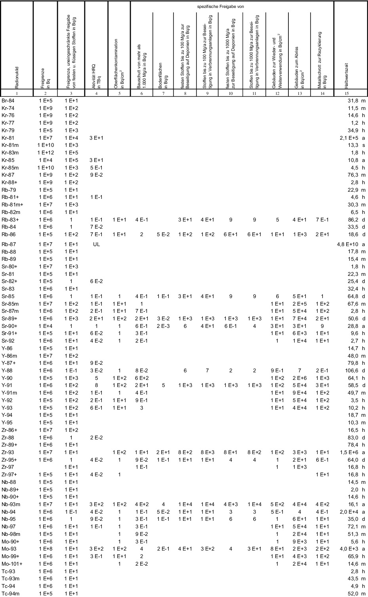

# Verordnung zum Schutz vor der schädlichen Wirkung ionisierender Strahlung (StrlSchV 2018)

Ausfertigungsdatum
:   2018-11-29

Fundstelle
:   BGBl I: 2018, 2034, 2036 (2021 I 5261)

Zuletzt geändert durch
:   Art. 1 V v. 8.10.2021 I 4645

Stand: Ersetzt V 751-1-8 v. 20.7.2001 I 1714; 2002 I 1459 (StrlSchV 2001)
Diese Verordnung dient der Umsetzung der Richtlinie 2013/59/Euratom
des Rates vom 5. Dezember 2013 zur Festlegung grundlegender
Sicherheitsnormen für den Schutz vor den Gefahren einer Exposition
gegenüber ionisierender Strahlung und zur Aufhebung der Richtlinien
89/618/Euratom, 90/641/Euratom, 96/29/Euratom, 97/43/Euratom und
2003/122/Euratom (ABl. L 13 vom 17.1.2014, S. 1) sowie der Umsetzung
des Artikels 8d der Richtlinie 2009/71/Euratom des Rates vom 25. Juni
2009 über einen Gemeinschaftsrahmen für die nukleare Sicherheit
kerntechnischer Anlagen (ABl. L 172 vom 2.7.2009, S. 18), in der durch
die Richtlinie des Rates 2014/87/Euratom vom 8. Juli 2014 zur Änderung
der Richtlinie 2009/71/Euratom über einen Gemeinschaftsrahmen für die
nukleare Sicherheit kerntechnischer Anlagen (ABl. L 219 vom 25.7.2014,
S. 42) geänderten Fassung.

## Teil 1 - Begriffsbestimmungen

### § 1 Begriffsbestimmungen

(1) Ableitung: Abgabe flüssiger, an Schwebstoffe gebundener oder
gasförmiger radioaktiver Stoffe auf hierfür vorgesehenen Wegen.

(2) Äquivalentdosis: Produkt aus der Energiedosis im ICRU-
Weichteilgewebe und dem Qualitätsfaktor Q der ICRU nach Anlage 18 Teil
D, der die Einflüsse der Strahlungsart und der Strahlungsenergie
berücksichtigt. Beim Vorliegen mehrerer Strahlungsarten und
Strahlungsenergien ist die gesamte Äquivalentdosis die Summe ihrer
ermittelten Einzelbeiträge.

(3) Betriebsgelände: Grundstück, auf dem sich kerntechnische Anlagen,
Anlagen zur Erzeugung ionisierender Strahlung und Anlagen im Sinne des
§ 9a Absatz 3 Satz 1 zweiter Satzteil des Atomgesetzes oder
Einrichtungen befinden und zu dem der Strahlenschutzverantwortliche
den Zugang oder auf dem der Strahlenschutzverantwortliche die
Aufenthaltsdauer von Personen beschränken kann.

(4) Diagnostische Referenzwerte:

1.  Dosiswerte bei Anwendung ionisierender Strahlung am Menschen oder

2.  empfohlene Aktivitätswerte bei Anwendung radioaktiver Stoffe am
    Menschen,

für typische Untersuchungen, bezogen auf Standardphantome oder auf
Patientengruppen, für einzelne Gerätekategorien.

(5) Dosisrichtwert: eine effektive Dosis oder Organ-Äquivalentdosis,
die bei der Planung und der Optimierung von Schutzmaßnahmen für
Personen in geplanten Expositionssituationen als oberer Wert für die
in Betracht zu ziehende Exposition dient.

(6) Energiedosis: Energie, die durch ionisierende Strahlung in
Materie, einem Organ oder Gewebe deponiert worden ist, geteilt durch
die Masse der bestrahlten Materie, des bestrahlten Organs oder
Gewebes.

(7) Im Sinne des Forschungsvorhabens gesunde Person: Person, an der
zum Zweck der medizinischen Forschung ein radioaktiver Stoff oder
ionisierende Strahlung angewendet wird oder werden soll und bei der
weder die Krankheit, deren Erforschung Gegenstand des
Forschungsvorhabens ist, noch ein entsprechender Krankheitsverdacht
vorliegt.

(8) Intervention: Einsatz von Röntgenbildgebungstechniken, um zu
medizinischen Zwecken die Einbringung von Geräten und Substanzen in
den Körper und ihre Steuerung zu ermöglichen.

(9) Maximale Betriebsbedingungen: Kombination der technischen
Einstellparameter, die unter normalen Betriebsbedingungen bei
Röntgenstrahlern nach § 18 Absatz 1 Nummer 1, Röntgeneinrichtungen
nach den §§ 19 bis 22 und Störstrahlern nach § 17 zur höchsten
Ortsdosisleistung und bei Röntgenstrahlern nach § 18 Absatz 1 Nummer 2
und Absatz 2 zur höchsten mittleren Ortsdosisleistung führen; hierzu
gehören die Spannung für die Beschleunigung von Elektronen, der
Röntgenröhrenstrom und gegebenenfalls weitere Parameter wie
Einschaltzeit oder Elektrodenabstand.

(10) Oberflächenkontamination: Verunreinigung einer Oberfläche mit
radioaktiven Stoffen, die die nicht festhaftende, die festhaftende und
die über die Oberfläche eingedrungene Aktivität umfasst. Die Einheit
der Messgröße der Oberflächenkontamination ist die flächenbezogene
Aktivität in Becquerel pro Quadratzentimeter.

(11) Oberflächenkontamination, nicht festhaftende: Verunreinigung
einer Oberfläche mit radioaktiven Stoffen, bei denen eine
Weiterverbreitung der radioaktiven Stoffe nicht ausgeschlossen werden
kann.

(12) Ortsdosis: Äquivalentdosis, gemessen mit den in Anlage 18 Teil A
angegebenen Messgrößen an einem bestimmten Ort.

(13) Ortsdosisleistung: in einem bestimmten Zeitintervall erzeugte
Ortsdosis, geteilt durch die Länge des Zeitintervalls.

(14) Personendosis: Äquivalentdosis, gemessen mit den in Anlage 18
Teil A angegebenen Messgrößen an einer für die Exposition
repräsentativen Stelle der Körperoberfläche.

(15) Prüfende Person: natürliche Person, die in einer
Sachverständigenorganisation eigenständig Sachverständigentätigkeiten
durchführt.

(16) Sachverständiger:

1.  natürliche Person, die eigenständig Sachverständigentätigkeiten
    durchführt (Einzelsachverständiger) oder

2.  juristische Person oder nicht rechtsfähige Personenvereinigung, die
    Sachverständigentätigkeiten durchführt (Sachverständigenorganisation).

(17) Spezifische Aktivität: Verhältnis der Aktivität eines
Radionuklids zur Masse des Materials, in dem das Radionuklid verteilt
ist. Bei festen radioaktiven Stoffen ist die Bezugsmasse für die
Bestimmung der spezifischen Aktivität die Masse des Körpers oder
Gegenstandes, mit dem die Radioaktivität bei vorgesehener Anwendung
untrennbar verbunden ist. Bei gasförmigen radioaktiven Stoffen ist die
Bezugsmasse die Masse des Gases oder des Gasgemisches.

(18) Störfall: Ereignisablauf, bei dessen Eintreten der Betrieb der
kerntechnischen Anlage, der Anlage zur Erzeugung ionisierender
Strahlung oder die Tätigkeit aus sicherheitstechnischen Gründen nicht
fortgeführt werden kann und für den die kerntechnische Anlage oder die
Anlage zur Erzeugung ionisierender Strahlung auszulegen ist oder für
den bei der Tätigkeit vorsorglich Schutzvorkehrungen vorzusehen sind.

(19) Tierbegleitperson: einwilligungsfähige Person, die das 18.
Lebensjahr vollendet hat und die außerhalb ihrer beruflichen Tätigkeit
freiwillig ein Tier begleitet oder betreut.

(20) Überwachung, ärztliche: ärztliche Untersuchung, gesundheitliche
Beurteilung und Beratung einer beruflich exponierten Person durch
einen ermächtigten Arzt.

(21) Verbringung:

1.  Einfuhr in den Geltungsbereich dieser Verordnung aus einem Staat, der
    nicht Mitgliedstaat der Europäischen Union ist,

2.  Ausfuhr aus dem Geltungsbereich dieser Verordnung in einen Staat, der
    nicht Mitgliedstaat der Europäischen Union ist, oder

3.  grenzüberschreitender Warenverkehr aus einem Mitgliedstaat der
    Europäischen Union in den Geltungsbereich dieser Verordnung oder in
    einen Mitgliedstaat der Europäischen Union aus dem Geltungsbereich
    dieser Verordnung.

(22) Vorkommnis: Ereignis in einer geplanten Expositionssituation, das
zu einer unbeabsichtigten Exposition geführt hat, geführt haben könnte
oder führen könnte. Kein Vorkommnis liegt vor, wenn das Ereignis für
den Strahlenschutz nicht relevant ist.

(23) Zur medizinischen Forschung Berechtigter: der Inhaber der
Genehmigung nach § 31 des Strahlenschutzgesetzes oder derjenige, nach
dessen Anzeige nach § 33 Absatz 3 Satz 1 des Strahlenschutzgesetzes
mit der angezeigten Anwendung begonnen werden darf.

## Teil 2 - Strahlenschutz bei geplanten Expositionssituationen

### Kapitel 1 - Rechtfertigung von Tätigkeitsarten

#### § 2 Nicht gerechtfertigte Tätigkeitsarten

Tätigkeiten, die den in Anlage 1 genannten nicht gerechtfertigten
Tätigkeitsarten zuzuordnen sind, dürfen nicht ausgeübt werden.

#### § 3 Verfahren zur Prüfung der Rechtfertigung von Tätigkeitsarten nach § 7 des Strahlenschutzgesetzes

(1) Die nach § 7 Absatz 1 Satz 1 des Strahlenschutzgesetzes zu
übermittelnden Unterlagen umfassen neben den jeweiligen Genehmigungs-
oder Anzeigeunterlagen die Unterlagen nach Anlage 2 Teil A sowie eine
Darlegung der Zweifel der für das Genehmigungs- oder Anzeigeverfahren
zuständigen Behörde.

(2) Leitet eine für den Strahlenschutz zuständige oberste
Landesbehörde die ihr übermittelten Unterlagen an das
Bundesministerium für Umwelt, Naturschutz und nukleare Sicherheit
weiter, so hat sie zu den Zweifeln der für das Genehmigungs- oder
Anzeigeverfahren zuständigen Behörde schriftlich Stellung zu nehmen
und die Stellungnahme zusammen mit den Unterlagen unverzüglich zu
übermitteln.

(3) Die Frist zur Prüfung nach § 7 Absatz 2 Satz 1 des
Strahlenschutzgesetzes beginnt mit der Feststellung der
Vollständigkeit der Unterlagen durch das Bundesamt für Strahlenschutz.
Das Bundesamt für Strahlenschutz informiert das Bundesministerium für
Umwelt, Naturschutz und nukleare Sicherheit und die für das
Genehmigungs- oder Anzeigeverfahren zuständige Behörde oder, im Falle
des Absatzes 2, die oberste Landesbehörde über den Beginn der Prüfung.

(4) Das Bundesamt für Strahlenschutz kann auch nach Feststellung der
Vollständigkeit für die Prüfung erforderliche Unterlagen nachfordern.

(5) Das Bundesamt für Strahlenschutz legt den Bericht unverzüglich
nach Abschluss der Prüfung dem Bundesministerium für Umwelt,
Naturschutz und nukleare Sicherheit vor und veröffentlicht den Bericht
im Bundesanzeiger. Das Bundesministerium für Umwelt, Naturschutz und
nukleare Sicherheit informiert die für das Genehmigungs- oder
Anzeigeverfahren zuständige Behörde oder, im Falle des Absatzes 2, die
oberste Landesbehörde über das Ergebnis der Prüfung.

#### § 4 Verfahren zur Prüfung der Rechtfertigung von Tätigkeitsarten nach § 38 des Strahlenschutzgesetzes

(1) Die für die Erteilung einer Genehmigung nach § 40 oder § 42 des
Strahlenschutzgesetzes oder einer Bauartzulassung nach § 45 des
Strahlenschutzgesetzes zuständige Behörde hat dem Bundesamt für
Strahlenschutz zusammen mit dem gemäß § 41 Absatz 5 Satz 1, § 43
Absatz 2 Satz 1 oder § 46 Absatz 3 Satz 1 des Strahlenschutzgesetzes
weiterzuleitenden Antrag Folgendes vorzulegen:

1.  die Darlegung, warum die beabsichtigte Verwendung, die beabsichtigte
    Lagerung oder der beabsichtigte Betrieb eine neue Tätigkeitsart
    darstellt, und

2.  die Unterlagen, die zur Prüfung der Rechtfertigung der Tätigkeitsart
    erforderlich sind, insbesondere die in Anlage 2 aufgeführten
    Unterlagen.

Das Bundesamt für Strahlenschutz kann für die Prüfung erforderliche
Unterlagen nachfordern; die Frist nach § 38 Absatz 1 Satz 1 des
Strahlenschutzgesetzes bleibt davon unberührt.

(2) Das Bundesamt für Strahlenschutz informiert das Bundesministerium
für Umwelt, Naturschutz und nukleare Sicherheit, die für die Erteilung
der Genehmigung nach § 40 oder § 42 des Strahlenschutzgesetzes oder
der Bauartzulassung nach § 45 Absatz 1 Nummer 1, 3, 4, 5, 6 oder 7 des
Strahlenschutzgesetzes zuständige Behörde sowie die für den
Strahlenschutz zuständigen obersten Landesbehörden über den Beginn
einer Prüfung.

(3) Das Bundesamt für Strahlenschutz bewertet bei der Prüfung der
Rechtfertigung der Tätigkeitsart insbesondere, ob

1.  die Leistungsfähigkeit und Eignung des Konsumguts, der Vorrichtung,
    der Anlage, der Röntgeneinrichtung oder des Störstrahlers die
    beabsichtigte Verwendung, die beabsichtigte Lagerung oder den
    beabsichtigten Betrieb rechtfertigt,

2.  die Auslegung geeignet ist, um sicherzustellen, dass Expositionen bei
    normaler Verwendung sowie die Wahrscheinlichkeit einer falschen
    Verwendung oder unfallbedingter Expositionen und deren Folgen so
    gering wie möglich sind.

(4) Das Bundesamt für Strahlenschutz veröffentlicht seine
Stellungnahme zur Rechtfertigung der Tätigkeitsart unverzüglich nach
ihrer Fertigstellung im Bundesanzeiger.

(5) Das Bundesamt für Strahlenschutz übermittelt die Stellungnahme
unverzüglich

1.  dem Bundesministerium für Umwelt, Naturschutz und nukleare Sicherheit,

2.  der für das ausgesetzte Genehmigungs- oder Zulassungsverfahren
    zuständigen Behörde und

3.  im Falle eines Antrags nach § 40 oder § 42 des Strahlenschutzgesetzes
    den zuständigen Kontaktstellen der anderen Mitgliedstaaten nach
    Artikel 76 Absatz 2 Satz 1 der Richtlinie 2013/59 Euratom.

Die für die Erteilung einer Genehmigung nach § 40 oder § 42 des
Strahlenschutzgesetzes oder einer Bauartzulassung nach § 45 Absatz 1
Nummer 1, 3, 4, 5, 6 oder 7 des Strahlenschutzgesetzes zuständigen
Behörden übermitteln dem Bundesamt für Strahlenschutz Informationen
über erteilte Genehmigungen für Konsumgüter sowie über
Bauartzulassungen. Das Bundesamt für Strahlenschutz veröffentlicht
eine Liste mit den wesentlichen Angaben über den Gegenstand dieser
Genehmigungen oder Bauartzulassungen.

### Kapitel 2 - Vorabkontrolle bei radioaktiven Stoffen oder ionisierender Strahlung

#### Abschnitt 1 - Ausnahmen von der Genehmigungs- und Anzeigebedürftigkeit einer Tätigkeit; Ausnahmen von Genehmigungsvoraussetzungen

##### § 5 Genehmigungsfreier Umgang

(1) Eine Genehmigung nach § 12 Absatz 1 Nummer 3 des
Strahlenschutzgesetzes ist in den in Anlage 3 Teil A und B genannten
Fällen nicht erforderlich. Bei der Prüfung der Voraussetzungen nach
Anlage 3 Teil B Nummer 1 oder 2 bleiben die mit den Tätigkeiten nach
Anlage 3 Teil A oder Teil B Nummer 3 bis 9 verbundenen radioaktiven
Stoffe außer Betracht.

(2) Bei einem nach § 12 Absatz 1 Nummer 3 oder Absatz 2 des
Strahlenschutzgesetzes genehmigten Umgang ist ein darüber
hinausgehender genehmigungsfreier Umgang nach Absatz 1 für die
radioaktiven Stoffe, die in der Genehmigung aufgeführt sind, auch
unterhalb der Freigrenzen der Anlage 4 Tabelle 1 Spalte 2 und 3 nicht
zulässig. Dies gilt nicht, wenn in einem einzelnen Betrieb oder
selbständigen Zweigbetrieb, bei Nichtgewerbetreibenden am Ort der
Tätigkeit des Genehmigungsinhabers, mit radioaktiven Stoffen in
mehreren, räumlich voneinander getrennten Gebäuden, Gebäudeteilen,
Anlagen oder Einrichtungen umgegangen wird und ausreichend
sichergestellt ist, dass die radioaktiven Stoffe aus den einzelnen
Gebäuden, Gebäudeteilen, Anlagen oder Einrichtungen nicht
zusammenwirken können.

##### § 6 Genehmigungsfreier Besitz von Kernbrennstoffen

(1) Die Vorschriften des § 5 Absatz 2 bis 4 des Atomgesetzes sind auf
denjenigen nicht anzuwenden, der

1.  mit Kernbrennstoffen

    a)  nach § 5 Absatz 1 in Verbindung mit Anlage 3 Teil B Nummer 1 oder 2
        ohne Genehmigung oder

    b)  auf Grund einer Genehmigung nach § 12 Absatz 1 Nummer 3 oder Absatz 2
        des Strahlenschutzgesetzes

    umgehen darf oder

2.  Kernbrennstoffe

    a)  auf Grund von § 28 des Strahlenschutzgesetzes ohne Genehmigung oder

    b)  auf Grund einer Genehmigung nach § 27 Absatz 1 des
        Strahlenschutzgesetzes

    befördern darf.

(2) Die Herausgabe von Kernbrennstoffen aus der staatlichen Verwahrung
nach § 5 Absatz 6 des Atomgesetzes oder aus der genehmigten
Aufbewahrung nach § 6 des Atomgesetzes oder § 12 Absatz 1 Nummer 3 des
Strahlenschutzgesetzes ist auch zulässig, wenn der Empfänger zum
Besitz der Kernbrennstoffe nach Absatz 1 berechtigt ist oder wenn
diese Kernbrennstoffe zum Zweck der Ausfuhr befördert werden sollen.

##### § 7 Genehmigungs- und anzeigefreier Betrieb von Anlagen zur Erzeugung ionisierender Strahlung

Wer eine Anlage zur Erzeugung ionisierender Strahlung der in Anlage 3
Teil C genannten Art betreibt, bedarf weder einer Genehmigung nach §
12 Absatz 1 Nummer 1 des Strahlenschutzgesetzes, noch hat er eine
Anzeige nach § 17 Absatz 1 des Strahlenschutzgesetzes zu erstatten.

##### § 8 Genehmigungsfreier Betrieb von Störstrahlern

Eine Genehmigung nach § 12 Absatz 1 Nummer 5 des
Strahlenschutzgesetzes ist in den in Anlage 3 Teil D genannten Fällen
nicht erforderlich.

##### § 9 Anzeigefreie Prüfung, Erprobung, Wartung und Instandsetzung von Röntgeneinrichtungen oder Störstrahlern

Eine Anzeige nach § 22 Absatz 1 des Strahlenschutzgesetzes haben
folgende Personen nicht zu erstatten:

1.  derjenige, der geschäftsmäßig Störstrahler nach Anlage 3 Teil D Nummer
    3 prüft, erprobt, wartet oder instand setzt,

2.  derjenige, der, ohne Röntgenstrahlung einzuschalten, Tätigkeiten nach
    § 22 Absatz 1 des Strahlenschutzgesetzes an Anwendungsgeräten,
    Zusatzgeräten und Zubehör, der erforderlichen Software sowie an
    Vorrichtungen zur medizinischen Befundung durchführt, die keine
    Strahlenschutzmaßnahmen erfordern.

##### § 10 Befreiung von der Pflicht zur Deckungsvorsorge

(1) Keiner Deckungsvorsorge nach § 13 Absatz 2 des
Strahlenschutzgesetzes für die Erteilung einer Umgangsgenehmigung nach
§ 12 Absatz 1 Nummer 3 des Strahlenschutzgesetzes sowie nach § 6
Absatz 2 Nummer 3 und § 9 Absatz 2 Nummer 4 des Atomgesetzes bedarf
es, wenn

1.  die Gesamtaktivität der radioaktiven Stoffe, mit denen in dem
    einzelnen Betrieb oder selbständigen Zweigbetrieb, bei
    Nichtgewerbetreibenden am Ort der Tätigkeit des Antragstellers,
    umgegangen wird, das 10
    6                   fache der Freigrenzen der Anlage 4 Tabelle 1
    Spalte 2 und bei angereichertem Uran die Masse an Uran-235 den Wert
    von 350 Gramm nicht überschreitet und

2.  ausreichend sichergestellt ist, dass die sonstigen radioaktiven Stoffe
    aus den einzelnen Gebäuden, Gebäudeteilen, Anlagen oder Einrichtungen
    nicht zusammenwirken können.

(2) Keiner Deckungsvorsorge nach § 13 Absatz 2 des
Strahlenschutzgesetzes für die Erteilung einer Umgangsgenehmigung nach
§ 12 Absatz 1 Nummer 3 des Strahlenschutzgesetzes bedarf es ferner,
wenn in dem einzelnen Betrieb oder selbständigen Zweigbetrieb, bei
Nichtgewerbetreibenden am Ort der Tätigkeit des Antragstellers, mit
sonstigen radioaktiven Stoffen in mehreren räumlich voneinander
getrennten Gebäuden, Gebäudeteilen, Anlagen oder Einrichtungen
umgegangen wird und wenn

1.  die Aktivität der sonstigen radioaktiven Stoffe in den einzelnen
    Gebäuden, Gebäudeteilen, Anlagen oder Einrichtungen das 10
    6                   fache der Freigrenzen der Anlage 4 Tabelle 1
    Spalte 2 nicht überschreitet und

2.  ausreichend sichergestellt ist, dass die sonstigen radioaktiven Stoffe
    aus den einzelnen Gebäuden, Gebäudeteilen, Anlagen oder Einrichtungen
    nicht zusammenwirken können.

(3) Bei der Anwendung des Absatzes 1 oder 2 darf der Anteil an offenen
radioaktiven Stoffen das 10
5             fache der Freigrenzen der Anlage 4 Tabelle 1 Spalte 2
nicht überschreiten.

(4) Die Absätze 1 und 2 gelten nicht für hochradioaktive
Strahlenquellen.

##### § 11 Freigrenzen

Die Radionuklide, für die Freigrenzen bestehen, und die nach dem
Strahlenschutzgesetz maßgeblichen Freigrenzen ergeben sich aus Anlage
4 Tabelle 1 Spalte 1 bis 3.

#### Abschnitt 2 - Grenzüberschreitende Verbringung radioaktiver Stoffe

##### § 12 Genehmigungsbedürftige grenzüberschreitende Verbringung

(1) Einer Genehmigung bedarf, wer hochradioaktive Strahlenquellen
nicht nur vorübergehend zur eigenen Nutzung im Rahmen eines
genehmigten Umgangs aus einem Staat, der nicht Mitgliedstaat der
Europäischen Union ist, in den Geltungsbereich dieser Verordnung
verbringt, wenn

1.  deren Aktivität jeweils das Zehnfache des Wertes für hochradioaktive
    Strahlenquellen der Anlage 4 Tabelle 1 Spalte 4 beträgt oder
    überschreitet,

2.  sie ebenso wie ihre Schutzbehälter oder Aufbewahrungsbehältnisse keine
    Kennzeichnung nach § 92 Absatz 1 Satz 1 Nummer 1 und § 92 Absatz 1
    Satz 2 aufweisen oder

3.  ihnen keine Dokumentation nach § 94 Absatz 3 beigefügt ist.

(2) Einer Genehmigung bedarf, wer folgende radioaktive Stoffe nicht
nur vorübergehend zur eigenen Nutzung im Rahmen eines genehmigten
Umgangs aus dem Geltungsbereich dieser Verordnung in einen Staat
verbringt, der nicht Mitgliedstaat der Europäischen Union ist:

1.  hochradioaktive Strahlenquellen,

    a)  deren Aktivität jeweils das Zehnfache des Wertes für hochradioaktive
        Strahlenquellen der Anlage 4 Tabelle 1 Spalte 4 beträgt oder
        überschreitet,

    b)  die ebenso wie ihre Schutzbehälter oder Aufbewahrungsbehältnisse keine
        Kennzeichnung nach § 92 Absatz 1 Satz 1 Nummer 1 und § 92 Absatz 1
        Satz 2 aufweisen oder

    c)  denen keine Dokumentation nach § 94 Absatz 3 beigefügt ist,

oder

2.  sonstige radioaktive Stoffe nach § 3 Absatz 1 des
    Strahlenschutzgesetzes oder Kernbrennstoffe nach § 3 Absatz 3 des
    Strahlenschutzgesetzes, deren Aktivität je Versandstück das 10
    8                   fache der Freigrenzen der Anlage 4 Tabelle 1
    Spalte 2 beträgt oder überschreitet.

(3) Eine Genehmigung nach Absatz 1 ist nicht erforderlich, soweit eine
Genehmigung nach § 3 Absatz 1 des Atomgesetzes vorliegt, die sich
gemäß § 10a Absatz 1 des Atomgesetzes auf eine Verbringung nach Absatz
1 erstreckt. Eine Genehmigung nach Absatz 2 ist nicht erforderlich,
soweit eine Genehmigung nach § 3 Absatz 1 des Atomgesetzes vorliegt,
die sich gemäß § 10a Absatz 1 des Atomgesetzes auf eine Verbringung
nach Absatz 2 erstreckt.

##### § 13 Anmeldebedürftige grenzüberschreitende Verbringung

(1) Wer sonstige radioaktive Stoffe nach § 3 Absatz 1 des
Strahlenschutzgesetzes oder Kernbrennstoffe nach § 3 Absatz 3 des
Strahlenschutzgesetzes

1.  aus einem Staat, der nicht Mitgliedstaat der Europäischen Union ist,
    in den Geltungsbereich dieser Verordnung verbringt oder

2.  aus dem Geltungsbereich dieser Verordnung in einen Staat verbringt,
    der nicht Mitgliedstaat der Europäischen Union ist,

und keiner Genehmigung nach § 12 Absatz 1 oder 2 bedarf, hat die
Verbringung der nach § 188 Absatz 1 Satz 2 des Strahlenschutzgesetzes
zuständigen Behörde elektronisch anzumelden. Bei der Zollabfertigung
ist der Nachweis der Anmeldung nach Satz 1 der nach § 188 Absatz 2
Satz 1 des Strahlenschutzgesetzes für die Überwachung zuständigen
Behörde oder der von ihr benannten Stelle vorzulegen. Für die
Anmeldung ist der Ausdruck des elektronisch erzeugten Formulars zu
verwenden, das die nach § 188 Absatz 1 Satz 2 des
Strahlenschutzgesetzes zuständige Behörde bestimmt hat.

(2) Wer Kernbrennstoffe nach § 3 Absatz 1 des Strahlenschutzgesetzes
in Form von

1.  bis zu 1 Kilogramm Uran, das auf 10 Prozent oder mehr, jedoch weniger
    als 20 Prozent an Uran-235 angereichert ist, oder

2.  weniger als 10 Kilogramm Uran, das auf weniger als 10 Prozent an
    Uran-235 angereichert ist,

aus einem Staat, der nicht Mitgliedstaat der Europäischen Union ist,
in den Geltungsbereich dieser Verordnung verbringt, hat die
Verbringung abweichend von § 3 Absatz 1 des Atomgesetzes nach Absatz 1
anzumelden.

(3) Bei einer nach Absatz 1 Satz 1 oder Absatz 2 anmeldebedürftigen
Verbringung in den Geltungsbereich dieser Verordnung hat der
Verbringer Vorsorge zu treffen, dass die zu verbringenden radioaktiven
Stoffe nach der Verbringung erstmals nur an Personen abgegeben werden,
die eine Genehmigung nach § 12 Absatz 1 Nummer 1 oder 3, jeweils auch
in Verbindung mit Absatz 2, des Strahlenschutzgesetzes oder § 6 Absatz
1, § 7 Absatz 1 Satz 1 oder Absatz 3 Satz 1 oder § 9 Absatz 1 des
Atomgesetzes besitzen.

##### § 14 Ausnahmen; andere Vorschriften über die grenzüberschreitende Verbringung

(1) Keiner Genehmigung nach § 3 Absatz 1 des Atomgesetzes oder § 12
dieser Verordnung bedarf und keine Anmeldung nach § 13 dieser
Verordnung hat vorzunehmen, wer

1.  einen der in Anlage 3 Teil E genannten Stoffe oder eine dort genannte
    Vorrichtung verbringt,

2.  sonstige radioaktive Stoffe nach § 3 Absatz 1 des
    Strahlenschutzgesetzes oder Kernbrennstoffe nach § 3 Absatz 3 des
    Strahlenschutzgesetzes zollamtlich überwacht durch den Geltungsbereich
    dieser Verordnung verbringt,

3.  Stoffe im Sinne der Nummer 2 zur eigenen Nutzung im Rahmen eines
    genehmigten Umgangs vorübergehend grenzüberschreitend verbringt,
    sofern es sich nicht um hochradioaktive Strahlenquellen handelt, oder

4.  nach § 42 des Strahlenschutzgesetzes Konsumgüter verbringt.

(2) Die §§ 12 und 13 dieser Verordnung gelten nicht für die
Verbringung durch die Bundeswehr.

(3) Andere Vorschriften über die Verbringung bleiben unberührt.

##### § 15 Voraussetzungen für die Erteilung der Genehmigung für die grenzüberschreitende Verbringung

(1) Die Genehmigung für eine grenzüberschreitende Verbringung nach §
12 Absatz 1 ist zu erteilen, wenn

1.  keine Tatsachen vorliegen, aus denen sich Bedenken gegen die
    Zuverlässigkeit des Antragstellers, seines gesetzlichen Vertreters
    oder, bei juristischen Personen oder nicht rechtsfähigen
    Personenvereinigungen, der nach Gesetz, Satzung oder
    Gesellschaftsvertrag zur Vertretung oder Geschäftsführung Berechtigten
    ergeben, und

2.  der Antragsteller Vorsorge getroffen hat, dass die radioaktiven Stoffe
    nach der Verbringung erstmals nur an Personen abgegeben werden, die
    die für den Umgang erforderliche Genehmigung besitzen.

Für hochradioaktive Strahlenquellen darf die Genehmigung nach Satz 1
nur erteilt werden, wenn gewährleistet ist, dass

1.  sie und ihr Schutzbehälter oder Aufbewahrungsbehältnis eine
    Kennzeichnung nach § 92 Absatz 1 Satz 1 Nummer 1 und § 92 Absatz 1
    Satz 2 aufweisen und

2.  die schriftlichen Unterlagen nach § 94 Absatz 3 beigefügt sind.

(2) Die Genehmigung für eine grenzüberschreitende Verbringung nach §
12 Absatz 2 ist zu erteilen, wenn

1.  keine Tatsachen vorliegen, aus denen sich Bedenken gegen die
    Zuverlässigkeit des Antragstellers, seines gesetzlichen Vertreters
    oder, bei juristischen Personen oder nicht rechtsfähigen
    Personenvereinigungen, der nach Gesetz, Satzung oder
    Gesellschaftsvertrag zur Vertretung oder Geschäftsführung Berechtigten
    ergeben, und

2.  gewährleistet ist, dass die zu verbringenden radioaktiven Stoffe nicht
    in einer Weise verwendet werden, die die innere oder äußere Sicherheit
    der Bundesrepublik Deutschland oder die Erfüllung ihrer
    internationalen Verpflichtungen auf dem Gebiet der Kernenergie und des
    Strahlenschutzes gefährden.

Absatz 1 Satz 2 gilt entsprechend.

#### Abschnitt 3 - Bauartzulassung

##### § 16 Technische Anforderungen an die Bauartzulassung einer Vorrichtung, die sonstige radioaktive Stoffe enthält

(1) Die Bauart einer Vorrichtung, die sonstige radioaktive Stoffe nach
§ 3 Absatz 1 des Strahlenschutzgesetzes enthält, darf nach § 45 Absatz
1 Nummer 1 des Strahlenschutzgesetzes nur dann zugelassen werden, wenn
sichergestellt ist, dass

1.  sie nur sonstige radioaktive Stoffe nach § 3 Absatz 1 des
    Strahlenschutzgesetzes enthält, die

    a)  umschlossen sind und

    b)  berührungssicher abgedeckt sind,

2.  die Ortsdosisleistung im Abstand von 0,1 Meter von der berührbaren
    Oberfläche der Vorrichtung 1 Mikrosievert durch Stunde bei normalen
    Betriebsbedingungen nicht überschreitet,

3.  die Vorrichtung so ausgelegt ist, dass ein sicherer Einschluss der
    radioaktiven Stoffe bei bestimmungsgemäßem Betrieb gewährleistet ist
    und außer der Qualitätskontrolle durch den Hersteller nach § 24 Nummer
    2 und einer gegebenenfalls durchzuführenden Dichtheitsprüfung nach §
    25 Absatz 4 keine weiteren Dichtheitsprüfungen an den radioaktiven
    Stoffen, die in der Vorrichtung enthalten sind, erforderlich sind, und

4.  die Aktivität der in der Vorrichtung enthaltenen radioaktiven Stoffe
    das Zehnfache der Freigrenzen der Anlage 4 Tabelle 1 Spalte 2 nicht
    überschreitet.

(2) Die für die Zulassung der Bauart zuständige Behörde kann im
Einzelfall Abweichungen von den Voraussetzungen nach Absatz 1 Nummer 1
Buchstabe a, Nummer 3 oder 4 zulassen, sofern die durch die
Vorrichtung verursachte, zu erwartende jährliche, effektive Dosis für
eine Einzelperson der Bevölkerung im Bereich von höchstens 10
Mikrosievert liegt.

##### § 17 Technische Anforderungen an die Bauartzulassung von Störstrahlern

Die Bauart eines Störstrahlers darf nach § 45 Absatz 1 Nummer 1 des
Strahlenschutzgesetzes nur dann zugelassen werden, wenn sichergestellt
ist, dass

1.  die Ortsdosisleistung im Abstand von 0,1 Meter von der berührbaren
    Oberfläche des Störstrahlers 1 Mikrosievert durch Stunde bei den vom
    Hersteller oder Verbringer angegebenen maximalen Betriebsbedingungen
    nicht überschreitet und

2.  der Störstrahler auf Grund technischer Maßnahmen nur dann betrieben
    werden kann, wenn die dem Strahlenschutz dienenden
    Sicherheitseinrichtungen vorhanden und wirksam sind.

##### § 18 Technische Anforderungen an die Bauartzulassung von Röntgenstrahlern

(1) Die Bauart eines Röntgenstrahlers, der weder zur Anwendung am
Menschen noch zur Anwendung am Tier bestimmt ist und, bei dem der
Untersuchungsgegenstand nicht vom Schutzgehäuse mit umschlossen wird,
darf nach § 45 Absatz 1 Nummer 2 des Strahlenschutzgesetzes nur dann
zugelassen werden, wenn sichergestellt ist, dass

1.  im Falle eines Röntgenstrahlers für Röntgenfeinstrukturuntersuchungen
    die Ortsdosisleistung bei geschlossenen Strahlenaustrittsfenstern und
    den vom Hersteller oder Verbringer angegebenen maximalen
    Betriebsbedingungen in 1 Meter Abstand vom Brennfleck 3 Mikrosievert
    durch Stunde nicht überschreitet, oder

2.  im Falle eines Röntgenstrahlers, der nicht unter Nummer 1 fällt, die
    über einen je nach Anwendung geeigneten Zeitraum gemittelte
    Ortsdosisleistung bei geschlossenen Strahlenaustrittsfenstern und den
    vom Hersteller oder Verbringer angegebenen maximalen
    Betriebsbedingungen in 1 Meter Abstand vom Brennfleck folgende Werte
    nicht überschreitet:

    a)  bei Nennspannungen bis 200 Kilovolt 2,5 Millisievert durch Stunde,

    b)  bei Nennspannungen über 200 Kilovolt 10 Millisievert durch Stunde und
        nach Herunterregeln auf eine Röntgenspannung von 200 Kilovolt 2,5
        Millisievert durch Stunde.

(2) Die Bauart eines Röntgenstrahlers, der zur Anwendung von
Röntgenstrahlung am Tier bestimmt ist, darf nach § 45 Absatz 1 Nummer
2 des Strahlenschutzgesetzes nur dann zugelassen werden, wenn
sichergestellt ist, dass die über einen je nach Anwendung geeigneten
Zeitraum gemittelte Ortsdosisleistung bei geschlossenem
Strahlenaustrittsfenster und bei den vom Hersteller oder Verbringer
angegebenen maximalen Betriebsbedingungen

1.  in 1 Meter Abstand vom Brennfleck 1 Millisievert durch Stunde nicht
    überschreitet und

2.  in 0,1 Meter Abstand von der berührbaren Oberfläche des
    Röntgenstrahlers, ausgenommen dem Bereich der Oberfläche, in dem sich
    das Strahlenaustrittsfenster befindet, 100 Mikrosievert durch Stunde
    nicht überschreitet, sofern der Röntgenstrahler für eine Anwendung aus
    der Hand geeignet ist.

##### § 19 Technische Anforderungen an die Bauartzulassung von Basisschutzgeräten

Die Bauart einer Röntgeneinrichtung, die weder zur Anwendung am
Menschen noch zur Anwendung am Tier bestimmt ist, darf als
Basisschutzgerät nach § 45 Absatz 1 Nummer 3 des
Strahlenschutzgesetzes nur dann zugelassen werden, wenn sichergestellt
ist, dass

1.  das Schutzgehäuse außer der Röntgenröhre oder dem Röntgenstrahler auch
    den zu behandelnden oder zu untersuchenden Gegenstand so umschließt,
    dass ausschließlich Öffnungen zum Ein- und Ausbringen des Gegenstandes
    vorhanden sind,

2.  die Ortsdosisleistung im Abstand von 0,1 Meter von der berührbaren
    Oberfläche des Schutzgehäuses und im Abstand von 0,1 Meter vor den
    Öffnungen 10 Mikrosievert durch Stunde bei den vom Hersteller oder
    Verbringer angegebenen maximalen Betriebsbedingungen nicht
    überschreitet und

3.  die Röntgenröhre oder der Röntgenstrahler nur bei vollständig
    geschlossenem Schutzgehäuse betrieben werden kann; dies gilt nicht für

    a)  Öffnungen im Schutzgehäuse gemäß Nummer 1, wenn das Ein- und
        Ausbringen des zu behandelnden oder zu untersuchenden Gegenstandes
        ausschließlich mittels Probenwechsler oder Fördereinrichtung geschieht
        und die Abmessungen der Öffnungen diesem Zweck angepasst sind, oder

    b)  Untersuchungsverfahren, die einen kontinuierlichen Betrieb des
        Röntgenstrahlers erfordern, wenn die Ortsdosisleistung im Innern des
        geöffneten Schutzgehäuses 10 Mikrosievert durch Stunde nicht
        überschreitet.

##### § 20 Technische Anforderungen an die Bauartzulassung von Hochschutzgeräten

Die Bauart einer Röntgeneinrichtung, die weder zur Anwendung am
Menschen noch zur Anwendung am Tier bestimmt ist, darf als
Hochschutzgerät nach § 45 Absatz 1 Nummer 4 des Strahlenschutzgesetzes
nur dann zugelassen werden, wenn sichergestellt ist, dass

1.  das Schutzgehäuse außer der Röntgenröhre oder dem Röntgenstrahler auch
    den zu behandelnden oder zu untersuchenden Gegenstand vollständig
    umschließt,

2.  die Ortsdosisleistung im Abstand von 0,1 Meter von der berührbaren
    Oberfläche des Schutzgehäuses – ausgenommen Innenräume nach Nummer 3
    Buchstabe a – bei den vom Hersteller oder Verbringer angegebenen
    maximalen Betriebsbedingungen 10 Mikrosievert durch Stunde nicht
    überschreitet,

3.  die Röntgenröhre oder der Röntgenstrahler nur bei vollständig
    geschlossenem Schutzgehäuse betrieben werden kann; dies gilt nicht für

    a)  Schutzgehäuse, in die ausschließlich hineingefasst werden kann, wenn
        die Ortsdosisleistung im erreichbaren Teil des Innenraumes bei den vom
        Hersteller oder Verbringer angegebenen maximalen Betriebsbedingungen
        250 Mikrosievert durch Stunde nicht überschreitet, oder

    b)  Untersuchungsverfahren, die einen kontinuierlichen Betrieb des
        Röntgenstrahlers erfordern, wenn die Ortsdosisleistung im Innern des
        geöffneten Schutzgehäuses 10 Mikrosievert durch Stunde nicht
        überschreitet.

##### § 21 Technische Anforderungen an die Bauartzulassung von Vollschutzgeräten

Die Bauart einer Röntgeneinrichtung, die weder zur Anwendung am
Menschen noch zur Anwendung am Tier bestimmt ist, darf als
Vollschutzgerät nach § 45 Absatz 1 Nummer 5 des Strahlenschutzgesetzes
nur dann zugelassen werden,

1.  wenn sichergestellt ist, dass

    a)  das Schutzgehäuse außer der Röntgenröhre oder dem Röntgenstrahler auch
        den zu behandelnden oder zu untersuchenden Gegenstand vollständig
        umschließt,

    b)  die Ortsdosisleistung im Abstand von 0,1 Meter von der berührbaren
        Oberfläche des Schutzgehäuses 3 Mikrosievert durch Stunde bei den vom
        Hersteller oder Verbringer angegebenen maximalen Betriebsbedingungen
        nicht überschreitet, und

2.  wenn durch zwei voneinander unabhängige Sicherheitseinrichtungen
    sichergestellt ist, dass

    a)  die Röntgenröhre oder der Röntgenstrahler nur bei vollständig
        geschlossenem Schutzgehäuse betrieben werden kann oder

    b)  bei Untersuchungsverfahren, die einen kontinuierlichen Betrieb des
        Röntgenstrahlers erfordern, das Schutzgehäuse während des Betriebes
        des Röntgenstrahlers nur bei geschlossenem Strahlenaustrittsfenster
        geöffnet werden kann und hierbei im Inneren des Schutzgehäuses die
        Ortsdosisleistung 3 Mikrosievert durch Stunde nicht überschreitet.

##### § 22 Technische Anforderungen an die Bauartzulassung von Schulröntgeneinrichtungen

Die Bauart einer Röntgeneinrichtung, die weder zur Anwendung am
Menschen noch zur Anwendung am Tier bestimmt ist, darf als
Schulröntgeneinrichtung nach § 45 Absatz 1 Nummer 6 des
Strahlenschutzgesetzes nur dann zugelassen werden, wenn sichergestellt
ist, dass

1.  die Voraussetzungen des § 21 erfüllt sind und

2.  die vom Hersteller oder Verbringer angegebenen maximalen
    Betriebsbedingungen nicht überschritten werden können.

##### § 23 Technische Anforderungen an die Bauartzulassung einer Anlage zur Erzeugung ionisierender Strahlung als Vollschutzanlage

Die Bauart einer Anlage zur Erzeugung ionisierender Strahlung, die
nicht zur Anwendung am Menschen bestimmt ist, darf als
Vollschutzanlage nach § 45 Absatz 1 Nummer 7 des
Strahlenschutzgesetzes nur dann zugelassen werden,

1.  wenn sichergestellt ist, dass

    a)  die Erzeugung radioaktiver Stoffe durch Aktivierung beim Betrieb der
        Vollschutzanlage ausgeschlossen ist,

    b)  ein Schutzgehäuse den Ort, an dem die ionisierende Strahlung entsteht,
        und den zu behandelnden oder zu untersuchenden Gegenstand vollständig
        umschließt,

    c)  die Ortsdosisleistung im Abstand von 0,1 Meter von der berührbaren
        Oberfläche des Schutzgehäuses 3 Mikrosievert durch Stunde bei den vom
        Hersteller oder Verbringer angegebenen maximalen normalen
        Betriebsbedingungen nicht überschreitet, und

2.  wenn durch zwei voneinander unabhängige Sicherheitseinrichtungen
    sichergestellt ist, dass die Vollschutzanlage nur bei vollständig
    geschlossenem Schutzgehäuse betrieben werden kann.

##### § 24 Pflichten des Inhabers einer Bauartzulassung

Der Inhaber einer Bauartzulassung hat

1.  ein Qualitätssicherungssystem zu betreiben,

2.  vor einer Abgabe der gefertigten bauartzugelassenen Vorrichtung eine
    Qualitätskontrolle durchzuführen, um sicherzustellen, dass die
    gefertigte bauartzugelassene Vorrichtung den für den Strahlenschutz
    wesentlichen Merkmalen der Bauartzulassung entspricht,

3.  die Qualitätskontrolle nach Nummer 2 durch eine von der für die
    Zulassung der Bauart zuständigen Behörde zu benennende sachverständige
    Person überwachen zu lassen,

4.  vor einer Abgabe der gefertigten bauartzugelassenen Vorrichtung

    a)  das Bauartzeichen und weitere von der für die Zulassung der Bauart
        zuständigen Behörde zu bestimmende Angaben anzubringen und,

    b)  im Falle einer bauartzugelassenen Vorrichtung nach § 45 Absatz 1
        Nummer 1 erste Alternative oder Nummer 7 des Strahlenschutzgesetzes
        diese entsprechend § 91 Absatz 1 zu kennzeichnen und

    c)  im Falle einer bauartzugelassenen Vorrichtung nach § 45 Absatz 1
        Nummer 1 erste Alternative des Strahlenschutzgesetzes die Vorrichtung
        zusätzlich so zu kennzeichnen, dass die enthaltenen Radionuklide und
        deren Aktivität zum Zeitpunkt der Herstellung ersichtlich sind, soweit
        dies nach Größe und Beschaffenheit der Vorrichtung möglich ist,

5.  dem Erwerber einer bauartzugelassenen Vorrichtung zusammen mit der
    Vorrichtung folgende Unterlagen auszuhändigen:

    a)  einen Abdruck des Zulassungsscheins,

    b)  einen Nachweis über das Ergebnis der Qualitätskontrolle nach Nummer 2
        unter Angabe des Datums der Durchführung,

    c)  eine Betriebsanleitung in deutscher Sprache, in der auf die dem
        Strahlenschutz dienenden Maßnahmen hingewiesen wird, und

6.  sicherzustellen, dass eine bauartzugelassene Vorrichtung nach § 45
    Absatz 1 Nummer 1 erste Alternative des Strahlenschutzgesetzes nach
    Beendigung der Nutzung wieder von ihm zurückgenommen werden kann.

##### § 25 Pflichten des Inhabers einer bauartzugelassenen Vorrichtung

(1) Der Inhaber einer bauartzugelassenen Vorrichtung hat folgende
Unterlagen bei der Vorrichtung bereitzuhalten:

1.  einen Abdruck des Zulassungsscheins,

2.  die Betriebsanleitung und

3.  im Falle einer Vorrichtung nach § 45 Absatz 1 Nummer 1 erste
    Alternative des Strahlenschutzgesetzes die Befunde der
    Dichtheitsprüfung nach Absatz 4 Satz 1.

Bei einer Abgabe der bauartzugelassenen Vorrichtung gilt § 24 Nummer 5
entsprechend.

(2) An der bauartzugelassenen Vorrichtung dürfen keine Änderungen
vorgenommen werden, die für den Strahlenschutz wesentliche Merkmale
betreffen.

(3) Wer eine bauartzugelassene Vorrichtung betreibt oder verwendet,
hat in den Fällen einer Bauartzulassung nach § 45 Absatz 1 Nummer 2
bis 7 des Strahlenschutzgesetzes unverzüglich den Betrieb einzustellen
oder in den Fällen einer Bauartzulassung nach § 45 Absatz 1 Nummer 1
des Strahlenschutzgesetzes die Vorrichtung unverzüglich stillzulegen
und Schutzmaßnahmen zur Vermeidung von Strahlenschäden zu treffen,
wenn

1.  die Rücknahme oder der Widerruf der Bauartzulassung oder die
    Erklärung, dass eine bauartzugelassene Vorrichtung nicht weiter
    betrieben werden darf, bekannt gemacht wurde oder

2.  die bauartzugelassene Vorrichtung nicht mehr den im Zulassungsschein
    angegebenen Merkmalen entspricht.

(4) Der Inhaber einer bauartzugelassenen Vorrichtung nach § 45 Absatz
1 Nummer 1 erste Alternative des Strahlenschutzgesetzes hat die
Vorrichtung alle zehn Jahre durch einen nach § 172 Absatz 1 Nummer 4
des Strahlenschutzgesetzes bestimmten Sachverständigen auf
Unversehrtheit und Dichtheit prüfen zu lassen. Stichtag für die
Prüfung nach Satz 1 ist der im Nachweis nach § 24 Nummer 5 Buchstabe b
vermerkte Tag der Qualitätskontrolle. Die für die Zulassung der Bauart
zuständige Behörde kann im Zulassungsschein von den Sätzen 1 und 2
abweichende Regelungen zur Dichtheitsprüfung treffen.

(5) Der Inhaber einer bauartzugelassenen Vorrichtung nach § 45 Absatz
1 Nummer 1 erste Alternative des Strahlenschutzgesetzes hat die
Vorrichtung nach Beendigung der Nutzung, sofern er diese nicht an
einen Dritten zur weiteren Nutzung abgibt, unverzüglich dem Inhaber
der Bauartzulassung zurückzugeben. Ist dies nicht möglich, so hat er
sie an eine Landessammelstelle oder an eine von der zuständigen
Behörde bestimmte Stelle abzugeben.

##### § 26 Bekanntmachung

Die für die Zulassung der Bauart zuständige Behörde hat den
wesentlichen Inhalt der Bauartzulassung, ihre Änderungen, ihre
Rücknahme, ihren Widerruf, die Verlängerung der Zulassungsfrist und
die Erklärung, dass eine bauartzugelassene Vorrichtung nicht weiter
betrieben werden darf, im Bundesanzeiger bekannt zu machen.

#### Abschnitt 4 - Rückstände

##### § 27 Bestimmung der Überwachungsbedürftigkeit von Rückständen

Für die Bestimmung der Überwachungsbedürftigkeit von Rückständen nach
§ 61 Absatz 2 Satz 1 des Strahlenschutzgesetzes gelten die in Anlage 5
festgelegten Überwachungsgrenzen und Verwertungs- und
Beseitigungswege.

##### § 28 Ermittlung der von Rückständen verursachten Expositionen

Die von Rückständen verursachten Expositionen sind nach den in Anlage
6 festgelegten Grundsätzen zu ermitteln.

##### § 29 Entlassung überwachungsbedürftiger Rückstände aus der Überwachung zur Verwertung oder Beseitigung nach dem Kreislaufwirtschaftsgesetz

(1) Bei einer beabsichtigten Verwertung oder Beseitigung der
überwachungsbedürftigen Rückstände nach dem Kreislaufwirtschaftsgesetz
legt der Antragsteller der für die Entlassung aus der Überwachung
zuständigen Behörde die folgenden Unterlagen vor:

1.  eine Erklärung des Antragstellers über den Verbleib des künftigen
    Abfalls,

2.  eine Annahmeerklärung des Verwerters oder Beseitigers und

3.  einen Nachweis, dass eine Kopie der Annahmeerklärung des Verwerters
    oder Beseitigers der für die Verwertungs- oder Beseitigungsanlage nach
    dem Kreislaufwirtschaftsgesetz zuständigen Behörde zugeleitet worden
    ist.

(2) Die für die Verwertungs- oder Beseitigungsanlage nach dem
Kreislaufwirtschaftsgesetz zuständige Behörde kann von der für die
Entlassung aus der Überwachung zuständigen Behörde innerhalb einer
Frist von 30 Kalendertagen nach Zugang der Kopie der Annahmeerklärung
des Verwerters oder Beseitigers verlangen, dass Einvernehmen
hinsichtlich der Anforderungen an den Verwertungs- oder
Beseitigungsweg hergestellt wird. Absatz 3 bleibt unberührt.

(3) Die für die Entlassung aus der Überwachung zuständige Behörde
stellt bei einer beabsichtigten Verwertung oder Beseitigung des
künftigen Abfalls zur Gewährleistung des Dosiskriteriums nach § 62
Absatz 3 Satz 1 des Strahlenschutzgesetzes innerhalb einer Frist von
30 Kalendertagen nach Zugang des Nachweises nach Absatz 1 Nummer 3 das
Einvernehmen mit der für die Entlassung aus der Überwachung
zuständigen Behörde her, in deren örtlichem Zuständigkeitsbereich der
künftige Abfall verwertet oder beseitigt werden soll. Das Einvernehmen
kann nicht erteilt werden, wenn das Dosiskriterium nicht eingehalten
werden kann. Das Einvernehmen gilt als erteilt, wenn es nicht
innerhalb von 30 Kalendertagen nach Eingang des Ersuchens versagt
wird.

(4) Die zuständige Behörde kann bei der Entscheidung über die
Entlassung von Rückständen aus der Überwachung zur gemeinsamen
Deponierung mit anderen Rückständen und Abfällen unter den in Anlage 7
genannten Voraussetzungen davon ausgehen, dass für die Exposition von
Einzelpersonen der Bevölkerung eine effektive Dosis im Bereich von 1
Millisievert im Kalenderjahr auch ohne weitere Maßnahmen nicht
überschritten wird.

(5) Die Bestimmungen des Kreislaufwirtschaftsgesetzes und der auf
Grund dieses Gesetzes erlassenen Verordnungen zur Führung von
Nachweisen über die ordnungsgemäße Entsorgung von Abfällen bleiben
unberührt.

##### § 30 Entlassung überwachungsbedürftiger Rückstände aus der Überwachung zur Verwertung als Bauprodukt

(1) Bei einer beabsichtigten Verwertung der überwachungsbedürftigen
Rückstände als Bauprodukt legt der Antragsteller der für die
Entlassung aus der Überwachung zuständigen Behörde die folgenden
Unterlagen vor:

1.  eine Erklärung des Antragstellers über den Verbleib der Rückstände,

2.  eine Annahmeerklärung des Herstellers des Bauproduktes, das die
    Rückstände enthalten soll, und

3.  eine Bestätigung des Herstellers des Bauproduktes, das die Rückstände
    enthalten soll, dass die voraussichtliche Exposition durch von dem
    Bauprodukt ausgehende Gammastrahlung den Referenzwert nach § 133 des
    Strahlenschutzgesetzes nicht überschreitet.

(2) Die für die Entlassung aus der Überwachung zuständige Behörde
prüft bei der Entscheidung über die Entlassung der
überwachungsbedürftigen Rückstände zur Verwertung in einem Bauprodukt,
dass das Dosiskriterium nach § 62 Absatz 3 Satz 1 des
Strahlenschutzgesetzes nicht überschritten wird.

(3) Die Bestimmungen des Kreislaufwirtschaftsgesetzes und der auf
Grund dieses Gesetzes erlassenen Verordnungen bleiben unberührt.

### Kapitel 3 - Freigabe

#### § 31 Freigabe radioaktiver Stoffe; Dosiskriterium

(1) Nur nach einer Freigabe dürfen als nicht radioaktive Stoffe
verwendet, verwertet, beseitigt, innegehalten oder an einen Dritten
weitergegeben werden:

1.  radioaktive Stoffe, die aus Tätigkeiten nach § 4 Absatz 1 Satz 1
    Nummer 1 in Verbindung mit § 5 Absatz 39 Nummer 1 oder 2, oder aus
    Tätigkeiten nach § 4 Absatz 1 Satz 1 Nummer 3 bis 7 des
    Strahlenschutzgesetzes stammen, und

2.  bewegliche Gegenstände, Gebäude, Räume, Raumteile und Bauteile,
    Bodenflächen, Anlagen oder Anlagenteile (Gegenstände), die mit
    radioaktiven Stoffen, die aus Tätigkeiten nach § 4 Absatz 1 Satz 1
    Nummer 1 in Verbindung mit § 5 Absatz 39 Nummer 1 oder 2, oder aus
    Tätigkeiten nach § 4 Absatz 1 Satz 1 Nummer 3 bis 7 des
    Strahlenschutzgesetzes stammen, kontaminiert sind oder durch die
    genannten Tätigkeiten aktiviert wurden.

Einer Freigabe bedürfen insbesondere Stoffe und Gegenstände, die aus
Kontrollbereichen stammen, in denen

1.  mit offenen radioaktiven Stoffen umgegangen wird oder wurde,

2.  offene radioaktive Stoffe vorhanden sind oder waren, oder

3.  die Möglichkeit einer Aktivierung bestand.

(2) Dosiskriterium für die Freigabe ist, dass für Einzelpersonen der
Bevölkerung durch die freizugebenden Stoffe und Gegenstände nur eine
effektive Dosis im Bereich von 10 Mikrosievert im Kalenderjahr
auftreten kann.

(3) Eine Freigabe ersetzt keine Genehmigung nach § 7 Absatz 3 des
Atomgesetzes.

(4) § 58 Absatz 2 und die §§ 99 bis 102 bleiben unberührt.

(5) Die zuständige Behörde soll Ausnahmen von Absatz 1 Satz 2
erteilen, wenn durch geeignete beweissichernde Messungen nachgewiesen
wird, dass keine Kontamination oder Aktivierung vorliegt. Satz 1 gilt
nicht für Tätigkeiten nach § 4 Absatz 1 Satz 1 Nummer 4 des
Strahlenschutzgesetzes. Die Vorgehensweise zum Nachweis, dass keine
Kontamination oder Aktivierung vorliegt, ist in einer betrieblichen
Unterlage zu beschreiben und durch Angaben zu Art und Umfang der
Tätigkeit darzulegen.

#### § 32 Antrag auf Freigabe

(1) Eine Freigabe kann beantragt werden vom Inhaber

1.  einer Genehmigung nach § 6, § 7 oder § 9 des Atomgesetzes,

2.  eines Planfeststellungsbeschlusses oder einer Genehmigung nach § 9b
    des Atomgesetzes oder

3.  einer Genehmigung nach § 12 Absatz 1 Nummer 1 bis 3 des
    Strahlenschutzgesetzes.

(2) Eine uneingeschränkte Freigabe bedarf keiner Festlegungen zur
künftigen Verwendung, Verwertung, Beseitigung, des Innehabens der
freizugebenden Stoffe und Gegenstände oder deren Weitergabe an Dritte.

(3) Bei einer spezifischen Freigabe ist die künftige Verwendung,
Verwertung, Beseitigung, das Innehaben der freizugebenden Stoffe und
Gegenstände oder deren Weitergabe an Dritte eingeschränkt

1.  auf Grund der materiellen Eigenschaften der freizugebenden Stoffe und
    Gegenstände oder

2.  durch Anforderungen an die künftige Verwendung, Verwertung,
    Beseitigung, das Innehaben der freizugebenden Stoffe und Gegenstände
    oder deren Weitergabe an Dritte.

(4) Eine Freigabe im Einzelfall ist nur dann eine uneingeschränkte
Freigabe, wenn bei der Nachweisführung zur Einhaltung des
Dosiskriteriums für die Freigabe alle möglichen künftigen Nutzungen,
Verwendungen, Verwertungen, Beseitigungen, Innehaben der
freizugebenden Stoffe und Gegenstände oder deren Weitergabe an Dritte
beachtet wurden. Abweichend von Satz 1 kommt für eine wässrige Lösung
eine uneingeschränkte Freigabe im Einzelfall in Betracht, wenn
zusätzlich zum Dosiskriterium der Freigabe die radiologischen
Parameter für Tritium und Radon-222 der Anlage 3a der
Trinkwasserverordnung in der Fassung der Bekanntmachung vom 10. März
2016 (BGBl. I S. 459) in der jeweils geltenden Fassung eingehalten
werden.

#### § 33 Erteilung der Freigabe

(1) Die zuständige Behörde erteilt die Freigabe, wenn das
Dosiskriterium für die Freigabe eingehalten wird.

(2) Die Freigabe wird schriftlich in einem Freigabebescheid erteilt.

(3) Die zuständige Behörde kann die Freigabe unter der aufschiebenden
Bedingung erteilen, dass sie den von dem
Strahlenschutzverantwortlichen, der Inhaber der Freigabe ist,
erbrachten Nachweis der Übereinstimmung mit dem Inhalt des
Freigabebescheides bestätigt.

(4) § 17 Absatz 1 Satz 2 bis 4 des Atomgesetzes über inhaltliche
Beschränkungen, Auflagen und Befristung ist in der jeweils geltenden
Fassung entsprechend anzuwenden. Die Freigabe kann darüber hinaus mit
einer Bedingung, einem Vorbehalt des Widerrufs oder einem Vorbehalt
der nachträglichen Aufnahme, Änderung oder Ergänzung einer Auflage
erteilt werden.

#### § 34 Vermischungsverbot

Derjenige, der einen Antrag auf Freigabe stellen kann, und der
Strahlenschutzverantwortliche, der Inhaber der Freigabe ist, dürfen
die Anforderungen, von denen die Erteilung der Freigabe abhängt, und
die Übereinstimmung mit dem Inhalt des Freigabebescheides nicht
zielgerichtet durch Vermischen oder Verdünnen herbeiführen,
veranlassen oder ermöglichen.

#### § 35 Uneingeschränkte Freigabe

Die zuständige Behörde kann davon ausgehen, dass das Dosiskriterium
für die Freigabe eingehalten wird, wenn der Antragsteller nachweist,
dass für eine uneingeschränkte Freigabe

1.  die Freigabewerte nach Anlage 4 Tabelle 1 Spalte 3 eingehalten werden,

2.  die Festlegungen nach Anlage 8 Teil A Nummer 1 und Teil B eingehalten
    werden und

3.  in den Fällen, in denen eine feste Oberfläche vorhanden ist, an der
    eine Messung der Kontamination möglich ist, die Werte der
    Oberflächenkontamination nach Anlage 4 Tabelle 1 Spalte 5 eingehalten
    werden.

#### § 36 Spezifische Freigabe

(1) Die zuständige Behörde kann davon ausgehen, dass das
Dosiskriterium für die Freigabe eingehalten wird, wenn der
Antragsteller nachweist, dass für eine spezifische Freigabe

1.  von Bauschutt bei einer zu erwartenden Masse von mehr als 1 000
    Megagramm im Kalenderjahr

    a)  die Freigabewerte nach Anlage 4 Tabelle 1 Spalte 6 eingehalten werden
        und

    b)  die Festlegungen nach Anlage 8 Teil A Nummer 1 und Teil F eingehalten
        werden,

2.  von Bodenflächen

    a)  die Freigabewerte nach Anlage 4 Tabelle 1 Spalte 7 eingehalten werden
        und

    b)  Festlegungen nach Anlage 8 Teil A Nummer 1 und Teil E eingehalten
        werden,

3.  von festen Stoffen zur Beseitigung auf Deponien

    a)  die Festlegungen nach Anlage 8 Teil A Nummer 1 und Teil C eingehalten
        werden,

    b)  in den Fällen, in denen eine feste Oberfläche vorhanden ist, an der
        eine Messung der Kontamination möglich ist, die Werte der
        Oberflächenkontamination nach Anlage 4 Tabelle 1 Spalte 5 eingehalten
        werden und

    c)  bei einer zu erwartenden Masse

        aa) von bis zu 100 Megagramm im Kalenderjahr die Freigabewerte nach Anlage
            4 Tabelle 1 Spalte 8 eingehalten werden oder

        bb) von mehr als 100 Megagramm bis zu 1 000 Megagramm im Kalenderjahr die
            Freigabewerte nach Anlage 4 Tabelle 1 Spalte 10 eingehalten werden,

4.  von Stoffen zur Beseitigung in einer Verbrennungsanlage

    a)  die Festlegungen nach Anlage 8 Teil A Nummer 1 und Teil C eingehalten
        werden und

    b)  in den Fällen, in denen eine feste Oberfläche vorhanden ist, an der
        eine Messung der Kontamination möglich ist, die Werte der
        Oberflächenkontamination nach Anlage 4 Tabelle 1 Spalte 5 eingehalten
        werden und

    c)  bei einer zu erwartenden Masse

        aa) von bis zu 100 Megagramm im Kalenderjahr die Freigabewerte nach Anlage
            4 Tabelle 1 Spalte 9 eingehalten werden oder

        bb) von mehr als 100 Megagramm bis zu 1 000 Megagramm im Kalenderjahr die
            Freigabewerte nach Anlage 4 Tabelle 1 Spalte 11 eingehalten werden,

5.  von Gebäuden, Räumen, Raumteilen und Bauteilen zur Wieder- und
    Weiterverwendung

    a)  die Freigabewerte nach Anlage 4 Tabelle 1 Spalte 12 eingehalten werden
        und

    b)  die Festlegungen nach Anlage 8 Teil A Nummer 1 und Teil D eingehalten
        werden,

6.  von Gebäuden, Räumen, Raumteilen und Bauteilen zum Abriss

    a)  die Freigabewerte nach Anlage 4 Tabelle 1 Spalte 13 eingehalten werden
        und

    b)  die Festlegungen nach Anlage 8 Teil A Nummer 1 und Teil D eingehalten
        werden,

7.  von Metallschrott zum Recycling

    a)  die Freigabewerte nach Anlage 4 Tabelle 1 Spalte 14 eingehalten
        werden,

    b)  die Festlegungen nach Anlage 8 Teil A Nummer 1 und Teil G eingehalten
        werden und

    c)  in den Fällen, in denen eine feste Oberfläche vorhanden ist, an der
        eine Messung der Kontamination möglich ist, die Werte der
        Oberflächenkontamination nach Anlage 4 Tabelle 1 Spalte 5 eingehalten
        werden.

(2) Bei einer spezifischen Freigabe zur Beseitigung und bei einer
spezifischen Freigabe von Metallschrott zum Recycling dürfen der
zuständigen Behörde darüber hinaus keine Anhaltspunkte dafür
vorliegen, dass das Dosiskriterium für die Freigabe am Standort der
Entsorgungsanlage nicht eingehalten wird.

(3) Bei einer spezifischen Freigabe zur Beseitigung und bei einer
spezifischen Freigabe von Metallschrott zum Recycling kann die
zuständige Behörde auf den Nachweis darüber verzichten, dass die Werte
der Oberflächenkontamination nach Anlage 4 Tabelle 1 Spalte 5
eingehalten werden, wenn auszuschließen ist, dass Personen durch die
freizugebenden Stoffe kontaminiert werden können.

#### § 37 Freigabe im Einzelfall

(1) Der Antragsteller kann den Nachweis, dass das Dosiskriterium für
die Freigabe eingehalten ist, auch im Einzelfall führen. Dies gilt,
soweit

1.  die für eine spezifische Freigabe erforderlichen Anforderungen und
    Festlegungen im Einzelfall nicht vorliegen,

2.  für einzelne Radionuklide keine Freigabewerte festgelegt sind,

3.  es sich um andere als die in Anlage 8 Teil B genannten flüssigen
    Stoffe handelt oder

4.  der zuständigen Behörde Anhaltpunkte dafür vorliegen, dass am Standort
    der Entsorgungsanlage bei Heranziehung der Freigabewerte nach Anlage 4
    Tabelle 1 Spalte 8, 9, 10, 11 oder 14 das Dosiskriterium für die
    Freigabe nicht eingehalten ist.

Satz 1 gilt auch, soweit die Freigabe zum Einsatz in einem Grubenbau
nach § 1 Absatz 1 der Versatzverordnung vom 24. Juli 2002 (BGBl. I S.
2833), die zuletzt durch Artikel 5 Absatz 25 des Gesetzes vom 24.
Februar 2012 (BGBl. I S. 212) geändert worden ist, in der jeweils
geltenden Fassung erfolgt.

(2) Bei der Nachweisführung sind die Festlegungen nach Anlage 8 Teil A
Nummer 2 zu berücksichtigen.

#### § 38 Freigabe von Amts wegen

Ist kein Genehmigungsinhaber vorhanden, so kann eine Freigabe auch von
Amts wegen erfolgen.

#### § 39 Einvernehmen bei der spezifischen Freigabe zur Beseitigung

(1) Die zuständige Behörde stellt bei einer beabsichtigten Freigabe
zur Beseitigung von Massen von mehr als 10 Megagramm im Kalenderjahr
das Einvernehmen mit der für den Vollzug dieser Verordnung zuständigen
obersten Landesbehörde her, in deren Zuständigkeitsbereich die
freizugebenden Massen beseitigt werden sollen.

(2) Das Einvernehmen gilt als erteilt, wenn es nicht innerhalb von 30
Kalendertagen nach Eingang des Ersuchens der für die beabsichtigte
Freigabe zuständigen Behörde versagt wird. Ist auf Grund einer
Abschätzung nicht auszuschließen, dass mit der beabsichtigten Freigabe
das Dosiskriterium für die Freigabe am Standort der Entsorgungsanlage
nicht eingehalten wird, so versagt die für den Vollzug dieser
Verordnung zuständige oberste Landesbehörde, in deren
Zuständigkeitsbereich die freizugebenden Massen beseitigt werden
sollen, das Einvernehmen.

#### § 40 Abfallrechtlicher Verwertungs- und Beseitigungsweg

(1) Bei einer spezifischen Freigabe zur Beseitigung, bei einer
spezifischen Freigabe von Metallschrott zum Recycling und bei einer
spezifischen Freigabe im Einzelfall dürfen bei der für die Freigabe
zuständigen Behörde keine Bedenken gegen die abfallrechtliche
Zulässigkeit des vorgesehenen Verwertungs- oder Beseitigungsweges und
seine Einhaltung bestehen.

(2) Der Antragsteller hat der für die Freigabe zuständigen Behörde vor
Erteilung der Freigabe eine Erklärung über den Verbleib des künftigen
Abfalls und eine Annahmeerklärung des Betreibers der Verwertungs- oder
Beseitigungsanlage oder eine anderweitige Vereinbarung zwischen dem
Antragsteller und dem Betreiber der Verwertungs- oder
Beseitigungsanlage vorzulegen. Der Antragsteller hat der für die
Verwertungs- oder Beseitigungsanlage nach dem
Kreislaufwirtschaftsgesetz zuständigen Behörde gleichzeitig eine Kopie
der Annahmeerklärung oder der Vereinbarung zuzuleiten und dies der für
die Freigabe zuständigen Behörde nachzuweisen.

(3) Die für die Verwertungs- und Beseitigungsanlage nach dem
Kreislaufwirtschaftsgesetz zuständige Behörde kann von der für die
Freigabe zuständigen Behörde innerhalb einer Frist von 30
Kalendertagen nach Zugang der Kopie verlangen, dass Einvernehmen
hinsichtlich der Anforderungen an den Verwertungs- oder
Beseitigungsweg hergestellt wird.

(4) Die Bestimmungen des Kreislaufwirtschaftsgesetzes sowie der auf
Grund dieses Gesetzes erlassenen Verordnungen über die ordnungsgemäße
Entsorgung von Abfällen bleiben unberührt.

#### § 41 Festlegung des Verfahrens

(1) Die zuständige Behörde kann in einer Genehmigung nach § 6, § 7
oder § 9 des Atomgesetzes, in einem Planfeststellungsbeschluss oder
einer Genehmigung nach § 9b des Atomgesetzes, in einer Genehmigung
nach § 12 Absatz 1 Nummer 1 bis 3 des Strahlenschutzgesetzes oder in
einem gesonderten Bescheid das Verfahren festlegen

1.  zur Erfüllung der Anforderungen und Festlegungen zum Nachweis für

    a)  eine uneingeschränkte Freigabe,

    b)  eine spezifische Freigabe oder

    c)  eine Freigabe im Einzelfall und

2.  zur Feststellung der Übereinstimmung mit dem Inhalt des
    Freigabebescheides.

(2) Die zuständige Behörde kann auf Antrag desjenigen, der eine
Freigabe beantragen kann, feststellen, ob bestimmte Anforderungen, von
denen die Erteilung der Freigabe abhängig ist, bereits erfüllt sind.

(3) Die Feststellung der Erfüllung bestimmter Anforderungen kann
aufgenommen werden

1.  in einer Genehmigung nach § 6, § 7 oder § 9 des Atomgesetzes,

2.  in einem Planfeststellungsbeschluss oder einer Genehmigung nach § 9b
    des Atomgesetzes,

3.  in einer Genehmigung nach § 12 Absatz 1 Nummer 1 bis 3 des
    Strahlenschutzgesetzes oder

4.  in einem gesonderten Bescheid.

Die Feststellung ist dem Freigabeverfahren zugrunde zu legen.

#### § 42 Pflichten des Inhabers einer Freigabe

(1) Der Strahlenschutzverantwortliche, der Inhaber der Freigabe ist,
hat für jede Masse oder Teilmasse, die auf Grund der Freigabe als
nicht radioaktiver Stoff verwendet, verwertet, beseitigt, innegehabt
oder an Dritte weitergegeben werden soll, zuvor die Übereinstimmung
mit dem Inhalt des Freigabebescheides festzustellen.

(2) Messungen der spezifischen Aktivität (Freimessungen), die zur
Feststellung der Übereinstimmung mit dem Inhalt des Freigabebescheides
erforderlich sind, und ihre Ergebnisse sind von dem
Strahlenschutzverantwortlichen, der Inhaber der Freigabe ist, zu
dokumentieren.

(3) Der Strahlenschutzverantwortliche, der Inhaber der Freigabe ist,
hat die zuständige Behörde unverzüglich zu informieren, wenn eine der
Anforderungen, von denen die Erteilung der Freigabe abhängt, nicht
mehr erfüllt ist.

### Kapitel 4 - Betriebliche Organisation des Strahlenschutzes

#### § 43 Pflichten des Strahlenschutzbeauftragten

(1) Der Strahlenschutzbeauftragte hat für die Einhaltung der dem
Strahlenschutzverantwortlichen durch diese Verordnung zugewiesenen
Pflichten zu sorgen, soweit ihm die entsprechenden Aufgaben und
Befugnisse nach § 70 Absatz 2 des Strahlenschutzgesetzes übertragen
wurden. § 70 Absatz 1 Satz 2 des Strahlenschutzgesetzes bleibt
unberührt.

(2) Die Pflichten der folgenden Vorschriften dürfen dem
Strahlenschutzbeauftragten nicht übertragen werden: § 44 Absatz 2, §
45 Absatz 1 Satz 1 und Absatz 3 und 4, § 54, § 79 Absatz 5, § 98 Satz
1 Nummer 4, auch in Verbindung mit Satz 2, § 99 Absatz 3, § 104 Absatz
1 Satz 1, Absatz 3 Satz 1 und Absatz 4, § 106 Absatz 2 und 4, § 117
Absatz 1 und 2 und § 138 Absatz 1.

#### § 44 Pflichten bei Nutzung durch weitere Strahlenschutzverantwortliche

(1) Ein Strahlenschutzverantwortlicher, der Inhaber einer Genehmigung
nach § 12 Absatz 1 Nummer 1, 3, 4 oder 5 des Strahlenschutzgesetzes
ist oder der eine Anzeige nach § 17 Absatz 1 Satz 1 oder § 19 Absatz 1
Satz 1 des Strahlenschutzgesetzes erstattet hat, hat dafür zu sorgen,
dass die zuständige Behörde unverzüglich unterrichtet wird, sobald
eine weitere Person die Anlage zur Erzeugung ionisierender Strahlung,
die radioaktiven Stoffe, die Röntgeneinrichtung oder den Störstrahler
eigenverantwortlich nutzt. Die Pflicht der weiteren Person, als
Strahlenschutzverantwortlicher eine Genehmigung nach § 12 Absatz 1
Nummer 1, 3, 4 oder 5 des Strahlenschutzgesetzes zu beantragen oder
eine Anzeige nach §§ 17 oder 19 Absatz 1 des Strahlenschutzgesetzes zu
erstatten, bleibt unberührt.

(2) Der Strahlenschutzverantwortliche und die weitere Person haben
ihre Pflichten sowie die Pflichten ihrer jeweiligen
Strahlenschutzbeauftragten, Medizinphysik-Experten und sonst unter
ihrer Verantwortung tätigen Personen vertraglich eindeutig
gegeneinander abzugrenzen. Der Vertrag ist der zuständigen Behörde auf
Verlangen vorzulegen.

#### § 45 Strahlenschutzanweisung

(1) Der Strahlenschutzverantwortliche hat dafür zu sorgen, dass eine
Strahlenschutzanweisung erlassen wird. Die Strahlenschutzanweisung
kann Bestandteil sonstiger erforderlicher Betriebsanweisungen
insbesondere nach arbeitsschutz-, immissionsschutz-, gefahrgut- oder
gefahrstoffrechtlichen Vorschriften sein.

(2) In der Strahlenschutzanweisung sind die in dem Betrieb zu
beachtenden Schutzmaßnahmen aufzuführen. Zu diesen Maßnahmen können
insbesondere gehören

1.  die Aufstellung eines Plans für die Organisation des Strahlenschutzes,
    erforderlichenfalls mit der Bestimmung, dass ein oder mehrere
    Strahlenschutzbeauftragte oder Personen mit der erforderlichen
    Fachkunde im Strahlenschutz bei der Tätigkeit ständig anwesend oder
    sofort erreichbar sein müssen,

2.  die Regelung des für den Strahlenschutz wesentlichen Betriebsablaufs,

3.  die für die Ermittlung der Körperdosis vorgesehenen Messungen und
    Maßnahmen entsprechend den Expositionsbedingungen,

4.  die Regelungen zur Festlegung von Dosisrichtwerten für die Exposition
    der Beschäftigten und anderer Personen,

5.  die Führung eines Betriebsbuchs, in das die für den Strahlenschutz
    wesentlichen Betriebsvorgänge einzutragen sind,

6.  Regelungen zur Vermeidung, Untersuchung und Meldung von Vorkommnissen,

7.  die regelmäßige Funktionsprüfung und Wartung von
    Bestrahlungsvorrichtungen, Anlagen zur Erzeugung ionisierender
    Strahlung, Röntgeneinrichtungen, Störstrahlern, Ausrüstung und
    Geräten, die für den Strahlenschutz wesentlich sind, sowie die Führung
    von Aufzeichnungen über die Funktionsprüfungen und über die Wartungen,

8.  die Regelung des Schutzes gegen Störmaßnahmen oder sonstige
    Einwirkungen Dritter, gegen das Abhandenkommen von radioaktiven
    Stoffen oder gegen das unerlaubte Inbetriebsetzen einer
    Bestrahlungsvorrichtung, einer Anlage zur Erzeugung ionisierender
    Strahlung, einer Röntgeneinrichtung oder eines Störstrahlers, unter
    Einhaltung der Regelungen zur Behandlung von Verschlusssachen, und

9.  die Aufstellung eines Planes für regelmäßige Alarmübungen sowie für
    den Einsatz bei Notfällen und Störfällen, erforderlichenfalls mit
    Regelungen für den Brandschutz und die vorbereitenden Maßnahmen für
    Notfälle und Störfälle.

(3) Die Strahlenschutzanweisung ist bei wesentlichen Änderungen
unverzüglich zu aktualisieren.

(4) Beim anzeigebedürftigen Betrieb von Röntgeneinrichtungen und beim
Betrieb von Störstrahlern und bei einer Anzeige nach §§ 56 oder 59 des
Strahlenschutzgesetzes ist der Erlass einer Strahlenschutzanweisung
nur erforderlich, wenn die zuständige Behörde den
Strahlenschutzverantwortlichen dazu verpflichtet.

#### § 46 Bereithalten des Strahlenschutzgesetzes und der Strahlenschutzverordnung

Der Strahlenschutzverantwortliche hat dafür zu sorgen, dass das
Strahlenschutzgesetz und diese Verordnung in Betrieben oder
selbständigen Zweigbetrieben, bei Nichtgewerbetreibenden an dem Ort
der Tätigkeit, zur Einsicht ständig verfügbar gehalten wird, wenn
regelmäßig mindestens eine Person beschäftigt oder unter der Aufsicht
eines anderen tätig ist.

### Kapitel 5 - Fachkunde und Kenntnisse

#### § 47 Erforderliche Fachkunde im Strahlenschutz

(1) Der Erwerb der erforderlichen Fachkunde im Strahlenschutz wird von
der zuständigen Stelle geprüft und bescheinigt. Dazu sind der
zuständigen Stelle in der Regel folgende Unterlagen vorzulegen:

1.  Nachweise über eine für das jeweilige Anwendungsgebiet geeignete
    Ausbildung,

2.  Nachweise über die praktische Erfahrung und

3.  Nachweise über die erfolgreiche Teilnahme an anerkannten Kursen.

Die Kursteilnahme darf insgesamt nicht länger als fünf Jahre
zurückliegen.

(2) Der Nachweis der praktischen Erfahrung erfolgt durch Vorlage einer
schriftlichen Bestätigung derjenigen Person, in deren
Verantwortungsbereich oder unter deren Aufsicht die praktische
Erfahrung erworben wurde. Der Nachweis soll insbesondere folgende
Angaben enthalten:

1.  Angaben zur Person,

2.  eine Auflistung der Tätigkeiten mit Angabe der Beschäftigungszeiten in
    dem jeweiligen Anwendungsgebiet und

3.  den Namen der Einrichtung, in der die Tätigkeiten erbracht wurden.

Dauer, Art und Umfang der zu erwerbenden praktischen Erfahrung sind
abhängig von der Ausbildung und dem jeweiligen Anwendungsgebiet. Die
praktische Erfahrung darf nur an einer Einrichtung erworben werden,
die auf Grund ihrer technischen und personellen Ausstattung in der
Lage ist, die erforderlichen praktischen Fähigkeiten zu vermitteln.

(3) In den Kursen zum Erwerb der erforderlichen Fachkunde im
Strahlenschutz ist das für das jeweilige Anwendungsgebiet
erforderliche Wissen zu vermitteln. Neben den rechtlichen Grundlagen
soll in Abhängigkeit von dem jeweiligen Anwendungsgebiet insbesondere
Folgendes vermittelt werden:

1.  naturwissenschaftliche und technische Grundlagen,

2.  angewandter Strahlenschutz und

3.  allgemeine und anwendungsspezifische Strahlenschutzmaßnahmen.

Die Kurse sollen praktische Übungen im Strahlenschutz beinhalten. Von
einer erfolgreichen Teilnahme an einem anerkannten Kurs kann
ausgegangen werden, wenn die Abschlussprüfung über die Inhalte des
Kurses erfolgreich absolviert wurde.

(4) Die zuständige Stelle kann eine im Ausland erworbene Qualifikation
im Strahlenschutz vollständig oder teilweise als erforderliche
Fachkunde im Strahlenschutz anerkennen, wenn diese mit der für das
jeweilige Anwendungsgebiet erforderlichen Fachkunde im Strahlenschutz
vergleichbar ist. Zur Feststellung der Vergleichbarkeit sind der
zuständigen Stelle im Ausland erworbene Ausbildungsnachweise und
Nachweise über einschlägige Berufserfahrung und sonstige
Befähigungsnachweise vorzulegen, sofern diese zur Feststellung der
Vergleichbarkeit erforderlich sind.

(5) Die erforderliche Fachkunde im Strahlenschutz wird mit Bestehen
der Abschlussprüfung einer staatlichen oder staatlich anerkannten
Berufsausbildung erworben, wenn die zuständige Behörde zuvor
festgestellt hat, dass in dieser Ausbildung die für das jeweilige
Anwendungsgebiet erforderliche Fachkunde im Strahlenschutz vermittelt
wird. Die nach der jeweiligen Ausbildungs- und Prüfungsordnung oder
Approbationsordnung für das Prüfungswesen zuständige Stelle erteilt
die Bescheinigung über die erforderliche Fachkunde im Strahlenschutz.

(6) Für Medizinisch-technische Radiologieassistenten gilt der Nachweis
der erforderlichen Fachkunde mit der Erlaubnis nach § 1 Absatz 1
Nummer 2 des MTA-Gesetzes für die vorbehaltenen Tätigkeiten nach § 9
Absatz 1 Nummer 2 des MTA-Gesetzes als erbracht.

#### § 48 Aktualisierung der Fachkunde

(1) Die erforderliche Fachkunde im Strahlenschutz muss mindestens alle
fünf Jahre durch eine erfolgreiche Teilnahme an einem von der
zuständigen Stelle anerkannten Kurs oder anderen von der zuständigen
Stelle als geeignet anerkannten Fortbildungsmaßnahmen aktualisiert
werden. Der Nachweis der Aktualisierung der erforderlichen Fachkunde
ist der zuständigen Stelle auf Anforderung vorzulegen.

(2) Abweichend von Absatz 1 kann die erforderliche Fachkunde im
Strahlenschutz im Einzelfall auf andere geeignete Weise aktualisiert
werden. Die Aktualisierung muss geeignet sein, einen Wissensstand zu
gewährleisten, der der Wissensvermittlung in einem Kurs oder einer
Fortbildungsmaßnahme nach Absatz 1 Satz 1 entspricht. Die
Aktualisierung ist der zuständigen Stelle nachzuweisen. Diese
entscheidet über die Anerkennung der Aktualisierung.

#### § 49 Erforderliche Kenntnisse im Strahlenschutz bei der Anwendung am Menschen und am Tier in der Tierheilkunde

(1) Folgende Personen haben die erforderlichen Kenntnisse im
Strahlenschutz in der Regel nach § 74 Absatz 2 Satz 2 des
Strahlenschutzgesetzes zu erwerben:

1.  Ärzte oder Zahnärzte nach § 145 Absatz 1 Nummer 2,

2.  Ärzte, die nach § 14 Absatz 2 Satz 1 Nummer 3 des
    Strahlenschutzgesetzes am Ort der technischen Durchführung der
    Teleradiologie anwesend sind,

3.  Personen mit einer erfolgreich abgeschlossenen sonstigen medizinischen
    Ausbildung nach § 145 Absatz 2 Nummer 5,

4.  Tierärzte nach § 146 Absatz 1 Nummer 2,

5.  Personen nach § 146 Absatz 2 Nummer 5.

(2) § 47 Absatz 1 bis 5 gilt entsprechend. Die zuständige Behörde kann
auf Antrag eines Kursveranstalters zulassen, dass der Nachweis über
den erfolgreichen Abschluss eines anerkannten Kurses die Bescheinigung
über den Erwerb der erforderlichen Kenntnisse ersetzt.

(3) Für die Aktualisierung der erforderlichen Kenntnisse im
Strahlenschutz gilt § 48 entsprechend.

#### § 50 Widerruf der Anerkennung der erforderlichen Fachkunde oder der erforderlichen Kenntnisse

(1) Die zuständige Stelle kann die Anerkennung der erforderlichen
Fachkunde oder der erforderlichen Kenntnisse im Strahlenschutz
widerrufen oder deren Fortgeltung mit Auflagen versehen, wenn der
Nachweis über Fortbildungsmaßnahmen nicht oder nicht vollständig
vorgelegt wird oder eine Überprüfung nach Absatz 2 ergibt, dass die
erforderliche Fachkunde oder die erforderlichen Kenntnisse im
Strahlenschutz nicht oder nicht im erforderlichen Umfang vorhanden
sind.

(2) Bestehen begründete Zweifel an der erforderlichen Fachkunde oder
an den erforderlichen Kenntnissen im Strahlenschutz, kann die
zuständige Behörde eine Überprüfung der Fachkunde oder der Kenntnisse
veranlassen.

#### § 51 Anerkennung von Kursen

Kurse nach § 47 Absatz 3, § 48 Absatz 1 Satz 1, § 49 Absatz 2 Satz 1
in Verbindung mit § 47 Absatz 3 und § 49 Absatz 3 in Verbindung mit §
48 Absatz 1 Satz 1 sind von der für die Kursstätte zuständigen Stelle
anzuerkennen, wenn

1.  die Kursinhalte geeignet sind, die für das jeweilige Anwendungsgebiet
    notwendigen Fertigkeiten und das notwendige Wissen im Strahlenschutz
    entsprechend § 47 Absatz 3 zu vermitteln,

2.  die Qualifikation des Lehrpersonals, die verwendeten Lehrmaterialien
    und die Ausstattung der Kursstätte eine ordnungsgemäße
    Wissensvermittlung gewährleisten und

3.  eine Erfolgskontrolle stattfindet.

### Kapitel 6 - Anforderungen im Zusammenhang mit der Ausübung von Tätigkeiten

#### Abschnitt 1 - Physikalische Strahlenschutzkontrolle; Strahlenschutzbereiche

##### § 52 Einrichten von Strahlenschutzbereichen

(1) Der Strahlenschutzverantwortliche hat dafür zu sorgen, dass bei
den nachfolgenden Tätigkeiten Strahlenschutzbereiche nach Absatz 2
Satz 1 eingerichtet werden, wenn die Exposition von Personen einen der
Grenzwerte für Einzelpersonen der Bevölkerung nach § 80 Absatz 1 und 2
des Strahlenschutzgesetzes überschreiten kann:

1.  Tätigkeiten, die einer Genehmigung nach § 12 Absatz 1 des
    Strahlenschutzgesetzes bedürfen,

2.  Tätigkeiten, die einer Genehmigung nach §§ 6, 7, 9 oder 9b des
    Atomgesetzes oder eines Planfeststellungsbeschlusses nach § 9b des
    Atomgesetzes bedürfen, oder

3.  Tätigkeiten, die anzeigepflichtig nach §§ 17 oder 19 des
    Strahlenschutzgesetzes sind.

Strahlenschutzbereiche sind bei diesen Tätigkeiten auch einzurichten,
wenn zu erwarten ist, dass die nicht festhaftende, flächenspezifische
Aktivität von Oberflächen in einem Bereich die Werte der Anlage 4
Tabelle 1 Spalte 5 überschreitet.

(2) Strahlenschutzbereiche sind einzurichten als

1.  Überwachungsbereich, wenn in betrieblichen Bereichen, die nicht zum
    Kontrollbereich gehören, Personen im Kalenderjahr eine effektive Dosis
    von mehr als 1 Millisievert oder eine Organ-Äquivalentdosis von mehr
    als 50 Millisievert für die Hände, die Unterarme, die Füße oder
    Knöchel oder eine lokale Hautdosis von mehr als 50 Millisievert
    erhalten können,

2.  Kontrollbereich, wenn Personen im Kalenderjahr eine effektive Dosis
    von mehr als 6 Millisievert oder eine Organ-Äquivalentdosis von mehr
    als 15 Millisievert für die Augenlinse oder 150 Millisievert für die
    Hände, die Unterarme, die Füße oder Knöchel oder eine lokale Hautdosis
    von mehr als 150 Millisievert erhalten können, und

3.  Sperrbereich, wenn in einem Bereich die Ortsdosisleistung höher als 3
    Millisievert durch Stunde sein kann; ein Sperrbereich ist Teil des
    Kontrollbereichs.

Maßgebend bei der Festlegung der Grenze von Kontrollbereich oder
Überwachungsbereich ist eine Aufenthaltszeit von 40 Stunden je Woche
und 50 Wochen im Kalenderjahr, soweit keine anderen begründeten
Angaben über die Aufenthaltszeit vorliegen. Die zuständige Behörde
kann bestimmen, dass weitere Bereiche als Strahlenschutzbereiche zu
behandeln sind, wenn dies zum Schutz Einzelner oder der Allgemeinheit
erforderlich ist. Satz 1 Nummer 3 findet keine Anwendung beim Betrieb
von Röntgeneinrichtungen zum Zwecke der Untersuchung von Menschen und
der Untersuchung von Tieren in der Tierheilkunde.

(3) Bereiche, in denen nur Röntgeneinrichtungen oder Störstrahler
betrieben werden, gelten nur während der Einschaltzeit als
Strahlenschutzbereiche. Beim Betrieb von Anlagen zur Erzeugung
ionisierender Strahlung oder Bestrahlungsvorrichtungen kann die
zuständige Behörde zulassen, dass Bereiche nur während der
Einschaltzeit dieser Anlagen oder Vorrichtungen als Kontrollbereiche
oder Sperrbereiche gelten, wenn dadurch Einzelne oder die
Allgemeinheit nicht gefährdet werden.

##### § 53 Abgrenzung, Kennzeichnung und Sicherung von Strahlenschutzbereichen

(1) Der Strahlenschutzverantwortliche hat dafür zu sorgen, dass
Kontrollbereiche nach § 52 Absatz 2 Satz 1 Nummer 2 abgegrenzt und
zusätzlich zur Kennzeichnung nach § 91 Absatz 1 deutlich sichtbar und
dauerhaft mit dem Zusatz „Kontrollbereich“ gekennzeichnet werden. Die
zuständige Behörde kann Ausnahmen von Satz 1 gestatten, wenn dadurch
Einzelne oder die Allgemeinheit nicht gefährdet werden.

(2) Im Falle von Kontrollbereichen, in denen ausschließlich
Röntgeneinrichtungen oder genehmigungsbedürftige Störstrahler
betrieben werden, hat der Strahlenschutzverantwortliche dafür zu
sorgen, dass diese Bereiche während der Einschaltzeit und der
Betriebsbereitschaft mindestens mit den Worten „Kein Zutritt –
Röntgen“ gekennzeichnet werden. Die dauerhafte Kennzeichnung nach § 91
Absatz 1 und Absatz 1 Satz 1 ist entbehrlich.

(3) Der Strahlenschutzverantwortliche hat dafür zu sorgen, dass
Sperrbereiche nach § 52 Absatz 2 Satz 1 Nummer 3 abgegrenzt und
zusätzlich zur Kennzeichnung nach § 91 Absatz 1 deutlich sichtbar und
dauerhaft mindestens mit dem Zusatz „Sperrbereich – Kein Zutritt“
gekennzeichnet werden. Er hat dafür zu sorgen, dass die Sperrbereiche
so abgesichert werden, dass Personen, auch mit einzelnen Körperteilen,
nicht unkontrolliert hineingelangen können. Die zuständige Behörde
kann Ausnahmen von den Sätzen 1 und 2 gestatten, wenn dadurch Einzelne
oder die Allgemeinheit nicht gefährdet werden.

(4) Sperrbereiche, die innerhalb eines Teiles eines Röntgen- oder
Bestrahlungsraumes eingerichtet sind, müssen abweichend von Absatz 3
nicht gesondert gekennzeichnet oder abgegrenzt werden, wenn sich
während der Einschaltzeit der Röntgeneinrichtung, der Anlage zur
Erzeugung ionisierender Strahlung oder der Bestrahlungsvorrichtung nur
Personen, an denen ionisierende Strahlung angewendet wird, oder
Betreuungs- oder Begleitpersonen in dem Röntgen- oder Bestrahlungsraum
aufhalten können.

(5) Beim ortsveränderlichen Umgang mit radioaktiven Stoffen und beim
ortsveränderlichen Betrieb von Anlagen zur Erzeugung ionisierender
Strahlung, Röntgeneinrichtungen, Störstrahlern oder
Bestrahlungsvorrichtungen hat der Strahlenschutzverantwortliche dafür
zu sorgen, dass ein einzurichtender Kontrollbereich so abgegrenzt und
gekennzeichnet wird, dass unbeteiligte Personen diesen nicht
unbeabsichtigt betreten können. Kann ausgeschlossen werden, dass
unbeteiligte Personen den Kontrollbereich unbeabsichtigt betreten
können, ist die Abgrenzung nicht erforderlich. Eine zusätzliche
Abgrenzung oder Kennzeichnung von Sperrbereichen innerhalb des
Kontrollbereichs ist nicht erforderlich.

##### § 54 Vorbereitung der Brandbekämpfung

(1) Der Strahlenschutzverantwortliche hat dafür zu sorgen, dass zur
Vorbereitung der Brandbekämpfung mit den nach Landesrecht zuständigen
Behörden die erforderlichen Maßnahmen geplant werden. Es ist
insbesondere festzulegen, an welchen Orten die Feuerwehr oder, in
untertägigen Betrieben, die Grubenwehr im Einsatzfall

1.  ohne besonderen Schutz vor den Gefahren radioaktiver Stoffe tätig
    werden kann (Gefahrengruppe I),

2.  nur unter Verwendung einer Sonderausrüstung tätig werden kann
    (Gefahrengruppe II) und

3.  nur mit einer Sonderausrüstung und unter Hinzuziehung einer Person mit
    der erforderlichen Fachkunde, um die beim Einsatz in diesem Bereich
    entstehende Gefährdung durch ionisierende Strahlung sowie die
    notwendigen Schutzmaßnahmen beurteilen zu können, tätig werden kann
    (Gefahrengruppe III).

Der Strahlenschutzverantwortliche hat dafür zu sorgen, dass die
betroffenen Bereiche jeweils am Zugang deutlich sichtbar und dauerhaft
mit dem Zeichen „Gefahrengruppe I“, „Gefahrengruppe II“ oder
„Gefahrengruppe III“ gekennzeichnet werden.

(2) Absatz 1 gilt nicht beim ausschließlichen Betrieb von
Röntgeneinrichtungen oder Störstrahlern.

##### § 55 Zutritt zu Strahlenschutzbereichen

(1) Der Strahlenschutzverantwortliche hat dafür zu sorgen, dass
Personen der Zutritt

1.  zu einem Überwachungsbereich nur erlaubt wird, wenn

    a)  sie in diesem Bereich eine dem Betrieb dienende Aufgabe wahrnehmen,

    b)  ihr Aufenthalt in diesem Bereich zur Anwendung ionisierender Strahlung
        oder radioaktiver Stoffe an ihnen selbst oder als Betreuungs-,
        Begleit- oder Tierbegleitperson erforderlich ist,

    c)  sie Auszubildende oder Studierende sind und der Aufenthalt in diesem
        Bereich zur Erreichung ihres Ausbildungszieles erforderlich ist oder

    d)  sie Besucher sind,

2.  zu einem Kontrollbereich nur erlaubt wird, wenn

    a)  sie zur Durchführung oder Aufrechterhaltung der in diesem Bereich
        vorgesehenen Betriebsvorgänge tätig werden müssen,

    b)  ihr Aufenthalt in diesem Bereich zur Anwendung ionisierender Strahlung
        oder radioaktiver Stoffe an ihnen selbst oder als Betreuungs-,
        Begleit- oder Tierbegleitperson erforderlich ist und eine zur Ausübung
        des ärztlichen, zahnärztlichen oder tierärztlichen Berufs berechtigte
        Person, die die erforderliche Fachkunde im Strahlenschutz besitzt,
        zugestimmt hat oder

    c)  bei Auszubildenden oder Studierenden dies zur Erreichung ihres
        Ausbildungszieles erforderlich ist,

3.  zu einem Sperrbereich nur erlaubt wird, wenn

    a)  sie zur Durchführung der in diesem Bereich vorgesehenen
        Betriebsvorgänge oder aus zwingenden Gründen tätig werden müssen und
        sie unter der Kontrolle eines Strahlenschutzbeauftragten oder einer
        von ihm beauftragten Person, die die erforderliche Fachkunde im
        Strahlenschutz besitzt, stehen oder

    b)  ihr Aufenthalt in diesem Bereich zur Anwendung ionisierender Strahlung
        oder radioaktiver Stoffe an ihnen selbst oder als Betreuungs- oder
        Begleitperson erforderlich ist und eine zur Ausübung des ärztlichen
        oder zahnärztlichen Berufs berechtigte Person, die die erforderliche
        Fachkunde im Strahlenschutz besitzt, schriftlich zugestimmt hat.

Die zuständige Behörde kann gestatten, dass auch anderen Personen der
Zutritt zu Strahlenschutzbereichen erlaubt werden kann, wenn ein
angemessener Schutz dieser Personen gewährleistet ist.
Betretungsrechte auf Grund anderer gesetzlicher Regelungen bleiben
unberührt.

(2) Einer schwangeren Person darf der Zutritt

1.  zu einem Sperrbereich abweichend zu Absatz 1 Satz 1 Nummer 3 nur
    erlaubt werden, wenn ihr Aufenthalt in diesem Bereich für ihre eigene
    Untersuchung oder Behandlung erforderlich ist,

2.  zu einem Kontrollbereich abweichend zu Absatz 1 Satz 1 Nummer 2
    Buchstabe a und c nur erlaubt werden, wenn der
    Strahlenschutzbeauftragte oder, wenn er die erforderliche Fachkunde im
    Strahlenschutz besitzt, der Strahlenschutzverantwortliche

    a)  ihr den Zutritt gestattet und

    b)  durch geeignete Überwachungsmaßnahmen sicherstellt, dass der besondere
        Dosisgrenzwert nach § 78 Absatz 4 Satz 2 des Strahlenschutzgesetzes
        eingehalten und dies dokumentiert wird,

3.  zu einem Kontrollbereich abweichend von Absatz 1 Satz 1 Nummer 2
    Buchstabe b als Betreuungs- oder Begleitperson nur erlaubt werden,
    wenn zwingende Gründe dies erfordern.

Die Zutrittserlaubnis für schwangere Personen zu Kontrollbereichen
nach Satz 1 Nummer 2 oder 3 ist zu dokumentieren. Die Aufzeichnungen
sind ab dem Zutritt fünf Jahre aufzubewahren.

(3) Einer stillenden Person darf der Zutritt zu Kontrollbereichen, in
denen mit offenen radioaktiven Stoffen umgegangen wird, abweichend von
Absatz 1 Satz 1 Nummer 2 Buchstabe b nicht als Tierbegleitperson
erlaubt werden.

##### § 56 Messtechnische Überwachung in Strahlenschutzbereichen

(1) Der Strahlenschutzverantwortliche hat dafür zu sorgen, dass in
Strahlenschutzbereichen in dem für die Ermittlung der Exposition
erforderlichen Umfang jeweils einzeln oder in Kombination Folgendes
gemessen wird:

1.  die Ortsdosis oder die Ortsdosisleistung,

2.  die Konzentration radioaktiver Stoffe in der Luft oder

3.  die Kontamination des Arbeitsplatzes.

(2) Der Strahlenschutzverantwortliche hat dafür zu sorgen, dass
Zeitpunkt und Ergebnis der Messungen unverzüglich aufgezeichnet
werden. Die Aufzeichnungen sind mindestens fünf Jahre nach der letzten
durchgeführten Messung oder nach Beendigung der Tätigkeit
aufzubewahren und der zuständigen Behörde auf Verlangen vorzulegen.
Der Strahlenschutzverantwortliche hat dafür zu sorgen, dass bei
Beendigung der Tätigkeit die Aufzeichnungen bei einer von der
zuständigen Behörde vorgegebenen Stelle hinterlegt werden.

(3) Der Strahlenschutzverantwortliche hat dafür zu sorgen, dass die
Anzeige der Geräte zur Überwachung der Ortsdosis oder
Ortsdosisleistung in Sperrbereichen auch außerhalb dieser Bereiche
erkennbar ist.

##### § 57 Kontamination und Dekontamination

(1) Bei Strahlenschutzbereichen, in denen offene radioaktive Stoffe
vorhanden sind, hat der Strahlenschutzverantwortliche, soweit es zum
Schutz der sich darin aufhaltenden Personen oder der dort befindlichen
Sachgüter erforderlich ist, dafür zu sorgen, dass festgestellt wird,
ob Kontaminationen durch diese Stoffe vorliegen.

(2) Der Strahlenschutzverantwortliche hat dafür zu sorgen, dass
unverzüglich Maßnahmen zur Verhinderung der Weiterverbreitung
radioaktiver Stoffe oder ihrer Aufnahme in den Körper getroffen
werden, wenn

1.  festgestellt wird, dass die nicht festhaftende
    Oberflächenkontamination auf Verkehrsflächen, an Arbeitsplätzen oder
    an der Kleidung in Kontrollbereichen das Hundertfache der Werte der
    Anlage 4 Tabelle 1 Spalte 5 überschreitet,

2.  festgestellt wird, dass die nicht festhaftende
    Oberflächenkontamination auf Verkehrsflächen, an Arbeitsplätzen oder
    an der Kleidung in Überwachungsbereichen das Zehnfache der Werte der
    Anlage 4 Tabelle 1 Spalte 5 überschreitet, oder

3.  außerhalb eines Strahlenschutzbereichs auf dem Betriebsgelände die
    Oberflächenkontamination von Bodenflächen, Gebäuden und beweglichen
    Gegenständen, insbesondere Kleidung, die Werte der Anlage 4 Tabelle 1
    Spalte 5 überschreitet.

Satz 1 gilt nicht für die Gegenstände, die als gefährliche Güter nach
§ 2 des Gefahrgutbeförderungsgesetzes befördert oder nach § 94
abgegeben werden.

(3) Werden die Werte der Oberflächenkontamination nach Absatz 2 Satz 1
Nummer 3 überschritten, hat der Strahlenschutzverantwortliche dafür zu
sorgen, dass die Ergebnisse der Messungen und Ermittlungen
unverzüglich aufgezeichnet werden. Der Strahlenschutzverantwortliche
hat dafür zu sorgen, dass diese Aufzeichnungen mindestens zehn Jahre
aufbewahrt und der zuständigen Behörde auf Verlangen vorgelegt werden.

(4) Können die in Absatz 2 Satz 1 Nummer 1 oder 2 genannten Werte der
Oberflächenkontamination dauerhaft nicht eingehalten werden, so hat
der Strahlenschutzverantwortliche dafür zu sorgen, dass die in solchen
Arbeitsbereichen beschäftigten Personen durch besondere Maßnahmen
geschützt werden.

(5) Die Absätze 1 bis 3 gelten nicht für Personen, die sich zur
Anwendung ionisierender Strahlung oder radioaktiver Stoffe an ihnen
selbst oder als Betreuungs- oder Begleitpersonen in einem
Strahlenschutzbereich aufhalten.

##### § 58 Verlassen von und Herausbringen aus Strahlenschutzbereichen

(1) Der Strahlenschutzverantwortliche hat dafür zu sorgen, dass
Personen beim Verlassen eines Kontrollbereichs, in dem offene
radioaktive Stoffe vorhanden sind, daraufhin geprüft werden, ob sie
kontaminiert sind. Wird hierbei eine Kontamination festgestellt, so
hat der Strahlenschutzverantwortliche dafür zu sorgen, dass
unverzüglich Maßnahmen getroffen werden, die geeignet sind, weitere
Expositionen und eine Weiterverbreitung radioaktiver Stoffe zu
verhindern. Wenn in einem Überwachungsbereich offene radioaktive
Stoffe vorhanden sein können, kann die zuständige Behörde festlegen,
dass eine Prüfung auch beim Verlassen des Überwachungsbereichs
durchzuführen ist. Wird nach Satz 2 oder 3 eine Kontamination
festgestellt, gelten die Aufzeichnungs-, Aufbewahrungs- und
Mitteilungspflichten nach § 167 Absatz 1, 2 und 3 Satz 1 und Absatz 4
des Strahlenschutzgesetzes entsprechend.

(2) Der Strahlenschutzverantwortliche hat dafür zu sorgen, dass
bewegliche Gegenstände, insbesondere Werkzeuge, Messgeräte,
Messvorrichtungen, sonstige Apparate, Anlagenteile oder
Kleidungsstücke, die zum Zweck der Handhabung, zum Zweck der Nutzung
oder zum Zweck einer sonstigen Verwendung mit dem Ziel einer
Wiederverwendung oder Reparatur außerhalb eines Strahlenschutzbereichs
aus einem Kontrollbereich herausgebracht werden, daraufhin geprüft
werden, ob sie aktiviert oder kontaminiert sind. Der
Strahlenschutzverantwortliche hat dafür zu sorgen, dass Gegenstände
nicht aus dem Kontrollbereich herausgebracht werden, wenn

1.  im Falle ihrer Aktivierung die Werte der Anlage 4 Tabelle 1 Spalte 3
    überschritten sind oder

2.  im Falle ihrer Kontamination die Werte der Anlage 4 Tabelle 1 Spalte 3
    oder Spalte 5 überschritten sind.

Wenn in einem Überwachungsbereich eine Kontamination oder eine
Aktivierung nicht ausgeschlossen ist, kann die zuständige Behörde
festlegen, dass die Sätze 1 und 2 auch auf Überwachungsbereiche
anzuwenden sind. Die Sätze 1 und 2 gelten nicht für die Gegenstände,
die als gefährliche Güter nach § 2 des Gefahrgutbeförderungsgesetzes
befördert oder nach § 94 abgegeben werden. Die Prüfung nach den Sätzen
1 und 2 ist nicht erforderlich für Kontrollbereiche, in denen es keine
offenen radioaktiven Stoffe gibt und in denen keine Aktivierung
erfolgen kann. § 31 findet keine Anwendung.

(3) Die Absätze 1 und 2 gelten nicht für Personen, die sich zur
Anwendung ionisierender Strahlung oder radioaktiver Stoffe an ihnen
selbst oder als Betreuungs- oder Begleitpersonen in einem
Strahlenschutzbereich aufhalten.

##### § 59 Einrichten von Strahlenschutzbereichen bei Tätigkeiten mit natürlich vorkommenden radioaktiven Stoffen

Bei einer nach § 56 oder § 59 des Strahlenschutzgesetzes angezeigten
Tätigkeit kann die zuständige Behörde auf Grund der
Expositionsbedingungen anordnen, dass Strahlenschutzbereiche
entsprechend § 52 einzurichten sind. In diesem Fall gelten § 53 und
die §§ 55 bis 58 nur, soweit die zuständige Behörde die dort genannten
Maßnahmen entsprechend anordnet.

##### § 60 Röntgenräume

(1) Der Strahlenschutzverantwortliche hat dafür zu sorgen, dass eine
Röntgeneinrichtung nur in einem Röntgenraum betrieben wird.

(2) Röntgenräume müssen allseitig umschlossen und in der Genehmigung
nach § 12 Absatz 1 Nummer 4 des Strahlenschutzgesetzes, in der
Bescheinigung nach § 19 Absatz 3 Satz 1 Nummer 1 des
Strahlenschutzgesetzes oder in der Entscheidung nach § 19 Absatz 3
Satz 2 des Strahlenschutzgesetzes als Röntgenraum bezeichnet sein.

(3) Der Strahlenschutzverantwortliche hat dafür zu sorgen, dass im
Kontrollbereich von Röntgeneinrichtungen, die in einem Röntgenraum
betrieben werden, Arbeitsplätze, Verkehrswege oder Umkleidekabinen nur
liegen, wenn sichergestellt ist, dass sich dort während der
Einschaltzeit keine Personen aufhalten. Dies gilt nicht für
Arbeitsplätze, die aus Gründen einer ordnungsgemäßen Anwendung der
Röntgenstrahlen nicht außerhalb des Kontrollbereichs liegen können.

(4) Absatz 1 gilt nicht

1.  für Röntgeneinrichtungen, die nach § 61 in einem Bestrahlungsraum zu
    betreiben sind,

2.  für Röntgeneinrichtungen, bei denen die Genehmigung einen Betrieb
    außerhalb eines Röntgenraums und eines Bestrahlungsraums zulässt,

3.  für Basis-, Hoch- und Vollschutzgeräte sowie Schulröntgeneinrichtungen
    und

4.  in den Ausnahmefällen nach § 19 Absatz 2 Nummer 5 des
    Strahlenschutzgesetzes, in denen der Zustand der zu untersuchenden
    Person oder des zu untersuchenden Tieres oder dessen Größe im
    Einzelfall zwingend den Betrieb außerhalb eines Röntgenraums
    erfordert.

##### § 61 Bestrahlungsräume

(1) Der Strahlenschutzverantwortliche hat dafür zu sorgen, dass
folgende Geräte bei der Anwendung am Menschen und der Anwendung am
Tier in der Tierheilkunde nur in Bestrahlungsräumen betrieben werden:

1.  Röntgeneinrichtungen zur Behandlung,

2.  Anlagen zur Erzeugung ionisierender Strahlung sowie

3.  Bestrahlungsvorrichtungen,

    a)  die hochradioaktive Strahlenquellen enthalten oder

    b)  bei denen die Gesamtaktivität der radioaktiven Stoffe den Wert von
        Anlage 4 Tabelle 1 Spalte 4 überschreitet.

(2) Bestrahlungsräume müssen

1.  allseitig umschlossen sein,

2.  so bemessen sein, dass die erforderlichen Verrichtungen ohne
    Behinderung vorgenommen werden können,

3.  über eine geeignete Ausstattung zur Überwachung der Person verfügen,
    an der ionisierende Strahlung angewendet wird, und

4.  so bemessen sein, dass sich bei Anlagen zur Erzeugung ionisierender
    Strahlung und bei Bestrahlungsvorrichtungen nach Absatz 1 Nummer 3

    a)  die Bedienungsvorrichtungen, die die Strahlung freigeben, in einem
        Nebenraum außerhalb des Kontrollbereichs befinden, und

    b)  in dem Bestrahlungsraum mindestens ein Notschalter befindet, mit dem
        die Anlage abgeschaltet, der Strahlerkopf der Bestrahlungsvorrichtung
        geschlossen oder der radioaktive Stoff in die Abschirmung eingefahren
        werden kann.

##### § 62 Räume für den Betrieb von Störstrahlern

Die zuständige Behörde kann für genehmigungsbedürftige Störstrahler
zum Schutz Einzelner oder der Allgemeinheit festlegen, dass sie nur in
allseitig umschlossenen Räumen betrieben werden dürfen.

##### § 63 Unterweisung

(1) Der Strahlenschutzverantwortliche hat dafür zu sorgen, dass
folgende Personen unterwiesen werden:

1.  Personen, die im Rahmen einer anzeige- oder genehmigungsbedürftigen
    Tätigkeit tätig werden,

2.  Personen, denen nach § 55 Absatz 1 Satz 1 Nummer 2 Buchstabe a oder c
    der Zutritt zu einem Kontrollbereich erlaubt wird.

Die Unterweisung ist erstmals vor Aufnahme der Betätigung oder vor dem
erstmaligen Zutritt zu einem Kontrollbereich durchzuführen. Danach ist
die Unterweisung mindestens einmal im Jahr zu wiederholen. Satz 1
Nummer 1 gilt nicht für Personen, die bei der Errichtung von Anlagen
zur Erzeugung ionisierender Strahlung tätig sind.

(2) Die Unterweisung hat insbesondere Informationen zu umfassen über

1.  die Arbeitsmethoden,

2.  die möglichen Gefahren,

3.  die anzuwendenden Sicherheits- und Schutzmaßnahmen,

4.  die für ihre Beschäftigung oder ihre Anwesenheit wesentlichen Inhalte
    des Strahlenschutzrechts, der Genehmigung oder Anzeige, der
    Strahlenschutzanweisung und

5.  die zum Zweck der Überwachung von Dosisgrenzwerten und der Beachtung
    der Strahlenschutzgrundsätze erfolgende Verarbeitung und Nutzung
    personenbezogener Daten.

Diese Unterweisung kann Bestandteil sonstiger erforderlicher
Unterweisungen insbesondere nach arbeitsschutz-, immissionsschutz-,
gefahrgut- oder gefahrstoffrechtlichen Vorschriften sein.

(3) Die Unterweisung muss in einer für die Unterwiesenen
verständlichen Form und Sprache erfolgen. Die Unterweisung hat
mündlich zu erfolgen. Die zuständige Behörde kann zulassen, dass die
Unterweisung durch Nutzung von E-Learning-Angeboten oder von
audiovisuellen Medien erfolgt, wenn dabei eine Erfolgskontrolle
durchgeführt wird und die Möglichkeit für Nachfragen gewährleistet
ist.

(4) Der Strahlenschutzverantwortliche hat dafür zu sorgen, dass andere
Personen als die in Absatz 1 genannten, denen der Zutritt zu
Kontrollbereichen gestattet wird, vorher über die möglichen Gefahren
und ihre Vermeidung unterwiesen werden. Dies gilt nicht für Personen,
an denen ionisierende Strahlung angewendet wird oder radioaktive
Stoffe angewendet werden.

(5) Der Strahlenschutzverantwortliche hat dafür zu sorgen, dass im
Rahmen der Unterweisungen darauf hingewiesen wird, dass eine
Schwangerschaft im Hinblick auf die Risiken einer Exposition für das
ungeborene Kind so früh wie möglich mitzuteilen ist und dass beim
Vorhandensein von offenen radioaktiven Stoffen eine Kontamination zu
einer inneren Exposition eines ungeborenen oder gestillten Kindes
führen kann.

(6) Der Strahlenschutzverantwortliche hat dafür zu sorgen, dass der
Inhalt und der Zeitpunkt der Unterweisungen unverzüglich aufgezeichnet
werden. Die Aufzeichnung ist von der unterwiesenen Person zu
unterzeichnen. Der Strahlenschutzverantwortliche hat dafür zu sorgen,
dass die Aufzeichnungen in den Fällen des Absatzes 1 fünf Jahre und in
den Fällen des Absatzes 4 ein Jahr lang nach der Unterweisung
aufbewahrt und der zuständigen Behörde auf Verlangen vorgelegt werden.

##### § 64 Pflicht zur Ermittlung der Körperdosis; zu überwachende Personen

(1) Der Strahlenschutzverantwortliche hat dafür zu sorgen, dass an
Personen, die sich in einem Strahlenschutzbereich aufhalten, die
Körperdosis nach Maßgabe des § 65 Absatz 1 ermittelt wird. Ist für den
Aufenthalt in einem Überwachungsbereich für alle oder für einzelne
Personen zu erwarten, dass im Kalenderjahr eine effektive Dosis von 1
Millisievert, eine höhere Organ-Äquivalentdosis als 15 Millisievert
für die Augenlinse und eine lokale Hautdosis von 50 Millisievert nicht
erreicht werden, so kann für diese Personen auf die Ermittlung der
Körperdosis verzichtet werden. Satz 2 gilt nicht, wenn die zuständige
Behörde die Ermittlung verlangt. Für den Aufenthalt im Kontrollbereich
gilt Satz 2 entsprechend, wenn die zuständige Behörde dem zugestimmt
hat. Der Strahlenschutzverantwortliche hat darauf hinzuwirken, dass
die Ermittlungsergebnisse spätestens sechs Monate nach einem
Aufenthalt im Strahlenschutzbereich vorliegen.

(2) Absatz 1 gilt entsprechend für Personen, die bei der Ausübung
einer Tätigkeit, die nicht mit dem Aufenthalt in einem
Strahlenschutzbereich verbunden ist, eine effektive Dosis von mehr als
1 Millisievert, eine höhere Organ-Äquivalentdosis als 15 Millisievert
für die Augenlinse oder eine lokale Hautdosis von mehr als 50
Millisievert im Kalenderjahr erhalten können. Für das eingesetzte
fliegende Personal gilt Absatz 1 entsprechend, wenn die effektive
Dosis durch kosmische Strahlung 1 Millisievert im Kalenderjahr
überschreiten kann.

(3) Der Strahlenschutzverantwortliche hat dafür zu sorgen, dass jeder
unter seiner Aufsicht stehenden beruflich exponierten Person auf deren
Verlangen die im Beschäftigungsverhältnis erhaltene berufliche
Exposition schriftlich mitgeteilt wird, sofern nicht ein Strahlenpass
geführt wird. Beim anzeigebedürftigen Betrieb eines Luftfahrzeugs hat
der Strahlenschutzverantwortliche außerdem dafür zu sorgen, dass die
erhaltene berufliche Exposition den als fliegendes Personal
eingesetzten Personen einmal im Kalenderjahr sowie nach ihrem
letztmaligen Einsatz schriftlich mitgeteilt wird.

(4) Ist nicht auszuschließen, dass eine Person, die sich in einem
Bereich aufhält oder aufgehalten hat, in dem eine Tätigkeit ausgeübt
wird, radioaktive Stoffe inkorporiert hat, kann die zuständige Behörde
anordnen, dass durch geeignete Messungen festgestellt wird, ob die
Person radioaktive Stoffe inkorporiert hat.

(5) Absatz 1 Satz 1 gilt nicht für Personen, die sich zur Anwendung
ionisierender Strahlung oder radioaktiver Stoffe an ihnen selbst in
einem Strahlenschutzbereich aufhalten.

##### § 65 Vorgehen bei der Ermittlung der Körperdosis

(1) Der Strahlenschutzverantwortliche hat dafür zu sorgen, dass zur
Ermittlung der Körperdosis die Personendosis nach § 66 gemessen wird.
Die zuständige Behörde kann auf Grund der Expositionsbedingungen
bestimmen, dass zur Ermittlung der Körperdosis zusätzlich oder,
abweichend von Satz 1, allein

1.  die Ortsdosis, die Ortsdosisleistung, die Konzentration radioaktiver
    Stoffe in der Luft oder die Kontamination des Arbeitsplatzes gemessen
    wird,

2.  die Körperaktivität oder die Aktivität der Ausscheidungen gemessen
    wird oder

3.  weitere Eigenschaften des Strahlungsfeldes oder der Quelle der
    ionisierenden Strahlung festgestellt werden.

(2) Der Strahlenschutzverantwortliche hat dafür zu sorgen, dass bei
einer unterbliebenen oder fehlerhaften Messung

1.  die zuständige Behörde informiert wird und

2.  die Dosis abgeschätzt wird.

Die zuständige Behörde legt eine Ersatzdosis fest und veranlasst, dass
die Ersatzdosis an das Strahlenschutzregister nach § 170 des
Strahlenschutzgesetzes übermittelt wird. Die zuständige Behörde kann
im Einzelfall von der Festlegung einer Ersatzdosis absehen, wenn die
festzusetzende Dosis 0 Millisievert beträgt und sie diesen Wert an das
Strahlenschutzregister nach § 170 des Strahlenschutzgesetzes
übermittelt. Die Übermittlung nach Satz 2 oder 3 kann über eine nach §
169 des Strahlenschutzgesetzes bestimmte Messstelle erfolgen.

(3) Besteht auf Grund der Ermittlung der Körperdosis der Verdacht,
dass einer der Dosisgrenzwerte des § 78 des Strahlenschutzgesetzes
überschritten wurde, hat der Strahlenschutzverantwortliche dafür zu
sorgen, dass die Körperdosis unter Berücksichtigung der
Expositionsbedingungen ermittelt wird. Er hat dafür zu sorgen, dass
die ermittelte Körperdosis unverzüglich der betroffenen Person
mitgeteilt und zusammen mit den Angaben zu den Expositionsbedingungen
an die zuständige Behörde übermittelt wird. Die zuständige Behörde
veranlasst, dass die ermittelte Körperdosis und die Angaben über die
Expositionsbedingungen an das Strahlenschutzregister nach § 170 des
Strahlenschutzgesetzes übermittelt werden. Dies kann über eine nach §
169 des Strahlenschutzgesetzes bestimmte Messstelle erfolgen.

(4) Der Strahlenschutzverantwortliche hat dafür zu sorgen, dass die
Messung der Körperaktivität oder der Aktivität der Ausscheidungen
sowie die auf Grund dieser Messung durchzuführende Ermittlung der
Körperdosis durch eine nach § 169 des Strahlenschutzgesetzes bestimmte
Messstelle durchgeführt wird.

##### § 66 Messung der Personendosis

(1) Die Messung der Personendosis nach § 65 Absatz 1 Satz 1 hat zu
erfolgen mit

1.  einem Dosimeter, das bei einer nach § 169 des Strahlenschutzgesetzes
    bestimmten Messstelle anzufordern ist, oder

2.  einem Dosimeter, das unter der Verantwortung des
    Strahlenschutzverantwortlichen ausgewertet wird und dessen Verwendung
    nach Zustimmung einer nach § 169 des Strahlenschutzgesetzes bestimmten
    Messstelle von der zuständigen Behörde gestattet wurde.

(2) Der Strahlenschutzverantwortliche hat dafür zu sorgen, dass das
Dosimeter an einer für die Exposition als repräsentativ geltenden
Stelle der Körperoberfläche, in der Regel an der Vorderseite des
Rumpfes, getragen wird. Der Messwert des Dosimeters ist als Maß für
die effektive Dosis zu werten, sofern die Körperdosis für einzelne
Körperteile, Organe oder Gewebe nicht genauer ermittelt worden ist.
Ist vorauszusehen, dass im Kalenderjahr die Organ-Äquivalentdosis für
die Hände, die Unterarme, die Füße oder Knöchel oder die lokale
Hautdosis größer als 150 Millisievert oder die Organ-Äquivalentdosis
der Augenlinse größer als 15 Millisievert sein kann, hat der
Strahlenschutzverantwortliche dafür zu sorgen, dass die Personendosis
durch weitere Dosimeter auch an einzelnen Körperteilen festgestellt
wird. Die zuständige Behörde kann auf Grund der Expositionsbedingungen
anordnen, dass die Personendosis nach einem anderen geeigneten oder
nach zwei voneinander unabhängigen Verfahren gemessen wird.

(3) Der Strahlenschutzverantwortliche hat dafür zu sorgen, dass

1.  die Dosimeter nach Absatz 1 Nummer 1 und Absatz 2 Satz 3 der
    Messstelle jeweils nach Ablauf eines Monats unverzüglich eingereicht
    werden oder

2.  im Falle des Absatzes 1 Nummer 2 die Messwerte der Messstelle zur
    Prüfung und Feststellung bereitgestellt werden.

Die zuständige Behörde kann gestatten, dass Dosimeter in Zeitabständen
bis zu drei Monaten bei der Messstelle einzureichen sind, wenn die
Expositionsbedingungen dem nicht entgegenstehen.

(4) Der Strahlenschutzverantwortliche hat dafür zu sorgen, dass die
Qualität der Messungen nach Absatz 1 Nummer 2 durch regelmäßige
interne Prüfungen sichergestellt wird. Er hat dafür zu sorgen, dass
die Ergebnisse der Prüfungen der zuständigen Behörde auf Verlangen
mitgeteilt werden.

(5) Der Strahlenschutzverantwortliche hat dafür zu sorgen, dass einer
zu überwachenden Person auf ihr Verlangen ein Dosimeter zur Verfügung
gestellt wird, mit dem die Personendosis gemessen und jederzeit
festgestellt werden kann.

##### § 67 Ermittlung der Körperdosis des fliegenden Personals

(1) Abweichend von § 65 hat der Strahlenschutzverantwortliche beim
anzeigebedürftigen Betrieb eines Luftfahrzeugs dafür zu sorgen, dass
zur Ermittlung der Körperdosis des eingesetzten fliegenden Personals
ein von der zuständigen Behörde anerkanntes Rechenprogramm oder ein
geeignetes Messgerät verwendet wird. Mit Zustimmung der zuständigen
Behörde kann ein anderes von ihr anerkanntes Rechenprogramm oder ein
anderes geeignetes Messgerät als das nach § 50 Absatz 3 Nummer 4 des
Strahlenschutzgesetzes benannte Programm oder Messgerät verwendet
werden.

(2) Im Falle der Ermittlung mithilfe eines Messgerätes gilt § 65
Absatz 2, 3 und § 66 Absatz 4 entsprechend.

(3) Der Strahlenschutzverantwortliche hat dafür zu sorgen, dass die
Ermittlungsergebnisse spätestens sechs Monate nach dem Einsatz
vorliegen und unverzüglich dem Luftfahrt-Bundesamt nach § 168 Absatz 2
des Strahlenschutzgesetzes vorgelegt werden.

##### § 68 Beschäftigung mit Strahlenpass

(1) Wer auf Grund einer Genehmigung nach § 25 Absatz 1 des
Strahlenschutzgesetzes, auf Grund einer Anzeige nach § 26 Absatz 1
oder § 59 Absatz 2 des Strahlenschutzgesetzes
Strahlenschutzverantwortlicher ist, hat dafür zu sorgen, dass die
unter seiner Aufsicht stehenden Personen in fremden
Strahlenschutzbereichen nur beschäftigt werden, wenn jede einzelne
beruflich exponierte Person im Besitz eines vollständig geführten und
bei der zuständigen Behörde registrierten Strahlenpasses ist. Satz 1
gilt nicht für Strahlenschutzbereiche, in denen auf die Ermittlung der
Körperdosis verzichtet werden kann. Wenn ein
Strahlenschutzverantwortlicher nach Satz 1 selbst in fremden
Strahlenschutzbereichen tätig wird, gelten die Sätze 1 und 2
entsprechend.

(2) Absatz 1 gilt entsprechend für Personen, die bei der Ausübung
einer Tätigkeit, die nicht mit dem Aufenthalt in einem
Strahlenschutzbereich verbunden ist, eine effektive Dosis von mehr als
1 Millisievert, eine höhere Organ-Äquivalentdosis als 15 Millisievert
für die Augenlinse oder eine lokale Hautdosis von mehr als 50
Millisievert im Kalenderjahr erhalten können.

(3) Der für die Einrichtung eines Strahlenschutzbereichs
verantwortliche Strahlenschutzverantwortliche hat dafür zu sorgen,
dass beruflich exponierte Personen nach Absatz 1 Satz 1 und 3 im
Strahlenschutzbereich nur beschäftigt werden, wenn diese den
Strahlenpass vorlegen und ein Dosimeter nach § 66 Absatz 1 tragen.
Satz 1 gilt nicht für Strahlenschutzbereiche, in denen auf die
Ermittlung der Körperdosis verzichtet werden kann.

(4) Die zuständige Behörde kann im Einzelfall von der Pflicht zum
Führen eines Strahlenpasses nach Absatz 1 und von der Pflicht zur
Vorlage nach Absatz 3 befreien, wenn die beruflich strahlenexponierte
Person in nicht mehr als einer fremden Anlage oder Einrichtung
beschäftigt wird.

##### § 69 Schutz von schwangeren und stillenden Personen

(1) Sobald der Strahlenschutzverantwortliche darüber informiert wird,
dass eine Person, die einer beruflichen Exposition ausgesetzt sein
kann, schwanger ist oder stillt, hat er dafür zu sorgen, dass die
Arbeitsbedingungen dieser Person so gestaltet werden, dass eine innere
berufliche Exposition ausgeschlossen ist.

(2) Sobald der Strahlenschutzverantwortliche darüber informiert wird,
dass eine nach § 64 Absatz 1 Satz 1 oder Absatz 2 zu überwachende
Person, die einer beruflichen Exposition ausgesetzt sein kann,
schwanger ist, hat er dafür zu sorgen, dass

1.  die berufliche Exposition dieser Person arbeitswöchentlich ermittelt
    wird und

2.  die ermittelte Exposition dieser Person unverzüglich mitgeteilt wird.

##### § 70 Schutz beim Umgang mit offenen radioaktiven Stoffen; Beschäftigungsverbote

(1) Der Strahlenschutzverantwortliche hat dafür zu sorgen, dass
Personen beim Umgang mit offenen radioaktiven Stoffen, deren Aktivität
und spezifische Aktivität die Freigrenzen der Anlage 4 Tabelle 1
Spalte 2 und 3 überschreitet,

1.  die erforderliche Schutzkleidung tragen und die erforderliche
    Schutzausrüstung verwenden und

2.  ein Verhalten, durch das sie radioaktive Stoffe aufnehmen können,
    insbesondere Essen, Trinken, Rauchen und die Verwendung von
    Gesundheitspflegemitteln und kosmetischen Mitteln, untersagt wird.

Der Strahlenschutzverantwortliche hat dafür zu sorgen, dass Personen
unter 18 Jahren nicht mit offenen radioaktiven Stoffen, deren
Aktivität und spezifische Aktivität die Freigrenzen der Anlage 4
Tabelle 1 Spalte 2 und 3 überschreitet, umgehen, wenn der Umgang
genehmigungsbedürftig ist. Satz 1 Nummer 1 und 2 gilt entsprechend
beim Aufenthalt in Bereichen, in denen mit den in Satz 1 genannten
Stoffen umgegangen wird, es sei denn, dies ist bei Patienten oder
Betreuungs-und Begleitpersonen auf Grund der Aufenthaltsdauer nicht
zumutbar.

(2) Die zuständige Behörde kann für Auszubildende und Studierende im
Alter zwischen 16 und 18 Jahren Ausnahmen von Absatz 1 Satz 2
zulassen, wenn dies für die Erreichung des Ausbildungsziels notwendig
ist und eine ständige Aufsicht und Anleitung durch eine Person, die
die erforderliche Fachkunde im Strahlenschutz besitzt, gewährleistet
wird.

#### Abschnitt 2 - Besondere Vorschriften zum Schutz beruflich exponierter Personen

##### § 71 Kategorien beruflich exponierter Personen

(1) Der Strahlenschutzverantwortliche hat dafür zu sorgen, dass
beruflich exponierte Personen zur Kontrolle und ärztlichen Überwachung
vor Aufnahme ihrer Tätigkeit einer der folgenden Kategorien zugeordnet
werden:

1.  Beruflich exponierte Personen der Kategorie A: Personen, die einer
    beruflichen Exposition aus Tätigkeiten ausgesetzt sind, die im
    Kalenderjahr zu einer effektiven Dosis von mehr als 6 Millisievert,
    einer höheren Organ-Äquivalentdosis als 15 Millisievert für die
    Augenlinse oder 150 Millisievert für die Hände, die Unterarme, die
    Füße oder Knöchel oder einer lokalen Hautdosis von mehr als 150
    Millisievert führen kann;

2.  Beruflich exponierte Personen der Kategorie B: Personen, die nicht in
    die Kategorie A eingestuft sind und die einer beruflichen Exposition
    aus Tätigkeiten ausgesetzt sind, die im Kalenderjahr zu einer
    effektiven Dosis von mehr als 1 Millisievert, einer höheren Organ-
    Äquivalentdosis als 50 Millisievert für die Hände, die Unterarme, die
    Füße oder Knöchel oder einer lokalen Hautdosis von mehr als 50
    Millisievert führen kann.

(2) Beim anzeigebedürftigen Betrieb eines Luftfahrzeugs hat der
Strahlenschutzverantwortliche dafür zu sorgen, dass die von ihm als
fliegendes Personal eingesetzten beruflich exponierten Personen vor
Aufnahme ihrer Tätigkeit den Kategorien zugeordnet werden:

1.  Beruflich exponierte Personen der Kategorie A: Personen, deren Einsatz
    als fliegendes Personal zu einer effektiven Dosis durch kosmische
    Strahlung von mehr als 6 Millisievert im Kalenderjahr führen kann;

2.  Beruflich exponierte Personen der Kategorie B: Personen, die nicht in
    die Kategorie A eingestuft sind und deren Einsatz als fliegendes
    Personal zu einer effektiven Dosis durch kosmische Strahlung von mehr
    als 1 Millisievert im Kalenderjahr führen kann.

(3) Der Strahlenschutzverantwortliche hat dafür zu sorgen, dass die
Zuordnung angepasst wird, wenn abzusehen ist, dass eine Person, die in
die Kategorie B eingestuft wurde, die Werte für eine Einstufung in
Kategorie A erreicht.

##### § 72 Dosisrichtwerte bei Tätigkeiten

(1) Der Strahlenschutzverantwortliche hat innerhalb von sechs Monaten
nach Aufnahme einer Tätigkeit dafür zu sorgen, dass geprüft wird, ob
die Festlegung von Dosisrichtwerten für beruflich exponierte Personen
ein geeignetes Instrument zur Optimierung des Strahlenschutzes ist.
Für beruflich exponierte Personen, die im Rahmen einer
genehmigungsbedürftigen oder anzeigebedürftigen Beschäftigung nach §§
25 oder 26 des Strahlenschutzgesetzes Tätigkeiten ausüben, hat der
Strahlenschutzverantwortliche gemeinsam mit dem
Strahlenschutzverantwortlichen der fremden Anlage oder Einrichtung
oder der fremden Röntgeneinrichtung oder des fremden Störstrahlers für
diese Prüfung zu sorgen.

(2) Werden Dosisrichtwerte festgelegt, sind diese für die effektive
Dosis oder für eine Organ-Äquivalentdosis von einzelnen Personen
festzulegen und auf einen Zeitraum zu beziehen.

(3) Eine Festlegung von Dosisrichtwerten soll insbesondere dann in die
Planung des betrieblichen Strahlenschutzes aufgenommen werden, wenn
die ausgeübten Tätigkeiten mit Expositionen verbunden sind, die eine
Einstufung der beruflich exponierten Personen in die Kategorie A
erforderlich machen, und nicht bereits durch andere Maßnahmen der
Strahlenschutzplanung die Optimierung des Strahlenschutzes
gewährleistet ist.

(4) Der Strahlenschutzverantwortliche hat dafür zu sorgen, dass die
Ergebnisse der Prüfung sowie die Festlegung von Dosisrichtwerten
aufgezeichnet und der zuständigen Behörde auf Verlangen vorgelegt
werden. Die Aufzeichnungen sind aufzubewahren, und zwar mindestens für
die Dauer von fünf Jahren nach Beendigung der Tätigkeit oder einer
erneuten Prüfung und Festlegung von Dosisrichtwerten.

##### § 73 Dosisbegrenzung bei Überschreitung von Grenzwerten

Wurde unter Verstoß gegen § 78 des Strahlenschutzgesetzes ein
Grenzwert im Kalenderjahr überschritten, so ist eine
Weiterbeschäftigung als beruflich exponierte Person nur zulässig, wenn
der Strahlenschutzverantwortliche dafür sorgt, dass die Expositionen
in den folgenden vier Kalenderjahren unter Berücksichtigung der
erfolgten Grenzwertüberschreitung so begrenzt werden, dass die Summe
der Dosen das Fünffache des jeweiligen Grenzwertes nicht
überschreitet. Ist die Überschreitung eines Grenzwertes so hoch, dass
bei Anwendung von Satz 1 die bisherige Beschäftigung nicht fortgesetzt
werden kann, kann die zuständige Behörde im Benehmen mit einem
ermächtigten Arzt Ausnahmen zulassen.

##### § 74 Besonders zugelassene Expositionen

(1) Unter außergewöhnlichen, im Einzelfall zu beurteilenden Umständen
kann die zuständige Behörde zur Durchführung notwendiger spezifischer
Arbeitsvorgänge berufliche Expositionen abweichend von § 78 Absatz 1,
2 und 4 Satz 1 des Strahlenschutzgesetzes zulassen. Für diese
besonders zugelassene Exposition beträgt für eine Person im
Berufsleben

1.  der Grenzwert der effektiven Dosis 100 Millisievert,

2.  der Grenzwert der Organ-Äquivalentdosis für die Augenlinse 100
    Millisievert,

3.  der Grenzwert der Organ-Äquivalentdosis für die Hände, die Unterarme,
    die Füße und Knöchel jeweils 1 Sievert,

4.  der Grenzwert der lokalen Hautdosis 1 Sievert.

Der Strahlenschutzverantwortliche hat dafür zu sorgen, dass die
Grenzwerte nach Satz 2 eingehalten werden.

(2) Einer besonders zugelassenen Exposition dürfen nur Freiwillige
ausgesetzt werden, die beruflich exponierte Personen der Kategorie A
sind. Ausgenommen von solchen Expositionen sind Auszubildende und
Studierende sowie schwangere Personen und, wenn die Möglichkeit einer
Inkorporation radioaktiver Stoffe oder Kontamination nicht
ausgeschlossen werden kann, stillende Personen.

(3) Der Strahlenschutzverantwortliche hat dafür zu sorgen, dass eine
besonders zugelassene Exposition im Voraus auf ihre Rechtfertigung
geprüft wird. Er hat dafür zu sorgen, dass Personen, die einer
besonders zugelassenen Exposition ausgesetzt werden, über die mit den
Arbeitsvorgängen und der Exposition verbundenen Risiken und über die
während der Arbeitsvorgänge zu ergreifenden Schutzmaßnahmen
unterrichtet werden. Der Betriebsrat oder der Personalrat, die
Fachkräfte für Arbeitssicherheit, der Betriebsarzt und der ermächtigte
Arzt sind zu beteiligen.

(4) Der Strahlenschutzverantwortliche hat dafür zu sorgen, dass die
durch eine besonders zugelassene Exposition verursachte Körperdosis
unter Berücksichtigung der Expositionsbedingungen ermittelt wird. Die
ermittelte Körperdosis ist in den Aufzeichnungen nach § 167 des
Strahlenschutzgesetzes und in den Aufzeichnungen des ermächtigten
Arztes getrennt von den übrigen Ergebnissen der Messungen und
Ermittlungen der Körperdosis einzutragen. Die besonders zugelassene
Exposition ist bei der Summe der in allen Kalenderjahren ermittelten
effektiven Dosen nach § 77 des Strahlenschutzgesetzes zu
berücksichtigen.

(5) Wurden bei einer besonders zugelassenen Exposition die Grenzwerte
nach § 78 Absatz 1, 2 oder 4 Satz 1 des Strahlenschutzgesetzes
überschritten, so ist diese Überschreitung allein kein Grund, die
Person ohne ihr Einverständnis von ihrer bisherigen Beschäftigung
auszuschließen.

##### § 75 Sonstige Schutzvorkehrungen

(1) Der Strahlenschutzverantwortliche hat dafür zu sorgen, dass der
Schutz beruflich exponierter Personen vor äußerer und innerer
Exposition vorrangig durch bauliche und technische Vorrichtungen oder
durch geeignete Arbeitsverfahren sichergestellt wird.

(2) Der Strahlenschutzverantwortliche hat dafür zu sorgen, dass offene
radioaktive Stoffe an Arbeitsplätzen nur solange und in solchen
Aktivitäten vorhanden sind, wie das Arbeitsverfahren es erfordert.

(3) Beim anzeigebedürftigen Betrieb eines Luftfahrzeugs hat der
Strahlenschutzverantwortliche dafür zu sorgen, dass der Pflicht zur
Dosisreduzierung insbesondere bei der Aufstellung von Arbeitsplänen
Rechnung getragen wird. Absatz 1 findet keine Anwendung.

##### § 76 Besondere Regelungen zum Schutz des raumfahrenden Personals

Beim anzeigebedürftigen Betrieb eines Raumfahrzeugs ist abweichend von
den §§ 64 und 65 die Körperdosis, die das raumfahrende Personal
während des Einsatzes durch kosmische Strahlung erhält, durch ein für
die besonderen Expositionsbedingungen geeignetes Verfahren zu
ermitteln. § 64 Absatz 3 Satz 1 gilt entsprechend. Die §§ 45, 46, 63,
71, 72 oder 69 gelten nur, soweit die zuständige Behörde die dort
genannten Maßnahmen zum Schutz des eingesetzten raumfahrenden
Personals entsprechend anordnet. § 81 findet keine Anwendung.

#### Abschnitt 3 - Ärztliche Überwachung beruflich exponierter Personen

##### § 77 Ärztliche Überwachung beruflich exponierter Personen

(1) Der Strahlenschutzverantwortliche hat dafür zu sorgen, dass eine
beruflich exponierte Person der Kategorie A nur dann Aufgaben
wahrnimmt, für die die Einstufung in diese Kategorie erforderlich ist,
wenn sie innerhalb eines Jahres vor der erstmaligen
Aufgabenwahrnehmung von einem nach § 175 Absatz 1 Satz 1 ermächtigten
Arzt untersucht worden ist und dem Strahlenschutzverantwortlichen eine
von diesem Arzt ausgestellte Bescheinigung vorliegt, nach der der
Aufgabenwahrnehmung keine gesundheitlichen Bedenken entgegenstehen.

(2) Der Strahlenschutzverantwortliche hat dafür zu sorgen, dass die
beruflich exponierte Person der Kategorie A Aufgaben nach Absatz 1 nur
fortsetzt, wenn sie innerhalb eines Jahres nach der letzten
Untersuchung erneut von einem nach § 175 Absatz 1 Satz 1 ermächtigten
Arzt untersucht wurde und dem Strahlenschutzverantwortlichen eine von
diesem Arzt ausgestellte Bescheinigung vorliegt, nach der der weiteren
Aufgabenwahrnehmung keine gesundheitlichen Bedenken entgegenstehen.
Statt einer erneuten Untersuchung kann eine Beurteilung ohne
Untersuchung erfolgen, wenn in den vergangenen zwölf Monaten eine
Untersuchung durchgeführt wurde.

(3) Die zuständige Behörde kann auf Vorschlag des ermächtigten Arztes,
der die Untersuchung nach Absatz 1 oder 2 durchgeführt hat, die Frist
zur erneuten Untersuchung abkürzen, wenn die Arbeitsbedingungen oder
der Gesundheitszustand der beruflich exponierten Person dies
erfordern.

(4) Die zuständige Behörde kann für eine beruflich exponierte Person
der Kategorie B Maßnahmen der ärztlichen Überwachung in entsprechender
Anwendung der Absätze 1 bis 3 anordnen, wenn die Arbeitsbedingungen
oder der Gesundheitszustand der beruflich exponierten Person dies
erfordern.

(5) Die zuständige Behörde kann anordnen, dass Personen unter 18
Jahren, die eine berufliche Exposition erhalten, aber nicht als
beruflich exponierte Person der Kategorie A oder B eingestuft sind,
sich von einem nach § 175 Absatz 1 Satz 1 ermächtigten Arzt
untersuchen lassen, wenn die Arbeitsbedingungen oder der
Gesundheitszustand der Person dies erfordern.

##### § 78 Ärztliche Überwachung nach Beendigung der Aufgabenwahrnehmung

(1) Der Strahlenschutzverantwortliche hat dafür zu sorgen, dass die
ärztliche Überwachung nach Beendigung der Aufgabenwahrnehmung als
beruflich exponierte Person mit Einwilligung der betroffenen Person so
lange fortgesetzt wird, wie es ein nach § 175 Absatz 1 Satz 1
ermächtigter Arzt zum Schutz der Person für erforderlich erachtet
(nachgehende Untersuchung).

(2) Die Verpflichtung zum Angebot nachgehender Untersuchungen besteht
nicht mehr, wenn nach Beendigung des Beschäftigungsverhältnisses die
nachgehende Untersuchung mit Einwilligung der betroffenen Person auf
Veranlassung des zuständigen gesetzlichen Unfallversicherungsträgers
durchgeführt wird. Voraussetzung hierfür ist, dass dem
Unfallversicherungsträger die erforderlichen Unterlagen in Kopie
überlassen werden; auf diese Voraussetzung ist die betroffene Person
vor Abgabe der Einwilligung schriftlich hinzuweisen.

##### § 79 Ärztliche Bescheinigung

(1) Zur Erteilung der ärztlichen Bescheinigung nach § 77 Absatz 1, 2
oder 3 hat der nach § 175 Absatz 1 Satz 1 ermächtigte Arzt folgende
Unterlagen anzufordern:

1.  die Gesundheitsakten, die zuvor bei der ärztlichen Überwachung durch
    andere nach § 175 Absatz 1 Satz 1 ermächtigte Ärzte angelegt wurden,
    soweit diese Akten für die Beurteilung erforderlich sind,

2.  die bisher erteilten ärztlichen Bescheinigungen,

3.  die behördlichen Entscheidungen nach § 80 und

4.  die Gutachten, die den behördlichen Entscheidungen zugrunde liegen.

Die angeforderten Unterlagen sind dem anfordernden ermächtigten Arzt
unverzüglich zu übergeben.

(2) In der ärztlichen Bescheinigung ist die Tauglichkeit der beruflich
exponierten Person für die Wahrnehmung der jeweiligen Aufgabe in den
Stufen „tauglich“, „bedingt tauglich“ und „nicht tauglich“ anzugeben.
Im Falle einer bedingten Tauglichkeit sind die mit der Einstufung
verbundenen tätigkeitsbezogenen Beschränkungen für die beruflich
exponierte Person darzulegen.

(3) Der nach § 175 Absatz 1 Satz 1 ermächtigte Arzt kann die Erteilung
der ärztlichen Bescheinigung davon abhängig machen, dass ihm zuvor
folgende Informationen schriftlich mitgeteilt werden:

1.  die Art der Aufgaben der beruflich exponierten Person und die mit
    diesen Aufgaben verbundenen Arbeitsbedingungen,

2.  jeder Wechsel der Art der Aufgaben und der mit diesen verbundenen
    Arbeitsbedingungen,

3.  die Inhalte der Aufzeichnungen nach § 167 Absatz 1 des
    Strahlenschutzgesetzes und

4.  der Inhalt der letzten ärztlichen Bescheinigung, soweit sie nicht von
    ihm ausgestellt wurde.

Die beruflich exponierte Person kann vom
Strahlenschutzverantwortlichen eine Kopie der Mitteilungen verlangen.

(4) Der nach § 175 Absatz 1 Satz 1 ermächtigte Arzt hat die ärztliche
Bescheinigung unverzüglich dem Strahlenschutzverantwortlichen, der
beruflich exponierten Person und, wenn gesundheitliche Bedenken
bestehen, auch der zuständigen Behörde zu übersenden. Die Übersendung
an die beruflich exponierte Person kann durch Eintragung des Inhalts
der Bescheinigung in den Strahlenpass ersetzt werden.

(5) Der Strahlenschutzverantwortliche hat dafür zu sorgen, dass die
ärztliche Bescheinigung während der Dauer der Aufgabenwahrnehmung als
beruflich exponierte Person aufbewahrt und der zuständigen Behörde auf
Verlangen vorgelegt wird.

##### § 80 Behördliche Entscheidung

(1) Hält der Strahlenschutzverantwortliche oder die beruflich
exponierte Person die vom ermächtigten Arzt in der ärztlichen
Bescheinigung getroffene Beurteilung für unzutreffend, so kann er oder
sie eine Entscheidung der zuständigen Behörde beantragen. Die
Entscheidung der zuständigen Behörde ersetzt die ärztliche
Bescheinigung.

(2) Die zuständige Behörde kann vor ihrer Entscheidung das Gutachten
eines ärztlichen Sachverständigen einholen. Die Kosten des Gutachtens
sind vom Strahlenschutzverantwortlichen zu tragen.

##### § 81 Besondere ärztliche Überwachung

(1) Ist nicht auszuschließen, dass eine Person durch eine Exposition
nach § 74 oder auf Grund anderer außergewöhnlicher Umstände
Expositionen erhalten hat, die im Kalenderjahr die effektive Dosis von
20 Millisievert, die Organ-Äquivalentdosis von 20 Millisievert für die
Augenlinse oder von 500 Millisievert für die Hände, die Unterarme, die
Füße oder Knöchel oder die lokale Hautdosis von 500 Millisievert
überschreiten, so hat der Strahlenschutzverantwortliche dafür zu
sorgen, dass die Person unverzüglich von einem nach § 175 Absatz 1
Satz 1 ermächtigten Arzt untersucht wird und von diesem eine
Bescheinigung darüber ausgestellt wird, ob der Aufgabenwahrnehmung
weiterhin keine gesundheitlichen Bedenken entgegenstehen.

(2) Ist nach dem Ergebnis der besonderen ärztlichen Überwachung zu
befürchten, dass die Gesundheit der Person gefährdet wird, wenn sie
erneut eine Aufgabe als beruflich exponierte Person wahrnimmt oder
fortsetzt, so kann die zuständige Behörde anordnen, dass sie diese
Aufgabe nicht oder nur unter Beschränkungen ausüben darf. § 80 Absatz
2 gilt entsprechend.

(3) Hält der Strahlenschutzverantwortliche oder die beruflich
exponierte Person das Ergebnis der besonderen ärztlichen Überwachung
nach Absatz 1 für unzutreffend, so kann er oder sie eine Entscheidung
der zuständigen Behörde beantragen. § 80 Absatz 1 Satz 1 und Absatz 2
gilt entsprechend.

(4) Für die Fortsetzung der ärztlichen Überwachung nach der Beendigung
der Aufgabenwahrnehmung gilt § 78 entsprechend.

#### Abschnitt 4 - Besondere Regelungen zum Strahlenschutz in Schulen und bei Lehr- und Ausbildungsverhältnissen

##### § 82 Strahlenschutz in Schulen und bei Lehr- und Ausbildungsverhältnissen

(1) Röntgeneinrichtungen dürfen im Zusammenhang mit dem Unterricht in
allgemeinbildenden Schulen nur betrieben werden, wenn sie
Schulröntgeneinrichtungen sind.

(2) Der Strahlenschutzverantwortliche hat dafür zu sorgen, dass
Schüler und Auszubildende bei folgenden Tätigkeiten in Schulen nur
unter Aufsicht einer Lehrkraft unmittelbar mitwirken:

1.  beim Betrieb einer Schulröntgeneinrichtung oder eines
    Vollschutzgerätes,

2.  beim Betrieb einer anderen Röntgeneinrichtung oder eines
    genehmigungsbedürftigen Störstrahlers und

3.  beim genehmigungsbedürftigen Umgang mit radioaktiven Stoffen.

Bei Tätigkeiten nach Satz 1 Nummer 2 und 3 hat der
Strahlenschutzverantwortliche zudem dafür zu sorgen, dass die
Lehrkraft nach Satz 1 die erforderliche Fachkunde im Strahlenschutz
besitzt.

(3) Der für ein Lehr- oder Ausbildungsverhältnis Verantwortliche hat
dafür zu sorgen, dass durch geeignete Schutzmaßnahmen eine innere
Exposition durch Stoffe, bei denen der Umgang nach Anlage 3 Teil B
Nummer 8 genehmigungsfrei ist, ausgeschlossen wird.

#### Abschnitt 5 - Sicherheit von Strahlenquellen

##### Unterabschnitt 1 - Hochradioaktive Strahlenquellen

###### § 83 Werte für hochradioaktive Strahlenquellen

Für die Bestimmung, ab welcher Aktivität ein umschlossener
radioaktiver Stoff eine hochradioaktive Strahlenquelle ist, ist Anlage
4 Tabelle 1 Spalte 4 anzuwenden.

###### § 84 Register über hochradioaktive Strahlenquellen

(1) Das Bundesamt für Wirtschaft und Ausfuhrkontrolle übermittelt dem
Register über hochradioaktive Strahlenquellen unverzüglich in
gesicherter elektronischer Form die Angaben nach Anlage 9 über
erteilte Genehmigungen nach § 3 Absatz 1 des Atomgesetzes oder § 12
Absatz 1 für die grenzüberschreitende Verbringung einer
hochradioaktiven Strahlenquelle aus einem Staat, der nicht
Mitgliedstaat der Europäischen Union ist, in den Geltungsbereich
dieser Verordnung. Es informiert die zuständige Behörde unverzüglich
über die Mitteilung nach Satz 1.

(2) Die zuständige Behörde kann von ihr angeforderte Aufzeichnungen
des Strahlenschutzverantwortlichen über hochradioaktive
Strahlenquellen an das Register über hochradioaktive Strahlenquellen
übermitteln.

(3) Das Bundesamt für Strahlenschutz erteilt dem nach § 85 Absatz 4
Satz 1 oder § 167 Absatz 2 zur Mitteilung verpflichteten
Strahlenschutzverantwortlichen oder den von ihm ermächtigten Personen
auf Antrag eine persönliche Zugangsberechtigung zum Register über
hochradioaktive Strahlenquellen zur Einsicht in die sie betreffenden
gespeicherten Daten. Dem Strahlenschutzverantwortlichen oder den von
ihm ermächtigten Personen ist Zugriff zu ermöglichen auf

1.  die persönlichen Nutzerdaten zum Zweck der Aktualisierung,

2.  die eigenen Meldungen zu hochradioaktiven Strahlenquellen zur
    Korrektur nach Aufforderung der zuständigen Behörde und

3.  die Daten zu eigenen registrierten hochradioaktiven Strahlenquellen.

(4) Das Bundesamt für Strahlenschutz fasst die übermittelten Daten im
Register über hochradioaktive Strahlenquellen zusammen. Es
unterrichtet unverzüglich

1.  das für die kerntechnische Sicherheit und den Strahlenschutz
    zuständige Bundesministerium und das Bundeskriminalamt über den
    Eingang einer dem Register über hochradioaktive Strahlenquellen nach §
    167 Absatz 2 oder § 168 Absatz 2 übermittelten Mitteilung über Fund,
    Erlangung, Verlust, widerrechtliche Entwendung oder Wiederauffinden
    einer hochradioaktiven Strahlenquelle,

2.  die zuständige Behörde, wenn übermittelte Daten nicht vollständig sind
    oder eine hochradioaktive Strahlenquelle gefunden wurde.

(5) Das Bundesamt für Strahlenschutz bestimmt das Datenformat und legt
die technischen Rahmenbedingungen der Datenübermittlung im
Einvernehmen mit dem Bundesamt für Sicherheit in der
Informationstechnik fest.

##### Unterabschnitt 2 - Sicherheit und Sicherung von Strahlenquellen

###### § 85 Buchführung und Mitteilung

(1) Der Strahlenschutzverantwortliche hat dafür zu sorgen, dass beim
Umgang mit radioaktiven Stoffen

1.  der zuständigen Behörde Gewinnung, Erzeugung, Erwerb, Abgabe und der
    sonstige Verbleib von radioaktiven Stoffen innerhalb eines Monats
    mitgeteilt werden; Art und Aktivität der Stoffe sind dabei anzugeben,

2.  über Gewinnung, Erzeugung, Erwerb, Abgabe und den sonstigen Verbleib
    von radioaktiven Stoffen Buch geführt wird; Art und Aktivität der
    Stoffe sind dabei zu verzeichnen, und

3.  der zuständigen Behörde der Bestand an radioaktiven Stoffen mit
    Halbwertszeiten von mehr als 100 Tagen am Ende eines Kalenderjahres
    bis zum 31. Januar des folgenden Jahres mitgeteilt wird.

Der Strahlenschutzverantwortliche hat dafür zu sorgen, dass der
Mitteilung über den Erwerb umschlossener radioaktiver Stoffe die
Bescheinigung nach § 94 Absatz 2 beigefügt wird. Satz 1 gilt nicht für
Tätigkeiten, die nach § 5 Absatz 1 keiner Genehmigung bedürfen.

(2) Die zuständige Behörde kann im Einzelfall ganz oder teilweise von
der Pflicht zur Buchführung und Mitteilung nach Absatz 1 befreien,
wenn durch Art und Aktivität der radioaktiven Stoffe keine Gefährdung
von Mensch und Umwelt eintreten kann. Besteht eine Befreiung von der
Pflicht zur Mitteilung nach Absatz 1 Satz 1 Nummer 1, kann die
zuständige Behörde im Einzelfall festlegen, dass der am Ende eines
Kalenderjahres vorhandene Bestand an radioaktiven Stoffen mit
Halbwertszeiten unter 100 Tagen bis zum 31. Januar des folgenden
Jahres der zuständigen Behörde mitgeteilt wird.

(3) Der Strahlenschutzverantwortliche hat dafür zu sorgen, dass die
Unterlagen nach Absatz 1 Satz 1 Nummer 2

1.  nach Abschluss der Gewinnung oder Erzeugung oder ab dem Zeitpunkt des
    Erwerbs, der Abgabe oder des sonstigen Verbleibs 30 Jahre aufbewahrt
    und auf Verlangen der zuständigen Behörde bei dieser hinterlegt werden
    oder

2.  unverzüglich einer von der zuständigen Behörde bestimmten Stelle
    übergeben werden, wenn die Tätigkeit vor Ablauf der Aufbewahrungsfrist
    nach Nummer 1 beendet wird.

(4) Bei hochradioaktiven Strahlenquellen hat der
Strahlenschutzverantwortliche zusätzlich zu der Pflicht nach Absatz 1
Satz 1 dafür zu sorgen, dass dem Register über hochradioaktive
Strahlenquellen beim Bundesamt für Strahlenschutz in gesicherter
elektronischer Form Folgendes mitgeteilt wird:

1.  bei Erwerb und Abgabe hochradioaktiver Strahlenquellen unverzüglich
    die Angaben entsprechend Anlage 9 sowie Änderungen der erfassten
    Angaben und

2.  innerhalb eines Monats das Datum der Dichtheitsprüfung nach § 89
    Absatz 2.

Der Strahlenschutzverantwortliche hat dafür zu sorgen, dass die
zuständige Behörde unverzüglich über die Mitteilung unterrichtet wird.

(5) Die zuständige Behörde prüft innerhalb eines Monats die nach
Absatz 4 Satz 1 übermittelten Daten auf Vollständigkeit und
Übereinstimmung mit der erteilten Genehmigung nach § 9 des
Atomgesetzes oder § 12 Absatz 1 Nummer 3 des Strahlenschutzgesetzes.
Bei positiver Feststellung kennzeichnet sie die Daten als geprüft und
richtig.

(6) Der Strahlenschutzverantwortliche hat dafür zu sorgen, dass die
Messprotokolle zum Nachweis der Kontaminationsfreiheit oder
Nichtaktivierung, die nach § 31 Absatz 5 erhoben werden, fünf Jahre
aufbewahrt werden. Sie sind unverzüglich an eine von der zuständigen
Behörde bestimmte Stelle zu übergeben, wenn die Tätigkeit vor Ablauf
der Aufbewahrungsfrist beendet wird.

###### § 86 Buchführung und Mitteilung bei der Freigabe

(1) Der Strahlenschutzverantwortliche, der Inhaber der Freigabe nach §
33 Absatz 1 ist, hat dafür zu sorgen, dass über die Stoffe, für die
die Übereinstimmung mit dem Inhalt des Freigabebescheides festgestellt
wurde,

1.  Buch geführt wird; dabei sind die folgenden Angaben zu machen:

    a)  die getroffenen Festlegungen nach den Anlagen 4 und 8, insbesondere
        die spezifische Aktivität, die Radionuklide, die Mittelungsmasse und
        die Mittelungsfläche,

    b)  die Masse der Stoffe,

    c)  das Verfahren der Freimessung und

    d)  der Zeitpunkt der Feststellung und

2.  der zuständigen Behörde mindestens jährlich folgende Angaben
    mitgeteilt werden:

    a)  die Masse der Stoffe,

    b)  die jeweilige Art der Freigabe nach § 35, § 36 oder § 37 Absatz 1 und

    c)  bei einer spezifischen Freigabe zur Beseitigung sowie einer
        spezifischen Freigabe von Metallschrott zum Recycling der tatsächliche
        Verbleib.

(2) Der Strahlenschutzverantwortliche, der Inhaber der Freigabe nach §
33 Absatz 1 ist, hat dafür zu sorgen, dass die Unterlagen nach Absatz
1 Nummer 1

1.  ab dem Zeitpunkt der nach § 42 Absatz 1 getroffenen Feststellung 30
    Jahre aufbewahrt und auf Verlangen der zuständigen Behörde bei dieser
    hinterlegt werden oder

2.  unverzüglich einer von der zuständigen Behörde bestimmten Stelle
    übergeben werden, wenn die Tätigkeit vor Ablauf der Aufbewahrungsfrist
    nach Nummer 1 beendet wird.

(3) Die zuständige Behörde kann im Einzelfall ganz oder teilweise von
der Pflicht zur Buchführung und Mitteilung nach Absatz 1 befreien,
wenn

1.  die Halbwertszeit der Radionuklide sieben Tage nicht überschreitet und

2.  durch Art und Aktivität der radioaktiven Stoffe keine Gefährdung von
    Mensch und Umwelt eintreten kann.

###### § 87 Sicherung und Lagerung radioaktiver Stoffe

(1) Der Strahlenschutzverantwortliche hat dafür zu sorgen, dass

1.  radioaktive Stoffe, deren Aktivität die Freigrenze der Anlage 4
    Tabelle 1 Spalte 2 und deren spezifische Aktivität die Freigrenze der
    Anlage 4 Tabelle 1 Spalte 3 überschreitet, gegen Abhandenkommen,
    missbräuchliche Verwendung und den Zugriff durch unbefugte Personen
    gesichert werden und

2.  radioaktive Stoffe, deren Aktivität die Freigrenze der Anlage 4
    Tabelle 1 Spalte 2 und deren spezifische Aktivität die Freigrenze der
    Anlage 4 Tabelle 1 Spalte 3 um das Hundertfache überschreitet,
    zusätzlich in geschützten Räumen oder Schutzbehältern gelagert werden,
    solange sie nicht bearbeitet, verarbeitet oder sonst verwendet werden.

(2) Der Strahlenschutzverantwortliche hat dafür zu sorgen, dass
Kernbrennstoffe so gelagert werden, dass während der Lagerung kein
kritischer Zustand entstehen kann.

(3) Der Strahlenschutzverantwortliche hat dafür zu sorgen, dass
radioaktive Stoffe, die Sicherheitsmaßnahmen auf Grund internationaler
Verpflichtungen unterliegen, so gelagert werden, dass die Durchführung
der Sicherheitsmaßnahmen nicht beeinträchtigt wird.

###### § 88 Wartung und Prüfung

(1) Der Strahlenschutzverantwortliche hat dafür zu sorgen, dass

1.  Anlagen zur Erzeugung ionisierender Strahlung,
    Bestrahlungsvorrichtungen und Geräte für die Gammaradiographie

    a)  mindestens einmal jährlich gewartet werden und

    b)  zwischen den Wartungen durch einen nach § 172 Absatz 1 Satz 1 Nummer 3
        des Strahlenschutzgesetzes bestimmten Sachverständigen auf
        sicherheitstechnische Funktion, Sicherheit und Strahlenschutz geprüft
        werden und

2.  der Prüfbericht nach Nummer 1 Buchstabe b der zuständigen Behörde auf
    Verlangen vorgelegt wird.

Satz 1 gilt nicht für die in § 17 Absatz 1 des Strahlenschutzgesetzes
und § 7 genannten Anlagen.

(2) Die zuständige Behörde kann die Frist für die Prüfung durch einen
Sachverständigen nach Absatz 1 Satz 1 Nummer 1 Buchstabe b bis auf
drei Jahre verlängern bei

1.  Bestrahlungsvorrichtungen für die Anwendung ionisierender Strahlung am
    Menschen, bei denen die enthaltene Aktivität das Tausendfache des
    Wertes für hochradioaktive Strahlenquellen der Anlage 4 Tabelle 1
    Spalte 4 unterschreitet,

2.  Bestrahlungsvorrichtungen, die zur Blut- oder Produktbestrahlung
    verwendet werden und bei denen die enthaltene Aktivität das
    Tausendfache des Wertes für hochradioaktive Strahlenquellen der Anlage
    4 Tabelle 1 Spalte 4 unterschreitet, und

3.  Geräten für die Gammaradiographie.

(3) Die zuständige Behörde kann im Einzelfall von der Pflicht nach
Absatz 1 Satz 1 Nummer 1 Buchstabe b befreien, wenn

1.  die Prüfung durch einen Sachverständigen auf Grund des erforderlichen
    geringen Prüfaufwands und der erforderlichen geringen Prüftiefe oder
    des geringen Gefahrenpotenzials der Anlage, der Vorrichtung oder des
    Gerätes unverhältnismäßig wäre und

2.  regelmäßig auf andere geeignete Weise die sicherheitstechnische
    Funktion, die Sicherheit und der Strahlenschutz der Anlage, der
    Vorrichtung oder des Gerätes geprüft wird; die Prüfberichte sind der
    zuständigen Behörde auf Verlangen vorzulegen.

(4) Der Strahlenschutzverantwortliche hat dafür zu sorgen, dass

1.  Röntgeneinrichtungen mindestens alle fünf Jahre durch einen nach § 172
    Absatz 1 Satz 1 Nummer 1 des Strahlenschutzgesetzes bestimmten
    Sachverständigen insbesondere auf sicherheitstechnische Funktion,
    Sicherheit und Strahlenschutz geprüft werden und

2.  der Prüfbericht der zuständigen Behörde auf Verlangen vorgelegt wird.

(5) Die zuständige Behörde kann zum Schutz Einzelner oder der
Allgemeinheit anordnen, dass Störstrahler, deren Betrieb
genehmigungsbedürftig ist, und nach § 17 Absatz 1 Satz 1 des
Strahlenschutzgesetzes anzeigebedürftige Anlagen zur Erzeugung
ionisierender Strahlung durch einen nach § 172 Absatz 1 Satz 1 Nummer
1 oder 3 des Strahlenschutzgesetzes bestimmten Sachverständigen auf
sicherheitstechnische Funktion, Sicherheit und Strahlenschutz zu
prüfen sind und die Prüfung in bestimmten Zeitabständen zu wiederholen
ist. Der Strahlenschutzverantwortliche hat dafür zu sorgen, dass der
Prüfbericht der zuständigen Behörde auf Verlangen vorgelegt wird.

###### § 89 Dichtheitsprüfung

(1) Der Strahlenschutzverantwortliche hat dafür zu sorgen, dass die
Unversehrtheit und Dichtheit der Umhüllung bei umschlossenen
radioaktiven Stoffen, deren Aktivität die Freigrenzen der Anlage 4
Tabelle 1 Spalte 2 überschreitet, in geeigneter Weise geprüft werden
und die Prüfung in bestimmten Zeitabständen wiederholt wird. Die
zuständige Behörde kann anordnen, dass und in welchen Zeitabständen
die Prüfung durch einen nach § 172 Absatz 1 Satz 1 Nummer 4 des
Strahlenschutzgesetzes bestimmten Sachverständigen durchzuführen ist.
Der Strahlenschutzverantwortliche hat dafür zu sorgen, dass der
Prüfbericht der zuständigen Behörde auf Verlangen vorgelegt wird. Satz
1 findet keine Anwendung auf umschlossene radioaktive Stoffe, die als
radioaktive Abfälle abgeliefert wurden. Die zuständige Behörde kann im
Einzelfall ganz oder teilweise von der Pflicht nach Satz 1 befreien,
wenn dadurch keine Gefährdung von Mensch und Umwelt eintreten kann.

(2) Der Strahlenschutzverantwortliche hat dafür zu sorgen, dass bei
hochradioaktiven Strahlenquellen die Dichtheitsprüfung mindestens
einmal jährlich erfolgt, sofern die zuständige Behörde nicht einen
anderen Zeitraum bestimmt. Absatz 1 Satz 2 bis 4 gilt entsprechend.

(3) Ist die Umhüllung umschlossener radioaktiver Stoffe oder die
Vorrichtung, die die radioaktiven Stoffe enthält, mechanisch
beschädigt oder korrodiert oder war sie einem Brand ausgesetzt, hat
der Strahlenschutzverantwortliche dafür zu sorgen, dass

1.  die Umhüllung des umschlossenen radioaktiven Stoffes vor dessen
    Weiterverwendung durch einen nach § 172 Absatz 1 Satz 1 Nummer 4 des
    Strahlenschutzgesetzes bestimmten Sachverständigen auf Dichtheit
    geprüft wird und

2.  der Prüfbericht der zuständigen Behörde auf Verlangen vorgelegt wird.

(4) Der Strahlenschutzverantwortliche hat dafür zu sorgen, dass
festgestellte Undichtheiten und Mängel an der Unversehrtheit der
zuständigen Behörde unverzüglich mitgeteilt werden.

###### § 90 Strahlungsmessgeräte

(1) Der Strahlenschutzverantwortliche hat dafür zu sorgen, dass zur
Messung der Personendosis, der Ortsdosis, der Ortsdosisleistung, der
Oberflächenkontamination und der Aktivität von Luft und Wasser
geeignete Strahlungsmessgeräte verwendet werden.

(2) Der Strahlenschutzverantwortliche hat dafür zu sorgen, dass
Messgeräte für Photonenstrahlung der in § 1 Absatz 1 Nummer 13 der
Mess- und Eichverordnung bezeichneten Art für nachfolgende Zwecke nur
verwendet werden, wenn sie dem Mess- und Eichgesetz entsprechen:

1.  für die physikalische Strahlenschutzkontrolle mittels Messung

    a)  der Personendosis nach § 65 Absatz 1 Satz 1, § 66 Absatz 2 Satz 4 oder
        Absatz 5 oder

    b)  der Ortsdosis oder Ortsdosisleistung nach § 65 Absatz 1 Satz 2 Nummer
        1,

2.  für Messungen zur Abgrenzung von Strahlenschutzbereichen oder zur
    Festlegung von Aufenthaltszeiten von Personen in
    Strahlenschutzbereichen,

3.  bei Röntgeneinrichtungen für Messungen zum Nachweis des Vorliegens

    a)  der Genehmigungsvoraussetzungen nach § 13 Absatz 1 Nummer 6 Buchstabe
        b des Strahlenschutzgesetzes oder

    b)  der Anzeigevoraussetzungen nach § 19 Absatz 3 Nummer 1 Buchstabe c des
        Strahlenschutzgesetzes oder

4.  für Messungen im Rahmen der Qualitätssicherung vor Inbetriebnahme nach
    § 115 bei Röntgeneinrichtungen zur Untersuchung von Menschen.

Sind für bestimmte Messzwecke keine dem Mess- und Eichgesetz
entsprechenden Messgeräte für Photonenstrahlung nach Satz 1
erhältlich, kann die zuständige Behörde im Einzelfall die Verwendung
anderer Strahlungsmessgeräte gestatten, wenn diese für den Messzweck
geeignet sind.

(3) Der Strahlenschutzverantwortliche hat dafür zu sorgen, dass
Strahlungsmessgeräte, die dazu bestimmt sind, fortlaufend zu messen,
um bei Notfällen, Störfällen oder sonstigen bedeutsamen Vorkommnissen
vor Gefahren für Mensch und Umwelt zu warnen, nur verwendet werden,
wenn ihr Versagen durch ein deutlich wahrnehmbares Signal angezeigt
wird, sofern nicht zwei oder mehrere voneinander unabhängige
Messvorrichtungen dem gleichen Messzweck dienen.

(4) Der Strahlenschutzverantwortliche, der Inhaber der Freigabe nach §
33 Absatz 1 ist, hat dafür zu sorgen, dass bei einer Freimessung nach
§ 42 Absatz 2 geeignete Strahlungsmessgeräte verwendet werden.

(5) Der Strahlenschutzverantwortliche hat dafür zu sorgen, dass

1.  die Strahlungsmessgeräte nach den Absätzen 1 bis 4

    a)  den Anforderungen des Messzwecks genügen,

    b)  in ausreichender Zahl vorhanden sind und

    c)  regelmäßig auf ihre Funktionstüchtigkeit geprüft und gewartet werden,

2.  Zeitpunkt und Ergebnis der Funktionsprüfung und Wartung aufgezeichnet
    werden,

3.  die Aufzeichnungen zehn Jahre ab dem Zeitpunkt der Funktionsprüfung
    oder Wartung aufbewahrt und der zuständigen Behörde auf Verlangen
    vorgelegt oder bei einer von ihr zu bestimmenden Stelle hinterlegt
    werden.

Im Falle der Freimessung nach § 42 Absatz 2 hat der
Strahlenschutzverantwortliche, der Inhaber der Freigabe nach § 33
Absatz 1 ist, für die Erfüllung der Pflichten nach Satz 1 zu sorgen.

###### § 91 Kennzeichnungspflicht

(1) Der Strahlenschutzverantwortliche hat dafür zu sorgen, dass
folgende Gegenstände, Anlagen und Bereiche mit Strahlenzeichen nach
Anlage 10 gekennzeichnet werden:

1.  Räume, Geräte, Vorrichtungen, Schutzbehälter, Aufbewahrungsbehältnisse
    und Umhüllungen für radioaktive Stoffe, mit denen nur auf Grund einer
    Genehmigung nach § 6 Absatz 1 Satz 1 oder Absatz 3 Satz 1, § 7 Absatz
    1 Satz 1, Absatz 3 Satz 1 oder Absatz 5, § 9 Absatz 1 oder § 9b Absatz
    1a Satz 1 des Atomgesetzes, eines Planfeststellungsbeschlusses nach §
    9b Absatz 1 Satz 1 des Atomgesetzes oder einer Genehmigung nach § 12
    Absatz 1 Nummer 3 des Strahlenschutzgesetzes umgegangen werden darf,

2.  Anlagen zur Erzeugung ionisierender Strahlung,

3.  Kontrollbereiche und Sperrbereiche,

4.  Bereiche, in denen die Kontamination die in § 57 Absatz 2 Satz 1
    genannten Werte überschreitet.

Die Strahlenzeichen sind in ausreichender Anzahl deutlich sichtbar und
dauerhaft anzubringen. Die Kennzeichnung muss mit Ausnahme von
Kontrollbereichen und Sperrbereichen die Worte „Vorsicht – Strahlung“,
„Radioaktiv“, „Kernbrennstoffe“ oder „Kontamination“ enthalten, soweit
dies nach Größe und Beschaffenheit des zu kennzeichnenden Gegenstandes
möglich ist.

(2) Die Kennzeichnung ist nicht erforderlich bei Behältnissen oder
Geräten, die innerhalb eines Kontrollbereichs in dafür vorgesehenen
Bereichen verwendet werden, solange

1.  die Person, die mit dieser Verwendung betraut ist, in diesen Bereichen
    anwesend ist oder

2.  diese Bereiche gegen unbeabsichtigten Zutritt gesichert sind.

Satz 1 gilt nicht für Behältnisse und Geräte, die hochradioaktive
Strahlenquellen enthalten.

(3) Der Strahlenschutzverantwortliche hat dafür zu sorgen, dass
Schutzbehälter und Aufbewahrungsbehältnisse, die gemäß Absatz 1
gekennzeichnet sind, nur zur Aufbewahrung von radioaktiven Stoffen
verwendet werden.

###### § 92 Besondere Kennzeichnungspflichten

(1) Der Strahlenschutzverantwortliche hat dafür zu sorgen, dass

1.  eine hochradioaktive Strahlenquelle, soweit technisch möglich, und
    ihre Schutzbehälter oder Aufbewahrungsbehältnisse bei der Herstellung
    zusätzlich zur Kennzeichnung mit dem Strahlenzeichen nach Anlage 10
    sichtbar und dauerhaft mit einer unverwechselbaren
    Identifizierungsnummer gekennzeichnet werden und

2.  die aufgebrachte Identifizierungsnummer dem Bundesamt für
    Strahlenschutz innerhalb Monatsfrist mitgeteilt wird.

Ist die zusätzliche Kennzeichnung der hochradioaktiven Strahlenquelle
technisch nicht möglich oder werden wiederverwendbare Schutzbehälter
oder Aufbewahrungsbehältnisse verwendet, so sind diese neben der
Kennzeichnung mit dem Strahlenzeichen zusätzlich mit der Angabe
„hochradioaktive Strahlenquelle“ zu versehen.

(2) Der Strahlenschutzverantwortliche hat dafür zu sorgen, dass alle
Vorratsbehälter, die offene radioaktive Stoffe enthalten, deren
Aktivität das 10
4             fache der Werte der Anlage 4 Tabelle 1 Spalte 2
überschreitet, so gekennzeichnet werden, dass folgende Einzelheiten
feststellbar sind:

1.  Radionuklid,

2.  chemische Verbindung,

3.  Tag der Abfüllung,

4.  Aktivität am Tag der Abfüllung oder an einem daneben besonders zu
    bezeichnenden Stichtag,

5.  Strahlenschutzverantwortlicher zum Zeitpunkt der Abfüllung und

6.  Name desjenigen, der die radioaktiven Stoffe abgefüllt hat.

Kennnummern, Zeichen und sonstige Abkürzungen dürfen dabei nur
verwendet werden, wenn diese allgemein bekannt oder ohne weiteres aus
der Buchführung nach § 85 Absatz 1 Satz 1 Nummer 2 zu entnehmen sind.

(3) Für Vorrichtungen, die umschlossene radioaktive Stoffe oder
festhaftend in offener Form enthalten, deren Aktivität die Werte der
Anlage 4 Tabelle 1 Spalte 4 überschreitet, gilt Absatz 2 entsprechend.

###### § 93 Entfernen von Kennzeichnungen

(1) Der Strahlenschutzverantwortliche hat dafür zu sorgen, dass
Kennzeichnungen nach § 91 Absatz 1 von Gegenständen entfernt werden,
die gemäß § 58 Absatz 2 Satz 1 aus Strahlenschutzbereichen
herausgebracht worden sind.

(2) Der Strahlenschutzverantwortliche, der Inhaber der Freigabe nach §
33 Absatz 1 ist, hat dafür zu sorgen, dass nach einer Freigabe nach §
31 Absatz 1 Kennzeichnungen nach § 91 Absatz 1 entfernt werden.

###### § 94 Abgabe radioaktiver Stoffe

(1) Der Strahlenschutzverantwortliche hat dafür zu sorgen, dass
Stoffe, mit denen nur auf Grund einer Genehmigung nach § 6 Absatz 1
Satz 1 oder Absatz 3 Satz 1, § 7 Absatz 1 Satz 1, Absatz 3 Satz 1 oder
Absatz 5, § 9 Absatz 1 oder § 9b Absatz 1a Satz 1 des Atomgesetzes,
eines Planfeststellungsbeschlusses nach § 9b Absatz 1 Satz 1 des
Atomgesetzes oder einer Genehmigung nach § 12 Absatz 1 Nummer 1 oder 3
des Strahlenschutzgesetzes umgegangen werden darf, nur an Personen
abgegeben werden, die die erforderliche Genehmigung besitzen.

(2) Bei der Abgabe umschlossener radioaktiver Stoffe zur weiteren
Verwendung hat der Strahlenschutzverantwortliche dafür zu sorgen, dass
dem Erwerber nach Satz 2 bescheinigt wird, dass die Umhüllung dicht
und kontaminationsfrei ist. Die Bescheinigung muss die die Prüfung
ausführende Stelle sowie Datum, Art und Ergebnis der Prüfung
enthalten.

(3) Der Strahlenschutzverantwortliche hat dafür zu sorgen, dass
hochradioaktive Strahlenquellen nur abgegeben werden, wenn ihnen eine
Dokumentation des Herstellers beigefügt ist, die Folgendes enthält:

1.  die Identifizierungsnummer,

2.  Angaben über die Art und die Aktivität der Strahlenquelle und

3.  Fotografien oder technische Zeichnungen

    a)  des Typs der Strahlenquelle,

    b)  eines typischen Schutzbehälters oder Aufbewahrungsbehältnisses und

    c)  eines geeigneten Transportbehälters.

Liegt eine Dokumentation des Herstellers nach Satz 1 nicht vor, hat
der Strahlenschutzverantwortliche dafür zu sorgen, dass
hochradioaktive Strahlenquellen nur abgegeben werden, wenn ihnen die
Bescheinigung eines Sachverständigen, die die Angaben nach Satz 1
Nummer 1 und 2 enthält, sowie eigene Fotografien oder technische
Zeichnungen, die Satz 1 Nummer 3 entsprechen, beigefügt werden.

(4) Der Strahlenschutzverantwortliche hat dafür zu sorgen, dass
hochradioaktive Strahlenquellen, mit denen nicht mehr umgegangen wird
oder umgegangen werden soll, nach Beendigung des Gebrauchs

1.  an den Hersteller, den Verbringer oder einen anderen
    Genehmigungsinhaber abgegeben werden oder

2.  als radioaktiver Abfall abgeliefert oder zwischengelagert werden.

(5) Der Strahlenschutzverantwortliche hat dafür zu sorgen, dass
radioaktive Stoffe, die zur Beförderung oder Weiterbeförderung auf
öffentlichen oder der Öffentlichkeit zugänglichen Verkehrswegen
unbeschadet des § 4 der Atomrechtlichen Entsorgungsverordnung
abgegeben werden, durch Personen befördert werden, die nach § 4 des
Atomgesetzes oder nach den §§ 27 oder 28 des Strahlenschutzgesetzes
zur Beförderung berechtigt sind. Der Strahlenschutzverantwortliche hat
ferner dafür zu sorgen, dass die radioaktiven Stoffe bei der Übergabe
unter Beachtung der für den jeweiligen Verkehrsträger geltenden
Rechtsvorschriften verpackt sind. Fehlen solche Rechtsvorschriften,
sind die radioaktiven Stoffe gemäß den Anforderungen zu verpacken, die
sich nach dem Stand von Wissenschaft und Technik für den
beabsichtigten Verkehrsträger ergeben. Zur Weiterbeförderung dürfen
die Stoffe nicht abgegeben werden, wenn die Verpackung offensichtlich
beschädigt oder undicht ist.

(6) Wer radioaktive Stoffe befördert, hat dafür zu sorgen, dass diese
Stoffe nur an den Empfänger oder an eine von diesem zum Empfang
berechtigte Person übergeben werden. Bis zu der Übergabe hat er für
den erforderlichen Schutz gegen Abhandenkommen, Störmaßnahmen oder
sonstige Einwirkung Dritter zu sorgen. Die zuständige Behörde kann im
Einzelfall Ausnahmen von Satz 1 zulassen, sofern der erforderliche
Schutz gegen Abhandenkommen, Störmaßnahmen oder sonstige Einwirkungen
Dritter sichergestellt ist.

###### § 95 Rücknahme hochradioaktiver Strahlenquellen

Wer hochradioaktive Strahlenquellen hergestellt oder aus einem Staat,
der nicht Mitgliedstaat der Europäischen Union ist, in den
Geltungsbereich dieser Verordnung eingeführt oder aus einem
Mitgliedstaat der Europäischen Union in den Geltungsbereich dieser
Verordnung verbracht hat, hat diese zurückzunehmen oder
sicherzustellen, dass sie von Dritten zurückgenommen werden können.

###### § 96 Überlassen von Störstrahlern

(1) Der Hersteller und der Einführer dürfen einem anderen einen
Störstrahler zum genehmigungsfreien Betrieb nur überlassen, wenn
dieser den in Anlage 3 Teil D Nummer 1 bis 3 genannten Voraussetzungen
entsprechend beschaffen ist.

(2) Der Hersteller und der Einführer dürfen einem anderen einen
Störstrahler, dessen Betrieb genehmigungsbedürftig ist, nur
überlassen, wenn der Störstrahler einen deutlich sichtbaren Hinweis
auf die Genehmigungsbedürftigkeit enthält.

(3) Die zuständige Behörde kann zum Schutz Einzelner oder der
Allgemeinheit anordnen, dass der Hersteller oder Einführer die für den
Strahlenschutz wesentlichen Merkmale eines Störstrahlers, der
genehmigungsfrei betrieben werden darf und der nicht bauartzugelassen
ist, prüfen lässt, bevor er den Störstrahler einem anderen überlässt.

###### § 97 Aufbewahrung und Bereithalten von Unterlagen

(1) Der Strahlenschutzverantwortliche hat dafür zu sorgen, dass bei
genehmigungsbedürftigen Tätigkeiten nach § 12 Absatz 1 des
Strahlenschutzgesetzes eine Ausfertigung des Genehmigungsbescheides
dauerhaft aufbewahrt wird.

(2) Der Strahlenschutzverantwortliche hat auch dafür zu sorgen, dass
die Betriebsanleitung bereitgehalten wird bei

1.  Anlagen zur Erzeugung ionisierender Strahlung,

2.  Röntgeneinrichtungen,

3.  Störstrahlern und

4.  Vorrichtungen oder Geräten, die umschlossene radioaktive Stoffe
    enthalten.

(3) Der Strahlenschutzverantwortliche hat außerdem dafür zu sorgen,
dass Folgendes bereitgehalten wird:

1.  bei genehmigungsbedürftigen Anlagen zur Erzeugung ionisierender
    Strahlung der letzte Prüfbericht nach § 88 Absatz 1 Satz 1 Nummer 1
    Buchstabe b,

2.  bei anzeigebedürftigen Anlagen zur Erzeugung ionisierender Strahlung
    der letzte Prüfbericht nach § 88 Absatz 5,

3.  bei Bestrahlungsvorrichtungen und Geräten für die Gammaradiographie
    jeweils der letzte Prüfbericht nach § 88 Absatz 1 Satz 1 Nummer 1
    Buchstabe b und § 89 Absatz 1,

4.  bei genehmigungsbedürftigen Röntgeneinrichtungen der letzte
    Prüfbericht nach § 88 Absatz 4 Nummer 1,

5.  bei anzeigebedürftigen Röntgeneinrichtungen

    a)  die Bescheinigung eines behördlich bestimmten Sachverständigen nach §
        19 Absatz 3 Satz 1 Nummer 1 des Strahlenschutzgesetzes,

    b)  der letzte Prüfbericht nach § 88 Absatz 4 Nummer 1 und

    c)  die Bescheinigungen über Sachverständigenprüfungen nach wesentlichen
        Änderungen des Betriebes der Röntgeneinrichtung und

6.  bei genehmigungsbedürftigen Störstrahlern der letzte Prüfbericht nach
    § 88 Absatz 5.

###### § 98 Einweisung in Tätigkeiten mit Strahlungsquellen

Der Strahlenschutzverantwortliche hat dafür zu sorgen, dass bei der
Anwendung am Menschen oder der Anwendung am Tier in der Tierheilkunde

1.  die beim Betrieb einer Anlage zur Erzeugung ionisierender Strahlung,
    einer Bestrahlungsvorrichtung oder einer Röntgeneinrichtung
    beschäftigten Personen anhand einer deutschsprachigen
    Betriebsanleitung durch eine entsprechend qualifizierte Person in die
    sachgerechte Handhabung eingewiesen werden,

2.  die Einweisung bei der ersten Inbetriebnahme durch eine entsprechend
    qualifizierte Person des Herstellers oder Lieferanten vorgenommen
    wird,

3.  über die Einweisung unverzüglich Aufzeichnungen angefertigt werden und

4.  die Aufzeichnungen für die Dauer des Betriebes aufbewahrt werden.

Satz 1 ist auch anzuwenden bei der Anwendung von Röntgenstrahlung
außerhalb der Anwendung am Menschen oder der Anwendung am Tier in der
Tierheilkunde sowie im Zusammenhang mit dem Betrieb von Störstrahlern.

#### Abschnitt 6 - Schutz der Bevölkerung und der Umwelt

##### § 99 Begrenzung der Ableitung radioaktiver Stoffe

(1) Für die Planung, die Errichtung, den Betrieb, die Stilllegung, den
sicheren Einschluss und den Abbau von kerntechnischen Anlagen, Anlagen
im Sinne des § 9a Absatz 3 Satz 1 erster Halbsatz zweiter Satzteil des
Atomgesetzes, Anlagen zur Erzeugung ionisierender Strahlung und
Einrichtungen betragen die Grenzwerte der effektiven Dosis der durch
Ableitungen radioaktiver Stoffe mit Luft oder Wasser aus diesen
Anlagen oder Einrichtungen jeweils bedingten Exposition für
Einzelpersonen der Bevölkerung 0,3 Millisievert im Kalenderjahr.

(2) Sind für die Einhaltung des Dosisgrenzwerts nach § 80 Absatz 1 des
Strahlenschutzgesetzes mehrere Tätigkeiten zu betrachten, so hat die
zuständige Behörde darauf hinzuwirken, dass auch die Dosisgrenzwerte
des Absatzes 1 durch die Gesamtheit der Ableitungen radioaktiver
Stoffe aus diesen Tätigkeiten mit Luft oder mit Wasser eingehalten
werden.

(3) Der Strahlenschutzverantwortliche hat für die Einhaltung der
Grenzwerte des Absatzes 1 zu sorgen.

(4) Der Strahlenschutzverantwortliche hat dafür zu sorgen, dass
radioaktive Stoffe nicht unkontrolliert in die Umwelt abgeleitet
werden.

##### § 100 Ermittlung der für Einzelpersonen der Bevölkerung zu erwartenden Exposition

(1) Im Rahmen des Genehmigungs- oder Anzeigeverfahrens für Tätigkeiten
nach § 4 Absatz 1 Nummer 1 und Nummer 3 bis Nummer 8 des
Strahlenschutzgesetzes sowie für in der Überwachung verbleibende
Rückstände nach § 63 Absatz 1 des Strahlenschutzgesetzes hat der
Strahlenschutzverantwortliche die zu erwartende Exposition für eine
repräsentative Person unter Berücksichtigung der in Anlage 11 Teil A
bis C oder, im Falle von in der Überwachung verbleibenden Rückständen,
der in Anlage 6 genannten Expositionspfade, Lebensgewohnheiten der
repräsentativen Person und der dort genannten übrigen Annahmen zu
ermitteln. Die zuständige Behörde kann davon ausgehen, dass die
Grenzwerte des § 80 des Strahlenschutzgesetzes und des § 99 dieser
Verordnung eingehalten sind, wenn dies unter Zugrundelegung der
Allgemeinen Verwaltungsvorschriften nach Absatz 3 Satz 1 nachgewiesen
wird.

(2) Die Ermittlung nach Absatz 1 ist nicht erforderlich

1.  bei Tätigkeiten nach § 4 Absatz 1 Nummer 7 des Strahlenschutzgesetzes,
    die einer Anzeige nach § 17 Absatz 1 des Strahlenschutzgesetzes
    bedürfen,

2.  bei Tätigkeiten nach § 4 Absatz 1 Nummer 8 des Strahlenschutzgesetzes,

    a)  die im Zusammenhang mit der Anwendung am Menschen oder der Anwendung
        am Tier in der Tierheilkunde ausgeübt werden oder

    b)  die einer Anzeige nach § 19 Absatz 1 Nummer 2 des
        Strahlenschutzgesetzes bedürfen, oder

    c)  die nicht von den Buchstaben a oder b erfasst werden, sofern keine
        Anhaltspunkte vorliegen, dass die in § 99 Absatz 1 genannten
        Grenzwerte oder die Grenzwerte des § 80 Absatz 1 und 2 des
        Strahlenschutzgesetzes auf Grund von Tätigkeiten nach § 4 Absatz 1
        Satz 1 des Strahlenschutzgesetzes an diesem Standort oder anderen nach
        § 99 Absatz 2 einzubeziehenden Standorten überschritten werden können,
        oder

3.  wenn die zuständige Behörde nach § 102 Absatz 2 Satz 1 von der
    Festlegung von Aktivitätsmengen und Aktivitätskonzentrationen absieht.

(3) Die Bundesregierung erlässt mit Zustimmung des Bundesrates
Allgemeine Verwaltungsvorschriften über zugrunde zu legende Annahmen
und Berechnungsverfahren für die Ermittlung der zu erwartenden
Exposition einer repräsentativen Person. Die Kriterien für die nach §
80 Absatz 4 des Strahlenschutzgesetzes und § 99 Absatz 2 dieser
Verordnung erforderliche Berücksichtigung anderer Tätigkeiten werden
ebenfalls in die Allgemeinen Verwaltungsvorschriften aufgenommen.

(4) Die zuständige Behörde kann zur Ermittlung der zu erwartenden
Exposition bei anderen Behörden folgende Angaben zu anderen, bereits
genehmigten oder angezeigten Tätigkeiten sowie zu Tätigkeiten in
anderen laufenden Genehmigungs- oder Anzeigeverfahren anfordern:

1.  tatsächliche oder erwartete Ableitungen mit der Fortluft oder mit dem
    Abwasser,

2.  Daten zu meteorologischen und hydrologischen
    Ausbreitungsverhältnissen,

3.  tatsächliche oder erwartete Körperdosen durch Direktstrahlung.

##### § 101 Ermittlung der von Einzelpersonen der Bevölkerung erhaltenen Exposition

(1) Die zuständige Behörde hat jährlich die von einer repräsentativen
Person im vorhergehenden Kalenderjahr erhaltenen Körperdosen nach § 80
Absatz 1 und 2 des Strahlenschutzgesetzes unter Berücksichtigung der
in Anlage 11 Teil A bis C oder, im Falle von in der Überwachung
verbleibenden Rückständen, der in Anlage 6 genannten Expositionspfade,
Lebensgewohnheiten der repräsentativen Person und der dort genannten
übrigen Annahmen für folgende genehmigte oder angezeigte Tätigkeiten
zu ermitteln:

1.  Tätigkeiten nach § 4 Absatz 1 Nummer 1 und 3 bis 7 des
    Strahlenschutzgesetzes,

2.  Beseitigung oder Verwertung von in der Überwachung verbleibenden
    Rückständen nach § 63 Absatz 1 des Strahlenschutzgesetzes.

Die Ermittlung der Exposition hat realitätsnah zu erfolgen. Die
Bundesregierung erlässt mit Zustimmung des Bundesrates Allgemeine
Verwaltungsvorschriften über weitere zu treffende Annahmen und über
anzuwendende Berechnungsverfahren für die Ermittlung der von einer
repräsentativen Person erhaltenen Exposition.

(2) Die Ermittlung nach Absatz 1 ist nicht erforderlich bei

1.  Tätigkeiten im Zusammenhang mit der Anwendung am Menschen zu
    nichtmedizinischen Zwecken in Bezug auf die Exposition derjenigen
    Person, an der die ionisierende Strahlung oder der radioaktive Stoff
    angewandt wird,

2.  Tätigkeiten, im Zusammenhang mit der Anwendung am Tier in der
    Tierheilkunde, auch nach Entlassung des Tieres, in Bezug auf die
    Exposition der Tierbegleitperson,

3.  Tätigkeiten nach § 4 Absatz 1 Nummer 7 des Strahlenschutzgesetzes, die
    einer Anzeige nach § 17 Absatz 1 des Strahlenschutzgesetzes bedürfen,

4.  Tätigkeiten nach § 4 Absatz 1 Nummer 1 und 7 des
    Strahlenschutzgesetzes in den Fällen, in denen die effektive Dosis 0,1
    Millisievert im Kalenderjahr nicht überschreitet.

(3) Liegen der zuständigen Behörde Anhaltspunkte für eine
Überschreitung der Grenzwerte nach § 80 des Strahlenschutzgesetzes
vor, so sind in die Ermittlung der Körperdosen nach § 80 Absatz 1 und
2 des Strahlenschutzgesetzes alle weiteren Tätigkeiten einzubeziehen,
die auch im Zulassungsverfahren einbezogen wurden.

(4) Zur Ermittlung der von einer repräsentativen Person erhaltenen
Exposition kann die zuständige Behörde anordnen, dass der
Strahlenschutzverantwortliche zu Tätigkeiten nach Absatz 1 folgende
Daten mindestens jährlich zu ermitteln und mitzuteilen hat:

1.  falls radioaktive Stoffe abgeleitet werden, die zur Beschreibung der
    meteorologischen und hydrologischen Ausbreitungsverhältnisse
    erforderlichen Daten, ergänzend zu den Angaben nach § 103 Absatz 1,

2.  Daten, die für eine Ermittlung der durch Direktstrahlung erzeugten
    Exposition der repräsentativen Person geeignet sind.

(5) Die zuständige Behörde hat die von ihr ermittelten Expositionen
der repräsentativen Personen zu dokumentieren. Sie sind allen
Interessenträgern auf Anfrage zur Verfügung zu stellen. Jedenfalls für
die Tätigkeiten nach Absatz 1 Satz 1 Nummer 1 sind die ermittelten
Expositionen jährlich zu veröffentlichen.

(6) Zuständig für die Ermittlung nach Absatz 1 Satz 1 Nummer 1 ist das
Bundesamt für Strahlenschutz, soweit die dort genannten Tätigkeiten
auf dem Betriebsgelände von Anlagen oder Einrichtungen nach §§ 6, 7, 9
oder § 9b des Atomgesetzes ausgeübt werden.

##### § 102 Zulässige Ableitungen radioaktiver Stoffe

(1) Für den Betrieb, die Stilllegung, den sicheren Einschluss und den
Abbau von kerntechnischen Anlagen, Anlagen im Sinne des § 9a Absatz 3
Satz 1 erster Halbsatz zweiter Satzteil des Atomgesetzes, Anlagen zur
Erzeugung ionisierender Strahlung und Einrichtungen legt die
zuständige Behörde die zulässigen Ableitungen radioaktiver Stoffe mit
Luft und Wasser durch Begrenzung der Aktivitätskonzentrationen oder
Aktivitätsmengen fest. Der Nachweis der Einhaltung der Grenzwerte des
§ 99 Absatz 1 gilt als erbracht, wenn diese Begrenzungen nicht
überschritten werden.

(2) Bei Anlagen oder Einrichtungen nach Absatz 1, die keiner
Genehmigung nach §§ 6, 7, 9 oder 9b des Atomgesetzes und keines
Planfeststellungsbeschlusses nach § 9b des Atomgesetzes bedürfen, kann
die zuständige Behörde von der Festlegung von Aktivitätsmengen und
Aktivitätskonzentrationen absehen und den Nachweis nach § 100 Absatz 1
zur Einhaltung der in § 99 Absatz 1 genannten Grenzwerte als erbracht
ansehen, wenn die nach Anlage 11 Teil D zulässigen
Aktivitätskonzentrationen für Ableitungen radioaktiver Stoffe mit Luft
oder Wasser aus Strahlenschutzbereichen der betreffenden Anlagen oder
Einrichtungen im Jahresdurchschnitt nicht überschritten werden. Werden
die Werte der Anlage 11 Teil D eingehalten, so ist davon auszugehen,
dass die effektive Dosis durch Ableitungen radioaktiver Stoffe aus
dieser Tätigkeit mit Luft oder Wasser den Bereich von 10 Mikrosievert
im Kalenderjahr jeweils nicht überschreitet. Soweit die zuständige
Behörde nichts anderes festlegt, sind die zulässigen
Aktivitätskonzentrationen an der Grenze eines Strahlenschutzbereichs
einzuhalten. Satz 1 findet keine Anwendung, wenn der zuständigen
Behörde Anhaltspunkte vorliegen, dass die in § 99 Absatz 1 genannten
Grenzwerte oder die Grenzwerte des § 80 Absatz 1 und 2 des
Strahlenschutzgesetzes an einem Standort durch Ableitungen oder
Direktstrahlung aus in Absatz 1 genannten Anlagen oder Einrichtungen
an diesem Standort oder anderen nach § 99 Absatz 2 einzubeziehenden
Standorten überschritten werden können.

##### § 103 Emissions- und Immissionsüberwachung

(1) Der Strahlenschutzverantwortliche hat dafür zu sorgen, dass
Ableitungen aus kerntechnischen Anlagen, Anlagen im Sinne des § 9a
Absatz 3 Satz 1 erster Halbsatz zweiter Satzteil des Atomgesetzes,
Anlagen zur Erzeugung ionisierender Strahlung und Einrichtungen

1.  überwacht werden und

2.  der zuständigen Behörde mindestens jährlich mitgeteilt werden; die
    Ableitungen sind nach Art und Aktivität zu spezifizieren.

Die zuständige Behörde kann von der Mitteilungspflicht ganz oder
teilweise befreien, wenn sie auf andere Weise hinreichend abschätzen
kann, dass die Grenzwerte des § 99 Absatz 1 unter Berücksichtigung von
§ 99 Absatz 2 durch die Ableitungen nicht überschritten werden. Satz 2
gilt nicht für Anlagen zur Spaltung von Kernbrennstoffen zur
gewerblichen Erzeugung von Elektrizität und von Anlagen zur
Aufarbeitung bestrahlter Kernbrennstoffe.

(2) Die zuständige Behörde kann anordnen, dass bei dem Betrieb, der
Stilllegung, dem sicheren Einschluss und dem Abbau von kerntechnischen
Anlagen, Anlagen im Sinne des § 9a Absatz 3 Satz 1 zweiter Satzteil
des Atomgesetzes, Anlagen zur Erzeugung ionisierender Strahlung und
Einrichtungen die Aktivität von Proben aus der Umgebung sowie
Ortsdosen zur Überwachung der Exposition durch Direktstrahlung nach
einem festzulegenden Plan durch Messung bestimmt werden und dass die
Messergebnisse aufzuzeichnen, der zuständigen Behörde auf Verlangen
vorzulegen und der Öffentlichkeit zugänglich zu machen sind. Die
zuständige Behörde kann die Stelle bestimmen, die die Messungen
vorzunehmen hat.

(3) Zur Sicherstellung eines bundeseinheitlichen Qualitätsstandards
bei der Emissions- und Immissionsüberwachung führen die in Anlage 12
genannten Verwaltungsbehörden des Bundes als Leitstellen
Vergleichsmessungen und Vergleichsanalysen durch. Die Leitstellen
haben ferner die Aufgabe, Probenahme-, Analyse- und Messverfahren zu
entwickeln und festzulegen sowie die Daten der Emissions- und
Immissionsüberwachung zusammenzufassen, aufzubereiten und zu
dokumentieren. Die Physikalisch-Technische Bundesanstalt stellt
Radioaktivitätsstandards für Vergleichsmessungen und
Referenzmessfelder zur Messung der Gamma-Ortsdosisleistung der
Umgebungsstrahlung bereit.

(4) Zur Überprüfung der Emissionsmessungen nach Absatz 1 führt das
Bundesamt für Strahlenschutz Kontrollmessungen durch und teilt die
Messergebnisse der zuständigen Behörde mit. Im Einvernehmen mit dem
Bundesamt für Strahlenschutz kann die zuständige Behörde oder eine von
ihr beauftragte öffentliche Stelle im Einzelfall die Kontrollmessungen
durchführen, wenn die Qualität der Messungen gewährleistet ist. Der
Strahlenschutzverantwortliche und die von ihm beauftragten Messstellen
haben die Kontrollmessungen zu dulden. Der
Strahlenschutzverantwortliche hat zur Sicherung der Qualität seiner
Emissionsmessungen an Vergleichsmessungen und Vergleichsanalysen des
Bundesamtes für Strahlenschutz teilzunehmen. Die Qualität der
Kontrollmessungen ist ebenfalls durch Teilnahme an diesen
Ringversuchen zu sichern. Für die Durchführung der Kontrollmessungen
sowie für die Teilnahme an den Vergleichsmessungen und
Vergleichsanalysen werden Gebühren und Auslagen erhoben.

##### § 104 Begrenzung der Exposition durch Störfälle

(1) Der Strahlenschutzverantwortliche hat dafür zu sorgen, dass bei
der Planung baulicher oder sonstiger technischer Schutzmaßnahmen gegen
Störfälle in oder an einem Kernkraftwerk, das der Erzeugung von
Elektrizität dient, bis zur Stilllegung nach § 7 Absatz 3 des
Atomgesetzes unbeschadet der Forderungen des § 8 des
Strahlenschutzgesetzes in der Umgebung der Anlage durch Freisetzung
radioaktiver Stoffe in die Umgebung höchstens folgende Körperdosen
zugrunde gelegt werden:

1.  eine effektive Dosis von 50 Millisievert,

2.  eine Organ-Äquivalentdosis der Schilddrüse von 150 Millisievert,

3.  eine Organ-Äquivalentdosis der Haut, der Hände, der Unterarme, der
    Füße und Knöchel von jeweils 500 Millisievert,

4.  eine Organ-Äquivalentdosis der Augenlinse, der Keimdrüsen, der
    Gebärmutter und des Knochenmarks (rot) von jeweils 50 Millisievert,

5.  eine Organ-Äquivalentdosis der Knochenoberfläche von 300 Millisievert
    und

6.  eine Organ-Äquivalentdosis des Dickdarms, der Lunge, des Magens, der
    Blase, der Brust, der Leber, der Speiseröhre, der anderen Organe oder
    Gewebe gemäß Anlage 18 Teil C Nummer 2 Fußnote 1, soweit nicht unter
    Nummer 4 genannt, von jeweils 150 Millisievert.

Maßgebend für eine ausreichende Vorsorge gegen Störfälle nach Satz 1
ist der Stand von Wissenschaft und Technik. Die Genehmigungsbehörde
kann diese Vorsorge insbesondere dann als getroffen ansehen, wenn der
Antragsteller bei der Auslegung des Kernkraftwerks die Störfälle
zugrunde gelegt hat, die nach den veröffentlichten
Sicherheitsanforderungen an Kernkraftwerke und den Interpretationen zu
den Sicherheitsanforderungen an Kernkraftwerke die Auslegung eines
Kernkraftwerks bestimmen müssen.

(2) Absatz 1 Satz 1 und 2 gilt auch für die Aufbewahrung bestrahlter
Kernbrennstoffe nach § 6 des Atomgesetzes an den jeweiligen Standorten
der nach § 7 des Atomgesetzes genehmigten Kernkraftwerke sowie für
Anlagen des Bundes zur Sicherstellung und zur Endlagerung radioaktiver
Abfälle nach § 9a Absatz 3 Satz 1 erster Halbsatz zweiter Satzteil des
Atomgesetzes.

(3) Der Strahlenschutzverantwortliche hat dafür zu sorgen, dass bei
der Planung von anderen als in Absatz 1 Satz 1 genannten Anlagen nach
§ 7 Absatz 1 des Atomgesetzes sowie bei der Planung der Stilllegung,
des sicheren Einschlusses der endgültig stillgelegten Anlagen und des
Abbaus der Anlagen oder von Anlagenteilen nach § 7 Absatz 3 Satz 1 des
Atomgesetzes bauliche oder technische Schutzmaßnahmen unter
Berücksichtigung des potenziellen Schadensausmaßes getroffen werden,
um die Exposition bei Störfällen durch die Freisetzung radioaktiver
Stoffe in die Umgebung zu begrenzen. Die Genehmigungsbehörde legt Art
und Umfang der Schutzmaßnahmen unter Berücksichtigung des Einzelfalls,
insbesondere des Gefährdungspotenzials der Anlage und der
Wahrscheinlichkeit des Eintritts eines Störfalls, fest.

(4) Absatz 3 gilt entsprechend für

1.  die übrigen Tätigkeiten nach § 6 Absatz 1 und § 9 Absatz 1 des
    Atomgesetzes,

2.  Abbau- und Stilllegungsmaßnahmen im Rahmen von Tätigkeiten nach § 6
    Absatz 1 und § 9 Absatz 1 des Atomgesetzes,

3.  Tätigkeiten nach § 12 Absatz 1 Nummer 3 des Strahlenschutzgesetzes in
    Verbindung mit § 12 Absatz 4 des Strahlenschutzgesetzes, bei denen mit
    mehr als dem 10
    7                   fachen der Freigrenzen der Anlage 4 Tabelle 1
    Spalte 2 als offener radioaktiver Stoff oder mit mehr als dem 10
    10                   fachen der Freigrenzen der Anlage 4 Tabelle 1
    Spalte 2 als umschlossener radioaktiver Stoff umgegangen wird, es sei
    denn,

    a)  der Umgang mit den radioaktiven Stoffen in einem einzelnen Betrieb
        oder selbständigen Zweigbetrieb, bei Nichtgewerbetreibenden am Ort der
        Tätigkeit des Antragstellers, erfolgt in mehreren räumlich voneinander
        getrennten Gebäuden, Gebäudeteilen, Anlagen oder Einrichtungen,

    b)  die Aktivität der radioaktiven Stoffe in den einzelnen Gebäuden,
        Gebäudeteilen, Anlagen oder Einrichtungen überschreitet die genannten
        Vielfachen der Freigrenzen nicht und

    c)  es ist ausreichend sichergestellt, dass die radioaktiven Stoffe aus
        den einzelnen Gebäuden, Gebäudeteilen, Anlagen oder Einrichtungen
        nicht zusammenwirken können.

(5) Die Absätze 1 bis 4 gelten nicht für Güter, die als gefährliche
Güter nach § 2 des Gefahrgutbeförderungsgesetzes befördert werden.

(6) Die Bundesregierung erlässt mit Zustimmung des Bundesrates
Allgemeine Verwaltungsvorschriften, in denen Schutzziele zur
Störfallvorsorge nach den Absätzen 3 und 4 festgelegt werden. Zu
berücksichtigen sind dabei die Eintrittswahrscheinlichkeit des
Schadensausmaßes und bei Tätigkeiten nach § 12 Absatz 1 Nummer 3 des
Strahlenschutzgesetzes das Vielfache der Freigrenzen für offene und
umschlossene radioaktive Stoffe.

#### Abschnitt 7 - Vorkommnisse

##### § 105 Vorbereitende Maßnahmen zur Vermeidung, zum Erkennen und zur Eindämmung der Auswirkungen eines Vorkommnisses bei der Anwendung am Menschen

(1) Der Strahlenschutzverantwortliche hat dafür zu sorgen, dass bei
der Anwendung radioaktiver Stoffe oder ionisierender Strahlung am
Menschen in systematischer Weise geeignete Maßnahmen getroffen werden,
um

1.  ein Vorkommnis zu vermeiden,

2.  ein Vorkommnis zu erkennen und

3.  im Falle eines Vorkommnisses die nachteiligen Auswirkungen so gering
    wie möglich zu halten.

(2) Bei der Wahl der Maßnahmen ist dem mit der Tätigkeit verbundenen
Risiko Rechnung zu tragen.

##### § 106 Vorbereitende Maßnahmen für Notfälle oder Störfälle

(1) Der Strahlenschutzverantwortliche hat dafür zu sorgen, dass den
für den Katastrophenschutz und den für die öffentliche Sicherheit
zuständigen Behörden die notwendigen Informationen und die
erforderliche Beratung für deren Planungen zur Abwehr von Gefahren
durch ionisierende Strahlung und zur Begrenzung oder Beseitigung der
nachteiligen Auswirkungen eines Notfalls oder Störfalls gegeben
werden. Darüber hinaus hat der Strahlenschutzverantwortliche dafür zu
sorgen, dass den nach § 115 Absatz 1 Nummer 2 und 3 des
Strahlenschutzgesetzes verantwortlichen Behörden und Organisationen
die notwendigen Informationen und die erforderliche Beratung gegeben
werden, die diese für die im Rahmen der Notfallvorsorge vorgesehene
Unterrichtung, Aus- und Fortbildung von Personen benötigen, die als
Einsatzkräfte oder als nach § 113 Absatz 1 Nummer 2 oder 3 des
Strahlenschutzgesetzes verantwortliche Personen für Einsätze bei
Notfällen im Zusammenhang mit Tätigkeiten des
Strahlenschutzverantwortlichen vorgesehen sind.

(2) Der Strahlenschutzverantwortliche hat des Weiteren dafür zu
sorgen, dass das zur Eindämmung und Beseitigung der durch Notfälle
oder Störfälle auf dem Betriebsgelände entstandenen Gefahren
erforderliche geschulte Personal und die erforderlichen Hilfsmittel
vorgehalten werden. Er hat deren Einsatzfähigkeit der zuständigen
Behörde nachzuweisen. Dies kann auch dadurch geschehen, dass ein
Anspruch auf Einsatz einer für die Erfüllung dieser Aufgaben
geeigneten Institution nachgewiesen wird.

(3) Die Absätze 1 und 2 sind nicht anzuwenden

1.  auf den Umgang mit radioaktiven Stoffen, deren Aktivitäten die
    Freigrenzen der Anlage 4 Tabelle 1 Spalte 2 um nicht mehr
    überschreiten als das

    a)  10
        7                         fache, wenn es sich um offene radioaktive
        Stoffe handelt,

    b)  10
        10                         fache, wenn es sich um umschlossene
        radioaktive Stoffe handelt, und

2.  auf den Betrieb von Röntgeneinrichtungen, Störstrahlern sowie Anlagen
    zur Erzeugung ionisierender Strahlung, falls deren Errichtung keiner
    Genehmigung nach § 10 des Strahlenschutzgesetzes bedarf.

Satz 1 ist auch anzuwenden, wenn in dem einzelnen Betrieb oder
selbständigen Zweigbetrieb, bei Nichtgewerbetreibenden am Ort der
Tätigkeit des Antragstellers, mit radioaktiven Stoffen in mehreren
räumlich voneinander getrennten Anlagen oder Einrichtungen umgegangen
wird, die Aktivität der radioaktiven Stoffe in den einzelnen Anlagen
oder Einrichtungen die Werte des Satzes 1 nicht überschreitet und
ausreichend sichergestellt ist, dass die radioaktiven Stoffe aus den
einzelnen Anlagen oder Einrichtungen nicht zusammenwirken können.

(4) Soweit die für den Katastrophenschutz oder die für die öffentliche
Sicherheit zuständige Behörde einen externen Notfallplan nach § 101
Absatz 1 des Strahlenschutzgesetzes für den Fall eines Notfalls
aufgestellt hat, hat der Strahlenschutzverantwortliche des Weiteren
dafür zu sorgen, dass die Bevölkerung, die bei einem Notfall betroffen
sein könnte, in geeigneter Weise und unaufgefordert mindestens alle
fünf Jahre über die Sicherheitsmaßnahmen, geplante Maßnahmen zur
Warnung und zum Schutz der Bevölkerung sowie Empfehlungen für das
Verhalten bei möglichen Notfällen informiert wird. Der
Strahlenschutzverantwortliche hat dafür zu sorgen, dass diese
Informationen jedermann zugänglich gemacht werden und jederzeit im
Internet abrufbar sind. Die Informationen ergänzen die Informationen
der zuständigen Stellen des Bundes und der Länder nach § 105 des
Strahlenschutzgesetzes und müssen sich auf die in Anlage 13
aufgeführten Angaben erstrecken. Der Strahlenschutzverantwortliche hat
dafür zu sorgen, dass seine Informationen bei wesentlichen Änderungen,
die Auswirkungen auf die Sicherheit oder den Schutz der Bevölkerung
haben, auf den neuesten Stand gebracht werden. Soweit die
Informationen zum Schutz der Öffentlichkeit bestimmt sind, hat der
Strahlenschutzverantwortliche sie mit den für den Katastrophenschutz
und den für die öffentliche Sicherheit zuständigen Behörden
abzustimmen. Der Strahlenschutzverantwortliche hat die Art und Weise,
in der die Informationen zu geben, zu wiederholen und auf den neuesten
Stand zu bringen sind, mit den für den Katastrophenschutz und den für
die öffentliche Sicherheit zuständigen Behörden abzustimmen.

##### § 107 Maßnahmen bei einem Notfall oder Störfall

Über § 72 Absatz 3 des Strahlenschutzgesetzes hinaus hat der
Strahlenschutzverantwortliche dafür zu sorgen, dass bei einem Notfall
oder Störfall unverzüglich alle notwendigen Maßnahmen zur Verringerung
der Folgen des Notfalls oder Störfalls getroffen werden.

##### § 108 Meldung eines bedeutsamen Vorkommnisses

(1) Der Strahlenschutzverantwortliche hat dafür zu sorgen, dass der
Eintritt eines Notfalls, Störfalls oder eines sonstigen bedeutsamen
Vorkommnisses der zuständigen Behörde unverzüglich gemäß Absatz 2
gemeldet wird. Ein sonstiges Vorkommnis ist insbesondere dann
bedeutsam, wenn ein in den Anlagen 14 oder 15 genanntes Kriterium
erfüllt ist.

(2) Die Meldung hat alle verfügbaren Angaben zu enthalten, die für die
Bewertung des bedeutsamen Vorkommnisses erforderlich sind. Soweit
möglich, sind die Ursachen und Auswirkungen sowie die Maßnahmen zur
Behebung der Auswirkungen und zur Vermeidung derartiger Vorkommnisse
anzugeben.

(3) Der Strahlenschutzverantwortliche hat dafür zu sorgen, dass
ergänzende Angaben, die zur vollständigen Bewertung erforderlich sind,
nach Abschluss der Untersuchung nach § 109 Absatz 1 unverzüglich der
zuständigen Behörde vorgelegt werden. Er hat dafür zu sorgen, dass der
zuständigen Behörde spätestens sechs Monate nach Eintritt des
bedeutsamen Vorkommnisses eine vollständige und zusammenfassende
Meldung einschließlich der Darlegung der Maßnahmen zur Behebung der
Auswirkungen und zur Vermeidung derartiger Vorkommnisse vorgelegt
wird. Die zuständige Behörde kann einer späteren Vorlage zustimmen.

(4) Der Strahlenschutzverantwortliche hat dafür zu sorgen, dass der
Eintritt eines Notfalls, Störfalls oder, falls erforderlich, eines
sonstigen bedeutsamen Vorkommnisses unverzüglich nach Kenntnis auch
der für den Katastrophenschutz und der für die öffentliche Sicherheit
zuständigen Behörde gemeldet wird. Der Strahlenschutzverantwortliche
hat des Weiteren dafür zu sorgen, dass der Eintritt eines bedeutsamen
Vorkommnisses, das zu einem überregionalen oder regionalen Notfall
führen kann oder geführt hat, unverzüglich nach Kenntnis auch dem
radiologischen Lagezentrum des Bundes nach § 106 des
Strahlenschutzgesetzes gemeldet wird.

##### § 109 Untersuchung, Aufzeichnung und Aufbewahrung

(1) Der Strahlenschutzverantwortliche hat dafür zu sorgen, dass die
Ursachen und Auswirkungen eines Vorkommnisses unverzüglich in
systematischer Weise untersucht werden.

(2) Unbeschadet des § 90 Absatz 2 Satz 1 des Strahlenschutzgesetzes
hat der Strahlenschutzverantwortliche dafür zu sorgen, dass das
Eintreten eines Vorkommnisses, die Ergebnisse der Untersuchung nach
Absatz 1 sowie die zur Behebung der Auswirkungen und zur Vermeidung
eines Vorkommnisses getroffenen Maßnahmen unverzüglich aufgezeichnet
werden.

(3) Unbeschadet des § 90 Absatz 2 Satz 3 des Strahlenschutzgesetzes
hat der Strahlenschutzverantwortliche dafür zu sorgen, dass die
Aufzeichnungen nach Absatz 2 vor dem Zugriff Unbefugter geschützt
werden.

(4) Unbeschadet des § 90 Absatz 2 Satz 2, 4 und 5 des
Strahlenschutzgesetzes hat der Strahlenschutzverantwortliche dafür zu
sorgen, dass die Aufzeichnungen nach Absatz 2 30 Jahre lang aufbewahrt
und der zuständigen Behörde auf Verlangen vorgelegt werden. Die
Aufbewahrungsfrist beginnt mit dem Eintritt des Vorkommnisses.

##### § 110 Aufgaben der zuständigen Aufsichtsbehörden

(1) Im Rahmen der strahlenschutzrechtlichen Aufsicht erfasst, prüft
und bewertet die zuständige Behörde Meldungen nach § 108.

(2) Die zuständige Behörde

1.  informiert unverzüglich das Bundesministerium für Umwelt, Naturschutz
    und nukleare Sicherheit über ein bedeutsames Vorkommnis und

2.  übermittelt bei einem bedeutsamen Vorkommnis bei medizinischer
    Exposition und bei Exposition der untersuchten Person bei einer
    nichtmedizinischen Anwendung unverzüglich die Informationen über das
    bedeutsame Vorkommnis in pseudonymisierter Form an die zentrale Stelle
    nach § 111.

Im Falle der Zuständigkeit einer Landesbehörde erfolgt die Information
nach Satz 1 Nummer 1 durch die zuständige oberste Landesbehörde.

(3) Betrifft ein bedeutsames Vorkommnis bei medizinischer Exposition
eine Anwendung radioaktiver Stoffe oder ionisierender Strahlung zum
Zweck der medizinischen Forschung, so informiert die zuständige
Behörde unverzüglich die für die Genehmigung oder Anzeige der
Anwendung zuständige Behörde über den Sachverhalt. Sie übermittelt
hierbei auch die Information über den Strahlenschutzverantwortlichen
und die Genehmigung nach § 31 Absatz 1 oder die Anzeige nach § 32
Absatz 1 des Strahlenschutzgesetzes.

##### § 111 Aufgaben der zentralen Stelle

(1) Die zentrale Stelle

1.  richtet ein elektronisches System zur Erfassung, Verarbeitung und
    Auswertung von Informationen über bedeutsame Vorkommnisse bei
    medizinischer Exposition und bei Exposition der untersuchten Person
    bei einer nichtmedizinischen Anwendung ein und betreibt dieses,

2.  bestimmt Verfahren, Form und Inhalt der Übermittlung von Informationen
    nach § 110 Absatz 2 Satz 1 Nummer 2,

3.  erfasst und verarbeitet Informationen über ein bedeutsames Vorkommnis
    und wertet diese insbesondere im Hinblick auf die Übertragbarkeit und
    Bedeutsamkeit der Erkenntnisse auf andere Anwendungen und andere
    Anwender aus,

4.  informiert das Bundesministerium für Umwelt, Naturschutz und nukleare
    Sicherheit unverzüglich über ihr vorliegende Informationen und ihre
    Auswertung zu einem bedeutsamen Vorkommnis,

5.  macht dem Bundesministerium für Umwelt, Naturschutz und nukleare
    Sicherheit sowie den zuständigen Behörden die in dem System nach
    Nummer 1 enthaltenen Informationen zugänglich, soweit dies für deren
    Aufgabenerfüllung erforderlich ist,

6.  führt eine regelmäßige systematische wissenschaftliche Aufarbeitung
    der durchgeführten Auswertungen durch und veröffentlicht die
    Ergebnisse einschließlich der daraus abgeleiteten Empfehlungen für den
    Strahlenschutz und

7.  tauscht Informationen mit den für die Meldeverfahren nach
    Medizinprodukterecht und Arzneimittelrecht zuständigen Stellen sowie
    mit weiteren im Bereich der Sicherheit von Arzneimitteln und
    Medizinprodukten tätigen Stellen aus und berücksichtigt deren
    Erkenntnisse bei ihrer Auswertung und wissenschaftlichen Aufarbeitung.

(2) Zentrale Stelle ist das Bundesamt für Strahlenschutz.

##### § 112 Meldung und Erfassung von Vorkommnissen nach anderen Rechtsvorschriften

(1) Die Vorschriften zur Meldung und Erfassung von Vorkommnissen nach
Arzneimittelrecht und Medizinprodukterecht bleiben unberührt.

(2) Die §§ 108 bis 110 finden im Anwendungsbereich der Atomrechtlichen
Sicherheitsbeauftragten- und Meldeverordnung keine Anwendung.

##### § 113 Ausnahme

Dieser Abschnitt findet keine Anwendung beim anzeigebedürftigen
Betrieb eines Luftfahrzeugs oder eines Raumfahrzeugs.

#### Abschnitt 8 - Anwendung ionisierender Strahlung oder radioaktiver Stoffe am Menschen

##### Unterabschnitt 1 - Technische Anforderungen

###### § 114 Anforderungen an die Ausrüstung bei der Anwendung am Menschen

(1) Der Strahlenschutzverantwortliche hat dafür zu sorgen, dass eine
Röntgeneinrichtung zur Anwendung am Menschen nur verwendet wird, wenn
sie

1.  über eine Funktion verfügt, die die Parameter zur Ermittlung der bei
    der Anwendung erhaltenen Exposition der untersuchten oder behandelten
    Person anzeigt, oder, falls dies nach dem Stand der Technik nicht
    möglich ist, mit der die erhaltene Exposition der untersuchten oder
    behandelten Person auf andere Weise ermittelt werden kann,

2.  über eine Funktion verfügt, die die Parameter, die zur Ermittlung der
    Exposition der untersuchten oder behandelten Person erforderlich sind,
    elektronisch aufzeichnet und für die Qualitätssicherung elektronisch
    nutzbar macht,

3.  im Falle der Verwendung zur Durchleuchtung über eine Funktion zur
    elektronischen Bildverstärkung und zur automatischen
    Dosisleistungsregelung oder über eine andere, mindestens gleichwertige
    Funktion verfügt,

4.  im Falle der Verwendung zur Durchleuchtung bei Interventionen neben
    der Vorrichtung oder Funktion nach Nummer 1 über eine Funktion
    verfügt, die der Person nach § 145 durchgängig während der Anwendung
    die Parameter zur Ermittlung der Exposition der untersuchten Person
    anzeigt.

(2) Der Strahlenschutzverantwortliche hat dafür zu sorgen, dass eine
Anlage zur Erzeugung ionisierender Strahlung oder eine
Bestrahlungsvorrichtung, die jeweils eine Photonen- oder
Teilchenenergie von mindestens 1 Megaelektronenvolt bereitstellt, zur
Behandlung von Personen nur verwendet wird, wenn sie die Überprüfung
der Parameter zur Bestimmung der Dosisverteilung ermöglicht.

(3) Der Strahlenschutzverantwortliche hat dafür zu sorgen, dass eine
Anlage zur Erzeugung ionisierender Strahlung zur Untersuchung von
Personen nur verwendet wird, wenn sie über eine Funktion verfügt, die
der Person nach § 145 die Parameter zur Ermittlung der Exposition der
untersuchten Person anzeigt, oder, falls dies nach dem Stand der
Technik nicht möglich ist, mit der die erhaltene Exposition der
untersuchten Person auf andere Weise unmittelbar ermittelt werden
kann.

###### § 115 Qualitätssicherung vor Inbetriebnahme; Abnahmeprüfung

(1) Bei Anlagen zur Erzeugung ionisierender Strahlung,
Bestrahlungsvorrichtungen, Röntgeneinrichtungen und sonstigen
Vorrichtungen und Geräten, die bei der Anwendung radioaktiver Stoffe
oder ionisierender Strahlung am Menschen verwendet werden, hat der
Strahlenschutzverantwortliche vor der Inbetriebnahme sicherzustellen,
dass die für die Anwendung erforderliche Qualität im Sinne des § 14
Absatz 1 Nummer 5 des Strahlenschutzgesetzes erreicht wird und zu
diesem Zweck unter seiner Einbindung eine Abnahmeprüfung durch den
jeweiligen Hersteller oder Lieferanten der einzelnen Komponenten
durchgeführt wird.

(2) Der Strahlenschutzverantwortliche hat dafür zu sorgen, dass als
Teil der Abnahmeprüfung die Bezugswerte für die Konstanzprüfung nach §
116 bestimmt werden.

(3) Ist die Anlage zur Erzeugung ionisierender Strahlung, die
Bestrahlungsvorrichtung, die Röntgeneinrichtung oder eine sonstige
Vorrichtung oder ein Gerät Teil eines Gesamtsystems für die Anwendung
am Menschen, so hat der Strahlenschutzverantwortliche auch für das
Gesamtsystem durch eine Prüfung sicherzustellen, dass die für die
Anwendung erforderliche Qualität im Sinne des § 14 Absatz 1 Nummer 5
des Strahlenschutzgesetzes erreicht wird.

(4) Die Absätze 1 bis 3 gelten entsprechend nach jeder Änderung einer
Anlage zur Erzeugung ionisierender Strahlung, Bestrahlungsvorrichtung,
einer Röntgeneinrichtung, einer sonstigen Vorrichtung oder eines
Gerätes nach Absatz 1, welche die für die Anwendung erforderliche
Qualität im Sinne des § 14 Absatz 1 Nummer 5 des
Strahlenschutzgesetzes beeinflussen kann. In diesem Fall kann sich die
Prüfung auf die Änderung und deren Auswirkungen beschränken. Ist die
Abnahmeprüfung durch den Hersteller oder Lieferanten nicht mehr
möglich, so hat der Strahlenschutzverantwortliche dafür zu sorgen,
dass eine gleichwertige Prüfung durch eine Person mit der
erforderlichen Fachkunde im Strahlenschutz durchgeführt wird.

###### § 116 Konstanzprüfung

(1) Der Strahlenschutzverantwortliche hat dafür zu sorgen, dass für
Anlagen zur Erzeugung ionisierender Strahlung,
Bestrahlungsvorrichtungen, Röntgeneinrichtungen oder sonstige
Vorrichtungen oder Geräte nach § 115 Absatz 1 nach der Inbetriebnahme
regelmäßig und in den erforderlichen Zeitabständen geprüft wird, ob
die für die Anwendung erforderliche Qualität im Sinne des § 14 Absatz
1 Nummer 5 des Strahlenschutzgesetzes weiterhin erreicht wird
(Konstanzprüfung). Hierzu ist insbesondere zu prüfen, ob die
Bezugswerte, die nach § 115 Absatz 2 in der letzten Abnahmeprüfung
erhoben wurden, eingehalten werden.

(2) Der Strahlenschutzverantwortliche hat dafür zu sorgen, dass bei
der Konstanzprüfung die Prüfmittel verwendet werden, die bei der
Abnahmeprüfung für die Bestimmung der Bezugswerte nach § 115 Absatz 2
verwendet wurden. Die zuständige Behörde kann im Einzelfall der
Verwendung anderer Prüfmittel zustimmen, wenn die Verwendung der bei
der Abnahmeprüfung verwendeten Prüfmittel zu einer unverhältnismäßigen
Beeinträchtigung des angezeigten oder genehmigten Betriebs führen
würde.

(3) In Fällen des § 115 Absatz 3 ist zudem zu prüfen, ob auch das
Gesamtsystem die für die Anwendung erforderliche Qualität im Sinne des
§ 14 Absatz 1 Nummer 5 des Strahlenschutzgesetzes weiterhin erreicht.

(4) Wird die erforderliche Qualität im Sinne des § 14 Absatz 1 Nummer
5 des Strahlenschutzgesetzes nicht mehr erreicht, so hat der
Strahlenschutzverantwortliche dafür zu sorgen, dass die Ursache
unverzüglich ermittelt und beseitigt wird.

###### § 117 Aufzeichnungen

(1) Der Strahlenschutzverantwortliche hat dafür zu sorgen, dass
Inhalt, Ergebnis und Zeitpunkt der Prüfungen nach den §§ 115 und 116
Absatz 1 und 3 unverzüglich aufgezeichnet werden.

(2) Der Strahlenschutzverantwortliche hat dafür zu sorgen, dass die
Aufzeichnungen aufbewahrt werden,

1.  bei Prüfungen nach § 115 für die Dauer des Betriebes, mindestens
    jedoch drei Jahre nach dem Abschluss der nächsten vollständigen
    Abnahmeprüfung,

2.  bei Prüfungen nach § 116 zehn Jahre nach Abschluss der Prüfung.

Die zuständige Behörde kann Abweichungen von den Aufbewahrungsfristen
festlegen.

(3) Der Strahlenschutzverantwortliche hat die Aufzeichnungen der
zuständigen Behörde und der ärztlichen oder zahnärztlichen Stelle auf
Verlangen vorzulegen.

###### § 118 Bestandsverzeichnis

Der Strahlenschutzverantwortliche hat dafür zu sorgen, dass ein
aktuelles Bestandsverzeichnis über die bei der Anwendung radioaktiver
Stoffe oder ionisierender Strahlung am Menschen eingesetzten
Ausrüstungen, Geräte und Vorrichtungen geführt und der zuständigen
Behörde auf Verlangen vorgelegt wird; das Bestandsverzeichnis nach §
13 der Verordnung über das Errichten, Betreiben und Anwenden von
Medizinprodukten kann herangezogen werden.

##### Unterabschnitt 2 - Anforderungen im Zusammenhang mit der Anwendung am Menschen

###### § 119 Rechtfertigende Indikation

(1) Der die rechtfertigende Indikation stellende Arzt oder Zahnarzt
hat neben der Einhaltung der Anforderungen nach § 83 Absatz 3 des
Strahlenschutzgesetzes zu prüfen, ob es sich bei der vorgesehenen
Anwendung ionisierender Strahlung oder radioaktiver Stoffe um ein
anerkanntes Verfahren nach den Erfordernissen der medizinischen
Wissenschaften oder um einen Heilversuch handelt, dessen Durchführung
durch den Arzt oder Zahnarzt besonders zu begründen ist.

(2) Eine rechtfertigende Indikation ist auch dann zu stellen, wenn
eine Anforderung eines überweisenden Arztes oder Zahnarztes vorliegt.

(3) Der die rechtfertigende Indikation stellende Arzt oder Zahnarzt
hat vor der Anwendung, erforderlichenfalls in Zusammenarbeit mit dem
überweisenden Arzt oder Zahnarzt, die verfügbaren Informationen über
bisherige medizinische Erkenntnisse heranzuziehen, um jede unnötige
Exposition zu vermeiden. Zu diesem Zweck ist die zu untersuchende oder
zu behandelnde Person über frühere Anwendungen ionisierender Strahlung
oder radioaktiver Stoffe, die für die vorgesehene Anwendung von
Bedeutung sein können, zu befragen.

###### § 120 Schutz von besonderen Personengruppen

(1) Der anwendende Arzt oder Zahnarzt hat vor einer Anwendung
ionisierender Strahlung oder radioaktiver Stoffe gebärfähige Personen,
erforderlichenfalls in Zusammenarbeit mit einem überweisenden Arzt, zu
befragen, ob eine Schwangerschaft besteht oder bestehen könnte. Bei
bestehender oder nicht auszuschließender Schwangerschaft ist die
Dringlichkeit der Anwendung zu prüfen. Bei der Anwendung offener
radioaktiver Stoffe gelten die Sätze 1 und 2 entsprechend für
stillende Personen.

(2) Der anwendende Arzt oder Zahnarzt hat bei Personen, bei denen
trotz bestehender oder nicht auszuschließender Schwangerschaft die
Anwendung ionisierender Strahlung oder radioaktiver Stoffe geboten
ist, alle Möglichkeiten zur Herabsetzung der Exposition dieser Person
und insbesondere des ungeborenen Kindes auszuschöpfen. Bei der
Anwendung offener radioaktiver Stoffe gilt Satz 1 entsprechend für
stillende Personen.

(3) Der Strahlenschutzverantwortliche hat dafür zu sorgen, dass bei
der Anwendung ionisierender Strahlung oder radioaktiver Stoffe an
Personen unter 18 Jahren geeignete Verfahren sowie Ausrüstungen,
Geräte und Vorrichtungen verfügbar sind und eingesetzt werden, um der
besonderen Strahlenempfindlichkeit dieser Personen Rechnung zu tragen.

###### § 121 Maßnahmen bei der Anwendung

(1) Der Strahlenschutzverantwortliche hat dafür zu sorgen, dass für
Untersuchungen und Behandlungen mit ionisierender Strahlung oder
radioaktiven Stoffen schriftliche Arbeitsanweisungen erstellt werden.
Diese sind für die Personen, die bei diesen Anwendungen tätig sind,
zur jederzeitigen Einsicht bereitzuhalten und auf Anforderung der
zuständigen Behörde und der ärztlichen oder zahnärztlichen Stelle
vorzulegen.

(2) Der Strahlenschutzverantwortliche hat dafür zu sorgen, dass ein
Arzt nach § 145 Absatz 1 Nummer 1 und ein Medizinphysik-Experte für
Personen, deren Behandlung mit ionisierender Strahlung oder
radioaktiven Stoffen individuell festzulegen ist, einen auf diese
Person bezogenen Bestrahlungsplan schriftlich festlegen. In den
Bestrahlungsplan sind alle Behandlungsbedingungen aufzunehmen,
insbesondere die nach den Erfordernissen der medizinischen
Wissenschaft individuell festzulegende Dosis im Zielvolumen oder die
Aktivität des eingesetzten radioaktiven Stoffes.

(3) Der Strahlenschutzverantwortliche hat dafür zu sorgen, dass bei
Behandlungen, denen ein individueller Bestrahlungsplan zugrunde liegt,
die Einhaltung aller im Bestrahlungsplan festgelegten Bedingungen
überprüft wird. Die Überprüfung erfolgt vor Beginn

1.  der ersten Bestrahlung oder nach Änderung des Bestrahlungsplans durch
    einen Arzt nach § 145 Absatz 1 Nummer 1 und einen Medizinphysik-
    Experten,

2.  jeder weiteren Bestrahlung durch einen Arzt nach § 145 Absatz 1 Nummer
    1 oder eine Person nach § 145 Absatz 2 Nummer 2 oder 3.

(4) Der Strahlenschutzverantwortliche hat dafür zu sorgen, dass über
jede Behandlung ein Protokoll erstellt wird.

###### § 122 Beschränkung der Exposition

(1) Der Strahlenschutzverantwortliche hat dafür zu sorgen, dass
Maßnahmen ergriffen werden, um die Exposition von Betreuungs- und
Begleitpersonen zu beschränken. Er hat dafür zu sorgen, dass innerhalb
von sechs Monaten nach Aufnahme einer Tätigkeit geprüft wird, ob die
Festlegung von Dosisrichtwerten für die Exposition von Betreuungs- und
Begleitpersonen ein geeignetes Instrument zur Optimierung des
Strahlenschutzes ist. Der Strahlenschutzverantwortliche hat auch dafür
zu sorgen, dass ein Leitfaden für den Strahlenschutz von Betreuungs-
und Begleitpersonen erstellt wird.

(2) Der Strahlenschutzverantwortliche hat dafür zu sorgen, dass für
jede Art der Untersuchung und Behandlung die Expositionen der
Personen, an denen ionisierende Strahlung oder radioaktive Stoffe
angewendet werden, regelmäßig ausgewertet und bewertet wird.

(3) Der Strahlenschutzverantwortliche hat dafür zu sorgen, dass die
diagnostischen Referenzwerte nach § 125 Absatz 1 Satz 1 bei
Untersuchungen von Personen mit radioaktiven Stoffen oder
ionisierender Strahlung zugrunde gelegt werden.

(4) Der Strahlenschutzverantwortliche hat dafür zu sorgen, dass eine
Person, die mit radioaktiven Stoffen behandelt wurde, erst dann aus
dem Strahlenschutzbereich entlassen wird, wenn davon ausgegangen
werden kann, dass hierdurch für Angehörige und Dritte eine effektive
Dosis von nicht mehr als 1 Millisievert auftreten kann. Ist im
Einzelfall eine Entlassung aus medizinischen Gründen vor diesem
Zeitpunkt erforderlich, so hat der Strahlenschutzverantwortliche dafür
zu sorgen, dass dies schriftlich begründet und der zuständigen Behörde
mitgeteilt wird.

###### § 123 Anforderungen im Zusammenhang mit dem Betrieb einer Röntgeneinrichtung zur Teleradiologie

(1) Der Teleradiologe hat bei der Durchführung der Untersuchung

1.  nach eingehender Beratung mit dem Arzt, der nach § 14 Absatz 2 Nummer
    3 des Strahlenschutzgesetzes am Ort der technischen Durchführung
    anwesend zu sein hat, die rechtfertigende Indikation zu stellen,

2.  die Untersuchungsergebnisse zu befunden und

3.  mithilfe elektronischer Datenübertragung und Telekommunikation
    insbesondere zur rechtfertigenden Indikation und Befundung unmittelbar
    in Verbindung zu stehen mit der Person, die nach § 14 Absatz 2 Nummer
    2 des Strahlenschutzgesetzes die technische Durchführung der
    Untersuchung vorzunehmen hat, und mit dem Arzt, der nach § 14 Absatz 2
    Nummer 3 des Strahlenschutzgesetzes am Ort der technischen
    Durchführung anwesend zu sein hat.

(2) Der Arzt, der nach § 14 Absatz 2 Nummer 3 des
Strahlenschutzgesetzes am Ort der technischen Durchführung anwesend zu
sein hat, hat bei der Durchführung der Untersuchung in der
Teleradiologie insbesondere die zur Feststellung der rechtfertigenden
Indikation erforderlichen Angaben zu ermitteln und an den
Teleradiologen weiterzuleiten.

(3) Der Strahlenschutzverantwortliche hat dafür zu sorgen, dass die
technische Durchführung bei der Anwendung von ionisierender Strahlung
am Menschen in der Teleradiologie durch nach § 145 Absatz 2 Nummer 2
oder 3 berechtigte Personen vorgenommen wird.

(4) Beim Betrieb einer Röntgeneinrichtung zur Teleradiologie hat der
Strahlenschutzverantwortliche dafür zu sorgen, dass bei der an dem
Teleradiologiesystem jeweils beteiligten anderen Einrichtung Kopien
der Aufzeichnungen über die Qualitätssicherung vor Inbetriebnahme nach
§ 115 und über die Konstanzprüfungen nach § 116 sowie über die
Sachverständigenprüfungen nach § 88 Absatz 4 Nummer 1 aller zum System
gehörenden Röntgeneinrichtungen zur Einsicht verfügbar sind. Die
Pflicht kann auch durch das Bereithalten der Aufzeichnungen in
elektronischer Form erfüllt werden.

###### § 124 Informationspflichten

(1) Der Strahlenschutzverantwortliche hat dafür zu sorgen, dass eine
Person, an der ionisierende Strahlung oder radioaktive Stoffe
angewendet werden, vor der Anwendung über das Risiko der
Strahlenanwendung informiert wird.

(2) Der Strahlenschutzverantwortliche hat dafür zu sorgen, dass
Betreuungs- oder Begleitpersonen vor dem Betreten des Kontrollbereichs

1.  über mögliche Gefahren der Exposition aufgeklärt werden und

2.  geeignete schriftliche Hinweise angeboten und auf Wunsch ausgehändigt
    bekommen.

(3) Der Strahlenschutzverantwortliche hat dafür zu sorgen, dass nach
der Anwendung radioaktiver Stoffe der Person, an der die Stoffe
angewendet wurden, sowie der Betreuungs- oder Begleitperson geeignete
schriftliche Hinweise ausgehändigt werden, um die von der Person
ausgehende Exposition oder die Kontamination der Angehörigen, Dritter
oder der Umwelt zu vermeiden oder so gering wie möglich zu halten.
Dies gilt nicht, wenn eine solche Exposition oder Kontamination
ausgeschlossen werden kann oder die Person weiter stationär
aufgenommen wird.

(4) Der Strahlenschutzverantwortliche hat dafür zu sorgen, dass eine
Person nach einer Behandlung mit ionisierender Strahlung oder
radioaktiven Stoffen, die eine Überprüfung des langfristigen Erfolgs
der Strahlenbehandlung erfordert, über geeignete Zeitabstände für die
Überprüfung informiert wird.

###### § 125 Diagnostische Referenzwerte; Bevölkerungsdosis

(1) Das Bundesamt für Strahlenschutz ermittelt, erstellt und
veröffentlicht diagnostische Referenzwerte für Untersuchungen mit
ionisierender Strahlung und radioaktiven Stoffen. Das Bundesamt für
Strahlenschutz kann für die Ermittlung die Daten heranziehen, die der
zuständigen Behörde nach § 130 Absatz 3 Satz 1 Nummer 2 von den
ärztlichen und zahnärztlichen Stellen übermittelt werden. Zu diesem
Zweck übermittelt die zuständige Behörde dem Bundesamt für
Strahlenschutz einmal pro Jahr die von den ärztlichen und
zahnärztlichen Stellen erfassten Daten zur Exposition.

(2) Das Bundesamt für Strahlenschutz prüft spätestens drei Jahre nach
der letzten Veröffentlichung, ob die diagnostischen Referenzwerte
aktualisiert werden müssen und aktualisiert sie gegebenenfalls.

(3) Das Bundesamt für Strahlenschutz ermittelt mindestens alle zwei
Jahre die medizinische Exposition der Bevölkerung und ausgewählter
Bevölkerungsgruppen.

###### § 126 Risikoanalyse vor Strahlenbehandlungen

(1) Der Strahlenschutzverantwortliche hat dafür zu sorgen, dass vor
dem erstmaligen Einsatz oder einer wesentlichen Änderung eines
Behandlungsverfahrens mit radioaktiven Stoffen oder ionisierender
Strahlung eine Analyse zur Identifikation und Bewertung der Gefahr
unbeabsichtigter Expositionen der behandelten Person durchgeführt
wird.

(2) Der Strahlenschutzverantwortliche hat dafür zu sorgen, dass die
Ergebnisse der Analyse

1.  aufgezeichnet werden,

2.  zehn Jahre lang aufbewahrt werden und

3.  der zuständigen Behörde auf Verlangen vorgelegt werden.

###### § 127 Aufbewahrung, Weitergabe und Übermittlung von Aufzeichnungen, Röntgenbildern, digitalen Bilddaten und sonstigen Untersuchungsdaten

(1) Der Strahlenschutzverantwortliche hat dafür zu sorgen, dass die
Aufzeichnungen nach § 85 Absatz 1 Satz 1 des Strahlenschutzgesetzes,
Röntgenbilder, digitale Bilddaten und sonstige Untersuchungsdaten so
aufbewahrt werden, dass während der Dauer der Aufbewahrungsfrist nach
§ 85 Absatz 2 des Strahlenschutzgesetzes sichergestellt ist, dass

1.  sie jederzeit innerhalb angemessener Zeit verfügbar sind und bei
    elektronischer Aufbewahrung unmittelbar lesbar gemacht werden können
    und

2.  keine Informationsänderungen oder -verluste eintreten können.

(2) Der Strahlenschutzverantwortliche hat dafür zu sorgen, dass bei
der Aufbewahrung der Aufzeichnungen nach § 85 Absatz 1 Satz 1 des
Strahlenschutzgesetzes sowie bei der Aufbewahrung von Personendaten,
Röntgenbildern, digitalen Bilddaten und sonstigen Untersuchungsdaten
auf elektronischen Datenträgern durch geeignete Maßnahmen
sichergestellt ist, dass

1.  der Urheber, der Entstehungsort und der Entstehungszeitpunkt eindeutig
    erkennbar sind,

2.  nachträgliche Änderungen oder Ergänzungen als solche erkennbar sind
    und mit Angaben zu Urheber und Zeitpunkt der nachträglichen Änderungen
    oder Ergänzungen aufbewahrt werden und

3.  während der Dauer der Aufbewahrung die Verknüpfung der Personendaten
    mit dem erhobenen Befund, den Daten, die den Bilderzeugungs- und
    Bildverarbeitungsprozess beschreiben, den Bilddaten und den sonstigen
    Aufzeichnungen nach § 85 Absatz 1 Satz 1 des Strahlenschutzgesetzes
    jederzeit hergestellt werden kann.

(3) Der Strahlenschutzverantwortliche hat dafür zu sorgen, dass bei
der Aufbewahrung von Röntgenbildern, digitalen Bilddaten und sonstigen
Untersuchungsdaten auf elektronischen Datenträgern sichergestellt ist,
dass

1.  alle erhobenen Daten, die zur Befundung genutzt wurden oder die nach
    den Erfordernissen der medizinischen Wissenschaft zur Befundung, zur
    Verlaufsbeurteilung oder zur Vermeidung weiterer Expositionen
    erforderlich sind, aufbewahrt werden und

2.  Daten, die den Prozess der Erzeugung und Verarbeitung der
    Röntgenbilder, digitalen Bilddaten und sonstigen Untersuchungsdaten
    beschreiben, aufbewahrt werden, sofern sie dazu dienen, den Inhalt der
    in Nummer 1 genannten Daten nachzuvollziehen.

Daten können komprimiert werden, wenn sichergestellt ist, dass die
diagnostische Aussagekraft erhalten bleibt.

(4) Der Strahlenschutzverantwortliche hat bei der Weitergabe oder
Übermittlung von Daten nach § 85 Absatz 3 des Strahlenschutzgesetzes
dafür zu sorgen, dass die Daten mit den Ursprungsdaten übereinstimmen
und für den Adressaten lesbar sind. Die Röntgenbilder, digitalen
Bilddaten und sonstigen Untersuchungsdaten müssen zur Befundung
geeignet sein.

###### § 128 Bestimmung von ärztlichen und zahnärztlichen Stellen zur Qualitätssicherung

(1) Zur Sicherung der Qualität bei der Anwendung ionisierender
Strahlung oder radioaktiver Stoffe am Menschen bestimmt die zuständige
Behörde für ihren Zuständigkeitsbereich ärztliche und zahnärztliche
Stellen.

(2) Eine ärztliche oder zahnärztliche Stelle darf nur bestimmt werden,
wenn

1.  keine Tatsachen vorliegen, aus denen sich Bedenken gegen die für die
    Wahrnehmung ihrer Aufgaben erforderliche Unabhängigkeit ergeben,

2.  die zur Wahrnehmung ihrer Aufgaben erforderliche personelle,
    technische und organisatorische Ausstattung zur Verfügung steht,

3.  die für die Stelle tätigen Personen über die erforderliche
    Qualifikation und Erfahrung zur Wahrnehmung der Aufgaben der
    ärztlichen oder zahnärztlichen Stelle verfügen,

4.  die Arbeitsweise der ärztlichen oder zahnärztlichen Stelle und die Art
    und Weise der Durchführung der Prüfungen nach § 130 Absatz 1 und 2 die
    ordnungsgemäße Wahrnehmung der Aufgaben einschließlich der Beachtung
    der Erfordernisse der medizinischen Wissenschaft erwarten lassen und

5.  angemessene Maßnahmen zur Qualitätssicherung ihrer Prüfungen zur
    Verfügung stehen.

###### § 129 Mitteilung der Aufnahme und Beendigung einer Tätigkeit an eine ärztliche oder zahnärztliche Stelle

(1) Der Strahlenschutzverantwortliche hat dafür zu sorgen, dass

1.  die Aufnahme einer Tätigkeit im Zusammenhang mit der Anwendung
    ionisierender Strahlung oder radioaktiver Stoffe am Menschen, die
    einer Genehmigung nach § 12 Absatz 1 Nummer 1, 2, 3 oder Nummer 4 des
    Strahlenschutzgesetzes oder einer Anzeige nach § 19 Absatz 1 des
    Strahlenschutzgesetzes bedarf, unverzüglich einer von der zuständigen
    Behörde bestimmten ärztlichen oder zahnärztlichen Stelle mitgeteilt
    wird und

2.  ein Abdruck der Mitteilung der zuständigen Behörde übersandt wird.

Bei einer wesentlichen Änderung einer Tätigkeit gilt Satz 1
entsprechend.

(2) Der Strahlenschutzverantwortliche hat dafür zu sorgen, dass

1.  die Beendigung einer Tätigkeit nach Absatz 1 Satz 1 Nummer 1
    unverzüglich einer von der zuständigen Behörde bestimmten ärztlichen
    oder zahnärztlichen Stelle mitgeteilt wird und

2.  ein Abdruck der Mitteilung der zuständigen Behörde übersandt wird.

###### § 130 Maßnahmen zur Qualitätssicherung durch ärztliche und zahnärztliche Stellen

(1) Der Strahlenschutzverantwortliche unterliegt der von der
ärztlichen und zahnärztlichen Stelle durchzuführenden Prüfung zur
Qualitätssicherung. Die ärztlichen und zahnärztlichen Stellen prüfen
im Rahmen der Qualitätssicherung insbesondere, ob

1.  die jeweilige Anwendung ionisierender Strahlung oder radioaktiver
    Stoffe am Menschen gerechtfertigt ist und bei der Anwendung die
    Erfordernisse der medizinischen Wissenschaft beachtet werden,

2.  die eingesetzten Anlagen zur Erzeugung ionisierender Strahlung,
    Bestrahlungsvorrichtungen, sonstige Geräte oder Ausrüstungen sowie die
    im Zusammenhang damit angewendeten Verfahren den nach dem Stand von
    Wissenschaft und Technik jeweils notwendigen Qualitätsstandards
    entsprechen, um deren Exposition so gering wie möglich zu halten,

3.  die eingesetzten Röntgeneinrichtungen und die im Zusammenhang damit
    angewendeten Verfahren den nach dem Stand der Technik jeweils
    notwendigen Qualitätsstandards entsprechen, um deren Exposition so
    gering wie möglich zu halten,

4.  die diagnostischen Referenzwerte nicht ungerechtfertigt überschritten
    werden,

5.  ein Verfahren vorliegt, mit dem Vorkommnisse bei der Anwendung
    ionisierender Strahlung oder radioaktiver Stoffe am Menschen in
    systematischer Weise erkannt und bearbeitet werden, und

6.  schriftliche Arbeitsanweisungen gemäß § 121 Absatz 1 Satz 1 erstellt
    wurden.

Sofern bei dem Strahlenschutzverantwortlichen radioaktive Stoffe oder
ionisierende Strahlung zum Zweck der medizinischen Forschung
angewendet werden, prüfen die ärztlichen und zahnärztlichen Stellen,
ob das Forschungsvorhaben unter Beachtung der Erfordernisse der
medizinischen Wissenschaft im Hinblick auf den Strahlenschutz
ordnungsgemäß durchgeführt worden ist.

(2) Die ärztlichen und zahnärztlichen Stellen schlagen dem
Strahlenschutzverantwortlichen Möglichkeiten zur Optimierung der
Anwendung ionisierender Strahlung oder radioaktiver Stoffe am Menschen
vor und prüfen, ob und wieweit die Vorschläge umgesetzt werden.

(3) Die ärztlichen und zahnärztlichen Stellen haben der zuständigen
Behörde Folgendes mitzuteilen:

1.  die Ergebnisse der Prüfungen,

2.  eine Zusammenstellung der bei den Prüfungen erfassten Daten zur
    Exposition,

3.  eine ständige, ungerechtfertigte Überschreitung der bei der
    Untersuchung zugrunde zu legenden diagnostischen Referenzwerte und

4.  eine Nichtbeachtung der Optimierungsvorschläge.

Personenbezogene Daten der untersuchten oder behandelten Personen
dürfen nicht übermittelt werden.

(4) Die ärztlichen und zahnärztlichen Stellen dürfen die Ergebnisse
der Prüfungen, einschließlich des Namens und der Anschrift des
Strahlenschutzverantwortlichen, der Stelle übermitteln, die für die
Qualitätsprüfung nach dem Neunten Abschnitt des Vierten Kapitels des
Fünften Buches Sozialgesetzbuch zuständig ist. Personenbezogene Daten
der untersuchten oder behandelten Personen dürfen nicht übermittelt
werden.

(5) Die ärztlichen und zahnärztlichen Stellen unterliegen im Hinblick
auf personenbezogene Daten der untersuchten oder behandelten Personen
der ärztlichen Schweigepflicht.

(6) Der Strahlenschutzverantwortliche hat dafür zu sorgen, dass der
ärztlichen oder zahnärztlichen Stelle auf Verlangen alle Informationen
zur Verfügung gestellt werden, die diese zur Wahrnehmung ihrer
Aufgaben benötigt. Die ärztliche oder zahnärztliche Stelle darf die
ihr nach Satz 1 übermittelten Daten nur zu den in den Absätzen 1 und 2
genannten Zwecken verarbeiten.

###### § 131 Medizinphysik-Experte

(1) Der Strahlenschutzverantwortliche hat dafür zu sorgen, dass bei
einer Behandlung mit radioaktiven Stoffen oder ionisierender
Strahlung, der ein individueller Bestrahlungsplan zugrunde liegt, ein
Medizinphysik-Experte zur engen Mitarbeit bei der Festlegung des
Bestrahlungsplans und der Durchführung der Behandlung hinzugezogen
wird.

(2) Der Strahlenschutzverantwortliche hat dafür zu sorgen, dass ein
Medizinphysik-Experte zur Mitarbeit hinzugezogen wird bei

1.  standardisierten Behandlungen mit radioaktiven Stoffen oder
    ionisierender Strahlung,

2.  Untersuchungen mit offenen radioaktiven Stoffen,

3.  Untersuchungen mit ionisierender Strahlung, die mit einem
    Computertomographen oder mit Geräten zur dreidimensionalen Bildgebung
    von Objekten mit niedrigem Röntgenkontrast durchgeführt werden mit
    Ausnahme der Tomosynthese, und

4.  Interventionen, bei denen die Röntgeneinrichtungen zur Durchleuchtung
    eingesetzt werden und die mit einer erheblichen Exposition verbunden
    sind.

Der Umfang, in dem der Medizinphysik-Experte hinzuzuziehen ist,
richtet sich nach der Art und Anzahl der Untersuchungen oder
Behandlungen sowie der Anzahl der eingesetzten Geräte.

(3) Der Strahlenschutzverantwortliche hat dafür zu sorgen, dass bei
allen weiteren Anwendungen mit radioaktiven Stoffen oder ionisierender
Strahlung ein Medizinphysik-Experte zur Beratung hinzugezogen wird,
soweit dies zur Optimierung des Strahlenschutzes oder zur
Gewährleistung der erforderlichen Qualität geboten ist.

###### § 132 Aufgaben des Medizinphysik-Experten

Der Strahlenschutzverantwortliche hat dafür zu sorgen, dass ein
Medizinphysik-Experte, wenn er nach § 131 hinzuzuziehen ist, die
Verantwortung für die Dosimetrie von Personen, an denen radioaktive
Stoffe oder ionisierende Strahlung angewendet werden, übernimmt und
insbesondere bei der Wahrnehmung der Optimierung des Strahlenschutzes
und folgender Aufgaben mitwirkt:

1.  Qualitätssicherung bei der Planung und Durchführung von Anwendungen
    radioaktiver Stoffe oder ionisierender Strahlung am Menschen
    einschließlich der physikalisch-technischen Qualitätssicherung,

2.  Auswahl der einzusetzenden Ausrüstungen, Geräte und Vorrichtungen,

3.  Überwachung der Exposition von Personen, an denen radioaktive Stoffe
    oder ionisierende Strahlung angewendet werden,

4.  Überwachung der Einhaltung der diagnostischen Referenzwerte,

5.  Untersuchung von Vorkommnissen,

6.  Durchführung der Risikoanalyse für Behandlungen und

7.  Unterweisung und Einweisung der bei der Anwendung tätigen Personen.

#### Abschnitt 9 - Besondere Anforderungen bei der Anwendung radioaktiver Stoffe oder ionisierender Strahlung zum Zweck der medizinischen Forschung

##### § 133 Grundsatz der Einwilligung nach Aufklärung und Befragung

Der Strahlenschutzverantwortliche hat dafür zu sorgen, dass die
Anwendung radioaktiver Stoffe oder ionisierender Strahlung am Menschen
zum Zweck der medizinischen Forschung nur mit Einwilligung nach
Aufklärung und Befragung nach Maßgabe der §§ 134, 135 und des § 136
Absatz 1 Satz 1 Nummer 4, Absatz 2 und 3 erfolgt.

##### § 134 Einwilligungen der in das Forschungsvorhaben eingeschlossenen Person

(1) Der Strahlenschutzverantwortliche hat dafür zu sorgen, dass die
schriftliche Einwilligung der in das Forschungsvorhaben
eingeschlossenen Person darüber eingeholt wird, dass sie mit Folgendem
einverstanden ist:

1.  der Anwendung radioaktiver Stoffe oder ionisierender Strahlung an
    ihrer Person und

2.  den Untersuchungen, die vor, während und nach der Anwendung
    radioaktiver Stoffe oder ionisierender Strahlung an ihrer Person zur
    Kontrolle und zur Erhaltung ihrer Gesundheit erforderlich sind.

Die Einwilligung nach Satz 1 kann von der in das Forschungsvorhaben
eingeschlossenen Person jederzeit widerrufen werden.

(2) Des Weiteren hat der Strahlenschutzverantwortliche dafür zu
sorgen, dass die Einwilligung der in das Forschungsvorhaben
eingeschlossenen Person in Folgendes eingeholt und nachgewiesen wird:

1.  die Mitteilung ihrer Teilnahme an dem Forschungsvorhaben an die
    zuständige Behörde und

2.  die Übermittlung der Angaben über ihre durch die Anwendung erhaltenen
    Expositionen an die zuständige Behörde.

(3) Die Einwilligungen nach Absatz 1 Satz 1 und Absatz 2 sind
persönlich zu erklären und nur wirksam, wenn die in das
Forschungsvorhaben eingeschlossene Person volljährig und in der Lage
ist, Art, Bedeutung, Tragweite und Risiken der Anwendung der
radioaktiven Stoffe oder der ionisierenden Strahlung für sich zu
erkennen und ihren Willen hiernach auszurichten.

(4) Ist die Person nicht in der Lage, die Einwilligung nach Absatz 1
Satz 1 schriftlich zu erklären, so kann diese auf andere geeignete
Weise in Anwesenheit eines unparteiischen Zeugen erklärt und
aufgezeichnet werden. Der Zeuge muss bei der Aufklärung nach § 135
Absatz 2 anwesend gewesen sein und die Aufzeichnung der auf andere
geeignete Weise erklärten Einwilligung unterzeichnen.

(5) Der Widerruf der Einwilligung nach Absatz 1 Satz 1 oder Absatz 2
hat keine Auswirkungen auf eine Verarbeitung von Daten, die auf der
Grundlage der jeweiligen Einwilligung vor ihrem Widerruf durchgeführt
wurde, oder auf die weitere Verarbeitung solcher Daten, die auf der
Grundlage der jeweiligen Einwilligung bereits vor ihrem Widerruf
erhoben wurden, soweit

1.  die Verwirklichung der Forschungszwecke ansonsten unmöglich gemacht
    oder ernsthaft beeinträchtigt würde,

2.  die Verarbeitung der Daten erforderlich ist, um sicherzustellen, dass
    schutzwürdige Interessen der in das Forschungsvorhaben
    eingeschlossenen Person nicht beeinträchtigt werden oder

3.  die Verarbeitung der Daten für die Nachvollziehbarkeit der Exposition
    der in das Forschungsvorhaben eingeschlossenen Person erforderlich ist
    um

    a)  der Pflicht zur Erstellung des Abschlussberichts zu genügen oder

    b)  strahlenschutzrechtliche Aufsicht und Qualitätssicherung durch
        ärztliche und zahnärztliche Stellen zu ermöglichen.

##### § 135 Aufklärung und Befragung

(1) Der Strahlenschutzverantwortliche hat dafür zu sorgen, dass der in
das Forschungsvorhaben eingeschlossenen Person vor der Erklärung der
Einwilligungen nach § 134 Absatz 1 Satz 1 und Absatz 2 eine für die
Person verständliche schriftliche Information zu der Anwendung
ausgehändigt wird, in der Art, Bedeutung, Tragweite und Risiken der
Anwendung der radioaktiven Stoffe oder der ionisierenden Strahlung
dargelegt werden und die in das Forschungsvorhaben eingeschlossene
Person über die Bedingungen und die Dauer der Anwendungen und über die
Möglichkeit des Widerrufs der Einwilligung nach § 134 Absatz 1 Satz 1
unterrichtet wird.

(2) Der Strahlenschutzverantwortliche hat dafür zu sorgen, dass die in
das Forschungsvorhaben eingeschlossene Person vor Erklärung der
Einwilligungen nach § 134 Absatz 1 Satz 1 und Absatz 2 durch den die
Anwendungen leitenden Arzt oder Zahnarzt oder einen von diesem
beauftragten Arzt oder Zahnarzt aufgeklärt und befragt wird, ob an ihr
bereits radioaktive Stoffe oder ionisierende Strahlung angewendet
worden sind. Bei genehmigungsbedürftigen Anwendungen muss der
beauftragte Arzt oder Zahnarzt die erforderliche Fachkunde im
Strahlenschutz besitzen. Die Aufklärung muss die in Absatz 1 genannten
Aspekte umfassen. Der Strahlenschutzverantwortliche hat dafür zu
sorgen, dass über die Aufklärung und die Befragung Aufzeichnungen
angefertigt werden.

##### § 136 Anwendung an nicht Einwilligungsfähigen und an Minderjährigen

(1) Der Strahlenschutzverantwortliche hat dafür zu sorgen, dass an
einer Person, die nicht in der Lage ist, Art, Bedeutung, Tragweite und
Risiken der Anwendung der radioaktiven Stoffe oder der ionisierenden
Strahlung für sich zu erkennen und ihren Willen hiernach auszurichten,
sowie an einer minderjährigen Person radioaktive Stoffe oder
ionisierende Strahlung nur angewendet werden, wenn

1.  das Forschungsziel anders nicht erreicht werden kann,

2.  die Anwendung an einer Person erfolgt, bei der in Bezug auf das
    Forschungsvorhaben eine Krankheit oder ein entsprechender
    Krankheitsverdacht vorliegt,

3.  im Rahmen des Forschungsvorhabens das Ziel verfolgt wird, diese
    Krankheit zu erkennen, das Leben der Person zu retten, ihre Gesundheit
    wiederherzustellen, ihr Leiden zu lindern oder Verfahren zu ihrer
    Untersuchung oder Behandlung im Zusammenhang mit dieser Krankheit zu
    verbessern,

4.  der gesetzliche Vertreter oder der Bevollmächtigte die Einwilligungen
    nach § 134 Absatz 1 Satz 1 und Absatz 2 erklärt hat, nachdem ihm die
    schriftliche Information nach § 135 Absatz 1 ausgehändigt wurde und er
    entsprechend § 135 Absatz 2 Satz 1 bis 3 aufgeklärt und befragt worden
    ist, und

5.  die Erklärung der Person oder deren in sonstiger Weise zum Ausdruck
    gebrachte Wille, nicht an dem Forschungsvorhaben teilnehmen zu wollen,
    beachtet wird.

Satz 1 Nummer 3 und 5 gilt nicht für ein Forschungsvorhaben, für das
eine Genehmigung nach dem Arzneimittelrecht oder dem
Medizinprodukterecht erforderlich ist.

(2) Der Strahlenschutzverantwortliche hat dafür zu sorgen, dass neben
dem gesetzlichen Vertreter oder dem Bevollmächtigten die Person, die
in das Forschungsvorhaben eingeschlossen werden soll, in angemessener
Weise aufgeklärt wird. Ist die minderjährige Person in der Lage, Art,
Bedeutung, Tragweite und Risiken der Anwendung für sich zu erkennen
und ihren Willen hiernach auszurichten, sind zusätzlich deren
persönliche Einwilligungen nach § 134 Absatz 1 Satz 1 und Absatz 2
erforderlich.

(3) Für die Einwilligungen des gesetzlichen Vertreters oder des
Bevollmächtigten nach Absatz 1 Satz 1 Nummer 4 sowie für die
Einwilligungen des Minderjährigen nach Absatz 2 Satz 2 gelten § 134
Absatz 1 Satz 2, Absatz 4 und 5 und § 135 Absatz 2 Satz 4
entsprechend.

##### § 137 Weitere Anwendungsverbote und Anwendungsbeschränkungen

(1) Der Strahlenschutzverantwortliche hat dafür zu sorgen, dass
radioaktive Stoffe oder ionisierende Strahlung zum Zweck der
medizinischen Forschung an einer schwangeren Person oder an einer
Person, die auf gerichtliche oder behördliche Anordnung in einer
Anstalt untergebracht ist, nicht angewendet werden. Der
Strahlenschutzverantwortliche hat dafür zu sorgen, dass radioaktive
Stoffe zum Zweck der medizinischen Forschung an einer stillenden
Person nicht angewendet werden.

(2) Der Strahlenschutzverantwortliche hat dafür zu sorgen, dass die
durch das Forschungsvorhaben bedingte effektive Dosis für eine im
Sinne des Forschungsvorhabens gesunde Person den Grenzwert von 20
Millisievert nicht überschreitet.

(3) Der Strahlenschutzverantwortliche hat dafür zu sorgen, dass von
der Anwendung eine im Sinne des Forschungsvorhabens gesunde Person
ausgeschlossen wird, bei der in den vergangenen zehn Jahren eine
Anwendung radioaktiver Stoffe oder ionisierender Strahlung zum Zweck
der medizinischen Forschung oder zur Behandlung stattgefunden hat,
wenn durch die erneute Anwendung zum Zweck der medizinischen Forschung
eine effektive Dosis von mehr als 10 Millisievert zu erwarten ist.

(4) Der Strahlenschutzverantwortliche hat dafür zu sorgen, dass
radioaktive Stoffe oder ionisierende Strahlung an einer im Sinne des
Forschungsvorhabens gesunden Person, die das 50. Lebensjahr nicht
vollendet hat, nur dann zum Zweck der medizinischen Forschung
angewendet werden, wenn dies zur Erreichung des Forschungszieles
besonders notwendig ist.

##### § 138 Besondere Schutzpflichten

(1) Bei einer nach § 32 Absatz 1 des Strahlenschutzgesetzes
angezeigten Anwendung hat der Strahlenschutzverantwortliche vor der
ersten Anwendung einen die Anwendungen leitenden Arzt oder Zahnarzt zu
benennen, der die erforderliche Fachkunde im Strahlenschutz und
mindestens zwei Jahre Erfahrung in der Anwendung radioaktiver Stoffe
oder ionisierender Strahlung am Menschen besitzt.

(2) Der Strahlenschutzverantwortliche hat dafür zu sorgen, dass
während der Anwendung radioaktiver Stoffe oder ionisierender Strahlung
zum Zweck der medizinischen Forschung die ständige Erreichbarkeit des
die Anwendungen leitenden Arztes oder Zahnarztes im Sinne des § 31
Absatz 4 Nummer 6 des Strahlenschutzgesetzes oder des Absatzes 1 (die
Anwendungen leitender Arzt oder Zahnarzt) oder die ständige
Erreichbarkeit eines Vertreters mit gleicher Qualifikation
gewährleistet ist.

(3) Der Strahlenschutzverantwortliche hat dafür zu sorgen, dass
radioaktive Stoffe oder ionisierende Strahlung am Menschen zum Zweck
der medizinischen Forschung nur von dem die Anwendungen leitenden oder
einem von diesem beauftragten Arzt oder Zahnarzt mit der
erforderlichen Fachkunde im Strahlenschutz angewendet werden. § 145
Absatz 2 bleibt unberührt.

(4) Der Strahlenschutzverantwortliche hat dafür zu sorgen, dass die in
das Forschungsvorhaben eingeschlossene Person vor Beginn der Anwendung
radioaktiver Stoffe oder ionisierender Strahlung ärztlich oder
zahnärztlich untersucht wird. Er hat dafür zu sorgen, dass die Befunde
unverzüglich aufgezeichnet werden.

(5) Der Strahlenschutzverantwortliche hat dafür zu sorgen, dass vor
der Anwendung radioaktiver Stoffe oder ionisierender Strahlung zum
Zweck der medizinischen Forschung

1.  die Aktivität der anzuwendenden radioaktiven Stoffe bestimmt wird,

2.  bei genehmigungsbedürftigen Anwendungen die Exposition für jede in das
    Forschungsvorhaben eingeschlossene Person durch geeignete Verfahren
    individuell abgeschätzt wird und

3.  bei anzeigebedürftigen Anwendungen die Exposition für die in das
    Forschungsvorhaben eingeschlossenen Personen durch geeignete Verfahren
    abgeschätzt wird.

Der Strahlenschutzverantwortliche hat dafür zu sorgen, dass die
Exposition für jede in das Forschungsvorhaben eingeschlossene Person
durch geeignete Verfahren überwacht und im Hinblick auf die
Abschätzung bewertet wird. Der Strahlenschutzverantwortliche hat dafür
zu sorgen, dass die Ergebnisse der Abschätzung sowie Art und Ergebnis
der Überwachungsmaßnahmen unverzüglich aufgezeichnet werden.

(6) § 122 Absatz 3 gilt für Anwendungen zur Untersuchung zum Zweck der
medizinischen Forschung entsprechend. Bei genehmigungsbedürftigen
Anwendungen zur Untersuchung zum Zweck der medizinischen Forschung
kann die Genehmigungsbehörde Abweichendes festlegen, sofern die
Anwendung der diagnostischen Referenzwerte für das Forschungsvorhaben
nicht angemessen ist.

##### § 139 Qualitätssicherung

(1) Der zur medizinischen Forschung Berechtigte und der die
Anwendungen leitende Arzt oder Zahnarzt haben dafür zu sorgen, dass
bei der Anwendung radioaktiver Stoffe oder ionisierender Strahlung zum
Zweck der medizinischen Forschung der Gesundheit, der Sicherheit sowie
den Rechten und den Interessen der in das Forschungsvorhaben
eingeschlossenen Personen Vorrang eingeräumt wird, insbesondere vor
dem wissenschaftlichen und gesellschaftlichen Interesse an dem
Forschungsvorhaben.

(2) Im Falle einer Multi-Center-Studie hat der zur medizinischen
Forschung Berechtigte den Genehmigungsbescheid oder die wesentlichen
Inhalte der Anzeige, die Festlegungen zu Zielsetzung, Organisation,
Methodik und Ablauf des Forschungsvorhabens sowie weitere für die
Durchführung der Anwendungen erforderliche Informationen und
Anleitungen in Bezug auf das Forschungsvorhaben den jeweiligen
Strahlenschutzverantwortlichen zu übermitteln.

(3) Der Strahlenschutzverantwortliche hat dafür zu sorgen, dass der
Genehmigungsbescheid oder die wesentlichen Inhalte der Anzeige, die
Festlegungen zu Zielsetzung, Organisation, Methodik und Ablauf des
Forschungsvorhabens sowie weitere für die Durchführung der Anwendungen
erforderliche Informationen und Anleitungen in Bezug auf das
Forschungsvorhaben folgenden Personen übermittelt werden:

1.  dem die Anwendungen leitenden Arzt oder Zahnarzt,

2.  dem von dem die Anwendungen leitenden Arzt oder Zahnarzt mit der
    Aufklärung oder Anwendung beauftragten Arzt oder Zahnarzt und

3.  soweit es die Art der Anwendung erfordert, dem Medizinphysik-Experten.

(4) Der zur medizinischen Forschung Berechtigte hat dafür zu sorgen,
dass die Anwendungen radioaktiver Stoffe oder ionisierender Strahlung
am Menschen so konzipiert sind, dass zuverlässige und belastbare
Ergebnisse zur Erreichung der Forschungszwecke gewonnen werden können.
Der zur medizinischen Forschung Berechtigte hat die Ergebnisse so
aufzubewahren, dass eine vollständige Berichterstattung und
Überprüfung möglich ist und der zuständigen Behörde und der ärztlichen
oder zahnärztlichen Stelle auf Verlangen Einblick zu gewähren.

(5) Der zur medizinischen Forschung Berechtigte und der die
Anwendungen leitende Arzt oder Zahnarzt haben die Durchführung der
Anwendungen am Menschen zum Zweck der medizinischen Forschung
fortlaufend zu überwachen. Die Überwachung muss insbesondere geeignet
sein,

1.  unter Erfassung von erwarteten und unerwarteten Strahlenwirkungen zu
    erkennen, dass strahlenbedingte Risiken oder der mit dem
    Forschungsvorhaben verbundene Nutzen, gegebenenfalls unter
    Berücksichtigung des medizinischen Nutzens für die in das
    Forschungsvorhaben eingeschlossenen Personen, von den Angaben
    abweichen, die Grundlage für die Genehmigung oder Anzeige waren,

2.  die Einhaltung der Festlegungen zu Zielsetzung, Organisation, Methodik
    und Ablauf des Forschungsvorhabens und die Gewinnung der Ergebnisse
    sicherzustellen und

3.  im Falle einer Multi-Center-Studie die Einhaltung der genehmigten oder
    angezeigten Anzahl der in das Forschungsvorhaben einzuschließenden
    Personen sicherzustellen.

(6) Die Absätze 1 und 4 gelten nicht für ein Forschungsvorhaben, für
das eine Genehmigung nach dem Arzneimittelrecht oder dem
Medizinprodukterecht besteht.

##### § 140 Aufbewahrungspflichten; weitere Regelungen zu Aufzeichnungen

(1) Der Strahlenschutzverantwortliche hat dafür zu sorgen, dass

1.  die Einwilligungen nach § 134 Absatz 1 Satz 1 und Absatz 2 auch in
    Verbindung mit § 136 Absatz 1 Satz 1 Nummer 4 und Absatz 2 Satz 2, 30
    Jahre lang nach ihrer Erklärung aufbewahrt werden,

2.  die Aufzeichnungen nach § 135 Absatz 2 Satz 4, auch in Verbindung mit
    § 136 Absatz 3, und nach § 138 Absatz 4 Satz 2 und Absatz 5 Satz 3 30
    Jahre lang nach dem Zeitpunkt der letzten Anwendung aufbewahrt werden
    und

3.  die Einwilligungen nach Nummer 1 und die Aufzeichnungen nach Nummer 2
    der zuständigen Aufsichtsbehörde auf Verlangen vorgelegt werden.

(2) Für die Aufzeichnungen nach § 135 Absatz 2 Satz 4, auch in
Verbindung mit § 136 Absatz 3, und § 138 Absatz 4 Satz 2 und Absatz 5
Satz 3 gelten § 85 Absatz 1 Satz 3, Absatz 2 Satz 2 und Absatz 3 Satz
1 Nummer 2 und 3, Satz 2 und 3 des Strahlenschutzgesetzes und § 127
entsprechend.

##### § 141 Mitteilungspflichten

(1) Der Strahlenschutzverantwortliche hat dafür zu sorgen, dass der
zuständigen Aufsichtsbehörde die Beendigung der Anwendung radioaktiver
Stoffe oder ionisierender Strahlung zum Zweck der medizinischen
Forschung unverzüglich mitgeteilt wird.

(2) Der zur medizinischen Forschung Berechtigte hat dafür zu sorgen,
dass der Genehmigungs- oder Anzeigebehörde unverzüglich Folgendes
mitgeteilt wird:

1.  bei einer Multi-Center-Studie das Ausscheiden eines
    Strahlenschutzverantwortlichen und

2.  die Beendigung des Forschungsvorhabens.

(3) Der zur medizinischen Forschung Berechtigte hat dafür zu sorgen,
dass der Genehmigungs- oder Anzeigebehörde unverzüglich Folgendes
mitgeteilt wird:

1.  den Abbruch oder die Unterbrechung der Anwendungen zum Schutz der in
    das Forschungsvorhaben eingeschlossenen Personen vor Strahlenwirkungen
    oder wegen einer Änderung des Nutzen-Risiko-Verhältnisses und

2.  bei genehmigten Anwendungen das Vorliegen wesentlicher neuer
    Erkenntnisse über den mit dem Forschungsvorhaben verbundenen Nutzen,
    gegebenenfalls unter Berücksichtigung des medizinischen Nutzens für
    die in das Forschungsvorhaben eingeschlossenen Personen, oder über
    strahlenbedingte Risiken.

(4) Wer eine Anwendung radioaktiver Stoffe oder ionisierender
Strahlung am Menschen zum Zweck der medizinischen Forschung nach § 32
des Strahlenschutzgesetzes angezeigt hat, hat eine Änderung in Bezug
auf den Nachweis der erforderlichen Deckungsvorsorge nach § 32 Absatz
3 des Strahlenschutzgesetzes in Verbindung mit § 35 des
Strahlenschutzgesetzes der Anzeigebehörde unverzüglich mitzuteilen und
einen vorhandenen aktuellen Nachweis beizufügen.

##### § 142 Abschlussbericht

(1) Der zur medizinischen Forschung Berechtigte hat der für ihn
zuständigen Aufsichtsbehörde spätestens zwölf Monate nach Beendigung
des Forschungsvorhabens einen Abschlussbericht vorzulegen, aus dem
insbesondere die für jede in das Forschungsvorhaben eingeschlossene
Person ermittelte Exposition hervorgeht.

(2) Im Falle einer Multi-Center-Studie

1.  haben die jeweiligen Strahlenschutzverantwortlichen dem zur
    medizinischen Forschung Berechtigten unverzüglich nach Beendigung der
    Anwendungen unter ihrer Verantwortung die zur Erstellung des
    Abschlussberichts nach Absatz 1 erforderlichen Angaben
    bereitzustellen,

2.  muss der Abschlussbericht für jede beteiligte Einrichtung die Anzahl
    der Personen, an denen im Geltungsbereich dieser Verordnung
    radioaktive Stoffe oder ionisierende Strahlung angewendet wurden,
    nennen und einrichtungsspezifische Angaben in einer Weise aufführen,
    dass diese den einzelnen Einrichtungen zugeordnet werden können,

3.  muss der Abschlussbericht auch die Gesamtanzahl der Personen, an denen
    im Geltungsbereich dieser Verordnung radioaktive Stoffe oder
    ionisierende Strahlung angewendet wurden, enthalten und

4.  unterrichtet die für den zur medizinischen Forschung Berechtigten
    zuständige Aufsichtsbehörde die für den Strahlenschutzverantwortlichen
    zuständige Aufsichtsbehörde, sofern sich aus dem Abschlussbericht eine
    erhebliche Abweichung von der Genehmigung oder Anzeige oder ein
    Verstoß gegen strahlenschutzrechtliche Vorschriften ergibt.

(3) Die für den zur medizinischen Forschung Berechtigten zuständige
Aufsichtsbehörde unterrichtet die Genehmigungs- oder Anzeigebehörde,
sofern sich aus dem Abschlussbericht eine erhebliche Abweichung von
der Genehmigung oder Anzeige ergibt.

(4) In den Fällen des Absatzes 1 und des Absatzes 2 Nummer 1 sind
personenbezogene Daten der in das Forschungsvorhaben eingeschlossenen
Personen zu pseudonymisieren.

##### § 143 Behördliche Schutzanordnung

(1) Ist zu besorgen, dass eine in das Forschungsvorhaben
eingeschlossene Person auf Grund einer Überschreitung der genehmigten
oder angezeigten Dosiswerte für die Anwendung radioaktiver Stoffe oder
ionisierender Strahlung zum Zweck der medizinischen Forschung an der
Gesundheit geschädigt wird, oder ist auf Grund einer Überschreitung
der genehmigten oder angezeigten Dosiswerte eine Gesundheitsschädigung
eingetreten, so ordnet die zuständige Behörde an, dass die Person
durch einen nach § 175 Absatz 1 Satz 1 ermächtigten Arzt untersucht
wird. Ist eine Gesundheitsschädigung ohne Überschreitung der
Dosiswerte zu besorgen oder eingetreten, so kann die zuständige
Behörde die Untersuchung durch einen nach § 175 Absatz 1 Satz 1
ermächtigten Arzt anordnen. § 78 Absatz 1 gilt entsprechend.

(2) Hat die zuständige Behörde nach Absatz 1 Satz 1 oder 2 die
Untersuchung einer Person angeordnet, darf eine weitere Anwendung
radioaktiver Stoffe oder ionisierender Strahlung an dieser Person im
Rahmen des Forschungsvorhabens nur mit Zustimmung der zuständigen
Behörde erfolgen.

#### Abschnitt 10 - Anwendung ionisierender Strahlung oder radioaktiver Stoffe am Tier in der Tierheilkunde

##### § 144 Anforderungen im Zusammenhang mit der Anwendung

(1) Der Strahlenschutzverantwortliche hat dafür zu sorgen, dass bei
der Anwendung radioaktiver Stoffe oder ionisierender Strahlung am Tier
in der Tierheilkunde eine Tierbegleitperson nur anwesend ist, wenn
dies wegen der Umstände des Einzelfalls erforderlich ist. Andere
Personen als Tierbegleitpersonen dürfen das Tier nicht begleiten. Eine
schwangere Person darf nicht als Tierbegleitperson handeln.

(2) Der Strahlenschutzverantwortliche hat dafür zu sorgen, dass bei
der Planung des betrieblichen Strahlenschutzes zum Schutz der
Tierbegleitperson ein Dosisrichtwert von höchstens 100 Mikrosievert je
Anwendung festgelegt wird. Der Dosisrichtwert ist für die effektive
Dosis der Tierbegleitperson festzulegen.

(3) Der Strahlenschutzverantwortliche hat dafür zu sorgen, dass ein
Tier, an dem radioaktive Stoffe angewendet wurden, aus dem
Strahlenschutzbereich erst entlassen wird, wenn für die
Tierbegleitperson nur eine effektive Dosis im Bereich von 100
Mikrosievert zu erwarten ist.

(4) Tierschutzrechtliche Vorschriften bleiben unberührt.

#### Abschnitt 11 - Berechtigte Personen

##### § 145 Berechtigte Personen bei der Anwendung am Menschen

(1) Der Strahlenschutzverantwortliche hat dafür zu sorgen, dass
ionisierende Strahlung und radioaktive Stoffe am Menschen nur
angewendet werden von Personen, die als Ärzte oder Zahnärzte
approbiert sind oder denen die vorübergehende Ausübung des ärztlichen
oder zahnärztlichen Berufs erlaubt ist und die

1.  entweder die für die Anwendung erforderliche Fachkunde im
    Strahlenschutz besitzen oder

2.  auf ihrem speziellen Arbeitsgebiet über die für die Anwendung
    radioaktiver Stoffe und ionisierender Strahlung erforderlichen
    Kenntnisse im Strahlenschutz verfügen und unter ständiger Aufsicht und
    Verantwortung einer der unter Nummer 1 genannten Personen tätig sind.

(2) Der Strahlenschutzverantwortliche hat dafür zu sorgen, dass die
technische Durchführung bei der Anwendung ionisierender Strahlung und
radioaktiver Stoffe am Menschen ausschließlich durch folgende Personen
vorgenommen wird:

1.  Personen, die nach Absatz 1 ionisierende Strahlung und radioaktive
    Stoffe am Menschen anwenden dürfen,

2.  Personen mit einer Erlaubnis nach § 1 Absatz 1 Nummer 2 des MTA-
    Gesetzes vom 2. August 1993 (BGBl. I S. 1402), das zuletzt durch
    Artikel 21 des Gesetzes vom 18. April 2016 (BGBl. I S. 886) geändert
    worden ist,

3.  Personen mit einer staatlich geregelten, staatlich anerkannten oder
    staatlich überwachten erfolgreich abgeschlossenen Ausbildung, wenn die
    technische Durchführung Gegenstand ihrer Ausbildung und Prüfung war
    und sie die erforderliche Fachkunde im Strahlenschutz besitzen,

4.  Personen, die sich in einer die erforderlichen Voraussetzungen zur
    technischen Durchführung vermittelnden beruflichen Ausbildung
    befinden, wenn sie unter ständiger Aufsicht und Verantwortung einer
    Person nach Absatz 1 Nummer 1 Arbeiten ausführen, die ihnen im Rahmen
    ihrer Ausbildung übertragen sind, und sie die erforderlichen
    Kenntnisse im Strahlenschutz besitzen,

5.  Personen mit einer erfolgreich abgeschlossenen sonstigen medizinischen
    Ausbildung, wenn sie unter ständiger Aufsicht und Verantwortung einer
    Person nach Absatz 1 Nummer 1 tätig sind und die erforderlichen
    Kenntnisse im Strahlenschutz besitzen,

6.  Medizinphysik-Experten, wenn sie unter ständiger Aufsicht und
    Verantwortung einer Person nach Absatz 1 Nummer 1 tätig sind.

##### § 146 Berechtigte Personen in der Tierheilkunde

(1) Der Strahlenschutzverantwortliche hat dafür zu sorgen, dass
ionisierende Strahlung und radioaktive Stoffe in der Tierheilkunde nur
angewendet werden von

1.  Personen, die als Tierärzte, Ärzte oder Zahnärzte approbiert sind oder
    denen die vorübergehende Ausübung des ärztlichen oder zahnärztlichen
    Berufs erlaubt ist und die die für die Anwendung erforderliche
    Fachkunde im Strahlenschutz besitzen,

2.  Personen, die zur Ausübung des tierärztlichen, ärztlichen oder
    zahnärztlichen Berufs berechtigt sind und die nicht die erforderliche
    Fachkunde im Strahlenschutz besitzen, wenn sie auf ihrem speziellen
    Arbeitsgebiet über die für die Anwendung erforderlichen Kenntnisse im
    Strahlenschutz verfügen und unter ständiger Aufsicht und Verantwortung
    einer der unter Nummer 1 genannten Personen tätig sind.

(2) Der Strahlenschutzverantwortliche hat dafür zu sorgen, dass die
technische Durchführung bei der Anwendung ionisierender Strahlung und
radioaktiver Stoffe in der Tierheilkunde ausschließlich durch folgende
Personen vorgenommen wird:

1.  Personen, die nach Absatz 1 ionisierende Strahlung und radioaktive
    Stoffe in der Tierheilkunde anwenden dürfen,

2.  Personen mit einer Erlaubnis nach § 1 Absatz 1 Nummer 2 des MTA-
    Gesetzes,

3.  Personen mit einer staatlich geregelten, staatlich anerkannten oder
    staatlich überwachten erfolgreich abgeschlossenen Ausbildung, wenn die
    technische Durchführung Gegenstand ihrer Ausbildung und Prüfung war
    und sie die erforderliche Fachkunde im Strahlenschutz besitzen,

4.  Medizinphysik-Experten,

5.  Personen, die über die erforderlichen Kenntnisse im Strahlenschutz
    verfügen, wenn sie unter ständiger Aufsicht und Verantwortung einer
    Person nach Absatz 1 Nummer 1 tätig sind.

##### § 147 Berechtigte Personen außerhalb der Anwendung am Menschen oder der Tierheilkunde

Der Strahlenschutzverantwortliche hat dafür zu sorgen, dass in anderen
Fällen als zur Anwendung am Menschen oder zur Anwendung am Tier in der
Tierheilkunde nur solche Personen Röntgenstrahlung anwenden, die

1.  die erforderliche Fachkunde im Strahlenschutz besitzen oder

2.  auf ihrem Arbeitsgebiet über die für den Anwendungsfall erforderlichen
    Kenntnisse im Strahlenschutz verfügen.

Satz 1 gilt nicht für den Betrieb eines Vollschutzgerätes nach § 45
Absatz 1 Nummer 5 des Strahlenschutzgesetzes.

### Kapitel 7 - Informationspflichten des Herstellers

#### § 148 Informationspflichten des Herstellers von Geräten

(1) Der Hersteller eines der in § 91 Satz 1 des Strahlenschutzgesetzes
genannten Geräte hat dafür zu sorgen, dass dem Gerät bei der Übergabe
an den Strahlenschutzverantwortlichen Unterlagen beigefügt sind, die
Folgendes enthalten:

1.  geeignete Informationen zu den möglichen radiologischen Gefahren im
    Zusammenhang mit dem Betrieb oder der Verwendung des Gerätes und zur
    ordnungsgemäßen Nutzung, Prüfung, Wartung und Instandsetzung sowie

2.  den Nachweis, dass es die Auslegung des Gerätes ermöglicht, die
    Exposition auf ein Maß zu beschränken, das nach dem Stand der Technik
    so niedrig wie vernünftigerweise erreichbar ist.

Satz 1 Nummer 2 gilt nicht für Störstrahler, deren Betrieb keiner
Genehmigung bedarf, und auch nicht für Anlagen zur Erzeugung
ionisierender Strahlung, die genehmigungs- und anzeigefrei betrieben
werden dürfen.

(2) Sind die in § 91 Satz 1 des Strahlenschutzgesetzes genannten
Geräte zum Einsatz bei der Anwendung am Menschen bestimmt, müssen
zusätzlich geeignete Informationen einschließlich verfügbarer
Ergebnisse der klinischen Bewertung beigefügt werden, die eine
Bewertung der Risiken für untersuchte oder behandelte Personen
ermöglichen.

(3) Die Unterlagen müssen in deutscher oder in einer anderen für den
Anwender des Gerätes leicht verständlichen Sprache abgefasst sein.

### Kapitel 8 - Aufsichtsprogramm

#### § 149 Aufsichtsprogramm

(1) In dem Aufsichtsprogramm nach § 180 Absatz 1 Satz 1 des
Strahlenschutzgesetzes legt die zuständige Behörde die Durchführung
und die Modalitäten aufsichtlicher Prüfungen fest, insbesondere von
Vor-Ort-Prüfungen.

(2) In welchen zeitlichen Abständen regelmäßige Vor-Ort-Prüfungen
erfolgen, richtet sich nach Art und Ausmaß des mit der jeweiligen
Tätigkeit verbundenen Risikos. Bei der Beurteilung der Art und des
Ausmaßes des Risikos sind die Kriterien nach Anlage 16 zugrunde zu
legen. Regelmäßige Vor-Ort-Prüfungen erfolgen in der Regel in
zeitlichen Abständen von einem Jahr bis zu sechs Jahren. Für
Tätigkeiten mit geringem Risiko kann in dem Aufsichtsprogramm von der
Durchführung regelmäßiger Vor-Ort-Prüfungen abgesehen und eine andere
Vorgehensweise zur Auswahl des Zeitpunkts einer Vor-Ort-Prüfung
festgelegt werden.

(3) Die Absätze 1 und 2 sind nicht anzuwenden auf Tätigkeiten nach § 4
Absatz 1 Satz 1 Nummer 3 bis 6 des Strahlenschutzgesetzes.

## Teil 3 - Strahlenschutz bei Notfallexpositionssituationen

### § 150 Dosimetrie bei Einsatzkräften

(1) Der nach § 115 Absatz 2 des Strahlenschutzgesetzes für den Schutz
der Einsatzkräfte im Notfalleinsatz Verantwortliche hat dafür zu
sorgen, dass die Exposition ermittelt oder abgeschätzt wird, der eine
Einsatzkraft bei Einsätzen in einer Notfallexpositionssituation oder
bei Einsätzen zur Bekämpfung einer anderen Gefahrenlage ausgesetzt
ist. Die Ermittlung oder Abschätzung soll erfolgen

1.  durch eine Messung der Personendosis der Einsatzkraft oder

2.  wenn eine Messung nach Nummer 1 nicht möglich ist, durch eine
    Übernahme der Ergebnisse der Messung der Personendosis einer anderen
    Person mit vergleichbaren Expositionsbedingungen oder

3.  ersatzweise durch eine Abschätzung der Körperdosis insbesondere auf
    Grundlage von Messungen der Ortsdosis, der Ortsdosisleistung, der
    Konzentration radioaktiver Stoffe in der Luft oder der Kontamination
    der Umgebung oder anderer physikalischer Parameter jeweils in
    Verbindung mit der Aufenthaltszeit.

(2) Falls eine relevante Inkorporation radioaktiver Stoffe zu
befürchten ist, soll zur Abschätzung der Körperdosis zusätzlich zu den
in Absatz 1 Satz 2 genannten Methoden eine Messung der Körperaktivität
oder der Aktivität der Ausscheidungen oder anderer biologischer
Parameter durch eine nach § 169 des Strahlenschutzgesetzes bestimmte
Messstelle erfolgen.

(3) Die zuständige Behörde kann eine andere oder ergänzende Weise der
Ermittlung oder Abschätzung der Körperdosis festlegen, wenn dies im
Hinblick auf fehlende, unvollständige oder fehlerhafte Messungen oder
im Hinblick auf Unsicherheiten der Ergebnisse nach den Absätzen 1 oder
2 angemessen ist.

(4) Die Regelungen zur Messung der Personendosis in § 66 Absatz 1 und
2 Satz 1 und 2 gelten entsprechend. Die Dosimeter dürfen zwölf Monate
vorgehalten werden, wenn zusätzlich ein Referenzdosimeter zur
Berücksichtigung des Abzugs der natürlichen Exposition verwendet wird.
Nach der Verwendung eines Dosimeters in einer
Notfallexpositionssituation oder einer anderen Gefahrenlage ist das
Dosimeter zusammen mit dem Referenzdosimeter innerhalb eines Monats
bei der Messstelle einzureichen.

(5) Wenn die ermittelte oder abgeschätzte effektive Dosis ein
Millisievert oder die ermittelte Organ-Äquivalentdosis für die
Augenlinse 15 Millisievert oder die lokale Hautdosis 50 Millisievert
überschreitet, hat der nach § 115 Absatz 2 des Strahlenschutzgesetzes
für den Schutz der Einsatzkräfte im Notfalleinsatz Verantwortliche
dafür zu sorgen, dass die Ergebnisse der Ermittlung oder Abschätzung
der Körperdosis nach § 170 Absatz 4 des Strahlenschutzgesetzes an das
Strahlenschutzregister übermittelt werden.

### § 151 Besondere ärztliche Überwachung von Einsatzkräften

Ist nicht auszuschließen, dass eine Person durch eine Exposition nach
§ 114 des Strahlenschutzgesetzes oder auf Grund einer anderen
Gefahrenlage nach § 116 des Strahlenschutzgesetzes Expositionen
erhalten hat, die im Kalenderjahr die effektive Dosis von 20
Millisievert oder die Organ-Äquivalentdosis von 20 Millisievert für
die Augenlinse oder von 500 Millisievert für die Haut, die Hände, die
Unterarme, die Füße oder Knöchel überschreiten, gilt § 81 für den
Verantwortlichen nach § 115 Absatz 2 des Strahlenschutzgesetzes
entsprechend.

### § 152 Hilfeleistung und Beratung von Behörden, Hilfsorganisationen und Einsatzkräften bei einem Notfall

(1) Der Strahlenschutzverantwortliche hat zur Erfüllung der Pflichten
nach § 72 Absatz 3 des Strahlenschutzgesetzes und nach § 107 dieser
Verordnung dafür zu sorgen, dass bei einem Notfall den zuständigen und
den bei der Notfallreaktion mitwirkenden Behörden und Organisationen
Hilfe bei Entscheidungen, Schutzmaßnahmen und anderen Maßnahmen nach §
97 Absatz 1 Satz 3 des Strahlenschutzgesetzes geleistet wird.

(2) Der Strahlenschutzverantwortliche hat gemäß Absatz 1 insbesondere
dafür zu sorgen, dass bei einem nach § 108 Absatz 1 und 2
meldepflichtigen Notfall, Störfall oder sonstigen bedeutsamen
Vorkommnis oder bei einem nach § 6 Absatz 1 und 2 der Atomrechtlichen
Sicherheitsbeauftragten- und Meldeverordnung meldepflichtigen Ereignis
nach Eintritt eines Notfalls nach der Meldung nach § 108 Absatz 4 oder
der Anzeige nach § 6 Absatz 3 der Atomrechtlichen
Sicherheitsbeauftragten- und Meldeverordnung folgenden Behörden
unverzüglich eine vorläufige erste Bewertung des Notfalls und seiner
Auswirkungen übermittelt wird:

1.  der Behörde, der das besondere Vorkommnis nach § 108 Absatz 1 und 2
    oder das meldepflichtige Ereignis nach § 6 Absatz 1 und 2 der
    Atomrechtlichen Sicherheitsbeauftragten- und Meldeverordnung zu melden
    ist,

2.  der Katastrophenschutzbehörde,

3.  der für die öffentliche Sicherheit zuständigen Behörde und

4.  bei einem überregionalen oder regionalen Notfall dem radiologischen
    Lagezentrum des Bundes nach § 106 des Strahlenschutzgesetzes.

Der Strahlenschutzverantwortliche hat des Weiteren dafür zu sorgen,
dass neue oder veränderte relevante Daten oder Abschätzungen
unverzüglich nach Kenntnis den in Satz 1 genannten Behörden
übermittelt werden.

(3) Bei einem überregionalen oder regionalen Notfall hat der
Strahlenschutzverantwortliche dafür zu sorgen, dass die vorläufige
erste Bewertung nach Absatz 2 Satz 1 und deren Aktualisierungen nach
Absatz 2 Satz 2 soweit wie möglich auch diejenigen Daten zur Anlage
oder Strahlungsquelle, zum radiologischen Inventar und zu
Freisetzungen sowie Freisetzungsabschätzungen und ‑prognosen umfassen,
die nach den §§ 107 und 108 des Strahlenschutzgesetzes für die
Bewertung der radiologischen Lage relevant sind. Bei den in § 106
Absatz 3 genannten Tätigkeiten ist der Strahlenschutzverantwortliche
nicht zur Übermittlung von Freisetzungsabschätzungen und -prognosen
verpflichtet.

(4) Der Strahlenschutzverantwortliche hat gemäß Absatz 1 des Weiteren
insbesondere dafür zu sorgen, dass

1.  den für den Katastrophenschutz und den für die öffentliche Sicherheit
    zuständigen Behörden sowie den bei der Notfallreaktion mitwirkenden
    Behörden und Organisationen jede Information und Beratung gegeben
    wird, die notwendig ist

    a)  zur Abwendung von Gefahren für Mensch oder Umwelt oder

    b)  zur Eindämmung oder Beseitigung von nachteiligen Auswirkungen, und

2.  den nach § 115 Absatz 2 Nummer 2 des Strahlenschutzgesetzes für den
    Schutz der Einsatzkräfte verantwortlichen Behörden und Organisationen,
    den am Notfalleinsatz beteiligten Behörden und Organisationen sowie
    der Einsatzleitung am Einsatzort jede Information und Beratung gegeben
    wird, die für die Unterrichtung der Einsatzkräfte nach § 114 Absatz 2
    Satz 2 oder 3 des Strahlenschutzgesetzes notwendig ist.

## Teil 4 - Strahlenschutz bei bestehenden Expositionssituationen

### Kapitel 1 - Schutz vor Radon

#### Abschnitt 1 - Gemeinsame Vorschriften für Aufenthaltsräume und für Arbeitsplätze

##### § 153 Festlegung von Gebieten nach § 121 Absatz 1 Satz 1 des Strahlenschutzgesetzes

(1) Die zuständige Behörde hat die Festlegung der Gebiete nach § 121
Absatz 1 Satz 1 des Strahlenschutzgesetzes auf Grundlage einer
wissenschaftlich basierten Methode vorzunehmen, die unter
Zugrundelegung geeigneter Daten Vorhersagen hinsichtlich der
Überschreitung des Referenzwertes nach § 124 oder § 126 des
Strahlenschutzgesetzes in der Luft von Aufenthaltsräumen oder
Arbeitsplätzen ermöglicht. Geeignete Daten sind insbesondere
geologische Daten, Messdaten der Radon-222-Aktivitätskonzentration in
der Bodenluft, Messdaten der Bodenpermeabilität, Messdaten zur
Radon-222-Aktivitätskonzentration in Aufenthaltsräumen oder an
Arbeitsplätzen sowie Fernerkundungsdaten.

(2) Die zuständige Behörde kann davon ausgehen, dass die über das Jahr
gemittelte Radon-222-Aktivitätskonzentration den Referenzwert nach §
124 oder § 126 des Strahlenschutzgesetzes in einer beträchtlichen
Anzahl von Gebäuden in der Luft von Aufenthaltsräumen oder
Arbeitsplätzen eines Gebiets überschreitet, wenn auf Grund einer
Vorhersage nach Absatz 1 auf mindestens 75 Prozent des jeweils
auszuweisenden Gebiets der Referenzwert in mindestens zehn Prozent der
Anzahl der Gebäude überschritten wird.

(3) Die Festlegung der Gebiete erfolgt innerhalb der in dem Land
bestehenden Verwaltungsgrenzen.

(4) Die zuständige Behörde erhebt die zur Festlegung der Gebiete nach
§ 121 Absatz 1 Satz 1 des Strahlenschutzgesetzes und die zur
Überprüfung der Gebietsfestlegung nach § 121 Absatz 1 Satz 3 des
Strahlenschutzgesetzes erforderlichen Daten nach Absatz 1. Hierzu
führt sie die erforderlichen Messungen und Probenahmen durch oder
zieht vorhandene Daten heran.

##### § 154 Maßnahmen zum Schutz vor Radon für Neubauten in Gebieten nach § 121 Absatz 1 Satz 1 des Strahlenschutzgesetzes

In den Gebieten nach § 121 Absatz 1 Satz 1 des Strahlenschutzgesetzes
gilt die Pflicht nach § 123 Absatz 1 Satz 1 des
Strahlenschutzgesetzes, geeignete Maßnahmen zu treffen, um den Zutritt
von Radon aus dem Baugrund zu verhindern oder erheblich zu erschweren,
als erfüllt, wenn neben den Maßnahmen nach § 123 Absatz 1 Satz 2
Nummer 1 des Strahlenschutzgesetzes mindestens eine der folgenden
Maßnahmen durchgeführt wird:

1.  Verringerung der Radon-222-Aktivitätskonzentration unter dem Gebäude,

2.  gezielte Beeinflussung der Luftdruckdifferenz zwischen Gebäudeinnerem
    und Bodenluft an der Außenseite von Wänden und Böden mit Erdkontakt,
    sofern der diffusive Radoneintritt auf Grund des Standorts oder der
    Konstruktion begrenzt ist,

3.  Begrenzung der Rissbildung in Wänden und Böden mit Erdkontakt und
    Auswahl diffusionshemmender Betonsorten mit der erforderlichen Dicke
    der Bauteile,

4.  Absaugung von Radon an Randfugen oder unter Abdichtungen,

5.  Einsatz diffusionshemmender, konvektionsdicht verarbeiteter
    Materialien oder Konstruktionen.

#### Abschnitt 2 - Radon an Arbeitsplätzen in Innenräumen

##### § 155 Messung der Radon-222-Aktivitätskonzentration; anerkannte Stelle

(1) Die Messungen der Radon-222-Aktivitätskonzentration nach § 127
Absatz 1 und § 128 Absatz 2 des Strahlenschutzgesetzes sind nach den
allgemein anerkannten Regeln der Technik über eine Gesamtdauer von
zwölf Monaten durchzuführen. Die Messorte sind so auszuwählen, dass
sie repräsentativ für die Radon-222-Aktivitätskonzentration an dem
Arbeitsplatz sind. Abweichend hiervon kann eine Überschreitung des
Referenzwertes im Falle der Messung nach § 127 Absatz 1 des
Strahlenschutzgesetzes auch auf der Grundlage einer kürzeren Messzeit
festgestellt werden, wenn auf Grund einer Abschätzung der über das
Jahr gemittelten Radon-222-Aktivitätskonzentration davon auszugehen
ist, dass der Referenzwert überschritten wird.

(2) Die Durchführung der Messung ist aufzuzeichnen. Die Aufzeichnungen
müssen folgende Informationen enthalten:

1.  Anlass der Messung,

2.  Datum des Beginns und des Endes der Messung oder, bei Teilmessungen,
    der einzelnen Messabschnitte,

3.  Standort der Betriebsstätte, in der sich der Arbeitsplatz befindet,
    sowie diejenigen für die Höhe der Radon-222-Aktivitätskonzentration
    wesentlichen Eigenschaften der Betriebsstätte, die dem zur Messung
    Verpflichteten bekannt sind,

4.  Lage des Arbeitsplatzes in der Betriebsstätte,

5.  Lage des Messortes sowie diejenigen für die Höhe der
    Radon-222-Aktivitätskonzentration wesentlichen Eigenschaften des
    Messortes, die dem zur Messung Verpflichteten bekannt sind, und

6.  Art des jeweils verwendeten Messgerätes und das jeweilige
    Messverfahren.

Die Aufzeichnungen sind der zuständigen Behörde zusammen mit den
Aufzeichnungen nach § 127 Absatz 3 Satz 1 und § 128 Absatz 2 Satz 3
des Strahlenschutzgesetzes auf Verlangen vorzulegen.

(3) Die für die Ermittlung der Radon-222-Aktivitätskonzentration
notwendigen Messgeräte sind bei einer vom Bundesamt für Strahlenschutz
für die Messung der Radon-222-Aktivitätskonzentration anerkannten
Stelle anzufordern und nach deren Vorgaben einzusetzen. Die Auswertung
der Messgeräte hat durch die anerkannte Stelle zu erfolgen. Hierzu
sind der anerkannten Stelle nach der Messung die Messgeräte und die
Informationen aus den Aufzeichnungen nach Absatz 2 Satz 2 zu
übermitteln. Die Sätze 2 und 3 gelten nicht, wenn das Messergebnis
unter der Verantwortung des Verantwortlichen nach § 127 Absatz 1 des
Strahlenschutzgesetzes ausgewertet werden kann.

(4) Das Bundesamt für Strahlenschutz erkennt eine Stelle für die
Messung der Radon-222-Aktivitätskonzentration an, wenn die Stelle

1.  geeignete Messgeräte bereitstellen kann,

2.  über geeignete Ausrüstung und Verfahren zur Auswertung der Messgeräte
    verfügt,

3.  über ein geeignetes System zur Qualitätssicherung verfügt und

4.  die Teilnahme an Maßnahmen zur Qualitätssicherung durch das Bundesamt
    für Strahlenschutz sicherstellt.

Die Maßnahmen zur Qualitätssicherung nach Satz 1 Nummer 4 werden von
dem Bundesamt für Strahlenschutz durchgeführt. Für die Anerkennung als
Stelle für die Messung der Radon-222-Aktivitätskonzentration und für
die Teilnahme an den Maßnahmen zur Qualitätssicherung nach Satz 1
Nummer 4 werden Gebühren und Auslagen erhoben. Das Bundesamt für
Strahlenschutz veröffentlicht eine Liste der anerkannten Stellen.

(5) Die anerkannte Stelle übermittelt das Messergebnis und die ihr
nach Absatz 3 Satz 3 übermittelten Informationen aus den
Aufzeichnungen an das Bundesamt für Strahlenschutz, soweit dies zur
Erfüllung der Aufgaben des Bundesamtes für Strahlenschutz erforderlich
ist. Das Bundesamt für Strahlenschutz bestimmt das Datenformat sowie
das technische Verfahren der Übermittlung.

##### § 156 Arbeitsplatzbezogene Abschätzung der Exposition

Die zuständige Behörde kann Vorgaben für die Durchführung der
Abschätzung nach § 130 Absatz 1 des Strahlenschutzgesetzes machen, um
die erforderliche Qualität der Abschätzung sicherzustellen.

##### § 157 Ermittlung der Exposition und der Körperdosis

(1) Die Ermittlung der Körperdosis nach § 131 Absatz 1 Nummer 2 des
Strahlenschutzgesetzes ist von einer nach § 169 Absatz 1 Nummer 4 des
Strahlenschutzgesetzes bestimmten Messstelle durchzuführen.

(2) Der nach § 131 Absatz 1 des Strahlenschutzgesetzes Verpflichtete
hat dafür zu sorgen, dass die Exposition mit einem Messgerät gemessen
wird,

1.  das bei der Messstelle nach Absatz 1 anzufordern ist und das durch
    diese Messstelle ausgewertet wird oder

2.  das zur Ermittlung von Messwerten unter seiner Verantwortung genutzt
    wird, wenn dessen Verwendung nach Zustimmung der Messstelle nach
    Absatz 1 von der zuständigen Behörde gestattet wurde.

(3) Der nach § 131 Absatz 1 des Strahlenschutzgesetzes Verpflichtete
hat dafür zu sorgen, dass die Expositionsbedingungen aufgezeichnet
werden. Er hat dafür zu sorgen, dass der Messstelle zur Ermittlung der
Körperdosis nach Ablauf von drei Monaten

1.  die Messgeräte nach Absatz 2 Nummer 1 zusammen mit den Aufzeichnungen
    nach Satz 1 zur Verfügung gestellt werden oder

2.  im Falle des Absatzes 2 Nummer 2, die Messwerte zusammen mit den
    Aufzeichnungen nach Satz 1 bereitgestellt werden.

Die zuständige Behörde kann gestatten, dass die Messgeräte in
Zeitabständen bis zu sechs Monaten der Messstelle einzureichen sind,
wenn die Expositionsbedingungen dem nicht entgegenstehen.

(4) Der nach § 131 Absatz 1 des Strahlenschutzgesetzes Verpflichtete
hat darauf hinzuwirken, dass die Ergebnisse der Ermittlung der
Körperdosis spätestens neun Monate nach erfolgter Exposition der an
einem anmeldungsbedürftigen Arbeitsplatz beschäftigten Arbeitskraft
vorliegen.

(5) Der nach § 131 Absatz 1 des Strahlenschutzgesetzes Verpflichtete
hat dafür zu sorgen, dass bei einer unterbliebenen oder fehlerhaften
Messung

1.  die zuständige Behörde informiert wird und

2.  die Dosis abgeschätzt wird.

Die zuständige Behörde legt eine Ersatzdosis fest und veranlasst, dass
die Ersatzdosis an das Strahlenschutzregister nach § 170 des
Strahlenschutzgesetzes übermittelt wird. Die zuständige Behörde kann
im Einzelfall von der Festlegung einer Ersatzdosis absehen, wenn die
festzusetzende Dosis 0 Millisievert beträgt und sie diesen Wert an das
Strahlenschutzregister nach § 170 des Strahlenschutzgesetzes
übermittelt. Die Übermittlung nach Satz 2 oder 3 kann über eine nach §
169 des Strahlenschutzgesetzes bestimmte Messstelle erfolgen.

##### § 158 Weitere Anforderungen des beruflichen Strahlenschutzes

(1) Der nach § 131 Absatz 1 des Strahlenschutzgesetzes Verpflichtete,
der als Dritter nach § 130 Absatz 1 Satz 1 zweiter Halbsatz des
Strahlenschutzgesetzes zur Abschätzung verpflichtet war, hat dafür zu
sorgen, dass er selbst und die unter seiner Aufsicht stehenden
Personen in fremden Betriebsstätten eine berufliche Betätigung an
anmeldebedürftigen Arbeitsplätzen nur ausüben, wenn jede Person im
Besitz eines vollständig geführten, bei der zuständigen Behörde
registrierten Strahlenpasses ist. Die zuständige Behörde kann im
Einzelfall von der Pflicht zum Führen eines Strahlenpasses nach Satz 1
befreien, wenn die Person in nicht mehr als einer fremden
Betriebsstätte eine berufliche Betätigung an anmeldepflichtigen
Arbeitsplätzen ausübt.

(2) Wurde unter Verstoß gegen § 78 Absatz 1 oder 3 Satz 1 oder 3 des
Strahlenschutzgesetzes ein Grenzwert im Kalenderjahr überschritten, so
ist eine Weiterbeschäftigung der Person nur zulässig, wenn der nach §
131 Absatz 1 des Strahlenschutzgesetzes Verpflichtete dafür sorgt,
dass die Expositionen in den folgenden vier Kalenderjahren unter
Berücksichtigung der erfolgten Grenzwertüberschreitung so begrenzt
werden, dass die Summe der Dosen das Fünffache des Grenzwertes nicht
überschreitet. Ist die Überschreitung des Grenzwertes so hoch, dass
bei Anwendung von Satz 1 die bisherige Beschäftigung nicht fortgesetzt
werden kann, kann die zuständige Behörde im Benehmen mit einem nach §
175 Absatz 1 Satz 1 ermächtigten Arzt Ausnahmen zulassen.

(3) Der nach § 131 Absatz 1 des Strahlenschutzgesetzes Verpflichtete
darf Personen, die eine unter § 130 Absatz 3 des
Strahlenschutzgesetzes fallende Betätigung ausüben, eine Beschäftigung
oder Weiterbeschäftigung nur erlauben, wenn sie innerhalb des
jeweiligen Kalenderjahres von einem nach § 175 Absatz 1 Satz 1
ermächtigten Arzt untersucht worden sind und dem nach § 131 Absatz 1
des Strahlenschutzgesetzes Verpflichteten eine von dem ermächtigten
Arzt ausgestellte Bescheinigung vorliegt, nach der der Beschäftigung
keine gesundheitlichen Bedenken entgegenstehen. Dies gilt entsprechend
für Personen, die in eigener Verantwortung in eigener oder in einer
anderen Betriebsstätte Arbeiten ausüben. § 77 Absatz 3 und die §§ 79
und 80 gelten entsprechend. Die entsprechend § 79 Absatz 1 Satz 1
angeforderten Unterlagen sind dem ermächtigten Arzt unverzüglich zu
übergeben. Der ermächtigte Arzt hat die ärztliche Bescheinigung dem
Verpflichteten nach § 131 Absatz 1 des Strahlenschutzgesetzes, der
exponierten Person und, soweit gesundheitliche Bedenken bestehen, auch
der zuständigen Behörde unverzüglich zu übersenden.

(4) Soweit die Expositionsbedingungen es erfordern, kann die
zuständige Behörde bei unter § 130 Absatz 3 des Strahlenschutzgesetzes
fallenden Betätigungen gegenüber dem nach § 131 Absatz 1 des
Strahlenschutzgesetzes Verpflichteten Maßnahmen entsprechend den §§
45, 46, 52, 53, 55, 56, 63, des § 75 Absatz 1 und des § 91 Absatz 1
Satz 1 Nummer 3 anordnen.

### Kapitel 2 - Schutz vor Radioaktivität in Bauprodukten

#### § 159 Ermittlung der spezifischen Aktivität

Der Verpflichtete nach § 135 Absatz 1 des Strahlenschutzgesetzes hat
zum Nachweis, dass der Referenzwert nach § 133 des
Strahlenschutzgesetzes nicht überschritten wird,

1.  den Aktivitätsindex nach Anlage 17 zu berechnen und

2.  dafür zu sorgen, dass der Aktivitätsindex die in Anlage 17 genannten
    Werte nicht überschreitet.

### Kapitel 3 - Radioaktive Altlasten

#### § 160 Ermittlung der Exposition der Bevölkerung

(1) Bei der Ermittlung der Exposition von Einzelpersonen der
Bevölkerung sind realistische Expositionspfade und Expositionsannahmen
zu verwenden. Soweit dabei die Expositionspfade nach Anlage 11 Teil A
Berücksichtigung finden, sind die Annahmen der Anlage 11 Teil B
Tabelle 1 Spalte 1 bis 7 und Tabelle 2 zugrunde zu legen. Dabei sind
unbeschadet des § 136 Absatz 3 des Strahlenschutzgesetzes Art und
Konzentrationen der Radionuklide und die Möglichkeit ihrer Ausbreitung
in der Umwelt zu berücksichtigen.

(2) Es ist sowohl die gegenwärtige Exposition zu ermitteln als auch
die zu erwartende zukünftige Exposition abzuschätzen. Expositionen
sind für Zeiträume abzuschätzen,

1.  in denen voraussichtlich nicht vernachlässigbare Expositionen
    auftreten werden und

2.  die das zu erwartende Maximum der Exposition einschließen.

Ist die Abschätzung der Exposition für den sich aus Satz 2 ergebenden
Zeitraum nicht mit hinreichender Zuverlässigkeit möglich, so ist eine
Abschätzung für den Zeitraum ausreichend, für den hinreichend
zuverlässige Aussagen getroffen werden können. Eine Abschätzung ist
höchstens für einen Zeitraum von 1 000 Jahren durchzuführen.

(3) Für Einzelpersonen der Bevölkerung sind die Dosiskoeffizienten aus
der Zusammenstellung im Bundesanzeiger Nummer 160a und b vom 28.
August 2001 Teil I und II zu verwenden. Für Arbeitskräfte sind die
Dosiskoeffizienten aus der Zusammenstellung im Bundesanzeiger Nummer
160a und b vom 28. August 2001 Teil I und III zu verwenden.

(4) Bei der Nutzung, Stilllegung, Sanierung und Folgenutzung
bergbaulicher Anlagen und Einrichtungen, insbesondere der
Betriebsanlagen und Betriebsstätten des Uranerzbergbaus, sowie anderer
Grundstücke, die durch bergbauliche Hinterlassenschaften kontaminiert
sind, kann die zuständige Behörde davon ausgehen, dass die
Anforderungen nach Absatz 1 erfüllt sind, wenn der Ermittlung der
Exposition die Berechnungsgrundlagen zur Ermittlung der Exposition
infolge bergbaubedingter Umweltradioaktivität (Berechnungsgrundlagen –
Bergbau) zugrunde gelegt worden sind.

#### § 161 Prüfwerte bei radioaktiven Altlasten und bei der Stilllegung und Sanierung der Betriebsanlagen und Betriebsstätten des Uranerzbergbaus

(1) Bei der Bestimmung radioaktiver Altlasten nach § 136 Absatz 1 des
Strahlenschutzgesetzes gilt für anthropogen überprägte natürliche
Radionuklide der Zerfallsreihen von Uran-238 und Thorium-232 jeweils
ein Prüfwert von 0,2 Becquerel je Gramm Trockenmasse.

(2) Abweichend von Absatz 1 gilt jeweils ein Prüfwert von 1 Becquerel
je Gramm Trockenmasse, wenn Folgendes ausgeschlossen werden kann:

1.  die Nutzung oder Kontamination des Grundwassers,

2.  eine dauerhafte Nutzung der Altlastenfläche für Wohnzwecke oder andere
    mit einem dauerhaften Aufenthalt von Menschen verbundene Zwecke und

3.  der Verzehr von auf der Altlastenfläche landwirtschaftlich oder
    gärtnerisch erzeugten Produkten.

Satz 1 gilt nicht für bergbauliche Altlasten.

(3) Der Bestimmung sind repräsentative Werte der größten spezifischen
Aktivitäten zugrunde zu legen.

(4) Werden die in Absatz 1 oder 2 Satz 1 genannten Prüfwerte nicht
überschritten, kann die zuständige Behörde davon ausgehen, dass keine
radioaktive Altlast vorliegt. Bei künstlichen Radionukliden ist das
Vorliegen einer radioaktiven Altlast im Einzelfall zu prüfen.

(5) Eine Genehmigung nach § 149 Absatz 1 des Strahlenschutzgesetzes
für die Stilllegung und Sanierung von Betriebsanlagen und
Betriebsstätten des Uranerzbergbaus ist nicht erforderlich, wenn die
Prüfwerte nach Absatz 1 nicht überschritten werden.

#### § 162 Emissions- und Immissionsüberwachung bei der Stilllegung und Sanierung der Betriebsanlagen und Betriebsstätten des Uranerzbergbaus

(1) Bei der Stilllegung und Sanierung der Betriebsanlagen und
Betriebsstätten des Uranerzbergbaus hat der Genehmigungsinhaber dafür
zu sorgen, dass die von den Betriebsanlagen und Betriebsstätten
ausgehenden Emissionen und Immissionen

1.  überwacht werden und

2.  der zuständigen Behörde mindestens einmal jährlich mitgeteilt werden.

Der Genehmigungsinhaber hat insbesondere ein Messprogramm zur
Immissionsüberwachung aufzustellen.

(2) Die zuständige Behörde bestimmt Messstellen für die Emissions- und
Immissionsüberwachung. Diese haben folgende Aufgaben:

1.  Kontrolle der vom Genehmigungsinhaber durchzuführenden
    Emissionsüberwachung,

2.  Durchführung eines Messprogramms zur Immissionsüberwachung, das der
    Ergänzung und Kontrolle des vom Genehmigungsinhaber aufzustellenden
    Messprogramms dient.

(3) Die zuständige Behörde kann davon ausgehen, dass die nach Absatz 1
und Absatz 2 Satz 2 erforderlichen Maßnahmen zur Emissions- und
Immissionsüberwachung getroffen sind, wenn der Emissions- und
Immissionsüberwachung die Richtlinie zur Emissions- und
Immissionsüberwachung bei bergbaulichen Tätigkeiten (REI-Bergbau)
zugrunde gelegt worden ist.

(4) § 103 Absatz 3 gilt entsprechend.

#### § 163 Grundsätze für die Optimierung von Sanierungsmaßnahmen

(1) Bei der Optimierung von Art, Umfang und Dauer der Sanierungs-,
Schutz- und Beschränkungsmaßnahmen nach § 139 Absatz 2 Satz 2 des
Strahlenschutzgesetzes sind die Vor- und Nachteile der verschiedenen
Maßnahmen abzuwägen.

(2) Bei der Abwägung sind insbesondere zu berücksichtigen:

1.  die Eigenschaften der Altlast und des Standorts einschließlich der
    Nutzungs- und Expositionsverhältnisse,

2.  die derzeitige Exposition durch die Altlast und die Prognose über die
    zukünftige Entwicklung der Exposition,

3.  die durch die Maßnahmen zu erreichende Verminderung der Exposition,

4.  die zusätzliche Exposition für Arbeitskräfte und die Bevölkerung durch
    die Maßnahmen,

5.  die Kosten für die Umsetzung der Maßnahmen sowie für die Nachsorge,

6.  die Veränderungen der Altlast, der geschaffenen Barrieren und der
    Ausbreitungsbedingungen, die die Wirksamkeit der Maßnahmen
    beeinträchtigen, sowie jeweils deren Konsequenzen für die Exposition
    und die Kosten; in Betracht zu ziehen sind hydrologische, geochemische
    und geomechanische Prozesse innerhalb der Altlast sowie externe
    geologische, klimatische und biologische Einflüsse,

7.  die Stabilität der Maßnahmen gegenüber unzureichender oder
    unterbleibender Nachsorge und sich hieraus ergebende Konsequenzen für
    die Exposition und die Kosten,

8.  die langfristigen negativen Auswirkungen der Maßnahmen auf die Umwelt
    und

9.  die Auswirkungen der Maßnahmen auf die Belange der Betroffenen.

#### § 164 Inhalt von Sanierungsplänen

(1) Im Sanierungsplan sind die vorgesehenen Maßnahmen nach § 143
Absatz 1 Satz 2 Nummer 3 des Strahlenschutzgesetzes textlich und
zeichnerisch vollständig darzustellen. Es ist darzulegen, dass diese
Maßnahmen geeignet sind, dass der Referenzwert nach § 136 Absatz 1 des
Strahlenschutzgesetzes dauerhaft unterschritten wird oder, wenn eine
dauerhafte Unterschreitung nicht möglich ist, die vorgesehenen
Maßnahmen geeignet sind, unter Berücksichtigung der
Optimierungsgrundsätze nach § 163 die Exposition dauerhaft so gering
wie möglich zu halten. Darzustellen sind insbesondere auch die
voraussichtlichen Kosten sowie die Genehmigungs-, Anzeige- und
Anmeldeerfordernisse, auch wenn ein verbindlicher Sanierungsplan nach
§ 143 Absatz 2 Satz 2 des Strahlenschutzgesetzes die Genehmigungs-,
Anzeige- und Anmeldeerfordernisse nicht einschließen kann.

(2) Über die in § 143 Absatz 1 Satz 2 des Strahlenschutzgesetzes
aufgeführten Angaben hinaus soll ein Sanierungsplan insbesondere
Angaben enthalten zu

1.  den Standortverhältnissen und Eigenschaften der Altlast,

2.  der äußeren Abgrenzung des Sanierungsplans sowie dem
    Einwirkungsbereich, der durch die Altlast bereits betroffen ist oder
    der durch die vorgesehenen Maßnahmen zu prognostizieren ist,

3.  der technischen Ausgestaltung von Sanierungsmaßnahmen, Art und Umfang
    sonstiger Maßnahmen zur Verhinderung oder Verminderung der Exposition,
    den Elementen und dem Ablauf der Sanierung,

4.  fachspezifischen Berechnungen zu den einzelnen Maßnahmenkomponenten,

5.  den Eigenkontrollmaßnahmen zur Überprüfung der sachgerechten
    Ausführung und Wirksamkeit der vorgesehenen Maßnahmen,

6.  den zu behandelnden Mengen und den Transport-, Verwertungs- und
    Entsorgungswegen,

7.  den getroffenen behördlichen Entscheidungen und den geschlossenen
    öffentlich-rechtlichen Verträgen, die sich auf die Erfüllung der
    Pflicht zur Sanierung der radioaktiven Altlast auswirken,

8.  den für eine Verbindlichkeitserklärung nach § 143 Absatz 2 Satz 2 des
    Strahlenschutzgesetzes durch die zuständige Behörde geforderten
    Angaben und Unterlagen,

9.  dem Zeitplan für die Sanierung und Nachsorge der Altlast,

10. der Verantwortlichkeit für die Nachsorge und den Kriterien für die
    Beendigung der Nachsorge,

11. den Kriterien für den Nachweis des Sanierungserfolgs sowie

12. den Gesichtspunkten, die bei der Optimierung nach § 139 Absatz 2 Satz
    2 des Strahlenschutzgesetzes in die Abwägung eingeflossen sind.

#### § 165 Schutz der Arbeitskräfte bei radioaktiven Altlasten

(1) Zum Schutz von Arbeitskräften im Zusammenhang mit der Durchführung
von Maßnahmen nach § 145 Absatz 1 des Strahlenschutzgesetzes gelten
die folgenden Vorschriften entsprechend:

1.  für den nach § 145 Absatz 2 des Strahlenschutzgesetzes zur Anmeldung
    Verpflichteten: §§ 63, 64 Absatz 1 bis 3, § 65 Absatz 1 Satz 1 und
    Absatz 2 bis 4, § 66 Absatz 1, 2 Satz 1 bis 3 und Absatz 3 bis 5, §§
    68, 69, 70 Absatz 1, §§ 71, 73 Satz 1, § 75 Absatz 1, § 77 Absatz 1
    und 2, §§ 78, 81 Absatz 1 und § 90 Absatz 1, 2 Satz 1 Nummer 1 und 2,
    Absatz 3 und 5 Satz 1,

2.  für die zuständige Behörde: § 64 Absatz 4, § 65 Absatz 1 Satz 2, § 66
    Absatz 2 Satz 4, § 70 Absatz 2, § 73 Satz 2, § 77 Absatz 3 bis 5 und §
    81 Absatz 2 und

3.  §§ 79, 80 und 81 Absatz 3.

(2) Soweit die Expositionsbedingungen es erfordern, kann die
zuständige Behörde zum Schutz der Arbeitskräfte

1.  geeignete Maßnahmen nach den §§ 45, 46, 52, 53 und 55 bis 58, nach §
    75 Absatz 2, nach § 91, nach § 92 Absatz 2 und 3 und nach § 93 Absatz
    1 anordnen und

2.  anordnen, dass ein Strahlenpass geführt wird.

(3) Der nach § 145 Absatz 2 des Strahlenschutzgesetzes zur Anmeldung
Verpflichtete hat bei der Durchführung von Maßnahmen nach § 145 Absatz
1 des Strahlenschutzgesetzes Personen zur Beratung hinzuzuziehen, die
die erforderliche Fachkunde im Strahlenschutz besitzen. Dies gilt
nicht, wenn der zur Anmeldung Verpflichtete selbst die erforderliche
Fachkunde im Strahlenschutz besitzt.

### Kapitel 4 - Sonstige bestehende Expositionssituationen

#### § 166 Schutz der Arbeitskräfte bei sonstigen bestehenden Expositionssituationen

(1) Zum Schutz von Arbeitskräften bei anmeldungsbedürftigen sonstigen
bestehenden Expositionssituationen gelten die folgenden Vorschriften
entsprechend:

1.  für den nach § 153 Absatz 1 des Strahlenschutzgesetzes
    Verantwortlichen: §§ 63, 64 Absatz 1 bis 3, § 65 Absatz 1 Satz 1 und
    Absatz 2 bis 4, § 66 Absatz 1, 2 Satz 1 bis 3 und Absatz 3 bis 5, §§
    68, 69, 70 Absatz 1, §§ 71, 73 Satz 1, § 75 Absatz 1, § 77 Absatz 1
    und 2, §§ 78, 81 Absatz 1 und § 90 Absatz 1, 2 Satz 1 Nummer 1 und 2,
    Absatz 3 und 5 Satz 1,

2.  für die zuständige Behörde: § 64 Absatz 4, § 65 Absatz 1 Satz 2, § 66
    Absatz 2 Satz 4, § 70 Absatz 2, § 73 Satz 2, § 77 Absatz 3 bis 5 und §
    81 Absatz 2 und

3.  §§ 79, 80 und 81 Absatz 3.

(2) Soweit die Expositionsbedingungen es erfordern, kann die
zuständige Behörde zum Schutz der Arbeitskräfte

1.  geeignete Maßnahmen nach den §§ 45, 46, 52, 53 und 55 bis 58, nach §
    75 Absatz 2, nach § 91, nach § 92 Absatz 2 und 3 und nach § 93 Absatz
    1 anordnen und

2.  anordnen, dass ein Strahlenpass geführt wird.

(3) Der nach § 153 Absatz 1 des Strahlenschutzgesetzes Verantwortliche
hat bei der Erfüllung seiner Pflichten Personen zur Beratung
hinzuzuziehen, die die erforderliche Fachkunde im Strahlenschutz
besitzen. Dies gilt nicht, wenn der Verantwortliche selbst die
erforderliche Fachkunde im Strahlenschutz besitzt.

## Teil 5 - Expositionssituationsübergreifende Vorschriften

### Kapitel 1 - Abhandenkommen, Fund und Erlangung; kontaminiertes Metall

#### § 167 Abhandenkommen

(1) Der bisherige Inhaber der tatsächlichen Gewalt über einen
radioaktiven Stoff nach § 3 des Strahlenschutzgesetzes hat der atom-
oder strahlenschutzrechtlichen Aufsichtsbehörde oder der nach
Landesrecht zuständigen Polizeibehörde das Abhandenkommen dieses
Stoffes unverzüglich mitzuteilen. Satz 1 gilt entsprechend bei
Abhandenkommen einer bauartzugelassenen Vorrichtung, die einen
radioaktiven Stoff enthält, oder eines Konsumguts, dem ein
radioaktiver Stoff zugesetzt ist, sofern die Aktivität und spezifische
Aktivität des enthaltenen oder zugesetzten radioaktiven Stoffes die
Werte der Anlage 4 Tabelle 1 Spalte 2 und 3 überschreitet. Die Sätze 1
und 2 gelten auch bei Wiederauffinden des radioaktiven Stoffes oder
der in Satz 2 genannten Gegenstände. Die in Satz 1 genannten Behörden
unterrichten sich jeweils wechselseitig unverzüglich über die von
ihnen entgegengenommene Mitteilung.

(2) Zusätzlich zu der Mitteilung nach Absatz 1 Satz 1 hat der
Strahlenschutzverantwortliche dafür zu sorgen, dass das Abhandenkommen
einer hochradioaktiven Strahlenquelle unverzüglich dem Register über
hochradioaktive Strahlenquellen beim Bundesamt für Strahlenschutz in
gesicherter elektronischer Form entsprechend Anlage 9 Nummer 11
mitgeteilt wird und dass die zuständige Behörde über diese Mitteilung
unverzüglich informiert wird. Satz 1 gilt auch bei Wiederauffinden
einer hochradioaktiven Strahlenquelle.

#### § 168 Fund und Erlangung

(1) Wer

1.  einen radioaktiven Stoff nach § 3 des Strahlenschutzgesetzes findet
    oder

2.  ohne seinen Willen die tatsächliche Gewalt über einen radioaktiven
    Stoff nach § 3 des Strahlenschutzgesetzes erlangt oder

3.  die tatsächliche Gewalt über einen radioaktiven Stoff nach § 3 des
    Strahlenschutzgesetzes erlangt hat, ohne zu wissen, dass dieser Stoff
    radioaktiv ist,

hat dies der atom- oder strahlenschutzrechtlichen Aufsichtsbehörde
oder der nach Landesrecht zuständigen Polizeibehörde unverzüglich
mitzuteilen, sobald er von der Radioaktivität dieses Stoffes Kenntnis
erlangt. Satz 1 gilt entsprechend für denjenigen, der vermutet, einen
radioaktiven Stoff nach § 3 des Strahlenschutzgesetzes gefunden oder
die tatsächliche Gewalt über einen radioaktiven Stoff nach § 3 des
Strahlenschutzgesetzes erlangt zu haben. Die in Satz 1 genannten
Behörden unterrichten sich jeweils wechselseitig unverzüglich über die
von ihnen entgegengenommene Mitteilung.

(2) Die zuständige Behörde teilt den Fund oder die Erlangung einer
hochradioaktiven Strahlenquelle dem Register über hochradioaktive
Strahlenquellen beim Bundesamt für Strahlenschutz in gesicherter
elektronischer Form entsprechend Anlage 9 Nummer 11 unverzüglich,
spätestens an dem auf die Kenntnisnahme folgenden zweiten Werktag,
mit.

(3) Die Mitteilungspflicht nach Absatz 1 Satz 1 gilt auch für
denjenigen, der als Inhaber einer Wasserversorgungsanlage, die nicht
in den Anwendungsbereich der Trinkwasserverordnung fällt, oder als
Inhaber einer Abwasseranlage die tatsächliche Gewalt über Wasser
erlangt, das radioaktive Stoffe enthält, wenn deren
Aktivitätskonzentration im Kubikmeter Wasser von

1.  Wasserversorgungsanlagen das Dreifache der Werte der Anlage 11 Teil D
    Nummer 2 übersteigt oder

2.  Abwasseranlagen das 60fache der Werte der Anlage 11 Teil D Nummer 2
    übersteigt.

Absatz 1 Satz 3 gilt entsprechend.

(4) Einer Genehmigung nach den §§ 4, 6 oder 9 des Atomgesetzes oder
nach § 12 Absatz 1 Nummer 3, auch in Verbindung mit Absatz 2, oder §
27 Absatz 1 des Strahlenschutzgesetzes bedarf nicht, wer in den Fällen
des Absatzes 1 den Stoff oder in den Fällen des Absatzes 3 das Wasser
nach unverzüglicher Mitteilung bis zur Entscheidung der zuständigen
Behörde oder auf deren Anordnung lagert oder aus zwingenden Gründen
zum Schutz von Leben und Gesundheit befördert oder handhabt.

#### § 169 Kontaminiertes Metall

(1) Wer darüber Kenntnis erlangt oder wer vermutet, dass eine
herrenlose Strahlenquelle eingeschmolzen oder auf sonstige Weise
metallurgisch bearbeitet wurde, hat dies der atom- oder
strahlenschutzrechtlichen Aufsichtsbehörde oder der für die
öffentliche Sicherheit zuständigen Behörde unverzüglich mitzuteilen.

(2) Die in Absatz 1 genannten Behörden können sich nach pflichtgemäßem
Ermessen gegenseitig unverzüglich über die von ihnen entgegengenommene
Mitteilung unterrichten.

(3) Der Inhaber der tatsächlichen Gewalt über tatsächlich oder
möglicherweise kontaminiertes Metall darf dieses nur nach den Vorgaben
der zuständigen Behörde verwenden, in Verkehr bringen oder entsorgen.

#### § 170 Information des zuständigen Bundesministeriums

Die atom- oder strahlenschutzrechtliche Aufsichtsbehörde informiert
unverzüglich das Bundesministerium für Umwelt, Naturschutz und
nukleare Sicherheit über eine nach § 167 Absatz 1 Satz 1 und 2, § 168
Absatz 1 Satz 1 und 2 und Absatz 3 Satz 1 und § 169 Absatz 1 Satz 1
erhaltene Mitteilung. Im Falle der Zuständigkeit einer Landesbehörde
erfolgt die Information durch die zuständige oberste Landesbehörde.

### Kapitel 2 - Dosis- und Messgrößen

#### § 171 Dosis- und Messgrößen

Die für die Messungen und Ermittlungen von Expositionen maßgeblichen
Messgrößen, Dosisgrößen, Wichtungsfaktoren, Dosiskoeffizienten und die
dazugehörigen Berechnungsgrundlagen bestimmen sich nach Anlage 18.

### Kapitel 3 - Gemeinsame Vorschriften für die berufliche Exposition

#### § 172 Messstellen

(1) Die nach § 169 Absatz 1 des Strahlenschutzgesetzes bestimmte
Messstelle hat auf Anforderung Folgendes bereitzustellen:

1.  dem Strahlenschutzverantwortlichen: die zur Ermittlung der Körperdosis
    nach § 65 Absatz 1 Satz 1 und § 66 Absatz 1 Nummer 1 erforderlichen
    Personendosimeter,

2.  dem nach § 145 Absatz 2 des Strahlenschutzgesetzes Verpflichteten: die
    zur Ermittlung der Körperdosis nach § 165 Absatz 1 Nummer 1 in
    Verbindung mit § 65 Absatz 1 Satz 1 und § 66 Absatz 1 Nummer 1
    erforderlichen Personendosimeter,

3.  dem nach § 153 Absatz 1 des Strahlenschutzgesetzes Verantwortlichen:
    die zur Ermittlung der Körperdosis nach § 166 Absatz 1 Nummer 1 in
    Verbindung mit § 65 Absatz 1 Satz 1 und § 66 Absatz 1 Nummer 1
    erforderlichen Personendosimeter und

4.  dem nach § 131 Absatz 1 des Strahlenschutzgesetzes Verpflichteten: die
    zur Ermittlung der Exposition nach § 157 Absatz 2 Nummer 1
    erforderlichen Messgeräte.

(2) Die nach § 169 Absatz 1 des Strahlenschutzgesetzes bestimmte
Messstelle kann sich zur Auswertung der Messgeräte nach § 157 Absatz 2
Nummer 1 einer anerkannten Stelle nach § 155 Absatz 3 bedienen, sofern
die Messstelle die Anforderungen nach § 169 Absatz 2 des
Strahlenschutzgesetzes weiterhin erfüllt.

(3) Die nach § 169 Absatz 1 des Strahlenschutzgesetzes bestimmten
Messstellen nehmen an Maßnahmen zur Qualitätssicherung teil. Diese
werden durchgeführt

1.  für die Feststellung der Körperdosis nach § 66 Absatz 1 und 2 Satz 3
    von der Physikalisch-Technischen Bundesanstalt und

2.  für die Feststellung der Körperdosis nach § 65 Absatz 4 und § 157
    Absatz 3 von dem Bundesamt für Strahlenschutz.

Für die Teilnahme an den Maßnahmen zur Qualitätssicherung, die vom
Bundesamt für Strahlenschutz durchgeführt werden, werden Gebühren und
Auslagen erhoben.

#### § 173 Strahlenschutzregister

(1) Das Bundesamt für Strahlenschutz bestimmt das technische Verfahren
der Erzeugung und den Aufbau der persönlichen Kennnummer nach § 170
Absatz 3 des Strahlenschutzgesetzes.

(2) Das Bundesamt für Strahlenschutz kann eine Identifikationsnummer,
die eine zuständige Stelle außerhalb des Geltungsbereichs des
Strahlenschutzgesetzes vergeben hat, als persönliche Kennnummer
verwenden, wenn die Identifikationsnummer

1.  der überwachten Person eindeutig zugeordnet werden kann,

2.  während der Lebenszeit der überwachten Person unverändert besteht und

3.  bei der überwachten Person oder dem Beschäftigungsbetrieb verfügbar
    ist.

(3) Das Bundesamt für Strahlenschutz bestimmt das Datenformat sowie
das technische Verfahren der Übermittlung nach § 170 Absatz 4 und der
Auskunftserteilung nach § 170 Absatz 5 Satz 1 des
Strahlenschutzgesetzes.

#### § 174 Strahlenpass

(1) Wer nach § 68 Absatz 1, § 158 Absatz 1 Satz 1, § 165 Absatz 2
Nummer 2 oder § 166 Absatz 2 Nummer 2 dafür zu sorgen hat, dass die
dort genannten Personen nur mit Strahlenpass beschäftigt werden, ist
für das Führen des Strahlenpasses verantwortlich. Er hat dafür zu
sorgen, dass der Strahlenpass für die Person, für die er geführt wird
(Strahlenpassinhaber), durch die nach Absatz 2 zuständige Behörde
registriert wird. Bei Abhandenkommen eines gültigen Strahlenpasses hat
er dafür zu sorgen, dass dies der Behörde unverzüglich mitgeteilt
wird.

(2) Die Behörde, in deren Zuständigkeitsbereich der für das Führen des
Strahlenpasses Verantwortliche seinen Sitz hat, registriert einen
Strahlenpass für die Dauer von sechs Jahren, wenn

1.  die nach Absatz 3 Nummer 1 Buchstabe a bis c und Nummer 4
    erforderlichen Angaben eingetragen sind,

2.  der Strahlenpass vom Strahlenpassinhaber und dem für das Führen des
    Strahlenpasses Verantwortlichen eigenhändig unterschrieben ist und

3.  in dem Strahlenpass ausreichend Raum für die weiteren nach Absatz 3
    erforderlichen Eintragungen vorgesehen ist.

Die zuständige Behörde kann davon ausgehen, dass die Anforderung nach
Satz 1 Nummer 3 erfüllt ist, wenn der Pass dem Muster eines
Strahlenpasses nach Allgemeinen Verwaltungsvorschriften entspricht.

(3) Die nachfolgend genannten Personen oder die Behörde nach Absatz 2
haben dafür zu sorgen, dass in den Strahlenpass mindestens die
folgenden Angaben eingetragen werden:

1.  der zur Führung des Strahlenpasses Verpflichtete:

    a)  die Personendaten des Strahlenpassinhabers und persönliche Kennnummer
        nach § 170 Absatz 3 des Strahlenschutzgesetzes,

    b)  die Angaben über den zum Führen des Strahlenpasses Verpflichteten,
        einschließlich Betriebsnummer und Kontaktdaten,

    c)  die Bilanzierung der amtlichen Dosiswerte aus beruflicher Exposition
        für jedes Kalenderjahr sowie jeden Monat des Kalenderjahres,

    d)  die Überschreitung von Grenzwerten der Körperdosis,

2.  der für die fremde Anlage oder Einrichtung oder die fremde
    Betriebsstätte Verantwortliche: die Angaben zur Exposition in der
    fremden Anlage, Einrichtung oder Betriebsstätte,

3.  der zur Führung des Strahlenpasses nach Absatz 1 Verpflichtete oder
    der ermächtigte Arzt: die Angaben zur erfolgten ärztlichen
    Überwachung, insbesondere den Inhalt der Bescheinigung nach § 79
    Absatz 1,

4.  die Behörde nach Absatz 2:

    a)  die Angaben zur Ausstellung des Strahlenpasses und

    b)  die Angaben zu der Behörde.

(4) Der zum Führen des Strahlenpasses Verpflichtete hat dafür zu
sorgen, dass die Eintragungen im Strahlenpass vor Beginn der
Betätigung des Strahlenpassinhabers in einer fremden Anlage oder
Einrichtung oder einer fremden Betriebsstätte vollständig sind.

(5) Der für die fremde Anlage oder Einrichtung oder die fremde
Betriebsstätte Verantwortliche hat dafür zu sorgen, dass die die
Betätigung betreffenden Angaben nach Absatz 3 Nummer 2 unverzüglich
nach Beendigung der Betätigung des Strahlenpassinhabers in der fremden
Anlage oder Einrichtung oder Betriebsstätte eingetragen werden,
insbesondere die Bezeichnung der fremden Anlage, Einrichtung oder
Betriebsstätte, den Zeitraum der externen Betätigung sowie die
Exposition in diesem Zeitraum.

(6) Der Strahlenpass ist Eigentum des Strahlenpassinhabers und nicht
übertragbar. Bei Beendigung des Beschäftigungsverhältnisses hat der
zum Führen des Strahlenpasses Verpflichtete dafür zu sorgen, dass der
Strahlenpass dem Strahlenpassinhaber zurückgegeben wird. Ein
Strahlenpass, der nicht dem Strahlenpassinhaber zurückgegeben werden
kann, ist der Behörde zu übergeben, die den Strahlenpass registriert
hat.

(7) Ein außerhalb des Geltungsbereichs des Strahlenschutzgesetzes
registrierter Strahlenpass kann verwendet werden, wenn er die
Voraussetzungen für eine Registrierung nach Absatz 2 Satz 1 erfüllt.

#### § 175 Ermächtigte Ärzte

(1) Die zuständige Behörde ermächtigt Ärzte zur Durchführung der
ärztlichen Überwachung nach den §§ 77, 78, 79 und 81, auch in
Verbindung mit den §§ 151, 158 Absatz 3, §§ 165 oder 166. Die
Ermächtigung darf nur einem Arzt erteilt werden, der die für die
ärztliche Überwachung bei beruflicher Exposition erforderliche
Fachkunde im Strahlenschutz nachweist. Sie ist auf fünf Jahre zu
befristen.

(2) Der ermächtigte Arzt hat die Aufgabe, die Erstuntersuchungen, die
erneuten Untersuchungen und die Beurteilungen nach den §§ 77 und 78
sowie die besondere ärztliche Überwachung nach § 81 durchzuführen. Er
hat Maßnahmen vorzuschlagen, die bei erhöhter Exposition zur
Vorbeugung vor gesundheitlichen Schäden und zu ihrer Abwehr
erforderlich sind. Personen, die an Arbeitsplätzen beschäftigt sind,
an denen die Augenlinse besonders belastet wird, sind daraufhin zu
untersuchen, ob sich eine Katarakt gebildet hat.

(3) Der ermächtigte Arzt ist verpflichtet, für jede Person, die der
ärztlichen Überwachung unterliegt, eine Gesundheitsakte nach § 79
Absatz 2 des Strahlenschutzgesetzes zu führen.

#### § 176 Duldungspflichten

(1) Personen, die der ärztlichen Überwachung nach den §§ 77 und 78,
auch in Verbindung mit § 158 Absatz 3, § 165 Absatz 1 oder § 166
Absatz 1 oder der besonderen ärztlichen Überwachung nach § 81, auch in
Verbindung mit den §§ 151, 158 Absatz 3, § 165 Absatz 1 oder § 166
Absatz 1, unterliegen, haben die erforderlichen ärztlichen
Untersuchungen zu dulden.

(2) Personen, an denen die Körperdosis nach § 64 Absatz 1 Satz 1 oder
Absatz 2, § 65 Absatz 1 Satz 1 oder 2 oder Absatz 3, § 66 Absatz 1, §§
67, 74 Absatz 4 Satz 1, § 76 Satz 1, § 150 Absatz 1, §§ 157, 165
Absatz 1 oder § 166 Absatz 1 zu ermitteln ist oder an denen die
Kontaminationen nach § 57 Absatz 1 oder § 58 Absatz 1 festzustellen
sind, haben die erforderlichen Messungen und Feststellungen zu dulden.

(3) Die Absätze 1 und 2 gelten auch für Personen, für die die
zuständige Behörde nach § 64 Absatz 4, § 66 Absatz 2 Satz 4, § 77
Absatz 4 und 5, jeweils auch in Verbindung mit § 165 Absatz 1 Nummer 2
oder § 166 Absatz 1 Nummer 2, oder § 143 ärztliche Untersuchungen,
Messungen oder Feststellungen angeordnet hat.

### Kapitel 4 - Bestimmung von Sachverständigen

#### § 177 Bestimmung von Sachverständigen

(1) Die zuständige Behörde hat auf Antrag Einzelsachverständige nach §
172 Absatz 1 des Strahlenschutzgesetzes zu bestimmen, wenn

1.  keine Tatsachen vorliegen, aus denen sich Bedenken gegen die
    Zuverlässigkeit oder die Unabhängigkeit des Antragstellers ergeben,

2.  der Antragsteller die nach § 181 erforderlichen Anforderungen an die
    Ausbildung, die beruflichen Kenntnisse und Fähigkeiten erfüllt und

3.  die zur sachgerechten Ausführung des Prüfauftrags erforderliche
    technische und organisatorische Ausstattung zur Verfügung steht.

(2) Die zuständige Behörde hat auf Antrag
Sachverständigenorganisationen nach § 172 Absatz 1 des
Strahlenschutzgesetzes zu bestimmen, wenn

1.  keine Tatsachen vorliegen, aus denen sich Bedenken gegen die
    Unabhängigkeit der Sachverständigenorganisation ergeben,

2.  keine Tatsachen vorliegen, aus denen sich Bedenken gegen die
    Zuverlässigkeit oder die Unabhängigkeit der nach Gesetz, Satzung oder
    Gesellschaftsvertrag zur Vertretung Berechtigten ergeben,

3.  keine Tatsachen vorliegen, aus denen sich Bedenken gegen die
    Zuverlässigkeit der prüfenden Person ergeben,

4.  die prüfende Person die nach § 181 erforderlichen Anforderungen an die
    Ausbildung, die beruflichen Kenntnisse und Fähigkeiten erfüllt und

5.  die zur sachgerechten Ausführung des Prüfauftrags erforderliche
    technische und organisatorische Ausstattung zur Verfügung steht.

(3) Dem Antrag sind die zur Prüfung erforderlichen Unterlagen
beizufügen. Im Falle einer Sachverständigenorganisation sind in dem
Antrag insbesondere die einzelnen prüfenden Personen und die
Prüfbereiche, in denen diese tätig werden sollen, aufzuführen.

(4) Die Bestimmung zum Sachverständigen ist auf fünf Jahre zu
befristen.

#### § 178 Erweiterung der Bestimmung

Das Hinzukommen einer prüfenden Person in einer
Sachverständigenorganisation oder die Erweiterung des
Tätigkeitsumfangs des Einzelsachverständigen oder der prüfenden Person
bedürfen der Zustimmung der zuständigen Behörde. Dem Antrag auf
Erweiterung sind die zur Prüfung erforderlichen Unterlagen beizufügen.

#### § 179 Überprüfung der Zuverlässigkeit

(1) Zur Überprüfung der Zuverlässigkeit hat der Antragsteller bei
jeder Antragstellung auf Bestimmung zum Sachverständigen unverzüglich
ein aktuelles Führungszeugnis nach § 30 Absatz 5 des
Bundeszentralregistergesetzes zur Vorlage bei der Behörde zu
beantragen. Dies gilt entsprechend, wenn eine Überprüfung der
Zuverlässigkeit aus anderen Gründen erforderlich ist.

(2) Soll während einer noch gültigen Bestimmung der Tätigkeitsumfang
des Einzelsachverständigen oder der prüfenden Person erweitert werden,
ist die erneute Vorlage der Unterlagen nicht erforderlich.

#### § 180 Unabhängigkeit

(1) Die für eine Bestimmung als Sachverständiger erforderliche
Unabhängigkeit ist gegeben, wenn der Einzelsachverständige oder im
Falle von Sachverständigenorganisationen die Organisation selbst sowie
die zur Vertretung Berechtigten keiner wirtschaftlichen, finanziellen
oder sonstigen Einflussnahme unterliegen, die ihr Urteil beeinflussen
oder das Vertrauen in die unparteiische Aufgabenwahrnehmung in Frage
stellen kann. Es dürfen keine Bindungen eingegangen werden, die die
berufliche Entscheidungsfreiheit beeinträchtigen oder beeinträchtigen
könnten.

(2) Die erforderliche Unabhängigkeit ist nicht gegeben, wenn der
Einzelsachverständige oder im Falle von Sachverständigenorganisationen
die Organisation selbst oder die zur Vertretung Berechtigten an der
Entwicklung, der Herstellung, am Vertrieb oder an der Instandhaltung
von Geräten oder Vorrichtungen oder von deren Teilen oder von
umschlossenen radioaktiven Stoffen beteiligt sind, die im Rahmen der
Sachverständigentätigkeit geprüft werden sollen. Dies gilt auch, wenn
die in Satz 1 genannten Personen die zu prüfenden Geräte oder
Vorrichtungen selbst betreiben.

(3) Die erforderliche Unabhängigkeit ist in der Regel auch nicht
gegeben, wenn der Einzelsachverständige oder im Falle von
Sachverständigenorganisationen die Organisation selbst oder die zur
Vertretung Berechtigten organisatorisch, wirtschaftlich, personell
oder finanziell mit Dritten derart verflochten sind, dass deren
Einflussnahme auf die jeweiligen Aufgaben nicht ausgeschlossen werden
kann.

(4) Bei jeder Antragstellung ist eine Erklärung darüber abzugeben,
dass die Anforderungen an die Unabhängigkeit erfüllt sind und der
Einzelsachverständige oder im Falle von Sachverständigenorganisationen
die prüfenden Personen keinen fachlichen Weisungen im Hinblick auf die
Sachverständigentätigkeit unterliegen. § 179 Absatz 2 gilt
entsprechend.

#### § 181 Fachliche Qualifikation

(1) Wer als Einzelsachverständiger oder prüfende Person
Sachverständigentätigkeiten durchführt, muss

1.  einen Hochschul- oder Fachhochschulabschluss in einer
    naturwissenschaftlichen oder technischen Fachrichtung besitzen,

2.  über die erforderliche Fachkunde im Strahlenschutz verfügen,

3.  von einer Person, die seit mindestens drei Jahren als
    Einzelsachverständiger oder prüfende Person tätig ist, in die
    Sachverständigentätigkeit eingewiesen worden sein und

4.  während der Einweisung Prüfungen nach Anlage 19 durchgeführt haben.

(2) Über die Einweisung in die Sachverständigentätigkeit ist ein
Nachweis zu erbringen, der Folgendes enthält:

1.  eine Aufstellung der geprüften Systeme oder der geprüften
    Arbeitsplätze mit Exposition durch natürlich vorkommende
    Radioaktivität,

2.  das jeweilige Prüfdatum und

3.  die jeweilige Prüfberichtsnummer.

Darüber hinaus ist eine abschließende Beurteilung vorzulegen, aus der
hervorgeht, dass die erforderliche fachliche Qualifikation für die
Ausübung der Sachverständigentätigkeit vorhanden ist.

(3) Für die Prüfung von Systemen, die nicht in Anlage 19 aufgeführt
sind, sind mindestens fünf Jahre Erfahrung mit der Prüfung technisch
verwandter Systeme erforderlich. Absatz 1 Nummer 3 und 4 ist nicht
anzuwenden. Für den Nachweis der Prüfungen gilt Absatz 2 Satz 1
entsprechend.

(4) Wird eine erneute Bestimmung zum Sachverständigen beantragt und
deckt sich der Tätigkeitsumfang der beantragten Bestimmung mit dem der
letzten Bestimmung, muss der Einzelsachverständige oder die prüfende
Person

1.  im Falle von § 172 Absatz 1 Satz 1 Nummer 1, 3 und 4 des
    Strahlenschutzgesetzes im Rahmen der letzten Bestimmung Prüfungen nach
    Anlage 19 Teil 1 Tabelle 1 Spalte 3 und Tabelle 2 Spalte 3
    durchgeführt haben und

2.  im Falle von § 172 Absatz 1 Satz 1 Nummer 2 des Strahlenschutzgesetzes
    im Rahmen der letzten Bestimmung mindestens zwei Prüfungen in einem
    oder mehreren Tätigkeitsfeldern nach Anlage 3 des
    Strahlenschutzgesetzes durchgeführt haben.

Absatz 1 Nummer 3 und 4 ist nicht anzuwenden. Für den Nachweis der
Prüfungen gilt Absatz 2 Satz 1 entsprechend.

#### § 182 Prüfmaßstab

(1) Der Einzelsachverständige oder die prüfende Person prüft,
inwieweit die sicherheitstechnische Auslegung sowie die Funktion und
Sicherheit des geprüften Gerätes, der Vorrichtung oder des
umschlossenen radioaktiven Stoffes sowie die baulichen Gegebenheiten
den Schutz des Personals, der Bevölkerung und von untersuchten oder
behandelten Personen gewährleisten.

(2) Bei Arbeitsplätzen mit Exposition durch natürlich vorkommende
Radioaktivität wird geprüft, ob die vorgesehenen
Strahlenschutzmaßnahmen den Schutz des Personals und der Bevölkerung
gewährleisten.

(3) Der Einzelsachverständige oder die prüfende Person hat bei
Prüfungen nach § 172 Absatz 1 Satz 1 Nummer 1 und 2 des
Strahlenschutzgesetzes den Stand der Technik und bei Prüfungen nach §
172 Absatz 1 Satz 1 Nummer 3 und 4 des Strahlenschutzgesetzes den
Stand von Wissenschaft und Technik zu beachten.

#### § 183 Pflichten des behördlich bestimmten Sachverständigen

(1) Der behördlich bestimmte Einzelsachverständige ist verpflichtet,

1.  der für die Bestimmung zuständigen Behörde Änderungen, die die
    Voraussetzungen der Bestimmung betreffen, unverzüglich nach
    Kenntniserlangung mitzuteilen,

2.  dafür zu sorgen, dass die bei der Sachverständigentätigkeit
    verwendeten Messgeräte und Prüfmittel ordnungsgemäß beschaffen, für
    die jeweilige Messaufgabe geeignet und in ausreichender Zahl vorhanden
    sind,

3.  die messtechnische Ausstattung regelmäßig im Hinblick auf ihre
    ordnungsgemäße Beschaffenheit und Funktionstüchtigkeit zu prüfen und
    zu warten,

4.  an den im Bestimmungsbescheid festgelegten Maßnahmen des Meinungs- und
    Erfahrungsaustauschs für Sachverständige teilzunehmen,

5.  regelmäßig die im Bestimmungsbescheid vorgegebenen qualitätssichernden
    Maßnahmen durchzuführen und zu dokumentieren,

6.  derjenigen Behörde, die für den zur Veranlassung der
    Sachverständigenprüfung Verpflichteten zuständig ist, innerhalb von
    vier Wochen nach einer Prüfung eine Kopie des Prüfberichts vorzulegen,

7.  der Behörde, in deren Zuständigkeitsbereich er tätig ist, über
    Gegenstand und Umfang seiner Sachverständigentätigkeit regelmäßig oder
    aus besonderem Anlass zu berichten; insbesondere sind

    a)  die im Rahmen jeder Prüfung angefertigten Aufzeichnungen einmal
        jährlich zusammenzufassen und der Behörde auf Verlangen vorzulegen,

    b)  Aufzeichnungen über die messtechnische Ausstattung bereitzuhalten,

    c)  der Behörde innerhalb von drei Monaten nach Ablauf eines
        Kalenderjahres eine Zusammenfassung der grundlegenden Folgerungen für
        die Verbesserung der Sicherheit der geprüften Geräte, Vorrichtungen
        und radioaktiven Stoffe oder der Arbeitsplätze mit Exposition durch
        natürlich vorkommende Radioaktivität vorzulegen,

8.  diejenige Behörde, die für den zur Veranlassung der
    Sachverständigenprüfung Verpflichteten zuständig ist, sowie den
    Strahlenschutzverantwortlichen oder Strahlenschutzbeauftragten
    unverzüglich zu unterrichten, wenn er festgestellt hat oder der
    begründete Verdacht besteht, dass Leben oder Gesundheit von Personen
    oder die Umwelt durch das geprüfte Gerät, die geprüfte Vorrichtung,
    die geprüften umschlossenen radioaktiven Stoffe oder den geprüften
    Arbeitsplatz mit Exposition durch natürlich vorkommende Radioaktivität
    gefährdet sind, und

9.  durch geeignete Maßnahmen unter Berücksichtigung bestehender
    geheimschutzrechtlicher Vorschriften sicherzustellen, dass die Wahrung
    von Betriebs- und Geschäftsgeheimnissen sowie von Geheimnissen aus
    Gründen der öffentlichen Sicherheit, die ihm im Zusammenhang mit
    seiner Tätigkeit bekannt geworden sind, gewährleistet ist.

Der für die Bestimmung zuständigen Behörde sind auf Verlangen
geeignete Nachweise darüber vorzulegen, dass die Pflichten nach Satz 1
Nummer 2 bis 5 erfüllt worden sind.

(2) Übt der Einzelsachverständige eine Sachverständigentätigkeit
außerhalb des Zuständigkeitsbereichs der Behörde aus, die ihn bestimmt
hat, so hat er der Behörde, in deren Zuständigkeitsbereich er tätig
wird,

1.  dies unverzüglich nach Aufnahme der Tätigkeit mitzuteilen und

2.  eine Kopie des Bestimmungsbescheides zu übersenden.

(3) Für die behördlich bestimmte Sachverständigenorganisation gilt
Absatz 1 Satz 1 Nummer 1 bis 3 und 5 bis 9 entsprechend. Sie ist
darüber hinaus verpflichtet,

1.  der für die Bestimmung zuständigen Behörde das Ausscheiden einer
    prüfenden Person aus ihrer Funktion unverzüglich mitzuteilen,

2.  die Teilnahme prüfender Personen an den im Bestimmungsbescheid
    festgelegten Maßnahmen des Meinungs- und Erfahrungsaustauschs
    sicherzustellen,

3.  für jede prüfende Person Buch zu führen über

    a)  Art und Anzahl der durchgeführten Prüfungen und

    b)  die Teilnahme an Maßnahmen des Meinungs- und Erfahrungsaustauschs,

4.  der für die Bestimmung zuständigen Behörde die Aufzeichnungen nach
    Nummer 3 auf Verlangen vorzulegen,

5.  Informationen, die für den Aufgabenbereich der prüfenden Person von
    Bedeutung sind, unverzüglich an diese weiterzuleiten,

6.  eine prüfende Person unverzüglich von ihrer Funktion zu entbinden,
    nachdem sie Kenntnis davon erlangt hat, dass eine der in § 177 Absatz
    2 Nummer 3 oder 4 genannten Voraussetzungen von Anfang an nicht
    gegeben war oder später weggefallen ist, und

7.  das Personal zur Geheimhaltung von Betriebs- und Geschäftsgeheimnissen
    sowie von Geheimnissen aus Gründen der öffentlichen Sicherheit, die
    dem Personal im Zusammenhang mit seiner Tätigkeit bekannt geworden
    sind, zu verpflichten.

Der für die Bestimmung zuständigen Behörde sind auf Verlangen
geeignete Nachweise darüber vorzulegen, dass die Pflichten nach Satz 1
in Verbindung mit Absatz 1 Satz 1 Nummer 2, 3 und 5 erfüllt worden
sind.

(4) Übt eine prüfende Person eine Sachverständigentätigkeit außerhalb
des Zuständigkeitsbereichs der Behörde aus, die die
Sachverständigenorganisation bestimmt hat, so hat diese der Behörde,
in deren Zuständigkeitsbereich die prüfende Person tätig wird,

1.  dies unverzüglich nach Aufnahme der Tätigkeit mitzuteilen und

2.  eine Kopie des Bestimmungsbescheides zu übersenden.

## Teil 6 - Schlussbestimmungen

### Kapitel 1 - Ordnungswidrigkeiten

#### § 184 Ordnungswidrigkeiten

(1) Ordnungswidrig im Sinne des § 194 Absatz 1 Nummer 1 Buchstabe a
des Strahlenschutzgesetzes handelt, wer vorsätzlich oder fahrlässig

1.  entgegen § 24 Nummer 2 eine Qualitätskontrolle nicht, nicht richtig,
    nicht vollständig oder nicht rechtzeitig durchführt,

2.  entgegen § 24 Nummer 3 eine Qualitätskontrolle nicht überwachen lässt,

3.  entgegen § 24 Nummer 4 eine Kennzeichnung nicht, nicht richtig, nicht
    vollständig, nicht in der vorgeschriebenen Weise oder nicht
    rechtzeitig vornimmt,

4.  entgegen § 24 Nummer 5, auch in Verbindung mit § 25 Absatz 1 Satz 2,
    eine Unterlage nicht, nicht richtig, nicht vollständig oder nicht
    rechtzeitig aushändigt,

5.  entgegen § 25 Absatz 1 Satz 1 eine dort genannte Unterlage nicht
    bereithält,

6.  entgegen § 25 Absatz 3 den Betrieb einer Vorrichtung nicht, nicht
    richtig, nicht vollständig oder nicht rechtzeitig einstellt, eine
    Vorrichtung nicht, nicht richtig, nicht vollständig oder nicht
    rechtzeitig stilllegt oder eine Schutzmaßnahme nicht, nicht richtig,
    nicht vollständig oder nicht rechtzeitig trifft,

7.  entgegen § 25 Absatz 4 Satz 1 eine Vorrichtung nicht, nicht richtig,
    nicht vollständig oder nicht rechtzeitig prüfen lässt,

8.  entgegen § 25 Absatz 5 eine Vorrichtung nicht, nicht richtig oder
    nicht rechtzeitig zurückgibt oder nicht, nicht richtig oder nicht
    rechtzeitig abgibt,

9.  entgegen § 31 Absatz 1 Satz 1 einen dort genannten Stoff oder
    Gegenstand als nicht radioaktiven Stoff verwendet, verwertet,
    beseitigt, innehält oder weitergibt,

10. einer vollziehbaren Auflage nach § 33 Absatz 4 Satz 1 in Verbindung
    mit § 17 Absatz 1 Satz 2 oder 3 des Atomgesetzes zuwiderhandelt,

11. entgegen § 34 eine dort genannte Anforderung oder Übereinstimmung
    durch Vermischen oder Verdünnen herbeiführt, veranlasst oder
    ermöglicht,

12. entgegen § 52 Absatz 1 nicht dafür sorgt, dass ein
    Strahlenschutzbereich eingerichtet wird,

13. entgegen § 53 Absatz 1 Satz 1, Absatz 2 Satz 1 oder Absatz 3 Satz 1
    nicht dafür sorgt, dass ein Kontrollbereich oder ein Sperrbereich
    abgegrenzt oder gekennzeichnet wird,

14. entgegen § 56 Absatz 1 nicht dafür sorgt, dass eine dort genannte
    Messung erfolgt,

15. entgegen § 57 Absatz 1 nicht dafür sorgt, dass eine Feststellung der
    Kontamination erfolgt,

16. entgegen § 57 Absatz 2 Satz 1 oder § 58 Absatz 1 Satz 2 nicht dafür
    sorgt, dass eine Maßnahme getroffen wird,

17. entgegen § 58 Absatz 1 Satz 1 oder Absatz 2 Satz 1 nicht dafür sorgt,
    dass eine Prüfung erfolgt,

18. entgegen § 58 Absatz 2 Satz 2 nicht dafür sorgt, dass ein Gegenstand
    nicht aus dem Kontrollbereich herausgebracht wird,

19. entgegen § 60 Absatz 1 oder § 61 Absatz 1 nicht dafür sorgt, dass eine
    Röntgeneinrichtung oder ein Gerät nur in einem dort genannten Raum
    betrieben wird,

20. entgegen § 64 Absatz 1 Satz 1, auch in Verbindung mit Absatz 2, nicht
    dafür sorgt, dass die Körperdosis ermittelt wird,

21. einer vollziehbaren Anordnung nach § 64 Absatz 4, § 66 Absatz 2 Satz
    4, § 77 Absatz 4 oder 5, § 81 Absatz 2 Satz 1, § 88 Absatz 5 Satz 1, §
    89 Absatz 1 Satz 2, auch in Verbindung mit Absatz 2 Satz 2, oder § 103
    Absatz 2 zuwiderhandelt,

22. entgegen § 68 Absatz 3 Satz 1 nicht dafür sorgt, dass eine dort
    genannte Person nur unter den dort genannten Voraussetzungen
    beschäftigt wird,

23. entgegen § 69 Absatz 1 nicht dafür sorgt, dass die Arbeitsbedingungen
    in der vorgeschriebenen Weise gestaltet werden,

24. entgegen § 69 Absatz 2 Nummer 1 nicht dafür sorgt, dass die berufliche
    Exposition ermittelt wird,

25. entgegen § 70 Absatz 1 Satz 1 Nummer 1 nicht dafür sorgt, dass eine
    Person Schutzkleidung trägt oder Schutzausrüstung verwendet,

26. entgegen § 70 Absatz 1 Satz 2 nicht dafür sorgt, dass eine Person
    unter 18 Jahren nicht mit einem dort genannten radioaktiven Stoff
    umgeht,

27. entgegen § 73 Satz 1 nicht dafür sorgt, dass die Exposition begrenzt
    wird,

28. entgegen § 74 Absatz 1 Satz 3 oder § 99 Absatz 3 nicht dafür sorgt,
    dass ein Grenzwert eingehalten wird,

29. entgegen § 77 Absatz 1 oder 2 Satz 1 nicht dafür sorgt, dass eine dort
    genannte Person eine Aufgabe nur dann wahrnimmt oder fortsetzt, wenn
    die dort genannten Voraussetzungen vorliegen,

30. entgegen § 82 Absatz 1 eine Röntgeneinrichtung betreibt,

31. entgegen § 82 Absatz 2 nicht dafür sorgt, dass ein Schüler oder
    Auszubildender nur unter Aufsicht oder in Anwesenheit einer dort
    genannten Person mitwirkt,

32. entgegen § 86 Absatz 1 Nummer 1 nicht dafür sorgt, dass Buch geführt
    wird,

33. entgegen § 86 Absatz 1 Nummer 2 oder § 103 Absatz 1 Satz 1 Nummer 2
    nicht dafür sorgt, dass eine Mitteilung gemacht wird,

34. entgegen § 86 Absatz 2 Nummer 1 nicht dafür sorgt, dass eine dort
    genannte Unterlage nicht mindestens 30 Jahre aufbewahrt oder
    hinterlegt wird,

35. entgegen § 86 Absatz 2 Nummer 2 nicht dafür sorgt, dass eine Unterlage
    übergeben wird,

36. entgegen § 87 Absatz 1 Nummer 1 nicht dafür sorgt, dass ein
    radioaktiver Stoff gesichert wird,

37. entgegen § 87 Absatz 1 Nummer 2 oder Absatz 2 oder 3 nicht dafür
    sorgt, dass ein radioaktiver Stoff oder Kernbrennstoff in der
    genannten Weise gelagert wird,

38. entgegen § 88 Absatz 1 Satz 1 Nummer 1 Buchstabe b, Absatz 4 Nummer 1
    oder § 89 Absatz 2 Satz 1 oder Absatz 3 Nummer 1 nicht dafür sorgt,
    dass eine dort genannte Prüfung erfolgt,

39. entgegen § 90 Absatz 3 nicht dafür sorgt, dass ein dort genanntes
    Messgerät verwendet wird,

40. entgegen § 94 Absatz 1 nicht dafür sorgt, dass ein dort genannter
    Stoff an eine dort genannte Person abgegeben wird,

41. entgegen § 94 Absatz 2 Satz 1 nicht dafür sorgt, dass eine
    Bescheinigung ausgestellt wird,

42. entgegen § 94 Absatz 3 nicht dafür sorgt, dass eine Strahlenquelle nur
    abgegeben wird, wenn eine Dokumentation beigefügt ist,

43. entgegen § 94 Absatz 4 nicht dafür sorgt, dass eine dort genannte
    Strahlenquelle abgegeben oder als radioaktiver Abfall abgeliefert oder
    zwischengelagert wird,

44. entgegen § 96 Absatz 1 oder 2 einen Störstrahler einem anderen
    überlässt,

45. entgegen § 99 Absatz 4 nicht dafür sorgt, dass radioaktive Stoffe
    nicht unkontrolliert abgeleitet werden,

46. entgegen § 104 Absatz 1 Satz 1 nicht dafür sorgt, dass bei einer
    Planung dort genannte Körperdosen zugrunde gelegt werden,

47. entgegen § 104 Absatz 3 Satz 1 nicht dafür sorgt, dass eine
    Schutzmaßnahme getroffen wird,

48. entgegen § 114 Absatz 1, 2 oder 3 nicht dafür sorgt, dass eine
    Röntgeneinrichtung oder Anlage nur bei Vorliegen dort genannter
    Voraussetzungen verwendet wird,

49. entgegen § 115 Absatz 1, auch in Verbindung mit Absatz 4 Satz 1, nicht
    sicherstellt, dass eine Abnahmeprüfung durchgeführt wird,

50. entgegen § 116 Absatz 4 nicht dafür sorgt, dass die Ursache beseitigt
    wird,

51. entgegen § 117 Absatz 1 nicht dafür sorgt, dass eine Aufzeichnung
    erfolgt,

52. entgegen § 117 Absatz 3 eine Aufzeichnung nicht, nicht richtig, nicht
    vollständig oder nicht rechtzeitig vorlegt,

53. entgegen § 121 Absatz 2 Satz 1 nicht dafür sorgt, dass ein
    Bestrahlungsplan festgelegt wird,

54. entgegen § 122 Absatz 4 Satz 1 nicht dafür sorgt, dass eine Person
    nach Vorliegen der dort genannten Voraussetzungen entlassen wird,

55. entgegen § 123 Absatz 3, § 145 Absatz 2 oder § 146 Absatz 2 nicht
    dafür sorgt, dass die technische Durchführung durch eine dort genannte
    Person vorgenommen wird,

56. entgegen § 136 Absatz 1 Satz 1 nicht dafür sorgt, dass radioaktive
    Stoffe oder ionisierende Strahlung unter den dort genannten
    Voraussetzungen angewendet werden,

57. entgegen § 137 Absatz 1 nicht dafür sorgt, dass radioaktive Stoffe
    oder ionisierende Strahlung nicht angewendet werden,

58. entgegen § 137 Absatz 2 nicht dafür sorgt, dass der dort genannte
    Grenzwert nicht überschritten wird,

59. entgegen § 137 Absatz 3 nicht dafür sorgt, dass eine dort genannte
    Person von der Anwendung ausgeschlossen wird,

60. entgegen § 138 Absatz 3 Satz 1, § 145 Absatz 1 oder § 146 Absatz 1
    nicht dafür sorgt, dass radioaktive Stoffe oder ionisierende Strahlung
    von einer dort genannten Person angewendet werden,

61. entgegen § 138 Absatz 4 Satz 1 nicht dafür sorgt, dass eine dort
    genannte Untersuchung erfolgt,

62. entgegen § 138 Absatz 5 Satz 2 nicht dafür sorgt, dass eine
    Überwachung und Bewertung erfolgt,

63. entgegen § 144 Absatz 3 nicht dafür sorgt, dass ein Tier aus dem
    Strahlenschutzbereich bei Vorliegen der dort genannten Voraussetzungen
    entlassen wird oder

64. entgegen § 169 Absatz 3 ein Metall verwendet, in Verkehr bringt oder
    entsorgt.

(2) Ordnungswidrig im Sinne des § 194 Absatz 1 Nummer 1 Buchstabe b
des Strahlenschutzgesetzes handelt, wer vorsätzlich oder fahrlässig

1.  entgegen § 42 Absatz 3 eine Information nicht, nicht richtig, nicht
    vollständig oder nicht rechtzeitig übermittelt,

2.  entgegen § 44 Absatz 1 Satz 1, § 65 Absatz 2 Satz 1 Nummer 1, § 85
    Absatz 4 Satz 2, § 157 Absatz 5 Satz 1 Nummer 1 oder § 167 Absatz 2
    Satz 1, auch in Verbindung mit Satz 2, nicht dafür sorgt, dass eine
    Unterrichtung oder Information erfolgt,

3.  entgegen § 56 Absatz 2 Satz 1 oder § 57 Absatz 3 Satz 1 eine
    Aufzeichnung nicht, nicht richtig, nicht vollständig oder nicht
    rechtzeitig anfertigt,

4.  entgegen § 56 Absatz 2 Satz 2 eine Aufzeichnung nicht oder nicht
    mindestens fünf Jahre aufbewahrt oder nicht, nicht richtig, nicht
    vollständig oder nicht rechtzeitig vorlegt,

5.  entgegen § 56 Absatz 2 Satz 3 nicht dafür sorgt, dass eine
    Aufzeichnung nicht, nicht richtig, nicht vollständig oder nicht
    rechtzeitig hinterlegt wird,

6.  entgegen § 57 Absatz 3 Satz 2 nicht dafür sorgt, dass eine
    Aufzeichnung nicht oder nicht mindestens zehn Jahre aufbewahrt oder
    nicht, nicht richtig, nicht vollständig oder nicht rechtzeitig
    vorgelegt wird,

7.  entgegen § 63 Absatz 6 Satz 1, § 98 Satz 1 Nummer 3, auch in
    Verbindung mit Satz 2, § 109 Absatz 2, § 138 Absatz 4 Satz 2 oder
    Absatz 5 Satz 3 oder § 157 Absatz 3 Satz 1 nicht dafür sorgt, dass
    eine Aufzeichnung angefertigt wird,

8.  entgegen § 63 Absatz 6 Satz 3 nicht dafür sorgt, dass eine dort
    genannte Aufzeichnung fünf Jahre oder ein Jahr aufbewahrt oder
    vorgelegt wird,

9.  entgegen § 65 Absatz 3 Satz 2 nicht dafür sorgt, dass eine
    Übermittlung erfolgt,

10. entgegen § 66 Absatz 3 Satz 1 Nummer 2 nicht dafür sorgt, dass ein
    Messwert bereitgestellt wird,

11. entgegen § 66 Absatz 4 Satz 2, § 85 Absatz 1 Satz 1 Nummer 1, auch in
    Verbindung mit Satz 2, entgegen § 85 Absatz 4 Satz 1 Nummer 1 oder 2,
    § 89 Absatz 4, § 141 Absatz 1 oder § 167 Absatz 2 Satz 1 oder 2 nicht
    dafür sorgt, dass eine Mitteilung erfolgt,

12. entgegen § 85 Absatz 3 Nummer 1 nicht dafür sorgt, dass eine Unterlage
    30 Jahre aufbewahrt oder hinterlegt wird,

13. entgegen § 85 Absatz 3 Nummer 2 nicht dafür sorgt, dass eine Unterlage
    übergeben wird,

14. entgegen § 88 Absatz 1 Satz 1 Nummer 2, Absatz 4 Nummer 2 oder Absatz
    5 Satz 2, § 89 Absatz 1 Satz 3, auch in Verbindung mit Absatz 2 Satz
    2, oder Absatz 3 Nummer 2 nicht dafür sorgt, dass ein Prüfbericht
    vorgelegt wird,

15. entgegen § 90 Absatz 5 Satz 1 Nummer 3 nicht dafür sorgt, dass eine
    Aufzeichnung zehn Jahre aufbewahrt, vorgelegt oder hinterlegt wird,

16. entgegen § 91 Absatz 1 oder § 92 Absatz 1 Satz 1 Nummer 1 oder § 92
    Absatz 1 Satz 2 oder § 92 Absatz 2, auch in Verbindung mit Absatz 3,
    nicht dafür sorgt, dass eine Kennzeichnung vorgenommen wird,

17. entgegen § 91 Absatz 3 nicht dafür sorgt, dass ein Schutzbehälter oder
    ein Aufbewahrungsbehältnis nur zur Aufbewahrung von radioaktiven
    Stoffen verwendet wird,

18. entgegen § 97 Absatz 1 nicht dafür sorgt, dass eine Aufbewahrung
    erfolgt,

19. entgegen § 97 Absatz 2 oder 3 nicht dafür sorgt, dass eine
    Betriebsanleitung, ein Prüfbericht oder eine Bescheinigung
    bereitgehalten wird,

20. entgegen § 98 Satz 1 Nummer 4, auch in Verbindung mit Satz 2, nicht
    dafür sorgt, dass eine Aufzeichnung aufbewahrt wird,

21. einer vollziehbaren Anordnung nach § 101 Absatz 4 oder § 158 Absatz 4
    zuwiderhandelt,

22. entgegen § 108 Absatz 1 Satz 1, Absatz 3 Satz 2 oder § 108 Absatz 4
    Satz 1 oder 2 nicht dafür sorgt, dass eine Meldung erfolgt,

23. entgegen § 109 Absatz 4 Satz 1 nicht dafür sorgt, dass eine
    Aufzeichnung zehn Jahre aufbewahrt oder vorgelegt wird,

24. entgegen § 127 Absatz 1, 2 Satz 1 oder Absatz 3, auch in Verbindung
    mit § 140 Absatz 2 nicht dafür sorgt, dass eine dort genannte
    Aufbewahrung sichergestellt ist,

25. entgegen § 129 Absatz 1 Satz 1 Nummer 1, auch in Verbindung mit Satz
    2, oder entgegen § 129 Absatz 2 Nummer 1 nicht dafür sorgt, dass eine
    Mitteilung erfolgt,

26. entgegen § 129 Absatz 1 Satz 1 Nummer 2, auch in Verbindung mit Satz
    2, oder entgegen § 129 Absatz 2 Nummer 2 nicht dafür sorgt, dass eine
    Übersendung erfolgt,

27. entgegen § 133 nicht dafür sorgt, dass die Anwendung radioaktiver
    Stoffe oder ionisierender Strahlung in der vorgeschriebenen Weise am
    Menschen erfolgt,

28. entgegen § 134 Absatz 1 Satz 1, auch in Verbindung mit § 136 Absatz 1
    Satz 1 Nummer 4 oder Absatz 2 Satz 2 nicht dafür sorgt, dass die dort
    genannte Einwilligung eingeholt wird,

29. entgegen § 135 Absatz 1, auch in Verbindung mit § 136 Absatz 1 Satz 1
    Nummer 4, nicht dafür sorgt, dass eine Information ausgehändigt wird,

30. entgegen § 135 Absatz 2 Satz 1, auch in Verbindung mit § 136 Absatz 1
    Satz 1 Nummer 4, nicht dafür sorgt, dass in der dort vorgesehenen
    Weise aufgeklärt und befragt wird,

31. entgegen § 142 Absatz 1, auch in Verbindung mit Absatz 2, einen
    Abschlussbericht nicht, nicht richtig, nicht vollständig oder nicht
    rechtzeitig vorlegt,

32. entgegen § 147 Satz 1 nicht dafür sorgt, dass Röntgenstrahlung,
    ionisierende Strahlung oder ein dort genannter radioaktiver Stoff von
    einer dort genannten Person angewendet oder eingesetzt wird,

33. entgegen § 158 Absatz 3 Satz 1, auch in Verbindung mit Satz 2, eine
    Beschäftigung oder Weiterbeschäftigung erlaubt,

34. entgegen § 158 Absatz 3 Satz 4 eine Unterlage nicht, nicht richtig,
    nicht vollständig oder nicht rechtzeitig übergibt,

35. entgegen § 158 Absatz 3 Satz 5 eine Bescheinigung nicht, nicht
    richtig, nicht vollständig oder nicht rechtzeitig übersendet,

36. entgegen § 175 Absatz 3 eine Gesundheitsakte nicht oder nicht richtig
    führt,

37. entgegen § 183 Absatz 1 Satz 1 Nummer 1, auch in Verbindung mit Absatz
    3 Satz 1, oder Absatz 3 Satz 2 Nummer 1 eine Mitteilung nicht, nicht
    richtig, nicht vollständig oder nicht rechtzeitig macht,

38. entgegen § 183 Absatz 1 Satz 1 Nummer 6, auch in Verbindung mit Absatz
    3 Satz 1, oder Absatz 3 Satz 2 Nummer 4 eine Kopie des Prüfberichts
    oder eine Aufzeichnung nicht, nicht richtig, nicht vollständig oder
    nicht rechtzeitig vorlegt,

39. entgegen § 183 Absatz 1 Satz 1 Nummer 8, auch in Verbindung mit Absatz
    3 Satz 1, eine Unterrichtung nicht, nicht richtig, nicht vollständig
    oder nicht rechtzeitig vornimmt,

40. entgegen § 183 Absatz 2 oder 4 eine Mitteilung nicht, nicht richtig,
    nicht vollständig oder nicht rechtzeitig macht oder eine Kopie des
    Bestimmungsbescheides nicht, nicht richtig, nicht vollständig oder
    nicht rechtzeitig übersendet oder

41. entgegen § 183 Absatz 3 Satz 2 Nummer 3 nicht, nicht richtig oder
    nicht vollständig Buch führt.

(3) Ordnungswidrig im Sinne des § 194 Absatz 1 Nummer 1 Buchstabe c
des Strahlenschutzgesetzes handelt, wer vorsätzlich oder fahrlässig

1.  ohne Genehmigung nach § 12 Absatz 1 oder 2 eine hochradioaktive
    Strahlenquelle oder einen sonstigen radioaktiven Stoff verbringt,

2.  entgegen § 13 Absatz 1 Satz 1 oder Absatz 2 eine Anmeldung nicht,
    nicht richtig, nicht vollständig, nicht in der vorgeschriebenen Weise
    oder nicht rechtzeitig vornimmt oder

3.  entgegen § 13 Absatz 3 eine Vorsorge nicht oder nicht richtig trifft.

### Kapitel 2 - Übergangsvorschriften

#### § 185 Bauartzulassung (§§ 16 bis 26)

Bauartzugelassene Vorrichtungen, die sonstige radioaktive Stoffe nach
§ 3 Absatz 1 des Strahlenschutzgesetzes enthalten oder enthalten haben
und die gemäß § 208 Absatz 2, 3 zweiter Teilsatz oder Absatz 4 des
Strahlenschutzgesetzes weiterbetrieben werden, hat der Inhaber, sofern
im Zulassungsschein nicht kürzere Fristen vorgesehen sind,
entsprechend § 25 Absatz 4 Satz 1 alle zehn Jahre nach Auslaufen der
Bauartzulassung auf Unversehrtheit und Dichtheit prüfen zu lassen.
Liegt das Auslaufen der Bauartzulassung am 31. Dezember 2018 mehr als
zehn Jahre zurück, hat die Prüfung der Unversehrtheit und Dichtheit
spätestens bis zum 31. Dezember 2021 zu erfolgen. Die Sätze 1 und 2
gelten nicht, wenn die Aktivität der in der Vorrichtung enthaltenen
Stoffe unterhalb der Freigrenze nach Anlage 4 Tabelle 1 Spalte 2
liegt.

#### § 186 Rückstände (§ 29)

Eine nach § 98 Absatz 1 Satz 1 der Strahlenschutzverordnung in der bis
zum 31. Dezember 2018 geltenden Fassung erteilte Entlassung gilt als
Entlassung nach § 29 fort, wenn die nach § 29 Absatz 3 für die
Entlassung aus der Überwachung zuständige Behörde, in deren örtlichen
Zuständigkeitsbereich der künftige Abfall verwertet oder beseitigt
werden soll, bis zum 30. Juni 2019 ihr Einvernehmen erteilt.

#### § 187 Freigabe (§§ 31 bis 42)

(1) Eine nach § 29 Absatz 2 Satz 1 in Verbindung mit Satz 2 Nummer 1
Buchstabe a der Strahlenschutzverordnung in der bis zum 31. Dezember
2018 geltenden Fassung erteilte Freigabe, bei der die Werte der Anlage
III Tabelle 1 Spalte 5 der Strahlenschutzverordnung in der bis zum 31.
Dezember 2018 geltenden Fassung zugrunde gelegt wurden, gilt als
Freigabe nach § 33 in Verbindung mit § 35 mit der Maßgabe fort, dass
die Werte der Anlage 4 Tabelle 1 Spalte 3 ab dem 1. Januar 2021
einzuhalten sind.

(2) Eine nach § 29 Absatz 2 Satz 1 der Strahlenschutzverordnung in der
bis zum 31. Dezember 2018 geltenden Fassung erteilte Freigabe, bei der
gemäß § 29 Absatz 2 Satz 3 der Nachweis der Einhaltung des
Dosiskriteriums im Einzelfall geführt worden ist, gilt als Freigabe
nach § 33 in Verbindung mit § 37 fort.

(3) Eine nach § 29 Absatz 2 Satz 2 Nummer 1 Buchstabe b, c oder d oder
nach Nummer 2 Buchstabe a, b, c oder d der Strahlenschutzverordnung in
der bis zum 31. Dezember 2018 geltenden Fassung erteilte Freigabe gilt
als Freigabe nach § 33 in Verbindung mit § 36 fort.

(4) Feststellungen nach § 29 Absatz 6 Satz 1 der
Strahlenschutzverordnung in der bis zum 31. Dezember 2018 geltenden
Fassung, die bis zum 31. Dezember 2018 getroffen wurden, gelten fort.

(5) Für eine Freigabe nach § 33 in Verbindung mit § 35, die zwischen
dem 1. Januar 2019 und dem 31. Dezember 2020 erteilt wird, gelten bis
zum 31. Dezember 2020 die Werte der Anlage III Tabelle 1 Spalte 5 der
Strahlenschutzverordnung in der bis zum 31. Dezember 2018 geltenden
Fassung und ab dem 1. Januar 2021 die Werte der Anlage 4 Tabelle 1
Spalte 3.

(6) Freigaberegelungen, die bis zum 31. Dezember 2018 in

1.  Genehmigungen nach §§ 6, 7 oder § 9 des Atomgesetzes, die die
    Stilllegung von Anlagen und Einrichtungen zum Gegenstand haben,

2.  einer Genehmigung nach § 7 oder § 11 Absatz 2 der
    Strahlenschutzverordnung in der bis zum 31. Dezember 2018 geltenden
    Fassung oder

3.  einem gesonderten Bescheid nach § 29 Absatz 4 der
    Strahlenschutzverordnung in der bis zum 31. Dezember 2018 geltenden
    Fassung

erteilt worden sind und bei denen die Werte der Anlage III Tabelle 1
Spalte 5 der Strahlenschutzverordnung in der bis zum 31. Dezember 2018
geltenden Fassung zugrunde gelegt wurden, gelten mit der Maßgabe fort,
dass die Werte der Anlage 4 Tabelle 1 Spalte 3 ab dem 1. Januar 2021
einzuhalten sind.

#### § 188 Betriebliche Organisation des Strahlenschutzes (§§ 44 und 45)

(1) Für eine Anlage zur Erzeugung ionisierender Strahlung, eine
Röntgeneinrichtung oder einen genehmigungsbedürftigen Störstrahler,
die oder der bereits vor dem 31. Dezember 2018 von mehreren
Strahlenschutzverantwortlichen betrieben wurde, ist der Vertrag nach §
44 Absatz 2 Satz 1 bis zum 31. Dezember 2019 abzuschließen. Satz 1
gilt entsprechend für den vor dem 31. Dezember 2018 genehmigten Umgang
mit radioaktiven Stoffen.

(2) Für Tätigkeiten, die vor dem 31. Dezember 2018 aufgenommen wurden,
muss die Strahlenschutzanweisung nach § 45 Absatz 1 Satz 1 bis zum 1.
Januar 2020 erstellt sein, wenn zuvor keine Strahlenschutzanweisung
erforderlich war. Eine Strahlenschutzanweisung, die vor dem 31.
Dezember 2018 erstellt wurde, ist unter Berücksichtigung des § 45
Absatz 2 bis zum 1. Januar 2020 zu aktualisieren.

#### § 189 Erforderliche Fachkunde und Kenntnisse im Strahlenschutz (§§ 47, 49 und 51)

(1) Für Strahlenschutzbeauftragte, die

1.  vor dem 1. August 2001 nach der Strahlenschutzverordnung in der bis
    zum 30. Juli 2001 geltenden Fassung bestellt wurden, oder

2.  vor dem 1. Juli 2002 nach der Röntgenverordnung in der bis zum 30.
    Juni 2002 geltenden Fassung bestellt wurden,

gilt die erforderliche Fachkunde im Strahlenschutz als erworben und
bescheinigt nach § 47 Absatz 1 Satz 1. Für Einzelsachverständige oder
prüfende Personen einer Sachverständigenorganisation, die nach § 66
der Strahlenschutzverordnung in der bis zum 31. Dezember 2018
geltenden Fassung oder § 4a der Röntgenverordnung in der bis zum 31.
Dezember 2018 geltenden Fassung bestimmt wurden und die bis zum 31.
Dezember 2018 noch als solche tätig waren, gilt die erforderliche
Fachkunde im Strahlenschutz als erworben und bescheinigt nach § 47
Absatz 1 Satz 1. § 48 Absatz 1 Satz 1 bleibt unberührt. Im Übrigen
gilt eine vor dem 31. Dezember 2018 erteilte Fachkundebescheinigung
als Bescheinigung nach § 47 Absatz 1 Satz 1 fort.

(2) Hat die zuständige Behörde nach § 18a Absatz 1 Satz 5 der
Röntgenverordnung in der bis zum 31. Dezember 2018 geltenden Fassung
festgestellt, dass in einer staatlichen oder staatlich anerkannten
Berufsausbildung die für den jeweiligen Anwendungsbereich geeignete
Ausbildung und praktische Erfahrung im Strahlenschutz sowie den
anerkannten Kursen entsprechendes theoretisches Wissen vermittelt
wurde, so gilt diese Feststellung als Feststellung nach § 47 Absatz 5
Satz 1 fort. Galt die erforderliche Fachkunde im Strahlenschutz nach §
18a Absatz 1 Satz 5 der Röntgenverordnung in der bis zum 31. Dezember
2018 geltenden Fassung als geprüft und bescheinigt, so gilt sie als
geprüft und bescheinigt fort. § 48 Absatz 1 Satz 1 bleibt unberührt.

(3) Eine vor dem 31. Dezember 2018 erteilte Bescheinigung über die
erforderlichen Kenntnisse im Strahlenschutz gilt als Bescheinigung
nach § 49 Absatz 2 Satz 1 in Verbindung mit § 47 Absatz 1 Satz 1 fort.
Hat die zuständige Behörde nach § 30 Absatz 4 Satz 3 der
Strahlenschutzverordnung in der bis zum 31. Dezember 2018 geltenden
Fassung oder nach § 18a Absatz 3 Satz 3 der Röntgenverordnung in der
bis zum 31. Dezember 2018 geltenden Fassung festgestellt, dass die
erforderlichen Kenntnisse im Strahlenschutz mit dem Bestehen der
Abschlussprüfung eines anerkannten Kurses erworben wurden, so gilt
diese Feststellung als Zulassung nach § 49 Absatz 2 Satz 2 fort.
Galten erforderliche Kenntnisse im Strahlenschutz nach § 30 Absatz 4
Satz 3 der Strahlenschutzverordnung in der bis zum 31. Dezember 2018
geltenden Fassung oder nach § 18a Absatz 3 Satz 3 der
Röntgenverordnung in der bis zum 31. Dezember 2018 geltenden Fassung
als geprüft und bescheinigt, so gelten sie als geprüft und bescheinigt
fort. § 49 Absatz 3 in Verbindung mit § 48 Absatz 1 Satz 1 bleibt
unberührt.

(4) Hat die zuständige Behörde nach § 18a Absatz 3 Satz 2 in
Verbindung mit § 18a Absatz 1 Satz 5 der Röntgenverordnung in der bis
zum 31. Dezember 2018 geltenden Fassung festgestellt, dass in einer
staatlichen oder staatlich anerkannten Berufsausbildung die für den
jeweiligen Anwendungsbereich geeignete Ausbildung und praktische
Erfahrung im Strahlenschutz sowie den anerkannten Kursen
entsprechendes theoretisches Wissen vermittelt wurde, so gilt diese
Feststellung als Feststellung nach § 49 Absatz 2 Satz 1 in Verbindung
mit § 47 Absatz 5 Satz 1 fort. Galten die erforderlichen Kenntnisse im
Strahlenschutz nach § 18a Absatz 3 Satz 2 in Verbindung mit § 18a
Absatz 1 Satz 5 der Röntgenverordnung in der bis zum 31. Dezember 2018
geltenden Fassung als geprüft und bescheinigt, so gelten sie als
geprüft und bescheinigt fort. § 49 Absatz 3 in Verbindung mit § 48
Absatz 1 Satz 1 bleibt unberührt.

(5) Vor dem 31. Dezember 2018 von der zuständigen Stelle anerkannte
Kurse zur Vermittlung der erforderlichen Fachkunde oder der
erforderlichen Kenntnisse gelten bis zum 31. Dezember 2023 als
anerkannt nach § 51 fort, soweit die Anerkennung keine kürzere Frist
enthält.

#### § 190 Übergangsvorschriften im Zusammenhang mit Strahlenschutzbereichen (§§ 52 bis 62)

(1) Der Inhaber einer nach § 197 oder § 198 des Strahlenschutzgesetzes
fortgeltenden Genehmigung, einer vor dem 31. Dezember 2018 erteilten
Genehmigung nach den §§ 6, 7, 9 oder § 9b des Atomgesetzes oder eines
Planfeststellungsbeschlusses nach § 9b des Atomgesetzes sowie der
Anzeigepflichtige einer nach den §§ 199, 200 oder § 210 des
Strahlenschutzgesetzes fortgeltenden Anzeige hat, sofern die Organ-
Äquivalentdosis der Augenlinse 15 Millisievert im Kalenderjahr
überschreiten kann, einen Kontrollbereich nach § 52 Absatz 2 Satz 1
Nummer 2 bis zum 1. Januar 2020 einzurichten, wenn nicht bereits ein
Kontrollbereich eingerichtet ist.

(2) Der Inhaber einer nach § 198 Absatz 1 oder 4 des
Strahlenschutzgesetzes fortgeltenden Genehmigung sowie der
Anzeigepflichtige einer nach § 200 Absatz 1 des Strahlenschutzgesetzes
fortgeltenden Anzeige hat, sofern ein Sperrbereich nach § 52 Absatz 2
Satz 1 Nummer 3 erforderlich ist, diesen bis zum 31. Dezember 2019
einzurichten.

(3) Der vor dem 31. Dezember 2018 genehmigte Betrieb einer
Bestrahlungsvorrichtung, die radioaktive Stoffe enthält, deren
Aktivität 50 Gigabecquerel unterschreitet, darf bis zum 31. Dezember
2019 außerhalb eines Bestrahlungsraums nach § 61 fortgesetzt werden.

#### § 191 Dosisrichtwerte bei Tätigkeiten (§ 72)

Für Tätigkeiten, die bereits vor dem 31. Dezember 2018 aufgenommen
wurden, hat die Prüfung nach § 72 Absatz 1, ob die Festlegung von
Dosisrichtwerten ein geeignetes Instrument zur Optimierung des
Strahlenschutzes ist, bis zum 1. Januar 2020 zu erfolgen.

#### § 192 Register über hochradioaktive Strahlenquellen (§ 84)

Bei hochradioaktiven Strahlenquellen, die bis zum 31. Dezember 2018 im
Register über hochradioaktive Strahlenquellen erfasst wurden und die
nach § 83 weiter als hochradioaktive Strahlenquellen gelten, sind bis
zum 1. Januar 2020 die nach Anlage 9 erforderlichen Angaben im
Register über hochradioaktive Strahlenquellen zu vervollständigen.

#### § 193 Ermittlung der für Einzelpersonen der Bevölkerung zu erwartenden und erhaltenen Exposition (§§ 99, 100, 101, Anlage 11)

(1) § 99 Absatz 1 und § 100 Absatz 1 und 4 sind erst anzuwenden auf

1.  Genehmigungsverfahren, für die ein Genehmigungsantrag ab dem ersten
    Tag des 13. Kalendermonats gestellt wird, der auf das Inkrafttreten
    Allgemeiner Verwaltungsvorschriften nach § 100 Absatz 3 folgt,

2.  Anzeigeverfahren, für die eine Anzeige ab dem ersten Tag des 19.
    Kalendermonats erstattet wird, der auf das Inkrafttreten Allgemeiner
    Verwaltungsvorschriften nach § 100 Absatz 3 folgt.

Bis zu dem in Satz 1 Nummer 1 und 2 jeweils genannten Zeitpunkt ist §
47 Absatz 2 in Verbindung mit Absatz 1 und Anlage VII der
Strahlenschutzverordnung in der bis zum 31. Dezember 2018 geltenden
Fassung weiter anzuwenden.

(2) Die Ermittlung der von Einzelpersonen der Bevölkerung erhaltenen
Exposition ist

1.  erstmalig für das Kalenderjahr 2020 nach § 101 Absatz 1 durchzuführen
    und nach § 101 Absatz 5 Satz 1 zu dokumentieren,

2.  erstmalig für das Kalenderjahr 2021 nach § 101 Absatz 5 Satz 2 und 3
    auf Anfrage zur Verfügung zu stellen und zu veröffentlichen.

#### § 194 Begrenzung der Exposition durch Störfälle (§ 104)

Bis zum Inkrafttreten Allgemeiner Verwaltungsvorschriften zur
Störfallvorsorge nach § 104 Absatz 6 ist bei der Planung der in § 104
Absatz 3 und 4 genannten Anlagen und Einrichtungen die
Störfallexposition so zu begrenzen, dass die durch Freisetzung
radioaktiver Stoffe in die Umgebung verursachte effektive Dosis von 50
Millisievert nicht überschritten wird.

#### § 195 Ausrüstung bei der Anwendung am Menschen (§ 114)

(1) § 114 Absatz 1 Nummer 1 gilt für Röntgeneinrichtungen, die vor dem
1\. Juli 2002 erstmals in Betrieb genommen wurden, ab dem 1. Januar
2024\.

(2) § 114 Absatz 1 Nummer 2 gilt vorbehaltlich des Satzes 2 nur für
Röntgeneinrichtungen, die nach dem 1. Januar 2023 erstmals in Betrieb
genommen werden. Für Röntgeneinrichtungen, die für die
Computertomographie oder für die Durchleuchtung eingesetzt werden und
die vor dem 31. Dezember 2018 erstmals in Betrieb genommen wurden,
gilt § 114 Absatz 1 Nummer 2 ab dem 1. Januar 2023. Für
Röntgeneinrichtungen, die für die Computertomographie oder für die
Durchleuchtung eingesetzt werden und die ab dem 31. Dezember 2018
erstmals in Betrieb genommen wurden, gilt § 114 Absatz 1 Nummer 2 ab
dem 1. Januar 2021.

(3) § 114 Absatz 1 Nummer 4 gilt für Röntgeneinrichtungen, die vor dem
31\. Dezember 2018 erstmals in Betrieb genommen worden sind, erst ab
dem 1. Januar 2021.

(4) § 114 Absatz 2 gilt für Anlagen zur Erzeugung ionisierender
Strahlung und Bestrahlungsvorrichtungen, die vor dem 31. Dezember 2018
erstmals in Betrieb genommen worden sind, erst ab dem 1. Januar 2021.

(5) § 114 Absatz 3 gilt nicht für Anlagen zur Erzeugung ionisierender
Strahlung, die vor dem 31. Dezember 2018 erstmals in Betrieb genommen
worden sind.

#### § 196 Ärztliche und zahnärztliche Stellen (§ 128)

Eine vor dem 31. Dezember 2018 erfolgte Bestimmung einer ärztlichen
oder zahnärztlichen Stelle gilt als Bestimmung nach § 128 Absatz 1
fort, wenn bis zum 31. Dezember 2020 bei der zuständigen Behörde
nachgewiesen ist, dass die Voraussetzungen nach § 128 Absatz 2 erfüllt
sind.

#### § 197 Dosis- und Messgrößen (§ 171, Anlage 18)

(1) Die in Anlage 18 Teil A Nummer 1 Buchstabe b genannte Messgröße
ist spätestens ab dem 1. Januar 2022 bei Messungen der Personendosis
nach § 65 Absatz 1 Satz 1 und § 66 Absatz 2 Satz 4 und Absatz 5 zu
verwenden. Die in Anlage 18 Teil A Nummer 2 Buchstabe b genannte
Messgröße ist spätestens ab dem 1. Januar 2022 bei Messungen der
Ortsdosis und Ortsdosisleistung nach den §§ 56 und 65 Absatz 1 Satz 2
Nummer 1 zu verwenden.

(2) Die in Anlage 18 Teil C Nummer 1 und 2 angegebenen Werte des
Strahlungs-Wichtungsfaktors und des Gewebe-Wichtungsfaktors sind
spätestens ab dem 1. Januar 2025 zu verwenden.

#### § 198 Strahlenpass (§ 174)

Ein vor dem 31. Dezember 2018 ausgestellter gültiger Strahlenpass kann
bis zu dem darin vorgesehenen Ende der Gültigkeit, längstens bis zum
31\. Dezember 2024, weiterverwendet werden, sofern in diesen
Strahlenpass bis spätestens 30. Juni 2019 die persönliche Kennnummer
des Strahlenpassinhabers nach § 170 Absatz 3 des
Strahlenschutzgesetzes eingetragen wird.

#### § 199 Ermächtigte Ärzte (§ 175)

Eine Ermächtigung eines Arztes zur Durchführung der
arbeitsmedizinischen Vorsorge nach § 64 Absatz 1 Satz 1 der
Strahlenschutzverordnung in der bis zum 31. Dezember 2018 geltenden
Fassung oder nach § 41 Absatz 1 Satz 1 der Röntgenverordnung in der
bis zum 31. Dezember 2018 geltenden Fassung gilt als Ermächtigung zur
Durchführung der ärztlichen Überwachung nach § 175 Absatz 1 Satz 1 bis
zum 31. Dezember 2023 fort. Wurde die Ermächtigung auf ein früheres
Datum befristet, so ist das in der Befristung genannte Datum
maßgeblich.

#### § 200 Behördlich bestimmte Sachverständige (§ 181)

(1) Für Einzelsachverständige oder prüfende Personen, die nach § 66
der Strahlenschutzverordnung in der bis zum 31. Dezember 2018
geltenden Fassung oder nach § 4a der Röntgenverordnung in der bis zum
31\. Dezember 2018 geltenden Fassung bestimmt wurden und die bis zum
31\. Dezember 2018 noch als solche tätig waren, gilt die erforderliche
fachliche Qualifikation nach § 181 Absatz 1 für die Bestimmung zum
Sachverständigen nach § 172 Absatz 1 Satz 1 des Strahlenschutzgesetzes
für die Tätigkeitsgruppen, auf die sich die vorherige Bestimmung
bezieht, als vorhanden.

(2) Personen oder Organisationen, die erstmals einen Antrag auf
Bestimmung zum Sachverständigen nach § 172 Absatz 1 Satz 1 Nummer 2
des Strahlenschutzgesetzes stellen, können abweichend von § 181 Absatz
1 Nummer 2 bis 4 bis zum 1. Januar 2022 die fachliche Qualifikation
dadurch nachweisen, dass sie belegen, dass die Person, die Prüfungen
durchführen soll, über umfangreiche Kenntnisse im allgemeinen
Strahlenschutz und vertiefte Kenntnisse im Strahlenschutz bei
Arbeitsplätzen mit Exposition durch natürlich vorkommende
Radioaktivität verfügt.

(zu § 2)

#### Anlage 1 Liste der nicht gerechtfertigten Tätigkeitsarten

(Fundstelle: BGBl. I 2018, 2104)

## **Teil A: Nicht gerechtfertigte Anwendung radioaktiver Stoffe oder
ionisierender Strahlung – ohne Anwendung radioaktiver Stoffe oder
ionisierender Strahlung am Menschen**

Nicht gerechtfertigt ist die

1.  Verwendung von Überspannungsableitern mit radioaktiven Stoffen auf
    Hochspannungsmasten,

2.  Verwendung von offenen radioaktiven Stoffen zur Leckagesuche (Wasser,
    Heizung, Lüftung), sofern diese Stoffe anschließend nicht wieder
    gesammelt werden,

3.  Verwendung von offenen radioaktiven Stoffen zur
    Verweilzeitspektroskopie, sofern diese nicht in geschlossenen Systemen
    und mit Radionukliden erfolgt, die auf Grund ihrer Halbwertszeit nicht
    in die Umwelt gelangen können und eine Exposition Dritter nicht
    ausgeschlossen werden kann,

4.  Verwendung von uranhaltigen oder thoriumhaltigen Stoffen bei der
    Herstellung von Farben für Glasuren, sofern ein Kontakt des Produkts
    mit Lebensmitteln nicht ausgeschlossen werden kann,

5.  Verwendung von Tritium-Gaslichtquellen in Nachtsichtgeräten,
    Zieleinrichtungen und Ferngläsern, sofern die Verwendung nicht unter
    Berücksichtigung aller Umstände des Einzelfalls zur Erledigung
    hoheitlicher Aufgaben notwendig ist,

6.  Verwendung von Vorrichtungen mit fest haftenden radioaktiven
    Leuchtfarben, ausgenommen

    a)  Plaketten mit tritiumhaltigen Leuchtfarben im beruflichen, der
        Öffentlichkeit nicht zugänglichen Bereich,

    b)  Notausganghinweise in Fluggeräten mit einer luftfahrtrechtlichen
        Baumusterzulassung,

7.  Verwendung von hochradioaktiven Strahlenquellen bei der Untersuchung
    von Containern und Fahrzeugen außerhalb der Materialprüfung,

8.  Verwendung von Ionisationsrauchmeldern mit einer Bauartzulassung nach
    Anlage VI Nummer 1 der Strahlenschutzverordnung in der Fassung der
    Bekanntmachung vom 30. Juni 1989 (BGBl. I S. 1321) in der bis zum 30.
    Juli 2001 geltenden Fassung.

## **Teil B: Nicht gerechtfertigte Anwendung radioaktiver Stoffe oder
ionisierender Strahlung am Menschen**

Nicht gerechtfertigt ist die

1.  Verwendung von

    a)  Iod-131 in der Form von I-131-Orthoiodhippursäure (OIH) und

    b)  Iod-125 in der Form von I-125-Iothalamat (IOT),
        I-125-Orthoiodhippursäure und I-125-Diethylentriaminpentaessigsäure
        (DTPA) zur Untersuchung der Nieren,

2.  Verwendung von Iod-125 in der Form von I-125-Fibrinogen zur
    Untersuchung der tiefen Venenthrombose,

3.  Anwendung von umschlossenem Radium-226 zur Behandlung von Menschen,

4.  Anwendung von Röntgenstrahlung am Menschen zur Darstellung des
    Zahnstatus mit intraoraler Anode,

5.  Anwendung von Röntgenstrahlung am Menschen zur Pneumenzephalographie,

6.  Anwendung von Röntgenstrahlung am Menschen zur Überprüfung der
    Passfähigkeit von Kleidungsstücken und Schuhen,

7.  Anwendung von umschlossenen radioaktiven Stoffen oder ionisierender
    Strahlung am Menschen zur Zutrittskontrolle oder Suche von
    Gegenständen, die eine Person an oder in ihrem Körper verbirgt, sofern
    die Anwendung nicht

    a)  auf Grund eines Gesetzes erfolgt und unter Berücksichtigung aller
        Umstände des Einzelfalls zur Erledigung hoheitlicher Aufgaben
        notwendig ist oder

    b)  im Geschäftsbereich des Bundesministeriums der Verteidigung zum Zweck
        der Verteidigung oder der Erfüllung zwischenstaatlicher
        Verpflichtungen zwingend erforderlich ist.

(zu den §§ 3 und 4)

#### Anlage 2 Erforderliche Unterlagen zur Prüfung der Rechtfertigung von Tätigkeitsarten

(Fundstelle: BGBl. I 2018, 2105)

## **Teil A: Erforderliche Unterlagen für die Prüfung der
Rechtfertigung nach den §§ 7 und 38 des Strahlenschutzgesetzes**

Erforderlich sind

1.  Angaben, die es ermöglichen zu prüfen, ob die Tätigkeitsart
    grundsätzlich geeignet ist, einen Nutzen zu erbringen,

2.  Angaben zu der durch die Tätigkeitsart verursachten Exposition,
    unterschieden nach medizinischen Expositionen von untersuchten oder
    behandelten Personen sowie von Betreuungs- und Begleitpersonen,
    Expositionen der Bevölkerung und beruflichen Expositionen,

3.  Angaben zur aus der Exposition resultierenden radiologischen Gefahr
    entsprechend § 148,

4.  Angaben zu dem Risiko der Tätigkeitsart, durch unfallbedingte oder
    unbeabsichtigte Expositionen die Gesundheit oder die Sicherheit von
    Personen zu gefährden oder Kontaminationen herbeizuführen,

5.  Informationen über vorliegende Zulassungen oder Genehmigungen auf
    Grund anderer nationaler oder internationaler Vorschriften, die in
    engem Zusammenhang mit der zu prüfenden Tätigkeitsart stehen.

## **Teil B: Zusätzliche Unterlagen für die Prüfung der Rechtfertigung
nach § 38 des Strahlenschutzgesetzes**

Erforderlich sind

1.  Angaben zum vorgesehenen Anwendungsbereich, zu den vorgesehenen
    Einsatzbedingungen und zur Häufigkeit der Nutzung, zur erwarteten
    Nutzungsdauer und zur erwarteten Verbreitung der Konsumgüter oder der
    bauartzuzulassenden Vorrichtungen,

2.  Begründung zur Auswahl des verwendeten Radionuklids, insbesondere in
    Bezug auf die damit verbundenen Gefahren, sowie Informationen zu
    weiteren ggf. vorhandenen Radionukliden, die nicht zielgerichtet
    genutzt werden,

3.  Angaben, die es ermöglichen zu prüfen,

    a)  ob und wie das Konsumgut oder die bauartzuzulassende Vorrichtung auch
        außerhalb des Rahmens der bestimmungsgemäßen Nutzung verwendet werden
        kann,

    b)  ob die Integrität von Konsumgütern oder bauartzuzulassenden
        Vorrichtungen bei bestimmungsgemäßer Verwendung sowie für den Fall
        eines möglichen Missbrauchs oder eines unfallbedingten Schadens
        ausreichend ist.

(zu den §§ 5, 6, 7, 8, 9, 14, 82, 96)

#### Anlage 3 Genehmigungsfreie Tätigkeiten

(Fundstelle: BGBl. I 2018, 2106 - 2107)

## **Teil A:**

Genehmigungsfrei nach § 5 Absatz 1 ist die Anwendung von Stoffen am
Menschen, wenn die spezifische Aktivität der Stoffe 500 Mikrobecquerel
je Gramm nicht überschreitet.

## **Teil B:**

Genehmigungsfrei nach § 5 Absatz 1 ist

1.  der Umgang mit Stoffen, deren Aktivität die Freigrenzen der Anlage 4
    Tabelle 1 Spalte 2 nicht überschreitet,

2.  der Umgang mit Stoffen, deren spezifische Aktivität die Freigrenzen
    der Anlage 4 Tabelle 1 Spalte 3 nicht überschreitet,

3.  die Verwendung, Lagerung und Beseitigung von Arzneimitteln, die nach §
    2 Absatz 1 Satz 2 der Verordnung über radioaktive oder mit
    ionisierenden Strahlen behandelte Arzneimittel in Verkehr gebracht
    worden sind,

4.  die Verwendung von Vorrichtungen, deren Bauart nach § 45 Absatz 1 des
    Strahlenschutzgesetzes zugelassen ist; ausgenommen sind Ein- und
    Ausbau sowie Wartung dieser Vorrichtungen,

5.  die Lagerung von Vorrichtungen, deren Bauart nach § 45 Absatz 1 des
    Strahlenschutzgesetzes zugelassen ist, sofern die Gesamtaktivität der
    radioaktiven Stoffe das Tausendfache der Freigrenzen der Anlage 4
    Tabelle 1 Spalte 2 nicht überschreitet,

6.  die Gewinnung, Verwendung und Lagerung von aus der Luft gewonnenen
    Edelgasen, wenn das Isotopenverhältnis im Gas demjenigen in der Luft
    entspricht,

7.  die Verwendung und Lagerung von Konsumgütern, von Arzneimitteln im
    Sinne des § 2 des Arzneimittelgesetzes, von
    Schädlingsbekämpfungsmitteln, von Pflanzenschutzmitteln im Sinne des §
    2 des Pflanzenschutzgesetzes und von Stoffen nach § 2 Satz 1 Nummer 1
    bis 8 des Düngegesetzes, deren Herstellung nach § 40 des
    Strahlenschutzgesetzes oder deren Verbringung nach § 42 des
    Strahlenschutzgesetzes genehmigt ist oder deren Herstellung nach § 40
    Absatz 3 des Strahlenschutzgesetzes keiner Genehmigung oder deren
    Verbringung nach § 42 Absatz 2 des Strahlenschutzgesetzes keiner
    Genehmigung bedarf; § 55 in Verbindung mit Anlage 3 des
    Strahlenschutzgesetzes bleibt unberührt,

8.  der Umgang mit natürlichen radioaktiven Stoffen zum Zwecke der Nutzung
    der Radioaktivität zu Lehr- und Ausbildungszwecken, wenn die
    Ortsdosisleistung des jeweiligen Stoffes 1 Mikrosievert durch Stunde
    in 0,1 Meter Abstand von der berührbaren Oberfläche nicht
    überschreitet, oder

9.  der Umgang mit abgereichertem Uran in Form von Uranylverbindungen zu
    chemisch-analytischen oder zu chemisch-präparativen Zwecken mit einer
    Gesamtmasse des Urans von bis zu 30 Gramm.

## **Teil C:**

Genehmigungs- und anzeigefrei nach § 7 ist der Betrieb von Anlagen zur
Erzeugung ionisierender Strahlung, deren Potenzialdifferenz nicht mehr
als 30 Kilovolt beträgt und bei denen unter normalen
Betriebsbedingungen die Ortsdosisleistung in 0,1 Meter Abstand von der
berührbaren Oberfläche 1 Mikrosievert durch Stunde nicht
überschreitet. Genehmigungs- und anzeigefrei ist der Betrieb von
Anlagen zur Erzeugung ionisierender Strahlung, in denen durch das
Auftreffen von Laserstrahlung nach § 2 Absatz 3 Satz 1 der
Arbeitsschutzverordnung zu künstlicher optischer Strahlung auf
Material ionisierende Strahlung erzeugt werden kann, falls die
Bestrahlungsstärke der Laserstrahlung 1 x 10
13              Watt pro Quadratzentimeter nicht überschreitet und die
Ortsdosisleistung in 0,1 Meter von der berührbaren Oberfläche 1
Mikrosievert durch Stunde nicht überschreitet.

## **Teil D:**

Genehmigungsfrei nach § 8 ist der Betrieb von Störstrahlern,

1.  bei denen die Spannung zur Beschleunigung der Elektronen 30 Kilovolt
    nicht überschreitet, wenn

    a)  die Ortsdosisleistung bei normalen Betriebsbedingungen im Abstand von
        0,1 Metern von der berührbaren Oberfläche 1 Mikrosievert durch Stunde
        nicht überschreitet und

    b)  auf dem Störstrahler ausreichend darauf hingewiesen ist, dass

        aa) Röntgenstrahlung erzeugt wird und

        bb) die Spannung zur Beschleunigung der Elektronen den vom Hersteller oder
            Einführer bezeichneten Höchstwert nicht überschreiten darf,

2.  bei denen die Spannung zur Beschleunigung der Elektronen 30 Kilovolt
    überschreitet, wenn die Bauart nach § 45 Absatz 1 Nummer 1 des
    Strahlenschutzgesetzes zugelassen ist,

3.  wenn eine Kathodenstrahlröhre für die Darstellung von Bildern
    betrieben wird, bei der die Spannung zur Beschleunigung von Elektronen
    40 Kilovolt nicht überschreitet, wenn die Ortsdosisleistung bei
    normalen Betriebsbedingungen im Abstand von 0,1 Metern von der
    berührbaren Oberfläche 1 Mikrosievert durch Stunde nicht
    überschreitet, oder

4.  die als Bildverstärker im Zusammenhang mit einer genehmigungs- oder
    anzeigebedürftigen Röntgeneinrichtung betrieben werden.

## **Teil E:**

Genehmigungs- und anmeldefrei nach § 14 ist die Verbringung von

1.  Stoffen, deren Aktivität die Freigrenzen der Anlage 4 Tabelle 1 Spalte
    2 nicht überschreitet,

2.  Stoffen, deren spezifische Aktivität die Freigrenzen der Anlage 4
    Tabelle 1 Spalte 3 nicht überschreitet,

3.  Arzneimitteln, die nach § 2 Absatz 1 Satz 2 der Verordnung über
    radioaktive oder mit ionisierenden Strahlen behandelte Arzneimittel in
    Verkehr gebracht worden sind,

4.  Vorrichtungen, deren Bauart nach § 45 Absatz 1 des
    Strahlenschutzgesetzes zugelassen ist, oder

5.  aus der Luft gewonnenen Edelgasen, wenn das Isotopenverhältnis im Gas
    demjenigen in der Luft entspricht.

(zu den §§ 5, 10, 11, 12, 16, 31, 35, 36, 37, 52, 57, 58,
61, 70, 83, 87, 88, 89, 92, 104, 106, 167, 187 und Anlage 3)

#### Anlage 4 Freigrenzen, Freigabewerte für verschiedene Freigabearten, Werte für hochradioaktive Strahlenquellen, Werte der Oberflächenkontamination, Liste der Radionuklide und bei den Berechnungen berücksichtigte Tochternuklide

(Fundstelle: BGBl. I 2018, 2108 - 2124)

**Zu Tabelle 1:**
**Freigrenzen, Freigabewerte für verschiedene Freigabearten, Werte für
hochradioaktive Strahlenquellen, Werte der Oberflächenkontamination**

*    *   Erläuterung
        zu Spalte 1:

    *   Kennzeichnung von Radionukliden:
        „+“ kennzeichnet Mutternuklide, für die die in Tabelle 2 gelisteten
        Tochternuklide vollständig durch das Mutternuklid abgedeckt sind; die
        Expositionen durch diese Tochternuklide sind bei den Freigrenzen,
        Freigabewerten oder Werten der Oberflächenkontamination bereits
        berücksichtigt,

*    *   Erläuterung
        zu den Spalten 2 und 3
        (Freigrenzen):

    *
        1.  Bei mehreren Radionukliden ist die Summe der Verhältniszahlen aus der
            vorhandenen Aktivität (A
            i                             ) oder aus der vorhandenen spezifischen
            Aktivität (C
            i                             ) und den jeweiligen Freigrenzen FG
            i                              der einzelnen Radionuklide gemäß Spalte
            2 oder 3 zu berechnen (Summenformel), wobei i das jeweilige
            Radionuklid ist. Diese Summe darf den Wert 1 nicht überschreiten:

*    *
    *        
    *   oder

    *        

*    *
    *
        2.  Radionuklide brauchen bei der Summenbildung nicht berücksichtigt zu
            werden, wenn der Anteil der unberücksichtigten Nuklide an der Summe
            aller Verhältniszahlen A
            i                             /FG
            i                              oder C
            i                             /FG
            i                              10 Prozent nicht überschreitet.

*    *   Erläuterung
        zu Spalte 3:

    *   Bei Messungen nach den §§ 57 und 58 gilt für die zugrunde zu legende
        Mittelungsmasse M: 3 kg*                        M*
        300 kg. Bei einer Masse*                        3 kg ist bei Messungen
        nach den §§ 57 und 58 die spezifische Aktivität nicht gesondert zu
        bestimmen, wenn die Oberflächenkontamination ermittelt und
        entsprechend § 57 Absatz 2 Satz 2 Nummer 2 bewertet wird.

*    *   Erläuterung
        zu Spalte 4:

    *   Die Angabe „TBq“ wird als Abkürzung für „Terabecquerel“ verwendet. Die
        Angabe „UL“ als Abkürzung für „unbegrenzt“ (unlimited) wird für
        Radionuklide verwendet, bei denen auch hohe Aktivitäten nicht zu einer
        Einstufung als hochradioaktive Strahlenquelle führen.

*    *   Erläuterung
        zu Spalte 5:

    *   Bei Messungen nach den §§ 57 und 58 darf die Mittelungsfläche bis zu
        300 cm
        2                        betragen.

*    *
    *   Bei mehreren Radionukliden ist die Summe der Verhältniszahlen aus der
        vorhandenen Aktivität je Flächeneinheit (A
        s,i                       ) und den jeweiligen Werten der
        Oberflächenkontamination (O
        i                       ) der einzelnen Radionuklide gemäß Tabelle 1
        Spalte 5 zu berechnen (Summenformel), wobei i das jeweilige
        Radionuklid ist. Diese Summe darf den Wert 1 nicht überschreiten:

*    *
    *        

*    *
    *   Radionuklide brauchen bei der Summenbildung nicht berücksichtigt zu
        werden, wenn der Anteil der unberücksichtigten Nuklide an der Summe
        aller Verhältniszahlen A
        s,i                       /O
        i                        10 Prozent nicht überschreitet.

*    *
    *   Bei der Bestimmung der Oberflächenkontamination für Verkehrsflächen
        oder Arbeitsplätze nach § 57 Absatz 2 Nummer 1 und 2 sind die
        festhaftende Oberflächenaktivität und die über die Oberfläche
        eingedrungene Aktivität nicht einzubeziehen, sofern sichergestellt
        ist, dass durch diese Aktivitätsanteile keine Gefährdung durch
        Weiterverbreitung oder Inkorporation möglich ist.

*    *
    *   Soweit für Radionuklide keine maximal zulässigen
        Oberflächenkontaminationswerte angegeben sind, sind diese im
        Einzelfall zu berechnen. Anderenfalls können folgende Werte der
        Oberflächenkontamination zugrunde gelegt werden:

        a)  für Alphastrahler oder Radionuklide, die durch Spontanspaltung
            zerfallen: 0,1 Bq/cm
            2                             ,

        b)  für Beta- und Gammastrahler, soweit nicht unter Buchstabe c genannt: 1
            Bq/cm
            2                             ,

        c)  für Elektroneneinfangstrahler und Betastrahler mit einer maximalen
            Betagrenzenergie von 0,2 Megaelektronvolt: 100 Bq/cm
            2                             .

*    *   Erläuterung
        zu den Spalten 6 und
        8 bis 11:

    *   Die Angabe „Mg/a“ wird als Abkürzung für „Megagramm im Kalenderjahr“
        verwendet.
        Siehe auch Anlage 8 Teil F Nummer 3.

*    *   Erläuterung
        zu den Spalten 12 und 13:

    *   Die Werte der Oberflächenkontamination berücksichtigen die in die
        oberste Schicht des Bodens oder des Gebäudes eingedrungene Aktivität;
        es handelt sich um auf die Oberfläche projizierte Aktivitätswerte.

*    *   Erläuterung
        zu Spalte 15:

    *   Die Angabe „a“ bedeutet „Jahr“, die Angabe „d“ bedeutet „Tag“, die
        Angabe „h“ bedeutet „Stunde“ und die Angabe „m“ bedeutet „Minute“.

*    *   Die Regelungen und Erläuterungen zur Freigabe (Spalten 3 und 5 bis 14)
        finden sich in den §§ 31 bis 42 und Anlage 8.

Tabelle 2
## **Liste der Radionuklide und der bei der Berechnung
berücksichtigten Tochternuklide**

*    *   Mutternuklid

    *   Tochternuklide

*    *   Mg-28+

    *   Al-28

*    *   Si-32+

    *   P-32

*    *   Ca-45+

    *   Sc-45m

*    *   Sc-44m+

    *   Sc-44

*    *   Ti-44+

    *   Sc-44

*    *   Fe-52+

    *   Mn-52m

*    *   Fe-60+

    *   Co-60, Co-60m

*    *   Co-62m+

    *   Co-62

*    *   Ni-66+

    *   Cu-66

*    *   Zn-62+

    *   Cu-62

*    *   Zn-69m+

    *   Zn-69

*    *   Zn-72+

    *   Ga-72, Ga-72m

*    *   Ga-73+

    *   Ge-73m

*    *   Ge-68+

    *   Ga-68

*    *   As-73+

    *   Ge-73m

*    *   Se-81m+

    *   Se-81

*    *   Br-80m+

    *   Br-80

*    *   Br-83+

    *   Kr-83m

*    *   Kr-88+

    *   Rb-88

*    *   Rb-81+

    *   Kr-81m

*    *   Rb-81m+

    *   Kr-81m

*    *   Rb-83+

    *   Kr-83m

*    *   Sr-80+

    *   Rb-80

*    *   Sr-82+

    *   Rb-82

*    *   Sr-89+

    *   Y-89m

*    *   Sr-90+

    *   Y-90

*    *   Sr-91+

    *   Y-91m

*    *   Y-87+

    *   Sr-87m

*    *   Zr-86+

    *   Y-86, Y-86m

*    *   Zr-89+

    *   Y-89m

*    *   Zr-95+

    *   Nb-95m

*    *   Zr-97+

    *   Nb-97, Nb-97m

*    *   Nb-89+

    *   Zr-89m

*    *   Nb-89m+

    *   Zr-89m

*    *   Nb-90+

    *   Zr-90m

*    *   Mo-90+

    *   Nb-90m, Nb-90n

*    *   Mo-99+

    *   Tc-99m

*    *   Mo-101+

    *   Tc-101

*    *   Tc-95m+

    *   Tc-95

*    *   Ru-103+

    *   Rh-103m

*    *   Ru-105+

    *   Rh-105m

*    *   Ru-106+

    *   Rh-106

*    *   Pd-100+

    *   Rh-100

*    *   Pd-103+

    *   Rh-103m

*    *   Pd-109+

    *   Ag-109m

*    *   Ag-108m+

    *   Ag-108

*    *   Ag-110m+

    *   Ag-110

*    *   Cd-104+

    *   Ag-104m

*    *   Cd-107+

    *   Ag-107m

*    *   Cd-109+

    *   Ag-109m

*    *   Cd-115+

    *   In-115m

*    *   Cd-115m+

    *   In-115m

*    *   Cd-117+

    *   In-117, In-117m

*    *   Cd-117m+

    *   In-117, In-117m

*    *   In-111+

    *   Cd-111m

*    *   In-114m+

    *   In-114

*    *   In-117m+

    *   In-117

*    *   In-119m+

    *   In-119

*    *   Sn-110+

    *   In-110m

*    *   Sn-111+

    *   In-111m

*    *   Sn-113+

    *   In-113m

*    *   Sn-121m+

    *   Sn-121

*    *   Sn-126+

    *   Sb-126, Sb-126m, Sb-126n

*    *   Sn-128+

    *   Sb-128m

*    *   Sb-125+

    *   Te-125m

*    *   Sb-127+

    *   Te-127

*    *   Sb-129+

    *   Te-129

*    *   Te-116+

    *   Sb-116

*    *   Te-127m+

    *   Te-127

*    *   Te-129m+

    *   Te-129

*    *   Te-131m+

    *   Te-131

*    *   Te-132+

    *   I-132

*    *   Te-133m+

    *   Te-133

*    *   I-135+

    *   Xe-135m

*    *   Xe-122+

    *   I-122

*    *   Cs-137+

    *   Ba-137m

*    *   Ba-126+

    *   Cs-126

*    *   Ba-128+

    *   Cs-128

*    *   Ce-134+

    *   La-134

*    *   Ce-137m+

    *   Ce-137

*    *   Ce-144+

    *   Pr-144, Pr-144m

*    *   Pr-139+

    *   Ce-139m

*    *   Nd-136+

    *   Pr-136

*    *   Nd-138+

    *   Pr-138

*    *   Nd-139m+

    *   Ce-139m, Pr-139, Nd-139

*    *   Nd-140+

    *   Pr-140

*    *   Pm-141+

    *   Nd-141m

*    *   Sm-141m+

    *   Nd-141m, Pm-141, Sm-141

*    *   Sm-142+

    *   Pm-142

*    *   Gd-146+

    *   Eu-146

*    *   Ho-157+

    *   Dy-157m

*    *   Ho-162m+

    *   Ho-162

*    *   Ho-164m+

    *   Ho-164

*    *   Ho-167+

    *   Er-167m

*    *   Er-161+

    *   Ho-161, Ho-161m

*    *   Tm-167+

    *   Er-167m

*    *   Tm-175+

    *   Yb-175m

*    *   Yb-166+

    *   Tm-166, Tm-166m

*    *   Yb-178+

    *   Lu-178

*    *   Lu-169+

    *   Yb-169m

*    *   Lu-177m+

    *   Lu-177, Hf-177m

*    *   Lu-178m+

    *   Hf-178m

*    *   Hf-170+

    *   Lu-170m

*    *   Hf-172+

    *   Lu-172, Lu-172m

*    *   Hf-177n+

    *   Hf-177m

*    *   Hf-178n+

    *   Hf-178m

*    *   Hf-182+

    *   Ta-182

*    *   Hf-182m+

    *   Ta-182m, Ta-182n

*    *   Ta-178m+

    *   Hf-178m

*    *   Ta-182n+

    *   Ta-182m

*    *   Ta-183+

    *   W-183m

*    *   W-178+

    *   Ta-178

*    *   W-188+

    *   Re-188

*    *   Re-186m+

    *   Re-186

*    *   Re-189+

    *   Os-189m

*    *   Os-180+

    *   Re-180

*    *   Os-191+

    *   Ir-191m

*    *   Os-194+

    *   Ir-194

*    *   Ir-189+

    *   Os-189m

*    *   Ir-195m+

    *   Ir-195

*    *   Pt-186+

    *   Ir-186m

*    *   Pt-191+

    *   Ir-191m

*    *   Pt-197m+

    *   Au-197m

*    *   Pt-200+

    *   Au-200

*    *   Au-200m+

    *   Au-200

*    *   Hg-193+

    *   Au-193m

*    *   Hg-193m+

    *   Au-193m, Hg-193

*    *   Hg-194+

    *   Au-194

*    *   Hg-195+

    *   Au-195m

*    *   Hg-195m+

    *   Au-195m, Hg-195

*    *   Hg-197m+

    *   Au-197m

*    *   Pb-195m+

    *   Tl-195m

*    *   Pb-202+

    *   Tl-202

*    *   Pb-210+

    *   Hg-206, Tl-206, Bi-210, Po-210

*    *   Pb-211+

    *   Tl-207, Bi-211, Po-211

*    *   Pb-212+

    *   Tl-208, Bi-212, Po-212

*    *   Pb-214+

    *   Tl-210, Bi-214, Po-214

*    *   Bi-201+

    *   Tl-197m, Pb-201m

*    *   Bi-203+

    *   Tl-199, Tl-199m, Pb-203m

*    *   Bi-205+

    *   Pb-205m

*    *   Bi-210+

    *   Tl-206

*    *   Bi-210m+

    *   Tl-206

*    *   Bi-212+

    *   Tl-208, Po-212

*    *   Bi-213+

    *   Tl-209, Po-213

*    *   Bi-214+

    *   Tl-210, Po-214

*    *   Po-215+

    *   At-215

*    *   Po-218+

    *   Po-214, At-218, Rn-218

*    *   At-211+

    *   Po-211

*    *   At-217+

    *   Po-213, Rn-217

*    *   Rn-218+

    *   Po-214

*    *   Rn-219+

    *   Po-215, At-215

*    *   Rn-220+

    *   Po-216

*    *   Rn-222+

    *   Tl-210, Pb-209, Pb-214, Bi-214,
        Po-214, Po-218, At-218, Rn-218

*    *   Fr-221+

    *   Po-213, At-217, Rn-217

*    *   Fr-222+

    *   Po-214, Rn-218, Ra-222

*    *   Fr-223+

    *   Tl-207, Bi-211, Bi-215, Po-211,
        Po-215, At-215, At-219, Rn-219

*    *   Ra-222+

    *   Po-214, Rn-218

*    *   Ra-223+

    *   Tl-207, Pb-211, Bi-211, Po-211,
        Po-215, At-215, Rn-219

*    *   Ra-224+

    *   Tl-208, Pb-212, Bi-212, Po-212,
        Po-216, Rn-220

*    *   Ra-226+

    *   Tl-210, Pb-209, Pb-214, Bi-214,
        Po-214, Po-218, At-218, Rn-218,
        Rn-222

*    *   Ra-228+

    *   Ac-228

*    *   Ac-224+

    *   Tl-208, Bi-212, Po-212, At-216,
        Rn-216, Fr-220, Ra-220

*    *   Ac-225+

    *   Tl-209, Pb-209, Bi-213, Po-213,
        At-217, Rn-217, Fr-221

*    *   Ac-226+

    *   Po-214, Rn-218, Fr-222, Ra-222,
        Th-226

*    *   Ac-227+

    *   Tl-207, Pb-211, Bi-211, Bi-215,
        Po-211, Po-215, At-215, At-219,
        Rn-219, Fr-223, Ra-223, Th-227

*    *   Th-226+

    *   Po-214, Rn-218, Ra-222

*    *   Th-228+

    *   Tl-208, Pb-212, Bi-212, Po-212,
        Po-216, Rn-220, Ra-224

*    *   Th-229+

    *   Tl-209, Pb-209, Bi-213, Po-213,
        At-217, Rn-217, Fr-221, Ra-225,
        Ac-225

*    *   Th-232+

    *   Tl-208, Pb-212, Bi-212, Po-212,
        Po-216, Rn-220, Ra-224, Ra-228, Ac-228, Th-228

*    *   Th-234+

    *   Pa-234, Pa-234m

*    *   Pa-227+

    *   Tl-207, Bi-211, Po-211, At-215,
        Fr-219, Ac-223

*    *   Pa-228+

    *   Tl-208, Bi-212, Po-212, At-216,
        Rn-216, Fr-220, Ra-220, Ac-224

*    *   Pa-230+

    *   Po-214, Rn-218, Fr-222, Ra-222,
        Ac-226, Th-226

*    *   U-232+

    *   Tl-208, Pb-212, Bi-212, Po-212,
        Po-216, Rn-220, Ra-224, Th-228

*    *   U-235+

    *   Th-231

*    *   U-238+

    *   Th-234, Pa-234, Pa-234m

*    *   U-240+

    *   Np-240

*    *   Np-237+

    *   Pa-233

*    *   Pu-239+

    *   U-235m

*    *   Pu-241+

    *   U-237

*    *   Pu-244+

    *   U-240, Np-240

*    *   Pu-245+

    *   Am-245

*    *   Pu-246+

    *   Am-246m

*    *   Am-237+

    *   Np-233, Pu-237m

*    *   Am-242m+

    *   Np-238, Am-242, Cm-242

*    *   Am-243+

    *   Np-239

*    *   Cm-238+

    *   Am-238

*    *   Cm-247+

    *   Pu-243

*    *   Cm-250+

    *   Pu-246, Am-246m

*    *   Bk-246+

    *   Am-242, Am-242n

*    *   Bk-249+

    *   Am-245

*    *   Cf-253+

    *   Cm-249

*    *   Es-254+

    *   Bk-250

*    *   Es-254m+

    *   Bk-250, Fm-254

*    *   Md-258+

    *   Fm-254, Fm-258, No-258

(zu § 27 und Anlage 7)

#### Anlage 5 Überwachungsgrenzen sowie Verwertungs- und Beseitigungswege für die Bestimmung der Überwachungsbedürftigkeit von Rückständen

(Fundstelle: BGBl. I 2018, 2125)

1.  Bei der Verwertung oder Beseitigung von Rückständen gilt für
    repräsentativ ermittelte Werte C
    U238max                    und C
    Th232max                    der größten spezifischen Aktivitäten der
    Radionuklide der Nuklidketten U-238sec und Th-232sec in Becquerel
    durch Gramm (Bq/g), jeweils bezogen auf Trockenmasse, die folgende
    Summenformel:

    C
    U238max                    + C
    Th232max*                    C mit der Überwachungsgrenze C = 1 Bq/g.

2.  Abweichend von Nummer 1 gilt C
    U238max                    + C
    Th232max*                    0,5 Bq/g, wenn

    a)  im Einzugsbereich eines nutzbaren Grundwasserleiters im Kalenderjahr
        mehr als 5 000 Tonnen Rückstände deponiert werden oder

    b)  bei Baustoffen bei der Verwertung im Straßen-, Wege-, Landschafts-
        oder Wasserbau im Bereich von Sport- und Spielplätzen oder in
        sonstigen Bereichen mehr als 50 Prozent Rückstände zugesetzt werden.

    Satz 1 gilt nicht für die Verwertung von Schlacken im Straßen-, Wege-,
    Landschafts- oder Wasserbau in sonstigen Bereichen.

3.  Abweichend von Nummer 1 gilt C
    U238max                    + C
    Th232max*                    5 Bq/g bei der untertägigen Verwertung
    oder Deponierung von Rückständen.

4.  Ist die größte spezifische Aktivität der Radionuklide des Pb-210+
    gegenüber der größten spezifischen Aktivität der übrigen Radionuklide
    der U-238sec-Nuklidkette um einen Faktor A größer 5 erhöht, so gilt
    abweichend von den Nummern 1 bis 3: R ∙ C
    U238max                    + C
    Th232max*                    C. Der Faktor R nimmt bei der übertägigen
    Verwertung oder Beseitigung den Wert 0,5 an. Für die untertägige
    Verwertung oder Beseitigung ist der Faktor R aus der folgenden Tabelle
    zu entnehmen.

    *        *   Faktor A

        *   Faktor R

    *        *   5*                              A*                              10

        *   0,3

    *        *   10*                              A*                              20

        *   0,2

    *        *   20*                              A

        *   0,1

5.  Abweichend von den Nummern 1 und 2 gelten die Bedingungen C
    U238max*                    0,2 Bq/g und C
    Th232max*                    0,2 Bq/g, wenn bei der Deponierung oder
    Verwertung im Straßen-, Wege- oder Landschaftsbau, auch im Bereich von
    Sport- und Spielplätzen, im Einzugsbereich eines nutzbaren
    Grundwasserleiters eine Fläche von mehr als 1 Hektar mit Nebengestein
    belegt wird.

Expositionen durch Radionuklide der U-235-Zerfallsreihe sind in der
Nuklidkette U-238sec berücksichtigt und müssen nicht gesondert
betrachtet werden. Liegt zudem die spezifische Aktivität für jedes
Radionuklid einer der Nuklidketten U-238sec oder Th-232sec unter 0,2
Bq/g, bleibt die jeweilige Nuklidkette unberücksichtigt.

(zu den §§ 28, 100, 101)

#### Anlage 6 Grundsätze für die Ermittlung von Expositionen bei Rückständen

(Fundstelle: BGBl. I 2018, 2126)

1.  Bei der Ermittlung der Exposition von Einzelpersonen der Bevölkerung
    und von beruflich tätigen Personen sind jeweils realistische
    Expositionspfade und Expositionsannahmen zu verwenden. Soweit dabei
    die Expositionspfade nach Anlage 11 Teil A Berücksichtigung finden,
    sind die Annahmen der Anlage 11 Teil B Tabelle 1 Spalte 1 bis 7 und
    Tabelle 2 zugrunde zu legen.

2.  Im Falle der Verwertung von Rückständen sind bei der Ermittlung der
    Exposition von Einzelpersonen der Bevölkerung und von beruflich
    tätigen Personen alle Expositionen einzubeziehen, die auf dem
    vorgesehenen Verwertungsweg, insbesondere durch das Herstellen und
    Inverkehrbringen von Erzeugnissen und durch die Beseitigung dabei
    anfallender weiterer Rückstände, auftreten können.

3.  Im Falle der Beseitigung von Rückständen sind bei der Ermittlung der
    Exposition von Einzelpersonen der Bevölkerung und von beruflich
    tätigen Personen alle Expositionen einzubeziehen, die auf dem
    vorgesehenen Beseitigungsweg durch eine Behandlung, Lagerung und
    Ablagerung der Rückstände auftreten können.

4.  Bei Grundstücken, die durch Rückstände verunreinigt sind, sind in die
    Ermittlung der Exposition nach § 64 Absatz 1 Satz 2 des
    Strahlenschutzgesetzes alle Expositionsszenarien einzubeziehen, die
    bei realistischen Nutzungsannahmen unter Berücksichtigung der
    natürlichen Standortverhältnisse auftreten können.

Für Einzelpersonen der Bevölkerung sind die Dosiskoeffizienten aus der
Zusammenstellung im Bundesanzeiger Nummer 160a und b vom 28. August
2001 Teil I und II zu verwenden. Für beruflich tätige Personen sind
die Dosiskoeffizienten aus der Zusammenstellung im Bundesanzeiger
Nummer 160a und b vom 28. August 2001 Teil I und III zu verwenden.

(zu § 29 Absatz 4)

#### Anlage 7 Voraussetzungen für die Entlassung aus der Überwachung bei gemeinsamer Deponierung von überwachungsbedürftigen Rückständen mit anderen Rückständen und Abfällen

(Fundstelle: BGBl. I 2018, 2127)

Bei der Entlassung von Rückständen aus der Überwachung zum Zwecke
einer gemeinsamen Deponierung mit anderen Rückständen und Abfällen
kann die zuständige Behörde unter den folgenden Voraussetzungen davon
ausgehen, dass Expositionen, die infolge dieser gemeinsamen
Deponierung auftreten können, auch ohne weitere Maßnahmen für
Einzelpersonen der Bevölkerung den Richtwert einer effektiven Dosis
von 1 Millisievert im Kalenderjahr nicht überschreiten werden:

1.  Für die Mittelwerte C
    M
    U238max                    und C
    M
    Th232max                    der spezifischen Aktivitäten der
    Radionuklide der Nuklidketten
    U-238sec                    und Th-232sec in Becquerel durch Gramm
    (Bq/g) gilt nachfolgende Summenformel: C
    M
    U238max                    + C
    M
    Th232max                    ≤ C
    M                   . Die Mittelwerte C
    M
    U238max                    und C
    M
    Th232max                    der spezifischen Aktivitäten dürfen als
    Gesamtaktivität der innerhalb von 12 Monaten auf der Deponie
    beseitigten überwachungsbedürftigen Rückstände nach Anlage 1 des
    Strahlenschutzgesetzes und Anlage 5 dieser Verordnung geteilt durch
    die Gesamtmasse aller innerhalb dieses Zeitraums auf der Deponie
    beseitigten Rückstände und Abfälle bestimmt werden. Bei der Ermittlung
    der Gesamtaktivität ist jeweils die größte Aktivität der Radionuklide
    der Nuklidketten U-238sec und Th-232sec zugrunde zu legen. C
    M                    nimmt folgende Werte an:

    a)  C
        M                          = 0,05 Bq/g für Deponien mit einer Fläche
        von mehr als 15 Hektar,

    b)  C
        M                          = 0,1 Bq/g für Deponien mit einer Fläche
        bis zu 15 Hektar,

    c)  C
        M                          = 1 Bq/g unabhängig von der Deponiefläche
        für Deponien, bei denen auf Grund der spezifischen Standortbedingungen
        Grundwasserbelastungen ausgeschlossen werden können, und

    d)  C
        M                          = 5 Bq/g bei der untertägigen Beseitigung.

    Dabei darf die spezifische Aktivität keines Radionuklids der
    Nuklidketten U-238sec und Th-232sec 10 Bq/g bzw. bei der Deponierung
    auf Deponien für gefährliche Abfälle 50 Bq/g überschreiten.

2.  Ist in einer Rückstandscharge die größte spezifische Aktivität der
    Radionuklide des Pb-210+ gegenüber der spezifischen Aktivität der
    übrigen Radionuklide der U-238sec-Nuklidkette um einen Faktor A größer
    5 erhöht, darf bei der Ermittlung der Gesamtaktivität entsprechend
    Nummer 1 die Aktivität der Radionuklide der Nuklidkette U-238sec für
    diese Charge mit einem Faktor R multipliziert werden. Bei der
    Beseitigung auf Deponien nimmt der Faktor R den Wert 0,3 an. Bei der
    untertägigen Beseitigung ist der Faktor R aus der Tabelle in Anlage 5
    Nummer 4 zu entnehmen.

Expositionen durch Radionuklide der U-235-Zerfallsreihe sind in der
Nuklidkette U-238sec berücksichtigt und müssen nicht gesondert
betrachtet werden. Liegt zudem die spezifische Aktivität für jedes
Radionuklid einer der Nuklidketten U-238sec oder Th-232sec in
einzelnen Rückstandschargen unter 0,2 Bq/g, bleibt die jeweilige
Nuklidkette für diese Charge bei der Berechnung der Gesamtaktivität
gemäß Nummer 1 unberücksichtigt.

(zu den §§ 35, 36, 37 sowie Anlage 4)

#### Anlage 8 Festlegungen zur Freigabe

(Fundstelle: BGBl. I 2018, 2128 - 2130)

## **Teil A: Allgemeines**

1.  Sofern in den folgenden Teilen B bis G nichts anderes bestimmt ist,
    gilt Folgendes:

    a)  Das Verfahren zum Nachweis der Einhaltung der Freigabewerte richtet
        sich nach der Art und Beschaffenheit der Stoffe.

    b)  Der Nachweis der Einhaltung der Freigabewerte ist anhand von Messungen
        zu erbringen. Zusätzlich ist die Einhaltung der
        Oberflächenkontaminationswerte nachzuweisen, wenn eine feste
        Oberfläche vorhanden ist, an der eine Kontaminationsmessung möglich
        ist; auch dieser Nachweis ist anhand von Messungen zu erbringen. Im
        Einzelfall kann die zuständige Behörde auch andere Nachweisverfahren
        zulassen.

    c)  Die zugrunde zu legende Mittelungsmasse für die Ermittlung der
        spezifischen Aktivität darf 300 kg nicht wesentlich überschreiten.

    d)  Die Mittelungsfläche für die Oberflächenkontamination darf bis zu
        1 000 cm
        2                          betragen.

    e)  Bei mehreren Radionukliden ist die Summe der Verhältniszahlen C
        i                         /R
        i                          aus der freizugebenden spezifischen
        Aktivität (C
        i                         ) und den jeweiligen Freigabewerten (R
        i                         ) der einzelnen Radionuklide gemäß Anlage 4
        Tabelle 1 Spalte 3, 6 bis 11 und 14 zu berechnen (Summenformel), wobei
        i das jeweilige Radionuklid ist. Diese Summe darf den Wert 1 nicht
        überschreiten:

        *            *                

   Bei mehreren Radionukliden ist die Summe der Verhältniszahlen A
    s,i                   /O
    i                    aus der vorhandenen Aktivität je Flächeneinheit
    (A
    s,i                   ) und den jeweiligen Werten der
    Oberflächenkontamination (O
    i                   ) der einzelnen Radionuklide gemäß Anlage 4
    Tabelle 1 Spalte 5, 12 und 13 zu berechnen (Summenformel):

    *        *            

   Radionuklide brauchen bei der Summenbildung nicht berücksichtigt zu
    werden, wenn der Anteil der unberücksichtigten Nuklide an der Summe
    aller Verhältniszahlen C
    i                   /R
    i                    oder A
    s,i                   /O
    i                    10 Prozent nicht überschreitet.

2.  Wenn der Nachweis der Einhaltung des Dosiskriteriums der Freigabe nach
    § 31 Absatz 2 im Einzelfall geführt wird, sind die Annahmen der Anlage
    11 Teil B und C Nummer 1, insbesondere die Festlegungen der Anlage 11
    Teil B Tabelle 1 Spalte 1 bis 7, zugrunde zu legen, soweit die
    Expositionspfade nach Anlage 11 Teil A für den Einzelfall nach § 37
    von Bedeutung sind. Der Freigabe flüssiger Stoffe im Einzelfall gemäß
    § 37 sind, soweit sie abgeleitet werden könnten, höchstens die Werte
    der Anlage 11 Teil D Tabelle 6 Spalte 3 zugrunde zu legen. Bei einer
    Freigabe von Bodenflächen dürfen nur solche Expositionspfade
    unberücksichtigt bleiben, die auf Grund der vorhandenen
    Standorteigenschaften, insbesondere auf Grund der geografischen Lage
    und der geogenen Verhältnisse, ausgeschlossen sind.

## **Teil B: Uneingeschränkte Freigabe von festen Stoffen, Ölen und
ölhaltigen Flüssigkeiten, organischen Lösungs- und Kühlmitteln**

Die Werte der Anlage 4 Tabelle 1 Spalte 3 gelten für

1.  feste Stoffe,

2.  Bauschutt einschließlich anhaftenden Bodens, wenn die freizugebende
    Masse nicht mehr als 1 000 Megagramm im Kalenderjahr beträgt, und

3.  Öle und ölhaltige Flüssigkeiten, organische Lösungs- und Kühlmittel.

## **Teil C: Spezifische Freigabe zur Beseitigung**

1.  Eine spezifische Freigabe zur Beseitigung setzt voraus, dass die
    Stoffe, für die eine wirksame Feststellung nach § 42 Absatz 1
    getroffen wurde, auf einer Deponie abgelagert oder in einer
    Verbrennungsanlage beseitigt werden. Eine Verwertung oder
    Wiederverwendung außerhalb einer Deponie oder Verbrennungsanlage sowie
    der Wiedereintritt der Stoffe in den Wirtschaftskreislauf muss
    ausgeschlossen sein.

2.  Die Werte der Anlage 4 Tabelle 1 Spalte 8 bis 11 gelten nicht für
    Bauschutt und Bauschutt einschließlich anhaftenden Bodens, wenn die
    freizugebende Masse mehr als 1 000 Megagramm im Kalenderjahr betragen
    kann.

3.  Als Deponien für die Beseitigung freigegebener Stoffe sind nur solche
    Entsorgungsanlagen geeignet, die

    a)  mindestens den Anforderungen der Deponieklassen nach § 2 Nummer 7 bis
        10 der Deponieverordnung vom 27. April 2009 (BGBl. I S. 900), die
        zuletzt durch Artikel 2 der Verordnung vom 27. September 2017 (BGBl. I
        S. 3465) geändert worden ist, entsprechen und

    b)  eine Jahreskapazität von mindestens 10 000 Megagramm im Kalenderjahr
        (Mg/a) oder 7 600 Kubikmeter im Kalenderjahr (m
        3                         /a) für die eingelagerte Menge von Abfällen,
        gemittelt über die letzten drei Jahre, aufweisen.

4.  Sollen in einem Kalenderjahr mehr als 1 000 Megagramm freigegeben und
    über eine Entsorgungsanlage beseitigt werden, so ist abweichend von
    Nummer 2 und Teil A Nummer 1 Buchstabe e Satz 1 bei mehreren
    Radionukliden die Summe der Verhältniszahlen C
    i                   /R
    i                    aus der freizugebenden spezifischen Aktivität (C
    i                   ) und den jeweiligen Freigabewerten (R
    i                   ) der einzelnen Radionuklide i gemäß Anlage 4
    Tabelle 1 Spalte 10 oder 11, multipliziert mit einem Tausendstel der
    freizugebenden Masse, zu berechnen. Diese Summe darf den Wert 1 nicht
    überschreiten:

    *        *            

   Sollen in einem Kalenderjahr sowohl Massen mit Radionukliden unter der
    Maßgabe der Anlage 4 Tabelle 1 Spalte 8 als auch der Anlage 4 Tabelle
    1 Spalte 10 zur Beseitigung auf einer Deponie freigegeben werden, so
    ist abweichend von Teil A Nummer 1 Buchstabe e Satz 1 bei mehreren
    Radionukliden die Summe der Produkte der Verhältniszahlen C
    i                   /R
    i                    aus der freizugebenden spezifischen Aktivität (C
    i                   ) und den jeweiligen Freigabewerten (R
    i                   ) der einzelnen Radionuklide i nach Anlage 4
    Tabelle 1 Spalte 8, multipliziert mit einem Hundertstel der
    freizugebenden Masse und dem Produkt der Verhältniszahlen C
    i                   /R
    i                    aus der freizugebenden spezifischen Aktivität (C
    i                   ) und den jeweiligen Freigabewerten (R
    i                   ) der einzelnen Radionuklide nach Anlage 4 Tabelle
    1 Spalte 10, multipliziert mit einem Tausendstel der freizugebenden
    Masse, zu berechnen. Diese Summe darf den Wert 1 nicht überschreiten:

    *        *            

   Für eine Freigabe zur Beseitigung in einer Verbrennungsanlage nach der
    Maßgabe der Anlage 4 Tabelle 1 Spalte 9 oder Spalte 11 gelten die
    Sätze 3 und 4 entsprechend, d. h. für die Summe gilt:

    *        *            

   Dabei ist

        C
    i   die mittlere spezifische Aktivität des im laufenden Kalenderjahr
        freigegebenen und freizugebenden Radionuklids i in Bq/g und C
        i                          < R
        i

    m   die Masse der im laufenden Kalenderjahr freigegebenen und
        freizugebenden Stoffe in Megagramm

        R
    i   der Freigabewert nach Anlage 4 Tabelle 1 Spalte 8, 9, 10 oder 11 für
        das jeweilige Radionuklid i in Bq/g.

## **Teil D: Spezifische Freigabe von Gebäuden, Räumen, Raumteilen und
Bauteilen**

1.  Die Freimessung eines Gebäudes, eines Raumes, von Raumteilen oder von
    Bauteilen soll grundsätzlich an der stehenden Struktur erfolgen. Die
    Messungen können anhand eines geeigneten Stichprobenverfahrens
    durchgeführt werden.

2.  Die zugrunde zu legende Mittelungsfläche darf bis zu 1 m
    2                    betragen.

3.  Ist eine spätere Wieder- oder Weiterverwendung des Gebäudes oder
    Raumes nicht auszuschließen, so dürfen die
    Oberflächenkontaminationswerte die Werte der Anlage 4 Tabelle 1 Spalte
    12 nicht überschreiten.

4.  Soll das Gebäude oder sollen Teile hiervon nach der Freimessung
    abgerissen werden, so dürfen die Oberflächenkontaminationswerte die
    Werte der Anlage 4 Tabelle 1 Spalte 13 nicht überschreiten. Die
    zuständige Behörde kann auf Antrag größere Mittelungsflächen als 1 m
    2                    zulassen, wenn nachgewiesen wird, dass die
    erforderliche Nachweisgrenze bei der größeren Mittelungsfläche
    erreicht wird. Eine Freigabe von Gebäuden, Räumen, Raumteilen und
    Bauteilen zum Abriss setzt voraus, dass diese nach der Freigabe zu
    Bauschutt verarbeitet werden.

5.  Bauschutt, der nach der Freigabe eines Gebäudes, eines Raumes, von
    Raumteilen oder Bauteilen durch Abriss anfällt, bedarf keiner
    gesonderten Freigabe.

6.  Bei volumengetragener Aktivität durch Aktivierung sind die Teile B, C
    oder F anzuwenden.

## **Teil E: Spezifische Freigabe von Bodenflächen**

1.  Bei der Anwendung flächenbezogener Freigabewerte darf die
    Mittelungsfläche für die Oberflächenkontamination bis zu 100 m
    2                    betragen. Alternativ darf bei der Anwendung
    massenbezogener Freigabewerte die zugrunde zu legende Mittelungsmasse
    für die Ermittlung der spezifischen Aktivität bis zu einem Megagramm
    betragen.

2.  Es sind nur diejenigen Kontaminationen zu berücksichtigen, die durch
    die Anlagen oder Einrichtungen auf dem Betriebsgelände verursacht
    worden sind.

3.  Wenn in Anlage 4 Tabelle 1 Spalte 7 keine Freigabewerte angegeben
    sind, ist der Nachweis des Dosiskriteriums der Freigabe im Einzelfall
    zu führen. Dabei sind die Nutzungen der freizugebenden Bodenflächen
    nach den jeweiligen Standortgegebenheiten und die dabei relevanten
    Expositionspfade zu berücksichtigen.

4.  Der Nachweis nach Nummer 3 ist durch Dosisberechnungen auf der
    Grundlage von Messungen zu erbringen.

5.  Die Freigabewerte der Anlage 4 Tabelle 1 Spalte 7 können in
    flächenbezogene Freigabewerte gemäß folgender Beziehung umgerechnet
    werden:

    *        *   O
            i                              = R
            i                              ×*                              × d.

    Dabei ist:

        O
    i   der Freigabewert für Bodenflächen für das jeweilige Radionuklid i in
        Bq/cm
        2                         ,

        R
    i   der Freigabewert für Bodenflächen für das jeweilige Radionuklid i in
        Bq/g gemäß Anlage 4 Tabelle 1 Spalte 7

    *   die mittlere Bodendichte in g/cm
        3                          in der Tiefe d und

    d   die mittlere Eindringtiefe in cm.

## **Teil F: Spezifische Freigabe von Bauschutt**

1.  Die Werte der Anlage 4 Tabelle 1 Spalte 6 gelten für Bauschutt, der
    bei laufenden Betriebsarbeiten anfällt oder nach Abriss von Gebäuden
    oder Anlagenteilen, sofern die Voraussetzungen einer Freimessung an
    der stehenden Struktur nach Teil D nicht erfüllt sind. An Bauschutt
    anhaftender Boden kann als Bauschutt angesehen werden.

2.  Bei einer Freimessung von Bauschutt darf die Mittelungsmasse bis zu
    einem Megagramm betragen. Die zuständige Behörde kann auf Antrag
    größere Mittelungsmassen zulassen, wenn nachgewiesen wird, dass das
    Dosiskriterium der Freigabe auch bei der größeren Mittelungsmasse
    eingehalten wird.

3.  Abweichend von der Anwendbarkeit der Freigabewerte der Anlage 4
    Tabelle 1 Spalte 6 auf jährliche Bauschuttmassen von mehr als 1 000
    Megagramm kann der Freigabewert für Cs-137 für Massen zwischen Null
    und 10 000 Megagramm pro Kalenderjahr einer Freigabe zugrunde gelegt
    werden.

## **Teil G: Spezifische Freigabe von Metallschrott zum Recycling**

1.  Eine Freigabe von Metallschrott zum Recycling setzt voraus, dass der
    Metallschrott, für den eine Feststellung nach § 42 Absatz 1 getroffen
    wurde, eingeschmolzen wird.

2.  Die Werte der Anlage 4 Tabelle 1 Spalte 14 gelten nicht für
    Verbundstoffe aus metallischen und nichtmetallischen Komponenten.

3.  Es sind nur solche Schmelzbetriebe geeignet, bei denen ein
    Mischungsverhältnis von 1:10 von freigegebenem Metallschrott zu
    anderen Metallen gewährleistet werden kann oder die einen Durchsatz
    von mindestens 40 000 Tonnen im Kalenderjahr aufweisen.

4.  Bei einer Freigabe von Metallschrott zum Recycling, der nur mit einem
    einzelnen der Radionuklide Be-7, C-14, Mn-53, Mn-54, Co-57, Ni-59,
    Ni-63, Nb-93m, Mo-93, Tc-97, Tc-99, Ru-103, Ag-105, Ag-108m, Cd-109,
    Sb-125,                    Te-132, I-129, Eu-155, Ti-204, Pa-231,
    Es-254 oder Fm-255 kontaminiert ist, ist die Masse auf
    10 Megagramm                    im Kalenderjahr beschränkt. Eine
    Kontamination mit einem einzelnen Radionuklid liegt dann vor, wenn
    alle anderen Radionuklide zusammen einen Aktivitätsanteil von einem
    Tausendstel nicht überschreiten.

(zu den §§ 84, 85, 167, 168, 192)

#### Anlage 9 Liste der Daten über hochradioaktive Strahlenquellen (HRQ), die im Register über hochradioaktive Strahlenquellen (HRQ-Register) erfasst werden

(Fundstelle: BGBl. I 2018, 2131 - 2133)

*    *   1

    *   Inhaber der Genehmigung (Besitzer)

*    *
    *   Hersteller, Nutzer
        oder
        Lieferant

    *   Inhaber einer Genehmigung zum Umgang mit hochradioaktiven
        Strahlenquellen nach § 9 AtG oder nach § 12 Absatz 1 Nummer 3 StrlSchG
        oder nach den §§ 6, 7 und 9b AtG (auf Grund der Erstreckungswirkung
        gemäß § 10a Absatz 2 AtG)
        Inhaber einer Genehmigung nach § 3 AtG oder nach § 12

*    *
    *   Name

    *   Name der Firma oder der Institution

*    *
    *   Anschrift

    *   vollständige Postadresse

*    *
    *   Ansprechpartner

    *   Name, Telefonnummer, E-Mail-Adresse

*    *
    *   Land

    *

*    *   2

    *   Angaben zur Genehmigung

*    *
    *   Nummer

    *

*    *
    *   Datum der Erteilung

    *

*    *
    *   Ablaufdatum

    *

*    *
    *   Genehmigungsbehörde/
        zuständige Aufsichtsbehörde

    *

*    *   3

    *   Angaben zur HRQ

*    *
    *   HRQ-Identifzierungsnummer

    *   Identifizierungsnummer der hochradioaktiven Strahlenquelle nach § 92
        Absatz 1

*    *
    *   Verwendung

    *   Angabe über die Verwendung der hochradioaktiven Strahlenquelle, z. B.
        Blutbestrahlung oder industrielle Radiographie

*    *
    *   Gerätenummer des Herstellers

    *

*    *   4

    *   Angaben zum Hersteller/Lieferant

*    *
    *
    *   Ist der Hersteller der hochradioaktiven Strahlenquelle außerhalb der
        Europäischen Atomgemeinschaft niedergelassen, so ist zusätzlich der
        Name und die Anschrift des Verbringers oder des Lieferanten anzugeben.

*    *
    *   Name

    *   Name der Firma oder der Institution

*    *
    *   Anschrift

    *   vollständige Postadresse

*    *
    *   Land

    *

*    *   5

    *   HRQ-Merkmale

*    *
    *   Radionuklid

    *

*    *
    *   Zeitpunkt der
        Herstellung oder des ersten Inverkehrbringens

    *

*    *
    *   Aktivität zum Zeitpunkt der Herstellung oder
        anderes Referenzdatum für die Aktivität

    *   ggf. Aktivität zum Zeitpunkt des ersten Inverkehrbringens der
        hochradioaktiven Strahlenquelle oder bzgl. eines anderen
        Referenzdatums, falls Aktivität zum Zeitpunkt der Herstellung nicht
        bekannt

*    *
    *   Quellentyp

    *

*    *
    *   Kapseltyp

    *

*    *
    *   chemikalische/
        physikalische
        Eigenschaften

    *

*    *
    *   ISO-Einstufung

    *

*    *
    *   ANSI-Einstufung

    *

*    *
    *   Bescheinigung über besondere Form

    *   Angaben über das Datum der Erteilung einer „special Form“-Zulassung
        und ggf. über deren Verlängerungen

*    *
    *   IAEA-Quellenkategorie

    *   Cat 1, 2 oder 3

*    *
    *   Neutronenquelle

    *   ja/nein

*    *
    *   Neutronenquellentarget

    *

*    *
    *   Neutronenfluss

    *

*    *   6

    *   Art der Nutzung

*    *
    *   ortsfeste Nutzung,
        Lagerung oder
        mobile Nutzung

    *   Angabe, sofern es sich um einen ortsveränderlichen Umgang handelt und
        die hochradioaktive Strahlenquelle nicht länger als vier Wochen an
        einem anderen Ort verbleibt

*    *   7

    *   Standort der HRQ (Nutzung, Lagerung oder ständiger Lagerort bei
        mobiler Nutzung)

*    *
    *
    *   falls abweichend von 1

*    *
    *   Name

    *   Name der Firma oder der Institution

*    *
    *   Anschrift

    *   vollständige Postadresse

*    *
    *   Land

    *

*    *
    *   zuständige
        Aufsichtsbehörde

    *

*    *
    *   ggf. Genehmigungsnummer

    *

*    *   8

    *   Eingang der HRQ

*    *
    *   Eingangsdatum

    *   Datum des Erlangens der Sachherrschaft

*    *
    *   erhalten von:
        Hersteller, anderer Nutzer oder Lieferant

    *

*    *
    *   Name

    *   Name der Firma oder der Institution

*    *
    *   Anschrift

    *   vollständige Postadresse

*    *
    *   Ansprechpartner

    *   Name, Telefonnummer, E-Mail-Adresse

*    *
    *   Land

    *

*    *   9

    *   Weitergabe der HRQ

*    *
    *   Datum der Weitergabe

    *   Datum der Aufgabe der Sachherrschaft

*    *
    *   Weitergabe an:
        Hersteller, anderer Nutzer, Lieferant oder
        Entsorgungseinrichtung

    *   Landessammelstelle oder Anlage des Bundes zur Sicherstellung und zur
        Endlagerung radioaktiver Abfälle nach § 9a Absatz 3 Satz 1 AtG

*    *
    *   Name

    *   Name der Firma oder der Institution

*    *
    *   Anschrift

    *   vollständige Postadresse

*    *
    *   Ansprechpartner

    *   Name, Telefonnummer, E-Mail-Adresse

*    *
    *   Land

    *

*    *
    *   Genehmigungsnummer

    *

*    *
    *   Datum der Erteilung
        der Genehmigung

    *

*    *
    *   Ablaufdatum der Genehmigung

    *

*    *   10

    *   Prüfung der HRQ

*    *
    *   jeweils Art und Datum
        der Kontrolle auf
        Unversehrtheit und Dichtheit

    *   Datum der Prüfung auf Unversehrtheit und Dichtheit nach § 89 Absatz 2

*    *   11

    *   Sonstige Angaben

*    *
    *   Verlust einer HRQ:
        Datum

*    *
    *   Widerrechtliche Entwendung einer HRQ – (z. B. Diebstahl):
        Datum

*    *
    *   Wiederauffinden einer HRQ:
        Datum
        Ort

*    *
    *   Fund einer HRQ:
        Datum
        Ort

*    *   12

    *   Weitere Bemerkungen

(zu den §§ 91, 92)

#### Anlage 10 Strahlenzeichen

(Fundstelle: BGBl. I 2018, 2134)

*    *   Kennzeichen: schwarz
        Untergrund: gelb

(zu den §§ 100, 101, 102, 160, 168, Anlage 6 und Anlage 8)

#### Anlage 11 Annahmen bei der Berechnung der Exposition

(Fundstelle: BGBl. I 2018, 2135 - 2158)

## **Teil A: Expositionspfade**

1.  Bei Ableitung mit Luft:

    1.1 Exposition durch Betastrahlung innerhalb der Abluftfahne
        (Betasubmersion)

    1.2 Exposition durch Gammastrahlung aus der Abluftfahne (Gammasubmersion)

    1.3 Exposition durch Gammastrahlung der am Boden abgelagerten radioaktiven
        Stoffe (Gammabodenstrahlung)

    1.4 Exposition durch Aufnahme radioaktiver Stoffe mit der Atemluft
        (Inhalation)

    1.5 Exposition durch Aufnahme radioaktiver Stoffe mit Lebensmitteln
        (Ingestion) auf dem Weg

        1.5.1 Luft – Pflanze

        1.5.2 Luft – Futterpflanze – Kuh – Milch

        1.5.3 Luft – Futterpflanze – Tier – Fleisch

        1.5.4 Luft – Muttermilch

        1.5.5 Luft – Nahrung – Muttermilch

2.  Bei Ableitung mit Wasser:

    2.1 Exposition durch Aufenthalt auf Sediment (Gammabodenstrahlung)

    2.2 Exposition durch Aufnahme radioaktiver Stoffe mit Lebensmitteln
        (Ingestion) auf dem Weg

        2.2.1 Trinkwasser

        2.2.2 Wasser – Fisch

        2.2.3 Viehtränke – Kuh – Milch

        2.2.4 Viehtränke – Tier – Fleisch

        2.2.5 Beregnung – Futterpflanze – Kuh – Milch

        2.2.6 Beregnung – Futterpflanze – Tier – Fleisch

        2.2.7 Beregnung – Pflanze

        2.2.8 Muttermilch infolge der Aufnahme radioaktiver Stoffe durch die Mutter
            über die oben genannten Ingestionspfade

3.  Ionisierende Strahlung aus kerntechnischen Anlagen, aus Anlagen im
    Sinne des § 9a Absatz 3 Satz 1 erster Halbsatz zweiter Satzteil des
    Atomgesetzes, aus Anlagen zur Erzeugung ionisierender Strahlung und
    aus anderen Einrichtungen:

    3.1 Gammastrahlung

    3.2 Röntgenstrahlung

    3.3 Neutronenstrahlung

4.  Bei Bodenflächen, die auf sonstigen Wegen kontaminiert wurden:

    4.1 Exposition durch Aufenthalt auf kontaminierten Böden oder neben
        kontaminierten Ablagerungen (Gammabodenstrahlung)

    4.2 Exposition durch Aufnahme resuspendierten Bodens oder Materials von
        Ablagerungen mit der Atemluft (Staubinhalation)

    4.3 Exposition durch Aufnahme kontaminierten Bodens oder Materials von
        Ablagerungen über den Mund (Bodeningestion)

    4.4 Exposition durch Aufnahme radioaktiver Stoffe mit Lebensmitteln, die
        in Privatgärten neben kontaminierten Ablagerungen (Staubpfad) oder auf
        kontaminierten Böden erzeugt werden

Expositionspfade bleiben unberücksichtigt oder zusätzliche
Expositionspfade (z. B. der Sickerwasserpfad bei kontaminierten
Ablagerungen) sind zu berücksichtigen, wenn dies auf Grund der
örtlichen Besonderheiten des Standortes oder auf Grund der Art der
kerntechnischen Anlage, der Art der Anlage im Sinne des § 9a Absatz 3
Satz 1 erster Halbsatz zweiter Satzteil des Atomgesetzes, der Art der
Anlage zur Erzeugung ionisierender Strahlung, der Art der anderen
Einrichtung oder der Besonderheit der auf sonstigem Weg kontaminierten
Bodenfläche begründet ist.

## **Teil B: Lebensgewohnheiten**

Tabelle 1
## **Verzehrsraten**

*    *
    *
    *
    *
    *
    *
    *
    *

*    *   Mittlere Verzehrsraten der repräsentativen Personen in kg/a

    *

*    *   1

    *   2

    *   3

    *   4

    *   5

    *   6

    *   7

    *   8

*    *   Alters-
        gruppe

    *   *                        1 Jahr

    *   *                        1 –*                        2 Jahre

    *   *                        2 –*                        7 Jahre

    *   *                        7 –*                        12 Jahre

    *   *                        12 –*                        17 Jahre

    *   *                        17 Jahre

    *

*    *   Lebensmittel

    *
    *
    *
    *
    *
    *
    *

*    *   Trinkwasser

    *   55
        1

    *   100

    *   100

    *   150

    *   200

    *   350

    *   2

*    *   Muttermilch,
        Milchfertigprodukte mit Trinkwasser

    *[^f804921_02_BJNR203600018BJNE021200000]
   200
[^f804921_03_BJNR203600018BJNE021200000]
        ,

    *   –

    *   –

    *   –

    *   –

    *   –

    *   1,6

*    *   Milch,
        Milchprodukte

    *   45

    *   160

    *   160

    *   170

    *   170

    *   130

    *   3

*    *[^f804921_04_BJNR203600018BJNE021200000]
   Fisch

    *   0,5

    *   3

    *   3

    *   4,5

    *   5

    *   7,5

    *   5

*    *   Fleisch, Wurst,
        Eier

    *   5

    *   13

    *   50

    *   65

    *   80

    *   90

    *   2

*    *   Getreide,
        Getreideprodukte

    *   12

    *   30

    *   80

    *   95

    *   110

    *   110

    *   2

*    *   Einheimisches Frischobst,
        Obstprodukte,
        Säfte

    *   25

    *   45

    *   65

    *   65

    *   60

    *   35

    *   3

*    *   Kartoffeln,
        Wurzelgemüse, Säfte

    *   30

    *   40

    *   45

    *   55

    *   55

    *   55

    *   3

*    *   Blattgemüse

    *   3

    *   6

    *   7

    *   9

    *   11

    *   13

    *   3

*    *   Gemüse,
        Gemüseprodukte, Säfte

    *   5

    *   17

    *   30

    *   35

    *   35

    *   40

    *   3

*    *
    *
    *
    *
    *
    *
    *
    *

   Für die Lebensmittelgruppen „Trinkwasser“ und „Muttermilch,
Milchfertigprodukte mit Trinkwasser“ ist anzunehmen, dass 100 Prozent
der Produkte kontaminiert sind. Für alle anderen Lebensmittelgruppen
ist von 50 Prozent auszugehen. Die Lebensmittelgruppe „Getreide“ sowie
Kontaminationen über den Staubpfad für die Lebensmittelgruppe
„Kartoffeln, Wurzelgemüse“ können bei Radionukliden der natürlichen
Zerfallsreihen Uran-238 und Thorium-232 grundsätzlich unberücksichtigt
bleiben.

Bei der Ermittlung der zu erwartenden Exposition nach § 100 Absatz 1
im Rahmen des Genehmigungs- oder Anzeigeverfahrens für Tätigkeiten
nach § 4 Absatz 1 Nummer 1 und Nummer 3 bis Nummer 8 des
Strahlenschutzgesetzes sowie bei der Ermittlung der erhaltenen
Exposition nach § 101 Absatz 1 Nummer 1 oder 2 ist für die
Lebensmittelgruppe, die bei mittleren Verzehrsraten zur höchsten
Ingestionsdosis führt, die mittlere Verzehrsrate mit dem Faktor in
Spalte 8 zu multiplizieren. Zur Festlegung der dosisdominierenden
Lebensmittelgruppe sind alle pflanzlichen Produkte außer Blattgemüse
zu einer Lebensmittelgruppe zusammenzufassen. Für alle übrigen
Lebensmittelgruppen sind die mittleren Verzehrsraten anzusetzen.

_\_\__\_\__\_\__\_\__

Tabelle 2
**Atemraten**
##

*    *   Altersgruppe

    *   *                        1 Jahr

    *   > 1 –*                        2
        Jahre

    *   > 2 –*                        7
        Jahre

    *   *                        7 –*                        12
        Jahre

    *   *                        12 –*                        17
        Jahre

    *   *                        17
        Jahre

*    *   Atemrate in m
        3                       /Jahr

    *   1 100

    *   1 900

    *   3 200

    *   5 640

    *   7 300

    *   8 100

Tabelle 3
**Aufenthaltsdauern, Aufenthaltsorte und Reduktionsfaktoren**
##

*    *   Expositionspfade

    *   Aufenthaltsdauern und -orte

    *   Reduktionsfaktor

*    *   Betastrahlung innerhalb der Abluftfahne

    *   1 760 Stunden pro Kalenderjahr im Freien

    *   –

*    *
    *   7 000 Stunden pro Kalenderjahr in Gebäuden

    *   –

*    *   Gammastrahlung aus der Abluftfahne

    *   1 760 Stunden pro Kalenderjahr im Freien

    *   –

*    *
    *   7 000 Stunden pro Kalenderjahr in Gebäuden

    *   0,3

*    *   Gammastrahlung der am Boden abgelagerten radioaktiven Stoffe

    *   1 760 Stunden pro Kalenderjahr im Freien

    *   –

*    *   7 000 Stunden pro Kalenderjahr in Gebäuden

    *   0,3

*    *   Inhalation radioaktiver Stoffe

    *   1 760 Stunden pro Kalenderjahr im Freien

    *   –

*    *
    *   7 000 Stunden pro Kalenderjahr in Gebäuden

    *   –

*    *   Aufenthalt auf Sediment

    *   760 Stunden pro Kalenderjahr

    *   –

*    *[^f804921_05_BJNR203600018BJNE021200000]
   Direktstrahlung

    *   1 760 Stunden pro Kalenderjahr im Freien

    *   –

*    *
    *   7 000 Stunden pro Kalenderjahr in Gebäuden

    *[^f804921_06_BJNR203600018BJNE021200000]
   fallspezifisch

Für die prospektive Berechnung der Exposition sind die in Tabelle 3
genannten Zahlenwerte für die jeweiligen Expositionspfade zu
verwenden. Für den Aufenthalt im Freien sind folgende Fälle zu
betrachten:

Die repräsentative Person hält sich im Freien entweder 760 Stunden pro
Kalenderjahr auf Sediment und die restlichen 1 000 Stunden pro
Kalenderjahr an anderen Stellen oder 1 760 Stunden pro Kalenderjahr an
anderen Stellen im Freien auf. Für die prospektive Berechnung der
Exposition ist die insgesamt ungünstigste Variante zugrunde zu legen.

Für die retrospektive Berechnung der Exposition sind, falls bekannt
oder mit vertretbarem Aufwand ermittelbar, die tatsächlichen
Aufenthaltsdauern und -orte während des betrachteten Zeitraums
zugrunde zu legen. Andernfalls ist wie bei der prospektiven Berechnung
der Exposition zu verfahren.
\_\_\__\_\__\_\__\_\__

## **Teil C: Übrige Annahmen**

1.  Zur Berechnung der Exposition sind die in Anlage 18 Teil B Nummer 4
    genannten Dosiskoeffizienten und Vorgaben sowie weitere in den
    Allgemeinen Verwaltungsvorschriften genannte Dosiskoeffizienten zu
    verwenden.

2.  Zur Berechnung der Exposition sind alle wirksamen Quellen gemäß den
    Kriterien in den Allgemeinen Verwaltungsvorschriften zu
    berücksichtigen.

3.  Zur Berechnung der Exposition ist von Modellen auszugehen, die einen
    Gleichgewichtszustand beschreiben. Die erwarteten Schwankungen
    radioaktiver Ableitungen sind dabei durch geeignete Wahl der
    Berechnungsparameter zu berücksichtigen.

4.  Bei Ableitungen mit Luft ist für die Ausbreitungsrechnung das
    Lagrange-Partikel-Modell zu verwenden. Für die prospektive Berechnung
    der Exposition ist eine langjährige Wetterstatistik oder die Zeitreihe
    eines repräsentativen Jahres zugrunde zu legen, für die retrospektive
    Berechnung der Exposition die meteorologischen Daten des betrachteten
    Zeitraums. Im Einzelfall kann die zuständige Behörde zur
    Berücksichtigung von Besonderheiten des Standorts oder der
    kerntechnischen Anlage, der Anlage im Sinne des § 9a Absatz 3 Satz 1
    erster Halbsatz zweiter Satzteil des Atomgesetzes, der Anlage zur
    Erzeugung ionisierender Strahlung oder der anderen Einrichtung die
    Anwendung anderer Verfahren anordnen oder zulassen. Bei Ableitungen
    mit Wasser sind für die prognostische Berechnung der Exposition
    langjährige Mittelwerte der Wasserführung der Vorfluter zugrunde zu
    legen. Für die retrospektive Berechnung der Exposition ist der
    Mittelwert der Wasserführung der Vorfluter im betrachteten Zeitraum
    heranzuziehen.

5.  Die Festlegung von Parameterwerten ist in Verbindung mit den
    Berechnungsmodellen so zu treffen, dass bei dem Gesamtergebnis eine
    Unterschätzung der Exposition der repräsentativen Person nicht zu
    erwarten ist. Sind zur Berechnung der Exposition Parameter zu
    berücksichtigen, deren Zahlenwerte einer Schwankungsbreite
    unterliegen, dürfen nur in begründeten Ausnahmefällen Extremwerte der
    Einzelparameter gewählt werden.

6.  Bei der retrospektiven Berechnung der Exposition sind die
    standortspezifischen Verhältnisse, gegebenenfalls auch
    standortspezifische Modellparameter sowie aktuelle repräsentative
    statistische Daten, im betrachteten Zeitraum zu berücksichtigen. Es
    ist wie folgt vorzugehen:

    a)  Es werden die gemessenen oder bilanzierten tatsächlichen Emissionen
        sowie die gemessene oder berechnete Direktstrahlung in der Umgebung
        des Standortes berücksichtigt.

    b)  Es werden nur diejenigen Expositionspfade zugrunde gelegt, die auf
        Grund der realen Gegebenheiten in der Umgebung des Standortes
        tatsächlich zur Exposition beitrugen. Dabei ist insbesondere die
        tatsächliche Nutzung (nicht die Nutzungsmöglichkeiten) in der Umgebung
        maßgebend.

    c)  Zur Berechnung der Ingestionsdosis durch Lebensmittel sind bevorzugt
        nur diejenigen Lebensmittelgruppen zu berücksichtigen, die im
        betrachteten Zeitraum in der Umgebung des Standortes erzeugt wurden.
        Soweit diese Informationen nicht mit vertretbarem Aufwand beschafft
        werden können, ist wie bei der prospektiven Berechnung der Exposition
        zu verfahren.

    d)  Für die Anreicherung radioaktiver Stoffe im Boden und in anderen
        Umweltmedien wird einzelfallbezogen die tatsächliche Gesamtdauer der
        Emissionen unterstellt (Betriebsphase und gegebenenfalls auch
        Nachbetriebsphase).

    e)  Es sind bevorzugt die realen Aufenthaltsdauern und -orte während des
        betrachteten Zeitraums zu berücksichtigen. Soweit diese Informationen
        nicht mit vertretbarem Aufwand beschafft werden können, ist wie bei
        der prospektiven Berechnung der Exposition zu verfahren.

7.  Bei der Ermittlung der zu erwartenden Exposition nach § 100 Absatz 1
    im Rahmen des Genehmigungs- oder Anzeigeverfahrens für Tätigkeiten
    nach § 4 Absatz 1 Nummer 1 und Nummer 3 bis 8 des
    Strahlenschutzgesetzes sind die berechneten effektiven Dosen infolge
    der Ableitung radioaktiver Stoffe mit Luft oder Wasser mit den
    nachstehenden generischen radionuklidspezifischen Faktoren und
    expositionspfadspezifischen Faktoren zu multiplizieren.

Tabelle 4
**Generische radionuklidspezifische Faktoren**
##

*    *   Expositionspfad

    *   Faktor

    *   Radionuklide

*    *   Gammabodenstrahlung

    *   2
        1

    *   I-125
        I-131

*    *   Gammasubmersion

    *   2

    *   I-125, I-131

*    *   Ingestion

    *   7

    *   I-125, I-131

*    *   Betasubmersion und Inhalation

    *   7

    *   I-125, I-131

Tabelle 5
**Expositionspfadspezifische Faktoren**
##

*    *   Expositionspfad

    *   Faktor

*    *   Bei Ableitung mit Luft:

    *

*    *   – Betasubmersion

    *   1

*    *   – Gammasubmersion

    *   2

*    *   – Gammabodenstrahlung

    *   2

*    *   – Inhalation

    *   1

*    *   – Ingestion von Lebensmitteln

    *   3

*    *   Bei Ableitung mit Wasser:

    *

*    *   – Gammabodenstrahlung auf Sediment

    *   1

*    *   – Ingestion von Lebensmitteln

    *   3

## **Teil D: Maximal zulässige Aktivitätskonzentrationen aus
Strahlenschutzbereichen**

Bei mehreren Radionukliden ist die Summe der Verhältniszahlen aus der
mittleren, jährlichen Konzentration der Radionuklide in Luft bzw. in
Wasser in Bq/m
3              (Cˉ
i,a             ) und dem jeweiligen berechneten, mittleren,
jährlichen Konzentrationswert des jeweiligen Radionuklids (C
i             ) der Tabelle 6 oder 7 zu bestimmen (Summenformel),
wobei i das jeweilige Radionuklid ist. Diese Summe darf den Wert 1
nicht überschreiten:

Tochternuklide sind zu berücksichtigen.

1.  Maximal zulässige Aktivitätskonzentration in der Luft aus
    Strahlenschutzbereichen

    1.1 Inhalation

        Die Aktivität des Radionuklids i im Jahresdurchschnitt im Kubikmeter
        Luft darf

        1.1.1 für Fortluftströme Q*                                10
            4                                m
            3                                h
            -1                                nicht höher sein als das Zehnfache
            der jeweiligen Werte der Tabelle 6 Spalte 2 oder Tabelle 8 Spalte 2
            oder

        1.1.2 für Fortluftströme 10
            4                                m
            3                                h
            -1*                                Q*
            10
            5                                m
            3                                h
            -1                                nicht höher sein als die jeweiligen
            Werte der Spalte 2 der Tabellen 4 oder 6;

    1.2 Submersion

        Die Aktivität des Radionuklids i im Jahresdurchschnitt im Kubikmeter
        Luft darf

        1.2.1 für Fortluftströme Q*                                10
            4                                m
            3                                h
            -1                                nicht höher sein als das Zehnfache
            der Werte der Tabelle 7 Spalte 2 oder

        1.2.2 für Fortluftströme 10
            4                                m
            3                                h
            -1*                                Q*
            10
            5                                m
            3                                h
            -1                                nicht höher sein als die Werte der
            Tabelle 7 Spalte 2.

2.  Maximal zulässige Aktivitätskonzentration im Wasser, das aus
    Strahlenschutzbereichen in Abwasserkanäle eingeleitet wird

    2.1 Ingestion

        Die Aktivität des Radionuklids i im Jahresdurchschnitt im Kubikmeter
        Wasser darf

        2.1.1 für Abwassermengen*                                10
            5                                m
            3                                a
            -1                                nicht höher sein als das Zehnfache
            der jeweiligen Werte der Tabelle 6 Spalte 3 oder Tabelle 8 Spalte 4
            oder

        2.1.2 für Abwassermengen*                                10
            5                                m
            3                                a
            -1                                nicht höher sein als die jeweiligen
            Werte der Tabelle 6 Spalte 3 oder Tabelle 8 Spalte 4.

Tabelle 6
Aktivitätskonzentration C
i                    aus Strahlenschutzbereichen
**(zu Teil D Nummer 1.1 und 2)**
##

*    *   Radionuklid

    *   C
        i

*    *   A = an Schwebstoffe gebunden (Luft)
        E = elementar (Luft)
        O = organisch

    *   in der Luft
        in Bq/m
        3

    *   im Wasser
        in Bq/m
        3

*    *   1

    *   2

    *   3

*    *   H-3

    *   A

    *   1 E+2

    *   1 E+7

*    *   H-3

    *   O

    *
    *   7 E+6

*    *   Be-7

    *   A

    *   6 E+2

    *   5 E+6

*    *   Be-10

    *   A

    *   1

    *   6 E+4

*    *   C-11

    *   A

    *   6 E+2

    *   3 E+6

*    *   C-14

    *   A

    *   6

    *   6 E+5

*    *   F-18

    *   A

    *   5 E+2

    *   2 E+6

*    *   Na-22

    *   A

    *   1

    *   4 E+4

*    *   Na-24

    *   A

    *   9 E+1

    *   3 E+5

*    *   Mg-28

    *   A

    *   2 E+1

    *   7 E+4

*    *   Al-26

    *   A

    *   5 E-1

    *   1 E+4

*    *   Si-31

    *   A

    *   3 E+2

    *   5 E+5

*    *   Si-32

    *   A

    *   3 E-1

    *   1 E+5

*    *   P-32

    *   A

    *   1

    *   3 E+4

*    *   P-33

    *   A

    *   2 E+1

    *   3 E+5

*    *   S-35

    *   A

    *   2 E+1

    *   7 E+5

*    *   S-35

    *   O

    *
    *   1 E+5

*    *   Cl-36

    *   A

    *   1 E-1

    *   1 E+4

*    *   Cl-38

    *   A

    *   5 E+2

    *   6 E+5

*    *   Cl-39

    *   A

    *   6 E+2

    *   9 E+5

*    *   K-42

    *   A

    *   2 E+2

    *   2 E+5

*    *   K-43

    *   A

    *   2 E+2

    *   4 E+5

*    *   K-44

    *   A

    *   1 E+3

    *   9 E+5

*    *   K-45

    *   A

    *   2 E+3

    *   1 E+6

*    *   Ca-41

    *   A

    *   3

    *   3 E+5

*    *   Ca-45

    *   A

    *   2

    *   8 E+4

*    *   Ca-47

    *   A

    *   2 E+1

    *   7 E+4

*    *   Sc-43

    *   A

    *   2 E+2

    *   5 E+5

*    *   Sc-44

    *   A

    *   1 E+2

    *   3 E+5

*    *   Sc-44m

    *   A

    *   2 E+1

    *   4 E+4

*    *   Sc-46

    *   A

    *   5

    *   8 E+4

*    *   Sc-47

    *   A

    *   4 E+1

    *   1 E+5

*    *   Sc-48

    *   A

    *   3 E+1

    *   7 E+4

*    *   Sc-49

    *   A

    *   7 E+2

    *   9 E+5

*    *   Ti-44

    *   A

    *   3 E-1

    *   2 E+4

*    *   Ti-45

    *   A

    *   3 E+2

    *   6 E+5

*    *   V-47

    *   A

    *   8 E+2

    *   1 E+6

*    *   V-48

    *   A

    *   1 E+1

    *   6 E+4

*    *   V-49

    *   A

    *   8 E+2

    *   2 E+6

*    *   Cr-48

    *   A

    *   1 E+2

    *   6 E+5

*    *   Cr-49

    *   A

    *   8 E+2

    *   1 E+6

*    *   Cr-51

    *   A

    *   8 E+2

    *   3 E+6

*    *   Mn-51

    *   A

    *   6 E+2

    *   8 E+5

*    *   Mn-52

    *   A

    *   2 E+1

    *   7 E+4

*    *   Mn-52m

    *   A

    *   8 E+2

    *   1 E+6

*    *   Mn-53

    *   A

    *   2 E+2

    *   2 E+6

*    *   Mn-54

    *   A

    *   2 E+1

    *   2 E+5

*    *   Mn-56

    *   A

    *   2 E+2

    *   3 E+5

*    *   Fe-52

    *   A

    *   4 E+1

    *   7 E+4

*    *   Fe-55

    *   A

    *   2 E+1

    *   1 E+5

*    *   Fe-59

    *   A

    *   8

    *   2 E+4

*    *   Fe-60

    *   A

    *   1 E-1

    *   1 E+3

*    *   Co-55

    *   A

    *   5 E+1

    *   2 E+5

*    *   Co-56

    *   A

    *   5

    *   4 E+4

*    *   Co-57

    *   A

    *   3 E+1

    *   3 E+5

*    *   Co-58

    *   A

    *   2 E+1

    *   1 E+5

*    *   Co-58m

    *   A

    *   2 E+3

    *   4 E+6

*    *   Co-60

    *   A

    *   1

    *   2 E+4

*    *   Co-60m

    *   A

    *   2 E+4

    *   4 E+7

*    *   Co-61

    *   A

    *   6 E+2

    *   1 E+6

*    *   Co-62m

    *   A

    *   1 E+3

    *   1 E+6

*    *   Ni-56

    *   A

    *   3 E+1

    *   2 E+5

*    *   Ni-57

    *   A

    *   5 E+1

    *   1 E+5

*    *   Ni-59

    *   A

    *   8 E+1

    *   1 E+6

*    *   Ni-63

    *   A

    *   3 E+1

    *   6 E+5

*    *   Ni-65

    *   A

    *   3 E+2

    *   4 E+5

*    *   Ni-66

    *   A

    *   2 E+1

    *   3 E+4

*    *   Cu-60

    *   A

    *   7 E+2

    *   1 E+6

*    *   Cu-61

    *   A

    *   4 E+2

    *   1 E+6

*    *   Cu-64

    *   A

    *   3 E+2

    *   2 E+6

*    *   Cu-67

    *   A

    *   5 E+1

    *   4 E+5

*    *   Zn-62

    *   A

    *   5 E+1

    *   2 E+5

*    *   Zn-63

    *   A

    *   7 E+2

    *   1 E+6

*    *   Zn-65

    *   A

    *   3

    *   3 E+4

*    *   Zn-69

    *   A

    *   1 E+3

    *   3 E+6

*    *   Zn-69m

    *   A

    *   9 E+1

    *   7 E+5

*    *   Zn-71m

    *   A

    *   2 E+2

    *   6 E+5

*    *   Zn-72

    *   A

    *   2 E+1

    *   1 E+5

*    *   Ga-65

    *   A

    *   1 E+3

    *   2 E+6

*    *   Ga-66

    *   A

    *   5 E+1

    *   7 E+4

*    *   Ga-67

    *   A

    *   1 E+2

    *   5 E+5

*    *   Ga-68

    *   A

    *   5 E+2

    *   7 E+5

*    *   Ga-70

    *   A

    *   2 E+3

    *   2 E+6

*    *   Ga-72

    *   A

    *   5 E+1

    *   9 E+4

*    *   Ga-73

    *   A

    *   2 E+2

    *   3 E+5

*    *   Ge-66

    *   A

    *   3 E+2

    *   1 E+6

*    *   Ge-67

    *   A

    *   1 E+3

    *   1 E+6

*    *   Ge-68

    *   A

    *   3

    *   7 E+4

*    *   Ge-69

    *   A

    *   1 E+2

    *   4 E+5

*    *   Ge-71

    *   A

    *   2 E+3

    *   7 E+6

*    *   Ge-75

    *   A

    *   8 E+2

    *   2 E+6

*    *   Ge-77

    *   A

    *   9 E+1

    *   3 E+5

*    *   Ge-78

    *   A

    *   3 E+2

    *   7 E+5

*    *   As-69

    *   A

    *   1 E+3

    *   1 E+6

*    *   As-70

    *   A

    *   4 E+2

    *   7 E+5

*    *   As-71

    *   A

    *   8 E+1

    *   3 E+5

*    *   As-72

    *   A

    *   3 E+1

    *   8 E+4

*    *   As-73

    *   A

    *   3 E+1

    *   3 E+5

*    *   As-74

    *   A

    *   2 E+1

    *   9 E+4

*    *   As-76

    *   A

    *   3 E+1

    *   9 E+4

*    *   As-77

    *   A

    *   8 E+1

    *   3 E+5

*    *   As-78

    *   A

    *   3 E+2

    *   4 E+5

*    *   Se-70

    *   A

    *   3 E+2

    *   9 E+5

*    *   Se-73

    *   A

    *   1 E+2

    *   6 E+5

*    *   Se-73m

    *   A

    *   1 E+3

    *   3 E+6

*    *   Se-75

    *   A

    *   2

    *   4 E+4

*    *   Se-79

    *   A

    *   4 E-2

    *   5 E+3

*    *   Se-81

    *   A

    *   2 E+3

    *   3 E+6

*    *   Se-81m

    *   A

    *   6 E+2

    *   2 E+6

*    *   Se-83

    *   A

    *   8 E+2

    *   2 E+6

*    *   Br-74

    *   A

    *   6 E+2

    *   1 E+6

*    *   Br-74m

    *   A

    *   4 E+2

    *   6 E+5

*    *   Br-75

    *   A

    *   5 E+2

    *   1 E+6

*    *   Br-76

    *   A

    *   7 E+1

    *   2 E+5

*    *   Br-77

    *   A

    *   3 E+2

    *   1 E+6

*    *   Br-80

    *   A

    *   2 E+3

    *   2 E+6

*    *   Br-80m

    *   A

    *   4 E+2

    *   6 E+5

*    *   Br-82

    *   A

    *   5 E+1

    *   1 E+5

*    *   Br-83

    *   A

    *   7 E+2

    *   2 E+6

*    *   Br-84

    *   A

    *   7 E+2

    *   9 E+5

*    *   Rb-79

    *   A

    *   1 E+3

    *   2 E+6

*    *   Rb-81

    *   A

    *   6 E+2

    *   2 E+6

*    *   Rb-81m

    *   A

    *   3 E+3

    *   8 E+6

*    *   Rb-82m

    *   A

    *   2 E+2

    *   1 E+6

*    *   Rb-83

    *   A

    *   2 E+1

    *   8 E+4

*    *   Rb-84

    *   A

    *   2 E+1

    *   4 E+4

*    *   Rb-86

    *   A

    *   1 E+1

    *   3 E+4

*    *   Rb-87

    *   A

    *   8 E-1

    *   6 E+4

*    *   Rb-88

    *   A

    *   1 E+3

    *   8 E+5

*    *   Rb-89

    *   A

    *   2 E+3

    *   2 E+6

*    *   Sr-80

    *   A

    *   2 E+2

    *   2 E+5

*    *   Sr-81

    *   A

    *   7 E+2

    *   1 E+6

*    *   Sr-82

    *   A

    *   3

    *   1 E+4

*    *   Sr-83

    *   A

    *   8 E+1

    *   3 E+5

*    *   Sr-85

    *   A

    *   4 E+1

    *   1 E+5

*    *   Sr-85m

    *   A

    *   6 E+3

    *   2 E+7

*    *   Sr-87m

    *   A

    *   1 E+3

    *   4 E+6

*    *   Sr-89

    *   A

    *   4

    *   3 E+4

*    *   Sr-90

    *   A

    *   1 E-1

    *   4 E+3

*    *   Sr-91

    *   A

    *   6 E+1

    *   2 E+5

*    *   Sr-92

    *   A

    *   1 E+2

    *   3 E+5

*    *   Y-86

    *   A

    *   5 E+1

    *   1 E+5

*    *   Y-86m

    *   A

    *   9 E+2

    *   2 E+6

*    *   Y-87

    *   A

    *   7 E+1

    *   2 E+5

*    *   Y-88

    *   A

    *   8

    *   1 E+5

*    *   Y-90

    *   A

    *   2 E+1

    *   3 E+4

*    *   Y-90m

    *   A

    *   3 E+2

    *   5 E+5

*    *   Y-91

    *   A

    *   4

    *   3 E+4

*    *   Y-91m

    *   A

    *   3 E+3

    *   1 E+7

*    *   Y-92

    *   A

    *   1 E+2

    *   2 E+5

*    *   Y-93

    *   A

    *   5 E+1

    *   6 E+4

*    *   Y-94

    *   A

    *   8 E+2

    *   9 E+5

*    *   Y-95

    *   A

    *   2 E+3

    *   2 E+6

*    *   Zr-86

    *   A

    *   6 E+1

    *   1 E+5

*    *   Zr-88

    *   A

    *   1 E+1

    *   3 E+5

*    *   Zr-89

    *   A

    *   5 E+1

    *   1 E+5

*    *   Zr-93

    *   A

    *   1

    *   4 E+5

*    *   Zr-95

    *   A

    *   6

    *   1 E+5

*    *   Zr-97

    *   A

    *   3 E+1

    *   4 E+4

*    *   Nb-88

    *   A

    *   9 E+2

    *   1 E+6

*    *   Nb-89

    *   A

    *   2 E+2

    *   3 E+5

*    *   Nb-90

    *   A

    *   4 E+1

    *   8 E+4

*    *   Nb-93m

    *   A

    *   2 E+1

    *   6 E+5

*    *   Nb-94

    *   A

    *   8 E-1

    *   6 E+4

*    *   Nb-95

    *   A

    *   2 E+1

    *   2 E+5

*    *   Nb-95m

    *   A

    *   4 E+1

    *   1 E+5

*    *   Nb-96

    *   A

    *   4 E+1

    *   1 E+5

*    *   Nb-97

    *   A

    *   6 E+2

    *   1 E+6

*    *   Nb-98m

    *   A

    *   4 E+2

    *   7 E+5

*    *   Mo-90

    *   A

    *   8 E+1

    *   5 E+5

*    *   Mo-93

    *   A

    *   2 E+1

    *   1 E+5

*    *   Mo-93m

    *   A

    *   2 E+2

    *   1 E+6

*    *   Mo-99

    *   A

    *   3 E+1

    *   2 E+5

*    *   Mo-101

    *   A

    *   1 E+3

    *   2 E+6

*    *   Tc-93

    *   A

    *   7 E+2

    *   3 E+6

*    *   Tc-93m

    *   A

    *   1 E+3

    *   4 E+6

*    *   Tc-94

    *   A

    *   2 E+2

    *   7 E+5

*    *   Tc-94m

    *   A

    *   5 E+2

    *   7 E+5

*    *   Tc-95

    *   A

    *   2 E+2

    *   9 E+5

*    *   Tc-95m

    *   A

    *   3 E+1

    *   2 E+5

*    *   Tc-96

    *   A

    *   4 E+1

    *   1 E+5

*    *   Tc-96m

    *   A

    *   4 E+3

    *   9 E+6

*    *   Tc-97m

    *   A

    *   8

    *   1 E+5

*    *   Tc-97

    *   A

    *   2 E+1

    *   9 E+5

*    *   Tc-98

    *   A

    *   8 E-1

    *   4 E+4

*    *   Tc-99

    *   A

    *   3

    *   9 E+4

*    *   Tc-99m

    *   A

    *   2 E+3

    *   4 E+6

*    *   Tc-101

    *   A

    *   2 E+3

    *   4 E+6

*    *   Tc-104

    *   A

    *   8 E+2

    *   9 E+5

*    *   Ru-94

    *   A

    *   5 E+2

    *   1 E+6

*    *   Ru-97

    *   A

    *   3 E+2

    *   7 E+5

*    *   Ru-103

    *   A

    *   1 E+1

    *   1 E+5

*    *   Ru-105

    *   A

    *   2 E+2

    *   3 E+5

*    *   Ru-106

    *   A

    *   6 E-1

    *   1 E+4

*    *   Rh-99

    *   A

    *   4 E+1

    *   2 E+5

*    *   Rh-99m

    *   A

    *   6 E+2

    *   2 E+6

*    *   Rh-100

    *   A

    *   7 E+1

    *   2 E+5

*    *   Rh-101

    *   A

    *   7

    *   2 E+5

*    *   Rh-101m

    *   A

    *   1 E+2

    *   5 E+5

*    *   Rh-102

    *   A

    *   2

    *   5 E+4

*    *   Rh-102m

    *   A

    *   5

    *   7 E+4

*    *   Rh-103m

    *   A

    *   1 E+4

    *   2 E+7

*    *   Rh-105

    *   A

    *   9 E+1

    *   2 E+5

*    *   Rh-106m

    *   A

    *   2 E+2

    *   6 E+5

*    *   Rh-107

    *   A

    *   2 E+3

    *   3 E+6

*    *   Pd-100

    *   A

    *   4 E+1

    *   1 E+5

*    *   Pd-101

    *   A

    *   4 E+2

    *   1 E+6

*    *   Pd-103

    *   A

    *   8 E+1

    *   4 E+5

*    *   Pd-107

    *   A

    *   6 E+1

    *   2 E+6

*    *   Pd-109

    *   A

    *   8 E+1

    *   1 E+5

*    *   Ag-102

    *   A

    *   1 E+3

    *   2 E+6

*    *   Ag-103

    *   A

    *   1 E+3

    *   2 E+6

*    *   Ag-104

    *   A

    *   7 E+2

    *   2 E+6

*    *   Ag-104m

    *   A

    *   9 E+2

    *   2 E+6

*    *   Ag-105

    *   A

    *   1 E+1

    *   2 E+5

*    *   Ag-106

    *   A

    *   2 E+3

    *   2 E+6

*    *   Ag-106m

    *   A

    *   9

    *   9 E+4

*    *   Ag-108m

    *   A

    *   4 E-1

    *   4 E+4

*    *   Ag-110m

    *   A

    *   1

    *   4 E+4

*    *   Ag-111

    *   A

    *   3

    *   6 E+4

*    *   Ag-112

    *   A

    *   1 E+2

    *   2 E+5

*    *   Ag-115

    *   A

    *   9 E+2

    *   1 E+6

*    *   Cd-104

    *   A

    *   7 E+2

    *   2 E+6

*    *   Cd-107

    *   A

    *   4 E+2

    *   1 E+6

*    *   Cd-109

    *   A

    *   4

    *   4 E+4

*    *   Cd-113

    *   A

    *   1 E-1

    *   9 E+3

*    *   Cd-113m

    *   A

    *   2 E-1

    *   7 E+3

*    *   Cd-115

    *   A

    *   3 E+1

    *   6 E+4

*    *   Cd-115m

    *   A

    *   5

    *   2 E+4

*    *   Cd-117

    *   A

    *   2 E+2

    *   3 E+5

*    *   Cd-117m

    *   A

    *   1 E+2

    *   3 E+5

*    *   In-109

    *   A

    *   6 E+2

    *   2 E+6

*    *   In-110

    *   A

    *   2 E+2

    *   6 E+5

*    *   In-111

    *   A

    *   1 E+2

    *   4 E+5

*    *   In-112

    *   A

    *   4 E+3

    *   7 E+6

*    *   In-113m

    *   A

    *   1 E+3

    *   3 E+6

*    *   In-114m

    *   A

    *   2

    *   2 E+4

*    *   In-115m

    *   A

    *   5 E+2

    *   9 E+5

*    *   In-116m

    *   A

    *   6 E+2

    *   2 E+6

*    *   In-117

    *   A

    *   1 E+3

    *   3 E+6

*    *   In-117m

    *   A

    *   4 E+2

    *   6 E+5

*    *   In-119m

    *   A

    *   1 E+3

    *   2 E+6

*    *   Sn-110

    *   A

    *   1 E+2

    *   3 E+5

*    *   Sn-111

    *   A

    *   2 E+3

    *   4 E+6

*    *   Sn-113

    *   A

    *   1 E+1

    *   1 E+5

*    *   Sn-117m

    *   A

    *   1 E+1

    *   1 E+5

*    *   Sn-119m

    *   A

    *   2 E+1

    *   2 E+5

*    *   Sn-121

    *   A

    *   1 E+2

    *   3 E+5

*    *   Sn-121m

    *   A

    *   4

    *   2 E+5

*    *   Sn-123

    *   A

    *   3

    *   4 E+4

*    *   Sn-123m

    *   A

    *   1 E+3

    *   2 E+6

*    *   Sn-125

    *   A

    *   1 E+1

    *   3 E+4

*    *   Sn-126

    *   A

    *   1

    *   2 E+4

*    *   Sn-127

    *   A

    *   2 E+2

    *   4 E+5

*    *   Sn-128

    *   A

    *   3 E+2

    *   6 E+5

*    *   Sb-115

    *   A

    *   2 E+3

    *   4 E+6

*    *   Sb-116

    *   A

    *   2 E+3

    *   3 E+6

*    *   Sb-116m

    *   A

    *   5 E+2

    *   2 E+6

*    *   Sb-117

    *   A

    *   2 E+3

    *   6 E+6

*    *   Sb-118m

    *   A

    *   2 E+2

    *   7 E+5

*    *   Sb-119

    *   A

    *   5 E+2

    *   1 E+6

*    *   Sb-120

    *   A

    *   3 E+1

    *   1 E+5

*    *   Sb-122

    *   A

    *   3 E+1

    *   5 E+4

*    *   Sb-124

    *   A

    *   4

    *   4 E+4

*    *   Sb-124m

    *   A

    *   5 E+3

    *   1 E+7

*    *   Sb-125

    *   A

    *   3

    *   8 E+4

*    *   Sb-126

    *   A

    *   4 E-1

    *   4 E+4

*    *   Sb-126m

    *   A

    *   1 E+3

    *   2 E+6

*    *   Sb-127

    *   A

    *   2 E+1

    *   5 E+4

*    *   Sb-128

    *   A

    *   6 E+1

    *   1 E+5

*    *   Sb-129

    *   A

    *   1 E+2

    *   2 E+5

*    *   Sb-130

    *   A

    *   5 E+2

    *   1 E+6

*    *   Sb-131

    *   A

    *   6 E+2

    *   8 E+5

*    *   Te-116

    *   A

    *   2 E+2

    *   6 E+5

*    *   Te-121

    *   A

    *   7 E+1

    *   3 E+5

*    *   Te-121m

    *   A

    *   4

    *   3 E+4

*    *   Te-123

    *   A

    *   7 E-2

    *   3 E+4

*    *   Te-123m

    *   A

    *   6

    *   5 E+4

*    *   Te-125m

    *   A

    *   8

    *   7 E+4

*    *   Te-127

    *   A

    *   2 E+2

    *   6 E+5

*    *   Te-127m

    *   A

    *   2

    *   2 E+4

*    *   Te-129

    *   A

    *   7 E+2

    *   1 E+6

*    *   Te-129m

    *   A

    *   4

    *   2 E+4

*    *   Te-131

    *   A

    *   8 E+2

    *   1 E+6

*    *   Te-131m

    *   A

    *   2 E+1

    *   4 E+4

*    *   Te-132

    *   A

    *   9

    *   2 E+4

*    *   Te-133

    *   A

    *   8 E+2

    *   1 E+6

*    *   Te-133m

    *   A

    *   2 E+2

    *   3 E+5

*    *   Te-134

    *   A

    *   4 E+2

    *   8 E+5

*    *   I-120

    *   E

    *   5 E+1

    *   2 E+5

*    *   I-120m

    *   E

    *   1 E+2

    *   4 E+5

*    *   I-121

    *   E

    *   2 E+2

    *   1 E+6

*    *   I-123

    *   E

    *   7 E+1

    *   4 E+5

*    *   I-124

    *   E

    *   1

    *   7 E+3

*    *   I-125

    *   E

    *   5 E-1

    *   2 E+4

*    *   I-126

    *   E

    *   3 E-1

    *   4 E+3

*    *   I-128

    *   E

    *   4 E+2

    *   2 E+6

*    *   I-129

    *   E

    *   3 E-2

    *   4 E+3

*    *   I-130

    *   E

    *   8

    *   4 E+4

*    *   I-131

    *   E

    *   5 E-1

    *   5 E+3

*    *   I-132

    *   E

    *   5 E+1

    *   3 E+5

*    *   I-132m

    *   E

    *   5 E+1

    *   4 E+5

*    *   I-133

    *   E

    *   3

    *   2 E+4

*    *   I-134

    *   E

    *   2 E+2

    *   8 E+5

*    *   I-135

    *   E

    *   1 E+1

    *   9 E+4

*    *   Cs-125

    *   A

    *   1 E+3

    *   2 E+6

*    *   Cs-127

    *   A

    *   7 E+2

    *   5 E+6

*    *   Cs-129

    *   A

    *   3 E+2

    *   2 E+6

*    *   Cs-130

    *   A

    *   2 E+3

    *   3 E+6

*    *   Cs-131

    *   A

    *   6 E+2

    *   2 E+6

*    *   Cs-132

    *   A

    *   1 E+2

    *   3 E+5

*    *   Cs-134

    *   A

    *   2

    *   2 E+4

*    *   Cs-134m

    *   A

    *   6 E+2

    *   4 E+6

*    *   Cs-135

    *   A

    *   4

    *   2 E+5

*    *   Cs-135m

    *   A

    *   2 E+3

    *   7 E+6

*    *   Cs-136

    *   A

    *   1 E+1

    *   6 E+4

*    *   Cs-137

    *   A

    *   9 E-1

    *   3 E+4

*    *   Cs-138

    *   A

    *   6 E+2

    *   8 E+5

*    *   Ba-126

    *   A

    *   2 E+2

    *   3 E+5

*    *   Ba-128

    *   A

    *   2 E+1

    *   4 E+4

*    *   Ba-131

    *   A

    *   4 E+1

    *   2 E+5

*    *   Ba-131m

    *   A

    *   4 E+3

    *   2 E+7

*    *   Ba-133

    *   A

    *   4

    *   4 E+4

*    *   Ba-133m

    *   A

    *   7 E+1

    *   2 E+5

*    *   Ba-135m

    *   A

    *   8 E+1

    *   3 E+5

*    *   Ba-139

    *   A

    *   4 E+2

    *   6 E+5

*    *   Ba-140

    *   A

    *   6

    *   3 E+4

*    *   Ba-141

    *   A

    *   8 E+2

    *   1 E+6

*    *   Ba-142

    *   A

    *   1 E+3

    *   3 E+6

*    *   La-131

    *   A

    *   1 E+3

    *   3 E+6

*    *   La-132

    *   A

    *   1 E+2

    *   2 E+5

*    *   La-135

    *   A

    *   2 E+3

    *   3 E+6

*    *   La-137

    *   A

    *   4

    *   8 E+5

*    *   La-138

    *   A

    *   2 E-1

    *   1 E+4

*    *   La-140

    *   A

    *   3 E+1

    *   4 E+4

*    *   La-141

    *   A

    *   2 E+2

    *   2 E+5

*    *   La-142

    *   A

    *   3 E+2

    *   5 E+5

*    *   La-143

    *   A

    *   1 E+3

    *   1 E+6

*    *   Ce-134

    *   A

    *   2 E+1

    *   3 E+4

*    *   Ce-135

    *   A

    *   6 E+1

    *   1 E+5

*    *   Ce-137

    *   A

    *   2 E+3

    *   3 E+6

*    *   Ce-137m

    *   A

    *   7 E+1

    *   1 E+5

*    *   Ce-139

    *   A

    *   2 E+1

    *   3 E+5

*    *   Ce-141

    *   A

    *   9

    *   1 E+5

*    *   Ce-143

    *   A

    *   4 E+1

    *   7 E+4

*    *   Ce-144

    *   A

    *   6 E-1

    *   1 E+4

*    *   Pr-136

    *   A

    *   2 E+3

    *   2 E+6

*    *   Pr-137

    *   A

    *   1 E+3

    *   2 E+6

*    *   Pr-138m

    *   A

    *   3 E+2

    *   9 E+5

*    *   Pr-139

    *   A

    *   1 E+3

    *   3 E+6

*    *   Pr-142

    *   A

    *   4 E+1

    *   6 E+4

*    *   Pr-142m

    *   A

    *   3 E+3

    *   4 E+6

*    *   Pr-143

    *   A

    *   1 E+1

    *   6 E+4

*    *   Pr-144

    *   A

    *   1 E+3

    *   1 E+6

*    *   Pr-145

    *   A

    *   1 E+2

    *   2 E+5

*    *   Pr-147

    *   A

    *   1 E+3

    *   2 E+6

*    *   Nd-136

    *   A

    *   5 E+2

    *   9 E+5

*    *   Nd-138

    *   A

    *   9 E+1

    *   1 E+5

*    *   Nd-139

    *   A

    *   2 E+3

    *   4 E+6

*    *   Nd-139m

    *   A

    *   2 E+2

    *   4 E+5

*    *   Nd-141

    *   A

    *   5 E+3

    *   1 E+7

*    *   Nd-147

    *   A

    *   1 E+1

    *   7 E+4

*    *   Nd-149

    *   A

    *   3 E+2

    *   6 E+5

*    *   Nd-151

    *   A

    *   2 E+3

    *   3 E+6

*    *   Pm-141

    *   A

    *   2 E+3

    *   2 E+6

*    *   Pm-143

    *   A

    *   2 E+1

    *   5 E+5

*    *   Pm-144

    *   A

    *   4

    *   1 E+5

*    *   Pm-145

    *   A

    *   1 E+1

    *   6 E+5

*    *   Pm-146

    *   A

    *   2

    *   9 E+4

*    *   Pm-147

    *   A

    *   7

    *   3 E+5

*    *   Pm-148

    *   A

    *   1 E+1

    *   3 E+4

*    *   Pm-148m

    *   A

    *   6

    *   6 E+4

*    *   Pm-149

    *   A

    *   4 E+1

    *   7 E+4

*    *   Pm-150

    *   A

    *   2 E+2

    *   3 E+5

*    *   Pm-151

    *   A

    *   6 E+1

    *   1 E+5

*    *   Sm-141

    *   A

    *   2 E+3

    *   2 E+6

*    *   Sm-141m

    *   A

    *   8 E+2

    *   1 E+6

*    *   Sm-142

    *   A

    *   3 E+2

    *   4 E+5

*    *   Sm-145

    *   A

    *   2 E+1

    *   4 E+5

*    *   Sm-146

    *   A

    *   3 E-3

    *   6 E+2

*    *   Sm-151

    *   A

    *   9

    *   6 E+5

*    *   Sm-153

    *   A

    *   5 E+1

    *   1 E+5

*    *   Sm-155

    *   A

    *   2 E+3

    *   3 E+6

*    *   Sm-156

    *   A

    *   1 E+2

    *   3 E+5

*    *   Eu-145

    *   A

    *   5 E+1

    *   2 E+5

*    *   Eu-146

    *   A

    *   4 E+1

    *   1 E+5

*    *   Eu-147

    *   A

    *   3 E+1

    *   2 E+5

*    *   Eu-148

    *   A

    *   1 E+1

    *   1 E+5

*    *   Eu-149

    *   A

    *   1 E+2

    *   9 E+5

*    *   Eu-150

    *   A

    *   7 E-1

    *   3 E+4

*    *   Eu-152

    *   A

    *   9 E-1

    *   5 E+4

*    *   Eu-152m

    *   A

    *   1 E+2

    *   2 E+5

*    *   Eu-154

    *   A

    *   7 E-1

    *   4 E+4

*    *   Eu-155

    *   A

    *   5

    *   2 E+5

*    *   Eu-156

    *   A

    *   1 E+1

    *   4 E+4

*    *   Eu-157

    *   A

    *   8 E+1

    *   1 E+5

*    *   Eu-158

    *   A

    *   5 E+2

    *   8 E+5

*    *   Gd-145

    *   A

    *   1 E+3

    *   2 E+6

*    *   Gd-146

    *   A

    *   5

    *   9 E+4

*    *   Gd-147

    *   A

    *   7 E+1

    *   2 E+5

*    *   Gd-148

    *   A

    *   1 E-3

    *   5 E+2

*    *   Gd-149

    *   A

    *   4 E+1

    *   2 E+5

*    *   Gd-151

    *   A

    *   3 E+1

    *   4 E+5

*    *   Gd-153

    *   A

    *   1 E+1

    *   3 E+5

*    *   Gd-159

    *   A

    *   1 E+2

    *   2 E+5

*    *   Tb-147

    *   A

    *   3 E+2

    *   6 E+5

*    *   Tb-149

    *   A

    *   7

    *   4 E+5

*    *   Tb-150

    *   A

    *   2 E+2

    *   4 E+5

*    *   Tb-151

    *   A

    *   1 E+2

    *   3 E+5

*    *   Tb-153

    *   A

    *   1 E+2

    *   4 E+5

*    *   Tb-154

    *   A

    *   8 E+1

    *   2 E+5

*    *   Tb-155

    *   A

    *   2 E+2

    *   5 E+5

*    *   Tb-156

    *   A

    *   3 E+1

    *   1 E+5

*    *   Tb-156m

    *   A

    *   2 E+2

    *   6 E+5

*    *   Tb-157

    *   A

    *   3 E+1

    *   2 E+6

*    *   Tb-158

    *   A

    *   8 E-1

    *   4 E+4

*    *   Tb-160

    *   A

    *   5

    *   6 E+4

*    *   Tb-161

    *   A

    *   3 E+1

    *   1 E+5

*    *   Dy-155

    *   A

    *   4 E+2

    *   9 E+5

*    *   Dy-157

    *   A

    *   8 E+2

    *   2 E+6

*    *   Dy-159

    *   A

    *   9 E+1

    *   9 E+5

*    *   Dy-165

    *   A

    *   5 E+2

    *   7 E+5

*    *   Dy-166

    *   A

    *   2 E+1

    *   5 E+4

*    *   Ho-155

    *   A

    *   1 E+3

    *   2 E+6

*    *   Ho-157

    *   A

    *   6 E+3

    *   2 E+7

*    *   Ho-159

    *   A

    *   5 E+3

    *   1 E+7

*    *   Ho-161

    *   A

    *   4 E+3

    *   6 E+6

*    *   Ho-162

    *   A

    *   1 E+4

    *   3 E+7

*    *   Ho-162m

    *   A

    *   1 E+3

    *   4 E+6

*    *   Ho-164

    *   A

    *   4 E+3

    *   7 E+6

*    *   Ho-164m

    *   A

    *   3 E+3

    *   4 E+6

*    *   Ho-166

    *   A

    *   4 E+1

    *   6 E+4

*    *   Ho-166m

    *   A

    *   3 E-1

    *   2 E+4

*    *   Ho-167

    *   A

    *   4 E+2

    *   1 E+6

*    *   Er-161

    *   A

    *   5 E+2

    *   1 E+6

*    *   Er-165

    *   A

    *   3 E+3

    *   5 E+6

*    *   Er-169

    *   A

    *   3 E+1

    *   2 E+5

*    *   Er-171

    *   A

    *   1 E+2

    *   2 E+5

*    *   Er-172

    *   A

    *   3 E+1

    *   9 E+4

*    *   Tm-162

    *   A

    *   2 E+3

    *   3 E+6

*    *   Tm-166

    *   A

    *   2 E+2

    *   4 E+5

*    *   Tm-167

    *   A

    *   3 E+1

    *   2 E+5

*    *   Tm-170

    *   A

    *   5

    *   6 E+4

*    *   Tm-171

    *   A

    *   3 E+1

    *   6 E+5

*    *   Tm-172

    *   A

    *   3 E+1

    *   5 E+4

*    *   Tm-173

    *   A

    *   2 E+2

    *   3 E+5

*    *   Tm-175

    *   A

    *   1 E+3

    *   3 E+6

*    *   Yb-162

    *   A

    *   2 E+3

    *   4 E+6

*    *   Yb-166

    *   A

    *   4 E+1

    *   1 E+5

*    *   Yb-167

    *   A

    *   5 E+3

    *   1 E+7

*    *   Yb-169

    *   A

    *   1 E+1

    *   1 E+5

*    *   Yb-175

    *   A

    *   4 E+1

    *   2 E+5

*    *   Yb-177

    *   A

    *   4 E+2

    *   9 E+5

*    *   Yb-178

    *   A

    *   4 E+2

    *   6 E+5

*    *   Lu-169

    *   A

    *   8 E+1

    *   3 E+5

*    *   Lu-170

    *   A

    *   4 E+1

    *   1 E+5

*    *   Lu-171

    *   A

    *   4 E+1

    *   2 E+5

*    *   Lu-172

    *   A

    *   2 E+1

    *   9 E+4

*    *   Lu-173

    *   A

    *   1 E+1

    *   3 E+5

*    *   Lu-174

    *   A

    *   8

    *   3 E+5

*    *   Lu-174m

    *   A

    *   8

    *   1 E+5

*    *   Lu-176m

    *   A

    *   3 E+2

    *   4 E+5

*    *   Lu-177

    *   A

    *   3 E+1

    *   1 E+5

*    *   Lu-177m

    *   A

    *   2

    *   5 E+4

*    *   Lu-178

    *   A

    *   1 E+3

    *   2 E+6

*    *   Lu-178m

    *   A

    *   8 E+2

    *   2 E+6

*    *   Lu-179

    *   A

    *   2 E+2

    *   4 E+5

*    *   Hf-170

    *   A

    *   9 E+1

    *   2 E+5

*    *   Hf-172

    *   A

    *   1

    *   5 E+4

*    *   Hf-173

    *   A

    *   2 E+2

    *   5 E+5

*    *   Hf-175

    *   A

    *   3 E+1

    *   2 E+5

*    *   Hf-177m

    *   A

    *   3 E+2

    *   1 E+6

*    *   Hf-178m

    *   A

    *   1 E-1

    *   1 E+4

*    *   Hf-179m

    *   A

    *   9

    *   7 E+4

*    *   Hf-180m

    *   A

    *   2 E+2

    *   6 E+5

*    *   Hf-181

    *   A

    *   7

    *   7 E+4

*    *   Hf-182

    *   A

    *   1 E-1

    *   2 E+4

*    *   Hf-182m

    *   A

    *   7 E+2

    *   2 E+6

*    *   Hf-183

    *   A

    *   5 E+2

    *   1 E+6

*    *   Hf-184

    *   A

    *   9 E+1

    *   2 E+5

*    *   Ta-172

    *   A

    *   8 E+2

    *   2 E+6

*    *   Ta-173

    *   A

    *   2 E+2

    *   4 E+5

*    *   Ta-174

    *   A

    *   7 E+2

    *   1 E+6

*    *   Ta-175

    *   A

    *   2 E+2

    *   6 E+5

*    *   Ta-176

    *   A

    *   1 E+2

    *   4 E+5

*    *   Ta-177

    *   A

    *   3 E+2

    *   9 E+5

*    *   Ta-178

    *   A

    *   4 E+2

    *   1 E+6

*    *   Ta-179

    *   A

    *   6 E+1

    *   1 E+6

*    *   Ta-180m

    *   A

    *   7 E+2

    *   2 E+6

*    *   Ta-182

    *   A

    *   3

    *   6 E+4

*    *   Ta-182m

    *   A

    *   1 E+3

    *   6 E+6

*    *   Ta-183

    *   A

    *   2 E+1

    *   6 E+4

*    *   Ta-184

    *   A

    *   7 E+1

    *   2 E+6

*    *   Ta-185

    *   A

    *   6 E+2

    *   1 E+6

*    *   Ta-186

    *   A

    *   1 E+3

    *   2 E+6

*    *   W-176

    *   A

    *   6 E+2

    *   1 E+6

*    *   W-177

    *   A

    *   1 E+3

    *   2 E+6

*    *   W-178

    *   A

    *   3 E+2

    *   5 E+5

*    *   W-179

    *   A

    *   2 E+4

    *   3 E+7

*    *   W-181

    *   A

    *   4 E+2

    *   1 E+6

*    *   W-185

    *   A

    *   6 E+1

    *   2 E+5

*    *   W-187

    *   A

    *   1 E+2

    *   2 E+5

*    *   W-188

    *   A

    *   3 E+1

    *   4 E+4

*    *   Re-177

    *   A

    *   2 E+3

    *   4 E+6

*    *   Re-178

    *   A

    *   2 E+3

    *   3 E+6

*    *   Re-181

    *   A

    *   1 E+2

    *   2 E+5

*    *   Re-182

    *   A

    *   2 E+1

    *   6 E+4

*    *   Re-184

    *   A

    *   2 E+1

    *   1 E+5

*    *   Re-184m

    *   A

    *   5

    *   5 E+4

*    *   Re-186

    *   A

    *   3 E+1

    *   5 E+4

*    *   Re-186m

    *   A

    *   1

    *   3 E+4

*    *   Re-187

    *   A

    *   7 E+2

    *   1 E+7

*    *   Re-188

    *   A

    *   4 E+1

    *   5 E+4

*    *   Re-188m

    *   A

    *   2 E+3

    *   2 E+6

*    *   Re-189

    *   A

    *   6 E+1

    *   9 E+4

*    *   Os-180

    *   A

    *   2 E+3

    *   6 E+6

*    *   Os-181

    *   A

    *   4 E+2

    *   1 E+6

*    *   Os-182

    *   A

    *   8 E+1

    *   2 E+5

*    *   Os-185

    *   A

    *   2 E+1

    *   2 E+5

*    *   Os-189m

    *   A

    *   4 E+3

    *   4 E+6

*    *   Os-191

    *   A

    *   2 E+1

    *   1 E+5

*    *   Os-191m

    *   A

    *   2 E+2

    *   8 E+5

*    *   Os-193

    *   A

    *   6 E+1

    *   1 E+5

*    *   Os-194

    *   A

    *   4 E-1

    *   3 E+4

*    *   Ir-182

    *   A

    *   1 E+3

    *   2 E+6

*    *   Ir-184

    *   A

    *   2 E+2

    *   6 E+5

*    *   Ir-185

    *   A

    *   2 E+2

    *   4 E+5

*    *   Ir-186

    *   A

    *   9 E+1

    *   2 E+5

*    *   Ir-187

    *   A

    *   4 E+2

    *   8 E+5

*    *   Ir-188

    *   A

    *   7 E+1

    *   2 E+5

*    *   Ir-189

    *   A

    *   6 E+1

    *   4 E+5

*    *   Ir-190

    *   A

    *   1 E+1

    *   9 E+4

*    *   Ir-190m

    *   A

    *   3 E+2

    *   9 E+5

*    *   Ir-192

    *   A

    *   5

    *   7 E+4

*    *   Ir-192m

    *   A

    *   9 E-1

    *   7 E+4

*    *   Ir-193m

    *   A

    *   3 E+1

    *   3 E+5

*    *   Ir-194

    *   A

    *   4 E+1

    *   6 E+4

*    *   Ir-194m

    *   A

    *   3

    *   5 E+4

*    *   Ir-195

    *   A

    *   4 E+2

    *   7 E+5

*    *   Ir-195m

    *   A

    *   2 E+2

    *   4 E+5

*    *   Pt-186

    *   A

    *   7 E+2

    *   1 E+6

*    *   Pt-188

    *   A

    *   6 E+1

    *   1 E+5

*    *   Pt-189

    *   A

    *   5 E+2

    *   8 E+5

*    *   Pt-191

    *   A

    *   2 E+2

    *   3 E+5

*    *   Pt-193

    *   A

    *   2 E+1

    *   2 E+6

*    *   Pt-193m

    *   A

    *   1 E+2

    *   2 E+5

*    *   Pt-195m

    *   A

    *   9 E+1

    *   1 E+5

*    *   Pt-197

    *   A

    *   2 E+2

    *   2 E+5

*    *   Pt-197m

    *   A

    *   9 E+2

    *   9 E+5

*    *   Pt-199

    *   A

    *   2 E+3

    *   2 E+6

*    *   Pt-200

    *   A

    *   9 E+1

    *   6 E+4

*    *   Au-193

    *   A

    *   3 E+2

    *   7 E+5

*    *   Au-194

    *   A

    *   1 E+2

    *   3 E+5

*    *   Au-195

    *   A

    *   2 E+1

    *   4 E+5

*    *   Au-198

    *   A

    *   4 E+1

    *   9 E+4

*    *   Au-198m

    *   A

    *   2 E+1

    *   7 E+4

*    *   Au-199

    *   A

    *   4 E+1

    *   2 E+5

*    *   Au-200

    *   A

    *   8 E+2

    *   1 E+6

*    *   Au-200m

    *   A

    *   4 E+1

    *   1 E+5

*    *   Au-201

    *   A

    *   2 E+3

    *   3 E+6

*    *   Hg-193

    *   A

    *   4 E+2

    *   3 E+6

*    *   Hg-193

    *   O

    *   9 E+2

    *   1 E+6

*    *   Hg-193m

    *   A

    *   1 E+2

    *   3 E+5

*    *   Hg-193m

    *   O

    *   2 E+2

    *   8 E+5

*    *   Hg-194

    *   A

    *   1

    *   1 E+5

*    *   Hg-194

    *   O

    *   4 E-1

    *   7 E+3

*    *   Hg-195

    *   A

    *   4 E+2

    *   9 E+5

*    *   Hg-195

    *   O

    *   9 E+2

    *   3 E+6

*    *   Hg-195m

    *   A

    *   6 E+1

    *   2 E+5

*    *   Hg-195m

    *   O

    *   2 E+2

    *   4 E+5

*    *   Hg-197

    *   A

    *   1 E+2

    *   4 E+5

*    *   Hg-197

    *   O

    *   4 E+2

    *   9 E+5

*    *   Hg-197m

    *   A

    *   6 E+1

    *   2 E+5

*    *   Hg-197m

    *   O

    *   2 E+2

    *   6 E+5

*    *   Hg-199m

    *   A

    *   9 E+2

    *   2 E+6

*    *   Hg-199m

    *   O

    *   2 E+3

    *   3 E+6

*    *   Hg-203

    *   A

    *   1 E+1

    *   2 E+5

*    *   Hg-203

    *   O

    *   1 E+1

    *   6 E+4

*    *   Tl-194

    *   A

    *   5 E+3

    *   1 E+7

*    *   Tl-194m

    *   A

    *   1 E+3

    *   2 E+6

*    *   Tl-195

    *   A

    *   2 E+3

    *   4 E+6

*    *   Tl-197

    *   A

    *   2 E+3

    *   4 E+6

*    *   Tl-198

    *   A

    *   4 E+2

    *   2 E+6

*    *   Tl-198m

    *   A

    *   6 E+2

    *   2 E+6

*    *   Tl-199

    *   A

    *   1 E+3

    *   4 E+6

*    *   Tl-200

    *   A

    *   2 E+2

    *   7 E+5

*    *   Tl-201

    *   A

    *   5 E+2

    *   1 E+6

*    *   Tl-202

    *   A

    *   1 E+2

    *   3 E+5

*    *   Tl-204

    *   A

    *   1 E+1

    *   7 E+4

*    *   Pb-195m

    *   A

    *   1 E+3

    *   3 E+6

*    *   Pb-198

    *   A

    *   4 E+2

    *   2 E+6

*    *   Pb-199

    *   A

    *   7 E+2

    *   3 E+6

*    *   Pb-200

    *   A

    *   9 E+1

    *   4 E+5

*    *   Pb-201

    *   A

    *   2 E+2

    *   9 E+5

*    *   Pb-202

    *   A

    *   2

    *   3 E+4

*    *   Pb-202m

    *   A

    *   3 E+2

    *   1 E+6

*    *   Pb-203

    *   A

    *   1 E+2

    *   6 E+5

*    *   Pb-205

    *   A

    *   4 E+1

    *   4 E+5

*    *   Pb-209

    *   A

    *   5 E+2

    *   2 E+6

*    *   Pb-210

    *   A

    *   7 E-3

    *   1 E+2

*    *   Pb-211

    *   A

    *   3

    *   3 E+5

*    *   Pb-212

    *   A

    *   2 E-1

    *   6 E+3

*    *   Pb-214

    *   A

    *   2

    *   3 E+5

*    *   Bi-200

    *   A

    *   8 E+2

    *   2 E+6

*    *   Bi-201

    *   A

    *   4 E+2

    *   9 E+5

*    *   Bi-202

    *   A

    *   5 E+2

    *   1 E+6

*    *   Bi-203

    *   A

    *   1 E+2

    *   3 E+5

*    *   Bi-205

    *   A

    *   3 E+1

    *   1 E+5

*    *   Bi-206

    *   A

    *   2 E+1

    *   6 E+4

*    *   Bi-207

    *   A

    *   1

    *   9 E+4

*    *   Bi-210

    *   A

    *   4 E-1

    *   6 E+4

*    *   Bi-210m

    *   A

    *   1 E-2

    *   4 E+3

*    *   Bi-212

    *   A

    *   1

    *   3 E+5

*    *   Bi-213

    *   A

    *   1

    *   4 E+5

*    *   Bi-214

    *   A

    *   2

    *   6 E+5

*    *   Po-203

    *   A

    *   7 E+2

    *   3 E+6

*    *   Po-205

    *   A

    *   4 E+2

    *   3 E+6

*    *   Po-207

    *   A

    *   3 E+2

    *   2 E+6

*    *   Po-210

    *   A

    *   8 E-3

    *   3 E+1

*    *   At-207

    *   A

    *   1 E+1

    *   4 E+5

*    *   At-211

    *   A

    *   3 E-1

    *   7 E+3

*    *   Fr-222

    *   A

    *   3

    *   1 E+5

*    *   Fr-223

    *   A

    *   2 E+1

    *   3 E+4

*    *   Ra-223

    *   A

    *   4 E-3

    *   2 E+2

*    *   Ra-224

    *   A

    *   1 E-2

    *   3 E+2

*    *   Ra-225

    *   A

    *   4 E-3

    *   1 E+2

*    *   Ra-226

    *   A

    *   4 E-3

    *   2 E+2

*    *   Ra-227

    *   A

    *   8 E+1

    *   8 E+5

*    *   Ra-228

    *   A

    *   2 E-3

    *   3 E+1

*    *   Ac-224

    *   A

    *   3 E-1

    *   9 E+4

*    *   Ac-225

    *   A

    *   4 E-3

    *   2 E+3

*    *   Ac-226

    *   A

    *   3 E-2

    *   6 E+3

*    *   Ac-227

    *   A

    *   7 E-5

    *   3 E+1

*    *   Ac-228

    *   A

    *   9 E-1

    *   1 E+5

*    *   Th-226

    *   A

    *   5 E-1

    *   2 E+5

*    *   Th-227

    *   A

    *   3 E-3

    *   3 E+1

*    *   Th-228

    *   A

    *   9 E-4

    *   2 E+2

*    *   Th-229

    *   A

    *   2 E-4

    *   8 E+1

*    *   Th-230

    *   A

    *   4 E-4

    *   2 E+2

*    *   Th-231

    *   A

    *   9 E+1

    *   2 E+5

*    *   Th-232

    *   A

    *   3 E-4

    *   2 E+2

*    *   Th-234

    *   A

    *   5

    *   2 E+4

*    *   Pa-227

    *   A

    *   5 E-1

    *   2 E+5

*    *   Pa-228

    *   A

    *   5 E-1

    *   7 E+4

*    *   Pa-230

    *   A

    *   4 E-2

    *   3 E+4

*    *   Pa-231

    *   A

    *   3 E-4

    *   7 E+1

*    *   Pa-232

    *   A

    *   4

    *   1 E+5

*    *   Pa-233

    *   A

    *   8

    *   9 E+4

*    *   Pa-234

    *   A

    *   8 E+1

    *   2 E+5

*    *   U-230

    *   A

    *   2 E-3

    *   1 E+3

*    *   U-231

    *   A

    *   8 E+1

    *   3 E+5

*    *   U-232

    *   A

    *   1 E-3

    *   4 E+2

*    *   U-233

    *   A

    *   4 E-3

    *   2 E+3

*    *   U-234

    *   A

    *   4 E-3

    *   2 E+3

*    *   U-235

    *   A

    *   4 E-3

    *   3 E+3

*    *   U-236

    *   A

    *   4 E-3

    *   3 E+3

*    *   U-237

    *   A

    *   2 E+1

    *   1 E+5

*    *   U-238

    *   A

    *   5 E-3

    *   3 E+3

*    *   U-239

    *   A

    *   1 E+3

    *   3 E+6

*    *   U-240

    *   A

    *   5 E+1

    *   7 E+4

*    *   Np-232

    *   A

    *   3 E+2

    *   1 E+7

*    *   Np-233

    *   A

    *   1 E+4

    *   4 E+7

*    *   Np-234

    *   A

    *   5 E+1

    *   1 E+5

*    *   Np-235

    *   A

    *   5 E+1

    *   1 E+6

*    *   Np-236

    *   A

    *   5 E-3

    *   5 E+3

*    *   Np-237

    *   A

    *   7 E-4

    *   4 E+2

*    *   Np-238

    *   A

    *   1 E+1

    *   9 E+4

*    *   Np-239

    *   A

    *   3 E+1

    *   1 E+5

*    *   Np-240

    *   A

    *   3 E+2

    *   1 E+6

*    *   Pu-234

    *   A

    *   1

    *   4 E+5

*    *   Pu-235

    *   A

    *   2 E+4

    *   4 E+7

*    *   Pu-236

    *   A

    *   9 E-4

    *   4 E+2

*    *   Pu-237

    *   A

    *   9 E+1

    *   8 E+5

*    *   Pu-238

    *   A

    *   3 E-4

    *   2 E+2

*    *   Pu-239

    *   A

    *   3 E-4

    *   2 E+2

*    *   Pu-240

    *   A

    *   3 E-4

    *   2 E+2

*    *   Pu-241

    *   A

    *   2 E-2

    *   2 E+4

*    *   Pu-242

    *   A

    *   3 E-4

    *   2 E+2

*    *   Pu-243

    *   A

    *   4 E+2

    *   9 E+5

*    *   Pu-244

    *   A

    *   3 E-4

    *   2 E+2

*    *   Pu-245

    *   A

    *   6 E+1

    *   1 E+5

*    *   Pu-246

    *   A

    *   4

    *   3 E+4

*    *   Am-237

    *   A

    *   1 E+3

    *   5 E+6

*    *   Am-238

    *   A

    *   2 E+2

    *   4 E+6

*    *   Am-239

    *   A

    *   1 E+2

    *   3 E+5

*    *   Am-240

    *   A

    *   7 E+1

    *   2 E+5

*    *   Am-241

    *   A

    *   4 E-4

    *   2 E+2

*    *   Am-242

    *   A

    *   2

    *   2 E+5

*    *   Am-242m

    *   A

    *   4 E-4

    *   3 E+2

*    *   Am-243

    *   A

    *   4 E-4

    *   3 E+2

*    *   Am-244

    *   A

    *   1 E+1

    *   2 E+5

*    *   Am-244m

    *   A

    *   2 E+2

    *   2 E+6

*    *   Am-245

    *   A

    *   6 E+2

    *   1 E+6

*    *   Am-246

    *   A

    *   4 E+2

    *   1 E+6

*    *   Am-246m

    *   A

    *   1 E+3

    *   2 E+6

*    *   Cm-238

    *   A

    *   7

    *   1 E+6

*    *   Cm-240

    *   A

    *   1 E-2

    *   4 E+3

*    *   Cm-241

    *   A

    *   9 E-1

    *   8 E+4

*    *   Cm-242

    *   A

    *   6 E-3

    *   2 E+3

*    *   Cm-243

    *   A

    *   5 E-4

    *   3 E+2

*    *   Cm-244

    *   A

    *   6 E-4

    *   3 E+2

*    *   Cm-245

    *   A

    *   4 E-4

    *   2 E+2

*    *   Cm-246

    *   A

    *   4 E-4

    *   2 E+2

*    *   Cm-247

    *   A

    *   4 E-4

    *   3 E+2

*    *   Cm-248

    *   A

    *   1 E-4

    *   6 E+1

*    *   Cm-249

    *   A

    *   9 E+2

    *   2 E+6

*    *   Cm-250

    *   A

    *   2 E-5

    *   1 E+1

*    *   Bk-245

    *   A

    *   2 E+1

    *   1 E+5

*    *   Bk-246

    *   A

    *   9 E+1

    *   2 E+5

*    *   Bk-247

    *   A

    *   5 E-4

    *   1 E+2

*    *   Bk-249

    *   A

    *   2 E-1

    *   4 E+4

*    *   Bk-250

    *   A

    *   4 E+1

    *   6 E+5

*    *   Cf-244

    *   A

    *   3

    *   9 E+5

*    *   Cf-246

    *   A

    *   7 E-2

    *   2 E+4

*    *   Cf-248

    *   A

    *   4 E-3

    *   6 E+2

*    *   Cf-249

    *   A

    *   5 E-4

    *   1 E+2

*    *   Cf-250

    *   A

    *   1 E-3

    *   2 E+2

*    *   Cf-251

    *   A

    *   5 E-4

    *   1 E+2

*    *   Cf-252

    *   A

    *   2 E-3

    *   2 E+2

*    *   Cf-253

    *   A

    *   2 E-2

    *   9 E+3

*    *   Cf-254

    *   A

    *   8 E-4

    *   8 E+1

*    *   Es-250

    *   A

    *   6 E+1

    *   4 E+6

*    *   Es-251

    *   A

    *   2 E+1

    *   5 E+5

*    *   Es-253

    *   A

    *   1 E-2

    *   5 E+3

*    *   Es-254

    *   A

    *   4 E-3

    *   6 E+2

*    *   Es-254m

    *   A

    *   7 E-2

    *   2 E+4

*    *   Fm-252

    *   A

    *   1 E-1

    *   2 E+4

*    *   Fm-253

    *   A

    *   8 E-2

    *   4 E+4

*    *   Fm-254

    *   A

    *   5 E-1

    *   2 E+5

*    *   Fm-255

    *   A

    *   1 E-1

    *   3 E+4

*    *   Fm-257

    *   A

    *   5 E-3

    *   9 E+2

*    *   Md-257

    *   A

    *   1

    *   3 E+5

*    *   Md-258

    *   A

    *   6 E-3

    *   1 E+3

Tabelle 7
Aktivitätskonzentration C
i **aus Strahlenschutzbereichen (zu Teil D Nr. 1.2)**
##

*    *   Radionuklid

    *   C
        i                        in der Luft in Bq/m
        3

*    *   1

    *   2

*    *   C-11

    *   3 E+3

*    *   N-13

    *   2 E+3

*    *   O-15

    *   1 E+3

*    *   Ar-37

    *   2 E+8

*    *   Ar-39

    *   6 E+3

*    *   Ar-41

    *   2 E+2

*    *   Kr-74

    *   2 E+2

*    *   Kr-76

    *   5 E+2

*    *   Kr-77

    *   2 E+2

*    *   Kr-79

    *   9 E+2

*    *   Kr-81m

    *   5 E+6

*    *   Kr-81

    *   4 E+4

*    *   Kr-83m

    *   4 E+6

*    *   Kr-85

    *   4 E+3

*    *   Kr-85m

    *   1 E+3

*    *   Kr-87

    *   2 E+2

*    *   Kr-88

    *   1 E+2

*    *   Xe-120

    *   6 E+2

*    *   Xe-121

    *   1 E+2

*    *   Xe-122

    *   3 E+3

*    *   Xe-123

    *   3 E+2

*    *   Xe-125

    *   9 E+2

*    *   Xe-127

    *   9 E+2

*    *   Xe-129m

    *   1 E+4

*    *   Xe-131m

    *   2 E+4

*    *   Xe-133

    *   7 E+3

*    *   Xe-133m

    *   7 E+3

*    *   Xe-135m

    *   5 E+2

*    *   Xe-135

    *   9 E+2

*    *   Xe-138

    *   2 E+2

Tabelle 8
Aktivitätskonzentration C
i **aus Strahlenschutzbereichen (zu Teil D Nummer 1.1 und 2)**

*    *   Radionuklidgemisch

    *   C
        i                        in der Luft in Bq/m
        3

*    *   1

    *   2

*    *   Beliebiges Gemisch

    *   1 E-5

*    *   Beliebiges Gemisch,
        wenn Ac-227 und Cm-250 unberücksichtigt bleiben können

    *   1 E-4

*    *   Beliebiges Gemisch,
        wenn Ac-227, Th-229,
        Th-230, Th-232, Pa-231,
        Pu-238, Pu-239, Pu-240,
        Pu-242, Pu-244, Am-241, Am-242m, Am-243, Cm-245, Cm-246, Cm-247,
        Cm-248 und Cm-250 unberücksichtigt bleiben können

    *   5 E-4

*    *   Beliebiges Gemisch,
        wenn Ac-227, Th-228,
        Th-229, Th-230, Th-232,
        Pa-231, U-232, Np-237,
        Pu-236, Pu-238, Pu-239,
        Pu-240, Pu-242, Pu-244,
        Am-241, Am-242m, Am-243, Cm-243, Cm-244, Cm-245, Cm-246, Cm-247,
        Cm-248, Cm-250, Bk-247, Cf-249,
        Cf-251 und Cf-254 unberücksichtigt bleiben können

    *   1 E-3

*    *   Radionuklidgemisch

    *   C
        i                      im Wasser in Bq/m
        3

*    *   3

    *   4

*    *   Beliebiges Gemisch

    *   1 E+1

*    *   Beliebiges Gemisch,
        wenn Po-210, Ra-228,
        Ac-227 und Cm-250 unberücksichtigt bleiben können

    *   5 E+1

*    *   Beliebiges Gemisch,
        wenn Po-210, Ra-228,
        Ac-227, Th-229, Pa-231,
        Cm-248, Cm-250, Bk-247, Cf-249, Cf-251 und Cf-254 unberücksichtigt
        bleiben können

    *   1 E+2

*    *   Beliebiges Gemisch,
        wenn Sm-146, Gd-148,
        Pb-210, Po-210, Ra-223,
        Ra-224, Ra-225, Ra-226,
        Ra-228, Ac-227, Th-228,
        Th-229, Th-230, Th-232,
        Pa-231, U-232, Np-237,
        Pu-236, Pu-238, Pu-239,
        Pu-240, Pu-242, Pu-244,
        Am-241, Am-242m, Am-243, Cm-243, Cm-244, Cm-245, Cm-246, Cm-247,
        Cm-248, Cm-250, Bk-247, Cf-248,
        Cf-249, Cf-250, Cf-251,
        Cf-252, Cf-254, Es-254 und
        Fm-257 unberücksichtigt bleiben können

    *   1 E+3

[^f804921_02_BJNR203600018BJNE021200000]:     Mengenangabe in [l/a].               Zur jährlichen Trinkwassermenge
    des Säuglings von 55 l/a kommen 160 l/a, wenn angenommen wird, dass
    der Säugling nicht gestillt wird, sondern nur Milchfertigprodukte
    erhält, die überregional erzeugt werden und als nicht kontaminiert
    anzusetzen sind. Dabei wird angenommen, dass 0,2 kg Konzentrat
    (entspricht 1 l Milch) in 0,8 l Wasser aufgelöst werden.
    Je nach Nuklidzusammensetzung ist die ungünstigste Ernährungsvariante
    zugrunde zu legen.
[^f804921_03_BJNR203600018BJNE021200000]:     Der Anteil von Süßwasserfisch am Gesamtfischverzehr beträgt im Mittel
    ca. 17 Prozent und ist den regionalen Besonderheiten anzupassen.
[^f804921_04_BJNR203600018BJNE021200000]:     Ionisierende Strahlung aus kerntechnischen Anlagen, Anlagen im Sinne
    des § 9a Absatz 3 Satz 1 erster Halbsatz zweiter Satzteil des
    Atomgesetzes, Anlagen zur Erzeugung ionisierender Strahlung und
    anderer Einrichtungen.
[^f804921_05_BJNR203600018BJNE021200000]: [^f804921_06_BJNR203600018BJNE021200000]:     Fallspezifische Reduktionsfaktoren für Direktstrahlung
    (Gammadirektstrahlung und Röntgendirektstrahlung) bei Aufenthalt in
    Gebäuden:               0,3 bei kerntechnischen Anlagen, Anlagen im
    Sinne des § 9a Absatz 3 Satz 1 erster Halbsatz zweiter Satzteil des
    Atomgesetzes,               0,3 bei Anlagen zur Erzeugung
    ionisierender Strahlung und anderen Einrichtungen, die sich nicht in
    demselben Wohngebäude wie die repräsentative Person befinden,
    1   bei Anlagen zur Erzeugung ionisierender Strahlung und anderen
    Einrichtungen, die sich in demselben Wohngebäude wie die
    repräsentative Person befinden.               Bei
    Neutronendirektstrahlung ist der Reduktionsfaktor 1 zu verwenden.

(zu § 103 Absatz 3)

#### Anlage 12 Leitstellen des Bundes für die Emissions- und Immissionsüberwachung

(Fundstelle: BGBl. I 2018, 2159)

*    *   Leitstelle

    *   Umweltbereich

*    *   Deutscher Wetterdienst

    *   Luft, Niederschlag

*    *   Bundesanstalt für Gewässerkunde

    *   Binnengewässer: Oberflächenwasser, Sediment

*    *   Bundesamt für Seeschifffahrt und Hydrographie

    *   Küstengewässer: Oberflächenwasser, Sediment

*    *   Max Rubner-Institut, Bundesforschungsinstitut für Ernährung und
        Lebensmittel

    *   Boden, Pflanzen, Bewuchs, Futtermittel, Nahrungsmittel pflanzlicher
        und tierischer Herkunft

*    *   Johann Heinrich von Thünen-Institut, Bundesforschungsinstitut für
        Ländliche Räume,
        Wald und Fischerei

    *   Fisch und Fischereierzeugnisse

*    *   Bundesamt für Strahlenschutz

    *   Ortsdosis, Ortsdosisleistung, Bodenoberfläche, Grundwasser,
        Trinkwasser, Abwasser, Klärschlamm, Fortluft

(zu § 106 Absatz 4)

#### Anlage 13 Information der Bevölkerung zur Vorbereitung auf einen Notfall

(Fundstelle: BGBl. I 2018, 2160)

Die Information der Bevölkerung muss Folgendes umfassen:

1.  den Namen des Strahlenschutzverantwortlichen und die Angabe des
    Standortes der Anlage oder Einrichtung, für deren Umgebung die für den
    Katastrophenschutz oder die für die öffentliche Sicherheit zuständige
    Behörde einen externen Notfallplan nach § 101 Absatz 1 des
    Strahlenschutzgesetzes aufgestellt hat,

2.  die Angabe der Stelle, die die Informationen gibt,

3.  eine allgemeinverständliche Kurzbeschreibung der Art und des Zwecks
    der Anlage oder Einrichtung und der Tätigkeit,

4.  die Grundbegriffe der Radioaktivität und die Auswirkungen der
    Radioaktivität auf den Menschen und die Umwelt,

5.  die in dem externen Notfallplan berücksichtigten Notfälle und ihre
    Folgen für Bevölkerung und Umwelt,

6.  die geplanten Maßnahmen zum Schutz der Bevölkerung und zur
    Hilfeleistung,

7.  Angaben dazu, wie bei einem Notfall die möglicherweise betroffene
    Bevölkerung gewarnt und fortlaufend über den Verlauf eines Notfalls
    unterrichtet werden soll,

8.  Empfehlungen, wie die möglicherweise betroffenen Personen bei einem
    Notfall handeln und sich verhalten sollen,

9.  die Bestätigung, dass der Strahlenschutzverantwortliche geeignete
    Maßnahmen und Vorkehrungen am Standort getroffen hat, um bei Eintritt
    eines Notfalls gerüstet zu sein und dessen Auswirkungen so gering wie
    möglich zu halten, einschließlich der Maßnahmen und Vorkehrungen für
    die Verbindung zu den für den Katastrophenschutz und den für die
    öffentliche Sicherheit zuständigen Behörden bei einem Notfall,

10. einen Hinweis auf externe Notfallpläne, die für Auswirkungen eines
    Notfalls in der Umgebung des Standortes der Anlage oder Einrichtung
    aufgestellt wurden,

11. die Angabe der für den Katastrophenschutz sowie der für die
    öffentliche Sicherheit zuständigen Behörden,

12. einen Hinweis auf die Notfallpläne sowie auf die nach § 105 des
    Strahlenschutzgesetzes veröffentlichten Informationen und Empfehlungen
    der zuständigen Behörden des Bundes und des Landes, in dem sich der
    Standort der Anlage oder Einrichtung befindet, sowie gegebenenfalls
    der zuständigen Behörden weiterer betroffener Länder, einschließlich
    der Angabe, wo diese Informationen und Empfehlungen gefunden werden
    können,

13. den Hinweis, dass die Informationen des Genehmigungsinhabers bei
    wesentlichen Änderungen, die Auswirkungen auf die Sicherheit oder auf
    den Schutz der Bevölkerung haben, auf den neuesten Stand gebracht
    werden, und die Angabe, wie diese Informationen in ihrer jeweils
    aktuellen Fassung jedermann zugänglich und jederzeit im Internet
    abrufbar sind.

(zu § 108)

#### Anlage 14 Kriterien für die Bedeutsamkeit eines Vorkommnisses bei medizinischer Exposition und bei Exposition der untersuchten Person bei einer nichtmedizinischen Anwendung

(Fundstelle: BGBl. I 2018, 2161 - 2162)

**I.** **Untersuchungen mit ionisierender Strahlung und radioaktiven Stoffen
    – ohne Interventionen – mit Ausnahme von Untersuchungen mittels
    konventioneller Projektionsradiographie und mittels digitaler
    Volumentomographie der Zähne und des Kiefers**

    1)  Bezogen auf eine Gruppe von Personen

        Jede Überschreitung des Mittelwertes über die letzten 20
        aufeinanderfolgenden Untersuchungen gleicher Untersuchungsart um mehr
        als 100 Prozent des jeweiligen diagnostischen Referenzwertes, sobald
        der diagnostische Referenzwert einer einzelnen Untersuchung um 200
        Prozent überschritten wurde.

    2)  Bezogen auf eine einzelne Person

        a)  Jede Überschreitung des volumenbezogenen Computertomographie-
            Dosisindex einer computertomographischen Anwendung am Gehirn von 120
            Milligray und einer sonstigen computertomographischen Anwendung am
            Körper von 80 Milligray sowie jede Überschreitung des Gesamt-
            Dosisflächenproduktes einer Röntgendurchleuchtung von 20 000 Zentigray
            mal Quadratzentimeter. Für Anwendungen mit Geräten zur digitalen
            Volumentomographie gilt der zuerst überschrittene Wert von
            Computertomographie oder Durchleuchtung.

            Jede durch radioaktive Stoffe verursachte Überschreitung der
            vorgesehenen effektiven Dosis um mehr als 20 Millisievert oder einer
            Organdosis um mehr als 100 Millisievert bei einer einzelnen
            Untersuchung; zur Überprüfung der Einhaltung dieser Werte kann der
            Strahlenschutzverantwortliche die vom Bundesamt für Strahlenschutz
            veröffentlichten Aktionsschwellen für Aktivitäten in Megabecquerel für
            Untersuchungen mit radioaktiven Stoffen heranziehen.

        b)  Jede Wiederholung einer Anwendung, insbesondere auf Grund einer
            Körperteilverwechslung, eines Einstellungsfehlers oder eines
            vorausgegangenen Gerätedefekts, wenn für die daraus resultierende
            gesamte zusätzliche Exposition das Kriterium nach Buchstabe a erfüllt
            ist.

        c)  Jede Personenverwechslung, wenn für die daraus resultierende gesamte
            zusätzliche Exposition das Kriterium nach Buchstabe a erfüllt ist.

        d)  Jedes Auftreten einer deterministischen Wirkung, die für die
            festgelegte Untersuchung nicht zu erwarten war.

**II.** **Interventionen**

    1)  Bezogen auf eine Gruppe von Personen

        Jede Überschreitung des Mittelwertes über die letzten 20
        aufeinanderfolgenden Interventionen gleicher Untersuchungsart um mehr
        als 100 Prozent des jeweiligen diagnostischen Referenzwertes, sobald
        der diagnostische Referenzwert einer einzelnen Untersuchung um 200
        Prozent überschritten wurde.

    2)  Bezogen auf eine einzelne Person, wenn die Intervention zum Zweck der
        Untersuchung der Person erfolgt

        a)  Jede Überschreitung des Gesamt-Dosisflächenproduktes von 20 000
            Zentigray mal Quadratzentimeter.

        b)  Jede Wiederholung einer Anwendung, insbesondere auf Grund einer
            Körperteilverwechslung, eines Einstellungsfehlers oder eines
            vorausgegangenen Gerätedefekts, wenn für die daraus resultierende
            gesamte zusätzliche Exposition das Kriterium nach Buchstabe a erfüllt
            ist.

        c)  Jede Personenverwechslung.

        d)  Jedes Auftreten einer deterministischen Wirkung, die für die
            festgelegte Intervention nicht zu erwarten war.

    3)  bezogen auf eine einzelne Person, wenn die Intervention zum Zweck der
        Behandlung der Person erfolgt

        a)  Jede Überschreitung des Gesamt-Dosisflächenproduktes von 50 000
            Zentigray mal Quadratzentimeter, wenn akut oder innerhalb von 21 Tagen
            nach der interventionellen Untersuchung ein deterministischer
            Hautschaden zweiten oder höheren Grades auftritt.

        b)  Jede Personen- oder Körperteilverwechslung.

        c)  Jedes Auftreten einer deterministischen Wirkung, die für die
            festgelegte Intervention nicht zu erwarten war.

**III.** **Behandlungen mit ionisierender Strahlung und umschlossenen
    radioaktiven Stoffen**

    1)  Jede Abweichung der Gesamtdosis im Zielvolumen oder am Referenzpunkt
        um mehr als 10 Prozent von der im Bestrahlungsplan festgelegten Dosis,
        sofern die Abweichung mindestens 4 Gray beträgt.

    2)  Jede ungeplante Überschreitung der in der Arbeitsanweisung
        festgelegten Dosisbeschränkung für Risikoorgane, sofern die
        Überschreitung mehr als 10 Prozent beträgt.

    3)  Jede Abweichung der mittleren Gesamtdosis um mehr als 10 Prozent von
        der festgelegten mittleren Dosis im Zielvolumen oder für Risikoorgane.

    4)  Jede Abweichung von der im Bestrahlungsplan festgelegten
        Gesamtbehandlungszeit um mehr als eine Woche, sofern die Abweichung
        nicht durch die behandelte Person bedingt ist.

    5)  Jede Personen- oder Bestrahlungsplanverwechslung.

    6)  Jedes Auftreten einer deterministischen Wirkung, die für die
        festgelegte Behandlung nicht zu erwarten war.

**IV.** **Behandlungen mit offenen radioaktiven Stoffen**

    1)  Jede Abweichung der verabreichten Gesamtaktivität von der festgelegten
        Aktivität um mehr als 10 Prozent.

    2)  Jedes Auftreten einer deterministischen Wirkung, die bei der
        festgelegten Behandlung nicht zu erwarten war.

    3)  Jede Personen- oder Körperteilverwechslung oder Verwechslung des
        radioaktiven Stoffes.

    4)  Jedes Auftreten eines Paravasates nach Injektion des radioaktiven
        Stoffes, sofern mehr als 15 Prozent der vorgesehenen Aktivität
        fehlappliziert wurde.

    5)  Jede Kontamination durch einen radioaktiven Stoff, wenn es zu einer
        unbeabsichtigten Exposition der behandelten Person gekommen ist und
        die daraus resultierende effektive Dosis 20 Millisievert oder die
        Organ-Äquivalentdosis 100 Millisievert überschreitet.

**V.** **Betreuungs- und Begleitpersonen nach § 2 Absatz 8 Nummer 3 des
    Strahlenschutzgesetzes**

    Jede unbeabsichtigte Überschreitung der effektiven Dosis von 1
    Millisievert für eine Betreuungs- und Begleitperson.

**VI.** **Anwendung ionisierender Strahlung oder radioaktiver Stoffe am
    Menschen zum Zweck der medizinischen Forschung**

    1)  Für nach § 31 des Strahlenschutzgesetzes genehmigte Anwendungen jedes
        nach den in den Abschnitten I bis V genannten Kriterien bedeutsame
        Vorkommnis; sofern nach § 138 Absatz 6 Satz 2 die Genehmigungsbehörde
        abweichende Werte festlegt, sind bei der Anwendung von Abschnitt I
        Nummer 1 und Abschnitt II Nummer 1 diese Werte anstelle der
        diagnostischen Referenzwerte heranzuziehen.

    2)  Für nach § 32 des Strahlenschutzgesetzes angezeigte Anwendungen jedes
        nach den in den Abschnitten I, II und V genannten Kriterien bedeutsame
        Vorkommnis.

    3)  Für Untersuchungen zum Zweck der medizinischen Forschung jede
        Überschreitung der Dosisgrenzwerte nach § 137 Absatz 2 oder 3.

**VII.** **Ereignisse mit beinahe erfolgter Exposition**

    Jedes außerhalb der qualitätssichernden Maßnahmen entdeckte Ereignis
    mit beinahe erfolgter Exposition, für das eines der Kriterien der
    Abschnitte I bis VI zutreffen würde, wenn die Exposition tatsächlich
    aufgetreten wäre.

(zu § 108)

#### Anlage 15 Kriterien für die Bedeutsamkeit eines Vorkommnisses in einer geplanten Expositionssituation

(Fundstelle: BGBl. I 2018, 2163)

1.  Exposition einer beruflich exponierten Person, die einen Grenzwert der
    Körperdosis – effektive Dosis oder Organ-Äquivalentdosis – nach § 78
    des Strahlenschutzgesetzes überschreitet, sofern die Exposition nicht
    eine besonders zugelassene Exposition nach § 74 darstellt.

2.  Exposition einer Einzelperson der Bevölkerung, die einen Grenzwert
    nach § 80 des Strahlenschutzgesetzes überschreitet.

3.  Überschreitung der zulässigen Ableitung radioaktiver Stoffe mit Luft
    oder Wasser.

4.  Freisetzungen radioaktiver Stoffe:

    a)  innerhalb eines als Kontrollbereich gekennzeichneten Bereichs, soweit
        dieser nicht als Sperrbereich gekennzeichnet ist, wenn die
        Ortsdosisleistung den Wert von 3 Millisievert pro Stunde für mehr als
        24 Stunden überschreitet,

    b)  innerhalb eines Überwachungsbereichs, so dass die Einrichtung eines
        neuen Kontrollbereichs erforderlich ist, oder

    c)  in die Umgebung mit Aktivitäten über den Freigrenzen nach Anlage 4
        Tabelle 1 Spalte 2.

5.  Kontaminationen:

    a)  Kontamination innerhalb eines Kontrollbereichs, in einem Bereich, der
        bestimmungsgemäß nicht kontaminiert sein kann, die das Tausendfache
        der Werte der Anlage 4 Tabelle 1 Spalte 5 überschreitet und deren
        Gesamtaktivität in Becquerel mehr als das Hundertfache der Werte der
        Anlage 4 Tabelle 1 Spalte 2 beträgt,

    b)  Kontamination innerhalb eines Überwachungsbereichs, in einem Bereich,
        der bestimmungsgemäß nicht kontaminiert sein kann, die das
        Hundertfache der Werte der Anlage 4 Tabelle 1 Spalte 5 überschreitet
        und deren Gesamtaktivität in Becquerel mehr als das Zehnfache der
        Werte der Anlage 4 Tabelle 1 Spalte 2 beträgt oder

    c)  Kontamination, die nicht durch Buchstabe a oder b erfasst ist, die das
        Zehnfache der Werte der Anlage 4 Tabelle 1 Spalte 5 überschreitet und
        deren Gesamtaktivität in Becquerel die Werte der Anlage 4 Tabelle 1
        Spalte 2 überschreitet.

6.  Außergewöhnlicher Ereignisablauf oder Betriebszustand von erheblich
    sicherheitstechnischer Bedeutung beim Betrieb einer
    Röntgeneinrichtung, eines genehmigungsbedürftigen Störstrahlers, bei
    Anlagen zur Erzeugung ionisierender Strahlung oder beim Umgang mit
    oder der Beförderung von radioaktiven Stoffen.

(zu § 149)

#### Anlage 16 Kriterien zur Bestimmung der Art und des Ausmaßes des mit einer Tätigkeit verbundenen Risikos

(Fundstelle: BGBl. I 2018, 2164)

In welchen zeitlichen Abständen regelmäßige Vor-Ort-Prüfungen bei
einem Strahlenschutzverantwortlichen durchzuführen sind, richtet sich
nach einer systematischen Beurteilung der mit der Tätigkeit
verbundenen Risiken, insbesondere anhand folgender Kriterien:

1.  Höhe der zu erwartenden Exposition bei bestimmungsgemäßer Anwendung
    ionisierender Strahlung oder radioaktiver Stoffe am Menschen,

2.  Höhe der zu erwartenden Exposition bei bestimmungsgemäßer Anwendung
    ionisierender Strahlung oder radioaktiver Stoffe bei Anwendungen ohne
    zielgerichtete Exposition von Personen,

3.  Höhe der Aktivität des genehmigten Umgangs mit umschlossenen und
    offenen radioaktiven Stoffen,

4.  Risiko für Inkorporationen beim Umgang mit offenen radioaktiven
    Stoffen,

5.  Risiko für unbeabsichtigte Expositionen,

6.  vorhandene Schutzeinrichtungen zur Vermeidung unbeabsichtigter
    Expositionen bei Röntgeneinrichtungen, Störstrahlern, Anlagen zur
    Erzeugung ionisierender Strahlung und umschlossenen radioaktiven
    Stoffen sowie der Umfang erforderlicher Strahlenschutzmaßnahmen für
    die sichere Ausführung von Tätigkeiten,

7.  weitere risikorelevante Bedingungen bei Tätigkeiten nach § 4 Absatz 1
    des Strahlenschutzgesetzes in geplanten Expositionssituationen.

(zu § 159)

#### Anlage 17 Aktivitätsindex und nicht zu überschreitende Werte nach § 135 Absatz 1 Satz 3 des Strahlenschutzgesetzes

(Fundstelle: BGBl. I 2018, 2165)

Unter Berücksichtigung der Baustoffflächendichte*              d mit
der Baustoffdichte*              in der Einheit Kilogramm je
Kubikmeter und der Baustoffdicke im Bauwerk d in der Einheit Meter mit
den spezifischen Aktivitäten der Radionuklide Radium-226 C
Ra226             , Thorium-232 (oder seines Zerfallsprodukts
Radium-228) C
Th232              und Kalium-40 C
K40              im Baustoff in der Einheit Becquerel pro Kilogramm
ergibt sich der Aktivitätsindex I zu:

Überschreitet die Flächendichte ρ*              d den Wert von 500
Kilogramm je Quadratmeter, so ist stattdessen in der Formel der Wert
ρ*              d mit 500 Kilogramm je Quadratmeter anzusetzen. Der
Referenzwert in Höhe von 1 Millisievert pro Jahr gilt als eingehalten,
wenn der Aktivitätsindex I den Wert 1 nicht überschreitet.

Für Dünnschichtmaterialien, also Baustoffe mit einer Dicke von bis zu
0,03 Meter, die nur in Kombination mit einer sie stützenden oder sie
tragenden den Raum begrenzenden Oberfläche – Wand, Decke, Boden –
verwendet werden – zum Beispiel Fliesen –, ist zur generischen
Berücksichtigung der dahinterliegenden Oberfläche ein Beitrag von 0,48
zum Index zu addieren.

Ist die Baustoffdicke im Bauwerk nicht bekannt, so ist d = 0,2 Meter
zu setzen.

(zu den §§ 171, 197)

#### Anlage 18 Dosis- und Messgrößen

(Fundstelle: BGBl. I 2018, 2166 - 2168)

## Teil A: Messgrößen für äußere Strahlung

Messgrößen für äußere Strahlung sind

1.  für die Personendosis die Tiefen-Personendosis H
    p                   (10), die Augenlinsen-Personendosis H
    p                   (3) und die Oberflächen-Personendosis H
    p                   (0,07):

    a)  die Tiefen-Personendosis H
        p                         (10) ist die Äquivalentdosis in 10
        Millimeter Tiefe im Körper an der Tragestelle des für die Messung
        vorgesehenen Dosimeters;

    b)  die Augenlinsen-Personendosis H
        p                         (3) ist die Äquivalentdosis in 3 Millimeter
        Tiefe im Körper an der Tragestelle des für die Messung vorgesehenen
        Dosimeters;

    c)  die Oberflächen-Personendosis H
        p                         (0,07) ist die Äquivalentdosis in 0,07
        Millimeter Tiefe im Körper an der Tragestelle des für die Messung
        vorgesehenen Dosimeters;

2.  für die Ortsdosis die Umgebungs-Äquivalentdosis H\*(10), die
    Richtungs-Äquivalentdosis in 3 Millimeter Tiefe H'(3,*
    ) und die Richtungs-Äquivalentdosis in 0,07 Millimeter Tiefe H'(0,07,*
    ):

    a)  die Umgebungs-Äquivalentdosis H\*(10) am interessierenden Punkt im
        tatsächlichen Strahlungsfeld ist die Äquivalentdosis, die im
        zugehörigen ausgerichteten und aufgeweiteten Strahlungsfeld in 10
        Millimeter Tiefe auf dem der Einfallsrichtung der Strahlung
        entgegengesetzt orientierten Radius der ICRU-Kugel erzeugt würde;

    b)  die Richtungs-Äquivalentdosis H'(3,*                         ) am
        interessierenden Punkt im tatsächlichen Strahlungsfeld ist die
        Äquivalentdosis, die im zugehörigen aufgeweiteten Strahlungsfeld in 3
        Millimeter Tiefe auf einem in festgelegter Richtung Ω orientierten
        Radius der ICRU-Kugel erzeugt würde;

    c)  die Richtungs-Äquivalentdosis H'(0,07,*                         ) am
        interessierenden Punkt im tatsächlichen Strahlungsfeld ist die
        Äquivalentdosis, die im zugehörigen aufgeweiteten Strahlungsfeld in
        0,07 Millimeter Tiefe auf einem in festgelegter Richtung Ω
        orientierten Radius der ICRU-Kugel erzeugt würde.

Dabei ist

1.  ein aufgeweitetes Strahlungsfeld ein idealisiertes Strahlungsfeld, in
    dem die Teilchenflussdichte und die Energie- und Richtungsverteilung
    der Strahlung an allen Punkten eines ausreichend großen Volumens die
    gleichen Werte aufweisen wie das tatsächliche Strahlungsfeld am
    interessierenden Punkt,

2.  ein aufgeweitetes und ausgerichtetes Feld ein idealisiertes
    Strahlungsfeld, das aufgeweitet ist und in dem die Strahlung
    zusätzlich in eine Richtung ausgerichtet ist,

3.  die ICRU-Kugel ein kugelförmiges Phantom von 30 Zentimeter Durchmesser
    aus ICRU-Weichteilgewebe (gewebeäquivalentes Material der Dichte 1
    g/cm
    3                   , Zusammensetzung: 76,2 Prozent Sauerstoff, 11,1
    Prozent Kohlenstoff, 10,1 Prozent Wasserstoff, 2,6 Prozent
    Stickstoff).

## Teil B: Berechnung der Körperdosis

1.  Berechnung der Organ-Äquivalentdosis H
    T                   :

    Die durch die Strahlung R erzeugte Organ-Äquivalentdosis H
    T,R                    ist das Produkt aus der über das Gewebe oder
    Organ T gemittelten Energiedosis, der Organ-Energiedosis D
    T,R                   , die durch die Strahlung R erzeugt wird, und
    dem Strahlungs-Wichtungsfaktor w
    R                    nach Teil C Nummer 1:

    *        *   H
            T,R                                = w
            R                               D
            T,R

    Bei Vorliegen mehrerer Strahlungsarten oder -energien mit
    unterschiedlichen Werten von w
    R                    werden die einzelnen Beiträge addiert. Für die
    gesamte Organ-Äquivalentdosis H
    T                    gilt dann:

    *        *            

   Organ-Äquivalentdosiswerte werden für eine idealisierte Person
    (Referenzperson) errechnet und sind separat für die männliche und die
    weibliche Referenzperson
        auf Grund deren unterschiedlicher Merkmale zu ermitteln.

    Zur Berechnung der lokalen Hautdosis wird die gemittelte Energiedosis
    der Haut in 0,07 Millimeter Gewebetiefe herangezogen.

    Bei einer inneren Exposition berücksichtigt die Organ-Äquivalentdosis
    auch die nach dem Bezugszeitpunkt auftretende Exposition auf Grund des
    Verbleibs der Radionuklide im Körper (Folge-Organ-Äquivalentdosis).

    Die Folge-Organ-Äquivalentdosis
    H
    T                   (τ) ist das Zeitintegral der Organ-
    Äquivalentdosisleistung im Gewebe oder Organ T, die eine Person
    infolge einer Inkorporation radioaktiver Stoffe zum Zeitpunkt t
    0                    erhält:

    *        *            

   *
    T                     (t)                    bezeichnet die mittlere
    Organ-Äquivalentdosisleistung im Gewebe oder Organ T zum Zeitpunkt t.

    Hierbei bezeichnet τ den Zeitraum, über den die Integration erfolgt.
    Für Erwachsene ist ein Zeitraum von 50 Jahren und für Kinder der
    Zeitraum vom jeweiligen Alter bis zum Alter von 70 Jahren zugrunde zu
    legen, sofern kein anderer Wert angegeben wird.

2.  Berechnung der effektiven Dosis E:

    Die effektive Dosis nach § 5 Absatz 11 des Strahlenschutzgesetzes ist
    das zur Berücksichtigung der Strahlenwirkung auf verschiedene Organe
    oder Gewebe gewichtete Mittel von Organ-Äquivalentdosen; die
    Strahlenempfindlichkeiten der verschiedenen Organe oder Gewebe werden
    durch die Wichtungsfaktoren w
    T                    nach Teil C Nummer 2 berücksichtigt. Dabei ist
    über alle in Teil C Nummer 2 aufgeführten Organe und Gewebe zu
    summieren und über die Organ-Äquivalentdosiswerte für die männliche
    und weibliche Referenzperson zu mitteln:

    *        *            

   Bei einer inneren Exposition berücksichtigt die effektive Dosis auch
    die nach dem Bezugszeitpunkt auftretende Exposition auf Grund des
    Verbleibs der Radionuklide im Körper (effektive Folgedosis).

    Die effektive Folgedosis
    E                   (τ) ist die Summe der Folge-Organ-Äquivalentdosen
    H
    T                   (τ) nach Nummer 1, jeweils multipliziert mit dem
    zugehörigen Gewebe-Wichtungsfaktor
    w
    T                    nach Teil C Nummer 2. Dabei ist über alle in Teil
    C Nummer 2 aufgeführten Organe und Gewebe zu summieren:

    *        *            

   Hierbei bezeichnet τ den Zeitraum, über den die Integration erfolgt.
    Für Erwachsene ist ein Zeitraum von 50 Jahren und für Kinder der
    Zeitraum vom jeweiligen Alter bis zum Alter von 70 Jahren zugrunde zu
    legen, sofern kein anderer Wert angegeben wird.

    Bei der Berechnung der effektiven Dosis ist die Energiedosis der Haut
    in 0,07 Millimeter Gewebetiefe über die ganze Haut zu mitteln.

3.  Berechnung der effektiven Dosis durch Inhalation von Radon an
    Arbeitsplätzen in Innenräumen:

    Es ist davon auszugehen, dass eine effektive Dosis von 1 Millisievert
    verursacht wird durch

    a)  eine Radon-222-Exposition von 0,32 Megabecquerel je Kubikmeter mal
        Stunde; dabei wird ein Wert des Gleichgewichtsfaktors zwischen
        Radon-222 und seinen kurzlebigen Zerfallsprodukten von 0,4 zugrunde
        gelegt, oder

    b)  eine potenzielle Alphaenergie-Exposition von 0,71 Millijoule durch
        Kubikmeter mal Stunde.

    Die zuständige Behörde kann auf Grund der Expositionsbedingungen von
    Satz 1 Buchstabe a abweichende Umrechnungsfaktoren festlegen.

4.  Berechnung der effektiven Dosis bei Inkorporation, Submersion oder
    Bodenkontamination:

    Für die Berechnung der Exposition sind jeweils die Dosiskoeffizienten
    und Vorgaben aus der Zusammenstellung im Bundesanzeiger Nr. 160a und b
    vom 28. August 2001 Teil I, II und III sowie IV und V heranzuziehen.
    Die zuständige Behörde kann unter Berücksichtigung der
    Expositionsbedingungen andere Dosiskoeffizienten nach dem Stand von
    Wissenschaft und Technik festlegen.

5.  Berechnung der effektiven Dosis des ungeborenen Kindes:

    a)  Berechnung des Beitrags aus einer äußeren Exposition des ungeborenen
        Kindes:

        Bei äußerer Exposition gilt die Organ-Äquivalentdosis der Gebärmutter
        der Schwangeren als effektive Dosis des ungeborenen Kindes.

    b)  Berechnung des Beitrags aus einer inneren Exposition des ungeborenen
        Kindes auf Grund der Inkorporation von Radionukliden einer
        Schwangeren:

        Bei innerer Exposition gilt die effektive Folgedosis der Schwangeren,
        die durch die Aktivitätszufuhr bedingt ist, als effektive Dosis des
        ungeborenen Kindes, soweit die zuständige Behörde auf Grund der
        Expositionsbedingungen nichts anderes festlegt.

## Teil C: Werte des Strahlungs-Wichtungsfaktors und des Gewebe-
Wichtungsfaktors

1.  Strahlungs-Wichtungsfaktor w
    R                   :

    Die Werte des Strahlungs-Wichtungsfaktors w
    R                    richten sich nach Art und Qualität des äußeren
    Strahlungsfeldes oder nach Art und Qualität der von einem
    inkorporierten Radionuklid emittierten Strahlung.

    *        *   Strahlungsart

        *   Strahlungs-Wichtungsfaktor w
            R

    *        *   Photonen

        *   1

    *        *   Elektronen und Myonen

        *   1

    *        *   Protonen und geladene Pionen

        *   2

    *        *   Alphateilchen, Spaltfragmente, Schwerionen

        *   20

    *        *   Neutronen, Energie
            E
            n*                              1

        *            

    *        *   Neutronen, 1*                              Energie
            E
            n*                              50

        *            

    *        *   Neutronen, Energie
            E
            n
            *                              50

        *            

   E
    n                    ist der Zahlenwert der Neutronenenergie in MeV.

2.  Gewebe-Wichtungsfaktor w
    T

    *        *   Gewebe oder Organe

        *   Gewebe-Wichtungsfaktor w
            T

    *        *   1. Knochenmark (rot)

        *   0,12

    *        *   2. Dickdarm

        *   0,12

    *        *   3. Lunge

        *   0,12

    *        *   4. Magen

        *   0,12

    *        *   5. Brust

        *   0,12

    *        *   6. Keimdrüsen

        *   0,08

    *        *   7. Blase

        *   0,04

    *        *   8. Speiseröhre

        *   0,04

    *        *   9. Leber

        *   0,04

    *        *   10. Schilddrüse

        *   0,04

    *        *   11. Haut

        *   0,01

    *        *   12. Knochenoberfläche

        *   0,01

    *        *   13. Gehirn

        *   0,01

    *        *   14. Speicheldrüsen

        *   0,01

    *        *[^f804921_07_BJNR203600018BJNE021900000]
   15. Andere Organe oder Gewebe

        *   0,12

    \_\_\__\_\__\_\_

## Teil D: Qualitätsfaktor Q

Die Werte des Qualitätsfaktors Q der ICRU in Abhängigkeit von dem
unbeschränkten linearen Energieübertragungsvermögen L in Wasser
bestimmen sich nach den Empfehlungen der Internationalen
Strahlenschutzkommission (ICRP) von 2007: ICRP-Veröffentlichung 103,
die im digitalen Online Repositorium und Informations-System (DORIS)
des Bundesamtes für Strahlenschutz unter der Kennung
urn:nbn:de:0221-2009082154 veröffentlicht sind, wie folgt:

*    *   L

    *   Q(L)

*    *   *                        10

    *   1

*    *   10*                        L*                        100

    *   0,32\*L – 2,2

*    *   L*                        100

    *   300/*                       Lˉ

L ist der Zahlenwert des linearen Energieübertragungsvermögens in
Wasser in keV/*             m.

    Der Gewebe-Wichtungsfaktor für andere Organe oder Gewebe bezieht sich
    auf das arithmetische Mittel der Dosen der 13 Organe und Gewebe für
    jedes Geschlecht, die nachfolgend aufgelistet sind. Restliche Gewebe:
    Nebennieren, obere Atemwege, Gallenblase, Herz, Nieren, Lymphknoten,
    Muskelgewebe, Mundschleimhaut, Bauchspeicheldrüse, Prostata (Männer),
    Dünndarm, Milz, Thymus, Gebärmutter/Gebärmutterhals (Frauen).
[^f804921_07_BJNR203600018BJNE021900000]: 
(zu § 181)

#### Anlage 19 Prüfungen zum Erwerb und Erhalt der erforderlichen fachlichen Qualifikation für die Ausübung einer Tätigkeit als behördlich bestimmter Sachverständiger nach § 172 Absatz 1 des Strahlenschutzgesetzes

(Fundstelle: BGBl. I 2018, 2169 - 2171)

## Teil 1: Sachverständige nach § 172 Absatz 1 Satz 1 Nummer 1, 3 und
4 StrlSchG

Für den Erwerb der erforderlichen fachlichen Qualifikation nach § 181
Absatz 1 Nummer 4 für Prüfungen nach § 172 Absatz 1 Satz 1 Nummer 1, 3
und 4 des Strahlenschutzgesetzes ist für Prüfungen an Systemen nach
Spalte 1 der Tabellen 1 und 2 die Durchführung von Prüfungen nach
Spalte 2 der Tabellen 1 und 2 unter Aufsicht einer Person nach § 181
Absatz 1 Nummer 3 erforderlich.

Tabelle 1
**Prüfungen nach § 172 Absatz 1 Satz 1 Nummer 1 StrlSchG**

*    *   1

    *   2

    *   3

    *   4

*    *   System

    *   Zahl der zum
        Erwerb der
        Qualifikation
        zu prüfenden
        Systeme

    *   Zahl der zum
        Erhalt der
        Qualifikation
        zu prüfenden
        Systeme

    *   Anmerkungen

*    *   **A**

    *   **Medizinische und zahnmedizinische Röntgeneinrichtungen**

*    *   A 1

    *   Aufnahmegeräte

*    *   A 1.1

    *   Aufnahmegeräte

    *   20

    *   10

    *   Bei Erwerb der Qualifikation müssen ortsfeste – mindestens fünf – und
        ortsveränderliche Aufnahmegeräte geprüft werden.

*    *   A 1.2

    *   Mammographiegeräte

    *   10

    *   5

    *   Die Qualifikation kann nur im Zusammenhang mit der erforderlichen Zahl
        von Systemen nach A 1.1 erworben werden.

*    *   A 2

    *   Durchleuchtungsgeräte

*    *   A 2.1

    *   Durchleuchtungsgeräte

    *   30

    *   15

    *   Dazu gehören auch Angiographie-, digitale Subtraktionsangiographie-
        (DSA) und Herzkatheterarbeitsplätze sowie C-Bogengeräte, die für die
        Herzkatheter, DSA oder Interventionen genutzt werden.

*    *   A 2.2

    *   C-Bogengeräte

    *   10

    *   5

    *   Dazu gehören ortsveränderliche C-Bogengeräte, mit denen Untersuchungen
        zur Lokalisation am Körperstamm, an Extremitäten, Schultern und
        Hüftgelenken sowie Implantation von Katheter- und Portsystemen
        durchgeführt werden.

*    *   A 3

    *   Computertomographiegeräte

    *   10

    *   5

    *   Die Qualifikation kann nur im Zusammenhang mit der erforderlichen Zahl
        von Systemen nach A 2.1 erworben werden.

*    *   A 4

    *   Zahnmedizinische Röntgeneinrichtungen

*    *   A 4.1

    *   Dentalaufnahmegeräte
        mit Tubus

    *   10

    *   5

    *

*    *   A 4.2

    *   Spezial-Dentalaufnahmegeräte

    *   10

    *   5

    *   Beim Erwerb der Qualifikation müssen Panoramaschicht-,
        Fernröntgengeräte sowie mindestens drei DVT-Geräte geprüft werden.

*    *   A 5

    *   Therapiegeräte

    *   5

    *   2

    *   Beim Erwerb der Qualifikation können bis zu drei Systeme nach D 1
        angerechnet werden.

*    *   **B**

    *   **Nichtmedizinische Röntgeneinrichtungen und Störstrahler**

*    *   B 1

    *   Feinstruktur- und
        Grobstrukturuntersuchungsgeräte

    *   20

    *   10

    *   Beim Erwerb der Qualifikation müssen jeweils mindestens drei
        Feinstrukturgeräte, ortsfeste und ortsveränderliche
        Grobstrukturuntersuchungsgeräte geprüft werden.

*    *   B 2

    *   Hoch-, Vollschutz- und Basisschutzgeräte und Schulröntgeneinrichtungen

    *   5

    *   2

    *   Die Qualifikation für die Prüfung von Systemen nach B 2 kann nur im
        Zusammenhang mit der erforderlichen Zahl von Systemen nach B 1
        erworben werden.

*    *   B 3

    *   Störstrahler

    *   5

    *   2

    *   Dazu gehören z. B. Elektronenmikroskope und Excimer-Laser.
        Elektronenstrahlschweißanlagen sind der Geräteart B 1 zuzuordnen.

*    *   **C**

    *   **Tiermedizinische Röntgeneinrichtungen**

*    *   C 1

    *   Ortsfeste und
        mobile Aufnahme- und
        Durchleuchtungsgeräte

    *   10

    *   5

    *   Humanmedizinische Systeme nach A 1 und A 2 können als vergleichbare
        Systeme gezählt werden.

*    *   C 2

    *   Computertomographiegeräte

    *   5

    *   2

    *   Humanmedizinische Systeme nach A 3 können als vergleichbare Systeme
        gezählt werden.

Tabelle 2
**Prüfungen nach § 172 Absatz 1 Satz 1 Nummern 3 und 4 StrlSchG**

Die Prüfungen sind an unterschiedlichen Systemen oder in
unterschiedlichen Einsatzbereichen durchzuführen.

*    *   1

    *   2

    *   3

    *   4

*    *   System

    *   Zahl der zum
        Erwerb der
        Qualifikation
        zu prüfenden
        Systeme

    *   Zahl der zum
        Erhalt der
        Qualifikation
        zu prüfenden
        Systeme

    *   Anmerkungen

*    *   **D**

    *[^f804921_08_BJNR203600018BJNE022000000]
   Medizinisch genutzte Systeme (Anwendungen am Menschen)
        ****

*    *   D 1

    *   Anlagen zur Erzeugung ionisierender Strahlung,
        die keiner Errichtungsgenehmigung bedürfen

    *   10

    *   5

    *   Beschleuniger
        Beim Erwerb der Qualifikation müssen drei Prüfungen den Umfang einer
        Erstprüfung inklusive des baulichen Strahlenschutzes umfassen.

*    *   D 2

    *   Bestrahlungsvorrichtungen
        für Brachytherapie

    *   5

    *   2

    *   Falls die Qualifikation unabhängig von D 1 erworben wird, müssen beim
        Erwerb der Qualifikation zwei Prüfungen den Umfang einer Erstprüfung
        inklusive des baulichen Strahlenschutzes umfassen.

*    *   **E**

    *   **Nichtmedizinisch genutzte Systeme**

*    *   E 1

    *   Anlagen zur Erzeugung ionisierender Strahlung, die einer
        Errichtungsgenehmigung bedürfen

    *   2

    *   2

    *   Beim Erwerb der Qualifikation muss eine Prüfung den Umfang einer
        Erstprüfung inklusive des baulichen Strahlenschutzes umfassen.

*    *   E 2

    *   Anlagen zur Erzeugung ionisierender Strahlung,
        ausgenommen E 1

    *   5

    *   2

    *   Beim Erwerb der Qualifikation müssen zwei Prüfungen den Umfang einer
        Erstprüfung inklusive des baulichen Strahlenschutzes umfassen.

*    *   E 3

    *   Bestrahlungsvorrichtungen
        mit radioaktiven Quellen

    *   2

    *   2

    *   Beim Erwerb der Qualifikation müssen beide Prüfungen den Umfang einer
        Erstprüfung inklusive des baulichen Strahlenschutzes umfassen.
        Entsprechende Prüfungen nach D 1, D 2 oder E 1 werden angerechnet.

*    *   E 4

    *   Geräte für die Gammaradiographie

    *   5

    *   2

    *

*    *   F

    *   Umschlossene radioaktive Stoffe (Dichtheitsprüfungen)

    *   100

    *   50

    *   Beim Erwerb der Qualifikation müssen die Dichtheitsprüfungen alle
        relevanten Prüfverfahren abdecken.

\_\_\__\_\_\_\_

Teil 2
## Sachverständige nach § 172 Absatz 1 Satz 1 Nummer 2 StrlSchG

Für den Erwerb der erforderlichen fachlichen Qualifikation nach § 181
Absatz 1 Nummer 4 für Prüfungen nach § 172 Absatz 1 Satz 1 Nummer 2
des Strahlenschutzgesetzes sind fünf Prüfungen unter Aufsicht einer
Person nach § 181 Absatz 1 Nummer 3 in zwei oder mehreren
Tätigkeitsfeldern nach Anlage 3 des Strahlenschutzgesetzes
durchzuführen.

    Dazu gehören auch vergleichbare Geräte zur Anwendung am Tier.
[^f804921_08_BJNR203600018BJNE022000000]: 
