# Straßenverkehrs-Zulassungs-Ordnung (StVZO 2012)

Ausfertigungsdatum
:   2012-04-26

Fundstelle
:   BGBl I: 2012, 679

Geändert durch
:   Art. 1 V v. 10.5.2012 I 1086

Stand: Neufassung gem. Artikel 1 der V v. 26.4.2012 I 679, in Kraft getreten am 5.5.2012

## A. - Personen (weggefallen)

### (XXXX) §§ 1 bis 15l (weggefallen)

## B. - Fahrzeuge

### I. - Zulassung von Fahrzeugen im Allgemeinen

#### § 16 Grundregel der Zulassung

(1) Zum Verkehr auf öffentlichen Straßen sind alle Fahrzeuge
zugelassen, die den Vorschriften dieser Verordnung und der
Straßenverkehrs-Ordnung entsprechen, soweit nicht für die Zulassung
einzelner Fahrzeugarten ein Erlaubnisverfahren vorgeschrieben ist.

(2) Schiebe- und Greifreifenrollstühle, Rodelschlitten, Kinderwagen,
Roller, Kinderfahrräder und ähnliche nicht motorbetriebene
Fortbewegungsmittel sind nicht Fahrzeuge im Sinne dieser Verordnung.

#### § 17 Einschränkung und Entziehung der Zulassung

(1) Erweist sich ein Fahrzeug, das nicht in den Anwendungsbereich der
Fahrzeug-Zulassungsverordnung fällt, als nicht vorschriftsmäßig, so
kann die Verwaltungsbehörde dem Eigentümer oder Halter eine
angemessene Frist zur Behebung der Mängel setzen und nötigenfalls den
Betrieb des Fahrzeugs im öffentlichen Verkehr untersagen oder
beschränken; der Betroffene hat das Verbot oder die Beschränkung zu
beachten.

(2) (weggefallen)

(3) Besteht Anlass zur Annahme, dass das Fahrzeug den Vorschriften
dieser Verordnung nicht entspricht, so kann die Verwaltungsbehörde zur
Vorbereitung einer Entscheidung nach Absatz 1 je nach den Umständen

1.  die Beibringung eines Sachverständigengutachtens darüber, ob das
    Fahrzeug den Vorschriften dieser Verordnung entspricht, oder

2.  die Vorführung des Fahrzeugs

anordnen und wenn nötig mehrere solcher Anordnungen treffen.

### II. - Betriebserlaubnis und Bauartgenehmigung

#### § 18 (weggefallen)

#### § 19 Erteilung und Wirksamkeit der Betriebserlaubnis

(1) Die Betriebserlaubnis ist zu erteilen, wenn das Fahrzeug den
Vorschriften dieser Verordnung, den zu ihrer Ausführung erlassenen
Anweisungen des Bundesministeriums für Verkehr, Bau und
Stadtentwicklung und den Vorschriften der Verordnung (EWG) Nr. 3821/85
des Rates vom 20. Dezember 1985 über das Kontrollgerät im
Straßenverkehr (ABl. L 370 vom 31.12.1985, S. 8), die zuletzt durch
die Verordnung (EU) Nr. 1266/2009 (ABl. L 339 vom 22.12.2009, S. 3)
geändert worden ist, entspricht. Die Betriebserlaubnis ist ferner zu
erteilen, wenn das Fahrzeug anstelle der Vorschriften dieser
Verordnung die Einzelrichtlinien in ihrer jeweils geltenden Fassung
erfüllt, die

1.  in Anhang IV der Richtlinie 2007/46/EG des Europäischen Parlaments und
    des Rates vom 5. September 2007 zur Schaffung eines Rahmens für die
    Genehmigung von Kraftfahrzeugen und Kraftfahrzeuganhängern sowie von
    Systemen, Bauteilen und selbstständigen technischen Einheiten für
    diese Fahrzeuge (Rahmenrichtlinie) (ABl. L 263 vom 9.10.2007, S. 1),
    die zuletzt durch die Verordnung (EU) Nr. 371/2010 (ABl. L 110 vom
    1\.5.2010, S. 1) geändert worden ist, oder

2.  in Anhang II Kapitel B der Richtlinie 2003/37/EG des Europäischen
    Parlaments und des Rates vom 26. Mai 2003 über die Typgenehmigung für
    land- oder forstwirtschaftliche Zugmaschinen, ihre Anhänger und die
    von ihnen gezogenen auswechselbaren Maschinen sowie für Systeme,
    Bauteile und selbstständige technische Einheiten dieser Fahrzeuge und
    zur Aufhebung der Richtlinie 74/150/EWG (ABl. L 171 vom 9.7.2003, S.
    1), die zuletzt durch die Richtlinie 2010/62/EU (ABl. L 238 vom
    9\.9.2010, S. 7) geändert worden ist, oder

3.  in Anhang I der Richtlinie 2002/24/EG des Europäischen Parlaments und
    des Rates vom 18. März 2002 über die Typgenehmigung für zweirädrige
    oder dreirädrige Kraftfahrzeuge und zur Aufhebung der Richtlinie
    92/61/EWG des Rates (ABl. L 124 vom 9.5.2002, S. 1), die zuletzt durch
    die Verordnung (EG) Nr. 1137/2008 (ABl. L 311 vom 21.11.2008, S. 1)
    geändert worden ist,

in seiner jeweils geltenden Fassung genannt sind. Die jeweilige Liste
der in Anhang IV der Richtlinie 2007/46/EG, in Anhang II der
Richtlinie 2003/37/EG und in Anhang I der Richtlinie 2002/24/EG
genannten Einzelrichtlinien wird unter Angabe der Kurzbezeichnungen
und der ersten Fundstelle aus dem Amtsblatt der Europäischen
Gemeinschaften vom Bundesministerium für Verkehr, Bau und
Stadtentwicklung im Verkehrsblatt bekannt gemacht und fortgeschrieben.
Die in Satz 2 genannten Einzelrichtlinien sind jeweils ab dem
Zeitpunkt anzuwenden, zu dem sie in Kraft treten und nach Satz 3
bekannt gemacht worden sind. Soweit in einer Einzelrichtlinie ihre
verbindliche Anwendung vorgeschrieben ist, ist nur diese
Einzelrichtlinie maßgeblich. Gehört ein Fahrzeug zu einem genehmigten
Typ oder liegt eine Einzelbetriebserlaubnis nach dieser Verordnung
oder eine Einzelgenehmigung nach § 13 der EG-
Fahrzeuggenehmigungsverordnung vor, ist die Erteilung einer neuen
Betriebserlaubnis nur zulässig, wenn die Betriebserlaubnis nach Absatz
2 Satz 2 erloschen ist.

(2) Die Betriebserlaubnis des Fahrzeugs bleibt, wenn sie nicht
ausdrücklich entzogen wird, bis zu seiner endgültigen
Außerbetriebsetzung wirksam. Sie erlischt, wenn Änderungen vorgenommen
werden, durch die

1.  die in der Betriebserlaubnis genehmigte Fahrzeugart geändert wird,

2.  eine Gefährdung von Verkehrsteilnehmern zu erwarten ist oder

3.  das Abgas- oder Geräuschverhalten verschlechtert wird.

Sie erlischt ferner für Fahrzeuge der Bundeswehr, für die § 20 Absatz
3b oder § 21 Satz 5 angewendet worden ist, sobald die Fahrzeuge nicht
mehr für die Bundeswehr zugelassen sind. Für die Erteilung einer neuen
Betriebserlaubnis gilt § 21 entsprechend. Besteht Anlass zur Annahme,
dass die Betriebserlaubnis erloschen ist, kann die Verwaltungsbehörde
zur Vorbereitung einer Entscheidung

1.  die Beibringung eines Gutachtens eines amtlich anerkannten
    Sachverständigen, Prüfers für den Kraftfahrzeugverkehr oder eines
    Prüfingenieurs darüber, ob das Fahrzeug den Vorschriften dieser
    Verordnung entspricht, oder

2.  die Vorführung des Fahrzeugs

anordnen und wenn nötig mehrere solcher Anordnungen treffen; auch darf
eine Prüfplakette nach Anlage IX nicht zugeteilt werden.

(2a) Die Betriebserlaubnis für Fahrzeuge, die nach ihrer Bauart
speziell für militärische oder polizeiliche Zwecke sowie für Zwecke
des Brandschutzes und des Katastrophenschutzes bestimmt sind, bleibt
nur so lange wirksam, wie die Fahrzeuge für die Bundeswehr, die
Bundespolizei, die Polizei, die Feuerwehr oder den Katastrophenschutz
zugelassen oder eingesetzt werden. Für Fahrzeuge nach Satz 1 darf eine
Betriebserlaubnis nach § 21 nur der Bundeswehr, der Bundespolizei, der
Polizei, der Feuerwehr oder dem Katastrophenschutz erteilt werden;
dies gilt auch, wenn die für die militärischen oder die polizeilichen
Zwecke sowie die Zwecke des Brandschutzes und des Katastrophenschutzes
vorhandene Ausstattung oder Ausrüstung entfernt, verändert oder
unwirksam gemacht worden ist. Ausnahmen von Satz 2 für bestimmte
Einsatzzwecke können gemäß § 70 genehmigt werden.

(3) Abweichend von Absatz 2 Satz 2 erlischt die Betriebserlaubnis des
Fahrzeugs jedoch nicht, wenn bei Änderungen durch Ein- oder Anbau von
Teilen

1.  für diese Teile

    a)  eine Betriebserlaubnis nach § 22 oder eine Bauartgenehmigung nach §
        22a erteilt worden ist oder

    b)  der nachträgliche Ein- oder Anbau im Rahmen einer Betriebserlaubnis
        oder eines Nachtrags dazu für das Fahrzeug nach § 20 oder § 21
        genehmigt worden ist

    und die Wirksamkeit der Betriebserlaubnis, der Bauartgenehmigung oder
    der Genehmigung nicht von der Abnahme des Ein- oder Anbaus abhängig
    gemacht worden ist oder

2.  für diese Teile

    a)  eine EWG-Betriebserlaubnis, eine EWG-Bauartgenehmigung oder eine EG-
        Typgenehmigung nach Europäischem Gemeinschaftsrecht oder

    b)  eine Genehmigung nach Regelungen in der jeweiligen Fassung
        entsprechend dem Übereinkommen vom 20. März 1958 über die Annahme
        einheitlicher Bedingungen für die Genehmigung der
        Ausrüstungsgegenstände und Teile von Kraftfahrzeugen und über die
        gegenseitige Anerkennung der Genehmigung (BGBl. 1965 II S. 857, 858),
        soweit diese von der Bundesrepublik Deutschland angewendet werden,

    erteilt worden ist und eventuelle Einschränkungen oder
    Einbauanweisungen beachtet sind oder

3.  die Wirksamkeit der Betriebserlaubnis, der Bauartgenehmigung oder der
    Genehmigung dieser Teile nach Nummer 1 Buchstabe a oder b von einer
    Abnahme des Ein- oder Anbaus abhängig gemacht ist und die Abnahme
    unverzüglich durchgeführt und nach § 22 Absatz 1 Satz 5, auch in
    Verbindung mit § 22a Absatz 1a, bestätigt worden ist oder

4.  für diese Teile

    a)  die Identität mit einem Teil gegeben ist, für das ein Gutachten eines
        Technischen Dienstes nach Anlage XIX über die Vorschriftsmäßigkeit
        eines Fahrzeugs bei bestimmungsgemäßem Ein- oder Anbau dieser Teile
        (Teilegutachten) vorliegt,

    b)  der im Gutachten angegebene Verwendungsbereich eingehalten wird und

    c)  die Abnahme des Ein- oder Anbaus unverzüglich durch einen amtlich
        anerkannten Sachverständigen oder Prüfer für den Kraftfahrzeugverkehr
        oder durch einen Kraftfahrzeugsachverständigen oder Angestellten nach
        Nummer 4 der Anlage VIIIb durchgeführt und der ordnungsgemäße Ein-
        oder Anbau entsprechend § 22 Absatz 1 Satz 5 bestätigt worden ist; §
        22 Absatz 1 Satz 2 und Absatz 2 Satz 3 gilt entsprechend.

Werden bei Teilen nach Nummer 1 oder 2 in der Betriebserlaubnis, der
Bauartgenehmigung oder der Genehmigung aufgeführte Einschränkungen
oder Einbauanweisungen nicht eingehalten, erlischt die
Betriebserlaubnis des Fahrzeugs.

(4) Der Führer des Fahrzeugs hat in den Fällen

1.  des Absatzes 3 Nummer 1 den Abdruck oder die Ablichtung der
    betreffenden Betriebserlaubnis, Bauartgenehmigung, Genehmigung im
    Rahmen der Betriebserlaubnis oder eines Nachtrags dazu oder eines
    Auszugs dieser Erlaubnis oder Genehmigung, der die für die Verwendung
    wesentlichen Angaben enthält, und

2.  des Absatzes 3 Nummer 3 und 4 einen Nachweis nach einem vom
    Bundesministerium für Verkehr, Bau und Stadtentwicklung im
    Verkehrsblatt bekannt gemachten Muster über die Erlaubnis, die
    Genehmigung oder das Teilegutachten mit der Bestätigung des
    ordnungsgemäßen Ein- oder Anbaus sowie den zu beachtenden
    Beschränkungen oder Auflagen mitzuführen und zuständigen Personen auf
    Verlangen auszuhändigen. Satz 1 gilt nicht, wenn die
    Zulassungsbescheinigung Teil I, das Anhängerverzeichnis nach § 11
    Absatz 1 Satz 2 der Fahrzeug-Zulassungsverordnung oder ein nach § 4
    Absatz 5 der Fahrzeug-Zulassungsverordnung mitzuführender oder
    aufzubewahrender Nachweis einen entsprechenden Eintrag einschließlich
    zu beachtender Beschränkungen oder Auflagen enthält; anstelle der zu
    beachtenden Beschränkungen oder Auflagen kann auch ein Vermerk
    enthalten sein, dass diese in einer mitzuführenden Erlaubnis,
    Genehmigung oder einem mitzuführenden Nachweis aufgeführt sind. Die
    Pflicht zur Mitteilung von Änderungen nach § 13 der Fahrzeug-
    Zulassungsverordnung bleibt unberührt.

(5) Ist die Betriebserlaubnis nach Absatz 2 Satz 2 oder Absatz 3 Satz
2 erloschen, so darf das Fahrzeug nicht auf öffentlichen Straßen in
Betrieb genommen werden oder dessen Inbetriebnahme durch den Halter
angeordnet oder zugelassen werden. Ausnahmen von Satz 1 sind nur nach
Maßgabe der Sätze 3 bis 5 zulässig. Ist die Betriebserlaubnis nach
Absatz 2 Satz 2 erloschen, dürfen nur solche Fahrten durchgeführt
werden, die in unmittelbarem Zusammenhang mit der Erlangung einer
neuen Betriebserlaubnis stehen. Am Fahrzeug sind die bisherigen
Kennzeichen oder rote Kennzeichen oder Kurzzeitkennzeichen zu führen.
Die Sätze 3 und 4 gelten auch für Fahrten, die der amtlich anerkannte
Sachverständige für den Kraftfahrzeugverkehr im Rahmen der Erstellung
des Gutachtens durchführt.

(6) Werden an Fahrzeugen von Fahrzeugherstellern, die Inhaber einer
Betriebserlaubnis für Typen sind, im Sinne des Absatzes 2 Teile
verändert, so bleibt die Betriebserlaubnis wirksam, solange die
Fahrzeuge ausschließlich zur Erprobung verwendet werden; insoweit ist
auch keine Mitteilung an die Zulassungsbehörde erforderlich. Satz 1
gilt nur, wenn die Zulassungsbehörde im Fahrzeugschein bestätigt hat,
dass ihr das Fahrzeug als Erprobungsfahrzeug gemeldet worden ist.

(7) Die Absätze 2 bis 6 gelten entsprechend für die EG-Typgenehmigung.

#### § 20 Allgemeine Betriebserlaubnis für Typen

(1) Für reihenweise zu fertigende oder gefertigte Fahrzeuge kann die
Betriebserlaubnis dem Hersteller nach einer auf seine Kosten
vorgenommenen Prüfung allgemein erteilt werden (Allgemeine
Betriebserlaubnis), wenn er die Gewähr für zuverlässige Ausübung der
dadurch verliehenen Befugnisse bietet. Bei Herstellung eines
Fahrzeugtyps durch mehrere Beteiligte kann die Allgemeine
Betriebserlaubnis diesen gemeinsam erteilt werden. Für die Fahrzeuge,
die außerhalb des Geltungsbereichs dieser Verordnung hergestellt
worden sind, kann die Allgemeine Betriebserlaubnis erteilt werden

1.  dem Hersteller oder seinem Beauftragten, wenn die Fahrzeuge in einem
    Staat hergestellt worden sind, in dem der Vertrag zur Gründung der
    Europäischen Wirtschaftsgemeinschaft oder das Abkommen über den
    Europäischen Wirtschaftsraum gilt,

2.  dem Beauftragten des Herstellers, wenn die Fahrzeuge zwar in einem
    Staat hergestellt worden sind, in dem der Vertrag zur Gründung der
    Europäischen Wirtschaftsgemeinschaft oder das Abkommen über den
    Europäischen Wirtschaftsraum nicht gilt, sie aber in den
    Geltungsbereich dieser Verordnung aus einem Staat eingeführt worden
    sind, in dem der Vertrag zur Gründung der Europäischen
    Wirtschaftsgemeinschaft oder das Abkommen über den Europäischen
    Wirtschaftsraum gilt,

3.  in den anderen Fällen dem Händler, der seine Berechtigung zum
    alleinigen Vertrieb der Fahrzeuge im Geltungsbereich dieser Verordnung
    nachweist.

In den Fällen des Satzes 3 Nummer 2 muss der Beauftragte des
Herstellers in einem Staat ansässig sein, in dem der Vertrag zur
Gründung der Europäischen Wirtschaftsgemeinschaft oder das Abkommen
über den Europäischen Wirtschaftsraum gilt. In den Fällen des Satzes 3
Nummer 3 muss der Händler im Geltungsbereich dieser Verordnung
ansässig sein.

(2) Über den Antrag auf Erteilung der Allgemeinen Betriebserlaubnis
entscheidet das Kraftfahrt-Bundesamt. Das Kraftfahrt-Bundesamt kann
einen amtlich anerkannten Sachverständigen für den
Kraftfahrzeugverkehr oder eine andere Stelle mit der Begutachtung
beauftragen. Es bestimmt, welche Unterlagen für den Antrag
beizubringen sind.

(2a) Umfasst der Antrag auf Erteilung einer Allgemeinen
Betriebserlaubnis auch die Genehmigung für eine wahlweise Ausrüstung,
so kann das Kraftfahrt-Bundesamt auf Antrag in die Allgemeine
Betriebserlaubnis aufnehmen, welche Teile auch nachträglich an- oder
eingebaut werden dürfen (§ 19 Absatz 3 Nummer 1 Buchstabe b und Nummer
3); § 22 Absatz 3 ist anzuwenden.

(3) Der Inhaber einer Allgemeinen Betriebserlaubnis für Fahrzeuge hat
für jedes dem Typ entsprechende, zulassungspflichtige Fahrzeug einen
Fahrzeugbrief auszufüllen. Die Vordrucke für die Briefe werden vom
Kraftfahrt-Bundesamt ausgegeben. In dem Brief sind die Angaben über
das Fahrzeug von dem Inhaber der Allgemeinen Betriebserlaubnis für das
Fahrzeug einzutragen oder, wenn mehrere Hersteller beteiligt sind, von
jedem Beteiligten für die von ihm hergestellten Teile, sofern nicht
ein Beteiligter die Ausfüllung des Briefs übernimmt; war die Erteilung
der Betriebserlaubnis von der Genehmigung einer Ausnahme abhängig, so
müssen die Ausnahme und die genehmigende Behörde im Brief bezeichnet
werden. Der Brief ist von dem Inhaber der Allgemeinen
Betriebserlaubnis unter Angabe der Firmenbezeichnung und des Datums
mit seiner Unterschrift zu versehen; eine Nachbildung der
eigenhändigen Unterschrift durch Druck oder Stempel ist zulässig.

(3a) Der Inhaber einer Allgemeinen Betriebserlaubnis für Fahrzeuge ist
verpflichtet, für jedes dem Typ entsprechende zulassungspflichtige
Fahrzeug eine Datenbestätigung nach Muster 2d auszufüllen. In die
Datenbestätigung sind vom Inhaber der Allgemeinen Betriebserlaubnis
die Angaben über die Beschaffenheit des Fahrzeugs einzutragen oder,
wenn mehrere Hersteller beteiligt sind, von jedem Beteiligten die
Angaben für die von ihm hergestellten Teile, sofern nicht ein
Beteiligter die Ausfüllung der Datenbestätigung übernimmt. Die
Richtigkeit der Angaben über die Beschaffenheit des Fahrzeugs und über
dessen Übereinstimmung mit dem genehmigten Typ hat der für die
Ausfüllung der Datenbestätigung jeweils Verantwortliche unter Angabe
des Datums zu bescheinigen. Gehört das Fahrzeug zu einer in Anlage
XXIX benannten
EG-Fahrzeugklasse,              kann zusätzlich die Bezeichnung der
Fahrzeugklasse eingetragen werden. Die Datenbestätigung ist für die
Zulassung dem Fahrzeug mitzugeben. Hat der Inhaber einer Allgemeinen
Betriebserlaubnis auch einen Fahrzeugbrief nach Absatz 3 Satz 1
ausgefüllt, ist dieser der Datenbestätigung beizufügen. Die
Datenbestätigung nach Satz 1 ist entbehrlich, wenn

1.  das Kraftfahrt-Bundesamt für den Fahrzeugtyp Typdaten zur Verfügung
    gestellt hat und

2.  der Inhaber einer Allgemeinen Betriebserlaubnis durch Eintragung der
    vom Kraftfahrt-Bundesamt für den Abruf der Typdaten zugeteilten Typ-
    sowie Varianten-/Versionsschlüsselnummer im Fahrzeugbrief bestätigt
    hat, dass das im Fahrzeugbrief genannte Fahrzeug mit den Typdaten, die
    dieser Schlüsselnummer entsprechen, übereinstimmt.

(3b) Für Fahrzeuge, die für die Bundeswehr zugelassen werden sollen,
braucht die Datenbestätigung abweichend von Absatz 3a Satz 1 nur für
eine Fahrzeugserie ausgestellt zu werden, wenn der Inhaber der
Allgemeinen Betriebserlaubnis die Fahrzeug-Identifizierungsnummer
jedes einzelnen Fahrzeugs der Fahrzeugserie der Zentralen
Militärkraftfahrtstelle mitteilt.

(4) Abweichungen von den technischen Angaben, die das Kraftfahrt-
Bundesamt bei Erteilung der Allgemeinen Betriebserlaubnis durch
schriftlichen Bescheid für den genehmigten Typ festgelegt hat, sind
dem Inhaber der Allgemeinen Betriebserlaubnis nur gestattet, wenn
diese durch einen entsprechenden Nachtrag ergänzt worden ist oder wenn
das Kraftfahrt-Bundesamt auf Anfrage erklärt hat, dass für die
vorgesehene Änderung eine Nachtragserlaubnis nicht erforderlich ist.

(5) Die Allgemeine Betriebserlaubnis erlischt nach Ablauf einer etwa
festgesetzten Frist, bei Widerruf durch das Kraftfahrt-Bundesamt und
wenn der genehmigte Typ den Rechtsvorschriften nicht mehr entspricht.
Der Widerruf kann ausgesprochen werden, wenn der Inhaber der
Allgemeinen Betriebserlaubnis gegen die mit dieser verbundenen
Pflichten verstößt oder sich als unzuverlässig erweist oder wenn sich
herausstellt, dass der genehmigte Fahrzeugtyp den Erfordernissen der
Verkehrssicherheit nicht entspricht.

(6) Das Kraftfahrt-Bundesamt kann jederzeit bei Herstellern oder deren
Beauftragten oder bei Händlern die Erfüllung der mit der Allgemeinen
Betriebserlaubnis verbundenen Pflichten nachprüfen oder nachprüfen
lassen. In den Fällen des Absatzes 1 Satz 3 Nummer 1 und 2 kann das
Kraftfahrt-Bundesamt die Erteilung der Allgemeinen Betriebserlaubnis
davon abhängig machen, dass der Hersteller oder sein Beauftragter sich
verpflichtet, die zur Nachprüfung nach Satz 1 notwendigen Maßnahmen zu
ermöglichen. Die Kosten der Nachprüfung trägt der Inhaber der
Allgemeinen Betriebserlaubnis, wenn ihm ein Verstoß gegen die mit der
Erlaubnis verbundenen Pflichten nachgewiesen wird.

#### § 21 Betriebserlaubnis für Einzelfahrzeuge

(1) Gehört ein Fahrzeug nicht zu einem genehmigten Typ, so hat der
Verfügungsberechtigte die Betriebserlaubnis bei der nach Landesrecht
zuständigen Behörde zu beantragen. Mit dem Antrag auf Erteilung der
Betriebserlaubnis ist der nach Landesrecht zuständigen Behörde das
Gutachten eines amtlich anerkannten Sachverständigen für den
Kraftfahrzeugverkehr vorzulegen. Das Gutachten muss die technische
Beschreibung des Fahrzeugs in dem Umfang enthalten, der für die
Ausfertigung der Zulassungsbescheinigung Teil I und Teil II
erforderlich ist. Dem Gutachten ist eine Anlage beizufügen, in der die
technischen Vorschriften angegeben sind, auf deren Grundlage dem
Fahrzeug eine Betriebserlaubnis erteilt werden kann. In den Fällen des
§ 19 Absatz 2 sind in dieser Anlage zusätzlich die Änderungen
darzustellen, die zum Erlöschen der früheren Betriebserlaubnis geführt
haben. In dem Gutachten bescheinigt die oder der amtlich anerkannte
Sachverständige für den Kraftfahrzeugverkehr, dass sie oder er das
Fahrzeug im Gutachten richtig beschrieben hat und dass das Fahrzeug
gemäß § 19 Absatz 1 vorschriftsmäßig ist; die Angaben aus dem
Gutachten überträgt die Genehmigungsbehörde in die
Zulassungsbescheinigung Teil I und, soweit vorgesehen, in die
Zulassungsbescheinigung Teil II.

(1a) Gehört ein Fahrzeug zu einem genehmigten Typ oder liegt eine
Einzelbetriebserlaubnis nach dieser Verordnung oder eine
Einzelgenehmigung nach § 13 der EG-Fahrzeuggenehmigungsverordnung vor,
ist eine Begutachtung nur zulässig, wenn die Betriebserlaubnis nach §
19 Absatz 2 erloschen ist.

(2) Für die im Gutachten zusammengefassten Ergebnisse müssen
Prüfprotokolle vorliegen, aus denen hervorgeht, dass die notwendigen
Prüfungen durchgeführt und die geforderten Ergebnisse erreicht wurden.
Auf Anforderung sind die Prüfprotokolle der Genehmigungs- oder der
zuständigen Aufsichtsbehörde vorzulegen. Die Aufbewahrungsfrist für
die Gutachten und Prüfprotokolle beträgt zehn Jahre.

(3) Der Leiter der Technischen Prüfstelle ist für die Sicherstellung
der gleichmäßigen Qualität aller Tätigkeiten des befugten
Personenkreises verantwortlich. Er hat der zuständigen
Aufsichtsbehörde jährlich sowie zusätzlich auf konkrete Anforderung
hin einen Qualitätssicherungsbericht vorzulegen. Der Bericht muss in
transparenter Form Aufschluss über die durchgeführten
Qualitätskontrollen und die eingeleiteten Qualitätsmaßnahmen geben,
sofern diese aufgrund eines Verstoßes erforderlich waren. Der Leiter
der Technischen Prüfstelle hat sicherzustellen, dass fehlerhafte
Begutachtungen aufgrund derer ein Fahrzeug in Verkehr gebracht wurde
oder werden soll, von dem ein erhebliches Risiko für die
Verkehrssicherheit, die öffentliche Gesundheit oder die Umwelt
ausgeht, nach Feststellung unverzüglich der zuständigen
Genehmigungsbehörde und der zuständigen Aufsichtsbehörde gemeldet
werden.

(4) Bei zulassungspflichtigen Fahrzeugen ist der Behörde mit dem
Antrag eine Zulassungsbescheinigung Teil II vorzulegen. Wenn diese
noch nicht vorhanden ist, ist nach § 12 der Fahrzeug-
Zulassungsverordnung zu beantragen, dass diese ausgefertigt wird.

(5) Ist für die Erteilung einer Genehmigung für Fahrzeuge zusätzlich
die Erteilung einer Ausnahmegenehmigung nach § 70 erforderlich, hat
die begutachtende Stelle diese im Gutachten zu benennen und
stichhaltig zu begründen.

(6) Abweichend von Absatz 4 Satz 1 bedarf es für Fahrzeuge, die für
die Bundeswehr zugelassen werden, nicht der Vorlage einer
Zulassungsbescheinigung Teil II, wenn ein amtlich anerkannter
Sachverständiger für den Kraftfahrzeugverkehr eine Datenbestätigung
entsprechend Muster 2d ausgestellt hat.

#### § 21a Anerkennung von Genehmigungen und Prüfzeichen auf Grund internationaler Vereinbarungen und von Rechtsakten der Europäischen Gemeinschaften

(1) Im Verfahren auf Erteilung der Betriebserlaubnis werden
Genehmigungen und Prüfzeichen anerkannt, die ein ausländischer Staat
für Ausrüstungsgegenstände oder Fahrzeugteile oder in Bezug auf solche
Gegenstände oder Teile für bestimmte Fahrzeugtypen unter Beachtung der
mit der Bundesrepublik Deutschland vereinbarten Bedingungen erteilt
hat. Dasselbe gilt für Genehmigungen und Prüfzeichen, die das
Kraftfahrt-Bundesamt für solche Gegenstände oder Teile oder in Bezug
auf diese für bestimmte Fahrzeugtypen erteilt, wenn das
Genehmigungsverfahren unter Beachtung der von der Bundesrepublik
Deutschland mit ausländischen Staaten vereinbarten Bedingungen
durchgeführt worden ist. § 22a bleibt unberührt.

(1a) Absatz 1 gilt entsprechend für Genehmigungen und Prüfzeichen, die
auf Grund von Rechtsakten der Europäischen Gemeinschaften erteilt
werden oder anzuerkennen sind.

(2) Das Prüfzeichen nach Absatz 1 besteht aus einem Kreis, in dessen
Innerem sich der Buchstabe „E“ und die Kennzahl des Staates befinden,
der die Genehmigung erteilt hat, sowie aus der Genehmigungsnummer in
der Nähe dieses Kreises, gegebenenfalls aus der Nummer der
internationalen Vereinbarung mit dem Buchstaben „R“ und gegebenenfalls
aus zusätzlichen Zeichen. Das Prüfzeichen nach Absatz 1a besteht aus
einem Rechteck, in dessen Innerem sich der Buchstabe „e“ und die
Kennzahl oder die Kennbuchstaben des Staates befinden, der die
Genehmigung erteilt hat, aus der Bauartgenehmigungsnummer in der Nähe
dieses Rechtecks sowie gegebenenfalls aus zusätzlichen Zeichen. Die
Kennzahl für die Bundesrepublik Deutschland ist in allen Fällen „1“.

(3) Mit einem Prüfzeichen der in den Absätzen 1 bis 2 erwähnten Art
darf ein Ausrüstungsgegenstand oder ein Fahrzeugteil nur
gekennzeichnet sein, wenn er der Genehmigung in jeder Hinsicht
entspricht. Zeichen, die zu Verwechslungen mit einem solchen
Prüfzeichen Anlass geben können, dürfen an Ausrüstungsgegenständen
oder Fahrzeugteilen nicht angebracht sein.

#### § 21b Anerkennung von Prüfungen auf Grund von Rechtsakten der Europäischen Gemeinschaften

Im Verfahren auf Erteilung der Betriebserlaubnis werden Prüfungen
anerkannt, die auf Grund harmonisierter Vorschriften nach § 19 Absatz
1 Satz 2 durchgeführt und bescheinigt worden sind.

#### § 21c (weggefallen)

#### § 22 Betriebserlaubnis für Fahrzeugteile

(1) Die Betriebserlaubnis kann auch gesondert für Teile von Fahrzeugen
erteilt werden, wenn der Teil eine technische Einheit bildet, die im
Erlaubnisverfahren selbstständig behandelt werden kann. Dürfen die
Teile nur an Fahrzeugen bestimmter Art, eines bestimmten Typs oder nur
bei einer bestimmten Art des Ein- oder Anbaus verwendet werden, ist
die Betriebserlaubnis dahingehend zu beschränken. Die Wirksamkeit der
Betriebserlaubnis kann davon abhängig gemacht werden, dass der Ein-
oder Anbau abgenommen worden ist. Die Abnahme ist von einem amtlich
anerkannten Sachverständigen oder Prüfer für den Kraftfahrzeugverkehr
oder von einem Kraftfahrzeugsachverständigen oder Angestellten nach
Nummer 4 der Anlage VIIIb durchführen zu lassen. In den Fällen des
Satzes 3 ist durch die abnehmende Stelle nach Satz 4 auf dem Nachweis
(§ 19 Absatz 4 Satz 1) darüber der ordnungsgemäße Ein- oder Anbau
unter Angabe des Fahrzeugherstellers und -typs sowie der Fahrzeug-
Identifizierungsnummer zu bestätigen.

(2) Für das Verfahren gelten die Vorschriften über die Erteilung der
Betriebserlaubnis für Fahrzeuge entsprechend. Bei reihenweise zu
fertigenden oder gefertigten Teilen ist sinngemäß nach § 20 zu
verfahren; der Inhaber einer Allgemeinen Betriebserlaubnis für
Fahrzeugteile hat durch Anbringung des ihm vorgeschriebenen
Typzeichens auf jedem dem Typ entsprechenden Teil dessen
Übereinstimmung mit dem genehmigten Typ zu bestätigen. Außerdem hat er
jedem gefertigten Teil einen Abdruck oder eine Ablichtung der
Betriebserlaubnis oder den Auszug davon und gegebenenfalls den
Nachweis darüber (§ 19 Absatz 4 Satz 1) beizufügen. Bei
Fahrzeugteilen, die nicht zu einem genehmigten Typ gehören, ist nach §
21 zu verfahren; das Gutachten des amtlich anerkannten
Sachverständigen für den Kraftfahrzeugverkehr ist, falls es sich nicht
gegen die Erteilung der Betriebserlaubnis ausspricht, in den
Fahrzeugschein einzutragen, wenn der Teil an einem bestimmten
zulassungspflichtigen Fahrzeug an- oder eingebaut werden soll. Unter
dem Gutachten hat die Zulassungsbehörde gegebenenfalls einzutragen:

*    *   „Betriebserlaubnis erteilt“.

Der gleiche Vermerk ist unter kurzer Bezeichnung des genehmigten Teils
in dem nach § 4 Absatz 5 der Fahrzeug-Zulassungsverordnung
mitzuführenden oder aufzubewahrenden Nachweis und in dem
Anhängerverzeichnis, sofern ein solches ausgestellt worden ist,
einzutragen.

(3) Anstelle einer Betriebserlaubnis nach Absatz 1 können auch Teile
zum nachträglichen An- oder Einbau (§ 19 Absatz 3 Nummer 1 Buchstabe b
oder Nummer 3) im Rahmen einer Allgemeinen Betriebserlaubnis für ein
Fahrzeug oder eines Nachtrags dazu (§ 20) genehmigt werden; die
Absätze 1, 2 Satz 2 und 3 gelten entsprechend. Der Nachtrag kann sich
insoweit auch auf Fahrzeuge erstrecken, die vor Genehmigung des
Nachtrags hergestellt worden sind.

#### § 22a Bauartgenehmigung für Fahrzeugteile

(1) Die nachstehend aufgeführten Einrichtungen, gleichgültig ob sie an
zulassungspflichtigen oder an zulassungsfreien Fahrzeugen verwendet
werden, müssen in einer amtlich genehmigten Bauart ausgeführt sein:

1.  Heizungen in Kraftfahrzeugen, ausgenommen elektrische Heizungen sowie
    Warmwasserheizungen, bei denen als Wärmequelle das Kühlwasser des
    Motors verwendet wird (§ 35c);

1a. Luftreifen (§ 36 Absatz 1a);

2.  Gleitschutzeinrichtungen (§ 37 Absatz 1 Satz 2);

3.  Scheiben aus Sicherheitsglas (§ 40) und Folien für Scheiben aus
    Sicherheitsglas;

4.  Frontschutzsysteme (§ 30c Absatz 4);

5.  Auflaufbremsen (§ 41 Absatz 10), ausgenommen ihre
    Übertragungseinrichtungen und Auflaufbremsen, die nach den im Anhang
    zu § 41 Absatz 18 genannten Bestimmungen über Bremsanlagen geprüft
    sind und deren Übereinstimmung in der vorgesehenen Form bescheinigt
    ist;

6.  Einrichtungen zur Verbindung von Fahrzeugen (§ 43 Absatz 1), mit
    Ausnahme von

    a)  Einrichtungen, die aus technischen Gründen nicht selbstständig im
        Genehmigungsverfahren behandelt werden können (zum Beispiel Deichseln
        an einachsigen Anhängern, wenn sie Teil des Rahmens und nicht
        verstellbar sind),

    b)  Ackerschienen (Anhängeschienen), ihrer Befestigungseinrichtung und dem
        Dreipunktanbau an land- oder forstwirtschaftlichen Zug- oder
        Arbeitsmaschinen,

    c)  Zugeinrichtungen an land- oder forstwirtschaftlichen Arbeitsgeräten,
        die hinter Kraftfahrzeugen mitgeführt werden und nur im Fahren eine
        ihrem Zweck entsprechende Arbeit leisten können, wenn sie zur
        Verbindung mit den unter Buchstabe b genannten Einrichtungen bestimmt
        sind,

    d)  Abschlepp- und Rangiereinrichtungen einschließlich Abschleppstangen
        und Abschleppseilen,

    e)  Langbäumen,

    f)  Verbindungseinrichtungen an Anbaugeräten, die an land- oder
        forstwirtschaftlichen Zugmaschinen angebracht werden;

7.  Scheinwerfer für Fernlicht und für Abblendlicht sowie für Fern- und
    Abblendlicht (§ 50);

8.  Begrenzungsleuchten (§ 51 Absatz 1 und 2, § 53b Absatz 1);

8a. Spurhalteleuchten (§ 51 Absatz 4);

8b. Seitenmarkierungsleuchten (§ 51a Absatz 6);

9.  Parkleuchten, Park-Warntafeln (§ 51c);

9a. Umrissleuchten (§ 51b);

10. Nebelscheinwerfer (§ 52 Absatz 1);

11. Kennleuchten für blaues Blinklicht (§ 52 Absatz 3);

12. Kennleuchten für gelbes Blinklicht (§ 52 Absatz 4);

12a. Rückfahrscheinwerfer (§ 52a);

13. Schlussleuchten (§ 53 Absatz 1 und 6, § 53b);

14. Bremsleuchten (§ 53 Absatz 2);

15. Rückstrahler (§ 51 Absatz 2, § 51a Absatz 1, § 53 Absatz 4, 6 und 7, §
    53b, § 66a Absatz 4 dieser Verordnung, § 22 Absatz 4 der
    Straßenverkehrs-Ordnung);

16. Warndreiecke und Warnleuchten (§ 53a Absatz 1 und 3);

16a. Nebelschlussleuchten (§ 53d);

17. Fahrtrichtungsanzeiger (Blinkleuchten) (§ 53b Absatz 5, § 54);

17a. Tragbare Blinkleuchten und rot-weiße Warnmarkierungen für
    Hubladebühnen (§ 53b Absatz 5);

18. Lichtquellen für bauartgenehmigungspflichtige lichttechnische
    Einrichtungen, soweit die Lichtquellen nicht fester Bestandteil der
    Einrichtungen sind (§ 49a Absatz 6, § 67 Absatz 10 dieser Verordnung,
    § 22 Absatz 4 und 5 der Straßenverkehrs-Ordnung);

19. Warneinrichtungen mit einer Folge von Klängen verschiedener
    Grundfrequenz – Einsatzhorn – (§ 55 Absatz 3);

20. Fahrtschreiber (§ 57a);

21. Beleuchtungseinrichtungen für Kennzeichen (§ 10 der Fahrzeug-
    Zulassungsverordnung);

22. Lichtmaschinen, Scheinwerfer, Schlussleuchten, rote, gelbe und weiße
    Rückstrahler, Pedalrückstrahler und retroreflektierende Streifen an
    Reifen oder in den Speichen für Fahrräder (§ 67 Absatz 1 bis 7 und
    11);

23. (weggefallen)

24. (weggefallen)

25. Sicherheitsgurte und andere Rückhaltesysteme in Kraftfahrzeugen;

26. Leuchten zur Sicherung hinausragender Ladung (§ 22 Absatz 4 und 5 der
    Straßenverkehrs-Ordnung);

27. Rückhalteeinrichtungen für Kinder in Kraftfahrzeugen (§ 21 Absatz 1a
    der Straßenverkehrs-Ordnung).

(1a) § 22 Absatz 1 Satz 2 bis 5 ist entsprechend anzuwenden.

(2) Fahrzeugteile, die in einer amtlich genehmigten Bauart ausgeführt
sein müssen, dürfen zur Verwendung im Geltungsbereich dieser
Verordnung nur feilgeboten, veräußert, erworben oder verwendet werden,
wenn sie mit einem amtlich vorgeschriebenen und zugeteilten
Prüfzeichen gekennzeichnet sind. Die Ausgestaltung der Prüfzeichen und
das Verfahren bestimmt das Bundesministerium für Verkehr, Bau und
Stadtentwicklung; insoweit gilt die Fahrzeugteileverordnung vom 12.
August 1998 (BGBl. I S. 2142).

(3) Die Absätze 1 und 2 sind nicht anzuwenden auf

1.  Einrichtungen, die zur Erprobung im Straßenverkehr verwendet werden,
    wenn der Führer des Fahrzeugs eine entsprechende amtliche
    Bescheinigung mit sich führt und zuständigen Personen auf Verlangen
    zur Prüfung aushändigt,

2.  Einrichtungen – ausgenommen lichttechnische Einrichtungen für
    Fahrräder und Lichtquellen für Scheinwerfer –, die in den
    Geltungsbereich dieser Verordnung verbracht worden sind, an Fahrzeugen
    verwendet werden, die außerhalb des Geltungsbereichs dieser Verordnung
    gebaut worden sind, und in ihrer Wirkung etwa den nach Absatz 1
    geprüften Einrichtungen gleicher Art entsprechen und als solche
    erkennbar sind,

3.  Einrichtungen, die an Fahrzeugen verwendet werden, deren Zulassung auf
    Grund eines Verwaltungsverfahrens erfolgt, in welchem ein
    Mitgliedstaat der Europäischen Union bestätigt, dass der Typ eines
    Fahrzeugs, eines Systems, eines Bauteils oder einer selbstständigen
    technischen Einheit die einschlägigen technischen Anforderungen der
    Richtlinie 70/156/EWG des Rates vom 6. Februar 1970 zur Angleichung
    der Rechtsvorschriften der Mitgliedstaaten über die Betriebserlaubnis
    für Kraftfahrzeuge und Kraftfahrzeuganhänger (ABl. L 42 vom 23.2.1970,
    S. 1), die zuletzt durch die Richtlinie 2004/104/EG (ABl. L 337 vom
    13\.11.2004, S. 13) geändert worden ist, der Richtlinie 92/61/EWG des
    Rates vom 30. Juni 1992 über die Betriebserlaubnis für zweirädrige
    oder dreirädrige Kraftfahrzeuge (ABl. L 225 vom 10.8.1992, S. 72), die
    durch die Richtlinie 2000/7/EG (ABl. L 106 vom 3.5.2000, S. 1)
    geändert worden ist, oder der Richtlinie 2007/46/EG oder der
    Richtlinie 2002/24/EG oder der Richtlinie 2003/37/EG in ihrer jeweils
    geltenden Fassung oder einer Einzelrichtlinie erfüllt.

(4) Absatz 2 ist nicht anzuwenden auf Einrichtungen, für die eine
Einzelgenehmigung im Sinne der Fahrzeugteileverordnung erteilt worden
ist. Werden solche Einrichtungen im Verkehr verwendet, so ist die
Urkunde über die Genehmigung mitzuführen und zuständigen Personen auf
Verlangen zur Prüfung auszuhändigen; dies gilt nicht, wenn die
Genehmigung aus dem Fahrzeugschein, aus dem Nachweis nach § 4 Absatz 5
der Fahrzeug-Zulassungsverordnung oder aus dem statt der
Zulassungsbescheinigung Teil II mitgeführten Anhängerverzeichnis
hervorgeht.

(5) Mit einem amtlich zugeteilten Prüfzeichen der in Absatz 2
erwähnten Art darf ein Fahrzeugteil nur gekennzeichnet sein, wenn es
der Bauartgenehmigung in jeder Hinsicht entspricht. Zeichen, die zu
Verwechslungen mit einem amtlich zugeteilten Prüfzeichen Anlass geben
können, dürfen an den Fahrzeugteilen nicht angebracht sein.

(6) Die Absätze 2 und 5 gelten entsprechend für Einrichtungen, die
einer EWG-Bauartgenehmigung bedürfen.

#### § 23 Gutachten für die Einstufung eines Fahrzeugs als Oldtimer

Zur Einstufung eines Fahrzeugs als Oldtimer im Sinne des § 2 Nummer 22
der Fahrzeug-Zulassungsverordnung ist ein Gutachten eines amtlich
anerkannten Sachverständigen oder Prüfers oder Prüfingenieurs
erforderlich. Die Begutachtung ist nach einer im Verkehrsblatt nach
Zustimmung der zuständigen obersten Landesbehörden bekannt gemachten
Richtlinie durchzuführen und das Gutachten nach einem in der
Richtlinie festgelegten Muster auszufertigen. Im Rahmen der
Begutachtung ist auch eine Untersuchung im Umfang einer
Hauptuntersuchung nach § 29 durchzuführen, es sei denn, dass mit der
Begutachtung gleichzeitig ein Gutachten nach § 21 erstellt wird.

#### (XXXX) §§ 24 bis 28 (weggefallen)

#### § 29 Untersuchung der Kraftfahrzeuge und Anhänger

(1) Die Halter von zulassungspflichtigen Fahrzeugen im Sinne des § 3
Absatz 1 der Fahrzeug-Zulassungsverordnung und kennzeichenpflichtigen
Fahrzeugen nach § 4 Absatz 2 und 3 Satz 2 der Fahrzeug-
Zulassungsverordnung haben ihre Fahrzeuge auf ihre Kosten nach Maßgabe
der Anlage VIII in Verbindung mit Anlage VIIIa in regelmäßigen
Zeitabständen untersuchen zu lassen. Ausgenommen sind

1.  Fahrzeuge mit rotem Kennzeichen oder Kurzzeitkennzeichen,

2.  Fahrzeuge der Bundeswehr und der Bundespolizei.

Über die Untersuchung der Fahrzeuge der Feuerwehren und des
Katastrophenschutzes entscheiden die zuständigen obersten
Landesbehörden im Einzelfall oder allgemein.

(2) Der Halter hat den Monat, in dem das Fahrzeug spätestens zur

1.  Hauptuntersuchung vorgeführt werden muss, durch eine Prüfplakette nach
    Anlage IX auf dem Kennzeichen nachzuweisen,

2.  Sicherheitsprüfung vorgeführt werden muss, durch eine Prüfmarke in
    Verbindung mit einem SP-Schild nach Anlage IXb nachzuweisen.

Prüfplaketten sind von der nach Landesrecht zuständigen Behörde oder
den zur Durchführung von Hauptuntersuchungen berechtigten Personen
zuzuteilen und auf dem hinteren amtlichen Kennzeichen dauerhaft und
gegen Missbrauch gesichert anzubringen. Prüfmarken sind von der nach
Landesrecht zuständigen Behörde zuzuteilen und von dem Halter oder
seinem Beauftragten auf dem SP-Schild nach den Vorschriften der Anlage
IXb anzubringen oder von den zur Durchführung von Hauptuntersuchungen
oder Sicherheitsprüfungen berechtigten Personen zuzuteilen und von
diesen nach den Vorschriften der Anlage IXb auf dem SP-Schild
anzubringen. SP-Schilder dürfen von der nach Landesrecht zuständigen
Behörde, von den zur Durchführung von Hauptuntersuchungen berechtigten
Personen, dem Fahrzeughersteller, dem Halter oder seinem Beauftragten
nach den Vorschriften der Anlage IXb angebracht werden.

(3) Eine Prüfplakette darf nur dann zugeteilt und angebracht werden,
wenn die Vorschriften der Anlage VIII eingehalten sind. Durch die nach
durchgeführter Hauptuntersuchung zugeteilte und angebrachte
Prüfplakette wird bescheinigt, dass das Fahrzeug zum Zeitpunkt dieser
Untersuchung vorschriftsmäßig nach Nummer 1.2 der Anlage VIII ist.
Weist das Fahrzeug lediglich geringe Mängel auf, so kann abweichend
von Satz 1 die Prüfplakette zugeteilt und angebracht werden, wenn die
unverzügliche Beseitigung der Mängel zu erwarten ist.

(4) Eine Prüfmarke darf zugeteilt und angebracht werden, wenn das
Fahrzeug nach Abschluss der Sicherheitsprüfung nach Maßgabe der Nummer
1\.3 der Anlage VIII keine Mängel aufweist. Die Vorschriften von Nummer
2\.6 der Anlage VIII bleiben unberührt.

(5) Der Halter hat dafür zu sorgen, dass sich die nach Absatz 3
angebrachte Prüfplakette und die nach Absatz 4 angebrachte Prüfmarke
und das SP-Schild in ordnungsgemäßem Zustand befinden; sie dürfen
weder verdeckt noch verschmutzt sein.

(6) Monat und Jahr des Ablaufs der Frist für die nächste

1.  Hauptuntersuchung müssen von demjenigen, der die Prüfplakette
    zugeteilt und angebracht hat,

    a)  bei den im üblichen Zulassungsverfahren behandelten Fahrzeugen in der
        Zulassungsbescheinigung Teil I oder

    b)  bei anderen Fahrzeugen auf dem nach § 4 Absatz 5 der Fahrzeug-
        Zulassungsverordnung mitzuführenden oder aufzubewahrenden Nachweis in
        Verbindung mit dem Prüfstempel der untersuchenden Stelle oder dem HU-
        Code und der Kennnummer der untersuchenden Person oder Stelle,

2.  Sicherheitsprüfung müssen von demjenigen, der die Prüfmarke zugeteilt
    hat, im Prüfprotokoll

vermerkt werden.

(7) Die Prüfplakette und die Prüfmarke werden mit Ablauf des jeweils
angegebenen Monats ungültig. Ihre Gültigkeit verlängert sich um einen
Monat, wenn bei der Durchführung der Hauptuntersuchung oder
Sicherheitsprüfung Mängel festgestellt werden, die vor der Zuteilung
einer neuen Prüfplakette oder Prüfmarke zu beheben sind. Satz 2 gilt
auch, wenn bei geringen Mängeln keine Prüfplakette nach Absatz 3 Satz
3 zugeteilt wird, und für Prüfmarken in den Fällen der Anlage VIII
Nummer 2.4 Satz 6. Befindet sich an einem Fahrzeug, das mit einer
Prüfplakette oder einer Prüfmarke in Verbindung mit einem SP-Schild
versehen sein muss, keine gültige Prüfplakette oder keine gültige
Prüfmarke, so kann die nach Landesrecht zuständige Behörde für die
Zeit bis zur Anbringung der vorgenannten Nachweise den Betrieb des
Fahrzeugs im öffentlichen Verkehr untersagen oder beschränken. Die
betroffene Person hat das Verbot oder die Beschränkung zu beachten.

(8) Einrichtungen aller Art, die zu Verwechslungen mit der in Anlage
IX beschriebenen Prüfplakette oder der in Anlage IXb beschriebenen
Prüfmarke in Verbindung mit dem SP-Schild Anlass geben können, dürfen
an Kraftfahrzeugen und ihren Anhängern nicht angebracht sein.

(9) Der für die Durchführung von Hauptuntersuchungen oder
Sicherheitsprüfungen Verantwortliche hat für Hauptuntersuchungen einen
Untersuchungsbericht und für Sicherheitsprüfungen ein Prüfprotokoll
nach Maßgabe der Anlage VIII zu erstellen und dem Fahrzeughalter oder
seinem Beauftragten auszuhändigen.

(10) Der Halter hat den Untersuchungsbericht mindestens bis zur
nächsten Hauptuntersuchung und das Prüfprotokoll mindestens bis zur
nächsten Sicherheitsprüfung aufzubewahren. Der Halter oder sein
Beauftragter hat den Untersuchungsbericht, bei Fahrzeugen nach Absatz
11 zusammen mit dem Prüfprotokoll und dem Prüfbuch, zuständigen
Personen und der nach Landesrecht zuständigen Behörde auf deren
Anforderung hin auszuhändigen. Kann der letzte Untersuchungsbericht
oder das letzte Prüfprotokoll nicht ausgehändigt werden, hat der
Halter auf seine Kosten Zweitschriften von den prüfenden Stellen zu
beschaffen oder eine Hauptuntersuchung oder eine Sicherheitsprüfung
durchführen zu lassen. Die Sätze 2 und 3 gelten nicht für den
Hauptuntersuchungsbericht bei der Fahrzeugzulassung, wenn die
Fälligkeit der nächsten Hauptuntersuchung für die Zulassungsbehörde
aus einem anderen amtlichen Dokument ersichtlich ist.

(11) Halter von Fahrzeugen, an denen nach Nummer 2.1 der Anlage VIII
Sicherheitsprüfungen durchzuführen sind, haben ab dem Tag der
Zulassung Prüfbücher nach einem im Verkehrsblatt mit Zustimmung der
zuständigen obersten Landesbehörden bekannt gemachten Muster zu
führen. Untersuchungsberichte und Prüfprotokolle müssen mindestens für
die Dauer ihrer Aufbewahrungspflicht nach Absatz 10 in den Prüfbüchern
abgeheftet werden.

(12) Der für die Durchführung von Hauptuntersuchungen oder
Sicherheitsprüfungen Verantwortliche hat ihre Durchführung unter
Angabe des Datums, bei Kraftfahrzeugen zusätzlich unter Angabe des
Kilometerstandes, im Prüfbuch einzutragen.

(13) Prüfbücher sind bis zur endgültigen Außerbetriebsetzung des
jeweiligen Fahrzeugs von dem Halter des Fahrzeugs aufzubewahren.

### IIa. - Pflichtversicherung (weggefallen)

#### (XXXX) §§ 29a bis 29h (weggefallen)

### III. - Bau- und Betriebsvorschriften

#### 1. - Allgemeine Vorschriften

##### § 30 Beschaffenheit der Fahrzeuge

(1) Fahrzeuge müssen so gebaut und ausgerüstet sein, dass

1.  ihr verkehrsüblicher Betrieb niemanden schädigt oder mehr als
    unvermeidbar gefährdet, behindert oder belästigt,

2.  die Insassen insbesondere bei Unfällen vor Verletzungen möglichst
    geschützt sind und das Ausmaß und die Folgen von Verletzungen
    möglichst gering bleiben.

(2) Fahrzeuge müssen in straßenschonender Bauweise hergestellt sein
und in dieser erhalten werden.

(3) Für die Verkehrs- oder Betriebssicherheit wichtige Fahrzeugteile,
die besonders leicht abgenutzt oder beschädigt werden können, müssen
einfach zu überprüfen und leicht auswechselbar sein.

(4) Anstelle der Vorschriften dieser Verordnung können die
Einzelrichtlinien in ihrer jeweils geltenden Fassung angewendet
werden, die

1.  in Anhang IV der Richtlinie 2007/46/EG oder

2.  in Anhang II Kapitel B der Richtlinie 2003/37/EG oder

3.  in Anhang I der Richtlinie 2002/24/EG

in seiner jeweils geltenden Fassung genannt sind. Die jeweilige Liste
der in Anhang IV der Richtlinie 2007/46/EG, in Anhang II der
Typgenehmigungsrichtlinie 2003/37/EG und in Anhang I der Richtlinie
2002/24/EG genannten Einzelrichtlinien wird unter Angabe der
Kurzbezeichnungen und der ersten Fundstelle aus dem Amtsblatt der
Europäischen Gemeinschaften vom Bundesministerium für Verkehr, Bau und
Stadtentwicklung im Verkehrsblatt bekannt gemacht und fortgeschrieben.
Die in Satz 1 genannten Einzelrichtlinien sind jeweils ab dem
Zeitpunkt anzuwenden, zu dem sie in Kraft treten und nach Satz 2
bekannt gemacht worden sind. Soweit in einer Einzelrichtlinie ihre
verbindliche Anwendung vorgeschrieben ist, ist nur diese
Einzelrichtlinie maßgeblich.

##### § 30a Durch die Bauart bestimmte Höchstgeschwindigkeit sowie maximales Drehmoment und maximale Nutzleistung des Motors

(1) Kraftfahrzeuge müssen entsprechend dem Stand der Technik so gebaut
und ausgerüstet sein, dass technische Veränderungen, die zu einer
Änderung der durch die Bauart bestimmten Höchstgeschwindigkeit
(Geschwindigkeit, die von einem Kraftfahrzeug nach seiner Bauart auf
ebener Bahn bei bestimmungsgemäßer Benutzung nicht überschritten
werden kann) führen, wesentlich erschwert sind. Sofern dies nicht
möglich ist, müssen Veränderungen leicht erkennbar gemacht werden.

(1a) Zweirädrige Kleinkrafträder und Krafträder müssen hinsichtlich
der Maßnahmen gegen unbefugte Eingriffe den Vorschriften von Kapitel 7
der Richtlinie 97/24/EG des Europäischen Parlaments und des Rates vom
17\. Juni 1997 über bestimmte Bauteile und Merkmale von zweirädrigen
oder dreirädrigen Kraftfahrzeugen (ABl. L 226 vom 18.8.1997, S. 1),
die zuletzt durch die Richtlinie 2009/108/EG (ABl. L 213 vom
18\.8.2009, S. 10) geändert worden ist, jeweils in der aus dem Anhang
zu dieser Vorschrift ersichtlichen Fassung, entsprechen.

(2) Anhänger müssen für eine Geschwindigkeit von mindestens 100 km/h
gebaut und ausgerüstet sein. Sind sie für eine niedrigere
Geschwindigkeit gebaut oder ausgerüstet, müssen sie entsprechend § 58
für diese Geschwindigkeit gekennzeichnet sein.

(3) Bei Kraftfahrzeugen nach Artikel 1 der Richtlinie 2002/24/EG sind
zur Ermittlung der durch die Bauart bestimmten Höchstgeschwindigkeit
sowie zur Ermittlung des maximalen Drehmoments und der maximalen
Nutzleistung des Motors die im Anhang zu dieser Vorschrift genannten
Bestimmungen anzuwenden.

##### § 30b Berechnung des Hubraums

Der Hubraum ist wie folgt zu berechnen:

1.  Für pi wird der Wert von 3,1416 eingesetzt.

2.  Die Werte für Bohrung und Hub werden in Millimeter eingesetzt, wobei
    auf die erste Dezimalstelle hinter dem Komma auf- oder abzurunden ist.

3.  Der Hubraum ist auf volle Kubikzentimeter auf- oder abzurunden.

4.  Folgt der zu rundenden Stelle eine der Ziffern 0 bis 4, so ist
    abzurunden, folgt eine der Ziffern 5 bis 9, so ist aufzurunden.

##### § 30c Vorstehende Außenkanten, Frontschutzsysteme

(1) Am Umriss der Fahrzeuge dürfen keine Teile so hervorragen, dass
sie den Verkehr mehr als unvermeidbar gefährden.

(2) Vorstehende Außenkanten von Personenkraftwagen müssen den im
Anhang zu dieser Vorschrift genannten Bestimmungen entsprechen.

(3) Vorstehende Außenkanten von zweirädrigen oder dreirädrigen
Kraftfahrzeugen nach § 30a Absatz 3 müssen den im Anhang zu dieser
Vorschrift genannten Bestimmungen entsprechen.

(4) An Personenkraftwagen, Lastkraftwagen, Zugmaschinen und
Sattelzugmaschinen mit mindestens vier Rädern, einer durch die Bauart
bestimmten Höchstgeschwindigkeit von mehr als 25 km/h und einer
zulässigen Gesamtmasse von nicht mehr als 3,5 t angebrachte
Frontschutzsysteme müssen den im Anhang zu dieser Vorschrift genannten
Bestimmungen entsprechen.

##### § 30d Kraftomnibusse

(1) Kraftomnibusse sind Kraftfahrzeuge zur Personenbeförderung mit
mehr als acht Sitzplätzen außer dem Fahrersitz.

(2) Kraftomnibusaufbauten, die als selbstständige technische Einheiten
die gesamte innere und äußere Spezialausrüstung dieser
Kraftfahrzeugart umfassen, gelten als Kraftomnibusse nach Absatz 1.

(3) Kraftomnibusse müssen den im Anhang zu dieser Vorschrift genannten
Bestimmungen entsprechen.

(4) Kraftomnibusse mit Stehplätzen, die die Beförderung von Fahrgästen
auf Strecken mit zahlreichen Haltestellen ermöglichen und mehr als 22
Fahrgastplätze haben, müssen zusätzlich den Vorschriften über
technische Einrichtungen für die Beförderung von Personen mit
eingeschränkter Mobilität nach den im Anhang zu dieser Vorschrift
genannten Bestimmungen entsprechen. Dies gilt für andere
Kraftomnibusse, die mit technischen Einrichtungen für die Beförderung
von Personen mit eingeschränkter Mobilität ausgestattet sind,
entsprechend.

##### § 31 Verantwortung für den Betrieb der Fahrzeuge

(1) Wer ein Fahrzeug oder einen Zug miteinander verbundener Fahrzeuge
führt, muss zur selbstständigen Leitung geeignet sein.

(2) Der Halter darf die Inbetriebnahme nicht anordnen oder zulassen,
wenn ihm bekannt ist oder bekannt sein muss, dass der Führer nicht zur
selbstständigen Leitung geeignet oder das Fahrzeug, der Zug, das
Gespann, die Ladung oder die Besetzung nicht vorschriftsmäßig ist oder
dass die Verkehrssicherheit des Fahrzeugs durch die Ladung oder die
Besetzung leidet.

##### § 31a Fahrtenbuch

(1) Die nach Landesrecht zuständige Behörde kann gegenüber einem
Fahrzeughalter für ein oder mehrere auf ihn zugelassene oder künftig
zuzulassende Fahrzeuge die Führung eines Fahrtenbuchs anordnen, wenn
die Feststellung eines Fahrzeugführers nach einer Zuwiderhandlung
gegen Verkehrsvorschriften nicht möglich war. Die Verwaltungsbehörde
kann ein oder mehrere Ersatzfahrzeuge bestimmen.

(2) Der Fahrzeughalter oder sein Beauftragter hat in dem Fahrtenbuch
für ein bestimmtes Fahrzeug und für jede einzelne Fahrt

1.  vor deren Beginn

    a)  Name, Vorname und Anschrift des Fahrzeugführers,

    b)  amtliches Kennzeichen des Fahrzeugs,

    c)  Datum und Uhrzeit des Beginns der Fahrt und

2.  nach deren Beendigung unverzüglich Datum und Uhrzeit mit Unterschrift
    einzutragen.

(3) Der Fahrzeughalter hat

a)  der das Fahrtenbuch anordnenden oder der von ihr bestimmten Stelle
    oder

b)  sonst zuständigen Personen

das Fahrtenbuch auf Verlangen jederzeit an dem von der anordnenden
Stelle festgelegten Ort zur Prüfung auszuhändigen und es sechs Monate
nach Ablauf der Zeit, für die es geführt werden muss, aufzubewahren.

##### § 31b Überprüfung mitzuführender Gegenstände

Führer von Fahrzeugen sind verpflichtet, zuständigen Personen auf
Verlangen folgende mitzuführende Gegenstände vorzuzeigen und zur
Prüfung des vorschriftsmäßigen Zustands auszuhändigen:

1.  Feuerlöscher (§ 35g Absatz 1),

2.  Erste-Hilfe-Material (§ 35h Absatz 1, 3 und 4),

3.  Unterlegkeile (§ 41 Absatz 14),

4.  Warndreiecke und Warnleuchten (§ 53a Absatz 2),

5.  tragbare Blinkleuchten (§ 53b Absatz 5) und windsichere Handlampen (§
    54b),

6.  Leuchten und Rückstrahler (§ 53b Absatz 1 Satz 4 Halbsatz 2 und Absatz
    2 Satz 4 Halbsatz 2),

7.  Scheinwerfer und Schlussleuchten (§ 67 Absatz 11 Nummer 2 Halbsatz 2).

##### § 31c Überprüfung von Fahrzeuggewichten

Kann der Führer eines Fahrzeugs auf Verlangen einer zuständigen Person
die Einhaltung der für das Fahrzeug zugelassenen Achslasten und
Gesamtgewichte nicht glaubhaft machen, so ist er verpflichtet, sie
nach Weisung dieser Person auf einer Waage oder einem Achslastmesser
(Radlastmesser) feststellen zu lassen. Nach der Wägung ist dem Führer
eine Bescheinigung über das Ergebnis der Wägung zu erteilen. Die
Kosten der Wägung fallen dem Halter des Fahrzeugs zur Last, wenn ein
zu beanstandendes Übergewicht festgestellt wird. Die prüfende Person
kann von dem Führer des Fahrzeugs eine der Überlastung entsprechende
Um- oder Entladung fordern; dieser Auflage hat der Fahrzeugführer
nachzukommen; die Kosten hierfür hat der Halter zu tragen.

##### § 31d Gewichte, Abmessungen und Beschaffenheit ausländischer Fahrzeuge

(1) Ausländische Kraftfahrzeuge und ihre Anhänger müssen in Gewicht
und Abmessungen den §§ 32 und 34 entsprechen.

(2) Ausländische Kraftfahrzeuge müssen an Sitzen, für die das Recht
des Zulassungsstaates Sicherheitsgurte vorschreibt, über diese
Sicherheitsgurte verfügen.

(3) Ausländische Kraftfahrzeuge, deren Zulassungsbescheinigung oder
Internationaler Zulassungsschein von einem Mitgliedstaat der
Europäischen Union oder von einem anderen Vertragsstaat des Abkommens
über den Europäischen Wirtschaftsraum ausgestellt worden ist und die
in der Richtlinie 92/6/EWG des Rates vom 10. Februar 1992 über Einbau
und Benutzung von Geschwindigkeitsbegrenzern für bestimmte
Kraftfahrzeugklassen in der Gemeinschaft (ABl. L 57 vom 2.3.1992, S.
27), die durch die Richtlinie 2002/85/EG (ABl. L 327 vom 4.12.2002, S.
8) geändert worden ist, genannt sind, müssen mit
Geschwindigkeitsbegrenzern nach Maßgabe des Rechts des
Zulassungsstaates ausgestattet sein. Die Geschwindigkeitsbegrenzer
müssen benutzt werden.

(4) Die Luftreifen ausländischer Kraftfahrzeuge und Anhänger, deren
Zulassungsbescheinigung oder Internationaler Zulassungsschein von
einem Mitgliedstaat der Europäischen Union oder von einem anderen
Vertragsstaat des Abkommens über den Europäischen Wirtschaftsraum
ausgestellt worden ist und die in der Richtlinie 89/459/EWG des Rates
vom 18. Juli 1989 zur Angleichung der Rechtsvorschriften der
Mitgliedstaaten über die Profiltiefe der Reifen an bestimmten Klassen
von Kraftfahrzeugen und deren Anhängern (ABl. L 226 vom 3.8.1989, S.
4) genannt sind, müssen beim Hauptprofil der Lauffläche eine
Profiltiefe von mindestens 1,6 Millimeter aufweisen; als Hauptprofil
gelten dabei die breiten Profilrillen im mittleren Bereich der
Lauffläche, der etwa drei Viertel der Laufflächenbreite einnimmt.

##### § 31e Geräuscharme ausländische Kraftfahrzeuge

Ausländische Kraftfahrzeuge, die zur Geräuschklasse G 1 im Sinne der
Nummer 3.2.1 der Anlage XIV gehören, gelten als geräuscharm; sie
dürfen mit dem Zeichen „Geräuscharmes Kraftfahrzeug“ gemäß Anlage XV
gekennzeichnet sein. Für andere ausländische Fahrzeuge gilt § 49
Absatz 3 Satz 2 und 3 entsprechend.

#### 2. - Kraftfahrzeuge und ihre Anhänger

##### § 32 Abmessungen von Fahrzeugen und Fahrzeugkombinationen

(1) Bei Kraftfahrzeugen und Anhängern einschließlich mitgeführter
austauschbarer Ladungsträger (§ 42 Absatz 3) darf die höchstzulässige
Breite über alles – ausgenommen bei Schneeräumgeräten und
Winterdienstfahrzeugen – folgende Maße nicht überschreiten:

*    *   1.

    *   allgemein

    *   2,55 m,

*    *   2.

    *   bei land- oder forstwirtschaftlichen Arbeitsgeräten und bei
        Zugmaschinen und Sonderfahrzeugen mit auswechselbaren land- oder
        forstwirtschaftlichen Anbaugeräten sowie bei Fahrzeugen mit angebauten
        Geräten für die Straßenunterhaltung

    *   3,00 m,

*    *   3.

    *   bei Anhängern hinter Krafträdern

    *   1,00 m,

*    *   4.

    *   bei festen oder abnehmbaren Aufbauten von klimatisierten Fahrzeugen,
        die für die Beförderung von Gütern in temperaturgeführtem Zustand
        ausgerüstet sind und deren Seitenwände einschließlich Wärmedämmung
        mindestens 45 mm dick sind

    *   2,60 m,

*    *   5.

    *   bei Personenkraftwagen

    *   2,50 m.

Die Fahrzeugbreite ist nach der ISO-Norm 612-1978, Definition Nummer
6\.2 zu ermitteln. Abweichend von dieser Norm sind bei der Messung der
Fahrzeugbreite die folgenden Einrichtungen nicht zu berücksichtigen:

1.  Befestigungs- und Schutzeinrichtungen für Zollplomben,

2.  Einrichtungen zur Sicherung der Plane und Schutzvorrichtungen hierfür,

3.  vorstehende flexible Teile eines Spritzschutzsystems im Sinne der
    Richtlinie 91/226/EWG des Rates vom 27. März 1991 zur Angleichung der
    Rechtsvorschriften der Mitgliedstaaten über Spritzschutzsysteme an
    bestimmten Klassen von Kraftfahrzeugen und Kraftfahrzeuganhängern
    (ABl. L 103 vom 23.4.1991, S. 5), die zuletzt durch die Richtlinie
    2010/19/EU (ABl. L 72 vom 20.3.2010, S. 17) geändert worden ist,

4.  lichttechnische Einrichtungen,

5.  Ladebrücken in Fahrtstellung, Hubladebühnen und vergleichbare
    Einrichtungen in Fahrtstellung, sofern sie nicht mehr als 10 mm
    seitlich über das Fahrzeug hinausragen und die nach vorne oder nach
    hinten liegenden Ecken der Ladebrücken mit einem Radius von mindestens
    5 mm abgerundet sind; die Kanten sind mit einem Radius von mindestens
    2,5 mm abzurunden,

6.  Spiegel und andere Systeme für indirekte Sicht,

7.  Reifenschadenanzeiger,

8.  Reifendruckanzeiger,

9.  ausziehbare oder ausklappbare Stufen in Fahrtstellung und

10. die über dem Aufstandspunkt befindliche Ausbauchung der Reifenwände.

Gemessen wird bei geschlossenen Türen und Fenstern und bei
Geradeausstellung der Räder.

*    *   (2) Bei Kraftfahrzeugen und Anhängern einschließlich mitgeführter
        austauschbarer Ladungsträger (§ 42 Absatz 3) darf die höchstzulässige
        Höhe über alles folgendes Maß nicht überschreiten:

    *   4,00 m.

Die Fahrzeughöhe ist nach der ISO-Norm 612-1978, Definition Nummer 6.3
zu ermitteln. Abweichend von dieser Norm sind bei der Messung der
Fahrzeughöhe die folgenden Einrichtungen nicht zu berücksichtigen:

1.  nachgiebige Antennen und

2.  Scheren- oder Stangenstromabnehmer in gehobener Stellung.

Bei Fahrzeugen mit Achshubeinrichtung ist die Auswirkung dieser
Einrichtung zu berücksichtigen.

(3) Bei Kraftfahrzeugen und Anhängern einschließlich mitgeführter
austauschbarer Ladungsträger und aller im Betrieb mitgeführter
Ausrüstungsteile (§ 42 Absatz 3) darf die höchstzulässige Länge über
alles folgende Maße nicht überschreiten:

*    *   1.

    *   bei Kraftfahrzeugen und Anhängern
        – ausgenommen Kraftomnibusse und Sattelanhänger –

    *   12,00 m,

*    *   2.

    *   bei zweiachsigen Kraftomnibussen
        – einschließlich abnehmbarer Zubehörteile –

    *   13,50 m,

*    *   3.

    *   bei Kraftomnibussen mit mehr als zwei Achsen
        – einschließlich abnehmbarer Zubehörteile –

    *   15,00 m,

*    *   4.

    *   bei Kraftomnibussen, die als Gelenkfahrzeug ausgebildet sind
        (Kraftfahrzeuge, deren Nutzfläche durch ein Gelenk unterteilt ist, bei
        denen der angelenkte Teil jedoch kein selbstständiges Fahrzeug
        darstellt)

    *   18,75 m.

(4) Bei Fahrzeugkombinationen einschließlich mitgeführter
austauschbarer Ladungsträger und aller im Betrieb mitgeführter
Ausrüstungsteile (§ 42 Absatz 3) darf die höchstzulässige Länge, unter
Beachtung der Vorschriften in Absatz 3 Nummer 1, folgende Maße nicht
überschreiten:

*    *   1.

    *   bei Sattelkraftfahrzeugen (Sattelzugmaschine mit Sattelanhänger) und
        Fahrzeugkombinationen (Zügen) nach Art eines Sattelkraftfahrzeugs
        – ausgenommen Sattelkraftfahrzeugen nach Nummer 2 –

    *   15,50 m,

*    *   2.

    *   bei Sattelkraftfahrzeugen (Sattelzugmaschine mit Sattelanhänger), wenn
        die höchstzulässigen Teillängen des Sattelanhängers

    *

*    *
    *   a)

    *   Achse Zugsattelzapfen bis zur hinteren Begrenzung 12,00 m und

    *

*    *
    *   b)

    *   vorderer Überhangradius 2,04 m

    *

*    *
    *   nicht überschritten werden,

    *   16,50 m,

*    *   3.

    *   bei Zügen (Kraftfahrzeuge mit einem oder zwei Anhängern)
        – ausgenommen Züge nach Nummer 4 –

    *   18,00 m,

*    *   4.

    *   bei Zügen, die aus einem Lastkraftwagen und einem Anhänger zur
        Güterbeförderung bestehen,

    *   18,75 m.

*    *
    *   Dabei dürfen die höchstzulässigen Teillängen folgende Maße nicht
        überschreiten:

*    *
    *   a)

    *   größter Abstand zwischen dem vordersten äußeren Punkt der Ladefläche
        hinter dem Führerhaus des Lastkraftwagens und dem hintersten äußeren
        Punkt der Ladefläche des Anhängers der Fahrzeugkombination, abzüglich
        des Abstands zwischen der hinteren Begrenzung des Kraftfahrzeugs und
        der vorderen Begrenzung des Anhängers

    *   15,65 m

*    *
    *   und

    *
    *

*    *
    *   b)

    *   größter Abstand zwischen dem vordersten äußeren Punkt der Ladefläche
        hinter dem Führerhaus des Lastkraftwagens und dem hintersten äußeren
        Punkt der Ladefläche des Anhängers der Fahrzeugkombination

    *   16,40 m.

*    *
    *   Bei Fahrzeugen mit Aufbau – bei Lastkraftwagen jedoch ohne Führerhaus
        – gelten die Teillängen einschließlich Aufbau.

*    *   (4a) Bei Fahrzeugkombinationen, die aus einem Kraftomnibus und einem
        Anhänger bestehen, beträgt die höchstzulässige Länge, unter Beachtung
        der Vorschriften in Absatz 3 Nummer 1 bis 3

    *   18,75 m.

(5) Die Länge oder Teillänge eines Einzelfahrzeugs oder einer
Fahrzeugkombination – mit Ausnahme der in Absatz 7 genannten
Fahrzeugkombinationen und deren Einzelfahrzeuge – ist die Länge, die
bei voll nach vorn oder hinten ausgezogenen, ausgeschobenen oder
ausgeklappten Ladestützen, Ladepritschen, Aufbauwänden oder Teilen
davon einschließlich aller im Betrieb mitgeführter Ausrüstungsteile (§
42 Absatz 3) gemessen wird; dabei müssen bei Fahrzeugkombinationen die
Längsmittellinien des Kraftfahrzeugs und seines Anhängers bzw. seiner
Anhänger eine gerade Linie bilden. Bei Fahrzeugkombinationen mit nicht
selbsttätig längenveränderlichen Zugeinrichtungen ist dabei die
Position zugrunde zu legen, in der § 32d (Kurvenlaufeigenschaften)
ohne weiteres Tätigwerden des Fahrzeugführers oder anderer Personen
erfüllt ist. Soweit selbsttätig längenveränderliche Zugeinrichtungen
verwendet werden, müssen diese nach Beendigung der Kurvenfahrt die
Ausgangslänge ohne Zeitverzug wiederherstellen.

(6) Die Längen und Teillängen eines Einzelfahrzeugs oder einer
Fahrzeugkombination sind nach der ISO-Norm 612-1978, Definition Nummer
6\.1 zu ermitteln. Abweichend von dieser Norm sind bei der Messung der
Länge oder Teillänge die folgenden Einrichtungen nicht zu
berücksichtigen:

1.  Wischer- und Waschereinrichtungen,

2.  vordere und hintere Kennzeichenschilder,

3.  Befestigungs- und Schutzeinrichtungen für Zollplomben,

4.  Einrichtungen zur Sicherung der Plane und ihre Schutzvorrichtungen,

5.  lichttechnische Einrichtungen,

6.  Spiegel und andere Systeme für indirekte Sicht,

7.  Sichthilfen,

8.  Luftansaugleitungen,

9.  Längsanschläge für Wechselaufbauten,

10. Trittstufen und Handgriffe,

11. Stoßfängergummis und ähnliche Vorrichtungen,

12. Hubladebühnen, Ladebrücken und vergleichbare Einrichtungen in
    Fahrtstellung,

13. Verbindungseinrichtungen bei Kraftfahrzeugen,

14. bei anderen Fahrzeugen als Sattelkraftfahrzeugen Kühl- und andere
    Nebenaggregate, die sich vor der Ladefläche befinden,

15. Stangenstromabnehmer von Elektrofahrzeugen sowie

16. äußere Sonnenblenden.

Dies gilt jedoch nur, wenn durch die genannten Einrichtungen die
Ladefläche weder direkt noch indirekt verlängert wird. Einrichtungen,
die bei Fahrzeugkombinationen hinten am Zugfahrzeug oder vorn am
Anhänger angebracht sind, sind dagegen bei den Längen oder Teillängen
von Fahrzeugkombinationen mit zu berücksichtigen; sie dürfen diesen
Längen nicht zugeschlagen werden.

(7) Bei Fahrzeugkombinationen nach Art von Zügen zum Transport von
Fahrzeugen gelten hinsichtlich der Länge die Vorschriften des Absatzes
4 Nummer 4, bei Sattelkraftfahrzeugen zum Transport von Fahrzeugen
gelten die Vorschriften des Absatzes 4 Nummer 2.
Längenüberschreitungen durch Ladestützen zur zusätzlichen Sicherung
und Stabilisierung des zulässigen Überhangs von Ladungen bleiben bei
diesen Fahrzeugkombinationen und Sattelkraftfahrzeugen
unberücksichtigt, sofern die Ladung auch über die Ladestützen
hinausragt. Bei der Ermittlung der Teillängen bleiben Überfahrbrücken
zwischen Lastkraftwagen und Anhänger in Fahrtstellung
unberücksichtigt.

(8) Auf die in den Absätzen 1 bis 4 genannten Maße dürfen keine
Toleranzen gewährt werden.

(9) Abweichend von den Absätzen 1 bis 8 dürfen Kraftfahrzeuge nach §
30a Absatz 3 folgende Maße nicht überschreiten:

*    *   1.

    *   Breite:

*    *
    *   a)

    *   bei Krafträdern sowie dreirädrigen und vierrädrigen Kraftfahrzeugen

    *   2,00 m,

*    *
    *   b)

    *   bei zweirädrigen Kleinkrafträdern und Fahrrädern mit Hilfsmotor jedoch

    *   1,00 m,

*    *   2.

    *   Höhe:

    *   2,50 m,

*    *   3.

    *   Länge:

    *   4,00 m.

##### § 32a Mitführen von Anhängern

Hinter Kraftfahrzeugen darf nur ein Anhänger, jedoch nicht zur
Personenbeförderung (Omnibusanhänger), mitgeführt werden. Es dürfen
jedoch hinter Zugmaschinen zwei Anhänger mitgeführt werden, wenn die
für Züge mit einem Anhänger zulässige Länge nicht überschritten wird.
Hinter Sattelkraftfahrzeugen darf kein Anhänger mitgeführt werden.
Hinter Kraftomnibussen darf nur ein lediglich für die
Gepäckbeförderung bestimmter Anhänger mitgeführt werden.

##### § 32b Unterfahrschutz

(1) Kraftfahrzeuge, Anhänger und Fahrzeuge mit austauschbaren
Ladungsträgern mit einer durch die Bauart bestimmten
Höchstgeschwindigkeit von mehr als 25 km/h, bei denen der Abstand von
der hinteren Begrenzung bis zur letzten Hinterachse mehr als
1 000 mm              beträgt und bei denen in unbeladenem Zustand
entweder das hintere Fahrgestell in seiner ganzen Breite oder die
Hauptteile der Karosserie eine lichte Höhe von mehr als 550 mm über
der Fahrbahn haben, müssen mit einem hinteren Unterfahrschutz
ausgerüstet sein.

(2) Der hintere Unterfahrschutz muss der Richtlinie 70/221/EWG des
Rates vom 20. März 1970 zur Angleichung der Rechtsvorschriften der
Mitgliedstaaten über die Behälter für flüssigen Kraftstoff und den
Unterfahrschutz von Kraftfahrzeugen und Kraftfahrzeuganhängern (ABl. L
76 vom 6.4.1970, S. 23), die zuletzt durch die Richtlinie 2006/96/EG
(ABl. L 363 vom 20.12.2006, S. 81) geändert worden ist, in der nach §
30 Absatz 4 Satz 3 jeweils anzuwendenden Fassung entsprechen.

(3) Die Absätze 1 und 2 gelten nicht für

1.  land- oder forstwirtschaftliche Zugmaschinen,

2.  Arbeitsmaschinen und Stapler,

3.  Sattelzugmaschinen,

4.  zweirädrige Anhänger, die zum Transport von Langmaterial bestimmt
    sind,

5.  Fahrzeuge, bei denen das Vorhandensein eines hinteren
    Unterfahrschutzes mit dem Verwendungszweck des Fahrzeugs unvereinbar
    ist.

(4) Kraftfahrzeuge zur Güterbeförderung mit mindestens vier Rädern und
mit einer durch die Bauart bestimmten Höchstgeschwindigkeit von mehr
als 25 km/h und einer zulässigen Gesamtmasse von mehr als 3,5 t müssen
mit einem vorderen Unterfahrschutz ausgerüstet sein, der den im Anhang
zu dieser Vorschrift genannten Bestimmungen entspricht.

(5) Absatz 4 gilt nicht für

1.  Geländefahrzeuge,

2.  Fahrzeuge, deren Verwendungszweck mit den Bestimmungen für den
    vorderen Unterfahrschutz nicht vereinbar ist.

##### § 32c Seitliche Schutzvorrichtungen

(1) Seitliche Schutzvorrichtungen sind Einrichtungen, die verhindern
sollen, dass Fußgänger, Rad- oder Kraftradfahrer seitlich unter das
Fahrzeug geraten und dann von den Rädern überrollt werden können.

(2) Lastkraftwagen, Zugmaschinen und Kraftfahrzeuge, die hinsichtlich
der Baumerkmale ihres Fahrgestells den Lastkraftwagen oder
Zugmaschinen gleichzusetzen sind, mit einer durch die Bauart
bestimmten Höchstgeschwindigkeit von mehr als 25 km/h und ihre
Anhänger müssen, wenn ihr zulässiges Gesamtgewicht jeweils mehr als
3,5 t beträgt, an beiden Längsseiten mit seitlichen
Schutzvorrichtungen ausgerüstet sein.

(3) Absatz 2 gilt nicht für

1.  land- oder forstwirtschaftliche Zugmaschinen und ihre Anhänger,

2.  Sattelzugmaschinen,

3.  Anhänger, die besonders für den Transport sehr langer Ladungen, die
    sich nicht in der Länge teilen lassen, gebaut sind,

4.  Fahrzeuge, die für Sonderzwecke gebaut und bei denen seitliche
    Schutzvorrichtungen mit dem Verwendungszweck des Fahrzeugs unvereinbar
    sind.

(4) Die seitlichen Schutzvorrichtungen müssen den im Anhang zu dieser
Vorschrift genannten Bestimmungen entsprechen.

##### § 32d Kurvenlaufeigenschaften

(1) Kraftfahrzeuge und Fahrzeugkombinationen müssen so gebaut und
eingerichtet sein, dass einschließlich mitgeführter austauschbarer
Ladungsträger (§ 42 Absatz 3) die bei einer Kreisfahrt von 360 Grad
überstrichene Ringfläche mit einem äußeren Radius von 12,50 m keine
größere Breite als 7,20 m hat. Dabei muss die vordere – bei
hinterradgelenkten Fahrzeugen die hintere – äußerste Begrenzung des
Kraftfahrzeugs auf dem Kreis von 12,50 m Radius geführt werden.

(2) Beim Einfahren aus der tangierenden Geraden in den Kreis nach
Absatz 1 darf kein Teil des Kraftfahrzeugs oder der
Fahrzeugkombination diese Gerade um mehr als 0,8 m nach außen
überschneiden. Abweichend davon dürfen selbstfahrende Mähdrescher beim
Einfahren aus der tangierenden Geraden in den Kreis diese Gerade um
bis zu 1,60 m nach außen überschreiten.

(3) Bei Kraftomnibussen ist bei stehendem Fahrzeug auf dem Boden eine
Linie entlang der senkrechten Ebene zu ziehen, die die zur Außenseite
des Kreises gerichtete Fahrzeugseite tangiert. Bei Kraftomnibussen,
die als Gelenkfahrzeug ausgebildet sind, müssen die zwei starren Teile
parallel zu dieser Ebene ausgerichtet sein. Fährt das Fahrzeug aus
einer Geradeausbewegung in die in Absatz 1 beschriebene
Kreisringfläche ein, so darf kein Teil mehr als 0,60 m über die
senkrechte Ebene hinausragen.

##### § 33 Schleppen von Fahrzeugen

(1) Fahrzeuge, die nach ihrer Bauart zum Betrieb als Kraftfahrzeug
bestimmt sind, dürfen nicht als Anhänger betrieben werden. Die nach
Landesrecht zuständigen Behörden können in Einzelfällen Ausnahmen
genehmigen.

(2) Werden Ausnahmen nach Absatz 1 genehmigt, so gelten folgende
Sondervorschriften:

1.  Das schleppende Fahrzeug darf jeweils nur ein Fahrzeug mitführen.
    Dabei muss das geschleppte Fahrzeug durch eine Person gelenkt werden,
    die die beim Betrieb des Fahrzeugs als Kraftfahrzeug erforderliche
    Fahrerlaubnis besitzt. Satz 2 gilt nicht, wenn die beiden Fahrzeuge
    durch eine Einrichtung verbunden sind, die ein sicheres Lenken auch
    des geschleppten Fahrzeugs gewährleistet, und die Anhängelast nicht
    mehr als die Hälfte des Leergewichts des ziehenden Fahrzeugs, jedoch
    in keinem Fall mehr als 750 kg beträgt.

2.  Das geschleppte Fahrzeug unterliegt nicht den Vorschriften über das
    Zulassungsverfahren.

3.  Das geschleppte Fahrzeug bildet mit dem ziehenden Fahrzeug keinen Zug
    im Sinne des § 32.

4.  Bezüglich der §§ 41, 53, 54, 55 und 56 gilt das geschleppte Fahrzeug
    als Kraftfahrzeug.

5.  § 43 Absatz 1 Satz 2 und 3 sowie Absatz 4 Satz 1 ist nicht anzuwenden.

6.  Fahrzeuge mit einem zulässigen Gesamtgewicht von mehr als 4 t dürfen
    nur mit Hilfe einer Abschleppstange mitgeführt werden.

7.  Die für die Verwendung als Kraftfahrzeug vorgeschriebenen oder für
    zulässig erklärten lichttechnischen Einrichtungen dürfen am
    geschleppten Fahrzeug angebracht sein. Soweit sie für Anhänger nicht
    vorgeschrieben sind, brauchen sie nicht betriebsfertig zu sein.

##### § 34 Achslast und Gesamtgewicht

(1) Die Achslast ist die Gesamtlast, die von den Rädern einer Achse
oder einer Achsgruppe auf die Fahrbahn übertragen wird.

(2) Die technisch zulässige Achslast ist die Achslast, die unter
Berücksichtigung der Werkstoffbeanspruchung und nachstehender
Vorschriften nicht überschritten werden darf:

*    *   § 36

    *   (Bereifung und Laufflächen);

*    *   § 41 Absatz 11

    *   (Bremsen an einachsigen Anhängern und zweiachsigen Anhängern mit einem
        Achsabstand von weniger als 1,0 m).

Das technisch zulässige Gesamtgewicht ist das Gewicht, das unter
Berücksichtigung der Werkstoffbeanspruchung und nachstehender
Vorschriften nicht überschritten werden darf:

*    *   § 35

    *   (Motorleistung);

*    *   § 41 Absatz 10 und 18

    *   (Auflaufbremse);

*    *   § 41 Absatz 15 und 18

    *   (Dauerbremse).

(3) Die zulässige Achslast ist die Achslast, die unter
Berücksichtigung der Bestimmungen des Absatzes 2 Satz 1 und des
Absatzes 4 nicht überschritten werden darf. Das zulässige
Gesamtgewicht ist das Gewicht, das unter Berücksichtigung der
Bestimmungen des Absatzes 2 Satz 2 und der Absätze 5 und 6 nicht
überschritten werden darf. Die zulässige Achslast und das zulässige
Gesamtgewicht sind beim Betrieb des Fahrzeugs und der
Fahrzeugkombination einzuhalten.

(4) Bei Kraftfahrzeugen und Anhängern mit Luftreifen oder den in § 36
Absatz 3 für zulässig erklärten Gummireifen – ausgenommen
Straßenwalzen – darf die zulässige Achslast folgende Werte nicht
übersteigen:

*    *   1.

    *   Einzelachslast

*    *
    *   a)

    *   Einzelachsen

    *   10,00 t

*    *
    *   b)

    *   Einzelachsen (angetrieben)

    *   11,50 t;

*    *   2.

    *   Doppelachslast von Kraftfahrzeugen unter Beachtung der Vorschriften
        für die Einzelachslast

    *

*    *
    *   a)

    *   Achsabstand weniger als 1,0 m

    *   11,50 t

*    *
    *   b)

    *   Achsabstand 1,0 m bis weniger als 1,3 m

    *   16,00 t

*    *
    *   c)

    *   Achsabstand 1,3 m bis weniger als 1,8 m

    *   18,00 t

*    *
    *   d)

    *   Achsabstand 1,3 m bis weniger als 1,8 m, wenn die Antriebsachse mit
        Doppelbereifung oder einer als gleichwertig anerkannten Federung nach
        Anlage XII ausgerüstet ist oder jede Antriebsachse mit Doppelbereifung
        ausgerüstet ist und dabei die höchstzulässige Achslast von 9,50 t je
        Achse nicht überschritten wird,

    *   19,00 t

*    *   3.

    *   Doppelachslast von Anhängern unter Beachtung der Vorschriften für die
        Einzelachslast

    *

*    *
    *   a)

    *   Achsabstand weniger als 1,0 m

    *   11,00 t

*    *
    *   b)

    *   Achsabstand 1,0 m bis weniger als 1,3 m

    *   16,00 t

*    *
    *   c)

    *   Achsabstand 1,3 m bis weniger als 1,8 m

    *   18,00 t

*    *
    *   d)

    *   Achsabstand 1,8 m oder mehr

    *   20,00 t;

*    *   4.

    *   Dreifachachslast unter Beachtung der Vorschriften für die
        Doppelachslast

    *

*    *
    *   a)

    *   Achsabstände nicht mehr als 1,3 m

    *   21,00 t

*    *
    *   b)

    *   Achsabstände mehr als 1,3 m und nicht mehr als 1,4 m

    *   24,00 t.

Sind Fahrzeuge mit anderen Reifen als den in Satz 1 genannten
versehen, so darf die Achslast höchstens 4,00 t betragen.

(5) Bei Kraftfahrzeugen und Anhängern – ausgenommen Sattelanhänger und
Starrdeichselanhänger (einschließlich Zentralachsanhänger) – mit
Luftreifen oder den in § 36 Absatz 3 für zulässig erklärten
Gummireifen darf das zulässige Gesamtgewicht unter Beachtung der
Vorschriften für die Achslasten folgende Werte nicht übersteigen:

*    *   1.

    *   Fahrzeuge mit nicht mehr als zwei Achsen

*    *
    *   Kraftfahrzeuge und Anhänger jeweils

    *   18,00 t;

*    *   2.

    *   Fahrzeuge mit mehr als zwei Achsen – ausgenommen Kraftfahrzeuge nach
        Nummern 3 und 4 –

    *

*    *
    *   a)

    *   Kraftfahrzeuge

    *   25,00 t

*    *
    *   b)

    *   Kraftfahrzeuge mit einer Doppelachslast nach Absatz 4 Nummer 2
        Buchstabe d

    *   26,00 t

*    *
    *   c)

    *   Anhänger

    *   24,00 t

*    *
    *   d)

    *   Kraftomnibusse, die als Gelenkfahrzeuge gebaut sind

    *   28,00 t;

*    *   3.

    *   Kraftfahrzeuge mit mehr als drei Achsen – ausgenommen Kraftfahrzeuge
        nach Nummer 4 –

    *

*    *
    *   a)

    *   Kraftfahrzeuge mit zwei Doppelachsen, deren Mitten mindestens 4,0 m
        voneinander entfernt sind

    *   32,00 t

*    *
    *   b)

    *   Kraftfahrzeuge mit zwei gelenkten Achsen und mit einer Doppelachslast
        nach Absatz 4 Nummer 2 Buchstabe d und deren höchstzulässige
        Belastung, bezogen auf den Abstand zwischen den Mitten der vordersten
        und der hintersten Achse, 5,00 t je Meter nicht übersteigen darf,
        nicht mehr als

    *   32,00 t;

*    *   4.

    *   Kraftfahrzeuge mit mehr als vier Achsen unter Beachtung der
        Vorschriften in Nummer 3

    *   32,00 t.

(5a) Abweichend von Absatz 5 gelten für die zulässigen Gewichte von
Kraftfahrzeugen nach § 30a Absatz 3 die im Anhang zu dieser Vorschrift
genannten Bestimmungen.

(6) Bei Fahrzeugkombinationen (Züge und Sattelkraftfahrzeuge) darf das
zulässige Gesamtgewicht unter Beachtung der Vorschriften für
Achslasten, Anhängelasten und Einzelfahrzeuge folgende Werte nicht
übersteigen:

*    *   1.

    *   Fahrzeugkombinationen mit weniger als vier Achsen

    *   28,00 t;

*    *   2.

    *   Züge mit vier Achsen

    *

*    *
    *   zweiachsiges Kraftfahrzeug mit zweiachsigem Anhänger

    *   36,00 t;

*    *   3.

    *   zweiachsige Sattelzugmaschine mit zweiachsigem Sattelanhänger

    *

*    *
    *   a)

    *   bei einem Achsabstand des Sattelanhängers von 1,3 m und mehr

    *   36,00 t

*    *
    *   b)

    *   bei einem Achsabstand des Sattelanhängers von mehr als 1,8 m, wenn die
        Antriebsachse mit Doppelbereifung und Luftfederung oder einer als
        gleichwertig anerkannten Federung nach Anlage XII ausgerüstet ist,

    *   38,00 t;

*    *   4.

    *   andere Fahrzeugkombinationen mit vier Achsen

    *

*    *
    *   a)

    *   mit Kraftfahrzeug nach Absatz 5 Nummer 2 Buchstabe a

    *   35,00 t

*    *
    *   b)

    *   mit Kraftfahrzeug nach Absatz 5 Nummer 2 Buchstabe b

    *   36,00 t;

*    *   5.

    *   Fahrzeugkombinationen mit mehr als vier Achsen

    *   40,00 t;

*    *   6.

    *   Sattelkraftfahrzeug, bestehend aus dreiachsiger Sattelzugmaschine mit
        zwei- oder dreiachsigem Sattelanhänger, das im kombinierten Verkehr im
        Sinne der Richtlinie
        92/106/EWG                        des Rates vom 7. Dezember 1992 über
        die Festlegung gemeinsamer Regeln für bestimmte Beförderungen im
        kombinierten Güterverkehr zwischen Mitgliedstaaten (ABl. L 368 vom
        17\.12.1992, S. 38), die durch die Richtlinie 2006/103/EG (ABl. L 363
        vom 20.12.2006, S. 344) geändert worden ist, einen ISO-Container von
        40 Fuß befördert

    *   44,00 t.

(7) Das nach Absatz 6 zulässige Gesamtgewicht errechnet sich

1.  bei Zügen aus der Summe der zulässigen Gesamtgewichte des ziehenden
    Fahrzeugs und des Anhängers,

2.  bei Zügen mit Starrdeichselanhängern (einschließlich
    Zentralachsanhängern) aus der Summe der zulässigen Gesamtgewichte des
    ziehenden Fahrzeugs und des Starrdeichselanhängers, vermindert um den
    jeweils höheren Wert

    a)  der zulässigen Stützlast des ziehenden Fahrzeugs oder

    b)  der zulässigen Stützlast des Starrdeichselanhängers,

    bei gleichen Werten um diesen Wert,

3.  bei Sattelkraftfahrzeugen aus der Summe der zulässigen Gesamtgewichte
    der Sattelzugmaschine und des Sattelanhängers, vermindert um den
    jeweils höheren Wert

    a)  der zulässigen Sattellast der Sattelzugmaschine oder

    b)  der zulässigen Aufliegelast des Sattelanhängers,

    bei gleichen Werten um diesen Wert.

Ergibt sich danach ein höherer Wert als

*    *   28,00 t

    *   (Absatz 6 Nummer 1),

*    *   36,00 t

    *   (Absatz 6 Nummer 2 und 3 Buchstabe a und Nummer 4 Buchstabe b),

*    *   38,00 t

    *   (Absatz 6 Nummer 3 Buchstabe b),

*    *   35,00 t

    *   (Absatz 6 Nummer 4 Buchstabe a),

*    *   40,00 t

    *   (Absatz 6 Nummer 5) oder

*    *   44,00 t

    *   (Absatz 6 Nummer 6),

so gelten als zulässiges Gesamtgewicht 28,00 t, 36,00 t, 38,00 t,
35,00 t, 40,00 t bzw. 44,00 t.

(8) Bei Lastkraftwagen, Sattelkraftfahrzeugen und Lastkraftwagenzügen
darf das Gewicht auf der oder den Antriebsachsen im
grenzüberschreitenden Verkehr nicht weniger als 25 Prozent des
Gesamtgewichts des Fahrzeugs oder der Fahrzeugkombination betragen.

(9) Der Abstand zwischen dem Mittelpunkt der letzten Achse eines
Kraftfahrzeugs und dem Mittelpunkt der ersten Achse seines Anhängers
muss mindestens 3,0 m, bei Sattelkraftfahrzeugen und bei land- und
forstwirtschaftlichen Zügen sowie bei Zügen, die aus einem Zugfahrzeug
und Anhänger-Arbeitsmaschinen bestehen, mindestens 2,5 m betragen.
Dies gilt nicht für Züge, bei denen das zulässige Gesamtgewicht des
Zugfahrzeugs nicht mehr als 7,50 t oder das des Anhängers nicht mehr
als 3,50 t beträgt.

(10) Fahrzeuge mit mindestens vier Rädern, einer durch die Bauart
bestimmten Höchstgeschwindigkeit von mehr als 25 km/h und einem
zulässigen Gesamtgewicht von mehr als 3,50 t, die Teil einer fünf-
oder sechsachsigen Fahrzeugkombination sind, müssen im
grenzüberschreitenden Verkehr mit den EG-Mitgliedstaaten und den
anderen Vertragsstaaten des Abkommens über den Europäischen
Wirtschaftsraum außerdem den im Anhang zu dieser Vorschrift genannten
Bedingungen entsprechen.

(11) Für Hubachsen oder Lastverlagerungsachsen sind die im Anhang zu
dieser Vorschrift genannten Bestimmungen anzuwenden.

##### § 34a Besetzung, Beladung und Kennzeichnung von Kraftomnibussen

(1) In Kraftomnibussen dürfen nicht mehr Personen und Gepäck befördert
werden, als in der Zulassungsbescheinigung Teil I Sitz- und Stehplätze
eingetragen sind und die jeweilige Summe der im Fahrzeug
angeschriebenen Fahrgastplätze sowie die Angaben für die Höchstmasse
des Gepäcks ausweisen.

(2) Auf Antrag des Verfügungsberechtigten oder auf Grund anderer
Vorschriften können abweichend von den nach Absatz 1 jeweils
zulässigen Platzzahlen auf die Einsatzart der Kraftomnibusse
abgestimmte verminderte Platzzahlen festgelegt werden. Die
verminderten Platzzahlen sind in der Zulassungsbescheinigung Teil I
einzutragen und im Fahrzeug an gut sichtbarer Stelle in gut sichtbarer
Schrift anzuschreiben.

##### § 34b Laufrollenlast und Gesamtgewicht von Gleiskettenfahrzeugen

(1) Bei Fahrzeugen, die ganz oder teilweise auf endlosen Ketten oder
Bändern laufen (Gleiskettenfahrzeuge), darf die Last einer Laufrolle
auf ebener Fahrbahn 2,00 t nicht übersteigen. Gefederte Laufrollen
müssen bei Fahrzeugen mit einem Gesamtgewicht von mehr als 8 t so
angebracht sein, dass die Last einer um 60 mm angehobenen Laufrolle
bei stehendem Fahrzeug nicht mehr als doppelt so groß ist wie die auf
ebener Fahrbahn zulässige Laufrollenlast. Bei Fahrzeugen mit
ungefederten Laufrollen und Gleisketten, die außen vollständig aus
Gummiband bestehen, darf der Druck der Auflagefläche der Gleiskette
auf die ebene Fahrbahn 0,8 N/mm
2              nicht übersteigen. Als Auflagefläche gilt nur derjenige
Teil einer Gleiskette, der tatsächlich auf einer ebenen Fahrbahn
aufliegt. Die Laufrollen von Gleiskettenfahrzeugen können sowohl
einzeln als auch über das gesamte Laufwerk abgefedert werden. Das
Gesamtgewicht von Gleiskettenfahrzeugen darf 24,00 t nicht
übersteigen.

(2) Gleiskettenfahrzeuge dürfen die Fahrbahn zwischen der ersten und
letzten Laufrolle höchstens mit 9,00 t je Meter belasten.

##### § 35 Motorleistung

Bei Lastkraftwagen sowie Kraftomnibussen einschließlich
Gepäckanhänger, bei Sattelkraftfahrzeugen und Lastkraftwagenzügen muss
eine Motorleistung von mindestens 5,0 kW, bei Zugmaschinen und
Zugmaschinenzügen – ausgenommen für land- oder forstwirtschaftliche
Zwecke – von mindestens 2,2 kW je Tonne des zulässigen Gesamtgewichts
des Kraftfahrzeugs und der jeweiligen Anhängelast vorhanden sein; dies
gilt nicht für die mit elektrischer Energie angetriebenen Fahrzeuge
sowie für Kraftfahrzeuge – auch mit Anhänger – mit einer durch die
Bauart bestimmten Höchstgeschwindigkeit von nicht mehr als 25 km/h.

##### § 35a Sitze, Sicherheitsgurte, Rückhaltesysteme, Rückhalteeinrichtungen für Kinder

(1) Der Sitz des Fahrzeugführers und sein Betätigungsraum sowie die
Einrichtungen zum Führen des Fahrzeugs müssen so angeordnet und
beschaffen sein, dass das Fahrzeug – auch bei angelegtem
Sicherheitsgurt oder Verwendung eines anderen Rückhaltesystems –
sicher geführt werden kann.

(2) Personenkraftwagen, Kraftomnibusse und zur Güterbeförderung
bestimmte Kraftfahrzeuge mit einer durch die Bauart bestimmten
Höchstgeschwindigkeit von mehr als 25 km/h müssen entsprechend den im
Anhang zu dieser Vorschrift genannten Bestimmungen mit
Sitzverankerungen, Sitzen und, soweit ihre zulässige Gesamtmasse nicht
mehr als 3,5 t beträgt, an den vorderen Außensitzen zusätzlich mit
Kopfstützen ausgerüstet sein.

(3) Die in Absatz 2 genannten Kraftfahrzeuge müssen mit Verankerungen
zum Anbringen von Sicherheitsgurten ausgerüstet sein, die den im
Anhang zu dieser Vorschrift genannten Bestimmungen entsprechen.

(4) Außerdem müssen die in Absatz 2 genannten Kraftfahrzeuge mit
Sicherheitsgurten oder Rückhaltesystemen ausgerüstet sein, die den im
Anhang zu dieser Vorschrift genannten Bestimmungen entsprechen.

(5) Die Absätze 2 bis 4 gelten für Kraftfahrzeuge mit einer durch die
Bauart bestimmten Höchstgeschwindigkeit von mehr als 25 km/h, die
hinsichtlich des Insassenraumes und des Fahrgestells den Baumerkmalen
der in Absatz 2 genannten Kraftfahrzeuge gleichzusetzen sind,
entsprechend. Bei Wohnmobilen mit einer zulässigen Gesamtmasse von
mehr als 2,5 t genügt für die hinteren Sitze die Ausrüstung mit
Verankerungen zur Anbringung von Beckengurten und mit Beckengurten.

(6) Die Absätze 3 und 4 gelten nicht für Kraftomnibusse, die sowohl
für den Einsatz im Nahverkehr als auch für stehende Fahrgäste gebaut
sind. Dies sind Kraftomnibusse ohne besonderen Gepäckraum sowie
Kraftomnibusse mit zugelassenen Stehplätzen im Gang und auf einer
Fläche, die größer oder gleich der Fläche für zwei Doppelsitze ist.

(7) Sicherheitsgurte und Rückhaltesysteme müssen so eingebaut sein,
dass ihr einwandfreies Funktionieren bei vorschriftsmäßigem Gebrauch
und auch bei Benutzung aller ausgewiesenen Sitzplätze gewährleistet
ist und sie die Gefahr von Verletzungen bei Unfällen verringern.

(8) Auf Beifahrerplätzen, vor denen ein betriebsbereiter Airbag
eingebaut ist, dürfen nach hinten gerichtete Rückhalteeinrichtungen
für Kinder nicht angebracht sein. Diese Beifahrerplätze müssen mit
einem Warnhinweis vor der Verwendung einer nach hinten gerichteten
Rückhalteeinrichtung für Kinder auf diesem Platz versehen sein. Der
Warnhinweis in Form eines Piktogramms kann auch einen erläuternden
Text enthalten. Er muss dauerhaft angebracht und so angeordnet sein,
dass er für eine Person, die eine nach hinten gerichtete
Rückhalteeinrichtung für Kinder einbauen will, deutlich sichtbar ist.
Anlage XXVIII zeigt ein Beispiel für ein Piktogramm. Falls der
Warnhinweis bei geschlossener Tür nicht sichtbar ist, soll ein
dauerhafter Hinweis auf das Vorhandensein eines Beifahrerairbags vom
Beifahrerplatz aus gut zu sehen sein.

(9) Krafträder, auf denen ein Beifahrer befördert wird, müssen mit
einem Sitz für den Beifahrer ausgerüstet sein. Dies gilt nicht bei der
Mitnahme eines Kindes unter sieben Jahren, wenn für das Kind ein
besonderer Sitz vorhanden und durch Radverkleidungen oder gleich
wirksame Einrichtungen dafür gesorgt ist, dass die Füße des Kindes
nicht in die Speichen geraten können.

(10) Sitze, ihre Lehnen und ihre Befestigungen in und an Fahrzeugen,
die nicht unter die Vorschriften der Absätze 2 und 5 fallen, müssen
sicheren Halt bieten und allen im Betrieb auftretenden Beanspruchungen
standhalten. Klappbare Sitze und Rückenlehnen, hinter denen sich
weitere Sitze befinden und die auch hinten nicht durch eine Wand von
anderen Sitzen getrennt sind, müssen sich in normaler Fahr- oder
Gebrauchsstellung selbsttätig verriegeln. Die Entriegelungseinrichtung
muss von dem dahinterliegenden Sitz aus leicht zugänglich und bei
geöffneter Tür auch von außen einfach zu betätigen sein. Rückenlehnen
müssen so beschaffen sein, dass für die Insassen Verletzungen nicht zu
erwarten sind.

(11) Abweichend von den Absätzen 2 bis 5 gelten für Verankerungen der
Sicherheitsgurte und Sicherheitsgurte von dreirädrigen oder
vierrädrigen Kraftfahrzeugen nach § 30a Absatz 3 die im Anhang zu
dieser Vorschrift genannten Bestimmungen.

(12) In Kraftfahrzeugen integrierte Rückhalteeinrichtungen für Kinder
müssen den im Anhang zu dieser Vorschrift genannten Bestimmungen
entsprechen.

##### § 35b Einrichtungen zum sicheren Führen der Fahrzeuge

(1) Die Einrichtungen zum Führen der Fahrzeuge müssen leicht und
sicher zu bedienen sein.

(2) Für den Fahrzeugführer muss ein ausreichendes Sichtfeld unter
allen Betriebs- und Witterungsverhältnissen gewährleistet sein.

##### § 35c Heizung und Lüftung

Geschlossene Führerräume in Kraftfahrzeugen mit einer durch die Bauart
bestimmten Höchstgeschwindigkeit von mehr als 25 km/h müssen
ausreichend beheizt und belüftet werden können.

##### § 35d Einrichtungen zum Auf- und Absteigen an Fahrzeugen

Die Beschaffenheit der Fahrzeuge muss sicheres Auf- und Absteigen
ermöglichen.

##### § 35e Türen

(1) Türen und Türverschlüsse müssen so beschaffen sein, dass beim
Schließen störende Geräusche vermeidbar sind.

(2) Türverschlüsse müssen so beschaffen sein, dass ein
unbeabsichtigtes Öffnen der Türen nicht zu erwarten ist.

(3) Die Türbänder (Scharniere) von Drehtüren – ausgenommen Falttüren –
an den Längsseiten von Kraftfahrzeugen mit einer durch die Bauart
bestimmten Höchstgeschwindigkeit von mehr als 25 km/h müssen auf der
in der Fahrtrichtung vorn liegenden Seite der Türen angebracht sein.
Dies gilt bei Doppeltüren für den Türflügel, der zuerst geöffnet wird;
der andere Türflügel muss für sich verriegelt werden können. Türen
müssen bei Gefahr von jedem erwachsenen Fahrgast geöffnet werden
können.

(4) Türen müssen während der Fahrt geschlossen sein.

##### § 35f Notausstiege in Kraftomnibussen

Notausstiege in Kraftomnibussen sind innen und außen am Fahrzeug zu
kennzeichnen. Notausstiege und hand- oder fremdkraftbetätigte
Betriebstüren müssen sich in Notfällen bei stillstehendem oder mit
einer Geschwindigkeit von maximal 5 km/h fahrendem Kraftomnibus
jederzeit öffnen lassen; ihre Zugänglichkeit ist beim Betrieb der
Fahrzeuge sicherzustellen. Besondere Einrichtungen zum Öffnen der
Notausstiege und der Betriebstüren in Notfällen
(Notbetätigungseinrichtungen) müssen als solche gekennzeichnet und
ständig betriebsbereit sein; an diesen Einrichtungen oder in ihrer
Nähe sind eindeutige Bedienungsanweisungen anzubringen.

##### § 35g Feuerlöscher in Kraftomnibussen

(1) In Kraftomnibussen muss mindestens ein Feuerlöscher, in
Doppeldeckfahrzeugen müssen mindestens zwei Feuerlöscher mit einer
Füllmasse von jeweils 6 kg in betriebsfertigem Zustand mitgeführt
werden. Zulässig sind nur Feuerlöscher, die mindestens für die
Brandklassen

*    *   A:

    *   Brennbare feste Stoffe (flammen- und glutbildend),

*    *   B:

    *   Brennbare flüssige Stoffe (flammenbildend) und

*    *   C:

    *   Brennbare gasförmige Stoffe (flammenbildend)

amtlich zugelassen sind.

(2) Ein Feuerlöscher ist in unmittelbarer Nähe des Fahrersitzes und in
Doppeldeckfahrzeugen der zweite Feuerlöscher auf der oberen
Fahrgastebene unterzubringen.

(3) Das Fahrpersonal muss mit der Handhabung der Löscher vertraut
sein; hierfür ist neben dem Fahrpersonal auch der Halter des Fahrzeugs
verantwortlich.

(4) Die Fahrzeughalter müssen die Feuerlöscher durch fachkundige
Prüfer mindestens einmal innerhalb von zwölf Monaten auf
Gebrauchsfähigkeit prüfen lassen. Beim Prüfen, Nachfüllen und bei
Instandsetzung der Feuerlöscher müssen die Leistungswerte und
technischen Merkmale, die dem jeweiligen Typ zugrunde liegen,
gewährleistet bleiben. Auf einem am Feuerlöscher befestigten Schild
müssen der Name des Prüfers und der Tag der Prüfung angegeben sein.

##### § 35h Erste-Hilfe-Material in Kraftfahrzeugen

(1) In Kraftomnibussen sind Verbandkästen, die selbst und deren Inhalt
an Erste-Hilfe-Material dem Normblatt DIN 13 164, Ausgabe Januar 1998
entsprechen, mitzuführen, und zwar mindestens

1.  ein Verbandkasten in Kraftomnibussen mit nicht mehr als 22
    Fahrgastplätzen,

2.  zwei Verbandkästen in anderen Kraftomnibussen.

(2) Verbandkästen in Kraftomnibussen müssen an den dafür vorgesehenen
Stellen untergebracht sein; die Unterbringungsstellen sind deutlich zu
kennzeichnen.

(3) In anderen als den in Absatz 1 genannten Kraftfahrzeugen mit einer
durch die Bauart bestimmten Höchstgeschwindigkeit von mehr als 6 km/h
mit Ausnahme von Krankenfahrstühlen, Krafträdern, Zug- oder
Arbeitsmaschinen in land- oder forstwirtschaftlichen Betrieben sowie
anderen Zug- oder Arbeitsmaschinen, wenn sie einachsig sind, ist
Erste-Hilfe-Material mitzuführen, das nach Art, Menge und
Beschaffenheit mindestens dem Normblatt DIN 13 164, Ausgabe Januar
1998 entspricht. Das Erste-Hilfe-Material ist in einem Behältnis
verpackt zu halten, das so beschaffen sein muss, dass es den Inhalt
vor Staub und Feuchtigkeit sowie vor Kraft- und Schmierstoffen
ausreichend schützt.

(4) Abweichend von den Absätzen 1 und 3 darf auch anderes Erste-Hilfe-
Material mitgeführt werden, das bei gleicher Art, Menge und
Beschaffenheit mindestens denselben Zweck zur Erste-Hilfe-Leistung
erfüllt.

##### § 35i Gänge, Anordnung von Fahrgastsitzen und Beförderung von Fahrgästen in Kraftomnibussen

(1) In Kraftomnibussen müssen die Fahrgastsitze so angeordnet sein,
dass der Gang in Längsrichtung frei bleibt. Im Übrigen müssen die
Anordnung der Fahrgastsitze und ihre Mindestabmessungen sowie die
Mindestabmessungen der für Fahrgäste zugänglichen Bereiche der Anlage
X entsprechen.

(2) In Kraftomnibussen dürfen Fahrgäste nicht liegend befördert
werden. Dies gilt nicht für Kinder in Kinderwagen.

##### § 35j Brennverhalten der Innenausstattung bestimmter Kraftomnibusse

Die Innenausstattung von Kraftomnibussen, die weder für Stehplätze
ausgelegt noch für die Benutzung im städtischen Verkehr bestimmt und
mit mehr als 22 Sitzplätzen ausgestattet sind, muss den im Anhang zu
dieser Vorschrift genannten Bestimmungen über das Brennverhalten
entsprechen.

##### § 36 Bereifung und Laufflächen

(1) Maße und Bauart der Reifen von Fahrzeugen müssen den
Betriebsbedingungen, besonders der Belastung und der durch die Bauart
bestimmten Höchstgeschwindigkeit des Fahrzeugs, entsprechen. Sind
land- oder forstwirtschaftliche Kraftfahrzeuge und Kraftfahrzeuge des
Straßenunterhaltungsdienstes mit Reifen ausgerüstet, die nur eine
niedrigere Höchstgeschwindigkeit zulassen, müssen sie entsprechend §
58 für diese Geschwindigkeit gekennzeichnet sein. Bei Verwendung von
M+S-Reifen – Winterreifen – gilt die Forderung hinsichtlich der
Geschwindigkeit auch als erfüllt, wenn die für M+S-Reifen zulässige
Höchstgeschwindigkeit unter der durch die Bauart bestimmten
Höchstgeschwindigkeit des Fahrzeugs liegt, jedoch

1.  die für M+S-Reifen zulässige Höchstgeschwindigkeit im Blickfeld des
    Fahrzeugführers sinnfällig angegeben ist,

2.  die für M+S-Reifen zulässige Höchstgeschwindigkeit im Betrieb nicht
    überschritten wird.

Reifen oder andere Laufflächen dürfen keine Unebenheiten haben, die
eine feste Fahrbahn beschädigen können; eiserne Reifen müssen
abgerundete Kanten haben. Nägel müssen eingelassen sein.

(1a) Luftreifen, auf die sich die im Anhang zu dieser Vorschrift
genannten Bestimmungen beziehen, müssen diesen Bestimmungen
entsprechen.

(2) Die Räder der Kraftfahrzeuge und Anhänger müssen mit Luftreifen
versehen sein, soweit nicht nachstehend andere Bereifungen zugelassen
sind. Als Luftreifen gelten Reifen, deren Arbeitsvermögen überwiegend
durch den Überdruck des eingeschlossenen Luftinhalts bestimmt wird.
Luftreifen an Kraftfahrzeugen und Anhängern müssen am ganzen Umfang
und auf der ganzen Breite der Lauffläche mit Profilrillen oder
Einschnitten versehen sein. Das Hauptprofil muss am ganzen Umfang eine
Profiltiefe von mindestens 1,6 mm aufweisen; als Hauptprofil gelten
dabei die breiten Profilrillen im mittleren Bereich der Lauffläche,
der etwa 3/4 der Laufflächenbreite einnimmt. Jedoch genügt bei
Fahrrädern mit Hilfsmotor, Kleinkrafträdern und Leichtkrafträdern eine
Profiltiefe von mindestens 1 mm.

(2a) An Kraftfahrzeugen – ausgenommen Personenkraftwagen – mit einem
zulässigen Gesamtgewicht von mehr als 3,5 t und einer durch die Bauart
bestimmten Höchstgeschwindigkeit von mehr als 40 km/h und an ihren
Anhängern dürfen die Räder einer Achse entweder nur mit Diagonal- oder
nur mit Radialreifen ausgerüstet sein. Personenkraftwagen sowie andere
Kraftfahrzeuge mit einem zulässigen Gesamtgewicht von nicht mehr als
3,5 t und einer durch die Bauart bestimmten Höchstgeschwindigkeit von
mehr als
40 km/h              und ihre Anhänger dürfen entweder nur mit
Diagonal- oder nur mit Radialreifen ausgerüstet sein; im Zug gilt dies
nur für das jeweilige Einzelfahrzeug. Die Sätze 1 und 2 gelten nicht
für die nach § 58 für eine Höchstgeschwindigkeit von nicht mehr als 25
km/h gekennzeichneten Anhänger hinter Kraftfahrzeugen, die mit einer
Geschwindigkeit von nicht mehr als 25 km/h gefahren werden
(Betriebsvorschrift). Satz 2 gilt nicht für Krafträder – ausgenommen
Leichtkrafträder, Kleinkrafträder und Fahrräder mit Hilfsmotor.

(2b) Reifenhersteller und Reifenerneuerer müssen Luftreifen für
Fahrzeuge mit einer durch die Bauart bestimmten Höchstgeschwindigkeit
von mehr als 40 km/h mit ihrer Fabrik- oder Handelsmarke sowie mit
Angaben kennzeichnen, aus denen Reifengröße, Reifenbauart,
Tragfähigkeit, Geschwindigkeitskategorie, Herstellungs- bzw.
Reifenerneuerungsdatum hervorgehen. Die Art und Weise der Angaben
werden im Verkehrsblatt bekannt gegeben.

(3) Statt Luftreifen sind für Fahrzeuge mit Geschwindigkeiten von
nicht mehr als 25 km/h (für Kraftfahrzeuge ohne gefederte Triebachse
jedoch nur bei Höchstgeschwindigkeiten von nicht mehr als 16 km/h)
Gummireifen zulässig, die folgenden Anforderungen genügen: Auf beiden
Seiten des Reifens muss eine 10 mm breite, hervorstehende und deutlich
erkennbare Rippe die Grenze angeben, bis zu welcher der Reifen
abgefahren werden darf; die Rippe darf nur durch Angaben über den
Hersteller, die Größe und dergleichen sowie durch Aussparungen des
Reifens unterbrochen sein. Der Reifen muss an der Abfahrgrenze noch
ein Arbeitsvermögen von mindestens 60 J haben. Die Flächenpressung des
Reifens darf unter der höchstzulässigen statischen Belastung 0,8 N/qmm
nicht übersteigen. Der Reifen muss zwischen Rippe und Stahlband
beiderseits die Aufschrift tragen: „60 J“. Das Arbeitsvermögen von 60
J ist noch vorhanden, wenn die Eindrückung der Gummibereifung eines
Rades mit Einzel- oder Doppelreifen beim Aufbringen einer Mehrlast von
1 000 kg auf die bereits mit der höchstzulässigen statischen Belastung
beschwerte Bereifung um einen Mindestbetrag zunimmt, der sich nach
folgender Formel errechnet:

*    *        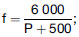

   dabei bedeutet f den Mindestbetrag der Zunahme des Eindrucks in
Millimetern und P die höchstzulässige statische Belastung in
Kilogramm. Die höchstzulässige statische Belastung darf 100 N/mm der
Grundflächenbreite des Reifens nicht übersteigen; sie darf jedoch 125
N/mm betragen, wenn die Fahrzeuge eine Höchstgeschwindigkeit von 8
km/h nicht überschreiten und entsprechende Geschwindigkeitsschilder (§
58) angebracht sind. Die Flächenpressung ist unter der
höchstzulässigen statischen Belastung ohne Berücksichtigung der
Aussparung auf der Lauffläche zu ermitteln. Die Vorschriften über das
Arbeitsvermögen gelten nicht für Gummireifen an Elektrokarren mit
gefederter Triebachse und einer durch die Bauart bestimmten
Höchstgeschwindigkeit von nicht mehr als 20 km/h sowie deren Anhänger.

(4) Eiserne Reifen mit einem Auflagedruck von nicht mehr als 125 N/mm
Reifenbreite sind zulässig

1.  für Zugmaschinen in land- oder forstwirtschaftlichen Betrieben, deren
    zulässiges Gesamtgewicht 4 t und deren durch die Bauart bestimmte
    Höchstgeschwindigkeit 8 km/h nicht übersteigt,

2.  für Arbeitsmaschinen und Stapler (§ 3 Absatz 2 Satz 1 Nummer 1
    Buchstabe a der Fahrzeug-Zulassungsverordnung), deren durch die Bauart
    bestimmte Höchstgeschwindigkeit 8 km/h nicht übersteigt, und für
    Fahrzeuge, die von ihnen mitgeführt werden,

3.  hinter Zugmaschinen mit einer Geschwindigkeit von nicht mehr als 8
    km/h (Betriebsvorschrift)

    a)  für Möbelwagen,

    b)  für Wohn- und Schaustellerwagen, wenn sie nur zwischen dem Festplatz
        oder Abstellplatz und dem nächstgelegenen Bahnhof oder zwischen dem
        Festplatz und einem in der Nähe gelegenen Abstellplatz befördert
        werden,

    c)  für Unterkunftswagen der Bauarbeiter, wenn sie von oder nach einer
        Baustelle befördert werden und nicht gleichzeitig zu einem erheblichen
        Teil der Beförderung von Gütern dienen,

    d)  für die beim Wegebau und bei der Wegeunterhaltung verwendeten
        fahrbaren Geräte und Maschinen bei der Beförderung von oder nach einer
        Baustelle,

    e)  für land- oder forstwirtschaftliche Arbeitsgeräte und für Fahrzeuge
        zur Beförderung von land- oder forstwirtschaftlichen Bedarfsgütern,
        Arbeitsgeräten oder Erzeugnissen.

(5) Bei Gleiskettenfahrzeugen (§ 34b Absatz 1 Satz 1) darf die Kette
oder das Band (Gleiskette) keine schädlichen Kratzbewegungen gegen die
Fahrbahn ausführen. Die Kanten der Bodenplatten und ihrer Rippen
müssen rund sein. Die Rundungen metallischer Bodenplatten und Rippen
müssen an den Längsseiten der Gleisketten einen Halbmesser von
mindestens 60 mm haben. Der Druck der durch gefederte Laufrollen
belasteten Auflagefläche von Gleisketten auf die ebene Fahrbahn darf
1,5 N/qmm, bei Fahrzeugen mit ungefederten Laufrollen und Gleisketten,
die außen vollständig aus Gummiband bestehen, 0,8 N/qmm nicht
übersteigen. Als Auflagefläche gilt nur derjenige Teil einer
Gleiskette, der tatsächlich auf einer ebenen Fahrbahn aufliegt. Im
Hinblick auf die Beschaffenheit der Laufflächen und der Federung wird
für Gleiskettenfahrzeuge und Züge, in denen Gleiskettenfahrzeuge
mitgeführt werden,

1.  allgemein die Geschwindigkeit auf 8 km/h,

2.  wenn die Laufrollen der Gleisketten mit 40 mm hohen Gummireifen
    versehen sind oder die Auflageflächen der Gleisketten ein Gummipolster
    haben, die Geschwindigkeit auf 16 km/h,

3.  wenn die Laufrollen ungefedert sind und die Gleisketten außen
    vollständig aus Gummiband bestehen, die Geschwindigkeit auf 30 km/h

beschränkt; sind die Laufflächen von Gleisketten gummigepolstert oder
bestehen die Gleisketten außen vollständig aus Gummiband und sind die
Laufrollen mit 40 mm hohen Gummireifen versehen oder besonders
abgefedert, so ist die Geschwindigkeit nicht beschränkt.

##### § 36a Radabdeckungen, Ersatzräder

(1) Die Räder von Kraftfahrzeugen und ihren Anhängern müssen mit
hinreichend wirkenden Abdeckungen (Kotflügel, Schmutzfänger oder
Radeinbauten) versehen sein.

(2) Absatz 1 gilt nicht für

1.  Kraftfahrzeuge mit einer durch die Bauart bestimmten
    Höchstgeschwindigkeit von nicht mehr als 25 km/h,

2.  die Hinterräder von Sattelzugmaschinen, wenn ein Sattelanhänger
    mitgeführt wird, dessen Aufbau die Räder überdeckt und die Anbringung
    einer vollen Radabdeckung nicht zulässt; in diesem Falle genügen
    Abdeckungen vor und hinter dem Rad, die bis zur Höhe der Radoberkante
    reichen,

3.  eisenbereifte Fahrzeuge,

4.  Anhänger zur Beförderung von Eisenbahnwagen auf der Straße
    (Straßenroller),

5.  Anhänger, die in der durch § 58 vorgeschriebenen Weise für eine
    Höchstgeschwindigkeit von nicht mehr als 25 km/h gekennzeichnet sind,

6.  land- oder forstwirtschaftliche Arbeitsgeräte,

7.  die hinter land- oder forstwirtschaftlichen einachsigen Zug- oder
    Arbeitsmaschinen mitgeführten Sitzkarren (§ 3 Absatz 2 Satz 1 Nummer 2
    Buchstabe i der Fahrzeug-Zulassungsverordnung),

8.  die Vorderräder von mehrachsigen Anhängern für die Beförderung von
    Langholz.

(3) Für außen an Fahrzeugen mitgeführte Ersatzräder müssen Halterungen
vorhanden sein, die die Ersatzräder sicher aufnehmen und allen
betriebsüblichen Beanspruchungen standhalten können. Die Ersatzräder
müssen gegen Verlieren durch zwei voneinander unabhängige
Einrichtungen gesichert sein. Die Einrichtungen müssen so beschaffen
sein, dass eine von ihnen wirksam bleibt, wenn die andere –
insbesondere durch Bruch, Versagen oder Bedienungsfehler – ausfällt.

##### § 37 Gleitschutzeinrichtungen und Schneeketten

(1) Einrichtungen, die die Greifwirkung der Räder bei Fahrten
außerhalb befestigter Straßen erhöhen sollen (so genannte Bodengreifer
und ähnliche Einrichtungen), müssen beim Befahren befestigter Straßen
abgenommen werden, sofern nicht durch Auflegen von Schutzreifen oder
durch Umklappen der Greifer oder durch Anwendung anderer Mittel
nachteilige Wirkungen auf die Fahrbahn vermieden werden. Satz 1 gilt
nicht, wenn zum Befahren befestigter Straßen Gleitschutzeinrichtungen
verwendet werden, die so beschaffen und angebracht sind, dass sie die
Fahrbahn nicht beschädigen können; die Verwendung kann durch die
Bauartgenehmigung (§ 22a) auf Straßen mit bestimmten Decken und auf
bestimmte Zeiten beschränkt werden.

(2) Einrichtungen, die das sichere Fahren auf schneebedeckter oder
vereister Fahrbahn ermöglichen sollen (Schneeketten), müssen so
beschaffen und angebracht sein, dass sie die Fahrbahn nicht
beschädigen können. Schneeketten aus Metall dürfen nur bei elastischer
Bereifung (§ 36 Absatz 2 und 3) verwendet werden. Schneeketten müssen
die Lauffläche des Reifens so umspannen, dass bei jeder Stellung des
Rades ein Teil der Kette die ebene Fahrbahn berührt. Die die Fahrbahn
berührenden Teile der Ketten müssen kurze Glieder haben, deren Teilung
etwa das Drei- bis Vierfache der Drahtstärke betragen muss.
Schneeketten müssen sich leicht auflegen und abnehmen lassen und
leicht nachgespannt werden können.

##### § 38 Lenkeinrichtung

(1) Die Lenkeinrichtung muss leichtes und sicheres Lenken des
Fahrzeugs gewährleisten; sie ist, wenn nötig, mit einer Lenkhilfe zu
versehen. Bei Versagen der Lenkhilfe muss die Lenkbarkeit des
Fahrzeugs erhalten bleiben.

(2) Personenkraftwagen, Kraftomnibusse, Lastkraftwagen und
Sattelzugmaschinen, mit mindestens vier Rädern und einer durch die
Bauart bestimmten Höchstgeschwindigkeit von mehr als 25 km/h, sowie
ihre Anhänger müssen den im Anhang zu dieser Vorschrift genannten
Bestimmungen entsprechen.

(3) Land- oder forstwirtschaftliche Zugmaschinen auf Rädern mit einer
durch die Bauart bestimmten Höchstgeschwindigkeit von nicht mehr als
40 km/h dürfen abweichend von Absatz 1 den im Anhang zu dieser
Vorschrift genannten Bestimmungen entsprechen. Land- oder
forstwirtschaftliche Zugmaschinen mit einer durch die Bauart
bestimmten Höchstgeschwindigkeit von mehr als 40 km/h dürfen
abweichend von Absatz 1 den Vorschriften über Lenkanlagen entsprechen,
die nach Absatz 2 für Lastkraftwagen anzuwenden sind.

(4) Selbstfahrende Arbeitsmaschinen und Stapler mit einer durch die
Bauart bestimmten Höchstgeschwindigkeit von nicht mehr als 40 km/h
dürfen abweichend von Absatz 1 entsprechend den Baumerkmalen ihres
Fahrgestells entweder den Vorschriften, die nach Absatz 2 für
Lastkraftwagen oder nach Absatz 3 Satz 1 für land- oder
forstwirtschaftliche Zugmaschinen angewendet werden dürfen,
entsprechen. Selbstfahrende Arbeitsmaschinen und Stapler mit einer
durch die Bauart bestimmten Höchstgeschwindigkeit von mehr als 40 km/h
dürfen abweichend von Absatz 1 den Vorschriften, die nach Absatz 2 für
Lastkraftwagen anzuwenden sind, entsprechen.

##### § 38a Sicherungseinrichtungen gegen unbefugte Benutzung von Kraftfahrzeugen

(1) Personenkraftwagen sowie Lastkraftwagen, Zugmaschinen und
Sattelzugmaschinen mit einem zulässigen Gesamtgewicht von nicht mehr
als 3,5 t – ausgenommen land- oder forstwirtschaftliche Zugmaschinen
und Dreirad-Kraftfahrzeuge – müssen mit einer Sicherungseinrichtung
gegen unbefugte Benutzung, Personenkraftwagen zusätzlich mit einer
Wegfahrsperre ausgerüstet sein. Die Sicherungseinrichtung gegen
unbefugte Benutzung und die Wegfahrsperre müssen den im Anhang zu
dieser Vorschrift genannten Bestimmungen entsprechen.

(2) Krafträder und Dreirad-Kraftfahrzeuge mit einem Hubraum von mehr
als 50 ccm oder einer durch die Bauart bestimmten
Höchstgeschwindigkeit von mehr als 45 km/h, ausgenommen
Kleinkrafträder und Fahrräder mit Hilfsmotor (§ 3 Absatz 2 Satz 1
Nummer 1 Buchstabe d der Fahrzeug-Zulassungsverordnung), müssen mit
einer Sicherungseinrichtung gegen unbefugte Benutzung ausgerüstet
sein, die den im Anhang zu dieser Vorschrift genannten Bestimmungen
entspricht.

(3) Sicherungseinrichtungen gegen unbefugte Benutzung und
Wegfahrsperren an Kraftfahrzeugen, für die sie nicht vorgeschrieben
sind, müssen den vorstehenden Vorschriften entsprechen.

##### § 38b Fahrzeug-Alarmsysteme

In Personenkraftwagen sowie in Lastkraftwagen, Zugmaschinen und
Sattelzugmaschinen mit einem zulässigen Gesamtgewicht von nicht mehr
als 2,00 t eingebaute Fahrzeug-Alarmsysteme müssen den im Anhang zu
dieser Vorschrift genannten Bestimmungen entsprechen. Fahrzeug-
Alarmsysteme in anderen Kraftfahrzeugen müssen sinngemäß den
vorstehenden Vorschriften entsprechen.

##### § 39 Rückwärtsgang

Kraftfahrzeuge – ausgenommen einachsige Zug- oder Arbeitsmaschinen mit
einem zulässigen Gesamtgewicht von nicht mehr als 400 kg sowie
Krafträder mit oder ohne Beiwagen – müssen vom Führersitz aus zum
Rückwärtsfahren gebracht werden können.

##### § 39a Betätigungseinrichtungen, Kontrollleuchten und Anzeiger

(1) Die in Personenkraftwagen und Kraftomnibussen sowie
Lastkraftwagen, Zugmaschinen und Sattelzugmaschinen – ausgenommen
land- oder forstwirtschaftliche Zugmaschinen – eingebauten
Betätigungseinrichtungen, Kontrollleuchten und Anzeiger müssen eine
Kennzeichnung haben, die den im Anhang zu dieser Vorschrift genannten
Bestimmungen entspricht.

(2) Die in Kraftfahrzeuge nach § 30a Absatz 3 eingebauten
Betätigungseinrichtungen, Kontrollleuchten und Anzeiger müssen eine
Kennzeichnung haben, die den im Anhang zu dieser Vorschrift genannten
Bestimmungen entspricht.

(3) Land- oder forstwirtschaftliche Zugmaschinen müssen
Betätigungseinrichtungen haben, deren Einbau, Position, Funktionsweise
und Kennzeichnung den im Anhang zu dieser Vorschrift genannten
Bestimmungen entspricht.

##### § 40 Scheiben, Scheibenwischer, Scheibenwascher, Entfrostungs- und Trocknungsanlagen für Scheiben

(1) Sämtliche Scheiben – ausgenommen Spiegel sowie Abdeckscheiben von
lichttechnischen Einrichtungen und Instrumenten – müssen aus
Sicherheitsglas bestehen. Als Sicherheitsglas gilt Glas oder ein
glasähnlicher Stoff, deren Bruchstücke keine ernstlichen Verletzungen
verursachen können. Scheiben aus Sicherheitsglas, die für die Sicht
des Fahrzeugführers von Bedeutung sind, müssen klar, lichtdurchlässig
und verzerrungsfrei sein.

(2) Windschutzscheiben müssen mit selbsttätig wirkenden
Scheibenwischern versehen sein. Der Wirkungsbereich der
Scheibenwischer ist so zu bemessen, dass ein ausreichendes Blickfeld
für den Führer des Fahrzeugs geschaffen wird.

(3) Dreirädrige Kleinkrafträder und dreirädrige oder vierrädrige
Kraftfahrzeuge mit Führerhaus nach § 30a Absatz 3 müssen mit Scheiben,
Scheibenwischer, Scheibenwascher, Entfrostungs- und Trocknungsanlagen
ausgerüstet sein, die den im Anhang zu dieser Vorschrift genannten
Bestimmungen entsprechen.

##### § 41 Bremsen und Unterlegkeile

(1) Kraftfahrzeuge müssen zwei voneinander unabhängige Bremsanlagen
haben oder eine Bremsanlage mit zwei voneinander unabhängigen
Bedienungseinrichtungen, von denen jede auch dann wirken kann, wenn
die andere versagt. Die voneinander unabhängigen
Bedienungseinrichtungen müssen durch getrennte Übertragungsmittel auf
verschiedene Bremsflächen wirken, die jedoch in oder auf derselben
Bremstrommel liegen können. Können mehr als zwei Räder gebremst
werden, so dürfen gemeinsame Bremsflächen und (ganz oder teilweise)
gemeinsame mechanische Übertragungseinrichtungen benutzt werden; diese
müssen jedoch so gebaut sein, dass beim Bruch eines Teils noch
mindestens zwei Räder, die nicht auf derselben Seite liegen, gebremst
werden können. Alle Bremsflächen müssen auf zwangsläufig mit den
Rädern verbundene, nicht auskuppelbare Teile wirken. Ein Teil der
Bremsflächen muss unmittelbar auf die Räder wirken oder auf
Bestandteile, die mit den Rädern ohne Zwischenschaltung von Ketten
oder Getriebeteilen verbunden sind. Dies gilt nicht, wenn die
Getriebeteile (nicht Ketten) so beschaffen sind, dass ihr Versagen
nicht anzunehmen und für jedes in Frage kommende Rad eine besondere
Bremsfläche vorhanden ist. Die Bremsen müssen leicht nachstellbar sein
oder eine selbsttätige Nachstelleinrichtung haben.

(1a) Absatz 1 Satz 2 bis 6 gilt nicht für Bremsanlagen von
Kraftfahrzeugen, bei denen die Bremswirkung ganz oder teilweise durch
die Druckdifferenz im hydrostatischen Kreislauf (hydrostatische
Bremswirkung) erzeugt wird.

(2) Bei einachsigen Zug- oder Arbeitsmaschinen genügt eine Bremse
(Betriebsbremse), die so beschaffen sein muss, dass beim Bruch eines
Teils der Bremsanlage noch mindestens ein Rad gebremst werden kann.
Beträgt das zulässige Gesamtgewicht nicht mehr als 250 kg und wird das
Fahrzeug von Fußgängern an Holmen geführt, so ist keine Bremsanlage
erforderlich; werden solche Fahrzeuge mit einer weiteren Achse
verbunden und vom Sitz aus gefahren, so genügt eine an der Zug- oder
Arbeitsmaschine oder an dem einachsigen Anhänger befindliche Bremse
nach § 65, sofern die durch die Bauart bestimmte Höchstgeschwindigkeit
20 km/h nicht übersteigt.

(3) Bei Gleiskettenfahrzeugen, bei denen nur die beiden Antriebsräder
der Laufketten gebremst werden, dürfen gemeinsame Bremsflächen für die
Betriebsbremse und für die Feststellbremse benutzt werden, wenn
mindestens 70 Prozent des Gesamtgewichts des Fahrzeugs auf dem
Kettenlaufwerk ruht und die Bremsen so beschaffen sind, dass der
Zustand der Bremsbeläge von außen leicht überprüft werden kann.
Hierbei dürfen auch die Bremsnocken, die Nockenwellen mit Hebel oder
ähnliche Übertragungsteile für beide Bremsen gemeinsam benutzt werden.

(4) Bei Kraftfahrzeugen – ausgenommen Krafträder – muss mit der einen
Bremse (Betriebsbremse) eine mittlere Vollverzögerung von mindestens
5,0 m/s
2              erreicht werden; bei Kraftfahrzeugen mit einer durch
die Bauart bestimmten Höchstgeschwindigkeit von nicht mehr als 25 km/h
genügt jedoch eine mittlere Vollverzögerung von 3,5 m/s
2             .

(4a) Bei Kraftfahrzeugen – ausgenommen Kraftfahrzeuge nach § 30a
Absatz 3 – muss es bei Ausfall eines Teils der Bremsanlage möglich
sein, mit dem verbleibenden funktionsfähigen Teil der Bremsanlage oder
mit der anderen Bremsanlage des Kraftfahrzeugs nach Absatz 1 Satz 1
mindestens 44 Prozent der in Absatz 4 vorgeschriebenen Bremswirkung zu
erreichen, ohne dass das Kraftfahrzeug seine Spur verlässt.

(5) Bei Kraftfahrzeugen – ausgenommen Krafträder – muss die
Bedienungseinrichtung einer der beiden Bremsanlagen feststellbar sein;
bei Krankenfahrstühlen und bei Fahrzeugen, die die Baumerkmale von
Krankenfahrstühlen aufweisen, deren Geschwindigkeit aber 30 km/h
übersteigt, darf jedoch die Betriebsbremse anstatt der anderen Bremse
feststellbar sein. Die festgestellte Bremse muss ausschließlich durch
mechanische Mittel und ohne Zuhilfenahme der Bremswirkung des Motors
das Fahrzeug auf der größten von ihm befahrbaren Steigung am Abrollen
verhindern können. Mit der Feststellbremse muss eine mittlere
Verzögerung von mindestens 1,5 m/s
2              erreicht werden.

(6) (weggefallen)

(7) Bei Kraftfahrzeugen, die mit gespeicherter elektrischer Energie
angetrieben werden, kann eine der beiden Bremsanlagen eine elektrische
Widerstands- oder Kurzschlussbremse sein; in diesem Fall findet Absatz
1 Satz 5 keine Anwendung.

(8) Betriebsfußbremsen an Zugmaschinen – ausgenommen an
Gleiskettenfahrzeugen –, die zur Unterstützung des Lenkens als
Einzelradbremsen ausgebildet sind, müssen auf öffentlichen Straßen so
gekoppelt sein, dass eine gleichmäßige Bremswirkung gewährleistet ist,
sofern sie nicht mit einem besonderen Bremshebel gemeinsam betätigt
werden können. Eine unterschiedliche Abnutzung der Bremsen muss durch
eine leicht bedienbare Nachstelleinrichtung ausgleichbar sein oder
sich selbsttätig ausgleichen.

(9) Zwei- oder mehrachsige Anhänger – ausgenommen zweiachsige Anhänger
mit einem Achsabstand von weniger als 1,0 m – müssen eine
ausreichende, leicht nachstellbare oder sich selbsttätig nachstellende
Bremsanlage haben; mit ihr muss eine mittlere Vollverzögerung von
mindestens 5,0 m/s
2              – bei Sattelanhängern von mindestens 4,5 m/s
2              – erreicht werden. Bei Anhängern hinter Kraftfahrzeugen
mit einer Geschwindigkeit von nicht mehr als 25 km/h
(Betriebsvorschrift) genügt eine eigene mittlere Vollverzögerung von
3,5 m/s
2             , wenn die Anhänger für eine Höchstgeschwindigkeit von
nicht mehr als 25 km/h gekennzeichnet sind (§ 58). Die Bremse muss
feststellbar sein. Die festgestellte Bremse muss ausschließlich durch
mechanische Mittel den vollbelasteten Anhänger auch bei einer Steigung
von 18 Prozent und in einem Gefälle von 18 Prozent auf trockener
Straße am Abrollen verhindern können. Die Betriebsbremsanlagen von
Kraftfahrzeug und Anhänger müssen vom Führersitz aus mit einer
einzigen Betätigungseinrichtung abstufbar bedient werden können oder
die Betriebsbremsanlage des Anhängers muss selbsttätig wirken; die
Bremsanlage des Anhängers muss diesen, wenn dieser sich vom ziehenden
Fahrzeug trennt, auch bei einer Steigung von 18 Prozent und in einem
Gefälle von 18 Prozent selbsttätig zum Stehen bringen. Anhänger hinter
Kraftfahrzeugen mit einer durch die Bauart bestimmten
Höchstgeschwindigkeit von mehr als 25 km/h müssen eine auf alle Räder
wirkende Bremsanlage haben; dies gilt nicht für die nach § 58 für eine
Höchstgeschwindigkeit von nicht mehr als 25 km/h gekennzeichneten
Anhänger hinter Fahrzeugen, die mit einer Geschwindigkeit von nicht
mehr als 25 km/h gefahren werden.

(10) Auflaufbremsen sind nur bei Anhängern zulässig mit einem
zulässigen Gesamtgewicht von nicht mehr als

1.  8,00 t und einer durch die Bauart bestimmten Höchstgeschwindigkeit von
    nicht mehr als 25 km/h,

2.  8,00 t und einer durch die Bauart bestimmten Höchstgeschwindigkeit von
    nicht mehr als
    40 km/h,                    wenn die Bremse auf alle Räder wirkt,

3.  3,50 t, wenn die Bremse auf alle Räder wirkt.

Bei Sattelanhängern sind Auflaufbremsen nicht zulässig. In einem Zug
darf nur ein Anhänger mit Auflaufbremse mitgeführt werden; jedoch sind
hinter Zugmaschinen zwei Anhänger mit Auflaufbremse zulässig, wenn

1.  beide Anhänger mit Geschwindigkeitsschildern nach § 58 für eine
    Höchstgeschwindigkeit von nicht mehr als 25 km/h gekennzeichnet sind,

2.  der Zug mit einer Geschwindigkeit von nicht mehr als 25 km/h gefahren
    wird,

3.  nicht das Mitführen von mehr als einem Anhänger durch andere
    Vorschriften untersagt ist.

(11) An einachsigen Anhängern und zweiachsigen Anhängern mit einem
Achsabstand von weniger als 1,0 m ist eine eigene Bremse nicht
erforderlich, wenn der Zug die für das ziehende Fahrzeug
vorgeschriebene Bremsverzögerung erreicht und die Achslast des
Anhängers die Hälfte des Leergewichts des ziehenden Fahrzeugs, jedoch
0,75 t nicht übersteigt. Beträgt jedoch bei diesen Anhängern die durch
die Bauart bestimmte Höchstgeschwindigkeit nicht mehr als
30 km/h,              so darf unter den in Satz 1 festgelegten
Bedingungen die Achslast mehr als 0,75 t, aber nicht mehr als 3,0 t
betragen. Soweit Anhänger nach Satz 1 mit einer eigenen Bremse
ausgerüstet sein müssen, gelten die Vorschriften des Absatzes 9
entsprechend; bei Sattelanhängern muss die Wirkung der Betriebsbremse
dem von der Achse oder der Achsgruppe (§ 34 Absatz 1) getragenen
Anteil des zulässigen Gesamtgewichts des Sattelanhängers entsprechen.

(12) Die vorgeschriebenen Bremsverzögerungen müssen auf ebener,
trockener Straße mit gewöhnlichem Kraftaufwand bei voll belastetem
Fahrzeug, erwärmten Bremstrommeln und, außer bei der im Absatz 5
vorgeschriebenen Bremse, auch bei Höchstgeschwindigkeit erreicht
werden, ohne dass das Fahrzeug seine Spur verlässt. Die in den
Absätzen 4, 6 und 7 vorgeschriebenen Verzögerungen müssen auch beim
Mitführen von Anhängern erreicht werden. Die mittlere Vollverzögerung
wird entweder

1.  nach Abschnitt 1.1.2 des Anhangs II der Richtlinie 71/320/EWG des
    Rates vom 26. Juli 1971 zur Angleichung der Rechtsvorschriften der
    Mitgliedstaaten über die Bremsanlagen bestimmter Klassen von
    Kraftfahrzeugen und deren Anhängern (ABl. L 202 vom 6.9.1971, S. 37),
    die zuletzt durch die Richtlinie 2006/96/EG (ABl. L 363 vom
    20\.12.2006, S. 81) geändert worden ist, oder

2.  aus der Geschwindigkeit v
    1                    und dem Bremsweg s
    1                    ermittelt, wobei v
    1                    die Geschwindigkeit ist, die das Fahrzeug bei der
    Abbremsung nach einer Ansprech- und Schwellzeit von höchstens 0,6 s
    hat, und s
    1                    der Weg ist, den das Fahrzeug ab der
    Geschwindigkeit v
    1                    bis zum Stillstand des Fahrzeugs zurücklegt.

Von dem in den Sätzen 1 bis 3 vorgeschriebenen Verfahren kann,
insbesondere bei Nachprüfungen nach § 29, abgewichen werden, wenn
Zustand und Wirkung der Bremsanlage auf andere Weise feststellbar
sind. Bei der Prüfung neu zuzulassender Fahrzeuge muss eine dem
betriebsüblichen Nachlassen der Bremswirkung entsprechend höhere
Verzögerung erreicht werden; außerdem muss eine ausreichende, dem
jeweiligen Stand der Technik entsprechende Dauerleistung der Bremsen
für längere Talfahrten gewährleistet sein.

(13) Von den vorstehenden Vorschriften über Bremsen sind befreit

1.  Zugmaschinen in land- oder forstwirtschaftlichen Betrieben, wenn ihr
    zulässiges Gesamtgewicht nicht mehr als 4 t und ihre durch die Bauart
    bestimmte Höchstgeschwindigkeit nicht mehr als 8 km/h beträgt,

2.  selbstfahrende Arbeitsmaschinen und Stapler mit einer durch die Bauart
    bestimmten Höchstgeschwindigkeit von nicht mehr als 8 km/h und von
    ihnen mitgeführte Fahrzeuge,

3.  hinter Zugmaschinen, die mit einer Geschwindigkeit von nicht mehr als
    8 km/h gefahren werden, mitgeführte

    a)  Möbelwagen,

    b)  Wohn- und Schaustellerwagen, wenn sie nur zwischen dem Festplatz oder
        Abstellplatz und dem nächstgelegenen Bahnhof oder zwischen dem
        Festplatz und einem in der Nähe gelegenen Abstellplatz befördert
        werden,

    c)  Unterkunftswagen der Bauarbeiter, wenn sie von oder nach einer
        Baustelle befördert werden und nicht gleichzeitig zu einem erheblichen
        Teil der Beförderung von Gütern dienen,

    d)  beim Wegebau und bei der Wegeunterhaltung verwendete fahrbare Geräte
        und Maschinen bei der Beförderung von oder nach einer Baustelle,

    e)  land- oder forstwirtschaftliche Arbeitsgeräte,

    f)  Fahrzeuge zur Beförderung von land- oder forstwirtschaftlichen
        Bedarfsgütern, Geräten oder Erzeugnissen, wenn die Fahrzeuge
        eisenbereift oder in der durch § 58 vorgeschriebenen Weise für eine
        Geschwindigkeit von nicht mehr als 8 km/h gekennzeichnet sind.

Die Fahrzeuge müssen jedoch eine ausreichende Bremse haben, die
während der Fahrt leicht bedient werden kann und feststellbar ist.
Ungefederte land- oder forstwirtschaftliche Arbeitsmaschinen, deren
Leergewicht das Leergewicht des ziehenden Fahrzeugs nicht übersteigt,
jedoch höchstens 3 t erreicht, brauchen keine eigene Bremse zu haben.

(14) Die nachstehend genannten Kraftfahrzeuge und Anhänger müssen mit
Unterlegkeilen ausgerüstet sein. Erforderlich sind mindestens

1.  ein Unterlegkeil bei

    a)  Kraftfahrzeugen – ausgenommen Gleiskettenfahrzeuge – mit einem
        zulässigen Gesamtgewicht von mehr als 4 t,

    b)  zweiachsigen Anhängern – ausgenommen Sattel- und Starrdeichselanhänger
        (einschließlich Zentralachsanhänger) – mit einem zulässigen
        Gesamtgewicht von mehr als 750 kg,

2.  zwei Unterlegkeile bei

    a)  drei- und mehrachsigen Fahrzeugen,

    b)  Sattelanhängern,

    c)  Starrdeichselanhängern (einschließlich Zentralachsanhängern) mit einem
        zulässigen Gesamtgewicht von mehr als 750 kg.

Unterlegkeile müssen sicher zu handhaben und ausreichend wirksam sein.
Sie müssen im oder am Fahrzeug leicht zugänglich mit Halterungen
angebracht sein, die ein Verlieren und Klappern ausschließen. Haken
oder Ketten dürfen als Halterungen nicht verwendet werden.

(15) Kraftomnibusse mit einem zulässigen Gesamtgewicht von mehr als
5,5 t sowie andere Kraftfahrzeuge mit einem zulässigen Gesamtgewicht
von mehr als 9 t müssen außer mit den Bremsen nach den vorstehenden
Vorschriften mit einer Dauerbremse ausgerüstet sein. Als Dauerbremsen
gelten Motorbremsen oder in der Bremswirkung gleichartige
Einrichtungen. Die Dauerbremse muss mindestens eine Leistung
aufweisen, die der Bremsbeanspruchung beim Befahren eines Gefälles von
7 Prozent und 6 km Länge durch das voll beladene Fahrzeug mit einer
Geschwindigkeit von 30 km/h entspricht. Bei Anhängern mit einem
zulässigen Gesamtgewicht von mehr als 9 t muss die Betriebsbremse den
Anforderungen des Satzes 3 entsprechen, bei Sattelanhängern nur dann,
wenn das um die zulässige Aufliegelast verringerte zulässige
Gesamtgewicht mehr als 9 t beträgt. Die Sätze 1 bis 4 gelten nicht für

1.  Fahrzeuge mit einer durch die Bauart bestimmten Höchstgeschwindigkeit
    von nicht mehr als 25 km/h und

2.  Fahrzeuge, die nach § 58 für eine Höchstgeschwindigkeit von nicht mehr
    als 25 km/h gekennzeichnet sind und die mit einer Geschwindigkeit von
    nicht mehr als 25 km/h betrieben werden.

(16) Druckluftbremsen und hydraulische Bremsen von Kraftomnibussen
müssen auch bei Undichtigkeit an einer Stelle mindestens zwei Räder
bremsen können, die nicht auf derselben Seite liegen. Bei
Druckluftbremsen von Kraftomnibussen muss das unzulässige Absinken des
Drucks im Druckluftbehälter dem Führer durch eine optisch oder
akustisch wirkende Warneinrichtung deutlich angezeigt werden.

(17) Beim Mitführen von Anhängern mit Druckluftbremsanlage müssen die
Vorratsbehälter des Anhängers auch während der Betätigung der
Betriebsbremsanlage nachgefüllt werden können (Zweileitungsbremsanlage
mit Steuerung durch Druckanstieg), wenn die durch die Bauart bestimmte
Höchstgeschwindigkeit mehr als 25 km/h beträgt.

(18) Abweichend von den Absätzen 1 bis 11, 12 Satz 1, 2, 3 und 5, den
Absätzen 13 und 15 bis 17 müssen Personenkraftwagen, Kraftomnibusse,
Lastkraftwagen, Zugmaschinen – ausgenommen land- oder
forstwirtschaftliche Zugmaschinen – und Sattelzugmaschinen mit
mindestens vier Rädern und einer durch die Bauart bestimmten
Höchstgeschwindigkeit von mehr als 25 km/h sowie ihre Anhänger –
ausgenommen Anhänger nach Absatz 10 Satz 1 Nummer 1 und 2 oder Absatz
11 Satz 2, Muldenkipper, Stapler, Elektrokarren, Autoschütter – den im
Anhang zu dieser Vorschrift genannten Bestimmungen über Bremsanlagen
entsprechen. Andere Fahrzeuge, die hinsichtlich ihrer Baumerkmale des
Fahrgestells den vorgenannten Fahrzeugen gleichzusetzen sind, müssen
den im Anhang zu dieser Vorschrift genannten Bestimmungen über
Bremsanlagen entsprechen. Austauschbremsbeläge für die in den Sätzen 1
und 2 genannten Fahrzeuge mit einem zulässigen Gesamtgewicht von nicht
mehr als 3,5 t müssen den im Anhang zu dieser Vorschrift genannten
Bestimmungen entsprechen.

(19) Abweichend von den Absätzen 1 bis 11, 12 Satz 1, 2, 3 und 5, den
Absätzen 13, 17 und 18 müssen Kraftfahrzeuge nach § 30a Absatz 3 den
im Anhang zu dieser Vorschrift genannten Bestimmungen über
Bremsanlagen entsprechen.

(20) Abweichend von den Absätzen 1 bis 11, 12 Satz 1, 2, 3 und 5, den
Absätzen 13, 17 bis 19 müssen land- oder forstwirtschaftliche
Zugmaschinen mit einer durch die Bauart bestimmten
Höchstgeschwindigkeit von nicht mehr als 40 km/h den im Anhang zu
dieser Vorschrift genannten Bestimmungen über Bremsanlagen
entsprechen. Selbstfahrende Arbeitsmaschinen und Stapler mit einer
durch die Bauart bestimmten Höchstgeschwindigkeit von nicht mehr als
40 km/h dürfen den Vorschriften über Bremsanlagen nach Satz 1
entsprechen.

##### § 41a Druckgasanlagen und Druckbehälter

(1) Kraftfahrzeugtypen, die mit speziellen Ausrüstungen oder Bauteilen
für die Verwendung von

1.  verflüssigtem Gas (LPG) oder

2.  komprimiertem Erdgas (CNG)

in ihrem Antriebssystem ausgestattet sind, müssen hinsichtlich des
Einbaus dieser Ausrüstungen oder Bauteile nach den im Anhang zu dieser
Vorschrift genannten Bestimmungen genehmigt sein.

(2) Spezielle Nachrüstsysteme für die Verwendung von

1.  verflüssigtem Gas (LPG) oder

2.  komprimiertem Erdgas (CNG)

im Antriebssystem eines Kraftfahrzeugs müssen hinsichtlich ihrer
Ausführung nach der im Anhang zu dieser Vorschrift genannten
Bestimmung genehmigt sein.

(3) Spezielle Bauteile für die Verwendung von

1.  verflüssigtem Gas (LPG) oder

2.  komprimiertem Erdgas (CNG)

im Antriebssystem eines Kraftfahrzeugs müssen hinsichtlich ihrer
Ausführung nach der im Anhang zu dieser Vorschrift genannten
Bestimmung genehmigt sein. Ferner müssen für den Einbau die
Bedingungen der im Anhang zu dieser Vorschrift genannten Bestimmung
erfüllt werden.

(4) Hersteller von Bauteilen für Ausrüstungen nach Absatz 1 oder
Nachrüstsysteme nach Absatz 2 oder von speziellen Bauteilen nach
Absatz 3 müssen diesen die notwendigen Informationsunterlagen,
entsprechend den im Anhang zu dieser Vorschrift genannten
Bestimmungen, für den Einbau, die sichere Verwendung während der
vorgesehenen Betriebsdauer und die empfohlenen Wartungen beifügen. Den
für den Einbau, den Betrieb und die Prüfungen verantwortlichen
Personen sind diese Unterlagen bei Bedarf zur Verfügung zu stellen.

(5) Halter, deren Kraftfahrzeuge mit Ausrüstungen nach Absatz 2 oder
Absatz 3 ausgestattet worden sind, haben nach dem Einbau eine
Gasanlagenprüfung (Gassystemeinbauprüfung) nach Anlage XVII
durchführen zu lassen. Gassystemeinbauprüfungen dürfen nur
durchgeführt werden von

1.  verantwortlichen Personen in hierfür anerkannten
    Kraftfahrzeugwerkstätten, sofern das Gassystem in der jeweiligen
    Kraftfahrzeugwerkstatt eingebaut wurde,

2.  amtlich anerkannten Sachverständigen oder Prüfern für den
    Kraftfahrzeugverkehr,

3.  Prüfingenieuren im Sinne der Anlage VIIIb Nummer 3.9.

Nach der Gassystemeinbauprüfung haben Halter von Kraftfahrzeugen mit
Ausrüstungen nach Absatz 3 eine Begutachtung nach § 21 zur Erlangung
einer neuen Betriebserlaubnis durchführen zu lassen.

(6) Halter, deren Kraftfahrzeuge mit Ausrüstungen nach den Absätzen 1
bis 3 ausgestattet sind, haben im Zusammenhang mit jeder Reparatur der
Gasanlage eine Gasanlagenprüfung nach Anlage XVII durchführen zu
lassen. Dies gilt auch, wenn die Gasanlage durch Brand oder Unfall
beeinträchtigt wurde. Die Gasanlagenprüfungen dürfen nur durchgeführt
werden von

1.  verantwortlichen Personen in hierfür anerkannten
    Kraftfahrzeugwerkstätten oder Fachkräften unter deren Aufsicht,

2.  amtlich anerkannten Sachverständigen oder Prüfern für den
    Kraftfahrzeugverkehr,

3.  Prüfingenieuren im Sinne der Anlage VIIIb Nummer 3.9.

(7) Die Anerkennung der Kraftfahrzeugwerkstätten für die Durchführung
der Gassystemeinbauprüfungen nach Absatz 5, der Gasanlagenprüfungen
nach Absatz 6 und der Untersuchungen nach Anlage VIII Nummer 3.1.1.2
hat nach Anlage XVIIa zu erfolgen. Die Schulung der in Absatz 5 Satz 2
Nummer 2 und 3 sowie Absatz 6 Satz 3 Nummer 2 und 3 genannten Personen
hat in entsprechender Anwendung der Nummern 2.5, 7.3 und 7.4 der
Anlage XVIIa zu erfolgen, wobei der Umfang der erstmaligen Schulung
dem einer Wiederholungsschulung entsprechen kann.

(8) Druckbehälter für Druckluftbremsanlagen und Nebenaggregate müssen
die im Anhang zu dieser Vorschrift genannten Bestimmungen erfüllen.
Sie dürfen auch aus anderen Werkstoffen als Stahl und Aluminium
hergestellt werden, wenn sie den im Anhang zu dieser Vorschrift
genannten Bestimmungen entsprechen und für sie die gleiche Sicherheit
und Gebrauchstüchtigkeit nachgewiesen ist. Druckbehälter sind
entsprechend des Anhangs zu kennzeichnen.

##### § 41b Automatischer Blockierverhinderer

(1) Ein automatischer Blockierverhinderer ist der Teil einer
Betriebsbremsanlage, der selbsttätig den Schlupf in der Drehrichtung
des Rads an einem oder mehreren Rädern des Fahrzeugs während der
Bremsung regelt.

(2) Folgende Fahrzeuge mit einer durch die Bauart bestimmten
Höchstgeschwindigkeit von mehr als 60 km/h müssen mit einem
automatischen Blockierverhinderer ausgerüstet sein:

1.  Lastkraftwagen und Sattelzugmaschinen mit einem zulässigen
    Gesamtgewicht von mehr als 3,5 t,

2.  Anhänger mit einem zulässigen Gesamtgewicht von mehr als 3,5 t; dies
    gilt für Sattelanhänger nur dann, wenn das um die Aufliegelast
    verringerte zulässige Gesamtgewicht 3,5 t übersteigt,

3.  Kraftomnibusse,

4.  Zugmaschinen mit einem zulässigen Gesamtgewicht von mehr als 3,5 t.

Andere Fahrzeuge, die hinsichtlich ihrer Baumerkmale des Fahrgestells
den in den Nummern 1 bis 4 genannten Fahrzeugen gleichzusetzen sind,
müssen ebenfalls mit einem automatischen Blockierverhinderer
ausgerüstet sein.

(3) Fahrzeuge mit einem automatischen Blockierverhinderer müssen den
im Anhang zu dieser Vorschrift genannten Bestimmungen entsprechen.

(4) Anhänger mit einem automatischen Blockierverhinderer, aber ohne
automatisch-lastabhängige Bremskraftregeleinrichtung dürfen nur mit
Kraftfahrzeugen verbunden werden, die die Funktion des automatischen
Blockierverhinderers im Anhänger sicherstellen.

(5) Absatz 2 gilt nicht für Anhänger mit Auflaufbremse sowie für
Kraftfahrzeuge mit mehr als vier Achsen.

##### § 42 Anhängelast hinter Kraftfahrzeugen und Leergewicht

(1) Die gezogene Anhängelast darf bei

1.  Personenkraftwagen, ausgenommen solcher nach Nummer 2, und
    Lastkraftwagen, ausgenommen solcher nach Nummer 3, weder das zulässige
    Gesamtgewicht,

2.  Personenkraftwagen, die gemäß der Definition in Anhang II der
    Richtlinie 70/156/EWG Geländefahrzeuge sind, weder das 1,5fache des
    zulässigen Gesamtgewichts,

3.  Lastkraftwagen in Zügen mit durchgehender Bremsanlage weder das
    1,5fache des zulässigen Gesamtgewichts

des ziehenden Fahrzeugs noch den etwa vom Hersteller des ziehenden
Fahrzeugs angegebenen oder amtlich als zulässig erklärten Wert
übersteigen. Bei Personenkraftwagen nach Nummer 1 oder 2 darf das
tatsächliche Gesamtgewicht des Anhängers (Achslast zuzüglich
Stützlast) jedoch in keinem Fall mehr als
3 500 kg              betragen. Die Anhängelast bei Kraftfahrzeugen
nach § 30a Absatz 3 darf nur 50 Prozent der Leermasse des
Kraftfahrzeugs betragen.

(2) Hinter Krafträdern und Personenkraftwagen dürfen Anhänger ohne
ausreichende eigene Bremse nur mitgeführt werden, wenn das ziehende
Fahrzeug Allradbremse und der Anhänger nur eine Achse hat; Krafträder
gelten trotz getrennter Bedienungseinrichtungen für die Vorderrad- und
Hinterradbremse als Fahrzeuge mit Allradbremse, Krafträder mit
Beiwagen jedoch nur dann, wenn auch das Beiwagenrad eine Bremse hat.
Werden einachsige Anhänger ohne ausreichende eigene Bremse mitgeführt,
so darf die Anhängelast höchstens die Hälfte des um 75 kg erhöhten
Leergewichts des ziehenden Fahrzeugs, aber nicht mehr als 750 kg
betragen.

(2a) Die Absätze 1 und 2 gelten nicht für das Abschleppen von
betriebsunfähigen Fahrzeugen.

(3) Das Leergewicht ist das Gewicht des betriebsfertigen Fahrzeugs
ohne austauschbare Ladungsträger (Behälter, die dazu bestimmt und
geeignet sind, Ladungen aufzunehmen und auf oder an verschiedenen
Trägerfahrzeugen verwendet zu werden, wie Container, Wechselbehälter),
aber mit zu 90 Prozent gefüllten eingebauten Kraftstoffbehältern und
zu 100 Prozent gefüllten Systemen für andere Flüssigkeiten
(ausgenommen Systeme für gebrauchtes Wasser) einschließlich des
Gewichts aller im Betrieb mitgeführten Ausrüstungsteile (zum Beispiel
Ersatzräder und -bereifung, Ersatzteile, Werkzeug, Wagenheber,
Feuerlöscher, Aufsteckwände, Planengestell mit Planenbügeln und
Planenlatten oder Planenstangen, Plane, Gleitschutzeinrichtungen,
Belastungsgewichte), bei anderen Kraftfahrzeugen als Kraftfahrzeugen
nach § 30a Absatz 3 zuzüglich 75 kg als Fahrergewicht. Austauschbare
Ladungsträger, die Fahrzeuge miteinander verbinden oder Zugkräfte
übertragen, sind Fahrzeugteile.

##### § 43 Einrichtungen zur Verbindung von Fahrzeugen

(1) Einrichtungen zur Verbindung von Fahrzeugen müssen so ausgebildet
und befestigt sein, dass die nach dem Stand der Technik erreichbare
Sicherheit – auch bei der Bedienung der Kupplung – gewährleistet ist.
Die Zuggabel von Mehrachsanhängern muss bodenfrei sein. Die Zugöse
dieser Anhänger muss jeweils in Höhe des Kupplungsmauls einstellbar
sein; dies gilt bei anderen Kupplungsarten sinngemäß. Die Sätze 2 und
3 gelten nicht für Anhänger hinter Elektrokarren mit einer durch die
Bauart bestimmten Höchstgeschwindigkeit von nicht mehr als 25 km/h,
wenn das zulässige Gesamtgewicht des Anhängers nicht mehr als 2 t
beträgt.

(2) Mehrspurige Kraftfahrzeuge mit mehr als einer Achse müssen vorn,
Personenkraftwagen – ausgenommen solche, für die nach der
Betriebserlaubnis eine Anhängelast nicht zulässig ist – auch hinten,
eine ausreichend bemessene und leicht zugängliche Einrichtung zum
Befestigen einer Abschleppstange oder eines Abschleppseils haben. An
selbstfahrenden Arbeitsmaschinen und Staplern darf diese Einrichtung
hinten angeordnet sein.

(3) Bei Verwendung von Abschleppstangen oder Abschleppseilen darf der
lichte Abstand vom ziehenden zum gezogenen Fahrzeug nicht mehr als 5 m
betragen. Abschleppstangen und Abschleppseile sind ausreichend
erkennbar zu machen, zum Beispiel durch einen roten Lappen.

(4) Anhängekupplungen müssen selbsttätig wirken. Nicht selbsttätige
Anhängekupplungen sind jedoch zulässig,

1.  an Zugmaschinen und an selbstfahrenden Arbeitsmaschinen und Staplern,
    wenn der Führer den Kupplungsvorgang von seinem Sitz aus beobachten
    kann,

2.  an Krafträdern und Personenkraftwagen,

3.  an Anhängern hinter Zugmaschinen in land- oder forstwirtschaftlichen
    Betrieben,

4.  zur Verbindung von anderen Kraftfahrzeugen mit einachsigen Anhängern
    oder zweiachsigen Anhängern mit einem Achsabstand von weniger als 1,0
    m mit einem zulässigen Gesamtgewicht von nicht mehr als 3,5 t.

In jedem Fall muss die Herstellung einer betriebssicheren Verbindung
leicht und gefahrlos möglich sein.

(5) Einrichtungen zur Verbindung von Fahrzeugen an zweirädrigen oder
dreirädrigen Kraftfahrzeugen nach § 30a Absatz 3 und ihre Anbringung
an diesen Kraftfahrzeugen müssen den im Anhang zu dieser Vorschrift
genannten Bestimmungen entsprechen.

##### § 44 Stützeinrichtung und Stützlast

(1) An Sattelanhängern muss eine Stützeinrichtung vorhanden sein oder
angebracht werden können. Wenn Sattelanhänger so ausgerüstet sind,
dass die Verbindung der Kupplungsteile sowie der elektrischen
Anschlüsse und der Bremsanschlüsse selbsttätig erfolgen kann, müssen
die Anhänger eine Stützeinrichtung haben, die sich nach dem Ankuppeln
des Anhängers selbsttätig vom Boden abhebt.

(2) Starrdeichselanhänger (einschließlich Zentralachsanhänger) müssen
eine der Höhe nach einstellbare Stützeinrichtung haben, wenn die
Stützlast bei gleichmäßiger Lastverteilung mehr als 50 kg beträgt.
Dies gilt jedoch nicht für Starrdeichselanhänger hinter
Kraftfahrzeugen mit einem zum Anheben der Deichsel geeigneten
Kraftheber. Stützeinrichtungen müssen unverlierbar untergebracht sein.

(3) Bei Starrdeichselanhängern (einschließlich Zentralachsanhängern)
mit einem zulässigen Gesamtgewicht von nicht mehr als 3,5 t darf die
vom ziehenden Fahrzeug aufzunehmende Mindeststützlast nicht weniger
als 4 Prozent des tatsächlichen Gesamtgewichts des Anhängers betragen;
sie braucht jedoch nicht mehr als 25 kg zu betragen. Die technisch
zulässige Stützlast des Zugfahrzeugs ist vom Hersteller festzulegen;
sie darf – ausgenommen bei Krafträdern – nicht geringer als 25 kg
sein. Bei Starrdeichselanhängern (einschließlich Zentralachsanhängern)
mit einem zulässigen Gesamtgewicht von mehr als 3,5 t darf die vom
ziehenden Fahrzeug aufzunehmende Mindeststützlast nicht weniger als 4
Prozent des tatsächlichen Gesamtgewichts des Anhängers betragen, sie
braucht jedoch nicht mehr als 500 kg zu betragen. Die maximal
zulässige Stützlast darf bei diesen Anhängern – ausgenommen bei
Starrdeichselanhängern (einschließlich Zentralachsanhängern), die für
eine Höchstgeschwindigkeit von nicht mehr als 40 km/h gekennzeichnet
sind (§ 58) und land- oder forstwirtschaftlichen Arbeitsgeräten –
höchstens 15 Prozent des tatsächlichen Gesamtgewichts des
Starrdeichselanhängers (einschließlich Zentralachsanhängers), aber
nicht mehr als 2,00 t betragen. Bei allen Starrdeichselanhängern
(einschließlich Zentralachsanhängern) darf weder die für die
Anhängekupplung oder die Zugeinrichtung noch die vom Hersteller des
ziehenden Fahrzeugs angegebene Stützlast überschritten werden.

##### § 45 Kraftstoffbehälter

(1) Kraftstoffbehälter müssen korrosionsfest sein. Sie müssen bei
doppeltem Betriebsüberdruck, mindestens aber bei einem Überdruck von
0,3 bar, dicht sein. Weichgelötete Behälter müssen auch nach dem
Ausschmelzen des Lotes zusammenhalten. Auftretender Überdruck oder den
Betriebsdruck übersteigender Druck muss sich durch geeignete
Einrichtungen (Öffnungen, Sicherheitsventile und dergleichen)
selbsttätig ausgleichen. Entlüftungsöffnungen sind gegen
Hindurchschlagen von Flammen zu sichern. Am Behälter weich angelötete
Teile müssen zugleich vernietet, angeschraubt oder in anderer Weise
sicher befestigt sein. Kraftstoff darf aus dem Füllverschluss oder den
zum Ausgleich von Überdruck bestimmten Einrichtungen auch bei
Schräglage, Kurvenfahrt oder Stößen nicht ausfließen.

(2) Kraftstoffbehälter für Vergaserkraftstoff dürfen nicht unmittelbar
hinter der Frontverkleidung des Fahrzeugs liegen; sie müssen so vom
Motor getrennt sein, dass auch bei Unfällen eine Entzündung des
Kraftstoffs nicht zu erwarten ist. Dies gilt nicht für Krafträder und
für Zugmaschinen mit offenem Führersitz.

(3) Bei Kraftomnibussen dürfen Kraftstoffbehälter nicht im Fahrgast-
oder Führerraum liegen. Sie müssen so angebracht sein, dass bei einem
Brand die Ausstiege nicht unmittelbar gefährdet sind. Bei
Kraftomnibussen müssen Behälter für Vergaserkraftstoff hinten oder
seitlich unter dem Fußboden in einem Abstand von mindestens 500 mm von
den Türöffnungen untergebracht sein. Kann dieses Maß nicht eingehalten
werden, so ist ein entsprechender Teil des Behälters mit Ausnahme der
Unterseite durch eine Blechwand abzuschirmen.

(4) Für Kraftstoffbehälter und deren Einbau sowie den Einbau der
Kraftstoffzufuhrleitungen in Kraftfahrzeugen nach § 30a Absatz 3 sind
die im Anhang zu dieser Vorschrift genannten Bestimmungen anzuwenden.

##### § 46 Kraftstoffleitungen

(1) Kraftstoffleitungen sind so auszuführen, dass Verwindungen des
Fahrzeugs, Bewegungen des Motors und dergleichen keinen nachteiligen
Einfluss auf die Haltbarkeit ausüben.

(2) Rohrverbindungen sind durch Verschraubung ohne Lötung oder mit
hart aufgelötetem Nippel herzustellen. In die Kraftstoffleitung muss
eine vom Führersitz aus während der Fahrt leicht zu bedienende
Absperreinrichtung eingebaut sein; sie kann fehlen, wenn die
Fördereinrichtung für den Kraftstoff den Zufluss zu dem Vergaser oder
zur Einspritzpumpe bei stehendem Motor unterbricht oder wenn das
Fahrzeug ausschließlich mit Dieselkraftstoff betrieben wird. Als
Kraftstoffleitungen können fugenlose, elastische Metallschläuche oder
kraftstofffeste andere Schläuche aus schwer brennbaren Stoffen
eingebaut werden; sie müssen gegen mechanische Beschädigungen
geschützt sein.

(3) Kraftstoffleitungen, Vergaser und alle anderen kraftstoffführenden
Teile sind gegen betriebstörende Wärme zu schützen und so anzuordnen,
dass abtropfender oder verdunstender Kraftstoff sich weder ansammeln
noch an heißen Teilen oder an elektrischen Geräten entzünden kann.

(4) Bei Kraftomnibussen dürfen Kraftstoffleitungen nicht im Fahrgast-
oder Führerraum liegen. Bei diesen Fahrzeugen darf der Kraftstoff
nicht durch Schwerkraft gefördert werden.

##### § 47 Abgase

(1) Kraftfahrzeuge mit Fremdzündungsmotor oder Selbstzündungsmotor mit
mindestens vier Rädern, einer zulässigen Gesamtmasse von mindestens
400 kg und einer bauartbedingten Höchstgeschwindigkeit von mindestens
50 km/h – mit Ausnahme von land- oder forstwirtschaftlichen Zug- und
Arbeitsmaschinen sowie anderen Arbeitsmaschinen und Staplern –, soweit
sie in den Anwendungsbereich der Richtlinie 70/220/EWG des Rates vom
20\. März 1970 zur Angleichung der Rechtsvorschriften der
Mitgliedstaaten über Maßnahmen gegen die Verunreinigung der Luft durch
Emissionen von Kraftfahrzeugmotoren (ABl. L 76 vom 6.4.1970, S. 1),
die zuletzt durch die
Richtlinie 2006/96//EG              (ABl. L 363 vom 20.12.2006, S. 81)
geändert worden ist, fallen, müssen hinsichtlich ihres Abgasverhaltens
und der Anforderungen in Bezug auf die Kraftstoffe den Vorschriften
dieser Richtlinie entsprechen.

(1a) Kraftfahrzeuge, im Sinne des Artikels 2 Absatz 1 der Verordnung
(EG) Nr. 715/2007 des Europäischen Parlaments und des Rates vom 20.
Juni 2007 über die Typgenehmigung von Kraftfahrzeugen hinsichtlich der
Emissionen von leichten Personenkraftwagen und Nutzfahrzeugen (Euro 5
und Euro 6) und über den Zugang zu Reparatur- und
Wartungsinformationen für Fahrzeuge (ABl. L 171 vom 29.6.2007, S. 1),
müssen hinsichtlich ihres Abgasverhaltens in den Fällen des § 13 der
EG-Fahrzeuggenehmigungsverordnung oder des § 21 den Vorschriften
dieser Verordnung und der Verordnung (EG) Nr. 692/2008 der Kommission
vom 18. Juli 2008 zur Durchführung und Änderung der Verordnung (EG)
Nr. 715/2007 des Europäischen Parlaments und des Rates vom 20. Juni
2007 über die Typgenehmigung von Kraftfahrzeugen hinsichtlich der
Emissionen von leichten Personenkraftwagen und Nutzfahrzeugen (Euro 5
und Euro 6) und über den Zugang zu Reparatur- und
Wartungsinformationen für Fahrzeuge (ABl. L 199 vom 28.7.2008, S. 1),
geändert durch die im Anhang zu dieser Vorschrift genannten
Bestimmungen, entsprechen.

(2) Kraftfahrzeuge mit Selbstzündungsmotor mit oder ohne Aufbau, mit
mindestens vier Rädern und einer bauartbedingten Höchstgeschwindigkeit
von mehr als 25 km/h – mit Ausnahme von landwirtschaftlichen Zug- und
Arbeitsmaschinen sowie anderen Arbeitsmaschinen und Staplern – soweit
sie in den Anwendungsbereich der Richtlinie 72/306/EWG des Rates vom
2\. August 1972 zur Angleichung der Rechtsvorschriften der
Mitgliedstaaten über Maßnahmen gegen die Emission verunreinigender
Stoffe aus Dieselmotoren zum Antrieb von Fahrzeugen (ABl. L 190 vom
20\.8.1972, S. 1), die zuletzt durch die Richtlinie 2005/21/EG (ABl. L
61 vom 8.3.2005, S. 25) geändert worden ist, fallen, müssen
hinsichtlich der Emission verunreinigender Stoffe dieser Richtlinie
entsprechen. Kraftfahrzeuge mit Selbstzündungsmotor, auf die sich die
Anlage XVI bezieht, müssen hinsichtlich der Emission verunreinigender
Stoffe (feste Bestandteile – Dieselrauch) im Abgas der Anlage XVI oder
der Richtlinie 72/306/EWG entsprechen.

(3) Personenkraftwagen sowie Wohnmobile mit Fremd- oder
Selbstzündungsmotoren, die den Vorschriften

1.  der Anlage XXIII oder

2.  des Anhangs III A der Richtlinie 70/220/EWG in der Fassung der
    Richtlinie 88/76/EWG (ABl. L 36 vom 9.2.1988, S. 1) oder späteren
    Änderungen dieses Anhangs in der Richtlinie 88/436/EWG (ABl. L 214 vom
    6\.8.1988, S. 1), berichtigt durch die Berichtigung der Richtlinie
    88/436/EWG (ABl. L 303 vom 8.11.1988, S. 36), oder der Richtlinie
    89/491/EWG (ABl. L 238 vom 15.8.1989, S. 43) oder

3.  der Richtlinie 70/220/EWG in der Fassung der Richtlinie 91/441/EWG
    (ABl. L 242 vom 30.8.1991, S. 1) – ausgenommen die Fahrzeuge, die die
    Übergangsbestimmungen des Anhangs I Nummer 8.1 oder 8.3 in Anspruch
    nehmen – oder

4.  der Richtlinie 70/220/EWG in der Fassung der Richtlinie 93/59/EWG
    (ABl. L 186 vom 28.7.1993, S. 21) – ausgenommen die Fahrzeuge, die die
    weniger strengen Grenzwertanforderungen der Klasse II oder III des
    Anhangs I in den Nummern 5.3.1.4 und 7.1.1.1 oder die
    Übergangsbestimmungen des Anhangs I Nummer 8.3 in Anspruch nehmen –
    oder

5.  der Richtlinie 70/220/EWG in der Fassung der Richtlinie 94/12/EG (ABl.
    L 100 vom 19.4.1994, S. 42) – und die Grenzwerte der Fahrzeugklasse M
    in Anhang I Nummer 5.3.1.4 einhalten – oder

6.  der Richtlinie 96/69/EG des Europäischen Parlaments und des Rates vom
    8\. Oktober 1996 zur Änderung der Richtlinie 70/220/EWG zur Angleichung
    der Rechtsvorschriften der Mitgliedstaaten über Maßnahmen gegen die
    Verunreinigung der Luft durch Emissionen von Kraftfahrzeugen (ABl. L
    282 vom 1.11.1996, S. 64) oder

7.  der Richtlinie 98/77/EG der Kommission vom 2. Oktober 1998 zur
    Anpassung der Richtlinie 70/220/EWG des Rates zur Angleichung der
    Rechtsvorschriften der Mitgliedstaaten über Maßnahmen gegen die
    Verunreinigung der Luft durch Emissionen von Kraftfahrzeugen an den
    technischen Fortschritt (ABl. L 286 vom 23.10.1998, S. 34) oder

8.  der Richtlinie 98/69/EG des Europäischen Parlaments und des Rates vom
    13\. Oktober 1998 über Maßnahmen gegen die Verunreinigung der Luft
    durch Emissionen von Kraftfahrzeugen und zur Änderung der Richtlinie
    70/220/EWG des Rates (ABl. L 350 vom 28.12.1998, S. 1) oder

9.  der Richtlinie 1999/102/EG der Kommission vom 15. Dezember 1999 zur
    Anpassung der Richtlinie 70/220/EWG des Rates über Maßnahmen gegen die
    Verunreinigung der Luft durch Emissionen von Kraftfahrzeugen an den
    technischen Fortschritt (ABl. L 334 vom 28.12.1999, S. 43) oder

10. der Richtlinie 2001/1/EG des Europäischen Parlaments und des Rates vom
    22\. Januar 2001 zur Änderung der Richtlinie 70/220/EWG des Rates über
    Maßnahmen gegen die Verunreinigung der Luft durch Emissionen von
    Kraftfahrzeugen (ABl. L 35 vom 6.2.2001, S. 34) oder

11. der Richtlinie 2001/100/EG des Europäischen Parlaments und des Rates
    vom 7. Dezember 2001 zur Änderung der Richtlinie 70/220/EWG des Rates
    zur Angleichung der Rechtsvorschriften der Mitgliedstaaten gegen die
    Verunreinigung der Luft durch Emissionen von Kraftfahrzeugen (ABl. L
    16 vom 18.1.2002, S. 32) oder

12. der Richtlinie 2002/80/EG der Kommission vom 3. Oktober 2002 zur
    Anpassung der Richtlinie
    70/220/EWG                    des Rates über Maßnahmen gegen die
    Verunreinigung der Luft durch Emissionen von Kraftfahrzeugen an den
    technischen Fortschritt (ABl. L 291 vom 28.10.2002, S. 20) oder

13. der Richtlinie 2003/76/EG der Kommission vom 11. August 2003 zur
    Änderung der Richtlinie
    70/220/EWG                    des Rates über Maßnahmen gegen die
    Verunreinigung der Luft durch Emissionen von Kraftfahrzeugen (ABl. L
    206 vom 15.8.2003, S. 29) oder

14. der Verordnung (EG) Nr. 715/2007 und der Verordnung (EG) Nr. 692/2008

entsprechen, gelten als schadstoffarm.

(3a) Personenkraftwagen und Wohnmobile mit Selbstzündungsmotor gelten
als besonders partikelreduziert, wenn sie den Anforderungen einer der
in Anlage XXVI Nummer 2 festgelegten Minderungsstufen oder den
Anforderungen der Verordnung (EG) Nr. 715/2007 und der Verordnung (EG)
Nr. 692/2008 der Kommission vom 18. Juli 2008 entsprechen.

(4) Personenkraftwagen sowie Wohnmobile mit einer zulässigen
Gesamtmasse von nicht mehr als 2 800 kg mit Fremd- oder
Selbstzündungsmotoren, die den Vorschriften der Anlage XXIV
entsprechen, gelten als bedingt schadstoffarm. Eine erstmalige
Anerkennung als bedingt schadstoffarm ist ab 1. November 1993 nicht
mehr zulässig.

(5) Personenkraftwagen und Wohnmobile mit Fremd- oder
Selbstzündungsmotoren,

1.  die den Vorschriften der Anlage XXV oder

2.  mit einem Hubraum von weniger als 1 400 Kubikzentimetern, die der
    Richtlinie 70/220/EWG in der Fassung der Richtlinie 89/458/EWG des
    Rates vom 18. Juli 1989 (ABl. L 226 vom 3.8.1989, S. 1)

entsprechen, gelten als schadstoffarm.

(6) Fahrzeuge oder Motoren für Fahrzeuge, die in den Anwendungsbereich
der Richtlinie 88/77/EWG des Rates vom 3. Dezember 1987 zur
Angleichung der Rechtsvorschriften der Mitgliedstaaten über Maßnahmen
gegen die Emission gasförmiger Schadstoffe und luftverunreinigender
Partikel aus Selbstzündungsmotoren zum Antrieb von Fahrzeugen und die
Emission gasförmiger Schadstoffe aus mit Erdgas oder Flüssiggas
betriebenen Fremdzündungsmotoren zum Antrieb von Fahrzeugen (ABl. L 36
vom 9.2.1988, S. 33), die zuletzt durch die Richtlinie 2001/27/EG
(ABl. L 107 vom 18.4.2001, S. 10) geändert worden ist, fallen, müssen
hinsichtlich ihres Abgasverhaltens den Vorschriften dieser Richtlinie
entsprechen.

(6a) Fahrzeuge oder Motoren für Fahrzeuge, die in den
Anwendungsbereich der Richtlinie 2005/55/EG des Europäischen
Parlaments und des Rates vom 28. September 2005 zur Angleichung der
Rechtsvorschriften der Mitgliedstaaten über Maßnahmen gegen die
Emission gasförmiger Schadstoffe und luftverunreinigender Partikel aus
Selbstzündungsmotoren zum Antrieb von Fahrzeugen und die Emission
gasförmiger Schadstoffe aus mit Flüssiggas oder Erdgas betriebenen
Fremdzündungsmotoren zum Antrieb von Fahrzeugen (ABl. L 275 vom
20\.10.2005, S. 1) fallen, müssen hinsichtlich ihres Abgasverhaltens
den Vorschriften dieser Richtlinie und der Richtlinie 2005/78/EG der
Kommission vom 14. November 2005 zur Durchführung der Richtlinie
2005/55/EG des Europäischen Parlaments und des Rates zur Angleichung
der Rechtsvorschriften der Mitgliedstaaten über Maßnahmen gegen die
Emission gasförmiger Schadstoffe und luftverunreinigender Partikel aus
Selbstzündungsmotoren zum Antrieb von Fahrzeugen und die Emission
gasförmiger Schadstoffe aus mit Flüssiggas oder Erdgas betriebenen
Fremdzündungsmotoren zum Antrieb von Fahrzeugen und zur Änderung ihrer
Anhänge I, II, III, IV und VI (ABl. L 313 vom 29.11.2005, S. 1),
geändert durch die im Anhang zu dieser Vorschrift genannten
Bestimmungen, entsprechen.

(7) Krafträder, auf die sich die Regelung Nummer 40 – Einheitliche
Vorschriften für die Genehmigung der Krafträder hinsichtlich der
Emission luftverunreinigender Gase aus Motoren mit Fremdzündung – des
Übereinkommens über die Annahme einheitlicher Bedingungen für die
Genehmigung der Ausrüstungsgegenstände und Teile von Kraftfahrzeugen
und über die gegenseitige Anerkennung der Genehmigung, in Kraft
gesetzt durch die Verordnung vom 14. September 1983 (BGBl. 1983 II S.
584), bezieht, müssen hinsichtlich ihres Abgasverhaltens den
Vorschriften der Regelung Nr. 40, zuletzt geändert durch Verordnung
zur Änderung 1 und zum Korrigendum 3 der ECE-Regelung Nr. 40 über
einheitliche Vorschriften für die Genehmigung der Krafträder
hinsichtlich der Emission luftverunreinigender Gase aus Motoren mit
Fremdzündung vom 29. Dezember 1992 (BGBl. 1993 II S. 110),
entsprechen; dies gilt auch für Krafträder mit einer Leermasse von
mehr als 400 kg.

(8) Andere Krafträder als die in Absatz 7 genannten müssen
hinsichtlich ihres Abgasverhaltens von Vorschriften der Regelung
Nummer 47 – Einheitliche Vorschriften für die Genehmigung der
Fahrräder mit Hilfsmotor hinsichtlich der Emission
luftverunreinigender Gase aus Motoren mit Fremdzündung – des
Übereinkommens über die Annahme einheitlicher Bedingungen für die
Genehmigung der Ausrüstungsgegenstände und Teile von Kraftfahrzeugen
und über die gegenseitige Anerkennung der Genehmigung, in Kraft
gesetzt durch die Verordnung vom 26. Oktober 1981 (BGBl. 1981 II S.
930), entsprechen.

(8a) Kraftfahrzeuge, die in den Anwendungsbereich der Richtlinie
97/24/EG fallen, müssen hinsichtlich ihres Abgasverhaltens den
Vorschriften dieser Richtlinie entsprechen.

(8b) Kraftfahrzeuge, die in den Anwendungsbereich der
Achtundzwanzigsten Verordnung zur Durchführung des Bundes-
Immissionsschutzgesetzes vom 11. November 1998 (BGBl. I S. 3411)
fallen, müssen mit Motoren ausgerüstet sein, die hinsichtlich ihres
Abgasverhaltens den Vorschriften der Achtundzwanzigsten Verordnung zur
Durchführung des Bundes-Immissions-schutzgesetzes vom 11. November
1998 entsprechen.

(8c) Zugmaschinen oder Motoren für Zugmaschinen, die in den
Anwendungsbereich der Richtlinie 2000/25/EG des Europäischen
Parlaments und des Rates vom 22. Mai 2000 über Maßnahmen zur
Bekämpfung der Emission gasförmiger Schadstoffe und
luftverunreinigender Partikel aus Motoren, die für den Antrieb von
land- und forstwirtschaftlichen Zugmaschinen bestimmt sind, und zur
Änderung der Richtlinie 74/150/EWG des Rates (ABl. L 173 vom
12\.7.2000, S. 1) fallen, müssen hinsichtlich ihres Abgasverhaltens den
Vorschriften dieser Richtlinie entsprechen.

(9) Technischer Dienst und Prüfstelle im Sinne der genannten
Regelwerke ist die Abgasprüfstelle der TÜV-Nord Mobilität GmbH & Co.
KG, Adlerstraße 7, 45307 Essen. Es können auch andere Technische
Prüfstellen für den Kraftfahrzeugverkehr oder von der obersten
Landesbehörde anerkannte Stellen prüfen, sofern diese über die
erforderlichen eigenen Mess- und Prüfeinrichtungen verfügen. Der
Technische Dienst ist über alle Prüfungen zu unterrichten. In
Zweifelsfällen ist er zu beteiligen; bei allen Fragen der Anwendung
ist er federführend. Die Prüfstellen haben die verwendeten Mess- und
Prüfeinrichtungen hinsichtlich der Messergebnisse und der
Messgenauigkeit mit dem Technischen Dienst regelmäßig abzugleichen.

##### § 47a (weggefallen)

##### § 47b (weggefallen)

##### § 47c Ableitung von Abgasen

Die Mündungen von Auspuffrohren dürfen nur nach oben, nach hinten,
nach hinten unten oder nach hinten links bis zu einem Winkel von 45
Grad zur Fahrzeuglängsachse gerichtet sein; sie müssen so angebracht
sein, dass das Eindringen von Abgasen in das Fahrzeuginnere nicht zu
erwarten ist. Auspuffrohre dürfen weder über die seitliche noch über
die hintere Begrenzung der Fahrzeuge hinausragen.

##### § 47d Kohlendioxidemissionen, Kraftstoffverbrauch, Reichweite, Stromverbrauch

(1) Für Kraftfahrzeuge, die in den Anwendungsbereich der Richtlinie
80/1268/EWG des Rates vom 16. Dezember 1980 zur Angleichung der
Rechtsvorschriften der Mitgliedstaaten über den Kraftstoffverbrauch
von Kraftfahrzeugen (ABl. L 375 vom 31.12.1980, S. 36), geändert durch
die im Anhang zu dieser Vorschrift genannten Bestimmungen sowie in den
Anwendungsbereich der Verordnung (EG) Nr. 715/2007, die durch die
Verordnung (EG) Nr. 692/2008 geändert worden ist, fallen, sind die
Werte für die Kohlendioxidemissionen, den Kraftstoffverbrauch, die
Reichweite und den Stromverbrauch gemäß den Anforderungen dieser
Vorschriften zu ermitteln.

(2) Bei Nichtvorliegen einer EG-Übereinstimmungsbescheinigung nach
Anhang IX der Richtlinie 70/156/EWG sowie Anhang IX der Richtlinie
2007/46/EG sind die gemäß den Anforderungen dieser Vorschriften
ermittelten Werte in einer dem Fahrzeughalter beim Kauf des Fahrzeugs
zu übergebenden Bescheinigung anzugeben.

##### § 47e Genehmigung, Nachrüstung und Nachfüllen von Klimaanlagen

Kraftfahrzeuge mit Klimaanlage, die in den Anwendungsbereich der
Richtlinie 2006/40/EG des Europäischen Parlaments und des Rates vom
17\. Mai 2006 über Emissionen aus Klimaanlagen in Kraftfahrzeugen und
zur Änderung der Richtlinie 70/156/EWG (ABl. L 161 vom 14.6.2006, S.
12) und der Verordnung (EG) Nr. 706/2007 der Kommission vom 21. Juni
2007 zur Festlegung von Verwaltungsvorschriften für die EG-
Typgenehmigung von Kraftfahrzeugen und eines harmonisierten Verfahrens
für die Messung von Leckagen aus bestimmten Klimaanlagen nach der
Richtlinie 2006/40/EG des Europäischen Parlaments und des Rates (ABl.
L 161 vom 22.6.2007, S. 33) fallen, haben mit Wirkung vom 1. Juni 2012
den Vorschriften dieser Verordnung zu entsprechen.

##### § 48 Emissionsklassen für Kraftfahrzeuge

(1) Kraftfahrzeuge, für die nachgewiesen wird, dass die Emissionen
gasförmiger Schadstoffe und luftverunreinigender Partikel oder die
Geräuschemissionen den Anforderungen der in der Anlage XIV genannten
Emissionsklassen entsprechen, werden nach Maßgabe der Anlage XIV in
Emissionsklassen eingestuft.

(2) Partikelminderungssysteme, die für eine Nachrüstung von mit
Selbstzündungsmotor angetriebenen Nutzfahrzeugen oder mobilen
Maschinen und Geräten vorgesehen sind, müssen den Anforderungen der
Anlage XXVI oder XXVII entsprechen und nach Maßgabe der jeweiligen
Anlage geprüft, genehmigt und eingebaut werden.

##### § 49 Geräuschentwicklung und Schalldämpferanlage

(1) Kraftfahrzeuge und ihre Anhänger müssen so beschaffen sein, dass
die Geräuschentwicklung das nach dem jeweiligen Stand der Technik
unvermeidbare Maß nicht übersteigt.

(2) Kraftfahrzeuge, für die Vorschriften über den zulässigen
Geräuschpegel und die Schalldämpferanlage in den nachfolgend genannten
Richtlinien der Europäischen Gemeinschaften festgelegt sind, müssen
diesen Vorschriften entsprechen:

1.  Richtlinie 70/157/EWG des Rates vom 6. Februar 1970 zur Angleichung
    der Rechtsvorschriften der Mitgliedstaaten über den zulässigen
    Geräuschpegel und die Auspuffvorrichtung von Kraftfahrzeugen (ABl. L
    42 vom 23.2.1970, S. 16), geändert durch die im Anhang zu dieser
    Vorschrift genannten Bestimmungen,

2.  Richtlinie 74/151/EWG des Rates vom 4. März 1974 zur Angleichung der
    Rechtsvorschriften der Mitgliedstaaten über bestimmte Bestandteile und
    Merkmale von land- oder forstwirtschaftlichen Zugmaschinen auf Rädern
    (ABl. L 84 vom 28.3.1974, S. 25), geändert durch die im Anhang zu
    dieser Vorschrift genannten Bestimmungen,

3.  (weggefallen)

4.  Richtlinie 97/24/EG, jeweils in der aus dem Anhang zu dieser
    Vorschrift ersichtlichen Fassung.

Land- oder forstwirtschaftliche Zugmaschinen mit einer durch die
Bauart bestimmten Höchstgeschwindigkeit von mehr als 30 km/h und
selbstfahrende Arbeitsmaschinen und Stapler entsprechen der Vorschrift
nach Absatz 1 auch, wenn sie den Vorschriften der Richtlinie nach
Nummer 2 genügen. Fahrzeuge entsprechen den Vorschriften der
Richtlinie nach Nummer 2 auch, wenn sie den Vorschriften der
Richtlinie nach Nummer 1 genügen.

(2a) Auspuffanlagen für Krafträder sowie Austauschauspuffanlagen und
Einzelteile dieser Anlagen als unabhängige technische Einheit für
Krafträder dürfen im Geltungsbereich dieser Verordnung nur verwendet
werden oder zur Verwendung feilgeboten oder veräußert werden, wenn sie

1.  mit dem EWG-Betriebserlaubniszeichen gemäß Anhang II Nummer 3.1.3 der
    Richtlinie 78/1015/EWG des Rates vom 23. November 1978 zur Angleichung
    der Rechtsvorschriften der Mitgliedstaaten über den zulässigen
    Geräuschpegel und die Auspuffanlage von Krafträdern (ABl. L 349 vom
    13\.12.1978, S. 21), die zuletzt durch die Richtlinie 89/235/EWG (ABl.
    L 98 vom 11.4.1989, S. 1) geändert worden ist, oder

2.  mit dem Genehmigungszeichen gemäß Kapitel 9 Anhang VI Nummer 1.3 der
    Richtlinie 97/24/EG

    oder

3.  mit dem Markenzeichen „e“ und dem Kennzeichen des Landes, das die
    Bauartgenehmigung erteilt hat gemäß Kapitel 9 Anhang III Nummer
    2\.3.2.2 der Richtlinie 97/24/EG

gekennzeichnet sind. Satz 1 gilt nicht für

1.  Auspuffanlagen und Austauschauspuffanlagen, die ausschließlich im
    Rennsport verwendet werden,

2.  Auspuffanlagen und Austauschauspuffanlagen für Krafträder mit einer
    durch die Bauart bestimmten Höchstgeschwindigkeit von nicht mehr als
    50 km/h.

(3) Kraftfahrzeuge, die gemäß Anlage XIV zur Geräuschklasse G 1
gehören, gelten als geräuscharm; sie dürfen mit dem Zeichen
„Geräuscharmes Kraftfahrzeug“ gemäß Anlage XV gekennzeichnet sein.
Andere Fahrzeuge dürfen mit diesem Zeichen nicht gekennzeichnet
werden. An Fahrzeugen dürfen keine Zeichen angebracht werden, die mit
dem Zeichen nach Satz 1 verwechselt werden können.

(4) Besteht Anlass zu der Annahme, dass ein Fahrzeug den Anforderungen
der Absätze 1 bis 2 nicht entspricht, so ist der Führer des Fahrzeugs
auf Weisung einer zuständigen Person verpflichtet, den Schallpegel im
Nahfeld feststellen zu lassen. Liegt die Messstelle nicht in der
Fahrtrichtung des Fahrzeugs, so besteht die Verpflichtung nur, wenn
der zurückzulegende Umweg nicht mehr als 6 km beträgt. Nach der
Messung ist dem Führer eine Bescheinigung über das Ergebnis der
Messung zu erteilen. Die Kosten der Messung fallen dem Halter des
Fahrzeugs zur Last, wenn eine zu beanstandende Überschreitung des für
das Fahrzeug zulässigen Geräuschpegels festgestellt wird.

(5) Technischer Dienst und Prüfstelle im Sinne der in den Absätzen 2
und 3 genannten Regelwerke ist das Institut für Fahrzeugtechnik beim
Technischen Überwachungs-Verein Bayern Sachsen e. V., Westendstr. 199,
80686 München. Es können auch andere Technische Prüfstellen für den
Kraftfahrzeugverkehr oder von der obersten Landesbehörde anerkannte
Stellen prüfen. Der Technische Dienst ist über alle Prüfungen zu
unterrichten. In Zweifelsfällen ist er zu beteiligen; bei allen Fragen
der Anwendung ist er federführend.

##### § 49a Lichttechnische Einrichtungen, allgemeine Grundsätze

(1) An Kraftfahrzeugen und ihren Anhängern dürfen nur die
vorgeschriebenen und die für zulässig erklärten lichttechnischen
Einrichtungen angebracht sein. Als lichttechnische Einrichtungen
gelten auch Leuchtstoffe und rückstrahlende Mittel. Die
lichttechnischen Einrichtungen müssen vorschriftsmäßig und fest
angebracht sowie ständig betriebsfertig sein. Lichttechnische
Einrichtungen an Kraftfahrzeugen und Anhängern, auf die sich die
Richtlinie 76/756/EWG des Rates vom 27. Juli 1976 zur Angleichung der
Rechtsvorschriften der Mitgliedstaaten über den Anbau der
Beleuchtungs- und Lichtsignaleinrichtungen für Kraftfahrzeuge und
Kraftfahrzeuganhänger (ABl. L 262 vom 27.9.1976, S. 1), die zuletzt
durch die Richtlinie 2007/35/EG (ABl. L 157 vom 19.6.2007, S. 14)
geändert worden ist, bezieht, müssen innerhalb der in dieser
Richtlinie angegebenen Winkel und unter den dort genannten
Anforderungen sichtbar sein.

(2) Scheinwerfer dürfen abdeckbar oder versenkbar sein, wenn ihre
ständige Betriebsfertigkeit dadurch nicht beeinträchtigt wird.

(3) Lichttechnische Einrichtungen müssen so beschaffen und angebracht
sein, dass sie sich gegenseitig in ihrer Wirkung nicht mehr als
unvermeidbar beeinträchtigen, auch wenn sie in einem Gerät vereinigt
sind.

(4) Sind lichttechnische Einrichtungen gleicher Art paarweise
angebracht, so müssen sie in gleicher Höhe über der Fahrbahn und
symmetrisch zur Längsmittelebene des Fahrzeugs angebracht sein
(bestimmt durch die äußere geometrische Form und nicht durch den Rand
ihrer leuchtenden Fläche), ausgenommen bei Fahrzeugen mit
unsymmetrischer äußerer Form und bei Krafträdern mit Beiwagen. Sie
müssen gleichfarbig sein, gleich stark und – mit Ausnahme der
Parkleuchten und der Fahrtrichtungsanzeiger – gleichzeitig leuchten.
Die Vorschriften über die Anbringungshöhe der lichttechnischen
Einrichtungen über der Fahrbahn gelten für das unbeladene Fahrzeug.

(5) Alle nach vorn wirkenden lichttechnischen Einrichtungen dürfen nur
zusammen mit den Schlussleuchten und der Kennzeichenbeleuchtung
einschaltbar sein. Dies gilt nicht für

1.  Parkleuchten,

2.  Fahrtrichtungsanzeiger,

3.  die Abgabe von Leuchtzeichen (§ 16 Absatz 1 der Straßenverkehrs-
    Ordnung),

4.  Arbeitsscheinwerfer an

    a)  land- oder forstwirtschaftlichen Zugmaschinen und

    b)  land- oder forstwirtschaftlichen Arbeitsmaschinen,

5.  Tagfahrleuchten, die den im Anhang zu dieser Vorschrift genannten
    Bestimmungen entsprechen.

(6) In den Scheinwerfern und Leuchten dürfen nur die nach ihrer Bauart
dafür bestimmten Lichtquellen verwendet werden.

(7) Für vorgeschriebene oder für zulässig erklärte Warnanstriche,
Warnschilder und dergleichen an Kraftfahrzeugen und Anhängern dürfen
Leuchtstoffe und rückstrahlende Mittel verwendet werden.

(8) Für alle am Kraftfahrzeug oder Zug angebrachten Scheinwerfer und
Signalleuchten muss eine ausreichende elektrische Energieversorgung
unter allen üblichen Betriebsbedingungen ständig sichergestellt sein.

(9) Schlussleuchten, Nebelschlussleuchten, Spurhalteleuchten,
Umrissleuchten, Bremsleuchten, hintere Fahrtrichtungsanzeiger, hintere
nach der Seite wirkende gelbe nicht dreieckige Rückstrahler und
reflektierende Mittel, hintere Seitenmarkierungsleuchten,
Rückfahrscheinwerfer und Kennzeichen mit Kennzeichenleuchten sowie
zwei zusätzliche dreieckige Rückstrahler – für Anhänger nach § 53
Absatz 7 zwei zusätzliche Rückstrahler, wie sie für Kraftfahrzeuge
vorgeschrieben sind – dürfen auf einem abnehmbaren Schild oder Gestell
(Leuchtenträger) angebracht sein bei

1.  Anhängern in land- oder forstwirtschaftlichen Betrieben,

2.  Anhängern zur Beförderung von Eisenbahnwagen auf der Straße
    (Straßenroller),

3.  Anhängern zur Beförderung von Booten,

4.  Turmdrehkränen,

5.  Förderbändern und Lastenaufzügen,

6.  Abschleppachsen,

7.  abgeschleppten Fahrzeugen,

8.  Fahrgestellen, die zur Anbringung des Aufbaus überführt werden,

9.  fahrbaren Baubuden,

10. Wohnwagen und Packwagen im Schaustellergewerbe nach § 3 Absatz 2 Satz
    1 Nummer 2 Buchstabe b der Fahrzeug-Zulassungsverordnung,

11. angehängten Arbeitsgeräten für die Straßenunterhaltung,

12. Nachläufern zum Transport von Langmaterial.

Der Leuchtenträger muss rechtwinklig zur Fahrbahn und zur
Längsmittelebene des Fahrzeugs angebracht sein; er darf nicht pendeln
können.

(9a) Zusätzliche Rückfahrscheinwerfer (§ 52a Absatz 2),
Schlussleuchten (§ 53 Absatz 1), Bremsleuchten (§ 53 Absatz 2),
Rückstrahler (§ 53 Absatz 4), Nebelschlussleuchten (§ 53d Absatz 2)
und Fahrtrichtungsanzeiger (§ 54 Absatz 1) sind an Fahrzeugen oder
Ladungsträgern nach Anzahl und Art wie die entsprechenden
vorgeschriebenen lichttechnischen Einrichtungen fest anzubringen, wenn
Ladungsträger oder mitgeführte Ladung auch nur teilweise in die in
Absatz 1 Satz 4 geforderten Winkel der vorhandenen vorgeschriebenen
Leuchten am Kraftfahrzeug oder Anhänger hineinragen. Die elektrische
Schaltung der Nebelschlussleuchten ist so auszuführen, dass am
Fahrzeug vorhandene Nebelschlussleuchten abgeschaltet werden. Die
jeweilige Ab- und Wiedereinschaltung der Nebelschlussleuchten muss
selbsttätig durch Aufstecken oder Abziehen des Steckers für die
zusätzlichen Nebelschlussleuchten erfolgen.

(10) Bei den in Absatz 9 Nummer 1 und § 53 Absatz 7 genannten
Anhängern sowie den in § 53b Absatz 4 genannten Anbaugeräten darf der
Leuchtenträger aus zwei oder – in den Fällen des § 53 Absatz 5 – aus
drei Einheiten bestehen, wenn diese Einheiten und die Halterungen an
den Fahrzeugen so beschaffen sind, dass eine unsachgemäße Anbringung
nicht möglich ist. An diesen Einheiten dürfen auch nach vorn wirkende
Begrenzungsleuchten angebracht sein.

(11) Für die Bestimmung der „leuchtenden Fläche“, der
„Lichtaustrittsfläche“ und der „Winkel der geometrischen Sichtbarkeit“
gelten die Begriffsbestimmungen in Anhang I der Richtlinie 76/756/EWG.

##### § 50 Scheinwerfer für Fern- und Abblendlicht

(1) Für die Beleuchtung der Fahrbahn darf nur weißes Licht verwendet
werden.

(2) Kraftfahrzeuge müssen mit zwei nach vorn wirkenden Scheinwerfern
ausgerüstet sein, Krafträder – auch mit Beiwagen – mit einem
Scheinwerfer. An mehrspurigen Kraftfahrzeugen, deren Breite 1 000 mm
nicht übersteigt, sowie an Krankenfahrstühlen und an Fahrzeugen, die
die Baumerkmale von Krankenfahrstühlen haben, deren Geschwindigkeit
aber 30 km/h übersteigt, genügt ein Scheinwerfer. Bei Kraftfahrzeugen
mit einer durch die Bauart bestimmten Höchstgeschwindigkeit von nicht
mehr als 8 km/h genügen Leuchten ohne Scheinwerferwirkung. Für
einachsige Zug- oder Arbeitsmaschinen, die von Fußgängern an Holmen
geführt werden, gilt § 17 Absatz 5 der Straßenverkehrs-Ordnung. Bei
einachsigen Zugmaschinen, hinter denen ein einachsiger Anhänger
mitgeführt wird, dürfen die Scheinwerfer statt an der Zugmaschine am
Anhänger angebracht sein. Kraftfahrzeuge des Straßendienstes, die von
den öffentlichen Verwaltungen oder in deren Auftrag verwendet werden
und deren zeitweise vorgebaute Arbeitsgeräte die vorschriftsmäßig
angebrachten Scheinwerfer verdecken, dürfen mit zwei zusätzlichen
Scheinwerfern für Fern- und Abblendlicht oder zusätzlich mit
Scheinwerfern nach Absatz 4 ausgerüstet sein, die höher als 1 000 mm
(Absatz 3) über der Fahrbahn angebracht sein dürfen; es darf jeweils
nur ein Scheinwerferpaar einschaltbar sein. Die höher angebrachten
Scheinwerfer dürfen nur dann eingeschaltet werden, wenn die unteren
Scheinwerfer verdeckt sind.

(3) Scheinwerfer müssen einstellbar und so befestigt sein, dass sie
sich nicht unbeabsichtigt verstellen können. Bei Scheinwerfern für
Abblendlicht darf der niedrigste Punkt der Spiegelkante nicht unter
500 mm und der höchste Punkt der leuchtenden Fläche nicht höher als 1
200 mm über der Fahrbahn liegen. Satz 2 gilt nicht für

1.  Fahrzeuge des Straßendienstes, die von den öffentlichen Verwaltungen
    oder in deren Auftrag verwendet werden,

2.  selbstfahrende Arbeitsmaschinen, Stapler und land- oder
    forstwirtschaftliche Zugmaschinen, deren Bauart eine vorschriftsmäßige
    Anbringung der Scheinwerfer nicht zulässt. Ist der höchste Punkt der
    leuchtenden Fläche jedoch höher als 1 500 mm über der Fahrbahn, dann
    dürfen sie bei eingeschalteten Scheinwerfern nur mit einer
    Geschwindigkeit von nicht mehr als 30 km/h gefahren werden.

(4) Für das Fernlicht und für das Abblendlicht dürfen besondere
Scheinwerfer vorhanden sein; sie dürfen so geschaltet sein, dass bei
Fernlicht die Abblendscheinwerfer mitbrennen.

(5) Die Scheinwerfer müssen bei Dunkelheit die Fahrbahn so beleuchten
(Fernlicht), dass die Beleuchtungsstärke in einer Entfernung von 100 m
in der Längsachse des Fahrzeugs in Höhe der Scheinwerfermitten
mindestens beträgt

1.  0,25 lx bei Krafträdern mit einem Hubraum von nicht mehr als 100 cm
    3                   ,

2.  0,50 lx bei Krafträdern mit einem Hubraum über 100 cm
    3                   ,

3.  1,00 lx bei anderen Kraftfahrzeugen.

Die Einschaltung des Fernlichts muss durch eine blau leuchtende Lampe
im Blickfeld des Fahrzeugführers angezeigt werden; bei Krafträdern und
Zugmaschinen mit offenem Führersitz kann die Einschaltung des
Fernlichts durch die Stellung des Schalthebels angezeigt werden.
Kraftfahrzeuge mit einer durch die Bauart bestimmten
Höchstgeschwindigkeit von nicht mehr als 30 km/h brauchen nur mit
Scheinwerfern ausgerüstet zu sein, die den Vorschriften des Absatzes 6
Satz 2 und 3 entsprechen.

(6) Paarweise verwendete Scheinwerfer für Fern- und Abblendlicht
müssen so eingerichtet sein, dass sie nur gleichzeitig und gleichmäßig
abgeblendet werden können. Die Blendung gilt als behoben
(Abblendlicht), wenn die Beleuchtungsstärke in einer Entfernung von 25
m vor jedem einzelnen Scheinwerfer auf einer Ebene senkrecht zur
Fahrbahn in Höhe der Scheinwerfermitte und darüber nicht mehr als 1 lx
beträgt. Liegt der höchste Punkt der leuchtenden Fläche der
Scheinwerfer (Absatz 3 Satz 2) mehr als 1 200 mm über der Fahrbahn, so
darf die Beleuchtungsstärke unter den gleichen Bedingungen oberhalb
einer Höhe von
1 000 mm              1 lx nicht übersteigen. Bei Scheinwerfern, deren
Anbringungshöhe 1 400 mm übersteigt, darf die Hell-Dunkel-Grenze 15 m
vor dem Scheinwerfer nur halb so hoch liegen wie die
Scheinwerfermitte. Bei Scheinwerfern für asymmetrisches Abblendlicht
darf die 1-Lux-Grenze von dem der Scheinwerfermitte entsprechenden
Punkt unter einem Winkel von 15 Grad nach rechts ansteigen, sofern
nicht in internationalen Vereinbarungen oder Rechtsakten nach § 21a
etwas anderes bestimmt ist. Die Scheinwerfer müssen die Fahrbahn so
beleuchten, dass die Beleuchtungsstärke in einer Entfernung von 25 m
vor den Scheinwerfern senkrecht zum auffallenden Licht in 150 mm Höhe
über der Fahrbahn mindestens die in Absatz 5 angegebenen Werte
erreicht.

(6a) Die Absätze 2 bis 6 gelten nicht für Mofas. Diese Fahrzeuge
müssen mit einem Scheinwerfer für Dauerabblendlicht ausgerüstet sein,
dessen Beleuchtungsstärke in einer Entfernung von 25 m vor dem
Scheinwerfer auf einer Ebene senkrecht zur Fahrbahn in Höhe der
Scheinwerfermitte und darüber nicht mehr als 1 lx beträgt. Der
Scheinwerfer muss am Fahrzeug einstellbar und so befestigt sein, dass
er sich nicht unbeabsichtigt verstellen kann. Die Nennleistung der
Glühlampe im Scheinwerfer muss 15 W betragen. Die Sätze 1 bis 3 gelten
auch für Kleinkrafträder und andere Fahrräder mit Hilfsmotor, wenn
eine ausreichende elektrische Energieversorgung der Beleuchtungs- und
Lichtsignaleinrichtungen nur bei Verwendung von Scheinwerfern für
Dauerabblendlicht nach den Sätzen 2 und 4 sichergestellt ist.

(7) Die Beleuchtungsstärke ist bei stehendem Motor, vollgeladener
Batterie und bei richtig eingestellten Scheinwerfern zu messen.

(8) Mehrspurige Kraftfahrzeuge, ausgenommen land- oder
forstwirtschaftliche Zugmaschinen, Arbeitsmaschinen und Stapler,
müssen so beschaffen sein, dass die Ausrichtung des
Abblendlichtbündels von Scheinwerfern, die nicht höher als 1 200 mm
über der Fahrbahn (Absatz 3) angebracht sind, den im Anhang zu dieser
Vorschrift genannten Bestimmungen entspricht.

(9) Scheinwerfer für Fernlicht dürfen nur gleichzeitig oder paarweise
einschaltbar sein; beim Abblenden müssen alle gleichzeitig erlöschen.

(10) Kraftfahrzeuge mit Scheinwerfern für Fern- und Abblendlicht, die
mit Gasentladungslampen ausgestattet sind, müssen mit

1.  einer automatischen Leuchtweiteregelung im Sinne des Absatzes 8,

2.  einer Scheinwerferreinigungsanlage und

3.  einem System, das das ständige Eingeschaltetsein des Abblendlichtes
    auch bei Fernlicht sicherstellt,

ausgerüstet sein.

##### § 51 Begrenzungsleuchten, vordere Rückstrahler, Spurhalteleuchten

(1) Kraftfahrzeuge – ausgenommen Krafträder ohne Beiwagen und
Kraftfahrzeuge mit einer Breite von weniger als 1 000 mm – müssen zur
Kenntlichmachung ihrer seitlichen Begrenzung nach vorn mit zwei
Begrenzungsleuchten ausgerüstet sein, bei denen der äußerste Punkt der
leuchtenden Fläche nicht mehr als 400 mm von der breitesten Stelle des
Fahrzeugumrisses entfernt sein darf. Zulässig sind zwei zusätzliche
Begrenzungsleuchten, die Bestandteil der Scheinwerfer sein müssen.
Beträgt der Abstand des äußersten Punktes der leuchtenden Fläche der
Scheinwerfer von den breitesten Stellen des Fahrzeugumrisses nicht
mehr als 400 mm, so genügen in die Scheinwerfer eingebaute
Begrenzungsleuchten. Das Licht der Begrenzungsleuchten muss weiß sein;
es darf nicht blenden. Die Begrenzungsleuchten müssen auch bei
Fernlicht und Abblendlicht ständig leuchten. Bei Krafträdern mit
Beiwagen muss eine Begrenzungsleuchte auf der äußeren Seite des
Beiwagens angebracht sein. Krafträder ohne Beiwagen dürfen im
Scheinwerfer eine Leuchte nach Art der Begrenzungsleuchten führen;
Satz 5 ist nicht anzuwenden. Begrenzungsleuchten an einachsigen Zug-
oder Arbeitsmaschinen sind nicht erforderlich, wenn sie von Fußgängern
an Holmen geführt werden oder ihre durch die Bauart bestimmte
Höchstgeschwindigkeit 30 km/h nicht übersteigt und der Abstand des
äußersten Punktes der leuchtenden Fläche der Scheinwerfer von der
breitesten Stelle des Fahrzeugumrisses nicht mehr als 400 mm beträgt.

(2) Anhänger, deren äußerster Punkt des Fahrzeugumrisses mehr als 400
mm über den äußersten Punkt der leuchtenden Fläche der
Begrenzungsleuchten des Zugfahrzeugs hinausragt, müssen an der
Vorderseite durch zwei Begrenzungsleuchten kenntlich gemacht werden.
Andere Anhänger dürfen an der Vorderseite mit zwei Begrenzungsleuchten
ausgerüstet sein. An allen Anhängern dürfen an der Vorderseite zwei
nicht dreieckige weiße Rückstrahler angebracht sein. Der äußerste
Punkt der leuchtenden Fläche der Begrenzungsleuchten und der äußerste
Punkt der leuchtenden Fläche der Rückstrahler dürfen nicht mehr als
150 mm, bei land- oder forstwirtschaftlichen Anhängern nicht mehr als
400 mm, vom äußersten Punkt des Fahrzeugumrisses des Anhängers
entfernt sein.

(3) Der niedrigste Punkt der leuchtenden Fläche der
Begrenzungsleuchten darf nicht weniger als 350 mm und ihr höchster
Punkt der leuchtenden Fläche nicht mehr als 1 500 mm über der Fahrbahn
liegen. Lässt die Bauart des Fahrzeugs eine solche Anbringung nicht
zu, so dürfen die Begrenzungsleuchten höher angebracht sein, jedoch
nicht höher als 2 100 mm. Bei den vorderen Rückstrahlern darf der
niedrigste Punkt der leuchtenden Fläche nicht weniger als 350 mm und
ihr höchster Punkt der leuchtenden Fläche nicht mehr als 900 mm über
der Fahrbahn liegen. Lässt die Bauart des Fahrzeugs eine solche
Anbringung nicht zu, so dürfen die Rückstrahler höher angebracht sein,
jedoch nicht höher als 1 500 mm.

(4) An Anhängern darf am hinteren Ende der beiden Längsseiten je eine
nach vorn wirkende Leuchte für weißes Licht (Spurhalteleuchte)
angebracht sein.

##### § 51a Seitliche Kenntlichmachung

(1) Kraftfahrzeuge – ausgenommen Personenkraftwagen – mit einer Länge
von mehr als 6 m sowie Anhänger müssen an den Längsseiten mit nach der
Seite wirkenden gelben, nicht dreieckigen Rückstrahlern ausgerüstet
sein. Mindestens je einer dieser Rückstrahler muss im mittleren
Drittel des Fahrzeugs angeordnet sein; der am weitesten vorn
angebrachte Rückstrahler darf nicht mehr als 3 m vom vordersten Punkt
des Fahrzeugs, bei Anhängern vom vordersten Punkt der Zugeinrichtung
entfernt sein. Zwischen zwei aufeinanderfolgenden Rückstrahlern darf
der Abstand nicht mehr als 3 m betragen. Der am weitesten hinten
angebrachte Rückstrahler darf nicht mehr als 1 m vom hintersten Punkt
des Fahrzeugs entfernt sein. Die Höhe über der Fahrbahn (höchster
Punkt der leuchtenden Fläche) darf nicht mehr als 900 mm betragen.
Lässt die Bauart des Fahrzeugs das nicht zu, so dürfen die
Rückstrahler höher angebracht sein, jedoch nicht höher als 1 500 mm.
Krankenfahrstühle müssen an den Längsseiten mit mindestens je einem
gelben Rückstrahler ausgerüstet sein, der nicht höher als 600 mm,
jedoch so tief wie möglich angebracht sein muss. Diese Rückstrahler
dürfen auch an den Speichen der Räder angebracht sein.

(2) Die nach Absatz 1 anzubringenden Rückstrahler dürfen abnehmbar
sein

1.  an Fahrzeugen, deren Bauart eine dauernde feste Anbringung nicht
    zulässt,

2.  an land- oder forstwirtschaftlichen Bodenbearbeitungsgeräten, die
    hinter Kraftfahrzeugen mitgeführt werden und

3.  an Fahrgestellen, die zur Vervollständigung überführt werden.

(3) Die seitliche Kenntlichmachung von Fahrzeugen, für die sie nicht
vorgeschrieben ist, muss Absatz 1 entsprechen. Jedoch genügt je ein
Rückstrahler im vorderen und im hinteren Drittel.

(4) Retroreflektierende gelbe waagerechte Streifen, die unterbrochen
sein können, an den Längsseiten von Fahrzeugen sind zulässig. Sie
dürfen nicht die Form von Schriftzügen oder Emblemen haben. § 53
Absatz 10 Nummer 3 ist anzuwenden.

(5) Ringförmig zusammenhängende retroreflektierende weiße Streifen an
den Reifen von Krafträdern und Krankenfahrstühlen sind zulässig.

(6) Fahrzeuge mit einer Länge von mehr als 6,0 m – ausgenommen
Fahrgestelle mit Führerhaus, land- oder forstwirtschaftliche Zug- und
Arbeitsmaschinen und deren Anhänger sowie Arbeitsmaschinen und
Stapler, die hinsichtlich der Baumerkmale ihres Fahrgestells nicht den
Lastkraftwagen und Zugmaschinen gleichzusetzen sind, – müssen an den
Längsseiten mit nach der Seite wirkenden gelben
Seitenmarkierungsleuchten nach der Richtlinie 76/756/EWG ausgerüstet
sein. Für andere mehrspurige Fahrzeuge ist die entsprechende
Anbringung von Seitenmarkierungsleuchten zulässig. Ist die hintere
Seitenmarkierungsleuchte mit der Schlussleuchte, Umrissleuchte,
Nebelschlussleuchte oder Bremsleuchte zusammengebaut, kombiniert oder
ineinandergebaut oder bildet sie den Teil einer gemeinsam leuchtenden
Fläche mit dem Rückstrahler, so darf sie auch rot sein.

(7) Zusätzlich zu den nach Absatz 1 vorgeschriebenen Einrichtungen
sind Fahrzeugkombinationen mit Nachläufern zum Transport von
Langmaterial über ihre gesamte Länge (einschließlich Ladung) durch
gelbes retroreflektierendes Material, das mindestens dem Typ 2 des
Normblattes DIN 67 520 Teil 2, Ausgabe Juni 1994, entsprechen muss,
seitlich kenntlich zu machen in Form von Streifen, Bändern, Schlauch-
oder Kabelumhüllungen oder in ähnlicher Ausführung. Kurze
Unterbrechungen, die durch die Art der Ladung oder die Konstruktion
der Fahrzeuge bedingt sind, sind zulässig. Die Einrichtungen sind so
tief anzubringen, wie es die konstruktive Beschaffenheit der Fahrzeuge
und der Ladung zulässt. Abweichend von Absatz 6 sind an Nachläufern
von Fahrzeugkombinationen zum Transport von Langmaterial an den
Längsseiten soweit wie möglich vorne und hinten jeweils eine
Seitenmarkierungsleuchte anzubringen.

##### § 51b Umrissleuchten

(1) Umrissleuchten sind Leuchten, die die Breite über alles eines
Fahrzeugs deutlich anzeigen. Sie sollen bei bestimmten Fahrzeugen die
Begrenzungs- und Schlussleuchten ergänzen und die Aufmerksamkeit auf
besondere Fahrzeugumrisse lenken.

(2) Fahrzeuge mit einer Breite von mehr als 2,10 m müssen und
Fahrzeuge mit einer Breite von mehr als 1,80 m aber nicht mehr als
2,10 m dürfen auf jeder Seite mit einer nach vorn wirkenden weißen und
einer nach hinten wirkenden roten Umrissleuchte ausgerüstet sein. Die
Leuchten einer Fahrzeugseite dürfen zu einer Leuchte zusammengefasst
sein. In allen Fällen muss der Abstand zwischen den leuchtenden
Flächen dieser Leuchten und der Begrenzungsleuchte oder Schlussleuchte
auf der gleichen Fahrzeugseite mehr als 200 mm betragen.

(3) Umrissleuchten müssen entsprechend den im Anhang zu dieser
Vorschrift genannten Bestimmungen an den Fahrzeugen angebracht sein.
Für Arbeitsmaschinen und Stapler gelten die Anbauvorschriften für
Anhänger und Sattelanhänger.

(4) Umrissleuchten sind nicht erforderlich an

1.  land- oder forstwirtschaftlichen Zug- und Arbeitsmaschinen und ihren
    Anhängern und

2.  allen Anbaugeräten und Anhängegeräten hinter land- oder
    forstwirtschaftlichen Zugmaschinen.

(5) Werden Umrissleuchten an Fahrzeugen angebracht, für die sie nicht
vorgeschrieben sind, müssen sie den Vorschriften der Absätze 1 bis 3
entsprechen.

(6) Umrissleuchten dürfen nicht an Fahrzeugen und Anbaugeräten
angebracht werden, deren Breite über alles nicht mehr als 1,80 m
beträgt.

##### § 51c Parkleuchten, Park-Warntafeln

(1) Parkleuchten und Park-Warntafeln zeigen die seitliche Begrenzung
eines geparkten Fahrzeugs an.

(2) An Kraftfahrzeugen, Anhängern und Zügen dürfen angebracht sein:

1.  eine nach vorn wirkende Parkleuchte für weißes Licht und eine nach
    hinten wirkende Parkleuchte für rotes Licht für jede Fahrzeugseite
    oder

2.  eine Begrenzungsleuchte und eine Schlussleuchte oder

3.  eine abnehmbare Parkleuchte für weißes Licht für die Vorderseite und
    eine abnehmbare Parkleuchte für rotes Licht für die Rückseite oder

4.  je eine Park-Warntafel für die Vorderseite und die Rückseite des
    Fahrzeugs oder Zuges mit je 100 mm breiten unter 45 Grad nach außen
    und unten verlaufenden roten und weißen Streifen.

An Fahrzeugen, die nicht breiter als 2 000 mm und nicht länger als 6
000 mm sind, dürfen sowohl die Parkleuchten nach Nummer 1 einer jeden
Fahrzeugseite als auch die nach Nummer 3 zu einem Gerät vereinigt
sein.

(3) Die Leuchten nach Absatz 2 Satz 1 Nummer 1 und 3 und Satz 2 müssen
so am Fahrzeug angebracht sein, dass der unterste Punkt der
leuchtenden Fläche mehr als 350 mm und der höchste Punkt der
leuchtenden Fläche nicht mehr als 1 500 mm von der Fahrbahn entfernt
sind. Der äußerste Punkt der leuchtenden Fläche der Leuchten darf vom
äußersten Punkt des Fahrzeugumrisses nicht mehr als 400 mm entfernt
sein.

(4) Die Leuchten nach Absatz 2 Satz 1 Nummer 3 müssen während des
Betriebs am Bordnetz anschließbar oder mit aufladbaren Stromquellen
ausgerüstet sein, die im Fahrbetrieb ständig am Bordnetz angeschlossen
sein müssen.

(5) Park-Warntafeln, deren wirksame Teile nur bei parkenden Fahrzeugen
sichtbar sein dürfen, müssen auf der dem Verkehr zugewandten Seite des
Fahrzeugs oder Zuges möglichst niedrig und nicht höher als
1 000 mm              (höchster Punkt der leuchtenden Fläche) so
angebracht sein, dass sie mit dem Umriss des Fahrzeugs, Zuges oder der
Ladung abschließen. Abweichungen von nicht mehr als 100 mm nach innen
sind zulässig. Rückstrahler und amtliche Kennzeichen dürfen durch
Park-Warntafeln nicht verdeckt werden.

##### § 52 Zusätzliche Scheinwerfer und Leuchten

(1) Außer mit den in § 50 vorgeschriebenen Scheinwerfern zur
Beleuchtung der Fahrbahn dürfen mehrspurige Kraftfahrzeuge mit zwei
Nebelscheinwerfern für weißes oder hellgelbes Licht ausgerüstet sein,
Krafträder, auch mit Beiwagen, mit nur einem Nebelscheinwerfer. Sie
dürfen nicht höher als die am Fahrzeug befindlichen Scheinwerfer für
Abblendlicht angebracht sein. Sind mehrspurige Kraftfahrzeuge mit
Nebelscheinwerfern ausgerüstet, bei denen der äußere Rand der
Lichtaustrittsfläche mehr als 400 mm von der breitesten Stelle des
Fahrzeugumrisses entfernt ist, so müssen die Nebelscheinwerfer so
geschaltet sein, dass sie nur zusammen mit dem Abblendlicht brennen
können. Nebelscheinwerfer müssen einstellbar und an dafür geeigneten
Teilen der Fahrzeuge so befestigt sein, dass sie sich nicht
unbeabsichtigt verstellen können. Sie müssen so eingestellt sein, dass
eine Blendung anderer Verkehrsteilnehmer nicht zu erwarten ist. Die
Blendung gilt als behoben, wenn die Beleuchtungsstärke in einer
Entfernung von 25 m vor jedem einzelnen Nebelscheinwerfer auf einer
Ebene senkrecht zur Fahrbahn in Höhe der Scheinwerfermitte und darüber
bei Nennspannung an den Klemmen der Scheinwerferlampe nicht mehr als 1
lx beträgt.

(2) Ein Suchscheinwerfer für weißes Licht ist zulässig. Die
Leistungsaufnahme darf nicht mehr als 35 W betragen. Er darf nur
zugleich mit den Schlussleuchten und der Kennzeichenbeleuchtung
einschaltbar sein.

(3) Mit einer oder mehreren Kennleuchten für blaues Blinklicht –
Rundumlicht – dürfen ausgerüstet sein:

1.  Kraftfahrzeuge, die dem Vollzugsdienst der Polizei, der
    Militärpolizei, der Bundespolizei oder des Zolldienstes dienen,
    insbesondere Kommando-, Streifen-, Mannschaftstransport-,
    Verkehrsunfall-, Mordkommissionsfahrzeuge,

2.  Einsatz- und Kommando-Kraftfahrzeuge der Feuerwehren und der anderen
    Einheiten und Einrichtungen des Katastrophenschutzes und des
    Rettungsdienstes,

3.  Kraftfahrzeuge, die nach dem Fahrzeugschein als Unfallhilfswagen
    öffentlicher Verkehrsbetriebe mit spurgeführten Fahrzeugen,
    einschließlich Oberleitungsomnibussen, anerkannt sind,

4.  Kraftfahrzeuge des Rettungsdienstes, die für Krankentransport oder
    Notfallrettung besonders eingerichtet und nach dem Fahrzeugschein als
    Krankenkraftwagen anerkannt sind.

Kennleuchten für blaues Blinklicht mit einer Hauptabstrahlrichtung
nach vorne sind an Kraftfahrzeugen nach Satz 1 zulässig, jedoch bei
mehrspurigen Fahrzeugen nur in Verbindung mit Kennleuchten für blaues
Blinklicht – Rundumlicht –.

(3a) Kraftfahrzeuge des Vollzugsdienstes der Polizei dürfen nach vorn
und hinten wirkende Signalgeber für rote und gelbe Lichtschrift haben.
Anstelle der Signalgeber dürfen auch fluoreszierende oder
retroreflektierende Folien verwendet werden.

(4) Mit einer oder, wenn die horizontale und vertikale Sichtbarkeit
(geometrische Sichtbarkeit) es erfordert, mehreren Kennleuchten für
gelbes Blinklicht – Rundumlicht – dürfen ausgerüstet sein:

1.  Fahrzeuge, die dem Bau, der Unterhaltung oder Reinigung von Straßen
    oder von Anlagen im Straßenraum oder die der Müllabfuhr dienen und
    durch
    rot-weiße                    Warnmarkierungen
    (Sicherheitskennzeichnung), die dem Normblatt DIN 30 710, Ausgabe März
    1990, entsprechen müssen, gekennzeichnet sind,

2.  Kraftfahrzeuge, die nach ihrer Bauart oder Einrichtung zur Pannenhilfe
    geeignet und nach dem Fahrzeugschein als Pannenhilfsfahrzeug anerkannt
    sind. Die Zulassungsbehörde kann zur Vorbereitung ihrer Entscheidung
    die Beibringung des Gutachtens eines amtlich anerkannten
    Sachverständigen oder Prüfers für den Kraftfahrzeugverkehr darüber
    anordnen, ob das Kraftfahrzeug nach seiner Bauart oder Einrichtung zur
    Pannenhilfe geeignet ist. Die Anerkennung ist nur zulässig für
    Fahrzeuge von Betrieben, die gewerblich oder innerbetrieblich
    Pannenhilfe leisten, von Automobilclubs und von Verbänden des
    Verkehrsgewerbes und der Autoversicherer,

3.  Fahrzeuge mit ungewöhnlicher Breite oder Länge oder mit ungewöhnlich
    breiter oder langer Ladung, sofern die genehmigende Behörde die
    Führung der Kennleuchten vorgeschrieben hat,

4.  Fahrzeuge, die aufgrund ihrer Ausrüstung als Schwer- oder
    Großraumtransport-Begleitfahrzeuge ausgerüstet und nach dem
    Fahrzeugschein anerkannt sind. Andere Begleitfahrzeuge dürfen mit
    abnehmbaren Kennleuchten ausgerüstet sein, sofern die genehmigende
    Behörde die Führung der Kennleuchten vorgeschrieben hat.

(5) Krankenkraftwagen (Absatz 3 Nummer 4) dürfen mit einer nur nach
vorn wirkenden besonderen Beleuchtungseinrichtung (zum Beispiel Rot-
Kreuz-Leuchte) ausgerüstet sein, um den Verwendungszweck des Fahrzeugs
kenntlich zu machen. Die Beleuchtungseinrichtung darf keine
Scheinwerferwirkung haben.

(6) An Kraftfahrzeugen, in denen ein Arzt zur Hilfeleistung in
Notfällen unterwegs ist, darf während des Einsatzes ein nach vorn und
nach hinten wirkendes Schild mit der in schwarzer Farbe auf gelbem
Grund versehenen Aufschrift „Arzt Notfalleinsatz“ auf dem Dach
angebracht sein, das gelbes Blinklicht ausstrahlt; dies gilt nur, wenn
der Arzt zum Führen des Schildes berechtigt ist. Die Berechtigung zum
Führen des Schildes erteilt auf Antrag die Zulassungsbehörde; sie
entscheidet nach Anhörung der zuständigen Ärztekammer. Der Berechtigte
erhält hierüber eine Bescheinigung, die während der Einsatzfahrt
mitzuführen und zuständigen Personen auf Verlangen zur Prüfung
auszuhändigen ist.

(7) Mehrspurige Fahrzeuge dürfen mit einer oder mehreren Leuchten zur
Beleuchtung von Arbeitsgeräten und Arbeitsstellen
(Arbeitsscheinwerfer) ausgerüstet sein. Arbeitsscheinwerfer dürfen
nicht während der Fahrt benutzt werden. An Fahrzeugen, die dem Bau,
der Unterhaltung oder der Reinigung von Straßen oder Anlagen im
Straßenraum oder der Müllabfuhr dienen, dürfen Arbeitsscheinwerfer
abweichend von Satz 2 auch während der Fahrt eingeschaltet sein, wenn
die Fahrt zum Arbeitsvorgang gehört. Arbeitsscheinwerfer dürfen nur
dann eingeschaltet werden, wenn sie andere Verkehrsteilnehmer nicht
blenden.

(8) Türsicherungsleuchten für rotes Licht, die beim Öffnen der
Fahrzeugtüren nach rückwärts leuchten, sind zulässig; für den gleichen
Zweck dürfen auch rote rückstrahlende Mittel verwendet werden.

(9) Vorzeltleuchten an Wohnwagen und Wohnmobilen sind zulässig. Sie
dürfen nicht während der Fahrt benutzt und nur dann eingeschaltet
werden, wenn nicht zu erwarten ist, dass sie Verkehrsteilnehmer auf
öffentlichen Straßen blenden.

(10) Kraftfahrzeuge nach Absatz 3 Nummer 4 dürfen mit horizontal
umlaufenden Streifen in leuchtrot nach DIN 6164, Teil 1, Ausgabe
Februar 1980, ausgerüstet sein.

##### § 52a Rückfahrscheinwerfer

(1) Der Rückfahrscheinwerfer ist eine Leuchte, die die Fahrbahn hinter
und gegebenenfalls neben dem Fahrzeug ausleuchtet und anderen
Verkehrsteilnehmern anzeigt, dass das Fahrzeug rückwärts fährt oder zu
fahren beginnt.

(2) Kraftfahrzeuge müssen hinten mit einem oder zwei
Rückfahrscheinwerfern für weißes Licht ausgerüstet sein. An Anhängern
sind hinten ein oder zwei Rückfahrscheinwerfer zulässig. Der
niedrigste Punkt der leuchtenden Fläche darf nicht weniger als 250 mm
und der höchste Punkt der leuchtenden Fläche nicht mehr als 1 200 mm
über der Fahrbahn liegen.

(3) An mehrspurigen Kraftfahrzeugen mit einem zulässigen Gesamtgewicht
von mehr als 3,5 t darf auf jeder Längsseite ein Rückfahrscheinwerfer
angebaut sein. Der höchste Punkt der leuchtenden Fläche darf nicht
mehr als 1 200 mm über der Fahrbahn liegen. Diese Rückfahrscheinwerfer
dürfen seitlich nicht mehr als 50 mm über den Fahrzeugumriss
hinausragen.

(4) Rückfahrscheinwerfer dürfen nur bei eingelegtem Rückwärtsgang
leuchten können, wenn die Einrichtung zum Anlassen oder Stillsetzen
des Motors sich in der Stellung befindet, in der der Motor arbeiten
kann. Ist eine der beiden Voraussetzungen nicht gegeben, so dürfen sie
nicht eingeschaltet werden können oder eingeschaltet bleiben.

(5) Rückfahrscheinwerfer müssen, soweit nicht über eine
Bauartgenehmigung eine andere Ausrichtung vorgeschrieben ist, so
geneigt sein, dass sie die Fahrbahn auf nicht mehr als 10 m hinter der
Leuchte beleuchten.

(6) Rückfahrscheinwerfer sind nicht erforderlich an

1.  Krafträdern,

2.  land- oder forstwirtschaftlichen Zug- oder Arbeitsmaschinen,

3.  einachsigen Zugmaschinen,

4.  Arbeitsmaschinen und Staplern,

5.  Krankenfahrstühlen.

(7) Werden Rückfahrscheinwerfer an Fahrzeugen angebracht, für die sie
nicht vorgeschrieben sind, müssen sie den Vorschriften der Absätze 2,
4 und 5 entsprechen.

##### § 53 Schlussleuchten, Bremsleuchten, Rückstrahler

(1) Kraftfahrzeuge und ihre Anhänger müssen hinten mit zwei
ausreichend wirkenden Schlussleuchten für rotes Licht ausgerüstet
sein. Krafträder ohne Beiwagen brauchen nur eine Schlussleuchte zu
haben. Der niedrigste Punkt der leuchtenden Fläche der Schlussleuchten
darf nicht tiefer als 350 mm, bei Krafträdern nicht tiefer als 250 mm,
und der höchste Punkt der leuchtenden Fläche nicht höher als 1 500 mm,
bei Arbeitsmaschinen, Staplern und land- oder forstwirtschaftlichen
Zugmaschinen nicht höher als 1 900 mm über der Fahrbahn liegen. Wenn
die Form des Aufbaus die Einhaltung dieser Maße nicht zulässt, darf
der höchste Punkt der leuchtenden Fläche nicht höher als 2 100 mm über
der Fahrbahn liegen. Die Schlussleuchten müssen möglichst weit
voneinander angebracht, der äußerste Punkt der leuchtenden Fläche darf
nicht mehr als 400 mm von der breitesten Stelle des Fahrzeugumrisses
entfernt sein. Mehrspurige Kraftfahrzeuge und ihre Anhänger dürfen mit
zwei zusätzlichen Schlussleuchten ausgerüstet sein. Vorgeschriebene
Schlussleuchten dürfen an einer gemeinsamen Sicherung nicht
angeschlossen sein.

(2) Kraftfahrzeuge und ihre Anhänger müssen hinten mit zwei
ausreichend wirkenden Bremsleuchten für rotes Licht ausgerüstet sein,
die nach rückwärts die Betätigung der Betriebsbremse, bei Fahrzeugen
nach § 41 Absatz 7 der mechanischen Bremse, anzeigen. Die
Bremsleuchten dürfen auch bei Betätigen eines Retarders oder einer
ähnlichen Einrichtung aufleuchten. Bremsleuchten, die in der Nähe der
Schlussleuchten angebracht oder damit zusammengebaut sind, müssen
stärker als diese leuchten. Bremsleuchten sind nicht erforderlich an:

1.  Krafträdern mit oder ohne Beiwagen mit einer durch die Bauart
    bestimmten Höchstgeschwindigkeit von nicht mehr als 50 km/h,

2.  Krankenfahrstühlen,

3.  Anhängern hinter Fahrzeugen nach den Nummern 1 und 2 und

4.  Fahrzeugen mit hydrostatischem Fahrantrieb, der als Betriebsbremse
    anerkannt ist.

Bremsleuchten an Fahrzeugen, für die sie nicht vorgeschrieben sind,
müssen den Vorschriften dieses Absatzes entsprechen. An Krafträdern
ohne Beiwagen ist nur eine Bremsleuchte zulässig. Der niedrigste Punkt
der leuchtenden Fläche der Bremsleuchten darf nicht tiefer als 350 mm
und der höchste Punkt der leuchtenden Fläche nicht höher als 1 500 mm
über der Fahrbahn liegen. An Fahrzeugen des Straßendienstes, die von
öffentlichen Verwaltungen oder in deren Auftrag verwendet werden, darf
der höchste Punkt der leuchtenden Fläche der Bremsleuchten höher als 1
500 mm über der Fahrbahn liegen. An Arbeitsmaschinen, Staplern und
land- oder forstwirtschaftlichen Zugmaschinen darf der höchste Punkt
der leuchtenden Fläche nicht höher als 1 900 mm und, wenn die Form des
Aufbaus die Einhaltung dieses Maßes nicht zulässt, nicht höher als 2
100 mm über der Fahrbahn liegen. Mehrspurige Kraftfahrzeuge und ihre
Anhänger dürfen mit zwei zusätzlichen, höher als 1 000 mm über der
Fahrbahn liegenden, innen oder außen am Fahrzeug fest angebrachten
Bremsleuchten ausgerüstet sein, die abweichend von Satz 6 auch höher
als 1 500 mm über der Fahrbahn angebracht sein dürfen. Sie müssen so
weit wie möglich voneinander entfernt angebracht sein.

(3) (weggefallen)

(4) Kraftfahrzeuge müssen an der Rückseite mit zwei roten
Rückstrahlern ausgerüstet sein. Anhänger müssen mit zwei dreieckigen
roten Rückstrahlern ausgerüstet sein; die Seitenlänge solcher
Rückstrahler muss mindestens 150 mm betragen, die Spitze des Dreiecks
muss nach oben zeigen. Der äußerste Punkt der leuchtenden Fläche der
Rückstrahler darf nicht mehr als 400 mm vom äußersten Punkt des
Fahrzeugumrisses und ihr höchster Punkt der leuchtenden Fläche nicht
mehr als 900 mm von der Fahrbahn entfernt sein. Ist wegen der Bauart
des Fahrzeugs eine solche Anbringung der Rückstrahler nicht möglich,
so sind zwei zusätzliche Rückstrahler erforderlich, wobei ein Paar
Rückstrahler so niedrig wie möglich und nicht mehr als 400 mm von der
breitesten Stelle des Fahrzeugumrisses entfernt und das andere Paar
möglichst weit auseinander und höchstens 900 mm über der Fahrbahn
angebracht sein muss. Krafträder ohne Beiwagen brauchen nur mit einem
Rückstrahler ausgerüstet zu sein. An den hinter Kraftfahrzeugen
mitgeführten Schneeräumgeräten mit einer Breite von mehr als 3 m muss
in der Mitte zwischen den beiden anderen Rückstrahlern ein
zusätzlicher dreieckiger Rückstrahler angebracht sein. Fahrräder mit
Hilfsmotor dürfen mit Pedalrückstrahlern (§ 67 Absatz 6) ausgerüstet
sein. Dreieckige Rückstrahler sind an Kraftfahrzeugen nicht zulässig.

(5) Vorgeschriebene Schlussleuchten, Bremsleuchten und Rückstrahler
müssen am äußersten Ende des Fahrzeugs angebracht sein. Ist dies wegen
der Bauart des Fahrzeugs nicht möglich, und beträgt der Abstand des
äußersten Endes des Fahrzeugs von den zur Längsachse des Fahrzeugs
senkrecht liegenden Ebenen, an denen sich die Schlussleuchten, die
Bremsleuchten oder die Rückstrahler befinden, mehr als
1 000 mm,              so muss je eine der genannten Einrichtungen
zusätzlich möglichst weit hinten und möglichst in der nach den
Absätzen 1, 2 und 4 vorgeschriebenen Höhe etwa in der Mittellinie der
Fahrzeugspur angebracht sein. Nach hinten hinausragende fahrbare
Anhängeleitern, Förderbänder und Kräne sind außerdem am Tage wie eine
Ladung nach § 22 Absatz 4 der Straßenverkehrs-Ordnung kenntlich zu
machen.

(6) Die Absätze 1 und 2 gelten nicht für einachsige Zug- oder
Arbeitsmaschinen. Sind einachsige Zug- oder Arbeitsmaschinen mit einem
Anhänger verbunden, so müssen an der Rückseite des Anhängers die für
Kraftfahrzeuge vorgeschriebenen Schlussleuchten angebracht sein. An
einspurigen Anhängern hinter einachsigen Zug- oder Arbeitsmaschinen
und hinter Krafträdern – auch mit Beiwagen – genügen für die
rückwärtige Sicherung eine Schlussleuchte und ein dreieckiger
Rückstrahler.

(7) Abweichend von Absatz 4 Satz 2 dürfen

1.  land- oder forstwirtschaftliche Arbeitsgeräte, die hinter
    Kraftfahrzeugen mitgeführt werden und nur im Fahren eine ihrem Zweck
    entsprechende Arbeit leisten können,

2.  eisenbereifte Anhänger, die nur für land- oder forstwirtschaftliche
    Zwecke verwendet werden,

mit Rückstrahlern ausgerüstet sein, wie sie nach Absatz 4 Satz 1 und 8
für Kraftfahrzeuge vorgeschrieben sind.

(7a) Anhänger, die nur für land- oder forstwirtschaftliche Zwecke
eingesetzt werden, können neben den Rückstrahlern nach Absatz 4 Satz 2
auch Rückstrahler führen, wie sie für Kraftfahrzeuge vorgeschrieben
sind.

(7b) Rückstrahler an hinter Kraftfahrzeugen mitgeführten land- oder
forstwirtschaftlichen Bodenbearbeitungsgeräten dürfen abnehmbar sein.

(8) Mit Abschleppwagen oder Abschleppachsen abgeschleppte Fahrzeuge
müssen Schlussleuchten, Bremsleuchten, Rückstrahler und
Fahrtrichtungsanzeiger haben. Diese Beleuchtungseinrichtungen dürfen
auf einem Leuchtenträger (§ 49a Absatz 9) angebracht sein; sie müssen
vom abschleppenden Fahrzeug aus betätigt werden können.

(9) Schlussleuchten, Bremsleuchten und rote Rückstrahler – ausgenommen
zusätzliche Bremsleuchten und zusätzliche Schlussleuchten – dürfen
nicht an beweglichen Fahrzeugteilen angebracht werden. Das gilt nicht
für lichttechnische Einrichtungen, die nach § 49a Absatz 9 und 10
abnehmbar sein dürfen.

(10) Die Kennzeichnung von

1.  Kraftfahrzeugen, deren durch die Bauart bestimmte
    Höchstgeschwindigkeit nicht mehr als 30 km/h beträgt, und ihren
    Anhängern mit einer dreieckigen Tafel mit abgeflachten Ecken, die der
    im Anhang zu dieser Vorschrift genannten Bestimmung entspricht,

2.  schweren und langen Kraftfahrzeugen und Anhängern mit rechteckigen
    Tafeln, die der im Anhang zu dieser Vorschrift genannten Bestimmung
    entsprechen, und

3.  schweren und langen Fahrzeugen – ausgenommen Personenkraftwagen – mit
    einer Länge von mehr als 6,00 m mit Konturmarkierungen aus weißen oder
    gelben retroreflektierenden Materialien, die den im Anhang zu dieser
    Vorschrift genannten Bestimmungen entsprechen,

ist zulässig. Bei den in Satz 1 Nummer 3 genannten Fahrzeugen ist in
Verbindung mit der Konturmarkierung Werbung auch aus andersfarbigen
retroreflektierenden Materialien auf den Seitenflächen der Fahrzeuge
zulässig, die den im Anhang zu dieser Vorschrift genannten
Bestimmungen entspricht.

##### § 53a Warndreieck, Warnleuchte, Warnblinkanlage

(1) Warndreiecke und Warnleuchten müssen tragbar, standsicher und so
beschaffen sein, dass sie bei Gebrauch auf ausreichende Entfernung
erkennbar sind. Warndreiecke müssen rückstrahlend sein; Warnleuchten
müssen gelbes Blinklicht abstrahlen, von der Lichtanlage des Fahrzeugs
unabhängig sein und eine ausreichende Brenndauer haben. Die
Warneinrichtungen müssen in betriebsfertigem Zustand sein.

(2) In Kraftfahrzeugen mit Ausnahme von Krankenfahrstühlen,
Krafträdern und einachsigen Zug- oder Arbeitsmaschinen müssen
mindestens folgende Warneinrichtungen mitgeführt werden:

1.  in Personenkraftwagen, land- oder forstwirtschaftlichen Zug- oder
    Arbeitsmaschinen sowie in anderen Kraftfahrzeugen mit einem zulässigen
    Gesamtgewicht von nicht mehr als 3,5 t:

    ein Warndreieck;

2.  in Kraftfahrzeugen mit einem zulässigen Gesamtgewicht von mehr als 3,5
    t:

    ein Warndreieck und getrennt davon eine Warnleuchte. Als Warnleuchte
    darf auch eine tragbare Blinkleuchte nach § 53b Absatz 5 Satz 7
    mitgeführt werden.

(3) Warnleuchten, die mitgeführt werden, ohne dass sie nach Absatz 2
vorgeschrieben sind, dürfen abweichend von Absatz 1 von der
Lichtanlage des Fahrzeugs abhängig, im Fahrzeug fest angebracht oder
so beschaffen sein, dass sie bei Bedarf innen oder außen am Fahrzeug
angebracht werden können. Sie müssen der Nummer 20 der Technischen
Anforderungen an Fahrzeugteile bei der Bauartprüfung nach § 22a der
Straßenverkehrs-Zulassungs-Ordnung (Verkehrsblatt 1973 S. 558)
entsprechen.

(4) Fahrzeuge (ausgenommen Kraftfahrzeuge nach § 30a Absatz 3 mit
Ausnahme von dreirädrigen Kraftfahrzeugen), die mit
Fahrtrichtungsanzeigern ausgerüstet sein müssen, müssen zusätzlich
eine Warnblinkanlage haben. Sie muss wie folgt beschaffen sein:

1.  Für die Schaltung muss im Kraftfahrzeug ein besonderer Schalter
    vorhanden sein.

2.  Nach dem Einschalten müssen alle am Fahrzeug oder Zug vorhandenen
    Blinkleuchten gleichzeitig mit einer Frequenz von 1,5 Hz*
    0,5 Hz (90 Impulse*                    30 Impulse in der Minute)
    gelbes Blinklicht abstrahlen.

3.  Dem Fahrzeugführer muss durch eine auffällige Kontrolleuchte nach §
    39a angezeigt werden, dass das Warnblinklicht eingeschaltet ist.

(5) Warnblinkanlagen an Fahrzeugen, für die sie nicht vorgeschrieben
sind, müssen den Vorschriften des Absatzes 4 entsprechen.

##### § 53b Ausrüstung und Kenntlichmachung von Anbaugeräten und Hubladebühnen

(1) Anbaugeräte, die seitlich mehr als 400 mm über den äußersten Punkt
der leuchtenden Flächen der Begrenzungs- oder der Schlussleuchten des
Fahrzeugs hinausragen, müssen mit Begrenzungsleuchten (§ 51 Absatz 1),
Schlussleuchten (§ 53 Absatz 1) und Rückstrahlern (§ 53 Absatz 4)
ausgerüstet sein. Die Leuchten müssen so angebracht sein, dass der
äußerste Punkt ihrer leuchtenden Fläche nicht mehr als 400 mm von der
äußersten Begrenzung des Anbaugeräts und der höchste Punkt der
leuchtenden Fläche nicht mehr als 1 500 mm von der Fahrbahn entfernt
sind. Der äußerste Punkt der leuchtenden Fläche der Rückstrahler darf
nicht mehr als 400 mm von der äußersten Begrenzung des Anbaugeräts,
der höchste Punkt der leuchtenden Fläche nicht mehr als 900 mm von der
Fahrbahn entfernt sein. Die Leuchten und die Rückstrahler dürfen
außerhalb der Zeit, in der Beleuchtung nötig ist (§ 17 Absatz 1 der
Straßenverkehrs-Ordnung), abgenommen sein; sie müssen im oder am
Fahrzeug mitgeführt werden.

(2) Anbaugeräte, deren äußerstes Ende mehr als
1 000 mm              über die Schlussleuchten des Fahrzeugs nach
hinten hinausragt, müssen mit einer Schlussleuchte (§ 53 Absatz 1) und
einem Rückstrahler (§ 53 Absatz 4) ausgerüstet sein. Schlussleuchte
und Rückstrahler müssen möglichst am äußersten Ende des Anbaugeräts
und möglichst in der Fahrzeuglängsmittelebene angebracht sein. Der
höchste Punkt der leuchtenden Fläche der Schlussleuchte darf nicht
mehr als
1 500 mm              und der des Rückstrahlers nicht mehr als 900 mm
von der Fahrbahn entfernt sein. Schlussleuchte und Rückstrahler dürfen
außerhalb der Zeit, in der Beleuchtung nötig ist (§ 17 Absatz 1 der
Straßenverkehrs-Ordnung), abgenommen sein; sie müssen im oder am
Fahrzeug mitgeführt werden.

(3) Anbaugeräte nach Absatz 1 müssen ständig nach vorn und hinten,
Anbaugeräte nach Absatz 2 müssen ständig nach hinten durch Park-
Warntafeln nach § 51c oder durch Folien oder Tafeln nach DIN 11 030,
Ausgabe September 1994, kenntlich gemacht werden. Diese Tafeln, deren
Streifen nach außen und nach unten verlaufen müssen, brauchen nicht
fest am Anbaugerät angebracht zu sein.

(4) Ist beim Mitführen von Anbaugeräten eine Beeinträchtigung der
Wirkung lichttechnischer Einrichtungen nicht vermeidbar, so müssen
während der Dauer der Beeinträchtigung zusätzlich angebrachte
lichttechnische Einrichtungen (zum Beispiel auf einem Leuchtenträger
nach § 49a Absatz 9 oder 10) gleicher Art ihre Funktion übernehmen.

(5) Hubladebühnen und ähnliche Einrichtungen, außer solchen an
Kraftomnibussen, müssen während ihres Betriebs durch zwei
Blinkleuchten für gelbes Licht mit einer Lichtstärke von nicht weniger
als 50 cd und nicht mehr als 200 cd und mit gut sichtbaren rot-weißen
Warnmarkierungen kenntlich gemacht werden. Die Blinkleuchten und die
Warnmarkierungen müssen – bezogen auf die Arbeitsstellung der
Einrichtung – möglichst am hinteren Ende und soweit außen wie möglich
angebracht sein. Die Blinkleuchten müssen in Arbeitsstellung der
Einrichtung mindestens in den Winkelbereichen sichtbar sein, die für
hinten an Fahrzeugen angeordnete Fahrtrichtungsanzeiger in § 49a
Absatz 1 Satz 4 gefordert werden. Die Blinkleuchten müssen eine flache
Abböschung haben. Die Blinkleuchten müssen während des Betriebs der
Einrichtung selbsttätig und unabhängig von der übrigen
Fahrzeugbeleuchtung Warnblinklicht abstrahlen. Die rot-weißen
Warnmarkierungen müssen retroreflektierend sein und brauchen nur nach
hinten zu wirken. Bei Fahrzeugen, bei denen fest angebaute
Blinkleuchten mit dem Verwendungszweck oder der Bauweise der
Hubladebühne unvereinbar sind und bei Fahrzeugen, bei denen eine
Nachrüstung mit zumutbarem Aufwand nicht möglich ist, muss mindestens
eine tragbare Blinkleuchte als Sicherungseinrichtung von Hubladebühnen
oder ähnlichen Einrichtungen mitgeführt, aufgestellt und
zweckentsprechend betrieben werden.

##### § 53c Tarnleuchten

(1) Fahrzeuge der Bundeswehr, der Bundespolizei, der Polizei und des
Katastrophenschutzes dürfen zusätzlich mit den zum Tarnlichtkreis
gehörenden Leuchten – Tarnscheinwerfer, Tarnschlussleuchten,
Abstandsleuchten und Tarnbremsleuchten – versehen sein.

(2) Die Tarnleuchten dürfen nur einschaltbar sein, wenn die übrige
Fahrzeugbeleuchtung abgeschaltet ist.

##### § 53d Nebelschlussleuchten

(1) Die Nebelschlussleuchte ist eine Leuchte, die rotes Licht
abstrahlt und das Fahrzeug bei dichtem Nebel von hinten besser
erkennbar macht.

(2) Mehrspurige Kraftfahrzeuge, deren durch die Bauart bestimmte
Höchstgeschwindigkeit mehr als 60 km/h beträgt, und ihre Anhänger
müssen hinten mit einer oder zwei, andere Kraftfahrzeuge und Anhänger
dürfen hinten mit einer Nebelschlussleuchte, ausgerüstet sein.

(3) Der niedrigste Punkt der leuchtenden Fläche darf nicht weniger als
250 mm und der höchste Punkt nicht mehr als 1 000 mm über der Fahrbahn
liegen. In allen Fällen muss der Abstand zwischen den leuchtenden
Flächen der Nebelschlussleuchte und der Bremsleuchte mehr als 100 mm
betragen. Ist nur eine Nebelschlussleuchte angebracht, so muss sie in
der Mitte oder links davon angeordnet sein.

(4) Nebelschlussleuchten müssen so geschaltet sein, dass sie nur dann
leuchten können, wenn die Scheinwerfer für Fernlicht, für Abblendlicht
oder die Nebelscheinwerfer oder eine Kombination dieser Scheinwerfer
eingeschaltet sind. Sind Nebelscheinwerfer vorhanden, so müssen die
Nebelschlussleuchten unabhängig von diesen ausgeschaltet werden
können. Sind die Nebelschlussleuchten eingeschaltet, darf die
Betätigung des Schalters für Fernlicht oder Abblendlicht die
Nebelschlussleuchten nicht ausschalten.

(5) Eingeschaltete Nebelschlussleuchten müssen dem Fahrzeugführer
durch eine Kontrollleuchte für gelbes Licht, die in seinem Blickfeld
gut sichtbar angeordnet sein muss, angezeigt werden.

(6) In einem Zug brauchen nur die Nebelschlussleuchten am letzten
Anhänger zu leuchten. Die Abschaltung der Nebelschlussleuchten am
Zugfahrzeug oder am ersten Anhänger ist aber nur dann zulässig, wenn
die jeweilige Ab- bzw. Wiedereinschaltung selbsttätig durch Aufstecken
bzw. Abziehen des Steckers für die Anhängerbeleuchtung erfolgt.

##### § 54 Fahrtrichtungsanzeiger

(1) Kraftfahrzeuge und ihre Anhänger müssen mit
Fahrtrichtungsanzeigern ausgerüstet sein. Die Fahrtrichtungsanzeiger
müssen nach dem Einschalten mit einer Frequenz von 1,5 Hz*
0,5 Hz (90 Impulse*              30 Impulse in der Minute) zwischen
hell und dunkel sowie auf derselben Fahrzeugseite – ausgenommen an
Krafträdern mit Wechselstromlichtanlage – in gleicher Phase blinken.
Sie müssen so angebracht und beschaffen sein, dass die Anzeige der
beabsichtigten Richtungsänderung unter allen Beleuchtungs- und
Betriebsverhältnissen von anderen Verkehrsteilnehmern, für die ihre
Erkennbarkeit von Bedeutung ist, deutlich wahrgenommen werden kann.
Fahrtrichtungsanzeiger brauchen ihre Funktion nicht zu erfüllen,
solange sie Warnblinklicht abstrahlen.

(1a) Die nach hinten wirkenden Fahrtrichtungsanzeiger dürfen nicht an
beweglichen Fahrzeugteilen angebracht werden. Die nach vorn wirkenden
Fahrtrichtungsanzeiger und die zusätzlichen seitlichen
Fahrtrichtungsanzeiger dürfen an beweglichen Fahrzeugteilen angebaut
sein, wenn diese Teile nur eine Normallage (Betriebsstellung) haben.
Die Sätze 1 und 2 gelten nicht für Fahrtrichtungsanzeiger, die nach §
49a Absatz 9 und 10 abnehmbar sein dürfen.

(2) Sind Fahrtrichtungsanzeiger nicht im Blickfeld des Führers
angebracht, so muss ihre Wirksamkeit dem Führer sinnfällig angezeigt
werden; dies gilt nicht für Fahrtrichtungsanzeiger an Krafträdern und
für seitliche Zusatzblinkleuchten. Fahrtrichtungsanzeiger dürfen die
Sicht des Fahrzeugführers nicht behindern.

(3) Als Fahrtrichtungsanzeiger sind nur Blinkleuchten für gelbes Licht
zulässig.

(4) Erforderlich als Fahrtrichtungsanzeiger sind

1.  an mehrspurigen Kraftfahrzeugen

    paarweise angebrachte Blinkleuchten an der Vorderseite und an der
    Rückseite. Statt der Blinkleuchten an der Vorderseite dürfen
    Fahrtrichtungsanzeiger am vorderen Teil der beiden Längsseiten
    angebracht sein. An Fahrzeugen mit einer Länge von nicht mehr als 4 m
    und einer Breite von nicht mehr als 1,60 m genügen
    Fahrtrichtungsanzeiger an den beiden Längsseiten. An Fahrzeugen, bei
    denen der Abstand zwischen den einander zugekehrten äußeren Rändern
    der Lichtaustrittsflächen der Blinkleuchten an der Vorderseite und an
    der Rückseite mehr als 6 m beträgt, müssen zusätzliche
    Fahrtrichtungsanzeiger an den beiden Längsseiten angebracht sein,

2.  an Krafträdern

    paarweise angebrachte Blinkleuchten an der Vorderseite und an der
    Rückseite. Der Abstand des inneren Randes der Lichtaustrittsfläche der
    Blinkleuchten muss von der durch die Längsachse des Kraftrades
    verlaufenden senkrechten Ebene bei den an der Rückseite angebrachten
    Blinkleuchten mindestens 120 mm, bei den an der Vorderseite
    angebrachten Blinkleuchten mindestens 170 mm und vom Rand der
    Lichtaustrittsfläche des Scheinwerfers mindestens 100 mm betragen. Der
    untere Rand der Lichtaustrittsfläche von Blinkleuchten an Krafträdern
    muss mindestens 350 mm über der Fahrbahn liegen. Wird ein Beiwagen
    mitgeführt, so müssen die für die betreffende Seite vorgesehenen
    Blinkleuchten an der Außenseite des Beiwagens angebracht sein,

3.  an Anhängern

    paarweise angebrachte Blinkleuchten an der Rückseite. Beim Mitführen
    von zwei Anhängern genügen Blinkleuchten am letzten Anhänger, wenn die
    Anhänger hinter einer Zugmaschine mit einer durch die Bauart
    bestimmten Höchstgeschwindigkeit von nicht mehr als 25 km/h mitgeführt
    werden oder wenn sie für eine Höchstgeschwindigkeit von nicht mehr als
    25 km/h in der durch § 58 vorgeschriebenen Weise gekennzeichnet sind,

4.  an Kraftomnibussen, die für die Schülerbeförderung besonders
    eingesetzt sind,

    an der Rückseite zwei zusätzliche Blinkleuchten, die so hoch und so
    weit außen wie möglich angeordnet sein müssen,

5.  an mehrspurigen Kraftfahrzeugen und Sattelanhängern – ausgenommen
    Arbeitsmaschinen, Stapler und land- oder forstwirtschaftliche
    Zugmaschinen und deren Anhänger – mit einem zulässigen Gesamtgewicht
    von mehr als 3,5 t an den Längsseiten im vorderen Drittel zusätzliche
    Blinkleuchten, deren Lichtstärke nach hinten mindestens 50 cd und
    höchstens 200 cd beträgt. Für diese Fahrzeuge ist die Anbringung
    zusätzlicher Fahrtrichtungsanzeiger nach Nummer 1 nicht erforderlich.

(5) Fahrtrichtungsanzeiger sind nicht erforderlich an

1.  einachsigen Zugmaschinen,

2.  einachsigen Arbeitsmaschinen,

3.  offenen Krankenfahrstühlen,

4.  Leichtkrafträdern, Kleinkrafträdern und Fahrrädern mit Hilfsmotor,

5.  folgenden Arten von Anhängern:

    a)  eisenbereiften Anhängern, die nur für land- oder forstwirtschaftliche
        Zwecke verwendet werden;

    b)  angehängten land- oder forstwirtschaftlichen Arbeitsgeräten, soweit
        sie die Blinkleuchten des ziehenden Fahrzeugs nicht verdecken;

    c)  einachsigen Anhängern hinter Krafträdern;

    d)  Sitzkarren (§ 3 Absatz 2 Satz 1 Nummer 2 Buchstabe i der Fahrzeug-
        Zulassungsverordnung).

(6) Fahrtrichtungsanzeiger an Fahrzeugen, für die sie nicht
vorgeschrieben sind, müssen den vorstehenden Vorschriften entsprechen.

##### § 54a Innenbeleuchtung in Kraftomnibussen

(1) Kraftomnibusse müssen eine Innenbeleuchtung haben; diese darf die
Sicht des Fahrzeugführers nicht beeinträchtigen.

(2) Die für Fahrgäste bestimmten Ein- und Ausstiege müssen ausreichend
ausgeleuchtet sein, solange die jeweilige Fahrgasttür nicht
geschlossen ist.

##### § 54b Windsichere Handlampe

In Kraftomnibussen muss außer den nach § 53a Absatz 1 erforderlichen
Warneinrichtungen eine von der Lichtanlage des Fahrzeugs unabhängige
windsichere Handlampe mitgeführt werden.

##### § 55 Einrichtungen für Schallzeichen

(1) Kraftfahrzeuge müssen mindestens eine Einrichtung für
Schallzeichen haben, deren Klang gefährdete Verkehrsteilnehmer auf das
Herannahen eines Kraftfahrzeugs aufmerksam macht, ohne sie zu
erschrecken und andere mehr als unvermeidbar zu belästigen. Ist mehr
als eine Einrichtung für Schallzeichen angebracht, so muss
sichergestellt sein, dass jeweils nur eine Einrichtung betätigt werden
kann. Die Umschaltung auf die eine oder andere Einrichtung darf die
Abgabe einer Folge von Klängen verschiedener Grundfrequenzen nicht
ermöglichen.

(2) Als Einrichtungen für Schallzeichen dürfen Hupen und Hörner
angebracht sein, die einen Klang mit gleichbleibenden Grundfrequenzen
(auch harmonischen Akkord) erzeugen, der frei von Nebengeräuschen ist.
Die Lautstärke darf in 7 m Entfernung von dem Anbringungsort der
Schallquelle am Fahrzeug und in einem Höhenbereich von 500 mm bis 1
500 mm über der Fahrbahn an keiner Stelle 105 dB(A) übersteigen. Die
Messungen sind auf einem freien Platz mit möglichst glatter Oberfläche
bei Windstille durchzuführen; Hindernisse (Bäume, Sträucher u. a.),
die durch Widerhall oder Dämpfung stören können, müssen von der
Schallquelle mindestens doppelt so weit entfernt sein wie der
Schallempfänger.

(2a) Abweichend von den Absätzen 1 und 2 müssen Kraftfahrzeuge nach §
30a Absatz 3 Einrichtungen für Schallzeichen haben, die den im Anhang
zu dieser Vorschrift genannten Bestimmungen entsprechen.

(3) Kraftfahrzeuge, die auf Grund des § 52 Absatz 3 Kennleuchten für
blaues Blinklicht führen, müssen mit mindestens einer Warneinrichtung
mit einer Folge von Klängen verschiedener Grundfrequenz (Einsatzhorn)
ausgerüstet sein. Ist mehr als ein Einsatzhorn angebracht, so muss
sichergestellt sein, dass jeweils nur eines betätigt werden kann.
Andere als die in Satz 1 genannten Kraftfahrzeuge dürfen mit dem
Einsatzhorn nicht ausgerüstet sein.

(4) Andere als die in den Absätzen 1 bis 3 beschriebenen Einrichtungen
für Schallzeichen sowie Sirenen dürfen an Kraftfahrzeugen nicht
angebracht sein.

(5) Absatz 1 gilt nicht für eisenbereifte Kraftfahrzeuge mit einer
durch die Bauart bestimmten Höchstgeschwindigkeit von nicht mehr als 8
km/h und für einachsige Zug- oder Arbeitsmaschinen, die von Fußgängern
an Holmen geführt werden.

(6) Mofas müssen mit mindestens einer helltönenden Glocke ausgerüstet
sein. Radlaufglocken und andere Einrichtungen für Schallzeichen sind
nicht zulässig.

##### § 55a Elektromagnetische Verträglichkeit

(1) Personenkraftwagen, Kraftomnibusse, Lastkraftwagen, Zugmaschinen
und Sattelzugmaschinen mit mindestens vier Rädern und einer durch die
Bauart bestimmten Höchstgeschwindigkeit von mehr als 25 km/h –
ausgenommen land- oder forstwirtschaftliche Zugmaschinen,
Muldenkipper, Flurförderzeuge, Elektrokarren und Autoschütter – sowie
ihre Anhänger müssen den im Anhang zu dieser Vorschrift genannten
Bestimmungen über die elektromagnetische Verträglichkeit entsprechen.
Satz 1 gilt entsprechend für andere Fahrzeuge, die hinsichtlich ihrer
Baumerkmale des Fahrgestells und ihrer elektrischen Ausrüstung den
genannten Fahrzeugen gleichzusetzen sind, sowie für Bauteile und
selbstständige technische Einheiten, die zum Einbau in den genannten
Fahrzeugen bestimmt sind.

(2) Kraftfahrzeuge nach § 30a Absatz 3 sowie zum Einbau in diese
Fahrzeuge bestimmte selbstständige technische Einheiten müssen den im
Anhang zu dieser Vorschrift genannten Bestimmungen über die
elektromagnetische Verträglichkeit entsprechen.

##### § 56 Spiegel und andere Einrichtungen für indirekte Sicht

(1) Kraftfahrzeuge müssen nach Maßgabe der Absätze 2 bis 3 Spiegel
oder andere Einrichtungen für indirekte Sicht haben, die so beschaffen
und angebracht sind, dass der Fahrzeugführer nach rückwärts, zur Seite
und unmittelbar vor dem Fahrzeug – auch beim Mitführen von Anhängern –
alle für ihn wesentlichen Verkehrsvorgänge beobachten kann.

(2) Es sind erforderlich

1.  bei Personenkraftwagen sowie Lastkraftwagen, Zugmaschinen und
    Sattelzugmaschinen mit einer zulässigen Gesamtmasse von nicht mehr als
    3,5 t Spiegel oder andere Einrichtungen für indirekte Sicht, die in
    den im Anhang zu dieser Vorschrift genannten Bestimmungen für diese
    Fahrzeuge als vorgeschrieben bezeichnet sind; die vorgeschriebenen
    sowie vorhandene gemäß Anhang III Nummer 2.1.1 der im Anhang zu dieser
    Vorschrift genannten Richtlinie zulässige Spiegel oder andere
    Einrichtungen für indirekte Sicht müssen den im Anhang zu dieser
    Vorschrift genannten Bestimmungen entsprechen;

2.  bei Lastkraftwagen, Zugmaschinen, Sattelzugmaschinen und Fahrzeugen
    mit besonderer Zweckbestimmung nach Anhang II Buchstabe A Nummer 5.6
    und 5.7 der Richtlinie 70/156/EWG mit einer zulässigen Gesamtmasse von
    mehr als 3,5 t sowie bei Kraftomnibussen Spiegel oder andere
    Einrichtungen für indirekte Sicht, die in den im Anhang zu dieser
    Vorschrift genannten Bestimmungen für diese Fahrzeuge als
    vorgeschrieben bezeichnet sind;

die vorgeschriebenen sowie vorhandenen gemäß Anhang III Nummer 2.1.1
der im Anhang zu dieser Vorschrift genannten Richtlinie zulässigen
Spiegel oder andere Einrichtungen für indirekte Sicht müssen den im
Anhang zu dieser Vorschrift genannten Bestimmungen entsprechen;

3.  bei Lastkraftwagen, Zugmaschinen, Sattelzugmaschinen, selbstfahrenden
    Arbeitsmaschinen, die den Baumerkmalen von Lastkraftwagen hinsichtlich
    des Fahrgestells entsprechen, und Fahrzeugen mit besonderer
    Zweckbestimmung nach Anhang II Buchstabe A Nummer 5.7 und 5.8 der
    Richtlinie 2007/46/EG mit einer zulässigen Gesamtmasse von mehr als
    3,5 t, die ab dem 1. Januar 2000 bis zum 25. Januar 2007 erstmals in
    den Verkehr gekommen sind, Spiegel oder andere Einrichtungen für
    indirekte Sicht, die in den im Anhang zu dieser Vorschrift genannten
    Bestimmungen für diese Fahrzeuge als vorgeschrieben bezeichnet sind;
    diese Spiegel oder andere Einrichtungen für indirekte Sicht müssen den
    im Anhang zu dieser Vorschrift oder im Anhang zu den Nummern 1 und 2
    genannten Bestimmungen entsprechen;

4.  bei land- oder forstwirtschaftlichen Zugmaschinen mit einer durch die
    Bauart bestimmten Höchstgeschwindigkeit von nicht mehr als 40 km/h
    Spiegel, die den im Anhang zu dieser Vorschrift genannten Bestimmungen
    entsprechen müssen,

5.  bei Kraftfahrzeugen nach Artikel 1 der Richtlinie 2002/24/EG Spiegel,
    die den im Anhang zu dieser Vorschrift genannten Bestimmungen
    entsprechen müssen.

(2a) Bei land- oder forstwirtschaftlichen Zugmaschinen mit einer durch
die Bauart bestimmten Höchstgeschwindigkeit von mehr als 40 km/h sowie
bei Arbeitsmaschinen und Staplern ist § 56 Absatz 2 in der am 29. März
2005 geltenden Fassung anzuwenden.

(3) Nicht erforderlich sind Spiegel bei einachsigen Zugmaschinen,
einachsigen Arbeitsmaschinen, offenen Elektrokarren mit einer durch
die Bauart bestimmten Höchstgeschwindigkeit von nicht mehr als 25 km/h
sowie mehrspurigen Kraftfahrzeugen mit einer durch die Bauart
bestimmten Höchstgeschwindigkeit von nicht mehr als 25 km/h und mit
offenem Führerplatz, der auch beim Mitführen von unbeladenen oder
beladenen Anhängern nach rückwärts Sicht bietet.

##### § 57 Geschwindigkeitsmessgerät und Wegstreckenzähler

(1) Kraftfahrzeuge müssen mit einem im unmittelbaren Sichtfeld des
Fahrzeugführers liegenden Geschwindigkeitsmessgerät ausgerüstet sein.
Dies gilt nicht für

1.  mehrspurige Kraftfahrzeuge mit einer durch die Bauart bestimmten
    Höchstgeschwindigkeit von nicht mehr als 30 km/h sowie

2.  mit Fahrtschreiber oder Kontrollgerät (§ 57a) ausgerüstete
    Kraftfahrzeuge, wenn die Geschwindigkeitsanzeige im unmittelbaren
    Sichtfeld des Fahrzeugführers liegt.

(2) Bei Geschwindigkeitsmessgeräten muss die Geschwindigkeit in
Kilometer je Stunde angezeigt werden. Das Geschwindigkeitsmessgerät
muss den im Anhang zu dieser Vorschrift genannten Bestimmungen
entsprechen.

(3) Das Geschwindigkeitsmessgerät darf mit einem Wegstreckenzähler
verbunden sein, der die zurückgelegte Strecke in Kilometern anzeigt.
Die vom Wegstreckenzähler angezeigte Wegstrecke darf von der
tatsächlich zurückgelegten Wegstrecke*              4 Prozent
abweichen.

##### § 57a Fahrtschreiber und Kontrollgerät

(1) Mit einem eichfähigen Fahrtschreiber sind auszurüsten

1.  Kraftfahrzeuge mit einem zulässigen Gesamtgewicht von 7,5 t und
    darüber,

2.  Zugmaschinen mit einer Motorleistung von 40 kW und darüber, die nicht
    ausschließlich für land- oder forstwirtschaftliche Zwecke eingesetzt
    werden,

3.  zur Beförderung von Personen bestimmte Kraftfahrzeuge mit mehr als
    acht Fahrgastplätzen.

Dies gilt nicht für

1.  Kraftfahrzeuge mit einer durch die Bauart bestimmten
    Höchstgeschwindigkeit von nicht mehr als 40 km/h,

2.  Kraftfahrzeuge der Bundeswehr, es sei denn, dass es sich um
    Kraftfahrzeuge der Bundeswehrverwaltung oder um Kraftomnibusse
    handelt,

3.  Kraftfahrzeuge der Feuerwehren und der anderen Einheiten und
    Einrichtungen des Katastrophenschutzes,

4.  Fahrzeuge, die in § 18 Absatz 1 der Fahrpersonalverordnung vom 27.
    Juni 2005 (BGBl. I S. 1882), die zuletzt durch die Artikel 1, 4 und 5
    der Verordnung vom 22. Januar 2008 (BGBl. I S. 54) geändert worden
    ist, genannt sind,

5.  Fahrzeuge, die in Artikel 3 Buchstabe d bis g und i der Verordnung
    (EG) Nr. 561/2006 des Europäischen Parlaments und des Rates vom 15.
    März 2006 (ABl. L 102 vom 11.4.2006, S. 1), die durch die Verordnung
    (EG) Nr. 1073/2009 (ABl. L 300 vom 14.11.2009, S. 88) geändert worden
    ist, genannt sind.

(1a) Der Fahrtschreiber sowie alle lösbaren Verbindungen der
Übertragungseinrichtungen müssen plombiert sein.

(2) Der Fahrtschreiber muss vom Beginn bis zum Ende jeder Fahrt
ununterbrochen in Betrieb sein und auch die Haltezeiten aufzeichnen.
Die Schaublätter – bei mehreren miteinander verbundenen Schaublättern
(Schaublattbündel) das erste Blatt – sind vor Antritt der Fahrt mit
dem Namen der Führer sowie dem Ausgangspunkt und Datum der ersten
Fahrt zu bezeichnen; ferner ist der Stand des Wegstreckenzählers am
Beginn und am Ende der Fahrt oder beim Einlegen und bei der Entnahme
des Schaublatts vom Kraftfahrzeughalter oder dessen Beauftragten
einzutragen; andere, durch Rechtsvorschriften weder geforderte noch
erlaubte Vermerke auf der Vorderseite des Schaublatts sind unzulässig.
Es dürfen nur Schaublätter mit Prüfzeichen verwendet werden, die für
den verwendeten Fahrtschreibertyp zugeteilt sind. Die Schaublätter
sind zuständigen Personen auf Verlangen jederzeit vorzulegen; der
Kraftfahrzeughalter hat sie ein Jahr lang aufzubewahren. Auf jeder
Fahrt muss mindestens ein Ersatzschaublatt mitgeführt werden.

(3) Die Absätze 1 bis 2 gelten nicht, wenn das Fahrzeug an Stelle
eines vorgeschriebenen Fahrtschreibers mit einem Kontrollgerät im
Sinne des Anhangs I oder des Anhangs I B der Verordnung (EWG) Nr.
3821/85 ausgerüstet ist. In diesem Fall ist das Kontrollgerät nach
Maßgabe des Absatzes 2 zu betreiben; bei Verwendung eines
Kontrollgerätes nach Anhang I B der Verordnung (EWG) Nr. 3821/85 muss
die Fahrerkarte nicht gesteckt werden. Im Falle des Einsatzes von
Kraftomnibussen im Linienverkehr bis 50 Kilometer kann anstelle des
Namens der Führer das amtliche Kennzeichen oder die Betriebsnummer des
jeweiligen Fahrzeugs auf den Ausdrucken und Schaublättern eingetragen
werden. Die Daten des Massespeichers sind vom Kraftfahrzeughalter alle
drei Monate herunterzuladen; § 2 Absatz 5 der Fahrpersonalverordnung
gilt entsprechend. Wird bei Fahrzeugen zur Güterbeförderung mit einer
zulässigen Gesamtmasse von mindestens 12 t oder bei Fahrzeugen zur
Personenbeförderung mit mehr als acht Sitzplätzen außer dem Fahrersitz
und einer zulässigen Gesamtmasse von mehr als 10 t, die ab dem 1.
Januar 1996 erstmals zum Verkehr zugelassen wurden und bei denen die
Übermittlung der Signale an das Kontrollgerät ausschließlich
elektrisch erfolgt, das Kontrollgerät ausgetauscht, so muss dieses
durch ein Gerät nach Anhang I B der Verordnung (EWG) Nr. 3821/85
ersetzt werden. Ein Austausch des Kontrollgerätes im Sinne des Satzes
5 liegt nur dann vor, wenn das gesamte System bestehend aus
Registriereinheit und Geschwindigkeitsgeber getauscht wird.

(4) Weitergehende Anforderungen in Sondervorschriften bleiben
unberührt.

##### § 57b Prüfung der Fahrtschreiber und Kontrollgeräte

(1) Halter, deren Kraftfahrzeuge mit einem Fahrtschreiber nach § 57a
Absatz 1 oder mit einem Kontrollgerät nach der Verordnung (EWG) Nr.
3821/85 ausgerüstet sein müssen, haben auf ihre Kosten die
Fahrtschreiber oder die Kontrollgeräte nach Maßgabe des Absatzes 2 und
der Anlagen XVIII und XVIIIa darauf prüfen zu lassen, dass Einbau,
Zustand, Messgenauigkeit und Arbeitsweise vorschriftsmäßig sind.
Bestehen keine Bedenken gegen die Vorschriftsmäßigkeit, so hat der
Hersteller oder die Werkstatt auf oder neben dem Fahrtschreiber oder
dem Kontrollgerät gut sichtbar und dauerhaft ein Einbauschild
anzubringen. Das Einbauschild muss plombiert sein, es sei denn, dass
es sich nicht ohne Vernichtung der Angaben entfernen lässt. Der Halter
hat dafür zu sorgen, dass das Einbauschild die vorgeschriebenen
Angaben enthält, plombiert sowie vorschriftsmäßig angebracht und weder
verdeckt noch verschmutzt ist.

(2) Die Prüfungen sind mindestens einmal innerhalb von zwei Jahren
seit der letzten Prüfung durchzuführen. Außerdem müssen die Prüfungen
nach jedem Einbau, jeder Reparatur der Fahrtschreiber- oder
Kontrollgeräteanlage, jeder Änderung der Wegdrehzahl oder
Wegimpulszahl und nach jeder Änderung des wirksamen Reifenumfanges des
Kraftfahrzeugs sowie bei Kontrollgeräten nach Anhang I B der
Verordnung (EWG) Nr. 3821/85 auch dann, wenn die UTC-Zeit von der
korrekten Zeit um mehr als 20 Minuten abweicht oder wenn sich das
amtliche Kennzeichen des Kraftfahrzeuges geändert hat, durchgeführt
werden.

(3) Die Prüfungen dürfen nur durch einen nach Maßgabe der Anlage
XVIIIc hierfür amtlich anerkannten Fahrtschreiber- oder
Kontrollgerätehersteller durch von diesen beauftragte
Kraftfahrzeugwerkstätten und durch nach Maßgabe der Anlage XVIIId
anerkannte Kraftfahrzeugwerkstätten durchgeführt werden. Die Prüfungen
dürfen nur an Prüfstellen vorgenommen werden, die den in Anlage XVIIIb
festgelegten Anforderungen entsprechen.

(4) Wird der Fahrtschreiber oder das Kontrollgerät vom
Fahrzeughersteller eingebaut, so hat dieser, sofern er hierfür nach
Anlage XVIIIc amtlich anerkannt ist, die Einbauprüfung nach Maßgabe
der Anlage XVIIIa durchzuführen und das Gerät zu kalibrieren. Die
Einbauprüfung und Kalibrierung kann abweichend von Satz 1 auch durch
einen hierfür anerkannten Fahrzeugimporteur durchgeführt werden. Die
Einbauprüfung darf nur an einer Prüfstelle durchgeführt werden, die
den in Anlage XVIIIb festgelegten Anforderungen entspricht.

##### § 57c Ausrüstung von Kraftfahrzeugen mit Geschwindigkeitsbegrenzern und ihre Benutzung

(1) Geschwindigkeitsbegrenzer sind Einrichtungen, die im Kraftfahrzeug
in erster Linie durch die Steuerung der Kraftstoffzufuhr zum Motor die
Fahrzeughöchstgeschwindigkeit auf den eingestellten Wert beschränken.

(2) Alle Kraftomnibusse sowie Lastkraftwagen, Zugmaschinen und
Sattelzugmaschinen mit einer zulässigen Gesamtmasse von jeweils mehr
als 3,5 t müssen mit einem Geschwindigkeitsbegrenzer ausgerüstet sein.
Der Geschwindigkeitsbegrenzer ist bei

1.  Kraftomnibussen auf eine Höchstgeschwindigkeit von 100 km/h (v
    set                   ),

2.  Lastkraftwagen, Zugmaschinen und Sattelzugmaschinen auf eine
    Höchstgeschwindigkeit – einschließlich aller Toleranzen – von 90 km/h
    (v
    set                    + Toleranzen*                    90 km/h)
    einzustellen.

(3) Mit einem Geschwindigkeitsbegrenzer brauchen nicht ausgerüstet zu
sein:

1.  Kraftfahrzeuge, deren durch die Bauart bestimmte tatsächliche
    Höchstgeschwindigkeit nicht höher als die jeweils in Absatz 2 Satz 2
    in Verbindung mit Absatz 4 genannte Geschwindigkeit ist,

2.  Kraftfahrzeuge der Bundeswehr, der Bundespolizei, der Einheiten und
    Einrichtungen des Katastrophenschutzes, der Feuerwehren, der
    Rettungsdienste und der Polizei,

3.  Kraftfahrzeuge, die für wissenschaftliche Versuchszwecke auf der
    Straße oder zur Erprobung im Sinne des § 19 Absatz 6 eingesetzt
    werden, und

4.  Kraftfahrzeuge, die ausschließlich für öffentliche Dienstleistungen
    innerhalb geschlossener Ortschaften eingesetzt werden oder die
    überführt werden (zum Beispiel vom Aufbauhersteller zum Betrieb oder
    für Wartungs- und Reparaturarbeiten).

(4) Die Geschwindigkeitsbegrenzer müssen den im Anhang zu dieser
Vorschrift genannten Bestimmungen über Geschwindigkeitsbegrenzer
entsprechen.

(5) Der Geschwindigkeitsbegrenzer muss so beschaffen sein, dass er
nicht ausgeschaltet werden kann.

##### § 57d Einbau und Prüfung von Geschwindigkeitsbegrenzern

(1) Geschwindigkeitsbegrenzer dürfen in Kraftfahrzeuge nur von hierfür
amtlich anerkannten

1.  Fahrzeugherstellern,

2.  Herstellern von Geschwindigkeitsbegrenzern oder

3.  Beauftragten der Hersteller

sowie durch von diesen ermächtigten Werkstätten eingebaut und geprüft
werden.

(2) Halter, deren Kraftfahrzeuge mit einem Geschwindigkeitsbegrenzer
nach § 57c Absatz 2 ausgerüstet sind, haben auf ihre Kosten die
Geschwindigkeitsbegrenzer nach jedem Einbau, jeder Reparatur, jeder
Änderung der Wegdrehzahl oder des wirksamen Reifenumfanges des
Kraftfahrzeugs oder der Kraftstoff-Zuführungseinrichtung durch einen
Berechtigten nach Absatz 1 prüfen und bescheinigen zu lassen, dass
Einbau, Zustand und Arbeitsweise vorschriftsmäßig sind. Die
Bescheinigung über die Prüfung muss mindestens folgende Angaben
enthalten:

1.  Name, Anschrift oder Firmenzeichen der Berechtigten nach Absatz 1,

2.  die eingestellte Geschwindigkeit v
    set                   ,

3.  Wegdrehzahl des Kraftfahrzeugs,

4.  wirksamer Reifenumfang des Kraftfahrzeugs,

5.  Datum der Prüfung und

6.  die letzten acht Zeichen der Fahrzeug-Identifizierungsnummer des
    Kraftfahrzeugs.

Der Fahrzeugführer hat die Bescheinigung über die Prüfung des
Geschwindigkeitsbegrenzers mitzuführen und auf Verlangen zuständigen
Personen zur Prüfung auszuhändigen. Die Sätze 1 und 3 gelten nicht für
Fahrzeuge mit roten Kennzeichen oder mit Kurzzeitkennzeichen.

(3) Wird der Geschwindigkeitsbegrenzer vom Fahrzeughersteller
eingebaut, so hat dieser, sofern er hierfür amtlich anerkannt ist, die
nach Absatz 2 erforderliche Bescheinigung auszustellen.

(4) Für die Anerkennung der Fahrzeughersteller, der Hersteller von
Geschwindigkeitsbegrenzern oder von Beauftragten der Hersteller sind
die oberste Landesbehörde, die von ihr bestimmten oder die nach
Landesrecht zuständigen Stellen zuständig.

(5) Die Anerkennung kann Fahrzeugherstellern, Herstellern von
Geschwindigkeitsbegrenzern oder Beauftragten der Hersteller erteilt
werden:

1.  zur Vornahme des Einbaus und der Prüfung nach Absatz 2,

2.  zur Ermächtigung von Werkstätten, die den Einbau und die Prüfungen
    vornehmen.

(6) Die Anerkennung wird erteilt, wenn

1.  der Antragsteller, bei juristischen Personen die nach Gesetz oder
    Satzung zur Vertretung berufenen Personen, die Gewähr für zuverlässige
    Ausübung der dadurch verliehenen Befugnisse bietet,

2.  der Antragsteller, falls er die Prüfungen selbst vornimmt, nachweist,
    dass er über die erforderlichen Fachkräfte sowie über die notwendigen,
    dem Stand der Technik entsprechenden Prüfgeräte und sonstigen
    Einrichtungen und Ausstattungen verfügt,

3.  der Antragsteller, falls er die Prüfungen und den Einbau durch von ihm
    ermächtigte Werkstätten vornehmen lässt, nachweist, dass er durch
    entsprechende Überwachungs- und Weisungsbefugnisse sichergestellt hat,
    dass bei den Werkstätten die Voraussetzungen nach Nummer 2 vorliegen
    und die Durchführung des Einbaus und der Prüfungen ordnungsgemäß
    erfolgt.

(7) Wird die Anerkennung nach Absatz 5 Nummer 2 ausgesprochen, so
haben der Fahrzeughersteller, der Hersteller von
Geschwindigkeitsbegrenzern oder die Beauftragten der Hersteller der
Anerkennungsbehörde und den zuständigen obersten Landesbehörden die
ermächtigten Werkstätten mitzuteilen.

(8) Die Anerkennung ist nicht übertragbar; sie kann mit
Nebenbestimmungen verbunden werden, die sicherstellen, dass der Einbau
und die Prüfungen ordnungsgemäß durchgeführt werden.

(9) Die oberste Landesbehörde, die von ihr bestimmten oder die nach
Landesrecht zuständigen Stellen üben die Aufsicht über die Inhaber der
Anerkennung aus. Die Aufsichtsbehörde kann selbst prüfen oder durch
von ihr bestimmte Sachverständige prüfen lassen, ob insbesondere die
Voraussetzungen für die Anerkennung gegeben sind, ob der Einbau und
die Prüfungen ordnungsgemäß durchgeführt und ob die sich sonst aus der
Anerkennung oder den Nebenbestimmungen ergebenden Pflichten erfüllt
werden.

##### § 58 Geschwindigkeitsschilder

(1) Ein Geschwindigkeitsschild gibt die zulässige
Höchstgeschwindigkeit des betreffenden Fahrzeugs in Kilometer je
Stunde an.

(2) Das Schild muss kreisrund mit einem Durchmesser von 200 mm sein
und einen schwarzen Rand haben. Die Ziffern sind auf weißem Grund in
schwarzer fetter Engschrift entsprechend Anlage V Seite 4 in einer
Schriftgröße von 120 mm auszuführen.

(2a) Geschwindigkeitsschilder dürfen retroreflektierend sein.
Retroreflektierende Geschwindigkeitsschilder müssen dem Normblatt DIN
75 069, Ausgabe Mai 1989, entsprechen, sowie auf der Vorderseite das
DIN-Prüf- und Überwachungszeichen mit der zugehörigen Registernummer
tragen.

(3) Mit Geschwindigkeitsschildern müssen gekennzeichnet sein

1.  mehrspurige Kraftfahrzeuge mit einer durch die Bauart bestimmten
    Höchstgeschwindigkeit von nicht mehr als 60 km/h,

2.  Anhänger mit einer durch die Bauart bestimmten Höchstgeschwindigkeit
    von weniger als 100 km/h,

3.  Anhänger mit einer eigenen mittleren Bremsverzögerung von weniger als
    2,5 m/s
    2                   .

(4) Absatz 3 gilt nicht für

1.  die in § 36 Absatz 5 Satz 6 Halbsatz 2 bezeichneten
    Gleiskettenfahrzeuge,

2.  land- oder forstwirtschaftliche Zugmaschinen mit einer durch die
    Bauart bestimmten Höchstgeschwindigkeit von nicht mehr als 32 km/h,

3.  land- oder forstwirtschaftliche Arbeitsgeräte, die hinter
    Kraftfahrzeugen mitgeführt werden.

Die Vorschrift des § 36 Absatz 1 Satz 2 bleibt unberührt.

(5) Die Geschwindigkeitsschilder müssen an beiden Längsseiten und an
der Rückseite des Fahrzeugs angebracht werden. An land- oder
forstwirtschaftlichen Zugmaschinen und ihren Anhängern genügt ein
Geschwindigkeitsschild an der Fahrzeugrückseite; wird es wegen der Art
des Fahrzeugs oder seiner Verwendung zeitweise verdeckt oder
abgenommen, so muss ein Geschwindigkeitsschild an der rechten
Längsseite vorhanden sein.

##### § 59 Fabrikschilder, sonstige Schilder, Fahrzeug-Identifizierungsnummer

(1) An allen Kraftfahrzeugen und Anhängern muss an zugänglicher Stelle
am vorderen Teil der rechten Seite gut lesbar und dauerhaft ein
Fabrikschild mit folgenden Angaben angebracht sein:

1.  Hersteller des Fahrzeugs;

2.  Fahrzeugtyp;

3.  Baujahr (nicht bei zulassungspflichtigen Fahrzeugen);

4.  Fahrzeug-Identifizierungsnummer;

5.  zulässiges Gesamtgewicht;

6.  zulässige Achslasten (nicht bei Krafträdern).

Dies gilt nicht für die in § 53 Absatz 7 bezeichneten Anhänger.

(1a) Abweichend von Absatz 1 ist an Personenkraftwagen,
Kraftomnibussen, Lastkraftwagen und Sattelzugmaschinen mit mindestens
vier Rädern und einer durch die Bauart bestimmten
Höchstgeschwindigkeit von mehr als 25 km/h sowie ihren Anhängern zur
Güterbeförderung ein Schild gemäß den im Anhang zu dieser Vorschrift
genannten Bestimmungen anzubringen; an anderen Fahrzeugen –
ausgenommen Kraftfahrzeuge nach § 30a Absatz 3 – darf das Schild
angebracht sein.

(1b) Abweichend von Absatz 1 ist an zweirädrigen oder dreirädrigen
Kraftfahrzeugen nach § 30a Absatz 3 ein Schild entsprechend den im
Anhang zu dieser Vorschrift genannten Bestimmungen anzubringen.

(2) Die Fahrzeug-Identifizierungsnummer nach der Norm DIN ISO 3779,
Ausgabe Februar 1977, oder nach der Richtlinie 76/114/EWG des Rates
vom 18. Dezember 1975 zur Angleichung der Rechtsvorschriften der
Mitgliedstaaten über Schilder, vorgeschriebene Angaben, deren Lage und
Anbringungsart an Kraftfahrzeugen und Kraftfahrzeuganhängern (ABl. L
24 vom 30.1.1976, S. 1), die zuletzt durch die Richtlinie
2006/96/EG              (ABl. L 363 vom 20.12.2006, S. 81) geändert
worden ist, muss 17 Stellen haben; andere Fahrzeug-
Identifizierungsnummern dürfen nicht mehr als 14 Stellen haben. Sie
muss unbeschadet des Absatzes 1 an zugänglicher Stelle am vorderen
Teil der rechten Seite des Fahrzeugs gut lesbar am Rahmen oder an
einem ihn ersetzenden Teil eingeschlagen oder eingeprägt sein. Wird
nach dem Austausch des Rahmens oder des ihn ersetzenden Teils der
ausgebaute Rahmen oder Teil wieder verwendet, so ist

1.  die eingeschlagene oder eingeprägte Fahrzeug-
    Identifizierungsnummer                    dauerhaft so zu
    durchkreuzen, dass sie lesbar bleibt,

2.  die Fahrzeug-Identifizierungsnummer des Fahrzeugs, an dem der Rahmen
    oder Teil wieder verwendet wird, neben der durchkreuzten Nummer
    einzuschlagen oder einzuprägen und

3.  die durchkreuzte Nummer der Zulassungsbehörde zum Vermerk auf dem
    Brief und der Karteikarte des Fahrzeugs zu melden, an dem der Rahmen
    oder Teil wieder verwendet wird.

Satz 3 Nummer 3 ist entsprechend anzuwenden, wenn nach dem Austausch
die Fahrzeug-Identifizierungsnummer in einen Rahmen oder einen ihn
ersetzenden Teil eingeschlagen oder eingeprägt wird, der noch keine
Fahrzeug-Identifizierungsnummer trägt.

(3) Ist eine Fahrzeug-Identifizierungsnummer nicht vorhanden oder
lässt sie sich nicht mit Sicherheit feststellen, so kann die
Zulassungsbehörde eine Nummer zuteilen. Absatz 2 gilt für diese Nummer
entsprechend.

##### § 59a Nachweis der Übereinstimmung mit der Richtlinie 96/53/EG

(1) Fahrzeuge, die in Artikel 1 der Richtlinie 96/53/EG des Rates vom
25\. Juli 1996 zur Festlegung der höchstzulässigen Abmessungen für
bestimmte Straßenfahrzeuge im innerstaatlichen und
grenzüberschreitenden Verkehr in der Gemeinschaft sowie zur Festlegung
der höchstzulässigen Gewichte im grenzüberschreitenden Verkehr (ABl. L
235 vom 17.9.1996, S. 59), die durch die Richtlinie 2002/7/EG (ABl. L
67 vom 9.3.2002, S. 47) geändert worden ist, genannt sind und mit
dieser Richtlinie übereinstimmen, müssen mit einem Nachweis dieser
Übereinstimmung versehen sein. Der Nachweis muss den im Anhang zu
dieser Vorschrift genannten Bestimmungen entsprechen.

(2) Die auf dem Nachweis der Übereinstimmung angeführten Werte müssen
mit den am einzelnen Fahrzeug tatsächlich gemessenen übereinstimmen.

##### § 60 (weggefallen)

##### § 60a (weggefallen)

##### § 61 Halteeinrichtungen für Beifahrer sowie Fußstützen und Ständer von zweirädrigen Kraftfahrzeugen

(1) Zweirädrige Kraftfahrzeuge, auf denen ein Beifahrer befördert
werden darf, müssen mit einem Haltesystem für den Beifahrer
ausgerüstet sein, das den im Anhang zu dieser Vorschrift genannten
Bestimmungen entspricht.

(2) Zweirädrige Kraftfahrzeuge müssen für den Fahrer und den Beifahrer
beiderseits mit Fußstützen ausgerüstet sein.

(3) Jedes zweirädrige Kraftfahrzeug muss mindestens mit einem Ständer
ausgerüstet sein, der den im Anhang zu dieser Vorschrift genannten
Bestimmungen entspricht.

##### § 61a Besondere Vorschriften für Anhänger hinter Fahrrädern mit Hilfsmotor

Anhänger hinter Fahrrädern mit Hilfsmotor werden bei Anwendung der
Bau- und Betriebsvorschriften wie Anhänger hinter Fahrrädern
behandelt, wenn

1.  die durch die Bauart bestimmte Höchstgeschwindigkeit des ziehenden
    Fahrzeugs 25 km/h nicht überschreitet oder

2.  die Anhänger vor dem 1. April 1961 erstmals in den Verkehr gekommen
    sind.

Auf andere Anhänger hinter Fahrrädern mit Hilfsmotor sind die
Vorschriften über Anhänger hinter Kleinkrafträdern anzuwenden.

##### § 62 Elektrische Einrichtungen von elektrisch angetriebenen Kraftfahrzeugen

Elektrische Einrichtungen von elektrisch angetriebenen Kraftfahrzeugen
müssen so beschaffen sein, dass bei verkehrsüblichem Betrieb der
Fahrzeuge durch elektrische Einwirkung weder Personen verletzt noch
Sachen beschädigt werden können.

#### 3. - Andere Straßenfahrzeuge

##### § 63 Anwendung der für Kraftfahrzeuge geltenden Vorschriften

Die Vorschriften über Abmessungen, Achslast, Gesamtgewicht und
Bereifung von Kraftfahrzeugen und ihren Anhängern (§§ 32, 34, 36
Absatz 1) gelten für andere Straßenfahrzeuge entsprechend. Für die
Nachprüfung der Achslasten gilt § 31c mit der Abweichung, dass der
Umweg zur Waage nicht mehr als 2 km betragen darf.

##### § 64 Lenkeinrichtung, sonstige Ausrüstung und Bespannung

(1) Fahrzeuge müssen leicht lenkbar sein. § 35a Absatz 1, Absatz 10
Satz 1 und 4 und § 35d Absatz 1 sind entsprechend anzuwenden, soweit
nicht die Beschaffenheit der zu befördernden Güter eine derartige
Ausrüstung der Fahrzeuge ausschließt.

(2) Die Bespannung zweispänniger Fuhrwerke, die (nur) eine Deichsel
(in der Mitte) haben, mit nur einem Zugtier ist unzulässig, wenn die
sichere und schnelle Einwirkung des Gespannführers auf die Lenkung des
Fuhrwerks nicht gewährleistet ist; dies kann durch Anspannung mit
Kumtgeschirr oder mit Sielen mit Schwanzriemen oder Hinterzeug, durch
Straffung der Steuerkette und ähnliche Mittel erreicht werden.
Unzulässig ist die Anspannung an den Enden der beiden Ortscheite
(Schwengel) der Bracke (Waage) oder nur an einem Ortscheit der Bracke,
wenn diese nicht mit einer Kette oder dergleichen festgelegt ist. Bei
Pferden ist die Verwendung sogenannter Zupfleinen (Stoßzügel)
unzulässig.

##### § 64a Einrichtungen für Schallzeichen

Fahrräder und Schlitten müssen mit mindestens einer helltönenden
Glocke ausgerüstet sein; ausgenommen sind Handschlitten. Andere
Einrichtungen für Schallzeichen dürfen an diesen Fahrzeugen nicht
angebracht sein. An Fahrrädern sind auch Radlaufglocken nicht
zulässig.

##### § 64b Kennzeichnung

An jedem Gespannfahrzeug – ausgenommen Kutschwagen, Personenschlitten
und fahrbare land- oder forstwirtschaftliche Arbeitsgeräte – müssen
auf der linken Seite Vorname, Zuname und Wohnort (Firma und Sitz) des
Besitzers in unverwischbarer Schrift deutlich angegeben sein.

##### § 65 Bremsen

(1) Alle Fahrzeuge müssen eine ausreichende Bremse haben, die während
der Fahrt leicht bedient werden kann und ihre Wirkung erreicht, ohne
die Fahrbahn zu beschädigen. Fahrräder müssen zwei voneinander
unabhängige Bremsen haben. Bei Handwagen und Schlitten sowie bei land-
oder forstwirtschaftlichen Arbeitsmaschinen, die nur im Fahren Arbeit
leisten können (zum Beispiel Pflüge, Drillmaschinen, Mähmaschinen),
ist eine Bremse nicht erforderlich.

(2) Als ausreichende Bremse gilt jede am Fahrzeug fest angebrachte
Einrichtung, welche die Geschwindigkeit des Fahrzeugs zu vermindern
und das Fahrzeug festzustellen vermag.

(3) Sperrhölzer, Hemmschuhe und Ketten dürfen nur als zusätzliche
Hilfsmittel und nur dann verwendet werden, wenn das Fahrzeug mit einer
gewöhnlichen Bremse nicht ausreichend gebremst werden kann.

##### § 66 Rückspiegel

Lastfahrzeuge müssen einen Spiegel für die Beobachtung der Fahrbahn
nach rückwärts haben. Dies gilt nicht, wenn eine zweckentsprechende
Anbringung des Rückspiegels an einem Fahrzeug technisch nicht möglich
ist, ferner nicht für land- oder forstwirtschaftliche Maschinen.

##### § 66a Lichttechnische Einrichtungen

(1) Während der Dämmerung, der Dunkelheit oder wenn die
Sichtverhältnisse es sonst erfordern, müssen die Fahrzeuge

1.  nach vorn mindestens eine Leuchte mit weißem Licht,

2.  nach hinten mindestens eine Leuchte mit rotem Licht in nicht mehr als
    1 500 mm Höhe über der Fahrbahn

führen; an Krankenfahrstühlen müssen diese Leuchten zu jeder Zeit fest
angebracht sein. Beim Mitführen von Anhängern genügt es, wenn der Zug
wie ein Fahrzeug beleuchtet wird; jedoch muss die seitliche Begrenzung
von Anhängern, die mehr als 400 mm über die Leuchten des vorderen
Fahrzeugs hinausragen, durch mindestens eine Leuchte mit weißem Licht
kenntlich gemacht werden. Für Handfahrzeuge gilt § 17 Absatz 5 der
Straßenverkehrs-Ordnung.

(2) Die Leuchten müssen möglichst weit links und dürfen nicht mehr als
400 mm von der breitesten Stelle des Fahrzeugumrisses entfernt
angebracht sein. Paarweise verwendete Leuchten müssen gleich stark
leuchten, nicht mehr als 400 mm von der breitesten Stelle des
Fahrzeugumrisses entfernt und in gleicher Höhe angebracht sein.

(3) Bei bespannten land- oder forstwirtschaftlichen Fahrzeugen, die
mit Heu, Stroh oder anderen leicht brennbaren Gütern beladen sind,
genügt eine nach vorn und hinten gut sichtbare Leuchte mit weißem
Licht, die auf der linken Seite anzubringen oder von Hand mitzuführen
ist.

(4) Alle Fahrzeuge müssen an der Rückseite mit zwei roten
Rückstrahlern ausgerüstet sein. Diese dürfen nicht mehr als 400 mm
(äußerster Punkt der leuchtenden Fläche) von der breitesten Stelle des
Fahrzeugumrisses entfernt sowie höchstens 900 mm (höchster Punkt der
leuchtenden Fläche) über der Fahrbahn in gleicher Höhe angebracht
sein. Die Längsseiten der Fahrzeuge müssen mit mindestens je einem
gelben Rückstrahler ausgerüstet sein, die nicht höher als 600 mm,
jedoch so tief wie möglich angebracht sein müssen.

(5) Zusätzliche nach der Seite wirkende gelbe rückstrahlende Mittel
sind zulässig.

(6) Leuchten und Rückstrahler dürfen nicht verdeckt oder verschmutzt
sein; die Leuchten dürfen nicht blenden.

##### § 67 Lichttechnische Einrichtungen an Fahrrädern

(1) Fahrräder müssen für den Betrieb des Scheinwerfers und der
Schlussleuchte mit einer Lichtmaschine ausgerüstet sein, deren
Nennleistung mindestens 3 W und deren Nennspannung 6 V beträgt
(Fahrbeleuchtung). Für den Betrieb von Scheinwerfer und Schlussleuchte
darf zusätzlich eine Batterie mit einer Nennspannung von 6 V verwendet
werden (Batterie-Dauerbeleuchtung). Die beiden Betriebsarten dürfen
sich gegenseitig nicht beeinflussen.

(2) An Fahrrädern dürfen nur die vorgeschriebenen und die für zulässig
erklärten lichttechnischen Einrichtungen angebracht sein. Als
lichttechnische Einrichtungen gelten auch Leuchtstoffe und
rückstrahlende Mittel. Die lichttechnischen Einrichtungen müssen
vorschriftsmäßig und fest angebracht sowie ständig betriebsfertig
sein. Lichttechnische Einrichtungen dürfen nicht verdeckt sein.

(3) Fahrräder müssen mit einem nach vorn wirkenden Scheinwerfer für
weißes Licht ausgerüstet sein. Der Lichtkegel muss mindestens so
geneigt sein, dass seine Mitte in 5 m Entfernung vor dem Scheinwerfer
nur halb so hoch liegt wie bei seinem Austritt aus dem Scheinwerfer.
Der Scheinwerfer muss am Fahrrad so angebracht sein, dass er sich
nicht unbeabsichtigt verstellen kann. Fahrräder müssen mit mindestens
einem nach vorn wirkenden weißen Rückstrahler ausgerüstet sein.

(4) Fahrräder müssen an der Rückseite mit

1.  einer Schlussleuchte für rotes Licht, deren niedrigster Punkt der
    leuchtenden Fläche sich nicht weniger als 250 mm über der Fahrbahn
    befindet,

2.  mindestens einem roten Rückstrahler, dessen höchster Punkt der
    leuchtenden Fläche sich nicht höher als 600 mm über der Fahrbahn
    befindet, und

3.  einem mit dem Buchstaben „Z“ gekennzeichneten roten Großflächen-
    Rückstrahler

ausgerüstet sein. Die Schlussleuchte sowie einer der Rückstrahler
dürfen in einem Gerät vereinigt sein. Beiwagen von Fahrrädern müssen
mit einem Rückstrahler entsprechend Nummer 2 ausgerüstet sein.

(5) Fahrräder dürfen an der Rückseite mit einer zusätzlichen, auch im
Stand wirkenden Schlussleuchte für rotes Licht ausgerüstet sein. Diese
Schlussleuchte muss unabhängig von den übrigen
Beleuchtungseinrichtungen einschaltbar sein.

(6) Fahrradpedale müssen mit nach vorn und nach hinten wirkenden
gelben Rückstrahlern ausgerüstet sein; nach der Seite wirkende gelbe
Rückstrahler an den Pedalen sind zulässig.

(7) Die Längsseiten müssen nach jeder Seite mit

1.  mindestens zwei um 180 Grad versetzt angebrachten, nach der Seite
    wirkenden gelben Speichenrückstrahlern an den Speichen des Vorderrades
    und des Hinterrades oder

2.  ringförmig zusammenhängenden retroreflektierenden weißen Streifen an
    den Reifen oder in den Speichen des Vorderrades und des Hinterrades

kenntlich gemacht sein. Zusätzlich zu der Mindestausrüstung mit einer
der Absicherungsarten dürfen Sicherungsmittel aus der anderen
Absicherungsart angebracht sein. Werden mehr als zwei
Speichenrückstrahler an einem Rad angebracht, so sind sie am Radumfang
gleichmäßig zu verteilen.

(8) Zusätzliche nach der Seite wirkende gelbe rückstrahlende Mittel
sind zulässig.

(9) Der Scheinwerfer und die Schlussleuchte nach Absatz 4 dürfen nur
zusammen einschaltbar sein. Eine Schaltung, die selbsttätig bei
geringer Geschwindigkeit von Lichtmaschinenbetrieb auf Batteriebetrieb
umschaltet (Standbeleuchtung), ist zulässig; in diesem Fall darf auch
die Schlussleuchte allein leuchten.

(10) In den Scheinwerfern und Leuchten dürfen nur die nach ihrer
Bauart dafür bestimmten Glühlampen verwendet werden.

(11) Für Rennräder, deren Gewicht nicht mehr als 11 kg beträgt, gilt
abweichend folgendes:

1.  für den Betrieb von Scheinwerfer und Schlussleuchte brauchen anstelle
    der Lichtmaschine nur eine oder mehrere Batterien entsprechend Absatz
    1 Satz 2 mitgeführt zu werden;

2.  der Scheinwerfer und die vorgeschriebene Schlussleuchte brauchen nicht
    fest am Fahrrad angebracht zu sein; sie sind jedoch mitzuführen und
    unter den in § 17 Absatz 1 der Straßenverkehrs-Ordnung beschriebenen
    Verhältnissen vorschriftsmäßig am Fahrrad anzubringen und zu benutzen;

3.  Scheinwerfer und Schlussleuchte brauchen nicht zusammen einschaltbar
    zu sein;

4.  anstelle des Scheinwerfers nach Absatz 1 darf auch ein Scheinwerfer
    mit niedrigerer Nennspannung als 6 V und anstelle der Schlussleuchte
    nach Absatz 4 Nummer 1 darf auch eine Schlussleuchte nach Absatz 5
    mitgeführt werden.

(12) Rennräder sind für die Dauer der Teilnahme an Rennen von den
Vorschriften der Absätze 1 bis 11 befreit.

## C. - Durchführungs-,Bußgeld- und Schlussvorschriften

### § 68 Zuständigkeiten

(1) Diese Verordnung wird von den nach Landesrecht zuständigen
Behörden ausgeführt.

(2) Örtlich zuständig ist, soweit nichts anderes vorgeschrieben ist,
die Behörde des Wohnorts, mangels eines solchen des Aufenthaltsorts
des Antragstellers oder Betroffenen, bei juristischen Personen,
Handelsunternehmen oder Behörden die Behörde des Sitzes oder des Orts
der beteiligten Niederlassung oder Dienststelle. Anträge können mit
Zustimmung der örtlich zuständigen Behörde von einer gleichgeordneten
auswärtigen Behörde behandelt und erledigt werden. Die Verfügungen der
Behörde (Sätze 1 und 2) sind im Inland wirksam. Verlangt die
Verkehrssicherheit ein sofortiges Eingreifen, so kann anstelle der
örtlich zuständigen Behörde jede ihr gleichgeordnete Behörde mit
derselben Wirkung Maßnahmen auf Grund dieser Verordnung vorläufig
treffen.

(3) Die Zuständigkeiten der Verwaltungsbehörden und höheren
Verwaltungsbehörden auf Grund dieser Verordnung, werden für die
Dienstbereiche der Bundeswehr, der Bundespolizei, der Bundesanstalt
Technisches Hilfswerk und der Polizei durch deren Dienststellen nach
Bestimmung der Fachminister wahrgenommen. Für den Dienstbereich der
Polizei kann die Zulassung von Kraftfahrzeugen und ihrer Anhänger nach
Bestimmung der Fachminister durch die nach Absatz 1 zuständigen
Behörden vorgenommen werden.

### § 69 (weggefallen)

### § 69a Ordnungswidrigkeiten

(1) (weggefallen)

(2) Ordnungswidrig im Sinne des § 24 des Straßenverkehrsgesetzes
handelt, wer vorsätzlich oder fahrlässig

1.  entgegen § 17 Absatz 1 einem Verbot, ein Fahrzeug in Betrieb zu
    setzen, zuwiderhandelt oder Beschränkungen nicht beachtet,

1a. entgegen § 19 Absatz 5 Satz 1 ein Fahrzeug in Betrieb nimmt oder als
    Halter dessen Inbetriebnahme anordnet oder zulässt,

2.  einer vollziehbaren Anordnung oder Auflage nach § 29 Absatz 7 Satz 5
    in Verbindung mit Satz 4 zuwiderhandelt,

3.  bis 6. (weggefallen)

7.  entgegen § 22a Absatz 2 Satz 1 oder Absatz 6 ein Fahrzeugteil ohne
    amtlich vorgeschriebenes und zugeteiltes Prüfzeichen zur Verwendung
    feilbietet, veräußert, erwirbt oder verwendet, sofern nicht schon eine
    Ordnungswidrigkeit nach § 23 des Straßenverkehrsgesetzes vorliegt,

8.  gegen eine Vorschrift des § 21a Absatz 3 Satz 1 oder § 22a Absatz 5
    Satz 1 oder Absatz 6 über die Kennzeichnung von
    Ausrüstungsgegenständen oder Fahrzeugteilen mit Prüfzeichen oder gegen
    ein Verbot nach § 21a Absatz 3 Satz 2 oder § 22a Absatz 5 Satz 2 oder
    Absatz 6 über die Anbringung von verwechslungsfähigen Zeichen
    verstößt,

9.  gegen eine Vorschrift über Mitführung und Aushändigung

    a)  bis f) (weggefallen)

    g)  eines Abdrucks oder einer Ablichtung einer Erlaubnis, Genehmigung,
        eines Auszugs einer Erlaubnis oder Genehmigung, eines Teilegutachtens
        oder eines Nachweises nach § 19 Absatz 4 Satz 1,

    h)  (weggefallen)

    i)  der Urkunde über die Einzelgenehmigung nach § 22a Absatz 4 Satz 2

    verstößt,

10. bis 13b. (weggefallen)

14. einer Vorschrift des § 29 Absatz 1 Satz 1 in Verbindung mit den
    Nummern 2.1, 2.2, 2.6, 2.7 Satz 2 oder 3, den Nummern 3.1.1, 3.1.2
    oder 3.2.2 der Anlage VIII über Hauptuntersuchungen oder
    Sicherheitsprüfungen zuwiderhandelt,

15. einer Vorschrift des § 29 Absatz 2 Satz 1 über Prüfplaketten oder
    Prüfmarken in Verbindung mit einem SP-Schild, des § 29 Absatz 5 über
    den ordnungsgemäßen Zustand der Prüfplaketten oder der Prüfmarken in
    Verbindung mit einem SP-Schild, des § 29 Absatz 7 Satz 5 über das
    Betriebsverbot oder die Betriebsbeschränkung oder des § 29 Absatz 8
    über das Verbot des Anbringens verwechslungsfähiger Zeichen
    zuwiderhandelt,

16. einer Vorschrift des § 29 Absatz 10 Satz 1 oder 2 über die
    Aufbewahrungs- und Aushändigungspflicht für Untersuchungsberichte oder
    Prüfprotokolle zuwiderhandelt,

17. einer Vorschrift des § 29 Absatz 11 oder 13 über das Führen oder
    Aufbewahren von Prüfbüchern zuwiderhandelt,

18. einer Vorschrift des § 29 Absatz 1 Satz 1 in Verbindung mit Nummer
    3\.1.4.2 Satz 2 Halbsatz 2 der Anlage VIII über die Behebung der
    geringen Mängel oder Nummer 3.1.4.3 Satz 2 Halbsatz 2 über die
    Behebung der erheblichen Mängel oder die Wiedervorführung zur
    Nachprüfung der Mängelbeseitigung zuwiderhandelt,

19. entgegen § 29 Absatz 1 Satz 1 in Verbindung mit Nummer 4.3 Satz 5 der
    Anlage VIII, Nummer 8.1.1 Satz 2 oder Nummer 8.2.1 Satz 2 der Anlage
    VIIIc die Maßnahmen nicht duldet oder die vorgeschriebenen
    Aufzeichnungen nicht vorlegt.

(3) Ordnungswidrig im Sinne des § 24 des Straßenverkehrsgesetzes
handelt ferner, wer vorsätzlich oder fahrlässig ein Kraftfahrzeug oder
ein Kraftfahrzeug mit Anhänger (Fahrzeugkombination) unter Verstoß
gegen eine der folgenden Vorschriften in Betrieb nimmt:

1.  des § 30 über allgemeine Beschaffenheit von Fahrzeugen;

1a. des § 30c Absatz 1 und 4 über vorstehende Außenkanten,
    Frontschutzsysteme;

1b. des § 30d Absatz 3 über die Bestimmungen für Kraftomnibusse oder des §
    30d Absatz 4 über die technischen Einrichtungen für die Beförderung
    von Personen mit eingeschränkter Mobilität in Kraftomnibussen;

1c. des § 31d Absatz 2 über die Ausrüstung ausländischer Kraftfahrzeuge
    mit Sicherheitsgurten, des § 31d Absatz 3 über die Ausrüstung
    ausländischer Kraftfahrzeuge mit Geschwindigkeitsbegrenzern oder deren
    Benutzung oder des § 31d Absatz 4 Satz 1 über die Profiltiefe der
    Reifen ausländischer Kraftfahrzeuge;

2.  des § 32 Absatz 1 bis 4 oder 9, auch in Verbindung mit § 31d Absatz 1,
    über Abmessungen von Fahrzeugen und Fahrzeugkombinationen;

3.  der §§ 32a, 42 Absatz 2 Satz 1 über das Mitführen von Anhängern, des §
    33 Absatz 1 Satz 1 oder Absatz 2 Nummer 1 oder 6 über das Schleppen
    von Fahrzeugen, des § 43 Absatz 1 Satz 1 bis 3, Absatz 2 Satz 1,
    Absatz 3, 4 Satz 1 oder 3 über Einrichtungen zur Verbindung von
    Fahrzeugen oder des § 44 Absatz 1, 2 Satz 1 oder Absatz 3 über
    Stützeinrichtungen und Stützlast von Fahrzeugen;

3a. des § 32b Absatz 1, 2 oder 4 über Unterfahrschutz;

3b. des § 32c Absatz 2 über seitliche Schutzvorrichtungen;

3c. des § 32d Absatz 1 oder 2 Satz 1 über Kurvenlaufeigenschaften;

4.  des § 34 Absatz 3 Satz 3 über die zulässige Achslast oder das
    zulässige Gesamtgewicht bei Fahrzeugen oder Fahrzeugkombinationen, des
    § 34 Absatz 8 über das Gewicht auf einer oder mehreren Antriebsachsen,
    des § 34 Absatz 9 Satz 1 über den Achsabstand, des § 34 Absatz 11 über
    Hubachsen oder Lastverlagerungsachsen, jeweils auch in Verbindung mit
    § 31d Absatz 1, des § 34b über die Laufrollenlast oder das
    Gesamtgewicht von Gleiskettenfahrzeugen oder des § 42 Absatz 1 oder
    Absatz 2 Satz 2 über die zulässige Anhängelast;

5.  des § 34a Absatz 1 über die Besetzung, Beladung und Kennzeichnung von
    Kraftomnibussen;

6.  des § 35 über die Motorleistung;

7.  des § 35a Absatz 1 über Anordnung oder Beschaffenheit des Sitzes des
    Fahrzeugführers, des Betätigungsraums oder der Einrichtungen zum
    Führen des Fahrzeugs für den Fahrer, der Absätze 2, 3, 4, 5 Satz 1
    oder Absatz 7 über Sitze und deren Verankerungen, Kopfstützen,
    Sicherheitsgurte und deren Verankerungen oder über Rückhaltesysteme,
    des Absatzes 8 Satz 1 über die Anbringung von nach hinten gerichteten
    Rückhalteeinrichtungen für Kinder auf Beifahrersitzen, vor denen ein
    betriebsbereiter Airbag eingebaut ist, oder Satz 2 oder 4 über die
    Warnung vor der Verwendung von nach hinten gerichteten
    Rückhalteeinrichtungen für Kinder auf Beifahrersitzen mit Airbag, des
    Absatzes 9 Satz 1 über einen Sitz für den Beifahrer auf Krafträdern
    oder des Absatzes 10 über die Beschaffenheit von Sitzen, ihrer Lehnen
    und ihrer Befestigungen sowie der selbsttätigen Verriegelung von
    klappbaren Sitzen und Rückenlehnen und der Zugänglichkeit der
    Entriegelungseinrichtung oder des Absatzes 11 über Verankerungen der
    Sicherheitsgurte und Sicherheitsgurte von dreirädrigen oder
    vierrädrigen Kraftfahrzeugen;

7a. des § 35b Absatz 1 über die Beschaffenheit der Einrichtungen zum
    Führen von Fahrzeugen oder des § 35b Absatz 2 über das Sichtfeld des
    Fahrzeugführers;

7b. des § 35c über Heizung und Belüftung, des § 35d über Einrichtungen zum
    Auf- und Absteigen an Fahrzeugen, des § 35e Absatz 1 bis 3 über Türen
    oder des § 35f über Notausstiege in Kraftomnibussen;

7c. des § 35g Absatz 1 oder 2 über Feuerlöscher in Kraftomnibussen oder
    des § 35h Absatz 1 bis 3 über Erste-Hilfe-Material in Kraftfahrzeugen;

7d. des § 35i Absatz 1 Satz 1 oder 2, dieser in Verbindung mit Nummer 2
    Satz 2, 4, 8 oder 9, Nummer 3.1 Satz 1, Nummer 3.2 Satz 1 oder 2,
    Nummer 3.3, 3.4 Satz 1 oder 2 oder Nummer 3.5 Satz 2, 3 oder 4 der
    Anlage X, über Gänge oder die Anordnung von Fahrgastsitzen in
    Kraftomnibussen oder des § 35i Absatz 2 Satz 1 über die Beförderung
    liegender Fahrgäste ohne geeignete Rückhalteeinrichtungen;

8.  des § 36 Absatz 1 Satz 1 oder 3 bis 5, Absatz 2 Satz 1 oder 3 bis 5
    oder Absatz 2a Satz 1 oder 2 über Bereifung, des § 36 Absatz 5 Satz 1
    bis 4 über Gleisketten von Gleiskettenfahrzeugen oder Satz 6 über
    deren zulässige Höchstgeschwindigkeit, des § 36a Absatz 1 über
    Radabdeckungen oder Absatz 3 über die Sicherung von außen am Fahrzeug
    mitgeführten Ersatzrädern oder des § 37 Absatz 1 Satz 1 über
    Gleitschutzeinrichtungen oder Absatz 2 über Schneeketten;

9.  des § 38 über Lenkeinrichtungen;

10. des § 38a über die Sicherung von Kraftfahrzeugen gegen unbefugte
    Benutzung;

10a. des § 38b über Fahrzeug-Alarmsysteme;

11. des § 39 über Einrichtungen zum Rückwärtsfahren;

11a. des § 39a über Betätigungseinrichtungen, Kontrollleuchten und
    Anzeiger;

12. des § 40 Absatz 1 über die Beschaffenheit von Scheiben, des § 40
    Absatz 2 über Anordnung und Beschaffenheit von Scheibenwischern oder
    des § 40 Absatz 3 über Scheiben, Scheibenwischer, Scheibenwascher,
    Entfrostungs- und Trocknungsanlagen von dreirädrigen Kleinkrafträdern
    und dreirädrigen und vierrädrigen Kraftfahrzeugen mit Führerhaus;

13. des § 41 Absatz 1 bis 13, 15 Satz 1, 3 oder 4, Absatz 16 oder 17 über
    Bremsen oder des § 41 Absatz 14 über Ausrüstung mit Unterlegkeilen,
    ihre Beschaffenheit und Anbringung;

13a. des § 41a Absatz 8 über die Sicherheit und Kennzeichnung von
    Druckbehältern;

13b. des § 41b Absatz 2 über die Ausrüstung mit automatischen
    Blockierverhinderern oder des § 41b Absatz 4 über die Verbindung von
    Anhängern mit einem automatischen Blockierverhinderer mit
    Kraftfahrzeugen;

14. des § 45 Absatz 1 oder 2 Satz 1 über Kraftstoffbehälter oder des § 46
    über Kraftstoffleitungen;

15. des § 47c über die Ableitung von Abgasen;

16. (weggefallen)

17. des § 49 Absatz 1 über die Geräuschentwicklung;

18. des § 49a Absatz 1 bis 4, 5 Satz 1, Absatz 6, 8, 9 Satz 2, Absatz 9a
    oder 10 Satz 1 über die allgemeinen Bestimmungen für lichttechnische
    Einrichtungen;

18a. des § 50 Absatz 1, 2 Satz 1, 6 Halbsatz 2 oder Satz 7, Absatz 3 Satz 1
    oder 2, Absatz 5, 6 Satz 1, 3, 4 oder 6, Absatz 6a Satz 2 bis 5 oder
    Absatz 9 über Scheinwerfer für Fern- oder Abblendlicht oder Absatz 10
    über Schweinwerfer mit Gasentladungslampen;

18b. des § 51 Absatz 1 Satz 1, 4 bis 6, Absatz 2 Satz 1, 4 oder Absatz 3
    über Begrenzungsleuchten oder vordere Rückstrahler;

18c. des § 51a Absatz 1 Satz 1 bis 7, Absatz 3 Satz 1, Absatz 4 Satz 2,
    Absatz 6 Satz 1 oder Absatz 7 Satz 1 oder 3 über die seitliche
    Kenntlichmachung von Fahrzeugen oder des § 51b Absatz 2 Satz 1 oder 3,
    Absatz 5 oder 6 über Umrissleuchten;

18d. des § 51c Absatz 3 bis 5 Satz 1 oder 3 über Parkleuchten oder Park-
    Warntafeln;

18e. des § 52 Absatz 1 Satz 2 bis 5 über Nebelscheinwerfer, des § 52 Absatz
    2 Satz 2 oder 3 über Suchscheinwerfer, des § 52 Absatz 5 Satz 2 über
    besondere Beleuchtungseinrichtungen an Krankenkraftwagen, des § 52
    Absatz 7 Satz 2 oder 4 über Arbeitsscheinwerfer oder des § 52 Absatz 9
    Satz 2 über Vorzeltleuchten an Wohnwagen oder Wohnmobilen;

18f. des § 52a Absatz 2 Satz 1 oder 3, Absatz 4, 5 oder 7 über
    Rückfahrscheinwerfer;

18g. des § 53 Absatz 1 Satz 1, 3 bis 5 oder 7 über Schlussleuchten, des §
    53 Absatz 2 Satz 1, 5 oder 6 über Bremsleuchten, des § 53 Absatz 4
    Satz 1 bis 4 oder 6 über Rückstrahler, des § 53 Absatz 5 Satz 1 oder 2
    über die Anbringung von Schlussleuchten, Bremsleuchten und
    Rückstrahlern, des § 53 Absatz 5 Satz 3 über die Kenntlichmachung von
    nach hinten hinausragenden Geräten, des § 53 Absatz 6 Satz 2 über
    Schlussleuchten an Anhängern hinter einachsigen Zug- oder
    Arbeitsmaschinen, des § 53 Absatz 8 über Schlussleuchten,
    Bremsleuchten, Rückstrahler und Fahrtrichtungsanzeiger an
    abgeschleppten betriebsunfähigen Fahrzeugen oder des § 53 Absatz 9
    Satz 1 über das Verbot der Anbringung von Schlussleuchten,
    Bremsleuchten oder Rückstrahlern an beweglichen Fahrzeugteilen;

19. des § 53a Absatz 1, 2 Satz 1, Absatz 3 Satz 2, Absatz 4 oder 5 über
    Warndreiecke, Warnleuchten und Warnblinkanlagen oder des § 54b über
    die zusätzliche Mitführung einer Handlampe in Kraftomnibussen;

19a. des § 53b Absatz 1 Satz 1 bis 3, 4 Halbsatz 2, Absatz 2 Satz 1 bis 3,
    4 Halbsatz 2, Absatz 3 Satz 1, Absatz 4 oder 5 über die Ausrüstung
    oder Kenntlichmachung von Anbaugeräten oder Hubladebühnen;

19b. des § 53c Absatz 2 über Tarnleuchten;

19c. des § 53d Absatz 2 bis 5 über Nebelschlussleuchten;

20. des § 54 Absatz 1 Satz 1 bis 3, Absatz 1a Satz 1, Absatz 2, 3, 4
    Nummer 1 Satz 1, 4, Nummer 2, 3 Satz 1, Nummer 4 oder Absatz 6 über
    Fahrtrichtungsanzeiger;

21. des § 54a über die Innenbeleuchtung in Kraftomnibussen;

22. des § 55 Absatz 1 bis 4 über Einrichtungen für Schallzeichen;

23. des § 55a über die Elektromagnetische Verträglichkeit;

24. des § 56 Absatz 1 in Verbindung mit Absatz 2 über Spiegel oder andere
    Einrichtungen für indirekte Sicht;

25. des § 57 Absatz 1 Satz 1 oder Absatz 2 Satz 1 über das
    Geschwindigkeitsmessgerät, des § 57a Absatz 1 Satz 1, Absatz 1a oder 2
    Satz 1 über Fahrtschreiber;

25a. des § 57a Absatz 3 Satz 2 über das Betreiben des Kontrollgeräts;

25b. des § 57c Absatz 2 oder 5 über die Ausrüstung oder Benutzung der
    Geschwindigkeitsbegrenzer;

26. des § 58 Absatz 2 oder 5 Satz 1, jeweils auch in Verbindung mit § 36
    Absatz 1 Satz 2, oder Absatz 3 oder 5 Satz 2 Halbsatz 2 über
    Geschwindigkeitsschilder an Kraftfahrzeugen oder Anhängern oder des §
    59 Absatz 1 Satz 1, Absatz 1a, 1b, 2 oder 3 Satz 2 über Fabrikschilder
    oder Fahrzeug-Identifizierungsnummern;

26a. des § 59a über den Nachweis der Übereinstimmung mit der Richtlinie
    96/53/EG;

27. des § 61 Absatz 1 über Halteeinrichtungen für Beifahrer oder Absatz 3
    über Ständer von zweirädrigen Kraftfahrzeugen;

27a. des § 61a über Anhänger hinter Fahrrädern mit Hilfsmotor oder

28. des § 62 über die Beschaffenheit von elektrischen Einrichtungen der
    elektrisch angetriebenen Kraftfahrzeuge.

(4) Ordnungswidrig im Sinne des § 24 des Straßenverkehrsgesetzes
handelt ferner, wer vorsätzlich oder fahrlässig ein anderes
Straßenfahrzeug als ein Kraftfahrzeug oder einen Kraftfahrzeuganhänger
oder wer vorsätzlich oder fahrlässig eine Kombination solcher
Fahrzeuge unter Verstoß gegen eine der folgenden Vorschriften in
Betrieb nimmt:

1.  des § 30 über allgemeine Beschaffenheit von Fahrzeugen;

2.  des § 63 über Abmessungen, Achslast, Gesamtgewicht und Bereifung sowie
    die Wiegepflicht;

3.  des § 64 Absatz 1 über Lenkeinrichtungen, Anordnung und Beschaffenheit
    der Sitze, Einrichtungen zum Auf- und Absteigen oder des § 64 Absatz 2
    über die Bespannung von Fuhrwerken;

4.  des § 64a über Schallzeichen an Fahrrädern oder Schlitten;

5.  des § 64b über die Kennzeichnung von Gespannfahrzeugen;

6.  des § 65 Absatz 1 über Bremsen oder des § 65 Absatz 3 über
    Bremshilfsmittel;

7.  des § 66 über Rückspiegel;

7a. des § 66a über lichttechnische Einrichtungen oder

8.  des § 67 Absatz 1 Satz 1 oder 3, Absatz 2 Satz 1, 3 oder 4, Absatz 3,
    4 Satz 1 oder 3, Absatz 5 Satz 2, Absatz 6 Halbsatz 1, Absatz 7 Satz 1
    oder 3, Absatz 9 Satz 1, Absatz 10 oder 11 Nummer 2 Halbsatz 2 über
    lichttechnische Einrichtungen an Fahrrädern oder ihren Beiwagen.

(5) Ordnungswidrig im Sinne des § 24 des Straßenverkehrsgesetzes
handelt schließlich, wer vorsätzlich oder fahrlässig

1.  als Inhaber einer Allgemeinen Betriebserlaubnis für Fahrzeuge gegen
    eine Vorschrift des § 20 Absatz 3 Satz 3 über die Ausfüllung von
    Fahrzeugbriefen verstößt,

2.  entgegen § 31 Absatz 1 ein Fahrzeug oder einen Zug miteinander
    verbundener Fahrzeuge führt, ohne zur selbstständigen Leitung geeignet
    zu sein,

3.  entgegen § 31 Absatz 2 als Halter eines Fahrzeugs die Inbetriebnahme
    anordnet oder zulässt, obwohl ihm bekannt ist oder bekannt sein muss,
    dass der Führer nicht zur selbstständigen Leitung geeignet oder das
    Fahrzeug, der Zug, das Gespann, die Ladung oder die Besetzung nicht
    vorschriftsmäßig ist oder dass die Verkehrssicherheit des Fahrzeugs
    durch die Ladung oder die Besetzung leidet,

4.  entgegen § 31a Absatz 2 als Halter oder dessen Beauftragter im
    Fahrtenbuch nicht vor Beginn der betreffenden Fahrt die erforderlichen
    Angaben einträgt oder nicht unverzüglich nach Beendigung der
    betreffenden Fahrt Datum und Uhrzeit der Beendigung mit seiner
    Unterschrift einträgt,

4a. entgegen § 31a Absatz 3 ein Fahrtenbuch nicht aushändigt oder nicht
    aufbewahrt,

4b. entgegen § 31b mitzuführende Gegenstände nicht vorzeigt oder zur
    Prüfung nicht aushändigt,

4c. gegen eine Vorschrift des § 31c Satz 1 oder 4 Halbsatz 2 über
    Pflichten zur Feststellung der zugelassenen Achslasten oder über das
    Um- oder Entladen bei Überlastung verstößt,

4d. als Fahrpersonal oder Halter gegen eine Vorschrift des § 35g Absatz 3
    über das Vertrautsein mit der Handhabung von Feuerlöschern oder als
    Halter gegen eine Vorschrift des § 35g Absatz 4 über die Prüfung von
    Feuerlöschern verstößt,

5.  entgegen § 36 Absatz 2b Satz 1 Luftreifen nicht oder nicht wie dort
    vorgeschrieben kennzeichnet,

5a. entgegen § 41a Absatz 5 Satz 1 eine Gassystemeinbauprüfung, entgegen
    Absatz 5 Satz 3 eine Begutachtung oder entgegen Absatz 6 Satz 1 oder 2
    eine Gasanlagenprüfung nicht durchführen lässt,

5b. (weggefallen)

5c. (weggefallen)

5d. entgegen § 49 Absatz 2a Satz 1 Auspuffanlagen, Austauschauspuffanlagen
    oder Einzelteile dieser Austauschauspuffanlagen als unabhängige
    technische Einheiten für Krafträder verwendet oder zur Verwendung
    feilbietet oder veräußert oder entgegen § 49 Absatz 4 Satz 1 den
    Schallpegel im Nahfeld nicht feststellen lässt,

5e. entgegen § 49 Absatz 3 Satz 2, auch in Verbindung mit § 31e Satz 2,
    ein Fahrzeug kennzeichnet oder entgegen § 49 Absatz 3 Satz 3, auch in
    Verbindung mit § 31e Satz 2, ein Zeichen anbringt,

5f. entgegen § 52 Absatz 6 Satz 3 die Bescheinigung nicht mitführt oder
    zur Prüfung nicht aushändigt,

6.  als Halter oder dessen Beauftragter gegen eine Vorschrift des § 57a
    Absatz 2 Satz 2 Halbsatz 2 oder 3 oder Satz 3 über die Ausfüllung und
    Verwendung von Schaublättern oder als Halter gegen eine Vorschrift des
    § 57a Absatz 2 Satz 4 über die Vorlage und Aufbewahrung von
    Schaublättern verstößt,

6a. als Halter gegen eine Vorschrift des § 57a Absatz 3 Satz 2 in
    Verbindung mit Artikel 14 der Verordnung (EWG) Nr. 3821/85 über die
    Aushändigung, Aufbewahrung oder Vorlage von Schaublättern verstößt,

6b. als Halter gegen eine Vorschrift des § 57b Absatz 1 Satz 1 über die
    Pflicht, Fahrtschreiber oder Kontrollgeräte prüfen zu lassen, oder des
    § 57b Absatz 1 Satz 4 über die Pflichten bezüglich des Einbauschildes
    verstößt,

6c. als Kraftfahrzeugführer entgegen § 57a Absatz 2 Satz 2 Halbsatz 1
    Schaublätter vor Antritt der Fahrt nicht bezeichnet oder entgegen
    Halbsatz 3 mit Vermerken versieht, entgegen Satz 3 andere Schaublätter
    verwendet, entgegen Satz 4 Halbsatz 1 Schaublätter nicht vorlegt oder
    entgegen Satz 5 ein Ersatzschaublatt nicht mitführt,

6d. als Halter entgegen § 57d Absatz 2 Satz 1 den
    Geschwindigkeitsbegrenzer nicht prüfen lässt,

6e. als Fahrzeugführer entgegen § 57d Absatz 2 Satz 3 eine Bescheinigung
    über die Prüfung des Geschwindigkeitsbegrenzers nicht mitführt oder
    nicht aushändigt,

7.  gegen die Vorschrift des § 70 Absatz 3a über die Mitführung oder
    Aufbewahrung sowie die Aushändigung von Urkunden über
    Ausnahmegenehmigungen verstößt oder

8.  entgegen § 71 vollziehbaren Auflagen nicht nachkommt, unter denen eine
    Ausnahmegenehmigung erteilt worden ist.

### § 69b (weggefallen)

### § 70 Ausnahmen

(1) Ausnahmen können genehmigen

1.  die höheren Verwaltungsbehörden in bestimmten Einzelfällen oder
    allgemein für bestimmte einzelne Antragsteller von den Vorschriften
    der §§ 32, 32d, 34 und 36, auch in Verbindung mit § 63, ferner der §§
    52 und 65, bei Elektrokarren und ihren Anhängern auch von den
    Vorschriften des § 41 Absatz 9 und der §§ 53, 58 und 59,

2.  die zuständigen obersten Landesbehörden oder die von ihnen bestimmten
    oder nach Landesrecht zuständigen Stellen von allen Vorschriften
    dieser Verordnung in bestimmten Einzelfällen oder allgemein für
    bestimmte einzelne Antragsteller; sofern die Ausnahmen erhebliche
    Auswirkungen auf das Gebiet anderer Länder haben, ergeht die
    Entscheidung im Einvernehmen mit den zuständigen Behörden dieser
    Länder,

3.  das Bundesministerium für Verkehr, Bau und Stadtentwicklung von allen
    Vorschriften dieser Verordnung, sofern nicht die Landesbehörden nach
    den Nummern 1 und 2 zuständig sind – allgemeine Ausnahmen ordnet es
    durch Rechtsverordnung ohne Zustimmung des Bundesrates nach Anhören
    der zuständigen obersten Landesbehörden an –,

4.  das Kraftfahrt-Bundesamt mit Ermächtigung des Bundesministeriums für
    Verkehr, Bau und Stadtentwicklung bei Erteilung oder in Ergänzung
    einer Allgemeinen Betriebserlaubnis oder Bauartgenehmigung,

5.  das Kraftfahrt-Bundesamt für solche Lagerfahrzeuge, für die durch
    Inkrafttreten neuer oder geänderter Vorschriften die Allgemeine
    Betriebserlaubnis nicht mehr gilt. In diesem Fall hat der Inhaber der
    Allgemeinen Betriebserlaubnis beim Kraftfahrt-Bundesamt einen Antrag
    unter Beifügung folgender Angaben zu stellen:

    a)  Nummer der Allgemeinen Betriebserlaubnis mit Angabe des Typs und der
        betroffenen Ausführung(en),

    b)  genaue Beschreibung der Abweichungen von den neuen oder geänderten
        Vorschriften,

    c)  Gründe, aus denen ersichtlich ist, warum die Lagerfahrzeuge die neuen
        oder geänderten Vorschriften nicht erfüllen können,

    d)  Anzahl der betroffenen Fahrzeuge mit Angabe der
        Fahrzeugidentifizierungs-Nummern oder -Bereiche, gegebenenfalls mit
        Nennung der Typ- und/oder Ausführungs-Schlüsselnummern,

    e)  Bestätigung, dass die Lagerfahrzeuge die bis zum Inkrafttreten der
        neuen oder geänderten Vorschriften geltenden Vorschriften vollständig
        erfüllen,

    f)  Bestätigung, dass die unter Buchstabe d aufgeführten Fahrzeuge sich in
        Deutschland oder in einem dem Kraftfahrt-Bundesamt im Rahmen des
        Typgenehmigungsverfahrens benannten Lager befinden.

(1a) Genehmigen die zuständigen obersten Landesbehörden oder die von
ihnen bestimmten Stellen Ausnahmen von den Vorschriften der §§ 32, 32d
Absatz 1 oder § 34 für Fahrzeuge oder Fahrzeugkombinationen, die auf
neuen Technologien oder Konzepten beruhen und während eines
Versuchszeitraums in bestimmten örtlichen Bereichen eingesetzt werden,
so unterrichten diese Stellen das Bundesministerium für Verkehr, Bau
und Stadtentwicklung im Hinblick auf Artikel 4 Absatz 5 Satz 2 der
Richtlinie 96/53/EG mit einer Abschrift der Ausnahmegenehmigung.

(2) Vor der Genehmigung einer Ausnahme von den §§ 32, 32d, 34 und 36
und einer allgemeinen Ausnahme von § 65 sind die obersten
Straßenbaubehörden der Länder und, wo noch nötig, die Träger der
Straßenbaulast zu hören.

(3) Der örtliche Geltungsbereich jeder Ausnahme ist festzulegen.

(3a) Durch Verwaltungsakt für ein Fahrzeug genehmigte Ausnahmen von
den Bau- oder Betriebsvorschriften sind vom Fahrzeugführer durch eine
Urkunde nachzuweisen, die bei Fahrten mitzuführen und zuständigen
Personen auf Verlangen zur Prüfung auszuhändigen ist. Bei einachsigen
Zugmaschinen und Anhängern in land- oder forstwirtschaftlichen
Betrieben sowie land- oder forstwirtschaftlichen Arbeitsgeräten und
hinter land- oder forstwirtschaftlichen einachsigen Zug- oder
Arbeitsmaschinen mitgeführten Sitzkarren, wenn sie nur für land- oder
forstwirtschaftliche Zwecke verwendet werden, und von der
Zulassungspflicht befreiten Elektrokarren genügt es, dass der Halter
eine solche Urkunde aufbewahrt; er hat sie zuständigen Personen auf
Verlangen zur Prüfung auszuhändigen.

(4) Die Bundeswehr, die Polizei, die Bundespolizei, die Feuerwehr und
die anderen Einheiten und Einrichtungen des Katastrophenschutzes sowie
der Zolldienst sind von den Vorschriften dieser Verordnung befreit,
soweit dies zur Erfüllung hoheitlicher Aufgaben unter gebührender
Berücksichtigung der öffentlichen Sicherheit und Ordnung dringend
geboten ist. Abweichungen von den Vorschriften über die Ausrüstung mit
Kennleuchten, über Warneinrichtungen mit einer Folge von Klängen
verschiedener Grundfrequenz (Einsatzhorn) und über Sirenen sind nicht
zulässig.

(5) Die Landesregierungen werden ermächtigt, durch Rechtsverordnung zu
bestimmen, dass abweichend von Absatz 1 Nummer 1 anstelle der höheren
Verwaltungsbehörden und abweichend von Absatz 2 anstelle der obersten
Straßenbaubehörden andere Behörden zuständig sind. Sie können diese
Ermächtigung auf oberste Landesbehörden übertragen.

### § 71 Auflagen bei Ausnahmegenehmigungen

Die Genehmigung von Ausnahmen von den Vorschriften dieser Verordnung
kann mit Auflagen verbunden werden; der Betroffene hat den Auflagen
nachzukommen.

### § 72 Übergangsbestimmungen

(1) Für Fahrzeuge sowie für Systeme, Bauteile und selbstständige
technische Einheiten für diese Fahrzeuge, die vor dem 5. Mai 2012
erstmals in den Verkehr gekommen sind, gelten die zum Zeitpunkt ihrer
Zulassung geltenden Vorschriften fort.

(2) Zu den nachstehend bezeichneten Vorschriften gelten folgende
Bestimmungen:

1.  § 29 (Untersuchung der Kraftfahrzeuge und Anhänger)

    ist anzuwenden ab dem 1. Juli 2012. Bis zu diesem Datum gilt § 29 in
    der vor dem 1. Juli 2012 geltenden Fassung. Anlässlich von
    Hauptuntersuchungen sind die auf den vorderen Kennzeichen nach den bis
    einschließlich 31. Dezember 2009 geltenden Vorschriften des § 47a
    Absatz 3 und 5 angebrachten Plaketten von den die Hauptuntersuchung
    durchführenden Personen zu entfernen.

2.  § 47 Absatz 1a (Abgasemissionen von leichten Personenkraftwagen und
    Nutzfahrzeugen (Euro 5 und Euro 6))

    ist hinsichtlich der Vorschriften der Verordnungen (EG) Nr. 715/2007
    und der Verordnung (EG) Nr. 692/2008 für erstmals in den Verkehr
    kommende Fahrzeuge mit einer Einzelgenehmigung ab dem 1. Juni 2012
    entsprechend der in der Verordnung (EG) Nr. 692/2008 in Anhang I,
    Anlage 6, Tabelle 1, Spalte 7 („Einführungszeitpunkt Neufahrzeuge“)
    genannten Termine anzuwenden.

3.  § 47 Absatz 6a (Abgasemissionen schwerer Nutzfahrzeuge nach Richtlinie
    2005/55/EG)

    ist hinsichtlich der Vorschriften der Richtlinien 2005/55/EG und
    2005/78/EG für erstmals in den Verkehr kommende Fahrzeuge mit einer
    Einzelgenehmigung ab dem 1. Juni 2012 entsprechend den in Artikel 2
    Absatz 6 und 8 genannten Terminen anzuwenden. Des Weiteren gelten für
    diese Fahrzeuge:

    a)  Die Anforderungen zur Gewährleistung der vollen Wirkung der
        Vorkehrungen für die Minderung der NO
        x                         -Emissionen, gemäß der Nummern 6.5.3, 6.5.4
        und 6.5.5 der Richtlinie 2006/51/EG, sind ab dem 1. Juni 2012 für von
        diesem Tage an erstmals in den Verkehr kommende Fahrzeuge anzuwenden.

    b)  Die Änderungen der Richtlinie 2008/74/EG sind ab dem 1. Juni 2012 für
        von diesem Tage an erstmals in den Verkehr kommende Fahrzeuge
        anzuwenden.

4.  § 47 Absatz 8c (Abgasemissionen von land- oder forstwirtschaftlichen
    Zugmaschinen)

    ist für Fahrzeuge, die mit einer Einzelgenehmigung erstmals in den
    Verkehr kommen, wie folgt anzuwenden:

    a)  Spätestens ab den in Artikel 4 Absatz 3 der Richtlinie 2000/25/EG
        genannten Terminen. Bei Fahrzeugen, die mit Motoren ausgerüstet sind,
        deren Herstellungsdatum vor den in Artikel 4 Absatz 3 der Richtlinie
        2000/25/EG genannten Terminen liegt, wird für jede Kategorie der
        Zeitpunkt für erstmals in den Verkehr kommende Fahrzeuge um zwei Jahre
        verlängert. Diese Verlängerung der Termine gilt für Fahrzeuge mit
        einer Einzelgenehmigung, Allgemeinen Betriebserlaubnis oder EG-
        Typgenehmigung.

    b)  Spätestens ab dem 1. Juni 2012 entsprechend der in Artikel 4 Absatz 2
        und 3 der Richtlinie 2000/25/EG in der Fassung der Richtlinie
        2005/13/EG genannten Termine. Die in Artikel 4 Absatz 5 und 6 der
        Richtlinie 2000/25/EG in der Fassung der Richtlinie 2005/13/EG
        genannten Verlängerungen der Termine um zwei Jahre gelten für
        Fahrzeuge mit einer Einzelgenehmigung, Allgemeinen Betriebserlaubnis
        oder EG-Typgenehmigung.

    Für land- und forstwirtschaftliche Zugmaschinen, die vor den genannten
    Terminen erstmals in den Verkehr kamen, bleibt § 47 Absatz 8c in der
    vor dem 1. Juni 2012 geltenden Fassung anwendbar.

5.  § 47d (Kohlendioxidemissionen, Kraftstoffverbrauch, Reichweite,
    Stromverbrauch)

    ist für Fahrzeuge, die mit einer Einzelgenehmigung erstmals in den
    Verkehr kommen, anzuwenden. Für Fahrzeuge, die vor dem 1. Juni 2012
    erstmals in den Verkehr gekommen sind, ist § 47d einschließlich der
    Übergangsbestimmungen in § 72 Absatz 2 in der vor dem 1. Juni 2012
    geltenden Fassung anzuwenden. Die Vorschriften der Richtlinie
    2004/3/EG treten am 17. Mai 2012 in Kraft. Die Vorschriften der
    Richtlinie 80/1268/EWG, geändert durch die im Anhang zu dieser
    Vorschrift genannten Bestimmungen der Buchstaben a bis e, treten mit
    Wirkung vom 2. Januar 2013 außer Kraft.

6.  § 47e (Genehmigung, Nachrüstung und Nachfüllen von Klimaanlagen)

    ist wie folgt anzuwenden:

    a)[^f776594_02_BJNR067910012BJNE011901308]
  In Fahrzeuge, für die eine Typgenehmigung ab dem 1. Januar 2011
        erteilt wurde, darf ab dem 1. Juni 2012 eine Klimaanlage, die darauf
        ausgelegt ist, fluorierte Treibhausgase mit einem global warming
        potential-Wert (GWP-Wert)
        über 150 zu enthalten, nicht mehr nachträglich eingebaut werden.

    b)  Klimaanlagen, die in Fahrzeuge eingebaut sind, für die ab dem 1.
        Januar 2011 eine Typgenehmigung erteilt wurde, dürfen nicht mit
        fluorierten Treibhausgasen mit einem GWP-Wert von über 150 befüllt
        werden. Mit Wirkung vom 1. Januar 2017 dürfen Klimaanlagen in
        sämtlichen Fahrzeugen nicht mehr mit fluorierten Treibhausgasen mit
        einem GWP-Wert über 150 befüllt werden; hiervon ausgenommen ist das
        Nachfüllen von diese Gase enthaltenden Klimaanlagen, die vor diesem
        Zeitpunkt in Fahrzeuge eingebaut worden sind.

    c)  Fahrzeuge mit einer Einzelgenehmigung, die ab dem 1. Januar 2017
        erstmals in den Verkehr gebracht werden sollen, ist die Zulassung zu
        verweigern, wenn deren Klimaanlagen mit einem fluorierten Treibhausgas
        mit einem GWP-Wert über 150 befüllt sind. Bei Fahrzeugen mit einer
        Einzelgenehmigung, die vor dem 1. Januar 2017 erstmals in den Verkehr
        kommen sollen und deren Klimaanlagen mit einem fluorierten
        Treibhausgas mit einem GWP-Wert über 150 befüllt sind, findet der
        Nachweis der Leckagerate gemäß Artikel 7 der Verordnung (EG) Nr.
        706/2007 keine Anwendung.

6a. § 57a Absatz 1 (Fahrtschreiber)

    tritt außer Kraft am 1. Januar 2013 für erstmals in den Verkehr
    kommende Kraftfahrzeuge.

7.  Anlage VIII (Untersuchung der Fahrzeuge) ist ab dem 1. Juli 2012
    anzuwenden. Abweichend von Satz 1

    a)  können Fahrzeughalter, die bis zum 1. Juni 1998 nach Nummer 4.1 in
        Verbindung mit Nummer 6 der Anlage VIII in der vor diesem Zeitpunkt
        geltenden Fassung

        aa) von der Pflicht zur Vorführung ihrer Fahrzeuge zu Hauptuntersuchungen
            bei einem Sachverständigen oder Prüfer befreit waren und diese selbst
            durchführten, auch weiterhin entsprechend diesen Vorschriften
            Hauptuntersuchungen an ihren Fahrzeugen im eigenen Betrieb
            durchführen. Für das Anerkennungsverfahren und die Aufsicht gilt
            Nummer 6 der Anlage VIII in der vor dem 1. Juni 1998 geltenden
            Fassung, oder

        bb) Zwischenuntersuchungen und Bremsensonderuntersuchungen bis zum 1.
            Dezember 1999 und ab diesem Datum Sicherheitsprüfungen an ihren
            Fahrzeugen im eigenen Betrieb durchführen, wenn sie hierfür nach
            Anlage VIIIc anerkannt sind,

    b)  können Untersuchungen durch Kraftfahrzeugwerkstätten, die bis zum 1.
        Juni 1998 nach den Vorschriften von Nummer 4.3 in Verbindung mit
        Nummer 6 der Anlage VIII in der vor diesem Zeitpunkt geltenden Fassung
        anerkannt waren, auch weiterhin entsprechend diesen Vorschriften
        durchgeführt werden. Für das Anerkennungsverfahren und die Aufsicht
        gilt Nummer 6 der Anlage VIII in der vor dem 1. Juni 1998 geltenden
        Fassung,

    c)  ist bei der Durchführung der Sicherheitsprüfungen an Fahrzeugen, die
        ab dem 1. April 2006 erstmals in den Verkehr kamen, ab dem 1. Juli
        2012 die Einhaltung der Vorgaben in der Form von Systemdaten und

        aa) für Fahrzeuge der Klasse M
            2                               , M
            3                               , N
            2                                und N
            3                                entsprechend Anlage XXIX, die ab dem
            1\. Januar 2014 erstmals in den Verkehr kommen und

        bb) für Fahrzeuge der Klasse O
            4                                entsprechend Anlage XXIX, die ab dem
            1\. Januar 2015 erstmals in den Verkehr kommen,

        die Einhaltung der Vorgaben nach Nummer 2 Anlage VIIIe zu prüfen.

8.  Anlage VIIIa (Durchführung der Hauptuntersuchung)

    ist ab dem 1. Juli 2012 anzuwenden. Ausgenommen von den Vorschriften
    der Nummer 1 Satz 4 und der Nummer 2 und 3 gilt für Fahrzeuge, die

    a)  vor dem 1. April 2006 erstmals in den Verkehr kamen, Anlage VIIIa in
        der bis zu diesem Datum geltenden Fassung,

    b)  vom 1. April 2006 bis zum 30. Juni 2012 erstmals in den Verkehr
        kommen, Anlage VIIIa in der vor dem 1. Juli 2012 geltenden Fassung.

    Abweichend von Satz 1 sind die Vorschriften

    a)  von Nummer 4.3 und 4.4 für Fahrzeuge der Klasse M
        1                          und N
        1                          sowie von Nummer 4.1 für Fahrzeuge der
        Klasse M
        2                         , M
        3                         , N
        2                          und N
        3                          entsprechend Anlage XXIX, die ab dem 1.
        Januar 2013 erstmals in den Verkehr kommen, ab diesem Datum,

    b)  von Nummer 4.2 für Fahrzeuge der Klasse M
        1                          und N
        1                          sowie von Nummer 4.3 und 4.4 für Fahrzeuge
        der Klasse M
        2                         , M
        3                         , N
        2                          und N
        3                          entsprechend Anlage XXIX, die ab dem 1.
        Januar 2014 erstmals in den Verkehr kommen, ab diesem Datum und

    c)  von Nummer 4.2 für Fahrzeuge der Klasse M
        2                         , M
        3                         , N
        2                          und N
        3                          sowie von den Nummern 4.1 bis 4.4 für
        Fahrzeuge der Klasse O entsprechend Anlage XXIX, die ab dem 1. Januar
        2015 erstmals in den Verkehr kommen, ab diesem Datum

    jeweils spätestens anzuwenden.

9.  Anlage VIIId (Untersuchungsstellen zur Durchführung von
    Hauptuntersuchungen, Sicherheitsprüfungen, Untersuchungen der Abgase
    und wiederkehrenden Gasanlagenprüfungen)

    ist ab dem 1. Juli 2012 anzuwenden. Bis zu diesem Datum gilt Anlage
    VIIId in der vor dem 1. Juli 2012 geltenden Fassung. Abweichend von
    Satz 1 ist eine Ausstattung mit Einrichtung zur Prüfung über die
    elektronische Fahrzeugschnittstelle nach Nummer 25 der Tabelle zu
    Nummer 3 der Anlage VIIId ab dem 1. Januar 2013 vorzunehmen.

10. Anlage VIIIe (Bereitstellung von Vorgaben für die Durchführung von
    Hauptuntersuchungen und Sicherheitsprüfungen; Auswertung von
    Erkenntnissen)

    ist ab dem 1. Juli 2012 anzuwenden.

    Treibhauspotenzial-Wert.
[^f776594_02_BJNR067910012BJNE011901308]: 

### § 73 Technische Festlegungen

Soweit in dieser Verordnung auf DIN- oder ISO-Normen Bezug genommen
wird, sind diese im Beuth Verlag GmbH, Burggrafenstraße 6, 10787
Berlin, VDE-Bestimmungen auch im VDE-Verlag, Bismarckstr. 33, 10625
Berlin, erschienen. Sie sind beim Deutschen Patent-und Markenamt in
München archivmäßig gesichert niedergelegt.

### (XXXX) Anlage I bis VII (weggefallen)

(§ 29 Absatz 1 bis 4, 7, 9, 11 und 13)

### Anlage VIII Untersuchung der Fahrzeuge

(Fundstelle: BGBl. I 2012, 734 - 740;
bzgl. der einzelnen Änderungen vgl. Fußnote)

**1** **Art und Gegenstand der Hauptuntersuchungen und Sicherheitsprüfungen,
    Ausnahmen**

1.1 Die untersuchungspflichtigen Kraftfahrzeuge und Anhänger unterliegen
    Hauptuntersuchungen und Sicherheitsprüfungen nach Maßgabe der
    folgenden Vorschriften.

1.2 Hauptuntersuchungen

1.2.1 Bei einer Hauptuntersuchung werden die Fahrzeuge nach Maßgabe der
    Vorschriften der Anlage VIIIa sowie den im Verkehrsblatt im Benehmen
    mit den zuständigen obersten Landesbehörden dazu bekannt gemachten
    Richtlinien auf ihre Verkehrssicherheit, ihre Umweltverträglichkeit
    sowie auf Einhaltung der für sie geltenden Bau- und Wirkvorschriften
    untersucht.

1.2.1.1 Bei der Untersuchung der Umweltverträglichkeit von Kraftfahrzeugen,
    die mit Fremdzündungsmotor oder Selbstzündungsmotor angetrieben
    werden, sind die Abgase

    a)  nach Nummer 6.8.2.2 der Anlage VIIIa bei Kraftfahrzeugen, die mit
        einem On-Board-Diagnosesystem ausgerüstet sind, das den im Anhang zu §
        47 genannten Bestimmungen entspricht,

    oder

    b)  nach Nummer 6.8.2.1 der Anlage VIIIa bei Kraftfahrzeugen, die nicht
        mit einem Diagnosesystem nach Buchstabe a ausgerüstet sind,

    zu untersuchen.

1.2.1.2 Vom Untersuchungspunkt Motormanagement-/Abgasreinigungssystem der
    Anlage VIIIa Nummer 6.8.2 sind ausgenommen:

1.2.1.2.1 Kraftfahrzeuge mit

1.2.1.2.1.1 Fremdzündungsmotor, die eine bauartbedingte Höchstgeschwindigkeit von
    weniger als 50 km/h haben oder die vor dem 1. Juli 1969 erstmals in
    den Verkehr gekommen sind oder die drei Räder und eine zulässige
    Gesamtmasse von weniger als 400 kg haben,

1.2.1.2.1.2 Kompressionszündungsmotor, die weniger als vier Räder oder eine
    bauartbedingte Höchstgeschwindigkeit von nicht mehr als 25 km/h haben
    oder die vor dem 1. Januar 1977 erstmals in den Verkehr gekommen sind,

1.2.1.2.2 Krafträder sowie dreirädrige und vierrädrige Kraftfahrzeuge der
    Klassen L3e, L4e, L5e und L7e nach Abschnitt 2 der Anlage XXIX, die
    vor dem 1. Januar 1989 in den Verkehr gekommen sind,

1.2.1.2.3 land- und forstwirtschaftliche Zugmaschinen,

1.2.1.2.4 selbstfahrende Arbeitsmaschinen, die nicht den Baumerkmalen von
    Lastkraftwagen hinsichtlich des Antriebsmotors und des Fahrgestells
    entsprechen, und Stapler.

1.3 Sicherheitsprüfungen

1.3.1 Die Sicherheitsprüfung hat eine Sicht-, Wirkungs- und Funktionsprüfung
    des Fahrgestells und Fahrwerks, der Verbindungseinrichtung, Lenkung,
    Reifen, Räder und Bremsanlage des Fahrzeugs nach der hierzu im
    Verkehrsblatt mit Zustimmung der obersten Landesbehörden bekannt
    gemachten Richtlinie zu umfassen.

**2** **Zeitabstände der Hauptuntersuchungen und Sicherheitsprüfungen**

2.1 Die Fahrzeuge sind mindestens in folgenden regelmäßigen Zeitabständen
    einer Hauptuntersuchung und einer Sicherheitsprüfung zu unterziehen;
    die Zeitabstände für Sicherheitsprüfungen beziehen sich hierbei auf
    die zuletzt durchgeführte Hauptuntersuchung:

*    *
    *   Art des Fahrzeugs

    *   Art der Untersuchung
        und Zeitabstand

*    *   Hauptuntersuchung
        Monate

    *   Sicherheitsprüfung
        Monate

*    *   2.1.1

    *   Krafträder

    *   24

    *   –

*    *   2.1.2

    *   Personenkraftwagen sowie Krankenkraftwagen und Behinderten-
        Transportfahrzeuge mit nicht mehr als acht Fahrgastplätzen

    *
    *

*    *   2.1.2.1

    *   Personenkraftwagen allgemein

    *
    *

*    *   2.1.2.1.1

    *   bei erstmals in den Verkehr gekommenen Personenkraftwagen für die
        erste oder bei Personenkraftwagen nach Nummer 2.2 bei Wechsel des
        Halters innerhalb der ersten sieben Monate nach Erstzulassung und
        durchgeführter Hauptuntersuchung für die zweite Hauptuntersuchung

    *   36

    *   –

*    *   2.1.2.1.2

    *   für die weiteren Hauptuntersuchungen

    *   24

    *   –

*    *   2.1.2.2

    *   Personenkraftwagen zur Personenbeförderung nach dem
        Personenbeförderungsgesetz oder nach § 1 Nummer 4 Buchstabe d, g und i
        der Freistellungs-Verordnung

    *   12

    *   –

*    *   2.1.2.3

    *   Krankenkraftwagen und Behinderten-Transportfahrzeuge mit nicht mehr
        als acht Fahrgastplätzen

    *   12

    *   –

*    *   2.1.3

    *   Kraftomnibusse und andere Kraftfahrzeuge mit mehr als acht
        Fahrgastplätzen

    *
    *

*    *   2.1.3.1

    *   bei erstmals in den Verkehr gekommenen Fahrzeugen in den ersten zwölf
        Monaten

    *   12

    *   –

*    *   2.1.3.2

    *   für die weiteren Untersuchungen von zwölf bis 36 Monate vom Tag der
        Erstzulassung an

    *   12

    *   6

*    *   2.1.3.3

    *   für die weiteren Untersuchungen

    *   12

    *   3/6/9

*    *   2.1.4

    *   Kraftfahrzeuge, die zur Güterbeförderung bestimmt sind, selbstfahrende
        Arbeitsmaschinen, Zugmaschinen sowie Kraftfahrzeuge, die nicht unter
        2\.1.1 bis 2.1.3 oder 2.1.6 fallen

    *
    *

*    *   2.1.4.1

    *   mit einer bauartbestimmten Höchstgeschwindigkeit von nicht mehr als 40
        km/h oder einer zulässigen Gesamtmasse*                        3,5 t

    *   24

    *   –

*    *   2.1.4.2

    *   mit einer zulässigen Gesamtmasse > 3,5 t*                        7,5 t

    *   12

    *   –

*    *   2.1.4.3

    *   mit einer zulässigen Gesamtmasse > 7,5 t*                        12 t

    *
    *

*    *   2.1.4.3.1

    *   bei erstmals in den Verkehr gekommenen Fahrzeugen in den ersten 36
        Monaten

    *   12

    *   –

*    *   2.1.4.3.2

    *   für die weiteren Untersuchungen

    *   12

    *   6

*    *   2.1.4.4

    *   mit einer zulässigen Gesamtmasse > 12 t

    *
    *

*    *   2.1.4.4.1

    *   bei erstmals in den Verkehr gekommenen Fahrzeugen in den ersten 24
        Monaten

    *   12

    *   –

*    *   2.1.4.4.2

    *   für die weiteren Untersuchungen

    *   12

    *   6

*    *   2.1.5

    *   Anhänger, einschließlich angehängte Arbeitsmaschinen und Wohnanhänger

    *
    *

*    *   2.1.5.1

    *   mit einer zulässigen Gesamtmasse*                        0,75 t oder
        ohne eigene Bremsanlage

    *
    *

*    *   2.1.5.1.1

    *   bei erstmals in den Verkehr gekommenen Fahrzeugen für die erste
        Hauptuntersuchung

    *   36

    *   –

*    *   2.1.5.1.2

    *   für die weiteren Hauptuntersuchungen

    *   24

    *   –

*    *   2.1.5.2

    *   die entsprechend § 58 für eine zulässige Höchstgeschwindigkeit von
        nicht mehr als 40 km/h gekennzeichnet sind oder mit einer zulässigen
        Gesamtmasse > 0,75 t*                        3,5 t

    *   24

    *   –

*    *   2.1.5.3

    *   mit einer zulässigen Gesamtmasse > 3,5 t*                        10 t

    *   12

    *   –

*    *   2.1.5.4

    *   mit einer zulässigen Gesamtmasse > 10 t

    *
    *

*    *   2.1.5.4.1

    *   bei erstmals in den Verkehr gekommenen Fahrzeugen in den ersten 24
        Monaten

    *   12

    *   –

*    *   2.1.5.4.2

    *   für die weiteren Untersuchungen

    *   12

    *   6

*    *   2.1.6

    *   Wohnmobile

    *
    *

*    *   2.1.6.1

    *   mit einer zulässigen Gesamtmasse*                        3,5 t

    *
    *

*    *   2.1.6.1.1

    *   bei erstmals in den Verkehr gekommenen Fahrzeugen für die erste
        Hauptuntersuchung

    *   36

    *   –

*    *   2.1.6.1.2

    *   für die weiteren Hauptuntersuchungen

    *   24

    *   –

*    *   2.1.6.2

    *   mit einer zulässigen Gesamtmasse > 3,5 t*                        7,5 t

    *
    *

*    *   2.1.6.2.1

    *   bei erstmals in den Verkehr gekommenen Fahrzeugen in den ersten 72
        Monaten

    *   24

    *   –

*    *   2.1.6.2.2

    *   für die weiteren Hauptuntersuchungen

    *   12

    *   –

*    *   2.1.6.3

    *   mit einer zulässigen Gesamtmasse > 7,5 t

    *   12

    *   –

2.2 Wenn untersuchungspflichtige Fahrzeuge ohne Gestellung eines Fahrers
    gewerbsmäßig vermietet werden, ohne dass sie für den Mieter zugelassen
    sind, beträgt die Frist für die Hauptuntersuchung in allen Fällen
    zwölf Monate; davon ausgenommen beträgt die Frist für die
    Hauptuntersuchung an Personenkraftwagen nach Nummer 2.1.2.1 und an
    Lastkraftwagen mit einer zulässigen Gesamtmasse ≤ 3,5 t nach Nummer
    2\.1.4.1 24 Monate, wenn diese für eine Mindestdauer von 36 Monaten von
    einem Mieter gemietet werden. An Kraftfahrzeugen nach Nummer 2.1.3
    sind Sicherheitsprüfungen in Zeitabständen von drei, sechs und neun
    Monaten und an Kraftfahrzeugen, selbstfahrenden Arbeitsmaschinen,
    Zugmaschinen und Wohnmobilen nach den Nummern 2.1.4.3, 2.1.4.4 und
    2\.1.6.3 sowie Anhängern, einschließlich angehängten Arbeitsmaschinen
    nach Nummer 2.1.5.4, in einem Abstand von sechs Monaten nach der
    letzten Hauptuntersuchung durchführen zu lassen.

2.3 Die Frist für die nächste Hauptuntersuchung beginnt mit dem Monat und
    Jahr der letzten Hauptuntersuchung. Bei Fahrzeugen, die erstmals in
    den Verkehr kommen, beginnt die Frist für die nächste
    Hauptuntersuchung mit dem Monat und Jahr der Zuteilung eines amtlichen
    Kennzeichens. Bei Fahrzeugen, die wieder zum Verkehr zugelassen werden
    oder die vorher außerhalb des Geltungsbereichs dieser Verordnung zum
    Verkehr zugelassen waren, beginnt die Frist mit dem Monat und Jahr der
    Begutachtung nach § 21 oder einer Hauptuntersuchung (§ 14 Absatz 2
    Fahrzeug-Zulassungsverordnung). Sie endet mit Ablauf des durch die
    Prüfplakette nachgewiesenen Monats und Jahres. Bei Fahrzeugen mit
    einer EG-Typgenehmigung, die vorher außerhalb des Geltungsbereichs
    dieser Verordnung zum Verkehr zugelassen waren, ist § 7 Absatz 1 der
    Fahrzeug-Zulassungsverordnung anzuwenden.

2.4 Die Frist für die Durchführung der Sicherheitsprüfung beginnt mit dem
    Monat und Jahr der letzten Hauptuntersuchung. Die Sicherheitsprüfung
    darf in dem unmittelbar vor dem durch die Prüfmarke in Verbindung mit
    dem SP-Schild ausgewiesenen Monat durchgeführt werden, ohne dass sich
    die nach Nummer 2.1 oder Nummer 2.2 vorgeschriebenen Zeitabstände für
    die nächste vorgeschriebene Sicherheitsprüfung ändern. Bei Fahrzeugen,
    die wieder zum Verkehr zugelassen werden oder die vorher außerhalb des
    Geltungsbereichs dieser Verordnung zum Verkehr zugelassen waren,
    beginnt die Frist mit dem Monat und Jahr der Begutachtung nach § 21.
    Bei Fahrzeugen mit einer EG-Typgenehmigung, die außerhalb des
    Geltungsbereichs dieser Verordnung zum Verkehr zugelassen waren, ist §
    7 Absatz 1 der Fahrzeug-Zulassungsverordnung entsprechend anzuwenden.
    Die Frist endet mit Ablauf des durch die Prüfmarke in Verbindung mit
    dem SP-Schild nachgewiesenen Monats und Jahres. Diese Frist darf um
    höchstens einen Monat überschritten werden, wenn die mit der Prüfung
    beauftragte Stelle trotz rechtzeitig erteilten Auftrags die
    Sicherheitsprüfung nicht bis zum Ablauf der Frist nach Satz 5
    durchführen konnte und dies in dem Prüfprotokoll bestätigt. Wird die
    Frist zur Durchführung einer Sicherheitsprüfung überschritten und
    liegt keine Bestätigung nach Satz 6 vor, ist eine Hauptuntersuchung
    verbunden mit einer Sicherheitsprüfung im Umfang von Nummer 2.3 der
    Anlage VIIIa durchzuführen.

2.5 Wird bei einer Hauptuntersuchung festgestellt, dass der durch die
    Prüfmarke in Verbindung mit dem SP-Schild ausgewiesene Monat zur
    Vorführung des Fahrzeugs zur Sicherheitsprüfung nicht den Fristen der
    Nummern 2.1 und 2.2 in Verbindung mit Nummer 2.4 entspricht, ist eine
    neue Prüfmarke zuzuteilen und dies im Untersuchungsbericht zu
    vermerken.

2.6 Wäre eine Hauptuntersuchung oder Sicherheitsprüfung bei Fahrzeugen,
    für die ein Saisonkennzeichen zugeteilt ist, außerhalb des
    Betriebszeitraums durchzuführen, so ist die Hauptuntersuchung oder
    Sicherheitsprüfung im ersten Monat des nächsten Betriebszeitraums
    durchführen zu lassen. Waren außerhalb des
    Zulassungszeitraums                    sowohl eine Hauptuntersuchung
    als auch eine Sicherheitsprüfung durchzuführen, so ist eine
    Hauptuntersuchung verbunden mit einer Sicherheitsprüfung im Umfang von
    Nummer 2.3 der Anlage VIIIa durchführen zu lassen.

2.7 Die Untersuchungspflicht ruht während der Zeit, in der Fahrzeuge durch
    einen entsprechenden Vermerk der Zulassungsbehörde in der
    Zulassungsbescheinigung Teil I und durch Entstempelung des
    Kennzeichens außer Betrieb gesetzt worden sind. War vor oder in dieser
    Zeit eine Hauptuntersuchung oder eine Sicherheitsprüfung
    durchzuführen, so ist die Hauptuntersuchung oder Sicherheitsprüfung
    bei Wiederinbetriebnahme des Fahrzeugs durchführen zu lassen. Waren in
    dieser Zeit sowohl eine Hauptuntersuchung als auch eine
    Sicherheitsprüfung durchzuführen, so ist eine Hauptuntersuchung
    verbunden mit einer Sicherheitsprüfung im Umfang von Nummer 2.3 der
    Anlage VIIIa durchführen zu lassen.

**3** **Durchführung der Hauptuntersuchungen und Sicherheitsprüfungen,
    Nachweise**

3.1 Hauptuntersuchungen

3.1.1 Hauptuntersuchungen sind von einem amtlich anerkannten
    Sachverständigen oder Prüfer für den Kraftfahrzeugverkehr (im
    Folgenden als aaSoP bezeichnet) oder von einer amtlich anerkannten
    Überwachungsorganisation nach Anlage VIIIb durch einen von ihr
    betrauten Prüfingenieur (im Folgenden als PI bezeichnet) durchführen
    zu lassen.

3.1.1.1 Die Untersuchung des Motormanagement-/Abgasreinigungssystems der
    Kraftfahrzeuge nach Nummer 1.2.1.1 in Verbindung mit Nummer 6.8.2 der
    Anlage VIIIa kann als eigenständiger Teil der Hauptuntersuchungen von
    einer dafür nach Nummer 1 der Anlage VIIIc anerkannten
    Kraftfahrzeugwerkstatt durchgeführt werden; die Durchführung ist auf
    einem mit fälschungserschwerenden Merkmalen zu versehenden Nachweis,
    der dem vom Bundesministerium für Verkehr, Bau und Stadtentwicklung
    mit Zustimmung der obersten Landesbehörden im Verkehrsblatt bekannt
    gemachten Muster entspricht, zu bescheinigen. Diese Untersuchung darf
    frühestens zwei Monate vor der Durchführung der Hauptuntersuchung
    durchgeführt werden. Der Nachweis ist dem aaSoP oder PI auszuhändigen,
    der die Kontrollnummer der in Satz 1 genannten Kraftfahrzeugwerkstatt
    sowie gegebenenfalls die Mängelnummer nach Nummer 3.1.4.6 in den
    Untersuchungsbericht überträgt und die von ihr im Nachweis
    aufgeführten Mängel bei der Hauptuntersuchung berücksichtigt.

3.1.1.2 Die Untersuchung der Gasanlagen für Antriebssysteme von
    Kraftfahrzeugen nach Nummer 1.2.1 in Verbindung mit Anlage VIIIa
    Nummer 6.8.5 kann als eigenständiger Teil der Hauptuntersuchung von
    einer dafür nach Anlage XVIIa anerkannten Kraftfahrzeugwerkstatt
    durchgeführt werden (wiederkehrende Gasanlagenprüfung). Die
    Durchführung der Untersuchung ist auf einem Nachweis nach Nummer 2.4
    der Anlage XVII zu bescheinigen. Die Untersuchung darf höchstens zwölf
    Monate vor dem durch die Prüfplakette angegebenen Monat für die
    nächste vorgeschriebene Hauptuntersuchung durchgeführt werden, ohne
    dass sich die nach Nummer 2.1 oder Nummer 2.2 vorgeschriebenen
    Zeitabstände für die nächste vorgeschriebene Hauptuntersuchung ändern.
    Wurde innerhalb dieses Zeitraums eine Gassystemeinbauprüfung nach §
    41a Absatz 5 oder eine Gasanlagenprüfung nach § 41a Absatz 6
    durchgeführt, tritt diese an die Stelle der Untersuchung nach Satz 1.
    Der Nachweis über die durchgeführte Untersuchung oder Prüfung ist dem
    aaSoP oder PI auszuhändigen, der die Kontrollnummer der in Satz 1
    genannten Kraftfahrzeugwerkstatt in den Untersuchungsbericht überträgt
    und die von ihr im Nachweis aufgeführten Mängel bei der
    Hauptuntersuchung berücksichtigt.

3.1.2 Der Halter oder sein Beauftragter haben das Fahrzeug spätestens bis
    zum Ablauf des Monats, der durch die Prüfplakette nach Maßgabe des §
    29 Absatz 2 und die Eintragungen im Fahrzeugschein oder im Nachweis
    nach § 4 Absatz 5 der Fahrzeug-Zulassungsverordnung sowie im
    Untersuchungsbericht nachgewiesen ist, beim aaSoP oder PI zur
    Hauptuntersuchung vorzuführen.

3.1.3 Kann bei der Vorführung zur Hauptuntersuchung eine nach Nummer 2.1
    vorgeschriebene Sicherheitsprüfung nicht nachgewiesen werden, ist eine
    Hauptuntersuchung verbunden mit einer Sicherheitsprüfung im Umfang von
    Nummer 2.3 der Anlage VIIIa durchzuführen.

3.1.4 Stellt der aaSoP oder PI bei der Hauptuntersuchung oder bei einer
    Nachprüfung nach Nummer 3.1.4.3 Satz 2

3.1.4.1 keine Mängel fest, so hat er für das Fahrzeug eine Prüfplakette nach §
    29 Absatz 3 zuzuteilen,

3.1.4.2 geringe Mängel fest, so sind diese im Untersuchungsbericht
    einzutragen. Er kann für das Fahrzeug, außer bei Untersuchungen nach
    Nummer 3.1.3, eine Prüfplakette nach Maßgabe des § 29 Absatz 3 Satz 3
    zuteilen; der Halter hat die Mängel unverzüglich, spätestens jedoch
    innerhalb eines Monats, beheben zu lassen,

3.1.4.3 erhebliche Mängel fest, so sind diese im Untersuchungsbericht
    einzutragen. Er darf für das Fahrzeug keine Prüfplakette zuteilen; der
    Halter hat alle Mängel unverzüglich beheben zu lassen und das Fahrzeug
    zur Nachprüfung der Mängelbeseitigung unter Vorlage des
    Untersuchungsberichts spätestens bis zum Ablauf von einem Monat nach
    dem Tag der Hauptuntersuchung wieder vorzuführen. Sind bei der
    Nachprüfung nicht alle Mängel behoben oder werden zusätzliche Mängel
    festgestellt, darf die Prüfplakette nicht zugeteilt werden und das
    Fahrzeug ist innerhalb der in Satz 2 genannten Frist erneut zur
    Nachprüfung vorzuführen; der aaSoP oder PI hat die nicht behobenen
    oder die zusätzlich festgestellten Mängel im Untersuchungsbericht zu
    vermerken. Wird bei der Nachprüfung der Untersuchungsbericht nicht
    vorgelegt oder wird das Fahrzeug später als ein Monat nach dem Tag der
    Hauptuntersuchung wieder vorgeführt, so hat der aaSoP oder PI statt
    der Nachprüfung der Mängelbeseitigung eine neue Hauptuntersuchung
    durchzuführen. Die Frist für die nächste Hauptuntersuchung beginnt
    dann immer mit dem Monat der Fälligkeit der letzten Hauptuntersuchung,

3.1.4.4 Mängel fest, die das Fahrzeug verkehrsunsicher machen, so sind diese
    im Untersuchungsbericht einzutragen; er hat die vorhandene
    Prüfplakette zu entfernen und unverzüglich die Zulassungsbehörde zu
    benachrichtigen; § 5 Absatz 3 der Fahrzeug-Zulassungsverordnung ist
    anzuwenden,

3.1.4.5 Mängel fest, die vor Abschluss der Untersuchung, längstens während
    eines Kalendertages beseitigt werden, so sind diese unter Angabe der
    Uhrzeit ebenfalls im Untersuchungsbericht einzutragen. Die sofortige
    Mängelbeseitigung ist durch die Bezeichnung der Mängel in Verbindung
    mit einer eindeutigen Bestätigung der untersuchenden Person unter
    Angabe der Uhrzeit zu bescheinigen. Die Vorschriften über die
    Zuteilung einer Prüfplakette nach § 29 Absatz 3 bleiben hiervon
    unberührt.

3.1.4.6 Mängel nicht selbst fest, sondern werden in nach Nummer 1 der Anlage
    VIIIc anerkannten Kraftfahrzeugwerkstätten bei der Durchführung der
    Untersuchung des Motormanagement-/Abgasreinigungssystems im Rahmen des
    eigenständigen Teils der Hauptuntersuchung nach Nummer 3.1.1.1 Mängel
    festgestellt, die vor Abschluss der Untersuchung des
    Motormanagement-/Abgasreinigungssystems, längstens innerhalb eines
    Kalendertages beseitigt werden, so sind diese in Form einer
    Mängelnummer auf dem Nachweis einzutragen und vom aaSoP oder PI im
    Untersuchungsbericht zu übernehmen. Die sofortige Mängelbeseitigung
    ist in Verbindung mit einer eindeutigen Bestätigung der
    verantwortlichen Person zu bescheinigen. Die Vorschriften über die
    Zuteilung einer Prüfplakette nach § 29 Absatz 3 bleiben hiervon
    unberührt.

3.1.5 Untersuchungsberichte über Hauptuntersuchungen sind
    fälschungserschwerend auszuführen oder müssen einen HU-Code aufweisen.

3.1.5.1 Die Untersuchungsberichte müssen mindestens folgende Angaben
    enthalten:

3.1.5.1.1 die Untersuchungsart,

3.1.5.1.2 das Kennzeichen des untersuchten Fahrzeugs und das Länderkennzeichen
    „D“,

3.1.5.1.3 den Monat und das Jahr, in dem das Fahrzeug erstmalig in den Verkehr
    gekommen ist,

3.1.5.1.4 den Hersteller des Fahrzeugs einschließlich seines Codes oder seiner
    Schlüsselnummer,

3.1.5.1.5 die Fahrzeugklasse oder die Fahrzeugart sowie den Fahrzeugtyp, die
    zulässige Gesamtmasse und die Variante und Version oder die Ausführung
    einschließlich ihrer Codes oder Schlüsselnummern,

3.1.5.1.6 die vollständige Fahrzeug-Identifizierungsnummer,

3.1.5.1.7 den Monat und das Jahr der zuletzt durchgeführten Hauptuntersuchung,

3.1.5.1.8 den Stand des Wegstreckenzählers bei Kraftfahrzeugen,

3.1.5.1.9 das Datum und den Ort der Durchführung der Hauptuntersuchung,

3.1.5.1.10 die Uhrzeit des Endes der Untersuchung sowie bei Untersuchungen nach
    Nummer 3.1.4.5 die Uhrzeit der Feststellung der Mängelbeseitigung,

3.1.5.1.11 den Namen und die Anschrift der untersuchenden Stelle,

3.1.5.1.12 die Unterschrift mit Prüfstempel und Kennnummer des für die
    Untersuchung Verantwortlichen sowie die Angaben nach Nummer 3.5 der
    Anlage VIIId,

3.1.5.1.13 den Monat und das Jahr des Ablaufs der Frist für die nächste
    Hauptuntersuchung und Sicherheitsprüfung,

3.1.5.1.14 anlässlich der Hauptuntersuchung festgestellte Mängel und ihre
    Einstufung,

3.1.5.1.15 Dokumentation der gemessenen Bezugswerte (Referenzwerte, Druckwerte,
    Betätigungskräfte) oder, wenn diese nicht vorliegen, die Bremswerte
    der Betriebs- und Feststellbremse und die daraus ermittelten
    Abbremsungen,

3.1.5.1.16 die Entscheidung über die Zuteilung der Prüfplakette,

3.1.5.1.17 die Anordnung der Wiedervorführpflicht,

3.1.5.1.18 Entgelte/Gebühren,

3.1.5.1.19 die Kontrollnummer der anerkannten Kraftfahrzeugwerkstatt, wenn diese
    die Untersuchung nach Nummer 1.2.1.1 durchgeführt hat und das Datum
    der Untersuchung,

3.1.5.1.20 für Krafträder: Messdrehzahl und Standgeräuschvergleichswert von
    Standgeräuschmessungen.

3.1.5.2 Folgende Daten müssen gelöscht werden, es sei denn, dass der Löschung
    gesetzliche Aufbewahrungsvorschriften entgegenstehen:

3.1.5.2.1 Zweitschriften der Untersuchungsberichte nach § 29 Absatz 10 Satz 3
    auch bei elektronischer Speicherung nach der in Nummer 3.1.5.2.2 Satz
    2 genannten Zeitdauer oder

3.1.5.2.2 die unter den Nummern 3.1.5.1.2, 3.1.5.1.6 und 3.1.5.1.12 aufgeführten
    Daten unverzüglich nach der Speicherung der Zweitschriften der
    Untersuchungsberichte.
    Die Zeitdauer umfasst den für das Fahrzeug vorgeschriebenen
    Zeitabstand der Hauptuntersuchungen, gerechnet vom Monat der
    Ausstellung des Untersuchungsberichts, verlängert um drei Monate.

3.1.6 Im Untersuchungsbericht können auch Hinweise der aaSoP oder PI
    aufgenommen werden, durch die auf sich in der Zukunft abzeichnende
    Mängel durch Verschleiß, Korrosion oder andere Umstände hingewiesen
    wird. Darüber hinausgehende Angaben sind zulässig.

3.2 Sicherheitsprüfungen

3.2.1 Sicherheitsprüfungen sind von hierfür nach Anlage VIIIc anerkannten
    Kraftfahrzeugwerkstätten oder von aaSoP oder PI durchführen zu lassen.

3.2.2 Der Halter hat das Fahrzeug nach Maßgabe der Nummern 2.1 und 2.2 in
    Verbindung mit Nummer 2.4 spätestens bis zum Ablauf der dort
    angegebenen Fristen in einer hierfür anerkannten
    Kraftfahrzeugwerkstatt oder beim aaSoP oder PI zur Sicherheitsprüfung
    vorzuführen.

3.2.3 Werden bei der Sicherheitsprüfung oder bei der Nachprüfung nach Nummer
    3\.2.3.2 Satz 2 am Fahrzeug

3.2.3.1 keine Mängel festgestellt, so ist dies im Prüfprotokoll zu
    bescheinigen und eine Prüfmarke nach Maßgabe der Anlage IXb
    zuzuteilen,

3.2.3.2 Mängel festgestellt, so sind diese im Prüfprotokoll einzutragen. Der
    Halter hat die Mängel unverzüglich beheben zu lassen und das Fahrzeug
    zur Nachprüfung der Mängelbeseitigung unter Vorlage des Prüfprotokolls
    spätestens bis zum Ablauf von einem Monat nach dem Tag der
    Sicherheitsprüfung einer anerkannten Kraftfahrzeugwerkstatt oder einem
    aaSoP oder PI vorzuführen; Nummer 3.1.4.3 Satz 3 ist entsprechend
    anzuwenden, wenn Mängel nicht behoben sind oder zusätzlich
    festgestellt werden. Wird das Fahrzeug später als in dem
    vorgeschriebenen Zeitraum zur Nachprüfung wieder vorgeführt, so ist
    statt der Nachprüfung der Mängelbeseitigung eine neue
    Sicherheitsprüfung durchzuführen. Die Behebung der Mängel ist im
    Prüfprotokoll zu bescheinigen und eine Prüfmarke nach Maßgabe der
    Anlage IXb zuzuteilen,

3.2.3.2.1 Mängel festgestellt, jedoch sofort behoben, so sind diese auch im
    Prüfprotokoll einzutragen, ihre sofortige Behebung ist zu bescheinigen
    und eine Prüfmarke nach Maßgabe der Anlage IXb zuzuteilen,

3.2.3.3 Mängel festgestellt, die zu einer unmittelbaren Verkehrsgefährdung
    führen können, so hat

3.2.3.3.1 die anerkannte Kraftfahrzeugwerkstatt nach Nummer 3.2.3.2.1 zu
    verfahren oder die Prüfmarke zu entfernen und die Zulassungsbehörde
    unverzüglich zu benachrichtigen; § 5 Absatz 3 der Fahrzeug-
    Zulassungsverordnung ist anzuwenden,

3.2.3.3.2 der aaSoP oder PI die vorhandene Prüfmarke und Prüfplakette zu
    entfernen, wenn nicht nach Nummer 3.2.3.2.1 verfahren wird, und
    unverzüglich die Zulassungsbehörde zu benachrichtigen; § 5 Absatz 3
    der Fahrzeug-Zulassungsverordnung ist anzuwenden.

3.2.4 Eine Hauptuntersuchung, die zum Zeitpunkt einer Sicherheitsprüfung
    durchgeführt wird, kann die Sicherheitsprüfung nicht ersetzen.

3.2.5 Prüfprotokolle über Sicherheitsprüfungen sind nach einem vom
    Bundesministerium für Verkehr, Bau und Stadtentwicklung im Benehmen
    mit den obersten Landesbehörden im Verkehrsblatt bekannt gemachten
    Muster fälschungserschwerend auszuführen.

3.2.5.1 Die Prüfprotokolle müssen mindestens folgende Angaben enthalten:

3.2.5.1.1 die Prüfungsart,

3.2.5.1.2 das Kennzeichen des untersuchten Fahrzeugs,

3.2.5.1.3 Monat und Jahr, in dem das Fahrzeug erstmalig in den Verkehr gekommen
    ist,

3.2.5.1.4 den Hersteller des Fahrzeugs einschließlich seines Codes oder seiner
    Schlüsselnummer,

3.2.5.1.5 die Fahrzeugklasse oder Fahrzeugart sowie den Fahrzeugtyp und die
    Variante und Version oder die Ausführung einschließlich ihrer Codes
    oder Schlüsselnummern,

3.2.5.1.6 die vollständige Fahrzeug-Identifizierungsnummer,

3.2.5.1.7 den Monat und das Jahr der zuletzt durchgeführten Hauptuntersuchung,

3.2.5.1.8 den Stand des Wegstreckenzählers bei Kraftfahrzeugen,

3.2.5.1.9 das Datum und die Uhrzeit der Sicherheitsprüfung,

3.2.5.1.10 den Namen, die Anschrift und den Prüfort oder die Kontrollnummer der
    prüfenden Stelle,

3.2.5.1.11 die Unterschrift des für die Prüfung Verantwortlichen der anerkannten
    Werkstatt oder die Unterschrift mit Prüfstempel und Kennnummer des für
    die Prüfung verantwortlichen aaSoP oder PI sowie die Angaben nach
    Nummer 3.5 der Anlage VIIId,

3.2.5.1.12 den Monat und das Jahr des Ablaufs der Frist für die nächste
    Sicherheitsprüfung,

3.2.5.1.13 Entgelte, Gebühren,

3.2.5.2.14 anlässlich der Sicherheitsprüfung festgestellte Mängel,

3.2.5.2.15 Dokumentation der gemessenen Bezugswerte (Referenzwerte, Druckwerte,
    Betätigungskräfte) oder, wenn diese nicht vorliegen, die Bremswerte
    der Betriebs- und Feststellbremse und die daraus ermittelten
    Abbremsungen,

3.2.5.1.16 die Entscheidung über die Zuteilung der Prüfmarke,

3.2.5.1.17 die Anordnung der Wiedervorführpflicht.

3.2.5.2 Folgende Daten müssen gelöscht werden, es sei denn, dass der Löschung
    gesetzliche Aufbewahrungsfristen entgegenstehen:

3.2.5.2.1 Zweitschriften der Prüfprotokolle nach § 29 Absatz 10 Satz 3 auch bei
    elektronischer Speicherung nach der in Nummer 3.2.5.2.2 Satz 2
    genannten Zeitdauer oder

3.2.5.2.2 die unter den Nummern 3.2.5.1.2, 3.2.5.1.6 und 3.2.5.1.11 aufgeführten
    Daten unverzüglich nach der Speicherung der Zweitschriften der
    Prüfprotokolle. Die Zeitdauer umfasst den für das Fahrzeug
    vorgeschriebenen Zeitabstand der Sicherheitsprüfungen, gerechnet vom
    Monat der Ausstellung des Prüfprotokolls, verlängert um drei Monate.

**4** **Untersuchungsstellen zur Durchführung von Hauptuntersuchungen und
    Untersuchungen der Abgase sowie Sicherheitsprüfungen und
    wiederkehrenden Gasanlagenprüfungen**

4.1 Hauptuntersuchungen und Untersuchungen der Abgase der Kraftfahrzeuge
    nach Nummer 3.1.1.1 sowie Sicherheitsprüfungen und wiederkehrende
    Gasanlagenprüfungen dürfen von den hierzu berechtigten Personen nur an
    den Untersuchungsstellen durchgeführt werden, die die Vorschriften der
    Anlage VIIId erfüllen. Die Untersuchungsstellen der Technischen
    Prüfstellen und der amtlich anerkannten Überwachungsorganisationen
    sind der zuständigen obersten Landesbehörde oder den von ihr
    bestimmten oder nach Landesrecht zuständigen Stellen unter Angabe der
    Ausstattungsmerkmale gemäß Anlage VIIId sowie der zu untersuchenden
    und prüfenden Fahrzeugarten zu melden. Darüber hinaus sind die
    Prüfstellen und auf Anforderung die anderen Untersuchungsstellen zur
    Anerkennung zu melden.

4.2 Die Hauptuntersuchungen durch aaSoP der Technischen Prüfstellen sollen
    in der Regel in deren Prüfstellen nach Nummer 2.1 der Anlage VIIId,
    die Hauptuntersuchungen durch die amtlich anerkannten
    Überwachungsorganisationen sollen in der Regel in Prüfstützpunkten
    nach Nummer 2.2 der Anlage VIIId oder auf Prüfplätzen nach Nummer 2.3
    der Anlage VIIId durchgeführt werden.

4.3 Die zuständige oberste Landesbehörde oder die von ihr bestimmten oder
    nach Landesrecht zuständigen Stellen oder die zuständige
    Anerkennungsstelle können selbst prüfen oder durch von ihr bestimmte
    sachverständige Personen oder Stellen prüfen lassen, ob die für die
    Untersuchungsstellen geltenden Vorschriften eingehalten sind.
    Technische Prüfstellen und amtlich anerkannte
    Überwachungsorganisationen müssen die erstmalige Überprüfung jeweils
    für ihren Bereich selbst durchführen, wenn die nach § 10 Absatz 1 des
    Kraftfahrsachverständigengesetzes zuständige Stelle oder die nach
    Nummer 1 der Anlage VIIIb zuständige Anerkennungsstelle sie dazu
    beauftragt hat; Nummer 4.1 bleibt unberührt. Die regelmäßig
    wiederkehrende Prüfung von Prüfstützpunkten nach Nummer 2.2 der Anlage
    VIIId erfolgt hierbei mindestens alle drei Jahre durch die in Nummer
    1\.1 Satz 1 der Anlage VIIIc genannten Stellen. Die mit der Prüfung
    beauftragten Personen sind befugt, Grundstücke und Geschäftsräume, die
    zur gemeldeten Untersuchungsstelle gehören, während der Geschäfts- und
    Betriebszeiten zu betreten, dort Prüfungen und Besichtigungen
    vorzunehmen und die vorgeschriebenen Aufzeichnungen einzusehen. Der
    Inhaber der Untersuchungsstelle hat diese Maßnahmen zu dulden, soweit
    erforderlich die beauftragten Personen dabei zu unterstützen und auf
    Verlangen die vorgeschriebenen Aufzeichnungen vorzulegen. Der Inhaber
    der Untersuchungsstelle hat die Kosten der Prüfung zu tragen.

4.4 Die nach Nummer 4.3 Satz 3 zuständigen Stellen führen einen Nachweis
    über die durchgeführten Überprüfungen der Prüfstützpunkte und teilen
    die Ergebnisse, insbesondere Abweichungen von Nummer 3 der Anlage
    VIIId, den dort tätigen Technischen Prüfstellen und
    Überwachungsorganisationen mit.

(§ 29 Absatz 1 und 3, Anlage VIII Nummer 1.2)

### Anlage VIIIa Durchführung der Hauptuntersuchung

(Fundstelle: BGBl. I 2012, 1105 - 1114)

**1** **Durchführung und Gegenstand der Hauptuntersuchung**

    Bei der Durchführung der Hauptuntersuchung (HU) hat der amtlich
    anerkannte Sachverständige oder Prüfer für den Kraftfahrzeugverkehr
    (im Folgenden als aaSoP bezeichnet) oder der von einer amtlich
    anerkannten Überwachungsorganisation betraute Prüfingenieur (im
    Folgenden als PI bezeichnet) die Einhaltung

    1.  der für diese Untersuchung geltenden Vorschriften des § 29 und der
        Anlage VIII sowie

    2.  der dazu im Verkehrsblatt vom Bundesministerium für Verkehr, Bau und
        Stadtentwicklung im Benehmen mit den zuständigen obersten
        Landesbehörden bekannt gemachten Richtlinien

    oder, soweit solche nicht vorliegen,

    3.  diesbezüglicher Vorgaben nach Nummer 2 der Anlage VIIIe für die
        Pflicht- und Ergänzungsuntersuchungen

    zu überprüfen.

    Zusätzlich müssen bei der Durchführung der HU Prüfhinweise befolgt
    werden, die vom „Arbeitskreis Erfahrungsaustausch in der technischen
    Fahrzeugüberwachung nach § 19 Absatz 3 und § 29 StVZO“ (AKE)
    erarbeitet, bereitgestellt und den betroffenen Fahrzeugherstellern
    oder -importeuren mitgeteilt wurden.

    Die Durchführung der HU erstreckt sich auf das Fahrzeug mit den unter
    den Nummern 6.1 bis 6.10 aufgeführten Bauteilen und Systemen. Bei
    Fahrzeugen mit eigener Bremsanlage hat die HU zum Beginn zur
    Konditionierung und Prüfung der Fahrzeuge eine kurze Fahrt mit einer
    Geschwindigkeit von mindestens 8 km/h zu beinhalten.

**2** **Umfang der Hauptuntersuchung**

    Die Entscheidung, ob zusätzlich zur Pflichtuntersuchung auch eine
    Ergänzungsuntersuchung durchzuführen ist, liegt im pflichtgemäßen
    Ermessen des aaSoP oder PI; jedoch muss unter Beachtung von Nummer 1

2.1 die HU mindestens die unter den Nummern 6.1 bis 6.10 vorgeschriebenen
    Pflichtuntersuchungen umfassen; wurde die Untersuchung des
    Motormanagement-/Abgasreinigungssystems als eigenständiger Teil nach
    Maßgabe der Nummer 3.1.1.1 der Anlage VIII durchgeführt, verringert
    sich für den aaSoP oder PI der Umfang der von ihm durchzuführenden
    Pflichtuntersuchungen um diesen eigenständigen Teil,

2.2 der aaSoP oder PI zusätzlich Ergänzungsuntersuchungen durchführen,
    wenn auf Grund des Zustandes oder des Alters des Fahrzeugs, Bauteils
    oder Systems die Vermutung besteht, dass bei den entsprechenden
    Untersuchungspunkten eine über die Pflichtuntersuchung hinausgehende
    vertiefte Untersuchung erforderlich ist. Dabei sind die unter den
    Nummern 6.1 bis 6.10 jeweils zu treffenden Ergänzungsuntersuchungen
    dann zu erweitern, wenn dies zur Feststellung der Verkehrssicherheit,
    Umweltverträglichkeit und Vorschriftsmäßigkeit des Fahrzeugs
    erforderlich ist, sowie bei Überschreitungen des Vorführtermins zur HU
    um mehr als zwei Monate. Dies gilt in gleicher Weise, wenn unzulässige
    technische Änderungen am Fahrzeug, an Bauteilen oder Systemen vermutet
    werden,

2.3 an einem Fahrzeug, für das eine vorgeschriebene Sicherheitsprüfung
    (SP) nicht nachgewiesen werden kann, zusätzlich eine SP durchgeführt
    werden. Der Umfang der HU mindert sich dabei um die Prüfpunkte der
    zusätzlich durchgeführten SP. In diesem Fall ist vom aaSoP oder PI
    zusätzlich das Prüfprotokoll über die SP zu erstellen. Die
    Vorschriften der Nummer 3.2.2 der Anlage VIII gelten entsprechend.

**3** **Beurteilung der bei Hauptuntersuchungen festgestellten Mängel und
    deren Weitergabe**

3.1 Werden bei HU an Fahrzeugen Mängel nach Nummer 3.1.4 der Anlage VIII
    festgestellt, sind diese vom aaSoP oder PI zu beurteilen. Dies gilt
    auch, wenn die Untersuchung des
    Motormanagement-/Abgasreinigungssystems als eigenständiger Teil nach
    Maßgabe von Nummer 3.1.1.1 der Anlage VIII durchgeführt wurde. Die
    Beurteilung und die Zuordnung der Mängel müssen nach der hierzu im
    Verkehrsblatt vom Bundesministerium für Verkehr, Bau und
    Stadtentwicklung im Benehmen mit den zuständigen obersten
    Landesbehörden bekannt gemachten Richtlinie vorgenommen werden. Die
    Anwendung der Richtlinie einschließlich der ordnungsgemäßen
    Beurteilung der Fahrzeuge durch die aaSoP/PI haben die Technischen
    Prüfstellen und Überwachungsorganisationen sicherzustellen.

3.2 Die bei den HU festgestellten Mängel und/oder festgestellte Ausbauten
    von sicherheits- oder umweltrelevanten Fahrzeugeinrichtungen sowie
    Rückrüstungen oder Hochrüstungen der Fahrzeuge bezogen auf einen zum
    Zeitpunkt des erstmals in den Verkehr kommenden Vorschriftenstandes
    sind von den Technischen Prüfstellen und amtlich anerkannten
    Überwachungsorganisationen der Zentralen Stelle nach Anlage VIIIe und
    einer hierzu im Verkehrsblatt vom Bundesministerium für Verkehr, Bau
    und Stadtentwicklung im Benehmen mit den zuständigen obersten
    Landesbehörden bekannt gemachten Richtlinie mindestens halbjährlich zu
    melden.

**4** **Untersuchungskriterien**

    Das Fahrzeug ist hinsichtlich der Ausführung, des Zustandes, der
    Funktion und der Wirkung seiner Bauteile und Systeme zu untersuchen.

4.1 Die Untersuchung der Ausführung hat visuell und/oder elektronisch –
    auch über die elektronische Fahrzeugschnittstelle – auf

    4.1.1 eine vorgegebene Gestaltung,

    4.1.2 eine vorgegebene Anbringung/Anzahl,

    4.1.3 eine vorgegebene Schaltung (Verbauprüfung),

    4.1.4 eine erforderliche Kennzeichnung (Identifizierung)

    zu erfolgen.

4.2 Die Untersuchung des Zustandes hat visuell und/oder manuell und/oder
    elektronisch – auch über die elektronische Fahrzeugschnittstelle – auf

    4.2.1 Beschädigung, Korrosion und Alterung,

    4.2.2 übermäßigen Verschleiß und übermäßiges Spiel,

    4.2.3 sachgemäße Befestigung, Sicherung, Montage und Verlegung,

    4.2.4 Freigängigkeit und Leichtgängigkeit

    zu erfolgen.

4.3 Die Untersuchung der Funktion hat visuell und/oder manuell und/oder
    elektronisch – auch über die elektronische Fahrzeugschnittstelle – zu
    erfolgen. Dabei ist zu prüfen, ob nach der Betätigung von Pedalen,
    Hebeln, Schaltern oder sonstigen Bedienungseinrichtungen, die einen
    Vorgang auslösen, dieser Vorgang zeitlich und funktionell richtig
    abläuft.

4.4 Die Untersuchung der Wirkung ist eine messtechnische Untersuchung –
    die auch Rechenvorgänge impliziert – eines Bauteils oder Systems auf
    Einhalten oder Erreichen von vorgegebenen Grenzwerten; sie kann auch
    über die elektronische Fahrzeugschnittstelle erfolgen.

**5** **Anforderungen an die Durchführung der Untersuchung**

    Die Durchführung der Untersuchung hat zerstörungsfrei und ohne Ausbau
    von Fahrzeugeinrichtungen und -teilen zu erfolgen.

    Bei Untersuchungen über die elektronische Fahrzeugschnittstelle ist
    sicherzustellen, dass

    5.1 keine der im elektronischen Ergebnisspeicher abgelegten Einträge
        geändert oder gelöscht,

    5.2 keine neuen Einträge im elektronischen Ergebnisspeicher vorgenommen,

    5.3 die implementierten Diagnosefunktionen nicht beeinträchtigt

    und

    5.4 keine sonstigen negativen Beeinträchtigungen der Fahrzeuge oder
        Fahrzeugeinrichtungen durch die Untersuchung vorgenommen

    werden können.

**6** **Untersuchung**

    *        *   Untersuchungspunkt
            (Bauteil, System)

        *   Untersuchungskriterium

    *        *   Pflichtuntersuchungen

        *   Ergänzungsuntersuchungen
            (Beispiele)

6.1 Bremsanlage

    *        *   Gesamtanlage

        *   *
            *
            *
            *
            *
            *
            *

        *   Einhaltung von Vorgaben
            Betriebsbremswirkung
            Feststellbremswirkung
            Gleichmäßigkeit
            Funktion der Dauerbrems-
            anlage
            –
            Auffälligkeiten
            Abstufbarkeit/Zeitverhalten
            –
            Auffälligkeiten
            Löseverhalten

        *   *
            *
            *

        *   Hilfsbremswirkung
            Funktion des automatischen Blockierverhinderers
            Dichtheit

    *        *   Einrichtungen zur
            Energiebeschaffung

        *   *

        *   Füllzeit
            –
            Auffälligkeiten

        *
        *

    *        *   Untersuchungspunkt
            (Bauteil, System)

        *   Untersuchungskriterium

    *        *   Pflichtuntersuchungen

        *   Ergänzungsuntersuchungen
            (Beispiele)

    *        *   Einrichtungen zur
            Energiebevorratung

        *   *
            *

        *   Zustand
            –
            Auffälligkeiten
            Funktion der Entwässerungseinrichtung

        *   *
            *

        *   Zustand
            Ausführung

    *        *   Betätigungs- und Übertragungseinrichtungen

        *   *

        *   Zustand
            –
            Auffälligkeiten

        *   *

        *   Zustand

    *        *   Auflaufeinrichtung

        *   *
            *

        *   Zustand
            –
            Auffälligkeiten
            Funktion

        *   *
            *

        *   Zustand
            Ausführung

    *        *   Steuer- und Regeleinrichtungen
            (Ventile)

        *   *
            *
            *
            *
            *
            *

        *   Zustand
            –
            Auffälligkeiten
            bei Druckluftbremsanlagen:
            Einstellung und Funktion des automatisch lastabhängigen
            Bremskraftreglers
            Funktion der Abreißsicherung
            Funktion der selbsttätigen Bremsung
            Funktion des Löseventils am Anhänger
            Funktion der Drucksicherung (bei nicht SP-pflichtigen Fahrzeugen)

        *   *
            *
            *
            *

        *   Zustand
            Ausführung
            Funktion des Bremskraftverstärkers
            Funktion der Drucksicherung

    *        *   Radbremse/Zuspanneinrichtung

        *   *
            *

        *   Zustand
            –
            Auffälligkeiten
            Funktion

        *   *
            *
            *
            *

        *   Zustand
            Funktion der Nachstelleinrichtung
            Einstellung
            Ausführung

    *        *   Prüfeinrichtungen und Prüfanschlüsse

        *   *

        *   Zustand
            –
            Auffälligkeiten

        *   *

        *   Zustand

    *        *   Kontroll- und Warneinrichtungen

        *   *

        *   Funktion

        *
        *

6.2 Lenkanlage

    *        *   Gesamtanlage

        *   *

        *   Einhaltung von Vorgaben

        *
        *

    *        *   Betätigungseinrichtungen

        *   *
            *
            *

        *   Zustand
            –
            Auffälligkeiten
            Ausführung
            –
            Zulässigkeit
            Funktion der Lenkanlage

        *   *
            *

        *   Zustand
            Lenkkräfte
            – Auffälligkeit, Zulässigkeit

    *        *   Übertragungseinrichtungen

        *   *

        *   Zustand
            –
            Auffälligkeiten

        *   *
            *

        *   Zustand
            Einstellung

    *        *   Lenkhilfe

        *   *

        *   Funktion

        *   *
            *

        *   Zustand
            Dichtheit

    *        *   Lenkungsdämpfer

        *   *

        *   Zustand

        *
        *

6.3 Sichtverhältnisse

    *        *   Gesamtsystem

        *   *

        *   Einhaltung von Vorgaben

        *
        *

    *        *   Scheiben

        *   *
            *

        *   Zustand
            –
            Auffälligkeiten
            Beeinträchtigung des Sichtfeldes

        *   *
            *

        *   Zustand
            Ausführung
            –
            Zulässigkeit

    *        *   Untersuchungspunkt
            (Bauteil, System)

        *   Untersuchungskriterium

    *        *   Pflichtuntersuchungen

        *   Ergänzungsuntersuchungen
            (Beispiele)

    *        *   Rückspiegel

        *   *
            *

        *   Zustand
            –
            Auffälligkeiten
            Ausführung, Anzahl
            –
            Zulässigkeit

        *   *
            *

        *   Zustand
            Beeinträchtigung der Sicht

    *        *   Scheibenwischer

        *   *
            *

        *   Zustand
            –
            Auffälligkeiten
            Funktion

        *   *

        *   Zustand

    *        *   Scheibenwaschanlage

        *   *

        *   Funktion

        *
        *

6.4 Lichttechnische Einrichtungen und andere Teile der elektrischen Anlage

    *        *   Gesamtsystem

        *   *

        *   Einhaltung von Vorgaben

        *
        *

6.4.1 Aktive lichttechnische Einrichtungen

    *        *   Scheinwerfer und Leuchten

        *   *
            *
            *
            *
            *

        *   Zustand
            –
            Auffälligkeiten
            Ausführung
            –
            Zulässigkeit
            Anzahl
            –
            Zulässigkeit
            Funktion
            Einstellung der Scheinwerfer

        *   *
            *
            *
            *

        *   Zustand
            Prüfzeichen
            Blinkfrequenz von Fahrtrichtungsanzeiger und Warnblinkanlage
            Anbaumaße und Sichtwinkel
            –
            Zulässigkeit

6.4.2 Passive lichttechnische Einrichtungen

    *        *   Rückstrahler und retroreflektierende Einrichtungen

        *   *
            *
            *

        *   Zustand
            –
            Auffälligkeiten
            Ausführung
            –
            Zulässigkeit
            Anzahl
            –
            Zulässigkeit

        *   *
            *
            *

        *   Zustand
            Prüfzeichen
            Anbaumaße und Sichtwinkel
            –
            Zulässigkeit

6.4.3 Andere Teile der elektrischen Anlage

    *        *   elektrische Leitungen

        *   *

        *   Zustand
            –
            Auffälligkeiten

        *   *
            *

        *   Zustand
            Verlegung, Absicherung

    *        *   Batterien

        *   *

        *   Zustand
            –
            Auffälligkeiten

        *   *

        *   Zustand

    *        *   elektrische Verbindungs-
            einrichtungen

        *   *
            *
            *

        *   Zustand
            –
            Auffälligkeiten
            Ausführung
            –
            Zulässigkeit
            Anzahl
            –
            Zulässigkeit

        *   *
            *

        *   Zustand
            Funktion (Kontaktbelegung)

    *        *   Kontroll- und Warneinrichtungen

        *   *

        *   Funktion

        *
        *

    *        *   andere Teile

        *   *

        *   Zustand
            –
            Auffälligkeiten

        *   *

        *   Zustand

6.5 Achsen, Räder, Reifen, Aufhängungen

    *        *   Gesamtsystem

        *   *

        *   Einhaltung von Vorgaben

        *
        *

    *        *   Achsen

        *   *

        *   Zustand
            –
            Auffälligkeiten

        *   *
            *

        *   Zustand
            Art und Qualität der Reparaturausführung

    *        *   Untersuchungspunkt
            (Bauteil, System)

        *   Untersuchungskriterium

    *        *   Pflichtuntersuchungen

        *   Ergänzungsuntersuchungen
            (Beispiele)

    *        *   Aufhängung

        *   *
            *

        *   Zustand
            –
            Auffälligkeiten
            Ausführung
            –
            Zulässigkeit                              (Kraftrad)

        *   *

        *   Zustand

    *        *   Federn, Stabilisator

        *   *

        *   Zustand
            –
            Auffälligkeiten

        *   *
            *

        *   Zustand
            Ausführung
            –
            Zulässigkeit

    *        *   pneumatische und hydro-
            pneumatische Federung

        *   *

        *   Zustand
            –
            Auffälligkeiten

        *   *
            *

        *   Zustand
            Funktion und Einstellung der Ventile

    *        *   Schwingungsdämpfer/
            Achsdämpfung

        *   *
            *

        *   Zustand
            –
            Auffälligkeiten
            Ausführung
            –
            Zulässigkeit

        *   *

        *   Zustand

    *        *   Räder

        *   *
            *

        *   Zustand
            –
            Auffälligkeiten
            Ausführung
            –
            Zulässigkeit

        *   *

        *   Zustand

    *        *   Reifen

        *   *
            *

        *   Zustand
            –
            Auffälligkeiten
            Ausführung
            –
            Zulässigkeit

        *   *

        *   Zustand

6.6 Fahrgestell, Rahmen, Aufbau; daran befestigte Teile

    *        *   Gesamtsystem

        *   *

        *   Einhaltung von Vorgaben

        *
        *

    *        *   Rahmen/tragende Teile

        *   *

        *   Zustand
            –
            Auffälligkeiten

        *   *

        *   Zustand

    *        *   Aufbau

        *   *
            *

        *   Zustand
            –
            Auffälligkeiten
            Ausführung
            –
            Zulässigkeit/Befestigung

        *   *

        *   Zustand

    *        *   Unterfahrschutz/seitliche
            Schutzvorrichtung

        *   *
            *

        *   Zustand
            –
            Auffälligkeiten
            Ausführung
            –
            Zulässigkeit

        *   *

        *   Zustand

    *        *   mechanische Verbindungs-
            einrichtungen

        *   *

        *   Zustand
            –
            Auffälligkeiten

        *   *
            *
            *

        *   Zustand
            Ausführung
            –
            Zulässigkeit
            Funktion

    *        *   Stützeinrichtungen

        *   *

        *   Zustand
            –
            Auffälligkeiten

        *   *
            *

        *   Zustand
            Funktion

    *        *   Reserveradhalterung

        *   *
            *

        *   Zustand
            –
            Auffälligkeiten
            Ausführung
            –
            Zulässigkeit

        *   *
            *

        *   Zustand
            Funktion

    *        *   Heizung (nicht elektrisch und nicht mit Motorkühlmittel als
            Wärmequelle)

        *   *
            *

        *   Zustand
            –
            Auffälligkeiten
            Ausführung

        *   *
            *
            *

        *   Zustand
            Prüf- bzw. Austauschfristen
            Funktion

    *        *   Kraftradverkleidung

        *   *
            *

        *   Zustand
            –
            Auffälligkeiten
            Ausführung
            –
            Zulässigkeit

        *   *

        *   Zustand

    *        *   Untersuchungspunkt
            (Bauteil, System)

        *   Untersuchungskriterium

    *        *   Pflichtuntersuchungen

        *   Ergänzungsuntersuchungen
            (Beispiele)

    *        *   andere Teile

        *   *

        *   Zustand
            –
            Auffälligkeiten

        *   *
            *

        *   Zustand
            Ausführung
            –
            Zulässigkeit

    *        *   Antrieb

        *   *

        *   Zustand
            –
            Auffälligkeite                             n

        *   *

        *   Zustand

6.7 Sonstige Ausstattungen

6.7.1 Ausstattungen für aktive und passive Sicherheit

    *        *   Sicherheitsgurte oder andere Rückhaltesysteme

        *   *
            *
            *

        *   Einhaltung von Vorgaben
            Zustand
            –
            Auffälligkeiten
            Anzahl, Anbringung
            –
            Zulässigkeit

        *   *
            *

        *   Ausführung
            –
            Zulässigkeit
            Funktion

    *        *   Airbag

        *   *

        *   Einhaltung von Vorgaben

        *   *

        *   Einhaltung der vom Hersteller vorgegebenen Austauschfrist

    *        *   Überrollschutz

        *   *

        *   Einhaltung von Vorgaben

        *
        *

    *        *   fahrdynamische Systeme mit Eingriff in die Brems-/Lenkanlage

        *   *

        *   Einhaltung von Vorgaben

        *
        *

    *        *   sonstige Ausstattungen

        *   *

        *   Einhaltung von Vorgaben

        *
        *

6.7.2 Weitere Ausstattungen

    *        *   Sicherung gegen unbefugte
            Benutzung/Diebstahlsicherung/Alarmanlage

        *   *
            *

        *   Ausführung
            –
            Zulässigkeit
            Funktion

        *   *

        *   Zustand

    *        *   Unterlegkeile

        *   *
            *

        *   Zustand
            –
            Auffälligkeiten
            Ausführung, Anzahl,
            Anbringung
            –
            Zulässigkeit

        *   *

        *   Zustand

    *        *   Einrichtungen für Schallzeichen

        *   *
            *

        *   Ausführung
            –
            Zulässigkeit
            Funktion

        *   *

        *   Zustand

    *        *   Warndreieck/Warnleuchte, Verbandkasten

        *   *

        *   Ausführung
            –
            Zulässigkeit

        *   *

        *   Zustand

    *        *   Geschwindigkeitsmessgerät

        *   *
            *

        *   Ausführung
            –
            Zulässigkeit
            Funktion

        *   *

        *   Genauigkeit

    *        *   Fahrtschreiber/Kontrollgerät

        *   *
            *

        *   Vorhandensein von Einbauschild und Verplombung
            Einhaltung der Prüffrist

        *   *
            *

        *   Zustand
            Funktion

    *        *   Geschwindigkeitsbegrenzer

        *   *
            *
            *
            *

        *   Einhaltung von Vorgaben
            Ausführung, Einbau
            –
            Zulässigkeit
            Vorhandensein von
            Prüfbescheinigung bzw.
            Verplombung
            Funktion, falls durchführbar

        *   *
            *
            *

        *   Zustand
            Manipulationssicherheit
            Funktion

    *        *   Untersuchungspunkt
            (Bauteil, System)

        *   Untersuchungskriterium

    *        *   Pflichtuntersuchungen

        *   Ergänzungsuntersuchungen
            (Beispiele)

    *        *   Geschwindigkeitsschild(er)

        *   *
            *

        *   Zustand
            –
            Auffälligkeiten
            Ausführung, Anzahl,
            Anbringung
            –
            Zulässigkeit

        *   *

        *   Zustand

    *        *   weitere sicherheits-
            relevante Ausstattungen

        *   *

        *   Einhaltung von Vorgaben

        *
        *

6.8 Umweltbelastung

6.8.1 Geräusche

6.8.1.1 Fahrzeuge allgemein

    *        *   Schalldämpferanlage

        *   *
            *
            *

        *   Zustand
            –
            Auffälligkeiten
            Ausführung
            –
            Zulässigkeit
            Geräuschentwicklung
            –
            Auffälligkeiten

        *   *
            *

        *   Zustand
            Messung Standgeräusch

    *        *   Motor/Antrieb/Aufbau/Kapselung

        *   *

        *   Geräuschentwicklung
            –
            Auffälligkeiten

        *   *
            *

        *   Zustand
            Messung Fahrgeräusch

6.8.1.2 Krafträder

    *        *   Schalldämpferanlage

        *   *
            *
            *

        *   Zustand
            –
            Auffälligkeiten
            Ausführung
            –
            Zulässigkeit, Kennzeichnung der Auspuffanlage
            Geräuschentwicklung
            –
            Auffälligkeiten

        *   *
            *
            *

        *   Zustand
            Messung Standgeräusch
            bei nicht nachgewiesener
            Zulässigkeit
            Messung Standgeräusch

    *        *   Motor/Antrieb/Aufbau/Kapselung

        *   *

        *   Geräuschentwicklung
            –
            Auffälligkeiten

        *   *
            *

        *   Zustand
            Messung Fahrgeräusch

6.8.2 Abgase

6.8.2.1 Kraftfahrzeuge ohne On-Board-Diagnosesystem (Anlage VIII Nummer
    1\.2.1.1 Buchstabe b)

    *        *   schadstoffrelevante Bauteile/
            Abgasanlage

        *   *
            *

        *   Zustand
            –
            Auffälligkeiten
            Ausführung
            –
            Zulässigkeit

        *
        *

    *        *   Abgasreinigungssystem

        *   *

        *   Abgasverhalten
            –
            Zulässigkeit

        *
        *

6.8.2.2 Kraftfahrzeuge mit On-Board-Diagnosesystem (Anlage VIII Nummer 1.2.1.1
    Buchstabe a)

    *        *   schadstoffrelevante Bauteile/
            Abgasanlage

        *   *
            *

        *   Zustand
            –
            Auffälligkeiten
            Ausführung
            –
            Zulässigkeit

        *
        *

    *        *   Untersuchungspunkt
            (Bauteil, System)

        *   Untersuchungskriterium

    *        *   Pflichtuntersuchungen

        *   Ergänzungsuntersuchungen
            (Beispiele)

    *        *   Motormanagement-/
            Abgasreinigungssysteme

        *   *
            *

        *[^f1776594_02_01_BJNR067910012BJNE012301308]
   Abgasverhalten
            –
            Zulässigkeit
            OBD-Daten (Modus 01)
            –
            Zulässigkeit

        *   *

        *   OBD-Fehlercodes (Modus 03)
            –
            Zulässigkeit

6.8.3 Elektromagnetische Verträglichkeit

    *        *   Zündanlage/andere elektrische und elektronische Einrichtungen

        *   *

        *   Zustand
            –
            Auffälligkeiten

        *
        *

6.8.4 Verlust von Flüssigkeiten

    *        *   Motor/Antrieb/Lenkanlage/Tank/Kraftstoffleitungen/Bremsanlage/Klimaanl
            age/Batterie

        *   *
            *

        *   Zustand
            –
            Auffälligkeiten
            Ausführung
            –
            Zulässigkeit

        *   *
            *

        *   Zustand
            Dichtheit

6.8.5 Gasanlagen im Antriebssystem von Kraftfahrzeugen

    *        *   gesamte Gasanlage

        *   *
            *
            *

        *   Zustand
            –
            Auffälligkeiten
            Ausführung
            –
            Zulässigkeit
            Dichtheit

        *   *
            *

        *   Zustand
            Kennzeichnungen der Bauteile

6.8.6 Wasserstoffanlagen im Antriebssystem von Kraftfahrzeugen

    *        *   gesamte Wasserstoffanlage

        *   *

        *   Einhaltung von Vorgaben

        *
        *

6.8.7 Elektrischer Antrieb von Kraftfahrzeugen

    *        *   gesamter elektrischer
            Antrieb

        *   *

        *   Einhaltung von Vorgaben

        *
        *

6.8.8 Hybridantrieb von Kraftfahrzeugen

    *        *   gesamter Antrieb

        *   *

        *   Einhaltung von Vorgaben

        *
        *

6.9 Zusätzliche Untersuchungen an Kraftfahrzeugen, die zur gewerblichen
    Personenbeförderung eingesetzt sind

    *        *   einzelne Systeme

        *   *

        *   Einhaltung von Vorgaben

        *
        *

6.9.1 Kraftfahrzeuge zur Personenbeförderung mit mehr als acht
    Fahrgastsitzplätzen

    *        *   Gesamtsystem

        *   *

        *   Einhaltung von Vorgaben

        *
        *

    *        *   Ein-, Aus- und Notausstiege

        *   *
            *
            *

        *   Zustand
            –
            Auffälligkeiten
            Ausführung, Anzahl
            –
            Zulässigkeit
            Funktion der Reversiereinrichtung

        *   *
            *

        *   Zustand
            Funktion

    *        *   Hebeeinrichtungen/Hublifte,
            fremdkraftbetätigte Rampen

        *   *
            *

        *   Zustand
            –
            Auffälligkeiten
            Funktion

        *   *
            *

        *   Zustand
            Funktion

    *        *   Untersuchungspunkt
            (Bauteil, System)

        *   Untersuchungskriterium

    *        *   Pflichtuntersuchungen

        *   Ergänzungsuntersuchungen
            (Beispiele)

    *        *   Bodenbelag und Trittstufen

        *   *
            *

        *   Zustand
            –
            Auffälligkeiten
            Ausführung

        *   *

        *   Zustand

    *        *   Platz für Fahrer und Begleit-
            personal

        *   *
            *

        *   Zustand
            –
            Auffälligkeiten
            Ausführung

        *   *

        *   Zustand

    *        *   Sitz-/Steh-/Liegeplätze, Durchgänge

        *   *
            *

        *   Zustand
            –
            Auffälligkeiten
            Ausführung, Anzahl
            –
            Zulässigkeit

        *   *
            *

        *   Zustand
            Übereinstimmung mit
            Angaben auf Schild

    *        *   Festhalteeinrichtungen,
            Rückhalteeinrichtungen

        *   *
            *
            *

        *   Zustand
            –
            Auffälligkeiten
            Ausführung, Anzahl,
            Anbringung
            –
            Zulässigkeit
            Funktion

        *   *

        *   Ausführung
            –
            Zulässigkeit

    *        *   Fahrgastverständigungssystem

        *   *

        *   Funktion

        *   *

        *   Zustand

    *        *   Innenbeleuchtung

        *   *

        *   Funktion

        *   *

        *   Zustand

    *        *   Ziel-/Streckenschild,
            Liniennummer

        *   *

        *   Ausführung

        *   *
            *

        *   Funktion der Beleuchtungs-
            einrichtung
            Zustand

    *        *   Unternehmeranschrift

        *   *

        *   Ausführung

        *
        *

    *        *   Feuerlöscher

        *   *

        *   Einhaltung der Prüffrist

        *   *

        *   Zustand

    *        *   Brand-/Rauchmelder

        *   *

        *   Funktion

        *   *

        *   Zustand

    *        *   Verbandkästen einschließlich Inhalt und Unterbringung

        *   *
            *

        *   Zustand
            –
            Auffälligkeiten
            Ausführung

        *   *

        *   Zustand

6.9.2 Taxi

    *        *   Gesamtsystem

        *   *

        *   Einhaltung von Vorgaben

        *
        *

    *        *   Taxischild/Beleuchtungseinrichtung

        *   *

        *   Ausführung

        *   *
            *

        *   Zustand
            Funktion

    *        *   Fahrzeugfarbe

        *   *

        *   Ausführung
            –
            Zulässigkeit

        *
        *

    *        *   Unternehmeranschrift

        *   *

        *   Ausführung

        *
        *

    *        *   Fahrpreisanzeiger

        *   *
            *

        *   Ausführung
            Verplombung

        *   *

        *   Zustand

    *        *   Alarmeinrichtung

        *   *
            *

        *   Ausführung
            –
            Zulässigkeit
            Funktion

        *   *

        *   Zustand

6.9.3 Krankenkraftwagen

    *        *   Kennzeichnung

        *   *

        *   Ausführung, Anbringung
            –
            Zulässigkeit

        *   *

        *   Zustand

    *        *   Inneneinrichtung

        *   *

        *   Ausführung

        *   *

        *   Zustand

    *        *   Untersuchungspunkt
            (Bauteil, System)

        *   Untersuchungskriterium

    *        *   Pflichtuntersuchungen

        *   Ergänzungsuntersuchungen
            (Beispiele)

6.10 Identifizierung und Einstufung des Fahrzeugs

    *        *   Fahrzeug-Identifizierungsnummer

        *   *
            *

        *   Zustand
            –
            Auffälligkeiten
            Ausführung – Übereinstimmung mit den Fahrzeugdokumenten

        *   *

        *   Zustand

    *        *   Fabrikschild

        *   *

        *   Ausführung, Anbringung
            –
            Zulässigkeit

        *   *

        *   Übereinstimmung mit den Fahrzeugdokumenten

    *        *   Nachweis der Übereinstimmung mit der Richtlinie 96/53/EG

        *   *
            *

        *   Zustand
            –
            Auffälligkeiten
            Ausführung
            –
            Auffälligkeiten

        *   *

        *   Übereinstimmung mit den
            tatsächlichen Maßen

    *        *   amtliches Kennzeichen
            (vorne und hinten)

        *   *
            *

        *   Zustand
            Ausführung

        *
        *

    *        *   Fahrzeugdokumente

        *   *

        *   Übereinstimmung der Angaben mit den tatsächlichen Verhältnissen

        *
        *

   Bei Kraftfahrzeugen mit Fremdzündungsmotor oder
    Kompressionszündungsmotor, die ab dem 1. Januar 2006 erstmals für den
    Verkehr zugelassen wurden, kann auf die Messung und Bewertung des
    Abgasverhaltens verzichtet werden, wenn die Prüfung über das OBD-
    System ohne Beanstandung bleibt.
[^f1776594_02_01_BJNR067910012BJNE012301308]: 
(Anlage VIII Nummer 3.1 und 3.2)

### Anlage VIIIb Anerkennung von Überwachungsorganisationen

(Fundstelle: BGBl. I 2012, 748 - 751;
bzgl. der einzelnen Änderungen vgl. Fußnote)

**1** **Allgemeines**

    Die Anerkennung von Überwachungsorganisationen zur Durchführung von
    Hauptuntersuchungen, Abgasuntersuchungen und Sicherheitsprüfungen (im
    Folgenden als HU und SP bezeichnet) sowie Abnahmen (§ 19 Absatz 3 Satz
    1 Nummer 3 oder 4) obliegt der zuständigen obersten Landesbehörde oder
    den von ihr bestimmten oder nach Landesrecht zuständigen Stellen
    (Anerkennungsbehörden).

**2** **Voraussetzungen für die Anerkennung**

    Die Anerkennung kann erteilt werden, wenn

2.1 die Überwachungsorganisation eine geeignete Stelle im
    Anerkennungsgebiet unterhält, die die für alle von der Anerkennungs-
    und Aufsichtsbehörde zu überwachenden Vorgänge notwendigen Unterlagen
    bereithält und bei der der technische Leiter oder sein Vertreter nach
    Nummer 5 im Geltungsbereich dieser Verordnung erreichbar ist,

2.1a die Prüfingenieure, die in der Überwachungsorganisation tätig werden
    sollen, von keiner anderen Überwachungsorganisation betraut sind,

2.1b sie für die gesamte Überwachungsorganisation ein
    Qualitätsmanagementsystem unterhält, das mindestens den Anforderungen
    der DIN EN ISO/IEC 17020:2004 entspricht, deren Erfüllung gegenüber
    der Deutschen Akkreditierungsstelle nachzuweisen ist,

2.2 die nach Gesetz, Vertrag oder Satzung zur Vertretung der
    Überwachungsorganisation berufenen Personen persönlich zuverlässig
    sind,

2.3 auf Grund der personellen und sachlichen Ausstattung zu erwarten ist,
    dass die Überwachungsorganisation die HU und SP sowie die Abnahmen
    ordnungsgemäß, gleichmäßig nach Maßgabe der geltenden Vorschriften und
    Vorgaben durchführen wird, und sie sich verpflichtet, Sammlung,
    Auswertung und Austausch der Ergebnisse und Prüferfahrungen sowie
    qualitätssichernde Maßnahmen innerhalb der Überwachungsorganisation
    sicherzustellen und gemeinsam mit anderen Überwachungsorganisationen
    und den Technischen Prüfstellen die gewonnenen Erkenntnisse regelmäßig
    im „Arbeitskreis Erfahrungsaustausch in der technischen
    Fahrzeugüberwachung nach § 19 Absatz 3 und § 29 StVZO (AKE)“ nach der
    vom Bundesministerium für Verkehr, Bau und Stadtentwicklung im
    Benehmen mit den zuständigen obersten Landesbehörden bekannt gemachten
    Richtlinien auszutauschen,

2.4 die Überwachungsorganisation durch Einrichtung eines
    innerbetrieblichen Revisionsdienstes sicherstellt, dass die Ergebnisse
    für die Innenrevision und die Aufsichtsbehörde so gesammelt und
    ausgewertet werden, dass jederzeit die Untersuchungs- und Prüfqualität
    für einen beliebigen Zeitraum innerhalb der letzten drei Jahre
    nachvollzogen werden kann, und dass die Ergebnisse mit denjenigen
    anderer Überwachungsorganisationen und denen der Technischen
    Prüfstellen einwandfrei vergleichbar sind,

2.5 die Überwachungsorganisation sicherstellt, dass die mit der
    Durchführung der HU und SP sowie der Abnahmen betrauten Personen an
    mindestens fünf Tagen pro Jahr an regelmäßigen Fortbildungen
    teilnehmen, die den Anforderungen des vom Bundesministerium für
    Verkehr, Bau und Stadtentwicklung mit Zustimmung der obersten
    Landesbehörden im Verkehrsblatt bekannt gegebenen Aus- und
    Fortbildungsplans entsprechen,

2.6 für die mit der Durchführung der HU und SP sowie der Abnahmen
    betrauten Personen eine ausreichende Haftpflichtversicherung zur
    Deckung aller im Zusammenhang mit den HU und SP sowie der Abnahmen
    entstehenden Ansprüchen besteht und aufrechterhalten wird und die
    Überwachungsorganisation das Land, in dem sie tätig wird, von allen
    Ansprüchen Dritter wegen Schäden freistellt, die durch die zur
    Vertretung der Überwachungsorganisation berufenen Personen, den
    technischen Leiter, dessen Vertreter oder die mit der Durchführung der
    HU und SP sowie der Abnahmen betrauten Personen in Ausübung der ihnen
    übertragenen Aufgaben verursacht werden, und dafür den Abschluss einer
    entsprechenden Versicherung nachweist und aufrechterhält,

2.6a die Überwachungsorganisation mindestens über eine auch zur Fortbildung
    und zum Erfahrungsaustausch geeignete Prüfstelle im jeweiligen
    Anerkennungsgebiet verfügt; mit Zustimmung der zuständigen
    Anerkennungsbehörde kann darauf in ihrem Anerkennungsgebiet verzichtet
    werden, und

2.7 dadurch das Prüfangebot durch das Netz der Technischen Prüfstellen zu
    angemessenen Bedingungen für die Fahrzeughalter (zum Beispiel
    hinsichtlich der Anfahrtswege und der Gebühren) nicht gefährdet ist;
    Nummer 2.1.2 der Anlage VIIId ist zu berücksichtigen.

**3** **Anforderungen an Prüfingenieure (PI)**

    Die Überwachungsorganisation darf ihr angehörende Personen mit der
    Durchführung der HU und SP betrauen, wenn diese

3.1 mindestens 23 Jahre alt sind,

3.2 geistig und körperlich geeignet sowie zuverlässig sind,

3.3 die Fahrerlaubnis für Kraftfahrzeuge sämtlicher Klassen, außer Klassen
    D und D1, besitzen und gegen sie kein Fahrverbot nach § 25 des
    Straßenverkehrsgesetzes oder § 44 des Strafgesetzbuchs besteht oder
    der Führerschein nach § 94 der Strafprozessordnung in Verwahrung
    genommen, sichergestellt oder beschlagnahmt ist,

3.4 als Vorbildung ein Studium des Maschinenbaufachs, des
    Kraftfahrzeugbaufachs oder der Elektrotechnik an einer im
    Geltungsbereich dieser Verordnung gelegenen oder an einer als
    gleichwertig anerkannten Hochschule oder öffentlichen oder staatlich
    anerkannten Fachhochschule erfolgreich abgeschlossen haben,

3.5 an einer mindestens sechs Monate dauernden Ausbildung teilgenommen
    haben, die den Anforderungen des Aus- und Fortbildungsplans
    entspricht, der vom Bundesministerium für Verkehr, Bau und
    Stadtentwicklung mit Zustimmung der obersten Landesbehörden im
    Verkehrsblatt bekannt gegeben wird; die Dauer der Ausbildung kann bis
    auf drei Monate verkürzt werden, wenn eine mindestens dreijährige
    hauptberufliche Tätigkeit als Kraftfahrzeugsachverständiger
    nachgewiesen wird,

3.6 ihre fachliche Eignung durch eine Prüfung entsprechend den
    Vorschriften der §§ 2 bis 14 der Verordnung zur Durchführung des
    Kraftfahrsachverständigengesetzes vom 24. Mai 1972 (BGBl. I S. 854),
    die zuletzt durch Artikel 2 der Verordnung vom 7. Januar 2011 (BGBl. I
    S. 3) geändert worden ist, in der jeweils geltenden Fassung
    nachgewiesen haben; § 2 Absatz 1 Satz 2 letzter Halbsatz des
    Kraftfahrsachverständigengesetzes gilt entsprechend; die Anmeldung zur
    Prüfung kann nur durch die Überwachungsorganisation erfolgen, die sie
    nach Nummer 3.5 ausgebildet hat oder sie mit der Durchführung der HU,
    SP und Abnahmen nach Bestehen der Prüfungen betrauen will; abweichend
    von § 2 Absatz 3 Nummer 3 der genannten Verordnung kann anstelle des
    Leiters einer Technischen Prüfstelle für den Kraftfahrzeugverkehr der
    technische Leiter einer Überwachungsorganisation in den
    Prüfungsausschuss berufen werden,

3.6a von keiner anderen Überwachungsorganisation betraut sind,

3.6b hauptberuflich als Kraftfahrzeugsachverständige tätig sind,

3.7 und wenn die nach Nummer 1 zuständige Anerkennungsbehörde zugestimmt
    hat.

3.8 (weggefallen)

3.9 Die mit der Durchführung der HU und SP betrauten Personen werden im
    Sinne dieser Verordnung als Prüfingenieure bezeichnet.

3.10 Erfüllen die mit der Durchführung von HU oder SP betrauten Personen
    mehr als zwei Jahre nicht mehr die Anerkennungsvoraussetzungen oder
    gehören mehr als zwei Jahre keiner Technischen Prüfstelle oder
    Überwachungsorganisation an, so ist eine Ausbildung nach Nummer 3.5
    und eine Prüfung nach Nummer 3.6 abzulegen.

**4** **Abnahmen nach § 19 Absatz 3 Nummer 3 und 4**

4.1 Die Überwachungsorganisation darf Personen, die nach Nummer 3 mit der
    Durchführung der HU und SP betraut werden, außerdem mit der
    Durchführung von Abnahmen nach § 19 Absatz 3 Satz 1 Nummer 3 und 4
    betrauen, wenn

4.1.1 sie für diese Abnahmen an einer mindestens zwei Monate dauernden
    besonderen Ausbildung teilgenommen,

4.1.2 sie die fachliche Eignung für die Durchführung von Abnahmen im Rahmen
    der Prüfung nach Nummer 3.6 nachgewiesen haben, und

4.1.3 wenn die nach Nummer 1 zuständige Anerkennungsbehörde zugestimmt hat.

**5** **Technischer Leiter und Vertreter**

    Die Überwachungsorganisation hat einen technischen Leiter und einen
    Vertreter des technischen Leiters zu bestellen, die den Anforderungen
    nach den Nummern 3 und 4 genügen müssen. Der technische Leiter hat
    sicherzustellen, dass die HU und SP sowie die Abnahmen ordnungsgemäß
    und gleichmäßig durchgeführt werden; er darf hierzu an die mit der
    Durchführung der HU und SP sowie der Abnahmen betrauten Personen
    fachliche Weisungen erteilen. Die Aufsichtsbehörde darf dem
    technischen Leiter fachliche Weisungen erteilen. Die Bestellungen
    bedürfen der Bestätigung durch die Aufsichtsbehörde. Sie können
    widerrufen werden, wenn der technische Leiter oder sein Vertreter die
    von der Aufsichtsbehörde erteilten fachlichen Weisungen nicht beachtet
    oder sonst keine Gewähr mehr dafür bietet, dass er seine Aufgaben
    ordnungsgemäß erfüllen wird. Der technische Leiter und sein Vertreter
    dürfen im Rahmen ihrer Bestellung auch HU, SP und Abnahmen
    durchführen. Er hat der Aufsichtsbehörde jährlich und zusätzlich auf
    konkrete Anforderung hin einen Bericht über die Einhaltung der
    qualitätssichernden Maßnahmen vorzulegen. Der Bericht muss Aufschluss
    über die durchgeführten Qualitätskontrollen und die eingeleiteten
    Maßnahmen geben, sofern diese auf Grund eines Verstoßes erforderlich
    waren.

**6** **Weitere Anforderungen an die Überwachungsorganisation**

6.1 Die HU und SP sowie die Abnahmen sind im Namen und für Rechnung der
    Überwachungsorganisation durchzuführen. Der PI darf von Zahl und
    Ergebnis der durchgeführten HU und SP sowie Abnahmen nicht
    wirtschaftlich abhängig sein. Der Nachweis über das Abrechnungs- und
    das Vergütungssystem der Überwachungsorganisation ist der
    Aufsichtsbehörde auf Verlangen mitzuteilen.

6.2 Die von den Fahrzeughaltern zu entrichtenden Entgelte für die HU, SP
    und Abnahmen sind von der Überwachungsorganisation in eigener
    Verantwortung für den Bereich der jeweils örtlich zuständigen
    Technischen Prüfstelle einheitlich festzulegen. Wird eine HU in
    Verbindung mit einem vorliegenden Nachweis über eine durchgeführte
    Untersuchung nach Nummer 3.1.1.1 der Anlage VIII durch eine anerkannte
    Kraftfahrzeugwerkstatt durchgeführt, ist dafür ein eigenständiges
    Entgelt entsprechend Satz 1 festzulegen. Die Entgelte sind der
    zuständigen Aufsichtsbehörde rechtzeitig vor ihrer Einführung
    mitzuteilen.

6.3 Die nach Nummer 6.2 festgelegten Entgelte sind von der
    Überwachungsorganisation in ihren Prüfstellen und, soweit die HU und
    SP sowie die Abnahmen in einem Prüfstützpunkt vorgenommen werden, in
    diesem nach Maßgabe der Preisangabenverordnung in der jeweils
    geltenden Fassung, bekannt zu machen. Ein vereinbartes Entgelt für die
    Untersuchung nach Nummer 3.1.1.1 der Anlage VIII durch die anerkannte
    Kraftfahrzeugwerkstatt ist von ihr gesondert bekannt zu machen und
    zusätzlich zum Entgelt nach Nummer 6.2 Satz 3 vom Fahrzeughalter zu
    erheben. Eine eventuell nach Nummer 6.4 vereinbarte Vergütung für die
    Gestattung von HU, SP und Abnahmen in den Räumen des Prüfstützpunktes
    sowie für die Benutzung von Einrichtungen und Geräten oder die
    Inanspruchnahme von Personal ist gesondert bekannt zu machen und muss
    zusätzlich zu dem Entgelt nach Nummer 6.2 von den Fahrzeughaltern
    erhoben werden. Das Entgelt nach Nummer 6.2 einschließlich
    Umsatzsteuer ist auf allen Ausfertigungen der Untersuchungs- und
    Abnahmeberichte sowie der Prüfprotokolle anzugeben.

6.4 Über die Gestattung von HU, SP und Abnahmen in den Prüfstützpunkten
    und Prüfplätzen einschließlich der Bekanntgabe der Entgelte nach
    Nummer 6.3 sowie über die Benutzung von deren Einrichtungen und
    Geräten oder über die Inanspruchnahme von deren Personal sind von der
    Überwachungsorganisation mit den Inhabern der Prüfstützpunkte und
    Prüfplätze Verträge abzuschließen. Aus diesen Verträgen muss sich
    ergeben, ob für die Gestattung von HU, SP und Abnahmen in den Räumen
    des Prüfstützpunktes sowie für die Benutzung von Einrichtungen und
    Geräten oder für die Inanspruchnahme von Personal vom Inhaber eine
    Vergütung und gegebenenfalls in welcher Höhe erhoben wird; für
    Prüfplätze gilt Nummer 6.3 Satz 2 hinsichtlich der Vereinbarung einer
    solchen Vergütung entsprechend. Diese Verträge sind der
    Aufsichtsbehörde auf Verlangen vorzulegen.

6.5 Im Rahmen der Innenrevision hat die Überwachungsorganisation
    insbesondere sicherzustellen, dass die Qualität von HU, SP und
    Abnahmen durch eine zu hohe Zahl von Einzelprüfungen nicht
    beeinträchtigt wird.

6.6 Zur Vermeidung von Interessenkollisionen dürfen die
    Überwachungsorganisationen, ihre Inhaber, ihre Gesellschafter und ihre
    nach Gesetz, Vertrag oder Satzung zur Vertretung der
    Überwachungsorganisation berufenen Personen sowie die mit der
    Durchführung von HU, SP oder Abnahmen betrauten PI weder direkt noch
    indirekt mit Herstellung, Handel, Leasing, Wartung und Reparatur von
    Fahrzeugen und Fahrzeugteilen befasst sein.

6.7 Die von der Überwachungsorganisation zur Durchführung von HU und SP
    erhobenen personenbezogenen Daten dürfen nur zum Zwecke des Nachweises
    einer ordnungsgemäßen Untersuchung und Prüfung im Sinne der Nummer 2.4
    verarbeitet oder genutzt werden. Eine Verarbeitung oder Nutzung für
    andere Zwecke ist nur mit schriftlicher Einwilligung des Betroffenen
    zulässig. Wird die Einwilligungserklärung zusammen mit anderen
    Erklärungen abgegeben, ist sie besonders hervorzuheben. Der Betroffene
    ist bei der Erteilung der Einwilligung darauf hinzuweisen, dass er sie
    jederzeit mit Wirkung für die Zukunft widerrufen kann.

**7** **Übergangsvorschriften**

    Soweit Überwachungsorganisationen bis zum 1. Oktober 2008 zur
    Durchführung von HU, SP und Abnahmen nach § 19 Absatz 3 Satz 1 Nummer
    3 und 4 anerkannt sind, bleiben diese Anerkennungen bestehen. Die
    Nummern 2 bis 6 sind entsprechend anzuwenden; Nummer 6.6 gilt in der
    bis zum 1. Oktober 2008 geltenden Fassung entsprechend. Für bis zum 1.
    Oktober 2008 anerkannte Überwachungsorganisationen findet Nummer 2.1b
    ab dem 1. April 2011 Anwendung.

**8** Die Anerkennung einer Überwachungsorganisation erfolgt unter dem
    Vorbehalt des Widerrufs und der nachträglichen Aufnahme, Änderung oder
    Ergänzung einer Auflage. Sie kann von der zuständigen
    Anerkennungsbehörde insbesondere widerrufen werden, wenn die
    Überwachungsorganisation ihre Pflichten nicht ordnungsgemäß wahrnimmt.
    Sie ist zu widerrufen, wenn die Anerkennungsbehörde auf Grund
    nachträglich eingetretener Tatsachen berechtigt wäre, die Anerkennung
    nicht zu erlassen.

**9** **Aufsicht über anerkannte Überwachungsorganisationen**

9.1 Die oberste Landesbehörde oder die von ihr bestimmten oder nach
    Landesrecht zuständigen Stellen üben die Aufsicht über die Inhaber der
    Anerkennungen aus. Die Aufsichtsbehörde oder die zuständigen Stellen
    können selbst prüfen oder durch von ihnen bestimmte Beauftragte prüfen
    lassen, ob insbesondere

9.1.1 die Voraussetzungen für die Anerkennung noch gegeben sind,

9.1.2 die HU und SP sowie die Abnahmen ordnungsgemäß durchgeführt und die
    sich sonst aus der Anerkennung oder aus Auflagen ergebenden Pflichten
    erfüllt werden,

9.1.3 ob und in welchem Umfang von der Anerkennung Gebrauch gemacht worden
    ist.

9.2 Die mit der Prüfung beauftragten Personen sind befugt, Grundstücke und
    Geschäftsräume des Inhabers der Anerkennung während der Geschäfts- und
    Betriebszeiten zu betreten, dort Prüfungen und Besichtigungen
    vorzunehmen und die vorgeschriebenen Aufzeichnungen einzusehen. Ferner
    ist vom Inhaber der Anerkennung sicherzustellen, dass die mit der
    Aufsicht beauftragten Personen sämtliche Untersuchungsstellen betreten
    dürfen. Der Inhaber der Anerkennung hat diese Maßnahmen zu
    ermöglichen; er hat die Kosten der Prüfung zu tragen.

9.3 Die Überwachungsorganisation hat auf Verlangen der Aufsichtsbehörde
    für das betreffende Anerkennungsgebiet einen Beauftragten zu
    bestellen. Dieser ist Ansprechpartner der Anerkennungsbehörde und
    Aufsichtsbehörde. Er muss Erklärungen mit Wirkung für und gegen die
    Überwachungsorganisation abgeben und entgegennehmen können. Er muss
    weiter die Möglichkeit haben, Angaben, Aufzeichnungen und Nachweise
    über die von der Überwachungsorganisation im Anerkennungsgebiet
    durchgeführten HU, SP und Abnahmen zu machen und der Aufsichtsbehörde
    auf Verlangen vorzulegen. Mit Zustimmung der zuständigen
    Anerkennungsbehörde kann der Beauftragte auch für den Bereich mehrerer
    Anerkennungsgebiete ganz oder teilweise bestellt werden.

(Anlage VIII Nummer 3.1.1.1 und 3.2)

### Anlage VIIIc Anerkennung von Kraftfahrzeugwerkstätten zur Durchführung von Sicherheitsprüfungen und/oder Untersuchungen der Abgase sowie Schulung der verantwortlichen Personen und Fachkräfte

(Fundstelle: BGBl. I 2012, 752 - 755;
bzgl. der einzelnen Änderungen vgl. Fußnote)

**1** **Allgemeines**

1.1 Die Anerkennung von Kraftfahrzeugwerkstätten zur Durchführung von
    Sicherheitsprüfungen (im Folgenden als SP bezeichnet) und/oder
    Untersuchungen der Abgase (im Folgenden als AU bezeichnet) und/oder
    Untersuchungen der Abgase an Krafträdern (im Folgenden als AUK
    bezeichnet) obliegt der zuständigen obersten Landesbehörde oder den
    von ihr bestimmten oder nach Landesrecht zuständigen Stellen
    (Anerkennungsstellen). Diese können die Befugnis auf die örtlich und
    fachlich zuständigen Kraftfahrzeuginnungen übertragen.

1.2 Für das Verfahren der Anerkennung und des Widerrufs von
    Kraftfahrzeugwerkstätten zur Durchführung von SP und/oder AU und/oder
    AUK wird vom Bundesministerium für Verkehr, Bau und Stadtentwicklung
    mit Zustimmung der zuständigen obersten Landesbehörden eine Richtlinie
    im Verkehrsblatt bekannt gemacht.

1.3 Für die nach Nummer 2.6 vorgeschriebenen Schulungen und
    Wiederholungsschulungen wird vom Bundesministerium für Verkehr, Bau
    und Stadtentwicklung mit Zustimmung der zuständigen obersten
    Landesbehörden eine Richtlinie im Verkehrsblatt bekannt gemacht.

**2** **Allgemeine Voraussetzungen für die Anerkennung von
    Kraftfahrzeugwerkstätten**

    Die Anerkennung wird erteilt, wenn

2.1 der Antragsteller, bei juristischen Personen die nach Gesetz oder
    Satzung zur Vertretung berufenen Personen sowie die für die SP
    und/oder die AU und/oder die AUK verantwortlichen Personen persönlich
    zuverlässig sind. Der Antragsteller, die zur Vertretung berufenen
    Personen sowie verantwortliche Personen für die Durchführung der SP
    und/oder AU und/oder AUK müssen ein Führungszeugnis sowie für die
    Durchführung der SP zusätzlich einen Auszug aus dem
    Verkehrszentralregister vorlegen.

2.2 der Antragsteller durch Vorlage einer Bescheinigung der örtlich
    zuständigen Handwerkskammer die Eintragung in der Handwerksrolle
    nachweist, dass er selbst oder eine in der Betriebsstätte fest
    angestellte Person die Voraussetzungen nach der Handwerksordnung zur
    selbstständigen gewerblichen Verrichtung solcher Arbeiten erfüllt, die
    zur Behebung der bei der SP und/oder der AU und/oder der AUK
    festgestellten Mängel erforderlich sind,

2.3 der Antragsteller nachweist, dass er eine oder mehrere für die
    Durchführung der SP und/oder der AU und/oder der AUK
    verantwortliche(n) Person(en) bestellt. Zur Unterzeichnung der
    Prüfprotokolle und/oder Nachweise ist (sind) nur die
    verantwortliche(n) Person(en) berechtigt; Prüfprotokolle und/oder
    Nachweise sind unmittelbar nach Durchführung der SP und/oder der AU
    und/oder der AUK zu unterzeichnen. Zusätzlich sind die Nachweise mit
    einem Nachweis-Siegel und einer Prägenummer zu versehen. Die
    Durchführung der SP und/oder der AU und/oder der AUK kann auch von
    Fachkräften unter der Aufsicht der verantwortlichen Personen erfolgen.
    Die verantwortliche(n) Person(en) und Fachkräfte müssen vom
    Antragsteller namentlich benannt werden,

2.4 der Antragsteller nachweist, dass die für die Durchführung der SP
    und/oder der AU und/oder der AUK verantwortliche(n) Person(en) und die
    Fachkräfte über eine entsprechende Vorbildung und ausreichende
    Erfahrungen auf dem Gebiet der Kraftfahrzeugtechnik verfügen. Für die
    Durchführung

2.4.1 der Sicherheitsprüfung (SP) müssen Nachweise erbracht werden,

2.4.1.1 dass Fachkräfte eine Abschlussprüfung im anerkannten Ausbildungsberuf

2.4.1.1.1 Kraftfahrzeugmechaniker,

2.4.1.1.2 Kraftfahrzeugelektriker,

2.4.1.1.3 Automobilmechaniker,

2.4.1.1.4 Kraftfahrzeug-Mechatroniker,

2.4.1.1.5 Mechaniker für Karosserieinstandhaltungstechnik,

2.4.1.1.6 Karosserie- und Fahrzeugbauer,

2.4.1.1.7 Karosserie- und Fahrzeugbaumechaniker,

2.4.1.1.8 Metallbauer, Fachrichtung Fahrzeugbau,

2.4.1.1.9 Metallbauer, Fachrichtung Nutzfahrzeugbau,

2.4.1.1.10 Landmaschinenmechaniker,

2.4.1.1.11 Land- und Baumaschinenmechaniker,

2.4.1.2 dass verantwortliche Personen eine Meisterprüfung im

2.4.1.2.1 Kraftfahrzeugmechaniker-Handwerk,

2.4.1.2.2 Kraftfahrzeugelektriker-Handwerk,

2.4.1.2.3 Kraftfahrzeugtechniker-Handwerk,

2.4.1.2.4 Karosserie- und Fahrzeugbauer-Handwerk,

2.4.1.2.5 Metallbauer-Handwerk, Schwerpunkt Nutzfahrzeugbau,

2.4.1.2.6 Landmaschinenmechaniker-Handwerk

    erfolgreich bestanden haben;

2.4.2 der Untersuchung der Abgase (AU) müssen Nachweise erbracht werden,

2.4.2.1 dass Fachkräfte eine Abschlussprüfung im anerkannten Ausbildungsberuf

2.4.2.1.1 Kraftfahrzeugmechaniker,

2.4.2.1.2 Kraftfahrzeugelektriker,

2.4.2.1.3 Kraftfahrzeug-Mechatroniker,

2.4.2.1.4 Automobilmechaniker,

2.4.2.2 dass verantwortliche Personen eine Meisterprüfung im

2.4.2.2.1 Kraftfahrzeugmechaniker-Handwerk,

2.4.2.2.2 Kraftfahrzeugelektriker-Handwerk,

2.4.2.2.3 Kraftfahrzeugtechniker-Handwerk, Schwerpunkt Fahrzeugsystemtechnik

    erfolgreich bestanden haben;

2.4.3 der Untersuchung der Abgase an Krafträdern müssen Nachweise erbracht
    werden,

2.4.3.1 dass Fachkräfte eine Abschlussprüfung im anerkannten Ausbildungsberuf

2.4.3.1.1 Kraftfahrzeugmechaniker,

2.4.3.1.2 Kraftfahrzeugelektriker,

2.4.3.1.3 Kraftfahrzeug-Mechatroniker,

2.4.3.1.4 Zweiradmechaniker,

2.4.3.1.5 Zweiradmechaniker, Fachrichtung Motorrad-Technik,

2.4.3.2 dass verantwortliche Personen eine Meisterprüfung im

2.4.3.2.1 Kraftfahrzeugmechaniker-Handwerk,

2.4.3.2.2 Kraftfahrzeugelektriker-Handwerk,

2.4.3.2.3 Kraftfahrzeugtechniker-Handwerk, Schwerpunkt Fahrzeugsystemtechnik,

2.4.3.2.4 Zweiradmechaniker-Handwerk

    erfolgreich bestanden haben;

2.5 der Antragsteller nachweist, dass die für die Durchführung der SP
    und/oder AU und/oder AUK verantwortliche(n) Person(en) und die
    Fachkräfte eine Meisterprüfung oder eine Abschlussprüfung im
    anerkannten Ausbildungsberuf für die unter Nummer 2.4 genannten Berufe
    erfolgreich bestanden haben. Diesen Prüfungsabschlüssen steht gleich
    der Dipl.-Ing., Dipl.-Ing. (FH), Ing. (grad.), Bachelor, Master oder
    der staatlich geprüfte Techniker jeweils der Fachrichtung
    Maschinenbau, Fahrzeugtechnik, Elektrotechnik oder Luft- und
    Raumfahrttechnik/Luftfahrzeugtechnik, sofern der Betreffende
    nachweislich im Kraftfahrzeugbereich (Untersuchung, Prüfung, Wartung
    oder Reparatur) tätig ist und eine mindestens dreijährige Tätigkeit
    oder eine Abschlussprüfung in den unter Nummer 2.4.1.1, Nummer 2.4.2.1
    oder Nummer 2.4.3.1 genannten Ausbildungsberufen nachgewiesen werden
    kann.

2.6 der Antragsteller oder die für die Durchführung der SP und/oder der AU
    und/oder der AUK verantwortliche(n) Person(en) und die Fachkräfte
    darüber hinaus eine dem jeweiligen Stand der Technik der zu prüfenden
    Fahrzeuge entsprechende Schulung nach Nummer 7 erfolgreich
    abgeschlossen haben. Die Frist für die Wiederholungsschulungen beträgt
    maximal 36 Monate, beginnend mit dem Monat und Jahr, in dem
    erfolgreich eine Abschlussprüfung nach einer erstmaligen Schulung oder
    einer Wiederholungsschulung abgelegt wurde. Wird die Frist um mehr als
    zwei Monate überschritten, ist statt einer Wiederholungsschulung eine
    erstmalige Schulung durchzuführen,

2.7 der Antragsteller nachweist, dass alle von ihm benannten
    Untersuchungsstellen den Anforderungen der Anlage VIIId entsprechen,

2.8 der Antragsteller nachweist, dass für alle von ihm benannten
    Untersuchungsstellen Dokumentationen der Betriebsorganisationen
    erstellt sind, die interne Regeln enthalten, nach denen eine
    ordnungsgemäße Durchführung der SP und/oder der AU und/oder der AUK
    sichergestellt ist. Die Dokumentationen müssen mindestens den
    Anforderungen der nach Nummer 1.2 bekannt gemachten Richtlinie
    entsprechen,

2.9 der Antragsteller bestätigt, dass für die mit der Durchführung der SP
    und/oder der AU und/oder der AUK betrauten verantwortliche(n)
    Person(en) und Fachkräfte eine ausreichende Haftpflichtversicherung
    zur Deckung aller im Zusammenhang mit den SP und/oder den AU und/oder
    den AUK entstehenden Ansprüchen besteht, dies auf Verlangen nachweist
    und erklärt, dass er diese Versicherung aufrechterhalten wird,

2.10 der Antragsteller sowie die im Anerkennungsverfahren beteiligten
    Stellen nach Nummer 1.1 Satz 2 das Land, in dem er tätig wird und für
    das der Antragsteller anerkannt ist, von allen Ansprüchen Dritter
    wegen Schäden freistellt, die im Zusammenhang mit den SP und/oder den
    AU und/oder den AUK von ihm oder den von ihm beauftragten
    verantwortlichen Personen und Fachkräften verursacht werden, und dafür
    den Abschluss einer entsprechenden Versicherung bestätigt, dies auf
    Verlangen nachweist und erklärt, dass er diese Versicherung
    aufrechterhalten wird.

**3** **Nebenbestimmungen**

3.1 Die Anerkennung kann mit Nebenbestimmungen verbunden werden, die
    erforderlich sind, um sicherzustellen, dass die SP und/oder die AU
    und/oder die AUK ordnungsgemäß durchgeführt werden. Die Anerkennung
    ist nicht übertragbar.

3.2 Die Anerkennung ist auf die jeweiligen Untersuchungs-/Prüfungsarten
    sowie auf bestimmte Arten, Fabrikate oder Typen von Fahrzeugen zu
    beschränken, wenn die Voraussetzungen nach Nummer 2 nur für diese
    Arten, Fabrikate oder Typen nachgewiesen sind.

**4** **Rücknahme der Anerkennung**

    Die Anerkennung ist zurückzunehmen, wenn bei ihrer Erteilung eine der
    Voraussetzungen nach Nummer 2 nicht vorgelegen hat. Von der Rücknahme
    kann abgesehen werden, wenn der Mangel nicht mehr besteht.

**5** **Widerruf der Anerkennung**

    Die Anerkennung ist zu widerrufen, wenn nachträglich eine der
    Voraussetzungen nach Nummer 2 weggefallen ist. Sie ist teilweise oder
    völlig zu widerrufen, wenn gröblich gegen die Vorschriften zur
    Durchführung der SP und/oder der AU und/oder der AUK verstoßen wurde,
    wenn die SP und/oder die AU und/oder die AUK nicht ordnungsgemäß
    durchgeführt wurden oder wenn gegen die Auflagen der Anerkennung
    gröblich verstoßen wurde. Sie kann widerrufen werden, wenn von ihr
    innerhalb von mindestens sechs Monaten kein Gebrauch gemacht worden
    ist oder der Antragsteller auf die Anerkennung verzichtet. Ist die
    Anerkennung zeitlich befristet und wird keine Verlängerung der
    Geltungsdauer beantragt, erlischt sie mit deren Ablauf.

**6** **Aufsicht über anerkannte Kraftfahrzeugwerkstätten**

6.1 Die Anerkennungsstelle übt die Aufsicht aus. Sie kann selbst prüfen
    oder prüfen lassen,

6.1.1 ob die SP und/oder die AU und/oder die AUK ordnungsgemäß durchgeführt,
    dokumentiert und nachgewiesen sind sowie die sich sonst aus der
    Anerkennung ergebenden Pflichten erfüllt werden,

6.1.2 in welchem Umfang von der Anerkennung Gebrauch gemacht worden ist.

6.2 Nummer 8.1.1 findet Anwendung.

**7** **Schulung der verantwortlichen Personen und Fachkräfte**

7.1 Die Schulung nach Nummer 2.6 kann durchgeführt werden

7.1.1 für SP durch Hersteller von SP-pflichtigen Kraftfahrzeugen oder
    Kraftfahrzeugimporteure, wenn sie SP-pflichtige Kraftfahrzeuge
    importieren und wenn sie eine eigene Kundendienstorganisation haben
    sowie Hersteller von Bremsanlagen für SP-pflichtige Kraftfahrzeuge und
    Anhänger, sowie von diesen ermächtigte geeignete Stellen,

7.1.2 für AU durch Hersteller von AU-pflichtigen Kraftfahrzeugen oder
    Kraftfahrzeugimporteure, wenn sie AU-pflichtige Kraftfahrzeuge
    importieren und wenn sie eine eigene Kundendienstorganisation haben
    sowie Kraftfahrzeugmotorenhersteller, Hersteller von
    Gemischaufbereitungssystemen mit eigener Kundendienstorganisation,
    sofern sie Erstausrüstung liefern, sowie von diesen ermächtigte
    geeignete Stellen,

7.1.3 für AUK durch Hersteller von AUK-pflichtigen Kraftfahrzeugen oder
    Kraftfahrzeugimporteure, wenn sie AUK-pflichtige Kraftfahrzeuge
    importieren und wenn sie eine eigene Kundendienstorganisation haben,
    sowie von diesen ermächtigte geeignete Stellen,

7.1.4 vom Bundesinnungsverband des Kraftfahrzeughandwerks ermächtigte
    Stellen.

7.2 Schulungsstätten sind entsprechend der örtlichen Zuständigkeit den
    zuständigen obersten Landesbehörden oder den von ihnen bestimmten oder
    nach Landesrecht zuständigen Stellen sowie dem Bundesinnungsverband
    des Kraftfahrzeughandwerks in 53040 Bonn, Postfach 15 01 62,
    unaufgefordert zu melden; dies gilt entsprechend für die Einstellung
    der Schulungstätigkeit. Der Bundesinnungsverband des
    Kraftfahrzeughandwerks erfasst zentral die Schulungsstätten und
    übersendet den zuständigen obersten Landesbehörden und dem
    Bundesministerium für Verkehr, Bau und Stadtentwicklung jeweils zu
    Beginn eines Jahres eine aktuelle Zusammenfassung aller
    Schulungsstätten, aufgegliedert nach SP-, AU- und AUK-
    Schulungsstätten.

7.3 Die Schulungen, die vorgeschriebenen Wiederholungsschulungen, die
    Schulungsinhalte sowie die Schulungsstätten müssen der nach Nummer 1.3
    bekannt gemachten Richtlinie entsprechen.

**8** **Aufsicht über das Anerkennungsverfahren und die Schulungen**

8.1 Die Aufsicht über die Anerkennungsstellen und das
    Anerkennungsverfahren obliegt der zuständigen obersten Landesbehörde,
    den von ihr bestimmten oder nach Landesrecht zuständigen Stellen
    jeweils für ihren Zuständigkeitsbereich. Die Aufsichtsbehörde kann
    selbst prüfen oder durch die Anerkennungsstelle prüfen lassen, ob die
    Voraussetzungen für die Anerkennung noch gegeben sind und die sich
    sonst aus der Anerkennung oder den Nebenbestimmungen ergebenden
    Pflichten erfüllt werden. Diese Prüfung ist mindestens alle drei Jahre
    durchzuführen.

8.1.1 Die mit der Prüfung beauftragten Personen sind befugt, Grundstücke und
    Geschäftsräume des Inhabers der Anerkennung während der Geschäfts- und
    Betriebszeiten zu betreten, dort Prüfungen und Besichtigungen
    vorzunehmen und die vorgeschriebenen Aufzeichnungen einzusehen. Der
    Inhaber der Anerkennung hat diese Maßnahmen zu dulden, soweit
    erforderlich die beauftragten Personen dabei zu unterstützen und auf
    Verlangen die vorgeschriebenen Aufzeichnungen vorzulegen. Er hat die
    Kosten der Prüfung zu tragen.

8.2 Die Aufsicht über die Schulungen obliegt der zuständigen obersten
    Landesbehörde, den von ihr bestimmten oder nach Landesrecht
    zuständigen Stellen jeweils für ihren Zuständigkeitsbereich. Die
    Aufsichtsbehörde kann selbst prüfen oder durch die von ihr bestimmten
    oder nach Landesrecht zuständigen Stellen prüfen lassen, ob die für
    die Schulungsstätten geltenden Vorschriften eingehalten sind und die
    sich sonst aus der Ermächtigung oder den Nebenbestimmungen ergebenden
    Pflichten erfüllt werden. Sie können die Befugnis zur Prüfung auf den
    Bundesinnungsverband des Kraftfahrzeughandwerks übertragen. Diese
    Prüfung ist mindestens alle drei Jahre durchzuführen.

8.2.1 Die mit der Prüfung beauftragten Personen sind befugt, Grundstücke und
    Geschäftsräume der Schulungsstätten während der Geschäfts- und
    Betriebszeiten zu betreten, dort Prüfungen und Besichtigungen
    vorzunehmen und die vorgeschriebenen Aufzeichnungen einzusehen. Der
    Inhaber oder der Leiter der Schulungsstätte hat diese Maßnahmen zu
    dulden, soweit erforderlich die beauftragten Personen dabei zu
    unterstützen und auf Verlangen die vorgeschriebenen Aufzeichnungen
    vorzulegen. Die Schulungsstätte hat die Kosten der Prüfung zu tragen.

**9** **Schlussbestimmungen**

9.1 Veränderungen bei anerkannten Kraftfahrzeugwerkstätten, die ihre
    Anerkennung beeinflussen können, sind von ihr der Anerkennungsstelle
    unaufgefordert mitzuteilen. Zuwiderhandlungen können zum Widerruf der
    Anerkennung führen.

9.2 Veränderungen bei Schulungsstätten, die Einfluss auf die Schulung
    haben, sind den in Nummer 7.2 genannten Stellen unaufgefordert zu
    melden. Bei Zuwiderhandlungen können die in Nummer 8.2 genannten
    Stellen die Durchführungen von Schulungen untersagen.

(Anlage VIII Nummer 4)

### Anlage VIIId Untersuchungsstellen zur Durchführung von Hauptuntersuchungen, Sicherheitsprüfungen, Untersuchungen der Abgase und wiederkehrenden Gasanlagenprüfungen

(Fundstelle: BGBl. I 2012, 756 - 761;
bzgl. der einzelnen Änderungen vgl. Fußnote)

**1** **Zweck und Anwendungsbereich**

1.1 Hauptuntersuchungen, Sicherheitsprüfungen, Untersuchungen der Abgase,
    Untersuchungen der Abgase von Krafträdern und wiederkehrende
    Gasanlagenprüfungen (im Folgenden als HU, SP, AU, AUK und GWP
    bezeichnet) sind unter gleichen Voraussetzungen und nach gleichen
    technischen Standards durchzuführen.

1.2 Die nachstehenden Vorschriften gelten für Untersuchungsstellen, an
    denen HU und/oder SP und/oder AU und/oder AUK und/oder GWP
    durchgeführt werden.

**2** **Untersuchungsstellen**

    An Untersuchungsstellen werden HU und/oder SP und/oder AU und/oder AUK
    und/oder GWP durchgeführt. Sie werden wie folgt unterteilt:

2.1 Prüfstellen

2.1.1 Prüfstellen allgemein

    An Prüfstellen werden regelmäßig HU, SP, AU, AUK und GWP von amtlich
    anerkannten Sachverständigen oder Prüfern oder Prüfingenieuren, im
    Folgenden als aaSoP oder PI bezeichnet, durchgeführt. Prüfstellen
    müssen sich während der Durchführung der Untersuchungen und Prüfungen
    in der ausschließlichen Verfügungsgewalt der Technischen Prüfstellen
    oder amtlich anerkannten Überwachungsorganisationen befinden.

2.1.2 Prüfstellen von Technischen Prüfstellen

2.1.2.1 Die Technischen Prüfstellen unterhalten zur Gewährleistung eines
    flächendeckenden Untersuchungsangebots ihre Prüfstellen an so vielen
    Orten, dass die Mittelpunkte der im Einzugsbereich liegenden
    Ortschaften nicht mehr als 25 km Luftlinie von den Prüfstellen
    entfernt sind. In besonderen Fällen können die in Nummer 4.1 der
    Anlage VIII genannte(n) Stelle(n) Abweichungen zulassen oder einen
    kürzeren Abstand festlegen.

2.2 Prüfstützpunkte

    An Prüfstützpunkten werden unter Inanspruchnahme der technischen
    Einrichtungen einer in die Handwerksrolle eingetragenen
    Kraftfahrzeugwerkstatt oder eines entsprechenden Fachbetriebs, dazu
    zählen auch Kraftfahrzeugwerkstätten zur Betreuung eines Fuhrparks,
    der entsprechend Nummer 2.2 der Anlage VIIIc geeignet und rechtlich
    befugt ist, festgestellte Mängel nach Maßgabe von Nummer 3.1.4.5 der
    Anlage VIII zu beheben, HU und/oder SP und/oder AU und/oder AUK
    und/oder GWP durchgeführt.

2.3 Prüfplätze

    Auf Prüfplätzen dürfen nur Fahrzeuge des eigenen Fuhrparks, dazu
    zählen alle Fahrzeuge eines Halters oder Betreibers, oder land- und
    forstwirtschaftliche Fahrzeuge mit V
    max/zul*                    40 km/h untersucht und/oder geprüft
    werden.

2.4 Anerkannte Kraftfahrzeugwerkstätten zur Durchführung von SP und/oder
    AU und/oder AUK und/oder GWP

    SP und/oder AU und/oder AUK und/oder GWP dürfen durch dafür anerkannte
    Kraftfahrzeugwerkstätten in den im Anerkennungsbescheid bezeichneten
    Betriebsstätten oder Zweigstellen durchgeführt werden.

**3** **Ausstattung und bauliche Gegebenheiten von Untersuchungsstellen,
    Mess- und Prüfgeräte**

3.1 Die Mindestanforderungen an Untersuchungsstellen ergeben sich aus der
    Tabelle am Ende dieser Anlage.

3.2 Die Einhaltung der für die eingesetzten Mess-/Prüfgeräte geltenden
    Vorschriften oder Herstellervorgaben für die Kalibrierung sind von der
    Inhaberin oder vom Inhaber oder von der Nutzerin oder vom Nutzer der
    Untersuchungsstelle sicherzustellen. Werden die Vorschriften nicht
    eingehalten, ist die Durchführung von HU, SP, AU, AUK und GWP bis zur
    Wiederherstellung des ordnungsgemäßen Zustandes unzulässig.

3.3 Die Messgeräte nach den Nummern 20, 21 und 22 der Tabelle müssen über
    Einrichtungen verfügen oder mit Einrichtungen verbunden sein, die die
    zur Identifizierung erforderlichen Daten der zu untersuchenden
    Kraftfahrzeuge nach den Nummern 6.8.2.1 und 6.8.2.2 der Anlage VIIIa
    einschließlich der ermittelten Messwerte aufnehmen, speichern und bei
    Untersuchungen nach Nummer 3.1.1.1 der Anlage VIII in Form eines
    Nachweises ausdrucken. Die eingesetzte Softwareversion der Messgeräte
    muss zu Prüfungszwecken angezeigt werden können.

3.4 Die zulässigen Softwareversionen für Messgeräte nach Nummer 3.3 und
    das Datum, ab dem diese Softwareversionen spätestens anzuwenden sind,
    sowie Richtlinien über Anforderungen an Mess- und Prüfgeräte, für die
    keine eichrechtlichen Vorschriften bestehen, werden vom
    Bundesministerium für Verkehr, Bau und Stadtentwicklung mit Zustimmung
    der zuständigen obersten Landesbehörden im Verkehrsblatt
    veröffentlicht.

3.5 Die erforderlichen Vorgaben nach Anlage VIIIe für Einrichtungen nach
    Nummer 25 der Tabelle müssen dem jeweils aktuellen Stand entsprechen.
    Die Vorgaben müssen spätestens sechs Wochen nach Bereitstellung durch
    die Zentrale Stelle bei den Untersuchungen und Prüfungen angewendet
    werden. Es ist sicherzustellen, dass die jeweils angewendete Software
    der Einrichtung nach Nummer 25 der Tabelle mit dem letzten
    Aktualisierungsstand gekennzeichnet und auf dem Untersuchungsbericht
    und Prüfprotokoll (§ 29 Absatz 9) angegeben wird.

**4** **Abweichungen**

4.1 An Prüfstützpunkten und Prüfplätzen ist eine ständige Ausstattung mit
    den nach Nummer 3.1 vorgeschriebenen und in der Tabelle unter den
    Nummern 5, 6, 10, 12 bis 15 und 17 bis 26
    bis 25                    aufgeführten Prüfgeräten dann entbehrlich,
    wenn sichergestellt ist, dass die für die jeweiligen
    Untersuchungen/Prüfungen notwendigen Geräte von den durchführenden
    Personen mitgeführt und bei HU, SP, AU, AUK und GWP eingesetzt werden.

4.2 Von der nach Nummer 3.1 vorgeschriebenen Ausstattung mit Mess- und
    Prüfgeräten sind Abweichungen an Untersuchungsstellen zulässig, wenn
    an diesen nur bestimmte Fahrzeugarten untersucht oder geprüft werden.
    Die zulässigen Abweichungen ergeben sich aus der Tabelle am Ende
    dieser Anlage; sie sind der zuständigen Anerkennungsstelle nach Nummer
    4 der Anlage VIII oder Nummer 1.1 der Anlage VIIIc zu melden.

**5** **Schlussbestimmungen**

    Veränderungen bei Untersuchungsstellen, welche ihre Anerkennung
    beeinflussen können, sind der Anerkennungsstelle nach Nummer 4.1 der
    Anlage VIII oder Nummer 1.1 der Anlage VIIIc unaufgefordert
    mitzuteilen. Bei Zuwiderhandlung gegen die Nummern 1 bis 4 kann die
    Untersuchungs- und/oder Prüftätigkeit in den betreffenden
    Untersuchungsstellen untersagt werden.

Ausstattung und bauliche Gegebenheiten
## von Untersuchungsstellen, Mess- und Prüfgeräte zu Nummer 3

*    *
    *   1

    *   2

    *   3

    *   4

    *   5

    *   6

    *   7

*    *   Untersuchungsstellen/
        Anforderungen

    *   Prüfstellen

    *   Prüfstützpunkte

    *   Prüfplätze

    *   Anerkannte Kraftfahrzeugwerkstätten
        zur Durchführung von

*    *   SP

    *   AU

    *   AUK

    *   GWP

*    *   1.  Grundstück

    *   Lage und Größe müssen ordnungsgemäße HU/AU/SP an zu erwartender Zahl
        von Fahrzeugen gewährleisten.

    *   Muss so beschaffen sein, dass Störungen im öffentlichen Verkehrsraum
        durch den Betrieb nicht entstehen.

    *   Geeigneter Platz zur Durchführung einer HU/AU/SP an mindestens einem
        Fahrzeug muss vorhanden sein.

    *   Mindestgröße ergibt sich aus 2.

    *   Mindestgröße ergibt sich aus 2.

    *   Mindestgröße ergibt sich aus 2.

    *   Mindestgröße ergibt sich aus 2.

*    *   2.  Bauliche
        Anforderungen

    *   Prüfhalle muss festeingebaute Prüfeinrichtungen überdecken. Ihre
        Abmessungen richten sich nach der Anzahl der Prüfgassen und deren
        Ausrüstung. Die Länge und Höhe wird durch den Einbau der jeweiligen
        Prüfgeräte und die Abmessungen der zu untersuchenden Fahrzeuge
        bestimmt.

    *   Ausreichend bemessene Halle oder überdachter Platz in Abhängigkeit von
        den zu untersuchenden Fahrzeugen
        (z. B. nur Fahrzeuge bis zu einer bestimmten zul. Gesamtmasse).

    *   –

    *   Ausreichend bemessene Halle oder überdachter Platz, wo ein
        Lastkraftwagenzug geprüft werden kann.

    *   Ausreichend bemessene Halle oder geschlossener Prüfraum. Die Größe
        richtet sich nach der Art der zu untersuchenden Kraftfahrzeuge
        entsprechend der Anerkennung
        (z. B. nur Fahrzeuge bis zu einer bestimmten zul. Gesamtmasse).

    *   Geeigneter und geschlossener Prüfraum, wo mindestens ein Kraftrad
        untersucht werden kann.

    *   Ausreichend bemessene Halle oder überdachter Platz in Abhängigkeit von
        den zu untersuchenden Fahrzeugen
        (z. B. nur Fahrzeuge bis zu einer bestimmten zul. Gesamtmasse).

*    *   3.  Grube, Hebebühne
        oder Rampe mit ausreichender Länge und Beleuchtungsmöglichkeit sowie
        mit Einrichtung zum Freiheben
        der Achsen oder Spieldetektoren

    *   X

    *   X

    *   X
        Jedoch entbehrlich, sofern nur Fahrzeuge mit
        V
        max./zul.*                      40 km/h untersucht werden.

    *   X

    *   –

    *   –

    *   X
        Jedoch ohne Einrichtung zum Freiheben der Achsen oder Spieldetektoren.

*    *   4.  Ortsfester
        Bremsprüfstand

    *   X

    *   X
        1                     )

    *   X
        1                     )

    *   X
        1                     )

    *   –

    *   –

    *   –

*    *   5.  Schreibendes
        Bremsmessgerät

    *   X
        2                     )

    *   X
        2                     )

    *   X
        2                     )

    *   X
        2                     )

    *   –

    *   –

    *   –

*    *   6.  Prüfgerät zur Funktionsprüfung von Druckluftbremsanlagen

    *   X
        3                     )

    *   X
        3                     )

    *   X
        3                     )

    *   X
        3                     )

    *   –

    *   –

    *   –

*    *   7.  Druckluftbeschaffungsanlage ausreichender Größe und Leistung

    *   –

    *   –

    *   –

    *   X

    *   –

    *   –

    *   –

*    *   8.  Füll- und Entlüftergerät sowie Pedalstütze (Prüfung) für
        Hydraulikbremsanlagen

    *   –

    *   –

    *   –

    *   X
        4                     )

    *   –

    *   –

    *   –

*    *   9.  Mess- und Prüfgeräte

    *
    *
    *
    *
    *
    *
    *

*    *   9.1 zur Prüfung einzelner Bremsaggregate und Bremsventile

    *   –

    *   –

    *   –

    *   X
        5                     )

    *   –

    *   –

    *   –

*    *   9.2 zur Prüfung des
        Luftpressers

    *   –

    *   –

    *   –

    *   X
        5                     )

    *   –

    *   –

    *   –

*    *   10.  Bandmaß oder anderes Längenmessmittel
        (*                      20 m), Zeitmesser

    *   X

    *   X

    *   X

    *   Nur Zeitmesser

    *   –

    *   –

    *   –

*    *   11.  Scheinwerfereinstellprüfgerät und ebene Fläche für die
        Aufstellung des Fahrzeugs

    *   X

    *   X

    *   X
        6                     )

    *   –

    *   –

    *   –

    *   –

*    *   12.  Prüfgerät für die elektrischen Verbindungseinrichtungen zwischen
        Kraftfahrzeug und Anhänger

    *   X

    *   X

    *   X

    *   –

    *   –

    *   –

    *   –

*    *   13.  Lehren für die Überprüfung von Zugösen und Bolzen der
        Anhängerkupplung, Zugsattelzapfen, Sattelkupplungen, Kupplungskugeln

    *   X
        7                     )
        X
        7                     )
        X
        7                     )
        X

    *   X
        7                     )
        X
        7                     )
        X
        7                     )
        X

    *   X
        7                     )
        X
        7                     )
        X
        7                     )
        X

    *   X
        7                     )
        X
        7                     )
        X
        7                     )
        X

    *   –

    *   –

    *   –

*    *   14.  Messgeräte zur Messung der Spitzenkraft nach Anhang V der
        Richtlinie 2001/85/EG

    *   X
        8                     )

    *   X
        8                     )

    *   X
        8                     )

    *   X
        8                     )

    *   –

    *   –

    *   –

*    *   15.  Prüfgerät zur Funktionsprüfung von Geschwindigkeitsbegrenzern

    *   X
        9                     )

    *   X
        9                     )

    *   X
        9                     )

    *   –

    *   –

    *   –

    *   –

*    *   16.  Ausstattung mit Spezialwerkzeugen nach Art der zu erledigenden
        Montagearbeiten

    *   –

    *   –

    *   –

    *   X

    *   –

    *   –

    *   –

*    *   17.  Messgerät zur Ermittlung der Temperatur
        des Motors

    *   X

    *   X

    *   X

    *   –

    *   X

    *   X

    *   –

*    *   18.  Geräte zur Prüfung von Schließwinkeln, Zündzeitpunkt und
        Motordrehzahl

    *   X
        10                     )

    *   X
        10                     )

    *   X
        10                     )

    *   –

    *   X
        10                     )

    *   X
        11                     )

    *   –

*    *   19.  CO-Abgasmessgerät oder Abgasmessgerät für Fremdzündungsmotoren

    *   X
        10                     )

    *   X
        10                     )

    *   X
        10                     )

    *   –

    *   X
        10                     )

    *   X

    *   –

*    *   20.  Abgasmessgerät für Fremdzündungsmotoren

    *   X

    *   X

    *   X
        12                     )

    *   –

    *   X
        13                     )

    *   –

    *   –

*    *   21.  Abgasmessgerät für Kompressionszündungsmotoren

    *   X

    *   X

    *   X
        12                     )

    *   –

    *   X
        14                     )

    *   X
        15                     )

    *   –

*    *   22.  Prüf- und Diagnosegerät zur Prüfung von OBD-Kfz

    *   X

    *   X

    *   X
        12                     )

    *   –

    *   X

    *   –

    *   –

*    *   23.  Messgerät für Geräuschmessung

    *   X

    *   X

    *   X

    *   –

    *   –

    *   –

    *   –

*    *   24.  Prüfmittel für die Gasanlagenprüfung: Lecksuchspray für die zu
        prüfenden Betriebsgase (LPG, CNG) zum Auffinden von Gasundichtigkeiten

    *   X
        16                     )

    *   X
        16                     )

    *   X
        16                     )

    *   –

    *   –

    *   –

    *   X

*    *   25.  Einrichtungen für die Systemdatenprüfung und/oder Prüfungen über
        die elektronische Fahrzeugschnittstelle

    *   X

    *   X

    *   X

    *   X
        17                     )

    *   –

    *   –

    *   –

*    *   26.  Fußkraftmessgerät (Bremsanlagen)

    *   X
        19                     )

    *   X
        18                     )

    *   X
        18                     )

    *   X
        18                     )

    *   –

    *   –

    *   –

Abweichungen nach 4.2:

1)  Ausstattung nicht erforderlich, wenn ausschließlich Fahrzeuge mit V
    max/zul.*                    40 km/h geprüft werden oder die nicht auf
    Bremsenprüfstand geprüft werden können.

2)  Ausstattung nicht erforderlich, wenn ausschließlich Fahrzeuge
    untersucht werden, bei denen für die Bremsprüfung ein schreibendes
    Bremsmessgerät nicht erforderlich ist oder Einrichtungen nach 25
    vorhanden sind.

3)  Ausstattung nur erforderlich, wenn Fahrzeuge mit Druckluftbremsanlagen
    untersucht und geprüft werden.

4)  Ausstattung nur erforderlich, wenn Fahrzeuge mit Hydraulikbremsanlagen
    geprüft werden; Beschränkung in Anerkennung aufnehmen.

5)  Entfällt, wenn die aufgeführten Teile nicht instand gesetzt, sondern
    nur ausgetauscht werden.

6)  Ausstattung entbehrlich, wenn nur Kraftfahrzeuge mit V
    max/zul.*                    40 km/h untersucht werden und eine
    senkrechte Prüffläche und ebene Fläche für die Aufstellung des
    Fahrzeugs vorhanden ist.

7)  Ausstattung nur erforderlich, wenn Lastkraftwagen, Sattelzugmaschinen,
    Zugmaschinen, selbstfahrende Arbeitsmaschinen, Kraftomnibusse,
    Anhänger und Sattelanhänger untersucht und geprüft werden.

8)  Ausstattung nur erforderlich, wenn Kraftomnibusse mit mehr als 22
    Fahrgastplätzen untersucht und geprüft werden.

9)  Jedoch entbehrlich, sofern nur Kraftfahrzeuge untersucht werden, die
    nicht mit Geschwindigkeitsbegrenzern ausgerüstet sind.

10) Jedoch entbehrlich, sofern nur Kraftfahrzeuge untersucht werden, die
    unter den Anwendungsbereich der Nummer 1.2.1.1 Buchstabe a der Anlage
    VIII fallen.

11) Geräte zur Prüfung von Schließwinkel und Zündzeitpunkt entbehrlich;
    bordeigene Drehzahlmessgeräte an Krafträdern sind zulässig.

12) Jedoch entbehrlich, sofern nur Kraftfahrzeuge mit V
    max/zul.*                    40 km/h oder die nach Nummer 1.2.1.2
    Anlage VIII von der Durchführung der AU befreit sind untersucht
    werden.

13) Jedoch entbehrlich, sofern nur Kraftfahrzeuge untersucht werden, die
    mit Kompressionszündungsmotor angetrieben werden.

14) Jedoch entbehrlich, sofern nur Kraftfahrzeuge untersucht werden, die
    mit Fremdzündungsmotor angetrieben werden.

15) Jedoch entbehrlich, sofern nur Krafträder untersucht werden, die mit
    Fremdzündungsmotor angetrieben werden.

16) Ausstattung nur erforderlich, wenn GWP durchgeführt werden.

17) Ausstattung nur für die Prüfung über die elektronische Schnittstelle
    erforderlich.

18) Ausstattung nur erforderlich, wenn Einrichtungen nach 25 nicht
    vorhanden sind.

19) Ausstattung erforderlich für Prüfstellen der Technischen Prüfstellen.

(zu Anlage VIIIa Nummer 1 und 3 sowie Anlage VIIIb Nummer 2.3)

### Anlage VIIIe Bereitstellung von Vorgaben für die Durchführung von Hauptuntersuchungen und Sicherheitsprüfungen; Auswertung von Erkenntnissen

(Fundstelle: BGBl. I 2012, 1115 - 1118)

**1** **Zweck und Anwendungsbereich**

    Vorgaben im Sinne dieser Anlage sind Systemdaten oder Prüfdaten nach
    Nummer 1, Ziffer 3 der Anlage VIIIa für die ordnungsgemäße
    Durchführung von Hauptuntersuchungen (HU) und Sicherheitsprüfungen
    (SP).

**2** **Erstellung, Aufbereitung und Überprüfung von Vorgaben**

2.1 Vorgaben werden von den Herstellern und Importeuren von Fahrzeugen,
    Fahrzeugsystemen oder -bauteilen speziell für die wiederkehrende
    Fahrzeugüberwachung angegeben und von der Zentralen Stelle nach Nummer
    4 auf der Grundlage der bei der Homologation oder der Vorlage der
    Genehmigungsunterlagen oder nach deren Genehmigung entsprechend den
    Vorschriften der Verordnungen (EG) Nr. 715/2007 und (EG) Nr. 692/2008,
    jeweils geändert durch die Verordnung (EG) Nr. 566/2011 sowie der
    Verordnung (EG) Nr. 595/2009 mitzuteilenden technischen Informationen
    erarbeitet.

    Die von den Herstellern und Importeuren angegebenen Vorgaben werden an
    die Zentrale Stelle übermittelt und von dieser für die Durchführung
    von HU und SP aufbereitet. Die Angabe der Systeme und die Art der
    Weitergabe der Vorgaben müssen der dazu im Verkehrsblatt vom
    Bundesministerium für Verkehr, Bau und Stadtentwicklung im Benehmen
    mit den zuständigen obersten Landesbehörden bekannt gemachten
    Richtlinie entsprechen.

2.2 Liegen keine oder unzureichende Vorgaben vor, werden diese im Benehmen
    mit den Herstellern oder Importeuren von der Zentralen Stelle
    erarbeitet und aufbereitet. Keine ausreichenden Vorgaben liegen immer
    dann vor, wenn damit auf Grund vorliegender Erkenntnisse oder
    Prüferfahrungen eine Aussage nach den Nummern 1.2.1 und 1.3.1 der
    Anlage VIII über die Verkehrssicherheit, Umweltverträglichkeit oder
    Vorschriftsmäßigkeit des Fahrzeugs nicht möglich ist.

2.3 Wird bei der Durchführung der HU oder SP an einem Fahrzeug
    festgestellt, dass eine Untersuchung nach den Vorgaben (Nummer 2.1
    oder 2.2) nicht praktikabel ist, sind diese vom „Arbeitskreis
    Erfahrungsaustausch in der technischen Fahrzeugüberwachung nach § 19
    Absatz 3 und § 29 StVZO“ (AKE) zu prüfen, zu ändern und den
    Herstellern oder Importeuren im Rahmen des Benehmensprozesses über die
    Zentrale Stelle mitzuteilen.

**3** **Weitergabe von Vorgaben**

3.1 Die von der Zentralen Stelle vorgehaltenen Vorgaben nach Nummer 2
    werden auf Anfrage den Technischen Prüfstellen und amtlich anerkannten
    Überwachungsorganisationen gegen eine in der Gebührenordnung für
    Maßnahmen im Straßenverkehr geregelte Gebühr oder Entgelt in gleicher
    Höhe zur Verfügung gestellt.

3.2 Die Zentrale Stelle leitet dem Bundesinnungsverband des
    Kraftfahrzeughandwerks die für die Durchführung von SP notwendigen
    Vorgaben zu, die dieser den nach Anlage VIIIc zur Durchführung von SP
    anerkannten Kraftfahrzeugwerkstätten zur Verfügung stellt. Die
    Weitergabe der Vorgaben an die nach Anlage VIIIc anerkannten
    Kraftfahrzeugwerkstätten muss entsprechend den Bestimmungen der in
    Nummer 2.1 genannten Richtlinien erfolgen.

3.3 Andere Stellen mit amtlicher Anerkennung, die ebenfalls zur
    Durchführung von HU und/oder SP anerkannt sind oder Untersuchungen
    nach der Richtlinie 2009/40/EG des Europäischen Parlaments und des
    Rates vom 6. Mai 2009 über die technische Überwachung der
    Kraftfahrzeuge und Kraftfahrzeuganhänger (ABl. L 141 vom 6.6.2009, S.
    12), die durch die Richtlinie 2010/48/EU (ABl. L 173 vom 8.7.2010, S.
    47) geändert worden ist, durchführen, erhalten die Vorgaben ebenfalls
    auf Anfrage zu einem nicht diskriminierenden Entgelt. Dies gilt in
    gleicher Weise für die Lieferung von Vorgaben an anerkannte
    Prüfstützpunkte zur Vorbereitung der Fahrzeuge auf die HU und
    erforderliche Nachuntersuchungen.

**4** **Zentrale Stelle zur Erstellung, Aufbereitung, Überprüfung und
    Weitergabe von Vorgaben**

4.1 Die Technischen Prüfstellen sowie die amtlich anerkannten
    Überwachungsorganisationen tragen und betreiben zu diesem Zwecke die
    in der Bundesrepublik Deutschland ansässige Zentrale Stelle. Die
    Geschäftsordnung der Zentralen Stelle ist dem Bundesministerium für
    Verkehr, Bau und Stadtentwicklung zur Prüfung vorzulegen und
    unterliegt hinsichtlich der Regelungen betreffs des Kontrollbeirats
    nach Nummer 6 seiner Zustimmung. Die Zustimmung bedarf des Benehmens
    der zuständigen obersten Landesbehörden.

4.2 Die Zentrale Stelle darf keinen auf Gewinn abzielenden
    Geschäftsbetrieb ausüben. Erzielte Gewinne dürfen nur zweckgebunden
    und für die Weiterentwicklung der regelmäßigen technischen Überwachung
    der Fahrzeuge verwendet werden.

**5** **Aufsicht über die Zentrale Stelle**

    Die zuständigen obersten Landesbehörden oder die von ihnen bestimmten
    oder nach Landesrecht zuständigen Stellen üben die Aufsicht über die
    Zentrale Stelle aus. Die Aufsichtsbehörden können selbst prüfen oder
    den Kontrollbeirat nach Nummer 6 prüfen lassen, ob insbesondere

    5.1 die nach dieser Anlage geforderten Voraussetzungen erfüllt sind,

    5.2 die der Zentralen Stelle gesetzlich übertragenen Aufgaben
        ordnungsgemäß und vorschriftsmäßig erfüllt und dass die
        datenschutzrechtlichen Vorschriften eingehalten werden.

    Die mit der Prüfung beauftragten Personen sind befugt, Grundstücke und
    Geschäftsräume der Zentralen Stelle während der Geschäfts- und
    Betriebszeiten zu betreten, dort Prüfungen und Besichtigungen
    vorzunehmen und Aufzeichnungen einzusehen.

    Die Zentrale Stelle hat die Maßnahmen zu ermöglichen; sie hat die
    Kosten der Prüfung zu tragen. Die Zentrale Stelle hat auf Verlangen
    der Aufsichtsbehörden einen Beauftragten zu bestellen. Dieser ist
    Ansprechpartner der Aufsichtsbehörden. Er muss Erklärungen mit Wirkung
    für und gegen die Zentrale Stelle abgeben und entgegennehmen können.
    Er muss weiter die Möglichkeit haben, auf Verlangen Angaben,
    Aufzeichnungen und Nachweise der Zentralen Stelle den mit der Prüfung
    beauftragten Personen vorzulegen.

**6** **Kontrolle über die Zentrale Stelle**

    Von der Zentralen Stelle wird zur Kontrolle über die ordnungsgemäße
    Weitergabe der Vorgaben und Verwaltung der eingegangenen Gebühren oder
    Entgelte sowie Ausgaben ein Kontrollbeirat eingesetzt. Der
    Kontrollbeirat setzt sich zusammen aus:

    6.1 einem Vertreter des Bundesministeriums für Verkehr, Bau und
        Stadtentwicklung,

    6.2 dem Vorsitzenden des AKE

    und

    6.3 zwei Vertretern der Länder, die von den zuständigen obersten
        Landesbehörden dazu bestimmt werden.

**7** **Entwicklung von Vorgaben**

7.1 Technischer Beirat

    Für die Weiterentwicklung der regelmäßigen Untersuchung der Fahrzeuge
    und die Entwicklung von Vorgaben zur Anpassung insbesondere an den
    technischen Fortschritt sowie im Hinblick auf eine effiziente und
    qualitativ hochwertige Durchführung von HU und SP wird von der
    Zentralen Stelle ein Technischer Beirat eingesetzt. Der Technische
    Beirat hat eine beratende Funktion.

7.2 Forschung

    Zur Überprüfung vorhandener oder zur Erarbeitung neuer Vorgaben kann
    nach Anhörung des Technischen Beirats und/oder des AKE die Zentrale
    Stelle durch externe Einrichtungen Forschungsvorhaben durchführen
    lassen oder selbst durchführen. Derartige Vorhaben bedürfen der
    Zustimmung durch den Kontrollbeirat.

**8** **Zweck und Inhalt der Datenübermittlungen, Einschränkungen und
    Bedingungen**

8.1 Übermittlung der Vorgaben an die Zentrale Stelle

    Die Hersteller und Importeure von Fahrzeugen, Fahrzeugsystemen oder
    -bauteilen übermitteln die Vorgaben nach Nummer 2 unter Angabe der
    vollständigen Fahrzeug-Identifizierungsnummer an die Zentrale Stelle.

8.2 Bereitstellung von Vorgaben, Prüfhinweisen und Angaben über Hoch- und
    Rückrüstungen der Fahrzeuge durch die Zentrale Stelle

    Die Zentrale Stelle bereitet die Vorgaben, Prüfhinweise und Angaben
    über Hoch- und Rückrüstungen der Fahrzeuge mit dem Bezug zur
    vollständigen Fahrzeug-Identifizierungsnummer aktuell für die
    Anwendung bei der regelmäßigen technischen Überwachung der Fahrzeuge
    auf und übermittelt diese auf Anfrage an die in Nummer 3 genannten
    Stellen.

8.3 Übermittlung der Feststellungen bei der technischen Überwachung der
    Fahrzeuge an die Zentrale Stelle

    Die Technischen Prüfstellen und amtlich anerkannten
    Überwachungsorganisationen übermitteln die nach Nummer 3.2 der Anlage
    VIIIa getroffenen Feststellungen mit dem Bezug zur vollständigen
    Fahrzeug-Identifizierungsnummer, jedoch ohne Angaben zum
    Fahrzeughalter, zum Kennzeichen der Fahrzeuge und zur untersuchenden
    Person halbjährlich an die Zentrale Stelle, die diese auswertet und
    erforderlichenfalls die nach Nummer 8.2 bereitzustellenden Angaben
    aktualisiert.

8.4 Übermittlung bestimmter Angaben an das Kraftfahrt-Bundesamt und
    Bereitstellung der Angaben für andere Stellen

8.4.1 Angaben zur Erstellung einer Fahrleistungsstatistik

    8.4.1.1 Zur Erstellung einer Fahrleistungsstatistik für Deutschland
        übermittelt die Zentrale Stelle die bei den HU festgestellten und
        nachfolgend aufgeführten Daten der einzelnen Fahrzeuge halbjährlich
        dem Kraftfahrt-Bundesamt:

    8.4.1.1.1 vierstellige KBA-Herstellerschlüsselnummer,

    8.4.1.1.2 dreistellige KBA-Typschlüsselnummer,

    8.4.1.1.3 drei- oder fünfstellige Versionsvariantenschlüsselnummer,

    8.4.1.1.4 vierstellige Fahrzeugklasse und -aufbauart,

    8.4.1.1.5 Monat und Jahr der Erstzulassung,

    8.4.1.1.6 Monat und Jahr der HU,

    8.4.1.1.7 Stand des Wegstreckenzählers bei Kraftfahrzeugen und, soweit
        vorhanden, bei Anhängern.

    8.4.1.2 Soweit technische Daten zum vorgeführten Fahrzeug aus den
        Schlüsselnummern nicht abgeleitet werden können, dürfen durch die
        Zentrale Stelle folgende zusätzliche Angaben übermittelt werden:

    8.4.1.2.1 zulässige Gesamtmasse (kg),

    8.4.1.2.2 Nennleistung (kW),

    8.4.1.2.3 Hubvolumen (cm
        3                         ),

    8.4.1.2.4 Höchstgeschwindigkeit (km/h),

    8.4.1.2.5 Energie- und Antriebsart,

    8.4.1.2.6 Emissionsklasse.

    Darüber hinaus übermittelt die Zentrale Stelle an das Kraftfahrt-
    Bundesamt zu jedem einzelnen Fahrzeug die seit der vorangegangenen HU
    verstrichene Zeit in Tagen sowie die in dieser Zeit gefahrenen
    Kilometer.

8.4.2 Angaben zur Erstellung einer Mängelstatistik und Veröffentlichung der
    Statistik

    Zur Erstellung einer Statistik über die bei den HU festgestellten
    Mängel nach Nummer 3.1.4 der Anlage VIII übermittelt die Zentrale
    Stelle dem Kraftfahrt-Bundesamt halbjährlich zusätzlich zu den Angaben
    nach Nummer 8.4.1 die Mängelfeststellungen bezogen auf die in den
    Nummern 6.1 bis 6.10 der Anlage VIIIa aufgeführten Hauptgruppen der in
    den Fahrzeugen verbauten Bauteile und Systeme in nicht
    personenbezogener Form.

    Zusätzlich übermittelt die Zentrale Stelle die Bezeichnungen der
    Untersuchungsstellen nach Nummer 2 der Anlage VIIId, in denen die HU
    durchgeführt wurden, sowie die Namen der Bundesländer, in denen die
    Untersuchungsstellen ihren Sitz haben.

    Das Kraftfahrt-Bundesamt erstellt aus den vorstehenden Angaben eine
    Statistik mit der Zuordnung zu den in den Nummern 2.1.1 bis 2.1.6 der
    Anlage VIII genannten Fahrzeugarten und veröffentlicht diese in nicht
    personenbezogener Form jährlich.

8.4.3 Übermittlung an andere Stellen

    Das Kraftfahrt-Bundesamt übermittelt die nach Nummer 8.4.2 zu
    erstellende Statistik in nicht personenbezogener Form

    8.4.3.1 halbjährlich dem „Arbeitskreis Erfahrungsaustausch in der technischen
        Fahrzeugüberwachung nach § 19 Absatz 3 und § 29 StVZO“ (AKE), der
        diese auswertet und erforderlichenfalls Vorschläge zur Änderung der
        maßgeblichen Vorschriften erarbeitet,

    8.4.3.2 auf Anfrage dem Bundesministerium für Verkehr, Bau und
        Stadtentwicklung zur Fortschreibung der maßgeblichen Vorschriften und
        halbjährlich den zuständigen obersten Landesbehörden zur Wahrnehmung
        ihrer Aufsichtspflichten über Technische Prüfstellen und amtlich
        anerkannte Überwachungsorganisationen.

8.5 Übermittlung von Angaben zur Entwicklung von Fahrzeugen

    Die bei der regelmäßigen technischen Überwachung festgestellten Mängel
    sowie Hoch- und Rückrüstungen an den Fahrzeugen sind für die
    Neuentwicklung und für Verbesserungen im Verkehr befindlicher
    Fahrzeuge zu nutzen. Dazu übermittelt die Zentrale Stelle den
    Herstellern und Importeuren von Fahrzeugen, Fahrzeugsystemen oder
    -bauteilen diese Erkenntnisse jeweils für ihre Produkte auf Anfrage.
    Sofern diese Angaben mit dem Bezug auf die Fahrzeug-
    Identifizierungsnummer übermittelt werden, muss die Zentrale Stelle
    durch geeignete Maßnahmen sicherstellen, dass die Fahrzeug-
    Identifizierungsnummer um mindestens 3 Ziffern am Ende gekürzt ist.

8.6 Übermittlung von Angaben zum Zweck der Unfallforschung

    Für die Überprüfung der Ausstattung mit elektronisch gesteuerten
    sicherheitsrelevanten Fahrzeugsystemen verunfallter und stark
    beschädigter Fahrzeuge am Unfallort kann die Zentrale Stelle auf
    Anfrage der Bundesanstalt für Straßenwesen Angaben nach Nummer 8.2 für
    einzelne Fahrzeuge übermitteln. Die Anfragen dürfen nur den Bezug zur
    Fahrzeug-Identifizierungsnummer, zur vierstelligen KBA-
    Herstellerschlüsselnummer und zur dreistelligen KBA-Typschlüsselnummer
    enthalten.

8.7 Verhinderung des Missbrauchs personenbezogener Daten

    Die in den Nummern 8.1 bis 8.6 vorgegebenen Daten dürfen nur ihrer
    Zweckbestimmung entsprechend und nur an die jeweils genannten Stellen
    übermittelt werden.

    Bei der Übermittlung von Daten, die im Bezug zur ungekürzten Fahrzeug-
    Identifizierungsnummer stehen, ist von den übermittelnden und
    empfangenden Stellen durch geeignete Maßnahmen sicherzustellen, dass

    8.7.1 ein Zugriff unberechtigter Personen auf diese Daten nicht erfolgen
        kann,

    8.7.2 sowohl die Daten als auch deren Übermittlung gegen Missbrauch
        geschützt sind.

8.8 Erläuterungen

    Erläuterungen zur einheitlichen Anwendung der Vorschriften werden in
    einer Richtlinie vom Bundesministerium für Verkehr, Bau und
    Stadtentwicklung im Benehmen mit den zuständigen obersten
    Landesbehörden bekannt gegeben.

(zu § 29 Absatz 2, 3, 5 bis 8)

### Anlage IX Prüfplakette für die Untersuchung von Kraftfahrzeugen und Anhängern

(Fundstelle: BGBl. I 2012, 762)

Vorgeschriebene Abmessungen der Prüfplakette:

*    *   Durchmesser

    *   35 mm

*    *   Schrifthöhe der Ziffern bei den Monatszahlen

    *   4 mm

*    *   Schrifthöhe der Ziffern bei der Jahreszahl

    *   5 mm

*    *   Höhe des ebenen Strichs über und unter den Zahlen 1 bis 12

    *   3 mm

*    *   Strichdicke

    *   0,7 mm

## Ergänzungsbestimmungen

1.  Die Prüfplakette muss so beschaffen sein, dass sie für die Dauer ihrer
    Gültigkeit den Beanspruchungen beim Betrieb des Fahrzeugs standhält.
    Die Beschriftung der Prüfplakette – ausgenommen die Umrandung sowie
    die schwarzen Felder des Abschnitts zwischen den Zahlen 11 bis 1 –
    muss nach ihrer Anbringung mindestens 0,10 mm erhaben sein; sie ist
    nach dem Schriftmuster der Normschrift DIN 1451 in Schwarz auf
    farbigem Grund auszuführen. Die Farbe des Untergrunds ist nach dem
    Kalenderjahr zu bestimmen, in dem das Fahrzeug zur nächsten
    Hauptuntersuchung vorgeführt werden muss (Durchführungsjahr). Sie ist
    für das Durchführungsjahr

    *        *   2008

        *   blau

    *        *   2009

        *   gelb

    *        *   2010

        *   braun

    *        *   2011

        *   rosa

    *        *   2012

        *   grün

    *        *   2013

        *   orange.

    Die Farben wiederholen sich für die folgenden Durchführungsjahre
    jeweils in dieser Reihenfolge. Die Farbtöne der Beschriftung und des
    Untergrunds sind dem Farbregister RAL 840 HR, herausgegeben vom RAL
    Deutsches Institut für Gütesicherung und Kennzeichnung e. V.,
    Siegburger Straße 39, 53757 St. Augustin, zu entnehmen, und zwar ist
    als Farbton zu wählen für

    *        *   schwarz

        *   RAL 9005

    *        *   braun

        *   RAL 8004

    *        *   rosa

        *   RAL 3015

    *        *   grün

        *   RAL 6018

    *        *   gelb

        *   RAL 1012

    *        *   blau

        *   RAL 5015

    *        *   orange

        *   RAL 2000.

2.  Die Jahreszahl wird durch die letzten beiden Ziffern des
    Durchführungsjahres im Mittelkreis angegeben; sie ist in Engschrift
    auszuführen.

3.  Die einstelligen Monatszahlen am Rand der Plakette sind in
    Mittelschrift, die zweistelligen in Engschrift auszuführen.

4.  Das Plakettenfeld muss in zwölf gleiche Teile (Zahlen 1 bis 12
    entgegen dem Uhrzeigersinn dargestellt) geteilt sein. Der Abschnitt
    (60°) ist durch die Zahlen 11, 12 und 1 unterbrochen. Die oberste Zahl
    bezeichnet den Durchführungsmonat des Jahres, dessen letzten beiden
    Ziffern sich im Mittelkreis befinden.

5.  (weggefallen)

### Anlage IXa (weggefallen)

(§ 29 Absatz 2 bis 8)

### Anlage IXb Prüfmarke und SP-Schild für die Durchführung von Sicherheitsprüfungen

(Fundstelle: BGBl. I 2012, 765 - 768)

*    *   **1**

    *   **Vorgeschriebene Beschaffenheit**

*    *   1.1

    *   Muster

*    *
    *        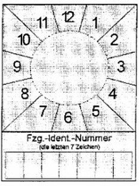
    *        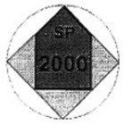

*    *
    *   SP-Schild

    *   Prüfmarke

*    *   1.2

    *   Abmessungen und Gestaltung

    *

*    *   1.2.1

    *   Prüfmarke

    *

*    *   1.2.1.1

    *   Allgemeines

    *

*    *
    *   Material:

    *   Folie oder Festkörper aus Kunststoff

*    *
    *   Kantenlänge der Prüfmarke:

    *   24,5 mm x 24,5 mm

*    *
    *   Strichfarben:

    *   schwarz

*    *
    *   Schriftart:

    *   Helvetica medium

*    *
    *   Schriftfarbe:

    *   schwarz.

*    *   1.2.1.2

    *   Grundkörper von Prüfmarken, die als Festkörper ausgebildet sind

*    *
    *   Durchmesser:

    *   35 mm

*    *
    *   Höhe:

    *   3 mm

*    *
    *   Farbe:

    *   grau

*    *
    *   Umrandung:

    *   keine.

*    *   1.2.1.3

    *   Fläche des Pfeiles:

*    *
    *   Kantenlänge des Pfeilschaftes:

    *   17,3 mm x 17,3 mm

*    *
    *   Kantenlänge der Pfeilspitze:

    *   Basislinie: 17,3 mm

*    *
    *
    *   Seitenlinien: 12,2 mm

*    *
    *   Farbe:

    *   jeweils entsprechend dem Kalenderjahr, in dem die nächste
        Sicherheitsprüfung durchgeführt werden muss (Durchführungsjahr).
        Sie ist für das Durchführungsjahr
        1999 – rosa
        2000 – grün
        2001 – orange
        2002 – blau
        2003 – gelb
        2004 – braun.
        Die Farben wiederholen sich für die folgenden Kalenderjahre jeweils in
        dieser Reihenfolge.

*    *
    *   Strichstärke der Umrandung:

    *   0,7 mm

*    *
    *   Anordnung Text „SP“:

    *   vertikal zentriert, Buchstabenunterkante 10 mm unter der Pfeilspitze

*    *
    *   Schrifthöhe Text „SP“:

    *   4 mm

*    *
    *   Anordnung Jahreszahl:

    *   vertikal und horizontal zentriert

*    *
    *   Schrifthöhe Jahreszahl:

    *   5 mm.

*    *   1.2.1.4

    *   Restfläche:

*    *
    *   Farbe:

    *   grau

*    *
    *   Umrandung:

    *   keine.

*    *   1.2.2

    *   SP-Schild

*    *   1.2.2.1

    *   Allgemeines

*    *
    *   Material:

    *   Folie, Kunststoff oder Metall

*    *
    *   Kantenlänge (Höhe x Breite):

    *   80 mm x 60 mm

*    *
    *   Grundfarbe:

    *   grau

*    *
    *   Strichfarben:

    *   schwarz

*    *
    *   Schriftfarben:

    *   schwarz.

*    *   1.2.2.2

    *   Quadrat Monatsangabe

*    *
    *   Kantenlänge:

    *   60 mm

*    *
    *   Anordnung der Monatszahlen:

    *   1 bis 12 jeweils um 30 Grad im Uhrzeigersinn versetzt, an einem
        fiktiven Kreisring von 40 mm Durchmesser außen angesetzt

*    *
    *   Schriftart:

    *   Helvetica medium, zweistellige Zahlen in Engschrift

*    *
    *   Schrifthöhe:

    *   5 mm

*    *
    *   Linien zwischen den Monatszahlen:

    *   sechs jeweils fiktiv durch den Mittelpunkt des Quadrates verlaufende,
        um 30 Grad versetzte Linien

*    *
    *   Strichstärke:

    *   0,5 mm.

*    *   1.2.2.3

    *   Kreisfläche

*    *
    *   Beschaffenheit:

    *   Damit die Prüfmarke von dem SP-Schild abgelöst werden kann, ohne
        dieses zu zerstören, sollte die Kreisfläche mindestens 1 mm positiv
        erhaben sein.

*    *
    *   Anordnung Mittelpunkt:

    *   auf den Mittelpunkt des Quadrates (Monatsangabe) zentriert

*    *
    *   Innendurchmesser:

    *   35 mm

*    *
    *   Umrandung:

    *   keine

*    *
    *   Grundfarbe:

    *   grau.

*    *   1.2.2.4

    *   Feld, „Fzg.-Ident.-Nummer“

*    *
    *   Anordnung:

    *   je 2 mm Abstand zur seitlichen und unteren Außenkante

*    *
    *   Kantenlänge (Höhe x Breite):

    *   12 mm x 56 mm

*    *
    *   Einzelfelder (Höhe x Breite):

    *   7 Felder, 12 mm x 8 mm

*    *
    *   Strichstärke:

    *   0,5 mm

*    *
    *   Schrift:

    *   Helvetica medium

*    *
    *   Schrifthöhe („Fzg.- Ident.-Nummer“):

    *   3 mm

*    *
    *   Schrifthöhe („die letzten 7 Zeichen“):

    *   2 mm.

*    *
    *   Bei Ausführung des SP-Schildes als Folie muss das Feld nach der
        Beschriftung mit einer zusätzlichen Schutzfolie gesichert werden.

*    *   1.2.3

    *   Farbtöne der Beschriftung und des Untergrundes

*    *
    *   Farbregister RAL 840 HR, herausgegeben vom RAL Deutsches Institut für
        Gütesicherung und Kennzeichnung e. V., Siegburger Straße 39, 53757 St.
        Augustin.

*    *
    *   Als Farbton ist zu verwenden:

    *   schwarz

    *   – RAL 9005

*    *
    *
    *   braun

    *   – RAL 8004

*    *
    *
    *   rosa

    *   – RAL 3015

*    *
    *
    *   grün

    *   – RAL 6018

*    *
    *
    *   gelb

    *   – RAL 1012

*    *
    *
    *   blau

    *   – RAL 5015

*    *
    *
    *   orange

    *   – RAL 2000

*    *
    *
    *   grau

    *   – RAL 7035.

*    *   1.2.4

    *   Dauerbeanspruchung

*    *
    *   Prüfmarke und SP-Schild müssen so beschaffen sein, dass sie für die
        Dauer ihrer Gültigkeit den Beanspruchungen beim Betrieb des Fahrzeugs
        standhalten.

**2** **Ergänzungsbestimmungen**

2.1 Fälschungssicherheit

    Damit Fälschungen erschwert und nachweisbar werden, sind durch den
    Hersteller bestimmte Merkmale und zusätzlich eine
    Herstellerkennzeichnung einzubringen, die über die gesamte Lebensdauer
    der Prüfmarke wirksam und erkennbar bleiben.

2.1.1 Prüfmarken in Folienausführung

    Es sind unsichtbare Schriftmerkmale und zusätzlich eine
    Herstellerkennzeichnung, die ohne Hilfsmittel nicht erkennbar sind,
    einzuarbeiten. Die Erkennbarkeit muss durch die Verwendung von mit
    Black-light-Röhren (300 – 400 nm) ausgerüsteten Prüflampen gegeben
    sein. Die verwendeten Schriften der Kennzeichnung müssen in nicht
    fälschbarer Microschrift ausgeführt sein. In die Kennzeichnung sind
    der Hersteller und das Produktjahr in Form einer Zahlenkombination
    einzubringen. Die Zeichen haben eine maximale Höhe von 2 mm und eine
    maximale Strichstärke von 0,75 mm. Es sind Flächensymbole
    einzuarbeiten.

2.1.2 Prüfmarken in Festkörperausführung

    Die Umrandung des Pfeiles, der Text „SP“ und die Jahreszahl müssen
    mindestens 0,3 mm positiv erhaben sein. Auf der Rückseite der
    Prüfmarke muss eine zusätzliche Kennzeichnung aufgebracht werden. In
    die Kennzeichnung sind der Hersteller und das Produktjahr in Form
    einer Zahlenkombination einzubringen.

    Dies gilt nicht, wenn die Prüfmarken die Anforderungen nach Nummer
    2\.1.1 erfüllen.

2.2 Übertragungssicherheit

2.2.1 Allgemeines

    Bei Prüfmarken oder SP-Schildern aus Folie muss zur Gewährleistung der
    Übertragungssicherheit der Untergrund vor dem Aufbringen frei von
    Staub, Fett, Klebern, Folien oder sonstigen Rückständen sein.

2.2.2 Entfernung von Prüfmarken

    Es muss gewährleistet sein, dass sich Prüfmarken bei ordnungsgemäßer
    Anbringung nicht unzerstört entfernen lassen. Der Zerstörungsgrad der
    Prüfmarken muss so groß sein, dass eine Wiederverwendung auch unter
    Korrekturen nicht möglich ist. Es darf nicht möglich sein, aus zwei
    abgelösten (entfernten) Prüfmarken eine Ähnlichkeitsfälschung
    herzustellen.

2.3 Echtheitserkennbarkeit im Anlieferungszustand

    Die Verarbeiter von Prüfmarken (Zulassungsbehörden, Technische
    Prüfstellen, Überwachungsorganisationen, anerkannte Kfz-Werkstätten)
    müssen im Anlieferungszustand die systembedingte Echtheit erkennen
    können. Dies wird durch ein genau definiertes und gekennzeichnetes
    Schutzpapier auf der Rückseite der Prüfmarken oder durch die auf der
    Rückseite der Festkörper aufgebrachten fälschungserschwerenden
    Schriftmerkmale nach Nummer 2.1.2 Absatz 1 sichergestellt.

    In der Sichtfläche der Prüfmarke ist eine nicht aufdringliche und das
    Gesamtbild nicht störende fälschungserschwerende Produktkennzeichnung
    eingebracht.

    Die Prüfmarken sind in übersichtlich zählbaren Behältnissen verpackt.

2.4 Anbringung der Prüfmarken und SP-Schilder

    Die individuelle Beschriftung des SP-Schildes mit der Fahrzeug-
    Identifizierungsnummer erfolgt mit einem dokumentenechten
    Permanentschreiber. Diese Beschriftung ist durch eine Schutzfolie zu
    sichern. Beim Ablösen der Schutzfolie muss sich das Feld
    „Fzg.-Ident.-Nummer“ so zerstören, dass eine Wiederverwendung auch
    unter Korrekturen nicht möglich ist. Bei Ausführung des SP-Schildes
    als Festkörper aus Kunststoff oder Metall können die Zeichen auch
    positiv oder negativ erhaben aufgebracht werden; eine zusätzliche
    Schutzfolie ist dann entbehrlich.

    Das SP-Schild ist gut sichtbar am Fahrzeugheck in Fahrtrichtung hinten
    links anzubringen. Die Anbringungshöhe ist so zu wählen, dass sich die
    Oberkante des SP-Schildes mindestens 300 mm und maximal 1 800 mm über
    der Fahrbahn befindet. Die rechte Kante des SP-Schildes darf nicht
    mehr als 800 mm vom äußersten Punkt des hinteren Fahrzeugumrisses
    entfernt sein. Davon kann nur abgewichen werden, wenn die Bauart des
    Fahrzeugs diese Anbringung nicht zulässt.

    Die Prüfmarke ist auf der Kreisfläche oder in dem Haltering des SP-
    Schildes so anzubringen, dass die Pfeilspitze auf den Monat zeigt, in
    dem das Fahrzeug zur nächsten Sicherheitsprüfung nach den Vorschriften
    der Anlage VIII vorzuführen ist.

2.5 Bezug von Prüfmarken

    Die Hersteller von Prüfmarken beliefern ausschließlich die
    Zulassungsbehörden, die Technischen Prüfstellen, die
    Überwachungsorganisationen und die für die Anerkennung von Werkstätten
    zur Durchführung von Sicherheitsprüfungen zuständigen Stellen. Die
    Anerkennungsstellen nach Nummer 1.1 Anlage VIIIc beliefern die zur
    Durchführung von Sicherheitsprüfungen anerkannten Werkstätten. Die
    zuständige oberste Landesbehörde oder die von ihr bestimmten oder nach
    Landesrecht zuständigen Stellen können Abweichendes bestimmen.

(zu § 35e Absatz 4, §§ 35f, 35i)

### Anlage X Fahrgasttüren, Notausstiege, Gänge und Anordnung von Fahrgastsitzen in Kraftomnibussen

(Fundstelle: BGBl. I 2012, 769 - 776)

**1** **Einteilung der Kraftomnibusse**

    Es werden unterschieden

1.1 Kraftomnibusse mit Stehplätzen

1.1.1 mit mehr als 16 Fahrgastplätzen

1.1.2 mit bis zu 16 Fahrgastplätzen

1.2 Kraftomnibusse ohne Stehplätze

1.2.1 mit mehr als 16 Fahrgastplätzen

1.2.2 mit bis zu 16 Fahrgastplätzen

**2** **Gänge und Innenraumhöhe über Plattformen**

    Gang ist der Bereich im Innenraum von Kraftomnibussen, der mehr als
    400 mm von den Fahrgasttüren entfernt ist. Er muss den Fahrgästen den
    Zugang zu jedem Sitz/jeder Sitzreihe ermöglichen.

    Der Gang umfasst nicht den bis zu 300 mm tiefen Raum vor einem
    Sitz/einer Sitzreihe, der für die Füße der sitzenden Fahrgäste
    bestimmt ist, sowie den Raum vor der letzten Sitzreihe oder Sitzbank,
    der nur von denjenigen Fahrgästen benutzt wird, die diese Sitze
    einnehmen.

    *        *            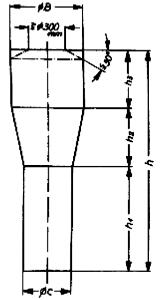
        *   Der Gang muss so ausgelegt sein, dass der freie Durchlass der
            nebenstehend abgebildeten Messvorrichtung möglich ist.
            Sitze im Bereich der vorderen Fahrgasttüren (§ 35b Abs. 2) dürfen zur
            Prüfung weggeklappt werden, soweit dies einfach und ohne großen
            Kraftaufwand möglich und die Betätigungsart klar ersichtlich ist.
            Die Messvorrichtung muss bei der Prüfung senkrecht geführt werden.

    Die Abmessungen der Messvorrichtung sind der Tabelle zu entnehmen. Die
    Innenraumhöhe über Plattformen muss der für den Gang geforderten
    Mindesthöhe (Gesamthöhe der Messvorrichtung) entsprechen.

    *        *   Abmessungen der Messvorrichtung [mm]

        *   Kraftomnibusse mit Stehplätzen

        *   Kraftomnibusse ohne Stehplätze

    *        *   mit mehr als 16 Fahrgastplätzen (vgl. 1.1.1)

        *   mit bis zu 16 Fahrgastplätzen (vgl. 1.1.2)

        *   mit mehr als 16 Fahrgastplätzen (vgl. 1.2.1)

        *   mit bis zu 16 Fahrgastplätzen (vgl. 1.2.2)

    *        *
            *                *   Höhe des unteren Zylinders

                *   h
                    1

        *   900

        *   900

        *   900

        *   900

    *        *
            *                *   Höhe des Kegelstumpfes

                *   h
                    2

        *   500

        *   500

        *[^f776225_23_BJNR067910012BJNE013000000]
   500 (350)

        *   300

    *        *
            *                *   Höhe des oberen Zylinders

                *   h
                    3

        *[^f776225_22_BJNR067910012BJNE013000000]
   500 (400)

        *   500

        *   400

        *   300

    *        *
            *                *   Durchmesser des unteren Zylinders

                *   C

        *   350

        *   350

        *[^f776225_24_BJNR067910012BJNE013000000]
   300 (220)

        *   300

    *        *
            *                *   Durchmesser des oberen Zylinders

                *[^f776225_21_BJNR067910012BJNE013000000]
   B

        *   550

        *   550

        *   450

        *   450

    *        *
            *                *   Gesamthöhe der Messvorrichtung

                *   h

        *   1 900 (1 800)

        *   1 900

        *   1 800 (1 650)

        *   1 500

    *        *   **Erläuterungen:**

    Bei Gelenk-Kraftomnibussen muss die Messvorrichtung auch den
    Gelenkabschnitt in allen möglichen Betriebsstellungen der Fahrzeuge
    unbehindert passieren können.

**3** **Fahrgastsitze**

3.1 Sitzmaße

    Die Abmessungen für jeden Sitzplatz müssen den in der nachfolgenden
    Aufstellung und in der Skizze zusammengefassten Abmessungen
    entsprechen. Alle Maße beziehen sich auf unbelastete Sitz- und
    Lehnenpolster.

    *        *   Breite des Sitzpolsters auf jeder Seite –
            gemessen ab einer durch die Mitte des betreffenden Sitzes verlaufenden
            Vertikalebene

        *   F*

        *   200 mm für Einzelsitze
            und für Sitzbänke
            für zwei oder mehr Fahrgäste

    *        *   Breite des verfügbaren Raumes –
            gemessen in einer Horizontalebene entlang der Rückenlehne des Sitzes
            in einer Höhe zwischen 270 und 650 mm
            über dem Sitzpolster

        *   G*
            G*

        *   250 mm für Einzelsitze
            225 mm für Sitzbänke
            für zwei oder mehr Fahrgäste

    *        *   Höhe des Sitzpolsters bezogen auf den Boden
            unter den Füßen des Fahrgastes –
            gemessen vom Boden bis zu einer horizontalen Ebene, die die Oberfläche
            des höchsten Punktes des Sitzpolsters berührt

        *   I =

        *   400 ... 500 mm
            bei Radkästen
            ist eine Verringerung
            bis auf 350 mm möglich.

    *        *   Tiefe des Sitzpolsters –
            Abstand zwischen zwei Vertikalebenen, die die Vorderkante des
            Sitzpolsters berühren –
            gemessen in einer horizontalen Ebene, die die Oberfläche
            des höchsten Punktes des Sitzpolsters berührt

        *   K*

        *   350 mm

    *        *            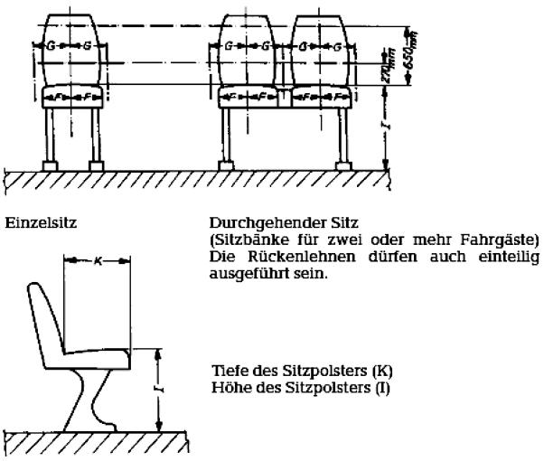
        *

3.2 Freiraum

    Um dem Fahrgast die nötige Bewegungsfreiheit zu gewährleisten, muss
    der Bereich über dem unbelasteten Sitzpolster eine freie Höhe von 900
    mm aufweisen. Außerdem muss der Abstand gemessen vom Boden

    a)  im Bereich oberhalb der Sitzfläche,

    b)  im Bereich oberhalb der Rückenlehne und

    c)  im Bereich oberhalb des Fußraums des sitzenden Fahrgastes (bis 300 mm
        vor der Vorderkante des Sitzes)

    mindestens 1 350 mm betragen.

    In den Bereich oberhalb des Fußraums darf die Rückenlehne eines Sitzes
    hineinragen.

    Geringfügige Einschränkungen des Freiraums (zum Beispiel für
    Leitungskanäle) sind zulässig.

3.3 Zwischenabstand der Sitze

    Unbelastete Sitz- und Lehnenpolster müssen den nachfolgend angegebenen
    Maßen entsprechen; dabei muss in einer durch die Mitte des einzelnen
    Sitzplatzes verlaufenden Vertikalebene gemessen werden.

    *        *   gleichgerichtete Sitze:
            Abstand zwischen der Vorderseite der Rückenlehne eines Sitzes und der
            Rückseite der Rückenlehne davor –
            gemessen in der Horizontalen und in jeder Höhe zwischen der Oberfläche
            des Sitzpolsters und einer Höhe von 620 mm über dem Boden

        *   H
            1*                              650 mm

    *        *   quergestellte, einander gegenüber angeordnete Sitze:
            Abstand zwischen den Vorderseiten der Rückenlehnen –
            gemessen in Querrichtung im höchsten Punkt der Sitzpolster

        *   H
            2*                              1 300 mm

    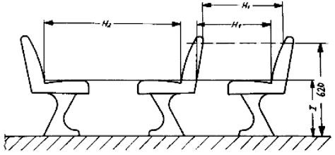

3.4 Sitze hinter Trennwänden

    Bei Sitzen hinter einer festen Trennwand muss zwischen dieser und der
    Vorderseite der Rückenlehne – gemessen in einer horizontalen Ebene,
    die die Oberfläche des nächsten Punktes des Sitzpolsters berührt – ein
    freier Abstand von mindestens 630 mm vorhanden sein.

    Im Bereich vom Boden bis zu einer Ebene, die 150 mm höher ist, muss
    der Abstand zwischen der Trennwand und dem Sitz mindestens 350 mm
    betragen (siehe Abbildung). Dieser Freiraum kann durch Einrichtung
    einer Nische in der Trennwand oder durch Rückwärtsverlagerung des
    Unterteils des Sitzes oder durch eine Kombination dieser beiden
    Möglichkeiten geschaffen werden. Wird ein Freiraum unter dem Sitz
    vorgesehen, so soll dieser aufwärts über die 150-mm-Ebene hinaus
    entlang der den vorderen Rand des Sitzaufbaus berührenden und
    unmittelbar unterhalb der Vorderkante des Sitzpolsters verlaufenden
    geneigten Ebene weitergeführt werden.

    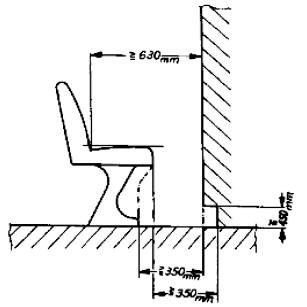

3.5 Sitze in Längsrichtung

    Sitze in Längsrichtung sind zulässig. Für die Sitze, wie Sitz- und
    Lehnenpolster, sind dieselben Mindestabmessungen, wie in Nummer 3.1
    angegeben und dargestellt anzuwenden. Der Freiraum über den Sitzen ist
    gemäß Nummer 3.2 einzuhalten.

    Am Beginn und Ende von Sitzbänken sowie nach jeweils zwei Sitzen
    müssen Armlehnen oder sonstige Halteeinrichtungen angebracht werden,
    die keine scharfen Kanten aufweisen und abgepolstert sind.

**4** **Abmessungen der Fahrgasttüren und des Bereichs bis zum Beginn des
    Gangs**

4.1 Die Fahrgasttüren müssen die nachfolgend angegebenen
    Mindestabmessungen haben.

    Geringfügige Abrundungen oder Einschränkungen an den oberen Ecken sind
    zulässig.

4.1.1 Lichte Weite

    a)  650 mm bei Einzeltüren,

    b)  1 200 mm bei Doppeltüren.

    Diese Abmessungen dürfen um bis zu 100 mm in Höhe von Handgriffen oder
    Handläufen unterschritten werden. Bei Kraftomnibussen mit bis zu 16
    Fahrgastplätzen ist eine Verminderung um bis zu 250 mm zulässig an
    Stellen, bei denen Radkästen in den Freiraum eindringen oder der
    Türantrieb angeordnet ist.

4.1.2 Lichte Höhe

    a)  1 800 mm bei Kraftomnibussen mit Stehplätzen,

    b)  1 650 mm bei Kraftomnibussen ohne Stehplätze mit mehr als 16
        Fahrgastplätzen,

    c)  1 500 mm bei Kraftomnibussen ohne Stehplätze mit bis zu 16
        Fahrgastplätzen.

4.2 Der Bereich ab der Seitenwand, in die die Fahrgasttüren eingebaut
    sind, ist bis zu 400 mm nach innen (Beginn des Gangs) so zu gestalten,
    dass der freie Durchlass der nachfolgend dargestellten
    Messvorrichtungen möglich ist.

4.2.1 Messvorrichtung für Kraftomnibusse mit Stehplätzen und für
    Kraftomnibusse ohne Stehplätze mit mehr als 16 Fahrgastplätzen (Maße
    in mm)

    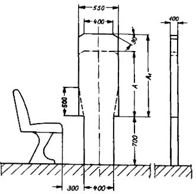
    Im Falle der Benutzung der Messvorrichtung mit A = 1 100 mm und A
    1                    = 1 200 mm bei Kraftomnibussen nach Nummer 1.1
    und 1.2.1 kann alternativ ein konischer Übergang mit 500 mm Höhe und
    der Breite 400 mm auf 550 mm gewählt werden.

    *        *   Maße für
            A und A
            1
            [mm]

        *   Kraftomnibusse mit Stehplätzen
            (vgl. 1.1.1 und 1.1.2)

        *   Kraftomnibusse ohne Stehplätze
            mit mehr als 16 Fahrgastplätzen
            (vgl. 1.2.1)

    *        *   A

        *   1 100

        *   950

    *        *   A
[^f776225_25_BJNR067910012BJNE013000000]
            1

        *[^f776225_26_BJNR067910012BJNE013000000]
   1 200

        *   1 100

4.2.2 Messvorrichtung für Kraftomnibusse ohne Stehplätze mit bis zu 16
    Fahrgastplätzen (Maße in mm)

    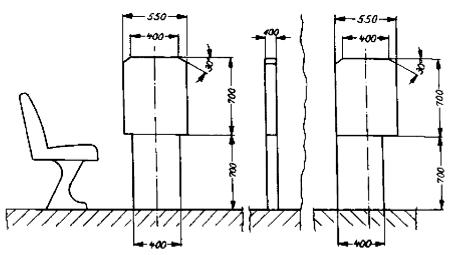
    *        *
        *   Verschieben der unteren Platte
            nach rechts oder links innerhalb
            der Außenkanten der oberen
            Platte möglich

        *   Beispiel für eine verschobene untere Platte:
            es ist die bei Verschiebung nach links maximal zulässige Stellung
            dargestellt

4.3 Die jeweilige Messvorrichtung muss aufrecht stehend von der
    Ausgangsposition aus parallel zur Türöffnung geführt werden, bis die
    erste Stufe erreicht ist. Die Ausgangsposition ist die Stelle, wo die
    dem Fahrzeuginneren zugewandte Seite der Messvorrichtung die äußerste
    Kante der Tür berührt. Danach ist sie rechtwinklig zur
    wahrscheinlichen Bewegungsrichtung einer den Einstieg benutzenden
    Person zu bewegen. Wenn die Mittellinie der Messvorrichtung 400 mm von
    der Ausgangsposition zurückgelegt hat, ist bei Kraftomnibussen mit
    Stehplätzen und bei Kraftomnibussen ohne Stehplätze mit mehr als 16
    Fahrgastplätzen die Höhe der oberen Platte vom Maß A auf das Maß A
    1                    zu vergrößern. Bei Kraftomnibussen ohne
    Stehplätze mit bis zu 16 Fahrgastplätzen ist A
    1                    = A (= 700 mm).

    Wenn die Messvorrichtung mehr als 400 mm zurücklegen muss, um den
    Fußboden (Gang) zu erreichen, ist sie so lange weiter vertikal und
    rechtwinklig zur wahrscheinlichen Bewegungsrichtung einer den Einstieg
    benutzenden Person fortzubewegen, bis die Messvorrichtung den Fußboden
    (Gang) berührt.

    Ob die Bedingungen des Zugangs von der senkrechten Ebene der
    Messvorrichtung zum Gang hin eingehalten werden, ist mit Hilfe der für
    den Gang maßgebenden zylindrischen Messvorrichtung (siehe Nummer 2) zu
    prüfen. Dabei ist die Ausgangsposition für die zylindrische
    Messvorrichtung die Stelle, wo sie die Messvorrichtung nach Nummer 4
    berührt.

    Der freie Durchgangsspielraum für die Messvorrichtung darf den Bereich
    bis 300 mm vor einem Sitz und bis zur Höhe des höchsten Punktes des
    Sitzpolsters nicht beanspruchen.

    Sitze im Bereich der vorderen Fahrgasttüren (§ 35b Absatz 2) dürfen
    zur Prüfung weggeklappt werden, soweit dies einfach und ohne großen
    Kraftaufwand möglich und die Betätigungsart klar ersichtlich ist.

**5** **Notausstiege**

5.1 Notausstiege können sein:

5.1.1 Notfenster, ein von den Fahrgästen nur im Notfall als Ausstieg zu
    benutzendes Fenster, das nicht unbedingt verglast sein muss;

5.1.2 Notluke, eine Dachöffnung, die nur im Notfall dazu bestimmt ist, von
    den Fahrgästen als Ausstieg benutzt zu werden;

5.1.3 Nottür, eine Tür, die zusätzlich zu den Fahrgasttüren und einer
    Fahrzeugführertür vorhanden ist, von den Fahrgästen aber nur
    ausnahmsweise und insbesondere im Notfall als Ausstieg benutzt werden
    soll.

5.2 Mindestanzahl der Notausstiege

5.2.1 In Kraftomnibussen müssen Notausstiege vorhanden sein, deren
    Mindestanzahl nachstehender Tabelle zu entnehmen ist:

    *        *
        *   Notfenster oder Nottür je Fahrzeuglängsseite

        *   Notluke

        *   Notfenster oder Nottür an der Fahrzeugvorder- oder -rückseite

    *        *   Kraftomnibusse mit bis zu 16 Fahrgastplätzen

        *   1

        *   1 oder 1

    *        *   Kraftomnibusse mit bis zu 22 Fahrgastplätzen

        *   2

        *   1

        *   1

    *        *   Kraftomnibusse mit bis zu 35 Fahrgastplätzen

        *   2

        *   1

        *   1

    *        *   Kraftomnibusse mit bis zu 50 Fahrgastplätzen

        *   3

        *   1

        *   1

    *        *   Kraftomnibusse mit bis zu 80 Fahrgastplätzen

        *   3

        *   2

        *   2

    *        *   Kraftomnibusse mit mehr als 80 Fahrgastplätzen

        *   4

        *   2

        *   2

    Alle weiteren Fenster und Türen (ausgenommen die Fahrgast- und
    Fahrzeugführertüren), die die Voraussetzungen für Notausstiege
    erfüllen, gelten ebenfalls als Notausstiege und sind gemäß § 35f
    Absatz 2 deutlich zu kennzeichnen.

5.2.2 Sonderbestimmungen

5.2.2.1 Bei Kraftomnibussen, die als Gelenkfahrzeug gebaut sind, ist jedes
    starre Teil des Fahrzeugs im Hinblick auf die Mindestanzahl der
    vorzusehenden Notausstiege als ein Einzelfahrzeug anzusehen; dabei ist
    die Anzahl der Fahrgastplätze vor und hinter dem Gelenk zugrunde zu
    legen. Für die Mindestanzahl der Notfenster und der Nottüren in der
    Fahrzeugvorder- oder -rückseite ist die Gesamtzahl der Fahrgastplätze
    des Kraftomnibusses maßgebend.

5.2.2.2 Bei Kraftomnibussen, die als sogenannte Eineinhalbdeck-Kraftomnibusse
    oder Doppeldeck-Kraftomnibusse gebaut sind (Beförderung der Fahrgäste
    auf zwei Ebenen), ist jedes Fahrzeugdeck im Hinblick auf die
    Mindestanzahl der vorzusehenden Notausstiege als ein Einzelfahrzeug
    anzusehen; dabei ist die Anzahl der Fahrgastplätze je Fahrzeugdeck
    zugrunde zu legen.

    Für die Mindestanzahl der Notluken im Fahrzeugdach ist die Gesamtzahl
    der Fahrgastplätze des Kraftomnibusses maßgebend.

5.2.2.3 Können bei Kraftomnibussen nach Nummer 5.2.2.2 Notfenster oder
    Nottüren an der Fahrzeugvorder- oder -rückseite des Unterdecks aus
    konstruktiven Gründen nicht angebracht werden, sind für die Fahrgäste
    im Unterdeck ersatzweise andere Fluchtmöglichkeiten für den Notfall
    vorzusehen (zum Beispiel Luken im Zwischendeck, ausreichend bemessene
    Zugänge vom Unterdeck zum Oberdeck).

5.3 Mindestabmessungen der Notausstiege

5.3.1 Die verschiedenen Arten der Notausstiege müssen folgende
    Mindestabmessungen haben:

    *        *
        *   Höhe

        *   Breite

        *   Fläche

        *   Bemerkungen

    *        *   Notfenster

        *   –

        *   –

        *   0,4 m
            2

        *   In die Öffnungen muss ein
            Rechteck von 0,5 m Höhe und
[^f776225_27_BJNR067910012BJNE013000000]
            0,7 m Breite hineinpassen

    *        *   Notluke

        *   –

        *   –

        *   0,4 m
            2

    *        *   Nottür

        *   1,25 m

        *   0,55 m

        *   –

        *   –

5.3.2 Notfenster mit einer Fläche von 0,8 m
    2                   , in die ein Rechteck von 0,5 m Höhe und 1,4 m
    Breite hineinpasst, gelten im Sinne von Nummer 5.2.1 als zwei
    Notausstiege.

5.4 Anordnung und Zugänglichkeit der Notausstiege

5.4.1 Notfenster und Notluken sind in Längsrichtung der Kraftomnibusse
    gleichmäßig zu verteilen; ihre Anordnung ist auf die Lage der
    Fahrgastplätze abzustimmen.

5.4.2 Notfenster, Notluken und Nottüren müssen gut zugänglich sein. Der
    direkte Raum vor ihnen darf nur so weit eingeschränkt sein, dass für
    erwachsene Fahrgäste der ungehinderte Zugang zu den Notausstiegen
    gewährleistet ist.

5.5 Bauliche Anforderungen an Notausstiege

5.5.1 Notfenster

5.5.1.1 Notfenster müssen sich leicht und schnell öffnen, zerstören oder
    entfernen lassen.

5.5.1.2 Bei Notfenstern, die durch Zerschlagen der Scheiben (auch
    Doppelscheiben) geöffnet werden, müssen die Scheiben aus Einscheiben-
    Sicherheitsglas (vorgespanntes Glas) hergestellt sein. Für jedes
    dieser Notfenster muss eine Einschlagvorrichtung (zum Beispiel
    Nothammer) vorhanden sein.

5.5.1.3 Notfenster mit Scharnieren oder mit Auswerfeinrichtung müssen sich
    nach außen öffnen lassen.

5.5.2 Notluken

5.5.2.1 Notluken müssen sich von innen und von außen leicht und schnell öffnen
    oder entfernen lassen.

5.5.2.2 Notluken aus Einscheiben-Sicherheitsglas (vorgespanntes Glas) sind
    zulässig; in diesem Fall muss für jede der Notluken innen im Fahrzeug
    eine Einschlagvorrichtung (zum Beispiel Nothammer) vorhanden sein.

5.5.3 Nottüren

5.5.3.1 Nottüren dürfen weder als fremdkraftbetätigte Türen noch als
    Schiebetüren ausgeführt sein.

5.5.3.2 Die Nottüren müssen sich nach außen öffnen lassen und so beschaffen
    sein, dass selbst bei Verformung des Fahrzeugaufbaus durch einen
    Aufprall – ausgenommen einen Aufprall auf die Nottüren – nur eine
    geringe Gefahr des Verklemmens besteht.

5.5.3.3 Die Nottüren müssen sich von innen und von außen leicht öffnen lassen.

5.5.3.4 Dem Fahrzeugführer muss sinnfällig angezeigt werden, wenn Nottüren,
    die außerhalb seines direkten Einflussbereichs und Sichtfeldes liegen,
    geöffnet oder nicht vollständig geschlossen sind.

5.5.4 Eine Verriegelung der Notfenster, Notluken und Nottüren (zum Beispiel
    für das Parken) ist zulässig; es muss dann jedoch sichergestellt sein,
    dass sie stets von innen durch den normalen Öffnungsmechanismus zu
    öffnen sind.

    Der Durchmesser der Abschrägung am oberen Ende des Zylinders muss
    mindestens 300 mm betragen, die Abschrägung darf 30° nicht
    überschreiten.
[^f776225_21_BJNR067910012BJNE013000000]:     Reduzierung möglich bei Kraftomnibussen mit Heckmotor für den Teil des
    Gangs hinter der Hinterachse bzw. hinter einer hinter dieser Achse
    befindlichen Fahrgasttür und bei Eineinhalbdeck- und Doppeldeck-
    Kraftomnibussen für den zweistöckigen Fahrzeugteil.
[^f776225_22_BJNR067910012BJNE013000000]:     Reduzierung möglich bei Eineinhalbdeck- und Doppeldeck-Kraftomnibussen
    für den Gang zur Heckbank des Unterdecks und im Oberdeck.
[^f776225_23_BJNR067910012BJNE013000000]: [^f776225_24_BJNR067910012BJNE013000000]:     220 mm bei seitlich bewegbaren Sitzen.               Bei ausgefahrenen
    Sitzen muss ein Fußraum mit den lichten Maßen von 350 mm in der Breite
    und 200 mm in der Höhe vorhanden sein. Die Sitze müssen sich auch in
    belastetem Zustand von einer erwachsenen Person mit vertretbarem
    Kraftaufwand verstellen lassen.
[^f776225_25_BJNR067910012BJNE013000000]:     Maß A                            1              400 mm hinter der
    Türöffnung (siehe 4.3).
    Reduzierung auf 1 100 mm bei Eineinhalbdeck- und Doppeldeck-
    Kraftomnibussen für den zweistöckigen Fahrzeugteil möglich.
[^f776225_26_BJNR067910012BJNE013000000]:     Für ein Notfenster in der Fahrzeugrückseite gelten die Bedingungen als
    erfüllt, wenn Öffnungen von 0,35 m Höhe und 1,55 m Breite bei
    Ausrundungsradien von 25 cm vorhanden sind.
[^f776225_27_BJNR067910012BJNE013000000]: 
(zu § 47a)

### Anlage XI (weggefallen)

(zu § 47a)

### Anlage XIa (weggefallen)

(zu § 47a Absatz 2 und § 47b Absatz 2)

### Anlage XIb (weggefallen)

(§ 34 Absatz 4 Nummer 2 Buchstabe d, Absatz 5 Nummer 2 Buchstabe b und
Nummer 3 Buchstabe b, Absatz 6 Nummer 3 Buchstabe b)

### Anlage XII Bedingungen für die Gleichwertigkeit von Luftfederungen und bestimmten anderen Federungssystemen an der (den) Antriebsachse(n) des Fahrzeugs

(Fundstelle: BGBl. I 2012, 778 - 779)

**1** **Definition der Luftfederung**

    Ein Federungssystem gilt als luftgefedert, wenn die Federwirkung zu
    mindestens 75 Prozent durch pneumatische Vorrichtungen erzeugt wird.

**2** **Gleichwertigkeit mit der Luftfederung**

    Ein Federungssystem wird als der Luftfederung gleichwertig anerkannt,
    wenn es folgende Voraussetzungen erfüllt:

2.1 Während des kurzzeitigen freien niederfrequenten vertikalen
    Schwingungsvorgangs der gefederten Masse senkrecht über der
    Antriebsachse oder einer Achsgruppe dürfen die gemessene Frequenz und
    Dämpfung der Federung unter Höchstlast die unter den Nummern 2.2 bis
    2\.5 festgelegten Grenzwerte nicht überschreiten.

2.2 Jede Achse muss mit hydraulischen Dämpfern ausgerüstet sein. Bei
    Doppelachsen müssen die hydraulischen Dämpfer so angebracht sein, dass
    die Schwingung der Achsgruppe auf ein Mindestmaß reduziert wird.

2.3 Das mittlere Dämpfungsverhältnis D muss über 20 Prozent der kritischen
    Dämpfung der Federung im Normalzustand, das heißt mit
    funktionstüchtigen hydraulischen Dämpfern, betragen.

2.4 Wenn alle hydraulischen Dämpfer entfernt oder außer Funktion gesetzt
    sind, darf das Dämpfungsverhältnis der Federung nicht mehr als 50
    Prozent des mittleren Dämpfungsverhältnisses D betragen.

2.5 Die Frequenz der gefederten Masse über der Antriebsachse oder der
    Achsgruppe während eines kurzzeitigen freien vertikalen
    Schwingungsvorgangs darf 2,0 Hz nicht überschreiten.

2.6 Unter Nummer 3 werden die Frequenz und die Dämpfung der Federung
    definiert. Unter Nummer 4 werden die Prüfverfahren zur Ermittlung der
    Frequenz- und der Dämpfungswerte beschrieben.

**3** Definition von Frequenz und Dämpfung
    ****

    In dieser Definition wird von einer gefederten Masse M Kilogramm (kg)
    über einer Antriebsachse oder einer Achsgruppe ausgegangen. Die Achse
    oder die Achsgruppe hat einen vertikalen Gesamtdruck zwischen
    Straßenoberfläche und gefederter Masse von K Newton/Meter (N/m) und
    einen Gesamtdämpfungskoeffizienten von C Newton pro Meter und Sekunde
    (N/ms). Z ist der Weg der gefederten Masse in vertikaler Richtung. Die
    Bewegungsgleichung für die freie Schwingung der gefederten Masse
    lautet:

    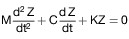
    Die Frequenz der Schwingung der gefederten Masse F rad/s ist:

    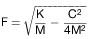
    Die Dämpfung ist kritisch, wenn C = Co ist, wobei

    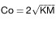
    ist.

    Das Dämpfungsverhältnis als Bruchteil des kritischen Wertes ist C/Co.

    Die kurzzeitige freie vertikale Schwingung der gefederten Masse ergibt
    die in Abbildung 2 dargestellte gedämpfte Sinuskurve. Die Frequenz
    lässt sich durch Messung der für sämtliche zu beobachtenden
    Schwingungszyklen benötigten Zeit ermitteln. Die Dämpfung wird durch
    Messung der aufeinanderfolgenden Schwingungspeaks, die in derselben
    Richtung auftreten, ermittelt. Wenn die Amplitudenpeaks des ersten und
    des zweiten Schwingungszyklus A
    1                    und A
    2                    sind, beträgt das Dämpfungsverhältnis D

    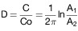
    Dabei ist ln der natürliche Logarithmus des Amplitudenverhältnisses.

**4** **Prüfverfahren**

    Um im Test das Dämpfungsverhältnis D, das Dämpfungsverhältnis bei
    entfernten hydraulischen Dämpfern sowie die Frequenz F der Federung
    bestimmen zu können, muss das beladene Fahrzeug entweder

    a)  mit geringer Geschwindigkeit (5 km/h*                          1 km/h)
        über eine Schwelle von 80 mm Höhe mit dem in Abbildung 1 gezeigten
        Profil gefahren werden; auf Frequenz und Dämpfung ist die kurzzeitige
        Schwingung zu untersuchen, die sich ergibt, nachdem die Räder an der
        Antriebsachse die Schwelle wieder verlassen haben; oder

    b)  am Fahrgestell heruntergezogen werden, so dass die Antriebsachslast
        das Anderthalbfache des höchsten statischen Wertes beträgt. Danach
        wird die auf das Fahrzeug wirkende Zugkraft plötzlich aufgehoben und
        die daraus resultierende Schwingung untersucht; oder

    c)  am Fahrgestell hochgezogen werden, so dass die gefederte Masse um 80
        mm über die Antriebsachse angehoben wird. Danach wird die auf das
        Fahrzeug wirkende Zugkraft plötzlich aufgehoben und die daraus
        resultierende Schwingung untersucht; oder

    d)  anderen Verfahren unterzogen werden, sofern ihre Gleichwertigkeit vom
        Hersteller gegenüber der zuständigen technischen Behörde
        zufriedenstellend nachgewiesen wurde.

    Das Fahrzeug sollte zwischen Antriebsachse und Fahrgestell senkrecht
    über der Achse mit einem Schwingungsschreiber versehen werden. Anhand
    der Zeitspanne zwischen der ersten und der zweiten Kompressionsspitze
    lassen sich einerseits die Frequenz F und andererseits das
    Amplitudenverhältnis und damit dann die Dämpfung ermitteln. Bei
    Doppelantriebsachsen sollten Schwingungsschreiber zwischen jeder
    Antriebsachse und dem Fahrgestell senkrecht über diesen Achsen
    angebracht werden.

    **Abbildung 1**

    **Schwelle für Federprüfungen**

    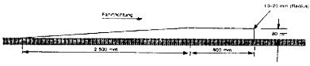
    **Abbildung 2**

    **Gedämpfte Sinuskurve bei einer kurzzeitigen freien Schwingung**

    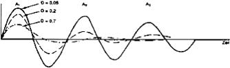

(§ 34a Absatz 3)

### Anlage XIII Zulässige Zahl von Sitzplätzen und Stehplätzen in Kraftomnibussen

(Fundstelle: BGBl. I 2012, 780)

(1) Anwendungsbereich
Diese Anlage gilt für Kraftomnibusse, wenn sie nicht im
Gelegenheitsverkehr nach § 46 des Personenbeförderungsgesetzes
eingesetzt sind.

(2) Berechnung der zulässigen Zahl von Sitzplätzen und Stehplätzen

a)  Bei der Berechnung der zulässigen Zahl der Plätze sind unter
    Berücksichtigung des Leergewichts, des zulässigen Gesamtgewichts und
    der zulässigen Achslasten des Fahrzeugs folgende Durchschnittswerte
    anzusetzen:

    1.  68 kg als Personengewicht,

    2.  544 kg/qm als spezifischer Belastungswert für Stehplatzflächen,

    3.  100 kg/cbm als spezifischer Belastungswert für Gepäckräume,

    4.  75 kg/qm als spezifischer Belastungswert für Dachgepäckflächen.

b)  Das für die Gepäckbeförderung zu berücksichtigende Gewicht kann sowohl
    ganz als auch in einem im Fahrzeugschein festgelegten Anteil
    zusätzlich zu der nach Abschnitt a zulässigen Zahl der Plätze für die
    Personenbeförderung nutzbar gemacht werden, wenn der entsprechende
    Gepäckraum beim Betrieb der Kraftomnibusse nicht für die
    Gepäckbeförderung genutzt wird.

(zu § 48)

### Anlage XIV Emissionsklassen für Kraftfahrzeuge

(Fundstelle: BGBl. I 2012, 781 - 786;
bzgl. der einzelnen Änderungen vgl. Fußnote)

**1** **Anwendungsbereich**

    Diese Anlage gilt für alle zur Teilnahme am Straßenverkehr bestimmten
    Kraftfahrzeuge. Sie gilt nicht für Personenkraftwagen
    im Sinne der EG-Fahrzeugklasse M
    1                      nach Anlage XXIX,                   .

**2** **Begriffsbestimmungen**

2.1 Schadstoffklassen

    Die Emissionen der gasförmigen Schadstoffe Kohlenmonoxid,
    Kohlenwasserstoffe und Stickoxide sowie die luftverunreinigenden
    Partikel sind Grundlage für die Schadstoffklassen.

2.2 Geräuschklassen

    Die Geräuschemissionen sind Grundlage für die Geräuschklassen.

2.3 EEV Klassen

    Optionale Emissionsanforderungen sind Grundlage für die EEV Klassen.

2.4 Partikelminderungsklassen

    Die Emission der luftverunreinigenden Partikel ist Grundlage für die
    Partikelminderungsklassen.

**3** **Emissionsklassen**

3.1 Schadstoffklassen

3.1.1 Schadstoffklasse S 1

    Zur Schadstoffklasse S 1 gehören Kraftfahrzeuge, die

    1.  in den Anwendungsbereich der Richtlinie 88/77/EWG des Rates vom 3.
        Dezember 1987 (ABl. L 36 vom 9.2.1988, S. 33) in der Fassung der
        Richtlinie 91/542/EWG des Rates vom 1. Oktober 1991 (ABl. L 295 vom
        25\.10.1991, S. 1) fallen, den Vorschriften der Richtlinie entsprechen
        und die bei den Emissionen der gasförmigen Schadstoffe und
        luftverunreinigenden Partikel die in Zeile A der Tabelle im Abschnitt
        8\.3.1.1 des Anhangs I der Richtlinie genannten Grenzwerte nicht
        überschreiten oder

    2.  in den Anwendungsbereich der Richtlinie 70/220/EWG in der Fassung der
        Richtlinie 93/59/EWG (ABl. L 186 vom 28.7.1993, S. 21) fallen, den
        Vorschriften der Richtlinie entsprechen und die im Anhang I im
        Abschnitt 5.3.1 der Richtlinie genannte Prüfung Typ I (Prüfung der
        durchschnittlichen Auspuffemissionen nach einem Kaltstart) nachweisen
        oder

    3.  in den Anwendungsbereich der Richtlinie 70/220/EWG in der Fassung der
        Richtlinie 94/12/EG (ABl. L 100 vom 19.4.1994, S. 42) fallen, den
        Vorschriften der Richtlinie entsprechen und die bei den Emissionen der
        gasförmigen Schadstoffe und luftverunreinigenden Partikel die für die
        Gruppen I, II und III vorgeschriebenen Grenzwerte der Tabelle im
        Abschnitt 5.3.1.4 des Anhangs I der Richtlinie nicht überschreiten
        oder

    4.  in den Anwendungsbereich der Richtlinie 70/220/EWG in der Fassung der
        Richtlinie 96/44/EG (ABl. L 210 vom 20.8.1996, S. 25) fallen, den
        Vorschriften der Richtlinie entsprechen und die bei den Emissionen der
        gasförmigen Schadstoffe und luftverunreinigenden Partikel die für die
        Gruppen I, II und III vorgeschriebenen Grenzwerte der Tabelle im
        Abschnitt 5.3.1.4 des Anhangs I der Richtlinie nicht überschreiten
        oder

    5.  in den Anwendungsbereich der Richtlinie 70/220/EWG in der Fassung der
        Richtlinie 96/69/EG fallen, den Vorschriften der Richtlinie
        entsprechen und die bei den Emissionen der gasförmigen Schadstoffe und
        luftverunreinigenden Partikel die für die Gruppen II und III
        vorgeschriebenen Grenzwerte der Tabelle im Abschnitt 5.3.1.4 des
        Anhangs I der Richtlinie nicht überschreiten oder

    6.  in den Anwendungsbereich der Richtlinie 70/220/EWG in der Fassung der
        Richtlinie 98/77/EG fallen, den Vorschriften der Richtlinie
        entsprechen und die bei den Emissionen der gasförmigen Schadstoffe und
        luftverunreinigenden Partikel die für die Gruppen II und III
        vorgeschriebenen Grenzwerte der Tabelle im Abschnitt 5.3.1.4 des
        Anhangs I der Richtlinie nicht überschreiten oder

    7.  mit Motoren ausgerüstet sind, die der Richtlinie 97/68/EG des
        Europäischen Parlaments und des Rates vom 16. Dezember 1997 zur
        Angleichung der Rechtsvorschriften der Mitgliedstaaten über Maßnahmen
        zur Bekämpfung der Emission von gasförmigen Schadstoffen und
        luftverunreinigenden Partikeln aus Verbrennungsmotoren für mobile
        Maschinen und Geräte (ABl. L 59 vom 27.2.1998, S. 1) entsprechen und
        die bei den Emissionen der gasförmigen Schadstoffe und
        luftverunreinigenden Partikel die in der Tabelle im Abschnitt 4.2.1
        des Anhangs I der Richtlinie genannten Grenzwerte nicht überschreiten
        oder

    8.  mit Motoren ausgerüstet sind, die der ECE-Regelung Nummer 96, in Kraft
        gesetzt durch die Verordnung vom 11. Oktober 1996 (BGBl. 1996 II S.
        2555), zuletzt geändert durch die Änderung 1 – Verordnung vom 16.
        Oktober 1998 – (BGBl. 1998 II S. 2738) über einheitliche Bedingungen
        für die Genehmigung der Motoren mit Selbstzündung für land- und
        forstwirtschaftliche Zugmaschinen hinsichtlich der Emissionen von
        Schadstoffen aus dem Motor entsprechen oder

    9.  mit Motoren ausgerüstet sind, die der Richtlinie 2000/25/EG
        entsprechen und die bei den Emissionen die in der Tabelle im Abschnitt
        4\.2.1 des Anhangs I der Richtlinie 97/68/EG genannten Grenzwerte nicht
        überschreiten.

    Der Anwendungsbereich und die Anforderungen der in Nummer 1 genannten
    Richtlinie können auf alle Kraftfahrzeuge nach Nummer 1
    (Anwendungsbereich) ausgedehnt werden.

3.1.2 Schadstoffklasse S 2

    Zur Schadstoffklasse S 2 gehören Kraftfahrzeuge, die

    1.  in den Anwendungsbereich der Richtlinie 88/77/EWG in der Fassung der
        Richtlinie 91/542/EWG (ABl. L 295 vom 25.10.1991, S. 1) fallen, den
        Vorschriften der Richtlinie entsprechen und die bei den Emissionen der
        gasförmigen Schadstoffe und luftverunreinigenden Partikel die in Zeile
        B der Tabelle im Abschnitt 8.3.1.1 des Anhangs I der Richtlinie
        genannten Grenzwerte nicht überschreiten oder

    2.  in den Anwendungsbereich der Richtlinie 96/1/EG des Europäischen
        Parlaments und des Rates vom 22. Januar 1996 zur Änderung der
        Richtlinie 88/77/EWG zur Angleichung der Rechtsvorschriften der
        Mitgliedstaaten über Maßnahmen gegen die Emission gasförmiger
        Schadstoffe und luftverunreinigender Partikel aus Dieselmotoren zum
        Antrieb von Fahrzeugen (ABl. L 40 vom 12.2.1996, S. 1) fallen, den
        Vorschriften der Richtlinie entsprechen und die bei den Emissionen der
        gasförmigen Schadstoffe und luftverunreinigenden Partikel die in Zeile
        B der Tabelle im Abschnitt 6.2.1 des Anhangs I der Richtlinie nicht
        überschreiten oder

    3.  in den Anwendungsbereich der Richtlinie 70/220/EWG in der Fassung der
        Richtlinie 94/12/EG (ABl. L 100 vom 19.4.1994, S. 42) fallen, den
        Vorschriften der Richtlinie entsprechen und die bei den Emissionen der
        gasförmigen Schadstoffe und luftverunreinigenden Partikel die für die
        Klasse M mit einer zulässigen Gesamtmasse von nicht mehr als 2 500 kg
        vorgeschriebenen Grenzwerte der Tabelle im Abschnitt 5.3.1.4 des
        Anhangs I der Richtlinie nicht überschreiten oder

    4.  in den Anwendungsbereich der Richtlinie 70/220/EWG in der Fassung der
        Richtlinie 96/44/EG (ABl. L 210 vom 20.8.1996, S. 25) fallen, den
        Vorschriften der Richtlinie entsprechen und die bei den Emissionen der
        gasförmigen Schadstoffe und luftverunreinigenden Partikel die für die
        Klasse M mit einer zulässigen Gesamtmasse von nicht mehr als 2 500 kg
        vorgeschriebenen Grenzwerte der Tabelle im Abschnitt 5.3.1.4 des
        Anhangs I der Richtlinie nicht überschreiten oder

    5.  in den Anwendungsbereich der Richtlinie 70/220/EWG in der Fassung der
        Richtlinie 96/69/EG fallen, den Vorschriften der Richtlinie
        entsprechen und die bei den Emissionen der gasförmigen Schadstoffe und
        luftverunreinigenden Partikel die für die Gruppe I vorgeschriebenen
        Grenzwerte der Tabelle im Abschnitt 5.3.1.4 des Anhangs I der
        Richtlinie nicht überschreiten oder

    6.  in den Anwendungsbereich der Richtlinie 70/220/EWG in der Fassung der
        Richtlinie 98/77/EG fallen, den Vorschriften der Richtlinie
        entsprechen und die bei den Emissionen der gasförmigen Schadstoffe und
        luftverunreinigenden Partikel die für die Gruppe I vorgeschriebenen
        Grenzwerte der Tabelle im Abschnitt 5.3.1.4 des Anhangs I der
        Richtlinie nicht überschreiten oder

    7.  in den Anwendungsbereich der Richtlinie 70/220/EWG in der Fassung der
        Richtlinie 98/69/EG fallen, den Vorschriften der Richtlinie
        entsprechen und bei den Emissionen der gasförmigen Schadstoffe und
        luftverunreinigenden Partikel die für die Gruppen II und III
        vorgeschriebenen Grenzwerte unter A (2 000) der Tabelle im Abschnitt
        5\.3.1.4 des Anhangs I der Richtlinie nicht überschreiten oder

    8.  mit Motoren ausgerüstet sind, die der Richtlinie 97/68/EG entsprechen
        und die bei den Emissionen der gasförmigen Schadstoffe und
        luftverunreinigenden Partikel die in der Tabelle im Abschnitt 4.2.3
        des Anhangs I der Richtlinie genannten Grenzwerte nicht überschreiten
        oder

    9.  in den Anwendungsbereich der Richtlinie 70/220/EWG in der Fassung der
        Richtlinie 1999/102/EG fallen, den Vorschriften der Richtlinie
        entsprechen und bei den Emissionen der gasförmigen Schadstoffe und
        luftverunreinigenden Partikel die für die Gruppen II und III
        vorgeschriebenen Grenzwerte unter A (2 000) der Tabelle im Abschnitt
        5\.3.1.4 des Anhangs I der Richtlinie nicht überschreiten oder

    10. in den Anwendungsbereich der Richtlinie 70/220/EWG in der Fassung der
        Richtlinie 2001/1/EG fallen, den Vorschriften der Richtlinie
        entsprechen und bei den Emissionen der gasförmigen Schadstoffe und
        luftverunreinigenden Partikel die für die Gruppen II und III
        vorgeschriebenen Grenzwerte unter A (2 000) der Tabelle im Abschnitt
        5\.3.1.4 des Anhangs I der Richtlinie nicht überschreiten oder

    11. in den Anwendungsbereich der Richtlinie 70/220/EWG in der Fassung der
        Richtlinie 2001/100/EG fallen, den Vorschriften der Richtlinie
        entsprechen und bei den Emissionen der gasförmigen Schadstoffe und
        luftverunreinigenden Partikel die für die Gruppen II und III
        vorgeschriebenen Grenzwerte unter A (2 000) der Tabelle im Abschnitt
        5\.3.1.4 des Anhangs I der Richtlinie nicht überschreiten oder

    12. mit Motoren ausgerüstet sind, die der Richtlinie 2000/25/EG
        entsprechen und die bei den Emissionen die in der Tabelle im Abschnitt
        4\.2.3 des Anhangs I der Richtlinie 97/68/EG genannten Grenzwerte nicht
        überschreiten.

    Der Anwendungsbereich und die Anforderungen der in Nummer 1 genannten
    Richtlinie können auf alle Kraftfahrzeuge nach Nummer 1
    (Anwendungsbereich) ausgedehnt werden.

    Fahrzeuge, die die Anforderungen der Schadstoffklasse S 2 erfüllen,
    erfüllen auch die Anforderungen der Schadstoffklasse S 1.

3.1.3 Schadstoffklasse S 3

    Zur Schadstoffklasse S 3 gehören Fahrzeuge, die

    1.  in den Anwendungsbereich der Richtlinie 70/220/EWG in der Fassung der
        Richtlinie 98/69/EG fallen, den Vorschriften der Richtlinie
        entsprechen und bei den Emissionen der gasförmigen Schadstoffe und
        luftverunreinigenden Partikel die für die Gruppe I vorgeschriebenen
        Grenzwerte unter A (2 000) der Tabelle im Abschnitt 5.3.1.4 des
        Anhangs I der Richtlinie nicht überschreiten oder

    2.  in den Anwendungsbereich der Richtlinie 70/220/EWG in der Fassung der
        Richtlinie 98/69/EG fallen, den Vorschriften der Richtlinie
        entsprechen und bei den Emissionen der gasförmigen Schadstoffe und
        luftverunreinigenden Partikel die für die Gruppen II und III
        vorgeschriebenen Grenzwerte unter B (2 005) der Tabelle im Abschnitt
        5\.3.1.4 des Anhangs I der Richtlinie nicht überschreiten oder

    3.  in den Anwendungsbereich der Richtlinie 70/220/EWG in der Fassung der
        Richtlinie 1999/102/EG fallen, den Vorschriften der Richtlinie
        entsprechen und bei den Emissionen der gasförmigen Schadstoffe und
        luftverunreinigenden Partikel die für die Gruppe I vorgeschriebenen
        Grenzwerte unter
        A (2 000)                          der Tabelle im Abschnitt 5.3.1.4
        des Anhangs I der Richtlinie nicht überschreiten oder

    4.  in den Anwendungsbereich der Richtlinie 70/220/EWG in der Fassung der
        Richtlinie 1999/102/EG fallen, den Vorschriften der Richtlinie
        entsprechen und bei den Emissionen der gasförmigen Schadstoffe und
        luftverunreinigenden Partikel die für die Gruppen II und III
        vorgeschriebenen Grenzwerte unter B (2 005) der Tabelle im Abschnitt
        5\.3.1.4 des Anhangs I der Richtlinie nicht überschreiten oder

    5.  in den Anwendungsbereich der Richtlinie 70/220/EWG in der Fassung der
        Richtlinie 2001/1/EG fallen, den Vorschriften der Richtlinie
        entsprechen und bei den Emissionen der gasförmigen Schadstoffe und
        luftverunreinigenden Partikel die für die Gruppe I vorgeschriebenen
        Grenzwerte unter A (2 000) der Tabelle im Abschnitt 5.3.1.4 des
        Anhangs I der Richtlinie nicht überschreiten oder

    6.  in den Anwendungsbereich der Richtlinie 70/220/EWG in der Fassung der
        Richtlinie 2001/1/EG fallen, den Vorschriften der Richtlinie
        entsprechen und bei den Emissionen der gasförmigen Schadstoffe und
        luftverunreinigenden Partikel die für die Gruppen II und III
        vorgeschriebenen Grenzwerte unter B (2 005) der Tabelle im Abschnitt
        5\.3.1.4 des Anhangs I der Richtlinie nicht überschreiten oder

    7.  in den Anwendungsbereich der Richtlinie 70/220/EWG in der Fassung der
        Richtlinie 2001/100/EG fallen, den Vorschriften der Richtlinie
        entsprechen und bei den Emissionen der gasförmigen Schadstoffe und
        luftverunreinigenden Partikel die für die Gruppe I vorgeschriebenen
        Grenzwerte unter A (2 000) der Tabelle im Abschnitt 5.3.1.4 des
        Anhangs I der Richtlinie nicht überschreiten oder

    8.  in den Anwendungsbereich der Richtlinie 70/220/EWG in der Fassung der
        Richtlinie 2001/100/EG fallen, den Vorschriften der Richtlinie
        entsprechen und bei den Emissionen der gasförmigen Schadstoffe und
        luftverunreinigenden Partikel die für die Gruppen II und III
        vorgeschriebenen Grenzwerte unter B (2 005) der Tabelle im Abschnitt
        5\.3.1.4 des Anhangs I der Richtlinie nicht überschreiten oder

    9.  in den Anwendungsbereich der Richtlinie 88/77/EWG in der Fassung der
        Richtlinie 1999/96/EG (ABl. L 44 vom 16.2.2000, S. 1) fallen, den
        Vorschriften der Richtlinie entsprechen und die bei den Emissionen der
        gasförmigen Schadstoffe und luftverunreinigenden Partikel die unter A
        (2 000) der Tabellen 1 und 2 im Abschnitt 6.2.1 des Anhangs I der
        Richtlinie genannten Grenzwerte nicht überschreiten oder

    10. in den Anwendungsbereich der Richtlinie 88/77/EWG in der Fassung der
        Richtlinie 2001/27/EG (ABl. L 107 vom 18.4.2001, S. 10) fallen, den
        Vorschriften der Richtlinie entsprechen und die bei den Emissionen der
        gasförmigen Schadstoffe und luftverunreinigenden Partikel die unter A
        (2 000) der Tabellen 1 und 2 im Abschnitt 6.2.1 des Anhangs I der
        Richtlinie genannten Grenzwerte nicht überschreiten oder

    11. in den Anwendungsbereich der Richtlinie 2005/55/EG oder deren jeweils
        danach geänderten und im Amtsblatt der Europäischen Gemeinschaften
        veröffentlichten Fassungen fallen, den Vorschriften der Richtlinie
        entsprechen und bei den Emissionen der gasförmigen Schadstoffe und
        luftverunreinigenden Partikel die unter A (2000) der Tabellen 1 und 2
        im Abschnitt 6.2.1 des Anhangs I der Richtlinie genannten Grenzwerte
        nicht überschreiten.

    Fahrzeuge, die die Anforderungen der Schadstoffklasse S 3 erfüllen,
    erfüllen auch die Anforderungen der Schadstoffklasse S 2.

3.1.4 Schadstoffklasse S 4

    Zur Schadstoffklasse S 4 gehören Fahrzeuge, die

    1.  in den Anwendungsbereich der Richtlinie 70/220/EWG in der Fassung der
        Richtlinie 98/69/EG fallen, den Vorschriften der Richtlinie
        entsprechen und die bei den Emissionen der gasförmigen Schadstoffe und
        luftverunreinigenden Partikel die für die Gruppe I vorgeschriebenen
        Grenzwerte unter B (2 005) der Tabelle im Abschnitt 5.3.1.4 des
        Anhangs I der Richtlinie nicht überschreiten oder

    2.  in den Anwendungsbereich der Richtlinie 70/220/EWG in der Fassung der
        Richtlinie 1999/102/EG fallen, den Vorschriften der Richtlinie
        entsprechen und bei den Emissionen der gasförmigen Schadstoffe und
        luftverunreinigenden Partikel die für die Gruppe I vorgeschriebenen
        Grenzwerte unter
        B (2 005)                          der Tabelle im Abschnitt 5.3.1.4
        des Anhangs I der Richtlinie nicht überschreiten oder

    3.  in den Anwendungsbereich der Richtlinie 70/220/EWG in der Fassung der
        Richtlinie 2001/1/EG fallen, den Vorschriften der Richtlinie
        entsprechen und bei den Emissionen der gasförmigen Schadstoffe und
        luftverunreinigenden Partikel die für die Gruppe I vorgeschriebenen
        Grenzwerte unter B (2 005) der Tabelle im Abschnitt 5.3.1.4 des
        Anhangs I der Richtlinie nicht überschreiten oder

    4.  in den Anwendungsbereich der Richtlinie 70/220/EWG in der Fassung der
        Richtlinie 2001/100/EG fallen, den Vorschriften der Richtlinie
        entsprechen und bei den Emissionen der gasförmigen Schadstoffe und
        luftverunreinigenden Partikel die für die Gruppe I vorgeschriebenen
        Grenzwerte unter
        B (2 005)                          der Tabelle im Abschnitt 5.3.1.4
        des Anhangs I der Richtlinie nicht überschreiten oder

    5.  in den Anwendungsbereich der Richtlinie 88/77/EWG in der Fassung der
        Richtlinie 1999/96/EG (ABl. L 44 vom 16.2.2000, S. 1) fallen, den
        Vorschriften der Richtlinie entsprechen und die bei den Emissionen der
        gasförmigen Schadstoffe und luftverunreinigenden Partikel die unter B
        1 (2 005) der Tabellen 1 und 2 im Abschnitt 6.2.1 des Anhangs I der
        Richtlinie genannten Grenzwerte nicht überschreiten oder

    6.  in den Anwendungsbereich der Richtlinie 88/77/EWG in der Fassung der
        Richtlinie 2001/27/EG (ABl. L 107 vom 18.4.2001, S. 10) fallen, den
        Vorschriften der Richtlinie entsprechen und die bei den Emissionen der
        gasförmigen Schadstoffe und luftverunreinigenden Partikel die unter B
        1 (2 005) der Tabellen 1 und 2 im Abschnitt 6.2.1 des Anhangs I der
        Richtlinie genannten Grenzwerte nicht überschreiten oder

    7.  in den Anwendungsbereich der Richtlinie 2005/55/EG oder deren jeweils
        danach geänderten und im Amtsblatt der Europäischen Gemeinschaften
        veröffentlichten Fassungen fallen, den Vorschriften der Richtlinie
        entsprechen und bei den Emissionen der gasförmigen Schadstoffe und
        luftverunreinigenden Partikel die unter B 1 (2005) der Tabellen 1 und
        2 im Abschnitt 6.2.1 des Anhangs I der Richtlinie genannten Grenzwerte
        nicht überschreiten.

    Fahrzeuge, die die Anforderungen der Schadstoffklasse S 4 erfüllen,
    erfüllen auch die Anforderungen der Schadstoffklasse S 3.

3.1.5 Schadstoffklasse S 5

    Zur Schadstoffklasse S 5 gehören Fahrzeuge, die

    1.  in den Anwendungsbereich der Richtlinie 88/77/EWG in der Fassung der
        Richtlinie 1999/96/EG fallen, den Vorschriften der Richtlinie
        entsprechen und die bei den Emissionen der gasförmigen Schadstoffe und
        luftverunreinigenden Partikel die unter B 2 (2 008) der Tabellen 1 und
        2 im Abschnitt 6.2.1 des Anhangs I der Richtlinie genannten Grenzwerte
        nicht überschreiten oder

    2.  in den Anwendungsbereich der Richtlinie 88/77/EWG in der Fassung der
        Richtlinie 2001/27/EG fallen, den Vorschriften der Richtlinie
        entsprechen und die bei den Emissionen der gasförmigen Schadstoffe und
        luftverunreinigenden Partikel die unter B 2 (2 008) der Tabellen 1 und
        2 im Abschnitt 6.2.1 des Anhangs I der Richtlinie genannten Grenzwerte
        nicht überschreiten oder

    3.  in den Anwendungsbereich der Richtlinie 2005/55/EG oder deren jeweils
        danach geänderten und im Amtsblatt der Europäischen Gemeinschaften
        veröffentlichten Fassungen fallen, den Vorschriften der Richtlinie
        entsprechen und bei den Emissionen der gasförmigen Schadstoffe und
        luftverunreinigenden Partikel die unter B 2 (2008) der Tabellen 1 und
        2 im Abschnitt 6.2.1 des Anhangs I der Richtlinie genannten Grenzwerte
        nicht überschreiten oder

    4.  in den Anwendungsbereich der Verordnung (EG) Nr. 715/2007 fallen, den
        Vorschriften der Verordnung entsprechen und bei den Emissionen der
        gasförmigen Schadstoffe und luftverunreinigenden Partikel die in der
        Tabelle 1 im Anhang I der Verordnung genannten Grenzwerte nicht
        überschreiten.

    Fahrzeuge, die die Anforderungen der Schadstoffklasse S 5 erfüllen,
    erfüllen auch die Anforderungen der Schadstoffklasse S 4.

3.1.6 Schadstoffklasse S 6

    Zur Schadstoffklasse S 6 gehören Fahrzeuge, die

    1.  in den Anwendungsbereich der Verordnung (EG) Nr. 715/2007 des
        Europäischen Parlaments und des Rates vom 20. Juni 2007 über die
        Typgenehmigung von Kraftfahrzeugen hinsichtlich der Emissionen von
        leichten Personenkraftwagen und Nutzfahrzeugen (Euro 5 und Euro 6) und
        über den Zugang zu Reparatur- und Wartungsinformationen für Fahrzeuge
        (ABl. L 171 vom 29.6.2007, S. 1) und der Verordnung (EG) Nr. 692/2008
        der Kommission vom 18. Juli 2008 zur Durchführung und Änderung der
        Verordnung (EG) Nr. 715/2007 (ABl. L 199 vom 28.7.2008, S. 1) fallen,
        den Vorschriften der Verordnung entsprechen und bei den Emissionen der
        gasförmigen Schadstoffe und luftverunreinigenden Partikel die in der
        Tabelle 2 im Anhang I der Verordnung genannten Grenzwerte nicht
        überschreiten oder

    2.  in den Anwendungsbereich der Verordnung (EG) Nr. 595/2009 des
        Europäischen Parlaments und des Rates vom 18. Juni 2009 über die
        Typgenehmigung von Kraftfahrzeugen und Motoren hinsichtlich der
        Emissionen von schweren Nutzfahrzeugen (Euro VI) und über den Zugang
        zu Fahrzeugreparatur- und -wartungsinformationen, zur Änderung der
        Verordnung (EG) Nr. 715/2007 und der Richtlinie 2007/46/EG sowie zur
        Aufhebung der Richtlinien 80/1269/EWG, 2005/55/EG und 2005/76/EG (ABl.
        L 188 vom 18.7.2009, S. 1) fallen, den Vorschriften der Verordnung
        entsprechen und bei den Emissionen der gasförmigen Schadstoffe und
        luftverunreinigenden Partikel die im Anhang I der Verordnung genannten
        Grenzwerte nicht überschreiten.

    Fahrzeuge, die die Anforderungen der Schadstoffklasse S 6 erfüllen,
    erfüllen auch die Anforderungen der Schadstoffklasse S 5.

3.2 Geräuschklassen

3.2.1 Geräuschklasse G 1

    Zur Geräuschklasse G 1 gehören Kraftfahrzeuge, die

    1.  der Richtlinie 92/97/EWG des Rates vom 10. November 1992 zur Änderung
        der Richtlinie 70/157/EWG zur Angleichung der Rechtsvorschriften der
        Mitgliedstaaten über den zulässigen Geräuschpegel und die
        Auspuffvorrichtung von Kraftfahrzeugen (ABl. L 371 vom 19.12.1992, S.
        1) oder

    2.  der Richtlinie 96/20/EG der Kommission vom 27. März 1996 zur Anpassung
        der Richtlinie
        70/157/EWG                          des Rates über den zulässigen
        Geräuschpegel und die Auspuffvorrichtung von Kraftfahrzeugen an den
        technischen Fortschritt (ABl. L 92 vom 13.4.1996, S. 23) oder

    3.  der Richtlinie 1999/101/EG der Kommission vom 15. Dezember 1999 zur
        Anpassung der
        Richtlinie 70/157/EWG                          des Rates über den
        zulässigen Geräuschpegel und die Auspuffvorrichtung von
        Kraftfahrzeugen an den technischen Fortschritt (ABl. L 334 vom
        28\.12.1999, S. 41) oder

    4.  der Anlage XXI

    entsprechen.

    Der Anwendungsbereich und die Anforderungen der vorgenannten
    Richtlinie können auf alle Kraftfahrzeuge nach Nummer 1 ausgedehnt
    werden.

3.3 EEV Klassen

3.3.1 EEV Klasse 1

    Zur EEV Klasse 1 gehören Kraftfahrzeuge, die

    1.  in den Anwendungsbereich der Richtlinie 88/77/EWG in der Fassung der
        Richtlinie 1999/96/EG fallen, den Vorschriften der Richtlinie
        entsprechen und die bei den Emissionen der gasförmigen Schadstoffe und
        luftverunreinigenden Partikel die unter C (EEV) der Tabellen 1 und 2
        im Abschnitt 6.2.1 des Anhangs I der Richtlinie genannten Grenzwerte
        nicht überschreiten oder

    2.  in den Anwendungsbereich der Richtlinie 88/77/EWG in der Fassung der
        Richtlinie 2001/27/EG fallen, den Vorschriften der Richtlinie
        entsprechen und die bei den Emissionen der gasförmigen Schadstoffe und
        luftverunreinigenden Partikel die unter C (EEV) der Tabellen 1 und 2
        im Abschnitt 6.2.1 des Anhangs I der Richtlinie genannten Grenzwerte
        nicht überschreiten oder

    3.  in den Anwendungsbereich der Richtlinie 2005/55/EG oder deren jeweils
        danach geänderten und im Amtsblatt der Europäischen Gemeinschaften
        veröffentlichten Fassungen fallen, den Vorschriften der Richtlinie
        entsprechen und bei den Emissionen der gasförmigen Schadstoffe und
        luftverunreinigenden Partikel die unter C (EEV) der Tabellen 1 und 2
        im Abschnitt 6.2.1 des Anhangs I der Richtlinie genannten Grenzwerte
        nicht überschreiten.

    Fahrzeuge, die die Anforderungen der Klasse EEV 1 erfüllen, erfüllen
    auch die Anforderungen der Schadstoffklasse S 5.

3.4 Partikelminderungsklassen

3.4.1 Partikelminderungsklasse PMK 01

    Zur Partikelminderungsklasse PMK 01 gehören Kraftfahrzeuge, die zur
    Schadstoffklasse S 1 Nummer 2, 3 oder 4 gehören, nicht bereits die
    Grenzwerte für die Gruppe I der Tabelle im Abschnitt 5.3.1.4 des
    Anhangs I der dort genannten Richtlinie einhalten und mit einem im
    Sinne der Nummer 6.2 der Anlage XXVI genehmigten
    Partikelminderungssystem ausgerüstet worden sind, das sicherstellt,
    dass der Grenzwert für die Partikelmasse von 0,170 g/km nicht
    überschritten wird.

3.4.2 Partikelminderungsklasse PMK 0

    Zur Partikelminderungsklasse PMK 0 gehören Kraftfahrzeuge, die zur

    1.  Schadstoffklasse S 1 Nummer 1 gehören und mit einem nach Nummer 8 der
        Anlage XXVII genehmigten Partikelminderungssystem ausgerüstet worden
        sind, das sicherstellt, dass der Grenzwert für die Partikelmasse von
        0,150 g/kWh bei der ESC-Prüfung nach Nummer 1.3.1 Anhang III der
        Richtlinie 2005/55/EG in der Fassung der Richtlinie 2005/78/EG (ABl. L
        313 vom 29.11.2005, S. 1) nicht überschritten wird oder

    2.  Schadstoffklasse S 1 Nummer 2, 3, 4, 5 oder 6 gehören und mit einem im
        Sinne von Nummer 6.2 der Anlage XXVI genehmigten
        Partikelminderungssystem ausgerüstet worden sind, das sicherstellt,
        dass der Grenzwert für die Partikelmasse von 0,100 g/km nicht
        überschritten wird oder

    3.  Schadstoffklasse S 1 Nummer 7, 8 oder 9 gehören und mit einem nach
        Nummer 8 der Anlage XXVII genehmigten Partikelminderungssystem
        ausgerüstet worden sind, das sicherstellt, dass der Grenzwert für die
        Partikelmasse von 0,200 g/kWh bei der NRSC-Prüfung nach Nummer 3
        Anhang III der Richtlinie 97/68/EG in der Fassung der Richtlinie
        2004/26/EG (ABl. L 225 vom 25.6.2004, S. 3) nicht überschritten wird
        oder

    4.  Schadstoffklasse S 2

    gehören.

3.4.3 Partikelminderungsklasse PMK 1

    Zur Partikelminderungsklasse PMK 1 gehören Kraftfahrzeuge, die zur

    1.  Schadstoffklasse S 1 Nummer 1 oder Schadstoffklasse S 2 Nummer 1 oder
        2 gehören und mit einem nach Nummer 8 der Anlage XXVII genehmigten
        Partikelminderungssystem ausgerüstet worden sind, das sicherstellt,
        dass der Grenzwert für die Partikelmasse von 0,100 g/kWh bei der ESC-
        Prüfung nach Nummer 1.3.1 Anhang III der Richtlinie 2005/55/EG in der
        Fassung der Richtlinie 2005/78/EG (ABl. L 313 vom 29.11.2005, S. 1)
        nicht überschritten wird oder

    2.  Schadstoffklasse S 1 Nummer 2, 3, 4, 5, 6 oder Schadstoffklasse S 2
        Nummer 3, 4, 5, 6, 7, 9, 10 oder 11 gehören und mit einem im Sinne von
        Nummer 6.2 der Anlage XXVI genehmigten Partikelminderungssystem
        ausgerüstet worden sind, das sicherstellt, dass der Grenzwert für die
        Partikelmasse von 0,050 g/km nicht überschritten wird oder

    3.  Schadstoffklasse S 1 Nummer 7, 8, 9 oder Schadstoffklasse S 2 Nummer 8
        oder 12 gehören und mit einem nach Nummer 8 der Anlage XXVII
        genehmigten Partikelminderungssystem ausgerüstet worden sind, das
        sicherstellt, dass der Grenzwert für die Partikelmasse von 0,100 g/kWh
        bei der NRSC-Prüfung nach Nummer 3 Anhang III der Richtlinie 97/68/EG
        in der Fassung der Richtlinie 2004/26/EG (ABl. L 225 vom 25.6.2004, S.
        3) nicht überschritten wird oder

    4.  Schadstoffklasse S 3

    gehören.

3.4.4 Partikelminderungsklasse PMK 2

    Zur Partikelminderungsklasse PMK 2 gehören Kraftfahrzeuge, die zur

    1.  Schadstoffklasse S 1 Nummer 1, Schadstoffklasse S 2 Nummer 1 oder 2
        oder Schadstoffklasse S 3 Nummer 9 oder 10 gehören und mit einem nach
        Nummer 8 der Anlage XXVII genehmigten Partikelminderungssystem
        ausgerüstet worden sind, das sicherstellt, dass der Grenzwert für die
        Partikelmasse von 0,020 g/kWh bei der ESC-Prüfung nach Nummer 1.3.1
        und 0,030 g/kWh bei der ETC-Prüfung nach Nummer 1.3.3 Anhang III der
        Richtlinie 2005/55/EG in der Fassung der Richtlinie 2005/78/EG nicht
        überschritten wird oder

    2.  Schadstoffklasse S 1 Nummer 2, 3, 4, 5, 6, Schadstoffklasse S 2 Nummer
        3, 4, 5, 6, 7, 9, 10 oder 11 oder Schadstoffklasse S 3 Nummer 1, 2, 3,
        4, 5, 6, 7 oder 8 gehören und mit einem im Sinne von Nummer 6.2 der
        Anlage XXVI genehmigten Partikelminderungssystem ausgerüstet worden
        sind, das sicherstellt, dass der Grenzwert für die Partikelmasse von
        0,025 g/km nicht überschritten wird oder

    3.  Schadstoffklasse S 1 Nummer 7, 8, 9 oder Schadstoffklasse S 2 Nummer 8
        oder 12 gehören und mit einem nach Nummer 8 der Anlage XXVII
        genehmigten Partikelminderungssystem ausgerüstet worden sind, das
        sicherstellt, dass der Grenzwert für die Partikelmasse von 0,025 g/kWh
        bei der NRTC-Prüfung nach Nummer 4 Anhang III der Richtlinie 97/68/EG
        in der Fassung der Richtlinie 2004/26/EG nicht überschritten wird oder

    4.  Schadstoffklasse S 4 oder S 5

    gehören.

3.4.5 Partikelminderungsklasse PMK 3

    Zur Partikelminderungsklasse PMK 3 gehören Kraftfahrzeuge, die zur

    1.  Schadstoffklasse S 2 Nummer 3, 4, 5, 6, 7, 9, 10 oder 11 oder
        Schadstoffklasse S 3 Nummer 1, 2, 3, 4, 5, 6, 7 oder 8 oder
        Schadstoffklasse S 4 Nummer 1, 2, 3 oder 4 gehören und mit einem im
        Sinne von Nummer 6.2 der Anlage XXVI genehmigten
        Partikelminderungssystem ausgerüstet worden sind, das sicherstellt,
        dass der Grenzwert für die Partikelmasse von 0,0125 g/km nicht
        überschritten wird oder

    2.  EEV Klasse 1

    gehören.

3.4.6 Partikelminderungsklasse PMK 4

    Zur Partikelminderungsklasse PMK 4 gehören Kraftfahrzeuge, die zur
    Schadstoffklasse S 2 Nummer 3, 4, 5, 6, 7, 9, 10 oder 11 oder
    Schadstoffklasse S 3 Nummer 1, 2, 3, 4, 5, 6, 7 oder 8 oder
    Schadstoffklasse S 4 Nummer 1, 2, 3 oder 4 gehören und mit einem im
    Sinne von Nummer 6 der Anlage XXVI genehmigten
    Partikelminderungssystem ausgerüstet worden sind, das sicherstellt,
    dass der Grenzwert für die Partikelmasse von 0,005 g/km nicht
    überschritten wird.

(zu § 49 Absatz 3)

### Anlage XV Zeichen „Geräuscharmes Kraftfahrzeug“

(Fundstelle: BGBl. I 2012, 787)

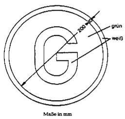
Buchstabe „G“ hinsichtlich Schriftart und -größe gemäß DIN 1451, Teil
2, Ausgabe Februar 1986 (Bezugsquelle siehe § 73). Schriftgröße h =
125 mm. Die Farbtöne sind dem Farbtonregister RAL 840 HR des RAL
Deutsches Institut für Gütersicherung und Kennzeichnung e. V.,
Siegburger Straße 39, 53757 St. Augustin, zu entnehmen, und zwar ist
als Farbton zu wählen für weiß: RAL 9001 und für grün: RAL 6001. Die
Farben dürfen nicht retroreflektierend sein.

Ergänzungsbestimmung:

Das Zeichen ist an der Fahrzeugvorderseite sichtbar und fest
anzubringen; es darf zusätzlich auch an der Fahrzeugrückseite
angebracht sein.

(zu § 47 Absatz 2 Satz 2)

### Anlage XVI Maßnahmen gegen die Emission verunreinigender Stoffe aus Dieselmotoren zum Antrieb von land- oder forstwirtschaftlichen Zugmaschinen

(Fundstelle: BGBl. I 2012, 788 - 802)

## **Allgemeines**

**1** **Anwendungsbereich**

    Diese Anlage gilt, soweit in den Anhängen I bis X nichts anderes
    bestimmt ist, für land- oder forstwirtschaftliche Zugmaschinen mit
    Dieselmotor (Kompressionszündungsmotor). Im Sinne dieser Anlage sind
    land- oder forstwirtschaftliche Zugmaschinen alle Kraftfahrzeuge auf
    Rädern oder Raupenketten mit wenigstens zwei Achsen, deren Funktion im
    Wesentlichen in der Zugleistung besteht und die besonders zum Ziehen,
    Schieben, Tragen oder zur Betätigung bestimmter Geräte, Maschinen oder
    Anhänger eingerichtet sind, die zur Verwendung in land- oder
    forstwirtschaftlichen Betrieben bestimmt sind.

(2) (weggefallen)

**3** **Anwendung der Vorschriften auf land- oder forstwirtschaftliche
    luftbereifte Zugmaschinen mit zwei Achsen und einer bauartbedingten
    Höchstgeschwindigkeit zwischen 6 km/h und 25 km/h im Rahmen der
    Richtlinien der Europäischen Gemeinschaften**

3.1 Bei Anträgen auf Genehmigung auf Grund von Richtlinien der
    Europäischen Gemeinschaften hat das Kraftfahrt-Bundesamt das Formblatt
    nach Anhang X auszufüllen und je eine Abschrift dem Hersteller oder
    seinem Beauftragten und den zuständigen Verwaltungen der anderen
    Mitgliedstaaten der Europäischen Gemeinschaften zu übersenden.

3.2 Wird die Übereinstimmung eines Fahrzeugtyps mit den Anforderungen
    dieser Anlage durch die Vorlage eines Formblatts nach Anhang X, das
    von einem Mitgliedstaat der Europäischen Gemeinschaften ausgefertigt
    wurde, nachgewiesen, so wird der Fahrzeugtyp gemäß § 21a Absatz 1a als
    bedingungsgemäß anerkannt.

[^f776225_28_BJNR067910012BJNE013800000]
**Anhang I**
##

Begriffsbestimmungen, Antrag auf Erteilung einer EWG-
Betriebserlaubnis,
Kennzeichen für den korrigierten Wert des Absorptionskoeffizienten,
## **Vorschriften und Prüfung, Übereinstimmung der Produktion**

1   (weggefallen)

**2** **Begriffsbestimmungen**

2.1 (weggefallen)

2.2 „Zugmaschinentyp hinsichtlich der Begrenzung der Emission
    verunreinigender Stoffe aus dem Motor“ bezeichnet Zugmaschinen, die
    untereinander keine wesentlichen Unterschiede aufweisen; solche
    Unterschiede können insbesondere die Merkmale der Zugmaschine und des
    Motors nach Anhang II sein.

2.3 „Dieselmotor“ bezeichnet einen Motor, der nach dem Prinzip der
    Kompressionszündung arbeitet.

2.4 „Kaltstarteinrichtung“ bezeichnet eine Einrichtung, die nach ihrer
    Einschaltung die dem Motor zugeführte Kraftstoffmenge vorübergehend
    vergrößert und die dazu dient, das Anlassen des Motors zu erleichtern.

2.5 „Trübungsmessgerät“ bezeichnet ein Gerät, das dazu dient, die
    Absorptionskoeffizienten der von den Zugmaschinen emittierten
    Auspuffgase stetig zu messen.

**3** **Antrag auf Erteilung der EWG-Betriebserlaubnis**

3.1 Der Antrag auf Erteilung einer Betriebserlaubnis ist vom
    Zugmaschinenhersteller oder seinem Beauftragten einzureichen.

3.2 Dem Antrag sind folgende Unterlagen in dreifacher Ausfertigung
    beizufügen.

3.2.1 Beschreibung der Motorbauart, die alle Angaben nach Anhang II enthält.

3.2.2 Zeichnungen des Brennraums und des Kolbenbodens.

3.3 Ein Motor und seine Ausrüstungsteile nach Anhang II für den Einbau in
    die zu genehmigende Zugmaschine sind der für die Durchführung der
    Prüfungen nach Punkt 5 zuständigen Behörde zur Verfügung zu stellen.
    Auf Antrag des Herstellers kann die Prüfung jedoch, wenn die für die
    Durchführung der Prüfungen zuständige Behörde dies zulässt, an einer
    Zugmaschine durchgeführt werden, die für den zu genehmigenden
    Zugmaschinentyp repräsentativ ist.

**3.A** **EWG-Betriebserlaubnis**

    Dem Formblatt für die Erteilung der EWG-Betriebserlaubnis ist ein
    Formblatt nach dem Muster des Anhangs X beizufügen.

**4** **Kennzeichen für den korrigierten Wert des Absorptionskoeffizienten**

4.1 (weggefallen)

4.2 (weggefallen)

4.3 (weggefallen)

4.4 An jeder Zugmaschine, die einem nach dieser Richtlinie genehmigten Typ
    entspricht, ist sichtbar und an gut zugänglicher Stelle, die im Anhang
    zum EWG-Betriebserlaubnisbogen nach Anhang X anzugeben ist, ein
    rechteckiges Kennzeichen mit dem korrigierten Wert des
    Absorptionskoeffizienten anzubringen, der bei der Erteilung der
    Betriebserlaubnis während der Prüfung bei freier Beschleunigung
    erhalten wurde, angegeben in m
    –1                   , und der bei der Genehmigung nach dem in Nummer
    3\.2 des Anhangs IV beschriebenen Verfahren festgestellt wurde.

4.5 Das Kennzeichen muss deutlich lesbar und unverwischbar sein.

4.6 Anhang IX enthält ein Muster dieses Kennzeichens.

**5** **Vorschriften und Prüfungen**

5.1 Allgemeines

    Die Teile, die einen Einfluss auf die Emission verunreinigender Stoffe
    haben können, müssen so entworfen, gebaut und angebracht sein, dass
    die Zugmaschine unter normalen Betriebsbedingungen trotz der
    Schwingungen, denen sie ausgesetzt ist, den technischen Vorschriften
    dieser Richtlinie entspricht.

5.2 Vorschriften über die Kaltstarteinrichtungen

5.2.1 Die Kaltstarteinrichtung muss so beschaffen sein, dass sie weder
    eingeschaltet werden noch in Betrieb bleiben kann, wenn der Motor
    unter normalen Betriebsbedingungen läuft.

5.2.2 Nummer 5.2.1 gilt nicht, wenn mindestens eine der folgenden
    Bedingungen erfüllt wird:

5.2.2.1 Wenn bei eingeschalteter Kaltstarteinrichtung der
    Absorptionskoeffizient durch die Motorabgase bei gleichbleibenden
    Drehzahlen – gemessen nach dem Verfahren des Anhangs III – die in
    Anhang VI angegebenen Grenzwerte nicht überschreitet.

5.2.2.2 Wenn die dauernde Einschaltung der Kaltstarteinrichtung innerhalb
    einer angemessenen Frist den Stillstand des Motors zur Folge hat.

5.3 Vorschriften über die Emission verunreinigender Stoffe

5.3.1[^f776225_29_BJNR067910012BJNE013800000]
 Die Messung der Emission verunreinigender Stoffe aus einer Zugmaschine
    des Typs, der zur Erteilung der EWG-Betriebserlaubnis vorgeführt
    wurde, ist nach den beiden Verfahren der Anhänge III und IV
    durchzuführen, wobei der eine Anhang die Prüfungen bei
    gleichbleibenden Drehzahlen und der andere die Prüfungen bei freier
    Beschleunigung betrifft
    .

5.3.2 Der nach dem Verfahren des Anhangs III gemessene Wert der Emission
    verunreinigender Stoffe darf die in Anhang VI angegebenen Grenzwerte
    nicht überschreiten.

5.3.3 Für Motoren mit Abgasturboladern darf der bei freier Beschleunigung
    gemessene Wert des Absorptionskoeffizienten höchstens gleich dem
    Größtwert sein, der nach Anhang VI für den Nennwert des
    Luftdurchsatzes vorgesehen ist, der dem höchsten bei den Prüfungen bei
    gleichbleibenden Drehzahlen gemessenen Absorptionskoeffizienten,
    erhöht um 0,5 m
    –1                   , entspricht.

5.4 Gleichwertige Messgeräte sind zulässig. Wird ein anderes Gerät als ein
    Gerät nach Anhang VII benützt, so ist seine Gleichwertigkeit für den
    betreffenden Motor nachzuweisen.

6   (weggefallen)

**7** **Übereinstimmung der Produktion**

7.1 Jede Zugmaschine der Serie muss dem genehmigten Zugmaschinentyp
    hinsichtlich der Bauteile entsprechen, die einen Einfluss auf die
    Emission verunreinigender Stoffe aus dem Motor haben können.

7.2 (weggefallen)

7.3 Im Allgemeinen ist die Übereinstimmung der Produktion hinsichtlich der
    Begrenzung der Emission verunreinigender Stoffe aus dem Dieselmotor
    auf Grund der Beschreibung im Anhang zum EWG-Betriebserlaubnisbogen
    nach Anhang X zu überprüfen.

7.3.1 Bei der Nachprüfung einer aus der Serie entnommenen Zugmaschine ist
    wie folgt zu verfahren:

7.3.1.1 Eine noch nicht eingefahrene Zugmaschine ist der Prüfung in freier
    Beschleunigung nach Anhang IV zu unterziehen. Die Zugmaschine gilt als
    mit dem genehmigten Typ übereinstimmend, wenn der festgestellte Wert
    des Absorptionskoeffizienten den im Kennzeichen angegebenen Wert um
    nicht mehr als 0,5 m
    –1                    überschreitet.

7.3.1.2 Wenn der bei der Prüfung nach Nummer 7.3.1.1 festgestellte Wert den im
    Kennzeichen angegebenen Wert um mehr als 0,5 m
    –1                    überschreitet, ist eine Zugmaschine des
    betreffenden Typs oder deren Motor einer Prüfung bei verschiedenen
    gleichbleibenden Drehzahlen nach Anhang III zu unterziehen. Der
    Emissionswert darf die Grenzwerte nach Anhang VI nicht überschreiten.

## **Anhang II**

Hauptmerkmale der Zugmaschine
[^f776225_30_BJNR067910012BJNE013800000]
und des Motors und Angaben über die Durchführung der Prüfungen
## ****

*    *   **1**

    *   **Beschreibung des Motors**

*    *   1.1

    *   Marke:
        ..........

*    *   1.2

    *   Typ:
        ..........

*    *   1.3

    *[^f776225_31_BJNR067910012BJNE013800000]
   Arbeitsweise: Viertakt/Zweitakt

*    *   1.4

    *   Bohrung:
        ..........   mm

    *

*    *   1.5

    *   Hub:
        ..........   mm

    *

*    *   1.6

    *   Zahl der Zylinder:
        ..........

    *

*    *   1.7

    *   Hubraum:
        ..........   cm
        3

    *

*    *   1.8

    *[^f776225_32_BJNR067910012BJNE013800000]
   Kompressionsverhältnis
        :
        ..........

*    *   1.9

    *   Art der Kühlung:
        ..........

*    *   1.10

    *   Aufladung mit/ohne
        Beschreibung des Systems:
        ..........

*    *
    *   ..........

*    *   1.11

    *   Luftfilter: Zeichnungen oder Marken und Typen:
        ..........

*    *
    *   ..........

*    *   **2**

    *   **Zusätzliche Einrichtungen zur Verminderung der Abgastrübung**
        (falls vorhanden und nicht unter einem anderen Punkt erfasst)
        Beschreibung und Skizzen:
        ..........

*    *   **3**

    *   **Kraftstoff-Speisesystem**

    *

*    *   3.1

    *   Beschreibung und Skizzen der Ansaugleitungen nebst Zubehör
        (Vorwärmer, Ansaugschalldämpfer usw.):
        ..........

*    *   3.2

    *   Kraftstoffzufuhr:
        ..........

*    *   3.2.1

    *   Kraftstoffpumpe:
        ..........

*    *
    *   Druck
        ..........

    *   oder charakteristisches Diagramm
        ..........

*    *   3.2.2

    *   Einspritzvorrichtung:
        ..........

*    *   3.2.2.1

    *   Pumpe

*    *   3.2.2.1.1

    *   Marke(n):
        ..........

*    *   3.2.2.1.2

    *   Typ(en):
        ..........

*    *   3.2.2.1.3

    *   Einspritzmenge:
        ..........

    *   mm
        3                      je Hub bei
        ..........   U/min

*    *
    *   der Pumpe
        bei Vollförderung oder charakteristisches Diagramm
        :
        ..........

*    *
    *   ..........

*    *
    *   Angabe des verwendeten Verfahrens: am Motor/auf dem Pumpenprüfstand

*    *   3.2.2.1.4

    *   Einspritzzeitpunkt:
        ..........

*    *   3.2.2.1.4.1

    *   Verstellkurve des Spritzverstellers:
        ..........

*    *   3.2.2.1.4.2

    *   Einstellung des Einspritzzeitpunkts:
        ..........

*    *   3.2.2.2

    *   Einspritzleitungen

    *

*    *   3.2.2.2.1

    *   Länge:
        ..........

*    *   3.2.2.2.2

    *   Lichter Durchmesser:
        ..........

*    *   3.2.2.3

    *   Einspritzdüse(n):
        ..........

*    *   3.2.2.3.1

    *   Marke(n):
        ..........

*    *   3.2.2.3.2

    *   Typ(en):
        ..........

*    *   3.2.2.3.3

    *   Einspritzdruck:
        ..........   bar

*    *
    *   oder Einspritzdiagramm
        :
        ..........

*    *   3.2.2.4

    *   Regler

*    *   3.2.2.4.1

    *   Marke(n):
        ..........

*    *   3.2.2.4.2

    *   Typ(en):
        ..........

*    *   3.2.2.4.3

    *   Drehzahl bei Beginn der Abregelung bei Last:
        ..........   U/min

*    *   3.2.2.4.4

    *   Größte Drehzahl ohne Last:
        ..........   U/min

*    *   3.2.2.4.5

    *   Leerlaufdrehzahl:
        ..........   U/min

*    *   3.3

    *   Kaltstarteinrichtung

*    *   3.3.1

    *   Marke(n):
        ..........

*    *   3.3.2

    *   Typ(en):
        ..........

*    *   3.3.3

    *   Beschreibung:
        ..........

*    *   **4**

    *   **Ventile**

*    *   4.1

    *   Maximale Ventilhübe und Öffnungs- sowie Schließwinkel, bezogen auf die
        Totpunkte:
        ..........

*    *
    *   ..........

*    *   4.2

    *   Prüf- und/oder Einstellspiel
        :
        ..........

*    *   **5**

    *   **Auspuffanlage**

*    *   5.1

    *   Beschreibung und Skizzen:
        ..........

*    *   5.2

    *   Mittlerer Gegendruck bei größter Leistung:
        ..........

*    *
    *   ..........   mm WS/Pascal (Pa)

*    *   **6**

    *   **Kraftübertragung**

*    *   6.1

    *   Trägheitsmoment des Motorschwungrades:
        ..........

*    *
    *   ..........

*    *   6.2

    *   Zusätzliches Trägheitsmoment, wenn das Getriebe sich in
        Leerlaufstellung befindet:
        ..........

*    *
    *   ..........

*    *   **7**

    *   **Zusätzliche Angaben über die Prüfbedingungen**

*    *   7.1

    *   Verwendetes Schmiermittel

*    *   7.1.1

    *   Marke(n):
        ..........

*    *   7.1.2

    *   Typ(en):
        ..........

*    *
    *   (Wenn dem Kraftstoff ein Schmiermittel zugesetzt ist, muss der
        Prozentanteil des Öls angegeben werden)

*    *   **8**

    *   **Kenndaten des Motors**

*    *   8.1

    *   Drehzahl im Leerlauf:
        ..........   U/min

*    *   8.2

    *   Drehzahl bei Höchstleistung:
        ..........   U/min

*    *   8.3

    *   Leistung an den sechs Messpunkten nach Punkt 2.1 des Anhangs III

*    *   8.3.1

    *   Leistung des Motors auf dem Prüfstand:

*    *
    *   (nach BSI-CUNA-DIN-GOST-IGM-ISO-SAE- usw. Norm)

*    *   8.3.2

    *   Leistung an den Rädern der Zugmaschine

    *

*    *
    *
        *            *   Drehzahl (n) U/min

            *   Leistung kW

        *            *   1.
                ..........

            *   ..........

        *            *   2.
                ..........

            *   ..........

        *            *   3.
                ..........

            *   ..........

        *            *   4.
                ..........

            *   ..........

        *            *   5.
                ..........

            *   ..........

        *            *   6.
                ..........

            *   ..........

## **Anhang III**

## **Prüfung bei gleichbleibenden Drehzahlen**

**1** **Einleitung**

1.1 Dieser Anhang beschreibt das Verfahren für die Durchführung der
    Prüfung des Motors bei verschiedenen gleichbleibenden Drehzahlen bei
    80 Prozent der Volllast.

1.2 Die Prüfung kann entweder an einer Zugmaschine oder an einem Motor
    vorgenommen werden.

**2** **Messverfahren**

2.1 Die Trübung der Abgase ist bei gleichbleibender Drehzahl bei 80
    Prozent der Volllast des Motors zu messen. Es sind sechs Messungen
    vorzunehmen, die gleichmäßig zwischen der Höchstleistungsdrehzahl des
    Motors und der größeren der folgenden Motordrehzahlen aufzuteilen
    sind:
    – 55 Prozent der Höchstleistungsdrehzahl,
    – 1 000 U/min.

    Die äußeren Messpunkte müssen an den Enden des vorstehend angegebenen
    Messbereichs liegen.

2.2 Für Dieselmotoren mit Ladeluftgebläse, das beliebig eingeschaltet
    werden kann, und bei denen die Einschaltung des Ladeluftgebläses
    selbsttätig eine Erhöhung der Einspritzmenge mit sich bringt, sind die
    Messungen mit und ohne Aufladung durchzuführen.

    Für jede Drehzahl gilt der jeweils erhaltene größere Wert als
    Messwert.

**3** **Prüfbedingungen**

3.1 Zugmaschinen oder Motor

3.1.1 Der Motor oder die Zugmaschine ist in gutem mechanischen Zustand
    vorzuführen. Der Motor muss eingelaufen sein.

3.1.2 Der Motor ist mit der Ausrüstung nach Anhang II zu prüfen.

3.1.3 Der Motor muss nach den Angaben des Herstellers und nach Anhang II
    eingestellt sein.

3.1.4 Die Auspuffanlage darf kein Leck aufweisen, das eine Verdünnung der
    Abgase zur Folge hat.

3.1.5 Der Motor muss sich unter den nach Angaben des Herstellers normalen
    Betriebsbedingungen befinden. Insbesondere müssen das Kühlwasser und
    das Öl die vom Hersteller angegebene normale Temperatur haben.

3.2 Kraftstoff

    Als Kraftstoff ist der Bezugskraftstoff nach den technischen Daten des
    Anhangs V zu benützen.

3.3. Prüfraum

3.3.1 Die absolute Temperatur T in Kelvin des Prüfraums und der
    atmosphärische Druck H in Torr sind festzustellen. Dann ist der Faktor
    F zu ermitteln, der wie folgt bestimmt ist:

    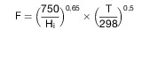

3.3.2 Eine Prüfung ist nur anzuerkennen, wenn 0,98*                    F*
    1,02 ist.

3.4 Entnahme- und Messgeräte

    Der Absorptionskoeffizient der Abgase ist mit einem Trübungsmessgerät
    zu bestimmen, das den Vorschriften des Anhangs VII entspricht und das
    nach Anhang VIII aufgebaut ist.

**4** **Grenzwerte**

4.1 Für jede der sechs Drehzahlen, bei denen Messungen der
    Absorptionskoeffizienten nach Nummer 2.1 vorgenommen werden, wird der
    Nennwert des Luftdurchsatzes G in Liter/Sekunde nach den folgenden
    Formeln berechnet:

    –   für Zweitaktmotoren G =
        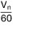

    –   für Viertaktmotoren G =
        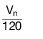

    V: Hubraum des Motors in Liter,

    n: Drehzahl in Umdrehungen/Minute.

4.2 Für jede Drehzahl darf der Absorptionskoeffizient der Abgase den
    Grenzwert nach der Tabelle in Anhang VI nicht überschreiten.
    Entspricht der Luftdurchsatzwert keinem der in dieser Tabelle
    angegebenen Werte, so gilt der durch lineare Interpolation ermittelte
    Grenzwert.

## **Anhang IV**

## **Prüfung bei freier Beschleunigung**

**1** **Prüfbedingungen**

1.1 Die Prüfung ist an einer Zugmaschine oder an einem Motor vorzunehmen,
    der der Prüfung nach Anhang III unterzogen wurde.

1.1.1 Wird die Prüfung an einem Motor auf dem Prüfstand durchgeführt, so hat
    sie möglichst bald nach der Prüfung der Trübung bei gleichbleibenden
    Drehzahlen zu erfolgen. Insbesondere müssen das Kühlwasser und das Öl
    die vom Hersteller angegebene normale Temperatur haben.

1.1.2 Wird die Prüfung an einer stillstehenden Zugmaschine durchgeführt, so
    ist der Motor zuvor durch eine Straßenfahrt auf normale
    Betriebsbedingungen zu bringen. Die Prüfung hat möglichst bald nach
    Beendigung der Straßenfahrt zu erfolgen.

1.2 Der Brennraum darf nicht durch einen länger dauernden Leerlauf vor der
    Prüfung abgekühlt oder verschmutzt werden.

1.3 Es gelten die Prüfbedingungen nach den Nummern 3.1, 3.2 und 3.3 des
    Anhangs III.

1.4 Für die Entnahme- und Messgeräte gelten die Bedingungen nach Nummer
    3\.4 des Anhangs III.

**2** **Durchführung der Prüfungen**

2.1 Wird die Prüfung auf einem Prüfstand vorgenommen, so ist der Motor von
    der Bremse zu lösen; diese ist entweder durch die sich drehenden Teile
    des Getriebes in Leerlaufstellung oder durch eine Schwungmasse, die
    diesen Teilen möglichst genau entspricht, zu ersetzen.

2.2 Wird die Prüfung an einer Zugmaschine durchgeführt, so muss sich das
    Getriebe in Leerlaufstellung befinden und die Kupplung eingerückt
    sein.

2.3 Bei Leerlauf des Motors ist das Fahrpedal schnell und stoßfrei so
    durchzutreten, dass die größte Fördermenge der Einspritzpumpe erzielt
    wird. Diese Stellung ist beizubehalten, bis die größte Drehzahl des
    Motors erreicht wird und der Regler abregelt. Sobald diese Drehzahl
    erreicht ist, wird das Gaspedal losgelassen, bis der Motor wieder auf
    Leerlauf geht und das Trübungsmessgerät sich wieder im entsprechenden
    Zustand befindet.

2.4 Der Vorgang nach Nummer 2.3 ist mindestens sechsmal zu wiederholen um
    die Auspuffanlage zu reinigen und um gegebenenfalls die Geräte
    nachstellen zu können. Die Höchstwerte der Trübung sind bei jeder der
    aufeinanderfolgenden Beschleunigungen festzuhalten, bis man konstante
    Werte erhält. Die Werte, die während des Leerlaufs des Motors nach
    jeder Beschleunigung auftreten, sind nicht zu berücksichtigen. Die
    abgelesenen Werte gelten als konstant, wenn vier aufeinanderfolgende
    Werte innerhalb einer Bandbreite von 0,25 m
    –1                    liegen und dabei keine stetige Abnahme
    festzustellen ist. Der festzuhaltende Absorptionskoeffizient X
    M                    ist das arithmetische Mittel dieser vier Werte.

2.5 Für Motoren mit Ladeluftgebläse gelten folgende besondere
    Vorschriften:

2.5.1 Für Motoren mit Ladeluftgebläse, das mit dem Motor mechanisch
    gekuppelt oder von diesem mechanisch angetrieben wird und das
    auskuppelbar ist, sind zwei vollständige Messreihen mit vorhergehenden
    Beschleunigungen durchzuführen, wobei das Ladeluftgebläse einmal
    eingekuppelt und das andere Mal ausgekuppelt ist. Als Messergebnis ist
    der höhere Wert der beiden Messreihen festzuhalten.

2.5.2 Für Motoren mit Ladeluftgebläse, die durch Nebenschluss (Bypass) vom
    Führersitz aus abgeschaltet werden können, ist die Prüfung mit und
    ohne Nebenschluss durchzuführen. Als Messergebnis ist der höhere Wert
    der beiden Messreihen festzuhalten.

**3** **Ermittlung des korrigierten Werts des Absorptionskoeffizienten**

3.1 Bezeichnungen

    *        *   X
            M

        *   Wert des Absorptionskoeffizienten, gemessen bei freier Beschleunigung
            nach Nummer 2.4;

    *        *   X
            L

        *   korrigierter Wert des Absorptionskoeffizienten bei freier
            Beschleunigung;

    *        *   S
            M

        *   Wert des Absorptionskoeffizienten, gemessen bei gleichbleibender
            Drehzahl (Nummer 2.1 des Anhangs III), der dem bei gleichem
            Luftdurchsatz vorgeschriebenen Grenzwert am nächsten kommt;

    *        *   S
            L

        *   Wert des Absorptionskoeffizienten, der nach Nummer 4.2 des Anhangs III
            für den Luftdurchsatz vorgeschrieben ist, der dem Messpunkt
            entspricht, der zum Wert S
            M                              führte;

    *        *   L

        *   effektive Länge des Lichtstrahls im Trübungsmessgerät.

3.2 Sind die Absorptionskoeffizienten in m
    –1                    und die effektive Länge des Lichtstrahls in
    Meter ausgedrückt, so ist der korrigierte Wert X
    L                    der kleinere der beiden nachfolgenden Ausdrücke:

    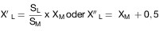

## **Anhang V**

Technische Daten des
Bezugskraftstoffs für die Prüfung zur Erteilung
## **der Betriebserlaubnis und für die Nachprüfung der Übereinstimmung
der Produktion**

*    *
    *   Grenzwerte und Einheiten

    *   Verfahren

*    *   Dichte 15/4 °C

    *   0,830 ± 0,005

    *   ASTM D 1 298-67

*    *   Siedeverlauf
        50 %
        90 %
        Siedeende

    *   min. 245 °C
        330 ± 10 °C
        max. 370 °C

    *   ASTM D 86-67

*    *   Cetanzahl

    *   54 ± 3

    *   ASTM D 976-66

*    *   kinematische Viskosität bei 100 °F

    *   3 ± 0,5 cSt

    *   ASTM D 445-65

*    *   Schwefelgehalt

    *   0,4 ± 0,1 Gew. %

    *   ASTM D 129-64

*    *   Flammpunkt

    *   min. 55 °C

    *   ASTM D 93-71

*    *   Trübungspunkt

    *   max. –7 °C

    *   ASTM D 2 500-66

*    *   Anilinpunkt

    *   69 °C ± 5 °C

    *   ASTM D 611-64

*    *   Kohlenstoffanteil für 10 % Rückstand

    *   max. 0,2 Gew. %

    *   ASTM D 524-64

*    *   Aschegehalt

    *   max. 0,01 Gew. %

    *   ASTM D 482-63

*    *   Wassergehalt

    *   max. 0,05 Gew. %

    *   ASTM D 95-70

*    *   Kupferlamellenkorrosion bei 100 °C

    *   max. 1

    *   ASTM D 130-68

*    *   unterer Heizwert

    *   { 10 250 ± 100 kcal/kg
        18 450 ± 180 BTU/lb}

    *   ASTM D 2-68
        (Ap. VI)

*    *   Säurezahl

    *   null mg KOH/g

    *   ASTM D 974-64

Anmerkung: Der Kraftstoff darf nur durch direkte Destillation gewonnen
werden; er braucht nicht entschwefelt zu sein; er darf keinerlei
Zusatzstoffe enthalten.

## **Anhang VI**

## **Grenzwerte für die Prüfung bei gleichbleibenden Drehzahlen**

*    *   Nennwerte des Luftdurchsatzes G
        Liter/Sekunde

    *   Absorptionskoeffizient k
        m
        –1

*    *   *                      42
        45
        50

    *   2,26
        2,19
        2,08

*    *   55
        60
        65
        70

    *   1,985
        1,90
        1,84
        1,775

*    *   75
        80
        85

    *   1,72
        1,665
        1,62

*    *   90
        95
        100

    *   1,575
        1,535
        1,495

*    *   105
        110
        115

    *   1,465
        1,425
        1,395

*    *   120
        125
        130

    *   1,37
        1,345
        1,32

*    *   135
        140
        145

    *   1,30
        1,27
        1,25

*    *   150
        155
        160

    *   1,225
        1,205
        1,19

*    *   165
        170
        175

    *   1,17
        1,155
        1,14

*    *   180
        185
        190

    *   1,125
        1,11
        1,095

*    *   195
        *                      200

    *   1,08
        1,065

Anmerkung: Die vorstehenden Werte sind auf 0,01 oder 0,005 gerundet;
dies bedeutet jedoch nicht, dass die Messungen mit dieser Genauigkeit
durchgeführt werden müssen.

## **Anhang VII**

## **Eigenschaften der Trübungsmessgeräte**

**1** **Anwendungsbereich**

    In diesem Anhang sind die Bedingungen festgelegt, denen die
    Trübungsmessgeräte entsprechen müssen, die für Prüfungen nach den
    Anhängen III und IV benutzt werden.

**2** **Grundsätzliche Vorschriften für die Trübungsmessgeräte**

2.1 Das zu messende Gas muss sich in einer Kammer befinden, deren
    Innenflächen nicht reflektierend sind.

2.2 Die effektive Länge der Lichtabsorptionsstrecke ist unter
    Berücksichtigung des möglichen Einflusses von Schutzeinrichtungen für
    die Lichtquelle und für die Fotozelle zu bestimmen. Diese effektive
    Länge ist auf dem Gerät anzugeben.

2.3 Die Anzeigeeinrichtung des Trübungsmessgeräts muss zwei Skalen haben.
    Die eine muss absolute Einheiten der Lichtabsorption von 0 bis*
    (m
    –1                   ) aufweisen, die andere muss linear von 0 bis 100
    geteilt sein; beide Skalen müssen sich von dem Wert 0 für den gesamten
    Lichtstrom bis zu dem Größtwert der Skalen für die vollständige
    Lichtundurchlässigkeit erstrecken.

**3** **Bauvorschriften**

3.1 Allgemeines

    Trübungsmessgeräte müssen so beschaffen sein, dass die Rauchkammer mit
    Rauch gleichmäßiger Trübung gefüllt ist, wenn sie bei gleichbleibenden
    Drehzahlen betrieben werden.

3.2 Rauchkammer und Gehäuse des Trübungsmessgeräts

3.2.1 Das auf die Fotozelle fallende Streulicht, das von inneren
    Reflektionen oder von Lichtstreuung herrührt, muss auf ein Mindestmaß
    beschränkt sein (zum Beispiel durch eine mattschwarze Oberfläche der
    inneren Flächen und eine geeignete allgemeine Anordnung).

3.2.2 Die optischen Eigenschaften müssen gewährleisten, dass der Wert für
    Streuung und Reflektion zusammen eine Einheit der linearen Skala nicht
    überschreitet, wenn die Rauchkammer durch Rauch mit einem
    Absorptionskoeffizienten von etwa 1,7 m
    –1                    gefüllt ist.

3.3 Lichtquelle

    Die Lichtquelle muss aus einer Glühlampe bestehen, deren
    Farbtemperatur zwischen 2 800 und 3 250 K liegt.

3.4 Empfänger

3.4.1 Der Empfänger muss aus einer Fotozelle bestehen, deren spektrale
    Empfindlichkeit der Hellempfindlichkeitskurve des menschlichen Auges
    angepasst ist (Höchstempfindlichkeit im Bereich 550/570 nm, weniger
    als 4 Prozent dieser Höchstempfindlichkeit unter 430 nm und über 680
    nm).

3.4.2 Der elektrische Kreis einschließlich der Anzeigeeinrichtung muss so
    beschaffen sein, dass der von der Fotozelle gelieferte Strom eine
    lineare Funktion der Stärke des empfangenen Lichts innerhalb des
    Betriebstemperaturbereichs der Fotozelle ist.

3.5 Skalen

3.5.1 Der Absorptionskoeffizient k ist aus der Formel*
    o                    · e
    –kL                    zu berechnen, wobei L die effektive Länge der
    Lichtabsorptionsstrecke,*
    o                    der eintretende Lichtstrom und*
    der austretende Lichtstrom sind. Kann die effektive Länge L eines
    Trübungsmessgerätetyps nicht unmittelbar von dessen Geometrie her
    bestimmt werden, so ist die effektive Länge L

    –   entweder nach dem in Nummer 4 beschriebenen Verfahren

    –   oder durch Vergleich mit einem anderen Trübungsmessgerätetyp, dessen
        effektive Länge bekannt ist, zu bestimmen.

3.5.2 Der Zusammenhang zwischen der linearen Skala mit der Teilung 0 bis 100
    und dem Absorptionskoeffizienten k ist durch die Formel

    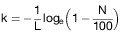
    gegeben. Dabei bedeutet N einen Ablesewert auf der linearen Skala und
    k den entsprechenden Wert des Absorptionskoeffizienten.

3.5.3 Die Anzeigeeinrichtung des Trübungsmessgeräts muss es ermöglichen,
    einen Absorptionskoeffizienten von 1,7 m
    –1                    mit einer Genauigkeit von 0,025 m
    –1                    abzulesen.

3.6 Einstellung und Prüfung des Messgeräts

3.6.1 Der elektrische Kreis der Fotozelle und der Anzeigeeinrichtung muss
    einstellbar sein, um den Zeiger auf 0 bringen zu können, wenn der
    Lichtstrom durch die mit reiner Luft gefüllte Rauchkammer oder eine
    Kammer mit gleichen Eigenschaften geht.

3.6.2 Bei ausgeschalteter Lampe und offenem oder kurzgeschlossenem
    elektrischem Kreis muss die Anzeige auf der Skala für den
    Absorptionskoeffizienten*                    betragen, und nach
    Wiedereinschalten des Kreises muss die Anzeige bei*
    bleiben.

3.6.3 Es ist die folgende Nachprüfung durchzuführen: In die Rauchkammer wird
    ein Filter eingeführt, der ein Gas mit einem bekannten
    Absorptionskoeffizienten k darstellt, der, nach Nummer 3.5.1 gemessen,
    zwischen 1,6 m
    –1                    und 1,8 m
    –1                    beträgt. Der Wert k muss mit einer Genauigkeit
    von 0,025 m
    –1                    bekannt sein. Die Nachprüfung besteht darin,
    festzustellen, ob dieser Wert um nicht mehr als 0,05 m
    –1                    von dem vom Anzeigegerät abgelesenen Wert
    abweicht, wenn der Filter zwischen Lichtquelle und Fotozelle gebracht
    wird.

3.7 Ansprechzeit des Trübungsmessgeräts

3.7.1 Die Ansprechzeit des elektrischen Messkreises, angegeben als die Zeit,
    innerhalb derer der Zeiger
    90 Prozent                    des Skalenendwerts erreicht, wenn ein
    vollständig lichtundurchlässiger Schirm vor die Fotozelle gebracht
    wird, muss zwischen 0,9 und 1,1 Sekunden liegen.

3.7.2 Die Dämpfung des elektrischen Messkreises muss so sein, dass das erste
    Überschwingen über die schließlich konstante Anzeige nach jeder
    plötzlichen Änderung des Eingangswerts (zum Beispiel Einbringen des
    Prüffilters) nicht mehr als 4 Prozent dieses Werts in Einheiten der
    linearen Skala beträgt.

3.7.3 Die Ansprechzeit des Trübungsmessgeräts, bedingt durch physikalische
    Erscheinungen in der Rauchkammer, ist die Zeit, die zwischen dem
    Beginn des Eintritts der Gase in das Messgerät und der vollständigen
    Füllung der Rauchkammer vergeht; sie darf 0,4 Sekunden nicht
    überschreiten.

3.7.4 Diese Vorschriften gelten nur für Trübungsmessgeräte, die für
    Trübungsmessungen bei freier Beschleunigung benützt werden.

3.8 Druck des zu messenden Gases und der Spülluft

3.8.1 Der Druck der Abgase in der Rauchkammer darf vom Umgebungsdruck um
    nicht mehr als 735 Pa abweichen.

3.8.2 Die Druckschwankungen des zu messenden Gases und der Spülluft dürfen
    keine größere Veränderung des Absorptionskoeffizienten als 0,05 m
    –1                    bei einem zu messenden Gas hervorrufen, das
    einen Absorptionskoeffizienten von 1,7 m
    –1                    hat.

3.8.3 Das Trübungsmessgerät muss mit geeigneten Einrichtungen für die
    Messung des Drucks in der Rauchkammer versehen sein.

3.8.4 Die Grenzen der zulässigen Druckschwankungen des Gases und der
    Spülluft in der Rauchkammer sind vom Hersteller des Geräts anzugeben.

3.9 Temperatur des zu messenden Gases

3.9.1 Die Temperatur des zu messenden Gases muss an jedem Punkt der
    Rauchkammer zwischen 70 °C und einer vom Hersteller des
    Trübungsmessgeräts angegebenen Höchsttemperatur liegen, sodass die
    Ablesungen in diesem Temperaturbereich um nicht mehr als 0,1 m
    –1                    schwanken, wenn die Kammer mit einem Gas gefüllt
    ist, das einen Absorptionskoeffizienten von 1,7 m
    –1                    hat.

3.9.2 Das Trübungsmessgerät muss mit geeigneten Einrichtungen für die
    Temperaturmessung in der Rauchkammer versehen sein.

**4** **Effektive Länge „L“ des Trübungsmessgeräts**

4.1 Allgemeines

4.1.1 In einigen Trübungsmessgerätetypen weisen die Gase zwischen der
    Lichtquelle und der Fotozelle oder zwischen den transparenten Teilen,
    die die Lichtquelle und die Fotozelle schützen, keine gleichmäßige
    Trübung auf. In solchen Fällen ist die tatsächliche Länge L jene einer
    Gassäule mit einheitlicher Trübung, die zu der gleichen
    Lichtabsorption führt wie jene, die festgestellt wird, wenn das Gas
    normal durch das Trübungsmessgerät geht.

4.1.2 Die effektive Länge der Lichtabsorptionsstrecke erhält man, indem man
    die Anzeige N des normal arbeitenden Trübungsmessgeräts mit der
    Anzeige N
    0                    des Trübungsmessgeräts vergleicht, das derart
    geändert ist, dass das Prüfgas eine genau definierte Länge L
    0                    füllt.

4.1.3 Für die Berichtigung des Nullpunkts sind rasch aufeinander folgende
    Vergleichsanzeigen zu verwenden.

4.2 Verfahren für die Ermittlung der effektiven Länge L

4.2.1 Die Prüfgase müssen Abgase mit konstanter Trübung oder absorbierende
    Gase sein, deren Dichte nahezu jener der Abgase entspricht.

4.2.2 Bei dem Trübungsmessgerät ist eine Säule der Länge L
    0                    genau zu bestimmen, die einheitlich mit Prüfgas
    gefüllt werden kann und deren Grundflächen nahezu senkrecht zur
    Richtung der Lichtstrahlen sind. Diese Länge L
    0                    sollte nicht erheblich von der angenommenen
    effektiven Länge des Trübungsmessgeräts abweichen.

4.2.3 Die Durchschnittstemperatur der Prüfgase in der Rauchkammer ist zu
    messen.

4.2.4 Falls erforderlich, darf ein zur Dämpfung der Schwingungen genügend
    großes Beruhigungsgefäß kompakter Bauweise in die Entnahmeleitungen so
    nahe wie möglich bei der Entnahmesonde eingebaut werden. Auch eine
    Kühleinrichtung ist zulässig. Durch den Einbau des Beruhigungsgefäßes
    und des Kühlers darf die Zusammensetzung der Abgase nicht wesentlich
    beeinflusst werden.

4.2.5 Die Prüfung zur Bestimmung der effektiven Länge besteht darin, dass
    man eine Probe der Prüfgase zunächst durch das normal arbeitende
    Trübungsmessgerät und anschließend durch das gleiche Gerät führt, das
    nach Nummer 4.1.2 geändert wurde.

4.2.5.1 Die von dem Trübungsmessgerät abgegebenen Werte sind während der
    Prüfung mit einem schreibenden Gerät aufzuzeichnen, dessen
    Ansprechzeit höchstens gleich derjenigen des Trübungsmessgeräts ist.

4.2.5.2 Bei normal arbeitenden Trübungsmessgeräten gibt die lineare Skala den
    Wert N an, und die Anzeige der mittleren Temperatur der Gase ist T in
    Kelvin.

4.2.5.3 Bei bekannter Länge L
    0                   , gefüllt mit demselben Prüfgas, gibt die lineare
    Skala den Wert N
    0                    an, und die Anzeige der mittleren Temperatur der
    Gase ist T
    0                    in Kelvin.

4.2.6 Die effektive Länge wird dann

    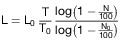

4.2.7 Die Prüfung muss mit mindestens vier Prüfgasen so wiederholt werden,
    dass sie zu Werten führt, die auf der linearen Skala in regelmäßigen
    Abständen zwischen 20 und 80 liegen.

4.2.8 Die effektive Länge L des Trübungsmessgeräts ist das arithmetische
    Mittel der effektiven Längen, die nach Nummer 4.2.6 mit einem jeden
    der Prüfgase erhalten werden.

## **Anhang VIII**

## **Aufbau und Verwendung des Trübungsmessgeräts**

**1** **Geltungsbereich**

    In diesem Anhang sind der Aufbau und die Verwendung der
    Trübungsmessgeräte festgelegt, die für Prüfungen nach den Anhängen III
    und IV benützt werden.

**2** **Teilstrom-Trübungsmessgerät**

2.1. Aufbau für die Prüfungen bei gleichbleibenden Drehzahlen

2.1.1 Das Verhältnis des Querschnitts der Sonde zum Querschnitt des
    Auspuffrohrs muss mindestens 0,05 betragen. Der im Auspuffrohr am
    Eingang der Sonde gemessene Gegendruck darf nicht mehr als 735 Pa
    betragen.

2.1.2 Die Sonde muss aus einem Rohr bestehen, bei dem ein Ende nach vorn
    offen ist und das in der Achse des Auspuffrohrs oder des
    möglicherweise erforderlichen Verlängerungsrohrs liegt. Sie muss sich
    an einer Stelle befinden, an der die Verteilung des Rauches annähernd
    gleichmäßig ist. Dazu muss die Sonde möglichst nahe am Ende des
    Auspuffrohrs oder gegebenenfalls in einem Verlängerungsrohr so
    angebracht werden, dass das Ende der Sonde in einem gradlinigen Teil
    liegt, der – wenn D der Durchmesser des Auspuffrohrendes ist – eine
    Länge von mindestens 6 D in Strömungsrichtung vor dem Entnahmepunkt
    und 3 D hinter diesem Punkt hat. Wird ein Verlängerungsrohr verwendet,
    so darf an der Verbindungsstelle keine Fremdluft eintreten.

2.1.3 Der Druck im Auspuffrohr und der Druckabfall in den Entnahmeleitungen
    müssen so sein, dass die Sonde eine Probe entnimmt, die einer Probe
    bei isokinetischer Entnahme im wesentlichen gleichwertig ist.

2.1.4 Falls erforderlich, darf ein zur Dämpfung der Schwingungen genügend
    großes Beruhigungsgefäß kompakter Bauweise in die Entnahmeleitung so
    nahe wie möglich bei der Entnahmesonde eingebaut werden. Auch eine
    Kühleinrichtung ist zulässig. Durch den Einbau des Beruhigungsgefäßes
    und des Kühlers darf die Zusammensetzung der Abgase nicht wesentlich
    beeinflusst werden.

2.1.5 Eine Drosselklappe oder ein anderes Mittel zur Druckerhöhung des
    entnommenen Gases kann in das Auspuffrohr in einem Abstand von
    mindestens 3 D in Strömungsrichtung hinter der Entnahmesonde eingebaut
    werden.

2.1.6 Die Leitungen zwischen der Sonde, der Kühleinrichtung, dem
    Beruhigungsgefäß (falls erforderlich) und dem Trübungsmessgerät müssen
    so kurz wie möglich sein und die Bedingungen für den Druck und die
    Temperatur nach Nummer 3.8 und Nummer 3.9 des Anhangs VII erfüllen.
    Die Leitung muss vom Entnahmepunkt zum Trübungsmessgerät ansteigend
    verlegt sein; scharfe Knicke, an denen sich Ruß ansammeln könnte, sind
    zu vermeiden. Wenn im Trübungsmessgerät kein Nebenschlussventil
    (Bypass-Ventil) enthalten ist, muss ein solches davor eingebaut
    werden.

2.1.7 Während der Prüfung ist sicherzustellen, dass die Vorschriften des
    Anhangs VII Nummer 3.8 über den Druck und die Vorschriften des Anhangs
    VII Nummer 3.9 über die Temperatur in der Messkammer eingehalten sind.

2.2 Aufbau für die Prüfungen bei freier Beschleunigung

2.2.1 Das Verhältnis des Querschnitts der Sonde zum Querschnitt des
    Auspuffrohrs muss mindestens 0,05 betragen. Der im Auspuffrohr am
    Eingang der Sonde gemessene Gegendruck darf nicht mehr als 735 Pa
    betragen.

2.2.2 Die Sonde muss aus einem Rohr bestehen, bei dem ein Ende nach vorn
    offen ist und das in der Achse des Auspuffrohrs oder des
    möglicherweise erforderlichen Verlängerungsrohrs liegt. Sie muss sich
    in einer Stelle befinden, an der die Verteilung des Rauchs annähernd
    gleichmäßig ist. Dazu muss die Sonde möglichst nahe am Ende des
    Auspuffrohrs oder gegebenenfalls in einem Verlängerungsrohr so
    angebracht werden, dass das Ende der Sonde in einem gradlinigen Teil
    liegt, der – wenn D der Durchmesser des Auspuffrohrendes ist – eine
    Länge von mindestens 6 D in Strömungsrichtung vor dem Entnahmepunkt
    und 3 D hinter diesem Punkt hat. Wird ein Verlängerungsrohr verwendet,
    so darf an der Verbindungsstelle keine Fremdluft eintreten.

2.2.3 Bei der Probeentnahme muss der Druck der Probe am Trübungsmessgerät
    bei allen Motordrehzahlen innerhalb der Grenzwerte nach Nummer 3.8.2
    des Anhangs VII liegen. Dies ist durch Feststellung des Drucks der
    Probe bei Leerlauf sowie bei Höchstdrehzahl im unbelasteten Zustand zu
    prüfen. Je nach den Eigenschaften des Trübungsmessgeräts kann der
    Druck der Probe durch einen Druckminderer oder eine Drosselklappe im
    Auspuffrohr oder im Verlängerungsrohr geregelt werden. Unabhängig vom
    Verfahren darf der im Auspuffrohr am Eingang der Sonde gemessene
    Gegendruck nicht mehr als 735 Pa betragen.

2.2.4 Die Verbindungsleitungen zum Trübungsmessgerät müssen so kurz wie
    möglich sein. Die Leitung muss vom Entnahmepunkt zum Trübungsmessgerät
    ansteigend verlegt sein; scharfe Knicke, an denen sich Ruß ansammeln
    könnte, sind zu vermeiden. Dem Trübungsmessgerät darf ein
    Nebenschlussventil (Bypass-Ventil) vorgeschaltet werden, um es vom
    Abgasstrom trennen zu können, wenn nicht gemessen wird.

**3** **Vollstrom-Trübungsmessgerät**

    Für die Prüfungen bei gleichbleibenden Drehzahlen sowie bei freier
    Beschleunigung gilt lediglich:

3.1 Die Verbindungsleitungen zwischen dem Auspuff und dem
    Trübungsmessgerät dürfen keine Fremdluft einlassen.

3.2 Die Verbindungsleitungen zum Trübungsmessgerät müssen, wie bei den
    Teilstrom-Trübungsmessgeräten, so kurz wie möglich sein. Die Leitungen
    müssen vom Auspuff bis zum Trübungsmessgerät ansteigend verlegt sein;
    scharfe Knicke, an denen sich Ruß ansammeln könnte, sind zu vermeiden.
    Dem Trübungsmessgerät darf ein Nebenschlussventil (Bypass-Ventil)
    vorgeschaltet werden, um es vom Abgasstrom trennen zu können, wenn
    nicht gemessen wird.

3.3 Vor dem Trübungsmessgerät ist eine Kühleinrichtung zulässig.

## **Anhang IX**

Muster des Kennzeichens
## **für den korrigierten Wert des Absorptionskoeffizienten**

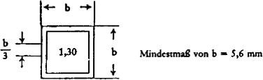
Das gezeigte Kennzeichen bedeutet, dass der korrigierte Wert des
Absorptionskoeffizienten 1,30 m
–1              beträgt.

## **Anhang X**

*    *
    *
    *
    *

*    *
    *
    *   Name der Behörde

    *

*    *
    *
    *
    *

   Anhang zum EWG-Betriebserlaubnisbogen
## hinsichtlich der Emission verunreinigender Stoffe aus Dieselmotoren

### (Artikel 4 Absatz 2 und Artikel 10 der Richtlinie 74/150/EWG des
Rates vom 4. März 1974 zur Angleichung der Rechtsvorschriften der
Mitgliedstaaten über die Betriebserlaubnis für land- oder
forstwirtschaftliche Zugmaschinen auf Rädern)

[^F776225_T5_01_BJNR067910012BJNE013800000]
Nummer der EWG-Betriebserlaubnis für den Zugmaschinentyp
:
..........

Nummer der Genehmigung
:
..........

1.  Fabrikmarke (Firmenbezeichnung):
    ..........

2.  Typ und Handelsbezeichnung:
    ..........

    ..........

3.  Name und Anschrift des Herstellers:
    ..........

4.  Gegebenenfalls Name und Anschrift des Beauftragten des Herstellers:
    ..........

5.  Emissionswerte

5.1 bei gleichbleibenden Drehzahlen

    *        *   Drehzahl
            U/min

        *   Nennwert des
            Luftdurchsatzes G
            (l/s)

        *   Grenzwerte
            der Absorption
            (m
            –1                             )

        *   Gemessener
            Absorptionswert
            (m
            –1                             )

    *        *   1.
            ..........

        *   ..........

        *   ..........

        *   ..........

    *        *   2.
            ..........

        *   ..........

        *   ..........

        *   ..........

    *        *   3.
            ..........

        *   ..........

        *   ..........

        *   ..........

    *        *   4.
            ..........

        *   ..........

        *   ..........

        *   ..........

    *        *   5.
            ..........

        *   ..........

        *   ..........

        *   ..........

    *        *   6.
            ..........

        *   ..........

        *   ..........

        *   ..........

5.2 bei freier Beschleunigung

5.2.1 gemessener Absorptionswert:
    ..........   m
    –1

5.2.2 korrigierter Absorptionswert:
    ..........   m
    –1

6.  Marke und Typ des Trübungsmessgeräts:
    ..........

7.  Motor zur Erteilung der Betriebserlaubnis vorgeführt am:
    ..........

8.  Prüfstelle:
    ..........

9.  Datum des von der Prüfstelle ausgefertigten Prüfprotokolls:
    ..........

10. Nummer des von der Prüfstelle ausgefertigten Prüfprotokolls:
    ..........

11. Die Betriebserlaubnis hinsichtlich der Emission verunreinigender
    Stoffe aus dem Motor wird erteilt/ versagt

12. Anbringungsstelle des Kennzeichens für den korrigierten Wert des
    Absorptionskoeffizienten am Fahrzeug:
    ..........

    ..........

13. Ort:
    ..........

14. Datum:
    ..........

15. Unterschrift:
    ..........

16. Folgende Unterlagen sind beigefügt, die die vorgenannte Nummer der
    EWG-Betriebserlaubnis oder der Genehmigung tragen:

    1 Ausfertigung des Anhangs II, vollständig ausgefüllt, mit den
    angegebenen Zeichnungen und Skizzen.

    ..........  Fotografie(n) des Motors.

    Der Wortlaut der Anhänge entspricht dem der Regelung Nr. 24 der UN-
    Wirtschaftskommission für Europa; insbesondere ist die Gliederung in
    Punkte die Gleiche; entspricht einem Punkt der Regelung Nr. 24 kein
    solcher in der vorliegenden Richtlinie, so wird seine Zahl in Klammern
    zum Vermerk aufgeführt.
[^f776225_28_BJNR067910012BJNE013800000]:     Die Prüfung bei freier Beschleunigung wird insbesondere durchgeführt,
    um einen Bezugswert für diejenigen Behörden zu erhalten, die dieses
    Verfahren für die Nachprüfung der in Betrieb befindlichen Fahrzeuge
    benützen.
[^f776225_29_BJNR067910012BJNE013800000]:     Für nicht herkömmliche Motoren oder Systeme sind vom Hersteller
    entsprechende Angaben zu machen.
[^f776225_30_BJNR067910012BJNE013800000]:     Nichtzutreffendes streichen.
[^f776225_31_BJNR067910012BJNE013800000]:     Toleranz angeben.
[^f776225_32_BJNR067910012BJNE013800000]:     Nichtzutreffendes streichen.
[^F776225_T5_01_BJNR067910012BJNE013800000]: 
(zu § 41a Absatz 5 und 6)

### Anlage XVII Gassystemeinbauprüfungen und sonstige Gasanlagenprüfungen

(Fundstelle: BGBl. I 2012, 803)

**1** **Art und Gegenstand der Prüfung**

    Gasanlagenprüfungen nach dem Einbau (Gassystemeinbauprüfungen) und
    sonstige Gasanlagenprüfungen im Sinne des § 41a Absatz 6 sind nach
    Maßgabe der folgenden Bestimmungen durchzuführen. Der ordnungsgemäße
    Zustand der Gasanlagen ist dabei nach Maßgabe der vom
    Bundesministerium für Verkehr, Bau und Stadtentwicklung im
    Verkehrsblatt mit Zustimmung der obersten Landesbehörden bekannt
    gemachten Richtlinien zu untersuchen.

**2** **Durchführung der Prüfungen, Nachweise**

2.1 Die Prüfungen sind von hierfür nach Anlage XVIIa anerkannten
    Kraftfahrzeugwerkstätten oder amtlich anerkannten Sachverständigen
    oder Prüfern für den Kraftfahrzeugverkehr (im Folgenden als aaSoP
    bezeichnet) oder den von einer amtlich anerkannten
    Überwachungsorganisation betrauten Prüfingenieuren (im Folgenden als
    PI bezeichnet) durchzuführen.

2.2 Der Halter hat das Kraftfahrzeug zur Durchführung der Prüfung in einer
    hierfür anerkannten Kraftfahrzeugwerkstatt oder bei einem aaSoP oder
    PI vorzuführen.

2.3 Werden bei der Prüfung der Gasanlage

2.3.1 keine Mängel festgestellt, so ist dies in einem Nachweis zu
    bescheinigen,

2.3.2 Mängel festgestellt, so sind diese in einen Nachweis einzutragen. Der
    Halter hat die Mängel unverzüglich beheben zu lassen und das
    Kraftfahrzeug spätestens nach einem Monat zu einer erneuten Prüfung
    unter Vorlage des Nachweises vorzuführen.

2.4 Nachweise über Prüfungen sind nach einem vom Bundesministerium für
    Verkehr, Bau und Stadtentwicklung mit Zustimmung der obersten
    Landesbehörden im Verkehrsblatt bekannt gemachten Muster
    fälschungserschwerend auszuführen oder mit fälschungserschwerenden
    Merkmalen (Nachweis-Siegel mit Prägenummer) zu versehen und müssen
    mindestens folgende Angaben enthalten:

    a)  Art der Prüfung,

    b)  Jahr, in dem das Fahrzeug erstmals in den Verkehr gekommen ist,

    c)  Hersteller des Fahrzeugs einschließlich seiner Schlüsselnummer,

    d)  Fahrzeugart und Fahrzeugtyp einschließlich Schlüsselnummern,

    e)  Fahrzeug-Identifizierungsnummer (mindestens die letzten 7 Zeichen),

    f)  Datum der Durchführung der Prüfung,

    g)  Name, Anschrift und Prüfort der prüfenden Stelle,

    h)  Ergebnisse der Einzelprüfungen,

    i)  Ergebnis der Gesamtprüfung,

    j)  bei Gassystemeinbauprüfungen zusätzlich die in den Fahrzeugdokumenten
        zu ändernden Angaben als Empfehlung für die Zulassungsbehörde,

    k)  Unterschrift der für die Prüfung verantwortlichen Person,
        Kontrollnummer der Kraftfahrzeugwerkstatt und, soweit vorhanden,
        Nachweis-Siegel mit Prägenummer oder Unterschrift mit Prüfstempel und
        Kennnummer des für die Prüfung verantwortlichen aaSoP oder PI mit
        Angaben über die bei der Prüfung festgestellten Mängel,

    l)  Anordnung der Wiedervorführpflicht.

2.5 Der Nachweis ist unmittelbar nach Durchführung der Prüfung zu
    unterzeichnen. Er ist dem Fahrzeughalter auszuhändigen.

**3** **Untersuchungsstelle zur Durchführung von Prüfungen**

3.1 Die Prüfungen dürfen nur an Untersuchungsstellen durchgeführt werden,
    die den in Anlage VIIId Nummer 3 genannten Anforderungen entsprechen.

3.2 Die zuständige oberste Landesbehörde oder die von ihr bestimmten oder
    nach Landesrecht zuständigen Stellen oder die zuständige
    Anerkennungsstelle können selbst überprüfen oder durch von ihr
    bestimmte sachverständige Personen oder Stellen überprüfen lassen, ob
    die für die Untersuchungsstellen geltenden Vorschriften eingehalten
    sind. Die mit den Prüfungen beauftragten Personen sind befugt,
    Grundstücke und Geschäftsräume, die zur Untersuchungsstelle gehören,
    während der Geschäfts- und Betriebszeiten zu betreten, dort
    Überprüfungen und Besichtigungen vorzunehmen. Der Inhaber der
    Untersuchungsstelle oder der Nutzer der Untersuchungsstelle hat diese
    Maßnahmen zu dulden und, soweit erforderlich, die beauftragten
    Personen zu unterstützen. Der Inhaber oder der Nutzer hat die Kosten
    der Überprüfung zu tragen.

(zu § 41a Absatz 7 und Anlage VIII Nummer 3.1.1.2)

### Anlage XVIIa Anerkennung von Kraftfahrzeugwerkstätten zur Durchführung von Gassystemeinbauprüfungen oder von wiederkehrenden und sonstigen Gasanlagenprüfungen sowie Schulung der verantwortlichen Personen und Fachkräfte

(Fundstelle: BGBl. I 2012, 804 - 806)

**1** **Allgemeines**

1.1 Die Anerkennung von Kraftfahrzeugwerkstätten zur Durchführung von
    Gassystemeinbauprüfungen oder wiederkehrenden Gasanlagenprüfungen und
    sonstigen Gasanlagenprüfungen im Sinne des § 41a Absatz 6 obliegt der
    zuständigen obersten Landesbehörde oder den von ihr bestimmten oder
    nach Landesrecht zuständigen Stellen (Anerkennungsstellen). Diese
    können die Befugnis auf die örtlich und fachlich zuständigen
    Kraftfahrzeuginnungen übertragen.

1.2 Auf das Verfahren der Anerkennung von Kraftfahrzeugwerkstätten zur
    Durchführung von Gassystemeinbauprüfungen oder wiederkehrenden und
    sonstigen Gasanlagenprüfungen und auf die Dokumentation der
    durchgeführten Prüfungen findet die vom Bundesministerium für Verkehr,
    Bau und Stadtentwicklung mit Zustimmung der zuständigen obersten
    Landesbehörden im Verkehrsblatt bekannt gemachte Richtlinie Anwendung.

**2** **Allgemeine Voraussetzungen für die Anerkennung von
    Kraftfahrzeugwerkstätten**

    Die Anerkennung wird erteilt, wenn

2.1 der Antragsteller, bei juristischen Personen die nach Gesetz oder
    Satzung zur Vertretung berufenen Personen sowie die für die
    Durchführung von Prüfungen verantwortlichen Personen persönlich
    zuverlässig sind. Ein Führungszeugnis und ein Auszug aus dem
    Verkehrszentralregister sind jeweils vorzulegen,

2.2 der Antragsteller durch Vorlage einer Bescheinigung der örtlich
    zuständigen Handwerkskammer mit seiner Eintragung in der
    Handwerksrolle nachweist, dass er selbst oder eine in der
    Betriebsstätte fest angestellte Person die Voraussetzungen nach der
    Handwerksordnung zur selbstständigen gewerblichen Verrichtung solcher
    Arbeiten erfüllt, die zur Behebung der bei Prüfungen festgestellten
    Mängel erforderlich sind,

2.3 der Antragsteller nachweist, dass er eine oder mehrere für die
    Durchführung von Prüfungen verantwortliche Personen bestellt hat. Die
    Durchführung der Prüfung kann auch von Fachkräften unter der Aufsicht
    einer verantwortlichen Person erfolgen. Die verantwortlichen Personen
    und Fachkräfte müssen vom Antragsteller namentlich benannt werden,

2.4 der Antragsteller nachweist, dass die für die Durchführung von
    Prüfungen verantwortlichen Personen und die Fachkräfte über eine
    entsprechende Vorbildung und ausreichende Erfahrungen auf dem Gebiet
    der Kraftfahrzeugtechnik verfügen. Dazu müssen Nachweise darüber
    erbracht werden, dass

2.4.1 Fachkräfte eine Abschlussprüfung im anerkannten Ausbildungsberuf

    a)  Kraftfahrzeugmechaniker,

    b)  Kraftfahrzeugelektriker,

    c)  Automobilmechaniker,

    d)  Kraftfahrzeug-Mechatroniker,

    e)  Mechaniker für Karosserieinstandhaltungstechnik,

    f)  Karosserie- und Fahrzeugbauer,

    g)  Karosserie- und Fahrzeugbaumechaniker

    erfolgreich abgeschlossen haben,

2.4.2 verantwortliche Personen eine Meisterprüfung im

    a)  Kraftfahrzeugmechaniker-Handwerk,

    b)  Kraftfahrzeugelektriker-Handwerk,

    c)  Kraftfahrzeugtechniker-Handwerk,

    d)  Karosserie- und Fahrzeugbauer-Handwerk

    erfolgreich bestanden haben. Diesen Prüfungsabschlüssen stehen gleich
    der Dipl.-Ing., Dipl.-Ing. (FH), Ing. (grad.) oder der staatlich
    geprüfte Techniker der Fachrichtung Maschinenbau, Fahrzeugtechnik,
    Elektrotechnik oder Luft- und Raumfahrttechnik/Luftfahrzeugtechnik,
    sofern der Betreffende nachweislich im Kraftfahrzeugbereich
    (Untersuchung, Prüfung, Wartung oder Reparatur) tätig ist und eine
    mindestens dreijährige Tätigkeit oder eine Abschlussprüfung in den
    unter Nummer 2.4.1 genannten Ausbildungsberufen nachgewiesen werden
    kann,

2.5 der Antragsteller oder die für die Durchführung von Prüfungen
    verantwortlichen Personen und die Fachkräfte darüber hinaus an einer
    dem jeweiligen Stand der Technik der zu prüfenden Gasanlagen
    entsprechenden Schulung nach Nummer 7 teilgenommen und diese mit einer
    erfolgreichen Prüfung abgeschlossen haben,

2.6 der Antragsteller nachweist, dass er über mindestens eine
    Untersuchungsstelle verfügt, die die in Anlage VIIId Nummer 3
    genannten Anforderungen erfüllt,

2.7 der Antragsteller nachweist, dass für jede von ihm benannte
    Untersuchungsstelle eine Dokumentation der Betriebsorganisation
    erstellt wird, die interne Regeln enthält, nach denen eine
    ordnungsgemäße Durchführung und Nachweisführung der Prüfungen
    sichergestellt ist. Die Dokumentation muss mindestens der nach Nummer
    1\.2 bekannt gemachten Richtlinie entsprechen,

2.8 der Antragsteller bestätigt, dass für die mit der Durchführung der
    Prüfung betrauten verantwortlichen Personen und Fachkräfte eine
    ausreichende Haftpflichtversicherung zur Deckung aller im Zusammenhang
    mit den Prüfungen entstehenden Ansprüchen besteht, dies auf Verlangen
    nachweist und erklärt, dass er diese Versicherung aufrechterhalten
    wird,

2.9 der Antragsteller sowie die im Anerkennungsverfahren beteiligten
    Stellen nach Nummer 1.1 Satz 2 das Land, in dem sie tätig werden und
    für das der Antragsteller anerkannt wird, von allen Ansprüchen Dritter
    wegen Schäden freistellt, die im Zusammenhang mit den Prüfungen von
    ihm oder den von ihm beauftragten verantwortlichen Personen und
    Fachkräften verursacht werden, und dafür den Abschluss einer
    entsprechenden Versicherung bestätigt, dies auf Verlangen nachweist
    und erklärt, dass er diese Versicherung aufrechterhalten wird.

**3** **Nebenbestimmungen**

3.1 Die Anerkennung kann mit Nebenbestimmungen verbunden werden, die
    erforderlich sind, um sicherzustellen, dass die Prüfungen
    ordnungsgemäß durchgeführt werden. Die Anerkennung ist nicht
    übertragbar.

3.2 Die Anerkennung ist auf bestimmte Arten von Gasanlagen zu beschränken,
    wenn die Voraussetzungen nach Nummer 2 nur für diese Arten
    nachgewiesen sind.

**4** **Rücknahme der Anerkennung**

    Die Anerkennung ist zurückzunehmen, wenn bei ihrer Erteilung eine der
    Voraussetzungen nach Nummer 2 nicht vorgelegen hat. Von der Rücknahme
    kann abgesehen werden, wenn der Mangel nicht mehr besteht.

**5** **Widerruf der Anerkennung**

    Die Anerkennung ist zu widerrufen, wenn nachträglich eine der
    Voraussetzungen nach Nummer 2 weggefallen ist. Sie ist teilweise oder
    völlig zu widerrufen, wenn gröblich gegen die Vorschriften zur
    Durchführung der Prüfungen verstoßen wurde, wenn die Prüfungen nicht
    ordnungsgemäß durchgeführt wurden oder wenn gegen die Auflagen der
    Anerkennung gröblich verstoßen wurde. Sie kann widerrufen werden, wenn
    von ihr innerhalb von mindestens sechs Monaten kein Gebrauch gemacht
    worden ist.

**6** **Aufsicht über anerkannte Kraftfahrzeugwerkstätten**

6.1 Die Anerkennungsstelle übt die Aufsicht über die anerkannten
    Kraftfahrzeugwerkstätten aus. Sie kann selbst überprüfen oder
    überprüfen lassen,

6.1.1 ob die Prüfungen ordnungsgemäß durchgeführt, dokumentiert und
    nachgewiesen werden und ob die sich sonst aus der Anerkennung
    ergebenden Pflichten erfüllt werden,

6.1.2 in welchem Umfang von der Anerkennung Gebrauch gemacht worden ist.

6.2 Nummer 8.1 ist entsprechend anzuwenden.

**7** **Schulung der verantwortlichen Personen und Fachkräfte**

7.1 Zur Durchführung der Schulungen nach Nummer 2.5 sind berechtigt:

    a)  Kraftfahrzeughersteller,

    b)  Kraftfahrzeugimporteure, die entweder selbst Inhaber einer allgemeinen
        Betriebserlaubnis für Kraftfahrzeugtypen oder durch Vertrag mit einem
        ausländischen Kraftfahrzeughersteller alleinvertriebsberechtigt im
        Geltungsbereich der Straßenverkehrs-Zulassungs-Ordnung sind, sofern
        sie eine eigene Kundendienstorganisation haben,

    c)  geeignete Stellen, die von einem der vorgenannten
        Kraftfahrzeughersteller oder Kraftfahrzeugimporteure beauftragt worden
        sind,

    d)  Hersteller von Gasanlagen, die Inhaber einer Teilegenehmigung für
        mindestens eine Gesamtanlage sind,

    e)  Importeure von Gasanlagen, die entweder selbst Inhaber einer
        Teilegenehmigung für mindestens eine Gesamtanlage sind oder die durch
        Vertrag mit einem ausländischen Hersteller von Gasanlagen, der Inhaber
        einer Teilegenehmigung für mindestens eine Gesamtanlage ist,
        alleinvertriebsberechtigt im Geltungsbereich der Straßenverkehrs-
        Zulassungs-Ordnung sind, sofern sie eine eigene
        Kundendienstorganisation haben,

    f)  Stellen, die vom Bundesinnungsverband des Kraftfahrzeughandwerks in
        53040 Bonn, Postfach 15 01 62, zur Durchführung von Schulungen
        ermächtigt worden sind, und

    g)  Stellen, die von der zuständigen obersten Landesbehörde oder der von
        ihr bestimmten oder nach Landesrecht zuständigen Stelle zur
        Durchführung von Schulungen anerkannt worden sind.

7.2 Die Schulungsstätten sind den zuständigen obersten Landesbehörden oder
    den von ihnen bestimmten oder nach Landesrecht zuständigen Stellen
    sowie dem Bundesinnungsverband des Kraftfahrzeughandwerks in 53040
    Bonn, Postfach 15 01 62, unaufgefordert zu melden; dies gilt
    entsprechend für die Einstellung der Schulungstätigkeit. Der
    Bundesinnungsverband des Kraftfahrzeughandwerks erfasst zentral die
    Schulungsstätten und übersendet den zuständigen obersten
    Landesbehörden und dem Bundesministerium für Verkehr, Bau und
    Stadtentwicklung jeweils zu Beginn eines Jahres eine aktuelle
    Zusammenfassung aller Schulungsstätten.

7.3 Die Schulung muss jeweils innerhalb von drei Jahren wiederholt und
    erneut mit einer erfolgreichen Prüfung abgeschlossen werden. Die Frist
    beginnt jeweils mit dem Monat und Jahr, in dem erfolgreich eine
    Prüfung nach einer erstmaligen Schulung oder einer
    Wiederholungsschulung abgelegt wurde. Nach Ablauf der Frist ist erneut
    eine erstmalige Schulung und Prüfung abzulegen.

7.4 Die Schulungen und Wiederholungsschulungen, Schulungsinhalte sowie
    Schulungsstätten müssen die Anforderungen der vom Bundesministerium
    für Verkehr, Bau und Stadtentwicklung mit Zustimmung der zuständigen
    obersten Landesbehörden im Verkehrsblatt bekannt gemachten Richtlinie
    erfüllen.

**8** **Aufsicht über das Anerkennungsverfahren und die Schulungen**

8.1 Die Aufsicht über die Anerkennungsstellen und das
    Anerkennungsverfahren obliegt der zuständigen obersten Landesbehörde
    oder den von ihr bestimmten oder nach Landesrecht zuständigen Stellen.
    Die Aufsichtsbehörde kann selbst überprüfen oder durch die
    Anerkennungsstelle überprüfen lassen, ob die Voraussetzungen für die
    Anerkennung noch gegeben sind und die sich sonst aus der Anerkennung
    oder den Nebenbestimmungen ergebenden Pflichten erfüllt werden. Diese
    Überprüfung ist mindestens alle drei Jahre durchzuführen.

8.2 Die Aufsicht über die Schulungen obliegt der zuständigen obersten
    Landesbehörde oder den von ihr bestimmten oder den nach Landesrecht
    zuständigen Stellen. Die Aufsichtsbehörde kann selbst überprüfen oder
    durch die von ihr bestimmten oder nach Landesrecht zuständigen Stellen
    überprüfen lassen, ob die für die Schulungsstätten geltenden
    Vorschriften eingehalten sind und die sich sonst aus der Ermächtigung
    oder den Nebenbestimmungen ergebenden Pflichten erfüllt werden. Sie
    können die Befugnis zur Überprüfung auf den Bundesinnungsverband des
    Kraftfahrzeughandwerks übertragen. Diese Überprüfung ist mindestens
    alle drei Jahre durchzuführen.

8.3 Die mit der Überprüfung beauftragten Personen sind befugt, Grundstücke
    und Geschäftsräume

    a)  des Inhabers der Anerkennung oder

    b)  der Schulungsstätte

    während der Geschäfts- und Betriebszeiten zu betreten, dort
    Überprüfungen und Besichtigungen vorzunehmen und die vorgeschriebenen
    Aufzeichnungen einzusehen. Der Inhaber der Anerkennung oder der
    Inhaber oder Leiter der Schulungsstätte hat diese Maßnahmen zu dulden,
    soweit erforderlich die beauftragten Personen dabei zu unterstützen
    und auf Verlangen die vorgeschriebenen Aufzeichnungen vorzulegen. Der
    Inhaber der Anerkennung oder die Schulungsstätte hat die Kosten der
    Überprüfung zu tragen.

**9** **Schlussbestimmungen**

9.1 Veränderungen bei anerkannten Kraftfahrzeugwerkstätten, die ihre
    Anerkennung beeinflussen können, sind von ihr der Anerkennungsstelle
    unaufgefordert mitzuteilen. Zuwiderhandlungen können zum Widerruf der
    Anerkennung nach Nummer 5 führen.

9.2 Veränderungen bei Schulungsstätten, die Einfluss auf die Schulung
    haben, sind den in Nummer 7.2 genannten Stellen unaufgefordert zu
    melden. Bei Zuwiderhandlungen können die in Nummer 8.2 genannten
    Stellen die Durchführungen von Schulungen untersagen.

(zu § 57b Absatz 1)

### Anlage XVIII Prüfung der Fahrtschreiber und Kontrollgeräte

(Fundstelle: BGBl. I 2012, 807 - 809)

**1** **Voraussetzungen für die Prüfung von Fahrtschreibern und
    Kontrollgeräten**

1.1 Fahrtschreiber und Kontrollgeräte müssen nach Maßgabe des Herstellers
    eingebaut sein. Fahrtschreiber und Kontrollgeräte müssen im
    Kraftfahrzeug so angebracht sein, dass für den Fahrer alle notwendigen
    Funktionen vom Fahrersitz aus zugänglich sind.

1.2 Zum Zwecke des Einbaus müssen Kontrollgeräte nach Anhang I B der
    Verordnung (EWG) Nr. 3821/85 in nicht aktiviertem Zustand geliefert
    worden sein, wobei alle in Kapitel III Abschnitt 20 des Anhangs I B
    der Verordnung (EWG) Nr. 3821/85 aufgeführten Kalibrierungsparameter
    auf geeignete und gültige Standardwerte eingestellt sein müssen. Liegt
    kein bestimmter Wert vor, müssen Buchstaben-Parameter auf „?“ und
    numerische Parameter auf „0“ gesetzt sein. Das Kontrollgerät muss vor
    der Aktivierung kalibrierfähig sein.

1.3 Während des Einbaus müssen alle bekannten Parameter voreingestellt
    worden sein.

1.4 Das eingebaute Kontrollgerät muss spätestens am endgültigen
    Einbaustandort aktiviert worden sein.

1.5 Gegebenenfalls erforderliche Koppelungen zwischen dem Weg- und/oder
    Geschwindigkeitsgeber und der Fahrzeugeinheit müssen automatisch
    während der Aktivierung des Kontrollgeräts stattfinden. Die
    Aktivierung des Kontrollgeräts wird durch das erstmalige Einstecken
    einer Werkstattkarte in eine der beiden Kartenschnittstellen
    automatisch ausgelöst.

1.6 Nach dem Einbau muss eine Kalibrierung erfolgt sein. Bei der
    Erstkalibrierung, die innerhalb von zwei Wochen nach dem Einbau oder
    nach der Zuteilung des amtlichen Kennzeichens für das Kraftfahrzeug
    erfolgt sein muss, je nachdem, welches Ereignis zuletzt eintritt, muss
    das amtliche Kennzeichen des Kraftfahrzeugs eingegeben worden sein.

**2** **Datensicherung bei Reparatur oder Austausch des Kontrollgeräts nach
    Anhang I B der Verordnung (EWG) Nr. 3821/85**

    Wird im Rahmen einer Prüfung ein defektes digitales Kontrollgerät
    repariert oder ausgetauscht, so hat das Unternehmen, das die Prüfung
    durchführt, die im Speicher des defekten Geräts befindlichen Daten auf
    einen Datenträger zu kopieren und hierüber eine Bescheinigung nach dem
    Muster im Anhang zu dieser Anlage auszustellen. Die kopierten Daten
    sind bis zur Weitergabe an den Berechtigten, längstens jedoch für die
    Dauer von zwei Jahren zu speichern und nach der Weitergabe oder nach
    Fristablauf unverzüglich zu löschen. Ist ein Kopieren der Daten nicht
    möglich, so ist hierüber ebenfalls eine Bescheinigung nach dem Muster
    im Anhang zu dieser Anlage auszustellen. Das Unternehmen hat eine
    Kopie der nach Satz 1 oder Satz 3 ausgestellten Bescheinigungen für
    die Dauer eines Jahres in Papierform aufzubewahren.

**3** **Art und Gegenstand der Prüfung**

    Bei Kraftfahrzeugen, die mit Fahrtschreibern oder Kontrollgeräten nach
    § 57b Absatz 1 ausgerüstet sind, ist bei der Einbauprüfung und allen
    weiteren Prüfungen der Fahrtschreiber und Kontrollgeräte die
    Einhaltung der Bestimmungen der Verordnung (EWG) Nr. 3821/85
    festzustellen.

**4** **Durchführung der Prüfung, Nachweise**

4.1 Prüfungen nach § 57b Absatz 1 sind nach Maßgabe der Anlage XVIIIa
    durchzuführen.

4.2 Das nach Abschluss der Prüfung anzubringende Einbauschild muss
    folgende Angaben enthalten:

    a)  Name, Anschrift oder Firmenzeichen des anerkannten Fahrtschreiber-
        oder Kontrollgeräteherstellers oder der von diesem beauftragten
        Kraftfahrzeugwerkstatt oder Name, Anschrift oder Firmenzeichen des
        anerkannten Fahrzeugherstellers, des anerkannten Fahrzeugimporteurs
        oder der anerkannten Kraftfahrzeugwerkstatt,

    b)  Wegimpulszahl des Kraftfahrzeugs in der Form „w = … Imp/km“ bei
        elektronischem Fahrtschreiber oder Kontrollgerät,

        Wegdrehzahl des Kraftfahrzeugs in der Form „w = … U/km“ bei
        mechanischem Fahrtschreiber oder Kontrollgerät,

    c)  Konstante des Kontrollgeräts in der Form „k = … Imp/km“,

    d)  tatsächlicher Reifenumfang in der Form „L = … mm“,

    e)  Reifengröße,

    f)  Datum der Bestimmung der Wegimpulszahl des Kraftfahrzeugs und der
        Messung des tatsächlichen Reifenumfangs und

    g)  Fahrzeug-Identifizierungsnummer 17-stellig (bei Kontrollgeräten nach
        Anhang I der Verordnung (EWG) Nr. 3821/85 genügen die letzten acht
        Zeichen).

4.3 Über jede durchgeführte Prüfung ist ein Nachweis zu führen. In dem
    Nachweis sind anzugeben:

    a)  bei Prüfungen nach § 57b Absatz 1 Halter, Hersteller, Fahrzeug-
        Identifizierungsnummer (bei Kontrollgeräten nach Anhang I der
        Verordnung (EWG) Nr. 3821/85 genügen die letzten acht Zeichen) sowie
        amtliches Kennzeichen des betreffenden Kraftfahrzeugs, das Ergebnis
        der Prüfung und das Datum der Anbringung des Einbauschilds,

    b)  bei Einbauprüfungen im Sinne des § 57b Absatz 4 die Fahrzeug-
        Identifizierungsnummer (bei Kontrollgeräten nach Anhang I der
        Verordnung (EWG) Nr. 3821/85 genügen die letzten acht Zeichen) des
        betreffenden Kraftfahrzeugs, das Ergebnis der Prüfung und das Datum
        der Anbringung des Einbauschilds.

    Der Prüfnachweis ist von dem Unternehmen, das die Prüfung durchgeführt
    hat, drei Jahre lang aufzubewahren und zuständigen Personen auf
    Verlangen zur Prüfung vorzulegen.

**5** **Plombierung**

5.1 Folgende Geräteteile müssen plombiert werden:

    a)  jeder Anschluss, sofern es bei einer Trennung der Verbindung zu nicht
        nachweisbaren Änderungen oder nicht feststellbaren Datenverlusten
        kommen würde, und

    b)  das Einbauschild, es sei denn, es ist so angebracht, dass es sich
        nicht ohne Vernichtung der Angaben entfernen lässt.

5.2 Die genannten Plombierungen dürfen entfernt werden:

    a)  in Notfällen,

    b)  um einen Geschwindigkeitsbegrenzer oder ein anderes der Sicherheit im
        Straßenverkehr dienendes Gerät einzubauen, zu justieren oder zu
        reparieren, sofern das Kontrollgerät auch dann noch zuverlässig und
        ordnungsgemäß arbeitet und von einem anerkannten Fahrtschreiber- oder
        Kontrollgerätehersteller, einer von diesem beauftragten Werkstatt oder
        von einer anerkannten Werkstatt unmittelbar nach dem Einbau des
        Geschwindigkeitsbegrenzers oder des anderen der Sicherheit im
        Straßenverkehr dienenden Geräts, spätestens jedoch sieben Tage nach
        der Entfernung, wieder plombiert wird,

    c)  zur Prüfung der Funktion des Geschwindigkeitsbegrenzers im Rahmen der
        Hauptuntersuchung nach § 29 durch den amtlich anerkannten
        Sachverständigen oder Prüfer oder Prüfingenieur; die Plombierung ist
        durch den amtlich anerkannten Sachverständigen oder Prüfer oder
        Prüfingenieur unmittelbar nach Abschluss der Funktionsprüfung des
        Geschwindigkeitsbegrenzers wieder herzustellen.

5.3 Jede Verletzung der Plombierung muss Gegenstand einer schriftlichen
    Begründung sein. Die Begründung ist für die Dauer von drei Jahren
    aufzubewahren und den zuständigen Personen auf Verlangen zur Prüfung
    vorzulegen.

## **Anhang (zu Anlage XVIII)**

Muster
für eine Bescheinigung über das Herunterladen von Daten/
## **über die Unmöglichkeit des Herunterladens von Daten**

### **Vorbemerkung**

Wird bei einem Kraftfahrzeug das Kontrollgerät ausgetauscht oder
besteht die Möglichkeit, dass nach einer Reparatur nicht mehr auf die
im Massenspeicher gespeicherten Daten zugegriffen werden kann, ist das
betroffene Transportunternehmen davon in Kenntnis zu setzen, dass die
im Kontrollgerät gespeicherten Daten entweder heruntergeladen worden
sind und diesem Unternehmen auf Verlangen zur Verfügung gestellt
werden, oder dass die im Kontrollgerät gespeicherten Daten nicht
heruntergeladen werden konnten. Dies hat durch die Ausstellung einer
Bescheinigung nach dem beigefügten Muster zu erfolgen. Bescheinigungen
können in „Heftform“ und nach Bedarf in zwei- oder dreifacher
Ausfertigung erstellt werden. Sie sind in der Überschrift mit der
Länderkennzahl 1 für Deutschland und einer fortlaufenden Nummerierung
zu versehen, die durch Schrägstrich von der Länderkennzahl abzugrenzen
ist. Das Original ist zusammen mit der Rechnung für die ausgeführten
Arbeiten dem Fahrer auszuhändigen oder kann dem Transportunternehmen
per Post zugeleitet werden. Eine Ausfertigung verbleibt im Heft und
wird bei dem Unternehmen, das die Bescheinigung ausgestellt hat, zur
Prüfung durch die zuständige Behörde verwahrt.

Die Bescheinigung ist zu unterschreiben und mit einem Firmenstempel zu
versehen.

## **Muster**

Bescheinigung Nummer: 1/XXXX
Kontrollgerät nach Anhang I B der Verordnung (EWG) Nr. 3821/85
Bescheinigung über das Herunterladen von Daten/
[^F776225_T5_02_BJNR067910012BJNE014100000]
über die Unmöglichkeit des Herunterladens von Daten
##

1   Das Kontrollgerät, das nachfolgend unter Nummer 2 beschrieben ist und
    im Fahrzeug mit dem amtlichen Kennzeichen:
    .......... eingebaut war/ist
    , wurde ausgetauscht/repariert
    am: (Datum)
    ..........

    **Angaben zum Kontrollgerät**

2   Hersteller:
    ..........

    Modell:
    .......... Seriennummer:
    ..........

3   Die im Kontrollgerät gespeicherten Daten

    a)  **wurden heruntergeladen**                          und können zur
        Verfügung gestellt werden (siehe nachfolgende Bemerkungen)

    b)  **konnten nicht heruntergeladen werden**                          und
        sind daher nicht verfügbar,

        –   weil
            ..........

        –   folgende Versuche zur Reparatur des Kontrollgeräts, die ein
            Herunterladen der Daten ermöglichen sollten, wurden unternommen:
            ..........

**Bemerkungen**

(a) Heruntergeladene Daten können nur dem betroffenen Transportunternehmen
    zur Verfügung gestellt werden, das heißt dem Unternehmen, das sich
    mittels einer Unternehmenskarte in das Kontrollgerät eingeloggt hat.

(b) Nur Daten, die sich auf das betroffene Transportunternehmen beziehen,
    können diesem Unternehmen zur Verfügung gestellt werden.

(c) Für den Zugriff auf die Daten ist ein Berechtigungsnachweis
    erforderlich.

(d) Die Daten werden nur auf Antrag übermittelt. Der Antrag ist
    schriftlich an die unten genannte Adresse des Unternehmens zu richten,
    das die Daten zur Übermittlung bereithält. In dem Antrag ist
    anzugeben, wie die Daten übermittelt werden sollen (zum Beispiel per
    Einschreiben, E-Mail etc.).

(e) Die Daten werden nur für einen Zeitraum von zwei Jahren ab dem unter
    Nummer 1 genannten Tag aufbewahrt und nach Ablauf dieses Zeitraums
    vernichtet.

(f) Für die Übermittlung der Daten wird ein Entgelt in Höhe von Euro
    .......... erhoben.

Unternehmen, das die Daten zur Übermittlung bereithält:

Datum, Unterschrift, Firmenstempel
****

    Nichtzutreffendes streichen.
[^F776225_T5_02_BJNR067910012BJNE014100000]: 
(zu § 57b Absatz 1)

### Anlage XVIIIa Durchführung der Prüfungen von Fahrtschreibern und Kontrollgeräten

(Fundstelle: BGBl. I 2012, 810 - 813)

**1** **Allgemeines**

    Prüfungen der Fahrtschreiber und Kontrollgeräte sind nach den
    Vorschriften dieser Anlage unter Beachtung der gegebenenfalls dazu im
    Verkehrsblatt – Amtsblatt des Bundesministeriums für Verkehr, Bau und
    Stadtentwicklung der Bundesrepublik Deutschland – veröffentlichten
    Richtlinien durchzuführen.

**2** **Prüfungsfälle**

2.1 Prüfungen von Fahrtschreibern und Kontrollgeräten nach § 57b sind
    durchzuführen

    a)  nach dem Einbau,

    b)  mindestens einmal innerhalb von zwei Jahren nach der letzten Prüfung,

    c)  nach jeder Reparatur an der Fahrtschreiber- oder Kontrollgeräteanlage,

    d)  nach jeder Änderung der Wegdrehzahl/Wegimpulszahl des Kraftfahrzeugs
        und

    e)  nach jeder Änderung des wirksamen Reifenumfangs des Kraftfahrzeugs,
        die sich aus der Änderung der Reifengröße ergibt.

2.2 An Kontrollgeräten nach Anhang I B der Verordnung (EWG) Nr. 3821/85
    sind zusätzlich Prüfungen durchzuführen

    a)  nach jeder Änderung des amtlichen Kennzeichens des Kraftfahrzeugs oder

    b)  wenn die UTC-Zeit von der korrekten Zeit um mehr als 20 Minuten
        abweicht.

**3** **Durchführung der Prüfung**

3.1 Einbauprüfungen, Nachprüfungen und Reparaturen von Fahrtschreibern und
    Kontrollgeräten nach Anhang I der Verordnung (EWG) Nr. 3821/85

3.1.1 Einbau, Funktionsprobe und Nachprüfung (bei Prüfungen nach Nummer
    2\.1).

3.1.1.1 Der Fahrtschreiber oder das Kontrollgerät ist in das Fahrzeug
    einzubauen sowie mechanisch und elektrisch anzuschließen.

3.1.1.2 Es ist eine Funktionsprobefahrt durchzuführen (entfällt bei
    Rollenprüfstand).

3.1.1.3 Die Anlage ist an den lösbaren mechanischen oder elektrischen
    Verbindungen mit Plombenzeichen zu plombieren.

3.1.1.4 Bei Nachprüfungen des eingebauten Fahrtschreibers oder Kontrollgeräts
    in den Fällen der Nummer 2.1 Buchstabe b bis e wird die angeglichene
    Wegdrehzahl geprüft und im Einbauschild unter w eingetragen; bei
    Fahrtschreibern oder Kontrollgeräten mit elektronischer Angleichung
    der Gerätekonstante an die Wegimpulszahl des Fahrzeugs wird die
    Wegimpulszahl geprüft und im Einbauschild unter w eingetragen.

3.1.2 Angleichung des Fahrtschreibers oder des Kontrollgeräts an das
    Kraftfahrzeug

3.1.2.1 Die Gerätekonstante auf dem Einbauschild ist festzustellen.

3.1.2.2 Das Wegdrehzahl- oder Wegimpulsmessgerät ist am Fahrzeug
    anzuschließen, danach ist das Fahrzeug abzurollen.

3.1.2.3 Die Wegdrehzahl/Wegimpulszahl w ist auf einer geeigneten ebenen
    Prüfstrecke von mindestens 40 m festzustellen; ersatzweise kann eine
    20 m lange Messstrecke bei Verwendung eines elektronischen
    Wegimpulszahlmessgeräts gewählt werden.

3.1.2.4 Die Messung der Wegdrehzahl/Wegimpulszahl w kann auch auf einem für
    diese Zwecke geeigneten Rollenprüfstand durchgeführt werden (w =
    Anzahl der Umdrehungen oder Impulse des Geräteanschlusses am Fahrzeug
    bezogen auf eine Wegstrecke von 1 km).

3.1.2.5 Bei Fahrtschreibern und Kontrollgeräten mit mechanischer Angleichung
    ist die Wegdrehzahl w an Gerätekonstante k innerhalb*
    2 % so anzugleichen, dass das Gerät im eingebauten Zustand die
    Fehlergrenze nach Anhang I Kapitel III Buchstabe f Nummer 2 der
    Verordnung (EWG) Nr. 3821/85 einhalten kann. Die Angleichung ist
    mittels Zwischengetriebe vorzunehmen und auf Einhaltung der
    Fehlergrenzen zu überprüfen. Bei Fahrtschreibern oder Kontrollgeräten
    mit elektronischer Angleichung der Gerätekonstante an die
    Wegimpulszahl des Fahrzeugs sind ebenfalls die Fehlergrenzen nach
    Anhang I Kapitel III Buchstabe f Nummer 2 der Verordnung (EWG) Nr.
    3821/85 einzuhalten.

3.1.2.6 Die Messung des Fahrzeugs ist wie folgt vorzunehmen:

    a)  mit unbeladenem Fahrzeug in fahrbereitem Zustand nur mit einem Fahrer
        besetzt,

    b)  mit verkehrssicheren Fahrzeugreifen und dem vom Fahrzeughersteller
        empfohlenen Innendruck,

    c)  durch nachfolgend beschriebene Bewegung des Fahrzeugs:

        Das Fahrzeug muss sich mit eigener Motorkraft geradlinig auf ebenem
        Gelände und mit einer Geschwindigkeit von 50*
        5 km/h fortbewegen. Die Messstrecke muss mindestens 1 000 m betragen.

        Die Prüfung kann auch mit anderen Methoden, wie zum Beispiel auf einem
        Prüfstand durchgeführt werden, sofern eine vergleichbare Genauigkeit
        gewährleistet ist.

3.1.2.7 Der nach Nummer 3.1.2.6 Buchstabe a und b zu berücksichtigende
    Normalzustand des Fahrzeugs kann aus anderen betrieblichen Zuständen
    des Fahrzeugs durch Korrektur der zugehörigen Messwerte rechnerisch
    angenähert sein (vgl. die Korrekturwerte bzw. die Korrekturtabellen
    der Fahrtschreiberhersteller).

3.1.2.8 Die Antriebswelle ist auf gute Verlegung und einwandfreien Lauf zu
    prüfen.

3.1.3 Untersuchung des Fahrtschreibers oder des Kontrollgeräts auf
    Eigenfehler (bei Prüfungen nach Nummer 2.1 Buchstabe a bis c)

3.1.3.1 Das Schaublatt ist mit den Fahrzeugdaten und Datum auszufüllen und in
    den Fahrtschreiber oder in das Kontrollgerät einzulegen.

3.1.3.2 Der Fahrtschreiber oder das Kontrollgerät ist als separate Komponente
    mit einem Prüfgerät zu kontrollieren; dabei dürfen die Abweichungen
    höchstens betragen:

    a)  zurückgelegte Wegstrecke:

        *                          1 %, bezogen auf 1 000 m,

    b)  Geschwindigkeit:

        *                          3 km/h (gilt bis Messbereich 125 km/h),

    c)  Zeit:

        *                          2 Minuten pro Tag oder

        *                          10 Minuten nach sieben Tagen.

3.1.3.3 Es ist ein Prüfdiagramm wie folgt zu erstellen:

    a)  Es sind drei Messpunkte nach Geschwindigkeitsanzeige anzufahren (zum
        Beispiel 40, 80, 120 für Messbereich 125 km/h).

    b)  Leitliniendiagramm

        Es ist kurzzeitig bis zum Endpunkt hochzufahren und das Prüfgerät ist
        nach ca. 60 Sekunden auszuschalten = zeitlose Abfalllinie.

    c)  Es ist wieder bis zum Endpunkt hochzufahren und danach in drei Stufen
        mit jeweils 60 Sekunden Verharrung auf jeden Messpunkt abwärts zu
        schreiben.

    d)  Das Prüfschaublatt ist durch ein Auswertgerät mit Lupe zu
        kontrollieren.

        Bei nichtauswertbarem Aufschrieb muss der Fahrtschreiber oder das
        Kontrollgerät instand gesetzt werden; anschließend ist die Überprüfung
        nach Nummer 3.1.3 zu wiederholen.

3.1.3.4 Die Prüfung nach Nummer 3.1.3 entfällt beim Einbau, wenn die Prüfung
    bereits vom Gerätehersteller vorgenommen wurde und nicht länger als
    ein Jahr zurückliegt.

3.2 Einbauprüfungen, Nachprüfungen und Reparaturen von Kontrollgeräten
    nach Anhang I B der Verordnung (EWG) Nr. 3821/85

3.2.1 Bei neuen oder reparierten Kontrollgeräten wird die ordnungsgemäße
    Arbeitsweise und die Genauigkeit der Anzeigen und Aufzeichnungen
    innerhalb der in den Nummern 3.2.5.1 und 3.2.5.2 festgelegten
    Fehlergrenzen durch die vom Hersteller oder der Werkstatt vorgenommene
    Plombierung bestätigt und muss beim Einbau oder der Eingabe des
    Fahrzeugkennzeichens nicht nochmals überprüft werden, sondern es sind
    lediglich die Prüfungen nach Nummer 3.2.3 Buchstabe c bis f
    durchzuführen.

3.2.2 Einbauprüfung

    Beim Einbau in ein Fahrzeug muss die Gesamtanlage (einschließlich
    Kontrollgerät) den Vorschriften über die in den Nummern 3.2.5.1 und
    3\.2.5.2 festgelegten Fehlergrenzen entsprechen.

3.2.3 Regelmäßige Nachprüfung

    Regelmäßige Nachprüfungen müssen bei jedem der unter Nummer 2
    aufgeführten Prüfungsfälle erfolgen. Überprüft werden mindestens:

    a)  die ordnungsgemäße Arbeitsweise des Kontrollgeräts einschließlich der
        Datenspeicherung auf den Kontrollgerätkarten,

    b)  die Einhaltung der in den Nummern 3.2.5.1 und 3.2.5.2 aufgeführten
        Fehlergrenzen des Geräts in eingebautem Zustand,

    c)  das Vorhandensein des Prüfzeichens auf dem Kontrollgerät,

    d)  das Vorhandensein des Einbauschilds,

    e)  die Unversehrtheit der Plombierung des Geräts und der anderen
        Einbauteile,

    f)  die Reifengröße und der tatsächliche Reifenumfang.

    Bestandteil der Überprüfung muss eine Kalibrierung nach Nummer 3.3
    sein.

3.2.4 Messung der Anzeigefehler

    Die Messung der Anzeigefehler beim Einbau und während der Benutzung
    wird unter folgenden Bedingungen, die als normale Prüfbedingungen
    anzusehen sind, durchgeführt:

    a)  unbeladenes Fahrzeug in fahrbereitem Zustand,

    b)  Reifendrücke gemäß Angaben des Herstellers,

    c)  Reifenabnutzung innerhalb der zulässigen Grenzen der Straßenverkehrs-
        Zulassungs-Ordnung,

    d)  Bewegung des Fahrzeugs:

        Das Fahrzeug muss sich mit eigener Motorkraft geradlinig auf ebenem
        Gelände und mit einer Geschwindigkeit von 50*
        5 km/h fortbewegen. Die Messstrecke muss mindestens 1 000 m betragen.

        Die Prüfung kann auch mit anderen Methoden, wie zum Beispiel auf einem
        Prüfstand durchgeführt werden, sofern eine vergleichbare Genauigkeit
        gewährleistet ist.

3.2.5 Fehlergrenzen

3.2.5.1 Messung der zurückgelegten Wegstrecke

3.2.5.1.1 Die Messung kann erfolgen:

    a)  als Kumulierung der Vorwärts- und der Rückwärtsfahrt oder

    b)  nur beim Vorwärtsfahren.

3.2.5.1.2 Das Kontrollgerät muss Wegstrecken von 0 bis 9 999 999,9 km messen
    können.

3.2.5.1.3 Die simuliert gemessene Wegstrecke muss innerhalb folgender
    Fehlergrenzen liegen (Strecken von mindestens 1 000 m):

    a)  *                          1 Prozent vor dem Einbau,

    b)  *                          2 Prozent beim Einbau und bei den
        regelmäßigen Nachprüfungen,

    c)  *                          4 Prozent während des Betriebs.

3.2.5.1.4 Die Wegstreckenmessung hat auf mindestens 0,1 km genau zu erfolgen.

3.2.5.2 Geschwindigkeitsmessung

3.2.5.2.1 Das Kontrollgerät muss Geschwindigkeiten von 0 bis 220 km/h messen
    können.

3.2.5.2.2 Zur Gewährleistung einer zulässigen Fehlergrenze der angezeigten
    Geschwindigkeit im Betrieb von*                    6 km/h und unter
    der Berücksichtigung

    a)  einer Fehlergrenze von*                          2 km/h für
        Eingangsabweichung (Reifenabweichung),

    b)  einer Fehlergrenze von*                          1 km/h beim Einbau
        oder der regelmäßigen Nachprüfung

    darf das Kontrollgerät bei Geschwindigkeiten zwischen 20 und 180 km/h
    und bei Wegimpulszahlen des Fahrzeugs zwischen 4 000 bis 25 000 Imp/km
    die Geschwindigkeit innerhalb einer Fehlergrenze von*
    1 km/h (bei konstanter Geschwindigkeit) messen. Auf Grund der
    Auflösung der Datenspeicherung ergibt sich eine weitere zulässige
    Fehlergrenze von 0,5 km/h für die im Kontrollgerät gespeicherte
    Geschwindigkeit.

3.2.5.2.3 Die Geschwindigkeitsmessung muss auf mindestens 1 km/h genau erfolgen.

3.2.6 Die Prüfabläufe und die Erstellung des Prüfdiagramms müssen nach den
    Vorgaben des Kontrollgeräteherstellers erfolgen.

3.3 Kalibrierung

    Bei der Kalibrierung müssen folgende Vorgänge ausgeführt werden:

    a)  Koppelung des Weg- und/oder Geschwindigkeitsgebers mit der
        Fahrzeugeinheit,

    b)  digitale Angleichung der Konstante des Kontrollgeräts (k) an die
        Wegimpulszahl (w) des Fahrzeugs (Kraftfahrzeuge mit mehreren
        Hinterachsuntersetzungen müssen mit einer Umschalteinrichtung
        ausgerüstet sein, durch die die verschiedenen
        Untersetzungsverhältnisse automatisch auf die Wegimpulszahl gebracht
        werden, für die das Gerät abgestimmt wurde),

    c)  Kontrolle und gegebenenfalls Einstellung der aktuellen Uhrzeit (UTC-
        Zeit), gegebenenfalls die Einstellung des aktuellen Kilometerstands
        (Gerätetausch),

    d)  Aktualisierung der im Massenspeicher gespeicherten Kenndaten des Weg-
        und/oder Geschwindigkeitsgebers,

    e)  Aktualisierung oder Bestätigung der anderen dem Kontrollgerät
        bekannten Parameter wie:

        aa) Fahrzeugkennung:

            aaa) Fahrzeugkennzeichen,

            bbb) Fahrzeug-Identifizierungsnummer,

            ccc) zulassender Mitgliedstaat (Country Code);

        bb) Fahrzeugmerkmale:

            aaa) Wegimpulszahl (w),

            bbb) Konstante (k),

            ccc) Reifenumfang (L),

            ddd) Reifengröße,

            eee) UTC-Zeit,

            fff) aktueller Kilometerstand,

            ggg) Wert der gesetzlich vorgeschriebenen Abregelgeschwindigkeit des
                Fahrzeugs.

    Nach der Kalibrierung muss ein Ausdruck der technischen Daten am
    Kontrollgerät sowie ein Download der Werkstattkartendaten erstellt
    werden. Das Kalibrierungsprotokoll muss zusammen mit dem Prüfnachweis
    für drei Jahre aufbewahrt werden.

(zu § 57b Absatz 3 und 4)

### Anlage XVIIIb Prüfstellen für die Durchführung von Prüfungen der Fahrtschreiber und Kontrollgeräte

(Fundstelle: BGBl. I 2012, 814)

**1** **Allgemeines**

1.1 Prüfungen der Fahrtschreiber und Kontrollgeräte sind unter gleichen
    Voraussetzungen und nach gleichen technischen Standards durchzuführen.

1.2 Prüfungen der Fahrtschreiber und Kontrollgeräte dürfen nur an Stellen
    durchgeführt werden, an denen die in dieser Anlage beschriebenen
    Einrichtungen, Ausstattungen und Unterlagen für die Durchführung der
    Prüfungen vorhanden sind (Prüfstellen).

1.3 Die Einhaltung der für die eingesetzten Mess-/Prüfgeräte geltenden
    Vorschriften ist von dem Betreiber der Prüfungsstelle sicherzustellen.
    Werden die Vorschriften nicht eingehalten, ist die Durchführung von
    Prüfungen der Fahrtschreiber und Kontrollgeräte bis zur
    Wiederherstellung des ordnungsgemäßen Zustands unzulässig.

**2** **Einrichtungen und Ausstattungen**

    In Abhängigkeit von den durchzuführenden Prüfungen der Fahrtschreiber
    und Kontrollgeräte müssen ständig vorhanden sein:

2.1 Grundausstattung:

    a)  Grube, Hebebühne oder Rampe,

    b)  geeigneter und eichfähiger Rollenprüfstand oder entsprechend genaue
        Messeinrichtung,

    c)  eichfähige Prüfgeräte für Geschwindigkeits- und Wegstreckenmessungen
        sowie für den entsprechenden Aufschrieb,

    d)  eichfähiges Wegdrehzahlmessgerät,

    e)  Auswertegerät mit Lupe für Schaublattprüfungen,

    f)  Uhrenprüfgerät,

    g)  Prüfschablonen,

    h)  Plombiereinrichtung und Plombierungszeichen,

    i)  Reifenfüllanlage mit geeichtem Reifenluftdruckmessgerät,

    j)  Werkzeuge und weitere Messgeräte nach Weisung des Fahrtschreiber- oder
        Kontrollgeräteherstellers.

2.2 Zusatzausstattung für Prüfungen an Kontrollgeräten nach Anhang I B der
    Verordnung (EWG) Nr. 3821/85:

    a)  eine Werkstattkarte nach Anhang I B der Verordnung (EWG) Nr. 3821/85,

    b)  eine Einrichtung zum Herunterladen der Kontrollgerätedaten und beim
        Gerätetausch zur Weitergabe der Massenspeicherdaten an den
        Fahrzeughalter,

    c)  ein eichfähiges Prüfgerät zur Programmierung der Geräteparameter nach
        Anhang I B der Verordnung (EWG) Nr. 3821/85,

    d)  eine Einrichtung für die elektronische Archivierung und Sicherung der
        Prüfungsdaten zu den durchgeführten Prüfungen.

    Die gespeicherten Prüfungsdaten, die Plombiereinrichtungen, die
    Werkstattkarten sowie die Formulare zur Bestätigung über die
    Unmöglichkeit des Herunterladens der Daten sind durch geeignete
    Maßnahmen gegen unberechtigten Zugriff und Diebstahl zu schützen.

2.3 Zur laufenden Unterrichtung der für die Durchführung der Prüfung
    eingesetzten verantwortlichen Fachkräfte sind die nachfolgend
    aufgeführten Unterlagen bereit und auf dem aktuellen Stand zu halten:

    a)  die für die Durchführung von Prüfungen der Fahrtschreiber und
        Kontrollgeräte einschlägigen Vorschriften der Straßenverkehrs-
        Zulassungs-Ordnung in der jeweils aktuellen Fassung,

    b)  die im Verkehrsblatt – Amtsblatt des Bundesministeriums für Verkehr,
        Bau und Stadtentwicklung der Bundesrepublik Deutschland –
        veröffentlichten Richtlinien, die für die Durchführung der Prüfung
        erforderlich sind,

    c)  Technische Daten und Prüfanleitungen der in Frage kommenden
        Fahrtschreiber und Kontrollgeräte und

    d)  eine Übersicht über die erfolgte Schulung der zur Prüfung eingesetzten
        Fachkräfte unter Angabe der Art der Schulung und des Datums, bis zu
        dem die Schulung der jeweiligen Fachkraft spätestens erneut
        durchgeführt werden muss.

(zu § 57b Absatz 3 und 4)

### Anlage XVIIIc Anerkennung von Fahrtschreiber- oder Kontrollgeräteherstellern und von Fahrzeugherstellern oder Fahrzeugimporteuren zur Durchführung von Prüfungen

(Fundstelle: BGBl. I 2012, 815 - 816)

**1** **Allgemeines**

1.1 Die Anerkennung von Fahrtschreiber- oder Kontrollgeräteherstellern für
    die Durchführung von Prüfungen allgemein sowie von Fahrzeugherstellern
    oder Fahrzeugimporteuren zur Durchführung von Einbauprüfungen der
    Fahrtschreiber und Kontrollgeräte obliegt der obersten Landesbehörde
    oder den von ihr bestimmten oder nach Landesrecht zuständigen Stellen.

1.2 Die Anerkennung kann erteilt werden

    a)  zur Vornahme der Prüfungen durch den Antragsteller selbst,

    b)  für Kontrollgerätehersteller auch zur Beauftragung von
        Kraftfahrzeugwerkstätten, die die Prüfungen vornehmen.

        Lässt der Antragsteller die Prüfungen durch von ihm beauftragte
        Kraftfahrzeugwerkstätten vornehmen, muss er nachweisen, dass er durch
        entsprechende Überwachungs- und Weisungsbefugnisse sichergestellt hat,
        dass bei den Werkstätten die Voraussetzungen der Anlage XVIIIb und der
        Anlage XVIIId Nummer 2 und 3 vorliegen und die Durchführung der
        Prüfungen ordnungsgemäß erfolgt. Eine Kraftfahrzeugwerkstatt, die
        bereits für die Prüfung von Kontrollgeräten und Fahrtschreibern nach
        Anhang I der Verordnung (EWG) Nr. 3821/85 ermächtigt ist, kann, sofern
        sie die notwendigen Bedingungen an Ausrüstung, Schulung und Sicherheit
        erfüllt, zur Durchführung der Prüfungen von Kontrollgeräten nach
        Anhang I B der Verordnung (EWG) Nr. 3821/85 vom bisherigen
        Fahrtschreiber- oder Kontrollgerätehersteller beauftragt werden.
        Sofern eine Kraftfahrzeugwerkstatt eine Erweiterung beantragt, ist
        diese nur zu erteilen, wenn die Voraussetzungen für eine
        Prüfberechtigung für Kontrollgeräte nach Anhang I und Anhang I B der
        Verordnung (EWG)
        Nr. 3821/85                          erfüllt sind. Der Hersteller darf
        keine Werkstatt beauftragen, die bereits selbst von einer
        Anerkennungsstelle nach Anlage XVIIId anerkannt ist oder deren
        Anerkennung wegen Missachtung einschlägiger Vorschriften dauerhaft
        entzogen wurde.

1.3 Für die Anerkennung muss der Fahrtschreiber- oder
    Kontrollgerätehersteller nachweisen, dass er Inhaber einer allgemeinen
    Bauartgenehmigung für Fahrtschreiber nach § 22a dieser Verordnung oder
    einer EG-Bauartgenehmigung für Kontrollgeräte nach der Verordnung
    (EWG) Nr. 3821/85 ist.

1.4 Fahrzeugimporteure können wie Fahrzeughersteller im Sinne dieser
    Anlage für die Einbauprüfung anerkannt werden, wenn sie an Fahrzeugen,
    die außerhalb des Geltungsbereichs der Straßenverkehrs-Zulassungs-
    Ordnung hergestellt worden sind, für den jeweiligen Fahrzeughersteller
    die Einbauprüfung vornehmen.

**2** **Allgemeine Voraussetzungen**

2.1 Voraussetzung für eine Anerkennung ist, dass der Antragsteller, bei
    juristischen Personen die nach Gesetz oder Satzung zur Vertretung
    befugten Personen sowie die für die Durchführung von Prüfungen der
    Fahrtschreiber und Kontrollgeräte verantwortlichen Fachkräfte
    persönlich zuverlässig sind. Ein Führungszeugnis und ein Auszug aus
    dem Verkehrszentralregister sind jeweils vorzulegen.

2.2 Die Anerkennung zur Durchführung der Prüfungen durch den Antragsteller
    kann erteilt werden, wenn er nachweist, dass er die Anforderungen der
    Anlage XVIIId, ausgenommen Nummer 2.2, erfüllt und über mindestens
    eine Prüfstelle nach Anlage XVIIIb verfügt.

**3** **Nebenbestimmungen**

    Die Anerkennung kann mit Auflagen verbunden werden, die erforderlich
    sind, um sicherzustellen, dass die Prüfungen ordnungsgemäß
    durchgeführt werden und dass die Sicherheit nach Maßgabe der Anlage 10
    des Anhangs I B der Verordnung (EWG) Nr. 3821/85 gewährleistet ist.

**4** **Rücknahme der Anerkennung**

    Die Anerkennung ist zurückzunehmen, wenn bei ihrer Erteilung eine der
    in Nummer 2 genannten Voraussetzungen nicht vorgelegen hat. Von der
    Rücknahme kann abgesehen werden, wenn der Mangel nicht mehr besteht.

**5** **Widerruf der Anerkennung**

    Die Anerkennung ist zu widerrufen, wenn nachträglich eine der in
    Nummer 2 genannten Voraussetzungen weggefallen ist. Sie ist auch dann
    zu widerrufen, wenn der Antragsteller vorsätzlich oder grob fahrlässig
    gegen die Vorschriften zur Durchführung der Prüfungen verstoßen hat,
    wenn die Prüfungen nicht ordnungsgemäß durchgeführt wurden, die
    Sicherheit nach Anlage 10 des Anhangs I B der Verordnung (EWG) Nr.
    3821/85 nicht gewährleistet ist oder wenn die mit der Anerkennung
    verbundenen Auflagen nicht eingehalten worden sind. Die Anerkennung
    kann widerrufen werden, wenn von ihr innerhalb von sechs Monaten kein
    Gebrauch gemacht worden ist.

**6** **Aufsicht**

6.1 Die Anerkennungsstelle übt die Aufsicht über die anerkannten
    Unternehmen aus. Sie prüft oder lässt prüfen,

    a)  ob die sich aus der Anerkennung ergebenden Pflichten erfüllt werden,

    b)  ob die Prüfungen der Fahrtschreiber und Kontrollgeräte durch den
        Antragsteller ordnungsgemäß durchgeführt, dokumentiert und
        nachgewiesen worden sind und

    c)  in welchem Umfang von der Anerkennung Gebrauch gemacht worden ist.

6.2 Die mit der Prüfung beauftragten Personen sind befugt, Grundstücke und
    Geschäftsräume des Inhabers der Anerkennung während der Geschäfts- und
    Betriebszeiten zu betreten, dort Prüfungen und Besichtigungen
    vorzunehmen und die vorgeschriebenen Aufzeichnungen einzusehen. Der
    Inhaber der Anerkennung hat diese Maßnahmen zu dulden, soweit
    erforderlich die beauftragten Personen dabei zu unterstützen und auf
    Verlangen die vorgeschriebenen Aufzeichnungen vorzulegen. Er hat die
    Kosten der Prüfung zu tragen.

**7** **Schlussbestimmungen**

    Die zur Durchführung der Prüfung anerkannten Fahrtschreiber- oder
    Kontrollgerätehersteller sowie die anerkannten Fahrzeughersteller und
    Importeure haben alle Veränderungen, die ihre Anerkennung beeinflussen
    können, der Anerkennungsstelle unverzüglich und unaufgefordert
    mitzuteilen.

(zu § 57b Absatz 3 und 4)

### Anlage XVIIId Anerkennung von Kraftfahrzeugwerkstätten zur Durchführung von Prüfungen sowie Schulung der mit der Prüfung beauftragten Fachkräfte

(Fundstelle: BGBl. I 2012, 817 - 819)

**1** **Allgemeines**

1.1 Die Anerkennung von Kraftfahrzeugwerkstätten zur Durchführung von
    Prüfungen der Fahrtschreiber und Kontrollgeräte obliegt der
    zuständigen obersten Landesbehörde oder den von ihr bestimmten oder
    nach Landesrecht zuständigen Stellen (Anerkennungsstelle). Diese
    können die Befugnis auf die örtlich und fachlich zuständigen
    Kraftfahrzeuginnungen übertragen. Die Anerkennungsstelle darf keine
    Werkstatt anerkennen, die bereits von einem anerkannten
    Fahrtschreiber- oder Kontrollgerätehersteller nach Anlage XVIIIc
    beauftragt ist oder deren Anerkennung wegen Missachtung einschlägiger
    Vorschriften dauerhaft entzogen wurde.

1.2 Für die nach Nummer 2.5 vorgeschriebenen Schulungen und
    Wiederholungsschulungen und für das Verfahren der Anerkennung von
    Kraftfahrzeugwerkstätten wird eine Richtlinie im Verkehrsblatt –
    Amtsblatt des Bundesministeriums für Verkehr, Bau und Stadtentwicklung
    der Bundesrepublik Deutschland – veröffentlicht.

1.3 Die Anerkennung nach Nummer 1.1 und die Erfüllung der in Nummer 2
    bestimmten persönlichen Voraussetzungen sind Grundlage für die
    Zuteilung der Werkstattkarten. Die Werkstattkarte wird jeweils mit den
    Daten der Kraftfahrzeugwerkstatt sowie der für die Durchführung der
    Prüfung verantwortlichen Fachkraft personalisiert. Bei Wegfall der
    Prüfberechtigung der Kraftfahrzeugwerkstatt oder einer
    verantwortlichen Fachkraft oder beim Ausscheiden einer
    verantwortlichen Fachkraft aus dem Unternehmen sowie bei
    Nichteinhaltung der in Nummer 2.5 festgelegten Nachschulungsfrist sind
    die betroffenen Werkstattkarten durch die Kraftfahrzeugwerkstatt an
    die ausgebende Stelle zurückzugeben.

**2** **Persönliche Voraussetzungen für die Anerkennung von
    Kraftfahrzeugwerkstätten**

2.1 Der Antragsteller, bei juristischen Personen, die nach Gesetz oder
    Satzungen zur Vertretung berufenen Personen, sowie die für die
    Durchführung von Prüfungen der Fahrtschreiber und Kontrollgeräte
    verantwortlichen Fachkräfte müssen persönlich zuverlässig sein und ein
    Führungszeugnis und einen Auszug aus dem Verkehrszentralregister
    vorlegen.

2.2 Der Antragsteller muss durch die Vorlage einer Bescheinigung der
    örtlich zuständigen Handwerkskammer die Eintragung in die
    Handwerksrolle nachweisen, dass er selbst oder der Betriebsleiter
    somit die Voraussetzungen nach der Handwerksordnung zur
    selbstständigen gewerblichen Verrichtung solcher Arbeiten erfüllt, die
    zur Behebung der bei der Durchführung von Prüfungen der Fahrtschreiber
    und Kontrollgeräte festgestellten Mängel erforderlich sind.

2.3 Der Antragsteller muss nachweisen, dass er für die Durchführung von
    Prüfungen der Fahrtschreiber und Kontrollgeräte verantwortliche
    Fachkräfte beschäftigt. Diese müssen vom Antragsteller namentlich
    benannt werden.

2.4 Der Antragsteller muss nachweisen, dass die für die Durchführung von
    Prüfungen der Fahrtschreiber und Kontrollgeräte verantwortlichen
    Fachkräfte über eine entsprechende Vorbildung und ausreichende
    Erfahrungen auf dem Gebiet der Kraftfahrzeugtechnik verfügen, wobei
    die verantwortlichen Fachkräfte

    a)  eine erfolgreiche Abschlussprüfung in einem der folgenden
        Ausbildungsberufe nachweisen müssen:

        aa) Kraftfahrzeugmechaniker,

        bb) Kraftfahrzeugelektriker,

        cc) Automobilmechaniker,

        dd) Kfz-Mechatroniker,

        ee) Mechaniker für Karosserieinstandhaltungstechnik,

        ff) Karosserie- und Fahrzeugbauer,

        gg) Karosserie- und Fahrzeugbaumechaniker,

        hh) Metallbauer, Fachrichtung Fahrzeugbau,

        ii) Metallbauer, Fachrichtung Nutzfahrzeugbau,

        jj) Landmaschinenmechaniker,

        kk) Land- und Baumaschinenmechaniker oder

    b)  eine erfolgreiche Meisterprüfung in einem der folgenden Berufe
        nachweisen müssen:

        aa) Kraftfahrzeugmechaniker-Handwerk,

        bb) Kraftfahrzeugelektriker-Handwerk,

        cc) Kraftfahrzeugtechniker-Handwerk,

        dd) Karosserie- und Fahrzeugbauer-Handwerk,

        ee) Metallbauer-Handwerk (Fachrichtung Fahrzeugbau),

        ff) Metallbauer-Handwerk (Schwerpunkt Nutzfahrzeugbau),

        gg) Landmaschinenmechaniker-Handwerk oder

    c)  als Dipl.-Ing., Dipl.-Ing. (FH) oder Ing. (grad.) der Fachrichtung
        Maschinenbau, Fahrzeugtechnik, Elektrotechnik oder Luft- und
        Raumfahrttechnik/Luftfahrzeugtechnik nachweisen müssen:

        aa) eine mindestens dreijährige Tätigkeit im Kraftfahrzeugbereich
            (Untersuchung, Prüfung, Wartung und Reparatur) oder

        bb) eine Abschlussprüfung in den vorgenannten Ausbildungsberufen.

2.5 Die für die Durchführung von Prüfungen der Fahrtschreiber und
    Kontrollgeräte verantwortlichen Fachkräfte müssen darüber hinaus eine
    dem jeweiligen Stand der Technik der zu prüfenden Fahrtschreiber und
    Kontrollgeräte entsprechende Schulung nach Maßgabe der Nummer 8
    erfolgreich abgeschlossen haben, wobei die Frist für die
    Wiederholungsschulungen maximal 36 Monate beträgt, beginnend mit dem
    Monat und Jahr, in dem erfolgreich eine Abschlussprüfung nach einer
    erstmaligen Schulung oder einer Wiederholungsschulung abgelegt wurde.
    Wird die Frist um mehr als zwei Monate überschritten, ist statt einer
    Wiederholungsschulung eine erstmalige Schulung durchzuführen.

2.6 Der Antragsteller muss nachweisen, dass die von ihm benannte
    Prüfstelle den Anforderungen der Anlage XVIIIb entspricht.

2.7 Die Anerkennung ist nicht übertragbar.

**3** **Handhabung der Werkstattkarte**

3.1 Die Kraftfahrzeugwerkstatt und die zur Führung der Geschäfte bestimmte
    Person sind für die ordnungsgemäße Nutzung der Werkstattkarte
    verantwortlich. Sie hat die verantwortlichen Fachkräfte hierüber
    jährlich zu belehren. Die Belehrung ist schriftlich festzuhalten.

3.2 Die Kraftfahrzeugwerkstatt hat sicherzustellen, dass die
    Werkstattkarte nicht missbräuchlich oder durch unbefugte Personen
    verwendet wird. Sie darf nur von der verantwortlichen Fachkraft, auf
    die sie ausgestellt ist, verwendet werden. Sie ist innerhalb der
    Werkstatt sicher und gegen unbefugte Zugriffe geschützt aufzubewahren
    und darf außerhalb der Werkstatt nur zum ordnungsgemäßen Gebrauch
    mitgeführt werden, soweit dies in konkreten Einzelfällen notwendig
    ist. Verlust oder Diebstahl der Werkstattkarte sind der ausgebenden
    Behörde oder Stelle unverzüglich anzuzeigen. Gleiches gilt, wenn die
    verantwortliche Fachkraft unter Mitnahme der Werkstattkarte ihr
    Arbeitsverhältnis auflöst und die Kraftfahrzeugwerkstatt die Karte
    nicht beschaffen kann. Die Kraftfahrzeugwerkstatt hat nachzuweisen,
    dass es ihr nicht möglich ist, die Werkstattkarte zurückzuerlangen.

3.3 Die Kraftfahrzeugwerkstatt führt zu Kontrollzwecken einen
    kontinuierlichen Nachweis über die jeweilige Verwendung der ihren
    verantwortlichen Fachkräften erteilten Werkstattkarten. Zu diesem
    Zweck sind die im Speicherchip der Werkstattkarten vorhandenen Daten
    regelmäßig auf einen Datenträger zu kopieren. Die Daten sind
    mindestens drei Jahre zu speichern.

**4** **Nebenbestimmungen**

    Die Anerkennung kann mit Auflagen verbunden werden, die erforderlich
    sind, um sicherzustellen, dass die Prüfungen ordnungsgemäß
    durchgeführt werden und dass die Sicherheit nach Maßgabe der Anlage 10
    des Anhangs I B der Verordnung (EWG) Nr. 3821/85 gewährleistet ist.

**5** **Rücknahme der Anerkennung**

    Die Anerkennung ist zurückzunehmen, wenn bei ihrer Erteilung eine der
    in Nummer 2 genannten Voraussetzungen nicht vorgelegen hat. Von der
    Rücknahme kann abgesehen werden, wenn der Mangel nicht mehr besteht.

**6** **Widerruf der Anerkennung**

    Die Anerkennung ist zu widerrufen, wenn eine der in Nummer 2 genannten
    Voraussetzungen weggefallen ist. Sie ist auch dann zu widerrufen, wenn
    die Kraftfahrzeugwerkstatt vorsätzlich oder grob fahrlässig gegen die
    Vorschriften zur Durchführung der Prüfungen verstoßen hat, wenn die
    Prüfungen nicht ordnungsgemäß durchgeführt wurden, die Sicherheit nach
    Anlage 10 des Anhangs I B der Verordnung (EWG) Nr. 3821/85 nicht
    gewährleistet ist oder wenn die mit der Anerkennung verbundenen
    Auflagen nicht eingehalten worden sind. Die Anerkennung kann
    widerrufen werden, wenn von ihr innerhalb von sechs Monaten kein
    Gebrauch gemacht worden ist.

**7** **Aufsicht**

7.1 Die Anerkennungsstelle übt die Aufsicht aus. Sie prüft selbst oder
    lässt prüfen,

    a)  ob die Prüfungen der Fahrtschreiber und Kontrollgeräte ordnungsgemäß
        durchgeführt, dokumentiert und nachgewiesen sowie die sich sonst aus
        der Anerkennung ergebenden Pflichten erfüllt werden,

    b)  in welchem Umfang von der Anerkennung Gebrauch gemacht worden ist und

    c)  ob die in Nummer 8 vorgeschriebenen Schulungen durchgeführt werden.

    Die Prüfungen sind regelmäßig, mindestens alle drei Jahre,
    durchzuführen. Die Prüfungen sind zu dokumentieren.

7.2 Die mit der Prüfung beauftragten Personen sind befugt, Grundstücke und
    Geschäftsräume des Inhabers der Anerkennung während der Geschäfts- und
    Betriebszeiten zu betreten, dort Prüfungen und Besichtigungen
    vorzunehmen und die vorgeschriebenen Aufzeichnungen einzusehen. Der
    Inhaber der Anerkennung hat diese Maßnahmen zu dulden, soweit
    erforderlich die beauftragten Personen dabei zu unterstützen und auf
    Verlangen die vorgeschriebenen Aufzeichnungen vorzulegen. Er hat die
    Kosten der Prüfung zu tragen.

**8** **Schulung der verantwortlichen Fachkräfte**

8.1 Die Schulung nach Nummer 2.5 kann durchgeführt werden durch

    a)  Hersteller für Fahrtschreiber oder Kontrollgeräte,

    b)  von einem Hersteller für Fahrtschreiber oder Kontrollgeräte
        autorisierte und für solche Schulungen geeignete Stellen oder

    c)  vom Bundesinnungsverband des Kraftfahrzeughandwerks autorisierte und
        für solche Schulungen geeignete Bildungsstätten des Handwerks.

8.2 Schulungsstätten sind den örtlich zuständigen obersten Landesbehörden
    oder den von ihnen bestimmten oder nach Landesrecht zuständigen
    Stellen unaufgefordert zu melden; dies gilt auch für die Einstellung
    der Schulungstätigkeit.

8.3 Die Schulungen, die vorgeschriebenen Wiederholungsschulungen, die
    Schulungsinhalte sowie die Schulung der Schulungsstätten müssen der
    nach Nummer 1.2 bekannt gemachten Richtlinie entsprechen. Die
    Schulungen müssen geräte- und herstellerübergreifend durchgeführt
    werden.

8.4 Die in den Schulungen für Geräte nach Anhang I B der Verordnung (EWG)
    Nr. 3821/85 verwendeten Kontrollgeräte und Karten sind mit speziellen
    Test-Keys auszurüsten, um Sicherheitsrisiken wie beispielsweise einen
    Diebstahl und eine damit verbundene unbefugte Weiterverwendung von
    Schulungskarten auszuschließen.

**9** **Aufsicht über das Anerkennungsverfahren und die Schulungen**

9.1 Die Aufsicht über die Anerkennungsstellen und das
    Anerkennungsverfahren obliegt der zuständigen obersten Landesbehörde
    oder den von ihr bestimmten oder nach Landesrecht zuständigen Stellen.
    Nummer 7.2 ist entsprechend anzuwenden.

9.2 Die Aufsicht über die Schulungen obliegt der zuständigen obersten
    Landesbehörde oder den von ihr bestimmten oder nach Landesrecht
    zuständigen Stellen.

    Die mit der Prüfung beauftragten Personen sind befugt, Grundstücke und
    Geschäftsräume der Schulungsstätten während der Geschäfts- und
    Betriebszeiten zu betreten, dort Prüfungen und Besichtigungen
    vorzunehmen und die vorgeschriebenen Aufzeichnungen einzusehen. Der
    Inhaber oder Leiter der Schulungsstätte hat diese Maßnahmen zu dulden,
    soweit erforderlich die beauftragten Personen dabei zu unterstützen
    und auf Verlangen die vorgeschriebenen Aufzeichnungen vorzulegen. Die
    Schulungsstätte hat die Kosten der Prüfung zu tragen.

**10** **Schlussbestimmungen**

10.1 Veränderungen bei anerkannten Kraftfahrzeugwerkstätten, die ihre
    Anerkennung beeinflussen können, sind von ihnen der Anerkennungsstelle
    unaufgefordert mitzuteilen.

10.2 Veränderungen bei Schulungsstätten, die Einfluss auf die Durchführung
    der Schulungen haben können, sind den nach Nummer 8.2 zuständigen
    Stellen unaufgefordert zu melden.

(§ 19 Absatz 3 Nummer 4)

### Anlage XIX Teilegutachten

(Fundstelle: BGBl. I 2012, 820)

**1** **Teilegutachten/Technischer Dienst oder Prüfstelle**

1.1 Ein Teilegutachten ist das Gutachten eines Technischen Dienstes oder
    einer Prüfstelle über die Vorschriftsmäßigkeit eines Fahrzeugs bei
    bestimmungsgemäßem Ein- oder Anbau der begutachteten Teile. Ein
    Teilegutachten muss den Verwendungsbereich der begutachteten Teile und
    notwendige Hinweise für die Abnahme des Anbaus durch den amtlich
    anerkannten Sachverständigen oder Prüfer für den Kraftfahrzeugverkehr
    oder durch einen Kraftfahrzeugsachverständigen oder Angestellten nach
    Nummer 4 der Anlage VIIIb sowie Auflagen und Einschränkungen
    enthalten.

1.2 Technischer Dienst oder Prüfstelle ist ein entsprechend der Norm DIN
    EN 45 001 (Ausgabe Mai 1990) anerkanntes oder nach den Normen DIN EN
    45 001 (Ausgabe Mai 1990) und DIN EN 45 002 (Ausgabe Mai 1990)
    akkreditiertes Prüflaboratorium. Sie können Teilegutachten nach
    Abschnitt 1.1 auf Grund von Prüfungen und Prüfungsarten erstellen, für
    die sie akkreditiert oder anerkannt sind.

1.3 Die Technischen Dienste und Prüfstellen haben bei der Erstellung von
    Teilegutachten den im Verkehrsblatt mit Zustimmung der zuständigen
    obersten Landesbehörden bekannt gemachten „Beispielkatalog über
    Änderungen an Fahrzeugen und ihre Auswirkungen auf die
    Betriebserlaubnis von Fahrzeugen“ zugrunde zu legen.

1.4 Die Technischen Dienste und Prüfstellen haben die von ihnen erstellten
    Teilegutachten dem Kraftfahrt-Bundesamt nach dessen Vorgaben für eine
    zentrale Erfassung zur Verfügung zu stellen.

**2** **Qualitätssicherungssystem**

2.1 Die Gültigkeit und die Erstellung eines Teilegutachtens nach Nummer
    1\.1 setzen den Nachweis des Herstellers dieser Teile darüber voraus,
    dass er in Bezug auf die Produktion dieser Teile in seiner Fertigung
    ein Qualitätssicherungssystem unterhält, das der harmonisierten Norm
    DIN EN ISO 9002 (Ausgabe August 1994) oder einem gleichwertigen
    Standard entspricht. Das Teilegutachten muss auf das Vorliegen eines
    entsprechenden Nachweises hinweisen. Als Hersteller im Sinn des Satzes
    1 gilt die Person oder Stelle, die gegenüber dem jeweiligen
    Technischen Dienst für alle Belange des Teilegutachtens gemäß § 19 in
    Verbindung mit Anlage XIX sowie für die Sicherstellung der
    Übereinstimmung der Produktion verantwortlich ist.

2.2 Der unter Nummer 2.1 genannte Nachweis kann dadurch erbracht werden,
    dass dieses Qualitätssicherungssystem durch eine benannte Stelle gemäß
    dem Modul D (QS-Produktion) des Beschlusses des Rates vom 13. Dezember
    1990 über die in den technischen Harmonisierungsrichtlinien zu
    verwendenden Module für die verschiedenen Phasen der
    Konformitätsbewertungsverfahren (90/683/EWG) (ABl. L 380 vom
    31\.12.1990, S. 13) zertifiziert ist und überwacht wird.

    Stellen, die die Einrichtung und die Anwendung von
    Qualitätssicherungssystemen nach 2.1 zertifizieren und überwachen,
    müssen gemäß den Normen EN 45 012 (Ausgabe September 1989) und EN 45
    002 (Ausgabe Mai 1990) akkreditiert sein (Zertifizierungsstelle für
    Qualitätssicherungssysteme).

    Die Aufgaben der Akkreditierung nimmt das Kraftfahrt-Bundesamt als
    Akkreditierungsstelle nach der Norm EN 45 003 (Ausgabe September 1989)
    wahr.

    Das Kraftfahrt-Bundesamt kann auch selbst die Aufgaben der
    Zertifizierungsstelle für
    Qualitätsssicherungssysteme                    wahrnehmen.

    Unberührt bleibt auch die Akkreditierung von Zertifizierungsstellen,
    die durch einen anderen Mitgliedstaat erteilt ist.

### Anlage XX (weggefallen)

(§ 49 Absatz 3)

### Anlage XXI Kriterien für lärmarme Kraftfahrzeuge

(Fundstelle: BGBl. I 2012, 822 - 824)

**1** **Allgemeines**

    Lärmarme Kraftfahrzeuge sind Fahrzeuge, bei denen alle lärmrelevanten
    Einzelquellen dem Stand moderner Lärmminderungstechnik entsprechen.

**2** **Lastkraftwagen**

2.1 Geräuschgrenzwerte

    Der Stand moderner Lärmminderungstechnik ist für Lastkraftwagen mit
    einem zulässigen Gesamtgewicht von mehr als 2,8 t dann gegeben, wenn
    folgende nach Leistungsklassen unterschiedliche Grenzwerte eingehalten
    oder unterschritten werden:

    **Tabelle 1**
    ##

    *        *
        *   Motorleistung

    *        *
        *
        *

    *        *   weniger als 75 kW

        *   von 75 kW
            bis weniger als 150 kW

        *   150 kW oder mehr

    *        *   Fahrgeräusch

        *   77 dB(A)

        *   78 dB(A)

        *   80 dB(A)

    *        *[^F776225_61_BJNR067910012BJNE014800000]
   Motorbremsgeräusch

        *   77 dB(A)

        *   78 dB(A)

        *   80 dB(A)

    *        *   Druckluftgeräusch

        *   72 dB(A)

        *   72 dB(A)

        *   72 dB(A)

    *        *[^F776225_62_BJNR067910012BJNE014800000]
   Rundumgeräusch

        *   77 dB(A)

        *   78 dB(A)

        *   80 dB(A)

    Während einer Einführungszeit bis zum 31. Dezember 1987 gelten auch
    Fahrzeuge als lärmarm, deren Geräuschemissionen die Werte der Tabelle
    1 um bis zu 2 dB(A) überschreiten.

    Lastkraftwagen mit lärmrelevanten Zusatzaggregaten wie zum Beispiel
    Pumpen, Standheizung, Klimaanlagen, Mülltrommeln gelten nur dann als
    lärmarm, wenn durch eine Zusatzprüfung festgestellt wird, dass auch
    diese Lärmquellen dem Stand moderner Lärmminderungstechnik
    entsprechen. Dies gilt in der Regel als erfüllt, wenn das Geräusch der
    Zusatzaggregate in deren lautestem Betriebszustand nicht lauter als
    65 dB(A)                    in 7 m Abstand ist und keinen ton- oder
    impulshaltigen Geräuschcharakter aufweist. Für Zusatzaggregate kann
    der Stand moderner Lärmminderungstechnik durch Einzelrichtlinien
    festgelegt werden.

2.2 Geräuschmessverfahren

2.2.1 Fahrgeräusch

    Das Fahrgeräusch wird auf der Messstrecke nach Abbildung 1 bei
    beschleunigter Vorbeifahrt in 7,5 m seitlicher Entfernung von der
    Fahrspurmitte nach der in § 49 Absatz 2 Nummer 1 genannten Richtlinie
    mit folgender Abweichung ermittelt:

    Ein nach der in § 49 Absatz 2 Nummer 1 genannten Richtlinie
    notwendiges Hochschalten der Gänge aus X/2 ist in dem Gang zu beenden,
    in dem die höchstzulässige Motordrehzahl (zum Beispiel
    Abregeldrehzahl) erstmals bei Überfahren der Linie BB´ nicht mehr
    erreicht wird.

2.2.2 Motorbremsgeräusch

    Die Messung wird auf der Messstrecke nach Abbildung 1 beidseitig am
    beladenen Fahrzeug vorgenommen. Dabei ist diejenige Getriebestufe
    einzulegen, in der die Geschwindigkeit des Fahrzeugs bei
    Nennleistungsdrehzahl des Motors am nächsten bei 40 km/h liegt. Aus
    der der Nennleistungsdrehzahl entsprechenden Geschwindigkeit heraus
    wird die Motorbremse bei Überqueren der Linie AA´ voll eingeschaltet
    und der höchste A-Schallpegel an den Messorten während der Vorbeifahrt
    zwischen den Linien AA´ und BB´ gemessen.

    **Abbildung 1**

    **Markierung der Messstrecke für das Messen des Fahrgeräuschs**

    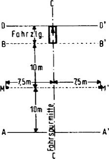

2.2.3 Rundumgeräusch

    Die Messung erfolgt am stehenden Fahrzeug gemäß Abbildung 2 an acht
    Messpunkten in 7 m Entfernung vom Fahrzeugumriss und in 1,2 m Höhe.

    Vor der Messung ist der Motor auf normale Betriebstemperatur zu
    bringen.

    Die Messung soll bei folgender Betriebsbedingung ausgeführt werden:

    Der Gasfußhebel ist stoßweise so weit zu betätigen, dass die
    Abregeldrehzahl jeweils kurz erreicht wird (Beschleunigungsstoß).

    Für jeden der acht Messpunkte wird der höchste hierbei auftretende
    A-Schallpegel ermittelt.

    Lässt sich aus motortechnischen Gründen keine bestimmte
    Abregeldrehzahl erreichen, ist die Messung wie folgt durchzuführen.

    Die Drehzahl wird zunächst auf 3/4 der Nennleistungsdrehzahl konstant
    gehalten und dann so schnell wie möglich auf Leerlaufdrehzahl
    abgesenkt.

    Für jeden der acht Messpunkte wird der höchste A-Schallpegel
    ermittelt, der während einer kurzen Einhaltung der oben angegebenen
    konstanten Drehzahl und der Zeit für den Drehzahlabfall auftritt. Bei
    Anwendung dieses Messverfahrens sind die Grenzwerte für das
    Rundumgeräusch gegenüber den Werten aus der Tabelle 1 um 5 dB(A)
    niedriger anzusetzen.

    **Abbildung 2**

    **Lage der Messpunkte für das Messen des Rundumgeräuschs**

    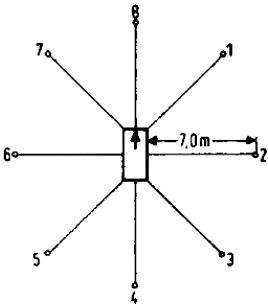

2.2.4 Druckluftgeräusche

    Die Messung erfolgt am stehenden Fahrzeug in den Messpunkten 2 und 6
    gemäß Abbildung 2.

    Ermittelt werden die höchsten A-Schallpegel des Druckregler-
    Abblasgeräuschs und des Entlüftungsgeräuschs nach Betätigen der
    Betriebs- und Feststellbremse.

    Das Druckregler-Abblasgeräusch wird bei Leerlauf des Motors ermittelt.

    Das Entlüftungsgeräusch wird beim Betätigen der Betriebs- und
    Feststellbremse ermittelt, wobei vor jeder Messung die Druckluftanlage
    auf den höchsten Betriebsdruck zu bringen ist und der Motor abgestellt
    wird.

2.2.5 Auswertung der Ergebnisse

    Die Messungen werden für alle Messpunkte zweimal ausgeführt.

    Zur Berücksichtigung der Ungenauigkeiten der Messgeräte gilt der am
    Gerät abgelesene, um 1 dB(A) verringerte Wert als Messergebnis. Die
    Messergebnisse werden als gültig angesehen, wenn der Unterschied der
    am gleichen Messpunkt vorgenommenen Messungen 2 dB(A) nicht
    übersteigt. Als Prüfergebnis gilt das höchste Messergebnis aller unter
    Nummer 2.2.1 bis 2.2.4 jeweils beschriebenen Messpunkte. Übersteigt
    dieser Wert den zulässigen Grenzwert um 1 dB(A), so sind für den
    entsprechenden Messpunkt zwei weitere Messungen durchzuführen. Hierbei
    müssen drei der vier Messergebnisse innerhalb der vorgeschriebenen
    Grenzwerte liegen.

2.2.6 Sonstiges

    Hinsichtlich der Messgeräte und aller akustischen Randbedingungen bei
    der Messung gelten die Vorschriften der in § 49 Absatz 2 Nummer 1
    genannten Richtlinie.

    Sofern entsprechende Bremseinrichtungen vorhanden sind.
[^F776225_61_BJNR067910012BJNE014800000]: [^F776225_62_BJNR067910012BJNE014800000]:     Enfällt              bei elektrischem Antrieb.

### Anlage XXII (weggefallen)

(zu § 47)

### Anlage XXIII Maßnahmen gegen die Verunreinigung der Luft durch Gase und Partikel von Kraftfahrzeugen mit Fremdzündungsmotoren und Selbstzündungsmotoren (Definition schadstoffarmer Personenkraftwagen)

(Fundstelle: BGBl. I 2012, 826 - 887)

*    *   **0**

    *   **Inhaltsübersicht**

*    *   **1**

    *   **Vorschriften zur Erlangung der Betriebserlaubnis**

*    *   1.1

    *   Anwendungsbereich

*    *   1.2

    *   Begriffsbestimmungen

*    *   1.3

    *   Anforderungen

*    *   1.4

    *   Antrag auf Erteilung der Betriebserlaubnis

*    *   1.5

    *   Genehmigungsverfahren

*    *   1.6

    *   Änderungen an genehmigten Fahrzeugtypen und des Wartungsplans

*    *   1.7

    *   Prüfungen

*    *   1.8

    *   Überprüfung der Einhaltung der Vorschriften in der Produktion und
        während der Fahrzeuglebensdauer

*    *   1.9

    *   (weggefallen)

*    *   1.10

    *   Genehmigungsbehörde

*    *   1.11

    *   Mitteilung über die Prüfung

*    *   1.12

    *   Anerkennung von Prüfungen in anderen Staaten

*    *   **2**

    *   **Kriterien für die Ausdehnung der Betriebserlaubnis, Beschreibung des
        Fahrzeugs, Hauptmerkmale des Motors, Wartungsplan**

*    *   2.1

    *   Kriterien für die Ausdehnung der Betriebserlaubnis

*    *   2.2

    *   Beschreibung des Fahrzeugs, Hauptmerkmale des Motors, der
        emissionsmindernden und -relevanten Bauteile des Fahrzeugtyps, für den
        die Betriebserlaubnis beantragt wird

*    *   2.3

    *   Wartungsplan für die emissionsmindernden und -relevanten Bauteile

*    *   **3**

    *   **Durchführung der Prüfungen der gas- und partikelförmigen
        luftverunreinigenden Emissionen**

*    *   3.1

    *   Einleitung

*    *   3.2

    *   Übersicht über die Prüfungen

*    *   3.2.1

    *   Vorbereitung

*    *   3.2.2

    *   Prüfung der Abgasemissionen

*    *   3.2.3

    *   Prüfung der Verdunstungsemissionen

*    *   3.3

    *   Prüffahrzeug und Kraftstoff

*    *   3.3.1

    *   Prüffahrzeug

*    *   3.3.2

    *   Zusätzliche Vorrichtungen am Prüffahrzeug

*    *   3.3.3

    *   Kraftstoff

*    *   3.4

    *   Prüfeinrichtungen

*    *   3.4.1

    *   Fahrleistungsprüfstand

*    *   3.4.2

    *   Abgas- und Partikelentnahmeeinrichtung

*    *   3.4.3

    *   Einrichtung zur Ermittlung der Verdunstungsemissionen

*    *   3.4.4

    *   Analysegeräte

*    *   3.4.5

    *   Volumenmessung

*    *   3.4.6

    *   Gase

*    *   3.4.7

    *   Zusätzliche Messgeräte

*    *   3.4.8

    *   Abgasentnahmesystem

*    *   3.5

    *   Vorbereitung der Prüfungen

*    *   3.5.1

    *   Anpassung der äquivalenten Schwungmassen an die translatorisch
        bewegten Massen des Fahrzeugs

*    *   3.5.2

    *   Einstellung der Bremse auf dem Prüfstand

*    *   3.5.3

    *   Vorbereitung der Messeinrichtungen

*    *   3.5.4

    *   Vorbereitung des Fahrzeugs

*    *   3.6

    *   Emissionsprüfungen

*    *   3.6.1

    *   Allgemeine Vorschriften

*    *   3.6.2

    *   Fahrzeuge mit Fremdzündungsmotoren

*    *   3.6.2.1

    *   Allgemeines zum Prüfablauf

*    *   3.6.2.2

    *   Prüfung der Tankatmungsverluste

*    *   3.6.2.3

    *   Prüfung der Abgasemissionen

*    *   3.6.2.4

    *   Prüfung der Verdunstungsemissionen beim Heißabstellen

*    *   3.6.3

    *   Fahrzeuge mit Selbstzündungsmotoren

*    *   3.6.3.1

    *   Allgemeines zum Prüfablauf

*    *   3.6.3.2

    *   Prüfung der Abgasemissionen

*    *   3.6.4

    *   Prüfung gemäß § 47a

*    *   3.7

    *   Gas-, Partikelentnahme, Analyse

*    *   3.7.1

    *   Probenahme

*    *   3.7.2

    *   Analyse

*    *   3.7.3

    *   Bestimmung der Menge der emittierten luftverunreinigenden Gase und
        Partikel

*    *   3.8

    *   Fahrkurven zur Bestimmung der durchschnittlichen Emissionsmengen

*    *   3.8.1

    *   Allgemeines

*    *   3.8.2

    *   Zulässige Abweichungen

*    *   3.8.3

    *   Verwendung des Getriebes

*    *   3.8.4

    *   Weitere Hinweise zum Durchfahren der Fahrkurven

*    *   3.9

    *   Fahrleistungsprüfstand

*    *   3.9.1

    *   Verfahren zur Kalibrierung des Fahrleistungsprüfstands

*    *   3.9.1.1

    *   Allgemeines

*    *   3.9.1.2

    *   Kalibrierung der Leistungsanzeige in Abhängigkeit von der
        aufgenommenen Leistung

*    *   3.9.2

    *   Fahrwiderstand eines Fahrzeugs

*    *   3.9.2.1

    *   Allgemeines

*    *   3.9.2.2

    *   Beschreibung der Fahrbahn

*    *   3.9.2.3

    *   Metereologische Bedingungen

*    *   3.9.2.4

    *   Zustand und Vorbereitung des Prüffahrzeugs

*    *   3.9.2.5

    *   Messverfahren für die Energieänderung beim Auslaufversuch

*    *   3.9.2.6

    *   Messverfahren für das Drehmoment bei konstanter Geschwindigkeit

*    *   3.9.3

    *   Überprüfung der Gesamtschwungmassen des Fahrleistungsprüfstands bei
        elektrischer Simulation

*    *   3.9.3.1

    *   Allgemeines

*    *   3.9.3.2

    *   Prinzip

*    *   3.9.3.3

    *   Vorschriften

*    *   3.9.3.4

    *   Kontrollverfahren

*    *   3.9.3.5

    *   Technische Anmerkung

*    *   3.10

    *   Beschreibung der Gas- und Partikelentnahmesysteme

*    *   3.10.1

    *   Einleitung

*    *   3.10.2

    *   Kriterien für das System mit variabler Verdünnung beim Messen gas- und
        partikelförmiger Luftverunreinigungen im Abgas

*    *   3.10.3

    *   Beschreibung der Systeme

*    *   3.10.4

    *   Ermittlung der Massenemissionen

*    *   3.11

    *   Kalibrierverfahren für die Geräte

*    *   3.11.1

    *   Erstellung der Kalibrierkurve des Analysators

*    *   3.11.2

    *   Überprüfung der Wirksamkeit des NO
        x                       -Konverters

*    *   3.11.3

    *   Kalibrierung des Entnahmesystems mit konstantem Volumen (CVS-System)

*    *   3.11.4

    *   Überprüfung des Gesamtsystems

*    *   3.12

    *   Kalibrierung der Messkammer und Berechnung der Verdunstungsemissionen

*    *   3.12.1

    *   Kalibrierung der gasdichten Kammer zur Ermittlung der
        Verdunstungsemissionen

*    *   3.12.2

    *   Berechnung der Verdunstungsemissionen

*    *   3.13

    *   Berechnung der emittierten Mengen gas- und partikelförmiger
        Luftverunreinigungen

*    *   3.13.1

    *   Allgemeines

*    *   3.13.2

    *   Volumenbestimmungen

*    *   3.13.3

    *   Berechnung der korrigierten Konzentration luftverunreinigender Gase im
        Auffangbeutel

*    *   3.13.4

    *   Berechnung des Feuchtekorrekturfaktors für NO

*    *   3.13.5

    *   Bestimmung der mittleren CH-Konzentration bei Selbstzündungsmotoren

*    *   **4**

    *   **Ermittlung des Verschlechterungsfaktors und des
        Verschlechterungswerts**

*    *   4.1

    *   Allgemeines

*    *   4.2

    *   Durchführung der Dauerlaufprüfung

*    *   4.3

    *   Berechnung

*    *   4.4

    *   Schlussbericht

*    *   **5**

    *   **Prüfkraftstoffspezifikation**

*    *   5.1

    *   Technische Daten des Prüfkraftstoffes für die Prüfung der Fahrzeuge
        mit Fremdzündungsmotor

*    *   5.2

    *   Technische Daten des Prüfkraftstoffs für die Prüfung der Fahrzeuge mit
        Selbstzündungsmotor

*    *   5.3

    *   Prüfkraftstoff für die Prüfung von Flüssiggasfahrzeugen mit
        Fremdzündungsmotor

*    *   **6**

    *   **Formblatt: Mitteilung über die Betriebserlaubnis**

*    *   **Anhang I**

    *   **Fahrzeugbeschreibung gemäß Anlage XXIII**

*    *   **Anhang II**

    *   **Hauptmerkmale des Motors und Angaben über die Durchführung der
        Prüfungen gemäß Anlage XXIII**

**1** **Vorschriften zur Erlangung der Betriebserlaubnis**

**1.1** **Anwendungsbereich**

    Diese Anlage regelt die zulässigen Emissionen luftverunreinigender
    Gase und Partikel von

    1.  Personenkraftwagen sowie

    2.  Wohnmobilen mit einer zulässigen Gesamtmasse von nicht mehr als 2 800
        kg mit Fremdzündungsmotoren (Ottomotoren) und Selbstzündungsmotoren
        (Dieselmotoren), mit mindestens vier Rädern, einer zulässigen
        Gesamtmasse von mindestens 400 kg und einer bauartbedingten
        Höchstgeschwindigkeit von mindestens 50 km/h.

**1.2** **Begriffsbestimmungen**

    a)  Abgasemissionen: Luftverunreinigende Stoffe, die vom Motor über die
        Auslassöffnung durch die Auspuffanlage in die Atmosphäre abgegeben
        werden.

    b)  Bezugsmasse: Leermasse zuzüglich 136 kg.

    c)  Emissionsmindernde Bauteile: Bauteile, die zum Zwecke der
        Emissionsminderung luftverunreinigender Gase und Partikel in das
        Fahrzeug eingebaut werden.

    d)  Emissionsrelevante Bauteile: Bauteile des Fahrzeugs, die direkten oder
        indirekten Einfluss auf die Abgas-, Verdunstungs- und
        Kurbelgehäuseemissionen haben.

    e)  Fahrzeuglebensdauer im Sinne dieser Anlage ist eine Fahrstrecke von 80
        000 km oder eine Nutzungszeit von fünf Jahren.

    f)  Fahrzeugtyp umfasst Fahrzeuge, die sich in ihrer Konstruktion und
        Bauweise nicht wesentlich unterscheiden.

    g)  Gesamtmasse ist die vom Hersteller vorgeschriebene höchstzulässige
        Masse des Fahrzeugs.

    h)  Kraftstoffsystem ist die Gesamtheit aller kraftstoffführenden Teile
        wie Kraftstofftank(s), Kraftstoffpumpe, Kraftstoffleitungen, Vergaser
        oder Einspritzanlagen. Es umfasst alle dazugehörenden Öffnungen sowie
        alle Komponenten zur Verhinderung oder Verminderung der
        Verdunstungsemissionen.

    i)  Kurbelgehäuse ist die Gesamtheit aller Räume, die im Motor oder
        außerhalb des Motors vorhanden sind und die durch innere und äußere
        Verbindungen an den Ölsumpf angeschlossen sind.

    j)  Kurbelgehäuseemissionen sind Gase oder Dämpfe, die aus irgendeinem
        Teil des Kurbelgehäuses in die Atmosphäre entweichen können.

    k)  Leermasse ist die Masse des fahrbereiten Fahrzeugs ohne Fahrer,
        Passagiere oder Ladung, mit vollem Kraftstofftank und sonstigen vollen
        Betriebsstoff-Vorratsbehältern, mit serienmäßigem Bordwerkzeug und mit
        serienmäßigem Reserverad.

    l)  Luftverunreinigende Gase sind Kohlenmonoxid (CO), Summe der
        Kohlenwasserstoffe (CH; ausgedrückt als CH
        1,85                         ) und Summe der Stickoxide (NO
        x                         ; ausgedrückt als NO
        2                         ).

    m)  Luftverunreinigende Partikel sind Abgasbestandteile, die bei einer
        Temperatur von höchstens 52 °C im verdünnten Abgas mit Filtern
        entsprechend Nummer 3 abgeschieden werden.

    n)  Tankatmungsverluste: Verdunstungsemissionen aus dem (den)
        Kraftstofftank(s), die durch die Schwankungen der
        Umgebungstemperaturen entstehen.

    o)  Verdunstungsemissionen: Verdunstungsemissionen bezeichnen die von
        einem Kraftfahrzeug an die Atmosphäre abgegebenen Kohlenwasserstoffe,
        die keine Abgas- und Kurbelgehäuseemissionen sind. Sie ergeben sich
        aus der Addition von Tankatmungsverlusten, Emissionen während der
        Heißabstellphase und Emissionen während des Fahrzeugbetriebs
        (Fahrkurve I).

    p)  Verschlechterungsfaktor (dimensionslos) für die Abgasemissionen:

        f
        v                          = Abgasemissionen bei 80 000 km dividiert
        durch die Abgasemissionen bei 6 400 km.

    q)  Verschlechterungswert (in g/Test) für die Verdunstungsemissionen:

        f
        D                          = Verdunstungsemissionswert bei 80 000 km
        minus dem Verdunstungswert bei 6 400 km.

**1.3** **Anforderungen**

    Der Hersteller hat durch geeignete Maßnahmen sicherzustellen, dass die
    Fahrzeuge während ihrer gesamten Lebensdauer möglichst niedrige
    Emissionen luftverunreinigender Gase und Partikel haben. Die
    Wirksamkeit der Minderungsmaßnahmen muss im gesamten
    Geschwindigkeitsbereich sichergestellt sein. Der Hersteller hat
    nachzuweisen und sicherzustellen, dass die in Nummer 1.7 aufgeführten
    Grenzwerte für luftverunreinigende Gase und Partikel über eine
    Fahrstrecke von 80 000 km oder eine Betriebsdauer von fünf Jahren (je
    nachdem, was zuerst erreicht wird) bei ordnungsgemäßer Wartung, die
    dem mit dem Antrag auf Erteilung der Betriebserlaubnis vorzulegenden
    Wartungsplan entsprechen soll, und bei Betrieb des Fahrzeugs mit
    unverbleitem Kraftstoff eingehalten werden.

    Die Funktionsfähigkeit der emissionsmindernden und emissionsrelevanten
    Bauteile muss während der Fahrzeuglebensdauer und in den auftretenden
    Geschwindigkeitsbereichen durch die in den Nummern 1.7 und 1.8 näher
    beschriebenen Einzelprüfungen nachgewiesen werden:

    1.  Prüfung der gas- und partikelförmigen Emissionen von Prüffahrzeugen
        entsprechend Nummer 1.7 (Typprüfung) durch den Technischen Dienst.
        Dies wird ergänzt durch die nach Nummer 1.4.2 ermittelten
        Verschlechterungsfaktoren.

    2.  Regelmäßige Kontrolle der Einhaltung der Vorschriften in der
        Produktion entsprechend Nummer 1.8.2.1 (Serienprüfung) durch den
        Hersteller, ergänzt durch stichprobenartig von der Genehmigungsbehörde
        angeordnete Serienprüfungen nach Nummer 1.8.2.2 durch den Technischen
        Dienst.

**1.4** **Antrag auf Erteilung der Betriebserlaubnis**

1.4.1 Dem Antrag auf Erteilung der Betriebserlaubnis für Abgas- und
    Verdunstungsemissionsverhalten sind vom Hersteller oder seinem
    Beauftragten die in Nummer 2.2 aufgeführten Unterlagen und Erklärungen
    beizufügen.

    Die für einen Fahrzeugtyp erteilte Betriebserlaubnis für Abgas- und
    Verdunstungsemissionsverhalten kann auf Antrag des Herstellers auf
    andere Fahrzeugtypen ausgedehnt werden. Der Hersteller legt der
    Genehmigungsbehörde die zur Beurteilung erforderlichen Unterlagen vor.
    Die Behörde entscheidet darüber auf der Grundlage der in Nummer 2.1
    beschriebenen Kriterien.

1.4.2 Der Hersteller hat alle Prüfdaten der Genehmigungsbehörde vorzulegen,
    die gemäß den in Nummer 4 beschriebenen Prüfvorschriften über die
    Lebensdauer des Fahrzeugs ermittelt wurden. Durch diese Daten soll der
    Hersteller nachweisen, dass die emissionsmindernden und -relevanten
    Bauteile der Prüffahrzeuge ihre Funktion zur Einhaltung der geltenden
    Abgasgrenzwerte über die Lebensdauer der Fahrzeuge beibehalten. Wird
    ein Dauerlauf (Nummer 4) durchgeführt, müssen alle Wartungsarbeiten
    dokumentiert und vorgelegt werden.

    Der Hersteller hat ferner nachzuweisen, dass die Einrichtungen zur
    Minderung der Verdunstungsemissionen in einer Weise ausgeführt sind,
    dass dadurch die geltenden Verdunstungsemissionsgrenzwerte über die
    Lebensdauer des Fahrzeugs eingehalten werden.

    Auf Antrag des Herstellers kann die Genehmigungsbehörde auf den
    Nachweis der Einhaltung der Emissionsgrenzwerte im Rahmen eines
    Dauerlaufs verzichten, wenn der Hersteller glaubhaft macht, dass das
    Prüffahrzeug die geltenden Grenzwerte für luftverunreinigende Gase und
    Partikel über die Lebensdauer einhält. Bei Nichtvorlage des im
    Dauerlauf ermittelten jeweiligen Verschlechterungsfaktors ist für die
    Entscheidung über die Einhaltung der Grenzwerte ein
    Verschlechterungsfaktor bei den Abgasemissionen von 1,3 und ein
    Verschlechterungswert bei den Verdunstungsemissionen von 0,3 g/Test
    heranzuziehen.

    Bei einer Jahresproduktion von weniger als 10 000 Fahrzeugen je
    Fahrzeugtyp einschließlich der Fahrzeugtypen, auf die die Genehmigung
    ausgedehnt ist, gelten folgende Verschlechterungsfaktoren bzw. -werte,
    sofern keine im Dauerlauf ermittelten Verschlechterungsfaktoren
    vorgelegt werden:

    *        *   Abgasreinigungssystem

        *   Verschlechterungs-

        *

    *        *   faktor

        *   wert

    *        *   CH

        *   CO

        *   NO
            x

        *   Partikel

        *   Verdunstungsemission

    *        *   1.

        *   Fremdzündungsmotor mit Oxidationskatalysator

        *   1,3

        *   1,2

        *   1,0

        *   –

        *   0,0

    *        *   2.

        *   Fremdzündungsmotor ohne Katalysator

        *   1,3

        *   1,2

        *   1,0

        *   –

        *   0,0

    *        *   3.

        *   Fremdzündungsmotor mit Dreiwegekatalysator

        *   1,3

        *   1,2

        *   1,1

        *   –

        *   0,0

    *        *   4.

        *   Dieselmotoren

        *   1,0

        *   1,1

        *   1,0

        *   1,2

        *   –

1.4.3 Die Genehmigungsbehörde prüft vor Einleitung des nachstehend unter den
    Nummern 1.5 bis 1.7 beschriebenen Genehmigungsverfahrens die
    Vollständigkeit und Plausibilität der vom Hersteller vorgelegten
    Anmeldeunterlagen.

**1.5** **Genehmigungsverfahren**

    Die Genehmigungsbehörde wählt die Prüffahrzeuge anhand der mit dem
    Antrag eingereichten Unterlagen aus.

    Die ausgewählten Prüffahrzeuge sind dem Technischen Dienst
    vorzuführen, der mit der Durchführung der in Nummer 3 beschriebenen
    Prüfungen beauftragt ist. Die Prüfungen finden beim Technischen Dienst
    statt. Auf Antrag des Herstellers können die Prüfungen beim Hersteller
    durchgeführt werden, falls die bei ihm erzielten Prüfergebnisse keine
    systematischen Abweichungen von denen des Technischen Dienstes zeigen.

    Die Merkmale, nach denen die Ausdehnung der Betriebserlaubnis für
    Abgas- und Verdunstungsemissionsverhalten auf weitere Fahrzeugtypen
    vorgenommen wird, sind in Nummer 2.1 beschrieben. In diesem Fall
    werden von der Genehmigungsbehörde zwei Prüffahrzeuge nach folgenden
    Kriterien ausgewählt:

    a)  Prüffahrzeug:

        Fahrzeugtyp, der die höchsten Emissionen erwarten lässt.

    b)  Prüffahrzeug:

        Nicht notwendig für die Ermittlung der Verdunstungsemissionen.
        Fahrzeugtyp, der die höchste Prüfmasse aufweist.

    Besitzen davon mehrere Fahrzeugtypen eine gleiche Prüfmasse, wird
    unter diesen Fahrzeugtypen ein Prüffahrzeug ausgewählt, das auf der
    Straße bei 80 km/h den höchsten Fahrwiderstand aufweist. Weisen davon
    mehrere Fahrzeugtypen gleichen Fahrwiderstand auf, dann wird unter
    diesen Fahrzeugtypen ein Prüffahrzeug ausgewählt, das den größten
    Hubraum aufweist. Weisen davon wiederum mehrere Fahrzeugtypen den
    gleichen Hubraum auf, dann wird unter diesen Fahrzeugtypen ein
    Prüffahrzeug ausgewählt, das das höchste Gesamtübersetzungsverhältnis
    des Antriebsstrangs aufweist. Lässt der so ausgewählte Fahrzeugtyp
    gleichzeitig die höchsten Emissionen erwarten, und ist er damit
    bereits als erstes Prüffahrzeug bestimmt, dann wird bei der Auswahl
    des zweiten Prüffahrzeugs weiter entsprechend des obigen
    Kriterienkatalogs verfahren.

    Ist auch danach das ausgewählte zweite Prüffahrzeug mit dem ersten
    Prüffahrzeug identisch, wählt die Genehmigungsbehörde ein anderes
    Prüffahrzeug aus.

    Falls die so ausgewählten Prüffahrzeuge das Abgasemissionsverhalten
    der beantragten Fahrzeugtypen nicht ausreichend repräsentieren, kann
    die Genehmigungsbehörde ein weiteres Prüffahrzeug auswählen.

    Die Prüfung der Abgasemissionen im Rahmen des Verfahrens zur Erteilung
    einer Betriebserlaubnis umfasst Fahrtests der Fahrkurven I und II auf
    dem Fahrleistungsprüfstand. Dabei ist die Masse der in den Abgasen
    enthaltenen gas- und partikelförmigen Luftverunreinigungen zu
    ermitteln. Anschließend wird die Prüfung gemäß § 47a durchgeführt.

    Die Prüfung der Verdunstungsemissionen im Rahmen des Verfahrens zur
    Erteilung einer Betriebserlaubnis wird bei Fahrzeugen mit Fremdzündung
    durchgeführt. Dabei werden die Tankatmungsverluste und die
    Verdunstungsemissionen während des Heißabstellens ermittelt.

    Zeigen die an einem Prüffahrzeug gewonnenen Prüfergebnisse, dass die
    unter Nummer 1.7 genannten Grenzwerte für luftverunreinigende Gase und
    Partikel nicht eingehalten werden, kann der Hersteller eine
    Wiederholung der nicht bestandenen Prüfung für das Prüffahrzeug
    beantragen. In diesem Falle werden für die Erteilung der
    Betriebserlaubnis lediglich die Ergebnisse der Wiederholungsprüfung
    herangezogen.

    Die bei den Prüfungen ermittelten Werte für die Abgas- und
    Verdunstungsemissionen sind der Genehmigungsbehörde mitzuteilen.

    Die Genehmigungsbehörde entscheidet anhand der vom Technischen Dienst
    gemessenen Emissionswerte unter Berücksichtigung der
    Verschlechterungsfaktoren und -werte, ob die unter Nummer 1.7
    genannten Grenzwerte für luftverunreinigende Gase und Partikel
    eingehalten werden. Dazu werden die gemessenen Abgas- und
    Partikelemissionswerte mit den jeweiligen Verschlechterungsfaktoren
    multipliziert; zu dem gemessenen Verdunstungsemissionswert wird der
    Verschlechterungswert addiert.

**1.6** **Änderungen an genehmigten Fahrzeugtypen und des Wartungsplans**

    Beabsichtigt der Hersteller emissionsrelevante oder -mindernde
    Bauteile zu ändern, so hat er dies der Genehmigungsbehörde
    mitzuteilen. Die Behörde entscheidet, ob eine erneute Prüfung
    erforderlich ist. Beabsichtigte Änderungen des Wartungsplans
    emissionsrelevanter und -mindernder Bauteile sind ebenfalls der
    Genehmigungsbehörde zur Genehmigung vorzulegen.

**1.7** **Prüfungen**

1.7.1 Die Prüfungen sind nach Abschnitt 3 durchzuführen. Fahrzeuge, für die
    gemäß Nummer 1.5 eine Betriebserlaubnis beantragt wird, müssen über
    ihre Lebensdauer folgende Grenzwerte für die Emissionen der
    gasförmigen Luftverunreinigungen Kohlenmonoxid, Kohlenwasserstoffe und
    Stickoxide einhalten:

1.7.1.1 Fahrkurve I nach Nummer 3.8

    Kohlenmonoxid (CO): 2,1 g/km

    Kohlenwasserstoffe (CH): 0,25 g/km

        Stickoxide (NO
    x): 0,62 g/km

1.7.1.2 Fahrkurve II nach Nummer 3.8

[^F776225_63_BJNR067910012BJNE015000000]
    Die Wirksamkeit der Minderungsmaßnahme muss bei höheren
    Geschwindigkeiten erhalten bleiben. Dies gilt auch als nachgewiesen,
    wenn beim Test nach Fahrkurve II folgende Grenzwerte eingehalten
    werden
    :

        Stickoxide (NO
    x): 0,76 g/km

1.7.2 Fahrzeuge mit Selbstzündungsmotor müssen über ihre Lebensdauer
    zusätzlich Grenzwerte für die Emissionen der partikelförmigen
    Luftverunreinigungen einhalten.

    Fahrkurve I nach Nummer 3.8

    Partikel: 0,124 g/km

1.7.3 Fahrzeuge mit Fremdzündungsmotor müssen über ihre Lebensdauer
    zusätzlich folgenden Grenzwert für Verdunstungsemissionen einhalten.

    Verdunstungstest nach Nummer 3

    Kohlenwasserstoff (CH): 2,0 g/Test

1.7.4 Emissionen gasförmiger Luftverunreinigungen aus dem Kurbelgehäuse von
    Fahrzeugen mit Fremdzündung (Ottomotoren).

    Aus dem Entlüftungssystem des Kurbelgehäuses dürfen keine Emissionen
    gasförmiger Luftverunreinigungen (Kohlenwasserstoffe) entweichen.

**1.8** **Überprüfung der Einhaltung der Vorschriften in der Produktion und
    während der Fahrzeuglebensdauer**

1.8.1 Allgemeines

    Die in Nummer 1.7 aufgeführten Grenzwerte für luftverunreinigende Gase
    und Partikel müssen über die Fahrzeuglebensdauer bei ordnungsgemäßer
    Wartung und bei Betrieb des Fahrzeugs mit unverbleitem Kraftstoff
    eingehalten werden. Die Funktionsfähigkeit der emissionsmindernden und
    emissionsrelevanten Bauteile muss während der Fahrzeuglebensdauer
    gegeben sein. Die Einhaltung dieser Bestimmungen ist bei der
    Durchführung der nachfolgend beschriebenen Serienprüfungen und bei
    einer Überprüfung des Emissionsverhaltens im Verkehr befindlicher
    Fahrzeuge nachzuweisen und sicherzustellen.

1.8.2 Übereinstimmung der Produktion (Serienprüfung)

1.8.2.1 Serienprüfung durch den Hersteller

    Der Hersteller entnimmt in eigener Verantwortung nach statistischen
    Auswahlkriterien eine Stichprobe der produzierten Fahrzeuge eines
    Fahrzeugtyps in folgendem Umfang:

    Bei einer Jahresproduktion pro Fahrzeugtyp von

    *        *   a)

        *   *                              20 000

        *   – 1 Promille der Produktion

    *        *   b)

        *   *                              2 000 < 20 000

        *   – fünf Fahrzeuge pro Quartal

    *        *   c)

        *   < 2 000

        *   – vier Fahrzeuge pro Jahr.

    Bei einer Jahresproduktion von weniger als 100 Fahrzeugen je
    Fahrzeugtyp entfällt der Nachweis der Serienprüfung durch den
    Hersteller.

    Die aus der Produktion entnommenen Fahrzeuge sind der Prüfung der
    Abgasemissionen nach den Fahrkurven I und II sowie nach § 47a zu
    unterziehen.

    Die Emissionen gas- und partikelförmiger Luftverunreinigungen dürfen
    die Grenzwerte nach Nummer 1.7 unter Berücksichtigung der
    Verschlechterungsfaktoren und -werte nicht überschreiten.

    Die Serienproduktion gilt als vorschriftsmäßig, wenn

    a)  mehr als 70 Prozent der Fahrzeuge der Stichprobe unterhalb der
        zulässigen Grenzwerte unter Berücksichtigung der
        Verschlechterungsfaktoren und -werte liegen und

    b)  die geprüfte Stichprobe folgende Bedingungen erfüllt:

        *            *   x + k · S*                                    L

        *            *   x :

            *   jeweiliges arithmetisches Mittel der Emissionen gas- und
                partikelförmiger Luftverunreinigungen

        *            *   L :

            *   zulässiger Grenzwert unter Berücksichtigung der jeweiligen
                Verschlechterungsfaktoren und -werte

        *            *   S :

            *   Standardabweichung
                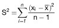

        *            *   n :

            *   Zahl der Prüfungen

        *            *   k :

            *   statistischer Faktor, der von n abhängt und in der folgenden Tabelle
                angegeben ist

        *            *   x
                i                                    :

            *   Messwert der Emissionen gasförmiger Luftverunreinigungen

        *            *   n

            *   2

            *   3

            *   4

            *   5

            *   6

            *   7

        *            *   k

            *   0,973

            *   0,613

            *   0,489

            *   0,421

            *   0,376

            *   0,342

        *            *   n

            *   8

            *   9

            *   10

            *   11

            *   12

            *   13

        *            *   k

            *   0,317

            *   0,296

            *   0,279

            *   0,265

            *   0,253

            *   0,242

        *            *   n

            *   14

            *   15

            *   16

            *   17

            *   18

            *   19

        *            *   k

            *   0,233

            *   0,224

            *   0,216

            *   0,210

            *   0,203

            *   0,198

        *            *   wenn n*                                    20,

            *                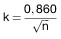
            *
            *
            *
            *

   Der Hersteller muss bei der von ihm durchgeführten Prüfung auf
    Übereinstimmung der Produktion (Serienprüfung) der Genehmigungsbehörde
    folgende Daten auf Verlangen vorlegen:

    a)  Zahl der produzierten Fahrzeuge eines Fahrzeugtyps

    b)  Zahl der geprüften Fahrzeuge eines Fahrzeugtyps

    c)  Bezeichnung und Beschreibung der geprüften Fahrzeuge

    d)  vollständige Auflistung der Emissionsergebnisse der einzelnen
        geprüften Fahrzeuge und der verwendeten Prüfeinrichtungen.

    Die vorgelegten Dokumente sind mit Datum, Ort der Prüfung und
    Kilometerstand des Prüffahrzeugs durch den vom Hersteller benannten
    verantwortlichen Prüfstandsleiter zu kennzeichnen. Der Hersteller
    versichert, dass die übermittelten Emissionswerte nach seinem besten
    Wissen das mittlere Emissionsverhalten der Serie repräsentieren.

1.8.2.2 Serienprüfung durch den Technischen Dienst

    Die Genehmigungsbehörde kann in begründeten Fällen gleichermaßen
    Stichprobenprüfungen zur Überwachung des Emissionsverhaltens der
    Fahrzeuge aus der Produktion durch den Technischen Dienst durchführen
    lassen. Die Prüfungen werden beim Technischen Dienst durchgeführt.

    Das (die) aus der Serie entnommene(n) Fahrzeug(e) ist (sind) der
    Prüfung der Abgasemissionen nach Fahrkurve I und II sowie nach § 47a
    zu unterziehen.

    Die Genehmigungsbehörde kann zusätzlich die Prüfung der
    Verdunstungsemissionen nach Nummer 3.6.2 vornehmen lassen.

    Werden die genannten Grenzwerte von diesem (diesen) Fahrzeug(en) der
    ersten Stichprobe nicht eingehalten, so steht es dem Hersteller frei,
    Stichprobenmessungen an weiteren aus der Produktion entnommenen
    Fahrzeugen zu verlangen, wobei die Stichprobe das (die) ursprünglich
    geprüfte(n) Fahrzeug(e) enthalten muss. Die Fahrzeuge sind den
    gleichen Prüfungen zu unterziehen. Die Größe der Stichprobe bestimmt
    der Hersteller. Die Auswahl der Fahrzeuge erfolgt durch die
    Genehmigungsbehörde. Der Hersteller hat in diesem Fall die Kosten für
    die erweiterte Prüfung zu tragen.

    Die Serienprüfung gilt als vorschriftsmäßig, wenn die geprüfte
    Stichprobe die in Nummer 1.8.2.1 genannten Bedingungen erfüllt.

**1.9** (weggefallen)

**1.10** **Genehmigungsbehörde**

    Genehmigungsbehörde im Sinne dieser Anlage ist das Kraftfahrt-
    Bundesamt, Fördestraße 16, 24944 Flensburg. Dies gilt nicht für das
    Verfahren nach § 21. Das Kraftfahrt-Bundesamt kann Aufgaben im Rahmen
    des Genehmigungsverfahrens auf den Technischen Dienst übertragen.

**1.11** **Mitteilung über die Prüfung**

    Nach der Prüfung hat das Kraftfahrt-Bundesamt (Genehmigungsbehörde)
    das Formblatt über die Mitteilung nach Abschnitt 6 auszufüllen. Es hat
    eine Abschrift dieser Mitteilung dem Hersteller oder seinem
    Beauftragten zu übersenden.

    Die Angaben der Mitteilung nach Abschnitt 6 können von der
    Genehmigungsbehörde veröffentlicht werden.

**1.12** **Anerkennung von Prüfungen in anderen Staaten**

    Prüfungen, denen ein Fahrzeugtyp in einem anderen Staat unterzogen
    worden ist, werden anerkannt, wenn der Hersteller oder sein
    Beauftragter die Durchführung gleichwertiger Prüfungen nachweist und
    diese bei einer Genehmigungsbehörde oder einer amtlichen Prüfstelle
    durchgeführt wurden. Der Nachweis muss durch die Vorlage der in dem
    anderen Staat erteilten Betriebserlaubnis sowie der zugehörigen
    vollständigen Antragsunterlagen, die der Genehmigungsbehörde des
    anderen Staates vorzulegen waren, erfolgen; zu fremdsprachlichen
    Unterlagen sind deutsche Übersetzungen beizufügen. Über die
    Anerkennung der Gleichwertigkeit der Prüfungen in einem anderen Staat
    entscheidet die Genehmigungsbehörde in Absprache mit dem Technischen
    Dienst.

**2** **Kriterien für die Ausdehnung der Betriebserlaubnis, Beschreibung des
    Fahrzeugs, Hauptmerkmale des Motors, Wartungsplan**

**2.1** **Kriterien für die Ausdehnung der Betriebserlaubnis**

2.1.1 Fahrzeuge mit gleichartiger Abgasemissionscharakteristik müssen in
    folgenden konstruktiven Merkmalen übereinstimmen:

    a)  Abstand von Mittelpunkt zu Mittelpunkt der Zylinderbohrungen

    b)  Anordnung, Zahl der Zylinder und Ausführung des Zylinderblockes (zum
        Beispiel luft- oder wassergekühlt, 4-Zylinder-Reihenmotor, V 6-Motor
        usw.)

    c)  Lage der Ein- und Auslassventile (oder -öffnungen)

    d)  Luftansaugverfahren (zum Beispiel Abgaslader)

    e)  Typ des Ladeluftkühlers

    f)  Brennverfahren

    g)  Art des Abgasnachbehandlungssystems

    h)  Zündanlage

    i)  Gemischaufbereitungssystem

    Die Kriterien können nach folgenden Merkmalen weiter spezifiziert
    werden, wenn Genehmigungsbehörde oder Hersteller dies für erforderlich
    halten:

    a)  Bohrung und Hub

    b)  Oberflächen-Volumenverhältnis des Brennraums (bei Kolbenstellung
        oberer Totpunkt)

    c)  Ansaugsystem und Abgaskrümmer

    d)  Größe der Einlass- und Auslassventile

    e)  Kraftstoffsystem

    f)  Steuerzeiten der Nockenwelle

    g)  Zündungs- und Einspritzeinstellwerte

2.1.2 Fahrzeuge mit gleichartiger Verdunstungsemissionscharakteristik müssen
    in folgenden konstruktiven Merkmalen übereinstimmen:

    a)  Kraftstoffrückhaltevorrichtung

        (zum Beispiel Adsorptionsfalle, Luftfilter, Kurbelgehäuse)

    b)  Kraftstofftank (zum Beispiel Werkstoff und Form)

    c)  Kraftstoffleitung und Fördersystem

    d)  Gemischaufbereitung

**2.2** **Beschreibung des Fahrzeugs, Hauptmerkmale des Motors, der
    emissionsmindernden und -relevanten Bauteile des Fahrzeugtyps, für den
    die Betriebserlaubnis beantragt wird**

2.2.1 Fahrzeugbeschreibung, Hauptmerkmale des Motors und Angaben über die
    Durchführung der Prüfung sind gemäß den Anhängen I und II vorzulegen.

2.2.2 Zusätzliche Angaben, soweit nicht in Anhang I oder II beschrieben:

2.2.2.1 Auflistung und Beschreibung aller Einstellgrößen von Bauteilen, die
    die Emissionen beeinflussen.

    Angaben der vom Hersteller empfohlenen Einstellwerte und der
    zulässigen Toleranzen von Bauteilen, die die Emissionen beeinflussen.

    Beschreibung der Feststellvorrichtungen, die den vom Hersteller
    empfohlenen Einstellbereich festlegen und eine unbefugte Verstellung
    verhindern.

    Angaben zur Einstellung der Feststellvorrichtungen und zu den
    dazugehörenden Toleranzen.

2.2.2.2 Nachweis, wie die unbefugte Verstellung emissionsrelevanter
    Einstellgrößen bei den im Verkehr befindlichen Fahrzeugen wirksam
    verhindert wird.

2.2.2.3 Nachweis, wie durch geeignete konstruktive Maßnahmen die Fahrzeuge mit
    Ottomotoren ausschließlich mit unverbleitem Kraftstoff betankt werden
    können. Dieser Nachweis gilt als erbracht, wenn der Tankeinfüllstutzen
    so konstruiert ist, dass das Fahrzeug nur mit einem Zapfhahn mit einem
    äußeren Durchmesser der Endöffnung von nicht mehr als 2,134 cm und
    einem geraden Mundstück von mindestens 6,34 cm Länge betankt werden
    kann.

2.2.3 Wartungsplan mit detaillierter Beschreibung und Auflistung der
    regelmäßig durchzuführenden Wartungsarbeiten an den
    emissionsrelevanten und emissionsmindernden Bauteilen.

2.2.4 Muster eines Wartungsbuchs, das zum Lieferumfang des Fahrzeugs zählt,
    und mit dem die ordnungsgemäßen Wartungsarbeiten der
    emissionsrelevanten und -mindernden Bauteile durch Werkstatt und
    Fahrzeughalter dokumentiert werden kann. Das Wartungsbuch soll auch
    den Wartungsplan enthalten. Der Nachweis über die Durchführung der
    ordnungsgemäßen Wartungsarbeiten kann auch anderweitig geführt werden.

**2.3** **Wartungsplan für die emissionsmindernden und -relevanten Bauteile**

    Die ordnungsgemäße Durchführung der Wartungsarbeiten in den
    vorgesehenen Intervallen ist die Voraussetzung für die
    Gewährleistungspflicht des Herstellers für die emissionsrelevanten und
    -mindernden Bauteile.

    Als ordnungsgemäße Wartung gilt, wenn die vom Hersteller
    vorgeschriebenen Arbeiten entsprechend seinen Spezifikationen beim
    vorgeschriebenen Kilometerstand (+ 2 000 km) oder zum vorgeschriebenen
    Zeitpunkt (± drei Monate) durchgeführt und von der Werkstatt
    dokumentiert werden, und wenn gegebenenfalls erforderliche Ersatzteile
    verwendet werden, die den Spezifikationen des Herstellers entsprechen.
    Als ordnungsgemäße Wartung gilt auch, wenn der Fahrzeughalter zur
    Behebung einer Notlage unvorschriftsmäßige Arbeiten durchführen lässt,
    vorausgesetzt der Fahrzeughalter bringt das Fahrzeug innerhalb eines
    angemessenen Zeitraums wieder in den vorschriftsmäßigen Zustand.

**3** **Durchführung der Prüfungen der gas- und partikelförmigen
    luftverunreinigenden Emissionen**

**3.1** **Einleitung**

    Dieser Anhang beschreibt die Verfahren und die Einrichtungen, die
    erforderlich sind, um die Einhaltung der für die Erteilung der
    Betriebserlaubnis von Fahrzeugen erlassenen Emissionsvorschriften
    prüfen zu können. Darüber hinausgehende Vorschriften zur Durchführung
    der Dauerlaufprüfung sind in Abschnitt 4 beschrieben.

**3.2** **Übersicht über die Prüfungen**

    Die unter den Nummern 3.2.1 und 3.2.3 beschriebenen Prüfabläufe für
    die Bestimmung der Abgas- bzw. Verdunstungsemissionen sind schematisch
    in Figur 1 bis 3 dargestellt.

    Die Umgebungstemperaturen für das Testfahrzeug während der gesamten
    Testfolge sollen nicht tiefer als 20 °C und nicht höher als 30 °C
    liegen. Das Fahrzeug soll während aller Phasen der Testfolge annähernd
    eben stehen.

3.2.1 Vorbereitung

    Vor der Durchführung der Emissionsmessungen sind die Prüffahrzeuge in
    einheitlicher Weise zu konditionieren, um die Reproduzierbarkeit der
    Ergebnisse sicherzustellen. Die Konditionierung besteht aus einer
    Fahrt auf einem Fahrleistungsprüfstand sowie einer Abstellphase bei
    definierter Umgebungstemperatur.

3.2.2 Prüfung der Abgasemissionen

    Die Prüfung der Abgasemissionen im Rahmen des Verfahrens zur Erteilung
    einer Betriebserlaubnis umfasst zwei Fahrtests auf einem
    Fahrleistungsprüfstand, während der die Mengen luftverunreinigender
    Gase und Partikel ermittelt werden. Bei den Fahrzeugen werden die
    Kohlenmonoxid-, Kohlenwasserstoff- und Stickoxidemissionen, bei
    Fahrzeugen mit Selbstzündungsmotoren (Dieselmotoren) zusätzlich die
    Partikelemissionen ermittelt. Die beiden Fahrtests werden im Folgenden
    als Fahrkurve I und Fahrkurve II bezeichnet und sind in Nummer 3.8
    beschrieben. Nach dem Abschluss der Fahrtests wird die Prüfung nach §
    47a durchgeführt.

    **Figur 1**

    **Prüfablauf für Fahrzeuge mit Fremdzündungsmotoren**

    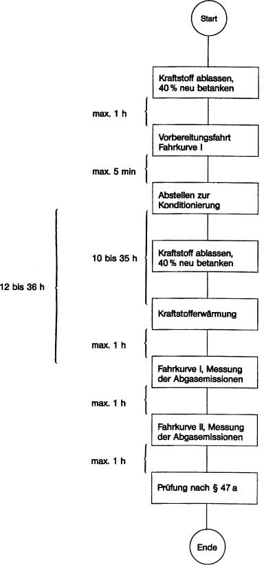

    **Figur 2**

    **Prüfablauf für Fahrzeuge mit Fremdzündungsmotoren**

    Verdunstungsemissionen

    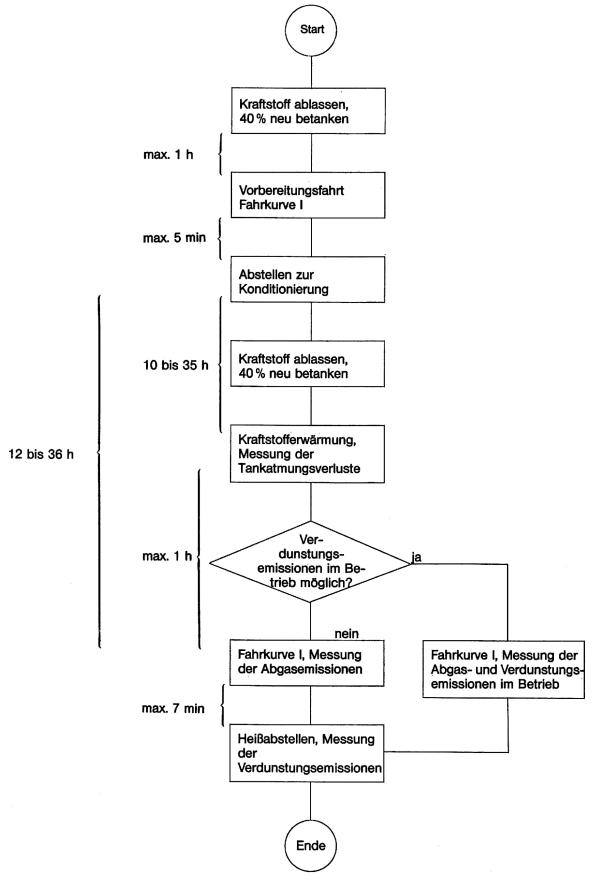

    **Figur 3**

    **Prüfablauf für Fahrzeuge mit Selbstzündungsmotoren**

    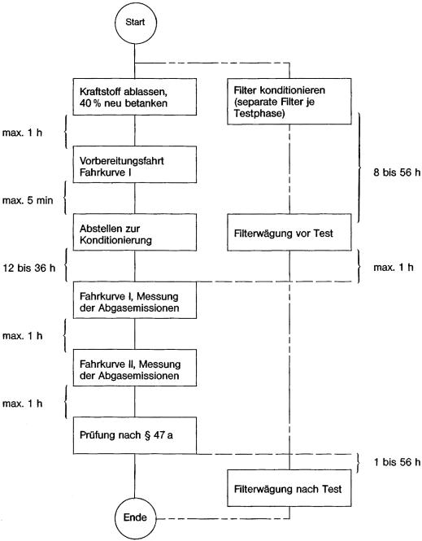

3.2.3 Prüfung der Verdunstungsemissionen

    Die Prüfung der Verdunstungsemissionen im Rahmen des Verfahrens zur
    Erteilung der Betriebserlaubnis wird bei Fahrzeugen mit Ottomotoren
    durchgeführt. Dabei werden die Tankatmungsverluste und die
    Verdunstungsemissionen während des Heißabstellens in einer gasdichten
    Messkammer ermittelt. Zwischen diesen beiden Prüfungen muss eine
    Prüfung der Abgasemissionen in der Fahrkurve I erfolgen. Falls
    erforderlich, werden zusätzlich die Verdunstungsemissionen während
    dieses Fahrbetriebs durch Messfallen ermittelt.

**3.3** **Prüffahrzeug und Kraftstoff**

3.3.1 Prüffahrzeug

3.3.1.1 Das Prüffahrzeug muss sich in einwandfreiem Betriebszustand befinden.
    Es muss insoweit eingefahren sein, dass weitgehend die Stabilität der
    Abgasemissionen gewährleistet ist. Das Fahrzeug darf aber vor der
    Prüfung nicht mehr als 6 400 km zurückgelegt haben.

3.3.1.2 Die Auspuffanlage darf kein Leck aufweisen.

3.3.1.3 Die Dichtigkeit des Ansaugsystems kann überprüft werden, um
    sicherzustellen, dass der Verbrennungsvorgang nicht durch eine
    ungewollte Luftzufuhr geändert wird.

3.3.1.4 Die Einstellung des Motors und der Betätigungseinrichtungen des
    Fahrzeugs muss den Angaben des Herstellers in den Wartungsvorschriften
    entsprechen und mit den Einstellungen der Serienfahrzeuge
    übereinstimmen.

    Dies gilt insbesondere auch für die Einstellung des Leerlaufs
    (Drehzahl und CO-Gehalt im Abgas), der Kaltstarteinrichtung und der
    für die Abgasreinigung maßgeblichen Systeme.

    Das zu prüfende oder ein gleichwertiges Fahrzeug muss
    erforderlichenfalls mit einer Einrichtung zur Messung der
    charakteristischen Parameter versehen sein, die nach den Vorschriften
    der Nummern 3.5 und 3.9 für die Einstellung des
    Fahrleistungsprüfstands erforderlich sind.

    Der Technische Dienst kann prüfen, ob das Leistungsverhalten des
    Fahrzeugs den Angaben des Herstellers entspricht, ob es für normales
    Fahren und vor allem, ob es für Kalt- und Warmstart geeignet ist.

3.3.2 Zusätzliche Vorrichtungen am Prüffahrzeug

3.3.2.1 Bei Fahrzeugen mit Fremdzündung (Ottomotoren) ist ein Temperaturfühler
    zur Registrierung der Temperatur des Tankinhalts anzubringen. Der
    Temperaturfühler ist so anzubringen, dass bei einem Füllvolumen von 40
    Prozent des Tanknennvolumens die Temperatur in der Mitte des
    eingefüllten Kraftstoffs gemessen wird.

3.3.2.2 Eine Einrichtung am Fahrzeugtank, die eine vollständige Entleerung des
    Kraftstoffs ermöglicht, ist erforderlich.

3.3.3 Kraftstoff

    Als Kraftstoff ist der in Nummer 5 spezifizierte Prüfkraftstoff zu
    verwenden.

**3.4** **Prüfeinrichtungen**

3.4.1 Fahrleistungsprüfstand

3.4.1.1 Auf dem Fahrleistungsprüfstand wird eine Straßenfahrt simuliert. Dabei
    werden die Fahrzeugmassen bei Beschleunigungen und Verzögerungen durch
    zuschaltbare Schwungscheiben an den Rollen oder durch elektrische
    Schwungmassensimulationen berücksichtigt.

    Die während der Straßenfahrt auftretenden Leistungsverluste, bedingt
    durch Luft- und Rollwiderstand, werden durch einstellbare
    Leistungsbremsen simuliert. Der Fahrleistungsprüfstand ist in
    regelmäßigen Abständen (ein Monat) nach einem der in Nummer 3.9
    genannten Verfahren zu kalibrieren.

3.4.1.2 Das Betriebsverhalten des Prüffahrzeugs darf durch den Prüfstand zum
    Beispiel infolge von Schwingungen nicht beeinträchtigt werden. Das
    Fahrzeug muss auf dem Prüfstand eine annähernd horizontale Lage
    einnehmen.

3.4.1.3 Der Prüfstand muss mit einer Einrichtung ausgerüstet sein, mit der dem
    Fahrer die momentane Fahrgeschwindigkeit des Prüffahrzeugs relativ zu
    der Sollgeschwindigkeit derart angezeigt wird, dass der Fahrer die
    Fahrkurven I und II mit der verlangten Genauigkeit nachfahren kann.

3.4.1.4 Die Einrichtungen, mit denen die Schwungmasse und die Fahrwiderstände
    simuliert werden, müssen bei Prüfständen mit zwei Rollen von der
    vorderen Rolle angetrieben werden, sofern nicht beide Rollen gekoppelt
    sind.

3.4.1.5 Die Fahrzeuggeschwindigkeit muss entsprechend der
    Umdrehungsgeschwindigkeit der Prüfstandsrolle bestimmt werden. Sie
    muss bei Geschwindigkeiten über 10 km/h auf ± 1 km/h genau gemessen
    werden. Mit der Einrichtung zur Geschwindigkeitsmessung muss eine
    Einrichtung gekoppelt sein, mit der die auf dem Prüfstand
    zurückgelegte Fahrstrecke ermittelt wird.

3.4.1.6 Bei dem Fahrleistungsprüfstand muss die Einstellung der auf der Straße
    aufgenommenen Leistung bei 80, 60 und 40 km/h auf ± 5 Prozent und bei
    20 km/h auf ± 10 Prozent genau angeglichen werden. Der Wert muss
    positiv sein.

3.4.1.7 Die Gesamtschwungmasse muss bekannt sein und der Schwungmassenklasse
    für die Prüfung auf
    ± 20 kg                    entsprechen.

3.4.1.8 Kühlgebläse

    Während der Fahrprüfungen ist ein Kühlgebläse mit konstanter Drehzahl
    so aufzustellen, dass dem Fahrzeug bei geöffneter Motorhaube Kühlluft
    in geeigneter Weise zugeführt wird. Bei Fahrzeugen mit Frontmotor ist
    das Gebläse in einem Abstand von 300 mm mitten vor dem Fahrzeug
    aufzustellen. Bei Fahrzeugen mit Heckmotor (oder wenn eine besondere
    Konstruktion die obige Anordnung unzweckmäßig macht) ist das
    Kühlgebläse so anzuordnen, dass es ausreichend Luft zur
    Aufrechterhaltung der Fahrzeugkühlung liefert. Die Gebläsekapazität
    soll normalerweise 2,50 m
    3                   /s nicht überschreiten. Wenn jedoch der Hersteller
    nachweisen kann, dass eine zusätzliche Kühlung erforderlich ist, um
    eine repräsentative Prüfung durchführen zu können, kann die
    Gebläsekapazität erhöht werden oder es können zusätzliche Gebläse
    verwendet werden, wenn dies zuvor vom Technischen Dienst genehmigt
    wurde.

3.4.2 Abgas- und Partikelentnahmeeinrichtung

3.4.2.1 Mit den in Nummer 3.10 beschriebenen Auffangeinrichtungen müssen die
    luftverunreinigenden Gase und Partikel in den Abgasen gemessen werden.
    Dabei wird das Entnahmesystem mit konstantem Volumen (CVS) verwendet.
    Dazu müssen die Abgase des Fahrzeugs kontinuierlich mit der
    Umgebungsluft unter kontrollierten Bedingungen verdünnt werden. Um die
    emittierten Mengen mit diesen CVS-Verfahren messen zu können, müssen
    zwei Bedingungen erfüllt sein: Das Gesamtvolumen der Mischung aus
    Abgasen und Verdünnungsluft muss gemessen und eine anteilige Probe
    dieses Volumens muss kontinuierlich für die Analyse aufgefangen
    werden.

    Die emittierte Partikelmenge wird bestimmt, indem aus einem anteiligen
    Teilstrom über die gesamte Dauer des Tests die Partikel auf geeigneten
    Filtern abgeschieden werden und die Menge gravimetrisch bestimmt wird
    (siehe Nummer 3.4.4.2).

    Die emittierten Mengen luftverunreinigender Gase werden aus den
    Konzentrationen in der Probe unter Berücksichtigung der Konzentration
    dieser Gase in der Umgebungsluft und aus der Durchflussmenge während
    der Prüfdauer bestimmt.

3.4.2.2 Der Durchfluss durch die Geräte muss groß genug sein, um unter allen
    Bedingungen eine Wasserdampfkondensation, die bei einer Prüfung
    auftreten könnte, entsprechend den Vorschriften in Nummer 3.10 zu
    verhindern.

3.4.2.3 Die schematische Darstellung des Entnahmesystems ist in der
    nachstehenden Abbildung, Figur 4 dargestellt. In Nummer 3.10 werden
    Beispiele von CVS-Entnahmesystemen beschrieben, die die Bedingungen
    dieses Abschnitts erfüllen.

3.4.2.4 Die Luft/Abgas-Mischung muss in den Entnahmesonden homogen sein.

3.4.2.5 Die Sonden müssen eine
    repräsentive                    Probe verdünnter Abgase entnehmen.

    **Figur 4**

    **Schema eines Probenahme- und Analysesystems**

    **zur Bestimmung gasförmiger Emissionen bei Pkw mit Ottomotoren**

    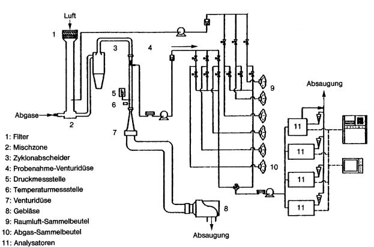

3.4.2.6 Die Entnahmeeinrichtung muss gasdicht sein. Sie muss so beschaffen
    sein und aus solchen Werkstoffen bestehen, dass die Konzentrationen
    der Abgasbestandteile in den verdünnten Abgasen nicht beeinflusst
    werden. Beeinflusst ein Geräteteil (Wärmetauscher, Ventilator usw.)
    die Konzentration eines luftverunreinigenden Gases in den verdünnten
    Gasen, so muss die Probe dieses Gases vor diesem Teil entnommen
    werden, wenn die Beeinflussung nicht ausgeschaltet werden kann.

3.4.2.7 Hat das zu prüfende Fahrzeug eine Auspuffanlage, die mehrere Endrohre
    aufweist, so sind diese Rohre so nahe wie möglich am Fahrzeug
    miteinander zu verbinden.

3.4.2.8 Bei angeschlossener Entnahmeeinrichtung dürfen die Druckschwankungen
    am (an den) Endrohr(en) sich um nicht mehr als ± 1,25 kPa gegenüber
    den Druckschwankungen ändern, die während der Fahrkurven auf dem
    Prüfstand gemessen wurden, wenn das (die) Auspuffendrohr(e) nicht mit
    der Entnahmeeinrichtung verbunden ist (sind). Eine
    Entnahmeeinrichtung, mit dem diese Druckunterschiede auf ± 0,25 kPa
    gesenkt werden können, ist dann zu verwenden, wenn der Hersteller
    unter Nachweis der Notwendigkeit einer solchen Verringerung dies
    schriftlich von der Genehmigungsbehörde verlangt. Der Gegendruck muss
    im Auspuffendrohr möglichst am äußeren Ende oder einem
    Verlängerungsrohr mit gleichem Durchmesser gemessen werden.

3.4.2.9 Die einzelnen Ventile zur Weiterleitung der Gasproben müssen
    Schnellschaltventile sein.

3.4.2.10 Die Gasproben sind in genügend großen Beuteln aufzufangen. Diese
    Beutel müssen aus Werkstoffen bestehen, die den Gehalt an
    luftverunreinigenden Gasen 20 Minuten nach dem Auffangen um nicht mehr
    als ± 2 Prozent verändern.

3.4.3 Einrichtung zur Ermittlung der Verdunstungsemissionen

    Die Einrichtung zur Ermittlung der Verdunstungsemissionen besteht aus
    den nachfolgend beschriebenen Komponenten.

3.4.3.1 Gasdichte Hülle

    Durch eine gasdichte Hülle wird eine rechteckige Messkammer gebildet,
    in welcher das zu prüfende Fahrzeug steht. Der freie Zugang zum
    Fahrzeug muss von allen Seiten gewährleistet sein. Im verschlossenen
    Zustand muss die Kammer gasdicht sein gemäß Prüfung nach Nummer 3.12.
    Die innere Oberfläche der Hülle muss für Kohlenwasserstoffe
    undurchlässig sein. Mindestens eine Fläche muss aus flexiblem
    undurchlässigem Material bestehen, um aus Temperaturschwankungen
    resultierende kleinere Druckschwankungen durch Volumenveränderungen
    ausgleichen zu können. Bei der Gestaltung der Wände ist eine gute
    Wärmeverteilung anzustreben. Wird die Kammer gekühlt, so darf die
    Temperatur der inneren Wandoberfläche 20 °C an keiner Stelle
    unterschreiten.

3.4.3.2 Kohlenwasserstoffanalysator

    Die Kohlenwasserstoffkonzentration in der Kammer wird mit Hilfe eines
    Flammen-Ionisations-Detektors (FID) bestimmt. Der nicht verbrannte
    Teil des Probengasstroms muss in die Kammer zurückgeführt werden. Die
    Anforderungen an die Genauigkeit des Geräts und die Kalibrierung
    werden in Nummer 3.11 beschrieben. Der FID muss mit Einrichtungen zur
    kontinuierlichen Aufzeichnung oder Speicherung der Messdaten
    ausgerüstet sein.

3.4.3.3 Tankbeheizung, Temperaturmessung

    Die Beheizung des Kraftstofftanks erfolgt durch eine in der
    Heizleistung verstellbare Wärmequelle. Geeignet ist beispielsweise
    eine Heizmatte mit einer Leistung von 2 000 W. Die Einstellung der
    Heizleistung kann manuell oder automatisch erfolgen. Die
    Wärmezuführung muss gleichmäßig an die Tankwandungen unterhalb des
    Kraftstoffspiegels erfolgen.

    Die Einrichtung zur Tankbeheizung muss die gleichmäßige Erwärmung des
    Kraftstoffs im Tank von 16 °C um 14 K innerhalb von 60 Minuten
    ermöglichen. Die Kraftstofftemperatur ist etwa in der Mitte des im
    Tank befindlichen Kraftstoffvolumens zu messen.

    Die Raumtemperatur wird an zwei Stellen von Temperaturgebern erfasst,
    die so geschaltet sein müssen, dass ein Mittelwert angezeigt wird. Die
    Messstellen befinden sich etwa 10 cm entfernt von der vertikalen
    Mittellinie jeder Seitenwand in einer Höhe von 90 ± 10 cm.

    Die Temperaturen müssen während der Verdunstungsmessungen in Abständen
    von je einer Minute aufgezeichnet oder gespeichert werden. Die
    Messgenauigkeit einschließlich der Aufzeichnung muss ± 1,5 K betragen.
    Das Aufzeichnungs- oder Speichersystem muss die Zeiten mit einer
    Auflösung von ± 15 s und die Temperaturen mit einer Auflösung von ±
    0,4 K wiedergeben können.

3.4.3.4 Gebläse

    Durch Verwendung eines Gebläses oder mehrerer Gebläse muss erreicht
    werden können, dass

    a)  die CH-Konzentration in der Kammer vor einer Messung auf die
        Umgebungskonzentration gesenkt wird,

    b)  eine gleichmäßige Temperatur- und CH-Verteilung in der Kammer während
        der Messung erreicht wird. Das zu prüfende Fahrzeug darf dabei keiner
        direkten Strömung ausgesetzt werden.

3.4.3.5 CH-Sammelstellen

    Mit den CH-Sammelstellen – soweit diese gemäß Nummer 3.6.2.2 Buchstabe
    m erforderlich sind – müssen die beim Betrieb nach Fahrkurve I
    entstehenden Verdunstungsemissionen aufgefangen werden können.

3.4.4 Analysegeräte

3.4.4.1 Allgemeine Vorschriften

3.4.4.1.1 Die Analyse der luftverunreinigenden Gase und Partikel ist mit
    folgenden Geräten durchzuführen:

    a)  Kohlenmonoxid (CO) und Kohlendioxid (CO
        2                         ):

        Nichtdispersiver Infrarot-Absorptionsanalysator (NDIR);

    b)  Kohlenwasserstoffe (CH) – Fahrzeuge mit Fremdzündungsmotor:

        Flammenionisations-Detektor (FID) propankalibriert, ausgedrückt in
        Kohlenstoffatom-Äquivalent (C
        1                         );

    c)  Kohlenwasserstoffe (CH) – Fahrzeuge mit Dieselmotor:

        Flammenionisations-Detektor mit Ventilen, Rohrleitungen usw. beheizt
        auf 190 °C ± 10 °C (HFID); propankalibriert, ausgedrückt in
        Kohlenstoffatom-Äquivalent (C
        1                         );

    d)  Stickoxide (NO
        x                         ):

        Chemilumineszens-Analysator (CLA) mit NO
        x                         /NO-Konverter;

    e)  Partikel:

        Gravimetrische Bestimmung der abgeschiedenen Partikel. Die Partikel
        werden an jeweils zwei im Probengasstrom hintereinander angeordneten
        Filtern abgeschieden. Die abgeschiedene Partikelmenge soll je
        Filterpaar zwischen 2 und 5 mg liegen. Die Filteroberfläche soll aus
        einem Material bestehen, das hydrophob und gegen die Abgasbestandteile
        inert ist (PTFE oder gleichwertiges Material).

3.4.4.1.2 Messgenauigkeit

    Die Analysatoren müssen einen Messbereich mit der erforderlichen
    Genauigkeit aufweisen, der für Messungen der jeweiligen
    Gaskonzentration in den Abgasproben geeignet ist. Der Messfehler darf
    nicht mehr als ± 3 Prozent betragen, wobei der tatsächliche Wert der
    Kalibriergase unberücksichtigt bleibt.

    Bei Konzentrationen von weniger als 100 ppm darf der Messfehler nicht
    mehr als ± 3 ppm betragen. Die Analyse der Umgebungsluftprobe wird mit
    dem gleichen Analysator und mit dem gleichen Messbereich wie die
    entsprechende Probe der verdünnten Abgase durchgeführt.

    Die Wägung der abgeschiedenen Partikel muss eine Genauigkeit von 1 mg
    gewährleisten.

3.4.4.1.3 Gastrocknungsanlage

    Vor dem Analysator darf keine Gastrocknungsanlage verwendet werden,
    sofern nicht nachgewiesen wird, dass sie sich nicht nachweisbar auf
    den Gehalt der luftverunreinigenden Gase des verdünnten Abgasstroms
    auswirkt.

3.4.4.2 Besondere Vorschriften für Dieselmotoren

    Es ist eine beheizte Entnahmeleitung im Verdünnungstunnel für die
    kontinuierliche Analyse der Kohlenwasserstoffe (CH) mit einem
    beheizten Flammenionisations-Detektor (HFID) und Registriergerät zu
    verwenden. Die durchschnittliche Konzentration der gemessenen
    Kohlenwasserstoffe wird durch Integration bestimmt. Während der
    gesamten Prüfung muss die Temperatur dieser Leitung auf 190 °C
    eingestellt sein. Die Leitung muss mit einem beheizten Filter mit
    einem 99-prozentigen Wirkungsgrad für die Teilchen*
    0,3 μm versehen sein, mit dem die Partikel aus dem für die Analyse
    verwendeten kontinuierlichen Gasstrom herausgefiltert werden. Die
    Ansprechzeit des Entnahmesystems (von der Sonde bis zum Eintritt in
    den Analysator) muss weniger als 4 Sekunden betragen.

    Der beheizte Flammenionisations-Detektor (HFID) muss mit einem System
    für konstanten Durchfluss versehen werden, um die Entnahme einer
    repräsentativen Probe zu gewährleisten, sofern nicht
    Durchflussschwankungen im CFV-System (Critical Flow Venturi – siehe
    Nummer 3.10) kompensiert werden.

    Die Partikel-Probenahmeeinheit besteht aus Verdünnungstunnel,
    Probenahmesonde, Filtereinheit, Teilstrompumpe, Durchflussregelung und
    -messeinrichtung. Der Partikel-Probenahmeteilstrom wird jeweils über
    zwei hintereinander angeordnete Filter gezogen. Nach Abschluss der
    Partikelentnahme ist auf eine parallel angeordnete Filtereinheit
    umzuschalten. Die Entnahmesonde für den Partikel-Probengasstrom muss
    im Verdünnungskanal derart angeordnet sein, dass ein repräsentativer
    Probengasstrom des homogenen Luft/Abgas-Gemisches entnommen werden
    kann und dass an der Entnahmestelle die Temperatur des Luft/Abgas-
    Gemisches 52 °C nicht überschreitet. Die Temperatur des
    Probengasstroms darf über die Länge der Entnahmeleitung
    (Entnahmesonde-Durchflussmessgeräte) um nicht mehr als ± 3 K, der
    Durchfluss um nicht mehr als ± 5 Prozent schwanken. Die Masse der
    während der Testphase abgeschiedenen Partikel wird durch
    Differenzwägung ermittelt.

3.4.4.3 Kalibrierung

    Jeder Analysator muss so oft wie nötig und auf jeden Fall im Monat vor
    der Prüfung und der Überprüfung der Übereinstimmung der Produktion
    kalibriert werden. In Nummer 3.11 wird das Kalibrierverfahren für die
    in Nummer 3.4.4.1 genannten Analysatortypen beschrieben.

3.4.5 Volumenmessung

3.4.5.1 Das Verfahren zur Messung des Gesamtvolumens der verdünnten Abgase,
    das beim CVS-System verwendet wird, muss eine Genauigkeit von ± 2
    Prozent aufweisen.

3.4.5.2 Kalibrierung des CVS-Systems

    Das Volumenmessgerät des CVS-Systems muss in einer Weise und in so
    kurzen Zeitabständen kalibriert werden, dass die erforderliche
    Genauigkeit gewährleistet und erhalten bleibt. Nummer 3.11 zeigt ein
    Beispiel für ein Kalibrierverfahren, mit dem die erforderliche
    Genauigkeit erzielt wird. Bei diesem Verfahren wird für das CVS-System
    ein dynamisches Durchflussmessgerät verwendet, das für die
    auftretenden hohen Durchsätze geeignet ist. Die Genauigkeit des
    Gerätes muss bescheinigt sein und einer nationalen oder
    internationalen Norm entsprechen.

3.4.6 Gase

3.4.6.1 Reine Gase

    Die für die Kalibrierung und für den Einsatz der Geräte verwendeten
    reinen Gase müssen folgende Bedingungen erfüllen:

    a)  gereinigter Stickstoff (Reinheit*                          1 ppm C,*
        1 ppm CO,*                          400 ppm CO
        2                         ,*                          0,1 ppm NO),

    b)  gereinigte synthetische Luft (Reinheit*                          1 ppm
        C,*                          1 ppm CO,*                          400
        ppm CO
        2                         ,*                          0,1 ppm NO)
        Sauerstoffgehalt zwischen 18 und 21 Volumenprozent,

    c)  gereinigter Sauerstoff (Reinheit*                          99,5
        Volumenprozent O
        2                         ),

    d)  gereinigter Wasserstoff (und wasserstoffhaltiges Gemisch) (Reinheit*
        1 ppm C,*                          400 ppm CO
        2                         ).

3.4.6.2 Prüfgase

    Die für die Kalibrierung verwendeten Gasgemische müssen die
    nachstehend genannte chemische Zusammensetzung haben:

    a)  C
        3                         H
        8                          und gereinigte synthetische Luft

    b)  CO und gereinigter Stickstoff

    c)  CO
        2                          und gereinigter Stickstoff

    d)  NO und gereinigter Stickstoff

        (der NO
        2                         -Anteil im Kalibriergas darf 5 Prozent des
        NO-Gehalts nicht überschreiten).

    Die tatsächliche Konzentration eines Prüfgases muss auf*
    2 Prozent mit dem Nennwert übereinstimmen. Dies muss durch regelmäßige
    Vergleiche mit nationalen oder internationalen Standards
    sichergestellt werden.

    Die in Nummer 3.11 vorgeschriebenen Konzentrationen der Prüfgase
    dürfen auch mit einem Gas-Mischdosierer durch Verdünnung mit
    gereinigtem Stickstoff oder mit gereinigter synthetischer Luft erzielt
    werden. Das Mischgerät muss so genau arbeiten, dass die Konzentration
    der verdünnten Prüfgase auf ± 2 Prozent bestimmt werden kann.

3.4.7 Zusätzliche Messgeräte

3.4.7.1 Temperatur

    Die Temperaturen müssen, sofern nichts anderes bestimmt ist, auf*
    1,5 K genau gemessen werden.

3.4.7.2 Druck

    Der Luftdruck muss auf*                    0,1 kPa genau gemessen
    werden.

3.4.7.3 Absolute Feuchte

    Die absolute Feuchte muss auf ± 5 Prozent genau bestimmt werden.

3.4.8 Abgasentnahmesystem

    Das Abgasentnahmesystem muss mit der in Nummer 3.11.4 beschriebenen
    Methode geprüft werden. Die höchstzulässige Abweichung zwischen
    eingeführter und gemessener Gasmenge darf 5 Prozent betragen.

**3.5** **Vorbereitung der Prüfungen**

3.5.1 Anpassung der äquivalenten Schwungmassen an die translatorisch
    bewegten Massen des Fahrzeugs

    Es wird eine Schwungmasse verwendet, mit der eine Gesamtträgheit der
    umlaufenden Massen erzielt wird, die der Bezugsmasse des Fahrzeugs
    gemäß den nachstehenden Werten entspricht. Wenn die zugehörige
    Schwungmasse am Prüfstand nicht verfügbar ist, muss die nächsthöhere
    Masse verwendet werden (die Differenz zur Bezugsmasse darf nicht höher
    als 120 kg sein).

    *        *   Bezugsmasse des Fahrzeugs Pr
            (kg)

        *   Äquivalente Schwungmasse I
            (kg)

    *        *   480 < Pr*                              480

        *   450

    *        *   480 < Pr*                              540

        *   510

    *        *   540 < Pr*                              600

        *   570

    *        *   600 < Pr*                              650

        *   625

    *        *   650 < Pr*                              700

        *   680

    *        *   700 < Pr*                              780

        *   740

    *        *   780 < Pr*                              820

        *   800

    *        *   820 < Pr*                              880

        *   850

    *        *   880 < Pr*                              940

        *   910

    *        *   940 < Pr*                              990

        *   960

    *        *   990 < Pr*                              1 050

        *   1 020

    *        *   1 050 < Pr*                              1 110

        *   1 080

    *        *   1 110 < Pr*                              1 160

        *   1 130

    *        *   1 160 < Pr*                              1 220

        *   1 190

    *        *   1 220 < Pr*                              1 280

        *   1 250

    *        *   1 280 < Pr*                              1 330

        *   1 300

    *        *   1 330 < Pr*                              1 390

        *   1 360

    *        *   1 390 < Pr*                              1 450

        *   1 420

    *        *   1 450 < Pr*                              1 500

        *   1 470

    *        *   1 500 < Pr*                              1 560

        *   1 530

    *        *   1 560 < Pr*                              1 620

        *   1 590

    *        *   1 620 < Pr*                              1 670

        *   1 640

    *        *   1 670 < Pr*                              1 730

        *   1 700

    *        *   1 730 < Pr*                              1 790

        *   1 760

    *        *   1 790 < Pr*                              1 870

        *   1 810

    *        *   1 870 < Pr*                              1 980

        *   1 930

    *        *   1 980 < Pr*                              2 100

        *   2 040

    *        *   2 100 < Pr*                              2 210

        *   2 150

    *        *   2 210 < Pr*                              2 320

        *   2 270

    *        *   2 320 < Pr*                              2 440

        *   2 380

    *        *   2 440 < Pr*                              2 610

        *   2 490

    *        *   2 610 < Pr*                              2 830

        *   2 720

    *        *   2 830 < Pr*                              2 830

        *   2 940

3.5.2 Einstellung der Bremse auf dem Prüfstand

    Die Bremsleistung ist nach dem in Nummer 3.9 beschriebenen Verfahren
    einzustellen. Das angewendete Verfahren und die ermittelten Werte
    (äquivalente Schwungmasse, Einstellkennwert) sind im Prüfbericht
    anzugeben.

3.5.3 Vorbereitung der Messeinrichtungen

    Die verwendeten Analysatoren sind entsprechend den in Nummer 3.11
    erläuterten Vorschriften zu kalibrieren.

3.5.4 Vorbereitung des Fahrzeugs

3.5.4.1 Nach Ankunft des Fahrzeugs im Prüffeld werden die folgenden
    Testvorbereitungen durchgeführt. Die Umgebungstemperatur des Fahrzeugs
    muss zwischen 20 und 30 °C liegen.

    a)  Der/die Kraftstoffbehälter wird/werden entleert und mit dem
        vorgeschriebenen Volumen Prüfkraftstoff befüllt. Das System zur
        Begrenzung der Verdunstungsemissionen muss sich im Normalzustand
        befinden, das heißt weder frisch gereinigt noch voll beladen sein.

    b)  Innerhalb einer Stunde nach der Betankung soll das Fahrzeug zur
        Vorkonditionierung die Fahrkurve I (ohne Parkphase und dritte
        Fahrphase) nach Nummer 3.8 auf einem Fahrleistungsprüfstand
        absolvieren.

    c)  Nach Ermessen des Technischen Dienstes oder auf Verlangen des
        Herstellers mit Zustimmung des Technischen Dienstes kann in
        Ausnahmefällen der Vorgang der Vorkonditionierung erweitert werden,
        wenn es zur Stabilisierung des Emissionsverhaltens erforderlich ist.
        In dem Fall kann die Fahrkurve jeweils nach einer Standzeit von einer
        Stunde bis zu dreimal wiederholt werden.

    d)  Innerhalb von fünf Minuten nach Abschluss der Vorkonditionierung
        werden die Fahrzeuge vom Fahrleistungsprüfstand zu einem Abstellplatz
        gebracht. Die Umgebungstemperatur muss zwischen 20 und 30 °C liegen.

    e)  Fahrzeuge mit Fremdzündungsmotoren (Ottomotoren) müssen dort zwischen
        zehn und 35 Stunden verbleiben, bis die Vorbereitungen zur Prüfung der
        Tankatmungsverluste gemäß Nummer 3.6.2.2 beginnen. Innerhalb einer
        Stunde nach Beendigung dieses Vorgangs müssen die Prüfungen zur
        Ermittlung der durchschnittlichen Abgasemissionen im Fahrbetrieb
        beginnen.

    f)  Fahrzeuge mit Selbstzündungsmotoren (Dieselmotoren) müssen dort
        zwischen zwölf und 36 Stunden verbleiben, bis die Prüfung der
        durchschnittlichen Abgasemissionen im Fahrbetrieb gemäß Nummer 3.6.3
        beginnen.

3.5.4.2 Zur Schonung der Reifen während der Fahrprüfungen kann der Reifendruck
    in den Antriebsrädern auf bis zu 310 kPa erhöht werden. Der
    Reifendruck ist im Prüfprotokoll zu vermerken.

**3.6** **Emissionsprüfungen**

3.6.1 Allgemeine Vorschriften

3.6.1.1 Die Umgebungstemperatur des Fahrzeugs muss während der nachfolgend
    genannten Prüfungen zwischen 20 und 30 °C liegen. Die absolute
    Luftfeuchte (H) im Prüfraum oder der Ansaugluft des Motors muss
    folgender Bedingung genügen:

    5,5 g*                    H*                    12,2 g H
    2                   O/kg trockener Luft.

3.6.1.2 Das Fahrzeug muss während der Prüfung annähernd horizontal stehen, um
    eine abnormale Kraftstoffverteilung zu vermeiden.

3.6.2 Fahrzeuge mit Fremdzündungsmotoren

3.6.2.1 Allgemeines zum Prüfablauf

    Die Fahrzeugvorbereitung wurde mit dem Abstellen des Fahrzeugs bei
    einer Umgebungstemperatur zwischen 20 und 30 °C zur Konditionierung
    für die Emissionsprüfungen abgeschlossen. Mindestens zehn und
    höchstens 35 Stunden nach dem Abstellen des Fahrzeugs beginnt die
    Messung der Tankatmungsverluste im Rahmen der Prüfung der
    Verdunstungsemissionen. Die Tankatmung tritt auf als Folge der
    Temperaturänderung des Kraftstoffs. Bei der Prüfung wird der
    Kraftstoff im Tank gemäß den folgenden Anweisungen um 14 K erwärmt.
    Auch an Fahrzeugen, die nicht einer Prüfung der Verdunstungsemissionen
    unterzogen werden sollen, ist die Kraftstofferwärmung durchzuführen,
    um evtl. Rückwirkungen des Verdunstungsemissions-Minderungssystems auf
    die Abgasemissionen zu berücksichtigen. Bei solchen Fahrzeugen kann
    dann auf die Prüfkammer und die CH-Konzentrationsmessungen verzichtet
    werden. Die Verdunstungsmessungen werden nach dem Durchfahren der
    Fahrkurve I abgeschlossen mit der Prüfung der Verdunstung beim
    Heißabstellen.

    Fahrzeuge, an denen die Verdunstungsemissionen bestimmt werden sollen,
    müssen die Abgasgrenzwerte einhalten.

3.6.2.2 Prüfung der Tankatmungsverluste

    a)  Die Messkammer ist unmittelbar vor der Prüfung mehrere Minuten zu
        spülen.

    b)  Das/die Gebläse zum Durchmischen der Kammer ist/sind einzuschalten.

    c)  Der/die Kraftstoffbehälter des Prüffahrzeugs wird/werden entleert und
        mit dem Prüfkraftstoff nach Abschnitt 5 befüllt. Das Füllvolumen soll
        40 Prozent des Tankvolumens betragen. Die Temperatur des Kraftstoffs
        muss vor dem Einfüllen zwischen 10 und 16 °C liegen. Der/die Tank(s)
        ist/sind zunächst unverschlossen zu lassen.

    d)  Bei Fahrzeugen mit mehreren Tanks müssen alle Tanks wie nachfolgend
        beschrieben in gleicher Weise aufgeheizt werden. Die Temperaturen der
        Tanks müssen auf ± 1,5 K übereinstimmen.

    e)  Das Prüffahrzeug ist mit abgestelltem Motor in die Messkammer zu
        bringen, Fenster und Kofferraumdeckel sind zu öffnen,
        Tanktemperaturfühler sind anzuschließen, und ggf. ist die
        Erwärmungseinrichtung für den Kraftstoff anzuschließen. Die
        Temperaturen des Kraftstoffs und der Raumluft sind von nun an
        aufzuzeichnen bzw. zu registrieren.

    f)  Der Kraftstoff kann künstlich bis auf die Temperatur des Messbeginns
        (16 ± 1 °C) erwärmt werden.

    g)  Sobald der Kraftstoff 14 °C erreicht hat,

        –   ist der Tank zu schließen

        –   ist das Gebläse auszuschalten, falls nicht schon früher geschehen

        –   ist die Messkammer gasdicht zu schließen.

    h)  Sobald der Kraftstoff 16*                          1 °C erreicht hat,

        –   ist die CH-Konzentration in der Messkammer zu messen (Anfangswert für
            die Auswertung)

        –   ist mit einer linearen, 60*                                2 Minuten
            dauernden Erwärmung zu beginnen.

    i)  Die zulässige Abweichung von der Solltemperatur beträgt während des
        Erwärmungsvorgangs ± 1,5 K.

    k)  Wenn 60 ± 2 Minuten nach der Anfangsmessung und dem Erwärmungsbeginn
        die Kraftstofftemperatur um 14 ± 0,5 K zugenommen hat, ist die CH-
        Konzentration in der Kammer zu messen (Endwert für die Auswertung).

    l)  Nach dem Öffnen der Kammer und Lösen aller Anschlüsse für die
        vorgenannte Messprozedur ist das Fahrzeug mit abgestelltem Motor aus
        der Messkammer zu entfernen und für die anschließende Prüfung
        vorzubereiten.

    m)  Eine Bestimmung der Verdunstungsemissionen im Fahrbetrieb ist nur
        erforderlich, wenn nach Prüfung der technischen Gegebenheiten nicht
        ausgeschlossen werden kann, dass derartige Emissionen im Fahrbetrieb
        auftreten. Die Messung im Fahrbetrieb erfolgt mittels CH-Sammelfallen,
        die an allen Öffnungen des Kraftstoffsystems angebracht werden. Die
        Fallen müssen vorher gewogen worden sein. Nach Beendigung der ersten
        beiden Phasen (Abstellen zur Zehn-Minuten-Pause) der Fahrkurve I, in
        der wie nachstehend beschrieben die Abgasemissionen geprüft werden,
        sind die Fallen innerhalb einer Minute abzunehmen, zu verschließen und
        innerhalb einer Stunde zu wägen. Die Verdunstungsemissionen im
        Fahrbetrieb ergeben sich aus der Massendifferenz der Fallen vor und
        nach den ersten beiden Phasen der Fahrkurve I.

3.6.2.3 Prüfung der Abgasemissionen

3.6.2.3.1 Allgemeines

    Die Prüfung gemäß Fahrkurve I und II wird auf dem Rollenprüfstand
    durchgeführt. Der Fahrgeschwindigkeitsverlauf über der Zeit ist
    aufzuzeichnen, um die Gültigkeit der Prüfstandsprüfung beurteilen zu
    können. Die Geschwindigkeit und die zurückgelegte Strecke werden
    anhand der Umdrehungen derselben Prüfstandsrolle oder -welle gemessen.
    Die während der Sammelzeit der einzelnen Probengasmengen
    zurückgelegten Fahrstrecken sind getrennt zu ermitteln.

    Die Motor- und Fahrzeugtemperaturen werden dabei durch Gebläse auf den
    bei Straßenfahrbetrieb üblicherweise auftretenden Temperaturen
    gehalten.

    Fahrzeuge mit Vierradantrieb werden im Zweiradantrieb geprüft. Bei
    Fahrzeugen mit ständigem Vierradantrieb wird ein Satz Antriebsräder
    zeitweise ausgeschaltet.

    Aus dem mit Umgebungsluft verdünnten Abgas wird ein proportionaler
    Teilstrom entnommen und den Sammelbeuteln zugeführt.

    Während des Durchfahrens der Fahrkurve I wird der Probengasstrom
    nacheinander in drei Sammelbeutel geleitet, wobei der erste
    Sammelbeutel die Abgasprobe während der ersten 505 Sekunden des
    Kaltstarttests, der zweite Sammelbeutel die Abgasprobe während des
    restlichen Teils des Kaltstarttests und der dritte Beutel die
    Abgasprobe während der 505 Sekunden nach dem Warmstart aufnimmt.

    Während des Durchfahrens der Fahrkurve II wird der Probengasstrom in
    einen Sammelbeutel geleitet. Der Inhalt der Probenbeutel wird
    anschließend auf die Konzentrationen an Kohlenmonoxid, Kohlendioxid,
    Kohlenwasserstoffe und Stickoxide analysiert. Um den Einfluss der
    Umgebungsluftkonzentrationen berücksichtigen zu können, werden
    parallel jeweils Umgebungsluftproben gezogen. Die Berechnung der
    streckenbezogenen Emissionsmengen erfolgt nach Nummer 3.13.

3.6.2.3.2 Vorbereitungen auf die Prüffahrten

    a)  Das Fahrzeug muss mit den Antriebsrädern ohne Anlassen des Motors auf
        die Rolle des Fahrleistungsprüfstands gebracht werden.

    b)  Die Motorraumabdeckung ist zu öffnen und das Kühlgebläse in Position
        zu bringen.

    c)  Mit den Proben-Umschaltventilen in Wartestellung sind die geleerten
        Sammelbeutel für die verdünnten Abgas- und Umgebungsluftproben
        anzuschließen.

    d)  Die CVS-Anlage (Entnahmesystem mit konstantem Volumen) muss spätestens
        jetzt eingeschaltet werden, ebenso die Probenpumpen. Die Temperatur
        des Abgas-Luft-Gemisches an der Probenentnahmestelle ist von jetzt an
        aufzuzeichnen. Das Kühlgebläse ist einzuschalten. Ein evtl.
        vorhandener Wärmetauscher in der CVS-Anlage muss auf seine
        Betriebstemperatur vorgeheizt worden sein.

    f)  Die Probengas-Durchflussmengen sind auf die gewünschten Werte,
        mindestens jedoch auf 5 l/min einzustellen.

    g)  Das Abgasrohr ist gasdicht an das (die) Abgasendrohr(e) des Fahrzeugs
        anzuschließen.

    h)  Das Gasdurchflussmessgerät und die Umschaltventile sind so
        einzustellen, dass der Abgasprobenstrom in den ersten Beutel für die
        erste Phase sowie der Umgebungsluftprobenstrom in seinen
        entsprechenden Beutel gelangt.

        Durch Betätigung des Zündschlüssels wird sofort anschließend der
        Startvorgang eingeleitet.

3.6.2.3.3 Durchfahren der Fahrkurve I

    Mit dem Prüffahrzeug ist die Fahrkurve I unter Berücksichtigung der
    dort niedergelegten Bestimmungen zu durchfahren. Besondere
    Vorschriften sind nachfolgend aufgeführt.

    a)  Anlassen des Motors

        Der Motor muss gemäß den Empfehlungen des Herstellers in der
        Betriebsanleitung angelassen werden.

        Die erste, 20 Sekunden dauernde Leerlaufphase der Fahrkurve I beginnt,
        sobald der Motor anspringt. 15 Sekunden nachdem der Motor angesprungen
        ist, ist der Gang einzulegen. Falls erforderlich, zum Beispiel bei
        Fahrzeugen mit automatischem Getriebe, kann die Bremse betätigt
        werden, um die Antriebsräder am vorzeitigen Drehen zu hindern. Wenn
        der Motor nach zehn Sekunden Durchdrehzeit nicht angesprungen ist,
        muss der Startvorgang abgebrochen werden. Ist der Fehlstart auf einen
        Bedienungsfehler zurückzuführen, kann die Prüfung mit erneutem
        Kaltstart fortgesetzt werden. Beruht der Fehlstart auf einem
        Fahrzeugfehler, ist die Prüfung abzubrechen und für ungültig zu
        erklären.

    b)  Stehenbleiben des Motors

        Wenn der Motor während eines Leerlaufs stehenbleibt, ist er sofort
        wieder zu starten und die Prüfung ist fortzusetzen. Außerhalb einer
        Leerlaufphase ist der Fahrprogrammzeiger anzuhalten bis die Fahrkurve
        fortgesetzt werden kann. Springt der Motor nicht innerhalb einer
        Minute wieder an, wird die Prüfung abgebrochen.

        Wenn in der Betriebsanleitung ein Anlassverfahren für warmen Motor vom
        Hersteller nicht vorgeschrieben ist, dann ist der Motor (Motoren mit
        Startautomatik und mit manuellem Choke) anzulassen, indem das Gaspedal
        etwa um die Hälfte heruntergedrückt und der Motor durchgedreht wird
        bis er anspringt.

    c)  Ende der ersten Phase der Fahrkurve I

        Mit dem Ende der Verzögerung zum Zeitpunkt 505 Sekunden nach Beginn
        der Fahrkurve I endet die erste Phase der Fahrkurve I. Von diesem
        Zeitpunkt an müssen der Probengasstrom und die Umgebungsluftprobe in
        die jeweils nachfolgenden Sammelbeutel geleitet werden.

        Vor dem Beginn der bei 511 Sekunden anschließenden Beschleunigung ist
        die Zahl der in der ersten Phase gemessenen Rollen- bzw.
        Wellenumdrehungen festzuhalten, der Zähler ist dann auf Null zu
        stellen oder es muss auf einen zweiten Zähler umgeschaltet werden.

    d)  Abstellen nach der zweiten Phase der Fahrkurve I

        Der Motor ist zwei Sekunden nach dem Ende der letzten Verzögerung,
        also bei 1 369 Sekunden abzustellen. Fünf Sekunden, nachdem der Motor
        zu laufen aufgehört hat, sind die Proben-Umschaltventile auf
        Wartestellung zu schalten. Das Kühlgebläse ist sofort abzuschalten,
        die Motorhaube ist zu schließen. Die CVS-Anlage ist abzuschalten oder
        das Abgasrohr ist vom Endrohr (den Endrohren) des Fahrzeugs zu
        trennen. Die Zahl der in der zweiten Phase gemessenen Rollen- bzw.
        Wellenumdrehungen des Fahrleistungsprüfstands ist festzuhalten, der
        Zähler ist dann auf Null zu stellen oder es muss auf einen dritten
        Zähler umgeschaltet werden.

    e)  Vorbereitung und Durchführung der dritten Phase der Fahrkurve I

        Vor der dritten Phase sind die vorbereitenden Arbeiten gemäß Nummer
        3\.6.2.3.2 Buchstabe b bis h zu wiederholen, die Arbeit nach Nummer
        3\.6.2.3.2 Buchstabe h muss innerhalb von neun bis elf Minuten nach dem
        Ende der Probensammlung der zweiten Phase durchgeführt werden.

        Nach dem Ende der Verzögerung zum Zeitpunkt 505 Sekunden nach dem
        Beginn der dritten Phase sind die Probenumschaltventile auf
        Wartestellung zu schalten. Die Zahl der gemessenen Rollen- bzw.
        Wellenumdrehungen ist festzuhalten. Der Motor kann jetzt abgestellt
        werden.

    f)  Sobald wie möglich müssen jeweils die Abgas- und Umgebungsluftproben
        aus den einzelnen Phasen der Analysenanlage zugeführt werden, das
        heißt gegebenenfalls schon vor dem Abschluss der gesamten Fahrkurve.
        Zwischen dem Ende der jeweiligen Sammelphase und der Ablesung der
        zugehörigen stabilen Analysenwerte auf allen Analysatoren darf nicht
        mehr als 20 Minuten vergehen.

    g)  Für Prüffahrzeuge, die der vollständigen Prüfung der Abgasemissionen
        unterzogen werden, schließt sich die Fahrkurve II an. Es ist weiter
        nach Nummer 3.6.2.3.4 zu verfahren.

        Für Prüffahrzeuge, die der Prüfung der Verdunstungsemissionen
        unterzogen werden, schließt sich der Heißabstelltest an. Es ist weiter
        nach Nummer 3.6.2.4 zu verfahren.

3.6.2.3.4 Durchfahren der Fahrkurve II

    Bei der Prüfung der Abgasemissionen in der Fahrkurve II ist der in
    Nummer 3.8 beschriebene Geschwindigkeits-Zeit-Ablauf zweimal zu
    durchfahren, wobei der erste Durchlauf der Konditionierung des
    Fahrzeugs dient, und die Emissionsmengen lediglich im zweiten
    Durchlauf bestimmt werden.

    Der Ablauf der Prüfung ist wie folgt:

    a)  Die vorbereitenden Arbeiten gemäß Nummer 3.6.2.3.2 Buchstabe a bis g
        sind durchzuführen. Die Proben-Umschaltventile verbleiben in
        Wartestellung. (Es sind lediglich je ein Beutel für das Probengas und
        ein Beutel für die Umgebungsluftprobe erforderlich.)

    b)  Das Fahrzeug ist gemäß Empfehlungen des Herstellers zu starten.
        Bezüglich des Nicht-Anspringens bzw. Stehenbleibens des Motors gelten
        die Bestimmungen in Nummer 3.6.2.3.3 Buchstabe a und b.

    c)  Die Fahrkurve II ist entsprechend Nummer 3.8 zum ersten Mal zu
        durchfahren.

    d)  Wenn der Stillstand des Fahrzeugs am Ende des ersten Durchlaufs der
        Fahrkurve II erreicht wird, stehen 17 Sekunden zur Verfügung bis der
        zweite Durchlauf beginnt. Der Zähler zur Ermittlung der Fahrstrecke
        ist auf Null zu stellen.

    e)  Zwei Sekunden, bevor die erste Beschleunigung in dem zweiten Durchlauf
        beginnt, müssen die Proben-Umschaltventile auf den Probengas- und den
        Umgebungsluftprobenbeutel geschaltet werden.

    f)  Die Fahrkurve II ist entsprechend Nummer 3.8 zum zweiten Mal zu
        durchfahren.

    g)  Zwei Sekunden, nachdem das Fahrzeug den Stillstand am Ende der
        Fahrkurve II erreicht hat, sind die Umschaltventile auf Wartestellung
        zu schalten. Die Zahl der gemessenen Rollen- bzw. Wellenumdrehungen
        ist festzuhalten. Der Motor kann abgestellt werden.

    h)  Die Konzentrationen der Abgasbestandteile CO, CO
        2                         , CH, NO
        x                          müssen innerhalb von 20 Minuten ermittelt
        werden.

    i)  Die Berechnung der Menge der emittierten Luftverunreinigungen je
        Fahrkilometer erfolgt nach Nummer 3.13.

3.6.2.4 Prüfung der Verdunstungsemissionen beim Heißabstellen

    Mit der Bestimmung der Verdunstungsemissionen während eines
    60-minütigen Heißabstellens nach der Fahrkurve I wird die Prüfung des
    Verdunstungsemissionsverhaltens beendet.

    a)  Vor dem Ende der Fahrt nach der Fahrkurve I muss die Messkammer
        mehrere Minuten gespült worden sein.

    b)  Nach Beendigung der Fahrkurve I ist die Motorhaube zu schließen, und
        es sind alle Verbindungen vom Fahrzeug zum Prüfstand zu lösen. Das
        Fahrzeug ist dann unter möglichst geringer Betätigung des Fahrpedals
        zur Messkammer zu fahren. Vor der Messkammer ist der Motor
        abzustellen; der Zeitpunkt der Motorabstellung ist zu notieren. Das
        Fahrzeug muss dann antriebslos in die Messkammer gebracht werden.

    c)  Das/die Gebläse zum Durchmischen der Kammer muss/müssen eingeschaltet
        werden, bevor das Fahrzeug in die Messkammer kommt.

    d)  Fenster und Kofferraumdeckel des Fahrzeugs müssen jetzt offen sein.

    e)  Die Temperatur der Raumluft ist von nun an aufzuzeichnen.

    f)  Innerhalb von zwei Minuten nach dem Abstellen des Motors und innerhalb
        von sieben Minuten nach dem Ende der Fahrkurve I muss die Messkammer
        gasdicht verschlossen werden.

    g)  Die CH-Konzentration in der Messkammer wird mit dem FID (Analysator
        mit Flammenionisations-Detektor) gemessen und von nun an fortlaufend
        registriert. Der kurz nach dem Schließen der Messkammer gemessene Wert
        der CH-Konzentration bildet den Anfangswert für die Auswertung nach
        Abschnitt 3.12.

    h)  Das Fahrzeug muss 60 Minuten (± 0,5 Minuten) innerhalb der Messkammer
        stehen. Am Ende der 60 Minuten (± 0,5 Minuten) dauernden Prüfzeit wird
        die CH-Konzentration in der Messkammer bestimmt. Dieser Wert bildet
        den Endwert für die Auswertung nach Nummer 3.12.

    i)  Die Prüfung der Verdunstungsemissionen ist damit abgeschlossen.

3.6.3 Fahrzeuge mit Selbstzündungsmotoren (Dieselmotoren)

3.6.3.1 Allgemeines zum Prüfablauf

    Die Fahrzeugvorbereitung wird mit dem Abstellen des Fahrzeugs bei
    einer Umgebungstemperatur zwischen 20 und 30 °C zur Konditionierung
    für die Emissionsprüfungen abgeschlossen. Mindestens zwölf und
    höchstens 36 Stunden nach dem Abstellen des Fahrzeugs beginnt die
    Prüfung der Abgasemissionen in der Fahrkurve I.

3.6.3.2 Prüfung der Abgasemissionen von Fahrzeugen mit Selbstzündungsmotoren
    (Dieselmotoren)

    Es gelten die Ausführungen, die in Nummer 3.6.2.3 für die Prüfung der
    Abgasemissionen von Fahrzeugen mit Fremdzündungsmotoren (Ottomotoren)
    gemacht worden sind, mit den folgenden Ergänzungen und Abänderungen
    (siehe Figur 5).

3.6.3.2.1 Allgemeines

    Das Abgas wird in einem Verdünnungstunnel mit Umgebungsluft vermischt.

    Zur Partikelmessung wird ein proportionaler Teilstrom über eine Sonde
    entnommen. Die Partikel werden aus dem Abgas-Luft-Probenstrom zur
    nachfolgenden Wägung abgeschieden.

    Die sechs Filter sind in der Partikelprobenleitung derart angeordnet,
    dass sie drei parallele Filterpaare bilden, das heißt in jedem
    Verzweigungsteil sind zwei Filter in Richtung des Probengasstroms
    hintereinander geschaltet. In jeder Verzweigung müssen gleiche
    Strömungsverhältnisse herrschen. Schnellschaltventile sind derart
    anzuordnen, dass die Filterpaare nacheinander mit dem Probengasstrom
    beaufschlagt werden können. Die zeitliche Abfolge der Beaufschlagung
    entspricht der in Nummer 3.6.2.3.1 beschriebenen Probenzuführung für
    die drei Phasen der Fahrkurve I. Die CH-Konzentration wird im
    verdünnten Abgas mit einem beheizten FID (HFID) fortlaufend gemessen,
    registriert und integriert. Das Probengas wird über eine separate
    Sonde entnommen.

    Die Probeentnahme für die Sammelbeutel zum Zwecke der anschließenden
    Konzentrationsmessungen entspricht dem in Nummer 3.6.2.3.1
    beschriebenen Verfahren.

    **Figur 5**

    **Schema eines Probenahme- und Analysesystems**

    **zur Bestimmung gas- und partikelförmiger Emissionen bei Pkw mit
    Dieselmotoren**

    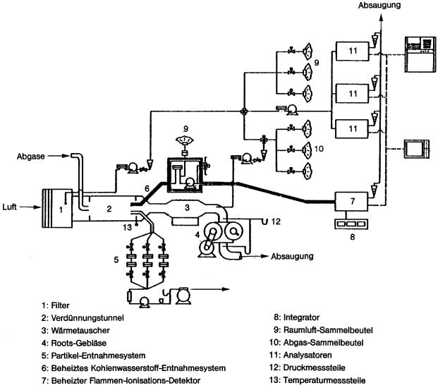

3.6.3.2.2 Vorbereitungen auf die Prüffahrten

    Der Ablauf entspricht dem in Nummer 3.6.2.3.2 für Fahrzeuge mit
    Fremdzündungsmotoren (Ottomotoren) beschriebenen Verfahren mit
    folgenden Ergänzungen:

    zu d) Die Aufzeichnungs- bzw. Registriereinrichtungen des beheizten FID
        (HFID) ist einzuschalten.

    zu f) Der Probengasstrom für den beheizten FID (HFID) muss mindestens 2
        l/min betragen.

    Während der Prüfung ist die Durchflussmenge durch die Partikelfilter
    so einzustellen, dass die Durchflussmenge auf ± 5 Prozent konstant
    bleibt. Die mittlere Temperatur und der Druck am Einlass des
    Durchflussmessgeräts sind aufzuzeichnen. Wenn die Durchflussmenge sich
    wegen einer zu hohen Filterbeladung unzulässig verändert, muss die
    Prüfung abgebrochen werden. Bei der Wiederholung muss eine geringere
    Durchflussrate eingestellt oder ein größerer Filter verwendet werden
    (gegebenenfalls beides).

3.6.3.2.3 Durchfahren der Fahrkurve I

    Die Bestimmungen aus Nummer 3.6.2.3.3 gelten mit folgenden Ergänzungen
    oder Änderungen.

    zu c) Von dem Zeitpunkt 505 Sekunden an wird das zweite Partikelfilterpaar
        beaufschlagt. An der Aufzeichnungseinrichtung für die
        Kohlenwasserstoffkonzentrationsmessung ist eine Markierung
        vorzunehmen, derzufolge die erste und zweite Phase identifiziert
        werden können. Die Integration der CH-Werte erfolgt getrennt nach den
        einzelnen Sammelphasen.

    zu d) Ebenfalls fünf Sekunden, nachdem der Motor zu laufen aufgehört hat,
        ist die Aufzeichnung der
        CH-Konzentration                          entsprechend zu markieren,
        ist die Integration über die zweite Phase zu beenden und ist der
        Probenstrom-Durchfluss durch das zweite Partikelfilterpaar zu beenden.

        Die bisher beaufschlagten beiden Partikelfilterpaare sind vorsichtig
        aus ihren jeweiligen Halterungen zu nehmen und zur nachfolgenden
        Wägung jede für sich in je eine Petrischale zu legen. Die
        Probenschalen sind abzudecken.

    zu e) Die für die Durchführung und Beendigung der CH-Messung sowie der
        Partikelabscheidung in der dritten Phase erforderlichen Schritte sind
        in Anlehnung an die zu den Buchstaben c und d beschriebenen
        Ergänzungen durchzuführen.

    zu f) Sobald wie möglich, keinesfalls jedoch später als eine Stunde nach der
        Beendigung der dritten Phase der Fahrkurve I, sind die sechs
        Partikelfilter für die Wägung zu konditionieren.

3.6.3.2.4 Durchfahren der Fahrkurve II

    Es gelten die Bestimmungen und der Ablauf nach Nummer 3.6.2.3.4. Eine
    Messung der Partikelemissionen ist nicht erforderlich.

3.6.4 Prüfung gemäß § 47a

    Nach Abschluss der Prüfung der Abgasemissionen in den Fahrkurven I und
    II durchlaufen die Prüffahrzeuge die Prüfung gemäß § 47a.

**3.7** **Gas-, Partikelentnahme, Analyse**

3.7.1 Probenahme

3.7.1.1 Prüfung nach Fahrkurve I

    Die Entnahme beginnt, wie nach Nummer 3.6.2.4 festgelegt, gleichzeitig
    mit dem Anlassen des Fahrzeugmotors. In getrennten Beuteln bzw.
    Filterpaaren werden während der

    a)  Kaltstart-Übergangsphase (505 Sekunden nach Kaltstartbeginn)

    b)  Kaltstart-stabilisierten Phase (von der 506. Sekunde bis zum
        Abstellen)

    c)  Warmstart-Übergangsphase (505 Sekunden nach Warmstartbeginn)

    der Fahrkurve I die dazugehörigen Abgas- und Partikelproben entnommen.
    Die Entnahme endet nach der dritten Phase mit laufendem Motor.
    Parallel zu jedem Abgasprobenbeutel werden Beutel mit
    Umgebungsluftproben gefüllt.

3.7.1.2 Prüfung nach Fahrkurve II

    Die Probennahme beginnt und endet mit laufendem Fahrzeugmotor. Während
    der gesamten Fahrtdauer gelangt die Abgas- und die Umgebungsluft in je
    einen Probenbeutel.

3.7.2 Analyse

3.7.2.1 Die Analyse der in den Beuteln enthaltenen Gase ist so bald wie
    möglich nach Beendigung der einzelnen Phasen der Prüfung
    durchzuführen; das unverdünnte Abgas in den Probenbeuteln muss
    innerhalb von 20 Minuten nach Phasenende analysiert werden. Die
    erforderlichen Partikelfilter sind wenigstens acht, höchstens 56
    Stunden in einer offenen, gegen Staubeinfall geschützten Schale vor
    dem Test in einer klimatisierten Kammer zu konditionieren (Temperatur,
    Feuchte). Nach dieser Konditionierung werden die leeren Filter gewogen
    und bis zur Verwendung aufbewahrt.

    Frühestens eine Stunde vor Beginn der Prüfung werden Filter der Kammer
    entnommen.

    Die beladenen Partikelfilter müssen spätestens eine Stunde nach dem
    Ende der Abgasprüfung in die Kammer gebracht, dort zwischen einer und
    56 Stunden konditioniert und anschließend gewogen werden.

3.7.2.2 Vor jeder Probenanalyse wird der Nullpunkt des jeweiligen Analysators
    mit dem jeweiligen Prüfgas eingestellt.

3.7.2.3 Die Kalibrierkurven der Analysatoren werden dann mit Prüfgasen
    eingestellt, deren Nennkonzentrationen zwischen 70 und 100 Prozent des
    Skalenendwerts liegen.

3.7.2.4 Anschließend wird die Nullstellung des Analysators erneut überprüft.
    Weicht der abgelesene Wert um mehr als 2 Prozent des Skalenendwerts
    von dem Wert ab, der bei der in Nummer 3.7.2.2 vorgeschriebenen
    Einstellung erzielt wurde, so ist der Vorgang zu wiederholen.

3.7.2.5 Anschließend sind die Proben zu analysieren.

3.7.2.6 Nach der Analyse werden Nullstellung und Einstellwerte mit den
    gleichen Gasen überprüft. Weichen diese Werte um nicht mehr als 2
    Prozent von denen ab, die nach der in Nummer 3.7.2.3 vorgeschriebenen
    Einstellung erzielt wurden, so können die Ergebnisse der Analyse für
    die Berechnung der Prüfungswerte herangezogen werden.

3.7.2.7 Bei allen in diesem Abschnitt beschriebenen Vorgängen müssen die
    Durchflussmengen und Drücke der verschiedenen Gase die gleichen sein
    wie bei der Kalibrierung der Analysatoren.

3.7.2.8 Die Konzentration der Kohlenwasserstoffe aus Motoren mit Selbstzündung
    wird am beheizten FID über die Dauer der Testphasen registriert und
    integriert. Nach Nummer 3.13 wird die emittierte Menge an
    Kohlenwasserstoffen bestimmt.

3.7.3 Bestimmung der Menge der emittierten luftverunreinigenden Gase und
    Partikel

3.7.3.1 Maßgebliches Volumen

    Das maßgebliche Volumen ist auf die Normalbedingungen 101,33 kPa und
    273,2 K zu korrigieren.

3.7.3.2 Gesamtmasse der emittierten luftverunreinigenden Gase und Partikel

    Die Masse m der vom Fahrzeug während der Prüfung emittierten
    gasförmigen Luftverunreinigungen wird für die einzelnen Testphasen
    durch das Produkt aus Volumenkonzentration und dem entsprechenden
    Gasvolumen basierend auf den nachstehenden Dichtewerten nach den
    vorgenannten Bezugsbedingungen berechnet:

    a)  für Kohlenmonoxid (CO): d = 1,25 kg/m
        3

    b)  für Kohlenwasserstoffe (CH
        1,85                         ): d = 0,619 kg/m
        3

    c)  für Stickoxide (NO
        2                         ): d = 2,05 kg/m
        3

    Die Masse m der vom Fahrzeug während der Prüfung emittierten Partikel
    wird für die einzelnen Testphasen aus der gewogenen Partikelmasse auf
    den Filterpaaren ermittelt. Mindestens 95 Prozent der Partikel müssen
    sich auf dem ersten Filter befinden. Unter diesen Bedingungen ist es
    ausreichend, die Massenbelegung des ersten Filters für die Berechnung
    der emittierten Partikelmasse heranzuziehen.

    Nummer 3.13 enthält die entsprechenden Berechnungsmethoden für die
    Bestimmung der Massen der emittierten luftverunreinigenden Gase und
    Partikel.

**3.8** **Fahrkurven zur Bestimmung der durchschnittlichen Emissionsmengen**

3.8.1 Allgemeines

    Das Prüffahrzeug durchfährt auf dem Fahrleistungsprüfstand die
    nachfolgend grafisch und tabellarisch beschriebenen Fahrkurven I und
    II, um die in den Abgasen enthaltenen gasförmigen und festen
    Luftverunreinigungen bestimmen zu können.

3.8.2 Zulässige Abweichungen

    Die Abweichungen von der vorgeschriebenen Geschwindigkeit zu einem
    beliebigen Zeitpunkt der Fahrkurven sind wie folgt begrenzt:

    Die Abweichung nach oben liegt um 3,2 km/h höher als die höchste
    Geschwindigkeit zum betreffenden Zeitpunkt ± 1 Sekunde.

    Die Abweichung nach unten liegt um 3,2 km/h tiefer als die niedrigste
    Geschwindigkeit zum betreffenden Zeitpunkt ± 1 Sekunde.

    Geschwindigkeitsabweichungen, die diese Toleranzen übersteigen, sind
    nur zulässig, wenn sie jeweils weniger als zwei Sekunden dauern.
    Geschwindigkeiten, die niedriger sind als vorgeschrieben, sind nur
    zulässig, falls das Fahrzeug dabei die höchste verfügbare Leistung
    abgibt.

3.8.3 Verwendung des Getriebes

    Bei Fahrzeugen mit Handschaltgetriebe werden die Schaltpunkte beim
    Durchfahren der Fahrkurve nach den Angaben des Herstellers festgelegt.

    Diese müssen den Empfehlungen des Herstellers an den Kunden sowie dem
    üblichen Fahrverhalten eines Fahrers entsprechen und das Nachfahren
    der Fahrkurven ermöglichen. Die Wahl der Schaltpunkte ist vom
    Technischen Dienst zu genehmigen.

    Werden vom Hersteller keine Schaltpunkte angegeben, werden diese vom
    Technischen Dienst ausgewählt.

    Fahrzeuge mit Automatikgetriebe sind in der höchsten Fahrstufe (drive)
    zu fahren.

3.8.4 Weitere Hinweise zum Durchfahren der Fahrkurven

3.8.4.1 Die Fahrkurven sind unter Einhaltung der vorgeschriebenen Toleranzen
    bei möglichst geringer Bewegung des Fahrpedals zu durchfahren. Unter
    Beachtung der angegebenen Schaltpunkte muss dabei stetig beschleunigt
    oder verzögert werden.

3.8.4.2 Ein Schaltvorgang muss so schnell wie möglich erfolgen; das Fahrpedal
    darf während des Gangwechsels nicht betätigt werden.

3.8.4.3 Falls die durch die Fahrkurve vorgegebenen Beschleunigungswerte nicht
    erreicht werden, muss das Fahrzeug so lange mit Volllast beschleunigt
    werden, bis der vorgeschriebene Geschwindigkeitswert der Fahrkurve
    erreicht wird.

3.8.4.4 Bei den Leerlaufphasen der Fahrkurve muss der Gang eingelegt und der
    Motor ausgekuppelt sein. Dies gilt nicht für die erste Leerlaufphase
    der Fahrkurve. Bei Fahrzeugen mit Automatikgetriebe muss die Fahrstufe
    drive gewählt und die Bremse betätigt sein.

3.8.4.5 Die Verzögerungsphasen der Fahrkurve werden bei eingelegtem Gang,
    eingekuppeltem Motor und entlastetem Fahrpedal durchfahren. Konstante
    Verzögerungen lassen sich gegebenenfalls durch Gebrauch der
    Fahrzeugbremse einhalten. Wird bis auf Stillstand verzögert, so ist
    bei 24 km/h auszukuppeln.

    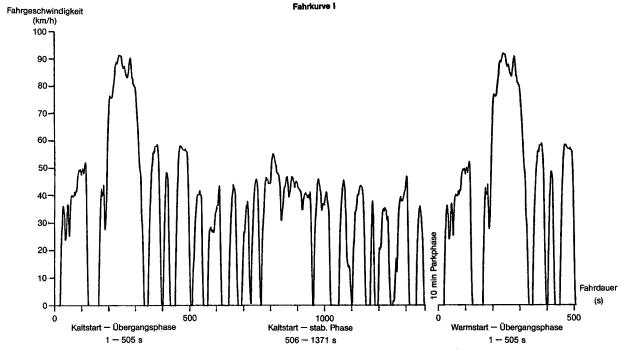

    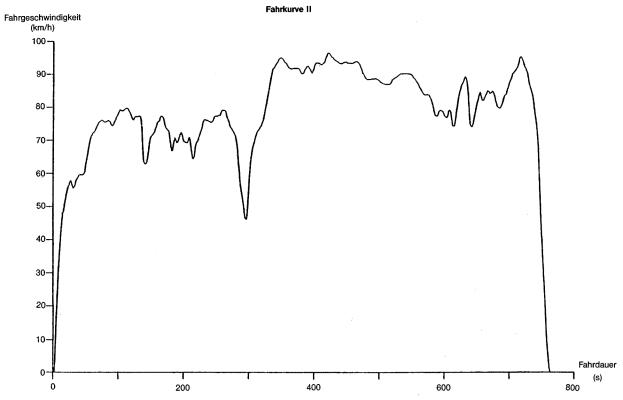

## **Tabelle zur Fahrkurve I**

### Fahrdauer (t) in (s) – Fahrgeschwindigkeit (v) in (km/h)

*    *   t

    *   v

    *   t

    *   v

    *   t

    *   v

    *   t

    *   v

    *   t

    *   v

    *   t

    *   v

    *   t

    *   v

*    *   0

    *   0,0

    *   20

    *   0,0

    *   40

    *   24,0

    *   60

    *   38,9

    *   80

    *   41,4

    *   100

    *   48,8

    *   120

    *   24,8

*    *   1

    *   0,0

    *   21

    *   4,8

    *   41

    *   24,5

    *   61

    *   39,6

    *   81

    *   42,0

    *   101

    *   49,4

    *   121

    *   19,5

*    *   2

    *   0,0

    *   22

    *   9,5

    *   42

    *   24,9

    *   62

    *   40,1

    *   82

    *   43,0

    *   102

    *   49,7

    *   122

    *   14,2

*    *   3

    *   0,0

    *   23

    *   13,8

    *   43

    *   25,7

    *   63

    *   40,2

    *   83

    *   44,3

    *   103

    *   49,9

    *   123

    *   8,9

*    *   4

    *   0,0

    *   24

    *   18,5

    *   44

    *   27,5

    *   64

    *   39,6

    *   84

    *   46,0

    *   104

    *   49,7

    *   124

    *   3,5

*    *   5

    *   0,0

    *   25

    *   23,0

    *   45

    *   30,7

    *   65

    *   39,4

    *   85

    *   47,2

    *   105

    *   46,9

    *   125

    *   0,0

*    *   6

    *   0,0

    *   26

    *   27,2

    *   46

    *   34,0

    *   66

    *   39,8

    *   86

    *   48,0

    *   106

    *   48,0

    *   126

    *   0,0

*    *   7

    *   0,0

    *   27

    *   27,8

    *   47

    *   36,5

    *   67

    *   39,9

    *   87

    *   48,4

    *   107

    *   48,1

    *   127

    *   0,0

*    *   8

    *   0,0

    *   28

    *   29,1

    *   48

    *   36,9

    *   68

    *   39,8

    *   88

    *   48,9

    *   108

    *   48,6

    *   128

    *   0,0

*    *   9

    *   0,0

    *   29

    *   33,3

    *   49

    *   36,5

    *   69

    *   39,6

    *   89

    *   49,4

    *   109

    *   49,4

    *   129

    *   0,0

*    *   10

    *   0,0

    *   30

    *   34,9

    *   50

    *   36,4

    *   70

    *   39,6

    *   90

    *   49,4

    *   110

    *   50,2

    *   130

    *   0,0

*    *   11

    *   0,0

    *   31

    *   36,0

    *   51

    *   34,3

    *   71

    *   40,4

    *   91

    *   49,1

    *   111

    *   51,2

    *   131

    *   0,0

*    *   12

    *   0,0

    *   32

    *   36,2

    *   52

    *   30,6

    *   72

    *   41,2

    *   92

    *   48,9

    *   112

    *   51,8

    *   132

    *   0,0

*    *   13

    *   0,0

    *   33

    *   35,6

    *   53

    *   27,5

    *   73

    *   41,4

    *   93

    *   48,8

    *   113

    *   52,1

    *   133

    *   0,0

*    *   14

    *   0,0

    *   34

    *   34,6

    *   54

    *   25,4

    *   74

    *   40,9

    *   94

    *   48,9

    *   114

    *   51,8

    *   134

    *   0,0

*    *   15

    *   0,0

    *   35

    *   33,6

    *   55

    *   25,4

    *   75

    *   40,1

    *   95

    *   49,6

    *   115

    *   51,0

    *   135

    *   0,0

*    *   16

    *   0,0

    *   36

    *   32,8

    *   56

    *   28,5

    *   76

    *   40,2

    *   96

    *   48,9

    *   116

    *   46,0

    *   136

    *   0,0

*    *   17

    *   0,0

    *   37

    *   31,9

    *   57

    *   31,9

    *   77

    *   40,9

    *   97

    *   48,1

    *   117

    *   40,7

    *   137

    *   0,0

*    *   18

    *   0,0

    *   38

    *   27,4

    *   58

    *   34,8

    *   78

    *   41,8

    *   98

    *   47,5

    *   118

    *   35,4

    *   138

    *   0,0

*    *   19

    *   0,0

    *   39

    *   24,0

    *   59

    *   37,3

    *   79

    *   41,8

    *   99

    *   48,0

    *   119

    *   30,1

    *   139

    *   0,0

*    *   t

    *   v

    *   t

    *   v

    *   t

    *   v

    *   t

    *   v

    *   t

    *   v

    *   t

    *   v

    *   t

    *   v

*    *   140

    *   0,0

    *   160

    *   0,0

    *   180

    *   41,5

    *   200

    *   67,8

    *   220

    *   80,5

    *   240

    *   91,2

    *   260

    *   87,1

*    *   141

    *   0,0

    *   161

    *   0,0

    *   181

    *   43,8

    *   201

    *   70,0

    *   221

    *   81,4

    *   241

    *   91,2

    *   261

    *   86,6

*    *   142

    *   0,0

    *   162

    *   0,0

    *   182

    *   42,6

    *   202

    *   72,6

    *   222

    *   82,1

    *   242

    *   90,9

    *   262

    *   85,9

*    *   143

    *   0,0

    *   163

    *   0,0

    *   183

    *   38,6

    *   203

    *   74,0

    *   223

    *   82,9

    *   243

    *   90,9

    *   263

    *   85,3

*    *   144

    *   0,0

    *   164

    *   5,3

    *   184

    *   36,5

    *   204

    *   75,3

    *   224

    *   84,0

    *   244

    *   90,9

    *   264

    *   84,7

*    *   145

    *   0,0

    *   165

    *   10,6

    *   185

    *   31,2

    *   205

    *   76,4

    *   225

    *   85,6

    *   245

    *   90,9

    *   265

    *   83,8

*    *   146

    *   0,0

    *   166

    *   15,9

    *   186

    *   28,5

    *   206

    *   76,4

    *   226

    *   87,1

    *   246

    *   90,9

    *   266

    *   84,3

*    *   147

    *   0,0

    *   167

    *   21,2

    *   187

    *   27,7

    *   207

    *   76,1

    *   227

    *   87,9

    *   247

    *   90,9

    *   267

    *   83,7

*    *   148

    *   0,0

    *   168

    *   26,6

    *   188

    *   29,1

    *   208

    *   76,0

    *   228

    *   88,4

    *   248

    *   90,6

    *   268

    *   83,5

*    *   149

    *   0,0

    *   169

    *   31,9

    *   189

    *   29,9

    *   209

    *   75,6

    *   229

    *   88,5

    *   249

    *   90,3

    *   269

    *   83,2

*    *   150

    *   0,0

    *   170

    *   35,7

    *   190

    *   32,2

    *   210

    *   75,6

    *   230

    *   88,4

    *   250

    *   89,8

    *   270

    *   82,9

*    *   151

    *   0,0

    *   171

    *   39,1

    *   191

    *   35,7

    *   211

    *   75,6

    *   231

    *   87,9

    *   251

    *   88,7

    *   271

    *   83,0

*    *   152

    *   0,0

    *   172

    *   41,5

    *   192

    *   39,4

    *   212

    *   75,6

    *   232

    *   87,9

    *   252

    *   87,9

    *   272

    *   83,4

*    *   153

    *   0,0

    *   173

    *   42,5

    *   193

    *   43,9

    *   213

    *   75,6

    *   233

    *   88,2

    *   253

    *   87,2

    *   273

    *   83,8

*    *   154

    *   0,0

    *   174

    *   41,4

    *   194

    *   49,1

    *   214

    *   76,0

    *   234

    *   88,7

    *   254

    *   86,9

    *   274

    *   84,5

*    *   155

    *   0,0

    *   175

    *   40,4

    *   195

    *   53,9

    *   215

    *   76,3

    *   235

    *   89,3

    *   255

    *   86,4

    *   275

    *   85,3

*    *   156

    *   0,0

    *   176

    *   39,8

    *   196

    *   58,3

    *   216

    *   77,1

    *   236

    *   89,6

    *   256

    *   86,3

    *   276

    *   86,1

*    *   157

    *   0,0

    *   177

    *   40,2

    *   197

    *   60,0

    *   217

    *   78,1

    *   237

    *   90,3

    *   257

    *   86,7

    *   277

    *   86,9

*    *   158

    *   0,0

    *   178

    *   40,6

    *   198

    *   63,2

    *   218

    *   79,0

    *   238

    *   90,6

    *   258

    *   86,9

    *   278

    *   88,4

*    *   159

    *   0,0

    *   179

    *   40,9

    *   199

    *   65,2

    *   219

    *   79,7

    *   239

    *   91,1

    *   259

    *   87,1

    *   279

    *   89,2

*    *   t

    *   v

    *   t

    *   v

    *   t

    *   v

    *   t

    *   v

    *   t

    *   v

    *   t

    *   v

    *   t

    *   v

*    *   280

    *   89,5

    *   300

    *   79,0

    *   320

    *   44,3

    *   340

    *   0,0

    *   360

    *   49,6

    *   380

    *   58,7

    *   400

    *   0,0

*    *   281

    *   90,1

    *   301

    *   78,2

    *   321

    *   39,9

    *   341

    *   0,0

    *   361

    *   50,9

    *   381

    *   58,6

    *   401

    *   0,0

*    *   282

    *   90,1

    *   302

    *   77,4

    *   322

    *   34,6

    *   342

    *   0,0

    *   362

    *   51,7

    *   382

    *   57,9

    *   402

    *   0,0

*    *   283

    *   89,8

    *   303

    *   76,0

    *   323

    *   32,3

    *   343

    *   0,0

    *   363

    *   52,3

    *   383

    *   56,5

    *   403

    *   4,2

*    *   284

    *   88,8

    *   304

    *   74,2

    *   324

    *   30,7

    *   344

    *   0,0

    *   364

    *   54,1

    *   384

    *   54,9

    *   404

    *   9,5

*    *   285

    *   87,7

    *   305

    *   72,4

    *   325

    *   29,8

    *   345

    *   0,0

    *   365

    *   55,5

    *   385

    *   53,9

    *   405

    *   14,5

*    *   286

    *   86,3

    *   306

    *   70,5

    *   326

    *   27,4

    *   346

    *   0,0

    *   366

    *   55,7

    *   386

    *   50,5

    *   406

    *   20,1

*    *   287

    *   84,5

    *   307

    *   68,6

    *   327

    *   24,9

    *   347

    *   1,6

    *   367

    *   56,2

    *   387

    *   46,7

    *   407

    *   25,4

*    *   288

    *   82,9

    *   308

    *   66,8

    *   328

    *   20,1

    *   348

    *   6,9

    *   368

    *   56,0

    *   388

    *   41,4

    *   408

    *   30,7

*    *   289

    *   82,9

    *   309

    *   64,9

    *   329

    *   17,4

    *   349

    *   12,2

    *   369

    *   55,5

    *   389

    *   37,0

    *   409

    *   36,0

*    *   290

    *   82,9

    *   310

    *   62,0

    *   330

    *   12,9

    *   350

    *   17,5

    *   370

    *   55,8

    *   390

    *   32,7

    *   410

    *   40,2

*    *   291

    *   82,2

    *   311

    *   59,5

    *   331

    *   7,6

    *   351

    *   22,9

    *   371

    *   57,1

    *   391

    *   28,2

    *   411

    *   41,2

*    *   292

    *   80,6

    *   312

    *   56,6

    *   332

    *   2,3

    *   352

    *   27,8

    *   372

    *   57,9

    *   392

    *   23,3

    *   412

    *   44,3

*    *   293

    *   80,5

    *   313

    *   54,4

    *   333

    *   0,0

    *   353

    *   32,2

    *   373

    *   57,9

    *   393

    *   19,3

    *   413

    *   46,7

*    *   294

    *   80,6

    *   314

    *   52,3

    *   334

    *   0,0

    *   354

    *   36,2

    *   374

    *   57,9

    *   394

    *   14,0

    *   414

    *   48,3

*    *   295

    *   80,5

    *   315

    *   50,7

    *   335

    *   0,0

    *   355

    *   38,1

    *   375

    *   57,9

    *   395

    *   8,7

    *   415

    *   48,4

*    *   296

    *   79,8

    *   316

    *   49,2

    *   336

    *   0,0

    *   356

    *   40,6

    *   376

    *   57,9

    *   396

    *   3,4

    *   416

    *   48,3

*    *   297

    *   79,7

    *   317

    *   49,1

    *   337

    *   0,0

    *   357

    *   42,8

    *   377

    *   57,9

    *   397

    *   0,0

    *   417

    *   47,8

*    *   298

    *   79,7

    *   318

    *   48,3

    *   338

    *   0,0

    *   358

    *   45,2

    *   378

    *   58,1

    *   398

    *   0,0

    *   418

    *   47,2

*    *   299

    *   79,7

    *   319

    *   46,7

    *   339

    *   0,0

    *   359

    *   48,3

    *   379

    *   58,6

    *   399

    *   0,0

    *   419

    *   46,3

*    *   t

    *   v

    *   t

    *   v

    *   t

    *   v

    *   t

    *   v

    *   t

    *   v

    *   t

    *   v

    *   t

    *   v

*    *   420

    *   45,1

    *   440

    *   0,0

    *   460

    *   54,1

    *   480

    *   56,6

    *   500

    *   21,2

    *   520

    *   25,7

    *   540

    *   40,6

*    *   421

    *   40,2

    *   441

    *   0,0

    *   461

    *   56,0

    *   481

    *   56,3

    *   501

    *   16,6

    *   521

    *   28,5

    *   541

    *   40,2

*    *   422

    *   34,9

    *   442

    *   0,0

    *   462

    *   56,5

    *   482

    *   56,5

    *   502

    *   11,6

    *   522

    *   30,6

    *   542

    *   40,2

*    *   423

    *   29,6

    *   443

    *   0,0

    *   463

    *   57,3

    *   483

    *   56,6

    *   503

    *   6,4

    *   523

    *   32,3

    *   543

    *   40,2

*    *   424

    *   24,3

    *   444

    *   0,0

    *   464

    *   58,1

    *   484

    *   57,1

    *   504

    *   1,6

    *   524

    *   33,8

    *   544

    *   39,3

*    *   425

    *   19,0

    *   445

    *   0,0

    *   465

    *   57,9

    *   485

    *   56,6

    *   505

    *   0,0

    *   525

    *   35,4

    *   545

    *   37,2

*    *   426

    *   13,7

    *   446

    *   0,0

    *   466

    *   58,1

    *   486

    *   56,3

    *   506

    *   0,0

    *   526

    *   37,0

    *   546

    *   31,9

*    *   427

    *   8,4

    *   447

    *   0,0

    *   467

    *   58,3

    *   487

    *   56,3

    *   507

    *   0,0

    *   527

    *   38,3

    *   547

    *   26,6

*    *   428

    *   3,1

    *   448

    *   5,3

    *   468

    *   57,9

    *   488

    *   56,3

    *   508

    *   0,0

    *   528

    *   39,4

    *   548

    *   21,2

*    *   429

    *   0,0

    *   449

    *   10,6

    *   469

    *   57,5

    *   489

    *   56,0

    *   509

    *   0,0

    *   529

    *   40,1

    *   549

    *   15,9

*    *   430

    *   0,0

    *   450

    *   15,9

    *   470

    *   57,9

    *   490

    *   55,7

    *   510

    *   0,0

    *   530

    *   40,2

    *   550

    *   10,6

*    *   431

    *   0,0

    *   451

    *   21,2

    *   471

    *   57,9

    *   491

    *   55,8

    *   511

    *   1,9

    *   531

    *   40,2

    *   551

    *   5,3

*    *   432

    *   0,0

    *   452

    *   26,6

    *   472

    *   57,3

    *   492

    *   53,9

    *   512

    *   5,6

    *   532

    *   40,2

    *   552

    *   0,0

*    *   433

    *   0,0

    *   453

    *   31,0

    *   473

    *   57,1

    *   493

    *   51,5

    *   513

    *   8,9

    *   533

    *   40,2

    *   553

    *   0,0

*    *   434

    *   0,0

    *   454

    *   37,2

    *   474

    *   57,0

    *   494

    *   48,4

    *   514

    *   10,5

    *   534

    *   40,2

    *   554

    *   0,0

*    *   435

    *   0,0

    *   455

    *   42,5

    *   475

    *   56,6

    *   495

    *   45,1

    *   515

    *   13,7

    *   535

    *   40,2

    *   555

    *   0,0

*    *   436

    *   0,0

    *   456

    *   44,7

    *   476

    *   56,6

    *   496

    *   41,0

    *   516

    *   15,4

    *   536

    *   41,2

    *   556

    *   0,0

*    *   437

    *   0,0

    *   457

    *   46,8

    *   477

    *   56,6

    *   497

    *   36,2

    *   517

    *   16,9

    *   537

    *   41,5

    *   557

    *   0,0

*    *   438

    *   0,0

    *   458

    *   50,7

    *   478

    *   56,6

    *   498

    *   31,9

    *   518

    *   19,2

    *   538

    *   41,8

    *   558

    *   0,0

*    *   439

    *   0,0

    *   459

    *   53,1

    *   479

    *   56,6

    *   499

    *   26,6

    *   519

    *   22,5

    *   539

    *   41,2

    *   559

    *   0,0

*    *   t

    *   v

    *   t

    *   v

    *   t

    *   v

    *   t

    *   v

    *   t

    *   v

    *   t

    *   v

    *   t

    *   v

*    *   560

    *   0,0

    *   580

    *   28,5

    *   600

    *   34,8

    *   620

    *   0,0

    *   640

    *   0,0

    *   660

    *   41,2

    *   680

    *   0,0

*    *   561

    *   0,0

    *   581

    *   28,2

    *   601

    *   35,4

    *   621

    *   0,0

    *   641

    *   0,0

    *   661

    *   41,8

    *   681

    *   0,0

*    *   562

    *   0,0

    *   582

    *   27,4

    *   602

    *   36,0

    *   622

    *   0,0

    *   642

    *   0,0

    *   662

    *   43,9

    *   682

    *   0,0

*    *   563

    *   0,0

    *   583

    *   27,2

    *   603

    *   36,2

    *   623

    *   0,0

    *   643

    *   0,0

    *   663

    *   43,1

    *   683

    *   0,0

*    *   564

    *   0,0

    *   584

    *   26,7

    *   604

    *   36,2

    *   624

    *   0,0

    *   644

    *   0,0

    *   664

    *   42,3

    *   684

    *   0,0

*    *   565

    *   0,0

    *   585

    *   27,4

    *   605

    *   36,2

    *   625

    *   0,0

    *   645

    *   0,0

    *   665

    *   42,5

    *   685

    *   0,0

*    *   566

    *   0,0

    *   586

    *   27,5

    *   606

    *   36,5

    *   626

    *   0,0

    *   646

    *   3,2

    *   666

    *   42,6

    *   686

    *   0,0

*    *   567

    *   0,0

    *   587

    *   27,4

    *   607

    *   38,1

    *   627

    *   0,0

    *   647

    *   7,2

    *   667

    *   42,6

    *   687

    *   0,0

*    *   568

    *   0,0

    *   588

    *   26,7

    *   608

    *   40,4

    *   628

    *   0,0

    *   648

    *   12,6

    *   668

    *   41,8

    *   688

    *   0,0

*    *   569

    *   5,3

    *   589

    *   26,6

    *   609

    *   41,8

    *   629

    *   0,0

    *   649

    *   16,4

    *   669

    *   41,0

    *   689

    *   0,0

*    *   570

    *   10,6

    *   590

    *   26,6

    *   610

    *   42,6

    *   630

    *   0,0

    *   650

    *   20,1

    *   670

    *   38,0

    *   690

    *   0,0

*    *   571

    *   15,9

    *   591

    *   26,7

    *   611

    *   43,5

    *   631

    *   0,0

    *   651

    *   22,5

    *   671

    *   34,4

    *   691

    *   0,0

*    *   572

    *   20,9

    *   592

    *   27,4

    *   612

    *   42,0

    *   632

    *   0,0

    *   652

    *   24,6

    *   672

    *   29,8

    *   692

    *   0,0

*    *   573

    *   23,5

    *   593

    *   28,3

    *   613

    *   36,7

    *   633

    *   0,0

    *   653

    *   28,2

    *   673

    *   26,4

    *   693

    *   0,0

*    *   574

    *   25,7

    *   594

    *   29,8

    *   614

    *   31,4

    *   634

    *   0,0

    *   654

    *   31,5

    *   674

    *   23,3

    *   694

    *   2,3

*    *   575

    *   27,4

    *   595

    *   30,9

    *   615

    *   26,1

    *   635

    *   0,0

    *   655

    *   33,8

    *   675

    *   18,7

    *   695

    *   5,3

*    *   576

    *   27,4

    *   596

    *   32,5

    *   616

    *   20,8

    *   636

    *   0,0

    *   656

    *   35,7

    *   676

    *   14,0

    *   696

    *   7,1

*    *   577

    *   21,4

    *   597

    *   33,8

    *   617

    *   15,4

    *   637

    *   0,0

    *   657

    *   37,5

    *   677

    *   9,3

    *   697

    *   10,5

*    *   578

    *   28,2

    *   598

    *   34,0

    *   618

    *   10,1

    *   638

    *   0,0

    *   658

    *   39,4

    *   678

    *   5,6

    *   698

    *   14,8

*    *   579

    *   28,5

    *   599

    *   34,1

    *   619

    *   4,8

    *   639

    *   0,0

    *   659

    *   40,7

    *   679

    *   3,2

    *   699

    *   18,2

*    *   t

    *   v

    *   t

    *   v

    *   t

    *   v

    *   t

    *   v

    *   t

    *   v

    *   t

    *   v

    *   t

    *   v

*    *   700

    *   21,7

    *   720

    *   24,1

    *   740

    *   41,0

    *   760

    *   15,1

    *   780

    *   44,3

    *   800

    *   45,1

    *   820

    *   50,9

*    *   701

    *   23,5

    *   721

    *   19,3

    *   741

    *   42,6

    *   761

    *   10,0

    *   781

    *   45,1

    *   801

    *   45,9

    *   821

    *   50,7

*    *   702

    *   26,4

    *   722

    *   14,5

    *   742

    *   43,6

    *   762

    *   4,8

    *   782

    *   45,5

    *   802

    *   48,3

    *   822

    *   49,2

*    *   703

    *   26,9

    *   723

    *   10,0

    *   743

    *   44,4

    *   763

    *   2,4

    *   783

    *   46,5

    *   803

    *   49,9

    *   823

    *   48,3

*    *   704

    *   26,6

    *   724

    *   7,2

    *   744

    *   44,9

    *   764

    *   2,4

    *   784

    *   46,5

    *   804

    *   51,5

    *   824

    *   48,1

*    *   705

    *   26,6

    *   725

    *   4,8

    *   745

    *   45,5

    *   765

    *   0,8

    *   785

    *   46,5

    *   805

    *   53,1

    *   825

    *   48,1

*    *   706

    *   29,3

    *   726

    *   3,4

    *   746

    *   46,0

    *   766

    *   0,0

    *   786

    *   46,3

    *   806

    *   53,1

    *   826

    *   48,1

*    *   707

    *   30,9

    *   727

    *   0,8

    *   747

    *   46,0

    *   767

    *   4,8

    *   787

    *   45,9

    *   807

    *   54,1

    *   827

    *   48,1

*    *   708

    *   32,3

    *   728

    *   0,8

    *   748

    *   45,5

    *   768

    *   10,1

    *   788

    *   45,5

    *   808

    *   54,7

    *   828

    *   47,6

*    *   709

    *   34,6

    *   729

    *   5,1

    *   749

    *   45,4

    *   769

    *   15,4

    *   789

    *   45,5

    *   809

    *   55,2

    *   829

    *   47,5

*    *   710

    *   36,2

    *   730

    *   10,5

    *   750

    *   45,1

    *   770

    *   20,8

    *   790

    *   45,5

    *   810

    *   55,0

    *   830

    *   47,5

*    *   711

    *   36,2

    *   731

    *   15,4

    *   751

    *   44,3

    *   771

    *   25,4

    *   791

    *   45,4

    *   811

    *   54,7

    *   831

    *   47,2

*    *   712

    *   35,6

    *   732

    *   20,1

    *   752

    *   43,1

    *   772

    *   28,2

    *   792

    *   44,4

    *   812

    *   54,7

    *   832

    *   46,5

*    *   713

    *   36,5

    *   733

    *   22,5

    *   753

    *   41,0

    *   773

    *   29,6

    *   793

    *   44,3

    *   813

    *   54,6

    *   833

    *   45,4

*    *   714

    *   37,5

    *   734

    *   25,7

    *   754

    *   37,8

    *   774

    *   31,4

    *   794

    *   44,3

    *   814

    *   54,1

    *   834

    *   44,6

*    *   715

    *   37,8

    *   735

    *   29,0

    *   755

    *   34,6

    *   775

    *   33,3

    *   795

    *   44,3

    *   815

    *   53,3

    *   835

    *   43,5

*    *   716

    *   36,2

    *   736

    *   31,5

    *   756

    *   30,6

    *   776

    *   35,4

    *   796

    *   44,3

    *   816

    *   53,1

    *   836

    *   41,0

*    *   717

    *   34,8

    *   737

    *   34,6

    *   757

    *   26,6

    *   777

    *   37,3

    *   797

    *   44,3

    *   817

    *   52,3

    *   837

    *   38,1

*    *   718

    *   33,0

    *   738

    *   37,2

    *   758

    *   24,0

    *   778

    *   40,2

    *   798

    *   44,3

    *   818

    *   51,5

    *   838

    *   35,4

*    *   719

    *   29,0

    *   739

    *   39,4

    *   759

    *   20,1

    *   779

    *   42,6

    *   799

    *   44,4

    *   819

    *   51,3

    *   839

    *   33,0

*    *   t

    *   v

    *   t

    *   v

    *   t

    *   v

    *   t

    *   v

    *   t

    *   v

    *   t

    *   v

    *   t

    *   v

*    *   840

    *   30,9

    *   860

    *   46,7

    *   880

    *   46,8

    *   900

    *   43,3

    *   920

    *   36,4

    *   940

    *   40,2

    *   960

    *   3,2

*    *   841

    *   30,9

    *   861

    *   46,8

    *   881

    *   46,7

    *   901

    *   42,8

    *   921

    *   37,7

    *   941

    *   39,6

    *   961

    *   8,5

*    *   842

    *   32,3

    *   862

    *   46,7

    *   882

    *   46,5

    *   902

    *   42,6

    *   922

    *   38,6

    *   942

    *   39,6

    *   962

    *   13,8

*    *   843

    *   33,6

    *   863

    *   45,2

    *   883

    *   45,9

    *   903

    *   42,6

    *   923

    *   38,9

    *   943

    *   38,8

    *   963

    *   19,2

*    *   844

    *   34,4

    *   864

    *   44,3

    *   884

    *   45,2

    *   904

    *   42,6

    *   924

    *   39,3

    *   944

    *   39,4

    *   964

    *   24,5

*    *   845

    *   35,4

    *   865

    *   43,5

    *   885

    *   45,1

    *   905

    *   42,3

    *   925

    *   40,1

    *   945

    *   40,4

    *   965

    *   28,2

*    *   846

    *   36,4

    *   866

    *   41,5

    *   886

    *   45,1

    *   906

    *   42,2

    *   926

    *   40,4

    *   946

    *   41,2

    *   966

    *   29,9

*    *   847

    *   37,3

    *   867

    *   40,2

    *   887

    *   44,4

    *   907

    *   42,2

    *   927

    *   40,6

    *   947

    *   40,4

    *   967

    *   32,2

*    *   848

    *   38,6

    *   868

    *   39,4

    *   888

    *   43,8

    *   908

    *   41,7

    *   928

    *   40,7

    *   948

    *   38,6

    *   968

    *   34,0

*    *   849

    *   40,2

    *   869

    *   39,9

    *   889

    *   42,8

    *   909

    *   41,2

    *   929

    *   41,0

    *   949

    *   35,4

    *   969

    *   35,4

*    *   850

    *   41,8

    *   870

    *   40,4

    *   890

    *   43,5

    *   910

    *   41,2

    *   930

    *   40,6

    *   950

    *   32,3

    *   970

    *   37,0

*    *   851

    *   42,8

    *   871

    *   41,0

    *   891

    *   44,3

    *   911

    *   41,7

    *   931

    *   40,2

    *   951

    *   27,2

    *   971

    *   39,4

*    *   852

    *   42,8

    *   872

    *   41,4

    *   892

    *   44,7

    *   912

    *   41,5

    *   932

    *   40,3

    *   952

    *   21,9

    *   972

    *   42,3

*    *   853

    *   43,1

    *   873

    *   42,2

    *   893

    *   45,1

    *   913

    *   41,0

    *   933

    *   40,2

    *   953

    *   16,6

    *   973

    *   44,3

*    *   854

    *   43,5

    *   874

    *   43,3

    *   894

    *   44,7

    *   914

    *   39,6

    *   934

    *   39,8

    *   954

    *   11,3

    *   974

    *   45,2

*    *   855

    *   43,8

    *   875

    *   44,3

    *   895

    *   45,1

    *   915

    *   37,8

    *   935

    *   39,4

    *   955

    *   6,0

    *   975

    *   45,7

*    *   856

    *   44,7

    *   876

    *   44,7

    *   896

    *   45,1

    *   916

    *   35,7

    *   936

    *   39,1

    *   956

    *   0,6

    *   976

    *   45,9

*    *   857

    *   45,2

    *   877

    *   45,7

    *   897

    *   45,1

    *   917

    *   34,8

    *   937

    *   39,1

    *   957

    *   0,0

    *   977

    *   45,9

*    *   858

    *   46,3

    *   878

    *   46,7

    *   898

    *   44,6

    *   918

    *   34,8

    *   938

    *   39,4

    *   958

    *   0,0

    *   978

    *   45,9

*    *   859

    *   46,5

    *   879

    *   47,0

    *   899

    *   44,1

    *   919

    *   34,9

    *   939

    *   40,2

    *   959

    *   0,0

    *   979

    *   44,6

*    *   t

    *   v

    *   t

    *   v

    *   t

    *   v

    *   t

    *   v

    *   t

    *   v

    *   t

    *   v

    *   t

    *   v

*    *   980

    *   44,3

    *   1000

    *   37,8

    *   1020

    *   12,2

    *   1040

    *   0,0

    *   1060

    *   32,2

    *   1080

    *   29,0

    *   1100

    *   0,0

*    *   981

    *   43,8

    *   1001

    *   38,6

    *   1021

    *   6,9

    *   1041

    *   0,0

    *   1061

    *   35,1

    *   1081

    *   24,1

    *   1101

    *   0,2

*    *   982

    *   43,1

    *   1002

    *   39,6

    *   1022

    *   1,6

    *   1042

    *   0,0

    *   1062

    *   37,0

    *   1082

    *   19,8

    *   1102

    *   1,0

*    *   983

    *   42,6

    *   1003

    *   39,9

    *   1023

    *   0,0

    *   1043

    *   0,0

    *   1063

    *   38,6

    *   1083

    *   17,9

    *   1103

    *   2,6

*    *   984

    *   41,8

    *   1004

    *   40,4

    *   1024

    *   0,0

    *   1044

    *   0,0

    *   1064

    *   39,9

    *   1084

    *   17,1

    *   1104

    *   5,8

*    *   985

    *   41,4

    *   1005

    *   41,0

    *   1025

    *   0,0

    *   1045

    *   0,0

    *   1065

    *   41,2

    *   1085

    *   16,1

    *   1105

    *   11,1

*    *   986

    *   40,6

    *   1006

    *   41,2

    *   1026

    *   0,0

    *   1046

    *   0,0

    *   1066

    *   42,6

    *   1086

    *   15,3

    *   1106

    *   16,1

*    *   987

    *   38,6

    *   1007

    *   41,0

    *   1027

    *   0,0

    *   1047

    *   0,0

    *   1067

    *   43,1

    *   1087

    *   14,6

    *   1107

    *   20,6

*    *   988

    *   35,4

    *   1008

    *   40,2

    *   1028

    *   0,0

    *   1048

    *   0,0

    *   1068

    *   44,1

    *   1088

    *   14,0

    *   1108

    *   22,5

*    *   989

    *   34,6

    *   1009

    *   38,8

    *   1029

    *   0,0

    *   1049

    *   0,0

    *   1069

    *   44,9

    *   1089

    *   13,8

    *   1109

    *   23,3

*    *   990

    *   34,6

    *   1010

    *   38,1

    *   1030

    *   0,0

    *   1050

    *   0,0

    *   1070

    *   45,5

    *   1090

    *   14,2

    *   1110

    *   25,7

*    *   991

    *   35,1

    *   1011

    *   37,3

    *   1031

    *   0,0

    *   1051

    *   0,0

    *   1071

    *   45,1

    *   1091

    *   14,5

    *   1111

    *   29,1

*    *   992

    *   36,2

    *   1012

    *   36,9

    *   1032

    *   0,0

    *   1052

    *   0,0

    *   1072

    *   44,3

    *   1092

    *   14,0

    *   1112

    *   32,2

*    *   993

    *   37,0

    *   1013

    *   36,2

    *   1033

    *   0,0

    *   1053

    *   1,9

    *   1073

    *   43,5

    *   1093

    *   13,8

    *   1113

    *   33,6

*    *   994

    *   36,7

    *   1014

    *   35,4

    *   1034

    *   0,0

    *   1054

    *   6,4

    *   1074

    *   43,5

    *   1094

    *   12,9

    *   1114

    *   34,1

*    *   995

    *   36,7

    *   1015

    *   34,8

    *   1035

    *   0,0

    *   1055

    *   11,7

    *   1075

    *   42,3

    *   1095

    *   11,3

    *   1115

    *   34,3

*    *   996

    *   37,0

    *   1016

    *   33,0

    *   1036

    *   0,0

    *   1056

    *   17,1

    *   1076

    *   39,4

    *   1096

    *   8,0

    *   1116

    *   34,4

*    *   997

    *   36,5

    *   1017

    *   28,2

    *   1037

    *   0,0

    *   1057

    *   22,4

    *   1077

    *   36,2

    *   1097

    *   6,8

    *   1117

    *   34,9

*    *   998

    *   36,5

    *   1018

    *   22,9

    *   1038

    *   0,0

    *   1058

    *   27,4

    *   1078

    *   34,6

    *   1098

    *   4,2

    *   1118

    *   36,2

*    *   999

    *   36,5

    *   1019

    *   17,5

    *   1039

    *   0,0

    *   1059

    *   29,8

    *   1079

    *   33,2

    *   1099

    *   1,6

    *   1119

    *   37,0

*    *   t

    *   v

    *   t

    *   v

    *   t

    *   v

    *   t

    *   v

    *   t

    *   v

    *   t

    *   v

    *   t

    *   v

*    *   1120

    *   38,3

    *   1140

    *   41,8

    *   1160

    *   0,0

    *   1180

    *   32,2

    *   1200

    *   10,5

    *   1220

    *   34,6

    *   1240

    *   9,7

*    *   1121

    *   39,4

    *   1141

    *   41,0

    *   1161

    *   0,0

    *   1181

    *   26,9

    *   1201

    *   15,8

    *   1221

    *   35,1

    *   1241

    *   6,4

*    *   1122

    *   40,2

    *   1142

    *   39,6

    *   1162

    *   0,0

    *   1182

    *   21,6

    *   1202

    *   19,3

    *   1222

    *   35,4

    *   1242

    *   4,0

*    *   1123

    *   40,1

    *   1143

    *   37,8

    *   1163

    *   0,0

    *   1183

    *   16,3

    *   1203

    *   20,8

    *   1223

    *   35,2

    *   1243

    *   1,1

*    *   1124

    *   39,9

    *   1144

    *   34,6

    *   1164

    *   0,0

    *   1184

    *   10,9

    *   1204

    *   20,9

    *   1224

    *   34,9

    *   1244

    *   0,0

*    *   1125

    *   40,2

    *   1145

    *   32,2

    *   1165

    *   0,0

    *   1185

    *   5,6

    *   1205

    *   20,3

    *   1225

    *   34,6

    *   1245

    *   0,0

*    *   1126

    *   40,9

    *   1146

    *   28,2

    *   1166

    *   0,0

    *   1186

    *   0,3

    *   1206

    *   20,6

    *   1226

    *   34,6

    *   1246

    *   0,0

*    *   1127

    *   41,5

    *   1147

    *   25,7

    *   1167

    *   0,0

    *   1187

    *   0,0

    *   1207

    *   21,1

    *   1227

    *   34,4

    *   1247

    *   0,0

*    *   1128

    *   41,8

    *   1148

    *   22,5

    *   1168

    *   0,0

    *   1188

    *   0,0

    *   1208

    *   21,1

    *   1228

    *   32,3

    *   1248

    *   0,0

*    *   1129

    *   42,5

    *   1149

    *   17,2

    *   1169

    *   3,4

    *   1189

    *   0,0

    *   1209

    *   22,5

    *   1229

    *   31,4

    *   1249

    *   0,0

*    *   1130

    *   42,8

    *   1150

    *   11,9

    *   1170

    *   8,7

    *   1190

    *   0,0

    *   1210

    *   24,9

    *   1230

    *   30,9

    *   1250

    *   0,0

*    *   1131

    *   43,3

    *   1151

    *   6,6

    *   1171

    *   14,0

    *   1191

    *   0,0

    *   1211

    *   27,4

    *   1231

    *   31,5

    *   1251

    *   0,0

*    *   1132

    *   43,5

    *   1152

    *   1,3

    *   1172

    *   19,3

    *   1192

    *   0,0

    *   1212

    *   29,9

    *   1232

    *   31,9

    *   1252

    *   1,6

*    *   1133

    *   43,5

    *   1153

    *   0,0

    *   1173

    *   24,6

    *   1193

    *   0,0

    *   1213

    *   31,7

    *   1233

    *   32,2

    *   1253

    *   1,6

*    *   1134

    *   43,5

    *   1154

    *   0,0

    *   1174

    *   29,9

    *   1194

    *   0,0

    *   1214

    *   33,8

    *   1234

    *   31,4

    *   1254

    *   1,6

*    *   1135

    *   43,3

    *   1155

    *   0,0

    *   1175

    *   34,0

    *   1195

    *   0,0

    *   1215

    *   34,6

    *   1235

    *   28,2

    *   1255

    *   1,6

*    *   1136

    *   43,1

    *   1156

    *   0,0

    *   1176

    *   37,0

    *   1196

    *   0,0

    *   1216

    *   35,1

    *   1236

    *   24,9

    *   1256

    *   1,6

*    *   1137

    *   43,1

    *   1157

    *   0,0

    *   1177

    *   37,8

    *   1197

    *   0,3

    *   1217

    *   35,1

    *   1237

    *   20,9

    *   1257

    *   2,6

*    *   1138

    *   42,6

    *   1158

    *   0,0

    *   1178

    *   37,0

    *   1198

    *   2,4

    *   1218

    *   34,6

    *   1238

    *   16,1

    *   1258

    *   4,8

*    *   1139

    *   42,5

    *   1159

    *   0,0

    *   1179

    *   36,2

    *   1199

    *   5,6

    *   1219

    *   34,1

    *   1239

    *   12,9

    *   1259

    *   6,4

*    *   t

    *   v

    *   t

    *   v

    *   t

    *   v

    *   t

    *   v

    *   t

    *   v

    *   t

    *   v

    *   t

    *   v

*    *   1260

    *   8,0

    *   1280

    *   39,4

    *   1300

    *   45,5

    *   1320

    *   0,0

    *   1340

    *   13,0

    *   1360

    *   26,6

    *
    *

*    *   1261

    *   10,1

    *   1281

    *   38,6

    *   1301

    *   46,7

    *   1321

    *   0,0

    *   1341

    *   18,3

    *   1361

    *   24,9

    *
    *

*    *   1262

    *   12,9

    *   1282

    *   37,8

    *   1302

    *   46,8

    *   1322

    *   0,0

    *   1342

    *   21,2

    *   1362

    *   22,5

    *
    *

*    *   1263

    *   16,1

    *   1283

    *   37,8

    *   1303

    *   46,7

    *   1323

    *   0,0

    *   1343

    *   24,3

    *   1363

    *   17,7

    *
    *

*    *   1264

    *   16,9

    *   1284

    *   37,8

    *   1304

    *   45,1

    *   1324

    *   0,0

    *   1344

    *   27,0

    *   1364

    *   12,9

    *
    *

*    *   1265

    *   15,3

    *   1285

    *   37,8

    *   1305

    *   39,8

    *   1325

    *   0,0

    *   1345

    *   29,5

    *   1365

    *   8,4

    *
    *

*    *   1266

    *   13,7

    *   1286

    *   37,8

    *   1306

    *   34,4

    *   1326

    *   0,0

    *   1346

    *   31,4

    *   1366

    *   4,0

    *
    *

*    *   1267

    *   12,2

    *   1287

    *   37,8

    *   1307

    *   29,1

    *   1327

    *   0,0

    *   1347

    *   32,7

    *   1367

    *   0,0

    *
    *

*    *   1268

    *   14,2

    *   1288

    *   38,6

    *   1308

    *   23,8

    *   1328

    *   0,0

    *   1348

    *   34,3

    *   1368

    *   0,0

    *
    *

*    *   1269

    *   17,7

    *   1289

    *   38,8

    *   1309

    *   18,5

    *   1329

    *   0,0

    *   1349

    *   35,2

    *   1369

    *   0,0

    *
    *

*    *   1270

    *   22,5

    *   1290

    *   39,4

    *   1310

    *   13,2

    *   1330

    *   0,0

    *   1350

    *   35,6

    *   1370

    *   0,0

    *
    *

*    *   1271

    *   27,4

    *   1291

    *   39,8

    *   1311

    *   7,9

    *   1331

    *   0,0

    *   1351

    *   36,0

    *   1371

    *   0,0

    *
    *

*    *   1272

    *   31,4

    *   1292

    *   40,2

    *   1312

    *   2,6

    *   1332

    *   0,0

    *   1352

    *   35,4

    *
    *
    *
    *

*    *   1273

    *   33,8

    *   1293

    *   40,9

    *   1313

    *   0,0

    *   1333

    *   0,0

    *   1353

    *   34,8

    *
    *
    *
    *

*    *   1274

    *   35,1

    *   1294

    *   41,2

    *   1314

    *   0,0

    *   1334

    *   0,0

    *   1354

    *   34,0

    *
    *
    *
    *

*    *   1275

    *   35,7

    *   1295

    *   41,4

    *   1315

    *   0,0

    *   1335

    *   0,0

    *   1355

    *   33,0

    *
    *
    *
    *

*    *   1276

    *   37,0

    *   1296

    *   41,8

    *   1316

    *   0,0

    *   1336

    *   0,0

    *   1356

    *   32,2

    *
    *
    *
    *

*    *   1277

    *   38,0

    *   1297

    *   42,2

    *   1317

    *   0,0

    *   1337

    *   0,0

    *   1357

    *   31,5

    *
    *
    *
    *

*    *   1278

    *   38,8

    *   1298

    *   43,5

    *   1318

    *   0,0

    *   1338

    *   2,4

    *   1358

    *   29,8

    *
    *
    *
    *

*    *   1279

    *   39,4

    *   1299

    *   44,7

    *   1319

    *   0,0

    *   1339

    *   7,7

    *   1359

    *   28,2

    *
    *
    *
    *

   ## **Tabelle zur Fahrkurve II**

### Fahrdauer (t) in (s) – Fahrgeschwindigkeit (v) in (km/h)

*    *   t

    *   v

    *   t

    *   v

    *   t

    *   v

    *   t

    *   v

    *   t

    *   v

    *   t

    *   v

    *   t

    *   v

*    *   0

    *   0,0

    *   20

    *   52,9

    *   40

    *   59,3

    *   60

    *   71,6

    *   80

    *   75,4

    *   100

    *   78,0

    *   120

    *   77,3

*    *   1

    *   0,0

    *   21

    *   53,9

    *   41

    *   59,5

    *   61

    *   72,0

    *   81

    *   75,4

    *   101

    *   78,5

    *   121

    *   76,7

*    *   2

    *   0,0

    *   22

    *   54,8

    *   42

    *   59,5

    *   62

    *   72,2

    *   82

    *   75,6

    *   102

    *   79,0

    *   122

    *   76,2

*    *   3

    *   3,2

    *   23

    *   55,6

    *   43

    *   59,5

    *   63

    *   72,4

    *   83

    *   75,7

    *   103

    *   79,1

    *   123

    *   76,1

*    *   4

    *   7,8

    *   24

    *   56,1

    *   44

    *   59,5

    *   64

    *   72,5

    *   84

    *   75,7

    *   104

    *   79,0

    *   124

    *   76,4

*    *   5

    *   13,0

    *   25

    *   56,4

    *   45

    *   59,5

    *   65

    *   73,0

    *   85

    *   75,9

    *   105

    *   79,0

    *   125

    *   76,9

*    *   6

    *   18,1

    *   26

    *   57,4

    *   46

    *   59,5

    *   66

    *   73,5

    *   86

    *   75,7

    *   106

    *   78,8

    *   126

    *   77,0

*    *   7

    *   23,3

    *   27

    *   57,7

    *   47

    *   59,6

    *   67

    *   74,0

    *   87

    *   75,6

    *   107

    *   78,8

    *   127

    *   77,2

*    *   8

    *   27,8

    *   28

    *   57,6

    *   48

    *   60,0

    *   68

    *   74,4

    *   88

    *   75,4

    *   108

    *   79,0

    *   128

    *   77,0

*    *   9

    *   31,5

    *   29

    *   56,7

    *   49

    *   60,4

    *   69

    *   74,8

    *   89

    *   74,8

    *   109

    *   79,1

    *   129

    *   77,0

*    *   10

    *   35,0

    *   30

    *   56,1

    *   50

    *   62,1

    *   70

    *   75,3

    *   90

    *   74,4

    *   110

    *   79,3

    *   130

    *   77,0

*    *   11

    *   38,6

    *   31

    *   55,5

    *   51

    *   63,2

    *   71

    *   75,4

    *   91

    *   74,3

    *   111

    *   79,4

    *   131

    *   77,2

*    *   12

    *   41,5

    *   32

    *   55,6

    *   52

    *   64,3

    *   72

    *   75,6

    *   92

    *   74,4

    *   112

    *   79,6

    *   132

    *   77,2

*    *   13

    *   43,6

    *   33

    *   55,9

    *   53

    *   65,4

    *   73

    *   75,7

    *   93

    *   74,8

    *   113

    *   79,6

    *   133

    *   77,2

*    *   14

    *   46,0

    *   34

    *   56,4

    *   54

    *   66,6

    *   74

    *   75,9

    *   94

    *   75,4

    *   114

    *   79,6

    *   134

    *   77,0

*    *   15

    *   48,1

    *   35

    *   57,4

    *   55

    *   67,8

    *   75

    *   76,1

    *   95

    *   75,7

    *   115

    *   79,4

    *   135

    *   76,1

*    *   16

    *   48,2

    *   36

    *   58,0

    *   56

    *   69,0

    *   76

    *   75,9

    *   96

    *   76,2

    *   116

    *   79,0

    *   136

    *   74,0

*    *   17

    *   49,3

    *   37

    *   58,2

    *   57

    *   69,9

    *   77

    *   75,7

    *   97

    *   76,7

    *   117

    *   78,6

    *   137

    *   69,6

*    *   18

    *   50,6

    *   38

    *   58,7

    *   58

    *   70,7

    *   78

    *   75,6

    *   98

    *   77,2

    *   118

    *   78,1

    *   138

    *   66,2

*    *   19

    *   51,8

    *   39

    *   59,0

    *   59

    *   71,2

    *   79

    *   75,4

    *   99

    *   77,5

    *   119

    *   77,8

    *   139

    *   63,5

*    *   t

    *   v

    *   t

    *   v

    *   t

    *   v

    *   t

    *   v

    *   t

    *   v

    *   t

    *   v

    *   t

    *   v

*    *   140

    *   63,0

    *   160

    *   75,3

    *   180

    *   69,3

    *   200

    *   69,8

    *   220

    *   69,3

    *   240

    *   75,6

    *   260

    *   79,0

*    *   141

    *   62,7

    *   161

    *   75,4

    *   181

    *   67,8

    *   201

    *   69,5

    *   221

    *   69,5

    *   241

    *   75,4

    *   261

    *   79,0

*    *   142

    *   62,7

    *   162

    *   75,6

    *   182

    *   66,7

    *   202

    *   69,5

    *   222

    *   69,8

    *   242

    *   75,3

    *   262

    *   79,0

*    *   143

    *   62,9

    *   163

    *   75,7

    *   183

    *   66,7

    *   203

    *   69,3

    *   223

    *   70,6

    *   243

    *   75,4

    *   263

    *   79,0

*    *   144

    *   63,5

    *   164

    *   76,5

    *   184

    *   67,7

    *   204

    *   69,1

    *   224

    *   71,2

    *   244

    *   75,6

    *   264

    *   78,8

*    *   145

    *   64,5

    *   165

    *   77,0

    *   185

    *   69,0

    *   205

    *   69,1

    *   225

    *   71,9

    *   245

    *   75,9

    *   265

    *   78,6

*    *   146

    *   65,9

    *   166

    *   77,2

    *   186

    *   69,9

    *   206

    *   69,3

    *   226

    *   72,5

    *   246

    *   76,4

    *   266

    *   77,5

*    *   147

    *   67,5

    *   167

    *   77,2

    *   187

    *   70,6

    *   207

    *   69,8

    *   227

    *   73,0

    *   247

    *   77,0

    *   267

    *   76,7

*    *   148

    *   69,3

    *   168

    *   77,0

    *   188

    *   70,1

    *   208

    *   70,6

    *   228

    *   73,6

    *   248

    *   77,2

    *   268

    *   76,4

*    *   149

    *   70,3

    *   169

    *   76,9

    *   189

    *   69,6

    *   209

    *   70,7

    *   229

    *   74,8

    *   249

    *   77,2

    *   269

    *   75,9

*    *   150

    *   70,9

    *   170

    *   76,1

    *   190

    *   69,1

    *   210

    *   69,9

    *   230

    *   75,4

    *   250

    *   77,2

    *   270

    *   75,1

*    *   151

    *   71,2

    *   171

    *   75,1

    *   191

    *   69,3

    *   211

    *   68,5

    *   231

    *   75,9

    *   251

    *   77,2

    *   271

    *   74,3

*    *   152

    *   71,4

    *   172

    *   74,3

    *   192

    *   69,8

    *   212

    *   66,7

    *   232

    *   76,2

    *   252

    *   77,2

    *   272

    *   74,0

*    *   153

    *   71,7

    *   173

    *   73,8

    *   193

    *   70,6

    *   213

    *   65,4

    *   233

    *   76,1

    *   253

    *   77,3

    *   273

    *   73,6

*    *   154

    *   71,9

    *   174

    *   73,5

    *   194

    *   71,2

    *   214

    *   64,3

    *   234

    *   76,1

    *   254

    *   77,5

    *   274

    *   73,3

*    *   155

    *   72,2

    *   175

    *   73,2

    *   195

    *   71,7

    *   215

    *   64,3

    *   235

    *   75,9

    *   255

    *   77,5

    *   275

    *   73,0

*    *   156

    *   72,7

    *   176

    *   73,0

    *   196

    *   72,2

    *   216

    *   64,8

    *   236

    *   75,9

    *   256

    *   77,3

    *   276

    *   72,7

*    *   157

    *   73,5

    *   177

    *   72,8

    *   197

    *   72,0

    *   217

    *   65,9

    *   237

    *   75,9

    *   257

    *   78,1

    *   277

    *   72,4

*    *   158

    *   73,8

    *   178

    *   72,4

    *   198

    *   71,4

    *   218

    *   67,5

    *   238

    *   75,7

    *   258

    *   78,6

    *   278

    *   71,9

*    *   159

    *   74,4

    *   179

    *   70,7

    *   199

    *   70,6

    *   219

    *   68,7

    *   239

    *   75,6

    *   259

    *   79,0

    *   279

    *   71,6

*    *   t

    *   v

    *   t

    *   v

    *   t

    *   v

    *   t

    *   v

    *   t

    *   v

    *   t

    *   v

    *   t

    *   v

*    *   280

    *   71,1

    *   300

    *   53,7

    *   320

    *   74,8

    *   340

    *   92,1

    *   360

    *   92,3

    *   380

    *   90,4

    *   400

    *   91,8

*    *   281

    *   69,9

    *   301

    *   57,2

    *   321

    *   75,3

    *   341

    *   92,6

    *   361

    *   92,0

    *   381

    *   90,1

    *   401

    *   92,5

*    *   282

    *   68,8

    *   302

    *   60,3

    *   322

    *   75,7

    *   342

    *   93,0

    *   362

    *   91,8

    *   382

    *   90,1

    *   402

    *   93,0

*    *   283

    *   67,5

    *   303

    *   62,9

    *   323

    *   76,7

    *   343

    *   93,3

    *   363

    *   91,7

    *   383

    *   90,1

    *   403

    *   93,3

*    *   284

    *   64,5

    *   304

    *   64,6

    *   324

    *   77,7

    *   344

    *   93,4

    *   364

    *   91,7

    *   384

    *   90,2

    *   404

    *   93,3

*    *   285

    *   62,1

    *   305

    *   66,1

    *   325

    *   78,8

    *   345

    *   93,9

    *   365

    *   91,5

    *   385

    *   90,7

    *   405

    *   93,3

*    *   286

    *   60,3

    *   306

    *   67,2

    *   326

    *   79,9

    *   346

    *   94,4

    *   366

    *   91,5

    *   386

    *   91,2

    *   406

    *   93,3

*    *   287

    *   57,6

    *   307

    *   68,2

    *   327

    *   80,9

    *   347

    *   94,6

    *   367

    *   91,5

    *   387

    *   91,5

    *   407

    *   93,3

*    *   288

    *   55,8

    *   308

    *   68,8

    *   328

    *   82,0

    *   348

    *   94,7

    *   368

    *   91,7

    *   388

    *   91,8

    *   408

    *   93,3

*    *   289

    *   54,7

    *   309

    *   69,6

    *   329

    *   83,1

    *   349

    *   94,9

    *   369

    *   91,7

    *   389

    *   92,1

    *   409

    *   93,1

*    *   290

    *   53,5

    *   310

    *   70,4

    *   330

    *   84,3

    *   350

    *   94,9

    *   370

    *   91,7

    *   390

    *   92,3

    *   410

    *   93,0

*    *   291

    *   52,2

    *   311

    *   71,2

    *   331

    *   85,4

    *   351

    *   94,7

    *   371

    *   91,7

    *   391

    *   92,3

    *   411

    *   92,8

*    *   292

    *   51,0

    *   312

    *   71,9

    *   332

    *   86,5

    *   352

    *   94,6

    *   372

    *   91,7

    *   392

    *   92,0

    *   412

    *   92,8

*    *   293

    *   49,2

    *   313

    *   72,4

    *   333

    *   87,6

    *   353

    *   94,2

    *   373

    *   91,7

    *   393

    *   91,7

    *   413

    *   93,0

*    *   294

    *   47,6

    *   314

    *   72,7

    *   334

    *   88,8

    *   354

    *   93,9

    *   374

    *   91,7

    *   394

    *   91,5

    *   414

    *   93,1

*    *   295

    *   46,3

    *   315

    *   73,0

    *   335

    *   89,7

    *   355

    *   93,6

    *   375

    *   91,7

    *   395

    *   91,0

    *   415

    *   93,3

*    *   296

    *   46,1

    *   316

    *   73,2

    *   336

    *   90,7

    *   356

    *   93,4

    *   376

    *   91,7

    *   396

    *   90,5

    *   416

    *   93,4

*    *   297

    *   46,0

    *   317

    *   73,6

    *   337

    *   91,5

    *   357

    *   93,3

    *   377

    *   91,5

    *   397

    *   90,2

    *   417

    *   93,9

*    *   298

    *   47,4

    *   318

    *   74,0

    *   338

    *   91,7

    *   358

    *   93,1

    *   378

    *   91,3

    *   398

    *   90,7

    *   418

    *   94,7

*    *   299

    *   50,5

    *   319

    *   74,1

    *   339

    *   91,8

    *   359

    *   92,6

    *   379

    *   90,9

    *   399

    *   91,2

    *   419

    *   95,0

*    *   t

    *   v

    *   t

    *   v

    *   t

    *   v

    *   t

    *   v

    *   t

    *   v

    *   t

    *   v

    *   t

    *   v

*    *   420

    *   95,5

    *   440

    *   93,1

    *   460

    *   93,3

    *   480

    *   88,6

    *   500

    *   88,0

    *   520

    *   88,1

    *   540

    *   90,1

*    *   421

    *   96,2

    *   441

    *   93,1

    *   461

    *   93,4

    *   481

    *   88,4

    *   501

    *   87,8

    *   521

    *   88,3

    *   541

    *   90,1

*    *   422

    *   96,3

    *   442

    *   93,1

    *   462

    *   93,4

    *   482

    *   88,3

    *   502

    *   87,5

    *   522

    *   88,4

    *   542

    *   90,1

*    *   423

    *   96,3

    *   443

    *   93,1

    *   463

    *   93,6

    *   483

    *   88,3

    *   503

    *   87,3

    *   523

    *   88,6

    *   543

    *   90,1

*    *   424

    *   96,2

    *   444

    *   93,1

    *   464

    *   93,8

    *   484

    *   88,3

    *   504

    *   87,3

    *   524

    *   88,8

    *   544

    *   90,1

*    *   425

    *   95,8

    *   445

    *   93,3

    *   465

    *   93,8

    *   485

    *   88,3

    *   505

    *   87,2

    *   525

    *   88,8

    *   545

    *   90,1

*    *   426

    *   95,5

    *   446

    *   93,4

    *   466

    *   93,8

    *   486

    *   88,3

    *   506

    *   87,0

    *   526

    *   88,9

    *   546

    *   90,1

*    *   427

    *   95,2

    *   447

    *   93,4

    *   467

    *   93,6

    *   487

    *   88,3

    *   507

    *   87,0

    *   527

    *   89,1

    *   547

    *   89,9

*    *   428

    *   95,0

    *   448

    *   93,6

    *   468

    *   93,4

    *   488

    *   88,4

    *   508

    *   87,0

    *   528

    *   89,2

    *   548

    *   89,9

*    *   429

    *   94,9

    *   449

    *   93,6

    *   469

    *   93,3

    *   489

    *   88,4

    *   509

    *   86,8

    *   529

    *   89,4

    *   549

    *   89,9

*    *   430

    *   94,7

    *   450

    *   93,6

    *   470

    *   93,0

    *   490

    *   88,4

    *   510

    *   86,8

    *   530

    *   89,6

    *   550

    *   89,7

*    *   431

    *   94,4

    *   451

    *   93,4

    *   471

    *   92,5

    *   491

    *   88,4

    *   511

    *   86,8

    *   531

    *   89,7

    *   551

    *   89,4

*    *   432

    *   94,2

    *   452

    *   93,3

    *   472

    *   91,8

    *   492

    *   88,4

    *   512

    *   86,8

    *   532

    *   89,9

    *   552

    *   89,1

*    *   433

    *   94,1

    *   453

    *   93,3

    *   473

    *   91,7

    *   493

    *   88,4

    *   513

    *   86,8

    *   533

    *   90,1

    *   553

    *   88,8

*    *   434

    *   93,9

    *   454

    *   93,3

    *   474

    *   91,0

    *   494

    *   88,6

    *   514

    *   86,8

    *   534

    *   90,1

    *   554

    *   88,6

*    *   435

    *   93,9

    *   455

    *   93,3

    *   475

    *   90,2

    *   495

    *   88,6

    *   515

    *   86,8

    *   535

    *   90,1

    *   555

    *   88,4

*    *   436

    *   93,8

    *   456

    *   93,3

    *   476

    *   90,1

    *   496

    *   88,4

    *   516

    *   86,8

    *   536

    *   90,1

    *   556

    *   88,3

*    *   437

    *   93,6

    *   457

    *   93,3

    *   477

    *   89,7

    *   497

    *   88,3

    *   517

    *   87,0

    *   537

    *   90,1

    *   557

    *   87,8

*    *   438

    *   93,4

    *   458

    *   93,1

    *   478

    *   89,2

    *   498

    *   88,3

    *   518

    *   87,2

    *   538

    *   90,1

    *   558

    *   87,5

*    *   439

    *   93,3

    *   459

    *   93,1

    *   479

    *   88,8

    *   499

    *   88,1

    *   519

    *   87,6

    *   539

    *   90,1

    *   559

    *   87,2

*    *   t

    *   v

    *   t

    *   v

    *   t

    *   v

    *   t

    *   v

    *   t

    *   v

    *   t

    *   v

    *   t

    *   v

*    *   560

    *   87,0

    *   580

    *   82,2

    *   600

    *   77,7

    *   620

    *   79,9

    *   640

    *   74,8

    *   660

    *   82,0

    *   680

    *   81,2

*    *   561

    *   86,5

    *   581

    *   81,5

    *   601

    *   77,2

    *   621

    *   81,4

    *   641

    *   74,3

    *   661

    *   82,2

    *   681

    *   80,6

*    *   562

    *   85,9

    *   582

    *   80,9

    *   602

    *   77,0

    *   622

    *   82,8

    *   642

    *   74,0

    *   662

    *   82,7

    *   682

    *   80,1

*    *   563

    *   85,7

    *   583

    *   80,2

    *   603

    *   76,9

    *   623

    *   83,9

    *   643

    *   74,0

    *   663

    *   83,1

    *   683

    *   79,9

*    *   564

    *   85,4

    *   584

    *   79,3

    *   604

    *   76,7

    *   624

    *   84,7

    *   644

    *   74,4

    *   664

    *   83,6

    *   684

    *   79,8

*    *   565

    *   85,1

    *   585

    *   78,3

    *   605

    *   77,0

    *   625

    *   85,2

    *   645

    *   75,3

    *   665

    *   83,9

    *   685

    *   79,6

*    *   566

    *   84,6

    *   586

    *   77,5

    *   606

    *   77,7

    *   626

    *   86,2

    *   646

    *   76,4

    *   666

    *   84,4

    *   686

    *   79,6

*    *   567

    *   84,3

    *   587

    *   77,3

    *   607

    *   78,8

    *   627

    *   86,8

    *   647

    *   77,5

    *   667

    *   84,9

    *   687

    *   79,9

*    *   568

    *   83,9

    *   588

    *   77,2

    *   608

    *   79,0

    *   628

    *   87,0

    *   648

    *   78,5

    *   668

    *   84,7

    *   688

    *   80,4

*    *   569

    *   83,8

    *   589

    *   77,2

    *   609

    *   78,8

    *   629

    *   87,5

    *   649

    *   79,6

    *   669

    *   84,6

    *   689

    *   80,7

*    *   570

    *   83,6

    *   590

    *   77,3

    *   610

    *   78,6

    *   630

    *   88,0

    *   650

    *   80,7

    *   670

    *   84,1

    *   690

    *   81,4

*    *   571

    *   83,6

    *   591

    *   77,8

    *   611

    *   77,2

    *   631

    *   88,6

    *   651

    *   81,5

    *   671

    *   84,1

    *   691

    *   82,2

*    *   572

    *   83,6

    *   592

    *   78,6

    *   612

    *   75,7

    *   632

    *   89,1

    *   652

    *   82,2

    *   672

    *   84,3

    *   692

    *   83,0

*    *   573

    *   83,6

    *   593

    *   78,8

    *   613

    *   74,3

    *   633

    *   89,1

    *   653

    *   83,1

    *   673

    *   84,4

    *   693

    *   83,5

*    *   574

    *   83,8

    *   594

    *   79,0

    *   614

    *   74,1

    *   634

    *   88,4

    *   654

    *   83,9

    *   674

    *   84,7

    *   694

    *   83,6

*    *   575

    *   83,6

    *   595

    *   79,0

    *   615

    *   74,1

    *   635

    *   87,6

    *   655

    *   84,4

    *   675

    *   84,7

    *   695

    *   83,8

*    *   576

    *   83,6

    *   596

    *   78,8

    *   616

    *   74,3

    *   636

    *   86,2

    *   656

    *   83,8

    *   676

    *   84,3

    *   696

    *   84,3

*    *   577

    *   83,5

    *   597

    *   78,8

    *   617

    *   75,4

    *   637

    *   84,4

    *   657

    *   83,0

    *   677

    *   83,8

    *   697

    *   85,1

*    *   578

    *   83,0

    *   598

    *   78,6

    *   618

    *   76,9

    *   638

    *   80,7

    *   658

    *   82,2

    *   678

    *   83,1

    *   698

    *   85,7

*    *   579

    *   82,7

    *   599

    *   78,1

    *   619

    *   78,8

    *   639

    *   77,5

    *   659

    *   82,0

    *   679

    *   82,2

    *   699

    *   86,4

*    *   t

    *   v

    *   t

    *   v

    *   t

    *   v

    *   t

    *   v

    *   t

    *   v

    *   t

    *   v

    *   t

    *   v

*    *   700

    *   87,2

    *   720

    *   94,6

    *   740

    *   78,0

    *   760

    *   5,3

    *
    *
    *
    *
    *
    *

*    *   701

    *   87,6

    *   721

    *   94,1

    *   741

    *   76,5

    *   761

    *   3,2

    *
    *
    *
    *
    *
    *

*    *   702

    *   88,1

    *   722

    *   93,4

    *   742

    *   75,3

    *   762

    *   1,1

    *
    *
    *
    *
    *
    *

*    *   703

    *   88,4

    *   723

    *   92,8

    *   743

    *   73,3

    *   763

    *   0,0

    *
    *
    *
    *
    *
    *

*    *   704

    *   89,2

    *   724

    *   92,1

    *   744

    *   71,1

    *   764

    *   0,0

    *
    *
    *
    *
    *
    *

*    *   705

    *   89,9

    *   725

    *   91,8

    *   745

    *   68,3

    *   765

    *   0,0

    *
    *
    *
    *
    *
    *

*    *   706

    *   90,2

    *   726

    *   91,3

    *   746

    *   63,0

    *
    *
    *
    *
    *
    *
    *
    *

*    *   707

    *   90,2

    *   727

    *   90,9

    *   747

    *   57,7

    *
    *
    *
    *
    *
    *
    *
    *

*    *   708

    *   90,7

    *   728

    *   90,4

    *   748

    *   52,4

    *
    *
    *
    *
    *
    *
    *
    *

*    *   709

    *   90,9

    *   729

    *   89,2

    *   749

    *   47,1

    *
    *
    *
    *
    *
    *
    *
    *

*    *   710

    *   91,2

    *   730

    *   87,8

    *   750

    *   43,1

    *
    *
    *
    *
    *
    *
    *
    *

*    *   711

    *   91,5

    *   731

    *   87,0

    *   751

    *   39,4

    *
    *
    *
    *
    *
    *
    *
    *

*    *   712

    *   91,7

    *   732

    *   86,4

    *   752

    *   34,5

    *
    *
    *
    *
    *
    *
    *
    *

*    *   713

    *   92,1

    *   733

    *   85,5

    *   753

    *   31,3

    *
    *
    *
    *
    *
    *
    *
    *

*    *   714

    *   92,8

    *   734

    *   85,1

    *   754

    *   27,9

    *
    *
    *
    *
    *
    *
    *
    *

*    *   715

    *   93,6

    *   735

    *   84,4

    *   755

    *   24,2

    *
    *
    *
    *
    *
    *
    *
    *

*    *   716

    *   94,6

    *   736

    *   83,6

    *   756

    *   19,9

    *
    *
    *
    *
    *
    *
    *
    *

*    *   717

    *   95,0

    *   737

    *   82,5

    *   757

    *   15,6

    *
    *
    *
    *
    *
    *
    *
    *

*    *   718

    *   95,2

    *   738

    *   81,2

    *   758

    *   11,2

    *
    *
    *
    *
    *
    *
    *
    *

*    *   719

    *   95,0

    *   739

    *   79,6

    *   759

    *   8,0

    *
    *
    *
    *
    *
    *
    *
    *

**3.9** **Fahrleistungsprüfstand**

3.9.1 Verfahren zur Kalibrierung des Fahrleistungsprüfstands

3.9.1.1 Allgemeines

    Dieser Abschnitt beschreibt das Verfahren zur Bestimmung der von einem
    Fahrleistungsprüfstand aufgenommenen Leistung. Diese umfasst die durch
    die Reibung und die von der Bremse aufgenommene Leistung. Der
    Fahrleistungsprüfstand wird auf eine Geschwindigkeit angetrieben, die
    größer ist als die höchste Prüfgeschwindigkeit. Dann wird der Antrieb
    abgestellt; die Drehgeschwindigkeit der angetriebenen Rolle verringert
    sich. Die kinetische Energie der Rollen wird von der Bremse und der
    Reibung aufgebraucht. Hierbei wird die unterschiedliche innere Reibung
    der Rollen bei belastetem und unbelastetem Zustand nicht
    berücksichtigt. Ebenfalls unberücksichtigt bleibt die Reibung der
    hinteren Rolle, wenn sie leerläuft.

3.9.1.2 Kalibrierung der Leistungsanzeige in Abhängigkeit von der
    aufgenommenen Leistung

    Die Leistungsanzeige muss bei den Geschwindigkeiten 80 km/h, 60 km/h,
    40 km/h und 20 km/h kalibriert werden.

    Nachstehend wird der Vorgang für die Geschwindigkeit 80 km/h
    beschrieben. Die Kalibrierung ist für die übrigen genannten
    Geschwindigkeiten zu wiederholen, wobei die Anfangs- und
    Endgeschwindigkeiten sinngemäß zu wählen sind.

    Messung der Drehgeschwindigkeit der Rolle, falls nicht schon erfolgt.
    Dazu kann ein fünftes Rad, ein Drehzahlmesser oder eine andere
    Einrichtung verwendet werden.

    Das Fahrzeug wird auf den Prüfstand gebracht oder es wird eine andere
    Methode benutzt, um den Prüfstand in Gang zu setzen.

    Verwendung eines Schwungrades oder eines anderen Schwungmassensystems
    für die entsprechende Schwungmassenklasse.

    Der Prüfstand wird auf eine Geschwindigkeit von 80 km/h gebracht.

    Aufzeichnung der angezeigten Leistung (Pi).

    Erhöhung der Geschwindigkeit auf 97 km/h.

    Lösung der Einrichtung zum Antrieb des Prüfstands.

    Aufzeichnung der Verzögerungszeit des Prüfstands von 88 km/h auf 72
    km/h.

    Einstellen der Bremsbelastung auf einen anderen Wert.

    Wiederholung der beschriebenen Vorgänge so lange, bis der
    Leistungsbereich auf der Straße abgedeckt ist.

    Berechnung der aufgenommenen Leistung nach folgender Formel:

    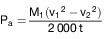
    hierbei bedeuten:

        P
    a:  aufgenommene Leistung in kW

        M
    1:  äquivalente Schwungmasse in kg (unberücksichtigt bleibt die
        Schwungmasse der leerlaufenden hinteren Rolle)

        v
    1:  Anfangsgeschwindigkeit in m/s (88 km/h = 24,4 m/s)

        v
    2:  Endgeschwindigkeit in m/s (72 km/h = 20 m/s)

    t:  Zeit für die Verzögerung der Rolle von 88 km/h auf 72 km/h.

    Diagramm der angezeigten Leistung bei 80 km/h in Abhängigkeit von der
    aufgenommenen Leistung bei der gleichen Geschwindigkeit:

    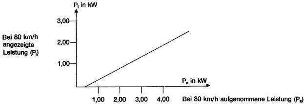

3.9.2 Fahrwiderstand eines Fahrzeugs

3.9.2.1 Allgemeines

[^f776225_02_BJNR067910012BJNE015000000]
    Mit den nachstehend beschriebenen Verfahren soll der Fahrwiderstand
    eines Fahrzeugs, das mit konstanter Geschwindigkeit auf der Straße
    fährt, gemessen und dieser Widerstand bei einer Prüfung auf dem
    Fahrleistungsprüfstand gemäß den Bedingungen nach Nummer 3.9.1.2
    simuliert werden. Der Technische Dienst kann andere Verfahren zur
    Bestimmung des Fahrwiderstands zulassen. Frosch

3.9.2.2 Beschreibung der Fahrbahn

    Die Fahrbahn muss horizontal und lang genug sein, um die nachstehend
    genannten Messungen durchführen zu können. Die Neigung muss auf*
    0,1 Prozent konstant sein und darf 1,5 Prozent nicht überschreiten.

3.9.2.3 Meteorologische Bedingungen

    Während der Prüfung darf die durchschnittliche Windgeschwindigkeit 3
    m/s nicht überschreiten bei Windböen von weniger als 5 m/s. Außerdem
    muss die Windkomponente in Querrichtung zur Fahrbahn weniger als 2 m/s
    betragen. Die Windgeschwindigkeit ist 0,7 m über der Fahrbahn zu
    messen.

    Die Straße muss trocken sein.

    Die Luftdichte während der Prüfung darf um nicht mehr als*
    7,5 Prozent von den Bezugsbedingungen P = 100 kPa und t = 293,2 K
    abweichen.

3.9.2.4 Zustand und Vorbereitung des Prüffahrzeugs

3.9.2.4.1 Das Fahrzeug muss sich in normalem Fahr- und Einstellungszustand
    befinden. Es ist zu prüfen, ob das Fahrzeug hinsichtlich der
    nachgenannten Punkte den Angaben des Herstellers für die betreffende
    Verwendung entspricht:

    a)  Räder, Zierkappen, Reifen (Marke, Typ, Druck)

    b)  Geometrie der Vorderachse

    c)  Einstellung der Bremsen (Beseitigung von Störeinflüssen)

    d)  Schmierung der Vorder- und Hinterachse

    e)  Einstellung der Radaufhängung und des Fahrzeugniveaus

    f)  usw.

3.9.2.4.2 Das Fahrzeug ist mindestens bis zu seiner Bezugsmasse zu beladen. Das
    Fahrzeugniveau muss so eingestellt sein, dass sich der
    Beladungsschwerpunkt in der Mitte zwischen den „R“-Punkten der äußeren
    Vordersitze und auf einer durch diese Punkte verlaufenden Geraden
    befindet.

3.9.2.4.3 Bei Prüfungen auf der Fahrbahn sind die Fenster zu schließen.
    Eventuelle Abdeckungen für Klimaanlagen, Scheinwerfer usw. müssen sich
    in den Stellungen befinden, die sich bei ausgeschalteten Einrichtungen
    ergeben.

3.9.2.4.4 Unmittelbar vor der Prüfung muss das Fahrzeug auf geeignete Weise auf
    normale Betriebstemperatur gebracht werden.

3.9.2.5 Messverfahren für die Energieänderung beim Auslaufversuch

3.9.2.5.1 Auf der Fahrbahn

3.9.2.5.1.1 Messgeräte und zulässige Messfehler

    Die Zeitmessung darf mit einem Fehler von nicht mehr als 0,1 Sekunden,
    die Geschwindigkeit mit einem Fehler von nicht mehr als 2 Prozent
    behaftet sein.

3.9.2.5.1.2 Prüfverfahren

    a)  Das Fahrzeug ist auf eine Geschwindigkeit zu bringen, die mehr als 10
        km/h über der gewählten Prüfgeschwindigkeit v liegt.

    b)  Das Getriebe ist in Leerlaufstellung zu bringen.

    c)  Gemessen wird die Verzögerungszeit t
        1                          des Fahrzeugs von der Geschwindigkeit
        v
        2                          = (v +*                         ) km/h bis
        v
        1                          = (v –*                         ) km/h,
        wobei*                          5 km/h.

    d)  Durchführung der gleichen Prüfung in der anderen Richtung zur
        Bestimmung von t
        2                         .

    e)  Bestimmung des Mittelwerts T
        1                          aus t
        1                          und t
        2                         .

    f)  Diese Prüfung ist so oft zu wiederholen, dass die statistische
        Genauigkeit (p) für den Mittelwert

        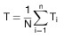        gleich oder kleiner 2 % ist (p*                          2 %).

        Die statistische Genauigkeit wird definiert durch:

        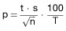
        dabei bedeuten:

        t:  Koeffizient entsprechend nachstehender Tabelle

        n:  Anzahl der Prüfungen

        s:  Standardabweichung,
            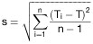

        *            *   n

            *   4

            *   5

            *   6

            *   7

            *   8

            *   9

        *            *   t

            *   3,2

            *   2,8

            *   2,6

            *   2,5

            *   2,4

            *   2,3

        *            *                
            *   1,6

            *   1,25

            *   1,06

            *   0,94

            *   0,85

            *   0,77

        *            *   n

            *   10

            *   11

            *   12

            *   13

            *   14

            *   15

        *            *   t

            *   2,3

            *   2,2

            *   2,2

            *   2,2

            *   2,2

            *   2,2

        *            *                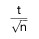
            *   0,73

            *   0,66

            *   0,64

            *   0,61

            *   0,59

            *   0,57

    g)  Berechnung der Leistung nach der Formel:

        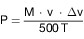
        dabei bedeuten:

        P:  Leistung in kW

        v:  Prüfgeschwindigkeit in m/s

        *:  Abweichung von der Geschwindigkeit v in m/s

        M:  Bezugsmasse in kg

        T:  Zeit in Sekunden

3.9.2.5.2 Auf dem Prüfstand

3.9.2.5.2.1 Messgeräte und zulässige Messfehler

    Es sind die gleichen Geräte wie bei der Prüfung auf der Fahrbahn zu
    verwenden.

3.9.2.5.2.2 Prüfverfahren

    a)  Das Fahrzeug wird auf den Fahrleistungsprüfstand gebracht.

    b)  Der Reifendruck (kalt) der Antriebsräder ist auf den für den Prüfstand
        erforderlichen Wert zu bringen.

    c)  Einstellen der äquivalenten Schwungmasse I des Prüfstands. Fahrzeug
        und Prüfstand sind durch ein geeignetes Verfahren auf
        Betriebstemperatur zu bringen.

    d)  Durchführung der beschriebenen Maßnahmen nach Nummer 3.9.2.5.1.2
        Buchstabe a bis c, f und g, wobei in der Formel g M durch I ersetzt
        wird.

    e)  Einstellen der Prüfstandsbremse nach Nummer 3.9.1.

3.9.2.5.3 Andere gleichwertige Messverfahren für die Energieänderung beim
    Auslaufversuch können nach Zustimmung des Technischen Dienstes
    angewandt werden.

3.9.2.6 Messverfahren für das Drehmoment bei konstanter Geschwindigkeit

3.9.2.6.1 Auf der Fahrbahn

3.9.2.6.1.1 Messgeräte und zulässige Messfehler

    a)  Das Drehmoment muss mit einem Messgerät einer Genauigkeit von 2
        Prozent gemessen werden,

    b)  die Geschwindigkeit muss auf 2 Prozent genau bestimmt werden.

3.9.2.6.1.2 Prüfverfahren

    a)  Das Fahrzeug ist auf die gewählte konstante Geschwindigkeit V zu
        bringen.

    b)  Das Drehmoment C(t) und die Geschwindigkeit sind während der Dauer von
        mindestens zehn Sekunden mit einem Instrument der Klasse 1000 gemäß
        ISO-Norm Nummer 970 aufzuzeichnen.

    c)  Die Veränderungen des Drehmoments C(t) und der Geschwindigkeit in
        Abhängigkeit von der Zeit dürfen in jeder Sekunde der
        Aufzeichnungszeit 5 Prozent nicht überschreiten.

    d)  Das maßgebliche Drehmoment C
        t1                          ist das mittlere Drehmoment, ermittelt
        nach folgender Formel:

        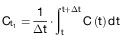

    e)  Durchführung der Prüfung in der anderen Fahrtrichtung zur Bestimmung
        von C
        t2                         .

    f)  Ermittlung des Mittelwerts C
        t                          aus den beiden Werten für das Drehmoment C
        t1                          und C
        t2                         .

3.9.2.6.2 Auf dem Prüfstand

3.9.2.6.2.1 Messgeräte und zulässige Messfehler

    Es sind die gleichen Geräte wie bei der Prüfung auf der Fahrbahn zu
    verwenden.

3.9.2.6.2.2 Prüfverfahren

    a)  Durchführung der unter Nummer 3.9.2.5.2.2 Buchstabe a bis d
        beschriebenen Maßnahmen.

    b)  Durchführung der unter Nummer 3.9.2.6.1.2 Buchstabe a bis d
        beschriebenen Maßnahmen.

    c)  Einstellung der Prüfstandbremse nach Nummer 3.9.1.

3.9.3 Überprüfung der Gesamtschwungmassen des Fahrleistungsprüfstands bei
    elektrischer Simulation

3.9.3.1 Allgemeines

    Mit dem nachfolgend beschriebenen Verfahren soll nachgeprüft werden,
    ob die Gesamtschwungmasse des Fahrleistungsprüfstands die
    tatsächlichen Werte in den verschiedenen Phasen der Fahrkurve
    ausreichend simuliert.

3.9.3.2 Prinzip

3.9.3.2.1 Aufstellung der Arbeitsgleichung

    Die an der (den) Rolle(n) auftretenden Kräfte lassen sich durch
    folgende Gleichung ausdrücken:

    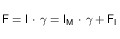
    hierbei bedeuten:

    F:  Kraft an der (den) Rolle(n)

    I:  Gesamtschwungmasse des Prüfstandes (äquivalente Schwungmasse des
        Fahrzeugs)

        I
    M:  Schwungmasse der mechanischen Massen das Prüfstands

    g:  Tangentialbeschleunigung am Umfang der Rolle

        F
    I:  Schwungmassenkraft

    Anmerkung: Diese Formel wird unter Nummer 3.9.3.5.3 für Prüfstände mit mechanisch
        simulierten Schwungmassen erläutert.

    Die Gesamtschwungmasse wird durch folgende Formel ausgedrückt:

    hierbei kann
    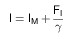
        I
    M   mit herkömmlichen Methoden berechnet oder gemessen werden,

        F
    I   auf dem Prüfstand gemessen werden,

    *   aus der Umfanggeschwindigkeit der Rollen berechnet werden.

    Die Gesamtschwungmasse „I“ wird bei einer Beschleunigungs- oder
    Verzögerungsprüfung ermittelt, die gleich oder größer ist als die bei
    einer Fahrkurve gemessenen Werte.

3.9.3.2.2 Zulässiger Fehler bei der Berechnung der Gesamtschwungmasse

    Mit den Prüf- und Berechnungsverfahren muss die Gesamtschwungmasse I
    mit einem relativen Fehler (*                    I/I) von weniger als
    2 Prozent ermittelt werden können.

3.9.3.3 Vorschriften

3.9.3.3.1 Die simulierte Gesamtschwungmasse I muss die gleiche bleiben wie der
    theoretische Wert der äquivalenten Schwungmasse (siehe Nummer 3.5.1),
    und zwar in folgenden Grenzen:

    a)  *                          5 Prozent des theoretischen Werts für jeden
        Momentanwert,

    b)  *                          2 Prozent des theoretischen Werts für den
        Mittelwert, der für jeden Vorgang der Fahrkurve berechnet wird.

3.9.3.3.2 Die in Nummer 3.9.3.3.1 Buchstabe a genannten Grenzen werden beim
    Hochfahren eine Sekunde lang und bei Fahrzeugen mit Handschaltgetriebe
    beim Gangwechsel zwei Sekunden lang um jeweils + 50 Prozent geändert.

3.9.3.4 Kontrollverfahren

3.9.3.4.1 Die Kontrolle wird bei jeder Prüfung während der gesamten Dauer einer
    Fahrkurve durchgeführt.

    Werden jedoch die Vorschriften unter Nummer 3.9.3.3 erfüllt und liegen
    die momentanen Beschleunigungswerte mindestens um den Faktor drei
    unter oder über den Werten, die bei der Fahrkurve auftreten, ist die
    oben beschriebene Kontrolle nicht erforderlich.

3.9.3.5 Technische Anmerkung

    Erläuterung zur Aufstellung der Arbeitsgleichungen.

3.9.3.5.1 Kräftegleichgewicht auf der Straße

    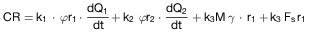

3.9.3.5.2 Kräftegleichgewicht auf dem Prüfstand mit mechanisch simulierten
    Schwungmassen

    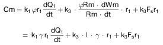

3.9.3.5.3 Kräftegleichgewicht auf dem Prüfstand mit nicht mechanisch
    (elektrisch) simulierten Schwungmassen

    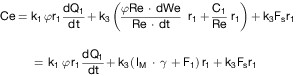
    In diesen Formeln bedeuten:

    CR: Motordrehmoment auf der Straße

    Cm: Motordrehmoment auf dem Prüfstand mit mechanisch simulierten
        Schwungmassen

    Ce: Motordrehmoment auf dem Prüfstand mit elektrisch simulierten
        Schwungmassen

        r
    *1  Trägheitsmoment des Fahrzeugantriebs bezogen auf die Antriebsräder

        r
    *2: Trägheitsmoment der nicht angetriebenen Räder

    *Rm: Trägheitsmoment des Prüfstands mit mechanisch simulierten
        Schwungmassen

    *Re: Mechanisches Trägheitsmoment des Prüfstands mit elektrisch simulierten
        Schwungmassen

    M:  Masse des Fahrzeugs auf der Fahrbahn

    I:  äquivalente Schwungmasse des Prüfstands mit mechanisch simulierten
        Schwungmassen

        I
    M:  mechanische Schwungmasse eines Prüfstands mit elektrisch simulierten
        Schwungmassen

        F
    s:  resultierende Kraft bei konstanter Geschwindigkeit

        C
    1:  resultierendes Drehmoment der elektrisch simulierten Schwungmassen

        F
    1:  resultierende Kraft der elektrisch simulierten Schwungmassen

        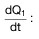    *   Winkelbeschleunigung der Antriebsräder

        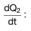    *   Winkelbeschleunigung der nicht angetriebenen Räder

        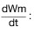    *   Winkelbeschleunigung des Prüfstands mit mechanischen Schwungmassen

            *   Winkelbeschleunigung des Prüfstands mit elektrischen Schwungmassen

    *:  lineare Beschleunigung

        r
    1:  Reifenradius der Antriebsräder unter Last

        r
    2:  Reifenradius der nicht angetriebenen Räder unter Last

    Rm: Rollenradius des Prüfstands mit mechanischen Schwungmassen

    Re: Rollenradius des Prüfstands mit elektrischen Schwungmassen

        k
    1:  Koeffizient, der von der Getriebeübersetzung und den verschiedenen
        Schwungmassen der Kraftübertragung sowie vom „Wirkungsgrad“ abhängig
        ist

        k
    2:  Übersetzungsverhältnis der Kraftübertragung
                „Wirkungsgrad“

        k
    3:  Übersetzungsverhältnis der Kraftübertragung · „Wirkungsgrad“

    Unter der Annahme, dass die beiden Prüfstandtypen (siehe die Nummern
    3\.9.3.5.2 und 3.9.3.5.3) die gleichen Merkmale aufweisen, erhält man
    folgende vereinfachte Formel:

    
    hierbei ist

    

**3.10** **Beschreibung der Gas- und Partikelentnahmesysteme**

3.10.1 Einleitung

    Es gibt mehrere Typen von Entnahmesystemen, welche die Vorschriften
    nach Nummer 3.4.2 erfüllen können. Die unter Nummer 3.10.3
    beschriebenen Systeme entsprechen diesen Vorschriften. Andere
    Entnahmesysteme können verwendet werden, wenn sie den wesentlichen
    Kriterien für Entnahmesysteme mit variabler Verdünnung genügen.

    Der Technische Dienst muss im Gutachten das Entnahmesystem angeben,
    das für die Prüfung verwendet wird.

3.10.2 Kriterien für das System mit variabler Verdünnung beim Messen gas- und
    partikelförmiger Luftverunreinigungen im Abgas

3.10.2.1 Anwendungsbereich

    Angabe der Funktionsmerkmale eines Abgasentnahmesystems, das zur
    Messung der tatsächlichen Mengen emittierter gasförmiger
    Luftverunreinigungen aus Fahrzeugabgasen nach den Bestimmungen dieser
    Verordnung verwendet wird.

    Das Entnahmesystem mit variabler Verdünnung zur Bestimmung der
    Massenemissionen muss drei Bedingungen erfüllen:

    a)  Die Abgase des Fahrzeugs müssen fortlaufend unter festgelegten
        Bedingungen mit Umgebungsluft verdünnt werden.

    b)  Das Gesamtvolumen des Gemisches aus Abgasen und Verdünnungsluft muss
        genau gemessen werden.

    c)  Es ist fortlaufend ein Teilstrom aus verdünntem Abgas und
        Verdünnungsluft für Analysenzwecke zu entnehmen.

    Die Menge der gasförmigen Luftverunreinigungen wird nach den
    anteilmäßigen Probenkonzentrationen und den während der Prüfdauer
    gemessenen Gesamtvolumen bestimmt. Die Probenkonzentrationen werden
    entsprechend dem Gehalt gasförmiger Luftverunreinigungen der
    Umgebungsluft korrigiert.

3.10.2.2 Erläuterungen des Verfahrens

    Figur 4 zeigt eine schematische Darstellung des Entnahmesystems.

    Die Abgase des Fahrzeugs sind mit genügend Umgebungsluft so zu
    verdünnen, dass im Entnahme- und Messsystem kein Kondenswasser
    auftritt.

    Das Abgasentnahmesystem muss so konzipiert sein, dass die mittleren
    volumetrischen CO
    2                   -, CO-, CH und NO
    x                   -Konzentrationen, die in den während der Prüfung
    emittierten Abgasen enthalten sind, gemessen werden können.

    Das Abgas/Luft-Gemisch muss an den Entnahmesonden homogen sein (siehe
    Nummer 3.10.2.3.1).

    An den Sonden muss eine repräsentative Probe der verdünnten Abgase
    entnommen werden können.

    Das Gerät muss die Messung des Gesamtvolumens der verdünnten Abgase
    des zu prüfenden Fahrzeugs ermöglichen.

    Das Entnahmesystem muss gasdicht sein. Bauart und Werkstoff des
    Entnahmesystems müssen eine Beeinflussung der Konzentration der
    Luftverunreinigungen im verdünnten Abgas verhindern. Falls die
    Konzentration einer gasförmigen Luftverunreinigung oder der Partikel
    in dem verdünnten Gas durch ein Teil des Entnahmesystems
    (Wärmetauscher, Zyklon-Abscheider, Gebläse usw.) verändert wird, so
    muss diese Luftverunreinigung vor diesem Teil entnommen werden, falls
    dieser Fehler nicht anders behoben werden kann.

    Hat das zu prüfende Fahrzeug mehrere Auspuffrohre, so sind diese durch
    ein Sammelrohr so nahe wie möglich am Fahrzeug zu verbinden.

    Die Gasproben sind in ausreichend großen Entnahmebeuteln aufzufangen,
    damit die Gasentnahme während der Entnahmezeit nicht beeinträchtigt
    wird. Die Beutel müssen aus einem Material bestehen, das die
    Konzentrationen der gasförmigen Luftverunreinigungen in den Abgasen
    nicht beeinflusst (siehe Nummer 3.10.2.3.4.4).

    Das Entnahmesystem mit variabler Verdünnung muss so beschaffen sein,
    dass das Abgas ohne wesentliche Auswirkungen auf den Gegendruck im
    Auspuffendrohr entnommen werden kann (siehe Nummer 3.10.2.3.1).

3.10.2.3 Besondere Vorschriften

3.10.2.3.1 Einrichtungen zur Abgasentnahme und -verdünnung

    Das Verbindungsrohr zwischen dem (den) Auspuffrohr(en) und der
    Mischkammer muss möglichst kurz sein; es darf in keinem Fall

    –   den statischen Druck an den Endrohren des Prüffahrzeugs um mehr als*
        0,75 kPa bei 50 km/h oder*                          125 kPa während
        der gesamten Prüfdauer gegenüber dem statischen Druck, der ohne
        Verbindungsrohr am Auspuffendrohr gemessen wurde, verändern. Der Druck
        muss im Endrohr oder in einem Verlängerungsrohr mit gleichem
        Durchmesser gemessen werden, und zwar möglichst am äußersten Ende;

    –   die Art der Abgase verändern oder beeinflussen.

    Es ist eine Mischkammer vorzusehen, in der die Abgase des Fahrzeugs
    und die Verdünnungsluft so zusammengeführt werden, dass an der
    Probeentnahmestelle ein homogenes Gemisch vorliegt.

    In diesem Bereich darf die Homogenität des Gemischs um höchstens*
    2 Prozent vom Mittelwert aus mindestens fünf gleichmäßig über den
    Durchmesser des Gasstroms verteilten Punkten abweichen. Der Druck in
    der Mischkammer darf vom Luftdruck um höchstens*
    0,25 kPa abweichen, um die Auswirkung auf die Bedingungen an den
    Endrohren möglichst gering zu halten und den Druckabfall in einer
    Konditionierungseinrichtung für die Verdünnungsluft zu begrenzen.

3.10.2.3.2 Hauptdurchsatzpumpe

    Die Förderkapazität der Pumpe muss ausreichend sein, um eine
    Wasserkondensation zu verhindern. Dies kann im Allgemeinen dadurch
    sichergestellt werden, dass die CO
    2                   -Konzentration der verdünnten Abgase im
    Probebeutel auf einem Wert von weniger als 3 Volumenprozent gehalten
    wird.

3.10.2.3.3 Volumenmessung

    Das Volumenmessgerät muss eine Kalibriergenauigkeit von*
    2 Prozent unter allen Betriebsbedingungen beibehalten. Kann das Gerät
    Temperaturschwankungen des verdünnten Abgasgemisches am Messpunkt
    nicht ausgleichen, so muss ein Wärmetauscher benutzt werden, um die
    Temperatur auf*                    6 K der vorgesehenen
    Betriebstemperatur zu halten. Falls erforderlich, kann zum Schutz des
    Volumenmessgeräts ein Zyklon-Abscheider vorgesehen werden.

    Ein Temperaturfühler ist unmittelbar vor dem Volumenmessgerät
    anzubringen. Das Temperaturmessgerät muss eine Genauigkeit von*
    1 K und eine Ansprechzeit von 0,1 s bei 62 Prozent einer
    Temperaturänderung (gemessen in Silikonöl) haben.

    Druckmessungen während der Prüfung müssen eine Genauigkeit von*
    0,4 kPa aufweisen.

    Die Messung des Druckes, bezogen auf den Luftdruck, ist vor und –
    falls erforderlich – hinter dem Durchflussmessgerät vorzunehmen.

3.10.2.3.4 Gasentnahme

3.10.2.3.4.1 Verdünntes Gas

    Die Probe des verdünnten Abgases ist vor der Hauptdurchsatzpumpe,
    jedoch nach der Konditionierungseinrichtung (sofern vorhanden) zu
    entnehmen.

    Der Durchfluss darf um nicht mehr als*                    2 Prozent
    vom Mittelwert abweichen.

    Die Durchflussmenge muss mindestens 5 l/min und darf höchstens 0,2
    Prozent der Durchflussmenge des verdünnten Abgases betragen.

3.10.2.3.4.2 Verdünnungsluft

    Eine Probe der Verdünnungsluft ist bei konstantem Durchfluss in
    unmittelbarer Nähe der Umgebungsluft (nach dem Filter, wenn vorhanden)
    zu entnehmen.

    Das Gas darf nicht durch Abgase aus der Mischzone verunreinigt werden.

    Die Durchflussmenge der Verdünnungsluftprobe muss ungefähr derjenigen
    des verdünnten Abgases (*                    5 l/min) entsprechen.

3.10.2.3.4.3 Entnahmeverfahren

    Die bei der Entnahme verwendeten Werkstoffe müssen so beschaffen sein,
    dass die Konzentration der gasförmigen Luftverunreinigungen nicht
    verändert wird.

    Es können Filter zum Abscheiden von Partikeln aus der Probe vorgesehen
    werden.

    Mit Hilfe von Pumpen sind die Proben in die Sammelbeutel zu fördern.

    Zur Gewährleistung der erforderlichen Durchflussmenge der Probe sind
    Durchflussregler und -messer zu verwenden.

    Zwischen den Dreiweg-Ventilen und den Sammelbeuteln können gasdichte
    Schnellkupplungen verwendet werden, die auf der Beutelseite
    automatisch abschließen. Es können auch andere Verbindungen zur
    Weiterleitung der Proben zum Analysengerät benutzt werden (zum
    Beispiel Dreiweg-Absperrhähne).

    Bei den verschiedenen Ventilen zur Weiterleitung der Gasproben sind
    Schnellschalt- und Schnellregelventile zu verwenden.

3.10.2.3.4.4 Aufbewahrung der Proben

    Die Gasproben sind in ausreichend großen Probenbeuteln (ca. 150 l)
    aufzufangen, um die Durchflussmenge der Proben nicht zu verringern.
    Diese Beutel müssen aus einem Material hergestellt sein, das die
    Konzentration der Gasprobe innerhalb von 20 Minuten nach Ende der
    Probeentnahme um nicht mehr als*                    2 Prozent
    verändert.

3.10.2.4 Zusätzliches Entnahmegerät zur Prüfung von Fahrzeugen mit
    Dieselmotoren

    Abweichend zur Gasentnahme bei Fahrzeugen mit Ottomotoren
    (Fremdzündung) befinden sich die Probenahmestellen zur Entnahme der
    Kohlenwasserstoff- und Partikelproben in einem Verdünnungstunnel.

    Zur Verminderung von Wärmeverlusten im Abgas vom Auspuffendrohr bis
    zum Eintritt in den Verdünnungstunnel darf die hierfür verwendete
    Rohrleitung höchstens 3,6 m bzw. 6,1 m, falls thermisch isoliert, lang
    sein. Ihr Innendurchmesser darf höchstens 105 mm betragen.

    Im Verdünnungstunnel, einem geraden aus elektrisch leitendem Material
    bestehenden Rohr müssen turbulente Strömungsverhältnisse herrschen
    (Reynoldszahlen*                    4 000), damit das verdünnte Abgas
    an den Entnahmestellen homogen und die Entnahme repräsentativer Gas-
    und Partikelproben gewährleistet ist. Der Verdünnungstunnel muss einen
    Durchmesser von mindestens 200 mm haben. Das System muss geerdet sein.

    Das Partikel-Probenahmesystem besteht aus einer Entnahmesonde im
    Verdünnungstunnel, drei Filtereinheiten, bestehend aus jeweils zwei
    hintereinander angeordneten Filtern, auf die der Probengasstrom einer
    Testphase umgeschaltet werden kann.

    Die Partikelentnahmesonde muss folgendermaßen beschaffen sein:

    Sie muss in Nähe der Tunnelmittellinie, ungefähr zehn
    Tunneldurchmesser stromabwärts vom Abgaseintritt eingebaut sein und
    einen Innendurchmesser von mindestens 12 mm haben.

    Der Abstand von der Probenahmespitze bis zum Filterhalter muss
    mindestens fünf Sondendurchmesser, jedoch höchstens 1 020 mm betragen.

    Die Messeinheit des Probengasstroms besteht aus Pumpen,
    Gasmengenreglern und Durchflussmessgeräten.

    Das Kohlenwasserstoff-Probenahmesystem besteht aus beheizter
    Entnahmesonde, -leitung, -filter, -pumpe.

    Die Entnahmesonde muss im gleichen Abstand vom Abgaseintritt wie die
    Partikelentnahmesonde so eingebaut sein, dass eine gegenseitige
    Beeinflussung der Probenahmen vermieden wird. Sie muss einen
    Mindestinnendurchmesser von 4,5 mm haben.

    Alle beheizten Teile müssen durch das Heizsystem auf einer Temperatur
    von 190 °C + 10 °C gehalten werden.

    Ist ein Ausgleich der Durchflussschwankungen nicht möglich, so sind
    Wärmetauscher und ein Temperaturregler nach Nummer 2.3.3.1
    erforderlich, um einen konstanten Durchfluss durch das System und
    somit die Proportionalität des Durchflusses der Probe sicherzustellen.

3.10.3 Beschreibung der Systeme

3.10.3.1 Entnahmesystem mit variabler Verdünnung und Verdrängerpumpe (PDP-CVS-
    System) (Figur 5)

3.10.3.1.1 Das Entnahmesystem mit konstantem Volumen und Verdrängerpumpe (PDP-
    CVS) erfüllt die in Nummer 3.4.2 aufgeführten Bedingungen, indem die
    durch die Pumpe fließende Gasmenge bei konstanter Temperatur und
    konstantem Druck ermittelt wird. Zur Messung des Gesamtvolumens wird
    die Zahl der Umdrehungen der kalibrierten Verdrängerpumpe gezählt. Das
    Probengas erhält man durch Entnahme bei konstanter Durchflussmenge mit
    einer Pumpe, einem Durchflussmesser und einem Durchflussregelventil.

    Figur 5 zeigt das Schema eines solchen Entnahmesystems. Da gültige
    Ergebnisse mit unterschiedlichen Versuchsanordnungen erzielt werden
    können, braucht die Anlage nicht ganz genau dem Schema zu entsprechen.
    Es können zusätzliche Teile verwendet werden, wie zum Beispiel
    Instrumente, Ventile, Magnetventile und Schalter, um zusätzliche Daten
    zu erhalten und die Funktionen der einzelnen Teile der Anlage zu
    koordinieren.

    Zur Sammeleinrichtung gehören:

    1.  Ein Filter (1) für die Verdünnungsluft, der – soweit erforderlich –
        vorgeheizt werden kann. Dieser Filter besteht aus einer
        Aktivkohleschicht zwischen zwei Lagen Papier; er dient zur Senkung und
        Stabilisierung der Kohlenwasserstoffkonzentration der umgebenden
        Emissionen in der Verdünnungsluft;

    2.  eine Mischkammer (2), in der Abgase und Luft homogen gemischt werden;

    3.  ein Wärmetauscher (3), dessen Kapazität groß genug ist, um während der
        gesamten Prüfdauer die Temperatur des Luft/Abgas-Gemisches, das
        unmittelbar vor der Verdrängerpumpe gemessen wird, innerhalb von*
        6 K der vorgesehenen Temperatur zu halten. Dieses Gerät darf den
        Gehalt gasförmiger Luftverunreinigungen der später für die Analyse
        entnommenen verdünnten Abgase nicht verändern;

    4.  ein Temperaturregler zum Vorheizen des Wärmetauschers vor der Prüfung
        und zur Einhaltung der Temperatur während der Prüfung innerhalb von 6
        K der vorgesehenen Temperatur;

    5.  eine Verdrängerpumpe (PDP) (4) zur Weiterleitung einer konstanten
        Durchflussmenge des Luft/Abgas-Gemisches. Die Kapazität der Pumpe muss
        groß genug sein, um eine Wasserkondensation in der Anlage unter allen
        Bedingungen zu vermeiden, die sich bei einer Prüfung einstellen
        können. Dazu wird normalerweise eine Verdrängerpumpe verwendet, mit

        a)  einer Kapazität, die der doppelten maximalen Abgas-Durchflussmenge
            entspricht, die bei den Beschleunigungsphasen der Fahrkurven erzeugt
            wird oder die

        b)  ausreicht, um die CO
            2                               -Konzentration der verdünnten Abgase
            im Entnahmebeutel unterhalb von 3 Volumenprozent zu halten;

    6.  ein Temperaturmessgerät (Genauigkeit*                          1 K),
        das unmittelbar vor der Verdrängerpumpe angebracht wird. Mit diesem
        Gerät muss die Temperatur des verdünnten Abgasgemisches während der
        Prüfung kontinuierlich überwacht werden können;

    7.  ein Druckmesser (12) (Genauigkeit*                          0,4 kPa),
        der direkt vor der Verdrängerpumpe angebracht wird und das
        Druckgefälle zwischen dem Gasgemisch und der Umgebungsluft
        aufzeichnet;

    8.  ein weiterer Druckmesser (12) (Genauigkeit*
        0,4 kPa), der so angebracht wird, dass die Druckdifferenz zwischen
        Ein- und Auslass der Pumpe aufgezeichnet wird;

    9.  Entnahmesonden, mit denen konstante Proben der Verdünnungsluft und des
        verdünnten Abgas/Luft-Gemisches entnommen werden können;

    10. Filter (5) zum Abscheiden von Partikeln aus den für die Analyse
        entnommenen Gasen;

    11. Pumpen zur Entnahme einer konstanten Durchflussmenge der
        Verdünnungsluft sowie des verdünnten Abgas/Luft-Gemisches während der
        Prüfung;

    12. Durchflussregler, welche die Durchflussmenge bei der Gasentnahme
        während der Prüfung durch die Entnahmesonden konstant halten; diese
        Durchflussmenge muss so groß sein, dass am Ende der Prüfung Proben von
        ausreichender Größe für die Analyse (*                          5
        l/min) verfügbar sind;

    13. Durchflussmesser zur Einstellung und Überwachung einer konstanten
        Gasprobenmenge während der Prüfung;

    14. Schnellschaltventile zur Weiterleitung der konstanten Gasprobenmenge
        entweder in die Entnahmebeutel oder in die Atmosphäre;

    15. gasdichte Schnellkupplungen zwischen den Schnellschaltventilen und den
        Entnahmebeuteln. Die Kupplung muss auf der Beutelseite automatisch
        abschließen. Es können auch andere Mittel verwendet werden, um die
        Probe in den Analysator zu bringen (zum Beispiel Dreiweg-
        Absperrhähne);

    16. Beutel (9, 10) zum Auffangen der Proben verdünnter Abgase und der
        Verdünnungsluft während der Prüfung. Sie müssen groß genug sein, um
        den Gasproben-Durchfluss nicht zu verringern. Sie müssen aus einem
        Material hergestellt sein, das weder die Messungen selbst noch die
        chemische Zusammensetzung der Gasproben beeinflusst (beispielsweise
        Polyethen/Polyamid- oder Polyfluorkohlenstoff-Verbundfolien);

    17. ein Digitalzähler zur Aufzeichnung der Zahl der Umdrehungen der
        Verdrängerpumpe während der Prüfung.

3.10.3.1.2 Zusätzliche Geräte für die Prüfung von Fahrzeugen mit Dieselmotoren

    Für die Prüfung der Fahrzeuge mit Dieselmotor sind die in Figur 5
    dargestellten Geräte zu verwenden:

    Verdünnungstunnel

    beheiztes Kohlenwasserstoff-Probenahmesystem

    a)  Entnahmesonde im Verdünnungstunnel

    b)  Filter

    c)  Entnahmeleitung

    d)  Mehrwegventil

    e)  Pumpe, Durchflussmessgeräte, Durchflussregler

    f)  Flammen-Ionisations-Detektor (HFID)

    g)  Integrations- und Aufzeichnungsgeräte für die momentanen
        Kohlenwasserstoffkonzentrationen

    h)  Schnellkupplung für die Analyse der Probe der Umgebungsluft mit dem
        HFID

    Partikel-Probenahmesystem

    i)  Entnahmesonde im Verdünnungstunnel

    j)  Filtereinheit, bestehend aus zwei hintereinander angeordneten
        Filtereinheiten; Umschaltvorrichtung für weitere parallel angeordnete
        Filterpaare

    k)  Entnahmeleitung

    l)  Pumpen, Durchflussregler, Durchflussmessgeräte

3.10.3.2 Verdünnungssystem mit Venturi-Rohr und kritischer Strömung (CFV-CVS-
    System) (Figur 4)

3.10.3.2.1 Die Verwendung eines Venturi-Rohrs mit kritischer Strömung im Rahmen
    des Entnahmeverfahrens mit konstantem Volumen basiert auf den
    Grundsätzen der Strömungslehre unter den Bedingungen der kritischen
    Strömung. Die Durchflussmenge am Venturi-Rohr (7) wird während der
    gesamten Prüfung fortlaufend überwacht, berechnet und integriert.

    Die Verwendung eines weiteren Probenahme-Venturi-Rohrs (4)
    gewährleistet die proportionale Entnahme der Gasproben. Da Druck und
    Temperatur am Eintritt beider Venturi-Rohre gleich sind, ist das
    Volumen der Gasentnahme proportional zum Gesamtvolumen des erzeugten
    Gemisches aus verdünnten Abgasen. Das System erfüllt somit die in
    diesem Anhang festgelegten Bedingungen.

    Figur 4 zeigt das Schema eines solchen Entnahmesystems. Da gültige
    Ergebnisse mit unterschiedlichen Versuchsanordnungen erzielt werden
    können, braucht die Anlage nicht ganz genau dem Schema zu entsprechen.
    Es können zusätzliche Teile verwendet werden, wie zum Beispiel
    Instrumente, Ventile, Magnetventile und Schalter, um zusätzliche Daten
    zu erhalten und die Funktionen der einzelnen Teile der Anlage zu
    koordinieren.

    Zur Sammeleinrichtung gehören:

    1.  Ein Filter (1) für die Verdünnungsluft, der – soweit erforderlich –
        vorbeheizt werden kann. Dieser Filter besteht aus einer
        Aktivkohleschicht zwischen zwei Lagen Papier; er dient zur Senkung und
        Stabilisierung der Kohlenwasserstoffkonzentration der umgebenden
        Emissionen in der Verdünnungsluft;

    2.  eine Mischkammer (2), in der Abgase und Luft homogen gemischt werden;

    3.  ein Zyklon-Abscheider (3) zum Abscheiden von Partikeln;

    4.  Entnahmesonden, mit denen Proben der Verdünnungsluft und der
        verdünnten Abgase entnommen werden können;

    5.  ein Entnahme-Venturi-Rohr (4) mit kritischer Strömung, mit dem
        anteilmäßige Proben verdünnter Abgase an der Entnahmesonde entnommen
        werden können;

    6.  Filter zum Abscheiden von Partikeln aus den für die Analyse
        entnommenen Gasen;

    7.  Pumpen zum Sammeln eines Teils der Luft und der verdünnten Abgase in
        den Beuteln während der Prüfung;

    8.  Durchflussregler, um die Durchflussmenge bei der Gasentnahme während
        der Prüfung durch die Entnahmesonde konstant zu halten. Diese
        Durchflussmenge muss so groß sein, dass am Ende der Prüfung Proben von
        ausreichender Größe für die Analyse verfügbar sind (55 l/min);

    9.  Durchflussmesser zur Einstellung und Überwachung der Durchflussmenge
        während der Prüfung;

    10. Schnellschaltventile zur Weiterleitung der konstanten Gasprobenmenge
        entweder in die Entnahmebeutel oder in die Atmosphäre;

    11. gasdichte Schnellkupplungen zwischen den Schnellschaltventilen und den
        Entnahmebeuteln. Die Kupplung muss auf der Beutelseite automatisch
        abschließen. Es können auch andere Mittel verwendet werden, um die
        Probe in den Analysator zu bringen (zum Beispiel Dreiweg-
        Absperrhähne);

    12. Beutel (9, 10) zum Auffangen der Proben verdünnter Abgase und
        Verdünnungsluft während der Prüfung. Die Beutel müssen groß genug
        sein, um den Gasprobendurchfluss nicht zu verringern. Sie müssen aus
        einem Material hergestellt sein, das weder die Messungen selbst noch
        die chemische Zusammensetzung der Gasproben beeinflusst (zum Beispiel
        Polyethen/Polyamid- oder Polyfluorkohlenstoff-Verbundfolien);

    13. ein Druckmesser (5) mit einer Genauigkeit von*
        0,4 kPa;

    14. ein Temperaturmessgerät (6) mit einer Genauigkeit von*
        1 K und einer Ansprechzeit von 0,1 Sekunden bei 62 Prozent einer
        Temperaturänderung (gemessen in Silikonöl);

    15. ein Venturi-Rohr mit kritischer Messströmung (7) zur Messung der
        Durchflussmenge der verdünnten Abgase;

    16. ein Gebläse (8) mit ausreichender Leistung, um das gesamte Volumen der
        verdünnten Gase anzusaugen.

    Das Entnahmesystem CFV-CVS muss eine ausreichend große Kapazität
    haben, damit eine Wasserkondensation im Gerät unter allen Bedingungen
    vermieden wird, die sich bei einer Prüfung einstellen können. Dazu
    wird normalerweise ein Gebläse verwendet mit einer Kapazität, die der
    doppelten der maximalen Abgasdurchflussmenge entspricht, die bei den
    Beschleunigungsphasen der Fahrkurve erzeugt wird oder die ausreicht,
    um die CO
    2                   -Konzentration der verdünnten Abgase im
    Entnahmebeutel unterhalb von 3 Volumenprozent zu halten.

3.10.3.2.2 Zusätzliche Geräte für die Prüfung von Fahrzeugen mit Dieselmotor

    Für die Prüfung der Fahrzeuge mit Dieselmotor sind die in Figur 5
    dargestellten Geräte zu verwenden (siehe Nummer 3.10.3.1). Ist ein
    Ausgleich der Durchflussschwankungen nicht möglich, so sind ein
    Wärmetauscher (3) und ein Temperaturregler erforderlich, um einen
    konstanten Durchfluss durch das Probenahme-Venturi-Rohr und somit die
    Proportionalität des Durchflusses durch die Entnahmesonde
    sicherzustellen.

3.10.4 Ermittlung der Massenemissionen

    Der CO-, CO
    2                   -, NO
    x                   - und CH-Massenausstoß während der verschiedenen
    Testphasen der Fahrkurven I und II wird bestimmt, indem deren mittlere
    volumetrische Konzentrationen der in Beuteln gesammelten verdünnten
    Abgase gemessen werden.

    Der CH-Massenausstoß von Fahrzeugen mit Dieselmotor wird demgegenüber
    mit einem kontinuierlich registrierenden beheizten Flammen-
    Ionisations-Detektor bestimmt. Die mittlere volumetrische
    Konzentration wird durch Integration über die Dauer der Testphasen
    ermittelt (siehe Nummer 3.1.3).

    Die kontinuierliche Messung der CO-, CO
    2                   -, und NO
    x                   -Konzentrationen des verdünnten Abgases können
    gleichermaßen zur Bestimmung des Massenausstoßes während der einzelnen
    Testphasen herangezogen werden, sofern der dabei ermittelte
    Massenausstoß von den in den Beuteln ermittelten Werten um nicht mehr
    als*                    3 Prozent abweicht.

**3.11** **Kalibrierverfahren für die Geräte**

3.11.1 Erstellung der Kalibrierkurve des Analysators

    Jeder normalerweise verwendete Messbereich muss nach Nummer 3.4.4.3
    nach dem nachstehend festgelegten Verfahren kalibriert werden.

    Die Kalibrierkurve wird durch mindestens fünf Kalibrierpunkte
    festgelegt, die in möglichst gleichem Abstand anzuordnen sind. Die
    Nennkonzentration des Prüfgases der höchsten Konzentration muss
    mindestens 80 Prozent des Skalenendwerts betragen.

    Die Kalibrierkurve wird nach der Methode der „kleinsten Quadrate“
    berechnet. Ist der resultierende Grad des Polynoms größer als drei, so
    muss die Zahl der Kalibrierpunkte zumindest so groß wie der Grad
    dieses Polynoms plus zwei sein.

    Die Kalibrierkurve darf um nicht mehr als 2 Prozent vom Nennwert eines
    jeden Kalibriergases abweichen.

    Der Chemilumineszenz-Analysator muss in der Stellung „NO
    x                   “ kalibriert werden.

    Es können auch andere Verfahren (Rechner, elektronische
    Messbereichsumschaltung usw.) angewendet werden, wenn dem Technischen
    Dienst zufriedenstellend nachgewiesen wird, dass sie eine
    gleichwertige Genauigkeit bieten.

3.11.1.1 Verlauf der Kalibrierung

    Anhand des Verlaufs der Kalibrierkurve und der Kalibrierpunkte kann
    die einwandfreie Durchführung der Kalibrierung überprüft werden. Es
    sind die verschiedenen Kennwerte des Analysators anzugeben,
    insbesondere:

    a)  die Skaleneinteilung

    b)  die Empfindlichkeit

    c)  der Nullpunkt

    d)  der Zeitpunkt der Kalibrierung.

3.11.1.2 Überprüfung der Kalibrierkurve

    Jeder normalerweise verwendete Messbereich muss vor jeder Analyse wie
    folgt überprüft werden:

    Die Kalibrierung wird mit einem Nullgas und einem Prüfgas überprüft,
    dessen Nennwert in etwa der verdünnten Abgaszusammensetzung
    entspricht.

    Beträgt für die beiden betreffenden Punkte die Differenz zwischen dem
    theoretischen Wert und dem bei der Überprüfung erzielten Wert nicht
    mehr als*                    5 Prozent des Skalenwerts, so dürfen die
    Einstellkennwerte neu justiert werden. Andernfalls muss eine neue
    Kalibrierkurve nach Nummer 3.11.1 erstellt werden.

    Nach der Überprüfung werden das Nullgas und das gleiche Prüfgas für
    eine erneute Überprüfung verwendet. Die Analyse ist gültig, wenn die
    Differenz zwischen beiden Messungen weniger als 2 Prozent beträgt.

3.11.2 Überprüfung der Wirksamkeit des NO
    x                     -Konverters

    Es ist die Wirksamkeit des Konverters für die Umwandlung von NO
    2                    in NO zu überprüfen.

    Diese Überprüfung kann mit einem Ozonisator entsprechend dem
    Prüfungsaufbau nach Figur 6 und dem nachstehend beschriebenen
    Verfahren durchgeführt werden.

    Der Analysator wird in dem am häufigsten verwendeten Messbereich nach
    den Anweisungen des Herstellers mit dem Nullgas und Kalibriergas
    (letzteres muss einen NO-Gehalt aufweisen, der etwa 80 Prozent des
    Skalenendwerts entspricht, die NO
    2                   -Konzentration im Gasgemisch darf nicht mehr als 5
    Prozent der NO-Konzentration betragen) kalibriert. Der NO
    x                   -Analysator muss auf NO-Betrieb eingestellt
    werden, so dass das Kalibriergas nicht in den Konverter gelangt. Die
    angezeigte Konzentration ist aufzuzeichnen.

    Durch ein T-Verbindungsstück wird dem Gasstrom kontinuierlich
    Sauerstoff oder synthetische Luft zugeführt, bis die angezeigte
    Konzentration etwa 10 Prozent geringer ist als die angezeigte
    Kalibrierkonzentration.

    **Figur 6**

    Schaltschema für NO
    2 **-NO-Konverterprüfung**

    

    Die angezeigte Konzentration (c) ist aufzuzeichnen. Während dieses
    ganzen Vorgangs muss der Ozonisator ausgeschaltet sein.

    Anschließend wird der Ozonisator eingeschaltet und so eingeregelt,
    dass die angezeigte NO-Konzentration auf 20 Prozent (Minimum 10
    Prozent) der angegebenen Kalibrierkonzentration sinkt. Die angezeigte
    Konzentration (d) ist aufzuzeichnen.

    Der Analysator wird dann auf den Betriebszustand NO
    x                    geschaltet, und das Gasgemisch, bestehend aus NO,
    NO
    2                   , O
    2                    und N
    2                   , strömt nur durch den Konverter. Die angezeigte
    Konzentration (a) ist aufzuzeichnen.

    Danach wird der Ozonisator ausgeschaltet. Das Gasgemisch strömt durch
    den Konverter in den Messteil. Die angezeigte Konzentration (b) ist
    aufzuzeichnen.

    Bei noch immer ausgeschaltetem Ozonisator wird auch die Zufuhr von
    Sauerstoff und synthetischer Luft unterbrochen. Der vom Analysator
    angezeigte NO
    x                   -Wert darf dann den Kalibrierwert um nicht mehr
    als 5 Prozent übersteigen.

    Der Wirkungsgrad (Z) des NO
    2                   -Konverters wird wie folgt berechnet:

    
    Der so erhaltene Wert darf nicht kleiner als 95 Prozent sein. Der
    Wirkungsgrad ist mindestens einmal pro Woche zu überprüfen.

3.11.3 Kalibrierung des Entnahmesystems mit konstantem Volumen (CVS-System)

    Das CVS-System wird mit einem Präzisions-Durchflussmesser und einem
    Durchflussregler kalibriert. Der Durchfluss im System wird bei
    verschiedenen Druckwerten gemessen, ebenso werden die Regelkennwerte
    des Systems ermittelt; danach wird das Verhältnis zwischen letzteren
    und den Durchflüssen ermittelt.

    Es können mehrere Typen von Durchflussmessern verwendet werden (zum
    Beispiel kalibriertes Venturi-Rohr, Laminar-Durchflussmesser,
    kalibrierter Flügelrad-Durchflussmesser), vorausgesetzt, es handelt
    sich um ein dynamisches Messgerät, und die Vorschriften nach Nummer
    3\.11.3.1 werden erfüllt.

    In den folgenden Absätzen wird die Kalibrierung von PDP- und CFV-
    Entnahmegeräten mit Laminar-Durchflussmesser beschrieben. Die
    Genauigkeit der Laminar-Durchflussmesser ist ausreichend, um die
    Gültigkeit der Kalibrierung bei ausreichender Zahl von Messungen
    überprüfen zu können (Figur 7).

3.11.3.1 Kalibrierung der Verdrängerpumpe (PDP)

3.11.3.1.1 Kalibrierverfahren

    Bei dem nachstehend festgelegten Kalibrierverfahren werden Geräte,
    Versuchsanordnung und verschiedene Kennwerte beschrieben, die für die
    Ermittlung des Durchsatzes der Pumpe im CVS-System gemessen werden
    müssen. Alle Kennwerte der Pumpe werden gleichzeitig mit den
    Kennwerten des Durchflussmessers gemessen, der mit der Pumpe in Reihe
    geschaltet ist. Danach kann die Kurve des berechneten Durchflusses
    (ausgedrückt in m
    3                   /min am Pumpeneinlass bei absolutem Druck und
    absoluter Temperatur) als Korrelationsfunktion aufgezeichnet werden,
    die einer bestimmten Kombination von Pumpenkennwerten entspricht. Die
    Lineargleichung, die das Verhältnis zwischen dem Pumpendurchsatz und
    der Korrelationsfunktion ausdrückt, wird sodann aufgestellt. Hat die
    Pumpe des CVS-Systems mehrere Übersetzungsverhältnisse, so muss jede
    verwendete Übersetzung kalibriert werden.

    Dieses Kalibrierverfahren beruht auf der Messung der absoluten Werte
    der Pumpen- und Durchflussmesskennwerte, die an jedem Punkt in
    Beziehung zum Durchfluss stehen. Drei Bedingungen müssen eingehalten
    werden, damit Genauigkeit und Vollständigkeit der Kalibrierkurve
    garantiert sind:

    a)  Die Pumpendrücke müssen an den Anschlussstellen der Pumpe selbst
        gemessen werden und nicht an den äußeren Rohrleitungen, die am
        Pumpenein- und -auslass angeschlossen sind. Die Druckanschlüsse am
        oberen und unteren Punkt der vorderen Antriebsplatte sind den
        tatsächlichen Drücken ausgesetzt, die im Pumpeninnenraum vorhanden
        sind und so die absoluten Druckdifferenzen widerspiegeln;

    b)  während des Kalibrierens muss eine konstante Temperatur
        aufrechterhalten werden. Der Laminar-Durchflussmesser ist gegen
        Schwankungen der Einlasstemperatur empfindlich, die eine Streuung der
        gemessenen Werte verursachen. Temperaturschwankungen von*
        1 K sind zulässig, sofern sie allmählich innerhalb eines Zeitraums von
        mehreren Minuten auftreten;

    c)  alle Anschlussrohrleitungen zwischen dem Durchflussmesser und der CVS-
        Pumpe müssen dicht sein.

    Bei der Prüfung zur Bestimmung der Abgasemissionen kann durch Messung
    dieser Pumpenkennwerte der Durchfluss aus der Kalibriergleichung
    berechnet werden.

    **Figur 7**

    **Schematische Darstellung einer Kalibriervorrichtung für CVS-Geräte**

    

    Figur 7 zeigt ein Beispiel für eine Kalibriervorrichtung. Änderungen
    sind zulässig, sofern sie vom Technischen Dienst als gleichwertig
    anerkannt werden. Bei Verwendung der in Figur 7 beschriebenen
    Einrichtung müssen folgende Daten den angegebenen
    Genauigkeitstoleranzen genügen:

    *        *   Luftdruck (korrigiert) (P
            B                             )

        *   *                              0,03

        *   kPa

    *        *   Umgebungstemperatur (T)

        *   *                              0,3

        *   K

    *        *   Lufttemperatur am LFE-Eintritt (ETI)

        *   *                              0,15

        *   K

    *        *   Unterdruck vor LFE (EPI)

        *   *                              0,01

        *   kPa

    *        *   Druckabfall durch LFE-Düse (EDP)

        *   *                              0,001

        *   kPa

    *        *   Lufttemperatur am Einlass der PDP-CVS-Pumpe (PTI)

        *   *                              0,3

        *   K

    *        *   Lufttemperatur am Auslass der PDP-CVS-Pumpe (PTO)

        *   *                              0,3

        *   K

    *        *   Unterdruck am Einlass der CVS-Pumpe (PPI)

        *   *                              0,022

        *   kPa

    *        *   Druckhöhe am Auslass der CVS-Pumpe (PPO)

        *   *                              0,022

        *   kPa

    *        *   Pumpendrehzahl während der Prüfung (n)

        *   *                              1

        *   Umdrehung

    *        *   Dauer der Prüfung (t) (bei mind. 120 s)

        *   *                              0,05

        *   s

    Ist der Aufbau nach Figur 7 durchgeführt, so ist das
    Durchflussregelventil voll zu öffnen. Die PDP-CVS-Pumpe muss 20
    Minuten in Betrieb sein, bevor die Kalibrierung beginnt.

    Das Durchflussregelventil wird teilweise geschlossen, damit der
    Unterdruck am Pumpeneinlass höher wird (ca. 1 kPa) und auf diese Weise
    mindestens eine Zahl von sechs Messpunkten für die gesamte
    Kalibrierung verfügbar ist. Das System muss sich innerhalb von drei
    Minuten stabilisieren, danach sind die Messungen zu wiederholen.

3.11.3.1.2 Analyse der Ergebnisse

    Die Luftdurchflussmenge Q
    s                    an jedem Prüfpunkt wird nach den Angaben des
    Herstellers aus den Messwerten des Durchflussmessers in m
    3                   /min ermittelt (Normalbedingungen).

    Die Luftdurchflussmenge wird dann auf den Pumpendurchsatz V
    o                    in m
    3                    je Umdrehung bei absoluter Temperatur und
    absolutem Druck am Pumpeneinlass umgerechnet.

    
    hierbei bedeuten:

        V
    o:  Pumpendurchflussmenge bei T
        p                          und P
        p                          in m
        3                         /Umdrehung

        Q
    s:  Luftdurchflussmenge bei 101,33 kPa und 273,2 K in m
        3                         /min

        T
    p:  Temperatur am Pumpeneinlass in K

        P
    p:  absoluter Druck am Pumpeneinlass in kPa

    n:  Pumpendrehzahl in min
        –1

    Zur Kompensierung der gegenseitigen Beeinflussung der
    Druckschwankungen mit der Pumpendrehzahl und den Rückströmverlusten
    der Pumpe wird die Korrelationsfunktion (x
    o                   ) zwischen der Pumpendrehzahl (n), der
    Druckdifferenz zwischen Ein- und Auslass der Pumpe und dem absoluten
    Druck am Pumpenauslass mit folgender Formel berechnet:

    
    hierbei bedeuten:

        x
    o:  Korrelationsfunktion

        P
    *p: Druckdifferenz zwischen Pumpeneinlass und Pumpenauslass (kPa)

        P
    e:  absoluter Druck am Pumpenauslass (PPO + P
        B                         ) (kPa)

    Mit der Methode der kleinsten Quadrate wird eine lineare Angleichung
    vorgenommen, um nachstehende Kalibriergleichungen zu erhalten

    V
    o                    = D
    o                    – M (x
    o                   )

    n = A – B (*                   P
    p                   )

    D
    o                   , M, A und B sind Konstanten für die Steigung der
    Geraden und für die Achsabschnitte (Ordinaten).

    Hat das CVS-System mehrere Übersetzungen, so muss für jede Übersetzung
    eine Kalibrierung vorgenommen werden. Die für diese Übersetzung
    erzielten Kalibrierkurven müssen in etwa parallel sein, und die
    Ordinatenwerte D
    o                    müssen größer werden, wenn der Durchsatzbereich
    der Pumpe kleiner wird. Bei sorgfältiger Kalibrierung müssen die mit
    Hilfe der Gleichung berechneten Werte innerhalb von*
    0,5 Prozent des gemessenen Werts V
    o                    liegen. Die Werte M sollten je nach Pumpe
    verschieden sein. Die Kalibrierung muss bei Inbetriebnahme der Pumpe
    und nach jeder größeren Wartung vorgenommen werden.

3.11.3.2 Kalibrierung des Venturi-Rohrs mit kritischer Strömung (CFV)

    Bei der Kalibrierung des CFV-Venturi-Rohrs bezieht man sich auf die
    Durchflussgleichung für ein Venturi-Rohr mit kritischer Strömung:

    
    dabei bedeuten:

        Q
    s:  Durchflussmenge

        K
    v:  Kalibrierkoeffizient

    P:  absoluter Druck in kPa

    T:  absolute Temperatur in K

    Die Gasdurchflussmenge ist eine Funktion des Eintrittsdrucks und der
    Eintrittstemperatur.

    Das nachstehend beschriebene Kalibrierverfahren ermittelt den Wert des
    Kalibrierkoeffizienten bei gemessenen Werten für Druck, Temperatur und
    Luftdurchsatz.

    Bei der Kalibrierung der elektronischen Geräte des CFV-Venturi-Rohrs
    ist das vom Hersteller empfohlene Verfahren anzuwenden.

    Bei den Messungen für die Kalibrierung des Durchflusses des Venturi-
    Rohrs mit kritischer Strömung müssen die nachstehend genannten
    Parameter den angegebenen Genauigkeitstoleranzen genügen:

    *        *   Luftdruck (korrigiert) (P
            B                             )

        *   *                              0,03

        *   kPa

    *        *   Lufttemperatur am LFE-Eintritt (ETI)

        *   *                              0,15

        *   K

    *        *   Unterdruck von LFE (EPI)

        *   *                              0,01

        *   kPa

    *        *   Druckabfall durch LFE-Düse (EDP)

        *   *                              0,001

        *   kPa

    *        *   Luftdurchflussmenge (Q
            s                             )

        *   *                              0,5

        *   %

    *        *   Unterdruck am CFV-Eintritt (PPI)

        *   *                              0,02

        *   kPa

    *        *   Temperatur am Venturi-Rohr-Eintritt (T
            v                             )

        *   *                              0,2

        *   K

    Die Geräte sind entsprechend Figur 7 aufzubauen und auf Dichtheit zu
    überprüfen. Jede undichte Stelle zwischen Durchflussmessgerät und
    Venturi-Rohr mit kritischer Strömung würde die Genauigkeit der
    Kalibrierung stark beeinträchtigen.

    Das Durchflussregelventil ist voll zu öffnen, das Gebläse ist
    einzuschalten und das System muss stabilisiert werden. Es sind die von
    allen Geräten angezeigten Werte aufzuzeichnen.

    Die Einstellung des Durchflussregelventils ist zu verändern, und es
    sind mindestens acht Messungen im kritischen Durchflussbereich des
    Venturi-Rohrs durchzuführen:

    Die bei der Kalibrierung aufgezeichneten Messwerte sind für die
    nachstehenden Berechnungen zu verwenden. Die Luftdurchflussmenge Q
    s                    an jedem Messpunkt ist aus den Messwerten des
    Durchflussmessers nach dem vom Hersteller angegebenen Verfahren zu
    bestimmen.

    Es sind die Werte des Kalibrierkoeffizienten K
    v                    für jeden Messpunkt zu berechnen:

    
    dabei bedeuten:

        Q
    s:  Durchflussmenge in m
        3                         /min bei 273,2 K und 101,33 kPa

        T
    v:  Temperatur am Eintritt des Venturi-Rohrs in K

        P
    v:  absoluter Druck am Eintritt des Venturi-Rohrs in kPa

    Es ist eine Kurve K
    v                    in Abhängigkeit vom Druck am Eintritt des
    Venturi-Rohrs aufzunehmen. Bei Schallgeschwindigkeit ist K
    v                    fast konstant. Fällt der Druck (das heißt bei
    wachsendem Unterdruck), nimmt K
    v                    oberhalb eines bestimmten Eingangs-Unterdrucks
    ab. Die hieraus resultierenden Veränderungen von K
    v                    sind nicht zu berücksichtigen. Bei einer
    Mindestanzahl von acht Messpunkten im kritischen Bereich sind der
    Mittelwert von K
    v                    und die Standardabweichung zu berechnen. Beträgt
    die Standardabweichung des Mittelwerts von K
    v                    mehr als 0,3 Prozent, so müssen
    Korrekturmaßnahmen getroffen werden.

3.11.4 Überprüfung des Gesamtsystems

    Zur Überprüfung der Übereinstimmung mit den Vorschriften der Nummer 3
    wird die Gesamtgenauigkeit des CVS-Entnahmesystems und der
    Analysengeräte ermittelt, indem eine bekannte Menge eines
    luftverunreinigenden Gases in das System eingeführt wird, wenn dieses
    wie für eine normale Prüfung in Betrieb ist; danach wird die Analyse
    durchgeführt und die Masse der Schadstoffe nach den Formeln der Anlage
    berechnet, wobei jedoch als Propandichte der Wert von 1,967 kg/m
    3                    unter Normalbedingungen zugrunde gelegt wird.
    Nachstehend werden zwei ausreichend genaue Verfahren beschrieben.

3.11.4.1 Die Messung eines konstanten Durchflusses eines reinen Gases (CO oder
    C
    3                   H
    8                   ) ist mit einer Messblende für kritische Strömung
    durchzuführen.

    Durch eine kalibrierte Messblende für kritische Strömung wird eine
    bekannte Menge reinen Gases (CO oder C
    3                   H
    8                   ) in das CVS-System eingeführt. Ist der
    Eintrittsdruck groß genug, so ist die von der Messblende eingestellte
    Durchflussmenge unabhängig vom Austrittsdruck der Messblende
    (Bedingungen für kritische Strömung). Übersteigen die festgestellten
    Abweichungen 5 Prozent, so ist die Ursache festzustellen und zu
    beseitigen. Das CVS-System wird wie für eine Prüfung der
    Abgasemissionen
    fünf bis zehn Minuten                    lang betrieben. Die in einem
    Beutel aufgefangenen Gase werden mit einem normalen Gerät analysiert
    und die erzielten Ergebnisse mit der bereits bekannten Konzentration
    der Gasproben verglichen.

3.11.4.2 Überprüfung des CVS-Systems durch gravimetrische Bestimmung eines
    reinen Gases (CO oder C
    3                   H
    8                   ).

    Die Überprüfung des CVS-Systems mit dem gravimetrischen Verfahren ist
    wie folgt durchzuführen:

    Es ist eine kleine mit Kohlenmonoxid oder Propan gefüllte Flasche zu
    verwenden, deren Masse auf*                    0,01 g zu ermitteln
    ist. Danach wird das CVS-System fünf bis zehn Minuten lang wie für
    eine normale Prüfung zur Bestimmung der Abgasemissionen betrieben,
    wobei CO oder Propan in das System eingeführt wird. Die eingeführte
    Menge reinen Gases wird durch Messung der Massendifferenz der Flasche
    ermittelt. Danach werden die in einem normalerweise für die
    Abgasanalyse verwendeten Beutel aufgefangenen Gase analysiert. Die
    Ergebnisse werden sodann mit den zuvor berechneten
    Konzentrationswerten verglichen.

**3.12** **Kalibrierung der Messkammer und Berechnung der
    Verdunstungsemissionen**

3.12.1 Kalibrierung der gasdichten Kammer zur Ermittlung der
    Verdunstungsemissionen

    Der Vorgang der Kalibrierung besteht aus drei Abschnitten:

    a)  Bestimmung des Kammervolumens

    b)  Bestimmung der Hintergrundkonzentrationen in der Kammer

    c)  Prüfung der Kammer auf Dichtheit

3.12.1.1 Bestimmung des Kammervolumens

    Vor der Inbetriebnahme muss das Kammervolumen wie folgt bestimmt
    werden:

    a)  Sorgfältiges Ausmessen der inneren Länge, Weite und Höhe der Kammer
        (unter Beachtung der Unregelmäßigkeiten) zur Berechnung des inneren
        Volumens.

    b)  Überprüfung des Kammervolumens nach Nummer 3.12.1.3. Falls die daraus
        berechnete Propanmasse nicht mit der Genauigkeit von mindestens 2
        Prozent mit der zudosierten Masse übereinstimmt, ist das Kammervolumen
        zu korrigieren.

3.12.1.2 Bestimmung der Hintergrundkonzentration in der Kammer

    Vor der Inbetriebnahme und danach mindestens einmal jährlich sowie
    nach jeder Maßnahme, die die Stabilität der Hintergrundkonzentration
    beeinflussen könnte, ist wie folgt zu verfahren:

    Die CH-Messungen sind mit dem in Nummer 3 spezifizierten FID
    durchzuführen.

    Durchlüften der Kammer mit Umgebungsluft, bis sich eine konstante CH-
    Konzentration eingestellt hat.

    Inbetriebnahme der (des) für die Durchmischung des Kammervolumens
    erforderlichen Gebläse(s).

    Verschließen der Kammer. Messung und Aufzeichnung der Temperatur, des
    Drucks und der CH-Konzentration in der Kammer. Dies sind die
    Ausgangswerte für die Berechnung der Hintergrundkonzentration.

    Der Kammerinhalt soll vier Stunden fortlaufend ohne Entnahme eines
    Probengasstroms durchmischt werden.

    Wiederholung der Messungen. Dies sind die Endwerte für die Berechnung
    der Hintergrundkonzentration der Messkammer.

    Die Differenz beider Werte muss kleiner als 0,4 g sein. Liegen die
    Werte darüber, müssen die Störeinflüsse beseitigt werden.

3.12.1.3 Prüfung der Kammer auf Dichtheit

    Vor der Inbetriebnahme der Kammer und danach mindestens einmal
    monatlich muss die Kammer wie folgt auf Dichtheit überprüft werden:

    Durchlüften der Kammer mit Umgebungsluft, bis sich eine konstante CH-
    Konzentration in der Kammer eingestellt hat.

    Inbetriebnahme der (des) für die Durchmischung des Kammervolumens
    vorgesehenen Gebläse(s).

    Verschließen der Kammer, Messung und Aufzeichnung der Werte für die
    Temperatur, den Druck und die CH-Konzentration in der Kammer. Dies
    sind die Eingangswerte für die Rechnung zur Kammerkalibrierung.

    Einbringen einer auf mindestens 0,5 Prozent genau bestimmten Menge
    reinen Propans. Die Propanmenge kann durch Volumenstrommessung oder
    durch Wägung ermittelt werden.

    Nach mindestens fünf Minuten Durchmischung werden CH-Konzentration,
    Temperatur und Druck in der Kammer gemessen und aufgezeichnet. Dies
    sind die Endwerte für die Rechnung zur Kammerkalibrierung und
    gleichzeitig die Ausgangswerte für die Rechnungen zur Prüfung der
    Dichtheit der Kammer.

    Der Kammerinhalt soll vier Stunden ohne Entnahme eines Probengasstroms
    durchmischt werden.

    Messung und Aufzeichnung der Werte für die Temperatur, den Druck und
    die CH-Konzentration in der Kammer. Dies sind die Endwerte für die
    Rechnung zur Prüfung der Dichtheit der Kammer.

    Die berechnete Endmenge darf um nicht mehr als 4 Prozent von der
    berechneten Anfangsmenge abweichen.

3.12.2 Berechnung der Verdunstungsemissionen

3.12.2.1 Kalibrierung

    Mit dem in Nummer 3.12.1 beschriebenen Verfahren lässt sich die
    zeitliche Änderung der Kohlenwasserstoffmenge in der Prüfkammer wie
    folgt berechnen:

    
    dabei bedeuten:

        M
    CH: zeitliche Änderung der Kohlenwasserstoffmenge in der Prüfkammer in g

        C
    CH: gemessene Kohlenwasserstoffkonzentration in der Prüfkammer in ppm C
        1                         -Äquivalente

    i:  Eingangswert

    f:  Endwert

    P:  Druck in kPa

    T:  Temperatur in der Kammer in K

    V:  Kammervolumen in m
        3

3.12.2.2 Berechnung der Verdunstungsemissionen nach Nummer 3.6

    Die in den Nummern 3.6.2.2 und 3.6.2.4 beschriebene Prüfung der
    Tankatmungsverluste und der Verdunstungsemissionen beim Heißabstellen
    ermittelt die emittierte Kohlenwasserstoffmenge mithilfe folgender
    Gleichung:

    
    dabei bedeuten:

        M
    CH: zeitliche Änderung der Kohlenwasserstoffmenge in der Prüfkammer in g

        C
    CH: gemessene Kohlenwasserstoffkonzentration in der Prüfkammer in ppm C
        1                         -Äquivalente

    V:  Kammervolumen abzüglich des Fahrzeugvolumens (geöffnete Fenster,
        geöffneter Kofferraum). Wurde das Fahrzeugvolumen nicht bestimmt, ist
        ein Volumen 1,42 m
        3                          zu verwenden.

    k:  1,2 (12 +H/C)

        *            *   H/C-Verhältnis der Kohlenwasserstoffe für Tankatmungsverluste

            *   = 2,33

        *            *   H/C-Verhältnis der Kohlenwasserstoffe für Heißabstellphase

            *   = 2,20

    Die gesamte Verdunstungsemission in g/Test ergibt sich durch Addition
    der

    a)  Tankatmungsverluste

    b)  Emissionen während der Heißabstellphase

    c)  Emissionen während des Fahrzeugbetriebs.

**3.13** **Berechnung der emittierten Mengen gas- und partikelförmiger
    Luftverunreinigungen**

3.13.1 Allgemeines

    Die während der Prüfung in der Fahrkurve I emittierten Massen
    gasförmiger und fester luftverunreinigender Stoffe werden mit
    nachstehender Gleichung berechnet:

    
    dabei bedeuten:

        M
    i:  während der Fahrkurve I emittierte Menge der Komponente i in g/km

        m
    iCT: während der Fahrkurve I in der Phase 1 emittierte Menge der Komponente
        i in g

        m
    iHT: während der Fahrkurve I in der Phase 3 emittierte Menge der Komponente
        i in g

        m
    iS: während der Fahrkurve I in der Phase 2 emittierte Menge der Komponente
        i in g

        S
    CT: während der Fahrkurve I gemessene Fahrstrecke der Phase 1 in km

        S
    HT: während der Fahrkurve I gemessene Fahrstrecke der Phase 3 in km

        S
    S:  während der Fahrkurve I gemessene Fahrstrecke der Phase 2
        (Stabilisierungsphase) in km

    Die während der Prüfung in der Fahrkurve II emittierten Massen
    gasförmiger Luftverunreinigungen werden mit nachstehender Gleichung
    berechnet:

    
    dabei bedeuten:

        M
    i:  während der Fahrkurve II emittierte Menge der Komponente i in g/km

        m
    iHW: während der Fahrkurve II emittierte Menge der Komponente i in g

        S
    HW: während der Fahrkurve II gemessene Fahrstrecke in km

    Die in den einzelnen Testphasen emittierten Massen
    luftverunreinigender Gase werden nach folgender Gleichung berechnet:

    
    dabei bedeuten:

        m
    i:  emittierte Menge der gasförmigen Luftverunreinigung i in g/Testphase

        V
    verd: Volumen der verdünnten Abgase korrigiert auf Normalbedingungen (273,2
        K, 101,33 kPa)
        in I/Testphase

            *   rel. Dichte der gasförmigen Luftverunreinigung unter Normalbedingungen
        (273,2 K, 101,33 kPa)

        k
    H:  Feuchtigkeitskorrekturfaktor für die Berechnung der emittierten
        Stickoxidmengen (bei CH und CO keine Feuchtekorrektur zulässig)

        C
    i:  Konzentration der gasförmigen Luftverunreinigung in den verdünnten
        Abgasen, ausgedrückt in ppm und korrigiert mit deren Konzentration in
        der Verdünnungsluft.

3.13.2 Volumenbestimmungen

3.13.2.1 Berechnung des Volumens bei einem Entnahmesystem mit Venturi-Rohr zur
    Messung des konstanten Durchflusses.

    Es sind Kennwerte, mit denen das Volumen des Durchflusses ermittelt
    werden kann, kontinuierlich aufzuzeichnen, das Gesamtvolumen während
    der Prüfdauer ist daraus zu berechnen.

3.13.2.2 Berechnungen des Volumens bei einem Entnahmesystem mit
    Verdrängerpumpe. Das bei den Entnahmesystemen mit Verdrängerpumpe
    gemessene Volumen der verdünnten Abgase ist mit folgender Formel zu
    berechnen:

    
    hierbei bedeuten:

    V:  Volumen der verdünnten Abgase (vor der Korrektur) in l/Testphase

        V
    o:  von der Verdrängerpumpe gefördertes Gasvolumen unter Prüfbedingungen
        in l/Umdrehung

    N:  Zahl der Umdrehungen der Pumpe während der Prüfung

3.13.2.3 Korrektur des Volumens der verdünnten Abgase auf Normalbedingungen.
    Das Volumen der verdünnten Abgase wird durch folgende Formel auf
    Normalbedingungen korrigiert:

    
    hierbei bedeuten:

    
        P
    B:  Luftdruck im Prüfraum in kPa

        P
    1:  Druckdifferenz zwischen dem Unterdruck am Einlass der Verdrängerpumpe
        und dem Umgebungsdruck in kPa

        T
    p:  Mittlere Temperatur in K der verdünnten Abgase beim Eintritt in die
        Verdrängerpumpe während der Prüfung.

3.13.3 Berechnung der korrigierten Konzentration luftverunreinigender Gase im
    Auffangbeutel

    
    hierbei bedeuten:

        C
    i:  Konzentration des luftverunreinigenden Gases i in den verdünnten
        Abgasen, ausgedrückt in ppm und korrigiert mit dessen Konzentration in
        der Verdünnungsluft

        C
    e:  Gemessene Konzentration des luftverunreinigenden Gases i in den
        verdünnten Abgasen, ausgedrückt in ppm

        C
    d:  Gemessene Konzentration des luftverunreinigenden Gases i in der
        Verdünnungsluft, ausgedrückt in ppm

    DF: Verdünnungsfaktor

    Der Verdünnungsfaktor wird wie folgt berechnet:

    
    hierbei bedeuten:

        c
    CO2: CO
        2                         -Konzentration in den verdünnten Abgasen im
        Auffangbeutel, ausgedrückt in Volumprozent

        c
    CH: CH-Konzentration in den verdünnten Abgasen im Auffangbeutel,
        ausgedrückt in ppm Kohlenstoffäquivalent

        c
    CO: CO-Konzentration in den verdünnten Abgasen im Auffangbeutel,
        ausgedrückt in ppm.

3.13.4 Berechnung des Feuchtekorrekturfaktors für NO

    Um die Auswirkungen der Feuchte auf die für die Stickoxide erzielten
    Ergebnisse zu korrigieren, ist folgende Formel anzuwenden:

    
    wobei

    
    In diesen Formeln bedeuten:

    H:  Absolute Feuchte, ausgedrückt in Gramm Wasser pro Kilogramm trockener
        Luft

        R
    a:  Relative Feuchte der Umgebungsluft, ausgedrückt in Prozent

        P
    d:  Sättigungsdampfdruck bei Umgebungstemperatur, ausgedrückt in kPa

        P
    B:  Luftdruck im Prüfraum, ausgedrückt in kPa.

3.13.5 Bestimmung der mittleren CH-Konzentration bei Selbstzündungsmotoren

    Zur Bestimmung der Masse der CH-Emissionen für Dieselmotoren wird die
    mittlere CH-Konzentration mit Hilfe folgender Formel berechnet:

    
    hierbei bedeuten:

            :   Integral der vom beheizten HFID-Analysator während der Prüfzeit (t
        2                          – t
        1                         ) aufgezeichneten Werte

        C
    e:  CH-Konzentration, gemessen in den verdünnten Abgasen in ppm

        C
    e:  ersetzt direkt C
        CH                          in allen entsprechenden Gleichungen

**4** **Ermittlung des Verschlechterungsfaktors und des
    Verschlechterungswerts**

**4.1** **Allgemeines**

    Die Verschlechterungsfaktoren für die Abgasemissionen und der
    Verschlechterungswert für die Verdunstungsemissionen werden in einem
    Dauerlauf über 80 000 km ermittelt. Der Dauerlauf, der für die
    normalen Fahrbedingungen repräsentativ sein soll, ist nach einem
    definierten Fahrprogramm auf der Straße oder auf einem den normalen
    Witterungsbedingungen ausgesetzten Fahrleistungsprüfstand
    durchzuführen.

[^f776225_03_BJNR067910012BJNE015000000]
    Zum Nachweis, dass die emissionsmindernden und -relevanten Bauteile
    der Prüffahrzeuge ihre Funktion zur Einhaltung der Abgas- und
    Verdunstungsemissionsgrenzwerte über die Lebensdauer der Fahrzeuge
    beibehalten, kann auf Antrag des Herstellers im Einvernehmen mit dem
    Technischen Dienst statt des nachfolgend definierten Dauerlaufs ein
    anderes gleichwertiges Testverfahren zugelassen werden.

**4.2** **Durchführung der Dauerlaufprüfung**

4.2.1 Auswahl der Dauerlauffahrzeuge

    Für den Dauerlauftest ist ein Fahrzeug des Fahrzeugtyps auszuwählen.
    Für den Fall der Ausdehnung der Betriebserlaubnis auf weitere
    Fahrzeugtypen ist ein Fahrzeug desjenigen Fahrzeugtyps auszuwählen,
    das nach Angaben des Herstellers die höchsten
    Zulassungs-/Verkaufszahlen erwarten lässt.

    Hält die Genehmigungsbehörde diesen Fahrzeugtyp nicht für
    repräsentativ, so kann sie ein weiteres Prüffahrzeug bestimmen.

    Bevor der Hersteller mit der Dauerlaufprüfung beginnt, muss die
    Genehmigungsbehörde der Wahl der Prüffahrzeuge zustimmen. Der Antrag
    ist mit den Angaben über das Prüffahrzeug zu versehen.

4.2.2 Zugang während der Prüfung

    Der Genehmigungsbehörde ist während des Dauerlaufs jederzeit Zugang zu
    dem Prüfgebäude bzw. Prüfgelände zu gewähren. Außerdem sind der
    Genehmigungsbehörde auf Verlangen alle Prüfungsunterlagen jederzeit
    vorzulegen.

4.2.3 Fahrbetrieb und Prüfungen

    Der Fahrbetrieb wird auf einem im Freien liegenden
    Fahrleistungsprüfstand durchgeführt, der nach den Anforderungen für
    die Abgasprüfungen eingestellt ist. Dabei ist das Fahrprogramm nach
    Nummer 4.2.3.1 zu absolvieren.

    Mit Erlaubnis der Genehmigungsbehörde kann der Fahrbetrieb auch auf
    einer festgelegten Rundstrecke durchgeführt werden.

4.2.3.1 Fahrprogramm

    Das Fahrprogramm besteht aus elf Zyklen zu je 6 km (Figur 8).

    Während der ersten neun Zyklen muss innerhalb des Zyklus viermal
    angehalten werden, mit einem Leerlaufbetrieb von jeweils 15 Sekunden.
    Es ist normal zu beschleunigen und zu verzögern. Zudem ist innerhalb
    jedes Zyklus fünfmal zu verzögern – von der Zyklusgeschwindigkeit auf
    32 km/h – und wieder leicht zu beschleunigen bis auf die
    Zyklusgeschwindigkeit. Der zehnte Zyklus wird mit einer konstanten
    Geschwindigkeit von 89 km/h gefahren. Der elfte Zyklus beginnt mit
    einer Beschleunigung mit Vollgas aus dem Stillstand auf 113 km/h. Auf
    halber Strecke erfolgt eine Normalbremsung bis zum Stillstand mit
    einer anschließenden Leerlaufphase von 15 Sekunden, gefolgt von einer
    zweiten Beschleunigung mit Vollgas.

    Anschließend ist das Fahrprogramm sofort von vorne zu beginnen.

    **Figur 8**

    **Programm für den Fahrbetrieb**

    

    Das Programm besteht grundsätzlich aus elf Zyklen zu je 6 km; die
    Zyklusgeschwindigkeit für jeden Zyklus ist in folgender Tabelle
    angegeben:

    *        *   Zyklus

        *   Zyklusgeschwindigkeit
            in km/h

    *        *   1

        *   64

    *        *   2

        *   48

    *        *   3

        *   64

    *        *   4

        *   64

    *        *   5

        *   56

    *        *   6

        *   48

    *        *   7

        *   56

    *        *   8

        *   72

    *        *   9

        *   56

    *        *   10

        *   89

    *        *   11

        *   113

    Zur Durchführung des Dauerbetriebs muss handelsüblicher Kraftstoff
    nach DIN 51 607, der in seinen Eigenschaften typisch für den in der
    Bundesrepublik erhältlichen Kraftstoff ist, verwendet werden. Eine
    Analyse des Kraftstoffs ist durchzuführen und der Genehmigungsbehörde
    vorzulegen.

    Im Neuzustand und nach jeweils 10 000*                    400 km sind
    während des Dauerlauftests Abgasprüfungen nach Nummer 3.6 und nach
    Bedarf Verdunstungsprüfungen nach Nummer 3.6 durchzuführen. Der
    Fahrzeughersteller hat einen begonnenen Dauerlauf bis zum
    Kilometerstand 80 000 km durchzuführen. Die Prüfergebnisse jeder
    Prüfung sind der Genehmigungsbehörde unter Beilage der Fahrprotokolle
    unverzüglich zuzustellen. Falls ein Emissionsmesswert über den Abgas-
    bzw. Verdunstungsemissionsgrenzwerten liegt, kann der Dauerlauf
    abgebrochen werden. Die Genehmigungsbehörde ist in diesem Fall sofort
    mit der Angabe von Gründen für das Überschreiten zu informieren.

4.2.4 Wartung der Prüffahrzeuge

    Die Wartung der emissionsrelevanten und emissionsmindernden Bauteile
    während des Dauerlaufs soll mit den Empfehlungen des Herstellers für
    den Fahrzeugtyp übereinstimmen. Die Wartungsarbeiten dürfen jedoch den
    vom Hersteller im Wartungsplan aufgeführten Umfang nicht überschreiten
    und nicht in kürzeren Intervallen durchgeführt werden.

    Jede während des Dauerlaufs durchgeführte außerplanmäßige Wartung ist
    der Genehmigungsbehörde sofort mitzuteilen. Die Genehmigungsbehörde
    entscheidet innerhalb von sieben Tagen, ob der Dauerlauf fortgeführt
    wird.

    In den vom Hersteller vorgeschriebenen Zeitabständen ist das Wechseln
    von Motor- und Getriebeöl, Öl-, Kraftstoff- und Luftfilter zulässig.

**4.3** **Berechnung**

4.3.1 Berechnung des Verschlechterungsfaktors

    Nach Beendigung des Dauerlaufs sind alle Ergebnisse der Abgasmessungen
    zusammenzustellen. Alle gemessenen Abgaswerte müssen unterhalb der
    Abgasgrenzwerte liegen. Mit Hilfe der Methoden der kleinsten
    Fehlerquadrate wird für jeden Schadstoff getrennt die
    Regressionsgerade berechnet; diese Funktion dient zur Berechnung der
    Emissionswerte bei 80 000 km und 6 400 km. Der Quotient der Emission
    bei 80 000 km und 6 400 km ist der Verschlechterungsfaktor. Liegt der
    Quotient unter 1,00, so wird der Verschlechterungsfaktor mit 1,00
    festgesetzt. Der Verschlechterungsfaktor ist auf zwei Stellen nach dem
    Komma genau für jeden Schadstoff anzugeben.

4.3.2 Berechnung des Verschlechterungswerts

    Nach Beendigung des Dauerlaufs sind alle Ergebnisse der
    Verdunstungsmessungen zusammenzustellen. Mit Hilfe der Methode der
    kleinsten Fehlerquadrate wird die Regressionsgerade berechnet; diese
    Funktion dient zur Berechnung der Emissionswerte bei 80 000 km und 6
    400 km.

    Der Verschlechterungswert für die Verdunstungsemissionen berechnet
    sich durch Subtraktion der Verdunstungsemissionen bei 6 400 km von
    denen bei 80 000 km. Der Verdunstungsemissionswert ist auf zwei
    Stellen nach dem Komma anzugeben.

**4.4** **Schlussbericht**

    Nach Abschluss der Arbeiten sind der Genehmigungsbehörde alle
    Ergebnisse des Dauerlaufs vorzulegen. Diesen Ergebnissen muss eine
    Erklärung beigelegt werden, dass der Dauerlauf nach den Vorschriften
    dieser Anlage durchgeführt worden ist.

**5** **Prüfkraftstoffspezifikation**

**5.1** **Technische Daten des Prüfkraftstoffs für die Prüfung der Fahrzeuge
    mit Fremdzündungsmotor**

    **Typ: Super, unverbleit**

    *        *   Anforderungen

        *
        *   Prüfung nach

    *        *   ROZ

        *   min. 96,0

        *   DIN 51 756

    *        *   MOZ

        *   min. 86,0

        *   DIN 51 756

    *        *   Dichte bei 15 °C

        *   min. 0,750 kg/l
            max. 0,770

        *   DIN 51 757

    *        *   Dampfdruck nach Reid

        *   min. 0,56 bar
            max. 0,64

        *   DIN 51 754

    *        *   Siedeverlauf

        *
        *   DIN 51 751

    *        *   Siedebeginn

        *   min. 24 °C
            max. 40

        *

    *        *   10 Vol.-%-Punkt

        *   min. 42 °C
            max. 58

        *

    *        *   50 Vol.-%-Punkt

        *   min. 90 °C
            max. 110

        *

    *        *   90 Vol.-%-Punkt

        *   min. 150 °C
            max. 170

        *

    *        *   Siedeende

        *   min. 185 °C
            max. 205 °C

        *

    *        *   Rückstand

        *   max. 2 Vol.-%

        *

    *        *   Kohlenwasserstoffanalyse (FIA)

        *
        *   DIN EN 10

    *        *   Olefine

        *   max. 15 Vol.-%

        *

    *        *   Aromaten

        *   max. 45 Vol.-%

        *

    *        *   Gesättigte Kohlenwasserstoffe

        *   Rest

        *

    *        *   Oxidationsstabilität

        *   min. 480 Minuten

        *   DIN EN 9

    *        *   Abdampfrückstand

        *   max. 4 mg/100 ml

        *   DIN EN 5

    *        *   Schwefelgehalt

        *   max. 0,04 Gew.-%

        *   DIN EN 41
            oder DIN 51 400

    *        *   Bleigehalt

        *   max. 0,010 g/l

        *   DIN 51 769
            Gaschromatographie

    Der Kraftstoff darf keine phosphorhaltigen Additive enthalten. Die
    Anforderungen an den Siedeverlauf beinhalten insgesamt verdampfte
    Mengen.

**5.2** **Technische Daten des Prüfkraftstoffs für die Prüfung der Fahrzeuge
    mit Selbstzündungsmotor**

    **Typ: Dieselkraftstoff**

    *        *   Anforderungen

        *
        *   Prüfung nach

    *        *   Dichte bei 15 °C

        *   min. 0,835 kg/l
            max. 0,845 kg/l

        *   DIN 51 757

    *        *   Cetanzahl

        *   min. 48
            max. 54

        *   DIN 51 773

    *        *   Siedeverlauf

        *
        *   DIN 51 751

    *        *   50 Vol.-%-Punkt

        *   min. 245 °C

        *

    *        *   90 Vol.-%-Punkt

        *   min. 320 °C
            max. 350 °C

        *

    *        *   Siedeende

        *   max. 370 °C

        *

    *        *   Viskosität bei 20 °C

        *   min. 3 mm
            2                             /s
            max. 5 mm
            2                             /s

        *   DIN 51 561

    *        *   Schwefelgehalt

        *   min. 0,10 Gew.-%
            max. 0,30 Gew.-%

        *   DIN EN 41

    *        *   Flammpunkt

        *   min. 55 °C

        *   DIN 51 755

    *        *   Grenzwert der Filtrierbarkeit

        *   max. –5 °C

        *   DIN 51 428

    *        *   Koksrückstand nach Conradson

        *   max. 0,1 Gew.-%

        *   DIN 51 551

    *        *   Asche

        *   max. 0,01 Gew.-%

        *   DIN EN 7

    *        *   Wassergehalt

        *   max. 0,05 Gew.-%

        *   DIN 51 777

    *        *   Kupferkorrosion

        *   max. 1–50 A 3

        *   DIN 51 769

    *        *   Neutralisationszahl

        *   max. 0,2 mg KOH/g

        *   DIN 51 558

    Die Anforderungen an den Siedeverlauf beinhalten insgesamt verdampfte
    Mengen.

**5.3** **Prüfkraftstoff für die Prüfung von Flüssiggasfahrzeugen mit
    Fremdzündungsmotor**

    Bei Kraftfahrzeugen mit Flüssiggasantrieb ist als Prüfkraftstoff
    Flüssiggas nach DIN 51 622 Ausgabe 1973 zu verwenden.

**6** **Formblatt: Mitteilung über die Betriebserlaubnis**

    **Muster**

    Maximalformat:                    A4

    Nummer der Betriebserlaubnis
    ..........

    1.  Fahrzeugart
        ..........

    2.1 Fabrik- oder Handelsmarke des Fahrzeugs

        ..........

    2.2 Fahrzeugtyp
        ..........

        ..........

        ..........

    3.  Fahrzeugtypen, auf die die Betriebserlaubnis ausgedehnt wird

        ..........

    4.  Name und Anschrift des Herstellers

        ..........

    5.  Gegebenenfalls Name und Anschrift des Beauftragten des Herstellers

        ..........

    6.  Massen der genehmigten Fahrzeugtypen in fahrbereitem Zustand

        ..........

    6.1 Bezugsmassen der geprüften Fahrzeuge

        ..........

    7.  Technisch zulässige Gesamtmassen der Fahrzeuge

        ..........

    8.  Getriebe
        ..........

    8.1 Anzahl der Gänge bzw. Schaltstufen
        ..........

    8.2 Übersetzungsverhältnisse aller Fahrzeuge
        ..........

    8.3 Leistung der geprüften Fahrzeuge
        ..........

    9.  Datum und Nummer der Prüfbescheinigung
        ..........

    10. Ergebnisse der Prüfungen
        ..........

    10.1 Fahrkurve I
        ..........

    10.2 Fahrkurve II
        ..........

    10.3 § 47a
        ..........

    10.4 Verdunstungsmessung
        ..........

    10.5 Dauertest (Verschlechterungsfaktor/-wert)
        ..........

    11. Ort und Datum
        ..........

    12. Unterschrift
        ..........

## **Anhang I**

## Fahrzeugbeschreibung gemäß Anlage XXIII

[^f776225_71_BJNR067910012BJNE015000000]
Fahrzeugtyp
###

*    *   **0**

    *   **Allgemeines**

*    *   0.1

    *   Fabrikmarke:

*    *   0.2

    *   Typ und Handelsbezeichnung:

*    *   0.3

    *   Art:

*    *   0.4

    *   Klasse des Fahrzeugs:

*    *   0.5

    *   Name und Anschrift des Herstellers:

*    *   0.6

    *   Name und Anschrift
        des Beauftragten des Herstellers (ggf.):

*    *   **1**

    *   **Allgemeine Baumerkmale des Fahrzeugs**

*    *   1.2

    *   Angetriebene Räder:

*    *   **2**

    *   **Abmessungen und Gewichte**

*    *   2.6

    *   Leermasse:
        Bezugsmasse:

*    *   2.7

    *   Technisch zulässige Gesamtmasse:

*    *   **3**

    *   **Antriebsmaschine**                      (s. Anhang II)

*    *   **4**

    *   **Kraftübertragung**

*    *   4.3

    *   Schaltgetriebe:

        –   Bauart

        –   automatisch/mechanisch

*    *   4.5

    *   Übersetzungsverhältnis:
        1\. Gang
        2\. Gang
        3\. Gang
        4\. Gang
        5\. Gang
        Übersetzungsverhältnis des Achsgetriebes

*    *   4.12

    *   Schaltpunkte (mechanisches Getriebe) zwischen den einzelnen Gängen in
        km/h:

*    *   **6**

    *   **Aufhängung**

*    *   6.1

    *   Normalbereifung

        –   Abmessungen:

        –   Dynamischer Rollumfang (nach DIN bzw. WdK):

*    *   **Anlagen:**

*    *   1. Lichtbilder und/oder Zeichnungen einer repräsentativen
        Fahrzeugausführung

*    *   2. Beschreibung des Motors nach Anhang II einschließlich der dort
        geforderten Anlagen

*    *   3. Lichtbilder des Motors und des Motorraums

*    *   4. ff. (ggf. weitere Anlagen auflisten)

## **Anhang II**

Hauptmerkmale des Motors
## und Angaben über die Durchführung der Prüfungen gemäß Anlage XXIII

*    *   **1**

    *   **Beschreibung des Motors**

    *

*    *   1.1

    *[^F776225_91_BJNR067910012BJNE015000000]
   Marke

    *

*    *   1.2

    *   Typ

    *

*    *   1.3

    *   Arbeitsweise: Fremdzündung/Selbstzündung,
[^F776225_92_BJNR067910012BJNE015000000]
        mit Viertakt/Zweitakt

    *

*    *   1.4

    *   Bohrung

    *

*    *   1.5

    *   Hub

    *

*    *   1.6

    *   Zahl und Anordnung der Zylinder und Zündfolge

    *

*    *   1.7

    *   Hubraum

    *

*    *   1.8

    *[^F776225_93_BJNR067910012BJNE015000000]
   Verdichtungsverhältnis

    *

*    *   1.9

    *   Zeichnungen der Brennräume und Kolben

    *

*    *   1.10

    *   Kühlsystem

    *   Art des Kühlsystems (Wasser, Luft)

*    *   1.11

    *   Aufladung, Art, Kurzbeschreibung

    *   ggf. Typ, Antrieb und/oder Ladedruck, Ladeluftkühlung

*    *   1.12

    *   Ansaugsystem

    *   (Beschreibung, Einrichtung zur Anpassung der Luftvorwärmung an
        Außentemperatur)

*    *
    *   Ansaugkrümmer

    *   Zeichnung mit Hauptabmessungen

*    *
    *   Luftfilter

    *
    *

*    *
    *   Marke

    *   Zeichnung mit Hauptabmessungen

*    *
    *   Typ

    *

*    *
    *   Ansaugschalldämpfer
        Marke
        Typ

    *   ggf.

*    *   1.13

    *   Kurbelgehäuseentlüftung

    *   Beschreibung und Skizzen einschließlich der Charakteristik der
        Drosselstelle(n)

*    *   **2**

    *   **Zusätzliche Einrichtungen zur Abgasreinigung**

    *

*    *
    *   Beschreibung und Skizzen (mit Angabe aller wesentlichen Daten
        einschließlich Regelbereiche) sowie Kennzeichnung

    *   z. B. Sekundärluftzufuhr
        Leerlaufsteller
        Drehzahlschaltgerät
        Taktventil
        O
        2                     -Sonde
        Lambda-Steuergerät
        Katalysator
        Abgasrückführung
        Partikelfilter
        Warneinrichtung für Wartung/Fehlfunktionen
        Verdunstungsemissionsrelevante Bauteile

*    *   **3**

    *   **Ansaug- und Kraftstoffsystem**

    *

*    *   3.1

    *   Beschreibung und Skizzen der Ansaugleitung nebst Zubehör

    *   z. B. Drosselklappendämpfer,
        Vorwärmer,
        zusätzliche Luftanschlüsse

*    *   3.2

    *   Kraftstoffzufuhr

    *   ggf. Angaben über Schubabschaltung und Leerlaufregelung

*    *   3.2.1

    *   durch Vergaser
        Zahl der Vergaser

    *   Angabe der Art

*    *   3.2.1.1

    *   Marke

    *   Hersteller

*    *   3.2.1.2

    *   Typ

    *   Typangabe

*    *   3.2.1.3

    *[^F776225_911_BJNR067910012BJNE015000000]
   Einstellelemente

    *   (bei elektronischem Vergaser: z. B. Steuergerät, Temperatursensoren,
        Drosselklappenansteller usw.)

*    *
    *   Leerlaufeinstellung und Eingriffssicherung

    *   Beschreibung und Skizzen

*    *   3.2.1.3.1

    *   Düsen

    *   Angaben über Düsenbestückung, Durchmesserangaben

*    *   3.2.1.3.2

    *   Lufttrichter

    *   Durchmesser

*    *   3.2.1.3.3

    *   Füllstand in der Schwimmerkammer

    *   Höhe des Füllstands unter Angabe der Prüfbedingungen

*    *   3.2.1.3.4

    *   Gewicht des Schwimmers

    *   Gewichtsangabe

*    *   3.2.1.3.5

    *   Schwimmernadel

    *   Durchmesser

*    *   3.2.1.4

    *   Starthilfe

    *   handbedient oder automatisch

*    *
    *   Einstellung der Schließanlage

    *   Angabe über die Justierung

*    *   3.2.1.5

    *   Kraftstoffpumpe

    *   Druckangabe oder Kennlinie

*    *   3.2.2

    *   Durch Einspritzeinrichtung Beschreibung des Systems

    *[^F776225_912_BJNR067910012BJNE015000000]
   z. B. K-Jetronic und ggf. Luftmengenmesser
        Steuergerät
        Mengenteiler
        Warmlaufregler
        Thermozeitschalter
        Kaltstartventil
        Kraftstoff-Förderpumpe (Typ angeben)
        Systemdruck (Druck angeben)
[^F776225_913_BJNR067910012BJNE015000000]
        Eingriffssicherung
        Taktventil

*    *
    *
    *

*    *
    *   Arbeitsweise

    *   z. B. Einspritzung in den Ansaugkrümmer/Vorkammer/Wirbelkammer,
        Direkteinspritzung

*    *   3.2.2.1

    *   Einspritzpumpe

    *   falls nicht in Nummer 3.2.2 enthalten

*    *   3.2.2.1.1

    *   Marke

    *
    *   ggf.

*    *   3.2.2.1.2

    *   Typ

*    *   3.2.2.1.3

    *   Einspritzmenge mm
        3                      je Hub bei min
        -1
        der Pumpe
        oder
        Kennlinie
        Kalibrierverfahren:
        auf dem Prüfstand/am Motor

    *

*    *   3.2.2.1.4

    *   Einspritzzeitpunkt

    *   ggf.

*    *   3.2.2.1.5

    *   Einspritzkurve

    *   ggf.

*    *   3.2.2.2

    *   Einspritzdüse

    *   Kennzeichnung

*    *   3.2.2.3

    *   Regler

    *

*    *   3.2.2.3.2

    *   Typ

    *

*    *   3.2.2.3.3

    *   Abregeldrehzahl unter Last

    *   min
        -1

*    *   3.2.2.3.4

    *   Höchstdrehzahl ohne Last

    *   min
        -1

*    *   3.2.2.3.5

    *   Leerlaufdrehzahl:

    *

*    *   3.2.2.4

    *   Kaltstarteinrichtung:

    *

*    *   3.2.2.4.1

    *   Marke:

    *

*    *   3.2.2.4.2

    *   Typ:

    *

*    *   3.2.2.4.3

    *   Beschreibung:

    *

*    *   3.2.2.5

    *   Starthilfe:

    *

*    *   3.2.2.5.1

    *   Marke:

    *

*    *   3.2.2.5.2

    *   Typ:

    *

*    *   3.2.2.5.3

    *   Beschreibung:

    *

*    *   **4**

    *   **Ventilsteuerzeiten oder gleichwertige Daten**

    *

*    *   4.1

    *   Maximale Ventilhübe und Öffnungs- sowie Schließwinkel oder
        gleichwertige Merkmale anderer Steuerungen bezogen auf den oberen
        Totpunkt

    *   Angabe von Ventilhub
        Angabe von Einlass/Auslass vor/nach OT

*    *   4.2

    *   Bezugs- und/oder Einstellbereiche

    *   Angabe von Einlass/Auslass-Spiel

*    *   **5**

    *   **Zündung**

    *

*    *   5.1

    *   Art der Zündsysteme

    *

*    *
    *   Beschreibung

    *   z. B. Transistor-Zündanlage

*    *   5.1.1

    *   Marke

    *   ggf.

*    *   5.1.2

    *   Typ

    *   ggf.

*    *   5.1.3

    *[^F776225_914_BJNR067910012BJNE015000000]
   Zündverstellkurve

    *   Zeichnung (bei zusätzlichen Maßnahmen zur Zündverstellung
        Verstellbereich)

*    *   5.1.4

    *   Zündzeitpunkt

    *   Angabe der Randbedingungen

*    *   5.1.5

    *   Unterbrecherkontaktabstand und Schließwinkel

    *   ggf. Angaben über Kontaktabstand und Art der Regelung

*    *   **6**

    *   **Schalldämpferanlage**

    *

*    *   6.1

    *   Beschreibung und Skizzen

    *   Zeichnungen von Schalldämpfer und Katalysator sowie Schema der
        Gesamtanlage mit Hauptabmessungen der Bauteile

*    *   **7**

    *   **Zusätzliche Angaben über die Prüfbedingungen**

    *

*    *   7.1

    *   Zündkerzen

    *

*    *   7.1.1

    *   Marke

    *

*    *   7.1.2

    *   Typ

    *   Angaben über Hersteller
        Typ
        Kennzeichnung

*    *   7.1.3

    *   Elektrodenabstand

    *

*    *   7.2

    *   Zündspule

    *

*    *   7.2.1

    *   Marke

    *

*    *   7.2.2

    *   Typ

    *

*    *   7.3

    *   Zündkondensator

    *

*    *   7.3.1

    *   Marke

    *   falls vorhanden

*    *   7.3.2

    *   Typ

    *

*    *   **8**

    *   **Motorleistung**
        (vom Hersteller anzugeben)

    *

*    *   8.1

    *   Leerlaufdrehzahl

    *

*    *   8.2

    *   Kohlenmonoxidgehalt im Abgas bei Leerlauf nach Angabe des Herstellers
        (Vol.-%)

    *   CO-Angaben in %
        ggf. vor und nach Katalysator,
        ggf. Referenzwert gem. § 47a angeben

*    *   8.3

    *   Nennleistungsdrehzahl

    *

*    *   8.4

    *   Nennleistung

    *   Leistung in kW (Messmethode angeben)

*    *   **9**

    *   **Verwendete Schmiermittel**

    *

*    *   9.1

    *   Marke

    *

*    *   9.2

    *   Typ

    *

*    *   **10**

    *   **Information über Startvorgang**

    *

*    *   **11**

    *   Austausch der O
        2 **-Sonde**

    *

*    *
    *   nach

    *   km

    *   ggf.

*    *
    *   **Austausch des Katalysators**

    *

*    *
    *   nach

    *   km

    *   ggf.

    Kriterien für einen gleichwertigen Nachweis werden nach Zustimmung der
    Länder im Verkehrsblatt veröffentlicht.
[^F776225_63_BJNR067910012BJNE015000000]:     Die Anforderungen werden im Verkehrsblatt veröffentlicht.
[^f776225_02_BJNR067910012BJNE015000000]:     Beurteilungskriterien werden im Verkehrsblatt veröffentlicht.
[^f776225_03_BJNR067910012BJNE015000000]:     Bei Vorlage einer Abgasgenehmigung nach Nummer 1.12 der Anlage XXIII
    für den vorgestellten Fahrzeugtyp Angabe der entsprechenden
    Genehmigungsnummer.
[^f776225_71_BJNR067910012BJNE015000000]:     Bei nicht herkömmlichen Motortypen und Systemen sind vom Hersteller
    Angaben zu machen, die den nachstehend geforderten gleichwertig sind.
[^F776225_911_BJNR067910012BJNE015000000]:     Nichtzutreffendes streichen.
[^F776225_92_BJNR067910012BJNE015000000]:     Toleranz angeben.
[^F776225_93_BJNR067910012BJNE015000000]:     Bei Vorlage einer Abgasgenehmigung entsprechend Nummer 1.12 der Anlage
    XXIII auch Angabe der für den jeweiligen Markt vorgesehenen
    Bezeichnung.
[^F776225_91_BJNR067910012BJNE015000000]:     Bei kennfeldgesteuerten Zündungen Zündkennfeld oder charakteristische
    Punkte.
[^F776225_914_BJNR067910012BJNE015000000]:     Kennzeichnung angeben
[^F776225_912_BJNR067910012BJNE015000000]:     Beschreibung und Skizzen
[^F776225_913_BJNR067910012BJNE015000000]: 
(zu § 47)

### Anlage XXIV Maßnahmen gegen die Verunreinigung der Luft durch Gase von Kraftfahrzeugen mit Fremd- und Selbstzündungsmotoren

(Fundstelle: BGBl. I 2012, 888 - 897)

## (Definition bedingt schadstoffarmer Personenkraftwagen)

**1** **Bedingungen für die Einstufung als bedingt schadstoffarmes
    Kraftfahrzeug**

1.1 Anwendungsbereich

    Diese Anlage regelt die Anforderungen hinsichtlich der Emissionen
    luftverunreinigender Gase, die

    1.  Personenkraftwagen sowie

    2.  Wohnmobile mit einer zulässigen Gesamtmasse von nicht mehr als 2 800
        kg

    mit Fremdzündungsmotoren (Ottomotoren) oder Selbstzündungsmotoren
    (Dieselmotoren) mit mindestens vier Rädern, höchstens neun Sitzplätzen
    einschließlich des Führersitzes, einer zulässigen Gesamtmasse von
    mindestens 400 kg und einer bauartbedingten Höchstgeschwindigkeit von
    mindestens 50 km/h erfüllen müssen, um als bedingt schadstoffarm
    anerkannt zu werden. Sie gilt auch für Personenkraftwagen sowie
    Wohnmobile mit einer zulässigen Gesamtmasse von nicht mehr als 2 800
    kg mit nachträglich eingebauten Abgasreinigungssystemen (Umrüstung)
    zur Verringerung der Emissionen luftverunreinigender Gase.

1.2 Definition

1.2.1 Bedingt schadstoffarme Personenkraftwagen der Stufe A

    Als bedingt schadstoffarme Personenkraftwagen der Stufe A gelten:

    a)  Personenkraftwagen mit Fremdzündungsmotoren, wenn sie bei reihenweiser
        Fertigung die Anforderungen nach Nummer 1.5.1.1, im Falle der
        Umrüstung zusätzlich die Anforderungen nach Nummer 1.5.1.2 erfüllen,

    b)  Personenkraftwagen mit Flüssiggasanlagen, wenn sie im
        Flüssiggasbetrieb die Anforderungen nach den Nummern 1.5.1.1 und
        1\.5.1.2 erfüllen,

    c)  Personenkraftwagen mit Selbstzündungsmotoren, wenn sie die
        Anforderungen nach Nummer 1.5.1.1 erfüllen.

1.2.2 Bedingt schadstoffarme Personenkraftwagen der Stufe B

    Als bedingt schadstoffarme Personenkraftwagen der Stufe B gelten:

    a)  Personenkraftwagen, wenn sie durch Einbau von Abgasreinigungssystemen
        die Anforderungen nach Nummer 1.5.2.1 erfüllen; bereits im Verkehr
        befindliche Fahrzeuge müssen zusätzlich den Anforderungen nach Nummer
        1\.5.2.2 genügen,

    b)  Personenkraftwagen mit Flüssiggasanlagen, wenn sie im
        Flüssiggasbetrieb die Anforderungen nach den Nummern 1.5.2.1 und
        1\.5.2.2 erfüllen.

1.2.3 Bedingt schadstoffarme Personenkraftwagen der Stufe C

    Als bedingt schadstoffarme Personenkraftwagen der Stufe C gelten
    Personenkraftwagen mit Motoren mit einem Hubraum von weniger als 1 400
    cm
    3                   ,

    a)  wenn sie die Anforderungen nach Nummer 1.5.3 erfüllen,

    b)  wenn sie als Fahrzeuge mit Flüssiggasanlagen im Flüssiggasbetrieb die
        Anforderungen nach Nummer 1.5.3 in Verbindung mit Nummer 1.5.2.2
        erfüllen.

1.3 Anforderungen

    Die Funktionsfähigkeit der emissionsmindernden und emissionsrelevanten
    Bauteile muss durch die in Nummer 1.5 näher beschriebenen Prüfungen
    nachgewiesen werden; der Antragsteller muss glaubhaft machen, dass die
    Funktionsfähigkeit dieser Bauteile über eine angemessene Lebensdauer
    bei bestimmungsgemäßem Betrieb gewährleistet ist. Die
    Abgasreinigungssysteme dürfen nicht mit Einrichtungen ausgerüstet
    sein, die diese Systeme außer Funktion setzen.

    Dies gilt nicht für Einrichtungen, die zum störungsfreien Betrieb des
    Fahrzeugs zwingend erforderlich sind. Einrichtungen zur Umschaltung
    zwischen Benzin- und Flüssiggasbetrieb sind in Fahrzeugen mit
    Flüssiggasanlagen zulässig. Bei reihenweise gefertigten
    Kraftfahrzeugen, die mit einem Abgasreinigungssystem ausgerüstet sind
    und für deren Betrieb unverbleiter Kraftstoff erforderlich ist, muss
    der Tankeinfüllstutzen so beschaffen sein, dass diese Fahrzeuge
    ausschließlich mit unverbleitem Kraftstoff betankt werden können.
    Diese Bedingung gilt als erfüllt, wenn diese Fahrzeuge mit einem
    Zapfhahn mit einem äußeren Durchmesser der Endöffnung von mehr als
    2,134 cm nicht betankt werden können.

    Bei umgerüsteten Kraftfahrzeugen, für deren Betrieb unverbleiter
    Kraftstoff erforderlich ist, muss ein entsprechender Hinweis in der
    Nähe des Tankeinfüllstutzens an gut sichtbarer Stelle angebracht sein.

1.4 Antrag auf Erteilung einer Allgemeinen Betriebserlaubnis und Nachweis
    über Schadstoffverringerungen auf der Grundlage bereits erteilter
    Allgemeiner Betriebserlaubnisse

1.4.1 Für Kraftfahrzeuge kann der Fahrzeughersteller oder sein Beauftragter
    den Antrag auf Erteilung einer Allgemeinen Betriebserlaubnis oder auf
    Erteilung eines Nachtrags zur Allgemeinen Betriebserlaubnis des
    Fahrzeugs unter Beifügung der in Nummer 2.1 aufgeführten Unterlagen
    und Erklärungen stellen.

1.4.2 Sollen durch nachträglichen Einbau von Abgasreinigungssystemen die
    Emissionen luftverunreinigender Gase von Kraftfahrzeugen verringert
    werden, so ist, soweit nicht nach Nummer 1.4.1 verfahren wird, für die
    Abgasreinigungssysteme eine Allgemeine Betriebserlaubnis für
    Fahrzeugteile nach § 22 erforderlich. Der Antrag kann entweder vom
    Fahrzeughersteller oder vom Hersteller des Abgasreinigungssystems oder
    von deren Beauftragten unter Beifügung der in Nummer 2.2 aufgeführten
    Unterlagen und Erläuterungen gestellt werden.

1.4.3 Für bereits im Verkehr befindliche Kraftfahrzeuge mit
    Fremdzündungsmotoren, die die Anforderungen nach Nummer 1.5.1.1 ohne
    Umrüstung erfüllen, kann der Fahrzeughersteller oder sein Beauftragter
    aufgrund der für den Fahrzeugtyp erteilten Allgemeinen
    Betriebserlaubnis nachweisen, dass das Kraftfahrzeug als bedingt
    schadstoffarm nach Stufe A oder C gilt. Außerdem muss er bestätigen,
    dass die reihenweise gefertigten Fahrzeuge diese Anforderungen unter
    Berücksichtigung der Nummer 1.5 einhalten.

1.4.4 Für bereits im Verkehr befindliche Kraftfahrzeuge mit
    Selbstzündungsmotor, die die Anforderungen nach Nummer 1.5.1.1
    erfüllen, kann der Fahrzeughersteller oder sein Beauftragter auf Grund
    der für den Fahrzeugtyp erteilten Allgemeinen Betriebserlaubnis und
    gegebenenfalls nachträglich durchgeführter Prüfungen nachweisen, dass
    das Kraftfahrzeug als bedingt schadstoffarm nach Stufe A oder C gilt.
    Außerdem muss er bestätigen, dass die reihenweise gefertigten
    Fahrzeuge diese Anforderungen unter Berücksichtigung der Nummer 1.5
    erfüllen.

1.4.5 Die Vorschriften der Nummern 1.4.1 bis 1.4.4 gelten für Fahrzeuge, die
    auf Grund einer Betriebserlaubnis nach § 21 erstmals in den Verkehr
    kommen oder gekommen sind und für in diese Fahrzeuge eingebaute
    Abgasreinigungssysteme entsprechend.

1.5 Prüfungen

    Die Prüfungen sind nach Nummer 3 durchzuführen.

1.5.1 Stufe A

    Für Kraftfahrzeuge mit Fremd- oder Selbstzündungsmotoren und für
    Abgasreinigungssysteme, für die nach den Nummern 1.4.1, 1.4.2 oder
    1\.4.5 eine Betriebserlaubnis für die Anerkennung nach Stufe A
    beantragt wird, gelten bei der Typprüfung folgende Anforderungen:

1.5.1.1 Grenzwerte für gasförmige Schadstoffe, gemessen nach Europa-Fahrzyklus
    des Anhangs I der Richtlinie 83/351/EWG des Rates vom 16. Juni 1983
    zur Änderung der Richtlinie 70/220/EWG über die Angleichung der
    Rechtsvorschriften der Mitgliedstaaten über Maßnahmen gegen die
    Verunreinigung der Luft durch Abgase von Kraftfahrzeugmotoren mit
    Fremdzündung (ABl. L 197 vom 20.7.1983, S. 1):

    *        *   Bezugsmasse Pr

        *   Summe
            CH + NO
            x

        *   NO
            x

    *        *   (kg)

        *   (g/Test)

        *   (g/Test)

    *        *   Pr*                              1 250

        *   12,75

        *   6

    *        *   Pr*                              1 250

        *   15

        *   6

    Bei erstmals in den Verkehr kommenden Kraftfahrzeugen müssen die CO-
    Typprüfgrenzwerte nach der Richtlinie 83/351/EWG oder der ECE-Regelung
    Nr. 15/04 bzw. nach der Richtlinie 78/665/EWG der Kommission vom 14.
    Juli 1978 zur Anpassung der Richtlinie 70/220/EWG des Rates über die
    Angleichung der Rechtsvorschriften der Mitgliedstaaten über Maßnahmen
    gegen die Verunreinigung der Luft durch Abgase von
    Kraftfahrzeugmotoren mit Fremdzündung an den technischen Fortschritt
    (ABl. L 223 vom 14.8.1978, S. 48) oder der ECE-Regelung Nr. 15/03 und
    bei den anderen Kraftfahrzeugen der für den jeweiligen Fahrzeugtyp auf
    Grund der Genehmigung geltende CO-Typprüfgrenzwert eingehalten werden.

    Bei Kraftfahrzeugen mit Flüssiggasanlagen, die wahlweise mit
    Flüssiggas oder Benzin betrieben werden können, müssen die
    vorgenannten Schadstoffgrenzwerte nur im Flüssiggasbetrieb eingehalten
    werden; im Benzinbetrieb müssen mindestens die für den Fahrzeugtyp
    geltenden Typprüfgrenzwerte eingehalten werden.

1.5.1.2 Kraftstoffverbrauch und Betriebsverhalten

    Für Kraftfahrzeuge mit Fremdzündungsmotoren, deren
    Schadstoffemissionen durch Umrüstung nachträglich vermindert werden,
    ist zusätzlich folgendes im Vergleich zum Prüffahrzeug ohne Umrüstung
    nachzuweisen:

1.5.1.2.1 Der nach DIN 70 030 ermittelte Kraftstoffverbrauch darf um nicht mehr
    als 5 Prozent ansteigen, wobei die arithmetischen Mittelwerte aus den
    beiden Verbrauchsmessungen verglichen werden. Dabei sind
    Verbrauchsnachteile durch geringere Oktanzahlen des unverbleiten
    Benzins (1 Prozent je Oktanzahl) vom Messergebnis abzuziehen.

1.5.1.2.2 Das Betriebsverhalten darf sich bei den üblichen Betriebstemperaturen
    des Fahrzeugs nicht verschlechtern, wobei die Beurteilung wie folgt
    auf dem Rollenprüfstand vorzunehmen ist:

1.5.1.2.2.1 Betriebsverhalten bei Normaltemperatur

    Betriebsverhalten beim Startvorgang

    Betätigung des Starters (zehn Sekunden maximal)

    Dauer der Pausen zwischen den Startversuchen 15 Sekunden

    Bei Anspringen des Motors 60 Sekunden Leerlauf unter Beachtung der
    Betriebsanleitung (Kick-down, Einstellung der Starterklappe)

    Betriebsverhalten während der Warmlaufphase

    Durchfahren eines Fahrzyklus in Anlehnung an die Prüfung Typ I des
    Anhangs I der Richtlinie
    83/351/EWG                    des Rates der Anlage XIV mit einer
    zusätzlichen Beschleunigungsphase im dritten Abschnitt des Fahrzyklus
    von 40 km/h auf 100 km/h im höchst möglichen Gang. Die Prüfung umfasst
    drei Zyklen und ist ohne Unterbrechung durchzuführen.

1.5.1.2.2.2 Betriebsverhalten bei niedriger Temperatur

    Betriebsverhalten in der Kältekammer auf dem Rollenprüfstand bei -10
    °C Luft- und Motoröltemperatur, sofern durch das Abgasreinigungssystem
    eine Verschlechterung des Betriebsverhaltens bei niedrigen
    Temperaturen zu erwarten ist.

    Das Betriebsverhalten ist beim Startvorgang und während der
    Warmlaufphase entsprechend Nummer 1.5.1.2.2.1 zu überprüfen.

1.5.1.2.3 Falls der Fahrzeughersteller schriftlich die Gewährleistung für
    einwandfreies Betriebsverhalten des Fahrzeugtyps übernimmt, kann auf
    die Prüfungen nach Nummer 1.5.1.2.2 verzichtet werden.

1.5.1.2.4 Die Nummern 1.5.1.2.1 und 1.5.1.2.2.2 sind auf Fahrzeuge mit
    Flüssiggasanlagen nicht anzuwenden.

1.5.2 Stufe B

    Für Kraftfahrzeuge mit Fremdzündungsmotoren und für
    Abgasreinigungssysteme, für die nach den Nummern 1.4.1, 1.4.2 oder
    1\.4.5 eine Betriebserlaubnis für die Anerkennung nach Stufe B
    beantragt wird, gelten bei der Typprüfung folgende Anforderungen:

1.5.2.1 Grenzwerte für gasförmige Schadstoffe, gemessen nach Europa-Fahrzyklus
    des Anhangs I der Richtlinie 83/351/EWG des Rates:

    Die NO
    x                   -Emission des Prüffahrzeugs mit eingebautem
    Abgasreinigungssystem muss um mindestens 30 Prozent geringer sein als
    die NO
    x                   -Emission des Prüffahrzeugs ohne
    Abgasreinigungssystem.

    Zusätzlich muss das Prüffahrzeug mit eingebautem Abgasreinigungssystem
    den für diesen Fahrzeugtyp nach Richtlinie 78/665/EWG bzw. 77/102/EWG
    der Kommission vom 30. November 1976 zur Anpassung der Richtlinie des
    Rates 70/220/EWG vom 20. März 1970 zur Angleichung der
    Rechtsvorschriften der Mitgliedstaaten über Maßnahmen gegen die
    Verunreinigung der Luft durch Abgase von Kraftfahrzeugmotoren mit
    Fremdzündungsmotor an den technischen Fortschritt (ABl. L 32 vom
    3\.2.1977, S. 32) oder nach ECE-Regelung Nr. 15/03 bzw. 15/02 geltenden
    NO
    x                   -Typprüfgrenzwert um mindestens 30 Prozent
    unterschreiten; gehört das Prüffahrzeug zu einem nach Richtlinie
    83/351/EWG oder nach ECE-Regelung Nr. 15/04 genehmigten Fahrzeugtyp,
    so muss die NO
    x                   -Emission des Prüffahrzeugs mit eingebautem
    Abgasreinigungssystem den für diesen Fahrzeugtyp nach der Richtlinie
    78/665/EWG oder nach ECE-Regelung Nr. 15/03 bestimmten NO
    x                   -Typprüfgrenzwert um mindestens 30 Prozent
    unterschreiten.

    Weiterhin dürfen die CH- und CO-Emissionen bei Durchführung nur je
    einer Prüfung vor und nach Einbau des Abgasreinigungssystems nach
    Einbau höchstens um 5 Prozent ansteigen, andernfalls ist anhand von je
    drei Messungen nachzuweisen, dass die CH- und CO-Emissionen nicht
    signifikant ansteigen.

    Außerdem müssen beim Prüffahrzeug vor Einbau des
    Abgasreinigungssystems die für den jeweiligen Fahrzeugtyp geltenden
    Typprüfgrenzwerte für die entsprechenden Schadstoffe eingehalten
    werden.

    Bei Kraftfahrzeugen mit Flüssiggasanlagen, die wahlweise mit
    Flüssiggas oder Benzin betrieben werden können, müssen die
    vorgenannten Anforderungen nur im Flüssiggasbetrieb eingehalten
    werden; im Benzinbetrieb müssen mindestens die für den Fahrzeugtyp
    geltenden Typprüfgrenzwerte eingehalten werden.

1.5.2.2 Kraftstoffverbrauch und Betriebsverhalten

    Für im Verkehr befindliche Kraftfahrzeuge, die die Anforderungen nach
    Nummer 1.5.2.1 nach Einbau eines Abgasreinigungssystems erfüllen, ist
    ferner im Vergleich zum Prüffahrzeug ohne Abgasreinigungssystem
    nachzuweisen, dass hinsichtlich des Kraftstoffverbrauchs und des
    Betriebsverhaltens die Anforderungen nach Nummer 1.5.1.2 eingehalten
    werden.

    Hierbei sind bei Fahrzeugen mit Flüssiggasanlagen die Nummern
    1\.5.1.2.1 und 1.5.1.2.2.2 nicht anzuwenden.

1.5.3 Stufe C

    Für Kraftfahrzeuge mit Fremd- oder Selbstzündungsmotoren und für
    Abgasreinigungssysteme, für die nach den Nummern 1.4.1, 1.4.2 oder
    1\.4.5 eine Betriebserlaubnis für die Anerkennung nach Stufe C
    beantragt wird, gelten bei der Typprüfung folgende Anforderungen:

1.5.3.1 Grenzwerte für gasförmige Schadstoffe, gemessen nach Europa-Fahrzyklus
    des Anhangs I der Richtlinie 83/351/EWG des Rates:

    *        *   Hubraum

        *   CO

        *   Summe
            CH + NO
            x

        *   NO
            x

    *        *   (cm
            3                             )

        *   (g/Test)

        *   (g/Test)

        *   (g/Test)

    *        *   weniger als 1 400

        *   38,25

        *   12,75

        *   6

    Im Übrigen gelten die Vorschriften der Abschnitte 1.5.1.1 bis 1.5.1.2.

1.5.4 Bestehen Anhaltspunkte, dass Kraftfahrzeuge die Anforderungen der
    Nummer 1.3 Sätze 2 und 3 nicht erfüllen, so kann der Technische Dienst
    Vergleichsmessungen durchführen, mit denen das Emissionsverhalten auch
    bei höheren Geschwindigkeiten überprüft wird.

1.5.5 Serienprüfungen durch den Technischen Dienst

1.5.5.1 Bei serienmäßig hergestellten, bedingt schadstoffarmen Fahrzeugen kann
    die Genehmigungsbehörde nach § 20 Prüfungen zur Überwachung des
    Emissionsverhaltens der Fahrzeuge aus der Produktion durch den
    Technischen Dienst durchführen lassen.

    Zur Beurteilung der Übereinstimmung der Produktion sind die für den
    betroffenen Fahrzeugtyp erforderlichen Abgasprüfungen nach Nummer 1.5
    durchzuführen, wobei die für die jeweiligen Prüfungen geltenden
    Grenzwerte um 20 Prozent überschritten werden dürfen.

1.5.5.2 Bei Abgasreinigungssystemen zum nachträglichen Einbau kann die
    Genehmigungsbehörde nach § 22 Prüfungen zur Überwachung der
    Übereinstimmung der Produktion durch den Technischen Dienst
    durchführen lassen.

    Werden von der Genehmigungsbehörde Abgasprüfungen der
    Abgasreinigungssysteme in Verbindung mit einem bestimmten Fahrzeugtyp
    gefordert, so gelten hierfür die Schadstoffgrenzwerte nach Nummer
    1\.5.5.1 entsprechend.

1.6 (weggefallen)

1.7 Genehmigungsbehörde

    Genehmigungsbehörde im Sinne dieser Anlage – ausgenommen Nummer 1.4.5
    – ist das Kraftfahrt-Bundesamt, Fördestraße 16, 24944 Flensburg.

1.8 Anerkennung von Prüfungen anderer Staaten

    Prüfungen, denen ein Fahrzeugtyp in einem EG-Mitgliedstaat oder einem
    anderen europäischen Land, mit dem ein gegenseitiges Übereinkommen
    besteht, unterzogen worden ist, werden anerkannt, wenn Prüfungen bei
    einer dortigen Genehmigungsbehörde oder einer amtlichen Prüfstelle
    durchgeführt wurden und hierbei nach den Prüfbedingungen dieser Anlage
    verfahren wurde. Die Anforderungen dieser Anlage müssen erfüllt sein.
    Der Nachweis muss durch die Vorlage des Prüfberichts und der
    vollständigen Antragsunterlagen nach Anhang I bis III bei der
    Genehmigungsbehörde erfolgen; zu fremdsprachlichen Unterlagen sind
    deutsche Übersetzungen beizufügen. Die Genehmigungsbehörde erteilt
    aufgrund der vorgelegten Antragsunterlagen und Prüfergebnisse eine
    Genehmigung unter der Auflage, dass der Antragsteller die sich aus
    dieser Anlage ergebenden Verpflichtungen einhält.

**2** **Beschreibung des Kraftfahrzeugs, Hauptmerkmale des Motors, der
    emissionsmindernden und emissionsrelevanten Bauteile des Fahrzeugtyps,
    für den die Betriebserlaubnis beantragt wird, sowie Beschreibung des
    Abgasreinigungssystems in Verbindung mit dem betreffenden Fahrzeugtyp,
    Prüfberichte**

2.1 Für die Allgemeine Betriebserlaubnis für Kraftfahrzeuge sind zusammen
    mit dem Prüfbericht des Technischen Dienstes die Fahrzeugbeschreibung,
    die Hauptmerkmale des Motors und Angaben über die Durchführung der
    Prüfungen nach den Anhängen I und II vorzulegen.

2.2 Für die Allgemeine Betriebserlaubnis für Abgasreinigungssysteme, die
    nachträglich in Kraftfahrzeuge eingebaut werden, sind die Angaben und
    der Prüfbericht nach Anhang III vorzulegen.

**3** **Durchführung der Prüfungen**

3.1 Die Prüfungen zur Ermittlung der gasförmigen Emissionen sind in
    Anlehnung an den Anhang I der Richtlinie 83/351/EWG des Rates, Prüfung
    Typ I, unter Verwendung der dort vorgeschriebenen Prüf- und
    Messeinrichtungen durchzuführen.

3.2 Die Messung des Kraftstoffverbrauchs ist nach DIN 70 030 Teil 1
    Ausgabe 78 oder nach Richtlinie 80/1268/EWG durchzuführen, und es sind
    dabei die dort vorgeschriebenen Messeinrichtungen zu verwenden.

3.3 Bei der Prüfung von im Verkehr befindlichen Kraftfahrzeugen, die
    nachträglich mit Abgasreinigungssystemen ausgerüstet werden, ist
    weiterhin zu beachten:

3.3.1 Vorbereitung der Kraftfahrzeuge

    Die Fahrzeuge und insbesondere die Motoren müssen sich in
    einwandfreiem Zustand befinden, das heißt sie müssen nach den
    Anweisungen des Fahrzeugherstellers gewartet und eingestellt sein.

3.3.2 Prüfung und Einstellung des Motors

    Vor Versuchsbeginn sind neue Zündkerzen und gegebenenfalls
    Unterbrecherkontakte einzubauen. Weiterhin sind die nachstehend
    aufgeführten Merkmale des Motors zu überprüfen und gegebenenfalls nach
    den Angaben des Fahrzeugherstellers einzustellen:

    Kompressionsdruck

    Ventilspiel

    Zündzeitpunkt

    gegebenenfalls Schließwinkel

    Leerlaufdrehzahl

    CO-Gehalt im Leerlauf

    Dichtheit der Auspuffanlage

    Startautomatik, gegebenenfalls Batterie.

3.3.3 Überprüfung der Einbau- und Einstellanweisung beim nachträglichen
    Einbau des Abgasreinigungssystems

    Der Einbau und die Einstellung des Abgasreinigungssystems sind vom
    Antragsteller in Gegenwart des Technischen Dienstes anhand der
    mitgelieferten Einbau- und Einstellanleitung am Prüffahrzeug
    vorzunehmen; gegebenenfalls sind die Einbau- und Einstellanleitungen
    zu korrigieren.

3.4 Kraftstoff

    Bei Kraftfahrzeugen mit Fremdzündungsmotoren und
    Abgasreinigungssystemen, die den Betrieb mit unverbleitem Benzin
    erfordern, ist der Prüfkraftstoff nach Anlage XXIII Nummer 5.1 zu
    verwenden.

    Bei Kraftfahrzeugen mit Fremdzündungsmotoren, die für den
    Flüssiggasbetrieb umgerüstet wurden, ist Flüssiggas nach Anlage XXIII
    Nummer 5.3 zu verwenden.

    Bei Kraftfahrzeugen mit Fremdzündungsmotoren und
    Abgasreinigungssystemen, die mit verbleitem Benzin betrieben werden
    können, ist der Prüfkraftstoff nach Anhang VI der Richtlinie
    83/351/EWG des Rates zu verwenden.

    Bei Kraftfahrzeugen mit Selbstzündungsmotoren ist der Prüfkraftstoff
    nach Anlage XXIII Nummer 5.2 zu verwenden.

## Anhang I

## Fahrzeugbeschreibung gemäß Anlage XXIV

### Fahrzeugtyp:

*    *   **0**

    *   **Allgemeines**

*    *   0.1

    *   Fabrikmarke:
        ..........

*    *   0.2

    *   Typ und Handelsbezeichnung:
        ..........

*    *   0.3

    *   Art:
        ..........

*    *   0.4

    *   Klasse des Fahrzeugs:
        ..........

*    *   0.5

    *   Name und Anschrift des Herstellers:
        ..........

*    *   0.6

    *   Name und Anschrift des Beauftragten des Herstellers (ggf.):
        ..........

*    *   **1**

    *   **Allgemeine Baumerkmale des Fahrzeugs**

*    *   1.2

    *   Angetriebene Räder:
        ..........

*    *   **2**

    *   **Abmessungen und Gewichte**

*    *   2.6

    *   Leermasse:
        ..........

*    *
    *   Bezugsmasse:
        ..........

*    *   2.7

    *   Technisch zulässige Gesamtmasse:
        ..........

*    *   **3**

    *   **Antriebsmaschine**

*    *
    *   (s. Anhang II)

*    *   **4**

    *   **Kraftübertragung**

*    *   4.3

    *   Schaltgetriebe:
        ..........

*    *
    *   – Bauart
        ..........

*    *
    *   – automatisch/mechanisch
        ..........

*    *   4.5

    *   Übersetzungsverhältnis:
        ..........

*    *
    *   1. Gang
        ..........

*    *
    *   2. Gang
        ..........

*    *
    *   3. Gang
        ..........

*    *
    *   4. Gang
        ..........

*    *
    *   5. Gang
        ..........

*    *
    *   Übersetzungsverhältnis des Achsgetriebes:
        ..........

*    *   **6**

    *   **Aufhängung**

*    *   6.1

    *   Normalbereifung
        ..........

*    *
    *   – Abmessungen:
        ..........

*    *
    *   – Dynamischer Rollumfang (nach DIN bzw. WdK):
        ..........

*    *   **Anlagen:**

*    *   1.

    *   Lichtbilder und/oder Zeichnungen einer repräsentativen
        Fahrzeugausführung

*    *   2.

    *   Beschreibung des Motors nach Anhang II einschließlich der dort
        geforderten Anlagen

*    *   3.

    *   Lichtbilder des Motors und des Motorraums

*    *   4.

    *   ff. (ggf. weitere Anlagen auflisten)

## Anhang II

Hauptmerkmale des Motors
[^F776225_95_BJNR067910012BJNE015100000]
und Angaben über die Durchführung der Prüfungen
## **gemäß Anlage XXIV**

*    *   **1**

    *   **Beschreibung des Motors**

    *

*    *   1.1

    *   Marke

    *

*    *   1.2

    *   Typ

    *

*    *   1.3

    *[^F776225_96_BJNR067910012BJNE015100000]
   Arbeitsweise: Fremdzündung/Selbstzündung, mit Viertakt/Zweitakt

    *

*    *   1.4

    *   Bohrung

    *

*    *   1.5

    *   Hub

    *

*    *   1.6

    *   Zahl und Anordnung der Zylinder und Zündfolge

    *

*    *   1.7

    *   Hubraum

    *

*    *   1.8

    *[^F776225_97_BJNR067910012BJNE015100000]
   Verdichtungsverhältnis

    *

*    *   1.9

    *   Zeichnungen der Brennräume und Kolben

    *

*    *   1.10

    *   Kühlsystem

    *   Art des Kühlsystems (Wasser, Luft)

*    *   1.11

    *   Aufladung, Art, Kurzbeschreibung

    *   ggf. Typ, Antrieb und/oder Ladedruck, Ladeluftkühlung

*    *   1.12

    *   Ansaugsystem

    *   (Beschreibung, Einrichtung zur Anpassung der Luftvorwärmung an
        Außentemperatur)

*    *
    *   Ansaugkrümmer

    *   Zeichnung mit Hauptabmessungen

*    *
    *   Luftfilter
        Marke
        Typ

    *
    *   Zeichnung mit Hauptabmessungen

*    *
    *   Ansaugschalldämpfer
        Marke
        Typ

    *   ggf.

*    *   1.13

    *   Kurbelgehäuseentlüftung

    *   Beschreibung und Skizzen einschließlich der Charakteristik der
        Drosselstelle(n)

*    *   **2**

    *   **Zusätzliche Einrichtungen zur Abgasreinigung**

    *

*    *
    *   Beschreibung und Skizzen (mit Angabe aller wesentlichen Daten
        einschließlich Regelbereiche) sowie Kennzeichnung

    *   z. B. Sekundärluftzufuhr
        Leerlaufsteller
        Drehzahlschaltgerät
        Katalysator
        Abgasrückführung
        Partikelfilter
        Warneinrichtung für Wartung/Fehlfunktionen

*    *   **3**

    *   **Ansaug- und Kraftstoffsystem**

    *

*    *   3.1

    *   Beschreibung und Skizzen der Ansaugleitung nebst Zubehör

    *   z. B. Drosselklappendämpfer,
        Vorwärmer, zusätzliche Luftanschlüsse

*    *   3.2

    *   Kraftstoffzufuhr

    *   ggf. Angaben über Schubabschaltung und Leerlaufregelung

*    *   3.2.1

    *   durch Vergaser
        Zahl der Vergaser

    *   Angabe der Art

*    *   3.2.1.1

    *   Marke

    *   Hersteller

*    *   3.2.1.2

    *   Typ

    *   Typangabe

*    *   3.2.1.3

    *   Einstellelemente

    *   (bei elektronischem Vergaser: z. B. Steuergerät, Temperatursensoren,
        Drosselklappenansteller usw.)

*    *
    *   Leerlaufeinstellung und Eingriffssicherung

    *   Beschreibung und Skizzen

*    *   3.2.1.3.1

    *   Düsen

    *   Angaben über Düsenbestückung, Durchmesserangaben

*    *   3.2.1.3.2

    *   Lufttrichter

    *   Durchmesser

*    *   3.2.1.3.3

    *   Füllstand in der Schwimmerkammer

    *   Höhe des Füllstands unter Angabe der Prüfbedingungen

*    *   3.2.1.3.4

    *   Gewicht des Schwimmers

    *   Gewichtsangabe

*    *   3.2.1.3.5

    *   Schwimmernadel

    *   Durchmesser

*    *   3.2.1.4

    *   Starthilfe Einstellung der Schließanlage

    *   handbedient oder automatisch Angabe über die Justierung

*    *   3.2.1.5

    *   Kraftstoffpumpe

    *   Druckangabe oder Kennlinie

*    *   3.2.2

    *   Durch Einspritzeinrichtung Beschreibung des Systems

    *[^F776225_99_BJNR067910012BJNE015100000]
   z. B. K-Jetronic und ggf. Luftmengenmesser
        Steuergerät
        Mengenteiler
        Warmlaufregler
        Thermozeitschalter
        Kaltstartventil
        Kraftstoff-Förderpumpe (Typ angeben)
        Systemdruck (Druck angeben)
[^F776225_98_BJNR067910012BJNE015100000]
        Eingriffssicherung

*    *
    *
    *

*    *
    *   Arbeitsweise

    *   z. B. Einspritzung in den Ansaugkrümmer/Vorkammer/Wirbelkammer;
        Direkteinspritzung

*    *   3.2.2.1

    *   Einspritzpumpe

    *   falls nicht in 3.2.2 enthalten

*    *   3.2.2.1.1

    *   Marke

    *
    *

*    *   3.2.2.1.2

    *   Typ

    *
    *   ggf.

*    *   3.2.2.1.3

    *   Einspritzmenge mm
        3                      je Hub bei min
        -1                      der Pumpe
        oder
        Kennlinie
        Kalibrierverfahren:
        auf dem Prüfstand/am Motor

    *

*    *   3.2.2.1.4

    *   Einspritzzeitpunkt

    *   ggf.

*    *   3.2.2.1.5

    *   Einspritzkurve

    *   ggf.

*    *   3.2.2.2

    *   Einspritzdüse

    *   Kennzeichnung

*    *   3.2.2.3

    *   Regler

    *

*    *   3.2.2.3.2

    *   Typ

    *

*    *   3.2.2.3.3

    *   Abregeldrehzahl unter Last

    *   min
        -1

*    *   3.2.2.3.4

    *   Höchstdrehzahl ohne Last

    *   min
        -1

*    *   3.2.2.3.5

    *   Leerlaufdrehzahl:

    *

*    *   3.2.2.4

    *   Kaltstarteinrichtung:

    *

*    *   3.2.2.4.1

    *   Marke:

    *

*    *   3.2.2.4.2

    *   Typ:

    *

*    *   3.2.2.4.3

    *   Beschreibung:

    *

*    *   3.2.2.5

    *   Starthilfe:

    *

*    *   3.2.2.5.1

    *   Marke:

    *

*    *   3.2.2.5.2

    *   Typ:

    *

*    *   3.2.2.5.3

    *   Beschreibung:

    *

*    *   **4**

    *   **Ventilsteuerzeiten oder gleichwertige Daten**

    *

*    *   4.1

    *   Maximale Ventilhübe und Öffnungs- sowie Schließwinkel oder
        gleichwertige Merkmale anderer Steuerungen bezogen auf den oberen
        Totpunkt

    *   Angabe von Ventilhub
        Angabe von Einlass/Auslass vor/nach OT

*    *   4.2

    *   Bezugs- und/oder Einstellbereiche

    *   Angabe von Einlass/Auslass-Spiel

*    *   **5**

    *   **Zündung**

    *

*    *   5.1

    *   Art des Zündsystems
        Beschreibung

    *   z. B. Transistor-Zündanlage

*    *   5.1.1

    *   Marke

    *   ggf.

*    *   5.1.2

    *   Typ

    *   ggf.

*    *   5.1.3

    *[^F776225_910_BJNR067910012BJNE015100000]
   Zündverstellkurve

    *   Zeichnung (bei zusätzlichen Maßnahmen zur Zündverstellung
        Verstellbereich)

*    *   5.1.4

    *   Zündzeitpunkt

    *   Angabe der Randbedingungen

*    *   5.1.5

    *   Unterbrecherkontaktabstand und Schließwinkel

    *   ggf. Angaben über Kontaktabstand und Art der Regelung

*    *   **6**

    *   **Schalldämpferanlage**

    *

*    *   6.1

    *   Beschreibung und Skizzen

    *   Zeichnungen von Schalldämpfer und Katalysator sowie Schema der
        Gesamtanlage mit Hauptabmessungen der Bauteile

*    *   **7**

    *   **Zusätzliche Angaben über die Prüfbedingungen**

    *

*    *   7.1

    *   Zündkerzen

    *

*    *   7.1.1

    *   Marke

    *

*    *   7.1.2

    *   Typ

    *   Angaben über Hersteller
        Typ
        Kennzeichnung

*    *   7.1.3

    *   Elektrodenabstand

    *

*    *   7.2

    *   Zündspule

    *

*    *   7.2.1

    *   Marke

    *

*    *   7.2.2

    *   Typ

    *

*    *   7.3

    *   Zündkondensator

    *

*    *   7.3.1

    *   Marke

    *   falls vorhanden

*    *   7.3.2

    *   Typ

    *

*    *   **8**

    *   **Motorleistung**
        (vom Hersteller anzugeben)

    *

*    *   8.1

    *   Leerlaufdrehzahl

    *

*    *   8.2

    *   Kohlenmonoxidgehalt im Abgas bei Leerlauf nach Angabe des Herstellers
        (Vol. %)

    *   CO-Angaben in %
        ggf. vor und nach Katalysator
        ggf. Referenzwert gem. § 47a angeben

*    *   8.3

    *   Nennleistungsdrehzahl

    *

*    *   8.4

    *   Nennleistung (kW, Messmethode)

    *

*    *   **9**

    *   **Verwendete Schmiermittel**

    *

*    *   9.1

    *   Marke

    *

*    *   9.2

    *   Typ

    *

*    *   **10**

    *   **Austausch des Katalysators**

    *

*    *
    *   nach km

    *   ggf.

## Anhang III

Erforderliche Unterlagen für den Antrag auf Erteilung
## einer Allgemeinen Betriebserlaubnis nach § 22 für
Abgasreinigungssysteme

1.  Prüfbericht

    Der Technische Dienst bestätigt in seinem Prüfbericht, dass der
    geprüfte Fahrzeugtyp nach Einbau des Abgasreinigungssystems die
    Anforderungen nach Anlage XXIV erfüllt und der Fahrzeugtyp somit als
    bedingt schadstoffarm entsprechend der Stufe A, B oder C gilt.

    Der Prüfbericht muss enthalten:

    Beschreibung des Prüffahrzeugs

    Fahrzeug

    Hersteller

    Typ

    Ausführung

    ABE-Nummer, ggf. Nachtrag

    Erstzulassung

    Fahrzeug-Identifizierungsnummer

    Kilometerstand

    Motor

    Hersteller

    Typ

    Ausführung

    Hubraum

    Leistung/Drehzahl

    Gemischbildungssystem

    Abgasreinigungssystem

    Art

    Hersteller

    Typ und Kennzeichnung

    Prüfergebnisse

    Angabe der Fahrzeugtypen,                    auf die die Genehmigung
    ggf. ausgedehnt werden kann.

2.  Zeichnungen und Stücklisten für die eindeutige Beschreibung des
    Abgasreinigungssystems, Abbildungen und Texte der Einbau- und
    Einstellanleitung,

    Beschreibung aller Änderungen von Teilen und Einstellungen, die nach
    dem Einbau des Abgasreinigungssystems vorgenommen werden müssen,

    ggf. Angaben über Auflagen für den Betrieb (z. B. unverbleiter
    Kraftstoff).

3.  Ggf. Angabe der geänderten Sollwerte für die Prüfung nach § 47a.

4.  Eine Bestätigung des Antragstellers, dass das Abgasreinigungssystem
    bei bestimmungsgemäßer Verwendung das Betriebsverhalten des Fahrzeugs
    nach Nummer 1.5.1.2.2 bzw. in Verbindung mit Nummer 1.5.2.2 nicht
    verschlechtert.

5.  Bestätigung des Antragstellers, dass die Funktionsfähigkeit des
    Abgasreinigungssystems über eine angemessene Lebensdauer bei
    bestimmungsgemäßer Verwendung gewährleistet ist.

    Bei nicht herkömmlichen Motortypen und Systemen sind vom Hersteller
    Angaben zu machen, die den nachstehend geforderten gleichwertig sind.
[^F776225_95_BJNR067910012BJNE015100000]:     Nichtzutreffendes streichen.
[^F776225_96_BJNR067910012BJNE015100000]:     Toleranz angeben.
[^F776225_97_BJNR067910012BJNE015100000]:     Kennzeichnung angeben
[^F776225_99_BJNR067910012BJNE015100000]:     Beschreibung und Skizzen
[^F776225_98_BJNR067910012BJNE015100000]:     Bei kennfeldgesteuerten Zündungen Zündkennfeld oder charakteristische
    Punkte.
[^F776225_910_BJNR067910012BJNE015100000]: 
(zu § 47)

### Anlage XXV Maßnahmen gegen die Verunreinigung der Luft durch Gase von Kraftfahrzeugen mit Fremd- oder Selbstzündungsmotoren

(Fundstelle: BGBl. I 2012, 898 - 899)

## (Definition schadstoffarmer Personenkraftwagen gemäß Europa-Norm)

**1** **Anwendungsbereich**

    Diese Anlage regelt die zulässigen Emissionen luftverunreinigender
    Gase von Personenkraftwagen und Wohnmobilen mit Fremd- oder mit
    Selbstzündungsmotoren, mit mindestens vier Rädern, höchstens neun
    Sitzplätzen einschließlich des Führersitzes, einer zulässigen
    Gesamtmasse von mindestens 400 kg und höchstens 2 500 kg, einer
    bauartbedingten Höchstgeschwindigkeit von mindestens 50 km/h und einem
    Hubraum ab 1 400 ccm.

**2** **Text gestrichen**

**3** **Anforderungen**

    Im Sinne dieser Anlage gelten Kraftfahrzeuge mit Fremd- oder
    Selbstzündungsmotoren als schadstoffarm, wenn sie die technischen
    Anforderungen der Anhänge I bis VI der Richtlinie 83/351/EWG erfüllen,
    soweit in den nachfolgenden Nummern 4 und 5 nichts anderes bestimmt
    ist.

**4** **Grenzwerte**

4.1 Abweichend von Anhang I der Richtlinie 83/351/EWG des Rates gelten
    folgende Änderungen:

4.1.1 Folgende Nummer 3.2.4 ist einzufügen:

    Beschreibung der Maßnahmen, mit denen sichergestellt werden soll, dass
    Fahrzeuge mit Fremdzündungsmotoren nur mit unverbleitem Benzin nach
    den Bestimmungen der Richtlinie 85/210/EWG des Rates vom 20. März 1985
    zur Angleichung der Rechtsvorschriften der Mitgliedstaaten über den
    Bleigehalt von Benzin (ABl. L 96 vom 3.4.1985, S. 25) versorgt werden
    können. Diese Bestimmung kann beispielsweise als erfüllt betrachtet
    werden, wenn nachgewiesen wird, dass der Einfüllstutzen des Tanks so
    beschaffen ist, dass er das Auffüllen mit einem Benzinzapfventil
    unmöglich macht, dessen Einführstutzen einen Außendurchmesser von mehr
    als 2,1 cm hat.

4.1.2 Anstelle von Nummer 5.2.1.1.4 gilt:

    Vorbehaltlich der Bestimmungen nach den Nummern 5.2.1.1.4.2 und
    5\.2.1.1.5 ist die Prüfung dreimal durchzuführen. Die festgestellte
    Kohlenmonoxidmasse, die Summe der Massen der Kohlenwasserstoffe und
    Stickoxide und die Stickoxidmasse müssen für die entsprechenden
    Fahrzeugklassen unter den nachstehenden Werten liegen:

    *        *   Hubraum
            C
            (in ccm)

        *   Kohlenmonoxidmasse
            L1
            (g je Prüfung)

        *   Summe der Massen der
            Kohlenwasserstoffe und
            Stickoxide
            L2
            (g je Prüfung)

        *   Stickoxidmasse
            L3
            (g je Prüfung)

    *        *   C*                              2 000

        *   25

        *   6,5

        *   3,5

    *        *   1 400 < C*                              2 000

        *   30

        *   8

        *   –

    Kraftfahrzeuge mit einem Motor mit Kompressionszündung und einem
    Hubraum ab 1 400 ccm müssen den entsprechenden Grenzwerten der
    Hubraumklasse zwischen 1 400 ccm und 2 000 ccm genügen.

4.1.3 In den Nummern 5.2.1.1.4.1, 5.2.1.1.4.2, 5.2.1.1.5.1 und 5.2.1.1.5.2
    ist nach dem Ausdruck „Summe der Massen (Emissionen) der
    Kohlenwasserstoffe und Stickoxide“ zu ergänzen „sowie die Masse
    (Emission) der Stickoxide“.

4.1.4 In Nummer 7.1.1.1 gelten als zulässige Grenzwerte:

    *        *   Hubraum
            C
            (in ccm)

        *   Kohlenmonoxidmasse
            L1
            (g je Prüfung)

        *   Summe der Massen der
            Kohlenwasserstoffe und
            Stickoxide
            L2
            (g je Prüfung)

        *   Stickoxidmasse
            L3
            (g je Prüfung)

    *        *   C*                              2 000

        *   30

        *   8,1

        *   4,4

    *        *   1 400 < C*                              2 000

        *   36

        *   10

        *   –

    Kraftfahrzeuge mit einem Motor mit Kompressionszündung und einem
    Hubraum ab 1 400 ccm müssen den entsprechenden Grenzwerten der
    Hubraumklasse zwischen 1 400 ccm und 2 000 ccm genügen.

4.1.5 In Nummer 7.1.1.2 gilt als Definition für L der folgende Text:

    L:  Grenzwert nach Nummer 7.1.1.1 für Kohlenmonoxidemissionen, die Summe
        der Emissionen von Kohlenwasserstoffen und Stickoxiden sowie die
        Stickoxidemissionen

4.1.6 Die Nummer 8 gilt nicht.

4.2 Ergänzend gilt:

4.2.1 Fahrzeuge mit Fremdzündungsmotoren müssen so ausgelegt sein, dass sie
    mit unverbleitem Benzin nach der Richtlinie 85/210/EWG betrieben
    werden können.

4.2.2 Bei Kraftfahrzeugen mit Flüssiggasantrieb ist als Bezugskraftstoff
    Flüssiggas nach DIN 51 622, Ausgabe November 1973, zu verwenden,
    dessen Gehalt an Propan 95 Prozent*                    3 Prozent
    beträgt. Bei Kraftfahrzeugen mit Flüssiggasanlagen, die wahlweise mit
    Flüssiggas oder Benzin betrieben werden können, müssen die
    vorgenannten Schadstoffgrenzwerte auch im Benzinbetrieb eingehalten
    werden.

    Die Norm ist im Beuth Verlag GmbH, Burggrafenstraße 6, 10787 Berlin,
    erschienen und beim Deutschen Patentamt archivmäßig gesichert
    niedergelegt.

4.2.3 Die Funktionsfähigkeit der emissionsmindernden und emissionsrelevanten
    Bauteile muss durch Prüfungen gemäß Nummer 3 nachgewiesen werden; der
    Antragsteller muss glaubhaft machen, dass die Funktion dieser Bauteile
    über eine angemessene Lebensdauer bei bestimmungsgemäßem Betrieb
    gewährleistet ist. Die Abgasreinigungssysteme dürfen nicht mit
    Einrichtungen ausgerüstet sein, die diese Systeme außer Funktion
    setzen.

    Dies gilt nicht für Einrichtungen, die zum störungsfreien Betrieb des
    Fahrzeugs zwingend erforderlich sind. Einrichtungen zur Umschaltung
    zwischen Benzin- und Flüssiggasbetrieb sind in Fahrzeugen mit
    Flüssiggasanlagen zulässig.

4.2.4 Bestehen Anhaltspunkte, dass Kraftfahrzeuge die Anforderungen der
    Nummer 4.2.3 nicht erfüllen, so kann der Technische Dienst
    Vergleichsmessungen durchführen, mit denen das Emissionsverhalten auch
    bei höheren Geschwindigkeiten überprüft wird.

**5** **In Anhang III ist der Abschnitt 3.1.7 nicht anzuwenden.**

**6** **In Anhang VI gilt als Abschnitt 1 Folgendes:**

    Es sind die Prüfkraftstoffe entsprechend den Spezifikationen nach
    Nummer 5 der Anlage XXIII zu verwenden.

(zu § 47 Absatz 3a)

### Anlage XXVI Maßnahmen gegen die Verunreinigung der Luft durch Partikel von Kraftfahrzeugen mit Selbstzündungsmotor

(Fundstelle: BGBl. I 2012, 900 - 915)

## Inhaltsverzeichnis

*    *   **1**

    *   **Allgemeines**

*    *   1.1

    *   Anwendungsbereich

*    *   1.2

    *   Begriffsbestimmungen und Abkürzungen

*    *   **2**

    *   **Definitionen der Minderungsstufen**

*    *   2.1

    *   Nachrüstungsstand

*    *   2.1.1

    *   Stufe PM 01

*    *   2.1.2

    *   Stufe PM 0

*    *   2.1.3

    *   Stufe PM 1

*    *   2.1.4

    *   Stufe PM 2

*    *   2.1.5

    *   Stufe PM 3

*    *   2.1.6

    *   Stufe PM 4

*    *   2.2

    *   Erstausrüstungsstand

*    *   2.2.1

    *   Stufe PM 5

*    *   **3**

    *   **Anforderungen an ungeregelte Partikelminderungssysteme**

*    *   3.1

    *   Übereinstimmungskriterien für ungeregelte Partikelminderungssysteme

*    *   3.2

    *   Prüfung des ungeregelten Partikelminderungssystems

*    *   3.3

    *   Durchführung des Dauerlaufs

*    *   3.3.1

    *   Im neuen europäischen Fahrzyklus (NEFZ); nur Teil 1

*    *   3.3.2

    *   Im neuen europäischen Fahrzyklus (NEFZ); mit V
        max                        70 km/h

*    *   3.3.3

    *   Nach einem innerstädtischen Fahrprofil

*    *   3.4

    *   Prüfungen im Dauerlauf

*    *   3.5

    *   Abgasuntersuchung

*    *   3.6

    *   „Worst-Case-Regeneration“ nach dem Dauerlauf

*    *   3.7

    *   Abgasmessungen während des Dauerlaufs

*    *   3.7.1

    *   Ermittlung der Partikelemission im NEFZ

*    *   3.7.2

    *   Ermittlung der gasförmigen Emissionen (NO
        x                       , CO, HC) und des Kraftstoffverbrauchs in CO
        2

*    *   3.8

    *   Bewertung des ungeregelten Partikelminderungssystems

*    *   3.8.1

    *   Partikelemission

*    *   3.8.2

    *   Rückhaltegrad

*    *   3.8.3

    *   Rückhaltegrad während der Rußoxidation

*    *   3.8.4

    *   Partikelemission nach „Worst-Case-Regeneration“

*    *   3.8.5

    *   Limitierte Schadstoffe

*    *   3.8.6

    *   Trübungsmessungen

*    *   **4**

    *   **Anforderungen an ein ungeregeltes Partikelminderungssystem zur
        Bildung einer Fahrzeugfamilie**

*    *   4.1

    *   Übereinstimmungskriterien für Fahrzeugfamilien

*    *   4.2

    *   Auswahl der Prüffahrzeuge

*    *   4.3

    *   Prüfkriterien des Verwendungsbereiches innerhalb einer Familie nach
        Anhang I Nummer 1.2

*    *   4.4

    *   Prüf- und Messablauf auf dem Rollenprüfstand

*    *   4.5

    *   Bewertung der ungeregelten Partikelminderungssysteme für den
        Verwendungsbereich innerhalb einer Fahrzeugfamilie

*    *   4.5.1

    *   Partikelemission

*    *   4.5.2

    *   Kraftstoffverbrauch in CO
        2

*    *   4.5.3

    *   Limitierte Schadstoffe

*    *   **5**

    *   **Anforderungen an periodisch regenerierende
        Partikelminderungssysteme**

*    *   5.1

    *   Übereinstimmungskriterien für geregelte Partikelminderungssysteme

*    *   5.2

    *   Prüfung und Bewertung des geregelten Partikelminderungssystems

*    *   5.3

    *   Rückhaltegrad

*    *   5.4

    *   K
        i                       -Faktor

*    *   5.5

    *   Limitierte Schadstoffe

*    *   5.6

    *   Kraftstoffverbrauch in CO
        2

*    *   5.7

    *   Trübungskoeffizient

*    *   5.8

    *   Anforderungen an ein geregeltes Partikelminderungssystem zur Bildung
        einer Fahrzeugfamilie

*    *   **6**

    *   **Genehmigung**

*    *   6.1

    *   Neue Kraftfahrzeuge

*    *   6.1.1

    *   EG-Typgenehmigung oder Allgemeine Betriebserlaubnis

*    *   6.1.2

    *   Betriebserlaubnis für Einzelfahrzeuge

*    *   6.2

    *   Für den Verkehr zugelassene Kraftfahrzeuge

*    *   6.2.1

    *   EG-Typgenehmigung oder Allgemeine Betriebserlaubnis

*    *   6.2.2

    *   Betriebserlaubnis für Einzelfahrzeuge

*    *   6.2.3

    *   Partikelminderungssystem für die Nachrüstung

*    *   **7**

    *   **Genehmigungsbehörde**

*    *   **8**

    *   **Rücknahme der Genehmigung**

*    *   **9**

    *   **Zusätzliche Anforderungen**

*    *   9.1

    *   Betriebsverhalten

*    *   9.2

    *   Geräuschverhalten

*    *   9.3

    *   Additivierung

*    *   9.4

    *   Elektromagnetische Verträglichkeit

*    *   **10**

    *   **Einbau und Abnahme der Nachrüstung mit einem genehmigten
        Partikelminderungssystem**

*    *   10.1

    *   Einbau

*    *   10.2

    *   Abnahme

*    *   **Anhang I**

    *   **Übersicht über Prüfabläufe**

*    *   1

    *   Ungeregelte Partikelminderungssysteme

*    *   1.1

    *   Partikelminderungssystem

*    *   1.2

    *   Verwendungsbereich für Fahrzeugfamilien

*    *   2

    *   Geregelte Partikelminderungssysteme

*    *   2.1

    *   Partikelminderungssystem

*    *   2.2

    *   Verwendungsbereich für Fahrzeugfamilien

*    *
    *

*    *   **Anhang II**

    *   **Bescheinigung des Inhabers der EG-Typgenehmigung oder Allgemeinen
        Betriebserlaubnis für das Kraftfahrzeug nach Anlage XXVI Nummer 6.1.1,
        6\.2.1 oder 6.2.3 Buchstabe b**

*    *
    *

*    *   **Anhang III**

    *   **Bescheinigung zu § 21 Betriebserlaubnis für Einzelfahrzeuge nach
        Anlage XXVI Nummer 6.1.2, 6.2.2 oder 6.2.3**

*    *
    *

*    *   **Anhang IV**

    *   **Antrag auf Erteilung einer Betriebserlaubnis für Fahrzeugteile nach
        § 22 für Partikelminderungssysteme und erforderliche Unterlagen**

*    *
    *

*    *   **Anhang V**

    *   **Abnahmebescheinigung über den ordnungsgemäßen Einbau eines
        genehmigten Partikelminderungssystems zur Vorlage bei der
        Zulassungsbehörde**

**1** **Allgemeines**

1.1 Anwendungsbereich

    Diese Anlage regelt die Anforderungen an das Abgasverhalten von
    Personenkraftwagen und Wohnmobilen mit Selbstzündungsmotor, die

    1.  durch Nachrüstung mit einem Partikelminderungssystem oder

    2.  ab dem Tage, an dem sie erstmals für den Verkehr zugelassen werden
        nach § 47 Absatz 3a als besonders partikelreduziert gelten. Im Sinne
        dieser Vorschrift gelten als

        a)  Personenkraftwagen: Kraftfahrzeuge der Klasse M
            1                                nach Anhang II Abschnitt A Nummer 1

        b)  Wohnmobile: Kraftfahrzeuge nach Anhang II Abschnitt A Nummer 5.1

    der Richtlinie 70/156/EWG, die mit Selbstzündungsmotor angetrieben und
    mit Dieselkraftstoff nach der Richtlinie 98/70/EG des Europäischen
    Parlaments und des Rates vom 13. Oktober 1998 über die Qualität von
    Otto- und Dieselkraftstoffen und zur Änderung der Richtlinie 93/12/EWG
    des Rates (ABl. L 350 vom 28.12.1998, S. 58), die zuletzt durch die
    Richtlinie 2009/30/EG (ABl. L 140 vom 5.6.2009, S. 88) geändert worden
    ist, betrieben werden.

    Diese Anlage regelt auch die Anforderungen an die
    Partikelminderungssysteme, die für die Nachrüstung der Kraftfahrzeuge
    vorgesehen sind.

    Die Anforderungen dieser Anlage können sinngemäß auch für
    Nutzfahrzeuge der Klasse N
    1                   , die unter den Anwendungsbereich des § 47 Absatz
    1 fallen, angewendet werden. Der Verwendungsbereich genehmigter
    Partikelminderungssysteme für Personenkraftwagen oder Wohnmobile kann
    dabei auf die entsprechenden Nutzfahrzeuge der Klasse N
    1                    erweitert werden. Die Einhaltung der
    Anforderungen nach Nummer 4 dieser Anlage ist nachzuweisen. Für die
    Zuordnung der Partikelminderungsklasse gilt Anlage XIV Nummer 3.4.

1.2 Begriffsbestimmungen und Abkürzungen

    Beladungszustand:

    Konstanter Partikelbeladungszustand des Partikelminderungssystems
    unter bestimmten Fahrzuständen ohne externe Regenerationsmaßnahmen.

    Bypassverhältnis:

    Verhältnis aus freiem geometrischen Querschnitt, durch den ein
    Teilabgasstrom konstruktionsbedingt ungereinigt das
    Partikelminderungssystem teilweise oder ganz umgehen kann, bezogen auf
    den gesamten Filtereintrittsquerschnitt.

    Geregeltes Partikelminderungssystem:

    Partikelminderungssystem, das einen nach Nummer 5.3 ermittelten
    gravimetrischen Partikelrückhaltegrad von mindestens 90 Prozent
    besitzt.

    K
    i                   -Faktor:

    Verhältnis jedes limitierten Schadstoffs „n“ zwischen der gemittelten
    Gesamtemission von periodisch regenerierenden Systemen während der
    Regeneration und der gemittelten Gesamtemission von periodisch
    regenerierenden Systemen während der gesamten Partikelbeladungsphase
    ohne Regeneration aus dem NEFZ.

    Kontinuierlich regenerierendes Partikelminderungssystem:

    Partikelminderungssystem, bei dem nicht durch veränderte
    Motorsteuerungsparameter, Zusatzsysteme oder
    Motorvolllastbetriebspunkte eine Regeneration eingeleitet wird. Die
    kontinuierliche Regeneration eines Partikelminderungssystems findet in
    bestimmten Abgastemperaturbereichen kontinuierlich von selbst statt.

    NEFZ:

    Neuer Europäischer Fahrzyklus nach Anhang III Anlage 1 der Richtlinie
    70/220/EWG in der Fassung der Richtlinie 98/69/EWG.

    Ungeregeltes Partikelminderungssystem:

    Partikelminderungssystem, das einen nach Nummer 3.8.2 ermittelten
    gravimetrischen Partikelrückhaltegrad zwischen 30 Prozent und*
    90 Prozent besitzt.

    Partikelminderungssystem:

    Eine Abgasnachbehandlung zur Verringerung der Partikelemission durch
    mechanische und/oder aerodynamische Separation sowie durch Diffusions-
    und/oder Trägheitseffekte. Motorspezifische Änderungen an
    elektronischen Bauteilen und elektronischen Komponenten zählen nicht
    zu den Partikelminderungssystemen.

    Partikelminderungssystemfamilie:

    Familie aller Partikelminderungssysteme, die in ihrer Funktion als
    technisch identisch gemäß den Übereinstimmungskriterien in Nummer 4.1
    angesehen werden.

    Periodisch regenerierendes Partikelminderungssystem:

    Partikelminderungssystem, bei dem eine periodische Regeneration über
    Zusatzeinrichtungen (zum Beispiel elektrische Beheizung, Additiv,
    geänderte Motorparameter) eingeleitet wird. Während der Regeneration
    können die Emissionsgrenzwerte überschritten werden. Diese sind über
    den K
    i                   -Faktor zu berücksichtigen.

    Rückhaltegrad:

    Verhältnis von zurückgehaltener Partikelmasse durch das
    Partikelminderungssystem zu der Partikelmasse im Ausgangszustand des
    Fahrzeugs, gemessen im NEFZ.

    „Worst-Case-Regeneration“:

    Regeneration eines ungeregelten Partikelminderungssystems bei
    maximaler Partikelbeladung nach einem Dauerlauf von 4 000 km unter
    geringster Abgaskühlung durch den Motor sowie hohem
    Sauerstoffüberschuss im Abgas. Die „Worst-Case-Regeneration“ dient zum
    Beweis der thermischen Stabilität des Partikelminderungssystems.

    Abkürzungen:

    *:  Rückhaltegrad

        f
    a:  Wichtungsfaktor der Partikelemission im Zustand I

        f
    b:  Wichtungsfaktor der Partikelemission im Zustand II

        f
    c:  Wichtungsfaktor der Partikelemission im Zustand III

        f
    D:  Anzahl der Zyklen zwischen zwei Regenerationen

        f
    d:  Anzahl der für die Regeneration erforderlichen Zyklen

        M
    pi: gewichtete Gesamtemission (g/km) bei geregelten
        Partikelminderungssystemen

        M
    si: über mehrere Zyklen (NEFZ) gemessene gemittelte Emission ohne
        Regeneration (g/km)

        M
    ri: Emission während der Regeneration (NEFZ)

        N
    g:  nachgerüsteter Zustand

        P
    I:  arithmetisch gemittelte Partikelemission im Zustand I

        P
    II: arithmetisch gemittelte Partikelemission im Zustand II

        P
    III: arithmetisch gemittelte Partikelemission im Zustand III

        P
    IVT2: arithmetisch gemittelte Partikelemissionen im Zustand IV, gemessen in
        Teil 2 des NEFZ

        P
    IV: arithmetisch gemittelte Partikelemission im Zustand IV

    PMS: Partikelminderungssystem

        P
    Ng: arithmetisch gemittelte Partikelemission im nachgerüsteten Zustand bei
        ungeregelten Systemen

        P
    NgFe: Partikelemission für ungeregeltes System einer Familie, gemessen nach
        Anhang I Nummer 1.2 Buchstabe e

        P
    NgFg: Partikelemission für offenes System einer Familie, gemessen nach
        Anhang I Nummer 1.2 Buchstabe g

        P
    NFG: Partikelgesamtemission im nachgerüsteten Zustand für geschlossenes
        System einer Familie, gemessen nach Anhang I Nummer 2.2 Buchstabe e

        P
    S:  arithmetisch gemittelte Partikelemission im Ausgangszustand (ohne PMS)

        V
    F:  Volumen des Partikelminderungssystems

        V
    H:  Hubvolumen des Motors

**2** **Definitionen der Minderungsstufen**

    Personenkraftwagen oder Wohnmobile mit Selbstzündungsmotor gelten als
    besonders partikelreduziert,

2.1 sofern sie nach der Zuteilung eines amtlichen Kennzeichens mit einem
    Partikelminderungssystem ausgerüstet worden sind (Nachrüstungsstand)
    als

2.1.1 Stufe PM 01, wenn sie die im Anhang zur Vorschrift des § 47 Absatz 1
    aufgeführten Bestimmungen nach den Buchstaben m, n oder o erfüllen,
    nicht bereits die Grenzwerte für die Gruppe I der Tabelle in Nummer
    5\.3.1.4 des Anhangs I einhalten und mit einem nach Nummer 6.2.3
    genehmigten Partikelminderungssystem ausgerüstet worden sind, das
    sicherstellt, dass der Grenzwert für die Partikelmasse von 0,170 g/km
    nicht überschritten wird;

2.1.2 Stufe PM 0, wenn

    a)  sie den Anforderungen des § 47 Absatz 3 Nummer 3 oder 4 entsprechen
        oder

    b)  sie bei mehr als sechs Sitzplätzen einschließlich des Fahrersitzes
        oder bei einer zulässigen Gesamtmasse von mehr als 2 500 kg den
        Anforderungen des § 47 Absatz 3 Nummer 6 oder 7 entsprechen und dabei
        nur die Grenzwerte für die Gruppe II oder III der Tabelle in Nummer
        5\.3.1.4 des Anhangs I eingehalten werden

    und mit einem nach Nummer 6.2.3 genehmigten Partikelminderungssystem
    ausgerüstet worden sind, das sicherstellt, dass der Grenzwert für die
    Partikelmasse von 0,100 g/km nicht überschritten wird;

2.1.3 Stufe PM 1, wenn

    a)  sie den Anforderungen des § 47 Absatz 3 Nummer 3, 4, 5, 6 oder 7
        entsprechen, in den Fahrzeugpapieren nicht bereits als schadstoffarm
        D3 oder D4 beschrieben sind oder

    b)  sie bei einer zulässigen Gesamtmasse von mehr als 2 500 kg den
        Anforderungen des § 47 Absatz 3 Nummer 8, 9, 10, 11, 12 oder 13
        entsprechen und dabei nur die Grenzwerte nach Zeile A für die Gruppen
        II oder III der Tabelle in Nummer 5.3.1.4 des Anhangs I eingehalten
        werden

    und mit einem nach Nummer 6.2.3 genehmigten Partikelminderungssystem
    ausgerüstet worden sind und das sicherstellt, dass der Grenzwert für
    die Partikelmasse von 0,050 g/km nicht überschritten wird;

2.1.4 Stufe PM 2, wenn

    a)  sie den Anforderungen des § 47 Absatz 3 Nummer 5 oder einer der danach
        folgenden Nummern entsprechen, in den Fahrzeugpapieren nicht bereits
        als schadstoffarm D4, Euro 3 und D4 oder Euro 4 beschrieben sind oder

    b)  sie bei einer zulässigen Gesamtmasse von mehr als 2 500 kg den
        Anforderungen nach § 47 Absatz 3 Nummer 8 oder einer der danach
        folgenden Nummern entsprechen und dabei nur die Grenzwerte nach Zeile
        B für die Gruppe II oder III der Tabelle in Nummer 5.3.1.4 des Anhangs
        I eingehalten werden

    und mit einem nach Nummer 6.2.3 genehmigten Partikelminderungssystem
    ausgerüstet worden sind und das sicherstellt, dass der Grenzwert für
    die Partikelmasse von 0,025 g/km nicht überschritten wird;

2.1.5 Stufe PM 3, wenn sie den Anforderungen des § 47 Absatz 3 Nummer 5, 6,
    7, 8, 9, 10, 11, 12 oder 13 entsprechen und mit einem nach Nummer
    6\.2.3 genehmigten Partikelminderungssystem ausgerüstet worden sind und
    das sicherstellt, dass der Grenzwert für die Partikelmasse von 0,0125
    g/km nicht überschritten wird;

2.1.6 Stufe PM 4, wenn sie den Anforderungen des § 47 Absatz 3 Nummer 8, 9,
    10, 11, 12 oder 13 entsprechen und mit einem nach Nummer 6.2.3
    genehmigten Partikelminderungssystem ausgerüstet worden sind und das
    sicherstellt, dass der Grenzwert für die Partikelmasse von 0,005 g/km
    nicht überschritten wird;

2.2 sofern sie ab dem Tage, an dem sie erstmals für den Verkehr zugelassen
    werden (Erstausrüstungsstand) als

2.2.1 Stufe PM 5, wenn

    a)  sie den Anforderungen des § 47 Absatz 3 Nummer 8, 9, 10, 11, 12 oder
        13 entsprechen, die Grenzwerte L
        1                         , L
        3                         , L
        2+3                          nach Zeile A oder Zeile B Fahrzeugklasse
        M oder bei einer zulässigen Gesamtmasse von mehr als 2 500 kg die für
        die Gruppe II oder III der Tabelle in Nummer 5.3.1.4 des Anhangs I der
        Richtlinie 70/220/EWG in der jeweils genannten Fassung einhalten und

    b)  bei der Partikelmasse als Grenzwert L
        4                          den Wert von 0,005 g/km nicht überschreiten
        und die Voraussetzungen für die Genehmigung nach Nummer 6.1 oder 6.2
        erfüllt sind.

**3** **Anforderungen an ungeregelte Partikelminderungssysteme**

    Der Antragsteller, der die Betriebserlaubnis für ein
    Partikelminderungssystem nach Anhang IV beantragt, muss durch die in
    Nummer 3.2 beschriebenen Prüfungen belegen und bestätigen, dass die
    Funktionsfähigkeit dieses Systems bei bestimmungsgemäßem Betrieb über
    eine Lebensdauer von bis zu fünf Jahren oder bis zu einer
    Kilometerleistung von 80 000 km – je nachdem, welches Kriterium zuerst
    erreicht wird – gewährleistet ist. Die Partikelminderungssysteme
    dürfen nicht mit Einrichtungen versehen sein, die diese Systeme außer
    Funktion setzen.

3.1 Übereinstimmungskriterien für ungeregelte Partikelminderungssysteme

    Das ungeregelte Partikelminderungssystem darf in folgenden Merkmalen
    nicht abweichen:

    a)  Rückhalteart, Arbeitsweise, Minderungsmaterial (Metall, Keramik),

    b)  Minderungskonstruktion des Filtermaterials (Platten, Geflecht,
        gewickelt, minimale Zellen-/Material-/Vliesdichte, maximale Porosität,
        Porendurchmesser, Taschen-/Kugelanzahl, Oberflächenrauhigkeit,
        Draht-/Kugel-/Faserdurchmesser),

    c)  Mindestbeschichtung des Partikelminderungssystems (g/ft
        3                         ),

    d)  Canning/Verpackung (Lagerung/Halterung des Trägers),

    e)  Volumen*                          20 Prozent,

    f)  Regenerationstyp (periodisch oder kontinuierlich),

    g)  Regenerationsstrategie (katalytische, thermische, elektrothermische
        Regeneration),

    h)  Art der Additivierung (falls vorhanden),

    i)  Typ des Additivs (falls vorhanden),

    j)  Bypassverhältnis,

    k)  mit oder ohne vorgeschaltetem Oxidationskatalysator.

    Weiterverwendung des/der vorhandenen Oxidationskatalysator(s/en):

    Dem Minderungssystem vorgeschaltete Oxidationskatalysatoren können bei
    der Nachrüstung im Einzelfall weiter verwendet werden, wenn diese
    nachweislich:

    a)  nicht älter als fünf Jahre sind,

    b)  nicht länger als 80 000 km im Fahrzeug verbaut waren (Nachweis der
        Laufleistung über Serviceheft und Wegstreckenzähler) und

    c)  nicht mit sichtbaren Mängeln behaftet sind oder

    d)  der Hersteller des Partikelminderungssystems im Rahmen der unter
        Nummer 6.2.3 geforderten Betriebserlaubnis nachweist, dass die
        entsprechend geforderten Grenzwerte auch ohne den/die serienmäßigen
        Oxidationskatalysator(en) eingehalten werden (Betriebserlaubnis muss
        Nachweis enthalten).

    Wird keiner der vorgenannten Nachweise erbracht, sind die
    Oxidationskatalysatoren vor der Nachrüstung mit dem
    Partikelminderungssystem zu erneuern.

3.2 Prüfung des ungeregelten Partikelminderungssystems

    Für die Begutachtung des Partikelminderungssystems nach Nummer 3.1
    muss zum Beweis der Funktionstüchtigkeit im späteren Feldeinsatz ein
    Dauerlauf nach Nummer 3.3 von mindestens 4 000 km durchgeführt werden.
    Der Dauerlauf dient dem Nachweis der Funktionstüchtigkeit und der
    Stabilität des Systems sowie dessen Wirkungsgrad.

    Das dazu verwendete Kraftfahrzeug muss den Anforderungen der Stufe PM
    2 entsprechen; bei Kraftfahrzeugen mit einer zulässigen Gesamtmasse
    von mehr als 2 500 kg den Anforderungen der Stufe PM 1. Die
    Partikelemission des Dauerlauffahrzeugs im Ausgangszustand darf im
    NEFZ 0,030 g/km nicht unterschreiten. Sofern kein Dauerlauffahrzeug
    mit entsprechender Partikelemission zur Verfügung steht, sind die
    Stufen bei 2 000 km bzw. 4 000 km um das Verhältnis der
    vorgeschriebenen Partikelmasse von 0,030 g/km zu der tatsächlichen
    Fahrzeugemission zu verlängern (Beispiel: bei 0,020 g/km verschieben
    sich die Messungen von 2 000 km auf 3 000 km und von 4 000 km auf 6
    000 km).

    Das für den Dauerlauf ausgewählte Kraftfahrzeug muss nicht vom selben
    Fahrzeughersteller wie der angestrebte Verwendungsbereich sein. Der
    Verwendungsbereich eines Systems umfasst einen Motorleistungsbereich
    zwischen 65 Prozent und 130 Prozent, bezogen auf die Motorleistung des
    Prüffahrzeugs.

    Als Prüfzyklus für die Abgasmessungen auf dem Rollenprüfstand ist der
    NEFZ mit inner- und außerstädtischem Anteil (Teil 1 und Teil 2) nach
    Anhang III Anlage 1 der Richtlinie 70/220/EWG in der Fassung der
    Richtlinie 98/69/EWG anzuwenden.

3.3 Durchführung des Dauerlaufs

    Der Dauerlauf ist über eine Fahrstrecke von mindestens 4 000 km
    durchzuführen. Auf Wunsch des Antragstellers kann vor Beginn des
    Dauerlaufs eine Fahrzeuginspektion durch den mit der Begutachtung
    beauftragten technischen Dienst sowie das Auslesen des OBD-Systems
    vorgenommen werden.

3.3.1 Die Streckenakkumulation kann auf dem Rollenprüfstand durch
    Wiederholung des innerstädtischen Anteils des NEFZ (Teil 1)
    durchgeführt werden.

3.3.2 Die Streckenakkumulation auf dem Rollenprüfstand kann im NEFZ mit
    inner- (Teil 1) und außerstädtischem (Teil 2, reduziert) Anteil
    durchgeführt werden. Dabei darf im Teil 2 des NEFZ eine
    Fahrgeschwindigkeit von 70 km/h und eine maximale Abgastemperatur von
    300 °C unmittelbar vor dem Minderungssystem nicht überschritten
    werden.

3.3.3 Alternativ kann die in der Prüfdokumentation ausführlich zu
    beschreibende Dauerlaufstrecke von der begutachtenden Stelle so
    gewählt werden, dass sie einem realistischen innerstädtischen
    Fahrprofil entspricht. Dabei muss die Durchschnittsgeschwindigkeit
    zwischen 25 bis 35 km/h, die maximale Geschwindigkeit unter 70 km/h,
    der zeitliche Leerlaufanteil nicht unter 7 Prozent und der zeitliche
    Geschwindigkeitsanteil zwischen 50 bis 70 km/h unter 10 Prozent (nicht
    am Ende des Dauerlaufs gefahren) liegen. Die maximale Abgastemperatur
    unmittelbar vor und nach dem Partikelminderungssystem muss ohne
    externe Regeneration im Mittel immer unter 300 °C, die Motordrehzahl
    unterhalb von 60 Prozent der Nenndrehzahl liegen. Während des ganzen
    Dauerlaufs sind Fahrzeuggeschwindigkeit, Weg, Motordrehzahl und
    Differenzdruck zwischen Ein- und Ausgang des Partikelminderungssystems
    in der Prüfdokumentation mit aufzunehmen.

3.4 Prüfungen im Dauerlauf

    Die Abgasmessungen mit eingebautem ungeregeltem
    Partikelminderungssystem werden nach Anhang I Nummer 1.1

    a)  vor Dauerlaufstart (Grundvermessung, Zustand I),

    b)  nach mindestens 2 000 km (Zustand II) und

    c)  nach mindestens 4 000 km (Zustand III) und

    d)  nach der „Worst-Case-Regeneration“ (Zustand IV)

    durchgeführt.

    Vor und nach dem Dauerlauf wird das Fahrzeug zur späteren Bestimmung
    der Partikelminderungseffizienz im Ausgangszustand ohne
    Partikelminderungssystem vermessen.

    Der Hersteller kann jeweils nach den 2 000 km- und den 4 000 km-
    Messungen zusätzliche Abgasmessungen im Ausgangszustand beantragen.
    Nach dem Wiedereinbau des Systems ist in diesem Falle die Abgasmessung
    zu wiederholen. Der dabei jeweils höchste Abgaswert ist für die
    Bestimmung des Rückhaltegrads heranzuziehen. Die Abweichung der
    Abgasmessungen mit Partikelminderungssystem
    vor/nach                    Ein-/Ausbau darf 15 Prozent nicht
    überschreiten.

3.5 Abgasuntersuchung

    Sollen ungeregelte Partikelminderungssysteme Verwendung finden, sind
    zusätzlich Abgasuntersuchungen nach Nummer 3.2 der Anlage XIa mit
    Ermittlung des Spitzenwertes für die Rauchgastrübung durchzuführen.

3.6 „Worst-Case-Regeneration“ nach dem Dauerlauf

    Zur Absicherung der thermischen Stabilität im späteren Feldeinsatz von
    nachgerüsteten Fahrzeugen wird nach den 4 000-km-Abgasmessungen und
    nach der Abgasuntersuchung eine „Worst-Case-
    Regeneration“                    durchgeführt.

    Die thermische „Worst-Case-Regeneration“ wird mit dem Prüffahrzeug auf
    dem Rollenprüfstand über die Motorlast eingeleitet (zügiger
    Lastwechsel von unterer Teillast nach Volllast). Nach Erkennen der
    Zündung der Partikel im Minderungssystem wird der Leerlaufpunkt über
    Motorschub angefahren. Das Prüffahrzeug verbleibt so lange im
    Leerlauf, bis kein Rußabbrand im Rückhaltesystem mehr stattfindet.
    Sofern unter den vorgenannten Betriebsbedingungen nicht spätestens
    nach zehn Minuten Abgastemperaturen von 600 °C aufgetreten sind, ist
    der „Worst-Case-Test“ zu beenden.

    Bei Fahrzeugen oberhalb einer Motorleistung von 160 kW kann die
    Einleitung der „Worst-Case-
    Regeneration“                    auf der Straße erfolgen.

    Sofern keine thermische Regeneration eingeleitet werden konnte, ist
    eine Regeneration des Partikelminderungssystems nach
    Herstellervorgaben im Fahrzeugbetrieb durchzuführen.

    In allen Fällen werden anschließend Abgasmessungen durchgeführt. Die
    dabei arithmetisch gemittelte Partikelemission darf um nicht mehr als
    15 Prozent von der Partikelemission P
    Ng                    abweichen.

    Darüber hinaus muss der Hersteller nachweisen und bestätigen, dass die
    verbrannte Partikelmasse und die dabei aufgetretenen Abgastemperaturen
    bezüglich der Haltbarkeit des Systems als unkritisch anzusehen sind.

3.7 Abgasmessungen während des Dauerlaufs

3.7.1 Ermittlung der Partikelemission im NEFZ:

    Die Abgasemissionswerte im Ausgangszustand (P
    S                   ), Zustand I (Grundvermessung) (P
    I                   ), Zustand II (P
    II                   ), Zustand III (P
    III                   ) und Zustand IV (P
    IV                   ) ergeben sich jeweils als Mittelwert aus jeweils
    zwei, sofern die Messungen nicht mehr als 15 Prozent voneinander
    abweichen, ansonsten drei Messungen im NEFZ.

3.7.2 Ermittlung der gasförmigen Emissionen (NO
    x                   , CO, HC) und des Kraftstoffverbrauchs in CO
    2                   :

    –   Arithmetisches Mittel aus NEFZ im Ausgangszustand ohne
        Minderungssystem (HC
        S                         , CO
        S                         , NO
        x S                         ) und (CO
        2 S                         );

    –   Arithmetisches Mittel aus NEFZ im nachgerüsteten Zustand mit
        Minderungssystem (HC
        (I, II, III)                         , CO
        (I, II, III)                         , NO
        x (I, II, III)                          und CO
        2 (I, II, III)                         ). Die Emissionen während der
        „Worst-Case-Regeneration“ werden nicht berücksichtigt.

3.8 Bewertung des ungeregelten Partikelminderungssystems

    Die Prüfung des Partikelminderungssystems für das System gilt als
    bestanden, wenn folgende Kriterien erfüllt sind:

3.8.1 Die Partikelemission mit P
    Ng                    = (f
    a*                    P
    I                    + f
    b*                    P
    II                    + f
    c*                    P
    III                   ) / (f
    a                    + f
    b                    + f
    c                   ) mit f
    a                    = 1; f
    b                    = 2 und f
    c                    = 4 muss unter dem Grenzwert von 0,025 g/km
    liegen; bei Kraftfahrzeugen mit einer zulässigen Gesamtmasse von mehr
    als 2 500 kg unter dem Grenzwert von 0,050 g/km.

3.8.2 Der Rückhaltegrad*                    = 1 – (P
    Ng                    / P
    S                   ) muss mindestens 0,3 (= 30 Prozent) erreichen mit
    P
    S                    = (P
    S1                    + P
    S2                   ) / 2.

3.8.3 Der Rückhaltegrad während der Rußoxidation*
    R                    = 1 – (P
    IVT2                   /P
    ST2                   ) aus den jeweiligen Messungen P
    IV                    aus dem Teil 2 des NEFZ (außerstädtischer
    Anteil) muss mindestens 0,3 (= 30 Prozent) erreichen.

3.8.4 Die gemessene Partikelemission P
    IV                    muss kleiner sein als 1,15*                    P
    Ng                   .

3.8.5 Die limitierten Schadstoffe müssen im Ausgangszustand und im
    nachgerüsteten Zustand die Grenzwerte der ursprünglichen homologierten
    Schadstoffklasse unterschreiten.

3.8.6 Bei den Trübungsmessungen nach Anhang I Nummer 1.1 dürfen im
    Ausgangszustand und im nachgerüsteten Zustand die
    Herstellertrübungskoeffizienten nicht überschritten werden.

**4** **Anforderungen an ein ungeregeltes Partikelminderungssystem zur
    Bildung einer Fahrzeugfamilie**

    Fahrzeugfamilien können mit ungeregelten Partikelminderungssystemen
    unterschiedlicher Größe (Volumen) unter Einhaltung der
    Übereinstimmungskriterien nach Nummer 3.1 gebildet werden.

4.1 Übereinstimmungskriterien für Fahrzeugfamilien

4.1.1 Für die Festlegung des Verwendungsbereichs eines baugleichen
    Partikelminderungssystems nach Nummer 3.1, aber mit unterschiedlichen
    Volumina, für verschiedene Fahrzeugtypen, dürfen sich die
    Versuchsträger in den Merkmalen nach Nummer 4.1.2 nicht unterscheiden.
    Die obere und untere Grenze des Verwendungsbereichs eines Systems wird
    je Fahrzeughersteller durch Vermessen zweier unterschiedlicher
    Prüffahrzeuge nach Nummer 4.2 auf dem Rollenprüfstand bestimmt.

4.1.2 Die zur Familie gehörenden Fahrzeugtypen sowie die Prüffahrzeuge
    selbst müssen in folgenden Kriterien übereinstimmen:

    –   Fahrzeughersteller (Verwenden andere Fahrzeughersteller den gleichen
        Antriebsmotor des geprüften Fahrzeugherstellers, so können, falls alle
        übrigen Anforderungen erfüllt sind, auch diese Fahrzeugtypen in den
        Verwendungsbereich mit aufgenommen werden.)

    –   Saugmotor, aufgeladener Motor

    –   Schadstoffklassen:

        *            *   *                                    Klasse 0:

            *   Euro 1

        *            *   *                                    Klasse I:

            *   Euro 1, Euro 2

        *            *   *                                    Klasse II:

            *   D3, Euro 3

        *            *   *                                    Klasse III:

            *   D4, Euro 4

    –   Einbauort in den Abgasstrang (Anschluss Auspuffkrümmer bis Eintritt
        PMS*                          300 mm vom Dauerlauffahrzeug). Dabei ist
        vom Antragsteller zu bestätigen, dass auch für die im
        Verwendungsbereich genannten Kraftfahrzeuge das Temperaturprofil bei
        Durchführung eines Dauerlaufs nach Nummer 3.3 um nicht mehr als 30 °C
        – bezogen auf das Basisfahrzeug für den Dauerlauf – nach unten
        abweicht.

4.2 Auswahl der Prüffahrzeuge

    Die Prüffahrzeuge für einen gewählten Verwendungsbereich müssen
    folgende Kriterien erfüllen:

4.2.1 Prüffahrzeug I:

    –   maximale Leistung im Verwendungsbereich

    –   größtes Filtervolumen (V
        FI                         )

    –   höchste Schwungmassenklasse

    –   häufig verbaute Getriebekonfiguration

    –   hohe häufig auftretende Rollenlast

4.2.2 Prüffahrzeug II:

    –   niedrigste Leistung im Verwendungsbereich

    –   kleinstes Filtervolumen (V
        FII                         )

    –   kleinste Schwungmassenklasse

    –   häufig verbaute Getriebekonfiguration

    –   geringste häufig auftretende Rollenlast

    Sollen innerhalb der Klasse I die Schadstoffklassen Euro 1 und Euro 2
    für Kraftfahrzeuge eines Herstellers durch die Prüfungen abgedeckt
    werden, so muss eines der Prüffahrzeuge Euro 1 und das andere Euro 2
    abdecken.

4.3 Prüfkriterien des Verwendungsbereichs innerhalb einer Familie nach
    Anhang I Nummer 1.2

    Die Prüffahrzeuge müssen eine Laufleistung von mindestens 15 000 km
    aufweisen. Die Prüffahrzeuge müssen im Ausgangszustand und im
    nachgerüsteten Zustand bei allen limitierten Emissionen die Werte
    ihrer ursprünglich homologierten Grenzwertstufe einhalten. Die
    Verschlechterungsfaktoren sind nicht anzuwenden.

    Der Umbau am Prüffahrzeug muss dem beantragten späteren Ausgangsstand
    der Umrüstung entsprechen.

    Fahrzeuge mit „On-Board-Diagnose“ dürfen durch den Einbau des
    Nachrüstsystems in ihrer Überwachungsfunktion nicht eingeschränkt
    werden. Das elektronische Motorsteuergerät (zum Beispiel für
    Einspritzung, Luftmassenmesser, Abgasminderung) darf durch die
    Nachrüstung nicht verändert werden.

4.4 Prüf- und Messablauf auf dem Rollenprüfstand

4.4.1 Die Fahrzeuge werden durch 2 x 10 NEFZ (220 km) konditioniert (siehe
    Anhang I Nummer 1.2).

4.4.2 Ermittlung aller limitierten Schadstoffe im NEFZ für:

    a)  Ausgangszustand;

        arithmetisches Mittel aus zwei bis drei Abgasmessungen für jede
        Schadstoffkomponente

    b)  Nachrüststand;

        arithmetisches Mittel aus zwei bis drei Abgasmessungen für jede
        Schadstoffkomponente.

4.4.3 Ermittlung des Kraftstoffverbrauchs (CO
    2                   ) im NEFZ für:

    a)  Kraftstoffverbrauch (Ausgangszustand);

        arithmetisches Mittel aus zwei bis drei Abgasmessungen

    b)  Kraftstoffverbrauch (Nachrüststand);

        arithmetisches Mittel aus zwei bis drei Abgasmessungen.

4.5 Bewertung der ungeregelten Partikelminderungssysteme für den
    Verwendungsbereich innerhalb einer Fahrzeugfamilie

    Die Prüfung eines Partikelminderungssystems für den Verwendungsbereich
    einer Fahrzeugfamilie gilt als bestanden, wenn folgende Kriterien
    erfüllt sind:

4.5.1 Partikelemission

4.5.1.1 Die Partikelemission P
    NgFe                    im nachgerüsteten Zustand muss unter dem
    Grenzwert der entsprechenden Minderungsstufe PM 1, PM 2, PM 3, PM 4,
    PM 5 liegen. P
    NgFe                    (Anhang I Nummer 1.2 Buchstabe e) ergibt sich
    als Mittelwert aus maximal drei Messungen im NEFZ nach der
    Systemvorbereitung.

4.5.1.2 Der Rückhaltegrad*
    NgFe                    = 1 – (P
    NgFe                    / ((P
    S1F                   + P
    S2F                   ) /2) muss im nachgerüsteten Zustand mindestens
    0,3
    (= 30 Prozent)                    betragen.

4.5.1.3 P
    NgFg                    darf nicht größer sein als 1,15*
    P
    NgFe                   . P
    NgFg                    (Anhang I Nummer 1.2 Buchstabe g) ergibt sich
    als Mittelwert aus maximal drei Messungen im NEFZ nach
    Systemstabilität.

4.5.1.4 Bei den Trübungsmessungen nach Anhang I Nummer 1.2 dürfen im
    Ausgangszustand und im nachgerüsteten Zustand die
    Herstellertrübungskoeffizienten nicht überschritten werden.

4.5.2 Der gemittelte Kraftstoffverbrauch im nachgerüsteten Zustand darf den
    Kraftstoffverbrauch im Ausgangszustand um nicht mehr als 4 Prozent
    übersteigen.

4.5.3 Die limitierten Schadstoffe müssen im Ausgangszustand und im
    nachgerüsteten Zustand die Grenzwerte der ursprünglichen homologierten
    Schadstoffklasse unterschreiten.

**5** **Anforderungen an periodisch regenerierende
    Partikelminderungssysteme**

    Der Antragsteller, der die Betriebserlaubnis für ein
    Partikelminderungssystem nach Anhang IV beantragt, muss durch die in
    Anhang I Nummer 2 beschriebene Prüfung belegen und bestätigen, dass
    die Funktionsfähigkeit dieses Systems bei bestimmungsgemäßem Betrieb
    über eine Lebensdauer von bis zu fünf Jahren oder bis zu einer
    Kilometerleistung von 80 000 km – je nachdem, welches Kriterium zuerst
    erreicht wird – gewährleistet ist. Die Partikelminderungssysteme
    dürfen nicht mit Einrichtungen versehen sein, die diese Systeme außer
    Funktion setzen.

5.1 Übereinstimmungskriterien für geregelte Partikelminderungssysteme

    Es gelten die Übereinstimmungskriterien entsprechend ECE-Regelung Nr.
    83 über einheitliche Bedingungen für die Genehmigung der Fahrzeuge
    hinsichtlich der Emission von Schadstoffen aus dem Motor entsprechend
    den Kraftstofferfordernissen des Motors, Anhang 13, Nummer 2.1 (VkBl.
    2005 S. 767).

5.2 Prüfung und Bewertung des geregelten Partikelminderungssystems

    Bei periodisch regenerierenden Systemen muss die Partikelemission M
    Pi                    bei allen Messungen, ermittelt gemäß ECE-R 83,
    Anhang 13, Nummer 3.3, unter dem Grenzwert von 0,005 g/km liegen mit M
    Pi                    = [(Msi • fD) + (Mri • fd)] / (fD + fd).

5.3 Bei geregelten Systemen muss der Rückhaltegrad η
    Ng                    = 1 – (M
    Pi                    / P
    S1                   ) im nachgerüsteten Zustand mindestens 0,9 (= 90
    Prozent) betragen.

5.4 Die Ermittlung des K
    i                   -Faktors bei periodisch regenerierenden Systemen
    erfolgt nach ECE-R 83 mit
    K
    i                    = M
    pi                    / M
    si                   .

5.5 Die limitierten Schadstoffe (CO, HC, NO
    x                   ) dürfen unter Berücksichtigung des K
    i                   -Faktors bei allen Abgasmessungen mit PMS
    (Ausnahme: während der periodischen Regeneration) die Grenzwerte der
    jeweiligen Stufe nicht überschreiten. Die mittlere Emission errechnet
    sich jeweils aus dem Produkt der Emissionen gemessen im Zyklus ohne
    Regeneration mit dem K
    i                   -Faktor.

5.6 Der gemittelte Kraftstoffverbrauch (CO
    2 Ng                   ) darf den Kraftstoffverbrauch im
    Ausgangszustand (CO
    2 S                   ) um nicht mehr als 4 Prozent übersteigen.

5.7 Der gemittelte Trübungskoeffizient im Zustand P
    Ngh                    (Anhang I Nummer 2.1 Buchstabe h) darf den
    Herstellergrenzwert nicht überschreiten.

5.8 Anforderungen an ein geregeltes Partikelminderungssystem zur Bildung
    einer Fahrzeugfamilie

    Fahrzeugfamilien können mit geregelten Partikelminderungssystemen
    gemäß der Übereinstimmungskriterien nach ECE-R 83 Anhang 13 Nummer 2.1
    gebildet werden. Der Nachweis der Funktionsfähigkeit innerhalb der
    Familie gilt als erbracht, wenn die Anforderungen nach Nummern 5.2 und
    5\.3 unter Berücksichtigung des K
    i                   -Faktors nach Nummer 5.4, gemessen nach Anhang I
    Nummer 2.2, erfüllt sind.

**6** **Genehmigung**

6.1 Neue Kraftfahrzeuge

6.1.1 EG-Typgenehmigung oder Allgemeine Betriebserlaubnis

    Bei erstmals für den Verkehr zuzulassenden Kraftfahrzeugen mit
    Selbstzündungsmotor, die die Anforderungen nach Nummer 2.2 erfüllen,
    hat der Fahrzeughersteller oder sein Beauftragter auf der Grundlage
    der für den Fahrzeugtyp erteilten EG-Typgenehmigung oder Allgemeinen
    Betriebserlaubnis gegenüber der Genehmigungsbehörde eine Erklärung
    darüber abzugeben, dass die von ihm reihenweise gefertigten
    Kraftfahrzeuge als besonders partikelreduziert nach Stufe PM 5 gelten
    und er die Bescheinigung nach Anhang II nur ausstellt, wenn unter
    Berücksichtigung der für die Stufe PM 5 geltenden Grenzwerte weiterhin
    alle Bestimmungen der Richtlinie 70/220/EWG eingehalten werden.

6.1.2 Betriebserlaubnis für Einzelfahrzeuge

    Bei Kraftfahrzeugen, die mit einer Betriebserlaubnis nach § 21 für den
    Verkehr zugelassen werden sollen, hat der mit der Begutachtung
    beauftragte amtlich anerkannte Sachverständige festzustellen, ob das
    Kraftfahrzeug den Anforderungen der Stufe PM 5 genügt. Es können auch
    Bescheinigungen nach Anhang II herangezogen werden. Ist das der Fall,
    hat er zudem nach pflichtgemäßem Ermessen zu beurteilen und
    gegebenenfalls mit einer Bescheinigung entsprechend Anhang III zu
    bestätigen, dass nicht zu erwarten ist, dass sich das Abgasverhalten
    des Kraftfahrzeugs bei bestimmungsgemäßem Betrieb in einem Zeitraum
    von bis zu fünf Jahren oder bis zu einer Kilometerleistung von 100 000
    km, je nachdem, welches Kriterium zuerst erreicht wird, wesentlich
    verschlechtern wird.

6.2 Für den Verkehr zugelassene Kraftfahrzeuge

6.2.1 EG-Typgenehmigung oder Allgemeine Betriebserlaubnis

    Für den Verkehr zugelassene Kraftfahrzeuge mit Selbstzündungsmotor,
    die die Anforderungen nach Nummer 2.2 ohne Nachrüstung erfüllen, hat
    der Fahrzeughersteller oder sein Beauftragter auf der Grundlage der
    für den Fahrzeugtyp erteilten EG-Typgenehmigung oder der Allgemeinen
    Betriebserlaubnis gegenüber der Genehmigungsbehörde eine Erklärung
    darüber abzugeben, dass die von ihm reihenweise gefertigten
    Kraftfahrzeuge als besonders partikelreduziert nach Stufe PM 5 gelten
    und er die Bescheinigung nach Anhang II nur ausstellt, wenn unter
    Berücksichtigung des für die Stufe PM 5 geltenden Grenzwerts bisher
    alle Bestimmungen der Richtlinie 70/220/EWG eingehalten wurden und
    auch weiterhin eingehalten werden.

6.2.2 Betriebserlaubnis für Einzelfahrzeuge

    Bei Kraftfahrzeugen, die mit einer Betriebserlaubnis nach § 21 für den
    Verkehr zugelassen worden sind, hat der mit der Begutachtung
    beauftragte amtlich anerkannte Sachverständige festzustellen, ob das
    Kraftfahrzeug den Anforderungen der Stufe PM 5 genügt. Es können auch
    Bescheinigungen nach Anhang II herangezogen werden. Ist das der Fall,
    hat er zudem nach pflichtgemäßem Ermessen zu beurteilen und
    gegebenenfalls mit einer Bescheinigung entsprechend Anhang III zu
    bestätigen, dass nicht zu erwarten ist, dass sich das Abgasverhalten
    des Kraftfahrzeugs bei bestimmungsgemäßem Betrieb in einem Zeitraum
    von bis zu fünf Jahren oder bis zu einer Kilometerleistung von 100 000
    km, je nachdem, welches Kriterium zuerst erreicht wird, wesentlich
    verschlechtern wird.

6.2.3 Partikelminderungssystem für die Nachrüstung

    Sollen durch Einbau von Partikelminderungssystemen die Emissionen
    luftverunreinigender Partikel von bereits für den Verkehr zugelassenen
    Kraftfahrzeugen verringert werden, so ist für das
    Partikelminderungssystem eine

    a)  Betriebserlaubnis für Fahrzeugteile nach § 22 oder

    b)  Systemgenehmigung für das Fahrzeug nach den Bestimmungen der
        Richtlinie 70/220/EWG oder nach der ECE-R 83 erforderlich.

    Im Falle von Buchstabe a muss die Betriebserlaubnis für das
    Partikelminderungssystem die Einhaltung einer der
    Partikelminderungsstufen PM 01 bis PM 4 nach den Bestimmungen dieser
    Anlage nachweisen. Einzelheiten über die Verwendung des
    Partikelminderungssystems und des Einbaus ergeben sich aus der
    Betriebserlaubnis.

    Wird im Falle von Buchstabe b für einen Fahrzeugtyp, der für die
    Nachrüstung mit einem Partikelminderungssystem vorgesehen ist, durch
    die Systemgenehmigung nach den Bestimmungen der Richtlinie 70/220/EWG
    oder nach der ECE-R 83 bereits nachgewiesen, dass die Anforderungen
    nach Nummer 2.2.1 bei Ausrüstung mit dem Partikelminderungssystem
    eingehalten werden, gelten die Kraftfahrzeuge dieses Typs bei
    nachträglicher Ausrüstung mit dem Partikelminderungssystem als
    besonders partikelreduziert nach Stufe PM 4. Hinsichtlich der
    Weiterverwendung des Oxidationskatalysators gelten die Bestimmungen
    nach Nummer 3.1. Die Teile für die Nachrüstung des Kraftfahrzeugs
    einschließlich der Montageanweisungen sind vom Fahrzeughersteller
    bereitzustellen. Der Hersteller stellt eine Bescheinigung nach Anhang
    II aus. Diese ist mit den Teilenummern des Nachrüstsatzes und den
    Montagebedingungen zu ergänzen und der Abnahmebescheinigung nach
    Anhang V beizufügen.

**7** **Genehmigungsbehörde**

7.1 Genehmigungsbehörde im Sinne dieser Anlage ist das Kraftfahrt-
    Bundesamt, Fördestraße 16, 24944 Flensburg. Dies gilt nicht im Falle
    des Verfahrens nach § 21.

7.2 Partikelminderungssysteme aus anderen Mitgliedstaaten der Europäischen
    Gemeinschaft oder der Türkei oder einem EFTA-Staat, der Vertragspartei
    des EWR-Abkommens ist, für die Nachrüstung von Kraftfahrzeugen mit
    Dieselmotor werden anerkannt, wenn dasselbe Niveau für die
    Partikelminderung gewährleistet wird, das diese Anlage beinhaltet.

**8** **Rücknahme der Genehmigung**

    Eine Genehmigung ist zurückzunehmen, wenn festgestellt wird, dass die
    Voraussetzungen für die Genehmigung nicht mehr gegeben sind oder
    erfüllt werden oder der Inhaber der Genehmigung gegen die Pflichten
    aus der Genehmigung verstoßen hat.

**9** **Zusätzliche Anforderungen**

9.1 Betriebsverhalten

    Durch den Einbau des Partikelminderungssystems dürfen keine
    Beeinträchtigungen des Betriebsverhaltens und keine zusätzlichen
    Gefährdungen der Fahrzeugsicherheit eintreten.

9.2 Geräuschverhalten

    Partikelminderungssysteme dürfen keine negativen Auswirkungen auf das
    Geräuschverhalten erwarten lassen.

9.3 Additivierung

    Handelt es sich um ein additiv unterstütztes Partikelminderungssystem,
    so ist eine Unbedenklichkeitserklärung des Umweltbundesamtes bezüglich
    des Systems in Verbindung mit dem verwendeten Additiv der mit der
    Begutachtung beauftragten Stelle vorzulegen.

9.4 Elektromagnetische Verträglichkeit

    Werden elektronische Bauteile und/oder Steuergeräte verwendet, so
    müssen diese den Bestimmungen des § 55a entsprechen.

**10** **Einbau und Abnahme der Nachrüstung mit einem genehmigten
    Partikelminderungssystem**

10.1 Einbau

10.1.1 Die Nachrüstung mit einem genehmigten Partikelminderungssystem ist von
    einer für die Durchführung der Abgasuntersuchung an Kraftfahrzeugen
    mit Kompressionszündungsmotor nach Anlage VIIIc Nummer 1 in Verbindung
    mit Anlage VIII Nummer 3.1.1.1 anerkannten AU-Kraftfahrzeugwerkstatt
    durchzuführen. Abweichend von Satz 1 kann die Nachrüstung auch von
    einer anderen Stelle durchgeführt werden. In diesem Falle gilt Nummer
    10\.2 Buchstabe b.

10.1.2 Das nachzurüstende Kraftfahrzeug muss sich in einem technisch
    einwandfreien Zustand befinden. Sofern erforderlich, sind vor der
    Nachrüstung Mängel zu beseitigen, die das Erreichen der durch die
    Betriebserlaubnis des Partikelminderungssystems nachgewiesenen
    Partikelminderung oder die Dauerhaltbarkeit in Frage stellen.

10.2 Abnahme

    Der ordnungsgemäße Einbau aller Teile und die einwandfreie Funktion
    des Partikelminderungssystems sind

    a)  von der anerkannten AU-Kraftfahrzeugwerkstatt, sofern diese die
        Nachrüstung selbst vorgenommen hat, auf einer dem Anhang V
        entsprechenden Abnahmebescheinigung für Partikelminderungssysteme zur
        Vorlage bei der Zulassungsbehörde oder

    b)  durch einen amtlich anerkannten Sachverständigen oder Prüfer für den
        Kraftfahrzeugverkehr oder durch einen Kraftfahrzeugsachverständigen
        oder Angestellten nach den Bestimmungen der Anlage VIIIb auf einer
        Abnahmebescheinigung im Sinne von Anhang V

    zu bestätigen.

**Anhang I**
## (zu Nummer 3.4, 4.3, 4.4.1, 4.5.1 oder 5 der Anlage XXVI)

## **Übersicht über Prüfabläufe**

**1** **Ungeregelte Partikelminderungssysteme**

**1.1** **Partikelminderungssystem:**

    Ausgangszustand S
    1                   :

    a)  Konditionierung: 3 x Teil 2 des NEFZ

    b)  Abgasmessung: 2 – 3 x NEFZ (kalt)

    c)  Abgasuntersuchung (AU) Trübungskoeffizient Serie

    **Einbau Partikelminderungssystem**

    Zustand I (Grundvermessung):

    d)  Konditionierung: 3 x Teil 2 des NEFZ

    e)  Abgasmessung: 2 – 3 x NEFZ (kalt)

    **2 000 km Dauerlauf**

    Zustand II:

    f)  Konditionierung: 3 x Teil 2 des NEFZ

    g)  Abgasmessung: 2 – 3 x NEFZ (kalt)

    **2 000 km Dauerlauf bis 4 000 km gesamt**

    Zustand III:

    h)  Konditionierung: 3 x Teil 2 des NEFZ

    i)  Abgasmessung: 2 – 3 x NEFZ (kalt)

    k)  AU Trübungskoeffizient Nachrüstung

    **„Worst-Case-Regeneration“**

    Zustand IV (thermisch gealterter Zustand):

    l)  Konditionierung: 3 x Teil 2 des NEFZ

    m)  Abgasmessung: 2 – 3 x NEFZ (kalt)

    **Ausbau Partikelminderungssystem**

    Ausgangszustand S
    2                   :

    n)  Konditionierung: 3 x Teil 2 des NEFZ

    o)  Abgasmessung: 2 – 3 x NEFZ (kalt)

    p)  AU Trübungskoeffizient Serie

**1.2** **Verwendungsbereich für Fahrzeugfamilien**

    Ausgangszustand S
    1F                   :

    a)  Konditionierung: 3 x Teil 2 des NEFZ

    b)  Abgasmessung: 2 – 3 x NEFZ (kalt)

    c)  AU Trübungskoeffizient Serie

    **Einbau des Partikelminderungssystems**

    Nachrüstzustand N
    gF                   :

    d)  Systemvorbereitung: 10 x NEFZ

    e)  Abgasmessung: 2 – 3 NEFZ (kalt)

    f)  Systemstabilität: 10 x NEFZ

    g)  Abgasmessung: 2 – 3 x NEFZ (kalt)

    h)  AU Trübungskoeffizient Nachrüstung

    **Ausbau des Partikelminderungssystems**

    Ausgangszustand S
    2F                   :

    i)  Konditionierung: 3 x Teil 2 des NEFZ

    k)  Abgasmessung: 2 – 3 x NEFZ (kalt)

**2** **Geregelte Partikelminderungssysteme**

**2.1** **Partikelminderungssystem:**

    Ausgangszustand S
    1G                   :

    a)  Konditionierung: 3 x Teil 2 des NEFZ

    b)  Abgasmessung: 2 – 3 x NEFZ (kalt)

    c)  AU Trübungskoeffizient Serie

    **Einbau Partikelminderungssystem**

    Zustand I
    G                    (Grundvermessung):

    d)  Konditionierung: 3 x Teil 2 des NEFZ

    e)  Bestimmung des K
        i                         -Faktors (Prüfung nach ECE-R 83)

    f)  Abgasmessung während der Regeneration

    g)  Abgasmessung: 2 – 3 x NEFZ (kalt) ohne Regeneration

    h)  AU Trübungskoeffizient Serie

    **Ausbau des Partikelminderungssystems**

    Ausgangszustand S
    2G                   :

    i)  Konditionierung: 3 x Teil 2 des NEFZ

    k)  Abgasmessung: 2 – 3 x NEFZ (kalt)

**2.2** **Verwendungsbereich für Fahrzeugfamilien**

    Herstellervorschläge zur Vorkonditionierung

    Ausgangszustand S
    FG                   :

    a)  Konditionierung: 3 x Teil 2 des NEFZ

    b)  Abgasmessung: 2 – 3 x NEFZ (kalt)

    c)  AU Trübungskoeffizient Serie

    **Einbau des Partikelminderungssystems**

    Nachrüstzustand P
    NFG                   :

    d)  Konditionierung: 7 x NEFZ

    e)  Abgasmessung: 2 – 3 x NEFZ (kalt)

    f)  AU Trübungskoeffizient Nachrüstung

**Anhang II**
## (zu Nummer 6.1.1, 6.2.1 oder 6.2.3 Buchstabe b der Anlage XXVI)

Bescheinigung
des Inhabers der EG-Typgenehmigung
oder Allgemeinen Betriebserlaubnis für das Kraftfahrzeug
## nach Anlage XXVI Nummer 6.1.1, 6.2.1 oder 6.2.3 Buchstabe b

Fahrzeughersteller:

Inhaber der EG-Typgenehmigung/Allgemeinen Betriebserlaubnis:

Nummer der EG-Typgenehmigung/Allgemeinen Betriebserlaubnis:

*    *   1

    *   2

    *   3

    *   4

    *   5

*    *   Typ und
[^f776225_81_BJNR067910012BJNE015300000]
        Ausführung

    *   Typ
        Schlüsselnummer

    *   Emissions-
        Schlüsselnummer

    *   Genehmigung des
        Partikelminderungssystems

    *   Eintragung der
        Partikelminderungsstufe

*    *
    *
    *
    *
    *

*    *
    *
    *
    *
    *

   Es wird bescheinigt, dass die aufgeführten Fahrzeugtypen und
Ausführungen die Anforderungen der in Spalte 5 eingetragenen
Partikelminderungsstufe nach Anlage XXVI zu § 47 Absatz 3a einhalten
und in den Fahrzeugpapieren im Feld „Bemerkungen“ entsprechend
gekennzeichnet werden dürfen. Für die Kennzeichnung gelten die
Vorgaben in Anlage III oder V.

Gegenüber der Genehmigungsbehörde ist die nach Anlage XXVI Nummer
6\.1.1, 6.2.1 und/oder 6.2.3 Buchstabe b geforderte Erklärung abgegeben
worden.

*    *   Datum

    *   ..........

*    *   Unterschrift:

    *   ..........

*    *
    *   (Genehmigungsinhaber oder für die Ausstellung
        der Fahrzeugpapiere ermächtigter Vertreter)

**Anhang III**
## (zu Nummer 6.1.2, 6.2.2 oder 6.2.3 der Anlage XXVI)

Bescheinigung zu § 21 Betriebserlaubnis
## für Einzelfahrzeuge nach Anlage XXVI Nummer 6.1.2, 6.2.2 oder 6.2.3

Fahrzeughersteller:

Fahrzeug-Identifizierungsnummer:

*    *   1

    *   2

    *   3

    *   4

*    *   Typ-
        Schlüsselnummer

    *   Emissions-
        Schlüsselnummer

    *   Genehmigung des
        Partikelminderungssystems

    *   Eintragung der
        Partikelminderungsstufe

*    *
    *
    *
    *

*    *
    *
    *
    *

   Es wird bescheinigt, dass das oben beschriebene Fahrzeug/die oben
beschriebenen Fahrzeuge die Anforderungen der in Spalte 4
eingetragenen Partikelminderungsstufe nach Anlage XXVI zu § 47 Absatz
3a einhält/einhalten und in den Fahrzeugpapieren im Feld „Bemerkungen“
bei Einhaltung der

–   Partikelminderungsstufen PM 01 bis PM 4: entsprechend den Vorgaben in
    Anhang V

–   Partikelminderungsstufe PM 5: als „Stufe PM 5 ab Tag Erstzul.“

gekennzeichnet werden darf/dürfen. Verwendete Unterlagen für die
jeweilige Bewertung wie Bescheinigungen nach Anhang II, Anhang V oder
Allgemeine Betriebserlaubnisse nach § 22 sind zu nennen.

Es ist nicht zu erwarten, dass sich das Abgasverhalten des Fahrzeugs
bei bestimmungsgemäßem Betrieb in einem Zeitraum von bis zu fünf
Jahren oder bis zu einer Kilometerleistung von 100 000 km, je nachdem,
welches Kriterium zuerst erreicht wird, wesentlich verschlechtern
wird.

Technischer Dienst:
..........
Datum, Unterschrift:
..........

**Anhang IV**
## (zu Nummer 3 oder 5 der Anlage XXVI)

Antrag auf Erteilung einer Betriebserlaubnis für Fahrzeugteile
## nach § 22 für Partikelminderungssysteme und erforderliche
Unterlagen

1.  Es ist ein formloser Antrag auf Erteilung einer Allgemeinen
    Betriebserlaubnis für ein Partikelminderungssystem bei der
    Genehmigungsbehörde zu stellen.

2.  Der Antragsteller muss die verwaltungsrechtlichen und technischen
    Anforderungen für die Erteilung einer Allgemeinen Betriebserlaubnis
    nach § 20 in Verbindung mit § 22 erfüllen und die erforderlichen
    Unterlagen nach Vorgabe der Genehmigungsbehörde vorlegen.

3.  Grundlage für die Erteilung ist der Technische Bericht eines
    akkreditierten Technischen Dienstes, in dem das
    Partikelminderungssystem beschrieben ist, die nach Anlage XXVI
    durchzuführenden Prüfungen dokumentiert sind und bestätigt wird, dass
    die entsprechenden Bestimmungen der Anlage XXVI eingehalten werden.

4.  Im Genehmigungsverfahren wird ein genehmigter Typ eines
    Partikelminderungssystems hinsichtlich der Form und Abmessung des
    Trägers festgelegt. Nachträgliche Änderungen an der Trägerlänge und
    dem -querschnitt sind im Rahmen einer Erweiterung mit maximalen
    Abweichungen bis zu*                    10 Prozent möglich. Durch
    diese Änderungen darf das Volumen bis zu maximal 10 Prozent vergrößert
    werden. Eine Verringerung des ursprünglichen Volumens ist unzulässig.

**Anhang V**
## (zu Nummer 10.2 der Anlage XXVI)

Abnahmebescheinigung über den ordnungsgemäßen Einbau
## eines genehmigten Partikelminderungssystems zur Vorlage bei der
Zulassungsbehörde

**1** **Bestätigung des ordnungsgemäßen Einbaus**

1.1[^f776225_82_BJNR067910012BJNE015300000]
 Vor dem Einbau des Partikelminderungssystems ist der technisch
    einwandfreie Zustand des Kraftfahrzeugs festgestellt/hergestellt
    worden.

1.2 Das unter Nummer 2 beschriebene Kraftfahrzeug wurde mit dem unter
    Nummer 3 benannten Partikelminderungssystem ausgerüstet; der
    ordnungsgemäße Einbau aller Teile und die einwandfreie Funktion des
    Partikelminderungssystems werden hiermit bestätigt.

1.3 Die Erneuerung des eingebauten Oxidationskatalysators war

    –   nicht erforderlich.

    –   erforderlich und ist vorgenommen worden.

**2** **Angaben zum Kraftfahrzeug**

2.1 Amtliches Kennzeichen:

2.2 Name und Anschrift des Fahrzeughalters:

2.3 Fahrzeughersteller:

2.4 Typ:

2.5 Fahrzeug-Identifizierungsnummer:

2.6 Datum der Erstzulassung:

2.7 Stand des Wegstreckenzählers:

**3** **Angaben zum Partikelminderungssystem (PMS)**

3.1 Hersteller des PMS:

3.2 Typ/Ausführung:

3.3 Genehmigungsnummer:

3.3.1 Abdruck der ABE für das PMS nach § 22 StVZO
    ,

3.3.2 Abdruck der ABE nach § 21 StVZO für das Einzelfahrzeug
    oder

3.3.3 Herstellerbescheinigung
    ist beigefügt.

**4** **Angaben zu den Fahrzeugpapieren:**

4.1 Durch die Ausrüstung mit dem unter Nummer 3 beschriebenen
    Partikelminderungssystem erfüllt das Kraftfahrzeug die Anforderungen
    der nachfolgend aufgeführten Partikelminderungsstufe und ist in den
    Fahrzeugpapieren im Feld „Bemerkungen“ wie folgt zu kennzeichnen:

    –   „Stufe PM 01 nachger. m. Typ: (eintragen); KBA (Nr. eintragen), ab
        (Datum)“

    –   „Stufe PM 0 nachger. m. Typ: (eintragen); KBA (Nr. eintragen), ab
        (Datum)“

    –   „Stufe PM 1 nachger. m. Typ: (eintragen); KBA (Nr. eintragen), ab
        (Datum)“

    –   „Stufe PM 2 nachger. m. Typ: (eintragen); KBA (Nr. eintragen), ab
        (Datum)“

    –   „Stufe PM 3 nachger. m. Typ: (eintragen); KBA (Nr. eintragen), ab
        (Datum)“

    –   „Stufe PM 4 nachger. m. Typ: (eintragen); KBA (Nr. eintragen), ab
        (Datum)“

*    *   Ausführende Stelle:

    *   ..........

*    *
    *   (Name, Anschrift, Kontrollnummer
        der anerkannten AU-Werkstatt)

..........

Ort, Datum, Unterschrift der verantwortlichen Person nach § 29 Absatz
12 oder § 47a Absatz 3 StVZO

    Anstelle Typ und Ausführung müssen die Fahrzeug-Identifizierungsnummer
    angegeben werden, wenn nicht alle Kraftfahrzeuge die Bedingungen
    erfüllen.
[^f776225_81_BJNR067910012BJNE015300000]:     Nichtzutreffendes ist zu streichen.
[^f776225_82_BJNR067910012BJNE015300000]: 
(zu § 48 Absatz 2 und Anlage XIV Nummer 3.4)

### Anlage XXVII Maßnahmen gegen die Verunreinigung der Luft durch Partikel von Nutzfahrzeugen sowie von mobilen Maschinen und Geräten mit Selbstzündungsmotor

(Fundstelle: BGBl. I 2012, 916 - 929)

## Inhaltsverzeichnis

*    *   **1**

    *   **Allgemeines**

*    *   1.1

    *   Anwendungsbereich

*    *   1.2

    *   Begriffsbestimmungen und Abkürzungen

*    *   **2**

    *   **Definitionen der Partikelminderungsklassen**

*    *   **3**

    *   **Anforderungen an Partikelminderungssysteme**

*    *   3.1

    *   Übereinstimmungskriterien

*    *   3.2

    *   Aktive Einrichtungen

*    *   3.3

    *   Kraftstoff

*    *   3.3.1

    *   Kraftstoffqualität

*    *   3.3.2

    *   Kraftstoffverbrauch

*    *   **4**

    *   **Prüfung eines Partikelminderungssystems**

*    *   4.1

    *   Nachweis der kontinuierlichen Regeneration

*    *   4.2

    *   Auswahl des Familien-Prüfmotors

*    *   4.3

    *   Prüfung des Regenerationsverhaltens bei ungeregelten Systemen

*    *   4.4

    *   Prüfung der Rauchgastrübung im ELR-Prüfzyklus

*    *   **5**

    *   **Bewertungskriterien für kontinuierlich regenerierende
        Partikelminderungssysteme**

*    *   5.1

    *   Rückhaltegrad

*    *   5.2

    *   Limitierte Schadstoffe

*    *   5.3

    *   Rauchgastrübung

*    *   **6**

    *   **Bewertungskriterien für periodisch regenerierende
        Partikelminderungssysteme**

*    *   6.1

    *   Rückhaltegrad

*    *   6.2

    *   Limitierte Schadstoffe

*    *   6.2.1

    *   Gewichtete gasförmige Emissionen

*    *   6.3

    *   Rauchgastrübung

*    *   **7**

    *   **Anforderungen an Partikelminderungssysteme zur Bildung einer
        Systemfamilie**

*    *   7.1

    *   Übereinstimmungskriterien für Systemfamilien

*    *   7.2

    *   Anforderungen an den Prüfmotor

*    *   7.3

    *   Prüf- und Messablauf auf dem Motorenprüfstand

*    *   7.4

    *   Bewertung der Partikelminderungssysteme für den Verwendungsbereich
        innerhalb einer Motoren-/
        Fahrzeugfamilie

*    *   7.4.1

    *   Partikelemission

*    *   7.4.2

    *   Rückhaltegrad

*    *   7.4.3

    *   Rauchgastrübung

*    *   7.4.4

    *   Limitierte gasförmige Komponenten

*    *   **8**

    *   **Genehmigung**

*    *   **9**

    *   **Genehmigungsbehörde**

*    *   **10**

    *   **Rücknahme der Genehmigung**

*    *   **11**

    *   **Zusätzliche Anforderungen**

*    *   11.1

    *   Betriebsverhalten

*    *   11.2

    *   Geräuschverhalten

*    *   11.3

    *   Additivierung

*    *   11.4

    *   Elektromagnetische Verträglichkeit

*    *   **12**

    *   **Einbau und Abnahme der Nachrüstung mit einem genehmigten
        Partikelminderungssystem**

*    *   12.1

    *   Einbau

*    *   12.2

    *   Abnahme

*    *
    *

*    *   **Anhang I**

    *   **Übersicht über Prüfabläufe**

*    *
    *

*    *   **Anhang II**

    *   **Bescheinigung zu § 21 Betriebserlaubnis für Einzelfahrzeuge nach
        Anlage XXVII**

*    *
    *

*    *   **Anhang III**

    *   **Antrag auf Erteilung einer Betriebserlaubnis für Fahrzeugteile nach
        § 22 für Partikelminderungssysteme und erforderliche Unterlagen**

*    *
    *

*    *   **Anhang IV**

    *   **Abnahmebescheinigung über den ordnungsgemäßen Einbau eines
        genehmigten Partikelminderungssystems zur Vorlage bei der
        Zulassungsbehörde**

*    *
    *

*    *   **Anhang V**

    *   **Angepasster ESC-Zyklus**

**1** Allgemeines ****

**1.1** **Anwendungsbereich**

    Diese Anlage regelt die Anforderungen an Partikelminderungssysteme,
    die für eine Nachrüstung von mit Selbstzündungsmotor angetriebenen
    Nutzfahrzeugen oder mobilen Maschinen und Geräten, für die oder deren
    Motor § 47 Absatz 6 oder Absatz 8b gilt, vorgesehen sind. Im Sinne
    dieser Vorschrift gelten als Nutzfahrzeuge

    a)  Kraftfahrzeuge der Klasse M, ausgenommen Personenkraftwagen (M
        1                         )

    b)  Kraftfahrzeuge der Klasse N

    nach Anhang II Abschnitt A und Abschnitt C der Richtlinie 70/156/EWG
    die mit Selbstzündungsmotor angetrieben und mit Dieselkraftstoff nach
    der Richtlinie 98/70/EG betrieben werden.

**1.2** **Begriffsbestimmungen und Abkürzungen**

    Beladungszustand:

    Konstanter Partikelbeladungszustand des Partikelminderungssystems
    unter bestimmten Fahrzuständen ohne externe Regenerationsmaßnahmen.

    ESC-Prüfzyklus:

    Prüfzyklus – bestehend aus 13 stationären Prüfphasen – nach Anhang III
    Anlage 1 der Richtlinie 2005/55/EG in der Fassung der Richtlinie
    2006/51/EG (ABl. L 152 vom 7.6.2006, S. 11).

    ELR-Prüfzyklus:

    Prüfzyklus – bestehend aus einer Folge von Belastungsschritten bei
    gleich bleibenden Drehzahlen – nach Anhang III Anlage 1 der Richtlinie
    2005/55/EG in der Fassung der Richtlinie 2006/51/EG.

    ETC-Prüfzyklus:

    Prüfzyklus – bestehend aus instationären, wechselnden Phasen – nach
    Anhang III Anlage 2 der Richtlinie 2005/55/EG in der Fassung der
    Richtlinie 2006/51/EG.

    NRSC-Zyklus:

    Stationärer Test für mobile Maschinen und Geräte nach Anhang III
    Nummer 3 der Richtlinie 97/68/EG in der Fassung der Richtlinie
    2004/26/EG.

    NRTC:

    Dynamischer Test für mobile Maschinen und Geräte nach Anhang III
    Nummer 4 der Richtlinie 97/68/EG in der Fassung der Richtlinie
    2004/26/EG.

    Partikelminderungssystem (PMS):

    Eine Abgasnachbehandlung zur Verringerung der Partikelemission durch
    mechanische und/oder aerodynamische Separation sowie durch Diffusions-
    und/oder Trägheitseffekte. Motorspezifische Änderungen an Bauteilen
    und elektronischen Bauteilen und elektronischen Komponenten zählen
    nicht zu den Partikelminderungssystemen. Sind jedoch für die
    Nachrüstung mit dem PMS zusätzliche Maßnahmen an emissionsrelevanten
    Bauteilen und/oder Systemkomponenten wie beispielsweise eine Änderung
    der Abgasrückführungs(AGR)-Regelung zur weiteren einwandfreien
    Funktion notwendig, muss hierfür eine Freigabe durch den
    Motorenhersteller vorliegen.

    Geregeltes Partikelminderungssystem:

    Partikelminderungssystem, das einen nach Nummer 5 oder Nummer 6
    ermittelten gravimetrischen Partikelrückhaltegrad von mindestens 90
    Prozent besitzt.

    Kontinuierliche Regeneration:

    Regenerationsprozess eines Nachbehandlungssystems, der dauerhaft oder
    wenigstens einmal pro Prüfzyklus abläuft.

    Ungeregeltes Partikelminderungssystem:

    Partikelminderungssystem, welches einen nach Nummer 5 oder Nummer 6
    ermittelten gravimetrischen Partikelrückhaltegrad von mindestens 50
    Prozent besitzt. Für Motoren mit einem Hubraum von unter 0,75 dm
    3                    je Zylinder und einer Nennleistungsdrehzahl von
    über 3 000 min
    -1                    gilt ein Partikelrückhaltegrad von mindestens 30
    Prozent.

    Partikelminderungssystemfamilie:

    Familie aller Partikelminderungssysteme, die in ihrer Funktion als
    technisch identisch nach den Übereinstimmungskriterien für
    Systemfamilien in Nummer 7.1 angesehen werden.

    Periodisch regenerierendes Partikelminderungssystem:

    Partikelminderungssystem, bei dem eine periodische Regeneration
    wiederkehrend in weniger als 100 Stunden Motorbetrieb abläuft.

    Rückhaltegrad:

    Verhältnis von zurückgehaltener Partikelmasse durch das
    Partikelminderungssystem zu der Partikelmasse im Ausgangszustand des
    Fahrzeugs, gemessen im ESC-Prüfzyklus für PMK 0 und PMK 1 und im
    ETC-Prüfzyklus                    für PMK 2 bzw. im NRSC-Zyklus für
    PMK 0, PMK 1 und NRTC-Zyklus für PMK 2 und berechnet nach der Formel
    in Nummer 5.1 oder Nummer 6.1.

    Abkürzungen:

    *        *   η:

        *   Rückhaltegrad

    *        *   M
            pi                             :

        *   gewichtete Gesamtemission (g/kWh) bei geregelten
            Partikelminderungssystemen

    *        *   M
            ri                             :

        *   Emission während der Regeneration

    *        *   M
            si                             :

        *   über mehrere Zyklen gemessene gemittelte Emission ohne Regeneration
            (g/kWh)

    *        *   MGas:

        *   Emission der gasförmigen Komponenten

    *        *   PT:

        *   Partikelemission

    *        *   PT
            Ng                             :

        *   arithmetisch gemittelte Partikelemission im nachgerüsteten Zustand
            nach Nummer 4.1 oder Nummer 6

    *        *   PT
            S                             :

        *   arithmetisch gemittelte Partikelemission des Motors ohne
            Partikelminderungssystem aus mindestens zwei Zykluswerten des jeweils
            anzuwendenden Zyklus

    *        *   V
            F                             :

        *   Volumen des Partikelminderungssystems

    *        *   V
            H                             :

        *   Hubvolumen des Motors

**2** Definitionen der Partikelminderungsklassen ****

    Mit einem Partikelminderungssystem nachgerüstete Nutzfahrzeuge gehören
    zur Partikelminderungsklasse

    a)  PMK 01, wenn sie die in Nummer 3.4.1,

    b)  PMK 0, wenn sie die in Nummer 3.4.2 unter Abschnitt 1, 2 oder 3,

    c)  PMK 1, wenn sie die in Nummer 3.4.3 unter Abschnitt 1, 2 oder 3,

    d)  PMK 2, wenn sie die in Nummer 3.4.4 unter Abschnitt 1, 2 oder 3,

    e)  PMK 3, wenn sie die in Nummer 3.4.5 unter Abschnitt 1,

    f)  PMK 4, wenn sie die in Nummer 3.4.6

    der Anlage XIV beschriebenen Anforderungen einhalten.

**3** Anforderungen an Partikelminderungssysteme ****

    Der Antragsteller muss durch die in den Nummern 4 und 5 oder 6
    beschriebenen Prüfungen belegen und bestätigen, dass die
    Funktionsfähigkeit des Systems bei bestimmungsgemäßem Betrieb in

    a)  Nutzfahrzeugen über eine Kilometerleistung von 80 000 km bei Motoren
        mit einem Hubraum von unter 0,75 dm
        3                          je Zylinder und einer Nennleistungsdrehzahl
        von über 3 000 min
        -1                         , ansonsten von 200 000 km oder über eine
        Lebensdauer von bis zu sechs Jahren – je nachdem, welches Kriterium
        zuerst erreicht wird –,

    b)  mobilen Maschinen oder Geräten über 4 000 Betriebsstunden oder über
        eine Lebensdauer von bis zu sechs Jahren – je nachdem, welches
        Kriterium zuerst erreicht wird –

    gewährleistet ist. Die Partikelminderungssysteme dürfen nicht mit
    Einrichtungen ausgerüstet sein, die diese Systeme außer Funktion
    setzen; ansonsten gelten die Anforderungen nach Nummer 3.2.

**3.1** **Übereinstimmungskriterien**

    Das Partikelminderungssystem darf in folgenden Merkmalen nicht
    abweichen:

    a)  Rückhalteart und Arbeitsweise Minderungsmaterial (Metall, Keramik),

    b)  Minderungskonstruktion des Filtermaterials (Platten, Geflecht,
        gewickelt, Zellen-/Material-/Vliesdichte, Porosität, Porendurchmesser,
        Taschen-/Schaufel-/Kugelanzahl, Oberflächenrauigkeit, Draht-/Kugel-/
        Faserdurchmesser),

    c)  Mindestbeschichtung des Partikelminderungssystems bzw. vorgeschalteter
        Katalysatoren (g/ft
        3                         ),

    d)  Canning/Verpackung (Lagerung/Halterung des Trägers),

    e)  Volumen ± 30 Prozent,

    f)  Regenerationstyp (periodisch oder kontinuierlich),

    g)  Regenerationsstrategie (katalytische, thermische, elektrothermische
        Regeneration),

    h)  Art der Additivierung/des Dosiersystems (falls vorhanden),

    i)  Typ des Additivs (falls vorhanden),

    j)  Anbringungsgegebenheiten (max. + 0,5 m Anbringungsdifferenz zwischen
        Turboladerausgang (Turbine) und Einlass Partikelminderungssystem),

    k)  mit oder ohne vorgeschaltetem Oxidationskatalysator.

    Weiterverwendung des oder der vorhandenen Oxidationskatalysator(en):

    Dem Minderungssystem vorgeschaltete Oxidationskatalysatoren können bei
    der Nachrüstung im Einzelfall weiter verwendet werden, wenn diese
    nachweislich:

    a)  nicht älter als fünf Jahre sind,

    b)  bei Motoren mit einem Hubraum von unter 0,75 dm
        3                          je Zylinder und einer Nennleistungsdrehzahl
        von über 3 000 min
        -1                          nicht länger als 80 000 km, ansonsten 150
        000 km im Fahrzeug verbaut waren (Nachweis der Laufleistung über
        Serviceheft und Wegstreckenzähler) und

    c)  nicht mit sichtbaren Mängeln behaftet sind oder

    d)  der Hersteller des Partikelminderungssystems im Rahmen der unter
        Nummer 8 geforderten Betriebserlaubnis nachweist, dass die
        entsprechend geforderten Grenzwerte auch ohne den/die serienmäßigen
        Oxidationskatalysator(en) eingehalten werden (Betriebserlaubnis muss
        Nachweis enthalten).

    Wird keiner der vorgenannten Nachweise erbracht, sind die
    Oxidationskatalysatoren vor der Nachrüstung mit dem
    Partikelminderungssystem zu erneuern.

    Zur Prüfung des Partikelminderungssystems auf dem Motorenprüfstand
    muss das System mindestens in einem Abstand von 2 m zum Ausgang des
    Turboladers (Turbine) angebracht werden. Kann der Antragsteller
    nachweisen, dass innerhalb seines späteren Verwendungsbereichs ein
    kürzerer Abstand als maximaler Abstand zu betrachten ist, kann die
    Leitungslänge entsprechend gekürzt werden. Isolationen oder Ähnliches
    sind nur zulässig, wenn diese auch im späteren Fahrzeugeinsatz
    Verwendung finden.

**3.2** **Aktive Einrichtungen**

    Sind im oder mit dem PMS Einrichtungen vorhanden und verbaut, die dazu
    führen, dass unter bestimmten Voraussetzungen die für das System nach
    Nummer 2 bestimmten Grenzwerte nicht mehr eingehalten werden, so muss
    der Antragsteller nachweisen,

    a)  unter welchen Bedingungen solche Einrichtungen aktiviert/deaktiviert
        werden,

    b)  dass sie lediglich zum Schutze des PMS oder des Motors und/oder der
        Regeneration des PMS dienen und nicht dauerhaft aktiviert werden,

    c)  dass nach einer Aktivierung die Einrichtung nach spätestens zwei für
        das System nach Nummer 2 bestimmten Prüfzyklen derart deaktiviert
        wird, dass der ursprüngliche Zustand wieder hergestellt ist. Der
        Nachweis muss in einem Dauerlauf, der mindestens fünf
        Aktivierungen/Deaktivierungen beinhaltet, erbracht werden,

    d)  dass die vorgegebenen Dauerhaltbarkeitskriterien eingehalten werden
        und

    e)  dass der Fahrer über die Aktivierung einer solchen Einrichtung
        informiert wird.

**3.3** **Kraftstoff**

3.3.1 Kraftstoffqualität

    Die zur Prüfung der Partikelminderungssysteme heranzuziehenden
    Messungen erfolgen mit handelsüblichen Kraftstoffen nach Nummer 1.1.

3.3.2 Kraftstoffverbrauch

    Der auf den jeweilig anzuwendenden Prüfzyklus bezogene spezifische
    Kraftstoffverbrauch darf im nachgerüsteten Zustand maximal 4 Prozent
    über dem spezifischen Verbrauch im nicht nachgerüsteten Zustand
    liegen. Die Messungen zur Bestimmung des Kraftstoffverbrauchs erfolgen
    parallel zu den Messungen nach Nummer 4.1 für kontinuierlich
    regenerierende Systeme oder nach Nummer 6.2.1 für periodisch
    regenerierende Systeme.

**4** Prüfung eines Partikelminderungssystems ****

    Der Ablauf der Prüfung erfolgt nach den Vorgaben von Anhang I.

    Für die Begutachtung des Partikelminderungssystems muss zum Beweis der
    Funktionstüchtigkeit im späteren Feldeinsatz ein Dauerlauf von
    mindestens 100 ETC-Prüfzyklen bzw. 50 NRTC-Zyklen durchgeführt werden.
    Der Dauerlauf dient dem Nachweis der Funktionstüchtigkeit und der
    Stabilität des Systems sowie dessen Wirkungsgrad. Die Messung der
    gasförmigen Emissionen sowie die der Partikel sollte mindestens in
    jedem fünften Prüfzyklus durchgeführt werden. Die Prüfung des
    Partikelminderungssystems erfolgt system- oder familiengebunden für
    den jeweiligen Verwendungsbereich, das heißt je Verwendungsbereich
    erfolgt eine Systemprüfung.

    Darüber hinaus wird durch den Dauerlauf der Nachweis erbracht, ob es
    sich um ein kontinuierlich oder periodisch regenerierendes
    Partikelminderungssystem handelt.

    Kann der Antragsteller nachweisen, dass ein für Fahrzeuge der Klasse
    M, ausgenommen M
    1                   , oder der Klasse N geprüftes
    Partikelminderungssystem baugleich Verwendung an Selbstzündungsmotoren
    zum Einsatz in mobilen Maschinen und Geräten Verwendung findet und der
    Familien-Prüfmotor nach Nummer 4.2 sowie die Übereinstimmungskriterien
    nach Nummer 7.1.2 ebenso für solche Anwendungen repräsentativ sind,
    kann der Anwendungsbereich auch auf Selbstzündungsmotoren zum Einsatz
    in mobilen Maschinen und Geräten erweitert werden. Eine umgekehrte
    Erweiterung ist nicht möglich.

**4.1** **Nachweis der kontinuierlichen Regeneration**

    Der Nachweis für einen kontinuierlich ablaufenden Regenerationsprozess
    gilt als erbracht, wenn über einen Zeitraum von mindestens 25
    Prüfzyklen eine geeignete Bewertungsgröße am Partikelminderungssystem
    als konstant betrachtet werden kann. Als geeignete Bewertungsgrößen
    sind die Partikelemission sowie der Abgasgegendruck anzusehen. Diese
    Größen gelten bei einer Varianz unter 15 Prozent über 25 Prüfzyklen
    als konstant im Sinne dieser Prüfvorschrift. Die Messung des
    Abgasgegendrucks erfolgt hierbei kontinuierlich, die Messung der
    Partikelemission mindestens in jedem fünften Prüfzyklus.

    Die Varianz berechnet sich wie folgt:

    
    mit:

    
    und:

    Mittelwert = (x
    1                    + x
    2                    + ... + x
    n                   )/n

    mit

    n = Anzahl der Messwerte

    x = jeweiliger Einzelmesswert

**4.2** **Auswahl des Familien-Prüfmotors**

    Der für die Prüfungen ausgewählte Motor sollte aus einer dem späteren
    Verwendungsbereich entsprechenden Motorenfamilie stammen.

    Der Prüfmotor für den gewählten Verwendungsbereich muss folgende
    Kriterien erfüllen:

    –   100 Prozent bis 60 Prozent Leistung des Stamm-Motors im
        Verwendungsbereich (Stamm-Motor einer Motorenfamilie nach Anhang I
        Nummer 8.2 bzw. Anhang I Nummer 7 der in Nummer 7.1.2 genannten
        Richtlinien),

    –   kleinstes angewendetes Filtervolumen (VFI) für den gewählten Prüfmotor
        entsprechend der späteren Verwendung.

    Als Prüfzyklus für die Abgasmessungen von Motoren für Nutzfahrzeuge
    auf dem Motorenprüfstand ist in allen Fällen der angepasste ESC-
    Prüfzyklus nach Anhang V und für PMK 2 auch der ETC-Prüfzyklus
    anzuwenden. Für Motoren für mobile Maschinen und Geräte ist für PMK 0
    und PMK 1 der NRSC-Zyklus und für PMK 2 der NRTC-Zyklus anzuwenden.
    Die Messung der gasförmigen Emissionen sowie die der Partikel soll
    mindestens in jedem fünften Prüfzyklus innerhalb der Messungen zum
    Nachweis des Regenerationsverhaltens erfolgen.

**4.3** **Prüfung des Regenerationsverhaltens bei ungeregelten Systemen**

    Ungeregelte Partikelminderungssysteme nach Nummer 1.2 sind einer
    weiteren Prüfung zum Nachweis des Regenerationsverhaltens zu
    unterziehen.

    Diese Prüfung erfolgt über eine Systembeladung bis zum Erreichen eines
    konstanten Abgasgegendrucks oder über eine Zeitdauer von höchstens 100
    Stunden. Der Abgasgegendruck gilt als konstant, wenn frühestens nach
    50 Stunden innerhalb eines Zeitraums von 30 Minuten der
    Abgasgegendruck innerhalb eines Bereichs von 4 mbar liegt. Die
    Prüfpunkte des Beladungs-Zyklus sind so zu wählen, dass eine maximale
    Abgastemperatur von 180 °C vor dem Partikelminderungssystem nicht
    überschritten wird. Die Beladung erfolgt vorzugsweise durch Anfahren
    einer konstanten Drehzahl im Bereich zwischen 50 Prozent bis 75
    Prozent der Nenndrehzahl des Prüfmotors.

    Nach Erreichung der Systembeladung oder nach höchstens 100 Stunden
    wird eine Regeneration eingeleitet. Diese kann beispielsweise durch
    das Anfahren der Prüfphase 8 im angepassten ESC-Prüfzyklus nach Anhang
    V veranlasst werden. Nach Abschluss der Regeneration sind
    Abgasmessungen in mindestens drei ESC-Prüfzyklen nach Anhang V
    und/oder drei ETC-Prüfzyklen bzw. drei NRSC- oder NRTC-
    Zyklen                    durchzuführen. Die dabei gemessenen
    Abgaswerte dürfen um nicht mehr als 15 Prozent für die gasförmigen
    Emissionen und 20 Prozent für die Emissionen der Partikelmasse von den
    gemessenen Abgaswerten vor dem Beladungs-Dauerlauf abweichen.

    Der Hersteller muss bestätigen, dass die bei der Regeneration
    eintretenden Temperaturen maximal als unkritisch einzustufen sind.

    Alternativ zum Beladungs-Dauerlauf kann der Hersteller ein bereits
    grenzbeladenes Partikelminderungssystem zur Regenerations-Prüfung
    vorstellen.

**4.4** **Prüfung der Rauchgastrübung im ELR-Prüfzyklus**

    Die Prüfung der Rauchgastrübung ist nach den Bestimmungen von Anhang
    III Anlage 1 Nummer 3 in Verbindung mit Nummer 6 der Richtlinie
    2005/55/EG in der Fassung der Richtlinie 2006/51/EG (ABl. L 152 vom
    7\.6.2006, S. 11) durchzuführen. Im Anhang I ist festgelegt, wann diese
    Prüfung erfolgen muss.

**5** Bewertungskriterien für kontinuierlich regenerierende
    Partikelminderungssysteme ****

    Der Ablauf der Prüfung erfolgt nach den Vorgaben von Anhang I. Die
    Systemprüfung des Partikelminderungssystems gilt als bestanden, wenn
    folgende Kriterien erfüllt sind:

**5.1** **Rückhaltegrad**

    Der Rückhaltegrad η muss im nachgerüsteten Zustand

    a)  bei ungeregelten Systemen für Motoren mit einem Hubraum von unter 0,75
        dm
        3                          je Zylinder und einer Nennleistungsdrehzahl
        von über 3 000 min
        -1                          mindestens 0,3 (= 30 Prozent), ansonsten
        mindestens 0,5 (= 50 Prozent),

    b)  bei geregelten Systemen mindestens 0,9 (= 90 Prozent)

    erreichen.

    Der Rückhaltegrad*                    berechnet sich wie folgt:*
    = 1 – (PT
    Ng                   /PT
    S                   ).

**5.2** **Limitierte Schadstoffe**

    Die limitierten Schadstoffe (CO, HC, NO
    x                   ) müssen im Ausgangszustand und im nachgerüsteten
    Zustand die Grenzwerte der ursprünglich homologierten Schadstoffklasse
    einhalten. Das NO
    2                   /NO
    x                   -Verhältnis ist für den Ausgangs- und
    Nachrüstzustand zu dokumentieren und im Prüfbericht anzugeben.

    Die Bestimmung der NO
    2                   - und NO
    x                   -Massenemissionen ist durch simultane Messung zu
    bestimmen. Die Messung kann durch jeweils einen NO
    2                   - und NO
    x                   -Analysator oder durch einen kombinierten NO
    2                   -/NO
    x                   -Analysator erfolgen.

**5.3** **Rauchgastrübung**

    Die nach Anhang III Anlage 1 Nummer 3 in Verbindung mit Nummer 6 der
    Richtlinie 2005/55/EG ermittelte Rauchgastrübung darf im
    Ausgangszustand und im nachgerüsteten Zustand den Wert von 0,8 m
    -1                    nicht überschreiten.

**6** Bewertungskriterien für periodisch regenerierende
    Partikelminderungssysteme ****

    Der Ablauf der Prüfung erfolgt nach den Vorgaben von Anhang I.

    Die Systemprüfung des Partikelminderungssystems gilt als bestanden,
    wenn folgende Kriterien erfüllt sind:

    Für periodisch regenerierende Systeme wird die Partikelemission wie
    folgt bestimmt:

    PT = (n1 × PT,n1 + n2 × PT,n2)/(n1 + n2)

    mit:

    *        *   n1 =

        *   Anzahl der angepassten ESC-Prüfzyklen nach Anhang V (PMK 0, PMK 1
            )/ETC-Prüfzyklus (PMK 2) zwischen zwei Regenerationen

    *        *   n2 =

        *   Anzahl der angepassten ESC-Prüfzyklen nach Anhang V (PMK 0, PMK 1
            )/ETC-Prüfzyklus (PMK 2) während der Regeneration (Minimum jeweils 1
            Prüfzyklus)

    *        *   PT,n1 =

        *   Emission während der Beladung (arithmetischer Mittelwert aus der
            Messung zu Beginn der Beladung und aus der Messung zum Ende der
            Beladung; es sind auch mehr Messungen zulässig)

    *        *   PT,n2 =

        *   Emission während der Regeneration

    Für eine periodisch regenerierende Abgasnachbehandlung müssen die
    Emissionen mindestens in drei angepasste ESC-Prüfzyklen nach Anhang V
    (einmal zu Beginn, einmal zu Ende der Beladung und einmal während der
    Regeneration) bestimmt werden. Der Regenerationsprozess muss
    wenigstens einmal während eines angepassten ESC-Prüfzyklus nach Anhang
    V auftreten. Die Messungen können innerhalb des Dauerlaufs nach Nummer
    4\.1 erfolgen.

    Werden mehr als zwei Messungen zwischen den Regenerationsphasen zur
    Emissionsbestimmung herangezogen, müssen diese weiteren Messungen in
    äquidistanten Abständen erfolgen und per arithmetischer
    Mittelwertbildung zusammengefasst werden.

    Der Hersteller muss angeben, unter welchen Bedingungen (Beladung,
    Temperatur, Gegendruck, Zeitdauer usw.) die Regeneration im Normalfall
    auftritt. Für die Messungen während der Regeneration kann der
    Antragsteller ein grenzbeladenes System zur Messung beistellen.

    Während der Regenerationsphasen dürfen die jeweiligen heranzuziehenden
    Grenzwerte überschritten werden.

**6.1** **Rückhaltegrad**

    Der Rückhaltegrad η muss im nachgerüsteten Zustand

    a)  bei ungeregelten Systemen für Motoren mit einem Hubraum von unter 0,75
        dm
        3                          je Zylinder und einer Nennleistungsdrehzahl
        von über 3 000 min
        -1                          mindestens 0,3 (= 30 Prozent), ansonsten
        mindestens 0,5 (= 50 Prozent),

    b)  bei geregelten Systemen mindestens 0,9 (= 90 Prozent)

    erreichen.

    Der Rückhaltegrad η berechnet sich wie folgt: η = 1 – (PT/PT
    S                   ).

**6.2** **Limitierte Schadstoffe**

    Die limitierten Schadstoffe (CO, HC, NO
    x                   ) müssen unter Berücksichtigung der Berechnung in
    Nummer 6.2.1 im Ausgangszustand und im nachgerüsteten Zustand die
    Grenzwerte der ursprünglich homologierten Schadstoffklasse einhalten.
    Das NO
    2                   -/NO
    x                   -Verhältnis ist entsprechend Nummer 5.2 für den
    Ausgangs- und Nachrüstzustand zu dokumentieren und im Prüfbericht
    anzugeben.

6.2.1 Gewichtete gasförmige Emissionen

    Für periodisch regenerierende Systeme wird die Emission der
    gasförmigen Komponenten wie folgt bestimmt:

    MGas = (n1 × MGas,n1 + n2 × MGas,n2)/(n1 + n2)

    mit:

    *        *   n1 =

        *   Anzahl der angepassten ESC-Prüfzyklen nach Anhang V (PMK 0, PMK 1
            )/ETC-Prüfzyklus (PMK 2) zwischen zwei Regenerationen

    *        *   n2 =

        *   Anzahl der angepassten ESC-Prüfzyklen nach Anhang V (PMK 0, PMK 1
            )/ETC-Prüfzyklus (PMK 2) während der Regeneration (Minimum jeweils 1
            Prüfzyklus)

    *        *   MGas,n1 =

        *   Emission während der Beladung (arithmetischer Mittelwert aus der
            Messung zu Beginn der Beladung und aus der Messung zum Ende der
            Beladung; es sind auch mehr Messungen zulässig)

    *        *   MGas,n2 =

        *   Emission während der Regeneration

**6.3** **Rauchgastrübung**

    Die nach Anhang III Anlage 1 Nummer 3 in Verbindung mit Nummer 6 der
    Richtlinie 2005/55/EG ermittelte Rauchgastrübung darf im
    Ausgangszustand und im nachgerüsteten Zustand den Wert von 0,8 m
    -1                    nicht überschreiten.

**7** Anforderungen an Partikelminderungssysteme zur Bildung einer
    Systemfamilie ****

    Systemfamilien können mit Partikelminderungssystemen unterschiedlicher
    Größe (Volumen) unter Einhaltung der Übereinstimmungskriterien nach
    Nummer 7.1 gebildet werden.

**7.1** **Übereinstimmungskriterien für Systemfamilien**

7.1.1 Für die Festlegung des Verwendungsbereichs eines baugleichen
    Partikelminderungssystems, mit unterschiedlichen Volumina, für
    verschiedene Motoren oder Fahrzeugtypen, dürfen sich die
    Versuchsträger in den Merkmalen nach Nummer 3 nicht unterscheiden. Die
    Grenze des Verwendungsbereichs eines Systems wird je Motoren- bzw.
    Fahrzeughersteller durch Vermessen eines Prüfmotors nach Nummer 4.2
    auf dem Motorenprüfstand bestimmt.

7.1.2 Der Verwendungsbereich einer PMS-Systemfamilie erstreckt sich über die
    mit dem jeweiligen Prüfmotor nach Nummer 4.2 abgedeckte Motorenfamilie
    nach der Richtlinie 2005/55/EG oder der Richtlinie
    97/68/EG                    in der Fassung der Richtlinie 2004/26/EG
    (ABl. L 225 vom 25.6.2004, S. 3) eines Motorenherstellers. Kann der
    Antragsteller nachweisen, dass weitere Motorenfamilien des durch den
    Prüfmotor abgedeckten Verwendungsbereichs eines Herstellers oder
    Motorenfamilien weiterer Hersteller hinsichtlich der
    Familienbildungskriterien identisch sind, kann der Verwendungsbereich
    auf diese Motorenfamilien ausgeweitet werden. Für die Ausweitung des
    Verwendungsbereichs gelten als Familienbildungskriterien ± 15 Prozent
    des Einzelzylinderhubvolumens sowie das Ansaugverfahren
    (Turbo-/Saugmotor).

**7.2** **Anforderungen an den Prüfmotor**

    Der Prüfmotor muss im Serienzustand und im nachgerüsteten Zustand bei
    allen limitierten Emissionen die Werte der ursprünglich homologierten
    Grenzwertstufe einhalten.

    Der Umbau am Prüfmotor muss dem beantragten späteren Serienstand der
    Umrüstung entsprechen.

    Fahrzeuge mit „On-Board-Diagnose“ dürfen durch den Einbau des
    Nachrüstsystems in ihrer Überwachungsfunktion nicht eingeschränkt
    werden. Das elektronische Motorsteuergerät (z. B. für Einspritzung,
    Luftmassenmesser, Abgasminderung) darf durch die Nachrüstung nicht
    verändert werden.

    Hat der Prüfmotor keine Abgasrückführung (AGR), darf der
    Verwendungsbereich auf Motoren mit AGR nur dann ausgeweitet werden,
    wenn der Antragsteller nachweisen kann, dass das
    Partikelminderungssystem keinen negativen Einfluss auf die limitierten
    gasförmigen Schadstoffkomponenten nimmt. Liegt eine entsprechende
    Freigabe des Motorenherstellers vor, ist kein Nachweis erforderlich.

**7.3** **Prüf- und Messablauf auf dem Motorenprüfstand**

    Im Anhang I ist der Prüfablauf für ungeregelte und geregelte
    Partikelminderungssysteme dargestellt.

**7.4** **Bewertung der Partikelminderungssysteme für den Verwendungsbereich
    innerhalb einer Motoren-/Fahrzeugfamilie**

    Die Prüfung eines Partikelminderungssystems für den Verwendungsbereich
    gilt als bestanden, wenn folgende Kriterien erfüllt sind:

7.4.1 Partikelemission

    Die Partikelemission im nachgerüsteten Zustand muss unter dem
    Grenzwert der entsprechenden Minderungsstufe PMK 0, PMK 1 oder PMK 2
    liegen.

7.4.2 Rückhaltegrad

    Der Rückhaltegrad η muss im nachgerüsteten Zustand

    a)  bei ungeregelten Systemen für Motoren mit einem Hubraum von unter 0,75
        dm
        3                          je Zylinder und einer Nennleistungsdrehzahl
        von über 3 000 min
        –1                          mindestens 0,3 (= 30 Prozent), ansonsten
        mindestens 0,5 (= 50 Prozent),

    b)  bei geregelten Systemen mindestens 0,9 (= 90 Prozent)

    erreichen.

7.4.3 Rauchgastrübung

    Die nach Anhang III Anlage 1 Nummer 3 in Verbindung mit Nummer 6 der
    Richtlinie 2005/55/EG ermittelte Rauchgastrübung darf im
    Ausgangszustand und im nachgerüsteten Zustand den Wert von 0,8 m
    –1                    nicht überschreiten.

7.4.4 Limitierte gasförmige Komponenten

    Die limitierten gasförmigen Komponenten müssen im Serienzustand und im
    nachgerüsteten Zustand die Grenzwerte der ursprünglich homologierten
    Schadstoffklasse unterschreiten.

**8** Genehmigung ****

    Sollen durch Einbau von Partikelminderungssystemen die Emissionen
    luftverunreinigender Partikel von bereits für den Verkehr zugelassenen
    Kraftfahrzeugen verringert werden, so ist für das
    Partikelminderungssystem eine

    a)  Betriebserlaubnis für Fahrzeugteile nach § 22 oder

    b)  Genehmigung im Rahmen einer Betriebserlaubnis für das Fahrzeug nach §
        21

    erforderlich.

    Im Falle von Buchstabe a muss die Betriebserlaubnis für das
    Partikelminderungssystem die Einhaltung einer der
    Partikelminderungsklassen PMK 0, PMK 1 oder PMK 2 nach den
    Bestimmungen dieser Anlage nachweisen. Einzelheiten über die
    Verwendung des Partikelminderungssystems und des Einbaus ergeben sich
    aus der Betriebserlaubnis.

    Im Falle von Buchstabe b hat der mit der Begutachtung beauftragte
    amtlich anerkannte Sachverständige festzustellen, ob das Kraftfahrzeug
    den Anforderungen der Partikelminderungsklasse PMK 0, PMK 1 oder PMK 2
    genügt. Er hat zudem nach pflichtgemäßem Ermessen zu beurteilen und
    gegebenenfalls mit einer Bescheinigung entsprechend Anhang II zu
    bestätigen, dass nicht zu erwarten ist, dass sich das Abgasverhalten
    des Kraftfahrzeugs bei bestimmungsgemäßem Betrieb in der
    entsprechenden, in Nummer 3 vorgegebenen Laufleistungszeit nicht
    wesentlich verschlechtern wird.

**9** Genehmigungsbehörde ****

9.1 Genehmigungsbehörde im Sinne dieser Anlage ist das Kraftfahrt-
    Bundesamt, Fördestraße 16, 24944 Flensburg. Dies gilt nicht für das
    Verfahren nach § 21.

9.2 Partikelminderungssysteme aus anderen Mitgliedstaaten der Europäischen
    Gemeinschaft oder der Türkei oder einem EFTA-Staat, der Vertragspartei
    des EWR-Abkommens ist, für die Nachrüstung von Kraftfahrzeugen mit
    Dieselmotor werden anerkannt, wenn dieselbe Ebene für die
    Partikelminderung gewährleistet wird, den diese Anlage beinhaltet.

**10** Rücknahme der Genehmigung ****

    Eine Genehmigung ist zurückzunehmen, wenn festgestellt wird, dass die
    Voraussetzungen für die Genehmigung nicht mehr gegeben sind oder
    erfüllt werden oder der Inhaber der Genehmigung gegen die Pflichten
    aus der Genehmigung grob verstoßen hat.

**11** Zusätzliche Anforderungen ****

**11.1** **Betriebsverhalten**

    Durch den Einbau des Partikelminderungssystems dürfen keine
    Beeinträchtigungen des Betriebsverhaltens und keine zusätzlichen
    Gefährdungen der Fahrzeugsicherheit eintreten.

**11.2** **Geräuschverhalten**

    Der Antragsteller muss nachweisen, dass durch die Nachrüstung eines
    Partikelminderungssystems keine Verschlechterung des
    Geräuschverhaltens zu erwarten ist. Bei zusätzlich zu der
    serienmäßigen Schalldämpfungsanlage angebrachten
    Partikelminderungssystemen kann auf eine Geräuschmessung verzichtet
    werden.

**11.3** **Additivierung**

    Handelt es sich um ein additiv unterstütztes Partikelminderungssystem,
    so ist eine Unbedenklichkeitserklärung des Umweltbundesamtes bezüglich
    des Systems in Verbindung mit dem verwendeten Additiv der mit der
    Begutachtung beauftragten Stelle vorzulegen.

**11.4** **Elektromagnetische Verträglichkeit**

    Werden elektronische Bauteile und/oder Steuergeräte verwendet, so
    müssen diese den Bestimmungen des § 55a entsprechen.

**12** Einbau und Abnahme der Nachrüstung mit einem genehmigten
    Partikelminderungssystem ****

**12.1** **Einbau**

12.1.1 Die Nachrüstung mit einem genehmigten Partikelminderungssystem ist von
    einer für die Durchführung der Abgasuntersuchung an Kraftfahrzeugen
    mit Kompressionszündungsmotor nach Anlage VIIIc Nummer 1 in Verbindung
    mit Anlage VIIIa Nummer 3.1.1.1 anerkannten AU-Kraftfahrzeugwerkstatt
    durchzuführen. Abweichend von Satz 1 kann die Nachrüstung auch von
    einer anderen Stelle durchgeführt werden. In diesem Falle gilt Nummer
    12\.2 Buchstabe b.

12.1.2 Das nachzurüstende Kraftfahrzeug muss sich in einem technisch
    einwandfreien Zustand befinden. Sofern erforderlich sind vor der
    Nachrüstung Mängel zu beseitigen, die das Erreichen des durch die
    Betriebserlaubnis des Partikelminderungssystems nachgewiesene
    Partikelminderung oder die Dauerhaltbarkeit in Frage stellen.

**12.2** **Abnahme**

    Der ordnungsgemäße Einbau aller Teile und die einwandfreie Funktion
    des Partikelminderungssystems sind

    a)  von der anerkannten AU-Kraftfahrzeugwerkstatt, sofern diese die
        Nachrüstung selbst vorgenommen hat, auf einer dem Anhang IV
        entsprechenden Abnahmebescheinigung für Partikelminderungssysteme zur
        Vorlage bei der Zulassungsbehörde oder

    b)  durch einen amtlich anerkannten Sachverständigen oder Prüfer für den
        Kraftfahrzeugverkehr oder durch einen Kraftfahrzeugsachverständigen
        oder Angestellten nach den Bestimmungen der Anlage VIIIb auf einer
        Abnahmebescheinigung im Sinne von Anhang IV

    zu bestätigen.

**Anhang I**
## (zu Nummer 4, 5 oder 6)

**Anhang II**
## (zu Nummer 8 Buchstabe b)

Bescheinigung zu § 21
## Betriebserlaubnis für Einzelfahrzeuge nach Anlage XXVII

Fahrzeughersteller:

Fahrzeug-Identifizierungsnummer:

*    *   1

    *   2

    *   3

    *   4

*    *   Typ-Schlüsselnummer

    *   Emissions-
        Schlüsselnummer

    *   Genehmigung des
        Partikelminderungssystems

    *   Eintragung der
        Partikelminderungsklasse

*    *
    *
    *
    *

*    *
    *
    *
    *

   Es wird bescheinigt, dass das oben beschriebene Fahrzeug/die oben
beschriebenen Fahrzeuge die Anforderungen der in Spalte 4
eingetragenen Partikelminderungsklasse nach Anlage XIV zu § 48 in
Verbindung mit Anlage XXVII einhält/einhalten und in den
Fahrzeugpapieren im Feld „Bemerkungen“ entsprechend den Vorgaben in
Anhang V gekennzeichnet werden dürfen.

Verwendete Unterlagen für die jeweilige Bewertung, wie Bescheinigungen
nach Anhang IV oder Allgemeine Betriebserlaubnisse nach § 22, sind zu
nennen.

Es ist nicht zu erwarten, dass sich das Abgasverhalten des Fahrzeugs
bei bestimmungsgemäßem Betrieb in einem Zeitraum von bis zu fünf
Jahren oder bis zu einer Kilometerleistung von 80 000 km bei Motoren
mit einem Hubraum unter 0,75 dm
3              je Zylinder und einer Nennleistungsdrehzahl von über 3
000 m
-1             , ansonsten von 200 000 km, je nachdem, welches
Kriterium zuerst erreicht wird, wesentlich verschlechtern wird.

Technischer Dienst:
..........

Datum, Unterschrift:
..........

**Anhang III**
## (zu den Nummern 3 und 8 Buchstabe a)

Antrag auf Erteilung
einer Betriebserlaubnis für Fahrzeugteile
## nach § 22 für Partikelminderungssysteme und erforderliche
Unterlagen

1.  Es ist ein formloser Antrag auf Erteilung einer Allgemeinen
    Betriebserlaubnis für ein Partikelminderungssystem bei der
    Genehmigungsbehörde zu stellen.

2.  Der Antragsteller muss die verwaltungsrechtlichen und technischen
    Anforderungen für die Erteilung einer Allgemeinen Betriebserlaubnis
    nach § 20 in Verbindung mit § 22 erfüllen und die erforderlichen
    Unterlagen nach Vorgabe der Genehmigungsbehörde vorlegen.

3.  Grundlage für die Erteilung ist der Technische Bericht eines
    akkreditierten Technischen Dienstes, in dem das
    Partikelminderungssystem beschrieben ist, die nach Anlage XXVII
    durchzuführenden Prüfungen dokumentiert sind und bestätigt wird, dass
    die entsprechenden Bestimmungen der Anlage XXVII eingehalten werden.

4.  Im Genehmigungsverfahren wird ein genehmigter Typ eines
    Partikelminderungssystems hinsichtlich der Form und Abmessung des
    Trägers festgelegt. Nachträgliche Änderungen an der Trägerlänge und
    dem -querschnitt sind im Rahmen einer Erweiterung mit maximalen
    Abweichungen bis zu ± 10 Prozent möglich. Durch diese Änderungen darf
    das Volumen bis zu maximal 10 Prozent vergrößert werden. Eine
    Verringerung des ursprünglichen Volumens ist unzulässig.

**Anhang IV**
## (zu Nummer 12.2)

Abnahmebescheinigung über den ordnungsgemäßen Einbau
## eines genehmigten Partikelminderungssystems zur Vorlage bei der
Zulassungsbehörde

**1** **Bestätigung des ordnungsgemäßen Einbaus**

1.1[^F776225_111_BJNR067910012BJNE015400000]
 Vor dem Einbau des Partikelminderungssystems ist der technisch
    einwandfreie Zustand des Kraftfahrzeugs festgestellt/hergestellt
    worden.

1.2 Das unter Nummer 2 beschriebene Kraftfahrzeug wurde mit dem unter
    Nummer 3 benannten Partikelminderungssystem ausgerüstet; der
    ordnungsgemäße Einbau aller Teile und die einwandfreie Funktion des
    Partikelminderungssystems werden hiermit bestätigt.

1.3 Die Erneuerung des eingebauten Oxidationskatalysators war

    –   nicht erforderlich

    –   erforderlich und ist vorgenommen worden

**2** **Angaben zum Kraftfahrzeug**

2.1 Amtliches Kennzeichen:

2.2 Name und Anschrift des Fahrzeughalters:

2.3 Fahrzeughersteller:

2.4 Typ:

2.5 Fahrzeug-Identifizierungsnummer:

2.6 Datum der Erstzulassung:

2.7 Stand des Wegstreckenzählers:

**3** **Angaben zum Partikelminderungssystem (PMS)**

3.1 Hersteller des PMS:

3.2 Typ/Ausführung:

3.3 Genehmigungsnummer:

3.3.1 Abdruck der ABE für das PMS nach § 22 StVZO

3.3.2 Abdruck der ABE nach § 21 StVZO für das Einzelfahrzeug

**4** **Angaben zu den Fahrzeugpapieren:**

4.1 Durch die Ausrüstung mit dem unter Nummer 3 beschriebenen
    Partikelminderungssystem erfüllt das Kraftfahrzeug die Anforderungen
    der nachfolgend aufgeführten Partikelminderungsklasse und ist in den
    Fahrzeugpapieren im Feld „Bemerkungen“ wie folgt zu kennzeichnen:

    –   „PMK 0 nachger. m. Typ: (eintragen); KBA (Nr. eintragen), ab (Datum)“

    –   „PMK 1 nachger. m. Typ: (eintragen); KBA (Nr. eintragen), ab (Datum)“

    –   „PMK 2 nachger. m. Typ: (eintragen); KBA (Nr. eintragen), ab (Datum)“

Ausführende Stelle:
..........
..........

(Name, Anschrift, Kontrollnummer der anerkannten AU-Werkstatt)

Ort, Datum, Unterschrift der nach § 29 Absatz 12 oder § 47a Absatz 3
StVZO für die Untersuchung der Abgase verantwortlichen Person
..........

..........

**Anhang V**
## (zu Nummer 4.2, 4.3 oder 6)

## Angepasster ESC-Zyklus

**1** **ESC-Zyklus zur Bestimmung der Partikelemission bei periodisch
    regenerierenden Systemen**

1.1 Zur Bestimmung der Partikelemission bei periodisch regenerierenden
    Systemen wird ein ESC-Zyklus mit folgenden Stufen- und Sammelzeiten
    herangezogen:

    *        *   Prüfphase

        *   Motordrehzahl

        *   Teillastverhältnis

        *   Dauer der Prüfphase

        *   PM-Sammelzeit

    *        *   1

        *   Leerlauf

        *   –

        *   240 sec

        *   210 sec

    *        *   2

        *   A

        *   100

        *   120 sec

        *   90 sec

    *        *   3

        *   B

        *   50

        *   120 sec

        *   90 sec

    *        *   4

        *   B

        *   75

        *   120 sec

        *   90 sec

    *        *   5

        *   A

        *   50

        *   120 sec

        *   90 sec

    *        *   6

        *   A

        *   75

        *   120 sec

        *   90 sec

    *        *   7

        *   A

        *   25

        *   120 sec

        *   90 sec

    *        *   8

        *   B

        *   100

        *   120 sec

        *   90 sec

    *        *   9

        *   B

        *   25

        *   120 sec

        *   90 sec

    *        *   10

        *   C

        *   100

        *   120 sec

        *   90 sec

    *        *   11

        *   C

        *   25

        *   120 sec

        *   90 sec

    *        *   12

        *   C

        *   75

        *   120 sec

        *   90 sec

    *        *   13

        *   C

        *   50

        *   120 sec

        *   90 sec

1.2 Die Bestimmung der effektiven Wichtungsfaktoren entfällt bei der
    Beurteilung von periodisch regenerierenden Systemen nach Nummer 6.

    Nichtzutreffendes ist zu streichen.
[^F776225_111_BJNR067910012BJNE015400000]: 
(§ 35a Absatz 8)

### Anlage XXVIII Beispiel für einen Warnhinweis vor der Verwendung einer nach hinten gerichteten Rückhalteeinrichtung für Kinder auf Beifahrerplätzen mit Airbag

(Fundstelle: BGBl. I 2012, 930)

Anmerkungen: Das Piktogramm ist rot.
Sitz, Kindersitz und Umrandung des Airbags sind schwarz.
Das Wort Airbag und der Airbag sind weiß.
Der Durchmesser des Piktogramms beträgt mindestens 60 mm.

(zu § 20 Absatz 3a Satz 4)

### Anlage XXIX EG-Fahrzeugklassen

(Fundstelle: BGBl. I 2012, 931 - 935)

## Abschnitt 1

Kraftfahrzeuge mit mindestens vier Rädern
und einer bauartbedingten Höchstgeschwindigkeit von mehr als 25 km/h
und ihre Anhänger, jeweils soweit nicht unter Abschnitt 2 oder
Abschnitt 3 gesondert
[^F776225_112_BJNR067910012BJNE015600000]
aufgeführt, sowie selbstfahrende Arbeitsmaschinen und Anhänger-
Arbeitsmaschinen
##

In den nachstehenden Begriffsbestimmungen ist unter „zulässiger
Gesamtmasse“ die vom Hersteller angegebene „technisch zulässige
Gesamtmasse in beladenem Zustand“ zu verstehen.

1
    Klasse M: Für die Personenbeförderung ausgelegte und gebaute Kraftfahrzeuge mit
        mindestens vier Rädern.

        Klasse M
    1:  Für die Personenbeförderung ausgelegte und gebaute Kraftfahrzeuge mit
        höchstens acht Sitzplätzen außer dem Fahrersitz.

        Klasse M
    2:  Für die Personenbeförderung ausgelegte und gebaute Kraftfahrzeuge mit
        mehr als acht Sitzplätzen außer dem Fahrersitz und einer zulässigen
        Gesamtmasse bis zu 5 Tonnen.

        Klasse M
    3:  Für die Personenbeförderung ausgelegte und gebaute Kraftfahrzeuge mit
        mehr als acht Sitzplätzen außer dem Fahrersitz und einer zulässigen
        Gesamtmasse von mehr als 5 Tonnen.

2
    Klasse N: Für die Güterbeförderung ausgelegte und gebaute Kraftfahrzeuge mit
        mindestens vier Rädern.

        Klasse N
    1:  Für die Güterbeförderung ausgelegte und gebaute Kraftfahrzeuge mit
        einer zulässigen Gesamtmasse bis zu 3,5 Tonnen.

        Klasse N
    2:  Für die Güterbeförderung ausgelegte und gebaute Kraftfahrzeuge mit
        einer zulässigen Gesamtmasse von mehr als 3,5 Tonnen bis zu 12 Tonnen.

        Klasse N
    3:  Für die Güterbeförderung ausgelegte und gebaute Kraftfahrzeuge mit
        einer zulässigen Gesamtmasse von mehr als 12 Tonnen.

    Im Fall eines Zugfahrzeugs, das zur Verbindung mit einem
    Sattelanhänger oder Zentralachsanhänger bestimmt ist, besteht die für
    die Klasseneinteilung des Fahrzeugs maßgebliche Masse aus der Summe
    der fahrfertigen Masse des Zugfahrzeugs, der Stützlast entsprechenden
    Masse, die von dem Sattel- oder Zentralachsanhänger auf das
    Zugfahrzeug übertragen wird, und gegebenenfalls der Höchstmasse der
    Ladung des Zugfahrzeugs.

3
    Klasse O: Anhänger (einschließlich Sattelanhänger).

        Klasse O
    1:  Anhänger mit einer zulässigen Gesamtmasse bis zu 0,75 Tonnen.

        Klasse O
    2:  Anhänger mit einer zulässigen Gesamtmasse von mehr als 0,75 Tonnen bis
        zu 3,5 Tonnen.

        Klasse O
    3:  Anhänger mit einer zulässigen Gesamtmasse von mehr als 3,5 Tonnen bis
        zu 10 Tonnen.

        Klasse O
    4:  Anhänger mit einer zulässigen Gesamtmasse von mehr als 10 Tonnen.

    Im Fall eines Sattelanhängers oder Zentralachsanhängers ist die für
    die Klasseneinteilung maßgebliche Höchstmasse gleich der von der oder
    den Achsen des Anhängers auf den Boden übertragenen Last, wenn der
    Anhänger mit dem Zugfahrzeug verbunden ist und bis zum zulässigen
    Höchstwert beladen ist.

4   Geländefahrzeuge (Symbol G)

4.1 Fahrzeuge der Klasse N
    1                    mit einer zulässigen Gesamtmasse von nicht mehr
    als 2 Tonnen und Fahrzeuge der Klasse M
    1                    gelten als Geländefahrzeuge, wenn sie wie folgt
    ausgestattet sind:

    –   mit mindestens einer Vorderachse und mindestens einer Hinterachse, die
        so ausgelegt sind, dass sie gleichzeitig angetrieben werden können,
        wobei der Antrieb einer Achse abschaltbar sein kann;

    –   mit mindestens einer Differenzialsperre oder mindestens einer
        Einrichtung, die eine ähnliche Wirkung gewährleistet; als
        Einzelfahrzeug müssen sie eine Steigung von 30 Prozent überwinden
        können, nachgewiesen durch Berechnung.

    Außerdem müssen sie mindestens fünf der folgenden sechs Anforderungen
    erfüllen:

    –   der vordere Überhangwinkel muss mindestens 25 Grad betragen,

    –   der hintere Überhangwinkel muss mindestens 20 Grad betragen,

    –   der Rampenwinkel muss mindestens 20 Grad betragen,

    –   die Bodenfreiheit unter der Vorderachse muss mindestens 180 mm
        betragen,

    –   die Bodenfreiheit unter der Hinterachse muss mindestens 180 mm
        betragen,

    –   die Bodenfreiheit zwischen den Achsen muss mindestens 200 mm betragen.

4.2 Fahrzeuge der Klasse N
    1                    mit einer zulässigen Gesamtmasse von mehr als 2
    Tonnen sowie Fahrzeuge der Klassen N
    2                    und M
    2                    und der Klasse M
    3                    mit einer zulässigen Gesamtmasse von nicht mehr
    als 12 Tonnen gelten als Geländefahrzeuge, wenn alle Räder
    gleichzeitig angetrieben werden können, wobei der Antrieb einer Achse
    abschaltbar sein kann, oder wenn die drei folgenden Anforderungen
    erfüllt sind:

    –   Mindestens eine Vorderachse und mindestens eine Hinterachse sind so
        ausgelegt, dass sie gleichzeitig angetrieben werden können, wobei der
        Antrieb einer Achse abschaltbar sein kann,

    –   es ist mindestens eine Differenzialsperre oder mindestens eine
        Einrichtung vorhanden, die eine ähnliche Wirkung gewährleistet,

    –   als Einzelfahrzeug müssen sie eine Steigung von 25 Prozent überwinden
        können, nachgewiesen durch Berechnung.

4.3 Fahrzeuge der Klasse M
    3                    mit einer zulässigen Gesamtmasse von mehr als 12
    Tonnen und Fahrzeuge der Klasse N
    3                    gelten als Geländefahrzeuge, wenn alle Räder
    gleichzeitig angetrieben werden können, wobei der Antrieb einer Achse
    abschaltbar sein kann, oder wenn die folgenden Anforderungen erfüllt
    sind:

    –   Mindestens 50 Prozent der Räder sind angetrieben,

    –   es ist mindestens eine Differenzialsperre oder mindestens eine
        Einrichtung vorhanden, die eine ähnliche Wirkung gewährleistet,

    –   als Einzelfahrzeug muss das Fahrzeug eine Steigung von 25 Prozent
        überwinden können, nachgewiesen durch Berechnung,

    und mindestens vier der folgenden sechs Anforderungen erfüllt sind:

    –   der vordere Überhangwinkel muss mindestens 25 Grad betragen,

    –   der hintere Überhangwinkel muss mindestens 25 Grad betragen,

    –   der Rampenwinkel muss mindestens 25 Grad betragen,

    –   die Bodenfreiheit unter der Vorderachse muss mindestens 250 mm
        betragen,

    –   die Bodenfreiheit zwischen den Achsen muss mindestens 300 mm betragen,

    –   die Bodenfreiheit unter der Hinterachse muss mindestens 250 mm
        betragen.

4.4 Belastungs- und Prüfbedingungen

4.4.1 Fahrzeuge der Klasse N
    1                    mit einer zulässigen Gesamtmasse von nicht mehr
    als zwei Tonnen und Fahrzeuge der Klasse M
    1                    müssen fahrbereit sein, das heißt mit
    Kühlflüssigkeit, Schmiermitteln, Kraftstoff, Werkzeug und Ersatzrad
    versehen sowie mit dem Fahrer besetzt sein. (Die Masse des Fahrers
    wird mit 75 kg veranschlagt – davon entfallen nach der ISO-Norm
    2416-1992 68 kg auf die Masse des Insassen und 7 kg auf die Masse des
    Gepäcks –, der Kraftstoffbehälter ist zu 90 Prozent und die andere
    Flüssigkeiten enthaltenden Systeme – außer für Wasser genutzte Systeme
    – sind zu 100 Prozent des vom Hersteller angegebenen Fassungsvermögens
    gefüllt.)

4.4.2 Andere als die unter Nummer 4.4.1 genannten Fahrzeuge müssen mit der
    vom Hersteller angegebenen technisch zulässigen Gesamtmasse beladen
    sein.

4.4.3 Die Prüfung der geforderten Steigfähigkeit (25 Prozent und 30 Prozent)
    erfolgt durch einfache Berechnungen. In Grenzfällen kann der
    technische Dienst jedoch verlangen, dass ein Fahrzeugtyp einem
    praktischen Fahrversuch unterzogen wird.

4.4.4 Bei der Messung des vorderen und hinteren Überhangwinkels und des
    Rampenwinkels werden die Unterfahrschutzeinrichtungen nicht
    berücksichtigt.

4.5 Definitionen und Skizzen der Bodenfreiheit. (Definitionen für den
    vorderen und hinteren Überhangwinkel und den Rampenwinkel gemäß ISO-
    Norm 612-1978 Nummer 6.10, 6.11 und 6.9.)

4.5.1 Die „Bodenfreiheit zwischen den Achsen“ ist der kleinste Abstand
    zwischen der Standebene und dem niedrigsten festen Punkt des
    Fahrzeugs. Mehrachsaggregate gelten als eine einzige Achse.

    

4.5.2 Die „Bodenfreiheit unter einer Achse“ ist durch die Scheitelhöhe eines
    Kreisbogens bestimmt, der durch die Mitte der Aufstandsfläche der
    Reifen einer Achse (der Innenreifen bei Zwillingsreifen) geht und den
    niedrigsten Festpunkt zwischen den Rädern berührt.

    Kein starres Teil des Fahrzeugs darf in den gestrichelten
    Kreisabschnitt der Zeichnung hineinragen. Gegebenenfalls ist die
    Bodenfreiheit mehrerer Achsen in der Reihenfolge ihrer Anordnung
    anzugeben, beispielsweise 280/250/250.

    

4.6 Kombinierte Bezeichnung

    Das Symbol „G“ wird mit dem Symbol „M“ oder „N“ kombiniert. So wird
    beispielsweise ein Fahrzeug der Klasse N
    1                   , das als Geländefahrzeug verwendet werden kann,
    mit N
    1                   G bezeichnet.

5   Fahrzeuge mit besonderer Zweckbestimmung: Fahrzeuge der Klasse M, N
    oder O zur Personen- oder Güterbeförderung mit einer speziellen
    Funktion, für die der Aufbau oder die Ausrüstung entsprechend
    angepasst werden muss.

5.1 Wohnmobil: Fahrzeug der Klasse M mit besonderer Zweckbestimmung, das
    so konstruiert ist, dass es die Unterbringung von Personen erlaubt und
    mindestens die folgende Ausrüstung umfasst:

    a)  Tisch und Sitzgelegenheiten,

    b)  Schlafgelegenheiten, die u. U. tagsüber als Sitze dienen können,

    c)  Kochgelegenheit und

    d)  Einrichtungen zur Unterbringung von Gepäck und sonstigen Gegenständen.

    Diese Ausrüstungsgegenstände sind im Wohnbereich fest anzubringen, mit
    Ausnahme des Tischs, der leicht entfernbar sein kann.

5.2 Beschussgeschützte Fahrzeuge: Fahrzeuge, die zum Schutz der
    beförderten Insassen bzw. Güter kugelsicher gepanzert sind.

5.3 Krankenwagen: Kraftfahrzeuge der Klasse M, die zur Beförderung Kranker
    oder Verletzter ausgerüstet sind.

5.4 Leichenwagen: Kraftfahrzeuge der Klasse M, die zur Beförderung von
    Leichen ausgerüstet sind.

5.5 Wohnanhänger: siehe ISO-Norm 3833-1977, Begriff Nummer 3.2.1.3.

5.6 Mobilkrane: Fahrzeuge mit besonderer Zweckbestimmung der Klasse N
    3                   , die nicht für die Güterbeförderung geeignet und
    mit einem Kran mit einem zulässigen Lastmoment bis 400 kNm ausgerüstet
    sind.

5.7 Sonstige Fahrzeuge mit besonderer Zweckbestimmung: Fahrzeuge im Sinne
    der Nummer 5 mit Ausnahme von Fahrzeugen nach den Nummern 5.1 bis 5.6.

## Abschnitt 2

[^F776225_113_BJNR067910012BJNE015600000]
Zwei-, drei- und vierrädrige Kraftfahrzeuge
##

*    *   Klasse L1e:

    *   zweirädrige Kleinkrafträder mit einer bauartbedingten
        Höchstgeschwindigkeit von bis zu 45 km/h und einem Hubraum von bis zu
        50 cm
        3                        im Falle von Verbrennungsmotoren oder einer
        maximalen Nenndauerleistung von bis zu 4 kW im Falle von
        Elektromotoren;

*    *   Klasse L2e:

    *   dreirädrige Kleinkrafträder mit einer bauartbedingten
        Höchstgeschwindigkeit von bis zu 45 km/h und einem Hubraum von bis zu
        50 cm
        3                        im Falle von Fremdzündungsmotoren oder einer
        maximalen Nutzleistung von bis zu 4 kW im Falle anderer
        Verbrennungsmotoren oder einer maximalen Nenndauerleistung von bis zu
        4 kW im Falle von Elektromotoren;

*    *   Klasse L3e:

    *   Krafträder, das heißt zweirädrige Kraftfahrzeuge ohne Beiwagen mit
        einem Hubraum von mehr als 50 cm
        3                        im Falle von Verbrennungsmotoren und/oder
        einer bauartbedingten Höchstgeschwindigkeit von mehr als 45 km/h;

*    *   Klasse L4e:

    *   Krafträder mit Beiwagen;

*    *   Klasse L5e:

    *   dreirädrige Kraftfahrzeuge, das heißt mit drei symmetrisch
        angeordneten Rädern ausgestattete Kraftfahrzeuge mit einem Hubraum von
        mehr als 50 cm
        3                        im Falle von Verbrennungsmotoren und/oder
        einer bauartbedingten Höchstgeschwindigkeit von mehr als 45 km/h;

*    *   Klasse L6e:

    *   vierrädrige Leichtkraftfahrzeuge mit einer Leermasse von bis zu 350
        kg, ohne Masse der Batterien im Falle von Elektrofahrzeugen, mit einer
        bauartbedingten Höchstgeschwindigkeit von bis zu 45 km/h und einem
        Hubraum von bis zu 50 cm
        3                        im Falle von Fremdzündungsmotoren oder einer
        maximalen Nutzleistung von bis zu 4 kW im Falle anderer
        Verbrennungsmotoren oder einer maximalen Nenndauerleistung von bis zu
        4 kW im Falle von Elektromotoren. Diese Fahrzeuge müssen den
        technischen Anforderungen für dreirädrige Kleinkrafträder der Klasse
        L2e genügen, sofern in den Einzelrichtlinien nichts anderes vorgesehen
        ist;

*    *   Klasse L7e:

    *   vierrädrige Kraftfahrzeuge, die nicht unter Klasse L6e fallen, mit
        einer Leermasse von bis zu 400 kg (550 kg im Falle von Fahrzeugen zur
        Güterbeförderung), ohne Masse der Batterien im Falle von
        Elektrofahrzeugen, und mit einer maximalen Nutzleistung von bis zu 15
        kW. Diese Fahrzeuge gelten als dreirädrige Kraftfahrzeuge und müssen
        den technischen Anforderungen für dreirädrige Kraftfahrzeuge der
        Klasse L5e genügen, sofern in den Einzelrichtlinien nichts anderes
        vorgesehen ist.

Diese Einteilung gilt nicht für die nachstehend genannten Fahrzeuge:

1.  Fahrzeuge mit einer bauartbedingten Höchstgeschwindigkeit von bis zu 6
    km/h;

2.  durch Fußgänger geführte Fahrzeuge;

3.  Fahrzeuge, die zur Benutzung durch körperlich behinderte Personen
    bestimmt sind;

4.  Fahrzeuge, die für den sportlichen Wettbewerb auf der Straße oder im
    Gelände bestimmt sind;

5.  land- oder forstwirtschaftliche Zugmaschinen;

6.  selbstfahrende Arbeitsmaschinen;

7.  für Freizeitzwecke konzipierte Geländefahrzeuge mit drei symmetrisch
    angeordneten Rädern (ein Vorderrad und zwei Hinterräder);

8.  Fahrräder mit Trethilfe, die mit einem elektromotorischen Hilfsantrieb
    mit einer maximalen Nenndauerleistung von 0,25 kW ausgestattet sind,
    dessen Unterstützung sich mit zunehmender Fahrzeuggeschwindigkeit
    progressiv verringert und beim Erreichen einer Geschwindigkeit von 25
    km/h oder früher, wenn der Fahrer im Treten einhält, unterbrochen
    wird.

## Abschnitt 3

Land- oder forstwirtschaftliche Zugmaschinen
mit einer bauartbedingten Höchstgeschwindigkeit
[^F776225_114_BJNR067910012BJNE015600000]
von mindestens 6 km/h, ihre Anhänger und die von ihnen gezogenen
auswechselbaren Maschinen
##

1
    Klasse T:
        *            *   Zugmaschinen auf Rädern

    Klasse T1:
        *            *   Zugmaschinen auf Rädern mit einer bauartbedingten
                Höchstgeschwindigkeit bis 40 km/h, einer Spurweite der dem Fahrer am
                nächsten liegenden Achse – bei Zugmaschinen mit umkehrbarem
                Fahrerplatz (Sitz und Lenkrad sind umkehrbar) gilt die Achse, die mit
                den Reifen mit dem größten Durchmesser ausgerüstet ist, als dem Fahrer
                am nächsten liegende Achse – von mindestens 1 150 mm, einer Leermasse
                in fahrbereitem Zustand von mehr als 600 kg und einer Bodenfreiheit
                bis 1 000 mm.

    Klasse T2:
        *            *   Zugmaschinen auf Rädern mit einer bauartbedingten
                Höchstgeschwindigkeit bis 40 km/h, einer Mindestspurweite von weniger
                als 1 150 mm, einer Leermasse in fahrbereitem Zustand von mehr als 600
                kg und einer Bodenfreiheit bis 600 mm. Beträgt der Quotient aus der
                Höhe des Schwerpunkts der Zugmaschine (nach ISO-Norm 789-6:1982) über
                dem Boden und der mittleren Mindestspurweite der Achsen jedoch mehr
                als 0,90, so ist die bauartbedingte Höchstgeschwindigkeit auf 30 km/h
                begrenzt.

    Klasse T3:
        *            *   Zugmaschinen auf Rädern mit einer bauartbedingten
                Höchstgeschwindigkeit bis 40 km/h und einer Leermasse in fahrbereitem
                Zustand bis 600 kg.

    Klasse T4:
        *            *   Zugmaschinen auf Rädern mit besonderer Zweckbestimmung mit einer
                bauartbedingten Höchstgeschwindigkeit bis 40 km/h (T4.1:
                Stelzradzugmaschinen, T4.2: überbreite Zugmaschinen, T4.3:
                Zugmaschinen mit geringer Bodenfreiheit).

    Klasse T5:
        *            *   Zugmaschinen auf Rädern mit einer bauartbedingten
                Höchstgeschwindigkeit über 40 km/h.

2
    Klasse C:
        *            *   Zugmaschinen auf Gleisketten

        *            *   Zugmaschinen auf Gleisketten, die über die Gleisketten angetrieben und
                gelenkt werden und deren Klassen C1 bis C5 analog zu den Klassen T1
                bis T5 definiert sind.

3
    Klasse R: Anhänger

    Klasse R1: Anhänger, bei denen die Summe der technisch zulässigen Massen je Achse
        bis zu 1 500 kg beträgt.

    Klasse R2: Anhänger, bei denen die Summe der technisch zulässigen Massen je Achse
        mehr als 1 500 kg und bis zu 3 500 kg beträgt.

    Klasse R3: Anhänger, bei denen die Summe der technisch zulässigen Massen je Achse
        mehr als 3 500 kg und bis zu 21 000 kg beträgt.

    Klasse R4: Anhänger, bei denen die Summe der technisch zulässigen Massen je Achse
        mehr als 21 000 kg beträgt.

Ferner wird jede Klasse von Anhängern je nach der
Höchstgeschwindigkeit, für die sie ausgelegt ist, mit dem Buchstaben
„a“ oder „b“ gekennzeichnet:

–   Buchstabe „a“ für Anhänger mit einer bauartbedingten
    Höchstgeschwindigkeit kleiner oder gleich 40 km/h;

–   Buchstabe „b“ für Anhänger mit einer bauartbedingten
    Höchstgeschwindigkeit über 40 km/h.

Beispiel: Bei einem Anhänger der Klasse Rb3 beträgt die Summe der
technisch zulässigen Massen je Achse mehr als 3 500 kg und bis zu 21
000 kg, und er ist für die Beförderung durch eine Zugmaschine der
Klasse T5 ausgelegt.

4
    Klasse S: Gezogene auswechselbare Maschinen

    Klasse S1: Gezogene auswechselbare Maschinen für den Einsatz in der Land- oder
        Forstwirtschaft, bei denen die Summe der technisch zulässigen Massen
        je Achse bis zu 3 500 kg beträgt.

    Klasse S2: Gezogene auswechselbare Maschinen für den Einsatz in der Land- und
        Forstwirtschaft, bei denen die Summe der technisch zulässigen Massen
        je Achse mehr als 3 500 kg beträgt.

Ferner wird jede Klasse von gezogenen auswechselbaren Maschinen je
nach der Höchstgeschwindigkeit, für die sie ausgelegt ist, mit dem
Buchstaben „a“ oder „b“ gekennzeichnet:

–   Buchstabe „a“ für gezogene auswechselbare Maschinen mit einer
    bauartbedingten Höchstgeschwindigkeit kleiner oder gleich 40 km/h,

–   Buchstabe „b“ für gezogene auswechselbare Maschinen mit einer
    bauartbedingten Höchstgeschwindigkeit über 40 km/h.

Beispiel: Bei einer gezogenen auswechselbaren Maschine der Klasse Sb2
beträgt die Summe der technisch zulässigen Massen je Achse mehr als 3
500 kg, und sie ist für die Beförderung durch eine Zugmaschine der
Klasse T5 ausgelegt.

Die Einteilung gilt nicht für speziell zum Einsatz in der
Forstwirtschaft bestimmte Maschinen wie Seilschlepper (Skidder) und
Rückezüge (Forwarder) nach ISO-Norm 6814:2000, für Forstmaschinen auf
Fahrgestell für Erdbaumaschinen nach ISO-Norm 6165:2001und für
auswechselbare Maschinen, die im öffentlichen Straßenverkehr von einem
anderen Fahrzeug in vollständig angehobener Stellung mitgeführt
werden.

    Klasseneinteilung nach Anhang II der Richtlinie 70/156/EWG des Rates
    vom 6. Februar 1970 zur Angleichung der Rechtsvorschriften der
    Mitgliedstaaten über die Betriebserlaubnis für Kraftfahrzeuge und
    Kraftfahrzeuganhänger (ABl. L 42 vom 23.2.1970, S. 1) in der Fassung
    der Richtlinie 2001/116/EG der Kommission vom 20. Dezember 2001 zur
    Anpassung der Richtlinie 70/156/EWG des Rates zur Angleichung der
    Rechtsvorschriften der Mitgliedstaaten über die Betriebserlaubnis für
    Kraftfahrzeuge und Kraftfahrzeuganhänger an den technischen
    Fortschritt (ABl. L 18 vom 21.1.2002, S. 1).
[^F776225_112_BJNR067910012BJNE015600000]:     Klasseneinteilung gemäß Richtlinie 2002/24/EG des Europäischen
    Parlaments und des Rates vom 18. März 2002 über die Typgenehmigung für
    zweirädrige oder dreirädrige Kraftfahrzeuge und zur Aufhebung der
    Richtlinie 92/61/EWG des Rates (ABl. L 124 vom 9.5.2002, S. 1).
[^F776225_113_BJNR067910012BJNE015600000]:     Klasseneinteilung gemäß Richtlinie 2003/37/EG des Europäischen
    Parlaments und des Rates vom 26. Mai 2003 über die Typgenehmigung für
    land- oder forstwirtschaftliche Zugmaschinen, ihre Anhänger und die
    von ihnen gezogenen auswechselbaren Maschinen sowie für Systeme,
    Bauteile und selbstständige technische Einheiten dieser Fahrzeuge und
    zur Aufhebung der Richtlinie 74/150/EWG (ABl. L 171 vom 9.7.2003, S.
    1).
[^F776225_114_BJNR067910012BJNE015600000]: 

### Anhang

(Fundstelle: BGBl. I 2012, 936 - 947;
bzgl. der einzelnen Änderungen vgl. Fußnote)

*    *   Zur Vorschrift
        des/der

    *   sind folgende Bestimmungen anzuwenden:

*    *   § 30a Absatz 1a

    *   Kapitel 7

    *   der Richtlinie 97/24/EG des Europäischen Parlaments und des Rates vom
        17\. Juni 1997 über bestimmte Bauteile und Merkmale von zweirädrigen
        oder dreirädrigen Kraftfahrzeugen
        (ABl. L 226 vom 18.8.1997, S. 1),
        geändert durch die

        a)  Berichtigung vom 17. Juni 1997
            (ABl. L 65 vom 5.3.1998, S. 35).

*    *   § 30a Absatz 3

    *   Anhang I,
        Anlage 1,
        Anhang II,
        Anlage 1,
        Anlage 2 mit Unterlage 1,
        Anlage 3

    *   der Richtlinie 95/1/EG des Europäischen Parlaments und des Rates vom
        2\. Februar 1995 über die bauartbedingte Höchstgeschwindigkeit sowie
        das maximale Drehmoment und die maximale Nutzleistung des Motors von
        zweirädrigen oder dreirädrigen Kraftfahrzeugen (ABl. L 52 vom
        8\.3.1995, S. 1).

*    *   § 30c Absatz 2

    *   Anhang I,
        Nr. 1, 2, 5 und 6,
        Anhang II

    *   der Richtlinie 74/483/EWG des Rates vom 17. September 1974 zur
        Angleichung der Rechtsvorschriften der Mitgliedstaaten über die
        vorstehenden Außenkanten bei Kraftfahrzeugen
        (ABl. L 266 vom 2.10.1974, S. 4),
        geändert durch

        a)  Richtlinie 79/488/EWG der Kommission vom 18. April 1979
            (ABl. L 128 vom 26.5.1979, S. 1),

        b)  Richtlinie 87/354/EWG des Rates vom 25. Juni 1987
            (ABl. L 192 vom 11.7.1987, S. 43).

*    *   § 30c Absatz 3

    *   Kapitel 3
        Anhänge I und II

    *   der Richtlinie 97/24/EG des Europäischen Parlaments und des Rates vom
        17\. Juni 1997 über bestimmte Bauteile und Merkmale von zweirädrigen
        oder dreirädrigen Kraftfahrzeugen (ABl. L 226 vom 18.8.1997, S. 1).

*    *   § 30c Absatz 4

    *   Anhang I

    *   der Richtlinie 2005/66/EG des Europäischen Parlaments und des Rates
        vom 26. Oktober 2005 über die Verwendung von Frontschutzsystemen an
        Fahrzeugen und zur Änderung der Richtlinie 70/156/EWG des Rates (ABl.
        L 309 vom 25.11.2005, S. 37),
        Entscheidung der Kommission vom 20. März 2006 über die ausführlichen
        technischen Vorschriften für die Durchführung der in der Richtlinie
        2005/66/EG des Europäischen Parlaments und des Rates über die
        Verwendung von Frontschutzsystemen an Kraftfahrzeugen genannten
        Prüfungen (ABl. L 140 vom 29.5.2006, S. 33).

*    *   § 30d
        Absatz 1, 2, 3

    *   Anhänge
        I bis VI,
        VIII, IX

    *   der Richtlinie 2001/85/EG des Europäischen Parlaments und des Rates
        vom 20. November 2001 über besondere Vorschriften für Fahrzeuge der
        Personenbeförderung mit mehr als acht Sitzplätzen außer dem Fahrersitz
        und zur Änderung der Richtlinien 70/156/EWG und 97/27/EG (ABl. L 42
        vom 13.2.2002, S. 1).

*    *   § 30d Absatz 4

    *   Anhang VII

    *   der Richtlinie 2001/85/EG des Europäischen Parlaments und des Rates
        vom 20. November 2001 über besondere Vorschriften für Fahrzeuge zur
        Personenbeförderung mit mehr als acht Sitzplätzen außer dem Fahrersitz
        und zur Änderung der Richtlinien 70/156/EWG und 97/27/EG (ABl. L 42
        vom 13.2.2002, S. 1).

*    *   § 32d Absatz 4

    *   Anhang II

    *   der Richtlinie 2000/40/EG des Europäischen Parlaments und des Rates
        vom 26. Juni 2000 zur Angleichung der Rechtsvorschriften der
        Mitgliedstaaten über den vorderen Unterfahrschutz von Kraftfahrzeugen
        und zur Änderung der Richtlinie 70/156/EWG des Rates (ABl. L 203 vom
        10\.8.2000, S. 9).

*    *   § 32c Absatz 4

    *   Anhang

    *   der Richtlinie 89/297/EWG des Rates vom 13. April 1989 zur Angleichung
        der Rechtsvorschriften der Mitgliedstaaten über seitliche
        Schutzvorrichtungen (Seitenschutz) bestimmter Kraftfahrzeuge und
        Kraftfahrzeuganhänger (ABl. L 124 vom 5.5.1989, S. 1).

*    *   § 34 Absatz 5a

    *   Anhang Nummer 3.2
        bis 3.2.3.4.2

    *   der Richtlinie 93/93/EWG des Rates vom 29. Oktober 1993 über Massen
        und Abmessungen von zweirädrigen und dreirädrigen Kraftfahrzeugen
        (ABl. L 311 vom 14.12.1993, S. 76).

*    *   § 34 Absatz 10

    *   Anhang II

    *   der Richtlinie 85/3/EWG des Rates vom 19. Dezember 1984 über die
        Gewichte, Abmessungen und bestimmte andere technische Merkmale
        bestimmter Fahrzeuge des Güterkraftverkehrs
        (ABl. L 2 vom 3.1.1985, S. 14),
        geändert durch die

        a)  Richtlinie 86/360/EWG des Rates vom 24. Juli 1986
            (ABl. L 217 vom 5.8.1986, S. 19),

        b)  Richtlinie 88/218/EWG des Rates vom 11. April 1988
            (ABl. L 98 vom 15.4.1988, S. 48),

        c)  Richtlinie 89/338/EWG des Rates vom 27. April 1989
            (ABl. L 142 vom 25.5.1989, S. 3),

        d)  Richtlinie 89/460/EWG des Rates vom 18. Juli 1989
            (ABl. L 226 vom 3.8.1989, S. 5),

        e)  Richtlinie 89/461/EWG des Rates vom 18. Juli 1989
            (ABl. L 226 vom 3.8.1989, S. 7).

*    *   § 34 Absatz 11

    *   Anhang IV

    *   der Richtlinie 97/27/EG des Europäischen Parlaments und des Rates vom
        22\. Juli 1997 über die Massen und Abmessungen bestimmter Klassen von
        Kraftfahrzeugen und Kraftfahrzeuganhängern und zur Änderung der
        Richtlinie 70/156/EWG
        (ABl. L 233 vom 25.8.1997, S. 1),
        geändert durch die

        a)  Richtlinie 2003/19/EG der Kommission vom 21. März 2003
            (ABl. L 79 vom 26.3.2003, S. 6).

*    *   § 35a Absatz 2

    *   Anhang I,
        Abschnitt 6,
        Anhang II, III und IV

    *   der Richtlinie 74/408/EWG des Rates vom 22. Juli 1974 zur Angleichung
        der Rechtsvorschriften der Mitgliedstaaten über die Innenausstattung
        der Kraftfahrzeuge (Widerstandsfähigkeit der Sitze und ihrer
        Verankerung)
        (ABl. L 221 vom 12.8.1974, S. 1),
        geändert durch die

        a)  Richtlinie 81/577/EWG des Rates vom 20. Juli 1981
            (ABl. L 209 vom 29.7.1981, S. 34),

        b)  Richtlinie 96/37/EG der Kommission vom 17. Juni 1996
            (ABl. L 186 vom 25.7.1996, S. 28,
            ABl. L 214 vom 23.8.1996, S. 27,
            ABl. L 221 vom 31.8.1996, S. 71).

*    *   § 35a
        Absatz 3, 6 und 7

    *   Anhang I,
        Abschnitt 1, 4 und 5
        Anhang II und III

    *   der Richtlinie 76/115/EWG des Rates vom 18. Dezember 1975 zur
        Angleichung der Rechtsvorschriften der Mitgliedstaaten über die
        Verankerungen der Sicherheitsgurte in Kraftfahrzeugen
        (ABl. L 24 vom 30.1.1976, S. 6),
        geändert durch die

        a)  Richtlinie 81/575/EWG des Rates vom 20. Juli 1981
            (ABl. L 209 vom 29.7.1981, S. 30),

        b)  Richtlinie 82/318/EWG der Kommission vom 2. April 1982
            (ABl. L 139 vom 19.5.1982, S. 9),

        c)  Richtlinie 90/629/EWG der Kommission vom 30. Oktober 1990
            (ABl. L 341 vom 6.12.1990, S. 14),

        d)  Richtlinie 96/38/EG der Kommission vom 17. Juni 1996
            (ABl. L 187 vom 26.7.1996, S. 95,
            ABl. L 76 vom 18.3.1997, S. 35).

*    *   § 35a
        Absatz 4, 6,
        7 und 12

    *   Anhang I,
        Abschnitt 1 und 3,
        Anhänge XV und XVII

    *   der Richtlinie 77/541/EWG des Rates vom 28. Juni 1977 zur Angleichung
        der Rechtsvorschriften der Mitgliedstaaten über Sicherheitsgurte und
        Haltesysteme für Kraftfahrzeuge
        (ABl. L 220 vom 29.8.1977, S. 95),
        geändert durch die

        a)  Beitrittsakte vom 24. Mai 1979
            (ABl. L 291 vom 19.11.1979, S. 110),

        b)  Richtlinie 81/576/EWG des Rates vom 20. Juli 1981
            (ABl. L 209 vom 29.7.1981, S. 32),

        c)  Richtlinie 82/319/EWG der Kommission vom 2. April 1982
            (ABl. L 139 vom 19.5.1982, S. 17,
            ABl. L 209 vom 17.7.1982, S. 48),

        d)  Beitrittsakte vom 11. Juni 1985
            (ABl. L 302 vom 15.11.1985, S. 211),

        e)  Richtlinie 87/354/EWG des Rates vom 25. Juni 1987
            (ABl. L 192 vom 11.7.1987, S. 43),

        f)  Richtlinie 90/628/EWG der Kommission vom 30. Oktober 1990 (ABl. L 341
            vom 6.12.1990, S. 1),

        g)  EWR-Abkommen vom 2. Mai 1992
            (ABl. L 1 vom 3.1.1994, S. 1),

        h)  Richtlinie 96/36/EG der Kommission vom 17. Juni 1996
            (ABl. L 178 vom 17.7.1996, S. 15),

        i)  Richtlinie 2000/3/EG der Kommission vom 22. Februar 2000 (ABl. L 53
            vom 25.2.2000, S. 1).

*    *   § 35a Absatz 11

    *   Kapitel 11
        Anhang I bis IV und VI

    *   der Richtlinie 97/24/EG des Europäischen Parlaments und des Rates vom
        17\. Juni 1997 über bestimmte Bauteile und Merkmale von zweirädrigen
        oder dreirädrigen Kraftfahrzeugen (ABl. L 226 vom 18.8.1997, S. 1).

*    *   § 35j

    *   Anhänge IV bis VI

    *   der Richtlinie 95/28/EG des Europäischen Parlaments und des Rates vom
        24\. Oktober 1995 über das Brennverhalten von Werkstoffen der
        Innenausstattung bestimmter Kraftfahrzeugklassen (ABl. L 281 vom
        23\.11.1995, S. 1).

*    *   § 36 Absatz 1a

    *   Anhänge II und IV
        Abschnitte 1, 2, 3 und 6,
        Anhänge 3 bis 7
        Abschnitte 1, 2, 3 und 6,
        Anhänge 3 bis 8
        Abschnitte 1, 2, 3 und 6,
        Anhänge 3 bis 9
        Kapitel 1 Anhang II
        Anhang III (ohne Anlagen)

    *   der Richtlinie 92/23 EWG des Rates vom 31. März 1992 über Reifen von
        Kraftfahrzeugen und Kraftfahrzeuganhängern und über ihre Montage (ABl.
        L 129 vom 14.5.1992, S. 95),
        der Revision 1 der ECE-Regelung Nr. 30 über einheitliche Bedingungen
        für die Genehmigung der Luftreifen für Kraftfahrzeuge und Anhänger vom
        9\. März 1995 (BGBl. 1995 II S. 228),
        der ECE-Regelung Nr. 54 über einheitliche Bedingungen für die
        Genehmigung von Luftreifen für Nutzfahrzeuge und ihre Anhänger vom 20.
        Juni 1986 (BGBl. 1986 II S. 718),
        der ECE-Regelung Nr. 75 über einheitliche Bedingungen für die
        Genehmigung der Luftreifen für Krafträder vom 25. Februar 1992 (BGBl.
        1992 II S. 184),
        der Richtlinie 97/24/EG des Europäischen Parlaments und des Rates vom
        17\. Juni 1997 über bestimmte Bauteile und Merkmale von zweirädrigen
        oder dreirädrigen Kraftfahrzeugen (ABl. L 226 vom 18.8.1997, S. 1).

*    *   § 38 Absatz 2

    *   Anhänge I, III, IV, V

    *   der Richtlinie 70/311/EWG des Rates vom 8. Juni 1970 zur Angleichung
        der Rechtsvorschriften der Mitgliedstaaten über die Lenkanlagen von
        Kraftfahrzeugen und Kraftfahrzeuganhängern
        (ABl. L 133 vom 18.6.1970, S. 10),
        geändert durch die

        a)  Berichtigung der Richtlinie 70/311/EWG
            (ABl. L 196 vom 3.9.1970, S. 14),

        b)  Beitrittsakte vom 22. Januar 1972
            (ABl. L 73 vom 27.3.1972, S. 116),

        c)  Richtlinie 92/62/EWG vom 2. Juli 1992
            (ABl. L 199 vom 18.7.1992, S. 33).

*    *   § 38 Absatz 3

    *   Anhang

    *   der Richtlinie 75/321/EWG des Rates vom 20. Mai 1975 zur Angleichung
        der Rechtsvorschriften der Mitgliedstaaten über die Lenkanlage von
        land- oder forstwirtschaftlichen Zugmaschinen auf Rädern (ABl. L 147
        vom 9.6.1975, S. 24),
        geändert durch die

        a)  Richtlinie 82/890/EWG vom 17. Dezember 1982
            (ABl. L 378 vom 31.12.1982, S. 45),

        b)  Berichtigung der Richtlinie 82/890/EWG
            (ABl. L 118 vom 6.5.1988, S. 42),

        c)  Richtlinie 88/411/EWG vom 21. Juni 1988
            (ABl. L 200 vom 26.7.1988, S. 30),

        d)  Richtlinie 97/54/EG vom 23. September 1997
            (ABl. L 277 vom 10.10.1997, S. 24),

        e)  Richtlinie 98/39/EG vom 5. Juni 1998
            (ABl. L 170 vom 16.6.1998, S. 15).

*    *   § 38a Absatz 1

    *   Anhänge IV und V

    *   der Richtlinie 74/61/EWG des Rates vom 17. Dezember 1973 zur
        Angleichung der Rechtsvorschriften der Mitgliedstaaten über die
        Sicherungseinrichtung gegen unbefugte Benutzung von Kraftfahrzeugen
        (ABl. L 38 vom 11.2.1974, S. 22), geändert durch die Richtlinie
        95/56/EG der Kommission vom 8. November 1995 (ABl. L 286 vom
        29\.11.1995, S. 1).

*    *   § 38a Absatz 2

    *   Anhänge I und II

    *   der Richtlinie 93/33/EWG des Rates vom 14. Juni 1993 über die
        Sicherungseinrichtung gegen unbefugte Benutzung von zweirädrigen oder
        dreirädrigen Kraftfahrzeugen
        (ABl. L 188 vom 29.7.1993, S. 32),
        geändert durch die

        a)  Richtlinie 1999/23/EG der Kommission vom 9. April 1999
            (ABl. L 104 vom 21.4.1999, S. 13).

*    *   § 38b

    *   Anhang VI

    *   der Richtlinie 74/61/EWG des Rates vom 17. Dezember 1973 zur
        Angleichung der Rechtsvorschriften der Mitgliedstaaten über die
        Sicherungseinrichtung gegen unbefugte Benutzung von Kraftfahrzeugen
        (ABl. L 38 vom 11.2.1974, S. 22),
        geändert durch die

        a)  Richtlinie 95/56/EG der Kommission vom 8. November 1995
            (ABl. L 286 vom 29.11.1995, S. 1),

        b)  Berichtigung der Richtlinie 95/56/EG
            (ABl. L 103 vom 3.4.1998, S. 38).

*    *   § 39a Absatz 1

    *   Anhänge I bis IV

    *   der Richtlinie 78/316/EWG des Rates vom 21. Dezember 1977 zur
        Angleichung der Rechtsvorschriften der Mitgliedstaaten über die
        Innenausstattung der Kraftfahrzeuge (Kennzeichnung der
        Betätigungseinrichtungen, Kontrollleuchten und Anzeiger)
        (ABl. L 81 vom 28.3.1978, S. 3),
        geändert durch die

        a)  Richtlinie 93/91/EWG der Kommission vom 29. Oktober 1993
            (ABl. L 284 vom 19.11.1993, S. 25),

        b)  Richtlinie 94/53/EG der Kommission vom 15. November 1994
            (ABl. L 299 vom 22.11.1994, S. 26).

*    *   § 39a Absatz 2

    *   Anhang I

    *   der Richtlinie 93/29/EWG des Rates vom 14. Juni 1993 über die
        Kennzeichnung der Betätigungseinrichtungen, Kontrollleuchten und
        Anzeiger von zweirädrigen oder dreirädrigen Kraftfahrzeugen (ABl. L
        188 vom 29.7.1993, S. 1).

*    *   § 39a Absatz 3

    *   Anhänge II bis IV

    *   der Richtlinie 86/415/EWG des Rates vom 24. Juli 1986 über Einbau,
        Position, Funktionsweise und Kennzeichnung der
        Betätigungseinrichtungen von land- oder forstwirtschaftlichen
        Zugmaschinen auf Rädern (ABl. L 240 vom 26.8.1986, S. 1), geändert
        durch die Richtlinie 97/54/EG des Europäischen Parlaments und des
        Rates vom 23. September 1997 (ABl. L 277 vom 10.10.1997, S. 24).

*    *   § 40 Absatz 3

    *   Kapitel 12,
        Anhang I (ohne Anlagen)
        Anhang II,
        Anlage 1 und 2

    *   der Richtlinie 97/24/EG des Europäischen Parlaments und des Rates vom
        17\. Juni 1997 über bestimmte Bauteile und Merkmale von zweirädrigen
        oder dreirädrigen Kraftfahrzeugen (ABl. L 226 vom 18.8.1997, S. 1).

*    *   § 41
        Absatz 18
        § 41b

    *   Anhänge I
        bis VIII, X
        bis XII und XV

    *   der Richtlinie 71/320/EWG des Rates vom 26. Juli 1971 zur Angleichung
        der Rechtsvorschriften der Mitgliedstaaten über die Bremsanlagen
        bestimmter Klassen von Kraftfahrzeugen und deren Anhängern (ABl. L 202
        vom 6.9.1971, S. 37),
        geändert durch die

        a)  Richtlinie 74/132/EWG der Kommission vom 11. Februar 1974
            (ABl. L 74 vom 19.3.1974, S. 7),

        b)  Richtlinie 75/524/EWG der Kommission vom 25. Juli 1975
            (ABl. L 236 vom 8.9.1975, S. 3),

        c)  Richtlinie 79/489/EWG der Kommission vom 18. April 1979
            (ABl. L 128 vom 26.5.1979, S. 12),

        d)  Richtlinie 85/647/EWG der Kommission vom 23. Dezember 1985 (ABl. L 380
            vom 31.12.1985, S. 1),

        e)  Richtlinie 88/194/EWG der Kommission vom 24. März 1988
            (ABl. L 92 vom 9.4.1988, S. 47),

        f)  Richtlinie 91/422/EWG der Kommission vom 15. Juli 1991
            (ABl. L 233 vom 22.8.1991, S. 21),

        g)  Richtlinie 98/12/EG der Kommission vom 27. Januar 1998
            (ABl. L 81 vom 18.3.1998, S. 1).

*    *   § 41 Absatz 19

    *   Anhang

    *   der Richtlinie 93/14/EWG des Rates vom 5. April 1993 über Bremsanlagen
        für zweirädrige oder dreirädrige Kraftfahrzeuge (ABl. L 121 vom
        15\.5.1993, S. 1).

*    *   § 41 Absatz 20

    *   Anhänge I bis IV

    *   der Richtlinie 76/432/EWG des Rates vom 6. April 1976 zur Angleichung
        der Rechtsvorschriften der Mitgliedstaaten über die Bremsanlagen von
        land- und forstwirtschaftlichen Zugmaschinen auf Rädern
        (ABl. L 122 vom 8.5.1976, S. 1),
        geändert durch die

        a)  Richtlinie 82/890/EWG des Rates vom 17. Dezember 1982
            (ABl. L 378 vom 31.12.1982, S. 45),

        b)  Berichtigung der Richtlinie 82/890/EWG
            (ABl. L 118 vom 6.5.1988, S. 42),

        c)  Richtlinie 96/63/EG der Kommission vom 30. September 1996
            (ABl. L 253 vom 5.10.1996, S. 13),

        d)  Richtlinie 97/54/EG des Europäischen Parlaments und des
            Rates vom 23. September 1997
            (ABl. L 277 vom 10.10.1997, S. 24).

*    *   § 41a
        Absatz 1
        Nummer 1
        und Absatz 4
        Satz 1

    *   Teil II

    *   der ECE-Regelung Nr. 67 über einheitliche Bedingungen für die

        I)  Genehmigung der speziellen Ausrüstung von Kraftfahrzeugen, in deren
            Antriebssystem verflüssigte Gase verwendet werden;

        II) Genehmigung eines Fahrzeugs, das mit der speziellen Ausrüstung für die
            Verwendung von verflüssigten Gasen in seinem Antriebssystem
            ausgestattet ist, in Bezug auf den Einbau dieser Ausrüstung

        vom 1. Juni 1987 in der Fassung der Änderungsserie 01 (Verkehrsblatt
        2002 S. 339).

*    *   § 41a
        Absatz 1
        Nummer 2 und
        Absatz 4 Satz 1

    *   Teil II

    *   der ECE-Regelung Nr. 110 über einheitliche Bedingungen für die
        Genehmigung der

        I)  speziellen Bauteile von Kraftfahrzeugen, in deren Antriebssystem
            komprimiertes Erdgas (CNG) verwendet wird;

        II) Fahrzeuge hinsichtlich des Einbaus spezieller Bauteile eines
            genehmigten Typs für die Verwendung von komprimiertem Erdgas (CNG) in
            ihrem Antriebssystem

        vom 18. Dezember 2000 (Verkehrsblatt 2002 S. 339).

*    *   § 41a
        Absatz 2 und
        Absatz 4 Satz 1

    *
    *   ECE-Regelung Nr. 115 über einheitliche Bedingungen für die Genehmigung
        der

        I)  speziellen Nachrüstsysteme für Flüssiggas (LPG) zum Einbau in
            Kraftfahrzeuge zur Verwendung von Flüssiggas in ihrem Antriebssystem;

        II) speziellen Nachrüstsysteme für komprimiertes Erdgas (CNG) zum Einbau
            in Kraftfahrzeuge zur Verwendung von komprimiertem Erdgas in ihrem
            Antriebssystem

        vom 30. Oktober 2003 (Verkehrsblatt 2004 S. 5).

*    *   § 41a
        Absatz 3 Satz 1
        Nummer 1 und
        Absatz 4 Satz 1

    *   Teil I

    *   der ECE-Regelung Nr. 67 über einheitliche Bedingungen für die

        I)  Genehmigung der speziellen Ausrüstung von Kraftfahrzeugen, in deren
            Antriebssystem verflüssigte Gase verwendet werden;

        II) Genehmigung eines Fahrzeugs, das mit der speziellen Ausrüstung für die
            Verwendung von verflüssigten Gasen in seinem Antriebssystem
            ausgestattet ist, in Bezug auf den Einbau dieser Ausrüstung

        vom 1. Juni 1987 in der Fassung der Änderungsserie 01 (Verkehrsblatt
        2002 S. 339).

*    *   § 41a
        Absatz 3 Satz 1
        Nummer 2 und
        Absatz 4 Satz 1

    *   Teil I

    *   der ECE-Regelung Nr. 110 über einheitliche Bedingungen für die
        Genehmigung der

        I)  speziellen Bauteile von Kraftfahrzeugen, in deren Antriebssystem
            komprimiertes Erdgas (CNG) verwendet wird;

        II) Fahrzeuge hinsichtlich des Einbaus spezieller Bauteile eines
            genehmigten Typs für die Verwendung von komprimiertem Erdgas (CNG) in
            ihrem Antriebssystem

        vom 18. Dezember 2000 (Verkehrsblatt 2002 S. 339).

*    *   § 41a
        Absatz 3 Satz 2
        und Absatz 4 Satz 1

    *
    *   ECE-Regelung Nr. 115 über einheitliche Bedingungen für die Genehmigung
        der

        I)  speziellen Nachrüstsysteme für Flüssiggas (LPG) zum Einbau in
            Kraftfahrzeuge zur Verwendung von Flüssiggas in ihrem Antriebssystem;

        II) speziellen Nachrüstsysteme für komprimiertes Erdgas (CNG) zum Einbau
            in Kraftfahrzeuge zur Verwendung von komprimiertem Erdgas in ihrem
            Antriebssystem

        vom 30. Oktober 2003 (Verkehrsblatt 2004 S. 5).

*    *   § 41a
        Absatz 8

    *
    *   Richtlinie 87/404/EWG des Rates vom 25. Juni 1987 zur Angleichung der
        Rechtsvorschriften der Mitgliedstaaten für einfache Druckbehälter
        (ABl. L 220 vom 8.8.1987, S. 48, ABl. L 31 vom 2.2.1990, S. 46),
        geändert durch die

        a)  Richtlinie 90/488/EWG des Rates vom 17. September 1990
            (ABl. L 270 vom 2.10.1990, S. 25),

        b)  Richtlinie 93/68/EWG des Rates vom 22. Juli 1993
            (ABl. L 220 vom 30.8.1993, S. 1).

*    *   § 43
        Absatz 5

    *   Kapitel 10
        Anhang I,
        Anlage 1 bis 3

    *   der Richtlinie 97/24/EG des Europäischen Parlaments und des Rates vom
        17\. Juni 1997 über bestimmte Bauteile und Merkmale von zweirädrigen
        oder dreirädrigen Kraftfahrzeugen (ABl. L 226 vom 18.8.1997, S. 1).

*    *   § 45
        Absatz 4

    *   a) Anhang I
        Anlage 1 und 2

    *   der Richtlinie 70/221/EWG des Rates vom 20. März 1970 über die
        Behälter für flüssigen Kraftstoff und den Unterfahrschutz von
        Kraftfahrzeugen und Kraftfahrzeuganhängern
        (ABl. L 76 vom 6.4.1970, S. 23),
        geändert durch die

        a)  Richtlinie 79/490/EWG der Kommission vom 18. April 1979
            (ABl. L 128 vom 26.5.1979, S. 22),

        b)  Richtlinie 81/333/EWG der Kommission vom 13. April 1981
            (ABl. L 131 vom 18.5.1981, S. 4),

        c)  Richtlinie 97/19/EWG der Kommission vom 18. April 1997
            (ABl. L 125 vom 16.5.1997, S. 1),

        d)  Richtlinie 2000/8/EG des Europäischen Parlaments und des Rates vom 20.
            März 2000
            (ABl. L 106 vom 3.5.2000, S. 7),

*    *   § 45
        Absatz 4 (Forts.)

    *   b) Kapitel 6
        Anhang I
        Anlage 1
        Anhang II
        (ohne Anlagen)

    *   der Richtlinie 97/24/EG des Europäischen Parlaments und des Rates vom
        17\. Juni 1997 über bestimmte Bauteile und Merkmale von zweirädrigen
        oder dreirädrigen Kraftfahrzeugen (ABl. L 226 vom 18.8.1997, S. 1).

*    *   § 47
        Absatz 1

    *   Artikel 1
        bis 7 Anhänge

    *   der Richtlinie 70/220/EWG des Rates vom 20. März 1970 zur Angleichung
        der Rechtsvorschriften der Mitgliedstaaten über Maßnahmen gegen die
        Verunreinigung der Luft durch Emissionen von Kraftfahrzeugmotoren
        (ABl. L 76 vom 6.4.1970, S. 1),
        geändert durch die

        a)  Beitrittsakte vom 22. Januar 1972
            (ABl. L 73 vom 27.3.1972, S. 115),

        b)  Richtlinie 74/290/EWG des Rates vom 28. Mai 1974
            (ABl. L 159 vom 15.6.1974, S. 61),

        c)  Richtlinie 77/102/EWG der Kommission vom 30. November 1976 (ABl. L 32
            vom 3.2.1977, S. 32),

        d)  Richtlinie 78/665/EWG der Kommission vom 14. Juli 1978
            (ABl. L 223 vom 14.8.1978, S. 48),

        e)  Richtlinie 83/351/EWG des Rates vom 16. Juni 1983
            (ABl. L 197 vom 20.7.1983, S. 1),

        f)  Richtlinie 88/76/EWG des Rates vom 3. Dezember 1987
            (ABl. L 36 vom 9.2.1988, S. 1),

        g)  Richtlinie 88/436/EWG des Rates vom 16. Juni 1988
            (ABl. L 214 vom 6.8.1988, S. 1),

        h)  Berichtigung der Richtlinie 88/436/EWG
            (ABl. L 303 vom 8.11.1988, S. 36),

        i)  Richtlinie 89/491/EWG der Kommission vom 17. Juli 1989
            (ABl. L 238 vom 15.8.1989, S. 43),

        j)  Richtlinie 89/458/EWG des Rates vom 18. Juli 1989
            (ABl. L 226 vom 3.8.1989, S. 1),

        k)  Berichtigung der Richtlinie 89/458/EWG
            (ABl. L 270 vom 19.9.1989, S. 16),

        l)  Richtlinie 91/441/EWG des Rates vom 26. Juni 1991
            (ABl. L 242 vom 30.8.1991, S. 1),

        m)  Richtlinie 93/59/EWG des Rates vom 28. Juni 1993
            (ABl. L 186 vom 28.7.1993, S. 21),

        n)  Richtlinie 94/12/EG des Europäischen Parlaments und des Rates vom 23.
            März 1994
            (ABl. L 100 vom 19.4.1994, S. 42),

        o)  Richtlinie 96/44/EG der Kommission vom 1. Juli 1996
            (ABl. L 210 vom 20.8.1996, S. 25),

        p)  Richtlinie 96/69/EG des Europäischen Parlaments und des Rates vom 8.
            Oktober 1996
            (ABl. L 282 vom 1.11.1996, S. 64),

        q)  Berichtigung vom 8. Oktober 1996
            (ABl. L 83 vom 25.3.1997, S. 23),

        r)  Richtlinie 98/77/EG der Kommission vom 2. Oktober 1998
            (ABl. L 286 vom 23.10.1998, S. 34),

        s)  Richtlinie 98/69/EG des Europäischen Parlaments und des Rates vom 13.
            Oktober 1998
            (ABl. L 350 vom 28.12.1998, S. 1),

        t)  Berichtigung vom 21. April 1999
            (ABl. L 104 vom 21.4.1999, S. 31),

        u)  Richtlinie 1999/102/EG der Kommission vom 15. Dezember 1999
            (ABl. L 334 vom 28.12.1999, S. 43),

        v)  Richtlinie 2001/1/EG des Europäischen Parlaments und des Rates vom 22.
            Januar 2001
            (ABl. L 35 vom 6.2.2001, S. 34),

        w)  Richtlinie 2001/100/EG des Europäischen Parlaments und des Rates vom
            7\. Dezember 2001
            (ABl. L 16 vom 18.1.2002, S. 32),

        x)  Richtlinie 2002/80/EG der Kommission vom 3. Oktober 2002
            (ABl. L 291 vom 28.10.2002, S. 20),

        y)  Richtlinie 2003/76/EG der Kommission vom 11. August 2003
            (ABl. L 206 vom 15.8.2003, S. 29).

*    *   § 47 Absatz 1a

    *
    *   Die Verordnung (EG) Nr. 715/2007 des Europäischen Parlaments und des
        Rates vom 20. Juni 2007 über die Typgenehmigung von Kraftfahrzeugen
        hinsichtlich der Emissionen von leichten Personenkraftwagen und
        Nutzfahrzeugen (Euro 5 und Euro 6) und über den Zugang zu Reparatur-
        und Wartungsinformationen für Fahrzeuge (ABl. L 171 vom 29.6.2007, S.
        1),
        geändert durch

        a)  die Verordnung (EG) Nr. 692/2008 der Kommission vom 18. Juli 2008 zur
            Durchführung und Änderung der Verordnung (EG) Nr. 715/2007 (ABl. L 199
            vom 28.7.2008, S. 1)

        b)  die Verordnung (EG) Nr. 566/2011 der Kommission vom 8. Juni 2011 zur
            Änderung der Verordnung (EG) Nr. 715/2007 des Europäischen Parlaments
            und des Rates und der Verordnung (EG) Nr. 692/2008 der Kommission über
            Zugang zu Reparatur- und Wartungsinformationen für Fahrzeuge (ABl. L
            158 vom 16.6.2011, S. 1)

*    *   und

    *   die Verordnung (EG) Nr. 692/2008 der Kommission vom 18. Juli 2008 zur
        Durchführung und Änderung der Verordnung (EG) Nr. 715/2007 (ABl. L 199
        vom 28.7.2008, S. 1),
        geändert durch

        a)  die Verordnung (EG) Nr. 566/2011 der Kommission vom 8. Juni 2011 zur
            Änderung der Verordnung (EG) Nr. 715/2007 des Europäischen Parlaments
            und des Rates und der Verordnung (EG) Nr. 692/2008 der Kommission über
            Zugang zu Reparatur- und Wartungsinformationen für Fahrzeuge (ABl. L
            158 vom 16.6.2011, S. 1).

*    *   § 47
        Absatz 2

    *
        a)  Artikel 1
            bis 6 Anhänge I bis X

    *   der Richtlinie 72/306/EWG des Rates vom 2. August 1972 zur Angleichung
        der Rechtsvorschriften der Mitgliedstaaten über Maßnahmen gegen die
        Emission verunreinigender Stoffe aus Dieselmotoren zum Antrieb von
        Fahrzeugen (ABl. L 190 vom 20.8.1972, S. 1), geändert durch die
        Richtlinie 89/491/EWG der Kommission vom 17. Juli 1989 (ABl. L 238 vom
        15\.8.1989, S. 43),

*    *
        b)  Artikel 1
            bis 6 Anhänge I bis VIII

    *   der Richtlinie 72/306/EWG des Rates vom 2. August 1972 zur Angleichung
        der Rechtsvorschriften der Mitgliedstaaten über Maßnahmen gegen die
        Emission verunreinigender Stoffe aus Dieselmotoren zum Antrieb von
        Fahrzeugen (ABl. L 190 vom 20.8.1972, S. 1), geändert durch die
        Richtlinie 97/20/EG der Kommission vom 18. April 1997 (ABl. L 125 vom
        16\.5.1997, S. 21).

*    *
        c)  Artikel 1
            bis 5
            Anhang

    *   der Richtlinie 2005/21/EG der Kommission vom 7. März 2005 zur
        Anpassung der Richtlinie 72/306/EWG des Rates zur Angleichung der
        Rechtsvorschriften der Mitgliedstaaten über Maßnahmen gegen die
        Emission verunreinigender Stoffe aus Dieselmotoren zum Antrieb von
        Fahrzeugen (ABl. L 61 vom 8.3.2005, S. 25).

*    *   § 47
        Absatz 6

    *   Artikel 1
        bis 7 Anhänge

    *   der Richtlinie 88/77/EWG des Rates vom 3. Dezember 1987 zur
        Angleichung der Rechtsvorschriften der Mitgliedstaaten über Maßnahmen
        gegen die Emission gasförmiger Schadstoffe und luftverunreinigender
        Partikel aus Selbstzündungsmotoren zum Antrieb von Fahrzeugen und die
        Emission gasförmiger Schadstoffe aus mit Erdgas oder Flüssiggas
        betriebenen Selbstzündungsmotoren zum Antrieb von Fahrzeugen
        (ABl. L 36 vom 9.2.1988, S. 33),
        geändert durch die

        a)  Richtlinie 91/542/EWG des Rates vom 1. Oktober 1991
            (ABl. L 295 vom 25.10.1991, S. 1),

        b)  Beschluss 94/1/EGKS, EG des Rates und der Kommission vom 13. Dezember
            1993
            (ABl. L 1 vom 3.1.1994, S. 1, 274),

        c)  Beschluss 94/2/EGKS, EG des Rates und der Kommission vom 13. Dezember
            1993
            (ABl. L 1 vom 3.1.1994, S. 571, 583),

        d)  Richtlinie 96/1/EG des Europäischen Parlaments und des Rates vom 22.
            Januar 1996
            (ABl. L 40 vom 12.2.1996, S. 1),

        e)  Richtlinie 1999/96/EG des Europäischen Parlaments und des Rates vom
            13\. Dezember 1999
            (ABl. L 44 vom 16.2.2000, S. 1),

        f)  Richtlinie 2001/27/EG der Kommission vom 10. April 2001
            (ABl. L 107 vom 18.4.2001, S. 10),

        g)  Berichtigung vom 6. Oktober 2001
            (ABl. L 266 vom 6.10.2001, S. 15).

*    *   § 47 Absatz 6a

    *
    *   Die Richtlinie 2005/55/EG des Europäischen Parlaments und des Rates
        vom 28. September 2005 zur Angleichung der Rechtsvorschriften der
        Mitgliedstaaten über Maßnahmen gegen die Emission gasförmiger
        Schadstoffe und luftverunreinigender Partikel aus
        Selbstzündungsmotoren zum Antrieb von Fahrzeugen und die Emission
        gasförmiger Schadstoffe aus mit Flüssiggas oder Erdgas betriebenen
        Fremdzündungsmotoren zum Antrieb von Fahrzeugen (ABl. L 275 vom
        20\.10.2005, S. 1),
        geändert durch

        a)  die Richtlinie 2006/51/EG der Kommission vom 6. Juni 2006 zur
            Änderung, zwecks Anpassung an den technischen Fortschritt, von Anhang
            I der Richtlinie 2005/55/EG des Europäischen Parlaments und des Rates
            sowie der Anhänge IV und V der Richtlinie 2005/78/EG hinsichtlich der
            Anforderungen an Überwachungssysteme emissionsmindernder Einrichtungen
            zum Einbau in Fahrzeuge und hinsichtlich der Ausnahmen für Gasmotoren
            (ABl. L 152 vom 7.6.2006, S. 11),

        b)  die Richtlinie 2008/74/EG der Kommission vom 18. Juli 2008 zur
            Änderung der Richtlinie 2005/55/EG des Europäischen Parlaments und des
            Rates und der Richtlinie 2005/78/EG in Bezug auf die Typgenehmigung
            von Kraftfahrzeugen hinsichtlich der Emissionen von leichten
            Personenkraftwagen und Nutzfahrzeugen (Euro 5 und Euro 6) und des
            Zugangs zu Reparatur- und Wartungsinformationen für Fahrzeuge (ABl. L
            192 vom 19.7.2008, S. 51)

*    *
    *   und

    *   die Richtlinie 2005/78/EG der Kommission vom 14. November 2005 zur
        Durchführung der Richtlinie 2005/55/EG des Europäischen Parlaments und
        des Rates zur Angleichung der Rechtsvorschriften der Mitgliedstaaten
        über Maßnahmen gegen die Emission gasförmiger Schadstoffe und
        luftverunreinigender Partikel aus Selbstzündungsmotoren zum Antrieb
        von Fahrzeugen und die Emission gasförmiger Schadstoffe aus mit
        Flüssiggas oder Erdgas betriebenen Fremdzündungsmotoren zum Antrieb
        von Fahrzeugen und zur Änderung ihrer Anhänge I, II, III, IV und VI
        (ABl. L 313 vom 29.11.2005, S. 1),
        geändert durch:

        a)  die Richtlinie 2006/51/EG der Kommission vom 6. Juni 2006 zur
            Änderung, zwecks Anpassung an den technischen Fortschritt, von Anhang
            I der Richtlinie 2005/55/EG des Europäischen Parlaments und des Rates
            sowie der Anhänge IV und V der Richtlinie 2005/78/EG hinsichtlich der
            Anforderungen an Überwachungssysteme emissionsmindernder Einrichtungen
            zum Einbau in Fahrzeuge und hinsichtlich der Ausnahmen für Gasmotoren
            (ABl. L 152 vom 7.6.2006, S. 11),

        b)  die Richtlinie 2008/74/EG der Kommission vom 18. Juli 2008 zur
            Änderung der Richtlinie 2005/55/EG des Europäischen Parlaments und des
            Rates und der Richtlinie 2005/78/EG in Bezug auf die Typgenehmigung
            von Kraftfahrzeugen hinsichtlich der Emissionen von leichten
            Personenkraftwagen und Nutzfahrzeugen (Euro 5 und Euro 6) und des
            Zugangs zu Reparatur- und Wartungsinformationen für Fahrzeuge (ABl. L
            192 vom 19.7.2008, S. 51).

*    *   § 47
        Absatz 8a

    *   Kapitel 5

    *   der Richtlinie 97/24/EG des Europäischen Parlaments und des Rates vom
        17\. Juni 1997 über bestimmte Bauteile und Merkmale von zweirädrigen
        oder dreirädrigen Kraftfahrzeugen
        (ABl. L 226 vom 18.8.1997, S. 1),
        geändert durch die

        a)  Berichtigung vom 17. Juni 1997
            (ABl. L 65 vom 5.3.1998, S. 35),

        b)  Richtlinie 2002/51/EG des Europäischen Parlaments und des Rates vom
            19\. Juli 2002
            (ABl. L 252 vom 20.9.2002, S. 20),

        c)  Richtlinie 2003/77/EG der Kommission vom 11. August 2003
            (ABl. L 211 vom 21.8.2003, S. 24),

        d)  Richtlinie 2005/30/EG der Kommission vom 22. April 2005 zur Änderung
            der Richtlinien 97/24/EG und 2002/24/EG des Europäischen Parlaments
            und des Rates über die Typgenehmigung für zweirädrige oder dreirädrige
            Kraftfahrzeuge im Hinblick auf die Anpassung an den technischen
            Fortschritt (ABl. L 106 vom 27.4.2005, S. 17),

        e)  Richtlinie 2006/72/EG der Kommission vom 18. August 2006 zur Änderung
            der Richtlinie 97/24/EG des Europäischen Parlaments und des Rates über
            bestimmte Bauteile und Merkmale von zweirädrigen oder dreirädrigen
            Kraftfahrzeugen zwecks Anpassung an den technischen Fortschritt (ABl.
            L 227 vom 19.8.2006, S. 43),

        f)  Richtlinie 2006/120/EG der Kommission vom 27. November 2006 zur
            Berichtigung und Änderung der Richtlinie 2005/30/EG zur Änderung der
            Richtlinien 97/24/EG und 2002/24/EG des Europäischen Parlaments und
            des Rates über die Typgenehmigung für zweirädrige oder dreirädrige
            Kraftfahrzeuge zwecks Anpassung an den technischen Fortschritt (ABl. L
            330 vom 28.11.2006, S. 16).

*    *   § 47
        Absatz 8c

    *
    *   Richtlinie 2000/25/EG des Europäischen Parlaments und des Rates vom
        22\. Mai 2000 über Maßnahmen zur Bekämpfung der Emissionen gasförmiger
        Schadstoffe und luftverunreinigender Partikel aus Motoren, die für den
        Antrieb von land- und forstwirtschaftlichen Zugmaschinen bestimmt
        sind, und zur Änderung der Richtlinie 74/150/EWG des Rates (ABl. L 173
        vom 12.7.2000, S. 1), geändert durch die

        a)  Richtlinie 2005/13/EG der Kommission vom 21. Februar 2005 zur Änderung
            der Richtlinie 2000/25/EG des Europäischen Parlaments und des Rates
            über Maßnahmen zur Bekämpfung der Emission gasförmiger Schadstoffe und
            luftverunreinigender Partikel aus Motoren, die für den Antrieb von
            land- oder forstwirtschaftlichen Zugmaschinen bestimmt sind, und zur
            Änderung von Anhang I der Richtlinie 2003/37/EG des Europäischen
            Parlaments und des Rates betreffend die Typgenehmigung für land- oder
            forstwirtschaftliche Zugmaschinen (ABl. L 55 vom 1.3.2005, S. 35),

        b)  Richtlinie 2010/22/EU der Kommission vom 15. März 2010 zur Anpassung
            der Richtlinien 80/720/EWG, 86/298/EWG, 86/415/EWG und 87/402/EWG des
            Rates sowie der Richtlinien 2000/25/EG und 2003/37/EG des Europäischen
            Parlaments und des Rates über die Typgenehmigung für land- oder
            forstwirtschaftliche Zugmaschinen an den technischen Fortschritt (ABl.
            L 91 vom 10.4.2010, S. 1).

*    *   § 47d

    *   Artikel 1 bis 5
        Anhänge I und II

    *   der Richtlinie 80/1268/EWG des Rates vom 16. Dezember 1980 über die
        Kohlendioxidemissionen und über den Kraftstoffverbrauch von
        Kraftfahrzeugen
        (ABl. L 375 vom 31.12.1980, S. 36),
        geändert durch die

        a)  Richtlinie 89/491/EWG der Kommission vom 17. Juli 1989
            (ABl. L 238 vom 15.8.1989, S. 43),

        b)  Richtlinie 93/116/EG der Kommission vom 17. Dezember 1993
            (ABl. L 329 vom 30.12.1993, S. 39),

        c)  Berichtigung vom 15. Februar 1994
            (ABl. L 42 vom 15.2.1994, S. 27),

        d)  Richtlinie 1999/100/EG der Kommission vom 15. Dezember 1999 zur
            Anpassung der Richtlinie 80/1268/EWG über die Kohlendioxidemissionen
            und den Kraftstoffverbrauch von Kraftfahrzeugen an den technischen
            Fortschritt
            (ABl. L 334 vom 28.12.1999, S. 36),

        e)  Berichtigung vom 15.12.1999
            (ABl. L 163 vom 4.7.2000, S. 38),

        f)  Richtlinie 2004/3/EG des Europäischen Parlaments und des Rates vom 11.
            Februar 2004 zur Änderung der Richtlinien 70/156/EWG und 80/1268/EWG
            des Rates im Hinblick auf die Messung der Kohlendioxidemissionen und
            des Kraftstoffverbrauchs von Fahrzeugen der Klasse N
            1                            (ABl. L 49 vom 19.2.2004, S 36).

*    *
    *   Artikel 5 Absatz 3e

    *   der Verordnung (EG) Nr. 715/2007 des Europäischen Parlaments und des
        Rates vom 20. Juni 2007 über die Typgenehmigung von Kraftfahrzeugen
        hinsichtlich der Emissionen von leichten Personenkraftwagen und
        Nutzfahrzeugen (Euro 5 und Euro 6) und über den Zugang zu Reparatur-
        und Wartungsinformationen für Fahrzeuge (ABl. L 171 vom 29.6.2007, S.
        1) und

*    *
    *   Artikel 3 Absatz 3
        Anhang XII

    *   der Verordnung (EG) Nr. 692/2008 der Kommission vom 18. Juli 2008 zur
        Durchführung und Änderung der Verordnung (EG) Nr. 715/2007 (ABl. L 199
        vom 28.7.2008, S. 1).

*    *   § 47e

    *
    *   Richtlinie 2006/40/EG des Europäischen Parlaments und des Rates vom
        17\. Mai 2006 über Emissionen aus Klimaanlagen in Kraftfahrzeugen und
        zur Änderung der Richtlinie 70/156/EWG (ABl. L 161 vom 14.6.2006, S.
        12)

*    *
    *   und

    *   Verordnung (EG) Nr. 706/2007 der Kommission vom 21. Juni 2007 zur
        Festlegung von Verwaltungsvorschriften für die EG-Typgenehmigung von
        Kraftfahrzeugen und eines harmonisierten Verfahrens für die Messung
        von Leckagen aus bestimmten Klimaanlagen nach der Richtlinie
        2006/40/EG des Europäischen Parlaments und des Rates (ABl. L 161 vom
        22\.6.2007, S. 33).

*    *   § 49
        Absatz 2
        Nummer 1

    *   Artikel 1 bis 5
        Anhänge I bis IV

    *   der Richtlinie 70/157/EWG des Rates vom 6. Februar 1970 zur
        Angleichung der Rechtsvorschriften der Mitgliedstaaten über den
        zulässigen Geräuschpegel und die Auspuffvorrichtung von
        Kraftfahrzeugen
        (ABl. L 42 vom 23.2.1970, S. 16),
        geändert durch die

        a)  Beitrittsakte vom 22. Januar 1972
            (ABl. L Nr. 73 vom 27.3.1972, S. 115),

        b)  Richtlinie 73/350/EWG der Kommission vom 7. November 1973
            (ABl. L 321 vom 22.11.1973, S. 33),

        c)  Richtlinie 77/212/EWG des Rates vom 8. März 1977
            (ABl. L 66 vom 12.3.1977, S. 33),

        d)  Richtlinie 81/334/EWG der Kommission vom 13. April 1981
            (ABl. L 131 vom 18.5.1981, S. 6),

        e)  Richtlinie 84/372/EWG der Kommission vom 3. Juli 1984
            (ABl. L 196 vom 26.7.1984, S. 47),

        f)  Richtlinie 84/424/EWG des Rates vom 3. September 1984
            (ABl. L 238 vom 6.9.1984, S. 31),

        g)  Beitrittsakte vom 11. Juni 1985
            (ABl. L 302 vom 15.11.1985, S. 211),

        h)  Richtlinie 87/354/EWG des Rates vom 25. Juni 1985
            (ABl. L 192 vom 11.7.1987, S. 43),

        i)  Richtlinie 89/491/EWG der Kommission vom 17. Juli 1989
            (ABl. L 238 vom 15.8.1989, S. 43),

        j)  Richtlinie 92/97/EWG des Rates vom 10. November 1992
            (ABl. L 371 vom 19.12.1992, S. 1),

        k)  Beschluss 94/1/EGKS, EG des Rates und der Kommission vom 13. Dezember
            1993
            (ABl. L 1 vom 3.1.1994, S. 1, 264),

        l)  Beschluss 94/2/EGKS, EG des Rates und der Kommission vom 13. Dezember
            1993
            (ABl. L 1 vom 3.1.1994, S. 571, 583),

        m)  Richtlinie 96/20/EG der Kommission vom 27. März 1996
            (ABl. L 92 vom 13.4.1996, S. 23),

        n)  Richtlinie 1999/101/EG der Kommission vom 15. Dezember 1999 (ABl. L
            334 vom 28.12.1999, S. 41).

*    *   § 49
        Absatz 2
        Nummer 2

    *   Artikel 1 bis 6
        Anhang I bis VI

    *   der Richtlinie 74/151/EWG des Rates vom 4. März 1974 zur Angleichung
        der Rechtsvorschriften über bestimmte Bestandteile und Merkmale von
        land- oder forstwirtschaftlichen Zugmaschinen auf Rädern
        (ABl. L 84 vom 28.3.1974, S. 25),
        geändert durch die

        a)  Richtlinie 82/890/EWG des Rates vom 17. Dezember 1982
            (ABl. L 378 vom 31.12.1982, S. 45),

        b)  Berichtigung der Richtlinie 82/890/EWG
            (ABl. L 118 vom 6.5.1988, S. 42),

        c)  Richtlinie 88/410/EWG der Kommission vom 21. Juni 1988
            (ABl. L 200 vom 26.7.1988, S. 27).

*    *   § 49
        Absatz 2
        Nummer 4

    *   Kapitel 9

    *   der Richtlinie 97/24/EG des Europäischen Parlaments und des Rates vom
        17\. Juni 1997 über bestimmte Bauteile und Merkmale von zweirädrigen
        oder dreirädrigen Kraftfahrzeugen
        (ABl. L 226 vom 18.8.1997, S. 1),
        geändert durch die

        a)  Berichtigung vom 17. Juni 1997
            (ABl. L 65 vom 5. März 1998, S. 35),

        b)  Berichtigung vom 17. Juni 1997
            (ABl. L 244 vom 3. September 1998, S. 20).

*    *   § 49a
        Absatz 5 Satz 2
        Nummer 5

    *
    *   ECE-Regelung Nr. 87 über einheitliche Bedingungen für die Genehmigung
        von Tagfahrleuchten für Kraftfahrzeuge (BGBl. 1995 II S. 36).

*    *   § 50
        Absatz 8
        § 51b

    *   Anhang II

    *   der Richtlinie 76/756/EWG des Rates vom 27. Juli 1976 zur Angleichung
        der Rechtsvorschriften der Mitgliedstaaten über den Anbau der
        Beleuchtungs- und Lichtsignaleinrichtungen für Kraftfahrzeuge und
        Kraftfahrzeuganhänger
        (ABl. L 262 vom 27.9.1976, S. 1),
        geändert durch die

        a)  Richtlinie 80/233/EWG der Kommission vom 21. November 1979 (ABl. L 51
            vom 25.2.1980, S. 8),

        b)  Richtlinie 82/244/EWG der Kommission vom 17. März 1982
            (ABl. L 109 vom 22.4.1982, S. 31),

        c)  Richtlinie 83/276/EWG des Rates vom 26. Mai 1983
            (ABl. L 151 vom 9.6.1983, S. 47),

        d)  Richtlinie 84/8/EWG der Kommission vom 14. Dezember 1983
            (ABl. L 9 vom 12.1.1984, S. 24),

        e)  Richtlinie 91/663/EWG der Kommission vom 10. Dezember 1991 (ABl. L 366
            vom 31.12.1991, S. 17),

        f)  Berichtigung der Richtlinie 91/663/EWG
            (ABl. L 172 vom 27.6.1992, S. 87),

        g)  Richtlinie 97/28/EG der Kommission vom 11. Juni 1997
            (ABl. L 171 vom 30.6.1997, S. 1).

*    *   § 53
        Absatz 10
        Nummer 1

    *
    *   ECE-Regelung Nr. 69 über einheitliche Bedingungen für die Genehmigung
        von Tafeln zur hinteren Kennzeichnung von bauartbedingt
        langsamfahrenden Kraftfahrzeugen und ihrer Anhänger vom 6. Juli 1994
        (BGBl. 1994 II S. 1023).

*    *   § 53
        Absatz 10
        Nummer 2

    *
    *   ECE-Regelung Nr. 70 über einheitliche Bedingungen für die Genehmigung
        von Tafeln zur hinteren Kennzeichnung schwerer und langer Fahrzeuge
        vom 27. Juni 1994 (BGBl. 1994 II S. 970).

*    *   § 53
        Absatz 10 Satz 1
        Nummer 3 und
        Satz 2

    *
    *   ECE-Regelung Nr. 104 über einheitliche Bedingungen für die Genehmigung
        retroreflektierender Markierungen für schwere und lange Kraftfahrzeuge
        und ihre Anhänger vom 15. Januar 1998 (BGBl. 1998 II S. 1134).

*    *   § 55
        Absatz 2a

    *   Anhänge I und II
        (jeweils ohne Anlagen)

    *   der Richtlinie 93/30/EWG des Rates vom 14. Juni 1993 über die
        Einrichtungen für Schallzeichen von zweirädrigen oder dreirädrigen
        Kraftfahrzeugen (ABl. L 188 vom 29.7.1993, S. 11).

*    *   § 55a
        Absatz 1

    *   Anhänge I,
        IV bis IX

    *   der Richtlinie 72/245/EWG des Rates vom 20. Juni 1972 zur Angleichung
        der Rechtsvorschriften der Mitgliedstaaten über die Funkentstörung von
        Kraftfahrzeugmotoren mit Fremdzündung (ABl. L 152 vom 6.7.1972, S.
        15), geändert durch die Richtlinie 95/54/EG der Kommission vom 31.
        Oktober 1995 (ABl. L 266 vom 8.11.1995, S. 1).

*    *   § 55a
        Absatz 2

    *   Kapitel 8
        Anhänge I bis VII

    *   der Richtlinie 97/24/EG des Europäischen Parlaments und des Rates vom
        17\. Juni 1997 über bestimmte Bauteile und Merkmale von zweirädrigen
        oder dreirädrigen Kraftfahrzeugen (ABl. L 226 vom 18.8.1997, S. 1).

*    *   § 56
        Absatz 2
        Nummer 1 und 2

    *   Anhang I Nr. 1,
        Anhang II, Anhang III

    *   der Richtlinie 2003/97/EG des Europäischen Parlaments und des Rates
        vom 10. November 2003 zur Angleichung der Rechtsvorschriften der
        Mitgliedstaaten für die Typgenehmigung von Einrichtungen für indirekte
        Sicht und von mit solchen Einrichtungen ausgestatteten Fahrzeugen
        sowie zur Änderung der Richtlinie 70/156/EWG und zur Aufhebung der
        Richtlinie 71/127/EWG
        (ABl. L 25 vom 29.1.2004, S. 1),
        geändert durch die

        a)  Richtlinie 2005/27/EG der Kommission vom 29. März 2005 zur Änderung
            der Richtlinie 2003/97/EG des Europäischen Parlaments und des Rates
            über die Angleichung der Rechtsvorschriften der Mitgliedstaaten für
            die Typgenehmigung von Einrichtungen für indirekte Sicht und von mit
            solchen Einrichtungen ausgestatteten Fahrzeugen im Hinblick auf die
            Anpassung an den technischen Fortschritt
            (ABl. L 81 vom 30.3.2005, S. 44).

*    *   § 56
        Absatz 2
        Nummer 3

    *
    *   Richtlinie 2007/38/EG des Europäischen Parlaments und des Rates vom
        11\. Juli 2007 über die Nachrüstung von in der Gemeinschaft
        zugelassenen schweren Lastkraftwagen mit Spiegeln (ABl. L 184 vom
        14\.7.2007, S. 25).

*    *   § 56
        Absatz 2
        Nummer 4

    *   Anhang

    *   der Richtlinie 74/346/EWG des Rates vom 25. Juni 1974 zur Angleichung
        der Rechtsvorschriften der Mitgliedstaaten über die Rückspiegel von
        land- oder forstwirtschaftlichen Zugmaschinen auf Rädern (ABl. L 191
        vom 15.7.1974, S. 1),
        geändert durch die

        a)  Richtlinie 82/890/EWG des Rates vom 17. Dezember 1982
            (ABl. L 378 vom 31.12.1982, S. 45,
            ABl. L 118 vom 6.5.1988, S. 42),

        b)  Richtlinie 97/54/EG des Europäischen Parlaments und des Rates vom 23.
            September 1997
            (ABl. L 277 vom 10.10.1997, S. 24),

        c)  Richtlinie 98/40/EG der Kommission vom 8. Juni 1998
            (ABl. L 171 vom 17.6.1998, S. 28, L 351 vom 29.12.1998, S. 42).

*    *   § 56
        Absatz 2
        Nummer 5

    *   Kapitel 4,
        Anhang I, Anhang II,
        Anlage 1 und 2 und
        Anhang III (ohne Anlagen)

    *   der Richtlinie 97/24/EG des Europäischen Parlaments und des Rates vom
        17\. Juni 1997 über bestimmte Bauteile und Merkmale von zweirädrigen
        oder dreirädrigen Kraftfahrzeugen (ABl. L 226 vom 18.8.1997, S. 1).

*    *   § 57
        Absatz 2

    *   a) Anhang II
        (ohne Anlagen)

    *   der Richtlinie 75/443/EWG des Rates vom 26. Juni 1975 zur Angleichung
        der Rechtsvorschriften der Mitgliedstaaten über den Rückwärtsgang und
        das Geschwindigkeitsmessgerät in Kraftfahrzeugen (ABl. L 196 vom
        26\.7.1975, S. 1),
        geändert durch die

        a)  Richtlinie 97/39/EG der Kommission vom 24. Juni 1997
            (ABl. L 177 vom 5.7.1997, S. 15),

*    *
    *   b) Anhang
        (ohne Anlagen)

    *   der Richtlinie 2000/7/EG des Europäischen Parlaments und des Rates vom
        20\. März 2000 über den Geschwindigkeitsmesser von zweirädrigen oder
        dreirädrigen Kraftfahrzeugen (ABl. L 106 vom 3.5.2000, S. 1).

*    *   § 57c
        Absatz 4

    *   Anhang I und III

    *   der Richtlinie 92/24/EWG des Rates vom 31. März 1992 zur Angleichung
        der Rechtsvorschriften der Mitgliedstaaten über
        Geschwindigkeitsbegrenzungseinrichtungen und vergleichbare
        Geschwindigkeitsbegrenzungssysteme (ABl. L 129 vom 14.5.1992, S. 154).

*    *   § 59
        Absatz 1a

    *   Anhang

    *   der Richtlinie 76/114/EWG des Rates vom 18. Dezember 1975 zur
        Angleichung der Rechtsvorschriften der Mitgliedstaaten über Schilder,
        vorgeschriebene Angaben, deren Lage und Anbringungsart an
        Kraftfahrzeugen und Kraftfahrzeuganhängern
        (ABl. L 24 vom 30.1.1976, S. 1),
        geändert durch die

        a)  Richtlinie 78/507/EWG der Kommission vom 19. Mai 1978
            (ABl. L 155 vom 13.6.1978, S. 31),

        b)  Beitrittsakte vom 24. Mai 1979
            (ABl. L 291 vom 19.11.1979, S. 110),

        c)  Berichtigung der Richtlinie 76/114/EWG
            (ABl. L 329 vom 25.11.1982, S. 31),

        d)  Beitrittsakte vom 11. Juni 1985
            (ABl. L 302 vom 15.11.1985, S. 211),

        e)  Richtlinie 87/354/EWG des Rates vom 25. Juni 1987
            (ABl. L 192 vom 11.7.1987, S. 43).

*    *   § 59
        Absatz 1b

    *   Anhang

    *   der Richtlinie 93/34/EWG des Rates vom 14. Juni 1993 über
        vorgeschriebene Angaben an zweirädrigen oder dreirädrigen
        Kraftfahrzeugen (ABl. L 188 vom 29.7.1993, S. 38), geändert durch die
        Richtlinie 1999/25/EG der Kommission vom 9. April 1999 (ABl. L 104 vom
        21\.4.1999, S. 19).

*    *   § 59a

    *   Artikel 6

    *   der Richtlinie 96/53/EG des Rates vom 25. Juli 1996 zur Festlegung der
        höchstzulässigen Abmessungen für bestimmte Straßenfahrzeuge im
        innerstaatlichen und grenzüberschreitenden Verkehr in der Gemeinschaft
        sowie zur Festlegung der höchstzulässigen Gewichte im
        grenzüberschreitenden Verkehr (ABl. L 235 vom 17.9.1996, S. 59).

*    *   § 61
        Absatz 1

    *   Anhang
        (ohne Anlagen)

    *   der Richtlinie 93/32/EWG des Rates vom 14. Juni 1993 über die
        Halteeinrichtung für Beifahrer von zweirädrigen Kraftfahrzeugen (ABl.
        L 188 vom 29.7.1993, S. 28), geändert durch die Richtlinie 1999/24/EG
        der Kommission vom 9. April 1999 (ABl. L 104 vom 21.4.1999, S. 16).

*    *   § 61
        Absatz 3

    *   Anhang
        (ohne Anlagen)

    *   der Richtlinie 93/31/EWG des Rates vom 14. Juni 1993 über den Ständer
        von zweirädrigen Kraftfahrzeugen
        (ABl. L 188 vom 29.7.1993, S. 19),
        geändert durch die

        a)  Richtlinie 2000/72/EG der Kommission vom 22. November 2000 (ABl. L 300
            vom 29.11.2000, S. 18).

### (XXXX) Muster 1 bis 2c (weggefallen)

(§ 20)

### Muster 2d Vorbemerkungen

(Fundstelle: BGBl. I 2012, 949 - 951)

## **Ausgestaltung der Datenbestätigung**

1.  Trägermaterial

    Die Datenbestätigung muss fälschungserschwerend gestaltet sein. Zu
    diesem Zweck muss für den Druck Papier verwendet werden, das entweder
    durch farbige grafische Darstellung geschützt ist oder das
    Herstellerzeichen als Wasserzeichen enthält.

    Die Datenbestätigung hat das Format DIN A4. Sie kann zweiseitig
    bedruckt sein oder aus zwei Seiten bestehen, die jeweils einseitig
    bedruckt sind. Die Anfügung weiterer Seiten ist zulässig, wenn der
    Schreibraum im Feld (22) und/oder im Feld (22a) nicht ausreicht. Auf
    jeder weiteren Seite sind die Angaben entsprechend der Kopfzeile der
    Seite 2 des Musters anzugeben.

2.  Aufbau und Inhalt der Datenbestätigung

    Aufbau und Inhalt der Datenbestätigung müssen dem Muster 2d
    entsprechen. Abweichungen sind nur zulässig, wenn die Datenbestätigung
    den Regelungen betreffend die Übereinstimmungsbescheinigung gemäß der
    Richtlinie 2007/46/EG, der Richtlinie 2002/24/EG des Europäischen
    Parlaments und des Rates vom 18. März 2002 über die Typgenehmigung für
    zweirädrige oder dreirädrige Kraftfahrzeuge und zur Aufhebung der
    Richtlinie 92/61/EWG des Rates (ABl. L 124 vom 9.5.2002, S. 1), der
    Richtlinie 2003/37/EG des Europäischen Parlaments und des Rates vom
    26\. Mai 2003 über die Typgenehmigung für land- oder
    forstwirtschaftliche Zugmaschinen, ihre Anhänger und die von ihnen
    gezogenen auswechselbaren Maschinen sowie für Systeme, Bauteile und
    selbstständige technische Einheiten dieser Fahrzeuge und zur Aufhebung
    der Richtlinie 74/150/EWG (ABl. L 171 vom 9.7.2003, S. 1) in ihrer
    jeweils geltenden Fassung entspricht. Hierbei müssen jedoch der Kopf
    der ersten Seite sowie der Folgeseiten und die Bescheinigung der
    Angaben durch den Ausstellungsberechtigten im Wesentlichen dem Muster
    der Datenbestätigung entsprechen.

*    *   Datenbestätigung
        **für das nachfolgend beschriebene Fahrzeug zum Zwecke der Vorlage**

*    *
        •[^F776225_T12_01_BJNR067910012BJNE015900000]
   bei der Zulassungsbehörde für die Zulassung des Fahrzeugs, soweit ein
            Gutachten/Zusatzgutachten für die Zulassung nicht erforderlich ist

        oder

        •   beim amtlich anerkannten Sachverständigen in den Fällen, in denen für
            die Erteilung der Betriebserlaubnis ein Gutachten/Zusatzgutachten
            erforderlich ist.

*    *[^F776225_T12_02_BJNR067910012BJNE015900000]
   **Feld**

    *[^F776225_T12_03_BJNR067910012BJNE015900000]
   **Teil II**

    *   **Bezeichnung**

    *   **Daten**

*    *   D.1

    *   X

    *   Marke

    *

*    *   D.2

    *   X

    *   Typ

    *

*    *   Variante

    *

*    *   Version

    *

*    *   D.3

    *   X

    *   Handelsbezeichnung(en)

    *

*    *   E

    *   X

    *   Fahrzeug-Identifizierungsnummer

    *

*    *   F.1

    *
    *   Technisch zulässige Gesamtmasse in kg

    *

*    *   F.2

    *
    *   Im Zulassungsmitgliedstaat zulässige Gesamtmasse in kg

    *

*    *   G

    *
    *   Masse des in Betrieb befindlichen Fahrzeugs in kg (Leermasse)

    *

*    *   J

    *   X

    *   Fahrzeugklasse

    *

*    *   K

    *   X

    *   Nummer der EG-Typgenehmigung oder ABE

    *

*    *   L

    *
    *   Anzahl der Achsen

    *

*    *   O

    *
    *   Technisch zulässige Anhängelast in
        kg

    *   O.1 gebremst in kg

    *

*    *   O.2 ungebremst in kg

    *

*    *   P.1

    *   X

    *   Hubraum in cm
        3

    *

*    *   P.2
        P.4

    *   X

    *   Nennleistung in kW
        Nenndrehzahl bei min
        -1

    *

*    *   P.3

    *   X

    *   Kraftstoffart oder Energiequelle

    *

*    *   Q

    *
    *   Leistungsgewicht in kW/kg (nur bei Krädern)

    *

*    *   R

    *   X

    *   Farbe des Fahrzeugs

    *

*    *   S.1

    *
    *   Sitzplätze einschließlich Fahrersitz

    *

*    *   S.2

    *
    *   Stehplätze

    *

*    *   T

    *
    *   Höchstgeschwindigkeit in km/h

    *

*    *   U.1

    *
    *   Standgeräusch in dB (A)

    *

*    *   U.2

    *
    *   Drehzahl in min
        -1                      zu U.1

    *

*    *   U.3

    *
    *   Fahrgeräusch in dB (A)

    *

*    *   V.7

    *
    *   CO
        2                      (in g/km)

    *

*    *   V.9

    *
    *   Für die EG-Typgenehmigung maßgebliche Schadstoffklasse

    *

*    *   (2)

    *   X

    *   Hersteller-Kurzbezeichnung

    *

*    *   (2.1)

    *   X

    *   Code zu (2)

    *

*    *   (2.2)

    *   X

    *   Code zu (D.2) mit Prüfziffer

    *   Typ/Variante/Variation

    *

*    *   Prüfziffer

    *

*    *   (3)

    *   X

    *   Prüfziffer zur Fahrzeug-Identifizierungsnummer

    *

*    *   (4)

    *   X

    *   Art des Aufbaus

    *

*    *   (5)

    *   X

    *   Bezeichnung der Fahrzeugklasse und des Aufbaus

    *

*    *   (6)

    *   X

    *   Datum zu K

    *

*    *   (7.1)

    *
    *   Technisch zulässige maximale
        Achslast/Masse je Achsgruppe in kg:

    *   Achse 1

    *

*    *   (7.2)

    *   Achse 2

    *

*    *   (7.3)

    *   Achse 3

    *

*    *   (8.1)

    *
    *   Zulässige maximale Achslast im
        Zulassungsmitgliedstaat in kg

    *   Achse 1

    *

*    *   (8.2)

    *   Achse 2

    *

*    *   (8.3)

    *   Achse 3

    *

*    *   (9)

    *
    *   Anzahl der Antriebsachsen

    *

*    *[^F776225_T12_04_BJNR067910012BJNE015900000]
   Fortsetzung
        :

    *   **Datenbestätigung für das Fahrzeug**

*    *   **(2) Hersteller-Kurzbezeichnung**

*    *   **E Fahrzeug-Identifizierungsnummer**

*    *   **Feld**

    *   **Teil II**

    *   **Bezeichnung**

    *   **Daten**

*    *   (10)

    *   X

    *   Code zu P.3

    *

*    *   (11)

    *   X

    *   Code zu R

    *

*    *   (12)

    *
    *   Rauminhalt des Tanks bei Tankfahrzeugen in m
        3

    *

*    *   (13)

    *
    *   Stützlast in kg

    *

*    *   (14)

    *
    *   Bezeichnung der nationalen Emissionsklasse

    *

*    *   (14.1)

    *
    *   Code zu V.9 oder (14)

    *

*    *   (15.1)

    *
    *   Bereifung – Achse 1

    *

*    *   (15.2)

    *
    *   Bereifung – Achse 2

    *

*    *   (15.3)

    *
    *   Bereifung – Achse 3

    *

*    *   (18)

    *
    *   Länge in mm

    *

*    *   (19)

    *
    *   Breite in mm

    *

*    *   (20)

    *
    *   Höhe in mm

    *

*    *   (22)

    *
    *   Bemerkungen und Ausnahmen
        [Hinweis: Es sind nur solche Angaben einzutragen, die nach dem
        Leitfaden vorgesehen sind]

*    *   (22a)

    *
    *   [Hinweis: Raum für weitere Angaben des Genehmigungsinhabers zur
        technischen Fahrzeugbeschreibung, die nicht in die
        Zulassungsbescheinigung übernommen werden]

*    *   (23)

    *   X

    *   Raum für interne
        Vermerke des
        Herstellers

    *   [Hinweis:
        Bei Ausstellung einer Zulassungsbescheinigung Teil II ist zwingend
        anzugeben:
        Zulassungsbescheinigung Teil II ausgegeben am:
        .......... ,
        mit der Nummer:
        ..........
        ansonsten weitere interne Herstellerangaben,
        z. B. Fahrzeug-Identifizierungsnummer als Barcode möglich]

[^F776225_T12_05_BJNR067910012BJNE015900000]
**Bescheinigung der Angaben durch den Ausstellungsberechtigten**
:

•   Die Richtigkeit der vorstehenden Angaben wird heute bescheinigt.

•   Die Übereinstimmung mit der unter Feld K und (6) angegebenen ABE und
    dem gleichnamigen Typ ggf. nebst Variante/Version bzw. Ausführung wird
    bestätigt.

•   Für die Zulassung ist ein Gutachten/Teilgutachten erforderlich.

*    *   Datum

    *   ..........

*    *   Firma

    *

*    *   Unterschrift

    *   i. V. (xxxx)

    Ob ein Gutachten/Teilgutachten erforderlich ist, ergibt sich aus der
    Bescheinigung der Angaben durch die Ausstellungsberechtigten.
[^F776225_T12_01_BJNR067910012BJNE015900000]:     Für die Ausfüllung ist der Leitfaden zur Zulassungsbescheinigung Teil
    I und II zu beachten.
[^F776225_T12_02_BJNR067910012BJNE015900000]:     Soweit für das Fahrzeug eine Zulassungsbescheinigung Teil II
    ausgefüllt wurde, kann auf die Angabe der mit „X“ gekennzeichneten
    Felder in der Datenbestätigung verzichtet werden.
[^F776225_T12_03_BJNR067910012BJNE015900000]:     Jede Fortsetzungsseite ist als solche zu kennzeichnen und mit den
    Angaben (2) Hersteller-Kurzbezeichnung und E Fahrzeug-
    Identifizierungsnummer des Fahrzeugs zu versehen.
[^F776225_T12_04_BJNR067910012BJNE015900000]:     Nichtzutreffendes bitte streichen.
[^F776225_T12_05_BJNR067910012BJNE015900000]: 

### (XXXX) Muster 3 bis 13 (weggefallen)

