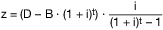

# Verordnung zur Bildung von Altersrückstellungen durch die Sozialversicherung für Landwirtschaft, Forsten und Gartenbau (SVLFG-AltRückV)

Ausfertigungsdatum
:   2017-11-06

Fundstelle
:   BGBl I: 2017, 3765

Geändert durch
:   Art. 57 Abs. 35 G v. 12.12.2019 I 2652

## Eingangsformel

Auf Grund des § 7 Absatz 2 des Gesetzes zur Errichtung der
Sozialversicherung für Landwirtschaft, Forsten und Gartenbau, der
durch Artikel 446 der Verordnung vom 31. August 2015 (BGBl. I S. 1474)
geändert worden ist, in Verbindung mit § 1 der SVLFGG-
Übertragungsverordnung vom 6. Oktober 2016 (BGBl. I S. 2216),
verordnet das Bundesamt für Soziale Sicherung im Einvernehmen mit dem
Bundesministerium für Ernährung und Landwirtschaft:

## § 1 Bildung der Altersrückstellungen

(1) Die Sozialversicherung für Landwirtschaft, Forsten und Gartenbau
bildet Altersrückstellungen für den in § 7 Absatz 1 Satz 1 und 4 des
Gesetzes zur Errichtung der Sozialversicherung für Landwirtschaft,
Forsten und Gartenbau genannten Personenkreis. Dies gilt nach § 7
Absatz 1 Satz 2 des Gesetzes zur Errichtung der Sozialversicherung für
Landwirtschaft, Forsten und Gartenbau nicht für die Beschäftigten, für
die bereits Altersrückstellungen auf der Grundlage der §§ 172c und
219a des Siebten Buches Sozialgesetzbuch gebildet werden.

(2) Altersrückstellungen nach Absatz 1 Satz 1 sind in Höhe des
versicherungsmathematischen Barwerts der Versorgungsleistungen zu
bilden, die auf Grund bereits geleisteter Beschäftigungszeiten zu
erwarten sind. Der Abzug eines Barwerts fiktiver, auf den Beginn des
Beschäftigungsverhältnisses kalkulierter Jahresprämien ist zulässig,
wenn in den Barwert nach Satz 1 auch Zahlungen einbezogen werden, die
auf Grund künftiger Beschäftigungszeiten zu erwarten sind.

(3) Die Berechnung der Barwerte hat den anerkannten Regeln der
Versicherungsmathematik zum jeweiligen Berechnungszeitpunkt zu folgen.
Dabei sind nachfolgende Annahmen zugrunde zu legen:

1.  Rechnungszins in Höhe von 4,25 Prozent,

2.  jährlicher Anstieg der ruhegehaltsfähigen Dienstbezüge und Vergütungen
    um 1,5 Prozent,

3.  jährlicher Anstieg der Versorgungsbezüge und Renten um 1 Prozent,

4.  Zuschlagssatz für Beihilfeaufwendungen in Höhe von 12 Prozent der
    Ausgaben für Versorgungsbezüge.

(4) Die Renten und Anwartschaften zum 31. Dezember 2039 werden für
diejenigen Versorgungsanwärterinnen und Versorgungsanwärter sowie
Rentnerinnen und Rentner ermittelt, deren um vier Jahre erhöhte
durchschnittliche Lebenserwartung nach dem 31. Dezember 2039 endet.
Die Regelaltersgrenze wird nach dem Geburtsjahrgang festgelegt.

## § 2 Höhe und Überprüfung der Zuweisungssätze

(1) Erforderlich ist ein Zuweisungssatz, der in jährlich
gleichbleibender Höhe zum Aufbau des benötigten Deckungskapitals
führt.

(2) Der Zuweisungssatz nach Absatz 1 wird ermittelt, indem das bis zum
31\. Dezember 2039 zu bildende Deckungskapital mit einem Quotienten
multipliziert wird, der im Dividend den nach § 1 Absatz 3 Satz 2
Nummer 1 zu verwendenden Rechnungszins enthält und dessen Divisor dem
Aufzinsungsfaktor, verringert um 1, entspricht. Bereits gebildetes
Deckungskapital wird berücksichtigt, indem das gebildete
Deckungskapital mit dem Rechnungszins nach § 1 Absatz 3 Satz 2 Nummer
1 über die Restlaufzeit aufgezinst und von dem insgesamt zu bildenden
Deckungskapital subtrahiert wird. Es ergibt sich für die Berechnung
des Zuweisungssatzes nach Absatz 1 somit folgende Formel:

*    *        

*    *   mit

    *   z

    *   =

    *   jährlich dem Deckungskapital in gleicher Höhe zuzuführender
        Zuweisungssatz,

*    *
    *   D

    *   =

    *   bis zum 31. Dezember 2039 zu bildendes Deckungskapital für
        Versorgungszusagen nach § 7 Absatz 1 des Gesetzes zur Errichtung der
        Sozialversicherung für Landwirtschaft, Forsten und Gartenbau,

*    *
    *   B

    *   =

    *   bereits gebildetes Deckungskapital,

*    *
    *   t

    *   =

    *   Restlaufzeit bis zum 31. Dezember 2039 in Jahren,

*    *
    *   i

    *   =

    *   Rechnungszins nach § 1 Absatz 3 Satz 2 Nummer 1.

Solange der jährliche Zuweisungssatz kleiner oder gleich Null ist,
sind keine Zuführungen zum Deckungskapital zu leisten.

(3) Die Höhe des Deckungskapitals, der Altersrückstellungen und des
erforderlichen jährlichen Zuweisungssatzes sind bei wesentlichen
Änderungen der Berechnungsgrundlagen, spätestens aber alle fünf Jahre
zu überprüfen. Der Zuweisungssatz ist anzupassen, sobald sich auf
Grund einer Überprüfung die Höhe des zum 31. Dezember 2039
aufzubauenden Deckungskapitals verändert.

## § 3 Zahlverfahren

Die jährlichen Zuweisungssätze sind dem Deckungskapital bis zum 31.
Dezember des für die Zuführung maßgeblichen Kalenderjahres zuzuführen.

## § 4 Übergangsvorschriften

(1) Für Versorgungsleistungen, die vor dem 1. Januar 2040 zu erbringen
sind, sind keine Altersrückstellungen nach § 1 zu bilden.

(2) Für die in § 1 Absatz 1 genannten Personen, deren
Beschäftigungsverhältnis zur Sozialversicherung für Landwirtschaft,
Forsten und Gartenbau am 31. Dezember 2017 bereits bestanden hat, ist
§ 1 mit der Maßgabe anzuwenden, dass auch der Abzug eines Barwerts
fiktiver, auf das Jahr 2018 kalkulierter Jahresprämien zulässig ist,
wenn die Voraussetzung des § 1 Absatz 2 Satz 2 erfüllt ist.

## § 5 Inkrafttreten

Diese Verordnung tritt am Tag nach der Verkündung in Kraft.

