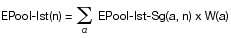

[^F775521_01_BJNR147510011]
Gesetz über den Handel mit Berechtigungen zur Emission von
Treibhausgasen
---
Title: ''
layout: default
slug: tehg_2011

---

#  (TEHG 2011)

Ausfertigungsdatum
:   2011-07-21

Fundstelle
:   BGBl I: 2011, 1475

Zuletzt geändert durch
:   Art. 2 Abs. 24 G v. 22.12.2011 I 3044

[^F775521_01_BJNR147510011]:     Dieses Gesetz dient der Umsetzung der Richtlinie 2003/87/EG des
    Europäischen Parlaments und des Rates vom 13. Oktober 2003 über ein
    System für den Handel mit Treibhausgasemissionszertifikaten in der
    Gemeinschaft und zur Änderung der Richtlinie 96/61/EG des Rates (ABl.
    L 275 vom 25.10.2003, S. 32), die zuletzt durch die Richtlinie
    2009/29/EG (ABl. L 140 vom 5.6.2009, S. 63) geändert worden ist, und
    der Richtlinie 2006/123/EG des Europäischen Parlaments und des Rates
    vom 12. Dezember 2006 über Dienstleistungen im Binnenmarkt (ABl. L 376
    vom 27.12.2006, S. 36).

## Abschnitt 1 - Allgemeine Vorschriften

### § 1 Zweck des Gesetzes

Zweck dieses Gesetzes ist es, für die in Anhang 1 Teil 2 genannten
Tätigkeiten, durch die in besonderem Maße Treibhausgase emittiert
werden, die Grundlagen für den Handel mit Berechtigungen zur Emission
von Treibhausgasen in einem gemeinschaftsweiten Emissionshandelssystem
zu schaffen, um damit durch eine kosteneffiziente Verringerung von
Treibhausgasen zum weltweiten Klimaschutz beizutragen.

### § 2 Anwendungsbereich

(1) Dieses Gesetz gilt für die Emission der in Anhang 1 Teil 2
genannten Treibhausgase durch die dort genannten Tätigkeiten. Für die
in Anhang 1 Teil 2 genannten Anlagen gilt dieses Gesetz auch dann,
wenn sie Teile oder Nebeneinrichtungen einer Anlage sind, die nicht in
Anhang 1 Teil 2 aufgeführt ist.

(2) Der Anwendungsbereich dieses Gesetzes erstreckt sich bei den in
Anhang 1 Teil 2 Nummer 2 bis 31 genannten Anlagen auf alle

1.  Anlagenteile und Verfahrensschritte, die zum Betrieb notwendig sind,
    und

2.  Nebeneinrichtungen, die mit den Anlagenteilen und Verfahrensschritten
    nach Nummer 1 in einem räumlichen und betriebstechnischen Zusammenhang
    stehen und die für das Entstehen von den in Anhang 1 Teil 2 genannten
    Treibhausgasen von Bedeutung sein können.

Satz 1 gilt für Verbrennungseinheiten nach Anhang 1 Teil 2 Nummer 1
entsprechend.

(3) Die in Anhang 1 bestimmten Voraussetzungen liegen auch vor, wenn
mehrere Anlagen derselben Art in einem engen räumlichen und
betrieblichen Zusammenhang stehen und zusammen die nach Anhang 1
maßgeblichen Leistungsgrenzen oder Anlagengrößen erreichen oder
überschreiten werden. Ein enger räumlicher und betrieblicher
Zusammenhang ist gegeben, wenn die Anlagen

1.  auf demselben Betriebsgelände liegen,

2.  mit gemeinsamen Betriebseinrichtungen verbunden sind und

3.  einem vergleichbaren technischen Zweck dienen.

(4) Bedürfen Anlagen nach Anhang 1 Teil 2 Nummer 2 bis 30 einer
Genehmigung nach § 4 Absatz 1 Satz 3 des Bundes-
Immissionsschutzgesetzes, so sind hinsichtlich der Abgrenzung der
Anlagen nach den Absätzen 2 und 3 die Festlegungen in der
immissionsschutzrechtlichen Genehmigung für die Anlage maßgeblich.
Satz 1 gilt für Verbrennungseinheiten nach Anhang 1 Teil 2 Nummer 1
entsprechend. In den Fällen des Absatzes 1 Satz 2 gilt Satz 1
hinsichtlich der Festlegungen in der immissionsschutzrechtlichen
Genehmigung zu den Anlagenteilen oder Nebeneinrichtungen entsprechend.

(5) Dieses Gesetz gilt nicht für:

1.  Anlagen oder Anlagenteile, soweit sie der Forschung oder der
    Entwicklung oder Erprobung neuer Einsatzstoffe, Brennstoffe,
    Erzeugnisse oder Verfahren im Labor- oder Technikumsmaßstab dienen;
    hierunter fallen auch solche Anlagen im Labor- oder Technikumsmaßstab,
    in denen neue Erzeugnisse in der für die Erprobung ihrer Eigenschaften
    durch Dritte erforderlichen Menge vor der Markteinführung hergestellt
    werden, soweit die neuen Erzeugnisse noch weiter erforscht oder
    entwickelt werden,

2.  Anlagen, die nach § 4 Absatz 1 Satz 3 des Bundes-
    Immissionsschutzgesetzes genehmigungsbedürftig sind und bei denen nach
    ihrer immissionsschutzrechtlichen Genehmigung außer für Zwecke der
    Zünd- und Stützfeuerung als Brennstoff nur Klärgas, Deponiegas, Biogas
    oder Biomasse im Sinne des Artikels 2 Absatz 2 Satz 2 Buchstabe a und
    e der Richtlinie 2009/28/EG des Europäischen Parlaments und des Rates
    vom 23. April 2009 zur Förderung der Nutzung von Energie aus
    erneuerbaren Quellen und zur Änderung und anschließenden Aufhebung der
    Richtlinien 2001/77/EG und 2003/30/EG (ABl. L 140 vom 5.6.2009, S. 16)
    in der jeweils geltenden Fassung eingesetzt werden darf und

3.  Anlagen oder Verbrennungseinheiten nach Anhang 1 Teil 2 Nummer 1 bis 6
    zur Verbrennung von gefährlichen Abfällen oder Siedlungsabfällen, die
    nach Nummer 8.1 oder Nummer 8.2 des Anhangs zur Verordnung über
    genehmigungsbedürftige Anlagen genehmigungsbedürftig sind.

(6) Bei Luftverkehrstätigkeiten erstreckt sich der Anwendungsbereich
dieses Gesetzes auf alle Emissionen eines Luftfahrzeugs, die durch den
Verbrauch von Treibstoffen entstehen. Zum Treibstoffverbrauch eines
Luftfahrzeugs zählt auch der Treibstoffverbrauch von Hilfsmotoren.
Dieses Gesetz gilt nur für Luftverkehrstätigkeiten, die von
Luftfahrzeugbetreibern durchgeführt werden,

1.  die eine gültige deutsche Betriebsgenehmigung im Sinne des Artikels 3
    der Verordnung (EG) Nr. 1008/2008 des Europäischen Parlaments und des
    Rates vom 24. September 2008 über gemeinsame Vorschriften für die
    Durchführung von Luftverkehrsdiensten in der Gemeinschaft (ABl. L 293
    vom 31.10.2008, S. 3) in der jeweils geltenden Fassung besitzen oder

2.  die der Bundesrepublik Deutschland als zuständigem
    Verwaltungsmitgliedstaat zugewiesen sind nach der Verordnung (EG) Nr.
    748/2009 der Kommission vom 5. August 2009 über die Liste der
    Luftfahrzeugbetreiber, die am oder nach dem 1. Januar 2006 einer
    Luftverkehrstätigkeit im Sinne von Anhang I der Richtlinie 2003/87/EG
    nachgekommen sind, mit Angabe des für die einzelnen
    Luftfahrzeugbetreiber zuständigen Verwaltungsmitgliedstaats (ABl. L
    219 vom 22.8.2009, S. 1), die durch die Verordnung (EU) Nr. 82/2010
    (ABl. L 25 vom 29.1.2010, S. 12) geändert worden ist, in der jeweils
    geltenden Fassung, und keine gültige Betriebsgenehmigung eines anderen
    Vertragsstaats des Abkommens über den Europäischen Wirtschaftsraum
    besitzen.

Alle Luftverkehrstätigkeiten, die der Luftfahrzeugbetreiber ab Beginn
des Kalenderjahres durchführt, in dem die Voraussetzungen nach Satz 3
erstmals erfüllt sind, fallen in den Anwendungsbereich dieses
Gesetzes.

### § 3 Begriffsbestimmungen

Für dieses Gesetz gelten die folgenden Begriffsbestimmungen:

1.  Anlage

    eine Betriebsstätte oder sonstige ortsfeste Einrichtung;

2.  Anlagenbetreiber

    eine natürliche oder juristische Person oder Personengesellschaft, die
    die unmittelbare Entscheidungsgewalt über eine Anlage innehat, in der
    eine Tätigkeit nach Anhang 1 Teil 2 Nummer 1 bis 32 durchgeführt wird,
    und die dabei die wirtschaftlichen Risiken trägt; wer im Sinne des
    Bundes-Immissionsschutzgesetzes eine genehmigungsbedürftige Anlage
    betreibt, in der eine Tätigkeit nach Anhang 1 Teil 2 Nummer 1 bis 30
    durchgeführt wird, ist Anlagenbetreiber nach Halbsatz 1;

3.  Berechtigung

    die Befugnis zur Emission von einer Tonne Kohlendioxidäquivalent in
    einem bestimmten Zeitraum; eine Tonne Kohlendioxidäquivalent ist eine
    Tonne Kohlendioxid oder die Menge eines anderen Treibhausgases, die in
    ihrem Potenzial zur Erwärmung der Atmosphäre einer Tonne Kohlendioxid
    entspricht;

4.  Betreiber

    ein Anlagenbetreiber oder Luftfahrzeugbetreiber;

5.  Emission

    die Freisetzung von Treibhausgasen durch eine Tätigkeit nach Anhang 1
    Teil 2; die Weiterleitung von Treibhausgasen steht nach Maßgabe der
    Monitoring-Verordnung der Freisetzung gleich;

6.  Emissionsreduktionseinheit

    eine Einheit im Sinne des § 2 Nummer 20 des Projekt-Mechanismen-
    Gesetzes;

7.  Luftfahrzeugbetreiber

    eine natürliche oder juristische Person oder Personengesellschaft, die
    die unmittelbare Entscheidungsgewalt über ein Luftfahrzeug zu dem
    Zeitpunkt innehat, zu dem mit diesem eine Luftverkehrstätigkeit
    durchgeführt wird, und die dabei die wirtschaftlichen Risiken der
    Luftverkehrstätigkeit trägt, oder, wenn die Identität dieser Person
    nicht bekannt ist oder vom Luftfahrzeugeigentümer nicht angegeben
    wird, der Eigentümer des Luftfahrzeugs;

8.  Luftverkehrsberechtigung

    eine Berechtigung, die ausschließlich Luftfahrzeugbetreibern die
    Befugnis zur Emission von einer Tonne Kohlendioxidäquivalent in einem
    bestimmten Zeitraum verleiht;

9.  Luftverkehrstätigkeit

    eine Tätigkeit nach Anhang 1 Teil 2 Nummer 33;

10. Monitoring-Verordnung

    die Verordnung der Europäischen Kommission nach Artikel 14 Absatz 1
    der Richtlinie 2003/87/EG des Europäischen Parlaments und des Rates
    vom 13. Oktober 2003 über ein System für den Handel mit
    Treibhausgasemissionszertifikaten in der Gemeinschaft und zur Änderung
    der Richtlinie 96/61/EG des Rates (ABl. L 275 vom 25.10.2003, S. 32),
    die zuletzt durch die Richtlinie 2009/29/EG (ABl. L 140 vom 5.6.2009,
    S. 63) geändert worden ist, in der jeweils geltenden Fassung;

11. Produktionsleistung

    die tatsächlich und rechtlich maximal mögliche Produktionsmenge pro
    Jahr;

12. Tätigkeit

    eine in Anhang 1 Teil 2 genannte Tätigkeit;

13. Transportleistung

    das Produkt aus Flugstrecke und Nutzlast;

14. Treibhausgase

    Kohlendioxid (CO
    2                   ), Methan (CH
    4                   ), Distickstoffoxid (N
    2                   O), teilfluorierte Kohlenwasserstoffe (HFKW),
    perfluorierte Kohlenwasserstoffe (PFC) und Schwefelhexafluorid (SF
    6                   );

15. Überwachungsplan

    eine Darstellung der Methode, die ein Betreiber anwendet, um seine
    Emissionen zu ermitteln und darüber Bericht zu erstatten;

16. zertifizierte Emissionsreduktion

    eine Einheit im Sinne des § 2 Nummer 21 des Projekt-Mechanismen-
    Gesetzes.

## Abschnitt 2 - Genehmigung und Überwachung von Emissionen

### § 4 Emissionsgenehmigung

(1) Der Anlagenbetreiber bedarf zur Freisetzung von Treibhausgasen
durch eine Tätigkeit nach Anhang 1 Teil 2 Nummer 1 bis 32 einer
Genehmigung. Die Genehmigung ist auf Antrag des Anlagenbetreibers von
der zuständigen Behörde zu erteilen, wenn die zuständige Behörde auf
der Grundlage der vorgelegten Antragsunterlagen die Angaben nach
Absatz 3 feststellen kann.

(2) Der Antragsteller hat dem Genehmigungsantrag insbesondere folgende
Angaben beizufügen:

1.  Name und Anschrift des Anlagenbetreibers,

2.  eine Beschreibung der Tätigkeit, des Standorts und der Art und des
    Umfangs der dort durchgeführten Verrichtungen und der verwendeten
    Technologien,

3.  in den Fällen des § 2 Absatz 1 Satz 2 eine Beschreibung der räumlichen
    Abgrenzung der Anlagenteile, Verfahrensschritte und Nebeneinrichtungen
    nach § 2 Absatz 2,

4.  die Quellen von Emissionen und

5.  den Zeitpunkt, zu dem die Anlage in Betrieb genommen worden ist oder
    werden soll.

(3) Die Genehmigung enthält folgende Angaben:

1.  Name und Anschrift des Anlagenbetreibers,

2.  eine Beschreibung der Tätigkeit und des Standorts, an dem die
    Tätigkeit durchgeführt wird,

3.  in den Fällen des § 2 Absatz 1 Satz 2 eine Beschreibung der räumlichen
    Abgrenzung der einbezogenen Anlagenteile, Verfahrensschritte und
    Nebeneinrichtungen nach § 2 Absatz 2 und

4.  eine Auflistung der einbezogenen Quellen von Emissionen.

(4) Bei Anlagen, die vor dem 1. Januar 2013 nach den Vorschriften des
Bundes-Immissionsschutzgesetzes genehmigt worden sind, ist die
immissionsschutzrechtliche Genehmigung die Genehmigung nach Absatz 1.
Der Anlagenbetreiber kann aber auch im Fall des Satzes 1 eine
gesonderte Genehmigung nach Absatz 1 beantragen. In diesem Fall ist
Satz 1 nur bis zur Erteilung der gesonderten Genehmigung anwendbar.

(5) Der Anlagenbetreiber ist verpflichtet, der zuständigen Behörde
eine geplante Änderung der Tätigkeit in Bezug auf die Angaben nach
Absatz 3 mindestens einen Monat vor ihrer Verwirklichung vollständig
und richtig anzuzeigen, soweit diese Änderung Auswirkungen auf die
Emissionen haben kann. Die zuständige Behörde ändert die Genehmigung
entsprechend. Die zuständige Behörde überprüft unabhängig von Satz 2
mindestens alle fünf Jahre die Angaben nach Absatz 3 und ändert die
Genehmigung im Bedarfsfall entsprechend. Für die genannten Änderungen
der Genehmigung gilt Absatz 4 Satz 3 entsprechend.

(6) In den Verfahren zur Erteilung oder Änderung der
Emissionsgenehmigung nach den Absätzen 1 und 5 ist der nach § 19
Absatz 1 Nummer 3 zuständigen Behörde Gelegenheit zur Stellungnahme in
angemessener Frist zu geben.

### § 5 Ermittlung von Emissionen und Emissionsbericht

(1) Der Betreiber hat die durch seine Tätigkeit in einem Kalenderjahr
verursachten Emissionen nach Maßgabe des Anhangs 2 Teil 2 zu ermitteln
und der zuständigen Behörde bis zum 31. März des Folgejahres über die
Emissionen zu berichten.

(2) Die Angaben im Emissionsbericht nach Absatz 1 müssen von einer
sachverständigen Stelle, die nach § 21 durch die zuständige Behörde
bekannt gegeben worden ist, nach Anhang 3 verifiziert worden sein.

### § 6 Überwachungsplan

(1) Der Betreiber ist verpflichtet, bei der zuständigen Behörde für
jede Handelsperiode einen Überwachungsplan für die Emissionsermittlung
und Berichterstattung nach § 5 Absatz 1 einzureichen. Dabei hat er die
in Anhang 2 Teil 1 Nummer 1 genannten Fristen einzuhalten.

(2) Der Überwachungsplan bedarf der Genehmigung. Die Genehmigung ist
zu erteilen, wenn der Überwachungsplan den Vorgaben der Monitoring-
Verordnung, der Rechtsverordnung nach § 28 Absatz 2 Nummer 1 und,
soweit diese keine Regelungen treffen, des Anhangs 2 Teil 2 Satz 3
entspricht. Entspricht ein vorgelegter Überwachungsplan nicht diesen
Vorgaben, ist der Betreiber verpflichtet, die festgestellten Mängel
innerhalb einer von der zuständigen Behörde festzusetzenden Frist zu
beseitigen und den geänderten Überwachungsplan vorzulegen. Im
Verfahren zur Genehmigung des Überwachungsplans ist in den Fällen des
§ 19 Absatz 1 Nummer 1 der danach zuständigen Behörde Gelegenheit zur
Stellungnahme zu geben. Die zuständige Behörde kann die Genehmigung
mit Auflagen für die Überwachung von und Berichterstattung über
Emissionen verbinden.

(3) Der Betreiber ist verpflichtet, den Überwachungsplan innerhalb
einer Handelsperiode unverzüglich anzupassen, soweit sich folgende
Änderungen bezüglich der Anforderungen an die Emissionsermittlung oder
an ihre Berichterstattung ergeben:

1.  Änderung der Vorgaben nach Absatz 2 Satz 2,

2.  Änderung seiner Emissionsgenehmigung oder

3.  sonstige Änderung seiner Tätigkeit.

Die zuständige Behörde kann nachträgliche Anordnungen treffen, um die
Erfüllung der Pflicht nach Satz 1 sicherzustellen. Für den angepassten
Überwachungsplan nach Satz 1 gelten Absatz 1 Satz 1 und Absatz 2
entsprechend.

## Abschnitt 3 - Berechtigungen und Zuteilung

### § 7 Berechtigungen

(1) Der Betreiber hat jährlich bis zum 30. April an die zuständige
Behörde eine Anzahl von Berechtigungen abzugeben, die den durch seine
Tätigkeit im vorangegangenen Kalenderjahr verursachten Emissionen
entspricht. Anlagenbetreiber können ihre Verpflichtung nach Satz 1
nicht durch die Abgabe von Luftverkehrsberechtigungen erfüllen.

(2) Die Berechtigungen gelten jeweils für eine der nachfolgend
genannten Handelsperioden:

1.  die Handelsperiode für Tätigkeiten nach Anhang 1 des Treibhausgas-
    Emissionshandelsgesetzes vom 8. Juli 2004 (BGBl. I S. 1578), das
    zuletzt durch Artikel 9 des Gesetzes vom 11. August 2010 (BGBl. I S.
    1163) geändert worden ist, die am 1. Januar 2008 begonnen hat, endet
    am 31. Dezember 2012 (Handelsperiode 2008 bis 2012);

2.  die erste Handelsperiode für Luftverkehrstätigkeiten, die am 1. Januar
    2012 beginnt, endet am 31. Dezember 2012 (Handelsperiode 2012);

3.  die Handelsperiode für alle Tätigkeiten, die am 1. Januar 2013
    beginnt, endet am 31. Dezember 2020 (Handelsperiode 2013 bis 2020);

4.  die sich an die Handelsperiode 2013 bis 2020 anschließenden
    Handelsperioden umfassen einen Zeitraum von jeweils acht Jahren.

Berechtigungen einer abgelaufenen Handelsperiode werden vier Monate
nach Ende dieser Handelsperiode gelöscht und von der zuständigen
Behörde durch Berechtigungen der laufenden Handelsperiode ersetzt. Der
Inhaber von Berechtigungen kann jederzeit auf sie verzichten und ihre
Löschung verlangen.

(3) Berechtigungen sind übertragbar. Die Übertragung von
Berechtigungen erfolgt durch Einigung und Eintragung auf dem Konto des
Erwerbers im Emissionshandelsregister nach § 17. Die Eintragung
erfolgt auf Anweisung des Veräußerers an die kontoführende Stelle,
Berechtigungen von seinem Konto auf das Konto des Erwerbers zu
übertragen.

(4) Soweit für jemanden eine Berechtigung in das
Emissionshandelsregister eingetragen ist, gilt der Inhalt des
Registers als richtig. Dies gilt nicht für den Empfänger ausgegebener
Berechtigungen, wenn ihm die Unrichtigkeit bei Ausgabe bekannt ist.

(5) Berechtigungen sind keine Finanzinstrumente im Sinne des § 1
Absatz 11 des Kreditwesengesetzes oder des § 2 Absatz 2b des
Wertpapierhandelsgesetzes.

### § 8 Versteigerung von Berechtigungen

(1) Alle der Bundesrepublik Deutschland durch die Europäische
Kommission nach der Richtlinie 2003/87/EG in der jeweils geltenden
Fassung zur Versteigerung zugewiesenen Berechtigungen werden
versteigert. Die Versteigerung erfolgt nach den Regeln der Verordnung
(EU) Nr. 1031/2010 der Kommission vom 12. November 2010 über den
zeitlichen und administrativen Ablauf sowie sonstige Aspekte der
Versteigerung von Treibhausgasemissionszertifikaten gemäß der
Richtlinie 2003/87/EG des Europäischen Parlaments und des Rates über
ein System für den Handel mit Treibhausgasemissionszertifikaten in der
Gemeinschaft (ABl. L 302 vom 18.11.2010, S. 1) in der jeweils
geltenden Fassung.

(2) Das Bundesministerium für Umwelt, Naturschutz und
Reaktorsicherheit beauftragt im Einvernehmen mit dem Bundesministerium
der Finanzen und dem Bundesministerium für Wirtschaft und Technologie
eine geeignete Stelle mit der Durchführung der Versteigerung.

(3) Die Erlöse aus der Versteigerung der Berechtigungen nach Absatz 1
stehen dem Bund zu. Die Kosten, die dem Bund durch die Wahrnehmung der
ihm im Rahmen des Emissionshandels zugewiesenen Aufgaben entstehen und
nicht durch Gebühren nach § 22 gedeckt sind, werden aus den Erlösen
nach Satz 1 gedeckt.

(4) Zur Gebotseinstellung auf eigene Rechnung oder im Namen der Kunden
ihres Hauptgeschäftes bedürfen die in § 2a Absatz 1 Nummer 9 des
Wertpapierhandelsgesetzes genannten Unternehmen einer Erlaubnis der
Bundesanstalt für Finanzdienstleistungsaufsicht (Bundesanstalt). Für
Berechtigungen, die nicht in Form eines Finanzinstruments gemäß
Artikel 38 Absatz 3 der Verordnung (EG) Nr. 1287/2006 der Kommission
vom 10. August 2006 zur Durchführung der Richtlinie 2004/39/EG des
Europäischen Parlaments und des Rates betreffend die
Aufzeichnungspflichten für Wertpapierfirmen, die Meldung von
Geschäften, die Markttransparenz, die Zulassung von Finanzinstrumenten
zum Handel und bestimmte Begriffe im Sinne dieser Richtlinie (ABl. L
241 vom 2.9.2006, S. 1) versteigert werden, bedürfen zur
Gebotseinstellung im Namen der Kunden ihres Hauptgeschäftes auch

1.  Institute im Sinne des § 1 Absatz 1b des Kreditwesengesetzes, denen
    eine Erlaubnis nach § 32 des Kreditwesengesetzes erteilt worden ist,
    und

2.  nach § 53 Absatz 1 Satz 1 des Kreditwesengesetzes tätige Unternehmen,
    denen eine Erlaubnis nach § 32 des Kreditwesengesetzes erteilt worden
    ist,

einer Erlaubnis der Bundesanstalt. Die Erlaubnis wird erteilt, sofern
das Unternehmen die Bedingungen des Artikels 59 Absatz 5 der
Verordnung (EU) Nr. 1031/2010 erfüllt. Die Bundesanstalt kann die
Erlaubnis außer nach den Vorschriften des
Verwaltungsverfahrensgesetzes aufheben, wenn ihr Tatsachen bekannt
werden, welche eine Erteilung der Erlaubnis nach Satz 3 ausschließen
würden.

### § 9 Zuteilung von kostenlosen Berechtigungen an Anlagenbetreiber

(1) Anlagenbetreiber erhalten eine Zuteilung von kostenlosen
Berechtigungen nach Maßgabe der Grundsätze des Artikels 10a Absatz 1
bis 5, 7 und 11 bis 20 der Richtlinie 2003/87/EG in der jeweils
geltenden Fassung und des Beschlusses 2011/278/EU der Kommission vom
27\. April 2011 zur Festlegung EU-weiter Übergangsvorschriften zur
Harmonisierung der kostenlosen Zuteilung von Emissionszertifikaten
gemäß Artikel 10a der Richtlinie 2003/87/EG (ABl. L 130 vom 17.5.2011,
S. 1).

(2) Die Zuteilung setzt einen Antrag bei der zuständigen Behörde
voraus. Der Antrag auf Zuteilung von kostenlosen Berechtigungen ist
innerhalb einer Frist, die von der zuständigen Behörde mindestens drei
Monate vor ihrem Ablauf im Bundesanzeiger bekannt gegeben wird, zu
stellen. Die Bekanntgabe der Frist erfolgt frühestens nach
Inkrafttreten der Rechtsverordnung über Zuteilungsregeln gemäß § 10.
Bei verspätetem Antrag besteht kein Anspruch auf kostenlose Zuteilung.
Dem Antrag sind die zur Prüfung des Anspruchs erforderlichen
Unterlagen beizufügen. Soweit in der Verordnung nach § 10 nichts
anderes bestimmt ist, müssen die tatsächlichen Angaben im
Zuteilungsantrag von einer sachverständigen Stelle, die nach § 21
durch die zuständige Behörde bekannt gegeben worden ist, verifiziert
worden sein.

(3) Die zuständige Behörde berechnet die vorläufigen Zuteilungsmengen,
veröffentlicht eine Liste aller unter den Anwendungsbereich dieses
Gesetzes fallenden Anlagen und der vorläufigen Zuteilungsmengen im
Bundesanzeiger und meldet die Liste der Europäischen Kommission. Bei
der Berechnung der vorläufigen Zuteilungsmengen werden nur solche
Angaben des Betreibers berücksichtigt, deren Richtigkeit ausreichend
gesichert ist. Rechtsbehelfe im Hinblick auf die Meldung der
Zuteilungsmengen können nur gleichzeitig mit den gegen die
Zuteilungsentscheidung zulässigen Rechtsbehelfen geltend gemacht
werden.

(4) Die zuständige Behörde entscheidet vor Beginn der Handelsperiode
über die Zuteilung von kostenlosen Berechtigungen für eine Anlage an
Anlagenbetreiber, die innerhalb der nach Absatz 2 Satz 2 bekannt
gegebenen Frist einen Antrag gestellt haben. Im Übrigen gelten für das
Zuteilungsverfahren die Vorschriften des
Verwaltungsverfahrensgesetzes.

(5) Bedeutete eine Zuteilung nach den Zuteilungsregeln nach § 10 eine
unzumutbare Härte für den Anlagenbetreiber und für ein mit diesem
verbundenes Unternehmen, das mit seinem Kapital aus handels- oder
gesellschaftsrechtlichem Rechtsgrund für die wirtschaftlichen Risiken
des Anlagenbetriebes einstehen muss, teilt die zuständige Behörde auf
Antrag des Betreibers zusätzliche Berechtigungen in der für einen
Ausgleich angemessenen Menge zu, soweit die Europäische Kommission
diese Zuteilung nicht nach Artikel 11 Absatz 3 der Richtlinie
2003/87/EG ablehnt.

(6) Die Zuteilungsentscheidung ist aufzuheben, soweit sie auf Grund
eines Rechtsakts der Europäischen Union nachträglich geändert werden
muss. Die §§ 48 und 49 des Verwaltungsverfahrensgesetzes bleiben im
Übrigen unberührt.

### § 10 Rechtsverordnung über Zuteilungsregeln

Die Bundesregierung wird ermächtigt, nach Maßgabe der Richtlinie
2003/87/EG in der jeweils geltenden Fassung und des Beschlusses
2011/278/EU der Kommission vom 27. April 2011 zur Festlegung EU-weiter
Übergangsvorschriften zur Harmonisierung der kostenlosen Zuteilung von
Emissionszertifikaten gemäß Artikel 10a der Richtlinie 2003/87/EG
(ABl. L 130 vom 17.5.2011, S. 1) nach Anhörung der beteiligten Kreise
die Einzelheiten der Zuteilung von kostenlosen Berechtigungen an
Anlagenbetreiber durch Rechtsverordnung, die nicht der Zustimmung des
Bundesrates bedarf, zu bestimmen. In dieser Rechtsverordnung kann die
Bundesregierung insbesondere regeln:

1.  die Produkte, für die die Berechtigungen kostenlos zugeteilt werden,

2.  die Berechnung der Anzahl zuzuteilender Berechtigungen,

3.  die Erhebung von Daten über die Emissionen und die Produktion von
    Anlagen und sonstiger für das Zuteilungsverfahren relevanter Daten,

4.  die Bestimmung der Produktionsmenge oder sonstiger Größen, die zur
    Berechnung der Zuteilungsmenge erforderlich sind,

5.  Emissionswerte je erzeugter Produkteinheit,

6.  die Fälle, in denen von einer Zuteilung auf Grundlage von
    Emissionswerten je erzeugter Produkteinheit ausnahmsweise abgesehen
    wird oder in denen gesonderte Zuteilungsregeln bestehen, sowie die
    Methoden, die in diesen Fällen zur Anwendung kommen,

7.  die Basisperiode, deren Daten für die Zuteilung von kostenlosen
    Berechtigungen maßgeblich sind, sowie Fälle, in denen von dieser
    Basisperiode abgewichen werden kann,

8.  die Zuteilung für Neuanlagen und Kapazitätserweiterungen,
    einschließlich der Bestimmung der Kapazität und der Auslastung von
    Neuanlagen,

9.  die Bestimmung der jährlich auszugebenden Mengen von kostenlosen
    Berechtigungen in der Zuteilungsentscheidung,

10. Festlegungen zu den Anteilen der Wärmeproduktion an den
    Emissionswerten nach Nummer 5,

11. die im Antrag nach § 9 Absatz 2 Satz 1

    a)  erforderlichen Angaben und

    b)  erforderlichen Unterlagen sowie die Art der beizubringenden Nachweise,

12. Anforderungen an die Verifizierung von Zuteilungsanträgen nach § 9
    Absatz 2 Satz 5 sowie Ausnahmen von der Verifizierungspflicht und

13. die Voraussetzungen und das Verfahren der Bekanntgabe der
    sachverständigen Stelle durch die zuständige Behörde.

Die Rechtsverordnung nach den Sätzen 1 und 2 bedarf der Zustimmung des
Bundestages. Der Bundestag kann diese Zustimmung davon abhängig
machen, ob Änderungswünsche übernommen werden. Übernimmt die
Bundesregierung die Änderungen, ist eine erneute Beschlussfassung
durch den Bundestag nicht erforderlich. Hat sich der Bundestag nach
Ablauf von sechs Sitzungswochen seit Eingang der Rechtsverordnung
nicht mit ihr befasst, gilt seine Zustimmung zu der unveränderten
Rechtsverordnung als erteilt.

### § 11 Regelzuteilung von kostenlosen Berechtigungen an Luftfahrzeugbetreiber

(1) Luftfahrzeugbetreiber erhalten für eine Handelsperiode eine Anzahl
von kostenlosen Luftverkehrsberechtigungen zugeteilt, die dem Produkt
aus ihrer Transportleistung im Basisjahr in Tonnenkilometern und dem
Richtwert entspricht, der in der Entscheidung der Europäischen
Kommission nach Artikel 3e Absatz 3 Satz 1 Buchstabe e und Satz 2 der
Richtlinie 2003/87/EG bestimmt wird.

(2) Das Basisjahr für die Transportleistung ist das Kalenderjahr, das
24 Monate vor Beginn der Handelsperiode endet, auf die sich die
Zuteilung bezieht. Für die Handelsperiode 2012 und die Handelsperiode
2013 bis 2020 ist das Jahr 2010 das Basisjahr.

(3) Die Zuteilung für eine Handelsperiode setzt einen Antrag bei der
zuständigen Behörde voraus, der spätestens 21 Monate vor Beginn der
jeweiligen Handelsperiode gestellt werden muss. Bei einem verspäteten
Antrag besteht kein Anspruch auf Zuteilung kostenloser
Luftverkehrsberechtigungen mehr. Die Sätze 1 und 2 gelten nicht für
die Handelsperiode 2012 und die Handelsperiode 2013 bis 2020.

(4) In dem Antrag muss der Antragsteller die nach den Anforderungen
der Monitoring-Verordnung ermittelte Transportleistung angeben, die er
im Basisjahr durch seine Luftverkehrstätigkeit erbracht hat. Hat der
Luftfahrzeugbetreiber einen Bericht über Flugstrecke und Nutzlast nach
§ 5 Absatz 1 Satz 1 der Datenerhebungsverordnung 2020 abgegeben, so
gilt dieser Bericht als Antrag auf Zuteilung für die Handelsperiode
2012 und die Handelsperiode 2013 bis 2020, sofern der
Luftfahrzeugbetreiber dem nicht innerhalb eines Monats nach
Inkrafttreten dieses Gesetzes widerspricht. Im Fall des Widerspruchs
besteht kein Anspruch auf kostenlose Zuteilung nach Absatz 1. Die
Angaben zur Transportleistung sind entsprechend § 5 Absatz 2 zu
verifizieren. Dies gilt nicht, soweit ein Bericht über Flugstrecke und
Nutzlast bereits nach § 11 der Datenerhebungsverordnung 2020 geprüft
worden ist.

(5) Die zuständige Behörde übermittelt die Anträge spätestens 18
Monate vor Beginn der Handelsperiode an die Europäische Kommission.
Die zuständige Behörde überprüft die Angaben des Antragstellers zur
Transportleistung und übermittelt nur solche Angaben an die
Europäische Kommission, deren Richtigkeit zum Ablauf der
Übermittlungsfrist ausreichend gesichert ist. Sofern die zuständige
Behörde zur Prüfung des Antrags und der darin gemachten Angaben
zusätzliche Angaben oder Nachweise benötigt, ist der
Luftfahrzeugbetreiber verpflichtet, diese auf Verlangen der
zuständigen Behörde innerhalb einer von dieser festzusetzenden Frist
zu übermitteln.

(6) Die zuständige Behörde teilt die kostenlosen Berechtigungen
innerhalb von drei Monaten zu, nachdem die Europäische Kommission den
Richtwert gemäß Artikel 3e Absatz 3 der Richtlinie 2003/87/EG bekannt
gegeben hat. Die zuständige Behörde veröffentlicht eine Liste mit den
Namen der Luftfahrzeugbetreiber und der Höhe der Zuteilungen im
Bundesanzeiger.

### § 12 Zuteilung von kostenlosen Berechtigungen aus der Sonderreserve

(1) Luftfahrzeugbetreiber erhalten für eine Handelsperiode eine
Zuteilung von kostenlosen Luftverkehrsberechtigungen aus der
Sonderreserve, wenn

1.  sie erstmals nach Ablauf des Basisjahres nach § 11 Absatz 2 eine
    Luftverkehrstätigkeit neu aufgenommen haben oder

2.  die im Rahmen ihrer Luftverkehrstätigkeit erbrachte Transportleistung
    in Tonnenkilometern im Zeitraum zwischen dem Basisjahr und dem Ende
    des zweiten Kalenderjahres der laufenden Handelsperiode
    durchschnittlich um mehr als 18 Prozent jährlich angestiegen ist.

Weiterhin setzt eine Zuteilung nach Satz 1 voraus, dass der
Luftfahrzeugbetreiber durch die neu aufgenommene Tätigkeit oder durch
die angestiegene Transportleistung keine zuvor von einem anderen
Unternehmen durchgeführte Tätigkeit ganz oder teilweise fortführt.
Satz 1 gilt nicht für die Handelsperiode 2012.

(2) Im Fall der Neuaufnahme einer Tätigkeit entspricht die Anzahl der
zuzuteilenden Luftverkehrsberechtigungen dem Produkt aus der im
zweiten Kalenderjahr der Handelsperiode erbrachten Transportleistung
und dem Richtwert, der in der Entscheidung der Europäischen Kommission
nach Artikel 3f Absatz 5 der Richtlinie 2003/87/EG bestimmt wird.

(3) Im Fall der angestiegenen Transportleistung nach Absatz 1 Satz 1
Nummer 2 entspricht die Anzahl der zuzuteilenden
Luftverkehrsberechtigungen dem Produkt aus dem Anstieg der
Transportleistung in Tonnenkilometern, soweit der Anstieg den in
Absatz 1 Satz 1 Nummer 2 genannten prozentualen Anstieg in
Tonnenkilometern übersteigt, und dem Richtwert, der in der
Entscheidung der Europäischen Kommission nach Artikel 3f Absatz 5 der
Richtlinie 2003/87/EG bestimmt wird. Die Zuteilung nach Satz 1 beträgt
höchstens 1 Million Luftverkehrsberechtigungen pro
Luftfahrzeugbetreiber.

(4) Die zuständige Behörde teilt die kostenlosen Berechtigungen
innerhalb von drei Monaten zu, nachdem die Europäische Kommission den
Richtwert gemäß Artikel 3f Absatz 5 der Richtlinie 2003/87/EG bekannt
gegeben hat. Sie weist dabei die Zuteilung für eine gesamte
Handelsperiode und für die einzelnen verbleibenden vollen Jahre dieser
Handelsperiode aus. Die zuständige Behörde veröffentlicht eine Liste
mit den Namen der Luftfahrzeugbetreiber und der Höhe der Zuteilungen
im Bundesanzeiger.

### § 13 Antrag auf Zuteilung aus der Sonderreserve

(1) Die Zuteilung aus der Sonderreserve setzt einen Antrag bei der
zuständigen Behörde voraus, der spätestens bis zum 30. Juni des
dritten Jahres der jeweils laufenden Handelsperiode gestellt werden
muss. Bei einem verspäteten Antrag besteht kein Anspruch auf Zuteilung
kostenloser Luftverkehrsberechtigungen mehr.

(2) Der Antragsteller hat in dem Antrag nach Absatz 1 das Vorliegen
der in § 12 Absatz 1 aufgeführten Zuteilungsvoraussetzungen
nachzuweisen. Ein Antrag nach § 12 Absatz 1 Satz 1 Nummer 2 muss
insbesondere jeweils bezogen auf den Zeitraum zwischen dem Basisjahr
und dem zweiten Kalenderjahr der laufenden Handelsperiode folgende
Angaben enthalten:

1.  den prozentualen Anstieg der Transportleistung des Antragstellers seit
    dem Basisjahr,

2.  den absoluten Anstieg der Transportleistung des Antragstellers seit
    dem Basisjahr in Tonnenkilometern und

3.  den Anteil des absoluten Anstiegs nach Nummer 2, der den in § 12
    Absatz 1 Satz 1 Nummer 2 genannten prozentualen Anstieg in
    Tonnenkilometern überschreitet.

Die zuständige Behörde übermittelt die Anträge spätestens sechs Monate
nach Ablauf der Frist nach Absatz 1 Satz 1 an die Europäische
Kommission. § 5 Absatz 2 und § 11 Absatz 5 Satz 2 und 3 gelten
entsprechend.

(3) In dem Antrag nach Absatz 1 Satz 1 ist die nach den Anforderungen
der Monitoring-Verordnung ermittelte Transportleistung anzugeben, die
der Antragsteller im zweiten Kalenderjahr der laufenden Handelsperiode
durch seine Luftverkehrstätigkeit erbracht hat.

(4) Zur Ermittlung und Angabe der Transportleistung nach Absatz 3 hat
der Luftfahrzeugbetreiber einen Tonnenkilometer-Überwachungsplan zu
erstellen und bei der zuständigen Behörde innerhalb der in Anhang 2
Teil 1 Nummer 2 genannten Frist zur Genehmigung einzureichen.

(5) Die Genehmigung nach Absatz 4 ist zu erteilen, wenn der
Überwachungsplan den Vorgaben der Monitoring-Verordnung entspricht. §
6 Absatz 2 Satz 3 und 5 gilt entsprechend.

### § 14 Ausgabe von Berechtigungen

(1) Die zuständige Behörde gibt die nach § 9 Absatz 4 zugeteilten
Berechtigungen nach Maßgabe der Zuteilungsentscheidung bis zum 28.
Februar eines Jahres, für das Berechtigungen abzugeben sind, aus.

(2) Abweichend von Absatz 1 werden für Anlagen, die nach Beginn der
Handelsperiode in Betrieb genommen wurden, für das erste Betriebsjahr
zugeteilte Berechtigungen unverzüglich nach der Zuteilungsentscheidung
ausgegeben. Ergeht die Zuteilungsentscheidung vor dem 28. Februar
eines Kalenderjahres, so werden Berechtigungen nach Satz 1 erstmals
zum 28. Februar desselben Jahres ausgegeben.

(3) Bei der Regelzuteilung für Luftfahrzeugbetreiber nach § 11 gibt
die zuständige Behörde die für eine Handelsperiode insgesamt
zugeteilte Menge an Luftverkehrsberechtigungen in den Jahren der
Handelsperiode jeweils bis zum 28. Februar in jährlich gleichen
Teilmengen aus. Bei der Zuteilung aus der Sonderreserve nach § 12 gibt
die zuständige Behörde die für eine Handelsperiode insgesamt
zugeteilte Menge an Luftverkehrsberechtigungen in den auf die
Zuteilungsentscheidung folgenden Kalenderjahren der Handelsperiode in
jährlich gleichen Teilmengen aus.

### § 15 Durchsetzung von Rückgabeverpflichtungen

Soweit der Betreiber im Fall der Aufhebung der Zuteilungsentscheidung
zur Rückgabe zu viel ausgegebener Berechtigungen verpflichtet ist,
kann die zuständige Behörde diese Verpflichtung nach den Vorschriften
des Verwaltungs-Vollstreckungsgesetzes durchsetzen. Die Höhe des
Zwangsgeldes beträgt bis zu 500 000 Euro.

### § 16 Anerkennung von Berechtigungen und Emissionsgutschriften

(1) Berechtigungen, die von anderen Mitgliedstaaten der Europäischen
Union in Anwendung der Richtlinie 2003/87/EG für die laufende
Handelsperiode ausgegeben worden sind, stehen Berechtigungen gleich,
die in der Bundesrepublik Deutschland ausgegeben worden sind.

(2) Die Vorschriften über Berechtigungen nach § 7 Absatz 3 bis 5 und §
17 gelten für Emissionsreduktionseinheiten, zertifizierte
Emissionsreduktionen und Emissionsgutschriften, die in einer
Rechtsverordnung nach § 28 Absatz 1 Nummer 3 anerkannt sind,
entsprechend.

(3) Berechtigungen, die von Drittländern ausgegeben werden, mit denen
Abkommen über die gegenseitige Anerkennung von Berechtigungen gemäß
Artikel 25 Absatz 1 der Richtlinie 2003/87/EG geschlossen wurden,
werden von der zuständigen Behörde nach Maßgabe der auf Grundlage von
Artikel 25 Absatz 2 der Richtlinie 2003/87/EG erlassenen Vorschriften
in Berechtigungen überführt.

### § 17 Emissionshandelsregister

Berechtigungen werden in einem Emissionshandelsregister nach der
Verordnung gemäß Artikel 19 Absatz 3 der Richtlinie 2003/87/EG
gehalten und übertragen.

### § 18 Umtausch von Emissionsgutschriften in Berechtigungen

(1) Auf Antrag des Betreibers tauscht die zuständige Behörde
Emissionsreduktionseinheiten, zertifizierte Emissionsreduktionen oder
andere Gutschriften für Emissionsminderungen nach Maßgabe der Absätze
2 und 3 in Berechtigungen für die Handelsperiode 2013 bis 2020 um.

(2) Der Umtausch ist in der Handelsperiode 2013 bis 2020 vorbehaltlich
einer Erhöhung durch eine Rechtsverordnung nach § 28 Absatz 1 Nummer 3
auf folgende Höchstmengen beschränkt:

1.  für eine Anlage, für die der Anlagenbetreiber in der Handelsperiode
    2008 bis 2012 eine Zuteilung nach den §§ 6 bis 9 oder § 12 des
    Zuteilungsgesetzes 2012 erhalten hat, auf 22 Prozent dieser
    Zuteilungsmenge, soweit dieser Anteil nicht zur Erfüllung der
    Abgabepflicht für die Emissionen in der Handelsperiode 2008 bis 2012
    genutzt wurde;

2.  für eine Anlage, die nicht von Nummer 1 erfasst ist, auf eine Menge,
    die 4,5 Prozent der nach § 7 Absatz 1 für die Emissionen in der
    Handelsperiode 2013 bis 2020 insgesamt abzugebenden Menge an
    Berechtigungen entspricht;

3.  für Luftfahrzeugbetreiber auf eine Menge, die 1,5 Prozent der vom
    jeweiligen Luftfahrzeugbetreiber nach § 7 Absatz 1 für die Emissionen
    in der Handelsperiode 2013 bis 2020 insgesamt abzugebenden Menge an
    Berechtigungen entspricht; diese Menge erhöht sich um eine Menge, die
    15 Prozent der Menge an Berechtigungen entspricht, die der jeweilige
    Luftfahrzeugbetreiber für die Handelsperiode 2012 abzugeben hatte,
    soweit der Luftfahrzeugbetreiber diesen Anteil nicht zur Erfüllung
    dieser Abgabepflicht genutzt hat.

(3) Folgende Emissionsreduktionseinheiten oder zertifizierte
Emissionsreduktionen sind vorbehaltlich einer Einschränkung durch eine
Rechtsverordnung nach § 28 Absatz 1 Nummer 3 umtauschbar:

1.  Emissionsreduktionseinheiten oder zertifizierte Emissionsreduktionen
    für Emissionsminderungen, die vor dem Jahr 2013 erbracht wurden;

2.  zertifizierte Emissionsreduktionen aus Projekten, die vor dem Jahr
    2013 von dem Exekutivrat im Sinne des § 2 Nummer 22 des Projekt-
    Mechanismen-Gesetzes registriert wurden.

Satz 1 gilt nur für Emissionsreduktionseinheiten und zertifizierte
Emissionsreduktionen, die aus Projekttypen stammen, deren Gutschriften
auch in der Handelsperiode 2008 bis 2012 genutzt werden durften.

## Abschnitt 4 - Gemeinsame Vorschriften

### § 19 Zuständigkeiten

(1) Zuständige Behörde ist

1.  für den Vollzug des § 4 bei genehmigungsbedürftigen Anlagen nach § 4
    Absatz 1 Satz 3 des Bundes-Immissionsschutzgesetzes die nach
    Landesrecht für den Vollzug des § 4 zuständige Behörde,

2.  für den Vollzug des § 31 Absatz 2 im Fall eines gewerblichen
    Luftfahrzeugbetreibers das Luftfahrt-Bundesamt,

3.  im Übrigen das Umweltbundesamt.

(2) Ist für Streitigkeiten nach diesem Gesetz der Verwaltungsrechtsweg
gegeben, so ist bei Anfechtungsklagen gegen Verwaltungsakte des
Umweltbundesamtes das Gericht örtlich zuständig, in dessen Bezirk der
Verwaltungsakt erlassen wurde. Satz 1 gilt entsprechend für
Verpflichtungsklagen sowie für Klagen auf Feststellung der Nichtigkeit
von Verwaltungsakten.

### § 20 Überwachung

(1) Die nach § 19 jeweils zuständige Behörde hat die Durchführung
dieses Gesetzes und der auf dieses Gesetz gestützten
Rechtsverordnungen zu überwachen.

(2) Betreiber sowie Eigentümer und Besitzer von Luftfahrzeugen oder
von Grundstücken, auf denen sich Luftfahrzeuge befinden oder auf denen
Anlagen betrieben werden, sind verpflichtet, den Angehörigen der
zuständigen Behörde und deren Beauftragten unverzüglich

1.  den Zutritt zu den Anlagen, Luftfahrzeugen oder Grundstücken zu den
    Geschäftszeiten zu gestatten,

2.  die Vornahme von Prüfungen einschließlich der Ermittlung von
    Emissionen zu den Geschäftszeiten zu gestatten sowie

3.  auf Anforderung die Auskünfte zu erteilen und die Unterlagen
    vorzulegen, die zur Erfüllung ihrer Aufgaben erforderlich sind.

Im Rahmen der Pflichten nach Satz 1 haben die Betreiber Arbeitskräfte
sowie Hilfsmittel bereitzustellen.

(3) Für die zur Auskunft verpflichtete Person gilt § 55 der
Strafprozessordnung entsprechend.

### § 21 Sachverständige Stellen

(1) Die Bekanntgabe als sachverständige Stelle mit Geltung für das
gesamte Bundesgebiet erfolgt durch die zuständige Behörde auf Antrag,
sofern der Antragsteller die Anforderungen nach Anhang 4 sowie die
Anforderungen der Verordnung der Europäischen Kommission nach Artikel
15 Absatz 3 und 4 der Richtlinie 2003/87/EG erfüllt.

(2) Vorbehaltlich weitergehender Anforderungen an die Akkreditierung
und Bekanntgabe von sachverständigen Stellen in der Verordnung der
Europäischen Kommission nach Artikel 15 Absatz 3 und 4 der Richtlinie
2003/87/EG werden folgende Personen oder Organisationen ohne weitere
Prüfung auf Antrag bekannt gegeben:

1.  unabhängige Umweltgutachter oder Umweltgutachterorganisationen, die
    nach dem Umweltauditgesetz tätig werden dürfen und für ihren
    jeweiligen Zulassungsbereich zur Prüfung von Erklärungen der Betreiber
    berechtigt sind, und

2.  Personen, die nach § 36 Absatz 1 der Gewerbeordnung zur Prüfung von
    Emissionsberichten öffentlich als Sachverständige bestellt worden
    sind.

(3) Weiterhin werden Personen, die entsprechend den vergleichbaren
Vorgaben eines anderen Mitgliedstaats zur Prüfung von
Emissionsberichten im gemeinschaftsweiten Emissionshandelssystem
bestellt worden sind und die die erforderlichen Sprach- und
Rechtskenntnisse besitzen, als sachverständige Stelle bekannt gegeben.
Die Behörde kann verlangen, dass Kopien von Nachweisen beglaubigt
werden. Sie kann darüber hinaus verlangen, dass für Nachweise in einer
fremden Sprache eine beglaubigte deutsche Übersetzung vorgelegt wird.

(4) Über den Antrag ist innerhalb einer Frist von drei Monaten zu
entscheiden. § 42a Absatz 2 Satz 2 bis 4 des
Verwaltungsverfahrensgesetzes ist anzuwenden.

### § 22 Gebühren für Amtshandlungen von Bundesbehörden

(1) Für die Verwaltung eines Personen- oder Händlerkontos in dem
Emissionshandelsregister erhebt die zuständige Behörde von dem
Kontoinhaber eine Gebühr von 400 Euro pro Handelsperiode.

(2) Wird ein Widerspruch gegen Entscheidungen nach diesem Gesetz
vollständig oder teilweise zurückgewiesen, mit Ausnahme des
Widerspruchs gegen Entscheidungen nach § 4, beträgt die Gebühr
entsprechend dem entstandenen Verwaltungsaufwand 50 bis 2 000 Euro.
Dies gilt nicht, wenn der Widerspruch nur deshalb keinen Erfolg hat,
weil die Verletzung einer Verfahrens- oder Formvorschrift nach § 45
des Verwaltungsverfahrensgesetzes unbeachtlich ist. Wird der
Widerspruch nach Beginn der sachlichen Bearbeitung jedoch vor deren
Beendigung zurückgenommen, ermäßigt sich die Gebühr um mindestens 25
Prozent.

(3) Die Befugnis der Länder zur Erhebung von Gebühren und Auslagen für
Amtshandlungen nach § 4 bleibt unberührt.

### § 23 Elektronische Kommunikation

Die zuständige Behörde kann für die in Satz 3 genannten Dokumente, für
die Bekanntgabe von Entscheidungen und für die sonstige Kommunikation
die Verwendung der Schriftform oder der elektronischen Form
vorschreiben. Wird die elektronische Form vorgeschrieben, kann die
zuständige Behörde eine bestimmte Verschlüsselung sowie die Eröffnung
eines Zugangs für die Übermittlung elektronischer Dokumente
vorschreiben. Die zuständige Behörde kann auch vorschreiben, dass
Betreiber zur Erstellung von Überwachungsplänen oder Berichten oder
zur Stellung von Anträgen nur die auf ihrer Internetseite zur
Verfügung gestellten elektronischen Formularvorlagen zu benutzen und
die ausgefüllten Formularvorlagen in elektronischer Form sowie unter
Verwendung einer qualifizierten Signatur nach dem Signaturgesetz vom
16\. Mai 2001 (BGBl. I S. 876), das zuletzt durch Artikel 4 des
Gesetzes vom 17. Juli 2009 (BGBl. I S. 2091) geändert worden ist, zu
übermitteln haben. Wenn die Benutzung elektronischer Formatvorlagen
vorgeschrieben ist, ist die Übermittlung zusätzlicher Dokumente als
Ergänzung der Formatvorlagen unter Beachtung der Formvorschriften des
Satzes 3 möglich. Soweit das Umweltbundesamt zuständige Behörde ist,
werden Anordnungen nach den Sätzen 1 bis 3 im Bundesanzeiger bekannt
gemacht; im Übrigen werden sie im amtlichen Veröffentlichungsblatt der
zuständigen Behörde bekannt gemacht.

### § 24 Einheitliche Anlage

Auf Antrag stellt die zuständige Behörde fest, dass das Betreiben
mehrerer Anlagen im Sinne von Anhang 1 Teil 2 Nummer 7 sowie Nummer 8
bis 11, die von demselben Betreiber an demselben Standort in einem
technischen Verbund betrieben werden, zur Anwendung der §§ 5 bis 7 und
9 als Betrieb einer einheitlichen Anlage gilt, wenn die erforderliche
Genauigkeit bei der Ermittlung der Emissionen gewährleistet ist.

### § 25 Änderung der Identität oder Rechtsform des Betreibers

(1) Ändert sich die Identität oder die Rechtsform eines Betreibers, so
hat der neue Betreiber dies unverzüglich nach der Änderung der Behörde
anzuzeigen, die für den Vollzug von § 6 Absatz 3 Satz 1 zuständig ist,
und bei immissionsschutzrechtlich genehmigten Anlagen der Behörde, die
für den Vollzug von § 4 Absatz 5 Satz 1 zuständig ist. Der neue
Betreiber übernimmt die noch nicht erfüllten Pflichten des
ursprünglichen Betreibers nach den §§ 5 und 7.

(2) Ein Wechsel des Betreibers im Verlauf der Handelsperiode lässt die
Zuteilungsentscheidung unberührt. Noch nicht ausgegebene
Berechtigungen werden ab dem Nachweis des Betreiberwechsels an den
neuen Betreiber ausgegeben, soweit er die Tätigkeit übernommen hat.

### § 26 Ausschluss der aufschiebenden Wirkung

Widerspruch und Anfechtungsklage gegen Zuteilungsentscheidungen oder
Entscheidungen nach § 29 Satz 1 oder § 31 Absatz 2 Satz 1 haben keine
aufschiebende Wirkung.

### § 27 Befreiung für Kleinemittenten

(1) Die zuständige Behörde befreit den Betreiber einer Anlage für die
Handelsperiode 2013 bis 2020 von der Pflicht nach § 7 Absatz 1, sofern

1.  die Anlage in den Jahren 2008 bis 2010 jeweils weniger als 25 000
    Tonnen Kohlendioxidäquivalent emittiert hat und

2.  die Europäische Kommission keine Einwände nach Artikel 27 Absatz 2 der
    Richtlinie 2003/87/EG gegen die Befreiung erhebt.

Bei Anlagen der in Anhang 1 Teil 2 Nummer 2 bis 6 genannten
Tätigkeiten ist eine Befreiung nach Satz 1 ausgeschlossen, sofern die
Feuerungswärmeleistung der Anlage 35 Megawatt oder mehr beträgt; dies
gilt für die Gesamtfeuerungswärmeleistung von Verbrennungseinheiten
nach Anhang 1 Teil 2 Nummer 1 in einer Anlage entsprechend. Für die
Dauer der Befreiung besteht kein Anspruch auf eine Zuteilung von
kostenlosen Berechtigungen nach § 9 Absatz 1.

(2) Die Befreiung nach Absatz 1 setzt einen Antrag des Betreibers bei
der zuständigen Behörde voraus, der nur zusammen mit dem Antrag nach §
9 Absatz 2 gestellt werden kann. Er ist für die Handelsperiode 2013
bis 2020 mit der Auswahl einer der beiden Maßnahmen nach Satz 3 zu
verbinden. Als Ausgleich für die Pflichtenbefreiung nach Absatz 1
unterliegt der Betreiber für die Handelsperiode 2013 bis 2020 einer
der nachfolgenden gleichwertigen Maßnahmen:

1.  Zahlung eines Ausgleichsbetrages für ersparte Kosten des Erwerbs von
    Emissionsberechtigungen für die Berichtsjahre der Handelsperiode 2013
    bis 2020 nach Maßgabe des Absatzes 3;

2.  Selbstverpflichtung zu spezifischen Emissionsminderungen der Anlage in
    der Handelsperiode 2013 bis 2020 nach Maßgabe des Absatzes 4.

(3) Der nach Absatz 2 Satz 3 Nummer 1 letztendlich zu zahlende
Ausgleichsbetrag ergibt sich aus der berechneten
Zahlungsverpflichtung, vermindert um einen Betrag, der sich aus der
Anwendung eines Kürzungsfaktors auf die Ausgleichszahlung ergibt. Der
Kürzungsfaktor entspricht dem Verhältnis der erreichten Reduzierung
des spezifischen Emissionswertes in Prozentpunkten zu 1,74
Prozentpunkten. Die Zahlungsverpflichtung ist das Produkt aus der
anzusetzenden Menge an Emissionsberechtigungen, die dem Zukaufbedarf
für das jeweilige Berichtsjahr der Handelsperiode 2013 bis 2020
entspricht, und dem durchschnittlichen, volumengewichteten
Zuschlagspreis der Versteigerungen nach § 8 im Berichtsjahr oder dem
Kalenderjahr vor dem Berichtsjahr, je nachdem, welcher der beiden
Zuschlagspreise der geringere ist; für das Berichtsjahr 2013 ist nur
der Zuschlagspreis dieses Berichtsjahres maßgeblich. Der Zukaufbedarf
einer Anlage entspricht der Differenz zwischen der Emissionsmenge des
Vorjahres und der sich aus den Berechnungsvorschriften der
Rechtsverordnung nach § 10 ergebenden Menge an Berechtigungen. Die
Einnahmen aus der Ausgleichszahlung stehen dem Bund zu und fließen in
das Sondervermögen „Energie- und Klimafonds“.

(4) Gegenstand der Selbstverpflichtung zu spezifischen
Emissionsminderungen der Anlage nach Absatz 2 Nummer 2 ist die
Reduzierung des anlagenspezifischen Emissionswertes pro Produkteinheit
gegenüber dem Emissionswert der Basisperiode um jährlich 1,74 Prozent.
Für die Berechnung der erforderlichen, spezifischen Emissionsminderung
sind die Vorgaben des Anhangs 5 Teil 1 maßgeblich. Der Betreiber ist
verpflichtet, der zuständigen Behörde jeweils bis zum 31. März eines
Jahres die Produktionsmenge des Vorjahres zu berichten. Erfüllt ein
Betreiber die Verpflichtung nach Satz 1 in drei aufeinanderfolgenden
Berichtsjahren der Handelsperiode 2013 bis 2020 nicht, so unterliegt
er für jedes dieser Berichtsjahre der Ausgleichszahlung nach Absatz 2
Nummer 1 bis zum Beginn des Berichtsjahres, in dem die Verpflichtung
wieder erfüllt wird. Der Betreiber unterliegt der Ausgleichszahlung
auch, wenn er seine Verpflichtung nach Satz 1 im Berichtsjahr 2020
oder in den beiden Berichtsjahren 2019 und 2020 nicht erfüllt. Für die
Berechnung der Ausgleichszahlung in den Fällen der Sätze 4 und 5 sind
die Vorgaben des Anhangs 5 Teil 2 maßgeblich.

(5) Für Anlagen, die in den Jahren 2008 bis 2010 oder in den drei
Kalenderjahren vor dem Berichtsjahr jeweils weniger als 20 000 Tonnen
Kohlendioxidäquivalent emittiert haben, gilt die Pflicht zur
Emissionsermittlung und Berichterstattung nach § 5 mit der Maßgabe,
dass ein vereinfachter Emissionsbericht jeweils einen Zeitraum von
zwei Berichtsjahren umfasst. Sofern sich bei diesen Anlagen aus dem
Emissionsbericht Gesamtemissionen in einem Berichtsjahr von mehr als
20 000 Tonnen Kohlendioxidäquivalent ergeben, kann die zuständige
Behörde die Vorlage jährlicher Emissionsberichte anordnen.

(6) Die Befreiung erlischt, wenn die Anlage in einem Jahr der
Handelsperiode 2013 bis 2020 25 000 Tonnen Kohlendioxidäquivalent oder
mehr emittiert. In diesem Fall unterliegt der Betreiber ab dem Jahr
der Überschreitung der Emissionsgrenze bis zum Jahr 2020 der Pflicht
nach § 7 Absatz 1 und erhält eine Zuteilung gemäß § 9.

### § 28 Verordnungsermächtigungen

(1) Die Bundesregierung wird ermächtigt, durch Rechtsverordnung, die
nicht der Zustimmung des Bundesrates bedarf,

1.  die Kohlendioxidäquivalente im Sinne des § 3 Absatz 1 Nummer 3 für die
    einzelnen Treibhausgase nach Maßgabe internationaler Standards zu
    bestimmen;

2.  Einzelheiten für die Versteigerung nach § 8 vorzusehen; dabei kann die
    Bundesregierung insbesondere Vorschriften erlassen über die Zulassung
    von Stellen, die Versteigerungen durchführen, über die Aufsicht über
    diese Stellen sowie über die Zulassung von weiteren Bietern;

3.  Einzelheiten zum Umtausch von Emissionsreduktionseinheiten,
    zertifizierten Emissionsreduktionen oder anderen Emissionsgutschriften
    in Berechtigungen nach § 18 und weitere Formen der Nutzung dieser
    Gutschriften zu regeln; dabei kann die Bundesregierung insbesondere

    a)  vorsehen, dass nach den Vorgaben von Maßnahmen der Europäischen
        Kommission nach Artikel 11a Absatz 8 Unterabsatz 4 bis 6 der
        Richtlinie 2003/87/EG zusätzliche Mengen von Gutschriften in
        Berechtigungen umgetauscht werden können, die von den in § 18 Absatz 2
        genannten Werten abweichen,

    b)  Anforderungen an das Umtauschverfahren sowie Antragsfristen festlegen,

    c)  Umtausch und Nutzung für weitere Arten von Gutschriften für
        Emissionsminderungen zur Umsetzung von Artikel 11a Absatz 4 bis 6 der
        Richtlinie 2003/87/EG zulassen und

    d)  Projekttypen festlegen, deren Gutschriften durch Maßnahmen nach
        Artikel 11a Absatz 9 der Richtlinie 2003/87/EG in der Handelsperiode
        2013 bis 2020 einer Verwendungsbeschränkung unterliegen, sowie den
        Zeitpunkt, ab dem die Verwendungsbeschränkung beginnt;

4.  Einzelheiten zur Anwendung des § 24 für Anlagen, die von demselben
    Betreiber am gleichen Standort in einem technischen Verbund betrieben
    werden, zu regeln; dies umfasst insbesondere Regelungen, dass

    a)  der Antrag nach § 24 auch zulässig ist für einheitliche Anlagen aus
        Anlagen nach Anhang 1 Teil 2 Nummer 1 bis 6 und anderen Anlagen nach
        Anhang 1 Teil 2,

    b)  bei Anlagen nach Anhang 1 Teil 2 Nummer 8 bis 11 die Produktionsmengen
        der in den einbezogenen Anlagen hergestellten Produkte anzugeben sind,

    c)  Anlagen nach Anhang 1 Teil 2 Nummer 7 mit sonstigen in Anhang 1 Teil 2
        aufgeführten Anlagen als einheitliche Anlage gelten;

5.  Einzelheiten zur Ausgestaltung der Pflichtenfreistellung nach § 27 zu
    regeln, insbesondere Bestimmungen zu erlassen über

    a)  Angaben im Befreiungsantrag nach § 27 Absatz 2,

    b)  Anforderungen an den vereinfachten Emissionsbericht nach § 27 Absatz 5
        Satz 1 sowie zusätzliche Erleichterungen bei der Berichterstattung
        nach § 5 für Anlagen, die in den Jahren 2008 bis 2010 oder in den drei
        Kalenderjahren vor dem Berichtsjahr jeweils weniger als 5 000 Tonnen
        Kohlendioxidäquivalent emittiert haben,

    c)  Anforderungen an den Nachweis des anlagenspezifischen Emissionswertes,

    d)  die Berücksichtigung der gekoppelten Produktion von Strom und Wärme
        sowie die Berücksichtigung mehrerer Einzelelemente der Zuteilung bei
        der Berechnung der spezifischen Emissionsminderung,

    e)  Anforderungen an die gemeinsame Nachweisführung nach Anhang 5 Teil 1
        Nummer 1 Buchstabe b und

    f)  gesonderte Fristen für die Erfüllung der Pflichten nach den §§ 5 und 7
        in Fällen des § 27 Absatz 6.

(2) Das Bundesministerium für Umwelt, Naturschutz und
Reaktorsicherheit wird ermächtigt, durch Rechtsverordnung, die nicht
der Zustimmung des Bundesrates bedarf,

1.  Einzelheiten zur Ermittlung von und Berichterstattung über Emissionen
    nach § 5 Absatz 1 sowie zur Verifizierung nach § 5 Absatz 2 zu regeln,
    soweit diese Sachverhalte nicht den Vollzug des § 4 betreffen und
    weder in der Monitoring-Verordnung noch der Verordnung der
    Europäischen Kommission nach Artikel 15 Absatz 3 und 4 der Richtlinie
    2003/87/EG abschließend geregelt sind;

2.  im Einvernehmen mit dem Bundesministerium für Wirtschaft und
    Technologie Einzelheiten zur Überführung von Berechtigungen, die von
    Drittländern ausgegeben werden, nach § 16 Absatz 3 zu regeln;

3.  Einzelheiten zur Einrichtung und Führung eines
    Emissionshandelsregisters nach § 17 zu regeln, insbesondere die in der
    Verordnung nach Artikel 19 Absatz 3 der Richtlinie 2003/87/EG
    aufgeführten Sachverhalte zur ergänzenden Regelung durch die
    Mitgliedstaaten.

(3) Das Bundesministerium für Umwelt, Naturschutz und
Reaktorsicherheit wird ermächtigt, durch Rechtsverordnung, die nicht
der Zustimmung des Bundesrates bedarf, eine juristische Person des
Privatrechts mit der Wahrnehmung aller oder eines Teils der Aufgaben
des Umweltbundesamtes nach diesem Gesetz und den hierfür
erforderlichen hoheitlichen Befugnissen zu beleihen, wenn diese Gewähr
dafür bietet, dass die übertragenen Aufgaben ordnungsgemäß und zentral
für das Bundesgebiet erfüllt werden. Dies gilt nicht für Befugnisse
nach § 20 Absatz 2 Nummer 1 und 2 und Abschnitt 5 dieses Gesetzes
sowie für Maßnahmen nach dem Verwaltungs-Vollstreckungsgesetz. Eine
juristische Person bietet Gewähr im Sinne des Satzes 1, wenn

1.  diejenigen, die die Geschäftsführung oder die Vertretung der
    juristischen Person wahrnehmen, zuverlässig und fachlich geeignet
    sind,

2.  die juristische Person über die zur Erfüllung ihrer Aufgaben
    notwendige Ausstattung und Organisation verfügt und ein ausreichendes
    Anfangskapital hat und

3.  eine wirtschaftliche oder organisatorische Nähe zu Personen
    ausgeschlossen ist, die dem Anwendungsbereich dieses Gesetzes
    unterfallen.

Die Beliehene untersteht der Aufsicht des Umweltbundesamtes.

## Abschnitt 5 - Sanktionen

### § 29 Durchsetzung der Berichtspflicht

Kommt ein Betreiber seiner Berichtspflicht nach § 5 Absatz 1 nicht
nach, so verfügt die zuständige Behörde die Sperrung seines Kontos.
Die Sperrung ist unverzüglich aufzuheben, sobald der Betreiber der
zuständigen Behörde einen den Anforderungen nach § 5 entsprechenden
Bericht vorlegt oder eine Schätzung der Emissionen nach § 30 Absatz 2
Satz 1 erfolgt.

### § 30 Durchsetzung der Abgabepflicht

(1) Kommt ein Betreiber seiner Pflicht nach § 7 Absatz 1 nicht nach,
so setzt die zuständige Behörde für jede emittierte Tonne
Kohlendioxidäquivalent, für die der Betreiber keine Berechtigungen
abgegeben hat, eine Zahlungspflicht von 100 Euro fest. Die
Zahlungspflicht erhöht sich entsprechend dem Anstieg des Europäischen
Verbraucherpreisindex für das Berichtsjahr gegenüber dem Bezugsjahr
2012; diese Jahresindizes werden vom Statistischen Amt der
Europäischen Union (Eurostat) veröffentlicht. Die Festsetzung einer
Zahlungspflicht nach Satz 1 ist nur innerhalb eines Jahres ab dem
Pflichtenverstoß zulässig. Von der Festsetzung einer Zahlungspflicht
kann abgesehen werden, wenn der Betreiber seiner Pflicht nach § 7
Absatz 1 auf Grund höherer Gewalt nicht nachkommen konnte.

(2) Soweit ein Betreiber nicht ordnungsgemäß über die durch seine
Tätigkeit verursachten Emissionen berichtet hat, schätzt die
zuständige Behörde die durch die Tätigkeit verursachten Emissionen
entsprechend den Vorgaben des Anhangs 2 Teil 2. Die Schätzung ist
Basis für die Verpflichtung nach § 7 Absatz 1. Die Schätzung
unterbleibt, wenn der Betreiber im Rahmen der Anhörung zum
Festsetzungsbescheid nach Absatz 1 seiner Berichtspflicht
ordnungsgemäß nachkommt.

(3) Der Betreiber bleibt verpflichtet, die fehlenden Berechtigungen
bis zum 31. Januar des Folgejahres abzugeben; sind die Emissionen nach
Absatz 2 geschätzt worden, so sind die Berechtigungen nach Maßgabe der
erfolgten Schätzung abzugeben. Gibt der Betreiber die fehlenden
Berechtigungen nicht bis zum 31. Januar des Folgejahres ab, so werden
Berechtigungen, auf deren Zuteilung oder Ausgabe der Betreiber einen
Anspruch hat, auf seine Verpflichtung nach Satz 1 angerechnet.

(4) Die Namen der Betreiber, die gegen ihre Verpflichtung nach § 7
Absatz 1 verstoßen, werden im Bundesanzeiger veröffentlicht. Die
Veröffentlichung setzt einen bestandskräftigen Zahlungsbescheid
voraus.

### § 31 Betriebsuntersagung gegen Luftfahrzeugbetreiber

(1) Erfüllt ein Luftfahrzeugbetreiber seine Pflichten aus diesem
Gesetz nicht und konnte die Einhaltung der Vorschriften nicht durch
andere Durchsetzungsmaßnahmen gewährleistet werden, so kann die
zuständige Behörde die Europäische Kommission ersuchen, eine
Betriebsuntersagung für den betreffenden Luftfahrzeugbetreiber zu
beschließen. Die zuständige Behörde hat dabei eine Empfehlung für den
Geltungsbereich der Betriebsuntersagung und für Auflagen, die zu
erfüllen sind, abzugeben. Die zuständige Behörde hat bei dem Ersuchen
im Fall eines gewerblichen Luftfahrzeugbetreibers Einvernehmen mit dem
Luftfahrt-Bundesamt herzustellen.

(2) Hat die Europäische Kommission gemäß Artikel 16 Absatz 10 der
Richtlinie 2003/87/EG die Verhängung einer Betriebsuntersagung gegen
einen Luftfahrzeugbetreiber beschlossen, so ergreift im Fall eines
gewerblichen Luftfahrzeugbetreibers das Luftfahrt-Bundesamt und im
Fall eines nichtgewerblichen Luftfahrzeugbetreibers das
Umweltbundesamt die zur Durchsetzung dieses Beschlusses erforderlichen
Maßnahmen. Dazu können sie insbesondere

1.  ein Startverbot verhängen,

2.  ein Einflugverbot verhängen und

3.  die Erlaubnis nach § 2 Absatz 7 des Luftverkehrsgesetzes oder die
    Betriebsgenehmigung nach § 20 Absatz 4 oder § 21a des
    Luftverkehrsgesetzes, soweit vorhanden, widerrufen.

### § 32 Bußgeldvorschriften

(1) Ordnungswidrig handelt, wer

1.  entgegen § 5 Absatz 1 in Verbindung mit Anhang 2 Teil 2 Satz 1 der
    Behörde nicht richtig berichtet,

2.  einer Rechtsverordnung nach § 10 Satz 3 Nummer 11 Buchstabe a oder
    einer vollziehbaren Anordnung auf Grund einer solchen Rechtsverordnung
    zuwiderhandelt, soweit die Rechtsverordnung für einen bestimmten
    Tatbestand auf diese Bußgeldvorschrift verweist,

3.  entgegen § 11 Absatz 4 Satz 1 eine Angabe nicht richtig macht oder

4.  entgegen § 11 Absatz 5 Satz 3, auch in Verbindung mit § 13 Absatz 2
    Satz 4, eine Angabe oder einen Nachweis nicht richtig übermittelt.

(2) Ordnungswidrig handelt, wer eine in Absatz 1 bezeichnete Handlung
fahrlässig begeht.

(3) Ordnungswidrig handelt, wer vorsätzlich oder fahrlässig

1.  ohne Genehmigung nach § 4 Absatz 1 Satz 1 Treibhausgase freisetzt,

2.  entgegen § 4 Absatz 2 eine Angabe nicht richtig oder nicht vollständig
    beifügt,

3.  entgegen § 4 Absatz 5 Satz 1 oder § 25 Absatz 1 Satz 1 eine Anzeige
    nicht, nicht richtig, nicht vollständig oder nicht rechtzeitig
    erstattet,

4.  entgegen § 6 Absatz 1 einen Überwachungsplan nicht oder nicht
    rechtzeitig einreicht,

5.  einer vollziehbaren Anordnung nach § 6 Absatz 3 Satz 2 zuwiderhandelt,

6.  einer Rechtsverordnung nach § 10 Satz 3 Nummer 3 oder Nummer 11
    Buchstabe b oder einer vollziehbaren Anordnung auf Grund einer solchen
    Rechtsverordnung zuwiderhandelt, soweit die Rechtsverordnung für einen
    bestimmten Tatbestand auf diese Bußgeldvorschrift verweist, oder

7.  entgegen § 20 Absatz 2 eine dort genannte Handlung nicht gestattet,
    eine Auskunft nicht, nicht richtig, nicht vollständig oder nicht
    rechtzeitig erteilt, eine Unterlage nicht, nicht richtig oder nicht
    rechtzeitig vorlegt oder eine Arbeitskraft oder ein Hilfsmittel nicht
    oder nicht rechtzeitig bereitstellt.

(4) Die Ordnungswidrigkeit kann in den Fällen des Absatzes 1 mit einer
Geldbuße bis zu fünfhunderttausend Euro und in den Fällen der Absätze
2 und 3 mit einer Geldbuße bis zu fünfzigtausend Euro geahndet werden.

(5) Die zuständige Behörde soll in den Fällen des Absatzes 1 Nummer 1
von einer Ahndung absehen, wenn der Betreiber infolge des nicht
richtigen Berichts gegen die Abgabepflicht nach § 7 Absatz 1 Satz 1
verstößt und wegen dieser Handlung eine Zahlungspflicht nach § 30
Absatz 1 Satz 1 festgesetzt wird.

## Abschnitt 6 - Übergangsregelungen

### § 33 Allgemeine Übergangsregelung

(1) § 18 findet ab dem 1. Januar 2013 Anwendung.

(2) § 13 Absatz 2, § 19 Absatz 1 Nummer 4 und § 27 des Treibhausgas-
Emissionshandelsgesetzes vom 8. Juli 2004 (BGBl. I S. 1578), das
zuletzt durch Artikel 9 des Gesetzes vom 11. August 2010 (BGBl. I S.
1163) geändert worden ist, gelten für Rechte und Pflichten, die sich
auf Emissionen aus der Handelsperiode 2008 bis 2012 beziehen, fort.

(3) § 22 Absatz 1 gilt für die Erhebung von Gebühren für die
Verwaltung von Konten ab der Handelsperiode 2013 bis 2020. § 22 Absatz
1 des Treibhausgas- Emissionshandelsgesetzes vom 8. Juli 2004 (BGBl. I
S. 1578), das zuletzt durch Artikel 9 des Gesetzes vom 11. August 2010
(BGBl. I S. 1163) geändert worden ist, gilt für Gebührentatbestände,
die bis Ende des Jahres 2012 erfüllt sind.

### § 34 Übergangsregelung für Anlagenbetreiber

(1) Für die Freisetzung von Treibhausgasen durch Tätigkeiten im Sinne
des Anhangs 1 des Treibhausgas-Emissionshandelsgesetzes vom 8. Juli
2004 (BGBl. I S. 1578), das zuletzt durch Artikel 9 des Gesetzes vom
11\. August 2010 (BGBl. I S. 1163) geändert worden ist, sind in Bezug
auf die Handelsperiode 2008 bis 2012 die §§ 1 bis 25 des Treibhausgas-
Emissionshandelsgesetzes vom 8. Juli 2004 (BGBl. I S. 1578), das
zuletzt durch Artikel 9 des Gesetzes vom 11. August 2010 (BGBl. I S.
1163) geändert worden ist, weiter anzuwenden. Dies gilt auch, wenn die
Anlage, in der die Tätigkeit ausgeübt wird, erst zwischen dem 28. Juli
2011 und dem 31. Dezember 2012 in Betrieb genommen wird.

(2) Auf Anlagenbetreiber sind die Pflichten nach den §§ 4, 5 sowie 7
erst ab dem 1. Januar 2013 anzuwenden; soweit sich diese Vorschriften
auf Emissionen beziehen, sind sie für Treibhausgase, die ab diesem
Datum freigesetzt werden, anzuwenden. Die §§ 9 und 14 sind erst auf
die Zuteilung und die Ausgabe von Berechtigungen, die für die
Handelsperiode 2013 bis 2020 sowie für nachfolgende Handelsperioden
gelten, anzuwenden. § 24 ist auf die Feststellung einheitlicher
Anlagen ab der Handelsperiode 2013 bis 2020 anzuwenden. Die zuständige
Behörde kann Feststellungen nach § 25 des Treibhausgas-
Emissionshandelsgesetzes vom 8. Juli 2004 (BGBl. I S. 1578), das
zuletzt durch Artikel 9 des Gesetzes vom 11. August 2010 (BGBl. I S.
1163) geändert worden ist, mit Wirkung ab der Handelsperiode 2013 bis
2020 widerrufen, sofern diese Feststellungen nach § 24 oder der
Rechtsverordnung nach § 28 Absatz 1 Nummer 4 nicht getroffen werden
durften.

### § 35 Übergangsregelung für Luftfahrzeugbetreiber

(1) Für Luftfahrzeugbetreiber sind die Pflichten nach den §§ 5 und 7
auf Emissionen anzuwenden, die ab dem 1. Januar 2012 freigesetzt
werden.

(2) Die Pflicht nach § 6 Absatz 1 Satz 1 gilt in der Handelsperiode
2012 nicht für Luftfahrzeugbetreiber, die bereits über einen
genehmigten Überwachungsplan für ihre Emissionsberichterstattung nach
§ 27 Absatz 4 des Treibhausgas-Emissionshandelsgesetzes vom 8. Juli
2004 (BGBl. I S. 1578), das zuletzt durch Artikel 9 des Gesetzes vom
11\. August 2010 (BGBl. I S. 1163) geändert worden ist, verfügen.
Reicht ein Luftfahrzeugbetreiber einen Überwachungsplan für die
Handelsperiode 2012 ein, so sind für die Genehmigung abweichend von
Absatz 2 Satz 2 nicht die Vorgaben der Monitoring-Verordnung, sondern
die Vorgaben der Entscheidung 2007/589/EG der Kommission vom 18. Juli
2007 zur Festlegung von Leitlinien für die Überwachung und
Berichterstattung betreffend Treibhausgasemissionen im Sinne der
Richtlinie 2003/87/EG des Europäischen Parlaments und des Rates
(Monitoring-Leitlinien) (ABl. L 229 vom 31.8.2007, S. 1), die zuletzt
durch den Beschluss 2010/345/EU (ABl. L 155 vom 22.6.2010, S. 34)
geändert worden ist, maßgeblich.

(3) Luftfahrzeugbetreiber können die Abgabepflicht nach § 7 Absatz 1
Satz 1 in der Handelsperiode 2012 durch Abgabe von
Emissionsreduktionseinheiten oder zertifizierten Emissionsreduktionen
bis zu einem Anteil von höchstens 15 Prozent der Menge der
abzugebenden Berechtigungen erfüllen. § 6 Absatz 1c des Treibhausgas-
Emissionshandelsgesetzes vom 8. Juli 2004 (BGBl. I S. 1578), das
zuletzt durch Artikel 9 des Gesetzes vom 11. August 2010 (BGBl. I S.
1163) geändert worden ist, gilt entsprechend.

(4) Ist ein Luftfahrzeugbetreiber nach § 2 Absatz 6 Satz 2 Nummer 2
der Bundesrepublik Deutschland als zuständigem
Verwaltungsmitgliedstaat zugewiesen nach der Verordnung (EG) Nr.
748/2009 (ABl. L 219 vom 22.8.2009, S. 1), die durch die Verordnung
(EU) Nr. 82/2010 (ABl. L 25 vom 29.1.2010, S. 12) geändert worden ist,
und wird dieser Luftfahrzeugbetreiber durch eine neue Fassung der
Verordnung einem anderen Verwaltungsmitgliedstaat zugewiesen, so
bleibt dieses Gesetz auf ihn hinsichtlich des Zuteilungsverfahrens
nach § 11 mit Ausnahme der Zuteilungsentscheidung nach § 11 Absatz 6
anwendbar.

(zu § 1, § 2 Absatz 1 bis 3 Satz 1, Absatz 4 Satz 1,
Absatz 5 Nummer 3, § 3 Absatz 1 Nummer 2, 5, 9 und 12,
§ 4 Absatz 1 Satz 1, § 7 Absatz 2 Satz 1 Nummer 1,
§ 24, § 27 Absatz 1 Satz 2 und § 28 Absatz 1 Nummer 4)

### Anhang 1 Einbezogene Tätigkeiten und Treibhausgase

(Fundstelle: BGBl. I 2011, 1488 - 1491)

Teil 1
## Grundsätze

1.  Zur Berechnung der Gesamtfeuerungswärmeleistung einer in Teil 2 Nummer
    2 bis 6, 11, 13, 19 und 22 genannten Anlage oder der
    Gesamtfeuerungswärmeleistung der Verbrennungseinheiten einer Anlage
    nach Teil 2 Nummer 1 werden die Feuerungswärmeleistungen aller
    technischen Einheiten addiert, die Bestandteil der Anlage sind und in
    denen Brennstoffe verbrannt werden. Bei diesen Einheiten handelt es
    sich insbesondere um alle Arten von Heizkesseln, Turbinen, Erhitzern,
    Industrieöfen, Verbrennungsöfen, Kalzinierungsöfen, Brennöfen,
    sonstigen Öfen, Trocknern, Motoren, Brennstoffzellen, Fackeln und
    thermischen oder katalytischen Nachbrennern. Einheiten mit einer
    Feuerungswärmeleistung von weniger als 3 Megawatt (MW), Notfackeln zur
    Anlagenentlastung bei Betriebsstörungen, Notstromaggregate und
    Einheiten, die ausschließlich Biomasse nutzen, werden bei dieser
    Berechnung nicht berücksichtigt. Ist der Schwellenwert für die
    Gesamtfeuerungswärmeleistung überschritten, sind alle Einheiten
    erfasst, in denen Brennstoffe verbrannt werden.

2.  Für die Zuordnung einer Anlage, die sowohl einer Tätigkeit mit einem
    als Produktionsleistung angegebenen Schwellenwert als auch einer
    Tätigkeit mit einem als Gesamtfeuerungswärmeleistung angegebenen
    Schwellenwert zugeordnet werden kann, gilt Folgendes:

    a)  Wenn die Anlage sowohl den Schwellenwert der Produktionsleistung als
        auch den Schwellenwert der Gesamtfeuerungswärmeleistung erreicht oder
        überschreitet, so ist die Anlage derjenigen Tätigkeit zuzuordnen, für
        die der Schwellenwert als Produktionsleistung angegeben ist.

    b)  Wenn die Anlage entweder nur den Schwellenwert der
        Gesamtfeuerungswärmeleistung oder nur den Schwellenwert der
        Produktionsleistung erreicht oder überschreitet, ist sie derjenigen
        Tätigkeit zuzuordnen, deren Schwellenwert sie erreicht.

Teil 2
## Tätigkeiten

*    *   Nr.

    *   Tätigkeiten

    *   Treib-
        hausgas

*    *   1

    *   Verbrennungseinheiten zur Verbrennung von Brennstoffen mit einer
        Gesamtfeuerungswärmeleistung von insgesamt 20 MW oder mehr in einer
        Anlage, soweit nicht von einer der nachfolgenden Nummern erfasst

    *   CO
        2

*    *   2

    *   Anlagen zur Erzeugung von Strom, Dampf, Warmwasser, Prozesswärme oder
        erhitztem Abgas durch den Einsatz von Brennstoffen in einer
        Verbrennungseinrichtung (wie Kraftwerk, Heizkraftwerk, Heizwerk,
        Gasturbinenanlage, Verbrennungsmotoranlage, sonstige Feuerungsanlage),
        einschließlich zugehöriger Dampfkessel, mit einer
        Feuerungswärmeleistung von 50 MW oder mehr

    *   CO
        2

*    *   3

    *   Anlagen zur Erzeugung von Strom, Dampf, Warmwasser, Prozesswärme oder
        erhitztem Abgas durch den Einsatz von Kohle, Koks, einschließlich
        Petrolkoks, Kohlebriketts, Torfbriketts, Brenntorf, naturbelassenem
        Holz, emulgiertem Naturbitumen, Heizölen, gasförmigen Brennstoffen
        (insbesondere Koksofengas, Grubengas, Stahlgas, Raffineriegas,
        Synthesegas, Erdölgas aus der Tertiärförderung von Erdöl, Klärgas,
        Biogas), Methanol, Ethanol, naturbelassenen Pflanzenölen,
        Pflanzenölmethylestern, naturbelassenem Erdgas, Flüssiggas, Gasen der
        öffentlichen Gasversorgung oder Wasserstoff mit einer
        Feuerungswärmeleistung von mehr als 20 MW bis weniger als 50 MW in
        einer Verbrennungseinrichtung (wie Kraftwerk, Heizkraftwerk, Heizwerk,
        Gasturbinenanlage, Verbrennungsmotoranlage, sonstige Feuerungsanlage),
        einschließlich zugehöriger Dampfkessel

    *   CO
        2

*    *   4

    *   Anlagen zur Erzeugung von Strom, Dampf, Warmwasser, Prozesswärme oder
        erhitztem Abgas durch den Einsatz anderer als in Nummer 3 genannter
        fester oder flüssiger Brennstoffe in einer Verbrennungseinrichtung
        (wie Kraftwerk, Heizkraftwerk, Heizwerk, Gasturbinenanlage,
        Verbrennungsmotoranlage, sonstige Feuerungsanlage), einschließlich
        zugehöriger Dampfkessel, mit einer Feuerungswärmeleistung von mehr als
        20 MW bis weniger als 50 MW

    *   CO
        2

*    *   5

    *   Verbrennungsmotoranlagen zum Antrieb von Arbeitsmaschinen für den
        Einsatz von Heizöl EL, Dieselkraftstoff, Methanol, Ethanol,
        naturbelassenen Pflanzenölen, Pflanzenölmethylestern oder gasförmigen
        Brennstoffen (insbesondere Koksofengas, Grubengas, Stahlgas,
        Raffineriegas, Synthesegas, Erdölgas aus der Tertiärförderung von
        Erdöl, Klärgas, Biogas, naturbelassenem Erdgas, Flüssiggas, Gasen der
        öffentlichen Gasversorgung, Wasserstoff) mit einer
        Feuerungswärmeleistung von 20 MW oder mehr

    *   CO
        2

*    *   6

    *   Gasturbinenanlagen zum Antrieb von Arbeitsmaschinen für den Einsatz
        von Heizöl EL, Dieselkraftstoff, Methanol, Ethanol, naturbelassenen
        Pflanzenölen, Pflanzenölmethylestern oder gasförmigen Brennstoffen
        (insbesondere Koksofengas, Grubengas, Stahlgas, Raffineriegas,
        Synthesegas, Erdölgas aus der Tertiärförderung von Erdöl, Klärgas,
        Biogas, naturbelassenem Erdgas, Flüssiggas, Gasen der öffentlichen
        Gasversorgung, Wasserstoff) mit einer Feuerungswärmeleistung von mehr
        als 20 MW

    *   CO
        2

*    *   7

    *   Anlagen zur Destillation oder Raffination oder sonstigen
        Weiterverarbeitung von Erdöl oder Erdölerzeugnissen in Mineralöl- oder
        Schmierstoffraffinerien

    *   CO
        2

*    *   8

    *   Anlagen zur Trockendestillation von Steinkohle oder Braunkohle
        (Kokereien)

    *   CO
        2

*    *   9

    *   Anlagen zum Rösten, Schmelzen, Sintern oder Pelletieren von
        Metallerzen

    *   CO
        2

*    *   10

    *   Anlagen zur Herstellung oder zum Erschmelzen von Roheisen oder Stahl
        einschließlich Stranggießen, auch soweit Konzentrate oder sekundäre
        Rohstoffe eingesetzt werden, mit einer Schmelzleistung von 2,5 Tonnen
        oder mehr je Stunde, auch soweit in integrierten Hüttenwerken
        betrieben

    *   CO
        2

*    *   11

    *   Anlagen zur Herstellung oder Verarbeitung von Eisenmetallen
        (einschließlich Eisenlegierung) bei Betrieb von Verbrennungseinheiten
        mit einer Gesamtfeuerungswärmeleistung von 20 MW oder mehr, soweit
        nicht von Nummer 10 erfasst; die Verarbeitung umfasst insbesondere
        Walzwerke, Öfen zum Wiederaufheizen, Glühöfen, Schmiedewerke,
        Gießereien, Beschichtungs- und Beizanlagen

    *   CO
        2

*    *   12

    *   Anlagen zur Herstellung von Primäraluminium

    *   CO
        2                     ,
        PFC

*    *   13

    *   Anlagen zum Schmelzen, zum Legieren oder zur Raffination von
        Nichteisenmetallen bei Betrieb von Verbrennungseinheiten mit einer
        Gesamtfeuerungswärmeleistung (einschließlich der als Reduktionsmittel
        verwendeten Brennstoffe) von 20 MW oder mehr

    *   CO
        2

*    *   14

    *   Anlagen zur Herstellung von Zementklinker mit einer
        Produktionsleistung von mehr als 500 Tonnen je Tag in Drehrohröfen
        oder mehr als 50 Tonnen je Tag in anderen Öfen

    *   CO
        2

*    *   15

    *   Anlagen zum Brennen von Kalkstein, Magnesit oder Dolomit mit einer
        Produktionsleistung von mehr als 50 Tonnen Branntkalk, gebranntem
        Magnesit oder gebranntem Dolomit je Tag

    *   CO
        2

*    *   16

    *   Anlagen zur Herstellung von Glas, auch soweit es aus Altglas
        hergestellt wird, einschließlich Anlagen zur Herstellung von
        Glasfasern, mit einer Schmelzleistung von mehr als 20 Tonnen je Tag

    *   CO
        2

*    *   17

    *   Anlagen zum Brennen keramischer Erzeugnisse mit einer
        Produktionsleistung von mehr als 75 Tonnen je Tag

    *   CO
        2

*    *   18

    *   Anlagen zum Schmelzen mineralischer Stoffe, einschließlich Anlagen zur
        Herstellung von Mineralfasern, mit einer Schmelzleistung von mehr als
        20 Tonnen je Tag

    *   CO
        2

*    *   19

    *   Anlagen zum Trocknen oder Brennen von Gips oder zur Herstellung von
        Gipskartonplatten und sonstigen Gipserzeugnissen bei Betrieb von
        Verbrennungseinheiten mit einer Gesamtfeuerungswärmeleistung von 20 MW
        oder mehr

    *   CO
        2

*    *   20

    *   Anlagen zur Gewinnung von Zellstoff aus Holz, Stroh oder ähnlichen
        Faserstoffen

    *   CO
        2

*    *   21

    *   Anlagen zur Herstellung von Papier, Karton oder Pappe mit einer
        Produktionsleistung von mehr als 20 Tonnen je Tag

    *   CO
        2

*    *   22

    *   Anlagen zur Herstellung von Industrieruß bei Betrieb von
        Verbrennungseinheiten mit einer Gesamtfeuerungswärmeleistung von 20 MW
        oder mehr

    *   CO
        2

*    *   23

    *   Anlagen zur Herstellung von Salpetersäure

    *   CO
        2                     ,
        N
        2                     O

*    *   24

    *   Anlagen zur Herstellung von Adipinsäure

    *   CO
        2                     ,
        N
        2                     O

*    *   25

    *   Anlagen zur Herstellung von Glyoxal oder Glyoxylsäure

    *   CO
        2                     ,
        N
        2                     O

*    *   26

    *   Anlagen zur Herstellung von Ammoniak

    *   CO
        2

*    *   27

    *   Anlagen zur Herstellung organischer Grundchemikalien (Alkene und
        chlorierte Alkene; Alkine; Aromaten und alkylierte Aromaten; Phenole,
        Alkohole; Aldehyde, Ketone; Carbonsäuren, Dicarbonsäuren,
        Carbonsäureanhydride und Dimethylterephthalat; Epoxide; Vinylacetat,
        Acrylnitril; Caprolactam und Melamin) mit einer Produktionsleistung
        von über 100 Tonnen je Tag

    *   CO
        2

*    *   28

    *   Anlagen zur Herstellung von Wasserstoff oder Synthesegas durch
        Reformieren, partielle Oxidation, Wassergas-Shiftreaktion oder
        ähnliche Verfahren mit einer Produktionsleistung von mehr als 25
        Tonnen je Tag

    *   CO
        2

*    *   29

    *   Anlagen zur Herstellung von Natriumkarbonat und
        Natriumhydrogenkarbonat

    *   CO
        2

*    *   30

    *   Anlagen zur Abscheidung von Treibhausgasen aus Anlagen nach den
        Nummern 1 bis 29 zum Zwecke der Beförderung und geologischen
        Speicherung in einer in Übereinstimmung mit der Richtlinie
        2009/31/EG                      des Europäischen Parlaments und des
        Rates vom 23. April 2009 über die geologische Speicherung von
        Kohlendioxid und zur Änderung der Richtlinie 85/337/EWG des Rates
        sowie der Richtlinien 2000/60/EG, 2001/80/EG, 2004/35/EG, 2006/12/EG
        und 2008/1/EG des Europäischen Parlaments und des Rates sowie der
        Verordnung (EG) Nr. 1013/2006 (ABl. L 140 vom 5.6.2009, S. 114)
        zugelassenen Speicherstätte

    *   CO
        2

*    *   31

    *   Rohrleitungsanlagen zur Beförderung von Treibhausgasen zum Zwecke der
        geologischen Speicherung in einer in Übereinstimmung mit der
        Richtlinie 2009/31/EG zugelassenen Speicherstätte

    *   CO
        2

*    *   32

    *   Speicherstätte zur geologischen Speicherung von Treibhausgasen, die in
        Übereinstimmung mit der Richtlinie 2009/31/EG zugelassen ist

    *   CO
        2

*    *   33

    *   Flüge, die von einem Flugplatz abgehen oder auf einem Flugplatz enden,
        der sich in einem Hoheitsgebiet eines Vertragsstaats des Abkommens
        über den Europäischen Wirtschaftsraum befindet, bei Mitgliedstaaten
        der Europäischen Union jedoch nur, soweit der Vertrag über die
        Europäische Union in dem Gebiet Anwendung findet.

    *   CO
        2

*    *
    *   Nicht unter diese Tätigkeit fallen:

*    *
    *   a)

    *   Flüge, die ausschließlich durchgeführt werden, um

*    *
    *
    *   aa)

    *   regierende Monarchinnen und Monarchen und ihre unmittelbaren
        Familienangehörigen,

*    *
    *
    *   bb)

    *   Staatschefinnen und Staatschefs, Regierungschefinnen und
        Regierungschefs und zur Regierung gehörende Ministerinnen und Minister

*    *
    *
    *   eines Nichtmitgliedstaats des Abkommens über den Europäischen
        Wirtschaftsraum in offizieller Mission zu befördern, soweit dies durch
        einen entsprechenden Statusindikator im Flugplan vermerkt ist;

*    *
    *   b)

    *   Militärflüge in Militärluftfahrzeugen sowie Zoll- und Polizeiflüge;

*    *
    *   c)

    *   Flüge im Zusammenhang mit Such- und Rettungseinsätzen, Löschflüge,
        Flüge im humanitären Einsatz sowie Ambulanzflüge in medizinischen
        Notfällen, soweit eine Genehmigung der jeweils zuständigen Behörde
        vorliegt;

*    *
    *   d)

    *   Flüge, die ausschließlich nach Sichtflugregeln im Sinne der §§ 28 und
        31 bis 34 der Luftverkehrs-Ordnung durchgeführt werden;

*    *
    *   e)

    *   Flüge, bei denen das Luftfahrzeug ohne Zwischenlandung wieder zum
        Ausgangsflugplatz zurückkehrt;

*    *
    *   f)

    *   Übungsflüge, die ausschließlich zum Erwerb eines Pilotenscheins oder
        einer Berechtigung für die Cockpit-Besatzung durchgeführt werden,
        sofern dies im Flugplan vermerkt ist; diese Flüge dürfen nicht zur
        Beförderung von Fluggästen oder Fracht oder zur Positionierung oder
        Überführung von Luftfahrzeugen dienen;

*    *
    *   g)

    *   Flüge, die ausschließlich der wissenschaftlichen Forschung oder der
        Kontrolle, Erprobung oder Zulassung von Luftfahrzeugen oder Ausrüstung
        dienen, unabhängig davon, ob es sich um Bord- oder Bodenausrüstung
        handelt;

*    *
    *   h)

    *   Flüge von Luftfahrzeugen mit einer höchstzulässigen Startmasse von
        weniger als 5 700 Kilogramm;

*    *
    *   i)

    *   Flüge im Rahmen von gemeinwirtschaftlichen Verpflichtungen nach
        Maßgabe des Artikels 16 der Verordnung (EG) Nr. 1008/2008 auf Routen
        innerhalb von Gebieten in äußerster Randlage im Sinne des Artikels 349
        des Vertrags über die Arbeitsweise in der Europäischen Union oder auf
        Routen mit einer angebotenen Kapazität von höchstens 30 000
        Sitzplätzen pro Jahr sowie

*    *
    *   j)

    *   Flüge, die nicht bereits von den Buchstaben a bis i erfasst sind und
        von einem Luftfahrzeugbetreiber durchgeführt werden, der gegen Entgelt
        Linien- oder Bedarfsflugverkehrsleistungen für die Öffentlichkeit
        erbringt, bei denen er Fluggäste, Fracht oder Post befördert
        (gewerblicher Luftfahrzeugbetreiber), sofern

*    *
    *
    *   aa)

    *   dieser Luftfahrzeugbetreiber innerhalb eines Kalenderjahres jeweils
        weniger als 243 solcher Flüge in den Zeiträumen Januar bis April, Mai
        bis August und September bis Dezember durchführt oder

*    *
    *
    *   bb)

    *   die jährlichen Gesamtemissionen solcher Flüge dieses
        Luftfahrzeugbetreibers weniger als 10 000 Tonnen betragen;

*    *
    *
    *   diese Ausnahme gilt nicht für Flüge, die ausschließlich zur
        Beförderung von regierenden Monarchinnen und Monarchen und ihren
        unmittelbaren Familienangehörigen sowie von Staatschefinnen und
        Staatschefs, Regierungschefinnen und Regierungschefs und zur Regierung
        gehörenden Ministerinnen und Ministern eines Mitgliedstaats des
        Abkommens über den Europäischen Wirtschaftsraum in Ausübung ihres
        Amtes durchgeführt werden.

(zu § 5 Absatz 1, § 6 Absatz 1 Satz 2, Absatz 2 Satz 2,
§ 13 Absatz 4, § 30 Absatz 2 Satz 1 und § 32 Absatz 1 Nummer 1)

### Anhang 2 Anforderungen an die Vorlage und Genehmigung von Überwachungsplänen nach den §§ 6 und 13 sowie an die Ermittlung von Emissionen und die Berichterstattung nach § 5

(Fundstelle: BGBl. I 2011, 1492)

Teil 1
## Fristen für die Vorlage eines Überwachungsplans

1.  Für die Einreichung eines Überwachungsplans nach § 6 Absatz 1 Satz 1
    gelten folgende Fristen:

    a)  Für Betreiber von Anlagen, die spätestens zehn Monate vor Beginn einer
        Handelsperiode in Betrieb genommen wurden, endet die Frist fünf Monate
        vor Beginn der Handelsperiode;

    b)  Betreiber von Anlagen, die später als zehn Monate vor Beginn einer
        Handelsperiode in Betrieb genommen wurden, müssen den Überwachungsplan
        vor Inbetriebnahme der Anlage vorlegen;

    c)  Luftfahrzeugbetreiber, die ihre Tätigkeit bis zum 28. Juli 2011
        aufgenommen haben, müssen unverzüglich nach dem 28. Juli 2011 einen
        Überwachungsplan über die Emissionsberichterstattung für die Jahre
        2010 bis 2012 vorlegen;

    d)  Luftfahrzeugbetreiber, die ihre Tätigkeit nach dem unter Buchstabe c
        genannten Zeitpunkt aufnehmen, müssen unverzüglich nach diesem
        Zeitpunkt einen Überwachungsplan über die Emissionsberichterstattung
        für die Jahre 2010 bis 2012, soweit diese noch nicht abgelaufen sind,
        vorlegen;

    e)  Luftfahrzeugbetreiber, die ihre Tätigkeit bis zum 31. August 2012
        aufnehmen, müssen bis zum 30. September 2012 einen Überwachungsplan
        über die Emissionsberichterstattung für die Handelsperiode 2013 bis
        2020 vorlegen;

    f)  Luftfahrzeugbetreiber, die ihre Tätigkeit nach den unter Buchstabe e
        genannten Zeitpunkten aufnehmen, müssen unverzüglich nach diesem
        Zeitpunkt einen Überwachungsplan über die Emissionsberichterstattung
        für die Handelsperiode 2013 bis 2020, soweit diese noch nicht
        abgelaufen ist, vorlegen.

2.  Luftfahrzeugbetreiber müssen den Überwachungsplan zur Ermittlung und
    Berichterstattung der Transportleistung für das zweite Kalenderjahr
    der laufenden Handelsperiode nach § 13 Absatz 4 spätestens drei Monate
    vor Beginn des zweiten Kalenderjahres der laufenden Handelsperiode
    vorlegen.

Teil 2
## Anforderungen an die Ermittlung von Emissionen und die
Emissionsberichterstattung

Ein Betreiber hat seine Emissionen nach seinem genehmigten
Überwachungsplan zu ermitteln. Soweit dieser Überwachungsplan keine
Regelungen trifft, hat er die Emissionen nach der Monitoring-
Verordnung und der Rechtsverordnung nach § 28 Absatz 2 Nummer 1 zu
ermitteln und darüber zu berichten. Soweit diese keine Regelungen
treffen, sind die folgenden Regelungen zu beachten:

1.  Bei Oxidationsprozessen ist ein Oxidationsfaktor von 1 zugrunde zu
    legen; eine unvollständige Verbrennung bleibt auch bei der Bestimmung
    des Emissionsfaktors unberücksichtigt.

2.  Die CO
    2                   -Emissionen von Anlagen im Sinne des Anhangs 1
    Teil 2 Nummer 8 bis 10 sind über die Bilanzierung und Saldierung der
    Kohlenstoffgehalte der CO
    2                   -relevanten Inputs und Outputs zu erfassen, soweit
    diese Anlagen nach § 24 als einheitliche Anlage gelten;
    Verbundkraftwerke am Standort von Anlagen zur Eisen- und
    Stahlerzeugung dürfen nicht gemeinsam mit den übrigen Anlagen
    bilanziert werden.

Abweichend von Satz 2 haben Luftfahrzeugbetreiber die Emissionen des
Jahres 2012 nach der Entscheidung
2007/589/EG              der Kommission zu ermitteln.

(zu § 5 Absatz 2)

### Anhang 3 Anforderungen an die Verifizierung

(Fundstelle: BGBl. I 2011, 1493 - 1494)

Teil 1
## Emissionsberichterstattung

Die Angaben in Emissionsberichten müssen nach der Verordnung der
Europäischen Kommission nach Artikel 15 Absatz 3 und 4 der Richtlinie
2003/87/EG und der Rechtsverordnung nach § 28 Absatz 2 Nummer 1
verifiziert werden. Soweit diese keine Regelungen treffen, gelten die
folgenden Anforderungen:

A. Allgemeine Grundsätze

1.  Die Emissionen aus allen in Anhang 1 Teil 2 aufgeführten Tätigkeiten
    unterliegen einer Verifizierung.

2.  Im Rahmen des Verifizierungsverfahrens wird auf den Emissionsbericht
    nach § 5 Absatz 1 und auf die Emissionsermittlung im Vorjahr
    eingegangen. Geprüft werden ferner die Zuverlässigkeit,
    Glaubhaftigkeit und Genauigkeit der Überwachungssysteme sowie die
    übermittelten Daten und Angaben zu den Emissionen, insbesondere

    a)  die übermittelten Tätigkeitsdaten und damit verbundenen Messungen und
        Berechnungen,

    b)  Wahl und Anwendung der Emissionsfaktoren,

    c)  die Berechnungen für die Bestimmung der Gesamtemissionen und

    d)  bei Messungen die Angemessenheit der Wahl und Anwendung des
        Messverfahrens.

3.  Die Validierung der Angaben zu den Emissionen setzt zuverlässige und
    glaubhafte Daten und Informationen voraus, die eine Bestimmung der
    Emissionen mit einem hohen Zuverlässigkeitsgrad gestatten. Ein hoher
    Zuverlässigkeitsgrad verlangt vom Betreiber den Nachweis, dass

    a)  die übermittelten Daten zuverlässig sind,

    b)  die Erhebung der Daten in Übereinstimmung mit geltenden
        wissenschaftlichen Standards erfolgt ist und

    c)  die einschlägigen Angaben über die Anlage oder die Luftfahrzeuge, mit
        denen die Tätigkeit durchgeführt wird, vollständig und schlüssig sind.

4.  Die sachverständige Stelle erhält Zugang zu allen Standorten und zu
    allen Informationen, die mit dem Gegenstand der Prüfung im
    Zusammenhang stehen.

5.  Die sachverständige Stelle berücksichtigt, ob es sich bei der Anlage
    oder dem Luftfahrzeugbetreiber um einen registrierten Standort nach
    Artikel 13 oder 14 der Verordnung (EG) Nr. 1221/2009 des Europäischen
    Parlaments und des Rates vom 25. November 2009 über die freiwillige
    Teilnahme von Organisationen an einem Gemeinschaftssystem für
    Umweltmanagement und Umweltbetriebsprüfung (EMAS) (ABl. L 342 vom
    22\.12.2009, S. 1) in der jeweils geltenden Fassung handelt.

6.  Die sachverständige Stelle muss unabhängig von dem Betreiber sein,
    dessen Erklärung sie verifiziert.

B. Methodik

Strategische Analyse

7.  Die Prüfung basiert auf einer strategischen Analyse aller Tätigkeiten,
    die in der Anlage durchgeführt werden, oder aller
    Luftverkehrstätigkeiten, die von dem Bericht umfasst sind. Dazu
    benötigt die sachverständige Stelle einen Überblick über alle
    Tätigkeiten und ihre Bedeutung für die Emissionen.

Prozessanalyse

8.  Die Prüfung der übermittelten Informationen erfolgt bei Bedarf am
    Standort der Anlage oder an den Standorten, die der
    Luftfahrzeugbetreiber zur Durchführung der unter den Bericht fallenden
    Luftverkehrstätigkeiten nutzt. Die sachverständige Stelle führt
    Stichproben durch, um die Zuverlässigkeit der übermittelten Daten und
    Informationen zu ermitteln.

Risikoanalyse

9.  Die sachverständige Stelle unterzieht alle Daten über Quellen von
    Emissionen in der Anlage oder über Luftfahrzeuge einer Bewertung in
    Bezug auf ihre Zuverlässigkeit.

10. Anhand dieser Analyse ermittelt die sachverständige Stelle
    ausdrücklich die Quellen oder Luftfahrzeuge, die ein hohes Risiko
    aufweisen, fehlerhafte Daten zu liefern, und andere Aspekte des
    Überwachungs- und Berichterstattungsverfahrens, die zu Fehlern bei der
    Bestimmung der Gesamtemissionen führen können. Hier sind insbesondere
    die Wahl der Emissionsfaktoren und die Berechnungen zur Bestimmung der
    Emissionen einzelner Emissionsquellen oder Luftfahrzeuge zu nennen.
    Besondere Aufmerksamkeit ist Quellen oder Luftfahrzeugen, die ein
    hohes Risiko aufweisen, fehlerhafte Daten zu liefern, und den
    genannten anderen Aspekten des Überwachungsverfahrens zu widmen.

11. Die sachverständige Stelle berücksichtigt etwaige effektive Verfahren
    zur Beherrschung der Risiken, die der Betreiber anwendet, um
    Unsicherheiten so gering wie möglich zu halten.

C. Bericht

12. Die sachverständige Stelle erstellt einen Bericht über die Prüfung, in
    dem angegeben wird, ob der Emissionsbericht nach § 5 Absatz 1
    zufriedenstellend ist. In diesem Bericht sind alle für die
    durchgeführten Arbeiten relevanten Aspekte aufzuführen. Der
    Emissionsbericht ist als zufriedenstellend zu bewerten, wenn die
    sachverständige Stelle zu der Ansicht gelangt, dass zu den
    Gesamtemissionen keine wesentlich falschen Angaben gemacht wurden.
    Stellt die sachverständige Stelle falsche Angaben fest, hat sie in
    ihrem Bericht darauf hinzuweisen und den Fehler zu benennen sowie die
    daraus resultierenden Auswirkungen auf die Gesamtemissionen der Anlage
    zu schätzen.

D. Zusätzliche Bestimmungen für die Prüfung von Emissionsberichten des
Luftverkehrs

13. Die sachverständige Stelle stellt insbesondere sicher, dass

    a)  alle Flüge berücksichtigt werden, die unter eine der
        Luftverkehrstätigkeiten gemäß Anhang 1 Teil 2 Nummer 33 fallen. Die
        sachverständige Stelle verwendet hierzu Flugplandaten und sonstige
        Daten über den Flugbetrieb des Betreibers, einschließlich Daten von
        Eurocontrol, die der Betreiber angefordert hat;

    b)  insgesamt Widerspruchsfreiheit besteht zwischen den Daten über den
        Gesamttreibstoffverbrauch und den Daten über den Treibstoffkauf oder
        die anderweitige Treibstoffversorgung des für die
        Luftverkehrstätigkeit eingesetzten Luftfahrzeugs.

Teil 2
## Angaben zur Transportleistung

1.  Die in diesem Anhang festgelegten allgemeinen Grundsätze und Methoden
    für die Prüfung von Emissionsberichten gemäß § 5 Absatz 2 finden auf
    die Prüfung von Tonnenkilometerdaten zum Zwecke der Zuteilung gemäß §
    11 oder § 12 entsprechende Anwendung.

2.  Die sachverständige Stelle stellt insbesondere sicher, dass im Antrag
    des Betreibers gemäß § 11 Absatz 3 Satz 1 oder § 13 Absatz 1 Satz 1
    nur Flüge berücksichtigt werden, die tatsächlich durchgeführt wurden
    und die unter eine der Luftverkehrstätigkeiten gemäß Anhang 1 Teil 2
    Nummer 33 fallen, für die der Betreiber verantwortlich ist. Die
    sachverständige Stelle verwendet hierzu Daten über den Flugbetrieb des
    Betreibers, einschließlich Daten von Eurocontrol, die der Betreiber
    angefordert hat. Die sachverständige Stelle stellt ferner sicher, dass
    die vom Betreiber mitgeteilte Nutzlast den Nutzlastdaten entspricht,
    die der Betreiber aus Sicherheitsgründen verwahrt.

(zu § 21 Absatz 1)

### Anhang 4 Anforderungen an sachverständige Stellen

(Fundstelle: BGBl. I 2011, 1495)

Die sachverständige Stelle muss

1.  die Voraussetzungen dafür bieten, ihre Aufgaben professionell und
    objektiv auszuführen und

2.  vertraut sein mit

    a)  den Anforderungen dieses Gesetzes sowie den Normen und Leitlinien, die
        von der Europäischen Kommission zur Konkretisierung der Anforderungen
        des § 5 verabschiedet werden,

    b)  den Rechts- und Verwaltungsvorschriften, die für die zu prüfenden
        Tätigkeiten von Belang sind, und

    c)  der Gewinnung aller Informationen über die einzelnen Emissionsquellen
        in der Anlage oder den Luftfahrzeugen, insbesondere im Hinblick auf
        Sammlung, messtechnische Erhebung, Berechnung und Übermittlung von
        Daten.

(zu § 27 Absatz 4 und § 28 Absatz 1 Nummer 5 Buchstabe e)

### Anhang 5 Berechnung der spezifischen Emissionsminderung sowie des Ausgleichsbetrages bei Nichterfüllung der Selbstverpflichtung nach § 27 Absatz 4

(Fundstelle: BGBl. I 2011, 1496 - 1497)

Teil 1
## Berechnung der spezifischen Emissionsminderung nach § 27 Absatz 4

1.  Anlagenspezifischer Emissionswert für die Berechnung der spezifischen
    Emissionsminderung

    a)  Der anlagenspezifische Emissionswert für den Ausgangswert der
        Berechnung der spezifischen Emissionsminderung ist der Quotient aus
        der Emissionsmenge und der Produktionsmenge der betreffenden Anlage in
        der für die Zuteilung nach § 9 maßgeblichen Basisperiode; für die
        Berechnung des Emissionswertes sind die im Zuteilungsverfahren
        verwendeten Daten maßgeblich. Die jährliche erforderliche Minderung
        des spezifischen Emissionswertes der Anlage um 1,74 Prozent beginnt
        erstmals 2010.

    b)  Der Nachweis der erforderlichen Minderung des anlagenspezifischen
        Emissionswertes kann auch gemeinsam für mehrere Anlagen geführt
        werden, die der Verpflichtung nach § 27 Absatz 2 Nummer 2 unterliegen,
        sofern in den Befreiungsanträgen alle Anlagen benannt sind, für die
        ein gemeinsamer Nachweis geführt wird. In diesen Fällen werden die
        nach Buchstabe a ermittelten Minderungsbeiträge der einzelnen Anlagen
        nach Formel 7 entsprechend dem Anteil der Emissionsmenge jeder
        einzelnen Anlage an den Gesamtemissionen aller in den gemeinsamen
        Nachweis einbezogenen Anlagen in der für die Zuteilung nach § 9
        maßgeblichen Basisperiode gewichtet.

2.  Berechnungsformeln

    a)  Berechnungsformeln für Einzelanlagen-Nachweis

        *            *   Formel 1

            *   (Erfüllung der Minderungspflicht):

            *   E-Mind-Ist(n)*                                    E-Mind-Soll(n)

        *            *   Formel 2

            *   (Notwendiger Minderungsprozentsatz):

            *   E-Mind-Soll(n) = 1,74 x (n – 2009)

        *            *   Formel 3

            *   (Erreichter Minderungsprozentsatz):

            *   E-Mind-Ist(n) = 100 – (E(n) x 100) / EBas)

    b)  Berechnungsformeln für gemeinsamen Nachweis

        *            *   Formel 4

            *   (Erfüllung der Minderungspflicht):

            *   EPool-Ist(n)*                                    EPool-Soll(n)

        *            *   Formel 5

            *   (Notwendiger Minderungsprozentsatz):

            *   EPool-Soll(n) = 1,74 x (n – 2009)

        *            *   Formel 6

            *   (Erreichter Minderungsprozentsatz der Einzelanlage):

            *   EPool-Ist-Sg(a, n) = 100 – (E(a, n) x 100) / (EBas(a))

        *            *   Formel 7

            *   (Gewichtung der Minderungsbeiträge bei gemeinsamem Nachweis):

            *                

    *        *   **Erläuterung der Abkürzungen:**

    *        *   Formeln 1 bis 3:

        *

    *        *   n

        *   Index des Berichtsjahres in der Handelsperiode 2013 – 2020

    *        *   EMind-Ist(n)

        *   Erreichte Minderung des anlagenspezifischen Emissionswertes für das
            Berichtsjahr n in Prozent

    *        *   EMind-Soll(n)

        *   Erforderliche Minderung des anlagenspezifischen Emissionswertes für
            das Berichtsjahr n in Prozent

    *        *   E(n)

        *   Im Berichtsjahr n erreichter anlagenspezifischer Emissionswert in t CO
            2                             Äq pro Produkteinheit

    *        *   EBas

        *   In der für die Zuteilungsentscheidung nach § 9 maßgeblichen
            Basisperiode erreichter anlagenspezifischer Emissionswert in t CO
            2                             Äq

    *        *   Formeln 4 bis 7:

        *

    *        *   a

        *   Index der Anlagen bei gemeinsamem Nachweis

    *        *   n

        *   Index des Berichtsjahres in der Handelsperiode 2013 – 2020

    *        *   EPool-Ist(n)

        *   Erreichte Minderung des Emissionswertes aller in den gemeinsamen
            Nachweis einbezogenen Anlagen für das Berichtsjahr n in Prozent

    *        *   EPool-Soll(n)

        *   Erforderliche Minderung des Emissionswertes für das Berichtsjahr n in
            Prozent

    *        *   EPool-Ist-Sg(a, n)

        *   Erreichte Minderung des spezifischen Emissionswertes der Anlage a für
            das Berichtsjahr n in Prozent

    *        *   E(a, n)

        *   Im Berichtsjahr n erreichter anlagenspezifischer Emissionswert in t CO
            2                             Äq pro Produkteinheit

    *        *   EBas(a)

        *   In der für die Zuteilungsentscheidung nach § 9 maßgeblichen
            Basisperiode erreichter anlagenspezifischer Emissionswert in t CO
            2                             Äq

    *        *   W(a)

        *   Gewichtungsfaktor des Minderungsbeitrags einer Anlage a entsprechend
            Nummer 1 Buchstabe b in Prozent

Teil 2
Berechnung des Ausgleichsbetrages bei Nichterfüllung
## der Selbstverpflichtung nach § 27 Absatz 4 Satz 4 und 5

Sofern im Fall des § 27 Absatz 4 Satz 4 in einem Zeitraum von jeweils
drei aufeinanderfolgenden Berichtsjahren die Pflicht nach § 27 Absatz
4 Satz 1 nicht erfüllt wurde, ergibt sich der Ausgleichsbetrag aus der
berechneten Zahlungsverpflichtung vermindert um einen Betrag, der sich
aus der Anwendung eines Kürzungsfaktors auf die berechnete
Zahlungsverpflichtung ergibt. Der Kürzungsfaktor entspricht dem
Verhältnis der im Dreijahreszeitraum erreichten Reduzierung des
spezifischen Emissionswertes in Prozentpunkten zu 5,22 Prozentpunkten.
Der Betrag der Zahlungsverpflichtung berechnet sich nach § 27 Absatz
3\. Für die in § 27 Absatz 4 Satz 5 geregelten Fälle gelten die Sätze 2
bis 4 entsprechend, wobei die maßgeblichen Werte an die verkürzten
Zeiträume anzupassen sind.

