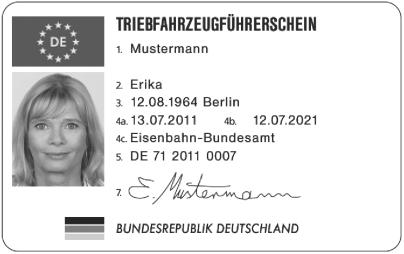
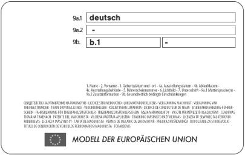

# Verordnung über die Erteilung der Fahrberechtigung an Triebfahrzeugführer sowie die Anerkennung von Personen und Stellen für Ausbildung und Prüfung (TfV)

Ausfertigungsdatum
:   2011-04-29

Fundstelle
:   BGBl I: 2011, 705 (1010)

## Erster Abschnitt - Allgemeines

### § 1 Geltungsbereich

(1) Diese Verordnung regelt die Ausbildung von Triebfahrzeugführern,
die Erteilung von Triebfahrzeugführerscheinen und
Zusatzbescheinigungen, die Registerführung und die Überwachung für
Triebfahrzeugführer, die Triebfahrzeuge für Eisenbahnen, die eine
Sicherheitsbescheinigung nach § 7a des Allgemeinen Eisenbahngesetzes
oder eine Sicherheitsgenehmigung nach § 7c des Allgemeinen
Eisenbahngesetzes benötigen, auf öffentlichen Eisenbahninfrastrukturen
bewegen, sowie die Anerkennung der Ausbildungsorganisation von
sonstigem, mit sicherheitsrelevanten betrieblichen Aufgaben betrautem
Eisenbahnpersonal.

(2) Abweichend von Absatz 1 findet diese Verordnung keine Anwendung
innerhalb des Bereichs von Serviceeinrichtungen nach § 2 Absatz 3c
Nummer 7 des Allgemeinen Eisenbahngesetzes.

### § 2 Begriffsbestimmungen

Im Sinne dieser Verordnung bedeutet:

1.  „Triebfahrzeugführer“ eine natürliche Person, die die Voraussetzungen
    erfüllt, um unmittelbar oder mittelbar Triebfahrzeuge eigenständig,
    verantwortlich und sicher zu führen;

2.  „Triebfahrzeug“ ein Eisenbahnfahrzeug mit eigenem Antrieb;

3.  „Unternehmer“ das Unternehmen, das den Triebfahrzeugführer
    verantwortlich einsetzt;

4.  „zuständige Behörde“ das Eisenbahn-Bundesamt;

5.  „zuständige Behörde eines anderen Mitgliedstaates“ eine
    Sicherheitsbehörde eines anderen Mitgliedstaates nach Artikel 16 der
    Richtlinie 2004/49/EG des Europäischen Parlaments und des Rates vom
    29\. April 2004 über Eisenbahnsicherheit in der Gemeinschaft und zur
    Änderung der Richtlinie
    95/18/EG                    des Rates über die Erteilung von
    Genehmigungen an Eisenbahnunternehmen und der Richtlinie 2001/14/EG
    über die Zuweisung von Fahrwegkapazität der Eisenbahn, die Erhebung
    von Entgelten für die Nutzung von Eisenbahninfrastruktur und die
    Sicherheitsbescheinigung („Richtlinie über die Eisenbahnsicherheit“)
    (ABl. L 164 vom 30.4.2004, S. 44, L 220 vom 21.6.2004, S. 16), die
    zuletzt durch die Richtlinie 2009/149/EG (ABl. L 313 vom 28.11.2009,
    S. 65) geändert worden ist;

6.  „Triebfahrzeugführerschein“ die von einer zuständigen Behörde erteilte
    Fahrerlaubnis nach Artikel 4 Absatz 1 Buchstabe a der Richtlinie
    2007/59/EG des Europäischen Parlaments und des Rates vom 23. Oktober
    2007 über die Zertifizierung von Triebfahrzeugführern, die Lokomotiven
    und Züge im Eisenbahnsystem in der Gemeinschaft führen (ABl. L 315 vom
    3\.12.2007, S. 51);

7.  „Technische Spezifikationen für die Interoperabilität (TSI)“
    Spezifikationen im Sinne des Kapitels II der Richtlinie 2008/57/EG des
    Europäischen Parlaments und des Rates vom 17. Juni 2008 über die
    Interoperabilität des Eisenbahnsystems in der Gemeinschaft (ABl. L 191
    vom 18.7.2008, S. 1), die zuletzt durch die Richtlinie 2009/131/EG
    (ABl. L 273 vom 17.10.2009, S. 12) geändert worden ist, oder der
    Richtlinien 96/48/EG des Rates vom 23. Juli 1996 über die
    Interoperabilität des transeuropäischen
    Hochgeschwindigkeitsbahnsystems (ABl. L 235 vom 17.9.1996, S. 6) und
    2001/16/EG des Europäischen Parlaments und des Rates vom 19. März 2001
    über die Interoperabilität des konventionellen transeuropäischen
    Eisenbahnsystems (ABl. L 110 vom 20.4.2001, S. 1), die jeweils zuletzt
    durch die Richtlinie 2007/32/EG (ABl. L 141 vom 2.6.2007, S. 63)
    geändert worden sind, die für jedes Teilsystem oder Teile davon im
    Hinblick auf die Erfüllung der grundlegenden Anforderungen gelten und
    die Interoperabilität gewährleisten;

8.  „Rangierfahrt“ Bewegen von Fahrzeugen im Bahnbetrieb, soweit es sich
    nicht um eine Zugfahrt entsprechend § 34 Absatz 1 der Eisenbahn-Bau-
    und Betriebsordnung vom 8. Mai 1967 (BGBl. 1967 II S. 1563) handelt,
    die zuletzt durch Artikel 1 der Verordnung vom 19. März 2008 (BGBl. I
    S. 467) geändert worden ist; Fahrten im Baugleis sind stets
    Rangierfahrten.

### § 3 Fahrberechtigung

(1) Wer ein Triebfahrzeug eigenständig führt, bedarf der
Fahrberechtigung. Sie ist durch

1.  einen Triebfahrzeugführerschein nach Anlage 1, der die persönlichen
    Daten des Triebfahrzeugführers, die ausstellende Behörde und die
    Gültigkeitsdauer enthält, und

2.  eine Zusatzbescheinigung nach Anlage 2, in der festgelegt ist, mit
    welchen Betriebsverfahren, Zugbeeinflussungssystemen und
    Signalsystemen der Triebfahrzeugführer auf öffentlichen Schienenwegen
    (Infrastrukturen) welche Fahrzeuge führen darf,

nachzuweisen.

(2) Die Zusatzbescheinigung nach Absatz 1 Satz 2 Nummer 2 wird für
folgende Klassen erteilt:

1.  Klasse A:  Rangierfahrten und

2.  Klasse B: Zugfahrten im Personen- und Güterverkehr.

(3) Ein Triebfahrzeugführer darf abweichend von Absatz 1 Satz 2 Nummer
2 Triebfahrzeuge führen und Infrastrukturen befahren, wenn er den Zug
unter Aufsicht und nach Weisung eines Triebfahrzeugführers führt, der
die erforderliche Zusatzbescheinigung besitzt, und

1.  es sich um eine vom Eisenbahninfrastrukturunternehmen festgelegte
    Umleitung von Zügen auf Grund von Bau- und Instandhaltungsarbeiten an
    der Infrastruktur oder auf Grund von Betriebsstörungen handelt;

2.  ein Ersatztriebfahrzeug nach einem unterwegs aufgetretenen Schaden an
    dem ursprünglich eingesetzten Triebfahrzeug gestellt wird;

3.  es sich um Sonderfahrten mit historischen Zügen handelt oder

4.  ein neues Triebfahrzeug ausgeliefert oder vorgeführt wird.

Der Unternehmer entscheidet, ob ein Triebfahrzeugführer nach Satz 1 im
Einzelfall ein Triebfahrzeug führen soll.

(4) Der Triebfahrzeugführerschein und die Zusatzbescheinigung sind
beim Führen von Triebfahrzeugen mitzuführen und berechtigten Personen
auf Verlangen zur Prüfung auszuhändigen.

### § 4 Geografischer Geltungsbereich, ausstellende Stelle und Eigentum

(1) Der Triebfahrzeugführerschein wird von der zuständigen Behörde
ausgestellt und ist Eigentum des Triebfahrzeugführers.

(2) Ein von einer zuständigen Stelle eines Mitgliedstaates der
Europäischen Union erteilter Triebfahrzeugführerschein wird anerkannt.

(3) Die Zusatzbescheinigung gilt ausschließlich für die in ihr
aufgeführten Infrastrukturen und Fahrzeuge. Sie wird vom Unternehmer
ausgestellt und ist dessen Eigentum. Der Triebfahrzeugführer hat einen
Anspruch auf Ausstellung eines Nachweises einer Zusatzbescheinigung.
Der Nachweis gilt nicht als Bescheinigung im Sinne des § 3 Absatz 1
Satz 2 Nummer 2.

## Zweiter Abschnitt - Erteilung des Triebfahrzeugführerscheins und Ausstellung der Zusatzbescheinigung

### § 5 Voraussetzungen

(1) Die zuständige Behörde erteilt den Triebfahrzeugführerschein nach
Anlage 1 oder den vorläufigen Führerschein nach Anlage 3, wenn der
Bewerber

1.  mindestens 20 Jahre alt ist;

2.  eine Schulausbildung im Sekundarbereich I erfolgreich abgeschlossen
    hat;

3.  nach dem Ergebnis einer Untersuchung durch einen nach § 16 anerkannten
    Arzt, die sich mindestens auf die in Anlage 4 Nummer 1.1, 1.2, 1.3 und
    2\.1 aufgeführten Themen erstreckt hat, gesundheitlich geeignet ist;

4.  nach dem Ergebnis einer Untersuchung durch einen nach § 16 anerkannten
    Psychologen, die sich mindestens auf die in Anlage 4 Nummer 2.2
    aufgeführten Themen erstreckt hat, psychologisch geeignet ist;

5.  seine allgemeinen Fachkenntnisse im Rahmen einer Prüfung nachgewiesen
    hat, die mindestens die in Anlage 5 aufgeführten allgemeinen Themen
    umfasst;

6.  für seine Tätigkeit zuverlässig ist.

Abweichend von Satz 1 Nummer 1 wird Bewerbern, die mindestens 18 Jahre
alt sind, ein Triebfahrzeugführerschein für den Einsatz auf
Schienenwegen öffentlicher Eisenbahninfrastrukturunternehmen auf dem
Gebiet der Bundesrepublik Deutschland ausgestellt, wenn die
erforderliche geistige Eignung durch Vorlage eines medizinisch-
psychologischen Gutachtens nachgewiesen ist. Die Untersuchung nach
Satz 1 Nummer 3 kann auch unter Aufsicht eines nach § 16 anerkannten
Arztes und die Untersuchung nach Satz 1 Nummer 4 unter Aufsicht eines
nach § 16 anerkannten Psychologen durchgeführt worden sein. Sofern der
Bewerber eine Prüfung nach § 10 der Verordnung über die
Berufsausbildung zum Eisenbahner im Betriebsdienst/zur Eisenbahnerin
im Betriebsdienst erfolgreich absolviert hat, wird diese im Falle des
Satzes 1 Nummer 5 als gleichwertig anerkannt. Die erforderliche
Zuverlässigkeit ist insbesondere dann nicht gegeben, wenn der Bewerber
an einer Suchtkrankheit leidet oder erheblich oder wiederholt gegen
verkehrsrechtliche Vorschriften verstoßen hat.

(2) Der Unternehmer darf die Zusatzbescheinigung nach Anlage 2 nur
ausstellen, wenn der Triebfahrzeugführer

1.  Inhaber eines Triebfahrzeugführerscheins ist;

2.  durch eine bestandene Prüfung über mindestens die in Anlage 6
    aufgeführten allgemeinen Themen seine Kenntnisse und seine Befähigung
    zum Führen der betreffenden Fahrzeuge nachgewiesen hat;

3.  eine Prüfung seiner Kenntnisse über die Betriebsverfahren,
    Zugbeeinflussungssysteme und Signalsysteme derjenigen Infrastrukturen
    bestanden hat, für die die Befähigung in der Zusatzbescheinigung
    angestrebt wird;

4.  vom Unternehmer für dessen Sicherheitsmanagementsystem geschult ist.

Die Prüfung nach Satz 1 Nummer 3 muss mindestens die in Anlage 7
aufgeführten Themen und erforderlichenfalls auch die Sprachkenntnisse
nach Anlage 7 Nummer 6 umfassen, wobei der Nachweis der Sprachkenntnis
für deutsche Infrastrukturen mit Vorlage eines Abschlusses nach Absatz
1 Satz 1 Nummer 2 einer deutschen Schule als erbracht gilt.

### § 6 Ausbildung

(1) Die Ausbildung von Triebfahrzeugführern umfasst die Fertigkeiten
und Kenntnisse nach den Anlagen 5, 6 und 7.

(2) Die einzelnen Ausbildungsinhalte werden durch die einschlägigen
Technischen Spezifikationen für die Interoperabilität oder die von der
Europäischen Eisenbahnagentur nach Artikel 17 der Verordnung (EG) Nr.
881/2004 des Europäischen Parlaments und des Rates vom 29. April 2004
zur Errichtung einer Europäischen Eisenbahnagentur
(„Agenturverordnung“) (ABl. L 164 vom 30.4.2004, S. 1), die zuletzt
durch die Verordnung (EG) Nr. 1335/2008 (ABl. L 354 vom 31.12.2008, S.
51) geändert worden ist, vorgeschlagenen Kriterien ergänzt.

(3) Die Ausbildungsmethode muss die Anforderungen der Anlage 8
erfüllen.

(4) Die Ausbildung erfolgt durch eine anerkannte Person oder eine
anerkannte Stelle oder durch eine Eisenbahn, der eine
Sicherheitsbescheinigung nach § 7a des Allgemeinen Eisenbahngesetzes
oder eine Sicherheitsgenehmigung nach § 7c des Allgemeinen
Eisenbahngesetzes erteilt oder deren bestellter Betriebsleiter durch
die zuständige Eisenbahnaufsichtsbehörde bestätigt worden ist.

(5) Bei Triebfahrzeugführern, die Staatsangehörige eines
Mitgliedstaates der Europäischen Union sind und ihren
Ausbildungsnachweis in einem Drittland erworben haben, gilt die durch
die Richtlinie
2005/36/EG              des Europäischen Parlaments und des Rates vom
7\. September 2005 über die Anerkennung von Berufsqualifikationen (ABl.
L 255 vom 30.9.2005, S. 22), die zuletzt durch die Verordnung (EG)
Nr. 279/2009              (ABl. L 93 vom 7.4.2009, S. 11) geändert
worden ist, festgelegte allgemeine Regelung zur Anerkennung
beruflicher Befähigungsnachweise.

(6) Der Unternehmer richtet ein Verfahren der ständigen Weiterbildung
entsprechend Anhang III Abschnitt 2 Buchstabe e der Richtlinie
2004/49/EG ein, um sicherzustellen, dass die Befähigung des Personals
aufrechterhalten wird.

### § 7 Prüfungen

(1) Die Prüfung für den Triebfahrzeugführerschein besteht aus einer
theoretischen Prüfung mit schriftlichem und mündlichem Teil und die
Prüfungen für die Zusatzbescheinigung bestehen jeweils aus einer
theoretischen Prüfung mit schriftlichem und mündlichem Teil sowie
einer praktischen Prüfung mit einer Prüfungsfahrt. Um die Anwendung
der Betriebsvorschriften und das Verhalten zu prüfen, können teilweise
Simulatoren eingesetzt werden. Abweichend von Satz 1 besteht die
Prüfung für die Zusatzbescheinigung

1.  für weitere Fahrzeugbaureihen aus einer vereinfachten Prüfung in Form
    einer praktischen Prüfung mit einer Prüfungsfahrt und

2.  für Fahrzeugbaureihen, die sich nur in einzelnen Merkmalen von
    Fahrzeugbaureihen unterscheiden, die bereits in der
    Zusatzbescheinigung aufgeführt sind, in Form einer theoretischen
    Prüfung mit mündlichem Teil.

Wenn der Prüfling im Rahmen der Triebfahrzeugführerschein-Prüfung
vergleichbare Prüfungsbestandteile erfolgreich abgelegt hat, sollen
diese für die Prüfung der Zusatzbescheinigung anerkannt werden.

(2) Zwischen dem Abschluss der Ausbildung und dem Ablegen der
theoretischen Prüfung sollen nicht mehr als sechs Monate liegen. Die
praktische Prüfung muss innerhalb von sechs Monaten nach Bestehen der
theoretischen Prüfung abgelegt werden.

(3) Die Prüfungen zur Kontrolle der geforderten Befähigungen werden
von einer anerkannten Stelle oder einem anerkannten Prüfer
vorgenommen. Die Prüfung kann durch einen oder mehrere Prüfer
abgenommen werden. Sofern der Prüfer demselben Unternehmen wie der zu
prüfende Triebfahrzeugführer oder der Stelle angehört, die den
Triebfahrzeugführer ausgebildet hat, muss die organisatorische
Unabhängigkeit zwischen den beteiligten Unternehmensteilen
sichergestellt werden. Insbesondere darf kein Prüfer vorher Ausbilder
des Triebfahrzeugführers gewesen sein. Zur Abnahme der praktischen
Prüfung muss der Prüfer, bei mehreren Prüfern mindestens einer der
Prüfer, die erforderliche Fahrberechtigung besitzen.

(4) Die theoretische Prüfung ist bestanden, wenn in jedem Prüfungsteil
mindestens 70 Prozent der möglichen Punktzahl erreicht worden sind.
Nicht oder nicht richtig beantwortete Fragen, bei denen mangelndes
Wissen in der Wirklichkeit eine Gefährdung des Bahnbetriebes zur Folge
haben kann, führen zum Nichtbestehen der Prüfung. Das Bestehen der
theoretischen Prüfung ist Voraussetzung für die Zulassung zur
praktischen Prüfung.

(5) Die praktische Prüfung ist bestanden, wenn in den Prüfungsteilen
mindestens 70 Prozent der möglichen Punktzahl erreicht und keine
Mängel im sicherheitsrelevanten Bereich festgestellt worden sind. Wird
während der praktischen Prüfung ein betriebsgefährdender Mangel
festgestellt, so ist die praktische Prüfung abzubrechen. Sie ist damit
nicht bestanden.

(6) Die Prüfung für den Erwerb des Triebfahrzeugführerscheins wird
nach der Triebfahrzeugführerschein-Prüfungsverordnung abgelegt.

(7) Der Unternehmer hat dem Prüfer für die Zusatzbescheinigung die
Anforderungen, die er in der Verfahrensbeschreibung nach § 9 Absatz 1
niedergelegt hat, zur Verfügung zu stellen. Die Prüfungsinhalte und
Prüfungsverfahren gibt der Prüfer unter Berücksichtigung der Anlagen 6
und 7 vor.

### § 8 Erteilung des Triebfahrzeugführerscheins

(1) Der Triebfahrzeugführerschein ist vom Bewerber oder von seinem
Bevollmächtigten bei der zuständigen Behörde zu beantragen. Der Antrag
kann auf die erstmalige Erteilung eines Triebfahrzeugführerscheins,
eine Änderung, eine Verlängerung, die Ausstellung eines
Ersatzführerscheins und die Ausstellung eines vorläufigen
Führerscheins gerichtet sein.

(2) Wenn der Bewerber oder sein Bevollmächtigter einen vorläufigen
Führerschein beantragt hat, händigt der Prüfer nach bestandener
Prüfung den von der zuständigen Behörde ausgestellten vorläufigen
Führerschein nach Anlage 3 aus, nachdem er das Aushändigungsdatum
eingesetzt hat. Der vorläufige Führerschein darf auf dem Gebiet der
Bundesrepublik Deutschland bis zur Aushändigung des
Triebfahrzeugführerscheins nach Anlage 1, längstens jedoch für eine
Dauer von sechs Wochen ab Ausstellungsdatum, wie ein
Triebfahrzeugführerschein verwendet werden. Bei Aushändigung des neuen
Triebfahrzeugführerscheins ist der vorläufige Führerschein vom Inhaber
ungültig zu machen. Zudem händigt der Prüfer dem Bewerber nach
bestandener Prüfung eine Prüfungsbescheinigung aus.

(3) Die zuständige Behörde stellt unverzüglich, spätestens jedoch
innerhalb eines Monats nach Vorlage aller erforderlichen Unterlagen
den Triebfahrzeugführerschein nach Anlage 1 aus.

(4) Der Triebfahrzeugführerschein wird in einem Original erteilt. Jede
Art der Vervielfältigung, ausgenommen die Ausstellung eines
Ersatzführerscheins im Sinne des Absatzes 1 Satz 2 ist unzulässig.

(5) Der Triebfahrzeugführerschein gilt zehn Jahre. Er kann verlängert
werden.

(6) Bei Verlängerung eines Triebfahrzeugführerscheins überprüft die
zuständige Behörde anhand des Registers nach § 10 Absatz 2, ob die
regelmäßigen Überprüfungen nach § 11 Absatz 1 durchgeführt worden
sind.

(7) Der Triebfahrzeugführerschein ist zu ändern, wenn eine
gesundheitlich bedingte Einschränkung zu vermerken ist oder sich
sonstige Angaben ändern. Bei einer Änderung der Angaben ist ein neuer
Triebfahrzeugführerschein auszustellen; der bisherige
Triebfahrzeugführerschein ist von seinem Inhaber bei der zuständigen
Behörde abzugeben. Ist ein Triebfahrzeugführerschein abhanden
gekommen, hat der Inhaber den Verlust unverzüglich anzuzeigen und sich
einen Ersatzführerschein ausstellen zu lassen. Wird der bisherige
Triebfahrzeugführerschein wieder gefunden, ist er unverzüglich der
zuständigen Behörde auszuhändigen.

(8) Die zuständige Behörde veröffentlicht das Verfahren zur Erteilung
des Triebfahrzeugführerscheins einschließlich der Neuerteilung eines
befristet ausgesetzten oder eines entzogenen
Triebfahrzeugführerscheins auf ihrer Internetseite.

### § 9 Ausstellung der Zusatzbescheinigung

(1) Der Unternehmer legt Verfahren für die Ausstellung oder Änderung
der Zusatzbescheinigungen im Rahmen seines
Sicherheitsmanagementsystems fest.

(2) Die Zusatzbescheinigung wird unbefristet ausgestellt.

(3) Sofern ein Triebfahrzeugführer, dessen Triebfahrzeugführerschein
im deutschen Führerscheinregister registriert ist, noch nicht das 20.
Lebensjahr vollendet hat, darf ihm auf dem Gebiet der Bundesrepublik
Deutschland nur eine Zusatzbescheinigung nach Maßgabe des § 48 Absatz
7 der Eisenbahn-Bau- und Betriebsordnung ausgestellt werden.

(4) Der Unternehmer hat die Zusatzbescheinigung unverzüglich zu
ändern, wenn ihrem Inhaber nach einer Prüfung zusätzliche Befähigungen
für bestimmte Fahrzeuge oder Infrastrukturen bestätigt oder infolge
einer Überprüfung Befähigungen aberkannt worden sind.

(5) Der Unternehmer richtet ein internes Beschwerdeverfahren im Rahmen
seines Sicherheitsmanagementsystems ein, in dem die Entscheidung über
die Ausstellung, Änderung, Aussetzung oder Entziehung einer
Zusatzbescheinigung überprüft werden kann. Nach Abschluss der
Überprüfung kann sowohl der Triebfahrzeugführer als auch der
Unternehmer bei der zuständigen Behörde beantragen, dass sie eine
Schlichtungsempfehlung abgibt.

(6) Die Streckenkenntnis wird nicht in der Zusatzbescheinigung
dokumentiert. Der Unternehmer ist verpflichtet, dem
Triebfahrzeugführer die notwendigen Informationen zur Streckenkenntnis
zu vermitteln. Er legt im Rahmen seines Sicherheitsmanagementsystems
fest, wie die Streckenkenntnis erworben, dokumentiert und überwacht
wird.

## Dritter Abschnitt - Einsatz als Triebfahrzeugführer

### § 10 Register der Triebfahrzeugführerscheine und Zusatzbescheinigungen

(1) Das Register der Triebfahrzeugführerscheine nach Absatz 2 und die
Register der Zusatzbescheinigungen nach Absatz 4 werden geführt, um
für Triebfahrzeugführerscheine und Zusatzbescheinigungen die
Echtheits- und Gültigkeitsfeststellung zu gewährleisten und das
Vorliegen der Voraussetzungen des § 5 festzustellen.

(2) Die zuständige Behörde führt ein Register aller erteilten,
verlängerten, geänderten, abgelaufenen, ausgesetzten, entzogenen oder
als verloren, entwendet oder zerstört gemeldeten
Triebfahrzeugführerscheine und hält das Register auf dem neuesten
Stand. In diesem Register werden die in Anlage 9 Nummer 1
vorgeschriebenen Daten gespeichert.

(3) Auf begründeten Antrag sind dem Unternehmer, jedem Arbeitgeber von
Triebfahrzeugführern, den zuständigen Behörden der anderen
Mitgliedstaaten, der Europäischen Eisenbahnagentur, der
Untersuchungsbehörde nach § 5 Absatz 1f des Allgemeinen
Eisenbahngesetzes, einer Untersuchungsstelle eines anderen
Mitgliedstaates im Sinne der Richtlinie 2004/49/EG und den
Eisenbahnaufsichtsbehörden der Länder unter den in Anlage 9 Nummer 2
aufgeführten Voraussetzungen und zu den darin im Einzelnen genannten
Daten schriftlich Auskünfte aus dem Register der
Triebfahrzeugführerscheine zu erteilen.

(4) Jeder Unternehmer hat ein Register aller von ihm ausgestellten,
geänderten, ausgesetzten, entzogenen oder als verloren, entwendet oder
zerstört gemeldeten Zusatzbescheinigungen nach Satz 3 zu führen oder
dafür zu sorgen, dass ein solches Register in seinem Auftrag geführt
wird. Sofern er das Register nicht selbst führt, bleibt er für die
ordnungsgemäße Führung des Registers verantwortlich; § 11 des
Bundesdatenschutzgesetzes ist zu beachten. Der Unternehmer hat das
Register auf dem neuesten Stand zu halten oder hierfür zu sorgen. In
diesem Register werden die in Anlage 10 Nummer 1 genannten Daten
gespeichert.

(5) Im Falle der Auflösung oder Beendigung eines Unternehmens geht die
Verantwortung für die im Register der Zusatzbescheinigungen
enthaltenen Daten auf den Unternehmer über, der die Geschäftstätigkeit
übernimmt. Wird die Geschäftstätigkeit nicht von einem anderen
Unternehmer übernommen, so führt die zuständige Behörde die im
Register der Zusatzbescheinigungen enthaltenen Daten. Der Unternehmer
hat in diesem Fall der zuständigen Behörde vor Einstellung der
Geschäftstätigkeit die Daten aus dem Register zu übermitteln.

(6) Der Unternehmer hat auf Verlangen aus dem Register der
Zusatzbescheinigungen der zuständigen Behörde, den zuständigen
Behörden der anderen Mitgliedstaaten, der Untersuchungsbehörde nach §
5 Absatz 1f des Allgemeinen Eisenbahngesetzes, einer
Untersuchungsstelle eines anderen Mitgliedstaates im Sinne der
Richtlinie 2004/49/EG und den Eisenbahnaufsichtsbehörden der Länder
schriftlich Auskunft unter den in Anlage 10 Nummer 2 aufgeführten
Voraussetzungen und zu den darin im Einzelnen genannten Daten zu
erteilen.

(7) Dem Triebfahrzeugführer ist auf Antrag schriftlich Auskunft über
seine im Register der Triebfahrzeugführerscheine sowie den Registern
der Zusatzbescheinigungen gespeicherten Daten zu erteilen.

(8) Sämtliche Daten des Registers der Triebfahrzeugführerscheine sind
nach Ablauf von zehn Jahren ab der Ungültigkeit des
Triebfahrzeugführerscheins und sämtliche Daten des Registers der
Zusatzbescheinigungen sind nach Ablauf von zehn Jahren ab der
Ungültigkeit der Zusatzbescheinigung zu löschen. Wird der
registerführenden Stelle innerhalb dieser Zehnjahresfrist die
Einleitung von Ermittlungen der Staatsanwaltschaft wegen des Verdachts
eines Verstoßes gegen verkehrsrechtliche Vorschriften oder
Strafgesetze bei der Tätigkeit als Triebfahrzeugführer bekannt, so
endet die Frist nicht vor Ablauf der Ermittlungen. Erhält die
registerführende Stelle vom Tod des Triebfahrzeugführers Kenntnis,
dann löscht sie unverzüglich alle über ihn gespeicherten Daten. Ist
eine Untersuchung eines gefährlichen Ereignisses im Eisenbahnbetrieb
im Zusammenhang mit der Tätigkeit des verstorbenen
Triebfahrzeugführers anhängig, so erfolgt die Löschung nach Satz 3
unverzüglich nach deren Abschluss.

(9) Der Empfänger der Auskunft ist ausdrücklich darauf hinzuweisen,
dass die aus den in Absatz 2 oder 4 genannten Registern übermittelten
Daten nur zu dem Zweck verarbeitet oder genutzt werden dürfen, zu
dessen Erfüllung sie ihm übermittelt werden.

(10) Die zuständige Behörde legt nähere Anforderungen an das
Datenformat sowie die Anforderungen zur Sicherung gegen unbefugten
Zugriff auf die Register und bei der Datenfernübertragung fest und
veröffentlicht sie auf ihrer Internetseite.

### § 11 Regelmäßige Überprüfungen

(1) Jeder Unternehmer hat im Rahmen seines
Sicherheitsmanagementsystems sicherzustellen, dass der
Triebfahrzeugführer sich den regelmäßigen Überprüfungen der in § 5
Absatz 1 Satz 1 Nummer 3 und 5 genannten Anforderungen unterzieht, und
teilt der zuständigen Behörde das Ergebnis der Überprüfungen mit. Die
Mitteilungspflicht gilt auch für den Fall, dass der Unternehmer eine
psychologische Untersuchung angeordnet hat. Die Häufigkeit der
ärztlichen Untersuchungen richtet sich nach Anlage 11 Nummer 1; sie
werden von einem nach § 16 anerkannten Arzt oder unter dessen Aufsicht
durchgeführt. Für die Überprüfung der allgemeinen beruflichen
Kenntnisse gilt § 6 Absatz 6.

(2) Jeder Unternehmer hat im Rahmen seines
Sicherheitsmanagementsystems sicherzustellen, dass der
Triebfahrzeugführer sich den regelmäßigen Überprüfungen der in § 5
Absatz 2 genannten Anforderungen unterzieht, um die Gültigkeit der
Zusatzbescheinigung aufrechtzuerhalten. Der Unternehmer legt in seinem
Sicherheitsmanagementsystem unter Berücksichtigung der in Anlage 11
Nummer 2 geregelten Mindesthäufigkeit fest, in welchen Abständen die
Überprüfungen stattfinden. Jede Überprüfung bestätigt der Unternehmer
durch einen Vermerk auf der Zusatzbescheinigung und trägt sie im
Register nach § 10 Absatz 4 ein.

### § 12 Überwachung der Triebfahrzeugführer

(1) Ergeben sich aus den Überprüfungen Zweifel an der Befähigung eines
Triebfahrzeugführers, darf der Unternehmer ihn erst dann wieder
einsetzen, wenn die Zweifel ausgeräumt sind. Hat ein Unternehmer davon
Kenntnis, dass ein Triebfahrzeugführer die Erteilungsvoraussetzungen
für einen Triebfahrzeugführerschein nicht mehr erfüllt oder eine
Arbeitsunfähigkeit von mehr als drei Monaten vorliegt, hat der
Unternehmer die zuständige Behörde darüber zu unterrichten.

(2) Versäumt der Triebfahrzeugführer eine regelmäßige Überprüfung oder
ergibt die Überprüfung, dass die Erteilungsvoraussetzungen nicht mehr
vorliegen, hat der Unternehmer eine erneute Überprüfung anzuordnen.
Liegen die Erteilungsvoraussetzungen weiterhin nicht vor, hat der
Unternehmer dem Triebfahrzeugführer Befähigungen abzuerkennen, die
Zusatzbescheinigung auszusetzen oder zu entziehen.

(3) Hat ein Triebfahrzeugführer Erkenntnisse, dass auf Grund seines
Gesundheitszustands Zweifel an seiner beruflichen Eignung bestehen
können, so hat er unverzüglich den Unternehmer zu unterrichten.

(4) Hat ein Unternehmer davon Kenntnis, dass Zweifel an der
beruflichen Eignung eines Triebfahrzeugführers wegen des
Gesundheitszustands bestehen, hat er unverzüglich die Untersuchung
nach Anlage 4 Nummer 3 anzuordnen. Darüber hinaus hat er im Rahmen
seines Sicherheitsmanagementsystems darauf hinzuwirken, dass ein
Triebfahrzeugführer während seines Dienstes zu keinem Zeitpunkt unter
dem Einfluss von Stoffen steht, die seine Konzentration, seine
Aufmerksamkeit oder sein Verhalten beeinträchtigen können.

### § 13 Beendigung oder Wechsel des Beschäftigungsverhältnisses

(1) Wenn das Beschäftigungsverhältnis eines Triebfahrzeugführers bei
einem Unternehmer endet, hat der Unternehmer die zuständige Behörde
unverzüglich davon in Kenntnis zu setzen.

(2) Die Zusatzbescheinigung wird mit Ende des
Beschäftigungsverhältnisses ungültig und vom bisherigen Unternehmer
eingezogen. In diesem Fall händigt er dem Triebfahrzeugführer einen
Nachweis einer Zusatzbescheinigung nach Anlage 12 sowie sämtliche
Nachweise seiner Ausbildung, seiner Berufserfahrung und seiner
beruflichen Befähigung aus.

(3) Ein Unternehmer soll bei der Ausstellung einer neuen
Zusatzbescheinigung die nachgewiesenen Befähigungen und Kenntnisse
berücksichtigen, soweit sie auf die neue Zusatzbescheinigung
zutreffen.

## Vierter Abschnitt - Ausbildungs-, Prüfungs- und Überwachungsorganisation

### § 14 Anerkennung von Personen und Stellen für die Ausbildung – Ausbildungsorganisation

(1) Wer Triebfahrzeugführer ausbilden will, bedarf der Anerkennung.
Die zuständige Behörde erkennt auf Antrag eine Person oder eine Stelle
für die Ausbildung von Triebfahrzeugführern an, wenn der Antragsteller
nachgewiesen hat, dass er über die personellen und sachlichen
Voraussetzungen verfügt, um die Durchführung geeigneter
Ausbildungsgänge zu gewährleisten.

(2) Anträge können gestellt werden für die Teilbereiche:

1.  allgemeine Fachkenntnisse nach § 5 Absatz 1 Satz 1 Nummer 5;

2.  fahrzeugbezogene Fachkenntnisse nach § 5 Absatz 2 Satz 1 Nummer 2;

3.  infrastrukturbezogene Fachkenntnisse nach § 5 Absatz 2 Satz 1 Nummer 3
    und Satz 2;

4.  Sprachkenntnisse nach § 5 Absatz 2 Satz 2.

Im Hinblick auf den Teilbereich nach Satz 1 Nummer 3 kann die
zuständige Behörde Personen und Stellen nur für solche Infrastrukturen
anerkennen, die sich auf dem Gebiet der Bundesrepublik Deutschland
befinden.

(3) Die Anerkennung wird erteilt, wenn der Antragsteller

1.  über das erforderliche, pädagogisch geeignete Personal, die
    Einrichtungen und die Ausrüstung für die angebotene Ausbildung
    verfügt;

2.  nachweist, dass der Ausbilder

    a)  für die theoretische Ausbildung ein Studium der Ingenieurwissenschaft
        mindestens an einer Fachhochschule oder Berufsakademie absolviert oder
        die Fachkenntnis durch eine mindestens dreijährige Berufserfahrung im
        zu unterrichtenden Fachgebiet erlangt hat,

    b)  für die praktische Ausbildung Triebfahrzeugführer mit mindestens
        dreijähriger Berufserfahrung ist und

    c)  für die Sprachausbildung mindestens über die besonderen
        eisenbahnbezogenen Sprachkenntnisse auf der Stufe 4 nach Anlage 7
        Nummer 6 verfügt;

3.  die Organisation der Ausbildung, wie Inhalt, Organisation und Laufzeit
    der Lehrgänge, darlegt;

4.  Systeme zur Erfassung der Ausbildungstätigkeiten bereitstellt,
    einschließlich Daten zu Teilnehmern, Ausbildern und zur Anzahl und zum
    Zweck der Lehrgänge;

5.  über ein Qualitätsmanagementsystem oder vergleichbare Verfahren
    verfügt, um die Einhaltung der in dieser Verordnung festgelegten
    Anforderungen zu gewährleisten;

6.  eine fortlaufende Weiterbildung des Lehrpersonals sicherstellt;

7.  nachweist, dass keine Tatsachen vorliegen, die gegen die persönliche
    Zuverlässigkeit des Antragstellers oder, im Falle einer juristischen
    Person, der zu seiner gesetzlichen Vertretung berufenen Personen
    sprechen.

(4) Die Anerkennung einer Stelle für die Ausbildung von
Triebfahrzeugführern kann mehrere Ausbildungsstätten an verschiedenen
Orten einschließen.

(5) Die Anerkennung gilt längstens für fünf Jahre. Sie kann verlängert
werden.

(6) Die zuständige Behörde erkennt auf Antrag eine Person oder eine
Stelle für die Ausbildung von sonstigem, mit sicherheitsrelevanten
betrieblichen Aufgaben betrautem Eisenbahnpersonal an. Die Absätze 1
bis 5 gelten entsprechend.

### § 15 Anerkennung von Personen und Stellen für die Prüfung – Prüfungsorganisation

(1) Wer Triebfahrzeugführer prüfen will, bedarf der Anerkennung. Die
zuständige Behörde erkennt auf Antrag eine Person oder eine Stelle für
die Prüfung von Triebfahrzeugführern an, wenn der Antragsteller

1.  im Rahmen seines Qualitätsmanagementsystems die Vorkehrungen getroffen
    hat, um die notwendige Unabhängigkeit, Unparteilichkeit und
    Weisungsfreiheit der Prüfer nach § 7 Absatz 3 Satz 3 und 4 im
    Einzelfall zu gewährleisten,

2.  nachweist, dass der Prüfer

    a)  mindestens 26 Jahre alt ist,

    b)  geistig und körperlich für die Mitwirkung im Prüfungswesen geeignet
        ist,

    c)  über persönliche Zuverlässigkeit verfügt,

    d)  als Prüfer der theoretischen und praktischen Fachkenntnisse innerhalb
        der letzten drei Jahre im Eisenbahnbetriebsdienst tätig war und über
        folgende Ausbildung oder Berufserfahrung verfügt:

        aa) erfolgreicher Abschluss eines Studiums des Bauingenieurwesens, des
            Maschinenbaus, der Elektrotechnik, einer diesen verwandten
            Ingenieurwissenschaft oder einer Ingenieurwissenschaft des
            Verkehrswesens an einer

            aaa) deutschen wissenschaftlichen Hochschule,

            bbb) deutschen staatlichen oder staatlich anerkannten Fachhochschule oder

            ccc) von der Zentralstelle für Ausländisches Bildungswesen im Sekretariat
                der Kultusministerkonferenz als gleichwertig anerkannten ausländischen
                Hochschule oder

        bb) eine Tätigkeit als Leitender oder Aufsichtführender im Betrieb der
            Bahn nach § 47 Absatz 1 Nummer 1 der Eisenbahn-Bau- und
            Betriebsordnung oder

        cc) eine Tätigkeit als Eisenbahnbetriebsleiter oder

        dd) eine Tätigkeit als Triebfahrzeugführerausbilder mit mindestens
            dreijähriger Berufserfahrung und

    e)  als Sprachprüfer über eisenbahnspezifische Sprachkenntnisse auf der
        Stufe 4 nach Anlage 7 Nummer 6 verfügt,

3.  das Prüfungsverfahren angibt.

§ 14 Absatz 2 gilt entsprechend.

(2) Die Anerkennung gilt längstens für fünf Jahre. Sie kann verlängert
werden.

### § 16 Anerkennung von Ärzten und Psychologen

(1) Wer Tauglichkeitsuntersuchungen bei Triebfahrzeugführern
durchführen will, bedarf der Anerkennung. Die zuständige Behörde
erkennt auf Antrag Ärzte, Psychologen oder Stellen an, die
Untersuchungen nach Anlage 4 durchführen.

(2) Als Arzt kann für die Durchführung von Untersuchungen nach Anlage
4 anerkannt werden, wer die Gebietsbezeichnung „Arbeitsmedizin“ oder
die Zusatzbezeichnung „Betriebsmedizin“ hat oder über die Anerkennung
als Arzt in einer Begutachtungsstelle für Fahreignung gemäß § 11
Absatz 2 der Fahrerlaubnisverordnung und über eine mindestens
einjährige Berufserfahrung im Bereich Schienenverkehr verfügt.

(3) Als Psychologe kann für die Durchführung von Untersuchungen nach
Anlage 4 anerkannt werden, wer einen Abschluss eines Hochschulstudiums
als Diplom-Psychologe oder eines gleichwertigen Master-Abschlusses in
Psychologie nachweist oder über die Anerkennung als „Fachpsychologe
für Verkehrspsychologie“ und über eine mindestens einjährige
Berufserfahrung im Bereich Schienenverkehr verfügt.

(4) Als Stelle für die Durchführung von Untersuchungen nach Anlage 4
kann anerkannt werden, wer Ärzte und Psychologen mit den
Qualifikationen nach den Absätzen 2 und 3 beschäftigt.

(5) Anerkannte Ärzte und Psychologen sind verpflichtet, einmal pro
Jahr an einer von der zuständigen Behörde organisierten Fortbildung
teilzunehmen.

### § 17 Gemeinsame Bestimmungen für die Ausbildungs-, Prüfungs- und Überwachungsorganisation

(1) Die zuständige Behörde veröffentlicht auf ihrer Internetseite ein
Register der von ihr nach den §§ 14, 15 und 16 anerkannten Personen
und Stellen mit Namen, Anschrift und Teilbereichen, auf die sich die
Anerkennung erstreckt.

(2) Die Anerkennung einer nach den §§ 14, 15 oder 16 anerkannten
Person oder Stelle ist zu widerrufen, wenn die
Anerkennungsvoraussetzungen nicht mehr vorliegen. Eine nach den §§ 14,
15 oder 16 anerkannte Person oder Stelle hat die zuständige Behörde
unaufgefordert und unverzüglich über den Wegfall von
Anerkennungsvoraussetzungen zu informieren. Die §§ 48 und 49 des
Verwaltungsverfahrensgesetzes bleiben unberührt.

(3) Tätigkeiten im Zusammenhang mit der Ausbildung von
Triebfahrzeugführern oder der Beurteilung von Fähigkeiten und Eignung
der Triebfahrzeugführer sind im Rahmen eines
Qualitätsmanagementsystems ständig zu überwachen.

(4) Die zuständige Behörde überwacht die Qualitätssicherung der
Personen und Stellen nach §§ 14, 15 und 16. Ausgenommen sind
Tätigkeiten, die bereits von den Sicherheitsmanagementsystemen der
Unternehmer nach der Richtlinie 2004/49/EG erfasst werden.

### § 18 Rechts- und Fachaufsicht

Die zuständige Behörde führt die Rechts- und Fachaufsicht über die von
ihr nach dieser Verordnung anerkannten Personen und Stellen.

## Fünfter Abschnitt - Kontrollen und Ordnungswidrigkeiten

### § 19 Kontrollen durch die zuständige Behörde

(1) Die zuständige Behörde ist berechtigt, zu überprüfen, ob die auf
dem Gebiet der Bundesrepublik Deutschland tätigen Triebfahrzeugführer,
Unternehmer, Ausbilder und Prüfer die Vorschriften dieser Verordnung
einhalten.

(2) Die zuständige Behörde ist jederzeit berechtigt, während der
Arbeitszeit des Triebfahrzeugführers zu überprüfen, ob er die nach
dieser Verordnung mitzuführenden Dokumente vorweisen kann.

(3) Erfüllt ein Triebfahrzeugführer die Voraussetzungen für die
Erteilung eines Triebfahrzeugführerscheins nicht mehr, so kann die
zuständige Behörde den von ihr erteilten Triebfahrzeugführerschein
aussetzen oder entziehen. In beiden Fällen ist der
Triebfahrzeugführerschein der zuständigen Behörde auszuhändigen. Sie
unterrichtet den Unternehmer von ihrer Entscheidung und teilt dem
Triebfahrzeugführer darüber hinaus mit, nach welchem Verfahren er den
Triebfahrzeugführerschein wieder erlangen kann. Ist der
Triebfahrzeugführerschein in einem anderen Mitgliedstaat erteilt
worden, wendet sich die zuständige Behörde an die zuständige Behörde
des jeweiligen Mitgliedstaates und verlangt unter Angabe von Gründen
entweder eine zusätzliche Kontrolle, eine Aussetzung oder die
Entziehung des Triebfahrzeugführerscheins. Die zuständige Behörde
unterrichtet die Europäische Kommission und die betroffenen
zuständigen Behörden der anderen Mitgliedstaaten über ihr Ersuchen.
Bis zur Entscheidung der zuständigen Behörde des jeweiligen
Mitgliedstaates kann die zuständige Behörde dem Triebfahrzeugführer
das Führen eines Triebfahrzeuges auf dem Gebiet der Bundesrepublik
Deutschland untersagen. Wird an die zuständige Behörde ein
entsprechendes Ersuchen herangetragen, prüft sie dieses innerhalb von
vier Wochen und teilt der ersuchenden Behörde, der Europäischen
Kommission und den betroffenen zuständigen Behörden der anderen
Mitgliedstaaten ihre Entscheidung mit.

(4) Erfüllt ein Triebfahrzeugführer die Voraussetzungen für die
Ausstellung einer Zusatzbescheinigung nicht mehr, fordert die
zuständige Behörde den ausstellenden Unternehmer auf, eine Überprüfung
der Voraussetzungen nach § 5 Absatz 2 durchzuführen oder eine Maßnahme
nach § 12 Absatz 2 zu ergreifen. Der Unternehmer informiert die
zuständige Behörde innerhalb von vier Wochen über die ergriffene
Maßnahme. Bis zur Vorlage dieser Mitteilung kann die zuständige
Behörde dem Triebfahrzeugführer das Führen eines Triebfahrzeuges
untersagen. Sie unterrichtet hierüber bei international eingesetzten
Triebfahrzeugführern die Europäische Kommission und die betroffenen
zuständigen Behörden der anderen Mitgliedstaaten.

(5) Gefährdet ein Triebfahrzeugführer die Sicherheit des
Eisenbahnverkehrs erheblich, ergreift die zuständige Behörde
unverzüglich die erforderlichen Maßnahmen entsprechend § 5a Absatz 2
des Allgemeinen Eisenbahngesetzes und kann dem Triebfahrzeugführer
insbesondere das Führen eines Triebfahrzeuges untersagen. Bei
international eingesetzten Triebfahrzeugführern unterrichtet sie die
Europäische Kommission und die betroffenen zuständigen Behörden der
anderen Mitgliedstaaten von jeder solchen Entscheidung.

(6) Ist die zuständige Behörde der Auffassung, dass die
Voraussetzungen für eine von einer zuständigen Behörde eines anderen
Mitgliedstaates nach Artikel 29 Absatz 4 der Richtlinie 2007/59/EG
getroffene Entscheidung nicht vorliegen, so unterrichtet sie die
Europäische Kommission hierüber. Die zuständige Behörde kann die
Untersagung des Führens eines Triebfahrzeuges nach Absatz 3, 4 oder 5
bis zum Abschluss des Verfahrens nach Artikel 29 Absatz 5 der
Richtlinie 2007/59/EG auf dem Gebiet der Bundesrepublik Deutschland
aufrechterhalten.

### § 20 Ordnungswidrigkeiten

(1) Ordnungswidrig im Sinne des § 28 Absatz 1 Nummer 6 Buchstabe b des
Allgemeinen Eisenbahngesetzes handelt, wer vorsätzlich oder fahrlässig
ohne Anerkennung nach § 14 Absatz 1 Satz 1, auch in Verbindung mit
Absatz 6 Satz 2, eine dort genannte Person ausbildet.

(2) Ordnungswidrig im Sinne des § 28 Absatz 1 Nummer 6 Buchstabe c des
Allgemeinen Eisenbahngesetzes handelt, wer vorsätzlich oder fahrlässig

1.  ohne Fahrberechtigung nach § 3 Absatz 1 Satz 1 ein Triebfahrzeug
    führt,

2.  entgegen § 5 Absatz 2 eine Zusatzbescheinigung ausstellt,

3.  entgegen § 9 Absatz 4 eine Zusatzbescheinigung nicht oder nicht
    rechtzeitig ändert,

4.  entgegen § 10 Absatz 4 Satz 1 ein Register nicht, nicht richtig oder
    nicht vollständig führt und nicht dafür sorgt, dass ein Register
    geführt wird,

5.  entgegen § 10 Absatz 6 eine Auskunft nicht, nicht richtig, nicht
    vollständig oder nicht rechtzeitig erteilt,

6.  entgegen § 11 Absatz 1 Satz 1 oder Absatz 2 Satz 1 nicht sicherstellt,
    dass sich ein Triebfahrzeugführer einer dort genannten Überprüfung
    unterzieht,

7.  entgegen § 12 Absatz 1 Satz 1 einen Triebfahrzeugführer einsetzt,

8.  entgegen § 12 Absatz 3 eine Unterrichtung nicht oder nicht rechtzeitig
    vornimmt,

9.  entgegen § 12 Absatz 4 Satz 1 eine Untersuchung nicht oder nicht
    rechtzeitig anordnet,

10. entgegen § 13 Absatz 1 die zuständige Behörde nicht oder nicht
    rechtzeitig in Kenntnis setzt,

11. ohne Anerkennung nach § 15 Absatz 1 Satz 1 einen Triebfahrzeugführer
    prüft,

12. ohne Anerkennung nach § 16 Absatz 1 Satz 1 eine
    Tauglichkeitsuntersuchung durchführt,

13. entgegen § 17 Absatz 2 Satz 2 eine dort genannte Information nicht
    oder nicht rechtzeitig gibt,

14. einer vollziehbaren Anordnung nach § 19 Absatz 3 Satz 6, Absatz 4 Satz
    3, Absatz 5 Satz 1 und Absatz 6 Satz 2 zuwiderhandelt oder

15. entgegen § 21 Absatz 7 die dort genannten Daten nicht, nicht richtig,
    nicht vollständig oder nicht rechtzeitig zur Verfügung stellt.

## Sechster Abschnitt - Schlussbestimmungen

### § 21 Übergangsvorschriften

(1) Die zuständige Behörde und die Unternehmer richten die Register
nach § 10 bis zum Ablauf des 29. Oktober 2011 ein.

(2) Triebfahrzeugführer, denen Erlaubnisse nach der Eisenbahnfahrzeug-
Führerschein-Richtlinie des Verbandes Deutscher Verkehrsunternehmen
erteilt worden sind, dürfen ihre berufliche Tätigkeit auf Grund ihrer
Erlaubnisse und ohne Anwendung dieser Verordnung bis zum Ablauf des
29\. Oktober 2018 weiter ausüben.

(3) Ab dem 29. Oktober 2011 sind Triebfahrzeugführern, die im
grenzüberschreitenden Verkehr, im Kabotageverkehr oder im Güterverkehr
in einem anderen Mitgliedstaat eingesetzt werden oder in mindestens
zwei Mitgliedstaaten tätig sind, nach Maßgabe dieser Verordnung
Triebfahrzeugführerscheine zu erteilen und Zusatzbescheinigungen
auszustellen. Ab diesem Zeitpunkt müssen sich alle von Satz 1
erfassten Triebfahrzeugführer, sowie jene, denen noch kein
Triebfahrzeugführerschein oder keine Zusatzbescheinigung nach dieser
Verordnung erteilt worden ist, den regelmäßigen Überprüfungen nach §
11 unterziehen.

(4) Im Übrigen sind ab dem 29. Oktober 2013 Triebfahrzeugführerscheine
zu erteilen und Zusatzbescheinigungen auszustellen.

(5) Triebfahrzeugführern, die mit ihrer Ausbildung

1.  vor dem 29. Oktober 2011 begonnen haben und die für
    Eisenbahnverkehrsleistungen im Sinne von Absatz 3 Satz 1 eingesetzt
    werden sollen oder

2.  vor dem 29. Oktober 2013 begonnen haben und die nur für
    Eisenbahnverkehrsleistungen auf dem Gebiet der Bundesrepublik
    Deutschland eingesetzt werden sollen,

kann eine Erlaubnis nach den Vorschriften der Eisenbahnfahrzeug-
Führerschein-Richtlinie des Verbandes Deutscher Verkehrsunternehmen
erteilt werden.

(6) Bei Umstellung der Erlaubnisse nach der Eisenbahnfahrzeug-
Führerschein-Richtlinie des Verbandes Deutscher Verkehrsunternehmen
auf Triebfahrzeugführerscheine sind die Anträge bis zum 29. Oktober
2016 zu stellen, wobei in diesen Fällen die Frist nach § 8 Absatz 3
nicht gilt. Die zuständige Behörde berücksichtigt bei ihrer
Entscheidung die gesamten beruflichen Befähigungen, die der
Triebfahrzeugführer erworben hat.

(7) Damit bei der Europäischen Kommission eine Kosten-Nutzen-Analyse
nach Artikel 37 Nummer 5 der Richtlinie 2007/59/EG beantragt werden
kann, haben alle Unternehmer der zuständigen Behörde auf Verlangen die
dafür erforderlichen Daten zur Verfügung zu stellen.

### Anlage 1 (zu § 3 Absatz 1 Satz 2 Nummer 1, § 5 Absatz 1 und § 8 Absatz 2 und 3) Gemeinschaftsmodell für den Triebfahrzeugführerschein

(Fundstelle: BGBl. I 2011, 714 - 715)

**A.** **Anfertigung des Triebfahrzeugführerscheins**

    Der Triebfahrzeugführerschein wird von der Bundesdruckerei GmbH im
    Auftrag der zuständigen Behörde gefertigt. Die Herstellung,
    Personalisierung und Lieferung der Triebfahrzeugführerscheine erfolgt
    auf der Grundlage eines Vertrages zwischen der zuständigen Behörde und
    der Bundesdruckerei GmbH. Näheres wird durch Verwaltungsvorschrift
    geregelt.

**B.** **Gestaltung des Triebfahrzeugführerscheins**

    Der Triebfahrzeugführerschein richtet sich nach dem
    Gemeinschaftsmodell und den Referenzfarben Pantone Reflex Blue und
    Pantone Yellow.

    1.  Die Vorderseite des Triebfahrzeugführerscheins enthält folgende
        Angaben:

        a)  in Blockbuchstaben die Aufschrift „Triebfahrzeugführerschein“;

        b)  die Aufschrift „Bundesrepublik Deutschland“ als ausstellenden Staat
            mit deutscher Flagge;

        c)  das Unterscheidungszeichen für die Bundesrepublik Deutschland nach dem
            Ländercode nach ISO 3166 Alpha-2-Code, erschienen im Beuth Verlag
            GmbH, Berlin, und archivmäßig gesichert niedergelegt beim Deutschen
            Patent- und Markenamt in München, im Negativdruck in einem blauen
            Rechteck, umgeben von zwölf gelben Sternen; das Unterscheidungszeichen
            lautet: DE;

        d)  Angaben, die bei Erteilung des Triebfahrzeugführerscheins unter
            Verwendung der folgenden Nummern einzutragen sind:

            aa) Nummer 1: Name des Inhabers,

            bb) Nummer 2: Vorname des Inhabers,

            cc) Nummer 3: Geburtsdatum und Geburtsort des Inhabers,

            dd) Nummer 4a: Datum der Ausstellung des Triebfahrzeugführerscheins,

            ee) Nummer 4b: Datum des Ablaufs der Gültigkeit,

            ff) Nummer 4c: Bezeichnung der Ausstellungsbehörde,

            gg) Nummer 5: Nummer des Triebfahrzeugführerscheins, die im nationalen
                Register Zugriff auf Daten ermöglicht,

            hh) Nummer 6: Lichtbild des Inhabers und

            ii) Nummer 7: Unterschrift des Inhabers.

        Die Nummer des Triebfahrzeugführerscheins nach Doppelbuchstabe gg wird
        als Europäische Identifikationsnummer nach Anhang IV der Verordnung
        (EG) Nr. 653/2007 der Kommission vom 13. Juni 2007 zur Verwendung
        eines einheitlichen europäischen Formats für
        Sicherheitsbescheinigungen und Antragsunterlagen gemäß Artikel 10 der
        Richtlinie 2004/49/EG des Europäischen Parlaments und des Rates und
        zur Gültigkeit von gemäß der Richtlinie 2001/14/EG des Europäischen
        Parlaments und des Rates ausgestellten Sicherheitsbescheinigungen
        (ABl. L 153 vom 14.6.2007, S. 9) gebildet.

        Die zwei Ziffern der Europäischen Identifikationsnummer für die Art
        des Dokuments lauten wie folgt:

        71 für den 1. bis 9 999. Triebfahrzeugführerschein pro Jahr;

        72 für den 10 000. bis 19 999. Triebfahrzeugführerschein pro Jahr;

        73 für den 20 000. bis 29 999. Triebfahrzeugführerschein pro Jahr.

    2.  Die Rückseite enthält folgende Angaben unter Verwendung der folgenden
        Nummern:

        a)  Nummer 9a: zusätzliche Angaben in folgende Felder:

            aa) a.1 Muttersprache(n) des Triebfahrzeugführers,

            bb) a.2 Zusatzinformation: Wird der Triebfahrzeugführerschein vor
                Vollendung des Mindestalters von 20 Jahren erteilt, ist auf Grund der
                Beschränkung des Geltungsbereichs auf die Bundesrepublik Deutschland
                folgende Information zu vermerken: bis zum [Datum der Vollendung des
                Mindestalters] in DE; wird das Feld nicht benötigt, ist ein Strich
                einzutragen;

        b)  Nummer 9b: gesundheitlich bedingte Einschränkungen unter Angabe der
            folgenden Gemeinschaftskodierung:

            aa) b.1 Vorgeschriebenes Tragen von Brille oder Kontaktlinsen,

            bb) b.2 Vorgeschriebenes Tragen einer Kommunikationshilfe.

        Wird ein Feld nicht benötigt, ist ein Strich einzutragen.

        Zudem ist die Aufschrift „Modell der Europäischen Union“ aufzudrucken.

**C.** **Nummerierung des Triebfahrzeugführerscheins**

    Die Nummer wird bei Erteilung des Triebfahrzeugführerscheins von der
    zuständigen Behörde vergeben und bei einer Verlängerung, Änderung oder
    Ausstellung eines Ersatzführerscheins beibehalten. Bei der
    Verlängerung nach zehn Jahren wird der Triebfahrzeugführerschein mit
    einem neuen Lichtbild und einem neuen Datum des Ablaufs der Gültigkeit
    versehen.

**D.** **Gemeinschaftsmodell für den Triebfahrzeugführerschein**

    
    

### Anlage 2 (zu § 3 Absatz 1 Satz 2 Nummer 2 und § 5 Absatz 2) Gemeinschaftsmodell für die Zusatzbescheinigung

(Fundstelle: BGBl. I 2011, 716 - 719)

A.  Inhalt

    1.  Die Zusatzbescheinigung enthält folgende Angaben:

        a)  einen Verweis auf die Nummer des Triebfahrzeugführerscheins,

        b)  den Namen des Inhabers,

        c)  den Vornamen des Inhabers,

        d)  Datum der Ausstellung und des Ablaufs der Gültigkeit der
            Zusatzbescheinigung: da die Zusatzbescheinigung unbefristet gültig
            ist, sind in die Felder, die für das Datum des Ablaufs der
            Gültigkeitsdauer vorgesehen sind, Striche einzutragen sowie

        e)  Angaben zur ausstellenden Organisationseinheit des Unternehmens und
            Stempel.

    2.  Die Zusatzbescheinigung enthält weiter die folgenden Angaben unter
        Verwendung der folgenden Nummern:

        a)  Nummer 1: Angaben zum Arbeitgeber, im Einzelnen:

            aa) Name des Unternehmens,

            bb) die Angabe, ob es sich um ein Eisenbahnverkehrsunternehmen, einen
                Halter oder um ein Eisenbahninfrastrukturunternehmen handelt,

            cc) Arbeitsort und

            dd) Postanschrift des Unternehmens.

        b)  Nummer 2: Angaben zum Inhaber; im Einzelnen:

            aa) Geburtsort mit Angabe des Landes,

            bb) Geburtsdatum,

            cc) Staatsangehörigkeit des Triebfahrzeugführers,

            dd) Lichtbild und

            ee) Unterschrift des Inhabers.

        c)  Nummer 3: Klassen, die wie folgt anzugeben sind:

            Klasse A: Rangierfahrten

            Klasse B: Zugfahrten im Personen- und Güterverkehr.

            Der Unternehmer kann „B“ als umfassende Klasse für Zugfahrten im
            Personen- und Güterverkehr verwenden; alternativ kann er den
            Geltungsbereich der Bescheinigung auf einen Fahrzweck beschränken:

            B1 = bei Beschränkung auf Zugfahrten im Personenverkehr;

            B2 = bei Beschränkung auf Zugfahrten im Güterverkehr.

            Felder, die nicht vergeben werden, sind mit einem Strich zu versehen.

            Beispiele:

            *                *
                *   = umfassende Klasse A

            *                *
                *   = umfassende Klasse B

            *                *
                *   = Klasse B, Unterklasse 2

        d)  Nummer 4: Zusätzliche interne Angaben des Unternehmers.

        e)  Nummer 5: Angaben zu Sprachkenntnissen außer der Muttersprache, die
            für den Betrieb auf der entsprechenden Infrastruktur nötig sind und in
            denen der Triebfahrzeugführer Kenntnisse besitzt, die den
            Anforderungen von Anlage 7 Nummer 6 entsprechen.

        f)  Nummer 6: Einschränkungen des Leistungsvermögens und der Fähigkeiten
            des Triebfahrzeugführers in Bezug auf den Inhalt der
            Zusatzbescheinigung, wie „nur für Tagfahrten zugelassen“; beziehen
            sich die Einschränkungen auf Fahrzeuge oder die Infrastruktur,
            erfolgen die Angaben in Textform im Feld „Hinweise“ neben den
            betreffenden Fahrzeugen und Infrastrukturen.

        g)  Nummer 7: Angaben zu Fahrzeugen, die der Triebfahrzeugführer führen
            darf.

            Die Angaben werden in den folgenden Feldern ausgewiesen:

            aa) ein Feld für das Datum, an dem der Triebfahrzeugführer die betreffende
                Befähigung erworben hat,

            bb) ein Feld für jede Fahrzeugbaureihe,

            cc) ein Feld für Hinweise zur Bestätigung der erworbenen Fachkenntnisse,
                für das Datum der voraussichtlich nächsten Überprüfung oder andere
                wesentliche Angaben, wie in Buchstabe f ausgeführt.

        h)  Nummer 8: Angaben zur Infrastruktur, auf der der Triebfahrzeugführer
            fahren darf.

            Die Angaben werden in den folgenden Feldern ausgewiesen:

            aa) ein Feld für das Datum, an dem der Triebfahrzeugführer die betreffende
                Befähigung erworben hat;

            bb) ein Feld für Betriebsverfahren, Zugbeeinflussungssysteme und
                Signalsysteme, die der Triebfahrzeugführer beherrscht; eine Liste der
                für die Bundesrepublik Deutschland aktuell geltenden
                Betriebsverfahren, Zugbeeinflussungssysteme und Signalsysteme wird von
                der zuständigen Behörde auf ihrer Internetseite veröffentlicht;

            cc) ein Feld für Hinweise zur Bestätigung der erworbenen Fachkenntnisse,
                für das Datum der voraussichtlich nächsten Überprüfung oder andere
                wesentliche Angaben, wie in Buchstabe f ausgeführt.

B.  Äußere Merkmale der Zusatzbescheinigung

    Das Gemeinschaftsmodell der Zusatzbescheinigung ist ein Faltdokument
    in der Größe 10 cm × 21 cm (ungefaltet) mit drei Außen- und drei
    Innenseiten.

    1.  Die Vorderseite weist folgende Angaben auf:

        a)  Nummer des Triebfahrzeugführerscheins,

        b)  Name und Vorname des Inhabers,

        c)  Datum der Ausstellung und des Ablaufs der Gültigkeit der
            Zusatzbescheinigung,

        d)  Angaben zur ausstellenden Organisationseinheit des Unternehmens und
            Stempel.

    2.  Seite 2 enthält Angaben zum Arbeitgeber oder Auftraggeber und
        zusätzliche Angaben zum Inhaber:

        a)  Angaben zum Arbeitgeber oder Auftraggeber,

        b)  Angaben zum Triebfahrzeugführer.

    3.  Seite 3 enthält folgende Angaben:

        a)  Klasse,

        b)  zusätzliche Angaben,

        c)  Sprachkenntnisse und

        d)  Einschränkungen.

    4.  Die Innenseiten enthalten die Auflistung der Fahrzeuge, die der
        Triebfahrzeugführer führen darf, und die Auflistung der Infrastruktur,
        auf der der Triebfahrzeugführer fahren darf.

        Es können weitere Innenseiten hinzugefügt werden, um Angaben
        aufzunehmen, die den verfügbaren Raum überschreiten.

    Die Zusatzbescheinigung entspricht dem in Unterabschnitt D
    dargestellten Modell.

C.  Fälschungsschutz

    Für die Zusatzbescheinigungen sind die folgenden beiden Maßnahmen zum
    Schutz gegen Fälschungen einzusetzen:

    1.  technische Maßnahmen:

        a)  ein Unternehmenslogo,

        b)  haltbares Papier und permanente Farbe und

        c)  ein Stempel sowie

    2.  die Überprüfung im Rahmen der Überwachung des
        Sicherheitsmanagementsystems, dass die Angaben auf der
        Zusatzbescheinigung gültig sind und nicht verändert worden sind.

    Alle Änderungen sind mit Datum und Stempel auf dem Dokument zu
    bestätigen und müssen den Angaben im Register entsprechen.

D.  Gemeinschaftsmodell für die Zusatzbescheinigung

    *        *

    *        *

### Anlage 3 (zu § 5 Absatz 1 und § 8 Absatz 2) Muster eines vorläufigen Führerscheins

   (Fundstelle: BGBl. I 2011, 720)

Der vorläufige Führerschein ist auf DIN A4-Papier und nach folgendem
Muster zu erstellen:

### Anlage 4 (zu § 5 Absatz 1 Satz 1 Nummer 3 und 4, § 12 Absatz 4 sowie § 16) Medizinische und psychologische Anforderungen

(Fundstelle: BGBl. I 2011, 721 - 722)

**1.** **Allgemeine Anforderungen**

    1.1 Ein Triebfahrzeugführer darf nicht unter gesundheitlichen Störungen
        leiden oder Arzneimittel oder Stoffe nehmen, die insbesondere
        Folgendes auslösen können:

        a)  plötzliche Bewusstlosigkeit;

        b)  Verminderung der Aufmerksamkeit oder der Konzentration;

        c)  plötzliche Handlungsunfähigkeit;

        d)  Verlust des Gleichgewichts oder der Koordination;

        e)  erhebliche Einschränkung der Mobilität.

    1.2 Sehvermögen

        Folgende Anforderungen an das Sehvermögen müssen erfüllt sein:

        a)  Fern-Sehschärfe mit oder ohne Sehhilfe: 1,0; mindestens 0,5 für das
            schlechtere Auge;

        b)  maximale Korrektur-Linsenstärke: Hyperopie +5 / Myopie –8;
            Abweichungen sind in Ausnahmefällen zulässig; eine Entscheidung
            erfolgt durch die zuständige Behörde im Rahmen der Erteilung des
            Triebfahrzeugführerscheins nach Einholung einer Stellungnahme eines
            Augenarztes;

        c)  Sehvermögen nahe und mittlere Entfernung: ausreichend, mit oder ohne
            Sehhilfe;

        d)  Kontaktlinsen und Brillen sind zulässig, sofern das Sehvermögen
            regelmäßig von einem Augenarzt überprüft wird;

        e)  normale Farbwahrnehmung: Verwendung eines anerkannten Tests wie des
            Ishihara-Tests;

        f)  Sichtfeld: vollständig;

        g)  Sehvermögen beider Augen: effektiv; nicht erforderlich, wenn der
            Betreffende über eine angemessene Anpassung und ausreichende
            Kompensationserfahrung verfügt; nur erforderlich, wenn der Betreffende
            das binokulare Sehvermögen nach Aufnahme der Tätigkeit verloren hat;

        h)  binokulares Sehvermögen: effektiv;

        i)  Erkennen farbiger Signale: die Prüfung erfolgt auf der Grundlage der
            Erkennung einzelner Farben, nicht auf der Grundlage relativer
            Unterschiede;

        j)  Kontrastempfindlichkeit: gut;

        k)  keine fortschreitenden Augenkrankheiten;

        l)  Linsenimplantate, Keratotomien und Keratektomien sind nur zulässig,
            wenn sie jährlich oder in vom Arzt festgelegten regelmäßigen Abständen
            überprüft werden;

        m)  keine Überempfindlichkeit gegen Blendung;

        n)  farbige Kontaktlinsen und fotochromatische Linsen sind nicht zulässig,
            Linsen mit UV-Filter sind zulässig.

    1.3 Anforderungen an das Hör- und Sprachvermögen

        Ausreichendes, durch ein Audiogramm nachgewiesenes Hörvermögen für ein
        Telefongespräch und die Fähigkeit, akustische Warnsignale und
        Funkmeldungen zu hören.

        Dafür gelten folgende Richtwerte:

        a)  Es darf kein Hördefizit von über 40 dB bei 500 und 1 000 Hz vorliegen;

        b)  es darf kein Hördefizit von über 45 dB bei 2 000 Hz bei dem Ohr, das
            die schlechtere Schallleitung aufweist, vorliegen;

        c)  keine Anomalie des Vestibularapparats;

        d)  keine chronische Sprachstörung auf Grund der Notwendigkeit,
            Mitteilungen laut und deutlich auszutauschen;

        e)  die Verwendung von Hörhilfen ist in bestimmten Fällen zulässig.

**2.** **Mindestinhalt der Einstellungsuntersuchung**

    2.1 Ärztliche Untersuchungen

        a)  allgemeine ärztliche Untersuchung;

        b)  Untersuchung der sensorischen Funktionen: Sehvermögen, Hörvermögen,
            Farbwahrnehmung;

        c)  Blut- oder Urinanalysen, um unter anderem eine eventuelle
            Zuckerkrankheit festzustellen, soweit sie zur Beurteilung der
            körperlichen Eignung des Bewerbers erforderlich sind;

        d)  Ruhe-Elektrokardiogramm (EKG);

        e)  Untersuchung auf psychotrope Stoffe wie beispielsweise verbotene
            Drogen oder psychotrope Arzneimittel sowie auf Alkoholmissbrauch, die
            die berufliche Eignung in Frage stellen.

    2.2 Psychologische Untersuchungen

        a)  kognitive Fähigkeiten: Aufmerksamkeit und Konzentration, Gedächtnis,
            Wahrnehmungsfähigkeit, Urteilsvermögen;

        b)  Kommunikation;

        c)  psychomotorische Fähigkeiten: Reaktionsgeschwindigkeit, Koordination
            der Hände;

        d)  tätigkeitsrelevante Persönlichkeits- und Einstellungsfaktoren.

**3.** **Mindestinhalt der regelmäßigen ärztlichen Untersuchung**

    Erfüllt ein Triebfahrzeugführer die Anforderungen der
    Einstellungsuntersuchung, so umfassen die regelmäßigen Untersuchungen
    mindestens

    a)  eine allgemeine ärztliche Untersuchung;

    b)  eine Untersuchung der sensorischen Funktionen: Sehvermögen,
        Hörvermögen, Farbwahrnehmung;

    c)  eine Blut- oder Urinanalyse zur Feststellung von Diabetes mellitus und
        anderen Krankheiten entsprechend dem Ergebnis der klinischen
        Untersuchung;

    d)  eine Untersuchung auf Drogen, sofern klinisch angezeigt.

    Ferner muss bei Triebfahrzeugführern, die älter als 40 Jahre sind, ein
    Ruhe-EKG durchgeführt werden.

### Anlage 5 (zu § 5 Absatz 1 Satz 1 Nummer 5 und § 6 Absatz 1) Allgemeine Fachkenntnisse für den Erwerb des Triebfahrzeugführerscheins

(Fundstelle: BGBl. I 2011, 723)

**1.** **Ziele der allgemeinen Ausbildung**

    Erwerb von theoretischen und praktischen Grundkenntnissen

    a)  der Eisenbahntechnik, einschließlich der Sicherheitsgrundsätze des
        Eisenbahnbetriebes;

    b)  der mit dem Eisenbahnbetrieb verbundenen Risiken und der verschiedenen
        Möglichkeiten zur Risikovermeidung;

    c)  über ein oder mehrere Betriebsverfahren, Zugbeeinflussungssysteme und
        Signalsysteme;

    d)  der technischen Anforderungen an Triebfahrzeuge, Güterwagen,
        Reisezugwagen und sonstige Fahrzeuge.

**2.** **Ausbildungsinhalte**

    a)  Struktur der Rechts- und Beförderungsgrundlagen und allgemeine
        Übersicht über das Regelwerk;

    b)  Besonderheiten des Eisenbahnwesens, wie lange Bremswege, Einflüsse der
        Witterung, Fahren im Raumabstand, Betriebsstellen, Erfordernis und
        Zweckdienlichkeit der Signalisierung;

    c)  Anforderungen an Bahnanlagen, wie Spurweite, Gleisabstand,
        Belastbarkeit des Oberbaus, Oberleitung, Zugbeeinflussung,
        Fernmeldeanlagen;

    d)  Elemente der Bahnhöfe, wie Gleise, Weichen, Signale, und Abgrenzung
        zur freien Strecke;

    e)  Grundsätze der Leit- und Sicherungstechnik mit Gleisfreimeldeanlagen,
        Signalisierung, Fahrstraßen, Flankenschutz und Durchrutschwegen,
        Heißläufer- und Festbremsortungsanlagen;

    f)  Anforderungen an Fahrzeuge und Züge mit Sicherheitsfahrschaltung;

    g)  Aufgabe und Einrichtungen der Zugbeeinflussung;

    h)  Anforderungen im Bahnbetrieb;

    i)  Bestimmungen des Arbeitsschutzes und der Unfallverhütung;

    j)  Aufgaben der Mitarbeiter im Bahnbetrieb und deren betriebliche
        Kommunikation;

    k)  Spezifische Tätigkeiten des Triebfahrzeugführers:

        aa) Vorbereitungstätigkeiten bei Schichtbeginn,

        bb) Zusammenstellen und auf den neuesten Stand Halten der notwendigen
            Unterlagen,

        cc) Vorbereitungsarbeiten am Triebfahrzeug,

        dd) Vorbereiten des Zuges,

        ee) Abfahrt des Zuges,

        ff) Zugfahrt und eventuelle Besonderheiten,

        gg) Ende der Zugfahrt,

        hh) Abschlussarbeiten am Triebfahrzeug,

        ii) Abschlusstätigkeiten bei Schichtende.

### Anlage 6 (zu § 5 Absatz 2 Satz 1 Nummer 2, § 6 Absatz 1 und § 7 Absatz 7) Fahrzeugbezogene Fachkenntnisse für den Erwerb der Zusatzbescheinigung

(Fundstelle: BGBl. I 2011, 724 - 725)

**1.** **Prüfungen und Kontrollen**

    Der Triebfahrzeugführer muss am Triebfahrzeug die Vorbereitungs- und
    Abschlussarbeiten durchführen und hierbei insbesondere

    a)  die Eintragungen in den fahrzeugbezogenen Unterlagen, beispielsweise
        Übergabebuch, überprüfen und durchführen können;

    b)  überprüfen können, ob auf dem Triebfahrzeug die für die zu erbringende
        Leistung erforderlichen Unterlagen und Ausrüstungsgegenstände
        vorhanden sind;

    c)  die Funktionsfähigkeit

        aa) des Fahrzeuges,

        bb) der Bremseinrichtungen sowie

        cc) der Sicherheitseinrichtungen und Zugbeeinflussungssysteme

        überprüfen können;

    d)  festgestellte Mängel und Schäden erkennen und an die zuständige Stelle
        melden können und

    e)  die eventuell vorgesehenen laufenden Wartungsarbeiten vornehmen
        können.

**2.** **Kenntnis der Fahrzeuge**

    Um ein Triebfahrzeug führen und gegebenenfalls Unregelmäßigkeiten
    erkennen, orten und die gebotenen Maßnahmen ergreifen zu können, muss
    der Triebfahrzeugführer insbesondere Folgendes kennen:

    a)  den mechanischen Aufbau mit Laufwerk, Zug- und Stoßeinrichtungen, den
        verschiedenen Leitungssystemen sowie die Bedeutung der an und in den
        Fahrzeugen angebrachten Kennzeichnungen und der für die Beförderung
        gefährlicher Güter benutzten Symbole;

    b)  das Antriebssystem bestehend aus

        aa) Energieversorgung mit Kraftstoffbehälter, Kraftstoffversorgung,
            Abgassysteme sowie Stromabnehmer und Hochspannungssysteme sowie

        bb) Kraftübertragung, Motoren und Getriebe;

    c)  die einzelnen Bremssysteme;

    d)  die Sicherheitseinrichtungen, wie Sicherheitsfahrschaltung und
        Fahrtverlaufsaufzeichnungen;

    e)  die Zugbeeinflussungssysteme und

    f)  die Kommunikationseinrichtungen, wie Zugfunk, Rangierfunk und
        leitungsgebundene Fahrzeugeinrichtung.

**3.** **Bremsberechnung und Bremsprobe**

    Der Triebfahrzeugführer muss

    a)  vor Fahrtantritt überprüfen und berechnen können, ob der Zug die für
        die Strecke vorgeschriebene Bremsleistung erreicht, und

    b)  die Funktionsfähigkeit der verschiedenen Komponenten des Bremssystems
        des Triebfahrzeuges und des Zuges vor und während der Fahrt überprüfen
        können.

**4.** **Führen des Zuges ohne Schädigung von Anlagen und Fahrzeugen**

    Der Triebfahrzeugführer muss

    a)  alle zur Verfügung stehenden Fahrzeugsysteme regelkonform bedienen
        können;

    b)  den Zug unter Berücksichtigung der jeweiligen Reibungs- und
        Leistungsgrenzen anfahren können;

    c)  die zulässigen Geschwindigkeiten des Zuges einhalten und

    d)  die Bremseinrichtungen ohne Schädigung von Fahrzeugen und Anlagen
        einsetzen können.

**5.** **Unregelmäßigkeiten, Störungen und Unfälle**

    Der Triebfahrzeugführer muss die Fähigkeit besitzen,

    a)  Unregelmäßigkeiten und Störungen an Fahrzeugen zu erkennen, auf sie zu
        reagieren und ihre Behebung zu versuchen, wobei in allen Fällen die
        Sicherheit des Eisenbahnverkehrs und der Personen Vorrang haben muss;

    b)  den Eisenbahninfrastrukturunternehmer schnellstmöglich über den Ort
        und die Art der Störungen zu informieren;

    c)  Maßnahmen zur Sicherung des Zuges zu ergreifen und gegebenenfalls
        Hilfe anzufordern;

    d)  im Falle eines Fahrzeugbrandes unverzüglich alle nützlichen
        Informationen weiterzuleiten, auch wenn er den Brand selbst unter
        Kontrolle bringen kann;

    e)  zu beurteilen, ob und unter welchen Bedingungen das Fahrzeug
        weiterfahren kann;

    f)  festzustellen, ob der Zug gefährliche Güter befördert, und diese auf
        der Grundlage der Unterlagen zu bestimmen und

    g)  die Verfahren zur Evakuierung eines Zuges im Notfall anzuwenden.

**6.** **Bedingungen für die Weiterfahrt nach einer technischen
    Unregelmäßigkeit an Fahrzeugen**

    Nach einer technischen Unregelmäßigkeit an einem Fahrzeug muss der
    Triebfahrzeugführer beurteilen können, ob und unter welchen
    Bedingungen die Fahrt fortgesetzt werden kann, und den
    Eisenbahninfrastrukturunternehmer unverzüglich über diese Bedingungen
    unterrichten.

    Der Triebfahrzeugführer muss beurteilen können, ob vor der Weiterfahrt
    des Zuges eine Untersuchung durch eine hierfür berechtigte Fachkraft
    notwendig ist.

**7.** **Stillstand des Zuges**

    Der Triebfahrzeugführer muss beim Abstellen von Zügen oder Zugteilen
    die erforderlichen Maßnahmen treffen können, damit diese sich nicht
    unbeabsichtigt in Bewegung setzen.

### Anlage 7 (zu § 5 Absatz 2 Satz 2, § 6 Absatz 1, § 7 Absatz 7, § 14 Absatz 3 Nummer 2 Buchstabe c und § 15 Absatz 1 Satz 2 Nummer 2 Buchstabe e) Infrastrukturbezogene Fachkenntnisse für den Erwerb der Zusatzbescheinigung

(Fundstelle: BGBl. I 2011, 726 - 727)

**1.** **Bremsberechnung**

    Der Triebfahrzeugführer muss vor Fahrtantritt feststellen können, dass
    der Zug die für die Strecke vorgeschriebene Bremsleistung erreicht.

**2.** **Zulässige Geschwindigkeit des Zuges in Bezug auf die Infrastruktur**

    Der Triebfahrzeugführer muss die vom Eisenbahninfrastrukturunternehmer
    im Fahrplan des Zuges vorgegebenen Geschwindigkeitsbegrenzungen sowie
    durch Befehle oder Signale angeordnete Einschränkungen einhalten
    können.

**3.** **Kenntnis über Bahnanlagen**

    Der Triebfahrzeugführer muss vorausschauend und energiesparend fahren
    und in Bezug auf Sicherheit, Pünktlichkeit und Wirtschaftlichkeit
    angemessen reagieren können.

    Folgende Aspekte sind wichtig:

    a)  Betriebsführung, wie Zweck der Gleisarten, Fahrtrichtungen und
        Betriebsverfahren;

    b)  Erkennen der für die unmittelbare Regelung und Sicherung des Betriebs
        maßgeblichen Stellen der Bahnanlagen (Betriebsstellen), sowie deren
        Übereinstimmung mit den Planunterlagen;

    c)  Blocksystem und diesbezügliche Regelungen;

    d)  geltende Regelwerke und Bedeutung des Signalsystems;

    e)  Zugbeeinflussungssysteme;

    f)  Zugfunksysteme;

    g)  Wechsel von Betriebsverfahren, Signal- oder
        Energieversorgungssystemen.

    Als Ergänzung zu Signalen und Fahrplanunterlagen benötigt der
    Triebfahrzeugführer die Kenntnis über die Besonderheiten der Strecke,
    um die Strecke eigenständig, verantwortlich, sicher, fahrplanmäßig und
    wirtschaftlich befahren zu können (Streckenkenntnis). Dies beinhaltet
    die Kenntnis der Fahrwege in den Bahnhöfen, die bei Rangierfahrten vor
    und nach der Zugfahrt befahren werden müssen. Er soll auch über die
    notwendigen Kenntnisse der Strecken bei gegebenenfalls alternativen
    Streckenführungen verfügen.

**4.** **Führen des Zuges**

    Der Triebfahrzeugführer muss die Fähigkeit besitzen,

    a)  den Zug erst dann in Bewegung zu setzen, wenn alle vorgeschriebenen
        Bedingungen zur Abfahrt erfüllt sind;

    b)  bei einem signalgeführten Zug die Signale an der Strecke und bei einem
        anzeigegeführten Zug die Führerraumsignalisierung unverzüglich und
        fehlerfrei zu erkennen, zu beachten und entsprechend zu handeln;

    c)  den Zug gemäß der auf der zu befahrenen Strecke gültigen
        Betriebsverfahren, Zugbeeinflussungssystemen und Signalsystemen sicher
        zu fahren;

    d)  die planmäßigen Halte zu beachten und erforderlichenfalls bei diesen
        Halten Leistungen für Fahrgäste zu erbringen, wie Freigeben und
        Schließen der Türen oder Bedienen von Einstiegshilfen für
        Rollstuhlfahrer;

    e)  jederzeit die Position des Zuges auf der befahrenen Strecke zu kennen;

    f)  die Bremsen so zu bedienen, dass keine Schädigung von Fahrzeugen und
        Anlagen eintreten;

    g)  die Geschwindigkeiten des Zuges nach den Fahrplanangaben unter
        Berücksichtigung möglicher Energiesparanweisungen einzuhalten und

    h)  die vom Eisenbahninfrastrukturunternehmer bekannt gegebenen
        vorübergehenden Langsamfahrstellen und anderen Besonderheiten zu
        beachten.

**5.** **Unregelmäßigkeiten, Störungen und Unfälle**

    Der Triebfahrzeugführer muss

    a)  Unregelmäßigkeiten und Störungen an der Infrastruktur, wie Signale,
        Gleise, Oberleitung und Bahnübergänge, erkennen können;

    b)  die Entfernung zu sichtbaren Hindernissen einschätzen können;

    c)  den Eisenbahninfrastrukturunternehmer schnellstmöglich über den Ort
        und die Art der beobachteten Störungen unterrichten können;

    d)  Maßnahmen durchführen oder veranlassen können, die die Sicherheit des
        Eisenbahnbetriebes und der Personen gewährleisten;

    e)  Maßnahmen zur Sicherung des Zuges ergreifen und Hilfe anfordern
        können;

    f)  im Falle eines Brandes den Halteort des Zuges bestimmen und
        erforderlichenfalls bei der Evakuierung der Fahrgäste helfen können
        und

    g)  beurteilen können, ob und unter welchen Bedingungen das Fahrzeug
        weiterfahren kann.

**6.** **Sprachprüfungen**

    Triebfahrzeugführer müssen sich in deutscher Sprache verständigen
    können. Ihre Sprachkenntnisse müssen ihnen eine aktive und
    zielgerichtete Verständigung im Regelbetrieb, bei Unregelmäßigkeiten
    und in Notfällen erlauben.

    Die mündliche Ausdrucksfähigkeit der Triebfahrzeugführer muss der
    Stufe 3 der folgenden Tabelle entsprechen:

    *        *   Stufe

        *   Beschreibung

    *        *   5

        *
            –   kann die Art der Äußerung an jeden Gesprächspartner anpassen

            –   kann einen Standpunkt vertreten

            –   kann verhandeln

            –   kann überzeugen

            –   kann beraten

    *        *   4

        *
            –   kann völlig unerwartete Situationen meistern

            –   kann Vermutungen äußern

            –   kann einen begründeten Standpunkt äußern

    *        *   3

        *
            –   kann praktische Situationen mit einem unerwarteten Element meistern

            –   kann beschreiben

            –   kann ein einfaches Gespräch führen

    *        *   2

        *
            –   kann einfache praktische Situationen meistern

            –   kann Fragen stellen

            –   kann Fragen beantworten

    *        *   1

        *
            –   kann mit Hilfe auswendig gelernter Sätze sprechen

### Anlage 8 (zu § 6 Absatz 3) Ausbildungsmethode

(Fundstelle: BGBl. I 2011, 728)

1.  Die Ausbildung ist in einen theoretischen Teil mit Unterricht und
    Vorführungen und einen praktischen Teil mit Ausbildung am
    Arbeitsplatz, Fahrten unter Aufsicht und ohne Aufsicht auf Gleisen,
    die zu Ausbildungszwecken gesperrt sind, aufgeteilt.

    Die computergestützte Ausbildung ist für das eigenständige Lernen, wie
    der Betriebsvorschriften und der Signalsysteme, zulässig.

    Der Einsatz von Simulatoren ist nicht zwingend vorgeschrieben, sie
    sollen aber bei der Aus- und Fortbildung von Triebfahrzeugführern
    eingesetzt werden, insbesondere um das Verhalten in außergewöhnlichen
    Arbeitssituationen und selten anzuwendende Regeln zu üben, die nicht
    in der Wirklichkeit trainiert werden können.

2.  Streckenkenntnis kann erworben werden durch:

    a)  eigenes Anschauen, wahlweise durch

        aa) Fahren in Begleitung einer streckenkundigen Person, auch bei Fahrten
            im Rahmen der Ausbildung zum Triebfahrzeugführer,

        bb) Mitfahren im Führerraum,

        cc) Studium von Filmaufnahmen mit originalgetreuer Streckenabbildung,

        dd) Simulatorfahrten mit originalgetreuer Streckenabbildung,

        ee) Begehen der Infrastruktur

        und

    b)  durch Einsichtnahme in die betrieblichen Unterlagen.

### Anlage 9 (zu § 10 Absatz 2 und 3) Register der Triebfahrzeugführerscheine

(Fundstelle: BGBl. I 2011, 729 - 732)

**1.** **Register der Triebfahrzeugführerscheine**

    Das Register gestaltet sich wie folgt:

    *        *   Nr.

        *   Anzuzeigende Daten

    *        *   Inhalt

        *   Format

        *   Status der Angabe

    Teil 1
    ## Aktueller Status des Triebfahrzeugführerscheins

    *        *   1

        *   **Nummer des Triebfahrzeugführerscheins**

    *        *   1.1

        *   Nummer des Triebfahrzeugführerscheins

        *   EIN (12 Ziffern)

        *   Verbindlich

    *        *   2

        *   **Aktueller Status des Triebfahrzeugführerscheins**

    *        *   2.1

        *   Angabe des aktuellen Status des Triebfahrzeug-
            führerscheins

            –   gültig

            –   ausgesetzt

            –   entzogen

        *   Text

        *   Verbindlich

    *        *   2.2

        *   Grund der Aussetzung bzw. der Entziehung

            –   Wegfall der Voraussetzung nach § 5 Absatz 1
                Satz 1 Nummer 3 TfV

            –   Wegfall der Voraussetzung nach § 5 Absatz 1
                Satz 1 Nummer 4 TfV

            –   Wegfall der Voraussetzung nach § 5 Absatz 1
                Satz 1 Nummer 5 TfV

            –   Wegfall der Voraussetzung nach § 5 Absatz 1
                Satz 1 Nummer 6 TfV

        *   Text

        *   Verbindlich

    Teil 2
    ## Informationen über den erteilten Triebfahrzeugführerschein
    (entsprechend der Anlage 1 TfV)

    *        *   3

        *   **Name des Inhabers**

    *        *   3.1

        *   Im Reisepass oder Personalausweis angegebener Name

        *   Text

        *   Verbindlich

    *        *   4

        *   **Vorname des Inhabers**

    *        *   4.1

        *   Im Reisepass oder Personalausweis angegebener Vorname

        *   Text

        *   Verbindlich

    *        *   5

        *   **Geburtsdatum des Inhabers**

    *        *   5.1

        *   Geburtsdatum des Inhabers

        *   JJJJ-MM-TT

        *   Verbindlich

    *        *   6

        *   **Geburtsort des Inhabers**

    *        *   6.1

        *   Geburtsort des Inhabers

        *   Text

        *   Verbindlich

    *        *   7

        *   **Ausstellungsdatum des Triebfahrzeugführerscheins**

    *        *   7.1

        *   Ausstellungsdatum des Triebfahrzeugführerscheins

        *   JJJJ-MM-TT

        *   Verbindlich

    *        *   8

        *   **Datum des Ablaufs der Gültigkeit des Triebfahrzeugführerscheins**

    *        *   8.1

        *   Datum des voraussichtlichen Ablaufs der Gültigkeit des
            Triebfahrzeugführerscheins

        *   JJJJ-MM-TT

        *   Verbindlich

    *        *   9

        *   **Bezeichnung der zuständigen Behörde**

    *        *   9.1

        *   Bezeichnung der zuständigen Behörde

        *   Text

        *   Verbindlich

    *        *   11

        *   **Lichtbild des Inhabers**

    *        *   11.1

        *   Lichtbild

        *   Original/Fotokopie/
            eingescanntes Bild

        *   Verbindlich

    *        *   12

        *   **Unterschrift des Inhabers**

    *        *   12.1

        *   Unterschrift

        *   Original/Fotokopie/
            eingescannte Unterschrift

        *   Verbindlich

    *        *   13

        *   **Anschrift des Inhabers**

    *        *   13.1

        *   Anschrift des Inhabers

        *   Straße und Hausnummer

        *   Text

        *   Verbindlich

    *        *   13.2

        *   Ort

        *   Text

        *   Verbindlich

    *        *   13.3

        *   Land

        *   Text

        *   Verbindlich

    *        *   13.4

        *   Postleitzahl

        *   Alphanumerische Angabe

        *   Verbindlich

    *        *   14

        *   **Weitere Angaben**

    *        *   14.1

        *   Zusätzliche Angaben

        *   Kodierte Information

        *   Verbindlich

    *        *   Feld 9a.1 – Muttersprache(n) des Triebfahrzeugführers

        *   Text

        *

    *        *   Feld 9a.2 – Zusatzinformation

        *   Text

        *

    *        *   15

        *   **Gesundheitlich bedingte Einschränkungen**

    *        *   15.1

        *   Angaben zu medizinischen Anforderungen

        *   Kodierte Information

        *   Verbindlich

    *        *   Vorgeschriebenes Tragen von Brille oder Kontakt-
            linsen

        *   (Gemeinschafts-
            kodierung b.1)

        *

    *        *   Vorgeschriebenes Tragen einer Kommunikationshilfe

        *   (Gemeinschafts-
            kodierung b.2)

        *

    *        *   15a

        *   **Anschrift des Unternehmers, der den Triebfahrzeugführer
            verantwortlich einsetzt**

    *        *   15a.1

        *   Anschrift des
            Unternehmers

        *   Straße und Hausnummer

        *   Text

        *   Verbindlich

    *        *   15a.2

        *   Ort

        *   Text

        *   Verbindlich

    *        *   15a.3

        *   Land

        *   Text

        *   Verbindlich

    *        *   15a.4

        *   Postleitzahl

        *   Alphanumerische Angabe

        *   Verbindlich

    *        *   15a.5

        *   Telefonnummer

        *   Text

        *   Verbindlich

    *        *   15a.6

        *   Faxnummer

        *   Text

        *   Verbindlich

    *        *   15a.7

        *   E-Mail-Adresse

        *   Text

        *   Verbindlich

    Teil 3
    ## Angaben zum früheren Status des Triebfahrzeugführerscheins

    *        *   16

        *   **Datum der Ersterteilung**

    *        *   16.1

        *   Datum der Ersterteilung

        *   JJJJ-MM-TT

        *   Verbindlich

    *        *   17

        *   **Datum des Ablaufs der Gültigkeit**

    *        *   17.1

        *   Datum des Ablaufs der Gültigkeit (und der voraussichtlichen
            Verlängerung) des Triebfahrzeugführerscheins

        *   JJJJ-MM-TT

        *   Verbindlich

    *        *   19

        *   **Änderung(en)**

    *        *   19.1

        *   Datum der Änderung

        *   JJJJ-MM-TT

        *   Verbindlich

    *        *   19.2

        *   Grund der Änderung

        *   Text

        *   Verbindlich

    *        *   20

        *   **Aussetzung(en) nach § 19 Absatz 3 in Verbindung mit § 5 Absatz 1
            TfV**

    *        *   20.1

        *   Dauer der Aussetzung

        *   Von (Datum) bis (Datum)

        *   Verbindlich

    *        *   20.2

        *   Grund der Aussetzung

            –   Wegfall der Voraussetzung nach § 5 Absatz 1
                Satz 1 Nummer 3 TfV

            –   Wegfall der Voraussetzung nach § 5 Absatz 1
                Satz 1 Nummer 4 TfV

            –   Wegfall der Voraussetzung nach § 5 Absatz 1
                Satz 1 Nummer 5 TfV

            –   Wegfall der Voraussetzung nach § 5 Absatz 1
                Satz 1 Nummer 6 TfV

        *   Text

        *   Verbindlich

    *        *   21

        *   **Entziehung nach § 19 Absatz 3 in Verbindung mit § 5 Absatz 1 TfV**

    *        *   21.1

        *   Datum der Entziehung

        *   JJJJ-MM-TT

        *   Verbindlich

    *        *   21.2

        *   Grund der Entziehung

            –   Wegfall der Voraussetzung nach § 5 Absatz 1
                Satz 1 Nummer 3 TfV

            –   Wegfall der Voraussetzung nach § 5 Absatz 1
                Satz 1 Nummer 4 TfV

            –   Wegfall der Voraussetzung nach § 5 Absatz 1
                Satz 1 Nummer 5 TfV

            –   Wegfall der Voraussetzung nach § 5 Absatz 1
                Satz 1 Nummer 6 TfV

        *   Text

        *   Verbindlich

    *        *   22

        *   **Als verloren gemeldeter Triebfahrzeugführerschein**

    *        *   22.1

        *   Datum der Meldung

        *   JJJJ-MM-TT

        *   Verbindlich

    *        *   22.2

        *   Datum der Ausstellung eines Ersatzführerscheins

        *   JJJJ-MM-TT

        *   Verbindlich

    *        *   23

        *   **Als entwendet gemeldeter Triebfahrzeugführerschein**

    *        *   23.1

        *   Datum der Meldung

        *   JJJJ-MM-TT

        *   Verbindlich

    *        *   23.2

        *   Datum der Ausstellung eines Ersatzführerscheins

        *   JJJJ-MM-TT

        *   Verbindlich

    *        *   24

        *   **Als zerstört gemeldeter Triebfahrzeugführerschein**

    *        *   24.1

        *   Datum der Meldung

        *   JJJJ-MM-TT

        *   Verbindlich

    *        *   24.2

        *   Datum der Ausstellung eines Ersatzführerscheins

        *   JJJJ-MM-TT

        *   Verbindlich

    Teil 4
    Angaben zu den grundlegenden Anforderungen bei der Erteilung
    ## eines Triebfahrzeugführerscheins und zu den Ergebnissen der
    regelmäßigen Überprüfungen

    *        *   25

        *   **Ausbildung**

    *        *   25.1

        *   Grundlegende
            Anforderung

        *   Höchstes
            Zertifizierungsniveau

        *   Text

        *   Verbindlich

    *        *   26

        *   **Körperliche Eignung**

    *        *   26.1

        *   Grundlegende
            Anforderung

        *   Bescheinigung über das Erfüllen der Anforderung von § 5 Absatz 1 Satz
            1 Nummer 3 TfV

        *   Text

        *   Verbindlich

    *        *   26.2

        *   Datum der Untersuchung

        *
        *   JJJJ-MM-TT

        *   Verbindlich

    *        *   26.3

        *   Nachfolgende regel-
            mäßige Untersuchungen

        *   Bestätigt/nicht bestätigt

        *   Text

        *   Verbindlich

    *        *   26.4

        *   (mehrere Einträge
            möglich)

        *   Datum der letzten
            Untersuchung

        *   JJJJ-MM-TT

        *   Verbindlich

    *        *   26.5

        *   Nächste Untersuchung

        *   Voraussichtliches
            Datum der nächsten Untersuchung

        *   JJJJ-MM-TT

        *   Verbindlich

    *        *   26.6

        *   Anmerkungen

        *   Erläuterung der Anmerkungen

            –   normaler Zeitplan

            –   voraussichtlicher
                Zeitplan (nach
                ärztlichem Attest)

            –   Änderung der Be-
                schränkungskodierung

        *   Text

        *   Verbindlich

    *        *   27

        *   **Psychologische Eignung**

    *        *   27.1

        *   Grundlegende
            Anforderung

        *   Bescheinigung über das Erfüllen der Anforderung von § 5 Absatz 1 Satz
            1 Nummer 4 TfV

        *   Text

        *   Verbindlich

    *        *   27.2

        *   Datum der Untersuchung

        *
        *   JJJJ-MM-TT

        *   Verbindlich

    *        *   27.3

        *   Nächste
            Untersuchung(en)

        *   Nur falls notwendig

        *   Text

        *   Verbindlich

    *        *   27.4

        *
        *   Datum etwaiger
            Folgeuntersuchungen

        *   JJJJ-MM-TT

        *   Verbindlich

    *        *   28

        *   **Allgemeine Fachkenntnisse**

    *        *   28.1

        *   Grundlegende
            Anforderung

        *   Bescheinigung über das Erfüllen der Anforderung von § 5 Absatz 1 Satz
            1 Nummer 5 TfV

        *   Text

        *   Verbindlich

    *        *   28.2

        *   Datum der Prüfung

        *
        *   JJJJ-MM-TT

        *   Verbindlich

    *        *   28.3

        *   Nachfolgende
            Überprüfungen

        *
        *   JJJJ-MM-TT

        *   Verbindlich

**2.** **Auskunftsrechte**

    Auskunft aus dem Register der Triebfahrzeugführerscheine ist den
    folgenden Berechtigten über den aktuellen Status von
    Triebfahrzeugführerscheinen zur Echtheits- und Gültigkeitsfeststellung
    zu erteilen:

    a)  Unternehmern, die Triebfahrzeugführer beschäftigen oder unter Vertrag
        genommen haben;

    b)  jedem Arbeitgeber von Triebfahrzeugführern, die einen
        Triebfahrzeugführer zu beschäftigen beabsichtigen;

    c)  den zuständigen Behörden der anderen Mitgliedstaaten zur Kontrolle der
        im Gebiet ihrer Rechtshoheit verkehrenden Züge oder in Bezug auf die
        Einhaltung der Richtlinie 2007/59/EG durch alle im Gebiet ihrer
        Rechtshoheit tätigen Triebfahrzeugführer;

    d)  der Europäischen Eisenbahnagentur, um die Umsetzung der Richtlinie
        2007/59/EG zu untersuchen;

    e)  der Untersuchungsbehörde nach § 5 Absatz 1f des Allgemeinen
        Eisenbahngesetzes oder einer Untersuchungsstelle eines anderen
        Mitgliedstaates im Sinne der Richtlinie 2004/49/EG zur Untersuchung
        von Unfällen und

    f)  den Eisenbahnaufsichtsbehörden der Länder.

### Anlage 10 (zu § 10 Absatz 4 und 6) Register der Zusatzbescheinigungen für Triebfahrzeugführer

(Fundstelle: BGBl. I 2011, 733 - 736)

**1.** **Register der Zusatzbescheinigungen**

    Das Register gestaltet sich wie folgt:

    *        *   Nr.

        *   Anzuzeigende Daten

    *        *   Inhalt

        *   Format

        *   Status der Angabe

    Teil 1
    Angaben zum Triebfahrzeugführerschein
    ##

    *        *   1

        *   **Nummer des Triebfahrzeugführerscheins**

    *        *   1.1

        *   Nummer des Triebfahrzeugführerscheins, die den Zugriff auf Daten im
            Register der Triebfahrzeug-
            führerscheine ermöglicht

        *   EIN (12 Ziffern)

        *   Verbindlich

    *        *   2

        *   **Aktueller Status des Triebfahrzeugführerscheins**

    *        *   2.1

        *   Angabe des aktuellen Status des Triebfahrzeug-
            führerscheins

            –   gültig

            –   ausgesetzt

            –   entzogen

        *   Text

        *   Verbindlich

    Teil 2
    Informationen über die erteilte Zusatzbescheinigung (entsprechend der
    Anlage 2 TfV)
    ##

    *        *   3

        *   **Name des Inhabers (identisch mit dem Namen auf dem
            Triebfahrzeugführerschein)**

    *        *   3.1

        *   Im Reisepass oder Personalausweis angegebener Name

        *   Text

        *   Verbindlich

    *        *   4

        *   **Vorname des Inhabers (identisch mit dem Vornamen auf dem
            Triebfahrzeugführerschein)**

    *        *   4.1

        *   Im Reisepass oder Personalausweis angegebener Vorname

        *   Text

        *   Verbindlich

    *        *   5

        *   **Geburtsdatum des Inhabers**

    *        *   5.1

        *   Geburtsdatum des Inhabers

        *   JJJJ-MM-TT

        *   Verbindlich

    *        *   6

        *   **Geburtsort des Inhabers**

    *        *   6.1

        *   Geburtsort des Inhabers

        *   Text

        *   Verbindlich

    *        *   7

        *   **Ausstellungsdatum der Zusatzbescheinigung**

    *        *   7.1

        *   Datum der Ausstellung der Zusatzbescheinigung

        *   JJJJ-MM-TT

        *   Verbindlich

    *        *   8

        *   **Datum des Ablaufs der Gültigkeit der Zusatzbescheinigung**

    *        *   8.1

        *   Gültigkeit der Zusatzbescheinigung: unbefristet

        *   Text

        *   Verbindlich

    *        *   9

        *   **Bezeichnung des ausstellenden Unternehmens**

    *        *   9.1

        *   Bezeichnung des ausstellenden Unternehmens

        *   Text

        *   Verbindlich

    *        *   11

        *   **Lichtbild des Inhabers**

    *        *   11.1

        *   Lichtbild

        *   Original oder
            eingescanntes Bild

        *   Verbindlich

    *        *   12

        *   **Unterschrift des Inhabers**

    *        *   12.1

        *   Unterschrift

        *   Original/Fotokopie/
            eingescannte Unterschrift

        *   Verbindlich

    *        *   14

        *   **Anschrift des Unternehmers, der den Triebfahrzeugführer
            verantwortlich einsetzt**

    *        *   14.1

        *   Anschrift des
            Unternehmers

        *   Straße und Hausnummer

        *   Text

        *   Verbindlich

    *        *   14.2

        *   Ort

        *   Text

        *   Verbindlich

    *        *   14.3

        *   Land

        *   Text

        *   Verbindlich

    *        *   14.4

        *   Postleitzahl

        *   Alphanumerische Angabe

        *   Verbindlich

    *        *   14.6

        *   Telefonnummer

        *   Text

        *   Verbindlich

    *        *   14.7

        *   Faxnummer

        *   Text

        *   Verbindlich

    *        *   14.8

        *   E-Mail-Adresse

        *   Text

        *   Verbindlich

    *        *   15

        *   **Klasse**

    *        *   15.1

        *   Entsprechende Kodierung

        *   Text

        *   Verbindlich

    *        *   16

        *   **Fahrzeuge, die der Triebfahrzeugführer führen darf**

    *        *   16.1

        *   (Auflistung)

        *   Text

        *   Verbindlich

    *        *   16.2

        *   Für jeden Eintrag ist das Datum der voraussichtlich nächsten
            Überprüfung anzuführen

        *   JJJJ-MM-TT

        *   Verbindlich

    *        *   17

        *   **Infrastruktur, auf der der Triebfahrzeugführer fahren darf**

    *        *   17.1

        *   (Auflistung)

        *   Text

        *   Verbindlich

    *        *   17.2

        *   Für jeden Eintrag ist das Datum der voraussichtlich nächsten
            Überprüfung anzuführen

        *   JJJJ-MM-TT

        *   Verbindlich

    *        *   18

        *   **Sprachkenntnisse**

    *        *   18.1

        *   (Auflistung)

        *   Text

        *   Verbindlich

    *        *   18.2

        *   Für jeden Eintrag ist das Datum der voraussichtlich nächsten
            Überprüfung anzuführen

        *   JJJJ-MM-TT

        *   Verbindlich

    *        *   19

        *   **Zusätzliche Angaben**

    *        *   19.1

        *   (Auflistung)

        *   Text

        *   Verbindlich

    *        *   20

        *   **Einschränkungen**

    *        *   20.1

        *   (Auflistung)

        *   Text

        *   Verbindlich

    Teil 3
    Aufzeichnungen zum Status der Zusatzbescheinigung
    ##

    *        *   23

        *   **Änderung(en)**

    *        *   23.1

        *   Datum der Änderung

        *   JJJJ-MM-TT

        *   Verbindlich

    *        *
        *   Gründe für Änderungen in Bezug auf bestimmte
            Teile der Zusatzbescheinigung

            –   Änderungen in Feld 3, „Klasse“

            –   Änderungen in Feld 4, „Zusätzliche Angaben“

            –   Änderungen in Feld 5, Erwerb neuer Sprach-
                kenntnisse oder regelmäßige Überprüfung
                von Kenntnissen

            –   Änderungen in Feld 6, „Einschränkungen“

            –   Änderungen in Spalte 7, Erwerb neuer
                Kenntnisse in Bezug auf Fahrzeuge oder
                regelmäßige Überprüfung von Kenntnissen

            –   Änderungen in Spalte 8, Erwerb neuer
                Kenntnisse in Bezug auf Infrastruktur oder
                regelmäßige Überprüfung von Kenntnissen

        *   Text

        *   Verbindlich

    *        *   24

        *   **Aussetzung(en) nach § 12 Absatz 2 Satz 2 in Verbindung mit § 5
            Absatz 2 TfV**

    *        *   24.1

        *   Dauer der Aussetzung

        *   Von (Datum) bis (Datum)

        *   Verbindlich

    *        *   24.2

        *   Grund der Aussetzung

            –   Wegfall der Voraussetzung nach § 5 Absatz 2
                Satz 1 Nummer 1 TfV

            –   Wegfall der Voraussetzung nach § 5 Absatz 2
                Satz 1 Nummer 2 TfV

            –   Wegfall der Voraussetzung nach § 5 Absatz 2
                Satz 1 Nummer 3 und Satz 2 TfV

            –   Wegfall der Voraussetzung nach § 5 Absatz 2
                Satz 1 Nummer 4 TfV

        *   Text

        *   Verbindlich

    *        *   25

        *   **Entziehung nach § 12 Absatz 2 Satz 2 TfV in Verbindung mit § 5
            Absatz 2 TfV**

    *        *   25.1

        *   Datum der Entziehung

        *   JJJJ-MM-TT

        *   Verbindlich

    *        *   25.2

        *   Grund der Entziehung

            –   Wegfall der Voraussetzung nach § 5 Absatz 2
                Satz 1 Nummer 1 TfV

            –   Wegfall der Voraussetzung nach § 5 Absatz 2
                Satz 1 Nummer 2 TfV

            –   Wegfall der Voraussetzung nach § 5 Absatz 2
                Satz 1 Nummer 3 und Satz 2 TfV

            –   Wegfall der Voraussetzung nach § 5 Absatz 2
                Satz 1 Nummer 4 TfV

        *   Text

        *   Verbindlich

    *        *   26

        *   **Als verloren gemeldete Zusatzbescheinigung**

    *        *   26.1

        *   Datum der Meldung

        *   JJJJ-MM-TT

        *   Verbindlich

    *        *   26.2

        *   Datum der Ausstellung einer Ersatzbescheinigung

        *   JJJJ-MM-TT

        *   Verbindlich

    *        *   27

        *   **Als entwendet gemeldete Zusatzbescheinigung**

    *        *   27.1

        *   Datum der Meldung

        *   JJJJ-MM-TT

        *   Verbindlich

    *        *   27.2

        *   Datum der Ausstellung einer Ersatzbescheinigung

        *   JJJJ-MM-TT

        *   Verbindlich

    *        *   28

        *   **Als zerstört gemeldete Zusatzbescheinigung**

    *        *   28.1

        *   Datum der Meldung

        *   JJJJ-MM-TT

        *   Verbindlich

    *        *   28.2

        *   Datum der Ausstellung einer Ersatzbescheinigung

        *   JJJJ-MM-TT

        *   Verbindlich

    Teil 4
    Aufzeichnungen in Verbindung mit den grundlegenden Anforderungen
    bei der Erteilung einer Zusatzbescheinigung und den Ergebnissen der
    regelmäßigen Überprüfungen
    ##

    *        *   29

        *   **Sprachkenntnisse**

    *        *   29.1

        *   Grundlegende
            Anforderung

        *   Arbeitssprache(n), für
            die erklärt wurde, dass
            die Anforderungen der Anlage 7 Nummer 6 TfV erfüllt waren

        *   Text

        *   Verbindlich

    *        *   29.2

        *   Regelmäßige
            Überprüfung

        *   Datum der Kenntnis-
            bescheinigung (Prüfung bestanden) für jede
            Sprache

        *   JJJJ-MM-TT

        *   Verbindlich

    *        *   30

        *   **Fahrzeugkenntnis**

    *        *   30.1

        *   Grundlegende
            Anforderung

        *   Fahrzeuge, für die erklärt wurde, dass die Anforderungen der Anlage 6
            TfV erfüllt waren

        *   Text

        *   Verbindlich

    *        *   30.2

        *   Regelmäßige
            Überprüfung

        *   Datum der regelmäßigen Überprüfung (bescheinigte Kenntnisse)

        *   JJJJ-MM-TT

        *   Verbindlich

    *        *   31

        *   **Infrastrukturkenntnis**

    *        *   31.1

        *   Grundlegende
            Anforderung

        *   Infrastruktur, für die
            erklärt wurde, dass
            Anforderungen der Anlage 7 TfV erfüllt waren

        *   Text

        *   Verbindlich

    *        *   31.2

        *   Regelmäßige
            Überprüfung

        *   Datum der regelmäßigen Überprüfung (bescheinigte Kenntnisse)

        *   JJJJ-MM-TT

        *   Verbindlich

**2.** **Auskunftsrechte**

    Auskunft aus dem Register der Zusatzbescheinigungen ist den folgenden
    Berechtigten zur Echtheits- und Gültigkeitsfeststellung von
    Zusatzbescheinigungen zu erteilen:

    a)  der zuständigen Behörde;

    b)  den zuständigen Behörden der anderen Mitgliedstaaten, in denen der
        Unternehmer seiner Geschäftstätigkeit nachgeht und in denen der
        Triebfahrzeugführer auf mindestens einer Strecke des Netzes Züge
        führen darf, betreffend der grenzüberschreitenden Tätigkeiten;

    c)  der Untersuchungsbehörde nach § 5 Absatz 1f des Allgemeinen
        Eisenbahngesetzes oder einer Untersuchungsstelle eines anderen
        Mitgliedstaates im Sinne der Richtlinie 2004/49/EG zur Untersuchung
        von Unfällen und

    d)  den Eisenbahnaufsichtsbehörden der Länder.

### Anlage 11 (zu § 11) Häufigkeit der regelmäßigen Überprüfungen

(Fundstelle: BGBl. I 2011, 737)

**1.** **Häufigkeit der regelmäßigen Untersuchungen**

    Die ärztliche Untersuchung wird bis zum Alter von 55 Jahren alle drei
    Jahre durchgeführt, danach jährlich.

    Abweichend von Satz 1 erhöht der nach § 16 anerkannte Arzt die
    Häufigkeit der Untersuchungen, wenn der Gesundheitszustand des
    Triebfahrzeugführers es erfordert.

    Der Arbeitgeber muss den nach § 16 anerkannten Arzt auffordern, die
    körperliche Eignung des Triebfahrzeugführers zu überprüfen, wenn er
    den Triebfahrzeugführer aus Sicherheitsgründen vom Dienst entbinden
    musste.

**2.** **Häufigkeit der Überprüfungen**

    Bei regelmäßigen Überprüfungen ist folgende Mindesthäufigkeit
    einzuhalten:

    a)  Sprachkenntnisse: alle drei Jahre oder nach jeder Abwesenheit von mehr
        als einem Jahr;

    b)  Infrastrukturkenntnisse einschließlich der Kenntnisse von
        Betriebsverfahren, Zugbeeinflussungssystemen und Signalsystemen: alle
        drei Jahre und immer dann, wenn eine bestimmte Strecke länger als ein
        Jahr nicht befahren worden ist;

    c)  Fahrzeugkenntnisse: alle drei Jahre.

### Anlage 12 (zu § 13 Absatz 2) Gemeinschaftsmodell für den Nachweis einer Zusatzbescheinigung

(Fundstelle: BGBl. I 2011, 737 - 739)

1.  Nachweis einer Zusatzbescheinigung

    In der Verfahrensbeschreibung nach § 9 Absatz 1 wird festgelegt, in
    welcher Sprache der Nachweis einer Zusatzbescheinigung ausgestellt
    wird; eine mehrsprachige Ausstellung ist möglich.

2.  Äußere Merkmale des Gemeinschaftsmodells des Nachweises einer
    Zusatzbescheinigung

    Das Gemeinschaftsmodell des Nachweises einer Zusatzbescheinigung ist
    auf DIN A4-Papier zu erstellen und umfasst grundsätzlich ein Blatt;
    bei umfangreichen Angaben kann es auch mehr als ein Blatt umfassen.

3.  Fälschungsschutz

    Anlage 2 Unterabschnitt C gilt entsprechend.

4.  Gemeinschaftsmodell für den Nachweis einer Zusatzbescheinigung

