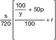
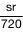

# Verordnung über die Abrechnung von Unterstützungsleistungen des Technischen Hilfswerks (THWAbrV)

Ausfertigungsdatum
:   2021-10-13

Fundstelle
:   BGBl I: 2021, 4667

Stand: Ersetzt V 215-10-4 v. 13.12.2012 I 2674 (THW-AbrV)

## Eingangsformel

Auf Grund des § 6 Absatz 3 des THW-Gesetzes, der durch Artikel 1
Nummer 5 des Gesetzes vom 15. April 2020 (BGBl. I S. 808) neu gefasst
worden ist, verordnet das Bundesministerium des Innern, für Bau und
Heimat:

## § 1 Regelungsgegenstand

Diese Verordnung regelt die Bemessung, Abrechnung und Festsetzung der
Auslagen und Gebühren für technische Unterstützungsleistungen des
Technischen Hilfswerks.

## § 2 Bemessung und Ermittlung von Kosten sowie Geltendmachung der Ansprüche

(1) Zu den Auslagen für im Rahmen der Amtshilfe erbrachte technische
Unterstützungsleistungen zählen auch die Kosten für die Helferinnen
und Helfer unter Berücksichtigung

1.  der Auslagenerstattung nach § 3 Absatz 3 Satz 1 des THW-Gesetzes,

2.  der Entschädigung für Verdienstausfall nach § 3 Absatz 3 Satz 2 und 3
    des THW-Gesetzes und

3.  der nach § 3 Absatz 4 des THW-Gesetzes fortzugewährenden Leistungen.

Ruhe- und Wegezeiten der Helferinnen und Helfer gelten als
Einsatzzeiten. Die Höhe der Auslagen setzt das Technische Hilfswerk
gegenüber der ersuchenden Behörde fest, wenn diese 35 Euro
übersteigen.

(2) Für technische Unterstützungsleistungen außerhalb der Amtshilfe
und für zur Durchführung einer Amtshilfe erbrachte individuell
zurechenbare öffentliche Leistungen mit Außenwirkung setzt das
Technische Hilfswerk die Auslagen und Gebühren fest.

(3) Die Auslagen und Gebühren bestimmen sich nach der Anlage. Für
einen Ausstattungsgegenstand, der in Abschnitt 1 der Anlage nicht
aufgeführt ist, gelten die Auslagen- und Gebührensätze entsprechend,
die in Abschnitt 1 der Anlage für einen vergleichbaren
Ausstattungsgegenstand bestimmt sind. Ist in Abschnitt 1 der Anlage
kein vergleichbarer Ausstattungsgegenstand aufgeführt, so gilt der
feste Satz nach der Formel in Abschnitt 2 der Anlage.

## § 3 Verzicht

(1) Das Technische Hilfswerk kann auf die Erhebung von Auslagen und
Gebühren aus Gründen der Billigkeit oder eines überwiegenden
öffentlichen Interesses verzichten. Ein Rechtsanspruch auf einen
Verzicht besteht nicht. Die konkreten Verzichtsgründe sind zu
dokumentieren.

(2) Eine Erstattung von Auslagen ginge auch dann im Sinne des § 6
Absatz 1 Satz 2 des THW-Gesetzes zu Lasten der ersuchenden
Gefahrenabwehrbehörde, wenn sich deren Erstattungsanspruch gegenüber
einem Dritten als nicht durchsetzbar erweisen sollte.

(3) Liegen Gründe vor, die einem Verzicht nach § 6 Absatz 1 Satz 2 des
THW-Gesetzes entgegenstehen, so sind diese Gründe zu dokumentieren und
der ersuchenden Gefahrenabwehrbehörde diese Gründe frühzeitig
mitzuteilen. Sind diese Gründe erst während oder nach der technischen
Unterstützung eingetreten oder bekannt geworden, so sind sie in dem
Bescheid des Technischen Hilfswerks, mit dem die Auslagen erhoben
werden, darzulegen.

(4) Ein überwiegendes öffentliches Interesse im Sinne des § 6 Absatz 1
Satz 2 des THW-Gesetzes liegt nicht vor, wenn die technische
Unterstützung durch ein privatwirtschaftliches Unternehmen
rechtzeitig, in gleichem Umfang und in Erfüllung der sonstigen aus dem
Ersuchen resultierenden wesentlichen Anforderungen geleistet werden
kann.

(5) Ein überwiegendes öffentliches Interesse liegt auch vor, wenn ein
besonderes Ausbildungsinteresse an der technischen Unterstützung
besteht. Ein besonderes Ausbildungsinteresse liegt in der Regel vor,
wenn der ausbildungsrelevante Nutzen über das Maß hinausgeht, das
gewöhnlicher Weise eine technische Unterstützung mit sich bringt. Ein
vollständiger Verzicht soll dem Ausnahmefall vorbehalten sein.

## § 4 Abrechnung von auf Grund einer Vereinbarung geleisteter technischer Unterstützung

Eine Vereinbarung über die Erbringung technischer
Unterstützungsleistungen durch das Technische Hilfswerk soll eine
Regelung zur Kostenerstattung enthalten, die sich an den in der Anlage
bestimmten Sätzen für Auslagen und Gebühren orientiert. Enthält die
Vereinbarung keine Regelung zur Kostenerstattung, erfolgt die
Abrechnung nach dieser Verordnung und der Verwaltungsvorschrift nach §
5\.

## § 5 Verwaltungsvorschrift

Das Technische Hilfswerk erlässt eine Verwaltungsvorschrift zu dieser
Verordnung. Die Verwaltungsvorschrift bedarf der Zustimmung des
Bundesministeriums des Innern, für Bau und Heimat.

## § 6 Inkrafttreten, Außerkrafttreten

Diese Verordnung tritt am ersten Tag des auf die Verkündung folgenden
Kalendermonats in Kraft. Gleichzeitig tritt die THW-
Abrechnungsverordnung vom 13. Dezember 2012 (BGBl. I S. 2674), die
durch Artikel 143 der Verordnung vom 19. Juni 2020 (BGBl. I S. 1328)
geändert worden ist, außer Kraft.

(zu § 2 Absatz 3)

## Anlage Auslagen und Gebühren

(Fundstelle: BGBl. I 2021, 4669 - 4673)

## Abschnitt 1

## Auslagen- und Gebührenkataloge

## Tabelle 1

## Personal

*    *
    *   Eingesetzte Helferinnen und Helfer

    *   Auslagensatz je
        angefangener
        Einsatzstunde

    *   Gebührensatz je
        angefangener
        Einsatzstunde

*    *
    *   1

    *   2

    *   3

*    *   1

    *   Helferinnen und Helfer mit Anspruch auf

        a)  Entschädigung für Verdienstausfall (§ 3 Absatz 3 Satz 2
            und 3 THWG) oder

        b)  Fortgewährung von Leistungen (§ 3 Absatz 4 THWG)

    *   25,00 €

    *   28,00 €

*    *   2

    *   Andere Helferinnen und Helfer

    *   4,00 €

    *   7,00 €

## Tabelle 2

## Ausstattung

*    *
    *   Eingesetzte Ausstattung

    *   Auslagensatz je
        angefangener
        Einsatzstunde

    *   Gebührensatz je
        angefangener
        Einsatzstunde

*    *
    *   1

    *   2

    *   3

*    *   1

    *   Anhänger

    *   1,40 €

    *   4,40 €

*    *   2

    *   Anhänger 2 t Nutzlast

    *   0,40 €

    *   1,00 €

*    *   3

    *   Anhänger BDF-Lafette

    *   1,10 €

    *   3,30 €

*    *   4

    *   Anhänger Drucklufterzeuger

    *   1,40 €

    *   4,40 €

*    *   5

    *   Anhänger FGr I

    *   1,10 €

    *   3,50 €

*    *   6

    *   Anhänger FGr O

    *   0,40 €

    *   1,20 €

*    *   7

    *   Anhänger FGr Sp

    *   1,10 €

    *   3,50 €

*    *   8

    *   Anhänger Führung und Lage

    *   3,90 €

    *   12,20 €

*    *   9

    *   Anhänger mit Abstützsystem Holz

    *   2,40 €

    *   7,50 €

*    *   10

    *   Anhänger mit Netzersatzanlage – groß –

    *   5,70 €

    *   18,10 €

*    *   11

    *   Anhänger mit Netzersatzanlage – mittel –

    *   2,00 €

    *   6,30 €

*    *   12

    *   Anhänger mit Netzersatzanlage – sehr groß –

    *   10,70 €

    *   34,20 €

*    *   13

    *   Anhänger mit Schmutzwasserpumpe – groß –

    *   8,30 €

    *   26,40 €

*    *   14

    *   Anhänger mit Schmutzwasserpumpe – klein –

    *   5,20 €

    *   16,70 €

*    *   15

    *   Anhänger mit Schmutzwasserpumpe – mittel –

    *   7,70 €

    *   24,50 €

*    *   16

    *   Anhänger 2 t Nutzlast mit Spezialaufbau für FGr K

    *   1,00 €

    *   3,00 €

*    *   17

    *   Anhänger OV

    *   0,10 €

    *   0,20 €

*    *   18

    *   Anhänger Plane/Spriegel

    *   1,30 €

    *   4,00 €

*    *   19

    *   Anhänger Plattform

    *   1,60 €

    *   5,10 €

*    *   20

    *   Anhänger Tieflader

    *   1,60 €

    *   4,90 €

*    *   21

    *   Anhänger Trinkwasseraufbereitungsanlage

    *   3,50 €

    *   11,00 €

*    *   22

    *   Auflieger Sattelzug

    *   2,20 €

    *   7,20 €

*    *   23

    *   Baumaschine Bagger

    *   7,70 €

    *   23,60 €

*    *   24

    *   Baumaschine Radlader

    *   8,90 €

    *   27,40 €

*    *   25

    *   Baumaschine Teleskoplader

    *   5,90 €

    *   18,30 €

*    *   26

    *   Behälterausstattung

    *   1,70 €

    *   5,70 €

*    *   27

    *   Beleuchtung Erweiterung – mittel –

    *   0,50 €

    *   1,70 €

*    *   28

    *   Besprechungs- und Arbeitsraum

    *   0,20 €

    *   0,80 €

*    *   29

    *   Bohr- und Aufbrechausstattung – groß –

    *   0,80 €

    *   3,30 €

*    *   30

    *   Brückenbaumaterial

    *   0,60 €

    *   2,00 €

*    *   31

    *   Einsatzgerüstsystem

    *   1,00 €

    *   3,80 €

*    *   32

    *   Einsatzstellensicherungssystem

    *   3,20 €

    *   10,70 €

*    *   33

    *   Einsatzunterbringung Logistikstelle Verpflegung

    *   0,40 €

    *   1,60 €

*    *   34

    *   Energieverteilung – groß –

    *   2,20 €

    *   7,40 €

*    *   35

    *   Energieverteilung – klein –

    *   0,20 €

    *   0,60 €

*    *   36

    *   Energieverteilung – mittel –

    *   0,50 €

    *   1,70 €

*    *   37

    *   Ergänzungsausstattung als FB FGr. B

    *   0,40 €

    *   1,50 €

*    *   38

    *   Ergänzungsausstattung als FB FGr. BrB

    *   0,30 €

    *   0,80 €

*    *   39

    *   Ergänzungsausstattung als FB FGr. E

    *   0,80 €

    *   3,30 €

*    *   40

    *   Ergänzungsausstattung als FB FGr. I

    *   1,30 €

    *   4,40 €

*    *   41

    *   Ergänzungsausstattung als FB FGr. K

    *   0,40 €

    *   1,40 €

*    *   42

    *   Ergänzungsausstattung als FB FGr. N

    *   0,20 €

    *   0,60 €

*    *   43

    *   Ergänzungsausstattung als FB FGr. O

    *   0,90 €

    *   3,10 €

*    *   44

    *   Ergänzungsausstattung als FB FGr. Öl

    *   1,00 €

    *   4,10 €

*    *   45

    *   Ergänzungsausstattung als FB FGr. R

    *   38,20 €

    *   129,80 €

*    *   46

    *   Ergänzungsausstattung als FB FGr. SB

    *   0,30 €

    *   0,70 €

*    *   47

    *   Ergänzungsausstattung als FB FGr. Sp

    *   2,70 €

    *   11,20 €

*    *   48

    *   Ergänzungsausstattung als FB FGr. TW

    *   1,40 €

    *   6,00 €

*    *   49

    *   Ergänzungsausstattung als FB FGr. W

    *   3,50 €

    *   14,90 €

*    *   50

    *   Ergänzungsausstattung als FB FGr. WP

    *   0,60 €

    *   2,00 €

*    *   51

    *   Ergänzungsausstattung als FB Tr. UL

    *   11,60 €

    *   39,40 €

*    *   52

    *   Fahrplatten

    *   0,30 €

    *   0,80 €

*    *   53

    *   Fachgruppenausstattung allgemein

    *   1,00 €

    *   2,00 €

*    *   54

    *   Fahrzeuge und Anhänger Richtfunk

    *   22,50 €

    *   80,30 €

*    *   55

    *   Fernmeldeausstattung, FGr-spezifisch

    *   0,70 €

    *   3,30 €

*    *   56

    *   Fernmeldebauausstattung

    *   1,80 €

    *   6,00 €

*    *   57

    *   Fernmeldekraftwagen

    *   4,80 €

    *   16,80 €

*    *   58

    *   Führungs- und Kommunikationskraftwagen

    *   12,40 €

    *   44,40 €

*    *   59

    *   Führungskraftwagen

    *   4,20 €

    *   18,90 €

*    *   60

    *   Gabelstapler

    *   1,20 €

    *   4,40 €

*    *   61

    *   Gerätekraftwagen

    *   7,50 €

    *   26,90 €

*    *   62

    *   Hebe- und Zuggeräteausstattung – mittel –

    *   0,70 €

    *   2,40 €

*    *   63

    *   Hebe- und Zuggeräteausstattung – schwer –

    *   1,90 €

    *   6,40 €

*    *   64

    *   Hochwasserpegel

    *   1,10 €

    *   7,10 €

*    *   65

    *   Hydraulikaggregat

    *   0,10 €

    *   0,40 €

*    *   66

    *   Kleines Boot

    *   1,30 €

    *   4,00 €

*    *   67

    *   Kommunikationsausstattung – groß –

    *   2,20 €

    *   13,50 €

*    *   68

    *   Kommunikationsausstattung – klein –

    *   0,40 €

    *   2,10 €

*    *   69

    *   Kommunikationsausstattung – mittel –

    *   3,60 €

    *   22,30 €

*    *   70

    *   Lagercontainer

    *   0,30 €

    *   1,00 €

*    *   71

    *   Lastkraftwagen Kipper

    *   4,10 €

    *   14,60 €

*    *   72

    *   Lastkraftwagen mit Ladebordwand

    *   5,70 €

    *   20,20 €

*    *   73

    *   Lastkraftwagen mit Ladekran – leicht –

    *   7,00 €

    *   25,00 €

*    *   74

    *   Lastkraftwagen mit Ladekran – mittel –

    *   11,10 €

    *   39,70 €

*    *   75

    *   Lastkraftwagen mit Ladekran – schwer –

    *   14,70 €

    *   52,30 €

*    *   76

    *   Lastkraftwagen Wechsellader

    *   4,50 €

    *   16,00 €

*    *   77

    *   Mannschaftslastwagen IV

    *   4,50 €

    *   15,90 €

*    *   78

    *   Mannschaftstransportwagen, Technischer Zug

    *   2,00 €

    *   9,00 €

*    *   79

    *   Mannschaftstransportwagen Fachgruppe

    *   2,10 €

    *   9,50 €

*    *   80

    *   Mannschaftstransportwagen OV

    *   1,30 €

    *   5,90 €

*    *   81

    *   Mehrzweckarbeitsboot

    *   3,50 €

    *   11,20 €

*    *   82

    *   Mehrzweckgerätewagen

    *   4,70 €

    *   16,70 €

*    *   83

    *   Mobile Kraftstoffversorgung

    *   0,20 €

    *   0,70 €

*    *   84

    *   Modularer Schwimmkörper

    *   0,50 €

    *   1,10 €

*    *   85

    *   Motorsäge, Basis

    *   0,20 €

    *   0,70 €

*    *   86

    *   Notunterbringung

    *   2,00 €

    *   8,20 €

*    *   87

    *   Ölwehrausstattung

    *   0,30 €

    *   1,00 €

*    *   88

    *   Ortungsgeräte

    *   2,50 €

    *   11,00 €

*    *   89

    *   Personenkraftwagen – geländegängig –

    *   1,10 €

    *   4,90 €

*    *   90

    *   Personenkraftwagen OV

    *   0,50 €

    *   3,70 €

*    *   91

    *   Pumpausstattung – klein – MoP/Typ C

    *   0,10 €

    *   0,40 €

*    *   92

    *   Pumpausstattung – klein – TP

    *   0,20 €

    *   0,50 €

*    *   93

    *   Pumpausstattung FGr WP

    *   5,60 €

    *   18,80 €

*    *   94

    *   Pumpausstattung TP FGr N

    *   0,40 €

    *   1,30 €

*    *   95

    *   Pumpausstattung TW

    *   1,50 €

    *   4,90 €

*    *   96

    *   Rettungsausstattung – groß –

    *   0,40 €

    *   1,20 €

*    *   97

    *   Rettungsspinne mit Anhänger

    *   9,70 €

    *   34,50 €

*    *   98

    *   Sattelzugmaschine

    *   3,90 €

    *   13,80 €

*    *   99

    *   Schwimmkörper Mehrzweckponton

    *   3,70 €

    *   11,80 €

*    *   100

    *   Separationsanlage – groß –

    *   14,00 €

    *   41,10 €

*    *   101

    *   Separationsanlage – klein –

    *   16,90 €

    *   49,60 €

*    *   102

    *   Skimmer

    *   0,90 €

    *   3,80 €

*    *   103

    *   Spreiz- und Schneidausstattung

    *   0,50 €

    *   3,70 €

*    *   104

    *   Stromerzeuger mit Zubehör

    *   0,30 €

    *   1,00 €

*    *   105

    *   Ausstattung für Thermisches Trennen – Plasma –

    *   0,50 €

    *   1,60 €

*    *   106

    *   Trenn-, Schweiß- und Brennausstattung

    *   0,40 €

    *   1,30 €

*    *   107

    *   Trinkwasseraufbereitungsanlage

    *   36,90 €

    *   125,40 €

*    *   108

    *   Trinkwasserlabor im Container

    *   3,70 €

    *   12,40 €

*    *   109

    *   Unbemanntes Luftfahrtsystem

    *   1,70 €

    *   7,90 €

*    *   110

    *   Verpflegungszubereitungsausstattung

    *   5,80 €

    *   19,70 €

*    *   111

    *   Wassertransportausstattung

    *   0,40 €

    *   1,20 €

*    *   112

    *   Wasserverteilung und Rohrleitungsbauausstattung

    *   0,40 €

    *   1,40 €

*    *   113

    *   Werkstattcontainer

    *   6,20 €

    *   28,80 €

*    *   114

    *   Werkzeugausstattung

    *   0,60 €

    *   1,40 €

Berechnung der Einsatzstunden und des Kraftstoffverbrauchs

Die Einsatzstunden werden berechnet vom Eintreffen der Einsatzkräfte
im Ortsverband bis zur Wiederherstellung der Einsatzbereitschaft in
der THW-Liegenschaft.

Zur Ermittlung der Kraftstoffverbräuche werden zusätzlich berechnet:

–   bei Fahrzeugen und Baumaschinen die Fahrstrecke und die im Stand
    erbrachten Betriebsstunden (z. B. bei Seilwindenbetrieb) und

–   bei kraftstoffbetriebenen Geräten die Stunden des tatsächlichen
    Einsatzes (also die Betriebsstunden).

[^F818846_01_BJNR466700021BJNE000800000]
Die Preise für Kraftstoffe werden nach dem jeweils einschlägigen
aktuellen Verbraucherpreisindex Energie des Statistischen Bundesamtes
berechnet
. Die Mindeststundenzahl beträgt drei Stunden, es sei denn, es werden
mehrere zeitlich und örtlich eng beieinanderliegende Einsätze
abgerechnet.

## Tabelle 3

## Einsatzbezogene Auslagen und Gebühren

*    *   Einsatzbezogene Auslagen

    *   3 % der Gesamtkosten des Einsatzes, jedoch mindestens 15 € und
        höchstens 150 € je Einsatz

*    *   Einsatzbezogene Gebühren
        Sonstige Gebühren umfassen Gemeinkosten, soweit diese einen
        berücksichtigungsfähigen Anteil an den mit einer
        Unterstützungsleistung verbundenen Kosten ausmachen.

    *   7 % der Gesamtkosten des Einsatzes, jedoch mindestens 30 € und
        höchstens 300 € je Einsatz

## Abschnitt 2

## Berechnung der Sätze nach § 2 Absatz 3 Satz 3

*    *   Gebühr (in Euro je angefangener Einsatzstunde)

    *        

*    *   Auslagen für amtshilfebedingte Mehrkosten (in Euro je angefangener
        Einsatzstunde)

    *        

   Dabei bedeuten:

s:  Neupreis (in Euro)

y:  kalkulatorische Nutzungsdauer (in Jahren)

p:  Basiszinssatz (§ 247 Absatz 1 Satz 1 BGB), mindestens jedoch 3 %; der
    von der Deutschen Bundesbank regelmäßig veröffentlichte Basiszinssatz
    wird in die o. a. Formel zur Berechnung der Gebühr je Einsatzstunde
    als Dezimalfaktor eingefügt. Beispiel: Bei einem Basiszinssatz von 3 %
    ist p = 0,03.

r:  Reparaturkosten-Index nach Maßgabe der folgenden Tabelle:

*    *   Ausstattungsgruppe

    *
    *   Reparaturkostenfaktor r

*    *   Kfz, Anhänger

    *
    *   0,022

*    *   Baumaschinen und Großgeräte

    *
    *   0,027

*    *   Geräte mit Motorantrieb

    *
    *   0,025

*    *   Ausstattung, allgemein

    *
    *   0,034

Die Ergebnisse der Berechnungen nach den oben angegebenen Formeln
werden auf volle 10 Cent aufgerundet.

    Zugrunde liegen die Basiswerte der Kraftstoffe Benzin (1,36
    Euro/Liter), Diesel (1,17 Euro/Liter) und Brenngas (1,75 Euro/kg) aus
    dem Jahr 2015, jeweils monatsaktuell anhand des o. a. Indexes (2015 =
    100 %) berechnet.
[^F818846_01_BJNR466700021BJNE000800000]: 
