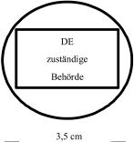
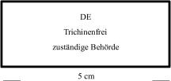
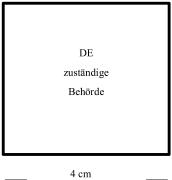
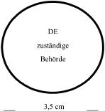
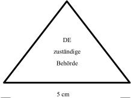

# Verordnung zur Regelung bestimmter Fragen der amtlichen Überwachung des Herstellens, Behandelns und Inverkehrbringens von Lebensmitteln tierischen Ursprungs (Tier-LMÜV)

Ausfertigungsdatum
:   2007-08-08

Fundstelle
:   BGBl I: 2007, 1816, 1864

Zuletzt geändert durch
:   Art. 2 V v. 11.11.2010 I 1537

## § 1 Anwendungsbereich

Diese Verordnung dient der Regelung der amtlichen Überwachung des
Herstellens, Behandelns und des Inverkehrbringens von Lebensmitteln
tierischen Ursprungs sowie der Umsetzung und Durchführung von
Rechtsakten der Europäischen Gemeinschaft oder der Europäischen Union
auf dem Gebiet der Überwachung des Verkehrs mit Lebensmitteln
tierischen Ursprungs.

## § 2 Begriffsbestimmungen

(1) Im Sinne dieser Verordnung sind:

1.  Lebensmittel tierischen Ursprungs: Erzeugnisse tierischen Ursprungs im
    Sinne des Anhangs I Nr. 8.1 Spiegelstrich 1 der Verordnung (EG) Nr.
    853/2004 des Europäischen Parlaments und des Rates vom 29. April 2004
    mit spezifischen Hygienevorschriften für Lebensmittel tierischen
    Ursprungs (ABl. EU Nr. L 139 S. 55, Nr. L 226 S. 22) in der geltenden
    Fassung,

2.  verbotene Stoffe oder Erzeugnisse: Stoffe oder Erzeugnisse, deren
    Anwendung bei lebenden Tieren im Sinne des § 4 Abs. 1 Nr. 1 des
    Lebensmittel- und Futtermittelgesetzbuches verboten ist,

3.  vorschriftswidrige Anwendung: Anwendung verbotener Stoffe oder
    Erzeugnisse oder Anwendung zugelassener Stoffe oder Erzeugnisse für
    Anwendungsgebiete, für die die Anwendung ausgeschlossen ist, bei
    lebenden Tieren, im Sinne des § 4 Abs. 1 Nr. 1 des Lebensmittel- und
    Futtermittelgesetzbuches,

4.  Rückstände: Rückstände von Stoffen mit pharmakologischer Wirkung und
    deren Umwandlungsprodukten sowie von anderen Stoffen, die in
    Lebensmittel tierischen Ursprungs übergehen und die menschliche
    Gesundheit beeinträchtigen können,

5.  Sendung: eine Gruppe von lebenden Tieren der gleichen Tierart und
    Altersgruppe, die in demselben Betrieb unter gleichen Haltungs- und
    Fütterungsbedingungen gleichzeitig aufgezogen wurden.

(2) Im Übrigen gelten die Begriffsbestimmungen des

1.  Artikels 2 der Verordnung (EG) Nr. 852/2004 des Europäischen
    Parlaments und des Rates vom 29. April 2004 über Lebensmittelhygiene
    (ABl. EU Nr. L 139 S. 1, Nr. L 226 S. 3) und

2.  Anhangs I der Verordnung (EG) Nr. 853/2004

entsprechend.

## § 3 Amtliche Fachassistenten

(1) Die zuständige Behörde darf nur Personen zu amtlichen
Fachassistenten bestellen, die

1.  den erfolgreichen Abschluss einer Hauptschule oder einen mindestens
    gleichwertigen Bildungsabschluss,

2.  die körperliche und gesundheitliche Eignung durch ein ärztliches
    Attest,

3.  die erforderliche Zuverlässigkeit durch ein amtliches Führungszeugnis
    und

4.  die Befähigung durch eine amtliche Bescheinigung nach Maßgabe des
    Absatzes 2 über die erfolgreiche Schulung und Prüfung nach

    a)  Anhang I Abschnitt III Kapitel IV Buchstabe B Nr. 5 oder 8 der
        Verordnung (EG) Nr. 854/2004 des Europäischen Parlaments und des Rates
        vom 29. April 2004 mit besonderen Verfahrensvorschriften für die
        amtliche Überwachung von zum menschlichen Verzehr bestimmten
        Erzeugnissen tierischen Ursprungs (ABl. EU Nr. L 139 S. 206, Nr. L 226
        S. 83),

    b)  § 3 Abs. 2 Satz 3 der Fleischkontrolleur-Verordnung vom 30. Juni 1992
        (BGBl. I S. 1227) in der bis zum 14. August 2007 geltenden Fassung
        oder

    c)  § 4 Abs. 2 Satz 3 der Verordnung über Geflügelfleischkontrolleure vom
        24\. Juli 1973 (BGBl. I S. 899) in der bis zum 14. August 2007
        geltenden Fassung

nachweisen.

(2) Der Nachweis der Befähigung nach Absatz 1 Nr. 4 erlischt bei
Personen, die über einen Zeitraum von mehr als

1.  drei Jahren nicht an Fortbildungsmaßnahmen nach Anhang I Abschnitt III
    Kapitel IV Buchstabe B Nr. 6 der Verordnung (EG) Nr. 854/2004
    teilgenommen haben oder

2.  zwei Jahren nicht als amtlicher Fachassistent tätig gewesen sind.

Der Nachweis der Befähigung kann wieder erbracht werden durch Bestehen
einer amtlichen Nachprüfung, in der festzustellen ist, ob die in
theoretischer und praktischer Hinsicht erforderlichen Kenntnisse nach
Anhang I Abschnitt III Kapitel IV Buchstabe B Nr. 5 der Verordnung
(EG) Nr. 854/2004 noch vorhanden sind.

(3) Die Landesregierungen werden ermächtigt, durch Rechtsverordnung
Vorschriften über

1.  die Durchführung der Schulung und Prüfung nach Anhang I Abschnitt III
    Kapitel IV Buchstabe B der Verordnung (EG) Nr. 854/2004 und die
    Ausstellung einer amtlichen Bescheinigung hierüber und

2.  die Durchführung von Fortbildungsmaßnahmen nach Anhang I Abschnitt III
    Kapitel IV Buchstabe B Nr. 6 und 7 der Verordnung (EG) Nr. 854/2004
    und

3.  die Durchführung der Nachprüfung im Sinne des Absatzes 2 Satz 2

zu erlassen.

## § 4 Schlachthofpersonal

(1) Die zuständige Behörde kann auf Antrag genehmigen, dass Personal
eines Schlachthofes

1.  bei der amtlichen Überwachung der Produktion von Fleisch von Geflügel
    oder Hasentieren unter den in Artikel 5 Nr. 6 Buchstabe a in
    Verbindung mit Anhang I Abschnitt III Kapitel III Buchstabe A der
    Verordnung (EG) Nr. 854/2004 genannten Voraussetzungen die dort
    beschriebenen Tätigkeiten an Stelle von amtlichen Fachassistenten
    übernimmt oder

2.  nach Artikel 5 Nr. 6 Buchstabe b in Verbindung mit Anhang I Abschnitt
    III Kapitel III Buchstabe B der Verordnung (EG) Nr. 854/2004 bestimmte
    Tests oder die Entnahme von Proben für bestimmte Laboruntersuchungen
    ausführt.

(2) Im Falle des Absatzes 1 Nr. 1 hat der amtliche Tierarzt bis zur
Festlegung detaillierter Vorschriften für Leistungstests nach Anhang I
Abschnitt III Kapitel III Buchstabe A Unterbuchstabe a Satz 3 der
Verordnung (EG) Nr. 854/2004 von jeder Sendung Schlachtgeflügel
Eingeweide und Körperhöhlen von mindestens 300 über die gesamte
Sendung verteilten Tieren darauf zu überprüfen, ob das
Schlachthofpersonal die übertragenen Aufgaben ordnungsgemäß
durchgeführt hat.

(3) Vor dem erstmaligen Einsatz des Schlachthofpersonals nach Absatz 1
Nr. 2 hat sich die zuständige Behörde im Rahmen einer theoretischen
und einer praktischen Prüfung von dem Erfolg der Schulung nach Anhang
I Abschnitt III Kapitel III Buchstabe B der Verordnung (EG) Nr.
854/2004 zu überzeugen.

## § 5 Fleischhygienerechtliche Maßnahmen im Rahmen von Zoonosen- und Seuchentilgungsprogrammen

(1) Die zuständige Behörde kann eine Schlachtung im Rahmen von
Programmen zur Tilgung oder Bekämpfung von Tierseuchen oder von
Zoonoseerregern im Sinne des Anhangs I Abschnitt II Kapitel III Nr. 7
der Verordnung (EG) Nr. 854/2004 mit der Auflage genehmigen, dass

1.  die Schlachtung im Anschluss an die übrigen Schlachtungen vorzunehmen
    ist,

2.  die Schlachtung räumlich getrennt von den übrigen Schlachtungen
    vorzunehmen ist, wenn der Verdacht besteht, dass das untersuchte Tier
    von einer ansteckenden Krankheit befallen ist, die auf das
    Schlachtpersonal übertragen werden kann.

Im Falle des Satzes 1 Nr. 2 sind besondere Vorkehrungen zum Schutz des
Schlachtpersonals zu treffen.

(2) Der amtliche Tierarzt ordnet erforderlichenfalls unter
Berücksichtigung der erregerspezifischen Eigenschaften weitere
Maßnahmen an, um eine Kontamination anderer Tiere oder des Fleisches
anderer Tiere zu vermeiden. Im begründeten Einzelfall kann das
Bundesinstitut für Risikobewertung beteiligt werden.

(3) Nach Abschluss der Schlachtungen nach Absatz 1 hat der amtliche
Tierarzt eine geeignete Reinigung und Desinfektion aller
Räumlichkeiten, Einrichtungs- und Ausrüstungsgegenstände anzuordnen,
die im Rahmen der Schlachtungen nach Absatz 1 mit Erregern von
Tierseuchen oder Zoonosen verunreinigt worden sein könnten.

## § 6 Fleischuntersuchung und Untersuchung auf Trichinen vor Abgabe kleiner Mengen erlegten Wildes

(1) Bei kleinen Mengen erlegten Wildes, das nach § 4 Absatz 2 Satz 1
Nummer 1 oder 2, auch in Verbindung mit Absatz 3, der Tierische
Lebensmittel-Hygieneverordnung zur amtlichen Fleischuntersuchung oder
zur amtlichen Untersuchung auf Trichinen angemeldet wurde, ist

1.  die amtliche Fleischuntersuchung nach Anhang I Abschnitt IV Kapitel
    VIII Buchstabe A in Verbindung mit Abschnitt II Kapitel V Nr. 1 der
    Verordnung (EG) Nr. 854/2004 in der jeweils geltenden Fassung oder

2.  die amtliche Untersuchung auf Trichinen nach Artikel 2 Abs. 3
    Unterabsatz 3 in Verbindung mit Anhang I Kapitel I oder II und Anhang
    III der Verordnung (EG) Nr. 2075/2005 der Kommission vom 5. Dezember
    2005 mit spezifischen Vorschriften für die amtlichen
    Fleischuntersuchungen auf Trichinen (ABl. EU Nr. L 338 S. 60) in der
    jeweils geltenden Fassung

durchzuführen. Für die Beurteilung auf Grund der Ergebnisse der
Untersuchungen nach Satz 1 gilt Anhang I Abschnitt IV Kapitel VIII
Buchstabe B und Kapitel IX Buchstabe C der Verordnung (EG) Nr.
854/2004 entsprechend.

(2) Die zuständige Behörde kann einem Jäger, der Inhaber eines
gültigen Jahresjagdscheines ist und

1.  nach § 2b der Tierische Lebensmittel-Hygieneverordnung Wild zum Zweck
    der Verwendung als Lebensmittel für den eigenen häuslichen Verbrauch
    erlegt oder

2.  nach § 3 Absatz 1 Satz 1 Nummer 5 der Tierische Lebensmittel-
    Hygieneverordnung kleine Mengen von erlegtem Wild oder Fleisch von
    erlegtem Wild abgibt,

im Fall von Wildschweinen oder Dachsen die Entnahme von Proben zur
Untersuchung auf Trichinen nach Absatz 1 Satz 1 Nummer 2 übertragen.
Eine Übertragung nach Satz 1 darf nur erfolgen, wenn

1.  der Jäger von der zuständigen Behörde für die Wahrnehmung dieser
    Tätigkeit geschult worden ist und

2.  keine Tatsachen vorliegen, die die Annahme rechtfertigen, dass der
    Jäger die erforderliche Zuverlässigkeit für diese Tätigkeit nicht
    besitzt.

## § 7 Schlachttieruntersuchung bei der Abgabe kleiner Mengen Fleisch von Geflügel oder Hasentieren

Die zuständige Behörde hat in landwirtschaftlichen Betrieben, in denen
kleine Mengen von frischem Fleisch von Geflügel oder Hasentieren nach
§ 3 Abs. 1 Satz 1 Nr. 4 der Tierische Lebensmittel-Hygieneverordnung
abgegeben werden, mindestens zweimal jährlich eine
Schlachttieruntersuchung in Form einer regelmäßigen
Gesundheitsüberwachung des Bestandes durchzuführen. Satz 1 gilt nicht
in Fällen des § 3 Abs. 1 Satz 2 der Tierische Lebensmittel-
Hygieneverordnung.

## § 7a Amtliche Untersuchungen bei der Gewinnung von Fleisch für den eigenen häuslichen Verbrauch

(1) Bei Tieren, die nach § 2a Absatz 1 der Tierische Lebensmittel-
Hygieneverordnung zur amtlichen Untersuchung angemeldet worden sind,
ist

1.  die amtliche Schlachttieruntersuchung nach Anhang I Abschnitt I
    Kapitel II Teil B und Abschnitt II Kapitel III, auch in Verbindung mit
    Abschnitt IV Kapitel IV Teil A oder Kapitel VII Teil A sowie mit
    Kapitel IX Teil A, E und F der Verordnung (EG) Nr. 854/2004,

2.  die amtliche Fleischuntersuchung nach Anhang I Abschnitt I Kapitel II
    Teil D und Abschnitt II Kapitel V Nummer 1, auch in Verbindung mit
    Abschnitt IV Kapitel I, II, III, IV Teil B oder Kapitel VII Teil B
    sowie mit Kapitel IX Teil A, B und D bis F der Verordnung (EG) Nr.
    854/2004,

3.  die amtliche Untersuchung auf Trichinen nach Anhang I Abschnitt IV
    Kapitel IX Teil C der Verordnung (EG) Nr. 854/2004 in der jeweils
    geltenden Fassung in Verbindung mit Artikel 2 Absatz 3 Unterabsatz 3
    in Verbindung mit Anhang I Kapitel I oder II und Anhang III der
    Verordnung (EG) Nr. 2075/2005

durchzuführen. Die zuständige Behörde kann abweichend von Satz 1
Nummer 3 die Untersuchung auf Trichinen nach Artikel 2 Absatz 3
Unterabsatz 3 in Verbindung mit Anhang I Kapitel III der Verordnung
(EG) Nr. 2075/2005 durchführen.

(2) Bei erlegtem Großwild, das nach § 2b der Tierische Lebensmittel-
Hygieneverordnung zur amtlichen Fleischuntersuchung oder zur amtlichen
Untersuchung auf Trichinen angemeldet worden ist, gilt § 6 Absatz 1
entsprechend.

## § 7b Amtliche Untersuchungen in Wildfarmen mit geringem Produktionsvolumen an Schalenwild

(1) Im Rahmen der Genehmigung der Schlachtung oder Tötung von
Schalenwild zur Gewinnung von Fleisch für den menschlichen Verzehr am
Herkunftsort nach Anhang III Abschnitt III Nummer 3 der Verordnung
(EG) Nr. 853/2004 kann die zuständige Behörde auf Antrag auch
genehmigen, dass in Wildfarmen mit geringem Produktionsvolumen die
Schlachtung oder Tötung abweichend von Artikel 5 Nummer 1 Buchstabe b
in Verbindung mit Anhang I Abschnitt I Kapitel II Teil B Nummer 1
Buchstabe b der Verordnung (EG) Nr. 854/2004 auch dann erfolgen darf,
wenn die amtliche Schlachttieruntersuchung abweichend von Artikel 5
Nummer 1 Buchstabe b in Verbindung mit Anhang I Abschnitt I Kapitel II
Teil B Nummer 1 Buchstabe b der Verordnung (EG) Nr. 854/2004 nicht
innerhalb von 24 Stunden, jedoch innerhalb von 28 Tagen vor der
Schlachtung durchgeführt worden ist, sofern eine Person mit den
Kenntnissen einer kundigen Person nach Anhang III Abschnitt IV Kapitel
I der Verordnung (EG) Nr. 853/2004 unmittelbar vor der Schlachtung
oder Tötung festgestellt hat, dass bei dem zu schlachtenden oder zu
tötenden Tier keine Verhaltensstörungen zu beobachten sind und ein
Verdacht auf schädliche Einwirkungen durch die Umwelt
(Umweltkontamination) nicht besteht.

(2) Im Falle des Absatzes 1 hat der amtliche oder zugelassene
Tierarzt, der die Schlachttieruntersuchung durchgeführt hat, in Nummer
5 der Gesundheitsbescheinigung nach Anhang I Abschnitt IV Kapitel X
Teil B der Verordnung (EG) Nr. 854/2004 den zweiten Anstrich der
Erklärung zu streichen. Die Genehmigung nach Anhang III Abschnitt III
Nummer 3 der Verordnung (EG) Nr. 853/2004 darf unter den
Voraussetzungen des Absatzes 1 auch dann erteilt werden, wenn der
Betrieb nicht über Verfahren nach Anhang III Abschnitt III Nummer 3
Buchstabe e der Verordnung (EG) Nr. 853/2004 verfügt.

(3) Wildfarmen mit geringem Produktionsvolumen im Sinne dieser
Vorschrift sind Wildfarmen, die jährlich nicht mehr als 50 Stück
Schalenwild schlachten oder zur Gewinnung von Fleisch für den
menschlichen Verzehr töten oder zur Schlachtung abgeben.

## § 8 Kennzeichnung der Genusstauglichkeit

(1) Bei Fleisch von als Haustieren gehaltenen Huftieren, die außerhalb
eines Schlachthofes notgeschlachtet worden sind, hat die Kennzeichnung
der Genusstauglichkeit nach Anhang I Abschnitt I Kapitel III Nr. 7 der
Verordnung (EG) Nr. 854/2004 mit einem Kennzeichen nach Form und
Inhalt des Musters der Anlage 1 Nr. 1 zu erfolgen.

(2) Kleine Mengen erlegten Großwildes, bei dem keine
Fleischuntersuchung nach § 6 Absatz 1 Satz 1 Nr. 1 durchgeführt, das
aber nach § 6 Absatz 1 Satz 1 Nr. 2 auf Trichinen untersucht und nicht
nach § 6 Absatz 1 Satz 2 in Verbindung mit Anhang I Abschnitt IV
Kapitel VIII Buchstabe B der Verordnung (EG) Nr. 854/2004 für
genussuntauglich erklärt worden ist, sind auf den frei liegenden
Fleischteilen oder dem Brustfell mit einem Kennzeichen nach Form und
Inhalt des Musters der Anlage 1 Nr. 2 zu kennzeichnen. Satz 1 gilt
nicht im Falle des § 6 Absatz 2 Satz 1 Nummer 2.

(3) Kleine Mengen erlegten Großwildes, das nach § 6 Absatz 1 Satz 1
Nr. 1 untersucht und nicht nach § 6 Absatz 1 Satz 2 in Verbindung mit
Anhang I Abschnitt IV Kapitel VIII Buchstabe B der Verordnung (EG) Nr.
854/2004 für genussuntauglich erklärt worden ist, sind mit einem
Kennzeichen nach Form und Inhalt des Musters der Anlage 1 Nr. 3
entsprechend Anhang I Abschnitt I Kapitel III Nr. 2 Buchstabe b der
Verordnung (EG) Nr. 854/2004 zu kennzeichnen.

(4) Fleisch im Sinne des Artikels 4 Unterabs. 1 der Verordnung (EG)
Nr. 2076/2005 der Kommission vom 5. Dezember 2005 zur Festlegung von
Übergangsregelungen für die Durchführung der Verordnungen (EG) Nr.
853/2004, (EG) Nr. 854/2004 und (EG) Nr. 882/2004 des Europäischen
Parlaments und des Rates sowie zur Änderung der Verordnungen (EG) Nr.
853/2004 und (EG) Nr. 854/2004 (ABl. EU Nr. L 338 S. 83) ist mit einem
Kennzeichen nach Form und Inhalt des Musters der Anlage 1 Nr. 4 zu
kennzeichnen.

(5) Fleisch von Schalenwild,

1.  bei dem auf Grund einer behördlichen Genehmigung nach § 7b Absatz 1
    die Schlachttieruntersuchung nicht innerhalb von 24 Stunden vor der
    Schlachtung durchgeführt oder die Schlachtung am Herkunftsort unter
    den Voraussetzungen des § 7b Absatz 2 Satz 2 genehmigt worden ist und

2.  das nicht für genussuntauglich erklärt worden ist,

ist abweichend von Anhang I Abschnitt I Kapitel III Nummer 3 der
Verordnung (EG) Nr. 854/2004 mit einem Kennzeichen nach Form und
Inhalt des Musters der Anlage 1 Nummer 5 zu kennzeichnen.

(6) Fleisch, ausgenommen Fleisch von Geflügel oder Hasentieren, das
nach Anhang I Abschnitt II Kapitel V Nr. 1 oder Abschnitt IV Kapitel
VIII Buchstabe B der Verordnung (EG) Nr. 854/2004 genussuntauglich
erklärt wurde, ist mit einem Kennzeichen nach Form und Inhalt des
Musters der Anlage 1 Nr. 5 in der in den Absätzen 1 bis 3 geregelten
Weise zu kennzeichnen.

(7) Materialien zur Kennzeichnung, die vor dem 15. August 2007
verwendet worden sind und den Anforderungen nach dem jeweiligen Inhalt
der Muster der Anlage 1 nicht entsprechen, können bis zum 31. Dezember
2010 weiterverwendet werden.

## § 9 Wiederaufnahme der Rohmilchanlieferung

(1) Die Anordnung der Aussetzung der Milchanlieferung nach Anhang IV
Kapitel II Nr. 2 Satz 2 der Verordnung (EG) Nr. 854/2004 ist
aufzuheben, wenn durch die Ergebnisse von zwei im Abstand von
mindestens vier Tagen entnommenen repräsentativen Proben der
Herdenmilch nachgewiesen worden ist, dass die Rohmilch den in Anlage 2
genannten Grenzwerten entspricht. Die Anordnung der Aussetzung der
Milchanlieferung kann auch aufgehoben werden, wenn

1.  die Rohmilch im dritten Monat nach der ersten Unterrichtung der
    zuständigen Behörde den in Anlage 2 genannten Grenzwerten entsprochen
    hat,

2.  der Lebensmittelunternehmer durch geeignete Unterlagen nachweisen
    kann, dass er Maßnahmen zur Einhaltung des Gehalts an somatischen
    Zellen und Keimen getroffen hat, und

3.  durch das Ergebnis einer repräsentativen Probe der Herdenmilch
    nachgewiesen worden ist, dass die Rohmilch den in Anlage 2 genannten
    Grenzwerten entspricht.

Die Proben nach den Sätzen 1 und 2 Nr. 3 sind auf Antrag des
Lebensmittelunternehmers durch die zuständige Behörde oder eine von
dieser beauftragten Stelle zu entnehmen und zu untersuchen.

(2) Die zuständige Behörde hat unverzüglich die erneute Aussetzung der
Lieferung von Rohmilch aus dem Erzeugerbetrieb anzuordnen, wenn

1.  in dem Monat, in dem die Aufhebung der Anordnung nach Absatz 1 erfolgt
    ist, festgestellt wird, dass die Rohmilch den in Anlage 2 genannten
    Grenzwerten nicht entspricht, oder

2.  im darauf folgenden Monat festgestellt wird, dass die Rohmilch den in
    Anhang III Abschnitt IX Kapitel I Teil III Nr. 3 Buchstabe a der
    Verordnung (EG) Nr. 853/2004 genannten Kriterien nicht entspricht.

## § 10 Rückstandsüberwachung

(1) Die zuständige Behörde hat im Rahmen der Durchführung von Anhang I
Abschnitt I Kapitel II Buchstabe F Nr. 1 Buchstabe c der Verordnung
(EG) Nr. 854/2004

1.  bei mindestens 2 Prozent aller gewerblich geschlachteten Kälber und
    mindestens 0,5 Prozent aller sonstigen gewerblich geschlachteten
    Huftiere amtliche Proben zu entnehmen und auf Rückstände zu
    untersuchen und

2.  amtliche Proben von lebenden Tieren im Sinne des § 4 Abs. 1 Nr. 1 des
    Lebensmittel- und Futtermittelgesetzbuches und von Lebensmitteln
    tierischen Ursprungs nach den Vorgaben des nach § 2 Nr. 10 des BVL-
    Gesetzes erstellten Rückstandsüberwachungsplanes auf Rückstände zu
    untersuchen.

Amtliche Proben nach Satz 1 sind zur Identitätssicherung mit Angaben
zu Tierart, Art und Methode der Probenahme, Menge der Probe,
Geschlecht des Tieres sowie Ursprung des Tieres oder des Lebensmittels
zu kennzeichnen.

(2) Die zuständige Behörde hat Kontrollen im Rahmen der
Rückstandsüberwachung ohne Vorankündigung durchzuführen.

(3) Wenn bei lebenden Tieren im Sinne des § 4 Abs. 1 Nr. 1 des
Lebensmittel- und Futtermittelgesetzbuches aus einem Betrieb oder bei
von diesen Tieren gewonnenen Lebensmitteln wiederholt festgestellt
worden ist, dass festgesetzte Höchstmengen für zugelassene Stoffe nach
Anhang I der Richtlinie 96/23/EG des Rates vom 29. April 1996 über
Kontrollmaßnahmen hinsichtlich bestimmter Stoffe und ihrer Rückstände
in lebenden Tieren und tierischen Erzeugnissen und zur Aufhebung der
Richtlinien 85/358/EWG und 86/469/EWG und der Entscheidung 89/187/EWG
und 91/664/EWG (ABl. EG Nr. L 125 S. 10) oder deren
Umwandlungsprodukte überschritten worden sind, hat die zuständige
Behörde über einen Zeitraum von mindestens sechs Monaten in
verstärktem Umfang amtliche Proben von lebenden Tieren im Sinne des §
4 Abs. 1 Nr. 1 des Lebensmittel- und Futtermittelgesetzbuches oder
Lebensmitteln tierischen Ursprungs aus diesem Betrieb zu untersuchen.

(4) Wenn von der zuständigen Behörde für lebende Tiere im Sinne des §
4 Abs. 1 Nr. 1 des Lebensmittel- und Futtermittelgesetzbuches aus
einem Erzeugerbetrieb oder einem Viehhandels- oder
Transportunternehmen eine Anordnung nach § 41 Abs. 3 des Lebensmittel-
und Futtermittelgesetzbuches erlassen worden ist, hat die zuständige
Behörde über einen Zeitraum von mindestens zwölf Monaten in
verstärktem Umfang amtliche Proben von lebenden Tieren im Sinne des §
4 Abs. 1 Nr. 1 des Lebensmittel- und Futtermittelgesetzbuches oder
Lebensmitteln tierischen Ursprungs aus diesem Betrieb oder Unternehmen
zu untersuchen.

(5) Wenn gegen das Ergebnis der Untersuchung einer amtlichen Probe
nach Absatz 1 oder nach § 41 Abs. 3 oder 5 Satz 1 des Lebensmittel-
und Futtermittelgesetzbuches auf Grund des Ergebnisses der
Untersuchung einer nach § 43 Abs. 1 Satz 2 des Lebensmittel- und
Futtermittelgesetzbuches zurückgelassenen Probe Widerspruch eingelegt
wird, hat die zuständige Behörde eine Untersuchung der amtlichen Probe
durch das nationale Referenzlabor zu veranlassen.

(6) Wenn Tatsachen vorliegen, die zuverlässig darauf schließen lassen,
dass Schlachttiere vorschriftswidrig behandelt oder ihnen verbotene
Stoffe oder Erzeugnisse verabreicht worden sind, oder ein
hinreichender Verdacht hierauf besteht, hat der amtliche Tierarzt im
Rahmen der Durchführung von Anhang I Abschnitt II Kapitel III Nr. 6
der Verordnung (EG) Nr. 854/2004

1.  anzuordnen, dass die Schlachtung dieser Tiere getrennt von den übrigen
    Schlachtungen erfolgt und

2.  Schlachtkörper und Nebenprodukte der Schlachtung vorläufig zu
    beschlagnahmen und die für die Abklärung des Verdachts erforderlichen
    amtlichen Proben für Labortests nach Anhang I Abschnitt I Kapitel II
    Buchstabe F Nr. 1 Buchstabe c der Verordnung (EG) Nr. 854/2004 zu
    entnehmen.

(7) Wenn Tatsachen vorliegen, die zuverlässig darauf schließen lassen,
dass Schlachttieren zugelassene Stoffe mit pharmakologischer Wirkung
zugeführt worden sind und die Tiere vor Ablauf der vorgeschriebenen
Wartezeit geschlachtet werden sollen, oder ein hinreichender Verdacht
hierauf besteht, hat der amtliche Tierarzt die Verschiebung der
Schlachtung anzuordnen. Der Zeitraum der Verschiebung der Schlachtung
ist so zu bemessen, dass die vorgeschriebene Wartezeit eingehalten
wird und festgesetzte Höchstmengen nicht überschritten werden.

(8) Abweichend von Absatz 7 kann der amtliche Tierarzt die Schlachtung
erlauben, wenn Gründe des Tierschutzes oder betriebliche Gegebenheiten
dies zwingend erfordern. In diesem Fall sind Fleisch und Nebenprodukte
der Schlachtung zu beschlagnahmen und amtliche Proben für Labortests
nach Anhang I Abschnitt I Kapitel II Buchstabe F Nr. 1 Buchstabe c der
Verordnung (EG) Nr. 854/2004 zu nehmen.

(9) Die Beschlagnahme ist aufzuheben, soweit die Labortests ergeben
haben, dass festgesetzte Höchstmengen nicht überschritten werden.

## § 11 Übergangsvorschriften

Abweichend von § 6 Absatz 2 ist bis zum 20. November 2010 § 22a Absatz
1 Satz 2 und 3 des Fleischhygienegesetzes in der Fassung der
Bekanntmachung vom 30. Juni 2003 (BGBl. I S. 1242, 1585) in der bis
zum 6. September 2005 geltenden Fassung weiter anzuwenden.

(zu § 8)

## Anlage 1 Stempel zur Kennzeichnung der Genusstauglichkeit

(Fundstelle: BGBl. I 2007, 1868-1969;
bzgl. der einzelnen Änderungen vgl. Fußnote)

1.  Stempel für genusstaugliches Fleisch von als Haustieren gehaltenen
    Huftieren, die außerhalb eines Schlachthofes notgeschlachtet wurden

    *        *            

2.  Stempel für genusstaugliches Fleisch von erlegtem Großwild, das der
    Untersuchung auf Trichinen unterzogen wurde

    *        *            

3.  Stempel für genusstaugliches Fleisch von erlegtem Großwild, das der
    Fleischuntersuchung unterzogen wurde

    *        *            

4.  Stempel für genusstaugliches Fleisch aus Schlachthöfen im Sinne des
    Artikels 4 der Verordnung (EG) Nr. 2076/2005

    *        *            

5.  Stempel für genusstaugliches Fleisch von Schalenwild nach § 7b

    *        *               \_\_\_    3,5 cm    \_\__

6.  Stempel für genussuntaugliches Fleisch

    *        *            

   (zu § 9)

## Anlage 2 Grenzwerte für die Aufhebung der Anordnung nach Anhang IV Kapitel II Nr. 2 Satz 1 der Verordnung (EG) Nr. 854/2004

(Fundstelle: BGBl. I 2007, 1870)

*    *
    *   Keimzahl
        bei + 30 °C
        (pro ml)

    *   Somatische Zellen
        (pro ml)

*    *   Rohe Kuhmilch

    *   *                        100.000

    *   *                      400.000

*    *   Rohmilch anderer
        Tierarten

    *   *                      1.500.000

    *

*    *   Rohmilch anderer Tierarten, die für die Herstellung von
        Rohmilcherzeugnissen ohne Hitzebehandlung bestimmt ist

    *   *                        500.000

    *

