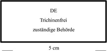
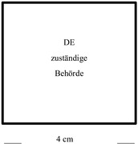
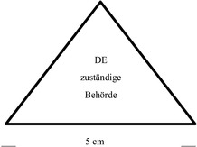

Verordnung zur Regelung bestimmter Fragen der amtlichen Überwachung
des Herstellens, Behandelns und Inverkehrbringens von Lebensmitteln
tierischen Ursprungs
---
Title: ''
jurabk: Tier-LMÜV
layout: default
origslug: tier-lm_v
slug: tier-lmuev

---

#  (Tier-LMÜV)

Ausfertigungsdatum
:   2007-08-08

Fundstelle
:   BGBl I: 2007, 1816, 1864

Neugefasst durch
:   Bek. v. 3.9.2018 I 1358;

Geändert durch
:   Art. 3 V v. 19.6.2020 I 1480

[^F804041_01_BJNR186400007]:     Notifiziert gemäß der Richtlinie (EU) 2015/1535 des Europäischen
    Parlaments und des Rates vom 9. September 2015 über ein
    Informationsverfahren auf dem Gebiet der technischen Vorschriften und
    der Vorschriften für die Dienste der Informationsgesellschaft (ABl. L
    241 vom 17.9.2015, S. 1).
[^F804041_02_BJNR186400007]:     Die Verpflichtung aus Artikel 17 Absatz 5 der Verordnung (EG) Nr.
    854/2004 des Europäischen Parlaments und des Rates vom 29. April 2004
    mit besonderen Verfahrensvorschriften für die amtliche Überwachung von
    zum menschlichen Verzehr bestimmten Erzeugnissen tierischen Ursprungs
    (ABl. L 139 vom 30.4.2004, S. 206; L 226 vom 25.6.2004, S. 83) ist
    beachtet worden.

## § 1 Anwendungsbereich

Diese Verordnung dient der Regelung der amtlichen Überwachung des
Herstellens, Behandelns und des Inverkehrbringens von Lebensmitteln
tierischen Ursprungs sowie der Umsetzung und Durchführung von
Rechtsakten der Europäischen Gemeinschaft oder der Europäischen Union
auf dem Gebiet der Überwachung des Verkehrs mit Lebensmitteln
tierischen Ursprungs.

## § 2 Begriffsbestimmungen

(1) Im Sinne dieser Verordnung sind:

1.  Lebensmittel tierischen Ursprungs: Erzeugnisse tierischen Ursprungs im
    Sinne des Anhangs I Nr. 8.1 Spiegelstrich 1 der Verordnung (EG) Nr.
    853/2004 des Europäischen Parlaments und des Rates vom 29. April 2004
    mit spezifischen Hygienevorschriften für Lebensmittel tierischen
    Ursprungs (ABl. EU Nr. L 139 S. 55, Nr. L 226 S. 22) in der geltenden
    Fassung,

2.  verbotene Stoffe oder Erzeugnisse: Stoffe oder Erzeugnisse, deren
    Anwendung bei lebenden Tieren im Sinne des § 4 Absatz 1 Nummer 1 des
    Lebensmittel- und Futtermittelgesetzbuches verboten ist,

3.  vorschriftswidrige Anwendung: Anwendung verbotener Stoffe oder
    Erzeugnisse oder Anwendung zugelassener Stoffe oder Erzeugnisse für
    Anwendungsgebiete, für die die Anwendung ausgeschlossen ist, bei
    lebenden Tieren, im Sinne des § 4 Absatz 1 Nummer 1 des Lebensmittel-
    und Futtermittelgesetzbuches,

4.  Rückstände: Rückstände von Stoffen mit pharmakologischer Wirkung und
    deren Umwandlungsprodukten sowie von anderen Stoffen, die in
    Lebensmittel tierischen Ursprungs übergehen und die menschliche
    Gesundheit beeinträchtigen können,

5.  Sendung: eine Gruppe von lebenden Tieren der gleichen Tierart und
    Altersgruppe, die in demselben Betrieb unter gleichen Haltungs- und
    Fütterungsbedingungen gleichzeitig aufgezogen wurden.

(2) Im Übrigen gelten die Begriffsbestimmungen des

1.  Artikels 2 der Verordnung (EG) Nr. 852/2004 des Europäischen
    Parlaments und des Rates vom 29. April 2004 über Lebensmittelhygiene
    (ABl. EU Nr. L 139 S. 1, Nr. L 226 S. 3),

2.  Anhangs I der Verordnung (EG) Nr. 853/2004,

3.  Artikels 3 und 17 der Verordnung (EU)
    2017/625                    des Europäischen Parlaments und des Rates
    vom 15. März 2017 über amtliche Kontrollen und andere amtliche
    Tätigkeiten zur Gewährleistung der Anwendung des Lebens- und
    Futtermittelrechts und der Vorschriften über Tiergesundheit und
    Tierschutz, Pflanzengesundheit und Pflanzenschutzmittel, zur Änderung
    der Verordnungen (EG) Nr. 999/2001, (EG) Nr. 396/2005, (EG) Nr.
    1069/2009, (EG) Nr. 1107/2009, (EU) Nr. 1151/2012, (EU) Nr. 652/2014,
    (EU) 2016/429 und (EU) 2016/2031 des Europäischen Parlaments und des
    Rates, der Verordnungen (EG) Nr. 1/2005 und (EG) Nr. 1099/2009 des
    Rates sowie der Richtlinien 98/58/EG, 1999/74/EG, 2007/43/EG,
    2008/119/EG und 2008/120/EG des Rates und zur Aufhebung der
    Verordnungen (EG) Nr. 854/2004 und (EG) Nr. 882/2004 des Europäischen
    Parlaments und des Rates, der Richtlinien 89/608/EWG, 89/662/EWG,
    90/425/EWG, 91/496/EEG, 96/23/EG, 96/93/EG und 97/78/EG des Rates und
    des Beschlusses 92/438/EWG des Rates (Verordnung über amtliche
    Kontrollen) (ABl. L 95 vom 7.4.2017, S. 1; L 137 vom 24.5.2017, S. 40;
    L 48 vom 21.2.2018, S. 44; L 322 vom 18.12.2018, S. 85), die zuletzt
    durch die Delegierte Verordnung (EU) 2019/2127 (ABl. L 321 vom
    12\.12.2019, S. 111) geändert worden ist,

4.  Artikels 2 der Delegierten Verordnung (EU) 2019/624 der Kommission vom
    8\. Februar 2019 mit besonderen Bestimmungen für die Durchführung
    amtlicher Kontrollen der Fleischerzeugung sowie von Erzeugungs- und
    Umsetzgebieten für lebende Muscheln gemäß der Verordnung (EU) 2017/625
    des Europäischen Parlaments und des Rates (ABl. L 131 vom 17.5.2019,
    S. 1) und

5.  Artikels 2 der Durchführungsverordnung (EU) 2019/627 der Kommission
    vom 15. März 2019 zur Festlegung einheitlicher praktischer Modalitäten
    für die Durchführung der amtlichen Kontrollen in Bezug auf für den
    menschlichen Verzehr bestimmte Erzeugnisse tierischen Ursprungs gemäß
    der Verordnung (EU) 2017/625 des Europäischen Parlaments und des Rates
    und zur Änderung der Verordnung (EG) Nr. 2074/2005 der Kommission in
    Bezug auf amtliche Kontrollen (ABl. L 131 vom 17.5.2019, S. 51)

entsprechend.

## § 2a Anforderungen an amtliche Tierärztinnen und Tierärzte für Kontrollaufgaben nach Artikel 13 Absatz 1 Satz 2 Buchstabe a der Delegierten Verordnung (EU) 2019/624

Die zuständige Behörde darf abweichend von Artikel 13 Absatz 1 Satz 1
der Delegierten Verordnung (EU) 2019/624 Personen, die nach § 2 der
Bundes-Tierärzteordnung zur Ausübung des tierärztlichen Berufs befugt
sind, nach Artikel 5 Absatz 2 der Verordnung (EU) 2017/625 zu
amtlichen Tierärztinnen und Tierärzten für die in Artikel 13 Absatz 1
Satz 2 Buchstabe a der Delegierten Verordnung (EU) 2019/624
bezeichneten Überwachungsaufgaben ernennen.

## § 3 Amtliche Fachassistenten, Verordnungsermächtigung

(1) Die zuständige Behörde darf nur Personen zu amtlichen
Fachassistenten bestellen, die

1.  den erfolgreichen Abschluss einer Hauptschule oder einen mindestens
    gleichwertigen Bildungsabschluss,

2.  die körperliche und gesundheitliche Eignung durch ein ärztliches
    Attest,

3.  die erforderliche Zuverlässigkeit durch ein amtliches Führungszeugnis
    und

4.  die Befähigung durch eine amtliche Bescheinigung nach Maßgabe des
    Absatzes 2 über die erfolgreiche Schulung und Prüfung nach

    a)  Anhang II Kapitel II Nummer 5, auch in Verbindung mit Nummer 6, der
        Delegierten Verordnung (EU) 2019/624,

    b)  § 3 Absatz 2 Satz 3 der Fleischkontrolleur-Verordnung vom 30. Juni
        1992 (BGBl. I S. 1227) in der bis zum 14. August 2007 geltenden
        Fassung oder

    c)  § 4 Absatz 2 Satz 3 der Verordnung über Geflügelfleischkontrolleure
        vom 24. Juli 1973 (BGBl. I S. 899) in der bis zum 14. August 2007
        geltenden Fassung

nachweisen.

(2) Die Landesregierungen werden ermächtigt, durch Rechtsverordnung
Vorschriften zu erlassen

1.  über die Durchführung der Schulung und der Prüfungen nach Anhang II
    Kapitel II Nummer 5, auch in Verbindung mit Nummer 6, der Delegierten
    Verordnung (EU) 2019/624 und die Ausstellung einer amtlichen
    Bescheinigung hierüber,

2.  über die Durchführung der Schulung nach Anhang II Kapitel II Nummer 9
    der Delegierten Verordnung (EU) 2019/624 und die Ausstellung einer
    amtlichen Bescheinigung hierüber und

3.  über die Durchführung von Fortbildungsmaßnahmen nach Anhang II Kapitel
    II Nummer 8 der Delegierten Verordnung (EU) 2019/624.

## § 4 Personal von Schlachtbetrieben

Für Personal von Schlachtbetrieben im Sinne von Artikel 18 Absatz 3
der Verordnung (EU) 2017/625 in Verbindung mit Artikel 14 der
Delegierten Verordnung (EU) 2019/624 gilt § 3 Absatz 1 Nummer 4
hinsichtlich des Nachweises der Befähigung zum amtlichen
Fachassistenten entsprechend.

## § 5 Fleischhygienerechtliche Maßnahmen im Rahmen von Zoonosen- und Seuchentilgungsprogrammen

(1) Die zuständige Behörde kann eine Schlachtung im Rahmen von
Programmen zur Tilgung oder Bekämpfung von Tierseuchen oder von
Zoonoseerregern im Sinne des Artikels 43 Absatz 6 der
Durchführungsverordnung (EU) 2019/627 mit der Auflage genehmigen, dass

1.  die Schlachtung im Anschluss an die übrigen Schlachtungen vorzunehmen
    ist,

2.  die Schlachtung räumlich getrennt von den übrigen Schlachtungen
    vorzunehmen ist, wenn der Verdacht besteht, dass das untersuchte Tier
    von einer ansteckenden Krankheit befallen ist, die auf das
    Schlachtpersonal übertragen werden kann.

Im Falle des Satzes 1 Nummer 2 sind besondere Vorkehrungen zum Schutz
des Schlachtpersonals zu treffen.

(2) Der amtliche Tierarzt ordnet erforderlichenfalls unter
Berücksichtigung der erregerspezifischen Eigenschaften weitere
Maßnahmen an, um eine Kontamination anderer Tiere oder des Fleisches
anderer Tiere zu vermeiden. Im begründeten Einzelfall kann das
Bundesinstitut für Risikobewertung beteiligt werden.

(3) Nach Abschluss der Schlachtungen nach Absatz 1 hat der amtliche
Tierarzt eine geeignete Reinigung und Desinfektion aller
Räumlichkeiten, Einrichtungs- und Ausrüstungsgegenstände anzuordnen,
die im Rahmen der Schlachtungen nach Absatz 1 mit Erregern von
Tierseuchen oder Zoonosen verunreinigt worden sein könnten.

## § 6 Fleischuntersuchung und Untersuchung auf Trichinen vor Abgabe kleiner Mengen erlegten Wildes

(1) Bei kleinen Mengen erlegten Wildes, das nach § 4 Absatz 2 Satz 1
Nummer 1 oder 2, auch in Verbindung mit Absatz 3, der Tierische
Lebensmittel-Hygieneverordnung zur amtlichen Fleischuntersuchung oder
zur amtlichen Untersuchung auf Trichinen angemeldet wurde, sind
folgende Untersuchungen durchzuführen:

1.  die amtliche Fleischuntersuchung nach Artikel 28 Absatz 2 bis 5 der
    Durchführungsverordnung (EU) 2019/627 oder

2.  die amtliche Untersuchung auf Trichinen nach Artikel 2 Absatz 2
    Unterabsatz 2 in Verbindung mit Anhang I Kapitel I oder II und Anhang
    III der Durchführungsverordnung (EU) 2015/1375 der Kommission vom 10.
    August 2015 mit spezifischen Vorschriften für die amtlichen
    Fleischuntersuchungen auf Trichinen (ABl. L 212 vom 11.8.2015, S. 7).

Für die Beurteilung auf Grund der Ergebnisse der Untersuchungen nach
Satz 1 gilt Artikel 28 Absatz 6, auch in Verbindung mit Artikel 45,
und Artikel 31 der Durchführungsverordnung (EU) 2019/627 entsprechend.

(2) Die zuständige Behörde kann einem Jäger, der Inhaber eines
gültigen Jahresjagdscheines ist und

1.  nach § 2b der Tierische Lebensmittel-Hygieneverordnung Wild zum Zweck
    der Verwendung als Lebensmittel für den eigenen häuslichen Verbrauch
    erlegt oder

2.  nach § 3 Absatz 1 Satz 1 Nummer 5 der Tierische Lebensmittel-
    Hygieneverordnung kleine Mengen von erlegtem Wild oder Fleisch von
    erlegtem Wild abgibt,

im Fall von Wildschweinen oder Dachsen die Entnahme von Proben zur
Untersuchung auf Trichinen nach Absatz 1 Satz 1 Nummer 2 übertragen.
Eine Übertragung nach Satz 1 darf nur erfolgen, wenn

1.  der Jäger

    a)  von der zuständigen Behörde für die Wahrnehmung dieser Tätigkeit
        geschult worden ist oder

    b)  einen Nachweis über die erfolgreiche Teilnahme an einer Schulung nach
        Buchstabe a durch Bescheinigung einer anderen hierfür zuständigen
        Behörde vorlegt und

2.  keine Tatsachen vorliegen, die die Annahme rechtfertigen, dass der
    Jäger die erforderliche Zuverlässigkeit für diese Tätigkeit nicht
    besitzt.

## § 7 Schlachttieruntersuchung bei der Abgabe kleiner Mengen Fleisch von Geflügel oder Hasentieren

Die zuständige Behörde hat in landwirtschaftlichen Betrieben, in denen
kleine Mengen von frischem Fleisch von Geflügel oder Hasentieren nach
§ 3 Absatz 1 Satz 1 Nummer 4 der Tierische Lebensmittel-
Hygieneverordnung abgegeben werden, mindestens zweimal jährlich eine
Schlachttieruntersuchung in Form einer regelmäßigen
Gesundheitsüberwachung des Bestandes durchzuführen. Satz 1 gilt nicht
in Fällen des § 3 Absatz 1 Satz 2 der Tierische Lebensmittel-
Hygieneverordnung.

## § 7a Amtliche Untersuchungen bei der Gewinnung von Fleisch für den eigenen häuslichen Verbrauch

(1) Bei Tieren, die nach § 2a Absatz 1 der Tierische Lebensmittel-
Hygieneverordnung zur amtlichen Untersuchung angemeldet worden sind,
sind folgende Untersuchungen durchzuführen:

1.  die amtliche Schlachttieruntersuchung nach Artikel 11 Absatz 2 und 5
    der Durchführungsverordnung (EU) 2019/627 oder

2.  die amtliche Fleischuntersuchung nach Artikel 12 Absatz 2 und 3, auch
    in Verbindung mit Artikel 15 Absatz 2 und 3, Artikel 18 bis 24,
    Artikel 27 Absatz 1 Buchstabe a bis c, Artikel 29, 30, 32 Absatz 3,
    Artikel 33, 34 und 45 Buchstabe c bis u der Durchführungsverordnung
    (EU) 2019/627 und

3.  die amtliche Untersuchung auf Trichinen nach Artikel 31 der
    Durchführungsverordnung (EU) 2019/627 in Verbindung mit Artikel 2
    Absatz 2 Unterabsatz 2 in Verbindung mit Anhang I und III der
    Durchführungsverordnung (EU) 2015/1375.

Die zuständige Behörde kann abweichend von Satz 1 Nummer 3 die
Untersuchung auf Trichinen nach Artikel 2 Absatz 2 Unterabsatz 2 in
Verbindung mit Anhang I Kapitel III der Verordnung (EG) Nr. 2075/2005
der Kommission vom 5. Dezember 2005 mit spezifischen Vorschriften für
die amtlichen Fleischuntersuchungen auf Trichinen (ABl. L 338 vom
22\.12.2005, S. 60), die zuletzt durch die Durchführungsverordnung (EU)
Nr. 1114/2014 (ABl. L 302 vom 22.10.2014, S. 46) geändert worden ist,
in der bis zum 30. August 2015 geltenden Fassung durchführen.

(2) Bei erlegtem Großwild, das nach § 2b der Tierische Lebensmittel-
Hygieneverordnung zur amtlichen Fleischuntersuchung oder zur amtlichen
Untersuchung auf Trichinen angemeldet worden ist, gilt § 6 Absatz 1
entsprechend.

## § 7b Tierartspezifische Kriterien für und Anforderungen an die Durchführung der Schlachttieruntersuchung im Herkunftsbetrieb

(1) Auf Antrag des für die Farmwildhaltung verantwortlichen
Lebensmittelunternehmers kann die zuständige Behörde nach Artikel 6
Absatz 5 der Delegierten Verordnung (EU) 2019/624 Schlachtungen von
Farmwild abweichend von Artikel 5 Absatz 4 der Delegierten Verordnung
(EU) 2019/624 genehmigen.

(2) Die Genehmigung nach Anhang III Abschnitt III Nummer 3 der
Verordnung (EG) Nr. 853/2004 darf unter den Voraussetzungen des
Absatzes 1 auch dann erteilt werden, wenn der Betrieb nicht über
Verfahren nach Anhang III Abschnitt III Nummer 3 Buchstabe e der
Verordnung (EG) Nr. 853/2004 verfügt.

## § 8 Kennzeichnung der Genusstauglichkeit

(1) Kleine Mengen erlegten Großwildes, bei dem keine
Fleischuntersuchung nach § 6 Absatz 1 Satz 1 Nummer 1 durchgeführt,
das aber nach § 6 Absatz 1 Satz 1 Nummer 2 auf Trichinen untersucht
und nicht nach § 6 Absatz 1 Satz 2 in Verbindung mit Artikel 28 Absatz
6, auch in Verbindung mit Artikel 45, und Artikel 31 Absatz 2 der
Durchführungsverordnung (EU) 2019/627 für genussuntauglich erklärt
worden ist, sind auf den frei liegenden Fleischteilen oder dem
Brustfell mit einem Kennzeichen nach Form und Inhalt des Musters der
Anlage 1 Nummer 1 zu kennzeichnen. Satz 1 gilt nicht im Falle des § 6
Absatz 2 Satz 1 Nummer 2.

(2) Kleine Mengen erlegten Großwildes, das nach § 6 Absatz 1 Satz 1
Nummer 1 untersucht und nicht nach § 6 Absatz 1 Satz 2 in Verbindung
mit Artikel 28 Absatz 6, auch in Verbindung mit Artikel 45, und
Artikel 31 Absatz 2 der Durchführungsverordnung (EU) 2019/627 für
genussuntauglich erklärt worden ist, sind mit einem Kennzeichen nach
Form und Inhalt des Musters der Anlage 1 Nummer 2 entsprechend Artikel
48 Absatz 2 Buchstabe b der Durchführungsverordnung (EU) 2019/627 zu
kennzeichnen.

(3) (weggefallen)

(4) Fleisch, ausgenommen Fleisch von Geflügel oder Hasentieren, das
nach Artikel 45 oder Artikel 28 Absatz 6 der Durchführungsverordnung
(EU) 2019/627 genussuntauglich erklärt wurde, ist mit einem
Kennzeichen nach Form und Inhalt des Musters der Anlage 1 Nummer 4 in
der in den Absätzen 1 bis 3 geregelten Weise zu kennzeichnen.

(5) (weggefallen)

## § 9 (weggefallen)

## § 10 Rückstandsüberwachung

(1) Die zuständige Behörde hat im Rahmen der Durchführung von
Laboruntersuchungen nach Artikel 37 Absatz 1 Buchstabe c der
Durchführungsverordnung (EU) 2019/627

1.  bei mindestens 2 Prozent aller gewerblich geschlachteten Kälber und
    mindestens 0,5 Prozent aller sonstigen gewerblich geschlachteten
    Huftiere amtliche Proben zu entnehmen und auf Rückstände zu
    untersuchen und

2.  amtliche Proben von lebenden Tieren im Sinne des § 4 Absatz 1 Nummer 1
    des Lebensmittel- und Futtermittelgesetzbuches und von Lebensmitteln
    tierischen Ursprungs nach den Vorgaben des nach § 2 Nummer 10 des BVL-
    Gesetzes erstellten Rückstandsüberwachungsplanes auf Rückstände zu
    untersuchen.

Amtliche Proben nach Satz 1 sind zur Identitätssicherung mit Angaben
zu Tierart, Art und Methode der Probenahme, Menge der Probe,
Geschlecht des Tieres sowie Ursprung des Tieres oder des Lebensmittels
zu kennzeichnen.

(2) Die zuständige Behörde hat Kontrollen im Rahmen der
Rückstandsüberwachung ohne Vorankündigung durchzuführen.

(3) Wenn bei lebenden Tieren im Sinne des § 4 Absatz 1 Nummer 1 des
Lebensmittel- und Futtermittelgesetzbuches aus einem Betrieb oder bei
von diesen Tieren gewonnenen Lebensmitteln wiederholt festgestellt
worden ist, dass festgesetzte Höchstmengen für zugelassene Stoffe nach
Anhang I der Richtlinie 96/23/EG des Rates vom 29. April 1996 über
Kontrollmaßnahmen hinsichtlich bestimmter Stoffe und ihrer Rückstände
in lebenden Tieren und tierischen Erzeugnissen und zur Aufhebung der
Richtlinien 85/358/EWG und 86/469/EWG und der Entscheidung 89/187/EWG
und 91/664/EWG (ABl. EG Nr. L 125 S. 10) oder deren
Umwandlungsprodukte überschritten worden sind, hat die zuständige
Behörde über einen Zeitraum von mindestens sechs Monaten in
verstärktem Umfang amtliche Proben von lebenden Tieren im Sinne des §
4 Absatz 1 Nummer 1 des Lebensmittel- und Futtermittelgesetzbuches
oder Lebensmitteln tierischen Ursprungs aus diesem Betrieb zu
untersuchen.

(4) Wenn von der zuständigen Behörde für lebende Tiere im Sinne des §
4 Absatz 1 Nummer 1 des Lebensmittel- und Futtermittelgesetzbuches aus
einem Erzeugerbetrieb oder einem Viehhandels- oder
Transportunternehmen eine Anordnung nach § 41 Absatz 3 des
Lebensmittel- und Futtermittelgesetzbuches erlassen worden ist, hat
die zuständige Behörde über einen Zeitraum von mindestens zwölf
Monaten in verstärktem Umfang amtliche Proben von lebenden Tieren im
Sinne des § 4 Absatz 1 Nummer 1 des Lebensmittel- und
Futtermittelgesetzbuches oder Lebensmitteln tierischen Ursprungs aus
diesem Betrieb oder Unternehmen zu untersuchen.

(5) Wenn gegen das Ergebnis der Untersuchung einer amtlichen Probe
nach Absatz 1 oder nach § 41 Absatz 3 oder 5 Satz 1 des Lebensmittel-
und Futtermittelgesetzbuches auf Grund des Ergebnisses der
Untersuchung einer nach § 43 Absatz 1 Satz 2 des Lebensmittel- und
Futtermittelgesetzbuches zurückgelassenen Probe Widerspruch eingelegt
wird, hat die zuständige Behörde eine Untersuchung der amtlichen Probe
durch das nationale Referenzlabor zu veranlassen.

(6) Wenn Tatsachen vorliegen, die zuverlässig darauf schließen lassen,
dass Schlachttiere vorschriftswidrig behandelt oder ihnen verbotene
Stoffe oder Erzeugnisse verabreicht worden sind, oder ein
hinreichender Verdacht hierauf besteht, hat der amtliche Tierarzt im
Rahmen der Durchführung von Artikel 43 Absatz 5 der
Durchführungsverordnung (EU) 2019/627

1.  anzuordnen, dass die Schlachtung dieser Tiere getrennt von den übrigen
    Schlachtungen erfolgt und

2.  Schlachtkörper und Nebenprodukte der Schlachtung vorläufig zu
    beschlagnahmen und die für die Abklärung des Verdachts erforderlichen
    amtlichen Proben für Labortests nach Artikel 37 Absatz 1 Buchstabe c
    der Durchführungsverordnung (EU) 2019/627 zu entnehmen.

(7) Wenn Tatsachen vorliegen, die zuverlässig darauf schließen lassen,
dass Schlachttieren zugelassene Stoffe mit pharmakologischer Wirkung
zugeführt worden sind und die Tiere vor Ablauf der vorgeschriebenen
Wartezeit geschlachtet werden sollen, oder ein hinreichender Verdacht
hierauf besteht, hat der amtliche Tierarzt die Verschiebung der
Schlachtung anzuordnen. Der Zeitraum der Verschiebung der Schlachtung
ist so zu bemessen, dass die vorgeschriebene Wartezeit eingehalten
wird und festgesetzte Höchstmengen nicht überschritten werden.

(8) Abweichend von Absatz 7 kann der amtliche Tierarzt die Schlachtung
erlauben, wenn Gründe des Tierschutzes oder betriebliche Gegebenheiten
dies zwingend erfordern. In diesem Fall sind Fleisch und Nebenprodukte
der Schlachtung zu beschlagnahmen und amtliche Proben für Labortests
nach Artikel 37 Absatz 1 Buchstabe c der Durchführungsverordnung (EU)
2019/627 zu nehmen.

(9) Die Beschlagnahme ist aufzuheben, soweit die Labortests ergeben
haben, dass festgesetzte Höchstmengen nicht überschritten werden.

## § 11 Übergangsvorschriften

Abweichend von § 6 Absatz 2 ist bis zum 20. November 2010 § 22a Absatz
1 Satz 2 und 3 des Fleischhygienegesetzes in der Fassung der
Bekanntmachung vom 30. Juni 2003 (BGBl. I S. 1242, 1585) in der bis
zum 6. September 2005 geltenden Fassung weiter anzuwenden.

(zu § 8)

## Anlage 1 Stempel zur Kennzeichnung der Genusstauglichkeit

(Fundstelle: BGBl. I 2018, 1364)

1.  Stempel für genusstaugliches Fleisch von erlegtem Großwild, das der
    Untersuchung auf Trichinen unterzogen wurde

    *        *            

2.  Stempel für genusstaugliches Fleisch von erlegtem Großwild, das der
    Fleischuntersuchung unterzogen wurde

    *        *            

3.  (weggefallen)

4.  Stempel für genussuntaugliches Fleisch

    *        *            

