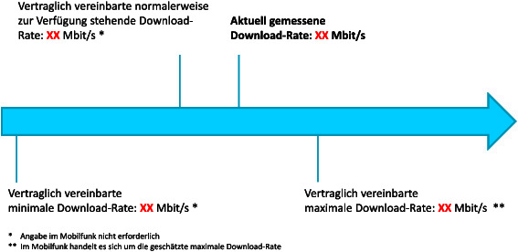
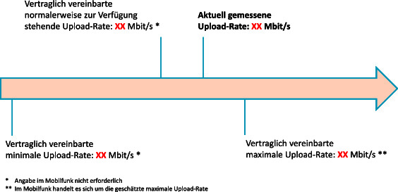

# Verordnung zur Förderung der Transparenz auf dem Telekommunikationsmarkt (TKTransparenzV)

Ausfertigungsdatum
:   2016-12-19

Fundstelle
:   BGBl I: 2016, 2977

Änderung durch
:   Art. 45 G v. 23.6.2021 I 1858 (Nr. 35) textlich nachgewiesen, dokumentarisch noch nicht abschließend bearbeitet

## Eingangsformel

Auf Grund des § 45n Absatz 1 in Verbindung mit Absatz 2 Nummer 1 bis
4, Absatz 3 Nummer 1 bis 5, Absatz 5 und 6 Nummer 5 des
Telekommunikationsgesetzes, der zuletzt durch Artikel 17 Nummer 1 des
Gesetzes vom 19. Februar 2016 (BGBl. I S. 254) geändert worden ist,
sowie in Verbindung mit § 1 Nummer 1 der TK-EMV-Übertragungsverordnung
vom 16. Januar 2013 (BGBl. I S. 79) und in Verbindung mit § 1 Absatz 1
und 2 des Zuständigkeitsanpassungsgesetzes vom 16. August 2002 (BGBl.
I S. 3165) und dem Organisationserlass vom 17. Dezember 2013 (BGBl. I
S. 4310) verordnet die Bundesnetzagentur für Elektrizität, Gas,
Telekommunikation, Post und Eisenbahnen im Einvernehmen mit dem
Bundesministerium für Wirtschaft und Energie, dem Bundesministerium
des Innern, dem Bundesministerium der Justiz und für Verbraucherschutz
sowie dem Bundesministerium für Verkehr und digitale Infrastruktur und
unter Wahrung der Rechte des Bundestages:

## § 1 Produktinformationsblatt

(1) Anbieter anderer öffentlich zugänglicher Telekommunikationsdienste
als für die Bereitstellung von Diensten der Maschine-Maschine-
Kommunikation genutzte Übertragungsdienste müssen für alle Angebote,
die gegenüber Verbrauchern vermarktet werden, ein
Produktinformationsblatt gemäß Absatz 2 und § 2 Absatz 1
bereitstellen.

(2) Das Produktinformationsblatt enthält ausschließlich folgende
Angaben:

1.  Name des Produkts und der darin enthaltenen Zugangsdienste,

2.  das Datum der Markteinführung des Produkts,

3.  die Vertragslaufzeit,

4.  die Voraussetzungen für die Verlängerung und Beendigung des Vertrages,

5.  die minimale, die normalerweise zur Verfügung stehende und die
    maximale Datenübertragungsrate für Download und Upload; für den Zugang
    zu Mobilfunknetzen ausschließlich die geschätzte maximale
    Datenübertragungsrate für Download und Upload,

6.  im Fall einer Datenvolumenbeschränkung:

    a)  den Schwellenwert, ab dem die Datenübertragungsrate reduziert oder
        weiteres Datenvolumen gebucht wird,

    b)  die Datenübertragungsrate, die ab Erreichen einer
        Datenvolumenbeschränkung angeboten wird,

    c)  welche Dienste oder Anwendungen in das vertraglich vereinbarte
        Datenvolumen eingerechnet werden und welche nicht,

7.  die für die Nutzung der Zugangsdienste geltenden Preise,

8.  der Name und die ladungsfähige Anschrift des Anbieters.

(3) Die Bundesnetzagentur gibt ein standardisiertes
Musterinformationsblatt vor, um sicherzustellen, dass die Angaben im
Produktinformationsblatt einheitlich dargestellt werden. Das
Musterinformationsblatt ist im Amtsblatt bekannt zu geben.

## § 2 Art und Zeitpunkt der Zurverfügungstellung

(1) Produktinformationsblätter für Angebote, die gegenüber
Verbrauchern vermarktet werden, sind ab dem Beginn der Vermarktung in
leicht zugänglicher Form bereitzustellen.

(2) Der Verbraucher muss vor Vertragsschluss auf die bereitgestellten
Informationen hingewiesen werden. Diese Pflicht gilt auch vor einer
Vertragsverlängerung, die mit einer Veränderung der im
Produktinformationsblatt genannten Konditionen verbunden ist.

(3) Die Produktinformationsblätter von Angeboten, die nicht mehr
vermarktet werden, sind auf der Internetseite des Anbieters in einem
Archiv zur Verfügung zu stellen.

## § 3 Informationsrechte der Bundesnetzagentur

(1) Der Bundesnetzagentur ist auf Verlangen ein Exemplar des
Produktinformationsblattes zur Verfügung zu stellen und nachzuweisen,
wie dieses den Verbrauchern zugänglich gemacht wird.

(2) Der Bundesnetzagentur sind die Angaben zur Datenübertragungsrate
gemäß § 1 Absatz 2 Nummer 5 spätestens zum Zeitpunkt der
Markteinführung des Angebots in einer Form zu übermitteln, die sich
zur elektronischen Weiterverarbeitung eignet. Für Angebote, die im
Zeitpunkt des Inkrafttretens dieser Verordnung bereits vermarktet
werden, sind die Angaben nach Satz 1 unverzüglich zu übermitteln. Die
Bundesnetzagentur kann weitere Vorgaben zum Format der Übermittlung
nach Satz 1 festlegen und auf ihrer Internetseite veröffentlichen.

## § 4 Informationen zur Vertragslaufzeit, Kündigung und zum Anbieterwechsel

Anbieter öffentlich zugänglicher Telekommunikationsdienste, bei denen
es sich weder um nummernunabhängige interpersonelle
Telekommunikationsdienste noch um für die Bereitstellung von Diensten
der Maschine-Maschine-Kommunikation genutzte Übertragungsdienste
handelt, müssen gegenüber Verbrauchern in der Rechnung sowie in der
Information über den besten Tarif nach § 57 Absatz 3 des
Telekommunikationsgesetzes Folgendes angeben:

1.  das Datum des Vertragsbeginns,

2.  den aktuellen Zeitpunkt des Endes der Mindestvertragslaufzeit,

3.  die Kündigungsfrist und den letzten Kalendertag, an dem die Kündigung
    eingehen muss, um eine Vertragsverlängerung zu verhindern, und

4.  einen Hinweis auf die Information zum generellen Ablauf des
    Anbieterwechsels auf der Internetseite der Bundesnetzagentur.

Satz 1 gilt nicht für Vertragsverhältnisse mit einer Laufzeit von
einem Monat oder weniger.

## § 5 Informationspflicht der Anbieter von öffentlichen Telekommunikationsnetzen

Anbieter von öffentlichen Telekommunikationsnetzen sind verpflichtet,
Anbietern öffentlich zugänglicher Telekommunikationsdienste, die einen
Zugang zu diesen Telekommunikationsnetzen anbieten, diejenigen
Informationen zur Verfügung zu stellen, die diese zur Erfüllung ihrer
Pflichten nach dieser Verordnung benötigen und nicht selbst besitzen.

## § 6 Überprüfbarkeit der Datenübertragungsrate

(1) Anbieter öffentlich zugänglicher Telekommunikationsdienste, bei
denen es sich weder um nummernunabhängige interpersonelle
Telekommunikationsdienste noch um für die Bereitstellung von Diensten
der Maschine-Maschine-Kommunikation genutzte Übertragungsdienste
handelt, müssen es Verbrauchern ermöglichen, sich nach der Schaltung
des Anschlusses über die aktuelle Qualität der in Absatz 2 genannten
Produktmerkmale zu informieren, indem

1.  eine anbieterinitiierte Messung durchgeführt wird,

2.  ein Angebot des Anbieters zur Messung besteht, die durch den
    Verbraucher oder Endnutzer durchgeführt werden kann, oder

3.  ein Angebot der Bundesnetzagentur zur Messung besteht.

(2) Die Messung der Datenübertragungsrate, die über den Zugang des
Verbrauchers erreicht wird, umfasst mindestens

1.  die aktuelle Download-Rate,

2.  die aktuelle Upload-Rate und

3.  die Paketlaufzeit.

## § 7 Information zur Überprüfbarkeit der Datenübertragungsrate

(1) Anbieter öffentlich zugänglicher Telekommunikationsdienste, bei
denen es sich weder um nummernunabhängige interpersonelle
Telekommunikationsdienste noch um für die Bereitstellung von Diensten
der Maschine-Maschine-Kommunikation genutzte Übertragungsdienste
handelt, müssen Verbraucher unverzüglich nach der Schaltung des
jeweiligen Anschlusses auf die Überprüfbarkeit der
Datenübertragungsrate nach § 6 Absatz 1 hinweisen.

(2) Sofern die Schaltung des jeweiligen Anschlusses vor Inkrafttreten
dieser Verordnung erfolgt ist, sind Verbraucher gemäß Absatz 3
unverzüglich auf die Überprüfbarkeit der Datenübertragungsrate nach §
6 Absatz 1 hinzuweisen.

(3) Die Hinweise nach den Absätzen 1 und 2 haben durch
Fernkommunikationsmittel in Textform, insbesondere durch E-Mail oder
SMS, zu erfolgen. Dabei ist ein direkter Link auf den Ort anzugeben,
an dem die Angebote zur Messung abgerufen werden können.

## § 8 Darstellung und Speicherung von anbietereigenen Messergebnissen

(1) Anbieter öffentlich zugänglicher Telekommunikationsdienste, bei
denen es sich weder um nummernunabhängige interpersonelle
Telekommunikationsdienste noch um für die Bereitstellung von Diensten
der Maschine-Maschine-Kommunikation genutzte Übertragungsdienste
handelt, müssen im Fall einer anbietereigenen Messung nach § 6 Absatz
1 Nummer 1 oder 2 die Ergebnisse

1.  direkt im Anschluss an die Messung gemäß der Anlage darstellen und

2.  so bereithalten, dass sie auf der Internetseite des Anbieters im
    Online-Kundencenter abgerufen und ausgedruckt werden können.

(2) Die Ergebnisse sind mindestens für sechs Monate bereitzuhalten.

## § 9 Informationspflichten bei beschränktem Datenvolumen

(1) Anbieter öffentlich zugänglicher Telekommunikationsdienste, bei
denen es sich weder um nummernunabhängige interpersonelle
Telekommunikationsdienste noch um für die Bereitstellung von Diensten
der Maschine-Maschine-Kommunikation genutzte Übertragungsdienste
handelt, die einen Zugang zu einem öffentlichen Telekommunikationsnetz
in Verbindung mit einem beschränkten Datenvolumen anbieten, müssen
Verbrauchern folgende Informationen gemäß Absatz 2 zur Verfügung
stellen:

1.  mindestens tagesaktuell den Anteil des bislang verbrauchten
    Datenvolumens innerhalb des vereinbarten Abrechnungszeitraums und

2.  nach Ende des vereinbarten Abrechnungszeitraums das insgesamt
    verbrauchte Datenvolumen und das vertraglich vereinbarte Datenvolumen.

(2) Die Informationen nach Absatz 1 sind auf der Internetseite des
Anbieters im Online-Kundencenter oder mittels einer
unternehmenseigenen Software-Applikation zur Verfügung zu stellen. Die
Informationen nach Absatz 1 Nummer 2 sind zusätzlich im
Einzelverbindungsnachweis oder auf der Rechnung aufzuführen.

(3) Werden während der Nutzung 80 Prozent des vertraglich vereinbarten
Datenvolumens erreicht, so ist der Verbraucher spätestens nach
Beendigung der aktuellen Datenverbindung und Auswertung der
Kommunikationsdatensätze darauf hinzuweisen. Dieser Hinweis kann durch
den Verbraucher kostenlos abbestellt und wieder bestellt werden.

## § 10 Kostenkontrolle bei Sprachkommunikationsdiensten, Internetzugangsdiensten und öffentlich zugänglichen nummerngebundenen interpersonellen Telekommunikationsdiensten

(1) Anbieter öffentlich zugänglicher Telekommunikationsdienste, bei
denen es sich weder um nummernunabhängige interpersonelle
Telekommunikationsdienste noch um für die Bereitstellung von Diensten
der Maschine-Maschine-Kommunikation genutzte Übertragungsdienste
handelt, müssen Verbrauchern eine geeignete Einrichtung anbieten, um
die Kosten von Sprachkommunikationsdiensten, Internetzugangsdiensten
und nummerngebundenen interpersonellen Telekommunikationsdiensten zu
kontrollieren. Diese Einrichtung umfasst auch unentgeltliche
Warnhinweise bei anormalem oder übermäßigem Verbrauchsverhalten.

(2) Die Pflicht nach Absatz 1 entfällt, wenn Anbieter gegenüber der
Bundesnetzagentur anzeigen, dass dem Verbraucher bei erstmalig
auftretenden anormalen oder übermäßig hohen Kosten aufgrund einer
regelmäßigen unternehmensindividuellen Praxis ausschließlich
verhältnismäßige Kosten in Rechnung gestellt werden.

## § 11 Evaluation und Kontrolle durch die Bundesnetzagentur

(1) Anbieter öffentlich zugänglicher Telekommunikationsdienste, die
einen Zugang zu einem öffentlichen Telekommunikationsnetz anbieten,
und Betreiber von öffentlichen Telekommunikationsnetzen sind
verpflichtet, der Bundesnetzagentur mindestens einmal im Kalenderjahr
über die Erfahrungen bei der praktischen Anwendung der in dieser
Verordnung geregelten Instrumente zu berichten. Die Bundesnetzagentur
kann weitere Angaben zum Umfang, zu weiteren Inhalten und zum
zeitlichen Ablauf der Berichtspflicht festlegen und auf ihrer
Internetseite veröffentlichen. Anbieter öffentlich zugänglicher
Telekommunikationsdienste sind verpflichtet, der Bundesnetzagentur auf
Verlangen Musternutzerprofile für einen Zugang zum Online-Kundencenter
auf ihrer Internetseite einzurichten, soweit dieses notwendig ist, um
die Transparenz, die Verständlichkeit und die leichte Zugänglichkeit
der Informationen für die Verbraucher zu kontrollieren.

(2) Anbieter öffentlich zugänglicher Telekommunikationsdienste, die
über einen Zugang zu einem öffentlichen Telekommunikationsnetz
Internetzugangsdienste anbieten, sind verpflichtet, der
Bundesnetzagentur auf Verlangen eine genaue Darstellung der
Funktionsweise der ihren Verbrauchern angebotenen Verfahren zur
Messung der Datenübertragungsrate zur Verfügung zu stellen.

## § 12 Ordnungswidrigkeiten

Ordnungswidrig im Sinne des § 228 Absatz 2 Nummer 6 des
Telekommunikationsgesetzes handelt, wer vorsätzlich oder fahrlässig

1.  entgegen § 1 Absatz 1 Satz 1, auch in Verbindung mit Satz 2, ein
    Produktinformationsblatt nicht, nicht richtig, nicht vollständig oder
    nicht rechtzeitig bereitstellt,

2.  entgegen § 4 Satz 1 eine Angabe nicht, nicht richtig, nicht
    vollständig oder nicht rechtzeitig macht,

3.  entgegen § 6 Absatz 1 Satz 1 eine dort genannte Information nicht,
    nicht richtig, nicht vollständig oder nicht rechtzeitig ermöglicht,

4.  entgegen § 7 Absatz 1 oder 2 einen Hinweis nicht, nicht richtig, nicht
    vollständig, nicht in der vorgeschriebenen Weise oder nicht
    rechtzeitig gibt,

5.  entgegen § 8 Absatz 1 Nummer 1 ein Messergebnis nicht, nicht richtig,
    nicht vollständig, nicht in der vorgeschriebenen Weise oder nicht
    rechtzeitig darstellt oder

6.  entgegen § 9 Absatz 1 eine Information nicht, nicht richtig, nicht
    vollständig, nicht in der vorgeschriebenen Weise oder nicht
    rechtzeitig zur Verfügung stellt.

## § 13 Inkrafttreten

Diese Verordnung tritt am 1. Juni 2017 in Kraft.

(zu § 9 Absatz 1)

## Anlage Überprüfung der Datenübertragungsrate

(Fundstelle: BGBl. I 2016, 2981 - 2982)

*    *   1.

    *   Name des Anbieters:

*    *   2.

    *   Datum/Uhrzeit:

*    *   3.

    *   Name des Endnutzers:

*    *   4.

    *[^F796888_01_BJNR297700016BJNE001700000]
   Adresse
        :

*    *   5.

    *   Ergebnis zur Download-Rate:

*    *
    *        

*    *   6.

    *   Tatsächlich gemessene Datenübertragungsrate im Verhältnis zur
        vertraglich vereinbarten (geschätzten) maximalen Datenübertragungsrate
        für den Download:

    *   %

*    *
    *   Die vertraglich vereinbarte normalerweise zur Verfügung stehende
        Download-Rate wurde [erreicht/nicht erreicht].

    *

*    *   7.

    *   Ergebnis zur Upload-Rate:

*    *
    *        

*    *   8.

    *   Tatsächlich gemessene Datenübertragungsrate im Verhältnis zur
        vertraglich vereinbarten (geschätzten) maximalen Datenübertragungsrate
        für den Upload:

    *   %

*    *
    *   Die vertraglich vereinbarte normalerweise zur Verfügung stehende
        Upload-Rate wurde [erreicht/nicht erreicht].

    *

*    *   9.

    *   die Paketlaufzeit:

    *

*    *   10.

    *   Erläuterungen des [NAME DES ANBIETERS], welche Faktoren das
        Messergebnis beeinflussen können [optional]:

*    *   11.

    *   Vertraglich vereinbarte Entschädigungs- und Erstattungsregelungen
        sowie Sonderkündigungsrechte:

Hinweis:

Die Bundesnetzagentur für Elektrizität, Gas, Telekommunikation, Post
und Eisenbahnen bietet im Internet unter
http://www.breitbandmessung.de              eine vom jeweiligen
Anbieter unabhängige Messsoftware an, mit der die
Datenübertragungsrate von Festnetz- und Mobilfunkanschlüssen überprüft
werden kann.

    Lediglich beim Zugang zum öffentlichen Telekommunikationsnetz an einem
    festen Standort anzugeben. Im Mobilfunk: Angabe des Aufenthaltsorts
    nur, sofern Teilnehmer geographischer Standorterfassung vorher
    ausdrücklich zugestimmt hat.
[^F796888_01_BJNR297700016BJNE001700000]: 
