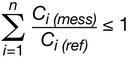
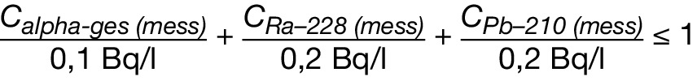

# Verordnung über die Qualität von Wasser für den menschlichen Gebrauch (TrinkwV 2001)

Ausfertigungsdatum
:   2001-05-21

Fundstelle
:   BGBl I: 2001, 959

Neugefasst durch
:   Bek. v. 10.3.2016 I 459;

Zuletzt geändert durch
:   Art. 99 V v. 19.6.2020 I 1328

Änderung durch
:   Art. 1 V v. 22.9.2021 I 4343 (Nr. 67) textlich nachgewiesen, dokumentarisch noch nicht abschließend bearbeitet

[^bjnr095910001_01_BJNR095910001]:     Diese Verordnung dient der Umsetzung der Richtlinie 98/83/EG des Rates
    vom 3. November 1998 über die Qualität von Wasser für den menschlichen
    Gebrauch (ABl. L 330 vom 5.12.1998, S. 32) in der Fassung der
    Verordnung (EG) Nr. 596/2009 des Europäischen Parlaments und des Rates
    vom 18. Juni 2009 (ABl. L 188 vom 18.7.2009, S. 14).
[^bjnr095910001_02_BJNR095910001]:     Diese Verordnung dient der Umsetzung der Richtlinie 2013/51/EURATOM
    des Rates vom 22. Oktober 2013 zur Festlegung von Anforderungen an den
    Schutz der Gesundheit der Bevölkerung hinsichtlich radioaktiver Stoffe
    in Wasser für den menschlichen Gebrauch (ABl. L 296 vom 7.11.2013, S.
    12).

## 1. Abschnitt - Allgemeine Vorschriften

### § 1 Zweck der Verordnung

Zweck der Verordnung ist es, die menschliche Gesundheit vor den
nachteiligen Einflüssen, die sich aus der Verunreinigung von Wasser
ergeben, das für den menschlichen Gebrauch bestimmt ist, durch
Gewährleistung seiner Genusstauglichkeit und Reinheit nach Maßgabe der
folgenden Vorschriften zu schützen.

### § 2 Anwendungsbereich

(1) Diese Verordnung regelt die Qualität von Wasser für den
menschlichen Gebrauch, im Folgenden als Trinkwasser bezeichnet. Sie
gilt nicht für

1.  natürliches Mineralwasser im Sinne des § 2 der Mineral- und
    Tafelwasser-Verordnung,

2.  Heilwasser im Sinne des § 2 Absatz 1 des Arzneimittelgesetzes,

3.  Schwimm- und Badebeckenwasser,

4.  Wasser, das

    a)  sich in einem wasserführenden Apparat befindet, der

        aa) zwar an die Trinkwasser-Installation angeschlossen ist, aber
            entsprechend den allgemein anerkannten Regeln der Technik nicht Teil
            der Trinkwasser-Installation ist und

        bb) mit einer den allgemein anerkannten Regeln der Technik entsprechenden
            Sicherungseinrichtung ausgestattet ist und

    b)  sich in Fließrichtung hinter der Sicherungseinrichtung nach Buchstabe
        a Doppelbuchstabe bb befindet,

5.  Trinkwasser im Sinne des § 3 Nummer 1 Buchstabe b, sofern die
    zuständige Behörde, die auch für Überwachungsmaßnahmen nach dem
    Lebensmittel- und Futtermittelgesetzbuch zuständig ist, festgestellt
    hat, dass die Qualität des verwendeten Wassers die Genusstauglichkeit
    des Enderzeugnisses nicht beeinträchtigen kann.

(2) Für Anlagen und Wasser aus Anlagen, die zur Entnahme oder Abgabe
von Wasser bestimmt sind, das nicht die Qualität von Trinkwasser hat,
und die zusätzlich zu den Wasserversorgungsanlagen nach § 3 Nummer 2
installiert werden können, gilt diese Verordnung nur, soweit sie
darauf ausdrücklich Bezug nimmt.

### § 3 Begriffsbestimmungen

Im Sinne dieser Verordnung

1.  ist „Trinkwasser“ in jedem Aggregatzustand des Wassers und ungeachtet
    dessen, ob das Wasser für die Bereitstellung auf Leitungswegen, in
    Wassertransport-Fahrzeugen, aus Trinkwasserspeichern an Bord von
    Land-, Wasser- oder Luftfahrzeugen oder in verschlossenen Behältnissen
    bestimmt ist,

    a)  alles Wasser, das, im ursprünglichen Zustand oder nach Aufbereitung,
        zum Trinken, zum Kochen, zur Zubereitung von Speisen und Getränken
        oder insbesondere zu den folgenden anderen häuslichen Zwecken bestimmt
        ist:

        aa) Körperpflege und -reinigung,

        bb) Reinigung von Gegenständen, die bestimmungsgemäß mit Lebensmitteln in
            Berührung kommen,

        cc) Reinigung von Gegenständen, die bestimmungsgemäß nicht nur
            vorübergehend mit dem menschlichen Körper in Kontakt kommen;

    b)  alles Wasser, das in einem Lebensmittelbetrieb verwendet wird für die
        Herstellung, die Behandlung, die Konservierung oder das
        Inverkehrbringen von Erzeugnissen oder Substanzen, die für den
        menschlichen Gebrauch bestimmt sind;

2.  sind „Wasserversorgungsanlagen“

    a)  zentrale Wasserwerke: Anlagen einschließlich dazugehörender
        Wassergewinnungsanlagen und eines dazugehörenden Leitungsnetzes, aus
        denen pro Tag mindestens 10 Kubikmeter Trinkwasser entnommen oder auf
        festen Leitungswegen an Zwischenabnehmer geliefert werden oder aus
        denen auf festen Leitungswegen Trinkwasser an mindestens 50 Personen
        abgegeben wird;

    b)  dezentrale kleine Wasserwerke: Anlagen einschließlich dazugehörender
        Wassergewinnungsanlagen und eines dazugehörenden Leitungsnetzes, aus
        denen pro Tag weniger als 10 Kubikmeter Trinkwasser entnommen oder im
        Rahmen einer gewerblichen oder öffentlichen Tätigkeit genutzt werden,
        ohne dass eine Anlage nach Buchstabe a oder Buchstabe c vorliegt;

    c)  Kleinanlagen zur Eigenversorgung: Anlagen einschließlich
        dazugehörender Wassergewinnungsanlagen und einer dazugehörenden
        Trinkwasser-Installation, aus denen pro Tag weniger als 10 Kubikmeter
        Trinkwasser zur eigenen Nutzung entnommen werden;

    d)  mobile Versorgungsanlagen: Anlagen an Bord von Land-, Wasser- und
        Luftfahrzeugen und andere bewegliche Versorgungsanlagen einschließlich
        aller Rohrleitungen, Armaturen, Apparate und Trinkwasserspeicher, die
        sich zwischen dem Punkt der Übernahme von Trinkwasser aus einer Anlage
        nach Buchstabe a, b oder Buchstabe f und dem Punkt der Entnahme des
        Trinkwassers befinden; bei einer an Bord betriebenen
        Wassergewinnungsanlage ist diese ebenfalls mit eingeschlossen;

    e)  Anlagen zur ständigen Wasserverteilung: Anlagen der Trinkwasser-
        Installation, aus denen Trinkwasser aus einer Anlage nach Buchstabe a
        oder Buchstabe b an Verbraucher abgegeben wird;

    f)  Anlagen zur zeitweiligen Wasserverteilung: Anlagen, aus denen
        Trinkwasser entnommen oder an Verbraucher abgegeben wird, und die

        aa) zeitweise betrieben werden einschließlich einer dazugehörenden
            Wassergewinnungsanlage und einer dazugehörenden Trinkwasser-
            Installation oder

        bb) zeitweise an eine Anlage nach Buchstabe a, b oder Buchstabe e
            angeschlossen sind;

3.  ist „Trinkwasser-Installation“ die Gesamtheit der Rohrleitungen,
    Armaturen und Apparate, die sich zwischen dem Punkt des Übergangs von
    Trinkwasser aus einer Wasserversorgungsanlage an den Nutzer und dem
    Punkt der Entnahme von Trinkwasser befinden;

4.  ist „Wasserversorgungsgebiet“ ein geografisch definiertes Gebiet, in
    dem das an Verbraucher oder an Zwischenabnehmer abgegebene Trinkwasser
    aus einem oder mehreren Wasservorkommen stammt, und in dem die
    erwartbare Trinkwasserqualität als nahezu einheitlich angesehen werden
    kann;

5.  ist „Gesundheitsamt“ die nach Landesrecht für die Durchführung dieser
    Verordnung bestimmte und mit einem Amtsarzt besetzte Behörde;

6.  ist „zuständige Behörde“ die von den Ländern auf Grund Landesrechts
    durch Rechtssatz bestimmte Behörde;

7.  ist „Rohwasser“ Wasser, das mit einer Wassergewinnungsanlage der
    Ressource entnommen und unmittelbar zu Trinkwasser aufbereitet oder
    ohne Aufbereitung als Trinkwasser verteilt werden soll;

8.  sind „Aufbereitungsstoffe“ alle Stoffe, die bei der Gewinnung,
    Aufbereitung und Verteilung des Trinkwassers bis zur Entnahmestelle
    eingesetzt werden und durch die sich die Zusammensetzung des
    entnommenen Trinkwassers verändern kann;

9.  ist „technischer Maßnahmenwert“ ein Wert, bei dessen Überschreitung
    eine von der Trinkwasser-Installation ausgehende vermeidbare
    Gesundheitsgefährdung zu besorgen ist und Maßnahmen zur hygienisch-
    technischen Überprüfung der Trinkwasser-Installation im Sinne einer
    Gefährdungsanalyse eingeleitet werden;

9a. ist „Parameterwert für radioaktive Stoffe“ ein Wert für radioaktive
    Stoffe im Trinkwasser, bei dessen Überschreitung die zuständige
    Behörde prüft, ob das Vorhandensein radioaktiver Stoffe im Trinkwasser
    ein Risiko für die menschliche Gesundheit darstellt, das ein Handeln
    erfordert;

9b. ist „Richtdosis“ die effektive Folgedosis für die Aufnahme von
    Trinkwasser während eines Jahres, die sich aus allen Radionukliden
    sowohl natürlichen als auch künstlichen Ursprungs ergibt, welche im
    Trinkwasser nachgewiesen wurden, mit Ausnahme von Tritium und
    Radon-222 sowie Kalium-40 und kurzlebigen Radon-Zerfallsprodukten;

10. ist „gewerbliche Tätigkeit“ die unmittelbare oder mittelbare,
    zielgerichtete Trinkwasserbereitstellung im Rahmen einer Vermietung
    oder einer sonstigen selbstständigen, regelmäßigen und in
    Gewinnerzielungsabsicht ausgeübten Tätigkeit;

11. ist „öffentliche Tätigkeit“ die Trinkwasserbereitstellung für einen
    unbestimmten, wechselnden und nicht durch persönliche Beziehungen
    verbundenen Personenkreis;

12. ist „Großanlage zur Trinkwassererwärmung“ eine Anlage mit

    a)  Speicher-Trinkwassererwärmer oder zentralem Durchfluss-
        Trinkwassererwärmer jeweils mit einem Inhalt von mehr als 400 Litern
        oder

    b)  einem Inhalt von mehr als 3 Litern in mindestens einer Rohrleitung
        zwischen dem Abgang des Trinkwassererwärmers und der Entnahmestelle,
        wobei der Inhalt einer Zirkulationsleitung nicht berücksichtigt wird;

    entsprechende Anlagen in Ein- und Zweifamilienhäusern zählen nicht als
    Großanlagen zur Trinkwassererwärmung;

13. ist „Gefährdungsanalyse“ die systematische Ermittlung von Gefährdungen
    der menschlichen Gesundheit sowie von Ereignissen oder Situationen,
    die zum Auftreten einer Gefährdung der menschlichen Gesundheit durch
    eine Wasserversorgungsanlage führen können, unter Berücksichtigung

    a)  der Beschreibung der Wasserversorgungsanlage,

    b)  von Beobachtungen bei der Ortsbesichtigung,

    c)  von festgestellten Abweichungen von den allgemein anerkannten Regeln
        der Technik,

    d)  von sonstigen Erkenntnissen über die Wasserbeschaffenheit, die
        Wasserversorgungsanlage und deren Nutzung sowie

    e)  von Laborbefunden und deren örtlicher Zuordnung.

## 2. Abschnitt - Beschaffenheit des Trinkwassers

### § 4 Allgemeine Anforderungen

(1) Trinkwasser muss so beschaffen sein, dass durch seinen Genuss oder
Gebrauch eine Schädigung der menschlichen Gesundheit insbesondere
durch Krankheitserreger nicht zu besorgen ist. Es muss rein und
genusstauglich sein. Diese Anforderung gilt als erfüllt, wenn

1.  bei der Wassergewinnung, der Wasseraufbereitung und der
    Wasserverteilung mindestens die allgemein anerkannten Regeln der
    Technik eingehalten werden und

2.  das Trinkwasser den Anforderungen der §§ 5 bis 7a entspricht.

(2) Der Unternehmer und der sonstige Inhaber einer
Wasserversorgungsanlage dürfen Wasser, das den Anforderungen des § 5
Absatz 1 bis 3 oder des § 6 Absatz 1 und 2 nicht entspricht, nicht als
Trinkwasser abgeben und anderen nicht zur Verfügung stellen. Satz 1
gilt nicht, soweit

1.  das Gesundheitsamt nach § 9 Absatz 6 festgelegt hat, dass
    Mikroorganismen oder chemische Stoffe im Trinkwasser enthalten sein
    dürfen, oder

2.  das Gesundheitsamt nach § 10 Absatz 1, 2, 5 oder die Europäische
    Kommission auf einen Antrag nach § 10 Absatz 6 eine Abweichung vom
    Grenzwert eines Parameters nach Anlage 2 zugelassen haben oder

3.  nach § 9 Absatz 4 Satz 3 keine Maßnahmen zu treffen sind.

(3) Der Unternehmer und der sonstige Inhaber einer
Wasserversorgungsanlage dürfen Wasser nicht als Trinkwasser abgeben
und anderen nicht zur Verfügung stellen, wenn die Grenzwerte oder die
Anforderungen des § 7 nicht eingehalten sind. Satz 1 gilt nicht,
soweit

1.  das Gesundheitsamt nach § 9 Absatz 5 die Nichterfüllung oder
    Nichteinhaltung der in § 7 festgelegten Grenzwerte oder Anforderungen
    duldet oder

2.  das Gesundheitsamt nach § 9 Absatz 6 festgelegt hat, dass
    Mikroorganismen oder chemische Stoffe im Trinkwasser enthalten sein
    dürfen.

### § 5 Mikrobiologische Anforderungen

(1) Im Trinkwasser dürfen Krankheitserreger im Sinne des § 2 Nummer 1
des Infektionsschutzgesetzes, die durch Wasser übertragen werden
können, nicht in Konzentrationen enthalten sein, die eine Schädigung
der menschlichen Gesundheit besorgen lassen.

(2) Im Trinkwasser dürfen die in Anlage 1 Teil I festgelegten
Grenzwerte für mikrobiologische Parameter nicht überschritten werden.

(3) Im Trinkwasser, das zur Abgabe in verschlossenen Behältnissen
bestimmt ist, dürfen die in Anlage 1 Teil II festgelegten Grenzwerte
für mikrobiologische Parameter nicht überschritten werden.

(4) Konzentrationen von Mikroorganismen, die das Trinkwasser
verunreinigen oder seine Beschaffenheit nachteilig beeinflussen
können, sollen so niedrig gehalten werden, wie dies nach den allgemein
anerkannten Regeln der Technik mit vertretbarem Aufwand unter
Berücksichtigung von Einzelfällen möglich ist.

(5) Soweit der Unternehmer und der sonstige Inhaber einer
Wasserversorgungs- oder Wassergewinnungsanlage oder ein von ihnen
Beauftragter hinsichtlich mikrobieller Belastungen des Rohwassers
Tatsachen feststellen, die zum Auftreten einer übertragbaren Krankheit
im Sinne des § 2 Nummer 3 des Infektionsschutzgesetzes führen können,
oder annehmen, dass solche Tatsachen vorliegen, muss eine
Aufbereitung, erforderlichenfalls unter Einschluss einer Desinfektion,
nach den allgemein anerkannten Regeln der Technik unter Beachtung von
§ 6 Absatz 3 erfolgen. In Leitungsnetzen oder Teilen davon, in denen
die Anforderungen nach Absatz 1 oder 2 nur durch Desinfektion
eingehalten werden können, müssen der Unternehmer und der sonstige
Inhaber einer Wasserversorgungsanlage nach § 3 Nummer 2 Buchstabe a
und b, oder, sofern die Trinkwasserbereitstellung im Rahmen einer
gewerblichen oder öffentlichen Tätigkeit erfolgt, nach Buchstabe d
oder Buchstabe f eine hinreichende Desinfektionskapazität durch freies
Chlor, Chlordioxid oder andere geeignete Desinfektionsmittel oder
-verfahren, die gemäß § 11 in einer Liste des Umweltbundesamtes
aufgeführt sind, vorhalten.

### § 6 Chemische Anforderungen

(1) Im Trinkwasser dürfen chemische Stoffe nicht in Konzentrationen
enthalten sein, die eine Schädigung der menschlichen Gesundheit
besorgen lassen.

(2) Im Trinkwasser dürfen die in Anlage 2 festgesetzten Grenzwerte für
chemische Parameter nicht überschritten werden.

(3) Konzentrationen von chemischen Stoffen, die das Trinkwasser
verunreinigen oder seine Beschaffenheit nachteilig beeinflussen
können, sollen so niedrig gehalten werden, wie dies nach den allgemein
anerkannten Regeln der Technik mit vertretbarem Aufwand unter
Berücksichtigung von Einzelfällen möglich ist.

### § 7 Indikatorparameter

(1) Im Trinkwasser müssen die in Anlage 3 festgelegten Grenzwerte und
Anforderungen für Indikatorparameter eingehalten sein. Dies gilt nicht
für den technischen Maßnahmenwert in Anlage 3 Teil II.

(2) Im Trinkwasser, das zur Abgabe in verschlossenen Behältnissen
bestimmt ist, darf der in Anlage 3 Teil I laufende Nummer 5
festgelegte Grenzwert nicht überschritten werden.

### § 7a Radiologische Anforderungen

Trinkwasser darf keine Stoffe aufweisen, die ein oder mehrere
Radionuklide enthalten, deren Aktivität oder Konzentration unter dem
Gesichtspunkt des Strahlenschutzes nicht außer Acht gelassen werden
kann. Diese Anforderung gilt als erfüllt, wenn die in Anlage 3a Teil I
festgelegten Parameterwerte für radioaktive Stoffe nicht überschritten
werden.

### § 8 Stelle der Einhaltung

Die allgemeinen Anforderungen nach § 5 Absatz 1 und § 6 Absatz 1, die
nach § 5 Absatz 2 und 3 sowie § 6 Absatz 2 festgelegten Grenzwerte,
die nach § 7 festgelegten Grenzwerte und Anforderungen sowie die
Anforderung nach § 7a gelten

1.  bei Trinkwasser, das auf Grundstücken oder in Gebäuden und
    Einrichtungen oder in Land-, Wasser- oder Luftfahrzeugen auf
    Leitungswegen bereitgestellt wird, am Austritt aus denjenigen
    Zapfstellen, die sich in einer Trinkwasser-Installation befinden und
    die der Entnahme von Trinkwasser dienen,

2.  bei Trinkwasser in einem an die Trinkwasser-Installation
    angeschlossenen Apparat, der entsprechend den allgemein anerkannten
    Regeln der Technik nicht Teil der Trinkwasser-Installation ist, an der
    nach den allgemein anerkannten Regeln der Technik notwendigen
    Sicherungseinrichtung,

3.  bei Trinkwasser aus Wassertransport-Fahrzeugen an der Entnahmestelle
    am Fahrzeug,

4.  bei Trinkwasser, das zur Abgabe in verschlossenen Behältnissen
    bestimmt ist, am Punkt der Abfüllung.

### § 9 Maßnahmen im Falle der Nichteinhaltung von Grenzwerten, der Nichterfüllung von Anforderungen, der Überschreitung von technischen Maßnahmenwerten sowie der Überschreitung von Parameterwerten für radioaktive Stoffe

(1) Wird dem Gesundheitsamt bekannt, dass in einem
Wasserversorgungsgebiet die in den §§ 5 bis 7 in Verbindung mit den
Anlagen 1 bis 3 festgelegten Grenzwerte nicht eingehalten oder die
Anforderungen nicht erfüllt sind, hat es unverzüglich zu entscheiden,
ob dadurch die Gesundheit der betroffenen Verbraucher gefährdet ist
und ob die betroffene Wasserversorgungsanlage oder Teile davon bis auf
Weiteres weiterbetrieben werden können. Dabei hat es auch die Gefahren
zu berücksichtigen, die für die menschliche Gesundheit entstehen
würden, wenn die Bereitstellung von Trinkwasser unterbrochen oder
seine Entnahme oder Verwendung eingeschränkt würde. Das Gesundheitsamt
informiert den Unternehmer oder den sonstigen Inhaber der
verursachenden Wasserversorgungsanlagen unverzüglich über seine
Entscheidung und ordnet Maßnahmen an, die zur Abwendung der Gefahr für
die menschliche Gesundheit erforderlich sind. Ist die Ursache der
Nichteinhaltung oder Nichterfüllung unbekannt, ordnet das
Gesundheitsamt eine unverzügliche Untersuchung an oder führt sie
selbst durch. Ist die Ursache der Nichteinhaltung oder Nichterfüllung
auf eine Wasserversorgungsanlage nach § 3 Nummer 2 Buchstabe e
zurückzuführen, gilt Absatz 7.

(2) Ist eine Gefährdung der menschlichen Gesundheit in einem
Wasserversorgungsgebiet zu besorgen, so ordnet das Gesundheitsamt an,
dass der Unternehmer oder der sonstige Inhaber der betroffenen
Wasserversorgungsanlage für eine anderweitige Versorgung zu sorgen
hat. Ist dies dem Unternehmer und dem sonstigen Inhaber der
Wasserversorgungsanlage nicht auf zumutbare Weise möglich, so prüft
das Gesundheitsamt, ob eine Fortsetzung der betroffenen
Wasserversorgung mit bestimmten Auflagen gestattet werden kann, und
ordnet die erforderlichen Maßnahmen an. § 10 Absatz 8 gilt
entsprechend.

(3) Lässt sich eine Gefährdung der menschlichen Gesundheit auch durch
Anordnungen oder Auflagen nach Absatz 2 nicht ausschließen, ordnet das
Gesundheitsamt an, den Betrieb der betroffenen Wasserversorgungsanlage
in einem Wasserversorgungsgebiet zu unterbrechen. Die Wasserversorgung
ist in den betroffenen Leitungsnetzen oder in den betroffenen Teilen
von Leitungsnetzen sofort zu unterbrechen, wenn das Trinkwasser im
Leitungsnetz

1.  mit Krankheitserregern im Sinne des § 5 in Konzentrationen
    verunreinigt ist, die unmittelbar eine Schädigung der menschlichen
    Gesundheit erwarten lassen, und keine Möglichkeit besteht, das
    verunreinigte Wasser entsprechend § 5 Absatz 5 hinreichend zu
    desinfizieren, oder

2.  durch chemische Stoffe in Konzentrationen verunreinigt ist, die eine
    akute Schädigung der menschlichen Gesundheit erwarten lassen.

Die Unterbrechung des Betriebes und die Wiederinbetriebnahme der in
einem Wasserversorgungsgebiet betroffenen Wasserversorgungsanlage
haben unter Beachtung der allgemein anerkannten Regeln der Technik zu
erfolgen. Von den Sätzen 1 und 2 kann bei gleichzeitiger
Verwendungseinschränkung des Trinkwassers nur dann abgewichen werden,
wenn dies erforderlich ist, um die öffentliche Sicherheit
aufrechtzuerhalten.

(4) Das Gesundheitsamt ordnet bei Nichteinhaltung oder Nichterfüllung
der in den §§ 5 und 6 festgelegten Grenzwerte oder Anforderungen
unverzüglich an, dass unverzüglich die notwendigen Maßnahmen zur
Wiederherstellung der Trinkwasserqualität getroffen werden und dass
deren Durchführung vorrangig ist. Die Dringlichkeit dieser Maßnahmen
richtet sich nach dem Grad der Gefährdung der menschlichen Gesundheit
und der öffentlichen Sicherheit. In einem Zeitraum von 16 Wochen nach
der Inbetriebnahme einer neu errichteten Trinkwasser-Installation sind
wegen einer Überschreitung der Grenzwerte für die Parameter Blei,
Kupfer oder Nickel keine Maßnahmen nach Satz 1 zu treffen, wenn die
gemessene Konzentration nicht höher als das Doppelte des betreffenden
Grenzwertes in Anlage 2 Teil II ist.

(5) Bei Nichteinhaltung oder Nichterfüllung der in § 7 festgelegten
Grenzwerte oder Anforderungen ordnet das Gesundheitsamt Maßnahmen zur
Wiederherstellung der Qualität des Trinkwassers an. Das Gesundheitsamt
kann nach Prüfung im Einzelfall von der Anordnung von Maßnahmen
absehen, wenn eine Schädigung der menschlichen Gesundheit nicht zu
besorgen ist und Auswirkungen auf die eingesetzten Materialien nicht
zu erwarten sind. Das Gesundheitsamt legt fest, bis zu welchem Wert
und für welchen Zeitraum die Nichteinhaltung oder Nichterfüllung
geduldet wird. Die Absätze 8 und 9 bleiben unberührt.

(5a) Bei Überschreitung der in Anlage 3a Teil I festgelegten
Parameterwerte für radioaktive Stoffe in einem Wasserversorgungsgebiet
prüft die zuständige Behörde, ob das Vorhandensein radioaktiver Stoffe
im Trinkwasser ein Risiko für die menschliche Gesundheit darstellt,
das ein Handeln erfordert. Bei Vorliegen eines solchen
Gesundheitsrisikos ordnet sie die erforderlichen Maßnahmen an. Absatz
1 Satz 2 bis 4, Absatz 2, Absatz 3 Satz 1, 3 und 4 sowie § 10 Absatz 8
gelten entsprechend.

(6) Wird dem Gesundheitsamt bekannt, dass in einem
Wasserversorgungsgebiet Mikroorganismen oder chemische Stoffe
vorkommen, die eine Gefährdung der menschlichen Gesundheit besorgen
lassen und für die in den Anlagen 1 und 2 kein Grenzwert aufgeführt
ist, legt das Gesundheitsamt unter Beachtung von § 5 Absatz 1 und § 6
Absatz 1 fest, bis zu welchen Konzentrationen und für welchen Zeitraum
diese Mikroorganismen oder chemischen Stoffe im Trinkwasser enthalten
sein dürfen. Absatz 7 bleibt unberührt.

(7) Werden Tatsachen bekannt, wonach eine Nichteinhaltung oder
Nichterfüllung der in den §§ 5 bis 7 festgelegten Grenzwerte oder
Anforderungen auf die Trinkwasser-Installation oder deren
unzulängliche Instandhaltung zurückzuführen ist, so ordnet das
Gesundheitsamt an, dass

1.  geeignete Maßnahmen zu ergreifen sind, um die aus der Nichteinhaltung
    oder Nichterfüllung möglicherweise resultierenden gesundheitlichen
    Gefahren zu beseitigen oder zu verringern, und

2.  die betroffenen Verbraucher über mögliche, in ihrer eigenen
    Verantwortung liegende zusätzliche Maßnahmen oder
    Verwendungseinschränkungen des Trinkwassers, die sie vornehmen
    sollten, angemessen zu informieren und zu beraten sind.

Bei Wasserversorgungsanlagen nach § 3 Nummer 2 Buchstabe e, die nicht
im Rahmen einer öffentlichen Tätigkeit betrieben werden, kann das
Gesundheitsamt dies anordnen. Zu Zwecken des Satzes 1 hat das
Gesundheitsamt den Unternehmer oder den sonstigen Inhaber der Anlage
der Trinkwasser-Installation über mögliche Maßnahmen zu beraten.

(8) Wird dem Gesundheitsamt bekannt, dass der in Anlage 3 Teil II
festgelegte technische Maßnahmenwert in einer Trinkwasser-Installation
überschritten wird, und kommt der Unternehmer oder der sonstige
Inhaber der verursachenden Wasserversorgungsanlage seinen Pflichten
nach § 16 Absatz 7 nicht nach, fordert das Gesundheitsamt diesen auf,
diese Pflichten zu erfüllen. Kommt der Unternehmer oder der sonstige
Inhaber der Wasserversorgungsanlage seinen Pflichten auch nach der
Aufforderung durch das Gesundheitsamt nicht fristgemäß und vollständig
nach, prüft das Gesundheitsamt, ob und in welchem Zeitraum Maßnahmen
zum Gesundheitsschutz erforderlich sind, und ordnet diese
gegebenenfalls an. Befugnisse des Gesundheitsamtes aus § 20 bleiben
unberührt.

(9) Für Wasserversorgungsanlagen nach § 3 Nummer 2 Buchstabe c gelten
die Absätze 1 bis 5 sowie 6 und 7 entsprechend. Bei Nichteinhaltung
oder Nichterfüllung der in § 6 festgelegten Grenzwerte oder
Anforderungen kann das Gesundheitsamt nach Prüfung im Einzelfall und
nach Zustimmung der zuständigen obersten Landesbehörde oder einer von
dieser benannten Stelle von der Anordnung von Maßnahmen absehen,
soweit eine Gefährdung der menschlichen Gesundheit ausgeschlossen
werden kann. Das Gesundheitsamt legt fest, bis zu welchem Wert und für
welchen Zeitraum die Nichteinhaltung oder Nichterfüllung geduldet
wird.

### § 10 Zulassung der Abweichung von Grenzwerten für chemische Parameter

(1) Gelangt das Gesundheitsamt bei der Prüfung nach § 9 Absatz 1 Satz
1 zu dem Ergebnis, dass eine Abweichung vom Grenzwert eines Parameters
nach Anlage 2 nicht zu einer Gefährdung der menschlichen Gesundheit
führt und durch Maßnahmen gemäß § 9 Absatz 4 innerhalb von höchstens
30 Tagen behoben werden kann, legt es den Wert, der für diesen
Parameter während dieses Zeitraums zulässig ist, sowie die Frist fest,
die zur Behebung der Abweichung eingeräumt ist. Satz 1 gilt nicht,
wenn der betreffende Grenzwert bereits während der zwölf Monate, die
der Prüfung vorangegangen sind, über insgesamt mehr als 30 Tage nicht
eingehalten worden ist.

(2) Das Gesundheitsamt legt fest, in welcher Höhe und für welchen
Zeitraum von dem betroffenen Grenzwert abgewichen werden kann, wenn es
bei den Prüfungen nach § 9 Absatz 1 zu dem Ergebnis gelangt, dass

1.  die Gründe für die Nichteinhaltung eines Grenzwertes für einen
    Parameter nach Anlage 2 nicht durch Maßnahmen innerhalb von 30 Tagen
    behoben werden können,

2.  die Weiterführung der Wasserversorgung für eine bestimmte Zeit über
    diesen Zeitraum hinaus nicht zu einer Gefährdung der menschlichen
    Gesundheit führt und

3.  die Wasserversorgung in dem betroffenen Teil des
    Wasserversorgungsgebietes nicht auf andere zumutbare Weise
    aufrechterhalten werden kann.

Der Unternehmer oder der sonstige Inhaber der verursachenden
Wasserversorgungsanlage wird umgehend über die Entscheidung
informiert.

(3) Die Zulassung der Abweichung nach Absatz 2 ist so kurz wie möglich
zu befristen und darf drei Jahre nicht überschreiten. Bei
Wasserversorgungsgebieten, in denen mehr als 1 000 Kubikmeter pro Tag
geliefert oder mehr als 5 000 Personen versorgt werden, unterrichtet
das Gesundheitsamt auf dem Dienstweg innerhalb von sechs Wochen das
Bundesministerium für Gesundheit oder eine von diesem benannte Stelle
über die Entscheidung.

(4) Absatz 2 gilt nicht für Trinkwasser, das zur Abgabe in
Behältnissen bestimmt ist, außer wenn dieses zeitlich begrenzt bis zur
Wiederherstellung der regulären Wasserversorgung als Ersatz für eine
leitungsgebundene Wasserversorgung an Verbraucher abgegeben wird.

(5) Vor Ablauf des zugelassenen Abweichungszeitraums prüft das
Gesundheitsamt, ob geeignete Maßnahmen getroffen wurden, durch die der
Parameter sich wieder in einem zulässigen Wertebereich befindet. Ist
dies nicht der Fall, kann das Gesundheitsamt nach Zustimmung der
zuständigen obersten Landesbehörde oder einer von dieser benannten
Stelle eine Abweichung nochmals für höchstens drei Jahre zulassen. Das
Gesundheitsamt informiert innerhalb von sechs Wochen nach der erneuten
Zulassung das Bundesministerium für Gesundheit oder eine von diesem
benannte Stelle auf dem Dienstweg über die Gründe für diese Zulassung.

(6) Unter außergewöhnlichen Umständen kann das Gesundheitsamt dem
Bundesministerium für Gesundheit oder einer von diesem benannten
Stelle auf dem Dienstweg mitteilen, dass es erforderlich ist, für ein
Wasserversorgungsgebiet eine dritte Zulassung für eine Abweichung bei
der Europäischen Kommission zu beantragen. Die Mitteilung ist
spätestens fünf Monate vor Ablauf des Zeitraums der zweiten
zugelassenen Abweichung zu machen. Die dritte Abweichung darf
höchstens für einen Zeitraum von drei Jahren beantragt werden.

(7) Die Zulassungen nach den Absätzen 2 und 5 sowie die Mitteilung
nach Absatz 6 an das Bundesministerium für Gesundheit oder an eine von
diesem benannte Stelle müssen mindestens Folgendes enthalten:

1.  die Kennzeichnung und geografische Beschreibung des
    Wasserversorgungsgebietes, die gelieferte Trinkwassermenge pro Tag und
    die Anzahl der belieferten Personen;

2.  den Grund für die Nichteinhaltung des betreffenden Grenzwertes;

3.  die Überwachungsergebnisse aus den letzten drei Jahren (Minimal-,
    Median- und Maximalwerte);

4.  die Anzahl der betroffenen Personen und die Angabe, ob relevante
    Lebensmittelbetriebe betroffen sind oder nicht;

5.  ein geeignetes Überwachungsprogramm, erforderlichenfalls mit einer
    erhöhten Überwachungshäufigkeit;

6.  eine Zusammenfassung der notwendigen Maßnahmen mit einem Zeitplan für
    die Arbeiten, einer Schätzung der Kosten und mit Bestimmungen zur
    Überprüfung;

7.  die erforderliche Dauer der Abweichung und den für die Abweichung
    vorgesehenen höchstzulässigen Wert für den betreffenden Parameter.

Die Mitteilungen erfolgen in dem von der Europäischen Kommission nach
Artikel 13 Absatz 4 der Richtlinie 98/83/EG des Rates vom 3. November
1998 über die Qualität von Wasser für den menschlichen Gebrauch (ABl.
L 330 vom 5.12.1998, S. 32) festgelegten Format und mit den dort
genannten Mindestinformationen in der vom Bundesministerium für
Gesundheit nach Beteiligung der Länder mitgeteilten Form. Darüber
hinausgehende Formatvorgaben durch das Bundesministerium für
Gesundheit, insbesondere für einheitliche EDV-Verfahren, bedürfen der
Zustimmung des Bundesrates.

(8) Das Gesundheitsamt hat durch entsprechende Anordnung bei der
Zulassung von Abweichungen oder der Einschränkung der Verwendung von
Trinkwasser sicherzustellen, dass die von der Abweichung oder
Verwendungseinschränkung betroffene Bevölkerung sowie der Unternehmer
oder der sonstige Inhaber einer betroffenen anderen
Wasserversorgungsanlage von dem Unternehmer und dem sonstigen Inhaber
der verursachenden Wasserversorgungsanlage oder von der zuständigen
Behörde unverzüglich und angemessen über diese Maßnahmen und die damit
verbundenen Bedingungen in Kenntnis gesetzt sowie gegebenenfalls auf
Maßnahmen zum eigenen Schutz hingewiesen werden. Außerdem hat das
Gesundheitsamt sicherzustellen, dass bestimmte Bevölkerungsgruppen,
für die die Abweichung eine besondere Gefahr bedeuten könnte,
informiert und gegebenenfalls auf Maßnahmen zum eigenen Schutz
hingewiesen werden.

(9) Die Absätze 1 bis 8 gelten nicht für Wasserversorgungsanlagen nach
§ 3 Nummer 2 Buchstabe c.

## 3. Abschnitt - Aufbereitung und Desinfektion

### § 11 Aufbereitungsstoffe und Desinfektionsverfahren

(1) Während der Gewinnung, Aufbereitung und Verteilung des
Trinkwassers dürfen nur Aufbereitungsstoffe verwendet werden, die in
einer Liste des Bundesministeriums für Gesundheit enthalten sind. Die
Liste hat bezüglich der Verwendung dieser Stoffe Anforderungen zu
enthalten über die

1.  Reinheit,

2.  Verwendungszwecke, für die sie ausschließlich eingesetzt werden
    dürfen,

3.  zulässige Zugabe,

4.  zulässigen Höchstkonzentrationen von im Trinkwasser verbleibenden
    Restmengen und Reaktionsprodukten,

5.  sonstigen Einsatzbedingungen.

Sie enthält ferner die Mindestkonzentration an freiem Chlor,
Chlordioxid oder anderer Aufbereitungsstoffe zur Desinfektion nach
Abschluss der Desinfektion. In der Liste wird auch der erforderliche
Untersuchungsumfang für die Aufbereitungsstoffe spezifiziert. Zur
Desinfektion von Trinkwasser dürfen nur Verfahren zur Anwendung
kommen, die einschließlich der Einsatzbedingungen, die ihre
hinreichende Wirksamkeit sicherstellen, in die Liste aufgenommen
wurden. Die Liste wird vom Umweltbundesamt geführt und im
Bundesanzeiger sowie im Internet veröffentlicht.

(2) Für Zwecke der Aufbereitung und Desinfektion dürfen Stoffe in
folgenden besonderen Fällen nur eingesetzt werden, nachdem sie in der
Liste nach Absatz 1 veröffentlicht wurden:

1.  für den Bedarf der Bundeswehr im Auftrag des Bundesministeriums der
    Verteidigung;

2.  für den zivilen Bedarf in einem Verteidigungsfall im Auftrag des
    Bundesministeriums des Innern, für Bau und Heimat;

3.  in Katastrophenfällen oder bei Großschadensereignissen bei ernsthafter
    Gefährdung der Wasserversorgung mit Zustimmung der für den
    Katastrophenschutz zuständigen Behörden.

(3) Die Aufnahme in die Liste erfolgt nur, wenn die Stoffe und
Verfahren unter den in Absatz 1 genannten Bedingungen hinreichend
wirksam sind und keine vermeidbaren oder unvertretbaren Auswirkungen
auf Gesundheit und Umwelt haben. Aufbereitungsstoffe, die

1.  in einem anderen Vertragsstaat des Abkommens über den Europäischen
    Wirtschaftsraum rechtmäßig hergestellt oder

2.  in einem anderen Mitgliedstaat der Europäischen Union oder der Türkei
    rechtmäßig hergestellt oder in den Verkehr gebracht worden sind,

werden in die in Absatz 1 genannte Liste aufgenommen, wenn das
Umweltbundesamt festgestellt hat, dass mit ihnen das in Deutschland
geforderte Schutzniveau gleichermaßen dauerhaft erreicht wird. Das
Ergebnis von Prüfungen, die bereits im Herkunftsmitgliedstaat, der
Türkei oder einem anderen Vertragsstaat des Abkommens über den
Europäischen Wirtschaftsraum vorgenommen worden sind, wird bei dieser
Feststellung durch das Umweltbundesamt berücksichtigt.

(4) Das Umweltbundesamt entscheidet über die Erstellung und
Fortschreibung der Liste, insbesondere über die Aufnahme von
Aufbereitungsstoffen und Desinfektionsverfahren, nach Anhörung der
Länder, der Bundeswehr und des Eisenbahn-Bundesamtes, des Bundesamtes
für Bevölkerungsschutz und Katastrophenhilfe sowie der beteiligten
Fachkreise und Verbände.

(5) Der Unternehmer und der sonstige Inhaber von
Wasserversorgungsanlagen, Behörden, technische Regelsetzer im Bereich
der Versorgung mit Trinkwasser sowie diejenigen, die
Aufbereitungsstoffe oder Desinfektionsverfahren herstellen, einführen
oder verwenden, können beim Umweltbundesamt Anträge stellen, um
Aufbereitungsstoffe oder Desinfektionsverfahren in die Liste nach
Absatz 1 aufnehmen zu lassen. Sie haben die erforderlichen Unterlagen
zum Nachweis der Voraussetzungen nach Absatz 3 zu übermitteln. Wenn
das Umweltbundesamt feststellt, dass die Voraussetzungen des Absatzes
3 erfüllt sind, nimmt es den Aufbereitungsstoff oder das
Desinfektionsverfahren bei der nächsten Fortschreibung in die Liste
nach Absatz 1 auf.

(6) Einzelheiten zu den Verfahren nach den Absätzen 4 und 5 legt das
Umweltbundesamt in einer Geschäftsordnung fest.

(7) Der Unternehmer und der sonstige Inhaber einer
Wasserversorgungsanlage haben bei der Zugabe von Aufbereitungsstoffen
und dem Einsatz von Desinfektionsverfahren die Anforderungen nach
Absatz 1 Satz 1 oder einer Ausnahmegenehmigung nach § 12 zu erfüllen.
Sie dürfen Wasser nicht als Trinkwasser abgeben und anderen nicht als
Trinkwasser zur Verfügung stellen, wenn das Wasser ohne eine
Ausnahmegenehmigung nach § 12 mit Aufbereitungsstoffen oder
Desinfektionsverfahren aufbereitet wurde, für die das Umweltbundesamt
nicht nach den Absätzen 1 bis 3 festgestellt hat, dass die
Aufbereitungsstoffe oder Desinfektionsverfahren hinreichend wirksam
sind und keine vermeidbaren oder unvertretbaren Auswirkungen auf die
Gesundheit und die Umwelt haben.

### § 12 Ausnahmegenehmigungen

(1) Ist für die Entscheidung nach § 11 Absatz 3 Satz 1 die Erprobung
eines Aufbereitungsstoffes oder Desinfektionsverfahrens erforderlich,
so kann das Umweltbundesamt auf Antrag befristete Ausnahmen von § 11
Absatz 1 Satz 1 und 5 sowie Absatz 2 genehmigen, wenn Tatsachen die
Annahme rechtfertigen, dass durch die Erprobung keine Gefährdung der
Gesundheit oder der Umwelt zu erwarten ist. Die Ausnahmegenehmigung
ist auf das notwendige Maß zu beschränken und zu befristen. § 11
Absatz 1 Satz 6 gilt entsprechend.

(2) Das Umweltbundesamt kann die Ausnahmegenehmigung widerrufen, wenn
sich Anhaltspunkte dafür ergeben, dass der Aufbereitungsstoff oder das
Desinfektionsverfahren den Anforderungen des § 11 Absatz 3 Satz 1
nicht genügt.

## 4. Abschnitt - Pflichten des Unternehmers und des sonstigen Inhabers einer Wasserversorgungsanlage

### § 13 Anzeigepflichten

(1) Dem Gesundheitsamt ist schriftlich oder elektronisch anzuzeigen:

1.  die Errichtung einer Wasserversorgungsanlage spätestens vier Wochen im
    Voraus;

2.  die erstmalige Inbetriebnahme oder die Wiederinbetriebnahme einer
    Wasserversorgungsanlage spätestens vier Wochen im Voraus sowie die
    Stilllegung einer Wasserversorgungsanlage oder von Teilen von ihr
    innerhalb von drei Tagen;

3.  die bauliche oder betriebstechnische Veränderung an Trinkwasser
    führenden Teilen einer Wasserversorgungsanlage, die auf die
    Beschaffenheit des Trinkwassers wesentliche Auswirkungen haben kann,
    spätestens vier Wochen im Voraus;

4.  der Übergang des Eigentums oder des Nutzungsrechts an einer
    Wasserversorgungsanlage auf eine andere Person spätestens vier Wochen
    im Voraus;

5.  die Errichtung oder Inbetriebnahme einer Wasserversorgungsanlage sowie
    die voraussichtliche Dauer des Betriebes so früh wie möglich.

(2) Im Einzelnen bestehen folgende Anzeigepflichten für den
Unternehmer und den sonstigen Inhaber einer Wasserversorgungsanlage:

1.  nach § 3 Nummer 2 Buchstabe a die Anzeigepflicht nach Absatz 1 Nummer
    1 bis 4;

2.  nach § 3 Nummer 2 Buchstabe b die Anzeigepflicht nach Absatz 1 Nummer
    1 bis 4;

3.  nach § 3 Nummer 2 Buchstabe c die Anzeigepflicht nach Absatz 1 Nummer
    1 bis 4;

4.  nach § 3 Nummer 2 Buchstabe d die Anzeigepflicht nach Absatz 1 Nummer
    2 und 3, sofern die Trinkwasserbereitstellung im Rahmen einer
    gewerblichen oder öffentlichen Tätigkeit erfolgt;

5.  nach § 3 Nummer 2 Buchstabe e die Anzeigepflicht nach Absatz 1 Nummer
    1 bis 4, sofern die Trinkwasserbereitstellung im Rahmen einer
    öffentlichen Tätigkeit erfolgt;

6.  nach § 3 Nummer 2 Buchstabe f die Anzeigepflicht nach Absatz 1 Nummer
    5\.

(3) Der Unternehmer und der sonstige Inhaber einer
Wasserversorgungsanlage nach § 3 Nummer 2 haben auf Verlangen dem
Gesundheitsamt folgende Unterlagen vorzulegen:

1.  technische Pläne einer bestehenden oder geplanten
    Wasserversorgungsanlage;

2.  bei einer baulichen oder betriebstechnischen Änderung technische Pläne
    nur für den Teil der Anlage, der von der Änderung betroffen ist;

3.  Unterlagen über die Schutzzonen oder, soweit solche nicht festgelegt
    sind, Unterlagen über die Umgebung der Wasserfassungsanlage, soweit
    diese für die Wassergewinnung von Bedeutung sind.

(4) Der Unternehmer und der sonstige Inhaber von Anlagen, die zur
Entnahme oder Abgabe von Wasser bestimmt sind, das keine
Trinkwasserqualität hat, und die im Haushalt zusätzlich zu den
Wasserversorgungsanlagen nach § 3 Nummer 2 installiert sind, haben den
Bestand unverzüglich der zuständigen Behörde anzuzeigen. Im Übrigen
gelten die Anzeigepflichten für Wasserversorgungsanlagen nach Absatz 1
Nummer 1, 2 und 4 sowie Absatz 3 Nummer 1 und 2 entsprechend.

### § 14 Untersuchungspflichten

(1) Der Unternehmer und der sonstige Inhaber einer
Wasserversorgungsanlage nach § 3 Nummer 2 Buchstabe a oder Buchstabe b
haben unter Beachtung von Absatz 6 folgende Untersuchungen des
Trinkwassers gemäß Absatz 2 Satz 1 und § 15 Absatz 1, 1a Satz 1 und 2
durchzuführen oder durchführen zu lassen, um sicherzustellen, dass das
Trinkwasser an der Stelle, an der es in die Trinkwasser-Installation
übergeben wird, den Anforderungen dieser Verordnung entspricht:

1.  mikrobiologische Untersuchungen zur Feststellung, ob die in § 5 Absatz
    2 oder Absatz 3 in Verbindung mit Anlage 1 festgelegten Grenzwerte
    eingehalten werden;

2.  chemische Untersuchungen zur Feststellung, ob die in § 6 Absatz 2 in
    Verbindung mit Anlage 2 festgelegten Grenzwerte eingehalten werden;

3.  Untersuchungen zur Feststellung, ob die nach § 7 in Verbindung mit
    Anlage 3 festgelegten Grenzwerte eingehalten oder die Anforderungen
    erfüllt werden;

4.  Untersuchungen zur Feststellung, ob die nach § 9 Absatz 5 und 6
    geduldeten und nach § 10 Absatz 1, 2, 5 und 6 zugelassenen
    Abweichungen eingehalten werden;

5.  Untersuchungen zur Feststellung, ob die Anforderungen des § 11
    eingehalten werden.

(2) Die Untersuchungen des Trinkwassers nach Absatz 1 haben bei der
jeweiligen Wasserversorgungsanlage in dem gleichen Umfang und mit der
gleichen Häufigkeit zu erfolgen wie Untersuchungen von Trinkwasser in
einem Wasserversorgungsgebiet nach Anlage 4. Für Proben aus
Verteilungsnetzen gilt bezüglich der Probennahmestelle § 19 Absatz 2c
Satz 2 entsprechend. Die Probennahmeplanung ist mit dem Gesundheitsamt
abzustimmen. Bei Wasserversorgungsanlagen nach § 3 Nummer 2 Buchstabe
c bestimmt das Gesundheitsamt, in welchen Zeitabständen welche
Untersuchungen nach Absatz 1 Nummer 2 bis 5 durchzuführen sind. Diese
Zeitabstände dürfen nicht mehr als fünf Jahre betragen. Untersuchungen
zur Feststellung, ob die in Anlage 1 Teil I und in Anlage 3 Teil I
laufende Nummer 4, 5, 10 und 11 festgelegten Grenzwerte eingehalten
werden, haben bei Wasserversorgungsanlagen nach § 3 Nummer 2 Buchstabe
c unaufgefordert mindestens einmal im Jahr zu erfolgen. Bei
Wasserversorgungsanlagen nach § 3 Nummer 2 Buchstabe d, aus denen
Trinkwasser im Rahmen einer gewerblichen oder öffentlichen Tätigkeit
abgegeben wird, und bei Wasserversorgungsanlagen nach Buchstabe f
bestimmt das Gesundheitsamt, in welchen Zeitabständen welche
Untersuchungen nach Absatz 1 Nummer 1 bis 5 durchzuführen sind. § 14b
bleibt unberührt. Untersuchungen von Wasserversorgungsanlagen nach § 3
Nummer 2, die im Rahmen von Überwachungsmaßnahmen nach § 19 Absatz 1
in Verbindung mit Absatz 5 und 7 durchgeführt wurden, können auf den
Umfang und die Häufigkeit der verpflichtenden Untersuchungen
angerechnet werden.

(2a) Auf der Grundlage einer Risikobewertung kann der Unternehmer oder
sonstige Inhaber einer Wasserversorgungsanlage nach § 3 Nummer 2
Buchstabe a oder Buchstabe b beim Gesundheitsamt die Genehmigung einer
Probennahmeplanung beantragen, die nach Umfang und Häufigkeit der
Untersuchungen von den Vorgaben des Absatzes 2 Satz 1 abweicht. Die
Risikobewertung nach Satz 1 muss

1.  von einer Person vorgenommen werden, die über hinreichende
    Fachkenntnisse über entsprechende Wasserversorgungssysteme verfügt und
    durch einschlägige Berufserfahrung oder durch Schulung eine
    hinreichende Qualifikation für das Risikomanagement im
    Trinkwasserbereich hat,

2.  sich an den allgemeinen Grundsätzen für eine Risikobewertung
    entsprechend den allgemein anerkannten Regeln der Technik orientieren,
    wobei die Einhaltung der allgemein anerkannten Regeln der Technik
    vermutet wird, wenn DIN EN 15975-2 eingehalten worden ist,

3.  die Ergebnisse kostenfrei zugänglicher amtlicher Untersuchungen im
    Wassereinzugsgebiet berücksichtigen, die für die Risikobewertung
    relevant sein können, insbesondere solche, die aus den
    Überwachungsprogrammen nach § 10 in Verbindung mit Anlage 10 der
    Oberflächengewässerverordnung und nach § 9 Absatz 1 und 2 in
    Verbindung mit Anlage 4 der Grundwasserverordnung vorliegen und die
    von den jeweils zuständigen Behörden zur Verfügung zu stellen sind,

4.  schriftlich in einem Risikobewertungsbericht niedergelegt werden, der
    dem Gesundheitsamt vorgelegt wird und insbesondere Folgendes enthält:

    a)  eine Zusammenfassung der Ergebnisse der Risikobewertung,

    b)  einen Vorschlag zur Anpassung der Probennahmeplanung für die
        betroffene Wasserversorgungsanlage und

    c)  eine Anlage, die für die Information der betroffenen Verbraucher nach
        § 21 Absatz 1 geeignet ist.

(2b) Das Gesundheitsamt kann eine nach Absatz 2a Satz 1 beantragte
Probennahmeplanung, die die Ausnahme eines Parameters aus dem Umfang
der Untersuchungen oder eine verringerte Häufigkeit der Untersuchung
eines Parameters vorsieht, genehmigen, wenn die beantragte
Probennahmeplanung mit dem Probennahmeplan des Gesundheitsamtes nach §
19 Absatz 2 vereinbar ist und wenn die Risikobewertung und der
vorgelegte Risikobewertungsbericht die folgenden Voraussetzungen
erfüllen:

1.  sie entsprechen den Vorgaben des Absatzes 2a Satz 2,

2.  in Bezug auf einen Parameter, der vom Umfang der Untersuchungen
    ausgenommen werden soll, weist der Risikobewertungsbericht aus, dass
    seit mindestens drei Jahren die Messwerte von mindestens zwei Proben,
    die regelmäßig und an für die Wasserversorgungsanlage repräsentativen
    Probennahmestellen genommen wurden, und aller weiteren in diesem
    Zeitraum entsprechend genommenen Proben jeweils weniger als 30 Prozent
    des Grenzwertes nach dieser Verordnung betragen haben, wobei keine
    dieser Proben vor mehr als sieben Jahren entnommen worden sein darf;
    bei der Berechnung wird die Messunsicherheit nicht berücksichtigt,

3.  in Bezug auf einen Parameter, für den die Häufigkeit der
    Untersuchungen verringert werden soll, weist der
    Risikobewertungsbericht aus, dass seit mindestens drei Jahren die
    Messwerte von mindestens zwei Proben, die regelmäßig und an für die
    Wasserversorgungsanlage repräsentativen Probennahmestellen genommen
    wurden, und aller weiteren in diesem Zeitraum entsprechend genommenen
    Proben jeweils weniger als 60 Prozent des Grenzwertes nach dieser
    Verordnung betragen haben, wobei keine dieser Proben vor mehr als
    sieben Jahren entnommen worden sein darf; bei der Berechnung wird die
    Messunsicherheit nicht berücksichtigt,

4.  für bestimmte Parameter sieht die beantragte Probennahmeplanung einen
    gegenüber den Vorgaben des § 14 Absatz 2 Satz 1 erweiterten Umfang
    oder eine höhere Häufigkeit von Untersuchungen vor, soweit dies
    erforderlich ist, um eine einwandfreie Beschaffenheit des Trinkwassers
    sicherzustellen,

5.  der Risikobewertungsbericht bestimmt die Häufigkeit der Untersuchungen
    und den Ort der Probennahmen für den jeweiligen Parameter unter
    Berücksichtigung

    a)  der in Betracht kommenden Ursachen für das Vorhandensein
        entsprechender chemischer Stoffe oder Mikroorganismen im Trinkwasser
        und

    b)  möglicher Schwankungen und langfristiger Trends der Konzentration
        entsprechender chemischer Stoffe oder Mikroorganismen im Trinkwasser
        und

6.  der Risikobewertungsbericht bestätigt, dass kein Umstand abzusehen
    ist, der aufgrund der Anpassung der Probennahmeplanung eine
    Verschlechterung der Qualität des Trinkwassers verursachen würde.

In Bezug auf Parameter der Anlage 1 Teil I sowie Parameter der Anlage
3 Teil I laufende Nummer 4, 5, 8, 9, 10, 11 und 15 ist eine
Genehmigung einer Ausnahme nach Satz 1 nicht möglich. Davon unberührt
kann nach Satz 1 Nummer 4 und 5 in Bezug auf die in Satz 2 genannten
Parameter eine Erweiterung des Umfangs oder eine höhere Häufigkeit von
Untersuchungen erforderlich sein. Die Bemerkungen zu Anlage 2 Teil I
laufende Nummer 10, Teil II laufende Nummer 11 und die Bemerkungen zu
Anlage 3 Teil I laufende Nummer 4 bleiben unberührt.

(2c) Die Genehmigung nach Absatz 2b gilt für die Dauer von fünf
Kalenderjahren. Sie kann auf Antrag um jeweils weitere fünf
Kalenderjahre verlängert werden, wenn aufgrund einer Untersuchung
aller nach § 14 Absatz 2 Satz 1 zu untersuchenden Parameter sowie
einer erneuten Risikobewertung dargelegt wird, dass die
Voraussetzungen für die Genehmigung weiterhin vorliegen.

(2d) Bei Wasserversorgungsanlagen nach § 3 Nummer 2 Buchstabe b kann
das Gesundheitsamt für die in Anlage 4 Buchstabe b genannten Parameter
der Gruppe B bestimmen, welche Untersuchungen nach Absatz 1 Nummer 2
und 3 in welchen Zeitabständen abweichend von Absatz 2 Satz 1
innerhalb eines von ihm festzulegenden Zeitraums durchzuführen sind.
Satz 1 gilt nicht, wenn dem Gesundheitsamt Tatsachen bekannt sind, die
für die in Anlage 4 Buchstabe b genannten Parameter der Gruppe B zu
einer Nichteinhaltung der Anforderungen oder zu einer Überschreitung
der Grenzwerte im Trinkwasser führen können. Die abweichende
Bestimmung, einschließlich Begründung, hat das Gesundheitsamt dem
Unternehmer oder sonstigen Inhaber der betroffenen
Wasserversorgungsanlage schriftlich oder elektronisch bekannt zu
geben.

(3) (weggefallen)

(4) Der Unternehmer und der sonstige Inhaber einer
Wasserversorgungsanlage nach § 3 Nummer 2 Buchstabe a oder Buchstabe b
haben regelmäßig, mindestens jedoch jährlich, Besichtigungen der zur
Wasserversorgungsanlage gehörenden Schutzzonen vorzunehmen oder
vornehmen zu lassen, um etwaige Veränderungen zu erkennen, die
Auswirkungen auf die Beschaffenheit des Trinkwassers haben können.
Sind keine Schutzzonen festgelegt, haben sie Besichtigungen der
Umgebung der Wasserfassungsanlage vorzunehmen oder vornehmen zu
lassen. Das Ergebnis der Ortsbegehung ist zu dokumentieren und dem
Gesundheitsamt auf Verlangen vorzulegen. Die Dokumentation ist zehn
Jahre verfügbar zu halten. Soweit nach dem Ergebnis der Besichtigungen
erforderlich, sind entsprechende Untersuchungen des Rohwassers
vorzunehmen oder vornehmen zu lassen.

(5) Der Unternehmer und der sonstige Inhaber einer
Wasserversorgungsanlage haben das Trinkwasser ferner auf besondere
Anordnung der zuständigen Behörde nach § 9 Absatz 1 Satz 4 oder § 20
Absatz 1 zu untersuchen oder untersuchen zu lassen.

(6) Der Unternehmer und der sonstige Inhaber einer
Wasserversorgungsanlage haben die Untersuchungen nach den Absätzen 1
bis 5 durch eine Untersuchungsstelle durchführen zu lassen, die nach §
15 Absatz 4 zugelassen ist. Ein Untersuchungsauftrag muss sich auch
auf die jeweils dazugehörende Probennahme erstrecken.

### § 14a Untersuchungspflichten in Bezug auf radioaktive Stoffe

(1) Der Unternehmer und der sonstige Inhaber einer
Wasserversorgungsanlage nach § 3 Nummer 2 Buchstabe a haben
Untersuchungen des Trinkwassers durchzuführen oder durchführen zu
lassen, um festzustellen, ob im Trinkwasser an der Stelle, an der es
in die Trinkwasser-Installation übergeben wird, die nach § 7a in
Verbindung mit Anlage 3a Teil I festgelegten Parameterwerte für
radioaktive Stoffe nicht überschritten werden. § 19 Absatz 2c Satz 2
gilt entsprechend. Satz 1 gilt für den Unternehmer und sonstigen
Inhaber einer Wasserversorgungsanlage gemäß § 3 Nummer 2 Buchstabe b,
wenn die zuständige Behörde dies anordnet. Untersuchungen des
Trinkwassers im Hinblick auf Radionuklide künstlichen Ursprungs sind
in der Regel nicht erforderlich. Die Behörde kann Untersuchungen im
Hinblick auf Radionuklide künstlichen Ursprungs anordnen, wenn
Anhaltspunkte vorliegen, dass die in Anlage 3a Teil I festgelegten
Parameterwerte für radioaktive Stoffe überschritten werden können.

(2) Durchführung, Umfang und Häufigkeit der Erstuntersuchung und
regelmäßigen Untersuchungen bestimmen sich nach Anlage 3a Teil III.
Werden Wasserversorgungsanlagen am 26. November 2015 bereits
betrieben, ist die Erstuntersuchung bis zum 26. November 2019
durchzuführen.

(3) Untersuchungen von Wasserversorgungsanlagen nach § 3 Nummer 2
Buchstabe a und b, die im Rahmen von Überwachungsmaßnahmen nach § 20a
Absatz 1 durchgeführt wurden, können auf den Umfang und die Häufigkeit
der verpflichtenden Untersuchungen angerechnet werden.

(4) Untersuchungen gemäß Absatz 1 sind nicht erforderlich, soweit die
zuständige Behörde für einen von ihr zu bestimmenden Zeitraum auf der
Grundlage von repräsentativen Erhebungen, Überwachungsdaten oder
anderen zuverlässigen Informationen festgestellt hat, dass radioaktive
Stoffe in einem Wasserversorgungsgebiet nicht in Konzentrationen
auftreten, die eine Überschreitung von Parameterwerten für radioaktive
Stoffe erwarten lassen. Außerdem kann die zuständige Behörde auf
Antrag feststellen,

1.  dass die Erstuntersuchung nicht erforderlich ist, wenn der Unternehmer
    und der sonstige Inhaber einer Wasserversorgungsanlage auf der
    Grundlage von repräsentativen Erhebungen, Überwachungsdaten oder
    anderen zuverlässigen Informationen nachweist, dass die in Anlage 3a
    Teil I festgelegten Parameterwerte für radioaktive Stoffe nicht
    überschritten werden, und

2.  dass regelmäßige Untersuchungen nicht erforderlich sind, wenn der
    Unternehmer und der sonstige Inhaber einer Wasserversorgungsanlage die
    Einhaltung der Parameterwerte für radioaktive Stoffe gemäß Anlage 3a
    Teil I oder eine geringfügige, unter dem Gesichtspunkt des
    Strahlenschutzes zu vernachlässigende Überschreitung gemäß dem in
    Anlage 3a Teil III beschriebenen Verfahren durch Erstuntersuchungen
    nachweist.

### § 14b Untersuchungspflichten in Bezug auf Legionella spec.

(1) Der Unternehmer und der sonstige Inhaber einer
Wasserversorgungsanlage nach § 3 Nummer 2 Buchstabe d oder Buchstabe e
haben das Trinkwasser in der Wasserversorgungsanlage auf den Parameter
Legionella spec. durch systemische Untersuchungen gemäß Absatz 4, 5
Satz 1 und Absatz 6 zu untersuchen oder untersuchen zu lassen, wenn

1.  aus der Wasserversorgungsanlage Trinkwasser im Rahmen einer
    gewerblichen oder öffentlichen Tätigkeit abgegeben wird,

2.  sich in der Wasserversorgungsanlage eine Großanlage zur
    Trinkwassererwärmung befindet und

3.  die Wasserversorgungsanlage Duschen oder andere Einrichtungen enthält,
    in denen es zu einer Vernebelung des Trinkwassers kommt.

(2) Der Unternehmer und der sonstige Inhaber einer
Wasserversorgungsanlage haben die Untersuchungen nach Absatz 1 durch
eine Untersuchungsstelle durchführen zu lassen, die nach § 15 Absatz 4
zugelassen ist. Ein Untersuchungsauftrag muss sich auch auf die
jeweils dazugehörende Probennahme erstrecken.

(3) Die Proben für die Untersuchungen nach Absatz 1 müssen an mehreren
repräsentativen Probennahmestellen entsprechend den allgemein
anerkannten Regeln der Technik entnommen werden. Die Einhaltung der
allgemein anerkannten Regeln der Technik bei der Probennahme wird
vermutet, wenn DIN EN ISO 19458, wie dort unter Zweck b beschrieben,
eingehalten worden ist. Zusätzlich soll die Empfehlung des
Umweltbundesamtes nach § 15 Absatz 1e beachtet werden. Der Unternehmer
und der sonstige Inhaber der Wasserversorgungsanlage haben
sicherzustellen, dass an der Wasserversorgungsanlage nach den
allgemein anerkannten Regeln der Technik geeignete Probennahmestellen
vorhanden sind.

(4) Die Untersuchungen nach Absatz 1 sind in folgender Häufigkeit
durchzuführen:

1.  bei Wasserversorgungsanlagen nach § 3 Nummer 2 Buchstabe d in der vom
    Gesundheitsamt festgelegten Häufigkeit,

2.  bei Wasserversorgungsanlagen nach § 3 Nummer 2 Buchstabe e

    a)  mindestens alle drei Jahre, wenn das Trinkwasser im Rahmen einer
        gewerblichen, nicht aber öffentlichen Tätigkeit abgegeben wird,

    b)  im Übrigen mindestens einmal jährlich, sofern nicht das Gesundheitsamt
        nach Absatz 5 ein längeres Untersuchungsintervall festlegt.

(5) Sind bei den jährlichen Untersuchungen nach Absatz 4 Nummer 2
Buchstabe b in drei aufeinanderfolgenden Jahren keine Beanstandungen
festgestellt worden, so kann das Gesundheitsamt auch längere
Untersuchungsintervalle von bis zu drei Jahren festlegen, sofern die
Anlage und ihre Betriebsweise nicht verändert wurden und nachweislich
den allgemein anerkannten Regeln der Technik entsprechen. Satz 1 gilt
nicht für Wasserversorgungsanlagen in Einrichtungen, in denen sich
Patienten mit höherem Risiko für Infektionen mit Legionella spec.
befinden, zum Beispiel Einrichtungen nach § 23 Absatz 5 des
Infektionsschutzgesetzes und Pflegeeinrichtungen.

(6) Die erste Untersuchung nach Absatz 1 ist bei einer ab dem 9.
Januar 2018 neu in Betrieb genommenen Wasserversorgungsanlage
innerhalb von drei bis zwölf Monaten nach der Inbetriebnahme
durchzuführen.

### § 15 Untersuchungsverfahren und Untersuchungsstellen

(1) Die Proben für die Untersuchungen des Trinkwassers nach dieser
Verordnung auf die in den Anlagen 1, 2 und 3 Teil I genannten
Parameter sind gemäß Anlage 5 Teil II nach den allgemein anerkannten
Regeln der Technik zu nehmen.

(1a) Bei den Untersuchungen des Trinkwassers nach dieser Verordnung
auf die in Anlage 1 genannten Parameter und die in Anlage 3 genannten
Parameter, die mikrobiologische Parameter sind, sind die in den
folgenden technischen Normen beschriebenen Untersuchungsverfahren
anzuwenden:

1.  für Coliforme Bakterien und Escherichia coli (E. coli):
    DIN EN ISO 9308-1:2017-09,
    DIN EN ISO 9308-2:2014-06,

2.  für Enterokokken:
    DIN EN ISO 7899-2:2000-11,

3.  für Pseudomonas aeruginosa:
    DIN EN ISO 16266:2008-05,

4.  zur Bestimmung kultivierbarer Mikroorganismen – Koloniezahl bei 22 °C
    und Koloniezahl bei 36 °C:
    DIN EN ISO 6222:1999-07,

5.  für Clostridium perfringens (einschließlich Sporen):
    DIN EN ISO 14189:2016-11,

6.  für Legionella spec.:

    a)  längstens bis zum 28. Februar 2019
        ISO 11731:1998-05,
        DIN EN ISO 11731-2:2008-06

    b)  spätestens ab dem 1. März 2019
        ISO 11731:2017-05.

Die in Satz 1 bezeichneten technischen Normen sind bei der Beuth
Verlag GmbH Berlin zu beziehen und bei der Deutschen
Nationalbibliothek archivmäßig gesichert niedergelegt und einsehbar.

(1b) Bei der Untersuchung der in Absatz 1a genannten Parameter dürfen
andere als die in Absatz 1a genannten Untersuchungsverfahren angewandt
werden, wenn das Umweltbundesamt auf Antrag festgestellt hat, dass die
damit erzielten Ergebnisse im Sinne der allgemein anerkannten Regeln
der Technik gleichwertig und mindestens genauso zuverlässig sind wie
die mit den Untersuchungsverfahren nach Absatz 1a ermittelten
Ergebnisse.

(1c) Außer mit den nach den Absätzen 1a und 1b festgelegten
Untersuchungsverfahren darf die Koloniezahl kultivierbarer
Mikroorganismen bei 22 °C und 36 °C auch dadurch bestimmt werden, dass
die Zahl der mit 6- bis 8-facher Lupenvergrößerung sichtbaren Kolonien
ausgewertet wird, die sich aus den in 1 Milliliter des zu
untersuchenden Wassers befindlichen Bakterien in Plattengusskulturen
mit nährstoffreichen, peptonhaltigen Nährböden (1 Prozent
Fleischextrakt, 1 Prozent Pepton) bei einer Bebrütungstemperatur von
(20 ± 2) °C und (36 ± 1) °C nach (44 ± 4) Stunden Bebrütungsdauer
bilden. Abhängig von dem verwendeten Nährboden sind folgende Methoden
möglich:

1.  Agar-Gelatine-Nährböden, Bebrütungstemperatur (20 ± 2) °C und (36 ± 1)
    °C, Bebrütungsdauer (44 ± 4) Stunden oder

2.  Agar-Nährböden, Bebrütungstemperatur (20 ± 2) °C und (36 ± 1) °C,
    Bebrütungsdauer (44 ± 4) Stunden.

(1d) Das Umweltbundesamt veröffentlicht eine Liste der
Untersuchungsverfahren nach den Absätzen 1a bis 1c im
Bundesgesundheitsblatt.

(1e) Für die Untersuchung auf Legionella spec. einschließlich der
Probennahme veröffentlicht das Umweltbundesamt im
Bundesgesundheitsblatt eine Empfehlung. Diese soll neben dem
Untersuchungsverfahren nach Absatz 1a oder Absatz 1b beachtet werden.

(2) Bei Untersuchungen des Trinkwassers nach dieser Verordnung auf die
in Anlage 2 und in Anlage 3 Teil I genannten Parameter, die keine
mikrobiologischen Parameter sind, sind Untersuchungsverfahren nach den
allgemein anerkannten Regeln der Technik anzuwenden, die hinreichend
zuverlässige Messwerte liefern und dabei die in Anlage 5 Teil I
genannten spezifizierten Verfahrenskennwerte einhalten.

(2a) Bei Untersuchungen des Trinkwassers nach dieser Verordnung auf
Parameter nach Anlage 3a Teil I sind die Untersuchungsverfahren und
die Verfahrenskennwerte nach Anlage 3a Teil III Nummer 3 anzuwenden.

(3) Der Unternehmer und der sonstige Inhaber einer
Wasserversorgungsanlage haben das Ergebnis jeder Untersuchung nach den
§§ 14 bis 14b und § 20 unverzüglich schriftlich oder auf Datenträgern
mit den Angaben nach Satz 2 aufzuzeichnen oder aufzeichnen zu lassen.
Es sind der Ort der Probennahme nach Gemeinde, Straße, Hausnummer und
Entnahmestelle, die Zeitpunkte der Entnahme sowie der Untersuchung der
Wasserprobe und das bei der Untersuchung angewandte Verfahren
anzugeben. Die zuständige oberste Landesbehörde oder eine andere auf
Grund Landesrechts zuständige Stelle kann bestimmen, dass für die
Niederschriften einheitliche Vordrucke zu verwenden oder einheitliche
EDV-Verfahren anzuwenden sind. Der Unternehmer und der sonstige
Inhaber einer Wasserversorgungsanlage haben eine Kopie der
Niederschrift innerhalb von zwei Wochen nach dem Abschluss der
Untersuchung dem Gesundheitsamt zu übersenden. Im Falle von
Untersuchungen nach § 14a ist die Kopie der Niederschrift auch an die
zuständige Behörde zu übersenden, sofern dies nicht das Gesundheitsamt
ist. Das Original ist ebenso wie die in § 19 Absatz 4 Satz 3 genannte
Ausfertigung vom Zeitpunkt der Untersuchung an mindestens zehn Jahre
lang verfügbar zu halten. Eine Kopie der Niederschrift für
Untersuchungen nach § 14b Absatz 1 ist dem Gesundheitsamt nicht zu
übersenden. § 16 Absatz 1 Satz 1 bleibt unberührt.

(4) Die nach dieser Verordnung erforderlichen Untersuchungen des
Trinkwassers einschließlich der Probennahmen dürfen nur von dafür
zugelassenen Untersuchungsstellen durchgeführt werden. Für die
Zulassung als Untersuchungsstelle ist ein Antrag bei der zuständigen
obersten Landesbehörde oder bei einer von ihr benannten Stelle
erforderlich. Die zuständige oberste Landesbehörde oder die von ihr
benannte Stelle erteilt einer Untersuchungsstelle, die in dem
jeweiligen Land tätig und nicht bereits durch ein anderes Land
zugelassen ist, die Zulassung, wenn die Untersuchungsstelle die
folgenden Voraussetzungen erfüllt:

1.  Akkreditierung als Prüflaboratorium von einer nationalen
    Akkreditierungsstelle im Sinne der Verordnung (EG) Nr. 765/2008 des
    Europäischen Parlaments und des Rates vom 9. Juli 2008 über die
    Vorschriften für die Akkreditierung und Marktüberwachung im
    Zusammenhang mit der Vermarktung von Produkten und zur Aufhebung der
    Verordnung (EWG) Nr. 339/93 des Rates (ABl. L 218 vom 13.8.2008, S.
    30) in der jeweils geltenden Fassung für die Durchführung der
    erforderlichen Prüfverfahren einschließlich der Probennahmen in der
    Matrix Trinkwasser für die Untersuchung von Trinkwasser gemäß der
    Trinkwasserverordnung,

2.  Einhaltung der Vorgaben nach den Absätzen 1 bis 2a und

3.  mindestens einmal jährlich erfolgreiche Teilnahme an externen
    Qualitätssicherungsprogrammen.

Die zuständige oberste Landesbehörde oder die von ihr benannte Stelle
hat eine Liste der von dem jeweiligen Land zugelassenen
Untersuchungsstellen mit dem jeweiligen Parameterscope durch
Veröffentlichung im Internet oder auf andere geeignete Weise bekannt
zu machen. Die Zulassung gilt bundesweit.

(5) Die nach Absatz 4 zugelassenen Untersuchungsstellen für
Trinkwasser müssen ihre Akkreditierung in Bezug auf die in Absatz 1a
genannten Parameter an die jeweils geltenden Anforderungen des
Absatzes 1a anpassen.

(6) Die zuständige oberste Landesbehörde oder die von ihr benannte
Stelle überprüft regelmäßig, ob die von dem jeweiligen Land
zugelassenen Untersuchungsstellen die Voraussetzungen nach Absatz 4
Satz 3 und Absatz 5 weiterhin erfüllen.

### § 15a Anzeigepflicht für Untersuchungsstellen

(1) Führt eine Untersuchungsstelle nach § 15 Absatz 4 Satz 1
Untersuchungen nach § 14b Absatz 1 durch, ist sie verpflichtet, von
ihr festgestellte Überschreitungen des in Anlage 3 Teil II
festgelegten technischen Maßnahmenwertes unverzüglich dem für die
Wasserversorgungsanlage zuständigen Gesundheitsamt anzuzeigen.

(2) Die Anzeige muss mindestens folgende Angaben enthalten:

1.  Name, Anschrift, Telefonnummer und E-Mail-Adresse der anzeigenden
    Untersuchungsstelle,

2.  Name, Anschrift, Telefonnummer und E-Mail-Adresse des Unternehmers
    oder sonstigen Inhabers der betroffenen Wasserversorgungsanlage oder
    der in seinem Auftrag handelnden Person,

3.  Ort der Probennahme nach Gemeinde, Straße, Hausnummer und
    Entnahmestelle,

4.  Zeitpunkt der Probennahme,

5.  alle Untersuchungsergebnisse des von der Überschreitung nach Absatz 1
    betroffenen Untersuchungsauftrags und

6.  die Bestätigung, dass der Unternehmer oder sonstige Inhaber der
    betroffenen Wasserversorgungsanlage über die Überschreitung informiert
    wurde.

Die zuständige oberste Landesbehörde oder eine andere nach Landesrecht
zuständige Stelle kann bestimmen, dass für die Anzeige einheitliche
Vordrucke zu verwenden oder einheitliche elektronische
Datenverarbeitungsverfahren anzuwenden sind.

### § 16 Besondere Anzeige- und Handlungspflichten

(1) Der Unternehmer und der sonstige Inhaber einer
Wasserversorgungsanlage haben dem Gesundheitsamt, falls es sich um
radioaktive Stoffe im Trinkwasser handelt der zuständigen Behörde,
unverzüglich anzuzeigen,

1.  wenn die in § 5 Absatz 2 und 3 oder § 6 Absatz 2 in Verbindung mit den
    Anlagen 1 und 2 festgelegten Grenzwerte überschritten worden sind oder
    der in Anlage 3 Teil II festgelegte technische Maßnahmenwert
    überschritten worden ist,

2.  wenn die Anforderungen des § 5 Absatz 1 oder des § 6 Absatz 1 nicht
    erfüllt oder die Grenzwerte oder Anforderungen des § 7 in Verbindung
    mit Anlage 3 nicht eingehalten sind,

2a. wenn die Parameterwerte für radioaktive Stoffe des § 7a in Verbindung
    mit Anlage 3a Teil I überschritten werden,

3.  wenn Grenzwerte oder Mindestanforderungen für Parameter nicht
    eingehalten werden, für die das Gesundheitsamt eine Untersuchung nach
    § 20 Absatz 1 Nummer 4 angeordnet hat, oder

4.  wenn die nach § 9 Absatz 5, 6 und 9 geduldeten oder nach § 10 Absatz
    1, 2, 5, 6 und 9 zugelassenen Höchstwerte für die betreffenden
    Parameter überschritten werden.

Die Anzeigepflicht nach Satz 1 Nummer 1 besteht nicht, wenn dem
anzeigepflichtigen Unternehmer oder sonstigen Inhaber einer
Wasserversorgungsanlage ein Nachweis darüber vorliegt, dass die
Anzeige bereits nach § 15a Absatz 1 durch die Untersuchungsstelle
erfolgt ist. Der Unternehmer und der sonstige Inhaber einer
Wasserversorgungsanlage haben dem Gesundheitsamt ferner grobsinnlich
wahrnehmbare Veränderungen des Trinkwassers sowie außergewöhnliche
Vorkommnisse in der Umgebung des Wasservorkommens oder an einer
Wasserversorgungsanlage, die Auswirkungen auf die Beschaffenheit des
Trinkwassers haben können, unverzüglich anzuzeigen. Der Unternehmer
und der sonstige Inhaber einer Wasserversorgungsanlage nach § 3 Nummer
2 Buchstabe a, b oder Buchstabe c haben es dem Gesundheitsamt
unverzüglich anzuzeigen, wenn ihnen Belastungen des Rohwassers bekannt
werden, die zu einer Überschreitung der Grenzwerte im Trinkwasser
führen können. Im Fall der Nichteinhaltung von Grenzwerten oder
Anforderungen gilt die Abgabe des Trinkwassers vom Zeitpunkt der
Anzeige bis zur Entscheidung des Gesundheitsamtes nach den §§ 9 und 10
über die zu treffenden Maßnahmen als erlaubt, wenn nicht nach § 9
Absatz 3 Satz 2 die Wasserversorgung sofort zu unterbrechen ist. Um
den Verpflichtungen aus den Sätzen 1 bis 4 nachkommen zu können,
stellen der Unternehmer und der sonstige Inhaber einer
Wasserversorgungsanlage vertraglich sicher, dass die von ihnen
beauftragte Untersuchungsstelle sie unverzüglich über festgestellte
Abweichungen von den in den §§ 5 bis 7 festgelegten Grenzwerten oder
Anforderungen sowie von einer Überschreitung des technischen
Maßnahmenwertes in Kenntnis zu setzen hat. Bekannt gewordene
Veränderungen nach den Sätzen 3 und 4 im Hinblick auf radioaktive
Stoffe sind gegenüber der zuständigen Behörde anzuzeigen.

(2) Bei Feststellungen nach Absatz 1 Satz 1 oder bei bekannt
gewordenen Veränderungen nach Absatz 1 Satz 3 und 4 sind der
Unternehmer und der sonstige Inhaber einer Wasserversorgungsanlage
nach § 3 Nummer 2 Buchstabe a, b, c oder, sofern Trinkwasser im Rahmen
einer gewerblichen oder öffentlichen Tätigkeit abgegeben wird, nach
Buchstabe d verpflichtet, unverzüglich Untersuchungen zur Aufklärung
der Ursache und Sofortmaßnahmen zur Abhilfe durchzuführen oder
durchführen zu lassen. § 9 Absatz 9 bleibt unberührt.

(3) Der Unternehmer und der sonstige Inhaber einer
Wasserversorgungsanlage nach § 3 Nummer 2 Buchstabe c, d, e oder
Buchstabe f haben in den Fällen, in denen ihnen die Feststellung von
Tatsachen bekannt wird, nach welchen das Trinkwasser in der
Trinkwasser-Installation in einer Weise verändert ist, dass es den
Anforderungen der §§ 5 bis 7 nicht entspricht, erforderlichenfalls
unverzüglich Untersuchungen zur Aufklärung der Ursache und
erforderlichenfalls Maßnahmen zur Abhilfe durchzuführen oder
durchführen zu lassen und darüber das Gesundheitsamt unverzüglich zu
unterrichten.

(4) Der Unternehmer und der sonstige Inhaber einer
Wasserversorgungsanlage nach § 3 Nummer 2 Buchstabe a und b, oder,
sofern Trinkwasser im Rahmen einer gewerblichen oder öffentlichen
Tätigkeit abgegeben wird, nach Buchstabe d und e oder Buchstabe f
haben die nach § 11 Absatz 1 Satz 1 oder § 12 Absatz 1 verwendeten
Aufbereitungsstoffe sowie ihre Konzentrationen im Trinkwasser
schriftlich oder auf Datenträgern mindestens wöchentlich aufzuzeichnen
oder aufzeichnen zu lassen. Für Wasserversorgungsanlagen nach § 3
Nummer 2 Buchstabe d, e und f kann das Umweltbundesamt in der Liste
nach § 11 Absatz 1 oder in der Ausnahmegenehmigung nach § 12 Absatz 1
eine abweichende Aufzeichnungshäufigkeit festlegen. Die Aufzeichnungen
sind vom Zeitpunkt der Verwendung der Stoffe an sechs Monate lang für
die Anschlussnehmer und Verbraucher während der üblichen
Geschäftszeiten zugänglich zu halten oder auf Anfrage zur Verfügung zu
stellen. Sofern das Trinkwasser an Anschlussnehmer oder Verbraucher
abgegeben wird, haben der Unternehmer und der sonstige Inhaber einer
Wasserversorgungsanlage nach § 3 Nummer 2 Buchstabe a, b, d, e oder
Buchstabe f ferner bei Beginn der Zugabe eines Aufbereitungsstoffes
nach § 11 Absatz 1 Satz 1 oder § 12 Absatz 1 diesen und seine
Konzentration im Trinkwasser unverzüglich den betroffenen
Anschlussnehmern und Verbrauchern unmittelbar schriftlich bekannt zu
geben. Darüber hinaus sind alle verwendeten Aufbereitungsstoffe
regelmäßig einmal jährlich den betroffenen Anschlussnehmern und
Verbrauchern unmittelbar schriftlich bekannt zu geben. Für
Wasserversorgungsanlagen nach § 3 Nummer 2 Buchstabe a und b kann die
Bekanntmachung in den örtlichen Tageszeitungen erfolgen. Im Fall von
Wasserversorgungsanlagen nach § 3 Nummer 2 Buchstabe e, die im Rahmen
einer gewerblichen oder öffentlichen Tätigkeit betrieben werden, kann
die Bekanntmachung durch Aushang an geeigneter Stelle erfolgen.

(5) Der Unternehmer und der sonstige Inhaber einer
Wasserversorgungsanlage nach § 3 Nummer 2 Buchstabe a oder Buchstabe b
haben einen Maßnahmeplan nach Satz 2 aufzustellen, der die örtlichen
Gegebenheiten der Wasserversorgung berücksichtigt. Dieser Maßnahmeplan
muss Angaben darüber enthalten,

1.  wie in den Fällen, in denen nach § 9 Absatz 3 Satz 2 die
    Wasserversorgung sofort zu unterbrechen ist, die Umstellung auf eine
    andere Wasserversorgung zu erfolgen hat und

2.  welche Stellen im Falle einer festgestellten Abweichung zu informieren
    sind und wer zur Übermittlung dieser Information verpflichtet ist.

Der Maßnahmeplan muss spätestens zur Inbetriebnahme vorliegen, ist bei
wesentlichen Änderungen zu aktualisieren und bedarf der Zustimmung des
zuständigen Gesundheitsamtes. Die zuständige oberste Landesbehörde
oder eine andere auf Grund Landesrechts zuständige Stelle kann
bestimmen, dass für die Maßnahmepläne einheitliche Vordrucke zu
verwenden oder einheitliche EDV-Verfahren anzuwenden sind.

(6) Besondere Anzeige- und Handlungspflichten in Anlage 3 Teil I
laufende Nummer 2, 10, 11 und 18 bleiben unberührt.

(7) Wird dem Unternehmer oder dem sonstigen Inhaber einer
Wasserversorgungsanlage nach § 3 Nummer 2 Buchstabe d oder Buchstabe e
bekannt, dass der in Anlage 3 Teil II festgelegte technische
Maßnahmenwert überschritten wird, hat er unverzüglich

1.  Untersuchungen zur Aufklärung der Ursachen durchzuführen oder
    durchführen zu lassen; diese Untersuchungen müssen eine
    Ortsbesichtigung sowie eine Prüfung der Einhaltung der allgemein
    anerkannten Regeln der Technik einschließen,

2.  eine Gefährdungsanalyse zu erstellen oder erstellen zu lassen und

3.  die Maßnahmen durchzuführen oder durchführen zu lassen, die nach den
    allgemein anerkannten Regeln der Technik zum Schutz der Gesundheit der
    Verbraucher erforderlich sind.

Der Unternehmer und der sonstige Inhaber teilen dem Gesundheitsamt
unverzüglich die von ihnen ergriffenen Maßnahmen mit. Zu den Maßnahmen
nach Satz 1 haben der Unternehmer und der sonstige Inhaber
Aufzeichnungen zu führen oder führen zu lassen. Die Aufzeichnungen
haben sie nach dem Abschluss der erforderlichen Maßnahmen nach Satz 1
Nummer 3 zehn Jahre lang verfügbar zu halten und dem Gesundheitsamt
auf Anforderung unverzüglich vorzulegen. Bei der Durchführung von
Maßnahmen nach Satz 1 Nummer 2 und 3 haben der Unternehmer und der
sonstige Inhaber die Empfehlungen des Umweltbundesamtes zu beachten.
Über das Ergebnis der Gefährdungsanalyse und sich möglicherweise
daraus ergebende Einschränkungen der Verwendung des Trinkwassers haben
der Unternehmer und der sonstige Inhaber der Wasserversorgungsanlage
unverzüglich die betroffenen Verbraucher zu informieren.

### § 17 Anforderungen an Anlagen für die Gewinnung, Aufbereitung oder Verteilung von Trinkwasser

(1) Anlagen für die Gewinnung, Aufbereitung oder Verteilung von
Trinkwasser sind mindestens nach den allgemein anerkannten Regeln der
Technik zu planen, zu bauen und zu betreiben.

(2) Werkstoffe und Materialien, die für die Neuerrichtung oder
Instandhaltung von Anlagen für die Gewinnung, Aufbereitung oder
Verteilung von Trinkwasser verwendet werden und Kontakt mit
Trinkwasser haben, dürfen nicht

1.  den nach dieser Verordnung vorgesehenen Schutz der menschlichen
    Gesundheit unmittelbar oder mittelbar mindern,

2.  den Geruch oder den Geschmack des Wassers nachteilig verändern oder

3.  Stoffe in Mengen ins Trinkwasser abgeben, die größer sind als dies bei
    Einhaltung der allgemein anerkannten Regeln der Technik unvermeidbar
    ist.

Der Unternehmer und der sonstige Inhaber von Anlagen für die
Gewinnung, Aufbereitung oder Verteilung von Trinkwasser haben
sicherzustellen, dass bei der Neuerrichtung oder Instandhaltung nur
Werkstoffe und Materialien verwendet werden, die den in Satz 1
genannten Anforderungen entsprechen.

(3) Das Umweltbundesamt legt zur Konkretisierung der Anforderungen
nach Absatz 2 Satz 1 Bewertungsgrundlagen fest. Die
Bewertungsgrundlagen können insbesondere enthalten:

1.  Prüfvorschriften mit Prüfparametern, Prüfkriterien und methodischen
    Vorgaben zur Bewertung der hygienischen Eignung der Ausgangsstoffe
    nach Nummer 2, der Werkstoffe und Materialien nach Nummer 3 sowie von
    Werkstoffen und Materialien in daraus gefertigten Produkten,

2.  Positivlisten der Ausgangsstoffe, die zur Herstellung von Werkstoffen
    und Materialien hygienisch geeignet sind, einschließlich
    Beschränkungen für den Einsatz der Ausgangsstoffe,

3.  Positivlisten von Werkstoffen und Materialien, deren Prüfung ergeben
    hat, dass sie für den Kontakt mit Trinkwasser hygienisch geeignet
    sind, einschließlich Beschränkungen für den Einsatz dieser Werkstoffe
    und Materialien in bestimmten Produkten oder mit bestimmten
    Trinkwässern.

Das Umweltbundesamt entscheidet, für welche Werkstoff- oder
Materialgruppen es Bewertungsgrundlagen festlegt. Hat es
Bewertungsgrundlagen für eine Werkstoff- oder Materialgruppe
festgelegt, so gelten sie nach Ablauf von zwei Jahren nach ihrer
Veröffentlichung verbindlich. Enthalten die Bewertungsgrundlagen
Positivlisten nach Satz 2 Nummer 2 oder Nummer 3, dürfen für die
Neuerrichtung oder die Instandhaltung von Anlagen nach Absatz 2 nur
solche Ausgangsstoffe, Werkstoffe und Materialien verwendet werden,
die auf den Positivlisten geführt sind.

(4) Die Bewertungsgrundlagen nach Absatz 3 Satz 2 Nummer 1 legt das
Umweltbundesamt von Amts wegen fest und schreibt sie fort. Die
Bewertungsgrundlagen nach Absatz 3 Satz 2 Nummer 2 und 3 werden vom
Umweltbundesamt auf Antrag festgelegt oder fortgeschrieben. Anträge
müssen die erforderlichen Unterlagen zum Nachweis der Voraussetzungen
nach Absatz 2 Satz 1 und nach Absatz 3 Satz 2 Nummer 1 enthalten. Auf
die Voraussetzungen nach Absatz 2 Satz 1 und Absatz 3 bezogene
Prüfungen und Beurteilungen, die in einem anderen Mitgliedstaat der
Europäischen Union, einem anderen Vertragsstaat des Abkommens über den
Europäischen Wirtschaftsraum oder in der Türkei durchgeführt worden
sind, werden anerkannt. Liegt ein öffentliches Interesse vor, kann das
Umweltbundesamt auch Bewertungsgrundlagen nach Absatz 3 Satz 2 Nummer
2 und 3 von Amts wegen festlegen oder fortschreiben. Vor der
Festlegung und Fortschreibung hört das Umweltbundesamt die Länder, die
Bundeswehr, das Eisenbahn-Bundesamt sowie die beteiligten Fachkreise
und Verbände an. Das Bundesinstitut für Risikobewertung unterstützt
das Umweltbundesamt bei der hygienischen Bewertung von Stoffen. Das
Umweltbundesamt veröffentlicht die Bewertungsgrundlagen im
Bundesanzeiger und im Internet. Einzelheiten zu dem Verfahren legt das
Umweltbundesamt in einer Geschäftsordnung fest.

(5) Es wird vermutet, dass Produkte und Verfahren die Anforderungen
nach den Absätzen 1 bis 3 erfüllen, wenn dies von einem für den
Trinkwasserbereich akkreditierten Zertifizierer durch ein Zertifikat
bestätigt wurde.

(6) Wasserversorgungsanlagen, aus denen Trinkwasser abgegeben wird,
dürfen nicht ohne eine den allgemein anerkannten Regeln der Technik
entsprechende Sicherungseinrichtung mit Wasser führenden Teilen, in
denen sich Wasser befindet, das nicht für den menschlichen Gebrauch im
Sinne des § 3 Nummer 1 bestimmt ist, verbunden werden. Der Unternehmer
und der sonstige Inhaber einer Wasserversorgungsanlage nach § 3 Nummer
2 haben die Leitungen unterschiedlicher Versorgungssysteme beim Einbau
dauerhaft farblich unterschiedlich zu kennzeichnen oder kennzeichnen
zu lassen. Sie haben Entnahmestellen von Wasser, das nicht für den
menschlichen Gebrauch nach § 3 Nummer 1 bestimmt ist, bei der
Errichtung dauerhaft als solche zu kennzeichnen oder kennzeichnen zu
lassen und erforderlichenfalls gegen nicht bestimmungsgemäßen Gebrauch
zu sichern.

(7) Bei der Gewinnung, Aufbereitung und Verteilung von Trinkwasser
dürfen nur Stoffe oder Gegenstände im Kontakt mit dem Roh- oder
Trinkwasser verwendet und nur physikalische oder chemische Verfahren
angewendet werden, die bestimmungsgemäß der Trinkwasserversorgung
dienen. Bereits eingebrachte Stoffe oder Gegenstände, die
bestimmungsgemäß nicht der Trinkwasserversorgung dienen, müssen bis
zum 9. Januar 2025 aus dem Roh- oder Trinkwasser entfernt werden. Satz
2 gilt entsprechend für bereits eingesetzte Verfahren, die
bestimmungsgemäß nicht der Trinkwasserversorgung dienen.

## 5. Abschnitt - Überwachung

### § 18 Überwachung durch das Gesundheitsamt

(1) Das Gesundheitsamt überwacht die Wasserversorgungsanlagen nach § 3
Nummer 2 Buchstabe a, b, c und f hinsichtlich der Einhaltung der
Anforderungen dieser Verordnung durch entsprechende Prüfungen. Die
Überwachung erstreckt sich auch auf die Wasserversorgungsanlagen

1.  nach § 3 Nummer 2 Buchstabe d, wenn die Trinkwasserbereitstellung im
    Rahmen einer gewerblichen oder öffentlichen Tätigkeit erfolgt, und

2.  nach § 3 Nummer 2 Buchstabe e, wenn die Trinkwasserbereitstellung im
    Rahmen einer öffentlichen Tätigkeit erfolgt.

Die folgenden Anlagen können in die Überwachung einbezogen werden,
sofern dies zum Schutz der menschlichen Gesundheit oder zur
Sicherstellung einer einwandfreien Beschaffenheit des Trinkwassers
erforderlich ist:

1.  Wasserversorgungsanlagen nach § 3 Nummer 2 Buchstabe d und e, wenn die
    Trinkwasserbereitstellung nicht im Rahmen einer gewerblichen oder
    öffentlichen Tätigkeit erfolgt,

2.  Wasserversorgungsanlagen nach § 3 Nummer 2 Buchstabe e, wenn die
    Trinkwasserbereitstellung im Rahmen einer gewerblichen Tätigkeit,
    nicht aber öffentlichen Tätigkeit erfolgt, und

3.  Anlagen nach § 13 Absatz 4 Satz 1.

(2) Soweit es im Rahmen der Überwachung nach Absatz 1 erforderlich
ist, sind Personen, die die Überwachung durchführen, befugt,

1.  die Grundstücke, Räume und Einrichtungen sowie Land-, Wasser- und
    Luftfahrzeuge, in denen sich Wasserversorgungsanlagen befinden,
    während der üblichen Betriebs- oder Geschäftszeit zu betreten,

2.  Proben nach den allgemein anerkannten Regeln der Technik zu entnehmen,
    die Betriebsbücher und sonstigen Unterlagen einschließlich
    elektronischer Datenträger einzusehen und hieraus Abschriften, Auszüge
    oder Kopien anzufertigen,

3.  vom Unternehmer und vom sonstigen Inhaber einer
    Wasserversorgungsanlage alle erforderlichen Auskünfte zu verlangen,
    insbesondere über den Betrieb und den Betriebsablauf einschließlich
    dessen Kontrolle,

4.  zur Verhütung drohender Gefahren für die öffentliche Sicherheit und
    Ordnung die in Nummer 1 bezeichneten Grundstücke, Räume und
    Einrichtungen und Fahrzeuge auch außerhalb der dort genannten Zeiten
    und auch dann, wenn sie zugleich Wohnzwecken dienen, zu betreten. Das
    Grundrecht der Unverletzlichkeit der Wohnung (Artikel 13 Absatz 1 des
    Grundgesetzes) wird insoweit eingeschränkt.

Zu den Unterlagen nach Nummer 2 gehören insbesondere die Protokolle
über die Untersuchungen nach den §§ 14, 14b und 20, die dem neuesten
Stand entsprechenden technischen Pläne der Wasserversorgungsanlage
sowie Unterlagen über die dazugehörigen Schutzzonen oder, soweit
solche nicht festgesetzt sind, der Umgebung der Wasserfassungsanlage,
soweit sie für die Wassergewinnung von Bedeutung sind.

(3) Der Unternehmer und der sonstige Inhaber einer
Wasserversorgungsanlage sowie der sonstige Inhaber der tatsächlichen
Gewalt über die in Absatz 2 Nummer 1 und 4 bezeichneten Grundstücke,
Räume, Einrichtungen und Fahrzeuge sind verpflichtet,

1.  die die Überwachung durchführenden Personen bei der Erfüllung ihrer
    Aufgabe zu unterstützen, insbesondere ihnen auf Verlangen die Räume,
    Einrichtungen und Geräte zu bezeichnen, den Zugang zu diesen Räumen zu
    ermöglichen, Behältnisse zu öffnen und die Entnahme von Proben zu
    ermöglichen,

2.  die verlangten Auskünfte zu erteilen.

(4) Der zur Auskunft Verpflichtete kann die Auskunft auf solche Fragen
verweigern, deren Beantwortung ihn selbst oder einen der in § 383
Absatz 1 Nummer 1 bis 3 der Zivilprozessordnung bezeichneten
Angehörigen der Gefahr strafgerichtlicher Verfolgung oder eines
Verfahrens nach dem Gesetz über Ordnungswidrigkeiten aussetzen würde.

(5) Für die Überwachung von radioaktiven Stoffen gilt § 20a.

### § 19 Umfang der Überwachung

(1) Im Rahmen der Überwachung nach § 18 hat das Gesundheitsamt die
Erfüllung der Pflichten zu prüfen, die dem Unternehmer und dem
sonstigen Inhaber einer Wasserversorgungsanlage auf Grund dieser
Verordnung obliegen. Die Prüfungen umfassen auch die Besichtigungen
der Wasserversorgungsanlagen nach § 3 Nummer 2 Buchstabe a, b und c
einschließlich der dazugehörigen Schutzzonen, oder, wenn solche nicht
festgesetzt sind, der Umgebung der Wasserfassungsanlage, soweit sie
für die Wassergewinnung von Bedeutung ist, sowie die Entnahme und
Untersuchung von Wasserproben. Das Gesundheitsamt entscheidet nach
eigenem Ermessen, ob es Wasserversorgungsanlagen nach § 3 Nummer 2
Buchstabe d, e und f besichtigt. § 9 Absatz 8 bleibt unberührt. Den
Umfang der Untersuchungen nach Satz 2 legt das Gesundheitsamt unter
Beachtung der Probennahmeplanung nach § 14 und des Probennahmeplans
nach den Absätzen 2 bis 2b fest. Für das Untersuchungsverfahren gilt §
15 Absatz 1 bis 2, und für die Aufzeichnung der
Untersuchungsergebnisse gilt § 15 Absatz 3 Satz 1 bis 3 entsprechend.
Für die Häufigkeit der Überwachung gilt Absatz 5.

(2) Das Gesundheitsamt legt für jedes Wasserversorgungsgebiet einen
Probennahmeplan fest, der die Erfüllung der Berichtspflichten gemäß §
21 Absatz 3 sicherstellt.

(2a) Der Probennahmeplan nach Absatz 2 umfasst

1.  die Untersuchungen nach den Absätzen 1 und 7 und § 18 sowie

2.  die Untersuchungen des Unternehmers oder des sonstigen Inhabers einer
    Wasserversorgungsanlage nach § 14 Absatz 1, 2 und 5.

(2b) Der Probennahmeplan nach Absatz 2 berücksichtigt

1.  den Umfang der zu untersuchenden Parameter und die Häufigkeit der
    Untersuchungen nach Anlage 4 und § 14 Absatz 2a bis 2d,

2.  die Zeitpunkte der Untersuchungen,

3.  die Probennahmeverfahren nach § 15 Absatz 1 und

4.  die Probennahmestellen.

(2c) Die Proben sind grundsätzlich an der Stelle der Einhaltung nach §
8 zu nehmen, um sicherzustellen, dass das Trinkwasser die
Anforderungen dieser Verordnung erfüllt. Bei einem Verteilungsnetz
können jedoch für bestimmte Parameter alternativ Proben innerhalb des
Wasserversorgungsgebietes oder in den Aufbereitungsanlagen entnommen
werden, wenn bezüglich des untersuchten Parameters keine nachteiligen
Veränderungen des Trinkwassers im Verteilungssystem zu erwarten sind.
Die Proben sollten so entnommen werden, dass sie für die Qualität des
im Laufe des gesamten Jahres gelieferten oder entnommenen Trinkwassers
repräsentativ sind. Jahreszeitliche und saisonale Besonderheiten sind
zu berücksichtigen. In den Probennahmeplan nach Absatz 2 können alle
Wasserversorgungsanlagen einbezogen werden, deren Trinkwasser für das
betreffende Wasserversorgungsgebiet repräsentativ ist. Das
Gesundheitsamt hat ergänzende Untersuchungen vorzunehmen oder
vornehmen zu lassen, wenn dies erforderlich ist, um die Erfüllung der
Berichtspflichten nach § 21 Absatz 3 Satz 1 in Verbindung mit Satz 4
sicherzustellen. Die zuständige oberste Landesbehörde oder eine andere
nach Landesrecht zuständige Stelle kann bestimmen,

1.  dass für die Probennahmepläne einheitliche Vordrucke zu verwenden oder
    einheitliche elektronische Datenverarbeitungsverfahren anzuwenden sind
    und

2.  dass und wann die Probennahmepläne der zuständigen obersten
    Landesbehörde oder der anderen nach Landesrecht zuständigen Stelle in
    einem vorgegebenen Format zu übermitteln sind.

(3) Das Gesundheitsamt kann die Entnahme oder Untersuchung von
Wasserproben nach den Absätzen 1 und 2 selbst durchführen oder hierzu
eine Untersuchungsstelle beauftragen. Es kann den Unternehmer und den
sonstigen Inhaber der Wasserversorgungsanlage auffordern, eine
Untersuchungsstelle zu benennen, die die Entnahme oder Untersuchung
von Wasserproben vornehmen soll. Es kann auch anordnen, dass der
Unternehmer und der sonstige Inhaber der Wasserversorgungsanlage eine
Untersuchungsstelle beauftragen; in diesem Fall haben der Unternehmer
und der sonstige Inhaber der Wasserversorgungsanlage dem
Gesundheitsamt das Untersuchungsergebnis zu übermitteln. Die
Untersuchungsstellen nach den Sätzen 1 bis 3 müssen nach § 15 Absatz 4
zugelassen sein. Die zuständige oberste Landesbehörde kann weitere
Anforderungen an die Untersuchungsstellen festlegen. Das
Gesundheitsamt informiert den Unternehmer oder den sonstigen Inhaber
der Wasserversorgungsanlage in den Fällen der Sätze 1 und 2 über das
Untersuchungsergebnis.

(4) Die Ergebnisse der Überwachung sind in einer Niederschrift
festzuhalten. Die zuständige oberste Landesbehörde oder eine andere
auf Grund Landesrechts zuständige Stelle kann bestimmen, dass für die
Niederschriften einheitliche Vordrucke zu verwenden oder einheitliche
EDV-Verfahren anzuwenden sind. Eine Ausfertigung der Niederschrift ist
dem Unternehmer oder dem sonstigen Inhaber der Wasserversorgungsanlage
zu übermitteln. Das Gesundheitsamt hat die Niederschrift zehn Jahre
aufzubewahren.

(5) Die Überwachungsmaßnahmen nach Absatz 1 sind für
Wasserversorgungsanlagen nach § 3 Nummer 2 Buchstabe a und b
mindestens einmal jährlich vorzunehmen; wenn die Überwachung während
eines Zeitraums von vier Jahren zu keinen wesentlichen Beanstandungen
geführt hat, kann das Gesundheitsamt die Überwachung in größeren
Zeitabständen, mindestens aber einmal in drei Jahren, durchführen. Die
Überwachungshäufigkeit für Wasserversorgungsanlagen nach § 3 Nummer 2
Buchstabe c wird vom Gesundheitsamt festgelegt. Der Zeitraum zwischen
den Überwachungen darf fünf Jahre nicht überschreiten.
Wasserversorgungsanlagen nach § 3 Nummer 2 Buchstabe d, die im Rahmen
einer gewerblichen oder öffentlichen Tätigkeit betrieben werden,
sollen mindestens einmal innerhalb von drei Jahren überwacht werden.
Bei Wasserversorgungsanlagen an Bord von Land-, Wasser- und
Luftfahrzeugen, die nicht im Rahmen einer gewerblichen oder
öffentlichen Tätigkeit betrieben werden, bestimmt das Gesundheitsamt,
ob und in welchen Zeitabständen es die Maßnahmen durchführt.
Wasserversorgungsanlagen nach § 3 Nummer 2 Buchstabe f, die im Rahmen
einer gewerblichen oder öffentlichen Tätigkeit betrieben werden und
der wiederkehrenden Befüllung von Wasserversorgungsanlagen nach § 3
Nummer 2 Buchstabe d an Bord von Schienenfahrzeugen im
Zuständigkeitsbereich des Eisenbahn-Bundesamtes dienen, sollen
mindestens einmal jährlich überwacht werden. Wassertransport-Fahrzeuge
sollen mindestens viermal im Jahr überwacht werden.

(6) Die Überwachungsmaßnahmen sollen vorher nicht angekündigt werden.

(7) Bei Wasserversorgungsanlagen nach § 3 Nummer 2 Buchstabe e, aus
denen Trinkwasser im Rahmen einer öffentlichen Tätigkeit
bereitgestellt wird, bei Wasserversorgungsanlagen nach Buchstabe d,
aus denen Trinkwasser im Rahmen einer gewerblichen oder öffentlichen
Tätigkeit bereitgestellt wird, sowie bei Wasserversorgungsanlagen nach
Buchstabe f hat das Gesundheitsamt im Rahmen der Überwachung
mindestens diejenigen Parameter zu untersuchen oder untersuchen zu
lassen, von denen anzunehmen ist, dass sie sich in der Trinkwasser-
Installation nachteilig verändern können. Zur Durchführung richtet das
Gesundheitsamt ein Überwachungsprogramm auf der Grundlage geeigneter
stichprobenartiger Kontrollen ein.

(8) Für den Umfang der Überwachung von radioaktiven Stoffen gilt §
20a.

### § 20 Anordnungen des Gesundheitsamtes

(1) Wenn es unter Berücksichtigung der Umstände des Einzelfalles zum
Schutz der menschlichen Gesundheit oder zur Sicherstellung einer
einwandfreien Beschaffenheit des Trinkwassers erforderlich ist, kann
das Gesundheitsamt anordnen, dass der Unternehmer und der sonstige
Inhaber einer Wasserversorgungsanlage

1.  die zu untersuchenden Proben von einer bestimmten Untersuchungsstelle
    an bestimmten Probennahmestellen nach bestimmten technischen Vorgaben
    zur Durchführung und zu bestimmten Zeiten entnehmen zu lassen haben,

2.  bestimmte Untersuchungen nach einem bestimmten Untersuchungsverfahren
    und außerhalb der regelmäßigen Untersuchungen sofort durchzuführen
    oder durchführen zu lassen haben,

3.  die Untersuchungen nach den §§ 14 und 14b

    a)  in kürzeren als den in diesen Vorschriften genannten Abständen,

    b)  an einer größeren Anzahl von Proben

    durchzuführen oder durchführen zu lassen haben,

4.  Untersuchungen durchzuführen oder durchführen zu lassen haben zur
    Feststellung,

    a)  ob andere als die nach den Anlagen 1 und 3 untersuchten
        Mikroorganismen in Konzentrationen im Trinkwasser enthalten sind,

    b)  ob andere als die nach den Anlagen 2 und 3 untersuchten Parameter in
        Konzentrationen enthalten sind,

    die eine Schädigung der menschlichen Gesundheit besorgen lassen,

5.  Maßnahmen zu treffen haben, die erforderlich sind, um eine
    Verunreinigung zu beseitigen, auf die die Überschreitung der nach § 5
    Absatz 2 und § 6 Absatz 2 in Verbindung mit den Anlagen 1 und 2
    festgesetzten Grenzwerte, die Nichteinhaltung der nach § 7 in
    Verbindung mit Anlage 3 und § 11 Absatz 1 Satz 1 festgelegten
    Grenzwerte und Anforderungen oder ein anderer Umstand hindeutet, oder
    um künftigen Verunreinigungen vorzubeugen.

(2) Wird aus einer Wasserversorgungsanlage nach § 3 Nummer 2 Buchstabe
a oder Buchstabe b Trinkwasser an eine andere Wasserversorgungsanlage
nach Buchstabe a oder Buchstabe b abgegeben, so kann das
Gesundheitsamt regeln, welcher Unternehmer und sonstige Inhaber die
Untersuchungen nach § 14 durchzuführen oder durchführen zu lassen hat.

(3) Für Anordnungen der zuständigen Behörde in Bezug auf radioaktive
Stoffe gilt § 20a.

### § 20a Überwachung durch die zuständige Behörde im Hinblick auf radioaktive Stoffe

(1) Die zuständige Behörde überwacht die Wasserversorgungsanlagen nach
§ 3 Nummer 2 Buchstabe a und, sofern eine Untersuchung von
Parameterwerten für radioaktive Stoffe angeordnet wurde, nach § 3
Nummer 2 Buchstabe b hinsichtlich der Erfüllung von Anzeige-  und
Handlungspflichten im Hinblick auf radioaktive Stoffe im Trinkwasser
durch entsprechende Prüfungen. Wasserversorgungsanlagen nach § 3
Nummer 2 Buchstabe c können in die Überwachung einbezogen werden, und
die zuständige Behörde kann erforderliche Maßnahmen anordnen, sofern
sie dies zum Schutz der menschlichen Gesundheit für erforderlich hält.
§ 18 Absatz 2 bis 4 gilt entsprechend.

(2) Die Prüfungen nach Absatz 1 umfassen Besichtigungen der
Wasserversorgungsanlagen sowie Entnahmen und Untersuchungen von
Wasserproben. § 19 Absatz 3 und 4 gilt entsprechend. Die zuständige
Behörde legt die Überwachungshäufigkeit fest. Die zuständige Behörde
kann ihre Überwachung auf die Prüfung der Ergebnisse der nach § 14a
vorgeschriebenen Untersuchungen des Unternehmers oder sonstigen
Inhabers einer Wasserversorgungsanlage beschränken.

(3) Wenn es unter Berücksichtigung der Umstände des Einzelfalles zum
Schutz der menschlichen Gesundheit erforderlich ist, kann die
zuständige Behörde anordnen, dass der Unternehmer und der sonstige
Inhaber einer Wasserversorgungsanlage

1.  die zu untersuchenden Proben von einer bestimmten Untersuchungsstelle
    an bestimmten Probennahmestellen nach bestimmten technischen Vorgaben
    zur Durchführung und zu bestimmten Zeiten zu entnehmen oder entnehmen
    zu lassen haben,

2.  bestimmte Untersuchungen nach einem bestimmten Untersuchungsverfahren
    und außerhalb der regelmäßigen Untersuchungen sofort durchzuführen
    oder durchführen zu lassen haben,

3.  die Untersuchungen nach § 14a

    a)  in kürzeren als den in dieser Vorschrift genannten Abständen,

    b)  an einer größeren Anzahl von Proben

    durchzuführen oder durchführen zu lassen haben.

(4) Wird aus einer Wasserversorgungsanlage nach § 3 Nummer 2 Buchstabe
a oder Buchstabe b Trinkwasser an eine andere Wasserversorgungsanlage
nach § 3 Nummer 2 Buchstabe a oder Buchstabe b abgegeben, so kann die
zuständige Behörde regeln, welcher Unternehmer und sonstige Inhaber
einer Wasserversorgungsanlage die Untersuchungen nach § 14a
durchzuführen oder durchführen zu lassen hat.

(5) Eine Überwachung durch die zuständige Behörde im Hinblick auf
radioaktive Stoffe entfällt, wenn sie nach § 14a Absatz 4 Satz 1
festgestellt hat, dass radioaktive Stoffe in dem
Wasserversorgungsgebiet nicht in Konzentrationen auftreten, die eine
Überschreitung von Parameterwerten für radioaktive Stoffe erwarten
lassen.

### § 21 Information der Verbraucher und Berichtspflichten

(1) Der Unternehmer und der sonstige Inhaber einer
Wasserversorgungsanlage haben den betroffenen Verbrauchern mindestens
jährlich geeignetes und aktuelles Informationsmaterial über die
Qualität des bereitgestellten Trinkwassers zu übermitteln, wenn es
sich um eine der folgenden Wasserversorgungsanlagen handelt:

1.  eine Wasserversorgungsanlage nach § 3 Nummer 2 Buchstabe a oder
    Buchstabe b oder

2.  eine Wasserversorgungsanlage nach § 3 Nummer 2 Buchstabe d oder
    Buchstabe e, sofern die Anlage im Rahmen einer gewerblichen oder
    öffentlichen Tätigkeit betrieben wird.

Grundlage des Informationsmaterials sind die Ergebnisse von
Trinkwasseruntersuchungen nach § 14 Absatz 1 und 5, § 14a Absatz 1
Satz 1 und § 14b und gegebenenfalls nach § 19 Absatz 1 Satz 2 und
Absatz 7 Satz 1, § 20 Absatz 1 Nummer 2 und 4 sowie § 20a Absatz 2
Satz 1 und Absatz 3 Nummer 2. Zu den zu übermittelnden Informationen
gehören auch

1.  Angaben über die Aufbereitungsstoffe, die bei der Aufbereitung und
    Verteilung des Trinkwassers verwendet werden,

2.  Angaben, die für die Auswahl von Materialien für die Trinkwasser-
    Installation nach den allgemein anerkannten Regeln der Technik
    erforderlich sind, sowie

3.  die Information nach § 14 Absatz 2a Satz 2 Nummer 4 Buchstabe c, wenn
    das Gesundheitsamt nach § 14 Absatz 2b eine Probennahmeplanung
    genehmigt hat.

Auf Nachfrage sind den betroffenen Verbrauchern Einzelergebnisse der
in Satz 2 genannten Trinkwasseruntersuchungen zugänglich zu machen,
auch wenn ihnen bereits Zusammenfassungen oder Jahresübersichten
übermittelt wurden.

(1a) Der Unternehmer und der sonstige Inhaber einer
Wasserversorgungsanlage nach § 3 Nummer 2 Buchstabe a oder Buchstabe b
oder, sofern die Anlage im Rahmen einer gewerblichen oder öffentlichen
Tätigkeit betrieben wird, nach § 3 Nummer 2 Buchstabe e haben die
betroffenen Verbraucher zu informieren, wenn Trinkwasserleitungen aus
dem Werkstoff Blei in der von ihnen betriebenen Anlage vorhanden sind,
sobald

1.  sie hiervon Kenntnis erlangen oder

2.  ein entsprechender Verdacht besteht, insbesondere aufgrund
    vorliegender Trinkwasseranalysendaten, die durch eine
    Untersuchungsstelle nach § 15 Absatz 4 Satz 1 erhoben wurden.

(1b) Der Unternehmer und der sonstige Inhaber einer
Wasserversorgungsanlage nach § 3 Nummer 2 Buchstabe f oder, sofern die
Anlage im Rahmen einer gewerblichen oder öffentlichen Tätigkeit
betrieben wird, nach § 3 Nummer 2 Buchstabe d oder Buchstabe e haben
die ihnen nach Absatz 1 Satz 1, 2 und 3 zugegangenen Informationen
unverzüglich allen betroffenen Verbrauchern schriftlich oder durch
Aushang bekannt zu machen.

(2) Werden die in § 7a festgelegten Parameterwerte für radioaktive
Stoffe überschritten und wegen eines Risikos für die menschliche
Gesundheit behördliche Maßnahmen angeordnet, so sind der Unternehmer
und der sonstige Inhaber einer Wasserversorgungsanlage nach § 3 Nummer
2 Buchstabe a oder Buchstabe b verpflichtet, die betroffenen
Verbraucher hierüber und über eventuelle Vorsorgemaßnahmen zu
informieren, sobald sie hiervon Kenntnis erlangen. Liegen der
zuständigen Behörde für ein Wassereinzugsgebiet Anhaltspunkte vor,
dass unter dem Gesichtspunkt des Strahlenschutzes ein Risiko für die
menschliche Gesundheit der Personen bestehen könnte, die sich aus
einer Wasserversorgungsanlage nach § 3 Nummer 2 Buchstabe c selbst
versorgen, informiert sie die Unternehmer oder sonstigen Inhaber
dieser Wasserversorgungsanlage über das mögliche Risiko und eventuelle
Vorsorgemaßnahmen.

(3) Das Gesundheitsamt übermittelt der zuständigen obersten
Landesbehörde oder der von dieser benannten Stelle jeweils bis zum 15.
März die über die Qualität des Trinkwassers erforderlichen Angaben für
das vorangegangene Kalenderjahr unter Beachtung des § 19 für
Wasserversorgungsgebiete, in denen pro Tag mindestens 10 Kubikmeter
Trinkwasser abgegeben werden oder in denen mindestens 50 Personen
versorgt werden. Die zu übermittelnden Angaben müssen den
Anforderungen des § 19 Absatz 2 bis 2c genügen. Die zuständige oberste
Landesbehörde kann bestimmen, dass die Angaben auf Datenträgern oder
auf anderem elektronischen Weg übermittelt werden und dass die
übermittelten Daten mit der von ihr bestimmten Schnittstelle
kompatibel sind. Die zuständige oberste Landesbehörde oder eine von
ihr benannte Stelle leitet ihren Bericht bis zum 15. April desselben
Jahres dem Bundesministerium für Gesundheit oder einer von diesem
benannten Stelle zu. Der Bericht hat dem von der Europäischen
Kommission nach Artikel 13 Absatz 4 der Richtlinie 98/83/EG des Rates
vom 3. November 1998 über die Qualität von Wasser für den menschlichen
Gebrauch (ABl. L 330 vom 5.12.1998, S. 32) festgelegten Format und den
dort genannten Mindestinformationen in der vom Bundesministerium für
Gesundheit nach Beteiligung der Länder mitgeteilten Form zu
entsprechen. Darüber hinausgehende Formatvorgaben durch das
Bundesministerium für Gesundheit, insbesondere für einheitliche EDV-
Verfahren, bedürfen der Zustimmung des Bundesrates.

## 6. Abschnitt - Sondervorschriften

### § 22 Vollzug im Bereich der Bundeswehr

Der Vollzug dieser Verordnung obliegt im Bereich der Bundeswehr sowie
im Bereich der auf Grund völkerrechtlicher Verträge in der
Bundesrepublik Deutschland stationierten Truppen den zuständigen
Stellen der Bundeswehr.

### § 23 Vollzug im Bereich der Eisenbahnen des Bundes

Der Vollzug dieser Verordnung obliegt im Bereich der Eisenbahnen des
Bundes für Wasserversorgungsanlagen in Schienenfahrzeugen sowie für
Anlagen zur Befüllung von Schienenfahrzeugen dem Eisenbahn-Bundesamt.
Es nimmt in seinem Zuständigkeitsbereich die Aufgaben und Befugnisse
des Gesundheitsamtes, der zuständigen Behörde und der zuständigen
obersten Landesbehörde mit Ausnahme der Aufgabe nach § 15 Absatz 4
wahr. Es ist in seinem Zuständigkeitsbereich auch zuständige
Verwaltungsbehörde im Sinne von § 36 Absatz 1 Nummer 1 des Gesetzes
über Ordnungswidrigkeiten.

## 7. Abschnitt - Straftaten und Ordnungswidrigkeiten

### § 24 Straftaten

(1) Nach § 75 Absatz 2 und 4 des Infektionsschutzgesetzes wird
bestraft, wer als Unternehmer oder als sonstiger Inhaber einer
Wasserversorgungsanlage nach § 3 Nummer 2 Buchstabe a, b oder, sofern
die Abgabe im Rahmen einer gewerblichen oder öffentlichen Tätigkeit
erfolgt, einer Wasserversorgungsanlage nach Buchstabe d oder Buchstabe
e oder einer Wasserversorgungsanlage nach Buchstabe f vorsätzlich oder
fahrlässig entgegen § 4 Absatz 2 Satz 1 oder § 11 Absatz 7 Satz 2
Wasser als Trinkwasser abgibt oder anderen zur Verfügung stellt.

(2) Wer durch eine in § 25 bezeichnete vorsätzliche Handlung eine in §
6 Absatz 1 Nummer 1 des Infektionsschutzgesetzes genannte Krankheit
oder einen in § 7 des Infektionsschutzgesetzes genannten
Krankheitserreger verbreitet, ist nach § 74 des
Infektionsschutzgesetzes strafbar.

### § 25 Ordnungswidrigkeiten

Ordnungswidrig im Sinne des § 73 Absatz 1a Nummer 24 des
Infektionsschutzgesetzes handelt, wer vorsätzlich oder fahrlässig

1.  entgegen § 5 Absatz 5 Satz 2 eine hinreichende Desinfektionskapazität
    nicht vorhält,

2.  einer vollziehbaren Anordnung nach § 9 Absatz 1 Satz 4, auch in
    Verbindung mit Absatz 5a Satz 3, nach § 9 Absatz 4 Satz 1, Absatz 5a
    Satz 2 oder Absatz 7 Satz 1 Nummer 1, § 20 Absatz 1 oder § 20a Absatz
    3 zuwiderhandelt,

3.  entgegen § 13 Absatz 1, auch in Verbindung mit Absatz 4 Satz 2,
    entgegen § 13 Absatz 4 Satz 1, § 15a Absatz 1 oder § 16 Absatz 1 Satz
    1, 3 oder Satz 4 eine Anzeige nicht, nicht richtig, nicht vollständig
    oder nicht rechtzeitig erstattet,

4.  entgegen § 14 Absatz 1, § 14a Absatz 1 Satz 1 oder § 14b Absatz 1 eine
    Untersuchung nicht, nicht richtig, nicht vollständig oder nicht in der
    vorgeschriebenen Weise durchführt und nicht, nicht richtig, nicht
    vollständig oder nicht in der vorgeschriebenen Weise durchführen
    lässt,

4a. einer vollziehbaren Anordnung nach § 14 Absatz 2 Satz 4 oder Satz 7
    zuwiderhandelt,

5.  entgegen § 15 Absatz 3 Satz 1 das Untersuchungsergebnis nicht, nicht
    richtig, nicht vollständig, nicht in der vorgeschriebenen Weise oder
    nicht rechtzeitig aufzeichnet,

6.  entgegen § 15 Absatz 3 Satz 4 oder Satz 5 eine Kopie nicht oder nicht
    rechtzeitig übersendet oder das Original oder eine dort genannte
    Ausfertigung nicht oder nicht mindestens zehn Jahre verfügbar hält,

7.  entgegen § 15 Absatz 4 Satz 1 eine Untersuchung durchführt,

8.  entgegen § 16 Absatz 2 Satz 1 eine Untersuchung oder eine
    Sofortmaßnahme nicht oder nicht rechtzeitig durchführt und nicht oder
    nicht rechtzeitig durchführen lässt,

8a. entgegen § 16 Absatz 3 das Gesundheitsamt nicht, nicht richtig, nicht
    vollständig oder nicht rechtzeitig unterrichtet,

9.  entgegen § 16 Absatz 4 Satz 1 oder Satz 3 eine Aufzeichnung nicht,
    nicht richtig, nicht vollständig, nicht in der vorgeschriebenen Weise
    oder nicht rechtzeitig macht oder nicht oder nicht mindestens sechs
    Monate zugänglich hält,

10. entgegen § 16 Absatz 4 Satz 4 einen Aufbereitungsstoff oder dessen
    Konzentration im Trinkwasser nicht, nicht richtig, nicht vollständig,
    nicht in der vorgeschriebenen Weise oder nicht rechtzeitig bekannt
    gibt,

11. entgegen § 16 Absatz 5 Satz 1 einen Maßnahmeplan nicht, nicht richtig,
    nicht vollständig oder nicht rechtzeitig aufstellt,

11a. entgegen § 16 Absatz 7 Satz 1 Nummer 1 eine dort genannte Untersuchung
    nicht oder nicht rechtzeitig durchführt und nicht oder nicht
    rechtzeitig durchführen lässt,

11b. entgegen § 16 Absatz 7 Satz 1 Nummer 2 eine Gefährdungsanalyse nicht
    oder nicht rechtzeitig erstellt und nicht oder nicht rechtzeitig
    erstellen lässt,

11c. entgegen § 16 Absatz 7 Satz 1 Nummer 3 eine dort genannte Maßnahme
    nicht oder nicht rechtzeitig durchführt und nicht oder nicht
    rechtzeitig durchführen lässt,

11d. entgegen § 16 Absatz 7 Satz 2 das Gesundheitsamt nicht unverzüglich
    über die ergriffenen Maßnahmen informiert,

11e. entgegen § 16 Absatz 7 Satz 3 eine dort genannte Aufzeichnung nicht
    führt oder nicht führen lässt,

11f. entgegen § 16 Absatz 7 Satz 4 eine dort genannte Aufzeichnung nicht
    oder nicht mindestens zehn Jahre verfügbar hält oder nicht oder nicht
    rechtzeitig vorlegt,

11g. entgegen § 16 Absatz 7 Satz 6 einen Verbraucher nicht, nicht richtig,
    nicht vollständig oder nicht rechtzeitig informiert,

11h. entgegen § 17 Absatz 1 eine Anlage nicht richtig plant, nicht richtig
    baut oder nicht richtig betreibt,

11i. entgegen § 17 Absatz 2 Satz 2 nicht sicherstellt, dass nur Werkstoffe
    oder Materialien nach § 17 Absatz 2 Satz 1 Nummer 2 oder Nummer 3
    verwendet werden,

12. entgegen § 17 Absatz 6 Satz 1 eine Wasserversorgungsanlage mit einem
    dort genannten Wasser führenden Teil verbindet,

13. entgegen § 17 Absatz 6 Satz 2 oder Satz 3 eine Leitung oder eine
    Entnahmestelle nicht, nicht richtig oder nicht rechtzeitig
    kennzeichnet und nicht, nicht richtig oder nicht rechtzeitig
    kennzeichnen lässt,

13a. entgegen § 17 Absatz 7 Satz 1 einen Stoff oder Gegenstand verwendet
    oder ein dort genanntes Verfahren anwendet,

14. entgegen § 18 Absatz 3 eine Person nicht unterstützt oder eine
    Auskunft nicht, nicht richtig, nicht vollständig oder nicht
    rechtzeitig erteilt,

15. entgegen § 21 Absatz 1 Satz 1 Informationsmaterial nicht, nicht
    richtig, nicht vollständig oder nicht rechtzeitig übermittelt,

16. entgegen § 21 Absatz 1a oder Absatz 2 einen Verbraucher nicht, nicht
    richtig, nicht vollständig oder nicht rechtzeitig informiert oder

17. entgegen § 21 Absatz 1b eine Information nicht, nicht richtig, nicht
    vollständig oder nicht rechtzeitig bekannt macht.

(zu § 5 Absatz 2 und 3)

### Anlage 1 Mikrobiologische Parameter

(Fundstelle: BGBl. I 2016, 476)

## **Teil I**

## Allgemeine Anforderungen an Trinkwasser

*    *   Laufende Nummer

    *   Parameter

    *[^f792494_03_BJNR095910001BJNE002705116]
   Grenzwert

*    *   1

    *   Escherichia coli (E. coli)

    *   0/100 ml

*    *   2

    *   Enterokokken

    *   0/100 ml

## **Teil II**

Anforderungen an Trinkwasser,
## das zur Abgabe in verschlossenen Behältnissen bestimmt ist

*    *   Laufende Nummer

    *   Parameter

    *[^f792494_04_BJNR095910001BJNE002705116]
   Grenzwert

*    *   1

    *   Escherichia coli (E. coli)

    *   0/250 ml

*    *   2

    *   Enterokokken

    *   0/250 ml

*    *   3

    *   Pseudomonas aeruginosa

    *   0/250 ml

    Die festgelegten Werte berücksichtigen die Messunsicherheiten der
    Analyse- und Probennahmeverfahren.
[^f792494_03_BJNR095910001BJNE002705116]:     Die festgelegten Werte berücksichtigen die Messunsicherheiten der
    Analyse- und Probennahmeverfahren.
[^f792494_04_BJNR095910001BJNE002705116]: 
(zu § 6 Absatz 2)

### Anlage 2 Chemische Parameter

(Fundstelle: BGBl. I 2016, 477 - 479)

**Teil I**
Chemische Parameter, deren Konzentration sich im Verteilungsnetz
## einschließlich der Trinkwasser-Installation in der Regel nicht mehr
erhöht

*    *   Laufende
        Nummer

    *   Parameter

    *[^f792494_05_BJNR095910001BJNE002806116]
   Grenzwert
        mg/l

    *   Bemerkungen

*    *   1

    *   Acrylamid

    *   0,00010

    *   Der Grenzwert bezieht sich auf die Restmonomerkonzentration im
        Trinkwasser, berechnet auf Grund der maximalen Freisetzung nach den
        Spezifikationen des entsprechenden Polymers und der angewandten
        Polymerdosis. Der Nachweis der Einhaltung des Grenzwertes kann auch
        durch die Analyse des Trinkwassers erbracht werden. Die Anforderungen
        nach § 11 bleiben unberührt

*    *   2

    *   Benzol

    *   0,0010

    *

*    *   3

    *   Bor

    *   1,0

    *

*    *   4

    *   Bromat

    *   0,010

    *

*    *   5

    *   Chrom

    *   0,050

    *

*    *   6

    *   Cyanid

    *   0,050

    *

*    *   7

    *   1,2-Dichlorethan

    *   0,0030

    *

*    *   8

    *   Fluorid

    *   1,5

    *

*    *   9

    *   Nitrat

    *   50

    *   Die Summe der Beträge aus Nitratkonzentration in mg/l geteilt durch 50
        und Nitritkonzentration in mg/l geteilt durch 3 darf nicht größer als
        1 sein

*    *   10

    *   Pflanzenschutzmittel-
        Wirkstoffe und
        Biozidprodukt-Wirkstoffe

    *   0,00010

    *   Pflanzenschutzmittel-Wirkstoffe und Biozidprodukt-Wirkstoffe bedeuten:
        organische Insektizide, organische Herbizide, organische Fungizide,
        organische Nematizide, organische Akarizide, organische Algizide,
        organische Rodentizide, organische Schleimbekämpfungsmittel, verwandte
        Produkte (u. a. Wachstumsregulatoren) und die relevanten Metaboliten,
        Abbau- und Reaktionsprodukte. Es brauchen nur solche
        Pflanzenschutzmittel-Wirkstoffe und Biozidprodukt-Wirkstoffe überwacht
        zu werden, deren Vorhandensein im betreffenden Wassereinzugsgebiet
        wahrscheinlich ist. Der Grenzwert gilt jeweils für die einzelnen
        Pflanzenschutzmittel-Wirkstoffe und Biozidprodukt-Wirkstoffe. Für
        Aldrin, Dieldrin, Heptachlor und Heptachlorepoxid gilt der Grenzwert
        von 0,000030 mg/l

*    *   11

    *   Pflanzenschutzmittel-
        Wirkstoffe und
        Biozidprodukt-Wirkstoffe
        insgesamt

    *   0,00050

    *   Der Parameter bezeichnet die Summe der bei dem Kontrollverfahren
        nachgewiesenen und mengenmäßig bestimmten einzelnen
        Pflanzenschutzmittel-Wirkstoffe und Biozidprodukt-Wirkstoffe.
        Voraussetzung für die Summenbildung ist mindestens das jeweilige
        Erreichen der Bestimmungsgrenze des analytischen Verfahrens.

*    *   12

    *   Quecksilber

    *   0,0010

    *

*    *   13

    *   Selen

    *   0,010

    *

*    *   14

    *   Tetrachlorethen und
        Trichlorethen

    *   0,010

    *   Summe der nachgewiesenen und mengenmäßig bestimmten Einzelstoffe.
        Voraussetzung für die Summenbildung ist mindestens das jeweilige
        Erreichen der Bestimmungsgrenze des analytischen Verfahrens.

*    *   15

    *   Uran

    *   0,010

    *

   **Teil II**
Chemische Parameter, deren Konzentration
## **im Verteilungsnetz einschließlich der Trinkwasser-Installation
ansteigen kann**

*    *   Laufende
        Nummer

    *   Parameter

    *[^F801421_02_BJNR095910001BJNE002806116]
   Grenzwert
        mg/l

    *   Bemerkungen

*    *   1

    *   Antimon

    *   0,0050

    *

*    *   2

    *   Arsen

    *   0,010

    *

*    *   3

    *   Benzo-(a)-pyren

    *   0,000010

    *

*    *   4

    *   Blei

    *   0,010

    *   Grundlage ist eine für die durchschnittliche wöchentliche
        Trinkwasseraufnahme durch Verbraucher repräsentative Probe. Zur
        Erfüllung der Berichtspflichten nach § 21 Absatz 3 über ein
        Wasserversorgungsgebiet sind die Probennahmen als Zufallsstichprobe
        (Z-Probe) oder alternativ als gestaffelte Stagnationsbeprobung
        (S0-Probe, S1-Probe, S2-Probe) ausschließlich an der Stelle der
        Einhaltung nach § 8 durchzuführen. Die im Bundesgesundheitsblatt
        veröffentlichte Empfehlung des Umweltbundesamts „Beurteilung der
        Trinkwasserqualität hinsichtlich der Parameter Blei, Kupfer und
        Nickel“ soll beachtet werden. Der Grenzwert gilt als überschritten,
        wenn der Messwert der Z-Probe oder einer der drei Proben S0, S1 oder
        S2 über dem Grenzwert liegt.
        Für die Feststellung einer Grenzwertüberschreitung an einer einzelnen
        Entnahmestelle in einem Gebäude ist die gestaffelte
        Stagnationsbeprobung durchzuführen. Der Grenzwert gilt als
        überschritten, wenn der Messwert einer der drei Proben S0, S1 oder S2
        über dem Grenzwert liegt.

*    *   5

    *   Cadmium

    *   0,0030

    *   Einschließlich der bei Stagnation von Trinkwasser in Rohren
        aufgenommenen Cadmiumverbindungen

*    *   6

    *   Epichlorhydrin

    *   0,00010

    *   Der Grenzwert bezieht sich auf die Restmonomerkonzentration im
        Trinkwasser, berechnet auf der Grundlage der maximalen Freisetzung
        nach den Spezifikationen des entsprechenden Polymers und der
        angewandten Polymerdosis. Der Nachweis der Einhaltung des Grenzwertes
        kann auch durch die Analyse des Trinkwassers erbracht werden.

*    *   7

    *   Kupfer

    *   2,0

    *   Grundlage ist eine für die durchschnittliche wöchentliche
        Trinkwasseraufnahme durch Verbraucher repräsentative Probe. Zur
        Erfüllung der Berichtspflichten nach § 21 Absatz 3 über ein
        Wasserversorgungsgebiet sind die Probennahmen als Zufallsstichprobe
        (Z-Probe) oder alternativ als gestaffelte Stagnationsbeprobung
        (S0-Probe, S1-Probe, S2-Probe) ausschließlich an der Stelle der
        Einhaltung nach § 8 durchzuführen. Die im Bundesgesundheitsblatt
        veröffentlichte Empfehlung des Umweltbundesamts „Beurteilung der
        Trinkwasserqualität hinsichtlich der Parameter Blei, Kupfer und
        Nickel“ soll beachtet werden. Der Grenzwert gilt als überschritten,
        wenn der Messwert der Z-Probe oder einer der drei Proben S0, S1 oder
        S2 über dem Grenzwert liegt.
        Für die Feststellung einer Grenzwertüberschreitung an einer einzelnen
        Entnahmestelle in einem Gebäude ist die gestaffelte
        Stagnationsbeprobung durchzuführen. Der Grenzwert gilt als
        überschritten, wenn der Messwert einer der drei Proben S0, S1 oder S2
        über dem Grenzwert liegt. Auf eine Untersuchung im Rahmen der
        Überwachung nach § 19 Absatz 7 kann in der Regel verzichtet werden,
        wenn der pH-Wert im Wasserversorgungsgebiet*                      7,8
        ist.

*    *   8

    *   Nickel

    *   0,020

    *   Grundlage ist eine für die durchschnittliche wöchentliche
        Trinkwasseraufnahme durch Verbraucher repräsentative Probe. Zur
        Erfüllung der Berichtspflichten nach § 21 Absatz 3 über ein
        Wasserversorgungsgebiet sind die Probennahmen als Zufallsstichprobe
        (Z-Probe) oder alternativ als gestaffelte Stagnationsbeprobung
        (S0-Probe, S1-Probe, S2-Probe) ausschließlich an der Stelle der
        Einhaltung nach § 8 durchzuführen. Die im Bundesgesundheitsblatt
        veröffentlichte Empfehlung des Umweltbundesamts „Beurteilung der
        Trinkwasserqualität hinsichtlich der Parameter Blei, Kupfer und
        Nickel“ soll beachtet werden. Der Grenzwert gilt als überschritten,
        wenn der Messwert der Z-Probe oder einer der drei Proben S0, S1 oder
        S2 über dem Grenzwert liegt.
        Für die Feststellung einer Grenzwertüberschreitung an einer einzelnen
        Entnahmestelle in einem Gebäude ist die gestaffelte
        Stagnationsbeprobung durchzuführen. Der Grenzwert gilt als
        überschritten, wenn der Messwert einer der drei Proben S0, S1 oder S2
        über dem Grenzwert liegt.

*    *   9

    *   Nitrit

    *   0,50

    *   Die Summe der Beträge aus Nitratkonzentration in mg/l geteilt durch 50
        und Nitritkonzentration in mg/l geteilt durch 3 darf nicht größer als
        1 sein. Am Ausgang des Wasserwerks darf der Wert von 0,10 mg/l für
        Nitrit nicht überschritten werden.

*    *   10

    *   Polyzyklische aromatische Kohlenwasserstoffe (PAK)

    *   0,00010

    *   Summe der nachgewiesenen und mengenmäßig bestimmten nachfolgenden
        Stoffe:
        Benzo-(b)-fluoranthen, Benzo-(k)-fluoranthen, Benzo-(ghi)-perylen und
        Indeno-(1,2,3-cd)-pyren. Voraussetzung für die Summenbildung ist
        mindestens das jeweilige Erreichen der Bestimmungsgrenze des
        analytischen Verfahrens.

*    *   11

    *   Trihalogenmethane (THM)

    *   0,050

    *   Summe der am Zapfhahn des Verbrauchers nachgewiesenen und mengenmäßig
        bestimmten Reaktionsprodukte im Trinkwasser, die bei der Desinfektion
        oder Oxidation des Wassers entstehen:
        Trichlormethan (Chloroform), Bromdichlormethan, Dibromchlormethan und
        Tribrommethan (Bromoform); eine Untersuchung im Versorgungsnetz ist
        nicht erforderlich, wenn am Ausgang des Wasserwerks der Wert von 0,010
        mg/l nicht überschritten wird. Voraussetzung für die Summenbildung ist
        mindestens das jeweilige Erreichen der Bestimmungsgrenze des
        analytischen Verfahrens. Das Gesundheitsamt kann befristet höhere
        Konzentrationen am Zapfhahn in der Trinkwasser-Installation bis 0,1
        mg/l zulassen, wenn dies aus seuchenhygienischen Gründen als Folge von
        Desinfektionsmaßnahmen erforderlich ist. Auf eine Untersuchung kann in
        der Regel verzichtet werden, wenn bei der Wassergewinnung,
        -aufbereitung und -verteilung keine Desinfektion mit THM-bildenden
        Aufbereitungsstoffen durchgeführt wurde und das Rohwasser nachweislich
        nicht mit THM belastet ist.

*    *   12

    *   Vinylchlorid

    *   0,00050

    *   Der Grenzwert bezieht sich auf die Restmonomerkonzentration im
        Trinkwasser, berechnet auf Grund der maximalen Freisetzung nach den
        Spezifikationen des entsprechenden Polymers und der angewandten
        Polymerdosis. Der Nachweis der Einhaltung des Grenzwertes kann auch
        durch die Analyse des Trinkwassers erbracht werden.

    Die festgelegten Werte berücksichtigen die Messunsicherheiten der
    Analyse- und Probennahmeverfahren.
[^f792494_05_BJNR095910001BJNE002806116]:     Die festgelegten Werte berücksichtigen die Messunsicherheiten der
    Analysen- und Probennahmeverfahren.
[^F801421_02_BJNR095910001BJNE002806116]: 
(zu § 7 und § 14 Absatz 3)

### Anlage 3 Indikatorparameter

(Fundstelle: BGBl. I 2016, 480 - 482)

**Teil I**
## **Allgemeine Indikatorparameter**

*    *   Laufende
        Nummer

    *   Parameter

    *   Einheit,
        als

    *   Grenzwert/
[^f792494_07_BJNR095910001BJNE002909116]
        Anforderung

    *   Bemerkungen

*    *   1

    *   Aluminium

    *   mg/l

    *   0,200

    *

*    *   2

    *   Ammonium

    *   mg/l

    *   0,50

    *   Die Ursache einer plötzlichen oder kontinuierlichen Erhöhung der
        üblicherweise gemessenen Konzentration ist zu untersuchen

*    *   3

    *   Chlorid

    *   mg/l

    *   250

    *   Das Trinkwasser sollte nicht korrosiv wirken (Anmerkung 1)

*    *   4

    *   Clostridium
        perfringens
        (einschließlich Sporen)

    *   Anzahl/100 ml

    *   0

    *   Dieser Parameter braucht nur bestimmt zu werden, wenn das Rohwasser
        von Oberflächenwasser stammt oder von Oberflächenwasser beeinflusst
        wird. Wird dieser Grenzwert nicht eingehalten, veranlasst die
        zuständige Behörde Nachforschungen im Versorgungssystem, um
        sicherzustellen, dass keine Gefährdung der menschlichen Gesundheit auf
        Grund eines Auftretens krankheitserregender Mikroorganismen, z. B.
        Cryptosporidium, besteht. Über das Ergebnis dieser Nachforschungen
        unterrichtet die zuständige Behörde über die zuständige oberste
        Landesbehörde das Bundesministerium für Gesundheit

*    *   5

    *   Coliforme
        Bakterien

    *   Anzahl/
        100 ml

    *   0

    *   Für Trinkwasser, das zur Abgabe in verschlossenen Behältnissen
        bestimmt ist, gilt der Grenzwert 0/250 ml

*    *   6

    *   Eisen

    *   mg/l

    *   0,200

    *

*    *   7

    *   Färbung
        (spektraler
        Absorptionskoeffizient
        Hg 436 nm)

    *   m
        –1

    *   0,5

    *   Bestimmung des spektralen Absorptionskoeffizienten mit
        Spektralphotometer oder Filterphotometer

*    *   8

    *   Geruch
        (als TON)

    *
    *   3 bei 23 °C

    *   Bei der Untersuchung der Parameter der Gruppe A kann alternativ eine
        qualitative Untersuchung (Geruch gemäß Richtlinie 98/83/EG)
        durchgeführt werden, mit dem Ziel, einen für den Verbraucher
        annehmbaren Geruch zu attestieren und anormale Veränderungen
        auszuschließen. Es ist das Analysenverfahren nach DIN EN 1622
        anzuwenden

*    *   9

    *   Geschmack

    *
    *   Für den Verbraucher annehmbar und
        ohne anormale Veränderung

    *   Bei Verdacht auf eine mikrobielle Kontamination kann auf eine
        Geschmacksprobe verzichtet werden

*    *   10

    *   Koloniezahl
        bei 22 °C

    *
    *   ohne anormale Veränderung

    *   Bei der Anwendung des Untersuchungsverfahrens nach § 15 Absatz 1c
        gelten folgende Grenzwerte: 100/ml am Zapfhahn des Verbrauchers; 20/ml
        unmittelbar nach Abschluss der Aufbereitung im desinfizierten
        Trinkwasser; 1 000/ml bei Wasserversorgungsanlagen nach § 3 Nummer 2
        Buchstabe c sowie in Wasserspeichern von Anlagen nach Buchstabe d. Der
        Unternehmer und der sonstige Inhaber einer Wasserversorgungsanlage
        haben unabhängig vom angewandten Verfahren einen plötzlichen oder
        kontinuierlichen Anstieg unverzüglich der zuständigen Behörde zu
        melden. Das Untersuchungsverfahren nach § 15 Absatz 1c darf nicht
        eingesetzt werden für Trinkwasser, das zur Abgabe in verschlossenen
        Behältnissen bestimmt ist. Für Trinkwasser, das zur Abgabe in
        verschlossenen Behältnissen bestimmt ist, gilt der Grenzwert 100/ml

*    *   11

    *   Koloniezahl
        bei 36 °C

    *
    *   ohne anormale Veränderung

    *   Bei der Anwendung des Untersuchungsverfahrens nach nach § 15 Absatz 1c
        gilt der Grenzwert von 100/ml. Der Unternehmer und der sonstige
        Inhaber einer Wasserversorgungsanlage haben unabhängig vom angewandten
        Verfahren einen plötzlichen oder kontinuierlichen Anstieg unverzüglich
        der zuständigen Behörde zu melden. Das Untersuchungsverfahren nach
        nach § 15 Absatz 1c darf nicht eingesetzt werden für Trinkwasser, das
        zur Abgabe in verschlossenen Behältnissen bestimmt ist. Für
        Trinkwasser, das zur Abgabe in verschlossenen Behältnissen bestimmt
        ist, gilt der Grenzwert 20/ml

*    *   12

    *   Elektrische
        Leitfähigkeit

    *   µS/cm

    *   2790 bei 25 °C

    *   Das Trinkwasser sollte nicht korrosiv wirken (Anmerkungen 1 und 2)

*    *   13

    *   Mangan

    *   mg/l

    *   0,050

    *

*    *   14

    *   Natrium

    *   mg/l

    *   200

    *

*    *   15

    *   Organisch
        gebundener
        Kohlenstoff
        (TOC)

    *
    *   ohne anormale Veränderung

    *

*    *   16

    *   Oxidierbarkeit

    *   mg/l O
        2

    *   5,0

    *   Dieser Parameter braucht nicht bestimmt zu werden, wenn der Parameter
        TOC analysiert wird

*    *   17

    *   Sulfat

    *   mg/l

    *   250

    *   Das Trinkwasser sollte nicht korrosiv wirken (Anmerkung 1)

*    *   18

    *   Trübung

    *   Nephelometrische Trübungseinheiten (NTU)

    *   1,0

    *   Der Grenzwert gilt als eingehalten, wenn am Ausgang des Wasserwerks
        der Grenzwert nicht überschritten wird. Der Unternehmer und der
        sonstige Inhaber einer Wasserversorgungsanlage nach § 3 Nummer 2
        Buchstabe a oder Buchstabe b haben einen plötzlichen oder
        kontinuierlichen Anstieg unverzüglich der zuständigen Behörde zu
        melden. Letzteres gilt auch für das Verteilungsnetz

*    *   19

    *   Wasserstoff-
        ionen-
        Konzentration

    *   pH-Einheiten

    *   *                      6,5 und*                      9,5

    *   Das Trinkwasser sollte nicht korrosiv wirken (Anmerkung 1). Für
        Trinkwasser, das zur Abfüllung in verschließbare Behältnisse
        vorgesehen ist, kann der Mindestwert auf 4,5 pH-Einheiten herabgesetzt
        werden. Ist dieses Trinkwasser von Natur aus kohlensäurehaltig, kann
        der Mindestwert niedriger sein

*    *   20

    *   Calcitlösekapazität

    *   mg/l
        CaCO
        3

    *   5

    *   Die Anforderung gilt für Wasserversorgungsanlagen nach § 3 Nummer 2
        Buchstabe a und b. Die Anforderung gilt als erfüllt, wenn der pH-Wert
        am Wasserwerksausgang*                      7,7 ist. Hinter der Stelle
        der Mischung von Trinkwasser aus zwei oder mehr Wasserwerken darf die
        Calcitlösekapazität im Verteilungsnetz den Wert von 10 mg/l nicht
        überschreiten. Für Wasserversorgungsanlagen nach § 3 Nummer 2
        Buchstabe c wird empfohlen, sich nach dieser Anforderung zu richten,
        wenn nicht andere Maßnahmen zur Berücksichtigung der Aggressivität des
        Trinkwassers gegenüber Werkstoffen getroffen werden. Es ist das
        Berechnungsverfahren nach DIN 38404-10 anzuwenden

**Anmerkung 1:** Die entsprechende Beurteilung, insbesondere zur Auswahl geeigneter
    Materialien im Sinne von § 17, erfolgt nach den allgemein anerkannten
    Regeln der Technik.

**Anmerkung 2:** Messungen bei anderen Temperaturen sind erlaubt; in diesem Fall ist
    die Norm EN 27888 zu berücksichtigen.

**Teil II**
## **Spezieller Indikatorparameter für Anlagen der Trinkwasser-
Installation**

*    *   Parameter

    *   Technischer Maßnahmenwert

*    *   Legionella spec.

    *   100/100 ml

    Die festgelegten Werte berücksichtigen die Messunsicherheiten der
    Analyse- und Probennahmeverfahren.
[^f792494_07_BJNR095910001BJNE002909116]: 
(zu den §§ 7a, 9 und 14a)

### Anlage 3a Anforderungen an Trinkwasser in Bezug auf radioaktive Stoffe

(BGBl. I 2016, 483 – 486)

**Teil I**
##

## **Parameterwerte für Radon-222, Tritium und Richtdosis**

*    *   Laufende
        Nummer

    *   Parameter

    *   Parameterwert

    *   Einheit

*    *   1

    *   Radon-222

    *   100

    *   Bq/l

*    *   2

    *   Tritium

    *   100

    *   Bq/l

*    *   3

    *   Richtdosis

    *   0,10

    *   mSv/a

**Teil II**
##

## **Berechnung der Richtdosis**

Die Richtdosis wird anhand der gemessenen Radionuklidkonzentrationen
und der im Bundesanzeiger (BAnz. Nr. 160a und Nr. 160b vom 28. August
2001) veröffentlichten Dosiskoeffizienten sowie einer jährlichen
Aufnahme von 730 Litern Trinkwasser durch Multiplikation dieser drei
Faktoren berechnet. Dabei sind grundsätzlich die in der nachfolgenden
Tabelle aufgeführten Radionuklide zu berücksichtigen. Die
Aktivitätskonzentrationen von K-40, Tritium und Radon-222 sowie
kurzlebige Radon-Zerfallsprodukte bleiben unberücksichtigt. Wenn
Informationen vorliegen, dass andere Radionuklide in dem Trinkwasser
vorhanden sein können, deren Dosisbeitrag zu einer Überschreitung der
Richtdosis führen kann, sind auch diese einzubeziehen.

Anstelle der Berechnung der Richtdosis kann die zuständige Behörde den
Nachweis darüber, dass der Parameterwert für die Richtdosis nicht
überschritten wird, als erbracht ansehen, wenn die Summe der
Verhältniszahlen aus den gemessenen Radionuklidkonzentrationen und den
in der Tabelle angegebenen Referenz-Aktivitätskonzentrationen kleiner
oder gleich 1 ist.

Dabei gilt:

    C
i (mess) = gemessene Aktivitätskonzentration des Radionuklids
    i

    C
i (ref) = Referenz-Aktivitätskonzentration des Radionuklids
    i

n   = Anzahl der nachgewiesenen Radionuklide

**Referenz-Aktivitätskonzentrationen für radioaktive Stoffe im
Trinkwasser**
##

*    *   Laufende
        Nummer

    *   Radionuklid

    *   Referenz-Aktivitätskonzentration
        (Anmerkung 1)

*    *   Radionuklide natürlichen Ursprungs

*    *   1

    *   U-238

    *   3,0 Bq/l

*    *   2

    *   U-234

    *   2,8 Bq/l

*    *   3

    *   Ra-226

    *   0,5 Bq/l

*    *   4

    *   Ra-228

    *   0,2 Bq/l

*    *   5

    *   Pb-210

    *   0,2 Bq/l

*    *   6

    *   Po-210

    *   0,1 Bq/l

*    *   Radionuklide künstlichen Ursprungs

*    *   7

    *   C-14

    *   240 Bq/l

*    *   8

    *   Sr-90

    *   4,9 Bq/l

*    *   9

    *   Pu-239/Pu-240

    *   0,6 Bq/l

*    *   10

    *   Am-241

    *   0,7 Bq/l

*    *   11

    *   Co-60

    *   40 Bq/l

*    *   12

    *   Cs-134

    *   7,2 Bq/l

*    *   13

    *   Cs-137

    *   11 Bq/l

*    *   14

    *   I-131

    *   6,2 Bq/l

**Anmerkung 1:** Diese Tabelle enthält die für die häufigsten natürlichen und
    künstlichen Radionuklide berechneten Referenz-
    Aktivitätskonzentrationen. Hierbei handelt es sich um genaue Werte,
    die für eine Dosis von 0,1 mSv und anhand der zuvor genannten
    Grundlagen und Annahmen berechnet wurden. Die Referenz-
    Aktivitätskonzentrationen für weitere Radionuklide können auf die
    gleiche Weise berechnet werden.

**Teil III**
##

## **Durchführung, Umfang und Häufigkeit der Untersuchungen**

1.  Untersuchungskonzept

    Zur Erfüllung der Untersuchungspflicht nach § 14a Absatz 1 sind
    Untersuchungen erforderlich, soweit nicht die zuständige Behörde eine
    Feststellung nach § 14a Absatz 4 getroffen hat.

    Das Konzept unterscheidet zwischen Erstuntersuchung und regelmäßigen
    Untersuchungen.

    a)  Erstuntersuchung

        Die Erstuntersuchung dient der Ermittlung und Bewertung der im
        Jahresdurchschnitt vorliegenden Aktivitätskonzentration und umfasst
        vier Untersuchungen der Aktivitätskonzentrationen in vier
        unterschiedlichen Quartalen innerhalb von zwölf Monaten.

        Wenn sich nach Durchführung der Erstuntersuchung wesentliche
        Änderungen bei der Wassergewinnung oder Wasseraufbereitung ergeben,
        die sich auf den Gehalt an Radionukliden nachteilig auswirken können,
        sind erneut Untersuchungen im Sinne der Erstuntersuchung vorzunehmen.

        Eine Erstuntersuchung ist nicht erforderlich, wenn die zuständige
        Behörde eine Feststellung nach § 14a Absatz 4 Satz 2 Nummer 1
        getroffen hat.

    b)  Regelmäßige Untersuchungen

        Regelmäßige Untersuchungen des Trinkwassers sind erforderlich, wenn
        bei der Erstuntersuchung eine Überschreitung eines oder mehrerer
        Parameterwerte für radioaktive Stoffe festgestellt wurde. Sie sollen
        mit den in der Tabelle angegebenen Mindesthäufigkeiten durchgeführt
        werden.

        Regelmäßige Untersuchungen sind nicht erforderlich, wenn die
        zuständige Behörde eine Feststellung nach § 14a Absatz 4 Satz 2 Nummer
        2 getroffen hat.

        Ordnet die zuständige Behörde nach § 9 Absatz 5a Maßnahmen zur
        Aufbereitung an, um den Gehalt an Radionukliden im Trinkwasser zu
        reduzieren, so sind regelmäßige Untersuchungen durchzuführen, um die
        anhaltende Wirksamkeit der Aufbereitung zu überprüfen.

        Im Fall von natürlich vorkommenden Radionukliden, für die vorherige
        Ergebnisse eine stabile Aktivitätskonzentration anzeigen, kann die
        zuständige Behörde abhängig von den örtlichen Gegebenheiten geringere
        Häufigkeiten der Untersuchungen festlegen und den Untersuchungsumfang
        anpassen.

        **Mindesthäufigkeiten der Untersuchungen**
        ##

        *            *   Laufende
                Nummer

            *   Menge des in einem
                Versorgungsgebiet pro Tag abgegebenen
                oder produzierten Wassers in Kubikmeter pro Tag
                (Anmerkung 1)

            *   Anzahl der Untersuchungen pro Jahr
                (Anmerkung 2)

        *            *   1

            *   Menge*                                    1 000

            *   1

        *            *   2

            *   1 000 < Menge*                                    10 000

            *   1
                zuzüglich für die über 1 000 Kubikmeter pro Tag hinausgehende Menge
                jeweils 1 pro 3 300 Kubikmeter pro Tag
                (Teilmengen als Rest der Berechnung werden auf 3 300 Kubikmeter
                aufgerundet)

        *            *   3

            *   10 000 < Menge*                                    100 000

            *   3
                zuzüglich für die über 10 000 Kubikmeter pro Tag hinausgehende Menge
                jeweils 1 pro 10 000 Kubikmeter pro Tag
                (Teilmengen als Rest der Berechnung werden auf 10 000 Kubikmeter
                aufgerundet)

        *            *   4

            *   Menge*                                    100 000

            *   10
                zuzüglich für die über 100 000 Kubikmeter pro Tag hinausgehende Menge
                jeweils 1 pro 25 000 Kubikmeter pro Tag
                (Teilmengen als Rest der Berechnung werden auf 25 000 Kubikmeter
                aufgerundet)

        **Anmerkung 1:** Die Mengen werden als Mittelwerte über ein Kalenderjahr hinweg
            berechnet. Anstelle der Menge des abgegebenen oder produzierten
            Wassers kann die zuständige Behörde zur Bestimmung der
            Mindesthäufigkeit auch die Einwohnerzahl eines Versorgungsgebiets
            heranziehen und einen täglichen Pro-Kopf-Wasserverbrauch von 200 Liter
            ansetzen.

        **Anmerkung 2:** Nach Möglichkeit sollten die Probennahmen zeitlich und geografisch
            gleichmäßig verteilt sein.

2.  Untersuchungsbedingungen, Untersuchungsumfang und Bewertung der
    Parameter

    a)  Radon-222

        In Bezug auf Radon-222 ist eine Erstuntersuchung durchzuführen, um das
        Ausmaß einer möglichen Exposition durch Radon-222 in Trinkwasser zu
        bestimmen.

        Der Parameterwert für Radon-222 gilt als eingehalten, wenn die
        gemessene Radon-Aktivitätskonzentration gemittelt über vier
        unterschiedliche Quartale diesen Wert nicht überschreitet.

    b)  Tritium

        Untersuchungen im Hinblick auf Tritium im Trinkwasser sind nicht
        erforderlich, es sei denn, der zuständigen Behörde liegen
        Anhaltspunkte vor, dass der in Anlage 3a Teil I festgelegte
        Parameterwert für radioaktive Stoffe überschritten sein könnte.

        Bei Überschreitung des Parameterwertes für Tritium ist eine
        Untersuchung des Trinkwassers auf andere künstliche Radionuklide
        erforderlich, da Tritium als Indikatornuklid für das Vorhandensein
        künstlicher radioaktiver Stoffe angesehen wird.

    c)  Richtdosis

        In der Regel kann die Untersuchung künstlicher Radionuklide entfallen,
        es sei denn, die zuständige Behörde ordnet solche Untersuchungen an.

        Für die Erstuntersuchung im Hinblick auf die Richtdosis durch
        natürliche Radionuklide können unterschiedliche Verfahren angewendet
        werden: Screening-Verfahren mit Bestimmung der Gesamt-Alpha-
        Aktivitätskonzentration
        C
        alpha-ges                          und Einzelnuklidbestimmung. Kann
        die Einhaltung des Parameterwertes für die Richtdosis mittels
        Screening-Verfahren nicht nachgewiesen werden, sind zur Beurteilung
        der Richtdosis Einzelnuklidbestimmungen erforderlich.

        aa) Screening-Verfahren mit Prüfwert für
            C
            alpha-ges*                                0,1 Becquerel pro Liter

            Es werden die Gesamt-Alpha-Aktivitätskonzentration und die
            Aktivitätskonzentration von Blei-210 und Radium-228 bestimmt,
            gemittelt über vier unterschiedliche Quartale.

            Die Beurteilung der Einhaltung des Parameterwertes für die Richtdosis
            erfolgt analog zu Teil II. Für die Gesamt-Alpha-
            Aktivitätskonzentration ist dabei ein Prüfwert von 0,1 Becquerel pro
            Liter vorzusehen:

            

        bb) Screening-Verfahren mit Prüfwert für
            C
            alpha-ges*                                0,05 Becquerel pro Liter

            Der Parameterwert für die Richtdosis gilt ohne weitere
            nuklidspezifische Untersuchungen ebenfalls als eingehalten, wenn die
            Gesamt-Alpha-Aktivitätskonzentration gleich oder weniger als 0,05
            Becquerel pro Liter beträgt.

            Sofern die zuständige Behörde eine Untersuchung künstlicher
            Radionuklide angeordnet hat, ist für die Beurteilung der Rest-Beta-
            Aktivitätskonzentration die Einhaltung folgender Bedingung
            heranzuziehen:

            C
[^f792494_08_BJNR095910001BJNE003601116]
            beta-rest*                                1,0 Becquerel pro Liter

            Die Bestimmung der Gesamt-Alpha- und Gesamt-Beta-
            Aktivitätskonzentration kann entfallen, wenn direkt die
            Einzelnuklidbestimmung vorgenommen wird.

        cc) Einzelnuklidbestimmung

            Es werden die Aktivitätskonzentrationen der Einzelnuklide bestimmt.
            Die Beurteilung der Einhaltung des Parameterwertes für die Richtdosis
            erfolgt analog zu Teil II.

3.  Untersuchungsverfahren und Verfahrenskennwerte

    Die Probennahme- und Untersuchungsverfahren für die Parameterwerte für
    radioaktive Stoffe richten sich nach den allgemein anerkannten Regeln
    der Technik.

    Die angewandten Untersuchungsverfahren müssen mindestens geeignet
    sein, die Aktivitätskonzentrationen mit den nachstehend angegebenen
    Verfahrenskennwerten zu messen.

    **Verfahrenskennwerte**
    ##

    *        *   Laufende
            Nummer

        *   Parameter,
            Gesamt-Aktivitätskonzentrationen
            und Radionuklide

        *   Nachweisgrenze
            (Anmerkungen 1 und 2)

    *        *   1

        *   Tritium

        *   10 Bq/l

    *        *   2

        *   Radon-222

        *   10 Bq/l

    *        *   3

        *   Gesamt-Alpha-Aktivitätskonzentration

        *   0,04 Bq/l
            (Anmerkung 3)

    *        *
        *   Gesamt-Beta-Aktivitätskonzentration

        *   0,4 Bq/l

    *        *   4

        *   U-238

        *   0,02 Bq/l

    *        *   5

        *   U-234

        *   0,02 Bq/l

    *        *   6

        *   Ra-226

        *   0,04 Bq/l

    *        *   7

        *   Ra-228

        *   0,02 Bq/l
            (Anmerkung 4)

    *        *   8

        *   Pb-210

        *   0,02 Bq/l

    *        *   9

        *   Po-210

        *   0,01 Bq/l

    *        *   10

        *   C-14

        *   20 Bq/l

    *        *   11

        *   Sr-90

        *   0,4 Bq/l

    *        *   12

        *   Pu-239/Pu-240

        *   0,04 Bq/l

    *        *   13

        *   Am-241

        *   0,06 Bq/l

    *        *   14

        *   Co-60

        *   0,5 Bq/l

    *        *   15

        *   Cs-134

        *   0,5 Bq/l

    *        *   16

        *   Cs-137

        *   0,5 Bq/l

    *        *   17

        *   I-131

        *   0,5 Bq/l

    **Anmerkung 1:** Die Nachweisgrenze ist zu berechnen nach der Norm DIN ISO
        11929:2011-01 „Bestimmung der charakteristischen Grenzen
        (Erkennungsgrenze, Nachweisgrenze und Grenzen des Vertrauensbereichs)
        bei Messungen ionisierender Strahlung – Grundlagen und Anwendungen“
        (ISO 11929:2010) mit Wahrscheinlichkeiten des Fehlers erster bzw.
        zweiter Art von jeweils 5 Prozent.

    **Anmerkung 2:** Messunsicherheiten sind zu berechnen und zu dokumentieren. Zusätzlich
        kann der Vertrauensbereich ausgewiesen werden, wobei dieser mit der
        Wahrscheinlichkeit 1 – y von 95 Prozent festzulegen ist.

    **Anmerkung 3:** Diese Nachweisgrenze gilt nur für die Verwendung des Prüfwertes von
        0,1 Becquerel pro Liter unter Berücksichtigung der
        Aktivitätskonzentrationen von Blei-210 und Radium-228. Für die
        Verwendung des Prüfwertes von 0,05 Becquerel pro Liter ohne weitere
        nuklidspezifische Untersuchungen, wenn ausschließlich natürliche
        Radionuklide zu berücksichtigen sind, gilt die Nachweisgrenze von
        0,025 Becquerel pro Liter.

    **Anmerkung 4:** Diese Nachweisgrenze gilt nur für die Erstuntersuchung im Hinblick auf
        die Richtdosis für eine neue Wasserressource. Falls die
        Erstuntersuchung keinen plausiblen Grund dafür ergibt, dass Radium-228
        20 Prozent der abgeleiteten Konzentration überschreitet, kann für
        regelmäßige Untersuchungen eine Untersuchungsmethode mit einer
        Nachweisgrenze von bis zu 0,08 Becquerel pro Liter für Radium-228
        angewandt werden.

    Rest-Beta-Aktivitätskonzentration = Gesamt-Beta-
    Aktivitätskonzentration abzüglich der
    Kalium-40-Aktivitätskonzentration
[^f792494_08_BJNR095910001BJNE003601116]: 
(zu § 14 Absatz 2 Satz 1 und § 19 Absatz 2b Nummer 1)

### Anlage 4 Umfang und Häufigkeit der Untersuchungen von Trinkwasser in einem Wasserversorgungsgebiet

(Fundstelle: BGBl. I 2018, 110 - 111)

**a)** **Parameter der Gruppe A**

    –   Enterokokken

    –   Escherichia coli (E. coli)

    –   Coliforme Bakterien

    –   Koloniezahl bei 22 °C

    –   Koloniezahl bei 36 °C

    –   Färbung

    –   Trübung

    –   Geschmack

    –   Geruch

    –   Wasserstoffionen-Konzentration

    –   Elektrische Leitfähigkeit

    Unter den nachfolgend bestimmten Bedingungen werden die Parameter der
    Gruppe A durch die folgenden Parameter ergänzt:

    –   Aluminium, wenn es als Aufbereitungsstoff zugegeben wird,

    –   Eisen, wenn es als Aufbereitungsstoff zugegeben wird,

    –   Clostridium perfringens einschließlich Sporen, wenn das Rohwasser von
        Oberflächenwasser stammt oder von Oberflächenwasser beeinflusst wird,

    –   Pseudomonas aeruginosa bei Trinkwasser, das zur Abfüllung in
        verschließbare Behältnisse zum Zweck der Abgabe bestimmt ist.

**b)** **Parameter der Gruppe B**

    Parameter der Gruppe B sind alle in den Anlagen 1 bis 3 Teil I
    festgelegten Parameter unter den dort gegebenenfalls genannten
    Bedingungen, wenn die Parameter nicht bereits als Parameter der Gruppe
    A zu untersuchen sind.

**c)** **Häufigkeit der Untersuchungen von Trinkwasser in einem
    Wasserversorgungsgebiet**

    *        *   Menge des in einem
            Wasserversorgungsgebiet
            pro Tag abgegebenen
            oder produzierten Wassers
            in Kubikmeter pro Tag
            (Anmerkung 1)

        *   Parameter der Gruppe A
            Anzahl der Untersuchungen
            pro Jahr
            (Anmerkung 2 und Anmerkung 3)

        *   Parameter der Gruppe B
            Anzahl der Untersuchungen

    *        *   *                              10

        *   1

        *   1 pro 3 Jahre

    *        *   *                              10 bis*
            1 000

        *   4

        *   1 pro Jahr

    *        *   *                              1 000 bis*
            10 000

        *   4
            zuzüglich für die
            über 1 000 Kubikmeter
            pro Tag hinausgehende Menge
            jeweils 3 pro weitere
            1 000 Kubikmeter pro Tag
            (Teilmengen als Rest
            der Berechnung werden
            auf 1 000 Kubikmeter aufgerundet)

        *   1 pro Jahr
            zuzüglich für die über
            1 000 Kubikmeter pro Tag
            hinausgehende Menge jeweils
            1 pro 4 500 Kubikmeter pro Tag
            (Teilmengen als Rest
            der Berechnung werden auf
            4 500 Kubikmeter aufgerundet)

    *        *   *                              10 000 bis*
            100 000

        *   3 pro Jahr
            zuzüglich für die über
            10 000 Kubikmeter pro Tag
            hinausgehende Menge jeweils
            1 pro 10 000 Kubikmeter pro Tag
            (Teilmengen als Rest
            der Berechnung werden auf
            10 000 Kubikmeter aufgerundet)

    *        *   *                              100 000

        *   12 pro Jahr
            zuzüglich für die über
            100 000 Kubikmeter pro Tag
            hinausgehende Menge jeweils
            1 pro 25 000 Kubikmeter pro Tag
            (Teilmengen als Rest
            der Berechnung werden auf
            25 000 Kubikmeter aufgerundet)

    **Anmerkung 1:** Die Mengen werden als Mittelwerte über ein Kalenderjahr berechnet.

    **Anmerkung 2:** Bei einer zeitweiligen, kurzfristigen Wasserversorgung
        (Ersatzversorgung) durch Wassertransport-Fahrzeuge ist das darin
        bereitgestellte Wasser alle 48 Stunden zu untersuchen oder untersuchen
        zu lassen, wenn der betreffende Wasserspeicher nicht innerhalb dieses
        Zeitraums gereinigt oder neu befüllt worden ist.

    **Anmerkung 3:** Die Anzahl der Untersuchungen auf Enterokokken wird auf maximal 200
        Untersuchungen pro Jahr begrenzt.

### Anlage 5 (zu § 15 Absatz 1 und 2)

(Fundstelle: BGBl. I 2018, 111 - 114)

**Teil I**
Chemische Parameter und Indikatorparameter,
## **für die Verfahrenskennwerte spezifiziert sind**

[^F801421_03_BJNR095910001BJNE003106116]
Die in der folgenden Tabelle spezifizierten Verfahrenskennwerte sollen
für die dort aufgeführten Parameter gewährleisten, dass das verwendete
Analysenverfahren mindestens geeignet ist, dem Grenzwert des
Parameters entsprechende Konzentrationen mit der in der folgenden
Tabelle spezifizierten Messunsicherheit zu messen. Die zugehörige
Bestimmungsgrenze wird in Artikel 2 Nummer 2 der Richtlinie 2009/90/EG
der Kommission
definiert und weist als Kriterium 30 Prozent oder weniger des
betreffenden Grenzwertes auf.

Das Analysenergebnis ist mit mindestens derselben Anzahl signifikanter
Stellen anzugeben wie der jeweilige Grenzwert in der Anlage 2 Teil I,
Teil II oder Anlage 3 Teil I.

Die Messunsicherheit in Prozent ist ein nicht negativer Parameter, der
die Streuung derjenigen Werte beschreibt, die der Messgröße auf der
Basis der verwendeten Informationen zugeordnet werden. Der
Verfahrenskennwert der Messunsicherheit (k = 2) ist der Prozentsatz
des Grenzwertes in der Tabelle oder besser. Die Messunsicherheit wird
auf der Ebene des Grenzwertes geschätzt, wenn nicht anders angegeben.

*    *   Laufende
        Nummer

    *   Parameter
        (Anmerkung 1)

    *   Messunsicherheit
        in % des Grenzwertes

    *   Bemerkungen

*    *   1

    *   Acrylamid

    *
    *   Anhand der Produktspezifikation zu kontrollieren

*    *   2

    *   Aluminium

    *   25

    *

*    *   3

    *   Ammonium

    *   40

    *

*    *   4

    *   Antimon

    *   40

    *

*    *   5

    *   Arsen

    *   30

    *

*    *   6

    *   Benzo-(a)-pyren

    *   50

    *   Kann der Wert der Messunsicherheit nicht erreicht werden, so sollte
        die beste verfügbare Technik gewählt werden. Dabei darf die
        Messunsicherheit bis zu 60 Prozent des Grenzwertes in Anlage 2 Teil II
        betragen.

*    *   7

    *   Benzol

    *   40

    *

*    *   8

    *   Blei

    *   25

    *

*    *   9

    *   Bor

    *   25

    *

*    *   10

    *   Bromat

    *   40

    *

*    *   11

    *   Cadmium

    *   25

    *

*    *   12

    *   Chlorid

    *   15

    *

*    *   13

    *   Chrom

    *   30

    *   Bestimmungsgrenze 0,00050 mg/l

*    *   14

    *   Cyanid

    *   30

    *   Mit dem Verfahren sollte der Gesamtcyanidgehalt in allen Formen
        bestimmt werden können.

*    *   15

    *   1,2-Dichlorethan

    *   40

    *

*    *   16

    *   Eisen

    *   30

    *

*    *   17

    *   Elektrische Leitfähigkeit

    *   20

    *

*    *   18

    *   Epichlorhydrin

    *
    *   Anhand der Produktspezifikation zu kontrollieren

*    *   19

    *   Fluorid

    *   20

    *

*    *   20

    *   Kupfer

    *   25

    *

*    *   21

    *   Mangan

    *   30

    *

*    *   22

    *   Natrium

    *   15

    *

*    *   23

    *   Nickel

    *   25

    *

*    *   24

    *   Nitrat

    *   15

    *

*    *   25

    *   Nitrit

    *   20

    *

*    *   26

    *   Oxidierbarkeit

    *   50

    *   Bei der analytischen Bestimmung der Oxidierbarkeit sind die allgemein
        anerkannten Regeln der Technik einzuhalten. Die Einhaltung der
        allgemein anerkannten Regeln der Technik wird für das verwendete
        Analysenverfahren vermutet, wenn als Referenzverfahren das in DIN EN
        ISO 8467 beschriebene Verfahren angewendet worden ist.

*    *   27

    *   Pflanzenschutzmittel-Wirkstoffe und Biozidprodukt-Wirkstoffe

    *   30

    *   Die Verfahrenskennwerte für einzelne Pflanzenschutzmittel-Wirkstoffe
        und Biozidprodukt-Wirkstoffe dienen als Hinweis.
        Messunsicherheitswerte von lediglich 30 Prozent des Grenzwertes in
        Anlage 2 Teil I können bei mehreren Pflanzenschutzmittel-Wirkstoffen
        und Biozidprodukt-Wirkstoffen erzielt werden, höhere Werte bis zu 80
        Prozent des Grenzwertes in Anlage 2 Teil I können für einzelne
        Pflanzenschutzmittel-Wirkstoffe und Biozidprodukt-Wirkstoffe
        zugelassen werden.

*    *   28

    *   PAK

    *   50

    *   Die Verfahrenskennwerte gelten für einzelne spezifizierte PAK bei 25
        Prozent des Grenzwertes in Anlage 2 Teil II.

*    *   29

    *   Quecksilber

    *   30

    *

*    *   30

    *   Selen

    *   40

    *

*    *   31

    *   Sulfat

    *   15

    *

*    *   32

    *   Tetrachlorethen

    *   30

    *   Die Verfahrenskennwerte gelten für Tetrachlorethen bei 50 Prozent des
        Grenzwertes in Anlage 2 Teil I.

*    *   33

    *   Trichlorethen

    *   40

    *   Die Verfahrenskennwerte gelten für Trichlorethen bei 50 Prozent des
        Grenzwertes in Anlage 2 Teil I.

*    *   34

    *   THM

    *   40

    *   Die Verfahrenskennwerte gelten für einzelne spezifizierte THM bei 25
        Prozent des Grenzwertes in Anlage 2 Teil II.

*    *   35

    *   Uran

    *   30

    *

*    *   36

    *   Vinylchlorid

    *
    *   Anhand der Produktspezifikation zu kontrollieren

*    *   37

    *   Wasserstoffionen-Konzentration

    *   0,2

    *   Die Werte für die Messunsicherheit werden in pH-Einheiten ausgedrückt.

*    *   38

    *   Trübung

    *   30

    *   Die Messunsicherheit sollte unter Einhaltung der allgemein anerkannten
        Regeln der Technik auf der Ebene von 1,0 NTU (nephelometrische
        Trübungseinheit) geschätzt werden. Die Einhaltung der allgemein
        anerkannten Regeln der Technik wird für das verwendete Verfahren
        vermutet, wenn die DIN EN ISO 7027 eingehalten worden ist.

*    *   39

    *   TOC

    *   30

    *   Die Messunsicherheit des TOC sollte bei einer Konzentration von 3 mg/l
        unter Einhaltung der allgemein anerkannten Regeln der Technik bestimmt
        werden. Die Einhaltung der allgemein anerkannten Regeln der Technik
        wird für das verwendete Verfahren vermutet, wenn die DIN EN 1484
        eingehalten worden ist.

**Anmerkung 1:** Für die Parameter Färbung, Geruch und Geschmack sind keine
    Verfahrenskennwerte spezifiziert.

Teil II
## **Probennahmeverfahren und Probennahmestellen**

a)  Probennahme von Trinkwasser für die Untersuchung mikrobiologischer
    Parameter der Anlage 1 und mikrobiologischer Indikatorparameter der
    Anlage 3 Teil I

    Die Einhaltung der allgemein anerkannten Regeln der Technik wird für
    die Probennahme zur Untersuchung der mikrobiologischen
    Trinkwasserqualität von Wasserversorgungsanlagen nach § 3 Nummer 2
    Buchstabe a und b vermutet, wenn DIN EN ISO 19458, wie dort unter
    Zweck a beschrieben, eingehalten worden ist.

    Die Einhaltung der allgemein anerkannten Regeln der Technik wird für
    die Probennahme zur Untersuchung der mikrobiologischen
    Trinkwasserqualität von Wasserversorgungsanlagen nach § 3 Nummer 2
    Buchstabe c bis f vermutet, wenn DIN EN ISO 19458, wie dort unter
    Zweck b beschrieben, eingehalten worden ist. Abweichungen von den
    Regelungen der Sätze 1 und 2 sind möglich, wenn sie in einer
    Risikobewertung nach § 14 Absatz 2b begründet sind.

    Die mikrobiologischen Proben werden an der gemäß § 8 definierten
    Stelle der Einhaltung entnommen. Ersatzweise können diese Proben im
    Verteilungsnetz entnommen werden, wenn eine nachteilige Veränderung
    der Wasserqualität zwischen der Stelle der Entnahme der Probe und der
    gemäß § 8 definierten Stelle der Einhaltung nicht zu erwarten ist und
    das Gesundheitsamt der Festlegung der Probennahmestelle im
    Verteilungsnetz nicht widerspricht.

b)  Probennahme von Trinkwasser für die Untersuchung chemischer Parameter
    der Anlage 2 und allgemein chemischer und chemisch-physikalischer
    Indikatorparameter der Anlage 3 Teil I

    Bei der Probennahme zur Kontrolle der Parameter Blei, Kupfer und
    Nickel in der Trinkwasser-Installation ist die im
    Bundesgesundheitsblatt veröffentlichte Empfehlung des
    Umweltbundesamtes „Beurteilung der Trinkwasserqualität hinsichtlich
    der Parameter Blei, Kupfer und Nickel“ zu beachten. Für Untersuchungen
    zur Erfüllung der Berichtspflichten nach § 21 Absatz 3 kann dabei die
    Probennahme als Zufallsstichprobe (Z-Probe) oder alternativ als
    gestaffelte Stagnationsbeprobung erfolgen. Für die Feststellung einer
    Grenzwertüberschreitung an einer einzelnen Entnahmestelle in einer
    Trinkwasser-Installation muss eine gestaffelte Stagnationsbeprobung
    durchgeführt werden.

    Bei allen anderen Probennahmen für chemische Untersuchungen in der
    Trinkwasser-Installation ist die im Bundesgesundheitsblatt
    veröffentlichte Empfehlung des Umweltbundesamtes „Beurteilung der
    Trinkwasserqualität hinsichtlich der Parameter Blei, Kupfer und
    Nickel“ zu beachten.

    Die Einhaltung der allgemein anerkannten Regeln der Technik wird für
    die Probennahme im Verteilungsnetz – ausgenommen die Probennahme an
    der Zapfstelle des Verbrauchers – zur Kontrolle der Einhaltung der
    chemischen Parameter vermutet, wenn DIN ISO 5667-5 eingehalten worden
    ist.

    Die chemischen und chemisch-physikalischen Proben werden an der gemäß
    § 8 definierten Stelle der Einhaltung entnommen. Ersatzweise können
    diese Proben im Verteilungsnetz entnommen werden, wenn eine
    nachteilige Veränderung der Wasserqualität zwischen der Stelle der
    Entnahme der Probe und der gemäß § 8 definierten Stelle der Einhaltung
    nicht zu erwarten ist und das Gesundheitsamt der Festlegung der
    Probennahmestelle im Verteilungsnetz nicht widerspricht.

    Richtlinie 2009/90/EG der Kommission vom 31. Juli 2009 zur Festlegung
    technischer Spezifikationen für die chemische Analyse und die
    Überwachung des Gewässerzustands gemäß der Richtlinie 2000/60/EG des
    Europäischen Parlaments und des Rates (ABl. L 201 vom 1.8.2009, S.
    36).
[^F801421_03_BJNR095910001BJNE003106116]: 
