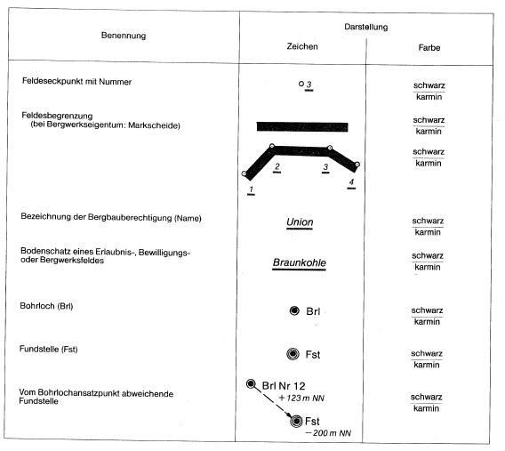

# Bergverordnung über vermessungstechnische und sicherheitliche Unterlagen (UnterlagenBergV)

Ausfertigungsdatum
:   1982-11-11

Fundstelle
:   BGBl I: 1982, 1553

Zuletzt geändert durch
:   Art. 4 V v. 10. 8.2005 I 2452

## 1. Abschnitt - Karten und Lagerisse für Bergbauberechtigungen

### § 1 Allgemeine Anforderungen

(1) Den Karten für den Antrag auf Erteilung einer Erlaubnis nach § 7
des Bundesberggesetzes sowie den Lagerissen für den Antrag auf

1.  Erteilung einer Bewilligung nach § 8 des Bundesberggesetzes,

2.  Verleihung von Bergwerkseigentum nach § 9 des Bundesberggesetzes,

3.  Vereinigung und Teilung von Bergwerksfeldern sowie Austausch von
    Teilen von Bergwerksfeldern nach den §§ 24, 28 und 29 des
    Bundesberggesetzes,

4.  Zulegung von Gewinnungsberechtigungen nach § 35 des Bundesberggesetzes

sind die amtlichen Karten der Landesvermessung oder des
Liegenschaftskatasters in der neuesten Ausgabe zugrunde zu legen.
Unveröffentlichte Vermessungsunterlagen oder Darstellungen einer
Behörde müssen von dieser beglaubigt sein.

(2) Zeichen, Farben und Beschriftungen müssen den Anforderungen der
Anlage entsprechen. Die zeichnerische Darstellung muß dauerhaft sein.

(3) Für amtliche Vermerke ist auf den Karten und Lagerissen eine
ausreichende Fläche freizuhalten.

### § 2 Änderungen der Karten und Lagerisse

(1) Eintragungen, die für die Nachprüfung der richtigen und
vollständigen Darstellung eines Feldes auf den Karten und Lagerissen
erforderlich sind, dürfen nicht entfernt oder so verändert werden, daß
sie in ihrer ursprünglichen Form nicht mehr erkennbar sind.

(2) Änderungen sind mit Datum und Unterschrift dessen, der sie
vorgenommen hat, kenntlich zu machen.

### § 3 Maßstab der Karten und Lagerisse

Die Karten und Lagerisse sollen

1.  bei einer Erlaubnis im Maßstab 1:25.000, 1:50.000 oder 1:100.000,

2.  in den übrigen Fällen im Maßstab 1:5.000, 1:10.000 oder 1:25.000

angefertigt werden. Die Wahl des Maßstabes richtet sich nach der Größe
des Feldes sowie nach der erforderlichen Genauigkeit,
Übersichtlichkeit und Lesbarkeit der Darstellung.

### § 4 Titel der Karten und Lagerisse

Der Titel der Karten und Lagerisse muß enthalten

1.  die Art und den Namen der Berechtigung,

2.  die Bezeichnung der Bodenschätze, auf die sich der Antrag bezieht,

3.  die Angabe des Flächeninhalts des Feldes,

4.  den Maßstab und

5.  den Anfertigungsvermerk.

### § 5 Begrenzung und Flächeninhalt einer Bergbauberechtigung

(1) Die Feldeseckpunkte sind in Gauß-Krügerschen Koordinaten
festzulegen. Ein anderes Koordinatensystem ist nur zulässig, wenn es
bei einer Landesvermessung als einziges benutzt wird und eine
Umrechnung in Gauß-Krügersche Koordinaten unzumutbar ist.

(2) Der Flächeninhalt des Feldes ist aus den Koordinaten der
Feldeseckpunkte unter Berücksichtigung der Projektionsverzerrung zu
berechnen und auf volle hundert Quadratmeter abzurunden. Ein zur
Berechnung erforderliches Hilfspolygon braucht nicht gemessen zu
werden.

(3) Die Feldeseckpunkte sind auf den Karten und Lagerissen fortlaufend
zu numerieren und unter Angabe der zugehörigen Koordinaten in einer
Zahlentafel aufzuführen. Koordinaten, die nur zur Berechnung des
Flächeninhalts ermittelt worden sind, sind ebenfalls in der
Zahlentafel aufzuführen und besonders zu kennzeichnen.

(4) Innerhalb der Feldesbegrenzung sind einzutragen die Bezeichnung

1.  der Feldeseckpunkte, soweit möglich,

2.  der Berechtigung (Name) und

3.  der Bodenschätze, auf die sich der Antrag bezieht.

(5) Auf den Lagerissen für die Vereinigung und Teilung von
Bergwerksfeldern sowie für den Austausch von Feldesteilen sind auch
die bisherigen Begrenzungen und Bezeichnungen der Bergwerksfelder
einzutragen.

### § 6 Fundstellen

(1) Bei einem Antrag auf Bewilligung ist die Lage der Stellen, an
denen die Bodenschätze entdeckt worden sind
Fundstellen             , koordinatenmäßig zu bestimmen. Hierbei ist
von Festpunkten der Landesvermessung auszugehen. Für ihre Koordinaten
gilt § 5 Abs. 1 und 3 Satz 1 entsprechend. Die zu den Fundstellen
gehörende Geländehöhe kann einer amtlichen Karte entnommen werden,
deren Maßstab nicht kleiner als 1:25.000 sein darf. Abweichungen
zwischen den Fundstellen und den Ansatzpunkten der Bohrungen sind zu
bestimmen und, soweit möglich, in den Lagerissen darzustellen.

(2) Die Lage der Fundstellen ist gesondert in einem Maßstab, der nicht
kleiner als 1:5.000 sein darf, darzustellen. In dieser Darstellung
sind

1.  bei übertägigen Fundstellen die nächstgelegenen Tagesgegenstände und

2.  bei untertägigen Fundstellen die nächstgelegenen Grubenbaue

einzutragen. Liegen die Fundstellen nicht an der Oberfläche, ist ihre
Lage auch in einem Schnitt darzustellen.

### § 7 Unterlagen

Den Karten und Lagerissen sind die ihnen zugrunde liegenden
Berechnungen und Vermessungsunterlagen mit erläuternden
Handzeichnungen beizufügen. Sofern sie nicht in Urschrift oder in
amtlich beglaubigter Abschrift beigefügt werden, sind sie mit Datum
und Unterschrift dessen zu versehen, der sie angefertigt hat.

### § 8 Sondervorschrift für den Festlandsockel und die Küstengewässer

(1) Für den Bereich des Festlandsockels und für Felder, die sich
ausschließlich oder überwiegend in Küstengewässer erstrecken, gelten §
1 Abs. 1 Satz 2, Abs. 2 und 3, §§ 2, 4, 5 Abs. 2 bis 5 und § 7 sowie
die Absätze 2 bis 5.

(2) Den Karten und Lagerissen sind die Seekarten oder topographischen
Karten des Seegrundes (Arbeitskarten) des Bundesamtes für
Seeschiffahrt und Hydrographie in der neuesten Ausgabe zugrunde zu
legen.

(3) Die Karten und Lagerisse sollen in dem größten Maßstab angefertigt
werden, in dem Seekarten oder Arbeitskarten für das Gebiet vorliegen,
auf das sich der Antrag bezieht.

(4) Die Feldeseckpunkte sind in geographischen Koordinaten
(Europäisches Datum) anzugeben, die Eckpunkte der Felder, die sich
ausschließlich oder überwiegend in Küstengewässer erstrecken,
zusätzlich in Gauß-Krügerschen Koordinaten.

(5) Bei einem Antrag auf Bewilligung sind die Fundstellen

1.  durch Anschluß an Festpunkte der Landesvermessung,

2.  mit Hilfe der nichtnavigatorischen Funkortung oder

3.  mit Hilfe der Satellitengeodäsie

in geographischen Koordinaten (Europäisches Datum) und zusätzlich in
Gauß-Krügerschen Koordinaten zu bestimmen, wenn sich das Feld, auf das
sich der Antrag bezieht, ausschließlich oder überwiegend in
Küstengewässer erstreckt. Es ist das für die jeweilige Fundstelle
genaueste Verfahren anzuwenden und die mit ihm erzielte Genauigkeit
nachzuweisen. Die Koordinaten der Fundstellen sind in einer
Zahlentafel aufzuführen. Abweichungen zwischen den Fundstellen und den
Ansatzpunkten der Bohrungen sind, soweit möglich, in den Lagerissen
darzustellen. Die zu den Fundstellen gehörenden Wassertiefen sind
anzugeben. § 6 Abs. 2 gilt mit der Maßgabe, daß die nächstgelegenen
festen Gegenstände einzutragen sind. Liegt die Fundstelle in der Nähe
der Grenze des Festlandsockels, so ist auch deren Verlauf einzutragen.

## 2. Abschnitt - Mitteilungen und Nachweise durch bergbauliche Unternehmer

### § 9 Mitteilungen über Beschäftigte und betriebliche Vorgänge

Die Unternehmer haben der zuständigen Behörde nach Maßgabe der von
dieser herausgegebenen Vordrucke zu melden

1.  bis Ende Februar,

    a)  bezogen auf den 15. September des Vorjahres, die sicherheitstechnisch
        wichtigen Betriebsmittel im Steinkohlenbergbau unter Tage,

    b)  bezogen auf den Monat Oktober des Vorjahres, den betrieblichen Stand
        der Ausrichtung, Vorrichtung und Gewinnung im Steinkohlenbergbau unter
        Tage,

    c)  bezogen auf den Monat November des Vorjahres, den Stand der Maßnahmen
        zur Staub- und Silikosebekämpfung in staub- und silikosegefährdeten
        Betrieben,

    d)  bezogen auf den Monat November des Vorjahres, die Zahl der
        untertägigen Betriebspunkte, in denen ein Lärm-Beurteilungspegel von
        85 dB (A) überschritten worden ist, sowie die Zahl der dort
        verfahrenen Schichten,

    e)  bezogen auf den 31. Dezember des Vorjahres, die Zahl aller
        Beschäftigten und der Auszubildenden,

    f)  bezogen auf den 31. Dezember des Vorjahres, die Stärke und
        Zusammensetzung der Gruben- und Gasschutzwehren,

    g)  bezogen auf das Vorjahr, die von über Tage niedergebrachten Bohrmeter
        von betriebsplanpflichtigen Bohrungen,

    h)  bezogen auf das Vorjahr, die Betriebsflächen von mehr als 1 ha für
        Tagebaue und die hiervon wiedernutzbargemachten Flächen sowie bei
        untertägiger Gewinnung die für Halden und Teiche in Anspruch
        genommenen Flächen von mehr als 1 ha,

2.  bis zum 15. der Monate April und Oktober, bezogen jeweils auf die
    Monate Januar und Juli, die Zahl der untertägigen Betriebspunkte, in
    denen die vorgeschriebenen unteren Temperatur- oder Klimagrenzwerte
    überschritten worden sind, sowie die Zahl der dort verfahrenen
    Schichten,

3.  bis Ende Februar, bezogen auf den 31. Dezember des Vorjahres, die Zahl
    aller Beschäftigten, einschließlich der Zu- und Abgänge, und die
    geleistete Arbeitszeit,

4.  bis zum Ende eines jeden Monats, bezogen jeweils auf den Vormonat, für
    den Stein- und Braunkohlenbergbau die verwertbare Fördermenge sowie
    die Menge der Erzeugnisse in Aufbereitungen nach § 4 Abs. 3 des
    Bundesberggesetzes,

5.  bis Ende Februar, bezogen auf das Vorjahr, für den übrigen Bergbau die
    Roh- und verwertbare Fördermenge sowie die Menge der Erzeugnisse in
    Aufbereitungen nach § 4 Abs. 3 des Bundesberggesetzes.

Die Meldungen können auch von Gemeinschaftsorganisationen der
Unternehmer in deren Auftrag abgegeben werden.

### § 10 Mitteilung von Unfällen

Die Unternehmer haben einen Unfall, der sich in ihrem Aufsuchungs-,
Gewinnungs-, Aufbereitungs- oder sonstigen Betrieb ereignet hat und
bei dem eine Person mehr als drei Tage ganz oder teilweise
arbeitsunfähig geworden ist, der zuständigen Behörde mitzuteilen. Dies
gilt nicht, wenn der Unfall der zuständigen Behörde bereits auf Grund
anderer Rechtsvorschriften mitzuteilen ist.

### § 11 Nachweis über Beschäftigte

(1) Die Unternehmer haben einen Nachweis zu führen über

1.  die Vor- und Zunamen,

2.  den Geburtstag,

3.  die Anschrift und

4.  den Tag des Beginns und der Beendigung des Arbeitsverhältnisses

der in ihren Betrieben Beschäftigten.

(2) Der Nachweis ist zwei Jahre nach Beendigung des
Arbeitsverhältnisses aufzubewahren.

## 3. Abschnitt - Schlußvorschriften

### § 12

(weggefallen)

### § 13 Ablösung von Vorschriften

Mit dem Inkrafttreten dieser Verordnung treten folgende Vorschriften
außer Kraft:

1.  Baden-Württemberg

    §§ 41 bis 54 der Verordnung über die Geschäftsführung der Markscheider
    und die technische Ausführung der Markscheiderarbeiten vom 6. Februar
    1974 (Gesetzblatt für Baden-Württemberg S. 118, 124),

2.  Bayern

    §§ 33 bis 45 der Verordnung über die Geschäftsführung der Markscheider
    und die technische Ausführung von Markscheiderarbeiten in den der
    Aufsicht der Bergbehörden unterliegenden Betrieben vom 20. September
    1978 (Bayerisches Gesetz- und Verordnungsblatt S. 734, 739),

3.  Hessen

    §§ 41 bis 54 der Verordnung über die Geschäftsführung der Markscheider
    und die technische Ausführung der Markscheiderarbeiten vom 7. Januar
    1974 (Gesetz- und Verordnungsblatt für das Land Hessen I S. 18, 24),

4.  Niedersachsen

    §§ 32 bis 44 der Verordnung über die Geschäftsführung der Markscheider
    und die technische Ausführung der Markscheiderarbeiten vom 8. Februar
    1979 (Niedersächsisches Gesetz- und Verordnungsblatt S. 39, 44),

5.  Nordrhein-Westfalen

    §§ 32 bis 45 der Verordnung über die Geschäftsführung der Markscheider
    und die technische Ausführung der Markscheiderarbeiten vom 25. Oktober
    1977 (Gesetz- und Verordnungsblatt für das Land Nordrhein-Westfalen
    vom 5. Dezember 1977 S. 410, 414),

6.  Rheinland-Pfalz

    §§ 41 bis 54 der Landesverordnung über die Geschäftsführung der
    Markscheider und die technische Ausführung der Markscheiderarbeiten
    vom 7. August 1974 (Gesetz- und Verordnungsblatt für das Land
    Rheinland-Pfalz S. 353, 359),

7.  Saarland

    §§ 41 bis 54 der Verordnung über die Geschäftsführung der Markscheider
    und die technische Ausführung der Markscheiderarbeiten vom 3.
    September 1968 (Amtsblatt des Saarlandes S. 655, 660), geändert durch
    Verordnung vom 11. August 1972 (Amtsblatt des Saarlandes S. 478).

(zu § 1)

### Anlage Zeichen, Farben und Beschriftungen für Karten und Lagerisse der Bergbauberechtigungen

(Fundstelle: BGBl I 1982, 1557)

**Beantragte Felder**

1.  Ausführung

    *        *            

2.  Anwendung

    Bei Änderung von Bergbauberechtigungen ist die bisherige Bezeichnung
    in der Farbe karmin durchzustreichen. Die Feldesbegrenzung
    (Markscheide) ist durch schrägliegende Kreuze in der Farbe karmin
    ungültig zu machen.

    Der Name des Bodenschatzes ist möglichst auszuschreiben. Aus
    Platzgründen können auch Kurzbezeichnungen entsprechend dem
    Periodischen System der Elemente benutzt werden.

