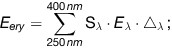
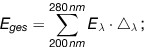

# Verordnung zum Schutz vor schädlichen Wirkungen künstlicher ultravioletter Strahlung (UVSV)

Ausfertigungsdatum
:   2011-07-20

Fundstelle
:   BGBl I: 2011, 1412

[^F775557_01_BJNR141200011]:     Die §§ 5 und 6 dieser Verordnung dienen der Umsetzung der Richtlinie
    2006/123/EG des Europäischen Parlaments und des Rates vom 12. Dezember
    2006 über Dienstleistungen im Binnenmarkt (ABl. L 376 vom 27.12.2006,
    S. 36) sowie der Richtlinie 2005/36/EG des Europäischen Parlaments und
    des Rates vom 7. September 2005 über die Anerkennung von
    Berufsqualifikationen (ABl. L 255 vom 30.9.2005, S. 22, L 271 vom
    16\.10.2007, S. 18, L 93 vom 4.4.2008, S. 28, L 33 vom 3.2.2009, S.
    49), die zuletzt durch die Verordnung (EG) Nr. 279/2009 (ABl. L 93 vom
    7\.4.2009, S. 11) geändert worden ist.                 Die
    Verpflichtungen aus der Richtlinie 98/34/EG des Europäischen
    Parlaments und des Rates vom 22. Juni 1998 über ein
    Informationsverfahren auf dem Gebiet der Normen und technischen
    Vorschriften und der Vorschriften für die Dienste der
    Informationsgesellschaft (ABl. L 204 vom 21.7.1998, S. 37), die
    zuletzt durch die Richtlinie 2006/96/EG (ABl. L 363 vom 20.12.2006, S.
    1) geändert worden ist, sind beachtet worden.

## Eingangsformel

Auf Grund der §§ 3 und 5 Absatz 2 des Gesetzes zum Schutz vor
nichtionisierender Strahlung bei der Anwendung am Menschen vom 29.
Juli 2009 (BGBl. I S. 2433) verordnet die Bundesregierung:

## § 1 Anwendungsbereich

Diese Verordnung gilt für den Betrieb von UV-Bestrahlungsgeräten, die
zu kosmetischen Zwecken oder für sonstige Anwendungen am Menschen
außerhalb der Heil- oder Zahnheilkunde gewerblich oder im Rahmen
sonstiger wirtschaftlicher Unternehmungen eingesetzt werden.

## § 2 Begriffsbestimmungen

Für diese Verordnung gelten folgende Begriffsbestimmungen:

1.  „UV-Bestrahlungsgeräte“ sind Anlagen, die zur Bestrahlung der Haut UV-
    Strahlung aussenden können, einschließlich deren Steuerung;

2.  „UV-Strahlung“ ist nichtionisierende Strahlung mit Wellenlängen von
    100 bis 400 Nanometern;

3.  „Optische Bauteile“ sind die optisch wirksamen Bestandteile eines UV-
    Bestrahlungsgerätes, insbesondere UV-Leuchtstofflampen oder Halogen-
    Metalldampflampen, Reflektoren, Filter und UV-durchlässige Scheiben;

4.  „Hauttypen“ sind die Kategorien der individuellen Hautempfindlichkeit
    nach Anlage 1;

5.  „UV-Erythem“ ist eine entzündliche Rötung der menschlichen Haut durch
    UV-Strahlung der Sonne oder von künstlichen Quellen (Sonnenbrand);

6.  „Erythemwirksame Bestrahlungsstärke (E
    ery                   )“ ist die Summation des Produktes aus
    gemessener spektraler Bestrahlungsstärke (E
    λ                   ) in Watt pro Quadratmeter und Nanometer (Wm
    -2                   nm
    -1                   ), dem jeweiligen wellenlängenabhängigen
    Wichtungsfaktor (S
    λ                   ) für das UV-Erythem nach Anlage 2 und dem
    jeweiligen Intervall der Wellenlänge Δ
    λ                    in Nanometern (nm), wobei gilt Δ
    λ                    < 2,5 Nanometer (nm), über den
    Wellenlängenbereich von 250 bis 400 Nanometern (nm):

    *        *
        *            
        *

7.  „Gesamte Bestrahlungsstärke (E
    ges                   )“ ist die Summation des Produktes aus
    gemessener spektraler Bestrahlungsstärke (E
    λ                   ) in Watt pro Quadratmeter und Nanometer (Wm
    -2                   nm
    -1                   ) und dem jeweiligen Intervall der Wellenlänge Δ
    λ                    in Nanometern, wobei gilt Δ
    λ                    < 2,5 Nanometer (nm), über den
    Wellenlängenbereich von 200 bis 280 Nanometern (nm):

    *        *
        *            
        *

8.  „Erythemwirksame Bestrahlung“ ist die Bestrahlung in Joule pro
    Quadratmeter (Jm
    -2                   ), die ermittelt wird durch Multiplikation der
    erythemwirksamen Bestrahlungsstärke mit der Bestrahlungsdauer in
    Sekunden;

9.  „Erythemwirksame Schwellenbestrahlung“ ist der Wert der
    erythemwirksamen Bestrahlung in Joule pro Quadratmeter (Jm
    -2                   ), der bei nicht vorbestrahlter Haut ein gerade
    noch erkennbares UV-Erythem hervorruft;

10. „Höchstbestrahlungsdauer“ ist die Bestrahlungsdauer, die bei gegebener
    erythemwirksamer Bestrahlungsstärke eines UV-Bestrahlungsgerätes bei
    nicht vorbestrahlter Haut ein gerade noch erkennbares UV-Erythem
    hervorruft; sie ist der Quotient aus der erythemwirksamen
    Schwellenbestrahlung des jeweiligen Hauttyps und der erythemwirksamen
    Bestrahlungsstärke des UV-Bestrahlungsgerätes.

## § 3 Anforderungen an den Betrieb von UV-Bestrahlungsgeräten

(1) Wer ein UV-Bestrahlungsgerät betreibt, hat sicherzustellen, dass

1.  im Wellenlängenbereich von 250 bis 400 Nanometern der Wert der
    erythemwirksamen Bestrahlungsstärke von 0,3 Watt pro Quadratmeter
    nicht überschritten wird,

2.  im Wellenlängenbereich von 200 bis 280 Nanometern der Wert der
    gesamten Bestrahlungsstärke von 3 x 10
    -3                    Watt pro Quadratmeter nicht überschritten wird.

(2) Wer ein UV-Bestrahlungsgerät betreibt, hat ferner sicherzustellen,
dass

1.  UV-Schutzbrillen nach Anlage 3 in ausreichender Zahl bereitgehalten
    werden und jeder Nutzerin und jedem Nutzer vor der Nutzung eines UV-
    Bestrahlungsgerätes durch das Personal des Betreibers eine solche
    Schutzbrille angeboten wird,

2.  bei der Bestrahlung von Nutzerinnen und Nutzern mit einem UV-
    Bestrahlungsgerät, das bauartbedingt variable Entfernungen der
    bestrahlten Person zum Gerät zulässt, der erforderliche Mindestabstand
    eingehalten wird; dies kann etwa durch eine Markierung oder eine
    bauliche Maßnahme gewährleistet werden,

3.  das UV-Bestrahlungsgerät über eine Notabschaltung abgeschaltet werden
    kann, die die Strahlung sofort beendet und von der Nutzerin oder dem
    Nutzer während der Bestrahlung leicht erreicht werden kann,

4.  sich bei einer erythemwirksamen Bestrahlung von mehr als 800 Joule pro
    Quadratmeter das UV-Bestrahlungsgerät selbst abschaltet
    (Zwangsabschaltung),

5.  eine erythemwirksame Bestrahlung von maximal 100 Joule pro
    Quadratmeter eingestellt werden kann,

6.  die Wartung und die Prüfung der Einhaltung der Anforderungen des
    Absatzes 1 und der Nummern 1 bis 5, insbesondere die Prüfung der
    Sicherheitseinrichtungen und soweit erforderlich eine Messung der
    Bestrahlungsstärke, durch fachkundiges Personal unter Berücksichtigung
    der Betriebs- und Wartungsanleitung des Herstellers durchgeführt und
    im Betriebsbuch nach Anlage 4 dokumentiert werden; die Betriebs- und
    Wartungsanleitung ist in dem Geräte- und Betriebsbuch beizufügen, und

7.  die im Geräte- und Betriebsbuch nach Anlage 4 geforderten Angaben und
    Unterlagen vollständig sind und auf dem jeweils aktuellen Stand
    gehalten werden.

(3) Wer ein UV-Bestrahlungsgerät betreibt, hat der zuständigen Behörde
auf Verlangen nachzuweisen, dass die Anforderungen nach den Absätzen 1
und 2 erfüllt sind.

## § 4 Einsatz, Aufgaben und Qualifikation des Fachpersonals

(1) Wer ein UV-Bestrahlungsgerät betreibt, hat sicherzustellen, dass

1.  mindestens eine als Fachpersonal für den Umgang mit UV-
    Bestrahlungsgeräten nach Absatz 4 qualifizierte Person (Fachpersonal)
    während der Betriebszeiten der UV-Bestrahlungsgeräte für den Kontakt
    mit den Nutzerinnen oder den Nutzern und die Überprüfung der UV-
    Bestrahlungsgeräte anwesend ist,

2.  das Fachpersonal anbietet, die Nutzerin oder den Nutzer in die sichere
    Bedienung des UV-Bestrahlungsgerätes einschließlich der Notabschaltung
    einzuweisen,

3.  das Fachpersonal anbietet, eine auf die Person abgestimmte
    Hauttypbestimmung nach Anlage 1 vorzunehmen,

4.  das Fachpersonal anbietet, einen auf die Person abgestimmten
    Dosierungsplan nach Anlage 5 zu erstellen.

Es ist ausreichend, die Angebote nach Satz 1 Nummer 2 bis 4 zu Beginn
einer Bestrahlungsserie nach Anlage 5 Nummer 3 zu unterbreiten.

(2) Wer nicht mehr als zwei UV-Bestrahlungsgeräte an einem
Aufstellungsort betreibt, kann von Absatz 1 Satz 1 Nummer 1 abweichen,
wenn durch technische Maßnahmen sichergestellt ist, dass eine Nutzung
der UV-Bestrahlungsgeräte nur möglich ist, wenn der Nutzerin oder dem
Nutzer vor Beginn jeder Bestrahlungsserie gemäß Anlage 5 Nummer 3 das
Angebot, das in § 3 Absatz 2 Nummer 1 geregelt ist, sowie die
Angebote, die in Absatz 1 Satz 1 Nummer 2 bis 4 geregelt sind, durch
Fachpersonal unterbreitet werden.

(3) Bei der Erstellung des Dosierungsplans nach Absatz 1 Satz 1 Nummer
4 sind folgende Punkte zu berücksichtigen:

1.  der Hauttyp,

2.  die Ausschlusskriterien für die Benutzung von UV-Bestrahlungsgeräten
    nach Anlage 5 (Hauttypen I und II),

3.  die Anzahl, Dauer und Stärke vorangegangener Bestrahlungen durch UV-
    Bestrahlungsgeräte und die Sonne sowie

4.  die nach Anlage 5 empfohlenen hauttypspezifischen maximalen
    erythemwirksamen Bestrahlungen.

(4) Als Fachpersonal ist qualifiziert, wer an einer Schulung nach § 5
Absatz 1 teilgenommen hat und mindestens alle fünf Jahre an einer
Fortbildung nach § 5 Absatz 2 teilnimmt. Fachpersonal, das länger als
fünf Jahre nicht an einer Fortbildung nach § 5 Absatz 2 teilgenommen
hat, kann nicht mehr als Fachpersonal nach Satz 1 tätig werden, bis es
an einer Fortbildung nach § 5 Absatz 2 teilgenommen hat. Als
Fachpersonal gilt auch das Personal mit vergleichbaren Qualifikationen
aus anderen EU- und EWR-Staaten gemäß § 6.

## § 5 Schulung, Fortbildung

(1) Die Schulung zum Fachpersonal muss zumindest die in Anlage 6
aufgeführten fachlichen Kenntnisse für einen sicheren Umgang mit UV-
Bestrahlungsgeräten sowie Kenntnisse in den allgemeinen Wirkungen von
UV-Strahlung auf den Menschen und für die Einschätzung des
individuellen Risikos von UV-Strahlung vermitteln. Die Schulungsdauer
beträgt mindestens zwölf Stunden.

(2) Die Fortbildung hat einen Überblick über die in Anlage 6
aufgeführten Inhalte und den technischen Fortschritt zu vermitteln.
Die Dauer einer Fortbildung nach Satz 1 beträgt mindestens fünf
Stunden.

(3) Über die Teilnahme an einer Schulung nach Absatz 1 sowie an einer
Fortbildung nach Absatz 2 ist vom Schulungsträger ein Nachweis
auszustellen.

(4) Eine Schulung nach Absatz 1 und eine Fortbildung nach Absatz 2
darf nur ein Schulungsträger anbieten, der hierfür akkreditiert wurde.
Voraussetzung für die Akkreditierung des Schulungsträgers ist, dass

1.  die Schulungs- und Fortbildungsinhalte geeignet sind, die in Anlage 6
    aufgeführten fachlichen Kenntnisse für einen sicheren Umgang mit UV-
    Bestrahlungsgeräten sowie Kenntnisse in den allgemeinen Wirkungen von
    UV-Strahlung auf den Menschen und für die Einschätzung des
    individuellen Risikos von UV-Strahlung zu vermitteln und die fachliche
    Leitung der Schulung und der Fortbildung des Schulungsträgers sowie
    die vom Schulungsträger beauftragten Lehrkräfte die Vermittlung dieser
    Kenntnisse gewährleisten und

2.  die vom Schulungsträger beauftragten Lehrkräfte die erforderliche
    Unabhängigkeit und Zuverlässigkeit für die Durchführung der Schulung
    und der Fortbildung besitzen.

Die Akkreditierung gilt für maximal fünf Jahre für das gesamte
Bundesgebiet. Für eine verlängerte oder erneute Akkreditierung ist auf
Antrag das Akkreditierungsverfahren erneut durchzuführen.

(5) Akkreditierungen anderer Mitgliedstaaten der Europäischen Union
oder aus einem anderen Vertragsstaat des Abkommens über den
Europäischen Wirtschaftsraum stehen denen nach Absatz 4 Satz 1 gleich,
wenn die Akkreditierung die Anforderungen des Absatzes 4 Satz 2 oder
die auf Grund ihrer Zielsetzung im Wesentlichen vergleichbaren
Anforderungen des Ausstellungsstaats erfüllen.

## § 6 Gleichwertigkeit vergleichbarer Qualifikationen aus anderen EU- und EWR-Staaten

(1) Als der Teilnahme an einer Schulung nach § 5 Absatz 1 oder einer
Fortbildung nach § 5 Absatz 2 gleichwertige Qualifikationen gelten
Schulungs-, Befähigungs- und Ausbildungsnachweise, die von einer
zuständigen Behörde eines anderen Mitgliedstaats der Europäischen
Union oder eines Vertragsstaats des Abkommens über den Europäischen
Wirtschaftsraum ausgestellt worden sind und

1.  die in dem ausstellenden Staat erforderlich sind, um als Fachpersonal
    tätig zu werden oder

2.  die, sofern die Tätigkeit im Niederlassungsstaat nicht durch Rechts-
    oder Verwaltungsvorschrift an den Besitz bestimmter
    Berufsqualifikationen gebunden ist, bescheinigen, dass die Inhaberin
    oder der Inhaber auf die Tätigkeit als Fachpersonal vorbereitet worden
    ist und in den letzten zehn Jahren vor Antragstellung mindestens zwei
    Jahre einer Tätigkeit als Fachpersonal nachgegangen ist; die Pflicht
    zum Nachweis dieser zweijährigen Berufserfahrung entfällt, wenn der
    Ausbildungsnachweis den Abschluss einer reglementierten Ausbildung im
    Sinne des Artikels 13 Absatz 2 Unterabsatz 3 der Richtlinie
    2005/36/EG                    des Europäischen Parlaments und des
    Rates vom 7. September 2005 über die Anerkennung von
    Berufsqualifikationen (ABl. L 255 vom 30.9.2005, S. 22, L 271 vom
    16\.10.2007, S. 18, L 93 vom 4.4.2008, S. 28, L 33 vom 3.2.2009, S.
    49), die zuletzt durch die Verordnung (EG) Nr. 279/2009 (ABl. L 93 vom
    7\.4.2009, S. 11) geändert worden ist, bestätigt.

Nachweisen nach Satz 1 gleichgestellt sind Nachweise, die in einem
Drittstaat ausgestellt wurden, sofern diese Nachweise in einem der in
Satz 2 genannten Staaten anerkannt worden sind und dieser Staat der
Inhaberin oder dem Inhaber der Nachweise bescheinigt, in seinem
Hoheitsgebiet mindestens drei Jahre Berufserfahrung als Fachpersonal
erworben zu haben.

(2) Die Qualifikationsnachweise nach § 5 Absatz 1 und 2 sowie die
Qualifikationsnachweise nach Absatz 1 sind am Betriebsort
aufzubewahren und der zuständigen Behörde auf Verlangen vorzulegen.
Bestehen Zweifel an der Echtheit der vorgelegten Bescheinigungen oder
an den dadurch verliehenen Rechten, kann die zuständige Behörde durch
Nachfrage bei der zuständigen Behörde oder Stelle des
Niederlassungsstaats die Echtheit oder die dadurch verliehenen Rechte
überprüfen.

(3) Für die vorübergehende und gelegentliche Dienstleistung als
Fachpersonal im Inland gilt § 13a der Gewerbeordnung.

## § 7 Informationspflichten

(1) Wer ein UV-Bestrahlungsgerät betreibt, hat die Hinweise nach
Anlage 7 so auszuhängen, dass sie für die Nutzerinnen und Nutzer
deutlich sicht- und lesbar sind.

(2) Wer ein UV-Bestrahlungsgerät betreibt, hat sicherzustellen, dass
folgende Informationen dauerhaft und deutlich sicht- und lesbar an dem
UV-Bestrahlungsgerät angebracht sind:

1.  Angaben zur maximalen Bestrahlungsdauer der ersten Bestrahlung von
    ungebräunter Haut und zur Höchstbestrahlungsdauer für die Hauttypen I
    bis VI sowie der Hinweis, dass die Hauttypen I und II nach Anlage 5
    Ausschlusskriterien für die Nutzung von UV-Bestrahlungsgeräten
    darstellen,

2.  ein Hinweis mit der Überschrift „Warnung“ und folgendem oder
    sinngemäßem Inhalt: „Vorsicht!
    UV-Strahlung                    kann akute Schäden an Augen und Haut
    verursachen, führt zu vorzeitiger Hautalterung und erhöht das Risiko,
    an Hautkrebs zu erkranken. Empfehlungen zum Gesundheitsschutz
    beachten! Schutzbrille tragen! Medikamente und Kosmetika können die
    UV-Empfindlichkeit der Haut erhöhen. “

Ist es auf Grund der Beschaffenheit des UV-Bestrahlungsgerätes nicht
möglich, die Informationen nach Satz 1 am UV-Bestrahlungsgerät
anzubringen, können diese Informationen ausnahmsweise in der
Bestrahlungskabine angebracht werden; auch hier müssen sie deutlich
sicht- und lesbar sein und dem betreffenden UV-Bestrahlungsgerät
eindeutig zugeordnet werden können.

(3) Wer ein UV-Bestrahlungsgerät in einem Sonnenstudio oder in einer
ähnlichen Einrichtung betreibt, hat im Eingangsbereich des
Geschäftsraumes den gut sicht- und lesbaren Hinweis „Benutzung von
Solarien für Kinder und Jugendliche unter 18 Jahren verboten“
anzubringen. Wer ein UV-Bestrahlungsgerät in sonstigen öffentlich
zugänglichen Räumen betreibt, hat einen solchen Hinweis direkt an dem
UV-Bestrahlungsgerät anzubringen.

(4) Wer ein UV-Bestrahlungsgerät betreibt, hat sicherzustellen, dass
den Nutzerinnen und Nutzern eine Informationsschrift zu den Gefahren
und Risiken einer UV-Bestrahlung zur Mitnahme angeboten wird, deren
Inhalt sich aus Anlage 8 ergibt.

## § 8 Dokumentationspflichten

(1) Wer ein UV-Bestrahlungsgerät betreibt, hat für das UV-
Bestrahlungsgerät fortlaufend ein Geräte- und Betriebsbuch zu führen.
Das Geräte- und Betriebsbuch muss zumindest die in Anlage 4 genannten
Informationen enthalten. Das Geräte- und Betriebsbuch ist nach der
letzten Nutzung des UV-Bestrahlungsgerätes drei Jahre aufzubewahren.
Die Unterlagen sind vor unbefugtem Zugriff zu schützen.

(2) Aufzeichnungen nach § 4 Absatz 1 Nummer 3 und 4 oder Kopien oder
Abschriften derselben sind sechs Monate nach ihrer Erstellung
aufzubewahren. Die Unterlagen sind vor unbefugtem Zugriff zu schützen.

(3) Die Dokumentationspflichten der Absätze 1 und 2 können auch durch
eine geeignete elektronische Dokumentation erfüllt werden. Eine
geeignete elektronische Dokumentation nach Satz 1 liegt dann vor, wenn
der Betreiber technisch-organisatorische Maßnahmen nach § 9 des
Bundesdatenschutzgesetzes in Verbindung mit der Anlage zu § 9 Satz 1
des Bundesdatenschutzgesetzes trifft.

(4) Die zuständige Behörde kann zur Überwachung der
Dokumentationspflichten die nach den Absätzen 1 bis 3 dokumentierten
Aufzeichnungen überprüfen.

## § 9 Hinweis auf Bußgeldvorschriften des Gesetzes zum Schutz vor nichtionisierender Strahlung bei der Anwendung am Menschen

Zuwiderhandlungen gegen § 3 des Gesetzes zum Schutz vor
nichtionisierender Strahlung bei der Anwendung am Menschen in
Verbindung mit § 3 Absatz 1 oder Absatz 2, § 4 Absatz 1, § 7 oder § 8
Absatz 1 oder Absatz 2 dieser Verordnung können nach § 8 Absatz 1
Nummer 3 des Gesetzes zum Schutz vor nichtionisierender Strahlung bei
der Anwendung am Menschen geahndet werden.

## § 10 Übergangsvorschrift

(1) UV-Bestrahlungsgeräte, die vor dem 1. Januar 2012 bereits
betrieben werden und die Anforderungen nach § 3 Absatz 1 und 2 nicht
erfüllen, dürfen ab dem 1. August 2012 zu kosmetischen Zwecken oder
für sonstige Anwendungen am Menschen außerhalb der Heil- oder
Zahnheilkunde nicht weiter betrieben werden.

(1a) UV-Bestrahlungsgeräte, die vor dem 1. Januar 2008 erstmalig in
Verkehr gebracht wurden, dürfen ab dem 1. August 2012 nur weiter
betrieben werden, wenn eine im Bezug auf die Gerätetechnik fachkundige
Person festgestellt und durch Eintrag im Geräte- und Betriebsbuch
bestätigt hat, dass die Anforderungen nach § 3 Absatz 1 und Absatz 2
Nummer 2 bis 5 erfüllt sind.

(2) Wer ein Zertifikat über seine fachliche Qualifikation von der
Akademie für Besonnung e. V. erhalten hat, gilt als Fachpersonal im
Sinne von § 4 Absatz 4, wenn das Zertifikat nicht vor mehr als fünf
Jahren vor Inkrafttreten der Verordnung und nicht nach dem 15. August
2010 ausgestellt worden ist. Der Inhaber eines Zertifikats nach Satz 1
muss an einer Fortbildungsveranstaltung teilnehmen, sobald das
Zertifikat vor mehr als fünf Jahren ausgestellt worden ist.

## § 11 Inkrafttreten

(1) Diese Verordnung tritt vorbehaltlich des Absatzes 2 am 1. Januar
2012 in Kraft.

(2) § 4 Absatz 1 tritt am 1. November 2012 in Kraft.

## Schlussformel

Der Bundesrat hat zugestimmt.

(zu § 2 Nummer 4; § 4 Absatz 1 Nummer 3)

## Anlage 1 Beschreibung der Hauttypen, ihre Reaktion auf UV-Bestrahlung und Verfahren zur Bestimmung der Hauttypen

(Fundstelle: BGBl. I 2011, 1416 - 1418)

Hauttypen und ihre Reaktion auf die Sonne:

*    *[^f2_775557_BJNR141200011BJNE001400000]
   Hauttyp

    *[^f3_775557_BJNR141200011BJNE001400000]
   I

    *   II

    *   III

    *   IV

    *   V

    *   VI

*    *   Beschreibung

    *

*    *   Natürliche Hautfarbe:

    *   sehr hell

    *   hell

    *   hell bis hellbraun

    *   hellbraun, oliv

    *   dunkelbraun

    *   dunkelbraun bis schwarz

*    *   Sommersprossen/
        Sonnenbrandflecken:

    *   sehr häufig

    *   häufig

    *   selten

    *   keine

    *   keine

    *   keine

*    *   Natürliche Haarfarbe:

    *   rötlich bis rötlich-blond

    *   blond bis braun

    *   dunkelblond bis braun

    *   dunkelbraun

    *   dunkelbraun bis schwarz

    *   schwarz

*    *   Augenfarbe:

    *   blau, grau

    *   blau, grün, grau, braun

    *   grau, braun

    *   braun bis dunkelbraun

    *   dunkelbraun

    *   dunkelbraun

*    *   Reaktion auf die Sonne

    *

*    *   Sonnenbrand:

    *   immer und schmerzhaft

    *   fast immer, schmerzhaft

    *   selten bis mäßig

    *   selten

    *   sehr selten

    *   extrem selten

*    *   Bräunung:

    *   keine

    *   kaum bis
        mäßig

    *   fortschreitend

    *   schnell und
        tief

    *   keine

    *   keine

*    *   Erythemwirksame
        Schwellenbestrahlung:

    *   200 Jm
        -2

    *   250 Jm
        -2

    *   350 Jm
        -2

    *   450 Jm
        -2

    *   800 Jm
        -2

    *   > 1 000 Jm
        -2

**Verfahren zur Bestimmung des Hauttyps**

Zur Festlegung maximaler Bestrahlungszeiten ist die Kenntnis der
individuellen und aktuellen UV-Empfindlichkeit der Haut erforderlich,
die durch die Bestimmung des Hauttyps abgeschätzt werden kann.
Wichtige Kriterien sind hierfür vor allem die Neigung der Haut zur
Bildung eines UV-Erythems (Sonnenbrand) und zur Hautbräunung bei der
ersten längeren UV-Bestrahlung der nicht vorbestrahlten Haut. Darüber
hinaus können äußere Merkmale wie die Haut-, Haar- und Augenfarbe
sowie die Anzahl von Sommersprossen Hinweise liefern.

Die folgenden 10 Fragen sind dazu geeignet, die Hauttypen I bis IV zu
bestimmen. Die Hauttypen V und VI zeichnen sich durch eine wenig
empfindliche braune bis dunkelbraune Haut, dunkle Augen und schwarzes
Haar aus. Die Eigenschutzzeit der Haut liegt bei diesen Hauttypen bei
60 Minuten und mehr. Eine detaillierte Hauttypbestimmung für diese
Hauttypen erübrigt sich.

Die folgenden Fragen sind so genau wie möglich zu beantworten:

Name: ..............................................................
Alter ≥ 18 Jahre: Ja ............

*    *   1

    *   Welchen Farbton weist Ihre unbestrahlte Haut auf?

    *

*    *   Rötlich

    *   1

*    *   Weißlich

    *   2

*    *   Leicht beige

    *   3

*    *   Bräunlich

    *   4

*    *   2

    *   Hat Ihre Haut Sommersprossen?

    *

*    *   Ja, viele

    *   1

*    *   Ja, einige

    *   2

*    *   Ja, aber nur vereinzelt

    *   3

*    *   Nein

    *   4

*    *   3

    *   Wie reagiert Ihre Gesichtshaut auf die Sonne?

    *

*    *   Sehr empfindlich, meist Hautspannen

    *   1

*    *   Empfindlich, teilweise Hautspannen

    *   2

*    *   Normal empfindlich, nur selten Hautspannen

    *   3

*    *   Unempfindlich, ohne Hautspannen

    *   4

*    *   4

    *   Wie lange können Sie sich im Frühsommer in Deutschland am Mittag bei
        wolkenlosem Himmel in der Sonne aufhalten, ohne einen Sonnenbrand zu
        bekommen?

    *

*    *   Weniger als 15 Minuten

    *   1

*    *   Zwischen 15 und 25 Minuten

    *   2

*    *   Zwischen 25 und 40 Minuten

    *   3

*    *   Länger als 40 Minuten

    *   4

*    *   5

    *   Wie reagiert Ihre Haut auf ein längeres Sonnenbad?

    *

*    *   Stets mit einem Sonnenbrand

    *   1

*    *   Meist mit einem Sonnenbrand

    *   2

*    *   Oftmals mit einem Sonnenbrand

    *   3

*    *   Selten oder nie mit einem Sonnenbrand

    *   4

*    *   6

    *   Wie wirkt sich bei Ihnen ein Sonnenbrand aus?

    *

*    *   Kräftige Rötung, teilweise schmerzhaft und Bläschenbildung, danach
        Schälen der Haut

    *   1

*    *   Deutliche Rötung, danach Schälen der Haut

    *   2

*    *   Rötung, danach manchmal Schälen der Haut

    *   3

*    *   Selten oder nie Rötung und Schälen der Haut

    *   4

*    *   7

    *   Ist bei Ihnen nach einmaligem längerem Sonnenbad anschließend ein
        Bräunungseffekt zu erkennen?

    *

*    *   Nie

    *   1

*    *   Meist nicht

    *   2

*    *   Oftmals

    *   3

*    *   Meist

    *   4

*    *   8

    *   Wie entwickelt sich bei Ihnen die Hautbräunung nach wiederholtem
        Sonnenbad?

    *

*    *   Kaum oder gar keine Bräunung

    *   1

*    *   Leichte Bräunung nach mehreren Sonnenbädern

    *   2

*    *   Fortschreitende, deutlicher werdende Bräunung

    *   3

*    *   Schnell einsetzende und tiefe Bräunung

    *   4

*    *   9

    *   Welche Angabe entspricht am ehesten Ihrer natürlichen Haarfarbe?

    *

*    *   Rot bis rötlich blond

    *   1

*    *   Hellblond bis blond

    *   2

*    *   Dunkelblond bis braun

    *   3

*    *   Dunkelbraun bis schwarz

    *   4

*    *   10

    *   Welche Farbe haben Ihre Augen?

    *

*    *   Hellblau, hellgrau oder hellgrün

    *   1

*    *   Blau, grau oder grün

    *   2

*    *   Hellbraun oder dunkelgrau

    *   3

*    *   Dunkelbraun

    *   4

*    *   Summe (*                     )

    *

*    *   Geschätzter Hauttyp

    *

   Unterschrift: ...................................
Datum: ............................

Erläuterung:

Die Antworten sind wie folgt zu bewerten: Bei jeder Frage wird die der
gegebenen Antwort entsprechende Punktzahl – diese steht hinter der
Antwort – notiert. Dann werden die Punkte addiert und das Ergebnis
wird durch 10 geteilt. Das gerundete Ergebnis gibt den Hauttyp an.

Beispiel:

Wenn das Ergebnis 2,4 lautet, entspricht der ermittelte Hauttyp eher
Hauttyp II (weil das Ergebnis näher an 2 als an 3 ist); ist das
Ergebnis 2,8, entspricht der ermittelte Hauttyp eher Hauttyp III (weil
das Ergebnis näher an 3 ist als an 2).

Dabei ist zu bedenken, dass es sich hierbei nur um eine sehr grobe
Einschätzung handelt, die nicht unbedingt die tatsächliche
Hautempfindlichkeit gegenüber UV-Strahlen widerspiegelt.

Können eine oder mehrere Fragen nicht beantwortet werden, wird
empfohlen, zur Bestimmung des Hauttyps für diese Fragen die Punktzahl
1 zu vergeben.

    In Zweifelsfällen soll der Nutzerin oder dem Nutzer empfohlen werden,
    den Hauttyp ärztlich bestimmen zu lassen.
[^f2_775557_BJNR141200011BJNE001400000]:     Es wird davon abgeraten, UV-Bestrahlungsgeräte zu kosmetischen Zwecken
    und für sonstige Anwendungen außerhalb der Heil- oder Zahnheilkunde zu
    nutzen.
[^f3_775557_BJNR141200011BJNE001400000]: 

## Anlage 2 (zu § 2 Nummer 6)

(Fundstelle: BGBl. I 2011, 1419)

Wichtungsfaktoren zur Ermittlung der erythemwirksamen
Bestrahlungsstärke von UV-Bestrahlungsgeräten werden durch folgende
Wirkungsfunktion mit Parametern festgelegt:

*    *   Wellenlänge λ in nm

    *   Wichtungsfaktor S
        λ

*    *   λ < 298

    *   1

*    *   298*                        λ*                        328

    *   10
        0,094 (298 – λ)

*    *   328 < λ*                        400

    *   10
        0,015 (140 – λ)

(zu § 3 Absatz 2 Nummer 1)

## Anlage 3 UV-Schutzbrillen

(Fundstelle: BGBl. I 2011, 1419 )

Die Filter der UV-Schutzbrillen müssen die Anforderungen der
Schutzstufe 2-5 nach DIN EN 170, Ausgabe Januar 2003 (über die VDE
Verlag GmbH oder die Beuth Verlag GmbH, beide Berlin, zu beziehen und
beim Deutschen Patent- und Markenamt archivmäßig gesichert
niedergelegt), erfüllen.

(zu § 3 Absatz 3 Satz 2; § 8 Absatz 1 Satz 2)

## Anlage 4 Geräte- und Betriebsbuch

(Fundstelle: BGBl. I 2011, 1420 - 1422)

Als Basis für die strahlenphysikalischen Angaben/Messwerte sind
folgende Dokumente heranzuziehen: DIN EN 60335-2-27 (VDE 0700-27),
Ausgabe April 2009 und DIN 5050-1, Ausgabe Januar 2010 (beide über die
VDE Verlag GmbH oder die Beuth Verlag GmbH, beide Berlin, zu beziehen
und beim Deutschen Patent- und Markenamt archivmäßig gesichert
niedergelegt).

**Gerätebuch**

**Das Gerätebuch ist vom Betreiber auszufüllen.**

Hersteller: ..........................................................
...................

Importeur/Inverkehrbringer:
............................................

Typ/Modell: ..........................................................
...................

Baujahr: .............................................................
................
Serien-Nr.: ..........................................................
...................

Optisch wirksame Bauteile des UV-Bestrahlungsgerätes

UV-Lampen: ...........................................................
..................

Filter: ..............................................................
...............

Reflektoren: .........................................................
....................

Vorschaltgeräte: .....................................................
........................

Transparente Auflagefläche:
.............................................

Kürzester zulässiger Bestrahlungsabstand:*
......................................................
cm*              durch die Bauart des UV-Bestrahlungsgerätes
vorgegeben

Erythemwirksame Bestrahlungsstärke

beim kürzesten zulässigen Bestrahlungsabstand:
...........................................................
Wm
-2              (max. 0,3 Wm
-2             )

(Angabe des Messverfahrens:
..................................................................
)

Höchstbestrahlungsdauer beim kürzesten zulässigen Bestrahlungsabstand:

*    *
    *   Erythemwirksame
        Bestrahlung in Jm
        -2

    *   Höchstbestrahlungsdauer
        in Minuten

*    *   Erste Bestrahlung ungebräunter Haut

    *   100

    *

*    *   Bestrahlungsstufe im Dosierungsplan

    *   150

    *

*    *   Bestrahlungsstufe im Dosierungsplan

    *   200

    *

*    *   Bestrahlungsstufe im Dosierungsplan

    *   250

    *

*    *   Bestrahlungsstufe im Dosierungsplan

    *   300

    *

*    *   Bestrahlungsstufe im Dosierungsplan

    *   350

    *

*    *   Bestrahlungsstufe im Dosierungsplan

    *   400

    *

*    *   Bestrahlungsstufe im Dosierungsplan

    *   450

    *

*    *   Bestrahlungsstufe im Dosierungsplan

    *   500

    *

*    *   Bestrahlungsstufe im Dosierungsplan

    *   550

    *

*    *   Bestrahlungsstufe im Dosierungsplan

    *   600

    *

*    *   Zwangsabschaltung

    *   800

    *

*    *   Notabschaltung nach § 3 Absatz 2 Nummer 3 UVSV ist vorhanden

    *   *                        ja

    *   *                        nein

*    *   Geräteaufschriften nach § 7 Absatz 2 UVSV sind vorhanden

    *   *                        ja

    *   *                        nein

**Zeitschaltuhr oder Steuerungsgerät**

Hersteller:
.............................................................

Typ/Modell:
...........................................................

Maximale Abschaltzeit der Zeitschaltuhr: ..................

Kleinste einstellbare Zeitabstufung: ............................

**Wartungsintervall**

Alle ............................................
Betriebsstunden oder mindestens alle
...................................
Jahre wird das Gerät gewartet.

Lampenwechsel: Alle .............................................
Betriebsstunden werden die Lampen ausgewechselt.

Für die Richtigkeit der vorstehenden Angaben

Ort: .....................................................
Datum: ..............................................................

Unterschrift und Firmenstempel des Betreibers:
........................................................

**Betriebsbuch**

Der Teil „Betriebsbuch“ des Geräte- und Betriebsbuches ist vom
Betreiber oder durch von ihm Bevollmächtigte (Wartungsfirma etc.) zu
führen und vom Betreiber zu bestätigen. Im Betriebsbuch sind alle
Wartungsarbeiten, Reparaturarbeiten, Lampen- und Filterwechsel,
sonstige zum sicheren Betrieb eines UV-Bestrahlungsgerätes notwendigen
Arbeiten und betriebseigene Prüfungen einschließlich der zugehörigen
Zertifikate und Erklärungen zu dokumentieren.

**Qualifiziertes Fachpersonal nach § 4 Absatz 4 UVSV**

Name: ................................................................
............... ...............

Bezeichnung der Schulungseinrichtung:
...................................................

Datum der Teilnahmebescheinigung:
......................................................

Eine Kopie der Teilnahmebescheinigung ist dem Betriebsbuch beizufügen.

**Informationen und Schutzbrillen**

*    *   Hinweise nach § 7 Absatz 1 UVSV sind vorhanden

    *   *                        ja

    *   *                        nein

*    *   Schutzbrillen nach § 3 Absatz 2 UVSV sind vorhanden

    *   *                        ja

    *   *                        nein

**Reparaturprotokoll**

*    *   Datum

    *   Art der Reparatur

*    *
    *

*    *
    *

*    *
    *

*    *
    *

*    *
    *

   **Wartungsprotokoll**

**Anweisungen zur wiederkehrenden Wartung**

Der Zustand und die Funktion (insbesondere der
Sicherheitseinrichtungen) des UV-Bestrahlungsgerätes sind durch
bevollmächtigtes Personal, das Fachkunde in Wartungsarbeiten besitzt,
zu prüfen. Grundlage der Prüfung ist die Betriebs- und
Wartungsanleitung des Herstellers, die bei der Übernahme übergeben
wurde.

Das UV-Bestrahlungsgerät wurde am
............................................
gewartet und geprüft.

Stand des Betriebsstundenzählers:
....................................................

*    *   Zwangsabschaltung auf Funktion geprüft

    *   *                        ja

    *   *                        nein

*    *   Notabschaltung auf Funktion geprüft

    *   *                        ja

    *   *                        nein

*    *   Folgende Mängel
        sind zu beheben

    *   Ausgewechselte
        Bauteile

    *   Mängel behoben durch

    *   Mängel behoben am

*    *
    *
    *
    *

*    *
    *
    *
    *

*    *
    *
    *
    *

*    *
    *
    *
    *

*    *
    *
    *
    *

*    *   Das UV-Bestrahlungsgerät

    *   *                        ist zur weiteren Verwendung geeignet.

*    *
    *   *                        darf nicht in Betrieb genommen werden.

**Wechsel optischer Bauteile (Lampen, Filter etc.)**

*    *   Optische Bauteile des UV-Bestrahlungsgerätes wurden gewechselt und
        geprüft

    *   *                        ja

    *   *                        nein

Stand des Betriebsstundenzählers:
.........................................

*    *   Optisches Bauteil

    *   Ersetzt durch

    *[^F775557_04_BJNR141200011BJNE001700000]
   Äquivalenzbescheinigung
        (ja/nein)

    *   Datum

    *   Name

    *   Unterschrift

*    *
    *
    *
    *
    *
    *

*    *
    *
    *
    *
    *
    *

*    *
    *
    *
    *
    *
    *

*    *
    *
    *
    *
    *
    *

*    *
    *
    *
    *
    *
    *

   Wenn bei Äquivalenzbescheinigung „nein“ angegeben wurde: Von welchem
Bautyp sind diese optischen Bauteile?
......................................................................
.... ...........................
Sie sind nicht gleichartig mit den Original-Bauteilen. Durch den
Austausch mit nicht gleichartigen Bauteilen ergeben sich folgende
Änderungen der Eigenschaften des UV-Bestrahlungsgerätes:
......................................................................
.... ..............................

Die Anforderungen an die Bestrahlungsstärke nach § 3 UVSV werden
erfüllt. Unter Umständen sind eine spektrale Neuvermessung des UV-
Bestrahlungsgerätes nach DIN 5050-1, Ausgabe Januar 2010 (über die VDE
Verlag GmbH oder die Beuth Verlag GmbH, beide Berlin, zu beziehen und
beim Deutschen Patent- und Markenamt archivmäßig gesichert
niedergelegt), und eine Aktualisierung des Kapitels „Gerätebuch“ des
Geräte- und Betriebsbuches notwendig.

(Bestätigung des Betreibers durch entsprechenden Herstellernachweis)

Bestrahlungszeiten:
.......................................................

Sonstiges:
..................................................................

Das Wartungsprotokoll ist vom Betreiber und von der Person zu
unterzeichnen, die von ihm mit den Wartungsarbeiten und
betriebseigenen Prüfungen beauftragt ist.

Ort: ................................................
Datum: .................................................

Betreiber

Name und Anschrift: ...............................................
Unterschrift:
...........................................................

Die mit den Wartungsarbeiten und betriebseigenen Prüfungen beauftragte
Person

Name und Anschrift: .............................................
Unterschrift:
...................................................................

**Erläuterungen für das Ausfüllen des Geräte- und Betriebsbuches:**

–   Die Angaben im Geräte- und Betriebsbuch müssen mit den Angaben auf dem
    Herstellerschild, der Konformitätsbescheinigung und den
    Auftragsdokumenten (Auftragsbestätigung, Leistungsdaten, Lieferschein)
    übereinstimmen.

–   Zusätzliche Einrichtungen und Angaben, die in den Spalten nicht
    untergebracht werden können, sind als Bemerkungen, z. B. als Fußnoten,
    einzutragen.

–   Bei Verwendung von EDV-Ausdrucken ist der Inhalt der zutreffenden
    Seiten zu übernehmen. Die Ausdrucke sind fest an der entsprechenden
    Stelle im Geräte- und Betriebsbuch einzufügen.

Beim Betreiberwechsel ist das Geräte- und Betriebsbuch zu übergeben.

    Äquivalenzbescheinigungen sind dem Geräte- und Betriebsbuch als Anlage
    beizufügen.
[^F775557_04_BJNR141200011BJNE001700000]: 
(zu § 4 Absatz 1 bis 3)

## Anlage 5 Dosierungsplan

(Fundstelle: BGBl. I 2011, 1423)

1.  **Voraussetzungen**

    –   Bestimmung des Hauttyps.

    –   Klärung der Ausschlusskriterien (entsprechend den Hinweisen nach
        Anlage 7).

    –   Informationen zur Nutzung eines UV-Bestrahlungsgerätes (entsprechend
        den Hinweisen nach Anlage 7).

    –   Aufklärung über das erhöhte gesundheitliche Risiko durch UV-
        Bestrahlung, insbesondere im Hinblick auf Hautkrebs, vorzeitige
        Hautalterung, Augenschäden und UV-Erythem.

2.  **Vorgaben zum Erstellen des Dosierungsplans und zu
    Bestrahlungspausen**

    –   Individuelle Festlegung der Bestrahlungsdauer in Abhängigkeit vom
        Hauttyp der Nutzerin oder des Nutzers und der Bestrahlungsstärke des
        jeweiligen UV-Bestrahlungsgerätes anhand der Tabelle „Maximalwerte
        erythemwirksamer Bestrahlungen“ unter Vermeidung eines UV-Erythems
        (Sonnenbrand).

    –   Einheitliche erste Bestrahlung ungebräunter Haut von 100 Jm
        -2                         .

    –   Maximal eine UV-Bestrahlung pro Tag (Sonne oder UV-Bestrahlungsgerät).

    –   Mindestens 48 Stunden Abstand zwischen den ersten beiden
        Bestrahlungen.

    –   Maximal drei Bestrahlungen pro Woche.

    –   Maximal zehn Bestrahlungen im Monat.

    –   Maximal zehn Bestrahlungen pro Serie.

    –   Bestrahlungspause nach Beendigung einer Bestrahlungsserie von
        mindestens der Dauer der vorausgegangenen Bestrahlungsserie.

    –   Maximal 50 Sonnenbäder oder Bestrahlungen durch UV-Bestrahlungsgeräte
        pro Jahr.

3.  **Bestrahlungsserie – Maximalwert der erythemwirksamen Bestrahlung bei
    Unterbrechung einer Bestrahlungsserie**

    –   Eine Bestrahlungsserie umfasst bis zu 10 Bestrahlungen. Sie ist
        beendet nach 10 Bestrahlungen oder bei einer Unterbrechung zwischen
        zwei Bestrahlungen von mehr als vier Wochen. Die erste Bestrahlung
        nach einer Beendigung darf eine maximale erythemwirksame Bestrahlung
        von 100 Jm
        -2                          nicht überschreiten.

    –   Bei Unterbrechung einer Bestrahlungsserie von mehr als einer und bis
        zu vier Wochen: Wiederaufnahme der Bestrahlungsserie mit um eine Stufe
        reduzierter erythemwirksamer Bestrahlung.

4.  **Maximalwerte erythemwirksamer Bestrahlungen**

    *        *   Hauttyp

        *   Erythemwirksame Bestrahlung in Jm
            –2

    *        *   Nummer der Bestrahlung in der Serie

    *        *   1

        *   2 und 3

        *   4 und 5

        *   6 bis 8

        *   9 und 10

    *        *[^F5_775557_BJNR141200011BJNE001800000]
   I

        *   100

        *   100

        *   100

        *   100

        *   100

    *        *   II

        *   100

        *   100

        *   100

        *   100

        *   100

    *        *   III

        *   100

        *   150

        *   200

        *   250

        *   350

    *        *   IV

        *   100

        *   200

        *   300

        *   350

        *   450

    *        *   V

        *   100

        *   250

        *   400

        *   550

        *   600

    *        *   VI

        *   100

        *   300

        *   500

        *   600

        *   600

    Bei einer erythemwirksamen Bestrahlungsstärke von 0,3 Wm
    –2                    entspricht eine Bestrahlung mit einer Dosis von
    100 Jm
    –2                    einer Nutzungsdauer von ungefähr 5 Minuten und
    30 Sekunden.

5.  **Hinweise zur Anwendung des Dosierungsplans**

    –   Einhalten der Abfolge der im Dosierungsplan festgelegten
        Einzelbestrahlungen.

    –   Bei Auftreten eines UV-Erythems oder anderer anormaler Hautreaktionen:
        sofortiger Abbruch der Bestrahlungsserie und ärztliche Abklärung.

    Ausschlusskriterium: UV-Bestrahlungsgerät sollte nicht genutzt werden.
[^F5_775557_BJNR141200011BJNE001800000]: 
(zu § 5 Absatz 1 Satz 1)

## Anlage 6 Schulungsinhalte für das Fachpersonal für den Umgang mit UV-Bestrahlungsgeräten

(Fundstelle: BGBl. I 2011, 1424 - 1425)

Lernziele: ****

Durch die Schulung soll das Fachpersonal befähigt werden, eine
fachgerechte und für die Nutzerinnen und Nutzer nachvollziehbare
Beratung zur Minimierung des gesundheitlichen Risikos durch UV-
Bestrahlungsgeräte durchzuführen, eine individuelle Hauttypbestimmung
vorzunehmen, einen individuellen Dosierungsplan zu erstellen, die
gemäß dem Dosierungsplan vorgegebenen Geräteeinstellungen vorzunehmen
sowie technische Defekte der Geräte zu erkennen. Es sollen
Grundkenntnisse in den Themenfeldern UV-Strahlung (I), Gerätekunde
(II) sowie Kundengespräch und -beratung (III) vermittelt werden.

Lerninhalte: ****

**I UV-STRAHLUNG (ca. 30 Prozent)**

1   Physikalische Grundlagen

    1.1 Grundbegriffe und Definitionen

    1.2 Solare und künstliche UV-Strahlung

    1.3 Messung der UV-Strahlung

2   Wirkungen der UV-Strahlung auf den Menschen

    2.1 Wirkung auf die Haut

        2.1.1 Eindringtiefe der UV-Strahlung in die Haut

        2.1.2 Stimulation des UV-Eigenschutzes der Haut

        2.1.3 Akute Wirkungen

        2.1.4 Chronische Wirkungen

    2.2 Wirkung auf das Auge

        2.2.1 Eindringtiefe der UV-Strahlung in das Auge

        2.2.2 Akute Wirkungen

        2.2.3 Chronische Wirkungen

3   UV-Empfindlichkeit der Haut – Hauttypen

4   Abhängigkeit der UV-Wirkungen von Spektrum, Dosis und
    Bestrahlungshäufigkeit

5   Die Rolle der Erythemwirksamkeit als Grundlage der Dosierung

**II GERÄTEKUNDE (ca. 10 Prozent)**

1   Sonnenbank: Gerätetechnik und Betrieb

    1.1 Aufbau einer Sonnenbank

    1.2 Betrieb einer Sonnenbank

    1.3 Kennzeichnung einer Sonnenbank

    1.4 Einzuhaltende Gerätestandards

2   Zuständigkeiten für die Gerätewartung

3   Inhalte des Geräte- und Betriebsbuches

**III KUNDENGESPRÄCH UND -BERATUNG (ca. 60 Prozent)**

1   Information der Nutzerinnen und Nutzer

    1.1 Ausschlusskriterien (Anlage 7 UVSV, Teil: Aushang im Geschäftsraum)

    1.2 Hinweise (Anlage 7 UVSV, Teil: Aushang in der Kabine)

    1.3 Schutzbrille (Anlage 3 UVSV)

2   Bestimmung des Hauttyps (Anlage 1 UVSV)

3   Dosierung der UV-Bestrahlung der Haut und Bestrahlungsplan (Anlage 5
    UVSV)

    3.1 Maximaldauer der ersten Bestrahlung ungebräunter Haut

    3.2 Schwellenbestrahlung

    3.3 Einzelbestrahlungen innerhalb einer Bestrahlungsserie

    3.4 Bestrahlungspausen

4   Dokumentation des Kundengesprächs

Erwartungen an die Teilnahme an einer Schulung: ****

Die Teilnehmerinnen und Teilnehmer der Schulung sollen fähig sein, das
erworbene Wissen mit eigenen Worten wiederzugeben, eigenständig ein
fachlich korrektes Beratungsgespräch zu führen und auf Kundenfragen
zur UV-Bestrahlung und zu den damit verbundenen gesundheitlichen
Risiken zu antworten.

(zu § 7 Absatz 1)

## Anlage 7 Hinweise im Geschäftsraum und in der Kabine

(Fundstelle: BGBl. I 2011, 1426)

**Aushang im Geschäftsraum:**

Personen, die das UV-Bestrahlungsgerät (Solarium) nicht nutzen, sollen
in der Kabine nicht anwesend sein, wenn das Solarium betrieben wird.
Dies gilt insbesondere für Kinder und Jugendliche.

Wenn einer der folgenden Punkte auf Sie zutrifft, ist aus Gründen des
Gesundheitsschutzes vom Besuch eines Solariums zu Bräunungszwecken
abzuraten:

–   Sie können überhaupt nicht bräunen, ohne einen Sonnenbrand zu
    bekommen, wenn Sie der Sonne oder künstlicher UV-Strahlung ausgesetzt
    sind (Hauttyp I);

–   Sie bekommen leicht einen Sonnenbrand, wenn Sie der Sonne oder
    künstlicher UV-Strahlung ausgesetzt sind (Hauttyp II);

–   Ihre natürliche Haarfarbe ist rötlich;

–   Ihre Haut neigt zur Bildung von Sommersprossen oder
    Sonnenbrandflecken;

–   Ihre Haut weist mehr als 40 bis 50 Pigmentmale (Muttermale und
    Leberflecke) auf;

–   Ihre Haut weist auffällige (atypische) Leberflecke (asymmetrisch,
    unterschiedliche Pigmentierung, unregelmäßige Begrenzung) auf;

–   Ihre Haut weist auffällige, scharf begrenzte entfärbte Bereiche auf
    (Scheckhaut);

–   Sie leiden aktuell unter einem Sonnenbrand;

–   Sie hatten als Kind häufig einen Sonnenbrand;

–   Ihre Haut zeigt Vorstufen von Hautkrebs oder es liegt oder lag eine
    Hautkrebserkrankung vor;

–   bei Ihren Verwandten ersten Grades (Ihren Eltern oder Ihren Kindern)
    ist schwarzer Hautkrebs (malignes Melanom) aufgetreten;

–   Sie neigen zu krankhaften Hautreaktionen infolge von UV-Bestrahlung;

–   Sie leiden an Hautkrankheiten;

–   Sie verwenden Kosmetika, die zu fotoallergischen und fototoxischen
    Reaktionen führen können;

–   Sie nehmen Medikamente ein, die als Nebenwirkung die UV-
    Empfindlichkeit Ihrer Haut erhöhen;

–   Ihr Immunsystem ist krankheitsbedingt geschwächt.

Im Zweifelsfall holen Sie ärztlichen Rat ein.

**Aushang in der Kabine:**

Aus Gründen des Gesundheitsschutzes wird empfohlen:

–   Verwenden Sie keine Sonnenschutzmittel oder Produkte, die die Bräunung
    beschleunigen.

–   Entfernen Sie möglichst einige Stunden vor der Solarium-Benutzung alle
    Kosmetika.

–   Vorsicht bei der Einnahme von Medikamenten. Einige haben die
    Nebenwirkung, die UV-Empfindlichkeit Ihrer Haut zu erhöhen. Fragen Sie
    im Zweifelsfall Ihre Ärztin oder Ihren Arzt.

–   Tragen Sie während der Solarium-Benutzung den Ihnen ausgehändigten
    Augenschutz (UV-Schutzbrille). Kontaktlinsen und Sonnenbrillen sind
    kein Ersatz für die UV-Schutzbrille.

–   Halten Sie die empfohlenen Bestrahlungszeiten und -pausen Ihres
    individuell erstellten Dosierungsplans ein. Der Dosierungsplan gilt
    nur für das ausgewählte Solarium und ist Ihrem Hauttyp angepasst.

–   Benutzen Sie ein Solarium höchstens einmal pro Tag. Am gleichen Tag
    sollten Sie weder vorher noch nachher ein natürliches Sonnenbad
    nehmen.

–   Vermeiden Sie Sonnenbrand (Hautrötung oder Blasen). Ein Sonnenbrand
    kann einige Stunden nach der Solarien-Benutzung auftreten. Falls ein
    Sonnenbrand auftritt, sollten keine weiteren Bestrahlungen bis zur
    vollständigen Abheilung des Sonnenbrands stattfinden. Holen Sie
    ärztlichen Rat ein. Mit der Bestrahlung sollte erst nach Befragen
    einer Ärztin oder eines Arztes wieder begonnen werden.

–   Treten unerwartete Effekte, wie beispielsweise Juckreiz, Brennen oder
    ein Spannungsgefühl innerhalb von 48 Stunden nach einer Bestrahlung
    auf, sollten Sie vor weiteren Bestrahlungen ärztlichen Rat einholen.

–   Halten Sie den empfohlenen Abstand zum Solarium ein.

–   Benutzen Sie das Solarium nicht, wenn Sie Beschädigungen am Gerät
    feststellen.

Bei Bedarf/Bei Interesse können Sie gerne eine persönliche Beratung
von unserem qualifizierten Fachpersonal erhalten.

(zu § 7 Absatz 4)

## Anlage 8 Informationsschrift zu den Gefahren und Risiken einer UV-Bestrahlung

(Fundstelle: BGBl. I 2011, 1427 - 1428)

**Solarien und UV-Strahlung**

Sie haben sich zur Nutzung eines Solariums entschieden, in dem Sie mit
künstlicher UV-Strahlung bestrahlt werden. Da künstliche UV-Strahlung
auch schädliche Wirkungen hat, werden Sie gebeten, diese
Informationsschrift aufmerksam zu lesen.

**Wo wirkt UV-Strahlung?**

Natürliche wie künstlich erzeugte UV-Strahlung wirkt zunächst
hauptsächlich auf Haut und Augen, kann aber Einfluss auf den gesamten
Körper haben.

UV-Strahlung dringt in die Haut ein und wird dort von Körperzellen
aufgenommen. Während UV-A-Strahlung in das unter den oberen
Hautschichten liegende Bindegewebe vordringt, wird UV-B-Strahlung von
den oberen Hautschichten absorbiert.

UV-Strahlung durchdringt zudem die Augenhornhaut und gelangt in das
Augeninnere. Dort wird sie vor allem von der Augenlinse aufgenommen,
ein Teil der UV-A-Strahlung erreicht die Netzhaut. Bei kleinen Kindern
ist die UV-Empfindlichkeit des Auges erhöht und ein größerer Anteil
der UV-Strahlung erreicht die Netzhaut.

**Schädliche Wirkungen der UV-Strahlung**

Grundsätzlich kann man zwischen kurzfristigen (akuten) und
langfristigen (chronischen) schädlichen Wirkungen der UV-Strahlung auf
Haut und Augen unterscheiden:

*Kurzfristige (akute) Wirkungen*

Die auffälligste akute Schädigung der Haut ist der Sonnenbrand. Ein
Sonnenbrand tritt meist erst einige Stunden nach der UV-Bestrahlung
auf und erreicht nach 6 bis 24 Stunden seine höchste Ausprägung.

Weitere akute Hautreaktionen sind fotoallergische und fototoxische
Reaktionen. Sie kommen vor allem durch das Zusammenwirken von UV-
Strahlung mit bestimmten Stoffen wie z. B. Medikamenten (z. B.
Antibiotika, Anti-Baby-Pille) oder Kosmetika (z. B. Parfüm, Make-up,
Cremes) zustande.

UV-Strahlung kann an den Augen schmerzhafte Hornhaut- und
Bindehautentzündungen verursachen.

*Langfristige (chronische) Wirkungen*

Bereits eine geringe UV-Bestrahlung bewirkt eine Schädigung des
Erbguts (DNS) in den bestrahlten Zellen. Je ausgiebiger das Sonnenbad
oder der Solariumsbesuch, desto größer ist das Risiko solcher
Schädigungen. Normalerweise sorgen Reparatursysteme der Zellen für die
Korrektur dieser Schäden. Diese Reparatursysteme können aber durch
häufige UV-Bestrahlung überlastet werden und Fehler machen. Dadurch
wird das Erbgut der Zellen bleibend geschädigt, die Folge kann
Hautkrebs sein.

Deshalb hat die Internationale Krebsforschungsagentur (IARC), eine
Einrichtung der Weltgesundheitsorganisation (WHO), UV-Strahlung in die
höchste Kategorie krebserregender Stoffe eingeordnet. Jährlich
erkranken in Deutschland bis zu 140 000 Menschen an Hautkrebs; die
Tendenz ist steigend. Die Zahl der Hautkrebserkrankungen hat sich in
den letzten zehn Jahren verdoppelt. Auch junge Menschen sind zunehmend
betroffen. Bis zu 3 000 Menschen sterben in Deutschland pro Jahr an
Hautkrebs.

Auch führt häufige und intensive UV-Bestrahlung zum vorzeitigen Altern
der Haut. Die Elastizität der Haut verringert sich, sie wird faltig
und lederartig.

Die Augen können durch UV-Strahlung langfristig an Grauem Star
(Katarakt), einer Trübung der Augenlinse, erkranken.

Zudem schwächt übermäßige UV-Strahlung das Immunsystem.

**Daher kein Solarium**

* **für Minderjährige**

Die Nutzung von Solarien ist für Minderjährige (Kinder und Jugendliche
unter 18 Jahren) per Gesetz verboten. Die Haut von Kindern und
Jugendlichen ist gegenüber UV-Strahlung besonders empfindlich. UV-
Bestrahlung von Kindern und Jugendlichen steigert das Hautkrebsrisiko.

* **für Hauttyp I und II**

Menschen mit Hauttyp I oder II haben besonders UV-empfindliche Haut,
die in der Sonne keinen ausreichenden Eigenschutz aufbaut. Da die
gewünschte Bräunung ausbleibt, sollten sich Menschen dieser Hauttypen
keiner UV-Strahlung aussetzen.

* **bei vielen Sonnenbränden in der Kindheit**

Sonnenbrände in der Kindheit erhöhen das Risiko, an schwarzem
Hautkrebs (malignes Melanom) zu erkranken. Jede zusätzliche UV-
Bestrahlung im Erwachsenenalter erhöht dieses Risiko.

* **bei großen, auffälligen oder vielen Pigmentmalen**

Für Menschen mit großen, auffälligen oder auffallend vielen
Pigmentmalen (Muttermalen, Leberflecken) besteht ein erhöhtes
Hautkrebsrisiko. Jede zusätzliche UV-Bestrahlung sollte unbedingt
vermieden werden.

* **bei Hautkrebs in der Familie**

Ist in der Familie bereits Hautkrebs aufgetreten, ist die
Wahrscheinlichkeit, an Hautkrebs zu erkranken, erhöht. Jede
zusätzliche UV-Bestrahlung erhöht dieses Risiko.

* **wenn man selbst an Hautkrebs erkrankt ist**

Wer bereits an Hautkrebs erkrankt ist oder war, sollte jede
zusätzliche UV-Bestrahlung vermeiden.

* **bei Medikamenteneinnahme**

Bestimmte – auch pflanzliche – Stoffe können fotoallergische und
fototoxische Reaktionen auslösen. Nach Eindringen dieser Substanzen in
die Haut oder oraler Einnahme kann UV-Bestrahlung fotoallergische
Reaktionen wie Rötungen, Schwellungen, Nässen oder Blasenbildungen an
den bestrahlten Hautbereichen auslösen. Personen, die Medikamente
einnehmen, sollten ärztlichen Rat einholen oder sich an eine Apotheke
wenden, bevor sie sich UV-Strahlung aussetzen.

* **mit Kosmetika**

Inhaltsstoffe von Kosmetika können fotoallergische und fototoxische
Reaktionen auslösen. Auf Parfüms, Deodorants, Make-Up, Lotionen,
Cremes usw. sollte daher verzichten, wer sich in die Sonne oder in ein
Solarium legen möchte. Auch hier kann es zu fotoallergischen
Reaktionen wie Rötungen, Schwellungen, Nässen oder Blasenbildungen
oder sehr lang anhaltenden starken Pigmentierungen an den bestrahlten
Hautbereichen kommen.

* **zum Vorbräunen im Solarium**

Eine Vorbräunung im Solarium (z. B. vor einem Urlaub) ist nicht zu
empfehlen. Zur Ausbildung eines UV-Eigenschutzes der Haut ist vor
allem ausreichend UV-B-Strahlung notwendig. Gerade solche Solarien,
die ausschließlich oder überwiegend UV-A-Strahlung abgeben, führen
zwar zur Bräunung der Haut, reduzieren aber ihre
Sonnenbrandempfindlichkeit nicht. Schützen Sie sich lieber im Urlaub
vor der Sonne!

* **ohne Schutzbrille**

Zum Schutz der Augen vor den Gefahren von UV-Strahlung muss im
Solarium immer eine geeignete UV-Schutzbrille getragen werden.

