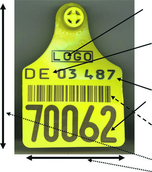
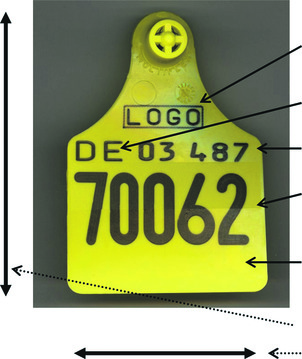
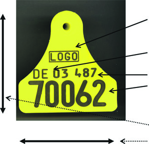
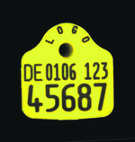
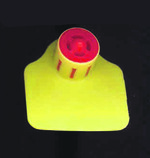
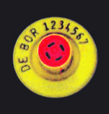
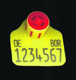
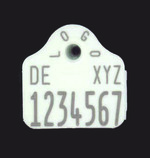

# Verordnung zum Schutz gegen die Verschleppung von Tierseuchen im Viehverkehr (ViehVerkV 2007)

Ausfertigungsdatum
:   2007-07-06

Fundstelle
:   BGBl I: 2007, 1274 (1967)

Neugefasst durch
:   Bek. v. 26.5.2020 I 1170

Diese Verordnung dient der Umsetzung folgender Richtlinien:

1.  Richtlinie 90/426/EWG des Rates vom 26. Juni 1990 zur Festlegung der
    tierseuchenrechtlichen Vorschriften für das Verbringen von Equiden und
    für ihre Einfuhr aus Drittländern (ABl. L 224 vom 18.8.1990, S. 42, L
    296 vom 27.10.1990, S. 66), die zuletzt durch die Richtlinie
    2004/68/EG (ABl. L 139 vom 30.4.2004, S. 321, L 226 vom 25.6.2004, S.
    128) geändert worden ist,

2.  Richtlinie 90/427/EWG des Rates vom 26. Juni 1990 zur Festlegung der
    tierzüchterischen und genealogischen Vorschriften für den
    innergemeinschaftlichen Handel mit Equiden (ABl. L 224 vom 18.8.1990,
    S. 55),

3.  Richtlinie 92/102/EWG des Rates vom 27. November 1992 über die
    Kennzeichnung und Registrierung von Tieren (ABl. L 355 vom 5.12.1992,
    S. 32), die zuletzt durch die Verordnung (EG) Nr. 21/2004 (ABl. L 5
    vom 9.1.2004, S. 8) geändert worden ist,

4.  Richtlinie 2000/15/EG des Europäischen Parlaments und des Rates vom
    10\. April 2000 zur Änderung der Richtlinie 64/432/EWG des Rates zur
    Regelung viehseuchenrechtlicher Fragen beim innergemeinschaftlichen
    Handelsverkehr mit Rindern und Schweinen (ABl. L 105 vom 3.5.2000, S.
    34).

## Abschnitt 1 - Viehtransportfahrzeuge, Viehladestellen

### § 1 Viehtransportfahrzeuge

(1) Fahrzeuge und Anhänger, die zur Beförderung lebenden Viehs benutzt
werden (Viehtransportfahrzeuge), sowie für eine solche Beförderung
benutzte Behältnisse müssen

1.  so beschaffen sein, dass tierische Abgänge, Einstreu oder Futter
    während des Transportes nicht heraussickern oder herausfallen können,
    und

2.  leicht zu reinigen und zu desinfizieren sein.

Dies gilt nicht für nichtgewerbliche bestandseigene
Viehtransportfahrzeuge, mit denen nur Vieh zwischen dem eigenen
Bestand und einer Weidefläche transportiert wird. Satz 1 gilt
entsprechend für Eisenbahnwagen sowie Räume und Teile von Räumen in
Eisenbahnwagen, Flugzeugen und Schiffen, die zur Beförderung lebenden
Viehs benutzt werden.

(2) Für die Einhaltung der Anforderungen nach Absatz 1 Satz 1 und 3
haben zu sorgen:

1.  bei Viehtransportfahrzeugen der Halter,

2.  bei Behältnissen der Benutzer,

3.  bei Beförderungsmitteln nach Absatz 1 Satz 3 der
    Verfügungsberechtigte.

### § 2 Viehladestellen

(1) Wer eine Einrichtung betreiben will, in der wiederkehrend Vieh
verschiedener Besitzer verladen, entladen, umgeladen oder verwogen
wird, ausgenommen Grenzkontrollstellen (Viehladestelle), hat dies der
zuständigen Behörde vor Beginn der Tätigkeit unter Angabe seines
Namens und seiner Anschrift sowie des Ortes der Viehladestelle
anzuzeigen. Änderungen sind unverzüglich anzuzeigen.

(2) Viehladestellen müssen folgende Anforderungen erfüllen:

1.  Die Wege und Straßen sowie die Plätze zum Verladen, Entladen, Umladen
    oder Verwiegen von Vieh müssen befestigt, leicht zu reinigen und
    desinfizierbar sein.

2.  Der Boden der Plätze nach Nummer 1 muss flüssigkeitsundurchlässig sein
    und Gefälle zu einem Abfluss haben, der an die Kanalisation oder eine
    sonstige Einrichtung zur Beseitigung von Abwasser angeschlossen sein
    muss.

3.  Eine ausreichende Einrichtung zum Sammeln anfallenden Dungs und
    Streumaterials (Dunglagerstätte) muss vorhanden sein, in der der Dung
    und das Streumaterial so behandelt werden können, dass
    Tierseuchenerreger abgetötet werden.

4.  Der Boden und die Wände der Dunglagerstätte müssen
    flüssigkeitsundurchlässig sein.

5.  Die Laderampen und sonstigen Einrichtungen zum Verladen, Entladen oder
    Umladen von Vieh müssen leicht gereinigt und desinfiziert werden
    können.

6.  Unter Druck stehendes Wasser sowie Einrichtungen für eine schnelle und
    sichere Reinigung und Desinfektion der Plätze nach Nummer 1, der
    Dunglagerstätte nach Nummer 3 und der Laderampen und Einrichtungen
    nach Nummer 5 müssen zur Verfügung stehen.

7.  Eine ausreichende Beleuchtung muss vorhanden sein.

8.  Eine Einrichtung zur Reinigung und Desinfektion der Hände und des
    Schuhwerks muss vorhanden sein.

(3) Der Betreiber einer Viehladestelle hat sicherzustellen, dass kein
Vieh verladen, entladen, umgeladen oder verwogen wird, das sichtbare
Anzeichen einer übertragbaren Krankheit aufweist. Satz 1 gilt nicht,
soweit die Tiere mit Genehmigung der zuständigen Behörde unmittelbar
zur Tötung und unschädlichen Beseitigung verbracht werden.

(4) Die zuständige Behörde kann Ausnahmen genehmigen, soweit Belange
der Tierseuchenbekämpfung nicht entgegenstehen,

1.  von Absatz 2 Nummer 2, 3, 4 und 6 für Viehladestellen mit geringem
    Viehverkehr und

2.  von Absatz 2 für Viehladestellen, an denen nur von einem
    Transportmittel zum anderen umgeladen wird.

(5) Die zuständige Behörde kann für Viehladestellen mit regelmäßig
großem Viehverkehr anordnen, dass

1.  eingefriedete Plätze mit flüssigkeitsundurchlässigem Boden zum
    vorübergehenden Einstellen von Vieh,

2.  Möglichkeiten zur getrennten Unterbringung von Tieren verschiedener
    Gattungen und Größen und

3.  ausreichende Anbindevorrichtungen

geschaffen werden.

## Abschnitt 2 - Viehausstellungen, Viehmärkte, Schlachtstätten

### § 3 Viehausstellungen, Viehmärkte

(1) Orte, an denen Viehausstellungen oder Viehmärkte abgehalten oder
eingerichtet werden, müssen folgende Anforderungen erfüllen:

1.  Sie müssen so eingefriedet sein, dass die zugeführten Tiere nur durch
    überwachbare Ein- und Ausgänge verbracht werden können.

2.  Die Wege und Straßen sowie die Plätze zum Be- oder Entladen von
    Viehtransportfahrzeugen müssen befestigt, leicht zu reinigen und
    desinfizierbar sein.

3.  Für die Reinigung und Desinfektion von Fahrzeugen muss ein besonderer
    Platz mit flüssigkeitsundurchlässigem Boden und unter Druck stehendem
    Wasser vorhanden sein.

4.  Der Boden des Platzes nach Nummer 3 muss Gefälle zu einem Abfluss
    haben, der an die Kanalisation oder eine sonstige Einrichtung zur
    Beseitigung von Abwasser angeschlossen ist.

5.  Räume für die vorübergehende Unterkunft von Vieh müssen einen
    flüssigkeitsundurchlässigen Boden und glatte, leicht zu reinigende und
    desinfizierbare Wände haben.

6.  Unterkunftsräume für Vieh müssen ausreichend beleuchtbar sein.

7.  Soweit erforderlich, müssen die Räume in Buchten unterteilt sein und
    Anbindevorrichtungen haben.

8.  Eine besondere Räumlichkeit zur Absonderung seuchenkranker oder
    verdächtiger Tiere muss vorhanden sein.

9.  Für beim Auftrieb tätige Personen müssen Einrichtungen zur Reinigung
    und Desinfektion der Hände und des Schuhwerks vorhanden sein.

10. Eine geeignete Einrichtung zum Aufbewahren von tierischen
    Nebenprodukten muss vorhanden sein.

(2) Für Viehausstellungen, für Viehmärkte geringen Umfangs und für
Jahr- und Wochenmärkte, die nach § 25 Absatz 2 des
Tiergesundheitsgesetzes von der amtstierärztlichen Beaufsichtigung
befreit sind, kann die zuständige Behörde Ausnahmen von Absatz 1
Nummer 1 bis 7 genehmigen, soweit Belange der Tierseuchenbekämpfung
nicht entgegenstehen.

(3) Die zuständige Behörde kann für Viehmärkte anordnen, dass diese

1.  durch eine feste Einfriedung abgeschlossen werden,

2.  insgesamt mit befestigtem, leicht zu reinigendem und desinfizierbarem
    Boden versehen werden,

3.  Gefälle zu einem Abfluss erhalten, der an die Kanalisation oder eine
    sonstige Einrichtung zur Beseitigung von Abwasser angeschlossen ist.

### § 4 Anzeige, Beschränkung und Verbot

(1) Folgende Veranstaltungen sind der zuständigen Behörde vom
Veranstalter mindestens vier Wochen vor der jeweiligen Veranstaltung
anzuzeigen:

1.  Viehausstellungen,

2.  Viehmärkte,

3.  Viehschauen,

4.  Wettbewerbe mit Vieh und

5.  Veranstaltungen ähnlicher Art.

Die Anzeige hat schriftlich oder elektronisch zu erfolgen; dabei ist
die Art der Veranstaltung anzugeben.

(2) Die zuständige Behörde kann Veranstaltungen nach Absatz 1
beschränken oder verbieten, soweit dies aus Gründen der
Tierseuchenbekämpfung erforderlich ist.

### § 5 Auftrieb

Auf Viehausstellungen, Viehmärkten oder Veranstaltungen ähnlicher Art
dürfen Tiere, für die eine Kennzeichnung nach dieser Verordnung oder
nach unmittelbar geltenden Rechtsakten der Europäischen Gemeinschaft
oder der Europäischen Union vorgeschrieben ist, nur aufgetrieben
werden, soweit die Tiere mit der vorgeschriebenen Kennzeichnung
dauerhaft gekennzeichnet sind. Die Auftriebszeit muss, soweit nicht
für eine ausreichende künstliche Beleuchtung gesorgt ist, so
festgesetzt sein, dass der Auftrieb nicht vor Sonnenaufgang beginnt
und nicht nach Sonnenuntergang endet. Die zuständige Behörde kann den
Auftrieb auf bestimmte Stunden beschränken.

### § 6 Amtstierärztliche Untersuchung

(1) Die Tiere sind beim Auftrieb auf Viehmärkte amtstierärztlich zu
untersuchen. Die zuständige Behörde kann Ausnahmen genehmigen, soweit
Belange der Tierseuchenbekämpfung nicht entgegenstehen. Soweit es aus
Gründen der Tierseuchenbekämpfung erforderlich ist, kann sie weitere
amtstierärztliche Untersuchungen der Tiere anordnen.

(2) Die zuständige Behörde kann beim Auftrieb von Vieh auf
Viehausstellungen eine amtstierärztliche Untersuchung anordnen, soweit
dies aus Gründen der Tierseuchenbekämpfung erforderlich ist. In Zeiten
erhöhter Seuchengefahr kann sie ferner eine amtstierärztliche
Untersuchung der Tiere beim Auftrieb auf Schlachtstätten anordnen.

### § 7 Abtrieb von Schlachtviehmärkten und Schlachtstätten

Der Abtrieb des Viehs von einem Schlachtviehmarkt oder einer
Schlachtstätte bedarf der Genehmigung der zuständigen Behörde. Die
Genehmigung darf nur erteilt werden

1.  für fehlgeleitete oder tragende Tiere, soweit sichergestellt ist, dass
    die Tiere im Bereich der zuständigen Behörde verbleiben oder die für
    den Bestimmungsort zuständige Behörde zugestimmt hat,

2.  für Tiere, die von einem Schlachtviehmarkt abgetrieben und in einen
    Mastbetrieb verbracht werden sollen, soweit sichergestellt ist, dass
    sie bis zum Verbringen zur Schlachtung dort verbleiben,

und Belange der Tierseuchenbekämpfung nicht entgegenstehen. Satz 1
gilt nicht für Tiere, die unmittelbar auf einen anderen
Schlachtviehmarkt oder in eine Schlachtstätte verbracht werden.

## Abschnitt 3 - Gastställe

### § 8 Gastställe

Gastställe müssen folgende Anforderungen erfüllen:

1.  Die Ställe müssen einen flüssigkeitsundurchlässigen Boden und glatte
    Wände haben.

2.  Die Ställe müssen ausreichend beleuchtbar sein.

3.  Die Stalleinrichtung, insbesondere Zwischenwände, Krippen, Tränken und
    Vorratsbehälter, muss aus leicht zu reinigendem und zu
    desinfizierendem Material sein.

## Abschnitt 4 - Viehkastrierer

### § 9 Viehkastrierer

Personen, die gewerbsmäßig Vieh kastrieren, ohne Tierarzt zu sein,
dürfen Tiere nicht kastrieren, die an einer anzeigepflichtigen
Tierseuche leiden oder bei denen der Verdacht auf eine solche
Tierseuche vorliegt.

## Abschnitt 5 - Wanderschafherden

### § 10 Wanderschafherden

(1) Wer Wanderschafherden über das Gebiet mehrerer Kreise oder
kreisfreier Städte treiben will, bedarf, vorbehaltlich des Satzes 2,
der Genehmigung der zuständigen Behörde. Wer Wanderschafherden nur im
Gebiet eines Kreises oder einer kreisfreien Stadt sowie in an diese
Gebiete angrenzende Gemeindegebiete treiben will, hat dies der
zuständigen Behörde jährlich, spätestens vor Beginn der Weidesaison,
anzuzeigen.

(2) Die Genehmigung nach Absatz 1 Satz 1 ist von dem Halter der Herde
unter Angabe der Anzahl der Tiere und des Treibweges zu beantragen.
Sie ist zu erteilen, soweit

1.  durch amtstierärztliches Zeugnis nachgewiesen ist, dass die Herde frei
    von äußeren Erscheinungen ist, die auf eine Tierseuche schließen
    lassen, und

2.  sonstige Belange der Tierseuchenbekämpfung nicht entgegenstehen.

Die Genehmigung kann insbesondere auf bestimmte Wege oder Flächen
beschränkt und mit der Auflage verbunden werden, dass während der
Wanderung weitere Nachweise über den Gesundheitszustand der Schafe zu
erbringen sind.

(3) In den Fällen des Absatzes 1 Satz 1 hat der Halter der Herde über
die Zu- und Abgänge Aufzeichnungen zu machen. Er hat diese
Aufzeichnungen und die Genehmigung nach Absatz 1 Satz 1 während der
Wanderung mitzuführen und der zuständigen Behörde auf Verlangen
vorzulegen.

## Abschnitt 6 - Viehhandelsunternehmen, Transportunternehmen, Sammelstellen

### § 11 Anzeige

Wer gewerbsmäßig mit Vieh handeln oder gewerbsmäßig oder im Rahmen der
arbeitsteiligen Tierproduktion Vieh transportieren oder eine
Sammelstelle betreiben will, hat dies der zuständigen Behörde vor
Beginn der Tätigkeit unter Angabe seines Namens und seiner Anschrift
sowie, im Falle des Betreibens einer Sammelstelle, den Ort der
Sammelstelle, anzuzeigen. Änderungen sind unverzüglich anzuzeigen.

### § 12 Viehhandelsunternehmen

(1) Ein Betrieb, der darauf gerichtet ist, Rinder, Schweine, Schafe,
Ziegen, Pferde oder Geflügel gewerbsmäßig unmittelbar oder über Dritte
zu kaufen und innerhalb von 30 Tagen nach dem Kauf wieder zu verkaufen
oder in einen anderen Betrieb oder eine andere Einrichtung umzusetzen
(Viehhandelsunternehmen), bedarf der Zulassung durch die zuständige
Behörde. Eine Zulassung ist nicht erforderlich, wenn die in Satz 1
bezeichneten Tiere lediglich zwischen Käufer und Verkäufer vermittelt
werden.

(2) Ein Viehhandelsunternehmen wird auf Antrag des Unternehmers von
der zuständigen Behörde zugelassen, soweit

1.  die Anforderungen nach Anlage 1 erfüllt sind und

2.  sichergestellt ist, dass die Bestimmungen nach Anlage 2 eingehalten
    werden.

Die Zulassung ist auf die im Antrag genannte Betriebsstätte zu
begrenzen. Sie kann auf den Handel mit Tieren derselben Art oder
bestimmter Arten beschränkt werden.

### § 13 Transportunternehmen

(1) Ein Betrieb, der darauf gerichtet ist, Rinder, Schweine, Schafe,
Ziegen, Pferde oder Geflügel gewerbsmäßig oder im Rahmen der
arbeitsteiligen Tierproduktion zu transportieren oder Dritten für
gewerbsmäßige Transporte dieser Tiere Transportmittel zur Verfügung zu
stellen (Transportunternehmen), bedarf der Zulassung durch die
zuständige Behörde.

(2) Ein Transportunternehmen wird auf Antrag des Unternehmers von der
zuständigen Behörde zugelassen, soweit

1.  die Anforderungen nach Anlage 1 Nummer 1 Satz 4 und 5 und Nummer 3 bis
    5 Buchstabe a erfüllt sind und

2.  sichergestellt ist, dass die Bestimmungen nach Anlage 2 Nummer 3 bis 5
    eingehalten werden.

Die Zulassung kann auf den Transport von Tieren derselben Art oder
bestimmter Arten beschränkt werden.

### § 14 Sammelstellen

(1) Eine Einrichtung, in der Rinder, Schweine, Schafe, Ziegen, Pferde
oder Geflügel aus verschiedenen Betrieben für den Handel
zusammengeführt werden (Sammelstelle), bedarf der Zulassung durch die
zuständige Behörde. Satz 1 gilt nicht für Viehausstellungen,
Viehmärkte, die Betriebsstätten eines Viehhandelsunternehmens und
Schlachtstätten.

(2) Eine Sammelstelle wird auf Antrag des Betreibers von der
zuständigen Behörde zugelassen, soweit

1.  die Anforderungen nach Anlage 1 erfüllt sind,

2.  sichergestellt ist, dass die Bestimmungen nach Anlage 2 Nummer 1 und
    Nummer 3 bis 5 eingehalten werden, und

3.  die Sammelstelle gleichzeitig nur für Zucht- und Nutztiere oder nur
    für Schlachttiere betrieben wird.

Die Zulassung kann auf die Zusammenführung von Tieren derselben Art
oder bestimmter Arten beschränkt werden.

### § 15 Registrierung und Bekanntmachung der Zulassung, Anerkennung von Zulassungen

(1) Die zuständige Behörde erfasst die nach den §§ 12 bis 14
zugelassenen Viehhandelsunternehmen, Transportunternehmen und
Sammelstellen jeweils unter Erteilung einer zwölfstelligen
Registriernummer in einem Register. Die Registriernummer wird aus der
für die Gemeinde des Betriebes vorgesehenen amtlichen Schlüsselnummer
des vom Statistischen Bundesamt herausgegebenen
Gemeindeschlüsselverzeichnisses sowie einer vierstelligen
Betriebsnummer gebildet.

(2) Ein nach § 15 der Binnenmarkt-Tierseuchenschutzverordnung
zugelassener Betrieb oder eine nach Artikel 4 Absatz 1 der Verordnung
(EG) Nr. 853/2004 des Europäischen Parlaments und des Rates vom 29.
April 2004 mit spezifischen Hygienevorschriften für Lebensmittel
tierischen Ursprungs (ABl. L 139 vom 30.4.2004, S. 55, L 226 vom
25\.6.2004, S. 22) in der jeweils geltenden Fassung zugelassene
Schlachtstätte gilt als nach dieser Verordnung zugelassen.

(3) Die zuständige Behörde teilt dem Bundesministerium für Ernährung
und Landwirtschaft die Zulassung von Viehhandelsunternehmen,
Transportunternehmen und Sammelstellen unter Angabe der erteilten
Registriernummer sowie die Rücknahme, den Widerruf oder das Ruhen der
Zulassung mit.

(4) Das Bundesministerium für Ernährung und Landwirtschaft gibt die
Zulassung der Viehhandelsunternehmen, Transportunternehmen und
Sammelstellen unter Angabe der jeweils erteilten Registriernummer
sowie die Rücknahme, den Widerruf oder das Ruhen der Zulassung im
Bundesanzeiger bekannt.

### § 16 Ruhen der Zulassung

Stellt die zuständige Behörde bei einem zugelassenen
Viehhandelsunternehmen, Transportunternehmen oder einer zugelassenen
Sammelstelle fest, dass die Voraussetzungen für die Zulassung nicht
mehr erfüllt sind, so ordnet sie bis zur Behebung der festgestellten
Mängel für einen bestimmten Zeitraum das Ruhen der Zulassung an. Im
Falle eines Betriebes oder einer Schlachtstätte bestimmt sich das
Ruhen der Zulassung nach den in § 15 Absatz 2 genannten Vorschriften.

## Abschnitt 7 - Reinigung und Desinfektion

### § 17 Transportmittel

(1) Viehtransportfahrzeuge sowie alle bei der Beförderung lebenden
Viehs benutzten Behältnisse und Gerätschaften sind nach jedem
Transport, spätestens jedoch nach Ablauf von 29 Stunden seit Beginn
des Transportes, zu reinigen und zu desinfizieren. Dies gilt nicht für
nichtgewerblich genutzte bestandseigene Viehtransportfahrzeuge, mit
denen nur Vieh aus dem eigenen Bestand transportiert wird. Satz 1 gilt
entsprechend für

1.  Eisenbahnwagen sowie Räume und Teile von Räumen in Eisenbahnwagen und
    Schiffen und

2.  die bei der Beförderung lebenden Viehs in den in Nummer 1 genannten
    Transportmitteln oder Teilen von ihnen oder in Flugzeugen benutzten
    Behältnissen und Gerätschaften.

Abweichend von Satz 1 kann die Reinigung und Desinfektion nach
Abschluss mehrerer Transporte lebenden Viehs von demselben
Herkunftsbetrieb in denselben Bestimmungsbetrieb durchgeführt werden,
spätestens jedoch nach Ablauf von 29 Stunden.

(2) Viehtransportfahrzeuge, mit denen Vieh zu Viehladestellen,
Sammelstellen oder Schlachtstätten verbracht worden ist, müssen, bevor
sie diese verlassen, gereinigt und desinfiziert werden. Die zuständige
Behörde kann im Falle des Verbringens in eine Schlachtstätte Ausnahmen
genehmigen, soweit die Reinigung und Desinfektion der
Viehtransportfahrzeuge unverzüglich nach dem Verlassen der
Viehladestelle, der Viehsammelstelle oder der Schlachtstätte an einem
anderen geeigneten Ort vorgenommen wird und Belange der
Tierseuchenbekämpfung nicht entgegenstehen.

(3) Die zuständige Behörde kann in Zeiten erhöhter Tierseuchengefahr
anordnen, dass

1.  die nach § 13 in Verbindung mit Anlage 1 Nummer 4 Buchstabe a
    vorgeschriebenen Einrichtungen mit einem geeigneten
    Desinfektionsmittel versehen werden,

2.  Viehtransportfahrzeuge, mit denen Vieh zu Viehausstellungen oder
    Viehmärkten verbracht worden ist, zu reinigen und zu desinfizieren
    sind, bevor sie diese verlassen,

3.  Viehtransportfahrzeuge nach Absatz 1 Satz 2 nach jedem Transport zu
    reinigen und zu desinfizieren sind.

(4) Für die Reinigung und Desinfektion sind verantwortlich:

1.  bei Viehtransportfahrzeugen der Fahrer,

2.  bei Behältnissen und Gerätschaften der Benutzer,

3.  bei Beförderungsmitteln nach Absatz 1 Satz 3 der
    Verfügungsberechtigte.

### § 18 Flächen, Räume und Gerätschaften

(1) Viehladestellen, Laderampen, Räume für die vorübergehende
Unterkunft und die Vermarktung von Rindern, Schweinen, Schafen,
Ziegen, Pferden oder Geflügel, Zu- und Abtriebswege, Plätze zum Be-
und Entladen auf Viehmärkten, auf Sammelstellen, in Schlachtstätten
und bei Viehhandelsunternehmen sowie die dort benutzten Gerätschaften
sind vom jeweiligen Betreiber der Einrichtung oder vom jeweiligen
Veranstalter nach jeder zusammenhängenden Benutzung zu reinigen und zu
desinfizieren oder reinigen und desinfizieren zu lassen. Gastställe
und die Betriebsstätten von Viehhandelsunternehmen sind vom Betreiber
nach jeder Räumung oder bei ständiger Belegung in regelmäßigen
Abständen von höchstens einer Woche zu reinigen und zu desinfizieren
oder reinigen und desinfizieren zu lassen.

(2) Für Viehladestellen kann die zuständige Behörde Ausnahmen unter
den Voraussetzungen des § 2 Absatz 4 genehmigen.

(3) Die zuständige Behörde kann anordnen,

1.  dass die in Absatz 1 genannten Wege, Plätze, Räume und Gerätschaften
    in kürzeren Zeitabständen als dort vorgeschrieben gereinigt und
    desinfiziert werden müssen,

2.  dass bei Viehhandelsunternehmen, Transportunternehmen, Sammelstellen
    oder in Schlachtstätten eine häufigere Reinigung und Desinfektion
    durchgeführt werden muss, als im Reinigungs- und Desinfektionsplan
    vorgesehen ist,

3.  welche Art des Desinfektionsmittels zu verwenden ist,

soweit dies zur Tierseuchenbekämpfung erforderlich ist.

### § 19 Dung, Streumaterial und Futterreste

Der für die Reinigung und Desinfektion nach den §§ 17 und 18 jeweils
Verantwortliche hat anfallenden Dung, anfallendes Streumaterial und
anfallende Futterreste unschädlich zu beseitigen oder beseitigen zu
lassen oder so zu behandeln oder so behandeln zu lassen, dass
Tierseuchenerreger abgetötet werden.

## Abschnitt 8 - Zeugnisse, Kontrollbücher

### § 20 Ursprungszeugnisse, Gesundheitszeugnisse

Auf Anordnung der zuständigen Behörde beizubringende
Ursprungszeugnisse gelten 30 Tage, Gesundheitszeugnisse, soweit in der
Anordnung keine kürzere Frist bestimmt ist, zehn Tage jeweils vom Tag
ihrer Ausstellung an. Die Gesundheitszeugnisse müssen von der
zuständigen Behörde oder einem von ihr beauftragten Tierarzt
ausgestellt sein.

### § 21 Viehhandels- und Transportkontrollbücher

(1) Ein Viehhandelskontrollbuch über die im Besitz befindlichen und
die gehandelten, transportierten oder vermittelten Rinder, Schweine,
Schafe, Ziegen oder Pferde sowie über das im Besitz befindliche und
das gehandelte, transportierte oder vermittelte Geflügel hat nach
Maßgabe der Sätze 2 und 3 zu führen, wer

1.  gewerbsmäßig Rinder, Schweine, Schafe, Ziegen, Pferde oder Geflügel
    handelt, transportiert oder vermittelt oder eine Sammelstelle
    betreibt,

2.  eine Genossenschaft und Erzeugergemeinschaft, die Rinder, Schweine,
    Schafe, Ziegen, Pferde oder Geflügel übernimmt oder abgibt, sowie für
    Brütereien, die Küken, auch aus Bruteiern anderer Betriebe, erbrütet
    und abgibt.

Das Viehhandelskontrollbuch muss folgende Angaben enthalten:

1.  Ort und Tag der Übernahme sowie Name und Anschrift des bisherigen
    Besitzers,

2.  Tag der Abgabe sowie Name und Anschrift des Übernehmers,

3.  die Registriernummer des Transportunternehmens, das die Tiere zu oder
    von einer Sammelstelle oder einem Viehhandelsunternehmen
    transportiert, sowie das Kraftfahrzeugkennzeichen des
    Viehtransportfahrzeuges,

4.  folgende Beschreibung der Tiere:

    a)  bei Rindern die Ohrmarkennummer,

    b)  bei Schweinen Stückzahl, ungefähres Alter und Kennzeichnung,

    c)  bei Schafen und Ziegen

        aa) für vor dem 10. Juli 2005 geborene Tiere Stückzahl und Kennzeichnung,

        bb) für nach dem 9. Juli 2005 geborene Tiere Stückzahl und Kennzeichnung
            nach § 34 Absatz 3,

    d)  bei Pferden Geschlecht, Farbe, ungefähres Alter, Abzeichen und
        Markierungen,

    e)  bei Geflügel Stückzahl, Rasse und ungefähres Alter.

Nach anderen Vorschriften erforderliche Bescheinigungen über die
Tiergesundheit sind im Viehhandelskontrollbuch zu vermerken und diesem
beizufügen. Ohne Genehmigung der zuständigen Behörde darf das
Viehhandelskontrollbuch aus dem Betrieb nicht entfernt werden.

(2) Während des Transportes ist ein Transportkontrollbuch mitzuführen,
das die nach Absatz 1 erforderlichen Angaben über die jeweils
transportierten Tiere sowie Abfahrtszeit und Fahrtziel, zusammen mit
nach anderen Vorschriften erforderlichen Bescheinigungen über die
Tiergesundheit, enthält. Die Eintragungen sind abweichend von § 25
Absatz 2 vor Beginn des Transportes vorzunehmen. Satz 1 gilt nicht für
Transporte, auf denen Vieh aus dem eigenen Bestand mit bestandseigenen
Viehtransportfahrzeugen zu einer Schlachtstätte transportiert wird.

### § 22 Desinfektionskontrollbuch

(1) Der Fahrer eines Viehtransportfahrzeuges, für das nach § 17 Absatz
1 bis 3 eine Reinigung und Desinfektion vorgeschrieben ist, hat für
jedes Fahrzeug gesondert ein Desinfektionskontrollbuch mitzuführen,
das folgende Angaben enthält:

1.  Tag des Transportes,

2.  Art der beförderten Tiere,

3.  Ort und Tag der Reinigung und Desinfektion des Fahrzeuges,

4.  Handelsname des verwendeten Desinfektionsmittels.

(2) Der Viehhandelsunternehmer, der Transportunternehmer und der
Betreiber einer Sammelstelle oder einer Schlachtstätte haben über Art
und Verbrauch des verwendeten Desinfektionsmittels Aufzeichnungen zu
machen.

### § 23 Kastrations- und Klauenpflegekontrollbuch

Personen, die gewerbsmäßig Vieh kastrieren, ohne Tierarzt zu sein,
haben ein Kastrationskontrollbuch zu führen, aus dem hervorgeht, wann
und an welchen Orten und in welchen Betrieben sie Kastrationen
vorgenommen haben. Für Personen, die gewerbsmäßig Klauenpflege
betreiben, ohne Tierarzt zu sein, gilt Satz 1 mit der Maßgabe
entsprechend, dass sie ein Klauenpflegekontrollbuch zu führen haben.

### § 24 Deckregister

Tierhalter, die einen Hengst, einen Bullen, einen Eber oder einen Bock
zum Decken fremder Tiere verwenden, haben ein Deckregister zu führen,
das folgende Angaben enthalten muss:

1.  Name und Anschrift des Vatertierhalters,

2.  Art, Rasse, Alter, Ohrmarkennummer oder anderes Kennzeichen und
    gegebenenfalls Zuchtnummer des Vatertieres,

3.  Name und Anschrift des Halters des gedeckten Tieres,

4.  Rasse, Alter, Ohrmarkennummer oder anderes Kennzeichen des gedeckten
    Tieres,

5.  Tag des Deckaktes.

### § 25 Form, Aufbewahrung und Vorlage der Kontrollbücher und des Deckregisters

(1) Die Kontrollbücher und das Deckregister müssen gebunden,
chronologisch aufgebaut und mit fortlaufenden Seitenzahlen versehen
sein. Die Kontrollbücher und das Deckregister dürfen statt in
gebundener Form auch

1.  als Loseblattsystem oder

2.  in elektronischer Form

geführt werden. Das Transportkontrollbuch und das
Desinfektionskontrollbuch können zusammen als ein Buch geführt werden.
Das Viehhandelskontrollbuch, das Transportkontrollbuch und das
Desinfektionskontrollbuch müssen dem Muster der Anlage 3 entsprechen.

(2) Die Eintragungen sind unverzüglich nach Ausführung der
aufzeichnungspflichtigen Tätigkeit in dauerhafter Weise vorzunehmen.

(3) Die Kontrollbücher und das Deckregister sind von denjenigen
Personen, die das jeweilige Kontrollbuch oder das Deckregister zu
führen haben, für die Zeit ihrer Verwendung und im Anschluss daran
drei Jahre lang aufzubewahren. Die Frist beginnt mit dem Ablauf des
31\. Dezember desjenigen Jahres, in dem die letzte Eintragung gemacht
worden ist. Ergänzend zu § 24 Absatz 4, 5 und 9 des
Tiergesundheitsgesetzes hat im Falle eines elektronisch geführten
Kontrollbuches oder Deckregisters der Aufzeichnungspflichtige der
zuständigen Behörde einen Ausdruck auf seine Kosten vorzulegen.

## Abschnitt 9 - Tierhaltung

### § 26 Anzeige und Registrierung

(1) Wer Rinder, Schweine, Schafe, Ziegen, Einhufer, Hühner, Enten,
Gänse, Fasane, Perlhühner, Rebhühner, Tauben, Truthühner, Wachteln
oder Laufvögel halten will, hat dies der zuständigen Behörde oder
einer von dieser beauftragten Stelle vor Beginn der Tätigkeit unter
Angabe seines Namens, seiner Anschrift und der Anzahl der im
Jahresdurchschnitt voraussichtlich gehaltenen Tiere, ihrer Nutzungsart
und ihres Standortes, bezogen auf die jeweilige Tierart, anzuzeigen.
Änderungen sind unverzüglich anzuzeigen. Im Falle einer
Wanderschafherde gilt der Betriebssitz als Standort im Sinne des
Satzes 1.

(2) Die zuständige Behörde oder eine von dieser beauftragten Stelle
erfasst die

1.  nach Absatz 1 angezeigten Haltungen oder Betriebe sowie

2.  die nach Artikel 4 Absatz 3 der Verordnung (EG) Nr. 1739/2005 der
    Kommission vom 21. Oktober 2005 zur Festlegung der
    Veterinärbedingungen für die Verbringung von Zirkustieren zwischen
    Mitgliedstaaten (ABl. L 279 vom 22.10.2005, S. 47) zu registrierenden
    Zirkusse

unter Erteilung einer Registriernummer in einem Register. Die
Registriernummer ist zwölfstellig und wird aus der für die
Sitzgemeinde der Haltung, des Betriebes oder des Zirkus vorgesehenen
amtlichen Schlüsselnummer des vom Statistischen Bundesamt
herausgegebenen Gemeindeschlüsselverzeichnisses sowie einer
vierstelligen Nummer für die Haltung, den Betrieb oder den Zirkus
gebildet.

(3) Der Tierhalter hat der zuständigen Behörde oder einer von dieser
beauftragten Stelle bis zum 15. Januar eines jeden Jahres die Anzahl
der jeweils am 1. Januar (Stichtag) im Bestand vorhandenen

1.  Schweine, getrennt nach Zuchtsauen, sonstigen Zucht- und Mastschweinen
    über 30 Kilogramm sowie Ferkeln bis einschließlich 30 Kilogramm und

2.  Schafe und Ziegen, getrennt nach den Altersgruppen bis einschließlich
    neun Monate, zehn bis einschließlich 18 Monate und ab 19 Monaten,

anzuzeigen. Die zuständige Behörde kann von der Anzeigepflicht
befreien, soweit der Tierhalter die nach Satz 1 erforderlichen Angaben
bereits einer Behörde, auch zu einem anderen Datum oder einem anderen
Stichtag, mitgeteilt hat und die zuständige Behörde berechtigt ist,
diese Angaben zum Zwecke der Erfüllung der Anzeigepflicht zu
verwenden.

## Abschnitt 10 - Kennzeichnung und Registrierung von Rindern nach der Verordnung (EG) Nr. 1760/2000

### § 27 Kennzeichnung

(1) Die Kennzeichnung nach Artikel 4 der Verordnung (EG) Nr. 1760/2000
des Europäischen Parlaments und des Rates vom 17. Juli 2000 zur
Einführung eines Systems zur Kennzeichnung und Registrierung von
Rindern und über die Etikettierung von Rindfleisch und
Rindfleischerzeugnissen sowie zur Aufhebung der Verordnung (EG) Nr.
820/97 des Rates (ABl. L 204 vom 11.8.2000, S. 1) in der jeweils
geltenden Fassung ist, soweit diese Vorschrift keinen früheren
Zeitpunkt bestimmt,

1.  bei Rindern, die im Inland geboren sind, durch den Tierhalter
    innerhalb von sieben Tagen nach der Geburt,

2.  bei Rindern, die aus einem Drittland eingeführt worden sind, durch den
    Tierhalter des Bestimmungsbetriebes innerhalb von sieben Tagen nach
    dem Einstellen in den Betrieb

durchzuführen oder durchführen zu lassen. Abweichend von Satz 1 Nummer
1 hat der Tierhalter die Kennzeichnung von Bisons (Bison bison spp.),
vorbehaltlich des Artikels 2 Absatz 3 der Verordnung (EG) Nr. 509/1999
der Kommission vom 8. März 1999 zur Verlängerung der Höchstfrist für
die Anbringung von Ohrmarken bei Bisons (Bison bison spp.) (ABl. L 60
vom 9.3.1999, S. 53), innerhalb von neun Monaten durchzuführen oder
durchführen zu lassen.

(2) Die Ohrmarken werden dem Tierhalter von der zuständigen Behörde
oder einer von dieser beauftragten Stelle auf Antrag und unter
angemessener Berücksichtigung des voraussichtlichen jährlichen Bedarfs
zugeteilt.

(3) Soweit sich aus der Verordnung (EG) Nr. 1760/2000 und den zu ihrer
Durchführung erlassenen unmittelbar geltenden Rechtsakten der
Europäischen Gemeinschaft oder der Europäischen Union nichts anderes
ergibt, müssen die Ohrmarken dem Muster der Anlage 4 entsprechen und
die Ohrmarkennummer in schwarzer Schrift auf gelbem Grund enthalten.
Das Vorderteil einer Ohrmarke ist mit einem nach Anlage 5 gebildeten
Strichcode zu versehen. Die zuständige Behörde kann für Rinder
kleinwüchsiger Rassen und entsprechende Kreuzungstiere Ausnahmen von
den sich aus Anlage 4 ergebenden Mindestmaßen der Ohrmarken
genehmigen, soweit die nach Artikel 3 der Verordnung (EG) Nr. 911/2004
der Kommission vom 29. April 2004 zur Umsetzung der Verordnung (EG)
Nr. 1760/2000 des Europäischen Parlaments und des Rates in Bezug auf
Ohrmarken, Tierpässe und Bestandsregister (ABl. L 163 vom 30.4.2004,
S. 65) in der jeweils geltenden Fassung vorgeschriebenen Mindestmaße
eingehalten werden.

(4) Die zuständige Behörde kann ferner für die zweite Ohrmarke
Ausnahmen von der Form und den Mindestmaßen nach Anlage 4 genehmigen,
soweit diese Ohrmarke einen elektronischen Speicher (Ohrmarken-
Transponder) enthält und sichergestellt ist, dass

1.[^F811033_02_BJNR127400007BJNE002905119]
  ein Nurlese-Passivtransponder verwendet wird, dessen Codierung nach
    der ISO-Norm 11784
    aufgebaut und schreibgeschützt ist und die Angaben der Ohrmarke nach
    Anlage 4 enthält,

2.  der Nurlese-Passivtransponder mit einem Gerät ablesbar ist, das den
    Anforderungen der ISO-Norm 11785
    2                    entspricht,

3.  die Ohrmarkennummer in schwarzer Schrift auf gelbem Grund auf der
    Ohrmarke deutlich sichtbar ist und

4.  die Ohrmarke am linken Ohr des Rindes eingezogen wird.

(5) Verliert ein Rind eine oder beide Ohrmarken oder ist eine
Ohrmarkennummer unlesbar geworden, so hat der Tierhalter unverzüglich
bei der zuständigen Behörde oder einer von dieser beauftragten Stelle
eine Ersatzohrmarke mit denselben Angaben, die sich auf der zu
ersetzenden Ohrmarke befanden, zu beantragen und das Rind unverzüglich
nach Erhalt der Ersatzohrmarke erneut zu kennzeichnen oder
kennzeichnen zu lassen.

(6) Nach dem Tod eines Rindes darf der Tierhalter die Ohrmarken nicht
ohne Genehmigung der zuständigen Behörde vom Tierkörper entfernen oder
entfernen lassen. Satz 1 gilt nicht im Falle der Schlachtung eines
Rindes.

    Die ISO-Norm ist im Beuth Verlag GmbH, 10772 Berlin, erschienen. Sie
    ist beim Deutschen Patent- und Markenamt archivmäßig gesichert
    niedergelegt.
[^F811033_02_BJNR127400007BJNE002905119]: 

### § 28 Anzeige der Kennzeichnung

Die Kennzeichnung eines Rindes hat der Tierhalter unverzüglich unter
Angabe seines Namens, seiner Anschrift, der Registriernummer seines
Betriebes sowie der verwendeten Ohrmarkennummer und,

1.  im Falle des § 27 Absatz 1 Nummer 1, des Geburtsdatums, des
    Geschlechts und der Rasse nach dem Schlüssel der Anlage 6 des Tieres
    sowie der Ohrmarkennummer des Muttertieres,

2.  im Falle des § 27 Absatz 1 Nummer 2, des Geburtsdatums, des
    Geschlechts, der Rasse nach dem Schlüssel der Anlage 6, des
    Ursprungslandes, des Drittlandes, aus dem das Rind eingeführt worden
    ist, sowie der ursprünglichen Kennzeichnung des Tieres,

der zuständigen Behörde oder einer von dieser beauftragten Stelle
anzuzeigen.

### § 29 Anzeige von Bestandsveränderungen

(1) Der Tierhalter hat der zuständigen Behörde oder einer von dieser
beauftragten Stelle jede Veränderung seines Rinderbestandes innerhalb
von sieben Tagen anzuzeigen, und zwar unter Angabe

1.  der Registriernummer seines Betriebes sowie,

2.  bezogen auf das einzelne Tier,

    a)  der Ohrmarkennummer,

    b)  des Zugangsdatums mit Ausnahme des Geburtsdatums,

    c)  des Abgangsdatums.

Zusätzlich zu den Angaben nach Satz 1 hat der Tierhalter im Falle

1.  des Verbringens eines Rindes aus einem anderen Mitgliedstaat
    unmittelbar in seinen Bestand den betreffenden Mitgliedstaat, das
    Ursprungsland und das Geburtsdatum, auch im Falle des Verbringens zur
    unmittelbaren Schlachtung,

2.  der Einfuhr eines Rindes zur unmittelbaren Schlachtung das in der
    Tiergesundheitsbescheinigung angegebene Geburtsdatum,

3.  des Verbringens eines Rindes nach einem anderen Mitgliedstaat den
    betreffenden Mitgliedstaat,

4.  der Ausfuhr das betreffende Drittland, in das das Rind ausgeführt
    worden ist,

5.  des Todes eines Rindes, ob dieses Rind geschlachtet, notgeschlachtet
    oder auf andere Weise getötet worden oder verendet ist,

anzuzeigen.

(2) Der nach § 3 des Tierische Nebenprodukte-Beseitigungsgesetzes
Beseitigungspflichtige oder ein von diesem Beauftragter hat der
zuständigen Behörde oder einer von dieser beauftragten Stelle die
Übernahme eines toten Rindes innerhalb von sieben Tagen anzuzeigen,
und zwar unter Angabe des Namens und der Anschrift seines Betriebes
oder der Registriernummer sowie der Ohrmarkennummer und des
Übernahmedatums des toten Rindes.

(3) Absatz 1 gilt nicht für das Verbringen eines Rindes zur
tierärztlichen Behandlung. In diesem Fall trägt der Tierhalter das
Datum des Verbringens sowie der Wiedereinstellung des Rindes in seinen
Betrieb unverzüglich in das von ihm geführte Bestandsregister ein.

### § 30 Rinderpass

(1) Rinder dürfen in einen Mitgliedstaat nur verbracht oder in ein
Drittland nur ausgeführt werden, wenn sie von einem Rinderpass
begleitet sind, der den Bestimmungen nach Artikel 6 Absatz 1 der
Verordnung (EG) Nr. 911/2004 und dem Muster der Anlage 7 entspricht.

(2) Die zuständige Behörde oder eine von dieser beauftragte Stelle
trägt in den Rinderpass die in § 28 genannten Angaben ein. Auf dem
Rinderpass ist die Ohrmarkennummer zusätzlich mit einem nach Anlage 5
gebildeten Strichcode zu vermerken.

(3) Der Rinderpass eines Rindes, das aus einem Mitgliedstaat verbracht
worden ist, ist der zuständigen Behörde oder einer von dieser
beauftragten Stelle zu übergeben. Die zuständige Behörde oder die von
dieser beauftragten Stelle fertigt eine Ablichtung des Rinderpasses
und sendet diesen an den Mitgliedstaat zurück, aus dem das Rind
verbracht worden ist.

(4) Begleitpapiere nach § 24d der Viehverkehrsverordnung in der
Fassung der Bekanntmachung vom 3. Juni 1998 (BGBl. I S. 1194) stehen
dem Rinderpass im Sinne des Absatzes 1 gleich, soweit die
Begleitpapiere für Rinder ausgestellt worden sind, die im Zeitraum vom
28\. Oktober 1995 bis zum 30. Juni 1998 geboren worden sind.

### § 31 Stammdatenblatt

Die zuständige Behörde oder eine von dieser beauftragte Stelle stellt
für jedes Rind nach Eingang der Geburtsanzeige ein Stammdatenblatt
nach dem Muster der Anlage 7 aus und trägt die in § 28 genannten
Angaben ein. Auf dem Stammdatenblatt ist die Ohrmarkennummer
zusätzlich mit einem nach Anlage 5 gebildeten Strichcode zu vermerken.
Das Stammdatenblatt kann als Rinderpass im Sinne des § 30 verwendet
werden, soweit es die in Anlage 7 Nummer 3 und 4 vorgesehenen Angaben
enthält.

### § 32 Bestandsregister

(1) Das Bestandsregister nach Artikel 7 Absatz 1 der Verordnung (EG)
Nr. 1760/2000 muss zusätzlich zu den Angaben nach Artikel 8 der
Verordnung (EG) Nr. 911/2004 für jedes im Bestand vorhandene Rind

1.  die Angabe der Rasse nach dem Schlüssel der Anlage 6 und

2.  die Ohrmarkennummer des Muttertieres

    a)  der ab dem 1. Januar 1998 geborenen Rinder und

    b)  derjenigen Rinder, bei denen der zuständigen Behörde oder einer von
        dieser beauftragten Stelle die Ohrmarkennummer des Muttertieres nach §
        24f Absatz 2 der Viehverkehrsverordnung in der Fassung der
        Bekanntmachung vom 24. März 2003 (BGBl. I S. 381), die zuletzt durch
        Artikel 411 der Verordnung vom 31. Oktober 2006 (BGBl. I S. 2407)
        geändert worden ist, im Einzelfall nachgewiesen worden ist,

enthalten sowie dem Muster der Anlage 8 entsprechen. Der Tierhalter
hat Eintragungen unverzüglich, im Falle des Zugangs eines Rindes durch
Geburt in seinem Betrieb innerhalb von sieben Tagen, vorzunehmen.

(2) Soweit nach Artikel 7 Absatz 1 oder 4 der Verordnung (EG) Nr.
1760/2000 oder Artikel 8 der Verordnung (EG) Nr. 911/2004 nichts
Abweichendes vorgeschrieben ist, gilt § 25 Absatz 1 Satz 1 und 2
entsprechend.

(3) Für die Dauer der Aufbewahrung des Bestandsregisters und die
Verpflichtung zu dessen Vorlage nach Artikel 7 Absatz 4 der Verordnung
(EG) Nr. 1760/2000 gilt § 25 Absatz 3 Satz 2 und 3 entsprechend.

### § 33 Verbot der Übernahme, Inverkehrbringen von Ohrmarken

(1) Ein Tierhalter darf ein Rind in seinen Bestand nur übernehmen,
soweit es nach Artikel 4 Absatz 1 oder 3 der Verordnung (EG) Nr.
1760/2000, jeweils in Verbindung mit § 27 Absatz 3 und 4, nach Artikel
4 Absatz 4 der Verordnung (EG) Nr. 1760/2000 oder nach § 27 Absatz 3
bis 5 gekennzeichnet ist. Dies gilt auch für die Übernahme von Rindern
durch Transportunternehmen.

(2) Es ist verboten, Ohrmarken nach § 27 Absatz 3 oder 4 ohne
Genehmigung der zuständigen Behörde in den Verkehr zu bringen.

## Abschnitt 11 - Kennzeichnung und Registrierung von Schafen und Ziegen nach der Verordnung (EG) Nr. 21/2004

### § 34 Kennzeichnung

(1) Die Kennzeichnung nach Artikel 4 der Verordnung (EG) Nr. 21/2004
des Rates vom 17. Dezember 2003 zur Einführung eines Systems zur
Kennzeichnung und Registrierung von Schafen und Ziegen und zur
Änderung der Verordnung (EG) Nr. 1782/2003 sowie der Richtlinien
92/102/EWG und 64/432/EWG (ABl. L 5 vom 9.1.2004, S. 8) in der jeweils
geltenden Fassung, ist bei Schafen und Ziegen, die nach dem 31.
Dezember 2009 im Inland geboren worden sind, durch den Tierhalter
innerhalb von neun Monaten nach der Geburt, spätestens jedoch vor dem
Verbringen aus dem Ursprungsbetrieb, durchzuführen oder durchführen zu
lassen. Schafe und Ziegen, die nach dem 31. Dezember 2009 aus einem
Drittland eingeführt worden sind, sind durch den Tierhalter des
Bestimmungsbetriebes innerhalb von 14 Tagen nach dem Einstellen in den
Betrieb, spätestens jedoch vor dem Verbringen aus dem Betrieb, zu
kennzeichnen oder kennzeichnen zu lassen. Satz 2 gilt nicht für Schafe
oder Ziegen, die unter Einhaltung der Bestimmungen des § 33 Absatz 1
der Binnenmarkt-Tierseuchenschutzverordnung unmittelbar zur
Schlachtung verbracht werden.

(2) Die zur Kennzeichnung nach Absatz 1 erforderlichen Ohrmarken-
Transponder, Boli mit elektronischem Speicher (Bolus-Transponder),
Fußfesseln mit elektronischem Speicher (Fußfessel-Transponder),
Ohrmarken oder Fußfesseln (Kennzeichen) werden dem Tierhalter von der
zuständigen Behörde oder einer von dieser beauftragten Stelle auf
Antrag und unter angemessener Berücksichtigung des voraussichtlichen
jährlichen Bedarfs zugeteilt.

(3) Soweit sich aus der Verordnung (EG) Nr. 21/2004 und den zu ihrer
Durchführung erlassenen unmittelbar geltenden Rechtsakten der
Europäischen Gemeinschaft oder der Europäischen Union nichts anderes
ergibt, muss bei Schafen und Ziegen

1.  das erste Kennzeichen im Sinne des Artikels 4 Absatz 2 Buchstabe a der
    Verordnung (EG) Nr. 21/2004

    a)  aus einem Ohrmarken-Transponder bestehen,

        aa) dessen Codierung die für Ohrmarken nach Anlage 9 Nummer 1 Abschnitt A
            oder Nummer 3 Abschnitt A vorgeschriebenen Angaben enthält und

        bb) der im Falle der Codierung

            aaa) nach Anlage 9 Nummer 1 Abschnitt A dem Muster der Anlage 9 Nummer 1
                Abschnitt A und B Unterabschnitt A oder

            bbb) nach Anlage 9 Nummer 3 Abschnitt A dem Muster der Anlage 9 Nummer 3
                Abschnitt A

            entspricht und die dort vorgeschriebenen Angaben in schwarzer Schrift
            auf gelbem Grund enthält,

    b)  aus einem Bolus-Transponder bestehen, dessen Codierung die für
        Ohrmarken nach Anlage 9 Nummer 1 Abschnitt A vorgeschriebenen Angaben
        enthält, oder

    c)  aus einer Ohrmarke bestehen, die dem Muster der Anlage 9 Nummer 1
        Abschnitt A und B Unterabschnitt B entspricht und die dort
        vorgeschriebenen Angaben in schwarzer Schrift auf gelbem Grund
        enthält,

2.  das zweite Kennzeichen im Sinne des Artikels 4 Absatz 2 Buchstabe b
    der Verordnung (EG) Nr. 21/2004

    a)  im Falle der Verwendung eines Ohrmarken-Transponders oder eines Bolus-
        Transponders als erstem Kennzeichen

        aa) aus einer Ohrmarke bestehen, die dem Muster der Anlage 9 Nummer 1
            Abschnitt A und B Unterabschnitt B oder Nummer 3 Abschnitt B
            entspricht und die dort vorgeschriebenen Angaben in schwarzer Schrift
            auf gelbem Grund enthält, oder

        bb) aus einer Fußfessel bestehen, die die für Ohrmarken vorgeschriebenen
            Angaben nach Anlage 9 Nummer 1 Abschnitt A in schwarzer Schrift auf
            gelbem Grund enthält, oder

    b)  im Falle der Verwendung einer Ohrmarke als erstem Kennzeichen aus
        einem Ohrmarken-Transponder nach Nummer 1 Buchstabe a oder einem
        Bolus-Transponder nach Nummer 1 Buchstabe b bestehen.

(3a) Im Falle der Verwendung eines Ohrmarken-Transponders oder eines
Bolus-Transponders als erstem Kennzeichen kann anstelle des zweiten
Kennzeichens bei Schafen und Ziegen, die nicht für den
innergemeinschaftlichen Handel bestimmt sind, ein Ohr tätowiert
werden, soweit

1.  die Tätowiernummer das für den Sitz des Geburtsbetriebs geltende
    amtliche Kraftfahrzeugkennzeichen des Landkreises oder der kreisfreien
    Stadt und die letzten sieben Ziffern der Registriernummer nach § 26
    Absatz 2 Satz 2 enthält und

2.  die Tätowierung von

    a)  der zuständigen Behörde oder

    b)  einer tierzuchtrechtlich anerkannten Züchtervereinigung

    vorgenommen wird.

In den Fällen des Satzes 1 Nummer 2 Buchstabe b hat die
Züchtervereinigung die zuständige Behörde innerhalb von 30 Tagen nach
der Tätowierung über deren Vornahme zu unterrichten.

(3b) Im Falle der Verwendung einer Ohrmarke als erstem Kennzeichen
kann als zweites Kennzeichen bei Schafen und Ziegen, die nicht für den
innergemeinschaftlichen Handel bestimmt sind, abweichend von Absatz 3
Nummer 2 Buchstabe b ein Fußfessel-Transponder verwendet werden,
dessen Codierung die für Ohrmarken nach Anlage 9 Nummer 1 Abschnitt A
vorgeschriebenen Angaben und der die in Anlage 9 Nummer 1 Abschnitt A
vorgeschriebenen Angaben in schwarzer Schrift auf gelbem Grund
enthält.

(3c) Die zuständige Behörde kann für Schafe und Ziegen Ausnahmen von
den sich aus Anlage 9 ergebenden Mindestmaßen und der Form der
Ohrmarke genehmigen, soweit diese Kennzeichen die in Anlage 9
vorgeschriebenen Angaben enthalten.

(4) Abweichend von Absatz 3 kann die zuständige Behörde genehmigen,
dass

1.  die Ohrmarken-Transponder dem Muster der Anlage 9 Nummer 1 Abschnitt A
    und C Unterabschnitt A und die Ohrmarken dem Muster der Anlage 9
    Nummer 1 Abschnitt A und C Unterabschnitt B entsprechen und die dort
    jeweils vorgeschriebenen Angaben in schwarzer Schrift auf gelbem Grund
    enthalten,

2.  Schafe oder Ziegen mit nur einer Ohrmarke gekennzeichnet werden,
    soweit sichergestellt ist, dass die Schafe und Ziegen vor der
    Vollendung des ersten Lebensjahres im Inland geschlachtet werden und
    die Ohrmarke der

    a)  Anlage 9 Nummer 1 Abschnitt A und C Unterabschnitt B entspricht und
        die dort vorgeschriebenen Angaben in schwarzer Schrift auf gelbem
        Grund oder

    b)  Anlage 9 Nummer 2 entspricht und die dort vorgeschriebenen Angaben in
        schwarzer Schrift auf weißem Grund

    enthält.

(5) Verliert ein Schaf oder eine Ziege eines oder beide Kennzeichen
oder ist ein Kennzeichen unlesbar geworden, so hat der Tierhalter
unverzüglich bei der zuständigen Behörde oder einer von dieser
beauftragten Stelle ein Ersatzkennzeichen mit denselben Angaben, die
sich auf dem zu ersetzenden Kennzeichen befanden, zu beantragen und
das Schaf oder die Ziege unverzüglich nach Erhalt des
Ersatzkennzeichens erneut zu kennzeichnen oder kennzeichnen zu lassen.
Abweichend von Satz 1 kann die erneute Kennzeichnung durch zwei
Kennzeichen mit anderen Angaben als denjenigen erfolgen, die sich auf
dem zu ersetzenden Kennzeichen befanden, soweit

1.  diese Kennzeichen den Anforderungen der Absätze 1 und 3 entsprechen
    und

2.  die geänderte Kennzeichnung in das Bestandsregister nach § 37
    eingetragen worden ist.

Absatz 4 gilt entsprechend.

(6) Nach dem Tod eines Schafes oder einer Ziege darf der Tierhalter
ein Kennzeichen nicht ohne Genehmigung der zuständigen Behörde vom
Tierkörper entfernen oder entfernen lassen. Satz 1 gilt nicht im Falle
der Schlachtung eines Schafes oder einer Ziege.

### § 35 Anzeige von Bestandsveränderungen

Wer Schafe oder Ziegen in seinen Bestand übernimmt, hat dies der
zuständigen Behörde oder einer von dieser beauftragten Stelle
innerhalb von sieben Tagen nach der Übernahme anzuzeigen, und zwar
unter Angabe

1.  der Anzahl der in seinen Bestand verbrachten Tiere,

2.  der Registriernummer seines Betriebes,

3.  des Datums des Verbringens,

4.  der Registriernummer des abgebenden Betriebes,

5.  des Datums des Zugangs, soweit es vom Datum des Verbringens abweicht.

### § 36 Begleitpapier

(1) Das Begleitpapier für Schafe oder das Begleitpapier für Ziegen
nach Artikel 6 Absatz 1 in Verbindung mit Abschnitt C des Anhangs der
Verordnung (EG) Nr. 21/2004 ist vom Tierhalter zu erstellen und muss
dem Muster der Anlage 10, bis 31. Dezember 2010 mit Ausnahme der
Angabe des Kennzeichens, entsprechen.

(2) Das Begleitpapier ist dem Empfänger bei der Übergabe der Schafe
oder Ziegen auszuhändigen. Der Empfänger hat das Begleitpapier für
Schafe oder das Begleitpapier für Ziegen vom Tage der Aushändigung an
für einen Zeitraum von mindestens drei Jahren aufzubewahren.

### § 37 Bestandsregister

(1) Das Bestandsregister nach Artikel 5 Absatz 1 der Verordnung (EG)
Nr. 21/2004 muss zusätzlich zu den Angaben nach Abschnitt B Nummer 1
des Anhangs der Verordnung (EG) Nr. 21/2004 das Kennzeichen der in
seinem Bestand vorhandenen Schafe und Ziegen enthalten sowie dem
Muster der Anlage 11 Teil A, B und D entsprechen. Vom 1. Januar 2010
an muss das Bestandsregister die Angaben nach Abschnitt B Nummer 2 des
Anhangs der Verordnung (EG) Nr. 21/2004 enthalten sowie dem Muster der
Anlage 11 entsprechen.

(2) § 25 Absatz 1 Satz 1 und 2 und Absatz 2 und 3 gilt entsprechend.

### § 38 Verbot der Übernahme, Inverkehrbringen von Ohrmarken

(1) Ein Tierhalter darf ein nach dem 31. Dezember 2009 geborenes Schaf
oder eine nach dem 31. Dezember 2009 geborene Ziege in seinen Bestand
nur übernehmen, soweit das Schaf oder die Ziege nach Artikel 4 Absatz
1 oder 4 der Verordnung (EG) Nr. 21/2004 jeweils in Verbindung mit §
34 Absatz 3 gekennzeichnet ist. Dies gilt auch für die Übernahme eines
Schafes oder einer Ziege durch Transportunternehmen.

(2) Es ist verboten, Kennzeichen nach § 34 Absatz 3 oder 4 ohne
Genehmigung der zuständigen Behörde in den Verkehr zu bringen.

## Abschnitt 12 - Kennzeichnung und Registrierung von Schweinen

### § 39 Kennzeichnung

(1) Schweine sind vom Tierhalter im Ursprungsbetrieb spätestens mit
dem Absetzen nach Maßgabe des Absatzes 3 mit einer ihm von der
zuständigen Behörde oder einer von dieser beauftragten Stelle
zugeteilten offenen Ohrmarke dauerhaft zu kennzeichnen oder
kennzeichnen zu lassen.

(2) Die Ohrmarken werden dem Tierhalter von der zuständigen Behörde
oder einer von dieser beauftragten Stelle auf Antrag und unter
angemessener Berücksichtigung des voraussichtlichen jährlichen Bedarfs
zugeteilt.

(3) Die Ohrmarke muss

1.  so beschaffen sein, dass sie nur einmal verwendbar ist,

2.  auf der Vorderseite in deutlich lesbarer schwarzer Schrift auf weißem
    Grund mindestens folgende Angaben (Ohrmarkennummer) enthalten:

    a)  „DE“ (für Deutschland),

    b)  das für den Sitz des Betriebes geltende amtliche
        Kraftfahrzeugkennzeichen des Landkreises oder der kreisfreien Stadt
        und

    c)  die letzten sieben Zeichen der Registriernummer nach § 26 Absatz 2
        Satz 2.

Bei der Größe der Ohrmarke ist die Ohrgröße der zu kennzeichnenden
Tiere zu berücksichtigen.

(4) Schweine, die aus einem Drittland eingeführt werden, sind
spätestens bei dem Einstellen in den Betrieb entsprechend Absatz 1 zu
kennzeichnen oder kennzeichnen zu lassen. Dies gilt nicht für
Schweine, die unter Einhaltung der Bestimmungen des § 33 Absatz 1 der
Binnenmarkt-Tierseuchenschutzverordnung unmittelbar zur Schlachtung
verbracht werden.

(5) Bei Schweinen, die aus einem anderen Mitgliedstaat verbracht
werden, steht deren Kennzeichnung nach dem Recht des anderen
Mitgliedstaates der Kennzeichnung nach Absatz 1, auch in Verbindung
mit Absatz 4, gleich.

(6) Verliert ein Schwein seine Ohrmarke oder sein Kennzeichen nach
Absatz 5 oder ist die Ohrmarkennummer oder das Kennzeichen nach Absatz
5 unlesbar geworden, so hat der Tierhalter das Tier unverzüglich
erneut mit einer ihm für seinen Betrieb zugeteilten offenen Ohrmarke
dauerhaft zu kennzeichnen oder kennzeichnen zu lassen. Dies gilt nicht
für Schweine in Endmastbetrieben, die

1.  unmittelbar zur Abgabe an eine Schlachtstätte bestimmt sind und

2.  nach Anhang III Abschnitt I Kapitel IV Nummer 3 der Verordnung (EG)
    Nr. 853/2004 so gekennzeichnet sind, dass ihr Herkunftsbetrieb
    unmittelbar identifiziert werden kann.

(7) Nach dem Tod eines Schweines darf der Tierhalter die Ohrmarke
nicht ohne Genehmigung der zuständigen Behörde vom Tierkörper
entfernen oder entfernen lassen. Satz 1 gilt nicht im Falle der
Schlachtung eines Schweines.

### § 40 Anzeige der Übernahme

Wer Schweine in seinen Betrieb übernimmt, hat dies der zuständigen
Behörde oder einer von dieser beauftragten Stelle innerhalb von sieben
Tagen nach der Übernahme anzuzeigen, und zwar unter Angabe

1.  der seinem Viehhandelsunternehmen, seinem Transportunternehmen oder
    seiner Sammelstelle nach § 15 Absatz 1, seinem Betrieb nach § 26
    Absatz 2 oder seiner Schlachtstätte nach Artikel 3 Absatz 3 der
    Verordnung (EG) Nr. 854/2004 des Europäischen Parlaments und des Rates
    vom 29. April 2004 mit besonderen Verfahrensvorschriften für die
    amtliche Überwachung von zum menschlichen Verzehr bestimmten
    Erzeugnissen tierischen Ursprungs (ABl. L 139 vom 30.4.2004, S. 206, L
    226 vom 25.6.2004, S. 83) in der jeweils geltenden Fassung erteilten
    Registrier- oder Zulassungsnummer,

2.  der dem abgebenden Viehhandelsunternehmen, dem abgebenden
    Transportunternehmen, der abgebenden Sammelstelle nach § 15 Absatz 1,
    dem abgebenden Betrieb nach § 26 Absatz 2 oder der Schlachtstätte nach
    Artikel 3 Absatz 3 der Verordnung (EG) Nr. 854/2004 erteilten
    Registrier- oder Zulassungsnummer,

3.  der Anzahl der übernommenen Schweine und

4.  des Datums der Übernahme.

Anstelle der Angaben nach Satz 1 Nummer 2 ist im Falle der Übernahme
unmittelbar aus einem anderen Mitgliedstaat oder einem Drittland der
betreffende Mitgliedstaat oder das betreffende Drittland anzuzeigen.

### § 41 Begleitpapier

(1) Schweine dürfen auf einen Viehmarkt oder zu einer Sammelstelle
oder von einem Viehmarkt oder von einer Sammelstelle nur verbracht
werden, wenn sie von einem Begleitpapier, das auch in elektronischer
Form erstellt werden kann, begleitet sind. Das Begleitpapier muss

1.  Angaben zu dem Namen und der Anschrift des abgebenden Tierhalters oder
    die Registriernummer seines Betriebes,

2.  die Angabe der Anzahl der verbrachten Schweine und

3.  die Kennzeichnung

enthalten. Satz 1 gilt nicht, soweit die Schweine mit einem nach
anderen tierseuchenrechtlichen Vorschriften vorgeschriebenen oder
einem sonstigen Dokument begleitet sind, das die Angaben nach Satz 2
enthält.

(2) Das Begleitpapier nach Absatz 1 Satz 1 oder eine Ablichtung des
Dokuments nach Absatz 1 Satz 3 ist dem Empfänger bei der Übergabe der
Schweine auszuhändigen. Der Empfänger hat das Begleitpapier vom Tage
der Aushändigung an für einen Zeitraum von mindestens drei Jahren
aufzubewahren.

### § 42 Bestandsregister

(1) Der Tierhalter hat über seinen Schweinebestand ein Register nach
dem Muster der Anlage 12 zu führen. In das Bestandsregister sind die
im Bestand vorhandenen Tiere sowie die Zu- und Abgänge unter Angabe
ihrer Ohrmarkennummern oder ihres Kennzeichens entsprechend § 39
Absatz 6 Satz 2 Nummer 2 einzutragen. Zusätzlich sind

1.  im Falle eines Zugangs Name und Anschrift des bisherigen Tierhalters
    oder die Registriernummer seines Betriebes und das Datum des Zugangs
    sowie

2.  im Falle eines Abgangs Name und Anschrift des Erwerbers oder die
    Registriernummer seines Betriebes und das Datum des Abgangs

anzugeben. Die Pflicht zur Eintragung der Angaben in die Spalten 3, 4b
und 5b des Bestandsregisters nach Anlage 12 wird auch dadurch erfüllt,
dass

1.  die erforderlichen Angaben aus anderen Unterlagen hervorgehen,

2.  diese Unterlagen dem Bestandsregister als Ablichtung in
    chronologischer Reihenfolge beigefügt sind und

3.  in Spalte 7 des Bestandsregisters nach Anlage 12 auf diese Unterlagen
    verwiesen wird.

(2) § 25 Absatz 1 Satz 1 und 2 und Absatz 2 und 3 gilt entsprechend.

### § 43 Verbot der Übernahme, Inverkehrbringen von Ohrmarken

(1) Ein Tierhalter darf ein Schwein in seinen Bestand nur übernehmen,
soweit es nach § 39 Absatz 1 oder 4 bis 6 gekennzeichnet ist. Dies
gilt auch für die Übernahme eines Schweines durch
Transportunternehmen.

(2) Es ist verboten, Ohrmarken nach § 39 Absatz 3 ohne Genehmigung der
zuständigen Behörde in den Verkehr zu bringen.

## Abschnitt 13 - Kennzeichnung von Einhufern nach der Durchführungsverordnung (EU) 2015/262

### § 44 Kennzeichnung

(1) Die Durchführung der Kennzeichnung von Einhufern nach Artikel 18
der Durchführungsverordnung (EU) 2015/262 der Kommission vom 17.
Februar 2015 zur Festlegung von Vorschriften gemäß den Richtlinien
90/427/EWG und 2009/156/EG des Rates in Bezug auf die Methoden zur
Identifizierung von Equiden (Equidenpass-Verordnung) (ABl. L 59 vom
3\.3.2015, S. 1) in der jeweils geltenden Fassung hat der Tierhalter

1.  von einem Tierarzt,

2.  von einer unter der Aufsicht eines Tierarztes stehenden Person oder

3.  durch eine von einer tierzuchtrechtlich anerkannten Züchtervereinigung
    oder einer internationalen Wettkampforganisation beauftragte, im
    Hinblick auf die Vornahme der Kennzeichnung von Einhufern sachkundige
    Person

vornehmen zu lassen.

[^F811033_03_BJNR127400007BJNE004604119]
(2) Die letzten 15 Ziffern des Codes im Sinne des Artikels 2 Buchstabe
n der Durchführungsverordnung (EU) 2015/262 in Verbindung mit der ISO-
Norm 11784
müssen wie folgt zusammengesetzt sein:

1.[^F811033_04_BJNR127400007BJNE004604119]
  drei Ziffern „276“ für „Deutschland“ nach der ISO-Norm 3166
    ,

2.  zwei Ziffern „02“ als Tierartenkenncode für „Einhufer“,

3.  zehn Ziffern für den jeweils zu kennzeichnenden Einhufer.

(3) Die zur Kennzeichnung nach Absatz 1 erforderlichen Transponder
werden dem Tierhalter von der zuständigen Behörde oder einer von
dieser beauftragten Stelle auf Antrag und unter angemessener
Berücksichtigung des jährlichen Bedarfs zugeteilt.

(4) Es ist verboten, einen für die Durchführung der Kennzeichnung nach
Absatz 1 erforderlichen Transponder ohne Genehmigung der zuständigen
Behörde in den Verkehr zu bringen.

    Die ISO-Norm ist im Beuth Verlag GmbH, 10772 Berlin, erschienen. Sie
    ist beim Deutschen Patent- und Markenamt archivmäßig gesichert
    hinterlegt.
[^F811033_03_BJNR127400007BJNE004604119]:     Die ISO-Norm ist im Beuth Verlag GmbH, 10772 Berlin, erschienen. Sie
    ist beim Deutschen Patent- und Markenamt archivmäßig gesichert
    hinterlegt.
[^F811033_04_BJNR127400007BJNE004604119]: 

### § 44a Equidenpass

(1) Die Ausstellung eines Dokumentes zur Identifizierung von Einhufern
(Equidenpass) nach Artikel 7 der Durchführungsverordnung (EU) 2015/262
ist auf Antrag des Tierhalters für Einhufer,

1.  die in ein Zuchtbuch eingetragen sind oder dort vermerkt sind und
    eingetragen werden können oder

2.  die an sportlichen Wettkämpfen teilnehmen,

von einer tierzuchtrechtlich anerkannten Züchtervereinigung oder,
soweit die Einhufer nicht in einem Zuchtbuch eingetragen oder dort
vermerkt sind, von einer internationalen Wettkampforganisation
vorzunehmen. Für andere als in Satz 1 genannte Einhufer gilt Satz 1
mit der Maßgabe entsprechend, dass der Equidenpass von der zuständigen
Behörde oder einer von dieser beauftragten Stelle ausgestellt wird
und, vorbehaltlich des Artikels 10 der Durchführungsverordnung (EU)
2015/262, die Angaben nach Anhang I Teil 1 Abschnitt I bis IV und VI
bis IX der Durchführungsverordnung (EU) 2015/262 enthalten muss. Der
Tierhalter hat den Antrag auf Ausstellung eines Equidenpasses nach
Satz 1 oder 2 spätestens sechs Monate nach der Geburt des Einhufers zu
stellen.

(2) Mit dem Antrag auf einen Equidenpass hat der Tierhalter

1.  seine Registriernummer nach § 26 Absatz 2 und

2.  den Eigentümer

mitzuteilen. Änderungen bei der nach Satz 1 Nummer 2 gemachten Angabe
sind der Stelle, die das Dokument nach Absatz 1 ausgestellt hat,
unverzüglich mitzuteilen.

(3) Soweit die zuständige Behörde nach Artikel 13 Absatz 1 der
Durchführungsverordnung (EU) 2015/262 von der Ausstellung eines
Equidenpasses absehen will, übermittelt sie die für die Unterrichtung
der Europäischen Union erforderlichen Angaben dem Bundesministerium
für Ernährung und Landwirtschaft.

### § 44b Rückgabe und Ungültigmachen des Equidenpasses

(1) Im Fall des Todes eines Einhufers gilt, vorbehaltlich der Absätze
2 und 3, Artikel 35 Absatz 1 der Durchführungsverordnung (EU) 2015/262
mit der Maßgabe, dass der Tierhalter den Equidenpass

1.  nach Artikel 34 Absatz 1 Buchstabe b der Durchführungsverordnung (EU)
    2015/262 ungültig zu machen hat und

2.  unter Angabe des Datums des Todes des Einhufers an die Stelle, die den
    Equidenpass nach § 44a Absatz 1 Satz 1 oder 2 ausgestellt hat
    (Ausstellungsstelle) oder in den Fällen, in denen eine andere Stelle
    als die Ausstellungsstelle eine Aktualisierung des Equidenpasses nach
    Artikel 28 Buchstabe b der Durchführungsverordnung (EU) 2015/262
    vorgenommen hat (Aktualisierungsstelle), an diese zurückzusenden hat.

Wird der tote Einhufer in einem Verarbeitungsbetrieb für tierische
Nebenprodukte beseitigt oder verarbeitet, gilt abweichend von Satz 1
Artikel 34 Absatz 1 in Verbindung mit Absatz 2 Buchstabe b der
Durchführungsverordnung (EU) 2015/262 mit der Maßgabe, dass

1.  der Tierhalter sicherzustellen hat, dass dem mit der Entsorgung oder
    Verarbeitung des toten Einhufers beauftragten Betreiber des
    Verarbeitungsbetriebs für tierische Nebenprodukte der Equidenpass bei
    der Abholung des toten Einhufers übergeben wird, und

2.  die für den Verarbeitungsbetrieb für tierische Nebenprodukte
    zuständige Behörde den Equidenpass

    a)  nach Artikel 34 Absatz 1 Buchstabe b der Durchführungsverordnung (EU)
        2015/262 ungültig zu machen hat und

    b)  an die Ausstellungsstelle oder in den Fällen, in denen eine
        Aktualisierung vorgenommen worden ist, an die Aktualisierungsstelle
        zurückzusenden hat.

Befindet sich die Ausstellungsstelle oder in den Fällen, in denen eine
Aktualisierung vorgenommen worden ist, die Aktualisierungsstelle in
einem anderen Mitgliedstaat und hat dieser eine Kontaktstelle nach
Artikel 36 Absatz 2 der Durchführungsverordnung (EU) 2015/262
eingerichtet, so kann die Rücksendung des Equidenpasses abweichend von
Satz 2 Nummer 2 Buchstabe b an diese Kontaktstelle erfolgen.

(2) Im Fall der Schlachtung eines Einhufers hat der Tierhalter den
Equidenpass unverzüglich nach der Schlachtung

1.  nach Artikel 34 Absatz 1 Buchstabe b in Verbindung mit Absatz 2 der
    Durchführungsverordnung (EU) 2015/262 ungültig zu machen und

2.  unter Angabe des Datums der Schlachtung an die Ausstellungsstelle oder
    in den Fällen, in denen eine Aktualisierung vorgenommen worden ist, an
    die Aktualisierungsstelle zurückzusenden.

Im Fall der Schlachtung eines Einhufers in einem Schlachthof kann der
Betreiber des Schlachthofs den Equidenpass abweichend von Satz 1
Nummer 1 nach Artikel 34 Absatz 1 Buchstabe c Ziffer i in Verbindung
mit Absatz 2 der Durchführungsverordnung (EU) 2015/262 vernichten und
der Ausstellungsstelle oder in den Fällen, in denen eine
Aktualisierung vorgenommen worden ist, der Aktualisierungsstelle eine
Bescheinigung über die erfolgte Schlachtung des Einhufers und die
Vernichtung des Equidenpasses unter Angabe des Datums der Schlachtung
und des Datums der Vernichtung des Equidenpasses zusenden. Die
Zusendung hat unverzüglich nach der Schlachtung zu erfolgen. Befindet
sich die Ausstellungsstelle oder die Aktualisierungsstelle in einem
anderen Mitgliedstaat und hat dieser Mitgliedstaat eine Kontaktstelle
nach Artikel 36 Absatz 2 der Durchführungsverordnung (EU) 2015/262
eingerichtet, so kann

1.  die Rücksendung des Equidenpasses abweichend von Satz 1 Nummer 2 an
    diese Kontaktstelle erfolgen oder

2.  die Zusendung der Bescheinigung abweichend von Satz 2 an diese
    Kontaktstelle erfolgen.

(3) Im Fall der Tötung aus Gründen der Tierseuchenbekämpfung hat der
Tierhalter den Equidenpass unverzüglich nach der Tötung

1.  nach Artikel 34 Absatz 1 Buchstabe b in Verbindung mit Absatz 2 der
    Durchführungsverordnung (EU) 2015/262 ungültig zu machen und

2.  unter Angabe des Datums der Tötung an die Ausstellungsstelle oder in
    den Fällen, in denen eine Aktualisierung vorgenommen worden ist, an
    die Aktualisierungsstelle zurückzusenden.

Befindet sich die Ausstellungsstelle oder in den Fällen, in denen eine
Aktualisierung vorgenommen worden ist, die Aktualisierungsstelle in
einem anderen Mitgliedstaat und hat dieser Mitgliedstaat eine
Kontaktstelle nach Artikel 36 Absatz 2 der Durchführungsverordnung
(EU) 2015/262 eingerichtet, so kann die Rücksendung des Equidenpasses
abweichend von Satz 1 Nummer 2 an diese Kontaktstelle erfolgen.

(4) Im Fall des Verlusts eines Einhufers gilt Artikel 35 Absatz 1 der
Durchführungsverordnung (EU) 2015/262 mit der Maßgabe, dass der
Tierhalter den Equidenpass unter Angabe des Datums des Verlusts an die
Ausstellungsstelle oder in den Fällen, in denen eine Aktualisierung
vorgenommen worden ist, an die Aktualisierungsstelle zurückzusenden
hat.

### § 44c Verbot der Übernahme

Ein Tierhalter darf einen Einhufer in seinen Bestand nur übernehmen,
wenn der Einhufer

1.  sofern dies nach Artikel 23 Absatz 1, Artikel 24 Absatz 1 oder Artikel
    26 Absatz 1 der Durchführungsverordnung (EU) 2015/262 vorgeschrieben
    ist, von einem Equidenpass begleitet wird und

2.  sofern er nach dem 30. Juni 2009 geboren worden ist, mittels
    Transponder gekennzeichnet ist.

Im Fall der Übernahme eines Einhufers, der in einem Mitgliedstaat
identifiziert worden ist, der von den alternativen
Kennzeichnungsmethoden nach Artikel 21 der Durchführungsverordnung
(EU) 2015/262 Gebrauch gemacht hat, ist Satz 1 Nummer 2 nicht
anzuwenden. Die Sätze 1 und 2 gelten für die Übernahme eines Einhufers
durch Transportunternehmen entsprechend.

### § 44d Anzeige der Kennzeichnung

Der Tierhalter hat die Kennzeichnung eines Einhufers unverzüglich
unter Angabe der in Artikel 38 Absatz 1 der Durchführungsverordnung
(EU) 2015/262 genannten Angaben der zuständigen Behörde oder einer von
ihr beauftragten Stelle anzuzeigen.

## Abschnitt 14 - Sonstige Tierhaltungen

### § 45 Tierhaltung in besonderen Fällen

(1) Die Halter von Gehegewild, Kameliden und nicht in § 26 Absatz 1
aufgeführten Klauentieren haben ihren Betrieb entsprechend § 26 Absatz
1 Satz 1 und 2 und Absatz 3 anzuzeigen. Sie haben ein Bestandsregister
zu führen, in das die Gesamtzahl der am 1. Januar eines jeden Jahres
im Bestand vorhandenen Tiere der jeweiligen Tierart und die Zu- und
Abgänge einzutragen sind. Zusätzlich sind

1.  im Falle eines Zugangs Name und Anschrift des bisherigen Besitzers und
    das Datum des Zugangs sowie

2.  im Falle eines Abgangs Name und Anschrift des Erwerbers und das Datum
    des Abgangs

anzugeben. § 25 Absatz 1 Satz 1 und 2 und Absatz 2 und 3 gilt
entsprechend.

(2) Für nach dieser Verordnung kennzeichnungspflichtiges Vieh, das in
Zoos, Wildparks, Zirkussen oder ähnlichen Einrichtungen gehalten wird,
kann die zuständige Behörde andere Kennzeichnungen genehmigen, soweit
deren jederzeitige Ablesbarkeit gewährleistet ist.

## Abschnitt 15 - Schlussvorschriften

### § 46 Ordnungswidrigkeiten

(1) Ordnungswidrig im Sinne des § 32 Absatz 2 Nummer 4 Buchstabe a des
Tiergesundheitsgesetzes handelt, wer vorsätzlich oder fahrlässig

1.  entgegen § 1 Absatz 2 in Verbindung mit Absatz 1 Satz 1, auch in
    Verbindung mit § 1 Absatz 1 Satz 3, nicht dafür sorgt, dass eine dort
    genannte Anforderung eingehalten wird,

2.  einer vollziehbaren Anordnung nach § 2 Absatz 5, § 3 Absatz 3, § 4
    Absatz 2, § 6 Absatz 1 Satz 3, § 17 Absatz 3 oder § 18 Absatz 3
    zuwiderhandelt,

3.  entgegen § 4 Absatz 1, § 11, § 26 Absatz 1 Satz 1 oder Satz 2 oder
    Absatz 3 Satz 1, § 28, § 29 Absatz 1 Satz 1 oder Satz 2 oder Absatz 2,
    § 35, § 40 Satz 1, § 44d oder § 45 Absatz 1 Satz 1 eine Anzeige nicht,
    nicht richtig, nicht vollständig, nicht in der vorgeschriebenen Weise
    oder nicht rechtzeitig erstattet,

4.  entgegen § 5 Satz 1 ein Tier auftreibt,

5.  ohne Genehmigung nach § 7 Satz 1 Vieh abtreibt,

6.  einer mit einer Genehmigung nach § 7 Satz 1, § 10 Absatz 1 Satz 1 oder
    § 18 Absatz 2 verbundenen vollziehbaren Auflage zuwiderhandelt,

7.  entgegen § 9 ein Tier kastriert,

8.  ohne Genehmigung nach § 10 Absatz 1 Satz 1 eine Wanderschafherde
    treibt,

9.  einer vollziehbaren Auflage nach § 10 Absatz 2 Satz 3 zuwiderhandelt,

10. entgegen § 10 Absatz 3 Satz 2 eine Aufzeichnung oder eine Genehmigung
    nicht mitführt oder nicht oder nicht rechtzeitig vorlegt,

11. ohne Zulassung nach § 12 Absatz 1 Satz 1, § 13 Absatz 1 oder § 14
    Absatz 1 Satz 1 ein Viehhandelsunternehmen, ein Transportunternehmen
    oder eine Sammelstelle betreibt,

12. einer mit einer Zulassung nach § 12 Absatz 1 Satz 1, § 13 Absatz 1
    oder § 14 Absatz 1 Satz 1 verbundenen vollziehbaren Auflage
    zuwiderhandelt,

13. entgegen § 17 Absatz 1 Satz 1, auch in Verbindung mit Satz 3, oder
    entgegen § 17 Absatz 2 Satz 1, jeweils in Verbindung mit § 17 Absatz
    4, eine Reinigung oder eine Desinfektion nicht oder nicht rechtzeitig
    durchführt,

14. entgegen § 18 Absatz 1 eine dort genannte Fläche, einen dort genannten
    Raum, eine dort genannte Gerätschaft oder ein dort genanntes
    Beförderungsmittel nicht oder nicht rechtzeitig reinigt, nicht oder
    nicht rechtzeitig desinfiziert, nicht oder nicht rechtzeitig reinigen
    lässt und nicht oder nicht rechtzeitig desinfizieren lässt,

15. entgegen § 19 Dung, Streumaterial oder einen Futterrest nicht oder
    nicht rechtzeitig beseitigt, nicht oder nicht rechtzeitig behandelt,
    nicht oder nicht rechtzeitig beseitigen lässt und nicht oder nicht
    rechtzeitig behandeln lässt,

16. entgegen § 21 Absatz 1 Satz 1, § 23 Satz 1, auch in Verbindung mit
    Satz 2, oder entgegen § 24 ein dort genanntes Buch oder ein
    Deckregister nicht, nicht richtig oder nicht vollständig führt,

17. ohne Genehmigung nach § 21 Absatz 1 Satz 4 ein dort genanntes Buch
    entfernt,

18. entgegen § 21 Absatz 2 Satz 1 oder § 22 Absatz 1 ein dort genanntes
    Buch nicht mitführt,

19. entgegen § 22 Absatz 2 in Verbindung mit § 25 Absatz 2 eine
    Aufzeichnung nicht, nicht richtig, nicht vollständig, nicht in der
    vorgeschriebenen Weise oder nicht rechtzeitig macht,

20. entgegen § 25 Absatz 3 Satz 1, auch in Verbindung mit § 37 Absatz 2
    oder § 42 Absatz 2, ein dort genanntes Buch oder Register nicht oder
    nicht für die vorgeschriebene Dauer aufbewahrt,

21. entgegen § 27 Absatz 1 Satz 1 oder Absatz 5, § 34 Absatz 1 Satz 1 oder
    Satz 2 oder Absatz 5 Satz 1, § 39 Absatz 1, 4 Satz 1 oder Absatz 6
    Satz 1 ein dort genanntes Tier nicht, nicht richtig, nicht vollständig
    oder nicht rechtzeitig kennzeichnet und nicht, nicht richtig, nicht
    vollständig oder nicht rechtzeitig kennzeichnen lässt,

22. ohne Genehmigung nach § 27 Absatz 6 Satz 1, § 34 Absatz 6 Satz 1 oder
    § 39 Absatz 7 Satz 1 eine Ohrmarke oder ein Kennzeichen entfernt oder
    entfernen lässt,

23. entgegen § 30 Absatz 1 oder § 41 Absatz 1 Satz 1 ein Rind oder ein
    Schwein verbringt oder ausführt,

24. entgegen § 33 Absatz 1, § 38 Absatz 1, § 43 Absatz 1 oder § 44c Satz
    1, auch in Verbindung mit Satz 3, ein dort genanntes Tier übernimmt,

25. ohne Genehmigung nach § 33 Absatz 2, § 38 Absatz 2, § 43 Absatz 2 oder
    § 44 Absatz 4 eine Ohrmarke, ein Kennzeichen oder einen Transponder in
    den Verkehr bringt,

26. entgegen § 42 Absatz 1 Satz 1 oder § 45 Absatz 1 Satz 2 ein dort
    genanntes Register nicht, nicht richtig oder nicht vollständig führt,

27. entgegen § 44 Absatz 1 eine Kennzeichnung nicht richtig vornehmen
    lässt,

28. entgegen § 44a Absatz 1 Satz 3 einen Antrag nicht, nicht richtig,
    nicht vollständig oder nicht rechtzeitig stellt,

29. entgegen § 44a Absatz 2 eine Mitteilung nicht, nicht richtig, nicht
    vollständig oder nicht rechtzeitig macht,

30. entgegen § 44b Absatz 1 Satz 2 Nummer 1 nicht sicherstellt, dass der
    Equidenpass übergeben wird,

31. entgegen § 44b Absatz 2 Satz 1 Nummer 1 oder Absatz 3 Satz 1 Nummer 1
    einen Equidenpass nicht, nicht richtig, nicht in der vorgeschriebenen
    Weise oder nicht rechtzeitig ungültig macht oder

32. entgegen § 44b Absatz 2 Satz 1 Nummer 2, Absatz 3 Satz 1 Nummer 2 oder
    Absatz 4 einen Equidenpass nicht oder nicht rechtzeitig zurücksendet.

(2) Ordnungswidrig im Sinne des § 32 Absatz 2 Nummer 8 des
Tiergesundheitsgesetzes handelt, wer gegen die Verordnung (EG) Nr.
1760/2000 des Europäischen Parlaments und des Rates vom 17. Juli 2000
zur Einführung eines Systems zur Kennzeichnung und Registrierung von
Rindern und über die Etikettierung von Rindfleisch und
Rindfleischerzeugnissen sowie zur Aufhebung der Verordnung (EG) Nr.
820/97 des Rates (ABl. L 204 vom 11.8.2000, S. 1), die zuletzt durch
die Verordnung (EU) 2016/429 (ABl. L 84 vom 31.3.2016, S. 1) geändert
worden ist, verstößt, indem er vorsätzlich oder fahrlässig

1.  entgegen Artikel 7 Absatz 1 erster Anstrich in Verbindung mit Artikel
    8 der Verordnung (EG)
    Nr. 911/2004                    der Kommission vom 29. April 2004 zur
    Umsetzung der Verordnung (EG) Nr. 1760/2000 des Europäischen
    Parlaments und des Rates in Bezug auf Ohrmarken, Tierpässe und
    Bestandsregister (ABl. L 163 vom 30.4.2004, S. 65) ein Register nicht,
    nicht richtig oder nicht vollständig führt oder

2.  entgegen Artikel 7 Absatz 4 das dort genannte Register nicht, nicht
    richtig, nicht vollständig oder nicht rechtzeitig offenlegt.

(3) Ordnungswidrig im Sinne des § 32 Absatz 2 Nummer 8 des
Tiergesundheitsgesetzes handelt, wer gegen die Verordnung (EG) Nr.
21/2004 des Rates vom 17. Dezember 2003 zur Einführung eines Systems
zur Kennzeichnung und Registrierung von Schafen und Ziegen und zur
Änderung der Verordnung (EG) Nr. 1782/2003 sowie der Richtlinien
92/102/EWG und 64/432/EWG (ABl. L 5 vom 9.1.2004, S. 8) verstößt,
indem er vorsätzlich oder fahrlässig

1.  entgegen Artikel 5 Absatz 1 ein Register nicht, nicht richtig oder
    nicht vollständig führt,

2.  entgegen Artikel 6 Absatz 1 als Tierhalter das Verbringen eines Tieres
    nicht mit einem Begleitdokument versieht,

3.  entgegen Artikel 6 Absatz 3 Satz 2 in Verbindung mit Satz 1 und in
    Verbindung mit Absatz 1 das dort genannte Begleitdokument nicht oder
    nicht vollständig übermittelt.

### § 47 Übergangsvorschriften

(1) Wer am 13. Juli 2007 eine Viehladestelle betreibt, hat dies der
zuständigen Behörde abweichend von § 2 Absatz 1 bis zum 31. Oktober
2007 anzuzeigen. § 2 Absatz 2 ist auf Viehladestellen, die am 13. Juli
2007 bestehen, erstmals ab dem 31. Juli 2008 anzuwenden. Bis zu diesem
Tage ist § 2 Absatz 3 der Viehverkehrsverordnung in der Fassung der
Bekanntmachung vom 24. März 2003 (BGBl. I S. 381), die zuletzt durch
Artikel 411 der Verordnung vom 31. Oktober 2006 (BGBl. I S. 2407)
geändert worden ist, weiter anzuwenden.

(2) Wer das Halten der in § 26 Absatz 1 Satz 1 genannten Tiere nach
den Vorschriften der Viehverkehrsverordnung in der in Absatz 1
genannten Fassung nicht angezeigt hat oder nicht in § 26 Absatz 1
aufgeführte Klauentiere hält, hat dies abweichend von § 26 Absatz 1
Satz 1 oder § 45 Absatz 1 Satz 1 der zuständigen Behörde bis zum 31.
Januar 2008 anzuzeigen.

(3) Auf Rinder, die bis zum 27. Oktober 1995 nach den §§ 19a und 19c
der Viehverkehrsverordnung vom 23. April 1982 (BGBl. I S. 503), die
zuletzt durch die Verordnung vom 8. August 1994 (BAnz. S. 8417)
geändert worden ist, gekennzeichnet worden sind, sind abweichend von
Abschnitt 10 die §§ 20, 24c und 25 der Viehverkehrsverordnung in der
Fassung der Bekanntmachung vom 3. Juni 1998 (BGBl. I S. 1194)
anzuwenden.

(4) Auf Schafe und Ziegen, die bis zum 13. Juli 2007 nach § 19d der
Viehverkehrsverordnung in der in Absatz 1 genannten Fassung
gekennzeichnet worden sind, ist § 34 Absatz 1, 3 und 4 nicht
anzuwenden.

(5) Auf Schweine, die vor dem 1. April 2003 geboren worden sind, ist
abweichend von § 39 Absatz 3 Nummer 2 Buchstabe c der § 19c Absatz 3
Nummer 2 Buchstabe c der Viehverkehrsverordnung in der Fassung der
Bekanntmachung vom 11. April 2001 (BGBl. I S. 576, 1016), die durch
Artikel 364 der Verordnung vom 29. Oktober 2001 (BGBl. I S. 2785)
geändert worden ist, anzuwenden.

(6) Auf Schafe und Ziegen, die vor dem 1. Januar 2010 geboren worden
sind, ist der Abschnitt 11 dieser Verordnung in der Fassung der
Bekanntmachung vom 6. Juli 2007 (BGBl. I S. 1274, 1967), die zuletzt
durch Artikel 2 der Verordnung vom 17. Juni 2009 (BGBl. I S. 1337)
geändert worden ist, anzuwenden.

(7) Für Einhufer, die vor dem 1. Juli 2009 geboren worden sind und für
die nach den Vorschriften dieser Verordnung in der bis zum 8. März
2010 geltenden Fassung ein Equidenpass ausgestellt worden ist, ist §
44 dieser Verordnung in der Fassung der Bekanntmachung vom 6. Juli
2007 (BGBl. I S. 1274, 1967), die zuletzt durch Artikel 2 der
Verordnung vom 17. Juni 2009 (BGBl. I S. 1337) geändert worden ist,
anzuwenden.

### § 48 (Inkrafttreten, Außerkrafttreten)

(zu § 12 Absatz 2, § 13 Absatz 2, § 14 Absatz 2 und § 17 Absatz 3)

### Anlage 1 Voraussetzungen für die Zulassung eines Viehhandelsunternehmens, eines Transportunternehmens oder einer Sammelstelle

(Fundstelle: BGBl. I 2020, 1188)

1.  Anlagen, die verwendet werden sollen, müssen geeignet sein, die Tiere
    ordnungsgemäß zu entladen und artgerecht zu halten. Diese Anlagen
    müssen leicht zu reinigen und zu desinfizieren sein. Ställe müssen mit
    flüssigkeitsundurchlässigem Boden und glatten Wänden ausgestattet
    sein. Ferner müssen geeignete Einrichtungen zur Lagerung von Einstreu
    und Dung, in Viehhandelsunternehmen und Sammelstellen auch von
    flüssigen Stallabgängen, vorhanden sein, soweit nicht der Nachweis
    erbracht wird, dass die Lagerung durch Dritte besorgt wird. Vorhandene
    Räume und Laderampen müssen ausreichend beleuchtet sein.

2.  In Anlagen nach Nummer 1 müssen geeignete Einrichtungen zur Fixierung,
    Überwachung und Absonderung von Tieren vorhanden sein, so dass beim
    Auftreten einer ansteckenden Krankheit alle seuchenkranken und
    verdächtigen Tiere abgesondert werden können.

3.  Für die Transportfahrzeuge, die im Rahmen des Viehhandels- oder
    Transportunternehmens oder des Betriebs einer Sammelstelle verwendet
    werden sollen, müssen ein geeigneter Platz zum Waschen mit unter Druck
    stehendem warmen Wasser und eine geeignete Desinfektionsvorrichtung
    vorhanden sein, soweit nicht der Nachweis erbracht wird, dass die
    Reinigung und Desinfektion der Transportfahrzeuge durch Dritte besorgt
    werden. Die Desinfektionseinrichtung muss das ganze Jahr über eine
    ausreichende Desinfektion gewährleisten. Der Boden des Waschplatzes
    muss befestigt und flüssigkeitsundurchlässig sein und Gefälle zu einem
    Abfluss haben, der in eine Einrichtung zur Sammlung des Abwassers
    mündet.

4.  Es müssen

    a)  Einrichtungen zur Reinigung und Desinfektion der Hände und des
        Schuhwerks sowie,

    b)  soweit erforderlich, ein Raum für den beamteten Tierarzt

    vorhanden sein.

5.  Viehhandelsunternehmer, Transportunternehmer und Betreiber einer
    Sammelstelle müssen über einen schriftlichen oder elektronischen Plan
    für die Reinigung und die Desinfektion

    a)  der Transportfahrzeuge,

    b)  der Stallungen und Verkehrswege

    verfügen. Aus dem Plan müssen die Art und Weise und die Häufigkeit der
    Reinigung und Desinfektion sowie das vorgesehene Desinfektionsmittel
    ersichtlich sein. Der Plan ist der zuständigen Behörde auf Anforderung
    während der üblichen Geschäftszeiten jederzeit vorzulegen.

6.  Auf dem Betriebsgelände müssen alle Verkehrswege, auf denen Tiere
    transportiert werden sollen, sowie alle Plätze zum Ver- und Entladen
    von Tieren befestigt, leicht zu reinigen und desinfizierbar sein.

7.  Betriebe, die über Anlagen nach Nummer 1 verfügen, müssen so
    eingefriedet sein, dass Tiere nur durch überwachbare Ein- und Ausgänge
    in den oder aus dem Betrieb verbracht werden können.

(zu § 12 Absatz 2, § 13 Absatz 2 und § 14 Absatz 2)

### Anlage 2 Anforderungen an den Betrieb eines Viehhandelsunternehmens, eines Transportunternehmens oder einer Sammelstelle

(Fundstelle: BGBl. I 2020, 1189)

1.  Der Viehhandelsunternehmer sowie der Sammelstellenbetreiber haben
    dafür Sorge zu tragen, dass eine Ausbreitung von Tierseuchen
    verhindert wird.

2.  Der Viehhandelsunternehmer hat darüber hinaus dafür Sorge zu tragen,
    dass das Personal regelmäßig im Umgang mit den Tieren geschult wird.

3.  Rinder, Schweine, Schafe, Ziegen, Pferde oder Geflügel dürfen nur
    gehandelt, transportiert oder auf andere Weise verbracht werden, wenn
    die Tiere keine Anzeichen aufweisen, die auf eine übertragbare
    Krankheit hinweisen, es sei denn, die Tiere werden mit Genehmigung der
    zuständigen Behörde unmittelbar zur Tötung und unschädlichen
    Beseitigung verbracht.

4.  Zucht- und Nutztiere dürfen nicht zusammen mit Schlachttieren aus
    einem anderen Betrieb und Zucht- und Nutztiere verschiedener Tierarten
    dürfen nicht zusammen in einem Fahrzeug transportiert werden.

5.  Zucht- und Nutztiere dürfen nach Verlassen des Betriebes oder der
    Sammelstelle auf dem Transport bis zur Ankunft am Bestimmungsort nicht
    mit Tieren in Berührung kommen, die keinen gleichwertigen
    Gesundheitsstatus haben.

(zu § 25 Absatz 1)

### Anlage 3 Muster für Kontrollbücher

(Fundstelle: BGBl. I 2020, 1190)

### **A. Viehhandelskontrollbuch**

*    *   Abgabe

    *   Identifizierung

    *   Übernehmer

*    *   1

    *   2

    *   3

    *   4

    *   5

    *   6

*    *   Ort und Datum
        der Übernahme

    *   bisheriger Besitzer

        a)  Name und
            Anschrift

        b)  Registriernummer
            bei Transportunter-
            nehmen

        c)  Kfz-Kennzeichen des
            Transportfahrzeugs

    *   bei Rindern Ohr-
        markennummer;
        bei Schweinen Stückzahl,
        ungefähres Alter, Kenn-
        zeichnung;
        bei Schafen und
        Ziegen Stückzahl, Kenn-
        zeichnung;
        bei Pferden Geschlecht,
        Farbe, ungefähres
        Alter, Abzeichen,
        Markierungen;
        bei Geflügel Stückzahl,
        Rasse,
        ungefähres Alter

    *   Datum der
        Abgabe

    *   Name und
        Anschrift

    *   gegebenenfalls
        Nummer der
        Bescheinigung

*    *
    *
    *
    *
    *
    *

*    *
    *
    *
    *
    *
    *

*    *
    *
    *
    *
    *
    *

   ## B. Transportkontrollbuch

*    *   1

    *   2

    *   3

    *   4

    *   5

    *   6

*    *
        a)  Ort und
            Datum der
            Übernahme

        b)  Uhrzeit des
            Verlade-
            beginns

        c)  Abfahrtszeit

        d)  voraussicht-
            liche Dauer
            der Beförde-
            rung

    *   Name und Anschrift des
        bisherigen Tierhalters

    *   bei Rindern Ohr-
        markennummer;
        bei Schweinen Stückzahl,
        ungefähres Alter, Kenn-
        zeichnung;
        bei Schafen und
        Ziegen Stückzahl, Kenn-
        zeichnung;
        bei Pferden Geschlecht,
        Farbe, ungefähres
        Alter, Abzeichen,
        Markierungen;
        bei Geflügel Stück-
        zahl, Rasse,
        ungefähres Alter

    *   Datum und Zeit-
        punkt der Über-
        gabe

    *   Fahrtziel
        Name und
        Anschrift des
        Übernehmers

    *   gegebenenfalls
        Nummer der
        Bescheinigung

*    *
    *
    *
    *
    *
    *

*    *
    *
    *
    *
    *
    *

*    *
    *
    *
    *
    *
    *

   ## C. Desinfektionskontrollbuch

*    *   1

    *   2

    *   3

    *   4

    *   5

*    *   Datum des
        Transports

    *   Art der beförderten Tiere

    *   Datum der Reinigung
        und Desinfektion

    *   Ort der Reinigung und
        Desinfektion

    *   Desinfektionsmittel/
        eingesetzte Konzen-
        tration

*    *
    *
    *
    *
    *

*    *
    *
    *
    *
    *

*    *
    *
    *
    *
    *

   (zu § 27 Absatz 3 und 4)

### Anlage 4 Ohrmarken zur Rinderkennzeichnung

(Fundstelle: BGBl. I 2020, 1191 – 1192)

**1. Ohrmarke (Vorderseite/Lochteil)**

*    *        
    *   Logo der ausgebenden Behörde oder beauftragten Stelle

*    *   Ländercode „DE“ (Deutschland) und 10-stellige Nummer,
        (zweizeilig):
[^F811033_05_BJNR127400007BJNE005602119]
        – 2 Ziffern (Bundesland)
        – 8 Ziffern (individuell)

*    *   erste Zeile:                        mindestens 5 mm

*    *   zweite Zeile:                        mindestens 18 mm

*    *   Strichcode mit Prüfziffer, Mindesthöhe 8 mm

*    *   *Mindestgröße der Ohrmarke:*

*    *   Höhe 68 mm

*    *   Breite 55 mm

**2. Ohrmarke (Vorderseite/Lochteil)**

*    *        
    *   Logo der ausgebenden Behörde oder beauftragten Stelle

*    *[^F811033_06_BJNR127400007BJNE005602119]
   Ländercode „DE“ (Deutschland) und 10-stellige Nummer
        ,(
        zweizeilig                       );

*    *   erste Zeile:                        mindestens 5 mm

*    *   zweite Zeile:                        mindestens 18 mm

*    *   Freiraum für handschriftliche Eintragungen

*    *   *Mindestgröße der Ohrmarke:*

*    *   Höhe 68 mm

*    *   Breite 55 mm

**1. und 2. Ohrmarke (Rückseite/Dornteil)**

*    *        
    *   Logo der ausgebenden Behörde oder beauftragten Stelle

*    *   Ländercode „DE“ (Deutschland) und 10-stellige Nummer
        ,(
        zweizeilig                       );

*    *   erste Zeile:                        mindestens 5 mm

*    *   zweite Zeile:                        mindestens 15 mm

*    *   *Mindestgröße der Ohrmarke:*

*    *   Höhe 58 mm

*    *   Breite 55 mm

*    *
    *

[^F811033_05_BJNR127400007BJNE005602119]:    01 = Schleswig-Holstein               02 = Hamburg               03 =
    Niedersachsen               04 = Bremen               05 = Nordrhein-
    Westfalen               06 = Hessen               07 = Rheinland-Pfalz
    08 = Baden-Württemberg               09 = Bayern               10 =
    Saarland               11 = Berlin               12 = Brandenburg
    13 = Mecklenburg-Vorpommern               14 = Sachsen
    15 = Sachsen-Anhalt               16 = Thüringen
    siehe 1. Ohrmarke (Vorderseite/Lochteil)
[^F811033_06_BJNR127400007BJNE005602119]: 
(zu § 27 Absatz 3, § 30 Absatz 2 und § 31 Satz 2)

### Anlage 5 Regelung über den Typ und die Struktur des Strichcodes gemäß § 27 Absatz 3 Satz 2, § 30 Absatz 2 Satz 2 und § 31 Satz 2

(Fundstelle: BGBl. I 2020, 1193 – 1194)

Der auf dem Vorderteil einer Ohrmarke anzubringende und der auf dem
Rinderpass einzutragende Strichcode ist wie nachfolgend beschrieben
aufzubauen:

**1.** **Art des Strichcodes**

    Es kommt der Strichcode **Typ 2/5 überlappt mit
    Prüfziffernberechnung**                    zur Anwendung.

1.1 Kriterien des Strichcodetyps

    Zeichensatz numerisch, Zeichenvorrat 10 Ziffern, variable Zeichenlänge
    mit der Bedingung immer geradzahlig.

1.2 Prüfziffernberechnung

    Die Prüfziffer (PZ) wird durch eine zusätzliche Ziffer unmittelbar vor
    dem Stopp-Zeichen des Strichcodes dargestellt. Die Prüfziffer wird
    zusammen mit dem Strichcode gelesen. Stimmt diese gelesene Prüfziffer
    nicht mit der vom Lesegerät errechneten Prüfziffer überein, wird der
    Strichcode nicht übertragen.

    Nachfolgend ein Beispiel einer Berechnung, gültig für Strichcodes der
    2/5 Familie nach Modulo 10 mit der Gewichtung 3. Die
    Gewichtungsfaktoren 3, 1, 3, 1, … werden mit 3 beginnend von rechts
    nach links unter der Nutzziffernfolge verteilt:

    Beispiel:

    *        *            

   0 8 9 0 1 3 3 5 0 8 0 7

    *        *   Klartext:

        *   0

        *   8

        *   9

        *   0

        *   1

        *   3

        *   3

        *   5

        *   0

        *   8

        *   0

        *   7

    *        *   Prüfziffer:

        *   7

        *
        *
        *
        *
        *
        *
        *
        *
        *
        *
        *

    *        *   Nutzziffernfolge:

        *   0

        *   8

        *   9

        *   0

        *   1

        *   3

        *   3

        *   5

        *   0

        *   8

        *   0

        *

    *        *   Gewichtungsfaktoren:

        *   3

        *   1

        *   3

        *   1

        *   3

        *   1

        *   3

        *   1

        *   3

        *   1

        *   3

        *

    *        *   Einzelprodukte:

        *   0

        *   8

        *   27

        *   0

        *   3

        *   3

        *   9

        *   5

        *   0

        *   8

        *   0

        *

    *        *   Summe Einzelprodukte:

        *   0

        *   + 8

        *   +  27

        *   + 0

        *   +  3

        *   +  3

        *   +  9

        *   +  5

        *   + 0

        *   + 8

        *   +  0

        *   = 63

    *        *   Modulo 10:

        *   63 Mod. 10 = 3 (
            63                             /
            10                              = 6 Rest 3)

    *        *   Differenz zu 10
            ergibt die Prüfziffer:

        *   10 – 3 = 7

    *        *   Prüfziffer:

        *   7

        *
        *
        *
        *
        *
        *
        *
        *
        *
        *
        *

   Zu beachten ist, dass, da der Code 2/5 überlappt **immer**
    eine **geradstellige Nummer**                    fordert, dann, wenn
    die auszugebende Zahl inklusive Prüfziffer nicht geradstellig ist,
    immer vor der Prüfziffer eine Null (0) gesetzt werden muss. Diese
    gesetzte Null (0) geht auch in die Prüfziffernberechnung ein (siehe
    2\.).

**2.** **Strichcode auf der Ohrmarke (§ 27 Absatz 3 Satz 2)**

    Auf dem Vorderteil einer Ohrmarke werden im Strichcode nur die
    folgenden Teile der Ohrmarkennummer dargestellt:

    *        *   Auf Ohrmarke in Klarschrift dargestellt

    *        *   Ja
            1                             )

        *   Nein
            2                             )

    *        *   LS
            3                             )

        *   Individuelle Nummer

        *   0
            4                             )

        *   PZ
            5                             )

    *        *   5

        *   6

        *   7

        *   8

        *   9

        *   10

        *   11

        *   12

        *   13

        *   14

        *   15

        *   16

    *        *   1                             )

        *   Felder 5–14 auf Ohrmarke in Klarschrift dargestellt.

    *        *   2                             )

        *   Felder 15–16 auf Ohrmarke nicht in Klarschrift dargestellt.

    *        *   1                             )+
            2                             )

        *   Felder 5–16 als Strichcode dargestellt.

    *        *   3                             )

        *   Felder 5–6, Länderschlüssel.

    *        *   4                             )

        *   Feld 15, als „Füller“ wird die Ziffer Null (0) gesetzt, notwendig,
            damit Zeichenlänge geradzahlig wird (siehe Beispiel).

    *        *   5                             )

        *   Feld 16, Prüfziffer.

**3.** **Strichcode auf dem Rinderpass (§ 30 Absatz 2 Satz 2)**

    Darstellung des Strichcodes der Ohrmarkennummer wie folgt:

    *        *   Auf dem Rinderpass in Klarschrift dargestellt

    *        *   Nein, dafür DE
            1                             )

        *   Nein
            2                             )

        *   Ja
            3                             )

        *   Nein
            4                             )

    *        *   2

        *   7

        *   6
            5                             )

        *   0

        *   0
            6                             )

        *   LS
            7                             )

        *   Individuelle Nummer

        *   PZ
            8                             )

    *        *   0

        *   1

        *   2

        *   3

        *   4

        *   5

        *   6

        *   7

        *   8

        *   9

        *   10

        *   11

        *   12

        *   13

        *   14

        *   15

    *        *   1                             )+
            3                             )

        *   DE und Felder 5–14 in Klarschrift auf dem Rinderpass dargestellt.

    *        *   5                             )+
            6                             )+
            8                             )

        *   Felder 0–4 und 15 nicht in Klarschrift auf dem Rinderpass.

    *        *   1                             )+
            2                             )+
            3                             )+
            4                             )

        *   Felder 0–15 als Strichcode dargestellt.

    *        *   5                             )

        *   Felder 0–2, Numerischer Code für „DE“.

    *        *   6                             )

        *   Felder 3–4, „Füller“ mit Nullen.

    *        *   7                             )

        *   Felder 5–6, Länderschlüssel.

    *        *   8                             )

        *   Feld 15, Prüfziffer.

(zu § 28 und § 32 Absatz 1 Satz 1 Nummer 1)

### Anlage 6 Rasseschlüssel

(Fundstelle: BGBl. I 2020, 1195 – 1197)

*    *   Holstein-Schwarzbunt

    *   01

*    *   Holstein-Rotbunt

    *   02

*    *   Jersey

    *   03

*    *   Braunvieh

    *   04

*    *   Angler

    *   05

*    *   Rotvieh alter Angler Zuchtrichtung

    *   06

*    *   Rotbunt DN

    *   09

*    *   Deutsches Schwarzbuntes Niederungsrind (DSN)

    *   10

*    *   Fleckvieh

    *   11

*    *   Gelbvieh

    *   12

*    *   Pinzgauer

    *   13

*    *   Hinterwälder

    *   14

*    *   Murnau-Werdenfelser

    *   15

*    *   Vorderwälder

    *   16

*    *   Limpurger Rind

    *   17

*    *   Braunvieh alter Zuchtrichtung

    *   18

*    *   Ayrshire

    *   19

*    *   Vogesen-Rind

    *   20

*    *   Charolais

    *   21

*    *   Limousin

    *   22

*    *   Weißblaue Belgier

    *   23

*    *   Blonde d´Aquitaine

    *   24

*    *   Maine-Anjou

    *   25

*    *   Salers

    *   26

*    *   Montbéliarde

    *   27

*    *   Aubrac

    *   28

*    *   Piemonteser

    *   31

*    *   Chianina

    *   32

*    *   Romagnola

    *   33

*    *   Marchigiana

    *   34

*    *   White Park

    *   35

*    *   British Blue

    *   36

*    *   Angus

    *   41

*    *   Angus (AA)

    *   42

*    *   Hereford

    *   43

*    *   Deutsches Shorthorn

    *   44

*    *   Highland Cattle

    *   45

*    *   Welsh-Black

    *   46

*    *   Galloway

    *   47

*    *   Lincoln Red

    *   48

*    *   Belted Galloway

    *   49

*    *   Luing

    *   50

*    *   Brangus

    *   51

*    *   Normande

    *   52

*    *   Ungarisches Steppenrind

    *   53

*    *   Zwerg-Zebu

    *   54

*    *   Grauvieh

    *   55

*    *   Dexter

    *   56

*    *   White Galloway

    *   57

*    *   Longhorn

    *   58

*    *   South Devon

    *   59

*    *   Fjäll-Rind

    *   60

*    *   Tuxer

    *   61

*    *   Telemark

    *   65

*    *   Fleckvieh-Simmental

    *   66

*    *   Uckermärker

    *   67

*    *   Blaarkop

    *   68

*    *   Witrug

    *   69

*    *   Lakenfelder

    *   70

*    *   Rotes Höhenvieh

    *   71

*    *   Ansbach-Triesdorfer

    *   72

*    *   Glanrind

    *   73

*    *   Pinzgauer Fleischnutzung

    *   74

*    *   Pustertaler

    *   75

*    *   Gelbvieh Fleischnutzung

    *   76

*    *   Braunvieh Fleischnutzung

    *   77

*    *   Rotbunt Fleischnutzung

    *   78

*    *   Hinterwälder Fleischnutzung

    *   79

*    *   Murnau-Werdenfelser Fleischnutzung

    *   80

*    *   Vorderwälder Fleischnutzung

    *   81

*    *   Limpurger Fleischnutzung

    *   82

*    *   Brahman

    *   83

*    *   Bazadaise

    *   84

*    *   Heckrind (Rückzüchtung)

    *   85

*    *   Beefalo

    *   86

*    *   Wasserbüffel (Bubalus bubalus)

    *   87

*    *   Bison/Wisent

    *   88

*    *   Yak

    *   89

*    *   Sonstige Rassen (SON)

    *   90

*    *   Sonstige taurine Rinder (Bos taurus)

    *   91

*    *   Sonstige Zebu-Rinder (Bos indicus)

    *   92

*    *   Sonstige taur indicus-Rinder

    *   93

*    *   Wagyu Rind

    *   94

*    *   Kreuzung Fleischrind x Fleischrind

    *   97

*    *   Kreuzung Fleischrind x Milchrind

    *   98

*    *   Kreuzung Milchrind x Milchrind

    *   99

*    *   Evolener

    *   100

*    *   British Longhorn

    *   101

*    *   Texas Longhorn

    *   102

*    *   Murray Grey

    *   103

*    *   Whitbred Shorthorn

    *   104

*    *   Murbodener

    *   105

*    *   Ennstaler Bergschecken

    *   106

*    *   Eringer

    *   107

*    *   Parthenaise

    *   108

*    *   Kreuzung Zweinutzungsrind x Fleischrind

    *   109

*    *   Kreuzung Zweinutzungsrind x Milchrind

    *   110

*    *   Kreuzung Zweinutzungsrind x Zweinutzungsrind

    *   111

### Anlage 7 (zu § 30 Absatz 1 und § 31)

(Fundstelle: BGBl. I 2020, 1198)

*    *   Ausgebende Stelle

    *   **Rinderpass**
        nach § 30/Stammdatenblatt nach § 31 der Viehverkehrsverordnung

*    *   (Logo)

    *   (Passnummer)
        ......................................................................
        ...........

    *

*    *   (Barcode)

    *   Ohrmarkennummer

*    *   Datum der Ausgabe

    *   (Barcode)

    *   Registrier-Nr. nach § 26 der Viehverkehrsverordnung

*    *   **Tierhalter**                      (Name, Vorname, Anschrift)

    *   **1. Tierdaten**
        Geburtsdatum:
        Geschlecht:
        Rasse:
        Ohrmarkennummer des Muttertieres:

*    *   **2. Herkunft des Tieres, sofern nicht aus dem Ursprungsbetrieb:**

*    *   aus folgendem Mitgliedstaat der EU:

*    *

*    *   aus folgendem Drittland eingeführt:

*    *

*    *   vom Drittland vergebene Ohrmarkennummer:

*    *

*    *   **3. Angaben zu den Vorbesitzern des Tieres:**

*    *   **Registriernummer:**
        ...............................................................

    *
    *

*    *   Datum des Zugangs:
        ..............................................................

    *   Datum des Abgangs:
        ..............................................................

*    *   **Registriernummer:**
        ...............................................................

    *
    *

*    *   Datum des Zugangs:
        ..............................................................

    *   Datum des Abgangs:
        ..............................................................

*    *   **Registriernummer:**
        ...............................................................

    *
    *

*    *   Datum des Zugangs:
        ..............................................................

    *   Datum des Abgangs:
        ..............................................................

*    *   **4. Ort, Datum, Unterschrift des letzten Tierhalters**

(zu § 32 Absatz 1)

### Anlage 8 Bestandsregister für Rinderhaltungen

(Fundstelle: BGBl. I 2020, 1199)

Seite: …

*    *   Name:

    *

*    *   Anschrift:

    *

*    *   Registriernummer nach § 15 oder § 26 Absatz 2:

    *

*    *   1

    *   2

    *   3

    *   4

    *   5

    *   6

    *   7a

    *   7b

    *   7c

    *   8a

    *   8b

    *   8c

    *   9

*    *   Lfd.
        Nr.

    *   Ohrmarken-
        nummer

    *   Geburts-
        datum

    *   Geschlecht
[^F811033_07_BJNR127400007BJNE006002119]
        m/w

    *   Rasse nach Rasseschlüssel

    *   Ohrmarkennummer des Muttertieres

    *   Zugang

    *   Abgang

    *[^F811033_08_BJNR127400007BJNE006002119]
   Bemerkungen

*    *
    *
    *
    *
    *
    *
    *   Datum

    *   Vorheriger Tierhalter, Name und Anschrift oder Registriernummer des
        vorherigen Tierhalters oder Geburt im eigenen Betrieb

    *   Datum

    *   Name und Anschrift des Übernehmers oder Regis-
        triernummer des Übernehmers oder Tod im eigenen Betrieb

    *

*    *
    *
    *
    *
    *
    *
    *
    *
    *
    *
    *
    *
    *

*    *
    *
    *
    *
    *
    *
    *
    *
    *
    *
    *
    *
    *

*    *
    *
    *
    *
    *
    *
    *
    *
    *
    *
    *
    *
    *

   **Angaben im Fall der Überprüfung**

*    *   Datum der Überprüfung:

    *   Zuständige Behörde:

*    *
    *   Unterschrift des Vertreters der zuständigen Behörde:

    m = männlich, w = weiblich.
[^F811033_07_BJNR127400007BJNE006002119]:     Datum der Beantragung und des Erhalts einer Ersatzohrmarke;
    Ursprungsland bei nicht im Inland geborenen Tieren; ursprüngliche
    Kennzeichnung von aus Drittländern stammenden Tieren u. a.
[^F811033_08_BJNR127400007BJNE006002119]: 
(zu § 34 Absatz 3 und 4)

### Anlage 9 Ohrmarken zur Kennzeichnung von Schafen und Ziegen

(Fundstelle: BGBl. I 2020, 1200 – 1201)

**Nummer 1**

**Abschnitt A (Vorderseite/Dornteil)**

*    *        
    *   Logo der ausgebenden Behörde oder beauftragten Stelle

*    *   Ländercode „DE“ (Deutschland) und 12-stellige Nummer (
        zweizeilig                       ):
        – „01“ (Tierartenkenncode)
[^F811033_09_BJNR127400007BJNE006103119]
        – 2 Ziffern (Bundesland)
        – 8 Ziffern (individuell)

*    *   *Mindestgröße der Ohrmarke*

*    *   Höhe 25 mm

*    *   Breite 25 mm

**Abschnitt B (Rückseite/Lochteil)**

*    *   Unterabschnitt A

    *   Unterabschnitt B

*    *        
    *   ohne Beschriftung

    *        
    *   ohne Beschriftung

*    *   Mindestdurchmesser
        *der Ohrmarke*

    *   Mindestgröße
        *der Ohrmarke*

*    *   25 mm

    *   Höhe 25 mm

*    *
    *   Breite 25 mm

**Abschnitt C (Rückseite/Lochteil)**

*    *   Unterabschnitt A

    *   Unterabschnitt B

*    *        
    *   Ländercode „DE“
        (Deutschland) und
        – Kfz-Kennzeichen
        – letzte sieben Ziffern
        der nach § 26 Ab-
        satz 2 Satz 2 erteilten
        Registriernummer

    *        
    *   Ländercode „DE“ (Deutschland) und
        – Kfz-Kennzeichen
        – letzte sieben Ziffern der nach § 26 Absatz 2 Satz 2 erteilten
        Registriernummer

*    *   Mindestdurchmesser
        *der Ohrmarke*

    *   Mindestgröße
        *der Ohrmarke*

*    *   25 mm

    *   Höhe 25 mm

*    *
    *   Breite 25 mm

**Nummer 2**

**Abschnitt A (Vorderseite/Dornteil)**

*    *        
    *   Logo der ausgebenden Behörde oder beauftragten Stelle

*    *   Ländercode „DE“ (Deutschland) und
        – Kfz-Kennzeichen
        – letzte sieben Ziffern der nach § 26 Absatz 2 Satz 2 erteilten
        Registriernummer

*    *   *Mindestgröße der Ohrmarke*

*    *   Höhe 25 mm

*    *   Breite 25 mm

**Abschnitt B (Rückseite/Lochteil)**

*    *        
    *   ohne Beschriftung

*    *   *Mindestgröße der Ohrmarke*

*    *   Höhe 25 mm

*    *   Breite 25 mm

**Nummer 3**

**Abschnitt A (Vorderseite/Loch- und Dornteil, mit Transponder)**

Logo der ausgebenden Behörde oder beauftragten Stelle

Ländercode „DE“ (Deutschland) und 12-stellige Nummer (
einzeilig             ):
– „01“ (Tierartenkenncode)
– 2 Ziffern (Bundesland)\*
– 8 Ziffern (individuell)

*Mindestgröße der Ohrmarke*

Länge 75 mm

Breite 9 mm (Corpus) und 11 mm (Loch- und Dornteil)

**Abschnitt B (Vorderseite/Loch- und Dornteil, ohne Transponder)**

Logo der ausgebenden Behörde oder beauftragten Stelle

Ländercode „DE“ (Deutschland) und 12-stellige Nummer (
einzeilig             ):
– „01“ (Tierartenkenncode)
– 2 Ziffern (Bundesland)\*
– 8 Ziffern (individuell)

*Mindestgröße der Ohrmarke*

Länge 75 mm

Breite 9 mm (Corpus) und 11 mm (Loch- und Dornteil)

[^F811033_09_BJNR127400007BJNE006103119]:     01 = Schleswig-Holstein               02 = Hamburg               03 =
    Niedersachsen               04 = Bremen               05 = Nordrhein-
    Westfalen               06 = Hessen               07 = Rheinland-Pfalz
    08 = Baden-Württemberg               09 = Bayern               10 =
    Saarland               11 = Berlin               12 = Brandenburg
    13 = Mecklenburg-Vorpommern               14 = Sachsen
    15 = Sachsen-Anhalt               16 = Thüringen

(zu § 36 Absatz 1)

### Anlage 10 Begleitpapier

(Fundstelle: BGBl. I 2020, 1202)

*    *   **für Schafe***

    *   **für Ziegen***

*    *   **Angaben zum abgebenden Betrieb**

*    *   Name:

    *

*    *   Anschrift:

    *

*    *   Registriernummer:

    *

*    *[^F811033_10_BJNR127400007BJNE006202119]
   **Angaben zum Bestimmungsbetrieb**
        (Tierhalter/Schlachthof)

*    *   Name:

    *

*    *   Anschrift:

    *

*    *   oder Registriernummer:

    *

*    *   bei Wanderschafherden:

    *[^F811033_11_BJNR127400007BJNE006202119]
   Bestimmungsort oder Ablichtung der Genehmigung nach § 10 Absatz 1

*    *   **Angaben zu den zu verbringenden Tieren**

*    *[^F811033_12_BJNR127400007BJNE006202119]
   Anzahl Schafe
        :

    *
    *   Anzahl Ziegen
        :

    *

*    *   Kennzeichen:

    *
    *
    *

*    *   **Angaben zum Transportmittel**

*    *   Transportunternehmen:

    *

*    *   Name:

*    *   Anschrift:

    *

*    *   Registriernummer:

    *

*    *   Transportmittel:

    *

*    *   Kraftfahrzeugkennzeichen:

*    *   Ort, Datum

    *   Unterschrift des abgebenden Tierhalters

    Nicht zutreffenden Bestimmungsbetrieb streichen.
[^F811033_10_BJNR127400007BJNE006202119]:     Nicht Zutreffendes streichen.
[^F811033_11_BJNR127400007BJNE006202119]:     Nicht zutreffende Tierart streichen.
[^F811033_12_BJNR127400007BJNE006202119]: 
(zu § 37 Absatz 1)

### Anlage 11 Bestandsregister

(Fundstelle: BGBl. I 2020, 1203 – 1204)

Seite: …

*    *   für Schafe*

    *
    *   für Ziegen*

## A. Angaben zum Betrieb

*    *   Name:

    *
    *   Nutzungsart:

    *

*    *   Anschrift:

    *
    *   Zucht
        *

    *   Milch
        *

    *   Mast
        *

    *   Gesamtanzahl am 1. Januar …

*    *   Registriernummer nach § 15 oder
        § 26 Absatz 2:

    *
    *
    *   Schafe:

    *   Ziegen:

[^F811033_13_BJNR127400007BJNE006303119]
B. Angaben zum Verbringen von Schafen und Ziegen
##

*    *   Lfd. Nr.

    *   Datum des Zugangs oder des Abgangs

    *   Zugang

    *   Abgang

    *   Kennzeichen
        des Tieres oder der Tiere

    *   Anzahl

    *[^F811033_14_BJNR127400007BJNE006303119]
   Bemerkungen

*    *   Name und Anschrift oder
        Registriernummer des
        vorherigen Tierhalters

    *   Name und Anschrift oder
        Registriernummer des
        Übernehmers

    *   Name und Anschrift oder Registriernummer
        des Transportunternehmers, Kfz-Kennzeichen des Transportmittels

*    *
    *
    *
    *
    *
    *
    *
    *

*    *
    *
    *
    *
    *
    *
    *
    *

*    *
    *
    *
    *
    *
    *
    *
    *

[^F811033_15_BJNR127400007BJNE006303119]
   C. Angaben zu im Betrieb geborenen und/oder verendeten Schafen und
Ziegen
##

*    *   Lfd. Nr.

    *   Kennzeichen
        des Tieres

    *   Geburtsjahr

    *   Datum der
        Kennzeichnung

    *   Rasse

    *   Genotyp,
        soweit bekannt

    *   Tod
        (Monat und Jahr)

    *   Ersatzkennzeichen

    *   Bemerkungen

*    *
    *
    *
    *
    *
    *
    *
    *
    *

*    *
    *
    *
    *
    *
    *
    *
    *
    *

*    *
    *
    *
    *
    *
    *
    *
    *
    *

   ## D. Angaben im Fall der Überprüfung

*    *   Datum der Überprüfung:

    *

*    *
    *

   Zuständige Behörde

Unterschrift des Vertreters
der zuständigen Behörde

    Ersatz der Angaben durch Beifügen einer Ablichtung des
    Begleitdokuments mit diesen Angaben möglich.
[^F811033_13_BJNR127400007BJNE006303119]:     Z. B. Angabe des Ersatzkennzeichens; ursprüngliche Kennzeichnung von
    aus Drittländern stammenden Tieren.
[^F811033_14_BJNR127400007BJNE006303119]:     Ersatz der Angaben durch Vorlage des Zuchtbuches mit diesen Angaben
    möglich.
[^F811033_15_BJNR127400007BJNE006303119]: 
(zu § 42 Absatz 1)

### Anlage 12 Bestandsregister für Schweinehaltungen

(Fundstelle: BGBl. I 2020, 1205)

Seite: …

*    *   Name:

    *
    *   Gesamtzahl am Stichtag nach § 26 Absatz 3:

    *

*    *   Anschrift:

    *
    *   davon Zuchtsauen:

    *

*    *   Registriernummer nach § 15 oder § 26 Absatz 2:

    *   davon sonstige Zucht- und Mastschweine
        über 30 Kilogramm:

    *

*    *
    *
    *   davon Ferkel bis 30 Kilogramm:

    *

*    *   1

    *   2

    *   3

    *   4a

    *   4b

    *   5a

    *   5b

    *   6

    *   7

*    *   Lfd. Nr.

    *   Anzahl

    *   Ohrmarken-nummern/
        Kennzeichen

    *   Zugang

    *   Abgang

    *   aktueller
        Bestand

    *[^F811033_16_BJNR127400007BJNE006402119]
   Bemerkungen

*    *
    *
    *
    *   Datum

    *   Name und Anschrift oder Registriernummer des vorherigen Tierhalters
        oder Geburt im eigenen Betrieb

    *   Datum

    *   Name und Anschrift oder Registriernummer des Übernehmers oder Tod im
        eigenen Betrieb

    *
    *

*    *
    *
    *
    *
    *
    *
    *
    *
    *

*    *
    *
    *
    *
    *
    *
    *
    *
    *

*    *
    *
    *
    *
    *
    *
    *
    *
    *

*    *
    *
    *
    *
    *
    *
    *
    *
    *

   Datum der Nachkennzeichnung, Ursprungsland bei nicht im Inland
    geborenen Tieren, ursprüngliche Kennzeichnung von aus Drittländern
    stammenden Tieren u. a.
[^F811033_16_BJNR127400007BJNE006402119]: 
