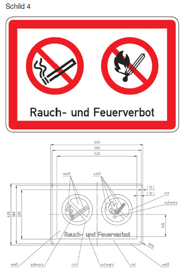

# Bekanntmachung der Strompolizeiverordnung zum Schutz bundeseigener Betriebsanlagen an Bundeswasserstraßen (WaStrBAV)

Ausfertigungsdatum
:   2016-06-06

Fundstelle
:   VkBl: 2016, 435

Geändert durch
:   Art. 1 V v. 2.9.2019 VkBl. 627

## Eingangsformel

Die Generaldirektion Wasserstraßen und Schifffahrt verordnet

-   auf Grund des § 27 Absatz 1 des Bundeswasserstraßengesetzes in der
    Fassung der Bekanntmachung vom 23. Mai 2007 (BGBl. I S. 962; BGBl.
    2008 I S. 1980), § 27 Absatz 1 geändert durch Artikel 522 Nummer 2 der
    Verordnung vom 31. August 2015 (BGBl. S. 1474), in Verbindung mit § 1
    der Verordnung über die Übertragung der Ermächtigung zum Erlass von
    Strompolizeiverordnungen nach dem Bundeswasserstraßengesetz vom 15.
    April 1969 (BGBl. II S. 853), der durch Artikel 21 der Verordnung vom
    02\. Juni 2016 geändert worden ist, und

-   auf Grund des § 46 Satz 1 Nummer 3 des Bundeswasserstraßengesetzes in
    der Fassung der Bekanntmachung vom 23. Mai 2007 (BGBl. I S. 962; BGBl.
    2008 I S. 1980), § 46 Satz 1 Nummer 3 geändert durch Artikel 522
    Nummer 7 der Verordnung vom 31. August 2015 (BGBl. S. 1474), in
    Verbindung mit § 1 der Verordnung zur Übertragung der Ermächtigung zum
    Erlass von Rechtsverordnungen nach dem Bundeswasserstraßengesetz über
    die Regelung, Beschränkung oder Untersagung des Gemeingebrauchs vom
    21\. September 1971 (BGBl. I S. 1617), der zuletzt durch Artikel 24 der
    Verordnung vom 02. Juni 2016 geändert worden ist:

## § 1 Geltungsbereich

(1) Die Verordnung gilt vorbehaltlich des Absatzes 2 für alle
Bundeswasserstraßen.

(2) Die Verordnung gilt nicht

1.  auf den auf die Freie und Hansestadt Hamburg delegierten Stromstrecken
    der Elbe zwischen Oortkaten (Ortkathen) und Tinsdahl (gesamte
    Stromstrecke von km 607,5 bei Oortkaten bis km 633,35 bei Finkenwerder
    einschließlich Süderelbe und Köhlbrand von km 610,06 bis 625,68,
    Hauptstrom von km 633,35 bei Finkenwerder bis km 638,978 bei
    Tinsdahl),

2.  in den Schleusenbereichen der Schleusen Brunsbüttel, Kiel-Holtenau
    (Nord-Ostsee-Kanal), Strohbrück (Achterwehrer Schifffahrtskanal),
    Gieselau (Gieselau-Kanal), Lexfähr, Nordfeld und Eider-Sperrwerk
    (Eider),

3.  auf den Randdünen auf der Insel Wangerooge und

4.  auf den Strandschutzwerken auf der Insel Borkum im Sinne des § 1 der
    Strandschutzwerk-Sicherungsverordnung Borkum.

## § 2 Benutzungsverbot

(1) Es ist verboten

1.  die bundeseigenen Schifffahrts- und Betriebsanlagen, insbesondere
    Schleusen, Schiffshebewerke, Wehre, Schutzhäfen, Bauhäfen, Bauhöfe,
    Schirrhöfe, Schiffhöfe sowie Werkstätten, Pegelanlagen,
    Sicherheitstore, Sperrwerke, Dämme, Buhnen und Parallelwerke außerhalb
    ihrer Zweckbestimmung, insbesondere durch Betreten, Befahren,
    Abstellen von Fahrzeugen aller Art, Zelten, Viehtreiben, Reiten oder
    durch Umgang mit Feuer;

2.  bundeseigene Ufergrundstücke und Betriebswege außerhalb ihrer
    Zweckbestimmung, insbesondere durch Befahren mit Kraftfahrzeugen
    einschließlich Krafträdern, Kleinkrafträdern und Mobilitätshilfen,
    durch Abstellen von Fahrzeugen aller Art, Zelten, Viehtreiben, Reiten
    oder durch Entzünden von Feuer

zu benutzen (Benutzungsverbot). Ausgenommen von dem Benutzungsverbot
sind das Betreten der bundeseigenen Ufergrundstücke und Betriebswege
durch Fußgänger und das Befahren der Betriebswege mit Fahrrädern.
Handlungen im Sinne des Satzes 2 geschehen jeweils auf eigene Gefahr.

(2) Soweit der für die Schifffahrt erforderliche Zustand der
Bundeswasserstraße gefährdet wird, kann abweichend von Absatz 1 Satz 2

1.  Fußgängern das Betreten bestimmter bundeseigener Ufergrundstücke oder
    Betriebswege sowie

2.  Radfahrern das Befahren bestimmter bundeseigener Ufergrundstücke oder
    Betriebswege

verboten werden.

(3) Das Benutzungsverbot nach Absatz 1 Satz 1 kann durch ein Schild
nach dem Muster 1 der Anlage kenntlich gemacht werden. Erfolgt eine
Kenntlichmachung nach Satz 1, ist unter dem Schild nach dem Muster 1
der Anlage ein weiteres Schild nach dem Muster 2 der Anlage mit der
Aufschrift „Ufergrundstücke und Betriebswege frei für Fußgänger und
Radfahrer auf eigene Gefahr“ anzubringen, soweit nicht Absatz 2
anzuwenden ist. Im Falle des Absatzes 2 Nummer 1 ist unter dem Schild
nach dem Muster 1 der Anlage das Schild nach dem Muster 2 der Anlage
mit der Aufschrift „Betriebswege frei für Radfahrer auf eigene Gefahr“
anzubringen. Im Falle des Absatzes 2 Nummer 2 ist unter dem Schild
nach dem Muster 1 der Anlage das Schild nach dem Muster 2 der Anlage
mit der Aufschrift „Ufergrundstücke und Betriebswege frei für
Fußgänger auf eigene Gefahr“ anzubringen.

(4) Die Fahrgeschwindigkeit auf den Betriebswegen ist den
Wegeverhältnissen anzupassen.

## § 3 Ausnahmen

(1) Ausnahmen von den Verboten nach § 2 Absatz 1 und § 2 Absatz 2
können

1.  durch Einzelgenehmigung und

2.  durch allgemeine Genehmigung für bestimmte Personengruppen oder
    bestimmte Benutzungsarten

zugelassen werden.

(2) Eine Einzelgenehmigung wird dem Antragsteller unter dem Vorbehalt
des Widerrufs schriftlich erteilt. Die Genehmigung kann mit
Nebenbestimmungen versehen werden. Der Inhaber der Genehmigung hat den
Genehmigungsbescheid mitzuführen und auf Verlangen den mit
strompolizeilichen Vollzugsaufgaben beauftragten Bediensteten der
Wasserstraßen- und Schifffahrtsverwaltung des Bundes zwecks
Überprüfung auszuhändigen.

(3) In dringenden Fällen kann die Einzelgenehmigung mündlich erteilt
werden.

(4) Eine allgemeine Genehmigung wird durch das Aufstellen des Schildes
nach dem Muster 3 der Anlage mit der im Einzelfall erforderlichen
Aufschrift erteilt. Die allgemeine Genehmigung kann mit
Nebenbestimmungen versehen werden. Das Schild wird unter dem Schild
nach dem Muster 1 der Anlage oder unter dem Schild nach dem Muster 2
der Anlage angebracht. Ist das Aufstellen von Schildern untunlich, so
kann für bestimmte Personengruppen die allgemeine Genehmigung
öffentlich, sowie nachrichtlich im Internet, bekannt gemacht werden.

## § 4 Befreiungen

Von den Benutzungsverboten nach § 2 Absatz 1 oder den besonderen
Betretens- und Befahrensverboten nach § 2 Absatz 2 sind die
Bediensteten oder Beauftragten der Wasserstraßen- und
Schifffahrtsverwaltung des Bundes, anderer Behörden, der Einrichtungen
des Rettungs- und des Feuerwehrdienstes sowie sonstiger
Hilfsorganisationen befreit, soweit das Benutzen zur Erfüllung der
dienstlichen Aufgaben erforderlich ist. § 2 Absatz 4 gilt
entsprechend.

## § 5 Zerstörungs- und Beschädigungsverbot

(1) Es ist verboten,

1.  bundeseigene Schifffahrts- und Betriebsanlagen einschließlich der
    Kabel, Leitungen, Schifffahrtszeichen, Liegestellen, Lagepunkte,
    Höhenfestpunkte, Vermessungspunkte, Kabelmarkierungszeichen oder
    sonstigen Zeichen und Einrichtungen, die zur Abgrenzung, Absperrung,
    Vermessung oder als Hinweis- oder Verbotsschilder dienen,

2.  Ufergrundstücke, insbesondere Uferbefestigungen, Uferbewuchs oder
    Anpflanzungen, sowie Betriebswege

unbefugt zu zerstören, zu beschädigen, unbrauchbar zu machen, zu
verändern oder zu entfernen.

(2) Im Bereich der Schleusenkammern, auf Schleusenplattformen,
Schleusenbrücken und Schleusenstegen sowie an Gefahrgutliegestellen
sind das Rauchen und der Umgang mit offenem Feuer oder glühenden
Stoffen verboten.

(3) Das Verbot nach Absatz 2 kann durch das Schild nach dem Muster 4
der Anlage kenntlich gemacht werden.

## § 6 Zuständigkeit

Die Wasserstraßen- und Schifffahrtsämter erlassen die Verbote nach § 2
Absatz 2 und erteilen Ausnahmegenehmigungen nach § 3.

## § 7 Ordnungswidrigkeiten

Ordnungswidrig im Sinne des § 50 Absatz 1 Nummer 2
Bundeswasserstraßengesetz handelt, wer vorsätzlich oder fahrlässig

1.  entgegen § 2 Absatz 1 Satz 1 eine Schifffahrts- oder Betriebsanlage,
    bundeseigene Ufergrundstücke oder Betriebswege benutzt,

2.  einer vollziehbaren Anordnung nach § 2 Absatz 2 zuwiderhandelt,

3.  einer vollziehbaren Auflage nach § 3 Absatz 2 Satz 2 zuwiderhandelt,

4.  entgegen § 3 Absatz 2 Satz 3 den Genehmigungsbescheid nicht mitführt
    oder nicht oder nicht rechtzeitig aushändigt oder

5.  entgegen § 5 Absatz 2 in einem dort genannten Bereich raucht oder mit
    offenem Feuer oder mit glühenden Stoffen umgeht.

## § 8 Übergangsbestimmungen

Schilder, die am 30. Juni 2016 aufgestellt sind, gelten neben den nach
dieser Verordnung aufgestellten Schildern bis zum 31. Dezember 2021
fort. Im Umfang der sich aus den fortgeltenden Schildern ergebenden
Verbote oder Berechtigungen sind

1.  die Strompolizeiverordnung zum Schutz bundeseigener Schifffahrts- und
    Betriebsanlagen an Bundeswasserstraßen im Bereich der Wasser- und
    Schifffahrtsdirektionen Nordwest, Mitte, West und Ost vom 4. März 1994
    (VkBl. 1994 S. 378),

2.  die Strompolizeiverordnung zum Schutz bundeseigener Schifffahrts- und
    Betriebsanlagen an Bundeswasserstraßen im Bereich der Wasser- und
    Schifffahrtsdirektion Ost vom 28. Juni 2010 (VkBl. 2010 S. 283),

3.  die Strompolizeiverordnung zum Schutz bundeseigener Schifffahrts- und
    Betriebsanlagen an Bundeswasserstraßen im Bereich der Wasser- und
    Schifffahrtsdirektion Südwest vom 18. Dezember 1990 (VkBl. 1991 S.
    135) und

4.  die Strompolizeiverordnung zum Schutz bundeseigener Schifffahrts- und
    Betriebsanlagen an Bundeswasserstraßen (Betriebsanlagenverordnung,
    BAVO) im Bereich der Wasser- und Schifffahrtsdirektion Süd vom 15.
    September 1993 (VkBl. 1993 S. 701)

weiter anzuwenden.

## § 9 Inkrafttreten, Außerkrafttreten

(1) Diese Verordnung tritt am Tage nach der Verkündung in Kraft.

(2) Gleichzeitig treten

1.  die Strompolizeiverordnung zum Schutz bundeseigener Schifffahrts- und
    Betriebsanlagen an Bundeswasserstraßen im Bereich der Wasser- und
    Schifffahrtsdirektionen Nordwest, Mitte, West und Ost vom 4. März 1994
    (VkBl. 1994 S. 378),

2.  die Strompolizeiverordnung zum Schutz bundeseigener Schifffahrts- und
    Betriebsanlagen an Bundeswasserstraßen im Bereich der Wasser- und
    Schifffahrtsdirektion Ost vom 28. Juni 2010 (VkBl. 2010 S. 283),

3.  die Strompolizeiverordnung zum Schutz bundeseigener Schifffahrts- und
    Betriebsanlagen an Bundeswasserstraßen im Bereich der Wasser- und
    Schifffahrtsdirektion Südwest vom 18. Dezember 1990 (VkBl. 1991 S.
    135) und

4.  die Strompolizeiverordnung zum Schutz bundeseigener Schifffahrts- und
    Betriebsanlagen an Bundeswasserstraßen (Betriebsanlagenverordnung,
    BAVO) im Bereich der Wasser- und Schifffahrtsdirektion Süd vom 15.
    September 1993 (VkBl. 1993 S. 701)

außer Kraft.

(zu § 2 Absatz 3, § 3 Absatz 4 und § 5 Absatz 3)

## Anlage Schilder zur Kennzeichnung der Verbote

(Fundstelle: VkBl. 2016, 437 – 438)

