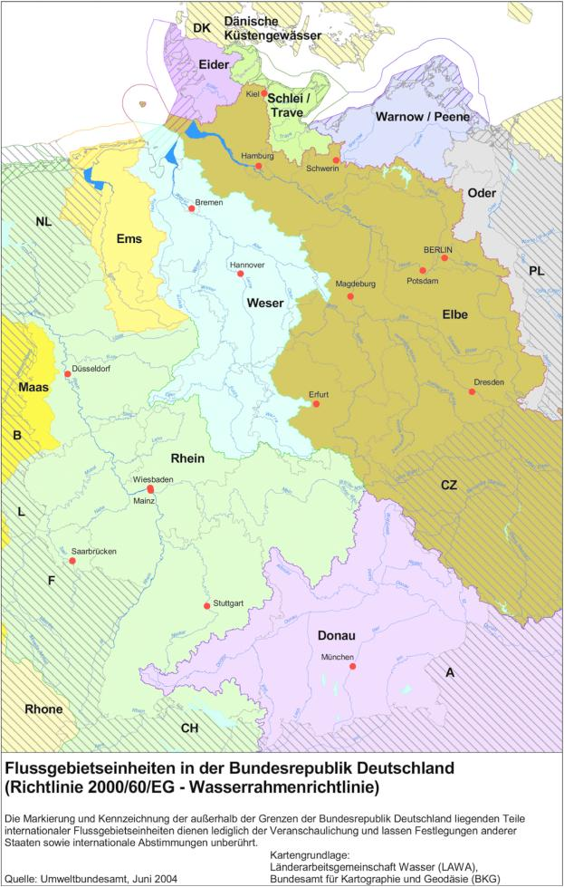

# Gesetz zur Ordnung des Wasserhaushalts (WHG 2009)

Ausfertigungsdatum
:   2009-07-31

Fundstelle
:   BGBl I: 2009, 2585

Zuletzt geändert durch
:   Art. 5 Abs. 9 G v. 24.2.2012 I 212

[^f772370_01_BJNR258510009]:     Dieses Gesetz dient der Umsetzung der
    –                                                         Richtlinie
    80/68/EWG des Rates vom 17. Dezember 1979 über den Schutz des
    Grundwassers gegen Verschmutzung durch bestimmte gefährliche Stoffe
    (ABl. L 20 vom 26.1.1980, S. 43), die durch die Richtlinie 2000/60/EG
    (ABl. L 327 vom 22.12.2000, S. 1) geändert worden ist,

    –                                                         Richtlinie
    91/271/EWG des Rates vom 21. Mai 1991 über die Behandlung von
    kommunalem Abwasser (ABl. L 135 vom 30.5.1991, S. 40), die zuletzt
    durch die Verordnung (EG) Nr. 1137/2008 (ABl. L 311 vom 21.11.2008, S.
    1) geändert worden ist,

    –                                                         Richtlinie
    2000/60/EG des Europäischen Parlaments und des Rates vom 23. Oktober
    2000 zur Schaffung eines Ordnungsrahmens für Maßnahmen der
    Gemeinschaft im Bereich der Wasserpolitik (ABl. L 327 vom 22.12.2000,
    S. 1), die zuletzt durch die Richtlinie 2008/105/EG (ABl. L 348 vom
    24\.12.2008, S. 84) geändert worden ist,

    –                                                         Richtlinie
    2004/35/EG des Europäischen Parlaments und des Rates vom 21. April
    2004 über Umwelthaftung zur Vermeidung und Sanierung von Umweltschäden
    (ABl. L 143 vom 30.4.2004, S. 56), die durch die Richtlinie 2006/21/EG
    (ABl. L 102 vom 11.4.2006, S. 15) geändert worden ist,

    –                                                         Richtlinie
    2006/11/EG des Europäischen Parlaments und des Rates vom 15. Februar
    2006 betreffend die Verschmutzung infolge der Ableitung bestimmter
    gefährlicher Stoffe in die Gewässer der Gemeinschaft (ABl. L 64 vom
    4\.3.2006, S. 52),

    –                                                         Richtlinie
    2006/118/EG des Europäischen Parlaments und des Rates vom 12. Dezember
    2006 zum Schutz des Grundwassers vor Verschmutzung und
    Verschlechterung (ABl. L 372 vom 27.12.2006, S. 19, L 53 vom
    22\.2.2007, S. 30, L 139 vom 31.5.2007, S. 39),

    –                                                         Richtlinie
    2007/60/EG des Europäischen Parlaments und des Rates vom 23. Oktober
    2007 über die Bewertung und das Management von Hochwasserrisiken (ABl.
    L 288 vom 6.11.2007, S. 27).

Die Verpflichtungen aus der Richtlinie 98/34/EG des Europäischen
Parlaments und des Rates vom 22. Juni 1998 über ein
Informationsverfahren auf dem Gebiet der Normen und technischen
Vorschriften und der Vorschriften für die Dienste der
Informationsgesellschaft (ABl. L 204 vom 21.7.1998, S. 37), die
zuletzt durch die Richtlinie 2006/96/EG (ABl. L 363 vom 20.12.2006, S.
81) geändert worden ist, sind beachtet worden.
[^f772370_02_BJNR258510009]: 

## Kapitel 1 - Allgemeine Bestimmungen

### § 1 Zweck

Zweck dieses Gesetzes ist es, durch eine nachhaltige
Gewässerbewirtschaftung die Gewässer als Bestandteil des
Naturhaushalts, als Lebensgrundlage des Menschen, als Lebensraum für
Tiere und Pflanzen sowie als nutzbares Gut zu schützen.

### § 2 Anwendungsbereich

(1) Dieses Gesetz gilt für folgende Gewässer:

1.  oberirdische Gewässer,

2.  Küstengewässer,

3.  Grundwasser.

Es gilt auch für Teile dieser Gewässer.

(1a) Für Meeresgewässer gelten die Vorschriften des § 23 und des
Kapitels 2 Abschnitt 3a. Die für die Bewirtschaftung der
Küstengewässer geltenden Vorschriften bleiben unberührt.

(2) Die Länder können kleine Gewässer von wasserwirtschaftlich
untergeordneter Bedeutung, insbesondere Straßenseitengräben als
Bestandteil von Straßen, Be- und Entwässerungsgräben, sowie
Heilquellen von den Bestimmungen dieses Gesetzes ausnehmen. Dies gilt
nicht für die Haftung für Gewässerveränderungen nach den §§ 89 und 90.

### § 3 Begriffsbestimmungen

Für dieses Gesetz gelten folgende Begriffsbestimmungen:

1.  Oberirdische Gewässer
    das ständig oder zeitweilig in Betten fließende oder stehende oder aus
    Quellen wild abfließende Wasser;

2.  Küstengewässer
    das Meer zwischen der Küstenlinie bei mittlerem Hochwasser oder
    zwischen der seewärtigen Begrenzung der oberirdischen Gewässer und der
    seewärtigen Begrenzung des Küstenmeeres; die seewärtige Begrenzung von
    oberirdischen Gewässern, die nicht Binnenwasserstraßen des Bundes
    sind, richtet sich nach den landesrechtlichen Vorschriften;

2a. Meeresgewässer
    die Küstengewässer sowie die Gewässer im Bereich der deutschen
    ausschließlichen Wirtschaftszone und des Festlandsockels, jeweils
    einschließlich des Meeresgrundes und des Meeresuntergrundes;

3.  Grundwasser
    das unterirdische Wasser in der Sättigungszone, das in unmittelbarer
    Berührung mit dem Boden oder dem Untergrund steht;

4.  Künstliche Gewässer
    von Menschen geschaffene oberirdische Gewässer oder Küstengewässer;

5.  Erheblich veränderte Gewässer
    durch den Menschen in ihrem Wesen physikalisch erheblich veränderte
    oberirdische Gewässer oder Küstengewässer;

6.  Wasserkörper
    einheitliche und bedeutende Abschnitte eines oberirdischen Gewässers
    oder Küstengewässers (Oberflächenwasserkörper) sowie abgegrenzte
    Grundwasservolumen innerhalb eines oder mehrerer Grundwasserleiter
    (Grundwasserkörper);

7.  Gewässereigenschaften
    die auf die Wasserbeschaffenheit, die Wassermenge, die
    Gewässerökologie und die Hydromorphologie bezogenen Eigenschaften von
    Gewässern und Gewässerteilen;

8.  Gewässerzustand
    die auf Wasserkörper bezogenen Gewässereigenschaften als ökologischer,
    chemischer oder mengenmäßiger Zustand eines Gewässers; bei als
    künstlich oder erheblich verändert eingestuften Gewässern tritt an die
    Stelle des ökologischen Zustands das ökologische Potenzial;

9.  Wasserbeschaffenheit
    die physikalische, chemische oder biologische Beschaffenheit des
    Wassers eines oberirdischen Gewässers oder Küstengewässers sowie des
    Grundwassers;

10. Schädliche Gewässerveränderungen
    Veränderungen von Gewässereigenschaften, die das Wohl der
    Allgemeinheit, insbesondere die öffentliche Wasserversorgung,
    beeinträchtigen oder die nicht den Anforderungen entsprechen, die sich
    aus diesem Gesetz, aus auf Grund dieses Gesetzes erlassenen oder aus
    sonstigen wasserrechtlichen Vorschriften ergeben;

11. Stand der Technik
    der Entwicklungsstand fortschrittlicher Verfahren, Einrichtungen oder
    Betriebsweisen, der die praktische Eignung einer Maßnahme zur
    Begrenzung von Emissionen in Luft, Wasser und Boden, zur
    Gewährleistung der Anlagensicherheit, zur Gewährleistung einer
    umweltverträglichen Abfallentsorgung oder sonst zur Vermeidung oder
    Verminderung von Auswirkungen auf die Umwelt zur Erreichung eines
    allgemein hohen Schutzniveaus für die Umwelt insgesamt gesichert
    erscheinen lässt; bei der Bestimmung des Standes der Technik sind
    insbesondere die in der Anlage 1 aufgeführten Kriterien zu
    berücksichtigen;

12. EMAS-Standort
    diejenige Einheit einer Organisation, die nach § 32 Absatz 1 Satz 1
    des Umweltauditgesetzes in der Fassung der Bekanntmachung vom 4.
    September 2002 (BGBl. I S. 3490), das zuletzt durch Artikel 11 des
    Gesetzes vom 17. März 2008 (BGBl. I S. 399) geändert worden ist, in
    das EMAS-Register eingetragen ist;

13. Einzugsgebiet
    ein Gebiet, aus dem über oberirdische Gewässer der gesamte
    Oberflächenabfluss an einer einzigen Flussmündung, einem Ästuar oder
    einem Delta ins Meer gelangt;

14. Teileinzugsgebiet
    ein Gebiet, aus dem über oberirdische Gewässer der gesamte
    Oberflächenabfluss an einem bestimmten Punkt in ein oberirdisches
    Gewässer gelangt;

15. Flussgebietseinheit
    ein als Haupteinheit für die Bewirtschaftung von Einzugsgebieten
    festgelegtes Land- oder Meeresgebiet, das aus einem oder mehreren
    benachbarten Einzugsgebieten, dem ihnen zugeordneten Grundwasser und
    den ihnen zugeordneten Küstengewässern im Sinne des § 7 Absatz 5 Satz
    2 besteht.

### § 4 Gewässereigentum, Schranken des Grundeigentums

(1) Das Eigentum an den Bundeswasserstraßen steht dem Bund nach
Maßgabe der wasserstraßenrechtlichen Vorschriften zu. Soweit sich aus
diesem Gesetz, auf Grund dieses Gesetzes erlassener oder sonstiger
wasserrechtlicher Vorschriften Verpflichtungen aus dem
Gewässereigentum ergeben, treffen diese auch den Bund als Eigentümer
der Bundeswasserstraßen.

(2) Wasser eines fließenden oberirdischen Gewässers und Grundwasser
sind nicht eigentumsfähig.

(3) Das Grundeigentum berechtigt nicht

1.  zu einer Gewässerbenutzung, die einer behördlichen Zulassung bedarf,

2.  zum Ausbau eines Gewässers.

(4) Eigentümer und Nutzungsberechtigte von Gewässern haben die
Benutzung durch Dritte zu dulden, soweit für die Benutzung eine
behördliche Zulassung erteilt worden oder eine behördliche Zulassung
nicht erforderlich ist. Dies gilt nicht im Fall des § 9 Absatz 1
Nummer 3.

(5) Im Übrigen gelten für das Eigentum an Gewässern die
landesrechtlichen Vorschriften.

### § 5 Allgemeine Sorgfaltspflichten

(1) Jede Person ist verpflichtet, bei Maßnahmen, mit denen
Einwirkungen auf ein Gewässer verbunden sein können, die nach den
Umständen erforderliche Sorgfalt anzuwenden, um

1.  eine nachteilige Veränderung der Gewässereigenschaften zu vermeiden,

2.  eine mit Rücksicht auf den Wasserhaushalt gebotene sparsame Verwendung
    des Wassers sicherzustellen,

3.  die Leistungsfähigkeit des Wasserhaushalts zu erhalten und

4.  eine Vergrößerung und Beschleunigung des Wasserabflusses zu vermeiden.

(2) Jede Person, die durch Hochwasser betroffen sein kann, ist im
Rahmen des ihr Möglichen und Zumutbaren verpflichtet, geeignete
Vorsorgemaßnahmen zum Schutz vor nachteiligen Hochwasserfolgen und zur
Schadensminderung zu treffen, insbesondere die Nutzung von
Grundstücken den möglichen nachteiligen Folgen für Mensch, Umwelt oder
Sachwerte durch Hochwasser anzupassen.

## Kapitel 2 - Bewirtschaftung von Gewässern

### Abschnitt 1 - Gemeinsame Bestimmungen

#### § 6 Allgemeine Grundsätze der Gewässerbewirtschaftung

(1) Die Gewässer sind nachhaltig zu bewirtschaften, insbesondere mit
dem Ziel,

1.  ihre Funktions- und Leistungsfähigkeit als Bestandteil des
    Naturhaushalts und als Lebensraum für Tiere und Pflanzen zu erhalten
    und zu verbessern, insbesondere durch Schutz vor nachteiligen
    Veränderungen von Gewässereigenschaften,

2.  Beeinträchtigungen auch im Hinblick auf den Wasserhaushalt der direkt
    von den Gewässern abhängenden Landökosysteme und Feuchtgebiete zu
    vermeiden und unvermeidbare, nicht nur geringfügige Beeinträchtigungen
    so weit wie möglich auszugleichen,

3.  sie zum Wohl der Allgemeinheit und im Einklang mit ihm auch im
    Interesse Einzelner zu nutzen,

4.  bestehende oder künftige Nutzungsmöglichkeiten insbesondere für die
    öffentliche Wasserversorgung zu erhalten oder zu schaffen,

5.  möglichen Folgen des Klimawandels vorzubeugen,

6.  an oberirdischen Gewässern so weit wie möglich natürliche und
    schadlose Abflussverhältnisse zu gewährleisten und insbesondere durch
    Rückhaltung des Wassers in der Fläche der Entstehung von nachteiligen
    Hochwasserfolgen vorzubeugen,

7.  zum Schutz der Meeresumwelt beizutragen.

Die nachhaltige Gewässerbewirtschaftung hat ein hohes Schutzniveau für
die Umwelt insgesamt zu gewährleisten; dabei sind mögliche
Verlagerungen nachteiliger Auswirkungen von einem Schutzgut auf ein
anderes sowie die Erfordernisse des Klimaschutzes zu berücksichtigen.

(2) Gewässer, die sich in einem natürlichen oder naturnahen Zustand
befinden, sollen in diesem Zustand erhalten bleiben und nicht naturnah
ausgebaute natürliche Gewässer sollen so weit wie möglich wieder in
einen naturnahen Zustand zurückgeführt werden, wenn überwiegende
Gründe des Wohls der Allgemeinheit dem nicht entgegenstehen.

#### § 7 Bewirtschaftung nach Flussgebietseinheiten

(1) Die Gewässer sind nach Flussgebietseinheiten zu bewirtschaften.
Die Flussgebietseinheiten sind:

1.  Donau,

2.  Rhein,

3.  Maas,

4.  Ems,

5.  Weser,

6.  Elbe,

7.  Eider,

8.  Oder,

9.  Schlei/Trave,

10. Warnow/Peene.

Die Flussgebietseinheiten sind in der Anlage 2 in Kartenform
dargestellt.

(2) Die zuständigen Behörden der Länder koordinieren untereinander
ihre wasserwirtschaftlichen Planungen und Maßnahmen, soweit die
Belange der flussgebietsbezogenen Gewässerbewirtschaftung dies
erfordern.

(3) Zur Erreichung der in diesem Gesetz festgelegten
Bewirtschaftungsziele

1.  koordinieren die zuständigen Behörden der Länder die
    Maßnahmenprogramme und Bewirtschaftungspläne mit den zuständigen
    Behörden anderer Mitgliedstaaten der Europäischen Union, in deren
    Hoheitsgebiet die Flussgebietseinheiten ebenfalls liegen,

2.  bemühen sich die zuständigen Behörden der Länder um eine der Nummer 1
    entsprechende Koordinierung mit den zuständigen Behörden von Staaten,
    die nicht der Europäischen Union angehören.

(4) Soweit die Verwaltung der Bundeswasserstraßen berührt ist, ist bei
der Koordinierung nach den Absätzen 2 und 3 das Einvernehmen der
zuständigen Wasser- und Schifffahrtsdirektionen einzuholen. Soweit
gesamtstaatliche Belange bei der Pflege der Beziehungen zur
Europäischen Union, zu auswärtigen Staaten oder zu internationalen
Organisationen berührt sind, ist bei der Koordinierung nach Absatz 3
das Einvernehmen des Bundesministeriums für Umwelt, Naturschutz und
Reaktorsicherheit einzuholen.

(5) Die zuständigen Behörden der Länder ordnen innerhalb der
Landesgrenzen die Einzugsgebiete oberirdischer Gewässer sowie
Küstengewässer und das Grundwasser einer Flussgebietseinheit zu. Bei
Küstengewässern gilt dies für die Flächen auf der landwärtigen Seite
einer Linie, auf der sich jeder Punkt eine Seemeile seewärts vom
nächsten Punkt der Basislinie befindet, von der aus die Breite der
Hoheitsgewässer gemessen wird, mindestens bis zur äußeren Grenze der
Gewässer, die im Wesentlichen von Süßwasserströmungen beeinflusst
sind. Die Länder können die Zuordnung auch durch Gesetz regeln.

#### § 8 Erlaubnis, Bewilligung

(1) Die Benutzung eines Gewässers bedarf der Erlaubnis oder der
Bewilligung, soweit nicht durch dieses Gesetz oder auf Grund dieses
Gesetzes erlassener Vorschriften etwas anderes bestimmt ist.

(2) Keiner Erlaubnis oder Bewilligung bedürfen Gewässerbenutzungen,
die der Abwehr einer gegenwärtigen Gefahr für die öffentliche
Sicherheit dienen, sofern der drohende Schaden schwerer wiegt als die
mit der Benutzung verbundenen nachteiligen Veränderungen von
Gewässereigenschaften. Die zuständige Behörde ist unverzüglich über
die Benutzung zu unterrichten.

(3) Keiner Erlaubnis oder Bewilligung bedürfen ferner bei Übungen und
Erprobungen für Zwecke der Verteidigung oder der Abwehr von Gefahren
für die öffentliche Sicherheit

1.  das vorübergehende Entnehmen von Wasser aus einem Gewässer,

2.  das Wiedereinleiten des Wassers in ein Gewässer mittels beweglicher
    Anlagen und

3.  das vorübergehende Einbringen von Stoffen in ein Gewässer,

wenn durch diese Benutzungen andere nicht oder nur geringfügig
beeinträchtigt werden und keine nachteilige Veränderung der
Gewässereigenschaften zu erwarten ist. Die Gewässerbenutzung ist der
zuständigen Behörde rechtzeitig vor Beginn der Übung oder der
Erprobung anzuzeigen.

(4) Ist bei der Erteilung der Erlaubnis oder der Bewilligung nichts
anderes bestimmt worden, geht die Erlaubnis oder die Bewilligung mit
der Wasserbenutzungsanlage oder, wenn sie für ein Grundstück erteilt
worden ist, mit diesem auf den Rechtsnachfolger über.

#### § 9 Benutzungen

(1) Benutzungen im Sinne dieses Gesetzes sind

1.  das Entnehmen und Ableiten von Wasser aus oberirdischen Gewässern,

2.  das Aufstauen und Absenken von oberirdischen Gewässern,

3.  das Entnehmen fester Stoffe aus oberirdischen Gewässern, soweit sich
    dies auf die Gewässereigenschaften auswirkt,

4.  das Einbringen und Einleiten von Stoffen in Gewässer,

5.  das Entnehmen, Zutagefördern, Zutageleiten und Ableiten von
    Grundwasser.

(2) Als Benutzungen gelten auch

1.  das Aufstauen, Absenken und Umleiten von Grundwasser durch Anlagen,
    die hierfür bestimmt oder geeignet sind,

2.  Maßnahmen, die geeignet sind, dauernd oder in einem nicht nur
    unerheblichen Ausmaß nachteilige Veränderungen der
    Wasserbeschaffenheit herbeizuführen.

(3) Keine Benutzungen sind Maßnahmen, die dem Ausbau eines Gewässers
im Sinne des § 67 Absatz 2 dienen. Das Gleiche gilt für Maßnahmen der
Unterhaltung eines Gewässers, soweit hierbei keine chemischen Mittel
verwendet werden.

#### § 10 Inhalt der Erlaubnis und der Bewilligung

(1) Die Erlaubnis gewährt die Befugnis, die Bewilligung das Recht, ein
Gewässer zu einem bestimmten Zweck in einer nach Art und Maß
bestimmten Weise zu benutzen.

(2) Erlaubnis und Bewilligung geben keinen Anspruch auf Zufluss von
Wasser in einer bestimmten Menge und Beschaffenheit.

#### § 11 Erlaubnis-, Bewilligungsverfahren

(1) Erlaubnis und Bewilligung können für ein Vorhaben, das nach dem
Gesetz über die Umweltverträglichkeitsprüfung einer
Umweltverträglichkeitsprüfung unterliegt, nur in einem Verfahren
erteilt werden, das den Anforderungen des genannten Gesetzes
entspricht.

(2) Die Bewilligung kann nur in einem Verfahren erteilt werden, in dem
die Betroffenen und die beteiligten Behörden Einwendungen geltend
machen können.

#### § 12 Voraussetzungen für die Erteilung der Erlaubnis und der Bewilligung, Bewirtschaftungsermessen

(1) Die Erlaubnis und die Bewilligung sind zu versagen, wenn

1.  schädliche, auch durch Nebenbestimmungen nicht vermeidbare oder nicht
    ausgleichbare Gewässerveränderungen zu erwarten sind oder

2.  andere Anforderungen nach öffentlich-rechtlichen Vorschriften nicht
    erfüllt werden.

(2) Im Übrigen steht die Erteilung der Erlaubnis und der Bewilligung
im pflichtgemäßen Ermessen (Bewirtschaftungsermessen) der zuständigen
Behörde.

#### § 13 Inhalts- und Nebenbestimmungen der Erlaubnis und der Bewilligung

(1) Inhalts- und Nebenbestimmungen sind auch nachträglich sowie auch
zu dem Zweck zulässig, nachteilige Wirkungen für andere zu vermeiden
oder auszugleichen.

(2) Die zuständige Behörde kann durch Inhalts- und Nebenbestimmungen
insbesondere

1.  Anforderungen an die Beschaffenheit einzubringender oder
    einzuleitender Stoffe stellen,

2.  Maßnahmen anordnen, die

    a)  in einem Maßnahmenprogramm nach § 82 enthalten oder zu seiner
        Durchführung erforderlich sind,

    b)  geboten sind, damit das Wasser mit Rücksicht auf den Wasserhaushalt
        sparsam verwendet wird,

    c)  der Feststellung der Gewässereigenschaften vor der Benutzung oder der
        Beobachtung der Gewässerbenutzung und ihrer Auswirkungen dienen,

    d)  zum Ausgleich einer auf die Benutzung zurückzuführenden nachteiligen
        Veränderung der Gewässereigenschaften erforderlich sind,

3.  die Bestellung verantwortlicher Betriebsbeauftragter vorschreiben,
    soweit nicht die Bestellung eines Gewässerschutzbeauftragten nach § 64
    vorgeschrieben ist oder angeordnet werden kann,

4.  dem Benutzer angemessene Beiträge zu den Kosten von Maßnahmen
    auferlegen, die eine Körperschaft des öffentlichen Rechts getroffen
    hat oder treffen wird, um eine mit der Benutzung verbundene
    Beeinträchtigung des Wohls der Allgemeinheit zu vermeiden oder
    auszugleichen.

(3) Für die Bewilligung gilt Absatz 1 mit der Maßgabe, dass
nachträglich nur Inhalts- und Nebenbestimmungen im Sinne von Absatz 2
Nummer 1 bis 4 zulässig sind.

#### § 14 Besondere Vorschriften für die Erteilung der Bewilligung

(1) Die Bewilligung darf nur erteilt werden, wenn die
Gewässerbenutzung

1.  dem Benutzer ohne eine gesicherte Rechtsstellung nicht zugemutet
    werden kann,

2.  einem bestimmten Zweck dient, der nach einem bestimmten Plan verfolgt
    wird, und

3.  keine Benutzung im Sinne des § 9 Absatz 1 Nummer 4 und Absatz 2 Nummer
    2 ist, ausgenommen das Wiedereinleiten von nicht nachteilig
    verändertem Triebwasser bei Ausleitungskraftwerken.

(2) Die Bewilligung wird für eine bestimmte angemessene Frist erteilt,
die in besonderen Fällen 30 Jahre überschreiten darf.

(3) Ist zu erwarten, dass die Gewässerbenutzung auf das Recht eines
Dritten nachteilig einwirkt und erhebt dieser Einwendungen, so darf
die Bewilligung nur erteilt werden, wenn die nachteiligen Wirkungen
durch Inhalts- oder Nebenbestimmungen vermieden oder ausgeglichen
werden. Ist dies nicht möglich, so darf die Bewilligung gleichwohl
erteilt werden, wenn Gründe des Wohls der Allgemeinheit dies
erfordern. In den Fällen des Satzes 2 ist der Betroffene zu
entschädigen.

(4) Absatz 3 Satz 1 und 2 gilt entsprechend, wenn ein Dritter ohne
Beeinträchtigung eines Rechts nachteilige Wirkungen dadurch zu
erwarten hat, dass

1.  der Wasserabfluss, der Wasserstand oder die Wasserbeschaffenheit
    verändert,

2.  die bisherige Nutzung seines Grundstücks beeinträchtigt,

3.  seiner Wassergewinnungsanlage Wasser entzogen oder

4.  die ihm obliegende Gewässerunterhaltung erschwert

wird. Geringfügige und solche nachteiligen Wirkungen, die vermieden
worden wären, wenn der Betroffene die ihm obliegende
Gewässerunterhaltung ordnungsgemäß durchgeführt hätte, bleiben außer
Betracht. Die Bewilligung darf auch dann erteilt werden, wenn der aus
der beabsichtigten Gewässerbenutzung zu erwartende Nutzen den für den
Betroffenen zu erwartenden Nachteil erheblich übersteigt.

(5) Hat der Betroffene nach Absatz 3 oder Absatz 4 gegen die Erteilung
der Bewilligung Einwendungen erhoben und lässt sich zur Zeit der
Entscheidung nicht feststellen, ob und in welchem Maße nachteilige
Wirkungen eintreten werden, so ist die Entscheidung über die deswegen
festzusetzenden Inhalts- oder Nebenbestimmungen und Entschädigungen
einem späteren Verfahren vorzubehalten.

(6) Konnte der Betroffene nach Absatz 3 oder Absatz 4 nachteilige
Wirkungen bis zum Ablauf der Frist zur Geltendmachung von Einwendungen
nicht voraussehen, so kann er verlangen, dass dem Gewässerbenutzer
nachträglich Inhalts- oder Nebenbestimmungen auferlegt werden. Können
die nachteiligen Wirkungen durch nachträgliche Inhalts- oder
Nebenbestimmungen nicht vermieden oder ausgeglichen werden, so ist der
Betroffene im Sinne des Absatzes 3 zu entschädigen. Der Antrag ist nur
innerhalb einer Frist von drei Jahren nach dem Zeitpunkt zulässig, zu
dem der Betroffene von den nachteiligen Wirkungen der Bewilligung
Kenntnis erhalten hat; er ist ausgeschlossen, wenn nach der
Herstellung des der Bewilligung entsprechenden Zustands 30 Jahre
vergangen sind.

#### § 15 Gehobene Erlaubnis

(1) Die Erlaubnis kann als gehobene Erlaubnis erteilt werden, wenn
hierfür ein öffentliches Interesse oder ein berechtigtes Interesse des
Gewässerbenutzers besteht.

(2) Für die gehobene Erlaubnis gelten § 11 Absatz 2 und § 14 Absatz 3
bis 5 entsprechend.

#### § 16 Ausschluss privatrechtlicher Abwehransprüche

(1) Ist eine Gewässerbenutzung durch eine unanfechtbare gehobene
Erlaubnis zugelassen, kann auf Grund privatrechtlicher Ansprüche zur
Abwehr nachteiliger Wirkungen der Gewässerbenutzung nicht die
Einstellung der Benutzung verlangt werden. Es können nur Vorkehrungen
verlangt werden, die die nachteiligen Wirkungen ausschließen. Soweit
solche Vorkehrungen nach dem Stand der Technik nicht durchführbar oder
wirtschaftlich nicht vertretbar sind, kann lediglich Entschädigung
verlangt werden.

(2) Ist eine Gewässerbenutzung durch eine unanfechtbare Bewilligung
zugelassen, können wegen nachteiliger Wirkungen der Gewässerbenutzung
keine Ansprüche geltend gemacht werden, die auf die Beseitigung der
Störung, auf die Unterlassung der Benutzung, auf die Herstellung von
Vorkehrungen oder auf Schadenersatz gerichtet sind. Satz 1 schließt
Ansprüche auf Schadenersatz wegen nachteiliger Wirkungen nicht aus,
die darauf beruhen, dass der Gewässerbenutzer angeordnete Inhalts-
oder Nebenbestimmungen nicht erfüllt hat.

(3) Absatz 1 sowie Absatz 2 Satz 1 gelten nicht für privatrechtliche
Ansprüche gegen den Gewässerbenutzer aus Verträgen oder letztwilligen
Verfügungen und für Ansprüche aus dinglichen Rechten am Grundstück,
auf dem die Gewässerbenutzung stattfindet.

#### § 17 Zulassung vorzeitigen Beginns

(1) In einem Erlaubnis- oder Bewilligungsverfahren kann die zuständige
Behörde auf Antrag zulassen, dass bereits vor Erteilung der Erlaubnis
oder der Bewilligung mit der Gewässerbenutzung begonnen wird, wenn

1.  mit einer Entscheidung zugunsten des Benutzers gerechnet werden kann,

2.  an dem vorzeitigen Beginn ein öffentliches Interesse oder ein
    berechtigtes Interesse des Benutzers besteht und

3.  der Benutzer sich verpflichtet, alle bis zur Entscheidung durch die
    Benutzung verursachten Schäden zu ersetzen und, falls die Benutzung
    nicht erlaubt oder bewilligt wird, den früheren Zustand
    wiederherzustellen.

(2) Die Zulassung des vorzeitigen Beginns kann jederzeit widerrufen
werden. § 13 gilt entsprechend.

#### § 18 Widerruf der Erlaubnis und der Bewilligung

(1) Die Erlaubnis ist widerruflich.

(2) Die Bewilligung darf aus den in § 49 Absatz 2 Satz 1 Nummer 2 bis
5 des Verwaltungsverfahrensgesetzes genannten Gründen widerrufen
werden. Die Bewilligung kann ferner ohne Entschädigung ganz oder
teilweise widerrufen werden, wenn der Inhaber der Bewilligung

1.  die Benutzung drei Jahre ununterbrochen nicht ausgeübt oder ihrem
    Umfang nach erheblich unterschritten hat,

2.  den Zweck der Benutzung so geändert hat, dass er mit dem Plan (§ 14
    Absatz 1 Nummer 2) nicht mehr übereinstimmt.

#### § 19 Planfeststellungen und bergrechtliche Betriebspläne

(1) Wird für ein Vorhaben, mit dem die Benutzung eines Gewässers
verbunden ist, ein Planfeststellungsverfahren durchgeführt, so
entscheidet die Planfeststellungsbehörde über die Erteilung der
Erlaubnis oder der Bewilligung.

(2) Sieht ein bergrechtlicher Betriebsplan die Benutzung von Gewässern
vor, so entscheidet die Bergbehörde über die Erteilung der Erlaubnis.

(3) In den Fällen der Absätze 1 und 2 ist die Entscheidung im
Einvernehmen, bei Planfeststellungen durch Bundesbehörden im Benehmen
mit der zuständigen Wasserbehörde zu treffen.

(4) Über den Widerruf einer nach Absatz 1 erteilten Erlaubnis oder
Bewilligung oder einer nach Absatz 2 erteilten Erlaubnis sowie über
den nachträglichen Erlass von Inhalts- und Nebenbestimmungen
entscheidet auf Antrag der zuständigen Wasserbehörde in den Fällen des
Absatzes 1 die Planfeststellungsbehörde, in den Fällen des Absatzes 2
die Bergbehörde. Absatz 3 ist entsprechend anzuwenden.

#### § 20 Alte Rechte und alte Befugnisse

(1) Soweit die Länder nichts anderes bestimmen, ist keine Erlaubnis
oder Bewilligung erforderlich für Gewässerbenutzungen auf Grund

1.  von Rechten, die nach den Landeswassergesetzen erteilt oder durch sie
    aufrechterhalten worden sind,

2.  von Bewilligungen nach § 1 Absatz 1 Satz 1 der Verordnung über
    Vereinfachungen im Wasser- und Wasserverbandsrecht vom 10. Februar
    1945 (RGBl. I S. 29),

3.  einer nach der Gewerbeordnung erteilten Anlagegenehmigung,

4.  von Zulassungen, die in einem förmlichen Verfahren nach den
    Landeswassergesetzen erteilt und die den in den Nummern 1 bis 3
    genannten Zulassungen gleichgestellt worden sind sowie

5.  gesetzlich geregelter Planfeststellungsverfahren oder hoheitlicher
    Widmungsakte für Anlagen des öffentlichen Verkehrs.

Satz 1 gilt nur, wenn zur Ausübung der Benutzung am 12. August 1957,
in dem in Artikel 3 des Einigungsvertrages genannten Gebiet am 1. Juli
1990 oder zu einem anderen von den Ländern bestimmten Zeitpunkt
rechtmäßige Anlagen vorhanden waren.

(2) Die in Absatz 1 aufgeführten Rechte und Befugnisse (alte Rechte
und alte Befugnisse) können gegen Entschädigung widerrufen werden,
soweit von der Fortsetzung der Gewässerbenutzung eine erhebliche
Beeinträchtigung des Wohls der Allgemeinheit zu erwarten ist. Sie
können ohne Entschädigung widerrufen werden, soweit dies nicht schon
nach dem vor dem 1. März 2010 geltenden Recht zulässig war, wenn

1.  die Benutzung drei Jahre ununterbrochen nicht ausgeübt worden ist;

2.  die Benutzung im bisher zulässigen Umfang für den Benutzer nicht mehr
    erforderlich ist; dies gilt insbesondere, wenn der zulässige Umfang
    drei Jahre lang erheblich unterschritten wurde;

3.  der Zweck der Benutzung so geändert worden ist, dass er mit der
    festgelegten Zweckbestimmung nicht mehr übereinstimmt;

4.  der Benutzer trotz einer mit der Androhung des Widerrufs verbundenen
    Warnung die Benutzung über den Rahmen des alten Rechts oder der alten
    Befugnis hinaus erheblich ausgedehnt oder Bedingungen oder Auflagen
    nicht erfüllt hat.

Für die Zulässigkeit nachträglicher Anforderungen und Maßnahmen ohne
Entschädigung gilt § 13 Absatz 2 entsprechend.

#### § 21 Anmeldung alter Rechte und alter Befugnisse

(1) Alte Rechte und alte Befugnisse, die bis zum 28. Februar 2010 noch
nicht im Wasserbuch eingetragen oder zur Eintragung in das Wasserbuch
angemeldet worden sind, können bis zum 1. März 2013 bei der
zuständigen Behörde zur Eintragung in das Wasserbuch angemeldet
werden. § 32 des Verwaltungsverfahrensgesetzes gilt entsprechend. Alte
Rechte und alte Befugnisse, die nicht nach den Sätzen 1 und 2
angemeldet worden sind, erlöschen am 1. März 2020, soweit das alte
Recht oder die alte Befugnis nicht bereits zuvor aus anderen Gründen
erloschen ist.

(2) Absatz 1 gilt nicht für alte Rechte und alte Befugnisse, die nach
einer öffentlichen Aufforderung nach § 16 Absatz 2 Satz 1 des
Wasserhaushaltsgesetzes in der am 28. Februar 2010 geltenden Fassung
innerhalb der dort genannten Frist nicht zur Eintragung in das
Wasserbuch angemeldet worden sind. Für diese alten Rechte und alten
Befugnisse gilt § 16 Absatz 2 Satz 2 und 3 des Wasserhaushaltsgesetzes
in der am 28. Februar 2010 geltenden Fassung.

#### § 22 Ausgleich zwischen konkurrierenden Gewässerbenutzungen

Art, Maß und Zeiten der Gewässerbenutzung im Rahmen von Erlaubnissen,
Bewilligungen, alten Rechten und alten Befugnissen können auf Antrag
eines Beteiligten oder von Amts wegen in einem Ausgleichsverfahren
geregelt oder beschränkt werden, wenn das Wasser nach Menge oder
Beschaffenheit nicht für alle Benutzungen ausreicht oder zumindest
eine Benutzung beeinträchtigt ist und wenn das Wohl der Allgemeinheit
es erfordert. Der Ausgleich ist unter Abwägung der Interessen der
Beteiligten und des Wohls der Allgemeinheit sowie unter
Berücksichtigung des Gemeingebrauchs nach pflichtgemäßem Ermessen
festzulegen.

#### § 23 Rechtsverordnungen zur Gewässerbewirtschaftung

(1) Die Bundesregierung wird ermächtigt, nach Anhörung der beteiligten
Kreise durch Rechtsverordnung mit Zustimmung des Bundesrates, auch zur
Umsetzung bindender Rechtsakte der Europäischen Gemeinschaften oder
der Europäischen Union und zwischenstaatlicher Vereinbarungen,
Vorschriften zum Schutz und zur Bewirtschaftung der Gewässer nach den
Grundsätzen des § 6 und den Bewirtschaftungszielen nach Maßgabe der §§
27 bis 31, 44, 45a und 47 sowie zur näheren Bestimmung der sich aus
diesem Gesetz ergebenden Pflichten zu erlassen, insbesondere nähere
Regelungen über

1.  Anforderungen an die Gewässereigenschaften,

2.  die Ermittlung, Beschreibung, Festlegung und Einstufung sowie
    Darstellung des Zustands von Gewässern,

3.  Anforderungen an die Benutzung von Gewässern, insbesondere an das
    Einbringen und Einleiten von Stoffen,

4.  Anforderungen an die Erfüllung der Abwasserbeseitigungspflicht,

5.  Anforderungen an die Errichtung, den Betrieb und die Benutzung von
    Abwasseranlagen und sonstigen in diesem Gesetz geregelten Anlagen,

6.  den Schutz der Gewässer gegen nachteilige Veränderungen ihrer
    Eigenschaften durch den Umgang mit wassergefährdenden Stoffen,

7.  die Festsetzung von Schutzgebieten sowie Anforderungen, Gebote und
    Verbote, die in den festgesetzten Gebieten zu beachten sind,

8.  die Überwachung der Gewässereigenschaften und die Überwachung der
    Einhaltung der Anforderungen, die durch dieses Gesetz oder auf Grund
    dieses Gesetzes erlassener Rechtsvorschriften festgelegt worden sind,

9.  Messmethoden und Messverfahren einschließlich Verfahren zur
    Gewährleistung der Vergleichbarkeit von Bewertungen der
    Gewässereigenschaften im Rahmen der flussgebietsbezogenen
    Gewässerbewirtschaftung und der Bewirtschaftung der Meeresgewässer
    (Interkalibrierung) sowie die Qualitätssicherung analytischer Daten,

10. die durchzuführenden behördlichen Verfahren,

11. die Beschaffung, Bereitstellung und Übermittlung von Informationen
    sowie Berichtspflichten,

12. die wirtschaftliche Analyse von Wassernutzungen, die Auswirkungen auf
    Gewässer haben.

(2) Beteiligte Kreise sind ein jeweils auszuwählender Kreis von
Vertreterinnen und Vertretern der Wissenschaft, der beteiligten
Wirtschaft, der kommunalen Spitzenverbände, der Umweltvereinigungen,
der sonstigen Betroffenen und der für die Wasserwirtschaft zuständigen
obersten Landesbehörden.

(3) Solange und soweit die Bundesregierung von der Ermächtigung zum
Erlass von Rechtsverordnungen nach Absatz 1, auch in Verbindung mit §
46 Absatz 2, § 48 Absatz 1 Satz 2, § 57 Absatz 2, § 58 Absatz 1 Satz
2, § 61 Absatz 3, § 62 Absatz 4 und § 63 Absatz 2 Satz 2, keinen
Gebrauch gemacht hat, sind die Landesregierungen ermächtigt, durch
Rechtsverordnung entsprechende Vorschriften zu erlassen. Die
Landesregierungen können die Ermächtigung auf eine oder mehrere
oberste Landesbehörden übertragen.

#### § 24 Erleichterungen für EMAS-Standorte

(1) Die Bundesregierung wird ermächtigt, zur Förderung der privaten
Eigenverantwortung für EMAS-Standorte durch Rechtsverordnung mit
Zustimmung des Bundesrates Erleichterungen zum Inhalt der
Antragsunterlagen in wasserrechtlichen Verfahren sowie
überwachungsrechtliche Erleichterungen vorzusehen, soweit die
entsprechenden Anforderungen der Verordnung (EG) Nr. 761/2001 des
Europäischen Parlaments und des Rates vom 19. März 2001 über die
freiwillige Beteiligung von Organisationen an einem
Gemeinschaftssystem für das Umweltmanagement und die
Umweltbetriebsprüfung (EMAS) (ABl. L 114 vom 24.4.2001, S. 1, L 327
vom 4.12.2002, S. 10, L 60 vom 27.2.2007, S. 1), die zuletzt durch die
Verordnung (EG) Nr. 1791/2006 (ABl. L 363 vom 20.12.2006, S. 1)
geändert worden ist, gleichwertig mit den Anforderungen sind, die zur
Überwachung und zu den Antragsunterlagen nach den wasserrechtlichen
Vorschriften vorgesehen sind, oder soweit die Gleichwertigkeit durch
die Rechtsverordnung nach dieser Vorschrift sichergestellt wird; dabei
können insbesondere Erleichterungen zu

1.  Kalibrierungen, Ermittlungen, Prüfungen und Messungen,

2.  Messberichten sowie sonstigen Berichten und Mitteilungen von
    Ermittlungsergebnissen,

3.  Aufgaben von Gewässerschutzbeauftragten und

4.  zur Häufigkeit der behördlichen Überwachung vorgesehen werden.

(2) Ordnungsrechtliche Erleichterungen können gewährt werden, wenn ein
Umweltgutachter die Einhaltung der Umweltvorschriften geprüft und
keine Abweichungen festgestellt hat und dies in der
Gültigkeitserklärung nach Artikel 3 Absatz 2 Buchstabe d der
Verordnung (EG) Nr. 761/2001 bescheinigt.

(3) Solange und soweit die Bundesregierung von der Ermächtigung zum
Erlass von Rechtsverordnungen nach Absatz 1 keinen Gebrauch gemacht
hat, sind die Landesregierungen ermächtigt, durch Rechtsverordnung
entsprechende Vorschriften zu erlassen. Die Landesregierungen können
die Ermächtigung auf eine oder mehrere oberste Landesbehörden
übertragen.

### Abschnitt 2 - Bewirtschaftung oberirdischer Gewässer

#### § 25 Gemeingebrauch

Jede Person darf oberirdische Gewässer in einer Weise und in einem
Umfang benutzen, wie dies nach Landesrecht als Gemeingebrauch zulässig
ist, soweit nicht Rechte anderer dem entgegenstehen und soweit
Befugnisse oder der Eigentümer- oder Anliegergebrauch anderer nicht
beeinträchtigt werden. Der Gemeingebrauch umfasst nicht das Einbringen
und Einleiten von Stoffen in oberirdische Gewässer. Die Länder können
den Gemeingebrauch erstrecken auf

1.  das schadlose Einleiten von Niederschlagswasser,

2.  das Einbringen von Stoffen in oberirdische Gewässer für Zwecke der
    Fischerei, wenn dadurch keine signifikanten nachteiligen Auswirkungen
    auf den Gewässerzustand zu erwarten sind.

#### § 26 Eigentümer- und Anliegergebrauch

(1) Eine Erlaubnis oder eine Bewilligung ist, soweit durch Landesrecht
nicht etwas anderes bestimmt ist, nicht erforderlich für die Benutzung
eines oberirdischen Gewässers durch den Eigentümer oder die durch ihn
berechtigte Person für den eigenen Bedarf, wenn dadurch andere nicht
beeinträchtigt werden und keine nachteilige Veränderung der
Wasserbeschaffenheit, keine wesentliche Verminderung der Wasserführung
sowie keine andere Beeinträchtigung des Wasserhaushalts zu erwarten
sind. Der Eigentümergebrauch umfasst nicht das Einbringen und
Einleiten von Stoffen in oberirdische Gewässer. § 25 Satz 3 gilt
entsprechend.

(2) Die Eigentümer der an oberirdische Gewässer grenzenden Grundstücke
und die zur Nutzung dieser Grundstücke Berechtigten (Anlieger) dürfen
oberirdische Gewässer ohne Erlaubnis oder Bewilligung nach Maßgabe des
Absatzes 1 benutzen.

(3) An Bundeswasserstraßen und an sonstigen Gewässern, die der
Schifffahrt dienen oder künstlich errichtet sind, findet ein Gebrauch
nach Absatz 2 nicht statt.

#### § 27 Bewirtschaftungsziele für oberirdische Gewässer

(1) Oberirdische Gewässer sind, soweit sie nicht nach § 28 als
künstlich oder erheblich verändert eingestuft werden, so zu
bewirtschaften, dass

1.  eine Verschlechterung ihres ökologischen und ihres chemischen Zustands
    vermieden wird und

2.  ein guter ökologischer und ein guter chemischer Zustand erhalten oder
    erreicht werden.

(2) Oberirdische Gewässer, die nach § 28 als künstlich oder erheblich
verändert eingestuft werden, sind so zu bewirtschaften, dass

1.  eine Verschlechterung ihres ökologischen Potenzials und ihres
    chemischen Zustands vermieden wird und

2.  ein gutes ökologisches Potenzial und ein guter chemischer Zustand
    erhalten oder erreicht werden.

#### § 28 Einstufung künstlicher und erheblich veränderter Gewässer

Oberirdische Gewässer können als künstliche oder erheblich veränderte
Gewässer im Sinne des § 3 Nummer 4 und 5 eingestuft werden, wenn

1.  die Änderungen der hydromorphologischen Merkmale, die für einen guten
    ökologischen Gewässerzustand erforderlich wären, signifikante
    nachteilige Auswirkungen hätten auf

    a)  die Umwelt insgesamt,

    b)  die Schifffahrt, einschließlich Hafenanlagen,

    c)  die Freizeitnutzung,

    d)  Zwecke der Wasserspeicherung, insbesondere zur Trinkwasserversorgung,
        der Stromerzeugung oder der Bewässerung,

    e)  die Wasserregulierung, den Hochwasserschutz oder die Landentwässerung
        oder

    f)  andere, ebenso wichtige nachhaltige Entwicklungstätigkeiten des
        Menschen,

2.  die Ziele, die mit der Schaffung oder der Veränderung des Gewässers
    verfolgt werden, nicht mit anderen geeigneten Maßnahmen erreicht
    werden können, die wesentlich geringere nachteilige Auswirkungen auf
    die Umwelt haben, technisch durchführbar und nicht mit
    unverhältnismäßig hohem Aufwand verbunden sind und

3.  die Verwirklichung der in den §§ 27, 44 und 47 Absatz 1 festgelegten
    Bewirtschaftungsziele in anderen Gewässern derselben
    Flussgebietseinheit nicht dauerhaft ausgeschlossen oder gefährdet ist.

#### § 29 Fristen zur Erreichung der Bewirtschaftungsziele

(1) Ein guter ökologischer und ein guter chemischer Zustand der
oberirdischen Gewässer sowie ein gutes ökologisches Potenzial und ein
guter chemischer Zustand der künstlichen und erheblich veränderten
Gewässer sind bis zum 22. Dezember 2015 zu erreichen.

(2) Die zuständige Behörde kann die Frist nach Absatz 1 verlängern,
wenn sich der Gewässerzustand nicht weiter verschlechtert und

1.  die notwendigen Verbesserungen des Gewässerzustands auf Grund der
    natürlichen Gegebenheiten nicht fristgerecht erreicht werden können,

2.  die vorgesehenen Maßnahmen nur schrittweise in einem längeren Zeitraum
    technisch durchführbar sind oder

3.  die Einhaltung der Frist mit unverhältnismäßig hohem Aufwand verbunden
    wäre.

Fristverlängerungen nach Satz 1 dürfen die Verwirklichung der in den
§§ 27, 44 und 47 Absatz 1 festgelegten Bewirtschaftungsziele in
anderen Gewässern derselben Flussgebietseinheit nicht dauerhaft
ausschließen oder gefährden.

(3) Fristverlängerungen nach Absatz 2 Satz 1 sind höchstens zweimal
für einen Zeitraum von jeweils sechs Jahren zulässig. Lassen sich die
Bewirtschaftungsziele auf Grund der natürlichen Gegebenheiten nicht
innerhalb der Fristverlängerungen nach Satz 1 erreichen, sind weitere
Verlängerungen möglich.

(4) Die Fristen nach den Absätzen 1 bis 3 gelten auch für Gewässer in
Schutzgebieten im Sinne des Artikels 6 in Verbindung mit Anhang IV der
Richtlinie 2000/60/EG des Europäischen Parlaments und des Rates vom
23\. Oktober 2000 zur Schaffung eines Ordnungsrahmens für Maßnahmen der
Gemeinschaft im Bereich der Wasserpolitik (ABl. L 327 vom 22.12.2000,
S. 1), die zuletzt durch die Richtlinie 2008/105/EG (ABl. L 348 vom
24\.12.2008, S. 84) geändert worden ist, in ihrer jeweils geltenden
Fassung, sofern die Rechtsvorschriften der Europäischen Gemeinschaften
oder der Europäischen Union, nach denen die Schutzgebiete ausgewiesen
worden sind, keine anderweitigen Bestimmungen enthalten.

#### § 30 Abweichende Bewirtschaftungsziele

Abweichend von § 27 können die zuständigen Behörden für bestimmte
oberirdische Gewässer weniger strenge Bewirtschaftungsziele festlegen,
wenn

1.  die Gewässer durch menschliche Tätigkeiten so beeinträchtigt oder ihre
    natürlichen Gegebenheiten so beschaffen sind, dass die Erreichung der
    Ziele unmöglich ist oder mit unverhältnismäßig hohem Aufwand verbunden
    wäre,

2.  die ökologischen und sozioökonomischen Erfordernisse, denen diese
    menschlichen Tätigkeiten dienen, nicht durch andere Maßnahmen erreicht
    werden können, die wesentlich geringere nachteilige Auswirkungen auf
    die Umwelt hätten und nicht mit unverhältnismäßig hohem Aufwand
    verbunden wären,

3.  weitere Verschlechterungen des Gewässerzustands vermieden werden und

4.  unter Berücksichtigung der Auswirkungen auf die Gewässereigenschaften,
    die infolge der Art der menschlichen Tätigkeiten nicht zu vermeiden
    waren, der bestmögliche ökologische Zustand oder das bestmögliche
    ökologische Potenzial und der bestmögliche chemische Zustand erreicht
    werden.

§ 29 Absatz 2 Satz 2 gilt entsprechend.

#### § 31 Ausnahmen von den Bewirtschaftungszielen

(1) Vorübergehende Verschlechterungen des Zustands eines oberirdischen
Gewässers verstoßen nicht gegen die Bewirtschaftungsziele nach den §§
27 und 30, wenn

1.  sie auf Umständen beruhen, die

    a)  in natürlichen Ursachen begründet oder durch höhere Gewalt bedingt
        sind und die außergewöhnlich sind und nicht vorhersehbar waren oder

    b)  durch Unfälle entstanden sind,

2.  alle praktisch geeigneten Maßnahmen ergriffen werden, um eine weitere
    Verschlechterung des Gewässerzustands und eine Gefährdung der zu
    erreichenden Bewirtschaftungsziele in anderen, von diesen Umständen
    nicht betroffenen Gewässern zu verhindern,

3.  nur solche Maßnahmen ergriffen werden, die eine Wiederherstellung des
    vorherigen Gewässerzustands nach Wegfall der Umstände nicht gefährden
    dürfen und die im Maßnahmenprogramm nach § 82 aufgeführt werden und

4.  die Auswirkungen der Umstände jährlich überprüft und praktisch
    geeignete Maßnahmen ergriffen werden, um den vorherigen
    Gewässerzustand vorbehaltlich der in § 29 Absatz 2 Satz 1 Nummer 1 bis
    3 genannten Gründe so bald wie möglich wiederherzustellen.

(2) Wird bei einem oberirdischen Gewässer der gute ökologische Zustand
nicht erreicht oder verschlechtert sich sein Zustand, verstößt dies
nicht gegen die Bewirtschaftungsziele nach den §§ 27 und 30, wenn

1.  dies auf einer neuen Veränderung der physischen Gewässereigenschaften
    oder des Grundwasserstands beruht,

2.  die Gründe für die Veränderung von übergeordnetem öffentlichen
    Interesse sind oder wenn der Nutzen der neuen Veränderung für die
    Gesundheit oder Sicherheit des Menschen oder für die nachhaltige
    Entwicklung größer ist als der Nutzen, den die Erreichung der
    Bewirtschaftungsziele für die Umwelt und die Allgemeinheit hat,

3.  die Ziele, die mit der Veränderung des Gewässers verfolgt werden,
    nicht mit anderen geeigneten Maßnahmen erreicht werden können, die
    wesentlich geringere nachteilige Auswirkungen auf die Umwelt haben,
    technisch durchführbar und nicht mit unverhältnismäßig hohem Aufwand
    verbunden sind und

4.  alle praktisch geeigneten Maßnahmen ergriffen werden, um die
    nachteiligen Auswirkungen auf den Gewässerzustand zu verringern.

Bei neuen nachhaltigen Entwicklungstätigkeiten des Menschen im Sinne
des § 28 Nummer 1 ist unter den in Satz 1 Nummer 2 bis 4 genannten
Voraussetzungen auch eine Verschlechterung von einem sehr guten in
einen guten Gewässerzustand zulässig.

(3) Für Ausnahmen nach den Absätzen 1 und 2 gilt § 29 Absatz 2 Satz 2
entsprechend.

#### § 32 Reinhaltung oberirdischer Gewässer

(1) Feste Stoffe dürfen in ein oberirdisches Gewässer nicht
eingebracht werden, um sich ihrer zu entledigen. Satz 1 gilt nicht,
wenn Sediment, das einem Gewässer entnommen wurde, in ein
oberirdisches Gewässer eingebracht wird.

(2) Stoffe dürfen an einem oberirdischen Gewässer nur so gelagert oder
abgelagert werden, dass eine nachteilige Veränderung der
Wasserbeschaffenheit oder des Wasserabflusses nicht zu besorgen ist.
Das Gleiche gilt für das Befördern von Flüssigkeiten und Gasen durch
Rohrleitungen.

#### § 33 Mindestwasserführung

Das Aufstauen eines oberirdischen Gewässers oder das Entnehmen oder
Ableiten von Wasser aus einem oberirdischen Gewässer ist nur zulässig,
wenn die Abflussmenge erhalten bleibt, die für das Gewässer und andere
hiermit verbundene Gewässer erforderlich ist, um den Zielen des § 6
Absatz 1 und der §§ 27 bis 31 zu entsprechen (Mindestwasserführung).

#### § 34 Durchgängigkeit oberirdischer Gewässer

(1) Die Errichtung, die wesentliche Änderung und der Betrieb von
Stauanlagen dürfen nur zugelassen werden, wenn durch geeignete
Einrichtungen und Betriebsweisen die Durchgängigkeit des Gewässers
erhalten oder wiederhergestellt wird, soweit dies erforderlich ist, um
die Bewirtschaftungsziele nach Maßgabe der §§ 27 bis 31 zu erreichen.

(2) Entsprechen vorhandene Stauanlagen nicht den Anforderungen nach
Absatz 1, so hat die zuständige Behörde die Anordnungen zur
Wiederherstellung der Durchgängigkeit zu treffen, die erforderlich
sind, um die Bewirtschaftungsziele nach Maßgabe der §§ 27 bis 31 zu
erreichen.

(3) Die Wasser- und Schifffahrtsverwaltung des Bundes führt bei
Stauanlagen an Bundeswasserstraßen, die von ihr errichtet oder
betrieben werden, die nach den Absätzen 1 und 2 erforderlichen
Maßnahmen im Rahmen ihrer Aufgaben nach dem Bundeswasserstraßengesetz
hoheitlich durch.

#### § 35 Wasserkraftnutzung

(1) Die Nutzung von Wasserkraft darf nur zugelassen werden, wenn auch
geeignete Maßnahmen zum Schutz der Fischpopulation ergriffen werden.

(2) Entsprechen vorhandene Wasserkraftnutzungen nicht den
Anforderungen nach Absatz 1, so sind die erforderlichen Maßnahmen
innerhalb angemessener Fristen durchzuführen.

(3) Die zuständige Behörde prüft, ob an Staustufen und sonstigen
Querverbauungen, die am 1. März 2010 bestehen und deren Rückbau zur
Erreichung der Bewirtschaftungsziele nach Maßgabe der §§ 27 bis 31
auch langfristig nicht vorgesehen ist, eine Wasserkraftnutzung nach
den Standortgegebenheiten möglich ist. Das Ergebnis der Prüfung wird
der Öffentlichkeit in geeigneter Weise zugänglich gemacht.

#### § 36 Anlagen in, an, über und unter oberirdischen Gewässern

Anlagen in, an, über und unter oberirdischen Gewässern sind so zu
errichten, zu betreiben, zu unterhalten und stillzulegen, dass keine
schädlichen Gewässerveränderungen zu erwarten sind und die
Gewässerunterhaltung nicht mehr erschwert wird, als es den Umständen
nach unvermeidbar ist. Anlagen im Sinne von Satz 1 sind insbesondere

1.  bauliche Anlagen wie Gebäude, Brücken, Stege, Unterführungen,
    Hafenanlagen und Anlegestellen,

2.  Leitungsanlagen,

3.  Fähren.

Im Übrigen gelten die landesrechtlichen Vorschriften.

#### § 37 Wasserabfluss

(1) Der natürliche Ablauf wild abfließenden Wassers auf ein tiefer
liegendes Grundstück darf nicht zum Nachteil eines höher liegenden
Grundstücks behindert werden. Der natürliche Ablauf wild abfließenden
Wassers darf nicht zum Nachteil eines tiefer liegenden Grundstücks
verstärkt oder auf andere Weise verändert werden.

(2) Eigentümer oder Nutzungsberechtigte von Grundstücken, auf denen
der natürliche Ablauf wild abfließenden Wassers zum Nachteil eines
höher liegenden Grundstücks behindert oder zum Nachteil eines tiefer
liegenden Grundstücks verstärkt oder auf andere Weise verändert wird,
haben die Beseitigung des Hindernisses oder der eingetretenen
Veränderung durch die Eigentümer oder Nutzungsberechtigten der
benachteiligten Grundstücke zu dulden. Satz 1 gilt nur, soweit die zur
Duldung Verpflichteten die Behinderung, Verstärkung oder sonstige
Veränderung des Wasserabflusses nicht zu vertreten haben und die
Beseitigung vorher angekündigt wurde. Der Eigentümer des Grundstücks,
auf dem das Hindernis oder die Veränderung entstanden ist, kann das
Hindernis oder die eingetretene Veränderung auf seine Kosten auch
selbst beseitigen.

(3) Aus Gründen des Wohls der Allgemeinheit, insbesondere der
Wasserwirtschaft, der Landeskultur und des öffentlichen Verkehrs, kann
die zuständige Behörde Abweichungen von den Absätzen 1 und 2 zulassen.
Soweit dadurch das Eigentum unzumutbar beschränkt wird, ist eine
Entschädigung zu leisten.

(4) Die Absätze 1 bis 3 gelten auch für wild abfließendes Wasser, das
nicht aus Quellen stammt.

#### § 38 Gewässerrandstreifen

(1) Gewässerrandstreifen dienen der Erhaltung und Verbesserung der
ökologischen Funktionen oberirdischer Gewässer, der Wasserspeicherung,
der Sicherung des Wasserabflusses sowie der Verminderung von
Stoffeinträgen aus diffusen Quellen.

(2) Der Gewässerrandstreifen umfasst das Ufer und den Bereich, der an
das Gewässer landseits der Linie des Mittelwasserstandes angrenzt. Der
Gewässerrandstreifen bemisst sich ab der Linie des
Mittelwasserstandes, bei Gewässern mit ausgeprägter Böschungsoberkante
ab der Böschungsoberkante.

(3) Der Gewässerrandstreifen ist im Außenbereich fünf Meter breit. Die
zuständige Behörde kann für Gewässer oder Gewässerabschnitte

1.  Gewässerrandstreifen im Außenbereich aufheben,

2.  im Außenbereich die Breite des Gewässerrandstreifens abweichend von
    Satz 1 festsetzen,

3.  innerhalb der im Zusammenhang bebauten Ortsteile Gewässerrandstreifen
    mit einer angemessenen Breite festsetzen.

Die Länder können von den Sätzen 1 und 2 abweichende Regelungen
erlassen.

(4) Eigentümer und Nutzungsberechtigte sollen Gewässerrandstreifen im
Hinblick auf ihre Funktionen nach Absatz 1 erhalten. Im
Gewässerrandstreifen ist verboten:

1.  die Umwandlung von Grünland in Ackerland,

2.  das Entfernen von standortgerechten Bäumen und Sträuchern, ausgenommen
    die Entnahme im Rahmen einer ordnungsgemäßen Forstwirtschaft, sowie
    das Neuanpflanzen von nicht standortgerechten Bäumen und Sträuchern,

3.  der Umgang mit wassergefährdenden Stoffen, ausgenommen die Anwendung
    von Pflanzenschutzmitteln und Düngemitteln, soweit durch Landesrecht
    nichts anderes bestimmt ist, und der Umgang mit wassergefährdenden
    Stoffen in und im Zusammenhang mit zugelassenen Anlagen,

4.  die nicht nur zeitweise Ablagerung von Gegenständen, die den
    Wasserabfluss behindern können oder die fortgeschwemmt werden können.

Zulässig sind Maßnahmen, die zur Gefahrenabwehr notwendig sind. Satz 2
Nummer 1 und 2 gilt nicht für Maßnahmen des Gewässerausbaus sowie der
Gewässer- und Deichunterhaltung.

(5) Die zuständige Behörde kann von einem Verbot nach Absatz 4 Satz 2
eine widerrufliche Befreiung erteilen, wenn überwiegende Gründe des
Wohls der Allgemeinheit die Maßnahme erfordern oder das Verbot im
Einzelfall zu einer unbilligen Härte führt. Die Befreiung kann aus
Gründen des Wohls der Allgemeinheit auch nachträglich mit
Nebenbestimmungen versehen werden, insbesondere um zu gewährleisten,
dass der Gewässerrandstreifen die in Absatz 1 genannten Funktionen
erfüllt.

#### § 39 Gewässerunterhaltung

(1) Die Unterhaltung eines oberirdischen Gewässers umfasst seine
Pflege und Entwicklung als öffentlich-rechtliche Verpflichtung
(Unterhaltungslast). Zur Gewässerunterhaltung gehören insbesondere:

1.  die Erhaltung des Gewässerbettes, auch zur Sicherung eines
    ordnungsgemäßen Wasserabflusses,

2.  die Erhaltung der Ufer, insbesondere durch Erhaltung und
    Neuanpflanzung einer standortgerechten Ufervegetation, sowie die
    Freihaltung der Ufer für den Wasserabfluss,

3.  die Erhaltung der Schiffbarkeit von schiffbaren Gewässern mit Ausnahme
    der besonderen Zufahrten zu Häfen und Schiffsanlegestellen,

4.  die Erhaltung und Förderung der ökologischen Funktionsfähigkeit des
    Gewässers insbesondere als Lebensraum von wild lebenden Tieren und
    Pflanzen,

5.  die Erhaltung des Gewässers in einem Zustand, der hinsichtlich der
    Abführung oder Rückhaltung von Wasser, Geschiebe, Schwebstoffen und
    Eis den wasserwirtschaftlichen Bedürfnissen entspricht.

(2) Die Gewässerunterhaltung muss sich an den Bewirtschaftungszielen
nach Maßgabe der §§ 27 bis 31 ausrichten und darf die Erreichung
dieser Ziele nicht gefährden. Sie muss den Anforderungen entsprechen,
die im Maßnahmenprogramm nach § 82 an die Gewässerunterhaltung
gestellt sind. Bei der Unterhaltung ist der Erhaltung der Leistungs-
und Funktionsfähigkeit des Naturhaushalts Rechnung zu tragen; Bild und
Erholungswert der Gewässerlandschaft sind zu berücksichtigen.

(3) Die Absätze 1 und 2 gelten auch für die Unterhaltung ausgebauter
Gewässer, soweit nicht in einem Planfeststellungsbeschluss oder einer
Plangenehmigung nach § 68 etwas anderes bestimmt ist.

#### § 40 Träger der Unterhaltungslast

(1) Die Unterhaltung oberirdischer Gewässer obliegt den Eigentümern
der Gewässer, soweit sie nicht nach landesrechtlichen Vorschriften
Aufgabe von Gebietskörperschaften, Wasser- und Bodenverbänden,
gemeindlichen Zweckverbänden oder sonstigen Körperschaften des
öffentlichen Rechts ist. Ist der Gewässereigentümer Träger der
Unterhaltungslast, sind die Anlieger sowie diejenigen Eigentümer von
Grundstücken und Anlagen, die aus der Unterhaltung Vorteile haben oder
die Unterhaltung erschweren, verpflichtet, sich an den Kosten der
Unterhaltung zu beteiligen. Ist eine Körperschaft nach Satz 1
unterhaltungspflichtig, können die Länder bestimmen, inwieweit die
Gewässereigentümer, die in Satz 2 genannten Personen, andere Personen,
die aus der Unterhaltung Vorteile haben, oder sonstige Eigentümer von
Grundstücken im Einzugsgebiet verpflichtet sind, sich an den Kosten
der Unterhaltung zu beteiligen.

(2) Die Unterhaltungslast kann mit Zustimmung der zuständigen Behörde
auf einen Dritten übertragen werden.

(3) Ist ein Hindernis für den Wasserabfluss oder für die Schifffahrt
oder eine andere Beeinträchtigung, die Unterhaltungsmaßnahmen nach §
39 erforderlich macht, von einer anderen als der
unterhaltungspflichtigen Person verursacht worden, so soll die
zuständige Behörde die andere Person zur Beseitigung verpflichten. Hat
die unterhaltungspflichtige Person das Hindernis oder die andere
Beeinträchtigung beseitigt, so hat ihr die andere Person die Kosten zu
erstatten, soweit die Arbeiten erforderlich waren und die Kosten
angemessen sind.

(4) Erfüllt der Träger der Unterhaltungslast seine Verpflichtungen
nicht, so sind die erforderlichen Unterhaltungsarbeiten auf seine
Kosten durch das Land oder, sofern das Landesrecht dies bestimmt,
durch eine andere öffentlich-rechtliche Körperschaft im Sinne des
Absatzes 1 Satz 1 durchzuführen. Satz 1 gilt nicht, soweit eine
öffentlich-rechtliche Körperschaft Träger der Unterhaltungslast ist.

#### § 41 Besondere Pflichten bei der Gewässerunterhaltung

(1) Soweit es zur ordnungsgemäßen Unterhaltung eines oberirdischen
Gewässers erforderlich ist, haben

1.  die Gewässereigentümer Unterhaltungsmaßnahmen am Gewässer zu dulden;

2.  die Anlieger und Hinterlieger zu dulden, dass die zur Unterhaltung
    verpflichtete Person oder ihre Beauftragten die Grundstücke betreten,
    vorübergehend benutzen und aus ihnen Bestandteile für die Unterhaltung
    entnehmen, wenn diese anderweitig nur mit unverhältnismäßig hohen
    Kosten beschafft werden können; Hinterlieger sind die Eigentümer der
    an Anliegergrundstücke angrenzenden Grundstücke und die zur Nutzung
    dieser Grundstücke Berechtigten;

3.  die Anlieger zu dulden, dass die zur Unterhaltung verpflichtete Person
    die Ufer bepflanzt;

4.  die Inhaber von Rechten und Befugnissen an Gewässern zu dulden, dass
    die Benutzung vorübergehend behindert oder unterbrochen wird.

Die zur Unterhaltung verpflichtete Person hat der duldungspflichtigen
Person die beabsichtigten Maßnahmen rechtzeitig vorher anzukündigen.
Weitergehende Rechtsvorschriften der Länder bleiben unberührt.

(2) Die nach Absatz 1 Verpflichteten haben Handlungen zu unterlassen,
die die Unterhaltung unmöglich machen oder wesentlich erschweren
würden.

(3) Die Anlieger können verpflichtet werden, die Ufergrundstücke in
erforderlicher Breite so zu bewirtschaften, dass die Unterhaltung
nicht beeinträchtigt wird.

(4) Entstehen durch Handlungen nach Absatz 1 Satz 1 Nummer 1 bis 3
Schäden, so hat der Geschädigte gegen die zur Unterhaltung
verpflichtete Person Anspruch auf Schadenersatz.

#### § 42 Behördliche Entscheidungen zur Gewässerunterhaltung

(1) Die zuständige Behörde kann

1.  die nach § 39 erforderlichen Unterhaltungsmaßnahmen sowie die
    Pflichten nach § 41 Absatz 1 bis 3 näher festlegen,

2.  anordnen, dass Unterhaltungsmaßnahmen nicht durchzuführen sind, soweit
    dies notwendig ist, um die Bewirtschaftungsziele zu erreichen.

(2) Die zuständige Behörde hat in den Fällen des § 40 Absatz 1 Satz 2
und 3 und Absatz 3 Satz 2 den Umfang der Kostenbeteiligung oder
-erstattung festzusetzen, wenn die Beteiligten sich hierüber nicht
einigen können.

### Abschnitt 3 - Bewirtschaftung von Küstengewässern

#### § 43 Erlaubnisfreie Benutzungen von Küstengewässern

Die Länder können bestimmen, dass eine Erlaubnis nicht erforderlich
ist

1.  für das Einleiten von Grund-, Quell- und Niederschlagswasser in ein
    Küstengewässer,

2.  für das Einbringen und Einleiten von anderen Stoffen in ein
    Küstengewässer, wenn dadurch keine signifikanten nachteiligen
    Veränderungen seiner Eigenschaften zu erwarten sind.

#### § 44 Bewirtschaftungsziele für Küstengewässer

Für Küstengewässer nach § 7 Absatz 5 Satz 2 gelten die §§ 27 bis 31
entsprechend. Seewärts der in § 7 Absatz 5 Satz 2 genannten Linie
gelten die §§ 27 bis 31 in den Küstengewässern entsprechend, soweit
ein guter chemischer Zustand zu erreichen ist.

#### § 45 Reinhaltung von Küstengewässern

(1) Feste Stoffe dürfen in ein Küstengewässer nicht eingebracht
werden, um sich ihrer zu entledigen. Satz 1 gilt nicht, wenn Sediment,
das einem Gewässer entnommen wurde, in ein Küstengewässer eingebracht
wird.

(2) Stoffe dürfen an einem Küstengewässer nur so gelagert oder
abgelagert werden, dass eine nachteilige Veränderung der
Wasserbeschaffenheit nicht zu besorgen ist. Das Gleiche gilt für das
Befördern von Flüssigkeiten und Gasen durch Rohrleitungen.

### Abschnitt 3a - Bewirtschaftung von Meeresgewässern

#### § 45a Bewirtschaftungsziele für Meeresgewässer

(1) Meeresgewässer sind so zu bewirtschaften, dass

1.  eine Verschlechterung ihres Zustands vermieden wird und

2.  ein guter Zustand erhalten oder spätestens bis zum 31. Dezember 2020
    erreicht wird.

(2) Damit die Bewirtschaftungsziele nach Absatz 1 erreicht werden,
sind insbesondere

1.  Meeresökosysteme zu schützen und zu erhalten und in Gebieten, in denen
    sie geschädigt wurden, wiederherzustellen,

2.  vom Menschen verursachte Einträge von Stoffen und Energie,
    einschließlich Lärm, in die Meeresgewässer schrittweise zu vermeiden
    und zu vermindern mit dem Ziel, signifikante nachteilige Auswirkungen
    auf die Meeresökosysteme, die biologische Vielfalt, die menschliche
    Gesundheit und die zulässige Nutzung des Meeres auszuschließen und

3.  bestehende und künftige Möglichkeiten der nachhaltigen Meeresnutzung
    zu erhalten oder zu schaffen.

(3) Nordsee und Ostsee sind nach den Bestimmungen dieses Abschnitts
jeweils gesondert zu bewirtschaften.

#### § 45b Zustand der Meeresgewässer

(1) Zustand der Meeresgewässer ist der Zustand der Umwelt in
Meeresgewässern unter Berücksichtigung

1.  von Struktur, Funktion und Prozessen der einzelnen Meeresökosysteme,

2.  der natürlichen physiografischen, geografischen, biologischen,
    geologischen und klimatischen Faktoren sowie

3.  der physikalischen, akustischen und chemischen Bedingungen,
    einschließlich der Bedingungen, die als Folge menschlichen Handelns in
    dem betreffenden Gebiet und außerhalb davon entstehen.

(2) Guter Zustand der Meeresgewässer ist der Zustand der Umwelt in
Meeresgewässern, die unter Berücksichtigung ihrer jeweiligen
Besonderheiten ökologisch vielfältig, dynamisch, nicht verschmutzt,
gesund und produktiv sind und die nachhaltig genutzt werden, wobei

1.  die einzelnen Meeresökosysteme ohne Einschränkungen funktionieren und
    widerstandsfähig gegen vom Menschen verursachte Umweltveränderungen
    sind und sich die unterschiedlichen biologischen Komponenten der
    Meeresökosysteme im Gleichgewicht befinden,

2.  die im Meer lebenden Arten und ihre Lebensräume geschützt sind und ein
    vom Menschen verursachter Rückgang der biologischen Vielfalt
    verhindert wird und

3.  vom Menschen verursachte Einträge von Stoffen und Energie,
    einschließlich Lärm, in die Meeresumwelt keine nachteiligen
    Auswirkungen auf die Meeresökosysteme, die biologische Vielfalt, die
    menschliche Gesundheit und die zulässige Nutzung des Meeres haben.

#### § 45c Anfangsbewertung

(1) Die zuständigen Behörden bewerten die Meeresgewässer bis zum 15.
Juli 2012 nach Maßgabe des Anhangs III der Richtlinie 2008/56/EG des
Europäischen Parlaments und des Rates vom 17. Juni 2008 zur Schaffung
eines Ordnungsrahmens für Maßnahmen der Gemeinschaft im Bereich der
Meeresumwelt (Meeresstrategie-Rahmenrichtlinie) (ABl. L 164 vom
25\.6.2008, S. 19) in der jeweils geltenden Fassung. Die Bewertung
umfasst

1.  die wesentlichen Eigenschaften und Merkmale der Meeresgewässer und
    ihren derzeitigen Zustand,

2.  die wichtigsten Belastungen und ihre Auswirkungen, einschließlich
    menschlichen Handelns, auf den Zustand der Meeresgewässer unter
    Berücksichtigung der qualitativen und quantitativen Aspekte der
    verschiedenen Belastungen, feststellbarer Trends sowie der wichtigsten
    kumulativen und synergetischen Wirkungen und

3.  eine wirtschaftliche und soziale Analyse der Nutzung der
    Meeresgewässer sowie der Kosten einer Verschlechterung ihres Zustands.

(2) Die zuständigen Behörden berücksichtigen bei der Bewertung nach
Absatz 1 andere einschlägige Bewertungen insbesondere im Rahmen
internationaler Meeresübereinkommen und auf der Grundlage des § 6 in
Verbindung mit § 56 des Bundesnaturschutzgesetzes. Bei der Bewertung
nach Absatz 1 sind außerdem folgende Maßnahmen, die im Zusammenhang
mit der Bewirtschaftung von Küstengewässern und Übergangsgewässern
nach Maßgabe des § 44 oder der §§ 27 bis 31 vorgenommen worden sind,
weitestgehend zu berücksichtigen:

1.  Einstufungen des ökologischen und des chemischen Zustands von
    Küstengewässern und Übergangsgewässern sowie

2.  Auflistungen der Belastungen von Küstengewässern und
    Übergangsgewässern und Beurteilungen ihrer Auswirkungen.

#### § 45d Beschreibung des guten Zustands der Meeresgewässer

Auf der Grundlage der Anfangsbewertung nach § 45c beschreiben die
zuständigen Behörden bis zum 15. Juli 2012 die Merkmale für den guten
Zustand der Meeresgewässer nach Maßgabe des Anhangs I der Richtlinie
2008/56/EG in der jeweils geltenden Fassung. Hierbei sind Festlegungen
von typspezifischen Referenzbedingungen für Küstengewässer, die dem
sehr guten ökologischen Zustand oder dem höchsten ökologischen
Potenzial entsprechen und die im Zusammenhang mit der Bewirtschaftung
von Küstengewässern nach Maßgabe des § 44 getroffen worden sind,
weitestgehend zu berücksichtigen. Festlegungen von Kriterien für einen
günstigen Erhaltungszustand der natürlichen Lebensraumtypen, die in
Anhang I der Richtlinie 92/43/EWG des Rates vom 21. Mai 1992 zur
Erhaltung der natürlichen Lebensräume sowie der wildlebenden Tiere und
Pflanzen (ABl. L 206 vom 22.7.1992, S. 7), die zuletzt durch die
Richtlinie 2006/105/EG (ABl. L 363 vom 20.12.2006, S. 368) geändert
worden ist, aufgeführt sind und der in Anhang II dieser Richtlinie
aufgeführten Tier- und Pflanzenarten, die in den Meeresgewässern
vorkommen, sind ebenfalls weitestgehend zu berücksichtigen.

#### § 45e Festlegung von Zielen

Auf der Grundlage der Anfangsbewertung nach § 45c legen die
zuständigen Behörden nach Maßgabe des Anhangs IV der Richtlinie
2008/56/EG in der jeweils geltenden Fassung bis zum 15. Juli 2012 die
Zwischenziele mit Fristen und die Einzelziele, die erforderlich sind,
um einen guten Zustand der Meeresgewässer zu erreichen, sowie
zugehörige Indikatoren fest. Dabei sind andere einschlägige Ziele zu
berücksichtigen, die für die Gewässer auf nationaler,
gemeinschaftlicher oder internationaler Ebene festgelegt worden sind,
einschließlich der Bewirtschaftungsziele nach Maßgabe des § 44 und der
Erhaltungsziele im Sinne des § 7 Absatz 1 Nummer 9 des
Bundesnaturschutzgesetzes. Die zuständigen Behörden stellen sicher,
dass die Ziele miteinander vereinbar sind.

#### § 45f Überwachungsprogramme

(1) Bis zum 15. Juli 2014 stellen die zuständigen Behörden auf der
Grundlage der Anfangsbewertung nach § 45c und unter Beachtung der
Anforderungen nach Anhang V der Richtlinie 2008/56/EG in der jeweils
geltenden Fassung Überwachungsprogramme zur fortlaufenden Ermittlung,
Beschreibung und Bewertung des Zustands der Meeresgewässer sowie zur
regelmäßigen Bewertung und Aktualisierung der nach § 45e Satz 1
festgelegten Ziele auf und führen sie durch.

(2) Die Überwachungsprogramme müssen mit anderen
Überwachungsanforderungen zum Schutz des Meeres, die insbesondere nach
wasser- oder naturschutzrechtlichen Vorschriften sowie internationalen
Meeresübereinkommen bestehen, vereinbar sein. Programme zur
Überwachung des ökologischen und des chemischen Zustands von
Küstengewässern, die im Zusammenhang mit der Bewirtschaftung von
Küstengewässern nach Maßgabe des § 44 aufgestellt worden sind, sind
weitestgehend bei der Aufstellung und Durchführung der
Überwachungsprogramme zu berücksichtigen.

#### § 45g Fristverlängerungen; Ausnahmen von den Bewirtschaftungszielen

(1) Die zuständige Behörde kann die Frist nach § 45a Absatz 1 Nummer 2
sowie Fristen für nach § 45e Satz 1 festgelegte Ziele verlängern,
soweit es für bestimmte Teile der Meeresgewässer wegen natürlicher
Gegebenheiten unmöglich ist, die Ziele fristgerecht zu erreichen. Sie
berücksichtigt bei ihrer Entscheidung die Auswirkungen auf
Meeresgewässer anderer Staaten sowie die Hohe See.

(2) Die zuständige Behörde kann für bestimmte Teile der Meeresgewässer
Ausnahmen hinsichtlich der Erreichung des guten Zustands nach § 45a
Absatz 1 Nummer 2 oder hinsichtlich der nach § 45e Satz 1 festgelegten
Ziele zulassen. Ausnahmen sind nur zulässig, wenn die Ziele nach Satz
1 nicht erreicht werden können auf Grund von

1.  Handlungen oder Unterlassungen außerhalb des Geltungsbereichs dieses
    Gesetzes,

2.  natürlichen Ursachen,

3.  höherer Gewalt oder

4.  Änderungen der physikalischen Eigenschaften des Meeresgewässers durch
    Maßnahmen aus Gründen des Gemeinwohls, sofern der Nutzen der Maßnahmen
    die nachteiligen Umweltauswirkungen überwiegt.

Absatz 1 Satz 2 gilt entsprechend. In den Fällen des Satzes 2 Nummer 4
ist sicherzustellen, dass die Erreichung des guten Zustands der
Meeresgewässer, einschließlich der Meeresgewässer anderer
Mitgliedstaaten der Europäischen Union, nicht dauerhaft verhindert
oder erschwert wird.

(3) Verlängert die zuständige Behörde nach Absatz 1 Satz 1 eine Frist
oder lässt sie Ausnahmen nach Absatz 2 zu, hat sie Maßnahmen zu
ergreifen, die darauf abzielen,

1.  die nach § 45e Satz 1 festgelegten Ziele weiterzuverfolgen,

2.  in den Fällen des Absatzes 2 Satz 1 Nummer 2 bis 4 eine weitere
    Verschlechterung des Zustands des Meeresgewässers zu vermeiden und

3.  nachteilige Wirkungen auf den Zustand der Meeresgewässer,
    einschließlich der Meeresgewässer anderer Staaten sowie der Hohen See,
    abzuschwächen.

#### § 45h Maßnahmenprogramme

(1) Auf der Grundlage der Anfangsbewertung nach § 45c Absatz 1 und der
nach § 45e Satz 1 festgelegten Ziele sind bis zum 31. Dezember 2015
Maßnahmenprogramme aufzustellen, die dem Prinzip einer nachhaltigen
Entwicklung Rechnung tragen. Die Maßnahmenprogramme umfassen die
kostenwirksamen Maßnahmen, die erforderlich sind, um den guten Zustand
der Meeresgewässer zu erreichen oder zu erhalten. Dabei sind die in
Anhang VI der Richtlinie 2008/56/EG in der jeweils geltenden Fassung
aufgeführten Arten von Maßnahmen zu berücksichtigen. Die
Maßnahmenprogramme enthalten auch

1.  räumliche Schutzmaßnahmen im Sinne des § 56 Absatz 2 des
    Bundesnaturschutzgesetzes,

2.  eine Erläuterung, inwiefern die festgelegten Maßnahmen zur Erreichung
    der nach § 45e Satz 1 festgelegten Ziele beitragen,

3.  gegebenenfalls Fristverlängerungen nach § 45g Absatz 1 und Ausnahmen
    nach § 45g Absatz 2, jeweils einschließlich einer Begründung, und

4.  gegebenenfalls Maßnahmen nach § 45g Absatz 3.

Bis zum 31. Dezember 2013 sind Informationen zu den Gebieten zu
veröffentlichen, die in Satz 4 Nummer 1 sowie in Artikel 13 Absatz 5
der Richtlinie 2008/56/EG genannt sind.

(2) Vor der Aufstellung und Aktualisierung der Maßnahmenprogramme sind
zu den vorgesehenen neuen Maßnahmen Folgeabschätzungen einschließlich
Kosten-Nutzen-Analysen durchzuführen.

(3) Bei der Aufstellung der Maßnahmenprogramme sind Maßnahmen zum
Schutz des Meeres nach anderen wasser- und naturschutzrechtlichen
Vorschriften, einschließlich internationaler Meeresübereinkommen, zu
berücksichtigen. Bei der Aufstellung und Durchführung der
Maßnahmenprogramme nach Absatz 1 sind weitestgehend Maßnahmen zu
berücksichtigen, die in ein Maßnahmenprogramm nach § 82

1.  für ein Küstengewässer aufgenommen worden sind oder

2.  für ein oberirdisches Gewässer aufgenommen worden sind, soweit die
    Maßnahmen dem Schutz eines Küstengewässers dienen.

Die Maßnahmen sollen dazu beitragen, dass die Meeresgewässer anderer
Mitgliedstaaten der Europäischen Union einen guten Zustand erreichen;
nachteilige Auswirkungen auf diese Gewässer sollen vermieden werden.

(4) Die in den Maßnahmenprogrammen aufgeführten Maßnahmen dürfen keine
Beschränkung für Tätigkeiten enthalten, die allein der Verteidigung
dienen. Diese Tätigkeiten sind jedoch so durchzuführen, dass sie
weitestgehend mit den nach § 45e Satz 1 festgelegten Zielen vereinbar
sind.

(5) Die zuständige Behörde führt die im Maßnahmenprogramm aufgeführten
Maßnahmen bis zum 31. Dezember 2016 durch.

(6) Die zuständige Behörde legt abweichend von Absatz 1 Satz 1 und
Absatz 5 einen früheren Zeitpunkt für die Aufstellung und Durchführung
der Maßnahmenprogramme fest, wenn der Zustand des Meeresgewässers
umgehend grenzüberschreitende Maßnahmen erfordert. In diesem Fall
können auch über die bereits in einem aufgestellten Maßnahmenprogramm
enthaltenen Maßnahmen hinaus zusätzliche oder weitergehende Maßnahmen
bestimmt werden. Absatz 3 gilt entsprechend.

#### § 45i Beteiligung der Öffentlichkeit

(1) Die zuständige Behörde veröffentlicht

1.  Zusammenfassungen der Entwürfe

    a)  der Anfangsbewertung nach § 45c Absatz 1, der Beschreibung des guten
        Zustands nach § 45d Satz 1 und der Ziele nach § 45e Satz 1 bis zum 15.
        Oktober 2011,

    b)  der Überwachungsprogramme nach § 45f Absatz 1 bis zum 15. Oktober 2013

    und

2.  Entwürfe der Maßnahmenprogramme nach § 45h Absatz 1 bis zum 31. März
    2015\.

Innerhalb von sechs Monaten nach der Veröffentlichung kann die
Öffentlichkeit zu den in Satz 1 genannten Unterlagen bei der
zuständigen Behörde schriftlich Stellung nehmen; hierauf ist in der
Veröffentlichung hinzuweisen. Für Maßnahmenprogramme nach § 45h ist
die Beteiligung der Öffentlichkeit nach den Sätzen 1 und 2 Teil der
strategischen Umweltprüfung nach § 14i des Gesetzes über die
Umweltverträglichkeitsprüfung.

(2) Bei Aktualisierungen nach § 45j und der vorzeitigen Aufstellung
eines Maßnahmenprogramms nach § 45h Absatz 6 gilt Absatz 1
entsprechend.

(3) Unterlagen nach Absatz 1 Satz 1, die sich auf den Bereich der
deutschen ausschließlichen Wirtschaftszone und des Festlandsockels
beziehen, sind, auch in den Fällen des Absatzes 2, im Bundesanzeiger
zu veröffentlichen.

(4) § 85 gilt entsprechend für die in Absatz 1 Satz 1 bezeichneten
Maßnahmen.

#### § 45j Überprüfung und Aktualisierung

Die Anfangsbewertung nach § 45c Absatz 1, die Beschreibung des guten
Zustands der Meeresgewässer nach § 45d Satz 1, die nach § 45e Satz 1
festgelegten Ziele, die Überwachungsprogramme nach § 45f Absatz 1
sowie die Maßnahmenprogramme nach § 45h Absatz 1 sind alle sechs Jahre
zu überprüfen und, soweit erforderlich, zu aktualisieren.

#### § 45k Koordinierung

(1) Um die Bewirtschaftungsziele nach § 45a zu erreichen, koordinieren
die zuständigen Behörden, einschließlich der zuständigen Behörden der
betroffenen Binnenländer, die Maßnahmen nach den §§ 45c bis 45h sowohl
untereinander als auch mit den zuständigen Behörden im Bereich der
deutschen ausschließlichen Wirtschaftszone und des Festlandsockels
sowie mit den zuständigen Behörden anderer Mitgliedstaaten der
Europäischen Union. Die zuständigen Behörden bemühen sich um eine dem
Satz 1 entsprechende Koordinierung mit den zuständigen Behörden von
Staaten, die nicht der Europäischen Union angehören. Die zuständigen
Behörden sollen die Organisationseinheiten internationaler
Meeresübereinkommen und internationaler Flussgebietsübereinkommen
nutzen. Für die Koordinierung nach den Sätzen 1 bis 3 gilt § 7 Absatz
4 Satz 2 entsprechend.

(2) Ergreifen andere Mitgliedstaaten der Europäischen Union Maßnahmen
nach der Richtlinie 2008/56/EG, wirken die zuständigen Behörden hieran
auch insoweit mit, als diese Maßnahmen im Zusammenhang damit stehen,
dass der Oberflächenabfluss einer Flussgebietseinheit in das
Meeresgewässer gelangt, für das die Maßnahmen ergriffen werden. Absatz
1 Satz 2 bis 4 gilt entsprechend.

#### § 45l Zuständigkeit im Bereich der deutschen ausschließlichen Wirtschaftszone und des Festlandsockels

Das Bundesministerium für Umwelt, Naturschutz und Reaktorsicherheit
wird ermächtigt, im Einvernehmen mit dem Bundesministerium für
Ernährung, Landwirtschaft und Verbraucherschutz, dem Bundesministerium
für Verkehr, Bau und Stadtentwicklung und dem Bundesministerium der
Finanzen durch Rechtsverordnung ohne Zustimmung des Bundesrates die
Zuständigkeit von Bundesbehörden im Geschäftsbereich der genannten
Bundesministerien für die Durchführung der Vorschriften dieses
Abschnitts und der auf Grund des § 23 für Meeresgewässer erlassenen
Vorschriften im Bereich der deutschen ausschließlichen Wirtschaftszone
und des Festlandsockels sowie das Zusammenwirken von Bundesbehörden
bei der Durchführung dieser Vorschriften in diesem Bereich zu regeln.

### Abschnitt 4 - Bewirtschaftung des Grundwassers

#### § 46 Erlaubnisfreie Benutzungen des Grundwassers

(1) Keiner Erlaubnis oder Bewilligung bedarf das Entnehmen,
Zutagefördern, Zutageleiten oder Ableiten von Grundwasser

1.  für den Haushalt, für den landwirtschaftlichen Hofbetrieb, für das
    Tränken von Vieh außerhalb des Hofbetriebs oder in geringen Mengen zu
    einem vorübergehenden Zweck,

2.  für Zwecke der gewöhnlichen Bodenentwässerung landwirtschaftlich,
    forstwirtschaftlich oder gärtnerisch genutzter Grundstücke,

soweit keine signifikanten nachteiligen Auswirkungen auf den
Wasserhaushalt zu besorgen sind. Wird in den Fällen und unter den
Voraussetzungen des Satzes 1 Nummer 2 das Wasser aus der
Bodenentwässerung in ein oberirdisches Gewässer eingeleitet, findet §
25 Satz 2 keine Anwendung.

(2) Keiner Erlaubnis bedarf ferner das Einleiten von
Niederschlagswasser in das Grundwasser durch schadlose Versickerung,
soweit dies in einer Rechtsverordnung nach § 23 Absatz 1 bestimmt ist.

(3) Durch Landesrecht kann bestimmt werden, dass weitere Fälle von der
Erlaubnis- oder Bewilligungspflicht ausgenommen sind oder eine
Erlaubnis oder eine Bewilligung in den Fällen der Absätze 1 und 2
erforderlich ist.

#### § 47 Bewirtschaftungsziele für das Grundwasser

(1) Das Grundwasser ist so zu bewirtschaften, dass

1.  eine Verschlechterung seines mengenmäßigen und seines chemischen
    Zustands vermieden wird;

2.  alle signifikanten und anhaltenden Trends ansteigender
    Schadstoffkonzentrationen auf Grund der Auswirkungen menschlicher
    Tätigkeiten umgekehrt werden;

3.  ein guter mengenmäßiger und ein guter chemischer Zustand erhalten oder
    erreicht werden; zu einem guten mengenmäßigen Zustand gehört
    insbesondere ein Gleichgewicht zwischen Grundwasserentnahme und
    Grundwasserneubildung.

(2) Die Bewirtschaftungsziele nach Absatz 1 Nummer 3 sind bis zum 22.
Dezember 2015 zu erreichen. Fristverlängerungen sind in entsprechender
Anwendung des § 29 Absatz 2 bis 4 zulässig.

(3) Für Ausnahmen von den Bewirtschaftungszielen nach Absatz 1 gilt §
31 Absatz 1, 2 Satz 1 und Absatz 3 entsprechend. Für die
Bewirtschaftungsziele nach Absatz 1 Nummer 3 gilt darüber hinaus § 30
entsprechend mit der Maßgabe, dass nach Satz 1 Nummer 4 der
bestmögliche mengenmäßige und chemische Zustand des Grundwassers zu
erreichen ist.

#### § 48 Reinhaltung des Grundwassers

(1) Eine Erlaubnis für das Einbringen und Einleiten von Stoffen in das
Grundwasser darf nur erteilt werden, wenn eine nachteilige Veränderung
der Wasserbeschaffenheit nicht zu besorgen ist. Durch Rechtsverordnung
nach § 23 Absatz 1 Nummer 3 kann auch festgelegt werden, unter welchen
Voraussetzungen die Anforderung nach Satz 1, insbesondere im Hinblick
auf die Begrenzung des Eintrags von Schadstoffen, als erfüllt gilt.
Die Verordnung bedarf der Zustimmung des Bundestages. Die Zustimmung
gilt als erteilt, wenn der Bundestag nicht innerhalb von drei
Sitzungswochen nach Eingang der Vorlage der Bundesregierung die
Zustimmung verweigert hat.

(2) Stoffe dürfen nur so gelagert oder abgelagert werden, dass eine
nachteilige Veränderung der Grundwasserbeschaffenheit nicht zu
besorgen ist. Das Gleiche gilt für das Befördern von Flüssigkeiten und
Gasen durch Rohrleitungen. Absatz 1 Satz 2 bis 4 gilt entsprechend.

#### § 49 Erdaufschlüsse

(1) Arbeiten, die so tief in den Boden eindringen, dass sie sich
unmittelbar oder mittelbar auf die Bewegung, die Höhe oder die
Beschaffenheit des Grundwassers auswirken können, sind der zuständigen
Behörde einen Monat vor Beginn der Arbeiten anzuzeigen. Werden bei
diesen Arbeiten Stoffe in das Grundwasser eingebracht, ist abweichend
von § 8 Absatz 1 in Verbindung mit § 9 Absatz 1 Nummer 4 anstelle der
Anzeige eine Erlaubnis nur erforderlich, wenn sich das Einbringen
nachteilig auf die Grundwasserbeschaffenheit auswirken kann. Die
zuständige Behörde kann für bestimmte Gebiete die Tiefe nach Satz 1
näher bestimmen.

(2) Wird unbeabsichtigt Grundwasser erschlossen, ist dies der
zuständigen Behörde unverzüglich anzuzeigen.

(3) In den Fällen der Absätze 1 und 2 hat die zuständige Behörde die
Einstellung oder die Beseitigung der Erschließung anzuordnen, wenn
eine nachteilige Veränderung der Grundwasserbeschaffenheit zu besorgen
oder eingetreten ist und der Schaden nicht anderweitig vermieden oder
ausgeglichen werden kann; die zuständige Behörde hat die insoweit
erforderlichen Maßnahmen anzuordnen. Satz 1 gilt entsprechend, wenn
unbefugt Grundwasser erschlossen wird.

(4) Durch Landesrecht können abweichende Regelungen getroffen werden.

## Kapitel 3 - Besondere wasserwirtschaftliche Bestimmungen

### Abschnitt 1 - Öffentliche Wasserversorgung, Wasserschutzgebiete, Heilquellenschutz

#### § 50 Öffentliche Wasserversorgung

(1) Die der Allgemeinheit dienende Wasserversorgung (öffentliche
Wasserversorgung) ist eine Aufgabe der Daseinsvorsorge.

(2) Der Wasserbedarf der öffentlichen Wasserversorgung ist vorrangig
aus ortsnahen Wasservorkommen zu decken, soweit überwiegende Gründe
des Wohls der Allgemeinheit dem nicht entgegenstehen. Der Bedarf darf
insbesondere dann mit Wasser aus ortsfernen Wasservorkommen gedeckt
werden, wenn eine Versorgung aus ortsnahen Wasservorkommen nicht in
ausreichender Menge oder Güte oder nicht mit vertretbarem Aufwand
sichergestellt werden kann.

(3) Die Träger der öffentlichen Wasserversorgung wirken auf einen
sorgsamen Umgang mit Wasser hin. Sie halten insbesondere die
Wasserverluste in ihren Einrichtungen gering und informieren die
Endverbraucher über Maßnahmen zur Einsparung von Wasser unter
Beachtung der hygienischen Anforderungen.

(4) Wassergewinnungsanlagen dürfen nur nach den allgemein anerkannten
Regeln der Technik errichtet, unterhalten und betrieben werden.

(5) Durch Rechtsverordnung der Landesregierung oder durch Entscheidung
der zuständigen Behörde können Träger der öffentlichen
Wasserversorgung verpflichtet werden, auf ihre Kosten die
Beschaffenheit des für Zwecke der öffentlichen Wasserversorgung
gewonnenen oder gewinnbaren Wassers zu untersuchen oder durch eine von
ihr bestimmte Stelle untersuchen zu lassen. Insbesondere können Art,
Umfang und Häufigkeit der Untersuchungen sowie die Übermittlung der
Untersuchungsergebnisse näher geregelt werden. Die Landesregierung
kann die Ermächtigung nach Satz 1 durch Rechtsverordnung auf andere
Landesbehörden übertragen.

#### § 51 Festsetzung von Wasserschutzgebieten

(1) Soweit es das Wohl der Allgemeinheit erfordert,

1.  Gewässer im Interesse der derzeit bestehenden oder künftigen
    öffentlichen Wasserversorgung vor nachteiligen Einwirkungen zu
    schützen,

2.  das Grundwasser anzureichern oder

3.  das schädliche Abfließen von Niederschlagswasser sowie das Abschwemmen
    und den Eintrag von Bodenbestandteilen, Dünge- oder
    Pflanzenschutzmitteln in Gewässer zu vermeiden,

kann die Landesregierung durch Rechtsverordnung Wasserschutzgebiete
festsetzen. In der Rechtsverordnung ist die begünstigte Person zu
benennen. Die Landesregierung kann die Ermächtigung nach Satz 1 durch
Rechtsverordnung auf andere Landesbehörden übertragen.

(2) Trinkwasserschutzgebiete sollen nach Maßgabe der allgemein
anerkannten Regeln der Technik in Zonen mit unterschiedlichen
Schutzbestimmungen unterteilt werden.

#### § 52 Besondere Anforderungen in Wasserschutzgebieten

(1) In der Rechtsverordnung nach § 51 Absatz 1 oder durch behördliche
Entscheidung können in Wasserschutzgebieten, soweit der Schutzzweck
dies erfordert,

1.  bestimmte Handlungen verboten oder für nur eingeschränkt zulässig
    erklärt werden,

2.  die Eigentümer und Nutzungsberechtigten von Grundstücken verpflichtet
    werden,

    a)  bestimmte auf das Grundstück bezogene Handlungen vorzunehmen,
        insbesondere die Grundstücke nur in bestimmter Weise zu nutzen,

    b)  Aufzeichnungen über die Bewirtschaftung der Grundstücke anzufertigen,
        aufzubewahren und der zuständigen Behörde auf Verlangen vorzulegen,

    c)  bestimmte Maßnahmen zu dulden, insbesondere die Beobachtung des
        Gewässers und des Bodens, die Überwachung von Schutzbestimmungen, die
        Errichtung von Zäunen sowie Kennzeichnungen, Bepflanzungen und
        Aufforstungen,

3.  Begünstigte verpflichtet werden, die nach Nummer 2 Buchstabe c zu
    duldenden Maßnahmen vorzunehmen.

Die zuständige Behörde kann von Verboten, Beschränkungen sowie
Duldungs- und Handlungspflichten nach Satz 1 eine Befreiung erteilen,
wenn der Schutzzweck nicht gefährdet wird oder überwiegende Gründe des
Wohls der Allgemeinheit dies erfordern. Sie hat eine Befreiung zu
erteilen, soweit dies zur Vermeidung unzumutbarer Beschränkungen des
Eigentums erforderlich ist und hierdurch der Schutzzweck nicht
gefährdet wird.

(2) In einem als Wasserschutzgebiet vorgesehenen Gebiet können
vorläufige Anordnungen nach Absatz 1 getroffen werden, wenn
andernfalls der mit der Festsetzung des Wasserschutzgebiets verfolgte
Zweck gefährdet wäre. Die vorläufige Anordnung tritt mit dem
Inkrafttreten der Rechtsverordnung nach § 51 Absatz 1 außer Kraft,
spätestens nach Ablauf von drei Jahren. Wenn besondere Umstände es
erfordern, kann die Frist um höchstens ein weiteres Jahr verlängert
werden. Die vorläufige Anordnung ist vor Ablauf der Frist nach Satz 2
oder Satz 3 außer Kraft zu setzen, sobald und soweit die
Voraussetzungen für ihren Erlass weggefallen sind.

(3) Behördliche Entscheidungen nach Absatz 1 können auch außerhalb
eines Wasserschutzgebiets getroffen werden, wenn andernfalls der mit
der Festsetzung des Wasserschutzgebiets verfolgte Zweck gefährdet
wäre.

(4) Soweit eine Anordnung nach Absatz 1 Satz 1 Nummer 1 oder Nummer 2,
auch in Verbindung mit Absatz 2 oder Absatz 3, das Eigentum unzumutbar
beschränkt und diese Beschränkung nicht durch eine Befreiung nach
Absatz 1 Satz 3 oder andere Maßnahmen vermieden oder ausgeglichen
werden kann, ist eine Entschädigung zu leisten.

(5) Setzt eine Anordnung nach Absatz 1 Satz 1 Nummer 1 oder Nummer 2,
auch in Verbindung mit Absatz 2 oder Absatz 3, erhöhte Anforderungen
fest, die die ordnungsgemäße land- oder forstwirtschaftliche Nutzung
eines Grundstücks einschränken, so ist für die dadurch verursachten
wirtschaftlichen Nachteile ein angemessener Ausgleich zu leisten,
soweit nicht eine Entschädigungspflicht nach Absatz 4 besteht.

#### § 53 Heilquellenschutz

(1) Heilquellen sind natürlich zu Tage tretende oder künstlich
erschlossene Wasser- oder Gasvorkommen, die auf Grund ihrer chemischen
Zusammensetzung, ihrer physikalischen Eigenschaften oder der Erfahrung
nach geeignet sind, Heilzwecken zu dienen.

(2) Heilquellen, deren Erhaltung aus Gründen des Wohls der
Allgemeinheit erforderlich ist, können auf Antrag staatlich anerkannt
werden (staatlich anerkannte Heilquellen). Die Anerkennung ist zu
widerrufen, wenn die Voraussetzungen nach Satz 1 nicht mehr vorliegen.

(3) Die zuständige Behörde kann besondere Betriebs- und
Überwachungspflichten vorschreiben, soweit dies zur Erhaltung der
staatlich anerkannten Heilquelle erforderlich ist. Die Überwachung von
Betrieben und Anlagen ist zu dulden; § 101 gilt insoweit entsprechend.

(4) Zum Schutz staatlich anerkannter Heilquellen kann die
Landesregierung durch Rechtsverordnung Heilquellenschutzgebiete
festsetzen. In der Rechtsverordnung ist die begünstigte Person zu
benennen. Die Landesregierung kann die Ermächtigung nach Satz 1 durch
Rechtsverordnung auf andere Landesbehörden übertragen.

(5) § 51 Absatz 2 und § 52 gelten entsprechend.

### Abschnitt 2 - Abwasserbeseitigung

#### § 54 Abwasser, Abwasserbeseitigung

(1) Abwasser ist

1.  das durch häuslichen, gewerblichen, landwirtschaftlichen oder
    sonstigen Gebrauch in seinen Eigenschaften veränderte Wasser und das
    bei Trockenwetter damit zusammen abfließende Wasser (Schmutzwasser)
    sowie

2.  das von Niederschlägen aus dem Bereich von bebauten oder befestigten
    Flächen gesammelt abfließende Wasser (Niederschlagswasser).

Als Schmutzwasser gelten auch die aus Anlagen zum Behandeln, Lagern
und Ablagern von Abfällen austretenden und gesammelten Flüssigkeiten.

(2) Abwasserbeseitigung umfasst das Sammeln, Fortleiten, Behandeln,
Einleiten, Versickern, Verregnen und Verrieseln von Abwasser sowie das
Entwässern von Klärschlamm in Zusammenhang mit der
Abwasserbeseitigung. Zur Abwasserbeseitigung gehört auch die
Beseitigung des in Kleinkläranlagen anfallenden Schlamms.

#### § 55 Grundsätze der Abwasserbeseitigung

(1) Abwasser ist so zu beseitigen, dass das Wohl der Allgemeinheit
nicht beeinträchtigt wird. Dem Wohl der Allgemeinheit kann auch die
Beseitigung von häuslichem Abwasser durch dezentrale Anlagen
entsprechen.

(2) Niederschlagswasser soll ortsnah versickert, verrieselt oder
direkt oder über eine Kanalisation ohne Vermischung mit Schmutzwasser
in ein Gewässer eingeleitet werden, soweit dem weder wasserrechtliche
noch sonstige öffentlich-rechtliche Vorschriften noch
wasserwirtschaftliche Belange entgegenstehen.

(3) Flüssige Stoffe, die kein Abwasser sind, können mit Abwasser
beseitigt werden, wenn eine solche Entsorgung der Stoffe
umweltverträglicher ist als eine Entsorgung als Abfall und
wasserwirtschaftliche Belange nicht entgegenstehen.

#### § 56 Pflicht zur Abwasserbeseitigung

Abwasser ist von den juristischen Personen des öffentlichen Rechts zu
beseitigen, die nach Landesrecht hierzu verpflichtet sind
(Abwasserbeseitigungspflichtige). Die Länder können bestimmen, unter
welchen Voraussetzungen die Abwasserbeseitigung anderen als den in
Satz 1 genannten Abwasserbeseitigungspflichtigen obliegt. Die zur
Abwasserbeseitigung Verpflichteten können sich zur Erfüllung ihrer
Pflichten Dritter bedienen.

#### § 57 Einleiten von Abwasser in Gewässer

(1) Eine Erlaubnis für das Einleiten von Abwasser in Gewässer
(Direkteinleitung) darf nur erteilt werden, wenn

1.  die Menge und Schädlichkeit des Abwassers so gering gehalten wird, wie
    dies bei Einhaltung der jeweils in Betracht kommenden Verfahren nach
    dem Stand der Technik möglich ist,

2.  die Einleitung mit den Anforderungen an die Gewässereigenschaften und
    sonstigen rechtlichen Anforderungen vereinbar ist und

3.  Abwasseranlagen oder sonstige Einrichtungen errichtet und betrieben
    werden, die erforderlich sind, um die Einhaltung der Anforderungen
    nach den Nummern 1 und 2 sicherzustellen.

(2) Durch Rechtsverordnung nach § 23 Absatz 1 Nummer 3 können an das
Einleiten von Abwasser in Gewässer Anforderungen festgelegt werden,
die nach Absatz 1 Nummer 1 dem Stand der Technik entsprechen. Die
Anforderungen können auch für den Ort des Anfalls des Abwassers oder
vor seiner Vermischung festgelegt werden. Für vorhandene Einleitungen
legt die Rechtsverordnung abweichende Anforderungen fest, soweit die
danach erforderlichen Anpassungsmaßnahmen unverhältnismäßig wären.

(3) Entsprechen vorhandene Abwassereinleitungen nicht den
Anforderungen nach Absatz 2 oder entsprechenden Anforderungen der
Abwasserverordnung in ihrer am 28. Februar 2010 geltenden Fassung, so
sind die erforderlichen Anpassungsmaßnahmen innerhalb angemessener
Fristen durchzuführen.

#### § 58 Einleiten von Abwasser in öffentliche Abwasseranlagen

(1) Das Einleiten von Abwasser in öffentliche Abwasseranlagen
(Indirekteinleitung) bedarf der Genehmigung durch die zuständige
Behörde, soweit an das Abwasser in der Abwasserverordnung in ihrer
jeweils geltenden Fassung Anforderungen für den Ort des Anfalls des
Abwassers oder vor seiner Vermischung festgelegt sind. Durch
Rechtsverordnung nach § 23 Absatz 1 Nummer 5, 8 und 10 kann bestimmt
werden,

1.  unter welchen Voraussetzungen die Indirekteinleitung anstelle einer
    Genehmigung nach Satz 1 nur einer Anzeige bedarf,

2.  dass die Einhaltung der Anforderungen nach Absatz 2 auch durch
    Sachverständige überwacht wird.

Weitergehende Rechtsvorschriften der Länder, die den Maßgaben des
Satzes 2 entsprechen oder die über Satz 1 oder Satz 2 hinausgehende
Genehmigungserfordernisse vorsehen, bleiben unberührt. Ebenfalls
unberührt bleiben Rechtsvorschriften der Länder, nach denen die
Genehmigung der zuständigen Behörde durch eine Genehmigung des
Betreibers einer öffentlichen Abwasseranlage ersetzt wird.

(2) Eine Genehmigung für eine Indirekteinleitung darf nur erteilt
werden, wenn

1.  die nach der Abwasserverordnung in ihrer jeweils geltenden Fassung für
    die Einleitung maßgebenden Anforderungen einschließlich der
    allgemeinen Anforderungen eingehalten werden,

2.  die Erfüllung der Anforderungen an die Direkteinleitung nicht
    gefährdet wird und

3.  Abwasseranlagen oder sonstige Einrichtungen errichtet und betrieben
    werden, die erforderlich sind, um die Einhaltung der Anforderungen
    nach den Nummern 1 und 2 sicherzustellen.

(3) Entsprechen vorhandene Indirekteinleitungen nicht den
Anforderungen nach Absatz 2, so sind die erforderlichen Maßnahmen
innerhalb angemessener Fristen durchzuführen.

(4) § 13 Absatz 1 und § 17 gelten entsprechend. Eine Genehmigung kann
auch unter dem Vorbehalt des Widerrufs erteilt werden.

#### § 59 Einleiten von Abwasser in private Abwasseranlagen

(1) Dem Einleiten von Abwasser in öffentliche Abwasseranlagen stehen
Abwassereinleitungen Dritter in private Abwasseranlagen, die der
Beseitigung von gewerblichem Abwasser dienen, gleich.

(2) Die zuständige Behörde kann Abwassereinleitungen nach Absatz 1 von
der Genehmigungsbedürftigkeit nach Absatz 1 in Verbindung mit § 58
Absatz 1 freistellen, wenn durch vertragliche Regelungen zwischen dem
Betreiber der privaten Abwasseranlage und dem Einleiter die Einhaltung
der Anforderungen nach § 58 Absatz 2 sichergestellt ist.

#### § 60 Abwasseranlagen

(1) Abwasseranlagen sind so zu errichten, zu betreiben und zu
unterhalten, dass die Anforderungen an die Abwasserbeseitigung
eingehalten werden. Im Übrigen dürfen Abwasseranlagen nur nach den
allgemein anerkannten Regeln der Technik errichtet, betrieben und
unterhalten werden.

(2) Entsprechen vorhandene Abwasseranlagen nicht den Anforderungen
nach Absatz 1, so sind die erforderlichen Maßnahmen innerhalb
angemessener Fristen durchzuführen.

(3) Die Errichtung, der Betrieb und die wesentliche Änderung einer
Abwasserbehandlungsanlage, für die nach dem Gesetz über die
Umweltverträglichkeitsprüfung eine Verpflichtung zur Durchführung
einer Umweltverträglichkeitsprüfung besteht, bedürfen einer
Genehmigung. Die Genehmigung ist zu versagen oder mit den notwendigen
Nebenbestimmungen zu versehen, wenn die Anlage den Anforderungen des
Absatzes 1 nicht entspricht oder sonstige öffentlich-rechtliche
Vorschriften dies erfordern. § 13 Absatz 1, § 16 Absatz 1 und 3 und §
17 gelten entsprechend.

(4) Die Länder können regeln, dass die Errichtung, der Betrieb und die
wesentliche Änderung von Abwasseranlagen, die nicht unter Absatz 3
fallen, einer Anzeige oder Genehmigung bedürfen.
Genehmigungserfordernisse nach anderen öffentlich-rechtlichen
Vorschriften bleiben unberührt.

#### § 61 Selbstüberwachung bei Abwassereinleitungen und Abwasseranlagen

(1) Wer Abwasser in ein Gewässer oder in eine Abwasseranlage
einleitet, ist verpflichtet, das Abwasser nach Maßgabe einer
Rechtsverordnung nach Absatz 3 oder der die Abwassereinleitung
zulassenden behördlichen Entscheidung durch fachkundiges Personal zu
untersuchen oder durch eine geeignete Stelle untersuchen zu lassen
(Selbstüberwachung).

(2) Wer eine Abwasseranlage betreibt, ist verpflichtet, ihren Zustand,
ihre Funktionsfähigkeit, ihre Unterhaltung und ihren Betrieb sowie Art
und Menge des Abwassers und der Abwasserinhaltsstoffe selbst zu
überwachen. Er hat nach Maßgabe einer Rechtsverordnung nach Absatz 3
hierüber Aufzeichnungen anzufertigen, aufzubewahren und auf Verlangen
der zuständigen Behörde vorzulegen.

(3) Durch Rechtsverordnung nach § 23 Absatz 1 Nummer 8, 9 und 11
können insbesondere Regelungen über die Ermittlung der Abwassermenge,
die Häufigkeit und die Durchführung von Probenahmen, Messungen und
Analysen einschließlich der Qualitätssicherung, Aufzeichnungs- und
Aufbewahrungspflichten sowie die Voraussetzungen getroffen werden,
nach denen keine Pflicht zur Selbstüberwachung besteht.

### Abschnitt 3 - Umgang mit wassergefährdenden Stoffen

#### § 62 Anforderungen an den Umgang mit wassergefährdenden Stoffen

(1) Anlagen zum Lagern, Abfüllen, Herstellen und Behandeln
wassergefährdender Stoffe sowie Anlagen zum Verwenden
wassergefährdender Stoffe im Bereich der gewerblichen Wirtschaft und
im Bereich öffentlicher Einrichtungen müssen so beschaffen sein und so
errichtet, unterhalten, betrieben und stillgelegt werden, dass eine
nachteilige Veränderung der Eigenschaften von Gewässern nicht zu
besorgen ist. Das Gleiche gilt für Rohrleitungsanlagen, die

1.  den Bereich eines Werksgeländes nicht überschreiten,

2.  Zubehör einer Anlage zum Umgang mit wassergefährdenden Stoffen sind
    oder

3.  Anlagen verbinden, die in engem räumlichen und betrieblichen
    Zusammenhang miteinander stehen.

Für Anlagen zum Umschlagen wassergefährdender Stoffe sowie zum Lagern
und Abfüllen von Jauche, Gülle und Silagesickersäften sowie von
vergleichbaren in der Landwirtschaft anfallenden Stoffen gilt Satz 1
entsprechend mit der Maßgabe, dass der bestmögliche Schutz der
Gewässer vor nachteiligen Veränderungen ihrer Eigenschaften erreicht
wird.

(2) Anlagen im Sinne des Absatzes 1 dürfen nur entsprechend den
allgemein anerkannten Regeln der Technik beschaffen sein sowie
errichtet, unterhalten, betrieben und stillgelegt werden.

(3) Wassergefährdende Stoffe im Sinne dieses Abschnitts sind feste,
flüssige und gasförmige Stoffe, die geeignet sind, dauernd oder in
einem nicht nur unerheblichen Ausmaß nachteilige Veränderungen der
Wasserbeschaffenheit herbeizuführen.

(4) Durch Rechtsverordnung nach § 23 Absatz 1 Nummer 5 bis 11 können
nähere Regelungen erlassen werden über

1.  die Bestimmung der wassergefährdenden Stoffe und ihre Einstufung
    entsprechend ihrer Gefährlichkeit, über eine hierbei erforderliche
    Mitwirkung des Umweltbundesamtes und anderer Stellen sowie über
    Mitwirkungspflichten von Anlagenbetreibern im Zusammenhang mit der
    Einstufung von Stoffen,

2.  die Einsetzung einer Kommission zur Beratung des Bundesministeriums
    für Umwelt, Naturschutz und Reaktorsicherheit in Fragen der
    Stoffeinstufung einschließlich hiermit zusammenhängender
    organisatorischer Fragen,

3.  Anforderungen an die Beschaffenheit und Lage von Anlagen nach Absatz
    1,

4.  technische Regeln, die den allgemein anerkannten Regeln der Technik
    entsprechen,

5.  Pflichten bei der Planung, der Errichtung, dem Betrieb, dem Befüllen,
    dem Entleeren, der Instandhaltung, der Instandsetzung, der
    Überwachung, der Überprüfung, der Reinigung, der Stilllegung und der
    Änderung von Anlagen nach Absatz 1 sowie Pflichten beim Austreten
    wassergefährdender Stoffe aus derartigen Anlagen; in der
    Rechtsverordnung kann die Durchführung bestimmter Tätigkeiten
    Sachverständigen oder Fachbetrieben vorbehalten werden,

6.  Befugnisse der zuständigen Behörde, im Einzelfall Anforderungen an
    Anlagen nach Absatz 1 festzulegen und den Betreibern solcher Anlagen
    bestimmte Maßnahmen aufzuerlegen,

7.  Anforderungen an Sachverständige und Sachverständigenorganisationen
    sowie an Fachbetriebe und Güte- und Überwachungsgemeinschaften.

(5) Weitergehende landesrechtliche Vorschriften für besonders
schutzbedürftige Gebiete bleiben unberührt.

(6) Die §§ 62 und 63 gelten nicht für Anlagen im Sinne des Absatzes 1
zum Umgang mit

1.  Abwasser,

2.  Stoffen, die hinsichtlich der Radioaktivität die Freigrenzen des
    Strahlenschutzrechts überschreiten.

(7) Das Umweltbundesamt erhebt für in einer Rechtsverordnung nach
Absatz 4 Nummer 1 aufgeführte Amtshandlungen Gebühren und Auslagen.
Die Bundesregierung wird ermächtigt, durch Rechtsverordnung ohne
Zustimmung des Bundesrates die gebührenpflichtigen Tatbestände, die
Gebührensätze und die Auslagenerstattung für Amtshandlungen nach Satz
1 zu bestimmen. Die zu erstattenden Auslagen können abweichend vom
Verwaltungskostengesetz geregelt werden.

#### § 63 Eignungsfeststellung

(1) Anlagen zum Lagern, Abfüllen oder Umschlagen wassergefährdender
Stoffe dürfen nur errichtet und betrieben werden, wenn ihre Eignung
von der zuständigen Behörde festgestellt worden ist. Eine
Eignungsfeststellung kann auch für Anlagenteile oder technische
Schutzvorkehrungen erteilt werden. Für die Errichtung von Anlagen,
Anlagenteilen und technischen Schutzvorkehrungen nach den Sätzen 1 und
2 gilt § 58 Absatz 4 entsprechend.

(2) Absatz 1 gilt nicht

1.  für Anlagen zum Lagern und Abfüllen von Jauche, Gülle und
    Silagesickersäften sowie von vergleichbaren in der Landwirtschaft
    anfallenden Stoffen,

2.  wenn wassergefährdende Stoffe

    a)  kurzzeitig in Verbindung mit dem Transport bereitgestellt oder
        aufbewahrt werden und die Behälter oder Verpackungen den Vorschriften
        und Anforderungen für den Transport im öffentlichen Verkehr genügen,

    b)  in Laboratorien in der für den Handgebrauch erforderlichen Menge
        bereitgehalten werden.

    Durch Rechtsverordnung nach § 23 Absatz 1 Nummer 5, 6 und 10 kann
    bestimmt werden, unter welchen Voraussetzungen darüber hinaus keine
    Eignungsfeststellung erforderlich ist.

(3) Die Eignungsfeststellung entfällt für Anlagen, Anlagenteile oder
technische Schutzvorkehrungen,

1.  die nach den Vorschriften des Bauproduktengesetzes in der Fassung der
    Bekanntmachung vom 28. April 1998 (BGBl. I S. 812), das zuletzt durch
    Artikel 76 der Verordnung vom 31. Oktober 2006 (BGBl. I S. 2407)
    geändert worden ist, oder anderen Rechtsvorschriften zur Umsetzung von
    Richtlinien der Europäischen Gemeinschaften oder der Europäischen
    Union, deren Regelungen über die Brauchbarkeit auch Anforderungen zum
    Schutz der Gewässer umfassen, in Verkehr gebracht werden dürfen und
    das Kennzeichen der Europäischen Gemeinschaften (CE-Kennzeichen), das
    sie tragen, nach diesen Vorschriften zulässige Klassen und
    Leistungsstufen nach Maßgabe landesrechtlicher Vorschriften aufweist,

2.  bei denen nach den bauordnungsrechtlichen Vorschriften über die
    Verwendung von Bauprodukten, Bauarten oder Bausätzen auch die
    Einhaltung der wasserrechtlichen Anforderungen sichergestellt wird,

3.  die nach immissionsschutzrechtlichen Vorschriften unter
    Berücksichtigung der wasserrechtlichen Anforderungen der Bauart nach
    zugelassen sind oder einer Bauartzulassung bedürfen oder

4.  für die eine Genehmigung nach baurechtlichen Vorschriften erteilt
    worden ist, sofern bei Erteilung der Genehmigung die wasserrechtlichen
    Anforderungen zu berücksichtigen sind.

Soweit in den Fällen des Satzes 1 Nummer 2 auf Grund
bauordnungsrechtlicher Vorschriften ein Zulassungs- oder
Nachweiserfordernis oder eine Zulassungs- oder Nachweismöglichkeit für
Bauprodukte, Bauarten oder Bausätze als Teil einer Anlage oder als
technische Schutzvorkehrung besteht, ist die entsprechende Zulassung
oder der entsprechende Nachweis vorzulegen und der
Eignungsfeststellung für die Anlage zugrunde zu legen.

### Abschnitt 4 - Gewässerschutzbeauftragte

#### § 64 Bestellung von Gewässerschutzbeauftragten

(1) Gewässerbenutzer, die an einem Tag mehr als 750 Kubikmeter
Abwasser einleiten dürfen, haben unverzüglich einen oder mehrere
Betriebsbeauftragte für Gewässerschutz (Gewässerschutzbeauftragte) zu
bestellen.

(2) Die zuständige Behörde kann anordnen, dass

1.  die Einleiter von Abwasser in Gewässer, für die eine Pflicht zur
    Bestellung von Gewässerschutzbeauftragten nach Absatz 1 nicht besteht,

2.  die Einleiter von Abwasser in Abwasseranlagen,

3.  die Betreiber von Anlagen nach § 62 Absatz 1,

4.  die Betreiber von Rohrleitungsanlagen nach Nummer 19.3 der Anlage 1
    des Gesetzes über die Umweltverträglichkeitsprüfung

einen oder mehrere Gewässerschutzbeauftragte zu bestellen haben.

(3) Ist nach § 53 des Bundes-Immissionsschutzgesetzes ein
Immissionsschutzbeauftragter oder nach § 59 des
Kreislaufwirtschaftsgesetzes ein Abfallbeauftragter zu bestellen, so
kann dieser auch die Aufgaben und Pflichten eines
Gewässerschutzbeauftragten nach diesem Gesetz wahrnehmen.

#### § 65 Aufgaben von Gewässerschutzbeauftragten

(1) Gewässerschutzbeauftragte beraten den Gewässerbenutzer und die
Betriebsangehörigen in Angelegenheiten, die für den Gewässerschutz
bedeutsam sein können. Sie sind berechtigt und verpflichtet,

1.  die Einhaltung von Vorschriften, Nebenbestimmungen und Anordnungen im
    Interesse des Gewässerschutzes zu überwachen, insbesondere durch
    regelmäßige Kontrolle der Abwasseranlagen im Hinblick auf die
    Funktionsfähigkeit, den ordnungsgemäßen Betrieb sowie die Wartung,
    durch Messungen des Abwassers nach Menge und Eigenschaften, durch
    Aufzeichnungen der Kontroll- und Messergebnisse; sie haben dem
    Gewässerbenutzer festgestellte Mängel mitzuteilen und Maßnahmen zu
    ihrer Beseitigung vorzuschlagen;

2.  auf die Anwendung geeigneter Abwasserbehandlungsverfahren
    einschließlich der Verfahren zur ordnungsgemäßen Verwertung oder
    Beseitigung der bei der Abwasserbehandlung entstehenden Reststoffe
    hinzuwirken;

3.  auf die Entwicklung und Einführung von

    a)  innerbetrieblichen Verfahren zur Vermeidung oder Verminderung des
        Abwasseranfalls nach Art und Menge,

    b)  umweltfreundlichen Produktionen

    hinzuwirken;

4.  die Betriebsangehörigen über die in dem Betrieb verursachten
    Gewässerbelastungen sowie über die Einrichtungen und Maßnahmen zu
    ihrer Verhinderung unter Berücksichtigung der wasserrechtlichen
    Vorschriften aufzuklären.

(2) Gewässerschutzbeauftragte erstatten dem Gewässerbenutzer jährlich
einen schriftlichen Bericht über die nach Absatz 1 Satz 2 Nummer 1 bis
4 getroffenen und beabsichtigten Maßnahmen. Bei EMAS-Standorten ist
ein jährlicher Bericht nicht erforderlich, soweit sich gleichwertige
Angaben aus dem Bericht über die Umweltbetriebsprüfung ergeben und die
Gewässerschutzbeauftragten den Bericht mitgezeichnet haben und mit dem
Verzicht auf die Erstellung eines gesonderten jährlichen Berichts
einverstanden sind.

(3) Die zuständige Behörde kann im Einzelfall die in den Absätzen 1
und 2 aufgeführten Aufgaben der Gewässerschutzbeauftragten

1.  näher regeln,

2.  erweitern, soweit es die Belange des Gewässerschutzes erfordern,

3.  einschränken, wenn dadurch die ordnungsgemäße Selbstüberwachung nicht
    beeinträchtigt wird.

#### § 66 Weitere anwendbare Vorschriften

Auf das Verhältnis zwischen dem Gewässerbenutzer und den
Gewässerschutzbeauftragten finden die §§ 55 bis 58 des Bundes-
Immissionsschutzgesetzes entsprechende Anwendung.

### Abschnitt 5 - Gewässerausbau, Deich-, Damm- und Küstenschutzbauten

#### § 67 Grundsatz, Begriffsbestimmung

(1) Gewässer sind so auszubauen, dass natürliche Rückhalteflächen
erhalten bleiben, das natürliche Abflussverhalten nicht wesentlich
verändert wird, naturraumtypische Lebensgemeinschaften bewahrt und
sonstige nachteilige Veränderungen des Zustands des Gewässers
vermieden oder, soweit dies nicht möglich ist, ausgeglichen werden.

(2) Gewässerausbau ist die Herstellung, die Beseitigung und die
wesentliche Umgestaltung eines Gewässers oder seiner Ufer. Ein
Gewässerausbau liegt nicht vor, wenn ein Gewässer nur für einen
begrenzten Zeitraum entsteht und der Wasserhaushalt dadurch nicht
erheblich beeinträchtigt wird. Deich- und Dammbauten, die den
Hochwasserabfluss beeinflussen, sowie Bauten des Küstenschutzes stehen
dem Gewässerausbau gleich.

#### § 68 Planfeststellung, Plangenehmigung

(1) Der Gewässerausbau bedarf der Planfeststellung durch die
zuständige Behörde.

(2) Für einen Gewässerausbau, für den nach dem Gesetz über die
Umweltverträglichkeitsprüfung keine Verpflichtung zur Durchführung
einer Umweltverträglichkeitsprüfung besteht, kann anstelle eines
Planfeststellungsbeschlusses eine Plangenehmigung erteilt werden. Die
Länder können bestimmen, dass Bauten des Küstenschutzes, für die nach
dem Gesetz über die Umweltverträglichkeitsprüfung keine Verpflichtung
zur Durchführung einer Umweltverträglichkeitsprüfung besteht, anstelle
einer Zulassung nach Satz 1 einer anderen oder keiner Zulassung oder
einer Anzeige bedürfen.

(3) Der Plan darf nur festgestellt oder genehmigt werden, wenn

1.  eine Beeinträchtigung des Wohls der Allgemeinheit, insbesondere eine
    erhebliche und dauerhafte, nicht ausgleichbare Erhöhung der
    Hochwasserrisiken oder eine Zerstörung natürlicher Rückhalteflächen,
    vor allem in Auwäldern, nicht zu erwarten ist und

2.  andere Anforderungen nach diesem Gesetz oder sonstigen öffentlich-
    rechtlichen Vorschriften erfüllt werden.

#### § 69 Abschnittsweise Zulassung, vorzeitiger Beginn

(1) Gewässerausbauten einschließlich notwendiger Folgemaßnahmen, die
wegen ihres räumlichen oder zeitlichen Umfangs in selbständigen
Abschnitten oder Stufen durchgeführt werden, können in entsprechenden
Teilen zugelassen werden, wenn dadurch die erforderliche Einbeziehung
der erheblichen Auswirkungen des gesamten Vorhabens auf die Umwelt
nicht ganz oder teilweise unmöglich wird.

(2) § 17 gilt entsprechend für die Zulassung des vorzeitigen Beginns
in einem Planfeststellungsverfahren und einem
Plangenehmigungsverfahren nach § 68.

#### § 70 Anwendbare Vorschriften, Verfahren

(1) Für die Planfeststellung und die Plangenehmigung gelten § 13
Absatz 1 und § 14 Absatz 3 bis 6 entsprechend; im Übrigen gelten die
§§ 72 bis 78 des Verwaltungsverfahrensgesetzes.

(2) Das Planfeststellungsverfahren für einen Gewässerausbau, für den
nach dem Gesetz über die Umweltverträglichkeitsprüfung eine
Verpflichtung zur Durchführung einer Umweltverträglichkeitsprüfung
besteht, muss den Anforderungen des Gesetzes über die
Umweltverträglichkeitsprüfung entsprechen.

(3) Erstreckt sich ein beabsichtigter Ausbau auf ein Gewässer, das der
Verwaltung mehrerer Länder untersteht, und ist ein Einvernehmen über
den Ausbauplan nicht zu erreichen, so soll die Bundesregierung auf
Antrag eines beteiligten Landes zwischen den Ländern vermitteln.

#### § 71 Enteignungsrechtliche Vorwirkung

Dient der Gewässerausbau dem Wohl der Allgemeinheit, so kann bei der
Feststellung des Plans bestimmt werden, dass für seine Durchführung
die Enteignung zulässig ist. Satz 1 gilt für die Plangenehmigung
entsprechend, wenn Rechte anderer nur unwesentlich beeinträchtigt
werden. Der festgestellte oder genehmigte Plan ist dem
Enteignungsverfahren zugrunde zu legen und für die Enteignungsbehörde
bindend.

### Abschnitt 6 - Hochwasserschutz

#### § 72 Hochwasser

Hochwasser ist die zeitlich begrenzte Überschwemmung von normalerweise
nicht mit Wasser bedecktem Land durch oberirdische Gewässer oder durch
in Küstengebiete eindringendes Meerwasser.

#### § 73 Bewertung von Hochwasserrisiken, Risikogebiete

(1) Die zuständigen Behörden bewerten das Hochwasserrisiko und
bestimmen danach die Gebiete mit signifikantem Hochwasserrisiko
(Risikogebiete). Hochwasserrisiko ist die Kombination der
Wahrscheinlichkeit des Eintritts eines Hochwasserereignisses mit den
möglichen nachteiligen Hochwasserfolgen für die menschliche
Gesundheit, die Umwelt, das Kulturerbe, wirtschaftliche Tätigkeiten
und erhebliche Sachwerte.

(2) Die Risikobewertung muss den Anforderungen nach Artikel 4 Absatz 2
der Richtlinie 2007/60/EG des Europäischen Parlaments und des Rates
vom 23. Oktober 2007 über die Bewertung und das Management von
Hochwasserrisiken (ABl. L 288 vom 6.11.2007, S. 27) entsprechen.

(3) Die Bewertung der Hochwasserrisiken und die Bestimmung der
Risikogebiete erfolgen für jede Flussgebietseinheit. Die Länder können
bestimmte Küstengebiete, einzelne Einzugsgebiete oder
Teileinzugsgebiete zur Bewertung der Risiken und zur Bestimmung der
Risikogebiete statt der Flussgebietseinheit einer anderen
Bewirtschaftungseinheit zuordnen.

(4) Die zuständigen Behörden tauschen für die Risikobewertung
bedeutsame Informationen mit den zuständigen Behörden anderer Länder
und Mitgliedstaaten der Europäischen Union aus, in deren Hoheitsgebiet
die nach Absatz 3 maßgebenden Bewirtschaftungseinheiten auch liegen.
Für die Bestimmung der Risikogebiete gilt § 7 Absatz 2 und 3
entsprechend.

(5) Die Hochwasserrisiken sind bis zum 22. Dezember 2011 zu bewerten.
Die Bewertung ist nicht erforderlich, wenn die zuständigen Behörden
vor dem 22. Dezember 2010

1.  nach Durchführung einer Bewertung des Hochwasserrisikos festgestellt
    haben, dass ein mögliches signifikantes Risiko für ein Gebiet besteht
    oder als wahrscheinlich gelten kann und eine entsprechende Zuordnung
    des Gebietes erfolgt ist oder

2.  Gefahrenkarten und Risikokarten gemäß § 74 sowie Risikomanagementpläne
    gemäß § 75 erstellt oder ihre Erstellung beschlossen haben.

(6) Die Risikobewertung und die Bestimmung der Risikogebiete nach
Absatz 1 sowie die Entscheidungen und Maßnahmen nach Absatz 5 Satz 2
sind bis zum 22. Dezember 2018 und danach alle sechs Jahre zu
überprüfen und erforderlichenfalls zu aktualisieren. Dabei ist den
voraussichtlichen Auswirkungen des Klimawandels auf das
Hochwasserrisiko Rechnung zu tragen.

#### § 74 Gefahrenkarten und Risikokarten

(1) Die zuständigen Behörden erstellen für die Risikogebiete in den
nach § 73 Absatz 3 maßgebenden Bewirtschaftungseinheiten
Gefahrenkarten und Risikokarten in dem Maßstab, der hierfür am besten
geeignet ist.

(2) Gefahrenkarten erfassen die Gebiete, die bei folgenden
Hochwasserereignissen überflutet werden:

1.  Hochwasser mit niedriger Wahrscheinlichkeit oder bei
    Extremereignissen,

2.  Hochwasser mit mittlerer Wahrscheinlichkeit (voraussichtliches
    Wiederkehrintervall mindestens 100 Jahre),

3.  soweit erforderlich, Hochwasser mit hoher Wahrscheinlichkeit.

Die Erstellung von Gefahrenkarten für ausreichend geschützte
Küstengebiete kann auf Gebiete nach Satz 1 Nummer 1 beschränkt werden.

(3) Gefahrenkarten müssen jeweils für die Gebiete nach Absatz 2 Satz 1
Angaben enthalten

1.  zum Ausmaß der Überflutung,

2.  zur Wassertiefe oder, soweit erforderlich, zum Wasserstand,

3.  soweit erforderlich, zur Fließgeschwindigkeit oder zum für die
    Risikobewertung bedeutsamen Wasserabfluss.

(4) Risikokarten erfassen mögliche nachteilige Folgen der in Absatz 2
Satz 1 genannten Hochwasserereignisse. Sie müssen die nach Artikel 6
Absatz 5 der Richtlinie 2007/60/EG erforderlichen Angaben enthalten.

(5) Die zuständigen Behörden haben vor der Erstellung von
Gefahrenkarten und Risikokarten für Risikogebiete, die auch auf dem
Gebiet anderer Länder oder anderer Mitgliedstaaten der Europäischen
Union liegen, mit deren zuständigen Behörden Informationen
auszutauschen. Für den Informationsaustausch mit anderen Staaten gilt
§ 7 Absatz 3 Nummer 2 entsprechend.

(6) Die Gefahrenkarten und Risikokarten sind bis zum 22. Dezember 2013
zu erstellen. Satz 1 gilt nicht, wenn bis zum 22. Dezember 2010
vergleichbare Karten vorliegen, deren Informationsgehalt den
Anforderungen der Absätze 2 bis 4 entspricht. Alle Karten sind bis zum
22\. Dezember 2019 und danach alle sechs Jahre zu überprüfen und
erforderlichenfalls zu aktualisieren. Dabei umfasst die Überprüfung
der Karten nach Satz 2 zum 22. Dezember 2019 auch ihre Übereinstimmung
mit den Anforderungen der Absätze 2 und 4.

#### § 75 Risikomanagementpläne

(1) Die zuständigen Behörden stellen für die Risikogebiete auf der
Grundlage der Gefahrenkarten und Risikokarten Risikomanagementpläne
nach den Vorschriften der Absätze 2 bis 6 auf. § 7 Absatz 4 Satz 1
gilt entsprechend.

(2) Risikomanagementpläne dienen dazu, die nachteiligen Folgen, die an
oberirdischen Gewässern mindestens von einem Hochwasser mit mittlerer
Wahrscheinlichkeit und beim Schutz von Küstengebieten mindestens von
einem Extremereignis ausgehen, zu verringern, soweit dies möglich und
verhältnismäßig ist. Die Pläne legen für die Risikogebiete angemessene
Ziele für das Risikomanagement fest, insbesondere zur Verringerung
möglicher nachteiliger Hochwasserfolgen für die in § 73 Absatz 1 Satz
2 genannten Schutzgüter und, soweit erforderlich, für nichtbauliche
Maßnahmen der Hochwasservorsorge und für die Verminderung der
Hochwasserwahrscheinlichkeit.

(3) In die Risikomanagementpläne sind zur Erreichung der nach Absatz 2
festgelegten Ziele Maßnahmen aufzunehmen. Risikomanagementpläne müssen
mindestens die im Anhang der Richtlinie 2007/60/EG genannten Angaben
enthalten und die Anforderungen nach Artikel 7 Absatz 3 Satz 2 bis 4
dieser Richtlinie erfüllen.

(4) Risikomanagementpläne dürfen keine Maßnahmen enthalten, die das
Hochwasserrisiko für andere Länder und Staaten im selben Einzugsgebiet
oder Teileinzugsgebiet erheblich erhöhen. Satz 1 gilt nicht, wenn die
Maßnahmen mit dem betroffenen Land oder Staat koordiniert worden sind
und im Rahmen des § 80 eine einvernehmliche Lösung gefunden worden
ist.

(5) Liegen die nach § 73 Absatz 3 maßgebenden
Bewirtschaftungseinheiten vollständig auf deutschem Hoheitsgebiet, ist
ein einziger Risikomanagementplan oder sind mehrere auf der Ebene der
Flussgebietseinheit koordinierte Risikomanagementpläne zu erstellen.
Für die Koordinierung der Risikomanagementpläne mit anderen Staaten
gilt § 7 Absatz 3 entsprechend mit dem Ziel, einen einzigen
Risikomanagementplan oder mehrere auf der Ebene der
Flussgebietseinheit koordinierte Pläne zu erstellen. Gelingt dies
nicht, so ist auf eine möglichst weitgehende Koordinierung nach Satz 2
hinzuwirken.

(6) Die Risikomanagementpläne sind bis zum 22. Dezember 2015 zu
erstellen. Satz 1 gilt nicht, wenn bis zum 22. Dezember 2010
vergleichbare Pläne vorliegen, deren Informationsgehalt den
Anforderungen der Absätze 2 bis 4 entspricht. Alle Pläne sind bis zum
22\. Dezember 2021 und danach alle sechs Jahre unter Berücksichtigung
der voraussichtlichen Auswirkungen des Klimawandels auf das
Hochwasserrisiko zu überprüfen und erforderlichenfalls zu
aktualisieren. Dabei umfasst die Überprüfung der vergleichbaren Pläne
im Sinne von Satz 2 zum 22. Dezember 2021 auch ihre Übereinstimmung
mit den Anforderungen der Absätze 2 bis 4.

#### § 76 Überschwemmungsgebiete an oberirdischen Gewässern

(1) Überschwemmungsgebiete sind Gebiete zwischen oberirdischen
Gewässern und Deichen oder Hochufern und sonstige Gebiete, die bei
Hochwasser überschwemmt oder durchflossen oder die für
Hochwasserentlastung oder Rückhaltung beansprucht werden. Dies gilt
nicht für Gebiete, die überwiegend von den Gezeiten beeinflusst sind,
soweit durch Landesrecht nichts anderes bestimmt ist.

(2) Die Landesregierung setzt durch Rechtsverordnung

1.  innerhalb der Risikogebiete oder der nach § 73 Absatz 5 Satz 2 Nummer
    1 zugeordneten Gebiete mindestens die Gebiete, in denen ein
    Hochwasserereignis statistisch einmal in 100 Jahren zu erwarten ist,
    und

2.  die zur Hochwasserentlastung und Rückhaltung beanspruchten Gebiete

als Überschwemmungsgebiete fest. Gebiete nach Satz 1 Nummer 1 sind bis
zum 22. Dezember 2013 festzusetzen. Die Festsetzungen sind an neue
Erkenntnisse anzupassen. Die Landesregierung kann die Ermächtigung
nach Satz 1 durch Rechtsverordnung auf andere Landesbehörden
übertragen.

(3) Noch nicht nach Absatz 2 festgesetzte Überschwemmungsgebiete sind
zu ermitteln, in Kartenform darzustellen und vorläufig zu sichern.

(4) Die Öffentlichkeit ist über die vorgesehene Festsetzung von
Überschwemmungsgebieten zu informieren; ihr ist Gelegenheit zur
Stellungnahme zu geben. Sie ist über die festgesetzten und vorläufig
gesicherten Gebiete einschließlich der in ihnen geltenden
Schutzbestimmungen sowie über die Maßnahmen zur Vermeidung von
nachteiligen Hochwasserfolgen zu informieren.

#### § 77 Rückhalteflächen

Überschwemmungsgebiete im Sinne des § 76 sind in ihrer Funktion als
Rückhalteflächen zu erhalten. Soweit überwiegende Gründe des Wohls der
Allgemeinheit dem entgegenstehen, sind rechtzeitig die notwendigen
Ausgleichsmaßnahmen zu treffen. Frühere Überschwemmungsgebiete, die
als Rückhalteflächen geeignet sind, sollen so weit wie möglich
wiederhergestellt werden, wenn überwiegende Gründe des Wohls der
Allgemeinheit dem nicht entgegenstehen.

#### § 78 Besondere Schutzvorschriften für festgesetzte Überschwemmungsgebiete

(1) In festgesetzten Überschwemmungsgebieten ist untersagt:

1.  die Ausweisung von neuen Baugebieten in Bauleitplänen oder sonstigen
    Satzungen nach dem Baugesetzbuch, ausgenommen Bauleitpläne für Häfen
    und Werften,

2.  die Errichtung oder Erweiterung baulicher Anlagen nach den §§ 30, 33,
    34 und 35 des Baugesetzbuchs,

3.  die Errichtung von Mauern, Wällen oder ähnlichen Anlagen quer zur
    Fließrichtung des Wassers bei Überschwemmungen,

4.  das Aufbringen und Ablagern von wassergefährdenden Stoffen auf dem
    Boden, es sei denn, die Stoffe dürfen im Rahmen einer ordnungsgemäßen
    Land- und Forstwirtschaft eingesetzt werden,

5.  die nicht nur kurzfristige Ablagerung von Gegenständen, die den
    Wasserabfluss behindern können oder die fortgeschwemmt werden können,

6.  das Erhöhen oder Vertiefen der Erdoberfläche,

7.  das Anlegen von Baum- und Strauchpflanzungen, soweit diese den Zielen
    des vorsorgenden Hochwasserschutzes gemäß § 6 Absatz 1 Satz 1 Nummer 6
    und § 75 Absatz 2 entgegenstehen,

8.  die Umwandlung von Grünland in Ackerland,

9.  die Umwandlung von Auwald in eine andere Nutzungsart.

Satz 1 gilt nicht für Maßnahmen des Gewässerausbaus, des Baus von
Deichen und Dämmen, der Gewässer- und Deichunterhaltung, des
Hochwasserschutzes sowie für Handlungen, die für den Betrieb von
zugelassenen Anlagen oder im Rahmen zugelassener Gewässerbenutzungen
erforderlich sind.

(2) Die zuständige Behörde kann abweichend von Absatz 1 Satz 1 Nummer
1 die Ausweisung neuer Baugebiete ausnahmsweise zulassen, wenn

1.  keine anderen Möglichkeiten der Siedlungsentwicklung bestehen oder
    geschaffen werden können,

2.  das neu auszuweisende Gebiet unmittelbar an ein bestehendes Baugebiet
    angrenzt,

3.  eine Gefährdung von Leben oder erhebliche Gesundheits- oder
    Sachschäden nicht zu erwarten sind,

4.  der Hochwasserabfluss und die Höhe des Wasserstandes nicht nachteilig
    beeinflusst werden,

5.  die Hochwasserrückhaltung nicht beeinträchtigt und der Verlust von
    verloren gehendem Rückhalteraum umfang-, funktions- und zeitgleich
    ausgeglichen wird,

6.  der bestehende Hochwasserschutz nicht beeinträchtigt wird,

7.  keine nachteiligen Auswirkungen auf Oberlieger und Unterlieger zu
    erwarten sind,

8.  die Belange der Hochwasservorsorge beachtet sind und

9.  die Bauvorhaben so errichtet werden, dass bei dem
    Bemessungshochwasser, das der Festsetzung des Überschwemmungsgebietes
    zugrunde liegt, keine baulichen Schäden zu erwarten sind.

(3) Die zuständige Behörde kann abweichend von Absatz 1 Satz 1 Nummer
2 die Errichtung oder Erweiterung einer baulichen Anlage genehmigen,
wenn im Einzelfall das Vorhaben

1.  die Hochwasserrückhaltung nicht oder nur unwesentlich beeinträchtigt
    und der Verlust von verloren gehendem Rückhalteraum zeitgleich
    ausgeglichen wird,

2.  den Wasserstand und den Abfluss bei Hochwasser nicht nachteilig
    verändert,

3.  den bestehenden Hochwasserschutz nicht beeinträchtigt und

4.  hochwasserangepasst ausgeführt wird

oder wenn die nachteiligen Auswirkungen durch Nebenbestimmungen
ausgeglichen werden können. Bei der Festsetzung nach § 76 Absatz 2
kann die Errichtung oder Erweiterung baulicher Anlagen auch allgemein
zugelassen werden, wenn sie

1.  in gemäß Absatz 2 neu ausgewiesenen Gebieten nach § 30 des
    Baugesetzbuchs den Vorgaben des Bebauungsplans entsprechen oder

2.  ihrer Bauart nach so beschaffen sind, dass die Einhaltung der
    Voraussetzungen des Satzes 1 gewährleistet ist.

In den Fällen des Satzes 2 bedarf das Vorhaben einer Anzeige.

(4) Die zuständige Behörde kann Maßnahmen nach Absatz 1 Satz 1 Nummer
3 bis 9 zulassen, wenn

1.  Belange des Wohls der Allgemeinheit dem nicht entgegenstehen, der
    Hochwasserabfluss und die Hochwasserrückhaltung nicht wesentlich
    beeinträchtigt werden und

2.  eine Gefährdung von Leben oder erhebliche Gesundheits- oder
    Sachschäden nicht zu befürchten sind

oder die nachteiligen Auswirkungen ausgeglichen werden können. Die
Zulassung kann, auch nachträglich, mit Nebenbestimmungen versehen oder
widerrufen werden. In der Rechtsverordnung nach § 76 Absatz 2 können
Maßnahmen nach Absatz 1 Satz 1 Nummer 3 bis 9 auch allgemein
zugelassen werden.

(5) In der Rechtsverordnung nach § 76 Absatz 2 sind weitere Maßnahmen
zu bestimmen oder Vorschriften zu erlassen, soweit dies erforderlich
ist

1.  zum Erhalt oder zur Verbesserung der ökologischen Strukturen der
    Gewässer und ihrer Überflutungsflächen,

2.  zur Vermeidung oder Verringerung von Erosion oder von erheblich
    nachteiligen Auswirkungen auf Gewässer, die insbesondere von
    landwirtschaftlich genutzten Flächen ausgehen,

3.  zum Erhalt oder zur Gewinnung, insbesondere Rückgewinnung von
    Rückhalteflächen,

4.  zur Regelung des Hochwasserabflusses,

5.  zum hochwasserangepassten Umgang mit wassergefährdenden Stoffen,
    einschließlich der hochwassersicheren Errichtung neuer und Nachrüstung
    vorhandener Heizölverbraucheranlagen sowie des Verbots der Errichtung
    neuer Heizölverbraucheranlagen,

6.  zur Vermeidung von Störungen der Wasserversorgung und der
    Abwasserbeseitigung.

Werden bei der Rückgewinnung von Rückhalteflächen Anordnungen
getroffen, die erhöhte Anforderungen an die ordnungsgemäße land- oder
forstwirtschaftliche Nutzung eines Grundstücks festsetzen, so gilt §
52 Absatz 5 entsprechend.

(6) Für nach § 76 Absatz 3 ermittelte, in Kartenform dargestellte und
vorläufig gesicherte Gebiete gelten die Absätze 1 bis 5 entsprechend.

#### § 79 Information und aktive Beteiligung

(1) Die zuständigen Behörden veröffentlichen die Bewertung nach § 73
Absatz 1, die Gefahrenkarten und Risikokarten nach § 74 Absatz 1 und
die Risikomanagementpläne nach § 75 Absatz 1. Sie fördern eine aktive
Beteiligung der interessierten Stellen bei der Aufstellung,
Überprüfung und Aktualisierung der Risikomanagementpläne nach § 75 und
koordinieren diese mit den Maßnahmen nach § 83 Absatz 4 und § 85.

(2) Wie die zuständigen staatlichen Stellen und die Öffentlichkeit in
den betroffenen Gebieten im Übrigen über Hochwassergefahren, geeignete
Vorsorgemaßnahmen und Verhaltensregeln informiert und vor zu
erwartendem Hochwasser rechtzeitig gewarnt werden, richtet sich nach
den landesrechtlichen Vorschriften.

#### § 80 Koordinierung

(1) Gefahrenkarten und Risikokarten sind so zu erstellen, dass die
darin dargestellten Informationen vereinbar sind mit den nach der
Richtlinie 2000/60/EG vorgelegten relevanten Angaben, insbesondere
nach Artikel 5 Absatz 1 in Verbindung mit Anhang II dieser Richtlinie.
Die Informationen sollen mit den in Artikel 5 Absatz 2 der Richtlinie
2000/60/EG vorgesehenen Überprüfungen abgestimmt werden; sie können in
diese einbezogen werden.

(2) Die zuständigen Behörden koordinieren die Erstellung und die nach
§ 75 Absatz 6 Satz 3 erforderliche Aktualisierung der
Risikomanagementpläne mit den Bewirtschaftungsplänen nach § 83. Die
Risikomanagementpläne können in die Bewirtschaftungspläne einbezogen
werden.

#### § 81 Vermittlung durch die Bundesregierung

Können sich die Länder bei der Zusammenarbeit im Rahmen dieses
Abschnitts über eine Maßnahme des Hochwasserschutzes nicht einigen,
vermittelt die Bundesregierung auf Antrag eines Landes zwischen den
beteiligten Ländern.

### Abschnitt 7 - Wasserwirtschaftliche Planung und Dokumentation

#### § 82 Maßnahmenprogramm

(1) Für jede Flussgebietseinheit ist nach Maßgabe der Absätze 2 bis 6
ein Maßnahmenprogramm aufzustellen, um die Bewirtschaftungsziele nach
Maßgabe der §§ 27 bis 31, 44 und 47 zu erreichen. Die Ziele der
Raumordnung sind zu beachten; die Grundsätze und sonstigen
Erfordernisse der Raumordnung sind zu berücksichtigen.

(2) In das Maßnahmenprogramm sind grundlegende und, soweit
erforderlich, ergänzende Maßnahmen aufzunehmen; dabei ist eine in
Bezug auf die Wassernutzung kosteneffiziente Kombination der Maßnahmen
vorzusehen.

(3) Grundlegende Maßnahmen sind alle in Artikel 11 Absatz 3 der
Richtlinie 2000/60/EG bezeichneten Maßnahmen, die der Erreichung der
Bewirtschaftungsziele nach Maßgabe der §§ 27 bis 31, 44 und 47 dienen
oder zur Erreichung dieser Ziele beitragen.

(4) Ergänzende Maßnahmen, insbesondere im Sinne von Artikel 11 Absatz
4 in Verbindung mit Anhang VI Teil B der Richtlinie 2000/60/EG, werden
zusätzlich zu den grundlegenden Maßnahmen in das Maßnahmenprogramm
aufgenommen, soweit dies erforderlich ist, um die
Bewirtschaftungsziele nach Maßgabe der §§ 27 bis 31, 44 und 47 zu
erreichen. Ergänzende Maßnahmen können auch getroffen werden, um einen
weitergehenden Schutz der Gewässer zu erreichen.

(5) Ergibt sich aus der Überwachung oder aus sonstigen Erkenntnissen,
dass die Bewirtschaftungsziele nach Maßgabe der §§ 27 bis 31, 44 und
47 nicht erreicht werden können, so sind die Ursachen hierfür zu
untersuchen, die Zulassungen für Gewässerbenutzungen und die
Überwachungsprogramme zu überprüfen und gegebenenfalls anzupassen
sowie nachträglich erforderliche Zusatzmaßnahmen in das
Maßnahmenprogramm aufzunehmen.

(6) Grundlegende Maßnahmen nach Absatz 3 dürfen nicht zu einer
zusätzlichen Verschmutzung der oberirdischen Gewässer, der
Küstengewässer oder des Meeres führen, es sei denn, ihre Durchführung
würde sich insgesamt günstiger auf die Umwelt auswirken. Die
zuständige Behörde kann im Rahmen der §§ 47 und 48 auch die in Artikel
11 Absatz 3 Buchstabe j der Richtlinie 2000/60/EG genannten
Einleitungen in das Grundwasser zulassen.

#### § 83 Bewirtschaftungsplan

(1) Für jede Flussgebietseinheit ist nach Maßgabe der Absätze 2 bis 4
ein Bewirtschaftungsplan aufzustellen.

(2) Der Bewirtschaftungsplan muss die in Artikel 13 Absatz 4 in
Verbindung mit Anhang VII der Richtlinie 2000/60/EG genannten
Informationen enthalten. Darüber hinaus sind in den
Bewirtschaftungsplan aufzunehmen:

1.  die Einstufung oberirdischer Gewässer als künstlich oder erheblich
    verändert nach § 28 und die Gründe hierfür,

2.  die nach § 29 Absatz 2 bis 4, den §§ 44 und 47 Absatz 2 Satz 2
    gewährten Fristverlängerungen und die Gründe hierfür, eine
    Zusammenfassung der Maßnahmen, die zur Erreichung der
    Bewirtschaftungsziele innerhalb der verlängerten Frist erforderlich
    sind und der Zeitplan hierfür sowie die Gründe für jede erhebliche
    Verzögerung bei der Umsetzung der Maßnahmen,

3.  abweichende Bewirtschaftungsziele und Ausnahmen nach den §§ 30, 31
    Absatz 2, den §§ 44 und 47 Absatz 3 und die Gründe hierfür,

4.  die Bedingungen und Kriterien für die Geltendmachung von Umständen für
    vorübergehende Verschlechterungen nach § 31 Absatz 1, den §§ 44 und 47
    Absatz 3 Satz 1, die Auswirkungen der Umstände, auf denen die
    Verschlechterungen beruhen, sowie die Maßnahmen zur Wiederherstellung
    des vorherigen Zustands.

(3) Der Bewirtschaftungsplan kann durch detailliertere Programme und
Bewirtschaftungspläne für Teileinzugsgebiete, für bestimmte Sektoren
und Aspekte der Gewässerbewirtschaftung sowie für bestimmte
Gewässertypen ergänzt werden. Ein Verzeichnis sowie eine
Zusammenfassung dieser Programme und Pläne sind in den
Bewirtschaftungsplan aufzunehmen.

(4) Die zuständige Behörde veröffentlicht

1.  spätestens drei Jahre vor Beginn des Zeitraums, auf den sich der
    Bewirtschaftungsplan bezieht, einen Zeitplan und ein Arbeitsprogramm
    für seine Aufstellung sowie Angaben zu den vorgesehenen Maßnahmen zur
    Information und Anhörung der Öffentlichkeit,

2.  spätestens zwei Jahre vor Beginn des Zeitraums, auf den sich der
    Bewirtschaftungsplan bezieht, einen Überblick über die für das
    Einzugsgebiet festgestellten wichtigen Fragen der
    Gewässerbewirtschaftung,

3.  spätestens ein Jahr vor Beginn des Zeitraums, auf den sich der
    Bewirtschaftungsplan bezieht, einen Entwurf des Bewirtschaftungsplans.

Innerhalb von sechs Monaten nach der Veröffentlichung kann jede Person
bei der zuständigen Behörde zu den in Satz 1 bezeichneten Unterlagen
schriftlich Stellung nehmen; hierauf ist in der Veröffentlichung
hinzuweisen. Auf Antrag ist Zugang zu den bei der Aufstellung des
Bewirtschaftungsplans herangezogenen Hintergrunddokumenten und
-informationen zu gewähren. Die Sätze 1 bis 3 gelten auch für
aktualisierende Bewirtschaftungspläne.

#### § 84 Fristen für Maßnahmenprogramme und Bewirtschaftungspläne

(1) Maßnahmenprogramme und Bewirtschaftungspläne, die nach Maßgabe des
Landesrechts vor dem 1. März 2010 aufzustellen waren, sind erstmals
bis zum 22. Dezember 2015 sowie anschließend alle sechs Jahre zu
überprüfen und, soweit erforderlich, zu aktualisieren.

(2) Die im Maßnahmenprogramm aufgeführten Maßnahmen sind bis zum 22.
Dezember 2012 durchzuführen. Neue oder im Rahmen eines aktualisierten
Programms geänderte Maßnahmen sind innerhalb von drei Jahren
durchzuführen, nachdem sie in das Programm aufgenommen worden sind.

#### § 85 Aktive Beteiligung interessierter Stellen

Die zuständigen Behörden fördern die aktive Beteiligung aller
interessierten Stellen an der Aufstellung, Überprüfung und
Aktualisierung der Maßnahmenprogramme und Bewirtschaftungspläne.

#### § 86 Veränderungssperre zur Sicherung von Planungen

(1) Zur Sicherung von Planungen für

1.  dem Wohl der Allgemeinheit dienende Vorhaben der Wassergewinnung oder
    Wasserspeicherung, der Abwasserbeseitigung, der Wasseranreicherung,
    der Wasserkraftnutzung, der Bewässerung, des Hochwasserschutzes oder
    des Gewässerausbaus,

2.  Vorhaben nach dem Maßnahmenprogramm nach § 82

kann die Landesregierung durch Rechtsverordnung Planungsgebiete
festlegen, auf deren Flächen wesentlich wertsteigernde oder die
Durchführung des geplanten Vorhabens erheblich erschwerende
Veränderungen nicht vorgenommen werden dürfen (Veränderungssperre).
Sie kann die Ermächtigung nach Satz 1 durch Rechtsverordnung auf
andere Landesbehörden übertragen.

(2) Veränderungen, die in rechtlich zulässiger Weise vorher begonnen
worden sind, Unterhaltungsarbeiten und die Fortführung einer bisher
ausgeübten Nutzung werden von der Veränderungssperre nicht berührt.

(3) Die Veränderungssperre tritt drei Jahre nach ihrem Inkrafttreten
außer Kraft, sofern die Rechtsverordnung nach Absatz 1 Satz 1 keinen
früheren Zeitpunkt bestimmt. Die Frist von drei Jahren kann, wenn
besondere Umstände es erfordern, durch Rechtsverordnung um höchstens
ein Jahr verlängert werden. Die Veränderungssperre ist vor Ablauf der
Frist nach Satz 1 oder Satz 2 außer Kraft zu setzen, sobald und soweit
die Voraussetzungen für ihren Erlass weggefallen sind.

(4) Von der Veränderungssperre können Ausnahmen zugelassen werden,
wenn dem keine überwiegenden öffentlichen Belange entgegenstehen.

#### § 87 Wasserbuch

(1) Über die Gewässer sind Wasserbücher zu führen.

(2) In das Wasserbuch sind insbesondere einzutragen:

1.  nach diesem Gesetz erteilte Erlaubnisse, die nicht nur vorübergehenden
    Zwecken dienen, und Bewilligungen sowie alte Rechte und alte
    Befugnisse, Planfeststellungsbeschlüsse und Plangenehmigungen nach §
    68,

2.  Wasserschutzgebiete,

3.  Risikogebiete und festgesetzte Überschwemmungsgebiete.

Von der Eintragung von Zulassungen nach Satz 1 Nummer 1 kann in Fällen
von untergeordneter wasserwirtschaftlicher Bedeutung abgesehen werden.

(3) Unrichtige Eintragungen sind zu berichtigen. Unzulässige
Eintragungen und Eintragungen zu nicht mehr bestehenden
Rechtsverhältnissen sind zu löschen.

(4) Eintragungen im Wasserbuch haben keine rechtsbegründende oder
rechtsändernde Wirkung.

#### § 88 Informationsbeschaffung und -übermittlung

(1) Die zuständige Behörde darf im Rahmen der ihr durch Gesetz oder
Rechtsverordnung übertragenen Aufgaben Informationen einschließlich
personenbezogener Daten erheben und verwenden, soweit dies zur
Durchführung von Rechtsakten der Europäischen Gemeinschaften oder der
Europäischen Union, zwischenstaatlichen Vereinbarungen oder
innerstaatlichen Rechtsvorschriften auf dem Gebiet des Wasserhaushalts
oder im Rahmen grenzüberschreitender Zusammenarbeit, insbesondere zur
Koordinierung nach § 7 Absatz 2 bis 4, erforderlich ist. Zu den
Aufgaben nach Satz 1 gehören insbesondere

1.  die Durchführung von Verwaltungsverfahren,

2.  die Gewässeraufsicht einschließlich gewässerkundlicher Messungen und
    Beobachtungen,

3.  die Gefahrenabwehr,

4.  die Festsetzung und Bestimmung von Schutzgebieten, insbesondere
    Wasserschutz-, Heilquellenschutz-, Risiko- und Überschwemmungsgebieten
    sowie Gewässerrandstreifen,

5.  die Ermittlung der Art und des Ausmaßes von Gewässerbelastungen auf
    Grund menschlicher Tätigkeiten einschließlich der Belastungen aus
    diffusen Quellen,

6.  die wirtschaftliche Analyse der Wassernutzung,

7.  die Aufstellung von Maßnahmenprogrammen, Bewirtschaftungsplänen und
    Risikomanagementplänen.

(2) Wer wasserwirtschaftliche Maßnahmen durchführt, hat der
zuständigen Behörde auf deren Anordnung bei ihm vorhandene
Informationen zu übermitteln und Auskünfte zu erteilen.

(3) Die zuständige Behörde darf nach Absatz 1 Satz 1 und Absatz 2
erhobene Informationen und erteilte Auskünfte an zur
Abwasserbeseitigung, zur Wasserversorgung oder zur
Gewässerunterhaltung Verpflichtete sowie an Träger von Gewässerausbau-
und von Hochwasserschutzmaßnahmen weitergeben, soweit dies zur
Erfüllung der Verpflichtungen oder zur Durchführung der Maßnahmen
erforderlich ist. Die Weitergabe von Informationen und Auskünften an
Dienststellen anderer Länder, des Bundes und der Europäischen Union
sowie an zwischenstaatliche Stellen ist unter den in Absatz 1 Satz 1
genannten Voraussetzungen zulässig. Dienststellen des Bundes und der
Länder geben Informationen und Auskünfte unter den Voraussetzungen des
Absatzes 1 Satz 1 auf Ersuchen an andere Dienststellen des Bundes und
der Länder weiter.

(4) Für die Weitergabe von Informationen und Auskünften nach Absatz 3
Satz 2 und 3 werden keine Gebühren erhoben und keine Auslagen
erstattet.

(5) Die Bestimmungen zum Schutz personenbezogener Daten bleiben im
Übrigen unberührt.

### Abschnitt 8 - Haftung für Gewässerveränderungen

#### § 89 Haftung für Änderungen der Wasserbeschaffenheit

(1) Wer in ein Gewässer Stoffe einbringt oder einleitet oder wer in
anderer Weise auf ein Gewässer einwirkt und dadurch die
Wasserbeschaffenheit nachteilig verändert, ist zum Ersatz des daraus
einem anderen entstehenden Schadens verpflichtet. Haben mehrere auf
das Gewässer eingewirkt, so haften sie als Gesamtschuldner.

(2) Gelangen aus einer Anlage, die bestimmt ist, Stoffe herzustellen,
zu verarbeiten, zu lagern, abzulagern, zu befördern oder wegzuleiten,
derartige Stoffe in ein Gewässer, ohne in dieses eingebracht oder
eingeleitet zu sein, und wird dadurch die Wasserbeschaffenheit
nachteilig verändert, so ist der Betreiber der Anlage zum Ersatz des
daraus einem anderen entstehenden Schadens verpflichtet. Absatz 1 Satz
2 gilt entsprechend. Die Ersatzpflicht tritt nicht ein, wenn der
Schaden durch höhere Gewalt verursacht wird.

#### § 90 Sanierung von Gewässerschäden

(1) Eine Schädigung eines Gewässers im Sinne des
Umweltschadensgesetzes ist jeder Schaden mit erheblichen nachteiligen
Auswirkungen auf

1.  den ökologischen oder chemischen Zustand eines oberirdischen Gewässers
    oder Küstengewässers,

2.  das ökologische Potenzial oder den chemischen Zustand eines
    künstlichen oder erheblich veränderten oberirdischen Gewässers oder
    Küstengewässers oder

3.  den chemischen oder mengenmäßigen Zustand des Grundwassers;

ausgenommen sind nachteilige Auswirkungen, für die § 31 Absatz 2, auch
in Verbindung mit § 44 oder § 47 Absatz 3 Satz 1, gilt.

(2) Hat eine verantwortliche Person nach dem Umweltschadensgesetz eine
Schädigung eines Gewässers verursacht, so trifft sie die
erforderlichen Sanierungsmaßnahmen gemäß Anhang II Nummer 1 der
Richtlinie 2004/35/EG des Europäischen Parlaments und des Rates vom
21\. April 2004 über Umwelthaftung zur Vermeidung und Sanierung von
Umweltschäden (ABl. L 143 vom 30.4.2004, S. 56), die durch die
Richtlinie 2006/21/EG (ABl. L 102 vom 11.4.2006, S. 15) geändert
worden ist.

(3) Weitergehende Vorschriften über Schädigungen oder sonstige
Beeinträchtigungen von Gewässern und deren Sanierung bleiben
unberührt.

### Abschnitt 9 - Duldungs- und Gestattungsverpflichtungen

#### § 91 Gewässerkundliche Maßnahmen

Die zuständige Behörde kann Eigentümer und Nutzungsberechtigte von
Grundstücken verpflichten, die Errichtung und den Betrieb von
Messanlagen sowie die Durchführung von Probebohrungen und
Pumpversuchen zu dulden, soweit dies der Ermittlung gewässerkundlicher
Grundlagen dient, die für die Gewässerbewirtschaftung erforderlich
sind. Entsteht durch eine Maßnahme nach Satz 1 ein Schaden am
Grundstück, hat der Eigentümer gegen den Träger der gewässerkundlichen
Maßnahme Anspruch auf Schadenersatz. Satz 2 gilt entsprechend für den
Nutzungsberechtigten, wenn wegen des Schadens am Grundstück die
Grundstücksnutzung beeinträchtigt wird.

#### § 92 Veränderung oberirdischer Gewässer

Die zuständige Behörde kann Eigentümer und Nutzungsberechtigte
oberirdischer Gewässer sowie der Grundstücke, deren Inanspruchnahme
für die Durchführung des Vorhabens erforderlich ist, verpflichten,
Gewässerveränderungen, insbesondere Vertiefungen und Verbreiterungen,
zu dulden, die der Verbesserung des Wasserabflusses dienen und zur
Entwässerung von Grundstücken, zur Abwasserbeseitigung oder zur
besseren Ausnutzung einer Triebwerksanlage erforderlich sind. Satz 1
gilt nur, wenn das Vorhaben anders nicht ebenso zweckmäßig oder nur
mit erheblichem Mehraufwand durchgeführt werden kann und der von dem
Vorhaben zu erwartende Nutzen erheblich größer als der Nachteil des
Betroffenen ist.

#### § 93 Durchleitung von Wasser und Abwasser

Die zuständige Behörde kann Eigentümer und Nutzungsberechtigte von
Grundstücken und oberirdischen Gewässern verpflichten, das Durchleiten
von Wasser und Abwasser sowie die Errichtung und Unterhaltung der dazu
dienenden Anlagen zu dulden, soweit dies zur Entwässerung oder
Bewässerung von Grundstücken, zur Wasserversorgung, zur
Abwasserbeseitigung, zum Betrieb einer Stauanlage oder zum Schutz vor
oder zum Ausgleich von Beeinträchtigungen des Natur- oder
Wasserhaushalts durch Wassermangel erforderlich ist. § 92 Satz 2 gilt
entsprechend.

#### § 94 Mitbenutzung von Anlagen

(1) Die zuständige Behörde kann Betreiber einer
Grundstücksentwässerungs-, Wasserversorgungs- oder Abwasseranlage
verpflichten, deren Mitbenutzung einer anderen Person zu gestatten,
wenn

1.  diese Person Maßnahmen der Entwässerung, Wasserversorgung oder
    Abwasserbeseitigung anders nicht zweckmäßig oder nur mit erheblichem
    Mehraufwand ausführen kann,

2.  die Maßnahmen zur Gewässerbewirtschaftung oder zur Erfüllung
    gesetzlicher Pflichten erforderlich sind,

3.  der Betrieb der Anlage nicht wesentlich beeinträchtigt wird und

4.  die zur Mitbenutzung berechtigte Person einen angemessenen Teil der
    Kosten für die Errichtung, den Betrieb und die Unterhaltung der Anlage
    übernimmt.

Kommt eine Einigung über die Kostenteilung nach Satz 1 Nummer 4 nicht
zustande, setzt die zuständige Behörde ein angemessenes Entgelt fest.

(2) Ist eine Mitbenutzung nur bei einer Änderung der Anlage
zweckmäßig, kann der Betreiber verpflichtet werden, die entsprechende
Änderung nach eigener Wahl entweder selbst vorzunehmen oder zu dulden.
Die Kosten der Änderung trägt die zur Mitbenutzung berechtigte Person.

(3) Die Absätze 1 und 2 gelten auch für die Mitbenutzung von
Grundstücksbewässerungsanlagen durch Eigentümer von Grundstücken, die
nach § 93 zur Errichtung oder zum Betrieb der Anlage in Anspruch
genommen werden.

#### § 95 Entschädigung für Duldungs- und Gestattungsverpflichtungen

Soweit Duldungs- oder Gestattungsverpflichtungen nach den §§ 92 bis 94
das Eigentum unzumutbar beschränken, ist eine Entschädigung zu
leisten.

## Kapitel 4 - Entschädigung, Ausgleich

### § 96 Art und Umfang von Entschädigungspflichten

(1) Eine nach diesem Gesetz zu leistende Entschädigung hat den
eintretenden Vermögensschaden angemessen auszugleichen. Soweit zum
Zeitpunkt der behördlichen Anordnung, die die Entschädigungspflicht
auslöst, Nutzungen gezogen werden, ist von dem Maß ihrer
Beeinträchtigung auszugehen. Hat die anspruchsberechtigte Person
Maßnahmen getroffen, um die Nutzungen zu steigern, und ist
nachgewiesen, dass die Maßnahmen die Nutzungen nachhaltig gesteigert
hätten, so ist dies zu berücksichtigen. Außerdem ist eine infolge der
behördlichen Anordnung eingetretene Minderung des Verkehrswerts von
Grundstücken zu berücksichtigen, soweit sie nicht nach Satz 2 oder
Satz 3 bereits berücksichtigt ist.

(2) Soweit als Entschädigung durch Gesetz nicht wasserwirtschaftliche
oder andere Maßnahmen zugelassen werden, ist die Entschädigung in Geld
festzusetzen.

(3) Kann auf Grund einer entschädigungspflichtigen Maßnahme die
Wasserkraft eines Triebwerks nicht mehr im bisherigen Umfang verwertet
werden, so kann die zuständige Behörde bestimmen, dass die
Entschädigung ganz oder teilweise durch Lieferung elektrischen Stroms
zu leisten ist, wenn die entschädigungspflichtige Person ein
Energieversorgungsunternehmen ist und soweit ihr dies wirtschaftlich
zumutbar ist. Die für die Lieferung des elektrischen Stroms
erforderlichen technischen Vorkehrungen hat die
entschädigungspflichtige Person auf ihre Kosten zu schaffen.

(4) Wird die Nutzung eines Grundstücks infolge der die
Entschädigungspflicht auslösenden behördlichen Anordnung unmöglich
oder erheblich erschwert, so kann der Grundstückseigentümer verlangen,
dass die entschädigungspflichtige Person das Grundstück zum
Verkehrswert erwirbt. Lässt sich der nicht betroffene Teil eines
Grundstücks nach seiner bisherigen Bestimmung nicht mehr zweckmäßig
nutzen, so kann der Grundstückseigentümer den Erwerb auch dieses Teils
verlangen. Ist der Grundstückseigentümer zur Sicherung seiner Existenz
auf Ersatzland angewiesen und kann Ersatzland zu angemessenen
Bedingungen beschafft werden, so ist ihm auf Antrag anstelle einer
Entschädigung in Geld das Eigentum an einem Ersatzgrundstück zu
verschaffen.

(5) Ist nach § 97 die begünstigte Person entschädigungspflichtig, kann
die anspruchsberechtigte Person Sicherheitsleistung verlangen.

### § 97 Entschädigungspflichtige Person

Soweit sich aus diesem Gesetz nichts anderes ergibt, hat die
Entschädigung zu leisten, wer unmittelbar durch den Vorgang begünstigt
wird, der die Entschädigungspflicht auslöst. Sind mehrere unmittelbar
begünstigt, so haften sie als Gesamtschuldner. Ist niemand unmittelbar
begünstigt, so hat das Land die Entschädigung zu leisten. Lässt sich
zu einem späteren Zeitpunkt eine begünstigte Person bestimmen, hat sie
die aufgewandten Entschädigungsbeträge dem Land zu erstatten.

### § 98 Entschädigungsverfahren

(1) Über Ansprüche auf Entschädigung ist gleichzeitig mit der dem
Anspruch zugrunde liegenden Anordnung zu entscheiden. Die Entscheidung
kann auf die Pflicht zur Entschädigung dem Grunde nach beschränkt
werden.

(2) Vor der Festsetzung des Umfangs einer Entschädigung nach Absatz 1
hat die zuständige Behörde auf eine gütliche Einigung der Beteiligten
hinzuwirken, wenn einer der Beteiligten dies beantragt. Kommt eine
Einigung nicht zustande, so setzt die Behörde die Entschädigung fest.

### § 99 Ausgleich

Ein Ausgleich nach § 52 Absatz 5 und § 78 Absatz 5 Satz 2 ist in Geld
zu leisten. Im Übrigen gelten für einen Ausgleich nach Satz 1 § 96
Absatz 1 und 5 und § 97 entsprechend.

## Kapitel 5 - Gewässeraufsicht

### § 100 Aufgaben der Gewässeraufsicht

(1) Aufgabe der Gewässeraufsicht ist es, die Gewässer sowie die
Erfüllung der öffentlich-rechtlichen Verpflichtungen zu überwachen,
die nach oder auf Grund von Vorschriften dieses Gesetzes, nach auf
dieses Gesetz gestützten Rechtsverordnungen oder nach
landesrechtlichen Vorschriften bestehen. Die zuständige Behörde ordnet
nach pflichtgemäßem Ermessen die Maßnahmen an, die im Einzelfall
notwendig sind, um Beeinträchtigungen des Wasserhaushalts zu vermeiden
oder zu beseitigen oder die Erfüllung von Verpflichtungen nach Satz 1
sicherzustellen.

(2) Auf Grund dieses Gesetzes und nach landesrechtlichen Vorschriften
erteilte Zulassungen sind regelmäßig sowie aus besonderem Anlass zu
überprüfen und, soweit erforderlich, anzupassen.

### § 101 Befugnisse der Gewässeraufsicht

(1) Bedienstete und Beauftragte der zuständigen Behörde sind im Rahmen
der Gewässeraufsicht befugt,

1.  Gewässer zu befahren,

2.  technische Ermittlungen und Prüfungen vorzunehmen,

3.  zu verlangen, dass Auskünfte erteilt, Unterlagen vorgelegt und
    Arbeitskräfte, Werkzeuge und sonstige technische Hilfsmittel zur
    Verfügung gestellt werden,

4.  Betriebsgrundstücke und -räume während der Betriebszeit zu betreten,

5.  Wohnräume sowie Betriebsgrundstücke und -räume außerhalb der
    Betriebszeit zu betreten, sofern die Prüfung zur Verhütung dringender
    Gefahren für die öffentliche Sicherheit und Ordnung erforderlich ist,
    und

6.  jederzeit Grundstücke und Anlagen zu betreten, die nicht zum
    unmittelbar angrenzenden befriedeten Besitztum von Räumen nach den
    Nummern 4 und 5 gehören.

Das Grundrecht der Unverletzlichkeit der Wohnung (Artikel 13 des
Grundgesetzes) wird durch Satz 1 Nummer 5 eingeschränkt. Sind
Gewässerschutzbeauftragte bestellt, sind sie auf Verlangen der
Bediensteten und Beauftragten der zuständigen Behörde zu Maßnahmen der
Gewässeraufsicht nach Satz 1 hinzuzuziehen.

(2) Werden Anlagen nach § 62 Absatz 1 errichtet, unterhalten,
betrieben oder stillgelegt, haben auch die Eigentümer und Besitzer der
Grundstücke, auf denen diese Tätigkeiten ausgeübt werden, das Betreten
der Grundstücke zu gestatten, auf Verlangen Auskünfte zu erteilen und
technische Ermittlungen und Prüfungen zu ermöglichen.

(3) Für die zur Auskunft verpflichtete Person gilt § 55 der
Strafprozessordnung entsprechend.

(4) Für die zur Überwachung nach den Absätzen 1 und 2 zuständigen
Behörden und ihre Bediensteten gelten die §§ 93, 97, 105 Absatz 1, §
111 Absatz 5 in Verbindung mit § 105 Absatz 1 sowie § 116 Absatz 1 der
Abgabenordnung nicht. Dies gilt nicht, soweit die Finanzbehörden die
Kenntnisse für die Durchführung eines Verfahrens wegen einer
Steuerstraftat sowie eines damit zusammenhängenden
Besteuerungsverfahrens benötigen, an deren Verfolgung ein zwingendes
öffentliches Interesse besteht, oder soweit es sich um vorsätzlich
falsche Angaben der zur Auskunft verpflichteten Person oder der für
sie tätigen Personen handelt.

### § 102 Gewässeraufsicht bei Anlagen und Einrichtungen der Verteidigung

Die Bundesregierung wird ermächtigt, durch Rechtsverordnung mit
Zustimmung des Bundesrates zu bestimmen, dass die Gewässeraufsicht im
Sinne dieses Kapitels bei Anlagen und Einrichtungen, die der
Verteidigung dienen, zum Geschäftsbereich des Bundesministeriums der
Verteidigung gehörenden Stellen übertragen wird.

## Kapitel 6 - Bußgeld- und Überleitungsbestimmungen

### § 103 Bußgeldvorschriften

(1) Ordnungswidrig handelt, wer vorsätzlich oder fahrlässig

1.  ohne Erlaubnis und ohne Bewilligung nach § 8 Absatz 1 ein Gewässer
    benutzt,

2.  einer vollziehbaren Auflage nach § 13 Absatz 1, auch in Verbindung mit
    § 58 Absatz 4 Satz 1, auch in Verbindung mit § 59 Absatz 1 oder § 63
    Absatz 1 Satz 3, zuwiderhandelt,

3.  einer Rechtsverordnung nach

    a)  § 23 Absatz 1 Nummer 1, 3 bis 8 oder Nummer 9 oder

    b)  § 23 Absatz 1 Nummer 10 oder Nummer 11

    oder einer vollziehbaren Anordnung auf Grund einer solchen
    Rechtsverordnung zuwiderhandelt, soweit die Rechtsverordnung für einen
    bestimmten Tatbestand auf diese Bußgeldvorschrift verweist,

4.  entgegen § 32 Absatz 1 Satz 1 oder Absatz 2, § 45 Absatz 1 Satz 1 oder
    Absatz 2 oder § 48 Absatz 2 Satz 1 oder Satz 2 Stoffe lagert, ablagert
    oder befördert oder in ein oberirdisches Gewässer oder in ein
    Küstengewässer einbringt,

5.  entgegen § 37 Absatz 1 den natürlichen Ablauf wild abfließenden
    Wassers behindert, verstärkt oder sonst verändert,

6.  einer Vorschrift des § 38 Absatz 4 Satz 2 über eine dort genannte
    verbotene Handlung im Gewässerrandstreifen zuwiderhandelt,

7.  entgegen § 50 Absatz 4, § 60 Absatz 1 Satz 2 oder § 62 Absatz 2 eine
    dort genannte Anlage errichtet, betreibt, unterhält oder stilllegt,

7a. einer Rechtsverordnung nach § 51 Absatz 1 Satz 1 in Verbindung mit

    a)  § 52 Absatz 1 Satz 1 Nummer 1, 2 Buchstabe a oder Buchstabe c oder
        Nummer 3 oder

    b)  § 52 Absatz 1 Satz 1 Nummer 2 Buchstabe b

    zuwiderhandelt,

8.  einer vollziehbaren Anordnung nach

    a)  § 52 Absatz 1 Satz 1 Nummer 1, 2 Buchstabe a oder Buchstabe c oder
        Nummer 3,

    b)  § 52 Absatz 1 Satz 1 Nummer 2 Buchstabe b,

    jeweils auch in Verbindung mit § 52 Absatz 2 Satz 1 oder Absatz 3 oder
    § 53 Absatz 5, zuwiderhandelt,

8a. einer Rechtsverordnung nach § 53 Absatz 4 Satz 1 in Verbindung mit §
    53 Absatz 5 in Verbindung mit

    a)  § 52 Absatz 1 Satz 1 Nummer 1, 2 Buchstabe a oder Buchstabe c oder
        Nummer 3 oder

    b)  § 52 Absatz 1 Satz 1 Nummer 2 Buchstabe b

    zuwiderhandelt,

9.  ohne Genehmigung nach § 58 Absatz 1 Satz 1, auch in Verbindung mit §
    59 Absatz 1, Abwasser in eine Abwasseranlage einleitet,

10. ohne Genehmigung nach § 60 Absatz 3 Satz 1 eine
    Abwasserbehandlungsanlage errichtet, betreibt oder wesentlich ändert,

11. entgegen § 61 Absatz 2 Satz 2 in Verbindung mit einer Rechtsverordnung
    nach Absatz 3 eine Aufzeichnung nicht, nicht richtig oder nicht
    vollständig anfertigt, nicht oder nicht mindestens fünf Jahre
    aufbewahrt oder nicht oder nicht rechtzeitig vorlegt,

12. entgegen § 63 Absatz 1 Satz 1 eine dort genannte Anlage errichtet oder
    betreibt,

13. entgegen § 64 Absatz 1 nicht mindestens einen
    Gewässerschutzbeauftragten bestellt,

14. einer vollziehbaren Anordnung nach § 64 Absatz 2 zuwiderhandelt,

15. ohne festgestellten und ohne genehmigten Plan nach § 68 Absatz 1 oder
    Absatz 2 ein Gewässer ausbaut,

16. einer Vorschrift des § 78 Absatz 1 Satz 1 Nummer 2 bis 8 oder Nummer
    9, jeweils auch in Verbindung mit § 78 Absatz 6, über eine untersagte
    Handlung in einem dort genannten Gebiet zuwiderhandelt,

17. einer vollziehbaren Anordnung nach § 101 Absatz 1 Satz 1 Nummer 3
    zuwiderhandelt oder

18. entgegen § 101 Absatz 2 das Betreten eines Grundstücks nicht gestattet
    oder eine Auskunft nicht, nicht richtig, nicht vollständig oder nicht
    rechtzeitig erteilt.

(2) Die Ordnungswidrigkeit kann in den Fällen des Absatzes 1 Nummer 1
bis 3 Buchstabe a, Nummer 4 bis 7, 7a Buchstabe a, Nummer 8 Buchstabe
a, Nummer 8a Buchstabe a, Nummer 9, 10 und 12 bis 16 mit einer
Geldbuße bis zu fünfzigtausend Euro und in den übrigen Fällen mit
einer Geldbuße bis zu zehntausend Euro geahndet werden.

### § 104 Überleitung bestehender Erlaubnisse und Bewilligungen

(1) Erlaubnisse, die vor dem 1. März 2010 nach § 7 des
Wasserhaushaltsgesetzes erteilt worden sind, gelten als Erlaubnisse
nach diesem Gesetz fort. Soweit landesrechtliche Vorschriften für
bestimmte Erlaubnisse nach Satz 1 die Rechtsstellung ihrer Inhaber
gegenüber Dritten regeln, gelten die Erlaubnisse nach den Vorschriften
dieses Gesetzes über gehobene Erlaubnisse fort.

(2) Bewilligungen, die vor dem 1. März 2010 nach § 8 des
Wasserhaushaltsgesetzes erteilt worden sind, gelten als Bewilligungen
nach diesem Gesetz fort.

### § 105 Überleitung bestehender sonstiger Zulassungen

(1) Eine Zulassung für das Einleiten von Abwasser in öffentliche
Abwasseranlagen, die vor dem 1. März 2010 erteilt worden ist, gilt als
Genehmigung nach § 58 fort. Eine Zulassung für das Einleiten von
Abwasser in private Abwasseranlagen, die vor dem 1. März 2010 erteilt
worden ist, gilt als Genehmigung nach § 59 fort. Eine Genehmigung nach
§ 58 oder § 59 ist nicht erforderlich für Einleitungen von Abwasser in
öffentliche oder private Abwasseranlagen, die vor dem 1. März 2010
begonnen haben, wenn die Einleitung nach dem am 28. Februar 2010
geltenden Landesrecht ohne Genehmigung zulässig war.

(2) Eine Zulassung, die vor dem 1. März 2010 nach § 18c des
Wasserhaushaltsgesetzes in der am 28. Februar 2010 geltenden Fassung
in Verbindung mit den landesrechtlichen Vorschriften erteilt worden
ist, gilt als Genehmigung nach § 60 Absatz 3 fort.

(3) Eine Eignungsfeststellung, die vor dem 1. März 2010 nach § 19h
Absatz 1 des Wasserhaushaltsgesetzes in der am 28. Februar 2010
geltenden Fassung erteilt worden ist, gilt als Eignungsfeststellung
nach § 63 Absatz 1 fort. Ist eine Bauartzulassung vor dem 1. März 2010
nach § 19h Absatz 2 des Wasserhaushaltsgesetzes in der am 28. Februar
2010 geltenden Fassung erteilt worden, ist eine Eignungsfeststellung
nach § 63 Absatz 1 nicht erforderlich.

(4) Ein Plan, der vor dem 1. März 2010 nach § 31 Absatz 2 oder Absatz
3 des Wasserhaushaltsgesetzes in der am 28. Februar 2010 geltenden
Fassung oder nach landesrechtlichen Vorschriften festgestellt oder
genehmigt worden ist, gilt jeweils als Planfeststellungsbeschluss oder
als Plangenehmigung nach § 68 fort.

### § 106 Überleitung bestehender Schutzgebietsfestsetzungen

(1) Vor dem 1. März 2010 festgesetzte Wasserschutzgebiete gelten als
festgesetzte Wasserschutzgebiete im Sinne von § 51 Absatz 1.

(2) Vor dem 1. März 2010 festgesetzte Heilquellenschutzgebiete gelten
als festgesetzte Heilquellenschutzgebiete im Sinne von § 53 Absatz 4.

(3) Vor dem 1. März 2010 festgesetzte, als festgesetzt geltende oder
vorläufig gesicherte Überschwemmungsgebiete gelten als festgesetzte
oder vorläufig gesicherte Überschwemmungsgebiete im Sinne von § 76
Absatz 2 oder Absatz 3.

(zu § 3 Nummer 11)

### Anlage 1 Kriterien zur Bestimmung des Standes der Technik

(Fundstelle: BGBl. I 2009, 2614;
bzgl. der einzelnen Änderungen vgl. Fußnote)
Bei der Bestimmung des Standes der Technik sind unter Berücksichtigung
der Verhältnismäßigkeit zwischen Aufwand und Nutzen möglicher
Maßnahmen sowie des Grundsatzes der Vorsorge und der Vorbeugung,
jeweils bezogen auf Anlagen einer bestimmten Art, insbesondere
folgende Kriterien zu berücksichtigen:

1.  Einsatz abfallarmer Technologie,

2.  Einsatz weniger gefährlicher Stoffe,

3.  Förderung der Rückgewinnung und Wiederverwertung der bei den einzelnen
    Verfahren erzeugten und verwendeten Stoffe und gegebenenfalls der
    Abfälle,

4.  vergleichbare Verfahren, Vorrichtungen und Betriebsmethoden, die mit
    Erfolg im Betrieb erprobt wurden,

5.  Fortschritte in der Technologie und in den wissenschaftlichen
    Erkenntnissen,

6.  Art, Auswirkungen und Menge der jeweiligen Emissionen,

7.  Zeitpunkte der Inbetriebnahme der neuen oder der bestehenden Anlagen,

8.  die für die Einführung einer besseren verfügbaren Technik
    erforderliche Zeit,

9.  Verbrauch an Rohstoffen und Art der bei den einzelnen Verfahren
    verwendeten Rohstoffe (einschließlich Wasser) sowie Energieeffizienz,

10. Notwendigkeit, die Gesamtwirkung der Emissionen und die Gefahren für
    den Menschen und die Umwelt so weit wie möglich zu vermeiden oder zu
    verringern,

11. Notwendigkeit, Unfällen vorzubeugen und deren Folgen für den Menschen
    und die Umwelt zu verringern,

12. Informationen, die von der Europäischen Kommission gemäß Artikel 17
    Absatz 2 der Richtlinie 2008/1/EG des Europäischen Parlaments und des
    Rates vom 15. Januar 2008 über die integrierte Vermeidung und
    Verminderung der Umweltverschmutzung (ABl. L 24 vom 29.1.2008, S. 8)
    oder von internationalen Organisationen veröffentlicht werden.

### Anlage 2 (zu § 7 Absatz 1 Satz 3)

(Fundstelle: BGBl. I 2009, 2615)

