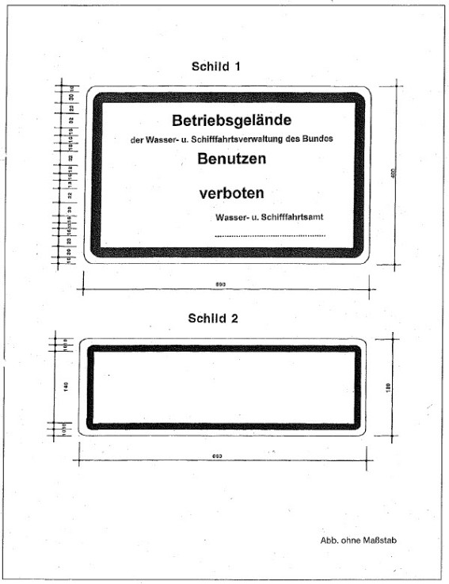
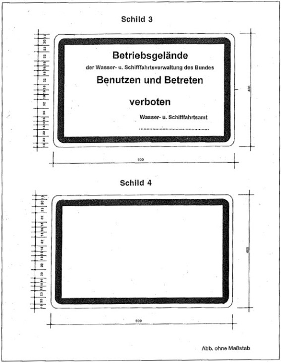

# Strompolizeiverordnung zum Schutz bundeseigener Schifffahrts- und Betriebsanlagen an Bundeswasserstraßen im Bereich der Wasser- und Schifffahrtsdirektion Ost (WSD-Ost-BetrAnlV 2010)

Ausfertigungsdatum
:   2010-06-28

Fundstelle
:   VkBl: 2010, 283

## Eingangsformel

Auf Grund des § 27 Absatz 1 in Verbindung mit § 24 Absatz 1 des
Wasserstraßengesetzes in der Fassung der Bekanntmachung vom 23. Mai
2007 (BGBl. IS. 962; 2008 I S. 1980) in Verbindung mit § 1 der
Verordnung über die Übertragung der Ermächtigung zum Erlass von
Strompolizeiverordnungen nach dem Bundeswasserstraßengesetz vom 15
April 1969 (BGBI. II S. 853) verordnet die Wasser- und
Schifffahrtsdirektion Ost für ihren Zuständigkeitsbereich:

## § 1 Geltungsbereich

Die Verordnung gilt für die bundeseigenen Schifffahrts- und
Betriebsanlagen an und in den folgenden Bundeswasserstraßen

1.  Berlin-Spandauer-Schifffahrtskanal
    mit
    Westhafen-Verbindungskanal, Westhafenkanal nebst Charlottenburger
    Verbindungskanal (zur Spree) von der Havel-Oder-Wasserstraße
    [Spandauer Havel] bis zur Spree-Oder-Wasserstraße, Humboldthafen,

2.  Dahme-Wasserstraße
    [Dolgensee, Krüpelsee, Krimnicksee, Sellenzugsee, Zeuthener See]
    mit Storkower Gewässer [Scharmützelsee, Storkower See, Storkower
    Kanal, Wolziger See, Langer See], Möllenzugsee, Wernsdorfer Seenkette
    [Wernsdorfer See südlich Oder-Spree-Kanal, Krossinsee, Gr. Zug] von
    Prieros (km 25,00) bis zur Spree-Oder-Wasserstraße, Schmöckwitz,

3.  Elbe
    von der deutsch-tschechischen Grenze (km 0,0) bis km 607,50,

4.  Elbe-Havel-Kanal
    [Gr. Wendsee]
    mit
    Niegripper Verbindungskanal (zur Elbe), Pareyer Verbindungskanal (zur
    Elbe) nebst Baggerelbe (von km 0,31 bis zum Pareyer Verbindungskanal),
    Roßdorfer Altkanal (von der westlichen Abzweigung bis km 0,90),
    Woltersdorfer Altkanal vom Mittellandkanal, Ende des unteren
    Schleusenvorhafens Hohenwarthe bis zur Unteren Havel-Wasserstraße
    [Plauer See],

5.  Elbe-Lübeck-Kanal
    von der Trave, 71 m nordöstlich der Achse der Geniner Straßenbrücke
    bis zur Elbe,

6.  Havelkanal
    von der Havel-Oder-Wasserstraße, Nieder Neuendorf bis zur Unteren
    Havel-Wasserstraße, Paretz,

7.  Havel-Oder-Wasserstraße
    [Spandauer Havel (Spandauer See, Nieder Neuendorfer See), Oder-Havel-
    Kanal (Lehnitzsee), Oderberger Gewässer (Lieper See, Oderberger See,
    Alte Oder), Ho-hensaaten-Friedrichsthaler Wasserstraße, Westoder von
    der Einmündung der Ho-hensaaten-Friedrichsthaler Wasserstraße] mit
    Tegeler See, Veltener Stichkanal, Oranienburger Havel (von km 2,81 bis
    zur Havel-Oder-Wasserstraße), Malzer Kanal (bei Malz) (von der unteren
    Trenndammspitze der Schleuse Malz bis zur Havel-Oder-Wasserstraße),
    Werbelliner Gewässer [Werbellinsee, Werbellinkanal nördlich Oder-
    Havel-Kanal, Pechteichsee], Wriezener Alte Oder (von km 2,53 bis zur
    Havel-Oder-Wasserstraße), Verbindungskanal Hohensaaten Ost (zur Oder),
    Verbindungskanal Schwedter Querfahrt (zur Oder), Westoder (von der
    Oder bis zur Ho-hensaaten-Friedrichsthaler Wasserstraße) von der
    Spreemündung, Spandau bis zur deutschpolnischen Grenze bei Mescherin,

8.  Ilmenau
    von der Nordwestkante der Brausebrücke an der Abtsmühle in Lüneburg
    bis zur Elbe,

9.  Mittellandkanal
    mit Rothenseer Verbindungskanal (zur Elbe) von km 318,40 bis zum Elbe-
    Havel-Kanal, Ende des unteren Schleusenvorhafens Hohenwarthe,

10. Müritz-Eide-Wasserstraße
    [Mecklenburgische Oberseen (Müritz, Kölpinsee, Fleesensee, Malchower
    See, Petersdorfer See, Plauer See), Elde-Seitenkanai]
    mit
    Verbindungskanal Eide-Dreieck, Stör-Wasserstraße [Schweriner See,
    Störkanal] nebst Ziegelsee von Buchholz (km 180,00) bis zur Elbe,

11. Müritz-Havel-Wasserstraße
    [Mirower Kanal {Sumpfsee, Ragunsee), Zotzensee, Mössensee, Vilzsee
    Ostteil, Kl. Peetschsee, Labussee, Canower See, Kl. Palitzsee Ostteil,
    Gr. Pälitzsee Nordteil, Ellbogensee Westteil] mit
    Mirower Adlersee und Vilzsee Westteil, Gr. Peetschsee, Rheinsberger
    Gewässer [Kl. Pälitzsee Südteil, Wolfsbrucher Kanal]
    von der Müritz- Elde-Wasserstraße [Kl. Müritz] bis zur Oberen Havel-
    Wasserstraße, Priepert,

12. Obere Havel-Wasserstraße
    [Kammerkanal (Zierker See), Obere Havel (Woblitzsee, Finowsee, Kl. und
    Gr. Priepertsee, Ellbogensee Ostteil, Ziernsee, Röblinsee, Baalensee,
    Stolpsee), Voßkanal, Mälzer Kanal] mit
    Menowsee, Schwedtsee, Lychener Gewässer [Stadtsee, Gr. Lychensee,
    Woblitz, Haussee], Templiner Gewässer [Zaarsee, Fährsee, Bruchsee,
    Templiner See, Templiner Kanal, Röddelinsee, Kl. Lankensee,
    Kuhwallsee, Templiner Wasser] nebst Gleuensee [Gleuenfließ] und Gr.
    Lankensee, Wentow-Gewässer [Kl. und Gr. Wentowsee, Wentowkanal] nebst
    Tornowfließ vom Zierker See, Neustrelitz bis zur Havel-Oder-
    Wasserstraße,

13. Oder
    von der deutsch-polnischen Grenze bei Ratzdorf bis zur deutsch-
    polnischen Grenze an der Abzweigung der Westoder,

14. Rüdersdorfer Gewässer
    [Strausberger Mühlenfließ, Hohler See, Stolpgraben, Kalksee,
    Flakensee, Dämeritzsee]
    mit
    Stichkanal Langerhanskanal [Kriensee] von oberhalb der Abzweigung des
    Langerhanskanals (km 9,85) bis zum Gosener Kanal,

15. Saale
    von Bad Dürrenberg (km 124,16) bis zur Elbe,

16. Spree-Oder-Wasserstraße
    [Untere Spree, Berliner Spree, Treptower Spree, Dahme (Langer See),
    Oder-Spree-Kanal, Fürstenwalder Spree] mit
    Ruhlebener Altarm, Landwehrkanal, Spreekanal, Rummelsburger See,
    Müggelspree [Gr. Müggelsee] (von Köpenick bis km 11,85 und vom
    Unterwasser des Wehres Gr. Tränke (km 44,85) bis zur Spree-Oder-
    Wasserstraße), Wasserstraße Seddinsee und Gosener Kanal, Neuhauser
    Speisekanal (bis zum Ende des unteren Schleusenvorhafens Neuhaus), Kl.
    Müllroser See (von der Schlaube bis zur Spree-Oder-Wasserstraße) von
    der Havel-Oder-Wasserstraße, Spandau bis zur Oder,

17. Teltowkanal
    [Glienicker Lake, Griebnitzsee, Kleinmachnower See]
    mit
    Griebnitzkanal [Stölpchensee, Pohlesee, Kl. Wannsee], Britzer
    Verbindungskanal (zur Spree) von der Potsdamer Havel bis zur Spree-
    Oder-Wasserstraße [Dahme],

18. Untere Havel-Wasserstraße
    [Pichelsdorfer Havel (Pichelssee), Kladower Seestrecke, Jungfernsee,
    Sacrow-Paretzer Kanal (Weißer See), Brandenburger Oberhavel
    (Trebelsee), Silokanal, Quenzsee, Plauer See]
    mit
    Gr. Wannsee, Potsdamer Havel [Tiefer See, Templiner See, Gr. und Kl.
    Zernsee] nebst Schwielowsee, Ketziner Havel, Brandenburger Stadtkanal,
    Beetzsee-Riewendsee-Wasserstraße (von der Ostkante der Pählbrücke bis
    zur Unteren Havel-Wasserstraße), Brandenburger Niederhavel,
    Breitlingsee und Möserscher See, Rathenower Havel [Rathenower
    Stadtkanal], Mündungsstrecke Untere Havel (bis km 156,75) von der
    Spreemündung, Spandau bis zur Einmündung des Havelberger
    Schleusenkanals in die Elbe.

## § 2 Benutzungsverbot

(1) Es ist verboten,

1.  die bundeseigenen Schifffahrts- und Betriebsanlagen, insbesondere
    Schleusen, Schleusenkanäle, Wehre, Schiffshebewerke, Sicherheitstore,
    Sperrwerke, Schutzhäfen, Düker, Brücken, Kanalbrücken, Bauhöfe und
    Werkstätten, und

2.  bundeseigene Ufergrundstücke und Betriebswege

außerhalb ihrer Zweckbestimmung, insbesondere durch Betreten, Befahren
oder Abstellen von Fahrzeugen aller Art, durch Zelten, Viehtreiben,
Reiten oder durch Entzünden von Feuer, zu benutzen (Benutzungsverbot).

(2) Ausgenommen von dem Benutzungsverbot sind das Betreten der
Betriebswege oder der bundeseigenen Ufergrundstücke durch Fußgänger
und das Befahren der Betriebswege durch Radfahrer ohne Motorkraft. Die
Benutzung geschieht auf eigene Gefahr.

(3) Das Benutzungsverbot kann durch das Schild 1 der Anlage kenntlich
gemacht werden. Die Ausnahmeregelung für Fußgänger und Radfahrer ist
durch das Schild 2 der Anlage mit der Aufschrift „Frei für Fußgänger
und Radfahrer auf eigene Gefahr" kenntlich zu machen.

(4) Wege- oder straßenrechtliche Widmungen der bundeseigenen
Betriebswege bleiben unberührt.

(5) Betretungs- und Befahrungsverbote durch andere als
strompolizeiliche Regelungen bleiben unberührt.

## § 3 Besondere Betretens- und Befahrensverbote

(1) Durch besondere Anordnung kann

1.  Fußgängern das Betreten einzelner Betriebswege oder bundeseigener
    Ufergrundstücke und

2.  Radfahrern das Befahren einzelner Betriebswege

verboten werden, soweit sonst der für die Schifffahrt erforderliche
Zustand der Bundes Wasserstraße durch das Betreten oder das Befahren
gefährdet wird.

(2) Die Anordnung nach Absatz 1 ergeht durch das Aufstellen des
Schildes 3 der Anlage.

## § 4 Ausnahmen

(1) Ausnahmen von den Verboten nach § 2 Absatz 1 und § 3 Absatz 1
können auf Antrag oder von Amts wegen

1.  durch Einzelgenehmigung

2.  durch allgemeine Genehmigung für bestimmte Personengruppen oder
    bestimmte Benutzungsarten

zugelassen werden.

(2) Eine Einzelgenehmigung nach Absatz 1 Nummer 1 wird dem
Berechtigten unter dem Vorbehalt des Widerrufs schriftlich erteilt.
Die Genehmigung kann mit Nebenbestimmungen versehen werden. Der
Berechtigte hat den Genehmigungsbescheid mitzuführen und auf Verlangen
den Beamten der Polizei und den mit strom- und
schifffahrtspolizeilichen Vollzugsaufgaben beauftragten Bediensteten
der Wasser- und Schifffahrtsverwaltung des Bundes zwecks Überprüfung
auszuhändigen.

(3) In dringenden Fällen kann die Einzelgenehmigung mündlich erteilt
werden.

(4) Eine allgemeine Genehmigung nach Absatz 1 Nummer 2 wird durch das
Schild 4 der Anlage erteilt. Das Schild ist mit der im Einzelfall
erforderlichen Aufschrift unter dem Schild 1 oder 3 anzubringen.

## § 5 Befreiungen

Von dem Benutzungsverbot nach § 2 Absatz 1 oder den besonderen
Betretens- und Befahrensverboten nach § 3 Absatz 1 sind die
Bediensteten oder Beauftragten der Wasser- und Schifffahrtsverwaltung
des Bundes, der Wasserschutzpolizeien der Länder und der Einrichtungen
des Rettungs- und des Feuerwehrdienstes oder sonstiger
Hilfsorganisationen befreit, soweit das Benutzen zur Erfüllung der
dienstlichen Aufgaben erforderlich ist.

## § 6 Zerstörungs- und Beschädigungsverbot

Es ist verboten

1.  bundeseigene Schifffahrts- und Betriebsanlagen einschließlich der
    Kabel und Leitungen, Schifffahrtszeichen, Höhenfestpunkte,
    Vermessungspunkte, Kabelmarkierungszeichen oder sonstige Zeichen und
    Einrichtungen, die zur Abgrenzung, Absperrung, Vermessung oder als
    Hinweis- oder Verbotsschilder dienen,

2.  Uferbefestigungen, Uferbewuchs oder Anpflanzungen

unbefugt zu zerstören, zu beschädigen, unbrauchbar zu machen, zu
verändern oder zu entfernen.

## § 7 Zuständigkeit

Die Wasser- und Schifffahrtsämter sind für die Durchführung dieser
Verordnung zuständig. § 50 Absatz 3 des Wasserstraßengesetzes bleibt
unberührt.

## § 8 Ordnungswidrigkeiten

Ordnungswidrig im Sinne des § 50 Absatz 1 Nummer 2 des
Wasserstraßengesetzes handelt, wer vorsätzlich oder fahrlässig

1.  entgegen § 2 Absatz 1 eine Schifffahrts- oder Betriebsanlage benutzt,

2.  einer vollziehbaren Anordnung nach § 3 Absatz 1 zuwiderhandelt,

3.  einer mit einer Genehmigung nach § 4 Absatz 1 Nummer 1 verbundenen
    vollziehbaren Auflage zuwiderhandelt,

4.  entgegen § 4 Absatz 2 Satz 3 den Genehmigungsbescheid nicht mitführt
    oder nicht aushändigt,

5.  entgegen § 6 eine Schifffahrts- oder Betriebsanlage zerstört,
    beschädigt, unbrauchbar macht, verändert oder entfernt.

## § 9 Inkrafttreten, Außenkrafttreten

Diese Verordnung tritt am Tage nach der Verkündung in Kraft.
Gleichzeitig tritt die Betriebsanlagenverordnung vom 12. Januar 1994
(VkBl. 1994 S. 249), die zuletzt durch die Verordnung vom 31. März
2004 {VkBl. 2004 S. 287) geändert worden ist, außer Kraft.

(zu § 2 Absatz 3, § 3 Absatz 2 und § 4 Absatz 4)

## Anlage Schilder zur Kennzeichnung der Verbote

(Fundstelle: VkBl. 2010, 286 - 287)

*    *        

*    *        

