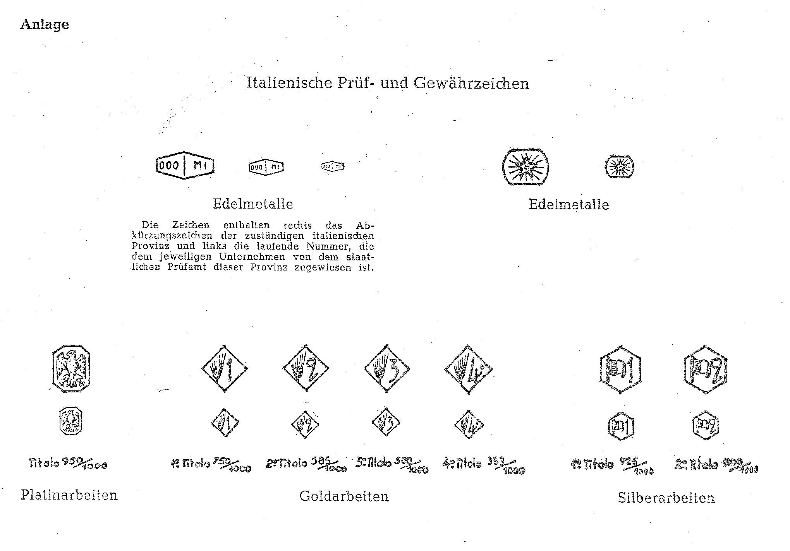

# Bekanntmachung zu § 4 des Warenzeichengesetzes (WZG§4AIPOBek)

Ausfertigungsdatum
:   1983-08-09

Fundstelle
:   BGBl I: 1983, 1126

## (XXXX)

(1) Auf Grund des § 4 Abs. 2 Nr. 3a des Warenzeichengesetzes in der
Fassung der Bekanntmachung vom 2. Januar 1968 (BGBl. I S. 1, 29) wird
bekanntgemacht, daß die Bezeichnungen, Abkürzungen und Kennzeichen der
Afrikanischen Organisation für geistiges Eigentum (Anlage) von der
Eintragung als Warenzeichen ausgeschlossen sind.

(2) Diese Bekanntmachung ergeht im Anschluß an die Bekanntmachung vom
11\. Juli 1983 (BGBl. I S. 936).

## Schlussformel

Der Bundesminister der Justiz

## Anlage

Fundstelle: BGBl. I 1962, 480)

