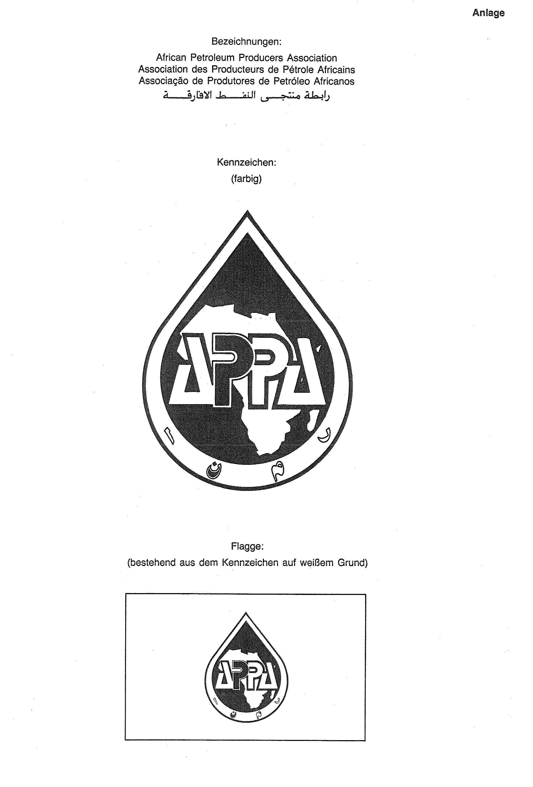

# Bekanntmachung zu § 4 des Warenzeichengesetzes (WZG§4APPABek)

Ausfertigungsdatum
:   1990-05-22

Fundstelle
:   BGBl I: 1990, 1006

## (XXXX)

Auf Grund des § 4 Abs. 2 Nr. 3a des Warenzeichengesetzes in der
Fassung der Bekanntmachung vom 2. Januar 1968 (BGBl. I S. 1, 29) wird
bekanntgemacht, daß die Bezeichnungen, das Kennzeichen und die Flagge
der

*   Vereinigung afrikanischer Erdölproduzenten

    *
        *
            *   (Anlage)

von der Eintragung als Warenzeichen ausgeschlossen sind.
Diese Bekanntmachung ergeht im Anschluß an die Bekanntmachung vom 17.
März 1989 (BGBl. I S. 657).

## Schlussformel

Der Bundesminister der Justiz

## Anlage

Fundstelle: BGBl. I 1990, 1007)

