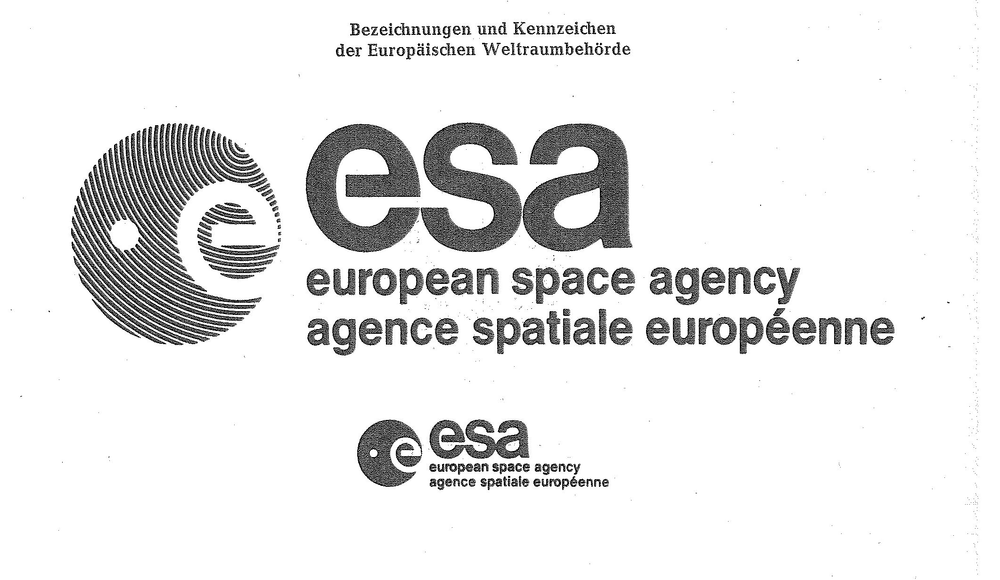

# Bekanntmachung zu § 4 des Warenzeichengesetzes (WZG§4Bek 1977-07-20)

Ausfertigungsdatum
:   1977-07-20

Fundstelle
:   BGBl I: 1977, 1345

Zuletzt geändert durch
:   Bek. v. 23.5.1991 I 1230

## (XXXX)

1.  Auf Grund des § 4 Abs. 2 Nr. 3 des Warenzeichengesetzes in der Fassung
    der Bekanntmachung vom 2. Januar 1968 (BGBl. I S. 1, 29)
    ...

2.  Ferner wird auf Grund des § 4 Abs. 2 Nr. 3a desselben Gesetzes
    bekanntgemacht:

    a)  Die Bezeichnungen und Kennzeichen der Europäischen Weltraumbehörde
        (Anlage 2) sind von der Eintragung als Warenzeichen ausgeschlossen.

    b)  - d)

3.  Diese Bekanntmachung ergeht im Anschluß an die Bekanntmachung vom 21.
    November 1975 (BGBl. I S. 2911).

## Schlussformel

Der Bundesminister der Justiz

## Anlage 1

-

## Anlage 2 Bezeichnungen und Kennzeichen der Europäischen Weltraumbehörde

Fundstelle: BGBl. I 1977, 1346)

## Anlage 3

-

