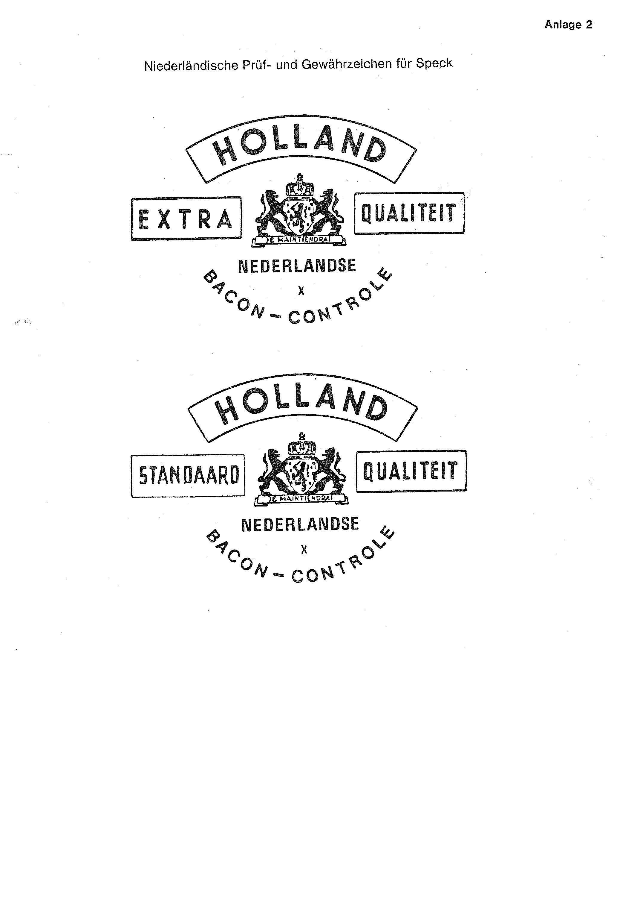

# Bekanntmachung zu § 4 des Warenzeichengesetzes (WZG§4Bek 1981-09-07)

Ausfertigungsdatum
:   1981-09-07

Fundstelle
:   BGBl I: 1981, 940

## I.

Auf Grund des § 4 Abs. 2 Nr. 3 des Warenzeichengesetzes in der Fassung
der Bekanntmachung vom 2. Januar 1968 (BGBl. I S. 1, 29) werden
amtliche Prüf- und Gewährzeichen bekanntgemacht, die

-   in den Niederlanden für Eier von freilaufenden Hennen (Anlage 1) und
    für Speck (Anlage 2) und

-   in Brasilien für Edelmetalle (Anlage 3)

eingeführt sind.

## II.

Auf Grund des § 4 Abs. 2 Nr. 3a desselben Gesetzes wird
bekanntgemacht, daß die Bezeichnungen, Abkürzungen und Kennzeichen

-   der Internationalen kriminalpolizeilichen Organisation (Anlage 4),

-   der Internationalen Seefunksatelliten-Organisation (Anlage 5) und

-   der Weltorganisation für Tourismus (Anlage 6)

von der Eintragung als Warenzeichen ausgeschlossen sind.

## III.

-

## IV.

Diese Bekanntmachung ergeht im Anschluß an die Bekanntmachung vom 19.
Dezember 1980 (BGBl. I S. 2352).

## Schlußformel

Der Bundesminister der Justiz

## Anlage 1 Niederländische Prüf- und Gewährzeichen für Eier von freilaufenden Hennen

Fundstelle: BGBl. I 1981, 941)

## Anlage 2 Niederländische Prüf- und Gewährzeichen für Speck

Fundstelle: BGBl. I 1981, 941)

## Anlage 3 Brasilianische Prüf- und Gewährzeichen für Edelmetalle

Fundstelle: BGBl. I 1981, 942)

## Anlage 4 Internationale kriminalpolizeiliche Organisation

Fundstelle: BGBl. I 1981, 943 - 944)

## Anlage 5 Internationale Seefunksatelliten-Organisation

Fundstelle: BGBl. I 1981, 945)

## Anlage 6 Weltorganisation für Tourismus

Fundstelle: BGBl. I 1981, 946)

## Anlage 7

-

