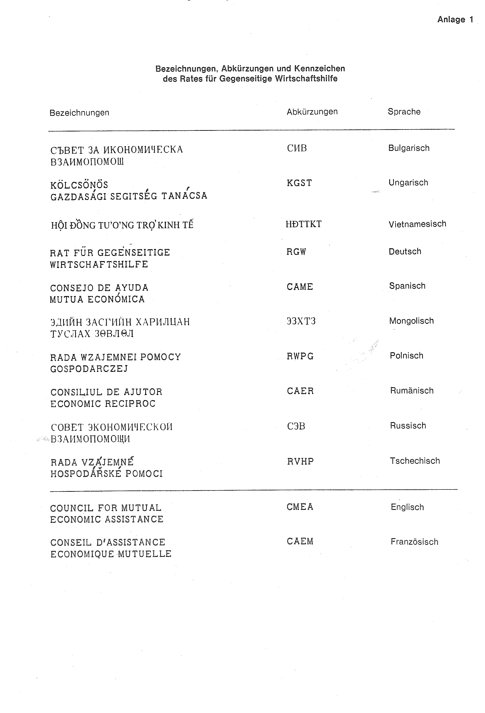
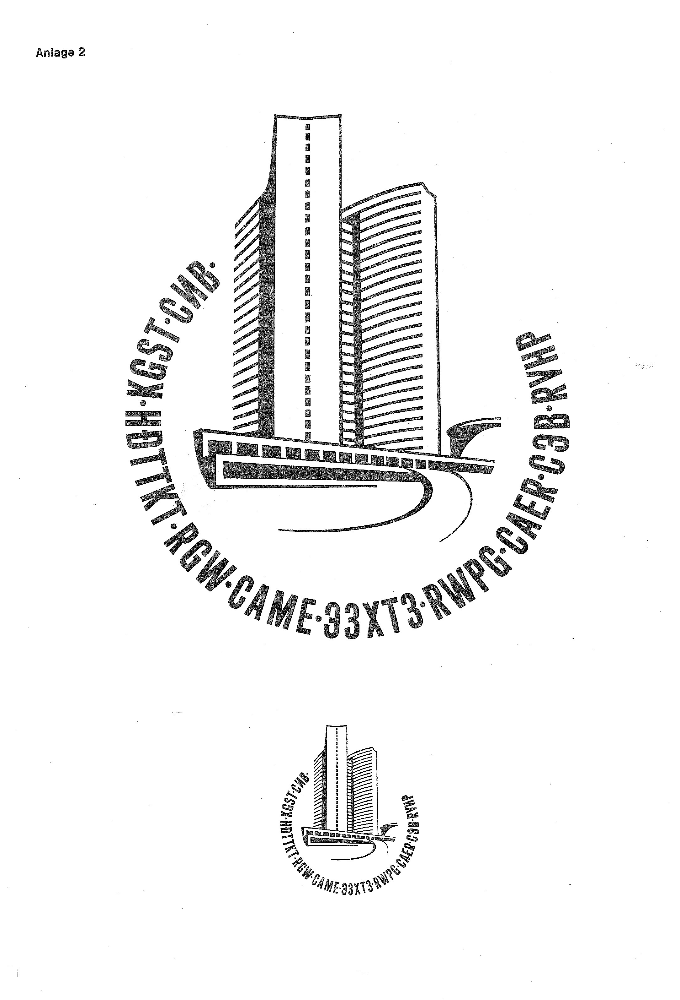

# Bekanntmachung zu § 4 des Warenzeichengesetzes (WZG§4COMECONBek 1980)

Ausfertigungsdatum
:   1980-02-11

Fundstelle
:   BGBl I: 1980, 148

## (XXXX)

(1) Auf Grund des § 4 Abs. 2 Nr. 3a des Warenzeichengesetzes in der
Fassung der Bekanntmachung vom 2. Januar 1968 (BGBl. I S. 1, 29) wird
bekanntgemacht, daß die Bezeichnungen, Abkürzungen und Kennzeichen des
Rates für Gegenseitige Wirtschaftshilfe (Anlagen 1 und 2) von der
Eintragung als Warenzeichen ausgeschlossen sind.

(2) Diese Bekanntmachung ergeht im Anschluß an die Bekanntmachung vom
22\. November 1979 (BGBl. I S. 1999).\*

## Schlussformel

Der Bundesminister der Justiz

## Anlage 1 Bezeichnungen, Abkürzungen und Kennzeichen des Rates für Gegenseitige Wirtschaftshilfe

Fundstelle: BGBl. I 1980, 149)

## Anlage 2

Fundstelle: BGBl. I 1980, 150)

