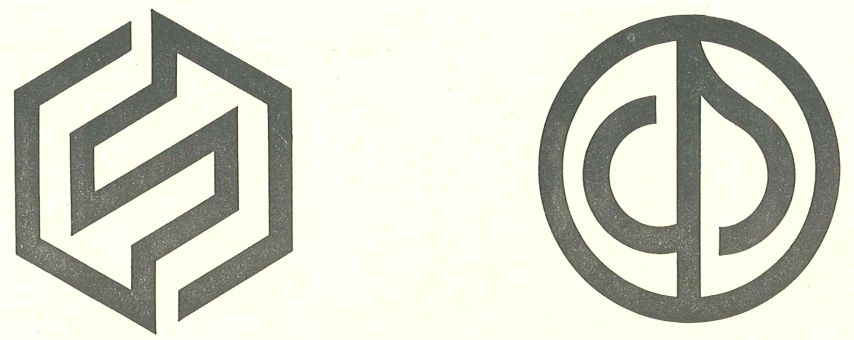
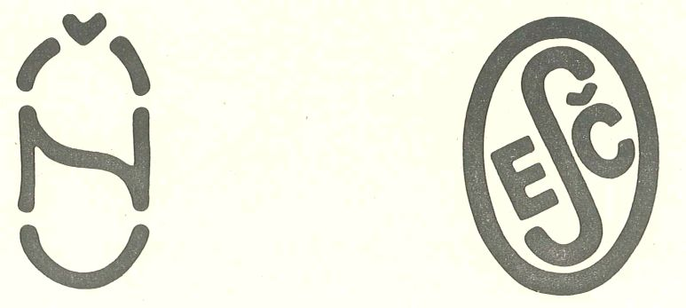
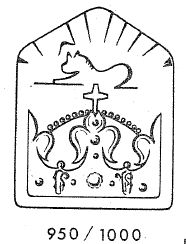
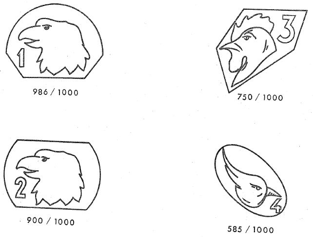
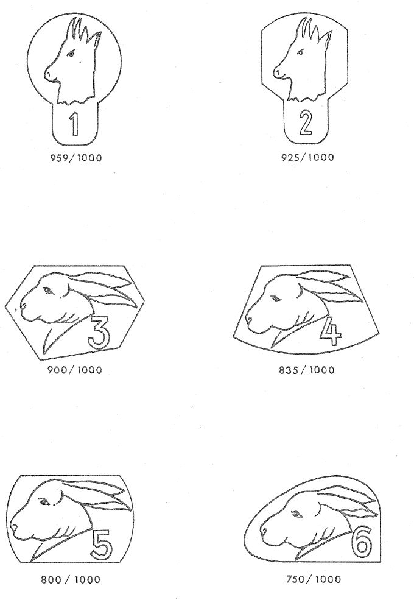
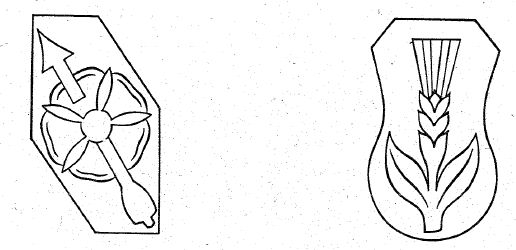
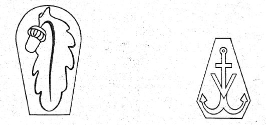
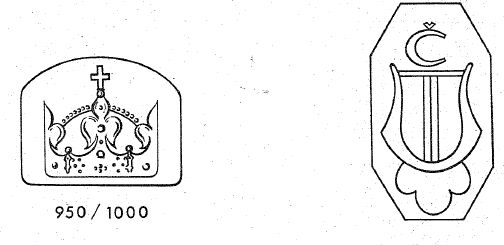
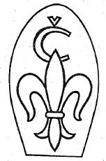

# Bekanntmachung zu § 4 des Warenzeichengesetzes (WZG§4CSKBek)

Ausfertigungsdatum
:   1970-12-01

Fundstelle
:   BGBl I: 1970, 1558

## (XXXX)

(1) Auf Grund des § 4 Abs. 2 Nr. 3 des Warenzeichengesetzes in der
Fassung der Bekanntmachung vom 2. Januar 1968 (Bundesgesetzbl. I S. 1,
29), zuletzt geändert durch Gesetz vom 23. Juni 1970 (Bundesgesetzbl.
I S. 821), werden in der Anlage amtliche Prüf- und Gewährzeichen
bekanntgemacht, die in der Tschechoslowakischen Sozialistischen
Republik eingeführt sind.

(2) Diese Bekanntmachung ergeht im Anschluß an die Bekanntmachung vom
18\. Dezember 1968 (Bundesgesetzbl. I S. 1416).

## Schlussformel

Der Bundesminister der Justiz

## Anlage

(Fundstelle: BGBl. I 1970, 1559)

1.  Prüf- und Gewährzeichen der Tschechoslowakischen Sozialistischen
    Repbublik die Zeichen CSN und ESC

*    *   Prüfzeichen

    *   Gewährzeichen

*    *   Das Zeichen CSN

    *   Das Zeichen ESC

2.  Amtliche tschechoslowakische Prägezeichen für Platin-, Gold- und
    Silberarbeiten

*    *   a) Platin

*    *   b) Gold

*    *   c) Silber

*    *   d) Alte Arbeiten

*    *   Platin

    *   Gold

*    *   Silber

    *   Ausfuhr

*    *   e) Arbeiten ausländischer Herkunft

*    *   Platin

    *   Gold

*    *   Silber

