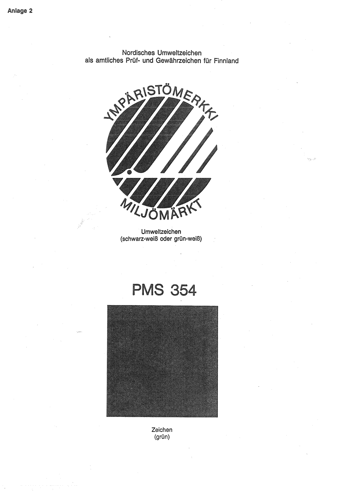

# Bekanntmachung zu § 4 des Warenzeichengesetzes (WZG§4CSKFINBek)

Ausfertigungsdatum
:   1992-01-14

Fundstelle
:   BGBl I: 1992, 224

## (XXXX)

Auf Grund des § 4 Abs. 2 Nr. 3 des Warenzeichengesetzes in der Fassung
der Bekanntmachung vom 2. Januar 1968 (BGBl. I S. 1, 29) werden
amtliche Prüf- und Gewährzeichen bekanntgemacht, die

-   in der Tschechischen und Slowakischen Föderativen Republik (Anlage 1),

-   in der Republik Finnland (Anlage 2)

eingeführt sind.
Die Bekanntmachung vom 19. Januar 1983 (BGBl. I S. 47) tritt
hinsichtlich der in ihrer Anlage 2 aufgeführten Prüf- und
Gewährzeichen der Tschechoslowakischen Sozialistischen Republik außer
Kraft.
Diese Bekanntmachung ergeht im Anschluß an die Bekanntmachung vom 22.
August 1991 (BGBl. I S. 1926).

## Schlussformel

Der Bundesminister der Justiz

## Anlage 1

Amtliche Prüfzeichen der Tschechischen und Slowakischen Föderativen
Republik ab 1991 für Meßgeräte

*
    *
        *
            *
                *
                    *   **TCS**

Zeichen für die Bauartzulassung, das von den staatlichen
metrologischen Behörden an einem Meßgerät angebracht wird. Das Zeichen
besteht aus den Buchstaben TCS mit der Ordnungszahl und dem Jahr der
Zulassung.

*
    *
        *
            *
                *
                    *   **CS**

Prüfzeichen, das von den dem Bundesamt für Normen und Maße unmittelbar
nachgeordneten staatlichen metrologischen Behörden an einem Meßgerät
angebracht wird. Das Prüfzeichen besteht aus den Buchstaben CS mit der
Zahl für die zuständige Prüfbehörde und gibt im Fall der regelmäßigen
Prüfung auch das Jahr der Prüfung an.

*
    *
        *
            *
                *
                    *   **K**

Prüfzeichen, das von den vom Bundesamt für Normen und Maße zur Prüfung
befugten Unternehmen an einem Meßgerät angebracht wird. Das
Prüfzeichen besteht aus dem Buchstaben K und der das Unternehmen
kennzeichnenden Nummer und gibt im Fall der regelmäßigen Prüfung auch
das Jahr der Prüfung an.

*
    *
        *
            *
                *
                    *   **C**

Eichzeichen, das durch die vom Bundesamt für Normen und Maße
zugelassenen Unternehmen an einem Prüfgerät angebracht wird. Das
Eichzeichen besteht aus dem Buchstaben C mit der das Unternehmen
kennzeichnenden Nummer.

## Anlage 2 Nordisches Umweltzeichen als amtliches Prüf- und Gewährzeichen für Finnland

Fundstelle: BGBl. I 1992, 226)

