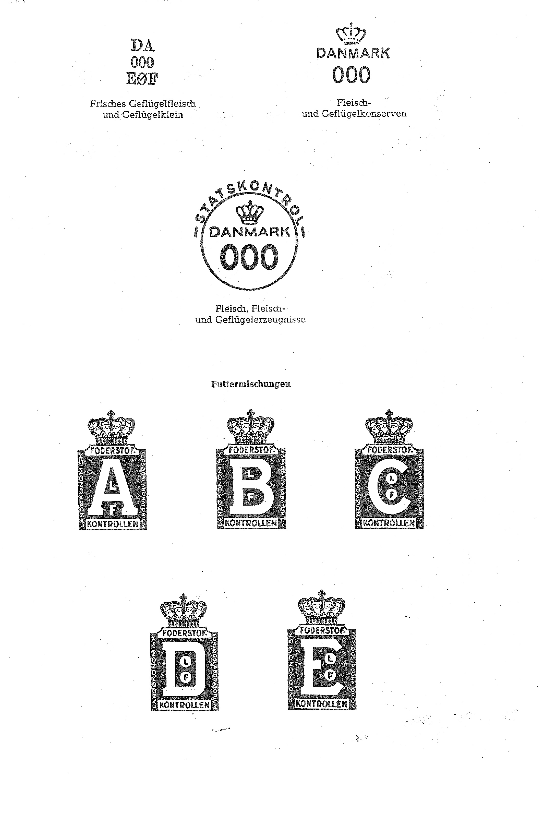

# Bekanntmachung zu § 4 des Warenzeichengesetzes (WZG§4DNKBek)

Ausfertigungsdatum
:   1975-07-21

Fundstelle
:   BGBl I: 1975, 1946

## (XXXX)

(1) Auf Grund des § 4 Abs. 2 Nr. 3a des Warenzeichengesetzes in der
Fassung der Bekanntmachung vom 2. Januar 1968 (Bundesgesetzbl. I S. 1,
29), zuletzt geändert durch das Gesetz vom 9. Dezember 1974
(Bundesgesetzbl. I S. 3416), werden in der Anlage amtliche Prüf- und
Gewährzeichen sowie -stempel bekanntgemacht, die im Königreich
Dänemark eingeführt sind.

(2) Diese Bekanntmachung ergeht im Anschluß an die Bekanntmachung vom
14\. April 1975 (Bundesgesetzblatt I S. 962).\*

## Schlussformel

Der Bundesminister der Justiz

## Anlage Amtliche Prüf- und Gewährzeichen des Königreichs Dänemark

Fundstelle: BGBl. I 1975, 1947 - 1954)

