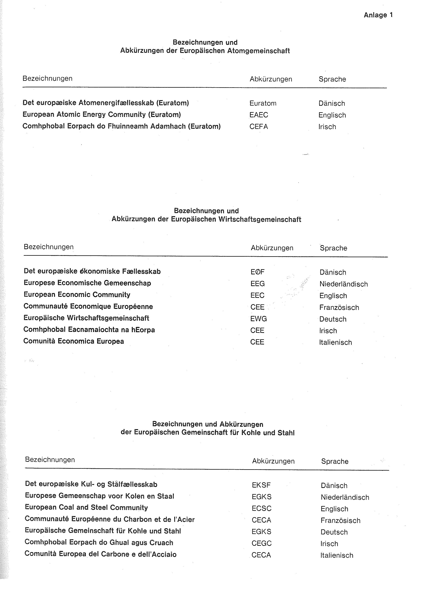
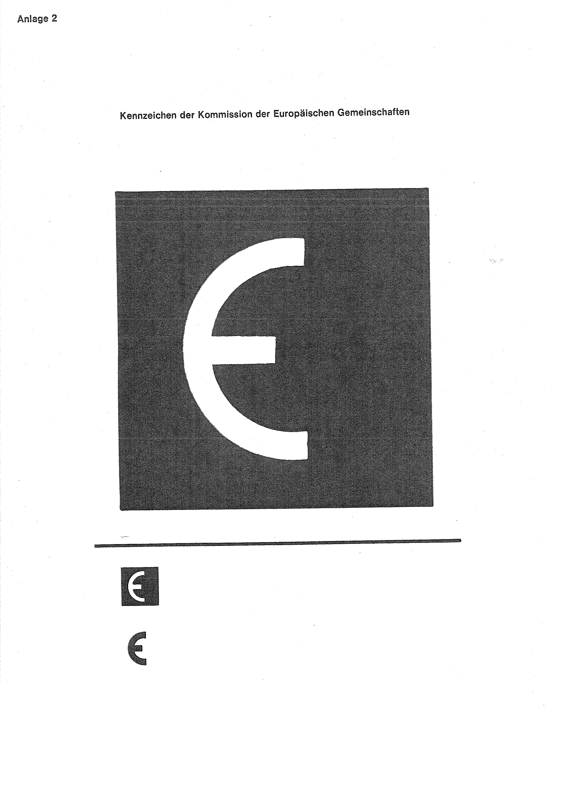

# Bekanntmachung zu § 4 des Warenzeichengesetzes (WZG§4EG/EGKomBek)

Ausfertigungsdatum
:   1980-04-16

Fundstelle
:   BGBl I: 1980, 448

## (XXXX)

(1) Auf Grund des § 4 Abs. 2 Nr. 3a des Warenzeichengesetzes in der
Fassung der Bekanntmachung vom 2. Januar 1968 (BGBl. I S. 1, 29) wird
bekanntgemacht, daß die Bezeichnungen und Abkürzungen der Europäischen
Gemeinschaften (Anlage 1) und das von der Kommission der Europäischen
Gemeinschaften verwandte Kennzeichen (Anlage 2) von der Eintragung als
Warenzeichen ausgeschlossen sind.

(2) Diese Bekanntmachung ergeht im Anschluß an die Bekanntmachung vom
11\. Februar 1980 (BGBl. I S. 148).

## Schlussformel

Der Bundesminister der Justiz

## Anlage 1

Fundstelle: BGBl. I 1980, 449)

## Anlage 2 Kennzeichen der Kommission der Europäischen Gemeinschaften

Fundstelle: BGBl. I 1980, 450)

