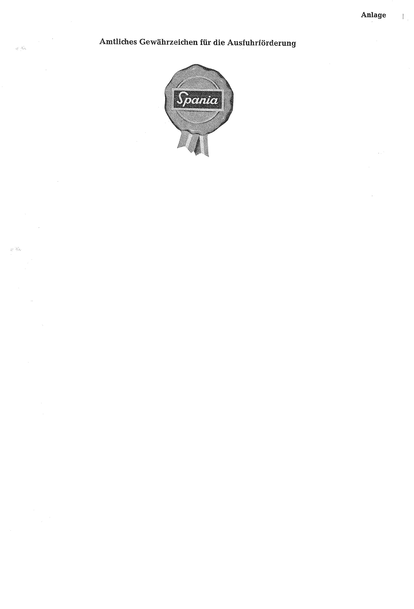

# Bekanntmachung zu § 4 des Warenzeichengesetzes (WZG§4ESPBek)

Ausfertigungsdatum
:   1972-03-09

Fundstelle
:   BGBl I: 1972, 455

## (XXXX)

(1) Auf Grund des § 4 Abs. 2 Nr. 3 des Warenzeichengesetzes in der
Fassung der Bekanntmachung vom 2. Januar 1968 (Bundesgesetzbl. I S. 1,
29), zuletzt geändert durch Gesetz vom 23. Juni 1970 (Bundesgesetzbl.
I S. 805), wird in der Anlage ein Gewährzeichen bekanntgemacht, das im
Spanischen Staat eingeführt ist.

(2) Diese Bekanntmachung ergeht im Anschluß an die Bekanntmachung vom
1\. Dezember 1970 (Bundesgesetzbl. I S. 1558).

## Schlussformel

Der Bundesminister der Justiz

## Anlage Amtliches Gewährzeichen für die Ausfuhrförderung

(Fundstelle: BGBl. I 1972, 455)

