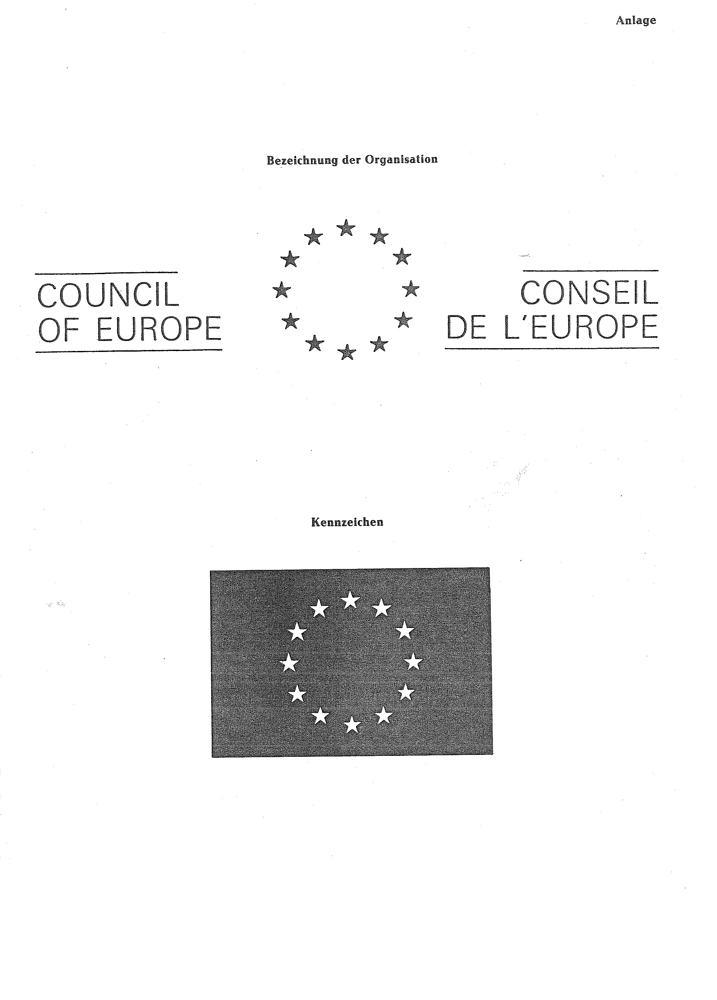

# Bekanntmachung zu § 4 des Warenzeichengesetzes (WZG§4EuRatBek)

Ausfertigungsdatum
:   1979-10-29

Fundstelle
:   BGBl I: 1979, 1800

## (XXXX)

(1) Auf Grund des § 4 Abs. 2 Nr. 3a des Warenzeichengesetzes in der
Fassung der Bekanntmachung vom 2. Januar 1968 (BGBl. I S. 1, 29) wird
bekanntgemacht, daß die Bezeichnung und das Kennzeichen des
Europarates (Anlage) von der Eintragung als Warenzeichen
ausgeschlossen sind.

(2) Diese Bekanntmachung ergeht im Anschluß an die Bekanntmachung vom
26\. März 1979 (BGBl. I S. 422).

## Schlussformel

Der Bundesminister der Justiz

## Anlage

Fundstelle: BGBl. I 1979, 1801)

