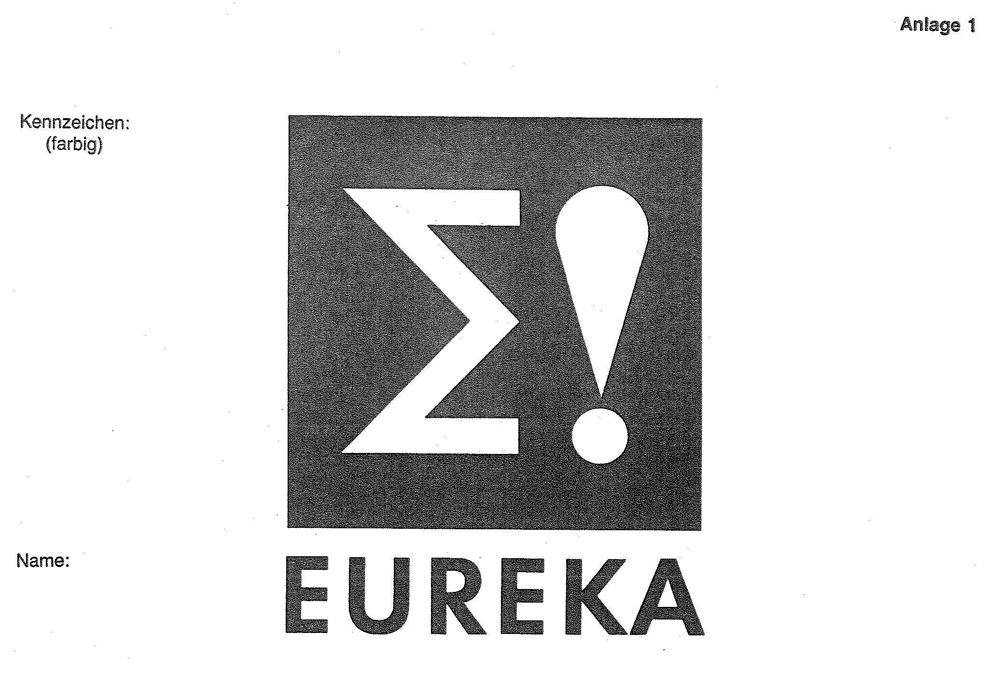
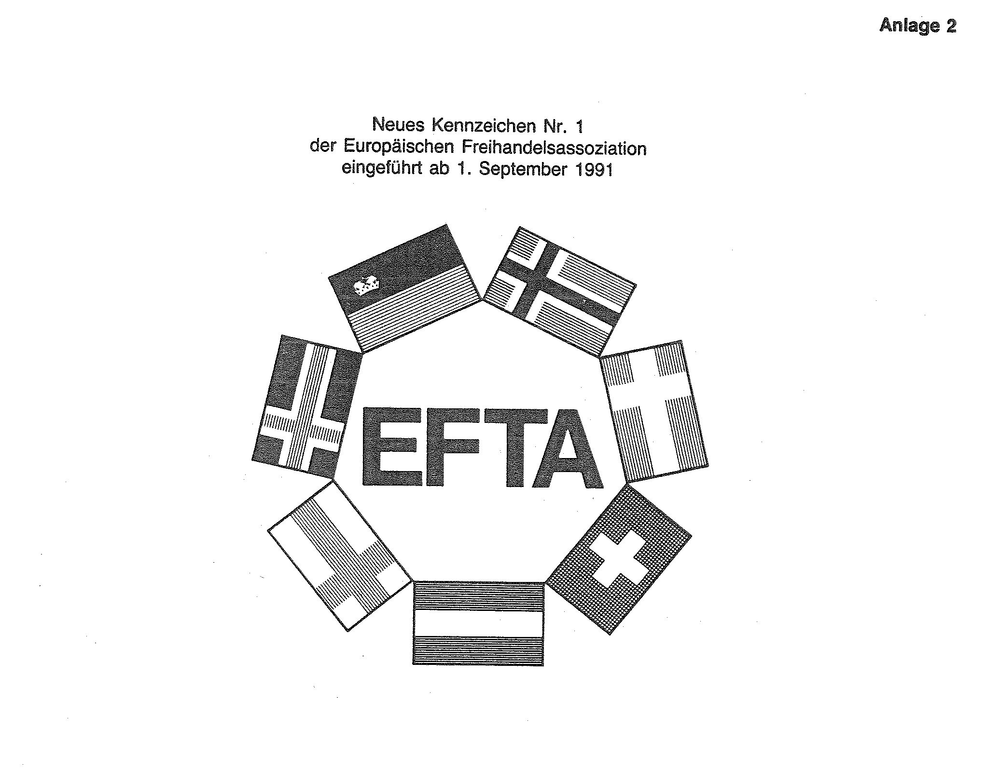
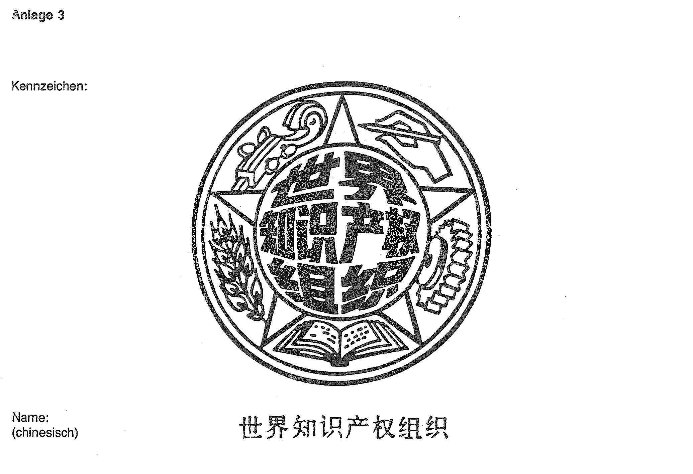
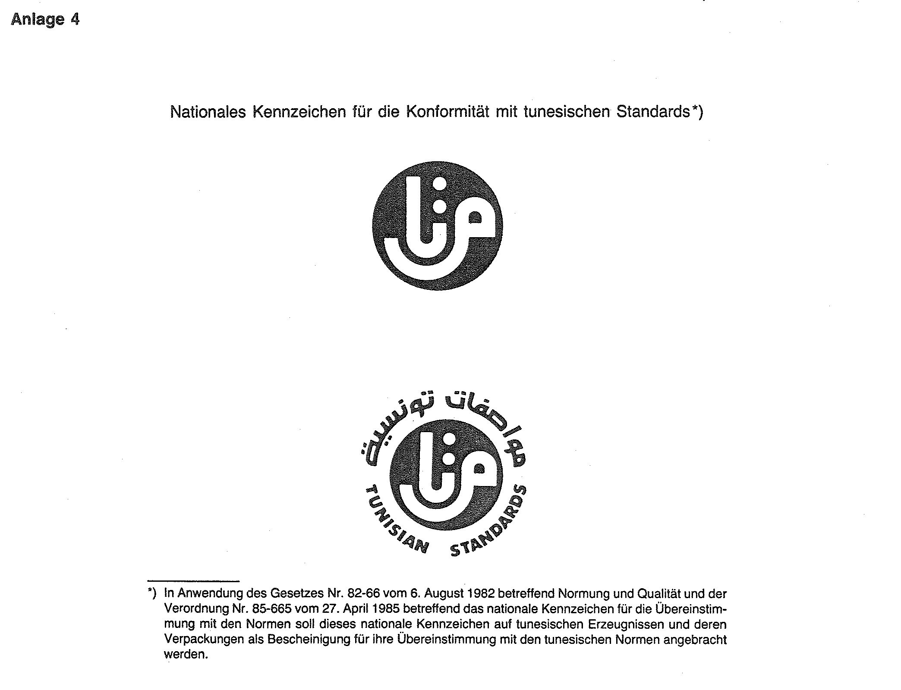

# Bekanntmachung zu § 4 des Warenzeichengesetzes (WZG§4EUREKA/EFTABek)

Ausfertigungsdatum
:   1992-05-22

Fundstelle
:   BGBl I: 1992, 1024

## I.

Auf Grund des § 4 Abs. 2 Nr. 3a des Warenzeichengesetzes in der
Fassung der Bekanntmachung vom 2. Januar 1968 (BGBl. I S. 1, 29) wird
bekanntgemacht, daß die Namen und Kennzeichen

-   der zwischenstaatlichen Organisation EUREKA (Anlage 1),

-   der Europäischen Freihandelsassoziation EFTA (Anlage 2) und

-   der Weltorganisation für geistiges Eigentum in chinesischer
    Schreibweise (Anlage 3)

von der Eintragung als Warenzeichen ausgeschlossen sind.
Das in Anlage 2 wiedergegebene Kennzeichen tritt an die Stelle des in
der Anlage zu der Bekanntmachung vom 13. März 1986 (BGBl. I S. 370)
wiedergegebenen Kennzeichens.

## II.

Auf Grund des § 4 Abs. 2 Nr. 3 desselben Gesetzes werden nationale
Kennzeichen bekanntgemacht, die

-   in Tunesien für die Konformität mit tunesischen Standards

eingeführt sind (Anlage 4).

## III.

Diese Bekanntmachung ergeht im Anschluß an die Bekanntmachung vom 14.
Januar 1992 (BGBl. I S. 224).

## Schlußformel

Der Bundesminister der Justiz

## Anlage 1

Fundstelle: BGBl. I 1992, 1025)

## Anlage 2

Fundstelle: BGBl. I 1992, 1025)

## Anlage 3

Fundstelle: BGBl. I 1992, 1026)

## Anlage 4

Fundstelle: BGBl. I 1992, 1026)

