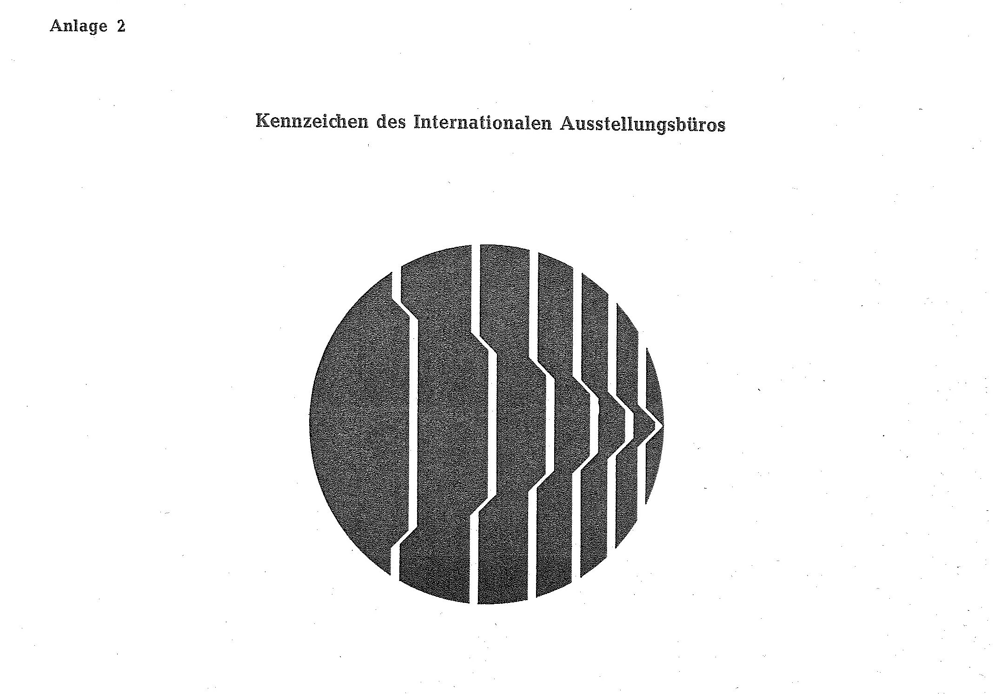
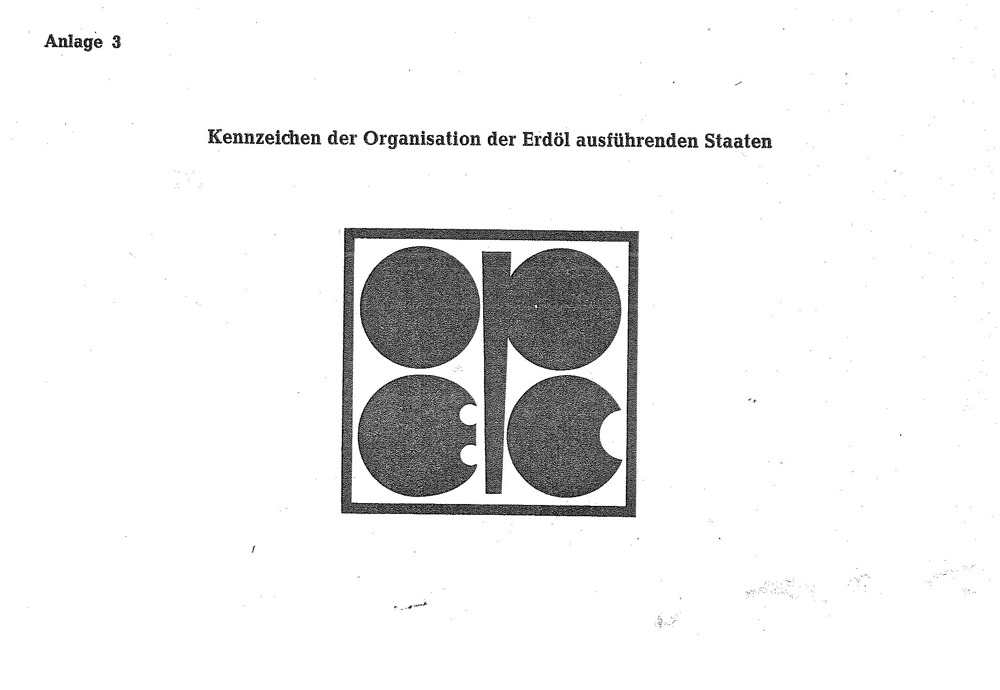
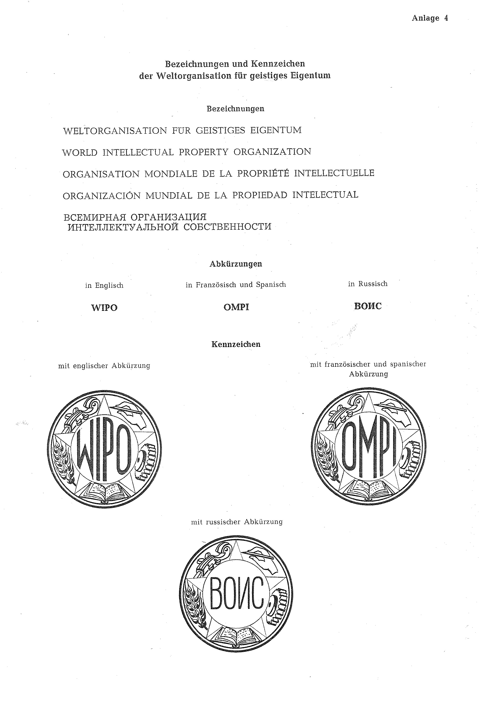

# Bekanntmachung zu § 4 des Warenzeichengesetzes (WZG§4EUROCONTROLBek)

Ausfertigungsdatum
:   1971-05-05

Fundstelle
:   BGBl I: 1971, 670

Geändert durch
:   Bek. v. 4.2.1975 I 474

## (XXXX)

(1) Auf Grund des § 4 Abs. 2 Nr. 3a des Warenzeichengesetzes in der
Fassung der Bekanntmachung vom 2. Januar 1968 (Bundesgesetzbl. I S. 1,
29), zuletzt geändert durch das Gesetz vom 23. Juni 1970
(Bundesgesetzbl. I S. 805), wird bekanntgemacht, daß

1.  die Bezeichnungen und das Kennzeichen der Europäischen Organisation
    zur Sicherung der Luftfahrt (Anlage 1),

2.  das Kennzeichen des Internationalen Ausstellungsbüros (Anlage 2),

3.  das Kennzeichen der Organisation der Erdöl ausführenden Staaten
    (Anlage 3) und

4.  die Bezeichnungen und Kennzeichen der Weltorganisation für geistiges
    Eigentum (Anlage 4)

von der Eintragung als Warenzeichen ausgeschlossen sind.

(2) Diese Bekanntmachung ergeht im Anschluß an die Bekanntmachung vom
19\. September 1969 (Bundesgesetzbl. I S. 1736).\*

## Schlussformel

Der Bundesminister der Justiz

## Anlage 1 Bezeichnungen und Kennzeichen der Europäischen Organisation zur Sicherung der Luftfahrt

Bezeichnungen

-   "EUROPÄISCHE ORGANISATION ZUR SICHERUNG DER LUFTFAHRT"

    (EUROCONTROL)

-   "EUROPEAN ORGANISATION FOR THE SAFETY OF AIR NAVIGATION"

    (EUROCONTROL)

-   ORGANISATION EUROPEENNE POUR LA SECURITE DE LA NAVIGATION

    AERIENNE"

    (EUROCONTROL)

-   "EUROPESE ORGANISATIE VOOR DE VEILIGHEID VAN DE LUCHTVAART"

    (EUROCONTROL)

Abkürzung

*   EUROCONTROL

Kennzeichen
(Inhalt: Nicht darstellbares Kennzeichen,
Fundstelle: BGBl. I 1971, 671)

## Anlage 2 Kennzeichen des Internationalen Ausstellungsbüros

(Fundstelle: BGBl. I 1971, 672)

## Anlage 3 Kennzeichen der Organisation der Erdöl ausführenden Staaten

(Fundstelle: BGBl. I 1971, 672)

## Anlage 4 Bezeichnungen und Kennzeichen der Weltorganisation für geistiges Eigentum

(Fundstelle: BGBl. I 1971, 673,
bzgl. der einzelnen Änderungen vgl. Fußnote)

## Anlage 5

-

## Anlage 6

-

