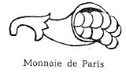

# Bekanntmachung zu § 4 des Warenzeichengesetzes (WZG§4FRABek)

Ausfertigungsdatum
:   1968-12-18

Fundstelle
:   BGBl I: 1968, 1416

## (XXXX)

(1) Auf Grund des § 4 Abs. 2 Nr. 3 des Warenzeichengesetzes in der
Fassung vom 2. Januar 1968 (Bundesgesetzbl. I S. 1, 29), zuletzt
geändert durch Gesetz vom 20. Mai 1968 (Bundesgesetzbl. I S. 429),
wird in der Anlage ein amtliches Prüf- und Gewährzeichen
bekanntgemacht, das in der Französischen Republik für Erzeugnisse der
Pariser Münze eingeführt ist.

(2) Diese Bekanntmachung ergeht im Anschluß an die Bekanntmachung vom
14\. August 1968 (Bundesgesetzbl. I S. 975).

## Schlussformel

Der Bundesminister der Justiz

## Anlage Amtlicher Stempel der Pariser Münze

(Fundstelle: BGBl. I 1968, 1416)

