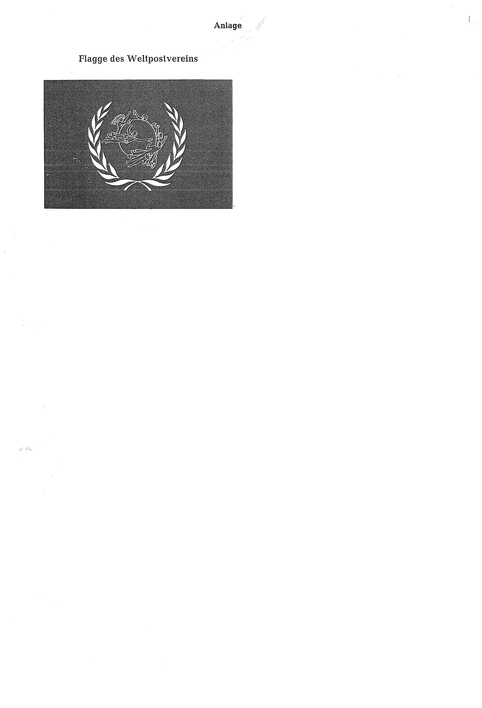

# Bekanntmachung zu § 4 des Warenzeichengesetzes (WZG§4FWPBek)

Ausfertigungsdatum
:   1973-04-18

Fundstelle
:   BGBl I: 1973, 323

## (XXXX)

(1) Auf Grund des § 4 Abs. 2 Nr. 3a des Warenzeichengesetzes in der
Fassung der Bekanntmachung vom 2. Januar 1968 (Bundesgesetzbl. I S. 1,
29), zuletzt geändert durch das Gesetz vom 23. Juni 1970
(Bundesgesetzbl. I S. 805), wird bekanntgemacht, daß die Flagge des
Weltpostvereins (Anlage) von der Eintragung als Warenzeichen
ausgeschlossen ist.

(2) Diese Bekanntmachung ergeht in Anschluß an die Bekanntmachung vom
18\. Dezember 1972 (Bundesgesetzbl. 1973 I S. 3).

## Schlussformel

Der Bundesminister der Justiz

## Anlage Flagge des Weltpostvereins

Fundstelle: BGBl. I 1973, 323)

