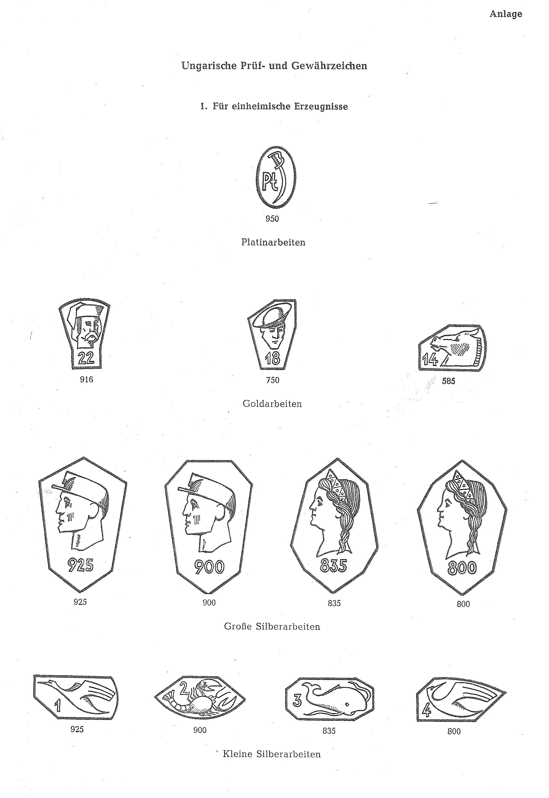
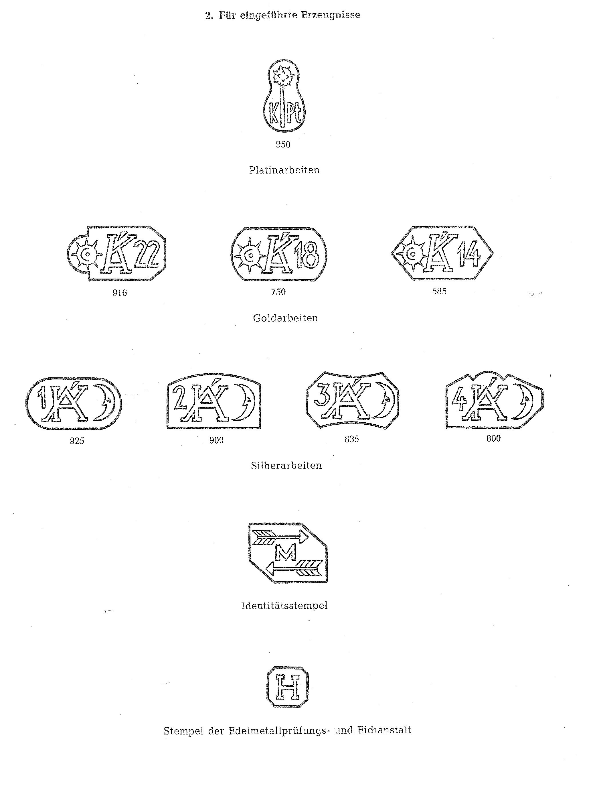

# Bekanntmachung zu § 4 des Warenzeichengesetzes (WZG§4HUNBek)

Ausfertigungsdatum
:   1967-10-30

Fundstelle
:   BGBl I: 1967, 1122

## (XXXX)

(1) Auf Grund des § 4 Abs. 2 Nr. 3 des Warenzeichengesetzes in der
Fassung vom 9. Mai 1961 (Bundesgesetzbl. I S. 549, 574), zuletzt
geändert durch Gesetz vom 4. September 1967 (Bundesgesetzbl. I S.
953), werden in der Anlage amtliche Prüf- und Gewährzeichen
bekanntgemacht, die in der Volksrepublik Ungarn für Erzeugnisse aus
Edelmetallen eingeführt sind.

(2) Diese Bekanntmachung ergeht im Anschluß an die Bekanntmachung vom
17\. Mai 1967 (Bundesgesetzblatt I S. 574).

## Schlussformel

Der Bundesminister der Justiz

## Anlage Ungarische Prüf- und Gewährzeichen

(Fundstelle: BGBl. I 1967, 1123 - 1124)

