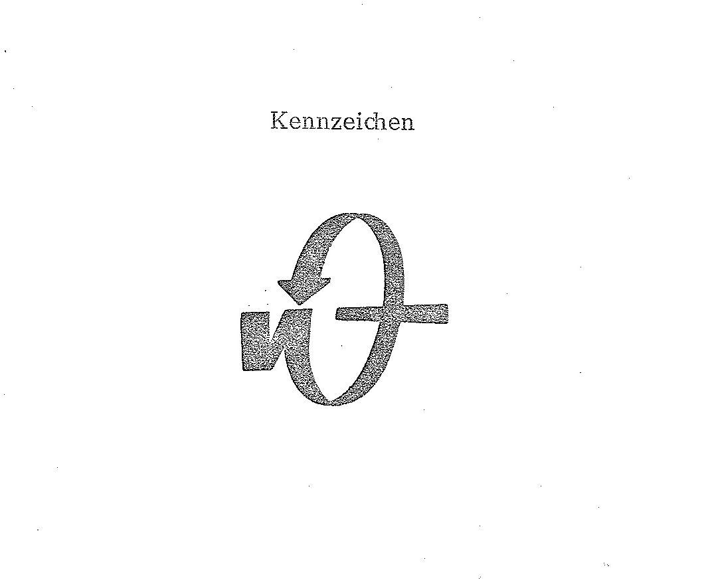
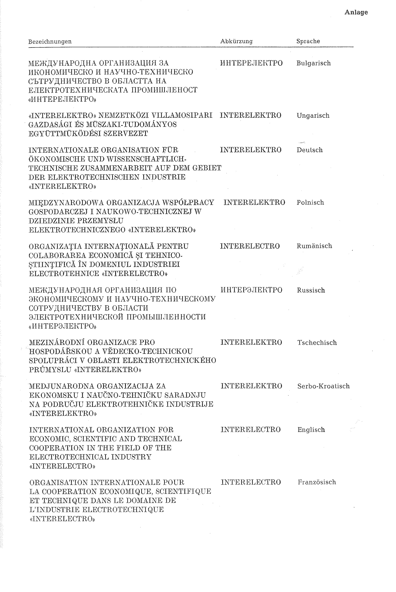

# Bekanntmachung zu § 4 des Warenzeichengesetzes (WZG§4INTERELEKTROBek)

Ausfertigungsdatum
:   1979-03-26

Fundstelle
:   BGBl I: 1979, 422

## (XXXX)

(1) Auf Grund des § 4 Abs. 2 Nr. 3a des Warenzeichengesetzes in der
Fassung der Bekanntmachung vom 2. Januar 1968 (BGBl. I S. 1, 29) wird
bekanntgemacht, daß die Bezeichnungen, die Abkürzungen und das
Kennzeichen der Internationalen Organisation für Ökonomische und
Wissenschaftlich-Technische Zusammenarbeit auf dem Gebiet der
Elektrotechnischen Industrie "INTERELEKTRO" (Anlage) von der
Eintragung als Warenzeichen ausgeschlossen sind.

(2) Diese Bekanntmachung ergeht im Anschluß an die Bekanntmachung vom
5\. Dezember 1978 (BGBl. I S. 1950).

## Schlussformel

Der Bundesminister der Justiz

## Anlage

Fundstelle: BGBl. I 1979, 422 - 423)

