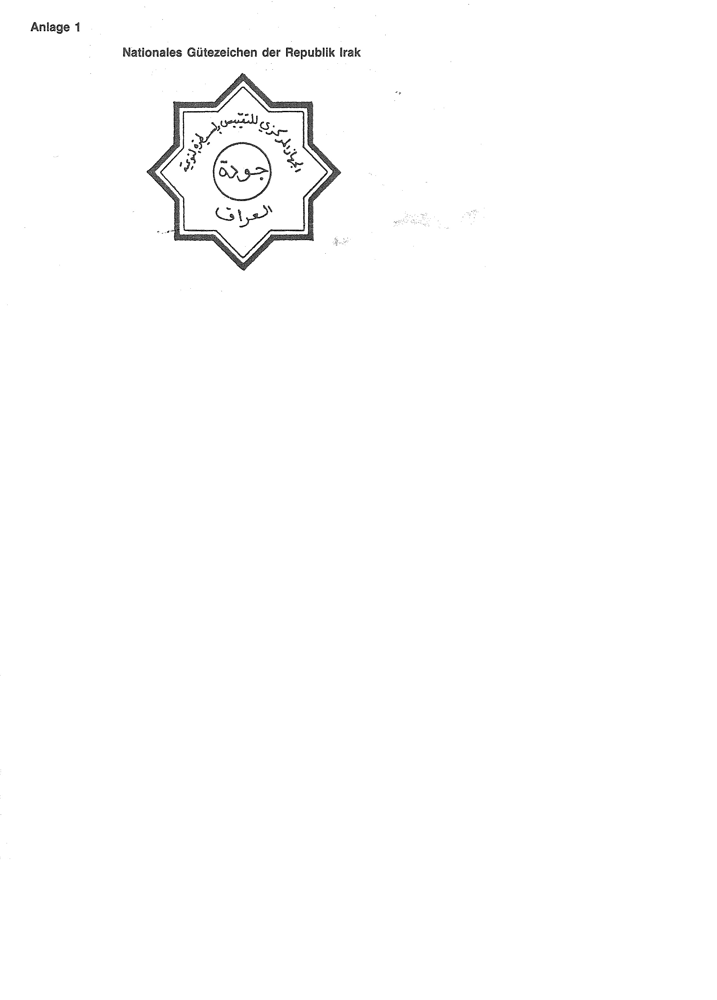
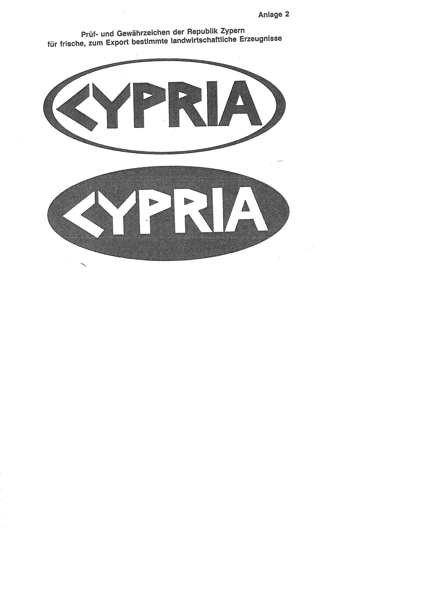
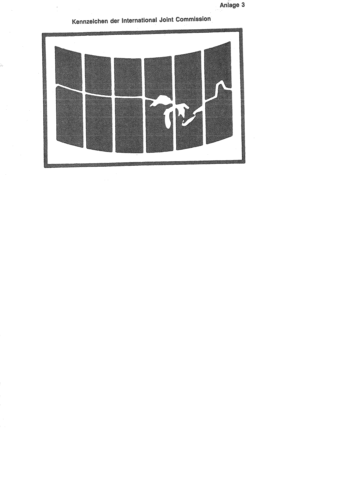

# Bekanntmachung zu § 4 des Warenzeichengesetzes (WZG§4IRQ/CYPBek)

Ausfertigungsdatum
:   1988-03-04

Fundstelle
:   BGBl I: 1988, 232

## I.

Auf Grund des § 4 Abs. 2 Nr. 3 des Warenzeichengesetzes in der Fassung
der Bekanntmachung vom 2. Januar 1968 (BGBl. I S. 1, 29) werden
amtliche Prüf- und Gewährzeichen bekanntgemacht, die

-   in der Republik Irak für Waren jeder Art (Anlage 1) und

-   in der Republik Zypern für frische, zum Export bestimmte
    landwirtschaftliche Erzeugnisse (Anlage 2)

eingeführt sind.
Das in der Anlage 2 wiedergegebene Kennzeichen tritt an die Stelle des
in der Anlage zu der Bekanntmachung vom 3. April 1987 (BGBl. I S.
1158) wiedergegebenen Kennzeichens.

## II.

Auf Grund des § 4 Abs. 2 Nr. 3a desselben Gesetzes wird
bekanntgemacht, daß das Kennzeichen

-   der International Joint Commission (Anlage 3)

von der Eintragung als Warenzeichen ausgeschlossen ist.

## III.

Diese Bekanntmachung ergeht im Anschluß an die Bekanntmachung vom 3.
April 1987 (BGBl. I S. 1158).

## Schlußformel

Der Bundesminister der Justiz

## Anlage 1 Nationales Gütezeichen der Republik Irak

Fundstelle: BGBl. I 1988, 232)

## Anlage 2 Prüf- und Gewährzeichen der Republik Zypern für frische, zum Export bestimmte landwirtschaftliche Erzeugnisse

Fundstelle: BGBl. I 1988, 233)

## Anlage 3 Kennzeichen der International Joint Commission

Fundstelle: BGBl. I 1988, 233)

