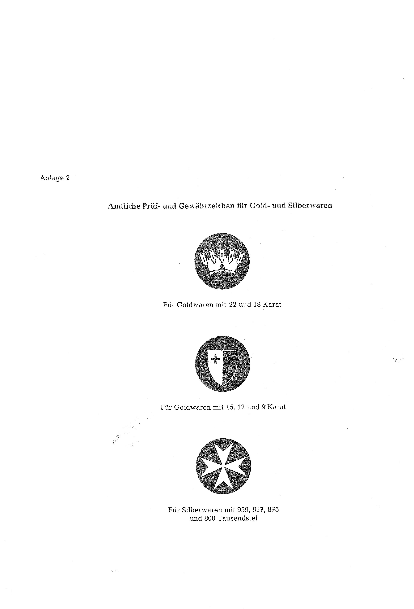

# Bekanntmachung zu § 4 des Warenzeichengesetzes (WZG§4MLTBek 1)

Ausfertigungsdatum
:   1972-08-01

Fundstelle
:   BGBl I: 1972, 1389

Geändert durch
:   Bek. v. 20.7.1977 I 1345

## (XXXX)

(1) Auf Grund des § 4 Abs. 2 Nr. 3 des Warenzeichengesetzes in der
Fassung der Bekanntmachung vom 2. Januar 1968 (Bundesgesetzbl. I S. 1,
29), zuletzt geändert durch Gesetz vom 23. Juni 1970 (Bundesgesetzbl.
I S. 805), werden in der Anlage bekanntgemacht

a)  ein amtliches Gewährzeichen der staatlichen Milchabsatzbehörde von
    Malta, das in Malta für Milch eingeführt ist (Anlage 1),

b)  amtliche Prüf- und Gewährzeichen, die in Malta für Gold- und
    Silberwaren eingeführt sind (Anlage 2).

(2) Diese Bekanntmachung ergeht im Anschluß an die Bekanntmachung vom
18\. Mai 1972 (Bundesgesetzblatt I S. 1203).

## Schlussformel

Der Bundesminister der Justiz

## Anlage 1

Amtliches Gewährzeichen der Milchabsatzbehörde
(Inhalt: Nicht darstellbares Gewährzeichen,
Fundstelle: BGBl. I 1972, 1389)

## Anlage 2

Fundstelle: BGBl. I 1972, 1390)
Amtliche Prüf- und Gewährzeichen für Gold- und Silberwaren

