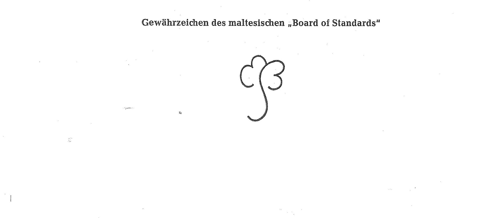

# Bekanntmachung zu § 4 des Warenzeichengesetzes (WZG§4MLTBek 2)

Ausfertigungsdatum
:   1972-09-25

Fundstelle
:   BGBl I: 1972, 1890

## (XXXX)

(1) Auf Grund des § 4 Abs. 2 Nr. 3 des Warenzeichengesetzes in der
Fassung der Bekanntmachung vom 2. Januar 1968 (Bundesgesetzbl. I S. 1,
29), zuletzt geändert durch Gesetz vom 23. Juni 1970 (Bundesgesetzbl.
I S. 805), wird in der Anlage ein Gewährzeichen bekanntgemacht, das in
Malta eingeführt ist.

(2) Diese Bekanntmachung ergeht im Anschluß an die Bekanntmachung vom
1\. August 1972 (Bundesgesetzblatt I S. 1389).

## Schlussformel

Der Bundesminister der Justiz

## Anlage

BGBl. I 1972, 1890)
**Gewährzeichen des maltesischen "Board of Standards"**

