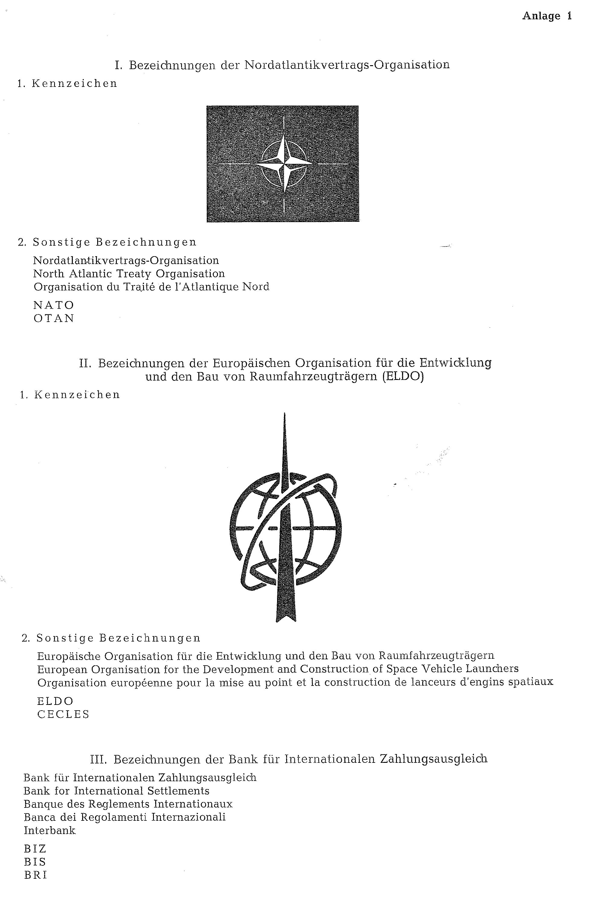
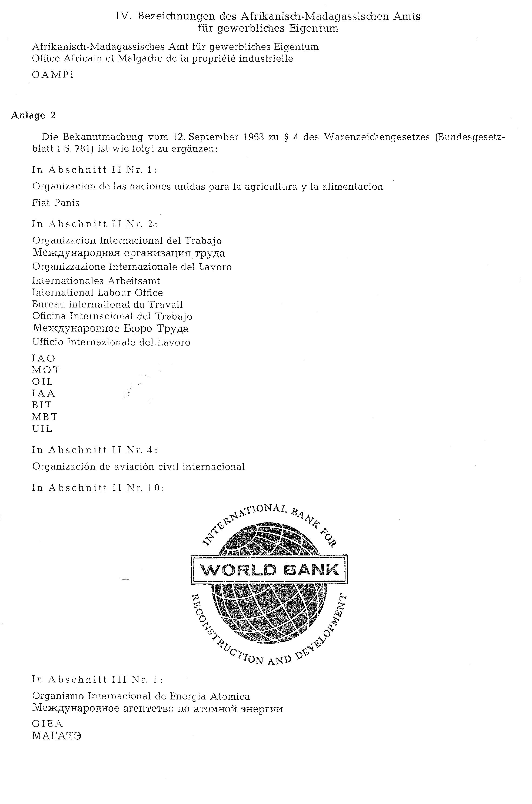

# Bekanntmachung zu § 4 des Warenzeichengesetzes (WZG§4NATOBek)

Ausfertigungsdatum
:   1966-06-16

Fundstelle
:   BGBl I: 1966, 390

## (XXXX)

(1) Auf Grund des § 4 Abs. 2 Nr. 3a des Warenzeichengesetzes in der
Fassung der Bekanntmachung vom 9. Mai 1961 (Bundesgesetzbl. I S. 549,
574) wird bekanntgemacht, daß die in der Anlage 1 wiedergegebenen
Bezeichnungen

*
    der Nordatlantikvertrags-Organisation,

    der Europäischen Organisation für die Entwicklung und den Bau von
        Raumfahrzeugträgern (ELDO),

    der Bank für Internationalen Zahlungsausgleich und

    des Afrikanisch-Madagassischen Amts für gewerbliches Eigentum

von der Eintragung als Warenzeichen ausgeschlossen sind.

(2) Diese Bekanntmachung ergeht im Anschluß an die

Bekanntmachung vom 30. Juni 1962 (Bundesgesetzbl. I S. 478),

Bekanntmachung vom 12. September 1963 (Bundesgesetzbl. I S. 781),

Bekanntmachung vom 1. April 1964 (Bundesgesetzbl. I S. 288) und die

Bekanntmachung vom 25. Juni 1964 (Bundesgesetzbl. I S. 485).

## Schlussformel

Der Bundesminister der Justiz

## Anlage 1

(Fundstelle: BGBl. I 1966, 391 - 392)

## Anlage 2

-

